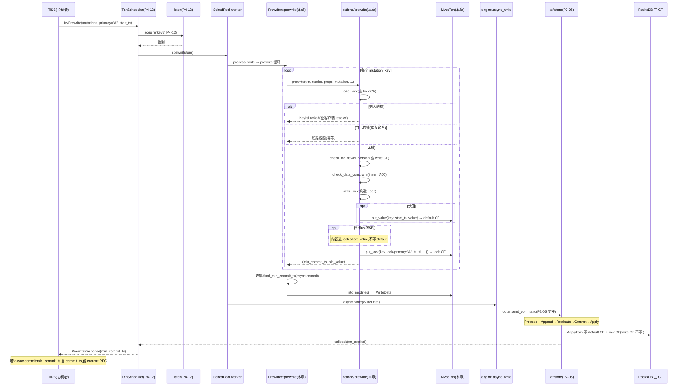

# 第 4 篇 · 第 13 章 · Prewrite 预写:选 Primary,加锁

> **核心问题**:第 12 章我们拆了事务层的调度骨架——`TxnScheduler` 怎么把一条 prewrite 命令从 gRPC 接到、过 latch、扔进 worker 池、取 snapshot、然后调命令自己的 `process_write`。可骨架里最关键的"prewrite 的 `process_write` 到底干了什么",当时只用一句"MVCC 写准备"带过。这一章拆透它。Percolator 的第一阶段——**选一个 Primary Key 当锚、给所有涉及 key 写 lock、value 先写 default CF 但不提交**——到底怎么在源码里实现?为什么一个 Primary 就能保证跨多个 Raft 组的事务 ACID(P0-01 已铺垫的洞察二,这里拆到源码级)?min_commit_ts 怎么算、约束检查怎么做、async commit 和 1PC 在哪里插入了额外逻辑?

> **读完本章你会明白**:
> 1. Percolator prewrite 的三件事——**选 Primary、写 lock CF(含 Primary 指针)、写 default CF(带 start_ts,但不写 write CF,故不可见)**——在 `actions/prewrite.rs` 和 `commands/prewrite.rs` 里逐行落到哪几个函数、哪几个字段。
> 2. 为什么"选一个 Primary 就能跨组 ACID"是 Percolator 最妙的洞察:Primary 不是个布尔标记,而是**每个 key 的 lock 里都存着 Primary 的字节内容**——任何读到 Secondary 锁的人,都能顺着这个指针找到 Primary 所在的 Raft 组查状态;事务成败被归约成"Primary 提交了没"这一个单点事实。
> 3. 短值内嵌(≤255 字节直接塞进 lock 的 `short_value` 字段)和长值写 default CF 的分流——这是 TiKV 为减少小 value 的额外 seek 做的优化,本质是用 lock 这一条记录同时承载"锁信息 + 数据"。
> 4. prewrite 的三道约束检查:**load_lock 查已有锁**(别人锁 → KeyIsLocked 让客户端 resolve;自己锁 → 重复命令短路)、**check_for_newer_version 查 write 冲突**(有更新提交 → WriteConflict)、**check_data_constraint 查 Insert 的 AlreadyExists**。这三道检查共同保证 prewrite 不会破坏隔离性。
> 5. async commit / 1PC 怎么在普通 prewrite 的骨架上"叠加"——它们不是另一套代码,而是 Prewriter struct 上 `secondary_keys` / `try_one_pc` 两个开关字段,在写 lock 时额外算 `min_commit_ts`、记录 secondaries,失败时优雅回退到 2PC。
> 6. 9.x 的 `generation` 字段(pipelined DML)和 `amend_pessimistic_lock`(悲观锁丢失补全)这两个演进点。

> **如果一读觉得太难**:先只记住三件事——① prewrite 给每个 key 写两条记录:**lock CF 一条锁(其中 Primary key 的锁是事务的"锚",所有 Secondary 锁里都存着 Primary 的字节)**,**default CF 一条 value(带 start_ts)**,**但绝不写 write CF**(所以不可见);② Primary 的选择不在 TiKV 这边——TiDB 决定哪个 key 是 Primary,TiKV 只是老老实实把 Primary 的字节写进每个 lock 的 `primary` 字段;③ 事务成败的唯一裁决是"Primary 提交了没",这个事实存在 Primary 所在的那个 Raft 组里(由 Raft 保证可靠),Secondary 的命运都按它裁决。

---

## 〇、一句话点破

> **Prewrite 是 Percolator 两阶段提交的第一阶段,它给事务涉及的每个 key 写两条记录:lock CF 写一把锁(锁里存着 Primary key 的字节,作为事务成败的"锚点指针")、default CF 写 value(带 start_ts,但不写 write CF,所以这版数据对外不可见)。如果 value 很短(≤255 字节),它直接内嵌进 lock 的 `short_value` 字段,省一次 default CF 写。整个事务的成败,被归约成"Primary 所在的 Raft 组里,Primary 的锁是被 commit 还是 rollback"这一个单点事实——这就是 Percolator 用一个 Primary 跨组 ACID 的根。**

这是结论,不是理由。本章倒过来拆:先看 Percolator 的三件事在源码里的总览,再拆 Primary 锚点为什么这么设计,接着拆写 lock / 写 default / 短值内嵌的实现,然后拆三道约束检查,接着拆 async commit / 1PC 怎么叠加,最后落到 min_commit_ts 的计算。这一章是全书招牌之一,我们把每一步都拆到读者拍腿"原来如此"。

---

## 一、Percolator prewrite 的三件事:源码总览

### 提问:一条 prewrite 命令进到 actions 层,到底干了什么

第 12 章我们看到,scheduler 调到 worker 线程后,会调命令的 `process_write`。对 Prewrite 命令,它转成 `Prewriter` 再执行(`commands/prewrite.rs:255`):

```rust
// src/storage/txn/commands/prewrite.rs:255
impl<S: Snapshot, L: LockManager> WriteCommand<S, L> for Prewrite {
    fn process_write(self, snapshot: S, context: WriteContext<'_, L>) -> Result<WriteResult> {
        self.into_prewriter().process_write(snapshot, context)
    }
}
```

`Prewriter::process_write`(`commands/prewrite.rs:501`)做标准的写命令准备:构造 `MvccTxn`(收集要写的 Modify)、`SnapshotReader`(从 snapshot 读旧数据),然后调 `Prewriter::prewrite`(`commands/prewrite.rs:585`)。后者是 prewrite 的核心循环——**遍历每个 mutation,对每个 key 调 `actions/prewrite.rs` 里的 `prewrite` 函数**:

```rust
// src/storage/txn/commands/prewrite.rs:624(简化示意)
for m in mem::take(&mut self.mutations) {
    // ... 取 pessimistic_action、expected_for_update_ts ...
    let mut secondaries = &self.secondary_keys.as_ref().map(|_| vec![]);
    if Some(m.key()) == async_commit_pk {
        secondaries = &self.secondary_keys;   // 只有 Primary 才写完整 secondaries
    }
    let prewrite_result = prewrite(           // 调 actions/prewrite.rs
        txn, reader, &props, m, secondaries,
        pessimistic_action, expected_for_update_ts,
    );
    // ... 处理返回的 (ts, old_value) ...
}
```

这个循环里的 `prewrite`(import 自 `actions/prewrite.rs:37`)是真正干活的。它是个薄封装,转调 `prewrite_with_generation`(`actions/prewrite.rs:58`):

```rust
// src/storage/txn/actions/prewrite.rs:36
/// Prewrite a single mutation by creating and storing a lock and value.
pub fn prewrite<S: Snapshot>(
    txn: &mut MvccTxn,
    reader: &mut SnapshotReader<S>,
    txn_props: &TransactionProperties<'_>,
    mutation: Mutation,
    secondary_keys: &Option<Vec<Vec<u8>>>,
    pessimistic_action: PrewriteRequestPessimisticAction,
    expected_for_update_ts: Option<TimeStamp>,
) -> Result<(TimeStamp, OldValue)> {
    prewrite_with_generation(
        txn, reader, txn_props, mutation, secondary_keys,
        pessimistic_action, expected_for_update_ts, 0,
    )
}
```

注意这个 doc 注释——**"creating and storing a lock and value"**,一句话点破 prewrite 干的两件事:**创建并存储 lock 和 value**。这正是 Percolator 第一阶段的核心。

### prewrite_with_generation 的三段式

`prewrite_with_generation`(`actions/prewrite.rs:58`)对单个 key 的处理,可以清晰地分成三段:

**第①段:准备 + 约束检查**——把 `Mutation` 转成内部的 `PrewriteMutation`(`from_mutation`,`actions/prewrite.rs:381`),然后做三道检查:
- `reader.load_lock(&mutation.key)`:这个 key 上有没有别人的锁?(详见第四节)
- `check_for_newer_version`:这个 key 的 write CF 里有没有更新的提交?(详见第四节)
- `check_data_constraint`:如果是 Insert,这个 key 是不是已存在?(承接《LevelDB》的语义检查)

**第②段:写 default CF(value)**——在 `write_lock` 函数里(`actions/prewrite.rs:650`),根据 value 长度分流:
- 短值(≤255 字节):内嵌进 lock 的 `short_value` 字段,不写 default CF
- 长值:调 `txn.put_value(key, start_ts, value)` 写 default CF

**第③段:写 lock CF(锁)**——在 `write_lock` 函数里,构造 `Lock` 结构,调 `txn.put_lock(key, &lock, is_new_lock)` 写 lock CF。

三段做完,返回 `(min_commit_ts, old_value)`。`min_commit_ts` 只有在 async commit / 1PC 时才非零(第五节拆),普通 2PC 返回 zero。

> **钉死这三段**:理解 prewrite 的钥匙,是把它看成**"检查 → 写 value → 写 lock"** 的三段式。检查是为了不破坏隔离(别人锁着 / 已有更新提交就不能写);写 value 是把新数据放进 default CF(但因为没写 write CF,所以读不到);写 lock 是给这个 key 打上"我正在改它"的标记,并**把 Primary 的字节塞进 lock 的 `primary` 字段**。下一节拆最关键的"Primary 锚点"。

下面用一张时序图,把 P4-12(scheduler)+ 本章(prewrite)+ P2-05(raftstore)的完整 prewrite 链路拼起来,标出 prewrite 在事务层的位置:



这张图的关键:**prewrite 产生的所有 Modify(default + lock)共享一次 Raft 提议**(经 `engine.async_write`),Apply 后写进 RocksDB 的 default CF 和 lock CF——**write CF 在 prewrite 阶段绝对不写**,这是"未提交不可见"的根。

下一节拆最关键的"Primary 锚点"。

---

## 二、Primary 锚点:为什么一个 Primary 就能跨组 ACID

这一节是本章的灵魂。P0-01 的洞察二已经用概念讲过"为什么一个 Primary 就够",这里拆到源码级。

### Primary 不是布尔标记,是字节内容

很多人的第一反应:prewrite 给每个 key 加锁时,会给其中一个 key 打个 `is_primary: true` 的标记吧?**不是**。源码里没有 `is_primary` 字段。Primary 是这样存的:

```rust
// src/storage/txn/actions/prewrite.rs:288(简化,只列关键字段)
pub struct TransactionProperties<'a> {
    pub start_ts: TimeStamp,
    pub kind: TransactionKind,
    pub commit_kind: CommitKind,
    pub primary: &'a [u8],    // <— Primary key 的字节内容
    pub txn_size: u64,
    pub lock_ttl: u64,
    pub min_commit_ts: TimeStamp,
    // ...
}
```

`TransactionProperties.primary` 是一个 `&[u8]`——**Primary key 的原始字节**。它由 TiDB 决定(每个事务开始时 TiDB 选一个 key 当 Primary),通过 gRPC 传给 TiKV。TiKV 这边只是老老实实地,把这个字节内容**写进每个 key 的 lock 的 `primary` 字段**:

```rust
// src/storage/txn/actions/prewrite.rs:669(简化示意)
let mut lock = Lock::new(
    self.lock_type.unwrap(),              // LockType::Put / Delete / Lock
    self.txn_props.primary.to_vec(),      // <— 把 Primary 字节塞进每个 lock
    self.txn_props.start_ts,              // 事务 start_ts
    self.lock_ttl,                        // 锁 TTL
    None,
    for_update_ts_to_write,
    self.txn_props.txn_size,
    self.min_commit_ts,
    false,
)
.set_txn_source(self.txn_props.txn_source)
.with_generation(generation);
```

注意第二个参数 `self.txn_props.primary.to_vec()`——**每一个 key 的 lock,都存着 Primary 的完整字节内容**。这意味着:无论是 Primary key 自己的 lock,还是任何一个 Secondary key 的 lock,都能从自己的 `primary` 字段读出"这个事务的 Primary 是谁"。

看 `Lock` struct 的完整定义(`components/txn_types/src/lock.rs:87`):

```rust
// components/txn_types/src/lock.rs:87(简化,保留核心字段)
pub struct Lock {
    pub lock_type: LockType,         // Put / Delete / Lock / Pessimistic / Shared
    pub primary: Vec<u8>,            // <— Primary key 的字节(每个 lock 都存)
    pub ts: TimeStamp,               // 事务 start_ts(锁的归属)
    pub ttl: u64,                    // 锁 TTL(超时自动清理)
    pub short_value: Option<Value>,  // 短值内嵌(见第三节)
    pub for_update_ts: TimeStamp,    // 悲观事务的"锁竞争版本号"
    pub txn_size: u64,
    pub min_commit_ts: TimeStamp,    // async commit 用
    pub use_async_commit: bool,      // async commit 标志
    pub use_one_pc: bool,            // 1PC 标志
    pub secondaries: Vec<Vec<u8>>,   // async commit 的 secondary 列表(只有 Primary 存)
    pub rollback_ts: Vec<TimeStamp>,
    pub last_change: LastChange,     // 上次变更信息(优化读)
    pub txn_source: u64,
    pub is_locked_with_conflict: bool,
    pub generation: u64,             // 9.x pipelined DML 用
}
```

Lock 有 16 个字段,但**最关键的两个是 `primary` 和 `ts`**:`primary` 告诉你"这个事务的锚点在哪",`ts`(即 start_ts)告诉你"这个锁是谁的"(锁的归属)。

### 为什么"每个 lock 都存 Primary 字节"就能跨组 ACID

现在拆 P0-01 洞察二的源码根。假设一个转账事务:T1 改 A(在 Region1)、改 B(在 Region2),TiDB 选 A 当 Primary。prewrite 阶段后,RocksDB 的状态:

```
   Region1 (Raft 组 1)                     Region2 (Raft 组 2)
   ┌─────────────────────────────┐         ┌─────────────────────────────┐
   │ lock CF:                    │         │ lock CF:                    │
   │   A → Lock{                 │         │   B → Lock{                 │
   │     lock_type: Put,         │         │     lock_type: Put,         │
   │     primary: "A",   ←─┐     │         │     primary: "A",   ←─┐     │
   │     ts: 100,          │     │         │     ts: 100,          │     │
   │     ttl: 3000,        │     │         │     ttl: 3000,        │     │
   │     ...               │     │         │     ...               │     │
   │   }                   │     │         │   }                   │     │
   │ default CF:           │     │         │ default CF:           │     │
   │   A@100 → "新值A"     │     │         │   B@100 → "新值B"     │     │
   │ write CF: (空,没写)   │     │         │ write CF: (空,没写)   │     │
   └───────────────────────┼─────┘         └───────────────────────┼─────┘
                          │                                        │
                          └──────────── 每个锁都指向 Primary "A" ────┘
```

注意三个关键事实:

1. **A 和 B 的数据都写了 default CF**(A@100、B@100,带 start_ts),但**两个 Region 的 write CF 都是空的**——所以任何读(用 ≤ 某个 commit_ts 的读)都读不到这版数据。数据"半提交"了但对外不可见。
2. **A 和 B 的 lock 都存着 `primary: "A"`**。这意味着:无论是 Region1 还是 Region2 的人,只要看到 B 的锁,顺着 `primary` 字段就能找到 A——**Primary 的字节内容就是跨 Raft 组的"指针"**。
3. **A 是 Primary,A 的 Raft 组(Region1)持有事务成败的最终裁决**。后续 commit(P4-14 拆)先提交 A:在 Region1 的 write CF 写 A 的提交记录、清掉 A 的 lock。这一刻,事务在全局意义上"成功"了。

现在考虑故障场景:**T1 在 prewrite 后、commit 前,客户端(TiDB)挂了**。A 和 B 上都残留着锁。这时候:

- **有人来读 B**(在 Region2),发现 B 上有锁(读流程会 `load_lock`)。读操作不能直接返回(数据不可见,因为 write CF 没 B 的提交记录),也不能干等。它顺着 B 的 `primary: "A"` 字段,**去 Region1 查 A 的状态**(`check_txn_status`,P4-15 拆)。
- **查 A 有两种结果**:
  - A 的 lock 还在(TTL 没过)→ 事务还在进行中,读操作等一等(TTL 内可能 TiDB 会来 commit)。
  - A 的 lock 没了,write CF 有 A 的提交记录(commit_ts)→ **Primary 已提交,事务成功**,读操作据此把 B 也提交(这就是 resolve_lock,P4-15 拆)。
  - A 的 lock 没了,write CF 没有提交记录但有 rollback → **Primary 已回滚,事务失败**,读操作把 B 也回滚。

> **钉死这件事(本章最深的洞察)**:**Percolator 用 Primary 字节当锚点,把"分布式事务是否成功"这个跨多个 Raft 组的问题,归约成了"Primary 所在的那个 Raft 组里,Primary 的状态是什么"这一个单点查询**。这个查询由 Primary 的 Raft 组保证可靠(Raft 多数派不丢)。所以:
> - **原子性**:不会出现"A 提交了 B 没提交"——因为 A 是 Primary,A 提交即事务成功,B 迟早按 A 状态收尾;A 没提交 B 就回滚。全局只有一个裁决者(Primary 的 Raft 组),不会自相矛盾。
> - **不需要全局协调者**:任何人读到 Secondary 锁,按需查 Primary 即可,不用实时盯每个写。协调成本摊到"读时按需查询",所以能扛海量并发。

> **不这么设计会怎样**:如果要一个全局协调者实时盯每个写,协调者就是单点瓶颈(百万 QPS 下扛不住);如果让所有副本两两协商(经典 2PC),协调者挂了就阻塞(所有 Secondary 永远不知道该提交还是回滚)。Percolator 用 Primary 锚点,巧妙地把"协调"变成"按需查询一个 Raft 组保证的事实"——这是分布式事务设计的神来之笔。

### Primary 的字节怎么传过来:从 TiDB 到 TiKV

Primary 是 TiDB 选的(每个事务选一个 key 当 Primary,通常选第一个 key 或最大的 key,选哪个不影响正确性)。TiDB 在 `KvPrewrite` RPC 里带上 `primary` 字段(看 kvproto 的 `PrewriteRequest`)。这个字段在 TiKV 这边进 `Prewrite` command struct(`commands/prewrite.rs:46`):

```rust
// src/storage/txn/commands/prewrite.rs:46(简化)
command! {
    /// The prewrite phase of a transaction. The first phase of 2PC.
    Prewrite:
        cmd_ty => PrewriteResult,
        content => {
            /// The set of mutations to apply.
            mutations: Vec<Mutation>,
            /// The primary lock. Secondary locks (from `mutations`) will refer to the primary lock.
            primary: Vec<u8>,              // <— TiDB 传过来的 Primary 字节
            /// The transaction timestamp.
            start_ts: TimeStamp,
            lock_ttl: u64,
            // ... skip_constraint_check、txn_size、min_commit_ts、max_commit_ts ...
            secondary_keys: Option<Vec<Vec<u8>>>,   // async commit 用
            try_one_pc: bool,                        // 1PC 用
            assertion_level: AssertionLevel,
        }
        in_heap => { primary, mutations, }
    }
}
```

注意 doc 注释——**"The primary lock. Secondary locks (from `mutations`) will refer to the primary lock."** 一句话点破:Primary 是事务的锚,所有 Secondary lock 都"指向"它(指向的方式就是把 Primary 字节写进自己的 `primary` 字段)。

`Prewrite` struct 经 `into_prewriter()`(`commands/prewrite.rs:211` 起)转成 `Prewriter`,primary 字节一路传到 `TransactionProperties.primary`,最后在 `write_lock` 里写进每个 lock。这条链路:`TiDB → KvPrewrite gRPC → Prewrite.primary → Prewriter.primary → TransactionProperties.primary → Lock.primary → lock CF`。

> **技巧:为什么 Primary 用字节内容而不是 ID**:有人会想,给每个事务分配个 `txn_id`,lock 里存 `txn_id` 不就行了?为什么非要存 Primary 的完整字节?因为 **Primary 的字节本身就是"事务身份 + 裁决位置"的复合体**——看到 `primary: "A"`,既知道这是哪个事务(配合 start_ts),又知道要去哪个 Region 查状态(A 所在的 Region)。如果用 txn_id,还得维护一张"txn_id → Primary 所在 Region"的映射表,这张表本身又是分布式状态,难维护。Percolator 的精明在于:**把事务身份和裁决位置合并在 Primary 字节这一个事实里**,没有任何额外的分布式映射。

---

## 三、写 default CF(数据)和短值内嵌

拆完 Primary 锚点,现在看 prewrite 怎么写数据。

### 写 default CF:带 start_ts 但不写 write CF

Percolator prewrite 写数据的方式,是 TiKV MVCC 设计的精髓(承接 P3-10)。一条 `put(A, "新值A")`,在 prewrite 阶段写到 default CF:

```rust
// src/storage/mvcc/txn.rs:174
pub(crate) fn put_value(&mut self, key: Key, ts: TimeStamp, value: Value) {
    let write = Modify::Put(CF_DEFAULT, key.append_ts(ts), value);
    self.write_size += write.size();
    self.modifies.push(write);
}
```

注意 key 是 `key.append_ts(ts)`——**key 后面追加 start_ts**。这是 MVCC 的核心编码(承接 P3-10):同一个 key 的多个版本,在 RocksDB 里按 `key + ts` 排序,新版本和旧版本共存。prewrite 写的是 `A@100 → "新值A"`(假设 start_ts=100)。

**但 prewrite 绝不写 write CF**。write CF 是"提交记录",只有 commit 阶段才写(P4-14 拆)。所以 prewrite 之后,default CF 里有 A@100,但 write CF 里没有 A 的任何提交记录。这意味着:

- **任何读操作(用某个 read_ts 扫 write CF 找 ≤ read_ts 的最大 commit_ts)都找不到 A 的这版数据**——因为 write CF 里没有。数据"半提交"但不可见。
- **只有 commit 阶段(P4-14)在 write CF 写一条 `A@commit_ts → Write{start_ts: 100, ...}`**,这版数据才"可见"——读操作通过 write CF 的记录,找到 start_ts=100,再去 default CF 读 A@100。

这是 MVCC 实现"未提交不可见"的工程手段:**数据先写进 default(占位),但不写 write(不暴露),等 commit 时才在 write 里"点亮"它**。

> **钉死这件事**:prewrite 写 default CF 是"占位",不写 write CF 是"不点亮"。commit 才点亮。这个"先占位后点亮"的两步,是 MVCC + Percolator 实现"原子可见性"的根——commit 只需要在 write CF 写一条记录(原子的,由 Raft 保证),这版数据立刻对所有读可见。回滚只需要清掉 lock + 删 default 的占位(或留个 rollback 标记)。

### 短值内嵌:≤255 字节直接塞进 lock

看 `write_lock` 函数里写 value 的分流:

```rust
// src/storage/txn/actions/prewrite.rs:688
if let Some(value) = self.value {
    if is_short_value(&value) {
        // If the value is short, embed it in Lock.
        lock.short_value = Some(value);
    } else {
        // value is long
        txn.put_value(self.key.clone(), self.txn_props.start_ts, value);
    }
}
```

`is_short_value` 在 `components/txn_types/src/types.rs:26`:

```rust
// components/txn_types/src/types.rs:22
// Short value max len must <= 255.
pub const SHORT_VALUE_MAX_LEN: usize = 255;

pub fn is_short_value(value: &[u8]) -> bool {
    fail_point!("is_short_value_always_false", |_| { false });
    value.len() <= SHORT_VALUE_MAX_LEN
}
```

阈值是 **255 字节**(不是有些资料说的 128)。≤255 字节的 value,直接塞进 lock 的 `short_value` 字段,**不写 default CF**。

> **不这样会怎样**:如果每个 value 都写 default CF,那 prewrite 一个小 key(比如一个计数器,值就几字节)也要写两条记录(lock CF 一条 + default CF 一条),commit 时再写 write CF 一条——三条 RocksDB 写,放大严重。短值内嵌把小 value 的三条缩成一条(只写 lock CF,commit 时 write CF 记录里也内嵌 short_value),**读写都省一次 seek**。这是 TiKV 为小 value 优化写放大和读放大的关键技巧。
>
> **为什么阈值是 255**:因为 `short_value` 字段在 lock 里不占额外长度位(用一个标志位表示有无),255 是单字节能表示的上限,也是个合理的"小 value"界限。再大就值得单独写 default CF 了(读时多一次 seek 比把 lock 撑大更划算,因为 lock 太大会拖慢所有 load_lock)。

### 写 lock CF:txn.put_lock

最后一步,把构造好的 `Lock` 写进 lock CF:

```rust
// src/storage/txn/actions/prewrite.rs:728(简化,只看普通 2PC 分支)
if let Some(mut shared) = shared_locks {
    // ... shared lock 路径(SharedLock 类型)...
} else if try_one_pc {
    txn.put_locks_for_1pc(self.key, lock, lock_status.has_pessimistic_lock());
} else {
    txn.put_lock(self.key, &lock, is_new_lock);   // <— 普通 2PC 写 lock CF
}
```

`txn.put_lock` 在 `src/storage/mvcc/txn.rs:122`:

```rust
// src/storage/mvcc/txn.rs:122
pub(crate) fn put_lock(&mut self, key: Key, lock: &Lock, is_new: bool) {
    if is_new {
        self.new_locks
            .push(lock.clone().into_lock_info(key.to_raw().unwrap()));
    }
    let write = Modify::Put(CF_LOCK, key, lock.to_bytes());
    self.write_size += write.size();
    self.modifies.push(write);
}
```

注意两件事:① 写 lock CF 用的是 `Modify::Put(CF_LOCK, key, lock.to_bytes())`——**key 不带 ts**(lock CF 的 key 就是原始 key,因为同一时刻一个 key 只有一把锁,不需要多版本);② `is_new` 参数控制是否同时记入 `new_locks`(这是个 LockInfo 列表,后续 CDC 和 lock_manager 要用,标记"这个事务新加了哪些锁")。

所有这些写(default 的 put_value、lock 的 put_lock)都收集在 `MvccTxn.modifies: Vec<Modify>` 里。这个 Vec 最终在 `Prewriter::write_result` 里被 `txn.into_modifies()` 取出,包成 `WriteData`,经 `engine.async_write` 发起 Raft 提议(P4-12 拆过)。整个 prewrite 产生的所有 Modify,**共享一次 Raft 提议**(一条 RaftCmdRequest 装多个 Request),摊薄复制开销。

> **钉死这一节**:prewrite 写数据有三档——**短值内嵌进 lock(≤255B)、长值写 default CF(带 start_ts)、绝不写 write CF**。前两档是"占位",第三档的"不写 write"是"不点亮"。commit 才点亮。这是 MVCC + Percolator 的"原子可见性"工程实现。

---

## 四、三道约束检查:不破坏隔离性

光写不够,prewrite 还得保证"写了不破坏隔离"。这一节拆三道约束检查。

### 第①道:load_lock —— 这个 key 上有没有别人的锁

`prewrite_with_generation` 第一件事是 `reader.load_lock`(`actions/prewrite.rs:96`):

```rust
// src/storage/txn/actions/prewrite.rs:96(简化)
let (shared_locks, lock_status) = match reader.load_lock(&mutation.key)? {
    Some(lock_or_shared) => match lock_or_shared {
        Either::Left(lock) => {
            let lock_status = mutation.check_lock(
                lock, pessimistic_action, expected_for_update_ts, generation,
            )?;
            (None, lock_status)
        }
        Either::Right(mut shared_locks) => { /* shared lock 路径 */ }
    },
    None if matches!(pessimistic_action, DoPessimisticCheck) => {
        amend_pessimistic_lock(&mut mutation, reader)?;
        lock_amended = true;
        (None, LockStatus::None)
    }
    None => (None, LockStatus::None),
};
```

`load_lock` 从 lock CF 读这个 key 当前的锁(承接 P3-10,`SnapshotReader::load_lock` 在 `src/storage/mvcc/reader/reader.rs:66`,委托给 `MvccReader::load_lock` 在 `reader.rs:233`)。有锁就调 `check_lock`(`actions/prewrite.rs:435`)判断"是谁的锁":

```rust
// src/storage/txn/actions/prewrite.rs:442(简化)
if lock.ts != self.txn_props.start_ts {
    // 别人的锁
    if matches!(pessimistic_action, DoPessimisticCheck) {
        return Err(ErrorInner::PessimisticLockNotFound { ... });  // 悲观事务以为有锁却没了
    }
    return Err(ErrorInner::KeyIsLocked(self.lock_info(lock)?));   // 普通情况,让客户端 resolve
}
// lock.ts == start_ts:自己的锁(重复命令)
// ... 走重复命令分支 ...
```

**两条分支**:

- **别人的锁**(`lock.ts != start_ts`):这个 key 被别的事务锁着。返回 `KeyIsLocked`,带上锁信息(谁的锁、TTL、Primary)。客户端(TiDB)收到后,会去 resolve——查那个事务的 Primary 状态,决定等还是清锁(P4-15 拆 resolve_lock)。**注意 TiKV 这边不主动 resolve,只报告冲突**——这是 Percolator 的设计:冲突解决是"按需"的,由遇到冲突的人触发。
- **自己的锁**(`lock.ts == start_ts`):这是**重复命令**(网络重试等场景下,同一条 prewrite 发了两次)。源码里的处理是直接短路,不重复写(`actions/prewrite.rs:553`):

```rust
// src/storage/txn/actions/prewrite.rs:553(简化)
// Duplicated command. No need to overwrite the lock and data.
MVCC_DUPLICATE_CMD_COUNTER_VEC.prewrite.inc();
let min_commit_ts = if lock.use_async_commit {
    lock.min_commit_ts
} else {
    TimeStamp::zero()
};
Ok(LockStatus::Locked(min_commit_ts))
```

注释说得很清楚——**"Duplicated command. No need to overwrite the lock and data."** 重复命令幂等处理,直接返回成功(不重复写)。这是 TiKV 保证 prewrite 幂等性的关键:网络重试不会导致重复加锁或数据错乱。

> **技巧:为什么重复命令检测靠 start_ts**:因为 lock 的 `ts` 字段就是事务 start_ts。同一个事务的 start_ts 全局唯一(TSO 保证,P5-17 拆),所以 `lock.ts == start_ts` 唯一地判定"这是我的锁"。如果用别的标识(比如随机 id),还得额外字段,而 start_ts 已经在 lock 里了,复用即可。这是 Percolator "用 start_ts 当事务身份"的连锁收益。

### 第②道:check_for_newer_version —— write CF 有没有更新的提交

即使 key 没被锁,也要检查 write CF 有没有"比我 start_ts 更新"的提交——这检测的是**写冲突**(write conflict):

```rust
// src/storage/txn/actions/prewrite.rs:563(简化)
fn check_for_newer_version<S: Snapshot>(
    &mut self, reader: &mut SnapshotReader<S>,
) -> Result<Option<(Write, TimeStamp)>> {
    let mut seek_ts = TimeStamp::max();
    while let Some((commit_ts, write)) = reader.seek_write(&self.key, seek_ts)? {
        // 自回滚检测
        if commit_ts == self.txn_props.start_ts
            && (write.write_type == WriteType::Rollback || write.has_overlapped_rollback)
        {
            self.write_conflict_error(&write, commit_ts, WriteConflictReason::SelfRolledBack)?;
        }
        match self.txn_props.kind {
            TransactionKind::Optimistic(_) => {
                if commit_ts > self.txn_props.start_ts {
                    MVCC_CONFLICT_COUNTER.prewrite_write_conflict.inc();
                    self.write_conflict_error(&write, commit_ts, WriteConflictReason::Optimistic)?;
                }
            }
            // 悲观事务用 for_update_ts 判冲突(略)
        }
        check_data_constraint(reader, self.should_not_exist, &write, commit_ts, &self.key)?;
        return Ok(Some((write, commit_ts)));
    }
    Ok(None)
}
```

`reader.seek_write`(`reader.rs:99`/`reader.rs:476`)扫 write CF,找 ≤ seek_ts 的最大 commit_ts。逻辑:

- **乐观事务**:如果发现 `commit_ts > start_ts`(有人在我开始事务之后提交了对这个 key 的修改),就是写冲突——返回 `WriteConflict`。因为这违背了 Snapshot Isolation(我基于 start_ts 的 snapshot 以为没人改,结果有人改了)。
- **自回滚检测**:如果 `commit_ts == start_ts` 且 write 类型是 Rollback,说明这个事务之前被回滚过(可能是重复事务的残留),报 `SelfRolledBack` 错误。
- **悲观事务**:用 `for_update_ts` 而不是 `start_ts` 判冲突(悲观事务的"锁竞争版本号"更新),这是悲观事务能"重试"的根——即使 start_ts 之后有人提交,只要 for_update_ts 够新,就能继续。

> **不这样会怎样**:如果不检查 write 冲突,会出现"丢失更新"异常——T1 基于 start_ts=100 读到 A=1,T2 在 commit_ts=110 提交了 A=2,T1 在 start_ts=100 的 snapshot 里看不到 T2 的提交(因为 110 > 100),于是 T1 prewrite 时若不检查,就会基于过期的 A=1 计算,提交后覆盖掉 T2 的 A=2,造成丢失更新。`check_for_newer_version` 在 prewrite 时就拦截这种情况,保证 Snapshot Isolation。

### 第③道:check_data_constraint —— Insert 的 AlreadyExists

如果 mutation 是 Insert(`should_not_exist = true`),还要检查这个 key 是不是已存在——已存在就报 `AlreadyExist`:

```rust
// 由 check_data_constraint 函数处理(在 check_data_constraint.rs,被上面 check_for_newer_version 调用)
// 简化逻辑:if should_not_exist && write 写过这个 key → AlreadyExist
```

这对应 SQL 的 `INSERT` 语义——插入一个已存在的 key 应该失败。TiKV 把这个语义检查放在 prewrite 阶段,而不是 commit 阶段(早失败早返回)。

> **钉死这三道**:prewrite 的约束检查是 **load_lock(锁冲突)→ check_for_newer_version(写冲突)→ check_data_constraint(语义约束)**。三道检查共同保证:prewrite 不会破坏隔离性(Snapshot Isolation)、不会丢失更新、不会违反 Insert 语义。任何一道失败,prewrite 返回错误,客户端(TiDB)决定重试还是 abort。**这些检查都在 prewrite 阶段做,而不是 commit 阶段**——这是 Percolator "乐观"的体现:冲突尽早暴露,不浪费 commit 的开销。

---

## 五、async commit 和 1PC:在骨架上叠加的快路径

第 12 章我们点过 async commit 和 1PC 是两个开关字段(`secondary_keys` / `try_one_pc`),这里拆它们在 prewrite 里怎么生效。

### CommitKind 的分派

`Prewriter::prewrite` 开头,从开关推导 `CommitKind`(`commands/prewrite.rs:591`):

```rust
// src/storage/txn/commands/prewrite.rs:591
let commit_kind = match (&self.secondary_keys, self.try_one_pc) {
    (_, true) => CommitKind::OnePc(self.max_commit_ts),
    (&Some(_), false) => CommitKind::Async(self.max_commit_ts),
    (&None, false) => CommitKind::TwoPc,
};
```

三档优先级:`try_one_pc=true` 优先(1PC),其次 `secondary_keys.is_some()`(async commit),否则普通 2PC。本章主线是普通 2PC(前面四节讲的),这里点出另两档的差异。

### async commit:在 lock 里记录 min_commit_ts 和 secondaries

async commit 的目标是"prewrite 成功就算提交,省掉 commit RPC"。怎么做到?在 prewrite 时,给每个 key 的 lock **额外记录 `min_commit_ts` 和 `use_async_commit` 标志**,Primary 的 lock 还要记录所有 `secondaries`。这样故障恢复时,能从 Primary 的 lock 里知道所有 secondary 是谁,去收尾。

`min_commit_ts` 的计算在 `async_commit_timestamps`(`actions/prewrite.rs:928`):

```rust
// src/storage/txn/actions/prewrite.rs:928(简化,核心公式在 L943)
fn async_commit_timestamps(
    key: &Key,
    lock: &mut Lock,
    start_ts: TimeStamp,
    for_update_ts: TimeStamp,
    max_commit_ts: TimeStamp,
    txn: &mut MvccTxn,
) -> Result<TimeStamp> {
    let key_guard = ::futures_executor::block_on(txn.concurrency_manager.lock_key(key));
    let final_min_commit_ts = key_guard.with_lock(|l| {
        let max_ts = txn.concurrency_manager.max_ts();
        let min_commit_ts = cmp::max(cmp::max(max_ts, start_ts), for_update_ts).next();
        let min_commit_ts = cmp::max(lock.min_commit_ts, min_commit_ts);
        // ...
        if (!max_commit_ts.is_zero() && min_commit_ts > max_commit_ts) || injected_fallback {
            return Err(ErrorInner::CommitTsTooLarge { ... });
        }
        lock.min_commit_ts = min_commit_ts;
        *l = Some(lock.clone());
        Ok(min_commit_ts)
    })?;
    txn.guards.push(key_guard);
    Ok(final_min_commit_ts)
}
```

核心公式(`actions/prewrite.rs:943`):

```rust
let min_commit_ts = cmp::max(cmp::max(max_ts, start_ts), for_update_ts).next();
```

`min_commit_ts = max(max_ts, start_ts, for_update_ts).next()`(next 是 +1)。三个来源:
- `max_ts`:concurrency_manager 维护的"当前最大读时间戳"——保证 commit_ts 不会小于任何正在进行的读。
- `start_ts`:本事务的开始时间戳。
- `for_update_ts`:悲观事务的锁竞争版本号。

取三者最大值再 +1,作为 min_commit_ts。TiDB 收集所有 key 的 min_commit_ts,取最大值作为整个事务的 commit_ts。这样**事务的 commit_ts 严格大于任何在 prewrite 时正在进行的读**,保证 commit 后的数据对所有先前的读不可见(隔离性)。

注意还借了 `concurrency_manager.lock_key(key)`——这是内存里的 key 级锁(和 latch 不同,这是为了算 min_commit_ts 时没人能插入新读)。`key_guard` 被存进 `txn.guards`,直到 commit/rollback 才释放。这是 async commit 保证 linearizability 的关键(承接 Spanner 的 commit-wait 思想,但用内存锁避免 TrueTime 的等待)。

### 1PC:直接在 prewrite 里提交

1PC 更激进——**如果整个事务只涉及一个 Region,prewrite 时直接提交**。实现在 `one_pc_commit`(`commands/prewrite.rs:953`):

```rust
// src/storage/txn/commands/prewrite.rs:953
pub fn one_pc_commit(
    try_one_pc: bool,
    txn: &mut MvccTxn,
    final_min_commit_ts: TimeStamp,
) -> (TimeStamp, ReleasedLocks) {
    if try_one_pc {
        assert_ne!(final_min_commit_ts, TimeStamp::zero());
        let released_locks = handle_1pc_locks(txn, final_min_commit_ts);
        (final_min_commit_ts, released_locks)
    } else {
        assert!(txn.locks_for_1pc.is_empty());
        (TimeStamp::zero(), ReleasedLocks::new())
    }
}
```

`handle_1pc_locks`(`commands/prewrite.rs:971`)是 1PC 的核心:

```rust
// src/storage/txn/commands/prewrite.rs:971(简化)
fn handle_1pc_locks(txn: &mut MvccTxn, commit_ts: TimeStamp) -> ReleasedLocks {
    let mut released_locks = ReleasedLocks::new();
    for (key, lock, delete_pessimistic_lock) in std::mem::take(&mut txn.locks_for_1pc) {
        let write = Write::new(
            WriteType::from_lock_type(lock.lock_type).unwrap(),
            txn.start_ts,
            lock.short_value,
        )
        .set_last_change(lock.last_change)
        .set_txn_source(lock.txn_source);
        txn.put_write(key.clone(), commit_ts, write.as_ref().to_bytes());  // <— 直接写 write CF!
        if delete_pessimistic_lock {
            released_locks.push(txn.unlock_key(key, true, commit_ts));
        }
    }
    released_locks
}
```

1PC 的关键:**遍历所有之前通过 `txn.put_locks_for_1pc` 暂存的锁,把它们直接转成 Write 记录**(`txn.put_write(key, commit_ts, write)`),**不经过 commit 阶段、不写 primary lock**。整个事务在 prewrite 一次 RPC 内完成提交。

> **不这样会怎样**:如果一个事务只涉及一个 Region,本来不需要两阶段(没有跨 Raft 组的问题,一个 Raft 组就能原子提交所有 key)。如果还走完整 2PC,要发两轮 RPC(prewrite + commit),浪费。1PC 检测到"单 Region"场景,直接在 prewrite 里提交,省一轮 RPC。

### 回退:优雅降级到 2PC

async commit 和 1PC 不是总能成功。失败时,TiKV 会**优雅回退到普通 2PC**。两种触发:

1. **CommitTsTooLarge**:算出的 min_commit_ts 超过了 `max_commit_ts`(TiDB 设的上限,避免超过 schema 变更)。`actions/prewrite.rs:957` 返回 `CommitTsTooLarge` 错误。
2. **某个 key 返回 zero min_commit_ts**:说明那个 key 已经从 async/1PC 回退了(可能是重复命令,`actions/prewrite.rs:553` 返回的 min_commit_ts 是 zero)。

回退逻辑在 `Prewriter::prewrite`(`commands/prewrite.rs:659` 和 `682`):

```rust
// src/storage/txn/commands/prewrite.rs:659(简化,两种触发都走这段)
props.commit_kind = CommitKind::TwoPc;
async_commit_pk = None;
self.secondary_keys = None;
self.try_one_pc = false;
fallback_1pc_locks(txn);          // 把 1PC 暂存的锁改成普通 2PC 锁
txn.guards = Vec::new();          // 释放 concurrency_manager 的 key guard
final_min_commit_ts = TimeStamp::zero();
```

`fallback_1pc_locks`(`commands/prewrite.rs:994`)把之前攒在 `txn.locks_for_1pc` 里的锁改成普通 2PC 锁(`use_one_pc=false`)重新 `put_lock`:

```rust
// src/storage/txn/commands/prewrite.rs:994
pub(in crate::storage::txn) fn fallback_1pc_locks(txn: &mut MvccTxn) {
    for (key, mut lock, remove_pessimistic_lock) in std::mem::take(&mut txn.locks_for_1pc) {
        lock.use_one_pc = false;
        let is_new_lock = !remove_pessimistic_lock;
        txn.put_lock(key, &lock, is_new_lock);
    }
}
```

回退后,事务就走普通 2PC(prewrite 写 lock + default,不写 write,等 commit RPC)。**回退是幂等的、安全的**——已经写的 lock 被改一下标志位重写,数据不丢。

> **钉死这一节**:async commit 和 1PC 不是另一套代码,而是 Prewriter 的两个开关。它们在写 lock 时**额外**做几件事(算 min_commit_ts、记 secondaries、1PC 直接写 write)。失败时优雅回退到 2PC,已经写的 lock 改标志位重写即可。**这是 TiKV 在保持代码统一的前提下叠加优化的工程范式**——快路径和慢路径共享 90% 代码,只在关键点分叉。

---

## 六、9.x 演进点:generation 与 amend_pessimistic_lock

本章最后,点出两个 9.x 相关的演进点。

### generation:pipelined DML

`Lock` struct 有个 `generation: u64` 字段(`lock.rs:126`),doc 注释说是 "The generation of the lock, used in pipelined DML"。pipelined DML 是 TiKV 较新的特性(为大事务优化),它允许一个事务的 prewrite 分多批发送,每批带一个递增的 generation 号。这个字段在普通事务里是 0(`actions/prewrite.rs:58` 的 `prewrite` 转调时传 `0`),只有 pipelined DML 才用非零值。本章不深入,作为演进点标注。

### amend_pessimistic_lock:悲观锁丢失补全

第 12 章讲过,悲观事务的悲观锁可能用 InMemory 模式(只写内存,机器挂了丢)。prewrite 时如果发现"本该有的悲观锁没了"(`DoPessimisticCheck` 但 `load_lock` 返回 None),会尝试**补一个乐观锁**继续 prewrite,而不是直接失败:

```rust
// src/storage/txn/actions/prewrite.rs:984(简化)
fn amend_pessimistic_lock<S: Snapshot>(
    mutation: &mut PrewriteMutation<'_>,
    reader: &mut SnapshotReader<S>,
) -> Result<()> {
    let write = reader.seek_write(&mutation.key, TimeStamp::max())?;
    if let Some((commit_ts, write)) = write.as_ref() {
        if *commit_ts >= reader.start_ts {
            // 别人在我拿悲观锁后改过 → 补不了,失败
            return Err(ErrorInner::PessimisticLockNotFound {
                reason: PessimisticLockNotFoundReason::LockMissingAmendFail,
            }.into());
        }
        mutation.last_change = next_last_change_info(...)?;
    } else {
        mutation.last_change = LastChange::NotExist;
    }
    // 成功:把丢失的悲观锁当乐观锁补上
    MVCC_CONFLICT_COUNTER.pipelined_acquire_pessimistic_lock_amend_success.inc();
    Ok(())
}
```

逻辑:**悲观锁丢了,但只要这个 key 在 start_ts 之后没有被别人提交过(`commit_ts < start_ts`),就补一个乐观锁继续**。这是 InMemory 悲观锁能"乐观可恢复"的工程实现——丢了锁不怕,只要数据没被改,prewrite 时补上就行。如果数据被改了(commit_ts >= start_ts),说明悲观锁丢了之后真的有人抢先把这个 key 改了,这时候补不了,只能让事务重试。

> **演进对照(架构演进)**:`amend_pessimistic_lock` 是 9.x 配合 InMemory 悲观锁引入的恢复机制。早期(Sync/Pipelined 悲观锁)锁一定落盘,不会丢,prewrite 时一定能找到。InMemory 模式让锁可能丢,于是引入 amend 机制——丢了就补,补不了才失败。这是"用乐观重试兜底悲观锁丢失"的混合策略,让 InMemory 模式在大多数场景下安全(锁丢了但数据没改是常态)。

---

## 七、技巧精解:两个最硬核的洞察

本章有两个洞察值得单独拆透:① Primary 字节当锚点(已在第二节拆,这里再钉一次反面对比);② 短值内嵌 + modifies 单 Vec 收集。

### 技巧一:Primary 字节当锚点(钉死反面对比)

**问题**:跨多个 Raft 组的事务,怎么保证原子性(全提交或全回滚)?

**朴素做法 A(全局协调者)**:搞个全局 Transaction Coordinator(TC),每个 prewrite/commit 都向 TC 报告,TC 决定事务成败。

**撞墙**:TC 是单点瓶颈(百万 QPS 下扛不住),且 TC 挂了事务就阻塞(经典 2PC 的协调者故障困境)。

**朴素做法 B(两两协商)**:让所有涉及的 Raft 组互相通信,达成共识。

**撞墙**:这是分布式共识的 N^2 通信,组多了爆炸;而且没有"单一裁决者",可能出现分叉(两个 Raft 组对事务状态判断不一致)。

**Percolator 的巧妙**:不要全局协调者,只要一个 Primary key 的字节内容,写进每个 lock 的 `primary` 字段。事务成败归约成"Primary 所在 Raft 组里 Primary 的状态"这一个单点事实:

- 任何人读到 Secondary 锁,顺着 `primary` 字段查 Primary 的 Raft 组即可。
- Primary 的 Raft 组保证这个事实可靠(Raft 多数派不丢)。
- 协调成本只在"读 Secondary 遇到锁时"才付(按需),不是"每个写都付"(实时)。

```rust
// 每个 lock 都存着 Primary 的字节(钉死这件事)
let mut lock = Lock::new(
    self.lock_type.unwrap(),
    self.txn_props.primary.to_vec(),   // <— Secondary 也存着 Primary 字节
    ...
);
```

**为什么 sound**:

1. **原子性**:Primary 提交即事务成功(Raft 保证这个事实不丢),所有 Secondary 迟早按 Primary 状态收尾,不可能出现"Primary 提交了 Secondary 回滚"的矛盾。
2. **活性**:即使客户端(TiDB)挂了,残留的 Secondary 锁也会被后续读到它的人触发 resolve(查 Primary 收尾),不会永久阻塞。
3. **可扩展**:协调成本摊到读,没有单点瓶颈。

> **不这么设计会怎样**:全局协调者撑不住百万 QPS;两两协商在 N 个 Raft 组时通信爆炸。Percolator 用 Primary 字节当锚点,把"分布式事务成败"归约成"一个 Raft 组里的事实查询",这是分布式事务设计的神来之笔——**用一个 Raft 组的可靠性,撑起了跨任意多 Raft 组的事务原子性**。

### 技巧二:modifies 单 Vec 收集 + 短值内嵌(减少写放大)

**问题**:prewrite 一个 key,可能要写 default CF(value)+ lock CF(锁)。怎么尽量减少 RocksDB 写次数、提高吞吐?

**朴素做法**:每写一个 CF 就调一次 RocksDB put。比如 put_value 调一次 `rocksdb.put(CF_DEFAULT, ...)`,put_lock 调一次 `rocksdb.put(CF_LOCK, ...)`。

**撞墙**:prewrite 10 个 key 就要 20+ 次 RocksDB put,每次都有 LSM 写放大(memtable → SST → compaction)。而且这些写之间没有原子性保证(写到一半挂了,数据不一致)。

**TiKV 的巧妙(两招)**:

**第一招:短值内嵌**。≤255 字节的 value 直接塞进 lock 的 `short_value` 字段,不写 default CF。这样小 value 的 prewrite 从两条记录(lock + default)缩成一条(lock 内嵌 value)。commit 时 write CF 也内嵌 short_value,读时一次 seek 就能拿到锁 + 数据 + 提交记录。

```rust
// actions/prewrite.rs:688
if is_short_value(&value) {
    lock.short_value = Some(value);    // 内嵌,不写 default
} else {
    txn.put_value(...);                 // 长值才写 default
}
```

**第二招:modifies 单 Vec 收集**。prewrite 产生的所有写(put_value、put_lock、put_write),都 push 进 `MvccTxn.modifies: Vec<Modify>` 这一个 Vec(`txn.rs:65`):

```rust
// src/storage/mvcc/txn.rs:60(简化)
pub struct MvccTxn {
    pub(crate) start_ts: TimeStamp,
    pub(crate) write_size: usize,
    pub(crate) modifies: Vec<Modify>,           // <— 所有 CF 写都进这一个 Vec
    pub(crate) locks_for_1pc: Vec<(Key, Lock, bool)>,
    pub(crate) new_locks: Vec<LockInfo>,
    pub(crate) concurrency_manager: ConcurrencyManager,
    pub(crate) guards: Vec<KeyHandleGuard>,
}
```

这个 Vec 最终被 `txn.into_modifies()` 取出,包成 `WriteData`,经 `engine.async_write` **一次性发起 Raft 提议**。所有写共享一次 Raft 复制(Propose/Append/Replicate 三步开销摊薄),Apply 时也批量写 RocksDB(P3-11 拆过的 cmd batch)。

```rust
// Modify 枚举区分 CF(简化)
enum Modify {
    Put(&'static CfName, Key, Value),    // Put(CF_DEFAULT, ...) / Put(CF_LOCK, ...) / Put(CF_WRITE, ...)
    Delete(&'static CfName, Key),
    // ...
}
```

**为什么 sound**:

1. **原子性**:整个 modifies Vec 共享一次 Raft 提议,Raft 保证这批写要么全部 Apply、要么全部不 Apply(单条日志的原子性)。如果 prewrite 写到一半挂了,整条 Raft 日志没 commit,所有写都回滚——不会出现"lock 写了 default 没写"的半成品。
2. **低写放大**:一次 Raft 提议摊薄复制开销,一次 Apply 批量写 RocksDB 摊薄 LSM 写放大。
3. **短值进一步优化**:小 value 连 default CF 都不写,读写都省一次 seek。

> **不这么设计会怎样**:每条写单独发 Raft 提议,百万 QPS 下 Raft Leader、网络、磁盘都被提议元数据淹没;短值也写 default,读写都多一次 seek,小 value 场景性能腰斩。TiKV 的两招——**短值内嵌 + modifies 单 Vec 批量提议**——把 prewrite 的写放大压到最低,这是高吞吐 KV 事务的工程精髓。

---

## 八、章末小结

### 回扣主线

本章拆了 Percolator 第一阶段——prewrite。回到二分法:

- **事务层(招牌)**:prewrite 是事务层的核心动作,它给每个 key 写 lock(含 Primary 字节锚点)+ default(value),不写 write CF。所有这些写收集成 modifies Vec,经 scheduler 发起一次 Raft 提议(P4-12 的 `async_write` 交接点)。
- **复制层(下游)**:prewrite 产生的 modifies 进入 raftstore 后,就走 P2-05 拆过的五步流水线。本章到 `engine.async_write` 就停了,之后是复制层的活。
- **为 P4-14(commit)建立的事实**:prewrite 后,default CF 有 value(带 start_ts,不可见)、lock CF 有锁(含 Primary 字节)、write CF 是空的。commit 阶段(P4-14)要做的,就是**在 write CF 写提交记录(点亮数据)+ 清掉 lock**。Primary 先 commit 定锚,Secondary 异步清。

本章的承上启下:**承上**——P4-12 拆了 scheduler 骨架,本章拆了骨架里 prewrite 的 `process_write` 干什么;P3-10 拆了 MVCC 三 CF 编码,本章把 prewrite 写哪几个 CF 落到了具体函数;**启下**——P4-14 拆 commit(Primary 提交定锚 + Secondary 异步清),P4-15 拆读和锁解决(读到 Secondary 锁怎么查 Primary)。

### 五个为什么

1. **为什么 Primary 用字节内容而不是事务 ID?**——Primary 字节既是事务身份又是裁决位置(Primary 所在的 Raft 组)。看到 `primary: "A"` 就知道去哪个 Region 查状态,不需要额外的分布式映射表。Primary 字节 = 事务身份 + 裁决位置的复合体。
2. **为什么 prewrite 写 default CF 但不写 write CF?**——写 default 是"占位"(把新数据放进去,带 start_ts),不写 write 是"不点亮"(读操作扫 write CF 找不到,故不可见)。commit 时才在 write CF 写提交记录,这版数据立刻对所有读可见。这是 MVCC 实现"未提交不可见"的工程手段。
3. **为什么短值(≤255B)内嵌进 lock 而不写 default?**——小 value 写两条记录(lock + default)放大严重,内嵌后只写一条(lock 承载锁信息 + 数据)。读时也一次 seek 拿到锁 + 数据 + 提交记录(commit 时 write CF 也内嵌 short_value)。阈值 255 是单字节上限,也是合理的"小 value"界限。
4. **为什么 prewrite 要做三道约束检查(load_lock / check_for_newer_version / check_data_constraint)?**——保证不破坏隔离性(Snapshot Isolation)、不丢失更新(write 冲突)、不违反 Insert 语义(AlreadyExist)。检查在 prewrite 阶段做(早失败早返回),不浪费 commit 的开销。
5. **为什么 async commit / 1PC 能优雅回退到 2PC?**——回退只是把 lock 的 `use_async_commit` / `use_one_pc` 标志位关掉、把 1PC 暂存的锁改成普通 2PC 锁重写、释放 concurrency_manager 的 key guard。已经写的 lock 和 default 数据不丢,事务接着走普通 2PC。回退是幂等的、安全的。

### 想继续深入往哪钻

- **想深入 commit 阶段(Primary 提交定锚、Secondary 异步清)**:读下一章 P4-14。
- **想深入 Primary 锚点的故障恢复(check_txn_status / resolve_lock)**:读 P4-15(MVCC 读取与锁的解决)。
- **想深入 MVCC 三 CF 编码(default/write/lock 怎么组织)**:读 P3-10(承接章)。
- **想深入 async commit 的 TiDB 协调者侧(怎么算 commit_ts、怎么省 commit RPC)**:读 TiDB 那边的 transaction 代码,以及 Spanner 论文的 commit-wait 概念(async commit 的灵感来源)。
- **想深入 pipelined DML(generation 字段)**:读 TiKV pipelined DML 的设计文档(9.x 新特性)。
- **关键源码文件**:
  - [`src/storage/txn/actions/prewrite.rs`](../tikv/src/storage/txn/actions/prewrite.rs)(prewrite_with_generation / write_lock / check_lock / check_for_newer_version / async_commit_timestamps / amend_pessimistic_lock)
  - [`src/storage/txn/commands/prewrite.rs`](../tikv/src/storage/txn/commands/prewrite.rs)(Prewriter / Prewrite / PrewritePessimistic / one_pc_commit / fallback_1pc_locks)
  - [`src/storage/mvcc/txn.rs`](../tikv/src/storage/mvcc/txn.rs)(MvccTxn / put_value / put_lock / put_write / modifies)
  - [`components/txn_types/src/lock.rs`](../tikv/components/txn_types/src/lock.rs)(Lock struct / LockType / from_mutation)
  - [`components/txn_types/src/types.rs`](../tikv/components/txn_types/src/types.rs)(Mutation enum / is_short_value / SHORT_VALUE_MAX_LEN=255)
  - [`src/storage/mvcc/reader/reader.rs`](../tikv/src/storage/mvcc/reader/reader.rs)(SnapshotReader::load_lock / seek_write)

### 引出下一章

本章我们拆了 Percolator 第一阶段——prewrite 怎么选 Primary、写 lock、写 default、做约束检查。prewrite 完成后,事务处于"半提交"状态:每个 key 都有 lock(含 Primary 字节)、default 有 value、write 是空的。**接下来,TiDB 怎么让 TiKV 完成第二阶段?Primary 怎么先提交(在 write CF 写提交记录、清 lock)定锚,事务就算成功?Secondary 怎么异步清(不阻塞事务返回)?如果 Primary 提交失败(网络、超时),Secondary 怎么按 Primary 状态收尾(rollback)?** 下一章 P4-14,我们拆 Percolator 的第二阶段——Commit 提交与 Secondary 清理。

> **下一章**:[P4-14 · Commit 提交与 Secondary 清理](P4-14-Commit提交与Secondary清理.md)
