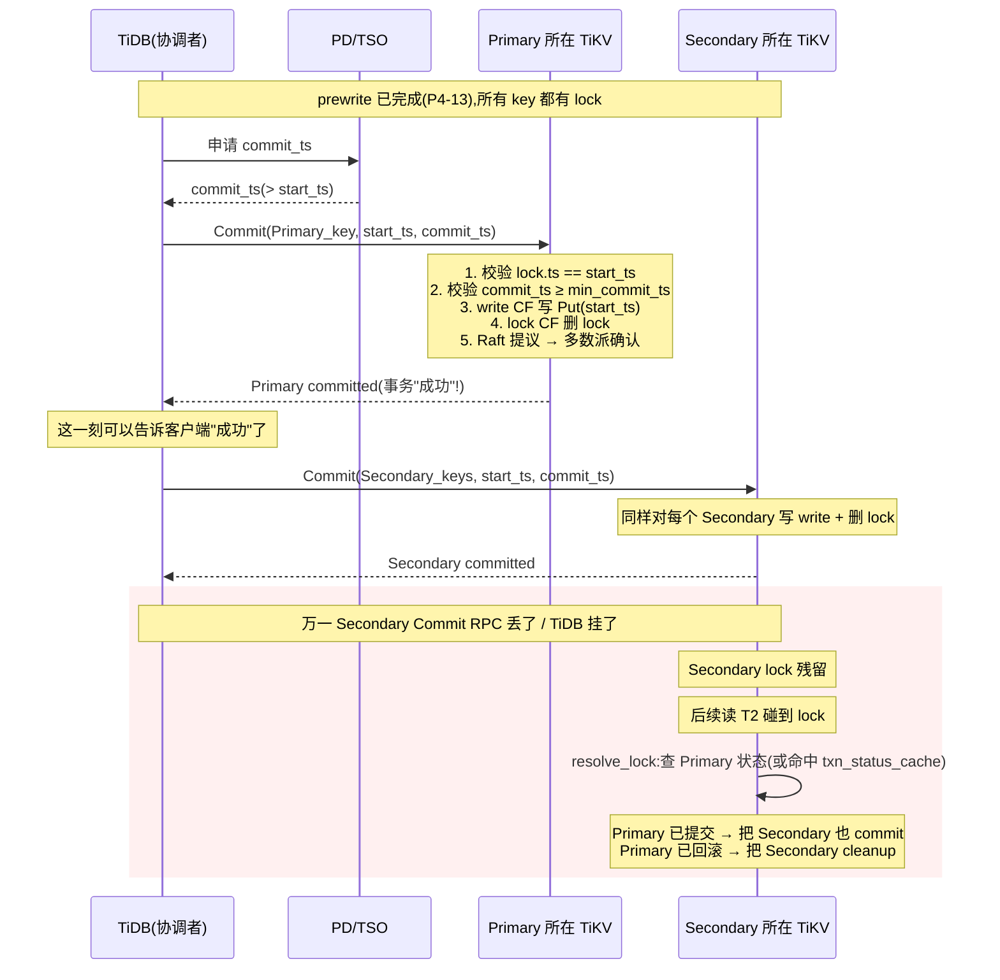

# 第 4 篇 · 第 14 章 · Commit 提交与 Secondary 清理

> **核心问题**:Percolator 的第一阶段(prewrite,见上一章 P4-13)给事务涉及的所有 key 写了 lock、把 value 写到了 default CF,但**没有一条提交记录**——这时候事务对外完全不可见,谁也读不到。要让事务真正"成功",必须有人动手把 lock 换成提交记录。问题是:跨多个 Region(多个 Raft 组)的写,**谁先提交、谁后提交、什么时候算"事务真的成了"**?如果老老实实等所有 key 都提交完才告诉客户端"成功",那一个慢 Region 就会拖垮整个事务的延迟。Percolator 的答案极其巧妙:**只提交一个 Primary Key,事务就算成功了;其余 Secondary 慢慢来,谁来读谁顺手收尾**。这一章拆透"为什么这一个 Primary 提交就够""Secondary 的懒清理凭什么不会出错"。

> **读完本章你会明白**:
> 1. Percolator 第二阶段为什么是"两段式":先在 Primary 所在的 Raft 组里提交一个 key,这一刻事务在全局意义上"成功";Secondary 不再需要同步等待。
> 2. 为什么"Primary 一提交就算成功"在正确性上 sound——事务成败被归约成了 Primary 所在那个 Raft 组里的一条单点事实,而 Raft 保证这条事实不丢不乱。
> 3. Secondary 的"懒清理"(lazy cleanup)是怎么触发的:Commit 命令会顺带提交一批 Secondary,剩下漏网的由后续读的 `resolve_lock` / `check_txn_status` 按 Primary 状态裁决收尾,而**裁决结果会被缓存在 `txn_status_cache` 里**,避免重复去查 Primary。
> 4. cleanup(回滚)和 commit(提交)在源码里是一对镜像操作:`commit` 写 write CF + 删 lock,`cleanup` 写 Rollback + 删 lock;`resolve_lock` 是个 dispatcher,根据 Primary 状态选其一。
> 5. 为什么"Primary 提交 + Secondary 异步清理"这个看似简单的安排,在跨 Region 事务里换来了**线性扩展的协调开销**(协调成本只在需要时才付)。

> **如果一读觉得太难**:先只记住三件事——① 事务成败的"判决书"只写在 Primary Key 上,Primary 提交了 = 事务成功,这由 Primary 所在那个 Raft 组保证;② Secondary 上的锁不用立刻清,谁(读操作)碰到谁去查 Primary 状态决定提交还是回滚;③ "commit_ts 必须 > start_ts" 是写提交记录的铁律,因为它要保证版本序在 start_ts 之后。

---

## 〇、一句话点破

> **Primary Key 一旦在它所在那个 Raft 组里被提交(写 write CF、清 lock),事务在全局意义上就成功了;Secondary Key 上的残留锁不用等,后续读到的人按 Primary 状态顺手收尾——Percolator 用一个 Primary,把"跨组事务的协调成本"摊薄成了"按需查询"。**

这是结论,不是理由。本章倒过来拆:先讲为什么不能"等所有 key 都提交完才算成功",再讲 Primary 提交怎么定锚,接着拆 Secondary 的懒清理靠什么机制保证不会出错,然后讲源码里 commit / cleanup / resolve_lock 三者怎么协作,最后讲 9.x 的演进(async commit / 1PC 怎么改造了这套两阶段)。

---

## 一、朴素做法为什么会拖垮事务

先把"问题"立清楚。Prewrite(P4-13)结束后,状态是这样:

- 涉及的每个 key(假设 `N` 个,散落在若干 Region = 若干 Raft 组)在 lock CF 里都有一条 lock;
- value 已经写进了 default CF(带 start_ts);
- **write CF 没有任何提交记录**——所以事务对外不可见。

现在要让事务成功,最朴素的 2PC(两阶段提交)教科书做法是:

> **协调者(TiDB)挨个儿给每个 Region 发 commit,等所有 Region 都回 "OK",才告诉客户端"事务成功"。**

这套做法在 etcd 那种"全量数据在一个 Raft 组"的场景里完全没问题——因为一次提交就是一条日志,原子。但在 TiKV 跨多个 Raft 组的场景里,它有一个要命的缺陷:

> **不这样会怎样**:假设事务改了 10 个 key,散在 10 个 Region。其中 9 个 Region 都很快 commit 完了,第 10 个正好 leader 换届、或者那台 TiKV 节点卡了一下、或者 GC 慢——**整个事务的提交延迟 = 最慢那个 Region 的延迟**。客户端要等所有 Region 全部回 OK 才收到"成功",这对延迟敏感的业务(支付、下单)是灾难。更糟的是,如果协调者(TiDB)在这期间挂了,10 个 Region 处于"半提交"状态,谁来收场?这就是经典 2PC 的**协调者故障困境**:阻塞,等协调者恢复。

> **钉死这件事**:朴素 2PC 的两个病根——① 事务延迟被最慢的参与者(Region)拖累;② 协调者挂了会留下"半提交"垃圾。Percolator 的两阶段提交,就是专门来治这两个病的。

---

## 二、Primary 提交定锚:为什么"提交一个 key"就够

Percolator 的破局点,是**把"事务成败"这个全局问题,归约成一个单点事实**。

### 选 Primary 当锚点(prewrite 已选定)

P4-13 已经讲清了:prewrite 阶段,事务会从所有涉及的 key 里**挑一个当 Primary**(通常是第一个写的 key),其余都是 Secondary。Primary 的位置(start_ts、primary key 的 raw bytes)被**记在每一条 lock 里**——这是关键,因为这样任何拿到 Secondary lock 的人,都能从 lock 里读出"这个事务的 Primary 在哪",然后去查它的状态。

### 第二阶段只提交 Primary

事务协调者(TiDB)拿到 TSO 分配的 `commit_ts`(保证 `commit_ts > start_ts`,稍后讲为什么),然后**只给 Primary 所在的 Region 发一个 Commit 请求**:

```
   commit_ts = TSO.alloc()  // 保证 > start_ts
   commit(Primary_key, start_ts, commit_ts)
       ↓ 落到 Primary 所在的 Raft 组
       1. write CF 写一条提交记录: (key, commit_ts) -> Write{start_ts, Put}
       2. lock CF 删掉这条 lock
       ↓ Raft 多数派确认 → 这一刻事务"成功"了
```

这一刻(Primary 的 write CF 写入 + lock 删除被 Raft commit)之后,**事务在全局意义上就成功了**——客户端可以收到"OK",不用等 Secondary。

> **不这样会怎样**:如果非要等所有 Secondary 都 commit 完才告诉客户端成功,延迟被最慢 Region 拖死;如果 Primary 没提交就告诉客户端成功,那 Secondary 上的锁还在,后续读到的人会以为事务没成、去回滚 Secondary,导致**事务被错误回滚**。所以"Primary 先提交"这一步既是**正确性锚点**(Primary 状态 = 事务的最终判决),又是**性能优化**(不等 Secondary)。

### 为什么"Primary 提交就算成功"在正确性上 sound

很多人第一次看 Percolator 都会怀疑:凭什么 Primary 提交了,剩下还没提交的 Secondary 就"迟早"会被提交?万一 Primary 提交了但 Secondary 的锁一直没人去清呢?这里有个关键的**不变量(invariant)**:

> **钉死这件事**:事务的成败,被归约成了**一个单点事实**——Primary 在它所在那个 Raft 组里,到底处于什么状态(已提交 / 已回滚 / 还锁着)。这个事实由**那个 Raft 组**保证不丢不乱(承接《etcd》讲的 Raft 多数派一致性)。所有 Secondary 的命运,都以这个事实为准。因为 Raft 保证 Primary 的 write CF 记录一旦 commit 就不可丢,所以"Primary 是否提交"这个事实是**永久的、全局可查的**。

由此推出 ACID 的三条:

- **原子性**:不会出现"Primary 提交了、Secondary 没提交"的最终不一致——因为 Primary 提交意味着事务判定成功,Secondary 迟早会被按"成功"收尾(谁来读谁收尾,见下节);Primary 没提交(回滚/还锁着)则 Secondary 按"失败"回滚。**全局只有一个裁决者,不会自相矛盾**。
- **持久性**:Primary 的提交记录落在 Primary 所在那个 Raft 组的多数派上,不丢。Secondary 的提交记录也各落各的 Raft 组,不丢。
- **隔离性 / 一致性**:靠 MVCC——commit_ts 把 Primary 的提交"排"在 start_ts 之后,读到的人只看"已提交且 commit_ts ≤ 自己 start_ts"的版本(P4-15 拆透)。

### commit_ts 必须 > start_ts(版本序的铁律)

Commit 命令在源码里有一条**硬约束**:`commit_ts > start_ts`,否则直接报错。看 `commands/commit.rs`:

```rust
// src/storage/txn/commands/commit.rs
impl<S: Snapshot, L: LockManager> WriteCommand<S, L> for Commit {
    fn process_write(self, snapshot: S, context: WriteContext<'_, L>) -> Result<WriteResult> {
        if self.commit_ts <= self.lock_ts {
            return Err(Error::from(ErrorInner::InvalidTxnTso {
                start_ts: self.lock_ts,
                commit_ts: self.commit_ts,
            }));
        }
        ...
```

[Commit::process_write 校验 commit_ts > lock_ts(即 start_ts)](../tikv/src/storage/txn/commands/commit.rs#L52-L59)

> **为什么必须 >**:`commit_ts` 是这条提交记录在 write CF 里的"版本号"(key 编码成 `key + commit_ts`,大 ts 排在小 ts 后面,见 P3-10)。MVCC 的隔离性要求:**一个在 start_ts = `s` 开始读的事务,只能看到 commit_ts ≤ `s` 的版本**。如果允许 commit_ts = start_ts,那一个在 start_ts = 100 开始读的事务,可能看到本事务(commit_ts 也 = 100)的写——破坏快照隔离。所以 commit_ts 必须严格大于 start_ts,把本事务的提交"排"在所有以 start_ts 开始的快照之后。`commit_ts` 来自 PD 的 TSO(P5-17 拆),TSO 保证全局单调递增,所以这个 ">" 自然成立——但代码里还是要校验,防止极端情况(时钟回拨、bug)。

---

## 三、源码精读:commit action 干了什么

光说概念不够,得看源码。`commit` 的真正实现在 `src/storage/txn/actions/commit.rs`,核心函数签名:

```rust
// src/storage/txn/actions/commit.rs
pub fn commit<S: Snapshot>(
    txn: &mut MvccTxn,
    reader: &mut SnapshotReader<S>,
    key: Key,
    commit_ts: TimeStamp,
    commit_role: Option<CommitRole>,
) -> MvccResult<Option<ReleasedLock>>
```

[commit 函数签名](../tikv/src/storage/txn/actions/commit.rs#L64-L70)

它干的事拆成五步:

### 第 1 步:读 lock(支持 pending lock 批处理)

```rust
// src/storage/txn/actions/commit.rs
let lock_state = match txn.get_pending_lock_bytes(&key) {
    Some(None) => None,                              // 这一批里已被前面操作删了
    Some(Some(bytes)) => Some(txn_types::parse_lock(bytes)?),  // 用这批里待写的 lock
    None => reader.load_lock(&key)?,                 // 没 pending,从快照读
};
```

[commit 读取 lock 状态(支持批内 pending)](../tikv/src/storage/txn/actions/commit.rs#L89-L102)

这里有个**值得单独讲的技巧**:`get_pending_lock_bytes`。它不是从 RocksDB 快照读 lock,而是**先看当前这批 modifies 里有没有改过这个 key 的 lock**。为什么?因为 `resolve_lock` 会**一次性处理同一个 key 的多个 sub-lock**(SharedLocks 场景),如果第二个 commit 操作还从快照读,它会读到旧值、看不到第一个操作刚删的 lock——所以必须能"看见本批内的修改"。这是 batch 处理的正确性细节,稍后在技巧精解里展开。

### 第 2 步:校验 lock 属于本事务

```rust
let (mut lock, shared_locks, commit) = match lock_state {
    Some(lock_or_shared) => {
        let (lock, shared_locks) = match lock_or_shared {
            Either::Left(lock) if lock.ts == reader.start_ts => (lock, None),
            Either::Left(_) => {
                // lock 属于别的事务,走 lock_not_found
                return handle_lock_not_found(...);
            }
            ...
```

[commit 校验 lock.ts == start_ts](../tikv/src/storage/txn/actions/commit.rs#L104-L136)

`lock.ts == reader.start_ts` 是核心校验:**这条 lock 必须是本事务(start_ts)加的**。如果 lock 的 ts 对不上(被别的事务覆盖了、或者已经被回滚过),就走 `handle_lock_not_found`,返回 `TxnLockNotFound` 错误——这通常意味着事务状态混乱(并发清锁把本事务的 lock 干掉了),需要上层处理。

### 第 3 步:校验 commit_ts ≥ min_commit_ts(大事务场景)

```rust
if commit_ts < lock.min_commit_ts {
    ...
    return Err(ErrorInner::CommitTsExpired { ... }.into());
}
```

[commit 校验 commit_ts ≥ min_commit_ts](../tikv/src/storage/txn/actions/commit.rs#L138-L166)

`min_commit_ts` 是**大事务**(large txn)机制(P4-13 讲过)给 lock 加的字段:一个长时间运行的事务,在 prewrite 时会被并发读"推高"它的 min_commit_ts(避免它的提交覆盖掉读的快照)。如果 commit 时拿到的 commit_ts 比 lock 上记的 min_commit_ts 还小,说明 commit_ts 太旧了——这通常是 bug(或 async commit fallback 的极端情况),报 `CommitTsExpired`。

### 第 4 步:写 write CF 的提交记录

```rust
let mut write = Write::new(
    WriteType::from_lock_type(lock.lock_type).unwrap(),
    reader.start_ts,
    lock.short_value.take(),
)
.set_last_change(lock.last_change.clone())
.set_txn_source(lock.txn_source);

for ts in &lock.rollback_ts {
    if *ts == commit_ts {
        write = write.set_overlapped_rollback(true, None);
        break;
    }
}

txn.put_write(key.clone(), commit_ts, write.as_ref().to_bytes());
```

[commit 写 write 记录 + 处理 overlapped_rollback](../tikv/src/storage/txn/actions/commit.rs#L218-L233)

这里有几个细节值得钉:

- **`WriteType::from_lock_type`**:lock 里的 `LockType`(Put/Delete/Lock)被映射成 write 里的 `WriteType`。看 `txn_types/src/write.rs`:`LockType::Put → WriteType::Put`、`Delete → Delete`、`Lock → Lock`,而 `Pessimistic` / `Shared` 映射返回 `None`(它们不是数据写,不会走到 commit 这里 `unwrap` 成功)。
- **`short_value.take()`**:如果 value 很短(≤ `SHORT_VALUE_MAX_LEN`),prewrite 时直接塞进了 lock 里(省一次 default CF 写,见 P3-10)。commit 时把它"搬"到 write 记录里——这样读的时候只查 write CF 就能拿到 value,不用再去 default CF。`take()` 是把值从 lock 里 move 出来(避免克隆)。
- **`overlapped_rollback`**:这是 GC 相关的一个奇技——如果之前有别的并发事务给这个 key 在 commit_ts 这个位置写过 Rollback 记录(`lock.rollback_ts` 里记着),那现在本事务要在这里写 Put,会**覆盖**掉那个 Rollback。为了不丢失"这里曾有过 rollback"的信息,在新的 write 上打个 `overlapped_rollback = true` 标记,后续 GC 能据此正确处理(P6-20 拆)。

### 第 5 步:删 lock,返回 ReleasedLock

```rust
match shared_locks {
    Some(shared_locks) => { /* SharedLocks 场景:删掉本事务那个 sub-lock */ }
    None => Ok(txn.unlock_key(key, lock.is_pessimistic_txn(), commit_ts)),
}
```

[commit 删 lock(unlock_key)](../tikv/src/storage/txn/actions/commit.rs#L234-L244)

`unlock_key` 在 `mvcc/txn.rs` 里:

```rust
// src/storage/mvcc/txn.rs
pub(crate) fn unlock_key(
    &mut self,
    key: Key,
    pessimistic: bool,
    commit_ts: TimeStamp,
) -> Option<ReleasedLock> {
    let released = ReleasedLock::new(self.start_ts, commit_ts, key.clone(), pessimistic);
    let write = Modify::Delete(CF_LOCK, key);
    self.write_size += write.size();
    self.modifies.push(write);
    Some(released)
}
```

[unlock_key:删 lock + 返回 ReleasedLock](../tikv/src/storage/mvcc/txn.rs#L161-L172)

注意它返回的 `ReleasedLock`——这个结构体带着 key、start_ts、commit_ts,会被 commit 命令收集起来(`released_locks.push(...)`),最终交回 scheduler。**scheduler 拿到 ReleasedLock,会去唤醒所有在这个 lock 上排队等待的悲观事务**(P4-15 / P6-21 拆 waiter_manager)。这是 commit 完之后"通知别人"的关键钩子。

至此,commit 的五步走完。**两件事落进 Raft 提议:write CF 写一条 Put、lock CF 删一条 lock。**Raft 多数派确认 + apply 到 RocksDB 之后,这个 key 就正式"提交"了。

---

## 四、Primary vs Secondary:CommitRole 的微妙差异

你可能注意到 `commit` 函数有个 `commit_role: Option<CommitRole>` 参数。看 `txn_types`:

```rust
// components/txn_types/src/types.rs
#[derive(Debug, Copy, Clone)]
pub enum CommitRole {
    /// Indicates it commits the primary key in request.
    Primary,
    /// Indicates it commits the secondary key(s) in request.
    Secondary,
}
```

[CommitRole 枚举](../tikv/components/txn_types/src/types.rs#L734-L740)

`CommitRole` 是 TiDB 发 Commit RPC 时带的标记,告诉 TiKV"这个 key 是 Primary 还是 Secondary"。它**不改变 commit 的核心逻辑**(Primary 和 Secondary 走的是同一份 commit 代码),只影响**错误处理时的诊断信息收集**:

看 `commit.rs` 里 `handle_lock_not_found`:

```rust
fn handle_lock_not_found<S: Snapshot, F>(
    reader: &mut SnapshotReader<S>,
    key: Key,
    commit_ts: TimeStamp,
    commit_role: Option<CommitRole>,
    collect_mvcc: &F,
) -> MvccResult<Option<ReleasedLock>>
where F: Fn(&SnapshotReader<S>) -> Option<MvccInfo>,
{
    match reader.get_txn_commit_record(&key)?.info() {
        Some((_, WriteType::Rollback)) | None => {
            // ...
            let unexpected = matches!(commit_role, Some(CommitRole::Secondary));
            let mvcc_info = unexpected.then(|| collect_mvcc(reader)).flatten();
            ...
            Err(ErrorInner::TxnLockNotFound { ... mvcc_info }.into())
        }
        // 已经被并发提交了,幂等返回 Ok(None)
        Some((_, WriteType::Put)) | ... => {
            MVCC_DUPLICATE_CMD_COUNTER_VEC.commit.inc();
            Ok(None)
        }
    }
}
```

[handle_lock_not_found:Secondary 找不到 lock 才收集 mvcc 诊断](../tikv/src/storage/txn/actions/commit.rs#L19-L62)

这里的微妙之处:**当一个 Secondary key 提交时找不到自己的 lock(可能被并发清锁干掉了),这是一个"可能预示着 bug"的异常情况**,所以要多收集一份 mvcc 信息(lock/write/default 三 CF 的完整快照)写进错误日志里,方便排查。而 Primary 找不到 lock 通常是"被别的事务回滚了"(预期内的并发场景),不收集——这是为了避免日志爆炸。

> **钉死这件事**:`CommitRole` 是个**纯诊断标记**,不参与正确性判定。它回答的是"找不到 lock 时,该不该多打点日志",而不是"该怎么提交"。这反映了 TiKV 工程上的一种成熟:正确性靠不变量保证,诊断靠显式标记加强。

另外注意 `handle_lock_not_found` 里那个 `Some((_, WriteType::Put)) => Ok(None)` 分支——**Commit 是幂等的**:如果这个 key 已经被(并发的、或重试的)Commit 提交过了,再来一次 Commit 不会报错,直接返回 Ok。这是处理网络重试的关键(P4-12 讲过 gRPC 重试)。

---

## 五、Secondary 的懒清理:谁来收尾

讲完 Primary 提交,问题来了:**Secondary 上的 lock 怎么办?**

### 两条清理路径

TiKV 有两条清理 Secondary 的路径,并行存在:

**路径一:Commit 命令顺带提交一批 Secondary。** TiDB 在拿到 Primary commit 成功后,通常**会**主动发一个 Commit RPC(带所有 Secondary 的 keys),让 TiKV 把 Secondary 也提交了。这是常规情况,延迟低、不用等读触发。看 `commands/commit.rs`:

```rust
// src/storage/txn/commands/commit.rs
impl<S: Snapshot, L: LockManager> WriteCommand<S, L> for Commit {
    fn process_write(self, snapshot: S, context: WriteContext<'_, L>) -> Result<WriteResult> {
        ...
        let mut released_locks = ReleasedLocks::new();
        for k in self.keys {                          // 遍历所有 keys(含 Primary + Secondary)
            released_locks.push(commit(
                &mut txn, &mut reader, k, self.commit_ts, self.commit_role,
            )?);
        }
        ...
    }
}
```

[Commit 命令循环对每个 key 调 commit](../tikv/src/storage/txn/commands/commit.rs#L66-L77)

注意 `for k in self.keys`——Commit 命令**一次性**处理多个 key(Primary 和 Secondary 都在里面)。`commit_role` 字段只是个诊断标记,不改变循环逻辑。

**路径二:resolve_lock——读触发的懒清理。** 万一 TiDB 挂了、或者 Commit RPC 半路丢了、或者只提交了 Primary 就崩了——剩下的 Secondary 上的 lock 怎么办?**永远不清吗?** 当然不是。答案:**后续读到 Secondary 上锁的人,会顺手去查 Primary 状态,然后按状态清掉**。这个机制叫 `resolve_lock`,是 Percolator 的精髓。

### resolve_lock:根据 Primary 状态裁决 Secondary

`resolve_lock` 不是直接清锁,而是个**dispatcher**:它先拿到一个 `txn_status: HashMap<TimeStamp, TimeStamp>`——这个 map 的 key 是事务的 start_ts,value 是它的 commit_ts(0 表示回滚)。然后对每个 Secondary lock,根据它的 start_ts 在 map 里查到状态,**决定是 commit 还是 cleanup**:

```rust
// src/storage/txn/commands/resolve_lock.rs
impl<S: Snapshot, L: LockManager> WriteCommand<S, L> for ResolveLock {
    fn process_write(mut self, snapshot: S, context: WriteContext<'_, L>) -> Result<WriteResult> {
        let (ctx, txn_status, key_locks) = (self.ctx, self.txn_status, self.key_locks);
        ...
        for (current_key, current_lock) in key_locks {
            txn.start_ts = current_lock.ts;
            reader.start_ts = current_lock.ts;
            let commit_ts = *txn_status
                .get(&current_lock.ts)
                .expect("txn status not found");

            let released = if commit_ts.is_zero() {
                cleanup(&mut txn, &mut reader, current_key.clone(),
                        TimeStamp::zero(), false)?              // 回滚
            } else if commit_ts > current_lock.ts {
                match commit(&mut txn, &mut reader, current_key.clone(),
                             commit_ts, None) {                  // 提交
                    Ok(res) => { known_txn_status.push((current_lock.ts, commit_ts)); res }
                    Err(MvccError(box MvccErrorInner::TxnLockNotFound { .. }))
                        if current_lock.is_pessimistic_lock() => None,
                    Err(err) => return Err(err.into()),
                }
            } else {
                return Err(Error::from(ErrorInner::InvalidTxnTso { ... }));
            };
            released_locks.push(released);
            ...
        }
        ...
    }
}
```

[ResolveLock::process_write:根据 txn_status 调 cleanup 或 commit](../tikv/src/storage/txn/commands/resolve_lock.rs#L81-L140)

读这段代码,理解三件事:

1. **`txn_status` 怎么来的**:它由 `ResolveLockReadPhase` 命令先扫一遍 lock CF 收集出来的(下面讲),或者由上层(TiDB、GC worker)直接传入。本质都是"先查 Primary 状态"的结果。
2. **commit_ts = 0 表示回滚**:`commit_ts.is_zero()` 时调 `cleanup` 写 Rollback 记录;否则 `commit_ts > lock.ts` 时调 `commit` 写提交记录。**这两种操作都是"根据 Primary 的裁决,给 Secondary 做最终收尾"**。
3. **`known_txn_status.push(...)`**:成功 commit 的 Secondary,会把它的 (start_ts, commit_ts) 收集起来,返回给 scheduler——这个信息会**缓存进 `txn_status_cache`**(下面单独讲),避免下一个读到这个 Secondary 的人再重复查 Primary。

### ResolveLockReadPhase:扫 lock CF 找待清理的锁

`resolve_lock` 分两阶段:先读(`ResolveLockReadPhase`)扫 lock CF 找出待处理的锁,再写(`ResolveLock`)批量清。看读阶段:

```rust
// src/storage/txn/commands/resolve_lock_readphase.rs
impl<S: Snapshot> ReadCommand<S> for ResolveLockReadPhase {
    fn process_read(self, snapshot: S, statistics: &mut Statistics) -> Result<ProcessResult> {
        ...
        let mut reader = MvccReader::new_with_ctx(snapshot, Some(ScanMode::Forward), &ctx);
        let result = reader.scan_locks_from_storage(
            self.scan_key.as_ref(),
            None,
            |_, lock| txn_status.contains_key(&lock.ts),   // 只挑 status 已知的
            RESOLVE_LOCK_BATCH_SIZE,                        // 一次 256 个
        );
        ...
        // 把扫到的 (key, lock) 收集成 key_locks,交给 ResolveLock 写阶段
        let next_cmd = ResolveLock { ctx, txn_status, scan_key: next_scan_key, key_locks: flatten_pairs };
        Ok(ProcessResult::NextCommand { cmd: Command::ResolveLock(next_cmd) })
    }
}
```

[ResolveLockReadPhase:扫 lock CF,每批 256 个](../tikv/src/storage/txn/commands/resolve_lock_readphase.rs#L50-L112)

两个细节:

- **`RESOLVE_LOCK_BATCH_SIZE = 256`**(`commands/resolve_lock.rs#L179`):一次扫 256 个 lock,源码注释说"一个 resolve 写大约 100~150 字节,256 个 ≈ 32KB 的写批"——这是为了控制 Raft 提议的大小,避免一次清太多锁把 Raft 日志撑爆。
- **分批 + `scan_key`**:如果 lock 太多一次扫不完,会返回 `NextCommand(ResolveLockReadPhase { scan_key: ... })`,从上次扫到的地方继续——这是**游标式分批扫描**,避免长事务卡住 Region。

> **钉死这件事**:`resolve_lock` 的精髓是"**读触发 + 按 Primary 裁决**"。它不需要一个全局协调者实时盯每个 Secondary,而是把清锁成本摊到了"谁读到谁清"上。这就是 Percolator 能扛海量并发的根本——**协调成本只在需要时才付**。

---

## 六、txn_status_cache:避免重复查 Primary 的缓存

这里有一个 9.x 之前没有、后来加的重要优化。想象这个场景:

> 事务 T1 commit 完了,但留下了几个没清的 Secondary lock。事务 T2 来读,碰到 Secondary lock,去查 Primary(发 `CheckTxnStatus` RPC),得知"已提交,commit_ts = X",于是 resolve 掉 Secondary。紧接着事务 T3 也来读同一个 Secondary——**难道又要发一次 CheckTxnStatus 去查 Primary?**

这显然浪费。Primary 的状态一旦确定(提交或回滚)就**不会变**了,查一次就够了。所以 TiKV 在 scheduler 里维护了一个 `txn_status_cache`:

```rust
// src/storage/txn/scheduler.rs
pub struct TxnSchedulerInner<L: LockManager> {
    ...
    txn_status_cache: Arc<TxnStatusCache>,
    ...
}
```

[scheduler 持有 txn_status_cache](../tikv/src/storage/txn/scheduler.rs#L286)

它怎么被填充的?看 commit 命令的 `known_txn_status` 字段:

```rust
// src/storage/txn/commands/commit.rs
Ok(WriteResult {
    ...
    known_txn_status: vec![(self.lock_ts, self.commit_ts)],   // ← 关键
    ...
})
```

[Commit 命令返回 known_txn_status](../tikv/src/storage/txn/commands/commit.rs#L95)

scheduler 收到 WriteResult 后,会把这个 `known_txn_status` 灌进缓存:

```rust
// src/storage/txn/scheduler.rs  (on_write_finished 里)
if result.is_ok() && !known_txn_status.is_empty() {
    let now = std::time::SystemTime::now();
    for (start_ts, commit_ts) in known_txn_status {
        self.inner.txn_status_cache.insert_committed(start_ts, commit_ts, now);
    }
}
```

[scheduler 把 known_txn_status 灌进 txn_status_cache](../tikv/src/storage/txn/scheduler.rs#L991-L1001)

之后,任何命令在 resolve Secondary 之前,会**先查这个 cache**——命中了就不用再发 `CheckTxnStatus` RPC 跨 Region 查 Primary。`TxnStatusCache` 的接口(`src/storage/txn/txn_status_cache.rs`):

```rust
pub fn insert_committed(&self, start_ts: TimeStamp, commit_ts: TimeStamp, now: SystemTime)
pub fn get(&self, start_ts: TimeStamp) -> Option<TxnState>
pub fn get_committed(&self, start_ts: TimeStamp) -> Option<TimeStamp>
```

[txn_status_cache 的核心接口](../tikv/src/storage/txn/txn_status_cache.rs#L519-L564)

> **不这样会怎样**:如果没有这个 cache,每个读到残留 Secondary lock 的事务都要跨 Region 发一次 `CheckTxnStatus`,在 Secondary 没被及时清理的高并发场景下,会产生**风暴式的跨 Region RPC**——既增加延迟,又压垮 Primary 所在的 Region。这个 cache 把"查 Primary 状态"从 O(读次数) 降到了 O(1)(第一次查完就缓存),是生产环境必备的优化。

---

## 七、cleanup:回滚的镜像操作

讲 commit 不能不讲 cleanup——它们是一对镜像。看 `actions/cleanup.rs`:

```rust
// src/storage/txn/actions/cleanup.rs
pub fn cleanup<S: Snapshot>(
    txn: &mut MvccTxn,
    reader: &mut SnapshotReader<S>,
    key: Key,
    current_ts: TimeStamp,
    protect_rollback: bool,
) -> MvccResult<Option<ReleasedLock>> {
    ...
    match lock_state {
        Some(Either::Left(ref lock)) if lock.ts == reader.start_ts => {
            // current_ts != 0 时,先检查 TTL 没过期才回滚
            if !current_ts.is_zero() {
                let expire_time = lock.ts.physical() + lock.ttl;
                if expire_time >= current_ts.physical() {
                    return Err(ErrorInner::KeyIsLocked(...).into());  // 没过期,不能回滚
                }
            }
            rollback_lock(txn, reader, key, lock, lock.is_pessimistic_txn(), !protect_rollback)
        }
        ...
    }
}
```

[cleanup:检查 TTL 后调 rollback_lock](../tikv/src/storage/txn/actions/cleanup.rs#L24-L75)

`cleanup` 和 `commit` 的镜像关系:

| 操作 | commit | cleanup |
|------|--------|---------|
| 写 write CF | `Write{Put/Delete/Lock, start_ts}` | `Write{Rollback, start_ts}` |
| 删 lock CF | 是(提交后释放) | 是(回滚后释放) |
| 校验 | `lock.ts == start_ts` 且 `commit_ts ≥ min_commit_ts` | `lock.ts == start_ts` 且 **TTL 已过期** |
| 触发场景 | Primary commit / Secondary 主动 commit / resolve_lock 提交分支 | Secondary 超时回滚 / resolve_lock 回滚分支 / GC 清旧锁 |

**关键差异:TTL 检查。** `cleanup` 在 `current_ts != 0` 时,会先算 `expire_time = lock.ts.physical() + lock.ttl`,只有 `expire_time < current_ts.physical()`(锁已过期)才允许回滚。为什么?**因为 lock 没过期时,事务的协调者(TiDB)可能还活着、正在准备 commit**——这时候你擅自回滚它,会把一个本来要成功的事务搞死。只有 TTL 过期了(协调者大概率挂了或卡住了),才能安全回滚。

> **钉死这件事**:cleanup 的 TTL 检查是 Percolator 活性(liveness)的保障——它防止"一个还在正常运行的事务被别人误杀"。TTL 由 TiDB 在 prewrite/heartbeat 时设置和续期(P4-13 讲过 `txn_heart_beat`),只要协调者活着就会续命;一旦协调者挂了,TTL 到期,别人才能安全回滚。这跟 etcd 的 lease(承接《etcd》)是同一种思想——**用时间换活性**。

`rollback_lock`(在 `actions/check_txn_status.rs` 里)干的事:`txn.put_write(key, start_ts, Write{Rollback, ...}.to_bytes())` + `txn.unlock_key(key, ..., TimeStamp::zero())`。注意 **rollback 用的是 start_ts 不是 commit_ts**(因为回滚没有 commit_ts,传 zero)。这条 Rollback 记录存在的意义:**告诉后来的人"这个事务在这个 key 上已经被回滚了,别再尝试提交它"**——这是防止"stale commit"(一个延迟到达的 commit RPC 试图提交已回滚的事务)破坏一致性的关键。

---

## 八、Commit 的两阶段时序

把前面讲的串成一张时序图,看清整个第二阶段:



图里红色那段就是"懒清理"路径——它不是常规路径(常规是 TiDB 主动 commit Secondary),而是**兜底**:保证即使协调者故障,Secondary 上的锁最终也会被清掉(因为总有人会读到它)。

---

## 九、技巧精解:两个最硬核的设计

本章有两个值得单独钉死的技巧。

### 技巧一:为什么"Primary 提交 = 全局成功"是 sound 的(P0-01 洞察二的源码级证明)

P0-01 讲过 Percolator 用一个 Primary 当锚就能 ACID,那是概念。这里用源码证明它**真的 sound**。

**命题**:事务 T 的所有 Secondary,最终要么全部 commit、要么全部 rollback,不会出现"一部分 commit 一部分 rollback"的最终不一致。

**证明**(用源码事实):

1. **Primary 的状态是单一事实**。Primary 的提交记录写在 Primary 所在那个 Raft 组的 write CF 里,形如 `(primary_key, commit_ts) -> Write{Put, start_ts}`。这条记录要么存在(已提交)、要么不存在(未提交)。Raft 保证这条记录在多数派上一致、不可丢(承接《etcd》)。源码里 `commit.rs` 的 `txn.put_write(key.clone(), commit_ts, write.as_ref().to_bytes())` 就是写这条记录。

2. **Secondary 的命运由 Primary 裁决**。看 `resolve_lock.rs`:`commit_ts = *txn_status.get(&current_lock.ts)`——Secondary 的 commit_ts 从 `txn_status` 里查,而 `txn_status` 是**查 Primary 状态得来的**(直接由 `check_txn_status` 探测 Primary 后填入,或从 `txn_status_cache` 命中)。所以 Secondary 的 commit 或 rollback,完全由 Primary 的状态决定。

3. **Primary 的状态一旦确定就不可变**。一旦 Primary 在 write CF 写了 Put(提交),后续的 `check_txn_status` 探测 Primary 时,会走 `get_txn_commit_record` 查到这条 Put,返回 `TxnStatus::Committed { commit_ts }`——它不会返回"未提交"了。反过来,如果 Primary 被 rollback 了(写了 Rollback 记录),`check_txn_status` 返回 `TxnStatus::RolledBack`,也不会再变成"已提交"。

4. **所以**:所有查 Primary 的 Secondary,都会拿到**同一个、不变的**裁决——要么都 commit、要么都 rollback。不会自相矛盾。

> **不这么设计会怎样**:如果要一个全局协调者实时盯每个 Secondary 的提交,协调者是单点瓶颈(挂了就阻塞,经典 2PC 困境);如果让所有 Secondary 两两协商,那是 N² 通信开销。Percolator 用 Primary 锚点,把"N 个副本的协调"归约成"1 个 Primary 的状态查询",而 Primary 的状态由 Raft 保证可靠——**这就是"分布式事务的协调成本被摊薄成按需查询"的字面含义**。

### 技巧二:pending_lock_bytes——批内一致性的关键

前面提到 `commit` 里有个 `get_pending_lock_bytes`,这个技巧值得单独讲。

**问题**:`resolve_lock` 一次性处理同一个 key 的多个 sub-lock(SharedLocks 场景,P4-13 讲过的多个事务共享一个 lock 位置)。它在一个 `MvccTxn` 实例里、一个 batch 里,依次处理这些 sub-lock。问题是:**第二个 commit 操作,怎么看见第一个操作对 lock 的修改?**

朴素做法:每个 commit 操作都从 RocksDB 快照读 lock。但这会读到**旧值**(快照是 batch 开始前拍的),看不到本批内第一个操作刚改的 lock——**正确性 bug**。

源码的解法:`MvccTxn` 维护一个 `pending_lock_bytes: HashMap<Key, Option<Bytes>>`——每次 commit / cleanup 改了某个 key 的 lock,不仅 push 进 `modifies`(等批结束时整体写 RocksDB),还**同步更新这个 pending map**。下一个 commit 操作先查这个 map:

```rust
// src/storage/txn/actions/commit.rs
let lock_state = match txn.get_pending_lock_bytes(&key) {
    Some(None) => None,                              // 本批里已被删(lock 没了)
    Some(Some(bytes)) => Some(txn_types::parse_lock(bytes)?),  // 用本批里的新 lock
    None => reader.load_lock(&key)?,                 // 本批没动过,从快照读
};
```

[commit 优先查 pending_lock_bytes](../tikv/src/storage/txn/actions/commit.rs#L89-L102)

`Some(None)` 表示"本批里这个 key 的 lock 已经被删了"(比如前一个 sub-lock 被 commit 删了 lock)——这时候 commit 应该走 lock_not_found。`Some(Some(bytes))` 表示"本批里这个 key 的 lock 被改成了新值"(比如 SharedLocks 里删掉了一个 sub-lock 但保留了其他的)——用新值。`None` 表示本批没动过这个 key——正常从快照读。

> **不这么写会怎样**:如果不用 pending map,SharedLocks 场景下 resolve_lock 会读到**过期的 lock 状态**,导致第二个 sub-lock 的 commit 看不到第一个操作刚保留的兄弟 sub-lock,**把别的还在运行的事务的锁误删**——这是正确性 bug。看 `commit.rs` 的测试 `test_commit_shared_lock_reads_pending_lock_bytes`(L802)就是专门测这个的:两个 sub-lock 在一个 batch 里依次 commit,第二个必须看见第一个留下的 pending 状态。这个技巧本质是**在 batch 内实现了 read-your-writes 一致性**,是 TiKV 把多个 MVCC 操作攒批执行的正确性根基。

---

## 十、架构演进:async commit 与 1PC 对第二阶段的改造

经典 Percolator(上面讲的)是**严格的两个阶段**:prewrite 完 → 拿 commit_ts → commit Primary → commit Secondary。9.x 的 TiKV 引入了两个优化,改造了这套流程:

### async commit:把 commit_ts 推迟到 prewrite

经典流程的痛点:**prewrite 完之后,要再等一次 TSO 拿 commit_ts,然后发第二次 RPC(Commit)**。这两次 RTT + 一次 TSO 调用,是事务延迟的大头。

async commit 的思路:prewrite 时就算出 commit_ts(用 lock 的 min_commit_ts 推算,保证大于所有并发读的 ts),把 `use_async_commit` 标志写进 lock。这样 **prewrite 成功 = 事务成功**(因为 commit_ts 已经定了、lock 里记着),不用再发 Commit RPC。看 `check_txn_status.rs` 里对 async commit 的特殊处理:

```rust
// src/storage/txn/actions/check_txn_status.rs
// Never rollback or push forward min_commit_ts in check_txn_status if it's
// using async commit. Rollback of async-commit locks are done during
// ResolveLock.
if lock.use_async_commit {
    if force_sync_commit {
        info!("fallback is set, check_txn_status treats it as a non-async-commit txn"; ...);
    } else {
        return Ok((TxnStatus::uncommitted(lock, false), None));
    }
}
```

[async commit 的 lock 不在 check_txn_status 里回滚](../tikv/src/storage/txn/actions/check_txn_status.rs#L149-L159)

注意注释:**async commit 的 lock 不会在 `check_txn_status` 里被回滚**——因为它没有传统的 Primary commit 那一刻,状态判定更复杂,要靠 `resolve_lock` 统一处理。这是 async commit 引入的新复杂性。

### 1PC:单个 Region 的事务直接一次提交

如果一个事务的所有 key 恰好在**同一个 Region**(同一个 Raft 组),那根本不需要 Percolator 的两阶段——直接一次 Raft 提议把所有 key 的 write + 清 lock 一起写了(`use_one_pc` 标志)。这是把"跨组协调"退化成"组内原子",省了整个第二阶段。

> **钉死这件事**:async commit 和 1PC 都是对经典两阶段的**延迟优化**,不是替代——它们在能用的场景下省掉了第二次 RPC / 第二次 TSO,但正确性仍建立在"Primary 锚点 + Raft 保证"的根基上。当 async commit fallback(比如 min_commit_ts 推不动)时,系统会退化回经典两阶段(`force_sync_commit` 标志)。这些优化在 P4-12 / P4-13 有更细的源码,本章只交代它们怎么改变了"第二阶段"的形态。

---

## 十一、章末小结

### 回扣主线

本章属于**事务层**(二分法的事务层那一面)。它讲清了 Percolator 第二阶段——**Primary 提交定锚 + Secondary 异步清理**——怎么把"跨多个 Raft 组的事务"在逻辑上拧成 ACID。它的核心洞察是 P0-01 洞察二的源码级落地:**事务成败被归约成 Primary 所在那个 Raft 组里的单点事实,所有 Secondary 的命运以此为准**。

复制层(Raft / Region / RocksDB)在本章的角色是**"事实的保管者"**:Primary 的提交记录落在 Primary 所在那个 Region 的 Raft 组里,由 Raft 保证不丢不乱(承接《etcd》);write / lock 两 CF 由 RocksDB 持久化(承接《LevelDB》);Commit / cleanup 命令经 gRPC 从 TiDB 到达 TiKV(承接《gRPC》)。本章全幅留给事务层独有的部分:commit / cleanup / resolve_lock 的协作、Primary 锚点的正确性、懒清理的触发机制。

### 五个为什么

1. **为什么不能等所有 key 都提交完才告诉客户端成功?**——事务延迟会被最慢的 Region 拖死(朴素 2PC 的病根),且协调者故障会留下半提交垃圾。
2. **为什么 Primary 一提交就算事务成功?**——事务成败被归约成 Primary 所在那个 Raft 组里的单点事实,Raft 保证它不丢不乱;所有 Secondary 据此裁决,不会自相矛盾。
3. **为什么 commit_ts 必须 > start_ts?**——MVCC 用 commit_ts 排版本序,commit_ts = start_ts 会让本事务的写被以 start_ts 开始的快照看到,破坏快照隔离。
4. **为什么 Secondary 不用立刻提交?**——避免拖慢事务(延迟优化);残留的 lock 由后续读的 resolve_lock 按 Primary 状态裁决收尾,协调成本只在需要时才付。
5. **为什么需要 txn_status_cache?**——Primary 状态一旦确定就不变,缓存它避免每个读到 Secondary 的事务都跨 Region 发 CheckTxnStatus RPC,把"查 Primary"从 O(读次数) 降到 O(1)。

### 想继续深入往哪钻

- 想看 Commit 命令怎么进 scheduler、怎么过 latch、怎么发起 Raft 提议:回看 P4-12(事务模型)和 P2-05(raftstore 全貌)。
- 想看 `Write` / `Lock` 的完整字段定义:`components/txn_types/src/write.rs`、`components/txn_types/src/lock.rs`。
- 想看 GC 怎么清理 safe point 之前的旧锁:读 P6-20(GC 与 flashback),它会复用本章的 `resolve_lock`。
- 想看悲观锁场景下 commit 的差异(Pessimistic lock 被 commit 时的特殊处理):读 `commit.rs#L168-L188` 那段"rollback a pessimistic lock when trying to commit"。
- 想看 async commit / 1PC 的完整源码:读 `actions/prewrite.rs`(P4-13 已拆)里 `use_async_commit` / `use_one_pc` 的计算逻辑。

### 引出下一章

我们讲完了 Percolator 的两个阶段(prewrite + commit)和 Secondary 的懒清理机制。但有个关键问题悬而未决:**Secondary 的"懒清理"是读触发的,那"读"本身遇到 lock 怎么办?** 读怎么在 write CF 里找到可见版本(commit_ts ≤ start_ts 的最大版本,为什么这样能保证隔离)?读到 lock 时怎么决定"等"还是"清锁回滚"?多个悲观事务互相等锁时怎么检测死锁?下一章 P4-15 **MVCC 读取与锁的解决**,拆透读路径这条事务层的另一半闭环。

> **下一章**:[P4-15 · MVCC 读取与锁的解决](P4-15-MVCC读取与锁的解决.md)
