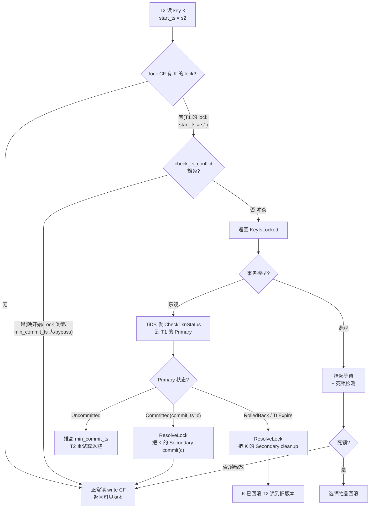

# 第 4 篇 · 第 15 章 · MVCC 读取与锁的解决

> **核心问题**:前面三章(P4-12 / 13 / 14)把"写"讲透了——事务怎么调度、怎么 prewrite、怎么 commit。但事务还没闭环:**读**怎么找到"该看到的版本"?最棘手的是,Percolator 的 Secondary lock 是"懒清理"的(P4-14),这意味着 RocksDB 里**随时可能存在别人没提交完的 lock**。一个在 `start_ts = s` 开始读的事务,扫到一个 lock 时,面临三难:① 这个 lock 对应的事务到底成没成?(可能 Primary 已提交只是 Secondary 没清、也可能 Primary 回滚了、也可能协调者挂了 TTL 没到);② 它的版本到底该不该让我读到?③ 如果我该等它,等多久?等多个人互相等,怎么发现死锁?这一章拆透 MVCC 读的版本选择、读到 lock 的裁决流程、以及悲观锁场景的死锁检测——读完,事务层的"读/写/清锁"闭环就完整了。

> **读完本章你会明白**:
> 1. MVCC 读怎么在 write CF 里找到"可见版本"——核心是**扫 ≤ start_ts 的最大 commit_ts 版本**,这个看似简单的规则为什么能保证快照隔离(不会读到未提交、不会丢已提交)。
> 2. 读到 lock 时,`check_ts_conflict` 怎么判定"是否冲突":`lock.ts > ts`、`LockType::Lock` / `Pessimistic`、`min_commit_ts > ts`、`bypass_locks` / `access_locks` 这几条豁免规则分别解决什么场景。
> 3. 冲突后的两条出路——**乐观场景**:读退回去发 `CheckTxnStatus` 查 Primary 状态裁决(P4-14 已铺垫,本章拆 Primary 查不到 lock 时怎么办);**悲观场景**:读挂起在 `waiter_manager` 里等锁释放,同时 `deadlock` 检测器用 wait-for 图的 DFS 发现环。
> 4. `ForwardScanner` 怎么同时步进 write 和 lock 两个 cursor,用 `ScanPolicy` trait 把"找版本"和"判锁"解耦——这是 TiKV 读路径的核心抽象。
> 5. 为什么"读触发清锁"不会让读无限阻塞:resolve_lock 分批(256 个)+ 游标式扫描 + txn_status_cache 缓存,把清锁成本摊薄。

> **如果一读觉得太难**:先只记住三件事——① 读在 write CF 里找 commit_ts ≤ 自己 start_ts 的最大版本,这就是"可见版本";② 读到 lock 时,如果 lock 的 start_ts 比我大、或者 min_commit_ts 比我大、或者 lock 类型是 Lock/Pessimistic,就不冲突直接跳过;否则要去查 Primary 状态裁决;③ 悲观事务等锁时,有个中心化的 deadlock 检测器跑 wait-for 图的 DFS 找环。

---

## 〇、一句话点破

> **MVCC 读的本质,是在 write CF 里做一次"≤ start_ts 的最大版本"查找;读到的 lock,要么被几条豁免规则放过(不阻塞),要么退回去查 Primary 状态按裁决清锁(乐观),要么挂起等待 + 死锁检测(悲观)——读路径同时是"读数据"和"清垃圾锁"两条路。**

这是结论,不是理由。本章倒过来拆:先讲 MVCC 读怎么选版本(为什么这个规则保证隔离),再讲读遇到 lock 的三种命运(放过 / 裁决 / 等待),接着拆 Primary 查不到时的 `check_txn_status_missing_lock` 怎么收场,然后讲悲观锁的 waiter_manager + 死锁检测,最后讲 ForwardScanner 的源码实现和 9.x 演进。

---

## 一、MVCC 读的核心:为什么"≤ start_ts 的最大版本"能保证隔离

先把最基础的问题钉死:一个在 `start_ts = s` 开始读的事务,面对一个 key 的多个版本(write CF 里这个 key 有 `commit_ts = 100, 200, 300` 三条记录),应该读哪个?

答案是:**commit_ts ≤ s 的最大那个版本。**

```
   key 的 write CF 里的版本(commit_ts 倒排,大 ts 在前):
   ┌─────────────┬─────────────┬─────────────┐
   │ ts=300 Put  │ ts=200 Put  │ ts=100 Put  │
   └─────────────┴─────────────┴─────────────┘
   读 start_ts = 250:选 ts=200(≤250 的最大)
   读 start_ts = 350:选 ts=300
   读 start_ts = 50 :没有可见版本(key 不存在)
```

为什么这个规则能保证快照隔离(SI)?拆三层:

### 第一层:不会读到未提交

一个事务 T(commit_ts = c)的写,要等 Primary 提交后才"可见"(P4-14 讲过)。而 `commit_ts > start_ts`(P4-14 的铁律),所以**任何已提交的事务,它的 commit_ts 一定 > 它开始时的所有读的 start_ts**——但这反过来不意味着"commit_ts ≤ 读 start_ts 的版本都是已提交的"吗?

是的。因为 commit_ts 是 Primary 提交那一刻由 TSO 分配的,**一旦分配就不可逆**。一个 write CF 里 commit_ts = 200 的记录,意味着这个事务在物理时间"TSO 给出 200 的那一刻"之前就已经 Primary 提交了。所以任何 start_ts ≥ 200 的读,都能安全地看到这条记录——它必然已提交。

> **钉死这件事**:commit_ts 是"提交事实"的时间戳,由 TSO 全局单调递增分配(P5-17 拆)。`commit_ts ≤ start_ts` 这条不等式,等价于"这个提交事实发生在我的读快照之前"——所以读它不会破坏隔离。这是 MVCC + TSO 配合实现 SI 的根基。

### 第二层:不会丢已提交

假设读 start_ts = 250,key 有 commit_ts = 100、200、300 三个版本。规则选 200(≤250 的最大)。**为什么不选 100?** 因为 200 是 100 之后的更新版本,SI 要求读到"快照时刻的最新值"——所以选最大的、但不超过 start_ts 的。**为什么不选 300?** 因为 300 > 250,它是"读开始之后才提交的",SI 不允许看到未来的写(那会破坏可重复读)。

### 第三层:Rollback / Delete / Lock 的特殊处理

write CF 里不只有 Put,还有 Delete、Lock、Rollback 三种 WriteType(见 `txn_types/src/write.rs`)。读的时候遇到它们怎么办?看 `MvccReader::get_write_with_commit_ts`(`src/storage/mvcc/reader/reader.rs#L559`):

```rust
// src/storage/mvcc/reader/reader.rs
pub fn get_write_with_commit_ts(
    &mut self,
    key: &Key,
    mut ts: TimeStamp,
    gc_fence_limit: Option<TimeStamp>,
) -> Result<Option<(Write, TimeStamp)>> {
    let mut seek_res = self.seek_write(key, ts)?;
    loop {
        match seek_res {
            Some((commit_ts, write)) => {
                ...
                match write.write_type {
                    WriteType::Put => return Ok(Some((write, commit_ts))),
                    WriteType::Delete => return Ok(None),           // key 已被删除
                    WriteType::Lock | WriteType::Rollback => match write.last_change {
                        // Lock/Rollback 不是数据写,要继续往前找上一个 Put/Delete
                        LastChange::NotExist => return Ok(None),
                        LastChange::Exist { last_change_ts, .. } if 估计跳得远 => {
                            // 直接 seek 到 last_change_ts
                            let key_with_ts = key.clone().append_ts(last_change_ts);
                            seek_res = self.seek_write(...)?;
                        }
                        _ => {
                            // 跳得近,逐个 next() 往前
                            ... seek_res = self.seek_write(prev)?;
                        }
                    }
                }
            }
            None => return Ok(None),
        }
    }
}
```

[get_write_with_commit_ts:遇到 Lock/Rollback 继续往前找](../tikv/src/storage/mvcc/reader/reader.rs#L559-L620)

这里有个关键的优化——**`last_change` 字段**。Lock / Rollback 记录本身不带数据(它们不是 Put),读到它们意味着"这个 commit_ts 位置没有数据变化"。朴素做法是逐个 `next()` 往前找上一个 Put。但如果是连续一长串 Lock/Rollback(比如一个 key 被反复加锁又释放),逐个 next 会很慢。所以 write 记录里存了 `last_change`——"我上一个真正的数据变化(Put/Delete)在哪个 commit_ts",还有 `estimated_versions_to_last_change`(估计中间隔了几个版本)。如果隔得远(≥ `SEEK_BOUND`,通常是 5),直接 `seek()` 跳过去;否则逐个 next。这是 LSM-tree 上读路径的经典优化:**seek 比 next 贵,但跳过远距离比逐个 next 快**。

> **钉死这件事**:write CF 里的四种 WriteType 各有含义——Put(数据写)、Delete(删除)、Lock(只加锁不写数据,如 SELECT FOR UPDATE)、Rollback(事务回滚的标记)。读的时候只有 Put 返回数据,Delete 返回 None,Lock/Rollback 要"穿透"继续往前找。这个穿透靠 `last_change` 字段加速,是 TiKV 在 MVCC 读路径上的重要性能优化。

---

## 二、seek_write:版本查找的原子操作

所有 MVCC 读的底层都归结到一个函数:`MvccReader::seek_write`。看它怎么在 RocksDB 上做这次查找:

```rust
// src/storage/mvcc/reader/reader.rs
pub fn seek_write(&mut self, key: &Key, ts: TimeStamp) -> Result<Option<(TimeStamp, Write)>> {
    // 切换 key 时重建 cursor(prefix seek 优化)
    if self.scan_mode.is_none() && self.current_key.as_ref().is_none_or(|k| k != key) {
        self.current_key = Some(key.clone());
        self.write_cursor.take();
    }
    self.create_write_cursor()?;
    let cursor = self.write_cursor.as_mut().unwrap();
    // 在 write CF 里找 ≤ (key, ts) 的最大记录
    let found = cursor.near_seek(&key.clone().append_ts(ts), &mut self.statistics.write)?;
    if !found {
        return Ok(None);
    }
    let write_key = cursor.key(&mut self.statistics.write);
    let commit_ts = Key::decode_ts_from(write_key)?;
    // 校验找到的记录确实是这个 key 的(不是别的 key)
    if !Key::is_user_key_eq(write_key, key.as_encoded()) {
        return Ok(None);
    }
    let write = WriteRef::parse(cursor.value(&mut self.statistics.write))?.to_owned();
    Ok(Some((commit_ts, write)))
}
```

[seek_write:在 write CF 找 ≤ (key, ts) 的最大版本](../tikv/src/storage/mvcc/reader/reader.rs#L476-L503)

这里有两个细节值得钉:

- **`key.append_ts(ts)`**:把 user key 和 ts 拼成 RocksDB 里的实际 key(P3-10 讲过的编码:`user_key + ts`,大 ts 在前)。`near_seek` 找的是"≤ 这个拼好的 key 的最大记录"——因为 ts 是降序排的(大 ts 在前),所以这等价于"找 commit_ts ≤ ts 的最大版本"。
- **`near_seek` 而不是 `seek`**:`near_seek` 是 RocksDB 的优化——它先看当前 cursor 位置附近几个 key(`next()` 几次),如果找到了就用 next(便宜);找不到再 `seek()`(贵,要查索引)。这是 LSM-tree 读的常识(承接《LevelDB》):seek 要查多层 SST 的索引,代价高;next 只是顺序读。所以"附近有目标就用 next,远了再 seek"。

> **不这样会怎样**:如果每次读都 `seek()`,在 key 稠密、版本多的场景下,每次都要查多层 SST 索引,延迟高。`near_seek` 利用"版本通常连续"的特点,先 cheap 地 next 几次,大幅降低 seek 次数。这是 TiKV 读性能的关键优化之一,和 LevelDB 那本讲的 `Seek` vs `Next` 成本是同一个道理。

---

## 三、Point 读 vs Range 扫:两条读路径

TiKV 的读分两种,走两条不同的代码路径:

### Point 读(get 单个 key):PointGetter

看 `src/storage/mvcc/reader/point_getter.rs`。`PointGetter` 是专门为"读单个 key"优化的——它不用 scanner 那套双 cursor 同步,而是**先查 lock CF,再查 write CF**:

```rust
// src/storage/mvcc/reader/point_getter.rs
impl<S: Snapshot> PointGetter<S> {
    pub fn get_entry(&mut self, user_key: &Key, load_commit_ts: bool) -> Result<Option<ValueEntry>> {
        if need_check_locks(self.isolation_level) {
            // 先查 lock CF,看有没有冲突的锁
            if let Some(lock) = self.load_and_check_lock(user_key, !load_commit_ts)? {
                // access_locks 里的 lock 可以"读穿"(读未提交的值)
                return self.load_data_from_lock(user_key, lock).map(|o| o.map(ValueEntry::from_value));
            }
        }
        // lock 没冲突,正常从 write CF 读
        self.load_data(user_key, load_commit_ts)
    }

    fn load_and_check_lock(&mut self, user_key: &Key, extract_access_lock: bool) -> Result<Option<Lock>> {
        self.statistics.lock.get += 1;
        let lock_value = self.snapshot.get_cf(CF_LOCK, user_key)?;   // 直接 get_cf,不是 seek
        if let Some(ref lock_value) = lock_value {
            ...
            if let Err(e) = txn_types::check_ts_conflict(
                Cow::Borrowed(&lock_or_shared_locks),
                user_key,
                self.ts,
                &self.bypass_locks,
                self.isolation_level,
            ) {
                let lock = lock_or_shared_locks.left().expect("Err result only for single lock");
                if extract_access_lock && self.access_locks.contains(lock.ts) {
                    return Ok(Some(lock));   // access_lock,返回让上层读穿
                }
                Err(e.into())               // 冲突,报错给上层
            } else {
                Ok(None)                    // 不冲突,继续读 write
            }
        } else {
            Ok(None)
        }
    }
}
```

[PointGetter::load_and_check_lock:用 get_cf 查 lock,再 check_ts_conflict](../tikv/src/storage/mvcc/reader/point_getter.rs#L226-L261)

注意这里用 `snapshot.get_cf(CF_LOCK, user_key)`——**不是 seek,是 point get**。源码注释解释了为什么:"common case 是 lock CF 里没东西(大部分 key 没在事务里),用 get_cf 比 seek 快,因为不用 RocksDB 继续移动跳过已删除的条目"。这是个针对常见情况的微优化。

### Range 扫(scan 一段 key):ForwardScanner

Range 扫要同时处理多个 key 的多个版本,不能用 point get。它用**双 cursor 同步步进**——write cursor 和 lock cursor 同时往前走,对每个 user key,先处理 lock(看冲突)、再处理 write(选版本)。这是下一节的主题。

> **钉死这件事**:Point 读和 Range 扫走两条不同的路径,因为它们的访问模式不同——Point 读是"找一个 key 的一个版本",适合用 point get + 单次 lock 查;Range 扫是"扫一段 key 的所有可见版本",适合用双 cursor 同步。这种"按访问模式分路径"是 TiKV 读性能的基础,后续 Coprocessor 下推(P6-19)的聚合算子也复用 ForwardScanner。

---

## 四、读到 lock 怎么办:check_ts_conflict 的豁免规则

这是本章的重头戏。读在 lock CF 里碰到一个 lock,它怎么判断"这个 lock 会不会破坏我的快照隔离"?

答案在 `txn_types::check_ts_conflict`(`components/txn_types/src/lock.rs#L363`)。它有一组**豁免规则**,只要命中任何一条,lock 就不冲突、读直接跳过:

```rust
// components/txn_types/src/lock.rs
fn check_ts_conflict_si(
    lock_or_shared_locks: Cow<'_, LockOrSharedLocks>,
    key: &Key,
    ts: TimeStamp,
    bypass_locks: &TsSet,
    is_replica_read: bool,
) -> Result<()> {
    let lock = match lock_or_shared_locks.as_ref() {
        Either::Left(lock) => lock,
        Either::Right(_) => return Ok(()),   // SharedLocks 不冲突(多个事务共享,无写)
    };

    if lock.ts > ts || lock.lock_type == LockType::Lock || lock.is_pessimistic_lock() {
        // 豁免规则 1:lock 的事务比我晚开始,或 lock 是非数据写(Lock/Pessimistic)
        return Ok(());
    }

    if lock.min_commit_ts > ts {
        // 豁免规则 2:lock 的最小提交时间戳比我大(它提交时我看不到)
        return Ok(());
    }

    if bypass_locks.contains(lock.ts) {
        // 豁免规则 3:上层显式说"这个 ts 的 lock 可以绕过"(已 resolve 过)
        return Ok(());
    }
    ...
    // 都不豁免,冲突!报 KeyIsLocked 让上层处理
    Err(Error::from(ErrorInner::KeyIsLocked(...)))
}
```

[check_ts_conflict_si:四条豁免规则](../tikv/components/txn_types/src/lock.rs#L363-L422)

这四条规则每一条都对应一个真实场景,值得逐一钉死:

### 豁免规则 1:`lock.ts > ts` 或 `LockType::Lock / Pessimistic`

**`lock.ts > ts`**:lock 的事务(start_ts = `lock.ts`)比我晚开始(我的 start_ts = `ts`)。一个晚开始的事务,它的写不可能进我的快照(它的 commit_ts 必然 > 它的 start_ts > 我的 ts)。所以即使它后来提交了,我也读不到——**这个 lock 对我无害,跳过**。

**`LockType::Lock`**:这是 `SELECT FOR UPDATE` 之类的锁,它**不写数据**(只是占住这个 key 不让别人改)。所以读不受影响,跳过。

**`is_pessimistic_lock()`**:悲观锁(Pessimistic 类型),也**不写数据**(它只是悲观事务占住 key,真正的写在 prewrite 阶段才发生,见 P6-21)。跳过。

> **钉死这件事**:这三类 lock 共同特点是"不会改变读看到的版本"——要么事务太晚(commit_ts 必然大于我的 ts),要么压根不写数据。豁免它们是为了**减少不必要的冲突报错**,提升并发度。

### 豁免规则 2:`min_commit_ts > ts`

这条是**大事务**(large txn)机制的精髓(P4-13 讲过)。一个长时间运行的事务 T,在 prewrite 时会给 lock 写一个 `min_commit_ts`——承诺"我提交时 commit_ts 至少是这个值"。如果 `min_commit_ts > ts`(我的读 start_ts),说明 T 提交时它的 commit_ts 必然 > 我的 ts,**它的写不会进我的快照**——所以这个 lock 对我无害,跳过。

> **不这样会怎样**:如果没有 min_commit_ts 机制,一个长事务的 lock 会让所有后来的读都阻塞(因为不知道它什么时候提交、commit_ts 多少)。min_commit_ts 让"已经承诺晚提交"的事务的 lock 被读安全绕过——这是 TiKV 大事务优化的核心,把"读阻塞"问题转化成了"prewrite 时算一个 min_commit_ts"。

### 豁免规则 3:`bypass_locks`

这是上层(scheduler)显式告诉读:"这些 ts 的 lock 你直接绕过,不用报冲突"。场景:**这些 lock 的事务已经被 resolve 过了**(Primary 查过、状态已知),读不用再去查。这是个优化,避免重复 resolve。

### 豁免规则 4(隐式):access_locks

`access_locks` 不是豁免"不报错",而是豁免"读穿"——读这个 lock 对应的未提交数据(default CF 里 prewrite 写的值)。场景:**读自己事务的写**(read-your-writes),或者某些特殊场景(如 `SELECT FOR UPDATE` 之后读)。看 PointGetter 里:

```rust
if extract_access_lock && self.access_locks.contains(lock.ts) {
    return Ok(Some(lock));   // 返回 lock,让上层 load_data_from_lock 读它的值
}
```

[PointGetter 的 access_locks 读穿逻辑](../tikv/src/storage/mvcc/reader/point_getter.rs#L251-L253)

> **钉死这件事**:`check_ts_conflict` 的四条豁免规则,本质都是在回答同一个问题——"这个 lock 对应的写,会不会进我的快照"。只要答案是不会(晚开始、不写数据、min_commit_ts 太大、已被 resolve、或显式允许读穿),就放过。这把"读遇到 lock"从"必然冲突"变成了"大多数情况可放过",是 TiKV 高并发读的关键。

---

## 五、冲突之后:乐观裁决 vs 悲观等待

如果四条豁免都没命中,`check_ts_conflict` 返回 `KeyIsLocked` 错误。这个错误传到 scheduler 后,有两条出路,对应两种事务模型:

### 乐观场景:退回去查 Primary 状态

乐观事务(默认)读到 lock 冲突时,**不会阻塞等待**——而是把这个 lock 的信息(LockInfo)返回给 TiDB,TiDB 决定怎么办。最常见的处理:**发 `CheckTxnStatus` RPC 到 lock 的 Primary 所在 Region,查 Primary 状态**。

`CheckTxnStatus` 的核心逻辑(`src/storage/txn/actions/check_txn_status.rs` 和 `commands/check_txn_status.rs`)分三种情况:

**情况 A:Primary 的 lock 还在,TTL 没过期。** 看 `check_txn_status_lock_exists`:

```rust
// src/storage/txn/actions/check_txn_status.rs
pub fn check_txn_status_lock_exists(
    txn: &mut MvccTxn,
    reader: &mut SnapshotReader<impl Snapshot>,
    primary_key: Key,
    mut lock: Lock,
    current_ts: TimeStamp,
    caller_start_ts: TimeStamp,
    ...
) -> Result<(TxnStatus, Option<ReleasedLock>)> {
    ...
    // 校验这个 lock 确实是 Primary(防止 stale lock)
    if verify_is_primary && !primary_key.is_encoded_from(&lock.primary) {
        ... // primary 不匹配,处理 stale lock
    }
    ...
    // lock 还在,TTL 没过期
    // 推高 min_commit_ts(让后续读不被阻塞)
    if !lock.min_commit_ts.is_zero() && !caller_start_ts.is_max()
        && caller_start_ts >= lock.min_commit_ts {
        lock.min_commit_ts = caller_start_ts.next();
        if lock.min_commit_ts < current_ts {
            lock.min_commit_ts = current_ts;
        }
        // 把推高后的 lock 写回去
        ...
    }
    Ok((TxnStatus::uncommitted(lock, false), None))
}
```

[check_txn_status_lock_exists:TTL 没过期则推高 min_commit_ts](../tikv/src/storage/txn/actions/check_txn_status.rs#L92-L200)

注意这里有个**精妙的优化**:TTL 没过期时,它**不直接返回"等"**,而是**推高 lock 的 `min_commit_ts`**——让后续读到这个 lock 的事务能命中"豁免规则 2"(`min_commit_ts > ts`)安全绕过。这是个把"读阻塞"问题前移到 prewrite 阶段解决的技巧。然后返回 `TxnStatus::Uncommitted`,告诉调用者"Primary 还活着,你别急着回滚"。

**情况 B:Primary 的 lock 还在,但 TTL 过期了。** 这种情况说明协调者(TiDB)挂了或卡住了,Primary 该被回滚:

```rust
// src/storage/txn/actions/check_txn_status.rs(check_txn_status_lock_exists 里)
} else if lock.ts.physical() + lock.ttl < current_ts.physical() {
    // TTL 过期,回滚 Primary
    let released = rollback_lock(txn, reader, primary_key, &lock, is_pessimistic_txn, true)?;
    MVCC_CHECK_TXN_STATUS_COUNTER_VEC.rollback.inc();
    return Ok((TxnStatus::TtlExpire, released));
}
```

[TTL 过期则 rollback Primary](../tikv/src/storage/txn/actions/check_txn_status.rs#L176-L187)

返回 `TxnStatus::TtlExpire`,Primary 被 rollback 了——后续读到 Secondary lock 的人再查 Primary,会命中情况 C。

**情况 C:Primary 的 lock 找不到了(已被 commit 或 rollback)。** 走 `check_txn_status_missing_lock`:

```rust
// src/storage/txn/actions/check_txn_status.rs
pub fn check_txn_status_missing_lock(
    txn: &mut MvccTxn,
    reader: &mut SnapshotReader<impl Snapshot>,
    primary_key: Key,
    mismatch_lock: Option<Lock>,
    action: MissingLockAction,
    resolving_pessimistic_lock: bool,
) -> Result<TxnStatus> {
    match reader.get_txn_commit_record(&primary_key)? {
        TxnCommitRecord::SingleRecord { commit_ts, write } => {
            if write.write_type == WriteType::Rollback {
                Ok(TxnStatus::RolledBack)              // Primary 已回滚
            } else {
                Ok(TxnStatus::committed(commit_ts))    // Primary 已提交,commit_ts 已知
            }
        }
        TxnCommitRecord::OverlappedRollback { .. } => Ok(TxnStatus::RolledBack),
        TxnCommitRecord::None { overlapped_write } => {
            // 既没 lock 也没提交记录——事务可能根本没跑完
            if MissingLockAction::ReturnError == action {
                return Err(ErrorInner::TxnNotFound { ... }.into());
            }
            ...
            // 插一条 Rollback 记录,防止 stale prewrite 后来捣乱
            if let Some(write) = action.construct_write(ts, overlapped_write) {
                txn.put_write(primary_key, ts, write.as_ref().to_bytes());
            }
            Ok(TxnStatus::LockNotExist)
        }
    }
}
```

[check_txn_status_missing_lock:查 write CF 的提交记录](../tikv/src/storage/txn/actions/check_txn_status.rs#L241-L297)

这里的关键:`check_txn_status_missing_lock` 不是再查 lock CF,而是**查 write CF 的提交记录**(`get_txn_commit_record`)。因为 Primary 的 lock 没了,意味着要么已提交(write CF 有 Put)、要么已回滚(write CF 有 Rollback)、要么压根没存在过(None)。**查 write CF 才是事务状态的最终裁决**——这呼应了 P4-14 的洞察:Primary 的状态是写在 write CF 里的单点事实。

注意 `TxnCommitRecord::None` 分支里的 `txn.put_write(primary_key, ts, Write{Rollback})`——**主动插一条 Rollback 记录**。为什么?源码注释说:"in case that a stale prewrite command is received after a cleanup command"——防止一个延迟到达的 stale prewrite RPC 后来把这个 key 又锁上。预先插 Rollback,后续 stale prewrite 会发现"这里已经有 Rollback 了",从而拒绝覆盖(这是 P4-13 prewrite 里的检查逻辑)。

> **钉死这件事**:`CheckTxnStatus` 是 Percolator 读路径的"裁决器"——它把"Primary 还活着吗"这个不确定问题,转化成 write CF 里的一条确定记录。返回的 `TxnStatus`(Committed / RolledBack / Uncommitted / TtlExpire / LockNotExist)是后续 resolve_lock 决定 commit 还是 cleanup 的依据(P4-14 已拆 resolve_lock)。

### 悲观场景:挂起等待 + 死锁检测

悲观事务(见 P6-21)读到 lock 冲突时,行为不同——它会**挂起等待**这个 lock 释放,而不是立刻退回去查 Primary。为什么?因为悲观事务假设"冲突是常态",等待比回滚重试更划算。

挂起等待的逻辑在 scheduler 的 `on_wait_for_lock`(`src/storage/txn/scheduler.rs#L1078`):

```rust
// src/storage/txn/scheduler.rs
fn on_wait_for_lock(
    &self,
    ctx: &Context,
    cid: u64,
    lock_info: WriteResultLockInfo,
    tracker: TrackerToken,
) {
    let key = lock_info.key.clone();
    let lock_digest = lock_info.lock_digest;
    let start_ts = lock_info.parameters.start_ts;
    let is_first_lock = lock_info.parameters.is_first_lock;
    let wait_timeout = lock_info.parameters.wait_timeout;
    ...
    let wait_token = self.inner.lock_mgr.allocate_token();
    let (lock_req_ctx, lock_wait_entry, lock_info_pb) =
        self.make_lock_waiting(cid, wait_token, lock_info);
    // 先把 entry 推进等待队列,再发给 lock_mgr(顺序很关键,防止取消时丢 entry)
    self.inner.lock_wait_queues.push_lock_wait(lock_wait_entry, lock_info_pb.clone());
    let wait_info = lock_manager::KeyLockWaitInfo {
        key, lock_digest, lock_info: lock_info_pb, allow_lock_with_conflict,
    };
    self.inner.lock_mgr.wait_for(
        wait_token, ctx.get_region_id(), ..., start_ts, wait_info,
        is_first_lock, wait_timeout, ..., diag_ctx,
    );
}
```

[scheduler.on_wait_for_lock:把等待请求推进队列 + 发给 lock_mgr](../tikv/src/storage/txn/scheduler.rs#L1078-L1132)

注意源码注释强调的顺序——"必须先把 entry 推进等待队列,再发给 lock_mgr"。为什么?因为如果 lock_mgr 那边先收到、然后请求被取消,取消逻辑会去等待队列里找 entry 删除——如果这时候 entry 还没推进去,取消就跳过了,以为"已经被唤醒了",导致状态错乱。这是并发编程里经典的"先登记后通知"模式。

---

## 六、死锁检测:wait-for 图的 DFS

悲观事务互相等锁,可能形成**死锁**——T1 等 T2 的锁,T2 等 T1 的锁,谁也动不了。TiKV 怎么发现?

### 中心化检测器 + wait-for 图

TiKV 的死锁检测是**中心化**的——集群里有一个(或几个,高可用)专门的 deadlock detector 节点。所有 TiKV 节点在事务开始等待时,都会**把"我在等谁"上报给 detector**。detector 维护一张 **wait-for 图**:

```
   wait-for 图(有向图):
   T1 ──waits──▶ T2   (T1 在等 T2 持有的锁)
   T2 ──waits──▶ T3
   T3 ──waits──▶ T1   ← 形成环!死锁
```

如果图里出现**环(cycle)**,就是死锁。检测环的经典算法是 **DFS**——从一个节点出发,沿着 wait-for 边走,如果能走回自己,就有环。

看 TiKV 的实现(`src/server/lock_manager/deadlock.rs`):

```rust
// src/server/lock_manager/deadlock.rs
pub struct DetectTable {
    /// Keeps the DAG of wait-for-lock. Every edge from `txn_ts` to `lock_ts`
    /// has a survival time -- `ttl`.
    wait_for_map: HashMap<TimeStamp, HashMap<TimeStamp, Locks>>,
    ...
}

impl DetectTable {
    pub fn detect(
        &mut self,
        txn_ts: TimeStamp,       // 等待者(我)
        lock_ts: TimeStamp,      // 被等者(我等的锁的事务)
        lock_hash: u64,
        lock_key: &[u8],
        resource_group_tag: &[u8],
    ) -> Option<(u64, Vec<WaitForEntry>)> {
        ...
        // 先看这条边是不是已存在(已存在就不可能死锁,直接返回 None)
        if self.register_if_existed(txn_ts, lock_ts, lock_hash, lock_key, resource_group_tag) {
            return None;
        }
        // DFS 检测:从 lock_ts 出发,看能不能走回 txn_ts
        if let Some((deadlock_key_hash, wait_chain)) = self.do_detect(txn_ts, lock_ts) {
            ERROR_COUNTER_METRICS.deadlock.inc();
            return Some((deadlock_key_hash, wait_chain));   // 死锁!返回等待链
        }
        // 没死锁,登记这条边
        self.register(txn_ts, lock_hash, lock_hash, lock_key, resource_group_tag);
        None
    }

    fn do_detect(
        &mut self,
        txn_ts: TimeStamp,       // 目标:看能不能走到它
        wait_for_ts: TimeStamp,  // 当前 DFS 起始点
    ) -> Option<(u64, Vec<WaitForEntry>)> {
        let mut stack = vec![wait_for_ts];
        let mut pushed: HashMap<TimeStamp, TimeStamp> = HashMap::default();  // 记前驱,用于重建环
        pushed.insert(wait_for_ts, TimeStamp::zero());
        while let Some(curr_ts) = stack.pop() {
            if let Some(wait_for) = self.wait_for_map.get_mut(&curr_ts) {
                wait_for.retain(|_, locks| !locks.is_expired(now, ttl));   // 清过期边
                ...
                for (lock_ts, locks) in wait_for {
                    let lock_ts = *lock_ts;
                    if lock_ts == txn_ts {
                        // 走回起点!死锁
                        let wait_chain = self.generate_wait_chain(wait_for_ts, curr_ts, pushed);
                        return Some((hash, wait_chain));
                    }
                    if !pushed.contains_key(&lock_ts) {
                        stack.push(lock_ts);
                        pushed.insert(lock_ts, curr_ts);   // 记前驱
                    }
                }
            }
        }
        None
    }
}
```

[DetectTable::detect + do_detect:wait-for 图的 DFS 环检测](../tikv/src/server/lock_manager/deadlock.rs#L115-L225)

几个值得钉的细节:

- **`wait_for_map: HashMap<TimeStamp, HashMap<TimeStamp, Locks>>`**:外层 key 是等待者的事务 ts,内层 key 是被等者的事务 ts,value 是 Locks(可能多个 key 等同一个事务)。这就是 wait-for 图的邻接表表示。
- **`pushed: HashMap<TimeStamp, TimeStamp>`**:DFS 里记每个节点的前驱。为什么记前驱?因为发现环之后,要**重建完整的等待链**(wait_chain)返回给上层,让上层知道"谁等谁等谁...形成了死锁",便于诊断和选择牺牲品(通常回滚 wait_chain 里代价最小的事务)。源码注释特意说:"因为图是 DAG(有向无环图,暂时的)不是树,一个节点可能有多个前驱,但只记一个就够——只要它有路到目标,就能在第二次访问前找到"。
- **TTL 过期清理**:`wait_for.retain(|_, locks| !locks.is_expired(now, ttl))`——每次 DFS 遍历到一个节点,顺手清理它出去的过期边。为什么?因为 wait-for 边有 TTL(默认几秒),如果等待者已经不等了(锁来了、或超时放弃了),边该消失。不清理会让图越来越大、DFS 越来越慢。这是把"活性维护"融进 DFS 的技巧。

### 死锁发现后怎么办

`detect` 返回 `Some((deadlock_key_hash, wait_chain))` 后,检测器会给发起 `detect` 请求的 TiKV 节点回一个 "你死锁了" 的消息。那个 TiKV 节点上等待的事务**被选为牺牲品**,回滚(victim selection)。其他事务继续等,环就断了。

> **钉死这件事**:TiKV 的死锁检测是**中心化 + wait-for 图 DFS**——把"分布式死锁检测"归约成"一个节点上维护一张图、跑 DFS 找环"。这比让事务两两协商(开销大)、或基于超时(误判多)都更精确。代价是 detector 是个单点(用 Raft 做高可用,承接《etcd》),但死锁检测的流量远小于数据流量,单点不是瓶颈。

---

## 七、源码精读:ForwardScanner 的双 cursor 协奏

Range 扫的核心是 `ForwardScanner`(`src/storage/mvcc/reader/scanner/forward.rs`)。它要同时步进 write cursor 和 lock cursor,对每个 user key 先判锁、再选版本。这是 TiKV 读路径最精巧的部分。

### 双 cursor 同步的主循环

看 `read_next` 的核心:

```rust
// src/storage/mvcc/reader/scanner/forward.rs
pub fn read_next(&mut self) -> Result<Option<P::Output>> {
    if !self.is_started {
        // 初始化:write cursor 和 lock cursor 都 seek 到 lower_bound
        self.cursors.write.seek(lower_bound, ...)?;
        if let Some(lock_cursor) = self.cursors.lock.as_mut() {
            lock_cursor.seek(lower_bound, ...)?;
        }
        self.is_started = true;
    }
    loop {
        // current_user_key = min(write cursor 的 key, lock cursor 的 key)
        let (current_user_key, has_write, has_lock) = {
            let w_key = ...;  // write cursor 当前 key(去掉 commit_ts)
            let l_key = ...;  // lock cursor 当前 key
            match (w_key, l_key) {
                (None, None) => return Ok(None),                 // 都没了,扫完
                (None, Some(k)) => (k, false, true),             // 只有 lock
                (Some(k), None) => (k, true, false),             // 只有 write
                (Some(wk), Some(lk)) => match write_user_key.cmp(lk) {
                    Ordering::Less => (write_user_key, true, false),   // write 在前
                    Ordering::Greater => (lk, false, true),            // lock 在前
                    Ordering::Equal => (lk, true, true),               // 同一个 key
                }
            }
        };
        // 先处理 lock(如果有)
        if has_lock {
            current_user_key = match self.scan_policy.handle_lock(...)? {
                HandleRes::Return(output) => return Ok(Some(output)),   // 读穿 lock
                HandleRes::Skip(key) => key,                            // lock 不冲突,继续
                HandleRes::MoveToNext => continue,                      // 跳过这个 key
            };
        }
        // 再处理 write(如果有)
        if has_write {
            let is_current_user_key = self.move_write_cursor_to_ts(&current_user_key)?;
            if is_current_user_key {
                if let HandleRes::Return(output) = self.scan_policy.handle_write(...)? {
                    return Ok(Some(output));   // 找到可见版本,返回
                }
            }
        }
    }
}
```

[ForwardScanner::read_next:双 cursor 同步主循环](../tikv/src/storage/mvcc/reader/scanner/forward.rs#L172-L304)

这个双 cursor 协奏的精髓在于:**它把"扫一段 key"变成了"write 和 lock 两个有序流的合并"**。每个流各自有序(user key 升序),scanner 取两者中较小的 user_key 作为当前处理对象。对一个 user_key,可能有 write(已提交版本)、可能有 lock(未提交锁),也可能都有——分别交给 `handle_lock` 和 `handle_write` 两个策略方法处理。

### ScanPolicy trait:把"判锁"和"选版本"解耦

`handle_lock` 和 `handle_write` 不是 ForwardScanner 自己实现的,而是委托给 `ScanPolicy` trait——这是个把"扫描框架"和"具体策略"解耦的抽象。看 `LatestKvPolicy`(返回最新 key-value 对的策略)的 `handle_lock`:

```rust
// src/storage/mvcc/reader/scanner/forward.rs
impl<S: Snapshot> ScanPolicy<S> for LatestKvPolicy {
    fn handle_lock(...) -> Result<HandleRes<Self::Output>> {
        if cfg.isolation_level == IsolationLevel::Rc {
            return Ok(HandleRes::Skip(current_user_key));   // RC 不查锁
        }
        // SI 才查锁
        let lock_cursor = cursors.lock.as_mut().unwrap();
        let lock_or_shared_locks = txn_types::parse_lock(lock_cursor.value(...))?;
        lock_cursor.next(...);
        if let Err(e) = txn_types::check_ts_conflict(
            Cow::Borrowed(&lock_or_shared_locks),
            &current_user_key,
            cfg.ts,
            &cfg.bypass_locks,
            cfg.isolation_level,
        ) {
            // 冲突
            let lock = lock_or_shared_locks.left().expect(...);
            cursors.move_write_cursor_to_next_user_key(...)?;
            if !cfg.load_commit_ts && cfg.access_locks.contains(lock.ts) {
                // access_lock:读穿
                ... return load_data_by_lock(...);
            }
            return Err(e.into());   // 报冲突
        }
        Ok(HandleRes::Skip(current_user_key))   // 不冲突,继续
    }
}
```

[LatestKvPolicy::handle_lock:调 check_ts_conflict](../tikv/src/storage/mvcc/reader/scanner/forward.rs#L384-L431)

注意 RC 隔离级别直接 skip lock 检查——因为 RC(Read Committed)不看快照,读最新已提交版本,锁不影响(锁对应的写还没提交,write CF 里没有)。只有 SI 才需要查锁。

`handle_write` 则负责在 write cursor 上找到 ≤ start_ts 的最大版本(`move_write_cursor_to_ts`),并处理 Put/Delete/Lock/Rollback 的不同(和前面讲的 `get_write_with_commit_ts` 逻辑类似)。

> **钉死这件事**:`ScanPolicy` trait 把"双 cursor 同步框架"和"具体读什么(最新 KV / 旧值 / 范围内所有版本)"解耦。同一个 ForwardScanner,换不同 policy 就能服务于不同场景(LatestKv 给普通 scan、OldValue 给 CDC 算增量、etc)。这是 Rust trait 抽象在读路径的典型应用——零成本抽象(policy 是编译期单态化的,无虚函数开销)。

---

## 八、读触发清锁:resolve_lock 的读侧闭环

P4-14 讲了 resolve_lock 的写侧(commit/cleanup Secondary),这里补上读侧——**读是怎么触发 resolve_lock 的**。

读遇到 lock 冲突时,CheckTxnStatus 返回 Primary 状态后,TiDB(或 TiKV 内部的 sched_pool)会**发一个 ResolveLock 命令**到 Secondary 所在 Region,带着 `txn_status`。ResolveLock 走两阶段(P4-14 已拆):

1. **ResolveLockReadPhase**(读阶段):扫 lock CF,找出 ts 在 `txn_status` 里的所有 lock,每批 256 个(`RESOLVE_LOCK_BATCH_SIZE`)。
2. **ResolveLock**(写阶段):对每个 lock,根据 `txn_status[start_ts]` 是 commit_ts(>0)还是 0,调 commit 或 cleanup。

这个"读遇到锁 → 查 Primary → resolve Secondary"的链路,构成了 Percolator 的**读侧清锁闭环**:



这张图就是本章的全貌。**读路径同时承担两件事:读数据 + 清垃圾锁**。后者是 Percolator "懒清理"的代价——读要顺便做清锁工作。但通过 txn_status_cache(P4-14 讲过)和分批扫描,这个代价被摊薄到几乎可忽略。

> **钉死这件事**:Percolator 的读不是"纯粹的读"——它还兼职"清锁工"。这是"协调成本只在需要时才付"的另一面:Secondary 的清锁成本,不是由 commit 命令预付(那会拖慢 commit),而是由**真正读到它的人**按需支付。这种"延迟到必要时刻"的设计,是 TiKV 高吞吐的根基。

---

## 九、技巧精解:两个最硬核的设计

本章有两个值得单独钉死的技巧。

### 技巧一:为什么"扫 ≤ start_ts 最大版本"保证 SI(反证法)

P0-01 和本章开头都讲了这条规则,这里用**反证法**严格证明它 sound,把概念落到正确性论证。

**命题**:在 SI(快照隔离)下,事务 T(start_ts = `s`)读 key K,规则"选 commit_ts ≤ `s` 的最大版本"不会破坏 SI 的两个核心保证——① 不读未提交(不会看到未 commit 的写);② 可重复读(同一事务多次读同一 key,结果一致)。

**证明 ①(不读未提交)**:

假设规则读到了一个未提交的版本 V(commit_ts = `c ≤ s`)。但 V 在 write CF 里存在,意味着 V 已经被 Primary 提交了(P4-14 讲过,只有 Primary commit 后 write CF 才有记录)。所以 V 不是"未提交"——矛盾。因此规则不会读到未提交版本。□

这里的关键事实是:**write CF 里的记录都是已提交的**。这是 Percolator 的不变量——prewrite 只写 default CF 和 lock CF,不写 write CF;只有 commit 才写 write CF(P4-13/14 讲过三 CF 分工)。所以 write CF 是"已提交事实"的权威来源。

**证明 ②(可重复读)**:

T 多次读 K,每次 start_ts 都是 `s`(同一事务)。规则每次都选 commit_ts ≤ `s` 的最大版本。而 write CF 在 T 的读期间不会减少(只可能增加,因为别的事务提交)。所以多次读选到的版本是**同一个**(commit_ts ≤ `s` 的最大值,不随时间改变)。因此可重复读。□

> **不这么设计会怎样**:如果规则选"当前最新版本"(不限制 commit_ts ≤ start_ts),那 T 第一次读看到 commit_ts = 100,期间别的事务提交了 commit_ts = 300,T 第二次读看到 300——破坏可重复读。如果选"任意 ≤ start_ts 的版本"(不取最大),可能读到旧值而非快照时刻的最新——破坏一致性。**"≤ start_ts 的最大"是唯一既不读未来、又读快照最新的规则**。

### 技巧二:check_ts_conflict 的"豁免即并发度"哲学

前面讲了四条豁免规则,这里钉死它们背后的设计哲学——**每多一条豁免,并发度就高一档**。

| 豁免规则 | 不豁免会怎样 | 豁免后提升的并发场景 |
|---------|-------------|---------------------|
| `lock.ts > ts` | 晚开始的事务的锁阻塞所有早读 | 高并发写(新事务不断来)不阻塞历史读 |
| `LockType::Lock / Pessimistic` | 非数据写的锁阻塞读 | SELECT FOR UPDATE / 悲观锁不阻塞只读 |
| `min_commit_ts > ts` | 大事务的锁阻塞所有读 | 长事务和短读共存 |
| `bypass_locks` | 已 resolve 的锁重复触发 CheckTxnStatus | 减少重复 RPC |
| `access_locks` | 不能读自己的写 | read-your-writes、SELECT FOR UPDATE 后读 |

> **钉死这件事**:`check_ts_conflict` 的设计哲学是——**在保证 SI 正确性的前提下,尽可能多地把 lock 放过**。因为每放过一个 lock,就少一次 CheckTxnStatus RPC、少一次 resolve_lock 写、少一次锁等待。Percolator 的并发度,很大程度上取决于这几条豁免规则覆盖了多少场景。TiKV 团队多年生产实践加的 min_commit_ts、access_locks 等机制,本质都是在"拓宽豁免面"。

---

## 十、架构演进:in_memory_engine 与读路径的 9.x 变化

9.x 的 TiKV 在读路径上有两个值得提的演进:

### in_memory_engine:热数据放内存

`in_memory_engine`(P3-09 已介绍)把热点 Region 的数据放在内存里,读路径优先查内存引擎、miss 了再查 RocksDB。这改变了 PointGetter / ForwardScanner 的 snapshot 来源——snapshot 可能是内存引擎的,也可能是 RocksDB 的,但读逻辑(找 ≤ start_ts 最大版本、check lock)不变。这是 `engine_traits` 抽象(承接《LevelDB》的 engine 抽象思想)的价值——读逻辑和具体引擎解耦。

### causal_ts:因果时间戳

`causal_ts`(P5-17 会拆)是 9.x 引入的新时间戳机制,用于某些跨数据中心场景。它改变了 ts 的分配方式(不纯靠 TSO 集中分配),但 MVCC 读的"≤ start_ts 最大版本"规则不变——因为这条规则只依赖 ts 的全序性,不依赖 ts 怎么产生。这是 MVCC 抽象的鲁棒性。

> **钉死这件事**:9.x 的读路径演进(in_memory_engine / causal_ts)都没有改变 MVCC 读的核心规则——"≤ start_ts 的最大版本"和"check_ts_conflict 豁免"。这些是 Percolator + MVCC 的不变内核。演进发生在外围(数据放哪、ts 怎么来),内核稳定。这也是为什么本章花大篇幅钉死内核——它不会过时。

---

## 十一、章末小结

### 回扣主线

本章属于**事务层**(二分法的事务层那一面),和 P4-12/13/14 一起构成 Percolator 事务的完整闭环。它讲清了"读"这一半——MVCC 怎么选版本、读遇到 lock 怎么裁决、悲观锁怎么等和检测死锁。**读路径同时是"读数据"和"清垃圾锁"两条路**,这是 Percolator "懒清理"在读侧的体现。

复制层(Raft / Region / RocksDB / engine_traits)在本章的角色是**"版本和锁的存储基底"**——write/lock/default 三 CF 由 RocksDB 持久化(承接《LevelDB》),snapshot 由 engine_traits 抽象(in_memory_engine 可替换),CheckTxnStatus / ResolveLock 命令跨 Region 经 gRPC 传递(承接《gRPC》),Primary 状态由 Primary 所在那个 Raft 组保证(承接《etcd》)。本章全幅留给事务层独有的部分:MVCC 版本选择规则、check_ts_conflict 的豁免哲学、读触发的清锁闭环、死锁检测的 wait-for 图 DFS。

至此,第 4 篇(Percolator 事务)四章闭环:
- P4-12 讲事务模型(scheduler + latch + 双引擎);
- P4-13 讲 prewrite(选 Primary、加锁、写 default);
- P4-14 讲 commit(Primary 提交定锚、Secondary 异步清理);
- P4-15(本章)讲 read(选版本、裁决 lock、死锁检测)。

### 五个为什么

1. **为什么"≤ start_ts 的最大版本"能保证 SI?**——write CF 里的记录都是已提交的(只有 commit 才写 write),所以 commit_ts ≤ start_ts 的版本必然已提交(不读未提交);同一事务多次读 start_ts 不变,选到的版本不变(可重复读)。
2. **为什么 check_ts_conflict 要那么多豁免规则?**——每多一条豁免,就少一次冲突报错、少一次 CheckTxnStatus RPC,并发度高一档。豁免的本质是"识别出这个 lock 不会进我的快照"。
3. **为什么 CheckTxnStatus 查不到 Primary 的 lock 时,要查 write CF?**——Primary 的状态(提交/回滚)最终都写在 write CF 里(P4-14 的洞察),lock CF 只是临时态。write CF 才是事务状态的权威。
4. **为什么悲观锁要挂起等待而不是退避重试?**——悲观事务假设冲突是常态,等待比回滚重试便宜(回滚要 undo 已做的写)。代价是要死锁检测。
5. **为什么死锁检测用中心化 detector 而不是分布式协商?**——中心化 detector 把"分布式死锁"归约成"一个节点上跑 DFS 找环",精确(无误判)、开销小(detector 流量远小于数据流量);代价是单点,用 Raft 高可用。

### 想继续深入往哪钻

- 想看 PointGetter / ForwardScanner 的完整实现:读 `src/storage/mvcc/reader/point_getter.rs` 和 `src/storage/mvcc/reader/scanner/{forward,backward}.rs`。
- 想看 CheckTxnStatus 的所有边界(SharedLocks、pessimistic primary、async commit fallback):读 `src/storage/txn/actions/check_txn_status.rs` 全文,尤其是 `check_txn_status_from_pessimistic_primary_lock`。
- 想看死锁检测的 waiter_manager 怎么唤醒等待者:读 `src/server/lock_manager/waiter_manager.rs`(本章只讲了挂起,唤醒在 P6-21 悲观锁那章细拆)。
- 想看 GC 怎么用 resolve_lock 清理 safe point 之前的旧锁:读 P6-20(GC 与 flashback)。
- 想理解 ts 怎么保证全序(为什么 commit_ts > start_ts 自然成立):读 P5-17(TSO)。

### 引出下一章

第 4 篇(Percolator 事务)闭环了。但有个根基性的问题一直悬着:**事务的 start_ts / commit_ts 从哪来?凭什么它是全局单调递增的?** 没有 TSO 全局时间戳,MVCC 的版本选择规则("≤ start_ts 最大")就无从谈起——因为 ts 没有全序,就无法定义"≤"。下一章进第 5 篇,**PD 与全局时间戳**,先讲 PD 这个集群大脑的角色(P5-16),再专章拆 TSO(P5-17)。

> **下一章**:[P5-16 · PD 的角色:TSO + 调度 + ID 分配](P5-16-PD的角色-TSO-调度-ID分配.md)
