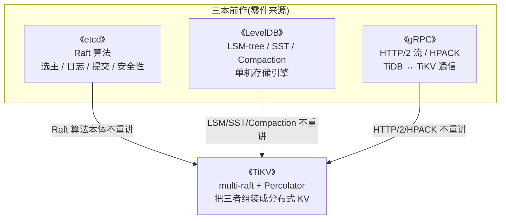
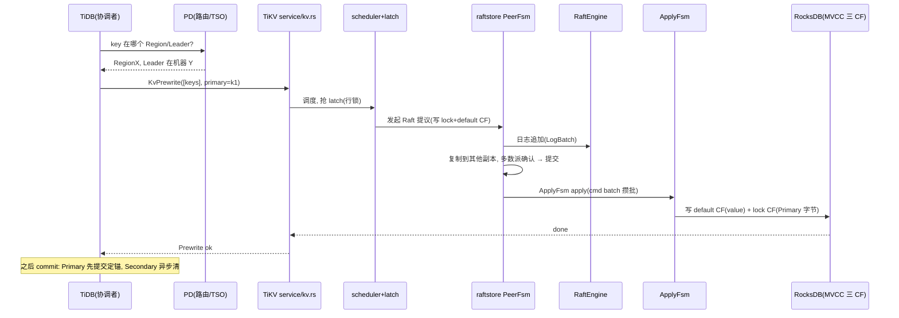

# 第 7 篇 · 第 22 章 · 全书收束:从 etcd 到 TiKV 的跃迁

> **核心问题**:把一致性从"一个 Raft 组管全量"放大到"百万个 Raft 组各管一片"、再用 Percolator 跨组拼出 ACID,这一步跃迁到底得到了什么、又付出了什么?走到全书最后一章,我们不再展开新机制,而是把 21 章拼成一张完整的得失账,看清 TiKV 在 etcd 之上做的是一次什么样的工程跃迁,以及它当下正在换的那副新骨架。

> **读完本章你会明白**:
> 1. etcd → TiKV 的跃迁不是"把 etcd 做大",而是**把一致性这个昂贵资源按 Region 切成百万份**再**用 Percolator 把跨组事务拼回来**——得到了线性扩展和高可用,代价是调度复杂度和协调开销。
> 2. 对照表里每一项"得到了什么",背后都对应一项"付出了什么",没有白来的好处。
> 3. 为什么 TiKV 当下正在换骨架:raftstore-v2、RaftEngine、in_memory_engine、resource_control、causal_ts——每一个都是 v1 扛住新需求后冒出来的天花板,每一个都回答了"当一套架构顶不住时该怎么换"。
> 4. 全书站在《etcd》《LevelDB》《gRPC》三本之上,读它等于把三本复习并深化一遍。

> **如果只想记住一句话**:TiKV 的全部精巧,都建立在两个跃迁之上——**把一个 Raft 组切成百万个(multi-raft),再把跨组的事务用一个 Primary Key 锚点拼回 ACID(Percolator)**;前者是"分",后者是"合",合的代价就是分带来的原罪。

---

## 〇、一句话点破

> **TiKV 没有发明任何 Raft 算法层面的新东西,它做的是两件工程上的放大:把一致性切成百万份(multi-raft,换线性扩展),再把被切碎的事务用一个 Primary Key 重新拧成 ACID(Percolator,换跨分片原子性)。得到了什么写在产品宣传册上,付出了什么写在 21 章的源码里。**

这是结论,不是理由。本章倒过来拆:先用一张大表把 etcd 和 TiKV 逐项对照,看清每一处跃迁的得失;再单独拎出"得到了什么"和"付出了什么"两条线,讲清每条得失的根;然后看 TiKV 当下正在换的新骨架,理解"架构演进"这件事本身;最后把全书和三本前作的承接关系收束。

---

## 一、回扣全书主线和二分法

在开始对照之前,先把全书反复回扣的那句话再钉一次,这是后面一切讨论的锚。

**全书主线一句话**:

> 如何用成千上万个 Raft 组(multi-raft)分片扛住海量数据,每个 Region 一个 Raft 组保证"不丢不乱",再用 Percolator 跨 Region 拼出分布式 ACID 事务?

**全书二分法**:任何一处看不懂某个机制,回到这句问——这是在**让单个 Region 内部不丢不乱(复制层)**,还是在**让跨 Region 的事务 ACID(事务层)**?

- **复制层**(第 1~3 篇,P1-02 ~ P3-11):Region、multi-Raft、batch-system、RaftEngine、RocksDB Apply、分裂迁移 Snapshot。决定"数据怎么存、怎么不丢、怎么扩展"。
- **事务层**(第 3~6 篇,P3-10 ~ P6-21):Percolator 两阶段提交、MVCC 编码、scheduler + latch、TSO、悲观锁、GC、CDC。决定"跨 Region 的操作怎么 ACID"。

这 21 章拆的所有技巧——FSM、batch-system、LogBatch、Primary 字节内容、encode_u64_desc、WriteBatch 跨 Region 攒批、resolved_ts 双索引、水库采样热点识别、compaction filter 零额外扫描——都是这两面之一的工程实现。本章不再展开任何一个,只把它们排成一张得失账。

---

## 二、etcd → TiKV 跃迁对照总表

下面这张表是本章的核心。逐项对照 etcd 和 TiKV,每一项都标出"得到了什么 / 付出了什么",并指向本书讲透它的那一章。

| 维度 | etcd(一组 Raft) | TiKV(百万组 Raft) | 得到了什么 | 付出了什么 | 本书对应章 |
|------|------------------|---------------------|------------|------------|------------|
| **复制单位** | 全量 KV 进一条 Raft 日志 | 按 key range 切 Region,每 Region 一条独立日志 | 日志变短,追平新副本快;日志随 Region 散布,不再臃肿 | 切了之后跨 Region 失去天然原子性,要 Percolator 拼 | [P1-02](P1-02-Region-把海量key切成一段段.md)、[P2-05](P2-05-raftstore全貌-一条写请求的旅程.md) |
| **Raft 组数量** | 1 个 | 几十万 ~ 百万个(每 Region 一个) | 吞吐随节点线性扩展,不再是单 Leader 瓶颈 | 几十万组怎么共存?要 batch-system + FSM,工程复杂度陡增 | [P1-03](P1-03-Raft库回顾与multi-Raft的挑战.md)、[P1-04](P1-04-batch-system-FSM-一个线程池驱动百万Peer.md) |
| **Leader 分布** | 全集群一个 Leader | 每个 Region 一个 Leader,Leader 散布在所有节点 | 写入压力天然分散到所有机器,加机器即加吞吐 | Leader 哪个机器、副本怎么放,要 PD 全局调度 | [P5-16](P5-16-PD的角色-TSO-调度-ID分配.md)、[P5-18](P5-18-Region调度-balance与热点.md) |
| **存储扩展** | 绑死单机磁盘上限 | Region 挪到新节点即可扩容,容量随节点数线性增长 | 存储无上限,数据涨了加机器 | Region 迁移要传 Snapshot(或本地继承)、迁移期间服务抖动 | [P2-08](P2-08-Region分裂迁移与Snapshot.md) |
| **日志存储** | Raft 日志塞进 etcd 自己的存储(BoltDB) | RaftEngine 专用日志引擎(替代存 RocksDB 的 raft CF) | 写放大从 10~30 倍降到接近 1 倍,Compaction 无抖动 | 多一个引擎要维护,新旧引擎要提供迁移工具 | [P2-06](P2-06-Raft日志存储-RaftEngine.md) |
| **组内原子性** | 一条日志提交是原子的,一个事务天然原子 | 单 Region 内 Raft 保证原子,跨 Region 不保证 | (etcd 的天然优势;TiKV 主动放弃了它换扩展性) | 跨 Region 事务失去原子性,这是 multi-raft 的"原罪" | [P4-12](P4-12-事务模型全景-scheduler-latch-双引擎.md) |
| **跨组事务** | 不需要(全在一个组) | Percolator 两阶段提交,选一个 Primary Key 当锚 | 跨多个 Raft 组的事务也能 ACID | 协调开销(两阶段、读 Secondary 遇锁查 Primary)、延迟被最慢 key 拖 | [P4-13](P4-13-Prewrite预写-选Primary加锁.md)、[P4-14](P4-14-Commit提交与Secondary清理.md) |
| **并发控制** | 单 Leader 串行,天然有序 | scheduler + latch 行级锁 + MVCC + TSO | 海量并发不互相阻塞,SI 隔离 | latch 排队、MVCC 多版本堆积、TSO 单点 | [P4-12](P4-12-事务模型全景-scheduler-latch-双引擎.md)、[P3-10](P3-10-MVCC编码-key加时间戳.md)、[P5-17](P5-17-TSO-全局单调递增的时间戳.md) |
| **全局时间戳** | 不需要(单组内 Raft 日志即序) | TSO(PD 集中分配,物理时钟 + 逻辑计数) | MVCC 有了全局版本序,跨组事务能排序 | TSO 是单点(PD leader),leader 切换有秒级空窗 | [P5-17](P5-17-TSO-全局单调递增的时间戳.md) |
| **读路径** | etcd ReadIndex / lease read | MVCC scanner + resolved_ts + check_leader + Coprocessor 下推 | 跨海量 Region 并发读、follower read、计算下推省网络 | scanner 要处理锁、resolved_ts 要订阅 apply 流、check_leader 要 quorum 往返 | [P4-15](P4-15-MVCC读取与锁的解决.md)、[P5-17](P5-17-TSO-全局单调递增的时间戳.md)、[P6-19](P6-19-Coprocessor-把计算下推.md) |
| **分裂粒度** | 不分裂(全量一个组) | Region 大小 256MB(v1)/ 10GB(v2),自动分裂 | 热点可精细分散,大 Region 自动切小 | 分裂要 PD 分配 id、走 Raft admin 命令、apply 时改 epoch | [P1-02](P1-02-Region-把海量key切成一段段.md)、[P2-08](P2-08-Region分裂迁移与Snapshot.md) |
| **调度** | 不需要调度(一个组) | PD 全局调度(balance leader/region、hot region、split) | 自动均衡、热点自动分散、节点加减自适应 | PD 是中心化大脑,自身要 Raft 高可用;调度决策与执行要解耦 | [P5-16](P5-16-PD的角色-TSO-调度-ID分配.md)、[P5-18](P5-18-Region调度-balance与热点.md) |
| **GC** | 不需要(数据量小) | MVCC 老版本堆积,要 GC + compaction filter | (MVCC 的必然代价) | safe_point 计算、compaction filter 借 RocksDB 遍历、flashback 复用事务机制 | [P6-20](P6-20-GC与flashback-MVCC老版本回收.md) |
| **Rust 选型** | etcd 用 Go(GC 停顿在那种规模可控) | TiKV 用 Rust(无 GC 停顿、编译期内存安全) | C++ 级性能 + 无数据竞争、无 use-after-free | 学习曲线陡、开发慢,但核心交易链路值得 | [P0-01](P0-01-第一性原理-为什么需要TiKV.md) |

> **钉死这张表的读法**:不要只看"得到了什么"那一列,那一列是产品宣传册;真正理解 TiKV,要看"付出了什么"那一列——它对应 21 章源码里每一个 FSM、每一个 LogBatch、每一个 Primary 字节、每一个 resolved_ts。**所有的得,都是有代价的;所有的代价,都有源码级的工程来收敛。** 这就是本书 21 章拆的全部内容。

下面把这张表的两条线单独拎出来,讲透每条得失的根。

---

## 三、得到了什么:四件 etcd 给不了的东西

对照表的"得到了什么"列,归并起来就四件事:**线性扩展、跨分片 ACID、海量并发不阻塞、计算下推省网络**。逐条讲根。

### 得到一:线性扩展(吞吐和存储随节点数增长)

这是 multi-raft 最直接的回报。etcd 的单 Leader 是吞吐天花板、单机磁盘是存储天花板,这两个天花板在 TiKV 里被同一个动作打破——**把数据切成 Region,每个 Region 一个 Raft 组,Leader 和副本都散布在所有节点**。

- **吞吐天花板打破**:写 `key1` 走 Region1 的 Leader(在机器 A),写 `key2` 走 Region2 的 Leader(在机器 B),天然并行。加一台机器,PD 把一批 Region 的 Leader 挪过去,吞吐就涨一截。
- **存储天花板打破**:每个 Region 只有 256MB,一台机器放几万个 Region 没压力;数据涨了,加机器 + 让 PD 挪 Region 过去。

> **根在哪儿**:线性扩展的根,是 **96MB → 256MB → 10GB 这个 Region 粒度权衡**。P1-02 拆过这个甜点:太小(几千万个 Region)调度开销爆炸,太大(几个 GB)分裂迁移笨重。TiKV 8.3.0 把默认从 96MB 调到 256MB([`SPLIT_SIZE = ReadableSize::mb(256)`](../tikv/components/raftstore/src/coprocessor/config.rs#L75)),是因为集群规模变大后 Region 数量爆炸的压力超过了单 Region 笨重的压力;raftstore-v2 干脆默认 10GB([`RAFTSTORE_V2_SPLIT_SIZE = ReadableSize::gb(10)`](../tikv/components/raftstore/src/coprocessor/config.rs#L76)),是因为 v2 多线程化 + per-Region tablet 让大 Region 不再笨重。**Region 大小不是常数,是架构能力的函数。**

### 得到二:跨分片 ACID(Percolator 拼回来的原子性)

这是 multi-raft 最贵的回报,也是 TiKV 区别于"纯 KV 存储"的灵魂。Raft 只保证单 Region 一致,跨多个 Region 的事务(一次转账改两个 Region)失去原子性——这是 multi-raft 的"原罪"。Percolator 用一个 Primary Key 当锚,把分散在多个 Raft 组里的写,在逻辑上重新拧成一条事务。

- **Primary 是事务成败的唯一裁决者**:Primary 提交了 = 成功,没提交 = 失败。任何对 Secondary 的收尾,都以 Primary 状态为准。
- **协调成本摊薄**:Percolator 不要全局协调者实时盯每个写,把协调摊到"读 Secondary 遇到锁才查 Primary"上。

> **根在哪儿**:P4-13 拆过一个最反直觉的细节——Primary 不是布尔标记,是**字节内容**。每个 Secondary 锁的 `primary` 字段都存着 Primary key 的完整字节([`Lock::new(lock_type, self.txn_props.primary.to_vec(), ...)`](../tikv/src/storage/txn/actions/prewrite.rs))。任何读到 Secondary 锁的人,顺着这串字节去 Primary 所在 Raft 组查状态(`check_txn_status`),事务成败被归约成 **Primary 所在 Raft 组里的单点事实**——Raft 多数派保证这个事实不丢。**这就是"凭什么一个 Primary 就能跨组 ACID"的源码级答案:它把分布式裁决,归约成了 Raft 已经保证的单点可靠。**

### 得到三:海量并发不阻塞(scheduler + latch + MVCC + TSO)

etcd 单 Leader 串行处理写,并发量被 Leader 一台机器的 CPU 卡死。TiKV 把并发控制拆成三层:

- **latch**(行级锁,key 哈希到 slot):同一行的并发写在进 Raft 前排队,避免 Raft 重复提议浪费;不同行完全不阻塞。P4-12 拆过 latch 无死锁靠 `gen_lock` 排序去重的静态不变式。
- **MVCC**(key + ts):读不阻塞写、写不阻塞读,靠多版本。P3-10 拆过 `encode_u64_desc`(`!v` 取反大端)让大 ts 排在前,正向 seek 一次拿最新版本。
- **TSO**(全局时间戳):跨 Region 的事务能排序,靠 PD 集中分配。P5-17 拆过物理时钟左移 18 位 + 逻辑计数的三层混编。

> **根在哪儿**:这三层合力,让 TiKV 能扛住几百万 QPS 而不互相阻塞。但每一层都有代价:latch 排队(延迟)、MVCC 多版本(磁盘堆积,要 GC)、TSO 单点(PD leader 挂了有空窗)。**并发的得,是用三套机制的开销换来的。**

### 得到四:计算下推省网络(Coprocessor)

etcd 是纯 KV,没有"下推"概念。TiKV 的 Coprocessor 把 SQL 的过滤 / 聚合搬到 TiKV 执行,只回传聚合结果而非全表数据。

> **根在哪儿**:P6-19 拆过,不下推网络是不可逾越的瓶颈——几千万行扫一遍传 GB 级数据,任何集群都顶不住。TiKV 不跑 SQL,跑 tipb 描述的 DAG 算子树,volcano 批量模型 + 列式 chunk + memory_quota 限内存,让 OLAP 和 OLTP 能在同一个存储上共存。**下推省的是网络,代价是 TiKV 要内置一个查询执行器。**

---

## 四、付出了什么:四笔账,每一笔都有源码在收

对照表的"付出了什么"列,归并起来也是四笔账:**multi-raft 调度复杂度、Percolator 协调开销、TSO 单点瓶颈、写放大**。每一笔都不是"问题",而是"TiKV 21 章源码在收的账"。

### 付出一:multi-raft 调度复杂度(batch-system + PD)

几十万个 Raft 组在一个进程里怎么跑?朴素做法(每 Region 一个线程)会以栈内存、上下文切换、cache 抖动三重爆炸。TiKV 的招牌解法是 **FSM + batch-system**(P1-04):

- 每个 Peer 抽象成 FSM,状态私有,消灭锁。
- 少量线程(默认 pool_size=2)批量轮询几十万个 PeerFsm,一个线程一次处理一批。
- `FsmState` 三态(IDLE/NOTIFIED/DROP)+ 一个 CAS 实现无锁所有权流转;`Poller::poll`([`components/batch-system/src/batch.rs`](../tikv/components/batch-system/src/batch.rs))批量取一批 FSM,热点 FSM 超时只 reschedule 一半(`hot_fsm_count % 2`)防扎堆。

这是 TiKV 最硬的工程技巧之一。它把"百万个 Raft 怎么共存"这个看似无解的问题,化解成了"少量线程 + actor 模型 + 批量消息"。但代价是:**整套 batch-system / Router / mailbox / FsmState 的复杂度,全部是 multi-raft 引入的,etcd 根本不需要这套东西。**

调度上还要 PD 全局视图:PD 自己跑 Raft 高可用(P5-16),管三件事(TSO / 调度 / ID 分配),决策权在 PD、执行权在 TiKV(指令走 Raft admin 命令)。**PD 这个中心化大脑,本身就是一个工程妥协:用"PD 集群高可用"换"全局调度能力"。**

### 付出二:Percolator 协调开销(两阶段 + 读时查 Primary)

Percolator 拼回了跨组 ACID,但代价是**协调开销**:

- **两阶段延迟**:prewrite 要给所有 key 加锁,commit 要先提交 Primary 再异步清 Secondary,事务延迟天然比单组提交多一倍。P4-12 拆过悲观锁三档(Sync / Pipelined / InMemory),就是为了把这个延迟压下去:Pipelined 在 Propose 后就返回(不等 Raft 提交),8.x 默认;InMemory 只写内存表(9.x),代价是丢锁要 amend 补全。
- **读 Secondary 遇锁查 Primary**:谁读到 Secondary 的锁,要发 `CheckTxnStatus` RPC 去 Primary 所在 Raft 组查状态。P4-14 拆过 `txn_status_cache` 缓存 Primary 状态,把重复 RPC 从 O(读次数)降到 O(1),但缓存本身是开销。
- **Secondary 清理是懒的**:这意味着 lock CF 里会残留大量已提交事务的 Secondary 锁,直到被读触发或被 GC 清。这是 lock CF 比预期臃肿的根。

> **钉死这笔账**:Percolator 的协调开销不是 bug,是设计。它把"全局协调"摊薄成了"按需查询",所以能扛住海量并发——**协调成本只在需要时才付**。但"按需"就意味着延迟不确定、lock CF 会堆积,这些是 Percolator 模型的固有代价,只能用缓存、Pipelined、GC 去收敛,无法消除。

### 付出三:TSO 单点瓶颈(PD leader)

MVCC 要全局时间戳,跨 Region 事务要排序,这都要 TSO。TSO 由 PD leader 集中分配——**这是 TiKV 事务层唯一的单点**。

- **leader 切换有空窗**:P5-17 拆过,新 leader 要等保护期(~3 秒)+ 校准物理时钟(取老 leader 持久化值和本地墙钟较大者)+ 逻辑清零。这几秒里整个集群拿不到新时间戳,事务阻塞。
- **单 leader 吞吐上限**:虽然客户端批量(64 个/批)+ 服务端批量推进 logical 缓解,但单 leader 的 CPU 仍是天花板。

> **TiKV 怎么收敛这笔账**:① PD 自己跑 Raft,挂一个不影响;② 客户端专用 gRPC 双向流 + 后台线程批量攒请求,RPC 次数降两个数量级;③ `resolved_ts`(TiKV 侧算)让大部分读不需要实时问 TSO;④ 9.x 的 `causal_ts`(CDC 用,批量预取 + 本地推算)进一步降低对 TSO 的实时依赖。**TSO 单点是 TiKV 主动接受的中心化代价,用一整套机制把它收敛到"可接受"的范围内。**

### 付出四:写放大和磁盘堆积(MVCC + GC)

MVCC 让读不阻塞写,代价是每个 key 存多个版本,磁盘堆积。P6-20 拆过 GC 的两套执行路径:active GC(扫两遍,写放大)和 compaction filter(9.x 主线,借 RocksDB compaction 遍历,零额外扫描零写放大)。`check_need_gc` 用 TableProperties 跳过老版本少的 SST。

写放大还有另一层——Raft 日志。P2-06 拆过,老版本把 Raft log 塞 RocksDB 的 raft CF,带来 10~30 倍写放大。RaftEngine 把这个降到接近 1 倍。

> **根在哪儿**:写放大是"多副本 + 多版本"的必然代价。Raft 让每个写复制 3 份(默认 3 副本),MVCC 让每个 key 存多版本,两者叠加,写放大天然存在。TiKV 能做的不是消除它,而是用 RaftEngine(日志写放大~1)、compaction filter(GC 零额外写)、cmd batch 攒批(摊薄每次 RocksDB 写的固定开销)把它压到最低。**写放大是物理规律,RaftEngine 和 compaction filter 是工程上对它的最优回应。**

---

## 五、TiKV 正在换的新骨架(演进展望)

走到 9.0.0-beta.2,TiKV 处于多处架构演进中。这些演进不是"加了几个特性",而是**v1 扛住新需求后冒出来的天花板,每一个都对应一次骨架更换**。讲清它们,就讲清了"当一套架构顶不住时该怎么换"——这本身就是理解 TiKV 设计哲学的教材。

### 演进一:raftstore-v2(多线程 raftstore)

v1 的 batch-system 是"单 store 一个 batch-system,2 个线程驱动几十万 Peer"。这在 Region 数量到百万级、单 Region 写入密集时,开始顶不住——2 个线程要把几十万 Peer 的 Raft tick、日志写、消息处理全扛了。

v2 的回答:**打破"单 store 一个 batch-system"**,让 Raft 调度多线程化。P1-04 对照过,v2 仍基于 FSM + mailbox(actor 模型不变),但把 Peer 分到多个线程,更细粒度并行。配套的改动:

- **per-Region tablet**(P3-09):v1 是一个 RocksDB 多 CF,v2 是每个 Region 一个独立 tablet(RocksDB 实例),分裂快、Compaction 隔离。
- **Snapshot 用 RocksDB checkpoint API**(P2-08):v1 scan SST(慢),v2 克隆整个 tablet(几秒,原子)。
- **Region 默认 10GB**:tablet 独立后大 Region 不再笨重。

> **这次换骨架的根**:v1 的"单 batch-system + 共享 RocksDB"是百万 Region 时代的甜点,但 Region 数量继续涨、单 Region 写入密集时,单 batch-system 的 2 个线程成了新瓶颈。v2 用"多线程 + per-Region tablet"换并行度,代价是工程复杂度大幅上升(多线程 FSM 的正确性、tablet 数量爆炸的管理)。**这是典型的"复杂度守恒":v1 把复杂度压在 batch-system 里,v2 把它分散到多线程 + 多 tablet 里。**

### 演进二:RaftEngine 替代 RocksDB 存日志(已完成,主线)

这是全书反复强调的演进,也是 P2-06 的招牌。老资料讲"Raft log 存 RocksDB 的 raft CF",**新版用专用 RaftEngine 独立存储**。根在访问模式不匹配:Raft 日志是纯顺序追加 + 整段截断,LSM-tree 优化的是随机写 + 按 key 查,塞进去带来写放大 10~30 倍、Compaction 抖动、GC 难做四宗罪。

RaftEngine 三原则:① 每 Raft 组独立逻辑流;② LogBatch 批量攒多组写;③ 按文件整段回收(`Command::Compact`)。写放大降到接近 1 倍。

> **这次换骨架的根**:不是 RocksDB 不好,是它的优化目标和 Raft 日志的访问模式根本不匹配。**专用引擎是对"负载不匹配"的最优回应——与其在一个通用引擎上打补丁,不如为这个特定负载写一个专用引擎。** 这也呼应了《LevelDB》那本讲的"LSM-tree 适合什么、不适合什么":Raft 日志恰好是 LSM 不适合的那一类。这个演进已经完成,RaftEngine 是 9.x 的默认。

### 演进三:in_memory_engine(热数据放内存)

8.x 引入。P3-09 拆过,IME 不是独立引擎,是 RocksDB 的只读缓存层——**共享 sequence number** 保证内存和磁盘数据对齐(读 IME = 读 RocksDB 某 seq 快照)。这是热数据加速读的工程回应。

> **这次换骨架的根**:单机 RocksDB 的读延迟,在大数据量下会被 SST 层数拖累(L0 → Lmax 层层查找)。热数据如果能放内存,就能跳过 SST 查找。但"放内存"不能破坏一致性——IME 用共享 seq number 解决这个,这正是承接《内存分配器》那本"快慢道"思想的体现。**IME 是"读热点的快道",RocksDB 是"全量数据的慢道",两者用 seq number 对齐。**

### 演进四:resource_control(资源管控)

8.x 引入。P5-16 提过,这是 RU(资源单元)配额,让不同租户 / 不同优先级的请求在同一个 TiKV 上不互相挤压。

> **这次换骨架的根**:多租户场景下,一个慢查询 / 大导入会吃掉整个 TiKV 的 CPU / IO,影响其他租户。resource_control 给每个请求打 quota 标签,在 scheduler / read pool / Raft 层做配额检查,把"一个租户拖垮全集群"的风险隔离掉。**这是 TiKV 从"单租户存储"走向"多租户云存储"的关键一步。**

### 演进五:causal_ts(因果时间戳)

9.x。P5-17 拆过,TSO 是单点,leader 切换有空窗。causal_ts 是给 CDC 用的——批量预取 + 本地推算,降低对 TSO 实时依赖。leader 切换时 flush 一次保证因果序。

> **这次换骨架的根**:CDC 要把变更实时推下游,每个变更都要带时间戳。如果每次变更都问 TSO,TSO 单点会被打爆。causal_ts 让 TiKV 本地批量推算时间戳(因果序保证不乱),只在 leader 切换时和 TSO 同步一次。**这是"把集中式的全局序,降级成因果序"的典型手法——CDC 这种只要求因果一致(不要求全局线性一致)的场景,正好能用。**

### 演进六:其他(悲观锁三档、async commit、1PC、pipelined DML)

还有一批小演进,散在各章:

- **悲观锁三档**(P4-12):Sync(走完 Raft)/ Pipelined(Propose 后返回,8.x 默认)/ InMemory(只写内存,9.x)。逐步放弃持久性换延迟。
- **async commit / 1PC**(P4-13/14):8.x。单 Region 事务直接 1PC 提交(不两阶段);多 Region 用 async commit(推迟 commit_ts 到 prewrite 时算)。减少 RPC 往返。
- **generation / pipelined DML**(P4-13):9.x。大事务拆成多个 generation 流水线提交。
- **flashback**(P6-20):6.x 引入。用旧 version 当新数据走 prewrite + commit,复用事务机制闪回。
- **hibernate 默认开**(P2-07):5.0 后。空闲 Region leader 休眠省 CPU。
- **load-base split**(P5-18):5.0。本地识别热点自动分裂。

> **钉死演进的逻辑**:这些演进不是随机加的,每一个都对应 v1 在某个场景下顶不住的天花板——**Region 数量爆炸 → v2 多线程;Raft 日志写放大 → RaftEngine;读热点慢 → IME;多租户挤压 → resource_control;TSO 单点 → causal_ts;事务延迟 → Pipelined / async commit / 1PC**。理解了"每个天花板对应一个演进",就理解了 TiKV 的设计哲学:**架构是需求逼出来的,不是设计出来的。** 这也是本书把"架构演进"作为第五节专门交代的原因——老博客讲 Raft-log-in-RocksDB、单线程 raftstore、无 IME 的内容大片过时,不能当唯一依据。

---

## 六、三重承接收尾:本书站在三本之上

最后收束本书的最大特色——**三重承接**。TiKV 里没有几个零件是"全新发明"的,它的核心组件大多在前作里讲过。本书的篇幅,全部留给了 TiKV 独有的部分。

具体到章节:

- **Raft ←《etcd》**:Raft 怎么选主、日志怎么复制、怎么提交、安全性怎么保证——这些**本书不重复讲**。涉及处一句话带过 + 指路《etcd》。本书只讲"怎么从一个 Raft 实例扩展成百万个"(P1-03、P1-04、P2-05)。涉及 Raft 库源码时,引 `raft` crate(来自 [`tikv/raft-rs`](../tikv/Cargo.toml#L207),逻辑与 etcd-raft 一致,可对照)。
- **单机引擎 ←《LevelDB》**:LSM-tree、SST、Compaction、Bloom filter——这些**本书不重复讲**。本书只讲"TiKV 怎么用 RocksDB 的 CF 组织 MVCC 数据"(P3-09、P3-10、P3-11)、"Raft 日志为什么不用 LSM"(P2-06)、"compaction filter 怎么做 GC"(P6-20)。
- **RPC ←《gRPC》**:HTTP/2、HPACK、流——这些**本书不重复讲**。本书只讲"TiKV 在 gRPC 之上定义了哪些 RPC、怎么用"(P2-05 的 batch_raft 流、P5-16 的 TSO 专用流、P6-19 的 Coprocessor DAG 流)。

> **钉死这句话**:读这本书,等于把《etcd》《LevelDB》《gRPC》三本**复习并深化一遍**——因为 TiKV 把三者的核心零件,组装成了一个真实在生产里扛住几十 TB、百万 QPS 的分布式数据库。如果你读本书时某处觉得"这个机制我好像在哪见过",去翻前作对应章节,大概率能找到更深的拆解。

---

## 七、想继续深入往哪钻(进阶路线)

合上这本书,如果还想继续深入,这里有几条路:

**源码路线**(本书附录 A 给了完整地图):

1. 从入口 `src/server/service/kv.rs` 收 gRPC 请求开始,顺着一条写请求往下读。
2. 经 `src/storage/txn/scheduler.rs`(事务调度)、`latch.rs`(行锁)。
3. 落到 `components/raftstore/src/store/fsm/peer.rs`(PeerFsm 发起提议)、`entry_storage.rs`(日志)、`fsm/apply.rs`(ApplyFsm 落盘)。
4. 最终到 `components/engine_rocks/`(RocksDB)、`components/txn_types/`(MVCC 编码)。
5. 详见 [附录 A · 源码全景路线图](附录A-源码全景路线图.md),每站标了对应章节。

**论文路线**:

- **Percolator**:Google 2010 年论文《Large-scale Incremental Processing Using Distributed Transactions and Notifications》(Percolator 原始论文,本书第 4 篇逐条拆到源码级)。
- **Raft**:Diego Ongaro 2014 年博士论文《In Search of an Understandable Consensus Algorithm》(承接《etcd》那本)。
- **Spanner**:Google 2012 年论文《Spanner: Google's Globally-Distributed Database》(TSO / TrueTime 的鼻祖,对照 TiKV 的 TSO)。
- **Dynamo / Cassandra**:对照"最终一致"和"强一致"两种分布式存储哲学。

**配套前作**:

- 想深挖 Raft 算法:读《etcd》那本(本书 P1-03、P2-05、P2-07、P2-08、P5-16、P5-17、P6-21 都承接它)。
- 想深挖 LSM / SST / Compaction:读《LevelDB》那本(本书 P1-02、P2-06、P2-08、P3-09、P3-10、P3-11、P6-20 都承接它)。
- 想深挖 HTTP/2 / gRPC 流:读《gRPC》那本(本书 P2-05、P5-16、P6-19 都承接它)。

**动手路线**(本书附录 B):

- 用 `tikv-ctl` 看一个集群的 Region 分布、RocksDB 状态、事务锁。
- 用 `pd-ctl` 看 Region 调度、TSO、safe point。
- 看 Grafana 的 raftstore / scheduler / GC 延迟面板。
- 详见 [附录 B · 工具链与实践](附录B-工具链与实践.md)。

---

## 八、章末五个为什么(全书总账)

这是全书的最后一个"五个为什么",把 21 章的精华压成五条:

1. **为什么 TiKV 不直接用 etcd,要搞 multi-raft?**——etcd 的"一个 Raft 组"是吞吐瓶颈(单 Leader)、存储天花板(单机磁盘)、无法切分(一条全局长日志)。multi-raft 把一致性切成百万份,Leader 散布、存储随节点扩展、日志随 Region 散布。**根是 etcd 主动让出了"大数据量"战场,TiKV 是为这个战场设计的。**

2. **为什么 multi-raft 之后,跨 Region 事务成了新难题,必须用 Percolator?**——Raft 只保证单 Region 一致,切开之后跨多个 Raft 组的事务失去原子性。Percolator 用一个 Primary Key 当锚,把事务成败归约成 Primary 所在 Raft 组的单点事实(Primary 是字节内容,存在锁里,顺着去查 Primary 状态)。**根是 multi-raft 的"原罪":扩展性和跨组原子性构成张力,Percolator 是填这个坑的。**

3. **为什么 TiKV 要 PD 中心化,而不是 Gossip 去中心化?**——TSO(全局序)、调度(全局均衡)、ID 分配(全局唯一)都需要全局视图,Gossip 只能做局部决策。中心化的代价是单点,用"PD 自己跑 Raft 高可用"收敛。**根是"全局最优调度"和"去中心化"不可兼得,TiKV 选了前者并用 Raft 兜底可用性。**

4. **为什么 Raft 日志要单独存(RaftEngine),不塞 RocksDB?**——Raft 日志访问模式(纯顺序追加 + 整段截断 + 区间批量读)和 LSM-tree 优化目标(随机写 + 按 key 查 + Compaction 收敛)根本不匹配。塞进去写放大 10~30 倍、Compaction 抖动。RaftEngine 是专用引擎,写放大~1。**根是"通用引擎打不过专用引擎",负载不匹配时该换就换。**

5. **为什么 TiKV 正在换骨架(v2 / IME / resource_control / causal_ts)?**——v1 的每个设计(单 batch-system、共享 RocksDB、单机存储、单租户、集中 TSO)都在某个新需求下顶不住:Region 数量爆炸 → v2 多线程;读热点慢 → IME;多租户挤压 → resource_control;TSO 实时依赖 → causal_ts。**根是"架构是需求逼出来的",每一副新骨架都对应一个 v1 扛不住的天花板。**

---

## 九、回扣 P0-01:从一句话到一本书

本书开篇 P0-01 用了一句话点破全书:

> **TiKV 把 etcd 的"一个 Raft 组管全量 KV"放大成了"百万个 Raft 组各管一片、再跨片用 Percolator 拼出 ACID 事务"——一致性从"一组"扩展到"一百万组",而事务还能 ACID。**

那时这是结论,不是理由。21 章倒过来拆:先讲单机为什么扛不住(P0-01),再讲 Region 怎么切(P1-02),再讲百万个 Raft 怎么共存(P1-03、P1-04),再讲 raftstore 怎么把 Raft 跑起来(P2-05~08),再讲 Raft 命令怎么落盘 RocksDB(P3-09~11),再讲跨 Region 事务怎么用 Percolator 拼 ACID(P4-12~15),再讲 PD 怎么协调(P5-16~18),再讲生产特性(P6-19~21)。

走到这里,这句话不再只是结论——它背后每一处跃迁,你都能在脑子里放映出源码级的全过程:

这条旅程,就是本书 21 章拆的全部内容。每一个箭头,都是某一章的主角;每一个箭头底下,都藏着 TiKV 工程师用 FSM、batch-system、LogBatch、Primary 字节、encode_u64_desc、resolved_ts 双索引、水库采样、compaction filter 换来的性能或正确性。

---

## 十、最后一句话

TiKV 是一本"集大成者"的书。它没有发明 Raft(那是 etcd 的),没有发明 LSM-tree(那是 LevelDB 的),没有发明 gRPC(那是 gRPC 那本的),甚至没有发明 Percolator(那是 Google 2010 年论文的)。它做的是**把这些零件,用 multi-raft 和 Percolator 两个跃迁,组装成一个能扛住几十 TB、百万 QPS 的分布式数据库**。

理解 TiKV,就是理解"怎么把一致性切成百万份、再把事务跨分片拼回来"。所有的 FSM、batch-system、RaftEngine、Primary 锚点、scheduler latch、TSO、resolved_ts、compaction filter,都是这两个跃迁的工程实现。**这两个跃迁的得,写在产品宣传册上;它们的代价,写在 21 章的源码里。**

合上这本书,你该能在脑子里放映出一条写请求从 TiDB 到 TiKV 落盘的全过程——以及每一步底下用了什么巧妙的手段。如果做到了,这本书的目的就达到了。

> **全书完。** 接下来推荐读 [附录 A · 源码全景路线图](附录A-源码全景路线图.md) 把 22 章串成一条可走的源码阅读路线,或读 [附录 B · 工具链与实践](附录B-工具链与实践.md) 把知识落到动手排查上。
