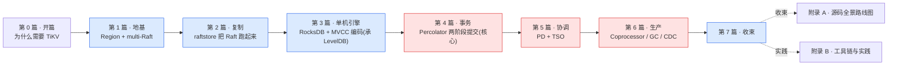

# 《TiKV 设计与实现深入浅出:为什么能把一个 Raft 放大成百万个》—— 目录与导读

> 一本写给"读过 etcd/TiDB 源码、用过 TiKV,却总觉得一知半解"的人的小书。
>
> **一句话主旨**:如何用成千上万个 Raft 组(multi-raft)分片扛住海量数据、每个 Region 一个 Raft 组保证不丢不乱,再用 Percolator 跨 Region 拼出分布式 ACID 事务?
>
> **二分法**(迷路时回到它):**复制层**(每个 Region 怎么不丢不乱:Region/multi-Raft/RaftEngine/RocksDB Apply) vs **事务层**(跨 Region 怎么拼出 ACID:Percolator/MVCC/TSO)。
>
> **主比喻**:直球为主、比喻点睛。开篇用"一群快递员分片送包裹"做一次性点睛(片区 = Region、每片区一个组长 = 一个 Raft 组的 leader、跨片区的连环单 = 跨 Region 事务要 Percolator 协调),全书不再建立贯穿重比喻。
>
> **三重承接**:Raft 算法承接《etcd》、单机引擎 RocksDB 承接《LevelDB》、RPC 层 gRPC 承接《gRPC》——读本书等于复习并深化这三本。

每章一行:**一句话钩子** —— 技巧标签 —— 二分法归属(`复制层` / `事务层` / `衔接` / `总览`)。

---

## 全书结构总览

旅程:从 etcd 的"一个 Raft 组管全量 KV",一路走到"百万个 Raft 组分片管海量数据、跨组用 Percolator 拼出 ACID"。每篇都是这次旅程上的一个驿站——读完你能在脑子里放映出一条写请求的全过程:TiDB 发 prewrite/commit → TiKV `service/kv.rs` 收 → scheduler 过 latch → raftstore 的 PeerFsm 发起 Raft 提议 → entry_storage 写 RaftEngine → Raft 复制 → ApplyFsm 把命令 apply 到 RocksDB(三 CF)→ 返回。

---

## 第 0 篇 · 开篇:为什么需要 TiKV

- [P0-01 · 第一性原理:为什么需要 TiKV](P0-01-第一性原理-为什么需要TiKV.md) —— etcd 一个 Raft 组撑不住海量数据(吞吐瓶颈、分裂难);TiKV 把数据切 Region、每 Region 一个 Raft(multi-raft),跨 Region 的事务用 Percolator 协调。 —— 单机瓶颈 + multi-raft + Percolator + 三重承接 —— `总览`

## 第 1 篇 · 地基:Region 与 multi-Raft

> 这一篇立起"被复制的单位"和"百万 Raft 组怎么共存"。是后面一切的基础,**建议顺序读**。

- [P1-02 · Region:把海量 key 切成一段段](P1-02-Region-把海量key切成一段段.md) —— 为什么不把全量数据一锅炖,要切成 key range 段?Region 怎么编号、怎么路由,为什么是 256MB 量级。 —— key 编码 + Region 元数据 + 分裂粒度权衡 —— `复制层`
- [P1-03 · Raft 库回顾与 multi-Raft 的挑战](P1-03-Raft库回顾与multi-Raft的挑战.md) —— Raft 算法承接《etcd》,本章只问:一个 Raft 库实例,怎么扩展成百万个?朴素地"每 Region 一个线程"为什么爆炸。 —— 朴素做法的瓶颈 + 批量 tick 思想 —— `复制层`
- [P1-04 · batch-system + FSM:一个线程池驱动百万 Peer](P1-04-batch-system-FSM-一个线程池驱动百万Peer.md) —— TiKV 的招牌:Peer 是 FSM,少量线程批量轮询百万个 PeerFsm,而非一个 Peer 一个线程。 —— FSM + 批量消息 actor 模型 + 三种 FSM 分工 —— `复制层(招牌)`

## 第 2 篇 · 复制:raftstore 怎么把 Raft 跑起来

> 这一篇是 TiKV 的心脏:百万个 Raft 组在一个进程里怎么真的转起来。

- [P2-05 · raftstore 全貌:一条写请求的旅程](P2-05-raftstore全貌-一条写请求的旅程.md) —— 一条写从 storage/txn 到 raftstore,经 Propose→Append→Replicate→Commit→Apply。 —— 五步流水线 + transport 发消息 —— `复制层/衔接`
- [P2-06 · Raft 日志存储:RaftEngine](P2-06-Raft日志存储-RaftEngine.md) —— Raft 日志存哪?新版用专用 RaftEngine(替代存 RocksDB,老资料过时)。 —— 为什么日志单独存 + entry 存储 + 回收 —— `复制层(招牌)`
- [P2-07 · 异步 IO 与 hibernate:省 CPU 的两手](P2-07-异步IO与hibernate-省CPU的两手.md) —— 百万 Peer 怎么不被 Raft tick 拖垮 CPU?读写挪独立线程,空闲 leader 休眠。 —— async_io 读写分离 + hibernate 空闲休眠 —— `复制层`
- [P2-08 · Region 分裂、迁移与 Snapshot](P2-08-Region分裂迁移与Snapshot.md) —— Region 太大切、节点不均迁、加副本传快照。 —— split + transfer leader + Snapshot SST —— `复制层`

## 第 3 篇 · 单机引擎:RocksDB 与 MVCC 编码(承接《LevelDB》)

> Raft commit 的命令最终落盘到 RocksDB。这一篇承接《LevelDB》的 LSM-tree。

- [P3-09 · RocksDB 引擎:LSM-tree + Column Family](P3-09-RocksDB引擎-LSM-tree与Column-Family.md) —— TiKV 单机引擎是 LevelDB 的工业级后代 RocksDB,一个实例开三个 CF 各司其职。 —— CF(default/write/lock)+ engine_traits 抽象 + in_memory_engine —— `复制层`
- [P3-10 · MVCC 编码:key + 时间戳](P3-10-MVCC编码-key加时间戳.md) —— 多版本怎么存?key 拼 ts,三个 CF 分工存 value/提交记录/锁。 —— key+ts 编码 + Write/Lock/Data 三 CF —— `事务层`
- [P3-11 · Apply 流水线:Raft 命令怎么落盘](P3-11-Apply流水线-Raft命令怎么落盘.md) —— Raft commit 的命令怎么变成 RocksDB 的写? —— ApplyFsm 批量 apply + cmd batch 攒批 —— `复制层/衔接`

## 第 4 篇 · 事务:Percolator 两阶段提交(TiKV 最核心)

> Raft 只保证单 Region 一致,但一个事务可能改多个 Region(跨多个 Raft 组)。怎么 ACID?答案:Percolator。这一篇是 TiKV 区别于"纯 KV 存储"的灵魂。

- [P4-12 · 事务模型全景:scheduler + latch + 双引擎](P4-12-事务模型全景-scheduler-latch-双引擎.md) —— TiDB 协调、TiKV 执行。scheduler 怎么调度、latch 行锁避免同行并发、乐观/悲观双引擎。 —— scheduler + latch 行锁 + 乐观/悲观 —— `事务层`
- [P4-13 · Prewrite 预写:选 Primary,加锁](P4-13-Prewrite预写-选Primary加锁.md) —— Percolator 第一阶段:选一个 Primary Key,给所有 key 写 lock。 —— Primary 锚点 + lock CF + value 先写 default —— `事务层(招牌)`
- [P4-14 · Commit 提交与 Secondary 清理](P4-14-Commit提交与Secondary清理.md) —— Percolator 第二阶段:Primary 先 commit(事务即成功),Secondary 异步清理。 —— Primary 提交定锚 + Secondary 异步清理(lazy) —— `事务层(招牌)`
- [P4-15 · MVCC 读取与锁的解决](P4-15-MVCC读取与锁的解决.md) —— 读怎么找可见版本?读到 lock 怎么办? —— scanner 找 ≤start_ts 的版本 + resolve_lock + 死锁检测 —— `事务层(招牌)`

## 第 5 篇 · 协调:PD 与全局时间戳

> 事务需要全局序(MVCC 的 ts 从哪来)、Region 需要调度。这都是 PD 的活。

- [P5-16 · PD 的角色:TSO + 调度 + ID 分配](P5-16-PD的角色-TSO-调度-ID分配.md) —— PD 是集群大脑,自己用 Raft 高可用,管三件事。 —— PD 三职责 + 自身 Raft 高可用 —— `事务层/衔接`
- [P5-17 · TSO:全局单调递增的时间戳](P5-17-TSO-全局单调递增的时间戳.md) —— MVCC 版本号、事务 start_ts/commit_ts 都从 TSO 来;resolved-ts 算安全点。 —— 集中分配 + 批量预分配 + resolved_ts —— `事务层(招牌)`
- [P5-18 · Region 调度:balance 与热点](P5-18-Region调度-balance与热点.md) —— 数据不均、热点怎么自动再平衡。 —— balance leader/region + hot region + split_controller —— `复制层/衔接`

## 第 6 篇 · 生产:Coprocessor、GC、悲观锁、CDC

- [P6-19 · Coprocessor:把计算下推](P6-19-Coprocessor-把计算下推.md) —— 为什么把 SQL 的过滤/聚合下推到 TiKV?省网络(只回聚合结果)。 —— 计算下推 + tidb_query 执行器 + tipb(走 gRPC) —— `事务层/可观测(承《gRPC》)`
- [P6-20 · GC 与 flashback:MVCC 老版本回收](P6-20-GC与flashback-MVCC老版本回收.md) —— MVCC 会堆积海量老版本,怎么清? —— GC safe point + compaction filter + flashback —— `事务层`
- [P6-21 · 悲观锁与 CDC](P6-21-悲观锁与CDC.md) —— 悲观事务怎么加锁、变更怎么实时推下游。 —— acquire_pessimistic_lock + lock_manager 死锁检测 + CDC —— `事务层`

## 第 7 篇 · 收束

- [P7-22 · 全书收束:从 etcd 到 TiKV 的跃迁](P7-22-全书收束-从etcd到TiKV的跃迁.md) —— 把一致性从"一组 Raft"放大到"百万组"、用 Percolator 跨组拼 ACID,得失几何。 —— etcd→TiKV 对照总表 + raftstore-v2/资源管控展望 —— `总览`

## 附录

- [附录 A · TiKV 源码全景路线图](附录A-源码全景路线图.md) —— kvproto gRPC(`service/kv.rs`)→ storage/txn(scheduler)→ raftstore(PeerFsm/RaftEngine/ApplyFsm)→ engine/RocksDB(CF)全栈地图 + 阅读顺序。
- [附录 B · TiKV 工具链与实践](附录B-工具链与实践.md) —— `tikv-ctl` / `pd-ctl` / TiUP 部署、Grafana 监控、与《TiDB》《etcd》《LevelDB》《gRPC》的承接关系、线上问题排查清单。

---

## 推荐阅读路线

**主线(推荐)**:P0-01 → 第 1 篇全(P1-02~04)→ 第 2 篇全(P2-05~08)→ 第 3 篇 → 第 4 篇 → 第 5 篇 → 第 6 篇 → 第 7 篇 → 附录 A。这是"一条写请求从 TiDB 到 TiKV 落盘再回来"的完整旅程,顺着读最省力。

按目标速查:

| 你的目标 | 读这几章 |
|------|------|
| 只想懂 TiKV 整体(为什么这么设计) | P0-01 → P1-04 → P4-13 → P4-14 → P7-22 |
| 只想懂 multi-raft(本书精华一) | P0-01 → P1-03 → P1-04 → P2-05 → P2-06 |
| 只想懂 Percolator 事务(本书精华二) | P3-10 → P4-12 → P4-13 → P4-14 → P4-15 |
| 只想懂 Raft 在 TiKV 怎么落地 | P1-04 → P2-05 → P2-06 → P2-07 → P3-11 |
| 已读过《etcd》,想看跃迁 | P0-01 → P1-03 → P1-04 → P2-05 → P7-22 |
| 想动手排查线上问题 | P5-18(Region 调度)→ 附录 B |

> 一个提醒:第 1 篇三章(Region → multi-Raft 挑战 → batch-system)层层递进,**不要跳着读这一篇**;第 4 篇四章(模型 → prewrite → commit → 读)也是严格依赖。

---

## 配套文件

- [全书规划-总纲](全书规划-总纲.md) —— 主线、二分法、三重承接、分篇分章(每章核心问题/源码/技巧)、源码策略、写作约定。
- [_章节写作提示词](_章节写作提示词.md) —— 写作执行手册(铁律、四段式、技巧精解、自检清单、架构演进坑)。
- 源码(本地 clone):`../tikv/`(`tikv/tikv` master @ `852b977`,版本 `9.0.0-beta.2`,nightly Rust)。本书所有源码引用均经 Grep/Read 核实行号,钉死在该 commit。
- **⚠️ 架构演进**:raftstore 经典(v1)vs raftstore-v2(新 multi-thread);RaftEngine 替代 RocksDB 存 Raft 日志;in_memory_engine/resource_control 为 8.x/9.x 新增。本书以经典 raftstore + 新版 RaftEngine 为准,老资料大片过时。

---

> 这本书讲的不是"TiKV 的概念有哪些",而是"它凭什么用百万个 Raft 组扛住海量数据、还跨组拼出 ACID 事务,源码里那些 FSM、batch-system、RaftEngine、Percolator、scheduler、latch 到底在干什么"。读完,你该能在脑子里放映出一条写请求从 TiDB 到 TiKV 落盘的全过程——以及每一步底下用了什么巧妙的手段。
