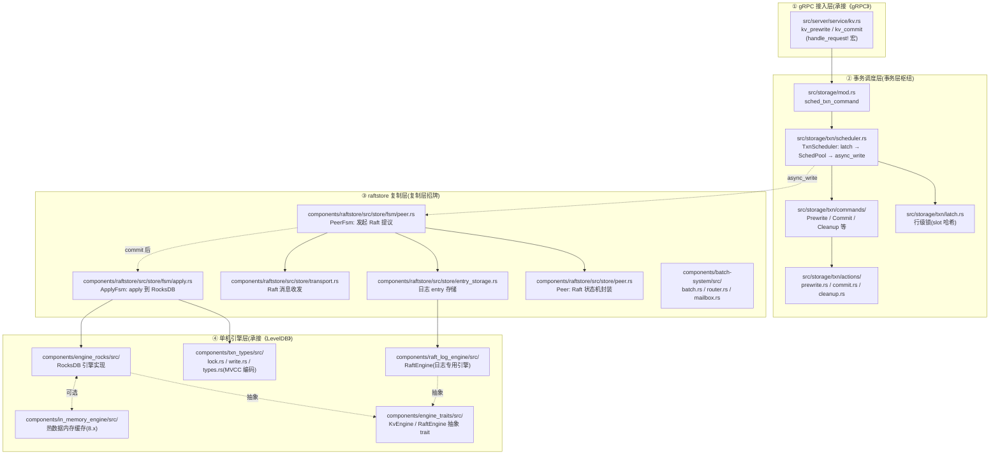

# 附录 A · TiKV 源码全景路线图

> 本附录给读者一张"从一条 gRPC 请求到落盘 RocksDB"的**全栈源码地图 + 推荐阅读顺序**,把全书 22 章串成一条可走的源码阅读路线。每站标出关键文件、对应章节、核心数据结构,让你读完某章能精确定位到源码。

> **源码版本**:全书以 `tikv/tikv` master @ commit `852b977`(版本 `9.0.0-beta.2`)为准。本附录所有文件路径均经 Grep/Read 核实,行号钉死在该 commit;不确定精确行号处只标文件不标行号。

---

## 一、全栈分层地图

一条写请求(prewrite)从 TiDB 到 TiKV 落盘,要穿过四层。每层的关键文件、对应章节、核心数据结构如下。

### 四层职责一句话

| 层 | 职责 | 对应二分法 | 承接前作 |
|------|------|------------|----------|
| ① gRPC 接入 | 收 TiDB 的 RPC(prewrite/commit/get/scan/coprocessor) | 衔接 | 《gRPC》 |
| ② 事务调度 | 抢 latch 行锁、调度事务命令、准备 MVCC 写、发起 Raft 提议 | 事务层 | — |
| ③ raftstore 复制 | Raft 提议、日志追加、复制、commit、apply | 复制层 | 《etcd》(Raft 算法) |
| ④ 单机引擎 | MVCC 编码、RocksDB 三 CF、RaftEngine 日志 | 复制层 / 事务层 | 《LevelDB》(LSM) |

> **迷路时回到这个二分法**:①②是事务层发起写、落到复制层的枢纽;③是复制层本体;④是两层的共同底座(RaftEngine 服务复制层、RocksDB 服务事务层)。

---

## 二、关键数据结构速查表

这些是全书反复出现的核心结构,标出定义位置和对应章节。

| 数据结构 | 定义位置 | 一句话职责 | 对应章 |
|----------|----------|------------|--------|
| `Service<E,L,F>` | [`src/server/service/kv.rs`](../tikv/src/server/service/kv.rs)(`impl Tikv for Service` 在 [L338](../tikv/src/server/service/kv.rs#L338)) | gRPC 服务入口,实现 kvproto 的 `Tikv` trait | P2-05、P6-19 |
| `Storage<E,L,F>` | [`src/storage/mod.rs`](../tikv/src/storage/mod.rs) | 事务 / 原始 KV 统一入口,`sched_txn_command` 在 [L1861](../tikv/src/storage/mod.rs#L1861) | P4-12 |
| `TxnScheduler` | [`src/storage/txn/scheduler.rs`](../tikv/src/storage/txn/scheduler.rs)(`run_cmd` 在 [L579](../tikv/src/storage/txn/scheduler.rs#L579)) | 事务命令调度:latch → SchedPool → async_write | P4-12 |
| `Lock` | [`components/txn_types/src/lock.rs`](../tikv/components/txn_types/src/lock.rs#L87) | MVCC 锁(含 `primary` 字节、`lock_type`、`for_update_ts`) | P3-10、P4-13 |
| `Write` | [`components/txn_types/src/write.rs`](../tikv/components/txn_types/src/write.rs#L71) | MVCC 提交记录(Put/Delete/Lock/Rollback,指向 default CF 的 value) | P3-10、P4-14 |
| `MvccTxn` | [`src/storage/mvcc/txn.rs`](../tikv/src/storage/mvcc/txn.rs#L60) | 一次事务操作的 MVCC 写聚合(攒一批 put_cf/delete_cf) | P4-13、P4-14 |
| `Peer<EK,ER>` | [`components/raftstore/src/store/peer.rs`](../tikv/components/raftstore/src/store/peer.rs#L714) | 一个 Region 副本的 Raft 状态机封装(RawNode + 状态) | P2-05 |
| `PeerFsm<EK,ER>` | [`components/raftstore/src/store/fsm/peer.rs`](../tikv/components/raftstore/src/store/fsm/peer.rs#L145) | Peer 的 FSM 包装(actor 模型,状态私有) | P1-04、P2-05 |
| `ApplyFsm<EK>` | [`components/raftstore/src/store/fsm/apply.rs`](../tikv/components/raftstore/src/store/fsm/apply.rs#L4048) | apply 的 FSM(批量 apply 已 commit 命令到 RocksDB) | P3-11 |
| `EntryStorage` | [`components/raftstore/src/store/entry_storage.rs`](../tikv/components/raftstore/src/store/entry_storage.rs)(`append` 在 [L1225](../tikv/components/raftstore/src/store/entry_storage.rs#L1225),`compact_to` 在 [L242](../tikv/components/raftstore/src/store/entry_storage.rs#L242)) | Raft 日志 entry 存储(对接 RaftEngine) | P2-06 |
| `Poller<N,C,H>` | [`components/batch-system/src/batch.rs`](../tikv/components/batch-system/src/batch.rs)(`poll` 在 [L382](../tikv/components/batch-system/src/batch.rs#L382)) | batch-system 的工作线程,批量 poll 一批 FSM | P1-04 |
| `Region`(metapb) | kvproto 的 `metapb.proto`(生成 Rust 代码) | Region 元数据(id / start_key / end_key / RegionEpoch / Peers) | P1-02 |
| `RegionEpoch` | kvproto 的 `metapb.proto` | Region 版本号(`version` 改边界、`conf_ver` 改副本) | P1-02、P2-08 |
| `KvEngine` trait | [`components/engine_traits/src/raft_engine.rs`](../tikv/components/engine_traits/src/raft_engine.rs)(`RaftEngine` trait 在 [L84](../tikv/components/engine_traits/src/raft_engine.rs#L84)) | RocksDB 抽象(屏蔽 RocksDB / IME / tablet) | P3-09 |
| `RaftEngine` trait | 同上 | 日志引擎抽象(屏蔽 RaftEngine / RocksDB raft CF) | P2-06 |

> **Region / Peer / metapb 的来源**:Region、Peer、RegionEpoch 这些结构不是 TiKV 自己定义的,是 kvproto(`tikv/pd` 仓的 `proto/metapb.proto`)用 protobuf 定义的,Rust 代码由 `raft-proto` crate 生成。读源码时如果找不到 `struct Region`,去 `metapb` 命名空间找。

---

## 三、推荐阅读顺序:顺一条写请求往下读

最有效的读法是**顺一条 prewrite 写请求,从入口往下读**。下面是推荐路线,每站标"读哪个文件、看什么、对应哪章"。

### 站 0:先把全书主线装进脑子

读源码前,先读 [P0-01](P0-01-第一性原理-为什么需要TiKV.md) 把主线(百万个 Raft 组分片 + Percolator 跨组 ACID)和二分法(复制层 vs 事务层)装进脑子。这是后续每一站的定位锚。

### 站 1:gRPC 入口 —— `service/kv.rs`

**读**:[`src/server/service/kv.rs`](../tikv/src/server/service/kv.rs)

- 看 `impl Tikv for Service`(L338):kvproto 生成的 `Tikv` trait 在这里实现,所有 RPC(`kv_get`/`kv_scan`/`kv_prewrite`/`kv_commit`/`kv_cleanup`/`kv_scan_lock`/`kv_batch_get`...)都在这一处。
- 看 `handle_request!` 宏(L277):它把每个 RPC 统一包成"收请求 → 调 `future_xxx` → spawn 异步任务 → 回响应"。prewrite 对应 `future_prewrite`(L343,L2465 用 `txn_command_future!` 宏生成)。
- 看 `txn_command_future!` 宏(L2396):事务类 RPC(prewrite/commit/cleanup/acquire_pessimistic_lock)的统一模板,内部调 `storage.sched_txn_command`。
- **对应章**:[P2-05](P2-05-raftstore全貌-一条写请求的旅程.md)、[P6-19](P6-19-Coprocessor-把计算下推.md)。**承接《gRPC》**:HTTP/2 流、HPACK 那些不在这里,在前作。

### 站 2:Storage 入口 —— `storage/mod.rs`

**读**:[`src/storage/mod.rs`](../tikv/src/storage/mod.rs)

- 看 `sched_txn_command`(L1861):所有事务命令的统一入口,把命令交给 `TxnScheduler`。
- 看 `Storage` 结构:它持有 `engine`(KvEngine 抽象)、`sched`(TxnScheduler)、`lock_mgr`(悲观锁管理)。
- **对应章**:[P4-12](P4-12-事务模型全景-scheduler-latch-双引擎.md)。

### 站 3:事务调度 —— `storage/txn/scheduler.rs`

**读**:[`src/storage/txn/scheduler.rs`](../tikv/src/storage/txn/scheduler.rs)

- 看 `run_cmd`(L579):命令进来先抢 latch,再扔 SchedPool。
- 看 `execute`(L794):核心调度逻辑 —— 抢 latch → 扔 worker → 取 snapshot + `process_write`(MVCC 写准备)→ `async_write`(发起 Raft 提议)。
- 看 `handle_async_write`(L1742):调用 `engine.async_write` 把写交给 raftstore,这是事务层和复制层的边界。
- **对应章**:[P4-12](P4-12-事务模型全景-scheduler-latch-双引擎.md)。这是全书事务层的枢纽,建议精读。

### 站 4:latch 行锁 —— `storage/txn/latch.rs`

**读**:[`src/storage/txn/latch.rs`](../tikv/src/storage/txn/latch.rs)

- 看 slot 哈希:key 哈希到 slot,同一 slot 的命令排队。
- 看 `gen_lock` 排序去重:这是 latch 无死锁的静态不变式(两命令在重叠 latch 上入队顺序一致)。
- **对应章**:[P4-12](P4-12-事务模型全景-scheduler-latch-双引擎.md)。

### 站 5:事务命令实现 —— `storage/txn/commands/` 和 `actions/`

**读**:[`src/storage/txn/commands/`](../tikv/src/storage/txn/commands/)(命令分发)+ [`src/storage/txn/actions/`](../tikv/src/storage/txn/actions/)(具体动作)

- `commands/prewrite.rs` / `commands/commit.rs`:命令的 `process_write` 实现。
- `actions/prewrite.rs`(招牌):Percolator 第一阶段,选 Primary、写 default CF + lock CF。看 `Lock::new(lock_type, self.txn_props.primary.to_vec(), ...)`——Primary 是字节内容,这是"凭什么跨组 ACID"的源码根。
- `actions/commit.rs`:Primary 先提交(write CF + 删 lock),`commit_ts > start_ts` 铁律。
- `actions/cleanup.rs`:Secondary 回滚的镜像。
- `actions/acquire_pessimistic_lock.rs`:悲观锁,`for_update_ts` 防丢失更新。
- `actions/check_txn_status.rs`:读 Secondary 遇锁时查 Primary 状态。
- **对应章**:[P4-13](P4-13-Prewrite预写-选Primary加锁.md)、[P4-14](P4-14-Commit提交与Secondary清理.md)、[P4-15](P4-15-MVCC读取与锁的解决.md)、[P6-21](P6-21-悲观锁与CDC.md)。**这是全书最硬核的部分,Percolator 的源码全在这里。**

### 站 6:PeerFsm —— Raft 提议发起 —— `raftstore/store/fsm/peer.rs`

**读**:[`components/raftstore/src/store/fsm/peer.rs`](../tikv/components/raftstore/src/store/fsm/peer.rs)

- 看 `PeerFsm`(L145):Peer 的 FSM 包装。
- 看 `PeerFsmDelegate`(L664):处理 batch-system 投递的消息(提议 / Raft 消息 / tick)。
- 跟着 `handle_msgs` → `propose` 一路看下去,看一条写怎么变成 Raft 提议。
- **对应章**:[P2-05](P2-05-raftstore全貌-一条写请求的旅程.md)、[P1-04](P1-04-batch-system-FSM-一个线程池驱动百万Peer.md)。

### 站 7:Peer 状态机 —— `raftstore/store/peer.rs`

**读**:[`components/raftstore/src/store/peer.rs`](../tikv/components/raftstore/src/store/peer.rs)

- 看 `Peer<EK,ER>`(L714):Raft 状态机的封装,持有 `RawNode`(来自 `raft` crate)。
- 看 `propose` / `on_persist_ready` / `handle_raft_ready_append`:五步流水线(Propose → Append → Replicate → Commit → Apply)的 Raft 侧。
- **对应章**:[P2-05](P2-05-raftstore全貌-一条写请求的旅程.md)。**承接《etcd》**:Raft 算法本体(选主 / 日志复制 / 提交 / 安全性)在 `raft` crate(来自 [`tikv/raft-rs`](../tikv/Cargo.toml#L207)),不在本书重讲,去翻前作。

### 站 8:Raft 日志存储 —— `entry_storage.rs` 和 `raft_log_engine/`

**读**:[`components/raftstore/src/store/entry_storage.rs`](../tikv/components/raftstore/src/store/entry_storage.rs) + [`components/raft_log_engine/src/`](../tikv/components/raft_log_engine/src/)

- `EntryStorage::append`(L1225):日志 entry 追加。
- `EntryStorage::compact_to`(L242):日志截断回收。
- `raft_log_engine/src/engine.rs`:RaftEngine 专用日志引擎实现(LogBatch 批量攒多组写、按文件整段回收)。
- **对应章**:[P2-06](P2-06-Raft日志存储-RaftEngine.md)(招牌)。**为什么单独存**:Raft 日志访问模式(顺序追加 + 整段截断)和 LSM-tree 优化目标(随机写 + 按 key 查)根本不匹配,塞 RocksDB 写放大 10~30 倍。RaftEngine 是 9.x 默认。

### 站 9:Raft 消息收发 —— `transport.rs`

**读**:[`components/raftstore/src/store/transport.rs`](../tikv/components/raftstore/src/store/transport.rs)

- 看 Raft 消息(append / vote / heartbeat)怎么发往其他副本。实际网络层在 `src/server/raft_server/`(走 gRPC `batch_raft` 流)。
- **对应章**:[P2-05](P2-05-raftstore全貌-一条写请求的旅程.md)。**承接《gRPC》**:batch_raft 流的 HTTP/2 多路复用在前作。

### 站 10:batch-system —— 驱动百万 Peer 的引擎

**读**:[`components/batch-system/src/`](../tikv/components/batch-system/src/)

- `batch.rs`:`Poller::poll`(L382)批量取一批 FSM 处理,热点 FSM 超时只 reschedule 一半(`hot_fsm_count % 2`)防扎堆。
- `router.rs` / `mailbox.rs`:Router(DashMap)O(1) 路由 + mailbox 投递消息。
- `fsm.rs`:`FsmState` 三态(IDLE/NOTIFIED/DROP)+ CAS 实现无锁所有权流转。
- **对应章**:[P1-04](P1-04-batch-system-FSM-一个线程池驱动百万Peer.md)(招牌)。**这是全书最硬核的工程技巧之一,务必精读。**

### 站 11:ApplyFsm —— Raft 命令落盘 —— `fsm/apply.rs`

**读**:[`components/raftstore/src/store/fsm/apply.rs`](../tikv/components/raftstore/src/store/fsm/apply.rs)

- 看 `ApplyFsm`(L4048)和 `Apply`(L3581):批量 apply 已 commit 命令到 RocksDB。
- 看 cmd batch:多条命令攒进跨 Region 共享的 WriteBatch(默认 256 条 `WRITE_BATCH_MAX_KEYS`,遇特殊命令强制 flush)。
- 看三阶段:`prepare_for` → `process_raft_cmd`(逐条 `put_cf`/`delete_cf`)→ `commit`/`write_to_db`(真正写 RocksDB)。
- **对应章**:[P3-11](P3-11-Apply流水线-Raft命令怎么落盘.md)。

### 站 12:单机引擎 RocksDB —— `engine_rocks/` 和 `engine_traits/`

**读**:[`components/engine_rocks/src/`](../tikv/components/engine_rocks/src/) + [`components/engine_traits/src/`](../tikv/components/engine_traits/src/)

- `engine_rocks/src/`:RocksDB 的具体实现(`RocksEngine`、CF options、compaction listener)。
- `engine_traits/src/`:`KvEngine` / `RaftEngine` 抽象 trait(`RaftEngine` trait 在 [`raft_engine.rs`](../tikv/components/engine_traits/src/raft_engine.rs#L84))。这让 raftstore / storage 对抽象编程,RocksDB / RaftEngine / IME / tablet 都能接进来。
- 三 CF:`cf_names.rs` 定义 default / write / lock 三个 CF。
- **对应章**:[P3-09](P3-09-RocksDB引擎-LSM-tree与Column-Family.md)。**承接《LevelDB》**:LSM-tree / SST / Compaction / Bloom filter 在前作,本书只讲 TiKV 怎么用 CF 组织 MVCC。

### 站 13:MVCC 编码 —— `txn_types/`

**读**:[`components/txn_types/src/`](../tikv/components/txn_types/src/)

- `types.rs`:`MvccKey`、`encode_u64_desc`(`!v` 取反大端,大 ts 排在前)。
- `write.rs`:`Write` 结构(L71,Put/Delete/Lock/Rollback)。
- `lock.rs`:`Lock` 结构(L87,含 `primary` 字节、`lock_type`、`for_update_ts`)。
- `timestamp.rs`:`TimeStamp` 封装。
- **对应章**:[P3-10](P3-10-MVCC编码-key加时间戳.md)。这是事务层的数据根基,全书反复引用。

### 站 14:PD 客户端 —— `pd_client/`

**读**:[`components/pd_client/src/`](../tikv/components/pd_client/src/)

- `client.rs` / `client_v2.rs`:`PdClient` trait 的实现,TSO / 调度 / ID 分配都走这里。
- `tso.rs`:TSO 专用 gRPC 双向流 + 后台线程批量攒请求(最多 64 个一批)。
- **对应章**:[P5-16](P5-16-PD的角色-TSO-调度-ID分配.md)、[P5-17](P5-17-TSO-全局单调递增的时间戳.md)。**边界**:PD 服务端逻辑在 `tikv/pd` 仓(Go),本地 clone 只有客户端。

### 站 15:辅助模块(按需读)

- **死锁检测**:[`src/server/lock_manager/deadlock.rs`](../tikv/src/server/lock_manager/deadlock.rs):集中式 wait-for 图 DFS。对应 [P4-15](P4-15-MVCC读取与锁的解决.md)、[P6-21](P6-21-悲观锁与CDC.md)。
- **resolved_ts**:[`components/resolved_ts/src/resolver.rs`](../tikv/components/resolved_ts/src/resolver.rs):TiKV 侧算安全点(HashMap + BTreeMap 双索引)。对应 [P5-17](P5-17-TSO-全局单调递增的时间戳.md)。
- **GC**:[`src/server/gc_worker/`](../tikv/src/server/gc_worker/):`compaction_filter.rs`(9.x 主线,借 RocksDB compaction 遍历)。对应 [P6-20](P6-20-GC与flashback-MVCC老版本回收.md)。
- **Coprocessor**:[`src/coprocessor/`](../tikv/src/coprocessor/):DAG 执行器。对应 [P6-19](P6-19-Coprocessor-把计算下推.md)。
- **CDC**:[`components/cdc/src/`](../tikv/components/cdc/src/):`observer.rs`(挂在 apply 旁路)、`endpoint.rs`/`delegate.rs`(实时推送)。对应 [P6-21](P6-21-悲观锁与CDC.md)。
- **Region 分裂**:[`components/raftstore/src/store/worker/split_check.rs`](../tikv/components/raftstore/src/store/worker/)、`components/raftstore/src/coprocessor/split_observer.rs`。对应 [P2-08](P2-08-Region分裂迁移与Snapshot.md)。
- **Snapshot**:[`components/raftstore/src/store/snap.rs`](../tikv/components/raftstore/src/store/snap.rs)。对应 [P2-08](P2-08-Region分裂迁移与Snapshot.md)。

---

## 四、不在本地 clone 的部分(诚实标注)

下面这些**不在本书引用的本地 `tikv/` 仓里**,涉及处本书要么只标接口、要么引在线源码 + 显式标注:

| 模块 | 在哪里 | 为什么不在本地 |
|------|--------|----------------|
| **Raft 算法本体** | `raft` crate,源码在 [`tikv/raft-rs`](https://github.com/tikv/raft-rs)([`Cargo.toml:207`](../tikv/Cargo.toml#L207)) | 外部依赖,以 crate 形式引入。算法本体(选主 / 日志 / 提交 / 安全性)承接《etcd》那本,本书不重讲 |
| **RaftEngine 引擎本体** | `raft-engine` crate,源码在 [`tikv/raft-engine`](https://github.com/tikv/raft-engine.git)([`Cargo.toml:371`](../tikv/Cargo.toml#L371)) | 外部依赖。本书讲 TiKV 怎么用它(P2-06),引擎内部实现在该仓 |
| **底层 RocksDB** | C++ 库,通过 `librocksdb-sys` FFI 引入 | 不在 Rust 源码里。承接《LevelDB》那本(RocksDB 是 LevelDB 的工业级后代) |
| **PD 服务端逻辑** | `tikv/pd` 仓(Go) | 独立仓库。本地 clone 只有 `components/pd_client/`(客户端)。调度决策算法(`server/schedulers/`)在 PD 仓 |
| **kvproto / tipb** | `tikv/pd` 仓的 `proto/`(protobuf 定义) | 协议定义。Rust 代码由 `raft-proto` / `kvproto` crate 生成。`Region`/`Peer`/`RegionEpoch` 等结构来自 `metapb.proto` |
| **TiDB 协调者** | `pingcap/tidb` 仓(Go) | 事务的协调者在 TiDB,本书只讲 TiKV 这侧的执行者 |

> **读源码时的提示**:如果 Grep 找不到某个结构(比如 `struct Region`),去 `metapb::Region` 命名空间找(protobuf 生成);如果找不到 Raft 算法实现(比如 `RawNode` 的 `step` / `tick`),它在 `raft` crate 里,逻辑与 etcd-raft 一致,可对照《etcd》那本。

---

## 五、按目标速查的阅读路线

不同读者关心不同模块,这里给几条专题路线。

| 你的目标 | 读这几个文件 | 对应章 |
|----------|--------------|--------|
| 想懂 multi-raft 怎么共存 | `batch-system/src/batch.rs`、`router.rs`、`fsm.rs` + `raftstore/src/store/fsm/peer.rs` | [P1-04](P1-04-batch-system-FSM-一个线程池驱动百万Peer.md) |
| 想懂 Raft 日志为什么单独存 | `raftstore/src/store/entry_storage.rs` + `raft_log_engine/src/engine.rs` | [P2-06](P2-06-Raft日志存储-RaftEngine.md) |
| 想懂 Percolator 跨组 ACID | `storage/txn/actions/prewrite.rs` + `commit.rs` + `cleanup.rs` + `check_txn_status.rs` | [P4-13](P4-13-Prewrite预写-选Primary加锁.md)、[P4-14](P4-14-Commit提交与Secondary清理.md)、[P4-15](P4-15-MVCC读取与锁的解决.md) |
| 想懂 TSO 和 resolved_ts | `pd_client/src/tso.rs` + `resolved_ts/src/resolver.rs`、`advance.rs` | [P5-17](P5-17-TSO-全局单调递增的时间戳.md) |
| 想懂 MVCC 编码 | `txn_types/src/types.rs`、`write.rs`、`lock.rs` | [P3-10](P3-10-MVCC编码-key加时间戳.md) |
| 想懂 Apply 流水线 | `raftstore/src/store/fsm/apply.rs` | [P3-11](P3-11-Apply流水线-Raft命令怎么落盘.md) |
| 想懂悲观锁和死锁 | `storage/txn/actions/acquire_pessimistic_lock.rs` + `server/lock_manager/deadlock.rs`、`waiter_manager.rs` | [P6-21](P6-21-悲观锁与CDC.md) |
| 想懂 GC | `server/gc_worker/compaction_filter.rs` | [P6-20](P6-20-GC与flashback-MVCC老版本回收.md) |
| 想懂 Coprocessor 下推 | `src/coprocessor/endpoint.rs` + `dag/` | [P6-19](P6-19-Coprocessor-把计算下推.md) |

---

## 六、版本与演进提示(读源码前必看)

TiKV 处于多处架构演进中,读源码时务必注意版本,避免被老博客误导:

1. **raftstore 经典(v1)vs raftstore-v2**:本书以 v1([`components/raftstore/`](../tikv/components/raftstore/))为主线,v2([`components/raftstore-v2/`](../tikv/components/raftstore-v2/))作为演进方向对照。v2 多线程化 + per-Region tablet,默认 Region 10GB。
2. **RaftEngine 替代 RocksDB 存 Raft 日志**:老资料讲"Raft log 存 RocksDB 的 raft CF",**9.x 默认用专用 RaftEngine**([`components/raft_log_engine/`](../tikv/components/raft_log_engine/))。以新版为准。
3. **Region 默认大小**:[`SPLIT_SIZE = ReadableSize::mb(256)`](../tikv/components/raftstore/src/coprocessor/config.rs#L75)(v1,8.3.0+);[`RAFTSTORE_V2_SPLIT_SIZE = ReadableSize::gb(10)`](../tikv/components/raftstore/src/coprocessor/config.rs#L76)(v2)。老资料讲的 96MB 已过时。
4. **8.x/9.x 新特性**:`in_memory_engine`([`components/in_memory_engine/`](../tikv/components/in_memory_engine/))、`resource_control`([`components/resource_control/`](../tikv/components/resource_control/))、`causal_ts`([`components/causal_ts/`](../tikv/components/causal_ts/))、`hybrid_engine`([`components/hybrid_engine/`](../tikv/components/hybrid_engine/))。
5. **hibernate 默认开**(5.0 后)、**load-base split**(5.0)、**Pipelined 悲观锁**(8.x 默认)、**async commit / 1PC**(8.x)、**flashback**(6.x 引入)。

> **一句话**:本书所有源码引用均以 `tikv @ 852b977 (9.0.0-beta.2)` 为准,行号钉死在该 commit。读源码时如果发现某文件结构对不上,先确认你 checkout 的版本——TiKV 重构频繁,v2 / RaftEngine / IME 的引入让很多老资料大片过时。

---

> 本附录的姐妹篇是 [附录 B · 工具链与实践](附录B-工具链与实践.md),那里讲怎么用 `tikv-ctl`/`pd-ctl`/Grafana 把这些源码知识落到动手排查上。
