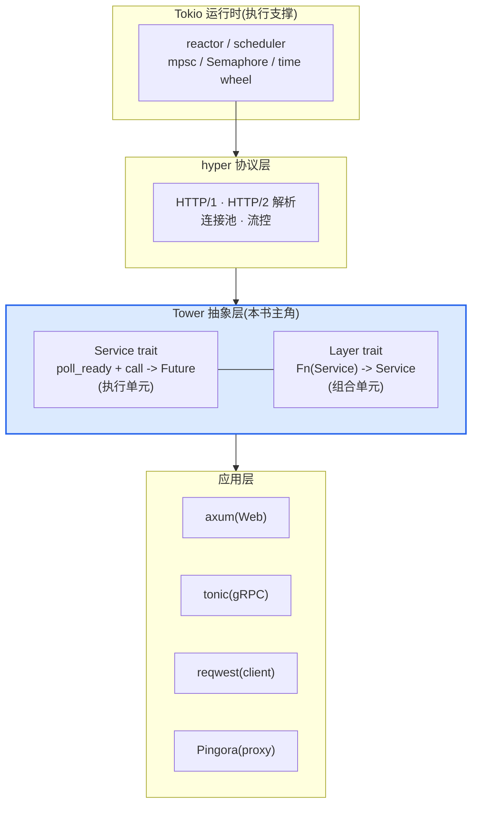
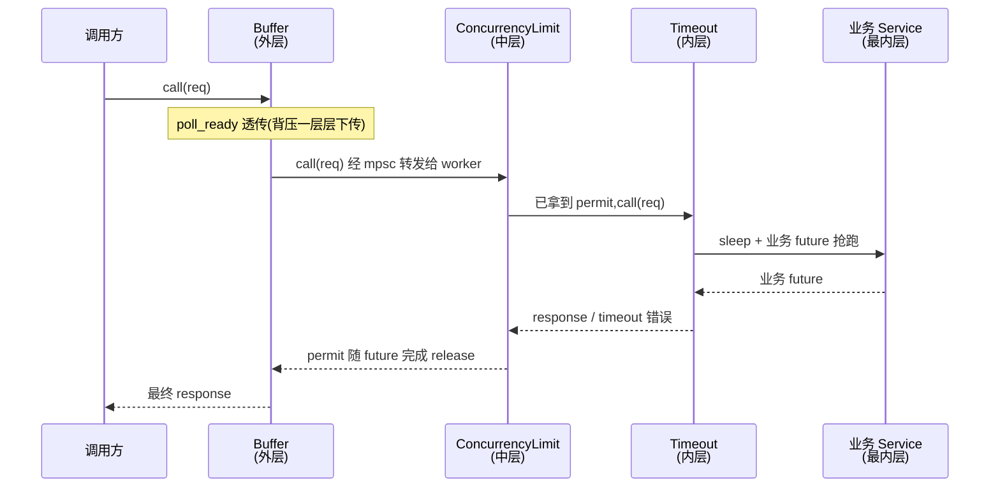
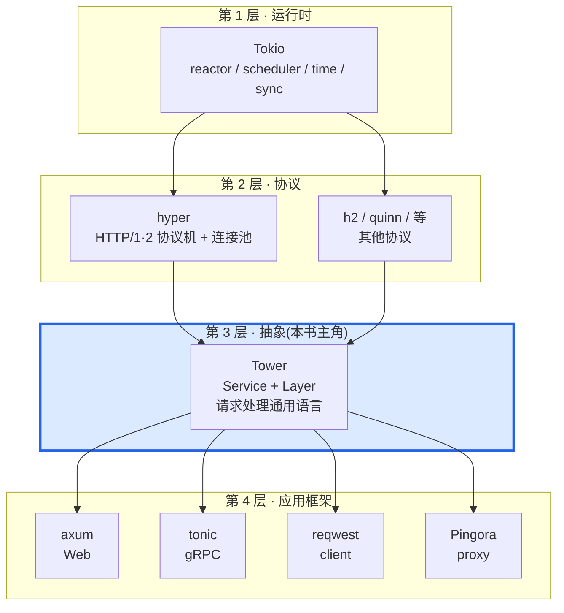

# 第 1 章 · 第一性原理:为什么 Rust 异步生态需要 Tower

> **核心问题**:Tokio 给了你一个能跑千万 task 的运行时,hyper 给了你一份完整的 HTTP/1/2 协议实现,可"处理一个请求"这件事,在 Rust 异步生态里居然没有一个通用抽象——超时、重试、限流、负载均衡,axum 写一套,tonic 写一套,reqwest 又写一套。Tower 干的就是定义这一套通用语言:把"处理一个请求"抽象成一个 `Service`,把"装饰这个请求处理"抽象成一个 `Layer`,两者一拼,无限中间件。
>
> **读完本章你会明白**:
>
> 1. 为什么"每个框架各写一套中间件"会让整个生态分裂,以及 Tower 用两个 trait 怎么治这个病;
> 2. `Service = poll_ready + call -> Future` 这套"执行单元"长什么样,`poll_ready` 凭什么不能省(它就是背压);
> 3. `Layer = Fn(Service) -> Service` 这套"组合单元"凭什么能像洋葱一样层层套,以及 Rust 的类型级 `Stack` 怎么把"套洋葱"做成编译期零成本;
> 4. Tower 在 Rust 异步栈里到底站在哪一层(Tokio 运行时 → hyper 协议 → **Tower 抽象** → axum/tonic/Pingora 应用),以及它和 gRPC filter stack、Envoy filter chain、Go middleware 是亲戚还是路人。
>
> 本章是全书的定调样本章。你看完它,就拿到了全书的两条主轴——**执行单元(Service)vs 组合单元(Layer)**——后面 19 章,全是在这条骨架上长肉。
>
> **写给谁读(读者画像)**:你写过 Rust 异步,用过 axum 的 `Router::layer()`、tonic 的 `interceptor`、或者 reqwest 的 middleware,甚至照着文档抄过 `ServiceBuilder::new().timeout(...).retry(...)`。但你说不清:`poll_ready` 到底在背什么压,为什么 `call` 是 `&mut self`,`Layer` 怎么像洋葱一样套,`Buffer` 凭什么能把一个不能 Clone 的服务变成能 Clone 的。一句话,你"用过 Tower,但没懂 Tower"。这本书就是写给你的。如果你连 axum 都没用过,建议先写一个最小的 axum hello-world 再回来——本书假设你见过 `.layer()`。
>
> **前置知识**:假设你熟悉 Rust 基本语法(所有权/借用/trait/泛型/`async`/`await`),听说过 `Future`/`Poll`/`Pin`。读过《Tokio》《hyper》最佳(没读过也行,本章会一句带过指路)。不需要你写过 Tower 源码,甚至不需要你写过自定义 middleware——本章从"为什么需要 Tower"讲起。
>
> **逃生阀(读不下去怎么办)**:本章是定调章,信息密度大。如果"执行单元 vs 组合单元"这条主线暂时绕晕你,记住一句话就够——**Service 是"处理请求的执行单元"(带背压通道),Layer 是"装饰 Service 的组合单元"(洋葱皮),Tower 就是这两个 trait**。带着这句话跳到第二节看 Service、第三节看 Layer,再回头读主线。如果 `poll_ready` 背压暂时吃不消,先记住"它是告诉调用方'我现在能不能接活'的信号通道",细节留到 P1-02。本书处处承《Tokio》《hyper》,读过那两本收获翻倍,但不是硬性前提。

---

## 一句话点破

> **Tower 不是又一个 HTTP 框架,它甚至不是中间件库;它是 Rust 异步生态给"请求处理"定的一套通用语法——一个 `Service` 是一个"把请求变成 Future 的可组合执行单元",一个 `Layer` 是一个"把 Service 装饰成新 Service 的组合单元",两者拼起来就是一座 timeout/retry/限流/负载均衡的中间件大厦。axum、tonic、reqwest、Pingora 都长在这套语法上。**

这是结论,不是理由。本章要倒过来拆:Rust 异步生态是怎么走到"非要有 Tower 不可"这一步的,Tower 又凭什么用 `Service` 加 `Layer` 两个 trait 就把局面稳住了。

---

## 第一节:Tokio 和 hyper 都给了,缺的到底是什么

### 提问

你已经读过《Tokio》和《hyper》(没读也行,本章会一句带过指路)。Tokio 给了你一个异步运行时:`Future`/`Poll`/`Waker` 在标准库 `core::future`/`core::task`,而 reactor、scheduler、`tokio::spawn`、`mpsc`、`Semaphore`、`tokio::time` 的时间轮这些是 Tokio 提供的执行支撑。hyper 给了你一份 HTTP 协议实现:HTTP/1 的解析与流水线、HTTP/2 的多路复用与流量控制、连接池、TLS 接入。

听起来挺全的。可是你坐下来要写一个真正的生产服务——一个会超时、会重试、要限流、要负载均衡的服务——你手里有什么?

一个赤裸的事实:Tokio 没有告诉你"一个请求"长什么样,hyper 也只把"HTTP 连接"这层抽象给了你。**从"一条 HTTP 连接"到"一个能被任意中间件装饰的业务请求处理"之间,还有一大段空白。**这段空白,每个框架都自己填了一遍。

### Tokio 和 hyper 怎么做(以及为什么它们不该再做了)

Tokio 的边界很清楚:它只管"怎么把一堆 `Future` 跑起来",不认识"请求"这个概念。它给你 `tokio::time::sleep` 给你 `tokio::sync::Semaphore`,但不会告诉你"超时应该套在哪一层""限流的 permit 应该在哪里 acquire"。这是对的——运行时管执行,不该掺和业务抽象(《Tokio》讲透了 reactor/scheduler/time wheel/mpsc/Semaphore 内部,见 [[tokio-source-facts]],本书不重复)。

hyper 的边界也清楚:它管 HTTP 协议机。hyper 自己定义了一个 `service::Service` trait(`hyper/src/service/service.rs`),签名是 `async fn(&mut self, Request) -> Result<Response, Error>`——一个请求进来,返回一个 response future。**注意 hyper 的 Service trait 删掉了 `poll_ready`**(背压被挪到了 HTTP/1 的 `in_flight` 单槽、HTTP/2 的 h2 流量控制、client 端的 `SendRequest::poll_ready`)。这个取舍,我们在后面专门拆(也贯穿全书,详见《hyper》P1-02)。hyper 的职责是"协议层",把"通用中间件语言"这层抽象让出来,是对的——一个 HTTP 库不该规定你怎么做重试策略。

> **承接《Tokio》**:`Future`/`Poll`/`Waker`/`Context` 在标准库 `core::future`/`core::task`(不在 tokio 仓),Tokio 只是执行者。Buffer 用 `tokio::sync::mpsc` + `tokio::spawn`,ConcurrencyLimit 用 `tokio::sync::Semaphore`,RateLimit/Timeout/Hedge 用 `tokio::time`——这些《Tokio》全拆过了,本书一句带过指路 [[tokio-source-facts]],篇幅留给 Tower 独有。
>
> **承接《hyper》**:hyper 的 `service::Service` 就是 `tower_service::Service` 的简化版——它**删掉了 `poll_ready`**。hyper P1-02 讲了 Service trait 入门,P1-03 讲了 Tower 中间件链(对照 gRPC filter),本书 P0-01/P1-02 复习 + 深化,见 [[hyper-series-project]]。★这个"hyper 删 `poll_ready` vs Tower 保留 `poll_ready`"的对照贯穿全书,是招牌。

### 不这样会怎样:每个框架各写一套

假设没有 Tower。你写一个 axum 服务要超时,你写一个 tonic 服务要超时,你写一个 reqwest 客户端要超时——三次。超时还不算复杂,逻辑无非是"`tokio::time::sleep` 和业务 future 抢跑,谁先完成用谁",可一旦到重试、限流、负载均衡、对冲请求(hedge)、断线重连,每个框架自己实现一遍,就是一场灾难:

- **重复劳动**:同样的令牌桶,axum 写一份,tonic 写一份,reqwest 写一份。bug 修三遍。
- **不可组合**:你在 axum 里写好的"鉴权 + 日志"中间件,搬到 tonic 用不了,因为两套抽象签名不同。一个用 `async fn(Request) -> Response`,一个用 `interceptor(InterceptorFn)`,一个用 tower middleware——三套方言。
- **背压丢失**:某个框架的中间件只 wrap 了 `call`,没 wrap `poll_ready`,内层服务满载的信号传不上来,请求就在 `call` 里堆着,内存爆了才知道。这种 bug 在没有统一抽象时极难发现。
- **无法跨协议复用**:HTTP 客户端的"超时 + 重试 + 连接池"逻辑,gRPC 客户端也想用?对不起,两套世界。

这不是危言耸听。Rust 异步生态在 2018-2019 年就处在这样的状态:hyper 0.11 有自己的 `Service`,各种 `tokio-proto`/`tower-web`/雏形 axum 各搞各的。直到 Tower 把两个 trait 钉死,局面才稳住。

**重复劳动的真实代价**。把上面四条具体化:假设 Rust 生态有 5 个主流框架(axum/tonic/reqwest/actix-web/Pingora),每个框架要实现 10 种常见中间件(超时/重试/限流/负载均衡/鉴权/日志/压缩/熔断/对冲/重连)。没有 Tower,就是 5 × 10 = 50 份实现。每个实现的 bug,要在一个框架里发现、再手动同步到另外 4 个——实际上没人会同步,所以同一个 bug 在不同框架里反复出现。有了 Tower,10 种中间件实现一次,5 个框架各取所需,实现数从 50 降到 10。更关键的是,一家公司内部的自定义中间件(比如审计/灰度/多租户隔离),写一次就能跨框架复用——这是 Tower 作为"集成点"最大的经济价值。

**还有一种更隐蔽的代价:语义漂移**。即便每个框架都实现了"超时",它们的语义可能微妙不同——axum 的超时从"请求进入路由"开始算,tonic 的超时从"解码完 gRPC 帧"开始算,reqwest 的超时从"发起 TCP 连接"开始算。三种超时,三种行为,用户在框架间迁移时要重新学。Tower 把"超时"的语义钉死成"在 `call` 返回的 Future 上套 `tokio::time::sleep` + `select!`",所有用 Tower 的框架,超时行为一致。**抽象统一,语义才能统一**——这是比"少写代码"更深的好处。

> **钉死这件事**:Rust 异步生态需要的,不是"又一个 HTTP 框架",而是"一套让所有框架都能挂在上面的请求处理抽象"——这套抽象必须足够小(就两个 trait)、足够通用(不绑死任何协议)、又能表达背压(不能让请求无声地堆积)。这就是 Tower。

### Tower 不擅长什么(诚实地说)

讲了这么多 Tower 的好,要公平地说说它不擅长什么,免得你过度期待:

- **不擅长流式请求处理**。`Service<Request>` 是"一问一答"模型,请求和响应都是单个值。如果你的场景是"客户端发一个流,服务端边收边处理边回一个流"(比如 gRPC bidirectional streaming、WebSocket),`Service` 抽象本身不够用——得靠框架(axum 的 `WebSocket` 升级、tonic 的 streaming)在 `Service` 之上加一层流语义。Tower 的 `Service` 只管"这个流当作一个 request",流内部的帧处理不在 Tower 职责内。
- **不擅长非请求/响应模型**。消息队列消费者(Kafka/NATS 的 pub-sub)、定时任务、事件驱动,这些不是"一问一答",硬套 `Service` 会别扭。这些场景更适合 `Stream` + handler 模式。Tower 的 `Discover`(P5-14)用了 `Stream`,正是因为服务发现是"源源不断的变更",不是一问一答。
- **不擅长需要运行期动态重组的场景**。编译期 `Stack` 的代价是"洋葱结构编译期钉死"。如果你的中间件链要按请求内容动态决定套哪几层(比如 A/B 测试、按租户路由不同中间件),静态 `Stack` 做不到,得用 `BoxService` 擦除类型、运行期组装——又回到虚分派。Tower 给了 `Box*Service` 作为逃生阀,但那不是它的舒适区。
- **学习曲线陡**。`poll_ready` 背压、`&mut self` 语义、类型级 `Stack`、`Pin`/`pin-project-lite` 手写 Future——这些对新手不友好。很多人"用过 Tower 没懂 Tower",正是因为这层抽象比"写个 `async fn`"难得多。这本书就是来治这个的。

这些边界不是 Tower 的缺陷,而是它的设计选择——它选了"请求/响应 + 编译期零成本"这个甜蜜点,在这个甜蜜点之外,需要别的抽象配合。本书附录 B 会讲"什么时候用 Tower、什么时候不用"。

> **钉死这件事**:Tower 是"请求/响应 + 编译期洋葱"的甜蜜点抽象。在这个甜蜜点内(HTTP/gRPC/数据库 client/proxy),它无可替代;在甜蜜点外(流式、pub-sub、动态重组),它需要别的抽象配合。理解边界,才能用对工具。这也是为什么本书不只讲"怎么用 Tower",还讲"什么时候用 Tower"。

### 所以 Tower 这么设计

Tower 给了两个 trait,一个管"执行",一个管"组合"。



图里 Tower 夹在中间,正下方是 Tokio(运行时)和 hyper(协议),正上方是 axum/tonic/reqwest/Pingora(应用)。**Tower 是"协议"和"应用"之间的那层抽象胶水**——它不跑 future(那是 Tokio),不解析协议(那是 hyper),它只定义"一个请求怎么被处理、怎么被装饰"的通用语言。

执行单元 `Service`:

```rust
// tower-service/src/lib.rs#L311-L356(逐字摘录,关键部分)
pub trait Service<Request> {
    type Response;
    type Error;
    type Future: Future<Output = Result<Self::Response, Self::Error>>;

    fn poll_ready(&mut self, cx: &mut Context<'_>) -> Poll<Result<(), Self::Error>>;

    #[must_use = "futures do nothing unless you `.await` or poll them"]
    fn call(&mut self, req: Request) -> Self::Future;
}
```

就这么多。一个 `Service<Request>` 是一个"接收 `Request`、返回一个产出 `Result<Response, Error>` 的 `Future` 的异步执行单元"。`poll_ready` 先问"你准备好了吗",`call` 才发请求。`&mut self` 不是手抖,是背压的关键——下一章(P1-02)专门拆。

组合单元 `Layer`:

```rust
// tower-layer/src/lib.rs#L95-L101(逐字摘录)
pub trait Layer<S> {
    /// The wrapped service
    type Service;
    /// Wrap the given service with the middleware, returning a new service
    /// that has been decorated with the middleware.
    fn layer(&self, inner: S) -> Self::Service;
}
```

也这么多。一个 `Layer<S>` 是一个"吃一个 `Service`,吐一个装饰过的新 `Service`"的组合单元。它本身不处理请求,只负责"装饰"。

这两个 trait 加起来,就是 Tower 的全部地基。后面 19 章,全是在这地基上盖楼。

> **钉死这件事**:Tower 的全部核心,就是 `tower-service`/`tower-layer` 两个 crate 各一个 `lib.rs`(你在本章已经看到它们的全部了)。`tower` 这个大 crate 装的,是"用这两个 trait 写出来的现成中间件"(timeout/retry/buffer/balance/...)和拼装工具(`ServiceBuilder`)。**核心 trait 刻意被钉死在 0.3.3 长期不动**(从 2019 至今),因为它们是整个生态的集成点,breaking change 会震碎所有下游。这一点是理解 Tower 的第一把钥匙。

---

## 第二节:Service——把"处理一个请求"抽象成一个可组合的 Future

### 提问

为什么是 `poll_ready + call -> Future` 这套?为什么不直接 `async fn(Request) -> Response`?为什么 `call` 是 `&mut self`?为什么非要 `poll_ready`——hyper 不也把它删了吗?

这一节,我们先把"执行单元"长什么样看清楚。技巧细节(`&mut self` 语义、`mem::replace` 惯用法、背压为什么不能丢)留到 P1-02 专门拆透,这里先建立全景。

### 不这样会怎样:裸 `async fn` 为什么不够

你可能想:超时、重试、限流这些,我用裸 `async fn` 闭包写不就行了?为什么要套个 trait?

来看一段"朴素实现"的超时中间件,这正是 `tower-service/src/lib.rs` 文档注释里给出的例子(`tower-service/src/lib.rs#L127-L201`):

```rust
// 朴素写法:用一个 struct 包住内层 service,加超时
pub struct Timeout<T> {
    inner: T,
    timeout: Duration,
}

impl<T, Request> Service<Request> for Timeout<T>
where
    T: Service<Request>,
    T::Future: 'static,
    T::Error: Into<Box<dyn Error + Send + Sync>> + 'static,
    T::Response: 'static,
{
    type Response = T::Response;
    type Error = Box<dyn Error + Send + Sync>;
    type Future = Pin<Box<dyn Future<Output = Result<Self::Response, Self::Error>>>>;

    fn poll_ready(&mut self, cx: &mut Context<'_>) -> Poll<Result<(), Self::Error>> {
        // ★ 关键:把内层的就绪状态透传上来——这就是背压传播
        self.inner.poll_ready(cx).map_err(Into::into)
    }

    fn call(&mut self, req: Request) -> Self::Future {
        let timeout = tokio::time::sleep(self.timeout);
        let fut = self.inner.call(req);
        let f = async move {
            tokio::select! {
                res = fut => res.map_err(|err| err.into()),
                _ = timeout => Err(Box::new(Expired) as Box<dyn Error + Send + Sync>),
            }
        };
        Box::pin(f)
    }
}
```

注意三件事:

1. `poll_ready` 透传——`Timeout` 自己不管就绪与否,直接调 `self.inner.poll_ready(cx)`。内层满了,`Timeout` 也满。**这就是背压一层层传上去的机制**。
2. `call` 里用 `tokio::select!` 让业务 future 和 `sleep` 抢跑——`sleep` 先完成就返回 `Expired` 错误,**业务 future 被 drop,被取消**(取消语义承《Tokio》,一句带过)。
3. `Timeout<T>` 自己也是一个 `Service`——它实现了 `Service<Request>`。这意味着 `Timeout<Retry<...>>`、`Timeout<RateLimit<...>>` 这种嵌套天然成立。

> **钉死这件事**:中间件的本质,是一个"实现了 `Service` 的 struct"。它包住一个内层 `Service`,在 `poll_ready` 里把就绪状态透传(背压),在 `call` 里在请求路径上动手脚(超时/重试/限流),返回的 `Future` 在响应路径上动手脚。**因为它自己也是 `Service`,所以中间件可以无限套娃**——这是 Tower 一切组合性的根。

如果用裸 `async fn`,你失去的是 `poll_ready` 这个"就绪信号通道"。没有它,内层服务满了你不知道,你只在 `call` 里 `await`——请求在 channel 里堆着,堆到 OOM 才报警。hyper 在协议层删掉 `poll_ready` 是有道理的(HTTP 协议自己有流控),但在通用抽象层删掉它,就是丢背压。这就是 Tower 保留 `poll_ready` 而 hyper 删掉它的根本理由——下面专门拆。

### 所以这样设计:Service 是"带背压通道的异步函数"

把 `Service` 想成"一个带背压通道的 `async fn`":

- **`async fn(Request) -> Response`** 部分,是 `call(&mut self, req) -> Future`。
- **背压通道**部分,是 `poll_ready(&mut self, cx) -> Poll<Result<()>>`。它在 `call` 之前被调,告诉你"我现在能不能接活"。

`&mut self` 是有意的。`poll_ready` 返回 `Ready` 之后,到下一次 `poll_ready` 之前,服务"持有一份就绪状态"。`call` 会消费这份状态(资源预留,比如一个连接、一个 permit)。所以 `call` 必须是 `&mut self`——它要修改内部状态(把"已就绪"变成"待重新准备")。

这个"准备 → 调用 → 准备 → 调用"的循环,是 Service 区别于普通异步函数的灵魂。详细拆(`&mut self` 语义、为什么 clone 一个 ready 服务是错的、`mem::replace` 惯用法)在 P1-02。这里你先记住一句话:**`poll_ready` 是背压,`call` 是消费,`&mut self` 是这两者必须共享状态的体现**。

### 源码佐证:Service trait 的文档把话说得很直白

`tower-service/src/lib.rs#L225-L234`(Backpressure 段)原文:

```text
# Backpressure

Calling a `Service` which is at capacity (i.e., it is temporarily unable to process a
request) should result in an error. The caller is responsible for ensuring
that the service is ready to receive the request before calling it.

`Service` provides a mechanism by which the caller is able to coordinate
readiness. `Service::poll_ready` returns `Ready` if the service expects that
it is able to process a request.
```

紧接着 L335-L339 那段注释更是把 `poll_ready` 的语义钉死:

> `poll_ready` may reserve shared resources that are consumed in a subsequent invocation of `call`. Thus, it is critical for implementations to not assume that `call` will always be invoked and to ensure that such resources are released if the service is dropped before `call` is invoked or the future returned by `call` is dropped before it is polled.

翻译:`poll_ready` **可能预留共享资源,这些资源在随后的 `call` 里被消费**。所以实现者不能假设 `call` 一定会被调——如果 `poll_ready` 之后服务被 drop 了,预留的资源要能正确释放。这一句是 P1-02"`mem::replace` 取走就绪服务惯用法"和 P2-05 Buffer/worker task 正确性的根。

> **对照《hyper》**:hyper 的 `service::Service` 删了 `poll_ready`,把背压挪到 HTTP 协议自身的机制——HTTP/1 用一个 `in_flight` 单槽(一条连接同时只处理一个请求,满了就不再 accept 新请求),HTTP/2 用 h2 crate 的流量控制(per-stream window),client 端用 `SendRequest::poll_ready`。这是"协议层"的合理取舍:协议自己有流控,不需要 trait 再给一层。但**通用抽象层必须给**——Tower 不知道你跑的是什么协议,它必须用一个通用的 `poll_ready` 把"我现在能不能接活"这件事表达出来。这个对照贯穿全书,见《hyper》P1-02。

### 三方对照:Service vs async fn vs Stream

读到这里你可能有个疑问:Rust 已经有了 `async fn` 和 `Stream`,为什么"请求处理"非要再发明一个 `Service` trait?这三者到底什么关系?把这个三方对照钉死,你才算真正理解 `Service` 的设计。

| 维度 | `async fn(Req) -> Res` | `Stream<Item = Req>` | `Service<Req>` |
|------|------------------------|---------------------|----------------|
| 输入 | 单个 `Req`(调用方主动传) | 流(生产方主动推) | 单个 `Req`(调用方主动传) |
| 输出 | 单个 `Res` | 多个 `Item` | 单个 `Res`(经 `Future`) |
| 背压 | 无(就是一次函数调用) | 有(`poll_next` 返回 `Pending`) | 有(`poll_ready` 返回 `Pending`) |
| 可组合 | 只能用 `async` 组合 | 有 `StreamExt` 组合子 | 有 `Layer` 洋葱 + `ServiceExt` 组合子 |
| 状态 | 默认无状态(闭包捕获即状态) | 有状态(迭代器) | **有状态**(`&mut self`,持就绪/资源) |

逐条拆:

**为什么不是 `async fn`**。裸 `async fn(Req) -> Res` 是无状态的一次性函数(除非闭包捕获状态)。它没有"我现在能不能接活"的信号通道——你调就完了,函数自己不会提前告诉你"我满了"。在请求处理里,这致命:你想限并发,`async fn` 自己做不到(它不知道有多少在飞);你想让内层连接池满时把信号传给上游,`async fn` 没有这个通道。`Service` 加了 `poll_ready`,就有了这个通道。

**为什么不是 `Stream`**。`Stream<Item = Req>` 是生产方推、消费方拉的模型,适合"源源不断的输入"(比如 TCP 字节流、消息队列)。但请求处理是"调用方主动发一个 Req、等一个 Res"的模型——一问一答,不是流。如果用 `Stream` 建模请求,你得把"请求 + 响应的配对"也塞进 Stream(`Stream<Item = (Req, oneshot::Sender<Res>)>`),丑且易错。`Service` 直接是"一问一答",贴合请求处理语义。Stream 在 Tower 里也有用武之地——`Discover`(服务发现,P5-14)就是 `Stream<Item = Change>`,因为它确实是"源源不断的后端列表变更"。承《Tokio》Stream(一句带过指路 [[tokio-source-facts]])。

**为什么 Service 是最合适的**。`Service` 把"一问一答 + 有状态 + 带背压通道"这三件事捏在一个 trait 里:

- **一问一答**:`call(req) -> Future<Res>`,贴合请求语义。
- **有状态**:`&mut self`,可以持有连接、permit、就绪标志。
- **背压通道**:`poll_ready`,服务满载时主动告诉调用方"别塞"。

这三者缺一不可,缺任何一个都会回到"每个框架各写一套"的碎片化。`async fn` 缺背压通道,`Stream` 错配语义,只有 `Service` 把三件事都给了。这就是 Tower 选它的根本理由。

> **钉死这件事**:`Service` 不是 Rust 异步原语(那是 `Future`/`Poll`/`Stream`),`Service` 是 **Rust 异步原语之上、面向"请求处理"领域的一层领域抽象**。它复用 `Future`(承《Tokio》),但加了"一问一答 + 状态 + 背压"的领域语义。理解了这层"领域抽象"的定位,你就能解释为什么 `Service` 不能被 `async fn` 或 `Stream` 替代——它服务的是一个特定领域(请求/响应处理),不是通用异步原语。

### 提问

光有 `Service`,你顶多能写"一个超时服务"。可生产服务要的是"超时 + 重试 + 限流 + 鉴权 + 日志"层层套。怎么把多个中间件组合起来,套到一个业务 Service 外面?

这就是 `Layer` 的事。`Layer` 不处理请求,它只负责"装饰"——吃一个 Service,吐一个装饰过的 Service。

### 不这样会怎样:手动嵌套会疯掉

假设没有 `Layer`,你想给一个业务 service `S` 套上"超时 + 重试",你得这么写:

```rust
// 朴素写法(假设有现成的 Timeout/Retry struct)
let with_timeout = Timeout::new(S, Duration::from_secs(5));
let with_timeout_retry = Retry::new(with_timeout, MyPolicy);
// 用 with_timeout_retry 处理请求...
```

能用。但现在要套 10 层呢?要"按配置动态决定套不套某层"呢?要"同一套 Layer 既给 axum 用、又给 tonic 用"呢?手写嵌套,类型会变成 `Timeout<Retry<RateLimit<Auth<Log<S>>>>>`,一改顺序就全变,无法复用。

更糟的是,`Layer` 还要解决一个更深的问题:**怎么把"组装中间件"和"拿到最终 service"这两步分开**。你希望先声明"我要套这些中间件"(这步不需要业务 service),等业务 service 准备好了,再一次性套上去。`Layer` 就是这个"声明",`ServiceBuilder` 是它的链式语法糖。

### 所以这样设计:Layer 是"Service 的装饰器工厂"

回到 `Layer` 的签名:

```rust
// tower-layer/src/lib.rs#L95-L101
pub trait Layer<S> {
    type Service;
    fn layer(&self, inner: S) -> Self::Service;
}
```

一个 `Layer<S>` 是"给我一个 S 类型的 service,我给你一个装饰过的新 service"。它不持有 service,只持有"装饰配置"(比如超时长度、重试策略)。你可以先把一堆 Layer 组装起来,等业务 service 来了再一个个套。

类型级洋葱 `Stack<Inner, Outer>`(`tower-layer/src/stack.rs#L6-L30`)把多个 Layer 链起来:

```rust
// tower-layer/src/stack.rs#L6-L30(逐字摘录)
#[derive(Clone)]
pub struct Stack<Inner, Outer> {
    inner: Inner,
    outer: Outer,
}

impl<S, Inner, Outer> Layer<S> for Stack<Inner, Outer>
where
    Inner: Layer<S>,
    Outer: Layer<Inner::Service>,
{
    type Service = Outer::Service;

    fn layer(&self, service: S) -> Self::Service {
        let inner = self.inner.layer(service);
        self.outer.layer(inner)
    }
}
```

`Stack` 自己也是一个 `Layer`。它的 `layer` 干的事:先让 `inner` Layer 套住 service,再让 `outer` Layer 套住"已经被 inner 套过的 service"。**这是编译期的递归类型嵌套**——`Stack<A, Stack<B, Stack<C, Identity>>>`,每加一层就是一个嵌套类型,零运行时开销(全部单态化掉)。

> **对照《gRPC》**:gRPC C++ core 的 filter stack(《gRPC》第 4 篇招牌)是同一思想的另一种语言落地——gRPC 用 C++ 的 `Call`/`Interceptor` 在**运行期**组装 filter 链表,每个 filter 持有 next 指针;Tower 用 Rust 的 `Stack<Inner, Outer>` 在**编译期**把链嵌进类型系统,没有 next 指针,没有虚调用(filter 自己的 `call` 是单态化的)。代价是 Tower 的类型会变得很丑(`Timeout<Retry<...>>` 这种),换来的是零成本抽象。详见 [[grpc-source-facts]] 的 filter stack 段。
>
> **对照《Envoy》**:Envoy 的 Network/HTTP filter chain(HCM,《Envoy》P3)也是洋葱,但 Envoy 是 C++ 运行期组装、filter 之间通过 `shared_ptr` 持有,Tower 是 Rust 编译期单态化。Envoy 的好处是 filter 可以热加载、可配置;Tower 的好处是快。这是"运行期灵活 vs 编译期零成本"的经典取舍,见 [[envoy-source-facts]]。

### 比喻点睛(全书唯一一次)

到这儿可以用上全书唯一允许的一次比喻了:

- **Service 是插座上的电器**:每个电器干一件事(处理一个请求),插头是 `call`,通电标志是 `poll_ready` 返回 `Ready`。
- **Layer 是洋葱皮**:一层一层套在电器外面。超时 Layer 是套在插座和电器之间的一个"5 秒自动断电"模块,重试 Layer 是套在外面的"失败再插一次"模块。
- **ServiceBuilder 是装修清单**:你先写好清单(`.timeout(...).retry(...).buffer(...)`),等电器(业务 service)搬来了,按清单一次性把所有洋葱皮套上去。

这是全书唯一一次用比喻做主线的地方,后面章节回归直球。比喻只是为了让你记住"Service 是执行单元,Layer 是组合单元"这两件事——它们是 Tower 的全部地基。

---

## 第四节:ServiceBuilder——把洋葱做成装修清单

### 提问

`Stack<A, Stack<B, Stack<C, Identity>>>` 这种类型手写起来要命。Tower 怎么让它变得好用?

答案是一个 builder,把"链式加 Layer"做成流水线语法,最终生成一个巨大的 `Stack` 类型。

### Tower 怎么设计

`ServiceBuilder<L>`(`tower/src/builder/mod.rs#L106-L108`)就是那个 builder:

```rust
// tower/src/builder/mod.rs#L106-L136(逐字摘录,关键部分)
#[derive(Clone)]
pub struct ServiceBuilder<L> {
    layer: L,
}

impl ServiceBuilder<Identity> {
    pub const fn new() -> Self {
        ServiceBuilder {
            layer: Identity::new(),
        }
    }
}

impl<L> ServiceBuilder<L> {
    pub fn layer<T>(self, layer: T) -> ServiceBuilder<Stack<T, L>> {
        ServiceBuilder {
            layer: Stack::new(layer, self.layer),
        }
    }
    // ... 各种 .timeout() / .retry() / .buffer() 都是 .layer(...) 的语法糖
}
```

每调一次 `.layer(T)`,就把一个新的 `Stack<T, L>` 套上去,L 这个类型参数就嵌套一层。调到业务 service 准备好了,`.service(svc)` 把所有 Layer 一次性 fold 上去:

```rust
// tower/src/builder/mod.rs#L489-L494
pub fn service<S>(&self, service: S) -> L::Service
where
    L: Layer<S>,
{
    self.layer.layer(service)
}
```

这一句 `self.layer.layer(service)` 是整本书的魔术时刻:一堆嵌套的 `Stack` 层层 `layer`,从最外层一直 fold 到最内层的 `Identity`(空 Layer,什么都不做),最后吐出来的是一个层层装饰的 service。

### 看一个真实的请求穿过洋葱

来看官方在 `tower/src/builder/mod.rs#L36-L43` 给的例子:

```rust
ServiceBuilder::new()
    .buffer(100)
    .concurrency_limit(10)
    .service(svc)
```

注释(L45-L49)说得很清楚:`buffer` 在外,`concurrency_limit` 在内。一个请求进来,先穿过 `buffer`(队列容量 100,允许在传给下一层之前再多排 100 个),再穿过 `concurrency_limit`(最多 10 个并发进入业务),最后到业务 service。**所以这一栈允许最多 110 个 in-flight 请求**(100 在 buffer 队列里 + 10 在业务里)。

把顺序反过来(`tower/src/builder/mod.rs#L56-L62`):

```rust
ServiceBuilder::new()
    .concurrency_limit(10)
    .buffer(100)
    .service(svc)
```

现在 `concurrency_limit` 在外,只放 10 个请求进来,buffer 在内。**总共最多 10 个 in-flight**。中间件顺序变了,语义就变了。这是 Tower 最容易踩的坑之一,本书附录 B 有排查清单。

### 一次请求穿过洋葱的时序



注意时序图里两个细节:(1)`poll_ready` 是从外向内透传的背压通道(每一层 `poll_ready` 调内层的 `poll_ready`),内层满了,整条链都满;(2)`call` 把请求从外往内传,响应 future 从内往外 resolve。这是后面所有章节的运行画面。

还有一个反直觉的点要钉死:**`ServiceBuilder` 的 `.layer()` 顺序,和请求穿过的顺序,是同一个方向**。`.buffer(100).concurrency_limit(10)` 表示 buffer 先加、在外,concurrency_limit 后加、在内;请求先穿 buffer 再穿 concurrency_limit。这和很多人直觉里的"后加的在外"相反——记住 `.layer` 是"往栈顶压",最后压上去的反而在最内层(最靠近业务 service)。`Stack<Inner, Outer>` 的命名也呼应这点:`Stack::new(layer, self.layer)` 里 `self.layer`(旧的、更早加的)是 Outer(外),新加的 `layer` 是 Inner(内)。这是 `tower-layer/src/stack.rs#L13` 的 `Stack::new(inner, outer)` 签名决定的,本书 P1-03/P1-04 会详拆。

### 反面对比:如果用 trait object 而不是类型级 Stack

为了让你感受到"编译期 `Stack`"到底省了什么,做个反面对比。假设 `ServiceBuilder` 不用类型级 `Stack`,而是把每层 Layer 存成 `Box<dyn Layer<S>>` 数组,运行时 fold:

```rust
// 假想的运行期版本(非 Tower 实际做法)
struct ServiceBuilder {
    layers: Vec<Box<dyn Layer<dyn Service>>>,  // 运行期链表
}
```

代价立刻显现:

1. **每次 `call` 走虚分派**:每层中间件的 `poll_ready`/`call` 都是一次 trait object 动态分派(vtable 查找 + 间接调用)。10 层中间件,10 次虚调用。Tower 的真实做法是单态化——10 层就是 10 次直接调用,编译器甚至能内联。
2. **类型擦除丢失 `Response`/`Error` 类型**:`dyn Layer<dyn Service>` 要求 service 类型统一,你得把 `Response`/`Error` 也擦成 `Box<dyn Any>` 或 trait object。整个类型安全网塌了。
3. **`Future` 类型无法具名**:`Service::Future` 是关联类型,trait object 下你得用 `Pin<Box<dyn Future<...>>>` 把 future 也装箱。又一次堆分配 + 虚分派。

Tower 不这么干。它宁可让你忍受 `Stack<TimeoutLayer, Stack<RetryLayer, Stack<BufferLayer, Identity>>>` 这种丑陋的类型签名(类型爆炸),也要把洋葱做进类型系统,换来零运行时开销。这是 Rust "零成本抽象"哲学的典型样本——**抽象的代价(类型复杂度)交给编译器,运行时一分钱不花**。代价是类型签名难看、编译错误信息冗长,所以 Tower 又提供 `BoxService`/`BoxCloneService`/`BoxCloneSyncService`(P6-17)作为"逃生阀",在你确实需要类型擦除时(比如 axum 路由表里要存异构 service)再擦除。两个开关都给你,你自己按场景选。

> **钉死这件事**:Tower 的默认姿态是"编译期单态化 + 类型爆炸",`Box*Service` 是可选的"运行期擦除 + 虚分派"。这个二选一贯穿全书工程化章节(P6-17 招牌)。理解了这点,你才能理解为什么 axum 的 `Router` 内部大量用 `BoxCloneService`——因为路由表要存不同类型的 handler,必须擦除;而 reqwest 的 `ClientBuilder` 内部尽量保持单态化——因为 client 是单一类型,没必要擦。

---

## 第五节:Tower 演进史——为什么 0.4 和 0.5 是两道分水岭

### 提问

你可能在老博客里见过 `tower-timeout`、`tower-buffer`、`tower-balance` 这些名字,可在 0.5.2 的 `Cargo.toml` 里一个都找不到。Tower 经历了什么?为什么老资料大片过时?

把演进史钉死,你才不会被老资料带偏。

### 0.4.0(2021-01):大合并

在 0.4.0 之前,Tower 是一片散落的子 crate:`tower-service`(Service trait)、`tower-layer`(Layer trait)、`tower-timeout`、`tower-buffer`、`tower-retry`、`tower-limit`、`tower-balance`、`tower-load`、`tower-load-shed`、`tower-discover`、`tower-reconnect`、`tower-hedge`、`tower-filter`、`tower-util`、`tower-make`、`tower-ready-cache`、`tower-spawn-ready`、`tower-steer`...每个中间件一个独立 crate,版本号各自演进,依赖关系错综复杂。用户要在 `Cargo.toml` 里列十几个依赖。

0.4.0(2021-01-07)一把合并。CHANGELOG 原文([`tower/CHANGELOG.md#L330-L331`](../tower/tower/CHANGELOG.md#L330-L331),PR #432):

> All middleware `tower-*` crates were merged into `tower` and placed behind feature flags.

从此只有四个 crate:

- `tower-service`(Service trait,刻意稳定,0.3.3 至今不动)
- `tower-layer`(Layer trait,刻意稳定,0.3.3 至今不动)
- `tower`(中间件大集合,放在 feature flag 后面)
- `tower-test`(测试工具)

老博客里出现的 `tower-timeout::TimeoutLayer`、`tower-buffer::Buffer` 等**独立 crate 名已全部废弃**,真实写法是 `tower::timeout::TimeoutLayer`(开 `features = ["timeout"]`)、`tower::buffer::Buffer`(开 `features = ["buffer"]`)。要全部中间件就 `features = ["full"]`。这一点是读老资料时最大的坑——本书所有路径以 0.5.2 源码为准(`tower/src/timeout/`、`tower/src/buffer/`、`tower/src/balance/p2c/` 等真实存在),不用废弃 crate 名。

> **钉死这件事**:`tower/src/lib.rs#L165-L197` 的 feature flag 声明,就是 0.4.0 大合并的产物——每个中间件模块(`balance`/`buffer`/`discover`/`filter`/`hedge`/`limit`/`load`/`load_shed`/`make`/`ready_cache`/`reconnect`/`retry`/`spawn_ready`/`steer`/`timeout`/`util`)都在一个 `#[cfg(feature = "xxx")]` 后面。这是 0.4.0 至今 Tower 的模块全景,本书 19 章就是在这个全景里逐个拆。

### 0.5.0(2024):第二次大改

0.5.0(2024)是继 0.4.0 之后第二次重大重构,关键变化([`tower/CHANGELOG.md#L23-L55`](../tower/tower/CHANGELOG.md)):

- **`BoxService` 变 `Sync`**(#702):之前 `BoxService` 只 `Send` 不 `Sync`,在多线程共享场景受限。0.5.0 让它 `Sync`,代价是内部用 `sync_wrapper` 或更严格的内部可变性。这是为 axum 等多线程框架铺路。
- **retry `Policy::retry` 改 `&mut Req`/`&mut Res`**(#584,breaking):之前是值传递,重试时要 clone 请求;0.5.0 改成 `&mut`,允许 policy 原地修改请求(比如重试时换个路由 key)。签名变了,下游要改代码。
- **retry `Policy` 改 `&mut self`**(#681,breaking):policy 现在可以有状态(比如计数重试次数),不再是无状态的。
- **retry 加 `Budget` trait**(#703):**这是 0.5.0 最重要的一笔**。之前 Budget 是个固定结构体,0.5.0 把它 trait 化,允许用户自定义桶实现(比如 TPS budget、滑动窗口 budget)。重试为什么必须限预算?——防重试风暴(下游一抖动,所有上游疯狂重试,雪崩)。Budget 是限重试速率的闸门。详见 P4-11 招牌章。
- **MSRV 升到 1.63.0**(#741)。

### 0.5.2(2024 末):`BoxCloneSyncService`

0.5.2 加了 `BoxCloneSyncService` 和 `BoxCloneSyncServiceLayer`([`tower/CHANGELOG.md#L7-L10`](../tower/tower/CHANGELOG.md),#777)。这是 `Clone + Send + Sync` 三合一的类型擦除 service——axum/tonic 的路由表、连接池这类"要 Clone、要多线程共享、要类型擦除"的场景,终于有一个统一的擦除类型。详见 P6-17。

> **钉死这件事**:Tower 的演进有两个分水岭——0.4.0(2021)合并子 crate,0.5.0(2024)trait 化 Budget + Service Sync 化。读老资料(2021-2023 的博客)时,出现的独立 crate 名、旧的 `Policy` 签名、不 `Sync` 的 `BoxService` **全部已过时**。本书以 0.5.2(commit `7dc533e`)为准,涉及"0.4/0.5 前后差异"时诚实讲清(尤其 P4-11 Retry 的 Budget trait 化、P6-17 的 BoxService Sync 化)。

---

## 第六节:axum/tonic/reqwest/Pingora 怎么挂在 Tower 上

### 提问

说 Tower 是 axum/tonic/reqwest/Pingora 的共同骨架,具体怎么个"共同"法?这四个框架各自的设计取舍是什么?

把这张对照钉死,你就理解了 Tower 作为"集成点"的价值。

### 四框架对照

| 框架 | 角色 | 怎么用 Tower | 关键取舍 |
|------|------|------------|---------|
| **axum** | Web 服务端 | `Router::layer(L)` 把 Tower Layer 套在路由上;`Handler` 被包成 `Service` | 路由表存异构 handler,内部用 `BoxCloneService` 擦除 |
| **tonic** | gRPC 框架 | `interceptor` 是 Tower Layer 的特化;`Status` 是 Service Error | gRPC interceptor 比 Tower Layer 简化(只拦截请求) |
| **reqwest** | HTTP 客户端 | `ClientBuilder::layer(L)` 套 Tower middleware | client 单一类型,内部尽量单态化 |
| **Pingora** | proxy | proxy filter 基于 Tower Service | 每连接一 task,filter 链可热配置 |

详细集成在第 19 章(P6-19)和附录 B 展开,这里先建立全景。

### 为什么它们都选 Tower

四个框架做的事天差地别(axum 做 Web 路由,tonic 做 gRPC 编解码,reqwest 做 HTTP 客户端,Pingora 做 CDN proxy),但它们都需要"在请求处理路径上插中间件"这件事。如果各自定义中间件抽象:

- axum 的 `Router::layer` 用一套,
- tonic 的 `interceptor` 用一套,
- reqwest 的 middleware 用一套,
- Pingora 的 filter 用一套。

你写一个"超时 + 重试"中间件,要实现四次。你写一个公司内部的"鉴权 + 审计"中间件,要在四个框架里各写一遍适配层。

有了 Tower,这四个框架的中间件抽象都建立在 `Service`/`Layer` 之上。你写一个 `TimeoutLayer`(它是个 `Layer`),axum/tonic/reqwest/Pingora 全都能用——因为它实现的是通用的 `Layer<S>`,不绑任何框架。这就是"集成点"的力量:**一套中间件,四个框架通用**。

> **钉死这件事**:Tower 的核心 trait(`tower-service`/`tower-layer`)刻意被钉死在 0.3.3 长期不动(从 2019 至今,7 年),正是因为它们是 axum/tonic/reqwest/Pingora 等所有下游框架的共同集成点。breaking change 会震碎整个生态。这种"核心极简 + 极度稳定 + 生态在稳定核心上长出来"的设计,是 Tower 能成为 Rust 异步网络栈枢纽的根本原因。`tower` 这个大 crate(中间件集合)可以频繁演进(0.4→0.5→0.5.2),但核心 trait 不动——这是刻意的工程取舍。

### 反面对比:如果每个框架自己定义中间件抽象

来看一个真实的反面教训。在 Tower 还没稳定之前(2018-2019),hyper 0.11 有自己的 `Service`,早期 axum 雏形(`tower-web`)又有一套,各种客户端库(`reqwest` 早期版本)还有一套。结果:

- 写一个跨框架的限流中间件,要适配三个不同的 trait 签名。
- hyper 升级(0.11 → 1.0),所有下游中间件要重写。
- 一个公司内部的审计中间件,要在 4 个框架里各写一遍。

这种碎片化是 Rust 异步生态早期最大的痛点之一。Tower 把它治住了——治住的方式不是"造一个更大的框架",而是"定义两个最小的、极度稳定的 trait,让所有框架挂在上面"。这是 Tower 设计哲学的精髓:**抽象要小,要稳,要成为集成点**。

---

## 第七节:Tower 在 Rust 异步生态栈里的位置

### 提问

到这里你可能在想:Tower 凭什么能成为 axum/tonic/reqwest/Pingora 的共同骨架?它到底站在 Rust 异步栈的哪一层?

把位置钉死,是本章最后一个任务。

### 钉死位置



四层很清楚:

1. **运行时(Tokio)**:跑 `Future`,提供 `mpsc`/`Semaphore`/`time`/`spawn`。承《Tokio》。
2. **协议(hyper 等)**:把字节流变成结构化的 `Request`/`Response`。承《hyper》。
3. **抽象(Tower)**:定义"一个请求怎么被处理、怎么被装饰"的通用语言。**本书主角**。
4. **应用(axum/tonic/reqwest/Pingora)**:在 Tower 之上,提供路由、序列化、proxy 等业务便利。

Tower 卡在"协议"和"应用"之间。它**不知道**你跑的是 HTTP 还是 gRPC,也**不关心**你是客户端还是服务端——`Service<Request>` 是协议无关的、双向通用的。这就是它能让 axum/tonic/reqwest/Pingora 都挂在同一套抽象上的根本原因。

### 为什么是这一层,而不是更上或更下

- **不能更下(挪到协议层)**:hyper 试过,它定义了自己的 `service::Service`——但删了 `poll_ready`,因为协议自己有流控。可一旦你想把 hyper 的 service 和"超时 + 重试"组合,你就需要一套通用抽象。hyper 的 service 太绑 HTTP 了,做不到"跨协议复用"。所以必须有一层在协议之上。
- **不能更上(挪到应用层)**:axum/tonic/reqwest/Pingora 各自有自己的便利抽象(axum 的 `Router`/`Handler`,tonic 的 `interceptor`,reqwest 的 `ClientBuilder`)。如果"通用中间件语言"由应用层提供,那 axum 的中间件搬到 tonic 就用不了——又回到"每个框架各写一套"。所以必须有一层在应用之下。
- **正好卡在中间**:Tower 这一层抽象,小到只有两个 trait(可以稳定 7 年不动),通用到不绑任何协议,又能表达背压(不会让请求无声堆积)。它是整个生态的集成点。

> **钉死这件事**:axum/tonic/reqwest/Pingora 都依赖 `tower-service`/`tower-layer`(直接或间接),它们各自的应用便利层(`Router`/`interceptor`/`ClientBuilder`/proxy filter)都建立在 Tower 的 `Service`/`Layer` 之上。**Tower 是 Rust 异步网络栈里"协议"和"应用"之间唯一的那层抽象胶水**。这一点是全书的地基。

---

## 第八节:跨语言对照——洋葱模型的亲戚们

### 提问

"洋葱模型 + 中间件链"这事儿不是 Tower 发明的。gRPC、Envoy、Go 的 Web 框架都有类似设计。Tower 和它们是亲戚还是路人?差别在哪?

把这张对照表钉死,你就理解了 Tower 凭什么用 Rust 的类型系统把"洋葱"做到极致。

### 四套洋葱对照

| 系统 | 语言 | 洋葱组装时机 | 链结构 | 背压/流控 |
| ------ | ------ | ------------- | -------- | ---------- |
| **Tower** | Rust | **编译期**(类型级 `Stack<Inner,Outer>`) | 嵌套类型,单态化 | `poll_ready` 透传 |
| **gRPC C++ filter** | C++ | **运行期** | filter 持 next 指针的链表 | per-stream 窗口 |
| **Envoy filter chain** | C++ | **运行期** | `shared_ptr` 持有的 filter 链 | overload manager |
| **Go middleware**(chi/gin) | Go | **运行期** | `func(Handler)Handler` 闭包链 | 无(GC 兜底) |

四种语言,四种做法。关键差别在"组装时机":

- **Tower 是编译期组装**。`.timeout().retry().buffer()` 这些调用,每一步都让类型嵌套一层,最终编译成一个 `Stack<TimeoutLayer, Stack<RetryLayer, Stack<BufferLayer, Identity>>>` 这种巨大但单态化的类型。运行时没有 next 指针、没有虚调用(filter 的 `call` 是直接调用,不是 trait object 的动态分派——除非你显式 `boxed()`)。代价是类型丑、编译慢、错误信息难读。
- **gRPC/Envoy 是运行期组装**。filter 链在程序启动或连接建立时组装成链表,filter 之间通过指针持有 next。好处是 filter 可以动态增减、可配置;代价是每次调用都走指针、走虚分派。Envoy 还能用 overload manager 在运行期决定丢不丢请求。
- **Go 是运行期闭包链**。`func(http.Handler) http.Handler` 套娃,运行时组装成一条闭包链。没有背压概念(Go 靠 GC 和 channel 兜底,满了就阻塞或丢弃,看你怎么写)。

### Go middleware 具体长什么样

为了让你直观感受到 Tower 和 Go 的差别,看一段典型的 Go middleware(chi/gin 风格):

```go
// Go 的洋葱 middleware(运行期闭包链)
func TimeoutMiddleware(duration time.Duration) func(http.Handler) http.Handler {
    return func(next http.Handler) http.Handler {
        return http.HandlerFunc(func(w http.ResponseWriter, r *http.Request) {
            ctx, cancel := context.WithTimeout(r.Context(), duration)
            defer cancel()
            next.ServeHTTP(w, r.WithContext(ctx))
            // 超时由 ctx.Done() 体现,需要业务侧自己检查
        })
    }
}

// 组装:运行期把闭包链套起来
handler := TimeoutMiddleware(5 * time.Second)(
    RetryMiddleware(3)(
        RateLimitMiddleware(100)(
            finalHandler,
        ),
    ),
)
```

对照 Tower 的等价写法:

```rust
// Tower:编译期类型嵌套
let svc = ServiceBuilder::new()
    .timeout(Duration::from_secs(5))      // TimeoutLayer -> Stack<Timeout, ...>
    .retry(MyPolicy)                       // RetryLayer  -> Stack<Retry, ...>
    .rate_limit(100, Duration::from_secs(1))
    .service(final_handler);
// 类型:Stack<TimeoutLayer, Stack<RetryLayer, Stack<RateLimitLayer, Identity>>>
```

两个肉眼可见的差别:

1. **类型安全**:Go 版本里,`TimeoutMiddleware` 接受任意 `http.Handler`,组装顺序错了编译器不报错(运行期闭包链,类型全是 `http.Handler`)。Tower 版本里,Layer 顺序错了、类型不匹配,编译期就报错(`Stack` 的类型签名会体现出顺序)。Rust 把"洋葱结构"做进了类型系统,Go 做进了运行期。
2. **性能**:Go 版本每次请求要遍历闭包链(三次间接调用 + 闭包捕获的内存分配)。Tower 版本编译成三次直接调用(单态化 + 可内联),零运行时开销。

代价对等:Go 版本的 middleware 可以在运行期动态增减(配置热加载),Tower 版本的洋葱结构在编译期就钉死了(改顺序要重新编译)。这就是"运行期灵活 vs 编译期零成本"的取舍——没有银弹,看你更在乎哪个。

> **钉死这件事**:Tower 选编译期洋葱,本质是 Rust 类型系统的胜利——它能把"洋葱结构"表达成类型嵌套,从而在编译期消除运行时开销。Go/C++/Java 因为类型系统表达力不够(或运行期多态是常态),只能把洋葱做成运行期链表。这是 Tower 区别于所有同类设计的根本特征,也是它"丑陋但快"的根源。

### 这对 Tower 意味着什么

Tower 选编译期组装,是 Rust 零成本抽象的体现:你写 `.timeout().retry()`,编译器生成的是"直接调用 TimeoutLayer::layer → 直接调用 RetryLayer::layer"的代码,没有运行时链表开销。但这有个副作用——**类型会爆炸**。`ServiceBuilder` 套 10 层,类型签名长到没法看。这就是为什么 Tower 还要提供 `BoxService`/`BoxCloneService`/`BoxCloneSyncService`(P6-17 专讲)——用 trait object 把巨大类型擦除成一个统一的 `Box<dyn Service>`,代价是引入虚分派。这是"编译期零成本 vs 运行期灵活"的开关,Tower 两个都给你,你自己选。

> **对照《gRPC》/《Envoy》/Go**:这三种系统的洋葱模型,分别见 [[grpc-source-facts]](filter stack)、[[envoy-source-facts]](HCM filter chain + overload manager)。本书第 19 章(P6-19)会展开"axum/tonic/hyper/Pingora 怎么用 Tower",附录 B 是实战集成。这一节只是建立对照全景,后面具体章节还会反复回扣。

---

## 技巧精解

这一节是本章最硬的部分。挑两个最该被钉死的技巧,配真实源码 + 反面对比,单独拆透。

### 技巧一:Service×Layer 双抽象——为什么是两个 trait 而不是一个

**它解决什么问题**:把"请求处理"抽象成 `Service`,为什么还要再抽象一个 `Layer`?一个 trait 不够吗?

**反面对比:只有一个 `Service` trait 会怎样**:

假设 Tower 只有 `Service`,没有 `Layer`。你想给 `S` 套个超时,你写:

```rust
let svc = Timeout::new(S, Duration::from_secs(5));
```

看起来也行。但现在三个问题立刻冒出来:

1. **类型污染**:你想写一个函数,接受"任意被装饰过的 service"。你得写成 `fn handle<S>(svc: S) where S: Service<Req>`,可你拿不到"它是怎么被装饰的"这个信息——装饰信息全揉进了具体类型(`Timeout<S>`/`Retry<S>`/...)。无法统一描述。
2. **延迟组装**:你想先声明"我要套这些装饰",等业务 service 来了再套。可没有 `Layer`,你只能立刻 new 出 `Timeout<S>`——这要求你已经有 `S`。组装和构造耦合了。
3. **复用**:同一套"超时 + 重试"装饰,你想既给 service A 用,又给 service B 用。可 `Timeout<Retry<A>>` 和 `Timeout<Retry<B>>` 是不同类型。你没法把"装饰"这件事从"被装饰的 service"里抽离出来。

`Layer` 就是来解决这三个问题的。它把"装饰"抽象成一类独立的对象——一个 `Layer<S>` 不持有 service,只持有"装饰配置"。你可以:

- 先组装一堆 Layer 成一个 `Stack`,延迟到业务 service 来了再 fold(`ServiceBuilder::service` 做这件事);
- 用同一个 `Stack` 套不同的 service(因为 `Stack: Layer<S>` 对任意 `S` 都成立);
- 把"装饰链"本身当作一等公民传递、序列化、配置。

**Layer 复用的真实场景**。来看一个只有 `Layer` 抽象才能优雅解决的问题:你有两个 service(一个查用户,一个查订单),想给它们套同一套"超时 + 重试 + 限流"装饰。没有 `Layer`,你得分别 new:

```rust
// 没有 Layer:装饰和 service 耦合,两套代码
let user_svc = Timeout::new(Retry::new(UserService, policy), timeout);
let order_svc = Timeout::new(Retry::new(OrderService, policy), timeout);
// 改装饰顺序?两处都改。policy 变了?两处都改。
```

有了 `Layer`,装饰链可以预先组装、复用:

```rust
// 有 Layer:装饰链是一等公民,组装一次,套多个 service
let stack = ServiceBuilder::new()
    .timeout(timeout)
    .retry(policy)
    .rate_limit(100, Duration::from_secs(1))
    .into_inner();   // 拿到 Stack<TimeoutLayer, Stack<RetryLayer, ...>> 这个 Layer

let user_svc = stack.layer(UserService);     // 同一套装饰套到 UserService
let order_svc = stack.layer(OrderService);   // 同一套装饰套到 OrderService
// 装饰顺序、policy、限流参数都只声明一次,改一处全改。
```

这段代码体现了 `Layer` 的全部价值:**装饰链(`stack`)和被装饰的 service 解耦**,装饰链可以像数据一样传递、复用、配置。这是只有把"装饰"抽象成独立 trait(`Layer`)才能做到的——把装饰和服务揉在一起(只有一个 `Service` trait)做不到。`stack` 这个变量,其类型是 `Stack<TimeoutLayer, Stack<RetryLayer, Stack<RateLimitLayer, Identity>>>`(编译期嵌套),它能 `layer(user_svc)` 也能 `layer(order_svc)`,因为 `Stack` 对任意满足约束的 `S` 都实现了 `Layer<S>`。这就是类型级洋葱的复用威力。

**为什么是 `fn layer(&self, inner: S) -> Self::Service` 这个签名**:

注意 `&self`——Layer 是不可变借用,意味着它本身可以 `Clone`(装饰配置可以复用)、可以被多个 service 共享。`inner: S` 是按值传入,意味着装饰产生的是一个全新的 service(不修改原 service)。`Self::Service` 是关联类型,让每个 Layer 决定自己吐出什么类型(比如 `TimeoutLayer` 吐出 `Timeout<S>`)。

看 `tower-layer/src/lib.rs#L42-L87` 的文档例子(LogLayer):

```rust
// tower-layer/src/lib.rs#L42-L87(摘录关键部分)
pub struct LogLayer {
    target: &'static str,
}

impl<S> Layer<S> for LogLayer {
    type Service = LogService<S>;

    fn layer(&self, service: S) -> Self::Service {
        LogService {
            target: self.target,
            service,
        }
    }
}

pub struct LogService<S> {
    target: &'static str,
    service: S,
}

impl<S, Request> Service<Request> for LogService<S>
where
    S: Service<Request>,
    Request: fmt::Debug,
{
    type Response = S::Response;
    type Error = S::Error;
    type Future = S::Future;

    fn poll_ready(&mut self, cx: &mut Context<'_>) -> Poll<Result<(), Self::Error>> {
        self.service.poll_ready(cx)  // ★ 透传背压
    }

    fn call(&mut self, request: Request) -> Self::Future {
        println!("request = {:?}, target = {:?}", request, self.target);
        self.service.call(request)   // ★ 请求下传
    }
}
```

`LogLayer` 只持有配置(`target`),`LogService` 持有被装饰的 service。Layer 是"工厂",Service 是"产品"。两者解耦,这是 Tower 组合性的第二块基石(第一块是 Service 自己的可嵌套性)。

**为什么不这么写会出问题**:把 Layer 和 Service 揉成一个 trait(比如 `trait Middleware: Service`),你既失去了"先组装装饰链、后套 service"的能力,也失去了"同一套装饰复用给多个 service"的能力。Tower 把它们拆成两个 trait,是 Rust 类型系统能给出的最干净的解法。

### 技巧二:`poll_ready` 背压初识——为什么不能省

**它解决什么问题**:服务满载了,怎么告诉调用方"别再给我塞请求"?

**反面对比:hyper 删了 `poll_ready` 会怎样**:

hyper 的 `service::Service` 签名是 `async fn(&mut self, Request) -> Result<Response, Error>`,没有 `poll_ready`。hyper 怎么做背压?靠协议层:

- **HTTP/1**:一条连接同时只处理一个请求(`in_flight` 单槽)。连接在处理请求时不再 accept 新请求,client 自然被阻塞(或者拿到连接池满了的信号)。背压由"连接池容量"承担。
- **HTTP/2**:h2 crate 实现了 per-stream 的流量控制(window)。发送方窗口满了就停,背压由 h2 的流控承担。
- **client 端**:`SendRequest::poll_ready` 在连接池满时返回 `Pending`,背压由连接池承担。

**所以 hyper 删 `poll_ready` 是合理的——协议层自己有流控,trait 再加一层是冗余**。但 Tower 不能删:

- **Tower 不知道你跑什么协议**。它可能包的是 HTTP,也可能是 gRPC、数据库连接、Redis、自定义 RPC——这些协议的流控机制千差万别。Tower 必须用一个通用的、协议无关的机制表达"我现在能不能接活",这个机制就是 `poll_ready`。
- **中间件需要把背压透传**。看 `Timeout` 的 `poll_ready`(`tower-service/src/lib.rs#L169-L173`):

  ```rust
  fn poll_ready(&mut self, cx: &mut Context<'_>) -> Poll<Result<(), Self::Error>> {
      // Our timeout service is ready if the inner service is ready.
      // This is how backpressure can be propagated through a tree of nested services.
      self.inner.poll_ready(cx).map_err(Into::into)
  }
  ```

  注释自己写了:"This is how backpressure can be propagated through a tree of nested services." `Timeout` 自己不持有资源,它把就绪状态透传给内层。内层(可能是 ConcurrencyLimit)满了,`poll_ready` 返回 `Pending`,`Timeout` 也返回 `Pending`,再外层也 Pending——背压一路传到最外层,调用方就知道"现在别塞请求"。

- **`poll_ready` 可能预留资源**。`tower-service/src/lib.rs#L335-L339` 那段注释:`poll_ready` 可以预留共享资源(比如一个连接、一个 permit),这些资源在随后的 `call` 里被消费。这就是为什么 `call` 必须是 `&mut self`——`call` 要修改内部状态(把"已就绪"翻成"待重新准备")。这也是为什么 P1-02 要专门讲 `mem::replace` 惯用法:你 clone 了一个 ready 的 service,clone 出来的那份不一定 ready——预留的资源在原 service 身上,不在 clone 身上。

**朴素地写会撞什么墙**:假设你写一个中间件,只在 `call` 里检查"我满没满",不在 `poll_ready` 里。结果:调用方 `poll_ready` 拿到 `Ready`(因为你的中间件 poll_ready 啥也没做,直接返回 Ready),然后 `call` 进来发现满了,要么阻塞(请求堆在 channel 里),要么报错(请求被丢)。前者导致 OOM,后者导致用户看到莫名错误。**背压必须在 `poll_ready` 表达,不能拖到 `call`**——这是 Tower 的硬规矩。

> **钉死这件事**:`poll_ready` 是背压,不是"检查是否 ready 的辅助函数"。它的返回值是调用方决定"现在塞不塞请求"的唯一依据。删掉它(像 hyper 那样),你必须保证协议层有等价的流控;保留它(Tower 的选择),你就有了一个通用的、协议无关的背压通道。这个对照贯穿全书,是理解 Tower 一切中间件(Buffer/ConcurrencyLimit/LoadShed/Retry)的钥匙。下一章 P1-02 会把 `&mut self` 语义、`mem::replace` 惯用法、为什么 clone 一个 ready 服务是错的,全部拆透。

### 反例剖析:一段"看起来对、运行会 panic"的中间件

`poll_ready` 背压最容易翻车的地方,是"clone 内层 service"的场景。`tower-service` 的文档专门用了一大段警告(`tower-service/src/lib.rs#L235-L310`)。这是全书最经典的教学反例,我们把它搬过来看:

**错误版本**(会 panic,摘自 `tower-service/src/lib.rs#L249-L273`):

```rust
struct Wrapper<S> {
    inner: S,
}

impl<R, S> Service<R> for Wrapper<S>
where
    S: Service<R> + Clone + 'static,
    R: 'static,
{
    type Response = S::Response;
    type Error = S::Error;
    type Future = Pin<Box<dyn Future<Output = Result<Self::Response, Self::Error>>>>;

    fn poll_ready(&mut self, cx: &mut Context<'_>) -> Poll<Result<(), Self::Error>> {
        self.inner.poll_ready(cx)
    }

    fn call(&mut self, req: R) -> Self::Future {
        let mut inner = self.inner.clone();   // ★ 灾难在这!
        Box::pin(async move {
            // `inner` might not be ready since its a clone
            inner.call(req).await
        })
    }
}
```

**错在哪**:在 `poll_ready` 里,`self.inner` 被轮询到 `Ready`,意味着 `self.inner` 持有的资源(比如一个连接池 permit)已经被预留。可到了 `call`,代码 clone 出来一个 `inner`,把请求交给 clone 去执行——**clone 出来的那份并没有经过 `poll_ready`,不一定 ready**。`tower-service/src/lib.rs#L332-L333` 的契约明确写:

> Once `poll_ready` returns `Poll::Ready(Ok(()))`, a request may be dispatched ... Implementations are permitted to panic if `call` is invoked without obtaining `Poll::Ready(Ok(()))` from `poll_ready`.

也就是说,你把请求交给一个没 `poll_ready` 过的 clone,它**有权 panic**。而且即便不 panic,语义也是错的——预留的资源在原 `self.inner` 身上,不在 clone 身上,clone 可能拿不到连接、拿不到 permit,行为未定义。

**正确版本**(摘自 `tower-service/src/lib.rs#L284-L309`):

```rust
impl<R, S> Service<R> for Wrapper<S>
where
    S: Service<R> + Clone + 'static,
    R: 'static,
{
    // ... 同上 ...
    fn poll_ready(&mut self, cx: &mut Context<'_>) -> Poll<Result<(), Self::Error>> {
        self.inner.poll_ready(cx)
    }

    fn call(&mut self, req: R) -> Self::Future {
        let clone = self.inner.clone();
        // ★ take the service that was ready
        let mut inner = std::mem::replace(&mut self.inner, clone);
        Box::pin(async move {
            inner.call(req).await
        })
    }
}
```

**妙在哪**:`std::mem::replace(&mut self.inner, clone)` 把"那个真正 `poll_ready` 过、资源已预留的"service **取走**(move 进 `inner`),同时用一个全新 clone 顶替原位。请求由被取走的那份(它 ready)去处理;下一轮 `poll_ready` 重新轮询顶替进来的 clone。这就是 Tower 文档反复强调的"`mem::replace` 取走就绪服务惯用法",是 P1-02 的核心技巧,也是 Buffer/SpawnReady 等中间件正确性的根。

**这个反例教会我们什么**:`poll_ready` 不是"查一下状态"那么简单,它和 `call` 之间有一份隐式契约——"`poll_ready` 返回 Ready 意味着资源已预留,`call` 会消费这份预留"。任何在中间件里 clone/move 内层 service 的代码,都必须尊重这份契约。这一点是 Tower 区别于一切"普通异步函数抽象"的灵魂,也是为什么 hyper 可以删 `poll_ready`(它协议层自己管流控,不存在这种 clone 陷阱),而 Tower 不能删的原因。

---

## 章末小结

回到全书的主轴:**执行单元 vs 组合单元**。

- **执行单元(Service)**:`Service<Request>` = `poll_ready(&mut self)`(背压)+ `call(&mut self, req) -> Future`(发请求)。它把"处理一个请求"抽象成一个带背压通道的异步函数。本章你看到了它的全景,细节(`&mut self` 语义、`mem::replace`、为什么 clone 一个 ready 服务是错的)在 P1-02。
- **组合单元(Layer)**:`Layer<S>` = `fn layer(&self, inner: S) -> Service`。它把"装饰请求处理"抽象成一个 Service 工厂,用类型级 `Stack<Inner, Outer>` 在编译期嵌套成洋葱。本章你看到了它和 `ServiceBuilder` 的关系,细节(`Stack`/`Identity`/`LayerFn`/元组 Layer)在 P1-03。

Tower 在 Rust 异步栈的位置:**Tokio 运行时 → hyper 协议 → Tower 抽象 → axum/tonic/reqwest/Pingora 应用**。Tower 是"协议"和"应用"之间那层通用胶水,小到只有两个 trait(稳定 7 年),通用到不绑任何协议,又能表达背压(不会让请求无声堆积)。

### 五个为什么清单

1. **为什么 Rust 异步生态需要 Tower?** 因为 Tokio 给运行时、hyper 给协议,但"请求处理"没有通用抽象——超时/重试/限流每个框架各写一套会分裂。Tower 用 `Service` + `Layer` 治这个病。
2. **为什么是 `Service` + `Layer` 两个 trait,不是一个?** 一个 trait(只有 Service)无法把"装饰"从"被装饰的 service"里抽离,无法延迟组装、无法复用装饰链。`Layer` 是"装饰工厂",和 `Service`(执行单元)解耦,才有组合性。
3. **为什么 `call` 是 `&mut self` 不是 `&self`?** 因为 `poll_ready` 可能预留资源(permit/连接),`call` 要消费这份预留——这要修改内部状态,所以 `&mut self`。详细在 P1-02。
4. **为什么 Tower 保留 `poll_ready` 而 hyper 删了?** hyper 在协议层有等价的流控(HTTP/1 的 in_flight、HTTP/2 的 h2 窗口),trait 再加一层冗余;Tower 不知道你跑什么协议,必须用一个通用机制表达"能不能接活",这个机制就是 `poll_ready`。这个对照贯穿全书。
5. **为什么 Tower 用编译期 `Stack` 而不是运行期链表(gRPC/Envoy 那样)?** Rust 的零成本抽象:`.timeout().retry()` 编译成直接调用,没有运行时 next 指针、没有虚分派。代价是类型爆炸,所以 Tower 还提供 `BoxService` 把类型擦除(P6-17)。两个开关都给你,你自己选。

### 想继续深入往哪钻

- **`Service` trait 的 `&mut self` 语义、`mem::replace` 惯用法、为什么 clone 一个 ready 服务是错的**:→ 第 2 章(P1-02),招牌章,把 `poll_ready` 背压彻底拆透。
- **`Layer`/`Stack`/`Identity`/`LayerFn` 的类型级洋葱细节**:→ 第 3 章(P1-03),组合单元的招牌章。
- **`ServiceBuilder` 链式 `Stack` 嵌套 + `ServiceExt` 组合子**:`oneshot`/`map_response`/`and_then`/`then`:→ 第 4 章(P1-04)。
- **`Buffer` 怎么用 worker task + mpsc 把 `!Clone` 服务变成 `Clone + Send`**:→ 第 5 章(P2-05),背压类招牌章,承 Tokio `mpsc`/`spawn`。
- **hyper 怎么把 `poll_ready` 删掉、背压挪到协议层**:→《hyper》P1-02,招牌对照点。
- **axum/tonic/reqwest/Pingora 具体怎么用 Tower**:→ 第 19 章(P6-19)+ 附录 B。

### 引出下一章

本章你拿到了 Tower 的全景:两个 trait(Service 执行 + Layer 组合)、一座编译期洋葱(`Stack`)、一个装修清单(`ServiceBuilder`)、一个在 Rust 异步栈里卡位的核心角色。但 `Service` trait 有一个最反直觉的细节我们刻意留到了这里——`call` 凭什么是 `&mut self`?`poll_ready` 返回 `Ready` 之后,到 `call` 之间到底发生了什么?为什么 `tower-service` 的文档专门警告"clone 一个 ready 服务可能会 panic"?这些问题,下一章 P1-02 会用真实源码 + 反例彻底拆开。那才是 Tower 区别于 hyper、区别于一切"普通异步函数抽象"的灵魂所在。

---

> **本章源码锚点(全部经本地 `../tower/` Grep/Read 核实)**:
>
> - [Service trait 定义](../tower/tower-service/src/lib.rs#L311-L356) —— `poll_ready` @ L340,`call` @ L355。
> - [Backpressure 文档段](../tower/tower-service/src/lib.rs#L225-L234) —— `poll_ready` 返回 `Ready` 表示能处理请求。
> - ["Be careful when cloning inner services" + mem::replace 惯用法](../tower/tower-service/src/lib.rs#L235-L310) —— 详见 P1-02 详拆。
> - [Timeout 朴素实现文档示例](../tower/tower-service/src/lib.rs#L127-L201) —— 演示 `poll_ready` 透传 + `select!` 抢跑。
> - [Layer trait 定义](../tower/tower-layer/src/lib.rs#L95-L101) —— `fn layer(&self, inner: S) -> Self::Service`。
> - [LogLayer 文档示例](../tower/tower-layer/src/lib.rs#L42-L87) —— Layer 是工厂,Service 是产品。
> - [tower-layer 模块声明(identity/layer_fn/stack/tuple)](../tower/tower-layer/src/lib.rs#L19-L22)。
> - [Stack<Inner, Outer> 类型级洋葱](../tower/tower-layer/src/stack.rs#L6-L30) —— 编译期嵌套,零运行时开销。
> - [ServiceBuilder 定义与 .layer() 方法](../tower/tower/src/builder/mod.rs#L106-L136) —— 每调一次 `.layer` 套一层 `Stack`。
> - [ServiceBuilder::service fold 终点](../tower/tower/src/builder/mod.rs#L489-L494) —— `self.layer.layer(service)`。
> - [ServiceExt 与 oneshot/ready/call_all](../tower/tower/src/util/mod.rs#L71-L110) —— Service 版 Iterator 组合子。
> - [tower/src/lib.rs feature flag 模块全景](../tower/tower/src/lib.rs#L165-L197) —— 各中间件都在 feature 后。
> - [tower/src/lib.rs sealed trait + BoxError](../tower/tower/src/lib.rs#L222-L228)。
>
> **承接**:Service 基于 `Future`/`Poll`(标准库 `core::future`/`core::task`,承《Tokio》[[tokio-source-facts]],一句带过);hyper 的 `service::Service` 是 tower-service 简化版(删了 `poll_ready`,背压挪到协议层,这个对照贯穿全书,详见《hyper》P1-02 [[hyper-series-project]]);跨语言对照 gRPC filter stack([[grpc-source-facts]])/Envoy filter chain([[envoy-source-facts]])/Go middleware。
>
> **修正总纲一处不准**:总纲称 `tower-service` "有 `#![no_std]`"——经核实 `tower-service/src/lib.rs#L16` 实际写的是 `use std::future::Future;` 与 `use std::task::{Context, Poll};`,文件**没有 `#![no_std]`**(`Future`/`Poll`/`Context` 本质在标准库 `core`,文档注释也用 `std::` re-export)。以源码为准,本书正文以"标准库 `core`/文档用 `std` re-export"表述,不称 no_std。
