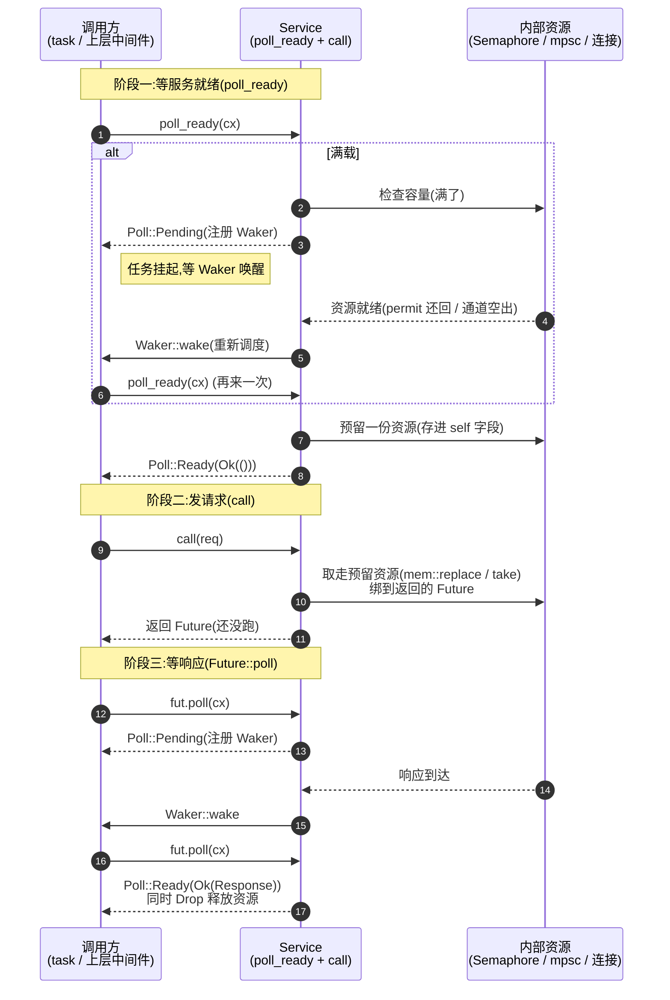

# 第 2 章 · Service trait:一个请求一个 Future

> 第 1 篇 · 核心 trait:Tower 的灵魂

---

## 核心问题

我们已经在前一章(P0-01)知道 Tower 干的事是把"处理一个请求"抽象成一个 trait,再用 Layer 把"装饰请求处理"抽象成另一个 trait,两者拼出无限中间件。这一章要把前半句钉死——那个 trait 长什么样、凭什么这么长。

具体地说,如果你只看 `tower-service` 这一个文件的 `Service` trait 定义,你会看到这样一个签名:

```rust
pub trait Service<Request> {
    type Response;
    type Error;
    type Future: Future<Output = Result<Self::Response, Self::Error>>;

    fn poll_ready(&mut self, cx: &mut Context<'_>) -> Poll<Result<(), Self::Error>>;
    fn call(&mut self, req: Request) -> Self::Future;
}
```

读完本章你会明白:

1. 为什么 `call` 是 `&mut self` 而不是 `&self`——一个 `Service` 实例每次 `call` 都"取走"了一份就绪状态,这不是无状态函数,而是有状态的"资源持有者"。
2. `poll_ready` 到底在背什么压——它不是"检查是否 ready 的辅助函数",它是**资源预留**的钩子:服务满载返回 `Pending`,预留好的资源等到 `call` 才消费。这是 Tower 区别于普通 `async fn` 的核心。
3. 为什么要把 `poll_ready` 和 `call` 拆成两个方法,而不是合并成一个 `async fn call(&self, req) -> Result<Response, Error>`——拆开才能让"等待就绪"和"发请求"这两件事被**分别**组合、分别取消、分别传染背压。
4. 为什么 hyper 的 `service::Service` 把 `poll_ready` **删了**,而 `tower-service::Service` **保留** `poll_ready`——这是通用抽象层和协议层对背压的不同取舍,是 Tower 整本书贯穿的对照点。
5. 为什么要掌握 `std::mem::replace` 取走就绪 clone 的惯用法——直接 `clone` 一个已经 `Ready` 的服务再 `call` 会 panic,这是 Tower 源码里反复出现的正确性陷阱。

> **逃生阀(本章有点长)**:如果你只想懂"为什么 Tower 要保留 `poll_ready`",直接看第 3 节"poll_ready 到底在背什么压"和第 6 节"hyper 删了 poll_ready,Tower 为什么保留"。其余几节是把这个结论拆细、配源码佐证。如果你完全没接触过 Rust 的 `Future`/`Poll`/`Pin`,建议先回 P0-01 或翻一眼《Tokio》前几章再回来,本章默认你见过 `Future::poll` 的签名。

---

## 一句话点破

> **`Service` 不是一个无状态的"请求处理函数",它是一个"持有资源、且每次能服务有限个请求的有状态执行单元";`poll_ready` 是"预约下一份资源",`call` 是"取走这份资源并发起请求"。正因为每次 `call` 都在消费资源,所以两个方法都必须是 `&mut self`,且必须拆成两步——拆开才能把"等资源就绪"这件事独立地组合、传染、取消。这是 Tower 把普通 `async fn` 升级成"可背压、可组合、可取消的请求抽象"的全部代价。**

这是结论,不是理由。本章倒过来拆:先看 trait 长什么样 → 再看每个签名为什么这么定 → 再看拆成两步换来什么 → 最后看源码里那个最容易翻车的 `mem::replace` 惯用法,印证"取走就绪状态"这件事有多核心。

---

## 第一节:先把 `Service` trait 的形状钉死

### 1.1 真身就这几行

`Service` trait 的全部定义,就在 `tower-service/src/lib.rs` 第 311 行到 355 行,加上它三个关联类型。整个 `tower-service` crate 只有这一个 trait,这是刻意的极简:

```rust
// tower-service/src/lib.rs#L311-L356
pub trait Service<Request> {
    /// Responses given by the service.
    type Response;

    /// Errors produced by the service.
    type Error;

    /// The future response value.
    type Future: Future<Output = Result<Self::Response, Self::Error>>;

    fn poll_ready(&mut self, cx: &mut Context<'_>) -> Poll<Result<(), Self::Error>>;

    /// ...
    #[must_use = "futures do nothing unless you `.await` or poll them"]
    fn call(&mut self, req: Request) -> Self::Future;
}
```

加上文件末尾两个 blanket impl(给 `&'a mut S` 和 `Box<S>` 也实现 `Service`,委托给内层),整份 `lib.rs` 一共 391 行,这个 crate 的 API 表面就是这么小。后续整本书讲的 `Buffer`/`Timeout`/`Retry`/`Balance`/`ConcurrencyLimit`/`BoxCloneSyncService` 全部建立在这一点点东西之上。

把它和标准库 `Future` 摆在一起看:

```rust
// 标准库 core::future::Future(《Tokio》已拆透)
pub trait Future {
    type Output;
    fn poll(self: Pin<&mut Self>, cx: &mut Context<'_>) -> Poll<Self::Output>;
}
```

`Service` 比 `Future` 多了什么?多了**两件东西**:

1. 一个**输入参数** `req: Request`(关联类型变成泛型参数 `Request`),让"我接受什么请求"变成类型的一部分;
2. 一个**前置方法** `poll_ready`,把"我现在能不能服务一个请求"从"我去服务这个请求"里分离出来。

第 1 点把 `Future` 从"无参异步计算"升级成了"带输入的异步函数";第 2 点把"等资源就绪"独立出来。这两件事合起来,正是 Tower 的全部精华。

> **承接《Tokio》**:`Future`/`Poll`/`Context`/`Waker` 都是 `core::future`/`core::task` 标准库,不是 tokio 仓的东西,`tower-service` 第 16-17 行 `use std::future::Future; use std::task::{Context, Poll};` 就是直接从 `std` 引入的。Tokio 只是执行者(`tokio::runtime` 负责 poll 这些 Future),`Service` 返回的 Future 最终交给谁 poll——通常是 Tokio runtime,但理论上换 `futures::executor` 也行。Future/Poll 的内部机制一句带过,详见《Tokio》[[tokio-source-facts]]。

### 1.2 关联类型 `Response`/`Error`/`Future` 为什么这么定

先看三个关联类型,它们决定了"一个 Service 长什么样":

- `type Response`——这个 Service 处理完一个请求后返回的成功值类型。
- `type Error`——这个 Service 处理请求时可能产生的错误类型。
- `type Future: Future<Output = Result<Self::Response, Self::Error>>`——`call` 不直接返回 `Result`,它返回一个**还没跑完的 Future**,这个 Future 最终 resolve 成 `Result<Response, Error>`。

为什么是关联类型而不是泛型?因为对一个固定的 `(Service 类型, Request 类型)` 组合,Response/Error/Future 是**唯一确定**的——一个 `RedisService<GetCommand>` 的 Response 永远是 `Option<String>`,不会这次 `String` 下次 `Vec<u8>`。关联类型表达"由实现方按类型唯一决定",这比泛型参数更准确,也避免了每次写 `Service<GetCommand, Response=..., Error=..., Future=...>` 这种超长签名。Rust 标准库的 `Iterator`/`Future` 都用这套。

> **钉死这件事**:`Request` 是 trait 的**泛型参数**(写在 `Service<Request>` 上),而 `Response`/`Error`/`Future` 是**关联类型**(写在 trait 体里)。一个具体的 Service 类型可以 `impl Service<RequestA>` 又 `impl Service<RequestB>`(虽然实际很少这么做),但对每个 `Request` 类型,Response 等是唯一确定的。这跟 `async fn` 的天然对应:`async fn call(req: Request) -> Result<Response, Error>` 的"输入是参数、输出是返回类型"。

`type Future` 那一行的 bound `Future<Output = Result<Self::Response, Self::Error>>` 是关键约束:它**没有**要求 `Self::Future: Send`/`Unpin`/`'static`。这些约束留到调用方按需加(比如 axum 要求 `Send`,见 P6-19)。`tower-service` 这个核心 crate 故意最弱约束,把"要不要 Send/Unpin"的决定权交给上层。这种"核心 trait 最弱约束、上层按需收紧"是 Rust trait 设计的常见手法,《hyper》的 `Body` trait、《Tokio》的 `AsyncRead` 都这样。

### 1.3 两个方法签名

剩下两个方法:

```rust
// tower-service/src/lib.rs#L340
fn poll_ready(&mut self, cx: &mut Context<'_>) -> Poll<Result<(), Self::Error>>;

// tower-service/src/lib.rs#L354-L355
#[must_use = "futures do nothing unless you `.await` or poll them"]
fn call(&mut self, req: Request) -> Self::Future;
```

注意几个细节,每一个都有理由:

1. **两个方法都是 `&mut self`**(不是 `&self`)。这是本章的重头戏,留到第 2 节细讲,这里先记住"call 每次取走就绪状态,所以必须可变借用"。
2. **`poll_ready` 返回 `Poll<Result<(), Self::Error>>`**。注意是 `Poll` 包 `Result`,不是 `Result`。`Poll::Pending` 表示"还没就绪,等会儿再 poll";`Poll::Ready(Ok(()))` 表示"就绪了,可以 call";`Poll::Ready(Err(_))` 表示"这个 Service 彻底坏了,丢弃它"。三种状态,文档(第 328-329 行)写得很清楚。
3. **`call` 有 `#[must_use]`**。返回的 Future 你不 await/poll 就什么都不干——这跟 `Future` 的语义一致,提醒调用方别忘了真正发起请求。
4. **`call` 的文档(第 350-353 行)说**:"Implementations are permitted to panic if `call` is invoked without obtaining `Poll::Ready(Ok(()))` from `poll_ready`."——也就是说,实现 Service 的人**可以**在没先 `poll_ready` 拿到 Ready 就直接 call 时 panic。这不是建议,这是允许的契约。这一条契约是 `mem::replace` 惯用法的根,留到第 4 节展开。

到这里 `Service` 的形状就钉死了。下面每一节,都是回答"为什么某个签名长这样"。

把 `Service` trait 的结构画成图,一眼看清它和 `Future` 的关系——`Service` = `Future` 的输入参数化 + 一个前置的"等就绪"方法:

```mermaid
classDiagram
    class Service~Request~ {
        <<trait>>
        +type Response
        +type Error
        +type Future
        +poll_ready(mut self, cx) Poll~Result~()~~
        +call(mut self, req Request) Future
    }
    class Future {
        <<trait std>>
        +type Output
        +poll(pin self, cx) Poll~Output~
    }
    class Service_Future {
        <<关联类型约束>>
        Output = Result~Response, Error~
    }
    Service~Request~ --> Service_Future : type Future: Future~Output=...~
    Service_Future ..|> Future : 必须实现
    note for Service~Request~ "比 Future 多两件:
    1. 输入参数 req: Request
    2. 前置方法 poll_ready (资源预留)"
```

注意图里两个关键点:① `Service::Future` 是关联类型,它的 `Output` 被钉死成 `Result<Response, Error>`,所以 `call` 返回的 Future 一定是"成功或失败"二选一;② `poll_ready` 和 `Future::poll` 签名几乎一样(都是 `&mut self`/`Pin<&mut Self>` + `Context` + 返回 `Poll`),这是刻意的——`poll_ready` 复用 Future 的协作模型,只是它 poll 的是"服务就绪状态"而不是"请求结果"。

---

## 第二节:为什么 `call` 和 `poll_ready` 都是 `&mut self`

这是初学 Tower 最先撞到的疑问。直觉上一个"处理请求"的东西应该是无状态的——给它请求,它给你响应,凭什么要 `&mut self`?

### 2.1 提出问题:无状态函数 vs 有状态执行单元

设想最朴素的请求处理抽象:

```rust
// 朴素版 A:async fn,&self
async fn handle(&self, req: Request) -> Result<Response, Error>;
```

或者用 trait:

```rust
// 朴素版 B:&self
trait NaiveService<Request> {
    async fn call(&self, req: Request) -> Result<Response, Error>;
}
```

直觉上这够用了:`&self` 表示"我不会被这次 call 改变",无状态、可重入、可并发。Rust 标准库的 `Fn` 闭包、HTTP 框架里的 `fn(Context, Request) -> Response`,都是这个形状。

那 Tower 为什么偏要 `&mut self`?因为一个 Service **不是无状态的函数,而是持有资源的有状态执行单元**。举三个真实场景:

**场景一:数据库连接池 Service**。一个 `PgService` 内部持有一个 PostgreSQL 连接,这个连接**同一时刻只能跑一个查询**(简化说法,真实 PG 连接可以 pipeline 但并发度有限)。如果你 `call` 发起一个慢查询,这个连接在结果回来之前不能再发第二个查询。这意味着 Service 必须知道"我现在的连接是不是已经在一个查询里",`poll_ready` 返回 `Pending` 表示"上一个查询还没回",返回 `Ready` 表示"可以发下一个了"。这种"是否空闲"的状态,显然必须可变。

**场景二:带并发上限的 Service**。一个 `ConcurrencyLimit<InnerService>`(见 P3-09)内部用 `tokio::sync::Semaphore` 限制并发数。`poll_ready` 在 `acquire` 一个 permit,`call` 把这个 permit 拿走绑到返回的 Future 上。下次 `poll_ready` 又要 acquire 下一个 permit。permit 是 Service 状态的一部分,而且每次 `call` 都要消费一个——这显然是 `&mut self`。

**场景三:Buffer Service**。一个 `Buffer<InnerService>`(见 P2-05)内部持有一个 `mpsc::Sender`,所有请求经通道转发给后台唯一一个 worker task。`poll_ready` 检查通道是不是满了,`call` 把请求 push 进通道。通道的"是否还能塞"这个状态,是 Service 的可变状态。

这三个场景的共同点:**"我现在能不能服务一个请求"是一种运行时状态,这个状态会被 `call` 消费**。所以 `call` 必须能改 Service——它要么消费一个 permit,要么占用一个连接槽,要么把请求塞进一个有界通道。这就是 `&mut self` 的根。

> **不这样会怎样**:如果 `call` 是 `&self`,那意味着"call 不会改变 Service"。那 permit 哪儿来的?连接槽哪儿占的?你只能要么(a)把 permit 放进返回的 Future 里(但这要求 `call` 内部用某种 `Mutex<Cell<Option<Permit>>>`,引入锁和运行时开销,且破坏无锁组合);要么(b)干脆不允许"call 消费资源"这种 Service 存在(那 ConcurrencyLimit/Buffer/RateLimit 全部没法写)。Tower 的选择是让 `call` 是 `&mut self`,把"消费资源"做成第一公民。

### 2.2 `&mut self` 的代价:不能并发 call 同一个 Service 实例

`&mut self` 不是没代价。最大的代价:**同一个 Service 实例不能被两个 task 同时 `call`**——因为 Rust 的别名规则,Rust 里同时只能有一个 `&mut`,要么多个 `&`。你要么独占地持有这个 Service call,要么共享它但只能 `&`(不能 call)。

这看起来是缺陷(普通 `&self` Service 不是能天然并发吗?),其实是**特性**。因为"同一个 Service 实例同时只能服务一个请求"这件事,对场景一(单连接)是**对的**——你想让一个 PG 连接同时跑 10 个查询是不可能的,`&mut self` 在编译期就帮你拒绝了这种用法。

那要并发怎么办?三个办法:

1. **克隆成多个 Service 实例**(每个连接一个),每个实例独占一个连接,自己 `&mut self` 各跑各的——这是 hyper 的连接池做法(每连接一个 task),也是 Tower 的 `Buffer`(P2-05,worker 持唯一真身,clone 的是 Sender 不是服务)和 `Clone` Service 的设计前提。
2. **把唯一真身塞进 `Mutex`**(运行期串行化),多个 task 抢锁——这是 `BoxService` 在某些场景的退化形式,但 Tower 大量设计就是为了**避免**这种运行期锁。
3. **用 `Buffer` 这种中间件,把"独占的真身"和"可克隆的句柄"分开**(P2-05 招牌):真身只有一个 worker task,句柄(Sender)可以无限 Clone,每个 task 拿一个句柄,所有请求经通道排队。

这三个办法的共同思想:**"独占的有状态执行单元"和"可并发分发的句柄"是两层东西,Tower 用 `&mut self` 强制你在类型层面区分**。你拿到一个 `&mut Service`,你独占它;你想要并发,你 Clone 出多个独立 Service 或拿一个可 Clone 的句柄(`Buffer`/`BoxCloneService`)。这是 `&mut self` 的真正用意。

> **对照《hyper》**:hyper 每连接一个 task,task 内独占一个 `Service`(`&mut self`),所以 hyper 的 Service 也保留 `&mut self`(它只是删了 `poll_ready`)。这个"每连接一 task、独占 Service"的模型《hyper》P1-02 已讲透,一句带过指路 [[hyper-source-facts]]。Tower 把这件事泛化:不管你是 hyper 的连接级 Service、还是 axum 的路由级 Service、还是 client 端的负载均衡 Service,只要你是"持资源的执行单元",就 `&mut self`。

### 2.3 `&mut self` 与 `Clone` 的张力:为什么 Tower 这么多 `Clone + Service`

到这里你应该能看出一个张力:`&mut self` 意味着"独占",但 Rust 异步生态大量场景(路由分发给多个 handler task、负载均衡给多个后端)需要"分发"。怎么调和?

Tower 的答案是:**让大量 Service 实现 `Clone`**。`Clone` 一个 Service 不是"复制底层资源"(那是错的,会 panic,见第 4 节),而是"再造一个独立的句柄,各自独立 `poll_ready`/`call`"。比如:

- `Timeout<Inner>` Clone 时复制的是 `Duration` 和 Inner(假设 Inner 也 Clone);
- `Balance<D, L>` Clone 时复制的是 Discover 句柄和负载状态;
- `BoxCloneService` Clone 时复制的是内部的 trait object vtable + 内层 clone 出的新 Service。

整本 Tower 的工程化篇(P6-17 BoxService 家族)几乎都是在解决"`Service: &mut self` + `Clone` 怎么共存"。`BoxCloneSyncService` 的存在意义就是"既要能擦除类型、又要能 Clone、又要 Send + Sync"——这三件事加上 `&mut self`,是 Rust 异步框架里最纠结的类型约束组合。这一章先建立直觉,具体擦除技巧留 P6-17。

> **钉死这件事**:`call(&mut self)` 的真正含义是"这次 call 消费一份资源/占用一份状态";`Clone` 的真正含义是"再造一个独立句柄,各自独占地 `&mut`"。两者结合,Tower 表达了"独占式执行单元 × 可分发句柄"的两层模型——这是 Tower 区别于普通 `async fn` 框架的根本。

---

## 第三节:`poll_ready` 到底在背什么压

这是本章最核心的一节,也是 Tower 整本书反复回扣的点。`poll_ready` 看起来只是个"check ready"的辅助方法,但它的真实角色是**背压(backpressure)的核心机制**。

### 3.1 先看文档原文,把语义钉死

`tower-service/src/lib.rs` 第 225-234 行有一段标题就叫 **Backpressure**,把这件事讲得很直白:

```rust
// tower-service/src/lib.rs#L225-L234
/// # Backpressure
///
/// Calling a `Service` which is at capacity (i.e., it is temporarily unable to process a
/// request) should result in an error. The caller is responsible for ensuring
/// that the service is ready to receive the request before calling it.
///
/// `Service` provides a mechanism by which the caller is able to coordinate
/// readiness. `Service::poll_ready` returns `Ready` if the service expects that
/// it is able to process a request.
```

注意三个动词:"at capacity"(满载)、"temporarily unable to process"(暂时处理不了)、"the caller is responsible for ensuring ... ready"(调用者有责任先确认就绪)。这三句话合起来定义了背压契约:

> **服务满载时,调用者不应该 `call`,而应该反复 `poll_ready` 等待,直到服务返回 `Ready`。如果你在没 Ready 的情况下 call,服务"may panic"(见文档第 350-353 行),或者更糟——静默地往一个满载的队列里塞请求,导致行为未定义。**

这就是背压。背压的本质是:**下游满了,上游必须知道并且停下来等,而不是继续往后塞**。

### 3.2 没有 `poll_ready` 会怎样:`async fn` 的背压困境

要理解 `poll_ready` 为什么必要,先看为什么 `async fn` 处理不好背压。设想你有一个:

```rust
async fn handle(&self, req: Request) -> Result<Response, Error>;
```

调用方写 `svc.handle(req).await`,这看起来很自然。问题是:服务满载时怎么办?

方案 A:**让 `handle` 内部 await 一个 permit**。比如 `ConcurrencyLimitService::handle` 内部 `permit = semaphore.acquire().await; ... `。这能工作,但代价是:

1. **背压传染不透明**。调用方 `svc.handle(req).await` 看起来就是"处理这个请求",它不知道这个 await 里**前半段在等 permit、后半段在等真正的响应**。你想取消"等 permit"但不能取消"等响应",做不到——它们绑在同一个 Future 里。
2. **没法在 call 之前检查就绪**。如果服务彻底坏了(连接全断),调用方只能傻等,没法在"等 permit"阶段就发现"这个服务永远不可能就绪了,该换一个"。
3. **没法做"准备多个请求、谁 ready 发谁"**。负载均衡场景,你想同时观察 10 个后端的 ready 状态,谁 ready 就发给谁——但 `async fn handle` 你只能一个个 await,await 一个就阻塞了。
4. **资源预留和请求绑定死了**。permit 是在 `handle` 内部 acquire 的,绑定到 `req` 上,你没法"先 acquire permit、再决定发什么请求"。

方案 B:**返回 `Result` 表示满载**。比如 `handle` 满载时返回 `Err(Overloaded)`。但这又要求调用方每次 call 都处理这个错误,而且——更糟——**满载的请求被丢了**(返回 Err 后,调用方要么重试要么放弃,反正这次 call 没服务)。这是 `LoadShed`(P2-07)的策略,但在大多数场景里,我们不希望满载就丢请求,我们希望"等一会儿再发"。

方案 C:**把"等就绪"独立出来**。这就是 Tower 的选择。把"等就绪"做成 `poll_ready`,把"发请求"做成 `call`,两者分开,调用方先 poll_ready 拿到 Ready,再 call。这样:

1. 背压透明——调用方明确知道"我在等就绪";
2. 可以提前取消——poll_ready 返回 Err,丢弃整个 Service;
3. 可以"多服务谁 ready 发谁"——同时 poll 多个 poll_ready(负载均衡、连接池就是这么做的);
4. 资源预留独立——poll_ready 可以"预约"一份资源(比如 acquire 一个 permit 但暂不用),call 时才消费。

> **不这样会怎样**:把 `poll_ready` 合进 `call` 里(像 `async fn handle` 那样),你就失去了上述四件事的每一件。背压还在(内部 await permit),但它变成了 Future 内部的黑盒,不可组合、不可取消、不可观察。Tower 把"等就绪"提到 trait 表面,正是为了让背压成为一等公民——可以被组合、被传染、被观察、被取消。

### 3.3 `poll_ready` 的真实身份:资源预留

文档第 335-339 行有一段关键的话,是 `poll_ready` 的真正语义:

```rust
// tower-service/src/lib.rs#L335-L339
/// Note that `poll_ready` may reserve shared resources that are consumed in a subsequent
/// invocation of `call`. Thus, it is critical for implementations to not assume that `call`
/// will always be invoked and to ensure that such resources are released if the service is
/// dropped before `call` is invoked or the future returned by `call` is dropped before it
/// is polled.
```

翻译过来:**`poll_ready` 可能"预留"一些共享资源,这些资源在随后的 `call` 里被消费。所以实现者不能假设 `call` 一定会被调用——如果 `poll_ready` 之后,Service 在 `call` 之前被 drop,或者 `call` 返回的 Future 在被 poll 之前被 drop,预留的资源必须被正确释放(通常靠 `Drop`)。**

这段话信息量极大,把它拆开:

- **`poll_ready` 可以"预留"资源**。不是"检查是否 ready",是"预约一份资源"。最典型的例子是 `ConcurrencyLimit`(P3-09):`poll_ready` 里 `Semaphore::acquire` 一个 permit,这个 permit 被存进 Service 的可变状态;`call` 把这个 permit 取出来绑到返回的 Future 上。
- **预留的资源要能被释放**。如果调用方 `poll_ready` 拿到 Ready 后,还没 `call` 就把 Service drop 了(比如超时取消、负载均衡选了别的后端),那预留的 permit 必须还回 Semaphore——否则 permit 泄漏,并发上限越来越低。这个"还回去"通常靠 `Drop`:`ConcurrencyLimit` 内部存 permit 的字段,drop 时 permit 也 drop,permit 的 Drop 把名额还回 Semaphore。
- **`call` 返回的 Future 也是同理**。`call` 之后,permit 已经被移到 Future 里(通过 `mem::replace` 或 move)。如果这个 Future 没被 poll 就 drop(调用方拿到 Future 后立刻取消),permit 也要正确释放——一样靠 Future 的 `Drop`。

这就是为什么 `poll_ready` 必须是 `&mut self`:它要**修改 Service 的内部状态**——往里塞一个预留的 permit。下次 `call` 取走它。这一来一回的"存-取"动作,是 `&mut self` 的天然语义。

> **钉死这件事**:`poll_ready` 不是 read-only 的"检查",它是 write 的"预留"。它往 Service 里写一个资源(permit/槽位/句柄),`call` 把这个资源取走绑到请求上。这是 Tower 区别于普通 `async fn` 的全部秘密:把"准备资源"和"消费资源"做成两个独立的可组合步骤。

### 3.4 背压怎么在 Service 树里传染

把上面这套语义放到一棵 Service 树里看(这是中间件栈的真实形态):

```
外层 Timeout<inner>
  └─ inner: Retry<inner'>
       └─ inner': ConcurrencyLimit<inner''>
                  └─ inner'': 实际的 HttpClient
```

一次请求进来,最外层 Timeout 的 `poll_ready` 被调用。Timeout 自己不持有资源,它把 `poll_ready` 直接转发给内层:

```rust
// 伪代码(对照 lib.rs 第 169-173 行 Timeout 文档示例)
fn poll_ready(&mut self, cx: &mut Context<'_>) -> Poll<Result<(), Self::Error>> {
    self.inner.poll_ready(cx).map_err(Into::into)
}
```

`self.inner` 是 Retry,Retry 的 `poll_ready` 又转发给 ConcurrencyLimit,ConcurrencyLimit 的 `poll_ready` 真的 `acquire` permit——如果并发满了,返回 `Pending`。这个 `Pending` 一路传回最外层 Timeout,Timeout 也返回 `Pending`,最终调用方(可能是 hyper 的连接 task)拿到 Pending,注册 Waker,任务挂起。等某个 in-flight 请求完成、permit 还回来,Semaphore 通知 Waker,任务重新被调度,`poll_ready` 链重新跑一遍,这次 ConcurrencyLimit 拿到 permit 返回 Ready,一路传回最外层,调用方才 `call`。

这就是**背压传染**:最内层的资源约束(并发上限),通过 `poll_ready` 链一路传到最外层调用方,调用方在没有 permit 的时候**根本不会**往下 call。这是 Tower 中间件栈的核心价值——每层中间件可以独立定义自己的资源约束,这些约束自动叠加、自动传染,不需要调用方知道栈里有什么。

> **承接《Tokio》**:这条 `poll_ready` 链底层用的是 `Waker`/`Context` 唤醒机制(标准库 `core::task`),Semaphore 满了怎么通知 Waker、Tokio runtime 怎么把 Waker 接到 reactor——这些《Tokio》已拆透,一句带过指路 [[tokio-source-facts]]。Tower 这边只关心:`poll_ready` 返回 Pending 时把 `cx` 里的 Waker 注册好,内层资源就绪时唤醒,标准 Future 协作。

### 3.5 一个反例:不传染背压的 LoadShed

为了把背压传染的价值讲透,看一个反例:`LoadShed`(P2-07 招牌)。它的设计就是**故意不传染**背压:

```rust
// LoadShed 的 poll_ready(简化,真实实现见 P2-07)
fn poll_ready(&mut self, cx: &mut Context<'_>) -> Poll<Result<(), Self::Error>> {
    match self.inner.poll_ready(cx) {
        Poll::Ready(Ok(())) => { self.ready = true; Poll::Ready(Ok(())) }
        Poll::Pending => { self.ready = false; Poll::Ready(Ok(())) }  // 内层满,但我也 Ready
        Poll::Ready(Err(e)) => Poll::Ready(Err(e)),
    }
}

fn call(&mut self, req: Request) -> Self::Future {
    if self.ready {
        // 内层就绪,转发
    } else {
        // 内层满载,直接返回 Overloaded 错误,不转发
    }
}
```

LoadShed 把内层的 `Pending` 翻成自己的 `Ready`,然后在 `call` 里检查"刚才内层是 ready 还是 pending",如果 pending,直接返回 `Overloaded` 错误。这是一种**主动丢请求**的策略——满载了我不传染背压(让上游等),而是直接拒绝(让上游知道我满了)。

这个反例的存在,反向证明了正常 Service 的 `poll_ready` 传染背压是多么重要:正常情况下,内层满载,上游应该等(传染);只有你**显式**选择 LoadShed,才会把 Pending 翻成错误(拒绝)。这两件事在 Tower 里是**两个不同的中间件**——一个传染,一个拒绝,调用方按需选。这恰恰说明 `poll_ready` 把背压做成了一等公民:你可以传染,也可以拒绝,但你不能"假装没事继续往后塞"。

> **对照《Envoy》**:Envoy 的 overload manager 用 `LoadShedPoint` 做主动拒绝(基于令牌桶/水位),对照 Tower 的 `LoadShed`。Envoy P3 已讲透,一句带过指路 [[envoy-source-facts]]。区别:Envoy 的 overload 是运行期配置的拒绝策略,Tower 的 LoadShed 是编译期组合进 Service 栈的一个 Layer。

---

## 第四节:为什么是 `poll_ready` + `call` 两步,而不是一个 `async fn`

到这里,你可能会问:既然 `poll_ready` 这么重要,为什么不干脆把它合并进 `call`,做成一个 `async fn call(&mut self, req) -> Result<Response, Error>`,内部先 await poll_ready 再 await 真正的处理?

这个问题值得单独一节。答案是:**合并会失去四个能力**(背压透明、提前取消、多服务并发选择、资源预留独立),而这四个能力正是 Tower 中间件栈的全部价值。上一节其实已经分散讲过,这里收束成"为什么必须拆"。

### 4.1 拆开才能"先看 ready 再决定发什么"

设想负载均衡场景。你有 10 个后端 Service,你想做的是:

> 同时观察 10 个后端的 `poll_ready`,谁先 Ready,就把请求发给谁。

如果 `call` 是 `async fn call(&mut self, req)`(合并版),你只能:

```rust
// 合并版,做不到
let fut1 = backend1.call(req.clone()).await;  // 阻塞在 backend1
// 没机会观察 backend2~10
```

你一旦 await 一个后端的 call,就阻塞了,没法同时观察其他后端。

拆开版则可以:

```rust
// 拆开版,可以
loop {
    let mut ready_list = vec![];
    for backend in &mut backends {
        if let Poll::Ready(Ok(())) = backend.poll_ready(&mut cx) {
            ready_list.push(backend);
        }
    }
    if !ready_list.is_empty() {
        // 选一个 ready 的(比如 P2C,见 P5-15)
        let chosen = pick_one(ready_list);
        return chosen.call(req).await;
    }
    // 都没 ready,等 Waker 唤醒
    pending_once().await;
}
```

这就是 `Balance`(P5-15 招牌)的核心结构——**poll_ready 阶段做选择,call 阶段发请求**。没有 poll_ready/call 拆分,负载均衡根本写不出来。

### 4.2 拆开才能"准备资源,但暂不发请求"

`ConcurrencyLimit`(P3-09)的工作流是:

> `poll_ready` 里 acquire 一个 permit(可能要等),`call` 里把 permit 绑到 Future 上。

为什么 acquire 在 poll_ready 里而不是 call 里?因为调用方可能这样用:

```rust
// 准备阶段:poll_ready(可能花时间等 permit)
loop {
    if let Poll::Ready(Ok(())) = svc.poll_ready(&mut cx) { break; }
    pending_once().await;
}
// 此刻 permit 已经在手,Service 处于 ready 状态
// ... 这里可以做一些其他事(比如序列化请求、检查上下文)
// 发请求阶段:call
let fut = svc.call(req);
fut.await
```

permit 在"准备阶段"就 acquire 好了,挂在 Service 内部。调用方在 poll_ready 和 call 之间可以干别的事(比如序列化、检查上下文),不用在 call 里阻塞等 permit。这种"资源提前预留"在合并版里做不到——合并版 permit 必须在 call 内部 acquire,绑死在 req 上。

### 4.3 拆开才能"取消准备阶段,保留发请求阶段"

背压传染场景下,调用方可能想:

> 如果 5 秒内还没 ready,就放弃这个 Service(换一个后端);但一旦 ready,call 之后就必须等服务端响应(可能很久)。

合并版做不到——`call` 是一个 Future,你 cancel 就整个 cancel,没法"取消等 permit 但不取消等响应"。

拆开版:`poll_ready` 是一个独立的 Future(比如 `Ready`/`ReadyOneshot`,见 util/ready.rs),你可以给这个 Future 套一个 timeout,超时就换后端;一旦 ready,`call` 出来的 Future 是另一个 Future,你再按需 timeout。两个阶段独立超时、独立取消。这是 hyper client 端做连接获取超时和请求超时分离的基础。

### 4.4 拆开才能"复用 Future 协作机制"

最后一个理由,也是最深的一个:Rust 的 `Future`/`Poll`/`Waker` 协作机制是为 `poll` 方法设计的——`Poll::Pending` 注册 Waker,资源就绪唤醒 Waker,runtime 重新调度。`poll_ready` 复用了这套:

```rust
fn poll_ready(&mut self, cx: &mut Context<'_>) -> Poll<Result<(), Self::Error>>;
```

签名跟 `Future::poll` 一模一样(只是返回 `Result` 而不是 `Output`)。这意味着:

- 内部资源(Semaphore/mpsc 通道/定时器)就用它们自己的 Future,在 poll_ready 里 `ready!(some_inner_future.poll(cx))`,标准的 Future 协作;
- 嵌套 Service 的 poll_ready 直接转发,`Poll` 类型一致;
- 调用方用 `futures::future::poll_fn` 把 poll_ready 包成 Future,放进 `select!`/`tokio::time::timeout`,所有 Future 组合子都可用。

如果合并成 `async fn call`,内部 await 一个 permit 时,这个 await 会绑定到 req,req 又绑定到调用方——你失去了把"等就绪"单独拿出来组合的自由。

> **钉死这件事**:`poll_ready` + `call` 拆分,本质是把 Future 的协作模型(`Poll`/`Waker`)用两次:一次用来表达"等服务就绪",一次用来表达"等服务处理完请求"。两次 `Poll` 各自独立,各自可组合、可取消、可传染。这是 Tower 把 Rust Future 机制榨干的核心设计。

---

## 第五节:`Oneshot` 状态机——`poll_ready` 与 `call` 协作的标准样板

讲完为什么拆,看一个标准的拆分使用样板:`Oneshot`(`tower/src/util/oneshot.rs`)。它是一个 Future,把"消费一个 Service、poll 到 ready、call 发请求、等响应"四步封装成一个 `await`。这是 Tower 自己提供的标准组合子,也是 `ServiceExt::oneshot` 的实现。

### 5.1 `Oneshot` 的状态机

在展开状态机之前,先用 mermaid 把"`poll_ready` 与 `call` 的协作时序"画清楚——这是本章的核心图,任何"调用一个 Service"的代码,底层都是这个时序的某种变体:



这张图把 `poll_ready` 和 `call` 拆开的全部价值都画出来了:① 阶段一可以独立取消(超时换后端);② 阶段一的资源预留(`Svc->>Res: 预留一份资源`)和阶段二的消费(`取走预留资源`)是两次独立的可变操作;③ 阶段三的 Future drop(无论正常完成还是中途取消)都触发资源释放。`Oneshot` 状态机就是把这个时序封装成一个 Future。

#### `Oneshot` 的状态机拆解

`Oneshot<S, Req>` 是一个 `pin_project!` 包装的枚举状态机,三个状态:

```rust
// tower/src/util/oneshot.rs#L22-L35
pin_project! {
    #[project = StateProj]
    enum State<S: Service<Req>, Req> {
        NotReady {
            svc: S,
            req: Option<Req>,
        },
        Called {
            #[pin]
            fut: S::Future,
        },
        Done,
    }
}
```

三个状态对应请求生命周期:

- `NotReady`——还没 ready,持有 Service 和待发请求;
- `Called`——已经 call,持有 call 返回的 Future,等它 resolve;
- `Done`——完成,Future 已 resolve。

`poll` 实现(第 87-104 行)是一个 loop,根据当前状态推进:

```rust
// tower/src/util/oneshot.rs#L87-L104
fn poll(self: Pin<&mut Self>, cx: &mut Context<'_>) -> Poll<Self::Output> {
    let mut this = self.project();
    loop {
        match this.state.as_mut().project() {
            StateProj::NotReady { svc, req } => {
                let _ = ready!(svc.poll_ready(cx))?;
                let f = svc.call(req.take().expect("already called"));
                this.state.set(State::called(f));
            }
            StateProj::Called { fut } => {
                let res = ready!(fut.poll(cx))?;
                this.state.set(State::Done);
                return Poll::Ready(Ok(res));
            }
            StateProj::Done => panic!("polled after complete"),
        }
    }
}
```

逐行读:

1. **`NotReady` 分支**:`ready!(svc.poll_ready(cx))?`——这是 `futures_core::ready!` 宏,如果 `poll_ready` 返回 `Pending`,整个 `Oneshot::poll` 也返回 `Pending`(宏内部 early return);如果返回 `Ready(Err(e))`,`?` 把错误传出去,整个 Oneshot 失败;如果返回 `Ready(Ok(()))`,继续往下——`svc.call(req.take()...)`,把请求取出来 call 拿到 Future,状态切到 `Called`。
2. **`Called` 分支**:`ready!(fut.poll(cx))?`——poll call 返回的 Future,等它 resolve。resolve 后状态切到 `Done`,返回 `Poll::Ready(Ok(res))`。
3. **`Done` 分支**:再 poll 就 panic——状态机已经走完,这是契约违反。

这个状态机就是 `poll_ready` + `call` 协作的标准实现。注意几个细节:

- `poll_ready` 和 `fut.poll` 共用同一个 `cx`,所以无论哪个阶段 Pending,唤醒的都是同一个 Waker,Oneshot 这个 Future 会被一起唤醒重新 poll。
- `ready!` 宏把 `Poll<Result<T, E>>` 解构成"Pending 就 early return、Err 就 `?`、Ok 就给 T",这是处理 `Poll<Result>` 的标准惯用法(承接 `futures_core`,Tokio 也用)。
- `loop` 是必须的,因为一次 poll 可能跨两个状态(从 NotReady 切到 Called 后,本轮 poll 还可以继续 poll 一次 fut)——这是 Future 状态机的常见优化,避免一次唤醒只能推进一个状态。

### 5.2 `Oneshot` 怎么用:Service 当 Future 用

调用方拿到一个 Service,想"发一个请求拿响应",写起来就是:

```rust
let response = svc.oneshot(request).await?;
```

`oneshot` 是 `ServiceExt` 提供的方法(util/mod.rs 第 89 行):

```rust
// tower/src/util/mod.rs#L89(简化)
fn oneshot(self, req: Request) -> Oneshot<Self, Request> {
    Oneshot::new(self, req)
}
```

它把 `(self, req)` 包成 `Oneshot`,返回一个 Future。`await` 这个 Future 就是上面那个状态机跑一遍。这是把 `Service` 当 `Future` 用的标准入口——一次性消费一个 Service。

> **钉死这件事**:`Oneshot` 是 `poll_ready → call → fut.poll` 三步状态机的标准封装。它印证了"`poll_ready` 和 `call` 是两个独立步骤"——状态机的 `NotReady → Called` 这次状态切换,正是这两步的边界。任何"消费一个 Service 发一个请求"的代码,底层都是这个状态机。

### 5.3 `Ready`/`ReadyOneshot`:只 poll_ready 不 call

除了 `Oneshot`(完整发请求),Tower 还提供 `ReadyOneshot`/`Ready`(`util/ready.rs`),它们只做 `poll_ready`,把"准备好"这件事本身做成一个 Future。

```rust
// tower/src/util/ready.rs#L16-L19
pub struct ReadyOneshot<T, Request> {
    inner: Option<T>,
    _p: PhantomData<fn() -> Request>,
}
```

`ReadyOneshot<T, Request>::poll`(第 43-51 行):

```rust
// tower/src/util/ready.rs#L43-L51
fn poll(mut self: Pin<&mut Self>, cx: &mut Context<'_>) -> Poll<Self::Output> {
    ready!(self
        .inner
        .as_mut()
        .expect("poll after Poll::Ready")
        .poll_ready(cx))?;

    Poll::Ready(Ok(self.inner.take().expect("poll after Poll::Ready")))
}
```

它做的事:`poll_ready` 到 Ready 后,把 Service `take` 出来返回(消费掉 Service)。`Ready`(第 70-94 行)是 `ReadyOneshot<&'a mut T, Request>` 的别名——返回的是 `&'a mut T` 而不是消费 T,这样调用方可以反复 ready 同一个 Service。

这两个 Future 的存在,印证了"`poll_ready` 本身就是一个可组合的 Future"。你想"等服务就绪",就用 `svc.ready().await`,拿到一个 `&mut S`,然后再 `call`;想"消费式就绪",用 `ready_oneshot`。`poll_ready` 不是辅助函数,它是 Future 体系里的一等公民。

---

## 第六节:hyper 删了 `poll_ready`,Tower 为什么保留

这是本章最后一个"为什么",也是整本 Tower 贯穿的对照点。hyper 的 `service::Service` trait 把 `poll_ready` **删了**,只留 `call`:

```rust
// hyper 1.x 的 service::Service(简化,详见《hyper》)
pub trait Service<Request> {
    type Response;
    type Error;
    type Future: Future<Output = Result<Self::Response, Self::Error>>;

    fn call(&mut self, req: Request) -> Self::Future;
    // 没有 poll_ready!
}
```

hyper 是 Tower 系的核心用户,它的 Service trait 几乎就是 tower-service 的简化版——少了一个 `poll_ready`。为什么 hyper 敢删?为什么 Tower 必须留?这背后是**通用抽象层 vs 协议层**对背压的不同取舍。

> **承接《hyper》**:hyper P1-02 已讲 Service trait 把请求抽象成 Future,P1-03 已讲 Tower 中间件链入门。这里只对照"hyper 删 poll_ready vs Tower 保留"这一个点,不重复 hyper 讲过的 Service 入门,详见 [[hyper-source-facts]]。

### 6.1 hyper 怎么处理背压:协议层机制

hyper 删 `poll_ready` 不是因为不需要背压,而是因为**背压藏在协议机制里了**。具体分三种情况:

**HTTP/1 server 端**:`hyper` 的 HTTP/1 server 每连接一个 task,连接里同时只能有一个 in-flight 请求(HTTP/1.1 默认 pipelining 关闭,串行处理)。task 结构里有个 `in_flight: Option<...>` 状态:有 in-flight 请求时,新请求就等(不读 socket)。这个"等"就是背压——TCP 层 window 满了,对端自然就慢。背压不需要 `poll_ready`,协议本身(单连接串行)就提供了。

**HTTP/2 server 端**:HTTP/2 多路复用,一个连接多个 stream。背压藏在 HTTP/2 的流控(STREAM_WINDOW/CONNECTION_WINDOW)里——h2 库自动按 window 大小限制接收,window 满了对端就被流控住。Service 不需要 poll_ready,流控在 h2 层自动做。

**HTTP/2 client 端**:hyper client 用 `SendRequest::poll_ready`(在 hyper-util 的 `SendRequest` 上,不在 Service 上)检查"连接池里有没有可用连接 / stream window 够不够"。这个 poll_ready 是**连接池层**的,不是 Service 层的——它管的是"发请求前先确认有连接",Service 一旦拿到连接,call 直接发。

这三种情况的共同点:**背压由协议层(HTTP/1 单连接串行、HTTP/2 流控)或连接池层提供,Service 层不需要自己 poll_ready**。hyper 把 Service 设计成最简(只有 call),背压下推给更下层。

### 6.2 Tower 为什么必须保留:通用抽象层不假设协议

Tower 不能这么做,因为 Tower 是**通用抽象层**——它不知道你下面跑的是 HTTP/1(有单连接串行背压)、HTTP/2(有流控背压)、Redis(单连接串行)、数据库连接池(有限连接)、还是某个纯内存的 mock(没有任何协议背压)。

如果 Tower 像 hyper 那样删 poll_ready,那背压就没地方放了:

- 下层是 HTTP/2?好,有流控,删了没事;
- 下层是 Redis?Redis 协议没有内置流控,你 call 进去的请求会被发到 TCP buffer,buffer 满了再阻塞——但阻塞发生在 TCP 写,而 TCP 写阻塞会卡住整个 task,不能精细控制;
- 下层是一个 mock Service,直接同步处理?根本没有背压机制,调用方一个劲儿 call,内存被请求队列撑爆。

通用抽象层的责任是:**为所有可能的下层提供一个统一的背压接口**。这个接口就是 `poll_ready`。下层有没有自己的背压机制不重要——`poll_ready` 是个通用钩子,下层愿意用就用(像 ConcurrencyLimit 自己 acquire permit),不愿意用就永远返回 Ready(像 Timeout 这种纯转发中间件)。

> **钉死这件事**:hyper 是协议层,背压由协议(HTTP/1 串行、HTTP/2 流控)和连接池提供,Service 层不需要 poll_ready;Tower 是通用抽象层,**不能假设下层有协议级背压**,所以必须把背压做成显式的 `poll_ready` 钩子,让每个 Service 按需实现。这就是"协议层删 vs 通用层留"的根本原因。

### 6.3 这个对照贯穿全书

这个对照点不是 P1-02 一章的事,它会反复出现:

- **P2-05 Buffer**:Tower 用 Buffer 给 `!Clone` Service 套一个 worker + mpsc,mpsc 的容量就是背压——满了 poll_ready 返回 Pending。这是 Tower 自己造的背压,因为下层 Service 可能没有协议背压。hyper 不需要 Buffer,因为 hyper 连接本身就有背压。
- **P2-07 LoadShed**:把 Pending 翻成错误,是 Tower 给那些"不想要背压、想要主动拒绝"的场景设计的。hyper 不需要,因为协议背压本来就慢(等),不会拒绝。
- **P3-09 ConcurrencyLimit**:用 Semaphore 限并发,这是 Tower 通用层加的背压。hyper 的并发由连接数 / HTTP/2 stream 数自然限制,不需要额外的 ConcurrencyLimit。
- **P5-15 Balance**:负载均衡里,选后端要看后端的 ready 状态——这是 Tower 必须用 poll_ready 的场景,hyper 不做负载均衡。
- **P6-19 集成**:hyper 1.x 的 Service 怎么和 Tower 的 Service 对接(需要适配,因为 hyper 的 Service 没有 poll_ready)。

每章讲到背压,都会回扣这一节。Tower 保留 poll_ready 不是历史包袱,是通用抽象的必然要求。

---

## 技巧精解

正文把 `Service` trait 的设计动机讲完了。这一节单独拆透两个最容易翻车的实现技巧:**`std::mem::replace` 取走就绪 clone 的惯用法**,以及 `poll_ready` 资源预留的正确实现要点。两者都配反面对比——朴素写法会撞什么墙。

### 技巧一:`mem::replace` 取走就绪 clone,而不是直接 clone

这是 Tower 源码里最经典、最容易写错的惯用法,`tower-service/src/lib.rs` 文档第 235-310 行用了 75 行专门讲这件事。

#### 1.1 问题场景:写一个 Wrapper Service,内层要 Clone

设想你写一个中间件 `Wrapper<S>`,内层 `S: Service + Clone`。你的 `call` 需要把内层 move 进一个 `'static` 的 Future(比如 `Box::pin(async move { ... })`),因为 Future 可能在任意 task 上 poll,必须 `'static`。最朴素的写法:

```rust
// 朴素版(错误!)(对照 lib.rs 第 243-274 行)
impl<R, S> Service<R> for Wrapper<S>
where
    S: Service<R> + Clone + 'static,
    R: 'static,
{
    type Response = S::Response;
    type Error = S::Error;
    type Future = Pin<Box<dyn Future<Output = Result<Self::Response, Self::Error>>>>;

    fn poll_ready(&mut self, cx: &mut Context<'_>) -> Poll<Result<(), Self::Error>> {
        self.inner.poll_ready(cx)   // poll 了 self.inner
    }

    fn call(&mut self, req: R) -> Self::Future {
        let mut inner = self.inner.clone();           // ← 克隆一份
        Box::pin(async move {
            inner.call(req).await                      // ← call clone
        })
    }
}
```

看起来很合理:poll_ready 让 `self.inner` ready,call 时 clone 一份 move 进 Future。问题在哪?

问题在于:**`self.inner.clone()` 出来的 inner 不一定 ready**。`poll_ready` 让的是 `self.inner`(原实例),不是它的 clone。Service 的 ready 状态可能依赖于实例特定的资源(比如内层 `ConcurrencyLimit` 的 poll_ready 在原实例里 acquire 了一个 permit,clone 出来的新实例没有这个 permit)。

所以 `inner.call(req)` 这一句会撞 Service 的契约——文档第 350-353 行明确允许实现者在"没先 poll_ready 就 call"时 panic。具体到 ConcurrencyLimit:clone 出来的 inner 没经过 poll_ready,内部没有 permit,call 时它会 panic("must call poll_ready first")或者(更糟)在错误状态下处理请求。

#### 1.2 正确版:`mem::replace` 取走已经 ready 的那个

正确做法是:**取走 `self.inner`(那个已经 poll_ready 过的),换上一个没 ready 的 clone**。这样 move 进 Future 的是"已经 ready 的真身",call 它不会有问题;留在 `self.inner` 的是一个新 clone,下次 poll_ready 重新 ready 它。

```rust
// 正确版(对照 lib.rs 第 278-310 行)
impl<R, S> Service<R> for Wrapper<S>
where
    S: Service<R> + Clone + 'static,
    R: 'static,
{
    type Response = S::Response;
    type Error = S::Error;
    type Future = Pin<Box<dyn Future<Output = Result<Self::Response, Self::Error>>>>;

    fn poll_ready(&mut self, cx: &mut Context<'_>) -> Poll<Result<(), Self::Error>> {
        self.inner.poll_ready(cx)
    }

    fn call(&mut self, req: R) -> Self::Future {
        let clone = self.inner.clone();
        // take the service that was ready
        let mut inner = std::mem::replace(&mut self.inner, clone);   // ← 关键!
        Box::pin(async move {
            inner.call(req).await
        })
    }
}
```

关键就是这两行(文档第 302-304 行):

```rust
let clone = self.inner.clone();
let mut inner = std::mem::replace(&mut self.inner, clone);
```

`std::mem::replace(&mut self.inner, clone)` 的语义:**把 `self.inner` 的当前值取出来(返回),同时把 `clone` 塞进 `self.inner`**。这是 Rust 标准库的一个惯用法——`&mut T` 不能直接 move 出 T(那会留下一个未初始化的 `self.inner`,不 sound),`mem::replace` 通过"同时塞一个新值进去"绕过这个限制,实现"原子地取出旧值、塞入新值"。

效果是:

| 时刻 | `self.inner` 指向的实例 | move 进 Future 的实例 |
|------|------------------------|----------------------|
| `poll_ready` 返回 Ready 后 | A(已 ready) | — |
| `let clone = self.inner.clone();` | A(已 ready) | — (clone B 在局部变量) |
| `mem::replace(&mut self.inner, clone)` 后 | B(未 ready 的新 clone) | A(已 ready 的真身,被 move 出来) |
| `inner.call(req)` | B | A 被 move 进 Future,call 它(合法,它 ready 过) |

下次 `poll_ready` 被 call 时,poll 的是 B,B 需要重新 ready——这是对的,B 从来没 ready 过。

#### 1.3 为什么不能直接 `std::mem::take` 或 `Option::take`

有人会问:为什么不存 `Option<S>`,然后 `self.inner.take().unwrap()`?

可以,但代价是:`Option<S>` 多一个 tag 字段(内存对齐可能多 8 字节),每次访问要 `as_ref().unwrap()`(运行期分支),poll_ready 也要 `self.inner.as_mut().unwrap().poll_ready(cx)`。对性能敏感的中间件栈(可能套 10 层),这每层的 unwrap 都是真开销。

`mem::replace` + 直接存 `S` 的写法,编译期就知道 `self.inner` 永远有值(类型是 `S` 不是 `Option<S>`),没有 unwrap 分支,零运行期开销。这是 Rust 零成本抽象的典型——用类型系统表达"永远有值",用 `mem::replace` 在需要"临时取出再塞回"时绕开 move 限制。

#### 1.4 反面对比:Go 的中间件怎么做

对照 Go 的 HTTP middleware:

```go
func Wrapper(inner http.Handler) http.Handler {
    return http.HandlerFunc(func(w http.ResponseWriter, r *http.Request) {
        // inner 直接用,不用 clone,因为 Go 的 Handler 是无状态接口
        inner.ServeHTTP(w, r)
    })
}
```

Go 不需要 `mem::replace`,因为 Go 的 `http.Handler` 是 `interface { ServeHTTP(ResponseWriter, *Request) }`,**没有 `&mut self`**,Handler 是无状态的(状态通常存在闭包捕获的变量里,或 `sync.Mutex` 保护的共享 map 里)。无状态意味着不需要 clone,不需要担心"哪个实例 ready 过"。

代价是:Go 的中间件**没有类型层面的背压**——你想限并发,得自己在中间件里 `semaphore.Acquire()`(运行期),且这个 acquire 是阻塞调用,会让 goroutine 挂起(goroutine 不廉价,虽然有 cheap 之名但毕竟占栈)。Tower 用 `&mut self` + poll_ready 把背压做进类型系统,代价是 clone 的复杂度(`mem::replace`),收益是编译期保证的背压传染。

> **对照《Go》**:Go 的 goroutine 调度、`http.Handler` 模型、《Go runtime》已拆透。Go middleware 是运行期链(`func(Handler) Handler`),Tower Layer 是编译期 `Stack`(P1-03)。这个对照在 P1-03 / P7-20 会展开,本章只点一下"`&mut self` 的代价是 clone 复杂度"。

#### 1.5 这个惯用法在 Tower 源码里多常见

`mem::replace` 取走就绪 clone 这个模式,在 Tower 源码里反复出现。举几个典型:

- `tower/src/util/call_all/` 系列(把一个 Service 喂 Stream)——每次 call 后要重新 ready 一个 Service 句柄;
- `tower/src/balance/` 系列——负载均衡选后端时,选中的后端要 move 出来 call,换一个 clone 留着;
- `tower/src/retry/`——重试时每次重试要重新 ready inner(或者用 Buffer 复用);
- 任何 `Layer` 包出来的中间件,如果内层需要 Clone + move 进 Future,都遵循这个模式。

后续章节遇到时不再重复解释,默认你已经理解"`mem::replace` 取走 ready 真身、留 clone"这一招。

### 技巧二:`poll_ready` 资源预留的 `Drop` 正确性

第二个技巧比第一个更微妙,它关乎**资源泄漏**。`poll_ready` 预留资源(permit/槽位)后,如果调用方不 call 直接 drop,资源必须被正确释放。这通常靠 `Drop` 实现,但有几个坑。

#### 2.1 场景:ConcurrencyLimit 的 permit 生命周期

`ConcurrencyLimit<S>`(P3-09 详细讲)简化模型:

```rust
struct ConcurrencyLimit<S> {
    inner: S,
    semaphore: Arc<Semaphore>,
    permit: Option<permit>,   // poll_ready 时 acquire,call 时取走
}
```

工作流:

1. `poll_ready`:如果 `self.permit.is_none()`,`self.permit = Some(semaphore.clone().acquire_owned())`——但 `acquire_owned` 是 async 的,实际用 `poll` 形式的 `PollSemaphore::poll_acquire`(在 tokio-util 里)。poll 到 permit 后,存进 `self.permit`,返回 `Ready(Ok(()))`。
2. `call`:`let permit = self.permit.take().expect("must poll_ready first");`,把 permit move 进返回的 Future,绑到请求生命周期。

关键问题:**如果 `poll_ready` 之后,调用方不 call 直接 drop 这个 Service**(比如上层超时了、负载均衡选了别的后端),permit 怎么办?

如果 `ConcurrencyLimit` 的 `permit: Option<permit>` 字段跟着 Service 一起 drop,permit 的 Drop 会把名额还回 Semaphore——这是 `tokio::sync::Semaphore::OwnedSemaphorePermit` 的标准行为(permit drop 还名额)。所以**只要 permit 存在 Service 的字段里,Service drop 时 permit 自动 drop,自动还名额**——这是正确的。

坑在哪?

#### 2.2 坑一:permit 存在了错误的层数

如果你把 permit 存在外层中间件(不是 ConcurrencyLimit 自己),drop 顺序可能错。比如:

```rust
struct Wrong<S> {
    inner: S,
    cached_permit: Option<permit>,   // 从 ConcurrencyLimit 偷出来的 permit
}
```

如果 `Wrong` 的 poll_ready 调用 inner(ConcurrencyLimit) 的 poll_ready 拿到 permit,但把 permit 存在自己字段里(`self.cached_permit = ...`),那当 `Wrong` drop 时,permit drop 还名额——但 ConcurrencyLimit 内部状态不知道这件事,它以为自己还持着 permit。下次 ConcurrencyLimit poll_ready 又 acquire 一个,名额就被多占了。

这个坑的根是:**permit 必须存在"拥有它的那一层"**。ConcurrencyLimit 的 permit 存在 ConcurrencyLimit 自己内部,不能被外层偷出来。`&mut self` 在这里帮忙——poll_ready 是 `&mut self`,permit 只能写进自己的字段,外层拿到的是 `Poll<()>`(没数据),拿不到 permit 实例。类型系统帮我们守住了"permit 不被外层偷走"。

#### 2.3 坑二:call 返回的 Future 没被 poll 就 drop

更深一层坑:`call` 之后,permit 已经 move 进 Future。但 Future 可能**没被 poll 就 drop**(调用方拿到 Future 立刻 cancel)。这种情况下,permit 的 Drop 还能正常还名额吗?

能——只要 Future 的结构正确。Future 内部持有 permit,Future drop 时 permit 一起 drop,permit drop 还名额。这是结构化并发的标准保证。

但有一种情况会出问题:**如果 Future 内部把 permit `mem::forget` 了**(罕见但可能),那 permit 永远不 drop,名额永远不还——这是 permit 泄漏。Tower 的 ConcurrencyLimit Future 实现不会这么干(permit 就是 Future 的一个字段,自然 drop),但你写自己的 Service 时要注意:**permit 不要 `mem::forget`,不要塞进 `ManuallyDrop`,不要用 `unsafe` 绕过 Drop**。

文档第 335-339 行那段话("ensure that such resources are released if the service is dropped before call is invoked or the future returned by call is dropped before it is polled")就是在提醒这件事。实现 Service 的人有责任保证 poll_ready 预留的资源在所有 drop 路径下都正确释放。

#### 2.4 坑三:`poll_ready` 返回 Ready 后,重复 poll_ready 必须还返回 Ready

文档第 331-333 行还有一条契约:

> Once `poll_ready` returns `Poll::Ready(Ok(()))`, a request may be dispatched to the service using `call`. Until a request is dispatched, repeated calls to `poll_ready` must return either `Poll::Ready(Ok(()))` or `Poll::Ready(Err(_))`.

翻译:一旦 poll_ready 返回了 Ready,在 call 之前,重复 poll_ready 必须继续返回 Ready(不能再返回 Pending)。

为什么这条契约重要?因为调用方可能这样用:

```rust
// poll_ready 拿到 Ready
loop {
    match svc.poll_ready(&mut cx) {
        Poll::Ready(Ok(())) => break,
        Poll::Pending => { /* 等 */ }
    }
}
// 此刻 svc 是 ready 状态,但还没 call
// 调用方又 poll 了一次(可能是 select! 的副作用,或检查逻辑)
let _ = svc.poll_ready(&mut cx);   // ← 必须还是 Ready!
// call
let fut = svc.call(req);
```

如果第二次 poll_ready 返回 Pending(因为实现者每次 poll_ready 都 acquire 一个新 permit,但只 acquire 一个名额,第二次 poll 发现名额没了),调用方会困惑——刚才还 Ready 现在又 Pending 了?

正确实现:**poll_ready 内部用状态机**。"还没 ready" 状态下 poll_ready 去 acquire permit,acquire 到就切到 "ready" 状态;"ready" 状态下 poll_ready 直接返回 Ready,不重复 acquire;"call" 把状态切回 "还没 ready"(同时取走 permit)。这是一个两态状态机:

```
[NotReady] --poll_ready (acquire permit 成功)--> [Ready(permit)]
[Ready(permit)] --poll_ready--> [Ready(permit)]  (重复 poll 不变)
[Ready(permit)] --call--> [NotReady]  (permit 被 take 走)
```

ConcurrencyLimit、RateLimit、Buffer 这些"poll_ready 真的预留资源"的中间件,都必须实现这个两态状态机。这是 `poll_ready` 背压正确性的细节,初学者很容易写错(写成一调用 poll_ready 就 acquire,导致重复 poll 多占资源)。

> **钉死这件事**:`poll_ready` 的资源预留正确性有三个要点:① 资源(permit)存在拥有它的那一层(`&mut self` 字段里),不被外层偷;② 所有 drop 路径(Service drop、Future drop)都要正确释放资源(靠 Drop,不要 forget);③ poll_ready 返回 Ready 后,call 之前重复 poll 必须继续返回 Ready(两态状态机)。这三条做不到,背压就会泄漏或失真。

### 技巧三:`poll_ready` 的三种返回值,以及"服务死透"的语义

讲完资源预留,补一个常被忽略的细节:`poll_ready` 返回的 `Poll<Result<(), Self::Error>>` 有**三种**截然不同的语义,实现者和调用方都得吃透。文档第 321-339 行把这件事讲得很细,但初学者往往只盯着"Ready/Pending"两态,忽略了 `Ready(Ok)` 和 `Ready(Err)` 的本质区别。

#### 3.1 三态语义表

把三种返回值摆成表:

| 返回值 | 含义 | 调用方该做什么 |
|--------|------|--------------|
| `Poll::Pending` | 服务暂时满载,**等会儿**会好(资源就绪时 Waker 唤醒) | 保留 Service,注册 Waker,等下次唤醒再 poll |
| `Poll::Ready(Ok(()))` | 服务**就绪**,可以 call 一个请求 | 立刻 `call`(或稍后 call,但中间不能有人改它状态) |
| `Poll::Ready(Err(e))` | 服务**死透了**,这次和以后的请求都没法处理 | **丢弃整个 Service 实例**,错误上报,换一个新 Service(或上层 Reconnect) |

最容易搞错的是第三种 `Ready(Err)`。它不是"这次请求失败"(那是 call 返回的 Future 的 Err),而是"**这个 Service 实例从此废了**"。比如:

- 一个 `Reconnect<MakeService>`(P4-13)的底层连接彻底断了(对端关闭、TLS 握手失败),`poll_ready` 返回 `Ready(Err(ConnectionDead))`——这个 Service 不能再用了,得重建;
- 一个 buffer worker task 挂了(P2-05),`Buffer` 的 `poll_ready` 返回 `Ready(Err(Closed))`——通道断了,Service 废了;
- 一个 `MakeService` 工厂造不出新连接,返回 `Ready(Err(...))`。

调用方拿到 `Ready(Err)` 的正确反应是**丢弃这个 Service**,不是重试 call。文档第 328-329 行原话:"If `Poll::Ready(Err(_))` is returned, the service is no longer able to service requests and the caller should discard the service instance."

#### 3.2 为什么需要"死透"这一态

为什么不把"服务死了"做成 `Pending`(永远不 ready)或者让 `call` 返回错误的 Future?因为这两种都坑:

- **做成永远 Pending**:调用方会永远等下去,任务挂死。Waker 永远不被唤醒(没有"会变好"的事件),这是任务泄漏。`Ready(Err)` 让调用方立刻知道"该放弃了",不浪费 task。
- **让 call 返回错误 Future**:这要求调用方先 call 才知道服务废了,但 call 的契约是"必须先 poll_ready 拿 Ready"。让调用方在不知道服务状态的情况下 call 一个废服务,要么 panic(违反 call 契约),要么返回错误 Future——但错误 Future 语义是"这次请求失败",不是"服务废了",调用方可能傻乎乎地换一个请求重试,而不知道该换的是 Service 本身。

`Ready(Err)` 的语义是"**结构性失败,不可恢复**",和"请求级失败"(call 的 Future 返回 Err)是两个层次。Tower 用 poll_ready 的 `Ready(Err)` 表达前者,用 call Future 的 `Err` 表达后者。这种分层是 Service trait 设计的精细之处。

#### 3.3 `Reconnect` 怎么用这一态

P4-13 的 `Reconnect<MakeService>` 是这一态的典型用户。简化逻辑:

```rust
// Reconnect 简化(真实见 P4-13)
fn poll_ready(&mut self, cx: &mut Context<'_>) -> Poll<Result<(), Self::Error>> {
    loop {
        if let Some(ref mut svc) = self.current {
            match svc.poll_ready(cx) {
                Poll::Ready(Ok(())) => return Poll::Ready(Ok(())),
                Poll::Pending => return Poll::Pending,
                Poll::Ready(Err(_)) => {
                    // 当前 Service 死透了,丢弃,造一个新的
                    self.current = None;
                }
            }
        }
        // 没有当前 Service 或刚废掉,用 MakeService 造一个
        let new_svc = ready!(self.make.poll_ready(cx))?;
        self.current = Some(self.make.make_service(()));
    }
}
```

注意 `Poll::Ready(Err(_))` 那一支——内层 Service 死透时,Reconnect 不传播错误,而是**丢弃它、造一个新的**,继续 poll。这是 Reconnect 的核心:把"Service 死透"翻成"自动重连"。如果没有 `Ready(Err)` 这第三态,Reconnect 没法区分"内层暂时满载"和"内层死透",重连逻辑写不出来。

> **钉死这件事**:`poll_ready` 的三态——Pending(暂时满载,等)、Ready(Ok)(就绪,call)、Ready(Err)(死透,丢弃 Service)——是 Service trait 的完整语义。实现 Service 时要正确区分这三态(尤其别把"死透"做成 Pending 挂死调用方);调用方拿到 Ready(Err) 要丢弃整个 Service,不是重试。P4-13 Reconnect 就是利用这一态做自动重连。

---

## 附:Service 的三种调用模式对比

把本章讲的所有调用模式收束成一张对比表,方便后续章节回查。Tower 生态里,调用一个 Service 有三种典型写法,对应不同的"消费 Service"粒度:

| 模式 | 写法 | 消费 Service 吗 | 适用场景 | 底层状态机 |
|------|------|----------------|---------|-----------|
| 手动 poll_ready + call | `loop { ready!(svc.poll_ready(cx))?; let fut = svc.call(req); ... }` | 否(svc 还在手里) | 写自己的中间件、负载均衡选后端 | 自己写 |
| `oneshot`(消费式) | `svc.oneshot(req).await` | **是**(svc 被 move 进 Oneshot,用完即弃) | 一次性发一个请求,Service 用完不要了 | `Oneshot` 状态机(NotReady→Called→Done) |
| `ready` + 手动 call(借用式) | `let svc = svc.ready().await?; svc.call(req).await` | 否(拿到 `&mut S`,原 svc 还在) | 反复用同一个 Service 发多个请求 | `Ready` Future(poll_ready 完返回借用) |

三种模式的取舍:

- **手动 poll_ready + call**:最灵活,能插入自定义逻辑(超时、选择、取消),但要自己处理状态机。中间件内部用这种。
- **oneshot**:最简洁,一行发请求。代价是消费掉 Service——适合"这个 Service 只用一次"的场景(client 端发一个请求就丢)。`ServiceExt::oneshot` 返回 `Oneshot<Self, Req>`,内部就是第 5 节那个状态机。
- **ready + call**:折中。`ready` 返回一个 `Ready<'a, T, Request>` Future,poll 完给你一个 `&'a mut T`,你再 call。Service 还在手里,可以再 ready 再 call。适合"反复用同一个 Service"的场景(server 端长连接处理多个请求)。

这三种模式的底层都是 `poll_ready → call → fut.poll` 这套协作,只是封装粒度不同。理解了第 5 节的 `Oneshot` 状态机,这三种模式就都通了。

```rust
// 模式一:手动(中间件内部典型)
fn my_middleware_poll<S, R>(svc: &mut S, cx: &mut Context<'_>, req: R) -> Poll<Result<S::Response, S::Error>>
where S: Service<R>
{
    ready!(svc.poll_ready(cx))?;
    let fut = svc.call(req);
    // ... 可能包一层 Timeout/Retry 等
    // 最终 ready!(fut.poll(cx))
}

// 模式二:oneshot(client 端典型)
async fn send_once<S, R>(svc: S, req: R) -> Result<S::Response, S::Error>
where S: Service<R>
{
    svc.oneshot(req).await
}

// 模式三:ready + call(server 端长连接典型)
async fn serve_many<S, R>(svc: &mut S, reqs: impl Stream<Item = R>) -> Result<(), S::Error>
where S: Service<R>
{
    tokio::pin!(reqs);
    while let Some(req) = reqs.next().await {
        let mut s = svc.ready().await?;     // ready 借用,不消费
        let _resp = s.call(req).await?;
    }
    Ok(())
}
```

第三个模式的 `serve_many`,其实就是 `ServiceExt::call_all`(util/mod.rs 第 104 行)的雏形——`call_all` 把"Stream 喂 Service"封装成 `CallAll` 结构(P6-18 讲)。这三个模式覆盖了 Tower 调用 Service 的几乎所有姿势,后续章节遇到不再重复。

---

## 章末小结

### 回扣执行单元主线

这一章服务的是 **执行单元** 这一面——Service trait 怎么把"处理一个请求"抽象成一个 `poll_ready + call -> Future`。把整章收束成一句:

> **`Service` 是一个持有资源的有状态执行单元;`poll_ready` 是"预约下一份资源",`call` 是"取走这份资源并发起请求";两者都是 `&mut self`,因为每次 call 都在消费资源;两者必须拆开,才能让背压成为可组合、可取消、可传染的一等公民。**

这是 Tower 执行单元的全部内核。后面 P2-05(Buffer)/P3-09(ConcurrencyLimit)/P4-11(Retry)/P5-15(Balance)每一章,都是这个内核的某种实例化:Buffer 的 poll_ready 检查 mpsc 容量、ConcurrencyLimit 的 poll_ready acquire permit、Balance 的 poll_ready 在多个后端里选 ready 的、Retry 的 poll_ready 检查 budget。每一章的中间件,都建立在"`poll_ready 预留资源 + call 消费资源"这个地基上。

而组合单元那一面(Layer/Stack/ServiceBuilder)是下一章 P1-03 的事——它讲的是"怎么把这些执行单元层层套起来"。本章先把单个执行单元钉死,P1-03 再讲怎么组合。

### 五个"为什么"清单

1. **为什么 `call` 是 `&mut self` 不是 `&self`?**
   因为 `call` 每次都在消费一份资源(permit/槽位/连接),会改变 Service 状态。无状态的 `&self` 函数无法表达"持资源的有状态执行单元"。

2. **为什么 `poll_ready` 是 `&mut self` 不是 `&self`?**
   因为 `poll_ready` 会往 Service 里写一个预留的资源(比如 permit),这是修改内部状态。read-only 的 `&self` 做不到"预留"。

3. **为什么 `poll_ready` 和 `call` 拆成两个方法,不合并成 `async fn call`?**
   拆开才能:① 在 call 前检查/取消准备阶段;② 多服务并发选择(负载均衡);③ 资源提前预留(permit 在手再决定发什么请求);④ 复用 Future 协作机制(Waker/Poll)。合并会失去这四个能力。

4. **为什么 hyper 删了 `poll_ready`,Tower 保留?**
   hyper 是协议层,背压由 HTTP/1 单连接串行、HTTP/2 流控、连接池提供,Service 层不需要;Tower 是通用抽象层,**不能假设下层有协议背压**,必须把背压做成显式的 `poll_ready` 钩子。

5. **为什么 `let mut inner = self.inner.clone(); inner.call(req)` 是错的,必须用 `mem::replace`?**
   因为 clone 出来的 inner 没经过 `poll_ready`,内部没有预留资源,call 它会 panic 或在错误状态下处理。`mem::replace` 取走的是"已经 poll_ready 过的真身",留一个没 ready 的 clone 等下次重新 ready。

### 想继续深入往哪钻

- **源码**:`tower-service/src/lib.rs`(本章主角,全文 391 行,建议通读,尤其第 225-310 行的 Backpressure 和 mem::replace 文档段)、`tower/src/util/oneshot.rs`(`poll_ready → call` 状态机样板)、`tower/src/util/ready.rs`(把 poll_ready 做成 Future)。
- **承接《Tokio》**:Future/Poll/Waker/Context 的协作机制、Semaphore/permit 的 Drop 还名额、mpsc 的容量背压——这些都是本章 `poll_ready` 底层的支撑,详见 [[tokio-source-facts]]。
- **承接《hyper》**:hyper 的 `service::Service` 删 poll_ready 的取舍、HTTP/1 in_flight 单槽背压、HTTP/2 h2 流控、client `SendRequest::poll_ready`——详见《hyper》P1-02/P1-03 和 [[hyper-source-facts]]。
- **下一章 P1-03 Layer trait**:讲完了执行单元(Service),下一章讲组合单元(Layer)——`Layer::layer(&self, inner: S) -> Self::Service` 怎么把一个 Service 装饰成新 Service,`Stack<T, L>` 怎么做编译期洋葱嵌套,对照 gRPC filter 运行期链表。
- **招牌预告 P2-05 Buffer**:本章只点了"`&mut self` 不能并发,要并发得 Clone 或用 Buffer"。P2-05 会拆透 Buffer 怎么用一个 worker task + mpsc,把一个 `!Clone` 的 Service(比如持数据库连接的)变成 `Clone + Send`,让多 task 共享——那是 poll_ready 背压的第一个招牌应用。

### 一句话引出下一章

> 一个 `Service` 是一个执行单元,但真实系统里你要的不是"一个执行单元",而是"一层套一层的执行单元栈"——timeout 套在 retry 外面,retry 套在限流外面,限流套在负载均衡外面。怎么把多个 Service 套起来?这就是下一章 **Layer trait** 的事:`Layer::layer(&self, inner) -> Service`,把"装饰一个 Service"本身做成 trait,再配 `Stack<T, L>` 在类型系统里编译期嵌套出洋葱。

---

> 本章源码引用(tower @ tower-0.5.2, tower-service @ 0.3.3):
> - [Service trait 定义 + 关联类型](../tower/tower-service/src/lib.rs#L311-L319)
> - [poll_ready 方法签名 + 文档](../tower/tower-service/src/lib.rs#L321-L340)
> - [call 方法签名 + Panics 文档](../tower/tower-service/src/lib.rs#L342-L355)
> - [Backpressure 文档段](../tower/tower-service/src/lib.rs#L225-L234)
> - [mem::replace 惯用法全段(含错误版与正确版)](../tower/tower-service/src/lib.rs#L235-L310)
> - [`&'a mut S` / `Box<S>` 也 impl Service](../tower/tower-service/src/lib.rs#L358-L390)
> - [use std::future::Future(证明无 #![no_std])](../tower/tower-service/src/lib.rs#L16)
> - [Timeout 文档示例(poll_ready 转发)](../tower/tower-service/src/lib.rs#L169-L173)
> - [Oneshot 状态机](../tower/tower/src/util/oneshot.rs#L22-L35)
> - [Oneshot::poll(poll_ready → call → fut.poll)](../tower/tower/src/util/oneshot.rs#L87-L104)
> - [ReadyOneshot 结构与 poll](../tower/tower/src/util/ready.rs#L16-L52)
> - [Ready 别名(借用的 ready)](../tower/tower/src/util/ready.rs#L70-L94)
> - [ServiceExt::oneshot/ready 签名](../tower/tower/src/util/mod.rs#L71-L104)
