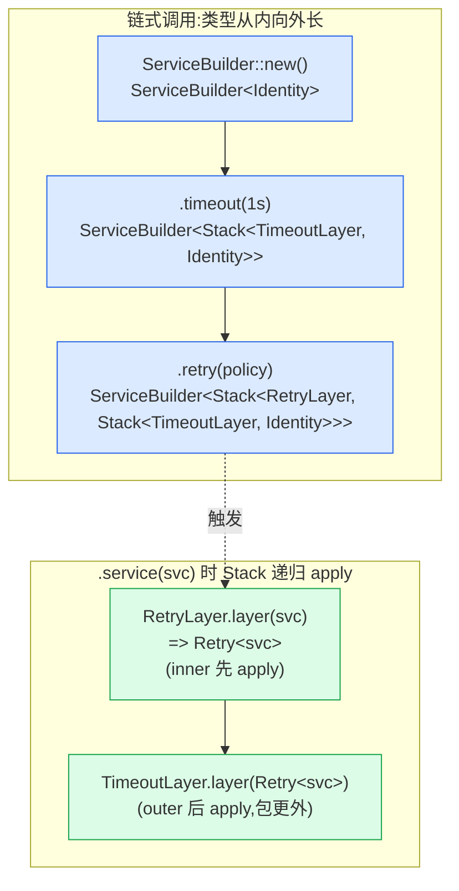
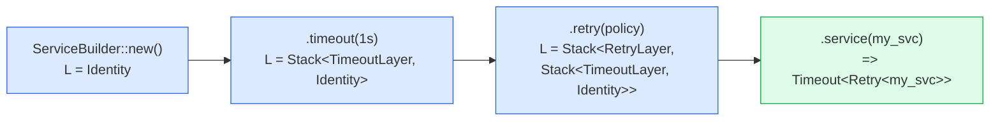
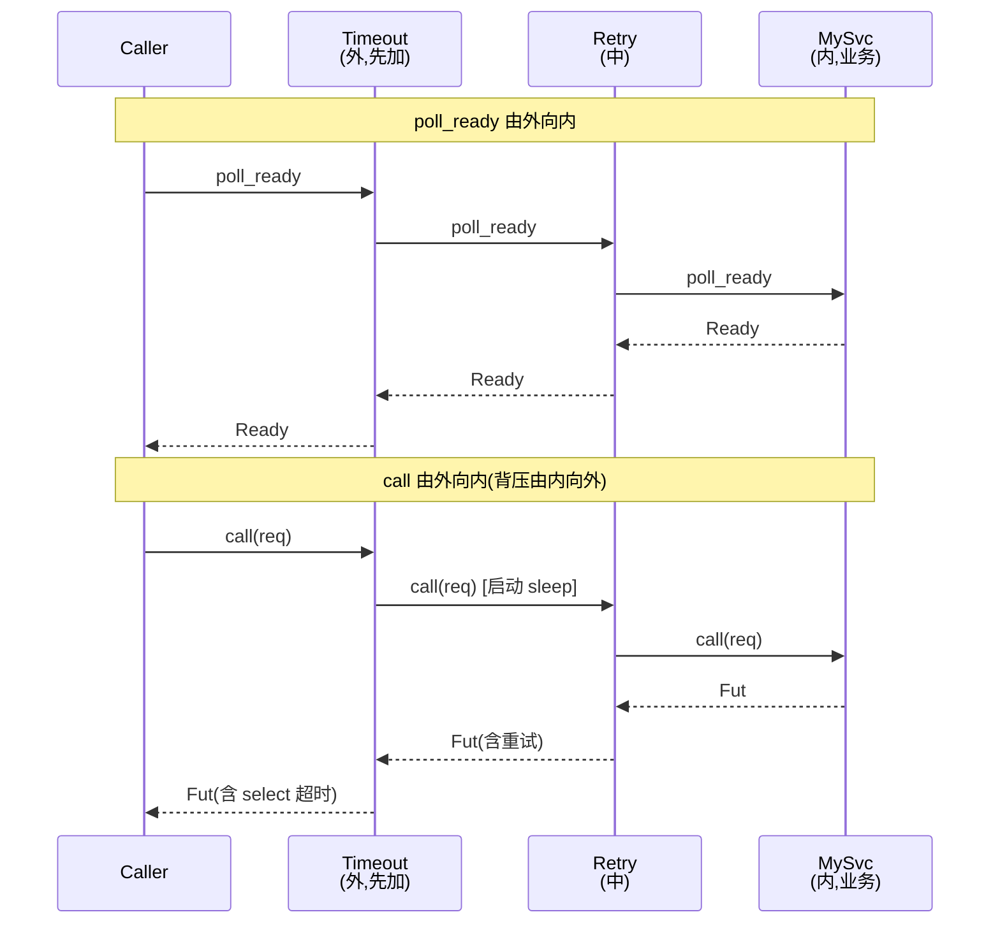

# 第 4 章 · ServiceBuilder 与 ServiceExt:组合的艺术

> 第 1 篇 · 核心 trait:Service 与 Layer(Tower 灵魂)· 组合招牌章

## 章首

**核心问题**:你已经知道 `Service` 是"`poll_ready` + `call -> Future`",`Layer` 是"`layer(inner) -> 新 Service`"。可真要给一个服务套上 timeout、retry、限流、buffer 四层中间件,你总不能手写 `Retry<Timeout<RateLimit<Buffer<MySvc, _>, _>, _>, _>` 这种签名爆炸的嵌套吧?而且这四层谁该在外面、谁该在里面,顺序写错了语义就全变了。Tower 怎么把这件事做成一行 `.buffer(100).timeout(1s).retry(policy).service(svc)` 顺得像写 Iterator 一样?又怎么让一个写好的 `Service` 像 Iterator 一样能 `.map_response(...).and_then(...).oneshot(req)` 链起来?

读完本章你会明白:

1. **`ServiceBuilder` 凭什么把多层 Layer 链成一个类型**——它是个泛型 `ServiceBuilder<L>`,每调一次 `.timeout()` 之类的链式方法,就把新 Layer 包进一个 `Stack<新Layer, 旧L>`,返回一个新的 `ServiceBuilder<Stack<...>>`。整个过程是**类型状态模式(type-state pattern)**,Layer 栈在编译期就嵌套好,运行期零开销。
2. **Layer 添加顺序和请求穿过顺序到底是什么关系**——`.timeout().retry()` 写在前面,谁的 `poll_ready`/`call` 先被请求碰到?谁在外层、谁在内层?这是 Tower 最容易混淆的点,本章给口诀、给图、给对照表,一次钉死。
3. **`ServiceExt` 凭什么让任何 `Service` 都免费得到 `oneshot`/`map_response`/`and_then`/`call_all` 一堆组合子**——它是一个 extension trait,靠一句 `impl<T: Service<R>> ServiceExt<R> for T {}` 的 blanket impl,所有 Service 自动获得。这是 Rust trait 的"无条件 blanket impl"惯用法,和 Iterator 给所有迭代器免费发 `map`/`filter` 是同一招。
4. **`Oneshot` 这个"一次性调用"组合子内部是个什么状态机**——它把"先 `poll_ready` 等就绪、再 `call` 发请求、再 await 响应"这件事,包成一个 `Future`,内部用 `mem::replace`(其实是 `Option::take`)取走 service 和 request。这呼应 P1-02 讲过的"`&mut self` + 取走就绪状态"惯用法。

**逃生阀**:如果你还没把 P1-02(Service trait 的 `poll_ready`/`call`/`&mut self` 背压)和 P1-03(Layer trait 与 `Stack<T, L>` 类型级洋葱)读透,本章会很难跟。本章是这两章的直接合成:ServiceBuilder 就是"链式地往 `Stack` 里塞 Layer",ServiceExt 就是"用装饰器把一个 Service 变成另一个 Service"。两章任一不熟,先回去补,否则下面每一行源码都会卡。如果你只是想快速用起来,可以只读"一句话点破"和"章末小结",但招牌章不建议跳。

---

## 一句话点破

> **`ServiceBuilder` 是个会"长大"的类型:每调一次链式方法,它的泛型参数 `L` 就从 `Identity` 长成 `Stack<TimeoutLayer, Identity>`,再长成 `Stack<RateLimitLayer, Stack<TimeoutLayer, Identity>>`……最后一次 `.service(svc)` 把整个编译期堆好的 Layer 栈 `layer()` 到 svc 上。`ServiceExt` 则反过来,用一句 blanket impl 给所有 Service 发放 `oneshot`/`map_*`/`and_then` 组合子,让 Service 像 Iterator 一样可组合。一个是"先攒 Layer 再套服务",一个是"在服务上挂装饰器",两者拼起来,就是 Tower 的组合语言。**

这是结论,不是理由。本章倒过来拆:先看手写多层嵌套会撞什么墙,再看 Tokio 的 Iterator 组合子是怎么解决"链式而零开销"的(承 Tokio 一句带过),然后讲 Tower 为什么必须发明 ServiceBuilder + ServiceExt 两件套,最后用源码钉死每一个技巧。

---

## 正文

### 1.1 痛点:手写多层 Layer,类型签名先爆炸给你看

假设你有一个最内层的业务服务 `MySvc`,你要给它套四层中间件:最外层 buffer(缓冲请求),往里 concurrency_limit(限并发),再往里 timeout(超时),最里层 retry(重试)。用 P1-03 学过的 `Layer` 原语,朴素写法是这样:

```rust
// 朴素写法:手写每一层 Layer,层层嵌套(简化示意,非源码原文)
let svc = MySvc;
let svc = RetryLayer::new(policy).layer(svc);           // 最内层先套
let svc = TimeoutLayer::new(Duration::from_secs(1)).layer(svc);
let svc = ConcurrencyLimitLayer::new(10).layer(svc);
let svc = BufferLayer::new(100).layer(svc);             // 最外层最后套
// svc 的类型: Buffer<ConcurrencyLimit<Timeout<Retry<MySvc, P>, _>, _>, _>
```

这能跑,但三个致命问题:

**第一,类型签名爆炸,且写出来就不认得**。`svc` 的最终类型是 `Buffer<ConcurrencyLimit<Timeout<Retry<MySvc, Policy>, <MySvc as Service<Req>>::Future>, Duration>, usize>` 之类的怪物。你把它存进一个 struct 字段、当函数返回值、放进 `Vec`,每一处都得把这串鬼东西抄一遍。改一层(比如把 Retry 换成 Hedge),整个类型的所有下游都得改。Rust 的类型推导能在局部变量里帮你藏一会儿,但只要这玩意儿跨函数边界,你就得直面它。

**第二,顺序写错语义就全变,且没有任何提示**。`Retry<Timeout<Svc>>`(重试包在超时外面)和 `Timeout<Retry<Svc>>`(超时包在重试外面)是完全不同的语义:前者是"每次重试各自有一个超时,重试 N 次每次都能跑满 1 秒",后者是"整个重试链路总共只有 1 秒,1 秒到了整条链全砍"。你手写嵌套时,谁在外谁在内完全靠你记 `layer()` 的调用顺序,编译器不会帮你检查"你想的是不是这个顺序"。生产环境出过的事故:本想"总超时 1 秒",结果写成了"每次重试 1 秒",一个慢请求重试 3 次实际跑了 3 秒,p99 飙升。

**第三,可读性塌方**。一段 `RetryLayer::new(p).layer(TimeoutLayer::new(d).layer(...))` 的嵌套调用,要眯着眼睛从里往外读,才知道先套谁后套谁。新人接手代码,光理清这个嵌套就要半天。

> **不这样会怎样**:不止是难看。类型爆炸会逼你到处用 `Box<dyn Service>` 擦除类型(那是 P6-17 的主题,有运行期开销),顺序错误会埋生产事故,可读性塌方会让团队不敢改中间件。一个中间件库如果只能这么用,没人会用第二遍。Tower 必须给一个**链式、类型安全、顺序明确、零运行期开销**的 API。

这就是 `ServiceBuilder` 要解决的全部问题。但在讲它之前,先看 Rust 生态里"链式而零开销"的祖师爷——Tokio/标准库的 Iterator 组合子——是怎么做的。这是承接。

### 1.2 承接《Tokio》:Iterator 组合子,链式而零开销的范本

> **承接《Tokio》[[tokio-source-facts]]**:本节只回顾"组合子 + 单态化 = 零开销链式"这个 Rust 惯用范本,Tokio 的 Future 组合子(`and_then`/`map`)内部机制不在本章范围,一句带过指路。篇幅全留 Tower 独有。

标准库的 `Iterator` trait 给所有迭代器免费发了一堆组合子:`.map(f)`、`.filter(p)`、`.take(n)`、`.chain(other)`。每个组合子都返回一个**新的、具体类型的迭代器**,类型层层嵌套:

```rust
let v = vec![1, 2, 3];
let it = v.iter()
    .map(|x| x + 1)        // Map<std::slice::Iter, ...>
    .filter(|x| *x > 1)    // Filter<Map<...>, ...>
    .take(2);              // Take<Filter<Map<...>>>
// it 的类型: Take<Filter<Map<std::slice::Iter<'_, i32>, closure1>, closure2>>
```

这套设计有三个精妙之处,Tower 全盘照搬:

1. **每个组合子返回新类型,类型嵌套表达"处理链"**。`Take<Filter<Map<...>>>` 这个类型本身就编码了"先 map、再 filter、再 take"的完整处理顺序。类型签名在编译期就钉死了语义。
2. **链式调用,可读性极佳**。从上往下读,就是数据流动的顺序:`iter().map().filter().take()`,一目了然,不用从里往外扒。
3. **泛型单态化,零运行期开销**。每个闭包、每层包装在编译期都被单态化成具体的、内联的机器码,运行期没有虚函数调用、没有 trait object 的动态分发。`it` 这个迭代器跑起来,和手写一个 for 循环加几个 if 几乎一样快。

> **不这样会怎样**:如果 Iterator 的组合子返回 `Box<dyn Iterator>`(运行期 trait object),每一步 `next()` 都要一次动态分发,链长了性能塌方;而且闭包没法被擦除进 trait object(闭包类型不匿名),根本写不出来。所以 Iterator 选择了"返回具体嵌套类型 + 单态化",代价是类型签名长——但这个代价用类型推导(`let it = ...`,不标类型)和链式 API 藏住了。

Tokio 的 Future 组合子(`future.and_then(f).map(g)`)、《hyper》里讲过的 Service trait 入门,都是同一套思路。Tower 要做的,就是把这套"链式 + 单态化 + 类型嵌套表达语义"的范式,**从 Iterator/Future 搬到 Service 上**。但 Service 有个 Iterator 没有的难点:**Service 不是一次性的,它是带状态的(`&mut self`、`poll_ready` 背压),而且中间件套的不是"值"是"服务本身"**。所以 Tower 不能直接照抄 `.map()` 返回新迭代器那一招,它得分两步走:

- **ServiceBuilder**:解决"先攒一堆 Layer,再一次套到 Service 上"。这是**组合 Layer 的组合子**(Layer 是"装饰 Service 的工厂",不是 Service 本身)。
- **ServiceExt**:解决"已经有了一个 Service,想在它身上挂装饰器/一次性调用它/流式喂它请求"。这是**组合 Service 的组合子**,更接近 Iterator 的 `.map()`。

两件套合起来,才覆盖了"造中间件栈"和"用 Service"的全部组合需求。下面分别拆。

### 1.3 所以 Tower 这么设计:ServiceBuilder 把 Layer 链成编译期 Stack

先看 ServiceBuilder 的源码骨架。它出奇地简单——整个结构体就一个字段:

```rust
// tower/src/builder/mod.rs#L105-108
#[derive(Clone)]
pub struct ServiceBuilder<L> {
    layer: L,
}
```

就这?就这。一个泛型 `L`,初始是 `Identity`(空 Layer),之后每调一次链式方法,`L` 就"长"一层。看构造:

```rust
// tower/src/builder/mod.rs#L110-123
impl Default for ServiceBuilder<Identity> {
    fn default() -> Self {
        Self::new()
    }
}

impl ServiceBuilder<Identity> {
    /// Create a new [`ServiceBuilder`].
    pub const fn new() -> Self {
        ServiceBuilder {
            layer: Identity::new(),
        }
    }
}
```

`ServiceBuilder::new()` 返回 `ServiceBuilder<Identity>`——一个空的、还没塞任何 Layer 的 builder。`Identity` 是 P1-03 讲过的"空 Layer",它的 `layer(inner)` 直接返回 `inner` 不做任何修改(`tower-layer/src/identity.rs#L25-31`),是 Layer 世界的"单位元"。

然后是**整章最关键的一个方法**——`.layer()`,所有链式方法的真身:

```rust
// tower/src/builder/mod.rs#L125-136
impl<L> ServiceBuilder<L> {
    /// Add a new layer `T` into the [`ServiceBuilder`].
    pub fn layer<T>(self, layer: T) -> ServiceBuilder<Stack<T, L>> {
        ServiceBuilder {
            layer: Stack::new(layer, self.layer),
        }
    }
    // ...
}
```

四行代码,价值连城。读懂这四行,整章就懂了一半。逐字拆:

1. `self` 被消费(`self`,不是 `&self`)——builder 是一次性链式调用,每步吃掉旧的 builder。
2. `layer: T` 是你新加的 Layer(比如 `TimeoutLayer`)。
3. `Stack::new(layer, self.layer)`——这是 P1-03 讲的 `Stack<Inner, Outer>`。注意参数顺序:`Stack::new(inner, outer)`,这里把**新 layer 放在 `inner` 位**,把**旧的累积层 `self.layer` 放在 `outer` 位**。
4. 返回 `ServiceBuilder<Stack<T, L>>`——新 builder 的泛型参数从 `L` 变成了 `Stack<T, L>`。**类型"长大"了一层。**

这就是**类型状态模式(type-state pattern)**:builder 不存"运行期的层列表",它在编译期就把整个 Layer 栈编码进自己的泛型参数。你链式调用三次,类型就嵌套三层:

```rust
ServiceBuilder::new()                                        // ServiceBuilder<Identity>
    .timeout(Duration::from_secs(1))                         // ServiceBuilder<Stack<TimeoutLayer, Identity>>
    .rate_limit(10, Duration::from_secs(1))                  // ServiceBuilder<Stack<RateLimitLayer, Stack<TimeoutLayer, Identity>>>
    .buffer(100)                                              // ServiceBuilder<Stack<BufferLayer, Stack<RateLimitLayer, Stack<TimeoutLayer, Identity>>>>
```

注意,这里 builder 还**没有**碰到任何 Service,它只是在"攒 Layer"。Layer 在 builder 里是一堆还没 apply 的"装饰工厂",被编译期 `Stack` 嵌套好,等着最后一步被一次性 apply。

那 `.timeout()`/`.rate_limit()`/`.buffer()` 这些具体方法呢?它们全是 `.layer()` 的语法糖。随便挑一个看:

```rust
// tower/src/builder/mod.rs#L262-268
#[cfg(feature = "timeout")]
pub fn timeout(
    self,
    timeout: std::time::Duration,
) -> ServiceBuilder<Stack<crate::timeout::TimeoutLayer, L>> {
    self.layer(crate::timeout::TimeoutLayer::new(timeout))
}
```

`.timeout(d)` 就是 `.layer(TimeoutLayer::new(d))`。`.buffer(n)`、`.concurrency_limit(n)`、`.rate_limit(n, per)`、`.retry(policy)`、`.map_response(f)`、`.and_then(f)`……所有带名字的链式方法,内部统统是一句 `self.layer(SomeLayer::new(...))`。`tower/src/builder/mod.rs` 里这一大串方法(`buffer`@L178、`concurrency_limit`@L196、`rate_limit`@L230、`retry`@L249、`timeout`@L263、`load_shed`@L219、`map_request`@L365、`map_response`@L385、`map_err`@L402、`map_future`@L415、`then`@L438、`and_then`@L459、`map_result`@L475……)读起来很唬人,但每一个都是同一个套路:`self.layer(XxxLayer::new(args))`。**整章的一个心智模型:`.layer()` 是唯一的原语,其余全是命名糖。**

> **钉死这件事**:ServiceBuilder 没有任何运行期的"层列表",没有 `Vec<Box<dyn Layer>>`,没有反射,没有动态分发。整个 Layer 栈是编译期的 `Stack<A, Stack<B, Stack<C, Identity>>>` 嵌套类型,每一层 Layer 的 `layer()` 方法在单态化后都被内联。运行期开销为零,和手写嵌套完全一样——因为**它就是手写嵌套**,只是写起来像链式而已。

那么,攒好的 Layer 栈什么时候套到 Service 上?看 `.service()`:

```rust
// tower/src/builder/mod.rs#L484-494
/// Wrap the service `S` with the middleware provided by this
/// [`ServiceBuilder`]'s [`Layer`]'s, returning a new [`Service`].
pub fn service<S>(&self, service: S) -> L::Service
where
    L: Layer<S>,
{
    self.layer.layer(service)
}
```

两个细节值得停一下:

**第一,`&self`,不是 `self`**。`.service()` 不消费 builder,它借 builder 一用。这意味着**同一个 builder 可以反复 `.service()` 套到不同的 Service 上**——这是个很有用的性质,比如你想给 10 个 handler 都套同一套 timeout+retry,先 build 一个 `ServiceBuilder`,再 `.service(handler1)`、`.service(handler2)`……复用 Layer 配置。能这么复用,是因为 `ServiceBuilder` 派生了 `Clone`(`#[derive(Clone)]`@L105),而且 `Layer` 的 `layer()` 是 `&self`,Layer 本身不可变、可复用。

**第二,返回 `L::Service`,不是 `ServiceBuilder<...>`**。`.service()` 是终点,它把攒好的 Layer 栈真正 apply 到一个具体 Service 上,返回那个被层层装饰的最终 Service。从此你拿到的是一个能 `poll_ready`/`call` 的真 Service,不再是 builder。

`self.layer.layer(service)` 这一句,触发了 P1-03 讲过的 `Stack` 的 `Layer` impl 的递归 apply:

```rust
// tower-layer/src/stack.rs#L18-30
impl<S, Inner, Outer> Layer<S> for Stack<Inner, Outer>
where
    Inner: Layer<S>,
    Outer: Layer<Inner::Service>,
{
    type Service = Outer::Service;

    fn layer(&self, service: S) -> Self::Service {
        let inner = self.inner.layer(service);   // 内层 Layer 先 apply
        self.outer.layer(inner)                  // 外层 Layer 后 apply(包在更外面)
    }
}
```

这就是 `Stack` 递归展开的核心:`self.inner` 先 apply(成为内层 Service),`self.outer` 再 apply(把刚才的结果再包一层,成为更外层)。如果 `outer` 本身又是个 `Stack`,就继续递归,直到 `outer` 是 `Identity`(直接返回 inner)为止。

> **承接 P1-03**:这里的 `Stack` 递归 apply,P1-03 已经讲透。本章不重复,只点出它和 ServiceBuilder `.layer()` 的配合:每次 `.layer(T)` 都把新 T 塞进 `Stack` 的 `inner` 位、旧栈塞进 `outer` 位;最终 `.service(svc)` 时,`Stack` 的 `layer()` 先 apply inner(新加的)、再 apply outer(更早加的)。这两件事合起来,就决定了"谁在外谁在内"——下一节专门拆这个易混淆点。

### 1.4 易混淆点钉死:Layer 添加顺序 vs 请求穿过顺序

这是本章最容易翻车的地方,几乎所有 Tower 新手都会在这里卡一次。我们用源码 + 图 + 口诀,一次钉死。

先看源码。假设你写:

```rust
let svc = ServiceBuilder::new()
    .timeout(Duration::from_secs(1))   // 步骤 A:先加 Timeout
    .retry(policy)                      // 步骤 B:后加 Retry
    .service(my_svc);                   // 步骤 C:套到 my_svc 上
```

执行步骤 A:`.timeout()` 内部调 `.layer(TimeoutLayer)`,即 `Stack::new(TimeoutLayer, Identity)`,builder 变成 `ServiceBuilder<Stack<TimeoutLayer, Identity>>`。

执行步骤 B:`.retry()` 内部调 `.layer(RetryLayer)`,即 `Stack::new(RetryLayer, <上一步的 Stack>)`,builder 变成 `ServiceBuilder<Stack<RetryLayer, Stack<TimeoutLayer, Identity>>>`。

注意类型签名的嵌套:`Stack<RetryLayer, Stack<TimeoutLayer, Identity>>`。**后加的 RetryLayer 在外层(`Stack` 第一个类型参数),先加的 TimeoutLayer 在内层。**

执行步骤 C:`.service(my_svc)` 调 `self.layer.layer(my_svc)`,也就是上面那个 `Stack<RetryLayer, Stack<TimeoutLayer, Identity>>` 的 `layer(my_svc)`。代入 `Stack` 的 `Layer` impl:

- `self.inner` 是 `RetryLayer`,先 `RetryLayer.layer(my_svc)` —— retry 先装饰 my_svc,得到 `Retry<MySvc>`。
- `self.outer` 是 `Stack<TimeoutLayer, Identity>`,再 `TimeoutLayer.layer(Retry<MySvc>)` —— timeout 后装饰,包在 retry 外面,得到 `Timeout<Retry<MySvc>>`。

**最终类型:`Timeout<Retry<MySvc>>`。先加的 Timeout 在最外层,后加的 Retry 在中间,my_svc 在最里层。**

口诀:**先 `.layer()` 的,最后被 `Stack::layer()` apply,apply 得越晚包得越外,所以在最外层。** 或者更顺口的版本:**"先加的在外,后加的在内"**(从请求视角看,外层先被请求碰到)。

这和 ServiceBuilder 的 doctest 说法完全一致:

```rust
// tower/src/builder/mod.rs#L37-49(doctest)
// ServiceBuilder::new()
//     .buffer(100)
//     .concurrency_limit(10)
//     .service(svc)
//
// In the above example, the buffer layer receives the request first followed
// by concurrency_limit.
```

先 `.buffer()` 的在最外层,请求**先**经过 buffer,再经过 concurrency_limit。源码注释白纸黑字:**"Layers that are added first will be called with the request first."**(L26-27)——先加的 Layer 先收到请求。

下面这张图把"链式调用的类型生长"和"最终 apply 时的装饰顺序"两件事并排放,看清楚它们怎么对应:



再用一张时序图,看请求实际穿过这个 `Timeout<Retry<MySvc>>` 时,谁先 `poll_ready`、谁先 `call`:

```mermaid
sequenceDiagram
    participant Caller as 调用方
    participant Timeout as Timeout&lt;Retry&lt;MySvc&gt;&gt;<br/>(最外层,先加的)
    participant Retry as Retry&lt;MySvc&gt;<br/>(中间,后加的)
    participant MySvc as MySvc<br/>(最内层,业务)
    Caller->>Timeout: poll_ready
    Timeout->>Retry: poll_ready
    Retry->>MySvc: poll_ready
    MySvc-->>Retry: Ready(Ok)
    Retry-->>Timeout: Ready(Ok)
    Timeout-->>Caller: Ready(Ok)
    Note over Caller,MySvc: 就绪后发请求
    Caller->>Timeout: call(req)
    Timeout->>Retry: call(req) 启动 sleep 计时
    Retry->>MySvc: call(req)
    MySvc-->>Retry: 返回 Future
    Retry-->>Timeout: 返回 Future(可能包重试逻辑)
    Timeout-->>Caller: 返回 Future(可能 select 超时)
    Note over Caller,MySvc: 响应 resolve 时反向返回
```

关键观察:**`poll_ready` 是从外向内层层穿透的**(外层先 poll,转给内层),**`call` 也是从外向内**(`call` 返回的 Future 内部层层包装)。这意味着:

- **背压是从内向外传的**:最内层 MySvc 如果 `poll_ready` 返回 `Pending`(比如连接池满),这个 Pending 会层层传到外层的 Timeout、Retry,最终传到调用方,调用方就知道"现在别再塞请求了"。这是 P1-02 讲过的背压语义在多层洋葱里的自然传播。
- **超时是从最外层 Timeout 开始计的**:因为 Timeout 在最外层,它的 `call` 一被调就启动 sleep 计时,内层 Retry 的所有重试共享这一个超时。这就是"总超时 1 秒"语义。如果你反过来写 `.retry(policy).timeout(1s)`,类型变成 `Retry<Timeout<MySvc>>`,那每次重试各自启动一个 sleep,变成"每次重试 1 秒",语义完全不同。

这个对照太重要,单独列个表钉死:

| 链式写法 | 最终类型 | 谁在外层 | 超时语义 | 重试语义 |
|---|---|---|---|---|
| `.timeout(1s).retry(p).service(svc)` | `Timeout<Retry<MySvc>>` | Timeout 在外 | **总超时 1 秒**(所有重试共享一个 sleep) | 失败就重试,直到总超时砍掉整条链 |
| `.retry(p).timeout(1s).service(svc)` | `Retry<Timeout<MySvc>>` | Retry 在外 | **每次重试各自 1 秒**(每次 call 新启 sleep) | 单次 1 秒超时算一次失败,失败就重试,可能跑 N 秒 |

> **钉死这件事**:Layer 添加顺序 = `Stack` 嵌套顺序 = `poll_ready`/`call` 的穿透顺序,这三者在 ServiceBuilder 里是**同一件事**的三种描述。口诀:**"链式从上往下写 = 请求从外往里穿"**。写错顺序,语义就变,编译器不会拦你(Tower 0.5 也没拦),所以中间件顺序是 code review 必查项。

> **对照《hyper》[[hyper-source-facts]]**:hyper 也有中间件,但 hyper 的 Service 删了 `poll_ready`(背压挪到 HTTP/1 的 in_flight 单槽、HTTP/2 的 h2 流控),所以 hyper 的中间件链在背压传播上和 Tower 不同。这个对照在 P1-02 已讲透,本章不重复,只在"顺序"这个点上点一下:hyper 的中间件顺序语义和 Tower 一样(先加的在外),但因为没有 `poll_ready`,背压不靠洋葱传,靠协议层。详细见《hyper》P1-02/P1-03。

### 1.5 ServiceBuilder 还有两个常被忽略的妙处

讲完核心,补两个 ServiceBuilder 设计上的小巧思,它们不是必需,但体现了 Tower 对 Rust 类型系统的熟稔。

**妙处一:ServiceBuilder 自己也是个 Layer。** 看源码末尾:

```rust
// tower/src/builder/mod.rs#L800-809
impl<S, L> Layer<S> for ServiceBuilder<L>
where
    L: Layer<S>,
{
    type Service = L::Service;

    fn layer(&self, inner: S) -> Self::Service {
        self.layer.layer(inner)
    }
}
```

ServiceBuilder 实现了 `Layer<S>`!这意味着一个攒好的 `ServiceBuilder<Stack<TimeoutLayer, Stack<RetryLayer, Identity>>>`,本身可以被当作一个 Layer,塞进**另一个** ServiceBuilder 或者任何吃 Layer 的地方。比如:

```rust
// 把一套 timeout+retry 配置打包成一个可复用的 Layer(简化示意)
let common = ServiceBuilder::new().timeout(1s).retry(policy);
// common 现在是个 Layer,可以塞进更大的 builder
let full = ServiceBuilder::new()
    .buffer(100)
    .layer(common)   // 把 common 这一摞 Layer 整体塞进来
    .service(my_svc);
```

这种"Layer 套 Layer"的组合性,是 ServiceBuilder 能当"中间件配置 DSL"用的根。axum 的 `from_fn_with_state`、tonic 的 interceptor,底层都是把一堆 Layer 配置成一个 builder 再当 Layer 用。

**妙处二:`check_clone`/`check_service_clone`/`check_service` 类型断言方法。** 看 L572-673,这三个方法叫 `check_*`,签名都是 `fn(self) -> Self`,身体都是 `self`——**它们什么也不做,纯粹是类型断言**:

```rust
// tower/src/builder/mod.rs#L572-578(简化)
pub fn check_clone(self) -> Self
where
    Self: Clone,
{
    self
}
```

为什么要写一个什么都不做的方法?因为 ServiceBuilder 套了很多层后,你写 `let b = builder.check_clone();`,如果 builder 不满足 `Clone`(比如某个 Layer 不 Clone),编译器就在这一行给你报错,而不是等到后面某个 `.service()` 调用处才报一个看不懂的深层错误。这是 Rust 里**把类型错误提前到调用点**的常用技巧,叫"类型断言函数"。tower 自己的注释说得很直白(L547-549):"This can be useful when debugging type errors in `ServiceBuilder`s with lots of layers."

> **技巧小结**:ServiceBuilder 的设计哲学是**"用泛型类型的状态编码 Layer 栈的状态"**——空栈是 `Identity`,加一层是 `Stack<T, Identity>`,再加一层是 `Stack<U, Stack<T, Identity>>>`。builder 的"状态"全在类型参数里,不在运行期字段里。这是 Rust 类型状态模式的典型应用,和标准库的 `Iterator`、`Builder` 模式一脉相承。代价是类型签名长(但被链式 API 和类型推导藏住),收益是零运行期开销 + 编译期类型安全。

### 1.6 反面:ServiceBuilder 没解决什么

ServiceBuilder 解决了"链式攒 Layer + 编译期嵌套 + 顺序明确",但它**没**解决两件事,这两件事留给后面的章:

**第一,类型签名还是长。** `.buffer(100).timeout(1s).retry(p).service(svc)` 写起来顺,但 `svc` 的类型依然是 `Buffer<Timeout<Retry<MySvc, P>, Fut>, Req>` 这种怪物。只要这个 `svc` 要存进 struct、跨函数、放进容器,长类型就暴露。解决方案是**类型擦除**(把巨大嵌套类型擦成 `BoxCloneService<Req, Res, Err>`),那是 P6-17 的主题,本章只提一句:ServiceBuilder 套出来的类型,是 BoxService 家族存在的根本原因。

**第二,运行期不能动态调整。** 因为 Layer 栈在编译期固定,你没法在运行期根据配置"多套一层 timeout"或"少套一层 retry"。如果你的服务需要运行期动态中间件(比如根据路由决定要不要鉴权),ServiceBuilder 这种静态方案就不够,得用 trait object(P6-17)或者 axum 的动态路由。这是"零开销静态"和"运行期灵活"的根本取舍,Tower 选了前者,把后者留给用户用 BoxService 自己拼。

> **对照《gRPC》[[grpc-source-facts]]**:gRPC C++ core 的 filter stack 是**运行期链表**,filter 在运行期被 push 进 `Call` 的链表,可以动态增减。代价是每次请求都要遍历链表(运行期开销)。Tower Layer 是**编译期 Stack**,运行期零开销但不能动态调整。同一思想(洋葱中间件)在两种语言里落地不同:C++ 的运行期灵活 vs Rust 的编译期零开销。这个对照在 P7-20 收束章会再讲一次。

---

## ServiceExt:Service 的组合子

### 1.7 ServiceExt:给所有 Service 免费发组合子

ServiceBuilder 解决了"造中间件栈"。但很多场景不是"造栈",而是"我已经有一个 Service,想在它身上做点事":一次性发个请求拿响应(`oneshot`)、把响应转换一下(`map_response`)、把错误转换一下(`map_err`)、链一个后续异步逻辑(`and_then`/`then`)、用 Stream 喂它一堆请求(`call_all`)。这些是**组合 Service 的组合子**,更接近 Iterator 的 `.map()`/`.filter()`。

Tower 用一个 extension trait `ServiceExt` 提供这些组合子,核心是这一句 blanket impl:

```rust
// tower/src/util/mod.rs#L1045
impl<T: ?Sized, Request> ServiceExt<Request> for T where T: tower_service::Service<Request> {}
```

就这一行,**所有实现了 `Service<Request>` 的类型,自动获得 `ServiceExt<Request>` 的所有方法**。不管你的 Service 是个 struct、是个闭包(经 `service_fn` 包装)、还是个被 Layer 装饰过的嵌套怪物,都能直接 `.oneshot(req)`、`.map_response(f)`、`.and_then(g)`。

这是 Rust 里 extension trait + blanket impl 的标准惯用法。标准库的 `Iterator`(`impl<I: Iterator> Iterator for I {}` 这种自我约束让所有 Iterator 自动有组合子)、Tokio 的 `FutureExt`、serde 的 `Serialize` 都是这一招。好处是:你不需要给每个 Service 类型手动 impl 一遍这些组合子,写一次 blanket impl,全生态共享。

`ServiceExt` trait 本身的定义也很简洁:

```rust
// tower/src/util/mod.rs#L71
pub trait ServiceExt<Request>: tower_service::Service<Request> {
    fn ready(&mut self) -> Ready<'_, Self, Request>
    where Self: Sized { Ready::new(self) }

    fn ready_oneshot(self) -> ReadyOneshot<Self, Request>
    where Self: Sized { ReadyOneshot::new(self) }

    fn oneshot(self, req: Request) -> Oneshot<Self, Request>
    where Self: Sized { Oneshot::new(self, req) }

    fn call_all<S>(self, reqs: S) -> CallAll<Self, S>
    where Self: Sized, S: Stream<Item = Request> { CallAll::new(self, reqs) }

    fn and_then<F>(self, f: F) -> AndThen<Self, F>
    where Self: Sized, F: Clone { AndThen::new(self, f) }

    fn map_response<F, Response>(self, f: F) -> MapResponse<Self, F>
    where Self: Sized, F: FnOnce(Self::Response) -> Response + Clone { MapResponse::new(self, f) }

    fn map_err<F, Error>(self, f: F) -> MapErr<Self, F>
    where Self: Sized, F: FnOnce(Self::Error) -> Error + Clone { MapErr::new(self, f) }

    // ... map_result / map_request / map_future / then / filter / filter_async / boxed / boxed_clone ...
}
```

每个方法的套路都一样:**消费 `self`(Sized),返回一个新的具体类型**(`AndThen<Self, F>`/`MapResponse<Self, F>`/...)。这个新类型在内部持有原来的 Service 和你传的闭包,并自己 impl `Service`——所以 `map_response` 返回的东西**还是个 Service**,可以继续 `.map_response`/`.and_then` 链下去。这和 Iterator 的 `.map()` 返回新 Iterator 是一个模子。

挑一个最典型的 `map_response` 看内部实现:

```rust
// tower/src/util/map_response.rs#L59-77(略简化)
impl<S, F, Request, Response> Service<Request> for MapResponse<S, F>
where
    S: Service<Request>,
    F: FnOnce(S::Response) -> Response + Clone,
{
    type Response = Response;
    type Error = S::Error;
    type Future = MapResponseFuture<S::Future, F>;

    #[inline]
    fn poll_ready(&mut self, cx: &mut Context<'_>) -> Poll<Result<(), Self::Error>> {
        self.inner.poll_ready(cx)              // 背压原样透传
    }

    #[inline]
    fn call(&mut self, request: Request) -> Self::Future {
        MapResponseFuture::new(self.inner.call(request).map_ok(self.f.clone()))
    }
}
```

三件事值得说:

1. **`poll_ready` 直接转给 `self.inner`**。`MapResponse` 不引入自己的就绪条件,内层 ready 它就 ready。背压原样透传,不破坏 Service 的 `&mut self` 语义。
2. **`call` 把内层返回的 Future 用 `.map_ok(f)` 包一层**。`f` 作用在内层 Future 的成功结果上,把 `S::Response` 转成新的 `Response`。错误类型不变。
3. **`F: Clone`**,因为 `call(&mut self)` 可能被调多次,每次都要一份 `f`。这是 Service 组合子区别于 Iterator 组合子的地方:Iterator 的 `.map()` 只调一次(消费迭代器),而 Service 的 `.map_response()` 要在多次 `call` 里复用,所以闭包必须 Clone。

> **技巧点**:`MapResponse` 的 `poll_ready` 直接转 inner,这是所有"纯转换型"组合子的共同模式(`MapErr`/`MapRequest`/`MapResult` 都一样)。它们不改变就绪语义,只改变数据流。而 `AndThen`/`Then`(链式后续异步逻辑)就要在 `call` 里多包一层 Future,因为后续逻辑本身是异步的。这两类组合子的实现复杂度不同,但都遵守"poll_ready 透传背压,call 包装 Future"的骨架。

### 1.8 oneshot:把"调用一个 Service"包成一个 Future

`ServiceExt::oneshot` 是 Tower 里最常见的组合子之一,几乎所有 ServiceBuilder 的 doctest 末尾都是 `.service(svc).oneshot(req).await`。它干的事:**消费一个 Service,等它 ready,发一个请求,等响应,返回**。听起来简单,但它的内部实现是一个值得拆透的状态机。

`Oneshot<S, Req>` 是个 `Future`,内部是个三态状态机:

```rust
// tower/src/util/oneshot.rs#L22-35
#[project = StateProj]
enum State<S: Service<Req>, Req> {
    NotReady {
        svc: S,
        req: Option<Req>,
    },
    Called {
        #[pin]
        fut: S::Future,
    },
    Done,
}
```

三个状态:

- `NotReady { svc, req: Option<Req> }`:还没就绪。持有 Service 和请求(请求放 Option 里)。
- `Called { fut: S::Future }`:已经 `call` 过,等内层 Future 完成。
- `Done`:结束。

它的 `Future::poll` 实现是这个状态机的驱动逻辑:

```rust
// tower/src/util/oneshot.rs#L87-104
fn poll(self: Pin<&mut Self>, cx: &mut Context<'_>) -> Poll<Self::Output> {
    let mut this = self.project();
    loop {
        match this.state.as_mut().project() {
            StateProj::NotReady { svc, req } => {
                let _ = ready!(svc.poll_ready(cx))?;          // 1. 先 poll_ready
                let f = svc.call(req.take().expect("already called"));  // 2. take 走 request,call
                this.state.set(State::called(f));             // 3. 切到 Called 态
            }
            StateProj::Called { fut } => {
                let res = ready!(fut.poll(cx))?;              // 4. poll 内层 Future
                this.state.set(State::Done);                  // 5. 切到 Done
                return Poll::Ready(Ok(res));
            }
            StateProj::Done => panic!("polled after complete"),
        }
    }
}
```

这里有四个细节,每一个都呼应 P1-02 讲过的 Service trait 语义:

**第一,先 `poll_ready` 再 `call`,顺序不能反。** P1-02 钉死过:Service 的契约是"`poll_ready` 返回 `Ready(Ok)` 之后,`call` 才能安全调用"。Oneshot 严格守这个契约——`ready!(svc.poll_ready(cx))?` 这一行的 `ready!` 宏,如果 `poll_ready` 返回 `Pending` 就提前 `return Poll::Pending`(让出执行权),返回 `Err` 就提前 `return Poll::Ready(Err)`,只有 `Ready(Ok)` 才继续往下走到 `call`。这是 Tower 自己遵守自己定的规矩。

**第二,`req.take()` 把 request 从 Option 里取走。** 这呼应 P1-02 讲的 `mem::replace`/`Option::take` 惯用法——Service 是 `&mut self`、状态会被消费,Oneshot 把 request 放在 `Option<Req>` 里,`call` 的时候 `take()` 走它,之后这个 `NotReady` 态就被废弃(切到 `Called`),request 不会被重复使用。如果直接用 `Req` 而不是 `Option<Req>`,在状态机迁移时所有权会卡死(你没法把 `Req` 从一个 enum 变体搬到另一个变体,除非用 `Option` 或 `ManuallyDrop`)。

> **承接 P1-02**:`Option::take` 是 `mem::replace(&mut x, None)` 的语法糖,P1-02 讲过这是"取走就绪状态"的核心惯用法。Oneshot 这里是同样的道理:状态机迁移时,旧状态的字段被取空,新状态拿到所有权。

**第三,`pin_project!` + `#[pin]` + `#[project = StateProj]`。** Oneshot 是个手写 Future 状态机,用 `pin-project-lite` 这个 crate(承 Tokio 那本讲过,`pin-project-lite` 是 pin-project 的轻量版,零运行期开销)把 `&mut Self` 安全地投影到 `&mut State`,再投影到 `&mut svc`/`&mut fut`。`fut: S::Future` 上标了 `#[pin]`,因为 Future 的 `poll` 要求 `Pin<&mut Self>`,Oneshot 要保证 fut 不被 move,这个保证靠 `#[pin]` 在 `pin_project!` 里生成的投影代码实现。

**第四,`Done` 态再 poll 就 panic。** 这是 Future 的"完成后再 poll 是 UB"约定在 Oneshot 里的体现。Oneshot 选了 panic(而不是 UB),因为它能从外部观测到——调用方 `await` 一个已完成的 Oneshot 两次,会 panic。这是 Tower 的防御性设计。

> **技巧点**:`Oneshot` 是 Tower 里"手写 Future 状态机"的最小完整范例。它把"等就绪 + 发请求 + 等响应"这件异步的多步操作,用一个 `enum` 状态机 + `loop { match }` + `ready!` 宏 + `pin_project!` 表达出来。后面章节的 `Buffer`/`Retry`/`Balance` 内部都有类似的状态机,只是更复杂。读懂 Oneshot,就读懂了 Tower 手写 Future 的基本套路。

### 1.9 ready / ready_oneshot:只等就绪,不发请求

`oneshot` 是"等就绪 + 发请求"。有时你只想**等就绪**,不想立刻发请求(比如你想 ready 之后自己控制何时 call)。`ready` 和 `ready_oneshot` 干的就是这件事。

```rust
// tower/src/util/ready.rs#L16-52(简化)
pub struct ReadyOneshot<T, Request> {
    inner: Option<T>,
    _p: PhantomData<fn() -> Request>,
}

impl<T, Request> Future for ReadyOneshot<T, Request>
where T: Service<Request>,
{
    type Output = Result<T, T::Error>;   // 注意:返回 Service 本身!

    fn poll(mut self: Pin<&mut Self>, cx: &mut Context<'_>) -> Poll<Self::Output> {
        ready!(self.inner.as_mut().expect("poll after Poll::Ready").poll_ready(cx))?;
        Poll::Ready(Ok(self.inner.take().expect("poll after Poll::Ready")))
    }
}
```

两个关键点:

**第一,`ReadyOneshot` 的 `Output` 是 `Result<T, T::Error>`——它返回 Service 本身。** 这是个很巧的设计:`ready_oneshot` 消费了 Service(`self`),等 Service ready 后,**把 ready 了的 Service 还给你**。你拿到的是 `T`(所有权),不是 `&mut T`。这样你可以 `let ready_svc = svc.ready_oneshot().await?;` 然后 `ready_svc.call(req).await`——ready 的 svc 在你手上,call 的时机你说了算。

**第二,`ready` vs `ready_oneshot` 的区别**:

```rust
// tower/src/util/ready.rs#L70-94(简化)
pub struct Ready<'a, T, Request>(ReadyOneshot<&'a mut T, Request>);

impl<'a, T, Request> Future for Ready<'a, T, Request>
where T: Service<Request>,
{
    type Output = Result<&'a mut T, T::Error>;
    // ...
}
```

`ready` 借(`&mut self`),返回 `&'a mut T`(借来的、ready 的 Service 引用),原 Service 还在你手上。`ready_oneshot` 消费(`self`),返回 `T`(Service 所有权转移)。借的版本不丢 Service 所有权,适合"我还要继续用这个 Service";消费的版本适合"我就调用这一次,调用完就丢"。

> **承接 P1-02**:`ready_oneshot` 返回 Service 本身这个设计,根因是 P1-02 讲的 `call(&mut self)`——call 需要 `&mut self`,而 ready 之后这个 `&mut` 必须从某个地方来。`ready_oneshot` 通过**消费 Service 再还给你**的方式,把 `&mut self` 的"就绪状态"和 Service 所有权绑在一起交出去,避免了"我借了个 `&mut` 但内层状态在别处被改"的别名问题。

### 1.10 call_all:用 Stream 喂 Service 一堆请求

最后讲一个"批量调用"的组合子 `call_all`。它的签名:

```rust
// tower/src/util/mod.rs#L104-110
fn call_all<S>(self, reqs: S) -> CallAll<Self, S>
where
    Self: Sized,
    S: futures_core::Stream<Item = Request>,
{
    CallAll::new(self, reqs)
}
```

`call_all` 把一个 `Service` 和一个 `Stream<Item = Request>` 拼起来,产出一个 `Stream<Item = Response>`(实际上 `CallAll` 本身是 Future,它的 `Output` 是个 Stream,细节在 call_all/common.rs)。语义是:**从 stream 里一个个拿请求,调 service,把响应放进输出 stream**。两种模式:

- `CallAll`(ordered):响应顺序和请求顺序一致(FIFO 队列)。
- `CallAllUnordered`:响应谁先完成谁先出(无序,并发)。

看一眼 common.rs 的核心结构:

```rust
// tower/src/util/call_all/common.rs#L11-24(简化)
pin_project! {
    pub(crate) struct CallAll<Svc, S, Q>
    where S: Stream,
    {
        service: Option<Svc>,
        #[pin]
        stream: S,
        queue: Q,           // Q: Drive<Svc::Future>,ordered 用 FuturesOrdered,unordered 用 FuturesUnordered
        eof: bool,
        curr_req: Option<S::Item>
    }
}
```

`queue` 字段是个 `Drive<F>` trait 的实现(`call_all/common.rs#L40-46`),ordered 模式下底层是 `FuturesOrdered`(保序),unordered 是 `FuturesUnordered`(并发无序)。`service: Option<Svc>` 用 Option 是因为结束时要能 `take` 走 Service(`into_inner`/`take_service` 方法,L65-75)。

`call_all` 的价值:它把一个**单请求的 Service 变成一个能处理请求流的处理器**。在"从 socket/消息队列读一堆请求,逐个喂给同一个 Service"的场景特别有用。底层 `FuturesOrdered`/`FuturesUnordered` 来自 `futures` crate(承 Tokio,一句带过)。

> **钉死这件事**:ServiceExt 的组合子分两类——**转换型**(`map_response`/`map_err`/`map_request`/`map_result`/`map_future`/`and_then`/`then`)返回新 Service,可继续链;**消费型**(`oneshot`/`ready`/`ready_oneshot`/`call_all`/`boxed`/`boxed_clone`)消费 Service,返回 Future/Stream/trait object,链到此为止。转换型是"Service 版 Iterator 组合子",消费型是"用 Service 的入口"。

### 1.11 转换型组合子语义对照:map_* / and_then / then / map_result 到底差在哪

转换型组合子有七个,名字像,语义容易混。这里用一个对照表 + 分类把它们的差别钉死,这是你实际写代码时查得最多的部分。

先按"作用在请求/响应/错误的哪一面 + 同步/异步 + 成功/失败分支"三个维度分类:

| 组合子 | 作用面 | 同步/异步 | 触发时机 | 改变什么 |
|---|---|---|---|---|
| `map_request(f)` | 请求 | 同步 | `call` 入口,转发给 inner 前 | 改 Request 类型/值 |
| `map_response(f)` | 响应 | 同步 | inner Future 成功后 | 改 Response 类型/值,不动 Error |
| `map_err(f)` | 错误 | 同步 | inner Future 失败后 | 改 Error 类型/值,不动 Response |
| `map_result(f)` | 整个 Result | 同步 | inner Future 完成后(不论成败) | 可同时改 Response 和 Error,接收 `Result<R,E>` |
| `map_future(f)` | Future 本身 | 同步包装 | inner `call` 返回 Future 后 | 把 inner Future 用 `f` 包成新 Future(可在里面塞 timeout/取消) |
| `and_then(f)` | 响应(成功分支) | **异步** | inner Future 成功后,链一个返回 Future 的 `f` | 改 Response,`f` 返回 `Future<Output=Result<R,E>>` |
| `then(f)` | 整个 Result(成功+失败) | **异步** | inner Future 完成后(不论成败),链一个返回 Future 的 `f` | 可同时改 Response 和 Error,`f` 接收 `Result<R,E>` 返回 `Future` |

三个关键差别:

**第一,同步 vs 异步**。`map_response`/`map_err`/`map_result`/`map_request` 是同步的——你传的 `f` 是个普通闭包,同步返回一个值。`and_then`/`then` 是异步的——你传的 `f` 返回一个 `Future`,组合子会 await 这个 Future。区别在实现:`map_response` 用 `FutureExt::map_ok` 一层包完(`map_response.rs#L74-76`),`and_then` 用 `future::AndThen` + `ErrInto`(`and_then.rs#L35-44`),因为异步链要把"等内层 Future 完成,再调 f,再等 f 的 Future"这件事做成一个可 poll 的 Future 状态机。

**第二,只看成功分支 vs 看整个 Result**。`map_response`/`and_then` 只在 inner 成功时触发——inner 出错时,错误原样向上传,你的 `f` 不被调用。`map_err` 反过来,只在出错时触发。`map_result`/`then` 不管成败都触发,你的 `f` 收到的是 `Result<Response, Error>`,可以自己做模式匹配(比如把某些错误转成成功,做错误恢复)。

**第三,改 Request vs 改 Response/Error**。`map_request` 是唯一作用在请求面的——它在 `call` 入口把请求转换一下,再转发给 inner。典型用途:把 `usize` 转成 `String` 再发给一个吃 `String` 的服务(ServiceBuilder 的 doctest L327-334 就是这个例子)。其余六个都作用在响应/错误面。

看一个 `map_result` 做错误恢复的真实例子(改写自 `util/mod.rs` 的 doctest):

```rust
// 用 map_result 把 "NoRecordsFound" 错误恢复成空 Vec
let new_svc = svc.map_result(|result| match result {
    Err(DbError::NoRecordsFound) => Ok(Vec::new()),  // 错误恢复成成功
    other => other,                                   // 其余原样透传
});
```

`map_result` 因为收到的是整个 `Result`,你可以同时处理成功和失败,甚至把 `Err` 翻成 `Ok`。`map_response` 做不到这个(它只在 `Ok` 时触发,`Err` 直接透传,你的 `f` 都没机会跑)。

再看 `then` 和 `and_then` 的差别:

```rust
// and_then:只在成功时链,f 拿到的是 Response(不是 Result)
let svc = svc.and_then(|record: Record| async move {
    avatar_lookup(record.name).await      // 返回 Future<Result<...>>
});

// then:不论成败都链,f 拿到的是 Result
let svc = svc.then(|result| async move {
    match result {
        Ok(record) => Ok(record),
        Err(e) => recover_from_error(e).await,   // 失败时做异步恢复
    }
});
```

`and_then` 适合"成功后链一个异步计算",`then` 适合"不论成败都要做异步处理(比如异步错误恢复)"。两者都要求 `Error: From<S::Error>`(见 util/mod.rs L866/L541),因为异步链路里要统一错误类型。

> **技巧点**:`map_future` 是七个里最特殊的——它不作用在"结果"上,作用在"Future 本身"上。你传的 `f` 拿到的是 inner 的 `Future`,返回一个新 Future。典型用途:在 `f` 里塞一个 `tokio::time::timeout` 给 inner Future 套超时(util/mod.rs L916-919 的 doctest 就是这个)。但注意源码注释(L933):"normally you wouldn't implement timeouts like this and instead use `Timeout`"——`map_future` 是个逃生口,正规超时用 `.timeout()` 中间件。`map_future` 的价值在于那些"没有现成 Layer"的自定义 Future 变换。

把这七个组合子和 ServiceBuilder 的对应方法对上:ServiceBuilder 也有 `.map_request()`/`.map_response()`/`.map_err()`/`.map_result()`/`.map_future()`/`.then()`/`.and_then()`(builder/mod.rs L365-477),它们和 ServiceExt 的同名方法**语义完全一致**,区别只是:`ServiceExt.map_response(f)` 直接把一个 Service 装饰成 `MapResponse<Svc, F>`,而 `ServiceBuilder.map_response(f)` 是把 `MapResponseLayer<F>` 塞进 Layer 栈,等 `.service()` 时再 apply。底层 `MapResponseLayer::layer(inner)` 就是 `MapResponse::new(inner, f)`(`map_response.rs#L86-98`)。**两套 API 共享同一套实现**,只是入口不同:一个从 Service 进,一个从 Layer 进。

> **钉死这件事**:ServiceExt(从 Service 进)和 ServiceBuilder(从 Layer 进)是同一套组合子的两个入口。你想"我已经有个 Service,顺手 map 一下响应",用 ServiceExt;你想"我还没 Service,先攒一套配置,以后套到任何 Service 上",用 ServiceBuilder。两者底层共享 `MapResponse`/`AndThen`/`Then` 这些实现类型,零重复。

---

## 技巧精解

本章的两个硬核技巧,单独拆透。

### 技巧一:ServiceBuilder 的类型状态模式——类型即栈

**这个技巧在干什么**:用 builder 的泛型参数 `L` 编码"当前攒了多少层 Layer、各是什么类型",让整个 Layer 栈成为编译期常量,运行期零开销。

**为什么妙**:看一个完整的类型生长轨迹。从空开始:

```
ServiceBuilder<Identity>
```

调 `.timeout(1s)`:

```
ServiceBuilder<Stack<TimeoutLayer, Identity>>
```

调 `.rate_limit(10, 1s)`:

```
ServiceBuilder<Stack<RateLimitLayer, Stack<TimeoutLayer, Identity>>>
```

调 `.buffer(100)`:

```
ServiceBuilder<Stack<BufferLayer<Req>, Stack<RateLimitLayer, Stack<TimeoutLayer, Identity>>>>
```

调 `.retry(policy)`:

```
ServiceBuilder<Stack<RetryLayer<Policy>, Stack<BufferLayer<Req>, Stack<RateLimitLayer, Stack<TimeoutLayer, Identity>>>>>
```

**这个类型本身就是一棵 Layer 树的编码**。最后 `.service(svc)` 时,编译器把这棵树的单态化代码生成出来,等价于手写:

```rust
// 等价的手写嵌套(简化示意,展示 ServiceBuilder 单态化后的效果)
let svc = Identity.layer(svc);                              // Identity 是 no-op
let svc = TimeoutLayer.layer(svc);        // => Timeout<svc>        (最内层先 apply)
let svc = RateLimitLayer.layer(svc);      // => RateLimit<Timeout<svc>>
let svc = BufferLayer.layer(svc);         // => Buffer<RateLimit<Timeout<svc>>>
let svc = RetryLayer.layer(svc);          // => Retry<Buffer<RateLimit<Timeout<svc>>>>(最外层)
```

注意apply顺序:`Identity → Timeout → RateLimit → Buffer → Retry`,**先加的 Timeout 在最内层,后加的 Retry 在最外层**——这和我们 1.4 节钉的"先加的在外层"是同一回事(从最终 Service 的外层视角看,Retry 是最后 apply 的,所以它在最外层;Timeout 是最早 apply 的,所以它在最内层,紧贴 svc)。

**反面对比一:运行期 Vec<Box<dyn Layer>>**。朴素地,一个 builder 可以这么设计:

```rust
// 朴素反面(非 Tower 实现,简化示意)
struct NaiveBuilder {
    layers: Vec<Box<dyn Layer<dyn Any>>>,  // 运行期动态列表
}
impl NaiveBuilder {
    fn layer(&mut self, l: Box<dyn Layer<dyn Any>>) { self.layers.push(l); }
    fn service(&self, svc: impl Service) -> Box<dyn Service> {
        let mut s: Box<dyn Service> = Box::new(svc);
        for layer in &self.layers { s = layer.layer(s); }  // 运行期循环 + 动态分发
        s
    }
}
```

这个反面有三个问题:
1. **运行期动态分发**:每次 `.service()` 要遍历 `Vec`,每层 `layer()` 是 trait object 的虚函数调用,无法内联。
2. **类型擦除**:最终返回 `Box<dyn Service>`,丢掉了所有具体类型信息,后续无法静态优化。
3. **动态分发的 `dyn Any` 地狱**:Layer 要包 `dyn Any` 才能塞进异构 Vec,到处是 downcast,既丑又慢。

ServiceBuilder 用类型状态模式,把这一切在编译期解决:`Stack<T, L>` 的嵌套在编译期固定,`Layer::layer()` 的调用在单态化后被内联成直接构造,运行期就是几次 struct 字段赋值,和手写嵌套一字不差。

**反面对比二:gRPC C++ filter stack 的运行期链表**(对照《gRPC》[[grpc-source-facts]])。gRPC C++ core 的 filter 用运行期链表串联,每次请求都要遍历链表:

```cpp
// gRPC 风格(简化示意,非 Tower)
class Call {
    std::vector<std::unique_ptr<Filter>> filters_;  // 运行期链表
    void StartCall() {
        for (auto& f : filters_) f->Init();         // 运行期遍历
    }
};
```

gRPC 选运行期链表,是因为 C++ 的模板嵌套太深会爆编译时间/错误信息,而 C++ 的虚函数开销相对可接受(尤其和 RPC 本身的 IO 开销比)。Tower 选编译期 Stack,是因为 Rust 的单态化 + trait 约束能把嵌套类型的错误信息控制得相对可读(`Stack<TimeoutLayer, Identity>` 这种),而 Rust 生态对零开销抽象有执念。同一思想,两种语言,不同取舍。

**为什么 sound**:ServiceBuilder 的类型状态模式不会破坏任何 Rust 安全保证。`Stack<T, L>` 是普通泛型 struct,`Layer` 的 impl 由 trait 约束保证(`Inner: Layer<S>, Outer: Layer<Inner::Service>`),所有权靠 `self` 消费传递(`self.layer` 被 move 进新 `Stack`),没有 unsafe,没有运行期反射。整个机制的"安全性"完全由 Rust 类型系统在编译期背书。

### 技巧二:ServiceExt 的 blanket impl——一句 impl 全生态共享

**这个技巧在干什么**:用一句 `impl<T: Service<R>> ServiceExt<R> for T {}`,给所有 Service 免费发放 `oneshot`/`map_*`/`and_then`/`call_all` 等组合子。

**为什么妙**:看这一行的威力。如果没有 blanket impl,你想让 `MySvc` 有 `.oneshot()` 方法,得手动 impl:

```rust
// 没有 blanket impl 的反面(简化示意)
impl ServiceExt<Req> for MySvc {
    fn oneshot(self, req: Req) -> Oneshot<Self, Req> { Oneshot::new(self, req) }
    fn map_response<F, R>(self, f: F) -> MapResponse<Self, F> { MapResponse::new(self, f) }
    // ... 每个方法都要抄一遍,而且每个 Service 类型都要 impl 一遍
}
```

每个 Service 类型都要抄一遍所有组合子,而且每个组合子的实现都是一样的(转发到 `Oneshot::new`/`MapResponse::new`)。这是纯粹的样板代码灾难。更糟的是,用户自定义的 Service、第三方 crate 的 Service、被 Layer 装饰过的嵌套 Service,每一个都得作者自己 impl,生态无法统一。

blanket impl 一句话解决:

```rust
// tower/src/util/mod.rs#L1045
impl<T: ?Sized, Request> ServiceExt<Request> for T where T: tower_service::Service<Request> {}
```

注意 `T: ?Sized`——即使 `T` 是 unsized(比如 `dyn Service`),也能获得 ServiceExt 方法。这一句之后,**整个 Rust 生态里任何实现了 `Service<R>` 的类型,自动有 `.oneshot()`/`.map_response()`/...**。包括:

- 你手写的 `struct MySvc; impl Service for MySvc`
- `service_fn(closure)` 包出来的 `ServiceFn<F>`
- 被任何 Layer 装饰过的 `Timeout<S>`/`Retry<S>`/`Buffer<S>`/...
- 被多层装饰的 `Timeout<Retry<Buffer<MySvc>>>`
- trait object `Box<dyn Service<Req>>`(因为 `?Sized`)

这是 extension trait + blanket impl 的标准威力,和标准库 `Iterator`(`fn map` 等是 trait 的提供方法,所有 Iterator 自动有)是一个套路。

**反面对比:运行期注册组合子**。某些语言(动态语言尤其)用运行期注册提供组合子:对象有个 method table,运行期查 `oneshot` 方法。Rust 没法这么干(没有运行期反射 method table),而且即使能,运行期查表有开销。blanket impl 是编译期的:所有方法在单态化后被直接编译进调用点,零运行期开销。

**反面对比:Go 的接口隐式实现**(横连 Go)。Go 的 `io.Reader` 是隐式实现(有 `Read` 方法就自动是 Reader),但 Go 没法给一个接口"额外加方法"——你没法给所有 `io.Reader` 免费加一个 `ReadAll()` 方法,只能写个自由函数 `io.ReadAll(r)`。Rust 的 extension trait + blanket impl 能做到"给满足某 trait 的所有类型额外加方法",这比 Go 的自由函数更面向对象,调用点 `r.read_all()` 比 `io::read_all(r)` 更顺。Tower 的 ServiceExt 就是吃了这个红利。

**为什么 sound**:blanket impl 没有运行期副作用,也不破坏 trait 的一致性(orphan rule)。`ServiceExt` 和 `Service` 都在 tower(或 tower-service)里定义,Tower 给自己的 trait 写 blanket impl 完全合法。用户不会遇到"两个 crate 都给 `MySvc` impl ServiceExt"的冲突,因为只有 Tower 这一个 blanket impl,没有其他的。

> **承接《Tokio》[[tokio-source-facts]]**:Tokio 的 `FutureExt`(给所有 Future 发组合子)、标准库的 `Iterator`(所有迭代器有 `map`/`filter`),都是同一招 extension trait + blanket impl。ServiceExt 是 Service 版的 Iterator 组合子,机制完全一致,只是 Service 比 Iterator 多了 `poll_ready` 背压,所以 ServiceExt 的转换型组合子要保证"poll_ready 透传"(见 1.7 节 `MapResponse` 的实现)。

---

## 配图汇总

把本章的关键图集中放一次,方便回看。

### 图一:ServiceBuilder 链式 Stack 嵌套构建过程



### 图二:请求穿过 Timeout&lt;Retry&lt;MySvc&gt;&gt; 的时序



### 图三:ASCII 框图——展开后的类型嵌套树

```
.timeout(1s).rate_limit(10,1s).buffer(100).retry(p).service(my_svc)
                         |
                         v
        最终类型(从外到内):

        Retry<RetryPolicy>                      <- 最外层(最后 apply,最后加的)
          └─ Buffer<                            <- 100 容量缓冲
               ├─ bound: 100
               └─ ConcurrencyLimit<             <- 这里用 rate_limit 举例,简化
                    └─ RateLimit<
                         ├─ num: 10, per: 1s
                         └─ Timeout<
                              ├─ dur: 1s
                              └─ MySvc          <- 最内层(最先 apply,最先加的)
                                   (业务)
```

### 图四:装饰顺序 vs 执行顺序对照表

```
链式写法(从上到下)        类型嵌套(外→内)        请求穿过顺序         口诀
─────────────────────────────────────────────────────────────────────────
.timeout(1s)              Timeout(最外)           先穿 Timeout          先加的在外
.retry(policy)      =>      └─ Retry               再穿 Retry            请求先碰
.service(svc)                └─ svc(最内)         最后到 svc            =先加的

.retry(policy)             Retry(最外)            先穿 Retry            后加的在内
.timeout(1s)        =>      └─ Timeout             再穿 Timeout          请求后碰
.service(svc)                └─ svc(最内)         最后到 svc            =后加的
─────────────────────────────────────────────────────────────────────────
关键: .layer() 把新 Layer 塞 Stack inner 位; Stack::layer() 先 apply inner
       (成为内层)后 apply outer(包更外)。所以先加的 layer 在 apply 时被
       推到更外层。请求从最外层 Service 开始穿,所以先加的先被请求碰到。
```

---

## 章末小结

> **回扣主线**:本章讲的两个东西——`ServiceBuilder` 和 `ServiceExt`——都属于**组合单元**那一面。ServiceBuilder 是"组合 Layer"(把一堆 Layer 在编译期攒成一个 `Stack` 嵌套,再一次 apply 到 Service),ServiceExt 是"组合 Service"(给 Service 挂装饰器、消费 Service 调用)。它们都是 P1-03 Layer trait 洋葱组合的工程化包装:P1-03 给了 `Layer`/`Stack`/`Identity` 这些原语,本章告诉你怎么把这些原语用得顺手——链式 API + 类型状态模式 + blanket impl 组合子。整个第 1 篇到此收束:Service(P1-02,执行单元)+ Layer(P1-03,组合原语)+ ServiceBuilder/ServiceExt(本章,组合工程化)= Tower 的全部地基。后面 18 章,都是在这个地基上盖各种中间件。

### 五个为什么清单

1. **为什么 ServiceBuilder 用泛型 `L` 而不是 `Vec<Box<dyn Layer>>`?**
   因为编译期 `Stack` 嵌套能单态化、零运行期开销、类型签名编码语义;`Vec<Box<dyn Layer>>` 是运行期动态分发 + 类型擦除,慢且丢失类型信息。代价是类型签名长,但链式 API 和类型推导把它藏住了。这是 Rust 零成本抽象的典型胜利。

2. **为什么先 `.timeout()` 的在最外层,后 `.retry()` 的在内层?**
   因为 `.layer(T)` 内部 `Stack::new(T, old)`,新 T 在 `inner` 位、旧栈在 `outer` 位;`Stack::layer()` 先 apply inner(新 T)后 apply outer(旧栈),apply 得越晚包得越外。最早加的层 apply 得最早(成为内层),最后加的层 apply 得最晚(成为最外层)。请求从最外层开始穿,所以先加的先被请求碰到。口诀:"链式从上往下写 = 请求从外往里穿"。

3. **为什么 ServiceExt 用 blanket impl,而不是给每个 Service 手动 impl?**
   一句 `impl<T: Service<R>> ServiceExt<R> for T {}` 让所有 Service 自动获得所有组合子,生态统一,无样板代码。手写 impl 的话,每个 Service 类型都要抄一遍同样的实现,第三方 Service 没法统一,是灾难。blanket impl 是 Rust extension trait 的标准惯用法。

4. **为什么 `Oneshot` 要用 `Option<Req>` 而不是直接 `Req`?**
   因为状态机从 `NotReady` 迁移到 `Called` 时,要把 `req` 的所有权从旧变体搬到新变体。直接用 `Req`,enum 变体间的部分 move 在 Rust 里很别扭(要么用 `ManuallyDrop`,要么 unsafe);用 `Option<Req>` + `take()`,是 `mem::replace`/`Option::take` 惯用法,安全且顺手。这呼应 P1-02 讲的"取走就绪状态"惯用法。

5. **为什么 ServiceBuilder 既可以是 builder(有 `.service()`),又可以是 Layer(impl Layer)?**
   因为它内部就一个 `layer: L` 字段,而 `L: Layer<S>`。所以 `ServiceBuilder<L>: Layer<S>` 自然成立(builder 的 `layer(inner)` 就是 `self.layer.layer(inner)`)。这让一摞 Layer 配置可以打包成一个 Layer 塞进更大的 builder,实现"中间件配置复用"。这是 Rust 类型系统自然涌现的组合性,不是刻意设计。

### 想继续深入往哪钻

- **源码**:本章核心就三个文件,值得逐行读。`tower/src/builder/mod.rs`(ServiceBuilder 全文,800 多行,但 90% 是方法糖的 doc,真正逻辑就 `.layer()`/`.service()`/`.check_*` 那几处)、`tower/src/util/mod.rs`(`ServiceExt` trait 定义 + blanket impl,L71-1045)、`tower/src/util/oneshot.rs`(Oneshot 状态机,100 行,是 Tower 手写 Future 的最小范例)。辅助读 `tower/src/util/map_response.rs`、`tower/src/util/ready.rs`,看一个转换型组合子和一个就绪 Future 怎么实现。
- **承接《Tokio》[[tokio-source-facts]]**:本章的"类型状态模式 + 单态化 + blanket impl 组合子"范式,正是 Tokio 的 Future 组合子(`and_then`/`map`)和标准库 Iterator 的同款。想深究 `pin-project-lite` 怎么把手写 Future 状态机搞 sound,看《Tokio》里讲 `pin-project-lite`/`Pin`/`poll` 的章节。
- **承接《hyper》[[hyper-source-facts]]**:hyper 的 Service 删了 `poll_ready`(背压挪协议层),所以 hyper 的中间件链在背压语义上和 Tower 不同。P1-02 讲过这个对照,本章在"顺序语义"这一点上点到。想看 hyper 怎么用 Tower Layer 组装,看《hyper》P1-03 和附录 B。
- **对照《gRPC》[[grpc-source-facts]]**:gRPC C++ filter stack 是运行期链表,Tower Layer 是编译期 Stack,同一思想的两种语言落地。P7-20 收束章会双对照讲透。
- **下一章承接**:ServiceBuilder 讲完了组合,下一章进入第 2 篇执行招牌章——**P2-05《Buffer:把 !Clone 服务变成 Clone+Send》**。Buffer 是执行单元招牌:它解决一个 ServiceBuilder 链式 API 没解决的问题——很多底层 Service(数据库连接、HTTP client)是 `!Clone` 的,但 ServiceBuilder 套出来的东西常常被要求 `Clone`(axum 路由要 Clone、多 task 共享要 Clone)。Buffer 怎么用一个 worker task + `tokio::sync::mpsc` 通道,把一个 `!Clone` 的服务变成 `Clone + Send`?这是下一章的核心。注意:本章的 `.buffer(100)` 只是 ServiceBuilder 的一个链式糖,真正的 Buffer 内部(worker task 怎么跑、通道怎么转发、0.5.0 修过的 off-by-one bug)全在 P2-05。届时你会看到 `.buffer()` 这一个糖底下藏着一整套执行模型。

---

> 本章把组合单元的工程化讲完了。Tower 的地基(执行单元 Service + 组合单元 Layer/ServiceBuilder/ServiceExt)到本章收束。接下来 15 章,都是在这个地基上盖具体的中间件——背压类(Buffer/SpawnReady/LoadShed)、限流超时类(Timeout/ConcurrencyLimit/RateLimit)、韧性类(Retry/Hedge/Reconnect)、路由负载均衡类(Discover/Balance/Steer)、工程化(BoxService/util/集成)。每一个中间件,都是一个 Layer + 它包出来的 Service,都能用 ServiceBuilder 链式套上去,都能用 ServiceExt 组合。地基牢固了,上面怎么盖都顺。
