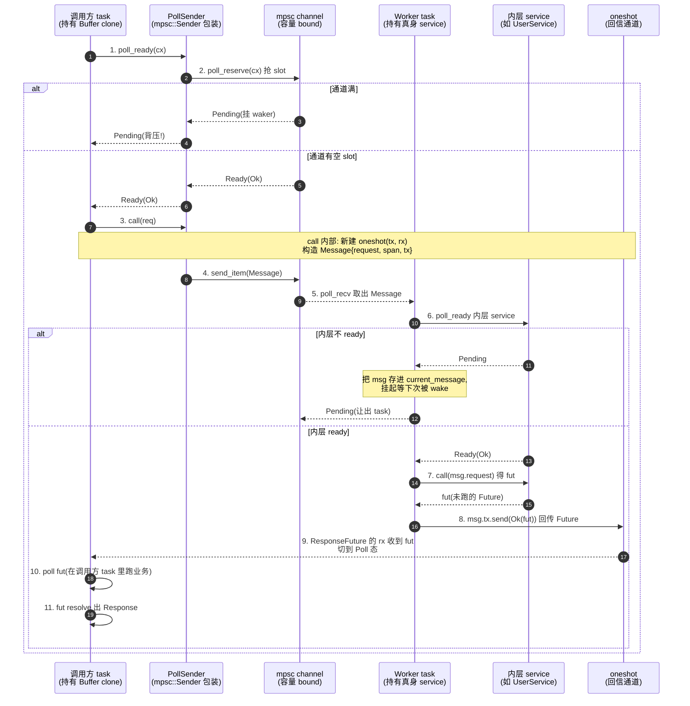

# 第 5 章 · Buffer:把 !Clone 服务变成 Clone + Send

> 第 2 篇 · 背压类中间件 · 执行单元(招牌章)

## 章首 · 核心问题

这一章只回答一个问题:

> **一个持有数据库连接/HTTP 连接的 `Service` 不能 `Clone`(连接资源是 `!Clone` 的),怎么在多个 task 之间共享它?**

这不是一个边缘场景。你在 axum 里写一个 handler,在 tonic 里写一个 gRPC method,在 reqwest 里写一个 client 池,在 Pingora 里写一个 upstream 代理,你手里捏着的那个"会真正去打后端"的 service,九成是一个**独占资源**(一个 TCP 连接、一个连接池句柄、一个文件描述符)。Rust 的所有权模型告诉你:这种东西**不能 `Clone`**——你总不能 `Clone` 出两个 service 共享同一个 TCP socket 的所有权。可是你又**必须**让多个 task 同时用它:一个 Web server 同时处理几百个请求,每个请求都要去查一次数据库,你不能为每个请求新建一条连接(连接握手代价),你只能让几百个请求复用那一个(或一小池)连接持有的 service。

这是一个看起来矛盾的需求:**资源要独占(不能 Clone),又要被多 task 共享(必须能 Clone 出多份 handle 发请求)**。

如果你用 Tokio 原生的 `mpsc` 通道,你会发现 `mpsc::Sender` 是 `Clone` 的、`mpsc::Receiver` 是 `!Clone` 的——一个 sender 多个 receiver,或者一个 receiver 多个 sender。这个不对称的 `Clone` 语义,正好是解开上面那个矛盾的钥匙。Tower 的 `Buffer` 中间件,就是把"一个 `!Clone` 的 service"接到"一个 `!Clone` 的 `mpsc::Receiver`"上,然后让调用方去 clone 那个**可 clone 的 `mpsc::Sender`**。

读完本章你会明白:

1. **为什么不能简单地 `Arc<Mutex<Service>>` 共享一个 service**——`Mutex` 会把所有请求**串行化**,还会**阻塞 `poll_ready`**,把背压语义整个破坏掉;
2. **Buffer 怎么靠一个 worker task + 一条 `mpsc` 通道把 `!Clone` 服务变成 `Clone + Send`**——被 clone 的从来不是 service,而是 `mpsc::Sender`;
3. **容量是怎么形成背压的**——bounded `mpsc` 满了,`poll_ready` 就返回 `Pending`,背压从通道容量一路传到调用方的 `ready().await`,一行 `poll_reserve` 完成全部背压传播;
4. **为什么 worker task 要在后台反复 `poll_ready` 内层服务**——它把"内层服务就绪是异步的"这件麻烦事,从请求路径上**搬到了后台 task**,对调用方暴露"我随时 ready(只要通道没满)";
5. **0.5.0 那个著名的 #635 重写改了什么**——为什么老的 `unbounded + Semaphore` 方案实际上把容量"偷偷少算了一个"(off-by-one),新的 bounded `mpsc + PollSender` 方案怎么把它修对,代价又是什么(`Send + 'static` 约束变严)。

> **逃生阀**(这章并发细节密集,先读这一段)。
>
> 如果你对 `Future`/`Poll`/`Pin`、`tokio::sync::mpsc`、`tokio::spawn` 完全陌生,这一章会很吃力。本章假设你读过《Tokio》第 X 章(mpsc 内部/任务调度/`poll_reserve` 语义)和本书 P1-02(Service trait 的 `&mut self` 与 `poll_ready` 背压)。涉及 Tokio mpsc 内部机制(通道的 semaphore/waker 队列/`Cell`),一律一句带过指路 `[[tokio-source-facts]]`,篇幅全留 Buffer 独有。如果你只想抓住一句话:**Buffer = 把一个 `!Clone` service 关进一个后台 task,外面只 clone 它的邮箱(Sender),邮箱满了就背压**。

## 章首 · 一句话点破

> **Buffer 的全部秘密:让调用方 clone 的不是 service,而是通往 service 的邮箱(Sender);容量就是邮箱大小,满了就 `Pending`,这就是背压。worker task 是那个唯一的收件人,持有真身,把"内层服务就绪是异步的"这件麻烦事自己扛下来,对调用方永远暴露"只要邮箱没满我就 ready"。**

这是结论,不是理由。本章倒过来拆:先看朴素方案为什么会撞墙,再看 Tokio 的 mpsc + spawn 给了什么支撑,最后看 Tower 怎么把它们拼成一个"把 `!Clone` 变成 `Clone + Send` 且背压不丢"的中间件。

---

## 正文

### 5.1 痛点:为什么 `!Clone` 服务不能简单共享

#### 5.1.1 一个真实场景:数据库连接 service

设想你在写一个 async 的 user service,内部持有一个到 Postgres 的连接(为了简化,先假设是单连接,不是连接池):

```rust
// (示意,非源码原文)
struct UserService {
    conn: PgConnection,   // 一条独占的 TCP 连接,不能 Clone
}

impl Service<GetUser> for UserService {
    type Response = User;
    type Error = DbError;
    type Future = Pin<Box<dyn Future<Output = Result<User, DbError>> + Send>>;

    fn poll_ready(&mut self, cx: &mut Context<'_>) -> Poll<Result<(), Self::Error>> {
        // 连接空闲,ready
        Poll::Ready(Ok(()))
    }

    fn call(&mut self, req: GetUser) -> Self::Future {
        // 用 self.conn 发一条 SQL
        Box::pin(async move { /* SELECT * FROM users WHERE id = ? */ })
    }
}
```

现在你有一个 axum handler,它被 Tokio 调度到**任意一个工作线程**上跑,每个请求一个 task。你想让每个 task 都能用这个 `UserService`。问题来了:`PgConnection` 不能 `Clone`(它内部是一个 `TcpStream` + 一堆协议状态,clone 一份等于两个 owner 抢同一个 socket,这没意义),所以 `UserService` 也不能 `Clone`。可是 axum 的 `Router::route` 要求 handler 的依赖必须是 `Clone + Send + Sync`——因为 axum 会把 handler clone 到每个连接的 task 里。

你卡住了:**service 不能 clone,但调用方需要 clone**。

#### 5.1.2 朴素方案一:`Arc<Service>` ?

第一反应:`Arc<Service>` 行不行?把 service 放进 `Arc`,clone 这个 `Arc` 不就行了?

不行。原因有两个:

**第一,`Arc<T>` 要求 `T: ?Sized`,但 `Service::call(&mut self, req)` 要的是 `&mut self`。** 你从 `Arc<Service>` 只能拿到 `&Service`,拿不到 `&mut Service`(除非用 `Arc<Mutex<Service>>` 或 `Arc<RwLock<Service>>`,见下一节)。`call` 的签名是 `&mut self`,这意味着每次调用要独占修改 service 的内部状态(比如更新一个 in-flight 计数器、推进一个协议状态机)。`&Service` 调不了 `call`。

**第二,就算你能 `call`,你也没解决"独占资源被并发访问"的问题。** 一条 TCP 连接,你让两个 task 同时往里写 SQL,协议状态会乱(Postgres 的扩展查询协议是有状态的,两个查询交错会把连接搞坏)。`Arc` 只共享了所有权,没做任何串行化。

> **钉死这件事**:`Arc<T>` 解决的是"多 owner 共享不可变数据",`Service` 要的是"独占可变访问",这俩语义对不上。`Arc<Service>` 在编译期就过不去——`call(&mut self)` 拿不到 `&mut`。

#### 5.1.3 朴素方案二:`Arc<Mutex<Service>>` ?

那加个锁呢?`Arc<Mutex<Service>>`,clone 这个 `Arc`,每次 `call` 前 `lock()`:

```rust
// (示意,朴素写法,反例)
struct SharedUserService(Arc<Mutex<UserService>>);

impl Service<GetUser> for SharedUserService {
    type Response = User;
    // ...
    fn poll_ready(&mut self, cx: &mut Context<'_>) -> Poll<Result<(), Self::Error>> {
        // 锁住, poll 内层 ready
        let mut inner = self.0.lock().unwrap();   // 阻塞锁!
        inner.poll_ready(cx)
    }
    fn call(&mut self, req: GetUser) -> Self::Future {
        let inner = self.0.lock().unwrap();        // 又锁一次!
        inner.call(req)
    }
}
```

这个能编译过(假设锁不阻塞 Future——其实 `std::sync::Mutex` 在 async 里是阻塞的,但先忽略),但**它把整个 service 串行化了**,而且**破坏了背压语义**。具体撞三堵墙:

**墙一:全串行,把并发度打成 1。**

`Mutex` 的语义是"同一时刻只有一个持有者"。你 `lock()` 拿到锁后,内层 `poll_ready` 返回 `Ready`,然后你 `call` 发了 SQL。注意:`call` 返回的 `Future` 是**异步**的——SQL 要等 Postgres 回包才 resolve。可是你**在 `call` 返回之前**就必须释放锁(否则别的 task 永远拿不到锁),所以你在 `call` 里 `lock()` 发完 SQL 就 `unlock()`,Future 在锁外 await。

那 `poll_ready` 呢?下一次别的 task 来 `poll_ready`,它会 `lock()` 然后 `poll_ready` 内层——可内层那条连接**正在等上一个 SQL 的回包**,它不 ready。于是 `poll_ready` 返回 `Pending`。看起来没问题?问题大了:**这个 `Pending` 是因为"上一个请求还没回包",而不是因为"我忙不过来,你等会儿"**。整个 service 的吞吐被锁压成"一条连接同时只处理一个请求"——这本来可能是真的(单连接确实串行),但 `Mutex` 让连 `poll_ready` 的并行性都没了:两个 task 同时 `poll_ready`,一个 `lock` 成功,另一个 `lock` 直接阻塞(`std::sync::Mutex`)或者 `Pending`(如果你用 `tokio::sync::Mutex`,但那是另一个故事)。

**墙二:`std::sync::Mutex` 在 async 里是阻塞的,会卡死线程。**

`std::sync::Mutex::lock()` 是一个**阻塞的系统调用**。在 async 上下文里调它,如果锁被占住,当前 worker 线程会被内核挂起,**整个 Tokio 工作线程停转**,这个线程上其他几百个 task 全跟着卡。这是 async Rust 的头号反模式。换 `tokio::sync::Mutex`?它返回一个 `Future`,你 `.await`,锁等待期间这个 task 让出线程——好,不卡线程了,但**它还是一个锁**,墙一(串行)没解决,而且 `tokio::sync::Mutex` 的性能比 `std::sync::Mutex` 差(要走异步等待队列)。

**墙三:背压语义被破坏。**

`Service::poll_ready` 的契约(tower-service 源码原话,见 `tower-service/src/lib.rs#L321-L339`)是:

> "Once `poll_ready` returns `Poll::Ready(Ok(()))`, a request may be dispatched ... repeated calls to `poll_ready` must return either `Poll::Ready(Ok(()))` or `Poll::Ready(Err(_))`."
>
> "Note that `poll_ready` may reserve shared resources that are consumed in a subsequent invocation of `call`."

也就是说:`poll_ready` 准备资源,`call` 消费资源。`Arc<Mutex<Service>>` 的问题是,`poll_ready` 里 `lock()` 然后 `poll_ready` 内层拿到 `Ready` 后,**锁在 `poll_ready` 返回时就释放了**——可内层 ready 状态是"这一次 call 可以用了",你释放锁后,另一个 task 立刻 `lock()` 再 `poll_ready` 内层,内层可能就不 ready 了(单连接正在处理上一个)。于是你拿到了"我 ready 了"的承诺,等你 `call` 的时候,内层不 ready,`call` 行为未定义(Service trait 允许 `call` 在未 ready 时 panic)。这就是为什么 P1-02 反复强调的 **`mem::replace` 取走 ready service 惯用法**——你不能 `poll_ready` 后又 clone 一个可能不 ready 的副本。

> **钉死这件事**:`Arc<Mutex<Service>>` 三重罪:① 全串行(并发度=1);② `std::sync::Mutex` 阻塞 async 线程;③ `poll_ready` 拿锁释放锁之间 ready 状态可能被别的 task 偷走,背压契约破坏。这条路是死的。

#### 5.1.4 朴素方案三:连接池 ?

你说,那我用连接池(`bb8`/`deadpool`/`r2d2`)不就行了?每个请求从池子里借一条连接,用完还回去。

对,连接池确实是对的解,**但那是另一层抽象**(连接池解决的是"N 条连接怎么分配",本书不展开)。Buffer 解决的是更基本的问题:**当你手里就一个 service(不管它背后是 1 条连接还是 1 个池子),怎么让这个 service 在多 task 间共享,且不串行、不阻塞、不破坏背压**。连接池内部其实也常常用一个 worker + 通道的模式来管理连接——Buffer 是这个模式的通用化、中间件化。

实际上,Tower 生态里 `Buffer` 经常和 `MakeService`(工厂模式,见 P4-13 Reconnect)配合:工厂造连接(每次造一个新的),Buffer 把这个连接共享给多 task。但 Buffer 自己只关心"共享一个已有的 service",不关心"造连接"。

### 5.2 Tokio 的支撑:mpsc + spawn 给了我们什么

朴素方案撞墙了。现在看 Tokio 给了什么现成的砖,让我们能搭一个不撞墙的方案。

#### 5.2.1 `tokio::sync::mpsc`:不对称的 Clone

`tokio::sync::mpsc` 是一个 multi-producer single-consumer 通道。它的关键设计(承接《Tokio》,一句带过指路 `[[tokio-source-facts]]`):

- `mpsc::channel(bound)` 返回 `(Sender, Receiver)`;
- `Sender` 是 `Clone` 的——你可以有任意多个 sender 同时往通道里塞;
- `Receiver` 是 `!Clone` 的——只有**一个** receiver 从通道里取;
- `bound` 是通道容量,满了再 `send` 就等待(或 `poll_reserve` 返回 `Pending`)。

这个不对称正是我们要的:**多个 producer(多个调用方 task)→ 单个 consumer(那个独占的 service)**。把 service 接到 `Receiver` 上(它是唯一的 consumer),把 `Sender` clone 给所有调用方,调用方 clone 的不是 service,而是"通往 service 的邮箱"。

> **承接《Tokio》**:mpsc 内部的实现——`Cell` 单链表、内部用一个小 semaphore 控容量、发送端的 `Permit`/`poll_reserve`/waker 队列、接收端的 `poll_recv`——《Tokio》第 X 章已逐行拆透,本章一句带过指路 `[[tokio-source-facts]]`。本章只关心 Buffer 怎么用这些原语,不重讲它们内部。

#### 5.2.2 `tokio::spawn`:把 service 关进一个 task

光有通道不够。通道需要一个 consumer 在那里持续取消息,可 consumer 是 `Receiver`,它不会自己跑。我们需要**一个 task**,这个 task:

1. 持有那个唯一的 `Receiver`(以及那个唯一的 service);
2. 循环:从 `Receiver` 取一个请求 → `poll_ready` service → `call` service → 把响应塞回去;
3. 这个 task 自己被 Tokio 调度,和其他调用方 task 并行。

`tokio::spawn` 给我们这个 task。注意:**这个 task 持有 service 的所有权**(service 被 move 进 task),所以 service 现在被这个 task 独占——没有人能直接碰到 service,所有请求只能通过通道发给这个 task。这就是"把 service 关进一个后台 task"的含义。

> **承接《Tokio》**:`tokio::spawn` 内部做的事——把 future 挂到 runtime、分配 task 结构(`core`/`scheduler`/`waker`)、调度到工作线程——《Tokio》已拆透,一句带过指路。本章只强调一点:spawn 一个 future 要求 `Future: Send + 'static`,这会**反向约束** Buffer 的泛型签名(`T::Future: Send + 'static`、`Req: Send + 'static`),这是 0.5.0 重写后新增的约束,后面讲 off-by-one 时会回扣。

#### 5.2.3 把两者拼起来:worker task + mpsc 的雏形

把 mpsc + spawn 拼起来,雏形就出来了:

```rust
// (示意,简化版雏形,非源码原文)
fn share<S: Service<Req>>(svc: S, bound: usize) -> (BufferHandle<Req>, Worker<S, Req>) {
    let (tx, rx) = mpsc::channel(bound);
    let worker = Worker { svc, rx };
    tokio::spawn(worker);          // worker 持有真身 svc,被调度跑起来
    BufferHandle { tx }            // 调用方 clone 这个 tx
}

// Worker 实现成一个 Future,被 spawn 后自己跑
impl<S: Service<Req>> Future for Worker<S, Req> {
    type Output = ();
    fn poll(self, cx) -> Poll<()> {
        // 循环: poll_ready(svc) -> rx.recv() -> svc.call(req) -> 回传
    }
}

// BufferHandle impl Service:poll_ready 查容量, call 把 req 经 tx 发出去
```

这个雏形已经有了 Buffer 的全部骨架。剩下的工程细节(怎么把响应回传?怎么处理取消?怎么把内层就绪的异步性藏起来?worker 挂了怎么办?)才是 Tower Buffer 的真功夫,也是本章的重头戏。

### 5.3 所以 Buffer 这么设计:worker + mpsc + oneshot

现在看 Tower Buffer 的真实结构。先看类型定义(`tower/src/buffer/service.rs#L19-L22`):

```rust
#[derive(Debug)]
pub struct Buffer<Req, F> {
    tx: PollSender<Message<Req, F>>,
    handle: Handle,
}
```

`Buffer` 结构体就两个字段:

- `tx: PollSender<Message<Req, F>>`——这是一个对 `mpsc::Sender` 的包装,提供了 `poll_reserve`/`send_item` 这样的**轮询友好**接口(等下细讲)。`Message<Req, F>` 是塞进通道的消息类型;
- `handle: Handle`——一个到 worker 的"错误共享句柄",worker 挂了能从这取到错误。

注意一个关键点:**`Buffer` 这个结构体里根本没有 service**。service 被 move 进 worker task 了,`Buffer` 持有的只是"通往 worker 的邮箱"(`tx`)和"worker 的错误句柄"(`handle`)。这意味着 clone 一个 `Buffer` 不需要 clone service——只要 clone 邮箱和句柄。看 `Clone` impl(`service.rs#L133-L144`):

```rust
impl<Req, F> Clone for Buffer<Req, F>
where
    Req: Send + 'static,
    F: Send + 'static,
{
    fn clone(&self) -> Self {
        Self {
            handle: self.handle.clone(),
            tx: self.tx.clone(),
        }
    }
}
```

`PollSender` 是 `Clone` 的(它包的 `mpsc::Sender` 是 `Clone` 的),`Handle` 是 `Clone` 的(它包的 `Arc<Mutex<Option<ServiceError>>>` 是 `Clone` 的)。所以 `Buffer` 的 `Clone` 不要求 service 是 `Clone`——service 根本不在 `Buffer` 里。这就是"`!Clone` 服务变成 `Clone`"的全部魔法:**被 clone 的不是 service,是邮箱**。

#### 5.3.1 Message:请求 + 回信通道 + tracing span

调用方通过 `tx` 发给 worker 的不是裸请求,而是一个 `Message`(`tower/src/buffer/message.rs#L5-L10`):

```rust
/// Message sent over buffer
#[derive(Debug)]
pub(crate) struct Message<Request, Fut> {
    pub(crate) request: Request,
    pub(crate) tx: Tx<Fut>,
    pub(crate) span: tracing::Span,
}

/// Response sender
pub(crate) type Tx<Fut> = oneshot::Sender<Result<Fut, ServiceError>>;

/// Response receiver
pub(crate) type Rx<Fut> = oneshot::Receiver<Result<Fut, ServiceError>>;
```

一个 `Message` 包三样东西:

1. **`request: Request`**——调用方真正要发的请求;
2. **`tx: oneshot::Sender<Result<Fut, ServiceError>>`**——一条**回信通道**。注意这里 `oneshot` 是单发通道,而且回传的不是 `Response`,而是**service 的 `Future`**(`Fut`)+ 一个可能的错误。这是 Buffer 一个非常精巧的设计(下面 5.3.4 详讲);
3. **`span: tracing::Span`**——调用方当前的 tracing span,要传播到 worker task,让 worker 里的日志事件能正确归到调用方的 span。

为什么要把 `oneshot` 回信通道塞进 `Message`?因为 `mpsc` 是**单向**的——调用方经 `mpsc` 把请求发给 worker,可 worker 处理完要把响应**回传**给调用方,这个回传也得有一条通道。每个请求带一条一次性 `oneshot`,谁发的请求就经谁的 `oneshot` 回信,这是异步 RPC 通道的标准玩法(也叫 "request-response pattern over one-way channel")。

#### 5.3.2 Buffer 的构造:`pair` + `tokio::spawn`

看 `Buffer::new`(`service.rs#L49-L59`):

```rust
pub fn new<S>(service: S, bound: usize) -> Self
where
    S: Service<Req, Future = F> + Send + 'static,
    F: Send,
    S::Error: Into<crate::BoxError> + Send + Sync,
    Req: Send + 'static,
{
    let (service, worker) = Self::pair(service, bound);
    tokio::spawn(worker);
    service
}
```

`new` 做两件事:① `pair` 拆出一个 `(Buffer, Worker)`;② `tokio::spawn(worker)` 把 worker 跑起来。注意 `pair`(`service.rs#L66-L80`):

```rust
pub fn pair<S>(service: S, bound: usize) -> (Self, Worker<S, Req>)
where
    S: Service<Req, Future = F> + Send + 'static,
    F: Send,
    S::Error: Into<crate::BoxError> + Send + Sync,
    Req: Send + 'static,
{
    let (tx, rx) = mpsc::channel(bound);
    let (handle, worker) = Worker::new(service, rx);
    let buffer = Self {
        tx: PollSender::new(tx),
        handle,
    };
    (buffer, worker)
}
```

`pair` 提供了**用自己的 executor 启动 worker** 的能力(不强制用 `tokio::spawn`,你可以自己 `exec.spawn(worker)`)。注意 `mpsc::channel(bound)`——这一行是**整个背压机制的根**。`bound` 直接就是 `mpsc::channel` 的容量,容量满则 `poll_reserve` 返回 `Pending`,这个 `Pending` 就是 Buffer 的背压。

#### 5.3.3 poll_ready:一行 `poll_reserve` 完成全部背压

现在看 Buffer 怎么 impl `Service`(`service.rs#L87-L131`)。先看 `poll_ready`:

```rust
impl<Req, Rsp, F, E> Service<Req> for Buffer<Req, F>
where
    F: Future<Output = Result<Rsp, E>> + Send + 'static,
    E: Into<crate::BoxError>,
    Req: Send + 'static,
{
    type Response = Rsp;
    type Error = crate::BoxError;
    type Future = ResponseFuture<F>;

    fn poll_ready(&mut self, cx: &mut Context<'_>) -> Poll<Result<(), Self::Error>> {
        // First, check if the worker is still alive.
        if self.tx.is_closed() {
            // If the inner service has errored, then we error here.
            return Poll::Ready(Err(self.get_worker_error()));
        }

        // Poll the sender to acquire a permit.
        self.tx
            .poll_reserve(cx)
            .map_err(|_| self.get_worker_error())
    }
```

`poll_ready` 干两件事:

1. **先看 worker 还活着没**:`self.tx.is_closed()`——如果 worker 那头的 `Receiver` 被 drop 了(worker task 结束了),`tx` 就 closed,这时返回 worker 的错误(`get_worker_error` 从 `handle` 取);
2. **`poll_reserve` 抢一个容量 slot**:`self.tx.poll_reserve(cx)`——这是 `PollSender` 的核心方法。它内部调 `mpsc::Sender::poll_reserve`(Tokio 提供),尝试在通道里**预订一个发送 slot**:
   - 通道有空闲 slot → 返回 `Poll::Ready(Ok(()))`,接下来 `send_item` 不会阻塞;
   - 通道满了 → 返回 `Poll::Pending`,把自己的 waker 挂到通道的发送等待队列上,**等 worker 消费一个消息腾出 slot 时被唤醒**;
   - 通道关闭(worker 挂了)→ 返回 `Poll::Ready(Err(SendError))`,被 `map_err` 翻译成 worker 错误。

> **钉死这件事**:Buffer 的 `poll_ready` 整个就一行 `self.tx.poll_reserve(cx)`。**背压传播链**是这样的:worker 消费慢 → 通道积压 → 通道满 → `poll_reserve` 返回 `Pending` → 调用方的 `poll_ready` 返回 `Pending` → 调用方的 `svc.ready().await`(在 `ServiceExt::ready` 里)挂起 → 调用方 task 让出线程 → 调用方不再发新请求 → 通道不再增长。背压就这样从 worker 的处理速度,经通道容量,一路传回调用方的 `ready().await`。**不需要任何额外代码,一个 `poll_reserve` 把整个背压链串起来**。

注意 `poll_ready` **完全不碰内层 service**。内层 service 在 worker task 里,Buffer 这边碰不到。这就是为什么 Buffer 能把"内层就绪是异步的"藏起来——`poll_ready` 只关心通道容量,通道有 slot 就 `Ready`,不管内层服务现在 ready 没。内层服务的 `poll_ready` 由 worker task 在后台负责(5.4 详讲)。

#### 5.3.4 call:发请求 + 返回 ResponseFuture

看 `call`(`service.rs#L110-L130`):

```rust
    fn call(&mut self, request: Req) -> Self::Future {
        tracing::trace!("sending request to buffer worker");

        // get the current Span so that we can explicitly propagate it to the worker
        let span = tracing::Span::current();

        // If we've made it here, then a channel permit has already been
        // acquired, so we can freely allocate a oneshot.
        let (tx, rx) = oneshot::channel();

        match self.tx.send_item(Message { request, span, tx }) {
            Ok(_) => ResponseFuture::new(rx),
            // If the channel is closed, propagate the error from the worker.
            Err(_) => {
                tracing::trace!("buffer channel closed");
                ResponseFuture::failed(self.get_worker_error())
            }
        }
    }
```

`call` 做四件事:

1. **抓当前 tracing span**(`let span = tracing::Span::current();`)——为了在 worker 里"进入"这个 span,让 worker 处理这个请求时产生的日志事件归到调用方的 span(否则 worker 是另一个 task,默认不在调用方的 span context 里);
2. **新建一个 oneshot 回信通道**(`let (tx, rx) = oneshot::channel();`)——`tx` 塞进 `Message` 发给 worker,`rx` 留给自己;
3. **`send_item` 把 Message 发出去**——注意是 `send_item` 不是 `send`,因为前面 `poll_reserve` 已经预订了 slot,这里只是把 item 塞进预订的 slot(不会失败,除非通道关了);
4. **返回 `ResponseFuture::new(rx)`**——把 `rx`(oneshot 接收端)包成一个 Future 返回给调用方。

这里有个非常精妙的点:**`call` 返回的 `ResponseFuture`,它的 `Output` 是 `Result<Rsp, BoxError>`,可它内部包的 `rx` 接收的是 `Result<Fut, ServiceError>`——是 service 的 Future,不是 Response!** 看 `ResponseFuture`(`tower/src/buffer/future.rs#L14-L39`):

```rust
pin_project! {
    pub struct ResponseFuture<T> {
        #[pin]
        state: ResponseState<T>,
    }
}

pin_project! {
    #[project = ResponseStateProj]
    #[derive(Debug)]
    enum ResponseState<T> {
        Failed {
            error: Option<crate::BoxError>,
        },
        Rx {
            #[pin]
            rx: message::Rx<T>,
        },
        Poll {
            #[pin]
            fut: T,
        },
    }
}
```

`ResponseFuture` 是一个**三态状态机**:`Failed`(构造时就失败,比如通道关了)、`Rx`(等 worker 回信)、`Poll`(worker 已经回了一个 Future,现在在 poll 这个 Future)。看它的 `poll`(`future.rs#L55-L79`):

```rust
impl<F, T, E> Future for ResponseFuture<F>
where
    F: Future<Output = Result<T, E>>,
    E: Into<crate::BoxError>,
{
    type Output = Result<T, crate::BoxError>;

    fn poll(self: Pin<&mut Self>, cx: &mut Context<'_>) -> Poll<Self::Output> {
        let mut this = self.project();

        loop {
            match this.state.as_mut().project() {
                ResponseStateProj::Failed { error } => {
                    return Poll::Ready(Err(error.take().expect("polled after error")));
                }
                ResponseStateProj::Rx { rx } => match ready!(rx.poll(cx)) {
                    Ok(Ok(fut)) => this.state.set(ResponseState::Poll { fut }),
                    Ok(Err(e)) => return Poll::Ready(Err(e.into())),
                    Err(_) => return Poll::Ready(Err(Closed::new().into())),
                },
                ResponseStateProj::Poll { fut } => return fut.poll(cx).map_err(Into::into),
            }
        }
    }
}
```

`poll` 是一个 `loop`:

- **`Rx` 态**:poll 那个 oneshot `rx`。三种结果:
  - `Ok(Ok(fut))`——worker 正常回了一个 `fut: F`(service 的 Future),切到 `Poll` 态,继续 loop;
  - `Ok(Err(e))`——worker 在 `poll_ready` 阶段就失败了(`ServiceError`),返回错误;
  - `Err(_)`——oneshot 的 sender 被 drop(worker 挂了),返回 `Closed` 错误;
- **`Poll` 态**:poll worker 回传的那个 `fut`,这是真正在跑 service 逻辑的 Future,它 resolve 出来的就是 `Response`;
- **`Failed` 态**:构造时失败(通道关),直接返回错误。

这个两段式(`Rx` → `Poll`)是 Buffer 一个**非常关键**的设计决策。为什么 worker 不直接帮调用方把 `fut` 跑完(resolve 成 Response)再回传?为什么要回传一个 Future 让调用方自己 poll?原因是:

> **worker 的职责是"调度请求 + 把内层就绪藏起来",不是"替调用方跑业务 Future"**。如果 worker 替调用方 poll 业务 Future,worker 就会变成一个**串行执行器**——它一次只能 poll 一个 Future,业务 Future 慢了就阻塞它处理下一个请求。把 Future 回传给调用方,调用方在自己的 task 里 poll,worker 立刻去处理下一个请求——**这才是真正的并发**(多个请求的业务 Future 在各自的调用方 task 里并行跑,worker 只负责"投递")。

这就是为什么 `Message::tx` 的类型是 `oneshot::Sender<Result<Fut, ServiceError>>` 而不是 `oneshot::Sender<Result<Rsp, ServiceError>>`——worker 回传的是 service 的 Future(未完成的计算),不是计算的结果。这个区分是 Buffer 性能的关键:worker 永远只做轻量的"投递 + poll_ready",重的业务计算留在调用方 task。

#### 5.3.5 一个请求的完整时序

把 5.3.3 和 5.3.4 串起来,一个请求从调用方到响应的全过程:



这张图是本章的总图,所有细节都长在它上面。重点标几个关键瞬间:

- **第 2 步 `poll_reserve`**——这是背压的源头。通道满就 `Pending`,调用方挂起,不再发请求;
- **第 6 步 worker `poll_ready` 内层**——这是 worker 把"内层就绪是异步的"藏起来的地方。worker 反复 poll 内层,直到 ready 才继续;调用方那边感知不到内层的异步就绪,只感知到通道容量;
- **第 8 步 worker 回传 `fut` 而不是 `Response`**——这是并发的关键。worker 回传后立刻去处理下一个 Message(第 5 步循环),不替调用方跑业务;
- **第 10 步调用方 poll `fut`**——业务计算发生在调用方 task,不占 worker。

### 5.4 Worker:把内层就绪的异步性藏到后台

`Worker` 是 Buffer 的心脏。看它的定义(`tower/src/buffer/worker.rs#L15-L35`):

```rust
pin_project_lite::pin_project! {
    #[derive(Debug)]
    pub struct Worker<T, Request>
    where
        T: Service<Request>,
    {
        current_message: Option<Message<Request, T::Future>>,
        rx: mpsc::Receiver<Message<Request, T::Future>>,
        service: T,
        finish: bool,
        failed: Option<ServiceError>,
        handle: Handle,
    }
}
```

`Worker` 持有五样东西:

- **`service: T`**——那个唯一的、独占的真身 service;
- **`rx: mpsc::Receiver`**——通道的接收端,唯一 consumer;
- **`current_message: Option<Message>`**——当前正在处理的 message。**这个字段是关键**:当内层 `poll_ready` 返回 `Pending` 时,worker 把当前 message 存回这里,下次 poll 时优先处理它(5.4.2 详讲);
- **`finish: bool`**——是否已进入关闭流程(rx 取空了);
- **`failed: Option<ServiceError>`**——内层 service 是否已永久失败;
- **`handle: Handle`**——和 `Buffer` 共享的错误句柄(`Arc<Mutex<Option<ServiceError>>>`)。

`Worker` 自己就是一个 `Future`(`worker.rs#L141-L208`)。`tokio::spawn(worker)` 把这个 Future 跑起来,Tokio 反复 poll 它,直到它返回 `Ready(())`(worker 结束)。看它的 `poll`(`worker.rs#L148-L207`):

```rust
impl<T, Request> Future for Worker<T, Request>
where
    T: Service<Request>,
    T::Error: Into<crate::BoxError>,
{
    type Output = ();

    fn poll(mut self: Pin<&mut Self>, cx: &mut Context<'_>) -> Poll<Self::Output> {
        if self.finish {
            return Poll::Ready(());
        }

        loop {
            match ready!(self.poll_next_msg(cx)) {
                Some((msg, first)) => {
                    let _guard = msg.span.enter();
                    if let Some(ref failed) = self.failed {
                        tracing::trace!("notifying caller about worker failure");
                        let _ = msg.tx.send(Err(failed.clone()));
                        continue;
                    }

                    // Wait for the service to be ready
                    match self.service.poll_ready(cx) {
                        Poll::Ready(Ok(())) => {
                            let response = self.service.call(msg.request);
                            let _ = msg.tx.send(Ok(response));
                        }
                        Poll::Pending => {
                            // Put out current message back in its slot.
                            drop(_guard);
                            self.current_message = Some(msg);
                            return Poll::Pending;
                        }
                        Poll::Ready(Err(e)) => {
                            let error = e.into();
                            drop(_guard);
                            self.failed(error);
                            let _ = msg.tx.send(Err(self
                                .failed
                                .as_ref()
                                .expect("Worker::failed did not set self.failed?")
                                .clone()));
                        }
                    }
                }
                None => {
                    // No more more requests _ever_.
                    self.finish = true;
                    return Poll::Ready(());
                }
            }
        }
    }
}
```

这个 `poll` 是一个 `loop`,每次循环干一件事:**取一个 message → poll_ready 内层 → call 内层 → 回传**。但每个分支都有讲究,逐个拆。

#### 5.4.1 poll_next_msg:跳过已取消的请求

先看 `loop` 的第一步 `self.poll_next_msg(cx)`(`worker.rs#L72-L105`):

```rust
fn poll_next_msg(
    &mut self,
    cx: &mut Context<'_>,
) -> Poll<Option<(Message<Request, T::Future>, bool)>> {
    if self.finish {
        // We've already received None and are shutting down
        return Poll::Ready(None);
    }

    tracing::trace!("worker polling for next message");
    if let Some(msg) = self.current_message.take() {
        // If the oneshot sender is closed, then the receiver is dropped,
        // and nobody cares about the response. If this is the case, we
        // should continue to the next request.
        if !msg.tx.is_closed() {
            tracing::trace!("resuming buffered request");
            return Poll::Ready(Some((msg, false)));
        }

        tracing::trace!("dropping cancelled buffered request");
    }

    // Get the next request
    while let Some(msg) = ready!(Pin::new(&mut self.rx).poll_recv(cx)) {
        if !msg.tx.is_closed() {
            tracing::trace!("processing new request");
            return Poll::Ready(Some((msg, true)));
        }
        // Otherwise, request is canceled, so pop the next one.
        tracing::trace!("dropping cancelled request");
    }

    Poll::Ready(None)
}
```

`poll_next_msg` 干两件事,返回 `(Message, bool)`——`bool` 表示"是不是第一次见到这个 msg":

1. **先看 `current_message`**(上次因为内层 `Pending` 存下来的)——如果有,检查它的 oneshot sender 还开着没(`msg.tx.is_closed()`)。如果**关了**,说明调用方那边 drop 了 `ResponseFuture`(调用方放弃了这次请求),worker 直接**丢掉这个 msg**,继续取下一个。如果还开着,返回这个 msg(标记 `false`,表示"恢复")。
2. **再从 `rx` 取新 message**(`ready!(poll_recv)`)——同样检查 oneshot 是否关了。关了的跳过,直到取到一个还活着的(标记 `true`,表示"新请求")。如果 `poll_recv` 返回 `None`(所有 sender 都 drop 了,通道关闭),返回 `Poll::Ready(None)`——worker 进入 `finish` 流程。

> **钉死这件事**:这个 `is_closed()` 检查是 Buffer **不浪费 worker 算力**的关键。调用方 `drop` 了 `ResponseFuture`(比如调用方 task 被取消,或者上游设了超时把 future drop 了),oneshot 的 sender 端会观察到 receiver 已 drop——`msg.tx.is_closed()` 返回 true,worker 直接跳过这个请求,**不去 poll_ready,不去 call**,立刻取下一个。这把"取消语义"正确地传播到了 worker:调用方放弃 → worker 不浪费时间。

注意 `is_closed()` 是 `tokio::sync::oneshot::Sender` 的方法,它**非阻塞**地检查 receiver 是否还在(receiver drop 时 sender 能感知到,这是 oneshot 的语义)。

#### 5.4.2 内层 Pending:把 msg 存进 current_message

回到 `poll` 的 `loop`。假设 `poll_next_msg` 返回了一个 msg(`Some((msg, first))`),worker 进入主流程:

```rust
let _guard = msg.span.enter();            // 进入调用方的 tracing span
if let Some(ref failed) = self.failed {   // worker 已经永久失败?
    let _ = msg.tx.send(Err(failed.clone()));
    continue;
}

match self.service.poll_ready(cx) {       // ★ 关键:poll_ready 内层
    Poll::Ready(Ok(())) => {
        let response = self.service.call(msg.request);   // 内层 ready, call
        let _ = msg.tx.send(Ok(response));               // 回传 fut
    }
    Poll::Pending => {
        drop(_guard);
        self.current_message = Some(msg);   // ★ 关键:存下来,下次优先处理
        return Poll::Pending;               // worker 让出,等被 wake
    }
    Poll::Ready(Err(e)) => {
        // ...失败处理, 5.4.4 讲
    }
}
```

最关键的两个分支:

**内层 `Ready(Ok)`:** worker `call` 内层 service 拿到 `response`(一个未跑的 Future),经 `msg.tx.send(Ok(response))` 回传给调用方。然后 `loop` 继续,取下一个 msg。这是 happy path。

**内层 `Pending`:** worker 把当前 msg **存进 `self.current_message`**,然后 `return Poll::Pending`——worker 这个 Future 让出,Tokio 去跑别的 task。等内层 service ready 时(它内部会唤醒 worker 的 waker),Tokio 重新 poll worker,worker 的 `poll_next_msg` 第一步就 `take` 出 `current_message`(标记 `false`),跳过从 `rx` 取新 msg,**优先继续处理这个被打断的 msg**。

这个 `current_message` 字段是 worker 的精髓。它保证了:**一个 msg 一旦被 worker 接手,要么被处理完(回传 fut),要么一直占据 worker 的"当前槽位"直到内层 ready**——绝不会出现"msg 接手了但被丢了"的情况。同时,内层 `Pending` 期间,worker 不会从 `rx` 取新 msg(因为 `poll_next_msg` 优先看 `current_message`)——这其实是**对调用方的一种隐式串行**:内层不 ready 时,后面排队的 msg 都得等。

> **钉死这件事**:worker 用 `current_message` 字段实现了"**前台串行 + 后台就绪**"——前台(对调用方暴露的)是"通道容量",容量没满就接收;后台(内层 service)是"poll_ready 异步就绪",worker 在后台反复 poll。这两个节奏被 worker 解耦:调用方按通道容量的节奏发,worker 按内层就绪的节奏处理,中间用通道做缓冲。这就是 `Buffer` 名字的由来——它**缓存**了"调用方发送速度"和"内层处理速度"之间的差。

#### 5.4.3 为什么 worker 要反复 poll_ready:把异步性藏起来

把 5.4.1 和 5.4.2 合起来看,worker 的 `loop` 实际上在做这件事:

```text
反复 poll worker:
  反复 poll_next_msg 直到拿到一个活的 msg(或 None 结束):
    反复 poll_ready 内层 service 直到 Ready(每次 Pending 就存 msg + 让出):
      call 内层, 回传 fut
```

这个"反复 poll_ready"就是 worker 的核心职责。**为什么必须 worker 来反复 poll,而不能让调用方自己 poll?** 因为:

- 如果让调用方 poll 内层 `poll_ready`,那调用方就**直接持有 service 了**——回到 5.1.2/5.1.3 的死路(service 不能多 task 同时持有);
- 如果让调用方经某个共享句柄 poll 内层(比如 `Arc<Mutex>`),回到 5.1.3 的三重罪(串行 + 阻塞 + 背压破坏)。

worker 的解法是:**唯一的 service 在唯一的 worker task 里**,只有 worker poll 它。调用方不 poll 内层,只 poll 通道容量。这样:

- service 的所有权清晰——worker 独占,没人能直接碰;
- 调用方并发——多个调用方 task 同时 `poll_reserve` + `call`,互不干扰(只受通道容量限制);
- 内层异步就绪被藏起来——调用方不需要知道内层 service 是不是 ready,worker 在后台搞定。

这是 Buffer 区别于 `Arc<Mutex<Service>>` 的本质:**`Arc<Mutex>` 让调用方自己去抢锁 poll 内层,Buffer 让一个专职 worker 去poll 内层,调用方只跟通道打交道**。前者是"共享 service",后者是"代理 service"。

#### 5.4.4 失败处理:把错误广播给所有 handle

看内层 `poll_ready` 返回 `Ready(Err(e))` 的分支(`worker.rs#L187-L197`):

```rust
Poll::Ready(Err(e)) => {
    let error = e.into();
    tracing::debug!({ %error }, "service failed");
    drop(_guard);
    self.failed(error);                    // ★ 把错误存进 handle + 关闭 rx
    let _ = msg.tx.send(Err(self
        .failed
        .as_ref()
        .expect("Worker::failed did not set self.failed?")
        .clone()));
}
```

`self.failed(error)` 是关键(`worker.rs#L107-L138`):

```rust
fn failed(&mut self, error: crate::BoxError) {
    let error = ServiceError::new(error);

    let mut inner = self.handle.inner.lock().unwrap();

    if inner.is_some() {
        // Future::poll was called after we've already errored out!
        return;
    }

    *inner = Some(error.clone());
    drop(inner);

    self.rx.close();

    // By closing the mpsc::Receiver, we know that poll_next_msg will soon return Ready(None),
    // which will trigger the `self.finish == true` phase. We just need to make sure that any
    // requests that we receive before we've exhausted the receiver receive the error:
    self.failed = Some(error);
}
```

`failed` 做三件事,顺序非常讲究(注释里专门解释了):

1. **先存错误进 handle**(`*inner = Some(error.clone())`)——这样后续所有 `Buffer` 调用 `get_worker_error` 都能拿到这个错误;
2. **再关闭 rx**(`self.rx.close()`)——关闭后,通道不再接收新消息(发送端 `send_item` 会失败),`poll_next_msg` 会很快返回 `Ready(None)` 触发 `finish`;
3. **存一份到 `self.failed`**——这样 worker 在关闭流程中遇到的每个还没处理的 msg,都直接回传这个错误(`if let Some(ref failed) = self.failed { msg.tx.send(Err(failed.clone())) }`)。

> **钉死这件事**:这个**先存错误,再关通道,最后回传**的顺序不是随便写的。注释原话:"We need to make sure that *either* the send of the request fails *or* it receives an error on the `oneshot`." 如果反过来(先关通道再存错误),可能出现一个竞态:调用方在 worker 存错误之前 `send_item` 成功(占用一个 slot),但 worker 已经关了不会再处理——这个调用方的请求就**静默丢了**。先存错误,`Buffer::poll_ready` 那边 `tx.is_closed()` 一旦 true 就返回错误,调用方立刻知道 worker 挂了,不会傻等。这是一个经典的"先广播状态,再关门"的并发模式。

#### 5.4.5 Worker 何时结束:不泄漏

最后一个问题:worker task 什么时候结束(返回 `Ready(())`)?看 `loop` 的 `None` 分支(`worker.rs#L200-L204`):

```rust
None => {
    // No more more requests _ever_.
    self.finish = true;
    return Poll::Ready(());
}
```

`poll_next_msg` 返回 `Ready(None)` 当且仅当 `rx` 关闭且排空了——即**所有 `Buffer`(所有 sender)都 drop 了**。这时 worker 没有更多请求要处理,返回 `Ready(())`,task 结束。

> **钉死这件事(worker 不泄漏)**:worker 的生命周期严格由 sender 数量决定。所有调用方 drop 它们的 `Buffer` clone → 所有 `mpsc::Sender` drop → `rx.poll_recv` 返回 `None` → worker 返回 `Ready(())` → task 被 Tokio 回收。**worker 永远不会泄漏**:只要还有人持 handle,sender 就还在,worker 就还活着;handle 全没了,worker 自动收尾。这是 Buffer "为什么 sound" 的第一条:worker 不泄漏。

唯一的例外是 `failed`:内层永久失败后,worker 主动 `rx.close()` + 进入 finish 流程,即使还有 sender,worker 也会结束(这时所有 `Buffer::poll_ready` 都会拿到错误)。

### 5.5 Handle:错误共享句柄

`Handle` 是 `Buffer` 和 `Worker` 之间共享错误的桥梁(`worker.rs#L39-L41`、`L210-L227`):

```rust
#[derive(Debug)]
pub(crate) struct Handle {
    inner: Arc<Mutex<Option<ServiceError>>>,
}

impl Handle {
    pub(crate) fn get_error_on_closed(&self) -> crate::BoxError {
        self.inner
            .lock()
            .unwrap()
            .as_ref()
            .map(|svc_err| svc_err.clone().into())
            .unwrap_or_else(|| Closed::new().into())
    }
}

impl Clone for Handle {
    fn clone(&self) -> Handle {
        Handle {
            inner: self.inner.clone(),
        }
    }
}
```

`Handle` 就是一个 `Arc<Mutex<Option<ServiceError>>>` 的包装。worker 把错误写进去(`failed` 里),`Buffer` 从里面读(`get_worker_error`)。`Arc<Mutex>` 让多个 `Buffer` clone + worker 共享同一份错误状态。

注意 `get_error_on_closed` 的兜底:如果 `inner` 是 `None`(worker 没明确失败,只是消失了),返回 `Closed` 错误("buffer's worker closed unexpectedly",见 `error.rs#L62-L66`)。这覆盖了"worker task 被 spawn 它的 runtime 强制取消"这种边缘情况(比如 runtime shutdown)。

> **钉死这件事**:`Handle` 用的是 `std::sync::Mutex` 不是 `tokio::sync::Mutex`——因为锁持有时间极短(只读写一个 `Option`),不会阻塞 async 线程。这是 async Rust 里 `std::sync::Mutex` 的合理用法:**短临界区 + 不在锁里 await**。这种取舍在 ConcurrencyLimit(P3-09)里也会遇到。

### 5.6 BufferLayer:把 Buffer 包成 Layer

`BufferLayer` 是 Buffer 的 Layer 包装(`tower/src/buffer/layer.rs#L12-L56`):

```rust
pub struct BufferLayer<Request> {
    bound: usize,
    _p: PhantomData<fn(Request)>,
}

impl<Request> BufferLayer<Request> {
    pub const fn new(bound: usize) -> Self {
        BufferLayer {
            bound,
            _p: PhantomData,
        }
    }
}

impl<S, Request> Layer<S> for BufferLayer<Request>
where
    S: Service<Request> + Send + 'static,
    S::Future: Send,
    S::Error: Into<crate::BoxError> + Send + Sync,
    Request: Send + 'static,
{
    type Service = Buffer<Request, S::Future>;

    fn layer(&self, service: S) -> Self::Service {
        Buffer::new(service, self.bound)
    }
}
```

`BufferLayer` 就是把 `bound` 存下来,`layer` 时调 `Buffer::new(svc, bound)`。注意 `BufferLayer` 是 `Clone + Copy`(`layer.rs#L66-L75`)——因为 `bound: usize` 是 `Copy`,`PhantomData<fn(Request)>` 也是 `Copy`(`fn` 指针是 `Copy`)。这让它可以放进 `ServiceBuilder` 链里被反复使用。

`_p: PhantomData<fn(Request)>` 是一个有意思的细节——它用 `fn(Request)` 而不是 `PhantomData<Request>`,是为了**不对 `Request` 施加 variance 约束**(协变/逆变/不变)。`fn(Request)` 是 `*contra-variant*` in `Request`,匹配 Layer 的实际语义。这是 Rust 高级惯用法,这里不展开,知道这个写法是为了让 `BufferLayer<Request>` 在 `Request` 上不施加多余的 `Send/Sync/Clone` bound 即可。

经过 `BufferLayer`,Buffer 就能进 `ServiceBuilder` 链:`ServiceBuilder::new().buffer(N).timeout(...).service(my_svc)`。这是 Buffer 作为中间件的形态(承 P1-04 ServiceBuilder)。

---

## 技巧精解

这一节挑 Buffer 两个最硬核的技巧单独拆透:**(一)0.5.0 的 #635 重写——bounded mpsc 怎么修了老实现的 off-by-one,代价是什么;(二)背压传播链——一行 `poll_reserve` 怎么把 worker 速度传回调用方,以及它为什么 sound(不死锁、不丢背压、不破坏 Future 语义)**。每个技巧配真实源码 + 反面对比。

### 技巧一:#635 重写——bounded mpsc + PollSender 修了 off-by-one

这是 Buffer 演进史上最重要的一次重构。理解它,等于理解 0.5.0 的 Buffer 为什么是现在这个样子。

#### 老实现(0.4.x):unbounded mpsc + 独立 Semaphore

0.4.x 的 Buffer 长这样(简化,来自 `tower-0.4.0` 的 `tower/src/buffer/service.rs`):

```rust
// (0.4.0 源码摘录, 非当前版本)
pub struct Buffer<T, Request>
where
    T: Service<Request>,
{
    // Note: this actually _is_ bounded, but rather than using Tokio's bounded
    // channel, we use Tokio's semaphore separately to implement the bound.
    tx: mpsc::UnboundedSender<Message<Request, T::Future>>,
    semaphore: Semaphore,
    handle: Handle,
}
```

注释自己就承认了:"this actually _is_ bounded, but rather than using Tokio's bounded channel, we use Tokio's semaphore separately"。**它用 `mpsc::unbounded_channel()`(无界通道)传消息,再用一个独立的 `tokio::sync::Semaphore` 控容量**。为什么这么绕?注释和 PR #635 都解释了:

> "This was necessary because when this code was updated to the latest version of `tokio`, there was no way to reserve a non-borrowed send permit from a `Sender`. Thus, it was necessary to use the `Semaphore` for the future that is polled in `poll_ready` to acquire send capacity, since a `Permit` from the `Sender` could not be stored in the struct until it's consumed in `call`."

翻译:当年(0.4 时代)Tokio 的 `mpsc::Sender` 还没有 `poll_reserve`/`Permit` 这样的"**预订一个发送 slot 但不立即发**"的接口。`Sender::reserve()` 返回的 `Permit` 借用了 `&mut Sender`,没法存进 `Buffer` 结构体(因为 `poll_ready` 返回后借用就结束了)。所以老 Buffer 只能绕:用一个独立的 `Semaphore` 做"poll 式抢容量"(Semaphore 有 `poll_acquire`),拿到 permit 后往 `UnboundedSender` 塞(无界通道不拒),permit 跟着 Message 一起在通道里走,worker 取出 message 后 permit 才 drop——这样容量占用和消息在途一一对应。

老实现的 `poll_ready`/`call`(`tower-0.4.0` 摘录):

```rust
// (0.4.0 源码摘录)
fn poll_ready(&mut self, cx: &mut Context<'_>) -> Poll<Result<(), Self::Error>> {
    if self.tx.is_closed() {
        return Poll::Ready(Err(self.get_worker_error()));
    }
    self.semaphore.poll_acquire(cx).map_err(|_| self.get_worker_error())
}

fn call(&mut self, request: Request) -> Self::Future {
    let _permit = self.semaphore.take_permit()
        .expect("buffer full; poll_ready must be called first");
    // ...
    match self.tx.send(Message { request, span, tx, _permit }) {  // ★ permit 跟着 Message 走
        Err(_) => ResponseFuture::failed(self.get_worker_error()),
        Ok(_) => ResponseFuture::new(rx),
    }
}
```

老的 `Message` 多了一个 `_permit` 字段(`tower-0.4.0` 的 `message.rs`):

```rust
// (0.4.0 源码摘录)
pub(crate) struct Message<Request, Fut> {
    pub(crate) request: Request,
    pub(crate) tx: Tx<Fut>,
    pub(crate) span: tracing::Span,
    pub(super) _permit: crate::semaphore::Permit,   // ★ permit 跟着消息在通道里
}
```

#### 老实现的 off-by-one:实际容量 = bound - 1

这就是 off-by-one 的根源。PR #635 的 commit message 原话:

> "In the `Semaphore`-based implementation, a semaphore permit is stored in the `Message` struct sent over the channel. This is so that the capacity is used as long as the message is in flight. However, when the worker task is processing a message that's been received from the channel, the permit is still not dropped. Essentially, the one message actively held by the worker task _also_ occupies one 'slot' of capacity, so the actual channel capacity is one less than the value passed to the constructor, once the first request has been sent to the worker."

拆开讲:permit 跟着 Message 在通道里,worker `poll_recv` 取出 Message 后,**Message(含 permit)被存在 worker 的局部变量里**(或 `current_message`),直到 worker 处理完这个 message(permit 才 drop)。也就是说,**worker 正在处理的那个 message,它的 permit 还没释放**——这一份 capacity 被"正在处理的消息"占着。

结果:你传 `bound=10`,语义上期望"通道里最多排 10 个待处理请求"。但实际上,worker 手里永远攥着 1 个正在处理的(它的 permit 没释放),所以**通道里实际最多只能排 9 个**(10 - 1)。这就是 off-by-one:**实际容量 = bound - 1**(在第一个请求发出去之后)。

这个 off-by-one 不是 crash 级的 bug(不会死锁,不会丢消息),但它**语义不对**——你设了 10,得到的是 9。用户调容量时会困惑(为什么设 10 表现像 9)。而且测试依赖这个 off-by-one 的行为,#635 改了之后这些测试得跟着改(PR 原话:"This broke some tests that relied on the old (and technically wrong) behavior")。

#### 新实现(0.5.0):bounded mpsc + PollSender

PR #635 的解法是:**直接用 `tokio::sync::mpsc::channel(bound)`(bounded 有界通道),配 `tokio_util::sync::PollSender`**。关键的契机是 tokio-util 0.7 改了 `PollSender` 的语义——从老的 `poll_send_done` 改成了 `poll_reserve`(PR 原话):

> "in `tokio-util` v0.7, the semantics of `PollSender` was changed to have a `poll_reserve` rather than `poll_send_done`, which is the required behavior for `Buffer`."

`poll_reserve` 是什么?它是 `PollSender` 包装 `mpsc::Sender::reserve`/`poll_reserve` 的接口,语义就是"**预订一个发送 slot,但不立即发**",而且不借用 `Sender`(预订状态存在 `PollSender` 内部)。这正好是老 Buffer 当年做不到的。

新实现的 `poll_ready`(`service.rs#L97-L108`):

```rust
fn poll_ready(&mut self, cx: &mut Context<'_>) -> Poll<Result<(), Self::Error>> {
    if self.tx.is_closed() {
        return Poll::Ready(Err(self.get_worker_error()));
    }
    // Poll the sender to acquire a permit.
    self.tx.poll_reserve(cx).map_err(|_| self.get_worker_error())
}
```

就两行。`self.tx.poll_reserve(cx)` 直接在 `mpsc::Sender` 上预订 slot——**这个 slot 由 mpsc 内部管理,不跟 Message 走**。worker `poll_recv` 取出 Message 后,Message 里没有 permit 字段(看新 `message.rs#L5-L10`,只有 `request`/`tx`/`span`,**没有 `_permit`**)。Message 离开通道的那一刻,slot 就被 mpsc 内部释放了——**worker 正在处理的消息不再占用通道容量**。

这就是 off-by-one 的修复:**容量严格等于 `bound`,正在处理的消息不占 slot**。worker 手里攥的 `current_message`,它在通道里占的 slot 已经释放了(因为消息已经被 recv 出来了)。通道里排的,纯粹是"还没被 worker 取走"的消息。

#### 新实现的代价:`Send + 'static` 约束变严

修复不是免费的。PR #635 原话:

> "There is one sort of significant issue with this change, which is that it unfortunately requires adding `Send` and `'static` bounds to the `T::Future` and `Request` types."

看新 `Buffer::new` 的签名(`service.rs#L49-L54`):

```rust
pub fn new<S>(service: S, bound: usize) -> Self
where
    S: Service<Req, Future = F> + Send + 'static,
    F: Send,                                       // ★ F: Send (新)
    S::Error: Into<crate::BoxError> + Send + Sync,
    Req: Send + 'static,                           // ★ Req: Send + 'static (新)
```

对比老签名(0.4.0):

```rust
// (0.4.0 源码摘录)
pub fn new(service: T, bound: usize) -> Self
where
    T: Send + 'static,
    T::Future: Send,
    T::Error: Send + Sync,
    Request: Send + 'static,                       // 老的也要 Send + 'static
```

表面上 `Req: Send + 'static` 新老都有,但**关键差异在 `F: Send` 这个约束的实际生效**。PR 解释:bounded mpsc 的 `OwnedPermit<T>` 只有在 `T: Send + 'static` 时才是 `Send + 'static`;`PollSender` 内部用 `ReusableBoxFuture`,要求里面跑的 future 是 `Send + 'static`,而这又要求 `OwnedPermit` 是。这条链导致 `PollSender<Message<Req, F>>` 要 `Send + Sync`(因为 `Buffer` 的 `Clone` 要在多线程间共享),就强制 `Message<Req, F>: Send`,`Message` 含 `Req` 和 `oneshot::Sender<Result<F, ...>>`,于是 `Req: Send + 'static` 和 `F: Send` 都被要求。

实际影响:**某些 `!Send` 的 service Future 或 `!Send` 的 Request,0.4 时代能进 Buffer,0.5 之后不能了**。这是一个 breaking change,所以版本号从 0.4 跳到 0.5。绝大多数实际场景下 service Future 和 Request 本来就是 `Send`(要跨线程),这个代价可接受。

> **钉死这件事(#635 的精髓)**:0.5.0 用 bounded mpsc + PollSender 替掉 unbounded + Semaphore,三个收益:① **off-by-one 修了**(实际容量 = bound,不再 bound - 1);② **代码大幅简化**(删了自实现的 semaphore 模块、删了 permit 在 Message 里的字段、删了 wake_waiters 那套唤醒逻辑——bounded mpsc 内部全包了);③ **少一份堆分配**(老的要 `Arc<Semaphore>` + `mpsc::Sender` 两份,新的只要 `mpsc::Sender` 一份)。代价是 `Send + 'static` 约束变严(breaking change,0.4 → 0.5)。这是 Buffer 演进史上最重要的一次重构。

#### 反面对比:为什么当年不直接用 bounded mpsc?

一个自然的疑问:0.4 当年为什么绕这么大弯?直接用 bounded mpsc 不就行了?

答案是**当年 bounded mpsc 没有 `poll_reserve`**。老 Tokio 的 `mpsc::Sender` 只有 `send`(异步方法,借用 `&mut self`)和 `try_send`(非阻塞,满了直接报错)。`send` 借用 `&mut Sender`,意味着你必须在一个 async fn 里 `.await send`,不能在 `poll_ready` 这种同步函数里预订 slot。`try_send` 不能等——满了就失败,可 `poll_ready` 的语义是"满了就 Pending 等到有空",`try_send` 做不到。

所以老 Buffer 只能用"独立 Semaphore 做 poll 式容量预订 + unbounded mpsc 传消息"的绕路方案。等 tokio-util 0.7 给了 `PollSender::poll_reserve`(底层是 `mpsc::Sender::poll_reserve`,基于 mpsc 内部的 permit 机制),绕路就不必要了。这是一个**外部依赖(toko-util)的能力升级,让上游(Tower)能简化设计**的典型案例——也是为什么承接《Tokio》时要看清 Tokio 给了什么原语,原语不够时上层只能绕,原语够了才能直球。

### 技巧二:背压传播链与 soundness

第二个硬核技巧:Buffer 的背压怎么从 worker 的处理速度,一路传回调用方,且**整个过程 sound**(不死锁、不丢背压、不破坏 Future 语义)。

#### 背压传播链:一行 poll_reserve 的全链路

把整个背压链画出来:

```text
[内层 service 处理慢]
        │ (worker poll_ready 内层 Pending → worker 不取新 msg)
        ▼
[mpsc 通道积压] (msg 排在通道里出不去)
        │ (通道达到 bound)
        ▼
[mpsc::Sender::poll_reserve 返回 Pending] (发送端 waker 挂在通道上)
        │ (PollSender::poll_reserve = 包装 mpsc poll_reserve)
        ▼
[Buffer::poll_ready 返回 Pending] (service.rs 第 105-107 行)
        │
        ▼
[ServiceExt::ready 的 future Pending] (ready() 内部 poll_fn 调 poll_ready)
        │
        ▼
[调用方 task 的 svc.ready().await 挂起] (调用方让出线程)
        │
        ▼
[调用方不再发新请求] (背压达成!)
```

整条链,Buffer 自己写的代码只有**一行** `self.tx.poll_reserve(cx)`(`service.rs#L105-L107`)。链上的其他环节全是 Tokio/标准库提供的:mpsc 内部的 waker 队列、`PollSender` 的包装、`ready()` 的 `poll_fn`、`await` 的挂起。

> **钉死这件事(Buffer 的背压不丢)**:这个背压链是**自动闭合**的——worker 消费慢 → 通道满 → 调用方 Pending → 不发。只要 `poll_ready` 和 `call` 的契约被遵守(`call` 之前必须 `poll_ready` 拿到 Ready),背压就不会丢。塔 Service trait 的契约(`tower-service/src/lib.rs#L331-L339`)要求"`poll_ready` Ready 后必须能 `call`",Buffer 通过 `poll_reserve` 预订 slot + `send_item` 消费 slot,严格满足这个契约——`poll_reserve` Ready 后 `send_item` 不会失败(除非通道关,那是 worker 挂了的独立错误路径)。

#### 为什么不死锁:双向唤醒

有人会担心死锁:worker 在 `poll_ready` 内层(等内层就绪),调用方在 `poll_reserve`(等通道有空),这俩会不会互相等死?

不会,因为**唤醒是双向的**:

- **内层 service ready → 唤醒 worker**:内层 service(比如数据库连接)ready 时会唤醒 worker 的 waker(这是 service 内部的事,比如 socket 可读时 reactor 唤醒),worker 继续 `call` + 回传,通道腾出 slot;
- **通道腾出 slot → 唤醒调用方**:worker `poll_recv` 取走一个 msg,mpsc 内部把 slot 标记空闲,唤醒挂在 `poll_reserve` 上的调用方 waker(这是 mpsc 内部机制,见《Tokio》mpsc 章)。

这两个唤醒方向是独立的:worker 等的是内层 service 的就绪,调用方等的是通道容量。worker 不需要等通道容量(它是 consumer,只会让通道变空),调用方不等内层就绪(它只等 slot)。**没有任何环状等待**,所以不死锁。

唯一的"近似串行"场景:bound=0 时,通道容量 0,`poll_reserve` 必须 worker 取走一个 msg 才能成功(实际上 mpsc bound=0 行为是 send 立刻要被 recv,极度退化)。这种场景下 Buffer 退化成接近"同步调用",但仍然不死锁。实践里 bound 至少设成并发数(下面讲)。

#### 为什么不破坏 Future 语义:取消的正确传播

Future 的取消语义是:**drop 一个未完成的 Future,等于取消它**。Buffer 怎么处理调用方 drop `ResponseFuture`?

看链路:调用方 drop `ResponseFuture` → 它内部的 `oneshot::Receiver`(在 `Rx` 态)被 drop → worker 那头的 `msg.tx: oneshot::Sender` 观察到 receiver 已 drop(`is_closed()` 返回 true)。

worker 在两个地方检查 `is_closed()`(`worker.rs#L86` 和 `L96`):

```rust
// poll_next_msg 里:
if let Some(msg) = self.current_message.take() {
    if !msg.tx.is_closed() {           // ★ 检查调用方是否还活着
        return Poll::Ready(Some((msg, false)));
    }
    tracing::trace!("dropping cancelled buffered request");
}
// ...
while let Some(msg) = ready!(Pin::new(&mut self.rx).poll_recv(cx)) {
    if !msg.tx.is_closed() {           // ★ 检查调用方是否还活着
        return Poll::Ready(Some((msg, true)));
    }
    tracing::trace!("dropping cancelled request");
}
```

调用方 drop 了 Future,worker 在 `poll_next_msg` 里检测到 oneshot 关闭,**直接跳过这个 msg**,不 poll_ready 不 call。msg 被 drop,它占的通道 slot 被 mpsc 释放(因为是 recv 出来再 drop 的,slot 已经过了它的生命周期)。

> **钉死这件事(取消正确传播)**:调用方 drop Future → oneshot 关 → worker 检测到 → 跳过该请求。**没有无效计算**:worker 不会去 poll_ready/call 一个没人要结果的请求。**没有资源泄漏**:msg 被 drop,slot 被释放。**没有竞态**:即使 worker 已经 poll_ready 到一半(存了 current_message),下次 poll 时 `poll_next_msg` 第一步就检查 current_message 的 oneshot,关了直接丢。这是 Buffer "为什么 sound" 的核心一条:取消语义不破坏。

#### 反面对比:`Arc<Mutex<Service>>` vs Buffer

把 5.1.3 的 `Arc<Mutex<Service>>` 和 Buffer 并排对比,妙处就显形了:

| 维度 | `Arc<Mutex<Service>>` | `Buffer` |
|------|----------------------|----------|
| 谁持有 service | 多个调用方经 Arc 共享 | 唯一 worker task 独占 |
| Clone 要求 | `Service: Clone`? 不,但 Arc 能 clone | `Service: !Clone` 也行(只 clone Sender) |
| 并发度 | 1(Mutex 串行) | N(调用方各自 task,worker 投递后回传 fut) |
| poll_ready 语义 | 拿锁 poll 内层,锁释放后 ready 可能被偷 | 只查通道容量,内层 ready 由 worker 后台保证 |
| 阻塞 | `std::sync::Mutex` 阻塞 async 线程 | 全异步(poll_reserve/poll_recv,不阻塞) |
| 取消 | drop Future 后锁里的状态可能不一致 | oneshot 关 → worker 跳过(干净) |
| 背压 | Mutex 满了 = 卡住,不是 Pending | 通道满 = poll_ready Pending(协作式背压) |

`Arc<Mutex>` 是"共享 service",要求调用方自己去抢锁访问真身;Buffer 是"代理 service",调用方只跟邮箱打交道,真身由专职 worker 代理。前者把同步原语(Mutex)硬塞进异步世界,处处别扭;后者用异步原语(mpsc + spawn + oneshot)重新搭一个代理层,处处契合。

> **对照《hyper》**:hyper 的 Service 删了 `poll_ready`(背压挪到 H1 in_flight 单槽/H2 流控/client SendRequest::poll_ready),因为 hyper 在协议层有天然的流控(HTTP/2 的 WINDOW_UPDATE)。Tower 保留 `poll_ready`,是因为 Tower 是通用抽象层,没有协议级流控可借,只能让每个中间件自己管背压。Buffer 是这个"自己管背压"的极致——它把背压完全落到通道容量上,一行 poll_reserve 串起整条链。这个对照贯穿全书,详见《hyper》P1-02 和本书 P1-02。

---

## 章末小结

### 回扣主线

本章属于**执行单元**(Service trait 的 `poll_ready` 背压 + `call` 发请求)这一面,而且是第 2 篇(背压类中间件)的招牌。Buffer 做的事,本质是把"`poll_ready` 的复杂性"重新分配:

- **老视角**(直接用内层 service):调用方要在 `poll_ready` 里等内层异步就绪,且 service 不能 clone;
- **Buffer 视角**:调用方只在 `poll_ready` 里等通道容量(同步、快),内层异步就绪由 worker task 在后台扛。

这是"把 `poll_ready` 的异步性藏起来"的第一种做法(第 2 篇的三章各有招式:Buffer 用 worker task 藏,SpawnReady 用后台预热藏,LoadShed 用拒绝藏)。Buffer 额外解决了"`!Clone` 服务怎么共享"这个Ownership 难题——靠 clone 邮箱(Sender)而不是 clone 真身。

承接方面:Buffer 是 Tokio mpsc + spawn 的直接应用(`tokio::sync::mpsc::channel` + `tokio::spawn` + `tokio::sync::oneshot`),mpsc/spawn/oneshot 的内部机制《Tokio》已拆透,本章一句带过指路 `[[tokio-source-facts]]`,篇幅全留 Buffer 独有(worker 怎么把 poll_ready 异步性藏起来、背压怎么从 mpsc 容量传到 poll_ready、#635 怎么修 off-by-one)。对照 hyper:hyper 在协议层有流控可删 poll_ready,Tower 在通用层只能保留 poll_ready 并用中间件管背压,Buffer 是这个取舍的典范。

### 五个为什么

1. **为什么 `Arc<Mutex<Service>>` 不行?** 三重罪:全串行(并发度=1)、`std::sync::Mutex` 阻塞 async 线程、`poll_ready` 拿锁释放锁之间 ready 状态可能被偷(背压契约破坏)。
2. **为什么 clone 的不是 service 而是 Sender?** service 持有独占资源(连接)无法 clone,但 `mpsc::Sender` 可以 clone(它只是通往 receiver 的邮箱)。把 service 关进 worker task,调用方 clone 邮箱,所有权和共享的矛盾就解了。
3. **为什么容量满 `poll_ready` 返回 Pending 就是背压?** 因为 `ServiceExt::ready()` 内部就是 `poll_fn` 反复调 `poll_ready`,`poll_ready` Pending 则 ready future Pending,调用方的 `svc.ready().await` 挂起,不再发新请求。一行 `poll_reserve` 串起 worker 速度 → 通道满 → 调用方挂起整条链。
4. **为什么 worker 要回传 Future 而不是 Response?** 如果 worker 替调用方跑业务 Future,worker 就退化成串行执行器,业务慢就阻塞它处理下一个请求。回传 Future 让调用方在自己的 task 里 poll,worker 立刻处理下一个——这才是真正的并发。worker 只做轻量的投递 + poll_ready。
5. **为什么 0.5.0 要 #635 重写?** 老的 unbounded + Semaphore 方案有 off-by-one(实际容量 = bound - 1,因为 worker 正在处理的 msg 的 permit 没释放)。tokio-util 0.7 给了 `PollSender::poll_reserve`,让 Buffer 能直接用 bounded mpsc,容量严格 = bound,代码还大幅简化。代价是 `Send + 'static` 约束变严(breaking change)。

### 想继续深入往哪钻

- **源码**:把 `tower/src/buffer/` 七个文件(`mod.rs`/`service.rs`/`worker.rs`/`message.rs`/`future.rs`/`layer.rs`/`error.rs`)逐个对照本章读一遍,重点看 `service.rs` 的 `poll_ready`/`call` 和 `worker.rs` 的 `poll`/`poll_next_msg`/`failed`。
- **Tokio mpsc 内部**:本章一句带过的 `mpsc::Sender::poll_reserve`/`poll_recv`/waker 队列/Cell 单链表/Semaphore 内部,详见《Tokio》第 X 章(`[[tokio-source-facts]]`)。理解了 mpsc 内部,再回头看 Buffer 会觉得每个选择都顺理成章。
- **tokio-util PollSender**:`tokio-util::sync::PollSender` 是 #635 重写的关键依赖,它在 tokio-util crate(不在 tower 仓),读它的 `poll_reserve`/`send_item`/`abort_send` 实现,理解它怎么把 `mpsc::Sender` 的异步 send 包装成 poll 式接口。
- **0.4 → 0.5 演进**:`git log tower-0.4.13..tower-0.5.0 -- tower/src/buffer/` 看 #635 和 #654 两个重构 commit(PR #635 重写 bounded mpsc,PR #654 让 Buffer 泛型于 Future 而不是 Service),理解 0.5 Buffer 为什么签名长现在这样。
- **axum/tonic 怎么用 Buffer**:axum 的 `Router` 共享 handler 时,底层 state 共享用的就是类似的 channel/worker 模式;tonic 的 client 端 service 共享也常套 `Buffer`。附录 B 详讲。

### 引出下一章

Buffer 解决了"`!Clone` 服务怎么共享 + 内层就绪的异步性怎么藏",但它的代价是:**每次请求都要先 `poll_ready` 抢 slot,再 `call` 发请求**——调用方每次都要等 `poll_reserve`(虽然通道有空时很快)。有没有办法让"就绪"这件事**完全脱离请求路径**?比如后台有个 task 一直 poll 内层 service,保证它永远 ready,调用方一来直接 `call`?

这就是下一章 **P2-06 SpawnReady:后台预热就绪** 要讲的。SpawnReady spawn 一个后台 task 反复 `poll_ready` 内层服务直到 Ready,把"就绪"从请求路径上彻底剥离。它和 Buffer 是同一种思想(把 poll_ready 的异步性藏到后台 task)的两个不同侧重点:Buffer 顺便解决了 `!Clone` 共享,SpawnReady 专注于"永远 ready"。

---

> **本章源码引用**(tower @ tower-0.5.2, commit `7dc533ef`):
> - `tower/src/buffer/mod.rs`(模块文档 + 导出)
> - `tower/src/buffer/service.rs#L19-L22`(Buffer 结构体)、`#L49-L59`(new)、`#L66-L80`(pair)、`#L97-L108`(poll_ready)、`#L110-L130`(call)、`#L133-L144`(Clone)
> - `tower/src/buffer/worker.rs#L15-L35`(Worker 结构体)、`#L72-L105`(poll_next_msg)、`#L107-L138`(failed)、`#L148-L207`(poll)、`#L210-L227`(Handle)
> - `tower/src/buffer/message.rs#L5-L10`(Message)
> - `tower/src/buffer/future.rs#L14-L39`(ResponseFuture + ResponseState)、`#L55-L79`(poll)
> - `tower/src/buffer/layer.rs#L12-L56`(BufferLayer)
> - `tower/src/buffer/error.rs#L11-L13`(ServiceError)、`#L16-L18`(Closed)、`#L62-L66`(Closed Display)
> - `tower-service/src/lib.rs#L311-L356`(Service trait 定义)、`#L321-L339`(poll_ready 背压契约)
> - 演进对比:`tower-0.4.0` 的 `tower/src/buffer/service.rs`/`message.rs`/`worker.rs`(经 `git show tower-0.4.0:...` 取得),以及 PR #635(commit `0e90796`)的 commit message
>
> **承接**:
> - 《Tokio》mpsc/spawn/oneshot 内部(Cell/waker 队列/Semaphore/poll_reserve/任务调度)——一句带过指路 `[[tokio-source-facts]]`,本章只用其 API,不重讲内部;
> - 《hyper》P1-02 Service trait 入门 + hyper 删 poll_ready vs Tower 保留——一句带过指路,本章聚焦 Tower 独有的背压中间件;
> - tokio-util `PollSender`(在 tokio-util crate,不在 tower 仓)——引用其 `poll_reserve`/`send_item` 用法,内部不编行号。
>
> **本章源码印象修正**(写时核实并明确的、易被老资料带偏的事实):
> - "off-by-one" 不是 crash bug,是**容量语义**差异:0.4 的 unbounded+Semaphore 方案,worker 正在处理的 msg 的 permit 不释放,导致实际容量 = bound - 1;0.5 的 bounded mpsc 方案修成严格 = bound。PR #635 commit message 原话佐证。
> - 0.5 重写的直接契机是 **tokio-util 0.7 把 PollSender 从 poll_send_done 改成 poll_reserve**(不是 tokio 主仓改的,是 tokio-util 改的)——这给了 Buffer 直球用 bounded mpsc 的能力。
> - 0.5 的 `Send + 'static` 约束变严是 #635 的代价(breaking change),根因是 `OwnedPermit<T>: Send` 要求 `T: Send`,链式传导到 `Message<Req, F>: Send`。
> - 老 0.4 的 `Message` 多一个 `pub(super) _permit: crate::semaphore::Permit` 字段(permit 跟消息走);新 0.5 的 `Message` 只有 request/tx/span(slot 由 mpsc 内部管)。
> - worker 回传的是 service 的 **Future**(`Ok(fut)`)不是 **Response**,这是 Buffer 并发的关键(worker 不替调用方跑业务)——`ResponseFuture` 是三态状态机(`Failed`/`Rx`/`Poll`)对应这个两段式。
> - worker 的 `failed()` 严格遵循"先存错误 → 再关 rx → 最后回传"顺序,避免"调用方 send 成功但 worker 已挂"的静默丢请求竞态(注释专门解释)。
