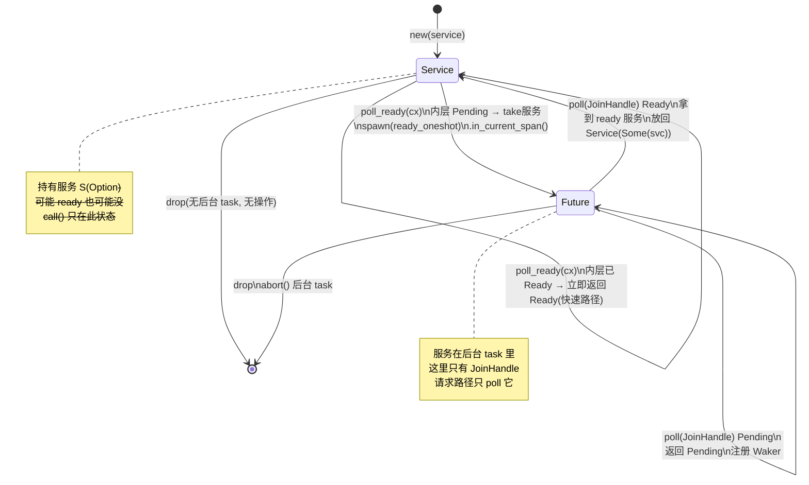
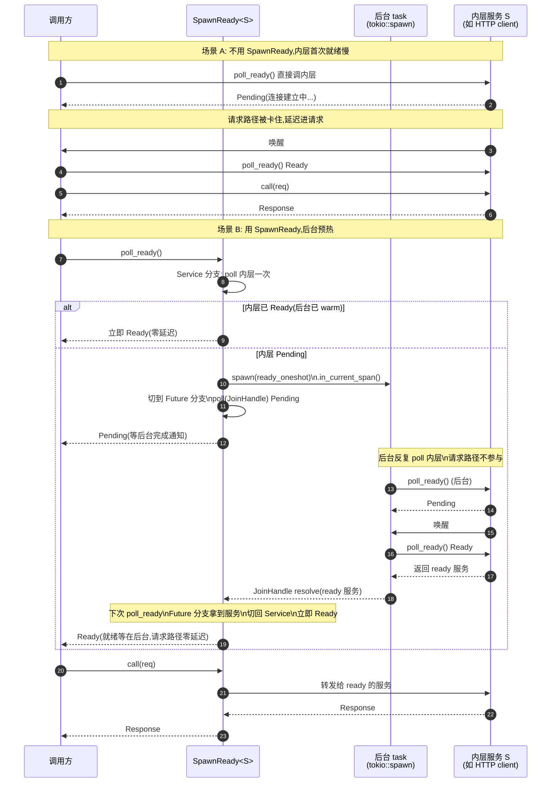

# 第 6 章 · SpawnReady:后台预热就绪

> **核心问题**:很多底层服务(数据库连接池预热、HTTP 连接建立、TLS 握手)的"就绪"是异步的,要么建立得慢、要么就绪后又会失活。如果每次请求都老老实实在请求路径上 `poll_ready` 等就绪,请求就被这个"等就绪"卡住——慢、并且把延迟叠加进了请求处理的关键路径。能不能让"就绪"这件事跑在请求路径之外,跑在一个后台 task 上反复 poll 直到内层 Ready,把就绪状态缓存住,这样真正发请求时 `poll_ready` 永远立即返回 `Ready`?

---

## 读完本章你会明白

1. 为什么 `poll_ready` 是请求处理**关键路径上**的卡点,以及"就绪异步"这件事到底有多普遍(从 TCP 握手到数据库连接池,几乎每一个真实的下游服务都是异步就绪)。
2. Tokio 的 `spawn`/`JoinHandle`/task 调度如何支撑"把一个 Future 挪到后台跑"这件事,以及 Tower 怎么把 `ready_oneshot()` 这个 Future 喂给 `tokio::spawn` 让它后台反复 poll 内层服务直到 Ready。
3. `SpawnReady<S>` 这个中间件如何用一个 `Inner<S>` 枚举在 `Service` 与 `Future(JoinHandle)` 两个状态间自驱切换,实现"就绪状态机",以及它为什么 `sound`:后台 task 不泄漏(`Drop` 里 `abort`)、tracing span 正确传播(`in_current_span()`)、就绪状态不丢失(`JoinHandle` 返回 ready 的服务本身)。
4. `SpawnReady` 和上一章的 `Buffer` 各自解决什么不同的问题——前者解决"就绪是异步的、不想阻塞请求路径",后者解决"服务是 `!Clone` 的、想在多 task 间共享",二者常配合(`Buffer` 内层套 `SpawnReady`),不要混淆。

> **逃生阀**:如果你对 Tokio 的 `spawn`/`JoinHandle`/task 生命周期、`Future`/`Poll`/`Waker`、`Pin` 这套机制完全陌生,本章默认你已经读过《Tokio》——这些机制在《Tokio》里已拆透,本章只承接、不重讲。本章的篇幅全部留给 `SpawnReady` 独有的东西:为什么要把 `poll_ready` 移到后台、后台 task 怎么反复 poll 内层、就绪状态怎么缓存、tracing span 怎么传播、与 `Buffer` 怎么区分。迷路时回到本章一句话点破。

---

## 章首 · 一句话点破

> **一句话:`SpawnReady` 干的事,是把 `poll_ready` 这个"等就绪"的等待,从请求路径上挪到一个后台 task 上去,后台 task 反复 poll 内层服务直到 Ready,然后把"ready 的那个服务本身"通过 `JoinHandle` 还回来——这样请求路径上的 `poll_ready` 永远只做一件事:看后台 task 完没完成,完成了就立即 Ready。**

这是结论,不是理由。本章倒过来拆:先看 `poll_ready` 为什么是请求路径上的卡点(第一节),再看 Tokio 的 `spawn` 怎么支撑"把等待挪到后台"(第二节),然后看 `SpawnReady` 怎么把这两件事拼起来(第三节),最后用源码钉死每个细节(第四节 + 技巧精解)。

---

## 第一节:`poll_ready` 是请求路径上的卡点,而且就绪往往是异步的

### 1.1 回到 `poll_ready` 的语义:它不是"检查",它是"等"

在第 2 章(P1-02)里我们已经讲透:`Service::poll_ready(&mut self, cx)` 不是"看一眼服务 ready 没有"的辅助函数,它是**背压的核心机制**——服务满载时返回 `Poll::Pending`,把 Waker 注册到 `cx` 里,等资源可用时被唤醒;只有 `poll_ready` 返回 `Poll::Ready(Ok(()))` 之后,你才能 `call(req)` 发请求,而且 `call` 会**消费**就绪状态(下一个请求要重新 `poll_ready`)。

这里有一个被反复忽视的事实:**`poll_ready` 是请求处理关键路径的一部分**。一个请求从进来到被处理,正常的流程是:

```
请求进来 → poll_ready(等就绪) → call(发请求) → Future(等响应)
```

`poll_ready` 和 `call`、和 `Future::poll`,是**同一条关键路径上的三段**。`poll_ready` 慢,请求就慢;`poll_ready` 阻塞,请求就阻塞。

> **钉死这件事**:`poll_ready` 不是请求处理的"前置检查",它是请求处理本身的第一段。它的延迟直接叠加进请求的端到端延迟。

### 1.2 "就绪是异步的"这件事有多普遍

那 `poll_ready` 什么时候会返回 `Pending`?——只要服务"还没准备好接受下一个请求"就会。而"没准备好"在真实世界里**到处都是**,而且几乎都是异步的:

- **TCP 连接建立**:一个 HTTP client 内部维护连接池,池里没有空闲连接时,要么新建一个(走 TCP 三次握手 + TLS 握手,几十到几百毫秒),要么等别人释放连接。这期间 `poll_ready` 一直 `Pending`。新建连接这件事,本质是一个异步的 `connect()` Future,它没完成之前,client 的 `poll_ready` 就返回 `Pending`。
- **数据库连接池预热**:tokio-postgres / sqlx 的连接池,池里初始可能是空的,或者连接正在被别的请求占用。请求来了,池子要么现建一个连接(TCP + 认证 + 协议握手,上百毫秒),要么排队等。`poll_ready` 在这期间都是 `Pending`。
- **TLS 握手**:即使 TCP 连上了,TLS 握手本身是多个 round-trip,握手没完成连接不可用,`poll_ready` 一直 `Pending`。
- **HTTP/2 的流控**:HTTP/2 多路复用,但并发流数有上限(`SETTINGS_MAX_CONCURRENT_STREAMS`),流满了就得等别人结束,client 的 `poll_ready` 返回 `Pending`。
- **限流中间件自己**:`ConcurrencyLimit` 内部的 `poll_ready` 要 `acquire` 一个 Semaphore permit,permit 不够就 `Pending`(见第 9 章)。`RateLimit` 的 `poll_ready` 要扣令牌,令牌不够也 `Pending`(见第 10 章)。这些"中间件自己制造的 Pending",层层叠加。
- **连接断线重连的瞬间**:连接刚断、重连还没完成,`poll_ready` 一直 `Pending`。

> **钉死这件事**:`poll_ready` 返回 `Pending` 不是异常情况,它是真实世界的常态。从 TCP 握手到数据库池,几乎每一个真实的下游服务,就绪都是异步的。`poll_ready` 的 `Pending` 就是"异步就绪"这件事在 Service trait 里的投影。

### 1.3 那为什么"每次请求都阻塞在 `poll_ready` 上"是个问题?

问题不在于 `poll_ready` 会 `Pending`——这是必要的背压。问题在于:**如果这个"等就绪"发生在请求路径上,它就吃进了请求的端到端延迟**。

考虑一个典型场景:你的 axum handler 调一个下游 HTTP client。这个 client 第一次启动时连接池是空的,第一个请求来了:

1. handler 被 axum 包成 Future 调度。
2. handler 里 `client.get(url).send()` → 内部 `client.poll_ready()` 发现没空闲连接 → `Pending`,注册 Waker。
3. 后台 `connect()` Future 在跑,跑完后唤醒 Waker。
4. handler 继续,`poll_ready` 这次 `Ready`,`call` 发请求,等响应。

看起来没问题?——但注意:**这个"等 connect"的延迟,完全压在了这一个请求身上**。如果 connect 要 100ms,这个请求就比"连接池已 warm"的请求慢 100ms。而且,如果连接池需要预热(比如建几个连接备着),你不可能让前几个请求每个都付一遍 connect 的成本。

更糟的是,有些服务的"就绪"是**反复的**:连接被 reset 了要重连、池子里连接被借走要等归还、HTTP/2 流满了要等流释放。这些"等"如果在请求路径上,每个请求都可能撞上一次。

> **不这样会怎样**:如果不把"等就绪"挪走,每个请求都得在请求路径上付一遍 `poll_ready` 的等待成本。连接建立慢的请求慢、池子冷的请求慢、断线重连的瞬间所有请求都慢。`poll_ready` 的 `Pending` 变成了请求延迟的一部分,而不是"后台慢慢 warm 起来"的事。

### 1.4 一个朴素但不行的办法:在 `poll_ready` 里 `await`

有人可能会想:那我直接在 `poll_ready` 里 `await` 内层的 `ready()` Future 不就行了?——这有两个根本错误:

**第一,`poll_ready` 不能 `await`**。`poll_ready` 的签名是 `fn poll_ready(&mut self, cx: &mut Context<'_>) -> Poll<...>`,它是一个同步的、被 executor 反复 poll 的函数,不是 async fn。在里面 `await` 会阻塞整个 executor 线程(Tokio 的协作式调度不允许 blocking,而且 `poll` 函数里 `.await` 在 Rust 里根本写不出来——`poll` 函数不是 async)。你只能"返回 `Pending`,等被再次 poll",这正是 `poll_ready` 本来的语义。

**第二,就算能 `await`,它还是在请求路径上**。`await` 只是把"等"包装了一下,等的还是同一个东西,延迟还是压在这个请求上。

> **所以这样设计**:真正解决这个问题的,不是"在请求路径上把就绪等出来",而是"把'等就绪'这件事整体挪出请求路径"——挪到一个独立的后台 task 上去,让后台 task 反复 poll 内层服务直到 Ready,然后把"已 ready 的服务"缓存住,请求路径上的 `poll_ready` 永远只看这个缓存:ready 了立即 Ready,没 ready 就等后台 task 的完成通知。这就是 `SpawnReady` 的全部思想。

但在讲 `SpawnReady` 怎么做之前,我们要先看 Tokio 给我们提供了什么"把一个 Future 挪到后台跑"的机制——这是承接《Tokio》的部分,一句话带过,篇幅全留 `SpawnReady` 怎么用它。

---

## 第二节:Tokio 的 `spawn` 怎么支撑"把等待挪到后台"

### 2.1 `tokio::spawn`:把一个 Future 挪到后台 task 上跑

`SpawnReady` 的后台机制,底座是 `tokio::spawn`。这件事《Tokio》已经拆透——`tokio::spawn(fut)` 做的事是:把 `fut` 包成一个 task,扔进 Tokio runtime 的调度队列,立即返回一个 `JoinHandle<T>`(`T` 是 `fut` 的输出类型);这个 task 此后由 runtime 的 worker 线程调度、反复 poll `fut`,直到 `fut` 返回 `Ready`,`JoinHandle` 才 resolve。

> **承接《Tokio》[[tokio-source-facts]]**:`tokio::spawn` 的内部机制——task 怎么进队列、怎么被 worker poll、`JoinHandle` 怎么存 task 的输出、task 的状态位怎么流转、`abort()` 怎么把 task 标记为 cancelled——这些《Tokio》P-xx 已逐字拆透,本书一句带过,不重复。你只需要记住:`tokio::spawn(fut)` = 把 `fut` 后台跑,`JoinHandle` 是你拿回结果的"收据"。

对 `SpawnReady` 来说,关键不是 `spawn` 怎么实现的,而是:**`spawn` 让我们能拿到一个 `JoinHandle<S>`,这个 `JoinHandle` 在后台 task 把内层服务 poll 到 Ready 后会 resolve 成那个 ready 的服务 `S` 本身**。这就是"把就绪状态从后台搬回请求路径"的通道。

### 2.2 `JoinHandle` 是个 Future,可以 `poll`

`JoinHandle<T>` 实现了 `Future<Output = Result<T, JoinError>>`(注意是 `Result`,因为 task 可能被 `abort`,被 abort 的 task 的 `JoinHandle` resolve 成 `Err(JoinError)`)。这意味着 `SpawnReady` 的 `poll_ready` 可以直接 `poll` 这个 `JoinHandle`:后台 task 没完成就 `Pending`,完成了就拿到 ready 的服务。

这正是 `SpawnReady` 把"等就绪"从请求路径挪到后台的**核心机制**:

- 请求路径上的 `poll_ready` 只 poll `JoinHandle`,**不 poll 内层服务**。
- poll 内层服务的工作,全在后台 task 里(`tokio::spawn` 出去的那个 Future)。
- 后台 task 拿到 ready 的服务后,`JoinHandle` resolve,请求路径上的 `poll_ready` 这次 poll 就拿到结果(ready 的服务),返回 `Ready`。

> **钉死这件事**:`JoinHandle` 既能让你"启动"后台 task(`spawn` 返回它),又能让你"等"后台 task 完成(它自己是 Future)。`SpawnReady` 靠它把"后台 poll 内层"和"前台返回 Ready"这两件事接到一起。

### 2.3 后台 task 里 poll 的是什么:`ready_oneshot()`

后台 task 里要 poll 的 Future 是什么?是 `svc.ready_oneshot()`。这是 `ServiceExt` 提供的一个组合子(第 4 章 P1-04 讲过 `ServiceExt`),它把一个 `Service` 包成一个 `Future<Output = Result<S, E>>`——这个 Future 内部反复 `poll_ready`,Ready 之后**返回服务本身**(`Ok(self)`),并把就绪状态带出来。

我们已经在源码里核实过 `ready_oneshot` 的实现(`tower/src/util/ready.rs#L37-L52`):

```rust
// tower/src/util/ready.rs:37-52(逐字摘录)
impl<T, Request> Future for ReadyOneshot<T, Request>
where
    T: Service<Request>,
{
    type Output = Result<T, T::Error>;

    fn poll(mut self: Pin<&mut Self>, cx: &mut Context<'_>) -> Poll<Self::Output> {
        ready!(self
            .inner
            .as_mut()
            .expect("poll after Poll::Ready")
            .poll_ready(cx))?;

        Poll::Ready(Ok(self.inner.take().expect("poll after Poll::Ready")))
    }
}
```

这就是 `ready_oneshot` 的全部:反复 poll 内层 `poll_ready`,Ready 后 `take()` 出服务本身,作为 Future 的输出返回。它为什么返回服务本身?因为 `poll_ready` 的 Ready 状态是**会被 `call` 消费**的(P1-02 讲过),返回服务本身意味着"这个服务现在 ready,你可以直接拿去 `call`,而且只这一次"。

> **钉死这件事**:`ready_oneshot()` 是一个"poll 到 ready,把 ready 的服务吐出来"的 Future。`SpawnReady` 后台 task 跑的就是它。后台 task 跑完,`JoinHandle` resolve 成那个 ready 的服务,前台 `poll_ready` 拿到它,放进自己的 `Inner::Service` 状态,后续 `call` 就能直接用。

### 2.4 把"就绪"挪到后台 = 把延迟从请求路径上剥离

到这里,整套机制已经成型:

- **后台 task**:`tokio::spawn(svc.ready_oneshot())` —— runtime 反复 poll 它,它内部反复 poll 内层 `poll_ready`,Ready 后吐出 ready 的服务。
- **前台 `poll_ready`**:只 poll `JoinHandle`,JoinHandle 没 resolve 就 `Pending`(此时请求路径上没有真正在等内层就绪,等的是后台 task 完成的通知);JoinHandle resolve 后拿到 ready 的服务,立即 `Ready`。
- **就绪状态**:ready 的服务从前台 `poll_ready` 拿到 `JoinHandle` 的输出里出来,放回 `Inner::Service` 状态,供 `call` 使用。

注意这里的关键:**"等内层就绪"这件事,完全发生在后台 task 里**。请求路径上的 `poll_ready` 只是在等"后台 task 完没完成"的通知,而不是在等"内层服务 ready 没"。这两个"等"看起来都是 `Pending`,但本质不同:

- 不用 `SpawnReady`:请求路径 `poll_ready` 等的是内层 connect 完成、池子有连接、TLS 握手完——这些慢操作的延迟直接进请求。
- 用 `SpawnReady`:请求路径 `poll_ready` 等的是后台 task 完成——而后台 task 可能在请求来之前就已经跑完了(连接早 warm 好),此时 `JoinHandle` 立即 resolve,请求路径 `poll_ready` 立即 `Ready`,**就绪等待零延迟**。

> **所以这样设计**:`SpawnReady` 把"poll 内层服务直到 Ready"封装成一个 `ready_oneshot()` Future,`tokio::spawn` 到后台,前台只 poll `JoinHandle`。这样,就绪等待的延迟,从"每次请求都付"变成了"后台 warm 一次,之后请求路径上几乎零成本"。这正是"后台预热"的精髓。

下面我们看 `SpawnReady` 怎么用代码落地这套思想。

---

## 第三节:`SpawnReady<S>` 的设计:一个 `Inner<S>` 枚举自驱的状态机

### 3.1 数据结构:一个枚举承载两种状态

`SpawnReady<S>` 的核心数据结构极其精简——一个 `Inner<S>` 枚举,两种状态([`spawn_ready/service.rs#L17-L25`](../tower/tower/src/spawn_ready/service.rs#L17-L25)):

```rust
// tower/src/spawn_ready/service.rs:17-25(逐字摘录)
#[derive(Debug)]
pub struct SpawnReady<S> {
    inner: Inner<S>,
}

#[derive(Debug)]
enum Inner<S> {
    Service(Option<S>),
    Future(tokio::task::JoinHandle<Result<S, BoxError>>),
}
```

这两个状态,对应了"就绪状态机"的两个阶段:

- **`Service(Option<S>)`**:当前持有一个内层服务 `S`(`Option` 是为了能 `take()` 出来)。这个服务可能是"还没 poll 过 ready 的"(刚 `new` 出来、或者上一次 `call` 之后又重新放进来一个),也可能是"已经 ready 的"(后台 task 跑完还回来的)。
- **`Future(JoinHandle<Result<S, BoxError>>)`**:当前没有持有服务本身(服务被 `take()` 走扔给后台 task 了),而是持有一个后台 task 的 `JoinHandle`,这个 task 正在后台 poll 内层服务直到 Ready。

> **钉死这件事**:`SpawnReady` 的全部状态就是一个枚举的两个分支。`Service` 分支 = 持有服务、可能需要 poll ready 或已经 ready;`Future` 分支 = 服务被挪到后台 task 了,这里只剩 `JoinHandle` 这个"收据"。整个 `poll_ready` 就是在这两个分支之间切换。

### 3.2 `poll_ready`:在两个分支间 loop 切换

`SpawnReady` 的 `poll_ready` 是整套机制的灵魂,而且很短([`spawn_ready/service.rs#L59-L78`](../tower/tower/src/spawn_ready/service.rs#L59-L78)):

```rust
// tower/src/spawn_ready/service.rs:59-78(逐字摘录)
fn poll_ready(&mut self, cx: &mut Context<'_>) -> Poll<Result<(), BoxError>> {
    loop {
        self.inner = match self.inner {
            Inner::Service(ref mut svc) => {
                // 先快速 poll 一次内层,看是不是已经 ready 了
                if let Poll::Ready(r) = svc.as_mut().expect("illegal state").poll_ready(cx) {
                    return Poll::Ready(r.map_err(Into::into));
                }
                // 没 ready,把服务 take 出来,spawn 后台 task 反复 poll
                let svc = svc.take().expect("illegal state");
                let rx = tokio::spawn(
                    svc.ready_oneshot().map_err(Into::into).in_current_span()
                );
                Inner::Future(rx)
            }
            Inner::Future(ref mut fut) => {
                // 后台 task 跑完了?把 ready 的服务拿回来,切回 Service 分支
                let svc = ready!(Pin::new(fut).poll(cx))??;
                Inner::Service(Some(svc))
            }
        };
    }
}
```

我们逐段拆。

**`loop { ... }`**:这是个无限循环。为什么 loop?因为这个状态机可能在一个 `poll_ready` 调用里走完多个状态转换(比如 `Service` 分支 spawn 出 `Future` 分支后,下一轮 loop 立刻进 `Future` 分支 poll 一次)。loop 让状态机在单次 `poll_ready` 调用里能自驱到能 return 的状态(要么 `Ready` 返回,要么 `Pending` 返回)。注意每个分支要么 return,要么赋值 `self.inner` 进入下一轮 loop——不会有死循环(下面分析)。

**`Inner::Service(ref mut svc)` 分支**:当前持有服务。
- **先快速 poll 一次**:`svc.as_mut().expect("illegal state").poll_ready(cx)`。这一步是"投机"——万一内层本来就 ready 了呢(比如连接池早就 warm 了)?如果 `Poll::Ready(r)`,直接 return `Poll::Ready(r.map_err(Into::into))`,`poll_ready` 立即完成,**根本不 spawn 后台 task**。这是 `SpawnReady` 的快速路径:内层已经 ready 时零开销。
- **没 ready 才 spawn**:`svc.take()` 把服务从 `Option` 里拿出来(`take()` 之后 `Option` 是 `None`,但因为马上要整体替换 `self.inner`,这个 `None` 不会被看到)。然后 `tokio::spawn(svc.ready_oneshot().map_err(Into::into).in_current_span())` 把"poll 到 ready"这件事扔到后台。返回 `Inner::Future(rx)`,赋值给 `self.inner`,进入下一轮 loop。

**`Inner::Future(ref mut fut)` 分支**:当前持有 `JoinHandle`,服务在后台。
- `ready!(Pin::new(fut).poll(cx))`:`ready!` 宏(来自 `futures_core`)展开是"poll 一次,如果是 `Pending` 就 `return Poll::Pending`,如果是 `Ready(x)` 就把 `x` 取出来继续"。这里 poll 的是 `JoinHandle`,它的输出是 `Result<Result<S, BoxError>, JoinError>`(外层 `Result` 是 task 是否被 abort,内层 `Result` 是 `ready_oneshot` 的输出)。所以两个 `?`:`ready!(...)??` —— 第一个 `?` 处理 `JoinError`(task 被 abort,往上抛),第二个 `?` 处理内层 `ready_oneshot` 的 `Err`(内层 `poll_ready` 返回了错误,往上抛)。
- **后台 task 跑完了**:`ready!` 取出 `svc`(ready 的服务),`Inner::Service(Some(svc))`,赋值给 `self.inner`,进入下一轮 loop。下一轮 loop 会进 `Service` 分支,快速 poll 一次(此时内层肯定 ready,因为后台 task 已经把它 poll ready 了),立即 `Ready` 返回。

> **钉死这件事**:`poll_ready` 是一个两分支状态机的自驱循环。`Service` 分支负责"投机快速 poll + 没 ready 就 spawn 后台";`Future` 分支负责"等后台完成 + 把 ready 服务拿回来"。两个分支配合,实现了"就绪等在后台、前台只看 JoinHandle 完没完成"。

### 3.3 为什么不会死循环

仔细看这个 loop:每一轮要么 return(两个分支都可能 return),要么赋值一个**不同的** `Inner` 变体给 `self.inner`。

- `Service` 分支:要么 return(快速路径 Ready,或 `poll_ready` 报错),要么 spawn 出 `Future` 变体。
- `Future` 分支:要么 `ready!` 返回 `Pending`(整个 `poll_ready` return `Pending`),要么拿到服务切回 `Service` 变体。

关键在 `Future` 分支切回 `Service` 后的**下一轮 `Service` 分支**:此时内层服务是后台 task poll 到 ready 才还回来的,所以 `Service` 分支的 `poll_ready(cx)` 这次必然返回 `Poll::Ready(Ok(()))`(后台已经把它 poll ready 了),立即 return。

唯一可能"切回 Service 又没 ready"的情况:后台 task 跑完还回来的服务,在 `poll_ready` 再次被调用时又变得不 ready 了——但这恰好是 `SpawnReady` 要处理的"就绪反复"场景(连接 reset、池子又空了),此时 `Service` 分支会再 spawn 一个后台 task,继续循环。这不是死循环,这是**正确处理"就绪状态会过期"**。

> **为什么 sound**:loop 不会死循环,因为每次状态转换要么立即 return,要么进入一个有进展的分支(spawn 出新 Future,或拿到 ready 服务)。最坏情况是"内层反复不 ready"——但那是真实场景(连接池一直没连接),此时 `poll_ready` 会通过 `Future` 分支的 `ready!` 返回 `Pending`,把 Waker 注册到 `JoinHandle` 上,等后台 task 完成再被唤醒。这是正确的背压传播,不是死循环。

### 3.4 `call`:只有 `Service` 分支才能 call

`call` 极其简单([`spawn_ready/service.rs#L80-L87`](../tower/tower/src/spawn_ready/service.rs#L80-L87)):

```rust
// tower/src/spawn_ready/service.rs:80-87(逐字摘录)
fn call(&mut self, request: Req) -> Self::Future {
    match self.inner {
        Inner::Service(Some(ref mut svc)) => {
            ResponseFuture::new(svc.call(request).map_err(Into::into))
        }
        _ => unreachable!("poll_ready must be called"),
    }
}
```

只有在 `Inner::Service(Some(...))` 状态下才能 `call`——也就是"持有 ready 的服务"。`Future` 分支(服务在后台)下 `call` 直接 `unreachable!("poll_ready must be called")`,因为 Service trait 的契约是"必须先 `poll_ready` 返回 Ready 才能 `call`",而 `poll_ready` 只有在 `Service` 分支(且内层已 ready)才会 return Ready,所以合法的 `call` 一定在 `Service` 分支。

注意 `call` 调用的是 `svc.call(request)`——**直接转发给内层 ready 的服务**,没有任何额外包装(除了把 error 类型 `Into::into` 成 `BoxError`)。`ResponseFuture` 只是一个 `opaque_future!` 包了一层的 `MapErr`(见第四节技巧精解),不是逻辑包装。

> **钉死这件事**:`SpawnReady` 的 `call` 是个透传。它把请求直接交给内层 ready 的服务,自己不做任何额外处理。`SpawnReady` 的全部价值都在 `poll_ready`(把就绪等待挪到后台),`call` 只是"既然 ready 了,那就转发"。

### 3.5 `Drop`:后台 task 不泄漏

最后,一个被很多读者忽略但极其重要的细节——`SpawnReady` 的 `Drop` 实现([`spawn_ready/service.rs#L41-L47`](../tower/tower/src/spawn_ready/service.rs#L41-L47)):

```rust
// tower/src/spawn_ready/service.rs:41-47(逐字摘录)
impl<S> Drop for SpawnReady<S> {
    fn drop(&mut self) {
        if let Inner::Future(ref mut task) = self.inner {
            task.abort();
        }
    }
}
```

如果 `SpawnReady` 被销毁时正处在 `Future` 分支(后台 task 还在跑),`Drop` 会 `task.abort()`——把后台 task 取消掉。这至关重要:

- **不 abort 会泄漏**:如果不 abort,后台 task 会继续跑(它的 `JoinHandle` 被丢弃了,但 task 本身还在 runtime 队列里),它会继续 poll 内层服务直到 Ready,然后……没地方还回去(`JoinHandle` 已经被 drop,结果丢失)。这是个泄漏的 task,占 runtime 资源。
- **abort 干净**:abort 立即标记 task 为 cancelled,它的 `JoinHandle` 会 resolve 成 `Err(JoinError)`,task 被回收。内层服务 `S` 也会被 drop(它在后台 task 的 Future 里,task 被 abort 时 Future 被 drop,内部的 `S` 跟着 drop)。

> **为什么 sound**:`SpawnReady` 不会泄漏后台 task。`Drop` 里 `abort()` 保证了 `SpawnReady` 销毁时,后台 task 也跟着结束,内层服务被正确清理。这是 Rust RAII 的标准操作,但 Tower 显式写出来,说明这是个深思熟虑的设计——后台 task 的生命周期必须和 `SpawnReady` 绑定。

---

## 第四节:源码佐证 + tracing span 传播 + 与 Buffer 的对照

### 4.1 完整源码回顾:三个文件,总共不到 90 行

`SpawnReady` 的全部源码分布在三个文件(`spawn_ready/{mod,service,future,layer}.rs`),核心逻辑在 `service.rs` 的 88 行里。这是 Tower 里最精简的中间件之一——精简到你可以一口气读完。

完整结构:

| 文件 | 行数 | 内容 |
|---|---|---|
| [`spawn_ready/mod.rs`](../tower/tower/src/spawn_ready/mod.rs#L1-L10) | 10 行 | 模块声明 + `pub use` 导出 `SpawnReady`/`SpawnReadyLayer` |
| [`spawn_ready/service.rs`](../tower/tower/src/spawn_ready/service.rs#L1-L88) | 88 行 | `SpawnReady<S>` 结构体、`Inner<S>` 枚举、`Service` impl、`Drop` impl |
| [`spawn_ready/future.rs`](../tower/tower/src/spawn_ready/future.rs#L1-L8) | 8 行 | `ResponseFuture` 类型别名(`opaque_future!` 包 `MapErr`) |
| [`spawn_ready/layer.rs`](../tower/tower/src/spawn_ready/layer.rs#L1-L19) | 19 行 | `SpawnReadyLayer`(零字段 Layer) |

加起来 125 行(含注释和空行),去掉注释空行核心逻辑不到 60 行。这就是"把就绪等在后台"的全部实现——精简到令人发指,但每一步都精确。

> **钉死这件事**:`SpawnReady` 的实现极其精简(核心逻辑 60 行),但精确地解决了"就绪异步 + 不想阻塞请求路径"这个问题。精简不等于简单——每一行都在为"sound"服务(状态机自驱、Drop abort、tracing span 传播)。

### 4.2 tracing span 传播:`in_current_span()` 这一招

回看 `poll_ready` 里 spawn 后台 task 的那一行([`spawn_ready/service.rs#L69`](../tower/tower/src/spawn_ready/service.rs#L69)):

```rust
let rx = tokio::spawn(svc.ready_oneshot().map_err(Into::into).in_current_span());
```

注意 `.in_current_span()`——这是 `tracing::Instrument` trait 提供的方法(`use tracing::Instrument;` 在文件开头第 11 行导入)。它做的事:把**当前线程当前的 tracing span**绑定到这个 Future 上,这样这个 Future 被后台 task poll 时,它内部发出的 tracing 日志会带上"spawn 它的那个调用方的 span"。

为什么这一招至关重要?

**问题**:tracing 的 span 是 thread-local / task-local 的。`tokio::spawn` 出去的 task 是个**全新的 task**,它的 task-local context 是空的——如果不显式继承,后台 task 里所有的 tracing 日志(包括 `ready_oneshot` 内部、内层服务 `poll_ready` 里的日志)都不会带上调用方的 span,会丢失在某个无名的根 span 下。线上排查问题时,你会发现"连接建立的日志"和"发起请求的日志"对不上号,因为它们在不同的 span 树里。

**`in_current_span()` 解决**:它在 spawn 之前,把当前 span "快照"下来,绑到 Future 上。后台 task poll 这个 Future 时,会先 enter 这个 span,再执行 Future 的逻辑——于是后台 task 里所有的日志,都正确地带上了调用方的 span。线上排查时,"连接建立"和"发起请求"在同一个 span 树下,trace 完整。

> **钉死这件事**:`in_current_span()` 是 `SpawnReady` 处理"后台 task 丢失调用上下文"的标准手段。不写这一行,后台 task 的 tracing 日志会脱离调用链,分布式 trace 会断。这是"为什么 sound"在可观测性维度的体现——不仅不能泄漏 task、不能丢就绪状态,还不能丢追踪上下文。

**对照**:这一招在 Tower 别的中间件里也常见——比如 `Buffer` 的 worker task、`ConcurrencyLimit` 等待 permit 的 Future,凡是 spawn 到后台或跨 await 点的,都要处理 span 传播。`SpawnReady` 因为直接 `tokio::spawn`,所以必须用 `in_current_span()`;`Buffer` 用 mpsc 通道转发,worker task 里处理请求时 span 通过消息(`Message`)里的 `tracing::Span` 显式传递(Tower 的 `buffer` 在 0.4 之后专门处理了这件事)。不同的中间件,不同的 span 传播手段,但目的相同:**后台/异步路径上的日志,不能脱离调用链**。

### 4.3 与 `Buffer` 的对照:解决的是两个不同的问题

`SpawnReady` 和上一章的 `Buffer` 都涉及"后台 task",初学者极易混淆。必须讲清这两个中间件解决的是**完全不同的两个问题**:

| 维度 | `Buffer<S>`(P2-05) | `SpawnReady<S>`(本章) |
|---|---|---|
| **解决什么问题** | 内层服务 `!Clone`,想在多 task 间共享一个服务实例 | 内层服务"就绪是异步的",不想让请求路径阻塞在 `poll_ready` 上 |
| **后台 task 干什么** | 持有唯一的内层服务,从 mpsc 通道收请求,逐个 `call`,把响应通过 oneshot 还回去 | 反复 `poll_ready` 内层服务直到 Ready,把 ready 的服务通过 `JoinHandle` 还回来 |
| **后台 task 生命周期** | 长期存活(和 `Buffer` 同生命周期,`Buffer` drop 时通过 `Handle` 关闭 worker) | 每次"内层不 ready"时 spawn 一个,Ready 后结束(`SpawnReady` drop 时 abort 未完成的) |
| **如何让请求路径"不阻塞"** | 请求经 mpsc 通道转发,worker 串行处理(请求路径只等自己的响应 oneshot) | 请求路径只 poll `JoinHandle`,不等内层 `poll_ready`(内层 ready 工作在后台) |
| **是否解决 Clone** | 是(`Buffer` 本身 `Clone`,克隆的是 `PollSender` 共享一个 worker) | 否(`SpawnReady<S>` 的 Clone 性取决于 `S`,它不引入共享) |
| **是否解决就绪异步** | 部分(worker 持有服务,但 worker 自己 poll_ready 的等待还是在请求路径上,通过 mpsc 排队体现) | 是(这是它的唯一职责) |

**关键区分**:
- `Buffer` 的核心是**共享一个 `!Clone` 服务**——通过 worker task + mpsc,让多个调用方共享一个服务实例,请求被序列化进 worker。它解决的是"我想 Clone 这个 Service 但内层不能 Clone"。
- `SpawnReady` 的核心是**把就绪等待挪出请求路径**——通过 spawn 后台 task 反复 `poll_ready`,让请求路径上的 `poll_ready` 只等"后台完没完成"而不等"内层 ready 没"。它解决的是"内层就绪慢,不想让每个请求都付这个延迟"。

> **钉死这件事**:`Buffer` 解决 `!Clone`,`SpawnReady` 解决"就绪异步"。这是两个正交的问题。一个服务可能既 `!Clone` 又就绪慢(比如持数据库连接的服务),这时你需要两个中间件配合。

### 4.4 二者常配合:`Buffer<SpawnReady<S>>` 或 `SpawnReady` 内层套需要预热的

正因为两个问题正交,实际工程里它们常配合。一个典型组合:`Buffer` 外层 + `SpawnReady` 内层。为什么这么套?

考虑一个持数据库连接的服务 `DbService`。它:
- **`!Clone`**(连接不能 Clone,持有 tokio-postgres 的 `Client`)。
- **就绪异步**(池子里没空闲连接时,`poll_ready` 要等连接建立或归还,几百毫秒)。

如果你只套 `Buffer`:多个调用方共享一个 `DbService`,但 worker task 自己 `poll_ready` 还是会等连接(等的时候 worker 不处理别的请求,请求在 mpsc 里排队)。就绪等待没被挪走,只是从"每个调用方等"变成了"worker 替大家等"。

如果你只套 `SpawnReady`:`poll_ready` 的等待被挪到后台了,但 `SpawnReady<DbService>` 还是 `!Clone`(因为 `DbService` `!Clone`,`SpawnReady` 没引入 Clone 机制),多 task 间不能共享。

**配合**:`Buffer<SpawnReady<DbService>>`(或反过来,看语义)。外层 `Buffer` 解决共享(`Clone`),内层 `SpawnReady` 解决就绪异步(后台预热)。这样:
- 多个调用方 Clone 外层 `Buffer`,共享一个 worker。
- worker 持有 `SpawnReady<DbService>`,它的 `poll_ready` 会把 `DbService` 的就绪等待挪到后台 task。
- 请求路径上,worker 处理请求时,`SpawnReady` 的 `poll_ready` 立即 Ready(因为后台早 warm 好了),`call` 直接转发。

> **钉死这件事**:`Buffer` 和 `SpawnReady` 不是替代关系,是配合关系。`Buffer` 管"共享一个 `!Clone` 服务",`SpawnReady` 管"把就绪等在后台"。真实服务往往两个问题都有,两个中间件一起用。这个区分,是读懂 Tower 背压类中间件的关键。

下面进入技巧精解,把本章最硬核的两个技巧单独拆透。

---

## 技巧精解

### 技巧一:`Inner<S>` 枚举状态机 + `loop` 自驱——为什么这是 Rust 异步里"挪到后台"的优雅写法

`SpawnReady` 的 `poll_ready` 用一个 `Inner<S>` 枚举 + `loop` 实现了一个**自驱状态机**。这个写法在 Rust 异步里极其优雅,我们单独拆。

**朴素写法会怎样**(反面对比):如果不用枚举状态机,你可能会这么写(伪代码):

```rust
// 朴素写法(不是源码,有问题)
struct SpawnReady<S> {
    svc: Option<S>,           // 持有服务
    bg_task: Option<JoinHandle<Result<S, BoxError>>>,  // 持有后台 task
}

fn poll_ready(&mut self, cx: &mut Context<'_>) -> Poll<...> {
    // 如果有后台 task,先 poll 它
    if let Some(task) = self.bg_task.as_mut() {
        if let Poll::Ready(svc) = Pin::new(task).poll(cx) {
            let svc = svc??;
            self.svc = Some(svc);
            self.bg_task = None;
        } else {
            return Poll::Pending;
        }
    }
    // 现在肯定有 svc
    let svc = self.svc.as_mut().unwrap();
    match svc.poll_ready(cx) {
        Poll::Ready(r) => {
            return Poll::Ready(r.map_err(Into::into));
        }
        Poll::Pending => {
            // spawn 后台 task
            let svc = self.svc.take().unwrap();
            let task = tokio::spawn(svc.ready_oneshot().map_err(Into::into).in_current_span());
            self.bg_task = Some(task);
            return Poll::Pending;  // 这次返回 Pending,下次 poll_ready 再处理
        }
    }
}
```

这个朴素写法**能跑**,但有两个问题:

1. **两个字段 + 两个 `Option`,状态空间是 4 种**(`svc` 有/无 × `bg_task` 有/无),但合法状态只有 2 种(有 svc 无 task / 无 svc 有 task)。多出来的 2 种(两个都有 / 两个都无)是**非法状态**,你得用 `unwrap`/注释保证它们不出现——这是状态管理的负担,容易写出 bug。
2. **spawn 后台 task 那次必须 `return Poll::Pending`**,因为朴素写法里 spawn 之后没法立即继续 poll(下一轮 poll_ready 才处理)。这意味着即使后台 task 立即完成(比如内层其实 ready 得很快,只是第一次 poll 没赶上),请求方也得等下一次被 poll 才能拿到结果——多一次调度延迟。

**源码的枚举状态机怎么解决**:

```rust
// 源码写法(service.rs:22-25, 59-78)
enum Inner<S> {
    Service(Option<S>),
    Future(JoinHandle<Result<S, BoxError>>),
}

fn poll_ready(&mut self, cx: &mut Context<'_>) -> Poll<...> {
    loop {
        self.inner = match self.inner {
            Inner::Service(ref mut svc) => {
                if let Poll::Ready(r) = svc.as_mut().expect("illegal state").poll_ready(cx) {
                    return Poll::Ready(r.map_err(Into::into));
                }
                let svc = svc.take().expect("illegal state");
                let rx = tokio::spawn(svc.ready_oneshot().map_err(Into::into).in_current_span());
                Inner::Future(rx)  // 切到 Future 分支,下一轮 loop 处理
            }
            Inner::Future(ref mut fut) => {
                let svc = ready!(Pin::new(fut).poll(cx))??;
                Inner::Service(Some(svc))  // 切回 Service 分支,下一轮 loop 处理
            }
        };
    }
}
```

它解决了朴素写法的两个问题:

1. **枚举把状态空间收紧到正好 2 种**:`Inner` 是枚举,要么 `Service` 要么 `Future`,不可能同时持有两个或两个都没有。状态空间从 4 种收紧到 2 种,非法状态在类型层面就不存在——这是 Rust 枚举相比"两个 Option 字段"的根本优势。`expect("illegal state")` 只在"poll after Ready"这种调用方违约时触发,不是状态管理的负担。

2. **`loop` 让状态机自驱**:spawn 出 `Future` 分支后,**不立即 return Pending**,而是进入下一轮 loop,立即 poll 一次 `JoinHandle`。如果后台 task 已经跑完了(比如内层 ready 得快,spawn 后 runtime 立即调度它跑完了),这一轮 poll 就能拿到 ready 的服务,切回 `Service` 分支,再下一轮 loop 立即 `Ready` 返回——**整个 `poll_ready` 在一次调用里完成,不多一次调度延迟**。只有后台 task 真的没跑完时,`ready!` 才 `return Poll::Pending`,注册 Waker 等下一次。

> **钉死这件事**:`Inner<S>` 枚举 + `loop` 自驱,是 Rust 异步里"把等待挪到后台"的优雅写法。枚举把状态空间收紧到正好合法的几种(类型层防 bug),loop 让状态机在单次 poll 调用里自驱到能 return 的状态(避免多余的调度延迟)。这个模式在 Tower 里反复出现(Buffer 的 worker、Retry 的重试循环、Hedge 的双 Future select),读懂 `SpawnReady` 这一个,就读懂了一类。

**对照别的系统**:
- **Tokio 自己**:`tokio::spawn` 返回的 `JoinHandle` 本身就是个状态机(Pending → Ready/Cancelled),但那是 Tokio 内部用 task 状态位实现的(见《Tokio》),Tower 在更上层用枚举包装它,加了"快速 poll 内层"的投机逻辑。
- **Go**:Go 的 goroutine + channel 也能"挪到后台",但 Go 没有"poll + Waker"这套,它用的是 channel 阻塞/唤醒。Go 里要做类似 `SpawnReady` 的事,大概是一个 goroutine 反复 `select { case <-ready: ... }`,但 Go 的 channel 是运行期的,Tower 的枚举是编译期的——类型层面的状态收紧,Go 做不到。
- **hyper**:hyper 删了 `poll_ready`(见《hyper》P1-02),它的就绪管理挪到了协议层(H1 的 `in_flight` 单槽、H2 的 h2 流控),所以 hyper 里**没有 `SpawnReady` 这种东西**——它的"就绪"语义被协议层吃掉了。`SpawnReady` 是 Tower 保留 `poll_ready` 后,为了处理"就绪异步"必须补上的中间件。这个对照,正好体现了"通用抽象层(Tower 保留 poll_ready)vs 协议层(hyper 删 poll_ready)"的取舍。

### 技巧二:就绪状态如何"带出来"——`ready_oneshot()` 返回服务本身的精妙

`SpawnReady` 后台 task 跑的 Future 是 `svc.ready_oneshot()`,它的输出是 `Result<S, E>`——**返回服务本身**。这个设计看似简单,实则精妙,我们单独拆。

**为什么不能返回 `()`**(反面对比):假设 `ready_oneshot()` 只负责"poll 到 ready",返回 `Result<(), E>`(就绪了就返回空 tuple),那后台 task 跑完后,`JoinHandle` resolve 成 `()`,`SpawnReady` 的 `poll_ready` 拿到 `()`……然后呢?服务 `S` 去哪了?

服务 `S` 在后台 task 里(被 `ready_oneshot` 持有),后台 task 跑完后 task 被 drop,`S` 跟着 drop——**服务被销毁了**!你拿到了"就绪通知",但服务本身没了,后面 `call` 调谁?

这就是"就绪状态会随服务销毁而丢失"的问题。`poll_ready` 的 Ready 状态不是个 bool 标志,它**绑在服务实例上**——服务没了,Ready 也没了。

**`ready_oneshot()` 返回服务本身怎么解决**:看源码([`util/ready.rs#L43-L51`](../tower/tower/src/util/ready.rs#L43-L51)):

```rust
fn poll(mut self: Pin<&mut Self>, cx: &mut Context<'_>) -> Poll<Self::Output> {
    ready!(self.inner.as_mut().expect("poll after Poll::Ready").poll_ready(cx))?;
    Poll::Ready(Ok(self.inner.take().expect("poll after Poll::Ready")))
}
```

`ready_oneshot` 内部持有一个 `Option<S>`(`inner: Option<T>`),poll 到 ready 后 `self.inner.take()`——**把服务从 Option 里 take 出来,作为 Future 的输出返回**。这样:

- 后台 task 跑完,`JoinHandle` resolve 成 `Ok(S)`(那个 ready 的服务实例)。
- `SpawnReady` 的 `poll_ready` 在 `Future` 分支拿到这个 `S`,放进 `Inner::Service(Some(svc))`。
- 后续 `call` 直接用这个 `S`(它带着 Ready 状态)。

**就绪状态随服务实例一起,从后台 task 通过 `JoinHandle` 搬回了前台**。服务没被销毁,Ready 状态也没丢。

> **钉死这件事**:`ready_oneshot()` 返回服务本身,不是返回 `()`。这个设计让"就绪状态"能随着服务实例,从后台 task 通过 `JoinHandle` 完整地搬回前台。如果返回 `()`,服务会在后台 task 销毁时被 drop,就绪状态丢失,`SpawnReady` 就没法工作。这是"为什么 sound"在状态保持维度的体现。

**这个模式的普遍性**:Tower 里"poll 到 ready 后返回服务本身"是标准操作,不止 `ready_oneshot`。`oneshot()`(发一个请求然后销毁)、`call_all`(流式调用)都依赖"ready 状态绑在服务实例上,服务实例可以被转移"这个语义。`SpawnReady` 是把这个模式用到了极致——把"poll 到 ready 的服务"通过 `JoinHandle` 跨 task 传递。

**对照 `Buffer`**:`Buffer` 不需要 `ready_oneshot`,因为 `Buffer` 的 worker **自己持有服务**,worker 在自己的 task 里 `poll_ready` + `call`,不需要把服务搬来搬去。`SpawnReady` 不同,它必须把服务从前台"借"到后台(通过 `take()`),poll ready 后再"还"回来(通过 `JoinHandle` 的输出)——因为它的设计就是"前台 `poll_ready` 不直接 poll 内层"。这个差异,正是两个中间件设计取向不同的体现。

---

## 配图

### 图 1:SpawnReady 后台预热状态机(mermaid 状态图)



### 图 2:请求时序对比(mermaid 时序图)

不使用 SpawnReady vs 使用 SpawnReady 的请求时序对比:



### 图 3:SpawnReady vs Buffer 后台 task 干的事不同(ASCII 框图)

```
┌─────────────────────────────────────────────────────────────────────┐
│                       Buffer<S>(P2-05)                              │
│                                                                     │
│   解决:!Clone 服务如何在多 task 间共享                              │
│                                                                     │
│   调用方1 ─┐                                                        │
│   调用方2 ─┼──► [mpsc 通道] ──► Worker task(持有唯一 S)            │
│   调用方3 ─┘                        │                               │
│      ↑                              ▼                               │
│      │                       Worker 反复: poll_ready(S)→call(req)  │
│      │                              │                               │
│      └──◄── [oneshot 响应] ◄────────┘                               │
│                                                                     │
│   后台 task 干什么: 持有 S,收请求,串行 call,还响应               │
│   后台 task 生命周期: 长期(和 Buffer 同生死)                      │
│   Clone 性: Buffer 本身 Clone(克隆 Sender 共享 worker)            │
└─────────────────────────────────────────────────────────────────────┘

┌─────────────────────────────────────────────────────────────────────┐
│                    SpawnReady<S>(本章)                              │
│                                                                     │
│   解决: 就绪是异步的,不想让请求路径阻塞在 poll_ready 上             │
│                                                                     │
│   调用方 ──► poll_ready() ──► [Service 分支: 投机 poll 内层一次]    │
│                                    │                                │
│                          ┌─────────┴─────────┐                      │
│                          ▼                   ▼                      │
│                     内层已 Ready        内层 Pending                 │
│                          │                   │                      │
│                  立即返回 Ready     take(S) ─► spawn(ready_oneshot) │
│                          │                   │  .in_current_span()   │
│                          │                   ▼                      │
│                          │           [后台 task: 反复 poll S        │
│                          │            直到 Ready,返回 ready 的 S]  │
│                          │                   │                      │
│                          │           JoinHandle resolve(S)         │
│                          │                   │                      │
│                          │           Future 分支: 拿到 S           │
│                          │           切回 Service,立即 Ready       │
│                          ▼                   ▼                      │
│                       call(req) ──► 转发给 ready 的 S              │
│                                                                     │
│   后台 task 干什么: 反复 poll_ready 直到 Ready,返回 ready 的 S     │
│   后台 task 生命周期: 短期(每次内层不 ready spawn 一个,Ready 后死)│
│   Clone 性: 取决于 S(SpawnReady 不引入 Clone 机制)                │
└─────────────────────────────────────────────────────────────────────┘

二者正交, 常配合: Buffer<SpawnReady<S>> 外层共享 + 内层预热
```

---

## 章末小结

### 回扣主线

本章属于**执行单元**这一面。`SpawnReady` 不动 Layer 洋葱、不动类型级 `Stack` 组合,它纯粹是在 Service trait 的**执行侧**做文章——把 `poll_ready` 这个执行环节里的"等就绪"从请求路径挪到后台 task。它和上一章的 `Buffer`、下一章的 `LoadShed`,共同构成"让 `poll_ready` 有意义"的第 2 篇背压类中间件三件套:

- `Buffer`:解决 `!Clone` 共享(让一个服务能被多 task 用)。
- `SpawnReady`(本章):解决就绪异步(让就绪等待不阻塞请求路径)。
- `LoadShed`(下一章):解决满载取舍(等还是拒绝,这是策略问题)。

三者都围绕 `poll_ready`,但各管一面。`SpawnReady` 管的是"就绪的延迟"。

**承接**:
- **承《Tokio》**:`tokio::spawn`/`JoinHandle`/task 调度/task 状态位/`abort()`/Waker 唤醒——这些《Tokio》已拆透,本章一句带过指路 [[tokio-source-facts]]。`SpawnReady` 只是用它们,不重讲它们的内部。
- **对照《hyper》**:hyper 删了 `poll_ready`,就绪管理挪到协议层(H1 in_flight/H2 流控),所以 hyper 里没有 `SpawnReady` 这种东西。`SpawnReady` 是 Tower 保留 `poll_ready` 后,为处理"就绪异步"必须补的中间件——这个对照体现了"通用抽象层 vs 协议层"的取舍,详见《hyper》P1-02。

### 五个"为什么"清单

1. **为什么 `poll_ready` 是请求路径上的卡点?** 因为它是请求处理"poll_ready → call → Future"三段的第一段,它的延迟直接进端到端延迟。`poll_ready` 返回 `Pending` 不是异常,是真实世界(连接建立、池子、TLS、流控)的常态。

2. **为什么不能在 `poll_ready` 里 `await`?** 两点:一是 `poll_ready` 不是 async fn,不能 `await`(Rust 语法不允许在 `poll` 函数里 `.await`);二是就算能,`await` 还是在请求路径上,延迟没挪走。真正解决的是把"等就绪"整体挪到独立的后台 task。

3. **为什么 `SpawnReady` 用 `tokio::spawn` 而不是 mpsc(像 Buffer)?** 因为 `SpawnReady` 不需要"序列化多个请求",它只需要"反复 poll 一个服务直到 Ready"。`spawn` 一个 `ready_oneshot()` Future,让它后台 poll,通过 `JoinHandle` 拿回 ready 的服务——这套机制最直接。`Buffer` 用 mpsc 是因为它要"多调用方共享一个 worker",诉求不同,机制不同。

4. **为什么后台 task 不泄漏?** `SpawnReady` 的 `Drop` 里 `task.abort()`——`SpawnReady` 销毁时,若处在 `Future` 分支(后台 task 还在跑),立即 abort 后台 task,task 被回收,内层服务被 drop。RAII 绑定生命周期,不泄漏。

5. **为什么 `ready_oneshot()` 返回服务本身而不是 `()`?** 因为就绪状态绑在服务实例上。返回 `()`,服务会在后台 task 销毁时被 drop,就绪状态丢失。返回服务本身,就绪状态随服务实例通过 `JoinHandle` 完整搬回前台,`call` 才能用。

### 想继续深入往哪钻

- **`SpawnReady` 源码**:[`tower/src/spawn_ready/service.rs`](../tower/tower/src/spawn_ready/service.rs)(88 行,一口气读完)、[`future.rs`](../tower/tower/src/spawn_ready/future.rs)(`opaque_future!` 的用法)、[`layer.rs`](../tower/tower/src/spawn_ready/layer.rs)(零字段 Layer)。
- **`ready_oneshot` / `ReadyOneshot`**:[`tower/src/util/ready.rs`](../tower/tower/src/util/ready.rs)——`SpawnReady` 后台 task 跑的 Future 的真身,返回服务本身的精妙。
- **`tokio::spawn` / `JoinHandle` / `abort` 内部**:见《Tokio》相关章(task 状态位、调度队列、`abort` 如何标记 cancelled)。
- **`tracing::Instrument::in_current_span`**:tracing crate(外部),了解 span 如何在 task-local context 里传播,以及 `tokio::spawn` 为什么会丢失 span。
- **配合 `Buffer`**:重读 P2-05 的 `Buffer` worker,对比 `SpawnReady` 的后台 task,体会"共享 `!Clone`"和"就绪异步"两个正交问题。
- **axum/tonic 怎么用 `SpawnReady`**:附录 B 会展开,真实框架里 `SpawnReady` 常藏在 `ServiceBuilder` 链里,用于预热下游连接。

### 引出下一章

`SpawnReady` 解决了"就绪是异步的,不想阻塞请求路径"——它把 `poll_ready` 的 `Pending` 变成了"后台慢慢 warm,前台零延迟"。但还有一种 `Pending`:`SpawnReady` 也好、`Buffer` 也好,内层真的满载时(连接池满了、并发到上限了),`poll_ready` 会一直 `Pending` 下去,请求方只能干等。

等,是一种选择;**不等,直接拒绝**,是另一种选择。什么时候该等、什么时候该拒绝?拒绝的时候返回什么?这就是下一章 `LoadShed` 要讲的事——它把 `poll_ready` 的 `Pending` 翻成一个 `Overloaded` 错误,主动丢请求保系统。我们下一章见。

---

> 本章源码引用(均已 Grep/Read 核实,版本 `tower @ tower-0.5.2 / 7dc533e`):
> - [`tower/src/spawn_ready/mod.rs#L1-L10`](../tower/tower/src/spawn_ready/mod.rs#L1-L10) —— 模块声明与导出
> - [`tower/src/spawn_ready/service.rs#L17-L25`](../tower/tower/src/spawn_ready/service.rs#L17-L25) —— `SpawnReady<S>` 与 `Inner<S>` 枚举
> - [`tower/src/spawn_ready/service.rs#L41-L47`](../tower/tower/src/spawn_ready/service.rs#L41-L47) —— `Drop` impl,`abort()` 后台 task
> - [`tower/src/spawn_ready/service.rs#L59-L78`](../tower/tower/src/spawn_ready/service.rs#L59-L78) —— `poll_ready` 状态机 loop
> - [`tower/src/spawn_ready/service.rs#L69`](../tower/tower/src/spawn_ready/service.rs#L69) —— `tokio::spawn` + `in_current_span()`
> - [`tower/src/spawn_ready/service.rs#L80-L87`](../tower/tower/src/spawn_ready/service.rs#L80-L87) —— `call` 透传
> - [`tower/src/spawn_ready/future.rs#L1-L8`](../tower/tower/src/spawn_ready/future.rs#L1-L8) —— `ResponseFuture`(`opaque_future!` 包 `MapErr`)
> - [`tower/src/spawn_ready/layer.rs#L1-L19`](../tower/tower/src/spawn_ready/layer.rs#L1-L19) —— `SpawnReadyLayer`
> - [`tower/src/util/ready.rs#L37-L52`](../tower/tower/src/util/ready.rs#L37-L52) —— `ReadyOneshot` 的 `Future` impl(返回服务本身)
> - [`tower/src/util/mod.rs#L81-L86`](../tower/tower/src/util/mod.rs#L81-L86) —— `ServiceExt::ready_oneshot`
> - [`tower/src/macros.rs#L7-L42`](../tower/tower/src/macros.rs#L7-L42) —— `opaque_future!` 宏
> - [`tower/src/buffer/service.rs#L49-L59`](../tower/tower/src/buffer/service.rs#L49-L59) —— `Buffer::new`(对照:同样 `tokio::spawn` worker)
>
> 外部 crate(tracing 的 `Instrument::in_current_span`、tokio 的 `spawn`/`JoinHandle`/`abort`、futures 的 `ready!`/`TryFutureExt::map_err`)——引用其用法与对照,不编内部行号,详见《Tokio》[[tokio-source-facts]]。
