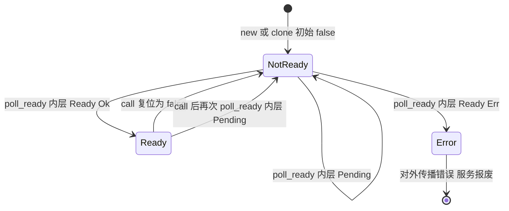
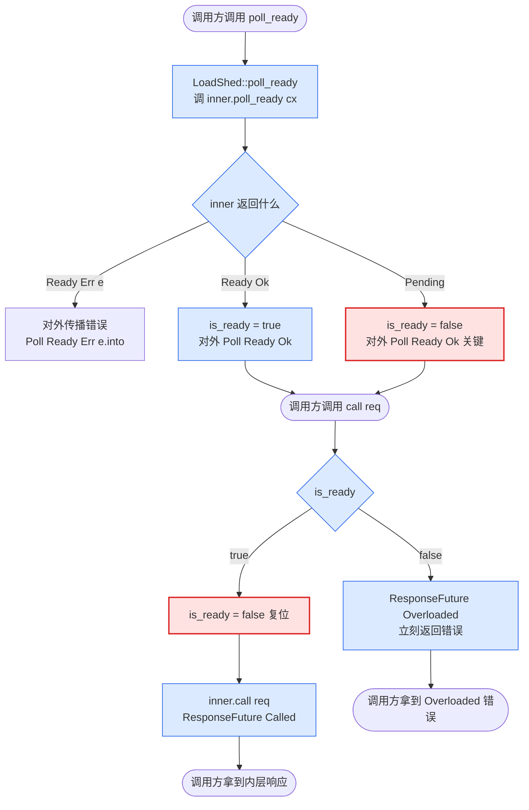

# 第 2 篇 · 第 7 章 · LoadShed 与背压的取舍

> **核心问题**:当内层服务满载,`poll_ready` 返回 `Pending` 时,调用方是该老老实实等(`Pending`,排队缓冲),还是直接拒绝请求(返回一个错误)?两种策略各适合什么场景?Tower 的 `LoadShed` 怎么把 `poll_ready` 的 `Pending` "翻"成一个 `Overloaded` 错误,主动丢请求保系统?它和 `Buffer`/`ConcurrencyLimit` 的背压哲学到底差在哪?
>
> **读完本章你会明白**:
>
> 1. 满载时"排队缓冲"(`Buffer`)和"立即拒绝"(`LoadShed`)是两种相反的背压哲学,各自适合什么场景,拼错了会出什么问题。
> 2. `LoadShed` 怎么用区区一个 `bool` 标志(`is_ready`),把 `poll_ready` 的 `Pending` 翻译成 `call` 返回的 `Overloaded` 错误,而对外永远宣称 `Ready`——以及为什么这不破坏 `poll_ready`/`call` 协议。
> 3. 为什么 `LoadShed` 必须在 `call` 里把 `is_ready` 复位成 `false`,以及为什么 `Clone` 时也要强制复位——这是 soundness 的两道闸门。
> 4. `LoadShed` 和 `Buffer`/`ConcurrencyLimit`/`SpawnReady` 组合时,"谁在外谁在内"决定行为,以及一个常见但致命的中间件顺序错误。
>
> **逃生阀**:如果你觉得"背压"这个词还很虚,先回去翻一眼 [P2-05 Buffer](P2-05-Buffer-把非Clone服务变成Clone+Send.md) 的"`poll_ready` 背压"那一节,以及 [P1-02 Service trait](P1-02-Service-trait-一个请求一个Future.md) 里 `poll_ready` 的契约。本章默认你已经知道"`poll_ready` 返回 `Pending` 时,调用方会停在这里等"。

---

## 章首 · 一句话点破

> **`LoadShed` 的全部魔法就一句:对外永远 `Ready`,对内偷偷记下"我到底 ready 没有",`call` 的时候如果没有 ready,就返回一个 `Overloaded` 错误,而不是老老实实把请求递下去。它把"等待"这件事从 `poll_ready` 搬到了"直接给一个错误"——把 `Pending` 翻成了错误。**

这是结论,不是理由。本章倒过来拆:为什么有时候"等待"比"错误"更危险?Envoy 的 overload manager 怎么处理这个问题(它没这么干)?然后才看 `LoadShed` 为什么敢这么干、怎么保证 sound,最后给一张"什么场景该用哪个"的决策表。

本章服务**执行单元**这一面:`LoadShed` 是个 `Service`,它内部改写了 `poll_ready`/`call` 的语义——这是 Tower 背压三件套(`Buffer`/`SpawnReady`/`LoadShed`)里最反直觉的一个,也是把"`poll_ready` 到底在背什么压"这个问题逼到极致的一章。

---

## 正文

### 第 1 节 · 满载时,该等还是该拒?

回忆一下 `poll_ready` 在干什么(详见 [P1-02](P1-02-Service-trait-一个请求一个Future.md),这里一句带过):

```rust
// tower-service/src/lib.rs#L321-L326(契约原文)
/// Returns `Poll::Ready(Ok(()))` when the service is able to process requests.
///
/// If the service is at capacity, then `Poll::Pending` is returned and the task
/// is notified when the service becomes ready again.
```

一句话:服务满载了就返回 `Pending`,调用方停在这里等,直到服务有产能了再 `Ready`,然后才 `call`。这就是**背压(backpressure)**——下游慢了,上游被堵住,压力顺着 `poll_ready` 一路传回去。

这套机制对绝大多数中间件是对的。比如 `ConcurrencyLimit`(详见 [P3-09](P3-09-ConcurrencyLimit-并发数上限.md)):它 `poll_ready` 里 acquire 一个 `tokio::sync::Semaphore` 的 permit,并发数到上限就 `Pending`,调用方等。这是最朴素的背压——"我扛不住,你别给我塞了,等我松了再说"。

但有些场景,这套机制是**致命**的。

设想一个真实的生产事故:一个商品详情页服务,上游是 HTTP 网关,下游是库存查询服务。库存服务挂了个慢查询,单次请求从 5ms 飙到 5s。这时:

- 网关收到一个商品详情请求,`call` 商品服务,商品服务 `call` 库存服务。
- 库存服务满载(连接池打满),`poll_ready` 返回 `Pending`。
- 商品服务的请求挂在 `poll_ready` 上,等。
- 网关的请求挂在商品服务上,等。
- **网关继续接收新请求**(它不知道下游慢了),每个新请求都堆进商品服务的等待队列。
- 等待队列里的请求越堆越多,每个请求占着一个连接、一个 task、一些内存。
- 5 秒后库存服务缓过来,但商品服务的内存已经吃光,OOM,整个服务挂了。

这就是**延迟堆积导致的雪崩**:下游一个慢,上游不丢请求而是傻等,等的过程中又来新请求,最后上游被自己堆的请求压垮。这比"直接返回错误"严重得多——返回错误,调用方至少还能走降级逻辑(查缓存、返回默认值);傻等,调用方什么也做不了,资源全锁死。

把上面这个事故数值化,看得更清楚。假设:

- 网关每秒收 10000 个请求(QPS = 10000)。
- 库存服务正常延迟 5ms,现在慢到 5s(1000 倍)。
- 网关每个在途请求占 8KB 内存(task 栈 + 连接 buffer + 上下文)。

正常情况:在途请求数 = QPS × 延迟 = 10000 × 0.005 = 50 个,占内存 400KB,毫无压力。

库存慢了之后:在途请求数 = 10000 × 5 = 50000 个,占内存 400MB。如果网关内存上限是 2GB(还要跑别的),5 秒内就吃掉 1/5,持续 25 秒就 OOM。而且这还只是直接内存——task 数量暴涨还会拖慢 Tokio 调度器(单 worker 上挂 50000 个 task,poll 一轮的开销陡增),实际雪崩来得比纸面算的更快。

注意这个推演的关键:**QPS 没变,变的是延迟**。网关还在以每秒 10000 的速率收请求,但下游消化速率从每秒 200000(1/5ms)掉到了每秒 200(1/5s)。消化速率远低于到达速率,差出来的请求全堆在中间。这就是"延迟堆积"——堆积的根因不是流量突增,是下游消化变慢。而 `Pending` 这种背压机制,在消化变慢时,会把堆不下的请求往上传,传到顶就崩。

`Buffer` 在这种场景下能帮忙吗?能,但有界。`Buffer` 有个容量(`bound`),见 [P2-05](P2-05-Buffer-把非Clone服务变成Clone+Send.md)——比如设 1000。前 1000 个请求进队列,第 1001 个 `Buffer::poll_ready` 返回 `Pending`(因为 channel 满了),网关开始等。但网关在等的同时还在收新请求,这些新请求堆在网关自己的连接层(没进 Tower 栈),最后网关连接层被打爆。`Buffer` 只是把堆积的地点从内层挪到了 channel,没有消灭堆积——容量满了,背压照样传到网关。

`LoadShed` 不一样。它在 channel(或任何会 `Pending` 的中间件)满的那一瞬间,把 `Pending` 翻成错误丢回调用方。调用方拿到错误,可以立刻降级(查缓存),或者立刻关连接(让客户端重试别的实例)。堆积被消灭在源头——`LoadShed` 之上不再有等待。这就是 `LoadShed` 在雪崩防护里的位置:它是"放弃排队,直接丢"的那个开关。

> **钉死这件事**:`Pending` 不是免费的。每返回一次 `Pending`,调用方就多占一份资源(一个 task、一份连接、一份内存)去等。当下游慢到一定程度,这份"等"的成本会反过来压垮上游自己。背压是把压力往上传,但传到顶之后无处可传,就崩了。

所以问题变成:**满载时,是该让上游等(`Pending`),还是该直接告诉上游"我不行了,你自己看着办"(返回错误)?**

答案是:**取决于上游有没有降级能力,以及等待的成本有多高。**

- 如果上游**没法降级**(比如这是个写请求,失败了数据就没了),而且等待是**有界的**(比如超时设了 1s),那排队等是对的——`Buffer`/`ConcurrencyLimit` 的哲学。
- 如果上游**能降级**(比如读请求,可以返回缓存或默认值),或者等待**无界会拖垮自己**(比如网关层不能让一个下游慢拖垮整个网关),那快速失败是对的——`LoadShed` 的哲学。

这两种哲学不是谁对谁错,是**两个不同的工具**,用在两个不同的地方。本章的主角 `LoadShed`,就是 Tower 给"快速失败"哲学提供的那个工具。

### 第 2 节 · Envoy 的 overload manager 怎么做(以及它为什么不直接用 `poll_ready`)

在讲 Tower 怎么做之前,先看一个工业级的对照:[Envoy 的 overload manager](https://www.envoyproxy.io/docs/envoy/latest/operations/overload_manager)。

> **对照《Envoy》[[envoy-source-facts]]**:Envoy 的 overload manager 不是基于 `poll_ready`/`Pending` 这套抽象的——Envoy 是 C++,没有 Rust 的 `Poll`/`Future`。它用的是另一套机制:**`LoadShedPoint` + 阈值**。每个 overload 资源(heap memory、active connections、pending requests 等)绑一个或多个 `LoadShedPoint`,每个 point 有一个 `LoadShedPoint` 阈值(`trigger` / `saturation` 两段压缩区间)。资源用量超过 `trigger` 就开始按比例拒绝请求,超过 `saturation` 就全拒。**关键事实**:Envoy 的 overload manager **不是令牌桶**(这是 [[envoy-source-facts]] 里钉死的、容易被老资料带偏的点)——它用的是 `LoadShedPoint` 这种"水位线 + 比例 shed"的机制。一句带过,详见《Envoy》P3 overload manager 那一章。

Envoy 的这套机制核心思想是:**主动测量自己的负载,超过水位就拒**。它是"自我感知"的——Envoy 自己知道"我现在堆了多少请求、吃了多少内存",主动决定拒不拒。

Tower 的 `LoadShed` 不一样。它**不主动测量自己的负载**(它不知道堆了多少请求、吃了多少内存),它**借力 `poll_ready`**:`poll_ready` 是内层服务告诉它"我行不行",`LoadShed` 只是把这个信号"翻译"一下。换句话说:

- Envoy overload manager = **自测量 + 阈值** —— 主动的。
- Tower `LoadShed` = **复用 `poll_ready` 信号 + 翻译** —— 被动的,依赖内层服务诚实地报告 `Pending`。

这是个重要的区别。它决定了 `LoadShed` 的局限:**它只能 shed "内层服务愿意通过 `poll_ready` 暴露出来的" 那种满载**。如果内层服务不诚实(比如一个 `poll_ready` 永远返回 `Ready` 但实际处理不过来的服务),`LoadShed` 就废了。这一点我们后面会专门展开。

这个区别也决定了两者各自的适用边界。Envoy overload manager 适合"我自己知道我有多忙"的场景——Envoy 是个代理,所有请求都经过它,它能数清楚自己堆了多少连接、吃了多少内存,主动判断该不该拒。这套机制的代价是要维护一堆计数器/水位探针,而且阈值要靠人调(调错了要么拒太狠要么拒太晚)。

`LoadShed` 适合"我不直接知道我有多忙,但我知道我依赖的服务有多忙"的场景——Tower 服务通常不直接数自己的内存/连接,但它通过 `poll_ready` 知道下游行不行。这套机制的代价是依赖下游诚实——下游的 `poll_ready` 必须如实反映满载,否则 `LoadShed` 形同虚设。

举个例子能看清边界。假设你写了一个 naive 的数据库 client:

```rust
// 简化示意(非源码原文)——一个不诚实的 poll_ready
impl Service<Query> for NaiveDbClient {
    type Future = ...;
    fn poll_ready(&mut self, _cx: &mut Context<'_>) -> Poll<Result<()>> {
        Poll::Ready(Ok(()))  // 永远 Ready,不管连接池满没满
    }
    fn call(&mut self, req: Query) -> Self::Future {
        // 实际发查询,连接池满了就在这里阻塞或排队
    }
}
```

这个 client 的 `poll_ready` 永远 `Ready`,满载的逻辑藏在 `call` 里(连接池满了就 `call` 里阻塞)。你给它套个 `LoadShed<NaiveDbClient>`,`LoadShed::poll_ready` 调它永远拿到 `Ready`,`is_ready` 永远 `true`,`call` 永远转发——**`LoadShed` 一个请求都不 shed**。`LoadShed` 被 naive client 骗了。

要补这个洞,得在 `NaiveDbClient` 外面套个诚实的中间件,比如 `ConcurrencyLimit`(它的 `poll_ready` 会真的 acquire permit,permit 满了就 `Pending`):

```rust
// 简化示意(非源码原文)
let svc = LoadShed::new(ConcurrencyLimit::new(NaiveDbClient::new(), 64));
//                ^外层     ^中:诚实背压        ^内:naive 但被中:包住
```

现在 `ConcurrencyLimit` 的 `poll_ready` 在并发满时返回 `Pending`,`LoadShed` 才能拿到 `false` 去 shed。这就是为什么生产配置里 `LoadShed` 几乎总配着 `ConcurrencyLimit` 或 `Buffer` 用——`LoadShed` 自己不产生背压信号,它只是个"翻译器",得有个诚实的内层给它信号翻译。

这个边界也回扣了 [P1-02](P1-02-Service-trait-一个请求一个Future.md) 那句"`poll_ready` 是 Tower 区别于 hyper 的核心":正因为 Tower 保留了 `poll_ready` 并且要求服务诚实地报告它,才有了 `LoadShed` 这种"翻译 `poll_ready` 信号"的中间件。hyper 删了 `poll_ready`,就没有 `LoadShed`,过载保护只能在协议层另做——这是同一个设计取舍在两套系统里的不同投影。

> **承接《hyper》[[hyper-series-project]]**:hyper 的 `Service` 删了 `poll_ready`(背压挪到 HTTP/1 `in_flight` 单槽 / HTTP/2 h2 流控 / client `SendRequest::poll_ready`),所以 hyper 那一层没有 `LoadShed` 这种"翻 `Pending` 成错误"的中间件——它的过载保护在协议层做(H2 的 flow control、连接数限制)。一句带过指路。Tower 因为保留了 `poll_ready`,才有 `LoadShed` 这种把 `poll_ready` 信号拿来做文章的中间件——这是 [P1-02](P1-02-Service-trait-一个请求一个Future.md) 那个"hyper 删 `poll_ready` vs Tower 保留"对照的又一个具体后果。

> **不这样会怎样**:如果 Tower 也没有 `poll_ready`(像 hyper 那样删了),那"满载时快速失败"这件事就只能做到一半——你可以在 `call` 返回的 Future 里塞一个超时(像 `Timeout` 那样),但那是"发了请求等超时再失败",不是"压根不发请求直接失败"。`poll_ready` 给了你一个"还没发请求就能知道下游行不行"的窗口,`LoadShed` 就是在这个窗口里动手。删了 `poll_ready`,这个窗口就没了。

### 第 3 节 · 所以 Tower 的 `LoadShed` 这么设计:对外永远 Ready,对内偷偷记账

现在可以看 `LoadShed` 的设计了。它的核心诡计,一句话:

> **`poll_ready` 里调内层的 `poll_ready`,把结果记到一个 `bool` 里;但对外,无论内层是 `Ready` 还是 `Pending`,都返回 `Ready`。然后 `call` 的时候看那个 `bool`——true 就真把请求递下去,false 就返回一个 `Overloaded` 错误。**

它把"内层没 ready"这件事,从"`poll_ready` 返回 `Pending` 让你等"翻译成了"`call` 返回一个错误让你处理"。压力没有传给上游,而是变成了一个错误丢给上游去降级。

先看结构定义,极其简单:

```rust
// tower/src/load_shed/mod.rs#L13-L20
/// A [`Service`] that sheds load when the inner service isn't ready.
///
/// [`Service`]: crate::Service
#[derive(Debug)]
pub struct LoadShed<S> {
    inner: S,
    is_ready: bool,
}
```

两个字段:`inner: S`(被包的内层服务),`is_ready: bool`(那个"偷偷记账"的标志)。注意是 `bool`,不是 `Option`,也不是缓存一个就绪的 clone——就是个最朴素的布尔。`bool` 足够了,因为 `LoadShed` 不需要"持有"内层的就绪状态(不像 [P2-05 Buffer](P2-05-Buffer-把非Clone服务变成Clone+Send.md) 那样要克隆就绪服务),它只需要知道"上次 `poll_ready` 时内层行不行",行就转发,不行就 shed。

然后是核心——`poll_ready`:

```rust
// tower/src/load_shed/mod.rs#L43-L54
fn poll_ready(&mut self, cx: &mut Context<'_>) -> Poll<Result<(), Self::Error>> {
    // We check for readiness here, so that we can know in `call` if
    // the inner service is overloaded or not.
    self.is_ready = match self.inner.poll_ready(cx) {
        Poll::Ready(Err(e)) => return Poll::Ready(Err(e.into())),
        r => r.is_ready(),
    };

    // But we always report Ready, so that layers above don't wait until
    // the inner service is ready (the entire point of this layer!)
    Poll::Ready(Ok(()))
}
```

逐行拆这三句精髓:

**第 1 句(注释 + `self.is_ready = match ...`)**:这里调用了内层的 `poll_ready(cx)`。注意,这个调用是**真实的**——它会让内层服务真的去检查自己 ready 没有(比如 `ConcurrencyLimit` 会真的去 acquire permit,`Buffer` 会真的去 reserve channel slot)。结果有三种:

- `Poll::Ready(Err(e))`:内层服务**永久性失败**(比如连接断了)。这种情况 `LoadShed` 必须**原样传播错误**(`return Poll::Ready(Err(e.into()))`),因为它不是"暂时满载",是"彻底坏了",`LoadShed` 不该替一个坏掉的服务掩盖错误。
- `Poll::Ready(Ok(()))`:内层 ready。`r.is_ready()` 返回 `true`,记进 `is_ready`。
- `Poll::Pending`:内层没 ready。`r.is_ready()` 返回 `false`,记进 `is_ready`。

这就是"偷偷记账"——把内层真实的就绪状态记进 `is_ready`,**但这个状态只在本 Service 内部用,不传给上游**。

**第 2 句(注释 "But we always report Ready" + `Poll::Ready(Ok(()))`)**:**这就是 `LoadShed` 的招牌动作——对外永远宣称 `Ready`。** 不管内层是 `Ready` 还是 `Pending`,对外都是 `Poll::Ready(Ok(()))`。为什么?注释写得很直白:"so that layers above don't wait until the inner service is ready (the entire point of this layer!)"——"这样上面的层就不会等到内层服务 ready,(这正是这层的全部意义!)"。

如果 `LoadShed` 把 `Pending` 老实传回去,那它就什么都没做——上游照样等,雪崩照样发生。`LoadShed` 的全部价值,就在于它**吞掉了 `Pending`**,把"等待"这件事在上游看来抹掉了。

**第 3 句的后果**:`call` 现在可以放心被调用了(因为对外宣称了 `Ready`,上游一定会来 `call`)。但内层到底 ready 没有,只有 `is_ready` 知道。所以 `call` 要分情况处理:

```rust
// tower/src/load_shed/mod.rs#L56-L64
fn call(&mut self, req: Req) -> Self::Future {
    if self.is_ready {
        // readiness only counts once, you need to check again!
        self.is_ready = false;
        ResponseFuture::called(self.inner.call(req))
    } else {
        ResponseFuture::overloaded()
    }
}
```

两支:

- **`is_ready == true`**:内层上次说它 ready 了。转发——`self.inner.call(req)`,包成 `ResponseFuture::called`。**但关键:`self.is_ready = false`,立刻复位!** 注释那句"readiness only counts once, you need to check again!"是整个 soundness 的钥匙,下一节专门讲。
- **`is_ready == false`**:内层上次说它没 ready。**不转发**,直接返回 `ResponseFuture::overloaded()`——一个立刻 resolve 成 `Overloaded` 错误的 Future。请求被 shed 掉了。

这就是 `LoadShed` 的全部。一个 `bool`,一个永远 `Ready` 的 `poll_ready`,一个分情况的 `call`。简洁得近乎朴素,但每一处都踩在 `poll_ready`/`call` 协议的精确语义上——这正是它 sound 的原因。下面专门拆这两个 soundness 的关键点。

### 第 4 节 · 源码佐证:`is_ready` 为什么必须复位(Clone 也要复位)

`LoadShed` 看似简单,但有两个地方不复位就会出 bug,而且都是协议级别的 bug。这两处都藏在源码里,值得单独看。

**第 1 处:`call` 里复位(`mod.rs:59` 的 `self.is_ready = false`)。**

为什么 `call` 完必须把 `is_ready` 设回 `false`?因为 `poll_ready` 的契约([tower-service/src/lib.rs:331-336](../tower/tower-service/src/lib.rs#L331-L336)):

> Once `poll_ready` returns `Poll::Ready(Ok(()))`, a request may be dispatched to the service using `call`. **Until a request is dispatched, repeated calls to `poll_ready` must return either `Poll::Ready(Ok(()))` or `Poll::Ready(Err(_))`.**
>
> Note that `poll_ready` may reserve shared resources that are consumed in a subsequent invocation of `call`.

关键词:**"reserve shared resources that are consumed in a subsequent invocation of `call`"**。`poll_ready` 可能预留了共享资源(permit、连接槽、channel slot),这些资源**在 `call` 里被消费**。

这意味着:一次 `Ready` 只对应一次 `call`。`poll_ready` 说"我 ready 了"不是"我一直 ready",而是"我现在能处理一个请求,处理完你得重新问我"。

如果 `LoadShed` 在 `call` 后不复位 `is_ready`,会发生什么?

- 假设内层是 `ConcurrencyLimit`,允许 1 个并发。
- 第一次 `poll_ready`:`ConcurrencyLimit` acquire 到 permit,返回 `Ready`。`LoadShed` 记 `is_ready = true`。
- 第一次 `call`:转发,permit 被消费(`ConcurrencyLimit` 的并发数变成 1/1 满)。`is_ready` **如果没复位**,还是 `true`。
- 上游(以为 `LoadShed` 一直 ready)又来 `call`。`is_ready` 还是 `true`,`LoadShed` **直接转发**给 `ConcurrencyLimit`。
- 但 `ConcurrencyLimit` 的 permit 已经被消费了!这次 `call` 要么 panic,要么返回一个错误,要么(最坏)绕过了并发限制——`LoadShed` 把 shed 掉的请求硬塞给了满载的内层。

这就是不复位的后果:**shedd 不掉**。`is_ready` 必须在 `call` 里立刻设回 `false`,强制下一次 `call` 前再 `poll_ready` 一次,重新确认内层还 ready 没有。注释那句"readiness only counts once, you need to check again!"就是冲这个去的。

注意:这里有个微妙的协议问题。`poll_ready` 契约说 "repeated calls to `poll_ready` must return Ready" ——也就是说,在 `call` 之前,`poll_ready` 可以被调很多次,每次都得 `Ready`。`LoadShed` 的 `poll_ready` 确实满足这一点(它每次都重新调内层 `poll_ready` 并更新 `is_ready`,然后返回 `Ready`)。但 `call` 之后呢?契约说"Until a request is dispatched"——`call` 一旦发生,这个"必须一直 Ready"的保证就失效了,下一次 `poll_ready` 是全新的询问。`LoadShed` 在 `call` 里复位 `is_ready = false`,正是为了在"下一次 `poll_ready` 来之前"把状态清零,让下一轮 `poll_ready → call` 重新走一遍流程。这是对协议的精确遵守。

**第 2 处:`Clone` 里复位(`mod.rs:67-76`)。**

```rust
// tower/src/load_shed/mod.rs#L67-L76
impl<S: Clone> Clone for LoadShed<S> {
    fn clone(&self) -> Self {
        LoadShed {
            inner: self.inner.clone(),
            // new clones shouldn't carry the readiness state, as a cloneable
            // inner service likely tracks readiness per clone.
            is_ready: false,
        }
    }
}
```

`Clone` 时 `is_ready` 强制设回 `false`,注释解释:"new clones shouldn't carry the readiness state, as a cloneable inner service likely tracks readiness per clone"——"新的克隆不该带着就绪状态,因为一个可克隆的内层服务通常是按克隆各自跟踪就绪状态的"。

这句话什么意思?想象内层是个连接池(`Buffer` 包的某个服务,或者一个 hyper client)。这种服务被 `Clone` 时,通常克隆的是 `Sender`/handle,不是整个连接池(详见 [P2-05 Buffer](P2-05-Buffer-把非Clone服务变成Clone+Send.md) 怎么用 `mpsc::Sender` 让服务可克隆)。每个克隆有自己的 `poll_ready`(它有自己的一份 channel slot/permit 额度)。

如果 `LoadShed` 在 `Clone` 时把 `is_ready` 也复制过去:

- 原本的 `LoadShed` `poll_ready` 过,`is_ready = true`,但还没 `call`。
- 这时克隆出一个新的 `LoadShed`。
- 新的 `LoadShed` 继承了 `is_ready = true`,但**它的内层克隆从来没被 `poll_ready` 过**——内层的就绪状态是全新的、未知的。
- 新 `LoadShed` 直接被 `call`,`is_ready = true`,转发给内层克隆。
- 但内层克隆从没确认过自己 ready!可能 channel 满、permit 用光——又出 bug。

所以 `Clone` 时必须把 `is_ready` 重置为 `false`,强制克隆体在被 `call` 前先 `poll_ready` 一次,跟自己的内层克隆对一下账。这是第二个协议级的 soundness 闸门。

这两处复位(`call` 里 + `Clone` 里)合起来,才让 `LoadShed` 在 `poll_ready`/`call` 协议下是 sound 的:`is_ready` 这个 `bool` 始终准确反映"内层是否在上次 `poll_ready` 时确认过 ready",既不漏 shed(该拒的不拒),也不误 shed(不该拒的拒了),更不会把 shed 掉的请求硬塞给满载的内层。

> **钉死这件事**:`LoadShed` 的 soundness 全在那个 `is_ready` 标志的精确生命周期上。`poll_ready` 写入,`call` 读出并立刻清零,`Clone` 也清零。这三个点少一个,`LoadShed` 就会出协议级 bug。这种"一个 bool 三个清零点"的设计,是 `poll_ready`/`call` 协议"ready 只算一次"语义的直接体现。

把 `is_ready` 的生命周期画成状态图,看得更清楚:



三个关键迁移:

- **`NotReady → Ready`**:`poll_ready` 时内层返回 `Ready(Ok)`,`is_ready` 写入 `true`。但对外仍宣称 `Ready`(吞掉的是"内层这次行不行"的信息,不是对外信号)。
- **`Ready → NotReady`(`call`)**:`call` 转发后立刻复位。这个迁移是"一次性就绪"的体现——ready 用完即作废。
- **`NotReady → NotReady`(`poll_ready` 内层 Pending)**:内层没 ready,`is_ready` 保持 `false`,对外仍 `Ready`。这是 `LoadShed` "吞 `Pending`"那一支,shed 掉的请求就在下一次 `call` 时从这里出去。

### 为什么是 `bool`,不是缓存一个就绪的 clone?

读到这里你可能有个疑问:`is_ready` 用 `bool` 只能记"行不行",记不下"行的那个服务实例"。对比一下 [P2-05 Buffer](P2-05-Buffer-把非Clone服务变成Clone+Send.md)——`Buffer` 是真的缓存了就绪服务(通过 worker task 持有原服务,克隆的是 `mpsc::Sender`)。为什么 `LoadShed` 不也缓存一个就绪的 inner clone,`call` 的时候直接用?

因为 `LoadShed` 的 inner 是 `S` 本身(`inner: S`),不是 `S` 的某个 clone。`LoadShed::call` 调的是 `self.inner.call(req)`——直接用 `&mut self.inner`,不需要额外的 clone。`is_ready` 只是"上次 `poll_ready` 时 `self.inner` 行不行"的备忘,`call` 用的是同一个 `self.inner`,不存在"用哪个 clone"的问题。

那 [P1-02](P1-02-Service-trait-一个请求一个Future.md) 讲的"`mem::replace` 取走就绪 clone 的惯用法"呢?那个惯用法针对的是"`Service` 是 `Clone` 的,调用方 clone 一份,clone 出来的服务要 `poll_ready`,ready 后 `call`,然后丢弃"——也就是 `oneshot` 模式。在 `oneshot` 模式下,你 clone 出来用一次就扔,ready 状态跟着 clone 走,所以要在 `poll_ready` 后"取出"就绪 clone。

`LoadShed` 不是 `oneshot` 模式。它持有一份 `inner`,反复用(每次 `call` 都用同一个 `self.inner`)。所以它不需要 `mem::replace`,不需要 clone,一个 `bool` 够了。这是两种使用模式的区别:`oneshot`(clone-then-call-once)需要取出就绪 clone;`LoadShed`(持有-reuse)只需要记下行不行的状态。

这也解释了为什么 `LoadShed::Clone` 要把 `is_ready` 复位:`Clone` 把 `LoadShed` 从"持有-reuse"模式转成"clone-distribute"模式,每个克隆体要重新跟自己的 `inner` 克隆对账,不能继承原体的就绪记忆。如果继承了,克隆体可能在自己 `inner` 克隆还没 ready 的时候(因为没 `poll_ready` 过)就误以为 ready,直接 `call`,撞满载。复位强制克隆体先 `poll_ready`——这把"持有-reuse"模式下的就绪记忆,在跨克隆边界时清零,保证每个克隆体独立验证自己的 `inner`。

---

## 技巧精解

这一节单独拆两个最硬核的点:`ResponseFuture` 怎么用一个 `enum` 状态机把"转发内层 Future"和"立刻给错误"统一成一个类型;以及"谁在外谁在内"决定 `LoadShed` + `Buffer`/`ConcurrencyLimit` 的行为——后者是线上最容易翻车的中间件顺序错误。

### 技巧 1 · `ResponseFuture`:`enum` 状态机统一两种 Future

`LoadShed::call` 返回 `type Future = ResponseFuture<S::Future>`。但 `call` 有两支:要么转发内层 Future(类型 `S::Future`),要么直接给错误。这两支怎么统一成一个 `ResponseFuture<S::Future>` 类型?

答案是用一个 `enum` 状态机,这是 Rust 里手写 Future 的标准套路(承接 [P1-02](P1-02-Service-trait-一个请求一个Future.md) 讲过的 `Pin`/状态机,这里一句带过):

```rust
// tower/src/load_shed/future.rs#L23-L32
pin_project! {
    #[project = ResponseStateProj]
    enum ResponseState<F> {
        Called {
            #[pin]
            fut: F
        },
        Overloaded,
    }
}
```

两个状态:

- `Called { fut: F }`:真的转发了内层,包着内层的 Future `F`。
- `Overloaded`:shed 掉了,没有内层 Future,就是个标记。

两个构造函数分别造这两种状态:

```rust
// tower/src/load_shed/future.rs#L34-L46
impl<F> ResponseFuture<F> {
    pub(crate) fn called(fut: F) -> Self {
        ResponseFuture {
            state: ResponseState::Called { fut },
        }
    }

    pub(crate) fn overloaded() -> Self {
        ResponseFuture {
            state: ResponseState::Overloaded,
        }
    }
}
```

然后 `Future` 的 `poll` 按状态分叉:

```rust
// tower/src/load_shed/future.rs#L48-L63
impl<F, T, E> Future for ResponseFuture<F>
where
    F: Future<Output = Result<T, E>>,
    E: Into<crate::BoxError>,
{
    type Output = Result<T, crate::BoxError>;

    fn poll(self: Pin<&mut Self>, cx: &mut Context<'_>) -> Poll<Self::Output> {
        match self.project().state.project() {
            ResponseStateProj::Called { fut } => {
                Poll::Ready(ready!(fut.poll(cx)).map_err(Into::into))
            }
            ResponseStateProj::Overloaded => Poll::Ready(Err(Overloaded::new().into())),
        }
    }
}
```

两支:

- **`Called`**:把内层 Future `poll` 一把,结果用 `.map_err(Into::into)` 把内层错误 `E` 转成 `crate::BoxError`(因为 `LoadShed` 的 `type Error = crate::BoxError`,要把内层错误类型擦掉统一)。注意这里用了 `futures_core::ready!` 宏——它是个语法糖,把 `Poll::Ready(x)` 解包成 `x`,遇到 `Pending` 直接 `return Poll::Pending`(承接 Tokio 讲过的 `Poll` 语义,一句带过)。
- **`Overloaded`**:`Poll::Ready(Err(Overloaded::new().into()))`——**立刻** resolve 成一个错误。注意是立刻——`Overloaded` 这个状态根本不需要被 poll 多次,第一次 poll 就返回 `Ready`。这就是"主动丢请求"在 Future 层的体现:shed 掉的请求连 Future 都不真的跑,一 poll 就给错误。

这里有个值得品的细节:为什么 `Overloaded` 状态没有 `Pending` 分支?因为这个 Future **永远第一次 poll 就 Ready**。那如果上游在 `call` 之后、`poll` 之前就 `drop` 了这个 Future 呢?没问题——`Overloaded` 状态没有任何要清理的资源(不像 `Called` 状态 drop 会 drop 内层 Future,触发取消语义),它就是个零成本标记。这正是 `Overloaded` 错误类型本身被设计成零大小的原因:

```rust
// tower/src/load_shed/error.rs#L10-L13
#[derive(Default)]
pub struct Overloaded {
    _p: (),
}
```

`_p: ()` 是个占位符,让 `Overloaded` 是个零大小类型(`#[derive(Default)]` 配 `new()` 返回 `Overloaded { _p: () }`)。`Display` 是 "service overloaded"([error.rs:28-32](../tower/tower/src/load_shed/error.rs#L28-L32))。这个设计意味着:一个 shed 掉的请求,从错误对象到 Future 状态,几乎不占任何内存——这正是"快速失败"哲学在实现上的对应:失败也要失败得便宜。

> **反面对比——朴素地写会撞什么墙**:如果不用 `enum` 状态机,而用 `Option<F>`(`Some(fut)` 或 `None`),也能做到类似效果。但 `Option` 的语义不如 `enum` 清晰:`Option` 表达"有或没有",而 `ResponseState` 表达"这次 call 是真发了还是 shed 了"——这是两种**语义不同的状态**,用专门的 `enum` 名字(`Called`/`Overloaded`)让代码自文档化。这是 Tower 源码的一贯风格:状态用命名 `enum`,不用 `Option`/`bool` 凑数。

> **承接《Tokio》[[tokio-source-facts]]**:这里的 `pin_project_lite::pin_project!` 宏、`Pin<&mut Self>`、`ready!` 宏,都是手写 Future 状态机的标准工具,承接 P1-02 已讲过的 `Pin`/投影语义,一句带过指路。本书不讲 `pin-project-lite` 宏的内部展开(那是 Tokio/Pin 那本书的事)。

### 技巧 2 · 谁在外谁在内:`LoadShed` + `Buffer`/`ConcurrencyLimit` 的组合语义

这是本章最容易翻车、也是线上事故最高频的点。`LoadShed` 和 `Buffer`/`ConcurrencyLimit` 都是背压类中间件,但它们组合的**顺序**完全决定行为。我们看三种组合,每种行为天差地别。

先回忆三者的 `poll_ready` 哲学(详见各自章节,这里一句带过):

| 中间件 | `poll_ready` 行为 | 背压哲学 |
|--------|-------------------|----------|
| `Buffer` | reserve 一个 channel slot,满了 `Pending` | **排队缓冲**:满了就排队,等 worker 消化 |
| `ConcurrencyLimit` | acquire 一个 permit,满了 `Pending`,再 poll 内层 | **限并发**:满了就等,等有并发额度 |
| `LoadShed` | poll 内层记 `is_ready`,对外永远 `Ready` | **快速失败**:满了就拒,不排队 |

`Buffer` 和 `ConcurrencyLimit` 的 `poll_ready` 会返回 `Pending`(让上游等);`LoadShed` 的 `poll_ready` 永远返回 `Ready`(吞掉 `Pending`)。这就是矛盾的根源。

**组合 A:`LoadShed` 在外,`Buffer` 在内(`LoadShed<Buffer<S>>`)。**

```rust
// 简化示意(非源码原文)
let svc = ServiceBuilder::new()
    .layer(LoadShedLayer::new())   // 外
    .layer(BufferLayer::new(100))  // 内
    .service(inner);
```

行为:`LoadShed::poll_ready` 调 `Buffer::poll_ready`。`Buffer` 满了(100 个请求堆着没消化),返回 `Pending`。`LoadShed` 把这个 `Pending` 记成 `is_ready = false`,对外返回 `Ready`。上游 `call`,`LoadShed` 看 `is_ready = false`,**直接 shed**。

**这个组合的意思是**:`Buffer` 有一个 100 容量的队列。当队列满的时候,`LoadShed` 直接拒绝新请求,不往队列里塞。这是一个**有界缓冲 + 满了拒**的策略——前 100 个请求排队等,第 101 个直接拒绝。适合:"我愿意等一会儿(队列内),但等的人不能太多(队列外直接拒)"。

**组合 B:`Buffer` 在外,`LoadShed` 在内(`Buffer<LoadShed<S>>`)。**

```rust
// 简化示意(非源码原文)
let svc = ServiceBuilder::new()
    .layer(BufferLayer::new(100))  // 外
    .layer(LoadShedLayer::new())   // 内
    .service(inner);
```

这个组合**几乎没意义**,而且行为很反直觉。`Buffer` 在最外层,它的 worker task 持有 `LoadShed<S>`。`Buffer::poll_ready` 是 reserve channel slot(`Buffer` 自己的 `poll_ready` 逻辑,见 [buffer/service.rs:97-107](../tower/tower/src/buffer/service.rs#L97-L107)),不会调到 `LoadShed::poll_ready`。真正调 `LoadShed` 的是 worker task。但 worker task 在 `Buffer` 内部 `poll_ready` 内层服务——而 `LoadShed::poll_ready` 永远返回 `Ready`!

所以这个组合里,`LoadShed` 永远 `Ready`,`Buffer` 的 worker 永远在狂热地 `call` `LoadShed`。`LoadShed` 内层 `S` 满了的时候,`LoadShed::call` 返回 `Overloaded` 错误——但这个错误进了 `Buffer` 的 worker,worker 把它当成内层错误传回给等在 `Buffer` 上的调用方。**结果是**:所有请求都进了 `Buffer` 的队列,然后被 worker 一个个 `call` `LoadShed`,`LoadShed` 一半成功一半 shed,shed 的返回错误。**`Buffer` 的排队缓冲和 `LoadShed` 的快速失败完全冲突**——你排队排半天,结果拿到一个 shed 错误,那排队的意义在哪?

**钉死这个反模式**:`Buffer<LoadShed<S>>` 几乎总是错的。它把"快速失败"延迟成了"排完队再失败",违背了 `LoadShed` 的初衷。如果你看到这种组合,先停下来想清楚你要什么。

**组合 C:`LoadShed` 在外,`ConcurrencyLimit` 在内(`LoadShed<ConcurrencyLimit<S>>`)。**

```rust
// 简化示意(非源码原文)
let svc = ServiceBuilder::new()
    .layer(LoadShedLayer::new())              // 外
    .layer(ConcurrencyLimitLayer::new(64))    // 内
    .service(inner);
```

行为:`LoadShed::poll_ready` 调 `ConcurrencyLimit::poll_ready`。`ConcurrencyLimit` 的 `poll_ready`(见 [concurrency/service.rs:65-79](../tower/tower/src/limit/concurrency/service.rs#L65-L79))先 acquire permit(满了 `Pending`),再 poll 内层。`ConcurrencyLimit` 并发到 64 满了,返回 `Pending`。`LoadShed` 记 `is_ready = false`,对外 `Ready`。上游 `call`,`LoadShed` shed。

**这个组合的意思是**:`ConcurrencyLimit` 保证最多 64 个并发请求。当 64 个并发满了,`LoadShed` 直接拒绝第 65 个,不排队。这是"**并发上限 + 超了拒**"——和组合 A 类似,但限制维度不同(并发数 vs 队列容量)。这是生产里非常常见且有意义的组合,尤其适合"我有 64 个数据库连接,第 65 个请求直接拒,别排队压垮数据库"。

**反过来:`ConcurrencyLimit` 在外,`LoadShed` 在内(`ConcurrencyLimit<LoadShed<S>>`)** ——和组合 B 一样有问题。`ConcurrencyLimit` 的 permit 在外层,`LoadShed` 永远 `Ready`,内层 `S` 满了 `LoadShed` 返回 shed 错误——但你已经 acquire 了 permit,permit 占着直到 Future 完成(shed 的 Future 立刻完成,所以 permit 立刻释放)。这个组合勉强能跑,但语义混乱:`ConcurrencyLimit` 以为自己在限并发,实际上 shed 掉的请求占了 permit 又立刻还回去,permit 数对不上真实并发。同样不推荐。

把上面三种正反组合浓缩成一张决策表:

| 组合(外→内) | 行为 | 评价 | 典型场景 |
|---------------|------|------|----------|
| `LoadShed<Buffer<S>>` | 队列满才 shed | **推荐** | 有界缓冲 + 溢出拒(网关层) |
| `LoadShed<ConcurrencyLimit<S>>` | 并发满才 shed | **推荐** | 并发上限 + 超了拒(数据库 client) |
| `Buffer<LoadShed<S>>` | 排队排到 shed | **反模式** | 几乎总是错的 |
| `ConcurrencyLimit<LoadShed<S>>` | permit 配 shed,语义乱 | **不推荐** | 语义混乱 |

**规律**:`LoadShed` 几乎总该在**最外层**(靠近调用方那一侧),把会 `Pending` 的中间件(`Buffer`/`ConcurrencyLimit`)包在里面。因为 `LoadShed` 的职责是"吞掉 `Pending`,变成错误",它必须在 `Pending` 传到调用方之前拦住——也就是在 `Pending` 的外面。`Pending` 在内,`LoadShed` 在外,这才对。

这个规律可以推广到 `ServiceBuilder` 的写法。`ServiceBuilder` 的 layer 是**从外到内**加的(第一个 `.layer()` 是最外层,详见 [P1-04](P1-04-ServiceBuilder与ServiceExt-组合的艺术.md)):

```rust
// 正确:LoadShed 在外,ConcurrencyLimit 在内
let svc = ServiceBuilder::new()
    .layer(LoadShedLayer::new())           // 最外,吞 Pending
    .layer(ConcurrencyLimitLayer::new(64)) // 中间,限并发
    .layer(TimeoutLayer::new(Duration::from_secs(1))) // 最内,超时
    .service(inner);
```

这套组合的语义是清晰的:最多 64 并发,每个请求最多等 1 秒,64 并发满了直接 shed,shed 的请求立刻拿到 `Overloaded` 错误,调用方走降级。这是生产级 client 的典型配置。

### 调参直觉:shed 多少由内层的 `Pending` 阈值决定

`LoadShed` 自己没有"阈值"——它不决定 shed 多少,shed 多少完全由内层中间件(`Buffer` 容量、`ConcurrencyLimit` 并发数)的 `Pending` 阈值决定。`LoadShed` 只是个"翻译器",翻译多少看内层给它多少 `Pending`。

这带来一个调参直觉:

- 想让"前 1000 个排队,第 1001 个拒",用 `LoadShed<Buffer<S, 1000>>`(容量 1000)。
- 想让"前 64 个并发,第 65 个拒",用 `LoadShed<ConcurrencyLimit<S, 64>>`(并发 64)。
- 想让"并发 64 + 每个超 1 秒算超时",用 `LoadShed<ConcurrencyLimit<Timeout<S>>>`(并发 64,Timeout 在最内层包 inner)。

注意第三种:Timeout 在 ConcurrencyLimit 里面,意味着"拿到并发额度后才开始计时"。如果你想让"从进入队列就开始计时",Timeout 要挪到 ConcurrencyLimit 外面——但那样 shed 掉的请求也会被 Timeout 包,而 shed 是立刻返回错误的,Timeout 对立刻完成的 Future 没影响,所以放外面也没坏处,语义略有不同(计时的起点不同)。这种细节就是中间件顺序的微妙之处,生产里要结合监控(p99 延迟、shed 率、超时率)来调。

对比 Envoy overload manager 的调参,差异就显出来了。Envoy 的 `LoadShedPoint` 阈值是直接配在 overload manager 配置里的(`trigger`/`saturation` 两段),调一个阈值就改变 shed 行为。Tower `LoadShed` 没有"调 `LoadShed` 阈值"这个动作——你要调的是内层 `Buffer`/`ConcurrencyLimit` 的容量/并发数。这种"职责分离"是 Tower 组合式设计的特点:每个中间件只管一件事,组合起来才形成完整策略。代价是配置散在多个中间件,新人不容易一眼看明白整体行为(这也是为什么附录 B 会专门讲"中间件顺序错了"的排查)。

> **钉死这件事**:`LoadShed` 在外,会 `Pending` 的在内。反过来几乎总是 bug。这条规律比记住任何具体 API 都重要——它是 `poll_ready` 背压语义的直接推论。而 shed 多少,由内层的 `Pending` 阈值(`Buffer` 容量 / `ConcurrencyLimit` 并发数)决定,不由 `LoadShed` 自己决定——`LoadShed` 是翻译器,不是策略源。

---

## 配图:LoadShed 决策流程与状态图

下面用 mermaid 把 `LoadShed` 的决策流程画出来,配上 `is_ready` 标志的状态变化。



红色两步是 soundness 的命脉:`SetFalse`(内层 `Pending` 时把 `is_ready` 记成 `false`,然后**对外谎称 `Ready`**)和 `ResetFalse`(`call` 转发后立刻复位 `is_ready`)。少了任何一步,`LoadShed` 就会出错。

再看一张 ASCII 图,对比三种背压中间件在 `poll_ready` 返回 `Pending` 时各自怎么处理同一个"内层满载"信号:

```
同一个信号:内层满载 → inner.poll_ready 返回 Poll::Pending

┌─────────────────────────────────────────────────────────────────┐
│  Buffer            : poll_ready Pending → 对外 Pending           │
│  排队缓冲          : 调用方等,等 worker 消化队列                  │
│                     行为:等                                       │
└─────────────────────────────────────────────────────────────────┘
┌─────────────────────────────────────────────────────────────────┐
│  ConcurrencyLimit  : poll_ready Pending → 对外 Pending           │
│  限并发            : 调用方等,等 permit 释放                      │
│                     行为:等                                       │
└─────────────────────────────────────────────────────────────────┘
┌─────────────────────────────────────────────────────────────────┐
│  LoadShed          : poll_ready Pending → 对外 Ready 谎报        │
│  快速失败          : is_ready = false,call 时返回 Overloaded 错误 │
│                     行为:拒                                       │
└─────────────────────────────────────────────────────────────────┘
```

同样的 `Pending`,三种中间件做出三种反应:`Buffer`/`ConcurrencyLimit` 选择"等"(把压力继续传给上游,让上游也等),`LoadShed` 选择"拒"(吞掉压力,变成错误丢给上游处理)。这就是本章的标题——**背压的取舍**。

---

## 章末小结

**回到主线**:本章服务**执行单元**这一面。`LoadShed` 是个 `Service`,它改写了 `poll_ready`/`call` 的执行语义——具体说,它把"`poll_ready` 返回 `Pending`"这个执行细节,在对外接口上抹掉了,换成了"对外永远 `Ready`,`call` 时根据内部记账决定转发还是 shed"。这是 Tower 背压三件套(`Buffer`/`SpawnReady`/`LoadShed`)里对 `poll_ready` 玩得最花的一个:`Buffer`/`ConcurrencyLimit` 老老实实把 `Pending` 传出去(让上游等),`SpawnReady` 把"等就绪"挪到后台 task(让请求路径不阻塞),`LoadShed` 干脆把 `Pending` 翻成错误(让上游不等而是降级)。三种哲学,同一个 `poll_ready` 信号的不同处理。

第 2 篇到此结束。这一篇的三章([P2-05 Buffer](P2-05-Buffer-把非Clone服务变成Clone+Send.md) / [P2-06 SpawnReady](P2-06-SpawnReady-后台预热就绪.md) / 本章 `LoadShed`)合起来,完整展示了 Tower 怎么用中间件把 `poll_ready` 的复杂性藏起来:`Buffer` 用 channel 队列让 `!Clone` 服务可共享,`SpawnReady` 用后台 task 让请求路径不阻塞在 `poll_ready` 上,`LoadShed` 用 `bool` 标志让满载时快速失败。三者都是"在 `poll_ready` 上做文章",但方向各异——这正是 `poll_ready` 这个看似简单的签名背后的丰富设计空间。

### 五个"为什么"清单

1. **为什么满载时有时候"等"比"拒"危险?**
   因为"等"是有成本的——每等一次,调用方就多占一份资源(task、连接、内存)。下游慢到一定程度,这份"等"的成本会反过来压垮上游自己(雪崩)。"拒"是上游能降级(查缓存、返回默认值)时更安全的选择。

2. **为什么 `LoadShed::poll_ready` 对外永远返回 `Ready`?**
   因为它的全部意义就是不让上游等。如果它把 `Pending` 传出去,上游照样等,雪崩照样发生,`LoadShed` 就什么都没做。注释原话:"the entire point of this layer!"。

3. **为什么 `call` 里必须把 `is_ready` 复位成 `false`?**
   因为 `poll_ready` 的契约是"ready 只算一次"——`Ready` 对应一次 `call`,`call` 里消费了就绪状态(可能消费了 permit/连接槽)。不复位,下一次 `call` 会以为内层还 ready,把 shed 掉的请求硬塞给满载的内层,绕过 shed。

4. **为什么 `Clone` 时也要把 `is_ready` 设回 `false`?**
   因为可克隆的内层服务(连接池、`Buffer` 包的服务)通常是每个克隆各自跟踪就绪状态。新的克隆体继承 `is_ready = true` 会误以为自己的内层克隆也 ready,但内层克隆从没被 `poll_ready` 过。强制复位,让克隆体先 `poll_ready` 跟内层对账。

5. **为什么 `LoadShed` 几乎总该在 `Buffer`/`ConcurrencyLimit` 外面?**
   因为 `LoadShed` 的职责是"在 `Pending` 传到调用方之前吞掉它"。会 `Pending` 的中间件(`Buffer`/`ConcurrencyLimit`)必须包在 `LoadShed` 里面,这样 `LoadShed` 才能拦住它们产生的 `Pending`。反过来(`Buffer<LoadShed<S>>`)会让请求排完队再拿到 shed 错误,违背快速失败的初衷。

### 想继续深入,往哪钻

- **`LoadShed` 的局限**:它只能 shed "内层服务愿意通过 `poll_ready` 暴露出来的"那种满载。如果内层 `poll_ready` 永远返回 `Ready` 但实际处理不过来(比如一个朴素的服务没实现背压),`LoadShed` 就废了。要补这个洞,得在 `LoadShed` 外面再套一个 `ConcurrencyLimit`(限并发)或 `RateLimit`(限速率)——这就是下一章 [P3-08 Timeout](P3-08-Timeout-给Future套一个截止时间.md) 开始的第 3 篇"限流与超时"要讲的。
- **Envoy overload manager 的工业级对照**:本章只一句带过指路 [[envoy-source-facts]]。Envoy 用 `LoadShedPoint` 阈值(不是令牌桶)做主动过载保护,机制和 `LoadShed` 完全不同(自测量 vs 复用 `poll_ready`),详见《Envoy》P3。
- **hyper 为什么没有 `LoadShed`**:因为 hyper 删了 `poll_ready`(对照 [[hyper-series-project]]),过载保护挪到协议层(H2 flow control、连接数限制)。这是 `poll_ready` 取舍的又一个具体后果,详见 [P6-19](P6-19-Tower在axum-tonic-hyper-Pingora怎么落地.md)。
- **源码文件**:[`tower/src/load_shed/mod.rs`](../tower/tower/src/load_shed/mod.rs)(`LoadShed` Service,全部 76 行)、[`future.rs`](../tower/tower/src/load_shed/future.rs)(`ResponseFuture` 状态机)、[`error.rs`](../tower/tower/src/load_shed/error.rs)(`Overloaded`)、[`layer.rs`](../tower/tower/src/load_shed/layer.rs)(`LoadShedLayer`)。整个 `load_shed` 模块不到 200 行,却把背压取舍的精髓讲透了——值得通读一遍。
- **组合实战**:用 `ServiceBuilder` 把 `LoadShed` + `ConcurrencyLimit` + `Timeout` 组起来,写个 demo 看 shed 行为,详见附录 B 实践部分。

### 一句话引出下一章

`LoadShed` 解决了"满载时快速失败"的问题,但它有个前提——调用方拿到 `Overloaded` 错误后得自己决定怎么处理。如果调用方什么都不做,这个错误最终也得有个了断:要么调用方设了个超时兜底,要么请求就这么失败了。下一章 [P3-08 Timeout:给 Future 套一个截止时间](P3-08-Timeout-给Future套一个截止时间.md) 进入第 3 篇"限流与超时",讲 Tower 怎么用 `tokio::time::sleep` + `select!` 给一个 Future 套上截止时间——那是另一类"主动控制请求生命周期"的中间件,和 `LoadShed` 的"主动拒绝"相辅相成。
