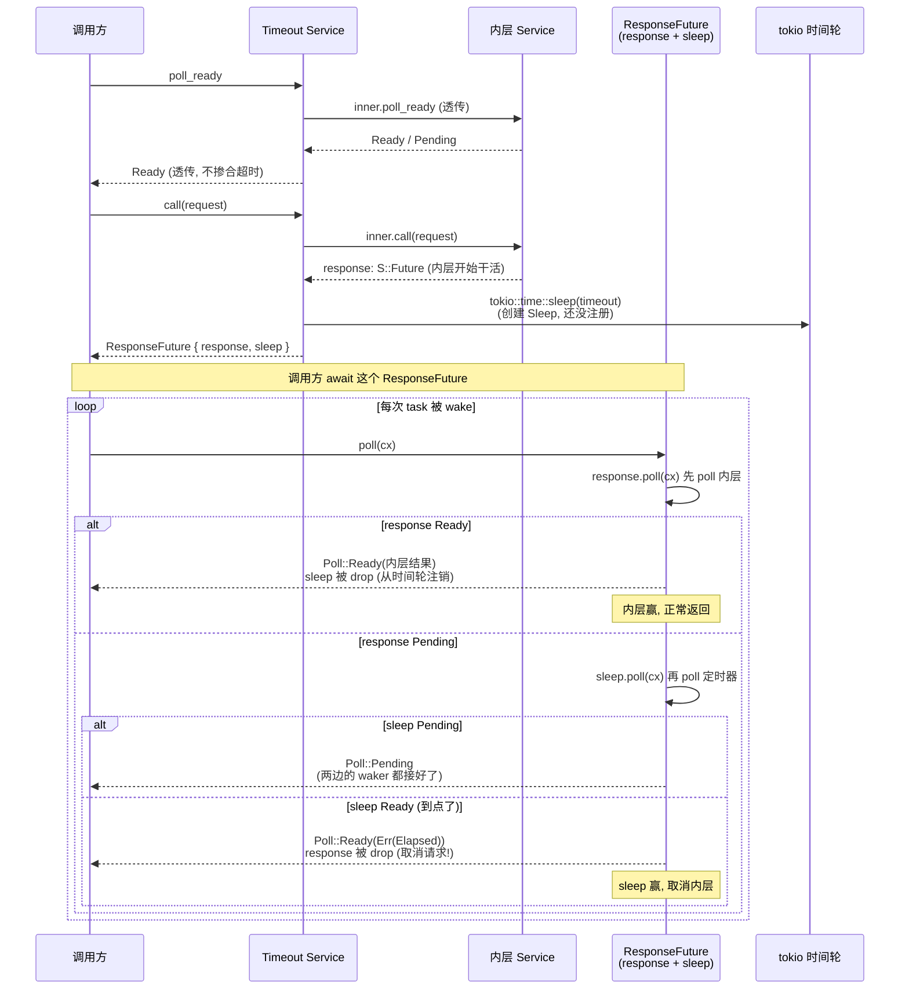

# 第 3 篇 · 第 8 章 · Timeout:给 Future 套一个截止时间

> **核心问题**:一个请求发出去之后,如果它跑得没完没了,你怎么把它切断?超时这件事,在 Rust 异步里到底意味着什么——是"等够了时间就抛错",还是"把那个还在跑的 Future 真正取消掉"?Tower 的 `Timeout` 怎么把"给响应套一个截止时间"做成一个可复用的 `Service`/`Layer`,让任何内层服务都能套上?它用 `tokio::time::Sleep` 和内层响应 Future 抢跑,sleep 先到就 `drop` 掉内层 Future(这步等于取消请求)并返回一个 `Elapsed` 错误。这套机制为什么是 sound 的——为什么 `drop` 一个 Future 就等于取消它、不会泄漏资源?为什么 `Timeout<T>` 自己的 `poll_ready` 只是转发,不掺合超时逻辑?
>
> **读完本章你会明白**:
>
> 1. 超时不是"定时器响了之后顺手抛个错",而是"两个 Future(内层响应 + sleep)赛跑,谁先 Ready 用谁,sleep 赢了就 drop 另一个"——`drop` 一个 `Future` 在 Rust 异步里就是取消它,这个语义是 Timeout 整套设计的地基。
> 2. `Timeout` 怎么把"给响应套截止时间"做成可组合的 `Service`:`poll_ready` 原样转发(超时只管 `call` 返回的那个 Future,不管服务本身有没有准备好),`call` 里同时启动内层 Future 和一个 `tokio::time::Sleep`,把两者打包成一个 `ResponseFuture`。
> 3. 为什么生产实现里 `ResponseFuture::poll` **不是**用 `tokio::select!` 宏,而是手写"先 poll 内层、Pending 再 poll sleep"两步——这跟 `tower-service` 文档示例里的 `select!` 写法形成有意思的对照,各有各的道理。
> 4. 为什么这套取消语义是 sound 的:`select!`/手写双 poll 的公平 polling 不饿死任一边;`drop` 内层 Future 会沿着 task 树一路触发取消(承接《Tokio》Future drop = 取消);`poll_ready` 透传不丢背压(Timeout 自己不持有资源,资源在内层,所以 ready 跟内层走)。
>
> **逃生阀**:如果你对"`tokio::time::Sleep` 底层靠什么 tick"(时间轮 `runtime/time/wheel`)、"`Future` 被 `drop` 之后发生了什么"这两件事还想再夯实,这俩都是《Tokio》拆透过的,本章只一句带过指路 `[[tokio-source-facts]]`,篇幅全留给 Tower 怎么把这两件事缝成一个可复用的 Service/Layer。如果你完全没接触过 `tokio::select!`,可以先去翻 Tokio 那本书的 `select!` 章节,本章默认你看得懂 `select! { a = fut1 => ..., b = fut2 => ... }` 这种写法。

---

## 章首 · 一句话点破

> **`Timeout` 做的事,用一句话讲完:它给内层服务的响应 Future 配一个闹钟(`tokio::time::Sleep`),两个 Future 同时跑,谁先完成谁说话——内层先完成就用内层的结果,闹钟先响就把内层 Future `drop` 掉(这一 drop 就等于把请求取消了)并返回一个 `Elapsed` 错误。`poll_ready` 全程只是透明转发,因为"超时"只关心 `call` 之后那段等待,不关心服务本身有没有准备好。**

这是结论,不是理由。本章倒过来拆:慢请求为什么会拖垮系统(而不只是"用户体验差")?Rust 异步本来怎么支持"两个 Future 赛跑"(tokio::select!),如果不把它做成可复用的 Service/Layer,每个业务自己手写超时有多痛?然后才看 `Timeout` 为什么敢用 `drop` 取消 Future(承接 Tokio 的取消语义)、为什么 `poll_ready` 透传就够、以及生产源码里那个反直觉的细节——`ResponseFuture::poll` 居然不是 `select!`,而是手写两步 poll,为什么?

本章服务**执行单元**这一面。`Timeout` 是个 `Service<Request>`,它的 `call` 返回一个 `ResponseFuture`,这个 `ResponseFuture` 同时持有一个内层响应 Future 和一个 `Sleep`,poll 一次相当于让两者各跑一步。这是第 3 篇"限流与超时"的第一章,和后面两章([P3-09 ConcurrencyLimit](P3-09-ConcurrencyLimit-并发数上限.md) 限并发数、[P3-10 RateLimit](P3-10-RateLimit-令牌桶控速率.md) 限速率)合起来,讲 Tower 怎么从"时间维度"和"数量维度"两头控住流量。

---

## 正文

### 第 1 节 · 慢请求为什么是事故,而不只是体验问题

在讲 Timeout 怎么实现之前,先回答一个容易被轻视的问题:**慢请求到底有多可怕?**

很多人对超时的第一反应是"用户体验"——用户等 10 秒就烦了,所以设个 3 秒超时让用户早点死心。这个理解对一半,但严重低估了慢请求在生产系统里的破坏力。慢请求真正可怕的地方,不在于"一个用户等得久",而在于**它会通过资源占用,把慢传染给整个系统,甚至传染给本来不慢的请求**。这种传染在分布式系统里有个专门的名字:**延迟堆积导致的雪崩**。

回忆一下 [P2-07 LoadShed](P2-07-LoadShed与背压的取舍.md) 里那个商品详情页的事故。库存服务挂了个慢查询,单次请求从 5ms 飙到 5s。每个堆在途中的请求都占着一份资源:一个 Tokio task(默认栈 2MB,虽然实际用不了那么多,但 task 控制块 + 栈空间至少占几十 KB)、一份连接 buffer、一份上下文。QPS = 10000、延迟 5s 的时候,在途请求数 = 50000,光 task 控制块就吃掉几百 MB,如果连接池也跟着打满,数据库那边更惨。

注意那个推演的关键:**雪崩的根因不是流量突增,是延迟飙升**。QPS 没变,变的是下游消化速率。消化速率 < 到达速率,差出来的请求全堆在中间。而堆着的每个请求都是一份被锁死的资源——内存、连接、task 槽位。堆到一定程度,要么 OOM,要么连接池耗光,要么 Tokio 调度器被几万个 task 拖慢(每个 worker poll 一轮的开销随 task 数增长),最终整个服务自己挂掉,而不是那个慢的下游挂掉。

这种事故在生产里屡见不鲜,而且有个特别阴险的特征:**它不报错**。下游只是慢,没有返回错误;你的服务只是堆请求,没有触发任何告警阈值(很多监控只盯错误率,不盯延迟分布);等监控发现 p99 飙升时,雪崩已经开始,回滚都来不及。这就是为什么所有成熟的 RPC 框架、HTTP client、数据库 driver,都把"超时"当成一等公民——不是可选的体验优化,是必须的生存机制。

> **钉死这件事**:慢请求的破坏力 = 在途请求数 × 每个请求占的资源。在途请求数 = QPS × 延迟。延迟一飙升,在途请求数线性涨,资源占用线性涨,涨过临界点就雪崩。超时不是"让用户早点死心",是"在延迟飙升时主动切断堆着的请求,释放它们占的资源,阻止雪崩"。这是超时在生产系统里的真实角色。

把上面这段推演再钻一步,就能看清超时到底在"切"什么。假设你给库存调用设了 1 秒超时:

- 正常情况(库存延迟 5ms):几乎所请求都在 5ms 内返回,超时永远不会触发,1 秒的截止时间形同虚设——但它在,像个保险丝,平时不通电,出了事才起作用。
- 库存慢到 5s:每个请求跑 1 秒后还没返回,超时触发,切断这个请求(在 Tower 里就是 drop 掉那个响应 Future),这个请求占的 task、连接槽、内存立刻释放。调用方拿到一个 `Elapsed` 错误,可以走降级(查缓存、返回默认值),而不是傻等剩下的 4 秒。
- 关键后果:在途请求数从"QPS × 5s = 50000"被压到"QPS × 1s = 10000",资源占用降一个数量级,雪崩阈值不容易撞到。

这就是超时的力学:它给每个请求设一个**资源占用上限**——这个请求最多占资源 1 秒,1 秒后无论下游回没回,强制释放。延迟飙升时,超时把"无界等待"切成"有界等待",从而把"无界资源占用"切成"有界资源占用"。理解了这一点,后面所有实现细节(为什么用 sleep 抢跑、为什么 drop Future、为什么 poll_ready 透传)都有了共同的动机——它们都在服务"给资源占用设上限"这件事。

还有一个容易被忽略的点:超时和上一章 [LoadShed](P2-07-LoadShed与背压的取舍.md) 的"快速失败"是两种不同的生存策略,作用在请求生命的不同阶段。

- `LoadShed` 作用在**发请求之前**——它看 `poll_ready` 的信号,内层满载就直接不发,返回 `Overloaded` 错误。它的判断时机是"`call` 之前"。
- `Timeout` 作用在**发请求之后**——请求已经发出去了,内层正在处理,超时是在"等响应"这段时间里起作用。它的判断时机是"`call` 之后,Future resolve 之前"。

两者互补:`LoadShed` 防"压根不该发的请求",`Timeout` 防"发了但收不回来的请求"。生产配置里两者经常一起用——`LoadShed` 在外层把满载的请求挡掉,`Timeout` 在内层把发出后超时的请求切掉。这套组合我们在第 2 节末尾和章末都会再点一次。

### 第 2 节 · Rust 异步怎么支撑"两个 Future 赛跑":tokio::select! 和手写双 poll

既然超时的本质是"内层响应 Future 和一个定时器 Future 赛跑,谁先完成用谁",那 Rust 异步提供了什么支撑?答案有两个,都是《Tokio》拆透过的,这里只钉关键点再指路。

**支撑一:`tokio::time::Sleep` —— 一个到了点就 Ready 的 Future。**

`tokio::time::sleep(duration)` 返回一个 `Sleep` Future,它 `poll` 时如果还没到点就返回 `Pending`(并把"wake me at time T"注册到 Tokio 的定时器系统),到点了 executor 就 wake 这个 Future,下一次 poll 返回 `Ready(())`。底层 Tokio 用一个分层时间轮(`runtime/time/wheel`)管理海量定时器,添加/取消一个定时器都是 O(1),可以同时挂着几百万个 `Sleep` 而不拖慢系统。

> **承接《Tokio》[[tokio-source-facts]]**:`tokio::time::Sleep` 的底层机制——分层时间轮在 `runtime/time/wheel`、timer driver 怎么挂载到 reactor、`Sleep` 内部的 `Slot`/状态位、为什么 `Sleep` 是低开销的——这些都是《Tokio》拆透的内容,一句带过指路。本章只把 `Sleep` 当成一个"到点就 Ready 的 Future"来用,不展开它内部。

注意一个对 soundness 要紧的事实:`Sleep` 被 `drop` 时会从定时器系统里注销自己。这意味着 drop 一个还没响的 `Sleep` 是干净的——它不会留一个"幽灵定时器"在时间轮里将来误 wake 别的 task。这一点后面讲取消语义时要用:超时结束时,要么 sleep 赢(内层被 drop),要么内层赢(sleep 被 drop),两种情况下被 drop 的那个 Future 都会干净地清理自己的定时器/资源。

**支撑二:`tokio::select!` —— 让多个 Future 同时跑,谁先 Ready 谁的话算数。**

`tokio::select!` 是 Rust 异步里"赛跑"的标准写法。伪代码:

```rust
// 简化示意(非源码原文)——select! 的语义
tokio::select! {
    res = inner_response_fut => {
        // 内层先 Ready,用它的结果
        res
    }
    _ = timeout_sleep => {
        // sleep 先 Ready(到点了),内层还没回,返回超时错误
        Err(Elapsed)
    }
}
```

`select!` 展开后的核心逻辑是:**公平地同时 poll 所有分支**。具体说,它把每个分支的 Future 拿出来 poll 一次,如果某个分支 `Ready` 了,就用那个分支的结果,其余分支的 Future **被 drop**(`select!` 是个宏,生成的代码在某个分支匹配后会 drop 掉其他分支的 Future);如果所有分支都 `Pending`,整个 `select!` 返回 `Pending`,等任何一个 Future wake 时再重来一轮。

这里有个 soundness 关键点:`select!` 是**公平的(fair)**——它不会偏爱某个分支。每次 poll 时,分支的 poll 顺序是随机的(具体说,`select!` 内部用 `rand` crate 在每次 poll 时打乱分支顺序),这避免了"两个分支同时 Ready 时永远只选第一个"的饥饿。对 Timeout 来说,这意味着"内层和 sleep 恰好在同一轮 poll 里都 Ready"时,选谁是随机的,不会因为某个分支写在前面就被偏爱。这个公平性在绝大多数场景下无关紧要(内层和 sleep 同时 Ready 的概率极低),但在"超时恰好和响应同时发生"的边界情况下保证了无偏好。

> **承接《Tokio》[[tokio-source-facts]]**:`select!` 的展开机制(它是个过程宏,生成一个状态机)、为什么是公平的(每次 poll 随机打乱分支顺序)、`select!` 里被丢弃的分支 Future 会触发取消——这些《Tokio》拆过,一句带过指路。本章把 `select!` 当成"赛跑的原语"来用,重点放在 Tower 怎么把它缝进 Service 抽象。

**支撑三:Future drop = 取消。这是 Rust 异步取消语义的地基。**

这条最重要。在 Rust 异步里,**一个 Future 被 `drop` 掉,就等于取消它**。为什么?因为 Future 是个状态机,它的"进度"全部存在自己的字段里(局部变量、await 点之前算出的中间值、持有的资源)。drop 一个 Future,就是 drop 它的所有字段,字段里持有的资源(锁、连接、buffer、嵌套的 Future)跟着 release。这个语义是编译器和标准库保证的,承接 `Drop` trait 的常规语义。

对 Timeout 来说,这条语义是命脉:超时触发时,sleep 赢了,内层响应 Future 被 drop——这个 drop 会一路传播下去,把"正在等下游响应"这件事真正取消掉。如果内层是个 hyper client 发出的 HTTP 请求,drop 它的 Future 会关闭底层连接(或把连接归还连接池时标记为不可复用,避免复用一个已经被取消的请求的连接);如果内层是个数据库查询 Future,drop 它会取消查询、释放连接;如果内层又是一层 Tower Service,drop 会沿着 Service 树一路传下去。这就是"超时真正切断请求"在 Rust 里的实现方式——不是某个特殊的 `cancel()` API,就是普普通通的 `drop`。

> **承接《Tokio》[[tokio-source-facts]]**:Future drop = 取消这个语义,是 Tokio/async-std/所有 Rust async 运行时共享的(因为它来自 `core::future::Future` + `Drop`,不是某个运行时的特性)。Tokio 的 task 被 `abort`(JoinHandle::abort)本质也是 drop task 的 Future。为什么 drop Future 能干净地取消一切——因为 Future 的所有状态都在自己字段里,Drop 释放字段就释放了所有资源——详见《Tokio》讲 Future/cancel 那几章。本章后续所有"取消请求"的论述,地基都是这条。

**不这样会怎样**:如果 Rust 异步没有"Future drop = 取消"这条语义(像某些语言那样,cancel 一个异步任务需要显式调 `cancel()`,或者根本无法取消),那 Timeout 就退化成"定时器响了之后抛个错,但底层那个还在跑的 Future 继续跑、继续占资源"。这种"假超时"在生产里比"没超时"更危险——你以为切断了,实际没切断,资源照样占着,雪崩照样发生,你还被蒙在鼓里(因为你的监控看到超时错误,以为系统在工作)。Rust 的 drop 取消语义让 Timeout 的"切断"是真的切断,这是这套设计 sound 的根基。

到这里,Rust 异步给超时提供的三个支撑都清楚了:`Sleep`(到点 Ready 的 Future)、`select!`/手写 poll(让两个 Future 赛跑)、Future drop = 取消(赛跑输了的那方被干净回收)。下面看 Tower 怎么把这三者缝成一个可复用的 Service。

### 第 3 节 · 所以 Tower 的 Timeout 这么设计:poll_ready 透传,call 里塞个 sleep

先看 `Timeout` 这个 Service 长什么样。它的定义简单得让人意外:

```rust
// tower/src/timeout/mod.rs#L17-L22
/// Applies a timeout to requests.
#[derive(Debug, Clone)]
pub struct Timeout<T> {
    inner: T,
    timeout: Duration,
}
```

两个字段:`inner: T`(被包的内层服务,`T` 是个 `Service`),`timeout: Duration`(超时时长)。`#[derive(Clone)]`——只要内层 `T` 是 `Clone` 的,`Timeout<T>` 就是 `Clone` 的,这点和 [LoadShed](P2-07-LoadShed与背压的取舍.md) 一样,是 Service 能被 `ServiceBuilder` 链式组合、能被多 task 共享的前提。

然后是 `Service` impl。这里有个**反直觉但极其关键的设计决策**:`Timeout` 的 `poll_ready` 完全透传,不掺合任何超时逻辑。看源码:

```rust
// tower/src/timeout/mod.rs#L48-L62
impl<S, Request> Service<Request> for Timeout<S>
where
    S: Service<Request>,
    S::Error: Into<crate::BoxError>,
{
    type Response = S::Response;
    type Error = crate::BoxError;
    type Future = ResponseFuture<S::Future>;

    fn poll_ready(&mut self, cx: &mut Context<'_>) -> Poll<Result<(), Self::Error>> {
        match self.inner.poll_ready(cx) {
            Poll::Pending => Poll::Pending,
            Poll::Ready(r) => Poll::Ready(r.map_err(Into::into)),
        }
    }

    fn call(&mut self, request: Request) -> Self::Future {
        let response = self.inner.call(request);
        let sleep = tokio::time::sleep(self.timeout);

        ResponseFuture::new(response, sleep)
    }
}
```

逐行拆:

**`type Response = S::Response`**:Timeout 不改响应类型。内层返回什么,Timeout 就返回什么。超时只影响"什么时候算失败",不影响"成功时返回什么"。

**`type Error = crate::BoxError`**:错误类型被擦成 `BoxError`(就是 `Box<dyn std::error::Error + Send + Sync>`,定义在 `tower/src/lib.rs#L228`)。为什么?因为 Timeout 可能产生两种错误:内层自己的错误(`S::Error`),和超时错误(`Elapsed`)。这两种错误类型不一样,要统一成一个类型返回,就得用 trait object 擦掉具体类型。约束 `S::Error: Into<crate::BoxError>` 保证内层错误能转成 `BoxError`。这是 Tower 全书通用的错误擦除套路,后面 `Retry`/`LoadShed`/`Balance` 全这么干。

**`type Future = ResponseFuture<S::Future>`**:`call` 返回的 Future 不是裸的 `S::Future`,而是包了一层的 `ResponseFuture<S::Future>`。这个 `ResponseFuture` 同时持有内层 Future 和 sleep,是整套超时机制的核心,下一节专门拆。

**`poll_ready`(关键)**:`self.inner.poll_ready(cx)`,Pending 就 Pending,Ready 就 Ready(转一下错误类型)。**完全没有超时逻辑掺合进来**。为什么?这是整个 Timeout 设计里最值得想清楚的一点。

回忆一下 [P1-02 Service trait](P1-02-Service-trait-一个请求一个Future.md) 里 `poll_ready` 的契约,以及 [P2-07 LoadShed](P2-07-LoadShed与背压的取舍.md) 里那个"`poll_ready` 在背什么压"的讨论。`poll_ready` 问的是"**服务现在能不能接受一个请求**"——它关心的是服务的产能状态(连接池有空闲连接吗、并发额度还有吗、channel 有空位吗)。资源是**在 `call` 里被消费**的(发请求占连接、占并发额度、占 channel slot),`poll_ready` 是在"预约"这些资源。

那"超时"这件事,发生在哪个阶段?发生在**请求已经发出去之后,等响应回来这段时间**。也就是 `call` 返回 Future 之后,Future 还没 resolve 那段。`poll_ready` 阶段请求还没发,根本谈不上"超时"——你没法给一个还没开始的等待设截止时间。

> **钉死这件事**:`Timeout` 的 `poll_ready` 透传,不是因为偷懒,是因为**超时根本不发生在 `poll_ready` 阶段**。`poll_ready` 问的是"能不能发请求",超时管的是"发出后等多久"。两者作用在请求生命的不同阶段,所以 Timeout 的 `poll_ready` 完全不需要掺合超时逻辑,直接把"能不能发"的问题原样转给内层就行。内层说能,Timeout 就说能;内层说不能(Pending),Timeout 就 Pending。背压信号原样透传,Timeout 一个字节都不改。

这个设计和 [LoadShed](P2-07-LoadShed与背压的取舍.md) 形成有意思的对照。`LoadShed::poll_ready` 也是调内层 `poll_ready`,但它**改写了结果**——把 `Pending` 吞掉,对外永远宣称 `Ready`,然后在 `call` 里根据偷偷记的 `is_ready` 决定 shed 还是不 shed。`LoadShed` 必须改写 `poll_ready` 因为它的全部职责就是"改写背压信号"(把"等"翻成"拒")。

`Timeout` 不一样。`Timeout` 的职责是"给等响应这段时间设上限",它不动背压,所以 `poll_ready` 透传。这是个干净的职责分离:`LoadShed` 干预背压(在 `poll_ready` 上做文章),`Timeout` 不干预背压(只在 `call` 返回的 Future 上做文章)。两者都是 Service 中间件,但作用点完全不同。

**`call`**:这是 Timeout 全部魔力的所在。三行:

```rust
// tower/src/timeout/mod.rs#L64-L69
fn call(&mut self, request: Request) -> Self::Future {
    let response = self.inner.call(request);
    let sleep = tokio::time::sleep(self.timeout);

    ResponseFuture::new(response, sleep)
}
```

第 1 行:`self.inner.call(request)`——把请求发给内层,拿到内层的响应 Future。这一步是真实的请求派发,内层服务开始干活(发 HTTP 请求、查数据库、调下游)。

第 2 行:`tokio::time::sleep(self.timeout)`——创建一个 `Sleep` Future,它会在 `self.timeout` 之后 Ready。**注意这一步只是创建,没开始跑**。`Sleep` 是 lazy 的——创建它不会启动定时器,定时器是在第一次 `poll` 它时才注册到时间轮的(详见《Tokio》,一句带过)。所以这一行几乎零成本。

第 3 行:`ResponseFuture::new(response, sleep)`——把两个 Future 打包成一个 `ResponseFuture`。从这一刻起,这两个 Future 就被绑在了一起,它们的命运是:一起被 poll,谁先 Ready 谁说了算,输的那个被 drop。

这三行代码完成了"给响应套截止时间"的全部装配。注意它**没有 spawn 任何 task**——`sleep` 和 `response` 不是在两个 task 里分别跑然后通过 channel 通信,而是被塞进同一个 `ResponseFuture`,由 poll 这个 `ResponseFuture` 的那个 task 一并驱动。这是 Rust 异步的"一个 task 可以同时 await 多个 Future"特性的体现(通过 `select!` 或手写 poll 实现),也是 Timeout 开销极低的原因——没新 task,没 channel,就是同一个 task 里多 poll 一个 Future。

> **对照《hyper》[[hyper-source-facts]]**:hyper 也有超时(connect timeout、read timeout、write timeout),但 hyper 的超时是配在 `hyper-util` 的 `Connector`/`http_io` 层的,不是用 Tower Service 包出来的——因为 hyper 的 Service 删了 `poll_ready`,而且 hyper 的超时是协议层 IO 超时,作用在 `AsyncRead`/`AsyncWrite` 的 poll 上,不是作用在"整个响应 Future"上。Tower 的 `Timeout` 是协议无关的、作用在整个响应 Future 层面的超时,可以套在任何 Service 外面(包括套在 hyper 的 Connector 外面)。这是个抽象层次的区别,一句带过指路。axum 里给路由套 `TimeoutLayer` 用的就是 Tower 这套,作用在整个 handler Future 上。

### 第 4 节 · 源码佐证:ResponseFuture 是怎么"赛跑"的

现在看 `ResponseFuture`——整套超时机制的核心。它的定义用 `pin_project_lite::pin_project!` 宏生成:

```rust
// tower/src/timeout/future.rs#L12-L23
pin_project! {
    /// [`Timeout`] response future
    ///
    /// [`Timeout`]: crate::timeout::Timeout
    #[derive(Debug)]
    pub struct ResponseFuture<T> {
        #[pin]
        response: T,
        #[pin]
        sleep: Sleep,
    }
}
```

两个字段:`response: T`(内层响应 Future,类型参数 `T` 就是 `S::Future`),`sleep: Sleep`(`tokio::time::Sleep` 的实例)。两个字段都标了 `#[pin]`,意味着它们被钉在内存里(不能移动),这是手写 Future 状态机的标准要求——因为 Future 内部可能有自引用结构,必须 Pin 才能安全 poll。

> **承接《Tokio》[[tokio-source-facts]]**:`pin_project_lite::pin_project!` 宏、`Pin<&mut Self>`、为什么手写 Future 要 Pin——这些都是 P1-02 已讲过、《Tokio》拆透的 `Pin`/投影语义,一句带过指路。本章把 `pin_project!` 当成"手写 Future 状态机的标准工具"来用。

构造函数极其简单:

```rust
// tower/src/timeout/future.rs#L25-L29
impl<T> ResponseFuture<T> {
    pub(crate) fn new(response: T, sleep: Sleep) -> Self {
        ResponseFuture { response, sleep }
    }
}
```

就是把两个 Future 存起来,没有任何额外逻辑。

然后是核心——`Future` 的 `poll` 实现。这里是整个 Timeout 最有意思的地方,也是本章要重点讲清楚的"源码印象修正"点:

```rust
// tower/src/timeout/future.rs#L31-L53
impl<F, T, E> Future for ResponseFuture<F>
where
    F: Future<Output = Result<T, E>>,
    E: Into<crate::BoxError>,
{
    type Output = Result<T, crate::BoxError>;

    fn poll(self: Pin<&mut Self>, cx: &mut Context<'_>) -> Poll<Self::Output> {
        let this = self.project();

        // First, try polling the future
        match this.response.poll(cx) {
            Poll::Ready(v) => return Poll::Ready(v.map_err(Into::into)),
            Poll::Pending => {}
        }

        // Now check the sleep
        match this.sleep.poll(cx) {
            Poll::Pending => Poll::Pending,
            Poll::Ready(_) => Poll::Ready(Err(Elapsed(()).into())),
        }
    }
}
```

**注意:这里是手写两步 poll,不是 `tokio::select!`。**

很多人(包括很多教程)讲到 Tower Timeout,第一反应是"它用 `tokio::select!` 让 response 和 sleep 赛跑"。这个印象不完全错——`tower-service` crate 的文档示例确实用了 `select!`(我们下面会看),但**生产实现 `tower/src/timeout/future.rs` 是手写两步 poll**。这两者语义上有微妙差别,实现上各有考量,是本章要重点讲透的对照点。

先拆手写两步 poll 的逻辑:

**第 1 步**:`this.response.poll(cx)`——先 poll 内层响应 Future。

- 如果返回 `Poll::Ready(v)`:内层完成了!用它的结果 `v`(用 `.map_err(Into::into)` 把内层错误转成 `BoxError`),立刻 `return`。**注意:这里 return 之后,`self` 会被 drop,`self.sleep` 跟着 drop——那个 `Sleep` Future 被干净地从时间轮里注销**。这是"内层赢,sleep 被 drop"的路径。
- 如果返回 `Poll::Pending`:内层还没完成。**不 return**,继续往下。

**第 2 步**:`this.sleep.poll(cx)`——poll 定时器。

- 如果返回 `Poll::Pending`:定时器还没到点。整个 `ResponseFuture::poll` 返回 `Poll::Pending`,等下次被 wake。
- 如果返回 `Poll::Ready(())`:到点了!返回 `Poll::Ready(Err(Elapsed(()).into()))`——超时错误。**注意:这里 return 之后,`self` 被 drop,`self.response`(内层 Future)跟着 drop——内层那个还在跑的请求被取消**。这是"sleep 赢,内层被 drop(取消)"的路径。

这两步合起来,实现了"赛跑"语义:每次被 poll,先看内层好了没,好了就用内层结果;没好再看定时器,定时器到了就报超时;都没好就 Pending 等下次。

那为什么先 poll response、再 poll sleep,而不是反过来?这是个**有意的优先级**:在两者都 Ready 的边界情况下(同一轮 poll 里内层和定时器同时 Ready),先 poll 的那个赢——所以内层优先。这意味着"恰好超时那一刻内层也返回了"时,算内层成功,不算超时。这是个对调用方更友好的选择:宁可给成功,也不误报超时。注释里那句 `// First, try polling the future` 就是在强调这个顺序。

这个顺序选择看似细节,在边界情况下有实际后果。假设你设了 1 秒超时,内层恰好在第 1.0001 秒返回。如果先 poll sleep,sleep 已经 Ready(到点了),报超时,内层那个 1.0001 秒的结果被 drop 丢弃——调用方拿到超时错误,以为失败了,实际内层成功了(可能还改了数据库)。如果先 poll response(像源码这样),response 还没 Ready(因为它在第 1.0001 秒才 Ready,这一轮 poll 时还是 Pending),继续 poll sleep,sleep Ready,报超时——结果一样是超时。所以这个优先级在"内层略晚于超时"的情况下救不回来。

但它能救的是"内层恰好和超时同步 Ready"的情况——同一轮 poll 里两个都 Ready,先 poll 的赢,内层赢。这种"完全同时"的情况概率极低,但先 poll response 的约定保证了即使发生也不误判。这是个细节,但体现了源码作者对边界情况的考量。

> **反面对比——如果朴素地用 `tokio::select!`**:`tower-service` crate 的文档示例(`tower-service/src/lib.rs#L188-L200`)就是这么写的,用 `select!`:
>
> ```rust
> // tower-service/src/lib.rs#L188-L200(文档示例,非生产实现)
> let f = async move {
>     tokio::select! {
>         res = fut => {
>             res.map_err(|err| err.into())
>         },
>         _ = timeout => {
>             Err(Box::new(Expired) as Box<dyn Error + Send + Sync>)
>         },
>     }
> };
> Box::pin(f)
> ```
>
> 这个示例用 `async move { select! { ... } }` + `Box::pin(f)`,是个直观的教学写法。它和 `tower/src/timeout/future.rs` 的生产实现有三点区别,正好反映"教学版"和"生产版"的取舍:
>
> 1. **堆分配**:`Box::pin(f)` 把整个 async block 编译出来的 Future 状态机堆分配了一次(因为 `Box::pin`)。生产版用 `pin_project!` 手写状态机,`ResponseFuture` 直接在调用方的栈上(或调用方所在 task 的栈上)构造,**零堆分配**。对一个可能套在每个请求上的中间件,省掉每次请求一次堆分配是值得的。
> 2. **`'static` 约束**:`async move { ... }` 编译出来的 Future 需要捕获 `fut` 和 `timeout`,这要求它们是 `'static` 的(因为 `Box::pin<dyn Future>` 隐式要求 `'static`)。文档示例的 `where T::Future: 'static` 就是这个约束带来的。生产版手写 `ResponseFuture<T>`,没有 `'static` 约束,可以用在非 `'static` 的场景。
> 3. **公平性**:`select!` 内部每次 poll 随机打乱分支顺序(公平),手写两步 poll 是固定顺序(先 response 后 sleep)。前面说过,这个差别在"两个分支同时 Ready"的边界情况才有影响——手写版让 response 永远赢,`select!` 版随机。生产版选了"内层优先",是有意的语义选择(宁可成功)。
>
> 所以"Timeout 用 select!"这个印象,严格说是**文档示例的写法,不是生产实现的写法**。生产实现为了零分配、去掉 `'static` 约束、明确优先级,选了手写双 poll。这是本章要修正的一个常见印象,也是"看文档学 API"和"读源码学实现"的典型差别——文档为了直观牺牲了性能,源码为了性能牺牲了直观。

到这里,`ResponseFuture` 的 poll 逻辑清楚了。还有个细节值得点一下:**这个 poll 不是"先 poll 一边再 poll 另一边,然后等下次 wake"这么简单**,它依赖 Rust Future 的"wake 重 poll"机制。

具体说,假设某次 poll 时:response 返回 Pending,sleep 也返回 Pending。这时整个 `ResponseFuture::poll` 返回 Pending。但**两个子 Future 在返回 Pending 时,都已经通过 `cx` 的 waker 注册了"我好了就 wake 你"**——response 注册了"下游响应来了就 wake",sleep 注册了"到点了就 wake"。这两个 wake 共用同一个 waker(就是 `cx.waker()`),所以任何一个先发生,都会 wake 这个 `ResponseFuture` 所在的 task,task 重新被调度,重新 poll `ResponseFuture`,又走一遍"先 response 后 sleep"。这就是 Rust 异步"一个 task 驱动多个 Future"的机制——不需要为每个 Future 起一个 task,共用一个 task,靠 waker 串起来。

这个机制对 soundness 是要紧的:它保证 response 和 sleep 谁先 Ready 都能被及时感知,不会出现"response Ready 了但没人 poll 它"的漏 poll。这也是为什么 `ResponseFuture` 不需要自己 spawn task、不需要 channel——waker 机制已经把两个 Future 的唤醒都接到了同一个 task 上。

最后看超时错误 `Elapsed`:

```rust
// tower/src/timeout/error.rs#L5-L22
/// The timeout elapsed.
#[derive(Debug, Default)]
pub struct Elapsed(pub(super) ());

impl Elapsed {
    /// Construct a new elapsed error
    pub const fn new() -> Self {
        Elapsed(())
    }
}

impl fmt::Display for Elapsed {
    fn fmt(&self, f: &mut fmt::Formatter<'_>) -> fmt::Result {
        f.pad("request timed out")
    }
}

impl error::Error for Elapsed {}
```

`Elapsed(pub(super) ())`——又是个零大小类型(和 [LoadShed 的 Overloaded](P2-07-LoadShed与背压的取舍.md) 一样的套路)。`pub(super)` 让那个 `()` 字段从外面构造不了(只有 `timeout` 模块内部能造),保证 `Elapsed` 只能由 Timeout 机制产生,用户没法自己 fake 一个。Display 是 `"request timed out"`,简洁明了。

零大小意味着造一个 `Elapsed` 错误几乎零成本(没堆分配,没数据)。这对 soundness 有间接好处:超时是高频事件(延迟飙升时可能每秒成千上万次),如果每次超时都要分配一个错误对象,GC 压力/分配器压力会成为新瓶颈。零大小错误让"失败也要失败得便宜"——这和 `LoadShed::Overloaded` 是同一种设计哲学。

至此,Timeout 的完整执行路径清楚了。用一张 mermaid 时序图把"一次请求穿过 Timeout"的全过程画出来:



红色那两条"被 drop"路径是整套机制的核心:内层赢则 sleep 被 drop(定时器注销,干净),sleep 赢则 response 被 drop(请求取消,干净)。两种情况下被 drop 的 Future 都会沿着 `Drop` 链路清理自己的资源,这就是 Timeout 取消语义 sound 的具体体现。

再看一张 ASCII 框图,把 `ResponseFuture` 的两个状态(内层赢 / sleep 赢)和各自的 drop 后果画清楚:

```
ResponseFuture<F> { response: F, sleep: Sleep }   两个字段都 #[pin]

        poll(cx)
          │
          ├─ 1. response.poll(cx)  先 poll 内层
          │
          ├─────────────────────────┬──────────────────────────────┐
          │ Ready(v)                │ Pending                       │
          │                         ▼                               │
          │                  2. sleep.poll(cx) 再 poll 定时器       │
          │                         │                               │
          │                  ┌──────┴───────┐                       │
          │                  │ Pending      │ Ready (到点)          │
          ▼                  ▼              ▼                       │
   返回 Ready(v)        返回 Pending   返回 Ready(Err(Elapsed))
   ────────────         ────────────   ──────────────────────
   self 被 drop:        等下次 wake    self 被 drop:
     • sleep 被 drop       (两边        • response 被 drop
       → 从时间轮注销       waker         → 内层 Future 取消
     • response 已 Ready    都接好        → 请求真正被切断
       不需要 drop          了 cx)        → 释放占的资源

   【内层赢, sleep 被清】          【sleep 赢, 内层被取消】
```

两种结局,两种 drop,两条干净的清理路径。没有第三种可能(因为 poll 一定返回 Ready 或 Pending,不 Ready 不 Pending 是未定义行为)。这就是 `ResponseFuture` 的完整状态空间,简单、闭合、sound。

---

## 技巧精解

这一节单独拆两个最硬核的点:第一个是 `drop` Future = 取消请求的 soundness 论证(为什么这一 drop 真的把请求切断了,不会泄漏资源);第二个是 `poll_ready` 透传 vs 改写的取舍——为什么 Timeout 透传是对的,什么时候透传是错的(用 [LoadShed](P2-07-LoadShed与背压的取舍.md) 对照)。

### 技巧 1 · 为什么 `drop` 一个 Future 就等于取消请求:soundness 论证

前面反复说"sleep 赢了,response 被 drop,请求被取消"。但这一句话里藏着一个强假设:**drop 一个 Future,真的能干净地取消它代表的那个异步操作**。这个假设成立吗?在 Rust 异步里成立,但成立的机制值得单独拆,因为这是整套 Timeout 设计 sound 的根基。

先看 Rust 异步里 Future 是什么。一个 `Future` 是个实现了 `core::future::Future` trait 的状态机,它的全部"进度"存在自己的字段里。具体说,一个 async fn 编译出来的 Future,大致长这样(简化示意,非源码原文):

```rust
// 简化示意(非源码原文)——async fn 编译出来的 Future 大致结构
enum MyAsyncFnFuture {
    Start { arg: SomeType },
    AwaitingStep1 { fut1: Step1Future, local: i32 },
    AwaitingStep2 { fut2: Step2Future, intermediate: String },
    Done,
}
```

每个 variant 对应一个 await 点。执行到哪个 await 点,Future 就停在哪个 variant,所有"目前算到哪了"的信息(局部变量、正在 await 的子 Future、中间结果)都在字段里。drop 这个 Future,就是 drop 这个 enum 的当前 variant,variant 里的字段(局部变量、子 Future)跟着 drop。子 Future 又有自己的字段(可能又嵌套子 Future),一路 drop 下去。

这个过程的关键在于:**每一层 drop 都会触发那一层的 `Drop` 实现**(如果有的话),从而释放那一层持有的资源。比如:

- 一个持有 `MutexGuard` 的 Future,drop 时 guard 被 drop,锁释放。
- 一个持有数据库连接(`Connection`)的 Future,drop 时连接被 drop(归还连接池或真关闭)。
- 一个持有 `tokio::sync::oneshot::Sender` 的 Future,drop 时 Sender 被 drop,接收方会收到 `RecvError`(-cancel 信号)。
- 一个 hyper client 的响应 Future,drop 时底层 IO 操作被取消(连接被关闭或标记不可复用)。

所以 drop 一个 Future,不是简单地"忘了它",而是**沿着它的状态机树,自顶向下地触发所有嵌套的 `Drop`,释放所有持有的资源**。这就是"取消"——异步操作被强制终止,它占的资源被释放,它发起的下游操作(如果有 cancel 通道)也被通知取消。

把这个机制套到 Timeout 上:sleep 赢了,`ResponseFuture` 被 drop,它里面的 `response: F`(内层 Future)被 drop。内层 Future 是 `S::Future`——`S` 是 Timeout 包的内层 Service,它的 Future 代表"内层服务正在处理这个请求"。drop 这个 Future,就触发内层 Service 这一路的取消:

- 如果内层是个 hyper client Service:drop 它的响应 Future,hyper 那边底层连接被处理(关闭或标记),HTTP 请求被取消。
- 如果内层是个数据库 client Service(比如 diesel/tokio-postgres 封的):drop 它的查询 Future,查询被取消(发一个 `Cancel` 消息给数据库),连接归还连接池。
- 如果内层又是一层 Tower Service(比如 `Timeout<Retry<Balance<hyper>>>`):drop 会沿着 Service 树传下去,Retry 的 Future 被 drop,Balance 的 Future 被 drop,最后 hyper 的 Future 被 drop——一取消,一路取消到底。

这就是"Timeout 真正切断请求"在 Rust 里的实现方式。没有特殊的 `cancel()` API,没有"信号",就是普普通通的 `Drop`。这套机制 sound 的根基是 Rust 的所有权系统——每个值有唯一的 owner,owner 被 drop,值被 drop,层层递归。Future 不例外。

> **承接《Tokio》[[tokio-source-facts]]**:Tokio 的 task 被 `JoinHandle::abort()` 取消,本质也是 drop task 的 root Future——和这里 drop `response` 是同一套机制,只是作用在更顶层(task 的 Future vs Service 的 Future)。Tokio 还提供了 cancellation token(`tokio_util::sync::CancellationToken`),那是"协作式取消"——任务自己检查 token 决定要不要退出,不是强制 drop。Timeout 这里是"强制取消"(直接 drop Future),不是协作式。两者区别详见《Tokio》讲 cancel 那章,一句带过指路。

**反面对比——如果 drop Future 不等于取消(像 Go 那样)**:Go 的 goroutine 没法被外部强制取消——你不能"drop 一个 goroutine"。要取消一个 goroutine,得通过 `context.Context` 通知它,goroutine 自己 select 到 `ctx.Done()` 才退出。这叫"协作式取消"——被取消方得配合。如果被取消方忘了检查 context(比如在某个阻塞 IO 调用里没传 context),它就取消不掉,继续跑,继续占资源。Go 生产事故里有一大类就是这个——某个库函数忘了传 context,超时/取消信号传不到,goroutine 泄漏。

Rust 的 drop 取消没有这个问题:drop 是强制的,Future 没法"拒绝被取消"。被 drop 就是被 drop,资源释放,没有任何"配合"的余地。这让 Timeout 的取消语义天然 sound——只要内层 Future 的 `Drop` 实现是对的(标准库/Tokio/hyper 这些都验证过),drop 就一定能取消。

但 Rust 的强制 drop 也有代价:**被取消的 Future 没机会"优雅收尾"**。比如一个 Future 正在做一个多步操作(开事务 → 改数据 → 提交),被 drop 时可能停在"改数据"之后、"提交"之前,事务没提交也没回滚(取决于底层数据库 client 的 Drop 实现——好的 client 会在 Drop 时发 rollback,差的就留着挂起的事务)。这是 Rust 强制取消的固有风险,生产里要么用 `CancellationToken` 做协作式取消(让被取消方有机会清理),要么保证操作的幂等性,要么在 Drop 里写好清理逻辑。Timeout 这个层级通常不操心这个——它假设内层 Service 的 Future Drop 是 sound 的(标准库保证了),如果内层是个不 sound 的自定义 Service,那是内层的问题不是 Timeout 的问题。

**钉死这件事**:Timeout 的取消语义 sound,根基是"Rust 里 drop 一个 Future 等于取消它"。这个语义来自 `core::future::Future` + `Drop`,不是 Tokio 也不是 Tower 的发明。drop 沿着 Future 状态机树自顶向下触发所有嵌套 Drop,释放所有资源,一路传到底层 IO。这是 Timeout 敢用 drop 取消请求的原因,也是它不需要特殊 cancel API 的原因。代价是被取消方没机会优雅收尾,生产里要么靠内层 Drop sound,要么用 CancellationToken 协作式取消——但那是内层的责任,不是 Timeout 的。

### 技巧 2 · `poll_ready` 透传 vs 改写:为什么 Timeout 透传,LoadShed 改写

第二个技巧点,讲 Timeout 的 `poll_ready` 为什么是透传,以及和 [LoadShed](P2-07-LoadShed与背压的取舍.md) 的对照——两者同样是"包内层 Service 的中间件",一个透传 `poll_ready`,一个改写 `poll_ready`,为什么?

先把两者的 `poll_ready` 摆在一起对比:

```rust
// tower/src/timeout/mod.rs#L57-L62 —— Timeout: 透传
fn poll_ready(&mut self, cx: &mut Context<'_>) -> Poll<Result<(), Self::Error>> {
    match self.inner.poll_ready(cx) {
        Poll::Pending => Poll::Pending,
        Poll::Ready(r) => Poll::Ready(r.map_err(Into::into)),
    }
}

// tower/src/load_shed/mod.rs#L43-L54 —— LoadShed: 改写(吞掉 Pending)
fn poll_ready(&mut self, cx: &mut Context<'_>) -> Poll<Result<(), Self::Error>> {
    self.is_ready = match self.inner.poll_ready(cx) {
        Poll::Ready(Err(e)) => return Poll::Ready(Err(e.into())),
        r => r.is_ready(),
    };
    Poll::Ready(Ok(()))   // ← 关键:对外永远 Ready
}
```

两者都调 `self.inner.poll_ready(cx)`,差别在怎么处理结果:

- **Timeout**:原样转。Pending 就 Pending,Ready 就 Ready。一个字节不改。
- **LoadShed**:把结果记进 `is_ready`,但对外永远返回 `Ready(Ok(()))`——吞掉 Pending。

这个差别不是风格问题,是**职责不同**的直接投影。

回忆一下两者的职责(前面各章都讲过,这里浓缩):

| 中间件 | 职责 | 作用阶段 | 是否动 poll_ready |
|--------|------|----------|-------------------|
| `Timeout` | 给等响应这段时间设上限 | `call` 之后(Future 阶段) | **不动**(透传) |
| `LoadShed` | 内层满载时快速失败 | `call` 之前(poll_ready 阶段) | **动**(吞 Pending) |

`Timeout` 的职责在 `call` 之后——它管的是"请求发出去了,等响应这段时间"。`poll_ready` 阶段请求还没发,Timeout 没什么可管的,所以透传。`Timeout` 的"超时"逻辑全在 `ResponseFuture` 里(那是 `call` 之后的事),`poll_ready` 这层完全不需要掺合。

`LoadShed` 的职责在 `call` 之前——它管的是"内层满载了,要不要发这个请求"。`poll_ready` 正是"内层满没满"的信号来源,LoadShed 必须读取这个信号并据此决策(发还是 shed)。所以 LoadShed 必须动 `poll_ready`——它的工作就在这一层。

这个对照可以推广成一个**判断中间件该不该动 poll_ready 的准则**:

> **钉死这件事**:一个 Tower 中间件该不该改写 `poll_ready`,取决于它的职责作用在请求生命的哪个阶段。如果作用在 `call` 之前(决定发不发、什么时候发),它必须动 `poll_ready`(读/改就绪信号)——`LoadShed`、`ConcurrencyLimit`(在 poll_ready 里 acquire permit)、`Buffer`(在 poll_ready 里 reserve channel slot)、`RateLimit`(在 poll_ready 里扣令牌)都是这类。如果作用在 `call` 之后(给响应 Future 加工),它的 `poll_ready` 应该透传——`Timeout` 是这类最典型的例子,后面 [P4-13 Reconnect](P4-13-Reconnect-断线重连.md) 那种"给 Future 加重连"的也是这类。

这个准则还可以反过来用:**看一个中间件的 `poll_ready` 怎么写,就能猜出它的职责阶段**。如果一个中间件的 `poll_ready` 是透传的,它大概率是个"响应加工型"中间件(动 Future 不动就绪)。如果它的 `poll_ready` 有自定义逻辑(acquire/ reserve/记账),它大概率是个"准入控制型"中间件(动就绪信号)。

这套准则有个 soundness 推论:**"响应加工型"中间件的 `poll_ready` 透传,是保证背压不丢的关键**。假设 `Timeout` 像下面这样(错误地)实现 `poll_ready`:

```rust
// 简化示意(非源码原文)——一个错误的 poll_ready,会丢背压
fn poll_ready(&mut self, cx: &mut Context<'_>) -> Poll<Result<(), Self::Error>> {
    Poll::Ready(Ok(()))   // ← 错!对外永远 Ready,不问内层
}
```

会发生什么?内层服务(比如一个 `ConcurrencyLimit` 包的数据库 client)并发满了,`poll_ready` 返回 Pending。但 `Timeout::poll_ready` 不问内层,直接返回 Ready。调用方以为 Timeout ready 了,调 `call`。`Timeout::call` 转发给内层——**但内层根本没 ready**!这一步要么 panic(因为 [Service trait 契约](../tower/tower-service/src/lib.rs#L350-L353)说"call 必须在 poll_ready Ready 之后调,否则实现可以 panic"),要么内层 Service 内部处理这个未就绪 call 时出错。

这就是"丢背压"——`poll_ready` 本该把"内层没 ready"这个信号传给上游,让上游等,结果被中间件吞掉了,上游以为可以发,发了撞内层满载。Timeout 透传 `poll_ready`,正是为了避免这个:它诚实地把内层的就绪状态传给上游,上游该等就等,背压一路传到底。

对比 [LoadShed](P2-07-LoadShed与背压的取舍.md) 改写 `poll_ready` 后为什么 sound——LoadShed 改写不是"吞了 Pending 就完了",它在 `call` 里有配套逻辑(`is_ready == false` 就返回 shed 错误,不转发给内层),所以即使对外宣称 Ready,`call` 也不会真去撞满载的内层。LoadShed 是"吞了 Pending 但在 call 里兜底"。如果 LoadShed 吞了 Pending 但 call 里还傻乎乎转发,那就是 bug——和上面那个错误的 Timeout 一样。

所以 soundness 的完整准则更精确:

> **一个中间件改写 `poll_ready`(吞 Pending)是 sound 的,当且仅当它的 `call` 有配套的"不发请求"逻辑**(像 LoadShed 那样根据记账决定转发还是 shed)。如果 `call` 总是无条件转发(像 Timeout 那样),那 `poll_ready` 必须透传,不能吞 Pending,否则就是丢背压。

Timeout 属于"`call` 总是转发"那类(它只动 Future 不动就绪决策),所以 `poll_ready` 必须透传。这是个干净的推论,也是 P1-02 那个"hyper 删 poll_ready vs Tower 保留"对照的又一个具体后果:正是因为 Tower 保留了 `poll_ready` 并要求中间件诚实处理它,才有这套"动不动就绪"的精细分类——hyper 删了 poll_ready,这种分类就没有意义,过载保护只能在别处(协议层 IO、连接数限制)做。

> **对照《hyper》[[hyper-source-facts]]**:hyper 的 Service 删了 `poll_ready`,所以 hyper 里没有 Timeout 这种"透传 poll_ready、只在 Future 上动"的 Service 抽象——hyper 的超时是配在 `hyper-util` 的 IO 层(connect/read/write timeout),作用在 `AsyncRead`/`AsyncWrite` 的 poll 上,不是作用在整个响应 Future 上。Tower 的 `Timeout` 是协议无关的、作用在整个 Service Future 层的抽象,可以套在 hyper 外面(axum 里给整个 handler 套 `TimeoutLayer` 就是这么用的)。这是抽象层次的差别,一句带过指路。

### 技巧 3 · 公平性细节:手写双 poll 不是 select!,边界情况怎么保证不饿死

第三个技巧点,补一个前面埋下的伏笔:手写双 poll(先 response 后 sleep)和 `tokio::select!`(随机顺序)在公平性上的差别,以及这个差别为什么在生产里无所谓、在边界情况下有所谓但被 Timeout 优先级选择吸收了。

`tokio::select!` 内部每次 poll 时,会随机打乱分支顺序(用 `rand` crate),这保证"两个分支同时 Ready"时,选谁是随机的,不会饥饿。这叫**公平 select**。

手写双 poll(像 `tower/src/timeout/future.rs#L41-L52` 那样)是**固定顺序**:每次先 poll response,后 poll sleep。这意味着"两个同时 Ready"时,response 永远赢。

对 Timeout 来说,这个差别影响的是"内层响应和定时器在同一轮 poll 里同时 Ready"这个边界情况。这种情况概率极低(要求内层恰好在定时器到点的那一轮 wake,精确到 poll 的粒度),但万一发生:

- `select!` 版:50% 概率算成功(response 赢),50% 算超时(sleep 赢)。对调用方来说,这次请求成功与否是"掷硬币"。
- 手写双 poll 版:100% 算成功(response 永远赢)。对调用方来说,这个边界情况总是倾向于成功。

生产版选手写双 poll,选的是"倾向于成功"。这是个有意的语义选择:在"差不多同时"的情况下,宁可算成功,不误报超时。理由是"误报超时"的代价通常大于"晚一点点成功"——误报超时让调用方走降级(查缓存、返回默认值),可能返回旧数据;而算成功,调用方拿到真实结果,只是比超时阈值晚了几微秒,通常无所谓。

这个选择不是没有代价:它让"超时"变得稍微"宽松"了一点——在边界情况下,即使定时器到点了,只要内层这一轮也 Ready 了,就算成功。但这通常符合用户的直觉("差不多到点但回来了,算它成功")。

如果用户想要严格的"到点就算超时"(即使内层这一轮 Ready 了也算),那得用 `select!` 版,或者手写"先 poll sleep 后 poll response"。但 Tower 选了"倾向于成功",这是个 opinionated 的选择,写在源码的注释和顺序里。

> **反面对比——如果用 `select!` 的随机公平**:`tower-service` 文档示例用 `select!`,在边界情况下是 50/50。文档示例这么写是为了直观(展示 select! 的用法),不是为了公平性。生产实现不用 `select!` 的真正理由前面讲过(零分配、去 `'static`、明确优先级),公平性差别只是顺带的后果。所以"Timeout 用 select!"这个印象不仅在实现细节上错(实际是手写双 poll),在公平性语义上也和文档示例不完全一样——又一条"文档学 API、源码学实现"的注脚。

这个公平性细节在生产里几乎可以忽略(边界情况概率太低),但讲清楚它有助于理解手写双 poll 和 `select!` 不是等价的——它们在边界情况下有不同的语义。这正是读源码(而不是读文档示例)才能发现的细节,也是本章要修正的"Timeout 用 select!"印象的深层原因。

---

## 配图:ResponseFuture 的状态空间与取消传播

最后用一张 mermaid 状态图把 `ResponseFuture` 的完整生命周期画出来,重点标出两种"被 drop"的路径和它们的后果:

```mermaid
stateDiagram-v2
    [*] --> Created: ResponseFuture::new(response, sleep)
    Created --> Polling: 首次 poll

    state Polling {
        [*] --> PollResponse
        PollResponse --> ResponseReady: response.poll = Ready(v)
        PollResponse --> ResponsePending: response.poll = Pending
        ResponsePending --> PollSleep
        PollSleep --> SleepPending: sleep.poll = Pending
        PollSleep --> SleepReady: sleep.poll = Ready (到点)
        SleepPending --> [*]: 返回 Pending, 等 wake
    }

    Polling --> InnerWins: response Ready
    Polling --> SleepWins: sleep Ready

    state InnerWins {
        [*] --> DropSleep
        DropSleep: sleep 被 drop<br/>从时间轮注销定时器
        DropSleep --> [*]: 返回 Ready(v)
    }

    state SleepWins {
        [*] --> DropResponse
        DropResponse: response 被 drop<br/>内层 Future 取消<br/>请求被切断, 资源释放
        DropResponse --> [*]: 返回 Ready(Err(Elapsed))
    }

    InnerWins --> [*]: 调用方拿到内层结果
    SleepWins --> [*]: 调用方拿到超时错误
```

两条终态路径,两种 drop,两条干净的清理链。这是 `ResponseFuture` 的完整状态空间——简单、闭合、无泄漏。

再用一张 ASCII 框图,对比"无超时"、"有超时但 drop 不取消(假超时)"、"Timeout 的真取消"三种情况下,慢请求的资源占用轨迹:

```
慢请求(下游延迟从 5ms 飙到 5s), 每个请求占 8KB, QPS=10000

情况 1: 无超时
─────────────────────────────────────────────────────────
在途请求数 = QPS × 延迟 = 10000 × 5s = 50000 个
内存占用 = 50000 × 8KB = 400MB
持续 25s → OOM, 雪崩
请求生命周期: 发出 → 等 5s → (可能)返回
资源释放时机: 等 5s 返回后才释放


情况 2: 假超时(drop Future 不取消底层操作, 像某些语言的"超时")
─────────────────────────────────────────────────────────
设 1s 超时. 1s 后调用方拿到超时错误, 但底层 Future 继续跑
在途请求数 = QPS × 实际延迟 = 10000 × 5s = 50000 个 (没变!)
内存占用 = 400MB (没降!)
监控看到超时错误以为在工作, 实际资源照占, 雪崩照发生
比情况 1 更危险: 被假象蒙蔽


情况 3: Timeout 的真取消(Rust drop = 取消)
─────────────────────────────────────────────────────────
设 1s 超时. 1s 后 sleep 赢, response 被 drop, 内层请求真被取消
在途请求数 = QPS × 超时 = 10000 × 1s = 10000 个 (降 5 倍!)
内存占用 = 10000 × 8KB = 80MB (安全!)
资源释放时机: 超时触发立刻 drop → 立刻释放
调用方拿超时错误走降级, 系统稳住
```

三种情况的差别,全在"超时触发后那个 Future 是真被取消还是假被取消"。Rust 的 drop 取消语义让 Timeout 属于情况 3——真取消,真释放资源,真阻止雪崩。这是整套设计 sound 的最终体现。

---

## 章末小结

**回到主线**:本章服务**执行单元**这一面。`Timeout` 是个 `Service<Request>`,它的执行语义改写在 `call` 返回的 `ResponseFuture` 上——`ResponseFuture` 同时持有一个内层响应 Future 和一个 `tokio::time::Sleep`,poll 时让两者赛跑,谁先 Ready 用谁,sleep 赢就 drop 内层 Future(等于取消请求)并返回 `Elapsed` 错误。这是第 3 篇"限流与超时"的第一章,它从"时间维度"控住流量——每个请求最多占资源 `timeout` 时长,超时强制释放,阻止延迟堆积导致的雪崩。

`Timeout` 的 `poll_ready` 完全透传,这是它和 [P2-07 LoadShed](P2-07-LoadShed与背压的取舍.md) 最有意思的对照:`LoadShed` 改写 `poll_ready`(吞 Pending),因为它的职责在"`call` 之前"(决定发不发);`Timeout` 透传 `poll_ready`,因为它的职责在"`call` 之后"(给响应 Future 套上限)。两者同样是包内层 Service 的中间件,一个动就绪信号一个不动,投影出 Tower 中间件"作用阶段"的精细分类——这套分类只在 Tower 保留了 `poll_ready` 的前提下才有意义(hyper 删了 poll_ready,就没这套分类)。

第 3 篇从这里开始,后面两章会从"时间维度"转到"数量维度":[P3-09 ConcurrencyLimit](P3-09-ConcurrencyLimit-并发数上限.md) 限并发数(用 `tokio::sync::Semaphore` 在 `poll_ready` 里 acquire permit),[P3-10 RateLimit](P3-10-RateLimit-令牌桶控速率.md) 限速率(用令牌桶 + `tokio::time::Interval` 在 `poll_ready` 里扣令牌)。三章合起来,讲 Tower 怎么从时间和数量两个维度,给流量套上可控的上限。

### 五个"为什么"清单

1. **为什么慢请求是事故而不只是体验问题?**
   因为慢请求会通过资源占用传染整个系统。在途请求数 = QPS × 延迟,延迟飙升时在途请求数线性涨,资源占用线性涨,涨过临界点就雪崩。超时的真实角色是给每个请求的资源占用设上限,延迟飙升时主动切断堆着的请求,阻止雪崩——不是"让用户早点死心"。

2. **为什么 `Timeout` 的 `poll_ready` 完全透传?**
   因为超时发生在 `call` 之后的"等响应"阶段,不发生在 `poll_ready` 的"能不能发请求"阶段。`poll_ready` 问的是服务产能状态,超时管的是发出后的等待时长,两者作用在请求生命的不同阶段。Timeout 不动就绪决策,所以 `poll_ready` 透传,把内层的就绪信号原样传给上游,背压不丢。

3. **为什么"sleep 赢了,drop 内层 Future"真的等于取消请求?**
   因为 Rust 异步里 drop 一个 Future 等于取消它——Future 的全部进度存在自己字段里,drop Future 就是 drop 它的字段,字段里持有的资源(连接、锁、子 Future)沿着 Drop 链路自顶向下释放,一路传到底层 IO。这是 Rust 所有权系统保证的,不需要特殊 cancel API。内层 Future 被 drop,内层 Service 那一路请求被真正切断。

4. **为什么生产实现是手写双 poll,不是 `tokio::select!`?**
   三个理由:① 零堆分配(手写状态机用 `pin_project!` 在栈上构造,`select!` + `Box::pin` 要堆分配一次);② 去掉 `'static` 约束(`async move` 编译出的 Future 要 `'static`,手写状态机不要);③ 明确优先级(手写双 poll 先 poll response,边界情况倾向成功;`select!` 随机)。"Timeout 用 select!"是文档示例的写法,不是生产实现的写法。

5. **为什么 `Timeout` 和 `LoadShed` 的 `poll_ready` 一个透传一个改写?**
   因为职责作用阶段不同。Timeout 作用在 `call` 之后(Future 阶段),不动就绪,所以透传。LoadShed 作用在 `call` 之前(poll_ready 阶段),要读就绪信号决策发不发,所以改写(吞 Pending,对外永远 Ready,call 里根据 is_ready 决定 shed)。准则:动不动就绪,取决于职责在哪个阶段。

### 想继续深入,往哪钻

- **`tokio::time::Sleep` 底层**:本章把 `Sleep` 当成"到点 Ready 的 Future"来用,它的底层——分层时间轮 `runtime/time/wheel`、timer driver 怎么挂载到 reactor、`Sleep` 的 `Slot`/状态位、为什么添加/取消定时器是 O(1)——详见《Tokio》讲 time 那几章,`[[tokio-source-facts]]`。
- **`tokio::select!` 展开**:本章对比了手写双 poll 和 `select!`。`select!` 是过程宏,展开成状态机,公平性靠 `rand` 打乱分支顺序。详见《Tokio》讲 select! 那章。
- **Future drop = 取消的完整论证**:本章讲了 drop 沿状态机树传 `Drop`。更深的——`JoinHandle::abort` 也是 drop root Future、`CancellationToken` 协作式取消、hyper/reqwest 的 Future Drop 怎么关闭连接——详见《Tokio》讲 cancel 那几章和《hyper》讲连接池那章。
- **`pin_project_lite::pin_project!` 宏**:本章把手写 Future 状态机当标准工具用。宏的展开、为什么手写 Future 要 Pin、自引用结构的安全性问题——P1-02 讲过基础,完整拆解在《Tokio》讲 Pin 那章。
- **源码文件**:[`tower/src/timeout/mod.rs`](../tower/tower/src/timeout/mod.rs)(`Timeout` Service,全部 70 行)、[`future.rs`](../tower/tower/src/timeout/future.rs)(`ResponseFuture` 手写双 poll,53 行)、[`layer.rs`](../tower/tower/src/timeout/layer.rs)(`TimeoutLayer`,24 行)、[`error.rs`](../tower/tower/src/timeout/error.rs)(`Elapsed` 零大小错误)。整个 `timeout` 模块不到 200 行,是 Tower 里最简洁的中间件之一,值得通读。文档示例在 [`tower-service/src/lib.rs#L112-L219`](../tower/tower-service/src/lib.rs#L112-L219),用 `select!` 写的,和生产实现对照读最有收获。
- **和 `LoadShed`/`ConcurrencyLimit`/`RateLimit` 组合**:生产配置里 `Timeout` 几乎总和这几个一起用,顺序决定语义(详见第 2 节末尾)。下一章 [P3-09 ConcurrencyLimit](P3-09-ConcurrencyLimit-并发数上限.md) 开始,会讲 `ConcurrencyLimit` 怎么在 `poll_ready` 里 acquire Semaphore permit——和 Timeout 的"poll_ready 透传"形成又一个对照(一个动就绪一个不动)。

### 一句话引出下一章

`Timeout` 从"时间维度"给每个请求的资源占用设了上限,但有些场景要限制的不是"一个请求等多久",而是"同时有多少个请求在跑"——比如数据库只有 64 个连接,第 65 个请求不该排队(排队还是会占资源),也不该直接超时(超时太粗暴),而是该被"并发数上限"挡住,等有连接空出来再发。下一章 [P3-09 ConcurrencyLimit:并发数上限](P3-09-ConcurrencyLimit-并发数上限.md) 讲 Tower 怎么用 `tokio::sync::Semaphore` 在 `poll_ready` 里 acquire permit——那是个和 `Timeout` 形成鲜明对照的中间件:`Timeout` 的 `poll_ready` 透传(不动就绪),`ConcurrencyLimit` 的 `poll_ready` 是核心(acquire permit 决定能不能发)。两者一静一动,合起来覆盖了"时间和数量"两个维度的流量控制。
