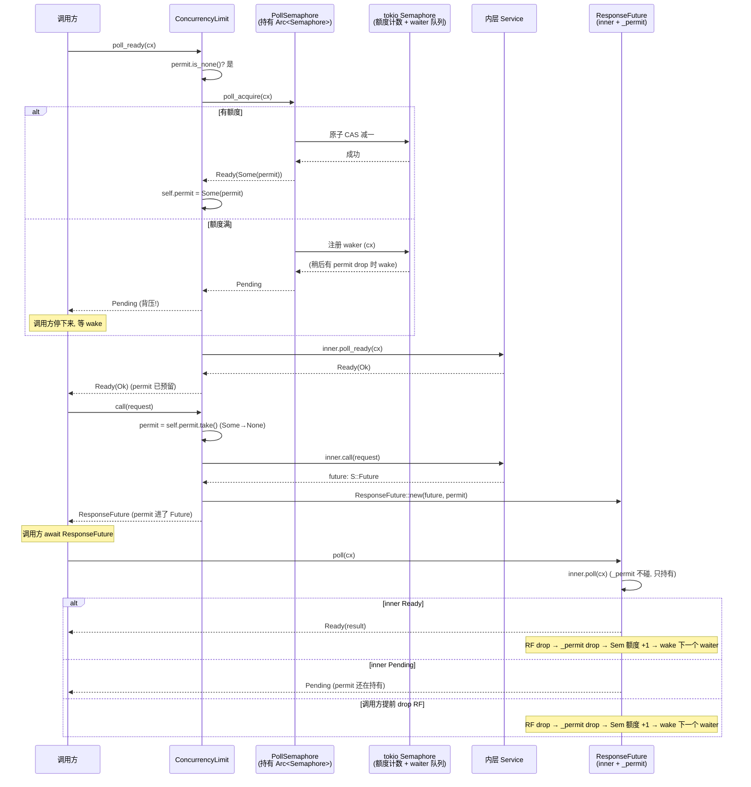
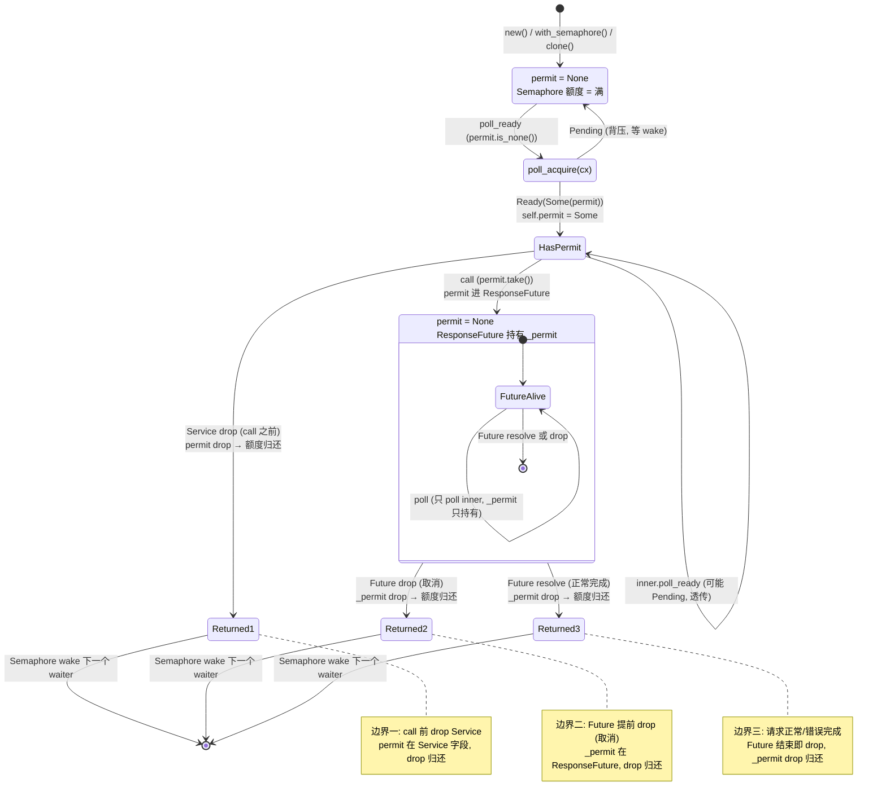

# 第 3 篇 · 第 9 章 · ConcurrencyLimit:并发数上限

> **核心问题**:[P3-08 Timeout](P3-08-Timeout-给Future套一个截止时间.md) 给单个请求的等待时间设了上限,但很多事故的根子不在"一个请求等多久",而在"**同时**有多少个请求在跑"。一个数据库连接池只有 64 个连接,你瞬间塞进去 200 个查询,池子要么拒绝服务、要么排队把内存吃光;一个下游服务单进程只能扛 100 并发,你开 500 个 goroutine/task 同时打,下游直接 OOM。这种"**瞬时并发数**"必须被卡死。Tower 的 `ConcurrencyLimit` 怎么把"同时进行的请求数"做成一个可复用的 `Service`?它凭什么把 `poll_ready` 变成一个**背压阀**(并发满了就 `Pending`,等有请求完成释放额度再 `Ready`),而不是简单地报错拒绝?它手里那个并发额度,是怎么从 `poll_ready` 流到 `call`、再跟随响应 `Future` 的生命周期一路走到请求完成才归还的?以及那个在生产里最常被问到的需求——多个 `Service` 实例(比如 axum 的多个 worker task)怎么**共享同一个**并发上限,而不是每个实例各算各的?
>
> **读完本章你会明白**:
>
> 1. 限并发(in-flight cap)和限速率(每秒配额)是两个**正交**的维度。`ConcurrencyLimit` 关心的是"此刻有多少个请求已经发出但还没回",它依赖"请求完成会归还额度"这个闭环;`RateLimit` 关心的是"这段时间我总共放几个",令牌扣了不归还。混淆它们,要么保不住下游,要么把吞吐压垮。本章把这条正交线钉死,为 [P3-10](P3-10-RateLimit-令牌桶控速率.md) 铺路。
> 2. `ConcurrencyLimit` 的并发额度是一个叫 **permit** 的对象,它的生命周期被精确缝进了 `Service` trait 的三段式:`poll_ready` 里 **acquire**(拿不到就 `Pending`,背压!),`call` 里 **take**(把 permit 从 Service 字段移进返回的 Future),`ResponseFuture` 持有 permit 直到 **Future drop**(permit 被回收,额度归还)。这三段对应 `Service` trait 契约里"资源在 `poll_ready` 预留、在 `call` 消费"的铁律(承 [P1-02](P1-02-Service-trait-一个请求一个Future.md))。
> 3. ★**源码印象修正**:很多博客和教程把 `ConcurrencyLimit` 讲成"用 `tokio::sync::Semaphore` 的 `acquire()` 异步方法拿 permit"。**这是错的**。真实源码(`tower/src/limit/concurrency/service.rs`)用的是 `tokio_util::sync::PollSemaphore`——一个把 `Arc<Semaphore>` 包成"可在 `poll` 里非阻塞获取 permit"的适配器,核心方法叫 `poll_acquire(cx)`,返回 `Poll<Option<OwnedSemaphorePermit>>`。`Semaphore::acquire()` 是个 `async fn`,在 `poll_ready` 这种手写 `Poll` 上下文里用不了(你不能在 `poll_ready` 里直接 `.await`)。Tower 选 `PollSemaphore`,正是为了把 Tokio 的 async 原语缝进 `Service::poll_ready` 的 `Poll` 语义——这是本章要拆透的核心技巧。
> 4. ★`GlobalConcurrencyLimitLayer` 怎么做到"多个 `Service` clone 共享同一个并发池":它把一个 `Arc<Semaphore>` 捏在 `Layer` 里,每次 `layer(inner)` 把**同一个** `Arc` clone 一份塞进各个 `Service`,所有 clone 共用一个计数器。对比每实例独立的 `ConcurrencyLimitLayer`(每次 `layer()` 新建一个 `Semaphore`,各算各的)。这两者的差别,正是"每实例限并发 vs 全局限并发"的实现分野,也是 0.4.8(2021-05,PR #574)专门加 `GlobalConcurrencyLimitLayer` 的动机。
>
> **逃生阀**:如果你对 `tokio::sync::Semaphore` 本身(acquire/permit/内部计数器/`add_permits`/`close`)还想再夯实,那是《Tokio》拆透的内容,本章只一句带过指路 `[[tokio-source-facts]]`,篇幅全留给 Tower 独有的部分——permit 怎么从 `poll_ready` 流到 Future 生命周期、`PollSemaphore` 凭什么能把 async 的 Semaphore 缝进 `Poll`、Global 怎么共享 `Arc<Semaphore>`。如果你忘了 `Service` trait 为什么是 `poll_ready(&mut self) + call(&mut self)`、为什么"资源在 `poll_ready` 预留、在 `call` 消费",先回去翻 [P1-02 Service trait](P1-02-Service-trait-一个请求一个Future.md) 的"`poll_ready` 资源预留"那节。本章默认你已经知道"`poll_ready` 返回 `Pending` 时,调用方会停下来等,而不是报错"。

---

## 章首 · 一句话点破

> **`ConcurrencyLimit` 做的事,一句话讲完:它给内层服务配一个"并发额度计数器"(底层是 `tokio::sync::Semaphore`,经 `PollSemaphore` 适配成 `Poll` 友好),每个请求要想被 `call`,先得在 `poll_ready` 里 `poll_acquire` 拿到一个 **permit**(拿不到就 `Pending`,把背压往上传);`call` 把这个 permit 从 Service 字段 `take` 出来,塞进返回的 `ResponseFuture` 里;请求完成(`ResponseFuture` drop 或 resolve)的那一刻,permit 跟着 drop,Semaphore 额度归还,下一个等着的请求被唤醒。`GlobalConcurrencyLimitLayer` 做的是同一件事,只是把那个 `Semaphore` 装进 `Arc`,让所有 `Service` clone 共用一份额度。**

这是结论,不是理由。本章倒过来拆:为什么"瞬时并发数"是事故的另一个主因(它和 [P3-08 Timeout](P3-08-Timeout-给Future套一个截止时间.md) 治的"延迟堆积"是同一类病,但药不同)?为什么"自己写个 `AtomicUsize` 计数器"会在并发模型上撞墙(原子性能保证计数对,但保证不了"拿不到额度时怎么优雅地等")?Tokio 的 `Semaphore` 怎么提供这个原语,《Tokio》拆透了这里一句带过;真正的问题是——`Semaphore::acquire()` 是个 `async fn`,而 Tower 的 `poll_ready` 是个返回 `Poll` 的同步函数,**你怎么把一个 async 原语缝进一个 Poll 函数**?这就是 `PollSemaphore` 存在的全部理由。然后才看源码里 permit 怎么在三段式里流转、为什么 `Clone` 实现不能 `derive`、Global 共享 `Arc<Semaphore>` 凭什么不破坏 `Clone` 语义。

本章服务**执行单元**这一面。`ConcurrencyLimit` 是个 `Service<Request>`,它改写了 `poll_ready`(acquire permit,背压核心)和 `call`(take permit,塞进 Future),并把 permit 的生命周期绑在返回的 `ResponseFuture` 上。它是第 3 篇"限流与超时"的中间章,承上启下:承 [P3-08 Timeout](P3-08-Timeout-给Future套一个截止时间.md)(Timeout 的 `poll_ready` 透传 vs 本章的 `poll_ready` 是核心),启 [P3-10 RateLimit](P3-10-RateLimit-令牌桶控速率.md)("并发 vs 速率"的正交对照)。

---

## 正文

### 第 1 节 · 瞬时并发:雪崩的另一个引爆点

在拆 `ConcurrencyLimit` 之前,先把它治的病讲透。

[P3-08 Timeout](P3-08-Timeout-给Future套一个截止时间.md) 那一章讲过"延迟堆积导致雪崩":下游延迟一飙升,在途请求数 = QPS × 延迟 线性涨,资源占用线性涨,涨过临界点系统自己先挂。那一章的药是"给每个请求的资源占用设**时间**上限"——超时就 drop Future,释放资源。

但还有一类雪崩,根子不在"延迟",在"**瞬时并发数**"。举三个真实场景:

**场景一:数据库连接池被打爆。** 你的服务连了个 PostgreSQL,连接池配了 64 个连接(每个连接一个后端进程,PG 的连接是重资源)。上游一个促销活动,瞬间涌来 200 个并发请求,每个请求都要查库。如果你不限制并发,200 个请求同时 `call` 数据库 client,连接池只有 64 个连接,剩下的 136 个请求要么排队(占着 task/内存等连接),要么连接池直接报错(`PoolTimeout`)。更糟的是,PG 看到 200 个并发查询,CPU 上下文切换开销飙升,本来 5ms 的查询变成 50ms,延迟堆积雪崩接着发生——[P3-08](P3-08-Timeout-给Future套一个截止时间.md) 治的病被并发打爆触发。

**场景二:下游单进程被打爆。** 你调一个下游的 HTTP 服务,那个服务是个单进程 Python/Node 应用,单进程同时只能处理 100 个请求(受 GIL 或 event loop 容量限制)。你不限并发,瞬间打过去 500 个,下游要么直接 502,要么响应时间飙到几十秒,你的 `Timeout` 一个个触发,但你已经把下游打挂了——**限流是保护自己的延迟,限并发是保护下游的命**。

**场景三:内存/句柄耗尽。** 每个在途请求都占资源:一个 Tokio task(控制块 + 栈,几十 KB)、一份请求/响应 buffer、可能还有一份认证上下文、tracing span。10000 个在途请求就是几百 MB 内存 + 几万个打开的 span。瞬时并发不加限制,内存单调增长直到 OOM。

> **钉死这件事**:这三类事故的共同点是——**资源是按"同时持有"计费的,不是按"单位时间经过"计费的**。连接池的连接、下游的并发处理能力、内存,都是"此刻有多少个请求占着"的函数。要保护这类资源,必须限制"**此刻在途的请求数**(in-flight count)",而不是"每秒放行多少个"。这就是 `ConcurrencyLimit` 的职责——它管的是**瞬时并发**,不是**速率**。这条区分贯穿本章,也是和 [P3-10 RateLimit](P3-10-RateLimit-令牌桶控速率.md) 的根本分野。

把这条钉死后,一个自然的问题是:这个"in-flight 上限"该怎么实现?最朴素的思路是手写个计数器,我们来看看它为什么不够,从而理解 Tower 为什么必须借 Tokio 的 Semaphore。

### 第 2 节 · 手写计数器为什么不够:Tower 需要的是什么原语

假设你不读源码,凭直觉写一个"限并发的 Service",大概长这样(伪代码,非源码原文):

```rust
// 简化示意(非源码原文)——朴素但有问题
struct NaiveConcurrencyLimit<T> {
    inner: T,
    in_flight: Arc<AtomicUsize>,  // 当前在途请求数
    max: usize,
}

impl<S, Req> Service<Req> for NaiveConcurrencyLimit<S>
where S: Service<Req> {
    type Response = S::Response;
    type Error = S::Error;
    type Future = /* ... */;

    fn poll_ready(&mut self, _cx: &mut Context<'_>) -> Poll<Result<(), Self::Error>> {
        // 满了就 Pending?但 Pending 之后谁来唤醒我?
        if self.in_flight.load(Ordering::Acquire) >= self.max {
            return Poll::Pending;  // ← 这里有大问题
        }
        Poll::Ready(Ok(()))
    }

    fn call(&mut self, req: Req) -> Self::Future {
        self.in_flight.fetch_add(1, Ordering::SeqCst);  // 计数 +1
        // ... 发请求,响应回来时计数 -1
    }
}
```

这段代码在并发模型上撞了**三堵墙**:

**第一堵墙:`Pending` 之后怎么被唤醒?** `poll_ready` 返回 `Pending` 是 Tower 的背压信号——它告诉调用方"我现在不行,等会儿再来 poll 我"。但"等会儿"不是调用方瞎等,它依赖 Rust 异步的 **waker** 机制:`poll_ready` 返回 `Pending` 时,得通过 `cx: &mut Context<'_>` 注册一个"我好了就 wake 我"的回调,这样资源可用时才能 wake 调用方重新 poll。朴素代码里 `_cx` 被忽略了——返回 `Pending` 但不注册任何 waker,调用方永远不会被唤醒,请求永远卡死。这是 Rust 异步最常见的 bug:返回了 `Pending` 却忘了接 waker。

要修这个 bug,你得自己实现一套"有请求完成时,唤醒所有等着的 poll_ready"的机制。这本质上是个等待队列 + waker 注册/通知系统。你很快发现:这玩意儿和 Tokio 的 `Semaphore` 干的是一模一样的事。

**第二堵墙:check-then-act 竞态。** 朴素代码在 `poll_ready` 里 `load` 一下判断够不够,在 `call` 里 `fetch_add` 加一。这两步之间隔着调用方的逻辑(可能立刻 call,也可能先 poll 几次再 call,也可能多个调用方并发 poll 同一个 Service clone)。假设 `max = 10`,两个调用方同时 poll,都 load 到 `in_flight = 9`,都判断"9 < 10,Ready",然后都 call,`in_flight` 变成 11——并发上限被突破。`AtomicUsize` 的单个操作是原子的,但"`load` 判断 + `fetch_add`"这个**复合操作**不是原子的,中间能插入别的操作。要修这个,你得用 CAS(compare-and-swap)循环,或者上锁,把"检查 + 占用"做成一个原子复合操作。Tokio 的 `Semaphore` 内部就是这么干的(原子 CAS 维护许可计数,详见《Tokio》[[tokio-source-facts]]),你重造轮子就是在重写 Semaphore。

**第三堵墙:permit 怎么跟着 Future 走?** 这是 Tower 特有的需求,也是最关键的。`Service` trait 的契约([tower-service/src/lib.rs#L335-L339](../tower/tower-service/src/lib.rs#L335-L339))白纸黑字写着:

> Note that `poll_ready` may reserve shared resources that are consumed in a subsequent invocation of `call`. Thus, it is critical for implementations to not assume that `call` will always be invoked and to ensure that such resources are released if the service is dropped before `call` is invoked or the future returned by `call` is dropped before it is polled.

翻译过来就是:`poll_ready` 可以"**预留**"一份资源(比如一个并发额度),这份资源在 `call` 里被"**消费**"。但调用方不保证一定会 `call`(可能 poll 完就去干别的了),所以你得保证:① 如果 `call` 被调了,资源跟着请求走,直到请求完成才归还;② 如果 `call` 没被调(Service 被 drop),预留的资源得自动归还,不能泄漏。

这意味着,你需要的不是一个"整数计数器",而是一个**有所有权的、可移动的、drop 时自动归还额度的对象**——这就是 permit。Tokio 的 `Semaphore::acquire()` 返回的 permit 恰好满足这三条:它是个对象(`OwnedSemaphorePermit` 或 `SemaphorePermit<'_>`),可以移动(从 Service 字段移进 Future),drop 时自动把额度还回 Semaphore。你手写计数器,得自己写这个"带 Drop 归还的对象",又是在重造 Semaphore。

> **钉死这件事**:Tower 需要的"限并发原语"不是个计数器,是个**带所有权的 permit 对象 + 一套等待队列/waker 通知机制 + drop 自动归还**。这三样 Tokio 的 `Semaphore` 都提供了,而且经过工业级验证。所以 Tower 的 `ConcurrencyLimit` 不重造轮子,直接用 `tokio::sync::Semaphore`。这是承接 Tokio 的典型场景——Tokio 提供原语,Tower 提供把它缝进 `Service` 抽象的胶水。

#### 2.1 Tokio 的 Semaphore:一句话带过 + 指路

`tokio::sync::Semaphore` 是 Tokio 提供的异步计数信号量。核心 API:

- `Semaphore::new(n)` —— 创建一个初始额度 `n` 的信号量。
- `sem.acquire()` —— 一个 `async fn`,返回 `SemaphorePermit<'_>`(持有期间占一个额度,drop 归还)。
- `sem.clone().acquire_owned()` —— `Arc<Semaphore>` 上的方法,返回 `OwnedSemaphorePermit`(`'static`,可移动,drop 归还)。
- 额度满了时 `acquire()` 会挂起(await 点),直到有别的 permit drop 释放额度,waiter 被唤醒。
- waiter 的唤醒顺序是 FIFO(先等先醒),这对公平性要紧(后面 `multi_waiters` 测试会验证)。

它的内部实现——原子 CAS 维护许可计数、waiter 队列、`add_permits`/`close` 语义、为什么 `acquire` 不可取消时的行为——都是《Tokio》拆透的内容。

> **承接《Tokio》[[tokio-source-facts]]**:`tokio::sync::Semaphore` 的内部——计数器原子操作、waiter 链表、`Semaphore::acquire` 怎么编译成状态机、`OwnedSemaphorePermit` 的 Drop 怎么归还 + 唤醒下一个 waiter、`close` 语义——这些《Tokio》讲同步原语那几章拆透了,本章一句带过指路。我们这里把 Semaphore 当成"一个能发 permit、permit drop 归还额度的黑盒"来用,重点放在 Tower 怎么把这个黑盒缝进 `Service::poll_ready` 的 `Poll` 语义。

但这里马上撞到一个**接口不匹配**的问题,正是它催生了本章最核心的技巧。

#### 2.2 接口不匹配:`acquire()` 是 async,`poll_ready` 是 Poll

`Semaphore::acquire()` 是个 `async fn`,你要拿到 permit 得 `.await` 它:

```rust
// 简化示意(非源码原文)——acquire 是 async 的
let permit = semaphore.acquire().await?;
```

但 Tower 的 `Service::poll_ready` 是个**同步函数**,签名是:

```rust
fn poll_ready(&mut self, cx: &mut Context<'_>) -> Poll<Result<(), Self::Error>>;
```

它返回 `Poll`,不是 `Future`。你**不能**在 `poll_ready` 里写 `.await`(因为 `poll_ready` 不是 `async fn`,Rust 不允许在非 async 函数里 `.await`)。

那能不能把 `poll_ready` 改成 `async fn`?不行。`Service` trait 的 `poll_ready` 设计成 `Poll` 返回是有深层原因的(详见 [P1-02](P1-02-Service-trait-一个请求一个Future.md)):`Poll` 语义让调用方可以**主动** poll 服务(而不是被动 await),这对"多个 Service 组合在一起、由同一个 task 驱动"的 Tower 模型至关重要。`poll_ready` 是手写 Future 状态机的一部分,它必须是 `Poll`。

所以问题是:**怎么在一个返回 `Poll` 的同步函数里,获取一个本该 `await` 的 permit?**

朴素思路是手写状态机——自己 poll `semaphore.acquire()` 返回的那个 Future。但 `acquire()` 返回的 `SemaphoreAcquireFuture` 是个借用了 `&Semaphore` 的 Future,生命周期挂在 Semaphore 上,管理起来很别扭(尤其是 permit 要 `'static` 可移动时,你得用 `acquire_owned`,但 `acquire_owned` 也是 async 的)。

这就是 `tokio_util::sync::PollSemaphore` 出场的时刻。它是 `tokio-util` crate 提供的一个**适配器**,专门解决"把 `Semaphore` 缝进 `Poll` 上下文"这个问题。

### 第 3 节 · 所以 Tower 这么设计:`PollSemaphore` 适配 + permit 三段式流转

现在看真实源码。`ConcurrencyLimit` 的定义(`tower/src/limit/concurrency/service.rs#L12-L24`):

```rust
// tower/src/limit/concurrency/service.rs#L12-L24
/// Enforces a limit on the concurrent number of requests the underlying
/// service can handle.
#[derive(Debug)]
pub struct ConcurrencyLimit<T> {
    inner: T,
    semaphore: PollSemaphore,
    /// The currently acquired semaphore permit, if there is sufficient
    /// concurrency to send a new request.
    ///
    /// The permit is acquired in `poll_ready`, and taken in `call` when sending
    /// a new request.
    permit: Option<OwnedSemaphorePermit>,
}
```

三个字段,逐个说:

- `inner: T` —— 被包装的内层 Service(真正的业务服务)。
- `semaphore: PollSemaphore` —— **不是裸的 `Semaphore`**,是 `tokio_util::sync::PollSemaphore`。这就是上一节那个"适配器"。它内部持有一个 `Arc<Semaphore>`,提供 `poll_acquire(cx) -> Poll<Option<OwnedSemaphorePermit>>` 方法,把 async 的 `acquire_owned` 包装成 Poll 友好的形式。
- `permit: Option<OwnedSemaphorePermit>` —— 当前预留的 permit。`Option` 因为它有时序:`poll_ready` 时从 None 变 Some(acquire 到了),`call` 时从 Some 变 None(take 走了,塞进 Future)。注释明确写了"The permit is acquired in `poll_ready`, and taken in `call`",这正是 `Service` trait 契约里"资源在 poll_ready 预留、在 call 消费"的落地。

注意那个 `OwnedSemaphorePermit`——它是 `'static` 的 permit(不借用 Semaphore,可以自由移动),drop 时自动归还额度。Tower 选 `Owned` 版本而不是借用的 `SemaphorePermit<'_>`,是因为 permit 要从 Service 字段移进 `ResponseFuture`,而 `ResponseFuture` 可能跨 task、跨 await 点移动,必须是 `'static`。

#### 3.1 构造:每实例独立 vs 共享 Semaphore

看构造函数(`service.rs#L26-L39`):

```rust
// tower/src/limit/concurrency/service.rs#L26-L39
impl<T> ConcurrencyLimit<T> {
    /// Create a new concurrency limiter.
    pub fn new(inner: T, max: usize) -> Self {
        Self::with_semaphore(inner, Arc::new(Semaphore::new(max)))
    }

    /// Create a new concurrency limiter with a provided shared semaphore
    pub fn with_semaphore(inner: T, semaphore: Arc<Semaphore>) -> Self {
        ConcurrencyLimit {
            inner,
            semaphore: PollSemaphore::new(semaphore),
            permit: None,
        }
    }
    // ...get_ref / get_mut / into_inner 略
}
```

两个构造函数,对应两种用法:

- `new(inner, max)` —— **每实例独立**。它内部 `Arc::new(Semaphore::new(max))` 新建一个 Semaphore。这是默认用法,每个 `ConcurrencyLimit` 实例有自己的并发池,clone 出来的实例(通过下面的 `Clone` impl)共享同一个池(因为 `PollSemaphore` clone 时 Arc 共享)。**等等**——这里有个微妙的点:`new` 出来的实例,它和它的 clone 共享同一个 Semaphore(因为 `PollSemaphore::clone` 复用内部 `Arc`)。所以"每实例独立"准确说是"**每个 `new()` 调用独立**"——你调一次 `new`,得到一个独立的 Semaphore;你 clone 这个实例,clone 和原件共享。这和 `ConcurrencyLimitLayer`(每次 `layer()` 调一次 `new`)的行为一致:每个被 Layer 装饰出来的 Service 实例有自己独立的并发池。
- `with_semaphore(inner, Arc<Semaphore>)` —— **共享外部 Semaphore**。你传进来一个 `Arc<Semaphore>`,它被塞进 `PollSemaphore`。多个 `ConcurrencyLimit` 实例如果拿到的是同一个 `Arc`(通过 `GlobalConcurrencyLimitLayer`,后面讲),它们共享同一个并发池。这是全局限并发的入口。

> **钉死这件事**:`ConcurrencyLimit::new` 和 `with_semaphore` 的区别,不是"独立 vs 共享"那么简单。准确说:`PollSemaphore` 内部持有 `Arc<Semaphore>`,`Clone` 时 Arc 共享,所以**任何 `ConcurrencyLimit` 实例和它的 clone 永远共享同一个 Semaphore**。真正的分野在 **Layer 层**:`ConcurrencyLimitLayer` 每次 `layer()` 调 `new`,新建 Semaphore,所以多个**经同一 Layer 装饰出来的不同 Service 实例**各有各的池;`GlobalConcurrencyLimitLayer` 把一个 `Arc<Semaphore>` 捏在 Layer 里,每次 `layer()` 把同一个 Arc 传进去,所有装饰出来的实例共用一个池。这个区别在第 5 节讲 Global 时会展开。

#### 3.2 `poll_ready`:PollSemaphore 把背压缝进来

这是整套设计的核心。看 `poll_ready`(`service.rs#L65-L80`):

```rust
// tower/src/limit/concurrency/service.rs#L65-L80
fn poll_ready(&mut self, cx: &mut Context<'_>) -> Poll<Result<(), Self::Error>> {
    // If we haven't already acquired a permit from the semaphore, try to
    // acquire one first.
    if self.permit.is_none() {
        self.permit = ready!(self.semaphore.poll_acquire(cx));
        debug_assert!(
            self.permit.is_some(),
            "ConcurrencyLimit semaphore is never closed, so `poll_acquire` \
             should never fail",
        );
    }

    // Once we've acquired a permit (or if we already had one), poll the
    // inner service.
    self.inner.poll_ready(cx)
}
```

逐段拆:

**第 1 步:检查 permit 状态。** `if self.permit.is_none()`——如果还没预留 permit,尝试 acquire。这一步的关键是**幂等性**:`poll_ready` 可能被调用多次(调用方反复 poll),只有第一次(或上次 permit 被 take 走之后)才真正尝试 acquire;一旦 acquire 到了(`permit` 变 Some),后续 `poll_ready` 直接跳过这步,转去 poll 内层。这避免了"每次 poll_ready 都多 acquire 一个 permit"的错误(那会让并发额度被虚占)。

**第 2 步:`poll_acquire`。** `ready!(self.semaphore.poll_acquire(cx))`——这是 `PollSemaphore` 的核心方法。它的语义是:

- 如果 Semaphore 有额度,立刻返回 `Poll::Ready(Some(permit))`。
- 如果额度满了,注册 waker(`cx` 传进去),返回 `Poll::Pending`。等有 permit drop 释放额度时,Semaphore 内部 wake 这个 waker,`poll_acquire` 下次被调时返回 `Ready(Some(permit))`。
- 如果 Semaphore 被 `close` 了(永远不会,见下面),返回 `Poll::Ready(None)`。

`ready!` 宏(`futures_core::ready`)把 `Poll<Option<T>>` 解包:`Pending` 就直接 `return Pending`,`Ready(Some(x))` 就拿到 `x`,`Ready(None)` 就拿到 `None`(走下面的 debug_assert)。

**这就是背压的核心**:`poll_acquire` 返回 `Pending` 时,整个 `poll_ready` 返回 `Pending`,调用方停下来等。等什么?等 Semaphore 内部 wake 它(有 permit 释放时)。这个 wake 不是 `ConcurrencyLimit` 自己实现的,是 `PollSemaphore` 借 `cx` 的 waker 接到 Tokio Semaphore 的 waiter 队列上(承接《Tokio》Semaphore 内部的 waiter 链表 + 唤醒机制,一句带过)。所以 `ConcurrencyLimit` 的背压是**真实可靠的**——它不是"返回 Pending 然后指望调用方瞎等",而是"返回 Pending 但已经把唤醒钩子挂好了,资源一可用就 wake"。

**第 3 步:debug_assert。** `debug_assert!(self.permit.is_some(), "ConcurrencyLimit semaphore is never closed, ...")`。这一行很有意思——它在断言 `poll_acquire` 不会返回 `None`。`None` 意味着 Semaphore 被 `close` 了(Tokio 的 `Semaphore::close` 会让所有 `acquire` 立刻返回 `Err(AcquireError::Closed)`,`poll_acquire` 把这个翻译成 `Ready(None)`)。但 `ConcurrencyLimit` 从来不 `close` 它的 Semaphore(它没有 `close` 的 API),所以这行 assert 在表达一个**不变量**:这个 Semaphore 永远不会被关闭,`poll_acquire` 要么 `Pending` 要么 `Some(permit)`,不会 `None`。用 `debug_assert` 而不是 `assert`,是因为这是个"逻辑上不该发生"的检查,release 构建里去掉以省开销,debug 构建里留着以提前抓 bug。

**第 4 步:poll 内层。** `self.inner.poll_ready(cx)`。permit 拿到之后,还要问内层服务有没有准备好。这一步很关键——它保证了**背压会沿着 Service 链往内传**。如果内层(比如又一个 `ConcurrencyLimit` 或一个连接池)也满载返回 Pending,这个 Pending 会透传给上游,permit 还留在 `self.permit` 里(已经 acquire 但没 take)。这意味着:**permit 在 `poll_ready` 成功之前就被 acquire 了,但只有在 `poll_ready` 全部 Ready + `call` 被调之后才被消费**。中间如果内层一直 Pending,permit 会一直占着——这会不会有问题?会,但这是 `Service` trait 契约允许的"预留",而且只要 `ConcurrencyLimit` 实例不被 drop,permit 就不会泄漏(drop 时 permit 字段被 drop,额度归还)。这种"先 acquire permit 再 poll 内层"的顺序是个设计选择,第 6 节技巧精解会专门拆它的利弊。

> **钉死这件事**:`ConcurrencyLimit::poll_ready` 的背压来自 `PollSemaphore::poll_acquire` 返回 `Pending`。这个 Pending 不是空头支票——`PollSemaphore` 通过 `cx` 的 waker 把"额度可用就唤醒"挂到了 Tokio Semaphore 的 waiter 队列上。这是 Tower 把 Tokio 的 async 原语缝进 `Poll` 语义的关键一手,也是 `ConcurrencyLimit` 不需要自己实现等待队列/waker 通知的原因——它全靠 `PollSemaphore` 这个适配器把 Tokio Semaphore 的等待机制"翻译"成 `Poll`。

#### 3.3 `call`:把 permit 从 Service 字段移进 Future

看 `call`(`service.rs#L82-L93`):

```rust
// tower/src/limit/concurrency/service.rs#L82-L93
fn call(&mut self, request: Request) -> Self::Future {
    // Take the permit
    let permit = self
        .permit
        .take()
        .expect("max requests in-flight; poll_ready must be called first");

    // Call the inner service
    let future = self.inner.call(request);

    ResponseFuture::new(future, permit)
}
```

三行,但每行都关键:

**第 1 行:`self.permit.take()`。** 把 permit 从 `Option<OwnedSemaphorePermit>` 里拿出来(Option 变 None,permit 的所有权移交给局部变量 `permit`)。注意是 `take()` 不是 `clone()`——permit 是**不可 clone** 的(`OwnedSemaphorePermit` 没有 `Clone` impl,因为一个 permit 代表一份额度,clone 出两份就凭空多出一个额度,破坏 Semaphore 的计数)。`.expect("max requests in-flight; poll_ready must be called first")` 是个 panic:如果 `permit` 是 None,说明调用方没遵守 `Service` trait 契约("先 poll_ready 拿到 Ready 才能 call"),直接 panic 把 bug 暴露。这和 [P3-10 RateLimit](P3-10-RateLimit-令牌桶控速率.md) 里 `State::Limited => panic!("service not ready; ...")` 是同一个设计哲学——不靠运行时检查保护契约,而是用 panic 把"调用方写错了"立刻暴露。

**第 2 行:`self.inner.call(request)`。** 把请求真正发给内层。这一步之后,permit 不在 `self` 里了(已经被 take),它在局部变量 `permit` 里。

**第 3 行:`ResponseFuture::new(future, permit)`。** 把 permit 和内层返回的 Future 打包成 `ResponseFuture`。从这一刻起,permit 的所有权进了 `ResponseFuture`,它的生命周期就和这个 Future 绑定了——Future 存活,permit 存活(占着额度);Future drop,permit drop(额度归还)。这就是"permit 跟随响应 Future 生命周期"的实现。

> **钉死这件事**:`call` 里的 `take()` 是整套设计的枢纽。它把 permit 的所有权从"Service 的预留状态"转交到"请求的执行状态"。这一步之前,permit 是 Service 的私有财产(可以被 Service drop 回收);这一步之后,permit 是请求的财产(跟着 Future 走)。这个所有权转移是 `Service` trait 契约"poll_ready 预留、call 消费"的精确落地——`call` 把预留的资源"消费"掉的方式,不是消耗它,而是把它绑到请求的生命周期上。

#### 3.4 `ResponseFuture`:permit 持有到 Future 结束

看 `ResponseFuture`(`tower/src/limit/concurrency/future.rs#L13-L41`):

```rust
// tower/src/limit/concurrency/future.rs#L13-L41
pin_project! {
    /// Future for the [`ConcurrencyLimit`] service.
    ///
    /// [`ConcurrencyLimit`]: crate::limit::ConcurrencyLimit
    #[derive(Debug)]
    pub struct ResponseFuture<T> {
        #[pin]
        inner: T,
        // Keep this around so that it is dropped when the future completes
        _permit: OwnedSemaphorePermit,
    }
}

impl<T> ResponseFuture<T> {
    pub(crate) fn new(inner: T, _permit: OwnedSemaphorePermit) -> ResponseFuture<T> {
        ResponseFuture { inner, _permit }
    }
}

impl<F, T, E> Future for ResponseFuture<F>
where
    F: Future<Output = Result<T, E>>,
{
    type Output = Result<T, E>;

    fn poll(self: Pin<&mut Self>, cx: &mut Context<'_>) -> Poll<Self::Output> {
        Poll::Ready(ready!(self.project().inner.poll(cx)))
    }
}
```

逐段拆:

**字段:`inner: T` + `_permit: OwnedSemaphorePermit`。** 两个字段。`inner` 是内层响应 Future,`#[pin]` 标记(手写 Future 状态机要求,承 [P3-08](P3-08-Timeout-给Future套一个截止时间.md) 和《Tokio》Pin 那章,一句带过)。`_permit` 是那个 permit,前面下划线表示"这个字段我们不读它,只持有它"。注释那句 `// Keep this around so that it is dropped when the future completes` 是理解整套设计的钥匙——permit 存在的唯一目的就是**被持有**,持有期间占着额度,Future 完成(或 drop)时 permit 跟着 drop,额度归还。它不参与 `poll` 逻辑,纯粹是个"资源占位符"。

**`Future::poll`:`Poll::Ready(ready!(self.project().inner.poll(cx)))`。** 这行看着绕,其实就是"poll 内层 Future,它 Ready 就 Ready,它 Pending 就 Pending"。`ready!` 宏解包 `Poll`,`self.project()` 是 `pin_project!` 生成的投影方法(拿到 `Pin<&mut T>` 的内层字段)。**注意:poll 里完全没碰 `_permit`**——permit 的释放完全靠 Rust 的 `Drop` 机制自动处理,不需要任何显式代码。这就是 permit 设计的精妙:把"额度归还"这件事编码进类型系统(permit 的 Drop 归还额度),业务代码(`poll`)完全不用操心。

这个 `poll` 实现和 [P3-08 Timeout](P3-08-Timeout-给Future套一个截止时间.md) 的 `ResponseFuture::poll` 形成有意思的对照。Timeout 的 `poll` 是手写两步 poll(先 response 后 sleep,赛跑),因为 Timeout 要"让两个 Future 抢跑"。`ConcurrencyLimit` 的 `poll` 只 poll 一个 Future(inner),因为 permit 不是个 Future,它不参与抢跑,它只是个被持有的对象。所以 `ConcurrencyLimit::ResponseFuture` 的 `poll` 比 Timeout 的简单一截——它只负责转发,资源管理全靠 Drop。

**`new` 构造函数**就是个简单的字段赋值,把 `inner` 和 `_permit` 存起来。

#### 3.5 `Clone`:不能 derive,手写并丢弃 permit

最后一个关键点——`ConcurrencyLimit` 的 `Clone` 实现(`service.rs#L96-L107`):

```rust
// tower/src/limit/concurrency/service.rs#L96-L107
impl<T: Clone> Clone for ConcurrencyLimit<T> {
    fn clone(&self) -> Self {
        // Since we hold an `OwnedSemaphorePermit`, we can't derive `Clone`.
        // Instead, when cloning the service, create a new service with the
        // same semaphore, but with the permit in the un-acquired state.
        Self {
            inner: self.inner.clone(),
            semaphore: self.semaphore.clone(),
            permit: None,
        }
    }
}
```

这段注释解释了为什么 `ConcurrencyLimit` 的 `#[derive(Debug)]` 有,但 `Clone` 是手写的——因为 `OwnedSemaphorePermit` 没有 `Clone`(一个 permit = 一份额度,不能 clone),`Option<OwnedSemaphorePermit>` 也就不能 clone,所以整个 `ConcurrencyLimit` 不能 `derive(Clone)`。

手写的 `Clone` 干的事:**clone 出一个新 Service,共享同一个 Semaphore(`semaphore.clone()` 复用内部 `Arc`),但 permit 设成 None**。注释那句"with the permit in the un-acquired state"是关键——clone 出来的新实例**没有预留任何 permit**,它得自己重新走 `poll_ready` 去 acquire。

这是个非常考究的设计。考虑它在说什么:假设原 Service 已经在 `poll_ready` 里 acquire 了一个 permit(留着等 `call`),现在你 clone 它。如果 clone 把 permit 也"共享"过去,那两个 Service 共用一份额度——但 permit 不可 clone,所以共享不了。如果 clone 各自带一个 permit,那额度凭空翻倍——破坏 Semaphore。唯一 sound 的做法是:**clone 出来的新实例从零开始,自己重新 acquire**。这正是源码做的。

这个设计的后果是:`ConcurrencyLimit` 的 clone 之间**共享 Semaphore(共享并发池),但不共享预留的 permit**。每个 clone 各自 acquire/take,各自的 permit 跟各自的请求走。这就是"多个 Service 实例共享一个并发上限"的实现基础——Global 共享就是基于这个 `Clone` 语义。

> **钉死这件事**:`ConcurrencyLimit` 不能 `derive(Clone)`,因为 permit 不可 clone。手写的 `Clone` 共享 Semaphore(`Arc` 内部)但把新实例的 permit 设 None。这保证了:① 多个 clone 共用同一个并发池(`Arc<Semaphore>`);② 每个 clone 独立管理自己的 permit 生命周期;③ 额度不会因为 clone 而凭空增加。这套语义是 `GlobalConcurrencyLimitLayer` 能 work 的前提。

到这里,`ConcurrencyLimit` 的完整执行路径清楚了。用一张 mermaid 时序图把"permit 的生命周期"画出来:



这张图最关键的两条路径是**底部的"_permit drop → 额度归还 → wake 下一个 waiter"**——不管是请求正常完成还是被提前 drop 取消,permit 都会干净地归还,Semaphore 内部的 waiter 队列(承接《Tokio》[[tokio-source-facts]] 的 Semaphore waiter 链表)会唤醒下一个等着 acquire 的调用方。这就是 `ConcurrencyLimit` 背压的完整闭环:满载 Pending → 等待 → 额度释放 → 唤醒 → 继续。

再看一张 ASCII 框图,把 permit 在三段式里的所有权流转画清楚:

```
permit (OwnedSemaphorePermit) 的所有权流转

┌─────────────────────────────────────────────────────────────────┐
│  阶段 0: 初始 (permit = None)                                    │
│  ConcurrencyLimit { inner, semaphore, permit: None }             │
│  Semaphore 额度: 满                                              │
└─────────────────────────────────────────────────────────────────┘
                              │
                              ▼  poll_ready: poll_acquire 成功
┌─────────────────────────────────────────────────────────────────┐
│  阶段 1: 预留 (permit = Some)                                    │
│  ConcurrencyLimit { inner, semaphore, permit: Some(permit) }     │
│  Semaphore 额度: -1 (被这个 permit 占着)                         │
│  ★ Service drop 此时发生 → permit drop → 额度归还 (不泄漏)       │
└─────────────────────────────────────────────────────────────────┘
                              │
                              ▼  call: permit.take() (Some → None)
┌─────────────────────────────────────────────────────────────────┐
│  阶段 2: 消费 (permit 移进 Future)                                │
│  ConcurrencyLimit { inner, semaphore, permit: None }             │
│  ResponseFuture { inner: future, _permit }                       │
│  Semaphore 额度: -1 (permit 现在在 Future 里)                    │
│  ★ Future drop 此时发生 → _permit drop → 额度归还 (请求取消)     │
│  ★ Future resolve → Future drop → _permit drop → 额度归还 (正常) │
└─────────────────────────────────────────────────────────────────┘
                              │
                              ▼  Future 完成/取消, _permit drop
┌─────────────────────────────────────────────────────────────────┐
│  阶段 3: 归还                                                    │
│  Semaphore 额度: +1 (回到满)                                     │
│  waiter 队列里的下一个调用方被 wake → 它的 poll_acquire 返回 Ready│
└─────────────────────────────────────────────────────────────────┘
```

三个阶段,permit 的所有权从 Semaphore → Service 字段 → ResponseFuture → Drop 归还。每一步都有 sound 的退出路径(Service 提前 drop / Future 提前 drop 都不泄漏)。这就是 `ConcurrencyLimit` 设计为什么 sound 的完整图景。

### 第 4 节 · 为什么 sound:四个边界情况的全覆盖

前面顺着主路径讲了一遍 permit 流转,但一个限流机制 sound 不 sound,看的是**边界情况**。这一节用 `tower` 自己的测试集(`tower/tests/limit/concurrency.rs`)里那几个边界测试,逐个验证 `ConcurrencyLimit` 在各种"意外"路径下都不泄漏额度、不丢背压。

#### 4.1 边界一:`call` 之前 drop Service(reserve 了但没发)

`Service` trait 契约([tower-service/src/lib.rs#L335-L339](../tower/tower-service/src/lib.rs#L335-L339))明确说:"it is critical ... to ensure that such resources are released if the service is dropped before `call` is invoked"。意思是:poll_ready 预留了资源,但调用方可能转头不 call 了(比如它 poll 了多个 Service,选了别的),这时候预留的资源必须自动归还,不能泄漏。

`ConcurrencyLimit` 怎么满足这条?答案在 permit 的 Drop。假设 `poll_ready` acquire 了 permit(`self.permit = Some(permit)`),然后调用方不 call,直接 drop 这个 `ConcurrencyLimit` 实例。会发生什么?`ConcurrencyLimit` 被 drop → 它的 `permit: Option<OwnedSemaphorePermit>` 字段被 drop → `Some(permit)` 里的 permit 被 drop → permit 的 Drop 把额度还回 Semaphore。整个链路自动触发,没有任何显式代码。

`tower` 的测试 `service_drop_frees_capacity`(`tests/limit/concurrency.rs#L132-L150`)验证的就是这条:

```rust
// tower/tests/limit/concurrency.rs#L132-L150(节选)
fn service_drop_frees_capacity() {
    let limit = ConcurrencyLimitLayer::new(1);
    let (mut s1, _handle) = mock::spawn_layer::<(), (), _>(limit);
    let mut s2 = s1.clone();

    // Reserve capacity in s1
    assert_ready_ok!(s1.poll_ready());

    // Service 2 cannot get capacity
    assert_pending!(s2.poll_ready());

    drop(s1);

    assert!(s2.is_woken());      // ← s1 drop 后, s2 被 wake
    assert_ready_ok!(s2.poll_ready());
}
```

`max = 1`,s1 acquire 了唯一的 permit,s2 poll 拿不到(Pending)。然后 drop s1——s1 的 permit 字段被 drop,额度归还,Semaphore wake s2 的 waker,s2 再 poll 就 Ready 了。这条路径 sound 的根基就是 permit 的 Drop 自动归还,不需要任何手动清理。

#### 4.2 边界二:Future 提前 drop(请求发了但被取消)

这是 [P3-08 Timeout](P3-08-Timeout-给Future套一个截止时间.md) 那章讲过的"Future drop = 取消"在 `ConcurrencyLimit` 这层的投影。假设 `call` 返回了 `ResponseFuture`,调用方 await 它,但中间超时了(外层套了 Timeout)、或者调用方自己 cancel 了,把 `ResponseFuture` drop 掉。会发生什么?

`ResponseFuture` 被 drop → 它的 `_permit: OwnedSemaphorePermit` 字段被 drop → permit 的 Drop 把额度还回 Semaphore → waiter 队列里的下一个被 wake。整个链路同样是自动的,因为 permit 是 `ResponseFuture` 的字段,Future drop 字段就 drop。

`tower` 的测试 `response_future_drop_releases_capacity`(`tests/limit/concurrency.rs#L173-L192`)验证这条:

```rust
// tower/tests/limit/concurrency.rs#L173-L192(节选)
fn response_future_drop_releases_capacity() {
    let limit = ConcurrencyLimitLayer::new(1);
    let (mut s1, _handle) = mock::spawn_layer::<_, (), _>(limit);
    let mut s2 = s1.clone();

    assert_ready_ok!(s1.poll_ready());
    let r1 = s1.call("hello");      // permit 从 s1 take, 进了 r1
    assert_pending!(s2.poll_ready());

    drop(r1);                        // ← Future 提前 drop
    assert_ready_ok!(s2.poll_ready());
}
```

`max = 1`,s1 call 之后 permit 在 `r1`(ResponseFuture)里,s2 拿不到。drop r1——r1 的 `_permit` 被 drop,额度归还,s2 立刻能拿到。这条路径 sound 的根基是"permit 作为 ResponseFuture 的字段,跟着 Future 走,Future drop permit 就 drop"。

这条路径在生产里极其重要,因为它对应"请求被取消"——比如外层套了 `Timeout`,超时触发时 Timeout 把 `ConcurrencyLimit` 返回的 ResponseFuture drop 掉(承 [P3-08](P3-08-Timeout-给Future套一个截止时间.md) 的 drop = 取消语义)。如果这条路径不 sound(permit 泄漏),每被超时取消一个请求,并发额度就少一个,系统很快耗光额度卡死。`ConcurrencyLimit` 靠 permit 的 Drop 自动归还,保证了取消不泄漏。

#### 4.3 边界三:内层返回错误(请求失败)

内层 Service 可能返回 `Err`(下游 500、连接错误等)。这种情况下,permit 要不要归还?要——请求虽然失败了,但它"结束"了,占的额度得释放给下一个。

`tower` 的测试 `response_error_releases_capacity`(`tests/limit/concurrency.rs#L152-L171`)验证这条:

```rust
// tower/tests/limit/concurrency.rs#L152-L171(节选)
fn response_error_releases_capacity() {
    let limit = ConcurrencyLimitLayer::new(1);
    let (mut s1, mut handle) = mock::spawn_layer::<_, (), _>(limit);
    let mut s2 = s1.clone();

    assert_ready_ok!(s1.poll_ready());
    let r1 = s1.call("hello");
    assert_request_eq!(handle, "hello").send_error("boom");  // 内层报错
    r1.await.unwrap_err();                                     // r1 拿到 Err

    assert_ready_ok!(s2.poll_ready());                         // s2 能拿到了
}
```

`r1.await` 拿到 `Err` 之后,`r1` 走完它的生命周期(`await` 返回后,Future 完成,通常紧接着 drop)。`_permit` 跟着 drop,额度归还。这条路径和边界二其实是同一个机制——只要 ResponseFuture drop(不管是正常完成、错误完成、还是提前取消),permit 都 drop,额度都归还。permit 的 Drop 不区分 Future 是怎么结束的,它只关心"Future 结束了,我该走了"。

这条路径说明了一个 `ConcurrencyLimit` 的语义细节:**并发额度是按"请求生命周期"计费的,不是按"请求成功"计费的**。失败的请求也占过额度(它在途的时候占着连接、占着下游处理能力),它结束了额度就该释放。如果你想要"只有成功的请求才释放额度,失败的额外扣一个"——那是 `Retry` 的范畴(失败重试会额外占额度),`ConcurrencyLimit` 本身不做这种区分。

#### 4.4 边界四:多个 waiter 的唤醒顺序(FIFO)

当并发额度满时,多个调用方可能同时 `poll_ready` 挂着等。额度释放时,谁先被唤醒?这关系到**公平性**——如果唤醒顺序不公平(比如随机或 LIFO),某些请求可能一直拿不到额度饿死。

`tower` 的测试 `multi_waiters`(`tests/limit/concurrency.rs#L194-L217`)验证唤醒顺序:

```rust
// tower/tests/limit/concurrency.rs#L194-L217(节选)
fn multi_waiters() {
    let limit = ConcurrencyLimitLayer::new(1);
    let (mut s1, _handle) = mock::spawn_layer::<(), (), _>(limit);
    let mut s2 = s1.clone();
    let mut s3 = s1.clone();

    assert_ready_ok!(s1.poll_ready());   // s1 拿到唯一额度
    assert_pending!(s2.poll_ready());    // s2 等
    assert_pending!(s3.poll_ready());    // s3 等

    drop(s1);
    assert!(s2.is_woken());              // s2 先被 wake
    assert!(!s3.is_woken());             // s3 还没

    drop(s2);
    assert!(s3.is_woken());              // s2 释放后 s3 才被 wake
}
```

s1 占着,s2 先 poll(先挂进 waiter 队列),s3 后 poll(后挂进)。drop s1 释放额度——s2 被 wake(先挂的先醒),s3 没被 wake(还没轮到)。drop s2(它刚 acquire 到的额度又被释放)——s3 这才被 wake。这是 **FIFO(先等先醒)** 顺序。

这个 FIFO 顺序不是 `ConcurrencyLimit` 实现的,是 Tokio Semaphore 内部 waiter 队列的语义(承接《Tokio》[[tokio-source-facts]] 的 Semaphore waiter 链表,一句带过)。但 `ConcurrencyLimit` 选 Semaphore(而不是自己写个随机唤醒的等待队列),隐含地继承了这份公平性保证。对生产来说,FIFO 公平意味着"先到的请求先得到服务",不会出现某个请求一直被插队饿死——这是个重要的可用性保证。

> **钉死这四条**:边界一到四全覆盖:`call` 前 drop Service(permit 在 Service 字段,drop 归还)、Future 提前 drop(permit 在 ResponseFuture 字段,drop 归还)、内层报错(Future 结束即 drop,permit drop 归还)、多 waiter(FIFO 唤醒,继承 Semaphore 公平性)。四条边界都有测试覆盖,都不泄漏额度、不丢背压。这就是 `ConcurrencyLimit` sound 的完整证据链。根基是两条:① permit 是个带 Drop 的对象,在哪一层持有就在哪一层 drop 时归还;② Tokio Semaphore 提供原子计数 + waiter 队列 + 唤醒,Tower 不重造。

### 第 5 节 · Global 共享:多个 Service 实例共用一个并发池

到这里,`ConcurrencyLimit` 单实例的机制讲透了。但生产里有个高频需求:**多个 Service 实例共享同一个并发上限**。这一节拆这个需求怎么被满足。

#### 5.1 需求从哪来

举两个真实场景:

**场景一:axum 的多 worker。** axum 的 `Router` 在 `serve` 时,通常每个 Tokio worker 线程 clone 一份 `Service`(因为 `Service` 要 `Clone + Send + Sync` 才能多线程共享)。如果你的 handler 调一个下游服务,你给这个下游服务套了 `ConcurrencyLimit::new(client, 100)`。问题:每个 worker clone 出来的 `ConcurrencyLimit` 实例,各有各的 Semaphore 吗?如果有,4 个 worker 各 100 额度,实际全局并发上限是 400,不是 100。你想保护下游"全局 100 并发",却被 worker 数翻倍了。

**场景二:多个 client 共用一个配额。** 你的服务有 3 个不同的 handler,各自调同一个下游(比如都调同一个支付网关)。支付网关限你"全局 100 并发"。你给每个 handler 的 client 套 `ConcurrencyLimit::new(client, 100)`,3 个 handler 各 100,实际全局 300,把支付网关打爆。你想让 3 个 handler 共享 100 的总额度。

这两个场景的共同点:**并发上限是"全局"的,不是"每实例"的**。你需要一个机制,让多个独立的 `ConcurrencyLimit` 实例共用同一个 Semaphore。

#### 5.2 `GlobalConcurrencyLimitLayer`:Arc 共享

这就是 `GlobalConcurrencyLimitLayer` 干的事。看源码(`tower/src/limit/concurrency/layer.rs#L29-L60`):

```rust
// tower/src/limit/concurrency/layer.rs#L29-L60
/// Enforces a limit on the concurrent number of requests the underlying
/// service can handle.
///
/// Unlike [`ConcurrencyLimitLayer`], which enforces a per-service concurrency
/// limit, this layer accepts a owned semaphore (`Arc<Semaphore>`) which can be
/// shared across multiple services.
///
/// Cloning this layer will not create a new semaphore.
#[derive(Debug, Clone)]
pub struct GlobalConcurrencyLimitLayer {
    semaphore: Arc<Semaphore>,
}

impl GlobalConcurrencyLimitLayer {
    /// Create a new `GlobalConcurrencyLimitLayer`.
    pub fn new(max: usize) -> Self {
        Self::with_semaphore(Arc::new(Semaphore::new(max)))
    }

    /// Create a new `GlobalConcurrencyLimitLayer` from a `Arc<Semaphore>`
    pub fn with_semaphore(semaphore: Arc<Semaphore>) -> Self {
        GlobalConcurrencyLimitLayer { semaphore }
    }

    impl<S> Layer<S> for GlobalConcurrencyLimitLayer {
        type Service = ConcurrencyLimit<S>;

        fn layer(&self, service: S) -> Self::Service {
            ConcurrencyLimit::with_semaphore(service, self.semaphore.clone())
        }
    }
}
```

逐段拆:

**字段:`semaphore: Arc<Semaphore>`。** 注意是 `Arc`,不是 `usize`(对比 `ConcurrencyLimitLayer` 的 `max: usize`)。`GlobalConcurrencyLimitLayer` 把一个**已经创建好的** `Arc<Semaphore>` 捏在手里,而不是存个数字每次 `layer()` 时新建。这是"全局共享"的实现基础——同一个 Arc 被传给所有装饰出来的 Service。

**`new(max)`:** 内部 `Arc::new(Semaphore::new(max))`——只在这里创建一次 Semaphore。之后不管你 `layer()` 多少次,都用这同一个 Arc。

**`with_semaphore(Arc<Semaphore>)`:** 更灵活的入口,你可以从外部传一个已经存在的 `Arc<Semaphore>` 进来(比如多个不同的 Layer 共用一个 Semaphore 时)。

**`Layer::layer`:** `ConcurrencyLimit::with_semaphore(service, self.semaphore.clone())`。注意 `self.semaphore.clone()`——这是 `Arc::clone`,只增加引用计数(原子加一),不复制 Semaphore 本身。所以每次 `layer()` 装饰出来的 `ConcurrencyLimit` 实例,都持有指向**同一个** Semaphore 的 Arc。这些实例的 `PollSemaphore` 内部都是这同一个 Arc,它们 acquire/take 的是同一个 Semaphore 的额度。

**注释那句"Cloning this layer will not create a new semaphore":** 强调 `GlobalConcurrencyLimitLayer` 的 `Clone`(这里可以 `derive`,因为 `Arc` 能 clone)只是 Arc 引用计数加一,不新建 Semaphore。对比 `ConcurrencyLimitLayer` 的 `Clone`(也是 derive,因为它只有 `max: usize`),clone 出来的 Layer 存同一个 `max`,但每次 `layer()` 还是会 `Semaphore::new(max)` 新建——所以 `ConcurrencyLimitLayer` clone 不影响"每 layer() 一个新池"的行为。

#### 5.3 两种 Layer 的并排对比

把两种 Layer 并排看,差别一目了然:

```rust
// tower/src/limit/concurrency/layer.rs#L9-L27 —— ConcurrencyLimitLayer: 每实例独立
pub struct ConcurrencyLimitLayer {
    max: usize,                          // ← 只存数字
}
impl<S> Layer<S> for ConcurrencyLimitLayer {
    fn layer(&self, service: S) -> Self::Service {
        ConcurrencyLimit::new(service, self.max)   // ← 每次 layer() 新建 Semaphore
    }
}

// tower/src/limit/concurrency/layer.rs#L37-L60 —— GlobalConcurrencyLimitLayer: 全局共享
pub struct GlobalConcurrencyLimitLayer {
    semaphore: Arc<Semaphore>,           // ← 存 Arc
}
impl<S> Layer<S> for GlobalConcurrencyLimitLayer {
    fn layer(&self, service: S) -> Self::Service {
        ConcurrencyLimit::with_semaphore(service, self.semaphore.clone())  // ← 复用 Arc
    }
}
```

差别就两处:① 字段类型(`usize` vs `Arc<Semaphore>`);② `layer()` 里调的构造函数(`new` 新建 vs `with_semaphore` 复用)。这两处差别决定了"每个被装饰的 Service 实例是各有各的池,还是共用一个池"。

用一张表把两种 Layer 的语义钉死:

| 维度 | `ConcurrencyLimitLayer` | `GlobalConcurrencyLimitLayer` |
|------|------------------------|------------------------------|
| **字段** | `max: usize`(数字) | `semaphore: Arc<Semaphore>`(Arc) |
| **`layer()` 行为** | 每次 `Semaphore::new(max)` 新建 | 每次 `Arc::clone`(复用同一个) |
| **并发池归属** | 每个 `layer()` 出来的 Service 一个独立池 | 所有 `layer()` 出来的 Service 共用一个池 |
| **引入版本** | 0.4.0(合并子 crate 时就有) | **0.4.8**(2021-05,PR #574) |
| **典型场景** | 单实例 client 自我限并发 | 多 worker / 多 client 共享全局配额 |
| **`Clone`** | `derive`(`usize` 能 clone) | `derive`(`Arc` 能 clone,只增计数) |
| **导出的 Service 类型** | `ConcurrencyLimit<S>`(同一个) | `ConcurrencyLimit<S>`(同一个) |

注意最后一行——**两种 Layer 导出的 Service 类型是同一个 `ConcurrencyLimit<S>`**!差别只在 Layer 怎么构造它(给独立的 Semaphore 还是共享的 Arc)。这是个漂亮的设计:`ConcurrencyLimit` 这个 Service 本身是"Semaphore 无关"的,它只关心"我有个 PollSemaphore,我 poll_acquire";至于这个 PollSemaphore 背后是独占的 Semaphore 还是共享的 Arc,SERVICE 不关心,由 Layer 决定。这把"限并发的执行机制"和"Semaphore 的共享策略"干净地解耦了——执行机制全在 `ConcurrencyLimit`(Service 层),共享策略全在 Layer 层。

> **钉死这件事**:`GlobalConcurrencyLimitLayer` 不是个新的 Service 类型,它只是个**不同的 Layer**——它导出的还是 `ConcurrencyLimit<S>`,只是用 `with_semaphore` 把一个共享的 `Arc<Semaphore>` 喂进去。这是"Layer 决定 Service 怎么被构造"的典型例子([P1-03 Layer trait](P1-03-Layer-trait-洋葱装饰.md)):同一个 Service 类型,不同的 Layer 给它注入不同的依赖(独立 Semaphore vs 共享 Arc)。

#### 5.4 演进背景:0.4.8 为什么加这个 Layer

`GlobalConcurrencyLimitLayer` 是 0.4.8(2021-05-28,PR #574)加的,塔的 [CHANGELOG](../tower/tower/CHANGELOG.md#L137-L142) 原文:

> `limit`: Add `GlobalConcurrencyLimitLayer` to allow reusing a concurrency limit across multiple services.

为什么要加?因为在它之前,要实现"多实例共享并发上限",用户得自己 `Arc::new(Semaphore::new(max))`,然后手动 `ConcurrencyLimit::with_semaphore(svc, arc.clone())` 给每个 Service。这违反了 Tower 的 Layer 抽象——Layer 的全部意义就是"声明式地配置中间件"(像 `ServiceBuilder::new().concurrency_limit(10)` 这样),用户不该手动管 Arc。

加了 `GlobalConcurrencyLimitLayer` 之后,用户可以这样写(简化示意,非源码原文):

```rust
// 简化示意(非源码原文)——全局共享 100 并发
let global_limit = GlobalConcurrencyLimitLayer::new(100);

// 给 handler A 的 client 套(共享 100)
let client_a = ServiceBuilder::new()
    .layer(global_limit.clone())
    .service(payment_client);

// 给 handler B 的 client 套(同一个 100)
let client_b = ServiceBuilder::new()
    .layer(global_limit.clone())
    .service(payment_client);

// client_a 和 client_b 共用 100 的总额度
```

注意 `global_limit.clone()`——这是 `Arc::clone`,三个 Layer(client_a 一个、client_b 一个、原件一个)指向同一个 Semaphore。无论 A 还是 B 发请求,都从这个 100 的池里 acquire。这就是"全局 100 并发"的实现。

不过有个细节值得注意:**`ServiceBuilder` 没有内置的 `.global_concurrency_limit()` 方法**(对比有 `.concurrency_limit()`)。这意味着 `GlobalConcurrencyLimitLayer` 不能直接用 `ServiceBuilder` 链式调用,得手动 `.layer(GlobalConcurrencyLimitLayer::new(100))`。这是个小不便,但符合"全局共享是个需要显式管理的状态(Arc 得在多个 Service 之间传递)"的语义——`ServiceBuilder` 是线性的,不适合表达"多个独立 Service 共享一个外部状态"这种图状依赖,所以留给用户手动管理。

#### 5.5 反面对比:如果不用 Global 会怎样

回到第 5.1 节那两个场景。假设 axum 4 worker,你想限全局 100 并发:

**用 `ConcurrencyLimitLayer`(每实例独立):**

```rust
// 简化示意(非源码原文)——每实例独立, 被翻倍
let app = Router::new()
    .route("/pay", post(handler))
    .layer(ConcurrencyLimitLayer::new(100));   // ← 每个 worker clone 一份
```

axum 给每个 worker clone 一份 Service(含 Layer 装饰出的 `ConcurrencyLimit`)。**等等**——这里要小心:axum clone 的是已经装饰好的 `ConcurrencyLimit` 实例,不是重新调 `layer()`。根据第 3.5 节讲的 `ConcurrencyLimit::clone`,clone 出来的实例**共享同一个 Semaphore**(`PollSemaphore::clone` 复用 Arc)。所以这种情况下,4 个 worker 其实共享同一个 100 额度的池——并没有被翻倍!

那 `ConcurrencyLimitLayer`"每实例独立"到底在什么场景下才独立?在你**多次调 `layer()`** 的场景。比如:

```rust
// 简化示意(非源码原文)——多次 layer(), 各自独立
let client_a = ServiceBuilder::new().concurrency_limit(100).service(svc_a);
let client_b = ServiceBuilder::new().concurrency_limit(100).service(svc_b);
// client_a 和 client_b 各有 100, 全局 200
```

这里 `ServiceBuilder::new().concurrency_limit(100)` 调了两次,每次调 `ConcurrencyLimitLayer::new(100).layer(svc)`,每次 `layer()` 新建一个 Semaphore。所以 client_a 和 client_b 各 100,全局 200。这才是"每实例独立"的真实表现。

如果你想让 client_a 和 client_b 共享 100,就得用 `GlobalConcurrencyLimitLayer`:

```rust
// 简化示意(非源码原文)——Global 共享
let global = GlobalConcurrencyLimitLayer::new(100);
let client_a = ServiceBuilder::new().layer(global.clone()).service(svc_a);
let client_b = ServiceBuilder::new().new().layer(global.clone()).service(svc_b);
// client_a 和 client_b 共享 100
```

> **钉死这件事**:"每实例独立 vs 全局共享"的分野,**不在 `ConcurrencyLimit` Service 层**(clone 的实例本来就共享 Semaphore),**在 Layer 层**:`ConcurrencyLimitLayer` 每次 `layer()` 新建 Semaphore,所以**多次 `layer()` 装饰出来的不同 Service 各有各的池**;`GlobalConcurrencyLimitLayer` 每次 `layer()` 复用同一个 Arc,所以**多次 `layer()` 装饰出来的不同 Service 共用一个池**。判断用哪个,看你是不是"多次调 `layer()` 还想要共享"——是的话用 Global,否则用普通的。

### 第 6 节 · 技巧精解:`PollSemaphore` 凭什么能把 async 缝进 Poll

这一节单独拆本章最硬核的技巧:**`PollSemaphore` 怎么把 `Semaphore` 的 async `acquire` 翻译成 `Poll` 友好的 `poll_acquire`**。这是 `ConcurrencyLimit` 能在 `poll_ready` 里获取 permit 的全部秘密,也是"承接 Tokio 但不重复 Tokio"的典型一手——Tower 不重写 Semaphore,它写个适配器把 Semaphore 接进 `Service` 抽象。

#### 6.1 问题重述:async acquire vs 同步 poll_ready

前面讲过,核心矛盾是:`Semaphore::acquire()` 是 `async fn`,返回一个要 `.await` 的 Future;而 `Service::poll_ready` 是返回 `Poll` 的同步函数,不能 `.await`。

朴素的解决思路有两个,都有问题:

**思路一:在 poll_ready 里手动 poll acquire Future。** `semaphore.acquire()` 返回的 `SemaphoreAcquireFuture<'_>` 是个 Future,你可以手动 `Pin::new(&mut fut).poll(cx)`。但问题:① 这个 Future 借用 `&Semaphore`,生命周期挂在 Semaphore 上,你得一直持有这个借用;② acquire 成功后,permit 是借用的 `SemaphorePermit<'_>`,不是 `'static`,不能移进 `ResponseFuture`(ResponseFuture 要跨 task 移动);③ 你得自己管理这个 Future 的状态(开始 poll 了没、poll 到哪了),引入额外字段。这套管理下来,代码又臭又长,还容易出 unsafe(因为手动 poll Future 涉及 Pin)。

**思路二:用 `acquire_owned()`(返回 `'static` permit),但它还是 async。** `Arc<Semaphore>::acquire_owned()` 返回 `OwnedSemaphorePermit`(可移动),但它本身还是 `async fn`,返回的 `OwnedSemaphorePermit` 还是要 `.await` 才能拿到。问题没解决,只是把借用换成 owned。

`PollSemaphore` 解决这个问题的思路是:**把 `acquire_owned` 这个 async 操作,封装成一个可以在 `poll` 里推进的状态机,内部维护 Future + 状态**。它的核心方法 `poll_acquire` 长这样(简化示意,真实在 `tokio-util` crate,非 tower 源码):

```rust
// 简化示意(非源码原文)——PollSemaphore 的核心逻辑, 在 tokio-util crate
pub struct PollSemaphore {
    sem: Arc<Semaphore>,
    wait: Option<OwnedSemaphorePermitFuture>,  // 可选的进行中 acquire Future
}

impl PollSemaphore {
    pub fn poll_acquire(&mut self, cx: &mut Context<'_>) -> Poll<Option<OwnedSemaphorePermit>> {
        loop {
            if let Some(wait) = self.wait.as_mut() {
                // 有进行中的 acquire, 推进它
                let fut = Pin::as_mut(wait);
                match fut.poll(cx) {
                    Poll::Ready(Ok(permit)) => {
                        self.wait = None;
                        return Poll::Ready(Some(permit));
                    }
                    Poll::Ready(Err(_)) => {
                        self.wait = None;
                        return Poll::Ready(None);  // Semaphore closed
                    }
                    Poll::Pending => return Poll::Pending,
                }
            } else {
                // 没有进行中的 acquire, 启动一个
                let fut = self.sem.clone().acquire_owned();
                self.wait = Some(Box::pin(fut));
                // loop 回去 poll 这个新 Future
            }
        }
    }
}
```

> **诚实标注**:`PollSemaphore` 的真实实现在 `tokio-util` crate(不在 tower 仓),上面是简化示意展示原理。tower 只用 `PollSemaphore`,不实现它。引用其用法 + 原理,不当作 tower 源码编行号。`tokio-util` 0.7 的 `PollSemaphore` 实际实现可能更精细(比如 fast path 优化,先试原子 CAS 不走 Future),但核心思路就是"封装 acquire_owned 的 Future 进状态机,在 poll 里推进"。

这个适配器的精妙在:**它把"async 操作"封装成"可以一点点推进的状态"**,从而能在同步的 `poll` 函数里调用。具体说:

- `poll_acquire` 第一次被调时,启动 `acquire_owned()` 拿到一个 Future,存进 `self.wait`。
- 后续 `poll_acquire` 被调时,poll 这个 Future:Ready 就返回 permit,Pending 就返回 Pending。
- 由于 poll Future 时传入了 `cx`,Future 内部会把 waker 注册到 Semaphore 的 waiter 队列上(承《Tokio》Semaphore 内部),Semaphore 释放额度时 wake 这个 waker,`poll_acquire` 下次被调时就能 poll 到 Ready。

这套机制让 `ConcurrencyLimit::poll_ready` 用一行 `ready!(self.semaphore.poll_acquire(cx))` 就拿到了 permit——简洁、sound、复用 Tokio Semaphore 的全部内部逻辑(原子计数、waiter 队列、唤醒)。

#### 6.2 为什么 sound:不丢 waker、不重 poll

`PollSemaphore` 的 soundness 关键在两个细节:

**细节一:waker 不丢。** 前面 [P3-08](P3-08-Timeout-给Future套一个截止时间.md) 讲过,`Poll::Pending` 必须配合 waker 注册,否则调用方永远不被唤醒。`PollSemaphore::poll_acquire` 返回 Pending 时,它内部 poll 的那个 `acquire_owned` Future 已经把 waker 注册到 Semaphore 的 waiter 队列上了(这是 Tokio Semaphore 的 acquire Future 的标准行为,承接《Tokio》)。所以 Pending 不是空头支票——Semaphore 释放额度时会 wake 这个 waker,调用方重新 poll_ready,`poll_acquire` 再 poll Future,这次 Ready 拿到 permit。

**细节二:不重复启动 acquire。** 注意那个 `if let Some(wait)` 判断——如果已经有进行中的 acquire Future(`self.wait` 是 Some),就不会再启动新的,而是推进现有的。这避免了"每次 poll_ready 都启动一个新的 acquire Future"的错误(那会让 Semaphore 的 waiter 队列塞满幽灵 waiter,还会让多个 Future 抢同一个额度)。第一次启动,后续推进,acquire 成功后清空(`self.wait = None`),下次 `poll_acquire` 再启动新的——状态机干净。

这两个细节合起来,保证了 `PollSemaphore` 在 `poll` 上下文里是 sound 的:不丢 waker(等了必被唤醒),不重复启动(不污染 Semaphore 内部状态)。这正是 `ConcurrencyLimit` 敢把背压交给 `PollSemaphore` 的原因。

#### 6.3 反面对比:如果不用 PollSemaphore 直接用 Semaphore

假设性地,如果 `ConcurrencyLimit` 直接用 `Arc<Semaphore>` 而不是 `PollSemaphore`,代码大概得这样(伪代码,非源码原文):

```rust
// 简化示意(非源码原文)——直接用 Semaphore 的麻烦写法
struct NaiveConcurrencyLimit<T> {
    inner: T,
    semaphore: Arc<Semaphore>,
    permit: Option<OwnedSemaphorePermit>,
    acquire_fut: Option<Pin<Box<dyn Future<Output = Result<OwnedSemaphorePermit, AcquireError>> + Send>>>,
}

fn poll_ready(&mut self, cx: &mut Context<'_>) -> Poll<Result<(), Self::Error>> {
    if self.permit.is_none() {
        if self.acquire_fut.is_none() {
            // 启动 acquire_owned
            self.acquire_fut = Some(Box::pin(self.semaphore.clone().acquire_owned()));
        }
        // 推进 Future
        let fut = self.acquire_fut.as_mut().unwrap();
        match fut.as_mut().poll(cx) {
            Poll::Ready(Ok(permit)) => {
                self.acquire_fut = None;
                self.permit = Some(permit);
            }
            Poll::Ready(Err(_)) => return Poll::Ready(None),  // closed, 不该发生
            Poll::Pending => return Poll::Pending,
        }
    }
    self.inner.poll_ready(cx)
}
```

对比真实源码(`service.rs#L65-L80`,前面贴过):

```rust
// tower/src/limit/concurrency/service.rs#L65-L80 —— 用 PollSemaphore 的简洁写法
fn poll_ready(&mut self, cx: &mut Context<'_>) -> Poll<Result<(), Self::Error>> {
    if self.permit.is_none() {
        self.permit = ready!(self.semaphore.poll_acquire(cx));
        debug_assert!(self.permit.is_some(), "...");
    }
    self.inner.poll_ready(cx)
}
```

差别是显而易见的:**朴素写法多了一个 `acquire_fut` 字段、多了启动 Future 的逻辑、多了 poll Future 的逻辑、多了 Pin<Box<dyn>> 的堆分配 + 类型擦除**。而 `PollSemaphore` 把这一切封装在内部,`ConcurrencyLimit` 只需要 `poll_acquire(cx)` 一行。

这个对比的深层意义在:**`PollSemaphore` 是"把 async 原语适配进 Poll 上下文"的通用模式**。任何"底层是 async 操作但要在 Service::poll_ready 里用"的场景,都可以套这个模式——封装 Future 进状态机,poll 里推进。Tower 的其他中间件也用了类似思路:`Buffer` 在 poll_ready 里 poll mpsc 的 reserve Future(承 [P2-05](P2-05-Buffer-把非Clone服务变成Clone+Send.md)),`RateLimit` 在 poll_ready 里 poll Sleep Future(承 [P3-10](P3-10-RateLimit-令牌桶控速率.md))。这些都是"async 原语缝进 Poll"的实例,只不过 `ConcurrencyLimit` 用的是 `tokio-util` 现成的 `PollSemaphore`,而 `Buffer`/`RateLimit` 自己手写了一点(因为 mpsc/Sleep 的适配没现成工具)。

> **钉死这件事**:`PollSemaphore` 不是 Tower 的发明,是 `tokio-util` 提供的通用适配器,专门解决"把 `Semaphore` 缝进 `Poll` 上下文"。它体现了 Rust 异步生态的一个常见模式:**底层原语(async)+ 适配器(把 async 翻译成 Poll)+ 上层抽象(Service::poll_ready)**。Tower 用 `PollSemaphore`,省去了自己手写状态机的麻烦,也复用了 Tokio Semaphore 的工业级实现。这是"承接 Tokio"的典型一手——不重造轮子,写胶水。

#### 6.4 技巧二:`Clone` 为什么不能 derive(permit 不可 clone的后果)

第二个技巧点,拆 `ConcurrencyLimit` 的手写 `Clone` 为什么不能 derive,以及这个限制如何反过来塑造了 Global 共享的设计。

前面讲过,`OwnedSemaphorePermit` 没有 `Clone` impl。原因是语义上的——一个 permit 代表 Semaphore 的一份额度,如果 permit 能 clone,clone 出两份就等于凭空多出一份额度,破坏 Semaphore 的计数不变量。Tokio 的设计者刻意不让 permit clone,这是 soundness 的硬约束。

这个约束传导到 `ConcurrencyLimit`:因为 `permit: Option<OwnedSemaphorePermit>` 字段不能 clone,整个 `ConcurrencyLimit` 不能 `derive(Clone)`(`derive` 会要求所有字段都 clone)。所以源码手写 `Clone`(`service.rs#L96-L107`),把新实例的 `permit` 设成 None。

这个手写 `Clone` 的语义后果是:**clone 出来的新实例从"未 acquire"状态开始**。它共享 Semaphore(因为 `PollSemaphore::clone` 复用 Arc),但没预留任何 permit,得自己重新 poll_ready 去 acquire。

这个后果有个微妙的 soundness 考量。假设 clone 时 permit 能"共享"(假设性地),会发生什么?原实例 acquire 了一个 permit,clone 出来的实例也"看到"这个 permit,两个实例都觉得自己有额度可以 call。但 Semaphore 只被占了一份额度——两个实例都 call,Semaphore 被扣两份,计数变负,不变量崩溃。所以 clone 必须**不共享 permit**,每个实例各自管理自己的 permit 生命周期。源码设 None 正是这个 soundness 要求的落地。

这个手写 `Clone` 还有个连锁后果,影响 Global 共享。因为 `ConcurrencyLimit` 能 Clone(虽然是手写的),它满足 `ServiceBuilder` 链式组合对 Service 的 Clone 要求。Global 共享的 `ConcurrencyLimit`(经 `GlobalConcurrencyLimitLayer` 构造的)也能 Clone,clone 出来的实例继续共享同一个 Arc<Semaphore>。这就让"多个 Service clone 共享一个全局并发池"成为可能——axum 多 worker clone Service,所有 clone 共用 Global 的 Arc,实现全局并发上限。

> **钉死这件事**:`OwnedSemaphorePermit` 不可 clone 是 Tokio 的 soundness 约束(防止额度凭空增加)。这个约束传导到 `ConcurrencyLimit`,迫使 `Clone` 手写且把新实例的 permit 设 None。这反过来保证了:clone 的实例共享 Semaphore 但独立管理 permit,不会因 clone 而增加额度。这个"不增加额度"的特性,正是 Global 共享 sound 的前提——多个实例 clone 来 clone 去,总额度始终是 Semaphore 初始化时的那个数。

### 第 7 节 · `ConcurrencyLimit` vs `RateLimit`:并发 vs 速率的正交(承启 P3-10)

本章是第 3 篇的中间章,承上启下。承上:和 [P3-08 Timeout](P3-08-Timeout-给Future套一个截止时间.md) 形成"poll_ready 透传 vs poll_ready 核心"的对照。启下:和 [P3-10 RateLimit](P3-10-RateLimit-令牌桶控速率.md) 形成"并发 vs 速率"的正交对照。这一节把后者钉死,为下一章铺路。

#### 7.1 两个维度的正交性

`ConcurrencyLimit` 和 `RateLimit` 是两个**正交**的维度,混淆它们会导致保护失效。用一张表钉死:

| 维度 | `ConcurrencyLimit` | `RateLimit` |
|------|-------------------|-------------|
| **限什么** | 此刻在途的请求数(in-flight) | 一段时间内放行的请求数 |
| **衡量单位** | 个(瞬时计数) | 个/秒(或个/分) |
| **额度归还** | **请求完成归还**(permit drop) | **不归还**(令牌随时间重生) |
| **依赖什么** | 依赖请求完成(慢请求吃住 permit) | 不依赖请求完成(只看时间) |
| **底层原语** | `PollSemaphore` + `OwnedSemaphorePermit`(承 Tokio Semaphore) | `tokio::time::Sleep`(承 Tokio time) |
| **permit/令牌 是否跟随 Future** | 是(permit 在 ResponseFuture 里,drop 归还) | 否(令牌在 call 里扣,与 Future 无关) |
| **Future 包装** | 包一层 `ResponseFuture`(持有 permit) | 不包,透传内层 Future |
| **保护什么** | 下游处理能力(连接池/线程/内存) | 配额/计费/防刷边界 |
| **典型场景** | DB 连接池上限、下游并发处理能力 | 第三方 API 配额、防爬防刷、计费边界 |
| **慢下游影响** | permit 被吃住,QPS 被动下降 | 不影响(令牌照常重生) |
| **`poll_ready` 行为** | `poll_acquire`(满则 Pending) | 挂 `Sleep` 等下个时间窗 |

这张表的关键差别在第三行"额度归还":`ConcurrencyLimit` 的 permit **跟着请求走,请求完成才归还**;`RateLimit` 的令牌**扣了就扣了,不归还,只随时间重生**。这个差别决定了两者各自适合的场景——`ConcurrencyLimit` 保护"按同时持有计费"的资源(连接池、内存),`RateLimit` 保护"按单位时间经过计费"的配额(API 调用次数、计费)。

#### 7.2 混淆两者的后果

举两个混淆的例子,看维度错配的后果:

**例一:用 ConcurrencyLimit 限 API 速率(维度错配)。** 第三方支付 API 限"每秒 100 笔"。你用 `ConcurrencyLimit::new(client, 100)`。假设支付 API 延迟稳定 50ms,permit 一秒能复用 20 次(1000ms / 50ms),100 个 permit 一秒放行 2000 笔——API 限额瞬间被打爆,收到 429,触发罚则。你限了个寂寞,因为 ConcurrencyLimit 限的是"同时",不是"每秒"。(这个例子在 [P3-10](P3-10-RateLimit-令牌桶控速率.md) 第 1 节会详细展开。)

**例二:用 RateLimit 保护连接池(维度错配)。** 数据库连接池 50 个连接。你用 `RateLimit::new(client, Rate::new(50, Duration::from_secs(1)))`(每秒 50 个)。RateLimit 允许突发(桶满瞬间放 50 个),突发期可能瞬间塞 50 个查询进连接池——正好满。但如果延迟飙升(每个查询 2 秒),第一个 50 瞬间放出去后,连接池全占着,下一秒 RateLimit 又想放(令牌补了),但连接池没空连接,要么排队要么报错。RateLimit 不知道连接池状态,它只管时间。保护连接池应该用 `ConcurrencyLimit`(限同时 50 个在途),permit 跟着请求走,连接释放 permit 才释放,精确对齐连接池容量。

这两个例子说明:**两个维度现实里往往都要限**。一个典型的生产配置是双层限流(简化示意,非源码原文):

```rust
// 简化示意(非源码原文)——双层限流
let client = PaymentClient::new(/* 连接池 50 */);

// 内层限并发(保护连接池):最多 50 个在途
let client = ConcurrencyLimit::new(client, 50);

// 外层限速率(遵守 API 配额):每秒 100 个
let client = RateLimit::new(client, Rate::new(100, Duration::from_secs(1)));
```

这个双层配置的具体顺序讲究(为什么 RateLimit 在外、ConcurrencyLimit 在内),以及为什么这么排,在 [P3-10](P3-10-RateLimit-令牌桶控速率.md) 第 5 节有详细展开,本章点到为止,把"两者正交、常组合"这条钉死就够了。

---

## 配图:ConcurrencyLimit 在 Service 链里的位置与背压传播

最后用一张 mermaid 状态图把 `ConcurrencyLimit` 的完整 permit 生命周期画出来,重点标出三种"额度归还"的路径:



三条"额度归还"路径,对应第 4 节那三个边界测试。不管从哪条路径退出,permit 都干净归还,Semaphore wake 下一个 waiter。这就是 `ConcurrencyLimit` 设计 sound 的完整状态空间——闭合、无泄漏。

再用一张 ASCII 框图,对比"每实例独立"和"全局共享"两种模式下,多个 Service 实例的 Semaphore 归属:

```
模式一: ConcurrencyLimitLayer (每实例独立, 多次 layer() 各自新 Semaphore)

  ConcurrencyLimitLayer { max: 100 }
        │
        ├── layer(svc_a) ──► ConcurrencyLimit_a ──► Semaphore_1 (新建, 100)
        │
        └── layer(svc_b) ──► ConcurrencyLimit_b ──► Semaphore_2 (新建, 100)

  全局并发上限 = 100 + 100 = 200  ← 每个 layer() 出来的 Service 一个池


模式二: GlobalConcurrencyLimitLayer (全局共享, 复用同一个 Arc)

  GlobalConcurrencyLimitLayer { semaphore: Arc<Sem_100> }
        │
        ├── layer(svc_a) ──► ConcurrencyLimit_a ──┐
        │                                          ├──► Sem_100 (同一个!)
        └── layer(svc_b) ──► ConcurrencyLimit_b ──┘
              (arc.clone())

  全局并发上限 = 100  ← 所有 layer() 出来的 Service 共用一个池


模式三: ConcurrencyLimit 实例 clone (clone 共享 Semaphore, 因 PollSemaphore 内部 Arc)

  ConcurrencyLimit_a ──► Semaphore_1 (100)
        │
        ├── clone() ──► ConcurrencyLimit_a' ──► Semaphore_1 (同一个!)
        │               (permit = None, 重新 acquire)
        │
  全局并发上限 = 100  ← clone 的实例共享池 (但各自独立 permit)

  ★ 这就是 axum 多 worker clone Service 时, 用普通 ConcurrencyLimitLayer
    也能全局共享的原因 (clone 不新建 Semaphore)
```

模式一 vs 模式二的差别,在 Layer 怎么构造 Service(新建 vs 复用 Arc)。模式三是个容易混淆的点:`ConcurrencyLimit` clone 本来就共享 Semaphore,所以 axum 那种"clone 已装饰的 Service"场景,即使用普通的 `ConcurrencyLimitLayer` 也是全局共享的。只有"多次调 `layer()` 还想共享"才需要 `GlobalConcurrencyLimitLayer`。第 5.5 节那个反面对比讲过这个区分,这张图把它可视化。

---

## 章末小结

回到全书主线——**执行单元 vs 组合单元**。`ConcurrencyLimit` 服务的是**执行单元**这一面:它是个 `Service`,改写了 `poll_ready`(`poll_acquire` 背压)和 `call`(`take` permit 塞进 Future)的语义,并把 permit 的生命周期绑在 `ResponseFuture` 上。它的 `Layer`(`ConcurrencyLimitLayer` / `GlobalConcurrencyLimitLayer`)只是薄壳,核心全在 Service 这一层——这点和 [P3-08 Timeout](P3-08-Timeout-给Future套一个截止时间.md)、[P3-10 RateLimit](P3-10-RateLimit-令牌桶控速率.md) 一致,整个第 3 篇的三章都是"执行单元"主导。

承接与对照:

- **承 Tokio**:`tokio::sync::Semaphore`(计数器原子操作、waiter 队列、`OwnedSemaphorePermit` 的 Drop 归还 + 唤醒)是《Tokio》拆透的内容,本章一句带过指路 [[tokio-source-facts]]。`tokio_util::sync::PollSemaphore`(把 Semaphore 缝进 Poll 的适配器)在 `tokio-util` crate,本章引用其用法 + 拆原理,不当 tower 源码编行号。Tower 不重造 Semaphore,写适配器——这是承接 Tokio 的典型一手。
- **承 P1-02**:`ConcurrencyLimit` 把"`poll_ready` 预留资源、`call` 消费资源"这条 Service trait 铁律用在了"并发额度"这种资源上——acquire 在 poll_ready,take 在 call。permit 的生命周期(Service 字段 → ResponseFuture 字段 → drop 归还)是这条铁律的精确落地。
- **承 P2 篇(背压三件套)**:`ConcurrencyLimit` 的 `poll_ready` 在额度满时返回 Pending,这是 [P2-05 Buffer](P2-05-Buffer-把非Clone服务变成Clone+Send.md)、[P2-07 LoadShed](P2-07-LoadShed与背压的取舍.md) 讨论的"满载时怎么办"的延续——`ConcurrencyLimit` 选了"等"(挂 PollSemaphore),而不是"拒"(像 LoadShed)。它把堆积压力往上传,由组合的其他中间件(Buffer 容量、LoadShed 主动丢)收口。
- **对照 P3-08(Timeout)**:`Timeout` 的 `poll_ready` 透传(超时只管 Future 阶段),`ConcurrencyLimit` 的 `poll_ready` 是核心(背压就在这里)。两者一个是"响应加工型"(动 Future 不动就绪),一个是"准入控制型"(动就绪),投影出 Tower 中间件"作用阶段"的精细分类。这套分类只在 Tower 保留 `poll_ready` 的前提下才有意义(hyper 删了 poll_ready,就没这套分类)。
- **对照 P3-10(RateLimit)**:本章的核心对照(下一章)。`ConcurrencyLimit` 限并发(permit 跟 Future,请求完成归还),`RateLimit` 限速率(令牌不归还,随时间重生)。两者正交,常组合使用。
- **对照 hyper**:hyper 的 Service 删了 `poll_ready`,所以 hyper 里没有 `ConcurrencyLimit` 这种"在 poll_ready 里 acquire permit"的抽象——hyper 的并发限制在 `hyper-util` 的连接池(`max_concurrency` 配置在 client 端),作用在 HTTP 连接层,不是作用在通用 Service 层。Tower 的 `ConcurrencyLimit` 是协议无关的、作用在整个 Service 层的抽象,可以套在任何 Service 外面。一句带过指路 [[hyper-source-facts]]。

### 五个"为什么"清单

1. **为什么 `ConcurrencyLimit` 用 `PollSemaphore` 而不是直接用 `tokio::sync::Semaphore`?**
   因为 `Semaphore::acquire()` 是个 `async fn`,而 `Service::poll_ready` 是返回 `Poll` 的同步函数,不能 `.await`。`PollSemaphore`(tokio-util crate)是个适配器,把 `acquire_owned` 这个 async 操作封装成可在 `poll` 里推进的状态机,提供 `poll_acquire(cx) -> Poll<Option<OwnedSemaphorePermit>>`。Tower 不重写 Semaphore,用适配器把 Tokio 的 async 原语缝进 Service 的 Poll 语义——这是承接 Tokio 的典型一手。

2. **为什么 permit 在 `poll_ready` 里 acquire,在 `call` 里 take?**
   因为 `Service` trait 契约([tower-service/src/lib.rs#L335-L339](../tower/tower-service/src/lib.rs#L335-L339))规定"poll_ready 预留资源、call 消费资源"。permit 是并发额度,acquire 在 poll_ready(预留,满了就 Pending 背压),take 在 call(消费,绑到请求生命周期)。这呼应 P1-02 的铁律,也呼应 RateLimit 的"等令牌在 poll_ready、扣令牌在 call"、Buffer 的"reserve 在 poll_ready、占槽在 call"。

3. **为什么 `ResponseFuture` 要持有 `_permit`,而且 `poll` 里完全不碰它?**
   因为 permit 的作用是"占着额度",不是"参与 poll 逻辑"。permit 作为 ResponseFuture 的字段,跟着 Future 走——Future 存活 permit 存活(占额度),Future drop permit drop(额度归还,靠 permit 的 Drop 自动触发)。这套"资源管理靠 Drop,业务逻辑靠 poll"的分离,是 Rust 所有权系统在异步中间件里的典型应用——业务代码不用操心资源释放,类型系统保证。

4. **为什么 `ConcurrencyLimit` 不能 `derive(Clone)`,Global 共享却不破坏 Clone?**
   因为 `OwnedSemaphorePermit` 不可 clone(一个 permit = 一份额度,clone 会凭空增加额度,破坏 Semaphore 计数)。所以 `Clone` 手写,新实例 permit 设 None。Global 共享用的是 `Arc<Semaphore>`(Arc 能 clone,只增引用计数),在 Layer 层共享——多个 `ConcurrencyLimit` 实例持有同一个 Arc,各自独立管理 permit 生命周期。Arc 的 clone 不增加额度,permit 不可 clone 不破坏 Clone 语义,两者解耦。

5. **为什么"限并发"和"限速率"是两个正交维度,不能用一个代替另一个?**
   因为它们保护的资源计费方式不同。并发的额度"按同时持有计费"(连接池、内存、下游并发处理能力),请求完成归还;速率的额度"按单位时间经过计费"(API 配额、计费、防刷),令牌不归还只随时间重生。用 ConcurrencyLimit 限速率会被下游延迟影响(延迟变 permit 复用率变,限额失准);用 RateLimit 保连接池会被突发打爆(令牌桶允许突发,突发期可能塞爆池)。两者正交,生产里常组合使用(内层并发保池,外层速率守配额)。

### 想继续深入,往哪钻

- **`tokio::sync::Semaphore` 内部**:本章把 Semaphore 当成"发 permit、permit drop 归还 + 唤醒"的黑盒。它的内部——原子 CAS 维护许可计数、waiter 链表(FIFO 唤醒)、`add_permits` 语义、`close` 行为、为什么 `acquire_owned` 返回的 Future 不可取消时的行为——详见《Tokio》[[tokio-source-facts]] 讲同步原语那几章。本章的 `multi_waiters` 测试验证的 FIFO 公平性,根基就是 Semaphore 内部的 waiter 链表。
- **`tokio_util::sync::PollSemaphore` 内部**:本章拆了它的原理(封装 acquire_owned Future 进状态机)。真实实现可能在 `tokio-util` 仓(`util/src/sync/poll_semaphore.rs`),可能有 fast path 优化(先原子 CAS 不走 Future)。如果你想自己写"把 async 原语适配进 Poll"的代码,`PollSemaphore` 是范本。
- **和 `Buffer` 组合**:`ConcurrencyLimit` 经常和 `Buffer` 一起用(`ServiceBuilder::new().buffer(N).concurrency_limit(M)`)。Buffer 把 `poll_ready` 异步化(后台 worker),`ConcurrencyLimit` 限并发。组合顺序决定"buffer 槽位 + 并发额度"的总在途数。详见 [P2-05 Buffer](P2-05-Buffer-把非Clone服务变成Clone+Send.md) 和 [P1-04 ServiceBuilder](P1-04-ServiceBuilder与ServiceExt-组合的艺术.md) 关于"添加顺序与请求穿过顺序"的讨论。
- **和 `Timeout` 组合**:`ConcurrencyLimit` 的 permit 跟着 ResponseFuture,如果外层套 Timeout,超时时 ResponseFuture 被 drop,permit 跟着 drop 归还。这套组合保证"超时取消的请求不泄漏并发额度"。详见 [P3-08 Timeout](P3-08-Timeout-给Future套一个截止时间.md) 的 drop 取消语义。
- **源码文件**:[`tower/src/limit/concurrency/service.rs`](../tower/tower/src/limit/concurrency/service.rs)(`ConcurrencyLimit` Service,118 行)、[`future.rs`](../tower/tower/src/limit/concurrency/future.rs)(`ResponseFuture` 持 permit,41 行)、[`layer.rs`](../tower/tower/src/limit/concurrency/layer.rs)(两种 Layer,60 行)、[`mod.rs`](../tower/tower/src/limit/concurrency/mod.rs)(re-export)。整个 `concurrency` 模块不到 250 行,是 Tower 里简洁中间件的典型。测试在 [`tower/tests/limit/concurrency.rs`](../tower/tower/tests/limit/concurrency.rs)(217 行,8 个测试覆盖全部边界),强烈推荐对照读——那几个边界测试(`service_drop_frees_capacity`、`response_future_drop_releases_capacity`、`multi_waiters`)是理解 soundness 的最佳教材。
- **`Service` trait 契约的"资源预留"段**:[`tower-service/src/lib.rs#L335-L339`](../tower/tower-service/src/lib.rs#L335-L339) 那段注释是 `ConcurrencyLimit` 设计的"宪法"——它规定了 poll_ready 可以预留资源、call 消费、提前 drop 要归还。读完这段再回看 `ConcurrencyLimit` 的实现,会发现每行代码都在兑现这段契约。

### 一句话引出下一章

`ConcurrencyLimit` 限的是"**同时**有多少请求在途",permit 跟着请求走、请求完成归还。但有一类限制它管不了——"**每秒**最多 100 个请求""**每分钟**最多 1 万次 API 调用"。这种按时间窗口算配额的限制,要的是控**速率(rate)**,不是控**并发(concurrency)**。下一章 [P3-10 RateLimit:令牌桶控速率](P3-10-RateLimit-令牌桶控速率.md) 讲 Tower 怎么用一个令牌桶(token bucket),在 `poll_ready` 里挂 `Sleep` 等下个时间窗、在 `call` 里扣令牌,把速率限制变成背压(没令牌就 Pending)。`RateLimit` 和 `ConcurrencyLimit` 形成本篇最关键的正交对照——一个限并发(permit 跟 Future),一个限速率(令牌不归还),两者经常双层组合(内层保连接池、外层守 API 配额),合起来覆盖"数量"维度的流量控制。
