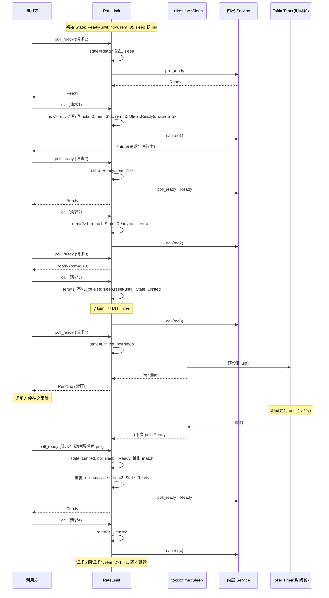

# 第 3 篇 · 第 10 章 · RateLimit:令牌桶控速率

> **核心问题**:你已经会用 `ConcurrencyLimit` 限制"同时进行"的请求数(并发上限),但现实里有一类限制它管不了——"每秒最多 100 个请求""每分钟最多 1 万次 API 调用"。这种按**时间窗口算配额**的限制,要的是控**速率(rate)**,不是控**并发(concurrency)**。Tower 的 `RateLimit` 怎么用一个令牌桶(token bucket)把"单位时间内的请求数"卡死?它凭什么把"补充令牌"和"扣令牌"分别放进 `poll_ready` 和 `call` 两个方法,从而把速率限制变成一种**背压**(没令牌就 `Pending` 等下一个时间窗),而不是简单地报错拒绝?它和 `ConcurrencyLimit` 到底差在哪,什么时候该用哪个?
>
> **读完本章你会明白**:
>
> 1. "限并发"和"限速率"是两个**正交**的维度:`ConcurrencyLimit` 关心"同时有多少请求在路上(in-flight)",`RateLimit` 关心"一段时间内放行了多少请求"。一个保护下游的处理能力,一个保护配额/计费/防刷的边界。混淆它们,要么限不住突发,要么把好好的吞吐压垮。
> 2. 令牌桶(token bucket)算法的精髓:**桶容量(capacity)**允许突发(burst),**补充速率(rate)**保证长期平均。Tower 的实现不是教科书上"一个后台线程定时往桶里加令牌",而是**惰性补充(lazy refill)**——只在 `call`/`poll_ready` 被调用的瞬间,看现在时间相对上次窗口结束还差多少,过期了就整桶重置。这一手省掉了一个后台 timer task,代价是空闲一段时间后第一个请求会拿到整桶。
> 3. Tower 用的是 `tokio::time::Sleep` + `sleep_until` + **原地 `reset`**(把一个 `Pin<Box<Sleep>>` 反复重置复用),**不是** `tokio::time::Interval`。这是个容易翻车的源码印象——很多博客把 `RateLimit` 讲成"用 Interval 周期性补令牌",但真实源码里没有 `Interval`,令牌也**不是周期性补充**的。读完本章你会明白为什么 Tower 选 Sleep 不选 Interval。
> 4. 为什么"扣令牌"必须在 `call` 里(消费资源,呼应 P1-02 的"`call` 取走就绪状态"),而"等下一个时间窗"必须在 `poll_ready` 里(把速率限制变成背压,呼应 P2-05/P2-07 的 poll_ready 背压哲学),以及为什么 `call` 在 `State::Limited` 时直接 **panic** 而不是返回错误——这背后是 `Service` trait 的铁律。
>
> **逃生阀**:如果你对"令牌桶"这个词还发怵,别怕——它就是个"装令牌的桶,每来一个请求扣一个,扣光了就排队等补充"的模型,本章第 2 节会从最朴素的"用一个计数器+一个截止时间"开始,一步步推到 Tower 的实现。如果你忘了 `poll_ready`/`call` 为什么是 `&mut self`、为什么资源要在 `call` 里消费,先回去翻 [P1-02 Service trait](P1-02-Service-trait-一个请求一个Future.md) 的"`poll_ready` 资源预留"那一节,以及 [P2-05 Buffer](P2-05-Buffer-把非Clone服务变成Clone+Send.md) 和 [P2-07 LoadShed](P2-07-LoadShed与背压的取舍.md) 关于背压的讨论。本章默认你已经知道"`poll_ready` 返回 `Pending` 时,调用方会停在这里等,而不是直接报错"。

---

## 章首 · 一句话点破

> **`RateLimit` 的全部魔法,是把"单位时间内的请求数"翻译成一个"令牌桶":桶里每来一个请求扣一个令牌,扣光了就进 `Limited` 态,在 `poll_ready` 里挂到一个 `Sleep` 上等下一个时间窗;时间窗到了被唤醒,整桶令牌重置,继续放行。"补充令牌"不是后台定时器干的,而是请求来了顺手补的(惰性补充)。它和 `ConcurrencyLimit` 的根本区别是:`ConcurrencyLimit` 限的是"同时",请求完了一定要还 permit;`RateLimit` 限的是"一段时间内的总数",请求完了不还令牌——令牌只随时间重生。**

这是结论,不是理由。本章倒过来拆:为什么"限并发"满足不了"限速率"的需求 → 令牌桶这个算法凭什么好用(以及漏桶、滑动窗口为什么不被 Tower 选中)→ Tower 怎么用 `tokio::time::Sleep` 把令牌桶变成一个不需要后台线程的背压机制 → 源码里那 130 行是怎么做到 sound 的。

本章服务**执行单元**这一面:`RateLimit` 是个 `Service`,它改写了 `poll_ready`/`call` 的语义——在 `poll_ready` 里"等令牌",在 `call` 里"扣令牌"。它是第 3 篇(限流超时)的收尾,也是把 P1-02 的"poll_ready 背压"和 P2 篇的背压三件套(`Buffer`/`SpawnReady`/`LoadShed`)用"速率"这个新维度再淬炼一遍的一章。

---

## 正文

### 第 1 节 · 为什么"限并发"管不了"限速率"

先从你最熟悉的需求说起。假设你在写一个调用第三方支付网关的 client。支付网关的合同里白纸黑字写着:**每秒最多允许 100 笔交易请求,超了直接 429 拒绝并计费罚则**。你的服务每秒可能产生 200 笔支付请求(促销时段)。你怎么写这个限流?

你第一反应可能是:`ConcurrencyLimit` 不就能限流吗?给它套个 `ConcurrencyLimit::new(client, 100)`。我们来看这套配置会发生什么。

回忆一下 `ConcurrencyLimit` 在干什么(详见 [P3-09](P3-09-ConcurrencyLimit-并发数上限.md),这里一句带过):它在 `poll_ready` 里 acquire 一个 `tokio::sync::Semaphore` 的 permit,并发数到上限就 `Pending`;在 `call` 里 `take()` 走 permit,持有到响应 Future 完成(`ResponseFuture` drop 时 permit 自动归还)。源码长这样:

```rust
// tower/src/limit/concurrency/service.rs#L65-L93(承接 P3-09,这里只看关键)
fn poll_ready(&mut self, cx: &mut Context<'_>) -> Poll<Result<(), Self::Error>> {
    if self.permit.is_none() {
        self.permit = ready!(self.semaphore.poll_acquire(cx));
        // ...
    }
    self.inner.poll_ready(cx)
}

fn call(&mut self, request: Request) -> Self::Future {
    let permit = self.permit.take().expect("...");
    let future = self.inner.call(request);
    ResponseFuture::new(future, permit)   // permit 跟着 future 走,drop 时归还
}
```

关键在最后一行:**permit 是跟着响应 Future 走的,Future 一 drop,permit 就归还**。这意味着 `ConcurrencyLimit` 限的是"**此刻有多少个请求还没回**"——也就是 in-flight 数。

那么,假设支付网关的延迟是稳定的 50ms,你套了 `ConcurrencyLimit::new(client, 100)`:

- 每个请求占一个 permit 50ms,50ms 后归还。
- 一个 permit 一秒能被复用 `1000ms / 50ms = 20` 次。
- 100 个 permit 一秒总共能放行 `100 × 20 = 2000` 个请求。

你设了 100,实际放行 2000 个/秒。支付网关的 100/秒限额瞬间被打爆,收到一堆 429,触发罚则。你限了个寂寞。

反过来,假设你想用 `ConcurrencyLimit` 卡死到 100/秒,你得倒着算:`max = 100 / 20 = 5`。你设 5。但这意味着**任何时候最多 5 个请求在途**。一旦支付网关抽风延迟从 50ms 飙到 2s(40 倍),你的 5 个 permit 全被卡住,2 秒只能放 5 个请求,QPS 从 100 掉到 2.5——业务直接卡死。而且这还要求你**事先知道下游延迟**,延迟一变限额就失准。这套配置脆弱到没法上线。

> **钉死这件事**:`ConcurrencyLimit` 限的是**同时(in-flight)**,它依赖"请求完成会归还 permit"这个闭环。`RateLimit` 要限的是**一段时间内的总数**,它**不依赖请求什么时候完成**——令牌扣了就是扣了,不管你 1ms 回还是 10s 回。这是两个**正交**的维度:并发关心"下游同时扛几个",速率关心"这段时间我总共放几个"。

为什么这两个维度正交?画一张表就清楚:

| 维度 | 衡量什么 | 单位 | 归还机制 | 关心方 |
|------|---------|------|---------|--------|
| 并发(concurrency) | 此刻在途的请求数 | 个(瞬时) | 请求完成归还 | 下游处理能力(连接池/线程) |
| 速率(rate) | 一段时间内放行的请求数 | 个/秒(或个/分) | 不归还,随时间重生 | 配额/计费/防刷 |

支付网关的合同限的是**速率**(每秒 100 个,跟你几个在途无关),你用 `ConcurrencyLimit` 去限**并发**,维度错配,必然失准。同理,你想保护下游数据库连接池(最多 50 个查询同时跑),用 `RateLimit` 也保护不了——速率限制允许突发,突发期可能瞬间塞 200 个查询进连接池,把池子打爆。

这两个维度现实里往往**都要限**:既保护下游连接池(并发上限),又遵守外部 API 配额(速率上限)。所以 Tower 里 `ConcurrencyLimit` 和 `RateLimit` 是配套的,经常一层套一层(本章最后一节会给组合的例子)。

现在问题清楚了:**我们需要一个能限制"单位时间内请求数"的中间件,而且它不能依赖请求什么时候完成。** 这就是 `RateLimit` 要解决的问题。

### 第 2 节 · 令牌桶:为什么是这个算法(以及漏桶、滑动窗口为什么不选)

要限"单位时间内的请求数",最朴素的思路是**固定窗口计数器(fixed window counter)**:开个计数器,记这一秒内来了几个请求,到 100 就拒,过完这一秒计数器清零。这思路直白,但有个老问题——**边界突发(boundary burst)**。

设想:第 1 秒的 0.9s 时刻来了 100 个请求(计数器到 100,后面的拒),第 2 秒的 0.1s 时刻又来了 100 个请求(计数器清零了,全放)。于是在 0.9s 到 1.1s 这 **0.2 秒**内,放行了 200 个请求——平均一秒 1000 个,远超 100/秒的限额。这就是固定窗口的"窗口边界双倍突发"问题。对于敏感场景(支付、防刷),这种突发是不能接受的。

> **不这样会怎样**:固定窗口实现简单(一个计数器+一个时间戳),但凡是你限制的对象有"挑窗口边界攻击"的动机(刷接口、撞库、抢购),它就防不住。支付网关的合同不会接受"每秒 100 但偶尔 2000"。

为了治这个病,工业界演进出了三类算法,我们一个个看,Tower 选了哪个、为什么。

#### 2.1 漏桶(leaky bucket):严格匀速,代价是不允许突发

漏桶的模型是:**请求先进一个队列,队列以**固定速率**往外"漏"(放行)**。不管你多密集地往里灌,出口永远是匀速的。这就像一个水桶底下有个小孔,水以恒定速率流出,你倒水倒得再猛,出来的水流不变。

漏桶的好处是**严格平滑**——出口速率永远恒定,没有突发。但它的代价也正是"不允许突发":即使系统现在完全空闲、下游处理能力充裕,一个合法的瞬时高峰(比如页面加载同时发 20 个请求)也会被漏桶强行拉平到每秒 N 个,用户体验差。

漏桶还有个实现负担:它需要一个**队列**存等着的请求(灌进来漏不出去的就排队),队列有界就涉及满了怎么办(丢?拒?背压?),无界就 OOM。Guava 的 `RateLimiter` 早期版本就是稳定模式(匀速)的漏桶变体。

#### 2.2 滑动窗口(sliding window):精确但状态重

滑动窗口把"这一秒"不是当成一个固定区间,而是当成"**过去 1 秒内**"——一个跟着时间滑动的窗口。每来一个请求,看过去 1 秒内有多少个请求,超了就拒。这能精确治住固定窗口的边界突发(因为没有"边界"了,窗口一直在滑)。

滑动窗口的实现方式有两种,各有负担:

- **滑动窗口日志(slider log)**:记下每个请求的时间戳,每次来请求扫一遍过期的时间戳。时间戳列表无界增长(OOM 风险),有界又要淘汰(可能不准)。
- **滑动窗口计数(slider counter)**:把大窗口切成小格子(比如 1 秒切成 10 个 100ms 格子),每个格子一个计数器,加权求和估算窗口内总数。格子越多越精确,状态也越多。

滑动窗口精确,但状态比令牌桶重(令牌桶就两个量:剩余令牌数、下次补充时间),实现也复杂。对于"每秒 100 个"这种粗粒度限流,杀鸡用牛刀。

#### 2.3 令牌桶(token bucket):允许突发 + 平滑长期平均,Tower 选了它

令牌桶的模型是:

- 有一个**桶**,容量是 `capacity`(上限)。
- **令牌(token)以固定速率 `rate` 往桶里加**,桶满了溢出(多余的令牌丢弃)。
- 每来一个请求,**从桶里取一个令牌**:取得到就放行,取不到(桶空)就排队等(或拒绝,看策略)。

令牌桶的关键性质是**两条**:

1. **允许突发(burst)**:桶满时(系统空闲久了),一瞬间可以放行最多 `capacity` 个请求。这对应现实里"页面加载同时发 20 个请求"这种合法突发——只要长期平均不超 `rate`,短期突发是允许的。
2. **平滑长期平均**:长期看,放行速率收敛到 `rate`(令牌补充速率)。突发把桶掏空后,后续请求只能按 `rate` 一个一个等令牌,被自然节流。

令牌桶的**状态极简**:就两个量——**桶里当前令牌数** + **下次补充时间(或上次补充时间)**。没有队列(等令牌的请求是调用方自己 Pending,不是桶维护的队列),没有时间戳列表,没有格子数组。这正是工业限流器(Stripe、AWS、Envoy 的 token bucket、Nginx limit_req)普遍选令牌桶的原因:**状态轻、允许突发、长期平均精确**。

> **钉死这件事**:令牌桶的 `capacity` 和 `rate` 是两个独立旋钮。`capacity` 控制"瞬时能放几个"(突发上限),`rate` 控制"长期每秒放几个"(平均速率)。现实里这俩经常不相等:`capacity = 100, rate = 10/s` 意味着"长期每秒 10 个,但空闲后第一秒能瞬间放 100 个"。这个解耦是令牌桶比漏桶灵活的地方——漏桶本质上 `capacity` 趋于无穷大但出口固定匀速,没法表达"允许瞬时突发"。

现在对照看 Tower 的选择。Tower 的 `RateLimit` 用的是令牌桶吗?是。但它做了一个简化(或者说一个设计取舍)——它把 `capacity` 和 `rate` **绑成了一回事**。来看 `Rate` 这个结构体:

```rust
// tower/src/limit/rate/rate.rs#L1-L30
use std::time::Duration;

/// A rate of requests per time period.
#[derive(Debug, Copy, Clone)]
pub struct Rate {
    num: u64,
    per: Duration,
}

impl Rate {
    /// Create a new rate.
    ///
    /// # Panics
    ///
    /// This function panics if `num` or `per` is 0.
    pub const fn new(num: u64, per: Duration) -> Self {
        assert!(num > 0);
        assert!(per.as_nanos() > 0);

        Rate { num, per }
    }

    pub(crate) fn num(&self) -> u64 {
        self.num
    }

    pub(crate) fn per(&self) -> Duration {
        self.per
    }
}
```

`Rate { num, per }` 表示"每 `per` 时间最多 `num` 个请求"。注意:**这里只有一个 `num`,没有单独的 `capacity`**。也就是说,Tower 的令牌桶**桶容量 = 每窗口令牌数**(`capacity = num`)。`Rate::new(100, Duration::from_secs(1))` 意味着桶容量 100、每 1 秒补 100 个。你不能单独设"桶容量 200、每秒补 100"(那种允许 2 倍突发的配置)。

这是个**有意的简化**。完整的令牌桶(像 Envoy 的)允许 `capacity` 和 `rate` 解耦,Tower 把它们绑死,换来的是状态更少(连"当前令牌数"都是隐式的,后面讲源码会看到)、API 更简单。代价是突发上限被钉死在"一个窗口的量"。对于绝大多数 API 限流场景(每秒 N 个、每分钟 M 个),这个简化完全够用;真要解耦突发,可以套两层 `RateLimit` 或者自己写。

> **对照《Envoy》[[envoy-source-facts]]**:Envoy 有个独立的 [token bucket filter](https://www.envoyproxy.io/docs/envoy/latest/api-v3/extensions/filters/network/rate_limit/v3/rate_limit.proto),它的 token bucket 是完整的——`max_tokens`(容量)和 `tokens_per_fill`/`fill_interval`(补充速率)解耦,还能配 `anycast` 等。Envoy 适合做"代理层全局限流",状态丰富;Tower 的 `RateLimit` 适合做"服务内单个 client 的自我节流",够用就行。这是两个层次的工具,别混。一句带过,详见《Envoy》相关章。

所以,Tower 选了令牌桶,且选了一个**简化版**的令牌桶。下一节我们看它怎么把这个桶用 `tokio::time` 实现——并且,它实现的方式跟大多数博客讲的"用 Interval 周期补令牌"**完全不一样**。

### 第 3 节 · Tower 怎么实现这个桶:`Sleep` + 惰性补充(不是 Interval!)

这是本章最关键的一节,也是源码印象最容易翻车的一节。先说结论,再拆:

> **Tower 的 `RateLimit` 用 `tokio::time::Sleep`(一个"睡到某个时刻"的 Future),不是 `tokio::time::Interval`(一个"每隔一段时间 tick"的 Future)。令牌不是"周期性补充"的,而是"惰性补充"的——只有当请求来了(`call` 或 `poll_ready` 被调用),才会看现在的时间,如果当前时间窗已经过期,就整桶重置。没有后台 timer task 在那儿定时往桶里加令牌。**

很多博客和教程把 `RateLimit` 讲成"用 `Interval` 每 100ms tick 一次补一个令牌",这是错的。我们直接看源码,逐行拆。

#### 3.1 数据结构:`State` + 一个预分配的 `Sleep`

`RateLimit` 的全部状态(`tower/src/limit/rate/service.rs#L13-L26`):

```rust
// tower/src/limit/rate/service.rs#L13-L26
#[derive(Debug)]
pub struct RateLimit<T> {
    inner: T,
    rate: Rate,
    state: State,
    sleep: Pin<Box<Sleep>>,
}

#[derive(Debug)]
enum State {
    // The service has hit its limit
    Limited,
    Ready { until: Instant, rem: u64 },
}
```

四个字段,逐个说:

- `inner: T` —— 被包装的内层 service(真正的业务 service)。
- `rate: Rate` —— 配置,`num` 个 / `per` 时长。
- `state: State` —— 当前状态机。两种:
  - `Ready { until, rem }` —— 还能放行,`until` 是当前时间窗的结束时刻,`rem` 是这个窗口**剩余**的令牌数。
  - `Limited` —— 已经耗尽,正在等下一个时间窗。
- `sleep: Pin<Box<Sleep>>` —— 一个 `tokio::time::Sleep`, pinned 在堆上。注意它是**预分配**的,构造时就 `Box::pin` 了一个,后面反复 `reset` 复用,不会每次都 new 一个新的。

`Sleep` 是什么?它是 Tokio 提供的一个 Future,语义是"poll 它,在指定的 `Instant` 之前一直返回 `Pending`,到了那个时刻之后返回 `Ready`"。它底层挂在 Tokio 的 timer(时间轮)上,到了时刻被唤醒(详见《Tokio》[[tokio-source-facts]] 的时间轮一节,这里一句带过)。

注意这里**没有** `Interval`。`Interval` 是另一个 Tokio 类型,语义是"每隔一段固定时间 tick 一次",适合做"周期性心跳"。很多人想当然以为限流就该用 `Interval`(每秒 tick 一次补令牌),但 Tower 没这么做。为什么?第 4 节讲完实现后我们会专门展开这个选型。

#### 3.2 构造:满桶起手,`Sleep` 预先 pin 好

```rust
// tower/src/limit/rate/service.rs#L28-L46
impl<T> RateLimit<T> {
    /// Create a new rate limiter
    pub fn new(inner: T, rate: Rate) -> Self {
        let until = Instant::now();
        let state = State::Ready {
            until,
            rem: rate.num(),
        };

        RateLimit {
            inner,
            rate,
            state,
            // The sleep won't actually be used with this duration, but
            // we create it eagerly so that we can reset it in place rather than
            // `Box::pin`ning a new `Sleep` every time we need one.
            sleep: Box::pin(tokio::time::sleep_until(until)),
        }
    }
    // ...get_ref / get_mut / into_inner 略
}
```

构造时,**桶是满的**(`rem: rate.num()`),`until` 设成"现在"(意味着这个窗口立刻就算过期,下一次 `call` 会立刻重置一个新窗口——这保证了刚启动时第一个请求不会被无谓地等)。`sleep` 预先 `Box::pin` 了一个 `sleep_until(now)`,注释说得很直白:**这个初始 duration 没意义,我们只是想预先分配好这个 `Pin<Box<Sleep>>`,后面用 `reset` 原地改它的到期时刻,省得每次都重新 `Box::pin` 一个新的**。

这一手"预分配 + reset 复用"是性能关键。每次进 `Limited` 态都要一个 Sleep(等下个窗口),如果每次都 `Box::pin(tokio::time::sleep_until(...))`,就要分配一块堆内存 + 注册到 timer + 完了再注销,频繁限流时这块开销不小。预先 pin 一个、反复 `reset`,把分配摊到构造期一次,运行期零分配。这是 Tower 源码里一个不起眼但很考究的细节,我们在技巧精解里会单独拆。

#### 3.3 `poll_ready`:有令牌直接放,没令牌挂 Sleep 等

这是背压的核心。看 `poll_ready`(`service.rs#L72-L89`):

```rust
// tower/src/limit/rate/service.rs#L72-L89
fn poll_ready(&mut self, cx: &mut Context<'_>) -> Poll<Result<(), Self::Error>> {
    match self.state {
        State::Ready { .. } => return Poll::Ready(ready!(self.inner.poll_ready(cx))),
        State::Limited => {
            if Pin::new(&mut self.sleep).poll(cx).is_pending() {
                tracing::trace!("rate limit exceeded; sleeping.");
                return Poll::Pending;
            }
        }
    }

    self.state = State::Ready {
        until: Instant::now() + self.rate.per(),
        rem: self.rate.num(),
    };

    Poll::Ready(ready!(self.inner.poll_ready(cx)))
}
```

逐段读:

1. 如果当前是 `State::Ready`(还有令牌),直接 `return` 内层 service 的 `poll_ready` 结果——令牌够,速率这层不挡,挡不挡是内层(比如内层还可能套个 `ConcurrencyLimit`)的事。注意这里用了 `ready!` 宏(`futures_core::ready`),它把 `Poll<Result<T, E>>` 解包:如果是 `Pending` 直接 `return Pending`,如果是 `Ready(Err)` 直接 `return Ready(Err)`,只有 `Ready(Ok)` 才往下走。所以这行等价于"内层 ready 了就继续,没 ready 就把 Pending 往上传"。

2. 如果当前是 `State::Limited`(令牌耗尽了),poll 那个预分配的 `sleep`:
   - 如果 `sleep` 还没到时刻(`is_pending()`),返回 `Poll::Pending`——**这就是背压!** 调用方会停在这里,等 Tokio timer 把这个 task 唤醒。这一行 `tracing::trace!("rate limit exceeded; sleeping.")` 就是限流生效的痕迹。
   - 如果 `sleep` 到时刻了(`is_pending()` 为 false,即 `Ready`),跳出 `match`,往下走重置状态。

3. 跳出 match 后(无论是 Limited 被唤醒,还是其他路径走到这里),**重置一个新窗口**:`until = now + per`,`rem = num`——整桶令牌补满。然后再 poll 一次内层,把结果返回。

注意第 3 步:**令牌的"补充"就发生在这里**——在 `poll_ready` 被 Sleep 唤醒的瞬间,一次性把整桶补满(`rem = num`),不是一个一个补。这就是上一节说的"惰性补充":没有后台线程定时加令牌,而是等到"有人来要令牌、且发现桶空了、且时间窗到了"这一刻,一次性补一桶。

> **承接《Tokio》[[tokio-source-facts]]**:`tokio::time::Sleep` 底层挂在 Tokio runtime 的 timer 上(时间轮在 `runtime/time/wheel/`),到时刻由 reactor 唤醒挂在它上面的 task。Sleep 的内部机制(注册/注销/时间轮层级/Waker)**一句带过,详见《Tokio》**——本书不重复。我们这里只关心 Sleep 的**用法**:它是个 `Future`,poll 它在到时刻前返回 `Pending`,到时刻后返回 `Ready`,Tower 用它实现"等到下个时间窗"。

> **钉死这件事**:`poll_ready` 里返回 `Pending` 不是"报错"也不是"拒绝",是**背压**——调用方停下来等,等令牌桶补充后被唤醒继续。这呼应 P1-02 的"`poll_ready` 是资源预留的钩子"和 P2-07 的"满载时可以等而不是拒"。`RateLimit` 选的是"等"(挂 Sleep),不是"拒"(像 LoadShed 那样返回错误)。这意味着 `RateLimit` 不会主动丢请求,它只是让请求**慢下来**——堆积压力会顺着 `poll_ready` 往上传(传到 Buffer、传到上游),由上游决定怎么办。

#### 3.4 `call`:扣令牌,扣光了进 Limited

看 `call`(`service.rs#L91-L118`):

```rust
// tower/src/limit/rate/service.rs#L91-L118
fn call(&mut self, request: Request) -> Self::Future {
    match self.state {
        State::Ready { mut until, mut rem } => {
            let now = Instant::now();

            // If the period has elapsed, reset it.
            if now >= until {
                until = now + self.rate.per();
                rem = self.rate.num();
            }

            if rem > 1 {
                rem -= 1;
                self.state = State::Ready { until, rem };
            } else {
                // The service is disabled until further notice
                // Reset the sleep future in place, so that we don't have to
                // deallocate the existing box and allocate a new one.
                self.sleep.as_mut().reset(until);
                self.state = State::Limited;
            }

            // Call the inner future
            self.inner.call(request)
        }
        State::Limited => panic!("service not ready; poll_ready must be called first"),
    }
}
```

逐段读:

1. 从 `State::Ready` 取出 `until` 和 `rem`。然后**第一件事**是检查时间窗:`if now >= until`,如果当前时间已经过了窗口结束时刻,**重置窗口**(`until = now + per, rem = num`)。这是惰性补充的**第二处**——除了 `poll_ready` 被唤醒会补,`call` 进来也会顺手检查"窗口过期没",过期就补满。这一手很重要,它处理了"服务空闲一段时间后又来请求"的情况:空闲期间令牌没被补充(因为没有调用触发),但请求一来,`call` 发现 `now >= until`,立刻补满整桶,请求正常放行。

2. 扣令牌:
   - 如果 `rem > 1`(扣完还剩至少一个),`rem -= 1`,写回 `State::Ready`。注意是 `> 1` 不是 `> 0`——因为这是**扣完这次 call 之后**剩的数,这次 call 自己要用掉一个,所以剩 `rem - 1`。当 `rem == 1` 时,扣掉这最后一个,桶就空了,走 `else` 分支。
   - 如果 `rem == 1`(这是最后一个令牌),扣掉后桶空,**重置 sleep 到 `until`**(下个窗口结束时刻),状态切到 `State::Limited`。下一个 `poll_ready` 会撞上 `Limited` 分支,挂 sleep 等。

3. **调内层 `call`**,把请求传下去。注意 `RateLimit` 的 `type Future = S::Future`(见 service.rs#L64-L70 的 impl 块)——它不包一层 Future,直接把内层的 Future 透传。为什么?因为**速率限制在 `poll_ready`/`call` 这一对调用里就完成了**(扣令牌在 call,等令牌在 poll_ready),响应阶段(rate limit 不关心请求什么时候回)无事可做,不需要包 Future。这跟 `ConcurrencyLimit` 不一样——`ConcurrencyLimit` 要持有 permit 到 Future 完成,所以得包一层 `ResponseFuture`;`RateLimit` 令牌扣了就扣了,Future 阶段不需要它。

4. **panic 的那一行**:`State::Limited => panic!("service not ready; poll_ready must be called first")`。这是个"契约违约"的硬错——`Service` trait 的规矩是"先 `poll_ready` 拿到 `Ready` 才能 `call`"(详见 P1-02),如果在 `Limited` 态直接 `call`,说明调用方没遵守契约,直接 panic。这跟 `ConcurrencyLimit::call` 里 `permit.take().expect("max requests in-flight; poll_ready must be called first")`(`concurrency/service.rs#L87`)是同一个设计哲学:不靠运行时检查保护契约,而是用 panic 把"调用方写错了"立刻暴露出来。

> **钉死这件事**:令牌的扣减**只发生在 `call` 里**,不发生在 `poll_ready` 里。`poll_ready` 只负责"等"(Limited 态挂 sleep)和"重置窗口"(被唤醒后),它**不动 `rem`**。`rem` 的减少只在 `call` 里。这不是随手写的,是 P1-02 钉死的"`poll_ready` 预留资源、`call` 消费资源"的铁律:令牌是资源,预留(检查够不够、等)在 `poll_ready`,消费(扣一个)在 `call`。呼应 `ConcurrencyLimit`(permit 在 poll_ready acquire、在 call take)、呼应 `Buffer`(容量在 poll_ready 检查、在 call 占一个槽)。

#### 3.5 完整时序:一次突发是怎么被节流的

把上面四段拼起来,看一个完整的突发场景。配置 `Rate::new(3, Duration::from_secs(1))`(每秒 3 个),系统启动满桶。来 5 个请求,我们追每个请求的命运:



看得出来:**前 3 个请求瞬间放行**(突发,桶满),第 4 个请求被卡住挂 Sleep,等 1 秒(到 `until`)被唤醒后,整桶补满(`rem=3`),第 4、5 个(以及后续)继续放行,直到再次耗尽。这就是令牌桶的"允许突发 + 长期节流"在 Tower 里的真实运转。

注意时序图里一个细节:**第 4 个请求被唤醒后,`poll_ready` 重置的窗口是 `now + per`**,不是延续原来的 `until`。也就是说,每次进 `Limited` 被唤醒,都从"现在"重新算一个新窗口。这意味着如果你配置 `per = 1s`,实际节流周期可能略长于 1s(从你耗尽那一刻到下个 1s 整点),但不会短于 1s——保证了速率不会被低估(不会放行过多)。

### 第 4 节 · 为什么是 `Sleep` 不是 `Interval`,为什么是惰性补充不是周期补充

这一节回答本章标题里那个容易翻车的源码印象:**Tower 为什么用 `Sleep` 不用 `Interval`,为什么令牌是惰性补充而不是周期补充?**

#### 4.1 如果用 Interval 会怎样

我们先假设性地用 `Interval` 重写一遍,看会撞什么墙。朴素的"Interval 周期补令牌"长这样(伪代码,非源码):

```rust
// 简化示意(非源码原文)——朴素 Interval 版本,有问题
struct NaiveRateLimit<T> {
    inner: T,
    interval: tokio::time::Interval,
    tokens: AtomicU64,  // 共享的令牌数
    capacity: u64,
}

// 后台 task:每 tick 补一个令牌
async fn refill_worker(rl: Arc<NaiveRateLimit>) {
    loop {
        rl.interval.tick().await;
        let cur = rl.tokens.load();
        if cur < rl.capacity {
            rl.tokens.store(cur + 1);
        }
    }
}
```

这个版本的问题:

1. **要多一个后台 task**。这个 task 永远在跑(即使没有任何请求),周期性地 tick + 改 `tokens`。空闲时它在空转(虽然 Sleep 让它不占 CPU,但占一个 task 槽 + timer 注册),繁忙时它和请求路径竞争同一个原子变量(`tokens`)。
2. **令牌是共享状态**(`AtomicU64`),后台 task 写、请求路径读/写,要么上锁要么原子操作,引入同步开销。Tower 实际的 `RateLimit` 没有任何原子操作——`state` 就是 `RateLimit` 结构体里的一个字段,`&mut self` 独占,零同步。
3. **`Interval` 的语义不完全匹配**。`Interval::tick()` 是"上次 tick 之后又过了一段时间",它会尽量补偿 missed tick(Tokio 的 `Interval` 默认 `MissedTickBehavior::Burst`,会连发),这跟令牌桶"一秒补一桶"的语义对不上,要调参。而 `Sleep` 是"睡到某个绝对时刻",语义直接对应"等到下个时间窗",不需要补偿逻辑。
4. **状态多**。要同时维护 `tokens`(当前令牌数)、`capacity`(上限)、`interval`(周期源),三个量。Tower 实际只用了 `State::Ready{until, rem}`(两个量)和 `State::Limited`(零个量),加一个预分配的 Sleep。少一个量,逻辑简单一截。

> **不这样会怎样**:用 Interval + 后台 task + 共享原子变量,功能上也能实现限流,但代价是"多一个 task、多一份共享状态、多一份同步开销"。对于"每个 client 实例一个 RateLimit"的场景(一个服务可能挂几十上百个 client),后台 task 数量线性膨胀,Tokio runtime 的 task 表压力陡增。Tower 的 Sleep + 惰性补充版本,**零后台 task、零共享状态、零同步**——每个 RateLimit 就是个普通的 `&mut self` 结构体,调用方不调它它就什么都不干。这是个"按需付费"的设计:只为实际发生的请求付出代价。

#### 4.2 惰性补充为什么 sound

惰性补充(lazy refill)的核心担心是:**会不会补充不及时,导致限流过严(该放行的请求被拒)?** 我们来核一下。

惰性补充发生在两个地方:

- `poll_ready` 里 `Limited` 态被 Sleep 唤醒后(`service.rs#L83-L86`)重置整桶。
- `call` 里进来先检查 `now >= until`(`service.rs#L96-L100`),过期就重置整桶。

第一种情况不会补充不及时——因为 `Limited` 态进的时候,`sleep` 已经被 `reset(until)`(`service.rs#L109`),它会在 `until` 那个时刻准时 Ready(承 Tokio timer 的精度,Sleep 到时刻由 reactor 唤醒),唤醒后立刻重置,没有延迟。

第二种情况更微妙——它处理的是"服务空闲一段时间后又来请求"。假设 `per = 1s`,桶在某时刻耗尽进 `Limited`,sleep 挂到 `until`。但是!**如果调用方在这段时间里根本没调 `poll_ready`**(比如这个 client 完全空闲,没人用它),那么 sleep 永远不会被 poll(它是个 Future,得有人 poll 才会推进),`Limited` 态就一直挂着。直到下一次有人调 `poll_ready`,才会 poll sleep,发现已经过了 `until`(Ready),重置整桶。

这种情况下,补充"迟到"了吗?没有。因为**没人要令牌,补了也是浪费**。等到真正有人来要(调 `poll_ready` 或 `call`),那一刻才发现"哦时间早过了",立刻补满——这对调用方来说是"瞬间补满,立即可用",没有任何可观察的延迟。惰性补充的精髓就在这:**补充的触发点是"有人要令牌",不是"时间到了"**。时间到了但没人要,就不补(省事);有人要但时间没到,就等(挂 sleep);有人要且时间到,就补。三种情况都 sound,没有"该补没补"的窗口。

但有一个**值得注意的副作用**(不是 bug,是设计取舍):惰性补充 + 满桶起手 = **空闲后的第一个请求会拿到整桶**。假设你的服务挂了 10 秒没用这个 client,第一个请求来的时候,`call` 发现 `now >= until`(早过了),重置 `rem = num`(满桶),这个请求放行,后面紧接着的 `num - 1` 个请求也瞬间放行——一次完整的突发。这是令牌桶"允许突发"的题中之义(空闲攒的令牌一次性释放),但如果你期望"不管空闲多久,恢复后仍然匀速",那这个行为会让你意外。对于 API 配额场景(空闲不用就不算配额,恢复后允许突发),这是符合预期的;对于"严格匀速"场景,你应该用漏桶,不是令牌桶。

> **钉死这件事**:惰性补充不是"为了省一个后台 task 而做的妥协",它是**令牌桶语义的正确实现**。令牌桶的数学定义就是"令牌以速率 `rate` 连续累积,上限 `capacity`",这个"连续累积"是个**抽象**——具体实现可以是后台线程定时加(主动补充),也可以是要的时候按时间差一次性补(惰性补充),两者在可观察行为上等价(都满足"长期平均 = rate,瞬时上限 = capacity")。惰性补充只是把"连续累积"这件事**摊到请求路径上**按需计算,省掉了后台线程这个不必要的实体。这是把抽象和实现解耦的漂亮一手。

### 第 5 节 · `RateLimit` vs `ConcurrencyLimit`:一张决策表

讲完实现,把本章的引子问题——"并发 vs 速率"——钉死成一张决策表。这是你在真实服务里决定套哪层(或两层都套)的依据。

| 维度 | `ConcurrencyLimit` | `RateLimit` |
|------|-------------------|-------------|
| **限什么** | 同时在途的请求数(in-flight) | 一段时间内放行的请求数 |
| **衡量单位** | 个(瞬时计数) | 个/秒(或个/分) |
| **归还机制** | 请求完成(Future drop)归还 permit | 不归还,令牌随时间重生 |
| **依赖什么** | 依赖请求完成(慢请求会吃住 permit) | 不依赖请求完成(只看时间) |
| **允许突发吗** | 否(到上限就卡) | 是(桶满瞬间放) |
| **底层原语** | `tokio::sync::Semaphore`(permit) | `tokio::time::Sleep`(等时间窗) |
| **状态** | `permit: Option<OwnedSemaphorePermit>` | `state: State{Ready{until,rem}/Limited}` + 预 pin Sleep |
| **Future 包装** | 包一层 `ResponseFuture`(持有 permit) | 不包,透传内层 Future |
| **保护什么** | 下游处理能力(连接池/线程/内存) | 配额/计费/防刷边界 |
| **典型场景** | DB 连接池上限、下游并发处理能力 | 第三方 API 配额、防爬防刷、计费边界 |
| **慢下游影响** | permit 被吃住,QPS 被动下降 | 不影响(令牌照常重生) |
| **调用契约** | call 前 poll_ready 拿 permit | call 前 poll_ready 拿到 Ready(可能等了 Sleep) |

一个真实的组合场景:你的服务调一个第三方支付 API,合同限 100/秒,同时这个 API 的连接池你只租了 10 个连接。正确配置:

```rust
// 简化示意(非源码原文)——双层限流
let client = PaymentClient::new(/* 连接池 10 */);

// 内层限并发(保护连接池):最多 10 个在途
let client = ConcurrencyLimit::new(client, 10);

// 外层限速率(遵守配额):每秒 100 个
let client = RateLimit::new(client, Rate::new(100, Duration::from_secs(1)));

// 用 client 发请求...
```

注意顺序:**RateLimit 在外,ConcurrencyLimit 在内**。为什么?因为 RateLimit 的 `poll_ready` 等令牌时不持有内层资源(它只是挂 Sleep),等完了再 poll 内层(ConcurrencyLimit)。如果反过来(ConcurrencyLimit 在外),那么等令牌期间会一直吃着一个 concurrency permit(因为 ConcurrencyLimit 的 permit 在 poll_ready acquire,call 才 take,RateLimit 在中间挂 Sleep 期间 permit 还没被 take 走),白白占一个并发槽。中间件顺序的讲究,详见 [P1-04 ServiceBuilder](P1-04-ServiceBuilder与ServiceExt-组合的艺术.md) 关于"添加顺序与请求穿过顺序"的讨论,这里点到为止。

---

## 技巧精解

本章挑两个最硬核的技巧单独拆透:① **惰性令牌桶 + 预分配 Sleep 复用**(怎么用零后台 task、零同步实现一个 sound 的令牌桶);② **扣令牌在 call、等令牌在 poll_ready**(怎么把速率限制变成背压,而不是错误)。

### 技巧 1 · 惰性令牌桶 + 预分配 `Sleep` 复用

这个技巧的精妙在**三件事合一**:令牌桶的"补充"被抽象成"按需计算",不需要后台线程;Sleep 被预分配 + `reset` 复用,运行期零分配;整个状态机就两个 variant,逻辑极简。我们分别拆。

#### 1.1 "补充"被按需计算

教科书上的令牌桶画成"一个泵在往桶里注水",让人以为实现也要个"泵"(后台线程)。Tower 的实现把"泵"消掉了——它意识到:**令牌桶的"当前令牌数"是个关于时间的函数**(`tokens(t) = min(capacity, tokens(t_last) + (t - t_last) * rate)`),只要知道上次补充时刻 `t_last` 和现在 `t`,就能算出现在该有多少令牌。既然能算,就不需要真的"注水",等到要读令牌数的那一刻算一下就行。

但 Tower 更进一步,它连"算"都省了——因为它的窗口模型是**离散**的(整桶整桶补,不是一个一个补),所以只需要记"当前窗口什么时候结束(`until`)+ 当前窗口剩几个(`rem`)",时间窗一过期就整桶重置,根本不用算中间状态。这就是 `State::Ready { until, rem }` 的全部——`until` 是窗口结束时刻,`rem` 是窗口内剩余令牌,过期就重置。两个字段,搞定一个令牌桶。

对比一下完整的连续令牌桶(像 Envoy 的),它要算"上次到现在过了多久 × 速率 = 该补几个,但不能超 capacity",涉及小数(浮点或定点)、取整、上限钳制,状态和计算都更多。Tower 的离散窗口模型牺牲了"任意时刻部分补充"的精度(它的补充是"窗口结束整桶补",不是"每过 1/rate 秒补一个"),换来状态极简。对于 API 限流这种粗粒度场景,这个牺牲完全值得。

#### 1.2 Sleep 预分配 + reset 复用

看构造期那行注释(`service.rs#L41-L44`):

```rust
// tower/src/limit/rate/service.rs#L41-L44
// The sleep won't actually be used with this duration, but
// we create it eagerly so that we can reset it in place rather than
// `Box::pin`ning a new `Sleep` every time we need one.
sleep: Box::pin(tokio::time::sleep_until(until)),
```

以及 `call` 里耗尽时那行(`service.rs#L107-L110`):

```rust
// tower/src/limit/rate/service.rs#L107-L110
// The service is disabled until further notice
// Reset the sleep future in place, so that we don't have to
// deallocate the existing box and allocate a new one.
self.sleep.as_mut().reset(until);
self.state = State::Limited;
```

`Sleep::reset` 是 Tokio 提供的方法,它把一个已经存在的 Sleep 的到期时刻改成新的,**原地修改,不重新分配**。Tower 在构造时 `Box::pin` 了一个 Sleep(占一块堆内存 + 注册到 timer),之后每次进 `Limited` 态,只是 `reset(until)` 改它的到期时刻,不释放、不重新分配。这块内存从构造到 Drop 一直复用,运行期零分配。

为什么这个重要?限流场景下,`Limited` 态进出可能非常频繁(每秒数十次,突发时数百次)。如果每次进 `Limited` 都 `Box::pin(tokio::time::sleep_until(...))`,就要:分配堆内存 → 构造 Sleep → 注册到 timer 时间轮 → 等到时刻被唤醒 → 注销 timer → drop Sleep 释放内存。频繁限流时,这套分配/释放/注册/注销的开销会成为热点(分配器锁竞争、timer 锁竞争)。预 pin 一个 + reset 复用,把"分配/释放"摊到构造/Drop 各一次,"注册/注销"由 Tokio 的 timer 内部优化(reset 通常只改时间轮里的位置,不全注销重注册),运行期开销降到最低。

> **承接《Tokio》[[tokio-source-facts]]**:`Sleep::reset` 内部怎么改时间轮位置、Tokio timer 的层级时间轮(`runtime/time/wheel/`)怎么组织,这些是《Tokio》拆透的内容,**一句带过,详见《Tokio》**。本书只关心 Tower 这一层怎么"用"Sleep 的 reset 语义实现复用。

#### 1.3 反面对比:朴素实现的开销

把上面两手合起来看反面对比。朴素实现(后台 task + Interval + 原子令牌)在每个限流器实例上要付出:

- 1 个后台 task(永远在跑,占 task 表槽 + Tokio 调度开销)。
- 1 个 `Interval`(占 timer 注册)。
- 1 个 `AtomicU64`(共享令牌,每次请求路径要 load/cas)。
- 每次 tick 改令牌(写竞争)。

Tower 的实现每个实例付出:

- 0 个后台 task(完全按需)。
- 1 个 `Pin<Box<Sleep>>`(构造期分配一次,复用到 Drop)。
- 0 个原子操作(`state` 是 `&mut self` 独占字段)。
- 请求路径就是几个整数比较和赋值。

对于一个挂了几十个限流 client 的服务,这个差距是几十个后台 task vs 零个后台 task,几十份共享原子 vs 零份。这是"按需付费"设计带来的实实在在的资源节约。

### 技巧 2 · 扣令牌在 `call`、等令牌在 `poll_ready`(背压式限流)

第二个技巧是把速率限制**实现成背压**,而不是错误。这一手决定了 `RateLimit` 的整个交互语义——它不丢请求,只让请求慢下来。

#### 2.1 为什么不返回错误

先看反面。如果限流器在令牌耗尽时返回错误(像 LoadShed 把 Pending 翻成错误那样),调用方会拿到一个 `Err`,得自己决定怎么办——重试?降级?报错给用户?这把"怎么处理限流"的决策推给了每个调用方,每个调用方都要写一套重试/降级逻辑,重复且容易写错。

更糟的是,**错误意味着丢失上下文**。调用方拿到 `Err`,如果要重试,得重新构造请求、重新走一遍调用链,中间的连接、tracing span、认证信息可能都要重来。而如果限流器是"挂起等令牌"(Pending),调用方就停在原地,上下文全保留,令牌来了直接继续,零开销。

`RateLimit` 选了后者——令牌耗尽时返回 `Pending`(`service.rs#L76-L79`),调用方的 Future 挂起,等 Tokio timer 唤醒。这把"限流"从"一个错误事件"变成了"一次自然的等待",对调用方完全透明(调用方写 `client.call(req).await` 就行,不需要 catch 限流错误)。

但这个选择有代价——它把**堆积压力往上传**。调用方挂起等令牌期间,它占着一个 task、一份内存。如果上游持续以高于 `rate` 的速率发请求,挂起的 task 会越积越多(每个被 `Pending` 卡住的调用方都是一个 task),最后可能 OOM。这就是 P2-07 讨论的"延迟堆积导致雪崩"的速率版:**速率限制下的 Pending 堆积**。解决办法是在 `RateLimit` 外面套一层有界的 `Buffer`(满了就 shed)或者直接套 `LoadShed`(满了就拒),把堆积限制在可控范围。这是 `RateLimit` 设计上**故意留给上游**的决策——它只管"慢下来",堆积怎么办由组合的其他中间件决定。

#### 2.2 为什么扣在 call 不扣在 poll_ready

这是 P1-02 钉死的"`poll_ready` 预留、`call` 消费"铁律的再一次落地。看 `poll_ready`(`service.rs#L72-L89`)——它**完全不碰 `rem`**(不扣令牌),它只做两件事:① 如果是 `Ready` 态,直接转内层 poll_ready;② 如果是 `Limited` 态,挂 sleep 等。令牌的扣减**只在 `call`** 里(`service.rs#L102-L111`)。

为什么这么分?因为 `poll_ready` 和 `call` 之间**可能隔很久**。调用方拿到 `Ready` 后,不一定立刻 `call`(可能先去做点别的,或者多个调用方轮询同一个 service 实例)。如果扣令牌在 `poll_ready`,那么"扣了但还没 call"的窗口里,令牌被占着却没真正发请求,别的调用方拿不到——这是一种"虚占"。而扣在 `call`,意味着"令牌真正被消费的那一刻才扣",中间没有虚占窗口。

这跟 `ConcurrencyLimit` 的设计完全同构:`ConcurrencyLimit` 在 `poll_ready` acquire permit(预留),在 `call` take permit(消费);`RateLimit` 在 `poll_ready` 等令牌(预留——确保有令牌可用),在 `call` 扣令牌(消费)。两者都遵守"`poll_ready` 是资源预留钩子、`call` 是资源消费点"的 Service trait 契约。

#### 2.3 反面对比:如果扣在 poll_ready

假设性地扣在 `poll_ready`(伪代码):

```rust
// 简化示意(非源码原文)——错误的扣令牌位置
fn poll_ready(&mut self, cx: &mut Context<'_>) -> Poll<Result<()>> {
    match self.state {
        State::Ready { ref mut rem, .. } => {
            *rem -= 1;  // 错!这里扣了
            if *rem == 0 { /* 切 Limited */ }
            self.inner.poll_ready(cx)
        }
        // ...
    }
}
```

这套写法的问题:调用方 `poll_ready` 拿到 `Ready`、扣了一个令牌,但**转头不 `call`**(比如它 poll 了多个 service,选了别的),这个令牌就白白扣掉了。下次它真要 `call` 这个 service 时,可能因为之前虚扣导致 `Limited`,反而被卡。更严重的是,如果有个调用方循环 `poll_ready`(比如 `ServiceExt::ready` 那种先 ready 再 call 的模式),每次 poll 都扣一个,桶瞬间被虚扣光,实际一个请求都没发。这就是扣在 `poll_ready` 的正确性陷阱。Tower 把扣放在 `call`,彻底杜绝了虚扣——`call` 一次扣一个,不 call 不扣,精确对齐"一个请求一个令牌"。

---

## 章末小结

回到全书主线——**执行单元 vs 组合单元**。`RateLimit` 服务的是**执行单元**这一面:它是个 `Service`,改写了 `poll_ready`(等令牌/挂 Sleep)和 `call`(扣令牌/触发惰性补充)的语义,把"速率限制"变成一种背压。它不涉及 Layer 的类型级组合(`RateLimitLayer` 只是个一行 `layer()` 的薄壳),核心全在 Service 这一侧的执行语义。

承接上启下:

- **承 P1-02**:`RateLimit` 把"`poll_ready` 预留资源、`call` 消费资源"这条 Service trait 铁律用在了"令牌"这种新资源上——等令牌在 poll_ready,扣令牌在 call。
- **承 P2-05/P2-07**:`RateLimit` 的 `poll_ready` 在令牌耗尽时返回 `Pending`,这是 P2 篇背压三件套(Buffer/SpawnReady/LoadShed)讨论的"满载时怎么办"的延续——`RateLimit` 选了"等"(挂 Sleep),而不是"拒"(像 LoadShed)。它把堆积压力往上传,由组合的其他中间件(Buffer 的容量、LoadShed 的主动丢)来收口。
- **承 P3-08(Timeout)**:`RateLimit` 和 Timeout 一样用 `tokio::time`(Sleep),但用法不同——Timeout 用 Sleep 给**单个请求**设截止时间(超了就取消),`RateLimit` 用 Sleep 给**令牌桶**设补充时刻(到了就唤醒补令牌)。两者一个是"请求级时间约束",一个是"流量级时间约束"。
- **承 P3-09(ConcurrencyLimit)**:本章的核心对照。`ConcurrencyLimit` 限并发(Semaphore permit,请求完成归还),`RateLimit` 限速率(Sleep 等时间窗,令牌不归还)。两者正交,经常组合使用。
- **承 Tokio**:`tokio::time::Sleep` + `sleep_until` + `reset` + 底层时间轮——Tokio 已拆透,本章一句带过指路 [[tokio-source-facts]]。
- **对照 Envoy**:Envoy 的 token bucket 完整版(`max_tokens` 与 `tokens_per_fill` 解耦),Tower 的简化版(`capacity = num`)。层次不同,一句带过。

至此第 3 篇(限流超时)收尾。这一篇的三章(Timeout/ConcurrencyLimit/RateLimit)合起来回答了"流量怎么控":Timeout 控**单请求时长**,ConcurrencyLimit 控**同时并发数**,RateLimit 控**单位时间总数**。三者维度不同,常组合使用。下一篇(第 4 篇·韧性)要回答一个新问题——**请求失败了怎么办**:重试(Retry,招牌)、对冲降尾延迟(Hedge)、断线重连(Reconnect)。限流是"事前控量",韧性是"事后救场"。

### 五个"为什么"清单

1. **为什么 `RateLimit` 用 `Sleep` 不用 `Interval`?** 因为 Sleep(睡到绝对时刻)+ 惰性补充(请求来了按需算)能实现令牌桶,且不需要后台 task、不需要共享原子变量、状态极简。Interval(周期 tick)隐含一个"持续运行的泵"语义,会引入不必要的后台 task 和同步开销。
2. **为什么令牌是惰性补充而不是周期补充?** 因为令牌数是时间的函数,可以按需计算,不需要真的"注水"。惰性补充(请求来了发现窗口过期就整桶补)在可观察行为上等价于周期补充,但省掉了后台补充线程。代价是空闲后第一个请求会拿到整桶(允许突发),这是令牌桶的题中之义。
3. **为什么扣令牌在 `call` 不在 `poll_ready`?** 因为 `poll_ready` 和 `call` 之间可能隔很久(调用方拿到 Ready 不一定立刻 call),扣在 poll_ready 会导致"虚占"——扣了令牌但没发请求,别的调用方拿不到。扣在 call 精确对齐"一个请求一个令牌",呼应 P1-02 的"`call` 消费资源"铁律。
4. **为什么 `call` 在 `Limited` 态直接 panic 而不是返回错误?** 因为这是 Service trait 的契约违约——"先 poll_ready 拿到 Ready 才能 call"。调用方在 `Limited` 态 call 说明它没遵守契约(没 poll 或 poll 拿到 Pending 硬 call),用 panic 把这个 bug 立刻暴露,而不是用错误吞掉。这跟 `ConcurrencyLimit::call` 里 `permit.take().expect(...)` 同一哲学。
5. **为什么 `RateLimit` 不包 Future(透传内层 Future)?** 因为速率限制在 `poll_ready`/`call` 这一对调用里就完成了——扣令牌在 call,等令牌在 poll_ready。响应阶段(Future 跑的时候)RateLimit 无事可做(它不关心请求什么时候回,令牌扣了就扣了不归还)。对比 `ConcurrencyLimit` 要持有 permit 到 Future 完成,必须包一层 `ResponseFuture`;`RateLimit` 不需要,直接透传,少一层 Future 包装的开销。

### 想继续深入往哪钻

- **`Rate` 的扩展**:完整令牌桶(`capacity` 与 `rate` 解耦)怎么实现?可以参考 Envoy 的 token bucket filter,或 Guava `RateLimiter`(SmoothBursty/SmoothWarmingUp 两种模式,有预热)。Tower 的 `Rate` 是刻意简化的,如果你需要解耦突发,要么套两层 `RateLimit`,要么 fork 一个。
- **滑动窗口限流**:如果你需要更精确的限流(治固定窗口边界突发),可以基于 `tokio::time::Instant` + 环形缓冲区实现滑动窗口计数。状态比令牌桶重,但精度高。Stripe 的 blog 有篇 "rate limiting" 讲了几种算法的取舍。
- **分布式限流**:本章的 `RateLimit` 是**单实例本地限流**(每个 service 实例一个桶)。如果你有多个服务实例共享受限的配额(比如 10 个实例共享每秒 1000 的总额度),需要分布式限流——常见的有 Redis 计数器(Lua 脚本保证原子)、Envoy 全局限流服务(RLS)。Tower 本身不提供分布式限流,但你可以用 Tower 的 `Layer` 抽象把分布式限流器包成一个 Service。
- **`tokio::time::Sleep` 内部**:Sleep 怎么挂到时间轮、reset 怎么改时间轮位置、Tokio timer 的层级时间轮怎么组织——详见《Tokio》[[tokio-source-facts]] 的时间轮一节(`runtime/time/wheel/`)。本章只用了 Sleep 的语义(睡到时刻),没碰内部。
- **和 axum/hyper 集成**:在 axum 里给路由套 `RateLimitLayer`(`tower::ServiceBuilder::new().rate_limit(...)`),在 hyper client 里给连接池套 `RateLimit`,这些实践在附录 B 展开。

---

> 下一篇:[P4-11 Retry:失败重试与 Policy](P4-11-Retry-失败重试与Policy.md) —— 限流是"事前控量",但请求还是会失败(网络抖、下游 500、超时)。失败了要不要重试?重试几次?重试要不要限预算(防重试风暴)?Retry + Policy trait + Budget trait(0.5.0 trait 化)是 Tower 韧性线的招牌章。
