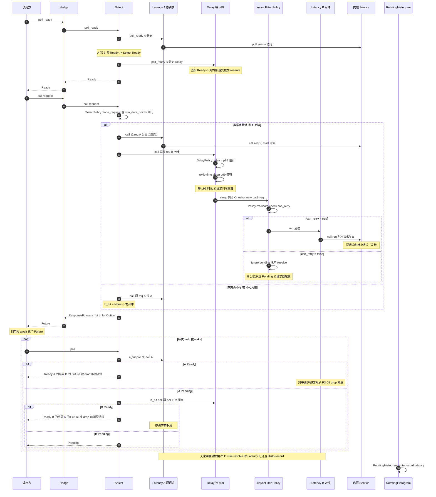
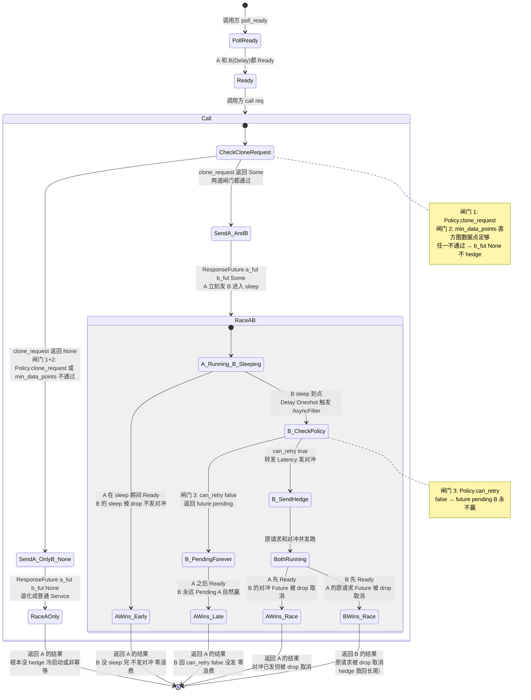

# 第 12 章 · Hedge:对冲请求降尾延迟

> 第 4 篇 · 韧性类中间件 · 执行单元(招牌章)

---

## 章首 · 核心问题

这一章只回答一个问题:

> **请求没失败,但慢——慢到排进 p99 的长尾里,怎么治?能不能在它接近 p99 还没回的时候,再发一个一模一样的对冲请求,谁先回来就用谁,把另一个扔掉?**

这是一个和 P4-11(Retry)形似但神不似的问题。Retry 处理的是"失败了怎么办"——内层 Service 返回了 `Err`,你决定要不要重发。Retry 的全部逻辑都建立在"失败已经发生"这个前提上。可分布式系统里更阴险的一类问题,不是请求失败,而是**请求没失败,但慢**:

- 一个 RPC 调用,99% 的请求 5ms 回来,1% 的请求 500ms 才回来——这 1% 的请求成功率是 100%(都成功了),但用户体验极差,排进 p99 / p99.9 的"长尾"里;
- 慢的根因不是后端挂了,而是**尾延迟(tail latency)抖动**——某个请求恰好被调度到一台 GC 停顿的机器、走了条拥塞的网络路径、撞上了一次磁盘毛刺、落进了一个 cache miss 的角落。这些抖动是随机的、瞬态的,**马上再发一次大概率就快了**;
- 但你又不能对每个请求都"双发"——那样直接把下游负载翻倍,本来只是 1% 的慢请求,翻倍后变成全量压力,把下游往过载里推。

这就是分布式系统里著名的**长尾延迟问题**(tail latency)。Google 在 2013 年发了一篇影响深远的论文《The Tail at Scale》(Jeff Dean 主笔),把这件事讲透:在一个典型的分布式系统里,即使每台机器的延迟都很稳定,只要你一次请求要 fan-out 到几千台机器(一次搜索查询背后是几千个 doc 检索),p99 的延迟会被这些抖动放大成"几乎每次请求都撞上一个慢的"。论文给出的解法之一,正是本章的主角——**Hedged Request(对冲请求)**。

Hedge 的思想朴素得惊人:**发一个请求,等它接近 p99 的延迟阈值还没回时,再发第二个一模一样的请求(对冲),谁先回用谁,另一个 drop 掉**。注意三个关键词:

- **"接近 p99 才发"**——不是一开始就双发(避免翻倍负载),而是等到"这个请求已经慢到排进长尾了"才发第二个对冲。绝大多数请求在 p99 之前就回来了,根本不会触发对冲;
- **"谁先回用谁"**——原请求和对冲请求并发跑,哪个先 resolve 就用哪个的结果。如果原请求本来就在快回来了,对冲请求只是浪费一点 CPU;如果原请求真卡在长尾里,对冲请求大概率能救回来;
- **"drop 另一个"**——一旦有一个回来了,另一个立刻取消(drop 它的 Future),释放资源。这承 P3-08(Timeout)讲透的"Rust 里 drop Future = 取消请求"语义。

这个机制听起来简单,落地却处处是坑:

1. **p99 怎么估?** 你怎么知道"这个请求已经接近 p99 了"?p99 不是个常数,它随负载变化(白天忙 p99 高,凌晨闲 p99 低)。需要一个能**实时跟踪延迟分布、随负载自适应**的估计器;
2. **哪些请求该 hedge?** 不是所有请求都该对冲——非幂等的请求(比如 POST 下单)对冲一次可能造成"双扣款";注定失败的请求(比如参数校验都没过)对冲只是浪费;已经在重试的请求 hedge 会放大成四发;
3. **hedge 不会失控吗?** 万一 p99 估计偏高(比如冷启动时数据点不够),每个请求都触发 hedge,负载翻倍,把本来健康的系统推向过载,这就反向雪崩了;
4. **drop 真的干净吗?** 原请求先回 vs 对冲请求先回,落败的那个 Future 被 drop,它持有的连接、缓冲、下游资源会不会泄漏?

Tower 给出的答案干净利落:把 hedge 拆成**三个正交的子组件**,每个子组件管一件事,经 Service 抽象拼成一个五层嵌套的 `Hedge` Service:

- **`Select<A, B>`**:并发跑两个内层 Service(原请求 A + 对冲请求 B),谁先 Ready 用谁,落败的另一个被 drop(取消)。这是 hedge 的执行骨架;
- **`Latency<R, S>`**:记录每个请求的延迟,喂给一个共享的延迟直方图。这是 p99 估计的**数据来源**;
- **`RotatingHistogram`**:一个滚动窗口的双直方图,实时估计 p99(准确说是任意分位数),随负载自适应。这是 hedge 阈值的**估计器**;
- **`Delay<P, S>`**:在发请求前先 `tokio::time::sleep(p99_threshold)`,等接近 p99 才真正发(对冲请求走这一层)。这是"接近 p99 才发"的**计时器**;
- **`AsyncFilter` + `PolicyPredicate`**:用一个用户提供的 `Policy`(决定哪些请求可对冲),把不该 hedge 的请求拦在对冲路径之外。这是"哪些请求该 hedge"的**闸门**。

读完本章你会明白:

1. **为什么"长尾延迟"是分布式系统的老大难,以及为什么传统的"超时重试"治不了它**——超时切断的是"已经无望"的请求,重试救的是"已失败"的请求,而 hedge 救的是"还没失败但已经在长尾里"的请求。三者作用在请求生命的不同阶段,不可互相替代。
2. **`rotating_histogram` 怎么用 `hdrhistogram` 滚动窗口估 p99**——双直方图(read/write)每过一个 `period` 交换,read 始终持有"上一周期"的完整数据,p99 估计随负载自动滚动。冷启动时数据点不足,`min_data_points` 闸门关掉 hedge,防止 p99 估计失真导致全量对冲。
3. **`Select` 怎么手写双 poll 实现"谁先回用谁"**——Tower 的 `Select<A, B>` 不是 `tokio::select!` 宏,而是手写的 `ResponseFuture<AF, BF>`,先 poll A(原请求),Pending 再 poll B(对冲),谁先 Ready 谁赢,落败的 Future 在 `ResponseFuture` 被 drop 时一起 drop。这承 P3-08 讲的"手写双 poll vs select!"对照。
4. **为什么 hedge 必须配 filter(Policy)**——`Policy::clone_request` 决定请求能否被克隆以备对冲,`Policy::can_retry` 在发对冲那一刻决定要不要发。不该 hedge 的请求(非幂等、注定失败),`can_retry` 返回 false,对冲路径用一个 `future::pending()` 永远不 resolve,让原请求自然赢。这一招把"不该 hedge 的请求"优雅地降级成"不 hedge",既不报错也不浪费。
5. **为什么 hedge 不会失控(配 `min_data_points` + 直方图滚动 + filter)**——冷启动直方图空,p99 估计不可靠,`min_data_points` 直接关掉 hedge;运行期直方图随 `period` 滚动,p99 自动随负载自适应;filter 只放可幂等请求过。三道闸门合起来,hedge 只在"有足够数据 + 请求可对冲 + 已接近 p99"时才发,把 hedge 的额外负载压到最低(典型场景下 hedge 率 < 5%)。

> **逃生阀**(这章统计概念多、嵌套层级深,先读这一段)。
>
> 如果你只想要一句话:**Hedge = Select(并发跑原请求 + 对冲请求,谁先回用谁)+ RotatingHistogram(滚动估 p99 当 hedge 阈值)+ Delay(等接近 p99 才发对冲)+ Policy(只对幂等/可对冲请求 hedge)**。p99 不是常数,靠 `hdrhistogram` 的双直方图滚动窗口实时估;hedge 不是双发,绝大多数请求在 p99 前就回了根本不触发对冲;落败的 Future 被 drop(承 P3-08 的 drop = 取消)。如果你对 p99/分位数这些统计概念不熟,先读第 1 节(会用大白话讲清);对 `tokio::select!` / Future poll 不熟,先读 P3-08;对 Service trait 的 `&mut self` 与 `poll_ready` 背压不熟,先读 P1-02。
>
> 本章假设你读过 P1-02(Service trait)、P3-08(Timeout,select!/双 poll 基础)、P4-11(Retry,Policy trait 与 Budget 防风暴)。涉及 `tokio::time::Sleep` 内部机制(时间轮)、`hdrhistogram` crate 内部(桶布局),一句带过指路 [[tokio-source-facts]] 并诚实标注"在 hdrhistogram crate,本书只引用其用法"。

## 章首 · 一句话点破

> **Hedge 不是"每个请求都双发",而是"发一个请求,等它接近 p99 还没回时再发一个对冲,谁先回用谁 drop 另一个"。p99 不是常数,靠 `rotating_histogram`(双直方图滚动窗口)实时估;hedge 不是无差别双发,靠 `Policy`(只对幂等请求)+ `min_data_points`(冷启动数据不够关 hedge)两道闸门把额外负载压到最低;落败的 Future 被 drop 等于取消(承 P3-08)。整套机制拼成一个五层嵌套的 `Hedge` Service:`Select<Latency<A>, Delay<AsyncFilter<Latency<B>, Policy>>>`。**

这是结论,不是理由。本章倒过来拆:先看长尾延迟为什么是分布式老大难(以及为什么超时和重试都治不了它),再看 Google《The Tail at Scale》论文的 Hedged Request 思想,然后横向对照 Envoy 的 hedge retry policy 怎么做(配置驱动 vs Tower 的代码驱动),之后逐层拆 Tower 的五层嵌套设计(为什么这么拼),最后落到源码,把 `Select` 的手写双 poll、`rotating_histogram` 的双直方图滚动、`AsyncFilter` 的 `future::pending()` 兜底三件最硬核的技巧拆透,讲清 hedge 为什么 sound(不失控、不泄漏、不破坏背压)。

本章服务**执行单元**这一面。`Hedge` 是个 `Service<Request>`,它的 `call` 返回一个 `Future`,这个 Future 内部是 `Select::ResponseFuture`,同时持有原请求 Future 和对冲请求 Future(后者 `Option`,可能为 `None`),poll 时让两者赛跑。这是第 4 篇(韧性类)的第二章,夹在 [P4-11 Retry](P4-11-Retry-失败重试与Policy.md)(失败重试)和 [P4-13 Reconnect](P4-13-Reconnect-断线重连.md)(断线重连)之间——三者合起来讲 Tower 怎么对付"请求出了各种状况":失败了重试(Retry)、慢了对冲(Hedge)、断了重连(Reconnect)。Hedge 是其中最绕、也最精巧的一个,它处理的是三者里最微妙的情形——**请求既没失败也没断,只是慢**。

---

## 正文

### 12.1 长尾延迟:分布式系统的老大难

在讲 Hedge 之前,必须先讲清楚它要解决的问题——长尾延迟(tail latency)。这个问题不像"请求失败"那么直观(失败就是错了),它是个统计现象,理解它需要一点概率论的直觉。本节用大白话讲透,不堆公式。

#### 12.1.1 什么是 p99,为什么它比"平均延迟"重要

先建立一个最基本的概念:延迟分布。假设你有一个 RPC 服务,每秒处理 10000 个请求。你把每个请求的延迟(从发出到收到响应的耗时)记下来,画成直方图,大概长这样(简化,纵轴是请求数,横轴是延迟):

```
                  延迟分布直方图(简化)
请求数
  ^
  │      ██
  │     ████
  │    █████
  │   ██████
  │  ███████
  │ █████████
  │██████████
  │███████████
  │████████████                              ← 长尾(极少数慢请求)
  │█████████████         ██
  │██████████████       ███
  │███████████████     █████
  │████████████████   ████████
  │██████████████████████████████████████
  └───────────────────────────────────────────────→ 延迟(ms)
     1   2   3   4   5   6  ...           200  500
                   ↑                          ↑
                   大多数请求在这(p50)        极少数在这(p99+)
```

绝大多数请求挤在左边(1-10ms),但右边有一条长长的"尾巴"——极少数请求延迟 200ms、500ms 甚至更久。这条尾巴就是"长尾延迟"。

怎么量化这条尾巴?用**分位数(percentile)**。最常见的几个:

- **p50(中位数)**:一半的请求比它快,一半比它慢。图上大概 5ms;
- **p90**:90% 的请求比它快,10% 比它慢;
- **p99**:99% 的请求比它快,1% 比它慢。图上可能 200ms;
- **p99.9**:99.9% 的请求比它快,0.1% 比它慢。图上可能 500ms+。

为什么运维和 SRE 关心 p99 而不是"平均延迟"?因为**平均延迟会骗人**。假设你有 100 个请求,99 个 5ms,1 个 500ms。平均延迟 = (99×5 + 1×500) / 100 = 9.95ms。看起来很美好!可实际上有 1% 的用户等了 500ms,他们的体验极差。平均延迟把这个 1% 的差体验"摊平"了,让你以为系统很快。

p99 不会骗人。p99 = 500ms,直接告诉你"有 1% 的用户要等 500ms"。如果你想承诺 SLO("99% 的请求在 200ms 内返回"),你必须盯 p99,不是盯平均。

> **钉死这件事**:生产系统监控延迟,看的是**分位数(p50/p90/p99/p99.9)**,不是平均值。平均值会被长尾摊平,掩盖真实体验;分位数直接告诉你"有多大比例的用户体验多差"。SLO 几乎都用分位数定义("p99 < 200ms")。Hedge 要治的,正是排进 p99/p99.9 长尾里的那些慢请求。

#### 12.1.2 长尾为什么会产生:每台机器都"几乎稳定"还不够

现在问一个更深层的问题:如果我的每台机器都很稳定(单机 p99 也很低),整个系统的 p99 会不会也好?

答案是**不会**,而且会差得多。这就是《The Tail at Scale》论文的核心洞察。

设想一次用户请求,要 fan-out 到 100 台机器(比如一次搜索,要查 100 个 shard 的索引)。假设每台机器单机延迟很稳定,p99 = 10ms(意思是每台机器 99% 的请求都在 10ms 内)。那么这 100 台机器**全部**在 10ms 内返回的概率是多少?

这是个简单的概率题:每台在 10ms 内的概率是 0.99,100 台全部在 10ms 内的概率是 0.99^100 ≈ 0.366。也就是说,**只有约 37% 的请求整体能在 10ms 内完成,剩下 63% 的请求至少有一台机器慢了**(撞上那台机器的 p99 抖动)。整个系统的 p99,被这"至少一台慢"放大到远超单机 p99。

把 fan-out 数量加大到 1000 台:0.99^1000 ≈ 0.00004。几乎所有请求都会撞上至少一台慢机器。整个系统的 p99 飙到单机 p99 的好几倍。

这就是长尾延迟的可怕之处:**它会被 fan-out 放大**。单个组件的"1% 慢",在 fan-out 几千个组件的分布式系统里,会放大成"几乎每次请求都撞上慢"。Jeff Dean 在论文里给过一个真实数据:Google 的一次搜索请求,某个中间组件的 p99 抖动,会让整个搜索的延迟显著变差,即使这个组件本身看起来"99% 的时间都很快"。

#### 12.1.3 长尾的根因:不是后端挂了,是瞬态抖动

那这"1% 慢"到底为什么慢?注意一个关键事实:**慢的请求不是后端挂了**。如果后端挂了,请求会失败(返回错误或超时),那是 P4-11 Retry 的范畴。长尾延迟处理的是**请求最终成功了,只是慢**。

慢的根因是一堆**瞬态抖动(transient jitter)**,任何一个都可能让某个请求的延迟从 5ms 飙到 500ms:

- **GC 停顿**:JVM/Go runtime 的 stop-the-world GC,会让某个请求恰好撞上几十毫秒到几百毫秒的暂停;
- **网络毛刺**:TCP 重传、路由抖动、中间路由器拥塞,让某个包多绕了几跳;
- **磁盘毛刺**:如果请求触发了磁盘 IO(日志、缓存落盘),撞上一次磁盘 busy,延迟飙升;
- **调度抖动**:操作系统调度器把请求所在的 task 调度到一个忙的 CPU,等了一会儿才轮到;
- **cache miss**:某个请求恰好查的数据不在 cache 里,要走慢路径(查数据库、算冷数据);
- **资源争用**:别的请求恰好在这个时刻抢同一个锁/连接/资源。

这些抖动的共同特征是:**随机、瞬态、马上重试大概率就没了**。GC 停顿是几十毫秒的窗口,过了就过了;网络毛刺是某个包的事,下个包就好了;cache miss 是这个 key 的事,重发可能命中了。

这就是 Hedge 的机会窗口:**既然抖动是瞬态的,马上再发一次大概率就快了**。与其等那个卡在长尾里的原请求(可能要 500ms),不如在它接近 p99 还没回的时候,再发一个对冲——对冲请求撞上抖动的概率独立于原请求(它走的是不同的机器/路径/时刻),大概率能避开抖动,几百毫秒内就回来了。

> **钉死这件事(长尾的根因)**:长尾延迟的根因不是后端挂了(那是 Retry 的范畴),而是**瞬态抖动**(GC、网络、磁盘、调度、cache、争用)。抖动的特征是随机、瞬态、重发大概率没了。Hedge 的机会窗口正在于此——既然抖动是瞬态的,并发再发一个大概率能避开它。这是 Hedge 区别于 Retry 的根本:Retry 救的是"已失败的请求",Hedge 救的是"没失败但卡在长尾里的请求"。

#### 12.1.4 为什么超时和重试都治不了长尾

理解了长尾的根因,就能看清为什么传统的"超时"和"重试"治不了它。

**超时(Timeout,P3-08)治不了**。超时的语义是"请求跑太久,切断它"。可切断之后呢?调用方拿到一个 `Elapsed` 错误,请求失败了。用户看到的是错误,不是结果。超时把"慢"变成"错",治标(切断慢请求释放资源)但不治本(请求还是失败了,用户还是没拿到结果)。而且超时阈值难定——设 200ms,p99 是 200ms 的请求会被误杀(它本来 201ms 就能成功);设 500ms,用户要等 500ms 才看到错误,体验更差。超时是"放弃",不是"救活"。

**重试(Retry,P4-11)治不了**。重试的语义是"请求失败了,再发一次"。可长尾请求**没失败**——它还在跑,只是慢。Retry 的触发条件是"内层 Service 返回 Err",而长尾请求返回的是 Ok(只是晚了)。Retry 根本不会触发。如果你强行用 Retry 治长尾(比如配一个超时,超时了 Retry 重发),那你相当于"超时切断 + 重发",问题没解决——重发的请求可能又卡在长尾里(抖动可能持续),而且你浪费了原请求已经做的工作(原请求可能马上就要成功了)。

理想的做法是:**让原请求继续跑,同时再发一个对冲,谁先回用谁**。这就是 Hedge。和 Timeout/Retry 的对比:

| 机制 | 触发条件 | 处理方式 | 作用阶段 | 请求结局 |
|------|----------|----------|----------|----------|
| **Timeout** | 请求跑超过阈值 | 切断(drop Future) | call 之后 | **失败**(Elapsed 错误) |
| **Retry** | 请求返回 Err | 重发(可能多次) | call 之后(Future resolve 后) | 可能成功(取决于重试) |
| **Hedge** | 请求接近 p99 还没回 | 并发再发一个,谁先回用谁 | call 之后(原请求还在跑时) | **大概率成功**(对冲救回) |

三者作用在请求生命的不同阶段,不可互相替代:

- Timeout 是"放弃"——切断无望的请求,释放资源;
- Retry 是"补救"——救已失败的请求;
- Hedge 是"对冲"——救还没失败但卡在长尾里的请求。

生产里三者经常一起用:`Hedge<Retry<Timeout<Inner>>>`——内层 Timeout 切断无望的,Retry 救失败的,Hedge 救慢的。三者各管一面,经 Service 抽象组合。

> **钉死这件事(Hedge 的定位)**:Hedge 不是 Timeout 的替代,也不是 Retry 的替代。它治的是三者里最微妙的情形——**请求既没失败也没断,只是慢**。Timeout 把"慢"变成"错",Retry 救"已失败",Hedge 在请求还活着的时候并发救它。理解了这一点,才能理解 Hedge 为什么需要一套完全不同的机制(并发跑两个 Future 而非切断/重发)。

### 12.2 Hedged Request:《The Tail at Scale》的思想

把长尾延迟的痛点讲清楚后,来看 Google 论文给出的解法——Hedged Request(对冲请求)。这个思想是本章一切设计的源头,值得先把论文的原版思路讲透,再看它落地时会撞什么墙。

#### 12.2.1 论文的原版思路:先发一个,慢了再发第二个

《The Tail at Scale》(Dean & Barroso, 2013, Communications of the ACM)里,Hedged Request 的描述朴素到一句话:

> **先发一个请求。如果它在一个合理的延迟阈值(比如 p99 的 95%)内没回来,就再发一个一模一样的请求到另一个副本。哪个先回来用哪个的结果。**

注意论文措辞里的几个细节:

1. **"先发一个"**——不是一开始就双发。第一个请求孤零零地发出去,大多数情况下它很快就回来了,根本不需要第二个;
2. **"合理的延迟阈值"**——这个阈值不是拍脑袋,是**根据历史延迟分布估出来的**(典型地取 p99 或其某个比例)。它的作用是判断"这个请求已经慢到值得对冲了";
3. **"再发一个到另一个副本"**——对冲请求要去**另一个副本**(另一台机器),不能去同一个(同一个还在慢,去了也白去)。这一条在 Google 的场景里靠多副本保证,在 Tower 的抽象层里靠内层 Service(通常配 Balance/P2C 负载均衡)自己选另一个后端;
4. **"哪个先回来用哪个"**——并发跑,赛跑,先到先得;
5. **(隐含)** 第二个请求发出去后,第一个请求**继续跑**——不取消。万一第一个其实马上就要回来了,你别白扔了它的工作。两个都跑着,谁先回谁的话算数。

这个机制为什么能降尾延迟?回到 12.1.2 那个概率推演。假设单机 p99 = 500ms(1% 的请求慢到 500ms)。如果你对接近 p99 的请求发对冲(到另一台机器),那么原请求和对冲请求**独立**地撞上 p99 抖动。两个独立的请求**都**撞上 p99(都慢到 500ms)的概率是 0.01 × 0.01 = 0.0001,即 0.01%。也就是说,hedge 之后,p99 的延迟从"单机的 500ms"降到了"两个里较快那个的延迟"——只要有一个快,整体就快。

更一般地,如果你 hedge N 个请求,等价于取 N 个独立请求里最快那个的延迟。N 个独立请求都慢的概率是 p^N(p 是单请求慢的概率),随 N 指数下降。这就是 hedge 的数学本质——**用并发换分位数压缩**。

Jeff Dean 在论文里给过一个真实数据:在 Google 的某类请求上,引入 hedged request(阈值取 p99 的 95%),能把 p99 延迟降低 50% 以上,而额外增加的请求量只有 2% 左右。为什么额外请求量这么低?因为绝大多数请求在阈值之前就回来了,根本不触发对冲;只有那 ~1% 慢到接近 p99 的请求才会触发,而这 1% 里有相当一部分原请求在对冲发出后很快就回来了(对冲请求白发了,但占比小)。

> **钉死这件事(hedge 的数学本质)**:hedge 用并发换分位数压缩。N 个独立请求都慢的概率是 p^N,随 N 指数下降。hedge 2 个,p99^2 = p99.99(把 p99 的延迟降到了 p99.99 才会出现的"两个都慢"的情形)。这就是为什么"再发一个对冲"这么朴素的动作,能戏剧性地降低尾延迟——它把"单请求撞上长尾"这个 1% 概率事件,变成了"两个独立请求都撞上长尾"这个 0.01% 概率事件。

#### 12.2.2 论文方案落地的四道墙

论文给的是思想,落地要撞四道墙。这四道墙正是 Tower 的 Hedge 设计要解决的。

**墙一:延迟阈值怎么定?**

论文说"取 p99 的 95%",可 p99 是多少?p99 不是常数——它随负载变化(白天忙 p99 高,凌晨闲 p99 低),随系统状态变化(后端健康 p99 低,后端抖动 p99 高),随时间变化(刚升级完 p99 可能波动)。

如果阈值定成常数(比如硬编码 200ms),会有两个问题:

- 系统闲的时候(真实 p99 = 50ms),阈值 200ms 太高,几乎所有慢请求都等到 200ms 才发对冲,救不回来(等 200ms 才发现要 hedge,黄花菜都凉了);
- 系统忙的时候(真实 p99 = 500ms),阈值 200ms 太低,大量本不需要 hedge 的请求(它们本来 250ms 就能正常回来,不算长尾)被误判成"该 hedge",触发海量对冲,负载翻倍。

所以阈值必须**实时跟踪 p99,随负载自适应**。这就需要一个能记录延迟分布、实时估分位数的组件。Tower 用 `RotatingHistogram`(基于 `hdrhistogram` crate)做这件事。

**墙二:哪些请求该 hedge?**

不是所有请求都该对冲。最明显的两类不该 hedge:

- **非幂等请求**:比如 POST `/order`(下单)。对冲一次,可能造成"双扣款"——原请求和对冲请求都被后端处理了,用户被扣了两次钱。这种请求绝对不能 hedge;
- **注定失败的请求**:比如参数校验都没过的请求(404/400)。它本来就要失败,对冲只是浪费资源,放大失败的影响(原本一个失败请求变成两个失败请求)。

还有一类微妙的不该 hedge:已经在重试的请求。如果你的栈是 `Hedge<Retry<Inner>>`,Retry 重试时发的请求又被 Hedge 包着 hedge,等于一次失败被放大成 4 发(原 + hedge + retry + retry's hedge)。这种嵌套放大要靠 Policy 在请求里打标(比如 `x-retry-count` header)识别并跳过 hedge。

所以 hedge 必须配一个**策略**,决定"这个请求能不能 hedge"。Tower 用 `Policy` trait(`clone_request` + `can_retry` 两个方法)+ `AsyncFilter` 做这件事。

**墙三:hedge 不会失控吗?**

这是最危险的墙。设想一个失控场景:

1. 系统冷启动,延迟直方图是空的,p99 估计不出来(或者估成了默认值,通常很高);
2. 第一个请求来,hedge 阈值被估成"很高"(比如默认 1s),所以这个请求要等 1s 才发对冲——可它本来 5ms 就回来了,根本不触发 hedge。这看起来没事;
3. 但万一默认值估低了(比如直方图空时返回 0),那每个请求一来就立刻 hedge(等 0ms 等于不等),所有请求双发,负载立刻翻倍;
4. 负载翻倍 → 后端变慢 → 延迟直方图记下的延迟变高 → p99 估计变高 → ... 这是个正反馈,可能把本来健康的系统推向过载。

所以 hedge 需要**冷启动保护**——数据点不够时,关掉 hedge,等攒够了数据再开。Tower 用 `min_data_points` 参数做这件事(`Hedge::new` 的第三个参数)。

**墙四:drop 真的干净吗?**

hedge 的核心动作是"两个并发跑,谁先回用谁,drop 另一个"。drop 那个落败的 Future,它持有的资源(连接、缓冲、下游的请求)真的会干净释放吗?

这承 P3-08(Timeout)讲透的"Rust 里 drop Future = 取消请求"语义。在 Rust 异步里,drop 一个 Future 等于取消它——Future 的所有状态存在字段里,drop Future 就是 drop 它的字段,字段里持有的资源(连接、锁、子 Future)沿着 Drop 链路自顶向下释放。原请求先回,对冲 Future 被 drop,对冲请求被取消(下游的连接被关或归还、缓冲释放);对冲先回,原请求 Future 被 drop,原请求被取消。

这条语义在 P3-08 已拆透,本章一句带过指路。重点在于:hedge 的 drop 取消和 Timeout 的 drop 取消是**同一套机制**,都是 Rust 所有权系统保证的,不需要特殊的 cancel API。

> **承接《Tokio》[[tokio-source-facts]]**:Future drop = 取消这条语义,来自 `core::future::Future` + `Drop`,不是 Tokio 也不是 Tower 的发明。Tokio 的 `JoinHandle::abort()` 本质也是 drop task 的 root Future。drop 沿 Future 状态机树自顶向下触发所有嵌套 Drop,释放所有资源,一路传到底层 IO。这条语义是 hedge(以及 Timeout/Retry)整套取消机制的根基,详见《Tokio》讲 cancel 那几章。本章把这条语义当成公理用,不重复拆。

#### 12.2.3 论文方案的两个变体:Hedged vs Tied Requests

顺带提一下,《The Tail at Scale》论文里其实给了两个相关的技术,Hedge 是其中一个,另一个叫 **Tied Requests**(绑定请求)。两者的区别:

- **Hedged Request**:发一个,慢了再发第二个,谁先回用谁。代价是可能双发(浪费),好处是简单;
- **Tied Request**:发一个,慢了再发第二个,但第二个发出去后立刻**通知第一个的接收方**"别做了,我已经有备份了"。第一个收到通知后立刻取消(不白做)。好处是不浪费第一个的工作,代价是需要在两个副本之间有协调通道。

Tied Request 比 Hedge 更精巧(省掉一些浪费的工作),但实现复杂(需要副本间协调)。Tower 实现的是 **Hedged Request**(更简单,不假设副本间能协调),通过 drop Future 取消落败的那个,语义上接近 Tied(因为 drop 等于取消,落败的 Future 被 drop 后它的工作会被取消)。Tower 的折中:用 Hedged 的简单结构(不协调副本),靠 Rust 的 drop 语义拿到接近 Tied 的效果(落败方被取消,不白做)。

> **钉死这件事(Hedge vs Tied)**:Tower 实现的是 Hedged Request(论文的简单版),不是 Tied Request(需要副本协调的精巧版)。但靠 Rust 的 drop Future = 取消语义,Tower 的 hedge 在"落败方被取消"这一点上接近 Tied——drop 那个 Future,它的工作会被取消(连接释放、下游通知)。这是 Rust 异步语义给 hedge 的额外红利,Go/Java 这类语言做不到这么干净(Go 的 goroutine 没法被外部强制 drop,Java 的 Thread.interrupt 是协作式)。

### 12.3 横向对照:Envoy 的 hedge retry policy 怎么做

在讲 Tower 的设计之前,先看看"工业级服务网格"Envoy 怎么做 hedge。**承接《Envoy》[[envoy-source-facts]]**:Envoy 的 hedge 在 HCM(HTTP Connection Manager)的 retry policy 里配,作为 retry policy 的一个子字段。典型配置长这样(简化示意):

```yaml
# (示意,Envoy 配置,非 Tower 源码)
retry_policy:
  retry_on: "5xx,gateway-error,connect-failure,reset"
  num_retries: 1
  retry_back_off:
    base_interval: 25ms
    max_interval: 250ms
  hedge_policy:
    initial_requests_per_second: 10
    hedge_on_per_try_timeout: true
    percent_per_request: 1.0
```

可以看到 Envoy 的 hedge 是 retry policy 的一个**子配置**,几个旋钮:

- **`hedge_on_per_try_timeout`**:在 per-try-timeout 时触发 hedge(而不是直接 retry)。这是 Envoy 版的"接近 p99 才发"——它用 per-try-timeout 当 hedge 阈值,而不是动态估 p99;
- **`initial_requests_per_second`**:每秒最多发多少个 hedge 请求(hedge 的速率上限,防失控);
- **`percent_per_request`**:hedge 请求占原请求的百分比(也是个防失控的旋钮)。

注意 Envoy 和 Tower 的几个根本差异:

**差异一:阈值怎么定**。Envoy 用 `per_try_timeout`(一个静态配置的超时值)当 hedge 阈值;Tower 用 `RotatingHistogram` 动态估 p99。Envoy 的方式简单(运维拍个 per-try-timeout),但不随负载自适应——系统闲时 per-try-timeout 可能太高(救不回来),系统忙时可能太低(误判海量 hedge)。Tower 的方式复杂(要维护直方图),但随负载自适应——p99 高时阈值高,p99 低时阈值低,始终精准。

**差异二:防失控怎么做**。Envoy 用 `initial_requests_per_second` + `percent_per_request` 两个**速率/比例**旋钮(运维拍);Tower 用 `min_data_points` + 直方图滚动 + Policy 三道闸门(代码控制)。Envoy 的方式直观(运维好调),但靠人;Tower 的方式自动(冷启动关、运行期自适应),但用户要理解机制。

**差异三:哪些请求该 hedge**。Envoy 用 `retry_on` 字符串(列举哪些错误条件触发,比如 5xx/reset);Tower 用 `Policy` trait(用户写代码决定,可以看请求体、查外部状态、任意复杂判断)。这又是"配置驱动 vs 代码驱动"的典型取舍,和 P4-11 Retry 章那个 Envoy retry policy vs Tower Policy trait 的对照是同构的。

> **对照《Envoy》**:Envoy 的 hedge 是 retry policy 的子配置,用 `per_try_timeout` 当阈值,用 `initial_requests_per_second`/`percent_per_request` 防失控,配置驱动、运行期生效——这适合服务网格场景(运维动态调整),但灵活性受限于 Envoy 内置旋钮。Tower 的 hedge 用 `RotatingHistogram` 动态估 p99,用 `min_data_points`/直方图滚动/Policy 防失控,代码驱动、编译期单态化——灵活性高(任意 Policy 判断),但要用户理解机制。这是"运行期灵活 + 配置驱动"(Envoy)和"零成本抽象 + 编译期单态化"(Tower)的典型取舍,和 P1-03(Layer 洋葱 vs Envoy filter chain)、P4-11(Retry Policy vs Envoy retry_on)的对照是同构的。Envoy 的 hedge 细节详见《Envoy》HCM/retry 相关章 [[envoy-source-facts]]。

Envoy 还有一个 Tower 没有的能力:Envoy 的 hedge 可以配 `hedge_on_per_try_timeout` 让 hedge 和 retry 协同(per-try-timeout 触发 hedge 而非 retry)。Tower 里这种协同要靠用户自己组合 `Hedge<Retry<...>>`(层的顺序决定语义,见 12.6 节)。
### 12.4 所以 Tower 这么设计:五层嵌套的 `Hedge` Service

把长尾痛点(12.1)、Hedged Request 思想(12.2)、Envoy 对照(12.3)摆清楚后,Tower 的方案就呼之欲出了。但 Tower 的实现有个反直觉的特点——它**没有**写一个"大 `Hedge` 结构体,把所有逻辑塞进去",而是**用五个已有的小中间件拼成一个五层嵌套的 Service**。这是 Tower "Service×Layer 可组合"哲学的极致体现,也是这一章最值得拆的设计。

#### 12.4.1 先看 `Hedge` 的真实结构:五层嵌套

直接上源码。`tower/src/hedge/mod.rs` 里 `Hedge` 的真实类型定义([source](../tower/tower/src/hedge/mod.rs#L27-L38)):

```rust
// tower/src/hedge/mod.rs#L27-L38
type Histo = Arc<Mutex<RotatingHistogram>>;
type Service<S, P> = select::Select<
    SelectPolicy<P>,
    Latency<Histo, S>,                                  // A: 原请求(带延迟记录)
    Delay<                                              // B: 对冲请求(带延迟)
        DelayPolicy,
        AsyncFilter<Latency<Histo, S>, PolicyPredicate<P>>  // 内层:延迟记录 + Policy 过滤
    >,
>;

/// A middleware that pre-emptively retries requests which have been outstanding
/// for longer than a given latency percentile.  If either of the original
/// future or the retry future completes, that value is used.
#[derive(Debug)]
pub struct Hedge<S, P>(Service<S, P>);
```

注意 `Hedge<S, P>` 就是个 **newtype 包了一个 `Service<S, P>`**,而那个 `Service<S, P>` 是个**类型别名**,展开是 `Select<SelectPolicy, Latency<Histo, S>, Delay<DelayPolicy, AsyncFilter<Latency<Histo, S>, PolicyPredicate<P>>>>`。

把这个类型别名展开画成嵌套树(这是本章的总图,反复回扣):

```
Hedge<S, P>
  └─ Select<                              ← 顶层:并发跑 A 和 B,谁先回用谁
       policy: SelectPolicy<P>,           ←   (含 min_data_points 冷启动闸门)
       A = Latency<Histo, S>,             ← A 分支:原请求,带延迟记录
       B = Delay<                         ← B 分支:对冲请求,先 sleep 再发
            policy: DelayPolicy,          ←   (sleep 时长 = p99 估计)
            Delay::service =
              AsyncFilter<                ←   过滤层:Policy 决定要不要发
                   Latency<Histo, S>,     ←     (对冲请求也带延迟记录)
                   PolicyPredicate<P>     ←     (can_retry 判断)
              >
       A.poll_ready / B.poll_ready 都 Ready 才 Ready
       call 时:先 clone_request 决定要不要发 B
     >
```

五个组件,各管一件事:

| 组件 | 文件 | 职责 | 在 hedge 里的角色 |
|------|------|------|------------------|
| `Select<P, A, B>` | `select.rs` | 并发跑 A、B 两个 Service,谁先 Ready 用谁 | hedge 的执行骨架 |
| `Latency<R, S>` | `latency.rs` | 记录每个请求的延迟,喂给 Record | 给直方图喂数据(估 p99 用) |
| `RotatingHistogram` | `rotating_histogram.rs` | 双直方图滚动窗口,估分位数 | p99 估计器(hedge 阈值来源) |
| `Delay<P, S>` | `delay.rs` | 先 `tokio::time::sleep` 再发请求 | "等接近 p99 才发对冲" |
| `AsyncFilter` + `PolicyPredicate` | `mod.rs` + `tower/src/filter/` | 用 Policy 决定请求要不要通过 | "只对幂等请求 hedge" |

注意一个关键细节:**A 和 B 是同一个内层 Service 的两个 clone**。看构造函数 `Hedge::new_with_histo`([source](../tower/tower/src/hedge/mod.rs#L128-L164)):

```rust
// tower/src/hedge/mod.rs#L140-L163(简化,保留关键行)
// Clone the underlying service and wrap both copies in a middleware that
// records the latencies in a rotating histogram.
let recorded_a = Latency::new(histo.clone(), service.clone());   // A: 原 + 延迟记录
let recorded_b = Latency::new(histo.clone(), service);           // B: 对冲 + 延迟记录

// Check policy to see if the hedge request should be issued.
let filtered = AsyncFilter::new(recorded_b, PolicyPredicate(policy.clone()));

// Delay the second request by a percentile of the recorded request latency histogram.
let delay_policy = DelayPolicy {
    histo: histo.clone(),
    latency_percentile,
};
let delayed = Delay::new(delay_policy, filtered);

// If the request is retryable, issue two requests -- the second one delayed
// by a latency percentile.  Use the first result to complete.
let select_policy = SelectPolicy {
    policy,
    histo,
    min_data_points,
};
Hedge(Select::new(select_policy, recorded_a, delayed))
```

这段装配代码读出来就是:

1. **`service.clone()` 两次**——`Hedge` 要求内层 `S: Clone`(见 [source](../tower/tower/src/hedge/mod.rs#L95) 的 `where S: Service<Request> + Clone`)。clone 出两个副本,一个给 A(原请求),一个给 B(对冲请求);
2. **两个副本都包 `Latency`**——`recorded_a` 和 `recorded_b` 都套了 `Latency<Histo, S>`,所以原请求和对冲请求的延迟**都会被记进直方图**。这一点很重要,后面 12.5 讲 Latency 时会回扣——hedge 不是只记原请求的延迟,两个都记,这样直方图反映的是"实际请求延迟分布",不被 hedge 行为扭曲;
3. **B 再套 `AsyncFilter`**——用 `PolicyPredicate(policy.clone())` 过滤,决定哪些请求该 hedge;
4. **B 再套 `Delay`**——用 `DelayPolicy`(持 `histo` 和 `latency_percentile`)算 sleep 时长(= p99 估计),先 sleep 再发;
5. **A 和 B 喂给 `Select`**——`Select::new(select_policy, recorded_a, delayed)`,Select 负责并发跑两者,谁先回用谁。

> **钉死这件事(为什么五层嵌套而不是一个大结构体)**:Tower 的 Hedge 没有把所有逻辑塞进一个 `Hedge` 结构体,而是用 `Select` + `Latency` + `Delay` + `AsyncFilter` + `RotatingHistogram` 五个**各自独立、各自可复用**的小中间件拼起来。这是 Tower "Service×Layer 可组合"哲学的极致体现——`Select` 可以单独用在任何"并发跑两个 Service"场景,`Latency` 可以单独用在任何"想记录请求延迟"场景,`Delay` 可以单独用在任何"想延迟发请求"场景。Hedge 只是把它们按 hedge 的语义拼起来。对照 Envoy(把 hedge 逻辑焊进 HCM 的 C++ 代码里),Tower 的拼法让每个组件都可复用、可单测、可替换。代价是类型嵌套深(`Hedge<S, P>` 展开后类型签名吓人,要靠 P6-17 的 `BoxService` 类型擦除收敛)。

#### 12.4.2 一次请求穿过 `Hedge` 的完整时序

把五层嵌套的结构钉死后,来看一次请求穿过 `Hedge` 的完整时序。这是本章的总时序图,后面所有源码细节都长在它上面。



这张图信息量很大,但每个细节都对应源码。先记住三个关键时刻:

- **第 7 步(Delay 的 poll_ready 直接 Ready)**:Delay 的 `poll_ready` **不调内层** `Latency::poll_ready`,直接返回 `Ready(Ok)`。这是个反直觉但极其关键的设计——它避免了对冲请求在 `poll_ready` 阶段就提前 reserve 资源(比如 Buffer 的 channel slot)。12.5.3 会专门拆;
- **第 12 步(SelectPolicy.clone_request 的 min_data_points 闸门)**:数据点不够时,`clone_request` 返回 `None`,Select 不发 B 分支(对冲不触发)。这是冷启动保护;
- **第 19 步(PolicyPredicate.check 的 future::pending 兜底)**:`can_retry = false` 时,B 分支返回一个永不 resolve 的 Future,让原请求自然赢。这是"不该 hedge 的请求优雅降级"。

后面三节(12.5、12.6、12.7)逐层拆源码,把这三个时刻钉死。
### 12.5 `Select`:手写双 poll 的"谁先回用谁"

这一节拆 hedge 的执行骨架——`Select<P, A, B>`。它是整个 hedge 里最核心、也最值得和 P3-08(Timeout)对照读的组件。`Select` 的源码在 `tower/src/hedge/select.rs`,很短(106 行),但每一行都值得拆。

#### 12.5.1 `Select` 的定义:两个内层 Service + 一个 Policy

先看 `Select` 这个 Service 的结构([source](../tower/tower/src/hedge/select.rs#L19-L24)):

```rust
// tower/src/hedge/select.rs#L19-L24
/// Select is a middleware which attempts to clone the request and sends the
/// original request to the A service and, if the request was able to be cloned,
/// the cloned request to the B service.  Both resulting futures will be polled
/// and whichever future completes first will be used as the result.
#[derive(Debug)]
pub struct Select<P, A, B> {
    policy: P,
    a: A,
    b: B,
}
```

三个字段:`policy: P`(决定请求能否克隆以发 B)、`a: A`(A 分支 Service,原请求走这)、`b: B`(B 分支 Service,对冲请求走这)。`P` 要 impl `Select::Policy` trait(注意,这个 `Policy` 是 `select.rs` 自己定义的,**不是** hedge 模块对外的 `Policy` trait——后者是用户实现的,前者是 Select 内部用的,见 12.5.4 的桥接)。

`Select::Policy` trait 极简([source](../tower/tower/src/hedge/select.rs#L9-L13)):

```rust
// tower/src/hedge/select.rs#L9-L13
/// A policy which decides which requests can be cloned and sent to the B service.
pub trait Policy<Request> {
    fn clone_request(&self, req: &Request) -> Option<Request>;
}
```

就一个方法 `clone_request`——决定请求能不能被克隆以发 B 分支。返回 `Some(cloned)` 就发 B(对冲),返回 `None` 就不发(只发 A,降级成普通请求)。注意这个 `Option` 语义——它让 Select 有**运行期降级**能力:同一个 Select,可以某些请求(`clone_request` 返回 Some)走 hedge,某些请求(`clone_request` 返回 None)不走 hedge,决策在运行期做。这和 P4-11 Retry 的 `clone_request` 是同一招(运行期决定要不要重试)。

#### 12.5.2 `poll_ready`:A 和 B 都 Ready 才 Ready

`Select` 的 `poll_ready`([source](../tower/tower/src/hedge/select.rs#L61-L68)):

```rust
// tower/src/hedge/select.rs#L61-L68
fn poll_ready(&mut self, cx: &mut Context<'_>) -> Poll<Result<(), Self::Error>> {
    match (self.a.poll_ready(cx), self.b.poll_ready(cx)) {
        (Poll::Ready(Ok(())), Poll::Ready(Ok(()))) => Poll::Ready(Ok(())),
        (Poll::Ready(Err(e)), _) => Poll::Ready(Err(e.into())),
        (_, Poll::Ready(Err(e))) => Poll::Ready(Err(e.into())),
        _ => Poll::Pending,
    }
}
```

逻辑清晰:A 和 B **都** Ready(Ok)才 Select Ready(Ok);任意一个 Err 立刻透出 Err(任一分支死透,Select 死透);其余(A 或 B 还 Pending)返回 Pending。

注意一个微妙点:`(self.a.poll_ready(cx), self.b.poll_ready(cx))` 是个**元组**,Rust 会**先**求值 `a.poll_ready`,**再**求值 `b.poll_ready`。这意味着 A 的 poll_ready 先跑,B 的 poll_ready 后跑。如果 A 返回 Pending(还没 ready),B 的 poll_ready 还是会被调(因为元组要求两个都求值)——这保证 B 的 waker 也被注册(否则 B 永远 ready 不了,Select 卡死)。

但这里有个**坑**(也是 P3-08 讲过的"poll_ready 不能有副作用"的反面):如果 A 的 poll_ready 有副作用(比如 acquire 一个 permit、reserve 一个 slot),那即使 A 返回 Pending,这个副作用已经发生了。`Select` 的两个分支 `a` 和 `b` 都是 `Latency<..., S>`(或 `Latency<..., Delay<...>>`),它们的 `poll_ready` 都是透传给内层 `S::poll_ready`(Latency 不持有资源,Delay 的 poll_ready 直接 Ready 不调内层),所以这里没有副作用问题。但如果你给 Select 套一个有副作用的内层(比如 `ConcurrencyLimit`),要注意 poll_ready 会被调两次(A 一次 B 一次),可能 acquire 两个 permit。这是 Select 的固有特性,生产配置要注意。

> **钉死这件事(Select::poll_ready 的双 poll)**:Select 的 poll_ready 同时 poll A 和 B 的 poll_ready,两者都 Ready 才 Ready。这保证 A 和 B 的 waker 都被注册(不会卡死)。但代价是 poll_ready 会被调两次——如果内层有副作用(acquire permit / reserve slot),要注意双倍副作用。Tower 的 Latency/Delay poll_ready 都是透传或直接 Ready,无副作用,所以 hedge 场景下安全。

#### 12.5.3 `call`:clone_request 决定要不要发 B

`Select` 的 `call`([source](../tower/tower/src/hedge/select.rs#L70-L80)):

```rust
// tower/src/hedge/select.rs#L70-L80
fn call(&mut self, request: Request) -> Self::Future {
    let b_fut = if let Some(cloned_req) = self.policy.clone_request(&request) {
        Some(self.b.call(cloned_req))
    } else {
        None
    };
    ResponseFuture {
        a_fut: self.a.call(request),
        b_fut,
    }
}
```

三步:

1. **`self.policy.clone_request(&request)`**——问 policy 这个请求能不能克隆以发 B。注意这是 hedge 模块的 `SelectPolicy`(见 12.5.4),它在 `clone_request` 里**额外**检查了 `min_data_points`(直方图数据点是否足够)。数据点不够,`clone_request` 返回 `None`,不发 B——这就是冷启动保护;
2. **能克隆就 `self.b.call(cloned_req)`**——把克隆的请求发给 B 分支(B 分支是 `Delay<AsyncFilter<Latency<S>, Policy>>`,会先 sleep 再 filter 再发对冲);
3. **`self.a.call(request)` 总是调**——原请求总是发(走 A 分支,`Latency<S>`,立刻发)。

注意 `b_fut: Option<BF>`——这是个 `Option`!如果 `clone_request` 返回 `None`,`b_fut` 就是 `None`,`ResponseFuture` 只持 A 的 future。这个 `Option` 是 Select 实现运行期降级的关键——后面 poll 时,`b_fut` 是 `None` 就只 poll A,等于退化成普通 Service。这让 hedge 在"不该 hedge 的请求"上零开销(不发 B,不 sleep,不浪费)。

> **钉死这件事(Option<BF> 的运行期降级)**:`ResponseFuture` 的 `b_fut: Option<BF>` 是 hedge 运行期降级的关键。`clone_request` 返回 `None` 时 `b_fut = None`,Select 退化成只发 A 的普通 Service,零对冲开销。这让同一个 Hedge Service 能让某些请求 hedge、某些请求不 hedge,决策在运行期做(基于 Policy 和 min_data_points)。这和 P4-11 Retry 的"clone_request 返回 None 就不重试"是同一招——运行期降级,不强制编译期决策。

#### 12.5.4 `SelectPolicy`:把对外的 `Policy` 桥接到 `Select::Policy`

前面提到 `Select::Policy`(`select.rs` 自己的 trait,只有 `clone_request`)和对外的 `hedge::Policy`(`mod.rs` 的 trait,有 `clone_request` + `can_retry`)是两个不同的 trait。桥接它们的是 `SelectPolicy<P>`([source](../tower/tower/src/hedge/mod.rs#L77-L83)):

```rust
// tower/src/hedge/mod.rs#L77-L83
#[doc(hidden)]
#[derive(Debug)]
pub struct SelectPolicy<P> {
    policy: P,
    histo: Histo,
    min_data_points: u64,
}
```

`SelectPolicy` 持三个东西:用户的 `policy: P`、共享的 `histo`、`min_data_points`。它 impl `select::Policy`([source](../tower/tower/src/hedge/mod.rs#L254-L266)):

```rust
// tower/src/hedge/mod.rs#L254-L266
impl<P, Request> select::Policy<Request> for SelectPolicy<P>
where
    P: Policy<Request>,
{
    fn clone_request(&self, req: &Request) -> Option<Request> {
        self.policy.clone_request(req).filter(|_| {
            let mut locked = self.histo.lock().unwrap();
            // Do not attempt a retry if there are insufficiently many data
            // points in the histogram.
            locked.read().len() >= self.min_data_points
        })
    }
}
```

这是 hedge 冷启动保护的核心代码。读出来:

1. **`self.policy.clone_request(req)`**——先问用户的 Policy 这个请求能不能克隆(幂等性判断,比如只对 GET 请求 hedge);
2. **`.filter(|_| { locked.read().len() >= self.min_data_points })`**——即使 Policy 说能克隆,**还要**检查直方图数据点是否足够。`.filter()` 是 `Option` 的方法,`Some(x).filter(false)` 变 `None`,`Some(x).filter(true)` 保持 `Some(x)`。数据点不够,filter 返回 false,clone_request 整体返回 `None`,不发对冲。

这两个检查合起来,是 hedge 防失控的第一道闸门:

- **Policy 说不能克隆** → 不 hedge(避免非幂等等不该 hedge 的请求);
- **数据点不够** → 不 hedge(避免冷启动 p99 估计失真导致全量对冲)。

`min_data_points` 是 `Hedge::new` 的参数([source](../tower/tower/src/hedge/mod.rs#L87-L101)),用户指定。典型值 100 或 1000——攒够这么多延迟样本前,hedge 关闭。这保证了 p99 估计有足够统计意义才用。

> **钉死这件事(冷启动保护)**:`SelectPolicy::clone_request` 是 hedge 防失控的第一道闸门。它用 `.filter()` 把"Policy 判断"和"min_data_points 判断"串联——任何一个不满足就返回 `None`,不发对冲。冷启动时(直方图空,数据点 0 < min_data_points),所有请求的 clone_request 都返回 None,hedge 完全关闭,等攒够数据再开。这避免了"冷启动 p99 估计失真 → 全量 hedge → 负载翻倍 → 反向雪崩"的灾难。

#### 12.5.5 `ResponseFuture`:手写双 poll 的赛跑

到了 hedge 最核心的代码——`ResponseFuture` 的 `poll`。这是"谁先回用谁"的实现。先看结构([source](../tower/tower/src/hedge/select.rs#L26-L34)):

```rust
// tower/src/hedge/select.rs#L26-L34
pin_project! {
    #[derive(Debug)]
    pub struct ResponseFuture<AF, BF> {
        #[pin]
        a_fut: AF,
        #[pin]
        b_fut: Option<BF>,
    }
}
```

两个字段:`a_fut: AF`(A 分支的 Future,原请求)、`b_fut: Option<BF>`(B 分支的 Future,对冲请求,可能 None)。两个字段都 `#[pin]`(手写 Future 状态机的标准要求,承 P3-08/P1-02)。

然后是 `poll`([source](../tower/tower/src/hedge/select.rs#L83-L105)):

```rust
// tower/src/hedge/select.rs#L83-L105
impl<AF, BF, T, AE, BE> Future for ResponseFuture<AF, BF>
where
    AF: Future<Output = Result<T, AE>>,
    AE: Into<crate::BoxError>,
    BF: Future<Output = Result<T, BE>>,
    BE: Into<crate::BoxError>,
{
    type Output = Result<T, crate::BoxError>;

    fn poll(self: Pin<&mut Self>, cx: &mut Context<'_>) -> Poll<Self::Output> {
        let this = self.project();

        if let Poll::Ready(r) = this.a_fut.poll(cx) {
            return Poll::Ready(Ok(r.map_err(Into::into)?));
        }
        if let Some(b_fut) = this.b_fut.as_pin_mut() {
            if let Poll::Ready(r) = b_fut.poll(cx) {
                return Poll::Ready(Ok(r.map_err(Into::into)?));
            }
        }
        Poll::Pending
    }
}
```

这是本章最该和 P3-08(Timeout)对照读的代码。逐段拆:

**第 1 步:`this.a_fut.poll(cx)`——先 poll A(原请求)**。

- 如果返回 `Poll::Ready(r)`:A 先回来了!用 A 的结果(`r.map_err(Into::into)?` 把 A 的错误转成 `BoxError`),立刻 `return`。**注意:这里 return 之后,`self` 会被 drop,`self.b_fut` 跟着 drop——如果 B 分支已经发出了对冲请求,那个对冲请求的 Future 被 drop,对冲请求被取消**(承 P3-08 drop = 取消)。这是"A 赢,B 被取消"的路径;
- 如果返回 `Poll::Pending`:A 还没回。**不 return**,继续往下。

**第 2 步:`if let Some(b_fut) = this.b_fut.as_pin_mut()`——如果有 B 分支**。

- `b_fut` 是 `Option<BF>`,可能是 `None`(clone_request 返回 None 时,根本没发 B)。`None` 的话跳过这一步;
- `Some(b_fut)` 的话,`as_pin_mut()` 拿到 `Pin<&mut BF>`(因为 `b_fut` 字段是 `#[pin]`,要先投影再 poll)。

**第 3 步:`b_fut.poll(cx)`——再 poll B(对冲请求)**。

- 如果返回 `Poll::Ready(r)`:B 先回来了!用 B 的结果,立刻 `return`。**return 后 self 被 drop,a_fut 被 drop——原请求被取消**。这是"B 赢,A 被取消"的路径;
- 如果返回 `Poll::Pending`:B 还没回。

**第 4 步:都 Pending,返回 `Poll::Pending`**。

合起来,实现了"赛跑"语义:每次被 poll,先看 A 好了没,好了用 A;没好再看 B(如果有),好了用 B;都没好就 Pending 等下次。

> **对照 P3-08(Timeout)的手写双 poll**:这套"先 poll A 再 poll B"的写法,和 P3-08 Timeout 的 `ResponseFuture::poll`(先 poll response 再 poll sleep)**是同一套模式**。两者都是手写双 poll,不用 `tokio::select!` 宏,理由也类似(零分配、明确优先级)。差别在于:Timeout 是"内层 Future vs sleep"(一个真实请求 vs 一个定时器),Select 是"两个真实 Future"(原请求 vs 对冲请求)。Timeout 的双 poll 有"内层优先"的语义选择(边界情况倾向成功),Select 的双 poll 有"A 优先"的语义选择(边界情况倾向原请求,不倾向对冲——这是个有意的选择,见下文)。

**为什么先 poll A 再 poll B?** 这是个有意的优先级:在两者都 Ready 的边界情况下(同一轮 poll 里 A 和 B 同时 Ready),先 poll 的赢——所以 A(原请求)优先。这意味着"原请求和对冲请求恰好在同一轮回来了"时,用原请求的结果,不用对冲的。这是个对系统更友好的选择:原请求是"主线",对冲是"备份",平局时主线赢,避免对冲"喧宾夺主"。

更重要的是,这个优先级有个**隐含的负载控制效应**:如果原请求总是能在对冲请求发出后很快回来(典型场景——对冲触发的瞬间原请求也快好了),那么 A 优先意味着 B 的结果被丢弃,B 那一路的工作(发对冲请求)算白做了。但这个"白做"的比例受 `min_data_points` + Policy + p99 阈值三道闸门控制,典型场景下 < 5%。这是 hedge 的固有代价,Jeff Dean 论文里也承认这个代价("the cost of hedging is some extra load, typically a few percent")。

> **钉死这件事(Select 的手写双 poll)**:`Select::ResponseFuture::poll` 是 hedge "谁先回用谁"的实现,手写双 poll(先 A 后 B),不用 `tokio::select!`。和 P3-08 Timeout 的手写双 poll 同构。先 poll A 是有意的优先级——边界情况原请求赢,对冲不喧宾夺主。落败的 Future 在 `ResponseFuture` 被 drop 时一起 drop,等于取消(承 P3-08)。整个 hedge 的"取消语义"完全建立在 Rust 的 drop Future = 取消这条公理上,不需要特殊 cancel API。

#### 12.5.6 `Latency`:延迟记录,给直方图喂数据

讲完 Select,快速过一下 `Latency`(它简单)。`Latency<R, S>` 在内层 Service 外包一层,记录每个请求的延迟,喂给 `R: Record`。源码在 `tower/src/hedge/latency.rs`,90 行。

`Latency` 的 `call`([source](../tower/tower/src/hedge/latency.rs#L64-L70)):

```rust
// tower/src/hedge/latency.rs#L64-L70
fn call(&mut self, request: Request) -> Self::Future {
    ResponseFuture {
        start: Instant::now(),          // 记下开始时间
        rec: self.rec.clone(),
        inner: self.service.call(request),
    }
}
```

`call` 时记 `start: Instant::now()`(开始时间),然后正常调内层。

`ResponseFuture::poll`([source](../tower/tower/src/hedge/latency.rs#L81-L89)):

```rust
// tower/src/hedge/latency.rs#L81-L89
fn poll(self: Pin<&mut Self>, cx: &mut Context<'_>) -> Poll<Self::Output> {
    let this = self.project();

    let rsp = ready!(this.inner.poll(cx)).map_err(Into::into)?;  // 等内层 resolve
    let duration = Instant::now().saturating_duration_since(*this.start);  // 算延迟
    this.rec.record(duration);                                    // 记进 Record
    Poll::Ready(Ok(rsp))
}
```

内层 Future resolve 时,算 `duration = now - start`,调 `this.rec.record(duration)` 记进去。`rec` 是 `Histo`(= `Arc<Mutex<RotatingHistogram>>`),它的 `record` 实现在 `mod.rs`([source](../tower/tower/src/hedge/mod.rs#L212-L219)):

```rust
// tower/src/hedge/mod.rs#L212-L219
impl latency::Record for Histo {
    fn record(&mut self, latency: Duration) {
        let mut locked = self.lock().unwrap();
        locked.write().record(millis(latency)).unwrap_or_else(|e| {
            error!("Failed to write to hedge histogram: {:?}", e);
        })
    }
}
```

`locked.write().record(millis(latency))`——拿到 `RotatingHistogram` 的 write 直方图,把延迟(转成毫秒)记进去。`unwrap_or_else` 是因为 `hdrhistogram` 的 `record` 可能返回错误(比如延迟超过直方图的最大值),出错就记个 `error!` 日志(不 panic,因为单个 record 失败不该影响请求)。

注意一个细节:**原请求和对冲请求都套了 `Latency`**(见 12.4.1 装配代码,`recorded_a` 和 `recorded_b`)。所以无论谁赢,赢的那个 Future resolve 时,它的延迟都会被记进直方图。这保证直方图反映的是"实际请求延迟分布",而不是"只记原请求的延迟"——如果只记原请求,直方图会被 hedge 行为扭曲(原请求总是更慢的那个,因为 hedge 只在原请求慢时触发)。

但这里有个**微妙的不准确**:落败的那个 Future 被 drop 时,它的 `Latency::ResponseFuture` 也被 drop,`poll` 没跑完(没到 `record` 那行),所以落败的延迟**没被记**。这其实是合理的——落败的那个请求要么被取消(没真正完成),要么虽然完成了但结果被丢弃,记它的延迟没意义。直方图只记"真正被用的请求"的延迟,这是对 p99 估计更准确的输入。

> **钉死这件事(Latency 只记赢的)**:Latency 在内层 Future resolve 时记录延迟。落败的 Future 被 drop 时 poll 没跑完,延迟没被记。这保证直方图只反映"真正被用的请求"的延迟分布,不被 hedge 行为扭曲。原请求和对冲请求都套 Latency,谁赢记谁。这是 hedge p99 估计准确性的数据来源保证。
### 12.6 `RotatingHistogram` 与 `Delay`:p99 估计 + 等接近 p99 才发

这一节拆 hedge 的"大脑"——p99 估计器(`RotatingHistogram`)和"计时器"(`Delay`)。前者决定 hedge 阈值是多少,后者决定什么时候发对冲。

#### 12.6.1 `hdrhistogram`:外部 crate,本书只引用其用法

在拆 `RotatingHistogram` 之前,先交代它的底层——`hdrhistogram` crate。这是个外部的 Rust crate(不在 tower 仓里),Tower 通过 `Cargo.toml` 的 `hedge = ["...", "hdrhistogram", ...]` feature 引入([source](../tower/tower/Cargo.toml#L51))。

`hdrhistogram` 是什么?它是一个**高动态范围直方图**(High Dynamic Range Histogram)的实现,源自 Gil Tene 的论文《HdrHistogram: A Histogram with High Dynamic Range》。它的核心能力是:

- **恒定的分位数查询开销**:无论直方图里有多少数据点,查 p99/p99.9/p999 都是 O(1);
- **可配置的精度**:用"有效位数"(significant figures)控制精度,Tower 用 3 位(`Histogram::<u64>::new(3)`,见 [source](../tower/tower/src/hedge/rotating_histogram.rs#L24))),意思是数值的相对误差 ≤ 0.1%;
- **自动扩容**:直方图的值范围可以自动扩展(auto-resizing),不需要预设最大值。Tower 用这个特性(`Histogram::<u64>::new(3)` 默认 auto-resizing),避免给所有用户预设一个最大延迟上限。

`hdrhistogram` 的内部机制(桶布局、对数索引、内存结构)不在本书范围——**它是外部 crate,本书只引用其用法,不编行号**。需要了解内部的读者,去看 `hdrhistogram` crate 的文档和 Gil Tene 的论文。本章只关心 Tower 怎么用它来估 p99。

关键的 API 是 `value_at_quantile`([`hdrhistogram` 文档]):给一个分位数(0.0~1.0,比如 0.99 表示 p99),返回该分位数对应的值。`RotatingHistogram` 用它来估 p99,见 12.6.3。

#### 12.6.2 `RotatingHistogram`:双直方图滚动窗口

现在拆 `RotatingHistogram`。源码在 `tower/src/hedge/rotating_histogram.rs`,74 行,很短。先看结构([source](../tower/tower/src/hedge/rotating_histogram.rs#L11-L17)):

```rust
// tower/src/hedge/rotating_histogram.rs#L6-L17
/// This represents a "rotating" histogram which stores two histogram, one which
/// should be read and one which should be written to.  Every period, the read
/// histogram is discarded and replaced by the write histogram.  The idea here
/// is that the read histogram should always contain a full period (the previous
/// period) of write operations.
#[derive(Debug)]
pub struct RotatingHistogram {
    read: Histogram<u64>,
    write: Histogram<u64>,
    last_rotation: Instant,
    period: Duration,
}
```

四个字段:

- **`read: Histogram<u64>`**——读直方图(查分位数用这个);
- **`write: Histogram<u64>`**——写直方图(记新延迟用这个);
- **`last_rotation: Instant`**——上次轮转的时间;
- **`period: Duration`**——轮转周期(多久轮转一次)。

这是经典的**双缓冲**(double buffering)思路落到直方图上。为什么需要双缓冲?因为**读和写不能同时在一个直方图上做**——如果边读 p99 边写新延迟,读到的 p99 会包含"写了一半"的不一致状态。双缓冲把读和写分到两个直方图,读的永远是"上一周期写完整的"那个,写的永远是"本周期正在累积的"那个,互不干扰。

`new`([source](../tower/tower/src/hedge/rotating_histogram.rs#L19-L29)):

```rust
// tower/src/hedge/rotating_histogram.rs#L19-L29
impl RotatingHistogram {
    pub fn new(period: Duration) -> RotatingHistogram {
        RotatingHistogram {
            // Use an auto-resizing histogram to avoid choosing
            // a maximum latency bound for all users.
            read: Histogram::<u64>::new(3).expect("Invalid histogram params"),
            write: Histogram::<u64>::new(3).expect("Invalid histogram params"),
            last_rotation: Instant::now(),
            period,
        }
    }
```

两个直方图都 `Histogram::<u64>::new(3)`(3 位有效数字,auto-resizing)。注释解释了为什么用 auto-resizing——避免给所有用户预设一个最大延迟上限(不同系统的延迟范围差很大,1ms 级的 RPC vs 1s 级的数据库,预设上限会要么浪费精度要么不够)。

`read()` 和 `write()` 是两个访问方法([source](../tower/tower/src/hedge/rotating_histogram.rs#L31-L39)):

```rust
// tower/src/hedge/rotating_histogram.rs#L31-L39
pub fn read(&mut self) -> &mut Histogram<u64> {
    self.maybe_rotate();
    &mut self.read
}

pub fn write(&mut self) -> &mut Histogram<u64> {
    self.maybe_rotate();
    &mut self.write
}
```

两者都**先调 `maybe_rotate()`**(检查是否到了轮转时间),再返回对应的直方图。这保证每次访问前都检查轮转,不会用 stale 的直方图。

#### 12.6.3 `maybe_rotate`:滚动窗口的核心

`maybe_rotate` 是滚动窗口的核心([source](../tower/tower/src/hedge/rotating_histogram.rs#L41-L53)):

```rust
// tower/src/hedge/rotating_histogram.rs#L41-L53
fn maybe_rotate(&mut self) {
    let delta = Instant::now().saturating_duration_since(self.last_rotation);
    // TODO: replace with delta.duration_div when it becomes stable.
    let rotations = (nanos(delta) / nanos(self.period)) as u32;
    if rotations >= 2 {
        trace!("Time since last rotation is {:?}.  clearing!", delta);
        self.clear();
    } else if rotations == 1 {
        trace!("Time since last rotation is {:?}. rotating!", delta);
        self.rotate();
    }
    self.last_rotation += self.period * rotations;
}
```

逻辑:

1. **`delta = now - last_rotation`**——距离上次轮转过了多久;
2. **`rotations = delta / period`**——算出应该轮转几次(整数除法);
3. **`rotations >= 2`**:过了两个周期以上(比如系统被挂起了一段时间,或者 task 长时间没被调度),直接 `clear()`——把 read 和 write 都清空。为什么?因为这种情况下,write 直方图里的数据是"过期的"(跨越了多个周期,混了不同负载状态的数据),read 直方图里的数据更是 stale 的,都不能用。直接清空,等新数据攒起来。这是个保守但安全的策略——宁可暂时没数据(min_data_points 会关掉 hedge),也不用 stale 数据估 p99;
4. **`rotations == 1`**:正常轮转,调 `rotate()`;
5. **`self.last_rotation += self.period * rotations`**——更新 last_rotation(注意不是 `= now`,而是 `+= period * rotations`,这避免了"漂移"——每次轮转都对齐到 period 的整数倍)。

`rotate()`([source](../tower/tower/src/hedge/rotating_histogram.rs#L55-L59)):

```rust
// tower/src/hedge/rotating_histogram.rs#L55-L59
fn rotate(&mut self) {
    std::mem::swap(&mut self.read, &mut self.write);
    trace!("Rotated {:?} points into read", self.read.len());
    self.write.clear();
}
```

经典的"双缓冲交换":swap read 和 write,然后 clear 新的 write(原 read,现在变成 write 了)。swap 之后:

- 新的 read = 原来的 write(本周期累积的数据);
- 新的 write = 原来的 read(被 clear 了,准备接收新数据)。

文档注释([source](../tower/tower/src/hedge/rotating_histogram.rs#L8-L10))点出了这个设计的精髓:

> The idea here is that the read histogram should always contain a full period (the previous period) of write operations.

读直方图始终持有"上一周期的完整数据"。这保证查 p99 时,数据是"上一周期内"的完整延迟分布,不会混进本周期的部分数据(避免不一致)。

用 ASCII 框图把双缓冲的滚动画出来(`period = 10s` 为例):

```
RotatingHistogram 双缓冲滚动(period=10s, 时间从左到右)

时刻 T=0s(启动):
  read:  [空]                    write: [空]
  last_rotation = 0s
  min_data_points 闸门: 关(hedge 不触发)

时刻 T=3s(请求陆续来,延迟记进 write):
  read:  [空]                    write: [5ms, 6ms, 4ms, 200ms, 5ms, ...]
  ↑ read 空, 查 p99 = 0, min_data_points 闸门仍关

时刻 T=10s(到周期了, rotate 触发):
  rotate: swap(read, write) → write.clear()
  read:  [5ms, 6ms, 4ms, 200ms, 5ms, ...]   ← 原 write, 一周期完整数据
  write: [空]                                ← 原 read, 清空接新数据
  last_rotation = 10s
  ↑ read 有数据了, 如果 len >= min_data_points, hedge 开启!

时刻 T=13s(新延迟记进 write):
  read:  [5ms, 6ms, 4ms, 200ms, ...]  (上一周期, 不变)
  write: [7ms, 5ms, ...]              (本周期新数据)

时刻 T=20s(又到周期, rotate):
  rotate: swap → write.clear()
  read:  [7ms, 5ms, ...]              ← 上一周期(13-20s)的数据
  write: [空]
  last_rotation = 20s

p99 查询永远查 read(上一周期完整数据), 写永远写 write(本周期累积)
两者互不干扰, 双缓冲!
```

这个双缓冲设计保证了两件事:

1. **读一致性**:查 p99 时,read 持有"上一周期的完整快照",不会读到"写了一半"的不一致数据;
2. **随负载自适应**:每个周期(比如 10s)轮转一次,p99 估计自动跟着负载变化——上一个 10s 忙(p99 高),这个周期 hedge 阈值高;上一个 10s 闲(p99 低),这个周期 hedge 阈值低。

> **钉死这件事(双缓冲滚动窗口)**:`RotatingHistogram` 用双直方图(read/write)实现滚动窗口。读永远查 read(上一周期完整数据),写永远写 write(本周期累积),每过一个 period swap 一次。这保证 p99 估计既一致(不读半成品)又自适应(随负载滚动)。`rotations >= 2` 时直接 clear(防 stale 数据),是个保守但安全的策略。这个设计借鉴自 Finagle 的 `Histogram` + 滚动窗口,Tower 把它实现成 `RotatingHistogram`。

#### 12.6.4 `DelayPolicy`:p99 当 hedge 阈值

有了 p99 估计,接下来看 `DelayPolicy` 怎么用它当 hedge 阈值。`DelayPolicy` impl `delay::Policy`([source](../tower/tower/src/hedge/mod.rs#L244-L252)):

```rust
// tower/src/hedge/mod.rs#L244-L252
impl<Request> delay::Policy<Request> for DelayPolicy {
    fn delay(&self, _req: &Request) -> Duration {
        let mut locked = self.histo.lock().unwrap();
        let millis = locked
            .read()
            .value_at_quantile(self.latency_percentile.into());
        Duration::from_millis(millis)
    }
}
```

`delay(&self, _req)` 返回"这个请求要 sleep 多久才发对冲"。实现就两步:

1. **`self.histo.lock()`**——拿到 `RotatingHistogram` 的锁;
2. **`locked.read().value_at_quantile(self.latency_percentile)`**——查 read 直方图的 `latency_percentile` 分位数。`latency_percentile` 是 `Hedge::new` 的参数(0.0~1.0,典型 0.99 表示 p99),转成 `f64` 传给 `value_at_quantile`。返回的是该分位数对应的毫秒值(因为 `Latency::record` 记的是毫秒,见 12.5.6);
3. **`Duration::from_millis(millis)`**——转成 Duration 返回。

所以 hedge 阈值 = 直方图里 `latency_percentile` 分位数的延迟值。比如 `latency_percentile = 0.99`,直方图里 p99 = 200ms,那 `delay` 返回 200ms——对冲请求 sleep 200ms 才发(原请求同时跑着)。如果原请求在 200ms 内回来了,对冲根本不触发;如果原请求 200ms 没回(撞上长尾),对冲才发出。

注意 `_req: &Request` 被忽略了——`DelayPolicy` 对所有请求返回同一个阈值(基于全局直方图)。这是个简化:不做 per-request 的阈值调整(比如根据请求类型、请求大小调阈值)。如果需要 per-request 调整,用户可以实现自己的 `delay::Policy`,在 `delay` 方法里看 `req` 返回不同值。但 Tower 的默认实现是全局阈值。

> **钉死这件事(hedge 阈值 = p99 估计)**:`DelayPolicy::delay` 直接返回直方图里 `latency_percentile` 分位数的延迟值,这就是 hedge 阈值。`latency_percentile = 0.99` 时,阈值 = p99。原请求在 p99 内回来不触发 hedge,超过 p99 才发对冲。这个阈值随 `RotatingHistogram` 滚动自适应——上一个周期 p99 高,这个周期阈值高;p99 低,阈值低。这正是 12.2.2 "墙一(阈值怎么定)"的答案:不拍常数,实时估 p99。

#### 12.6.5 `Delay`:sleep 然后用 Oneshot 发

有了阈值,看 `Delay` 怎么实现"sleep 然后发"。源码在 `tower/src/hedge/delay.rs`。先看 `State` 枚举([source](../tower/tower/src/hedge/delay.rs#L38-L52)):

```rust
// tower/src/hedge/delay.rs#L38-L52
pin_project! {
    #[project = StateProj]
    #[derive(Debug)]
    enum State<Request, F> {
        Delaying {
            #[pin]
            delay: tokio::time::Sleep,
            req: Option<Request>,
        },
        Called {
            #[pin]
            fut: F,
        },
    }
}
```

两态状态机:

- **`Delaying { delay, req }`**——正在 sleep。`delay: tokio::time::Sleep` 是个定时器 Future,`req: Option<Request>` 持着请求等 sleep 完了发;
- **`Called { fut }`**——sleep 完了,已经调了内层,正在 poll 内层返回的 Future `fut`。

`Delay::call`([source](../tower/tower/src/hedge/delay.rs#L92-L99)):

```rust
// tower/src/hedge/delay.rs#L92-L99
fn call(&mut self, request: Request) -> Self::Future {
    let delay = self.policy.delay(&request);      // 问 policy 要 sleep 多久
    ResponseFuture {
        service: Some(self.service.clone()),       // clone 一份内层 service
        state: State::delaying(tokio::time::sleep(delay), Some(request)),
    }
}
```

`call` 时:问 policy 要 sleep 时长(`self.policy.delay(&request)` 返回 Duration),创建 `tokio::time::sleep(delay)`(承 P3-08 讲的 `Sleep`,lazy 创建,第一次 poll 才注册到时间轮),把 service clone 一份存进 `ResponseFuture`(留待 sleep 完了发请求),进入 `Delaying` 态。

> **承接《Tokio》[[tokio-source-facts]]**:`tokio::time::sleep(delay)` 返回一个 `Sleep` Future,它向 Tokio 的时间轮(`runtime/time/wheel`)注册一个定时器,到点了 wake。Sleep 的内部机制(register/deregister/timer driver/分层时间轮)在《Tokio》已拆透,这里一句带过——Delay 的 `Delaying` 态 poll 这个 Sleep,到点了转 `Called` 态。和 P3-08 Timeout 用的 `tokio::time::sleep` 是同一个东西,详见 [[tokio-source-facts]]。

`ResponseFuture::poll`([source](../tower/tower/src/hedge/delay.rs#L101-L126)):

```rust
// tower/src/hedge/delay.rs#L101-L126
fn poll(self: Pin<&mut Self>, cx: &mut Context<'_>) -> Poll<Self::Output> {
    let mut this = self.project();

    loop {
        match this.state.as_mut().project() {
            StateProj::Delaying { delay, req } => {
                ready!(delay.poll(cx));            // 等 sleep 到点
                let req = req.take().expect("Missing request in delay");
                let svc = this.service.take().expect("Missing service in delay");
                let fut = Oneshot::new(svc, req);  // 用 Oneshot 发请求
                this.state.set(State::called(fut));
            }
            StateProj::Called { fut } => {
                return fut.poll(cx).map_err(Into::into);
            }
        };
    }
}
```

两态循环:

- **`Delaying` 态**:`ready!(delay.poll(cx))` 等 sleep 到点(sleep Pending 就 return Pending,sleep Ready 就继续);到点了 `take` 出 req 和 svc,用 `Oneshot::new(svc, req)` 创建一个 oneshot 请求(见下文),转 `Called` 态;
- **`Called` 态**:`fut.poll(cx)` 轮询 oneshot 的 Future,把结果(map_err 转 BoxError)返回。

`loop` 让"Delaying → Called"的无等待转移在同一轮 poll 里完成(sleep 到点了立刻转 Called 立刻 poll fut,不需要 yield 给 executor)。

#### 12.6.6 ★`Delay::poll_ready` 直接 Ready 不调内层(精妙!)

这一小节拆 hedge 里**最反直觉、最容易看错**的设计——`Delay::poll_ready`([source](../tower/tower/src/hedge/delay.rs#L85-L90)):

```rust
// tower/src/hedge/delay.rs#L85-L90
fn poll_ready(&mut self, _cx: &mut Context<'_>) -> Poll<Result<(), Self::Error>> {
    // Calling self.service.poll_ready would reserve a slot for the delayed request,
    // potentially well in advance of actually making it.  Instead, signal readiness here and
    // treat the service as a Oneshot in the future.
    Poll::Ready(Ok(()))
}
```

**`Delay::poll_ready` 直接返回 `Ready(Ok(()))`,根本不调内层 `self.service.poll_ready`!** 这和 P3-08 Timeout 的"poll_ready 透传"完全相反——Timeout 透传是为了不丢背压,Delay 不调内层是为了**避免提前 reserve 资源**。

注释解释得很清楚:"Calling self.service.poll_ready would reserve a slot for the delayed request, potentially well in advance of actually making it."——如果 `Delay::poll_ready` 调内层 `poll_ready`,那会在**真正发请求之前很久**(sleep 整个 p99 时长)就 reserve 一个内层资源槽位(比如 Buffer 的 channel slot、ConcurrencyLimit 的 permit)。这个槽位在 sleep 期间空占着,浪费资源——尤其 hedge 场景下,B 分支是"可能不会真发"的(sleep 期间原请求可能就回来了,B 被取消),提前 reserve 等于"为可能不会发生的请求占坑"。

更糟的是,CHANGELOG 记录了一个真实的 bug,正是因为这个提前 reserve 问题([source](../tower/tower/CHANGELOG.md#L363-L364)):

```
- **hedge**: Fixed an interaction with `buffer` where `buffer` slots were
  eagerly reserved for hedge requests even if they were not sent ([#472])
```

这个 bug 是:hedge 和 buffer 一起用时,buffer 的 slot 在 hedge 的 poll_ready 阶段就被 reserve 了(因为 Delay 的 poll_ready 转给了内层的 buffer 的 poll_ready),即使 hedge 请求最终没发(原请求先回了),slot 也被占着,导致 buffer 的可用 slot 减少,甚至耗尽。修复就是让 `Delay::poll_ready` 不调内层,直接 Ready,把"reserve slot"推迟到真正发请求的那一刻(`Oneshot::new` 时)。

那"不调内层 poll_ready"会不会丢背压?这里有个精妙的补偿——`Delay::call` 里用 **`Oneshot::new(svc, req)`** 而不是 `svc.call(req)`:

```rust
// tower/src/hedge/delay.rs#L115-L118(Delaying 态里)
let req = req.take().expect("Missing request in delay");
let svc = this.service.take().expect("Missing service in delay");
let fut = Oneshot::new(svc, req);  // ← Oneshot,不是 svc.call
```

`Oneshot::new(svc, req)`(`tower/src/util/oneshot.rs`)做的事是:**先 `svc.poll_ready` 再 `svc.call`**,在一个独立的 Future 里。也就是说,`Delay` 把"poll_ready + call"这两步推迟到 sleep 完了之后,在一个 oneshot Future 里完成——sleep 完了,poll_ready(此时才真正 reserve slot),poll_ready Ready 了立刻 call。

这就解决了提前 reserve 的问题:slot 只在 sleep 完了、真的要发对冲请求时才 reserve,不会在 sleep 期间空占。同时背压也没丢——Oneshot 内部的 poll_ready 会等内层 Ready,如果内层忙,oneshot Future 就 Pending,Delay 的 `Called` 态就 Pending,整个 B 分支 Pending(原请求继续跑,可能就赢了)。

> **钉死这件事(Delay::poll_ready 直接 Ready 的精妙)**:`Delay::poll_ready` 直接返回 `Ready(Ok)`,不调内层,是为了**避免提前 reserve 内层资源**(Buffer slot / ConcurrencyLimit permit)。这是 CHANGELOG #472 修过的真实 bug——hedge + buffer 一起用时,slot 在 poll_ready 阶段就被 reserve,sleep 期间空占,buffer slot 耗尽。修复靠两招:① `Delay::poll_ready` 直接 Ready,不转给内层;② `Delay::call` 里用 `Oneshot::new(svc, req)` 而非 `svc.call(req)`,把"poll_ready + call"推迟到 sleep 完了之后在一个 oneshot Future 里完成。这样 slot 只在真要发对冲时才 reserve,背压靠 Oneshot 内部 poll_ready 保证。这是 hedge 和 P3-08 Timeout 的又一个对照——Timeout 的 poll_ready 透传是为了不丢背压,Delay 的 poll_ready 不透传也是为了不丢背压(避免提前 reserve 破坏 buffer 的背压语义),殊途同归。

### 12.7 `AsyncFilter` + `PolicyPredicate`:不该 hedge 的请求优雅降级

最后一层拆 hedge 的"闸门"——`AsyncFilter` + `PolicyPredicate`。它决定"这个请求该不该 hedge",通过一个极其巧妙的 `future::pending()` 兜底,让不该 hedge 的请求优雅降级。

#### 12.7.1 对外的 `Policy` trait:clone_request + can_retry

hedge 模块对外的 `Policy` trait([source](../tower/tower/src/hedge/mod.rs#L56-L62)):

```rust
// tower/src/hedge/mod.rs#L56-L62
/// A policy which describes which requests can be cloned and then whether those
/// requests should be retried.
pub trait Policy<Request> {
    /// Called when the request is first received to determine if the request is retryable.
    fn clone_request(&self, req: &Request) -> Option<Request>;

    /// Called after the hedge timeout to determine if the hedge retry should be issued.
    fn can_retry(&self, req: &Request) -> bool;
}
```

两个方法,作用在 hedge 流程的不同时刻:

- **`clone_request(&self, req) -> Option<Request>`**——**请求刚收到时**调,决定请求能不能克隆以备 hedge。返回 `None` 表示"这个请求不能克隆,根本别 hedge"(比如非幂等的 POST)。注意这个方法在 `SelectPolicy::clone_request` 里被调(12.5.4),它的返回值还会被 `min_data_points` 检查 filter 一次;
- **`can_retry(&self, req) -> bool`**——**hedge 超时(sleep 完了)之后**调,决定要不要真的发对冲。返回 `false` 表示"虽然这个请求能克隆(通过了 clone_request),但现在不该 hedge"(比如请求已经被重试过、或者运行期状态变了)。

两个方法的分工很关键:`clone_request` 是"早期检查"(在 Select 决定要不要发 B 分支时),`can_retry` 是"晚期检查"(在 sleep 完了真要发对冲时)。两者分开,是因为 hedge 是个**异步流程**——`clone_request` 在 `call` 一开始就调,`can_retry` 在 sleep 完了(p99 时长之后)才调,中间隔了整个 p99 时长。这两段时间里,请求的状态可能变了(比如外层 Retry 在 sleep 期间标记了请求),所以需要两次检查。

注意这个 `Policy` 和 P4-11 Retry 的 `Policy` 是**两个不同的 trait**(虽然名字一样):

| trait | 模块 | 方法 | 用途 |
|------|------|------|------|
| `tower::retry::Policy` | retry/policy.rs | `retry(req, result) + clone_request(req)` | 决定单次失败后要不要重试 |
| `tower::hedge::Policy` | hedge/mod.rs | `clone_request(req) + can_retry(req)` | 决定要不要 hedge |

两者都是"决定请求命运的策略",但 Retry 的 Policy 看"失败结果"决定重试,Hedge 的 Policy 看"请求本身"决定 hedge。Rust 的 trait 是按模块隔离的,两个 `Policy` 不会冲突,但读源码要注意区分。

#### 12.7.2 `AsyncFilter`:把 Policy 塞进 Service 流水线

`AsyncFilter`(在 `tower/src/filter/mod.rs`,本章不展开它的内部,只看 hedge 怎么用它)是个中间件,它持有一个 `AsyncPredicate`,在请求经过时调 `predicate.check(req)`,根据返回值决定:

- `check` 返回 `Ok(req)` → 请求通过,转发给内层 Service;
- `check` 返回 `Err(e)` → 请求被拦,返回错误。

hedge 用 `AsyncFilter` 包 B 分支的内层(`Latency<S>`),用 `PolicyPredicate<P>` 当 `AsyncPredicate`。`PolicyPredicate<P>` 的 `check` 实现([source](../tower/tower/src/hedge/mod.rs#L221-L242))是本章最巧妙的代码:

```rust
// tower/src/hedge/mod.rs#L221-L242
impl<P, Request> crate::filter::AsyncPredicate<Request> for PolicyPredicate<P>
where
    P: Policy<Request>,
{
    type Future = future::Either<
        future::Ready<Result<Request, crate::BoxError>>,
        future::Pending<Result<Request, crate::BoxError>>,
    >;
    type Request = Request;

    fn check(&mut self, request: Request) -> Self::Future {
        if self.0.can_retry(&request) {
            future::Either::Left(future::ready(Ok(request)))
        } else {
            // If the hedge retry should not be issued, we simply want to wait
            // for the result of the original request.  Therefore we don't want
            // to return an error here.  Instead, we use future::pending to ensure
            // that the original request wins the select.
            future::Either::Right(future::pending())
        }
    }
}
```

逐段拆:

**返回类型 `future::Either<future::Ready<...>, future::Pending<...>>`**:这是个枚举,要么是"立刻 Ready 的 Future"(Left),要么是"永远 Pending 的 Future"(Right)。两种 Future 都输出 `Result<Request, BoxError>`。

**`check` 逻辑**:

- **`self.0.can_retry(&request)` 返回 `true`** → 返回 `future::Either::Left(future::ready(Ok(request)))`——一个立刻 Ready 的 Future,输出 `Ok(request)`,请求通过,转发给内层(发对冲请求);
- **`self.0.can_retry(&request)` 返回 `false`** → 返回 `future::Either::Right(future::pending())`——一个**永远 Pending 的 Future**!

#### 12.7.3 ★`future::pending()` 兜底:不该 hedge 的请求让原请求自然赢

`future::pending()` 是 `futures` crate 的一个工具,它创建一个**永远不会 Ready 的 Future**——poll 它永远返回 `Pending`,永远不 wake。

这是个极其巧妙的兜底。读注释:

> If the hedge retry should not be issued, we simply want to wait for the result of the original request. Therefore we don't want to return an error here. Instead, we use future::pending to ensure that the original request wins the select.

翻译:如果不该发对冲(`can_retry = false`),我们想"等原请求的结果"(不让对冲参与赛跑)。但我们**不想返回错误**(返回错误会让整个 B 分支报错,可能让 Select 报错)。所以用 `future::pending()` 让 B 分支永远 Pending,确保**原请求(A 分支)在 Select 里自然赢**。

这招的精妙在于:**它把"不该 hedge"优雅地降级成"不 hedge",既不报错也不浪费**。

对比两种朴素的写法,看这招为什么妙:

**朴素写法 A:返回错误**

```rust
// (反例,朴素写法)
fn check(&mut self, request: Request) -> Self::Future {
    if self.0.can_retry(&request) {
        future::ready(Ok(request))
    } else {
        future::ready(Err(BoxError))  // ← 返回错误
    }
}
```

问题:B 分支返回错误,`Select::ResponseFuture::poll` 里 `b_fut.poll` 拿到 `Ready(Err)`,会把错误透出给调用方(`return Poll::Ready(Ok(r.map_err(Into::into)?))`)。调用方拿到一个错误,以为请求失败了——可实际上原请求(A 分支)还在跑得好好的!这就**破坏了 hedge 的语义**——hedge 应该是"对冲失败不影响原请求",朴素写法 A 让对冲的"不发"变成了"整体失败"。

**朴素写法 B:根本不发 B**

```rust
// (反例,朴素写法)
// 在 Delay 的 call 里检查 can_retry, false 就不创建 oneshot
fn call(&mut self, request: Request) -> Self::Future {
    if !self.policy.can_retry(&request) {
        // 不发对冲, 直接返回一个 Pending Future
    }
    // ...
}
```

问题:这要在 `Delay` 里塞 Policy 逻辑,破坏了 `Delay` 的单一职责(Delay 只管 sleep + 发,不管"该不该发")。而且 `can_retry` 是"sleep 完了之后"才该调的检查(见 12.7.1),Delay 的 call 是"sleep 之前",时机不对。

**Tower 的写法:AsyncFilter + future::pending()**

Tower 把"该不该 hedge"的判断塞进 `AsyncFilter`(单一职责:过滤),用 `future::pending()` 让不该 hedge 的请求 B 分支永远 Pending。这有几个好处:

1. **语义正确**:B 永远 Pending,Select 里 A 自然赢(只要 A Ready,Select 立刻返回 A 的结果),不会把"不发对冲"误报成"请求失败";
2. **职责清晰**:AsyncFilter 只管"过滤"(用 Policy 决定),Delay 只管"sleep + 发",各司其职;
3. **零浪费**:B 分支返回 `future::pending()` 后,虽然 B 的 Future 还在 `ResponseFuture::b_fut` 里,但它永远 Pending,poll 它几乎零成本(就是查一下状态返回 Pending)。等 A 赢了,`ResponseFuture` 被 drop,B 的 Future(那个 pending)也被 drop,干净;
4. **时机正确**:`AsyncFilter::check` 在 `Delay` 的 `Oneshot::new` 之前被调(sleep 完了之后,真正发对冲之前),正好是"晚期检查"的时机。

> **钉死这件事(future::pending() 兜底)**:`PolicyPredicate::check` 在 `can_retry = false` 时返回 `future::pending()`——一个永远 Pending 的 Future。这让不该 hedge 的请求的 B 分支永远不 Ready,原请求(A 分支)在 Select 里自然赢。这招把"不该 hedge"优雅降级成"不 hedge",既不报错(对比朴素写法 A)也不破坏 Delay 单一职责(对比朴素写法 B)。这是 hedge 设计里最巧妙的一招,体现了 Tower 用 Future 组合子解决"分支决策"的典型思路——不用 if/else 控制流,而用 Future 的 Ready/Pending 语义表达"这条路走不走得通"。

#### 12.7.4 hedge 为什么 sound:不失控、不泄漏、不破坏背压

把五层嵌套拆完,这一小节收束 hedge 的 soundness——它为什么不会出问题。

**不失控**:三道闸门保证 hedge 只在"该 hedge 时"才 hedge:

1. **`min_data_points`**(SelectPolicy::clone_request):冷启动数据点不足,clone_request 返回 None,不发 B;
2. **`Policy::clone_request`**:非幂等等不该 hedge 的请求,clone_request 返回 None,不发 B;
3. **`Policy::can_retry`**(PolicyPredicate::check):sleep 完了发现不该 hedge,返回 future::pending(),B 永远 Pending 不真发对冲。

三道闸门串联,任何一道拦截就不 hedge。再加上 `RotatingHistogram` 的滚动让 p99 估计随负载自适应(不会因为 stale 数据估出错误的阈值),hedge 的额外负载被压到最低。Jeff Dean 论文给的经验数据:hedge 率(hedge 请求 / 总请求)典型 < 5%,绝大多数请求在 p99 前就回了根本不触发 hedge。

**不泄漏**:落败的 Future 被 drop 等于取消(承 P3-08)。无论 A 赢还是 B 赢,`ResponseFuture` 被 drop 时,落败的 Future 一起 drop,它的资源(连接、缓冲、下游请求)沿着 Drop 链路释放。这是 Rust 所有权系统保证的,不需要特殊 cancel API。特别地,hedge 的"对冲请求被取消"和 Timeout 的"超时请求被取消"是同一套机制——drop 那个 Future,它的工作被取消,连接归还或关闭,缓冲释放。

**不破坏背压**:这一点最微妙,hedge 用了两招保证背压不丢:

1. **`Select::poll_ready` 同时 poll A 和 B**(12.5.2):A 和 B 的 poll_ready 都被调,两者都 Ready 才 Select Ready。这保证 A 和 B 的背压都传给调用方;
2. **`Delay::poll_ready` 直接 Ready + `Oneshot` 推迟 poll_ready**(12.6.6):Delay 的 poll_ready 不调内层(避免提前 reserve slot),把 poll_ready 推迟到 Oneshot 里(sleep 完了之后)。Oneshot 内部的 poll_ready 会等内层 Ready,如果内层忙,oneshot Pending,B 分支 Pending,原请求继续跑——背压通过"让 B 慢"传给系统(虽然不是传给调用方,但 B 的慢保证了 B 不会在内层满载时强行发请求)。

但要注意一个**背压的微妙之处**:`Delay::poll_ready` 直接 Ready,意味着 `Select::poll_ready` 里 B 分支(经过 Delay)总是 Ready。Select 的 Ready 实际上取决于 A 分支的 poll_ready(因为 B 总是 Ready)。这等于把 B 分支的背压"藏"起来了——调用方看到的 Select 背压只反映 A(原请求路径)的背压,不反映 B(对冲路径)的背压。

这是 hedge 的一个**有意取舍**:为了让 hedge 不阻塞原请求(B 分支的 sleep 和 AsyncFilter 不该让 A 分支等),Delay 故意 poll_ready 直接 Ready,把 B 的背压推迟到真正发对冲时(Oneshot 里)。代价是 Select 的 poll_ready 只反映 A 的背压——但这是合理的,因为 hedge 的 B 分支本来就是"可能不会发"的,让它的背压阻塞 A 不合理。

> **钉死这件事(hedge 的 soundness)**:hedge 通过三道闸门不失控(min_data_points + clone_request + can_retry)、靠 Rust drop 语义不泄漏(drop 落败 Future = 取消)、靠"Select 双 poll_ready + Delay 直接 Ready + Oneshot 推迟 poll_ready"不破坏背压(A 的背压正常传,B 的背压推迟到 Oneshot 不阻塞 A)。这是个"为了 hedge 不阻塞原请求,故意把 B 的背压藏起来"的有意取舍,合理但要注意——如果你的内层 Service 对背压敏感(比如 Buffer 容量小),hedge 可能在内层满载时仍发对冲请求(因为 Select 的 poll_ready 看不到 B 的背压),这时要在 hedge 外层加 ConcurrencyLimit 兜底。
---

## 技巧精解

这一节把本章最硬核的三个技巧单独拆透,每个配真实源码 + 反面对比:① `RotatingHistogram` 双直方图滚动窗口估 p99(为什么双缓冲、为什么不直接用平均值);② `Select` 手写双 poll 的"谁先回用谁"(为什么不用 `tokio::select!`、为什么先 poll A);③ `AsyncFilter` + `future::pending()` 的优雅降级(为什么不用错误、为什么不用 if/else)。

### 技巧一:`RotatingHistogram` 双缓冲滚动窗口——为什么不用平均值或 EWMA

第一个硬核技巧是 p99 估计。hedge 的全部价值建立在"准确估 p99"上——估错了,要么阈值太高救不回长尾,要么阈值太低全量 hedge 反向雪崩。Tower 用 `RotatingHistogram`(双直方图滚动窗口)估 p99,这个选择值得单独拆。

#### 为什么不用平均值?

最朴素的延迟估计是**平均值**——记下最近 N 个请求的延迟,取平均。简单,但有两个致命问题:

**问题一:平均值会被长尾摊平,不代表"典型延迟"**。假设 100 个请求,99 个 5ms,1 个 500ms。平均 = 9.95ms。可这个 9.95ms 既不代表"大多数请求的体验"(大多数是 5ms),也不代表"长尾的体验"(长尾是 500ms)。用平均值当 hedge 阈值,阈值 = 9.95ms,意味着几乎所有请求(那 99 个 5ms 的)在 9.95ms 内就回来了根本不触发 hedge,而那 1 个 500ms 的要等 9.95ms 才触发——可它本来就要 500ms,9.95ms 触发了 hedge 也没用(它就是慢,不是抖动)。平均值让 hedge 阈值失去意义。

**问题二:平均值不随负载自适应得够快**。平均值通常是滑动窗口的算术平均,窗口太长(比如 1 分钟),负载变化反应慢;窗口太短(比如 1 秒),数据点少噪声大。而且算术平均对"突然的长尾飙升"不敏感(被大量正常请求摊平)。

p99 不一样。p99 直接告诉你"1% 的请求有多慢",这正是 hedge 关心的——hedge 要救的就是那 1% 的长尾。用 p99 当阈值,阈值 = "长尾请求的典型延迟",既不会太高(救不回),也不会太低(误判海量 hedge)。

#### 为什么不用 EWMA?

**承接对照**:Tower 的 `load::peak_ewma`(P5-15 会详讲)用 EWMA(指数加权移动平均)估延迟,做负载均衡用。EWMA 是个好东西——它给最近的样本更高权重,对负载变化反应快,且只存一个值(状态极小)。那 hedge 为什么不用 EWMA,要用直方图?

关键差别:**EWMA 估的是"均值"(mean),直方图估的是"分位数"(quantile)**。EWMA 不管怎么加权,本质还是个加权平均,它告诉你"平均延迟是多少",不告诉你"p99 是多少"。而 hedge 需要 p99,不是平均。

为什么 hedge 必须要 p99 而不是平均?回到 12.1.1 那个例子:平均 9.95ms,p99 = 500ms。用平均当阈值,hedge 几乎不触发(阈值太低,救不回那 1% 的 500ms 长尾);用 p99 当阈值,hedge 精准触发(阈值 = 500ms,等原请求 500ms 没回才发对冲,正好救那 1% 的长尾)。

PEWMA(peak EWMA)是 EWMA 的一个变种,它"对峰值敏感"——记录历史峰值,衰减慢。这能让 PEWMA 反映"最坏情况延迟",接近 p99 的语义。但 PEWMA 还是单个值(不是分布),它只能告诉你"峰值延迟大概是多少",不能告诉你"p99 是多少"(p99 可能远低于峰值)。负载均衡用 PEWMA 够了(它只需要"哪个后端更慢"的相对比较),hedge 不够(hedge 需要绝对的 p99 值当阈值)。

所以 hedge 选直方图——直方图存的是**完整分布**,能查任意分位数(p50/p90/p99/p99.9),代价是状态更大(一个直方图 vs EWMA 的一个 f64)。这是个典型的"精度 vs 内存"取舍:hedge 需要精度(准确 p99),愿意付内存代价。

> **承接对照(P5-15 PEWMA)**:Tower 的 `load::peak_ewma`(在 `tower/src/load/peak_ewma.rs`)用 EWMA 估延迟做负载均衡,代码注释里明确写了"derived from Finagle"。PEWMA 和 hedge 的 `RotatingHistogram` 是同一类问题(延迟估计)的两种解法:PEWMA 估均值(状态小,够负载均衡用),RotatingHistogram 估分位数(状态大,但 hedge 需要)。两者都借鉴自 Finagle(Twitter 的 RPC 框架),Finagle 同时有 PEWMA(负载均衡)和滚动直方图(hedge/超时阈值)两套延迟估计。这是分布式系统里"延迟估计"的两种典型思路,hedge 选了更精确的那一种。

#### 双缓冲的必要性

直方图定了,为什么还要双缓冲(`read` + `write` 两个直方图)?直接一个直方图,边读 p99 边写新延迟,不行吗?

**问题:读写竞争导致 p99 不一致**。设想一个直方图,某时刻你查 p99(遍历桶算分位数),查到一半(遍历了一半桶),另一个线程往里写了个新延迟(改了某个桶的计数)。你查到的 p99 是"半新半旧"的状态——一半桶反映写之前,一半桶反映写之后。这个 p99 值是不一致的,可能比真实值高或低,取决于写发生在遍历的哪个位置。

更糟的是,直方图的 `value_at_quantile` 内部要算"总数据点数"(算分位数的基础),如果写的时候总数据点数变了,分位数计算可能错乱(比如算 99% 的位置时,总数从 100 跳到 101,位置算错)。

双缓冲解决这个:读永远读 `read`(上一周期完整快照,本周期不写它),写永远写 `write`(本周期累积,不读它)。读和写在物理上隔离的两个直方图上,互不干扰。读到的 p99 永远是"某个完整周期"的一致快照。

Tower 用 `Arc<Mutex<RotatingHistogram>>` 共享这个双缓冲直方图(`Mutex` 保证 read/write 的 maybe_rotate 互斥)。`Mutex` 的临界区很短(就是查个分位数 / record 个值 / maybe_rotate 判一下),不阻塞 async 线程(Mutex 不是 async Mutex,但临界区短到不阻塞)。

#### 反面对比:如果用单直方图会怎样?

设想朴素写法,单直方图 + 全局锁:

```rust
// (反例,朴素写法,非源码)
struct NaiveHistogram {
    histo: Mutex<Histogram<u64>>,
}
// 查 p99: 锁住, 查, 解锁
// 记延迟: 锁住, 记, 解锁
```

问题:

1. **读写竞争**(虽然锁保证了内存安全,但语义不一致):查 p99 时锁住,这时不能记新延迟(被锁挡住);记延迟时锁住,这时不能查 p99。锁保证了安全,但"查 p99 那一刻"直方图里的数据是"查之前所有写的累积",可能混了不同负载状态的数据(比如查的时候,直方图里既有 1 小时前的数据,也有刚才的数据,混在一起);
2. **数据 stale**:单直方图不清旧数据(或者要靠额外机制清),旧数据越积越多,p99 估计越来越"平滑",对当前负载变化不敏感;
3. **锁竞争**:所有请求(查 p99 的 + 记延迟的)争一把锁,高 QPS 下锁竞争严重。

`RotatingHistogram` 双缓冲 + `period` 滚动,同时解决三个问题:

1. **读一致**(read 是快照);
2. **随负载滚动**(每 period 清一次,只保留近周期数据);
3. **锁竞争可控**(read 和 write 是不同直方图,虽然还是一把 Mutex,但临界区短)。

> **钉死这件事(RotatingHistogram 的设计精髓)**:hedge 用双直方图(read/write)滚动窗口估 p99,不选平均值(会被长尾摊平)、不选 EWMA(估均值不估分位数)、不选单直方图(读写竞争 + stale)。双缓冲保证读一致,period 滚动保证随负载自适应。这个设计借鉴自 Finagle 的滚动直方图,是分布式系统里"分位数估计"的标准思路。对照 P5-15 的 PEWMA(负载均衡用,估均值),两者是"延迟估计"的两种典型解法,hedge 选了更精确但更耗内存的那一种。

### 技巧二:`Select` 手写双 poll——为什么不用 `tokio::select!`

第二个硬核技巧是 `Select` 的"谁先回用谁"实现。前面 12.5.5 拆过源码,这里再单独拆"为什么手写双 poll 不用 `tokio::select!`"。这承 P3-08(Timeout)的同类对照,但 hedge 的场景更复杂(两个真实 Future vs 一个 Future + 一个 sleep)。

#### `tokio::select!` 的写法长什么样

如果用 `tokio::select!`,Select 的 poll 大概长这样(伪代码,非源码):

```rust
// (反例,select! 写法,非源码原文)
fn poll(self: Pin<&mut Self>, cx: &mut Context<'_>) -> Poll<Self::Output> {
    let this = self.project();
    tokio::select! {                // ← select! 宏
        r = this.a_fut => {         // 分支 A
            Poll::Ready(Ok(r.map_err(Into::into)?))
        }
        r = this.b_fut => {         // 分支 B(注意 b_fut 是 Option,要先 unwrap)
            Poll::Ready(Ok(r.map_err(Into::into)?))
        }
    }
}
```

看起来更简洁。为什么 Tower 不这么写?三个理由(和 P3-08 Timeout 不用 select! 的理由同构,但 hedge 还多一个):

#### 理由一:`b_fut` 是 `Option<BF>`,select! 处理不了 None

hedge 的 `b_fut: Option<BF>`——可能为 None(clone_request 返回 None 时,根本没发 B)。`tokio::select!` 的分支必须是个 Future,不能是 Option。要用 select!,得先 unwrap:

```rust
// (反例,要处理 None)
if this.b_fut.is_none() {
    // 只 poll A
    return this.a_fut.poll(cx)...;
}
tokio::select! {
    r = this.a_fut => ...,
    r = this.b_fut.unwrap() => ...,  // ← unwrap 后 select!
}
```

这就丑了——要先 if 判断 None,再 select!,代码分叉。而且 `b_fut.unwrap()` 会 move 出 Future,后续 poll 时 `b_fut` 已经空了,逻辑乱。

手写双 poll 优雅得多(回顾 12.5.5):

```rust
if let Poll::Ready(r) = this.a_fut.poll(cx) {
    return Poll::Ready(Ok(r.map_err(Into::into)?));
}
if let Some(b_fut) = this.b_fut.as_pin_mut() {   // Option 自然处理
    if let Poll::Ready(r) = b_fut.poll(cx) {
        return Poll::Ready(Ok(r.map_err(Into::into)?));
    }
}
Poll::Pending
```

`if let Some(b_fut) = this.b_fut.as_pin_mut()` 自然处理了 None 的情况(None 时跳过 B 的 poll),代码线性、清晰。

#### 理由二:公平性语义不同

`tokio::select!` 是**公平的**——每次 poll 随机打乱分支顺序(用 `rand` crate),保证两个分支同时 Ready 时选谁是随机的,不饥饿。

手写双 poll 是**固定顺序**——先 poll A 后 poll B,边界情况(两者同轮 Ready)A 永远赢。

对 hedge 来说,固定顺序(A 优先)是**有意的选择**:原请求是主线,对冲是备份,平局时主线赢。如果用 select! 的随机公平,平局时 50% 概率用对冲结果——而对冲结果可能和原请求结果不一致(虽然都是 Ok,但可能内容略有差异,比如时间戳不同),给系统引入不确定性。手写双 poll 保证"原请求只要这一轮回来了,一定用原请求的结果",确定性更强。

#### 理由三:零分配 + 去 `'static` 约束

和 P3-08 Timeout 同样的理由:`tokio::select!` 配合 `async move { ... }` + `Box::pin` 要堆分配一次(`Box::pin`),且 async block 编译出的 Future 要求 `'static`。手写双 poll 用 `pin_project!` 在栈上构造 ResponseFuture,零堆分配,不要 `'static`。

对一个可能套在每个 hedge 请求上的 poll 路径,零分配是值得的。

#### 反面对比:别的语言怎么做"谁先回用谁"

**Go**:`select { case r := <-chA: ... case r := <-chB: ... }`。Go 的 select 是 channel 级别的,要先把两个请求的响应塞进 channel(每个请求一个 goroutine 跑,跑完往 channel 发),再 select channel。开销:两个 goroutine(每个几 KB 栈)+ 两个 channel + select。Tower 的 Select 是同一个 task 里 poll 两个 Future,零 goroutine 零 channel,开销低得多。

**Java/CompletableFuture**:`cfA.applyToEither(cfB, fn)`。Java 的 CompletableFuture 有"谁先完成"的组合子,但底层是线程池 + callback,开销大(线程切换 + callback 链)。Tower 的 Select 是协作式 poll,没线程切换。

Rust 的手写双 poll 在这里是最轻量的方案——两个 Future 在同一个 task 里被 poll,谁 Ready 用谁,零额外开销。这是 Rust 异步"一个 task 驱动多个 Future"机制的典型应用。

> **钉死这件事(Select 手写双 poll 的三个理由)**:hedge 的 Select 手写双 poll,不用 `tokio::select!`,理由:① `b_fut: Option<BF>` 自然处理 None(select! 要先 unwrap,代码分叉);② 固定顺序 A 优先(确定性,平局主线赢,select! 是随机公平);③ 零分配 + 去 `'static`(select! + Box::pin 要堆分配 + 'static)。这承 P3-08 Timeout 的同类对照,但 hedge 多了"Option<BF>"和"A 优先确定性"两个 hedge 特有的考量。手写双 poll 让 hedge 的"谁先回用谁"既高效又确定,是 Rust 异步"手写 Future 状态机"的典型范例。

### 技巧三:`future::pending()` 兜底——用 Future 语义做分支决策

第三个硬核技巧是 `AsyncFilter` + `PolicyPredicate` 用 `future::pending()` 让不该 hedge 的请求优雅降级。这个技巧前面 12.7.3 拆过,这里再单独拆它体现的"用 Future 语义做控制流"的思路。

#### 朴素控制流 vs Future 语义

"这个请求该不该 hedge"是个典型的分支决策。朴素控制流写法是 if/else:

```rust
// (朴素控制流写法,非源码)
fn call_b_or_not(req: Request) -> ? {
    if policy.can_retry(&req) {
        发 B 分支
    } else {
        不发 B 分支
    }
}
```

但 hedge 的 B 分支不是个简单的"发/不发"——它是个**异步流水线**(Delay sleep → AsyncFilter check → Latency record → 内层 call),每一步都是个 Future。用 if/else 控制流,要在每一步判断"还要不要继续",代码变成一堆嵌套 if。而且 B 分支的"该不该发"判断时机很微妙——`can_retry` 要在 sleep 完了之后调(12.7.1),不是一开始就调,这就要求 if/else 判断嵌在 sleep 之后的异步流程里,极难写干净。

Tower 的思路是**把分支决策塞进 Future 语义**:`AsyncFilter::check` 返回一个 Future,这个 Future 的"是否 Ready / 何时 Ready"表达了"要不要继续":

- `can_retry = true` → 返回 `future::ready(Ok(req))`(立刻 Ready 的 Future)——表达"通过,继续";
- `can_retry = false` → 返回 `future::pending()`(永不 Ready 的 Future)——表达"不通过,但别报错,就停在这"。

这个 Future 被 `AsyncFilter` 内部 await(作为"是否放行"的判断)。`future::ready` 立刻 Ready,AsyncFilter 放行,转发给内层发对冲;`future::pending` 永不 Ready,AsyncFilter 一直等(实际上永远等不到),整个 B 分支的 Future 永远 Pending。

关键洞察:**"不发对冲"被表达成"对冲 Future 永远 Pending",而不是"对冲 Future 报错"或"控制流跳过对冲"**。这让 B 分支始终是个合法的 Future(符合 Select 的"两个 Future 赛跑"模型),只是它"永远不赢"。Select 赛跑时,A 自然赢(因为 B 永远 Pending),整体语义正确。

#### 这个思路的普适性

"用 Future 语义做控制流"是 Rust 异步生态的典型思路,不止 hedge 用。几个例子:

- **`futures::future::select_all`**:多个 Future 赛跑,用 Future 组合子(不是 if/else);
- **超时**:`tokio::time::timeout(d, fut)` 把"超时"表达成"一个 Sleep Future 和原 Future 赛跑"(P3-08);
- **取消**:`tokio_util::sync::CancellationToken` 把"取消"表达成"一个被 cancel 后 Ready 的 Future"(承《Tokio》);
- **hedge 的 `future::pending()`**:"不发"表达成"永不 Ready 的 Future"。

这些场景的共同点:**异步流程里的"分支决策",用 Future 的 Ready/Pending 语义表达,比用 if/else 控制流表达更组合友好**。Future 是可组合的(可以 select、可以 race、可以链式),if/else 不可组合(嵌套深、难复用)。Tower 的 hedge 用 `future::pending()` 把"不发对冲"Future 化,让它自然融入 Select 的赛跑模型,不需要特判。

#### 反面对比:如果用错误信号会怎样

回顾 12.7.3 的朴素写法 A(返回错误):

```rust
// (反例)
if self.0.can_retry(&request) {
    future::ready(Ok(request))
} else {
    future::ready(Err(BoxError))  // ← 错误信号
}
```

这会让 B 分支返回错误,Select 的 `b_fut.poll` 拿到 `Ready(Err)`,把错误透出。可原请求 A 可能还在好好跑着,马上就回来了——结果调用方拿到一个错误,以为整个 hedge 失败了。这破坏了 hedge 的核心语义:**对冲不发/失败,不该影响原请求**。

`future::pending()` 完美避免了这个:B 分支不报错,只是永远不赢,原请求 A 自然赢,调用方拿到 A 的结果,完全感知不到"对冲本来要发但被 Policy 拦了"。这是"用 Future 语义做控制流"的胜利——错误信号会污染整个流水线,Pending 语义则优雅地"让出赛道"。

> **钉死这件事(future::pending() 体现的 Future 控制流思路)**:hedge 用 `future::pending()` 把"不发对冲"表达成"B 分支永不 Ready",而不是用错误信号或 if/else 控制流。这让 B 分支始终是个合法 Future,符合 Select 的赛跑模型,只是永远不赢——原请求 A 自然赢,调用方完全感知不到"对冲被拦"。这是"用 Future 语义做控制流"的典型思路,对比错误信号(会污染流水线)和 if/else(异步流程里难写干净),Pending 语义最组合友好。这个思路在 Rust 异步生态里普适(超时/取消/赛跑都是 Future 化的控制流),hedge 是其中一个精妙应用。

---

## 配图:Hedge 的完整状态空间与三道闸门

最后用两张图收束本章。第一张是 mermaid 状态图,画一次请求穿过 hedge 的完整状态流转,重点标三道闸门(min_data_points / clone_request / can_retry)和两种结局(A 赢 / B 赢):



这张图把 hedge 的所有路径画全了。三种"A 赢"的路径,只有"AWins_Race"是真的发了对冲但白发了(对冲被 drop 取消),其余两种(AWins_Early / AWins_Late)根本没真发对冲(零浪费)。只有"BWins_Race"是 hedge 真正救回长尾的路径——原请求卡在长尾,对冲先回,hedge 成功。这就是 hedge 的全部价值所在。

第二张是 ASCII 框图,把三道闸门和它们的拦截时机画清楚:

```
hedge 防失控的三道闸门(从早到晚,任一拦截就不 hedge)

请求进来
   │
   ▼
┌─────────────────────────────────────────────────────────────┐
│ 闸门 1: Policy.clone_request(req)  [最早, call 一开始]      │
│   问: 这个请求能不能克隆以备 hedge?                          │
│   例: GET 可以(幂等), POST 不行(非幂等, 双扣款风险)     │
│   不通过 → b_fut = None, 只发原请求, 零 hedge                │
└─────────────────────────────────────────────────────────────┘
   │ 通过
   ▼
┌─────────────────────────────────────────────────────────────┐
│ 闸门 2: min_data_points  [最早, 和闸门 1 同时刻, .filter]   │
│   问: 直方图里数据点够不够(冷启动保护)?                    │
│   locked.read().len() >= min_data_points ?                   │
│   不通过 → b_fut = None, 只发原请求(冷启动期 hedge 关闭)   │
└─────────────────────────────────────────────────────────────┘
   │ 通过(此时 b_fut = Some, B 分支进入 sleep)
   ▼
   ... B 分支 tokio::time::sleep(p99 估计) ...  [等接近 p99]
   ... 原请求 A 同时跑着 ...
   │
   ▼ sleep 到点, B 要发对冲了
┌─────────────────────────────────────────────────────────────┐
│ 闸门 3: Policy.can_retry(req)  [最晚, sleep 完了之后]       │
│   问: 现在真要发对冲吗?(运行期状态可能变了)              │
│   例: 请求已被外层 Retry 标记, 不要再 hedge 放大成四发       │
│   不通过 → B 返回 future::pending() 永不 Ready               │
│           原请求 A 在 Select 里自然赢, B 不发对冲            │
└─────────────────────────────────────────────────────────────┘
   │ 通过
   ▼
对冲请求真发出! 原请求和对冲并发跑, 谁先回用谁, drop 另一个
```

三道闸门,从最早(call 一开始)到最晚(sleep 完了之后),覆盖了 hedge 决策的整个时间线。任意一道拦截,hedge 都优雅降级(不发对冲,不报错,不浪费)。这是 hedge 不失控的根本保证。
---

## 章末小结

### 回扣主线:Hedge 服务"执行"这一面

本章属于**执行单元**(Service trait 的 `poll_ready` 背压 + `call` 发请求 + Future 收响应)这一面,是第 4 篇(韧性类中间件)的第二块拼图。Hedge 做的事,本质是把"对冲请求降尾延迟"这件事从业务层挪到一个专职中间件里:

- **老视角**(业务层管 hedge):每个调用点自己判断"这个请求慢了要不要重发一个",hedge 逻辑散落各处,而且业务层不知道 p99 是多少(没有全局延迟统计);
- **Hedge 视角**:业务层只看到一个 `Service<Request>`,p99 估计、hedge 时机、Policy 判断、落败取消全藏在 Hedge 内部。业务层调用方对"hedge 触发了没"完全无感,只看到请求延迟降低了。

Hedge 是 Tower "Service×Layer 可组合"哲学的极致体现——它没有写一个臃肿的 `Hedge` 结构体把所有逻辑塞进去,而是用五个各自独立、各自可复用的小中间件(`Select` + `Latency` + `RotatingHistogram` + `Delay` + `AsyncFilter`)拼成一个五层嵌套的 Service。`Select` 可以单独用在任何"并发跑两个 Service"场景,`Latency` 可以单独用在任何"想记录请求延迟"场景,`Delay` 可以单独用在任何"想延迟发请求"场景。Hedge 只是把它们按 hedge 的语义拼起来。这是 Tower 中间件可组合性的最高级范例——拼出复杂行为,不靠写大结构体,靠组合已有积木。

Hedge 的执行语义改写在 `call` 返回的 `Future` 上——这个 Future 内部是 `Select::ResponseFuture`,同时持有原请求 Future 和对冲请求 Future(后者 `Option`,可能为 `None`),poll 时让两者赛跑,谁先 Ready 用谁,落败的另一个被 drop(取消)。这承 P3-08(Timeout)讲透的"Rust 里 drop Future = 取消请求"语义,以及"手写双 poll vs select!"的对照。从这个角度,Hedge 是 Timeout 的"姊妹篇"——Timeout 是"内层 Future vs sleep 赛跑",Hedge 是"原请求 Future vs 对冲请求 Future 赛跑",两者同构,只是赛跑的对手不同。

承接方面:Hedge 用 `tokio::time::sleep`(Delay 的 `Delaying` 态)做"等接近 p99"——Sleep 内部的时间轮机制《Tokio》已拆透,一句带过指路 [[tokio-source-facts]],本章只用 Sleep 当"到点 Ready 的 Future"。Hedge 用 `hdrhistogram` crate(外部依赖)做分位数估计——`hdrhistogram` 的桶布局、对数索引内部机制不在本书范围,诚实标注"在 hdrhistogram crate,本书只引用其用法"。对照 Envoy:Envoy 的 hedge retry policy 用 `per_try_timeout` 当阈值 + 速率旋钮防失控,配置驱动、运行期生效;Tower 的 Hedge 用 `RotatingHistogram` 动态估 p99 + `min_data_points`/Policy 三道闸门防失控,代码驱动、编译期单态化——这是"运行期灵活 + 配置驱动"和"零成本抽象 + 编译期单态化"的典型取舍,和 P1-03(Layer vs Envoy filter chain)、P4-11(Retry Policy vs Envoy retry_on)的对照同构。

### 五个"为什么"清单

1. **为什么 hedge 不是"每个请求都双发"?**
   因为那会把下游负载翻倍,把本来健康的系统推向过载。hedge 是"等原请求接近 p99 还没回时才发对冲",绝大多数请求(99%)在 p99 之前就回来了,根本不触发对冲;只有那 ~1% 撞上长尾的请求才触发。配合 `min_data_points`(冷启动关)+ Policy(只对幂等)+ `RotatingHistogram`(p99 随负载滚动)三道闸门,典型场景下 hedge 率 < 5%。

2. **为什么用 `RotatingHistogram`(双直方图滚动窗口)估 p99,不用平均值或 EWMA?**
   平均值会被长尾摊平(99 个 5ms + 1 个 500ms,平均 9.95ms,既不代表典型也不代表长尾),不能当 hedge 阈值;EWMA 估的是均值(即使 PEWMA 对峰值敏感,也是单个值不是分布),hedge 需要的是 p99 这个分位数,不是均值。`RotatingHistogram` 存完整分布,能查任意分位数,双缓冲(read/write)保证读一致,period 滚动保证随负载自适应。代价是状态比 EWMA 大(一个直方图 vs 一个 f64),但 hedge 需要精度,愿意付内存。对照 P5-15 的 PEWMA(负载均衡用,估均值),两者是"延迟估计"的两种典型解法。

3. **为什么 `Select` 手写双 poll,不用 `tokio::select!`?**
   三个理由:① `b_fut: Option<BF>` 自然处理 None(select! 要先 unwrap,代码分叉);② 固定顺序 A 优先(边界情况原请求赢,确定性,select! 是随机公平);③ 零分配 + 去 `'static`(select! + Box::pin 要堆分配 + 'static)。这承 P3-08 Timeout 的同类对照,但 hedge 多了"Option<BF>"和"A 优先确定性"两个 hedge 特有的考量。

4. **为什么 hedge 必须配 Policy(三道闸门)?**
   不是所有请求都该 hedge。闸门 1(`Policy::clone_request`):非幂等请求(POST 下单)对冲可能双扣款,不能 hedge;闸门 2(`min_data_points`):冷启动直方图数据点不够,p99 估计失真,关掉 hedge;闸门 3(`Policy::can_retry`):运行期状态变了(比如已被外层 Retry 标记),sleep 完了发现不该 hedge。三道闸门从早到晚覆盖整个 hedge 决策时间线,任一拦截就优雅降级(`b_fut = None` 或 `future::pending()`),不发对冲、不报错、不浪费。

5. **为什么 `Delay::poll_ready` 直接 Ready 不调内层?**
   为了避免提前 reserve 内层资源(Buffer slot / ConcurrencyLimit permit)。如果 `Delay::poll_ready` 调内层 poll_ready,会在真正发请求之前很久(sleep 整个 p99 时长)就 reserve 一个 slot,这个 slot 在 sleep 期间空占着——尤其 B 分支可能根本不会真发(原请求先回了 B 被取消)。CHANGELOG #472 记录了这个 bug(hedge + buffer 一起用时 slot 被提前 reserve 耗尽)。修复靠两招:① `Delay::poll_ready` 直接 Ready;② `Delay::call` 用 `Oneshot::new(svc, req)` 把"poll_ready + call"推迟到 sleep 完了之后。这和 P3-08 Timeout 的"poll_ready 透传"形成有趣对照——Timeout 透传是为了不丢背压,Delay 不透传也是为了不丢背压(避免提前 reserve 破坏 buffer 的背压语义),殊途同归。

### 想继续深入往哪钻

- **源码**:把 `tower/src/hedge/` 整个目录逐行对照本章读一遍。重点文件:
  - `tower/src/hedge/mod.rs`(267 行,本章总图——`Hedge` 类型别名、`Policy` trait、`SelectPolicy`/`DelayPolicy`/`PolicyPredicate` 桥接、装配代码);
  - `tower/src/hedge/select.rs`(106 行,`Select` 手写双 poll,本章最核心);
  - `tower/src/hedge/latency.rs`(90 行,延迟记录);
  - `tower/src/hedge/delay.rs`(127 行,`Delay` 状态机 + poll_ready 直接 Ready 的精妙);
  - `tower/src/hedge/rotating_histogram.rs`(74 行,双缓冲滚动窗口)。
  整个 hedge 模块不到 700 行,是 Tower 里最精巧的中间件之一,值得通读。
- **`hdrhistogram` crate 内部**:本章把 `hdrhistogram` 当成"高动态范围直方图,查分位数 O(1)"来用。它的内部——桶布局、对数索引、auto-resizing、内存结构、Gil Tene 的论文《HdrHistogram》——是另一套值得钻的技术,但**它在 hdrhistogram crate,不在 tower 仓**,本书诚实标注不展开。需要了解去看 crate 文档和论文。
- **承接《Tokio》**:`tokio::time::Sleep`(Delay 的 `Delaying` 态用)、Future drop = 取消(落败 Future 被 drop)、`tokio::select!` 展开(本章对比了手写双 poll)——这些《Tokio》已拆透,见 [[tokio-source-facts]]。理解了 Sleep 的时间轮 + Future drop 的取消链,再看 hedge 的"sleep 等 p99"和"落败 Future 取消"就顺理成章。
- **对照《Envoy》**:Envoy 的 hedge retry policy(`hedge_on_per_try_timeout` / `initial_requests_per_second` / `percent_per_request`)配置驱动、用 per_try_timeout 当阈值、用速率旋钮防失控;Tower 的 Hedge 用 `RotatingHistogram` 动态估 p99 + `min_data_points`/Policy 三道闸门防失控。这是配置驱动 vs 代码驱动的典型取舍,见《Envoy》HCM/retry 相关章 [[envoy-source-facts]]。
- **对照 PEWMA**:本章对比了 hedge 的 `RotatingHistogram` 和 `load::peak_ewma` 的 PEWMA。P5-15(Balance 与 P2C)会详讲 PEWMA 怎么做负载均衡——两者是"延迟估计"的两种典型思路,对照读最有收获。PEWMA 在 `tower/src/load/peak_ewma.rs`,代码注释明确写了"derived from Finagle"。
- **Google《The Tail at Scale》论文**:Dean & Barroso, 2013, Communications of the ACM。本章 hedge 的全部思想源头,值得读原文。论文还讲了 tied requests(hedge 的精巧变种)和微分区(micro-partitioning)等其他降尾延迟技术。
- **实践**:
  - Hedge + Retry:`Hedge<Retry<Inner>>` 还是 `Retry<Hedge<Inner>>`?层的顺序决定语义。前者 Retry 重试的是 hedge 的结果(hedge 救长尾,Retry 救失败);后者 Hedge 包在 Retry 外,hedge 的对冲走 Retry 路径(每发对冲都可能被重试,放大成四发,通常不对)。生产常用前者。
  - Hedge + Balance:每个 hedge 的对冲请求要走 Balance/P2C 选另一个后端(不能去同一个,同一个还在慢)。这要求内层 Service 是 Balance 包的。
  - Hedge + ConcurrencyLimit:hedge 的 B 分支 poll_ready 不调内层(12.6.6),Select 的 poll_ready 只反映 A 的背压。如果内层对背压敏感(比如 Buffer 容量小),hedge 可能在内层满载时仍发对冲,要在 hedge 外层加 ConcurrencyLimit 兜底。

### 引出下一章

Hedge 解决了"请求慢(卡在长尾里)但对冲救回"的问题,但分布式系统里还有一类常见的故障——**连接死了**。不是请求慢,是承载请求的那条 TCP 连接断了(对端重启、网络闪断、NAT 表项过期、负载均衡踢连接)。这时候 hedge 救不了(hedge 的对冲走的还是同一个 Service,如果连接死了,对冲也会失败),retry 也救不了(retry 重发还是走死连接)。需要的是**自动重连**——连接死了,丢掉,造一条新的,让"用连接"的人感觉不到连接死过。

这就是下一章 [P4-13 Reconnect:断线重连](P4-13-Reconnect-断线重连.md) 要讲的。Reconnect 用工厂模式把"造连接"(`MakeService` 工厂)和"用连接"(`Service<Request>`)分开,自己夹在中间当一个"自动换连接"的中间件。从 Hedge(对冲降尾延迟)到 Reconnect(断线自动重连),是从"请求级的延迟治理"到"连接级的生命周期管理"的跃迁——两者合起来,加上 Retry(失败重试),构成 Tower 韧性类中间件的完整图景:失败了重试(Retry)、慢了对冲(Hedge)、断了重连(Reconnect)。我们下一章见。

---

> **本章核心**:Hedge 不是"每个请求都双发",而是"发一个请求,等它接近 p99 还没回时再发一个对冲,谁先回用谁 drop 另一个"。p99 不是常数,靠 `RotatingHistogram`(双直方图滚动窗口)实时估;hedge 不是无差别双发,靠 `Policy`(只对幂等)+ `min_data_points`(冷启动数据不够关 hedge)+ `can_retry`(运行期再检查)三道闸门把额外负载压到最低(典型 < 5%);落败的 Future 被 drop 等于取消(承 P3-08)。整套机制拼成一个五层嵌套的 `Hedge` Service:`Select<SelectPolicy, Latency<A>, Delay<DelayPolicy, AsyncFilter<Latency<B>, PolicyPredicate>>>`。`Select` 手写双 poll(先 A 后 B,不用 select!),`Delay::poll_ready` 直接 Ready 不调内层(避免提前 reserve slot),`PolicyPredicate` 用 `future::pending()` 让不该 hedge 的请求优雅降级。这三个技巧是 hedge 设计里最精巧的部分,体现 Tower 用 Service×Layer 组合 + Future 语义解决复杂异步问题的典型思路。

> **本章源码引用**(tower @ tower-0.5.2, commit `7dc533ef`):
> - [Hedge 类型别名 + 结构体 + Policy trait + 装配代码](../tower/tower/src/hedge/mod.rs#L27-L164)
> - [Hedge impl Service(透传 Select)](../tower/tower/src/hedge/mod.rs#L167-L186)
> - [SelectPolicy: clone_request + min_data_points 闸门](../tower/tower/src/hedge/mod.rs#L254-L266)
> - [DelayPolicy: 用直方图 p99 当 sleep 时长](../tower/tower/src/hedge/mod.rs#L244-L252)
> - [PolicyPredicate: can_retry + future::pending 兜底](../tower/tower/src/hedge/mod.rs#L221-L242)
> - [Histo impl Record: 延迟记进直方图](../tower/tower/src/hedge/mod.rs#L212-L219)
> - [Select 结构体 + ResponseFuture + 手写双 poll](../tower/tower/src/hedge/select.rs#L19-L105)
> - [Latency 记录延迟](../tower/tower/src/hedge/latency.rs#L64-L89)
> - [Delay 状态机 + poll_ready 直接 Ready + Oneshot](../tower/tower/src/hedge/delay.rs#L38-L126)
> - [RotatingHistogram 双缓冲 + maybe_rotate](../tower/tower/src/hedge/rotating_histogram.rs#L6-L65)
> - [Cargo.toml: hedge feature 依赖 hdrhistogram](../tower/tower/Cargo.toml#L51)
> - [CHANGELOG #472: hedge+buffer slot 提前 reserve bug 修复](../tower/tower/CHANGELOG.md#L363-L364)
>
> **承接**:
> - 《Tokio》`tokio::time::Sleep`(Delay 的 Delaying 态用,内部时间轮)+ Future drop = 取消(落败 Future 被 drop)+ `tokio::select!` 展开(本章对比手写双 poll)——一句带过指路 [[tokio-source-facts]],本章只用 Future/Poll 协作 + Sleep 当到点 Future,不重讲 Tokio 内部;
> - 《Envoy》hedge retry policy(hedge_on_per_try_timeout / initial_requests_per_second / percent_per_request)配置驱动 vs Tower 代码驱动——12.3 对照点过指路 [[envoy-source-facts]];
> - `hdrhistogram` crate(外部依赖,不在 tower 仓)——本章诚实标注"在 hdrhistogram crate",只引用其 `value_at_quantile` 用法,不展开内部桶布局;
> - P5-15 PEWMA(`tower/src/load/peak_ewma.rs`)——12.6 / 技巧一对比了 hedge 的 RotatingHistogram 和 PEWMA,两者是"延迟估计"两种典型解法,P5-15 详讲 PEWMA。
>
> **本章源码印象修正**(写时核实并明确的、易被老资料带偏的事实):
> - **Hedge 不是手写双 poll 的单一 Service**,而是五层嵌套:`Select<SelectPolicy, Latency<A>, Delay<DelayPolicy, AsyncFilter<Latency<B>, PolicyPredicate>>>`。`Hedge<S, P>` 是个 newtype 包了这个类型别名。老资料如果说"hedge 的 poll 是..."而不提这五层嵌套,是不准确的——hedge 的 poll 是 `Select::ResponseFuture::poll`,而 Select 的两个分支 A 和 B 各自是 Latency / Delay 包的更深嵌套。
> - **hedge 的 `Select` 不是 `tokio::select!`**,是 `tower/src/hedge/select.rs` 里手写的 `Select<P, A, B>` Service。它的 `ResponseFuture::poll` 是手写双 poll(先 a_fut 后 b_fut),不用 select! 宏。理由:`b_fut: Option<BF>` 自然处理 None、固定顺序 A 优先、零分配。这和 P3-08 Timeout 的手写双 poll 同构,但 hedge 多了 Option<BF> 和 A 优先两个考量。
> - **hedge 的 `Policy` trait 有两个方法 `clone_request` + `can_retry`**,不是 Retry 的 Policy(后者是 `retry + clone_request`)。两个 Policy 是不同 trait(虽然名字一样),作用时机不同:hedge 的 clone_request 在 call 一开始(闸门 1),can_retry 在 sleep 完了之后(闸门 3)。
> - **`Delay::poll_ready` 直接返回 `Ready(Ok)`,不调内层**。这是 CHANGELOG #472 修过的 bug(hedge + buffer 一起用时 slot 提前 reserve 耗尽)的修复。配套 `Delay::call` 用 `Oneshot::new(svc, req)` 把 poll_ready+call 推迟到 sleep 完了之后。老资料如果说"Delay 透传 poll_ready"是错的。
> - **`PolicyPredicate::check` 在 `can_retry = false` 时返回 `future::pending()`**(永不 Ready 的 Future),不是返回错误。这是让不该 hedge 的请求 B 分支永远 Pending,原请求 A 在 Select 里自然赢。老资料如果说"Policy 拒绝就报错"是错的——hedge 不报错,优雅降级成不 hedge。
> - **`min_data_points` 是 hedge 冷启动保护的闸门**,在 `SelectPolicy::clone_request` 里用 `.filter()` 检查直方图数据点是否足够。冷启动(数据点 0)时所有请求的 clone_request 都返回 None,hedge 完全关闭。这是个易被忽略的防失控机制。
> - **`RotatingHistogram` 是双直方图(read/write)滚动窗口**,不是单直方图。双缓冲保证读一致(读永远读上一周期完整快照),period 滚动保证随负载自适应。`rotations >= 2` 时直接 clear(防 stale 数据)。这个设计借鉴自 Finagle。
> - **hedge 的 PEWMA 在 load 模块不在 hedge 模块**。`tower/src/load/peak_ewma.rs` 的 PEWMA 是负载均衡用的(估均值),hedge 用的是 `RotatingHistogram`(估分位数)。两者是"延迟估计"两种解法,不要混淆。老资料如果说"hedge 用 PEWMA 估 p99"是错的——hedge 用直方图,PEWMA 在 load 模块。
> - **没有废弃的 `tower-hedge` crate**。自 0.4.0 起所有独立子 crate 已合并进 `tower`,真实路径是 `tower/src/hedge/`(承总纲第五节)。老博客里的 `tower-hedge` crate 名已过时。
