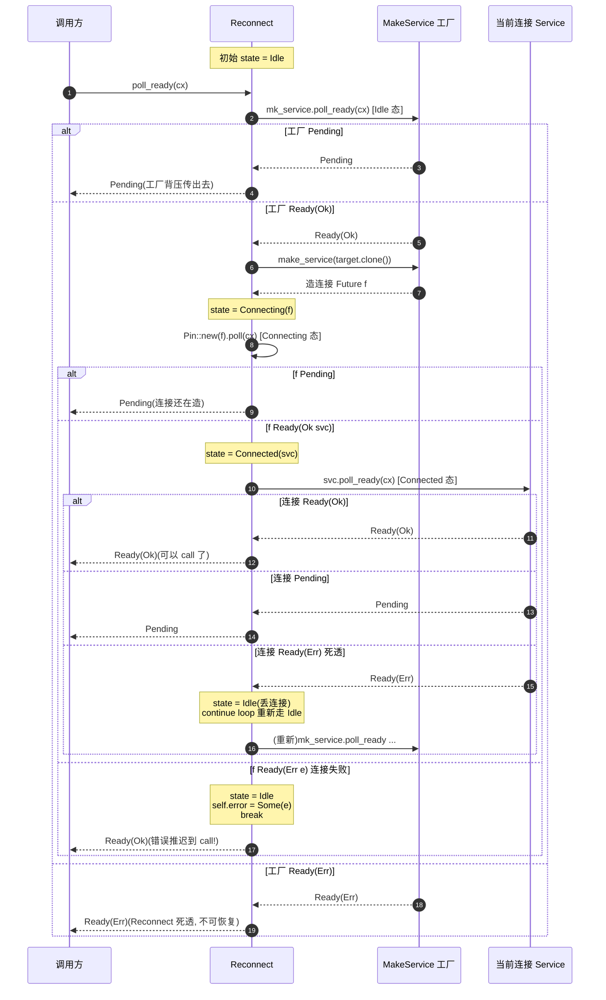

# 第 13 章 · Reconnect:断线重连

> 第 4 篇 · 韧性类中间件 · 执行单元

## 章首 · 核心问题

这一章只回答一个问题:

> **后端连接断了,客户端怎么自动重连,让"用连接"的人感觉不到连接死过?**

如果你写过任何 RPC client——一个 hyper client、一个 tonic gRPC client、一个 Redis client、一个数据库连接池——你一定撞到过这个问题:对端把连接关了。可能是对端重启了,可能是中间网络闪断了一下,可能是负载均衡把你的连接踢了,可能就是你这条 TCP 连接 idle 太久被 NAT 表项清掉了。无论哪种,**连接死了,但你的业务还没结束**:下一个请求还得发,你不想让你的调用方看到 `Connection reset by peer` 然后 panic。

这件事看起来简单——"死了就再连呗"——但写起来处处是坑:

1. 谁负责发现连接死了?是"用连接"的 Service 自己吗?那它就得在每次 `call` 时检查连接状态,业务逻辑和连接管理搅在一起;
2. 谁负责造新连接?业务层吗?那每个业务点都得知道"连接怎么造"(知道 host:port、知道 TLS 配置、知道超时),业务层被连接细节污染;
3. 重连什么时候触发?`poll_ready` 失败时?`call` 失败时?这两种失败的语义可不一样(`poll_ready` 的 `Err` 是"Service 死透了",`call` 的 Future `Err` 是"这次请求失败");
4. 重连会死循环吗?对端一直拒绝,你一直重连,把 CPU 烧到 100% 怎么办?
5. 多个 task 共享同一个 Reconnect,谁触发重连?会不会两个 task 同时造连接?

这五个坑,在没有 Tower 的世界里,要么散落在业务代码各处(每个 RPC client 自己写一遍重连逻辑),要么塞进某个"连接管理器"黑盒(你不知道它什么时候重连、退避多久、会不会泄漏)。Tower 给出的答案干净利落:

> **把"造连接"和"用连接"拆成两层。造连接抽象成 `MakeService`(一个 `Service<Target>` 工厂,`call(target)` 返回一个新 Service),用连接就是普通的 `Service<Request>`。中间用 `Reconnect<M, Target>` 把这两层粘起来:它自己是一个 `Service<Request>`,内层持有当前这条连接(也是个 Service),连接死透了就丢掉、再让 MakeService 造一个新的。**

这是经典的**工厂模式**(factory pattern)落到 Rust 异步生态的样子。`MakeService` 是"Service 的工厂",`Reconnect` 是"自动重造"的中间件。读完本章你会明白:

1. **为什么"造连接"和"用连接"必须分开**——业务层不该知道连接怎么造,工厂层不该知道请求怎么处理,关注点分离让两边各自演进;
2. **`MakeService` 不是新东西,它就是 `Service<Target>` 的 trait alias**——`Sealed` + blanket impl 让任何"返回值是 Service 的 Service"自动成为 MakeService,零运行时开销;
3. **`Reconnect` 怎么在 `poll_ready` 里完成"检查当前连接 / 连不上就造新的 / 造新连接的 Future 还没好就等"三件事**——一个 `State::{Idle, Connecting, Connected}` 三态状态机,全在 `poll_ready` 里推进,`call` 只在 `Connected` 态可用;
4. **为什么 Reconnect 不死循环**——连接失败不会在 `poll_ready` 里无限重试,而是记下错误、`break` 出 loop、返回 `Ready(Ok)`,把错误推迟到 `call` 时透出;真正的退避要靠 MakeService 内部或外层 retry/backoff,Reconnect 只负责"换一条",不负责"等多久再换";
5. **`Reconnect` 怎么和 `Buffer`、`Balance` 组合**——谁在外谁在内、各自管什么、为什么这样组合是 sound 的。

> **逃生阀**(这章概念密度大,先读这一段)。
>
> 如果你只想要一句话:**Reconnect = 一个把"造连接的工厂(MakeService)"包装成"用连接的 Service"的中间件,内层连接死透了就丢掉、问工厂再要一个**。它的状态机三态(`Idle` 没连接 / `Connecting` 正在造连接 / `Connected` 拿到连接)全在 `poll_ready` 里推进,`call` 必须在 `Connected` 态被调;连接造不出来,错误被记下来,下次 `call` 透出,不会卡死 `poll_ready`。如果你对 Service trait 的 `poll_ready`/`call` 拆分、`&mut self` 语义不熟,先读 P1-02;对 Buffer 的 worker + mpsc 模型不熟,先读 P2-05(本章会用到 Buffer 让 `!Clone` 的 Reconnect 在多 task 间共享)。

## 章首 · 一句话点破

> **Reconnect 把"造连接"做成一个工厂(MakeService),把"用连接"做成一个 Service,自己夹在中间当一个"自动换连接"的中间件:它持当前连接,连接死透了就 drop 掉、问工厂再要一个,对调用方暴露一个永远不死的 Service。它的精髓不是"重连"本身,而是"用工厂模式把造连接和用连接彻底解耦"——业务层只看到一个 Service,连接生命周期完全藏在 Reconnect 内部。**

这是结论,不是理由。本章倒过来拆:先看连接为什么会断、断了一般怎么处理,再看别的框架(hyper client / 数据库连接池)怎么做连接管理,然后看 Tower 为什么用 MakeService 工厂 + Reconnect 这种结构,最后逐行拆源码,讲清三态状态机为什么 sound。

---

## 正文

### 13.1 痛点:连接会断,断了一直重连是件麻烦事

#### 13.1.1 一个真实场景:RPC client 持有一条连接

设想你在写一个简化版的 RPC client,内部持有一条到后端的 TCP 连接(由 Tokio 提供,承接《Tokio》的 `TcpStream`/`AsyncRead`/`AsyncWrite`,一句带过指路 `[[tokio-source-facts]]`):

```rust
// (示意, 非源码原文)
struct RpcClient {
    conn: TcpStream,    // 一条到后端的连接
    buf: BytesMut,      // 读写缓冲
}

impl Service<Request> for RpcClient {
    type Response = Response;
    type Error = BoxError;
    type Future = Pin<Box<dyn Future<Output = Result<Response, BoxError>> + Send>>;

    fn poll_ready(&mut self, _cx: &mut Context<'_>) -> Poll<Result<(), Self::Error>> {
        // 简化: 连接在, 就 ready
        Poll::Ready(Ok(()))
    }

    fn call(&mut self, req: Request) -> Self::Future {
        // 把请求序列化, 写进 conn, 读响应
        Box::pin(async move {
            // write_request(&mut self.conn, &req).await?;
            // read_response(&mut self.conn).await
            todo!()
        })
    }
}
```

这个 `RpcClient` 用得好好的,直到有一天,你的运维同学重启了后端。`TcpStream` 那一头对端发了 FIN(或者更暴力,RST),你这条连接在内核里变成 `EOF` 或 `Connection reset`。下一次 `call` 时,`read_response` 读到一个 `Err(io::Error { kind: UnexpectedEof })`,你的业务调用方拿到一个错误。

如果调用方是某个 handler,handler 把这个错误透传到 HTTP 响应,用户看到一个 500。这不疼。但疼的是:**下一次请求来了,你的 `RpcClient` 还是这条死连接**——你又得 `read_response`,又得 EOF,又得 500。`RpcClient` 不知道自己持有的连接已经死了,它会一直用这条死连接,每次请求都失败。

这就是连接生命周期管理的第一个痛点:**连接死了,但持有它的 Service 不知道**。`poll_ready` 还在傻乎乎返回 `Ready(Ok)`,`call` 还在傻乎乎往死连接里写。

#### 13.1.2 朴素方案一:业务层手写重连

第一反应:在 `call` 里检查错误,失败了重连:

```rust
// (示意, 朴素写法, 反例)
impl Service<Request> for NaiveReconnectClient {
    type Response = Response;
    // ...
    fn call(&mut self, req: Request) -> Self::Future {
        Box::pin(async move {
            loop {
                let result = send_and_recv(&mut self.conn, &req).await;
                match result {
                    Ok(resp) => return Ok(resp),
                    Err(e) if is_connection_dead(&e) => {
                        // 连接死了, 重连
                        self.conn = TcpStream::connect(self.addr).await?;
                        // 再试一次
                        continue;
                    }
                    Err(e) => return Err(e.into()),
                }
            }
        })
    }
}
```

这个写法看起来直观,但撞三堵墙:

**墙一:重连逻辑散落在每个业务点。** 你有 10 个 RPC method,每个都要写一遍这个 `loop { ... continue }`。改一次重连策略(比如加退避),要改 10 个地方。漏改一个,某条路径就一直不重连。

**墙二:`call` 内部 await 重连,阻塞当前请求。** 重连是个慢操作(TCP 三次握手 + 可能的 TLS 握手,几十毫秒到几百毫秒),你在这个请求的 Future 里 await 它,这个请求就被堵了。如果调用方设了超时(比如 100ms),重连还没完成,请求就被超时取消了——而你已经发起了重连,重连 Future 被取消(TCP 连接资源泄漏,或者更糟,连接在取消后真的建立了但没人用)。

**墙三:`&mut self` 让重连和并发冲突。** 重连要修改 `self.conn`,而 `call` 是 `&mut self`(承 P1-02)。如果你想让多个请求并发(每个请求一个 task),`&mut self` 不允许——你又得把连接塞进 `Mutex`,回到 P2-05 讲过的"`Arc<Mutex<Service>>` 三重罪"(全串行 / 阻塞 async 线程 / 背压破坏)。

> **钉死这件事**:在 `call` 里手写重连,把"造连接"和"用连接"两件事焊死在一起,违反了关注点分离。造连接的逻辑(知道地址、知道 TLS、知道超时)和用连接的逻辑(知道协议、知道序列化)是两套能力,放在一起,代码不可维护、不可组合。

#### 13.1.3 朴素方案二:连接池 / 连接管理器黑盒

第二反应:用连接池。把连接管理塞进一个黑盒,业务层只管"借连接、用连接、还连接":

```rust
// (示意, 朴素写法)
struct PoolClient {
    pool: Arc<Pool>,    // 连接池
}

impl Service<Request> for PoolClient {
    fn call(&mut self, req: Request) -> Self::Future {
        Box::pin(async move {
            let conn = self.pool.get().await?;     // 借一条
            let resp = send_and_recv(conn, &req).await;
            match resp {
                Ok(r) => { self.pool.put_back(conn).await; Ok(r) }
                Err(e) if is_connection_dead(&e) => {
                    self.pool.discard(conn).await;   // 丢掉, 不放回池
                    Err(e.into())                     // 错误透传
                }
                Err(e) => { self.pool.put_back(conn).await; Err(e.into()) }
            }
        })
    }
}
```

连接池(`bb8`/`deadpool`/`r2d2`)确实是生产里常用的解,本书不否定它。但池解决的是"N 条连接怎么分配 + 健康检查",它自己内部还是得解决"单条连接死了怎么办"——只不过这个逻辑被埋进了池的实现里。而且,池是个**外部组件**,它和 Service/Layer 这套抽象没有关系:你的 `PoolClient` 是个 Service,但池自己不是 Service,你没法把池套进 `ServiceBuilder::new().buffer(N).timeout(...)` 这种链式组合。

更关键的是,池的"丢掉死连接"和"造新连接"还是混在一起的——池内部得维护一个连接集合,每次 `get` 时检查有没有死连接,死了就丢、再造一个。这套逻辑每个池都自己写一遍,没有通用抽象。

> **钉死这件事**:连接池是更高层的抽象("N 条连接的分配"),但它内部仍然要解决"单条连接死了怎么换"这个基本问题。Tower 的 Reconnect 不是池的替代品,而是**把"单条连接的生命周期"这个基本问题抽象成可组合的 Service**——你可以把 Reconnect 套在池的一条连接上(每条连接自动重连),也可以把 Reconnect 套在一个池外面(池死了再造一个池,虽然少见)。Reconnect 是积木,池是更大的积木,两者可以叠。

#### 13.1.4 把问题摆清楚:造连接 vs 用连接

把上面两个反例的教训收束一下,我们要的东西是:

> **一个"用连接"的 Service,它自己不知道连接怎么造,但知道"连接死了就换一个"。造连接的能力被抽出去,做成一个独立的"工厂",工厂知道怎么造连接,但不知道请求怎么处理。中间有个粘合层,负责"当前连接死了就调工厂换一个"。**

这其实是把**对象构造**和**对象使用**分开的老问题——经典的工厂模式。在同步语言里这通常是 `interface Factory { Connection create(); }`,在 Rust 异步生态里,Tower 把它落成了 `MakeService`。

### 13.2 别的框架怎么做连接管理

在讲 Tower 的方案之前,先看两个真实框架怎么处理"连接死了"——这能帮我们看清 Tower 的取舍是站在哪条线上的。

#### 13.2.1 hyper client:连接池 + 每连接一个 task

hyper 的 client 端(在 hyper-util 里)有一个连接池,每条连接跑在一个独立的 task 里(承接《hyper》P1-02 的"每连接一 task"模型,一句带过指路 `[[hyper-source-facts]]`)。连接死了怎么处理?

hyper 的做法是:**连接 task 自己死掉,池子下次发现这条连接的 task 没了,就移除它,下次发请求时再建一条新连接**。具体地:

- 每条连接有一个 `Connection` future(它是一个 task,内部驱动 HTTP/1 或 HTTP/2 协议机);
- 连接的对端关了 / 协议出错,`Connection` future resolve(或者被 drop),task 结束;
- 池子里这条连接对应的 entry 变成"空闲但没有活 task",下次有请求来,池子检查这条 entry,发现它死了,丢掉,新建一条。

注意:hyper 的连接管理**和 Service 抽象耦合得死死的**。它不是用某个"重连中间件"实现的,而是用池 + task 生命周期 + HTTP 协议机自身的状态来管理。这套设计在 hyper 内部很自然(因为 hyper 就是 HTTP 框架,连接就是 HTTP 连接),但要把它泛化到非 HTTP 场景(比如 Redis、数据库)就难了——Redis 协议机和 HTTP 协议机完全不一样,你不能直接复用 hyper 的连接管理代码。

> **承接《hyper》**:hyper 的"每连接一 task + 池管理"模型《hyper》P1-02/P1-03 已讲透。本章不重复,只点出关键:hyper 的连接管理是**和 HTTP 协议耦合**的(连接就是 HTTP 连接,重连就是重连 HTTP 连接);Tower 的 Reconnect 是**协议无关**的(连接是个抽象 Service,不管你下面跑 HTTP/Redis/数据库)。这是通用抽象层 vs 协议层的取舍,承 P1-02 的"hyper 删 poll_ready vs Tower 保留"的同一个对照——Tower 因为不假设协议,只能给一个通用的 Service 抽象。

#### 13.2.2 tonic / reqwest:借用连接管理,把它做成 builder 配置

tonic(gRPC client)和 reqwest(HTTP client)都是 Tower 的用户,但它们都**不直接用 `tower::reconnect::Reconnect`**——它们各自有一套连接管理代码,因为它们需要更精细的控制(比如 tonic 要管理 HTTP/2 多路复用下的 stream,reqwest 要管连接池的 idle timeout)。它们的共同点是:

- 暴露一个 builder,让用户配置 `keep_alive`/`connect_timeout`/`pool_idle_timeout` 这些参数;
- 内部把这些参数传给连接管理逻辑;
- 对用户暴露一个 `Service<Request>`(tonic)或一个 `Client`(reqwest)接口。

所以你在 tonic/reqwest 里看不到显式的 Reconnect 调用——重连被藏进了它们自己的 client 实现里。但**它们内部的设计和 Reconnect 是同构的**:都是"工厂造连接 + 用连接的 Service + 连接死了再造一个"。区别只是,它们把这个模式内化到了 client builder 里,而 Tower 把它抽象成一个可组合的中间件,让你能套在**任何** Service 上,不止 HTTP。

> **钉死这件事**:Reconnect 不是 tonic/reqwest 的替代——它们为了精细控制自己实现了连接管理。Reconnect 是**给你写自己的 client / 自己的中间件栈时用的积木**:当你不想引入整个 tonic/reqwest,只想给一个底层 Service 套个自动重连,Reconnect 就是那块积木。它是"DIY 连接管理"的工具,而不是"现成的连接管理器"。

#### 13.2.3 对比 Envoy:集群级连接管理 vs 单连接级积木

Envoy(C++ 服务网格)有完整的 upstream 连接管理:连接池、健康检查、断路器、outlier detection,这些是 cluster manager + thread local cluster + Network filter chain 一整套机制完成的。Envoy 的设计哲学是"重运行期配置 + 重管理面",连接管理是一个完整子系统,有 xDS 配置驱动、有统计、有日志。

Tower 的 Reconnect 走另一个极端:"最小组件,可组合"。它只做"单条连接死了换一个",健康检查、断路器、负载均衡都得靠你组合 Discover/Balance/ConcurrencyLimit 这些其他中间件。两者不是替代关系,是不同抽象层。

> **对照《Envoy》**:Envoy 的连接管理是集群级、运行期配置驱动的(`cluster.load_assignment`/`outlier_detection`/`circuit_breakers`),《Envoy》P3 已拆透,一句带过指路 `[[envoy-source-facts]]`。Tower 的 Reconnect 是单连接级、编译期组合的,不知道集群、不知道健康检查,只管"我这条连接死了就换"。

### 13.3 所以 Tower 这么设计:MakeService 工厂 + Reconnect

把痛点(13.1)和别家做法(13.2)摆清楚后,Tower 的方案就呼之欲出了:**用工厂模式把造连接抽象成 `MakeService`,用 Reconnect 把"换连接"做成一个 Service 中间件**。

#### 13.3.1 第一步:把"造连接"抽象成 `Service<Target>`

一个能"造连接"的东西,长什么样?它接受一个"目标"(target,通常是地址 `host:port`,但 Tower 故意泛型化,可以是任何描述"造什么样的连接"的参数),返回一条新连接(一个 `Service<Request>`)。这正是 `Service<Target>` 的形状:

```rust
// (示意)
trait MakeConnection<Target>: Service<Target> where Self::Response: Service<Request> {}
```

也就是说:**造连接 = `Service<Target>`,它的 `Response` 是另一个 `Service<Request>`**。`poll_ready` 检查"现在能不能造连接"(工厂是不是忙),`call(target)` 真正去造一条连接,返回一个 Future,Future resolve 出一个 `Service<Request>`(新连接)。

这就是工厂模式在 Tower 里的样子。不需要新 trait,直接用 `Service<Target>` 就够了——只要约束 `Response: Service<Request>`,它就是个工厂。

#### 13.3.2 第二步:`MakeService` 是这个工厂的 trait alias

Tower 把上面这个约束包装了一下,叫 `MakeService`(`tower/src/make/make_service.rs#L21-L35`):

```rust
pub trait MakeService<Target, Request>: Sealed<(Target, Request)> {
    type Response;
    type Error;
    type Service: Service<Request, Response = Self::Response, Error = Self::Error>;
    type MakeError;
    type Future: Future<Output = Result<Self::Service, Self::MakeError>>;

    fn poll_ready(&mut self, cx: &mut Context<'_>) -> Poll<Result<(), Self::MakeError>>;
    fn make_service(&mut self, target: Target) -> Self::Future;

    fn into_service(self) -> IntoService<Self, Request>
    where Self: Sized { ... }

    fn as_service(&mut self) -> AsService<Self, Request>
    where Self: Sized { ... }
}
```

注意几件事:

1. **`MakeService` 是 sealed trait**——`Sealed<(Target, Request)>` 这个 supertrait 让外部 crate 没法自己 `impl MakeService`,只能靠下面的 blanket impl 自动获得。这是 Rust 的"trait alias + 不让用户自己实现"的标准手法;
2. **关键的关联类型是 `type Service`**——这是工厂生产的产品类型,它必须 `Service<Request, Response = Self::Response, Error = Self::Error>`。也就是说,工厂生产的东西,Response/Error 必须和工厂自己声明的对上;
3. **多了 `type MakeError`**——造连接失败有自己的错误类型,区别于 `Error`(用连接时的错误)。`poll_ready` 返回 `MakeError`(工厂满载或工厂坏了),`make_service` 返回的 Future resolve 出 `Result<Service, MakeError>`;
4. **`poll_ready` / `make_service`** 是工厂的两个方法,签名和 `Service::poll_ready` / `Service::call` 几乎一样(就差个名字)。

接下来是**全章最关键的一段代码**——blanket impl(`make_service.rs#L139-L157`):

```rust
impl<M, S, Target, Request> MakeService<Target, Request> for M
where
    M: Service<Target, Response = S>,
    S: Service<Request>,
{
    type Response = S::Response;
    type Error = S::Error;
    type Service = S;
    type MakeError = M::Error;
    type Future = M::Future;

    fn poll_ready(&mut self, cx: &mut Context<'_>) -> Poll<Result<(), Self::MakeError>> {
        Service::poll_ready(self, cx)
    }

    fn make_service(&mut self, target: Target) -> Self::Future {
        Service::call(self, target)
    }
}
```

读这段:**任何 `M: Service<Target, Response = S>` where `S: Service<Request>`,都自动实现 `MakeService<Target, Request>`**。`poll_ready` 就是 `Service::poll_ready`,`make_service` 就是 `Service::call`。MakeService 没有引入任何新的运行时行为,它只是给"Response 是 Service 的 Service"起个名字,提供 `make_service`/`into_service`/`as_service` 这几个语义更清晰的入口。

> **钉死这件事**:`MakeService` 不是新 trait,它是 `Service<Target>` 的**trait alias**。你不需要"实现 MakeService",你只要写一个 `Service<Target>` 且 Response 是 Service,它自动就是 MakeService。这意味着工厂模式在 Tower 里**零开销**:没有 vtable 跳转、没有 wrapper struct、没有运行时分支,完全是类型层面的语义增强。这是 Rust trait alias + blanket impl 的典型用法。

#### 13.3.3 第三步:工厂生产什么?连接的两种形态

工厂生产的产品 `Self::Service`,可以是两种形态:

**形态一:一条真正的连接**。比如一个持 `TcpStream` 的 `Service<Request>`,你 call 它就发请求、收响应。这种情况下,`Target` 是地址(`Host:Port` 或 `String`),`make_service(target)` 内部 `TcpStream::connect(target)` + 包成连接 Service。每条连接是一次性的,死了就丢了再造。

**形态二:一个 `!Clone` 的 Service 被 Buffer 包装后,clone 出来的句柄**。这是 Tower 生态里更常见的玩法,叫 `Shared`(`tower/src/make/make_service/shared.rs#L72-L98`):

```rust
#[derive(Debug, Clone, Copy)]
pub struct Shared<S> {
    service: S,
}

impl<S, T> Service<T> for Shared<S>
where
    S: Clone,
{
    type Response = S;
    type Error = Infallible;
    type Future = SharedFuture<S>;

    fn poll_ready(&mut self, _cx: &mut Context<'_>) -> Poll<Result<(), Self::Error>> {
        Poll::Ready(Ok(()))
    }

    fn call(&mut self, _target: T) -> Self::Future {
        SharedFuture::new(futures_util::future::ready(Ok(self.service.clone())))
    }
}
```

`Shared<S>` 把一个 `Clone` 的 Service 包装成 `Service<Target>`(工厂),每次 `call(target)` 就 clone 一份出来返回。这个工厂本身永远 ready(`poll_ready` 直接 `Ready(Ok)`),`call` 永远成功(`Infallible`)——它就是"clone 一份"这个动作的 Service 化。

`Shared` 的典型用法是配 `Buffer`:`Buffer` 把一个 `!Clone` Service 变成 `Clone`(承 P2-05),`Shared` 把这个 `Clone` Service 包装成工厂,然后 Reconnect 套在工厂外面——但 Reconnect 永远不会真的"重连"(因为 Shared 永远成功),它只是退化成一个"转发"。这种组合的真正价值在于:你有一个 `!Clone` 的 Service,想把它放进需要"工厂造 Service"的地方(比如 hyper server 的 `make_service`),`Buffer + Shared` 就是标准入口。

> **钉死这件事(Buffer + Shared + Reconnect 三件套)**:`Buffer` 解决"!Clone 变 Clone",`Shared` 解决"Clone Service 变 MakeService",`Reconnect` 解决"MakeService 造的连接死了自动换"。这三个中间件各自管一件事,组合起来才能完整解决"一个共享的、可重连的、被多 task 使用的 Service"这个完整场景。这是 Tower 中间件可组合性的典型例子——每个中间件是单一职责的积木,叠起来才能拼出复杂系统。

#### 13.3.4 第四步:Reconnect 把工厂包装成"用连接的 Service"

到这一步,工厂有了(`MakeService`),产品有了(连接 Service),但还差一个粘合层——一个"用连接的 Service",内部持有当前连接,连接死了就问工厂再要一个。这就是 `Reconnect<M, Target>`(`tower/src/reconnect/mod.rs#L30-L45`):

```rust
pub struct Reconnect<M, Target>
where
    M: Service<Target>,
{
    mk_service: M,
    state: State<M::Future, M::Response>,
    target: Target,
    error: Option<M::Error>,
}

#[derive(Debug)]
enum State<F, S> {
    Idle,
    Connecting(F),
    Connected(S),
}
```

`Reconnect` 持有四样东西:

- **`mk_service: M`**——那个工厂(`M: Service<Target>`,自动也是 `MakeService`)。Reconnect 在需要时调它造新连接;
- **`state: State<M::Future, M::Response>`**——当前状态机。三态:
  - `Idle`——没有当前连接(刚构造、或上次连接死了被丢);
  - `Connecting(f)`——正在造新连接,`f` 是工厂 `make_service` 返回的 Future(还没 resolve);
  - `Connected(s)`——有当前连接,`s` 就是那个 `Service<Request>`(工厂生产的产品);
- **`target: Target`**——造连接时的目标参数。`Target: Clone`,每次造连接都 clone 一份传给工厂;
- **`error: Option<M::Error>`**——存"上次连接失败"的错误,留到下次 `call` 透出。

注意 Reconnect 内部存的是 `M::Future` 和 `M::Response`,而不是 `S::Future`/`S::Response`(S 是连接 Service)。也就是说:**Reconnect 只知道"工厂造的产品是个 Service",但它不直接持有产品的 Future**——产品(连接)的 Future 由产品自己管理,Reconnect 只是持有产品本身。这个区分很关键,讲 `poll_ready` 时会回扣。

#### 13.3.5 Reconnect 自己是一个 Service<Request>

Reconnect impl `Service<Request>`(`mod.rs#L72-L155`),它把工厂包装成一个"用连接的 Service":

```rust
impl<M, Target, S, Request> Service<Request> for Reconnect<M, Target>
where
    M: Service<Target, Response = S>,
    S: Service<Request>,
    M::Future: Unpin,
    crate::BoxError: From<M::Error> + From<S::Error>,
    Target: Clone,
{
    type Response = S::Response;
    type Error = crate::BoxError;
    type Future = ResponseFuture<S::Future, M::Error>;

    fn poll_ready(&mut self, cx: &mut Context<'_>) -> Poll<Result<(), Self::Error>> { ... }
    fn call(&mut self, request: Request) -> Self::Future { ... }
}
```

几个约束值得读:

1. **`M: Service<Target, Response = S>` where `S: Service<Request>`**——这是工厂模式的完整约束。M 是工厂,生产 S(连接),S 处理 Request;
2. **`M::Future: Unpin`**——造连接的 Future 必须 Unpin。这是因为 Reconnect 内部把 `M::Future` 存进 `State::Connecting(f)`,然后在 `poll_ready` 里用 `Pin::new(f).poll(cx)` 轮询它(下面会看到)。要这么 poll,要么 Future Unpin(可以直接 `Pin::new`),要么 Reconnect 自己用 `pin_project!` 把 Future 字段 pin 住。Tower 选了前者,要求 `M::Future: Unpin`,这通常是个温和的约束(大多数异步 IO Future 都是 Unpin);
3. **`crate::BoxError: From<M::Error> + From<S::Error>`**——工厂错误和连接错误都得能转成 `BoxError`,这样 Reconnect 可以用统一的错误类型对外暴露;
4. **`Target: Clone`**——target 必须能 clone,因为每次重连都要传一份给工厂。

输出类型:`Response = S::Response`(连接的响应就是 Reconnect 的响应)、`Error = BoxError`(工厂错或连接错都包成 BoxError)、`Future = ResponseFuture<S::Future, M::Error>`(一个特殊的 Future,既能跑连接的 Future,也能直接返回工厂错误)。

到这一步,Reconnect 的形状就钉死了:它是个 `Service<Request>`,对外和普通的连接 Service 没区别,但内部有个状态机管理连接生命周期。下面两节拆 `poll_ready` 和 `call`,看状态机怎么转。

### 13.4 `poll_ready`:三态状态机的全部精髓

Reconnect 的 `poll_ready`(`mod.rs#L84-L140`)是这一章的重头戏。它一个方法里干了三件事——检查当前连接、造新连接、等新连接就绪——全靠一个三态状态机 + `loop` 推进。逐态拆。

#### 13.4.1 整体形状:一个 loop + match state

先把整体形状钉死:

```rust
fn poll_ready(&mut self, cx: &mut Context<'_>) -> Poll<Result<(), Self::Error>> {
    loop {
        match &mut self.state {
            State::Idle => { /* 没连接: 准备造 */ }
            State::Connecting(ref mut f) => { /* 正在造: poll 造连接的 Future */ }
            State::Connected(ref mut inner) => { /* 有连接: poll 内层连接 */ }
        }
    }

    Poll::Ready(Ok(()))
}
```

`loop` 是关键——一次 `poll_ready` 调用,可能跨多个状态(比如从 `Idle` 切到 `Connecting`,本轮就能继续 poll `Connecting`;从 `Connecting` resolve 出连接切到 `Connected`,本轮就能继续 poll `Connected`)。这是 Future 状态机的常见优化(承 P1-02 的 `Oneshot` 状态机也是 `loop`),避免"一次唤醒只能推进一态"的低效。

每个状态的分支做什么?逐个拆。

#### 13.4.2 `Idle` 态:让工厂就绪 + 启动造连接

`Idle` 态分支(`mod.rs#L87-L100`):

```rust
State::Idle => {
    trace!("poll_ready; idle");
    match self.mk_service.poll_ready(cx) {
        Poll::Ready(r) => r?,
        Poll::Pending => {
            trace!("poll_ready; MakeService not ready");
            return Poll::Pending;
        }
    }

    let fut = self.mk_service.make_service(self.target.clone());
    self.state = State::Connecting(fut);
    continue;
}
```

`Idle` 态做三件事,顺序非常讲究:

1. **`self.mk_service.poll_ready(cx)`**——先让工厂就绪。工厂可能有自己的资源约束(比如工厂内部有连接数上限,或者工厂本身是个被 Buffer 包装的共享 Service,Buffer 的 poll_ready 会背压),工厂不 ready,Reconnect 就 `Pending` 等;
2. **`r?`**——如果工厂 `poll_ready` 返回 `Ready(Err)`,**直接透出错误,Reconnect 自己 `Ready(Err)`**。这是模块文档说的 "becomes unavailable when the inner MakeService::poll_ready returns an error"——工厂本身坏掉了(不是某次连接失败,是工厂这个组件彻底废了),Reconnect 也跟着废。这一条是 Reconnect 唯一的"不可恢复"路径;
3. **`make_service(target.clone())` 启动造连接**——工厂 ready 后,调 `make_service` 拿到造连接的 Future,存进 `State::Connecting(fut)`,`continue` 继续轮询(下一轮会落到 `Connecting` 态)。

注意 `target.clone()`——每次造连接都 clone 一份 target。这就是 `Target: Clone` 约束的来历。

> **钉死这件事(Idle 态的精妙)**:`Idle` 态先 `poll_ready` 工厂再 `make_service`,严格遵循 Service trait 的契约(`poll_ready` Ready 才能 `call`,承 P1-02)。这一步把"工厂是否就绪"和"造连接"分开,让工厂的背压正确传递——工厂忙,Reconnect 就 Pending,不会强行造连接。

#### 13.4.3 `Connecting` 态:poll 造连接的 Future

`Connecting` 态分支(`mod.rs#L101-L118`):

```rust
State::Connecting(ref mut f) => {
    trace!("poll_ready; connecting");
    match Pin::new(f).poll(cx) {
        Poll::Ready(Ok(service)) => {
            self.state = State::Connected(service);
        }
        Poll::Pending => {
            trace!("poll_ready; not ready");
            return Poll::Pending;
        }
        Poll::Ready(Err(e)) => {
            trace!("poll_ready; error");
            self.state = State::Idle;
            self.error = Some(e);
            break;
        }
    }
}
```

`Connecting` 态 poll 那个造连接的 Future `f`,三种结果:

1. **`Ready(Ok(service))`——连接造好了**。把 service 存进 `State::Connected`,本轮 loop 继续(下一轮会落到 `Connected` 态,继续 poll 内层连接的 `poll_ready`);
2. **`Pending`——连接还在造**。直接 `return Poll::Pending`,Reconnect 让出 task,等 Future 再次被 wake(TCP 握手完成、TLS 握手完成等);
3. **`Ready(Err(e))`——连接造失败了**。**这是本章最微妙的一支**:
   - `self.state = State::Idle`——切回 Idle(没有当前连接);
   - `self.error = Some(e)`——把错误**记下来**;
   - `break`——跳出 loop。

`break` 跳出 loop 后,会落到 `poll_ready` 函数末尾的 `Poll::Ready(Ok(()))`(`mod.rs#L139`)。也就是说:**连接造失败,Reconnect 的 `poll_ready` 返回 `Ready(Ok(()))`**,而不是返回错误!错误被存进了 `self.error`,等下次 `call` 时透出。

这一支是 Reconnect 的精髓,也是最容易看错的地方。下一节专门拆。

#### 13.4.4 连接失败的精妙:错误推迟到 `call`

为什么连接造失败了,`poll_ready` 不直接报错,而是返回 `Ready(Ok)` 把错误推迟到 `call`?

读模块文档(`mod.rs#L1-L14`)的原话:

> "When the connection future returned from `MakeService::call` fails this will be returned in the next call to `Reconnect::call`. This allows the user to call the service again even if the inner `MakeService` was unable to connect on the last call."

翻译:连接失败,这个错误会在**下一次 `Reconnect::call`** 返回;这允许用户**再次调用 Service**,即使上次连接失败了。

这个设计的意图是:**连接失败是"这次请求失败",不是"Service 死了"**。模块文档继续说,只有"工厂 `poll_ready` 失败"才是 Service 死了(不可恢复)——连接失败(工厂 `make_service` 返回的 Future resolve 成 Err)是可恢复的,Reconnect 应该让用户能继续 call(下次 call 时 Reconnect 会重新走 Idle → Connecting 流程,再试一次连接)。

如果连接失败时 `poll_ready` 直接报错(返回 `Ready(Err)`),按 Service trait 契约(承 P1-02 的"Ready(Err) = 死透,丢弃 Service"),调用方会丢弃整个 Reconnect——这就丧失了"自动重连"的意义。所以 Reconnect 故意把连接失败"降级"成"下次 call 失败",让 `poll_ready` 永远不因为单次连接失败而死透。

> **钉死这件事(Reconnect 不死循环的第一道防线)**:连接失败被记进 `self.error`,`poll_ready` 返回 `Ready(Ok)`,**`poll_ready` 不会无限重试连接**。这一招把"连接失败的瞬间"和"错误暴露给调用方的瞬间"解耦——连接失败的瞬间 `poll_ready` 立刻就绪(假装没事),错误在调用方 `call` 时才暴露。调用方拿到错误后,下次再 `poll_ready` + `call`,Reconnect 又重新走一遍连接流程,**不会**因为单次连接失败就死循环(下一节详述为什么)。

#### 13.4.5 `Connected` 态:poll 当前连接

`Connected` 态分支(`mod.rs#L119-L135`):

```rust
State::Connected(ref mut inner) => {
    trace!("poll_ready; connected");
    match inner.poll_ready(cx) {
        Poll::Ready(Ok(())) => {
            trace!("poll_ready; ready");
            return Poll::Ready(Ok(()));
        }
        Poll::Pending => {
            trace!("poll_ready; not ready");
            return Poll::Pending;
        }
        Poll::Ready(Err(_)) => {
            trace!("poll_ready; error");
            self.state = State::Idle;
        }
    }
}
```

`Connected` 态 poll 当前连接的 `poll_ready`,三种结果:

1. **`Ready(Ok(()))`——连接就绪**。Reconnect 也 `Ready(Ok)`,可以 `call` 了;
2. **`Pending`——连接暂时忙**(比如连接的 in-flight 请求满了)。Reconnect 也 `Pending`,把背压传出去;
3. **`Ready(Err(_))`——连接死透了**(承 P1-02 讲的"Ready(Err) = 死透,丢弃 Service")。**这是 Reconnect 自动重连的核心触发点**:
   - `self.state = State::Idle`——丢掉当前连接,切回 Idle;
   - 不返回错误,继续 loop——下一轮落到 `Idle` 态,重新走"问工厂要新连接"流程。

注意:**连接死透时,Reconnect 自己不报错**,而是默默换一条。这正是"自动重连"的语义——调用方完全感知不到连接死过,只看到 Reconnect 暂时 Pending 了一会儿(重连的时间),然后又 Ready。

> **钉死这件事(`poll_ready` 的三态转换全图)**:把三个状态的转换画出来,Reconnect 的全部行为就清楚了:
>
> ```mermaid
> stateDiagram-v2
>     [*] --> Idle
>     Idle --> Connecting: mk_service.poll_ready Ready + make_service
>     Idle --> Pending: mk_service.poll_ready Pending
>     Idle --> Dead: mk_service.poll_ready Err (透出, 不可恢复)
>     Connecting --> Connected: 造连接 Future Ready(Ok)
>     Connecting --> Pending: 造连接 Future Pending
>     Connecting --> Idle: 造连接 Future Ready(Err)\n(记 error, poll_ready 返回 Ready(Ok))
>     Connected --> Ready: 连接 poll_ready Ready(Ok)\n(返回 Ready, 可以 call)
>     Connected --> Pending: 连接 poll_ready Pending
>     Connected --> Idle: 连接 poll_ready Ready(Err)\n(丢弃当前连接, 自动重连)
>     Ready --> Connected: 下次 poll_ready 再来
> ```
>
> 三个回到 Idle 的路径(Idle 工厂报错、Connecting 造连接失败、Connected 连接死透),只有第一个是真"死"(透出错误),后两个是"假死"(切回 Idle 重来)。这就是 Reconnect 的全部状态机。

#### 13.4.6 一个请求的完整时序:从 Idle 到 Ready

把上面四个小节合起来,一次完整的"`poll_ready` 从 Idle 推到 Ready"的时序:



这张图是本章的总图。所有 Reconnect 的细节都长在它上面。三个关键瞬间重点标:

- **第 Idle → Connecting 的转换**:`make_service` 启动造连接。这一步把"造连接"作为异步操作异步化——`make_service` 立刻返回一个 Future,真正的握手在 Future 里跑;
- **Connecting Ready(Err) → Idle 的转换**:连接失败被记进 `self.error`,`poll_ready` 返回 `Ready(Ok)`,错误推迟到 call。这是 Reconnect 不死循环的第一道防线;
- **Connected Ready(Err) → Idle 的转换**:连接死透,丢连接,continue loop 重连。这是 Reconnect 自动重连的核心触发点。

### 13.5 `call`:必须 Connected,否则 panic

`call` 比 `poll_ready` 简单得多(`mod.rs#L142-L154`):

```rust
fn call(&mut self, request: Request) -> Self::Future {
    if let Some(error) = self.error.take() {
        return ResponseFuture::error(error);
    }

    let service = match self.state {
        State::Connected(ref mut service) => service,
        _ => panic!("service not ready; poll_ready must be called first"),
    };

    let fut = service.call(request);
    ResponseFuture::new(fut)
}
```

`call` 做三件事:

1. **先看 `self.error`**——如果有(上次 `Connecting` 失败记下的),`take` 出来,返回 `ResponseFuture::error(error)`。这就是"错误推迟到 call"的兑现——上次连接失败的错误,这次 call 透出;
2. **必须在 `Connected` 态**——`match self.state`,只有 `Connected(ref mut service)` 这一支能继续,其他态(Idle/Connecting)直接 **panic**(`"service not ready; poll_ready must be called first"`)。这严格遵守 Service trait 的契约(承 P1-02:实现者**允许**在没 poll_ready 就 call 时 panic);
3. **`service.call(request)` 转发**——拿到内层连接的 Future,包成 `ResponseFuture::new(fut)` 返回。

注意 `call` **不在 Reconnect 这一层做重连触发**。也就是说,`call` 返回的 Future 如果 resolve 成 `Err`(这次请求失败,比如对端发了个错误响应),Reconnect **不会**因为这个错误就换连接——它只是把错误透传给调用方。下次 `poll_ready` 时,如果连接还活着(内层 poll_ready 返回 Ready(Ok)),Reconnect 继续用这条连接;如果连接死了(内层 poll_ready 返回 Ready(Err)),Reconnect 才换。

> **钉死这件事(call 不触发重连)**:Reconnect 的重连只在 `poll_ready` 里触发(内层 `Ready(Err)`),**不在 `call` 里触发**。`call` 返回的 Future 失败 = 这次请求失败,和连接死没死是两回事。连接死活的判断由内层 Service 的 `poll_ready` 决定——内层知道自己的状态(连接是不是 EOF 了、是不是 reset 了),它通过 `Ready(Err)` 告诉 Reconnect"我死了",Reconnect 在下次 `poll_ready` 时换掉它。这个设计让"请求级失败"和"连接级失败"清晰分层:请求失败在 call Future 里,连接失败在 poll_ready 里。

#### 13.5.1 `ResponseFuture`:既能跑连接 Future,又能直接报错

`call` 返回的 `ResponseFuture<S::Future, M::Error>`(`tower/src/reconnect/future.rs#L8-L73`),是个两态枚举:

```rust
pin_project! {
    pub struct ResponseFuture<F, E> {
        #[pin]
        inner: Inner<F, E>,
    }
}

pin_project! {
    #[project = InnerProj]
    enum Inner<F, E> {
        Future {
            #[pin]
            fut: F,
        },
        Error {
            error: Option<E>,
        },
    }
}
```

两个态:

- **`Future { fut }`**——正常转发内层连接的 Future(`ResponseFuture::new(fut)` 走这条);
- **`Error { error }`**——直接报错(`ResponseFuture::error(e)` 走这条),用于"上次连接失败"的错误透出。

`poll` 实现(`future.rs#L63-L72`):

```rust
fn poll(self: Pin<&mut Self>, cx: &mut Context<'_>) -> Poll<Self::Output> {
    let me = self.project();
    match me.inner.project() {
        InnerProj::Future { fut } => fut.poll(cx).map_err(Into::into),
        InnerProj::Error { error } => {
            let e = error.take().expect("Polled after ready.").into();
            Poll::Ready(Err(e))
        }
    }
}
```

`Future` 态转发 `fut.poll`,`Error` 态立刻返回错误(`error.take().expect(...)` 表示这个态只能 poll 一次,再 poll 就 panic,这是 Future"完成后再 poll 是 UB"的标准保护)。

这个 `ResponseFuture` 的存在,就是为了让 `call` 能返回一个 Future,这个 Future **要么跑内层连接的 Future,要么直接报工厂错**——两种情况用同一个 Future 类型表达。否则,`call` 的签名没法统一(有时候返回 `S::Future`,有时候返回一个立即错误的 Future)。这是 Tower 把"多种失败模式"统一成一个 Future 类型的标准手法。

### 13.6 Reconnect 为什么 sound:不死循环、不泄漏、不破坏背压

讲完源码,这一节专门回答 soundness——这是 Reconnect 最容易让人担心的地方(尤其是"会不会死循环")。

#### 13.6.1 不死循环:错误推迟 + Pending 兜底

死循环的担忧是这样的:对端一直拒绝连接,Reconnect 一直 `Connecting` 失败 → 切回 Idle → 又 `Connecting` → 又失败 …… 无限循环,把 CPU 烧到 100%。

Reconnect 不会死循环,有两道防线:

**第一道防线:错误推迟到 call(13.4.4 讲过)**。`Connecting` 态 `Ready(Err)` 时,Reconnect 不立刻重试,而是 `break` 出 loop,把错误存进 `self.error`,`poll_ready` 返回 `Ready(Ok)`。这意味着一次 `poll_ready` 调用,**最多只尝试一次造连接**——失败了就停下来,等调用方 `call`(此时 call 会拿到错误)。调用方拿到错误后,要不要再 `poll_ready` 由调用方决定,Reconnect 不主动无限重试。

**第二道防线:造连接 Future 的 Pending**。即使调用方立刻又调 `poll_ready`(比如调用方在 loop 里反复 ready),Reconnect 走 Idle → `make_service` → Connecting,这次 `Connecting` 态 poll 造连接的 Future。真实的造连接(TCP connect)是异步的——`TcpStream::connect` 返回的 Future 在握手完成前是 `Pending`(承《Tokio》的非阻塞 IO + reactor 注册 waker,一句带过指路 `[[tokio-source-facts]]`)。所以 `Connecting` 态 poll 立刻返回 `Pending`,Reconnect 让出 task,CPU 不会被烧。等 TCP 握手真的完成(成功或失败),reactor wake 这个 task,Reconnect 才再次被 poll。

合起来:**Reconnect 一次 `poll_ready` 最多触发一次完整的"造连接尝试",失败就停下来,真正的重连节奏由调用方决定;真实造连接的异步性(Pending)保证 Reconnect 不会在一个 `poll_ready` 里忙等**。

但 Reconnect **不主动退避**(backoff)。它不会"失败后 sleep 1s 再试"——退避要么靠 MakeService 内部(`make_service` 返回的 Future 内部可以先 sleep 再 connect),要么靠外层 retry 中间件(把 Reconnect 包在 Retry<Backoff> 里)。Reconnect 自己只负责"换一条",不负责"等多久再换"。

> **钉死这件事(Reconnect 不退避,退避要外挂)**:Reconnect 的语义是"连接死了立刻换一条",不是"失败后等一会儿再换"。如果你需要退避(避免在对端拒绝时疯狂重连),有两个地方加:① MakeService 内部——`make_service` 返回的 Future 先 `tokio::time::sleep(backoff).await` 再真正 connect;② 外层 Retry——`Retry::new(BackoffPolicy, Reconnect::new(make, target))`,让 Retry 在 Reconnect 报错时按 backoff 重试。这是 Tower 中间件可组合性的另一个例子——Reconnect 单一职责(换连接),退避单独一个中间件(Backoff/Retry)。

#### 13.6.2 不泄漏:连接 drop 自动清理

Reconnect 内部持有当前连接(`State::Connected(s)`),连接被 drop 的时机有两个:

- **`Connected` → `Idle` 切换时**(`mod.rs#L130-L133`):内层 `poll_ready` 返回 `Ready(Err)`,执行 `self.state = State::Idle`,旧的 `State::Connected(s)` 整个被替换,`s` 被 drop——它的 TcpStream、缓冲、内部状态全释放;
- **Reconnect 自己被 drop 时**:整个 `Reconnect` 被 drop,`state` 字段 drop,无论处于哪个态,内部连接(或造连接 Future)都一起 drop。

`State` 是 `enum`,Rust 的 enum drop 语义保证 drop `State::Connected(s)` 时 `s` 的 `Drop` 被调用——连接 Service 的 `Drop` 关闭 TcpStream(释放文件描述符)、释放缓冲。边界情况 `State::Connecting(f)`:Reconnect 在造连接中途被 drop,`f` 被 drop,等于取消这个 Future,`TcpStream::connect` 的 Future 被 drop 时 Tokio 关闭半开的 socket(承《Tokio》Future 取消 = drop,一句带过指路)。整个过程没有 `Arc`、没有 `Mutex`、没有手动 close,纯靠 Rust 所有权。

> **钉死这件事(不泄漏)**:Reconnect 的连接生命周期严格由 `State` 字段的所有权管理。连接死 → `State` 切换 → 旧连接 drop;Reconnect 自己死 → 整个 `State` drop。这是 Reconnect "为什么 sound" 的资源安全保证。

#### 13.6.3 不破坏背压:三处 Pending 都正确传染

`poll_ready` 里三个返回 `Pending` 的地方,每一个都正确传染背压:

1. **`Idle` 态 `mk_service.poll_ready` 返回 `Pending`**(`mod.rs#L91-L94`)——工厂忙,Reconnect Pending。这把工厂的背压(比如工厂是个被 Buffer 包装的共享 Service,Buffer 通道满了)传染给调用方;
2. **`Connecting` 态造连接 Future `Pending`**(`mod.rs#L107-L109`)——连接还在造,Reconnect Pending。这把"造连接的异步等待"传染给调用方(调用方知道"现在还不能用");
3. **`Connected` 态内层 `poll_ready` 返回 `Pending`**(`mod.rs#L126-L128`)——当前连接忙(比如 in-flight 满了),Reconnect Pending。这把内层连接的背压传染给调用方。

三处 Pending 都用同一个 `cx` 注册 waker,任何一个被 wake(工厂 ready、连接造好、连接 ready),Reconnect 这个 Future 也会被 wake,重新跑 `poll_ready` 状态机。这是 Future 协作模型的标准保证(承 P1-02 / 《Tokio》Future/Poll/Waker)。

特别要注意:**`Connected` 态内层 `poll_ready` 的 Pending 不会被 Reconnect 误解为"连接死了"**。Reconnect 严格区分三种返回:Pending(连接暂时忙,等)、Ready(Ok)(连接就绪,call)、Ready(Err)(连接死透,换)。只有 `Ready(Err)` 才触发换连接,Pending 只是等。这避免了"连接其实只是忙,但被 Reconnect 错误地换掉"的浪费。

> **钉死这件事(背压不丢)**:Reconnect 的 `poll_ready` 在三个地方 Pending,每个都对应一个真实的"暂时不能用"的原因(工厂忙、连接在造、连接忙)。调用方拿到 Pending,知道"等会儿",不会以为"Service 死了"。这种精细的三态区分,正是 Service trait 把 `poll_ready` 设计成 `Poll<Result<(), _>>` 的价值(承 P1-02 的"Pending vs Ready(Ok) vs Ready(Err)"三态)——如果没有这种区分,Reconnect 没法表达"连接暂时忙"和"连接死透"的区别。

#### 13.6.4 不破坏 `poll_ready` 契约:Ready 后必须能 call

P1-02 讲了 Service trait 的契约:"`poll_ready` 返回 `Ready(Ok)` 后,`call` 必须能用"。Reconnect 怎么保证这条?

Reconnect 的 `poll_ready` 返回 `Ready(Ok)` 只在两种情况:

1. **`Connected` 态内层 `Ready(Ok)`**(`mod.rs#L122-L124`)——这时 `state == Connected(svc)`,svc 内层已经 ready。`call` 时 match `State::Connected`,拿到 svc,调 `svc.call(req)`,合法;
2. **`Connecting` 态 `Ready(Err)` 后 break**(`mod.rs#L111-L116`)——这时 `state == Idle`,`self.error = Some(e)`。`call` 时第一个 `if let Some(error) = self.error.take()` 命中,返回 `ResponseFuture::error(error)`,**不碰 state**。合法。

两种情况,`call` 都不会 panic(只要调用方遵守"`poll_ready` Ready 后再 call"的契约)。第二种情况特别精妙:**虽然 state 是 Idle(没有连接),但 `call` 不需要连接——它直接返回错误 Future**。错误信息是"上次造连接失败的原因"。调用方拿到这个错误,知道"这次请求失败了",可以选择重试(再 `poll_ready` + `call`),Reconnect 又重新走一遍连接流程。

> **钉死这件事(契约不破)**:Reconnect 的 `poll_ready` Ready 后,`call` 必然能跑(要么转发到内层连接,要么直接返回错误 Future)。两种 Ready(Ok)路径都严格遵守"`poll_ready` Ready 后必须能 call"的契约。这是 Reconnect "为什么 sound" 的契约层保证。

### 13.7 Reconnect 与 Buffer / Balance 的组合

Reconnect 单独用得不多——它通常和 Buffer、Balance 组合,拼出完整的"多 task 共享 + 自动重连 + 多后端均衡"的客户端栈。这一节讲三种典型组合,讲清谁在外谁在内、各自管什么。

#### 13.7.1 组合一:Reconnect 在外,Buffer 在内

```text
Reconnect<MakeService, Target>
  └─ MakeService 生产: Buffer<InnerConnection>
```

这种组合的语义是:工厂每次造一个 `Buffer<InnerConnection>`——也就是造一条新连接,然后把它包进 Buffer(让这条连接能被多 task 共享)。Reconnect 在最外层,负责"当前 Buffer 死了就换一个"。

适用场景:你有一个 `!Clone` 的连接 Service(比如持单条 TCP 的),想让它能被多 task 共享(Buffer),又想让连接死了自动换(Reconnect)。每次重连,工厂造一条**新的连接 + 新的 Buffer**(新 worker task)。

这种组合要注意:重连会丢弃整个 Buffer(worker task + 通道 + 当前在途的请求)。在途的请求会拿到 `Closed` 错误(Buffer worker 被 drop,oneshot 关闭)。如果你的业务不能容忍在途请求失败,要在最外层加 Retry(重试这些失败的请求)。

#### 13.7.2 组合二:Buffer 在外,Reconnect 在内

```text
Buffer<...>
  └─ worker 持有: Reconnect<MakeService, Target>
```

这种组合的语义是:Reconnect 被包进 Buffer 的 worker task 里(只有一份),所有调用方经 Buffer 的通道转发请求给这个唯一的 Reconnect。Reconnect 内部自己管重连。

适用场景:你希望**重连是全局唯一的**——只有一个 Reconnect 实例,所有 task 共享它(Buffer 帮你把 `!Clone` 的 Reconnect 变成可共享)。这种组合比组合一更省资源(只有一个 worker task,只造一条连接的 Reconnect),但要注意:Buffer 的 worker task 持有 Reconnect,如果 Reconnect 内部的连接死了重连,worker task 不死,所有调用方继续经通道发请求,Reconnect 在 worker 内部默默换连接。

这是 tonic/reqwest 等 client 内部常用的模式(虽然它们不直接用 Tower 的 Reconnect,但模型一样):一个共享的连接管理 Service,被多 task 经通道访问。

#### 13.7.3 组合三:Balance 在外,多个 Reconnect 在内

```text
Balance<Discover<...>, Load>
  └─ Discover 提供: 多个 Reconnect<MakeService, Target>
```

这种组合的语义是:你有多个后端(Discover 提供动态后端列表),每个后端是一个 Reconnect(单后端自动重连),Balance 在多个 Reconnect 之间做负载均衡(P2C 选负载小的)。

适用场景:多后端的 client(典型的 gRPC client)。每个后端独立管理自己的连接(死了自动重连),Balance 选一个发请求。这是 P5-14(Discover)/ P5-15(Balance)的主角,本章只点出:**Reconnect 是 Balance 的标准内层**——每个后端一个 Reconnect,后端死了 Reconnect 自动重连,Balance 看到的永远是"活着"的后端。

> **钉死这件事(组合的顺序语义)**:Reconnect 在外,它换的是内层整个 Service(Buffer/连接);Reconnect 在内,它被外层(Buffer/Balance)当作普通 Service 用,自己默默重连。两种组合解决不同问题——前者是"重连粒度大(换整个 Buffer)",后者是"重连粒度小(只换连接)"。设计时要想清楚:重连时要不要保留在途请求?要不要保留 worker task?答案决定组合顺序。

---

## 技巧精解

这一节挑 Reconnect 两个最硬核的技巧单独拆透:**(一)连接失败被推迟到 call 的设计——为什么这是 Reconnect 不死循环的核心,以及它和"工厂 poll_ready 失败"的语义差别;(二)MakeService 的 sealed trait alias + blanket impl——Rust 怎么用类型系统表达"工厂模式"且零运行时开销**。每个技巧配真实源码 + 反面对比。

### 技巧一:连接失败推迟到 call,工厂 poll_ready 失败立刻透出

这是 Reconnect 最容易看错、也是最精妙的设计点。把 `poll_ready` 的两个错误路径并排看:

**路径 A:工厂 `poll_ready` 失败**(`mod.rs#L89-L90`,Idle 态):

```rust
match self.mk_service.poll_ready(cx) {
    Poll::Ready(r) => r?,    // ← 工厂 Ready(Err), 直接 ? 透出
    Poll::Pending => { ... }
}
```

工厂 `poll_ready` 返回 `Ready(Err)`,`r?` 把错误透出,Reconnect 的 `poll_ready` 也返回 `Ready(Err)`。按 Service trait 契约,调用方拿到 `Ready(Err)` 应该**丢弃整个 Reconnect**(承 P1-02)。这是不可恢复的——模块文档原话:"The `Reconnect` service becomes unavailable when the inner `MakeService::poll_ready` returns an error."

**路径 B:造连接 Future 失败**(`mod.rs#L111-L116`,Connecting 态):

```rust
Poll::Ready(Err(e)) => {
    self.state = State::Idle;
    self.error = Some(e);
    break;
}
```

造连接 Future 返回 `Ready(Err)`,Reconnect **不透出错误**,而是记下来,break,`poll_ready` 返回 `Ready(Ok)`。错误推迟到下次 `call` 时透出(`mod.rs#L143-L145`)。

#### 为什么这两条路径语义不同?

读模块文档的措辞,关键在"becomes unavailable"这个词。工厂 `poll_ready` 失败 = 工厂这个**组件**坏了(比如工厂内部状态崩了,或者工厂是个被 Buffer 包装的东西但 Buffer 的 worker 死了),这种坏是不可恢复的——工厂自己都坏了,你再调它也造不出连接。所以 Reconnect 跟着不可恢复。

造连接 Future 失败 = **这一次**连接尝试失败(比如对端拒绝、网络不通、TLS 握手失败),但工厂本身没坏——下次调 `make_service` 它还能再试一次。这是可恢复的,Reconnect 不应该因为一次连接失败就死。

这个区分的精妙在于:**它把"组件级失败"和"操作级失败"分开**。组件级失败(工厂坏了)用 Service trait 的 `Ready(Err)` 表达,调用方丢 Service;操作级失败(这次连接失败)用 call 返回的 Future 的 `Err` 表达,调用方可以重试。

#### 反面对比:如果连接失败也立刻透出会怎样?

设想一个朴素的 Reconnect,连接失败时 `poll_ready` 直接返回 `Ready(Err)`:

```rust
// (反例, 朴素写法, 非源码)
Poll::Ready(Err(e)) => {
    return Poll::Ready(Err(e.into()));   // ← 连接失败立刻透出
}
```

这么写会撞两堵墙:

**墙一:调用方拿到 Ready(Err),丢弃整个 Reconnect**。按 Service trait 契约,`Ready(Err)` = Service 死透,调用方应该丢 Service。可 Reconnect 的全部意义就是"连接死了别丢我,我自己换"——连接一失败调用方就把 Reconnect 丢了,重连的意义就没了。

**墙二:每次连接失败都要调用方手动重建 Reconnect**。调用方拿到 `Ready(Err)`,得知道"这是连接失败不是 Service 死透",自己重新构造一个 Reconnect。可是调用方怎么区分?它看不到 Reconnect 内部,只看到一个 `Ready(Err)`。要么它无脑丢(丧失重连),要么它无脑重试(可能真的 Service 死透了,无限重建)。两种都不对。

Tower 的设计把这两堵墙都避开:**连接失败不立刻透出,记下来,下次 call 透出**。调用方看到的是"poll_ready 永远 Ready(Ok)(除非工厂真死了),call 偶尔返回错误"——这种错误是"请求级失败",调用方可以用统一的错误处理逻辑(重试 / 上报 / 兜底),不需要特殊处理"连接死了"。

> **钉死这件事(推迟错误的设计精髓)**:Reconnect 把连接失败"降级"成请求失败(`call` 的 Future `Err`),把工厂失败"保持"成 Service 失败(`poll_ready` 的 `Ready(Err)`)。这种降级让调用方对"连接死活"完全无感——它只看到请求成功或失败,重连是 Reconnect 内部的事。这是 Reconnect "把连接生命周期藏在内部"的语义实现,也是它区别于"调用方手写重连"的根本。

#### 这个设计和 Retry 的关系

注意 Reconnect 的"推迟错误"和 Retry 的"重试"是配套的。Reconnect 把连接失败推迟到 call,call 返回错误 Future;如果你想让这个错误被自动重试,就把 Reconnect 包进 Retry:

```rust
// (示意)
let svc = Retry::new(
    BackoffPolicy,
    Reconnect::new(make_service, target),
);
```

Retry 的 `Policy::retry` 看到 call 返回的 Err,决定要不要重试(承 P4-11 Retry 章)。如果 Policy 说"重试",Retry 会再调 Reconnect 的 `poll_ready` + `call`——而 Reconnect 在下一次 `poll_ready` 里会重新走 Idle → Connecting 流程,再试一次连接。Retry + Reconnect 的组合,等于"连接失败 + 退避 + 重试"的完整韧性方案。

这种"Reconnect 推迟错误,Retry 重试错误"的分工,是 Tower 中间件单一职责的典范——Reconnect 只管"换连接",Retry 只管"重试 + 退避",两者经 Service 抽象组合,拼出完整的韧性逻辑。

### 技巧二:MakeService 的 sealed trait alias + blanket impl

第二个硬核技巧是 MakeService 本身的设计——它怎么用 Rust 类型系统表达"工厂模式"且零开销。

#### MakeService 不是普通 trait

看 MakeService 的定义(`make_service.rs#L21`):

```rust
pub trait MakeService<Target, Request>: Sealed<(Target, Request)> {
    ...
}
```

注意 supertrait `Sealed<(Target, Request)>`。`Sealed` 是 Tower 内部的 sealed 模式(`tower/src/sealed.rs`,本书不展开),它的作用是**禁止外部 crate 自己 impl MakeService**。`Sealed` 是个私有 trait(或者它的 impl 只在当前 crate),外部 crate 没法写 `impl MakeService for MyType`,因为 `MyType` 没法 impl `Sealed` 这个 supertrait。

为什么要 sealed?因为 MakeService 是个 **trait alias**(trait 别名),它不引入新行为,只是给"Response 是 Service 的 Service"起个名字。如果允许外部 impl,可能出现"我 impl 了 MakeService 但 poll_ready/make_service 和 Service 不一致"的混乱。sealed + blanket impl 保证:MakeService 的行为**完全等价于** Service,没有自定义空间。

#### blanket impl:任何符合条件的 Service 自动是 MakeService

`make_service.rs#L139-L157` 的 blanket impl 是核心:

```rust
impl<M, S, Target, Request> MakeService<Target, Request> for M
where
    M: Service<Target, Response = S>,
    S: Service<Request>,
{
    type Response = S::Response;
    type Error = S::Error;
    type Service = S;
    type MakeError = M::Error;
    type Future = M::Future;

    fn poll_ready(&mut self, cx: &mut Context<'_>) -> Poll<Result<(), Self::MakeError>> {
        Service::poll_ready(self, cx)
    }

    fn make_service(&mut self, target: Target) -> Self::Future {
        Service::call(self, target)
    }
}
```

读这段:**任何 `M: Service<Target, Response = S>` where `S: Service<Request>`,自动 impl `MakeService<Target, Request>`**。所有关联类型都从 M 和 S 推导,所有方法都委托给 `Service` 的方法。

这意味着:

1. **你不需要"实现 MakeService"**——你只要写一个普通的 `Service<Target>`,Response 是另一个 Service,它自动就是 MakeService;
2. **零运行时开销**——`poll_ready` 就是 `Service::poll_ready`,`make_service` 就是 `Service::call`,没有 vtable 跳转(因为 Rust 的 trait method 在泛型单态化后是静态调用);
3. **`make_service` 和 `Service::call` 是同一个东西**——名字不同,行为一致。MakeService 提供这个名字是为了语义清晰("造 Service"叫 make_service 比 call 直观)。

#### 反面对比:别的语言怎么做工厂模式

工厂模式在面向对象语言里通常是:

```java
// (Java 风格, 反例对比)
interface ConnectionFactory {
    Connection create(Target target) throws FactoryException;
}
```

这种接口有几个特点:① 它是**新接口**,和 `Connection` 没有继承关系;② `create` 是同步方法(或者返回 `Future<Connection>`);③ 实现类要显式 `implements ConnectionFactory`。

Tower 的 MakeService 和这种 OO 工厂的区别:

1. **MakeService 不是新接口,它是 Service 的 alias**——这意味着所有 Service 的组合子(`map_response`/`and_then`/`Buffer`/`Timeout`...)都能用在 MakeService 上。你想给工厂加超时?`Timeout::new(make, Duration::from_secs(5))`。你想给工厂限流?`ConcurrencyLimit::new(make, 10)`。所有 Service 中间件自动适用于工厂;
2. **`make_service` 是异步的(返回 Future)**——这天然支持"造连接是异步操作"(TCP connect、TLS 握手都是异步的),不需要额外的 `CompletableFuture<Connection>` 包装;
3. **不需要显式 implements**——blanket impl 让符合条件的 Service 自动是 MakeService,少写一层样板代码。

代价是:MakeService 的"工厂语义"靠约定(`Response: Service<Request>`),不靠类型系统强约束。你可以写一个 `Service<Target, Response = NotAService>`,它就不是 MakeService(因为 Response 不满足 Service 约束),但编译期不会专门提示"你应该让 Response 是 Service"。这是 trait alias 的固有取舍——灵活性高,但约束隐式。

> **钉死这件事(MakeService 的零开销工厂模式)**:MakeService 用 sealed + blanket impl 把"工厂模式"做成 Service 的 trait alias,零运行时开销、零样板代码、自动获得所有 Service 中间件。这是 Rust 类型系统表达设计模式的典型——不需要新接口、不需要新抽象,只要给现有抽象起个名字、加个语义约束。对照 OO 语言的工厂接口(新接口 + 显式 implements),MakeService 是更轻、更组合友好的方案。

#### Shared:把 Clone Service 变成 MakeService 的标准入口

讲 MakeService 不能不讲 `Shared`(`shared.rs#L72-L98`),它是 MakeService 最常用的具体实现——把一个 `Clone` 的 Service 包装成 MakeService:

```rust
impl<S, T> Service<T> for Shared<S>
where
    S: Clone,
{
    type Response = S;
    type Error = Infallible;
    type Future = SharedFuture<S>;

    fn poll_ready(&mut self, _cx: &mut Context<'_>) -> Poll<Result<(), Self::Error>> {
        Poll::Ready(Ok(()))
    }

    fn call(&mut self, _target: T) -> Self::Future {
        SharedFuture::new(futures_util::future::ready(Ok(self.service.clone())))
    }
}
```

`Shared<S>` 持有一个 `S: Clone`,作为 MakeService 它的 `Response = S`(工厂生产的产品就是 S 本身),`make_service(target)` 就是 clone 一份 S 返回。这个工厂永远 ready(`poll_ready` 直接 `Ready(Ok)`)、永远成功(`Error = Infallible`)——它就是"clone 一份"这个动作的 Service 化。

`Shared` 的典型用法见它自己的文档示例(`shared.rs#L57-L69`):

```rust
// (来自 Shared 文档示例)
let svc = MyService;                              // !Clone 的业务 Service
let buffered = Buffer::new(svc, 1024);            // Buffer 让它 Clone
let make = Shared::new(buffered);                 // Shared 把 Clone Service 变 MakeService
serve_make_service(make).await;                   // 喂给需要 MakeService 的地方
```

这套 `Buffer + Shared` 是把任何 Service 变成 MakeService 的标准入口——而 Reconnect 套在 MakeService 外面,就完成了"共享 Service + 自动重连"的组合。这是 Tower 中间件生态的标准拼法。

---

## 章末小结

### 回扣主线

本章属于**执行单元**(Service trait 的 `poll_ready` 背压 + `call` 发请求)这一面,是第 4 篇(韧性类中间件)的第三块拼图。Reconnect 做的事,本质是把"连接生命周期"这件事从业务层挪到一个专职中间件里:

- **老视角**(业务层管连接):每个业务点自己检查连接死活、自己重连、重连逻辑散落各处;
- **Reconnect 视角**:业务层只看到一个 `Service<Request>`,连接死活、重连时机、错误处理全藏在 Reconnect 内部。业务层调用方对"连接死过"完全无感。

这是"用工厂模式分离造连接和用连接"在 Rust 异步生态里的落地。MakeService 是工厂(Service 的 trait alias),Reconnect 是"自动换连接"的中间件,两者经 Service 抽象组合。Reconnect 的三态状态机(Idle/Connecting/Connected)全在 `poll_ready` 里推进,`call` 只在 Connected 态可用——这严格遵守 Service trait 的 `poll_ready` + `call` 契约(承 P1-02)。

承接方面:Reconnect 的造连接 Future 内部跑的是 Tokio 的非阻塞 IO(`TcpStream::connect` 等),Future/Poll/Waker 协作机制和 reactor 注册 waker 都是《Tokio》已拆透的,本章一句带过指路 `[[tokio-source-facts]]`,篇幅全留 Reconnect 独有(状态机怎么转、错误怎么推迟、为什么不死循环)。对照 hyper:hyper 的连接管理和 HTTP 协议耦合(每连接一 task + 池管理),Reconnect 是协议无关的通用抽象,本章 13.2.1 已点出这个取舍,承 P1-02 的"hyper 删 poll_ready vs Tower 保留"同一个对照——Tower 因为不假设协议,只能给通用的 Service 抽象。

### 五个为什么

1. **为什么"造连接"和"用连接"要分开?** 业务层不该知道连接怎么造(地址、TLS、超时),工厂层不该知道请求怎么处理(协议、序列化)。关注点分离让两边各自演进,造连接逻辑(工厂)改了不动业务,业务逻辑改了不动工厂。这是工厂模式的根本动机。

2. **为什么 MakeService 是 trait alias 而不是新 trait?** 因为工厂的本质就是 `Service<Target>`(Response 是 Service 的 Service),不需要新行为。trait alias + blanket impl 让任何符合条件的 Service 自动是 MakeService,零运行时开销、零样板代码,还自动获得所有 Service 中间件(Timeout/Buffer/ConcurrencyLimit 都能套在工厂上)。

3. **为什么连接失败推迟到 call,而不是 poll_ready 立刻透出?** 因为连接失败是"这次操作失败"(可恢复),不是"Service 死透"(不可恢复)。如果 poll_ready 立刻透出 Ready(Err),调用方按契约会丢弃整个 Reconnect,重连的意义就没了。推迟到 call,调用方看到的是"请求级失败",可以用统一逻辑处理(重试 / 上报),Reconnect 内部默默换连接。这条区分让调用方对连接死活完全无感。

4. **为什么 Reconnect 不死循环?** 两道防线:① 连接失败被记进 `self.error`,一次 `poll_ready` 最多触发一次造连接尝试,失败就 break 停下来;② 真实造连接是异步的(`Connecting` 态 Future Pending),不会忙等。但 Reconnect **不主动退避**——退避要靠 MakeService 内部或外层 Retry/Backoff,Reconnect 只负责"换一条"。

5. **为什么 Reconnect 在 `Connected` 态内层 `Ready(Err)` 时换连接,而不是报错?** 因为内层连接 `Ready(Err)` = 这条连接死透了(承 P1-02 的三态语义),但工厂还活着——下次还能造新连接。Reconnect 默默丢掉死连接、切回 Idle、重新走连接流程,这就是"自动重连"的语义实现。调用方只看到 Reconnect 暂时 Pending(重连时间),然后又 Ready,完全感知不到连接死过。

### 想继续深入往哪钻

- **源码**:把 `tower/src/reconnect/{mod,future}.rs` 两个文件逐行对照本章读一遍,重点看 `mod.rs#L84-L140` 的 `poll_ready` 三态状态机和 `mod.rs#L142-L154` 的 `call`。再看 `tower/src/make/make_service.rs` 的 MakeService trait + blanket impl,以及 `shared.rs` 的 Shared。
- **Tokio 非阻塞 connect**:本章一句带过的 `TcpStream::connect` 返回 Future、reactor 注册 waker、TCP 三次握手的异步性,详见《Tokio》reactor/net 章(`[[tokio-source-facts]]`)。理解了非阻塞 connect 的 Future 模型,再看 Reconnect 的 `Connecting` 态 Pending 就顺理成章。
- **hyper 连接管理**:本章 13.2.1 对照的 hyper client 连接池 + 每连接一 task 模型,详见《hyper》P1-02/P1-03 和 `[[hyper-source-facts]]`。hyper 把连接管理和 HTTP 协议耦合,Tower 把它抽象成协议无关的 Reconnect,这个对照贯穿全书。
- **Retry + Backoff 组合**:本章多次提到"退避要外挂 Retry",P4-11(Retry)详细拆了 Policy trait + Budget trait + backoff,本章是它的前置。把 P4-11 和本章对照读,看 Retry 怎么决定"重试 Reconnect 的失败请求"。
- **Discover + Balance 组合**:本章 13.7.3 提到的"多个 Reconnect 被 Balance 均衡",P5-14(Discover)/ P5-15(Balance)是这一组合的主角。每个后端一个 Reconnect,Discover 提供动态后端列表,Balance 在多个 Reconnect 间 P2C 选负载小的。

### 引出下一章

Reconnect 解决了"单后端连接死了自动换",但真实系统里你面对的往往不是一个后端,而是一**群**后端(微服务集群、数据库主从、CDN 节点)。后端列表还会动态变化(扩容、缩容、健康检查剔除)。怎么把"一群后端"抽象成 Tower 能用的东西?后端列表变了怎么通知中间件?

这就是下一章 **P5-14 Discover 与 ready_cache:服务发现** 要讲的。Discover 是一个 sealed trait alias for `TryStream<Item = Change>`(承 Tokio Stream),它把"动态后端列表"抽象成一个流,流里产出 `Change::Insert`/`Change::Remove` 事件。ready_cache 缓存"已就绪"的服务,用 indexmap 维护有序映射。Discover 是 Balance(P5-15)的前置——Balance 在 Discover 提供的动态后端集合上做 P2C 负载均衡。从 Reconnect(单后端重连)到 Discover(多后端动态发现),是从"一条连接的生命周期"到"一群后端的动态管理"的跃迁,这是 Tower 区别于普通中间件库的地方——它有完整的服务发现 + 负载均衡栈。

---

> **本章源码引用**(tower @ tower-0.5.2, commit `7dc533ef`):
> - [Reconnect 模块文档 + 结构体 + State 枚举](../tower/tower/src/reconnect/mod.rs#L1-L45)
> - [Reconnect::new / with_connection 构造](../tower/tower/src/reconnect/mod.rs#L47-L70)
> - [Reconnect impl Service(签名 + 约束)](../tower/tower/src/reconnect/mod.rs#L72-L83)
> - [Reconnect::poll_ready(三态状态机)](../tower/tower/src/reconnect/mod.rs#L84-L140)
> - [Reconnect::call(错误透出 + Connected 转发)](../tower/tower/src/reconnect/mod.rs#L142-L154)
> - [ResponseFuture 两态枚举 + poll](../tower/tower/src/reconnect/future.rs#L8-L73)
> - [MakeService trait 定义](../tower/tower/src/make/make_service.rs#L21-L130)
> - [MakeService blanket impl(自动获得)](../tower/tower/src/make/make_service.rs#L139-L157)
> - [IntoService / AsService 包装](../tower/tower/src/make/make_service.rs#L159-L252)
> - [Shared: Clone Service 变 MakeService](../tower/tower/src/make/make_service/shared.rs#L72-L103)
> - [MakeConnection trait alias](../tower/tower/src/make/make_connection.rs#L12-L47)
> - [make 模块导出](../tower/tower/src/make/mod.rs#L1-L14)
> - [lib.rs 里 reconnect 模块声明 + MakeService 重导出](../tower/tower/src/lib.rs#L186-L213)
>
> **承接**:
> - 《Tokio》非阻塞 IO / `TcpStream::connect` 返回 Future / reactor 注册 waker / Future 取消 = drop / task 调度——一句带过指路 `[[tokio-source-facts]]`,本章只用 Future/Poll 协作,不重讲 Tokio 内部;
> - 《hyper》P1-02/P1-03 的"每连接一 task"模型 + hyper client 连接池 + hyper Service 删 poll_ready vs Tower 保留——13.2.1 对照点过指路 `[[hyper-source-facts]]`,本章聚焦 Tower 独有的协议无关 Reconnect;
> - 《Envoy》P3 的 cluster manager + outlier detection + circuit breakers——13.2.3 对照点过指路 `[[envoy-source-facts]]`,Envoy 是集群级运行期配置,Tower Reconnect 是单连接级编译期组合。
>
> **本章源码印象修正**(写时核实并明确的、易被老资料带偏的事实):
> - **连接失败(Connecting 态 Ready(Err))不立刻透出**,而是记进 `self.error`,`poll_ready` 返回 `Ready(Ok)`,错误推迟到下次 `call`。模块文档原话 "returned in the next call to Reconnect::call"。这是 Reconnect 不死循环的核心,也是最容易看错的地方(很多人凭直觉以为连接失败会立刻报错)。
> - **Reconnect 不主动退避**(backoff)。它在 `Connecting` 态 Pending(等真实 TCP 握手),不会忙等;但失败后立刻切回 Idle,下次 poll_ready 立刻又试。退避要靠 MakeService 内部(`make_service` 返回的 Future 内部 sleep)或外层 Retry/Backoff,Reconnect 自己只负责"换一条"。
> - **只有工厂 `poll_ready` 失败才让 Reconnect 不可恢复**(`becomes unavailable`)。造连接 Future 失败、当前连接 `Ready(Err)`(死透)都是可恢复的,Reconnect 切回 Idle 重来。模块文档的 "becomes unavailable" 措辞专指工厂本身坏掉,不是连接失败。
> - **`M::Future: Unpin` 是 Reconnect 的真实约束**(`mod.rs#L77`),因为 `poll_ready` 里用 `Pin::new(f).poll(cx)` 直接 poll 造连接 Future,要求 Future Unpin。不是用 `pin_project!` 把 Future 字段 pin 住——这是个容易看错的实现细节。
> - **`call` 不触发重连**。`call` 返回的 Future 失败(请求级失败)不会让 Reconnect 换连接,只有下次 `poll_ready` 时内层 `Ready(Err)` 才换。请求级失败和连接级失败清晰分层:请求失败在 call Future,连接失败在 poll_ready。
> - **MakeService 是 sealed trait alias,不是新 trait**。`Sealed<(Target, Request)>` supertrait 禁止外部 impl,blanket impl 让任何 `Service<Target, Response = S> where S: Service<Request>` 自动是 MakeService。零运行时开销、零样板代码。老资料如果说"实现 MakeService trait"是不准确的——你不能"实现"它,你只能写一个符合条件的 Service,它自动获得 MakeService。
> - **`Shared` 不是 Reconnect 的一部分**,它是 MakeService 的一个具体实现(`tower/src/make/make_service/shared.rs`),把 `Clone` Service 包装成 MakeService。`Buffer + Shared` 是把任何 Service 变成 MakeService 的标准入口,Reconnect 套在外面只是其中一种用法。
> - **没有废弃的 `tower-reconnect` / `tower-make` crate**。自 0.4.0 起所有独立子 crate 已合并进 `tower`,真实路径是 `tower/src/reconnect/`、`tower/src/make/`(承总纲第五节)。老博客里的 `tower-reconnect`/`tower-make` crate 名已过时。
