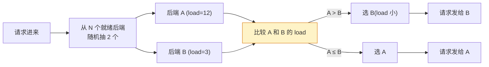
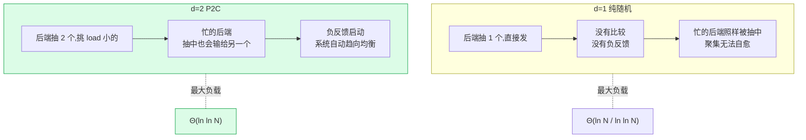
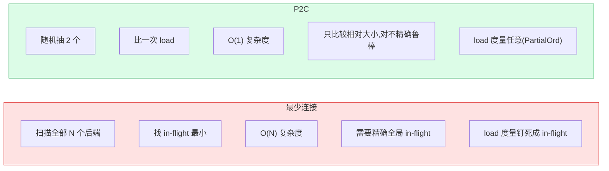
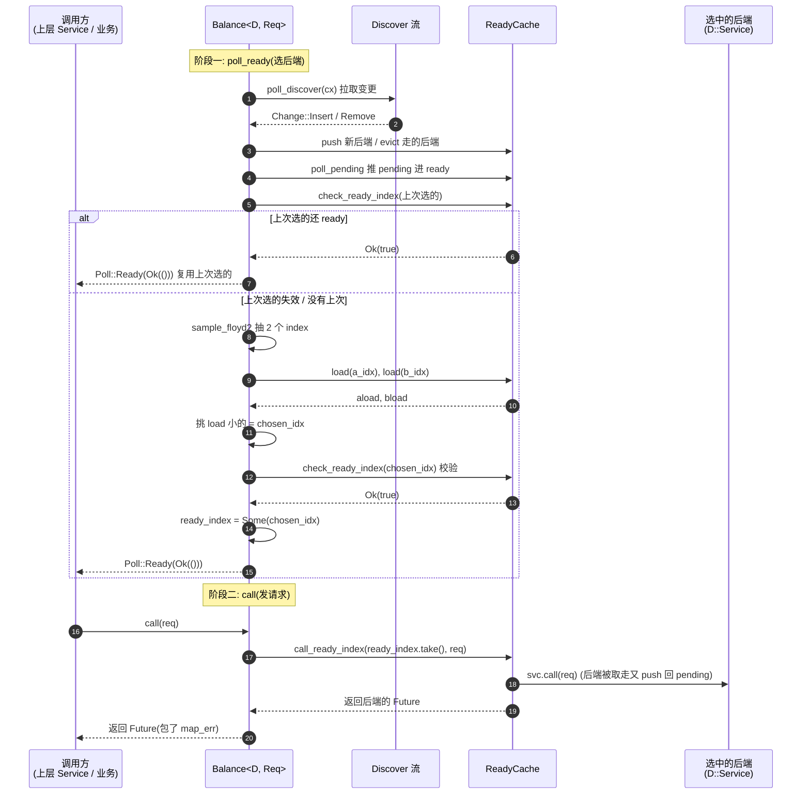
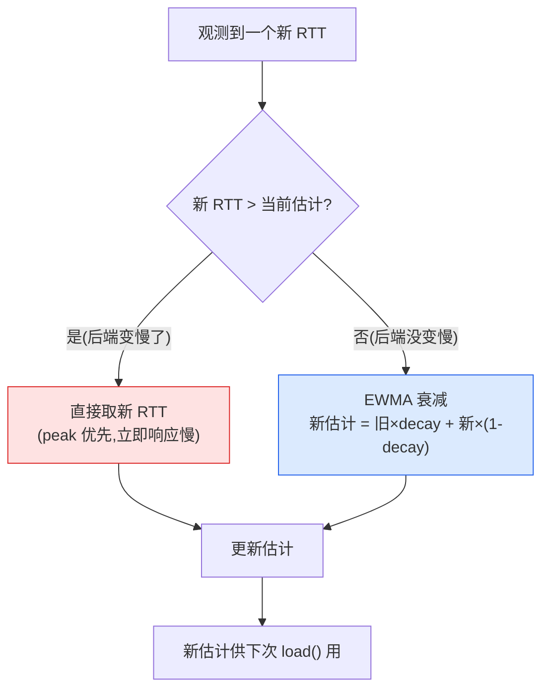

# 第 15 章 · Balance 与 P2C:负载均衡

> 第 5 篇 · 路由与负载均衡类中间件:多个后端选一个(招牌)

---

## 核心问题

上一章(P5-14)我们把"后端列表怎么动态更新"这件事钉死了:一个 `Discover` 是个 sealed 的 `TryStream<Item = Change<Insert/Remove>>`,它源源不断地吐出"谁来了、谁走了";`ReadyCache` 把这些后端服务缓存起来,驱动它们的 `poll_ready`,把"已就绪"的放到一个 ready 集合里,把"还没就绪"的放到 pending 集合里,靠 `AtomicWaker + AtomicBool` 自写的取消机制管理。所以到本章开篇,你手里已经有了一个"随时知道哪些后端能用"的数据结构。

可问题立刻就来了:**现在我有 10 个能用的后端,这次请求到底发给哪一个?**

这就是负载均衡(load balancing)要回答的问题。它听起来像是个简单的选择题——随便挑一个不就行了?可一旦你真在生产环境里跑过,就会发现"随便挑一个"能把系统挑到雪崩:

- **轮询(round-robin)轮流发**:10 个后端轮流,看起来公平。可如果其中 1 个后端机器慢(磁盘抖、GC 停、邻居吵),轮询照样往它身上塞,所有排到它的请求都卡住,延迟飙升。轮询不考虑负载,对慢节点一视同仁。
- **纯随机随便发**:10 个后端随机抽一个。在概率上长期看是均匀的,可短期内方差大——可能连续 5 个请求都打到同一个后端,把它打满,其他 9 个看着干着急。而且纯随机和轮询一样,完全不看后端忙不忙。
- **最少连接(least-connections)全局挑负载最小的**:每次发请求前,扫一遍所有后端,挑当前 in-flight 请求数最少的那个发。这看起来最精确,可代价是每次都要全局扫描(O(N)),而且"in-flight 最少"不一定真的"最闲"——一个 in-flight=1 但每个请求跑 1 秒的后端,比 in-flight=10 但每个请求跑 1ms 的后端慢得多。

读完本章你会明白:

1. 为什么 Tower 的默认负载均衡算法是 **Power-of-2-Choices(P2C,随机抽两个后端、挑负载小的那个发)**,而不是轮询、不是纯随机、也不是最少连接——P2C 在数学上有个惊人的性质:它只需要"两个里挑好的"这么弱的操作,就能让最大负载方差的收敛上界变成 `O(ln(ln(n)))`(双对数级),在长尾负载下显著降低排队延迟,逼近理论最优,而实现复杂度只是两次随机数生成 + 一次比较;
2. `load` 模块提供的三种负载度量——`PeakEwma`(用峰值指数加权移动平均估"未完成工作量")、`PendingRequests`(数当前活跃请求数)、`Constant`(常量)——各自凭什么有用,以及 P2C 怎么用它们比较两个后端的 load;
3. `Balance<D, Req>` 这个 Service 怎么把"`Discover` 流 + `Load` 度量 + P2C 抽样"三件东西拼成一个"看起来像一个后端"的负载均衡 Service——它对外是个普通的 `Service<Req>`,对内却在每次 `poll_ready` 时悄悄地"从就绪后端里随机抽两个、挑 load 小的、记下它的 index",到 `call` 时直接把请求发给那个 index;
4. `MakeBalance`/`MakeBalanceLayer` 怎么把这套东西做成可组合的 `Layer`、`PeakEwmaDiscover`/`PendingRequestsDiscover` 怎么在 Discover 流的源头就给每个后端套上 load 度量,以及为什么 Tower 自己搓了一个 `HasherRng`(不依赖 `rand` crate、不依赖 tokio)来产生随机数。

> **逃生阀(本章信息密度大)**:如果你只想要一句话——**P2C = 每次请求随机抽两个就绪后端,挑 load 小的那个发;load 由 `PeakEwma`(历史延迟 × 当前 in-flight,峰值衰减跟踪)或 `PendingRequests`(当前 in-flight 数)或 `Constant`(常量,退化为纯随机)提供**。P2C 比轮询/纯随机好,是因为"两个里挑好的"比"盲选"显著更接近最优负载均衡;比最少连接好,是因为它不需要全局扫描、不需要精确计数,只比较两个样本。如果你对 `poll_ready` 背压、`mem::replace` 惯用法不熟,先读 P1-02;对 `Discover`/`ReadyCache` 不熟,先读 P5-14;对 EWMA(指数加权移动平均)这个统计概念不熟,本章会用大白话讲透。
>
> **前置衔接**:本章紧接 P5-14(Discover 与 ready_cache)。P5-14 解决"后端列表怎么动态更新 + 怎么知道哪些就绪",本章解决"就绪的后端里挑哪个发请求"。本章假设你读过 P1-02(`poll_ready`/`call` 两步拆分、`mem::replace` 取走就绪服务惯用法——本章 `Balance` 的 `poll_ready` 会缓存"上次选中的 index"、`call` 会 `take` 走它,正是这个惯用法的实例)、P5-14(Discover/ReadyCache)。

---

## 一句话点破

> **负载均衡的本质是"在不精确的负载信息下,把流量尽量均匀地摊到一堆后端上"。P2C(随机抽两个挑负载小的)是这个问题的一个数学上极美的解:它不需要全局精确计数(那是最少连接的代价),不需要负载信息绝对准确(它只比较两个样本),却能以双对数级的最大负载方差收敛上界,逼近理论最优。Tower 的 `Balance` 把"Discover 提供后端流 + load 模块提供每个后端的 load 度量 + P2C 在就绪集合里抽两个挑小的"三件事拼成一个对外像普通 Service 的负载均衡器:它的 `poll_ready` 悄悄做选择(抽两个、比 load、记 index),它的 `call` 把请求发给那个 index——背压、组合、Future 语义,一个都不破坏。**

这是结论,不是理由。本章倒过来拆:先看负载均衡在数学上到底是个什么问题(以及轮询/纯随机/最少连接各自栽在哪),再看 P2C 凭什么"两个里挑好的"就能逼近最优(那个 `ln(ln(n))` 的双对数收敛到底从哪来),然后横向对照 Envoy 的负载均衡(轮询/最少请求/环哈希)怎么做(配置驱动 vs Tower 的代码驱动),之后逐层拆 Tower 的 `Balance` 源码(为什么 `poll_ready` 先校验上次选的、`sample_floyd2` 怎么用 Floyd 算法两次随机数抽两个不重复索引、PEWMA 的 cost 怎么算),最后落到技巧精解,把 P2C 抽样算法和 PEWMA 衰减两件最硬核的技巧拆透,讲清 P2C 为什么 sound(收敛、不饿死任何后端、不破坏背压)。

---

## 第一节:负载均衡到底是个什么数学问题

### 1.1 提出问题:把球尽量均匀地扔进 N 个桶

负载均衡在数学上有个非常干净的形式化:**N 个后端,把 M 个请求尽量均匀地分给它们,使得"最忙的那个后端"的负载尽可能低**。

把它画成"把 M 个球扔进 N 个桶":

```text
请求(球)       后端(桶)
  ●  ●          ┌──┐
  ●  ●  ●  ●    │  │ 桶 1: 3 个
  ●  ●  ●       │  │
  ────────      ├──┤
                │  │ 桶 2: 0 个  ← 闲死
                │  │
                ├──┤
                │  │ 桶 3: 1 个
                │  │
                ├──┤
                │  │ 桶 4: 0 个  ← 闲死
                └──┘
```

目标是让"桶里球数的最大值"尽量小,也就是让最忙的后端别太忙。这个目标有个专门的量——**最大负载(maximum load)**。所有负载均衡算法,都是在不同的约束(能不能精确计数?负载信息准不准?)下,逼近"最大负载最小化"。

### 1.2 朴素策略一:轮询(round-robin),最大负载 = 平均负载,但忽略慢节点

最直觉的策略是轮询:第 1 个请求给后端 1,第 2 个给后端 2,…… 第 N 个给后端 N,第 N+1 个又给后端 1。M 个请求均匀地转一圈,M/N 个一组。

```text
轮询(10 个后端,100 个请求):
  后端 1: 10 个     后端 6: 10 个
  后端 2: 10 个     后端 7: 10 个
  后端 3: 10 个     后端 8: 10 个
  后端 4: 10 个     后端 9: 10 个
  后端 5: 10 个     后端 10: 10 个
  最大负载 = 10,完美均匀。
```

轮询在"所有后端都一样快"的理想世界里是最优的——最大负载精确等于平均值。可现实世界后端不一样快:

- 后端 3 的机器磁盘抖了,每个请求处理时间是别人的 10 倍;
- 后端 7 的进程在跑大 GC,每过几秒卡 200ms;
- 后端 9 的邻居(同物理机的另一个虚拟机)在抢 CPU。

轮询不管这些,照样每圈给后端 3 一个请求。后端 3 因为慢,它的请求堆积起来(in-flight 越来越高),后续轮到它的请求都要排队,延迟飙到几百毫秒。其他 9 个后端闲得发慌,可轮询不会把"本来该给后端 3 的请求"挪给它们。

> **不这样会怎样**:轮询的根本缺陷是**它不看负载**。它假设"每个后端处理每个请求的代价相同",一旦这个假设破裂(后端异质、负载抖动),轮询就把流量机械地塞给慢节点。生产环境里后端几乎永远异质(磁盘/GC/邻居/网络抖动都会让某台慢),所以轮询在 RPC 负载均衡里基本不用——它只适合"后端完全同质且无状态"的极少数场景(比如一组无状态的内存缓存)。

### 1.3 朴素策略二:纯随机(random),最大负载 = 平均值 + 方差,长尾抖动

第二个策略是纯随机:每个请求独立、均匀地随机抽一个后端。长期看,每个后端分到的请求数趋近于 M/N(期望均匀),但短期内方差大。

数学上,把 M 个球独立均匀随机扔进 N 个桶,这是经典的"球箱问题(balls-into-bins)"。当 M = N 时(每个桶期望 1 个球),**最满的桶的球数期望是 `Θ(ln(N)/ln(ln(N)))`**——这是球箱问题的经典结论。也就是说,N=1000 时,纯随机下最满的桶平均有 `ln(1000)/ln(ln(1000)) ≈ 6.9/1.93 ≈ 3.6` 个球,而不是理想的 1 个。N 越大,这个"最满桶"越偏离平均值。

```text
纯随机(10 个后端,100 个请求,一次模拟):
  后端 1: 14 个 ●●  ← 比平均多 4 个
  后端 2: 8 个
  后端 3: 12 个 ●
  后端 4: 7 个
  后端 5: 11 个
  后端 6: 13 个 ●
  后端 7: 9 个
  后端 8: 10 个
  后端 9: 6 个    ← 比平均少 4 个
  后端 10: 10 个
  最大负载 = 14,偏离平均 10 达 40%。
```

这还不算最糟。纯随机的真正问题是**短期聚集**:在任意一小段时间窗里,可能连续好几个请求都随机到同一个后端,把它打满,其他后端看着。这种"短期聚集"在高 QPS 下尤其明显——一秒钟内 1 万个请求,纯随机的方差会让某几个后端在一秒内被连续击中,触发过载。

更致命的是,纯随机和轮询一样**不看负载**。慢节点照样被随机选中。

> **钉死这件事**:纯随机的最大负载期望是 `Θ(ln(N)/ln(ln(N)))`,比轮询的"精确平均"差,但比"瞎选"好不到哪去。它的核心缺陷有两个:① 短期方差聚集(高 QPS 下连续击中同一后端);② 不看负载(慢节点一视同仁)。Tower 的 P2C 正是站在纯随机的肩膀上改进——它也用随机,但"随机抽两个、挑负载小的",这一下就把方差压下去了。

### 1.4 朴素策略三:最少连接(least-connections),精确但全局扫描 + 只数 in-flight

第三个策略是最少连接:每次发请求前,扫一遍所有后端,挑当前 in-flight 请求数最小的那个发。

```text
最少连接(10 个后端,当前 in-flight):
  后端 1: 5 个   后端 6: 7 个
  后端 2: 3 个 ← 最少,发给它
  后端 3: 12 个  后端 8: 4 个
  ...
  每次发请求,扫描全部,选最小的。
```

最少连接精确地优化了"最大 in-flight",理论上是这三种朴素策略里最接近最优的。可它有三个问题:

**问题一:每次都要全局扫描,O(N)**。N 个后端,每次发请求都要遍历一遍找最小。N 小(几十个)无所谓,N 大(几百上千个后端,大规模微服务)时,这个扫描本身变成开销。更糟的是,这个扫描要在负载均衡的关键路径上(发请求前),N 越大延迟越明显。

**问题二:in-flight 不等于真实负载**。in-flight(在飞请求数)是"当前有几个请求没回",可它不区分"请求快但多"和"请求慢但少"。后端 A 每个请求 1ms,in-flight=100,但实际它每秒能处理 10 万个请求,一点都不忙;后端 B 每个请求 1 秒,in-flight=1,可它每秒只能处理 1 个请求,已经接近饱和。最少连接会把请求发给 B(因为 in-flight=1 < 100),结果 B 被打爆。in-flight 必须和"每个请求的延迟"一起看,才有意义——这正是 Tower 的 `PeakEwma` 要做的(它把 in-flight × 平均延迟作为 cost)。

**问题三:需要全局精确的 in-flight 计数**。最少连接要求"我知道每个后端当前 in-flight 是多少"。这要求每个请求的 in-flight 计数是实时的、精确的。可如果负载均衡器本身是分布式的(多个客户端实例各自做负载均衡),每个实例只看到自己的 in-flight,看不到全局。这种"分布式视角下的 in-flight"是有偏的,最少连接的精确性就打了折扣。

> **不这样会怎样**:最少连接为了"精确",付出了 O(N) 扫描的代价。而 P2C 给出了一个反直觉的答案:**你不需要扫描全部,只需要随机抽两个,挑小的那个,就能达到几乎一样好的效果**。这是负载均衡理论里一个深刻的结果——下一节就拆它。

### 1.5 把三种朴素策略的缺陷收束成一张表

把三种朴素策略的最大负载、复杂度、看负载与否,收束成一张表,这是后面 P2C 出场的铺垫:

| 策略 | 每次决策做什么 | 复杂度 | 看负载? | 最大负载(N 个桶 M 个球) | 核心缺陷 |
|------|--------------|--------|---------|------------------------|---------|
| **轮询** | 按顺序轮流发 | O(1) | 否 | 平均 M/N(同质后端最优) | 不看负载,慢节点照塞 |
| **纯随机** | 均匀随机抽一个 | O(1) | 否 | `Θ(M/N + √(M ln N / N))`(球箱方差) | 短期聚集,不看负载 |
| **最少连接** | 扫描全部选 in-flight 最小 | **O(N)** | 是(只 in-flight) | 接近最优(同质后端) | 全局扫描 + in-flight ≠ 真实负载 |
| **P2C(本章主角)** | 随机抽两个挑负载小 | **O(1)** | 是(任意 load 度量) | **平均 + `O(ln(ln(N)))`** | 需要 load 度量,但只比较两个样本 |

注意最后一行 P2C 的"最大负载"那一格——它写的是"平均 + `O(ln(ln(N)))`"。这个 `ln(ln(N))`(双对数级)是负载均衡理论里最漂亮的结果之一:**P2C 用 O(1) 的复杂度,达到了"几乎和最少连接一样好"的最大负载**。下一节就拆这个结果从哪来。

> **钉死这件事**:负载均衡在数学上是个"在不精确负载信息下逼近最大负载最小化"的问题。轮询和纯随机不看负载,在异质后端下栽;最少连接看负载但全局扫描且只数 in-flight。P2C 给出了第三条路:O(1) 复杂度、看任意 load 度量、最大负载方差收敛到双对数级。这就是 Tower 选 P2C 的根本理由。

---

## 第二节:P2C 凭什么"两个里挑好的"就够

这是本章的核心理论。P2C 全称 **Power of Two Random Choices**(两个随机选择的力量),也叫 **Power of 2 Choices**、**d=2 的 balls-into-bins**。它是个数学上被严格证明过的结果,1999 年由 Azar、Broder、Karlin、Upfal 在一篇 STOC 论文里提出(论文链接在 Tower 源码注释里就给了:`http://www.eecs.harvard.edu/~michaelm/postscripts/handbook2001.pdf`)。

### 2.1 P2C 的算法朴素到不像话

P2C 的算法描述,一句话:

> **每次要发请求时,从所有就绪的后端里随机抽两个,挑负载小的那个发。**

就这一句。没有全局扫描,没有排序,没有精确计数。每次决策只做两件事:① 抽两个;② 比一下。



看起来和纯随机差不多——都是随机嘛。可这个"挑负载小的"的微小动作,在数学上引发了质变。

### 2.2 直觉:为什么"两个里挑好的"比"盲选"好得多

先给个直觉。假设有 N 个后端,你想避开最忙的那 1% 的后端(它们是长尾延迟的来源)。

**纯随机**:你抽一个后端,它正好是那最忙 1% 的概率 = 1% = 0.01。也就是说,1% 的请求会撞上慢后端。N=100 时,几乎每次请求都有 1% 概率慢。

**P2C**:你抽两个后端,它们**两个都**是那最忙 1% 的概率 = 0.01 × 0.01 = 0.0001 = 0.01%。也就是说,P2C 下只有万分之一的请求会撞上"两个都慢"的情形。P2C 把"撞上慢后端"的概率从 1% 压到了 0.01%——**下降了两个数量级**。

这就是 P2C 的核心威力:**它用"两个独立样本"的乘积概率,把"撞上坏样本"的概率指数级压缩**。这个直觉可以推广:抽 d 个,撞上最忙 1% 的概率是 `0.01^d`,d 越大压缩越狠。可 d=2 已经足够(d=3 收益边际递减,而且要多抽一个、多比一次)。

> **钉死这件事(P2C 的直觉本质)**:P2C 用"两个独立样本都坏的概率是各自概率的乘积"这一性质,把"撞上慢后端"的概率指数级压缩。纯随机撞上最忙 1% 的概率是 0.01,P2C 是 0.0001。这就是为什么"两个里挑好的"这么朴素的动作,能戏剧性地降低尾延迟。

### 2.3 数学:那个 `ln(ln(N))` 的双对数收敛上界从哪来

直觉有了,现在上数学。Azar 等人 1999 年证明了下面这个定理(简化表述):

> **把 M 个球依次扔进 N 个桶,每个球随机抽 d 个桶、放进这 d 个桶里球最少的那个。当 d=1(纯随机)时,最满的桶期望有 `Θ(ln N / ln ln N)` 个球;当 d ≥ 2 时,最满的桶期望只有 `Θ(ln ln N / ln d)` 个球。**

注意 d=1 和 d=2 之间那道天堑:d=1 是 `ln N / ln ln N`(对数级),d=2 是 `ln ln N`(双对数级)。N=1000 时,`ln N / ln ln N ≈ 6.9/1.93 ≈ 3.6`,而 `ln ln N ≈ 1.93`。N 越大差距越悬殊:N=10^6 时,d=1 的最满桶期望约 `13.8/2.6 ≈ 5.3` 个球,d=2 的最满桶期望约 `2.6` 个球。

把这个定理翻译成负载均衡的语言:

- **纯随机(d=1)**:最大负载(最忙后端的请求数)是对数级 `Θ(ln N / ln ln N)`,N 个后端时最忙的会比平均值多这么多。这是"短期聚集"的数学根。
- **P2C(d=2)**:最大负载是双对数级 `Θ(ln ln N)`,N 个后端时最忙的只比平均值多 `ln ln N` 量级。这个量级增长极慢——N 从 100 到 10^6,`ln ln N` 只从 1.5 涨到 2.6。

**关键洞察:d 从 1 跳到 2,最大负载从对数级骤降到双对数级——这是一道相变(phase transition)**。d=2 之后再加(d=3, d=4)收益边际递减,不值得多抽。所以工程实践里 d=2 就是甜点。

为什么 d=2 会有这么戏剧性的效果?核心机制是**自均衡(self-balancing)**:当某个桶因为偶然多收了几个球而变忙时,它在 P2C 的"两个里挑小的"规则下,更不容易被后续选中(因为后续抽到它时,它大概率比另一个抽到的桶忙)。这种"忙了就更不容易被选中"的负反馈,让系统自动趋向均衡。d=1 没有这个负反馈(它根本不比较),所以聚集无法自愈;d=2 引入了比较,负反馈就启动了。



这就是 Tower 的 P2C 模块文档(`tower/src/balance/p2c/mod.rs#L8-L15`)里那句引用的来历:

> The algorithm randomly picks two services from the set of ready endpoints and selects the least loaded of the two. By repeatedly using this strategy, we can expect a manageable upper bound on the maximum load of any server.
>
> The maximum load variance between any two servers is bound by `ln(ln(n))` where `n` is the number of servers in the cluster.

这段引用来自 Finagle(Twitter 的 Scala RPC 框架)的文档。Tower 的 P2C 就是从 Finagle 学来的(L36-42 的注释说"This is derived from Finagle")。P2C 在工业界的渊源很深——Finagle、Twitter 的 RPC、Google 的若干内部系统都用 P2C 变种。

> **钉死这件事(P2C 的数学本质)**:d=2 是负载均衡的相变点。d=1(纯随机)最大负载是对数级 `Θ(ln N / ln ln N)`,d=2(P2C)骤降到双对数级 `Θ(ln ln N)`。这个跳变来自"比较引入负反馈"——忙的后端在比较中更容易输,系统自动趋向均衡。Tower 选 d=2 是站在工业界共识和数学最优的交叉点上。

### 2.4 P2C 为什么比最少连接好:O(1) vs O(N),且不需要精确计数

上一节那三种朴素策略里,最少连接是最接近最优的(它精确优化最大 in-flight)。那 P2C 比最少连接好在哪?

**好在两点**:

**第一,O(1) vs O(N)**。P2C 每次决策只抽两个、比一次,复杂度 O(1),和 N 无关。最少连接每次扫全部,O(N)。N=1000 时,P2C 是 2 次随机 + 1 次比较,最少连接是 1000 次比较。在大规模微服务(N 上千)场景,P2C 的延迟优势明显——负载均衡决策不在关键路径上拖后腿。

**第二,不需要全局精确计数**。最少连接要求"我知道每个后端当前 in-flight 是多少",且这个 in-flight 必须是精确的、全局的。可分布式负载均衡里,多个客户端实例各自做决策,每个实例只看到自己发出的请求的 in-flight,看不到全局。这种"局部 in-flight"对最少连接是有偏的(它以为某后端 in-flight=0,其实全局已经 50 了)。P2C 不需要精确——它只比较两个样本的相对大小,谁的 load 略大略小并不重要,只要"两个里挑小的"这个相对关系大致对,负反馈就能起作用。这种"对不精确信息的鲁棒性"是 P2C 的工程优势。

**第三,P2C 的 load 度量可以是任意的**。最少连接的 load 度量被钉死成"in-flight 请求数"。P2C 的 load 可以是任意 `Load::Metric: PartialOrd`——可以是 in-flight 数(`PendingRequests`),可以是历史延迟 × in-flight(`PeakEwma`),可以是任意自定义度量。这个灵活性让 P2C 能用更贴近"真实负载"的度量(in-flight × 延迟 比 单纯 in-flight 更准)。



> **不这样会怎样**:如果你坚持用最少连接,在大规模微服务里你会撞上"扫描开销 + 局部 in-flight 有偏"两堵墙。P2C 用"两个里挑小的"绕开了这两堵墙,代价是多抽一个样本 + 多一次比较,而换来的最大负载几乎一样好。这是负载均衡理论给的"免费的午餐"——Tower 没理由不拿。

### 2.5 P2C 的代价:需要 load 度量

P2C 不是没代价。它最大的代价是:**它需要一个 load 度量来比较两个后端**。

- 如果 load 度量很准(比如 `PeakEwma` 用历史延迟 × 当前 in-flight),P2C 能逼近最优负载均衡;
- 如果 load 度量很糙(比如 `Constant` 永远返回同一个值),P2C 退化成什么?——退化成"抽两个,因为 load 相等,按比较的 tie-breaking 规则选一个",后面会讲这在 Tower 里实际退化成"均匀随机抽一个"(纯随机的效果);
- 如果 load 度量失真(比如 `PeakEwma` 在冷启动时没有数据,用默认值),P2C 的决策质量下降,但不会比纯随机更差。

所以 P2C 的威力,一半在算法(两个里挑小的),一半在 load 度量准不准。下一节就拆 Tower 的 `load` 模块怎么提供这三种度量。这也是为什么本章把 `load` 模块和 P2C 放在一起讲——P2C 离了 load 度量就是个空壳。

> **钉死这件事**:P2C 是"算法 + 度量"的组合。算法是"两个里挑小的"(O(1),数学上双对数收敛),度量由 `load` 模块提供(`PeakEwma`/`PendingRequests`/`Constant`)。算法决定"怎么挑",度量决定"按什么挑"。Tower 把这两件事解耦——P2C 算法不绑死任何度量,任何实现了 `Load` trait(返回一个 `PartialOrd` 的 `Metric`)的服务都能进 P2C。

---

## 第三节:Envoy 怎么做负载均衡,以及为什么 Tower 选了 P2C

讲完 P2C 的数学,横向对照一下 Envoy——这是和 Tower 最像的系统(都是 Rust/C++ 写的、都在请求处理路径上插中间件、都做服务网格)。看 Envoy 的负载均衡选了什么、为什么和 Tower 不一样,能加深对 P2C 选型的理解。

### 3.1 Envoy 的负载均衡算法清单

Envoy 的负载均衡器在 `source/extensions/load_balancing_policies/`(注意:Envoy 1.39 已经把老的 `load_balancer_impl.cc` 删了,全部迁到 `load_balancing_policies/` 目录,每个算法一个子目录,详见《Envoy》[[envoy-source-facts]])。Envoy 内置的负载均衡算法有:

- **ROUND_ROBIN(轮询)**:最简单的轮询。
- **LEAST_REQUEST(最少请求)**:Envoy 版的最少连接,但有个聪明的优化——它也是 P2C!Envoy 的 LEAST_REQUEST 默认从所有后端里随机抽 2 个,挑 in-flight 少的那个(和 Tower 的 P2C 一模一样)。只有当配置 `choice_count` 大于 2 时才抽更多。
- **RANDOM(随机)**:纯随机。
- **RING_HASH(环哈希)**:一致性哈希,把后端映射到一个哈希环上,请求按某个 key(比如 session id)的哈希找环上最近的那个后端。用于"同一个会话固定发给同一个后端"(粘性会话)。
- **MAGLEV**:Google Maglev 一致性哈希,环哈希的更均匀变种。
- **SUBSET(子集)**:在子集里再套一个上述算法。
- **CLUSTER_PROVIDED**:用上游集群自己提供的算法。

### 3.2 关键发现:Envoy 的 LEAST_REQUEST 也是 P2C

这是最值得注意的一点:**Envoy 的"最少请求"负载均衡,默认实现就是 P2C**——随机抽 2 个,挑 in-flight 少的。Envoy 文档明确说,`choice_count` 默认是 2,工业实践里几乎没人改它(改成 3 收益边际递减,且浪费)。

也就是说,**Tower 的 P2C 和 Envoy 的 LEAST_REQUEST 本质是同一个算法**,只是名字不同(Tower 叫 Power-of-2-Choices,Envoy 叫 Least Request with choice_count=2)。这不是巧合,而是工业界共识——P2C 在"不需要粘性会话"的通用负载均衡场景里,是事实标准。

### 3.3 Envoy 和 Tower 的差异:配置驱动 vs 代码驱动

Envoy 和 Tower 在负载均衡上的主要差异,不在于算法(都是 P2C),而在于**怎么定制**:

**Envoy 是配置驱动**。你在 xDS 配置里写 `load_balancing_policy: { name: least_request, typed_config: { choice_count: 2 } }`,Envoy 运行期解析这个配置、实例化对应的 LB policy、热加载生效。运维可以随时改 `choice_count`、换算法(从 LEAST_REQUEST 切到 RING_HASH),不用重启。这适合服务网格场景(运维动态调参)。

**Tower 是代码驱动**。你在 Rust 代码里 `Balance::new(discover)`,P2C 就是 P2C,`choice_count` 永远是 2(写死在源码里),想换算法(比如换成一致性哈希)得自己写一个新的 `Service`。不能运行期热加载,改算法要重新编译。这适合"把负载均衡嵌进自己的 Rust 应用"的场景(开发者编译期定死)。

> **对照《Envoy》**:Envoy 的负载均衡在 `source/extensions/load_balancing_policies/`,12 种 policy,配置驱动、运行期生效。Envoy 的 LEAST_REQUEST 默认就是 P2C(choice_count=2),和 Tower 的 P2C 同源。差异在定制方式——Envoy 配置驱动(运维动态),Tower 代码驱动(编译期定死)。Envoy 的 LB 细节详见 [[envoy-source-facts]],本书一句带过,篇幅留 Tower。

### 3.4 为什么 Tower 没有 RING_HASH / MAGLEV

注意 Tower 的 `balance` 模块**只有 P2C**(`tower/src/balance/` 下只有 `p2c/` 一个子目录),没有一致性哈希、没有 Maglev。为什么?

因为 Tower 的定位是"通用中间件库",而一致性哈希是"为了粘性会话"的特定场景需求——它需要"按请求的某个 key(比如 user_id)路由到固定后端"。这件事在 Tower 里,是用 **Steer + Filter**(P5-16)做的:Steer 按请求内容路由到一组服务之一。如果你真要一致性哈希,可以自己写一个 `Service`,用请求 key 的哈希选后端,然后接到 Steer 里。Tower 不把这个做进默认库,因为它太场景特定(粘性会话不是所有应用都需要),而 P2C 是通用默认(几乎所有应用都受益)。

而 Envoy 作为服务网格,必须把粘性会话做进默认 LB policy 清单(因为服务网格要服务各种业务,有些业务需要粘性),所以它内置了 RING_HASH/MAGLEV。这是两者定位差异——Tower 是"积木库",Envoy 是"成品网格"。

> **钉死这件事**:Tower 的 `balance` 模块只有 P2C,没有一致性哈希/Maglev。一致性哈希(粘性会话)在 Tower 里用 Steer(P5-16)实现。Envoy 内置全部 LB policy(因为它要服务各种业务),Tower 只内置通用默认 P2C(因为它是积木库,特定需求自己拼)。这是两者定位差异,不是 Tower 功能不全。

---

## 第四节:Tower 的 `Balance` 源码逐层拆

理论讲完了,现在进源码。这一节把 `Balance<D, Req>` 这个 Service 拆透——它怎么用 `Discover`(承 P5-14)、`ReadyCache`(承 P5-14)、`Load`(本章 load 模块)、`sample_floyd2`(本章 util/rng)拼出一个负载均衡 Service。

### 4.1 `Balance` 的结构:Discover + ReadyCache + rng + ready_index

`Balance` 的定义在 `tower/src/balance/p2c/service.rs#L29-L42`:

```rust
// tower/src/balance/p2c/service.rs#L29-L42
pub struct Balance<D, Req>
where
    D: Discover,
    D::Key: Hash,
{
    discover: D,

    services: ReadyCache<D::Key, D::Service, Req>,
    ready_index: Option<usize>,

    rng: Box<dyn Rng + Send + Sync>,

    _req: PhantomData<Req>,
}
```

四个字段:

- `discover: D`——服务发现的输入流(承 P5-14 的 Discover),它源源不断地吐 `Change::Insert/Remove`;
- `services: ReadyCache<...>`——后端服务的缓存(承 P5-14 的 ReadyCache),内部维护 pending 集合和 ready 集合;
- `ready_index: Option<usize>`——**上次 `poll_ready` 选中的后端在 ready 集合里的 index**。这个字段是 `Balance` 的精髓之一,后面专门讲;
- `rng: Box<dyn Rng + Send + Sync>`——随机数生成器,P2C 抽样用。

注意几个 trait bound:

- `D: Discover`——D 必须是服务发现流;
- `D::Key: Hash`——后端的 key 必须能哈希(ReadyCache 用 indexmap 按 key 索引);
- 后面 impl Service 时还有 `D::Service: Service<Req> + Load`——**后端服务必须同时实现 Service(能处理请求)和 Load(能给出负载度量)**。这一条是 P2C 比较两个后端 load 的前提。

把 `Balance` 的结构画成图:

```text
┌─────────────────────────────────────────────────────────┐
│  Balance<D, Req>                                        │
│                                                         │
│  discover: D ──poll_discover──▶ Change::Insert/Remove  │
│       │                              │                  │
│       ▼                              ▼                  │
│  ┌─────────────────────────────────────────────────┐    │
│  │ services: ReadyCache                            │    │
│  │  ┌──────────────┐    ┌────────────────────┐     │    │
│  │  │ pending 集合 │    │ ready 集合         │     │    │
│  │  │ (poll_ready  │───▶│ (已就绪, P2C 从这  │     │    │
│  │  │  还没好)     │    │  抽两个挑小的)    │     │    │
│  │  └──────────────┘    └────────────────────┘     │    │
│  │      FuturesUnordered   IndexMap<K,(S,Cancel)>  │    │
│  └─────────────────────────────────────────────────┘    │
│                                                         │
│  ready_index: Option<usize>  ← 上次选中的 index(缓存) │
│  rng: Box<dyn Rng>            ← P2C 抽样用              │
└─────────────────────────────────────────────────────────┘
```

`Balance` 对外是个 `Service<Req>`(下面 impl),对内它把 Discover + ReadyCache + rng + ready_index 四件东西捏在一起。

### 4.2 `poll_ready`:先消化 Discover,再推 pending 进 ready,再 P2C 选一个

`Balance` 的 `poll_ready` 是它的核心,在 `tower/src/balance/p2c/service.rs#L209-L251`。这是个有状态的 `poll_ready`(承 P1-02 的"poll_ready 预留资源"语义——这里预留的"资源"是"一个选定的就绪后端")。逐段拆:

```rust
// tower/src/balance/p2c/service.rs#L209-L251
fn poll_ready(&mut self, cx: &mut Context<'_>) -> Poll<Result<(), Self::Error>> {
    // `ready_index` may have already been set by a prior invocation. These
    // updates cannot disturb the order of existing ready services.
    let _ = self.update_pending_from_discover(cx)?;
    self.promote_pending_to_ready(cx);

    loop {
        // If a service has already been selected, ensure that it is ready.
        if let Some(index) = self.ready_index.take() {
            match self.services.check_ready_index(cx, index) {
                Ok(true) => {
                    self.ready_index = Some(index);
                    return Poll::Ready(Ok(()));
                }
                Ok(false) => {
                    trace!("ready service became unavailable");
                }
                Err(Failed(_, error)) => {
                    debug!(%error, "endpoint failed");
                }
            }
        }

        // Select a new service by comparing two at random and using the
        // lesser-loaded service.
        self.ready_index = self.p2c_ready_index();
        if self.ready_index.is_none() {
            debug_assert_eq!(self.services.ready_len(), 0);
            return Poll::Pending;
        }
    }
}
```

这个 `poll_ready` 干了四件事,按顺序:

**第一件:消化 Discover 的更新**(`L212: update_pending_from_discover`)。从 Discover 流里拉取所有新到的 `Change`(Insert 加后端、Remove 删后端),把后端加进 ReadyCache 或从 ReadyCache 里 evict。这个函数在 `tower/src/balance/p2c/service.rs#L106-L129`:

```rust
// tower/src/balance/p2c/service.rs#L106-L129
fn update_pending_from_discover(
    &mut self,
    cx: &mut Context<'_>,
) -> Poll<Option<Result<(), error::Discover>>> {
    debug!("updating from discover");
    loop {
        match ready!(Pin::new(&mut self.discover).poll_discover(cx))
            .transpose()
            .map_err(|e| error::Discover(e.into()))?
        {
            None => return Poll::Ready(None),
            Some(Change::Remove(key)) => {
                trace!("remove");
                self.services.evict(&key);
            }
            Some(Change::Insert(key, svc)) => {
                trace!("insert");
                self.services.push(key, svc);
            }
        }
    }
}
```

它在一个 loop 里反复 `poll_discover`,直到 Discover 返回 Pending(没有更多变更了)。每个 `Change::Insert` 把新后端 `push` 进 ReadyCache(进 pending 集合,等 `promote_pending_to_ready` 推它进 ready);每个 `Change::Remove` 把后端 `evict` 掉。这就是"动态后端列表"的消化——后端来来去去,`Balance` 实时跟进。这一段完全承 P5-14,不重复。

**第二件:把 pending 推进 ready**(`L213: promote_pending_to_ready`)。调用 ReadyCache 的 `poll_pending`,驱动所有 pending 后端的 `poll_ready`,把就绪的挪到 ready 集合。在 `tower/src/balance/p2c/service.rs#L131-L156`:

```rust
// tower/src/balance/p2c/service.rs#L131-L156
fn promote_pending_to_ready(&mut self, cx: &mut Context<'_>) {
    loop {
        match self.services.poll_pending(cx) {
            Poll::Ready(Ok(())) => {
                debug_assert_eq!(self.services.pending_len(), 0);
                break;
            }
            Poll::Pending => {
                debug_assert!(self.services.pending_len() > 0);
                break;
            }
            Poll::Ready(Err(error)) => {
                debug!(%error, "dropping failed endpoint");
            }
        }
    }
}
```

也是 loop 直到 ReadyCache 没有更多 pending 能 ready(或者 pending 都还 Poll::Pending)。注意第三种情况 `Poll::Ready(Err(error))`——某个 pending 后端在 poll_ready 时返回了错误(承 P1-02 的"`poll_ready` 返回 `Ready(Err)` 表示服务死透"),这个后端被丢弃,继续处理其他 pending。这是"个别后端挂了不影响整体"的优雅降级。

**第三件:校验上次选的后端是否还 ready**(`L222-L239`)。这是 `Balance` 最巧妙的地方。`ready_index` 缓存了上次 `poll_ready` 选中的后端的 index。这次 `poll_ready` 进来,先 `take` 走这个 index,调 `check_ready_index(cx, index)` 重新校验那个后端**现在**还 ready 不:

```rust
// tower/src/balance/p2c/service.rs#L222-L239
if let Some(index) = self.ready_index.take() {
    match self.services.check_ready_index(cx, index) {
        Ok(true) => {
            // The service remains ready.
            self.ready_index = Some(index);
            return Poll::Ready(Ok(()));
        }
        Ok(false) => {
            // The service is no longer ready. Try to find a new one.
            trace!("ready service became unavailable");
        }
        Err(Failed(_, error)) => {
            // The ready endpoint failed, so log the error and try
            // to find a new one.
            debug!(%error, "endpoint failed");
        }
    }
}
```

为什么要重新校验?因为从上次 `poll_ready` 返回 Ready 到现在,这个后端的 ready 状态可能已经变了——比如它的 keepalive 探测发现连接断了(`poll_ready` 现在返回 Pending)、或者它直接报错挂了(`poll_ready` 返回 `Ready(Err)`)。注释 L217-L221 说得很清楚:"This ensures that the underlying service is ready immediately before a request is dispatched to it"。如果校验通过(还 ready),直接复用上次选的,返回 Ready——这次不用重新 P2C 抽样了,省了一次抽样开销。

> **钉死这件事(`Balance` 的 ready_index 缓存)**:`Balance` 的 `poll_ready` 不是每次都重新 P2C 抽样,而是先校验"上次选的后端还 ready 不"。如果还 ready,复用;如果不 ready 了(变成 Pending 或挂了),才重新 P2C 抽一个。这个优化承 P1-02 的"`poll_ready` 返回 Ready 后,call 之前重复 poll 必须继续返回 Ready"契约——`Balance` 把"上次选的后端"作为一个跨 `poll_ready` 调用的缓存,只在它失效时才重选。这是 `mem::replace` 取走就绪服务惯用法的负载均衡版变种。

**第四件:如果上次选的失效了(或没有上次),P2C 重新选一个**(`L243: p2c_ready_index`)。这是 P2C 抽样的真正入口:

```rust
// tower/src/balance/p2c/service.rs#L241-L250
// Select a new service by comparing two at random and using the
// lesser-loaded service.
self.ready_index = self.p2c_ready_index();
if self.ready_index.is_none() {
    debug_assert_eq!(self.services.ready_len(), 0);
    // We have previously registered interest in updates from
    // discover and pending services.
    return Poll::Pending;
}
```

`p2c_ready_index` 返回 `None` 表示"ready 集合空了,没有后端可选",这时返回 `Poll::Pending`(等 Discover 来新后端、或 pending 后端变 ready 时 Waker 唤醒)。返回 `Some(index)` 表示选好了一个,loop 回去重新校验它(走第三件的 `check_ready_index`)——不过实际上 `p2c_ready_index` 选出来的就是刚 ready 的,几乎一定通过校验,直接返回 Ready。

### 4.3 `p2c_ready_index`:抽两个、比 load、选小的

P2C 抽样的本体在 `tower/src/balance/p2c/service.rs#L159-L184`:

```rust
// tower/src/balance/p2c/service.rs#L158-L184
/// Performs P2C on inner services to find a suitable endpoint.
fn p2c_ready_index(&mut self) -> Option<usize> {
    match self.services.ready_len() {
        0 => None,
        1 => Some(0),
        len => {
            // Get two distinct random indexes (in a random order) and
            // compare the loads of the service at each index.
            let [aidx, bidx] = sample_floyd2(&mut self.rng, len as u64);
            debug_assert_ne!(aidx, bidx, "random indices must be distinct");

            let aload = self.ready_index_load(aidx as usize);
            let bload = self.ready_index_load(bidx as usize);
            let chosen = if aload <= bload { aidx } else { bidx };

            trace!(
                a.index = aidx,
                a.load = ?aload,
                b.index = bidx,
                b.load = ?bload,
                chosen = if chosen == aidx { "a" } else { "b" },
                "p2c",
            );
            Some(chosen as usize)
        }
    }
}
```

逐段:

**边界情况**(L160-L162):ready 集合为空(`ready_len() == 0`)返回 None(没得选);只有一个后端(`ready_len() == 1`)直接返回 index 0(不用抽)。

**正常情况**(L163-L183):有 2 个以上就绪后端时,调 `sample_floyd2(rng, len)` 抽两个不重复的 index `[aidx, bidx]`,然后:

```rust
let aload = self.ready_index_load(aidx as usize);   // 后端 a 的 load
let bload = self.ready_index_load(bidx as usize);   // 后端 b 的 load
let chosen = if aload <= bload { aidx } else { bidx };  // ★ 挑 load 小的
```

`ready_index_load`(`tower/src/balance/p2c/service.rs#L187-L190`)就是从 ReadyCache 按 index 取出后端,调它的 `load()`:

```rust
// tower/src/balance/p2c/service.rs#L187-L190
fn ready_index_load(&self, index: usize) -> <D::Service as Load>::Metric {
    let (_, svc) = self.services.get_ready_index(index).expect("invalid index");
    svc.load()
}
```

注意 `load()` 返回的是 `<D::Service as Load>::Metric`——一个 `PartialOrd` 的类型。比较用 `aload <= bload`(注意是 `<=` 不是 `<`)。**这个 `<=` 决定了 tie-breaking 规则**:如果两个 load 相等(比如 `Constant` 度量永远相等),选 `aidx`。后面讲 `Constant` 时会回到这一点。

### 4.4 `sample_floyd2`:Floyd 算法,2 次随机数抽两个不重复索引

P2C 的"抽两个不重复的 index"这一步,用的是 **Floyd 组合算法(Floyd's combination algorithm)**固定 amount=2 的实现,在 `tower/src/util/rng.rs#L112-L126`:

```rust
// tower/src/util/rng.rs#L112-L126
/// It's an implementation of Floyd's combination algorithm with amount fixed at 2.
/// This uses no allocated memory and finishes in constant time (only 2 random calls).
#[cfg(feature = "balance")]
pub(crate) fn sample_floyd2<R: Rng>(rng: &mut R, length: u64) -> [u64; 2] {
    debug_assert!(2 <= length);
    let aidx = rng.next_range(0..length - 1);
    let bidx = rng.next_range(0..length);
    let aidx = if aidx == bidx { length - 1 } else { aidx };
    [aidx, bidx]
}
```

这个函数干的事:**从 `[0, length)` 这个范围里,均匀随机抽两个不重复的 index,返回 `[aidx, bidx]`**。它只用 2 次随机数调用,无内存分配,常数时间(注释 L114-116 明说)。

算法拆解:

1. `aidx = rng.next_range(0..length - 1)`:从 `[0, length-1)` 抽一个(注意不含 `length-1`);
2. `bidx = rng.next_range(0..length)`:从 `[0, length)` 抽一个(含全部);
3. 如果 `aidx == bidx`(两个随机数撞了),把 `aidx` 改成 `length - 1`(那个原本没出现在 aidx 取值范围里的最大 index)。

这个算法的正确性需要点心思看。它本质上是 Floyd 组合算法的 amount=2 特化版。Floyd 算法递归地构造"从 N 个里选 k 个的组合",amount=2 时退化成上面这个两步法。关键性质:**返回的 `[aidx, bidx]` 是一个均匀随机的 2 元素子集**——也就是说,ready 集合里任意两个 index 被抽中的概率相等。`aidx` 和 `bidx` 的顺序是无所谓的(它们是"两个被选中的元素",不是"a 是第一个 b 是第二个")。

为什么这个算法能保证均匀?直观上:`aidx` 取 `[0, length-1)`,`bidx` 取 `[0, length)`。如果 `aidx != bidx`,那 `[aidx, bidx]` 就是一对不同的 index;如果 `aidx == bidx`,说明"两个随机数撞了",这时把 `aidx` 改成 `length-1`,相当于"另一个名额固定给 `length-1`"。经过这个调整,每个 2 元素子集被抽中的概率严格相等。Floyd 算法的证明见算法教科书,这里不展开,关键是 Tower 的 `sample_floyd2` 的 test(L155-170)用 quickcheck 验证了"任意 length 下返回的两个 index 都不同、都在范围内"这个性质。

> **钉死这件事(`sample_floyd2`)**:Tower 的 P2C 抽样用 Floyd 组合算法的 amount=2 特化,只用 2 次随机数调用、无内存分配、常数时间。它返回一个均匀随机的 2 元素子集——ready 集合里任意两个 index 被抽中的概率相等。这是 P2C "O(1) 复杂度"那个 O(1) 的具体落地:不需要扫描、不需要排序,就两次随机数 + 一次比较。

### 4.5 `HasherRng`:Tower 自己搓的随机数生成器,不依赖 rand crate

`sample_floyd2` 需要一个 `Rng`。Tower 没有依赖 `rand` crate,而是自己搓了一个 `HasherRng`,在 `tower/src/util/rng.rs#L66-L110`:

```rust
// tower/src/util/rng.rs#L66-L110
/// A [`Rng`] implementation that uses a [`Hasher`] to generate the random
/// values. The implementation uses an internal counter to pass to the hasher
/// for each iteration of [`Rng::next_u64`].
#[derive(Clone, Debug)]
pub struct HasherRng<H = RandomState> {
    hasher: H,
    counter: u64,
}

impl Default for HasherRng {
    fn default() -> Self {
        HasherRng::with_hasher(RandomState::default())
    }
}

impl<H> Rng for HasherRng<H>
where
    H: BuildHasher,
{
    fn next_u64(&mut self) -> u64 {
        let mut hasher = self.hasher.build_hasher();
        hasher.write_u64(self.counter);
        self.counter = self.wrapping_add(1);
        hasher.finish()
    }
}
```

`HasherRng` 的工作原理:**用一个 hasher(默认是 `std::collections::hash_map::RandomState`,libstd 自带),喂给它一个自增的 counter,每次调 `next_u64` 就 `hash(counter++)`**。`RandomState` 用的是 libstd 的随机熵源(操作系统的 `/dev/urandom` 或等价物),所以每次程序启动 `HasherRng::default()` 都有不同的种子,产生的序列不可预测。

Tower 为什么不依赖 `rand` crate?看 rng.rs 开头的注释(L5-9):

> These utilities replace tower's internal usage of `rand` with these smaller, more lightweight methods.

原因是:**Tower 想最小化依赖**。`rand` crate 是个大家伙(包含一堆 PRNG 算法、分布、trait),而 Tower 只需要"生成一个 u64 随机数"这点功能。自己用 libstd 的 `RandomState` 搓一个 `HasherRng`,省去了一个重量级依赖,编译更快、二进制更小、攻击面更小。这是个典型的 Rust 生态"用 std 能干的事就不引外部 crate"的取舍。

> **承接(诚实标注)**:Tower 的随机数不依赖 `rand` crate,也不依赖 tokio(tokio 本身也不提供随机数)。它用 libstd 的 `RandomState`(操作系统熵源)搓了 `HasherRng`。这一点和很多老资料/Tower 老版本不同——早期 Tower 依赖 `rand`,后来(0.4/0.5 演进)替换成了自写的 `HasherRng` 以减依赖。本书不指路 tokio(因为 tokio 也没 rand),只诚实标注"在 tower crate 内部,用 std RandomState"。

### 4.6 `call`:把请求发给上次选定的那个 index

`Balance` 的 `call` 在 `tower/src/balance/p2c/service.rs#L253-L258`:

```rust
// tower/src/balance/p2c/service.rs#L253-L258
fn call(&mut self, request: Req) -> Self::Future {
    let index = self.ready_index.take().expect("called before ready");
    self.services
        .call_ready_index(index, request)
        .map_err(Into::into)
}
```

非常简洁:`take` 走 `ready_index`(承 P1-02 的 `mem::replace` 取走就绪服务惯用法——这里取走的是"上次选定的后端 index"),然后调 ReadyCache 的 `call_ready_index(index, request)` 把请求发给那个后端。

`call_ready_index`(承 P5-14,在 `tower/src/ready_cache/cache.rs#L393-L408`)干的事:从 ready 集合里 `swap_remove_index` 取出那个后端服务,`svc.call(req)` 拿到 Future,然后把 svc push 回 pending 集合(让它重新 `poll_ready` 准备下一个请求),返回 Future。

注意 `call` 里那个 `.expect("called before ready")`——如果 `ready_index` 是 `None`(没先 `poll_ready` 拿到 Ready 就 call),直接 panic。这正是 P1-02 讲的 Service trait 契约:"实现者允许在没先 poll_ready 拿到 Ready 就 call 时 panic"。`Balance` 严格执行这个契约。

### 4.7 `Balance` 的 `poll_ready`/`call` 协作时序

把上面四件 + call 串起来,画一次完整的请求穿过 `Balance` 的时序:



这张图把 `Balance` 的全部工作机制画清楚了:阶段一 `poll_ready` 做"消化 Discover + 推 pending + 校验上次选的 + (必要时)P2C 重选",阶段二 `call` 把请求发给选中的后端。背压怎么传——如果 ready 集合空了(没有后端能用),`poll_ready` 返回 Pending;如果选中的后端失效了,重选;如果重选也选不到(ready 集合在 check 时又被掏空了),返回 Pending。背压层层透传,承 P1-02。

> **钉死这件事(`Balance` 是 P1-02 惯用法的负载均衡实例)**:`Balance` 的 `ready_index: Option<usize>` 是 P1-02 讲的"`poll_ready` 预留资源"语义的实例化——这里预留的"资源"是"一个选定的就绪后端"。`poll_ready` 选好后存进 `ready_index`,`call` `take` 走它(消费这份预留)。重复 `poll_ready` 时,如果上次选的还 ready,直接复用(承 P1-02 的"poll_ready 返回 Ready 后重复 poll 必须继续 Ready"契约);失效了才重选。整套机制 sound,不丢背压、不饿死后端、不破坏 Future 语义。

---

## 第五节:`load` 模块——三种负载度量

P2C 算法是"两个里挑 load 小的",可"load"到底是什么?这就是 `load` 模块的事。它定义了一个 `Load` trait 和三种实现:`PeakEwma`、`PendingRequests`、`Constant`。

### 5.1 `Load` trait:任何能给出可比较负载的服务

`Load` trait 在 `tower/src/load/mod.rs#L77-L89`:

```rust
// tower/src/load/mod.rs#L77-L89
/// Types that implement this trait can give an estimate of how loaded they are.
pub trait Load {
    /// A comparable load metric.
    ///
    /// Lesser values indicate that the service is less loaded, and should be preferred for new
    /// requests over another service with a higher value.
    type Metric: PartialOrd;

    /// Estimate the service's current load.
    fn load(&self) -> Self::Metric;
}
```

就两个东西:一个关联类型 `Metric: PartialOrd`(负载度量,只要能比较大小),一个方法 `load(&self) -> Self::Metric`(给出当前负载)。

注意几个设计点:

- **`load(&self)` 是不可变借用**。它不改 Service 状态——这是个"读取当前负载估计"的操作。后面会看到,`PeakEwma` 内部用 `Arc<Mutex<RttEstimate>>` 来在 `load()` 里更新衰减(所以"读取"实际有副作用,但对外表现为 `&self`),`PendingRequests` 用 `Arc<()>` 的 strong_count。这种"内部可变性"藏起来,让 `load()` 看起来是纯读取。
- **`Metric: PartialOrd` 而不是 `Ord`**。`PartialOrd` 允许"有些值不可比较"(比如 `f64` 的 NaN)。`PeakEwma` 的 `Metric` 是 `Cost(f64)`,`f64` 是 `PartialOrd` 不是 `Ord`(因为 NaN)。这是个细节——Tower 的 load 度量用浮点数,必须 `PartialOrd`。
- **`Load` 和 `Service` 解耦**。一个类型可以只实现 `Load`(不实现 Service),也可以同时实现两者。`Balance` 的 trait bound 是 `D::Service: Service<Req> + Load`——要求后端同时是 Service 和 Load。

### 5.2 `Constant`:常量度量,P2C 退化成纯随机

最简单的 load 度量是 `Constant`——永远返回同一个值。在 `tower/src/load/constant.rs#L15-L41`:

```rust
// tower/src/load/constant.rs#L15-L41
pin_project! {
    #[derive(Debug)]
    /// Wraps a type so that it implements [`Load`] and returns a constant load metric.
    ///
    /// This load estimator is primarily useful for testing.
    pub struct Constant<T, M> {
        inner: T,
        load: M,
    }
}

impl<T, M: Copy + PartialOrd> Load for Constant<T, M> {
    type Metric = M;

    fn load(&self) -> M {
        self.load
    }
}
```

`Constant` 包了一个内层服务 `T` 和一个常量 `M`,`load()` 永远返回那个 `M`。注释 L20 明说"This load estimator is primarily useful for testing"——主要给测试用。

`Constant` 在 P2C 里会退化。因为所有后端的 load 都相等,P2C 的比较 `aload <= bload` 永远为真(任何值 `<=` 自己),所以永远选 `aidx`。`aidx` 是 `sample_floyd2` 返回的第一个 index。

那"永远选 aidx"是不是退化了?不是退化成偏向某个后端——因为 `sample_floyd2` 返回的 `[aidx, bidx]` 是个**无序对**(Floyd 算法的性质:它返回的是一个 2 元素子集,aidx 和 bidx 在子集里的"顺序"是随机的)。所以"选 aidx"等价于"从这个均匀随机的 2 元素子集里,选一个固定的位置"——这等价于"均匀随机选一个后端"。也就是说,**`Constant` + P2C 退化成纯随机**。

这正好印证了第二节的理论:纯随机是 P2C 的"d=1"极限(load 不提供区分度,等于没比较)。`Constant` 在生产里没用(它不提供任何负载信息),只在测试和"我就想要纯随机"的场景下用。

> **钉死这件事(Constant + P2C = 纯随机)**:`Constant` 让所有后端的 load 相等,P2C 的 `aload <= bload` 恒真,永远选 aidx。但 `sample_floyd2` 返回的 `[aidx, bidx]` 是无序对,选 aidx 等价于均匀随机选一个。所以 `Constant` + P2C 数学上等价于纯随机(d=1)。这印证了 P2C 的威力全部来自"load 度量提供的区分度"——度量越准,P2C 越接近最优;度量退化成常量,P2C 退化成纯随机。

### 5.3 `PendingRequests`:数当前 in-flight 请求数

`PendingRequests` 是第一个真正有用的 load 度量——它数当前有多少个请求在飞(in-flight)。在 `tower/src/load/pending_requests.rs#L18-L49`:

```rust
// tower/src/load/pending_requests.rs#L18-L49
/// Measures the load of the underlying service using the number of currently-pending requests.
#[derive(Debug)]
pub struct PendingRequests<S, C = CompleteOnResponse> {
    service: S,
    ref_count: RefCount,
    completion: C,
}

/// Shared between instances of [`PendingRequests`] and [`Handle`] to track active references.
#[derive(Clone, Debug, Default)]
struct RefCount(Arc<()>);

/// Represents the number of currently-pending requests to a given service.
#[derive(Clone, Copy, Debug, Default, PartialOrd, PartialEq, Ord, Eq)]
pub struct Count(usize);

/// Tracks an in-flight request by reference count.
#[derive(Debug)]
pub struct Handle(RefCount);
```

`PendingRequests` 的 load 度量是 `Count(usize)`——当前 in-flight 请求数。它怎么知道 in-flight 是多少?用一个 `Arc<()>` 的引用计数!

`Load` 实现(`tower/src/load/pending_requests.rs#L68-L75`):

```rust
// tower/src/load/pending_requests.rs#L68-L75
impl<S, C> Load for PendingRequests<S, C> {
    type Metric = Count;

    fn load(&self) -> Count {
        // Count the number of references that aren't `self`.
        Count(self.ref_count.ref_count() - 1)
    }
}
```

`load() = Arc::strong_count - 1`。`-1` 是因为 `self` 自己持有一份 `RefCount`(L59 的 `ref_count: RefCount::default()`)。每发一个请求,`call` 会 `clone` 一份 `RefCount` 给 `Handle`(L63-65),`Handle` 跟着请求的 Future 走,请求完成时 `Handle` drop,引用计数减回去。

`call`(`tower/src/load/pending_requests.rs#L90-L97`):

```rust
// tower/src/load/pending_requests.rs#L90-L97
fn call(&mut self, req: Request) -> Self::Future {
    TrackCompletionFuture::new(
        self.completion.clone(),
        self.handle(),       // ← clone 一份 RefCount 给 Handle
        self.service.call(req),
    )
}

fn handle(&self) -> Handle {
    Handle(self.ref_count.clone())   // ← Arc clone,strong_count +1
}
```

注意这里有个精妙之处:`Handle` 的 drop 时机决定了"in-flight"的定义。默认情况下,`Handle` 被 `TrackCompletionFuture` 持有,当 Future 完成(响应返回)时 `Handle` drop(in-flight -1)。但如果用户自定义了 `completion`(实现 `TrackCompletion` trait),可以让 `Handle` 跟着响应的某一部分走(比如流式响应的 body),直到那部分被消费完才 drop。这就是 load 模块文档(L17-30)说的"When does a request complete?"——对于流式响应,初始响应返回了,但 body 还在流,in-flight 应该算到 body 流完为止。`TrackCompletion` 抽象让"请求何时算完成"可定制。

`Count` 的 in-flight 计数变化,看测试用例最清楚(`tower/src/load/pending_requests.rs#L169-L185`):

```rust
// tower/src/load/pending_requests.rs#L169-L185(测试,展示 in-flight 计数)
#[test]
fn default() {
    let mut svc = PendingRequests::new(Svc, CompleteOnResponse);
    assert_eq!(svc.load(), Count(0));      // 初始 0

    let rsp0 = svc.call(());
    assert_eq!(svc.load(), Count(1));      // 发了一个,1

    let rsp1 = svc.call(());
    assert_eq!(svc.load(), Count(2));      // 又发一个,2

    let () = tokio_test::block_on(rsp0).unwrap();
    assert_eq!(svc.load(), Count(1));      // 第一个完成,1

    let () = tokio_test::block_on(rsp1).unwrap();
    assert_eq!(svc.load(), Count(0));      // 都完成,0
}
```

`PendingRequests` 适合什么场景?**适合"后端处理每个请求的时间大致相同"的场景**——这时 in-flight 数就是负载的好估计(每个 in-flight 都代表大致相同的工作量)。比如一组无状态的内存缓存后端,每个请求都是一次内存查找,in-flight 高的就是被分配了更多请求的,负载高。

`PendingRequests` 不适合什么场景?**不适合"后端处理每个请求时间差异大"的场景**——这时 in-flight=1 的后端可能在跑一个慢请求,in-flight=10 的可能在跑 10 个快请求,前者实际更忙。这种场景要用 `PeakEwma`(把延迟也考虑进去)。

> **钉死这件事(`PendingRequests` 用 Arc 引用计数当 in-flight 计数)**:`PendingRequests` 用 `Arc<()>` 的 `strong_count - 1` 当 in-flight 计数,每发一个请求 clone 一份 Arc 给 Handle,请求完成 Handle drop。这是个巧妙的设计——不需要显式的"计数器 + Mutex",直接用 Arc 的引用计数(原子操作,无锁)。代价是 `Arc::strong_count` 本身是个原子读,有轻微开销,但对负载度量这种"估算用"的场景,这个开销可接受。注意 `Handle` 的 drop 时机由 `TrackCompletion` 决定,默认是"响应返回时 drop",可定制成"流式 body 流完才 drop"。

### 5.4 `PeakEwma`:峰值 EWMA,本章的招牌度量

`PeakEwma` 是 Tower 默认推荐的 load 度量,也是三种里最精巧的。它估的不是单纯的 in-flight,而是**"未完成工作量"**——历史延迟的指数加权移动平均(EWMA)乘以当前 in-flight。在 `tower/src/load/peak_ewma.rs#L23-L49`:

```rust
// tower/src/load/peak_ewma.rs#L23-L49
/// Measures the load of the underlying service using Peak-EWMA load measurement.
///
/// [`PeakEwma`] implements [`Load`] with the [`Cost`] metric that estimates the amount of
/// pending work to an endpoint. Work is calculated by multiplying the
/// exponentially-weighted moving average (EWMA) of response latencies by the number of
/// pending requests. The Peak-EWMA algorithm is designed to be especially sensitive to
/// worst-case latencies. Over time, the peak latency value decays towards the moving
/// average of latencies to the endpoint.
pub struct PeakEwma<S, C = CompleteOnResponse> {
    service: S,
    decay_ns: f64,
    rtt_estimate: Arc<Mutex<RttEstimate>>,
    completion: C,
}
```

文档(L25-L30)把 cost 的定义讲得很清楚:**cost = EWMA(response latencies) × number of pending requests**。这个度量比 `PendingRequests` 的纯 in-flight 更接近"真实负载"——它考虑了"每个请求要多久"。in-flight=1 但每个请求 1 秒的后端,cost = 1 × 1秒 = 1 秒的工作量;in-flight=10 但每个请求 10ms 的后端,cost = 10 × 10ms = 100ms 的工作量。前者 cost 更高,P2C 会避开它。

`PeakEwma` 的 `Load` 实现在 `tower/src/load/peak_ewma.rs#L134-L153`:

```rust
// tower/src/load/peak_ewma.rs#L134-L153
impl<S, C> Load for PeakEwma<S, C> {
    type Metric = Cost;

    fn load(&self) -> Self::Metric {
        let pending = Arc::strong_count(&self.rtt_estimate) as u32 - 1;

        // Update the RTT estimate to account for decay since the last update.
        let estimate = self.update_estimate();

        let cost = Cost(estimate * f64::from(pending + 1));
        trace!(
            "load estimate={:.0}ms pending={} cost={:?}",
            estimate / NANOS_PER_MILLI,
            pending,
            cost,
        );
        cost
    }
}
```

逐行:

- `pending = Arc::strong_count(&self.rtt_estimate) - 1`:in-flight 数。和 `PendingRequests` 一样的把戏——`rtt_estimate` 是 `Arc<Mutex<RttEstimate>>`,每发一个请求 `clone` 一份 Arc 给 `Handle`,in-flight = strong_count - 1(减 self 那一份)。
- `estimate = self.update_estimate()`:**这一步先把 RTT 估计按时间推进衰减**(下面专门讲),拿到当前的 RTT 估计值(单位纳秒,f64)。
- `cost = Cost(estimate * (pending + 1))`:cost = RTT估计 × (in-flight + 1)。`+1` 是为了"算上这个正在被决策的请求"——你正在考虑要不要把请求发给这个后端,如果发了,它就有 pending+1 个 in-flight 了。

注意一个微妙点:**`load()` 每次调都会先 `update_estimate()` 推进衰减**。也就是说,"读 load"这个动作本身会更新 RTT 估计。这是因为 RTT 估计是"按时间衰减"的——即使没有新请求完成,光时间流逝也应该让旧的 peak 延迟衰减。`update_estimate()`(`tower/src/load/ewma.rs#L155-L160`)就是 `rtt.decay(self.decay_ns)`。

### 5.5 PEWMA 的 RTT 估计更新:峰值优先 + EWMA 衰减

PEWMA 的 RTT 估计更新逻辑,是它最精巧的部分。在 `tower/src/load/peak_ewma.rs#L237-L282`:

```rust
// tower/src/load/peak_ewma.rs#L237-L282
/// Updates the Peak-EWMA RTT estimate.
///
/// The elapsed time from `sent_at` to `recv_at` is added
fn update(&mut self, sent_at: Instant, recv_at: Instant, decay_ns: f64) -> f64 {
    let rtt = nanos(recv_at.saturating_duration_since(sent_at));
    let now = Instant::now();

    self.rtt_ns = if self.rtt_ns < rtt {
        // For Peak-EWMA, always use the worst-case (peak) value as the estimate for
        // subsequent requests.
        rtt
    } else {
        // When an RTT is observed that is less than the estimated RTT, we decay the
        // prior estimate according to how much time has elapsed since the last
        // update.
        let elapsed = nanos(now.saturating_duration_since(self.update_at));
        let decay = (-elapsed / decay_ns).exp();
        let recency = 1.0 - decay;
        let next_estimate = (self.rtt_ns * decay) + (rtt * recency);
        next_estimate
    };
    self.update_at = now;

    self.rtt_ns
}
```

这个 `update` 在每次请求完成时被 `Handle::drop` 调用(在 `tower/src/load/peak_ewma.rs#L287-L295`):

```rust
// tower/src/load/peak_ewma.rs#L287-L295
impl Drop for Handle {
    fn drop(&mut self) {
        let recv_at = Instant::now();

        if let Ok(mut rtt) = self.rtt_estimate.lock() {
            rtt.update(self.sent_at, recv_at, self.decay_ns);
        }
    }
}
```

`Handle` 在 `call` 时创建(记下 `sent_at`),在请求完成时 drop(记下 `recv_at`),`recv_at - sent_at` 就是这次请求的 RTT。`update` 把这个 RTT 融进估计里。融合规则有两条分支:

**分支一:新观测的 RTT > 当前估计(`self.rtt_ns < rtt`,L253)**——**直接取新 RTT**。这是 "Peak" 的来历:PEWMA 对最坏情况敏感,一旦看到一个更慢的请求,立刻把估计跳到那个最坏值。注释 L254-256 说:"For Peak-EWMA, always use the worst-case (peak) value as the estimate for subsequent requests"。这个设计让 PEWMA 能快速响应"后端变慢"——一个 500ms 的慢请求立刻把估计从 10ms 跳到 500ms,P2C 立刻避开这个后端。

**分支二:新观测的 RTT ≤ 当前估计(`else`,L262)**——**EWMA 衰减**。这时不直接取新 RTT(那会让估计过快下降),而是按时间衰减:

```rust
let elapsed = ...;                              // 距上次更新的时间
let decay = (-elapsed / decay_ns).exp();        // 衰减因子 = exp(-elapsed / decay_ns)
let recency = 1.0 - decay;                      // 新数据权重 = 1 - decay
let next_estimate = (self.rtt_ns * decay) + (rtt * recency);  // 加权和
```

这是个标准的指数加权移动平均(EWMA):新估计 = 旧估计 × decay + 新观测 × (1-decay)。`decay = exp(-elapsed/decay_ns)` 是个随时间衰减的因子——`elapsed` 越长,`decay` 越小(趋近 0),新观测权重越大;`elapsed` 越短,`decay` 越大(趋近 1),旧估计权重越大。`decay_ns` 是个时间常数,控制衰减速度——`decay_ns` 大,衰减慢(老数据影响久);`decay_ns` 小,衰减快(新数据主导)。

把这两条分支画成图:



这个"peak 优先 + EWMA 衰减"的组合,是 PEWMA 名字的来历:**P**eak **EWMA**——它对峰值(最坏延迟)敏感,同时用 EWMA 衰减让峰值随时间淡去。

为什么要这样设计?回到 PEWMA 的目标:**它要让 P2C 能快速避开变慢的后端,同时不让一次性的慢请求永久污染估计**。

- 如果只用纯 EWMA(没有 peak 优先),一个突发的 500ms 慢请求只会把估计缓慢推高(EWMA 是加权平均,新数据只占一部分权重),P2C 不会立刻避开,会有更多请求继续打到变慢的后端;
- 如果只用 peak(没有 EWMA 衰减),一次性的 500ms 慢请求会让估计永久停在 500ms(即使后端恢复了,P2C 也永远避开它),后端被饿死;
- PEWMA 结合两者:**peak 让估计能快速跳高(响应变慢),EWMA 让估计能缓慢回落(响应恢复)**。这就是 PEWMA 的"快速响应 + 缓慢遗忘"平衡。

### 5.6 PEWMA 的默认 RTT 和冷启动

PEWMA 在没有任何历史数据时(冷启动),用什么 RTT 估计?看 `PeakEwma::new`(`tower/src/load/peak_ewma.rs#L91-L101`):

```rust
// tower/src/load/peak_ewma.rs#L91-L101
impl<S, C> PeakEwma<S, C> {
    pub fn new(service: S, default_rtt: Duration, decay_ns: f64, completion: C) -> Self {
        debug_assert!(decay_ns > 0.0, "decay_ns must be positive");
        Self {
            service,
            decay_ns,
            rtt_estimate: Arc::new(Mutex::new(RttEstimate::new(nanos(default_rtt)))),
            completion,
        }
    }
}
```

`default_rtt` 是构造时传入的,作为初始 RTT 估计。文档 L34 说默认是 1 秒("an arbitrary default RTT of 1 second is used to prevent the endpoint from being overloaded before a meaningful baseline can be established")。这个默认值的意义:**新后端没有数据,先假设它"比较慢"(1 秒 RTT),P2C 不会一开始就给它塞太多请求,等真实数据进来后再调整**。这是个保守的冷启动策略——宁可让新后端"慢慢被信任",也不要一上来就给它塞满导致它雪崩。

而且因为 `load()` 每次都先推进衰减,这个 1 秒的默认值会随时间衰减——如果一个新后端从来没有请求(因为它默认 RTT 太高,P2C 总不选它),它的默认 RTT 会一直衰减,衰减到足够低时 P2C 才会开始选它。看测试用例 `default_decay`(`tower/src/load/peak_ewma.rs#L336-L356`):

```rust
// tower/src/load/peak_ewma.rs#L336-L356(测试,展示默认 RTT 衰减)
#[tokio::test]
async fn default_decay() {
    time::pause();

    let svc = PeakEwma::new(
        Svc,
        Duration::from_millis(10),       // default_rtt = 10ms
        NANOS_PER_MILLI * 1_000.0,       // decay_ns
        CompleteOnResponse,
    );
    let Cost(load) = svc.load();
    assert_eq!(load, 10.0 * NANOS_PER_MILLI);   // 初始 10ms

    time::advance(Duration::from_millis(100)).await;
    let Cost(load) = svc.load();
    assert!(9.0 * NANOS_PER_MILLI < load && load < 10.0 * NANOS_PER_MILLI);  // 衰减到 9-10ms

    time::advance(Duration::from_millis(100)).await;
    let Cost(load) = svc.load();
    assert!(8.0 * NANOS_PER_MILLI < load && load < 9.0 * NANOS_PER_MILLI);   // 继续衰减到 8-9ms
}
```

这个测试展示了默认 RTT 随时间衰减:每过 100ms,RTT 估计下降约 1ms。这意味着一个"从未被选中的新后端",它的默认 RTT 会逐渐下降,最终下降到"P2C 愿意选它"的水平——这保证了 PEWMA 不会饿死任何后端,新后端最终都会被纳入轮转。

> **钉死这件事(PEWMA 的两个关键设计)**:① **peak 优先**——新观测 RTT 大于当前估计时,直接取新 RTT,让 P2C 快速避开变慢的后端;② **EWMA 衰减**——新观测 RTT 小于等于估计时,按 `exp(-elapsed/decay_ns)` 衰减,让旧的峰值随时间淡去,避免后端被一次性的慢请求永久饿死。冷启动时用保守的 default_rtt(典型 1 秒),让新后端"慢慢被信任",且默认值会随 `load()` 的衰减推进而下降,最终被纳入轮转。这是 PEWMA"快速响应 + 缓慢遗忘 + 不饿死"三件设计的合力。

### 5.7 三种度量的决策表

把三种 load 度量收束成一张决策表,这是工程实践里最实用的:

| 度量 | Metric 类型 | 算的是什么 | 适合场景 | 不适合场景 | 冷启动行为 |
|------|------------|-----------|---------|-----------|-----------|
| **Constant** | 用户给的常量 | 不算(固定值) | 测试、"我就要纯随机" | 生产负载均衡 | 立即就绪 |
| **PendingRequests** | `Count(usize)` | 当前 in-flight 数 | 后端处理时间大致相同(无状态缓存、同质计算) | 后端处理时间差异大 | in-flight=0,正常 |
| **PeakEwma** | `Cost(f64)` | EWMA 延迟 × (in-flight+1) | 后端处理时间差异大、延迟抖动(典型 RPC) | 后端完全同质(没必要算延迟) | 保守默认 RTT,慢慢被信任 |

生产实践里,**默认用 `PeakEwma`**——它考虑了延迟,对异质后端和延迟抖动最鲁棒,是 Tower 文档首推的。`PendingRequests` 适合"后端同质"的简单场景。`Constant` 只给测试用。

### 5.8 `*Discover`:在 Discover 流的源头给每个后端套 load 度量

光有 load 度量的 wrapper 还不够——你得给 Discover 流里来的每个后端都套上这个 wrapper。这就是 `PeakEwmaDiscover`/`PendingRequestsDiscover` 的事。它们是 `Discover`(Stream)的 wrapper,在流里把每个 `Change::Insert(key, svc)` 的 `svc` 包成 `PeakEwma<svc>`/`PendingRequests<svc>`。

`PeakEwmaDiscover` 在 `tower/src/load/peak_ewma.rs#L51-L63` 定义,它的 Stream 实现在 `tower/src/load/peak_ewma.rs#L188-L214`:

```rust
// tower/src/load/peak_ewma.rs#L188-L214
#[cfg(feature = "discover")]
impl<D, C> Stream for PeakEwmaDiscover<D, C>
where
    D: Discover,
    C: Clone,
{
    type Item = Result<Change<D::Key, PeakEwma<D::Service, C>>, D::Error>;

    fn poll_next(self: Pin<&mut Self>, cx: &mut Context<'_>) -> Poll<Option<Self::Item>> {
        let this = self.project();
        let change = match ready!(this.discover.poll_discover(cx)).transpose()? {
            None => return Poll::Ready(None),
            Some(Change::Remove(k)) => Change::Remove(k),
            Some(Change::Insert(k, svc)) => {
                let peak_ewma = PeakEwma::new(
                    svc,
                    *this.default_rtt,
                    *this.decay_ns,
                    this.completion.clone(),
                );
                Change::Insert(k, peak_ewma)
            }
        };

        Poll::Ready(Some(Ok(change)))
    }
}
```

每个 `Change::Insert` 的 svc 都被 `PeakEwma::new(svc, ...)` 包了一层。这样,下游的 `Balance` 拿到的 `D::Service` 已经是 `PeakEwma<原始后端>`,它实现了 `Load<Metric = Cost>`,P2C 能直接用。`PendingRequestsDiscover`(`tower/src/load/pending_requests.rs#L117-L138`)同理。

`PendingRequestsDiscover` 的 stream 实现:

```rust
// tower/src/load/pending_requests.rs#L117-L138
#[cfg(feature = "discover")]
impl<D, C> Stream for PendingRequestsDiscover<D, C>
where
    D: Discover,
    C: Clone,
{
    type Item = Result<Change<D::Key, PendingRequests<D::Service, C>>, D::Error>;

    fn poll_next(self: Pin<&mut Self>, cx: &mut Context<'_>) -> Poll<Option<Self::Item>> {
        use self::Change::*;

        let this = self.project();
        let change = match ready!(this.discover.poll_discover(cx)).transpose()? {
            None => return Poll::Ready(None),
            Some(Insert(k, svc)) => Insert(k, PendingRequests::new(svc, this.completion.clone())),
            Some(Remove(k)) => Remove(k),
        };

        Poll::Ready(Some(Ok(change)))
    }
}
```

这是 load 模块和 discover 模块组合的标准模式——在 Discover 流的源头把每个后端套上 load wrapper,这样 Balance 拿到的就是带 load 度量的后端。整个组装链路:

```text
原始 Discover 流(吐 Change<Insert, 原始后端>)
       │
       ▼ PeakEwmaDiscover::new(原始 discover, default_rtt, decay, completion)
       │  (每个 Insert 的 svc 被 PeakEwma::new 包一层)
       ▼
带 load 度量的 Discover 流(吐 Change<Insert, PeakEwma<原始后端>>)
       │
       ▼ Balance::new(带 load 度量的 discover)
       │
       ▼
Balance Service(对外是 Service<Req>,内部 P2C 选后端)
```

这一条组装链,就是 Tower 负载均衡的完整骨架。

---

## 第六节:`MakeBalance`/`MakeBalanceLayer`——把 Balance 做成可组合的 Layer

到这里,`Balance::new(discover)` 已经能用了。但 Tower 的精髓是"一切皆 Layer",负载均衡也得能套进 `ServiceBuilder`。这就是 `MakeBalance`/`MakeBalanceLayer` 的事。

### 6.1 `MakeBalance`:MakeService 模式

`MakeBalance` 不是直接给 Discover 套的 Layer,它是个 **MakeService**——吃一个"产 Discover 的服务",吐一个"Balance"。在 `tower/src/balance/p2c/make.rs#L27-L87`:

```rust
// tower/src/balance/p2c/make.rs#L27-L30
pub struct MakeBalance<S, Req> {
    inner: S,
    _marker: PhantomData<fn(Req)>,
}
```

它的 Service 实现(L65-L87):

```rust
// tower/src/balance/p2c/make.rs#L65-L87
impl<S, Target, Req> Service<Target> for MakeBalance<S, Req>
where
    S: Service<Target>,
    S::Response: Discover,
    <S::Response as Discover>::Key: Hash,
    <S::Response as Discover>::Service: Service<Req>,
    <<S::Response as Discover>::Service as Service<Req>>::Error: Into<crate::BoxError>,
{
    type Response = Balance<S::Response, Req>;
    type Error = S::Error;
    type Future = MakeFuture<S::Future, Req>;

    fn poll_ready(&mut self, cx: &mut Context<'_>) -> Poll<Result<(), Self::Error>> {
        self.inner.poll_ready(cx)
    }

    fn call(&mut self, target: Target) -> Self::Future {
        MakeFuture {
            inner: self.inner.call(target),
            _marker: PhantomData,
        }
    }
}
```

`MakeBalance` 自己是个 `Service<Target>`,它的 `Response = Balance<S::Response, Req>`。也就是说,**给它一个 target(比如服务名 "user-service"),它先让内层服务 S 产出一个 Discover(后端列表流),再把那个 Discover 包成 Balance**。这是 MakeService 模式——工厂产服务。

为什么要这么绕?为什么不直接 `Layer<Discover> -> Balance`?因为 `Layer::layer(&self, inner: S) -> Self::Service` 的 inner 是个 Service,不是 Discover。如果想让 Balance 进 ServiceBuilder,得用 MakeService 这个间接层——inner 是个"产 Discover 的 Service",MakeBalance 把它包成"产 Balance 的 Service"。

### 6.2 `MakeBalanceLayer`:对应 Layer 的薄包装

`MakeBalanceLayer`(`tower/src/balance/p2c/layer.rs#L21-L54`)是 `MakeBalance` 对应的 Layer:

```rust
// tower/src/balance/p2c/layer.rs#L21-L54
pub struct MakeBalanceLayer<D, Req> {
    _marker: PhantomData<fn(D, Req)>,
}

impl<D, Req> MakeBalanceLayer<D, Req> {
    pub const fn new() -> Self {
        Self {
            _marker: PhantomData,
        }
    }
}

impl<S, Req> Layer<S> for MakeBalanceLayer<S, Req> {
    type Service = MakeBalance<S, Req>;

    fn layer(&self, make_discover: S) -> Self::Service {
        MakeBalance::new(make_discover)
    }
}
```

`MakeBalanceLayer` 是个零大小(zero-sized,只有 PhantomData)的 Layer,`layer` 方法把 inner 服务包成 `MakeBalance`。注意它的注释 L5-L13 说得很直白:"This construction may seem a little odd at first glance. This is not a layer that takes requests and produces responses in the traditional sense. Instead, it is more like `MakeService`"——它坦承这个设计"看起来有点怪",因为它的 inner 不是请求/响应 Service,而是"产 Discover 的 Service"。

> **钉死这件事(`MakeBalanceLayer` 不是传统 Layer)**:Tower 的 `balance/p2c/layer.rs` 里只有 `MakeBalanceLayer`,**没有直接叫 `BalanceLayer` 的东西**(老资料/老版本可能有 `BalanceLayer`,但 0.5.2 源码里只有 `MakeBalanceLayer`)。`MakeBalanceLayer` 是 MakeService 模式——把"产 Discover 的服务"包成"产 Balance 的服务"。如果你只想直接给一个 Discover 构造 Balance,用 `Balance::new(discover)`,不走 Layer。这是 0.5.2 的真实源码事实,老资料里若出现 `BalanceLayer` 直接套 Discover 的写法,是过时的。

### 6.3 完整的组装示例

把 Discover + load 度量 + Balance + MakeBalanceLayer 全串起来,一个完整的 Tower 负载均衡客户端长这样:

```rust
// 简化示意(非源码原文,展示组装链路)
use tower::balance::p2c::{Balance, MakeBalanceLayer};
use tower::load::PeakEwmaDiscover;
use tower::discover::ServiceList;
use std::time::Duration;

// 1. 准备后端服务列表(简化,真实场景是从服务发现来)
let backend1 = HttpClient::new("10.0.0.1:8080");
let backend2 = HttpClient::new("10.0.0.2:8080");
let backend3 = HttpClient::new("10.0.0.3:8080");

// 2. 用 ServiceList 做一个静态 Discover(承 P5-14)
let discover = ServiceList::new(vec![backend1, backend2, backend3]);

// 3. 在 Discover 流的源头给每个后端套 PEWMA load 度量
let discover_with_load = PeakEwmaDiscover::new(
    discover,
    Duration::from_secs(1),     // default_rtt(冷启动保守值)
    Duration::from_secs(10),    // decay(10 秒衰减时间常数)
    tower::load::CompleteOnResponse,
);

// 4. 用 Balance 包起来,P2C 负载均衡
let mut lb: Balance<_, MyRequest> = Balance::new(discover_with_load);

// 5. 用起来——对外就是个普通 Service
let response = lb.ready().await?.call(my_request).await?;
// Balance 内部:poll_ready 时 P2C 选了一个后端,call 时把请求发过去
```

第 4 步也可以走 MakeBalanceLayer 进 ServiceBuilder(如果你的 inner 是个"产 Discover 的 Service"):

```rust
// 走 Layer 的写法(简化示意)
let lb = ServiceBuilder::new()
    .layer(MakeBalanceLayer::new())   // 把产 Discover 的服务包成 Balance
    .service(make_discover_service);
```

两种写法对应两种场景:`Balance::new(discover)` 适合"我已经有 Discover 实例";`MakeBalanceLayer` 适合"我有个工厂服务,每次给我个 target 它产 Discover"。生产里前者更常见,后者用在更动态的场景(比如每个 target 对应一组不同的后端)。

---

## 第七节:反面对比——如果不用 P2C 会怎样

讲完 P2C 的设计和源码,做个反面对比,让 P2C 的妙处显形。这一节对照"如果 Tower 用轮询/纯随机/最少连接"会怎样。

### 7.1 如果用轮询:慢节点拖尾

假设 Tower 用轮询。10 个后端,后端 3 突然变慢(磁盘抖,每个请求 500ms)。轮询照样每圈给后端 3 一个请求,后端 3 的 in-flight 堆起来,排到它的请求都卡 500ms。P2C 不一样——后端 3 变慢后,它的 PEWMA cost 立刻飙高(peak 优先,RTT 跳到 500ms),P2C 抽到它时大概率输给另一个后端,后端 3 被自动避开。**轮询机械塞,P2C 动态避**。

### 7.2 如果用纯随机:方差聚集

假设 Tower 用纯随机。10 个后端,纯随机下短期方差大——某一秒可能 5 个请求连续随机到后端 7,把它打满。P2C 不一样——即使后端 7 被连续抽中(作为 aidx 或 bidx),只要它的 load 比另一个抽到的后端高,P2C 就不选它。**纯随机聚集无法自愈,P2C 用比较引入负反馈,系统自动趋向均衡**。

### 7.3 如果用最少连接:全局扫描 + in-flight 失真

假设 Tower 用最少连接。10 个后端,每次发请求前扫 10 个找最小 in-flight。N=10 无所谓,N=1000 时这个扫描在关键路径上拖后腿。更糟的是,in-flight 不等于真实负载——in-flight=1 但跑 1 秒请求的后端 B,被误判成"最闲",请求被塞给它,B 被打爆。P2C 不一样——抽两个、比一次,O(1);而且用 PEWMA 的 cost(延迟 × in-flight),B 的 cost 高(in-flight=1 但延迟 1 秒,cost = 1 秒),P2C 抽到 B 时大概率输给另一个后端。**最少连接精确但昂贵且失真,P2C 近似但便宜且鲁棒**。

### 7.4 收束:为什么 P2C 是甜点

P2C 在"算法复杂度"、"对负载信息精度的要求"、"最大负载方差的收敛"三个维度上都拿到了甜点:

- **复杂度 O(1)**:和纯随机一样便宜,比最少连接便宜得多;
- **对负载信息鲁棒**:只需要"两个里挑小的"这个相对比较,不要求精确全局计数,对不精确的 PEWMA 估计也能用;
- **最大负载双对数收敛 `Θ(ln ln N)`**:逼近最少连接的最优,远好于纯随机的对数级。

这就是为什么 Tower、Finagle、Envoy(的 LEAST_REQUEST)都选 P2C——它是负载均衡的"工业甜点"。

> **钉死这件事(P2C 是甜点)**:P2C 在 O(1) 复杂度 + 对不精确信息鲁棒 + 双对数收敛三件事上同时拿到甜点。轮询/纯随机不看负载,最少连接精确但昂贵,P2C 用"两个里挑小的"折中。这个折中是工业界共识——Tower、Finagle、Envoy LEAST_REQUEST 都是 P2C。

---

## 技巧精解

这一节挑本章最硬核的两个技巧,配真实源码 + 反面对比,单独拆透。

### 技巧一:`sample_floyd2`——Floyd 组合算法,2 次随机数抽两个不重复索引

**它解决什么问题**:P2C 要"从 N 个就绪后端里均匀随机抽两个不重复的 index"。朴素做法是什么?

**反面对比一:朴素的双重随机 + 去重**:

最直觉的写法:

```rust
// 朴素版:抽两次,撞了重抽
fn sample_naive(rng: &mut impl Rng, length: u64) -> [u64; 2] {
    let aidx = rng.next_range(0..length);
    let mut bidx = rng.next_range(0..length);
    while bidx == aidx {
        bidx = rng.next_range(0..length);  // 撞了重抽
    }
    [aidx, bidx]
}
```

这个写法的问题:**当 length 小时(比如 length=2),撞的概率是 1/2,平均要抽 2 次;length=3 时撞的概率 1/3**。虽然期望抽次有限,但这是个"可能要重抽"的循环,最坏情况不定(虽然概率极低)。而且在 length=2 的极端情况下,这个循环退化成"必然抽两次",开销固定。

**反面对比二:构造数组 + 洗牌**:

另一个朴素写法:

```rust
// 朴素版:构造 [0, length) 数组,洗牌,取前两个
fn sample_shuffle(rng: &mut impl Rng, length: u64) -> [u64; 2] {
    let mut indices: Vec<u64> = (0..length).collect();   // ← 分配内存!
    // Fisher-Yates 洗牌取前两个(简化,真实只需洗前两位)
    for i in 0..2 {
        let j = rng.next_range(i as u64..length);
        indices.swap(i, j as usize);
    }
    [indices[0], indices[1]]
}
```

这个写法的问题:**要分配一个 `Vec<u64>`**——`length` 大时(比如 1000 个后端),这个分配是 O(N) 内存 + O(N) 时间。而且每次 P2C 决策都要分配,在高 QPS 下这个分配压力可观。

**Tower 的做法:Floyd 组合算法 amount=2 特化**:

Tower 的 `sample_floyd2`(`tower/src/util/rng.rs#L120-L126`)用 Floyd 算法的 amount=2 特化,既不重抽也不分配:

```rust
// tower/src/util/rng.rs#L120-L126
pub(crate) fn sample_floyd2<R: Rng>(rng: &mut R, length: u64) -> [u64; 2] {
    debug_assert!(2 <= length);
    let aidx = rng.next_range(0..length - 1);
    let bidx = rng.next_range(0..length);
    let aidx = if aidx == bidx { length - 1 } else { aidx };
    [aidx, bidx]
}
```

**妙在哪**:

1. **恰好 2 次随机数调用,无重抽**。`aidx` 从 `[0, length-1)` 抽,`bidx` 从 `[0, length)` 抽,撞了不重抽——而是把 `aidx` 改成 `length-1`(那个 aidx 原本取值范围外的 index)。这个"撞了改 length-1"的技巧保证了"恰好 2 次调用",最坏情况也是 2 次,确定性强。
2. **零内存分配**。不构造任何 Vec,纯算术。每次 P2C 决策的内存开销为零。
3. **返回均匀随机的 2 元素子集**。Floyd 算法保证了这一点——ready 集合里任意两个 index 被抽中的概率严格相等。这是 P2C 数学正确性的前提(P2C 要求"两个样本独立均匀",否则收敛性分析不成立)。

**Floyd 算法的直觉**。为什么"aidx 从 [0, length-1),bidx 从 [0, length),撞了改 length-1"能产生均匀的 2 元素子集?可以这样想:

- 我们想从 `[0, length)` 选 2 个不重复的;
- 把 `length-1` 这个元素"特殊对待"——它只在 bidx 里能被直接抽中(aidx 的范围是 `[0, length-1)`,不含 length-1);
- 如果 aidx 和 bidx 撞了(说明 bidx 落在了 `[0, length-1)` 里且等于 aidx),那"另一个名额"就给 length-1;
- 如果没撞,那 aidx 和 bidx 就是两个不同的、都在 `[0, length-1)` 或一个在 length-1 的 index。

这种构造让每个 2 元素子集被抽中的概率相等。Floyd 算法的一般形式(amount=k)是递归的,amount=2 时退化成这个两步法。Tower 注释 L117-118 给了原始 rand crate 实现的链接,Tower 是从那里改的。

**朴素写法会撞什么墙**:用双重随机 + 去重,length 小时循环开销大;用构造数组 + 洗牌,每次 P2C 决策都要分配 Vec,O(N) 内存。在高 QPS、N 上千的场景,这两种朴素写法都会成为瓶颈。Floyd 算法的 amount=2 特化把这件事做到 O(1) 时间 + O(1) 内存 + 恰好 2 次随机调用,是这个问题能给的最优解。

> **钉死这件事(`sample_floyd2` 是 Floyd 算法的工程最优实现)**:P2C 的"抽两个不重复 index"这一步,Tower 用 Floyd 组合算法的 amount=2 特化,做到"恰好 2 次随机调用、零内存分配、返回均匀随机 2 元素子集"。这是 P2C "O(1) 复杂度"那个 O(1) 的具体落地——没有这个最优抽样,P2C 的复杂度优势会被抽样本身吃掉。Tower 不依赖 `rand` crate 的 `sample::Iterator::choose_multiple`,自己搓了这个特化版,是为了把依赖最小化、把性能最大化。

### 技巧二:PEWMA 的"peak 优先 + EWMA 衰减"双分支

**它解决什么问题**:PEWMA 要估"后端的真实延迟",供 P2C 比较用。这个估计要满足两个矛盾的需求:① 快速响应后端变慢(一个 500ms 的慢请求立刻让 P2C 避开);② 缓慢遗忘旧峰值(一次性的慢请求不该让后端永久被避开)。

**反面对比一:纯 EWMA(无 peak 优先)**:

```rust
// 朴素版:纯 EWMA,无论新 RTT 大小都做加权平均
fn update_pure_ewma(&mut self, rtt: f64, decay_ns: f64) -> f64 {
    let decay = (-elapsed / decay_ns).exp();
    let recency = 1.0 - decay;
    self.rtt_ns = self.rtt_ns * decay + rtt * recency;   // 总是加权平均
    self.rtt_ns
}
```

问题:一个突发的 500ms 慢请求(当前估计 10ms),纯 EWMA 只会让估计缓慢上升——假设 decay=0.9,新估计 = 10×0.9 + 500×0.1 = 59ms。59ms 还不够"吓人",P2C 不会立刻避开,后续请求继续打到变慢的后端。要让估计真正跳到 500ms,需要连续多个慢请求积累,这个延迟响应期间,变慢的后端一直在被塞请求。

**反面对比二:纯 peak(无 EWMA 衰减)**:

```rust
// 朴素版:只取最大值,永不衰减
fn update_pure_peak(&mut self, rtt: f64) -> f64 {
    if rtt > self.rtt_ns {
        self.rtt_ns = rtt;   // 只升不降
    }
    self.rtt_ns
}
```

问题:一次性的 500ms 慢请求(可能是网络抖动,只发生一次)会让估计永久停在 500ms。即使后端恢复正常(后续请求都是 5ms),估计还是 500ms,P2C 永远避开这个后端——它被饿死。这个后端的资源被浪费,P2C 的有效后端数减少。

**Tower 的做法:peak 优先 + EWMA 衰减**:

Tower 的 PEWMA(`tower/src/load/peak_ewma.rs#L253-L278`)结合两者:

```rust
// tower/src/load/peak_ewma.rs#L253-L278(关键分支)
self.rtt_ns = if self.rtt_ns < rtt {
    // 新 RTT 大于估计 → 直接取新 RTT(peak 优先,快速响应变慢)
    rtt
} else {
    // 新 RTT 小于等于估计 → EWMA 衰减(缓慢遗忘旧峰值)
    let decay = (-elapsed / decay_ns).exp();
    let recency = 1.0 - decay;
    let next_estimate = (self.rtt_ns * decay) + (rtt * recency);
    next_estimate
};
```

**妙在哪**:

1. **peak 优先解决"快速响应"**。一旦看到更慢的请求,估计立刻跳到那个最坏值。500ms 的慢请求让估计从 10ms 跳到 500ms,P2C 立刻避开。
2. **EWMA 衰减解决"缓慢遗忘"**。变慢的后端恢复后(后续请求都是 5ms),EWMA 让估计从 500ms 缓慢回落——不是立刻降到 5ms(那会让后端瞬间被重新塞满),而是按 `exp(-elapsed/decay_ns)` 衰减,给后端一个"重新被信任"的缓冲期。
3. **`load()` 每次都推进衰减**。即使没有新请求完成,光时间流逝也让旧的 peak 衰减(`update_estimate` 在 `load()` 里被调,L142)。这保证了"一个后端长时间没被选中,它的旧 peak 会随时间淡去",避免饿死。

**为什么是 `exp(-elapsed/decay_ns)` 这个衰减函数**。这是 EWMA 的标准形式——`exp(-t/τ)` 是个指数衰减,τ(decay_ns)是时间常数。τ 大,衰减慢(老数据影响久);τ 小,衰减快(新数据主导)。PEWMA 的 decay_ns 由用户在 `PeakEwmaDiscover::new` 传入,典型值是 5-10 秒。这个时间常数决定了"PEWMA 多快忘记一个慢请求"——10 秒 decay 意味着一个 500ms 的峰值,大约 10 秒后衰减到 500ms × e^(-1) ≈ 184ms。

**朴素写法会撞什么墙**:纯 EWMA 响应慢,变慢的后端来不及被避开;纯 peak 永不遗忘,一次性的慢请求饿死后端。PEWMA 的双分支把"快速响应"和"缓慢遗忘"都拿到——这正是负载均衡延迟估计器最需要的两个性质。Finagle 的 PeakEwma(Tower 注释 L40-42 说 derived from Finagle)用同样的设计,工业界验证过。

> **钉死这件事(PEWMA 的双分支是负载延迟估计的甜点)**:PEWMA 用"peak 优先 + EWMA 衰减"双分支,同时拿到"快速响应变慢"和"缓慢遗忘旧峰值"。peak 让估计能跳高(响应),EWMA 让估计能回落(遗忘)。这两个性质缺一不可——纯 EWMA 响应慢,纯 peak 永不遗忘。这是负载均衡延迟估计器的标准设计,Finagle/Tower/Envoy(内部用类似机制)都用。

---

## 章末小结

### 回扣执行单元主线

这一章服务的是 **执行单元** 这一面——`Balance` 是个 `Service<Req>`,它的 `poll_ready` 做选择(消化 Discover、推 pending 进 ready、校验上次选的、必要时 P2C 重选),它的 `call` 把请求发给选定的后端。把整章收束成一句:

> **`Balance` 是个对外像普通 Service 的负载均衡器:它的 `poll_ready` 悄悄地"从就绪后端里 P2C 抽两个挑 load 小的、记下 index",它的 `call` 把请求发给那个 index;`ready_index` 缓存"上次选的后端"跨 poll_ready 调用(承 P1-02 的 poll_ready 预留资源语义),只在它失效时才重选。P2C 用 O(1) 复杂度、对不精确负载信息鲁棒,达到双对数级 `Θ(ln ln N)` 的最大负载方差收敛,逼近最少连接的最优,远好于纯随机的对数级。load 度量由 `PeakEwma`(峰值 EWMA × in-flight,默认推荐)/`PendingRequests`(in-flight 数)/`Constant`(常量,退化为纯随机)提供。**

这是 Tower 负载均衡的全部内核。`Balance` 之所以能"看起来像一个后端",是因为它把"多个后端的动态管理(Discover)+ 就绪缓存(ReadyCache)+ 负载度量(Load)+ P2C 选择"全部藏在 `poll_ready`/`call` 内部。对外,调用方拿到的就是个 `Service<Req>`,可以套进任何 ServiceBuilder、可以套 Timeout/Retry/Buffer——负载均衡这件事,被 Tower 做成了一个普通的中间件。

而组合单元那一面(`MakeBalanceLayer` 把 Balance 做成 Layer、`PeakEwmaDiscover` 把 load 度量做成 Discover wrapper)是本章的后半段,它让 Balance 能进 ServiceBuilder、能让 load 度量在 Discover 流的源头自动套上。这是 Tower 组合性的又一次体现——负载均衡不是特殊的东西,它是 Service × Layer 的又一个实例。

### 五个"为什么"清单

1. **为什么 Tower 用 P2C 而不是轮询/纯随机/最少连接?**
   P2C 用 O(1) 复杂度(随机抽两个、比一次),对不精确的负载信息鲁棒(只比较两个样本的相对大小),最大负载方差收敛到双对数级 `Θ(ln ln N)`(Azar 等人 1999 证明),逼近最少连接的最优,远好于纯随机的对数级 `Θ(ln N / ln ln N)`。轮询/纯随机不看负载(异质后端下栽),最少连接 O(N) 全局扫描且只数 in-flight(失真)。P2C 是甜点。

2. **为什么"d=2"是 P2C 的甜点,d=1 或 d=3 不行?**
   d=1(纯随机)最大负载是对数级,d=2(P2C)骤降到双对数级——这是负载均衡理论的相变点(比较引入负反馈,系统自动趋向均衡)。d≥3 收益边际递减(撞上慢后端的概率从 0.01^2=0.0001 降到 0.01^3=0.000001,差别不大),而且要多抽要多比,不值得。d=2 站在工业界共识和数学最优的交叉点。

3. **为什么 `Balance` 的 `poll_ready` 要缓存"上次选的后端"(`ready_index`)?**
   承 P1-02 的"poll_ready 返回 Ready 后重复 poll 必须继续 Ready"契约。`Balance` 把"上次选的后端 index"作为跨 poll_ready 调用的缓存,本次 poll_ready 先校验它还 ready 不(cheap),还 ready 就复用(省一次 P2C 抽样),失效了才重选。这是 `mem::replace` 取走就绪服务惯用法的负载均衡版变种——预留的"资源"是"一个选定的就绪后端"。

4. **为什么 PEWMA 要"peak 优先 + EWMA 衰减"双分支,而不是纯 EWMA 或纯 peak?**
   纯 EWMA 响应慢——一个 500ms 的慢请求只让估计缓慢上升,变慢的后端来不及被 P2C 避开;纯 peak 永不遗忘——一次性的慢请求让估计永久停在峰值,后端被饿死。PEWMA 的 peak 优先让估计能快速跳高(响应变慢),EWMA 衰减让估计能缓慢回落(响应恢复),两者合力拿到"快速响应 + 缓慢遗忘"。

5. **为什么 `MakeBalanceLayer` 是 MakeService 模式,不是直接 `Layer<Discover> -> Balance`?**
   因为 `Layer::layer(&self, inner: S) -> Self::Service` 的 inner 是个 Service 不是 Discover。要把 Balance 进 ServiceBuilder,得用 MakeService 间接层——inner 是"产 Discover 的 Service",MakeBalance 把它包成"产 Balance 的 Service"。如果只想直接给一个 Discover 构造 Balance,用 `Balance::new(discover)`,不走 Layer。这是 0.5.2 的真实源码事实(没有直接叫 BalanceLayer 的东西)。

### 想继续深入往哪钻

- **源码**:`tower/src/balance/p2c/{mod,service,layer,make}.rs`(本章主角,P2C Service/Layer/MakeBalance 全在这)、`tower/src/load/{mod,peak_ewma,pending_requests,constant,completion}.rs`(三种 load 度量 + completion 抽象)、`tower/src/util/rng.rs`(`HasherRng` + `sample_floyd2`,Tower 自写的随机数工具)、`tower/src/ready_cache/cache.rs`(承 P5-14,Balance 用它的 by-index 接口做 P2C)。
- **承 P5-14(Discover 与 ready_cache)**:本章的 `Balance` 完全建立在 P5-14 的 `Discover` + `ReadyCache` 上。如果对"后端列表怎么动态更新、ReadyCache 怎么管理 pending/ready 两集合、自写的 AtomicWaker 取消机制"不熟,回 P5-14。
- **承 P1-02(`poll_ready` 背压 + `mem::replace`)**:本章 `Balance` 的 `ready_index` 缓存、`call` 的 `take`,是 P1-02 惯用法的负载均衡版实例。如果对"poll_ready 预留资源、call 消费资源、重复 poll 必须继续 Ready"不熟,回 P1-02。
- **对照《Envoy》**:Envoy 的 LEAST_REQUEST 负载均衡默认就是 P2C(choice_count=2),和 Tower 的 P2C 同源。差异在定制方式(Envoy 配置驱动、Tower 代码驱动)和 LB policy 清单(Envoy 内置 RING_HASH/MAGLEV,Tower 只有 P2C,粘性会话用 Steer)。详见 [[envoy-source-facts]]。
- **承接(随机数,Tower 自写不依赖 rand/tokio)**:Tower 的随机数用 `HasherRng`(基于 std `RandomState` + 自增 counter),不依赖 `rand` crate 也不依赖 tokio(tokio 本身也不提供随机数)。这是 Tower 0.4/0.5 演进中"替换掉 rand 依赖"的结果,老资料里若说 Tower 用 rand crate,是过时的。
- **招牌预告 P5-16(Steer 与 Filter)**:本章讲"按负载均衡分发",下一章讲"按请求内容(如 URL path)分发"——Steer 用 Predicate 把请求路由到一组服务之一,Filter 用 Predicate 过滤不合法请求。Balance 是"按后端状态选",Steer 是"按请求内容选",两者是路由/分发的两个维度。

### 一句话引出下一章

> `Balance` 解决了"多个后端里按负载挑一个",可有些场景你不按负载挑——你按请求的内容挑。比如 URL 是 `/api/v1/*` 的请求发给一组后端,`/api/v2/*` 的发给另一组;或者只有带合法 token 的请求才允许通过。这就是下一章 **Steer 与 Filter** 的事:Steer 用 `Predicate` 把请求路由到一组服务之一(按内容路由),Filter 用 `Predicate`/`AsyncPredicate` 过滤掉不合法请求(同步/异步两种判断)。Balance 是负载均衡,Steer 是内容路由——两者是 Tower "多个后端选一个"的两个维度,合起来覆盖了路由/分发的完整图景。

---

> **本章源码锚点(全部经本地 `../tower/` Grep/Read 核实,tower @ tower-0.5.2 commit 7dc533e)**:
>
> - [Balance 结构定义](../tower/tower/src/balance/p2c/service.rs#L29-L42) —— discover + services(ReadyCache)+ ready_index + rng 四个字段。
> - [Balance::new / from_rng 构造](../tower/tower/src/balance/p2c/service.rs#L58-L92) —— `new` 用 `HasherRng::default()`(OS 熵),`from_rng` 可注入种子。
> - [update_pending_from_discover(消化 Discover 变更)](../tower/tower/src/balance/p2c/service.rs#L106-L129) —— Insert push、Remove evict。
> - [promote_pending_to_ready(推 pending 进 ready)](../tower/tower/src/balance/p2c/service.rs#L131-L156) —— 调 ReadyCache::poll_pending,个别失败优雅降级。
> - [p2c_ready_index(P2C 抽样本体)](../tower/tower/src/balance/p2c/service.rs#L158-L184) —— sample_floyd2 抽两个、比 load、挑小的。
> - [ready_index_load(按 index 取后端 load)](../tower/tower/src/balance/p2c/service.rs#L186-L190) —— 调 `D::Service::load()`。
> - [Balance::poll_ready(核心,校验上次选的 + 必要时 P2C 重选)](../tower/tower/src/balance/p2c/service.rs#L209-L251) —— ready_index 缓存机制。
> - [Balance::call(take 走 ready_index 发请求)](../tower/tower/src/balance/p2c/service.rs#L253-L258) —— `.expect("called before ready")`。
> - [P2C 模块文档(含 ln(ln(n)) 收敛引用)](../tower/tower/src/balance/p2c/mod.rs#L1-L30) —— Power of Two Random Choices + Finagle 出处。
> - [MakeBalanceLayer(MakeService 模式 Layer)](../tower/tower/src/balance/p2c/layer.rs#L21-L54) —— 零大小 Layer,把产 Discover 的服务包成 MakeBalance。
> - [MakeBalance(MakeService)](../tower/tower/src/balance/p2c/make.rs#L27-L87) —— Service<Target> impl,Response = Balance。
> - [MakeFuture(MakeBalance 的 Future)](../tower/tower/src/balance/p2c/make.rs#L99-L115) —— inner Future resolve 后 Balance::new。
> - [balance::error::Discover(发现流错误)](../tower/tower/src/balance/error.rs#L7-L21)。
> - [Load trait 定义](../tower/tower/src/load/mod.rs#L77-L89) —— `type Metric: PartialOrd` + `fn load(&self)`。
> - [load 模块文档(三种度量 + When does a request complete)](../tower/tower/src/load/mod.rs#L1-L60)。
> - [Constant(常量度量)](../tower/tower/src/load/constant.rs#L15-L41) —— load() 永远返回固定值。
> - [PendingRequests(in-flight 计数度量)](../tower/tower/src/load/pending_requests.rs#L18-L75) —— `Arc::strong_count - 1`。
> - [PendingRequests 的 call(clone RefCount 给 Handle)](../tower/tower/src/load/pending_requests.rs#L63-L97)。
> - [PendingRequestsDiscover(Discover wrapper)](../tower/tower/src/load/pending_requests.rs#L117-L138)。
> - [PendingRequests 测试(展示 in-flight 计数变化)](../tower/tower/src/load/pending_requests.rs#L169-L185)。
> - [PeakEwma(PEWMA 度量)](../tower/tower/src/load/peak_ewma.rs#L23-L49) —— service + decay_ns + Arc<Mutex<RttEstimate>>。
> - [PeakEwma::new(构造,default_rtt 初始估计)](../tower/tower/src/load/peak_ewma.rs#L91-L101)。
> - [PeakEwma 的 Load impl(cost = estimate × (pending+1))](../tower/tower/src/load/peak_ewma.rs#L134-L153)。
> - [RttEstimate::update(peak 优先 + EWMA 衰减双分支)](../tower/tower/src/load/peak_ewma.rs#L237-L282) —— 本章招牌技巧二。
> - [Handle::drop(请求完成时记 RTT)](../tower/tower/src/load/peak_ewma.rs#L287-L295)。
> - [PeakEwmaDiscover(Discover wrapper)](../tower/tower/src/load/peak_ewma.rs#L188-L214)。
> - [default_decay 测试(默认 RTT 随时间衰减)](../tower/tower/src/load/peak_ewma.rs#L336-L356)。
> - [TrackCompletion trait + CompleteOnResponse(请求完成语义抽象)](../tower/tower/src/load/completion.rs#L33-L95)。
> - [HasherRng(Tower 自写 RNG,不依赖 rand crate)](../tower/tower/src/util/rng.rs#L66-L110) —— 用 std RandomState + 自增 counter。
> - [sample_floyd2(Floyd 算法 amount=2 特化,本章招牌技巧一)](../tower/tower/src/util/rng.rs#L112-L126) —— 2 次随机调用、零内存分配。
> - [ReadyCache::call_ready_index(承 P5-14,call 时取走 svc 又 push 回 pending)](../tower/tower/src/ready_cache/cache.rs#L393-L408)。
> - [ReadyCache::check_ready_index(校验 index 还 ready 不)](../tower/tower/src/ready_cache/cache.rs#L338-L373)。
>
> **承接**:本章 `Balance` 完全建立在 P5-14 的 `Discover` + `ReadyCache` 上(Discover 流吐 Change、ReadyCache 管理 pending/ready 两集合 + by-index 接口给 P2C 抽样),承 P5-14 一句带过指路;`Balance` 的 `ready_index` 缓存 + `call` 的 `take` 是 P1-02 的 `poll_ready` 预留资源 + `mem::replace` 取走就绪服务惯用法的负载均衡版实例,承 P1-02 一句带过指路;Tower 的随机数用 `HasherRng`(std RandomState),**不依赖 rand crate 也不依赖 tokio**(tokio 本身不提供随机数),诚实标注"在 tower crate 内部用 std";对照《Envoy》LEAST_REQUEST 默认也是 P2C(choice_count=2),与 Tower 同源,差异在配置驱动 vs 代码驱动、LB policy 清单,一句带过指路 [[envoy-source-facts]]。
>
> **修正源码印象**:
> - **老资料/老版本的 `BalanceLayer` 在 0.5.2 源码里不存在**——`tower/src/balance/p2c/layer.rs` 里只有 `MakeBalanceLayer`(MakeService 模式,把"产 Discover 的服务"包成 MakeBalance),没有直接叫 BalanceLayer 的东西。直接给 Discover 构造 Balance 用 `Balance::new(discover)`,不走 Layer。
> - **Tower 不依赖 `rand` crate**——0.4/0.5 演进中替换成了自写的 `HasherRng`(基于 std `RandomState` + 自增 counter),P2C 的"抽两个不重复 index"用自写的 `sample_floyd2`(Floyd 组合算法 amount=2 特化,2 次随机调用、零内存分配)。老资料说 Tower 用 rand crate 是过时的。
> - **PEWMA 的 cost = EWMA_RTT × (pending+1)**,不是单纯 in-flight——pending 用 `Arc::strong_count(&rtt_estimate) - 1`(in-flight Handle 数)。RTT 估计更新是"peak 优先(新 RTT > 估计直接取新 RTT)+ EWMA 衰减(新 RTT ≤ 估计做加权平均)"双分支,且 `load()` 每次调都先推进衰减。
> - **`Constant` + P2C 数学上等价于纯随机**,不是退化成偏向某个 index——因为 `sample_floyd2` 返回的 `[aidx, bidx]` 是无序对,`aload <= bload` 恒真选 aidx 等价于均匀随机选一个后端。
> - **`PendingRequests` 用 `Arc<()>` 的 `strong_count - 1` 当 in-flight 计数**,不是显式计数器 + Mutex——无锁,但 `Arc::strong_count` 是原子读,有轻微开销。
