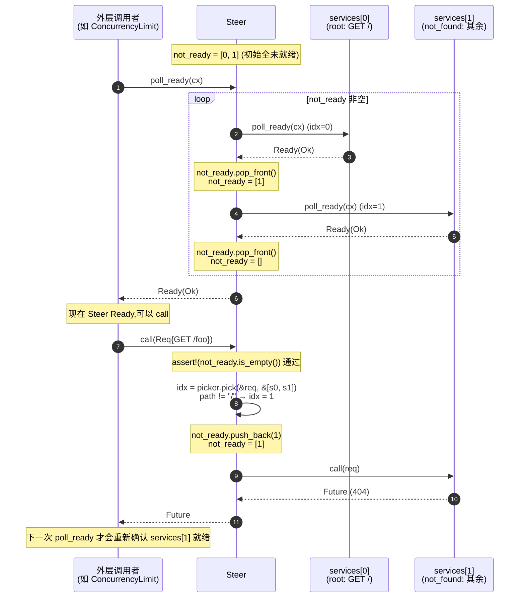
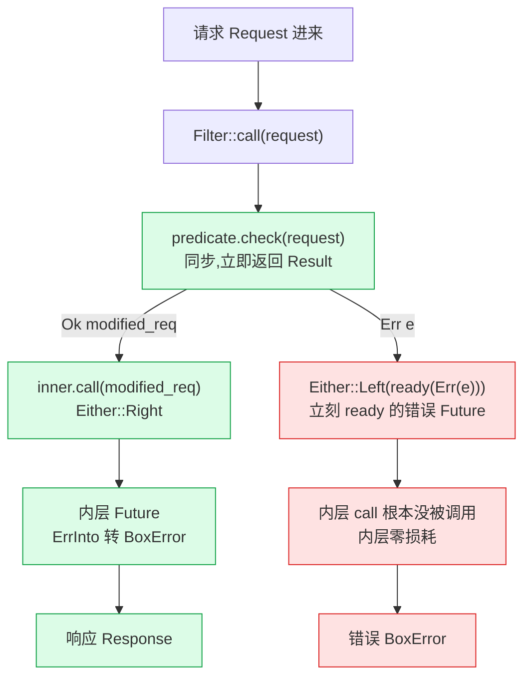
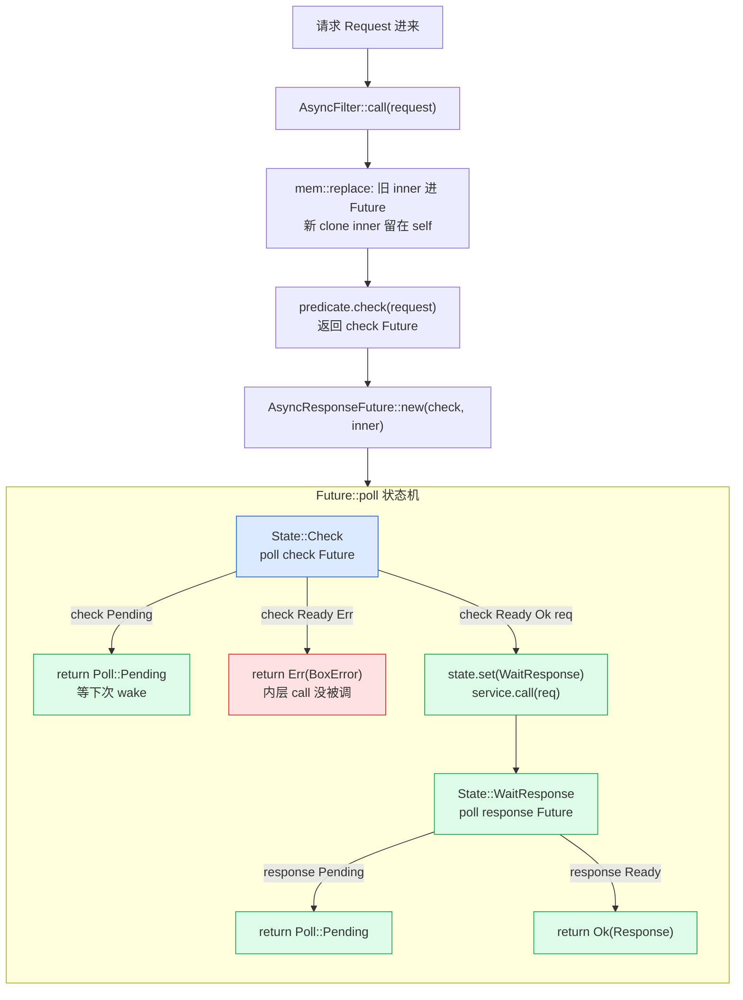

# 第 16 章 · Steer 与 Filter:按规则分发

> 第 5 篇 · 路由与负载均衡类中间件:多个后端选一个(招牌)· 组合单元

---

## 章首

**核心问题**:前一章(P5-15)你看到了 `Balance`,它解决的是"有一堆看起来等价的 后端,按负载挑一个发过去"——挑谁,完全看谁负载轻(P2C 随机抽两挑小的)。但真实业务里,后端常常**根本不等价**:`/api/v1/*` 的请求得路由到老版本服务集群,`/api/v2/*` 得路由到新版本集群,`POST /upload` 得路由到文件服务,`*.jpg` 这类静态资源得路由到 CDN 回源,其余的落到默认网关。这种"按**请求内容**(URL path、HTTP method、header)路由"的需求,Balance 一个字都没帮你解决——它会随机把 `/api/v2` 的请求甩给 `/api/v1` 的服务,直接 500。另一类几乎同样常见的需求:有些请求**根本不该进内层**——没带 `Authorization` header 的请求该在网关边缘就 401 掉,不合法的 path 该直接 400 掉,绕开后面那一整条 retry/timeout/balance 链路。这事儿朴素写就是业务里到处 `if !valid(req) { return Err }`,既不可复用又把业务淹了。本章讲 Tower 的两件利器:**`Steer`** 持有一组 Service + 一个 `Picker`,请求来时 `Picker` 看请求内容选一个 Service 的下标,把请求送进去——内容路由;**`Filter`** 持有一个 `Predicate`(同步)或 `AsyncPredicate`(异步),请求进内层 Service 之前先 `check`,不通过直接返回错误、内层压根不被调用——请求过滤。

读完本章你会明白:

1. **`Steer` 凭什么做内容路由**——它持有一个 `Vec<S>`(一组 Service)和一个 `F: Picker`(一个 `Fn(&Req, &[S]) -> usize` 的下标选择器),`poll_ready` 里**等待所有 Service 都就绪**,`call` 里 `Picker::pick` 算出下标 `idx`、把请求交给 `self.services[idx]`。它把"一组同类型 Service + 一个按请求选下标的策略"包装成单个 `Service<Req>`,这正是 web 框架里"路由器"的雏形。
2. **`Steer` 等待所有 Service 就绪这道设计为什么 sound,又埋了什么雷**——它没法预知下一个请求会路由到哪个 Service,所以 `poll_ready` 里只能**把所有 Service 都 poll 到 Ready**才返回 `Ready`,这是它要保证"任何时候 `call` 进来的请求都能被某个已就绪的 Service 处理"的唯一办法。但这也意味着**队头阻塞**:只要其中一个 Service 慢,所有请求都被它卡住。源码 doc 注释把这件事讲得很直白,并给出唯一解法——给每个内层 Service 套一个足够大容量的 `Buffer`(P2-05),让内层永远 `Ready`,Steer 就不再阻塞。这是 Steer + Buffer 的经典组合。
3. **`Filter` 和 `AsyncFilter` 凭什么拦请求**——`Filter<T, U>`(`U: Predicate`)在 `call` 里**同步**跑 `predicate.check(request)`,返回 `Ok(modified_req)` 就 `inner.call(modified_req)`、返回 `Err` 就**当场短路**返回错误 Future,内层 `call` 根本不会被调到。`AsyncFilter<T, U>`(`U: AsyncPredicate`)多了一步:`check` 本身返回 `Future`,要先 `await` 这个 check Future 拿到结果再决定要不要进内层——给"需要异步验证"(查 Redis 看 token 是否在黑名单、查缓存看请求是否命中)留出了位置。
4. **`Predicate` 的关联类型 `type Request` 凭什么让 Predicate 既能"只检查不改请求"又能"改请求"**——`check` 签名是 `fn check(&mut self, request: Request) -> Result<Self::Request, BoxError>`,注意它吃的是外层 `Request` 类型、吐的是 `Self::Request`(可能不同!)。一个最朴素的 `Predicate` 可以 `type Request = Request` 直接原样返回(纯校验);一个改写型 Predicate 可以 `type Request = HttpRequest<MyVerifiedBody>`(校验 + 改写请求体类型)。这是 Filter 比"普通 if/else"强的地方——它能在类型层面把"校验前"和"校验后"的请求区分成两个类型。

**逃生阀(本章概念有点细)**:如果你被"`Picker` 不是 `Predicate`"、"Steer 等 全部 Service 就绪"、"AsyncFilter 的 `mem::replace`"绕晕了,先记住三句话就够——**①Steer 按请求内容选下标,是一个内容路由器,跟 Balance(按负载选)正交;②Filter 在请求进内层前先 check,不通过就短路,保护内层;③同步 check 用 `Predicate`,异步 check 用 `AsyncPredicate`,能用同步别用异步**。带着这三句话跳到第三节看 Steer 源码、第五节看 Filter 源码,主线就清晰了。本章直球为主,不沿用洋葱 / 插座比喻做主线(那是 P0-01 的点位睛)。

**前置知识**:假设你读过 P0-01(执行单元 Service × 组合单元 Layer 全景)、P1-02(`Service` trait 的 `&mut self` 与 `poll_ready` 背压)、P1-03(Layer / Stack 类型级洋葱)、P5-15(Balance 按 P2C 负载选后端)。本章反复对照 Balance——"按负载选" vs "按内容选"是本章的灵魂对照。不需要你写过 Tower 源码,但需要你见过 Rust 的泛型、关联类型、`Pin`、`Either`。

---

## 一句话点破

> **`Steer` 是 Tower 把"按请求内容路由到一组 Service 之一"做成一等公民的那一笔:一个 `Vec<Service>` + 一个 `Picker`(`Fn(&Req, &[S]) -> usize` 下标选择器),`poll_ready` 等所有 Service 就绪,`call` 让 `Picker` 算下标、把请求送到对应的 Service——它跟 Balance(按负载随机选)正交。`Filter` 是"请求进内层前的检查站":同步用 `Predicate`、异步用 `AsyncPredicate`,check 不通过当场短路返回错误,内层压根不被调用,既保护内层资源又不破坏背压语义。两者都是组合单元:把"多个 Service 选一个"或"要不要进内层"做成可复用的 Service,塞回 `ServiceBuilder` 链里。**

这是结论,不是理由。本章倒过来拆:先看"内容路由"和"请求过滤"这两类需求朴素地做会撞什么墙 → 再看 Envoy 的路由 / filter chain 怎么做(对照)→ 然后看 Tower 为什么用 `Steer`(内容路由)+ `Filter`(`Predicate`/`AsyncPredicate` 同步异步两种)这套设计 → 再上源码:Steer 的 `Picker` trait、`poll_ready` 等所有就绪、`call` 按下标分发;Filter 的 `Predicate`/`AsyncPredicate` 两个 trait、`type Request` 关联类型、同步 `Either` 短路 / 异步 `pin-project` 状态机 → 技巧精解单独拆透"Steer 等所有就绪为什么 sound 又为什么埋雷(必须配 Buffer)" + "Filter 的 `Predicate::Request` 关联类型凭什么比 if/else 强",配反面对比"业务层散落的 if/else" 和 "Envoy 运行期 route_match"。结尾对照表把 Steer 路由 vs Balance 均衡钉死,回扣组合主线,引出 P6-17 BoxService 类型擦除。

---

## 第一节:为什么"内容路由"和"请求过滤"Balance 都帮不了你

### 1.1 提问:从 Balance 到 Steer,缺的那一块是什么

P5-15 讲 `Balance` 时,我们反复强调一个前提:**所有候选后端处理的是同一类请求**。Balance 内部存的是一个 `ready_cache`(P5-14),里面每条都是"已经就绪、可以接同一个请求的 Service",P2C 在它们之间随机抽两挑负载小的——它假设"发谁都行"。这个假设在"一组等价的 upstream 副本"场景里成立:5 个 order-service 容器,任意一个都能处理 `POST /orders`,挑负载轻的发过去就完事。

可是真实业务里"发谁都行"常常是错的。最典型的场景:

```
请求                该去的服务
GET  /api/v1/*      →  legacy-orders-svc   (老版本集群)
GET  /api/v2/*      →  orders-svc          (新版本集群)
POST /upload        →  file-svc            (文件服务)
GET  /static/*      →  cdn-origin-svc      (CDN 回源)
其余                →  default-svc         (默认网关)
```

如果你拿 Balance 处理这事儿,它会**完全无视**请求的 URL,随机把一个 `/api/v2/orders/123` 甩给 `legacy-orders-svc`——后者根本不认识 v2 的协议,直接 500。Balance 没有"看请求内容"这一步,它的 `poll_ready`/`call` 里压根没出现过 `&Req`。这是 Balance 的设计边界,不是缺陷:它解决的就是"在等价副本间均衡",**路由是另一回事**。

另一类需求,Balance 同样帮不了你:**有些请求根本不该进内层**。比如网关边缘的鉴权:没带 `Authorization: Bearer ...` header 的请求,你压根不想让它进到后面的 timeout/retry/balance 链路——它一来就占了一个 retry budget(P4-11)、可能触发一次 timeout 定时器、可能被 balance 选中后端再打一次连接。一个 401 该在边缘 1ms 内就返回。朴素写就是业务层到处 `if !valid(req) { return Err(401) }`,但这就掉进了 P1-03 第一节讲过的"横切关注点和业务揉在一起"的四种病(业务被淹、不可复用、顺序难调、难测试)。Balance 救不了你,因为它根本不做"要不要进内层"的判断。

所以 Tower 在 Balance 之外,又给了两件正交的工具:

- **`Steer`**:解决"按请求内容路由到一组 Service 之一"(内容路由)。
- **`Filter`/`AsyncFilter`**:解决"请求进内层前的检查"(请求过滤)。

这一章就是把这两件工具拆透。

### 1.2 不这样会怎样:内容路由朴素地做,会撞什么墙

设想你不读 Tower 源码,自己写一个"按 URL path 路由"的 Service。最朴素的写法:

```rust
// 朴素写法:把路由逻辑直接塞进 call(简化示意,非源码)
struct NaiveRouter {
    v1: V1Svc,
    v2: V2Svc,
    upload: UploadSvc,
    default: DefaultSvc,
}

impl Service<Request<Body>> for NaiveRouter {
    type Response = Response<Body>;
    type Error = BoxError;
    type Future = BoxFuture<'static, Result<Self::Response, Self::Error>>;

    fn poll_ready(&mut self, _cx: &mut Context<'_>) -> Poll<Result<(), Self::Error>> {
        Poll::Ready(Ok(()))   // ← 偷懒:不 poll 内层
    }

    fn call(&mut self, req: Request<Body>) -> Self::Future {
        let path = req.uri().path();
        let svc = if path.starts_with("/api/v1/") {
            &mut self.v1
        } else if path.starts_with("/api/v2/") {
            &mut self.v2
        } else if path.starts_with("/upload") {
            &mut self.upload
        } else {
            &mut self.default
        };
        Box::pin(svc.call(req))   // ← Box 擦除类型
    }
}
```

能跑。但这是噩梦的开始,至少五处病:

**病一:不 poll_ready,背压丢了**。上面 `poll_ready` 直接返回 `Ready`,内层 `v1`/`v2` 满载时这个路由器还说"我 ready 了",请求一进来 `v1.call` 直接 panic 或返回错。背压(P1-02 讲的"`poll_ready` 资源在 `call` 里消费")被这个朴素路由器彻底吞了。修起来你想"那 poll_ready 里 poll 所有内层"——但 poll 所有内层会卡死在满载的那一个上,所有请求都被它阻塞(队头阻塞)。这是个真问题,不是写错。

**病二:路由策略硬编码进 call,不可复用**。今天用 URL path 分,明天要按 method 分(GET 一种、POST 另一种),后天要按 host header 分(`api.foo.com` vs `admin.foo.com`)。每次改路由策略,都得改这个 `NaiveRouter` 的 `call`。路由策略没有抽象成一类东西,无法复用、无法组合。

**病三:候选 Service 数量写死在字段里,加一个得改 struct**。`v1`/`v2`/`upload`/`default` 四个字段是硬编码的,新加一个 `cdn-origin` 得改 struct、改 `impl Service`、改 `call`。完全没弹性。

**病四:类型擦除的代价**。四个内层 Service 类型不同(`V1Svc`、`V2Svc`、...),要塞进同一个 `Self::Future`,只能 `Box::pin` 擦除 Future 类型——每条请求一次堆分配。Tower 的 `Steer` 通过让所有候选 Service 是**同一类型**(配合 `BoxService`,P6-17)规避了这点:`type Future = S::Future`,不需要擦除。

**病五:没法和 `ServiceBuilder` 链式组合**。这个手写的 `NaiveRouter` 是个孤儿,你想给它套个 `TimeoutLayer`、`RetryLayer`、`ConcurrencyLimitLayer` 都得自己手动一层层包。而 Tower 的 `Steer` 是个标准 `Service`,外面 `.layer(TimeoutLayer::new(...))` 一链就上去了。

> **钉死这件事**:内容路由不是一个"业务里写几行 if/else"的小事——它涉及"如何把多个 Service 组成一个 Service"、"如何把背压正确传过去"、"如何让路由策略可复用"、"如何和 ServiceBuilder 无缝拼接"四件事。这正是 Tower 的 `Steer` 要解决的。

### 1.3 请求过滤朴素地做,会撞什么墙

请求过滤(鉴权、参数校验、黑名单)朴素地做更隐蔽,因为它看起来"就几行 if":

```rust
// 朴素写法:鉴权直接塞进 call(简化示意)
fn call(&mut self, req: Request<Body>) -> Self::Future {
    // 横切:鉴权
    let token = req.headers().get("authorization");
    if token.is_none() || !verify(token.unwrap()) {
        return Box::pin(async { Ok(Response::builder().status(401).body(...).unwrap()) });
    }
    // 业务
    Box::pin(self.inner.call(req))
}
```

这种写法的病,P1-03 第一节已经详谈过(横切和业务揉一起 → 不可复用 / 顺序难调 / 难测试),这里不重复。Tower 视角下,这种写法还多两个独有病:

**病六:check 失败也 poll 了内层资源**。如果 `inner` 是个 `Balance<Discovery<...>>`(P5-15),即使鉴权失败,你在 `inner.call` 之前也已经在 `poll_ready` 里消耗了 Balance 的负载统计(它以为你真要发请求)。鉴权失败的请求白白占了内层的"就绪资源"。Tower 的 `Filter` 把 check 放在 `call` 里(`poll_ready` 还是要透传),check 失败时**内层 `call` 压根不被调用**,内层资源在这次失败里零损耗——细节见第五节。

**病七:异步 check 没位置**。如果你的鉴权要"查 Redis 看 token 在不在黑名单",这是个异步操作。朴素写法就得在 `call` 里 `async move { let in_blacklist = redis.get(...).await; if in_blacklist { return 401 } ... }`,把异步逻辑散在业务里。Tower 给了 `AsyncFilter` + `AsyncPredicate`,`check` 本身返回 `Future`,把"异步检查"做成一等公民,跟 `Predicate`(同步)平起平坐。

> **钉死这件事**:请求过滤也是个"看起来 trivial 实则涉及背压语义 / 可复用性 / 异步支持"的真问题,不是 if/else 几行能解决的。这就是 Tower `Filter`/`AsyncFilter` 存在的理由。

---

## 第二节:Envoy 的路由和 filter chain 是怎么做的(对照)

在拆 Tower 之前,先看一眼 Envoy——它是工业级服务网格里"路由 + 过滤"做得最完整的实现,本章和它对照,能让你看清 Tower 这套设计在"零成本抽象 vs 运行期灵活"光谱上的位置。

### 2.1 Envoy 的路由:route_config + route_match + cluster

Envoy 的 HCM(HTTP Connection Manager,详见《Envoy》P3)里有一整套虚拟主机 / 路由配置:RDS 下发 `RouteConfiguration`,里面有 `virtual_hosts`,每个 virtual_host 下有 `routes`,每条 route 有一个 `match`(`route_match`)和一个 `route`(指向某个 `cluster`)。一个 `route_match` 可以按 `prefix`(前缀)、`path`(精确)、`regex`(正则)匹配 URL,可以按 `headers` 匹配 header,可以按 query_parameters、runtime_fraction(按比例灰度)等十几种维度组合。请求进来时,HCM 遍历 routes,**第一个匹配的 route 胜出**,把请求路由到对应的 cluster(cluster 内部再用 LB 算法挑一个 endpoint——那才是和 Tower Balance 对应的部分)。

这条链路是**完全运行期**的:route_config 是 xDS 下发的 protobuf 配置,在运行期解析、在运行期遍历匹配。优点是灵活(灰度发布、A/B test、按 header 路由全靠改配置不改二进制),缺点是每条请求都要做一次运行期的 match 遍历,没法编译期优化。Envoy 选这条路是因为它是通用数据平面,配置必须运行期可变。

### 2.2 Envoy 的 filter chain:Network / HTTP filter,Lua / Wasm 扩展

Envoy 的"过滤"分两层:Network filter(L4,TLS、TCP 代理、限流)和 HTTP filter(L7,router、ratelimit、JWT auth、压缩、Lua、Wasm)。每个 filter 实现 `decodeHeaders` / `decodeData` / `encodeHeaders` 等回调,可以返回 `StopIteration`(停下来等更多数据)、`Continue`(传给下一个 filter)、`StopAllIterationAndBuffer`(直接终止并 buffer 整个请求)。一个 JWT auth filter 可以在 `decodeHeaders` 里校验 token,不通过就返回一个 401 response 并 `StopAllIterationAndBuffer`——后面的 router filter 压根不被调到。这正是 Tower `Filter` 的"短路返回错误,内层不被调用"的对应物。

Envoy 还支持 Lua filter(嵌入 Lua 脚本做轻量过滤)和 Wasm filter(编译成 wasm 的扩展),都是运行期加载。

### 2.3 对照:Tower 在光谱的另一端

把 Tower 的 `Steer`/`Filter` 摆到 Envoy 旁边,你会看到鲜明的对比:

| 维度 | Envoy 路由 / filter | Tower Steer / Filter |
|------|---------------------|----------------------|
| 配置来源 | xDS 运行期下发 protobuf | Rust 代码 + 编译期类型 |
| 路由匹配 | `route_match` 运行期遍历 | `Picker: Fn(&Req, &[S]) -> usize` 用户写 |
| 过滤逻辑 | filter 回调(C++ / Lua / Wasm) | `Predicate` / `AsyncPredicate` trait |
| 性能 | 运行期遍历 + 配置解析 | 单态化、零虚分派(`Picker` 是泛型) |
| 灵活性 | 极高(运行期改配置) | 低(改路由要重编译) |
| 定位 | 通用数据平面 | 嵌入应用的可组合库 |

> **钉死这件事**:Envoy 把路由 / 过滤做成"运行期配置驱动的通用数据平面",Tower 把它们做成"编译期类型驱动的可组合库原语"。两者解决的是同一类问题(内容路由 + 请求过滤),但定位完全不同——Tower 不和 Envoy 抢"通用网关"的位,它是要让你在自己的 Rust 应用里(axum / tonic / reqwest / Pingora),用最小的开销、最 Rust 的方式拿到路由 + 过滤能力。`Steer` 是个泛型 `Service`,`Filter` 是个泛型 `Service`,单态化后路由匹配就是用户写的那个闭包的直接调用,没有虚分派、没有配置解析。

> **承接《Envoy》**:Envoy HCM 的 route_config / route_match / Network filter / HTTP filter 在《Envoy》P3 拆透,本章只一句带过做对照,详见 [[envoy-source-facts]]。Tower 这边对应物是 `Steer`(路由)+ `Filter`(过滤),设计取向完全不同(编译期 vs 运行期)。

---

## 第三节:Steer——按 Picker 选下标,内容路由

现在进 Tower 源码。先看 `Steer`。源码全在 `tower/src/steer/mod.rs`(单个文件,205 行),feature flag `steer`(默认关,`full` 开)。

### 3.1 Steer 的数据结构:Vec<Service> + Picker + not_ready 队列

先把 `Steer` 的 struct 摆出来:

```rust
// tower/src/steer/mod.rs#L107-L112
pub struct Steer<S, F, Req> {
    router: F,
    services: Vec<S>,
    not_ready: VecDeque<usize>,
    _phantom: PhantomData<Req>,
}
```

三个字段:

- `router: F`——路由器,泛型 `F`,约束是 `F: Picker<S, Req>`(下面马上讲)。
- `services: Vec<S>`——一组**同类型**的 Service。注意是 `Vec<S>` 不是 `(S0, S1, S2)`,所有候选必须是**同一个类型 `S`**。这一点很关键:真实场景里 v1 服务、v2 服务、default 服务往往是不同类型,要塞进同一个 `Vec<S>` 就得先用 `BoxService`(P6-17)把它们的类型擦掉,统一成 `BoxCloneSyncService<Req, Res, Err>`。`Steer` 文档的示例(`tower/src/steer/mod.rs#L29-L42`)正是这么干的——每个 service 先 `BoxService::new(...)` 再塞进 `vec![...]`。
- `not_ready: VecDeque<usize>`——一个**下标队列**,记录"还没 poll 到 Ready 的 Service 的下标"。`Steer::new` 时初始化成 `[0, 1, 2, ..., n-1]`(所有 Service 都还没确认就绪),`poll_ready` 时逐个 pop,直到队列空。这是 `poll_ready` 等所有 Service 就绪的核心数据结构,下一节细讲。
- `_phantom: PhantomData<Req>`——`Req` 类型只在 trait bound 里出现(`S: Service<Req>`),struct 字段里没直接用到,用 `PhantomData` 占位让编译器满意。

三个泛型参数:`S`(Service 类型)、`F`(router/Picker 类型)、`Req`(请求类型)。

### 3.2 Picker trait: Fn(&Req, &[S]) -> usize 的下标选择器

`Steer` 不直接用闭包,而是定义了一个 `Picker` trait:

```rust
// tower/src/steer/mod.rs#L75-L88
pub trait Picker<S, Req> {
    /// Return an index into the iterator of `Service` passed to [`Steer::new`].
    fn pick(&mut self, r: &Req, services: &[S]) -> usize;
}

impl<S, F, Req> Picker<S, Req> for F
where
    F: Fn(&Req, &[S]) -> usize,
{
    fn pick(&mut self, r: &Req, services: &[S]) -> usize {
        self(r, services)
    }
}
```

`Picker::pick(&mut self, r: &Req, services: &[S]) -> usize`——给一个**只读引用** `&Req`(看请求内容)和候选服务列表 `&[S]` 的只读切片,返回一个 `usize` 下标。注意三件事:

1. **`pick` 拿到的是 `&Req`,不能消费请求**。请求所有权要留给后面真正调用的 `services[idx].call(req)`。`Picker` 只"看",不"动"。
2. **`pick` 返回的是下标,不是 Service 引用**。这避免了生命周期纠缠——如果返回 `&S`,借用检查会卡死(`call` 要 `&mut self.services[idx]`,但 `pick` 已经借了 `&self.services`)。返回 `usize` 让借用干净利落。
3. ** blanket impl**:`impl Picker for F where F: Fn(&Req, &[S]) -> usize`——任何符合 `Fn(&Req, &[S]) -> usize` 签名的闭包 / 函数指针**自动**实现 `Picker`。所以你日常用 `Steer` 不需要手写 `impl Picker for MyStruct`,直接传闭包就行。源码示例(`tower/src/steer/mod.rs#L48-L54`)就是这么用的:

```rust
// tower/src/steer/mod.rs#L48-L54(文档示例)
|req: &Request<String>, _services: &[_]| {
    if req.method() == Method::GET && req.uri().path() == "/" {
        0 // Index of `root`
    } else {
        1 // Index of `not_found`
    }
}
```

这个闭包 `pick` 看请求的 method 和 path,匹配 `/` 就返回下标 0(`root` 服务),否则返回 1(`not_found` 服务)。**这就是一个最简路由器**。

> **承接设计**:为什么是 `Picker` 这个名字,不是 `Predicate`?因为 `Predicate`(下一节 Filter 用)语义是"是 / 否"——返回 bool 或 Result;`Picker` 语义是"选哪一个"——返回下标。两者正交。这是源码作者刻意区分的两个 trait,不要混。本章开头任务描述里把 Steer 说成"按 Predicate 路由"是个常见误读——Steer 按 **Picker** 路由,Filter 才用 Predicate。

### 3.3 Steer::new:初始化 not_ready 为全下标

构造函数:

```rust
// tower/src/steer/mod.rs#L114-L128
impl<S, F, Req> Steer<S, F, Req> {
    /// Make a new [`Steer`] with a list of [`Service`]'s and a [`Picker`].
    ///
    /// Note: the order of the [`Service`]'s is significant for [`Picker::pick`]'s return value.
    pub fn new(services: impl IntoIterator<Item = S>, router: F) -> Self {
        let services: Vec<_> = services.into_iter().collect();
        let not_ready: VecDeque<_> = services.iter().enumerate().map(|(i, _)| i).collect();
        Self {
            router,
            services,
            not_ready,
            _phantom: PhantomData,
        }
    }
}
```

`services` 用 `IntoIterator` 接收,可以传 `vec![...]` 也可以传数组。`not_ready` 用 `services.iter().enumerate().map(|(i, _)| i).collect()` 初始化成 `[0, 1, 2, ..., n-1]`——所有 Service 都"还没确认就绪"。

**doc 注释那句 "the order of the Service's is significant for Picker::pick's return value"** 钉死一件重要的事:`Picker::pick` 返回的下标语义是**和 `services` 这个 Vec 的顺序绑定的**。你调换 `vec![root, not_found]` 顺序成 `vec![not_found, root]`,同一个 `Picker` 闭包返回的 0 现在指向 `not_found`——行为就变了。所以 `Steer::new` 的 services 顺序是 `Picker` 的契约的一部分,不能乱动。

### 3.4 poll_ready:等所有 Service 就绪

这是 Steer 最有讲究的一段。先把源码贴出来:

```rust
// tower/src/steer/mod.rs#L130-L156
impl<S, Req, F> Service<Req> for Steer<S, F, Req>
where
    S: Service<Req>,
    F: Picker<S, Req>,
{
    type Response = S::Response;
    type Error = S::Error;
    type Future = S::Future;

    fn poll_ready(&mut self, cx: &mut Context<'_>) -> Poll<Result<(), Self::Error>> {
        loop {
            // must wait for *all* services to be ready.
            // this will cause head-of-line blocking unless the underlying services are always ready.
            if self.not_ready.is_empty() {
                return Poll::Ready(Ok(()));
            } else {
                if self.services[self.not_ready[0]]
                    .poll_ready(cx)?
                    .is_pending()
                {
                    return Poll::Pending;
                }

                self.not_ready.pop_front();
            }
        }
    }
    // ... call 见下一节
}
```

逻辑:

1. `loop` 反复检查 `not_ready` 队列。
2. 队列空了——所有 Service 都已就绪——返回 `Poll::Ready(Ok(()))`。
3. 队列不空——取队首下标 `self.not_ready[0]`,poll 对应 Service:`self.services[self.not_ready[0]].poll_ready(cx)`。
4. 如果该 Service 还 `Pending`——整个 `Steer` 返回 `Poll::Pending`(等下次被 wake)。
5. 如果该 Service `Ready`——`self.not_ready.pop_front()` 把它从队列移除,`loop` 继续处理下一个。

**关键设计:`Steer` 等的是所有 Service 都就绪,不是某一个**。源码注释两行(142-143 行)直接点破:"must wait for *all* services to be ready. this will cause head-of-line blocking unless the underlying services are always ready."(必须等所有 service 就绪。除非底层 service 永远 ready,否则会造成队头阻塞。)

### 3.5 为什么必须等所有:不能预知下个请求路由到谁

这是 Steer 设计的灵魂,值得单独拆。问一个问题:Steer 为什么不像 Balance 那样"等任意一个就绪就 Ready"?Balance(P5-15)的逻辑是"只要有任意一个候选 ready,我就能发请求(P2C 在 ready 的里挑)",它**不挑特定的候选**。Steer 完全相反——**下一个请求路由到哪个 Service,完全由请求内容决定,Steer 在 `poll_ready` 时根本不知道**。

设想 Steer 只等"某一个"就绪就 Ready:假设 `services[0]`(v1 服务)就绪了,`services[1]`(v2 服务)还没就绪。Steer 返回 Ready。然后一个 `GET /api/v2/orders` 进来,`Picker::pick` 返回 1——要路由到 `services[1]`。但 `services[1]` 还没就绪!这时候 `call` 怎么办?

三种选择,都不好:

- **A: `call` 里 panic**。源码确实有这个 assert:`call` 开头 `assert!(self.not_ready.is_empty(), "Steer must wait for all services to be ready. Did you forget to call poll_ready()?")`(`tower/src/steer/mod.rs#L159-L162`)。这是最后一道防线,不挡正常用法,只挡"忘了 poll_ready 就 call"的误用。
- **B: `call` 里返回 Pending Future**。不行,`call` 不返回 `Poll`,它返回 `Future`,Future 第一次 poll 才能 Pending。这意味着得在 `call` 里造一个"先 poll_ready 再 call"的 Future,把背压语义搞复杂。
- **C: `call` 里 buffer 请求**。Steer doc 注释明说它"unwilling to buffer items indefinitely"(不愿无限缓冲),所以不走这条。

所以唯一 sound 的设计就是:`poll_ready` **等所有 Service 都就绪**。这样无论 `Picker::pick` 返回哪个下标,那个 Service 一定已经就绪,`call` 可以无脑 `self.services[idx].call(req)`。

代价就是 **队头阻塞**(head-of-line blocking):`services[1]`(v2 服务)慢,所有请求(包括路由到 `services[0]` 的)都得等它就绪才能发。源码 doc 注释(`tower/src/steer/mod.rs#L99-L105`)给出唯一解法:

```text
Note that [`Steer`] must wait for all services to be ready since it can't know ahead of time
which [`Service`] the next message will arrive for, and is unwilling to buffer items
indefinitely. This will cause head-of-line blocking unless paired with a [`Service`] that does
buffer items indefinitely, and thus always returns [`Poll::Ready`]. For example, wrapping each
component service with a [`Buffer`] with a high enough limit (the maximum number of concurrent
requests) will prevent head-of-line blocking in [`Steer`].
```

翻译:Steer 必须等所有 service 就绪,这会导致队头阻塞——除非每个内层 service 都包一个**容量足够大**的 `Buffer`(P2-05),让内层永远 `Ready`。Buffer 内部有一个 worker task + mpsc 通道(P2-05 拆透),只要通道没满,`poll_ready` 永远返回 `Ready`(请求进队列等 worker 处理),这样 Steer 的"等所有就绪"就退化成"等所有 Buffer 都没满",只要 Buffer 容量 ≥ 最大并发请求数,Steer 就永不阻塞。

> **钉死这件事**:Steer + Buffer(每个内层各一个)是 Steer 的标准用法。Steer 单独用会在某个内层满载时卡死所有请求;套上 Buffer 把"满载"挪到"Buffer 队列满",容量给够就解决。这是 Tower 组合单元的典型套路——**每个中间件只管一件事,组合起来解决完整问题**:Buffer 管"让 Service 永远 Ready",Steer 管"按内容选 Service"。

### 3.6 call:按下标分发,把 idx 推回 not_ready

```rust
// tower/src/steer/mod.rs#L158-L168
fn call(&mut self, req: Req) -> Self::Future {
    assert!(
        self.not_ready.is_empty(),
        "Steer must wait for all services to be ready. Did you forget to call poll_ready()?"
    );

    let idx = self.router.pick(&req, &self.services[..]);
    let cl = &mut self.services[idx];
    self.not_ready.push_back(idx);
    cl.call(req)
}
```

四步:

1. `assert!(self.not_ready.is_empty(), ...)`——防御性断言,确保 `poll_ready` 真的把所有 Service poll 就绪了。如果你绕过 `poll_ready` 直接 `call`(比如手写驱动忘了 poll),这里 panic。这是 Tower 中间件常见的防御模式,提醒用户"`poll_ready` 和 `call` 是配对的"。
2. `let idx = self.router.pick(&req, &self.services[..])`——调 `Picker::pick`,传 `&req`(只读)和 `&self.services[..]`(整段切片),拿到下标 `idx`。
3. `let cl = &mut self.services[idx]`——可变借用对应 Service。注意这里 `cl` 借的是 `self.services[idx]` 的 `&mut`,而 `pick` 借的是 `&self.services[..]` 的 `&`——两段借用不重叠(pick 在前一句已经结束,借用释放),所以借用检查通过。
4. `self.not_ready.push_back(idx)`——把这个 idx **推回 `not_ready` 队列尾部**!这是关键一步:你刚把请求发给 `services[idx]`,它现在又"不就绪"了(它要处理这个请求,资源被占),所以得重新 poll。下一次 `poll_ready` 时,这个 idx 会在队列里被重新 poll 到 Ready。
5. `cl.call(req)`——把请求交给 `services[idx]`,返回它的 Future。

第 4 步是 Steer 背压语义的核心:每次 `call` 之后,被路由到的那个 Service 重新进入"待确认就绪"状态。`Steer` 的 caller(通常是外面套的 `Buffer` 或 `ConcurrencyLimit`)下一次 `poll_ready` 时,Steer 会把这个 idx 重新 poll 一遍,确认它真的又能接新请求了,才返回 Ready。这就把"`call` 消耗就绪状态、`poll_ready` 重新获得就绪状态"的 P1-02 背压惯用用法,正确地透传到了被路由的子 Service。

### 3.7 type Future = S::Future:候选同类型,无需擦除

注意 impl 头:

```rust
// tower/src/steer/mod.rs#L135-L137
type Response = S::Response;
type Error = S::Error;
type Future = S::Future;
```

`Steer` 的 `Response`/`Error`/`Future` 全部直接用 `S::` 的关联类型。这意味着:

- 所有候选 Service `S` 必须是**同一类型**(因为 `Vec<S>`),它们的 `Response`/`Error`/`Future` 也都是同一个类型。
- `call` 返回 `S::Future`,**不需要 Box 擦除**。这正是 Steer 比朴素手写路由强的地方——只要候选 Service 同类型(通常用 `BoxService` 擦成同类型,见 P6-17),Future 类型也统一,零堆分配。

代价是候选 Service **必须**类型统一。真实场景里 v1 / v2 / default 服务往往是不同 struct,你得先用 `BoxService::new(v1)`、`BoxService::new(v2)` 把它们擦成 `BoxService<Req, Res, Err>`(同一个类型!),才能塞进 `vec![...]`。这一步的类型擦除代价在 P6-17 详谈,本章只指出"Steer 的设计要求候选同类型,代价是外面要套 BoxService"。

> **承接《Tokio》**:`Steer::call` 返回 `S::Future`,这是个 `impl Future`(具体类型,单态化)。`Future`/`Poll`/`Context`/`Waker` 是 `core::future`/`core::task` 标准库,Tokio 只是执行者,详见 [[tokio-source-facts]],本章不重复。Steer 本身不 spawn task、不用 mpsc、不用 timer——它是纯组合单元,跟 Tokio 运行时几乎没耦合。

### 3.8 Steer 是 Clone 的(候选和 router 都 Clone 时)

```rust
// tower/src/steer/mod.rs#L171-L184
impl<S, F, Req> Clone for Steer<S, F, Req>
where
    S: Clone,
    F: Clone,
{
    fn clone(&self) -> Self {
        Self {
            router: self.router.clone(),
            services: self.services.clone(),
            not_ready: self.not_ready.clone(),
            _phantom: PhantomData,
        }
    }
}
```

只要 `S: Clone`(候选 Service 可 Clone)且 `F: Clone`(Picker 闭包可 Clone,大多数闭包都是,因为它们只捕获 `&` 或 `Clone` 的值),`Steer` 自动 Clone。这让 Steer 能像其他 Tower Service 一样在多 task 间共享(axum 的 Handler clone 给每个连接、tonic 的 Service clone 给每个 gRPC call)。注意 clone 时 `not_ready` 也被 clone——两个 Steer 副本各自维护自己的就绪状态,互不干扰。

---

## 第四节:Steer 的 mermaid 时序与 ASCII 布局

把 Steer 一次完整请求的全过程画出来。

### 4.1 Steer 按 Picker 路由时序



时序图把"等所有就绪 → call → 把 idx 推回 not_ready → 下次 poll_ready 重新确认"完整串起来了。注意第 13-16 步的 `not_ready.push_back(1)`:即使你这次请求路由到 `services[1]`,下次 `poll_ready` 还要重新确认它就绪(因为它刚处理了一个请求,可能满载了)。

### 4.2 Steer 多 Service + Picker 的 ASCII 内存布局

```
                     Steer<S, F, Req>
        ┌───────────────────────────────────────────────┐
        │  router: F          ← 闭包/Picker             │
        │  services: Vec<S>                              │
        │  ┌─────┬─────┬─────┬─────┐                    │
        │  │ S0  │ S1  │ S2  │ S3  │  (n 个同类型 S)    │
        │  │root │not_ │v1   │v2   │                    │
        │  │     │found│svc  │svc  │                    │
        │  └─────┴─────┴─────┴─────┘                    │
        │  not_ready: VecDeque<usize>                   │
        │  ┌────┬────┬────┬────┐                        │
        │  │ 0  │ 1  │ 2  │ 3  │  (初始全在队列)       │
        │  └────┴────┴────┴────┘                        │
        │  _phantom: PhantomData<Req>                   │
        └───────────────────────────────────────────────┘

   poll_ready 流程(逐个 pop,pop 完才 Ready):
        not_ready: [0,1,2,3] → [1,2,3] → [2,3] → [3] → []
                        ↑ poll S0 Ready       ↑ poll S3 Ready
                        全 pop 完 → Poll::Ready(Ok(()))

   call 流程(picker 选下标,推回 not_ready):
        req 进来 → picker.pick(&req, &[s0,s1,s2,s3]) = 2
        → services[2].call(req) → not_ready.push_back(2)
        → not_ready: [2]   ← 下次 poll_ready 只需重新确认 S2
```

布局图把三个字段(`router`、`services`、`not_ready`)的关系钉死。注意 `not_ready` 是 `VecDeque`(双端队列),`pop_front`(队首出)用于 `poll_ready`、`push_back`(队尾入)用于 `call` 推回——双端队列是这里的标准选择。

---

## 第五节:Filter——Predicate 同步拦截,AsyncPredicate 异步拦截

Steer 解决"路由",Filter 解决"过滤"。源码在 `tower/src/filter/` 目录,四个文件:`mod.rs`(主逻辑)、`predicate.rs`(`Predicate`/`AsyncPredicate` trait)、`future.rs`(Future 类型)、`layer.rs`(`FilterLayer`/`AsyncFilterLayer`)。feature flag `filter`(默认关,`full` 开)。

### 5.1 两个 trait:Predicate 同步,AsyncPredicate 异步

先看 `predicate.rs`(`tower/src/filter/predicate.rs`,66 行):

```rust
// tower/src/filter/predicate.rs#L4-L23
pub trait AsyncPredicate<Request> {
    /// The future returned by [`check`].
    type Future: Future<Output = Result<Self::Request, BoxError>>;

    /// The type of requests returned by [`check`].
    type Request;

    /// Check whether the given request should be forwarded.
    fn check(&mut self, request: Request) -> Self::Future;
}

// tower/src/filter/predicate.rs#L25-L38
pub trait Predicate<Request> {
    type Request;

    fn check(&mut self, request: Request) -> Result<Self::Request, BoxError>;
}
```

两个 trait 并排:

- **`Predicate<Request>`(同步)**:`fn check(&mut self, request: Request) -> Result<Self::Request, BoxError>`。吃一个 Request,**同步**返回 `Result<Self::Request, BoxError>`。`Ok(req)` 表示通过(请求会转发给内层,`req` 可能被改写过)、`Err(e)` 表示拒绝(请求不进内层,直接返回错误)。
- **`AsyncPredicate<Request>`(异步)**:`fn check(&mut self, request: Request) -> Self::Future`,`Self::Future: Future<Output = Result<Self::Request, BoxError>>`。吃一个 Request,返回一个 **Future**,Future 完成时给 `Result<Self::Request, BoxError>`。

两个 trait 都有**关联类型 `type Request`**——这是 Filter 设计的精髓,下一节单独拆。

### 5.2 关联类型 type Request:Predicate 能改写请求类型

`check` 签名值得反复看:

```rust
fn check(&mut self, request: Request) -> Result<Self::Request, BoxError>;
//                                  ^^^^^^^^外层类型    ^^^^^^^^^^^^^^内层类型(关联)
```

吃的是外层 `Request` 类型,吐的(Ok 里)是 `Self::Request`(关联类型)——**这两个类型可以不同**!这给了 Predicate 两种用法:

**用法一:纯校验,不改类型**。最常见。`type Request = Request`,check 通过时原样返回:

```rust
// 纯校验型 Predicate(简化示意)
struct AuthPredicate;

impl Predicate<Request<Body>> for AuthPredicate {
    type Request = Request<Body>;   // ←内外同类型

    fn check(&mut self, req: Request<Body>) -> Result<Self::Request, BoxError> {
        if req.headers().get("authorization").is_some() {
            Ok(req)   // ← 原样返回,只是"放行"
        } else {
            Err("missing authorization".into())
        }
    }
}
```

**用法二:校验 + 改写 + 改类型**。把"未校验"和"已校验"的请求在**类型层面**区分开:

```rust
// 校验 + 改写型 Predicate(简化示意)
struct ParseBodyPredicate;

impl Predicate<Request<Body>> for ParseBodyPredicate {
    type Request = Request<VerifiedBody>;   // ← 内层吃的是"已校验 body"类型

    fn check(&mut self, req: Request<Body>) -> Result<Self::Request, BoxError> {
        let body = parse_and_verify(req.into_body())?;   // 校验 + 解析
        Ok(req.map(|_| body))   // ← 改写请求,类型从 Request<Body> 变成 Request<VerifiedBody>
    }
}
```

第二种用法把"校验过的请求"做成一个**不同的类型**,这样内层 Service 的签名就是 `Service<Request<VerifiedBody>>`——你在**类型层面**强制了"进内层的请求一定经过校验",编译器替你把关。这是 Rust 类型驱动设计的典型胜利,也是 Filter 比朴素 if/else 强的地方:`if/else` 只在运行期挡住非法请求,`Predicate::Request` 关联类型在编译期就保证了类型安全。

### 5.3 blanket impl:闭包自动实现 Predicate / AsyncPredicate

跟 `Picker` 一样,两个 trait 都有 blanket impl,让闭包自动实现:

```rust
// tower/src/filter/predicate.rs#L40-L53
impl<F, T, U, R, E> AsyncPredicate<T> for F
where
    F: FnMut(T) -> U,
    U: Future<Output = Result<R, E>>,
    E: Into<BoxError>,
{
    type Future = futures_util::future::ErrInto<U, BoxError>;
    type Request = R;

    fn check(&mut self, request: T) -> Self::Future {
        use futures_util::TryFutureExt;
        self(request).err_into()
    }
}

// tower/src/filter/predicate.rs#L55-L65
impl<F, T, R, E> Predicate<T> for F
where
    F: FnMut(T) -> Result<R, E>,
    E: Into<BoxError>,
{
    type Request = R;

    fn check(&mut self, request: T) -> Result<Self::Request, BoxError> {
        self(request).map_err(Into::into)
    }
}
```

任何 `FnMut(T) -> Result<R, E>`(E: Into<BoxError>)的闭包自动实现 `Predicate<T>`;任何 `FnMut(T) -> U`(U: Future<Output=Result<R,E>>)的闭包自动实现 `AsyncPredicate<T>`。所以日常用 Filter 不需要手写 impl,直接传闭包:

```rust
// 同步 Predicate 闭包(简化示意)
|req: Request<Body>| {
    if req.headers().get("authorization").is_some() {
        Ok(req)
    } else {
        Err("missing auth".into())
    }
}

// 异步 AsyncPredicate 闭包(简化示意,查 Redis 黑名单)
|req: Request<Body>| async move {
    let token = req.headers().get("authorization")?;
    if redis.sismember("blacklist", token).await? {
        Err("blacklisted".into())
    } else {
        Ok(req)
    }
}
```

注意 `AsyncPredicate` 的 blanket impl 用了 `err_into()`(`futures_util::TryFutureExt`)把用户错误的 `E` 统一转成 `BoxError`——这是 trait 的错误类型固定为 `BoxError` 的处理:用户闭包可以返回任意 `E: Into<BoxError>`,blanket impl 帮你转。

> **钉死这件事**:`Predicate` 和 `AsyncPredicate` 不是二选一的关系,而是**按需选择**:不需要 await 的检查(看 header、看 path、看 method)用 `Predicate`(同步,零开销);需要 await 的检查(查 Redis、查缓存、查数据库)用 `AsyncPredicate`(异步,多一次 Future poll)。filter/mod.rs 的 doc 注释(`tower/src/filter/mod.rs#L10-L15`)明说:"when it is not necessary to await some other asynchronous operation in the predicate, the synchronous predicate should be preferred, as it introduces less overhead."(谓词里不需要 await 别的异步操作时,优先用同步谓词,开销更小。)

### 5.4 Filter<T, U>:同步 Filter 的 Service 实现

看 `Filter` 的 struct 和 Service impl:

```rust
// tower/src/filter/mod.rs#L44-L48
#[derive(Clone, Debug)]
pub struct Filter<T, U> {
    inner: T,
    predicate: U,
}
```

两个字段:`inner: T`(内层 Service)、`predicate: U`(Predicate)。`T`、`U` 都是泛型。

```rust
// tower/src/filter/mod.rs#L100-L120
impl<T, U, Request> Service<Request> for Filter<T, U>
where
    U: Predicate<Request>,
    T: Service<U::Request>,
    T::Error: Into<BoxError>,
{
    type Response = T::Response;
    type Error = BoxError;
    type Future = ResponseFuture<T::Response, T::Future>;

    fn poll_ready(&mut self, cx: &mut Context<'_>) -> Poll<Result<(), Self::Error>> {
        self.inner.poll_ready(cx).map_err(Into::into)
    }

    fn call(&mut self, request: Request) -> Self::Future {
        ResponseFuture::new(match self.predicate.check(request) {
            Ok(request) => Either::Right(self.inner.call(request).err_into()),
            Err(e) => Either::Left(futures_util::future::ready(Err(e))),
        })
    }
}
```

逐行拆:

- **trait bound**:`U: Predicate<Request>`(predicate 处理外层 Request 类型),`T: Service<U::Request>`(内层 Service 处理 predicate 输出的 `U::Request` 类型——这就是"校验后类型"进内层)。`T::Error: Into<BoxError>`(内层错误要能转 BoxError,统一错误类型)。
- **关联类型**:`type Response = T::Response`(响应就是内层响应)、`type Error = BoxError`(错误统一擦成 BoxError——注意,Filter 自己的错误类型是 `BoxError`,不是 `T::Error`!)、`type Future = ResponseFuture<T::Response, T::Future>`。
- **`poll_ready`**:`self.inner.poll_ready(cx).map_err(Into::into)`——**直接透传**内层的 `poll_ready`。Filter 自己不持有任何会满载的资源(它只是个 check 函数 + 内层 Service 引用),所以它的就绪状态 = 内层的就绪状态。注意它**不 poll predicate**——predicate 是同步的,不需要 poll_ready。
- **`call`**:这是 Filter 的灵魂。`self.predicate.check(request)` 同步跑:
  - `Ok(request)` → `Either::Right(self.inner.call(request).err_into())`——构造一个"真的调内层"的 Future,包在 `Either::Right` 里。
  - `Err(e)` → `Either::Left(futures_util::future::ready(Err(e)))`——构造一个"立刻返回错误"的 Future,包在 `Either::Left` 里。

**关键点:`call` 里 check 失败时,内层 `call` 根本不被调用**。`Either::Left(ready(Err(e)))` 是个立刻就 ready 的错误 Future,内层 Service 的 `call` 那行代码(`self.inner.call(request)`)压根没执行(它在 `Either::Right` 分支里,没走到)。这就是 Filter 保护内层的机制——check 不过,内层零损耗。

### 5.5 ResponseFuture:Either 的类型擦除包装

`type Future = ResponseFuture<T::Response, T::Future>`,这个 `ResponseFuture` 在 `future.rs`:

```rust
// tower/src/filter/future.rs#L32-L41
opaque_future! {
    /// Filtered response future from [`Filter`] services.
    ///
    /// [`Filter`]: crate::filter::Filter
    pub type ResponseFuture<R, F> =
        futures_util::future::Either<
            futures_util::future::Ready<Result<R, crate::BoxError>>,
            futures_util::future::ErrInto<F, crate::BoxError>,
        >;
}
```

`ResponseFuture` 本质就是 `Either<Ready<Result<R, BoxError>>, ErrInner<F, BoxError>>`——`Either::Left` 是"立刻 ready 的错误"(check 失败),`Either::Right` 是"内层 Future 错误转 BoxError"(check 通过)。`opaque_future!` 是 Tower util 里的宏,把 `Either<...>` 这种暴露的组合类型包装成一个不透明的命名类型(`ResponseFuture<R, F>`),对外只暴露名字不暴露内部结构——这是 Rust 里"隐藏 Future 内部组合细节"的惯用法,让 API 文档更干净。`Either` 的 `poll` 会先 poll Left,Left ready 就返回 Left 的结果,否则 poll Right——但 `Ready` Future 第一次 poll 必 ready,所以 check 失败时 `ResponseFuture` 第一次 poll 立刻返回错误,根本不会去 poll 内层 Future。

> **承接《Tokio》**:`Either<L, R>` 是 `futures_util` 的"二选一 Future",`poll` 按变体转发。这是 Future 组合的标准库原语,不在 tokio 仓(在 `futures-util` crate),Tokio 只是执行者,详见 [[tokio-source-facts]]。本章不展开 `Either` 内部。

### 5.6 AsyncFilter<T, U>:异步 Filter 的状态机

AsyncFilter 复杂一些,因为 check 本身是 Future,要先 await check 再决定要不要调内层。看 Service impl:

```rust
// tower/src/filter/mod.rs#L162-L191
impl<T, U, Request> Service<Request> for AsyncFilter<T, U>
where
    U: AsyncPredicate<Request>,
    T: Service<U::Request> + Clone,
    T::Error: Into<BoxError>,
{
    type Response = T::Response;
    type Error = BoxError;
    type Future = AsyncResponseFuture<U, T, Request>;

    fn poll_ready(&mut self, cx: &mut Context<'_>) -> Poll<Result<(), Self::Error>> {
        self.inner.poll_ready(cx).map_err(Into::into)
    }

    fn call(&mut self, request: Request) -> Self::Future {
        use std::mem;

        let inner = self.inner.clone();
        // In case the inner service has state that's driven to readiness and
        // not tracked by clones (such as `Buffer`), pass the version we have
        // already called `poll_ready` on into the future, and leave its clone
        // behind.
        let inner = mem::replace(&mut self.inner, inner);

        // Check the request
        let check = self.predicate.check(request);

        AsyncResponseFuture::new(check, inner)
    }
}
```

注意几个跟同步 Filter 的差异:

- **trait bound 多了 `T: Service<U::Request> + Clone`**——内层 Service 必须 `Clone`!为什么?看 `call` 里的 `mem::replace` 那段(下面拆)。
- **`type Future = AsyncResponseFuture<U, T, Request>`**——不是简单的 `Either`,是个手写的 `pin_project` 状态机(`future.rs`),因为 check Future 和内层 Future 是**先后两阶段**。
- **`call` 里那段 `mem::replace`** 是 AsyncFilter 最有讲究的一笔,单独拆:

```rust
// tower/src/filter/mod.rs#L176-L189(摘自上面)
fn call(&mut self, request: Request) -> Self::Future {
    use std::mem;

    let inner = self.inner.clone();        // ① clone 一份 inner
    // In case the inner service has state that's driven to readiness and
    // not tracked by clones (such as `Buffer`), pass the version we have
    // already called `poll_ready` on into the future, and leave its clone
    // behind.
    let inner = mem::replace(&mut self.inner, inner);  // ② replace:self.inner 现在是新 clone,inner 变量是旧的(已 poll_ready 的)

    // Check the request
    let check = self.predicate.check(request);   // ③ 启动 check Future

    AsyncResponseFuture::new(check, inner)        // ④ check Future + 旧 inner 一起进状态机
}
```

为什么这么绕?注释说得很清楚:`Buffer` 这种 Service 有"被 `poll_ready` 驱动到就绪"的状态,这个状态**不被 Clone 跟踪**(clone 出来的新 `Buffer` 是另一条 mpsc Sender,得重新 poll_ready)。所以 AsyncFilter 要保证:

- 进 `AsyncResponseFuture` 的那个 `inner`,**正是刚刚被 `poll_ready` 确认就绪的那个**(因为 AsyncResponseFuture 后面要 `inner.call(req)`,call 必须在 ready 之后)。
- 留在 `self.inner` 的那个,是**新 clone 的、还没 poll_ready 的**——这样下次 `poll_ready` 重新确认这个新 inner,语义正确。

`mem::replace(&mut self.inner, inner)` 干的就是这个 swap:把 `self.inner`(已 poll_ready 的旧实例)取出来赋给局部变量 `inner`(进 Future),把局部变量 `inner`(新 clone 的)塞回 `self.inner`(留给下次 poll_ready)。

> **钉死这件事**:AsyncFilter 的 `mem::replace` 是 Tower 中间件里"`poll_ready` 和 `call` 配对、资源在 call 里消费"惯用法(P1-02 讲过)的标准实现。它保证"已就绪的 inner 实例进 Future 消费、新 clone 的实例留在 self 等下次 poll_ready"。这套手法在 Buffer(P2-05)、Retry(P4-11)、Hedge(P4-12)里反复出现,是 Tower 源码的高频模式。同步 Filter 不需要这么干(因为 check 是同步的,要么立刻 check 失败短路、要么立刻 `inner.call` 走完就绪状态,没有"check 期间 inner 还要被持有"的窗口)。

### 5.7 AsyncResponseFuture:pin_project 状态机

最后看 AsyncFilter 的 Future 状态机:

```rust
// tower/src/filter/future.rs#L14-L30
pin_project! {
    /// Filtered response future from [`AsyncFilter`] services.
    #[derive(Debug)]
    pub struct AsyncResponseFuture<P, S, Request>
    where
        P: AsyncPredicate<Request>,
        S: Service<P::Request>,
    {
        #[pin]
        state: State<P::Future, S::Future>,

        // Inner service
        service: S,
    }
}

// tower/src/filter/future.rs#L43-L58
pin_project! {
    #[project = StateProj]
    #[derive(Debug)]
    enum State<F, G> {
        /// Waiting for the predicate future
        Check {
            #[pin]
            check: F
        },
        /// Waiting for the response future
        WaitResponse {
            #[pin]
            response: G
        },
    }
}
```

`AsyncResponseFuture` 持有一个 `state: State<P::Future, S::Future>`(两阶段状态机)和一个 `service: S`(内层 Service,留着等 check 通过后调它的 call)。`State` 是个 enum:

- `Check { check: F }`——正在 await predicate 的 check Future。
- `WaitResponse { response: G }`——check 通过了,正在 await 内层 Service 的 response Future。

poll 逻辑:

```rust
// tower/src/filter/future.rs#L74-L98
impl<P, S, Request> Future for AsyncResponseFuture<P, S, Request>
where
    P: AsyncPredicate<Request>,
    S: Service<P::Request>,
    S::Error: Into<crate::BoxError>,
{
    type Output = Result<S::Response, crate::BoxError>;

    fn poll(self: Pin<&mut Self>, cx: &mut Context<'_>) -> Poll<Self::Output> {
        let mut this = self.project();

        loop {
            match this.state.as_mut().project() {
                StateProj::Check { mut check } => {
                    let request = ready!(check.as_mut().poll(cx))?;    // ① await check Future
                    let response = this.service.call(request);          // ② check 通过,调内层 call
                    this.state.set(State::WaitResponse { response });   // ③ 切到 WaitResponse 状态
                }
                StateProj::WaitResponse { response } => {
                    return response.poll(cx).map_err(Into::into);       // ④ await 内层 response Future
                }
            }
        }
    }
}
```

四步:

1. `Check` 状态——poll check Future。`ready!(check.as_mut().poll(cx))?`——如果 check Future 还 Pending,`ready!` 宏提前 return Pending;如果完成了,`?` propagates 错误(check 返回 Err,整个 AsyncResponseFuture 返回 Err,内层 call 不被调);check 返回 Ok,拿到 `request`(可能改写过的)。
2. `this.service.call(request)`——用改写后的 request 调内层 Service 的 call,拿到 response Future。
3. `this.state.set(State::WaitResponse { response })`——状态机切到 `WaitResponse`,把 response Future 存进去。
4. `loop` 继续走 `WaitResponse` 分支——poll response Future,完成就返回结果。

`loop` 是为了"check 完成后立刻切状态再 poll response"——避免一次额外的 poll 唤醒(check ready 后不必等下次 wake,直接在同一轮里 poll response)。

> **承接《Tokio》**:`pin_project!` 是 `pin-project-lite` crate 的宏,用来安全地给 struct/enum 实现 `Unpin`-aware 的 projection。`ready!` 宏是 `futures_core` 的"poll Pending 提前 return"惯用法。这两个都是 Future 生态标准原语,Tokio 只是执行者,详见 [[tokio-source-facts]],本章不展开 `pin_project` 内部。

### 5.8 FilterLayer / AsyncFilterLayer:把 Filter 包成 Layer

最后看 layer.rs(`tower/src/filter/layer.rs`),把 Filter / AsyncFilter 包成标准 Layer,可以塞进 `ServiceBuilder` 链:

```rust
// tower/src/filter/layer.rs#L12-L50
#[derive(Debug, Clone)]
pub struct FilterLayer<U> {
    predicate: U,
}

// ...

impl<U: Clone, S> Layer<S> for FilterLayer<U> {
    type Service = Filter<S, U>;

    fn layer(&self, service: S) -> Self::Service {
        let predicate = self.predicate.clone();
        Filter::new(service, predicate)
    }
}
```

`FilterLayer<U>` 持有一个 `predicate: U`,`layer(service)` 把 predicate clone 一份,跟 service 一起包成 `Filter<S, U>`。`AsyncFilterLayer` 同理,产出 `AsyncFilter<S, U>`。这俩都是标准 `Layer<S>`(P1-03),用法:

```rust
// 简化示意(非源码)
use tower::ServiceBuilder;
use tower::filter::FilterLayer;

let service = ServiceBuilder::new()
    .layer(FilterLayer::new(|req: Request<Body>| {
        if req.headers().get("authorization").is_some() {
            Ok(req)
        } else {
            Err("missing auth".into())
        }
    }))
    .service(inner_service);
```

这样 `inner_service` 外面就套了一层 Filter,请求先进 Filter 的 check,通过才进 inner。

---

## 第六节:mermaid 画 Filter 拦截流程

把同步 Filter 和异步 AsyncFilter 的拦截流程各画一张。

### 6.1 同步 Filter 拦截流程



注意绿色路径(check 通过)和红色路径(check 失败)的分叉点在 `predicate.check`,红色路径直接短路,内层 `call` 那行代码没执行。

### 6.2 异步 AsyncFilter 两阶段状态机



AsyncFilter 多了一个"先 await check Future 再 await response Future"的两阶段,用 `pin_project` 状态机实现。注意 check 失败(`Ready Err`)时也是直接返回错误,内层 `service.call` 没被调。

---

## 第七节:技巧精解——Steer 等所有就绪 + Filter Predicate::Request

正文把 Steer 和 Filter 的源码过了一遍,这一节单独拆两个最硬核的技巧,配反面对比。

### 7.1 技巧一:Steer 等所有 Service 就绪,为什么 sound 又为什么埋雷(必须配 Buffer)

**问题**:Steer 的 `poll_ready` 要等**所有**候选 Service 就绪才返回 Ready(`tower/src/steer/mod.rs#L139-L156`)。这是为什么?能不能只等某一个?

**为什么 sound(逻辑自洽)**:Steer 在 `poll_ready` 时**无法预知下一个请求会路由到哪个 Service**(`Picker::pick` 需要 `&Req`,而 `poll_ready` 没有 req)。要保证"`call` 进来的请求无论路由到谁,那个 Service 都已就绪",唯一办法就是让**所有** Service 都就绪。源码注释(`tower/src/steer/mod.rs#L99-L101`)一句话点破:"Steer must wait for all services to be ready since it can't know ahead of time which Service the next message will arrive for."

**反面对比一:只等某一个会怎样**。假设 Steer 学 Balance(P5-15)"等任意一个就绪就 Ready"。`services[0]` Ready 了,Steer 返回 Ready。一个 `GET /api/v2/foo` 进来,picker 返回 1——要路由到 `services[1]`,但它没就绪。`call` 怎么办?要么 panic(assert 触发),要么造一个 Future 在内部 poll_ready(把背压语义搞乱),要么 buffer(doc 明说不愿意)。三条都不好。所以"等所有"是唯一 sound 的选择。

**反面对比二:Balance 凭什么只等一个**。Balance 不挑特定候选——P2C 在 ready 的候选里随机抽两挑负载小的。Balance 在 `poll_ready` 时只要保证"至少有一个候选 ready"就能发请求(因为 P2C 只在 ready 集合里挑)。Balance 和 Steer 的根本差异:**Balance 的选择是"运行期随机",不绑定特定候选;Steer 的选择是"由请求内容决定",绑定特定候选**。前者可以"等任意一个",后者必须"等所有"。

**为什么埋雷(队头阻塞)**:`services[1]`(v2 服务)满载,`poll_ready` 卡在它身上返回 Pending。此时即使 `services[0]`(v1 服务)空闲,所有请求(包括路由到 v1 的)都被 Steer 的 Pending 挡住——这就是队头阻塞。一个慢后端拖垮所有路由。

**解法(配 Buffer)**:给每个内层 Service 套一个 `Buffer`(P2-05)。Buffer 内部是 worker task + mpsc 通道,`poll_ready` 只要通道没满就返回 Ready(请求进队列等 worker 处理)。Buffer 容量给够(≥ 最大并发请求数),`poll_ready` 永远 Ready,Steer 的"等所有"瞬间完成,永不阻塞。源码 doc(`tower/src/steer/mod.rs#L102-L105`)原话:"wrapping each component service with a Buffer with a high enough limit will prevent head-of-line blocking in Steer."

**这是组合单元的胜利**:Steer 不管"让 Service 永远 Ready",Buffer 管;Buffer 不管"按内容选 Service",Steer 管。两个组合起来,完整解决"按内容路由 + 不阻塞"的问题。Tower 的设计哲学就是这样——每个中间件只做一件事,组合出完整能力。

> **钉死这件事**:用 Steer 必配 Buffer(每个内层各一个)。不配 Buffer 直接用 Steer,会在某个内层满载时卡死所有路由。这是 Steer 的使用契约,源码 doc 反复强调。

### 7.2 技巧二:Filter 的 Predicate::Request 关联类型,凭什么比 if/else 强

**问题**:Filter 的 `Predicate` trait 有关联类型 `type Request`(`tower/src/filter/predicate.rs#L31-L32`),check 吃外层 `Request` 吐 `Self::Request`。这个设计比朴素 if/else 强在哪?

**朴素 if/else 的局限**:业务层写 `if !valid(req) { return Err }`,check 通过后 `req` 还是原来的类型 `Request<Body>`。内层 Service 处理的是"可能校验过、可能没校验过"的同一个类型——编译器无法区分"这个 req 一定校验过"。你要靠注释 / 文档 / 纪律保证"进内层的 req 都校验过",改一次代码就可能漏。

**Predicate::Request 关联类型的强**:`type Request` 让 check 能**改写请求类型**。`check(req: Request<Body>) -> Result<Request<VerifiedBody>, BoxError>`——吃 `Request<Body>`,吐 `Request<VerifiedBody>`(类型变了!)。内层 Service 的签名是 `Service<Request<VerifiedBody>>`——**类型层面强制了"进内层的请求一定是 VerifiedBody"**。你想绕过 check 直接构造一个 `Request<Body>` 喂给内层?编译器报错,类型不对。这是 Rust 类型驱动设计的胜利,把"运行期的纪律约束"提升成"编译期的类型约束"。

**对比 Envoy**:Envoy 的 filter 链是运行期的(C++ filter 回调),filter 之间传递的是同一个 `RequestHeaderMap` / `RequestTrailerMap` 类型,校验不校验在类型上没区别——全靠 filter 顺序和运行期检查。Tower Filter 的 `Predicate::Request` 把这件事做进了类型系统,编译期就保证类型安全。

**两种用法**:文档(`tower/src/filter/mod.rs#L4-L8`)明说:"A predicate takes some request type and returns a Result<Request, Error>. If the predicate returns Ok, the inner service is called with the request returned by the predicate — which may be the original request or a modified one."(谓词吃一种请求类型,返回 Result。Ok 时内层用谓词返回的请求调——可能是原请求,也可能是改写过的。)

- **纯校验型**:`type Request = Request`(内外同类型),check 原样返回。最常见。
- **校验 + 改写型**:`type Request = Request<VerifiedBody>`,check 改写请求体类型。强类型保证。

**反面对比三:AsyncPredicate 同样的关联类型**。`AsyncPredicate` 也有 `type Request`(`tower/src/filter/predicate.rs#L17`),异步 check 也能改写请求类型。这让"查 Redis 黑名单后,把 token 解析成 UserId 注入请求"这种异步改写也能类型安全:`check(req: Request<Body>) -> Future<Output=Result<Request<RequestWithUserId>, BoxError>>`。

> **钉死这件事**:Filter 比 if/else 强在两件事:① check 不通过内层 call 不被调(保护内层资源);② `type Request` 关联类型让"校验后的请求"成为不同类型,编译期保证类型安全。第二点常被忽略,但它是 Filter 设计的精髓。

---

## 第八节:对照表——Steer 路由 vs Balance 均衡

把 Steer(本章)和 Balance(P5-15)正交的两件事钉死。

| 维度 | Balance(P5-15) | Steer(本章) |
|------|----------------|---------------|
| **选哪个后端** | 按负载(P2C 随机抽两挑负载小) | 按请求内容(`Picker` 看请求返回下标) |
| **候选是否等价** | 是(任意一个都能处理) | 否(不同请求路由到不同服务) |
| **选择时机** | `call` 时(运行期随机) | `call` 时(由 `Picker` 决定) |
| **poll_ready 策略** | 等任意候选就绪就 Ready | 等所有候选就绪才 Ready |
| **典型场景** | 一组 upstream 副本间均衡负载 | URL path / method / header 路由 |
| **队头阻塞** | 无(只等一个) | 有(等所有,需配 Buffer 解决) |
| **候选类型要求** | 同类型(在 ready_cache 里) | 同类型(Vec<S>),常配 BoxService |
| **load 度量** | 用 `Load` trait(PEWMA/pending) | 不需要(Picker 直接选) |
| **二分法归属** | 执行单元(招牌,P2C 算法) | 组合单元(路由是组合多个 Service) |

> **钉死这件事**:Balance 和 Steer **正交**,不是替代关系。真实生产里常常**组合**用:外层 `Steer` 按 URL 路由到"v1 cluster" / "v2 cluster",每个 cluster 内部是个 `Balance`(在 v1 的多个副本间 P2C)。Steer 解决"路由到哪个 cluster",Balance 解决"cluster 内挑哪个副本",各司其职。这是 Tower 组合单元的威力——多个中间件拼出完整能力。

---

## 章末小结

### 回扣主线

本章讲的两个工具——`Steer`(内容路由)和 `Filter`(请求过滤)——都属于**组合单元**这一面:

- **`Steer`** 把"一组同类型 Service + 一个按请求选下标的 Picker"组合成单个 `Service<Req>`,核心是 `Picker::pick(&Req, &[S]) -> usize` 的下标选择器。它的 `poll_ready` 必须**等所有 Service 就绪**(因为不知道下个请求路由到谁),代价是队头阻塞,解法是给每个内层配 `Buffer`(让内层永远 Ready)。`call` 里 `Picker::pick` 算下标、`services[idx].call(req)`、把 idx 推回 not_ready 队列。它是 web 框架"路由器"的雏形。
- **`Filter`/`AsyncFilter`** 把"内层 Service + 一个 Predicate/AsyncPredicate"组合成单个 `Service<Req>`,核心是 `check(request) -> Result<Self::Request, BoxError>`(同步)/`check(request) -> Future<...>`(异步)。check 不通过当场短路返回错误,内层 `call` 不被调用,保护内层资源。关联类型 `type Request` 让 Predicate 能改写请求类型,编译期保证"校验后的请求"类型安全。

两者都是组合单元:把"多个 Service 选一个"(Steer)或"要不要进内层"(Filter)做成可复用的标准 `Service`,能塞回 `ServiceBuilder` 链里(`FilterLayer`/`AsyncFilterLayer`),和 timeout/retry/limit 无缝拼接。这是 Tower 组合哲学的延续——每个中间件只做一件事,组合出完整能力。

### 五个为什么清单

1. **为什么 Steer 等所有 Service 就绪,而不是只等某一个?**——因为 `Picker::pick` 要看请求内容才能决定路由到谁,`poll_ready` 时没有 req,无法预知。要保证 `call` 时被路由到的 Service 一定就绪,只能让所有都就绪。Balance 不一样,它运行期随机选,可以"等任意一个就绪"。

2. **为什么 Steer 会队头阻塞,怎么解决?**——某个内层满载,Steer 的 `poll_ready` 卡在它身上,所有请求(包括路由到其他空闲内层的)都被 Pending 挡住。解法是给每个内层 Service 套一个容量足够的 `Buffer`,让内层永远 Ready,Steer 的"等所有"瞬间完成。

3. **为什么 Filter check 不通过内层 call 不被调用,这怎么保护内层?**——`call` 里 `predicate.check(request)` 同步返回 Err 时,直接构造 `Either::Left(ready(Err(e)))`(立刻 ready 的错误 Future),内层 `call` 那行代码(`Either::Right` 分支)没执行。check 失败的请求不占内层的就绪资源(虽然 poll_ready 已经透传过,但 call 没消耗),保护内层不被无效请求拖累。

4. **为什么 Filter 有 Predicate 和 AsyncPredicate 两套,选哪个?**——不需要 await 的检查(看 header / path / method)用 `Predicate`(同步,零开销,`Either` 短路);需要 await 的检查(查 Redis / 缓存 / 数据库)用 `AsyncPredicate`(异步,`pin_project` 状态机先 await check 再 await response)。源码 doc 明说"能用同步别用异步"。

5. **为什么 Steer 候选必须同类型,Filter 的 `type Request` 关联类型有什么用?**——Steer 的 `Vec<S>` 和 `type Future = S::Future` 要求所有候选同类型(常配 `BoxService` 擦除),好处是 Future 类型统一、零堆分配。Filter 的 `type Request` 让 check 能改写请求类型(`Request<Body>` → `Request<VerifiedBody>`),编译期保证"校验后的请求"类型安全,比朴素 if/else 强。

### 想继续深入往哪钻

- **Steer 源码**:`tower/src/steer/mod.rs`(205 行,单文件,全章核心)。重点看 `Picker` trait(L75-L88)、`poll_ready` 等所有就绪(L139-L156)、`call` 按下标分发 + 推回 not_ready(L158-L168)。
- **Filter 源码**:`tower/src/filter/` 四个文件:`predicate.rs`(Predicate/AsyncPredicate trait + blanket impl)、`mod.rs`(Filter/AsyncFilter struct + Service impl)、`future.rs`(ResponseFuture Either 短路 / AsyncResponseFuture pin_project 状态机)、`layer.rs`(FilterLayer/AsyncFilterLayer)。
- **承《hyper》**:hyper 的 `Service` 删了 `poll_ready`(背压挪到 H1 in_flight / H2 流控),Tower 保留——这个对照贯穿全书,本章 Steer/Filter 的 `poll_ready`(Steer 等所有 / Filter 透传内层)正是 Tower 保留 poll_ready 的体现,详见《hyper》P1-02。
- **承《Tokio》**:Filter 的 `AsyncResponseFuture` 用 `pin_project_lite` 手写状态机,`Either` 是 `futures_util` 的二选一 Future——这些是 Future 生态标准原语,Tokio 只是执行者,详见 [[tokio-source-facts]]。
- **对照《Envoy》**:Envoy HCM 的 route_config / route_match(Network/HTTP filter chain)是运行期配置驱动的通用数据平面,Tower Steer/Filter 是编译期类型驱动的可组合库原语——设计取向完全不同,详见 [[envoy-source-facts]]。
- **真实落地**:axum 的 `Router` 内部不是直接用 `Steer`(axum 有自己的路由 trie),但思想一致——按 URL path 路由到不同 Handler;tonic 的 gRPC interceptor 是 `Filter` 的特化(拦截请求做鉴权);reqwest 的 middleware 链常用 `FilterLayer` 做请求校验。这些在附录 B 展开。
- **下一章预告**:Steer 要求候选同类型,真实场景里 v1/v2/default 服务往往是不同 struct——怎么把它们的类型擦掉塞进同一个 `Vec<S>`?答案就是 P6-17 的 `BoxService` 家族(`BoxService`/`BoxCloneService`/`BoxCloneSyncService`),用 trait object 把任意 Service 擦成统一类型,还能 `Clone + Sync`。Steer + BoxService 是路由器的标准组合,P6-17 拆透类型擦除。

---

> 本章把"按内容路由"(Steer)和"按规则过滤"(Filter)两件组合单元的工具拆透了。Steer 用 `Picker` 选下标,等所有就绪(配 Buffer 解决队头阻塞);Filter 用 `Predicate`/`AsyncPredicate` 拦请求,check 失败短路、`type Request` 关联类型编译期保证类型安全。两者都是组合单元,和 Balance(执行单元,P2C 算法)正交——生产里常常 Steer(路由到 cluster)+ Balance(cluster 内均衡)组合用。下一章 P6-17 进工程化篇,拆 BoxService 类型擦除,回答"Steer 的候选不同类型怎么办"。
