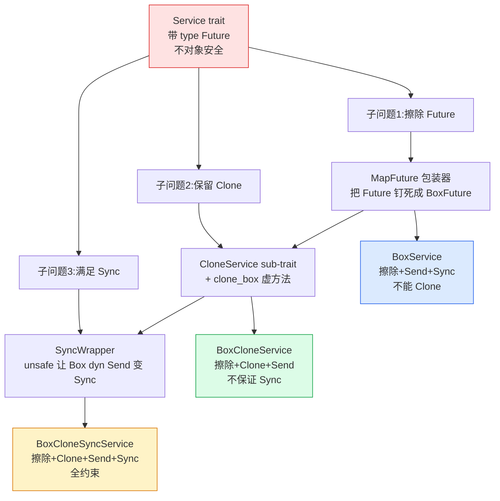
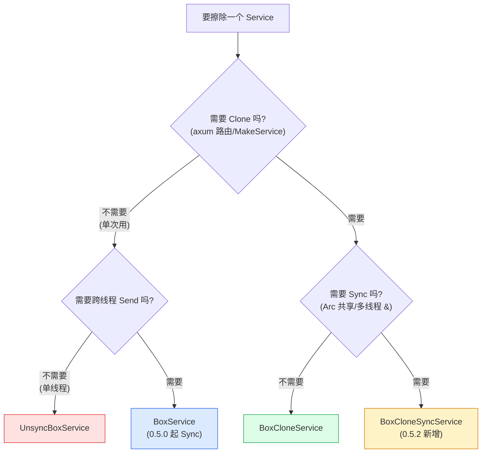

# 第 17 章 · BoxService 家族:类型擦除

> 第 6 篇 · 工程化:类型擦除与集成 · 组合招牌章

## 章首

**核心问题**:你在第 4 章见过 `ServiceBuilder` 把 timeout、retry、限流、buffer 四层链式套到一个服务上,产出的是这样一个怪物类型——

```rust
// ServiceBuilder::new().buffer(100).concurrency_limit(10).timeout(1s).retry(p).service(MySvc)
// 产出的类型(简化示意,非源码原文):
Buffer<
    ConcurrencyLimit<
        Timeout<
            Retry<Policy, MySvc>,
            <MySvc as Service<Req>>::Future,
        >,
        ...
    >,
    ...
>
```

这一长串在 `let svc = ...` 的局部变量里,靠类型推导能藏住。可一旦你要把它存进 axum 的路由表(`HashMap<Route, ???>`),或者放进一个 `Vec`,或者当一个函数的返回值,你就得把这串鬼东西**原样抄出来当类型写**。更要命的是:axum 的 `Router` 要把 `/GET /users` 路由到的服务和 `/POST /orders` 路由到的服务**存进同一个容器**,可这两个服务套的中间件层数、类型各不相同——一个可能是 `Timeout<UsersHandler>`,另一个可能是 `Retry<Timeout<OrdersHandler>>`。它们根本不是同一个类型,怎么塞进同一个 `HashMap`?

直觉答案是"用 `Box<dyn Service>` 擦除类型"。可你真去写 `Box<dyn Service<Req>>`,编译器会甩给你一串看不懂的对象安全(object safety)报错:`Service` trait 既带泛型、又有关联类型 `Future`、方法还是 `&mut self`,根本不能直接 `dyn`。这是 Rust trait object 最常翻车的地方,也是 Tower 在 0.4 到 0.5 之间反复打磨、最终拿出一整个 `BoxService` 家族(`UnsyncBoxService` / `BoxService` / `BoxCloneService` / `BoxCloneSyncService`)才解决的问题。

读完本章你会明白:

1. **为什么 `Service` trait 不能直接 `dyn`**——它有泛型参数 `<Request>`、有关联类型 `Future`、`poll_ready`/`call` 还是 `&mut self`。这三个特征叠加,让 `Box<dyn Service<Req>>` 编译不过。这不是 Tower 的 bug,是 Rust 对象安全的硬规则,本章把这条规则从 `core` 拆透。
2. **Tower 怎么用一个包装器 `MapFuture` 把关联类型 `Future` 钉死成具体类型 `BoxFuture`,从而让 `dyn Service<Req, Future = BoxFuture>` 合法**——这是绕过对象安全的核心技巧,不是"内部 sealed trait"(那是常见误解),而是"约束关联类型到具体类型"。配上私有的 `CloneService` sub-trait 解决 `Clone`、配上 `SyncWrapper` 解决 `Sync`,三个技巧各管一面。
3. **为什么 axum/tonic/reqwest 非要 `Clone + Sync` 的 boxed service**——axum 路由要 Clone(每个连接 clone 一份 service 处理那个连接),多线程运行时要 Sync(service 句柄可能被多个线程 `&` 共享)。这三个约束缺一个,框架就用不了。所以 Tower 才会有四个 `Box*Service`,而不是一个。
4. **`BoxService` 家族的演进史**——0.4.x 时 `BoxService` 还不是 `Sync`(用 `UnsyncBoxService` 区分),0.5.0([#702]) 用 `SyncWrapper` 让 `BoxService` 变 `Sync`(这其实是 breaking change,因为之前有人靠它 `!Sync` 的特性),0.5.2([#777]/[#802]) 又加了 `BoxCloneSyncService`。这条演进线,恰好把"trait object 怎么既擦除类型又保留 Clone+Sync"这个 Rust 工程难题的完整解题过程展示给你看。

**逃生阀**:本章是全书最 Rusty 的一章,大量 trait object、对象安全、关联类型、`Pin`、`Send`/`Sync` 的底层概念。如果你对"为什么 `dyn Trait` 有对象安全约束"完全没概念,建议先放慢,跟着 1.2 节把对象安全这条规则走一遍——它不长,但本章每一节都建立在它之上。如果你只想知道"用哪个",跳到 1.4 节的决策表和章末小结即可,招牌章不建议跳过技巧精解。

---

## 一句话点破

> **`Service` trait 因为带泛型 `<Request>`、关联类型 `Future`、`&mut self`,天生不能直接 `dyn`。Tower 的解法不是发明某种魔法 sealed trait,而是三步:(1)用一个 `MapFuture` 包装器把每个具体 service 的关联类型 `Future` 钉死成统一的 `BoxFuture<'static, Result<U,E>>`,让 `dyn Service<Req, Response=U, Error=E, Future=BoxFuture>` 成为合法的对象安全 trait;(2)用一个私有的 `CloneService` sub-trait 加 `clone_box()` 方法,让被擦除的具体类型在 `Box` 后面还能被 `Clone`;(3)用 `SyncWrapper`(在 `!Sync` 的 `Box<dyn ...+Send>` 外面套一层)让整个 `BoxService` 满足 `Sync`。三步各管"擦除 Future / 保留 Clone / 满足 Sync",最终产出 `BoxService<T,U,E>` / `BoxCloneService<T,U,E>` / `BoxCloneSyncService<T,U,E>` 三个统一类型——它们只暴露 `T`(请求)、`U`(响应)、`E`(错误)三个泛型,把 `Timeout<Retry<Buffer<...>>>` 这种怪物彻底藏进 `Box` 里。**

这是结论,不是理由。本章倒过来拆:先看"巨大 Stack 类型存不进容器"这个痛点(P1-04 已经埋下),再看"直接 `Box<dyn Service>` 为什么编译不过"(对象安全这条硬规则),然后讲 Tower 三步走的每一步——`MapFuture` 钉死 Future、`CloneService` 保留 Clone、`SyncWrapper` 满足 Sync——怎么各自解决一面,最后用源码和演进史钉死。

---

## 正文

### 1.1 痛点:巨大 Stack 类型存不进同一个容器

第 4 章讲 `ServiceBuilder` 时我们反复强调过:链式 `.buffer().timeout().retry().service(svc)` 的最大代价,是产出的类型会随中间件层数**指数级变长**。局部变量里靠类型推导藏得住,可一旦这玩意儿要跨函数边界,问题就全爆出来。三种最痛的场景:

**场景一:axum 的路由表**。axum 的 `Router` 内部要维护一张"路由模式 → 处理服务"的表,大概长这样(简化,非 axum 源码原文):

```rust
// 伪代码:axum Router 要把不同路由的服务存进同一个结构
struct Router {
    routes: HashMap<HttpMethod, Box<???>>,
}

let router = Router::new()
    .route("/users", get(get_users_handler))      // 套了 Timeout
    .route("/orders", post(create_order_handler)); // 套了 Retry<Timeout>
```

`/users` 那条路由的服务类型可能是 `Timeout<MakeService<UsersHandler>>`,`/orders` 那条是 `Retry<Policy, Timeout<MakeService<OrdersHandler>>>`——两个类型完全不同,`HashMap` 的 value 类型只能有一个,怎么存?答案只有一个:**把它们的类型擦除成同一个**。

**场景二:函数返回值**。你写了个 `fn build_client() -> ???`,里面用 `ServiceBuilder` 套了 timeout/retry/load_balance/reconnect 一堆中间件,最后返回。这个返回类型是什么?是 `Reconnect<Balance<P2C<...>, Discover<...>>, MakeService<...>>` 这种几十层的嵌套。你不想把这串写进签名(改一层就全得改),也不想把它泄露给调用方。你想返回一个"对调用方不透明的、就叫 Client 的类型"。

**场景三:条件组装**。你想根据配置开关决定套不套 timeout:

```rust
// 伪代码:根据环境变量决定套不套 timeout,返回类型必须一致
fn build_service(cfg: &Config) -> ??? {
    let base = ServiceBuilder::new().concurrency_limit(100);
    if cfg.timeout_enabled {
        base.timeout(30s).service(MySvc)   // 类型 A
    } else {
        base.service(MySvc)                 // 类型 B(完全不同!)
    }
}
```

`if` 的两个分支类型不同,这个函数根本编译不过。要让两个分支返回同类型,你也得擦除类型。

> **不这样会怎样**:这三个场景在真实的 Rust 异步服务里天天出现。没有类型擦除,axum 写不出 `Router`(路由表存不进不同类型的服务),tonic 写不出 gRPC server(每个 RPC 方法的服务类型不同),reqwest 写不出可配置的 client(条件组装返回类型不一致)。类型擦除不是"可选优化",是 Tower 能被这些框架用起来的**前提条件**。

那直觉的答案是 Rust 的标准武器:`Box<dyn Trait>`。可你真去写 `Box<dyn Service<Req>>`,撞墙就开始了。

### 1.2 撞墙:`Service` trait 为什么不能直接 `dyn`

要理解为什么 `Box<dyn Service<Req>>` 编译不过,得先回到 Rust 的对象安全(object safety)这条规则。这不是 Tower 的特殊问题,是 Rust 类型系统对所有 trait 的通用约束。

**对象安全的本质**:一个 trait 能被做成 trait object(`dyn Trait`),前提是这个 trait 的所有方法都能通过"虚表(vtable)+ 数据指针"的方式调度。具体来说,Rust 编译器要能在编译期就确定这张虚表里每个方法长什么样。这要求:

1. **trait 不能有泛型方法**(`fn foo<T>(...)`),因为虚表是"每个 trait 一张",不可能为每个 `T` 都生成一个虚表项。
2. **方法的参数和返回值要能被擦除**——返回 `Self`(具体类型未知)不行,返回带泛型参数的关联类型也不行。
3. **方法接收者**——`self` 不能是按值(`self`),得是 `&self` 或 `&mut self`(因为 trait object 是胖指针,数据在堆上,不能按值移动)。

回头看 Tower 的 `Service` trait([源码](../tower/tower-service/src/lib.rs#L311-L356)):

```rust
pub trait Service<Request> {
    type Response;
    type Error;
    type Future: Future<Output = Result<Self::Response, Self::Error>>;

    fn poll_ready(&mut self, cx: &mut Context<'_>) -> Poll<Result<(), Self::Error>>;
    fn call(&mut self, req: Request) -> Self::Future;
}
```

逐条对照对象安全的硬规则,`Service` trait 在三个地方踩雷:

**踩雷一:`Service` trait 自己带泛型参数 `<Request>`**。这不是"泛型方法"——`poll_ready`/`call` 都没有自己的泛型——但 `Service<Request>` 这个 trait 整体是泛型的。这意味着你不能写 `dyn Service`(不完整),只能写 `dyn Service<某个具体 Request>`。这一条其实**不算违规**——`Service<Req>` 在 `Req` 确定后,是个具体的 trait,原则上可以 `dyn Service<Req>`。但它让问题复杂化,稍后讲 `BoxFuture` 时会再碰到。

**踩雷二:关联类型 `type Future: Future<...>`**。这是最致命的一条。`call(&mut self, req) -> Self::Future` 这个方法返回的是**关联类型** `Self::Future`。当你写 `dyn Service<Req>` 时,编译器面对 `call` 的返回类型 `Self::Future`,会问:`Self::Future` 是什么?对于 trait object,`Self` 被擦除了(你不知道里面是 `Timeout<Svc>` 还是 `Retry<P, Svc>`),所以 `Self::Future` 也无从得知。虚表里这个 `call` 方法该返回什么类型的值?编译器说不清,于是报错。

**踩雷三:`&mut self` 方法**。这一条不算违规(`&mut self` 是允许的),但它对 trait object 的实际使用有微妙影响,稍后讲 `SyncWrapper` 时会看到。

所以,你写 `let x: Box<dyn Service<Req>> = ...`,Rust 编译器会大致这么报(简化):

```
error[E0038]: the trait `Service` cannot be made into an object
note: because it requires `Self: Sized`
note: ... method `call` references the `Self::Future` associated type
```

核心就是那条**关联类型 `Future`**。这就是 Tower 必须绕过的墙。

#### 对象安全的底层:虚表为什么需要"已知返回类型"

要真正理解这条墙,得往下钻一层,看 Rust 的 trait object 在机器层面到底是什么。一个 `Box<dyn Trait>` 不是普通的 `Box<T>`,它是**胖指针(fat pointer)**——两个机器字:一个数据指针(指向堆上的具体值),一个虚表指针(指向那张编译期生成的方法表)。虚表里,每个方法对应一个函数指针。

当编译器生成虚表时,它必须为每个方法确定**调用约定**(calling convention):参数怎么传、返回值放哪、要不要分配栈空间。这就要求每个方法的**签名在编译期完全已知**。可 `Service::call(&mut self, req) -> Self::Future` 这个方法,返回类型是 `Self::Future`——一个关联类型。生成虚表时,`Self` 被擦除了(你不知道 trait object 里装的是 `Timeout<Svc>` 还是 `Retry<P, Svc>`),于是 `Self::Future` 也不知道是 `TimeoutFuture<...>` 还是 `RetryFuture<...>`,这俩类型的**大小、布局、drop 逻辑都不一样**。虚表里这一项,编译器填不进去——它不知道返回值要按多大的空间分配、按什么布局 drop。于是报错。

这跟"泛型方法"的违规是同一类问题,只是表现不同。泛型方法(`fn foo<T>()`)违规,是因为虚表是"每 trait 一张",不可能为每个 `T` 生成无穷多张虚表项。关联类型(`Self::Future`)违规,是因为虚表项的签名需要"返回类型已知",而关联类型在被 `dyn` 时未知。两者本质都是:**虚表要求编译期确定性,而泛型/关联类型引入了运行期多态**。

> **钉死这件事**:Rust 的对象安全规则,不是 Rust 设计者的任性,是**虚表这种实现方式的物理约束**。任何用虚表做动态分发的语言(Java 的接口、C++ 的虚函数、Go 的 interface),都隐含地要求"方法签名编译期已知"。Rust 把它显式化(编译期检查对象安全),并且给了逃生通道——关联类型可以用 `=` 约束成具体类型,泛型可以用 monomorphization 单态化绕开。Tower 用的就是关联类型约束这条逃生通道。

#### 关联类型 vs 泛型参数:为什么 `Service` 用前者

顺便回答一个常见疑问:既然关联类型是对象安全的麻烦,为什么 `Service` trait 不把 `Future`/`Response`/`Error` 都做成泛型参数(像 `Service<Request, Response, Error, Future>`),那样不就对象安全了吗(每个泛型参数在 trait object 时都被具体化)?

答案是**泛型参数会让 trait 的组合性崩塌**。如果 `Service` 是 `Service<R, Response, Error, Future>`,那你写一个中间件 `Timeout<S>` 泛型约束就得写 `where S: Service<R, Response, ?, Error, ?, Future, ?>`——你不知道内层 service 的 `Response`/`Error`/`Future` 是什么,要一路透传。整个 Tower 的 `ServiceExt` 组合子、`Layer` 洋葱、`ServiceBuilder` Stack,都会被这堆泛型参数淹没。

Rust 的惯例是:**输入类型用泛型参数(`Request`,因为每次调用可能不同),输出类型用关联类型(`Response`/`Error`/`Future`,因为对一个具体 service 它们是固定的)**。这样,`Service<MyReq>` 是一个具体的 trait(关联类型由 impl 确定),中间件只要约束 `S: Service<R>` 就够了,不用关心 `S` 的 `Response`/`Error`/`Future` 具体是什么(用 `S::Response` 引用即可)。这个设计让 Tower 的组合性成立,代价就是 trait object 时关联类型要单独处理——正是本章的主题。

所以 `Service` trait 的设计是对的:它优先了**组合性**(绝大多数场景,中间件组合),牺牲了**对象安全性**(只在需要擦除时,用 `map_future` + 关联类型约束绕过)。这是个正确的取舍,因为组合是 Tower 的日常,擦除是少数场景。

> **不这样会怎样**:如果你硬要 `Service` trait 对象安全,你得把 `type Future` 删掉,把 `call` 改成 `fn call(&mut self, req) -> Pin<Box<dyn Future<...>>>`。可这样所有实现 `Service` 的具体类型(整个 Tower 生态几百个),`call` 都被迫堆分配返回 `Box`,失去泛型单态化的零开销优势。Tower 的设计选择是**保留 `type Future`(让具体类型能用零开销的具体 Future),只在需要擦除时才付出 `Box` 的代价**。这是个正确的取舍:默认零开销,按需擦除。

那么问题就精确了:**怎么既保留 `Service` trait 的 `type Future`(让具体类型零开销),又能在需要时把它擦除成一个统一的 `Box` 类型?**

### 1.3 所以 Tower 这么设计:三步走擦除 `Service`

Tower 的解法不是某种黑魔法,而是把"擦除"这件事拆成三个正交的子问题,各用一个标准 Rust 手段解决。这一节先看全貌,后面三节各自拆透。

**子问题一:擦除关联类型 `Future`**。`dyn Service<Req>` 编译不过的根因是 `Self::Future`。Tower 的招是:**先给每个具体 service 套一层 `MapFuture` 包装器,把这层包装器的 `Future` 关联类型钉死成一个固定的具体类型 `BoxFuture<'static, Result<U, E>>`**。`BoxFuture` 就是 `Pin<Box<dyn Future<Output = Result<U, E>> + Send + 'static>>`,一个具体类型。一旦 `Future` 这个关联类型被钉死成具体类型,`dyn Service<Req, Response = U, Error = E, Future = BoxFuture>` 就变成对象安全的——`call` 的返回类型不再是"未知的 `Self::Future`",而是"明确的 `BoxFuture`",虚表里这一项就有了确切形状。

**子问题二:让被擦除后的 `Box<dyn ...>` 还能 `Clone`**。光擦除 Future 还不够。axum 的路由要 Clone service(每个连接 clone 一份),可 `Box<dyn SomeTrait>` 默认不能 Clone——`dyn Trait` 没有 `Clone` 的虚表项。Tower 的招是:**在 `dyn Service` 之外,再定义一个私有的 sub-trait `CloneService`,它继承 `Service` 并加一个 `clone_box(&self) -> Box<dyn CloneService<...>>` 方法**。然后给所有 `T: Service + Clone` 写一个 blanket impl,`clone_box` 的实现就是 `Box::new(self.clone())`。这样,被擦除的具体类型虽然藏在 `Box` 后面,但它实现了 `CloneService`,通过 `clone_box` 这个虚方法,能在不知道具体类型的情况下复制自己。

**子问题三:让整个 boxed service 满足 `Sync`**。光擦除 + Clone 还不够。多线程框架要 `Sync`(多个线程能同时持有一个 `&BoxService`),可 `Box<dyn SomeTrait + Send>` 默认不是 `Sync`——因为 `dyn Trait` 的 `&self` 方法可能内部有可变性,Rust 保守地不授予 `Sync`。Tower 的招(0.5.0 起)是:**用一个叫 `SyncWrapper` 的外部 crate,把 `!Sync` 的 `Box<dyn ...+Send>` 套进一个 `SyncWrapper<...>` 里**。`SyncWrapper` 是个极其简单的 unsafe 包装器:它内部存一个值,只提供 `get_mut(&mut self)` 访问(没有 `&self` 访问),所以即使内部值不是 `Sync`,整个 `SyncWrapper` 也可以声称自己是 `Sync`——因为没有任何 `&self` 方法能并发访问内部,可变性只能通过 `&mut self` 拿到,而 `&mut` 本身就是排他的。这是 unsafe 但 sound 的典型用法。

这三个子问题一组合,就产出 `BoxService` 家族:



注意三者的约束逐级加码:`BoxService` 解决"擦除 + Sync"但**不保证 Clone**(适合单次使用);`BoxCloneService` 加上 `Clone` 但**不保证 Sync`(用 CloneService sub-trait,无 SyncWrapper);`BoxCloneSyncService` 三个全要(CloneService 加 `+ Send + Sync` 约束)。这三档对应三种使用场景,后面 1.4 节给决策表。

> **钉死这件事**:Tower 的类型擦除,**不是**"用一个内部 sealed trait 把 Service 翻译成另一种可 dyn 的 trait"(很多博客这么讲,是错的),**而是**"用 `MapFuture` 把 `Service` 的关联类型 Future 钉死成具体类型,从而让 `dyn Service<..., Future = BoxFuture>` 本身合法"。换句话说,Tower 擦除的是 `Service` trait 本身,只是先把它的关联类型固定下来。这个区别很重要,后面技巧精解会再强调。

下面三节,各自拆透三个子问题。先从最核心的"擦除 Future"开始。

### 1.4 子问题一拆透:用 `MapFuture` 把关联类型钉死

回到 `dyn Service<Req>` 编译不过的根因:`type Future` 是关联类型,`dyn` 时编译器不知道它具体是什么。那如果我们在擦除之前,**先把这个具体 service 的 `Future` 关联类型,替换成一个固定的具体类型**,问题不就解决了吗?

这正是 `MapFuture` 包装器干的事。看 [源码](../tower/tower/src/util/map_future.rs#L13-L67):

```rust
#[derive(Clone)]
pub struct MapFuture<S, F> {
    inner: S,
    f: F,
}

impl<R, S, F, T, E, Fut> Service<R> for MapFuture<S, F>
where
    S: Service<R>,
    F: FnMut(S::Future) -> Fut,
    E: From<S::Error>,
    Fut: Future<Output = Result<T, E>>,
{
    type Response = T;
    type Error = E;
    type Future = Fut;                          // ← 关键:Future 关联类型 = 闭包返回的 Fut

    fn poll_ready(&mut self, cx: &mut Context<'_>) -> Poll<Result<(), Self::Error>> {
        self.inner.poll_ready(cx).map_err(From::from)
    }

    fn call(&mut self, req: R) -> Self::Future {
        (self.f)(self.inner.call(req))         // ← 内层 call 的 Future,被闭包 f 转成 Fut
    }
}
```

`MapFuture<S, F>` 包了一个内层 service `S` 和一个闭包 `F`。它实现 `Service` 时,把 `call` 的返回类型变成了 `(self.f)(self.inner.call(req))`——也就是先调内层的 `call` 拿到 `S::Future`,再把这个 future 喂给闭包 `f`,闭包返回一个新 future `Fut`。于是 `MapFuture` 这个外层的 `type Future = Fut`。

注意 `Fut` 是闭包 `F` 的返回类型,**它在闭包确定时就确定了**。Tower 在擦除时,会让这个闭包的返回类型恰好是 `BoxFuture`,也就是 `Pin<Box<dyn Future<Output = Result<U, E>> + Send>>`。看 `BoxService::new` 的真实代码([源码](../tower/tower/src/util/boxed/sync.rs#L59-L71)):

```rust
impl<T, U, E> BoxService<T, U, E> {
    pub fn new<S>(inner: S) -> Self
    where
        S: Service<T, Response = U, Error = E> + Send + 'static,
        S::Future: Send + 'static,
    {
        // rust can't infer the type
        let inner: Box<dyn Service<T, Response = U, Error = E, Future = BoxFuture<U, E>> + Send> =
            Box::new(inner.map_future(|f: S::Future| Box::pin(f) as _));
        let inner = SyncWrapper::new(inner);
        BoxService { inner }
    }
}
```

关键是这一句:`inner.map_future(|f: S::Future| Box::pin(f) as _)`。它给 `inner` 套了一层 `MapFuture`,闭包是 `|f: S::Future| Box::pin(f)`——把内层返回的具体 future `S::Future` 装进 `Box::pin` 变成 `Pin<Box<...>>`,也就是 `BoxFuture`。于是这个 `MapFuture` 包装器实现 `Service<T>` 时,`type Future = BoxFuture<U, E>`(一个具体类型!)。

现在,被 `Box::new` 的对象,它的类型是 `MapFuture<S, 闭包>`,这个类型实现 `Service<T>` 时**关联类型 Future 是确定的 `BoxFuture<U,E>`**。所以下面这行合法:

```rust
let inner: Box<dyn Service<T, Response = U, Error = E, Future = BoxFuture<U, E>> + Send> = ...;
```

注意 trait object 的写法:`dyn Service<T, Response = U, Error = E, Future = BoxFuture<U, E>> + Send`。这里把三个关联类型 `Response`/`Error`/`Future` **全部用 `=` 约束成具体类型**。Rust 允许在 trait object 里这样约束关联类型——一旦所有关联类型都被钉死成具体类型,这个 trait object 就合法了(对象安全的硬规则被满足:`call` 的返回类型不再是模糊的 `Self::Future`,而是明确的 `BoxFuture`)。

> **技巧精解预告**:这里有个反直觉的点——为什么必须先 `map_future` 再 `Box::new`,不能反过来?如果直接 `Box::new(inner)` 然后想擦除,内层 `inner: S` 的 `type Future = S::Future` 是个**没被钉死的关联类型**,`dyn Service<T>` 时编译器还是不知道 `S::Future` 是什么。必须先用 `map_future` 把它替换成 `BoxFuture`,才能 `dyn`。技巧精解会拆这个顺序。

擦除 Future 这一步,是整个 `BoxService` 家族的基石。但光擦除还不够——你得能用这个 service。`Service` trait 的 `poll_ready`/`call` 是 `&mut self`,trait object 通过 `Box::new` 后,你可以 `(*boxed).poll_ready(cx)` 调用它。看 `BoxService` 自己怎么实现 `Service`([源码](../tower/tower/src/util/boxed/sync.rs#L86-L98)):

```rust
impl<T, U, E> Service<T> for BoxService<T, U, E> {
    type Response = U;
    type Error = E;
    type Future = BoxFuture<U, E>;

    fn poll_ready(&mut self, cx: &mut Context<'_>) -> Poll<Result<(), E>> {
        self.inner.get_mut().poll_ready(cx)
    }

    fn call(&mut self, request: T) -> BoxFuture<U, E> {
        self.inner.get_mut().call(request)
    }
}
```

`BoxService` 自己也是 `Service<T>`,它的 `poll_ready`/`call` 就是转发给内部那个 `Box<dyn Service<...>>`(`self.inner.get_mut()` 是 `SyncWrapper` 的方法,拿到内部 `&mut`)。这样,外部代码看到的 `BoxService<T, U, E>` 是个干净的、类型简单的 `Service`,完全不知道内层是什么 `Timeout<Retry<Buffer<...>>>`。类型擦除完成。

### 1.5 子问题二拆透:用 `CloneService` sub-trait 让 `Box<dyn>` 还能 Clone

擦除 Future 解决了"存进容器"的问题,但没解决"Clone"的问题。axum 的路由每次有新连接进来,都要 `clone()` 一份 service 来处理这个连接(为什么 clone 而不是直接 `&`?因为 `Service::call` 是 `&mut self`——每个并发请求要一个独立的 `&mut`,而 `&mut` 不能共享,只能各自有一份)。可 `Box<dyn SomeTrait>` 默认不能 `Clone`——`dyn Trait` 的虚表里没有 `clone` 这一项。

朴素想法:能不能要求 `Box<dyn Service + Clone>`?不行,`Clone` 的 `clone(&self) -> Self` 里的 `Self` 是具体类型,trait object 里 `Self` 被擦除了,`Clone` 本身就**不对象安全**。所以 `Box<dyn Trait + Clone>` 在 Rust 里编译不过(`Clone` 不能作为 trait object 的 bound)。

Tower 的招是经典的 Rust sub-trait 模式:**定义一个私有的、专门为擦除设计的 sub-trait `CloneService`,它继承 `Service`,再加一个能返回 `Box<dyn ...>` 的 `clone_box` 方法**。看 `BoxCloneService` 的真实源码([源码](../tower/tower/src/util/boxed_clone.rs#L58-L130)):

```rust
pub struct BoxCloneService<T, U, E>(
    Box<
        dyn CloneService<T, Response = U, Error = E, Future = BoxFuture<'static, Result<U, E>>>
            + Send,
    >,
);

// ... Service impl 转发省略 ...

impl<T, U, E> Clone for BoxCloneService<T, U, E> {
    fn clone(&self) -> Self {
        Self(self.0.clone_box())        // ← 调虚方法 clone_box
    }
}

trait CloneService<R>: Service<R> {
    fn clone_box(
        &self,
    ) -> Box<
        dyn CloneService<R, Response = Self::Response, Error = Self::Error, Future = Self::Future>
            + Send,
    >;
}

impl<R, T> CloneService<R> for T
where
    T: Service<R> + Send + Clone + 'static,
{
    fn clone_box(
        &self,
    ) -> Box<dyn CloneService<R, Response = T::Response, Error = T::Error, Future = T::Future> + Send>
    {
        Box::new(self.clone())           // ← 具体类型 T 的 clone,再 Box 起来
    }
}
```

逐段拆:

**第一,`CloneService<R>` 是个私有 trait**(没有 `pub`),只在这一个文件里用。它继承 `Service<R>`(`: Service<R>`),并加一个方法 `clone_box(&self) -> Box<dyn CloneService<...> + Send>`。注意这个方法的返回类型是 `Box<dyn CloneService>`,**不是** `Self`——这是关键。因为返回的是 trait object(类型已知),不是被擦除的 `Self`,所以这个方法本身是对象安全的,可以进虚表。

**第二,blanket impl**:`impl<R, T> CloneService<R> for T where T: Service<R> + Send + Clone + 'static`。这一行是 Rust 的 blanket impl(覆盖性实现),意思是**所有满足 `Service + Send + Clone + 'static` 的类型 `T`,自动实现 `CloneService`**。它的 `clone_box` 实现极其简单:`Box::new(self.clone())`——调用 `T` 自己的 `Clone::clone()`(编译期单态化,知道具体类型),把 clone 出来的新 `T` 再 `Box::new` 进 trait object。

**第三,`BoxCloneService` 的 `Clone` impl**:`fn clone(&self) -> Self { Self(self.0.clone_box()) }`。它调内部 `Box<dyn CloneService>` 的 `clone_box` 虚方法——这个虚方法走 vtable 分发到具体类型的 `clone_box` 实现(就是上面 blanket impl 那个),返回一个新的 `Box<dyn CloneService>`,再包回 `BoxCloneService`。

这一套是 Rust sub-trait + blanket impl + vtable 的标准组合拳。它的精妙之处在于:**具体类型 `T` 的 `Clone::clone` 在编译期单态化(零开销),只有跨越 `Box<dyn>` 边界的那一次 `clone_box` 走 vtable 动态分发**。性能上,比起"完全静态单态化"多了一次 vtable 调用 + 一次堆分配(`Box::new`),但比起"完全擦除不能 clone"是巨大的功能增益。

#### blanket impl 为什么这么写:`T: Service + Send + Clone + 'static`

仔细看那个 blanket impl 的约束:`impl<R, T> CloneService<R> for T where T: Service<R> + Send + Clone + 'static`。这四个约束缺一不可,逐个拆:

- **`T: Service<R>`**:`CloneService<R>` 继承自 `Service<R>`,所以 `T` 必须先是个 `Service`,这是继承约束。
- **`T: Send`**:因为 `clone_box` 返回 `Box<dyn CloneService<...> + Send>`,这个 `+ Send` 要求被 box 的值是 `Send`。如果 `T` 不是 `Send`,它生成的 `Box<T>` 不是 `Send`,塞不进 `Box<dyn ...+ Send>`。
- **`T: Clone`**:`clone_box` 的实现是 `Box::new(self.clone())`,要求 `T` 自己能 `clone`。这一条是核心——它把"具体类型必须 Clone"的要求,从 `BoxCloneService::new` 的签名(`S: ... + Clone`)传递到 blanket impl,层层把关。
- **`T: 'static`**:trait object `dyn CloneService<...> + 'static`(默认 `'static`),要求被 box 的值没有非 `'static` 的借用。大多数 service 是 `'static` 的(自己拥有所有数据),这一条通常自动满足。

这四条约束组合起来,精确地刻画了"能被 `BoxCloneService` 擦除的 service 集合"。如果用户的 service 缺任何一条(比如 `!Clone`,像 `Buffer` 包出来的服务),就进不来——这正是 `BoxCloneService` 和 `BoxService` 的分界:`BoxService::new` 的约束只有 `Service + Send + 'static`(没有 `Clone`),所以 `!Clone` 的服务能进 `BoxService` 但进不了 `BoxCloneService`。

> **承接 P2-05 Buffer**:第 5 章讲过,`Buffer` 把一个 `!Clone` 的服务变成 `Clone + Send`——靠 worker task + mpsc 通道,clone 的是 `Sender` 不是原服务。所以 `Buffer<S>` 出来的服务是 `Clone` 的,能进 `BoxCloneService`。这也是为什么 axum 的路由常用 `Buffer` 包一层——让原本 `!Clone` 的业务服务,变成可擦除、可 clone 的形态,塞进 `HashMap<Route, BoxCloneService<...>>`。这是 Tower 中间件协同的典型链路:`Buffer` 解决 Clone,`BoxCloneService` 解决擦除,两者咬合。

> **技巧精解预告**:这里有个常见的错误想法——"给 `BoxCloneService` 内部塞个 `Arc<dyn Service>`,Clone 就是 `Arc::clone` 不就行了?"。技巧精解会拆为什么 Tower 不这么干(`Arc` 是共享不是 clone,`&mut self` 的并发会冲突),以及 `CloneService` 的 `clone_box` 为什么是更 sound 的选择。

注意 `BoxCloneService::new` 也用了 `map_future`([源码](../tower/tower/src/util/boxed_clone.rs#L65-L74)):

```rust
impl<T, U, E> BoxCloneService<T, U, E> {
    pub fn new<S>(inner: S) -> Self
    where
        S: Service<T, Response = U, Error = E> + Clone + Send + 'static,
        S::Future: Send + 'static,
    {
        let inner = inner.map_future(|f| Box::pin(f) as _);
        BoxCloneService(Box::new(inner))
    }
    // ...
}
```

和 `BoxService::new` 一模一样的 `map_future` 招数,把 `S::Future` 钉死成 `BoxFuture`。所以 `BoxCloneService` 实际上是**同时用了子问题一(`MapFuture` 擦 Future)和子问题二(`CloneService` 保 Clone)**两个技巧的组合。`BoxService` 只用子问题一(+ 子问题三的 `SyncWrapper`),`BoxCloneService` 用子问题一+二,`BoxCloneSyncService` 三个全用。这就是"家族"的由来——同一套技巧的不同子集组合。

### 1.6 子问题三拆透:用 `SyncWrapper` 让 boxed service 满足 Sync

最后看 `Sync`。`Box<dyn SomeTrait + Send>` 默认是 `Send`(可以在线程间移动所有权),但**不是 `Sync`**(不能多线程共享 `&`)。原因:`dyn Trait` 的 `&self` 方法(虽然 `Service` 没有 `&self` 方法,但 trait object 在 vtable 层面 Rust 保守处理)和潜在的内部可变性,让 Rust 不自动授予 `Sync`。

可多线程框架要 `Sync`。比如你有一个 `Arc<BoxService>`,要被多个 worker 线程同时持有 `&`——这就要求 `BoxService: Sync`(因为 `Arc<T>: Sync` 要求 `T: Sync`)。axum 的某些场景、hyper 的 connector、tonic 的 service 句柄,都可能需要这个。

Tower 0.5.0 之前,`BoxService` 不是 `Sync`——它内部就是 `Box<dyn Service + Send>`,Rust 不给 `Sync`。这导致用 `BoxService` 的地方如果想放进 `Arc` 跨线程共享,编译不过。当时 Tower 的应对是提供一个并行的 `UnsyncBoxService`(本章稍后讲),但用户体验差。

0.5.0([#702]) 的修复极其巧妙:用一个叫 `SyncWrapper` 的外部 crate。看 [源码](../tower/tower/src/util/boxed/sync.rs#L48-L51):

```rust
pub struct BoxService<T, U, E> {
    inner:
        SyncWrapper<Box<dyn Service<T, Response = U, Error = E, Future = BoxFuture<U, E>> + Send>>,
}
```

`SyncWrapper` 是 `sync_wrapper` crate 提供的一个极简包装器。它的本质(简化,非源码原文)大概是:

```rust
// sync_wrapper crate 的简化示意(非 tower 源码,标注为外部 crate)
pub struct SyncWrapper<T>(T);

impl<T> SyncWrapper<T> {
    pub fn new(value: T) -> Self { Self(value) }
    pub fn get_mut(&mut self) -> &mut T { &mut self.0 }
    // 注意:没有 get(&self) -> &T 方法!
}

// unsafe: T 即使不是 Sync,SyncWrapper<T> 也是 Sync
unsafe impl<T> Sync for SyncWrapper<T> {}
```

`SyncWrapper` 的全部秘密在于:**它只提供 `get_mut(&mut self)` 访问,不提供任何 `&self` 访问方法**。这意味着,你拿到内部的 `&T` 或 `&mut T`,**必须先有一个 `&mut SyncWrapper`**。而 `&mut` 本身在 Rust 里是排他的(不能并发存在两个 `&mut`),所以即使内部值 `T` 不是 `Sync`,整个 `SyncWrapper<T>` 也可以安全地声称自己是 `Sync`——因为没有任何共享的 `&self` 路径能并发触达内部。

这是一个 unsafe 但 sound 的经典用法。`unsafe impl<T> Sync for SyncWrapper<T>` 这一行是 unsafe 的(编译器不能自动推导),但它是 sound 的(逻辑上不可能产生数据竞争)。`sync_wrapper` crate 用这一行 unsafe,换来了"`Box<dyn ...+Send>` 包装后变 `Sync`"的能力。

回到 `BoxService`。它的 `poll_ready`/`call` 怎么访问内部?看 [源码](../tower/tower/src/util/boxed/sync.rs#L86-L98):

```rust
fn poll_ready(&mut self, cx: &mut Context<'_>) -> Poll<Result<(), E>> {
    self.inner.get_mut().poll_ready(cx)         // ← get_mut,不是 get
}

fn call(&mut self, request: T) -> BoxFuture<U, E> {
    self.inner.get_mut().call(request)          // ← get_mut
}
```

注意是 `get_mut`——`BoxService` 的 `Service` impl 是 `&mut self`,所以它有合法的 `&mut self.inner`,调 `get_mut` 拿到内部 `&mut Box<dyn Service>`,再调 `poll_ready`/`call`。整个流程只在 `&mut` 下访问内部,符合 `SyncWrapper` 的 sound 性承诺。

tower 还写了个测试钉死这件事([源码](../tower/tower/src/util/boxed/sync.rs#L106-L111)):

```rust
#[test]
fn is_sync() {
    fn assert_sync<T: Sync>() {}
    assert_sync::<BoxService<(), (), ()>>();
}
```

`assert_sync::<BoxService<(), (), ()>>()` 这一行如果 `BoxService<(), (), ()>` 不满足 `Sync`,编译就不过。这个测试不是测运行期行为,是测**编译期的 trait bound**——它把"`BoxService` 是 `Sync`"这个 0.5.0 引入的特性,用类型系统钉死了。

#### `SyncWrapper` 凭什么 sound:逐一推演数据竞争

`unsafe impl<T> Sync for SyncWrapper<T>` 这一行 unsafe,凭什么 sound?我们逐一推演所有可能的数据竞争路径,看它为什么堵死了每一条。

**`Sync` 的定义**:类型 `T: Sync` 意味着,多个线程可以同时持有 `&T` 而不产生数据竞争。Rust 编译器自动授予 `Sync` 的规则是:如果一个类型的所有字段都 `Sync`,它就 `Sync`。但 `SyncWrapper<T>` 的字段 `T` 可能不 `Sync`(比如 `T = Box<dyn Service + Send>`,这个 `Box` 内部的 `dyn` 不自动 `Sync`),所以编译器不会自动授予——必须手动 `unsafe impl`。手动的 unsafe 就是程序员向编译器承诺:"虽然字段不 Sync,但我保证没有 `&self` 路径能触达它,所以共享 `&SyncWrapper` 是安全的。"

这个承诺怎么兑现?靠 `SyncWrapper` 的 API 设计:**它只暴露 `get_mut(&mut self)`,不暴露任何 `&self` 方法**。

逐条推演可能的数据竞争:

**路径一:两个线程同时调 `get_mut`**。`get_mut` 的签名是 `&mut self`,Rust 的别名规则(aliasing rule)保证同一时刻只能有一个 `&mut`。所以两个线程不可能同时拿到 `&mut self.inner`,这条路被 Rust 的 `&mut` 排他性堵死。

**路径二:一个线程持 `&SyncWrapper`,想通过它访问内部**。`SyncWrapper` 没有 `&self` 方法(`get(&self) -> &T` 不存在),所以持 `&SyncWrapper` 的线程**根本无法触达内部 `T`**。多个线程共享 `&SyncWrapper` 是安全的——它们手上这个 `&` 啥也干不了(除了 drop,但 drop 要所有权 `SyncWrapper`,不是 `&`)。

**路径三:内部 `T` 自己的 drop 逻辑有竞争**。drop 发生在 `SyncWrapper` 被销毁时(所有权转移),不是通过 `&`。多个线程共享 `&SyncWrapper` 不会触发 drop,只有拥有 `SyncWrapper`(比如 `Arc<SyncWrapper>` 的最后一个 `Arc` 被销毁)才 drop。所以 drop 路径也没有共享 `&` 的竞争。

三条路径全堵死,所以 `unsafe impl<T> Sync for SyncWrapper<T>` 是 sound 的。它的代价是:**内部值只能通过 `&mut` 访问,不能通过 `&` 共享读取**。对 `BoxService` 来说这个代价可接受——`Service::poll_ready`/`call` 本来就是 `&mut self`,本来就要排他访问,`SyncWrapper` 的限制恰好和 `Service` 的语义吻合。

> **钉死这件事**:`SyncWrapper` 的 sound 性,不是来自"内部值真的 Sync",而是来自"API 设计让 `&self` 路径根本不存在"。这是 unsafe Rust 的一个重要模式:**通过限制 API(只给 `&mut`,不给 `&`),让一个"逻辑上不 Sync"的值,安全地满足 `Sync` 约束**。这个模式在标准库(`Mutex`/`RwLock` 的内部可变性)、tokio(某些 sync 原语)里都能见到,`sync_wrapper` 是它的最简形态。Tower 借用它,是为了让 `BoxService` 满足多线程框架的 `Sync` 要求,而不用引入 `Mutex` 的运行期开销。

#### 为什么不用 `Mutex` 包一层

顺带回答另一个常见疑问:"既然要让 `Box<dyn Service + Send>` 变 `Sync`,为什么不直接 `Mutex<Box<dyn Service + Send>>`?`Mutex<T>: Sync` 是标准库保证的,不用 unsafe。"

答案是**性能和语义双输**。`Mutex` 在每次 `poll_ready`/`call` 都要加锁解锁,这是原子操作 + 系统调用(竞争时)的开销,在高频请求路径上是不可接受的。更糟的是语义:`Mutex` 把 `&mut` 转成"先 lock 拿 guard,再 deref",而 `Service` 的 `poll_ready`/`call` 是 `&mut self`——如果内层 service 在 `call` 里又 await(异步操作),guard 跨 await 点持有,要么 deadlock(持锁等未来),要么 `Future` 不能 `Send`(`MutexGuard` 非 `Send`)。这会破坏整个异步 service 链。

`SyncWrapper` 的妙处在于:**它没有任何运行期开销**(零成本抽象),只是用类型系统改写了"能不能 Sync"的判定。内部访问还是普通的 `&mut`,没有锁、没有 guard、没有原子操作。这是一个"用 unsafe 换零开销"的经典案例——`sync_wrapper` 的几十行 unsafe 代码,替代了 `Mutex` 的全部运行期机制。

> **承接《Tokio》**:这里讲的 `Send`/`Sync` 是 Rust 标准库 `core::marker` 的 marker trait,《Tokio》讲 task 调度时反复用过(`Send` 的 future 才能跨线程 spawn)。本章只用它的语义(共享 vs 移动),不展开 `Send`/`Sync` 的编译器推导机制,一句带过指路 [[tokio-source-facts]]。

### 1.7 四者对照:为什么是四个,不是一个

到这里,你已经看到 Tower 擦除 Service 的三个正交技巧。把它们组合起来,就得到 `BoxService` 家族的四个成员。这一节用一张表钉死它们的区别和适用场景。

**演进视角(为什么有四个)**:这四个不是一次性设计出来的,是 Tower 在 0.4 到 0.5 之间逐步补齐的。

- **0.4.x 时代**:`BoxService`(那时还是 `!Sync`)和 `UnsyncBoxService` 并存。`BoxService` 要求 `Send`(内部 future 跨线程),`UnsyncBoxService` 不要求 `Send`(单线程用)。两者都不 Clone,都用 `map_future` 擦 Future。那时要 Clone 得用 `BoxCloneService`(0.4 加的,#615),但 `BoxCloneService` 也不 `Sync`。
- **0.5.0([#702])**:让 `BoxService` 变 `Sync`(用 `SyncWrapper`)。这是个**半 breaking change**——虽然加了能力,但有些代码靠 `BoxService: !Sync` 的特性(比如用它当单线程 only 的标记),升级后行为变了。
- **0.5.0([#708])**:加 `BoxCloneServiceLayer`(给 Layer 也做擦除)。
- **0.5.2([#777]/[#802])**:加 `BoxCloneSyncService` 和 `BoxCloneSyncServiceLayer`。至此,"Clone + Send + Sync 全都要"的场景才被完整覆盖。

**四者对照表**:

| 类型 | 擦除 Future | Clone | Send | Sync | 内部机制 | 典型场景 |
|------|------------|-------|------|------|---------|---------|
| `UnsyncBoxService` | ✅ `map_future` | ❌ | ❌ | ❌ | 内部 `UnsyncBoxed<S>` 适配器 | 单线程、单次用、不要 Send |
| `BoxService` | ✅ `map_future` | ❌ | ✅ | ✅(0.5.0) | `SyncWrapper<Box<dyn>>` | 跨线程、单次用、不需要 Clone |
| `BoxCloneService` | ✅ `map_future` | ✅ `clone_box` | ✅ | ❌ | `CloneService` sub-trait | 跨线程、要 Clone、不要求 Sync |
| `BoxCloneSyncService` | ✅ `map_future` | ✅ `clone_box` | ✅ | ✅ | `CloneService + Send + Sync` 约束 | 跨线程、要 Clone、要 Sync(全约束) |

**决策图(选哪个)**:



**为什么不全用 `BoxCloneSyncService`(约束最多的)一个搞定?**因为约束越多,能塞进去的具体 service 越少。你的 service 可能是 `!Sync`(比如用了 `Rc`),那它就进不了 `BoxCloneSyncService`,只能用 `BoxCloneService`。你的 service 可能是 `!Clone`(比如 `Buffer` 包出来的,内部 worker task 持有所有权),那它只能用 `BoxService`(单次用)。Tower 提供四档,让你按需选约束最松的那个——约束越松,能用的 service 越多,运行期开销也越小(`BoxService` 少了 `clone_box` 的虚方法、少了 `Sync` 的检查)。

> **承接 P1-04**:第 4 章讲 `ServiceBuilder` 时我们说"类型爆炸逼你用 `Box<dyn Service>` 擦除,那是 P6-17 的主题"。现在兑现。`ServiceBuilder` 还提供了 `.boxed()` 和 `.boxed_clone()` 两个链式方法(经 `ServiceExt`),让你在链式组装的最后一步直接擦除。看 [ServiceExt::boxed](../tower/tower/src/util/mod.rs#L987-L993) 和 [boxed_clone](../tower/tower/src/util/mod.rs#L1036-L1042):

```rust
fn boxed(self) -> BoxService<Request, Self::Response, Self::Error>
where
    Self: Sized + Send + 'static,
    Self::Future: Send + 'static,
{
    BoxService::new(self)
}

fn boxed_clone(self) -> BoxCloneService<Request, Self::Response, Self::Error>
where
    Self: Clone + Sized + Send + 'static,
    Self::Future: Send + 'static,
{
    BoxCloneService::new(self)
}
```

注意 `boxed_clone` 的 bound 多了个 `Self: Clone`——这正好呼应子问题二:只有 `Clone` 的 service 才能进 `BoxCloneService`。这两个方法让你写出 `ServiceBuilder::new().timeout(1s).retry(p).boxed_clone()` 这种链式擦除,极其顺手。

### 1.8 `UnsyncBoxService` 的历史包袱

最后简单讲 `UnsyncBoxService`,它是家族里最老的成员,也是"历史包袱"的代表。看 [源码](../tower/tower/src/util/boxed/unsync.rs):

```rust
pub struct UnsyncBoxService<T, U, E> {
    inner: Box<dyn Service<T, Response = U, Error = E, Future = UnsyncBoxFuture<U, E>>>,
}

type UnsyncBoxFuture<T, E> = Pin<Box<dyn Future<Output = Result<T, E>>>>;  // 注意:没有 + Send

#[derive(Debug)]
struct UnsyncBoxed<S> {
    inner: S,
}

impl<S, Request> Service<Request> for UnsyncBoxed<S>
where
    S: Service<Request> + 'static,
    S::Future: 'static,
{
    type Response = S::Response;
    type Error = S::Error;
    type Future = Pin<Box<dyn Future<Output = Result<S::Response, S::Error>>>>;

    fn poll_ready(&mut self, cx: &mut Context<'_>) -> Poll<Result<(), Self::Error>> {
        self.inner.poll_ready(cx)
    }

    fn call(&mut self, request: Request) -> Self::Future {
        Box::pin(self.inner.call(request))
    }
}
```

`UnsyncBoxService` 和 `BoxService` 的区别有三:

**第一,`UnsyncBoxFuture` 没有 `+ Send`**。它的 future 是 `Pin<Box<dyn Future<Output = Result<T, E>>>>`,不带 `Send`。这意味着内部 service 可以是 `!Send`(比如用了 `Rc`、`RefCell`),但代价是 future 不能跨线程移动。

**第二,`UnsyncBoxService` 没有用 `map_future`,而是用一个内部的 `UnsyncBoxed<S>` 适配器**。这个适配器是个普通 struct(`struct UnsyncBoxed<S> { inner: S }`),它实现 `Service` 时,把 `call` 的返回 future 装进 `Box::pin`。本质上和 `map_future` 干的事一样(把 `S::Future` 转成 `Pin<Box<dyn Future>>`),只是没用 `MapFuture` 这个通用包装器——可能是历史原因(这个文件比 `map_future` 机制更早)。

**第三,`UnsyncBoxService` 不是 `Sync`**(也没 `SyncWrapper`)。它连 `Send` 都不保证(因为 future 没 `Send`)。

为什么 Tower 还留着它?因为有些场景确实只跑单线程(比如嵌入式、WASM、某些测试),service 内部用了 `!Send` 的类型(`Rc`/`RefCell`),`BoxService`/`BoxCloneService` 的 `Send` bound 满足不了。这时 `UnsyncBoxService` 是唯一选择。它是个"逃生舱",在新代码里用得少,但不能删——删了就断了单线程用户的路。

> **钉死这件事**:`UnsyncBoxService` 的存在,体现了 Tower 的一个设计原则:**约束分级,按需选用**。不强行让所有 boxed service 都 `Send + Sync + Clone`,而是提供四档(加上 `BoxLayer` 系列其实更多档),让用户选约束最松、开销最小的那个。这和"默认零开销单态化,按需擦除"是一脉相承的取舍。

### 1.9 实战视角:axum 和 tonic 怎么用 BoxCloneService

讲了这么多机制,最后看真实框架怎么用。这一节点到为止,详细展开在附录 B。

**axum 的路由表**。axum 的 `Router` 内部,每个路由模式(`GET /users`、`POST /orders`)对应的处理逻辑,最终都被擦除成一个统一的 boxed service 类型存进 `HashMap`。为什么必须擦除?因为不同路由套的中间件不同——`/users` 可能只套了 `Timeout`,`/orders` 可能套了 `Retry<Timeout<ConcurrencyLimit<...>>>`——它们的 Rust 类型完全不同,但 `HashMap` 的 value 只能有一个类型。axum 的做法是:把每个路由的处理 service 擦成 `BoxCloneService<Request, Response, BoxError>`,这样所有路由能存进同一个 `HashMap<Route, BoxCloneService<...>>`。

为什么是 `BoxCloneService` 而不是 `BoxService`?因为 axum 是多连接的——每个进来的 HTTP 连接,都要从路由表里取出对应 service 的 **clone**,来处理这个连接(连接之间是并发的,各自要独立的 `&mut service`)。所以必须是 `Clone`。为什么不是 `BoxCloneSyncService`?因为 axum 的连接处理模型是"每个连接一个 task",service 在 clone 后被 move 进那个 task,不需要跨线程共享 `&service`——`Send`(clone 能 move 到其他线程的 task)就够了,不需要 `Sync`(多线程共享 `&`)。所以 axum 选了 `BoxCloneService`,约束够用、开销最小。

**tonic 的 gRPC service**。tonic 把每个 gRPC 方法(`/package.Service/Method`)包装成一个 Tower service,同样要存进路由表。gRPC 的 interceptor(拦截器)本质是 Tower Layer 的特化——每个 interceptor 是个 Layer,把内层 service 装饰成带鉴权/日志的新 service。这些 service 类型各异,擦除成 `BoxCloneService<Request, Response, Status>` 统一存储。和 axum 同理,tonic 也是多连接的(每个 gRPC stream 一个 task),要 `Clone` 不要 `Sync`,用 `BoxCloneService`。

**reqwest 的 client builder**。reqwest 的 `Client` 内部用 Tower 组装请求处理链(connect → dns → pool → retry → ...),这些中间件套出来的类型巨大。reqwest 在某些边界用 `BoxCloneSyncService` 或类似擦除——因为它要支持 `Clone + Sync`(client 句柄要能 clone 给多个调用方,且可能在多线程间 `Arc` 共享)。reqwest 是少有的需要 `Sync` 的场景,所以它倾向 `BoxCloneSyncService`(0.5.2 才有,这也解释了为什么 reqwest 升级 tower 到 0.5.2 后才用上)。

**一个真实的选用规律**:

| 框架 | 用的 Box*Service | 为什么 |
|------|-----------------|--------|
| axum | `BoxCloneService` | 路由表存不同 service,每连接 clone,不需要 Sync |
| tonic | `BoxCloneService` | 同 axum,gRPC 多 stream 各 clone |
| reqwest | `BoxCloneSyncService` | client 句柄要 Arc 共享,需要 Sync |
| hyper(某些 connector) | `BoxCloneSyncService` | connector 跨线程共享,需要 Sync |

可以看出,**"每连接/每请求 clone 一份"的场景用 `BoxCloneService`(Send 但不 Sync),"全局 Arc 共享一份"的场景用 `BoxCloneSyncService`(Send + Sync)**。这个区分是 Tower 提供四档 Box*Service 的实际依据——不是为了多,是因为真实框架确实有这几种不同的并发模型。

> **承接附录 B**:axum/tonic/reqwest/Pingora 各自怎么用 Tower,完整展开在附录 B。本章只点明一件事:**`BoxCloneService` 是 axum/tonic 这类"多连接、每连接独立 service"框架的标配**,没有它,这些框架的路由表根本写不出来。这也是 `BoxService` 家族存在的最大工程价值——它让 Tower 的"组合出巨大类型"能力,能落地到真实框架的"统一存储"需求上。

#### `BoxLayer` 家族:Layer 的擦除

讲完 service 的擦除,顺带提 Layer 的擦除。`BoxLayer` / `BoxCloneServiceLayer` / `BoxCloneSyncServiceLayer` 是给 `Layer` trait 做的擦除,机制几乎一样。看 `BoxLayer` 的源码([源码](../tower/tower/src/util/boxed/layer.rs#L54-L91)):

```rust
pub struct BoxLayer<In, T, U, E> {
    boxed: Arc<dyn Layer<In, Service = BoxService<T, U, E>> + Send + Sync + 'static>,
}

impl<In, T, U, E> BoxLayer<In, T, U, E> {
    pub fn new<L>(inner_layer: L) -> Self
    where
        L: Layer<In> + Send + Sync + 'static,
        L::Service: Service<T, Response = U, Error = E> + Send + 'static,
        <L::Service as Service<T>>::Future: Send + 'static,
    {
        let layer = layer_fn(move |inner: In| {
            let out = inner_layer.layer(inner);
            BoxService::new(out)
        });
        Self { boxed: Arc::new(layer) }
    }
}
```

注意两点:**第一,`BoxLayer` 内部用 `Arc<dyn Layer<...> + Send + Sync>`**——`Layer` trait 的 `layer(&self, inner) -> Service` 是 `&self`(不是 `&mut self`),所以可以 `Arc` 共享,Clone 就是 `Arc::clone`(廉价)。这和 service 的 `&mut self` 必须用 `clone_box` 形成对照——**Layer 用 Arc,Service 用 clone_box,根因就是 `&self` vs `&mut self`**。

**第二,`BoxLayer::new` 里用 `layer_fn` 包了一个闭包**,闭包对每个 `inner` 调 `inner_layer.layer(inner)` 得到具体 service,再 `BoxService::new(out)` 擦除。所以 `BoxLayer` 产出的是 `BoxService`,擦除了 service 类型。

`BoxCloneServiceLayer` / `BoxCloneSyncServiceLayer` 同理,只是产出 `BoxCloneService` / `BoxCloneSyncService`(分别对应 0.5.0 [#708] 和 0.5.2 [#802])。`BoxCloneSyncServiceLayer` 是 0.5.2 才加的,补齐了"Layer 也要 Clone + Sync"的场景(比如 hyper connector 的动态组装)。

`BoxLayer` 的典型用途是**动态组装 Layer**:当你需要根据配置在运行期决定套哪些 Layer(比如前面 1.1 节的"根据环境变量决定套不套 timeout"),但 Rust 的类型系统要求 `if` 两个分支返回同类型——这时把每个分支的 Layer 擦成 `BoxLayer`,两个分支就都是 `BoxLayer<In, T, U, E>`,编译通过。这是 `BoxService` 家族(含 `BoxLayer`)的核心价值:**把编译期的类型多态,转换成运行期的 trait object 多态,让动态配置成为可能**。

---

## 技巧精解

本章有两个最硬核的技巧,值得单独拆透:**(1)关联类型擦除的正确姿势(`map_future` + 关联类型约束,不是 sealed trait);(2)`CloneService` sub-trait 为什么比 `Arc` 更 sound**。配真实源码 + 反面对比。

### 技巧一:关联类型擦除——为什么不是 sealed trait,而是 `map_future` + 关联类型约束

**常见的错误讲解**(很多博客这么写):"Tower 定义一个内部的 sealed trait,比如 `BoxedService`,它把 `Service` 的 `poll_ready`/`call` 翻译成不带关联类型的方法签名,然后 `Box<dyn BoxedService>` 就对象安全了。"

**这是错的**。Tower 的真实源码([sync.rs#L48-L51](../tower/tower/src/util/boxed/sync.rs#L48-L51))里,`BoxService` 内部就是:

```rust
inner: SyncWrapper<Box<dyn Service<T, Response = U, Error = E, Future = BoxFuture<U, E>> + Send>>,
```

**它直接 `dyn Service<T, ...>`,没有发明任何新 trait**。秘密全在那一长串关联类型约束:`Response = U, Error = E, Future = BoxFuture<U, E>`。

要理解为什么这样合法,得回到 Rust 的对象安全规则。`dyn Trait` 不对象安全的根因是"有未约束的关联类型"——因为关联类型在被 `dyn` 时,相当于"返回值类型未知"。但 Rust 允许你在 trait object 的类型里,**用 `=` 把关联类型约束成具体类型**。一旦所有关联类型都被钉死成具体类型,这个 trait object 就合法了——编译器知道虚表里每个方法的返回类型是什么具体类型。

所以 Tower 的真实做法是分两步:

**第一步**:在 `BoxService::new` 里,先 `inner.map_future(|f| Box::pin(f))`。这一步用 `MapFuture` 包装器,把内层 service 的 `type Future = S::Future`(可能是某个复杂的 `TimeoutFuture<...>`),替换成 `type Future = BoxFuture<U, E>`(固定具体类型)。

**第二步**:`Box::new(inner)` 把这个 `MapFuture<S, 闭包>` 装进 `Box<dyn Service<T, Response = U, Error = E, Future = BoxFuture<U, E>> + Send>`。因为 `MapFuture` 实现 `Service` 时三个关联类型都被钉死(`Response = U`、`Error = E`(经 `From` 转换)、`Future = BoxFuture`),这个 trait object 合法。

**反面对比一:如果不先 `map_future`,直接 `Box::new(inner)` 会怎样?**

```rust
// 反面:假设直接 Box::new(inner),不 map_future
let inner: Box<dyn Service<T, Response = U, Error = E> + Send> = Box::new(inner);
//                                                                            ^^^^^^^^
// error: the trait `Service` cannot be made into an object
// because it requires `Self::Future`(关联类型未被约束)
```

编译器报错,因为 `dyn Service<T, Response = U, Error = E>` **没有约束 `Future`**,这个关联类型未知,`call` 的返回类型模糊,trait object 不合法。你必须把 `Future = 某个具体类型` 写进去——可 `inner: S` 的 `S::Future` 是个泛型关联类型,你没法在 trait object 写 `Future = S::Future`(那不是具体类型)。所以必须先用 `map_future` 把它替换成 `BoxFuture` 这个具体类型。

**反面对比二:为什么不用 sealed trait 翻译?**

假设你定义一个 sealed trait:

```rust
// 反面:假设的 sealed trait 方案(非 Tower 真实做法)
mod sealed {
    pub trait SealedService<R> {
        fn poll_ready_boxed(&mut self, cx: &mut Context<'_>) -> Poll<Result<(), Box<dyn StdError + Send + Sync>>>;
        fn call_boxed(&mut self, req: R) -> Pin<Box<dyn Future<Output = Result<Box<dyn Any>, Box<dyn StdError>>> + Send>>;
    }
    impl<R, S: Service<R>> SealedService<R> for S { /* 翻译 */ }
}
```

这能 work,但代价是:**`Response`/`Error` 类型也被擦除成 `Box<dyn Any>` / `Box<dyn StdError>`**,失去类型安全。调用方拿到响应后要 downcast,运行期可能 panic。而 Tower 的 `map_future` + 关联类型约束方案,**保留了 `Response = U`、`Error = E` 的强类型**(它们是 `BoxService<T, U, E>` 的泛型参数,编译期已知),只擦除了 `Future`(因为 future 确实需要被 box 才能存进容器)。

> **钉死这件事**:Tower 的类型擦除,**只擦除必须擦除的(`Future`,因为它是变长的、嵌套的、必须 box),保留能保留的(`Response`/`Error`,它们是固定大小的、强类型的)**。这是个精确的取舍,不是无脑全擦除。`BoxService<T, U, E>` 三个泛型参数,`T` 是请求类型,`U`/`E` 是响应/错误类型——它们在擦除后依然强类型,只有内层的具体 service 类型和它的 future 类型被藏进 `Box`。

### 技巧二:`CloneService` sub-trait 为什么比 `Arc` 更 sound

**常见的错误想法**:"给 `BoxCloneService` 内部塞个 `Arc<dyn Service>`,Clone 就是 `Arc::clone`(原子引用计数),不就行了?为什么还要搞 `CloneService` sub-trait + `clone_box`?"

这个想法直觉上很顺,但撞墙在 `Service::call` 的 `&mut self`。

**反面:假设用 `Arc` 共享**:

```rust
// 反面:假设 BoxCloneService 内部用 Arc(非 Tower 真实做法)
pub struct BoxCloneService<T, U, E> {
    inner: Arc<dyn Service<T, Response = U, Error = E, Future = ...> + Send + Sync>,
}

impl<T, U, E> Clone for BoxCloneService<T, U, E> {
    fn clone(&self) -> Self {
        Self { inner: Arc::clone(&self.inner) }   // 原子引用计数,clone 廉价
    }
}
```

这能编译,但有致命的语义问题:`Service::call` 是 `&mut self`!你 `Arc::clone` 出来的两个 `BoxCloneService`,内部指向**同一个** `dyn Service`。当两个并发的请求分别调两个 clone 的 `call` 时,它们都想要 `&mut` 内部那个 service——可 `Arc` 给的是共享 `&`,不是 `&mut`。要么你用 `Mutex`/`RwLock` 包起来(引入锁开销和潜在死锁),要么你强制串行化(失去并发)。

**更糟的是 `poll_ready` 的背压语义被破坏**。第 2 章(P2-05 Buffer)讲过,`poll_ready` 返回 `Ready` 后,内层服务"预留"了一份资源,这份资源要在紧接着的 `call` 里消费。如果两个 clone 共享同一个内部 service,clone A `poll_ready` 拿到 `Ready`(预留了一份资源),clone B 也 `poll_ready` 拿到 `Ready`(又预留了一份),可内部 service 只有一份资源——其中一个 `call` 时会 panic 或拿到错误状态。`Service` trait 的文档([源码](../tower/tower-service/src/lib.rs#L235-L273))明确警告过这个陷阱。

**正面:`CloneService` 的 `clone_box` 是 deep clone**:

```rust
impl<R, T> CloneService<R> for T
where
    T: Service<R> + Send + Clone + 'static,
{
    fn clone_box(&self) -> Box<dyn CloneService<...> + Send> {
        Box::new(self.clone())    // ← 调 T 自己的 Clone,是 deep clone
    }
}
```

`self.clone()` 调的是具体类型 `T` 自己的 `Clone::clone` 实现。对于大多数 Tower 中间件(`Timeout<S>`/`RateLimit<S>`/`Balance<S>` 等),`Clone` 是 deep clone——clone 出一个全新的、独立的状态。两个 clone 各自有独立的内部状态,各自的 `poll_ready` 预留各自的资源,各自的 `call` 消费各自的资源,**背压语义完全保留**。

**代价**:`clone_box` 比 `Arc::clone` 贵。`Arc::clone` 是一次原子加(纳秒级),`clone_box` 是一次 vtable 调用 + 一次 deep clone + 一次堆分配(`Box::new`)。对于嵌套深的中间件栈(`Timeout<Retry<Buffer<...>>>`),deep clone 会递归 clone 每一层,开销可能不小。

**但这个开销是必要且正确的**。axum 给每个连接 clone 一份 service,正是为了让每个连接有独立的状态(独立的 `poll_ready` 预留、独立的并发计数)。如果用 `Arc` 共享,所有连接挤同一个内部状态,中间件的背压/限流/重试预算全乱套。Tower 选择了 sound(语义正确)而非 fast(共享廉价),这是对的——一个中间件库如果背压语义错了,性能再高也是错的。

> **对照 hyper**:[[hyper-source-facts]] 讲过,hyper 1.x 的 `Service` 删了 `poll_ready`,连接级的背压挪到了 HTTP/1 的 `in_flight` 单槽 / HTTP/2 的 h2 流控。所以 hyper 的 service 句柄可以更激进地共享(没有 `poll_ready` 预留资源的麻烦),有些地方 hyper 确实用 `Arc` 共享 service。但 Tower 保留 `poll_ready`(通用抽象层,要支持非 HTTP 场景),就必须 deep clone。这是 Tower 和 hyper 在 service 共享策略上分道扬镳的根因——都 sound,只是抽象层级不同。

**技巧二的精髓**:`CloneService` sub-trait + `clone_box` 这个组合,看似比 `Arc` 麻烦,实则是**唯一 sound 的 Clone 方案**。它用 vtable 实现了"在不知道具体类型的情况下 deep clone",既保留了类型擦除(外部只看到 `BoxCloneService<T,U,E>`),又保证了每个 clone 状态独立(背压/限流/重试预算不串)。这是 Rust trait object + Clone 的标准模式,axum/tonic 内部也用同样的模式擦除它们的服务类型。

---

## 章末小结

**回扣二分法主线**:本章服务**组合单元**这一面。`BoxService` 家族不是新的执行机制(它不改变请求怎么被处理),而是**让组合出来的巨大类型能被统一存储和复用**的工具。第 4 章讲 `ServiceBuilder` 用类型级 `Stack` 编译期组合中间件,产出了 `Timeout<Retry<Buffer<...>>>` 这种巨大嵌套类型——那是组合的"产物"。本章讲的是:**当这个产物大到没法跨函数边界、没法存进容器时,怎么用 trait object 把它擦除成统一的 `BoxService<T,U,E>`**。所以 `BoxService` 是组合的"善后工具":组合单元负责造出巨大类型,BoxService 家族负责在需要时把这个巨大类型藏起来。

**承接的两条线**:
- **承接 P1-04**:`ServiceBuilder` 链式 `.timeout().retry()` 产出的巨大 Stack 类型,正是本章要擦除的对象。第 4 章埋下的"类型爆炸逼你 Box"的伏笔,本章兑现。`ServiceExt::boxed()`/`boxed_clone()` 两个方法,让你在链式组装最后一步直接擦除。
- **承接 P1-02**:`Service` trait 的 `&mut self`(poll_ready/call)是本章 Clone 难做的根因——`&mut` 不能共享,逼着 Tower 用 deep clone(`CloneService` 的 `clone_box`)而不是 `Arc` 共享。第 2 章讲的"poll_ready 预留资源,call 消费"的背压语义,正是 `Arc` 共享会破坏、`clone_box` 能保留的核心。
- **承接《hyper》[[hyper-source-facts]]**:hyper 删了 `poll_ready`,所以它的 service 句柄可以更激进共享(用 `Arc`);Tower 保留 `poll_ready`(通用层),必须 deep clone。这个对照在技巧二里点透。
- **承接《Tokio》[[tokio-source-facts]]**:`Send`/`Sync` 是 `core::marker` 的 marker trait,本章只用语义,不展开推导机制,一句带过。
- **横连 gRPC/Envoy**:gRPC C++ filter stack 和 Envoy filter chain 是运行期链表(指针跳转),不存在"类型爆炸"问题(C++ 不把类型编码进签名);Tower 因为用 Rust 类型级 `Stack` 编译期组合,才有了"巨大类型要擦除"这个 Rust 独有的工程难题。`BoxService` 家族是 Rust 类型系统的产物,C++/Go 不需要。

**五个为什么清单**:

1. **为什么 `Service` trait 不能直接 `dyn`?**因为它有未约束的关联类型 `type Future`,`dyn Service<T>` 时 `Self::Future` 未知,`call` 的返回类型模糊,违反对象安全。
2. **为什么 Tower 不发明一个 sealed trait 翻译 Service?**因为那会把 `Response`/`Error` 也擦除成 `Box<dyn Any>`,失去类型安全。Tower 选择只擦除 `Future`(必须 box),保留 `Response`/`Error` 强类型。
3. **为什么 `BoxService` 内部要套 `SyncWrapper`?**因为 `Box<dyn ...+Send>` 默认不是 `Sync`(Rust 保守处理),而多线程框架要 `Sync`。`SyncWrapper` 用 unsafe 但 sound 的方式,凭借"只提供 `get_mut` 不提供 `&self` 访问",让 `!Sync` 的内部值被包后变 `Sync`。这是 0.5.0([#702]) 的修复。
4. **为什么 `BoxCloneService` 不用 `Arc` 共享而用 `clone_box`?**因为 `Service::call` 是 `&mut self`,Arc 共享会让两个 clone 抢同一个 `&mut`,破坏 `poll_ready` 的背压预留语义。`clone_box` 是 deep clone,每个 clone 状态独立,背压/限流/重试预算不串。
5. **为什么有四个 `Box*Service` 而不是一个?**因为约束(Send/Sync/Clone)越多,能塞进去的具体 service 越少(`!Sync` 的进不了 Sync 档,`!Clone` 的进不了 Clone 档)。Tower 提供四档,让你按需选约束最松、开销最小的。这和"默认零开销单态化,按需擦除"一脉相承。

**想继续深入往哪钻**:
- **trait object 与对象安全的底层**:`core` 的 `dyn Trait` 胖指针布局(数据指针 + vtable 指针),vtable 的生成规则,关联类型约束(`dyn Trait<..., Assoc = T>`)的编译器实现——这部分是 Rust 类型系统,不在 Tower 仓,推荐读 rustc dev guide 的 trait objects 章节。
- **`sync_wrapper` crate**:本章用的 `SyncWrapper` 是外部 crate [`sync_wrapper`](https://docs.rs/sync_wrapper),源码极短(几十行),值得通读,看它怎么用一行 `unsafe impl<T> Sync` 换来 `!Sync → Sync` 的能力。
- **`MapFuture` 包装器**:`tower/src/util/map_future.rs` 全文不到 120 行,是个干净的中转器,值得读它怎么把 `S::Future` 经闭包转成 `Fut`。它也是 `ServiceExt::map_future` 方法的实现。
- **axum/tonic 怎么用 `BoxCloneService`**:axum 的路由表内部就是 `HashMap<Route, BoxCloneService<...>>`,tonic 的 gRPC service 也用类似擦除。这部分在附录 B 详细展开,本章只点到。
- **下一章 P6-18**:`util` 组合子与 `service_fn`。本章讲的是"擦除类型",下一章讲的是"用闭包/函数当 Service"——`service_fn(|req| async {...})` 让你不写 struct 就能造 Service,`map_request`/`map_response`/`and_then`/`then` 让你像 Iterator 一样装饰 Service。两者都是 `tower/src/util/` 的工具,合起来覆盖"造 Service"和"擦除 Service"的全部工程需求。

---

> 这一章讲的不是"BoxService 的 API 怎么用",而是"它凭什么能把 `Timeout<Retry<Buffer<...>>>` 这种怪物类型擦除成统一的 `BoxService<T,U,E>`,还保留 Clone 和 Sync"。读完,你该能讲清这三件事:`Service` trait 为什么不能直接 dyn(关联类型 Future)、`map_future` 怎么把 Future 钉死成 BoxFuture 让 dyn 合法、`CloneService` 的 clone_box 为什么比 Arc 更 sound。以及,为什么 Tower 有四个 Box*Service 而不是一个——那是 Rust 类型系统"约束分级、按需擦除"的精确取舍。
