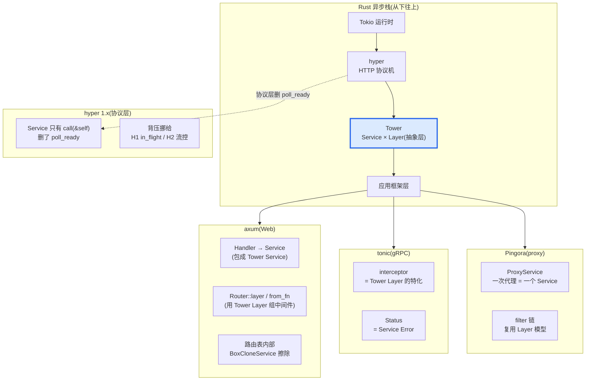
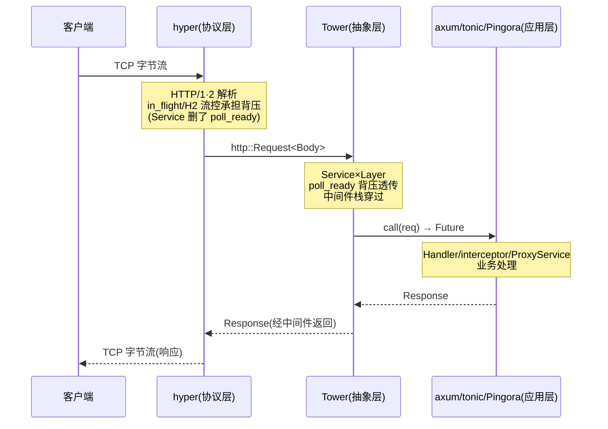

# 第 19 章 · Tower 在 axum/tonic/hyper/Pingora 怎么落地

> **核心问题**:你已经读了十八章 Tower——`Service` 是 `poll_ready + call -> Future`,`Layer` 是 `Fn(Service) -> Service`,`ServiceBuilder` 是编译期 `Stack`,`BoxCloneSyncService` 是类型擦除。可回到你真正写代码的地方:你用 axum 的 `Router::layer()` 套过中间件,你用 tonic 的 `interceptor` 拦截过 gRPC 请求,你听说 hyper 1.x 的 `Service` 删了 `poll_ready`,你听说 Pingora 用 Tower 做 proxy filter。这四个框架,**到底怎么把 Tower 接进去的**?它们各自取了 Tower 的哪一部分、丢了哪一部分、为什么?为什么这四个做着天差地别事情的框架(一个做 Web 路由、一个做 gRPC 编解码、一个做 HTTP 协议机、一个做 CDN proxy),会共用同一套 `Service × Layer`?
>
> **读完本章你会明白**:
>
> 1. axum 怎么把一个 `Handler`(你写的 `async fn`)包成一个 Tower `Service`,以及 `Router::layer`/`from_fn` 怎么用 Tower `Layer` 在路由外层组装中间件链——为什么 axum 路由表内部非要用 `BoxCloneService` 擦除类型;
> 2. tonic 的 `interceptor` 凭什么是 Tower `Layer` 的一个"特化"——它只拦请求头、不碰响应体,为什么这个简化在 gRPC 语境下是合理的;
> 3. **hyper 1.x 的 `Service` 为什么删了 `poll_ready`**——这是全书招牌对照点的集大成,背压从"通用 trait 的显式 `poll_ready`"挪到了"HTTP/1 的 `in_flight` 单槽 / HTTP/2 的 h2 流控 / client 的 `SendRequest::poll_ready`",讲清协议层 vs 通用抽象层的取舍;
> 4. Pingora 怎么用 Tower 把"一次代理"建模成 `Service`,它的 proxy filter 和 axum 的 `Router::layer` 是同构的;以及 reqwest 为什么内部尽量保持单态化而不是 `BoxService`;
> 5. 为什么这四个框架都选 Tower——`Service × Layer` 是请求处理的通用语言,选它意味着"我写的中间件,别人也能用",这是集成点的力量。
>
> 本章是第 6 篇的收束章,也是全书第 7 篇之前最后一次"全景对照"。读完它,你该能在脑子里画出一张图:一个请求从 TCP 字节流进来,经过 hyper 解析成 `Request`,交给 Tower `Service`(中间件栈穿过),到达业务 handler,响应原路返回——以及这条链上每个框架各自站在哪一层、用了 Tower 的什么、丢了 Tower 的什么。
>
> **诚实标注(动手前先看清楚)**:本章大量涉及 axum、tonic、Pingora、reqwest 这四个**外部 crate**,它们**不在 tower 仓里**。我引用的是它们的**公开 API 和文档用法**,**不编造内部行号**——凡是"在 axum/tonic/Pingora/reqwest crate"的源码引用,我都明确标注"外部 crate,引用其公开 API/用法,非 tower 源码"。只有 `tower/` 仓内的文件(`tower-service`/`tower-layer`/`tower/src/`)和本地 `hyper/` 仓的源码,我才标精确行号。这是本章最易翻车的点,我会守住这条线。

---

## 一句话点破

> **axum 把 Handler 包成 Service、用 Layer 组路由中间件;tonic 把 interceptor 做成 Layer 的特化(只拦请求头);hyper 在协议层把 `Service` 删到只剩 `call(&self)`、背压挪给 HTTP 流控;Pingora 把一次代理整个建模成 Service、filter 链复用 Layer 模型。四个框架做的事天差地别,但它们都长在 Tower 的 `Service × Layer` 上——因为"请求处理 + 中间件装饰"这件事,在 Rust 异步生态里只有这一套通用语言。**

这是结论。本章要倒过来拆:每个框架具体取了 Tower 的哪一块、为什么这么取、代价是什么。最关键的,是 hyper 删 `poll_ready` 这件事——它不是"少写一个函数",而是把整个背压模型从"trait 显式表达"换成"协议机制隐式承担",这是全书贯穿对照点的集大成,我们单独用一整节拆透。

---

## 第一节:先看全貌——四个框架各自取了 Tower 的什么

### 提问

在拆每个框架之前,先把全景钉死。四个框架(axum/tonic/hyper/Pingora)站在 Rust 异步栈的不同位置,各自做不同的事。它们用了 Tower 的什么?丢掉 Tower 的什么?

把这张对照表先摆在面前,后面四节是逐行拆解。

### 四框架用 Tower 的形态对照



用一张表把核心取舍钉死(这张表是本章的地图,后面四节是它的逐行展开):

| 框架 | 站在哪层 | 用 Tower 的什么 | 丢掉/特化 Tower 的什么 | 为什么这么取舍 |
|------|---------|---------------|----------------------|--------------|
| **hyper** | 协议层 | 自己的 `service::Service` 是 tower-service 的"删 `poll_ready`"简化版,通过 hyper-util 桥接 Tower | **删 `poll_ready`**;`call` 改 `&self` | 协议层有 HTTP/1 in_flight、HTTP/2 流控,trait 再加 poll_ready 冗余 |
| **axum** | 应用层(Web) | Handler 包成 Service;`Router::layer`/`from_fn` 用 Tower Layer;路由表用 BoxCloneService 擦除 | Handler 不直接是 Service(要满足一组约束);中间件类型擦除换虚分派 | 路由表要存异构 handler,必须类型擦除 |
| **tonic** | 应用层(gRPC) | interceptor 是 Tower Layer 的特化;Status 是 Service Error | interceptor 只拦**请求头**,不碰消息体;不做响应路径中间件 | gRPC 消息体是 protobuf 流,拦截头足够,拦体会破坏流语义 |
| **Pingora** | 应用层(proxy) | 一次代理建模成 Service;filter 链用 Layer 模型 | 每连接一 task;filter 可热配置(运行期组装,非编译期 Stack) | proxy 要运行期灵活(按 upstream 配置组装 filter) |

四行,四种取舍。但有一条共性贯穿全表:它们都把"请求处理"这层抽象挂在了 Tower 的 `Service`(或其变体)上。这不是巧合,是 Rust 异步生态的结构性结果——下面四节逐个拆。

为了让你更直观地看到"一个请求怎么穿过这四层、各框架站在哪一层",补一张请求时序图:



注意时序图里的关键:hyper 在协议层用 HTTP 机制承担背压(删了 `poll_ready`),Tower 在抽象层用 `poll_ready` 把背压透传给中间件栈,应用层(axum/tonic/Pingora)在 Tower 之上处理业务。三层各司其职,背压在不同层用不同机制表达——这就是本章招牌对照的运行画面。

> **钉死这件事**:这四个框架不是"恰好都用了 Tower"。它们是在同一个生态里演化出来的,各自面对"请求处理 + 中间件"这个问题时,反复重新发明轮子的代价太高(axum 写一份超时,tonic 写一份,reqwest 写一份,Pingora 写一份)。Tower 用两个极简 trait 把这个口子焊死,让它们都挂在同一套抽象上。理解了这点,你才能理解为什么 hyper 宁可删 `poll_ready` 也要保持 Service trait 的形状,而不是另起炉灶。

---

## 第二节:hyper 1.x——为什么删了 poll_ready(招牌对照的集大成)

### 提问

这一节我们**先讲 hyper**,因为它和 Tower 的对照最尖锐、也最经典。hyper 1.x 的 `Service` trait,**只有 `call(&self)`,没有 `poll_ready`**。这是全书从头到尾贯穿的对照点(从 P0-01 到现在,反复提到),本章作为集大成,把它彻底拆透:hyper 凭什么敢删 `poll_ready`?删了之后,背压靠谁?Tower 为什么不能跟着删?

如果你只读本章一节,就读这一节。这是全书招牌对照的收口。

### hyper 的 Service 长什么样(本地源码核实)

hyper 的 Service trait 在本地 `hyper/src/service/service.rs`,我们逐字摘录(`hyper/src/service/service.rs#L32-L57`):

```rust
// hyper/src/service/service.rs#L32-L57(逐字摘录)
pub trait Service<Request> {
    type Response;
    type Error;
    type Future: Future<Output = Result<Self::Response, Self::Error>>;

    /// Process the request and return the response asynchronously.
    /// `call` takes `&self` instead of `mut &self` because:
    /// - It prepares the way for async fn,
    ///   since then the future only borrows `&self`, and thus a Service can concurrently handle
    ///   multiple outstanding requests at once.
    /// - It's clearer that Services can likely be cloned.
    /// - To share state across clones, you generally need `Arc<Mutex<_>>`
    ///   That means you're not really using the `&mut self` and could do with a `&self`.
    ///   The discussion on this is here: <https://github.com/hyperium/hyper/issues/3040>
    fn call(&self, req: Request) -> Self::Future;
}
```

对比 Tower 的 Service(`tower-service/src/lib.rs#L311-L356`),两处关键差异:

1. **hyper 没有 `poll_ready`**。Tower 有 `fn poll_ready(&mut self, cx: &mut Context<'_>) -> Poll<Result<(), Self::Error>>`(L340),hyper 整个删了。
2. **hyper 的 `call` 是 `&self`,Tower 是 `&mut self`**。hyper 文档注释自己解释了原因(L48-L55):"为 async fn 铺路,future 只借 `&self`,Service 能并发处理多个未完成请求;更清楚地表明 Service 可以 Clone;要跨 clone 共享状态,你一般需要 `Arc<Mutex<_>>`,那就没真正用 `&mut self`,不如 `&self`。"

这两处差异不是手抖,是 hyper 1.x 的刻意取舍。hyper 文档同文件的 L21-L31 还明确写了:"The [`hyper-util`][util] crate provides facilities to bridge this trait to other libraries, such as [`tower`][tower], which might provide their own `Service` variants." —— hyper 自己**不在主仓做 Tower 桥接**,桥接挪到了 `hyper-util` crate(外部 crate)。

> **钉死这件事**:hyper 主仓的 `Service`(`hyper/src/service/service.rs#L32-L57`)和 Tower 的 `Service`(`tower-service/src/lib.rs#L311-L356`)是**两个不同的 trait**,但同源——hyper 的是 tower-service 的"删 `poll_ready` + `call` 改 `&self`"简化版。它们都叫 `Service`,都泛型于 `Request`,都有 `Response`/`Error`/`Future` 三个关联类型,形状像兄弟。但背压语义完全不同:Tower 用 `poll_ready` 显式表达背压,hyper 把背压挪给了 HTTP 协议自身的机制。

### 不这样会怎样:hyper 如果保留 poll_ready 会撞什么墙

hyper 为什么非要删 `poll_ready`?我们反过来想——如果 hyper 保留 `poll_ready`,会怎样。

hyper 是 HTTP 协议机,它的工作是把 TCP 字节流变成结构化的 `Request<Body>`,再把 `Response<Body>` 变回字节流。一个 hyper Service 通常绑定到**一条连接**(hyper 文档 L16-L18 原文:"In hyper, especially in the server setting, a `Service` is usually bound to a single connection. It defines how to respond to all requests that connection will receive.")。在这种"一连接一 Service"的模型下,背压由谁承担?

答案是 HTTP 协议自己。HTTP 不是凭空传字节,它有自己的流控机制:

- **HTTP/1.服务的背压在"连接容量"**:一条 HTTP/1 连接同时只能处理一个请求(hyper 的 H1 实现用一个 in_flight 单槽,一条连接在处理请求时不再 accept 新请求)。连接池满了,client 拿不到连接,自然被阻塞。背压由"连接池容量"承担,不需要 Service trait 再给一个 `poll_ready`。
- **HTTP/2 的背压在"流控窗口"**:h2 crate(hyper 用它做 HTTP/2)实现了 per-stream 的流量控制(window)。发送方窗口满了就停,接收方处理完扩窗。背压由 h2 的流控承担。
- **client 端的背压在 `SendRequest::poll_ready`**:hyper client 的 `SendRequest`(发请求的句柄)自己有 `poll_ready`——连接池满时返回 `Pending`。背压由连接池承担。

如果 hyper 在 Service trait 上再加一个 `poll_ready`,会发生什么?这个 `poll_ready` 要么是冗余的(背压已经被协议机制承担了,`poll_ready` 只能返回 `Ready`),要么会和协议机制打架(协议说"满了",`poll_ready` 说"还没满",信号矛盾)。hyper 选了前者——既然协议层已经有流控,trait 再加一层是多余的,直接删掉。

> **对照《hyper》**:hyper 的 H1 `in_flight` 单槽、H2 的 h2 流控、client 的 `SendRequest::poll_ready` 这些协议层机制,《hyper》系列拆透了(详见 [[hyper-source-facts]] 和《hyper》P1-02)。本书一句带过,不重复——这里要讲的是"为什么 Tower 不能跟着删",那是下一小节的事。

### 所以 hyper 这么设计:把背压挪给协议

hyper 的取舍可以一句话概括:**"我是个 HTTP 库,HTTP 自己有流控,Service trait 不用再背一遍背压的锅。"** 这个取舍在协议层是自洽的、合理的。

但它有代价。代价是:hyper 的 `Service` **不再是协议无关的**。它的 `call(&self, req: Request)` 里的 `Request` 在实践中就是 `http::Request<B>`,`Response` 就是 `http::Response<B>`——hyper 的 `HttpService`(blanket impl,`hyper/src/service/http.rs`)就是把 Service 绑死到 HTTP 类型上。你不能拿 hyper 的 Service 去处理 gRPC 的 `tonic::Request<HelloRequest>`、或数据库的 `Query`——那些不是 HTTP 请求。hyper 的 Service 只管 HTTP 这一种协议。

这正是 hyper 和 Tower 的分工:**hyper 是协议层,Tower 是协议无关的抽象层**。hyper 把"协议相关"的部分(in_flight 单槽、h2 流控、HTTP 类型)自己管,把"协议无关"的通用抽象让出来给 Tower。hyper 文档 L23-L27 自己说清楚了:"hyper-util crate provides facilities to bridge this trait to ... tower, which might provide their own `Service` variants." —— 桥接是 hyper-util 的事(外部 crate),不是 hyper 主仓的事。

> **钉死这件事**:hyper 删 `poll_ready` 不是"少写一个函数"那么简单,它是一整套取舍:(1)背压从 trait 显式表达换成协议机制隐式承担;(2)`call` 从 `&mut self` 换成 `&self`(因为不再有 `poll_ready` 预留资源,`call` 不需要修改内部状态,改成 `&self` 反而能并发处理多个请求);(3)Service 从协议无关换成 HTTP 专用。这三件事是连带的,删 `poll_ready` 是其中一环。这是协议层"为 HTTP 量身定做"的合理代价。

### Tower 为什么不能跟着删(招牌对照的核心)

现在到本章最关键的问题了。hyper 删 `poll_ready` 是合理的(它协议层有流控),那 Tower 为什么不能也删掉 `poll_ready`?反正 hyper 都活得好好的。

答案是:**Tower 不知道你跑什么协议**。这是 Tower 和 hyper 本质的不同。

Tower 的 Service 可能包的是:

- 一个 HTTP client(hyper/reqwest),背压靠连接池;
- 一个 gRPC client(tonic),背压靠 HTTP/2 流控;
- 一个数据库连接池(sqlx/tokio-postgres),背压靠连接池容量;
- 一个 Redis client,背压靠 pipeline 容量;
- 一个自定义 RPC,背压靠……什么?协议千差万别,流控机制也千差万别。

Tower 作为"协议无关的通用抽象层",必须用一个**通用的、协议无关的机制**来表达"我现在能不能接活"。这个机制就是 `poll_ready`。它把"能不能接活"这件事从具体的协议机制(连接池/h2 窗口/pipeline 容量)抽象出来,变成一个 trait 方法——不管你底下是什么协议,只要你实现了 `Service`,你就得告诉调用方"我现在 ready 不 ready"。

如果 Tower 也删掉 `poll_ready`,会发生什么?中间件就没法透传背压了。看 P0-01 拆过的 `Timeout` 中间件(`tower-service/src/lib.rs#L169-L173` 的文档示例):

```rust
fn poll_ready(&mut self, cx: &mut Context<'_>) -> Poll<Result<(), Self::Error>> {
    // Our timeout service is ready if the inner service is ready.
    // This is how backpressure can be propagated through a tree of nested services.
    self.inner.poll_ready(cx).map_err(Into::into)
}
```

注释自己写了:"This is how backpressure can be propagated through a tree of nested services." `Timeout` 自己不持有资源,它把就绪状态透传给内层。内层(可能是 `ConcurrencyLimit`,满载时 `poll_ready` 返回 `Pending`)满了,`Timeout` 也 `Pending`,再外层也 `Pending`——背压一路传到最外层,调用方就知道"现在别塞请求"。

这套背压透传,**只有在 trait 里有 `poll_ready` 时才成立**。删了它,中间件就失去背压通道——内层满了,调用方不知道,请求在中间件内部堆积,堆到 OOM 才报警。这是 P0-01 反复强调的:"背压必须在 `poll_ready` 表达,不能拖到 `call`"。

> **钉死这件事**:hyper 删 `poll_ready` 是对的(协议层有流控);Tower 保留 `poll_ready` 也是对的(通用层必须协议无关地表达背压)。这不是"谁对谁错",是"两个不同抽象层的不同取舍"。协议层(hyper)为 HTTP 量身定做,可以用协议机制替代 trait 的背压;通用抽象层(Tower)不绑任何协议,必须用一个通用的 `poll_ready` 把背压表达出来。**这个对照是全书的招牌,也是理解 Tower 一切中间件(Buffer/ConcurrencyLimit/LoadShed/Retry 背压语义)的钥匙。**

### call 为什么从 `&mut self` 变成 `&self`

再补一个细节,这个细节是 hyper 删 `poll_ready` 的"连带后果"。Tower 的 `call(&mut self, req)` 为什么是 `&mut self`?因为 `poll_ready` 可能预留资源(一个连接、一个 permit),`call` 要消费这份预留——这要修改内部状态(把"已就绪"翻成"待重新准备"),所以 `&mut self`。这一点 P1-02 用 `mem::replace` 惯用法拆透了。

hyper 删了 `poll_ready` 之后,`call` 还需要 `&mut self` 吗?不需要了——既然没有 `poll_ready` 预留资源,`call` 就不再需要修改内部状态来"消费预留"。hyper 文档注释(L48-L55)自己解释:把 `call` 改成 `&self`,future 只借 `&self`,Service 能**并发处理多个未完成请求**(`concurrently handle multiple outstanding requests at once`)。

这一点是关键的语义差异。Tower 的 `call(&mut self)` 是"一次只能处理一个请求"的模型(`poll_ready` → `call` → 等 future 完成 → 再 `poll_ready`);hyper 的 `call(&self)` 是"可以同时发出多个 call,各自返回 future,并发推进"的模型。对 HTTP/2 这种多路复用协议,后者更合适——一条 HTTP/2 连接上同时跑几十个 stream,每个 stream 一个 `call`,各自的 future 并发跑,`&self` 让这成为可能(不需要为每个 stream clone 一个 service)。

> **承接 P1-02**:Tower `call(&mut self)` 的语义、`mem::replace` 取走就绪服务的惯用法、为什么 clone 一个 ready 服务会 panic——这些 P1-02 招牌章拆透了。本章不重复,只点出 hyper 的 `&self` 是"删 `poll_ready` 的连带后果",把对照钉死。要深入回去翻 P1-02。

### 这一节的小结

hyper 删 `poll_ready` 是全书招牌对照的集大成,我们用三句话收口:

1. **hyper 在协议层删 `poll_ready` 是合理的**——HTTP/1 in_flight、HTTP/2 h2 流控、client `SendRequest::poll_ready` 已经承担了背压,trait 再加一层冗余。
2. **Tower 不能跟着删**——Tower 是协议无关的通用抽象层,它不知道你跑什么协议,必须用 `poll_ready` 把"能不能接活"表达出来,中间件才能透传背压。
3. **连带后果是 `call` 从 `&mut self` 变 `&self`**——没有 `poll_ready` 预留资源,`call` 不需要修改内部状态,`&self` 反而能并发处理多个请求(对 HTTP/2 多路复用友好)。

这三句话是全书写到这里、所有"hyper vs Tower poll_ready"对照点的最终答案。P0-01 提过,P1-02 拆过 `&mut self`,本章作为集大成把它彻底收口。后面三节讲 axum/tonic/Pingora,它们都建立在这个对照之上——因为它们都跑在 Tower 之上(应用层),而 Tower 保留 `poll_ready` 才让它们的中间件有背压。

---

## 第三节:axum——Handler 怎么变成 Tower Service

### 提问

hyper 在协议层把请求解析成 `http::Request<Body>`,可你写 axum 服务时,你写的是一个 `async fn(State, Path<UserId>) -> impl IntoResponse`——这跟 Tower `Service` 有什么关系?axum 怎么把这个 Handler 变成一个能挂在 hyper 上的 Service?你又怎么用 `Router::layer()` 给它套 Tower 中间件?

这一节拆 axum 怎么用 Tower。注意:axum 是**外部 crate**,不在 tower 仓,我引用它的**公开 API 和文档用法**,不编内部行号。

### axum 的 Handler 怎么变成 Service

你写一个 axum Handler,典型长这样(这是 axum 的公开 API 用法,非 tower 源码):

```rust
// axum 的公开用法(外部 crate,引用其文档用法)
async fn hello(State(db): State<Db>, Path(id): Path<u64>) -> impl IntoResponse {
    let user = db.get_user(id).await;
    Json(user)
}

let app = Router::new()
    .route("/users/:id", get(hello))
    .layer(TimeoutLayer::new(Duration::from_secs(5)));
```

这段代码里,`hello` 是个普通的 async fn,它不是 Tower `Service`(它没有 `poll_ready`,没有 `call`)。axum 的核心魔术是:**把任意满足 `Handler` 约束的函数,包成一个 Tower `Service`**。

`Handler` 是 axum 自己定义的 trait(外部 crate,公开 API)。它的核心是一条 blanket impl:任何 `Fn` 满足"参数能从 `Request` 里 extractor 出来、返回值能 `IntoResponse`",就实现 `Handler`。axum 内部给 `Handler` 实现了 `tower_service::Service<Request>`(用的是 Tower 的 `Service` trait,因为 axum 依赖 `tower-service`)——换句话说,**axum 的 Handler 通过 blanket impl 自动获得 Tower Service 的形状**。这个 blanket impl 是 axum 的招牌技巧,它让你写一个普通 async fn,框架自动把它包成 Service,中间件就能套上去了。

这个过程的关键是 **extractor**。axum 的 Handler 参数(`State`/`Path`/`Query`/`Json` 等)都是 `FromRequest`/`FromRequestParts` 的实现,它们能从 `http::Request` 里"抽取"出自己需要的部分。axum 的 `Handler -> Service` blanket impl 在 `call` 里做的事:把 `Request` 拆成 `Parts`,逐个 extractor 抽取参数,调用你的 fn,把返回值 `into_response()` 包回 `Response`。这一切对用户透明——你只写 fn,框架自动包。

> **钉死这件事**:axum 的"Handler 不是 Service,但能自动变成 Service"这个魔术,靠的是 `Handler` trait 的 blanket impl。axum 定义 `Handler`,给它实现 `tower_service::Service<Request>`,这样你写的任何 async fn(满足参数/返回约束)都自动是 Tower Service。这是 axum 区别于"强迫你手写 struct impl Service"的框架的地方,也是它能用 Tower 中间件的前提。

### Router::layer 怎么用 Tower Layer 组中间件

Handler 变成 Service 之后,你怎么给它套 Tower 中间件?这就是 `Router::layer(L)` 的事。

`Router::layer(L)` 接受任何满足 `tower_layer::Layer<Route>` 的类型(`Route` 是 axum 内部的 Service 类型,外部 crate),把它套在路由外层。底层机制和本书 P1-03/P1-04 讲的 `Stack<Inner, Outer>` 类型级洋葱完全一样——`Router::layer` 内部就是 `ServiceBuilder` 的链式 `Stack` 套娃(只是 axum 把它包进了 `Router` 的链式 API 里)。

来看一个真实的 axum 中间件组装(公开 API 用法):

```rust
// axum 的公开用法(外部 crate)
use tower::ServiceBuilder;
use tower_http::timeout::TimeoutLayer;
use tower_http::trace::TraceLayer;

let app = Router::new()
    .route("/", get(hello))
    .layer(
        ServiceBuilder::new()
            .layer(TraceLayer::new_for_http())
            .layer(TimeoutLayer::new(Duration::from_secs(5)))
    );
```

这段代码里,`ServiceBuilder::new().layer(...).layer(...)` 生成的是一个 `Stack<TraceLayer, Stack<TimeoutLayer, Identity>>`(本书 P1-04 拆过的类型级洋葱),`Router::layer` 把这个 Stack 套在路由外。请求进来,先穿 `TraceLayer`(记日志),再穿 `TimeoutLayer`(超时),最后到业务 handler。这就是 Tower 的 `Layer × Stack` 在 axum 里的真实落地。

**这里有一个 axum 特有的设计选择**:`Router::layer` 套的中间件是**类型擦除的**。`Router` 内部的路由表要存"不同 route 的不同 handler"(每个 route 的 Handler 类型不同,因为参数 extractor 不同),要把它们存进同一个数据结构,就得把类型擦除。axum 用的是 `BoxCloneService`(本书 P6-17 拆过的类型擦除 Service)——每个 route 的 handler 被 `boxed()` 擦成 `BoxCloneService<Request, Response, Error>`,路由表就能存一个统一的类型。

> **承接 P6-17**:axum 路由表用 `BoxCloneService` 擦除 handler 类型,这是 P6-17 招牌章拆过的"类型擦除在框架里的真实用途"。P6-17 讲了为什么需要 `Clone + Send + Sync`(axum 路由要 Clone 给每个连接的 task,多线程要 Sync),本章点出 axum 是这个 Box 家族最大的下游用户之一。详细回 P6-17。

### from_fn:用 async fn 写中间件(不经 Layer struct)

axum 还有一个 `from_fn`(公开 API,外部 crate),它让你**不写 Layer struct,直接用 async fn 写中间件**。底层机制和本书 P6-18 拆过的 `service_fn` 一样——把一个 `Fn(Request, Next) -> Future` 的闭包包成一个 Layer(再包成 Service)。

```rust
// axum::middleware::from_fn(外部 crate,公开 API)
use axum::middleware::from_fn;
use axum::extract::Request;
use axum::middleware::Next;

async fn my_middleware(req: Request, next: Next) -> Response {
    println!("before");
    let resp = next.run(req).await;
    println!("after");
    resp
}

let app = Router::new()
    .route("/", get(hello))
    .layer(from_fn(my_middleware));
```

`from_fn` 的妙处:你写一个 async fn,签名是 `(req, next) -> response`,axum 自动把它包成 Layer。这个 Layer 内部用一个 `Next`(包装了内层 Service)让你能 `next.run(req).await` 把请求传给下一层。响应拿到后,你可以再做手脚(`after` 那段)。这和 Go 的 `func(Handler) Handler` 洋葱、本书 P1-03 讲的 Tower `LayerFn` 是同一思想的不同语法糖。

底层上,`from_fn` 等价于"用 `service_fn` 把闭包包成 Service,再用 `LayerFn` 把它包成 Layer"。本书 P6-18 拆过 `service_fn`,这里点出 axum 的 `from_fn` 是它在框架层的封装。

### axum 的取舍小结

axum 用 Tower 的方式可以三句话收口:

1. **Handler 通过 blanket impl 自动变成 Tower Service**——你写 async fn,框架包成 Service,中间件能套。
2. **Router::layer 用 Tower Layer 的 Stack 组中间件**——和 `ServiceBuilder` 同构,类型级洋葱。
3. **路由表内部用 BoxCloneService 擦除**——因为要存异构 handler(P6-17 的招牌场景)。

axum 没有特化或删减 Tower 的核心——它完整用了 `Service × Layer`,只是在 Handler 之上加了一层"自动包装"的便利。这是 axum 和 hyper 的关键不同:hyper 是协议层,删了 `poll_ready`;axum 是应用层,完整保留 Tower 的 Service×Layer(包括 `poll_ready` 背压语义)。

---

## 第四节:tonic——interceptor 为什么是 Layer 的特化

### 提问

tonic 是 Rust 的 gRPC 框架(外部 crate,不在 tower 仓)。你写 tonic 服务时,常用 `interceptor` 拦截 gRPC 请求(比如注入鉴权 token、记录调用)。`interceptor` 和 Tower `Layer` 是什么关系?为什么 tonic 不直接用 `Router::layer` 那种通用 Layer,而是发明一个 `interceptor`?

这一节拆 tonic 怎么用 Tower。同样,tonic 是外部 crate,我引用公开 API,不编内部行号。

### interceptor 是 Tower Layer 的特化

先看 tonic interceptor 的典型用法(公开 API):

```rust
// tonic 的公开用法(外部 crate)
use tonic::service::Interceptor;
use tonic::Status;

fn my_interceptor(req: Request<()>) -> Result<Request<()>, Status> {
    let token = req.metadata().get("authorization")
        .ok_or_else(|| Status::unauthenticated("missing token"))?;
    // 验证 token...
    Ok(req)
}

let svc = MyGreeter::new(...)
    .send_cached(interceptor(my_interceptor));
```

这段代码里,`my_interceptor` 是一个 `Fn(Request<()>) -> Result<Request<()>, Status>`。注意它的签名:**它接收的是 `Request<()>`,不是 `Request<HelloRequest>`**。这个 `()` 是关键——interceptor 只看到请求的**元数据(metadata,即 HTTP/2 headers)**,看不到消息体(protobuf 编码的 `HelloRequest`)。

为什么?因为 gRPC 的消息体是 protobuf 流,可能很大、可能分多个 DATA frame 传。如果在 interceptor 里把消息体也解出来,会破坏流语义(你得等所有 DATA frame 到齐,违背 gRPC streaming 的设计)。所以 tonic 的 interceptor 刻意**只拦请求头(metadata),不碰消息体**。

这恰恰是 Tower `Layer` 的一个**特化**。通用的 Tower `Layer` 可以拦整个 `Request`(头 + 体),可以在请求路径和响应路径都动手脚;tonic 的 interceptor 只拦请求头,只在请求路径动手脚,返回 `Result<Request<()>, Status>`(成功就让请求继续,失败就回 `Status`)。它是 Tower `Layer` 的一个"功能受限但够用"的版本。

底层上,tonic 内部把 interceptor 实现成一个 Tower `Layer`(tonic 依赖 `tower-service`/`tower-layer`)。`interceptor(fn)` 返回一个 `InterceptorLayer`,它 `layer(svc)` 之后包出一个 `Interceptor<S>`(也是个 Tower Service)。这个 `Interceptor<S>` 在 `call` 里先调你的 interceptor fn 检查 metadata,过了才把请求传给内层 service。**所以 tonic 的 interceptor 不是一个新发明,它是 Tower Layer 在"gRPC 只拦请求头"这个特殊场景下的特化实例。**

> **钉死这件事**:tonic interceptor 不是 Tower Layer 的替代品,是它的特化。它复用 Tower 的 `Layer × Service` 机制(实现 `tower_layer::Layer`),只是把"拦什么"限制到"请求头"——这是 gRPC 语境下的合理简化(拦体会破坏 protobuf 流语义)。理解了这点,你就能解释为什么 tonic 既支持 interceptor(简单头拦截),也支持完整的 Tower middleware(用 `tower::ServiceBuilder` 套任意中间件)——后者是通用 Layer,前者是特化 Layer,两个都在 Tower 抽象上。

### Status 为什么是 Service Error

tonic 还有一个细节:`Status`(gRPC 的状态码)在 Tower 语境里就是 `Service::Error`。tonic 的 Service 通常定义 `type Error = Status`,这样 interceptor 返回的 `Err(Status)` 直接成为 Service 的 Error,被外层中间件(如 Retry)看到。

这一点把 tonic 和 Tower 的 Error 语义焊在一起:你写一个 Tower `Retry` 中间件套在 tonic service 外,Retry 看到 `Err(Status::unavailable)` 可以决定重试——因为 tonic 的 Error 就是 `Status`,Retry 的 `Policy::retry` 能直接 match Status 码。这是"tonic 长在 Tower 上"的一个具体体现:Error 类型对齐,中间件就能复用。

### tonic 的取舍小结

tonic 用 Tower 的方式三句话收口:

1. **interceptor 是 Tower Layer 的特化**——只拦请求头(不碰 protobuf 消息体,保流语义),底层实现还是 `tower_layer::Layer`。
2. **Status 是 Service Error**——tonic Service 的 `type Error = Status`,和 Tower 的 Retry/Timeout 中间件 Error 语义对齐。
3. **tonic 同时支持完整 Tower middleware**——除了 interceptor 这个特化,你也可以用 `tower::ServiceBuilder` 套任意 Tower 中间件(超时/重试/限流),因为 tonic service 就是 Tower Service。

tonic 的取舍是"在 gRPC 语境下,提供 interceptor 这个简化版 Layer 给最常见的场景(鉴权/日志),同时不封死完整 Tower Layer"。这比 axum 更克制——axum 直接让你用 `Router::layer` 套任意 Tower Layer,tonic 提供两档(interceptor 简化版 + 完整 Tower Layer),让用户按复杂度选。

---

## 第五节:Pingora——一次代理怎么建模成 Service

### 提问

Pingora 是 Cloudflare 开源的 Rust 异步 proxy 框架(外部 crate,不在 tower 仓),用来做 CDN/反向代理。proxy 和 axum(Web)、tonic(gRPC)不一样——proxy 要把请求**转发给上游**(upstream),不是自己处理。Pingora 怎么用 Tower 建模"一次代理"?它的 filter 链和 axum 的 `Router::layer` 是亲戚吗?

这一节拆 Pingora 怎么用 Tower。Pingora 是外部 crate,我引用公开 API,不编内部行号。

### Pingora 的 proxy 模型:把一次代理做成 Service

Pingora 的核心抽象是 `ProxyService`(公开 API,外部 crate)。一个 `ProxyService` 的 `request_filter`/`upstream_peer`/`response_filter` 这一组回调,定义了"一次代理怎么处理"——请求进来,先 `request_filter`(决定要不要代理、改不改请求),再 `upstream_peer`(选上游),转发请求,`response_filter`(改响应),回给客户端。

这和 Tower `Service` 是什么关系?**Pingora 的 `ProxyService` 在概念上等价于一个 Tower `Service<Session, Response = ()>`**——一次代理(一个 session)是一次 `call`,返回一个 future,代理完成 future resolve。Pingora 内部用 Tower 的 `Service` trait 来组织这套回调(它依赖 `tower-service`/`tower-layer`),filter 链用 `Layer` 模型组装。

关键差别在"组装时机"。axum 的 `Router::layer` 是**编译期 Stack**(类型级洋葱,本书 P1-03/P1-04 拆过);Pingora 的 filter 链是**运行期组装**——因为 proxy 的 filter 要按 upstream 配置动态组装(不同的 upstream 套不同的 filter,配置可以热加载)。这和 Envoy(本书 P0-01 横连过的)是同一类取舍:运行期组装换灵活性,代价是虚分派。本书 P0-01 拆过这个对照("编译期零成本 vs 运行期灵活"),Pingora 站在 Envoy 那一侧。

> **对照《Envoy》/《gRPC》**:Pingora 的运行期 filter 链,和 Envoy HCM(Network/HTTP filter chain)、gRPC C++ filter stack 是同一类——C++/运行期组装、shared_ptr/指针持有 next。本书 P0-01 横连对照表里钉过。Pingora 用 Rust 写但选了运行期组装(不是 Tower 的编译期 Stack),是因为 proxy 场景需要配置热加载。详见 [[envoy-source-facts]] / [[grpc-source-facts]]。

### Pingora 的取舍小结

Pingora 用 Tower 的方式三句话收口:

1. **一次代理建模成 Service**——`ProxyService` 概念上等价于 Tower `Service<Session>`,一次代理是一次 call。
2. **filter 链用 Layer 模型**——但运行期组装(非编译期 Stack),换配置热加载的灵活性。
3. **每连接一 task**——承 Tokio(P0-01 提过的 Tokio budget=128 让出),proxy 高并发靠 task 模型,不靠 Service trait 形状。

Pingora 的取舍是"在 proxy 语境下,用 Tower 的 Service×Layer 概念,但放弃编译期 Stack 换运行期灵活"。这和 axum(编译期 Stack)形成对照——同样是应用层,Web 路由适合编译期钉死,proxy 适合运行期灵活。

### 顺带:reqwest 为什么内部尽量单态化

还有个框架值得一提:reqwest(Rust HTTP 客户端,外部 crate)。reqwest 的 `ClientBuilder` 支持 Tower middleware(公开 API:`ClientBuilder::layer(L)`),但 reqwest 内部**尽量保持单态化**,不滥用 `BoxService`——因为 client 是单一类型(不是像 axum 路由表那样存异构 handler),没必要擦除。reqwest 用 Tower 的方式:对外暴露 `layer()` 让你套中间件,内部 client 核心保持编译期单态化换性能。这是"应用层用 Tower,但不滥用 BoxService"的样本——和 axum(大量 BoxCloneService)形成对照,体现了 Box 家族的使用边界(本书 P6-17 的招牌讨论)。

---

## 第六节:为什么这四个框架都选 Tower(集成的力量)

### 提问

四节拆完,回到一个根本问题:axum 做 Web、tonic 做 gRPC、hyper 做 HTTP 协议、Pingora 做 proxy——它们做的事天差地别,为什么会共用 Tower 的 `Service × Layer`?

这不是技术上的巧合,是生态上的必然。这一节把"为什么都选 Tower"这件事钉死。

### 不这样会怎样:每个框架各写一套

假设没有 Tower,每个框架自己定义中间件抽象:

- axum 的 `Router::layer` 用一套(可能叫 `Middleware`,签名 `Fn(Handler) -> Handler`);
- tonic 的 interceptor 用一套(可能叫 `Filter`,签名不同);
- reqwest 的 middleware 用一套;
- Pingora 的 filter 用一套。

四套方言。你写一个"超时 + 重试"中间件,要在四个框架里各写一遍适配层。你写一个公司内部的"鉴权 + 审计"中间件(跨 Web/gRPC/proxy 都要用),要在四个框架里各实现一遍——而且四个实现的行为可能微妙不同(本书 P0-01 拆过的"语义漂移")。

这就是 Rust 异步生态在 Tower 稳定之前(2018-2019)的真实状态。hyper 0.11 有自己的 Service,早期 `tower-web` 又有一套,reqwest 早期还有一套。碎片化是那时最大的痛点。

### 有了 Tower,中间件一次写四处用

有了 Tower,这四个框架的中间件抽象都建立在 `Service × Layer` 上。你写一个 `TimeoutLayer`(它实现 `tower_layer::Layer<S>`),axum/tonic/reqwest/Pingora **全都能用**——因为它实现的是通用 trait,不绑任何框架。

来看一个真实的跨框架复用场景。`tower-http` crate(社区维护,外部 crate)提供了一组 HTTP 中间件(`TimeoutLayer`/`TraceLayer`/`CompressionLayer`/`CorsLayer`/`AuthLayer`),它们都是 Tower `Layer`。你可以:

- 在 **axum** 里 `.layer(TraceLayer::new_for_http())`;
- 在 **tonic** 里用 `ServiceBuilder` 套 `TraceLayer`(tonic 支持 Tower middleware);
- 在 **reqwest** 里 `ClientBuilder::layer(TraceLayer::new_for_http())`;
- 在 **Pingora** 的 filter 链里加一个等价的 trace filter。

**同一个 `TraceLayer`,四个框架通用。** 这是 Tower 作为集成点的力量。你写一次中间件,整个生态都能用;你升级 `tower-http`,所有依赖它的框架同时受益(修 bug 一次,全生态修)。这种经济性,是 Tower 能成为 Rust 异步网络栈枢纽的根本原因。

> **钉死这件事**:Tower 的核心 trait(`tower-service`/`tower-layer`)刻意被钉死在 0.3.3,长期不动(从 2019 至今,7 年)。正是因为它们是 axum/tonic/reqwest/Pingora/tower-http 等所有下游的共同集成点,breaking change 会震碎整个生态。这种"核心极简 + 极度稳定 + 生态在稳定核心上长出来"的设计,是本书 P0-01 反复强调的 Tower 哲学。`tower` 这个大 crate(中间件集合)可以频繁演进(0.4→0.5→0.5.2),但核心 trait 不动——这是刻意的工程取舍。

### 核心极简 + 极度稳定 = 集成点

为什么 Tower 的核心 trait 能稳定 7 年不动?因为它**足够小**——只有两个 trait(`Service` + `Layer`),各自就一个核心方法。这种极简性让它能覆盖所有协议(HTTP/gRPC/proxy/数据库 client),又不限制下游的设计自由(每个框架可以在 Service 之上加自己的便利层——axum 的 Handler、tonic 的 interceptor、Pingora 的 ProxyService)。

这是抽象设计的精髓:**抽象要小,要稳,要成为集成点**。一个巨大的、面面俱到的抽象(比如想覆盖流式、pub-sub、动态重组的全能 Service),反而会让下游难以适配、难以稳定。Tower 反其道而行——只钉死最小的两个 trait,把所有复杂性(timeout/retry/balance/hedge 这些中间件)放到可演进的 `tower` crate 里。核心稳,生态活。

这一点也是 hyper 删 `poll_ready` 这件事的"反面印证"。hyper 删 `poll_ready` 是因为它**不需要做协议无关的通用集成点**——它就是 HTTP,协议层有自己的流控。Tower 必须保留 `poll_ready`,因为它是通用集成点,不能假设协议。两个 trait 的形状差异(有/无 `poll_ready`),折射的是两个抽象层的定位差异:协议层 vs 通用层。这是本章招牌对照的最终收口。

---

## 技巧精解

这一节挑本章最该被钉死的两个技巧,配真实源码 + 反面对比,单独拆透。

### 技巧一:hyper 删 poll_ready 的"连带三件套"(招牌对照的根)

**它解决什么问题**:hyper 删 `poll_ready` 不是孤立的一个改动,它是"协议层为 HTTP 量身定做"的一整套取舍。把这整套取舍钉死,你才真正理解为什么 Tower 不能跟着删。

**hyper Service vs Tower Service 的形状对照**(本地源码逐字核实):

| 维度 | hyper `Service`(`service.rs#L32-L57`) | Tower `Service`(`tower-service/src/lib.rs#L311-L356`) |
|------|----------------------------------------|------------------------------------------------------|
| `poll_ready` | **无** | `fn poll_ready(&mut self, cx) -> Poll<Result<(), Error>>` |
| `call` 签名 | `fn call(&self, req: Request) -> Future` | `fn call(&mut self, req: Request) -> Future` |
| 背压机制 | HTTP/1 in_flight 单槽 / HTTP/2 h2 流控 / client `SendRequest::poll_ready` | trait 的 `poll_ready` 透传 |
| 并发模型 | 一连接可并发多请求(HTTP/2 多 stream,`&self` 允许) | 一 service 一请求(`&mut self`,`poll_ready`→`call`→等 future) |
| 协议相关性 | HTTP 专用(`HttpService` blanket impl 绑 `http::Request`) | 协议无关(泛型 `Request`) |

这五项不是五个独立改动,是**一个取舍的五个面**。删 `poll_ready` 是因,后面四项是果:

- 删了 `poll_ready`,`call` 不再需要消费预留资源,自然从 `&mut self` 变 `&self`(hyper 文档 `service.rs#L48-L55` 自己解释)。
- `&self` 让 Service 能并发处理多个请求(对 HTTP/2 多 stream 友好),改变了并发模型。
- 背压没有了 trait 的显式表达,挪给协议机制承担。
- Service 从协议无关变成 HTTP 专用(因为背压依赖 HTTP 协议机制)。

**反面对比:如果 hyper 保留 poll_ready 会怎样**:

hyper 如果保留 `poll_ready`,它会面临一个尴尬:这个 `poll_ready` 写什么?HTTP/1 的 in_flight 单槽、HTTP/2 的 h2 流控、client 的连接池——这些协议机制**已经在做背压了**。`poll_ready` 要么返回 `Ready`(冗余,因为协议层已经管了),要么去 poll 协议层的状态(但协议层状态变化是异步的,`poll_ready` 得复杂地桥接)。hyper 选了前者——既然协议层管了,trait 不用管,删掉。

**Tower 不能跟着删的原因**:Tower 是协议无关的通用集成点。它不知道你底下是 HTTP(hyper)、gRPC(tonic)、数据库(sqlx)、还是自定义 RPC。它必须用一个**通用的、协议无关的机制**表达"我现在能不能接活",这个机制就是 `poll_ready`。删了它,中间件就失去背压通道——这是本书 P0-01/P1-02/P2-07 反复强调的硬规矩。

> **钉死这件事**:"hyper 删 `poll_ready` vs Tower 保留 `poll_ready`" 这个对照,不是"hyper 比 Tower 好"或"Tower 比 hyper 好",是**两个不同抽象层的不同定位**:hyper 是协议层(为 HTTP 量身定做,可以借协议机制),Tower 是通用层(协议无关,必须自带背压)。这个对照是全书招牌,P0-01 提过、P1-02 拆过 `&mut self`、本章作为集大成收口。后面再看到任何关于 `poll_ready` 的讨论,回到这一节。

### 技巧二:axum 的 Handler blanket impl——把任意 async fn 变成 Service

**它解决什么问题**:让用户写一个普通 async fn,框架自动把它包成 Tower Service,不用手写 struct + impl Service。这是 axum 易用性的根。

**反面对比:手写 struct impl Service 会怎样**:

如果 axum 不做 Handler blanket impl,你写一个最简单的 handler,得这样(朴素写法,非 axum 实际):

```rust
// 朴素写法(假设没有 Handler blanket impl)
struct HelloHandler { db: Db }

impl Service<Request<Body>> for HelloHandler {
    type Response = Response<Body>;
    type Error = Infallible;
    type Future = Pin<Box<dyn Future<Output = Result<Self::Response, Self::Error>> + Send>>;

    fn poll_ready(&mut self, _cx: &mut Context<'_>) -> Poll<Result<(), Self::Error>> {
        Poll::Ready(Ok(()))
    }

    fn call(&mut self, req: Request<Body>) -> Self::Future {
        let db = self.db.clone();
        Box::pin(async move {
            let id: u64 = parse_path(&req)?;
            let user = db.get_user(id).await;
            Ok(Json(user).into_response())
        })
    }
}
```

每个 handler 都写这一坨,用户会疯。axum 的 Handler blanket impl 干的事:**给任何满足约束的 `Fn`(参数是 `FromRequest`/`FromRequestParts`,返回 `IntoResponse`)自动实现 `tower_service::Service<Request>`**。你写:

```rust
async fn hello(State(db): State<Db>, Path(id): Path<u64>) -> impl IntoResponse {
    Json(db.get_user(id).await)
}
```

axum 自动给你包成一个等价于上面那一坨的 Service——`poll_ready` 返回 Ready(handler 通常无状态,不需要准备),`call` 里把 Request 拆成 Parts,逐个 extractor 抽取参数(`State` 从扩展里取、`Path` 从 URI 解析、`Query` 从 query string 反序列化),调用你的 fn,把返回值 `into_response()` 包回 Response。**这一切对用户透明**,你只写 fn,框架包。

**这个技巧的精妙之处**:它把"易用性"(用户写简单 fn)和"抽象一致性"(框架内部用 Tower Service)统一了。如果 axum 不用 Tower Service,自己发明一套 handler 抽象,就没法用 Tower 中间件(`Router::layer` 就套不上去)。Handler blanket impl 让"用户友好"和"生态集成"兼得——这是 axum 设计的招牌,也是它能成为最流行的 Rust Web 框架的原因之一。

**为什么这对 Tower 重要**:它回答了"Tower 的 Service 抽象会不会太底层、用户用不上"这个疑虑。答案是不会——框架(axum)在 Service 之上加一层便利(Handler),让用户不直接碰 Service,但底层还是 Service,中间件生态照样能用。这体现了 Tower 作为"底层集成点"和框架作为"用户便利层"的分层:核心 trait(Tower)极简稳定,便利层(axum)尽情发挥。

---

## 章末小结

回到全书的主轴:**执行单元 vs 组合单元**。本章是第 6 篇的收束,也是全书总览性质的一章——它不讲新机制,而是把全书拆过的 `Service × Layer` 放回真实框架里,看它们怎么落地。

- **执行单元(Service)**:hyper 把它简化成 `call(&self)`(删 `poll_ready`,背压挪协议);axum/tonic/Pingora 完整保留 Tower 的 `poll_ready + call`(背压透传);它们的差别折射出"协议层 vs 通用层"的取舍。
- **组合单元(Layer)**:axum 的 `Router::layer`/`from_fn` 用 Tower Layer 组路由中间件(编译期 Stack);tonic 的 interceptor 是 Layer 的特化(只拦请求头);Pingora 的 filter 链用 Layer 模型但运行期组装;它们的差别折射出"编译期零成本 vs 运行期灵活"的取舍。

Tower 在 Rust 异步栈的位置:**Tokio 运行时 → hyper 协议 → Tower 抽象 → axum/tonic/Pingora 应用**。Tower 是"协议"和"应用"之间那层通用胶水。hyper 在协议层"删 `poll_ready` 借协议流控",是这层胶水存在的最佳反证——如果协议层能自己管背压,就不需要通用 trait 的 `poll_ready`;可一旦你要跨协议、跨框架复用中间件,就必须有 Tower 这层通用抽象。

### 五个为什么清单

1. **为什么 hyper 1.x 删了 `poll_ready`?** 因为 hyper 是 HTTP 协议层,HTTP/1 in_flight 单槽、HTTP/2 h2 流控、client `SendRequest::poll_ready` 已经承担了背压,Service trait 再加 `poll_ready` 是冗余。删了它,`call` 从 `&mut self` 变 `&self`,Service 能并发处理多请求(对 HTTP/2 友好)。
2. **为什么 Tower 不能跟着删 `poll_ready`?** Tower 是协议无关的通用抽象层,它不知道你跑什么协议(HTTP/gRPC/数据库/自定义 RPC),必须用 `poll_ready` 这个通用机制表达背压。删了它,中间件失去背压通道,请求会无声堆积 OOM。这是"协议层 vs 通用层"的根本取舍,全书招牌对照。
3. **为什么 axum 的 Handler 能自动变成 Tower Service?** axum 定义 `Handler` trait,给它 blanket impl `tower_service::Service<Request>`——任何满足参数(`FromRequest`/`FromRequestParts`)和返回(`IntoResponse`)约束的 `Fn`,自动实现 Service。这让用户写简单 fn,框架自动包成 Service,中间件能套。
4. **为什么 tonic 的 interceptor 只拦请求头,不拦消息体?** 因为 gRPC 消息体是 protobuf 流,可能在多个 DATA frame 里,拦体会破坏流语义(要等所有 frame 到齐)。interceptor 是 Tower Layer 的特化——只拦 metadata(HTTP/2 headers),保流语义,底层仍是 `tower_layer::Layer`。
5. **为什么 axum/tonic/hyper/Pingora 都选 Tower?** 因为 Tower 是请求处理的通用语言。`Service × Layer` 足够小(两个 trait)、足够通用(协议无关)、又能表达背压。选它意味着"我写的中间件,整个生态都能用"(tower-http 的 `TraceLayer` 同时给 axum/tonic/reqwest 用)。核心 trait 极简稳定(0.3.3 七年不动),是集成点的根。

### 想继续深入往哪钻

- **hyper 怎么把 H1 in_flight/H2 流控/client 连接池做成背压**:→《hyper》P1-02 和 [[hyper-source-facts]],招牌对照点的协议层细节。本章只点出"挪给协议",协议内部机制在《hyper》拆透。
- **axum 的 Handler blanket impl 内部怎么把 Request 拆给 extractor**:→ axum 文档和源码(外部 crate)。本章只点出"自动包成 Service",extractor 机制是 axum 自己的设计。
- **tonic 的 interceptor 和完整 Tower middleware 的边界**:→ tonic 文档(外部 crate)。本章点出 interceptor 是 Layer 特化,具体边界在 tonic 文档。
- **Pingora 的 ProxyService 和 filter 链运行期组装**:→ Pingora 文档(外部 crate)。本章点出概念等价 Service + 运行期组装,proxy 内部在 Pingora 文档。
- **BoxCloneSyncService 在 axum 路由表的真实用法**:→ 第 17 章(P6-17),招牌章,拆类型擦除为什么需要 `Clone + Send + Sync`。
- **用 ServiceBuilder 从零搭一个带 timeout/retry/限流/负载均衡的 client**:→ 附录 B,实战集成。
- **全书收束:Tower 在 Rust 异步栈的最终定位**:→ 第 20 章(P7-20),本书最后一章,把所有对照(hyper 删 poll_ready / gRPC filter / Envoy filter chain / Go middleware)收口。

### 引出下一章

本章你看到了 Tower 在四个真实框架里怎么落地——hyper 删 `poll_ready` 借协议流控(协议层取舍),axum 把 Handler 包成 Service + 用 Layer 组路由中间件(应用层完整用),tonic 把 interceptor 做成 Layer 特化(gRPC 只拦头),Pingora 把一次代理做成 Service + filter 运行期组装(proxy 换灵活)。四个框架,四种取舍,但都长在 Tower 的 `Service × Layer` 上。下一章 P7-20 是全书收束——把 Tower 在 Rust 异步栈的位置彻底钉死(Tokio→hyper→Tower→axum/tonic),做双对照(gRPC filter C++ 运行期 vs Tower 类型级 Stack;Envoy filter C++ vs Tower 编译期),回扣全书招牌(poll_ready 取舍),交代 Tower 演进(0.4 合并子 crate、0.5 Budget trait 化/BoxCloneSyncService)。那是整本书的最后一站。

---

> **本章源码锚点**:
>
> - [hyper Service trait(删了 poll_ready,call 改 &self)](../hyper/src/service/service.rs#L32-L57) —— 招牌对照核心证据,本地源码逐字核实。
> - [hyper service mod 文档(说明桥接挪到 hyper-util)](../hyper/src/service/mod.rs#L1-L31) —— 点出 Tower 桥接不在 hyper 主仓。
> - [tower Service trait(保留 poll_ready)](../tower/tower-service/src/lib.rs#L311-L356) —— 招牌对照的另一端,poll_ready @ L340,call @ L355。
> - [tower Service poll_ready 文档(背压预留资源)](../tower/tower-service/src/lib.rs#L321-L339) —— 解释 poll_ready 为什么不能省。
> - [service_fn(框架集成工具)](../tower/tower/src/util/service_fn.rs#L46-L56) —— 把闭包/async fn 包成 Service,axum from_fn/tonic/reqwest 都依赖这类工具。
> - [BoxCloneSyncService 类型](../tower/tower/src/util/boxed_clone_sync.rs#L18) —— axum 路由表擦除用的擦除 Service(P6-17 详拆)。
> - [ServiceBuilder(组中间件链)](../tower/tower/src/builder/mod.rs) —— axum Router::layer 底层用的类型级 Stack(P1-04 详拆)。
>
> **外部 crate(诚实标注,引用公开 API/用法,不编内部行号)**:
>
> - **axum**(外部 crate):`Handler` trait(blanket impl Service)、`Router::layer`、`axum::middleware::from_fn`、extractor(`State`/`Path`/`Query`/`Json`)——引用其公开 API 和文档用法,非 tower 源码。
> - **tonic**(外部 crate):`tonic::service::Interceptor`、`tonic::Status`、`send_cached`/interceptor 用法——引用公开 API。
> - **Pingora**(外部 crate):`ProxyService`、`request_filter`/`upstream_peer`/`response_filter`——引用公开 API/文档。
> - **reqwest**(外部 crate):`ClientBuilder::layer`——引用公开 API。
> - **tower-http**(外部 crate,社区维护):`TraceLayer`/`TimeoutLayer`/`CompressionLayer`/`CorsLayer`——引用公开 API,作为"跨框架复用"的例子。
> - **hyper-util**(外部 crate):Tower 桥接(`tower::Service` ↔ `hyper::Service` 的 adapter)所在地,引用其文档,不编内部行号。
>
> **承接**:
>
> - **承接《hyper》[[hyper-source-facts]]**:hyper 删 `poll_ready` 的协议层细节(H1 in_flight/H2 流控/client `SendRequest::poll_ready`)在《hyper》P1-02 拆透,本章一句带过指路,篇幅留给"为什么 Tower 不能跟着删"这个招牌对照的集大成收口。
> - **承 P1-02**:Tower `call(&mut self)` 语义、`mem::replace` 惯用法在 P1-02 招牌章拆透,本章点出 hyper 的 `&self` 是"删 poll_ready 的连带后果",对照指路。
> - **承 P1-03/P1-04**:Layer trait、`Stack` 类型级洋葱、`ServiceBuilder` 在 P1-03/P1-04 拆透,本章点出 axum `Router::layer`/from_fn 用同一机制。
> - **承 P6-17**:`BoxCloneService`/`BoxCloneSyncService` 类型擦除在 P6-17 招牌章拆透,本章点出 axum 路由表是 Box 家族的最大下游用户之一。
> - **承 P6-18**:`service_fn` 把闭包包成 Service 在 P6-18 拆透,本章点出 axum `from_fn`/tonic/reqwest 都依赖这类工具。
> - **承 P0-01**:全书招牌对照(hyper 删 poll_ready vs Tower 保留)、跨语言对照(gRPC/Envoy/Go 洋葱)在 P0-01 建立,本章作为集大成收口。
