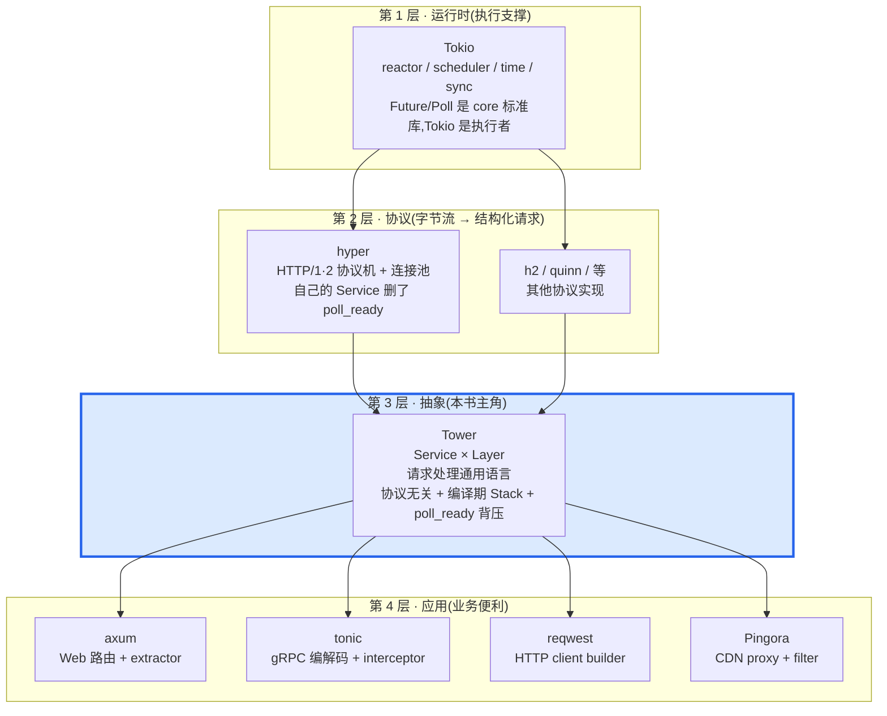
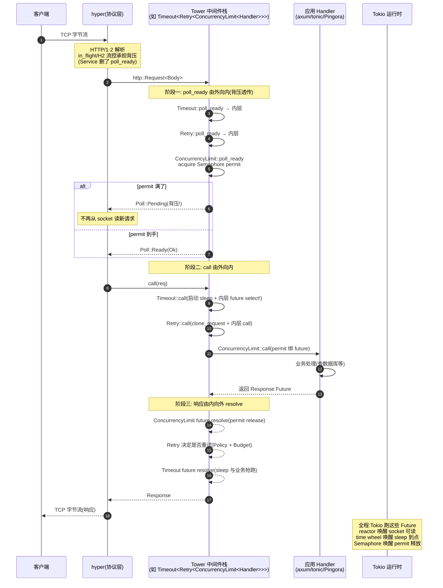
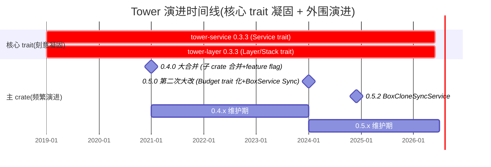

# 第 20 章 · 全书收束:Tower 在 Rust 异步栈的位置

> 第 7 篇 · 收束(全书第 20 章,第 7 篇第 1 章)

---

## 章首

**核心问题**:你已经读完前面 19 章。你知道 `Service = poll_ready + call -> Future`,知道 `Layer = Fn(Service) -> Service`,知道 `Stack` 怎么在编译期把 Layer 嵌成洋葱,知道 `Buffer` 怎么用 worker task + mpsc 把 `!Clone` 服务变成 `Clone + Send`,知道 `Retry` 怎么用 Policy + Budget + Backoff 三件套防重试风暴,知道 `Balance` 怎么用 P2C 把流量摊到一堆后端,知道 `BoxCloneSyncService` 怎么把巨大类型擦除成统一接口,知道 hyper 删了 `poll_ready` 而 Tower 保留。这 19 章像一块块拼图,每块都很清楚自己干什么。可是把所有拼图拼起来,Tower 在整个 Rust 异步栈里到底站在哪一格?它和 Tokio、hyper、axum、tonic、reqwest、Pingora、gRPC C++、Envoy 之间到底是什么关系?为什么是它——而不是某个别的抽象——成了 axum/tonic/reqwest/Pingora 的共同骨架?读完一本书,你该能把这一切画成一张图、说成一席话。

> **读完本章你会明白**:
>
> 1. **Tower 在 Rust 异步栈的精确位置**——Tokio 运行时 → hyper HTTP 协议 → ★Tower 请求处理抽象(Service × Layer) → axum/tonic/reqwest/Pingora 应用。Tower 卡在"协议"和"应用"之间,是唯一一层协议无关的请求处理通用语言。这一层为什么必须存在、为什么不能上移、为什么不能下移,本章给最终答案。
> 2. **执行单元 vs 组合单元这条主线怎么一路展开**——Service(执行)和 Layer(组合)两个 trait 是地基,全书 19 章都是在这地基上长肉:背压类(Buffer/SpawnReady/LoadShed)把 `poll_ready` 的异步性藏起来,限流类(Timeout/ConcurrencyLimit/RateLimit)控住流量,韧性类(Retry/Hedge/Reconnect)处理失败,路由类(Discover/Balance/Steer)挑后端,工程化(BoxService/util/集成)擦类型。本章把这条线一次性收束。
> 3. **三套洋葱模型的终极对照**——gRPC C++ filter stack(运行期链表 + Interceptor,灵活但有虚调用开销)、Envoy filter chain(HCM,C++ 运行期配置驱动)、Tower Layer(Rust 类型级 `Stack` 编译期单态化,零开销但类型巨大需 BoxService 擦除)。同一种"洋葱中间件"思想,在三种语言里有三种落地,本章用一张大对照表钉死。
> 4. **`poll_ready` 取舍的终极总结**——通用抽象层(Tower)必须显式表达背压(保留 `poll_ready`),协议层(hyper)可以删除它(背压藏在 HTTP/1 in_flight / HTTP/2 h2 流控 / client SendRequest::poll_ready)。这个对照从 P0-01 贯穿到 P6-19,本章是它的最终收口,把全书所有"`poll_ready` 在背什么压"的零散讨论收成一句话。
> 5. **Tower 的演进史与未来**——0.4.0(2021)合并子 crate + feature flag,0.5.0(2024)Budget trait 化 / Buffer off-by-one 修复 / BoxService 变 Sync,0.5.2(2024 末)加 BoxCloneSyncService。每一步演进对应一个"为什么这么改"的工程理由,本章把这条线串起来,并展望未来可能的方向。

本章是全书的收束。它不引入新的源码细节(那些前 19 章讲透了),而是把全书串成一张图、一套对照、一个演进脉络。读完它,你该能在脑子里放映出:**一次请求从 TCP 字节流进来,经过 hyper 解析成 `Request`,交给 Tower 中间件栈(一层层 `poll_ready` 透传背压、一层层 `call` 穿透、响应层层 resolve 回去),到达业务 handler,响应原路返回**——以及这条链上每一层在干什么、用了 Tower 的什么、对照别的系统怎么做。

> **前置知识**:本章是收束章,假设你读过前 19 章至少 P0-01 / P1-02 / P1-03 / P2-05 / P4-11 / P5-15 / P6-17 / P6-19。如果你只读本章,建议至少先读 P0-01(定调)和 P1-02(`poll_ready` 背压),否则本章的"收束"对你没有抓手。本章直球为主,不引入新比喻(全书唯一允许的洋葱/插座比喻在 P0-01 已经点睛完毕,本章只在描述栈位置时偶尔用"层"做空间隐喻)。

---

## 一句话点破

> **Tower 在 Rust 异步栈的位置,是"协议"和"应用"之间唯一的那层抽象胶水。它用两个极简 trait(`Service` 执行单元 + `Layer` 组合单元)定义了"请求处理通用语言",让 axum/tonic/reqwest/Pingora 都挂在同一套抽象上。它选编译期类型级 `Stack`(零开销,代价是类型爆炸需 BoxService 擦除),对照 gRPC/Envoy 的运行期链表(灵活但虚调用);它保留 `poll_ready` 显式表达背压,对照 hyper 协议层删除它(背压藏进 HTTP 流控);它用 Buffer 把 `!Clone` 服务变成 `Clone + Send`,用 Retry + Budget 防重试风暴,用 Balance + P2C 摊流量,用 BoxCloneSyncService 擦类型。这 19 章的所有技巧,都是在"把请求处理抽象成可组合的 Future,且背压不丢、组合零开销、类型可擦除"这三个目标上做文章。**

这是结论,不是理由。本章倒过来拆:先把 Tower 钉在栈的位置上(全图),再回顾"执行单元 vs 组合单元"这条主线怎么一路展开成 19 章,然后做三套洋葱模型 + `poll_ready` 取舍的终极对照,最后串 Tower 的演进史与未来。

---

## 第一节:Tower 在 Rust 异步栈的位置(全书总图)

这是全书的"封面图",所有章节都长在这张图上。

### 1.1 四层栈:Tokio → hyper → Tower → 应用



四层各司其职:

**第 1 层 · 运行时(Tokio)**。跑 `Future`,提供 `mpsc`/`Semaphore`/`time`/`spawn`/`oneshot` 这些异步原语。`Future`/`Poll`/`Waker`/`Context` 本身在标准库 `core::future`/`core::task`,Tokio 只是执行者。这一层的内部机制(reactor/scheduler/park/时间轮/Cell/Semaphore 内部)《Tokio》系列已拆透,本书一句带过指路 [[tokio-source-facts]]。

**第 2 层 · 协议(hyper 等)**。把 TCP 字节流变成结构化的 `Request`/`Response`。hyper 是 HTTP/1·2 的协议机(解析 + 连接池 + 流控),h2 是 HTTP/2 底层,quinn 是 QUIC。这一层背压由协议自身的机制承担(HTTP/1 的 `in_flight` 单槽、HTTP/2 的 h2 流控窗口),所以 hyper 的 `Service` trait **删了 `poll_ready`**——这是全书招牌对照点。

**第 3 层 · 抽象(Tower,本书主角)**。定义"一个请求怎么被处理、怎么被装饰"的通用语言。它**协议无关**(不知道你跑的是 HTTP 还是 gRPC 还是数据库),**双向通用**(client 和 server 都能用),**带背压**(`poll_ready` 显式表达"能不能接活")。两个 trait(`Service` + `Layer`)钉死在 0.3.3 长期不动(2019 至今 7 年),整个生态挂在上面。

**第 4 层 · 应用(axum/tonic/reqwest/Pingora)**。在 Tower 之上,提供路由(axum `Router`)、序列化(tonic protobuf)、客户端便利(reqwest `ClientBuilder`)、proxy 模型(Pingora `ProxyService`)。它们的中间件抽象都建立在 Tower `Service`/`Layer` 之上——你写一个 `TimeoutLayer`,axum/tonic/reqwest/Pingora 全都能用。

### 1.2 为什么是这一层,不能更上也不能更下

Tower 卡在"协议"和"应用"之间,这个位置是结构性的必然,不是 Tower 自己挑的。

**不能更下(挪到协议层)**。hyper 试过,它定义了自己的 `service::Service`——但删了 `poll_ready`,因为 HTTP 协议自己有流控。可一旦你想把 hyper 的 service 和"超时 + 重试 + 限流"组合,你就需要一套通用抽象。hyper 的 service 太绑 HTTP 了(`Request` 就是 `http::Request<B>`),做不到"跨协议复用"(同一个超时 Layer 既给 HTTP 用又给 gRPC 用又给数据库用)。所以必须有一层在协议之上。

**不能更上(挪到应用层)**。axum/tonic/reqwest/Pingora 各自有便利抽象(axum 的 `Router`/`Handler`,tonic 的 `interceptor`,reqwest 的 `ClientBuilder`,Pingora 的 `ProxyService`)。如果"通用中间件语言"由应用层提供,那 axum 的中间件搬到 tonic 就用不了——又回到"每个框架各写一套"。所以必须有一层在应用之下。

**正好卡在中间**。Tower 这一层抽象,小到只有两个 trait(可以稳定 7 年不动),通用到不绑任何协议,又能表达背压(不会让请求无声堆积)。它是整个生态的集成点。

> **钉死这件事**:axum/tonic/reqwest/Pingora 都依赖 `tower-service`/`tower-layer`(直接或间接),它们各自的应用便利层都建立在 Tower 的 `Service`/`Layer` 之上。**Tower 是 Rust 异步网络栈里"协议"和"应用"之间唯一的那层抽象胶水**。这一点是全书的地基,P0-01 第一节埋下,本章作为收束钉死。

### 1.3 一个请求穿过整条栈的时序(全书运行画面)

把"一个请求从 TCP 进来,穿过 hyper 协议层、Tower 中间件栈、应用 handler,响应原路返回"的完整时序画出来——这是全书 19 章所有源码细节的"运行画面",读完本书你该能在脑子里放映这张图:



这张图把全书所有关键机制都画进去了:

- **阶段一 `poll_ready` 由外向内**:背压由最内层的资源约束(ConcurrencyLimit 的 Semaphore permit)决定,一层层透传到最外层。这是 P1-02 招牌章的核心。
- **阶段二 `call` 由外向内**:每层中间件的 `call` 调内层 `call`,在请求路径上动手脚(Timeout 启 sleep、Retry clone_request、ConcurrencyLimit 绑 permit)。这是 P3-08/P3-09/P4-11 各章的具体机制。
- **阶段三响应由内向外 resolve**:内层 future 先完成,外层 future 拿到结果再完成。Retry 在这一步决定是否重试,Timeout 在这一步判断是否超时。这是 P4-11 ResponseFuture 状态机、P3-08 select! 的运行画面。
- **Tokio 在最底层**:全程跑这些 Future,reactor 唤醒 I/O,time wheel 唤醒 timer,Semaphore 唤醒 permit。Tower 不自己跑 Future,它只造 Future(承《Tokio》)。

> **钉死这件事**:这张时序图是全书的"封面"。你读完一本书,脑子里应该能随时放映出它。每个具体中间件(Buffer/Timeout/Retry/Balance/ConcurrencyLimit)都是这张图里某一层的具体实例化——它们的 `poll_ready`/`call` 各有不同,但运行骨架都是"poll_ready 由外向内 → call 由外向内 → 响应由内向外"。

### 1.4 为什么 Tower 这么"小",却能成为枢纽

注意一个反直觉的事实:**Tower 的核心 trait(crate)极其小**。`tower-service` 整个 crate 就一个 `lib.rs`,391 行,只有一个 `Service` trait + 两个 blanket impl。`tower-layer` 整个 crate 5 个源码文件,约 660 行,只有一个 `Layer` trait + `Stack`/`Identity`/`LayerFn`/元组 Layer。两个核心 trait crate 加起来不到 1100 行。可就这么点东西,扛起了 axum/tonic/reqwest/Pingora 整个生态。

这不是"小而美"的玄学,是刻意的工程取舍:**核心极简 + 极度稳定 + 生态在稳定核心上长出来**。`tower-service`/`tower-layer` 钉死在 0.3.3,从 2019 到 2024 的 0.5.2 发布,两个 trait 的签名一行没改。所有"演进"都发生在 `tower` 这个大 crate 里(Budget trait 化、Buffer 重写、BoxCloneSyncService 新增)——核心不动,外围演进。这种设计让下游框架(axum/tonic/reqwest/Pingora)敢于把自己的地基建立在 Tower 上,因为地基不会动。

对比一下:`tokio` 自己也长期稳定核心(`Future`/`Poll` 在标准库),但 tokio 的大版本(0.2 → 1.0)还是有 breaking change。`hyper` 的 1.0 重构更是颠覆性的(0.14 的 `Service` 签名和 1.x 不同)。Tower 的核心 trait 能做到 7 年零 breaking change,是因为它**足够小**——只有 `Service` + `Layer` 两个 trait,没有任何"具体中间件"的语义。具体中间件全在 `tower` 大 crate 里演进,核心 trait 不受影响。

> **钉死这件事**:Tower 能成为 Rust 异步网络栈的枢纽,靠的不是"功能强大",而是"核心极简 + 极度稳定"。两个 trait(不到 1100 行)钉死 7 年,axum/tonic/reqwest/Pingora 全挂在上面。这是"抽象要小、要稳、要成为集成点"的工程哲学典范。如果你将来设计一个要被生态广泛采用的库,学 Tower 这招:核心 trait 最小化,breaking change 只发生在核心之外。

---

## 第二节:执行单元 vs 组合单元——全书主线的展开

回到 P0-01 立下的全书主轴:**执行单元(Service)vs 组合单元(Layer)**。这 19 章每一章,都是在这条骨架上长肉。本节把这条线一次性收束。

### 2.1 两个 trait 是全部地基

全书的地基就两个 trait(本书第 1 篇 P1-02 / P1-03 / P1-04 拆透):

**执行单元 · `Service<Request>`**([`tower-service/src/lib.rs#L311-L356`](../tower/tower-service/src/lib.rs#L311-L356)):

```rust
pub trait Service<Request> {
    type Response;
    type Error;
    type Future: Future<Output = Result<Self::Response, Self::Error>>;

    fn poll_ready(&mut self, cx: &mut Context<'_>) -> Poll<Result<(), Self::Error>>;

    #[must_use = "futures do nothing unless you `.await` or poll them"]
    fn call(&mut self, req: Request) -> Self::Future;
}
```

一句话:`poll_ready` 预留资源(背压),`call` 消费资源发请求,`Future` 收响应。`&mut self` 是"持资源的有状态执行单元"的体现。P1-02 用 `mem::replace` 惯用法拆透了为什么 `call` 必须是 `&mut self`、为什么 clone 一个 ready 服务会 panic。

**组合单元 · `Layer<S>`**([`tower-layer/src/lib.rs#L95-L101`](../tower/tower-layer/src/lib.rs#L95-L101)):

```rust
pub trait Layer<S> {
    type Service;
    fn layer(&self, inner: S) -> Self::Service;
}
```

一句话:给我一个 Service,我给你一个装饰过的新 Service。`&self` 是"不变的装饰工厂"的体现(只持配置,不持 Service)。`Stack<Inner, Outer>`([`tower-layer/src/stack.rs#L6-L30`](../tower/tower-layer/src/stack.rs#L6-L30))把多个 Layer 在类型系统里编译期嵌套成一棵洋葱树,运行期零开销。

这两个 trait 加起来,就是 Tower 的全部地基。下面 17 章,都是在这地基上盖各种中间件。

### 2.2 全书 19 章的二分法归属一览

把全书 19 章按"执行单元 vs 组合单元"归属,做成一张总览表。这是全书的鸟瞰:

| 章 | 标题 | 归属 | 它在 Service × Layer 地基上干什么 |
|----|------|------|------------------------------|
| P0-01 | 第一性原理 | 总览 | 立 Service × Layer 两块地基,定调 |
| P1-02 | Service trait | **执行(招牌)** | 拆透 `poll_ready` 背压、`&mut self`、`mem::replace` |
| P1-03 | Layer trait | **组合** | 拆透 `Layer`、`Stack<Inner,Outer>` 类型级洋葱、Identity/LayerFn/元组 |
| P1-04 | ServiceBuilder/ServiceExt | **组合(招牌)** | 链式 `.layer()` 攒 Stack,ServiceExt 给 Service 发组合子 |
| P2-05 | Buffer | **执行(招牌)** | worker task + mpsc 把 `!Clone` 变 `Clone+Send`,一行 `poll_reserve` 串背压 |
| P2-06 | SpawnReady | 执行 | 后台 task 反复 `poll_ready`,把就绪从请求路径剥离 |
| P2-07 | LoadShed | 执行 | 把 `poll_ready` 的 `Pending` 翻成错误(对照 Envoy overload) |
| P3-08 | Timeout | 执行 | `tokio::time::sleep` + `select!`,drop Future 取消 |
| P3-09 | ConcurrencyLimit | 执行 | `Semaphore` permit,`poll_ready` acquire(背压),`call` 绑 future |
| P3-10 | RateLimit | 执行 | 令牌桶 + `tokio::time::Interval`,`poll_ready` 扣令牌 |
| P4-11 | Retry | **执行(招牌)** | Policy(单次决策)+ Budget(总量闸门)+ Backoff(退避抖动) |
| P4-12 | Hedge | **执行(招牌)** | 接近 p99 发第二个 hedge,rotating_histogram 估 p99 |
| P4-13 | Reconnect | 执行 | MakeService 工厂,造连接 vs 用连接分开,用 `Ready(Err)` 自动重连 |
| P5-14 | Discover/ready_cache | 组合 | `Discover`(sealed Stream)+ `ready_cache`(缓存就绪后端) |
| P5-15 | Balance/P2C | **执行(招牌)** | P2C 抽两个挑 load 小的,PEWMA/pending_requests/constant 三种度量 |
| P5-16 | Steer/Filter | 组合 | Steer 按请求内容路由,Filter Predicate 过滤(同步异步两种) |
| P6-17 | BoxService 家族 | **组合(招牌)** | MapFuture 钉 Future + CloneService 保 Clone + SyncWrapper 满足 Sync |
| P6-18 | util/service_fn | 组合 | service_fn 闭包当 Service,map_*/and_then/then/Either 组合子 |
| P6-19 | 四框架集成 | 总览 | axum/tonic/hyper/Pingora 各自取 Tower 的什么 |

注意几个规律:

- **执行单元章节占多数**(P1-02/P2-05/P2-06/P2-07/P3-08/P3-09/P3-10/P4-11/P4-12/P4-13/P5-15),因为执行单元承载了"具体怎么处理请求、怎么背压、怎么取消、怎么重试"这些**有状态的运行时逻辑**,源码技巧密集(`poll_ready` 状态机、`mem::replace`、Semaphore permit、令牌桶、滑动窗口、P2C 抽样、PEWMA 衰减、`pin_project` 手写 Future 状态机)。
- **组合单元章节少但关键**(P1-03/P1-04/P5-14/P5-16/P6-17/P6-18),它们承载了"怎么把 Service 套成栈、怎么擦类型"这些**类型系统技巧**(`Stack` 递归嵌套、`Identity` ZST、`LayerFn` newtype、元组 Layer、`BoxCloneSyncService` 三步擦除)。
- **招牌章交替**在执行和组合两面:P1-02(执行)、P1-04(组合)、P2-05(执行)、P4-11(执行)、P5-15(执行)、P6-17(组合)——Tower 的精华两面都有,不能偏废。

### 2.3 Service × Layer 这套抽象的"再生性"

一个值得在收束章强调的点:**Tower 的 `Service × Layer` 抽象是"可再生"的**——同一套抽象在不同层反复出现。这是它深度的一个体现。

**`Service × Layer` 在中间件层**:你写一个 `TimeoutLayer`(它是 `Layer`),它包出 `Timeout<S>`(它是 `Service`)。这是 P0-01/P1-03 的基本盘。

**`Service × Layer` 在路由层**:axum 的 `Router::layer(L)` 把 Tower Layer 套在路由外层;`Steer`(P5-16)按请求内容路由到一组 Service 之一,它自己也是个 Service。同一套抽象,在"路由分发"这个更高的层再生。

**`Service × Layer` 在框架集成层**:tonic 的 `interceptor` 是 Tower Layer 的特化(只拦请求头),Pingora 的 proxy filter 复用 Layer 模型。同一套抽象,在"跨协议框架"再生。

**`Service × Layer` 在工程化层**:`BoxCloneSyncServiceLayer`(0.5.2)是 `Layer` 的类型擦除版——它本身也是个 `Layer`,只是 `layer()` 出来的是擦除后的 `BoxCloneSyncService`。同一套抽象,在"类型擦除"再生。

这种"抽象在不同层反复再生"的特性,叫**自相似(self-similarity)**。它意味着你只要吃透 `Service × Layer` 这一套,就能理解 Tower 从最底层的中间件到最顶层的框架集成的所有用法。这是 Tower 设计深度的一个标志——它不是一堆零散的 API,是一个层层自相似的分形结构。

> **钉死这件事**:Tower 的 `Service × Layer` 不是"一个抽象用一次",是"一个抽象在中间件层、路由层、框架集成层、类型擦除层反复再生"。这种自相似性让你只要吃透核心两章(P1-02 + P1-03),就能理解全书 19 章和所有下游框架(axum/tonic/reqwest/Pingora)的用法。这是 Tower 设计深度的标志。

### 2.4 二分法收束成一句话

把"执行单元 vs 组合单元"这条主线收束成一句话(全书的"骨"):

> **Tower 把"处理一个请求"抽象成 `Service = poll_ready + call -> Future`(执行单元,带背压),把"装饰请求处理"抽象成 `Layer = Fn(Service) -> Service`(组合单元,洋葱装饰)。两者用类型级 `Stack` 在编译期拼成零开销的中间件栈。这 19 章所有源码技巧(`mem::replace`、Buffer worker task、Semaphore permit、令牌桶、Policy+Budget、P2C、MapFuture+CloneService+SyncWrapper),都是在"背压不丢、组合零开销、类型可擦除"这三个目标上做文章。**

任何一处看不懂某个机制,回到这句话问:它是在执行单元(改 `poll_ready`/`call`/`Future` 的行为),还是在组合单元(改 `Layer`/`Stack`/类型擦除)?它在解决"背压/组合/擦除"哪个问题?答案就在这条主线上。

---

## 第三节:三套洋葱模型的终极对照(gRPC/Envoy/Tower)

这一节是全书"跨语言对照"的集大成。P0-01 第八节、P1-03 第三节都做过对照,本章作为收束,把它彻底钉死成一张大表。

### 3.1 同一种思想,三种语言落地

"洋葱模型 + 中间件链"不是 Tower 发明的。它是软件工程里处理"横切关注点(cross-cutting concerns)"的经典模式——鉴权、日志、限流、重试这些事不属于任何一个业务模块,却要切进每一个。不同语言、不同框架各自发明了"洋葱中间件"的落地:

- **Tower(Rust)**:用类型级 `Stack<Inner, Outer>` 在**编译期**把 Layer 嵌成洋葱树,运行期单态化成直接调用,零虚分派。
- **gRPC C++ core**:用 `Call`/`Interceptor` 在**运行期**组装 filter 链表,每个 filter 持 next 指针,每次调用走链表遍历 + 虚调用。
- **Envoy(C++)**:用 Network/HTTP filter chain(HCM)在**运行期**组装,filter 之间用 `shared_ptr` 持有,可热配置,可挂 overload manager。
- **Go(chi/gin)**:`func(http.Handler) http.Handler` 闭包链,**运行期**组装,无背压概念(靠 GC/channel 兜底)。

四种语言,四种做法。**关键差别在"组装时机"和"背压机制"**。Tower 选编译期组装(零开销),代价是类型爆炸需 BoxService 擦除;gRPC/Envoy 选运行期组装(灵活),代价是虚调用开销。

### 3.2 终极对照表

把四套洋葱模型的所有维度收束成一张大表(全书最核心的对照表):

| 维度 | **Tower(Rust)** | **gRPC C++ filter** | **Envoy filter chain** | **Go middleware** |
|------|----------------|---------------------|----------------------|------------------|
| **语言** | Rust | C++ | C++ | Go |
| **洋葱组装时机** | **编译期**(类型级 `Stack<Inner,Outer>`) | **运行期**(filter 持 next 指针的链表) | **运行期**(`shared_ptr` 持有) | **运行期**(`func(Handler)Handler` 闭包链) |
| **链结构** | 嵌套类型,单态化 | filter 链表 + Interceptor | `shared_ptr` filter 链 | 闭包链 |
| **每次调用的开销** | **零**(直接调用,可内联) | 虚调用(vtable)+ 链表遍历 | 虚调用 + 链表遍历 | 闭包间接调用 + GC 压力 |
| **背压/流控** | **`poll_ready` 透传**(显式) | per-stream 窗口(HTTP/2 流控) | overload manager(LoadShedPoint) | **无**(靠 GC/channel 兜底) |
| **类型安全** | **强**(类型嵌套表达洋葱,顺序错编译期报错) | 弱(链表全是 `Call*`) | 弱(`shared_ptr<Filter>`) | 弱(全是 `http.Handler`) |
| **运行期灵活** | **差**(洋葱编译期钉死,改顺序要重编译) | 好(filter 可动态增减) | **好**(可热配置、热加载) | 好(闭包可动态组装) |
| **中间件可热加载** | 否(编译期固定) | 部分(filter 注册可配置) | **是**(xDS 配置驱动) | 是(运行期组装) |
| **逃生阀(运行期擦除)** | `BoxService`/`BoxCloneSyncService`(引入虚分派) | 无(本来就虚分派) | 无(本来就虚分派) | 无(本来就闭包) |
| **代表场景** | Rust 异步服务/客户端 | gRPC 框架内部 | 服务网格/CDN | Go Web 服务 |

这张表是全书跨语言对照的最终结论。逐维拆三个最关键的:

**组装时机:编译期 vs 运行期**。这是 Tower 区别于所有同类设计的根本。Tower 的 `.timeout().retry().buffer()` 这些调用,每一步都让类型嵌套一层,最终编译成 `Stack<TimeoutLayer, Stack<RetryLayer, Stack<BufferLayer, Identity>>>` 这种巨大但单态化的类型。运行时没有 next 指针、没有虚调用(filter 的 `call` 是直接调用,不是 trait object 的动态分派——除非你显式 `boxed()`)。gRPC/Envoy 则在运行期组装成链表,filter 之间通过指针持有 next。代价对等:Tower 类型丑、编译慢、错误信息难读,换来零运行时开销;gRPC/Envoy 类型干净、可配置,换来每次调用的虚分派。

**背压机制:`poll_ready` 透传 vs 协议流控 vs 无**。Tower 用 `poll_ready` 把"我现在能不能接活"显式表达,中间件的 `poll_ready` 透传内层的就绪状态(Timeout 的 `poll_ready` 调内层 `poll_ready`),背压一路从最内层(ConcurrencyLimit 的 Semaphore permit)传到最外层调用方。gRPC 靠 HTTP/2 的 per-stream 流控窗口(HTTP/2 协议自带)。Envoy 用独立的 overload manager(基于 LoadShedPoint 的令牌桶/水位)。Go middleware **没有背压概念**——满了就阻塞(channel)或丢弃(看你怎么写),靠 GC 兜底。Tower 的 `poll_ready` 是四套里唯一"把背压做进 trait 抽象"的,这让它能在"协议无关"的前提下保证背压不丢。

**类型安全:强 vs 弱**。Tower 的洋葱结构编码在类型系统里——`Stack<TimeoutLayer, Stack<RetryLayer, Identity>>` 这个类型签名就表达了"Timeout 在外、Retry 在内、Identity 终止"。Layer 顺序错了、类型不匹配,编译期就报错。gRPC/Envoy/Go 的链表全是同质化的(`Call*` / `shared_ptr<Filter>` / `http.Handler`),顺序错了编译器不报错(运行期才发现)。Rust 把"洋葱结构"做进类型系统,是零成本抽象的胜利,代价是类型签名难看(Tower 用 `BoxService` 擦除治)。

### 3.3 三套洋葱的内存布局对照

用 ASCII 框图画三套洋葱的内存布局,让"编译期 vs 运行期"的差异显形:

```text
=== Tower:编译期类型级 Stack(零运行期开销) ===

ServiceBuilder::new().timeout(1s).retry(p).buffer(100).service(svc)
        产出的类型(编译期已知, 单态化):
        Buffer<
            ConcurrencyLimit<
                Timeout<
                    Retry<Policy, svc>,
                    svc::Future
                >
            >,
            ...
        >

  运行期:每个 call 是直接调用(可内联),没有 next 指针,没有 vtable 查找
  ┌─────────────────────────────────┐
  │ Buffer::call(req)               │ 直接调
  │   └─ ConcurrencyLimit::call     │ 直接调
  │       └─ Timeout::call          │ 直接调
  │           └─ Retry::call        │ 直接调
  │               └─ svc::call      │ 业务
  └─────────────────────────────────┘
  代价:类型签名长(BoxService 擦除);编译慢;错误信息难读

=== gRPC C++:运行期 filter 链表(虚调用) ===

  filter 链(运行期组装):
  ┌──────────────┐    ┌──────────────┐    ┌──────────────┐
  │ Filter A     │───▶│ Filter B     │───▶│ Filter C     │───▶ final
  │ next: Filter*│    │ next: Filter*│    │ next: Filter*│
  │ vtable       │    │ vtable       │    │ vtable       │
  └──────────────┘    └──────────────┘    └──────────────┘

  运行期:每次 call 走链表,每个 filter 的 Process 是虚调用
  代价:N 次虚调用 + N 次指针解引用;但 filter 可动态增减

=== Envoy:运行期 shared_ptr filter 链(可热配置) ===

  filter 链(运行期组装, xDS 配置驱动):
  ┌──────────────────┐ shared_ptr ┌──────────────────┐
  │ NetworkFilter A  │───────────▶│ NetworkFilter B  │───▶ HCM ──▶ HTTP filters ──▶ router
  │ shared_ptr<next> │            │ shared_ptr<next> │
  └──────────────────┘            └──────────────────┘

  运行期:每次 call 走链表 + shared_ptr 引用计数;overload manager 可在运行期丢请求
  代价:虚调用 + 引用计数开销;但 filter 可热加载、热配置
```

三张图并排,差异一目了然:Tower 的洋葱是"编译期类型树",运行期是"一串直接调用";gRPC/Envoy 的洋葱是"运行期链表",运行期是"虚调用 + 指针遍历"。Tower 选前者是为了零成本抽象,gRPC/Envoy 选后者是为了运行期灵活。这是两种工程哲学的对撞,没有绝对优劣,看场景选。

### 3.4 为什么 Rust 选了编译期(而 C++/Go 选了运行期)

一个值得深究的问题:同样是系统级语言,Rust 凭什么能把洋葱做进编译期,而 C++(gRPC/Envoy)和 Go 都做成运行期?

**C++ 其实也能做编译期(模板元编程)**,但 gRPC/Envoy 没这么选,原因有二:① C++ 模板元编程极其痛苦(错误信息、编译时间、SFINAE),工程上不可持续;② gRPC/Envoy 是大型框架,需要运行期配置(filter 热加载、xDS 配置驱动),编译期钉死做不到。所以它们选了运行期链表,接受虚调用开销换灵活性。

**Go 的类型系统表达力不够**。Go 的 interface 是运行期胖指针(类似 trait object),没有 Rust 这种"泛型单态化 + 关联类型 + 编译期类型嵌套"的能力。Go 的 `func(Handler) Handler` 闭包链本质是运行期的,无法把洋葱做进类型系统。

**Rust 的独特优势**:① 泛型单态化(每个具体类型生成专属代码,可内联);② 关联类型(让 `Service::Future` 等输出类型由 impl 唯一确定,组合时不丢类型信息);③ 强大的类型推导(把 `Stack<A, Stack<B, Stack<C, Identity>>>` 这种丑类型在局部变量里藏住);④ trait bound 编译期检查(顺序错了编译失败)。这四件事合起来,让 Rust 能把"洋葱结构"完整表达成类型嵌套,运行期零开销。这是 Rust 类型系统的胜利,也是 Tower 选编译期的根。

但 Rust 选编译期不是没代价——**类型签名爆炸**。`ServiceBuilder` 套 10 层,类型签名长到没法看。这就是为什么 Tower 还要提供 `BoxService`/`BoxCloneService`/`BoxCloneSyncService`(P6-17 招牌章)——用 trait object 把巨大类型擦除成统一类型,代价是引入虚分派。这是"编译期零开销 vs 运行期灵活"的开关,Tower 两个都给你,自己选。

> **钉死这件事**:Tower 选编译期洋葱,本质是 Rust 类型系统的胜利——泛型单态化 + 关联类型 + 类型推导 + trait bound,让"洋葱结构"能完整表达成类型嵌套,运行期零开销。gRPC/Envoy(C++)选运行期,因为大型框架需要运行期配置,且 C++ 模板元编程工程上不可持续。Go 选运行期,因为类型系统表达力不够。代价对等:Tower 类型丑(用 BoxService 治),gRPC/Envoy 虚调用(接受)。这是"零成本抽象 vs 运行期灵活"的经典取舍,没有银弹。

### 3.5 这个对照对全书的意义

这个三套洋葱的对照,是理解 Tower "为什么长这样"的钥匙。Tower 的所有设计选择——`Stack` 递归类型嵌套、`Identity` ZST 单位元、`LayerFn` newtype、元组 Layer、`BoxService` 三步擦除——都是在"编译期洋葱"这个大方向下的具体技巧。如果不理解 Tower 选了编译期(对照 gRPC/Envoy 选运行期),你就会觉得这些技巧"莫名其妙为什么要这么绕";一旦理解了,每个技巧都顺理成章——它们都是为了让"编译期洋葱"既零开销又好用。

本书 P0-01 第八节给过这张对照表的雏形,P1-03 第三节深化过 Stack 的对照,本章作为收束,把它钉死成最终形态。你以后看任何"中间件框架"(不管什么语言),都可以用这张表去对照它——它是运行期还是编译期?它有背压吗?它的类型安全强吗?这是评估任何中间件设计的通用框架。

---

## 第四节:`poll_ready` 取舍的终极总结

这一节是全书"`poll_ready` 招牌对照"的最终收口。从 P0-01 提过,P1-02 拆透 `&mut self`,P2-05 Buffer 用一行 `poll_reserve` 串背压,P2-07 LoadShed 翻 `Pending` 成错误,P3-09 ConcurrencyLimit acquire permit,P6-19 hyper 删 `poll_ready` 的集大成——全书贯穿这条线,本章把它收成一句话。

### 4.1 两个角色:通用抽象层 vs 协议层

`poll_ready` 取舍的核心,是 Tower(通用抽象层)和 hyper(协议层)对背压的不同表达方式。

**Tower(通用抽象层)保留 `poll_ready`**。`tower-service` 的 `Service` trait 有 `poll_ready(&mut self, cx) -> Poll<Result<(), Error>>`([`tower-service/src/lib.rs#L340`](../tower/tower-service/src/lib.rs#L340))。它的语义是:**调用方在 `call` 之前必须先 `poll_ready` 拿到 `Ready`,否则实现者允许 panic**(文档 L350-L353)。`poll_ready` 可能预留共享资源(permit/连接/槽位),这些资源在随后的 `call` 里被消费(文档 L335-L339)。这是 P1-02 招牌章拆透的"`poll_ready` 是背压,不是辅助函数"。

**hyper(协议层)删除 `poll_ready`**。hyper 的 `service::Service` trait(`hyper/src/service/service.rs#L32-L57`)只有 `call(&self, req) -> Self::Future`,没有 `poll_ready`。背压由 HTTP 协议自身的机制承担:

- **HTTP/1 server**:一条连接同时只处理一个请求(`in_flight` 单槽),连接在处理请求时不再 accept 新请求。背压由"连接池容量"承担。
- **HTTP/2 server**:h2 crate 实现了 per-stream 的流量控制(window),发送方窗口满了就停。背压由 h2 的流控承担。
- **HTTP/2 client**:`SendRequest::poll_ready` 在连接池满时返回 `Pending`。背压由连接池承担(注意这个 `poll_ready` 在 `SendRequest` 上,不在 `Service` trait 上)。

### 4.2 为什么 hyper 敢删,Tower 不能删

这个对照的核心,是 P1-02 第六节和 P6-19 第二节反复拆透的:**hyper 是协议层,背压由协议机制承担,trait 再加 `poll_ready` 冗余;Tower 是通用抽象层,不知道你跑什么协议,必须用一个通用机制表达"能不能接活",这个机制就是 `poll_ready`**。

详细推一遍这个逻辑:

**hyper 删 `poll_ready` 是合理的**。hyper 是 HTTP 协议机,它的工作是把 TCP 字节流变成结构化的 `Request<Body>`。HTTP 协议本身有流控机制(HTTP/1 单连接串行、HTTP/2 h2 窗口、连接池容量)。如果 hyper 在 Service trait 上再加一个 `poll_ready`,这个 `poll_ready` 要么是冗余的(背压已经被协议机制承担了,`poll_ready` 只能返回 `Ready`),要么会和协议机制打架(协议说"满了",`poll_ready` 说"还没满",信号矛盾)。hyper 选了前者——既然协议层已经有流控,trait 再加一层是多余的,直接删掉。

**Tower 不能跟着删,因为它是协议无关的**。Tower 的 Service 可能包的是:

- 一个 HTTP client(hyper/reqwest),背压靠连接池;
- 一个 gRPC client(tonic),背压靠 HTTP/2 流控;
- 一个数据库连接池(sqlx/tokio-postgres),背压靠连接池容量;
- 一个 Redis client,背压靠 pipeline 容量;
- 一个自定义 RPC,背压靠……什么?协议千差万别,流控机制也千差万别。

Tower 作为"协议无关的通用抽象层",必须用一个**通用的、协议无关的机制**来表达"我现在能不能接活"。这个机制就是 `poll_ready`。它把"能不能接活"从具体的协议机制(连接池/h2 窗口/pipeline 容量)抽象出来,变成一个 trait 方法——不管你底下是什么协议,只要你实现了 `Service`,你就得告诉调用方"我现在 ready 不 ready"。

**删了 `poll_ready` 会怎样**。如果 Tower 也删掉 `poll_ready`,中间件就没法透传背压了。看 P0-01 拆过的 `Timeout` 中间件([`tower-service/src/lib.rs#L169-L173`](../tower/tower-service/src/lib.rs#L169-L173)):

```rust
fn poll_ready(&mut self, cx: &mut Context<'_>) -> Poll<Result<(), Self::Error>> {
    // Our timeout service is ready if the inner service is ready.
    // This is how backpressure can be propagated through a tree of nested services.
    self.inner.poll_ready(cx).map_err(Into::into)
}
```

注释自己写了:"This is how backpressure can be propagated through a tree of nested services." `Timeout` 自己不持有资源,它把就绪状态透传给内层。内层(可能是 `ConcurrencyLimit`,满载时 `poll_ready` 返回 `Pending`)满了,`Timeout` 也 `Pending`,再外层也 `Pending`——背压一路传到最外层,调用方就知道"现在别塞请求"。这套背压透传,**只有在 trait 里有 `poll_ready` 时才成立**。删了它,中间件就失去背压通道——内层满了,调用方不知道,请求在中间件内部堆积,堆到 OOM 才报警。

### 4.3 这个对照贯穿全书:每一章的 `poll_ready` 都在背不同的压

`poll_ready` 的取舍不是某一章的事,它贯穿全书每一章的中间件。每个中间件的 `poll_ready` 都在"背不同的压":

| 章 | 中间件 | 它的 `poll_ready` 背什么压 | 透传还是改写 |
|----|--------|--------------------------|-------------|
| P2-05 | Buffer | mpsc 通道容量满了 | 改写(`poll_reserve`,不碰内层) |
| P2-06 | SpawnReady | 后台 task 反复 poll 内层,对外永远 Ready(只要 worker 活着) | 改写(藏起内层异步性) |
| P2-07 | LoadShed | 内层 Pending 翻成自己 Ready + 错误标记 | 改写(主动丢请求) |
| P3-08 | Timeout | 透传(自己不持资源) | **透传** |
| P3-09 | ConcurrencyLimit | Semaphore permit 满了 | 改写(acquire permit) |
| P3-10 | RateLimit | 令牌桶空了 | 改写(扣令牌) |
| P4-11 | Retry | 透传(重试逻辑在 call 返回的 Future 里) | **透传** |
| P4-12 | Hedge | 透传(对冲逻辑在 Future 里) | **透传** |
| P5-15 | Balance | ready 集合空了(没有就绪后端) | 改写(P2C 选后端) |

注意两种模式:

- **透传型**(Timeout/Retry/Hedge):中间件自己不持资源,它的 `poll_ready` 直接转发内层。这种中间件的"压"完全来自内层,自己只是个透明的管道。
- **改写型**(Buffer/SpawnReady/LoadShed/ConcurrencyLimit/RateLimit/Balance):中间件自己持有资源(通道容量/permit/令牌/后端集合),它的 `poll_ready` 会基于自己的资源状态返回 Ready/Pending,不纯粹转发内层。这种中间件是"背压的源头"或"背压的改写者"。

这两种模式的区分,是理解 Tower 中间件设计的关键:**透传型中间件不改背压语义(纯装饰),改写型中间件定义新的背压语义(Buffer 的通道容量、ConcurrencyLimit 的并发上限、LoadShed 的拒绝策略)**。无论哪种,它们都通过 `poll_ready` 这个通道表达背压——这就是 Tower 必须保留 `poll_ready` 的根。

### 4.4 `poll_ready` 的三态语义(全书最细的契约)

P1-02 第三节拆过 `poll_ready` 的三态语义,这里作为收束再钉死一次。`poll_ready` 返回的 `Poll<Result<(), Self::Error>>` 有三种截然不同的语义([`tower-service/src/lib.rs#L321-L339`](../tower/tower-service/src/lib.rs#L321-L339)):

| 返回值 | 含义 | 调用方该做什么 |
|--------|------|--------------|
| `Poll::Pending` | 服务暂时满载,**等会儿**会好 | 保留 Service,注册 Waker,等下次唤醒再 poll |
| `Poll::Ready(Ok(()))` | 服务**就绪**,可以 call 一个请求 | 立刻 `call`(或稍后 call,但中间不能有人改它状态) |
| `Poll::Ready(Err(e))` | 服务**死透了**,这次和以后的请求都没法处理 | **丢弃整个 Service 实例**,错误上报,换一个新 Service |

最容易搞错的是第三种 `Ready(Err)`——它不是"这次请求失败"(那是 call 返回的 Future 的 Err),而是"**这个 Service 实例从此废了**"。调用方拿到 `Ready(Err)` 的正确反应是**丢弃这个 Service**,不是重试 call。P4-13 的 `Reconnect<MakeService>` 就是利用这一态做自动重连——内层 Service 死透时,Reconnect 不传播错误,而是丢弃它、造一个新的。

加上文档 L331-L333 的契约——"`poll_ready` 返回 `Ready(Ok)` 后,call 之前重复 poll 必须继续返回 `Ready(Ok)`"——`poll_ready` 的完整契约是:① 三态语义清晰;② Ready 后重复 Ready(两态状态机);③ `poll_ready` 可能预留资源,资源在 call 里消费,drop 要正确释放(permit drop 还名额)。这三条做不到,背压就会泄漏或失真。

### 4.5 `poll_ready` 取舍收束成一句话

把全书所有 `poll_ready` 讨论收束成一句话:

> **`poll_ready` 是背压的核心机制,不是辅助函数。通用抽象层(Tower)必须保留它,因为 Tower 不知道你跑什么协议,必须用协议无关的 `poll_ready` 表达"能不能接活",中间件才能透传背压;协议层(hyper)可以删除它,因为 HTTP 协议自身有流控机制(in_flight 单槽/h2 流控/连接池)承担背压,trait 再加一层冗余。删了 `poll_ready`,中间件失去背压通道,内层满了调用方不知道,请求堆积到 OOM。保留 `poll_ready`,中间件通过透传或改写它的返回值,把背压一路从最内层资源约束传到最外层调用方。这个对照是全书的招牌,也是理解 Tower 一切中间件(Buffer/SpawnReady/LoadShed/Timeout/ConcurrencyLimit/RateLimit/Retry/Hedge/Balance)背压语义的钥匙。**

这是全书贯穿 19 章的对照点的最终答案。P0-01 提过,P1-02 拆透,P2-05/P2-07/P3-09 各章实例化,P6-19 hyper 集大成,本章作为收束钉死。你以后看任何"请求处理抽象",都可以用这句话去对照它——它有背压通道吗?它的背压是协议层承担还是 trait 显式表达?这是评估任何请求处理抽象的通用框架。

---

## 第五节:Tower 的演进史与未来展望

最后一节串 Tower 的演进脉络,并展望未来。这条线在 P0-01 第五节埋下,各章涉及具体演进时点过(Buffer #635、Budget trait 化、BoxService Sync 化),本节把它收束成一条完整的演进时间线。

### 5.1 演进时间线:0.3 → 0.4 → 0.5 → 0.5.2



**0.3.x 时代(2018-2020):散落的子 crate**。Tower 早期是一片散落的子 crate:`tower-service`、`tower-layer`、`tower-timeout`、`tower-buffer`、`tower-retry`、`tower-limit`、`tower-balance`、`tower-load`、`tower-load-shed`、`tower-discover`、`tower-reconnect`、`tower-hedge`、`tower-filter`、`tower-util`、`tower-make`、`tower-ready-cache`、`tower-spawn-ready`、`tower-steer`...每个中间件一个独立 crate,版本号各自演进,依赖关系错综复杂。用户要在 `Cargo.toml` 里列十几个依赖。老博客里出现的 `tower-timeout::TimeoutLayer`、`tower-buffer::Buffer` 等**独立 crate 名已全部废弃**。

**0.4.0(2021-01-07):大合并**。CHANGELOG 原文([`tower/CHANGELOG.md#L330-L331`](../tower/tower/CHANGELOG.md#L330-L331),PR #432):

> All middleware `tower-*` crates were merged into `tower` and placed behind feature flags.

从此只有四个 crate:`tower-service`(Service trait,刻意稳定)、`tower-layer`(Layer trait,刻意稳定)、`tower`(中间件大集合,放在 feature flag 后面)、`tower-test`(测试工具)。真实写法变成 `tower = { version = "0.5", features = ["full"] }`,引用模块如 `tower::timeout::TimeoutLayer`、`tower::balance::p2c`。这是读老资料时最大的坑——本书所有路径以 0.5.2 源码为准(`tower/src/timeout/`、`tower/src/buffer/`、`tower/src/balance/p2c/` 等真实存在),不用废弃 crate 名。

**0.5.0(2024):第二次大改**。CHANGELOG([`tower/CHANGELOG.md#L23-L45`](../tower/tower/CHANGELOG.md#L23-L45))列了几个关键变化:

- **`BoxService` 变 `Sync`**(#702,`util`):之前 `BoxService` 只 `Send` 不 `Sync`,在多线程共享场景受限。0.5.0 用 `SyncWrapper` 让它 `Sync`。代价是 `Box<dyn ... + Send>` 外面套一层 `SyncWrapper`,通过"只提供 `get_mut` 不提供 `&self` 访问"的 unsafe 但 sound 的设计,让整个 `BoxService` 声称 `Sync`。这是 P6-17 招牌章拆透的子问题三。
- **retry `Policy::retry` 改 `&mut Req`/`&mut Res`**(#584,breaking):让 policy 可以改写请求(塞 header)和改写结果(翻译错误)。详见 P4-11。
- **retry `Policy` 改 `&mut self`**(#681,breaking):policy 现在可以有状态(指数退避计数)。
- **retry 加 `Budget` trait**(#703):**这是 0.5.0 最重要的一笔**。之前 Budget 是个固定结构体,0.5.0 把它 trait 化,允许用户自定义桶实现(TPS budget、滑动窗口 budget、熔断器 budget)。重试为什么必须限预算——防重试风暴(下游一抖动,所有上游疯狂重试,雪崩)。详见 P4-11。
- **retry 加 `Backoff` trait**(#685):指数退避 + 抖动的通用工具。
- **Buffer #635 重写**:用 bounded mpsc + PollSender 替掉老的 unbounded + Semaphore 方案,修了 off-by-one(实际容量 = bound,不再 bound - 1)。详见 P2-05 技巧精解。
- **MSRV 升到 1.63.0**(#741)。

**0.5.2(2024 末):`BoxCloneSyncService`**。加了 `BoxCloneSyncService` 和 `BoxCloneSyncServiceLayer`([`tower/CHANGELOG.md#L7-L10`](../tower/tower/CHANGELOG.md#L7-L10),#777/#802)。这是 `Clone + Send + Sync` 三合一的类型擦除 service——axum/tonic 的路由表、连接池这类"要 Clone、要多线程共享、要类型擦除"的场景,终于有一个统一的擦除类型。详见 P6-17。

### 5.2 演进的规律:核心凝固 + 外围 trait 化

把这条演进线分析一下,能看出 Tower 演进的几个规律:

**规律一:核心 trait 凝固,外围可演进**。`tower-service`/`tower-layer` 这两个核心 trait crate 从 0.3.3(2019)到 2024 的 0.5.2,**签名一行没改**。所有"演进"都发生在 `tower` 大 crate 里(Budget trait 化、Buffer 重写、BoxCloneSyncService 新增)。这种"核心稳如磐石,生态在稳定核心上自由演进"的设计,让下游框架(axum/tonic/reqwest/Pingora)敢于把地基建立在 Tower 上——因为地基不会动。

**规律二:从"写死的实现"向"trait + 内置实现"演进**。0.5.0 的几个 breaking change(Budget trait 化、Policy 改 `&mut`),都是把"一个写死的实现"提升为"一个 trait + 一个内置实现"。Budget 从 struct 变 trait + TpsBudget;Policy 从 `&self` 变 `&mut self`(可状态化)。这种"trait 化"让 Tower 从"封闭组件"变成"开放框架"——用户可以 `impl Budget for MyBudget`、`impl Policy for MyPolicy`,实现任意策略。这是 Rust 库设计的成熟标志(对照 `tokio` 的 `AsyncRead`/`AsyncWrite`、`hyper` 的 `Body` trait 的演进)。

**规律三:依赖外部 crate 的能力升级,让 Tower 能简化**。Buffer 0.5.0 的 #635 重写,直接契机是 **tokio-util 0.7 把 `PollSender` 从 `poll_send_done` 改成 `poll_reserve`**——这给了 Buffer 直球用 bounded mpsc 的能力,绕路方案(unbounded + Semaphore)就不必要了。这是一个"外部依赖能力升级,让上游简化设计"的典型案例。Tower 的演进不是孤立的,它和 tokio/tokio-util/hyper 的演进咬合。

**规律四:类型擦除家族逐级加约束**。`BoxService` 家族的演进(0.4.x 的 `UnsyncBoxService` → 0.5.0 `BoxService` 变 Sync → 0.5.2 `BoxCloneSyncService`)是逐级加约束的过程。每一档对应一种使用场景:`BoxService`(擦除+Sync,不 Clone)、`BoxCloneService`(擦除+Clone,不保证 Sync)、`BoxCloneSyncService`(三全)。这种"家族"设计让用户按需选——不需要 Clone 的场景用 `BoxService` 省一次 clone 开销,需要 Clone+Sync 的场景用 `BoxCloneSyncService`。

### 5.3 未来展望:Tower 可能往哪走

基于这条演进线,展望 Tower 未来可能的方向(诚实标注:这是推测,不是承诺):

**方向一:更多 trait 化**。0.5.0 把 Budget trait 化,未来可能把更多"写死的策略"trait 化。比如 `Load`(P5-15 的负载度量)目前还是个具体 trait(用户已可自定义),但 `Balance` 算法本身(P2C)目前写死,未来可能抽出 `BalanceStrategy` trait,允许用户自定义负载均衡算法(比如一致性哈希、Maglev)。这符合"从封闭到开放"的演进规律。

**方向二:与异步 in Rust 的演进咬合**。Rust async 生态在持续演进(async traits 稳定、`async fn` in traits、`Stream` 进标准库等)。Tower 的 `Service` trait 用关联类型 `Future` + `pin_project` 手写状态机,是 async traits 稳定前的写法。未来如果 async traits 完全成熟,Tower 可能(在某个大版本)把 `Service` 改成 `async trait`(但这会破坏 0.3.3 的核心稳定性,所以不会轻易动)。更可能的是,新加的 trait 用 async traits 写,老的 `Service`/`Layer` 保持现状。

**方向三:`tower-service`/`tower-layer` 进标准库?**。这是 Rust 社区长期讨论的话题——`Future`/`Poll` 进了 `core`,`AsyncRead`/`AsyncWrite` 在 tokio,`Service`/`Layer` 在 Tower。如果有一天 Rust 标准库要加"请求处理抽象",Tower 的 `Service`/`Layer` 是最可能的蓝本。但这涉及漫长的 RFC 流程和生态协调,短期内(2026)不太可能。不过 Tower 核心 trait 的"刻意极简 + 极度稳定"设计,让它在某种程度上"事实上"扮演了标准库的角色。

**方向四:与 HTTP/3(QUIC)的集成**。随着 HTTP/3 起势,Tower 之上的框架(axum/tonic/h3)需要处理 HTTP/3。Tower 本身协议无关,不需要改;但 hyper 1.x 对 HTTP/3 的支持、h3 crate 的成熟,会影响 Tower 生态。Tower 的 `Service` 抽象天然适配 HTTP/3(它不绑协议),所以这个演进对 Tower 本身冲击小,对下游框架冲击大。

**方向五:动态配置能力**。目前 Tower 的洋葱是编译期钉死的(改顺序要重编译),对照 Envoy 的运行期配置驱动,这是 Tower 的"不灵活"面。未来可能引入某种"运行期可重组的 Layer 栈"机制(不破坏核心 trait),让 Tower 在需要运行期灵活的场景(如服务网格)更有竞争力。但这会和"编译期零开销"的核心理念冲突,需要谨慎设计。

### 5.4 Tower 演进对读者的启示

最后,这条演进线对读者有几个启示:

**启示一:读老资料要警惕**。2021-2023 的 Tower 博客出现的独立 crate 名(`tower-timeout`/`tower-buffer`/`tower-balance` 等)已废弃,真实路径是 `tower/src/timeout/` 等。2024 之前的 `Policy` 签名(`&self, &Req, Result<&Res, &E>`)已过时,现在是 `&mut self, &mut Req, &mut Result<Res, E>`。`Budget` 从 struct 变 trait。`BoxService` 从不 Sync 变 Sync。读老资料时,以 0.5.2 源码为准,本书所有引用经本地 Grep/Read 核实。

**启示二:理解 Tower 的设计动机,要看演进史**。为什么 Buffer 现在用 bounded mpsc + PollSender?因为 0.5.0 的 #635 修了老实现的 off-by-one。为什么 Budget 是 trait?因为 0.5.0 的 #703 开放扩展。为什么 `BoxService` 是 Sync?因为 0.5.0 的 #702。这些"为什么"都在演进史里,不在 API 文档里。

**启示三:核心稳定是生态繁荣的前提**。Tower 核心 trait 7 年不动,axum/tonic/reqwest/Pingora 才敢把地基建在它上面。如果你设计一个要被生态广泛采用的库,学 Tower 这招:核心 trait 最小化,breaking change 只发生在核心之外,外围可以频繁演进。

> **钉死这件事**:Tower 的演进有两个分水岭——0.4.0(2021)合并子 crate,0.5.0(2024)trait 化 Budget + Service Sync 化 + Buffer 重写。核心 trait(`tower-service`/`tower-layer`)刻意凝固 7 年不动,所有演进发生在 `tower` 大 crate 里。这条演进线的规律是:核心凝固 + 外围 trait 化 + 依赖外部 crate 能力升级 + 类型擦除家族逐级加约束。未来可能向更多 trait 化、与 async in Rust 演进咬合、动态配置能力等方向走。

---

## 第六节:全书一句话主旨重申 + 读者现在该能在脑子里放映什么

### 6.1 全书一句话主旨

把全书 20 章收束成一句话:

> **Tower 做的事,本质是把"处理一个请求"抽象成一个 `Service = poll_ready + call -> Future`(执行单元,带背压通道),把"装饰请求处理"抽象成一个 `Layer = Fn(Service) -> Service`(组合单元,洋葱装饰),两者用类型级 `Stack` 在编译期拼出零开销的中间件栈。它是 Rust 异步生态给"请求处理"定的通用语法,卡在 Tokio 运行时和 hyper 协议之上、axum/tonic/reqwest/Pingora 应用之下,是这一层唯一的抽象胶水。它选编译期洋葱(对照 gRPC/Envoy 运行期链表),保留 `poll_ready` 显式背压(对照 hyper 协议层删除),用 Buffer/Retry/Balance/BoxService 把背压不丢、组合零开销、类型可擦除三件事做到位。这 19 章所有源码技巧,都是在这三个目标上做文章。**

这是全书的主旨。读完一本书,如果你能用这句话向别人讲清 Tower 是什么,你就读懂了。

### 6.2 读者现在该能在脑子里放映什么

读完本书,你该能在脑子里放映这两张"运行画面":

**画面一:一次请求穿过 Tower 中间件栈全过程**。本书 1.3 节那张时序图。一个请求从 TCP 字节流进来,经过 hyper 解析成 `http::Request<Body>`(协议层背压由 in_flight/h2 流控承担),交给 Tower 中间件栈(假设是 `Timeout<Retry<ConcurrencyLimit<Handler>>>`)。`poll_ready` 由外向内穿透:Timeout 透传 → Retry 透传 → ConcurrencyLimit acquire Semaphore permit(满了返回 Pending,背压一路传回 hyper,hyper 不再读 socket)。permit 到手后,`call` 由外向内:Timeout 启 sleep + 内层 future select! → Retry clone_request + 内层 call → ConcurrencyLimit 绑 permit 到 future → 业务 Handler 处理。响应由内向外 resolve:Handler future 完成 → ConcurrencyLimit release permit → Retry 决定是否重试(Policy + Budget)→ Timeout 判断是否超时。整个过程中,Tokio 在最底层跑这些 Future,reactor 唤醒 I/O,time wheel 唤醒 sleep,Semaphore 唤醒 permit。

**画面二:Tower 在 Rust 异步栈的位置**。本书 1.1 节那张四层图。Tokio(运行时)→ hyper(协议)→ Tower(抽象,Service × Layer)→ axum/tonic/reqwest/Pingora(应用)。Tower 卡在协议和应用之间,是唯一一层协议无关的请求处理通用语言。它的核心 trait(`tower-service`/`tower-layer`)刻意极简 + 极度稳定(7 年不动),整个生态挂在上面。

这两张画面,一张是"运行时画面"(请求怎么穿过栈),一张是"结构画面"(栈怎么分层)。读完本书,这两张画面应该随时能在脑子里调出来。任何一处看不懂某个 Tower 机制,回到这两张画面问:它在栈的哪一层?它在请求穿过时干什么?

### 6.3 推荐进一步阅读

本书不是终点,Tower 也不是孤立存在。读完后,推荐你顺着这几条线继续深入:

- **《Tokio 设计与实现》**:Tower 的 Service 基于 `Future`/`Poll`(标准库 `core`),但 Buffer/ConcurrencyLimit/RateLimit/Timeout/Hedge 大量用 Tokio 的 mpsc/Semaphore/time/spawn。读《Tokio》能让你理解 Tower 中间件底下的运行时支撑(reactor/scheduler/time wheel/mpsc 内部/Semaphore 内部)。承接铁律:Tokio 讲透的一句带过指路 [[tokio-source-facts]]。
- **《hyper 设计与实现》**:hyper 是协议层,它的 `service::Service` 是 tower-service 的"删 `poll_ready` + `call` 改 `&self`"简化版。读《hyper》P1-02/P1-03 能让你理解 hyper 删 `poll_ready` 的取舍、HTTP/1 in_flight/H2 流控的协议机制。这是全书招牌对照的另一面。
- **《gRPC 设计与实现》**:gRPC C++ core 的 filter stack 是运行期链表,对照 Tower 的编译期 Stack。读《gRPC》第 4 篇能让你理解"洋葱模型在 C++ 里怎么落地",加深对 Tower 编译期选择的理解。
- **《Envoy 设计与实现》**:Envoy 的 Network/HTTP filter chain(HCM)是 C++ 运行期配置驱动,对照 Tower 的编译期单态化。读《Envoy》P3 能让你理解"服务网格怎么做中间件",对照 Tower 的"积木库"定位。
- **《Rust 异步网络栈总览》**:Tokio → hyper → Tower → axum/tonic/Pingora 五层垂直栈的总览,能帮你把 Tower 放在整个 Rust 异步生态的大图里。
- **axum/tonic/reqwest/Pingora 的源码**:读完本书,你有了 Tower 的地基,可以直接读这四个框架的源码,看它们怎么用 Tower。axum 的 `Router`/`Handler` blanket impl、tonic 的 `interceptor`、reqwest 的 `ClientBuilder`、Pingora 的 `ProxyService`,都建立在 Tower 之上。
- **附录 A · Tower 源码全景路线图**:从 `tower-service` → `tower-layer` → `tower/builder` → `tower/util` → 各中间件的全栈地图 + 阅读顺序。
- **附录 B · Tower 实践与集成**:axum/tonic/reqwest/Pingora 怎么用 Tower、用 `ServiceBuilder` 从零搭 client、调优、排查清单(中间件顺序错了/Buffer worker 泄漏/重试风暴/限流不准)。

---

## 技巧精解

收束章的技巧精解,不引入新技巧,而是把全书"最硬核的几个技巧"收束成一张"技巧地图",配反面对比。这是全书技巧的总览,方便你回头查。

### 全书技巧地图

| 技巧 | 章节 | 它解决什么 | 反面对比(不这么写会怎样) |
|------|------|----------|------------------------|
| **Service trait 的 `&mut self`** | P1-02 | 让 `call` 能消费资源(permit/连接) | `&self` 无法表达"持资源的有状态执行单元",ConcurrencyLimit/Buffer/RateLimit 全写不出 |
| **`poll_ready` 背压** | P1-02 | 服务满载时告诉调用方"别塞" | 删了它(像 hyper),协议无关的中间件失去背压通道,请求堆积 OOM |
| **`mem::replace` 取走 ready 服务** | P1-02 | clone 一个 ready 服务会 panic,要取走真身留 clone | 直接 clone 后 call,clone 没经过 poll_ready,行为未定义或 panic |
| **`Stack<Inner,Outer>` 类型级洋葱** | P1-03 | 编译期把 Layer 嵌成洋葱树,零开销 | 运行期 `Vec<Box<dyn Layer>>` 有虚调用 + 链表遍历 + 类型擦除 |
| **`Identity` ZST 单位元** | P1-03 | Layer 幺半群的单位元,自然终止 Stack 递归 | `Option<Layer>` 多 tag 字段 + 每次 match 分支,累积开销 |
| **`ServiceBuilder` 链式 Stack** | P1-04 | 链式 `.layer()` 攒 Stack,藏住丑类型 | 手写嵌套类型,改顺序全得改,无法复用 |
| **Buffer worker task + mpsc** | P2-05 | 把 `!Clone` 服务变成 `Clone+Send`,clone 邮箱不 clone 真身 | `Arc<Mutex<Service>>` 三重罪:全串行 + 阻塞 async 线程 + 背压破坏 |
| **Buffer `poll_reserve` 一行背压** | P2-05 | worker 慢→通道满→`poll_reserve` Pending→调用方挂起 | 手动管理背压链,易漏易错 |
| **Buffer #635 bounded mpsc** | P2-05 | 修 off-by-one(实际容量=bound,不再 bound-1) | 老 unbounded+Semaphore 方案,worker 正在处理的 msg 占 slot,容量少 1 |
| **LoadShed 翻 Pending 成错误** | P2-07 | 主动丢请求保系统(对照 Envoy overload) | 没有它,内层满载只能等(传染背压),不能拒绝 |
| **ConcurrencyLimit Semaphore permit** | P3-09 | 限并发,`poll_ready` acquire,`call` 绑 future | 手动管理 permit 生命周期,易泄漏(permit drop 不还名额) |
| **RateLimit 令牌桶** | P3-10 | 限速率,令牌桶 + Interval 补令牌 | 固定窗口限流有边界突发,令牌桶更平滑 |
| **Retry Policy + Budget + Backoff** | P4-11 | Policy 单次决策 + Budget 总量闸门(防风暴)+ Backoff 退避抖动 | "重试 N 次"会乘法放大流量,把毛刺放大成雪崩 |
| **Retry `ResponseFuture` 三态状态机** | P4-11 | 一次 `call` 内部多次 `poll_ready+call` 内层,零分配 | 递归 future 每次重试分配新 future,易爆栈 |
| **Budget trait 化(0.5.0)** | P4-11 | 开放扩展,用户可 `impl Budget for MyBudget` | 写死的 struct,用户换预算策略做不到 |
| **Hedge rotating_histogram** | P4-12 | 滚动直方图估 p99,接近 p99 发 hedge | 固定阈值 hedge 不能适应延迟分布变化 |
| **Reconnect 用 `Ready(Err)` 重连** | P4-13 | 内层死透时丢弃造新的,不传播错误 | 没有 `Ready(Err)` 三态,无法区分"暂时满载"和"死透",重连写不出 |
| **P2C 抽两个挑 load 小** | P5-15 | O(1) 复杂度,双对数级最大负载方差 | 轮询/纯随机不看负载;最少连接全局扫描 O(N) + in-flight≠真实负载 |
| **`sample_floyd2` Floyd 算法** | P5-15 | 2 次随机数抽两个不重复 index,O(1) 无分配 | 朴素抽样要分配 Vec + 去重,O(N) |
| **PEWMA peak 优先 + EWMA 衰减** | P5-15 | 快速响应变慢(peak)+ 缓慢遗忘(EWMA),不饿死后端 | 纯 EWMA 响应慢;纯 peak 永久污染估计 |
| **`PendingRequests` Arc 引用计数** | P5-15 | 用 `Arc::strong_count-1` 当 in-flight 计数,无锁 | 显式计数器 + Mutex,有锁开销 |
| **BoxService 三步擦除** | P6-17 | MapFuture 钉 Future + CloneService 保 Clone + SyncWrapper 满足 Sync | 直接 `Box<dyn Service>` 编译不过(关联类型 Future 不对象安全) |
| **`MapFuture` 钉死 Future** | P6-17 | 把关联类型 Future 替换成 BoxFuture,让 `dyn Service<...,Future=BoxFuture>` 合法 | 不钉 Future,虚表里 call 的返回类型未知,编译器填不进虚表项 |
| **`CloneService` sub-trait + clone_box** | P6-17 | 让 `Box<dyn>` 还能 Clone | `Box<dyn Trait + Clone>` 编译不过(Clone 不对象安全) |
| **`SyncWrapper` 让 BoxService Sync** | P6-17 | unsafe 但 sound,只提供 `get_mut` 不提供 `&self`,声称 Sync | `Box<dyn ...+Send>` 默认不 Sync,放进 `Arc` 跨线程共享编译不过 |
| **`service_fn` 闭包当 Service** | P6-18 | 不写 struct impl Service,直接用闭包 | 手写 struct + impl Service 样板代码 |

这张表是全书技巧的总览。每个技巧都配了反面对比——"不这么写会撞什么墙"。这是理解每个技巧"为什么妙"的钥匙。读完本书,你该能用这张表去解释 Tower 的任何一个设计选择。

### 收束章的两个"综合技巧"

收束章单独拆两个"综合技巧"——它们不是某个具体机制,而是贯穿全书的**两条设计原则**:

**综合技巧一:把"等就绪"和"发请求"拆成两个独立的 Poll**。这是 P1-02 第四节拆透的 Tower 核心设计。`poll_ready` 和 `call` 拆成两个方法,本质是把 Future 的协作模型(`Poll`/`Waker`)用两次:一次表达"等服务就绪",一次表达"等服务处理完请求"。两次 `Poll` 各自独立,各自可组合、可取消、可传染。这让 Tower 中间件能在"等就绪"阶段做选择(负载均衡选后端)、做取消(超时换后端)、做资源预留(permit 在手再决定发什么),这些是合并版 `async fn call` 做不到的。这个设计贯穿全书——Buffer 的 `poll_reserve`、ConcurrencyLimit 的 acquire permit、Balance 的 P2C 选后端,都建立在"`poll_ready` 独立于 `call`"这个地基上。

**综合技巧二:把"洋葱结构"做进类型系统,运行期零开销**。这是 P1-03 第三节 + P6-17 + 本章第三节反复对照的核心。Tower 的 `Stack<Inner, Outer>` 把多层 Layer 在编译期嵌套成类型树,单态化后是一串直接调用(可内联),没有运行期链表、没有虚分派。对照 gRPC/Envoy 的运行期链表(虚调用)、Go 的闭包链(间接调用),Tower 选编译期是 Rust 类型系统的胜利——泛型单态化 + 关联类型 + 类型推导 + trait bound,让"洋葱结构"完整表达成类型嵌套。代价是类型爆炸(`Stack<A, Stack<B, ...>>`),用 `BoxService` 家族擦除治。这个设计贯穿全书——每一个中间件(Timeout/Retry/Buffer/Balance)都是这个"类型级洋葱"上的一层。

这两个综合技巧,是 Tower 设计哲学的两块基石。第一个让 Tower 的背压可组合,第二个让 Tower 的组合零开销。两者合起来,就是"把请求处理抽象成可组合的 Future,且背压不丢、组合零开销"——全书的总目标。

---

## 章末小结

### 回扣全书主线

这一章是全书的收束,它不引入新东西,而是把全书 19 章串成一张图、一套对照、一个演进脉络。回扣全书主线——**执行单元(Service)vs 组合单元(Layer)**——把整本书收束成一句:

> **Tower 把"处理一个请求"抽象成 `Service = poll_ready + call -> Future`(执行单元,带背压),把"装饰请求处理"抽象成 `Layer = Fn(Service) -> Service`(组合单元,洋葱装饰),两者用类型级 `Stack` 在编译期拼出零开销的中间件栈。Tower 卡在 Rust 异步栈的"协议"和"应用"之间(Tokio → hyper → Tower → axum/tonic/reqwest/Pingora),是唯一一层协议无关的请求处理通用语言。它选编译期洋葱(对照 gRPC/Envoy 运行期链表),保留 `poll_ready` 显式背压(对照 hyper 协议层删除),用 Buffer/Retry/Balance/BoxService 把背压不丢、组合零开销、类型可擦除三件事做到位。核心 trait(`tower-service`/`tower-layer`)刻意极简 + 极度稳定(7 年不动),axum/tonic/reqwest/Pingora 全挂在上面。**

读完一本书,你该能在脑子里放映两张画面:一次请求穿过 Tower 中间件栈的完整时序(`poll_ready` 由外向内 → `call` 由外向内 → 响应由内向外),以及 Tower 在 Rust 异步栈的精确位置(四层栈里卡在协议和应用之间的那一格)。这两张画面,是全书 19 章所有源码细节的"运行画面"和"结构画面"。

### 五个"为什么"清单

1. **为什么 Rust 异步生态需要 Tower?** 因为 Tokio 给运行时、hyper 给协议,但"请求处理"没有通用抽象——超时/重试/限流每个框架各写一套会分裂(重复劳动、不可组合、背压丢失、无法跨协议复用)。Tower 用 `Service` + `Layer` 两个 trait 治这个病。
2. **为什么 Tower 卡在"协议"和"应用"之间这一层?** 不能更下(hyper 试过,协议层 Service 太绑 HTTP,做不到跨协议复用),不能更上(应用层抽象搬到别的框架用不了),正好卡中间(两个 trait 极简 + 协议无关 + 带背压 + 7 年稳定),是整个生态的集成点。
3. **为什么 Tower 用编译期 `Stack` 而不是运行期链表(gRPC/Envoy 那样)?** Rust 的类型系统(泛型单态化 + 关联类型 + 类型推导 + trait bound)能把洋葱做进类型系统,运行期零开销(直接调用,可内联)。代价是类型爆炸(BoxService 擦除治)。C++/Go 类型系统表达力不够或运行期多态是常态,只能做成运行期链表。这是"零成本抽象 vs 运行期灵活"的取舍。
4. **为什么 Tower 保留 `poll_ready` 而 hyper 删了?** hyper 是协议层,背压由 HTTP/1 in_flight/H2 h2 流控/client SendRequest::poll_ready 承担,trait 再加一层冗余;Tower 是通用抽象层,**不能假设下层有协议背压**,必须用协议无关的 `poll_ready` 表达"能不能接活",中间件才能透传背压。删了它,内层满了调用方不知道,请求堆积 OOM。这个对照贯穿全书。
5. **为什么 Tower 核心 trait 7 年不动?** 因为它是 axum/tonic/reqwest/Pingora 等所有下游框架的共同集成点,breaking change 会震碎整个生态。这种"核心极简 + 极度稳定 + 生态在稳定核心上长出来"的设计,是 Tower 能成为 Rust 异步网络栈枢纽的根本原因。所有"演进"(Budget trait 化、Buffer 重写、BoxCloneSyncService)都发生在核心之外。

### 想继续深入往哪钻

本书是 Tower 这条线的终点,但它是 Rust 异步网络栈这条大线的中段。读完后,顺着这几条线继续:

- **承《Tokio》**:Tower 的 Service 基于 Future/Poll,Buffer/ConcurrencyLimit/RateLimit/Timeout 用 Tokio 的 mpsc/Semaphore/time/spawn。读《Tokio》理解 Tower 底下的运行时支撑,见 [[tokio-source-facts]]。
- **承《hyper》**:hyper 是协议层,它的 Service 删了 `poll_ready`。读《hyper》P1-02/P1-03 理解协议层的背压取舍,见 [[hyper-source-facts]]。
- **横连《gRPC》**:gRPC C++ filter stack 是运行期链表,对照 Tower 编译期 Stack。读《gRPC》第 4 篇,见 [[grpc-source-facts]]。
- **横连《Envoy》**:Envoy filter chain + overload manager,对照 Tower Layer + LoadShed。读《Envoy》P3,见 [[envoy-source-facts]]。
- **下游框架源码**:axum(`Router`/`Handler` blanket impl)、tonic(`interceptor`)、reqwest(`ClientBuilder`)、Pingora(`ProxyService`)——它们都建立在 Tower 之上,读它们的源码能看 Tower 怎么被真实框架用。
- **本书附录 A**:Tower 源码全景路线图,从 `tower-service` → `tower-layer` → `tower/builder` → `tower/util` → 各中间件的全栈地图 + 阅读顺序。
- **本书附录 B**:Tower 实践与集成,axum/tonic/reqwest/Pingora 怎么用 Tower、用 ServiceBuilder 从零搭 client、调优、排查清单。
- **《Rust 异步网络栈总览》**:Tokio → hyper → Tower → axum/tonic/Pingora 五层垂直栈的总览,把 Tower 放在整个生态的大图里。

### 一句话收束全书

> **Tower 是 Rust 异步生态给"请求处理"定的通用语法。它用两个极简 trait(`Service` 执行单元 + `Layer` 组合单元)卡在协议和应用之间,选编译期洋葱换零开销,保留 `poll_ready` 换背压不丢,用 Buffer/Retry/Balance/BoxService 把"请求处理抽象成可组合的 Future"这件事做到位。axum/tonic/reqwest/Pingora 都长在这套语法上。读完这本书,你该能在脑子里放映出一次请求穿过 Tower 中间件栈的全过程——以及每一步 Tokio 怎么被用、对照 hyper/gRPC/Envoy 怎么做。**

---

> **本章源码锚点(全部经本地 `../tower/` Grep/Read 核实,收束章以回扣前文为主,源码引用点到)**:
>
> - [Service trait 定义 + poll_ready](../tower/tower-service/src/lib.rs#L311-L356) —— 全书地基,P1-02 拆透。
> - [Backpressure 文档段](../tower/tower-service/src/lib.rs#L225-L234) —— `poll_ready` 是背压的根。
> - [poll_ready 三态语义 + 资源预留契约](../tower/tower-service/src/lib.rs#L321-L339) —— P1-02 收束。
> - [Layer trait 定义](../tower/tower-layer/src/lib.rs#L95-L101) —— 全书地基,P1-03 拆透。
> - [Stack<Inner, Outer> 类型级洋葱](../tower/tower-layer/src/stack.rs#L6-L30) —— 编译期零开销的根,P1-03 招牌。
> - [ServiceBuilder 定义 + .layer()](../tower/tower/src/builder/mod.rs#L106-L136) —— 链式攒 Stack,P1-04 拆透。
> - [CHANGELOG 0.4.0 合并子 crate](../tower/tower/CHANGELOG.md#L330-L331) —— 大合并里程碑。
> - [CHANGELOG 0.5.0 Budget trait 化 + BoxService Sync](../tower/tower/CHANGELOG.md#L23-L45) —— 第二次大改。
> - [CHANGELOG 0.5.2 BoxCloneSyncService](../tower/tower/CHANGELOG.md#L7-L10) —— 类型擦除家族补全。
>
> **承接**:本章作为收束,不引入新承接,所有承接点(P1-02/P1-03/P2-05/P4-11/P5-15/P6-17/P6-19)都在前 19 章拆透。涉及 Tokio/hyper/gRPC/Envoy 的对照,一句带过指路 [[tokio-source-facts]]/[[hyper-source-facts]]/[[grpc-source-facts]]/[[envoy-source-facts]]。
>
> **版本钉死**:全书以 `tower @ tower-0.5.2 (7dc533ef86b02f89f3dc5fe64644dd1a5dc3b37d)` + `tower-service @ 0.3.3` + `tower-layer @ 0.3.3` 为准。本章所有 CHANGELOG 引用经本地 Grep 核实行号。hyper 的 Service trait 引用经本地 `hyper/src/service/service.rs` 核实(本书 P6-19 已详拆)。
