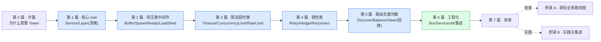

# 《Tower 设计与实现深入浅出:为什么把每个请求都抽象成一个可组合的 Future》—— 目录与导读

> 一本写给"用 axum/tonic 写过 Rust 异步服务、给 axum 套过 `.layer(...)`、却总觉得 Tower 这套 Service/Layer 一知半解"的人的小书。
>
> **一句话主旨**:把"处理一个请求"抽象成 `Service<Request> -> Future<Response>`,把"装饰请求处理"抽象成 `Layer`——两者拼出无限可组合的中间件(timeout/retry/限流/负载均衡),这是 Rust 异步生态的请求处理通用语言,也是 hyper/axum/tonic/reqwest/Pingora 的共同骨架。
>
> **二分法**(迷路时回到它):**执行单元**(Service trait:`poll_ready(&mut self)` 背压 + `call(&mut self, req) -> Future`) vs **组合单元**(Layer trait:`layer(&self, inner) -> Service` 洋葱装饰 + `ServiceBuilder`/`Stack` 类型级组合 + 生态中间件)。
>
> **承接**:★强承接《Tokio》(Service 基于 Future/Poll 的 `core::future`/`core::task`,Buffer 用 mpsc + spawn,ConcurrencyLimit 用 Semaphore,RateLimit/Timeout/Hedge 用 tokio::time——Tokio 讲透的一句带过指路)+ ★强承接《hyper》(hyper 的 Service 就是 tower-service 的简化版,hyper **删了 `poll_ready`**,背压挪到 H1 in_flight/H2 流控——这个对照贯穿全书;hyper P1-02/03 已讲 Service+Tower 入门一句带过指路)+ 横连《gRPC》(filter stack 对照)、《Envoy》(filter chain 对照)、《Go》(洋葱 middleware 对照)。
>
> **主比喻**:直球为主、比喻点睛。开篇用"洋葱"+"插座"做一次性点位睛——Service 是插座上的电器(每个干一件事:处理请求),Layer 是洋葱皮(一层层套在外面:timeout/retry/限流),ServiceBuilder 是装修清单(按顺序贴洋葱皮)。

每章一行:**一句话钩子** —— 技巧标签 —— 二分法归属(`执行` / `组合` / `总览`)。

---

## 全书结构总览

旅程:从"一个 `Service = poll_ready + call -> Future`",一路走到"一座可组合的中间件大厦怎么用 Layer 层层套起来"。读完你能在脑子里放映出:请求进来 → 最外层 Layer 包出的 Service `poll_ready`(背压)→ `call` 把请求往下传 → 一路穿到业务内层 → 响应 Future 一层层 resolve 回去——以及每一步 Tokio 的 Future/Poll/mpsc/Semaphore/time 怎么被用起来、对照 hyper 删了 poll_ready 怎么办、对照 gRPC/Envoy filter chain 怎么做。

---

## 第 0 篇 · 开篇:为什么 Rust 异步生态需要 Tower

- [P0-01 · 第一性原理:为什么 Rust 异步生态需要 Tower](P0-01-第一性原理-为什么Rust异步生态需要Tower.md) —— Tokio 给运行时、hyper 给 HTTP,但"处理一个请求"缺通用抽象;Tower 定义 Service(poll_ready + call -> Future)+ Layer 两件套,是 axum/tonic/Pingora 共同骨架。 —— Service×Layer + 承接 + 跨语言对照 —— `总览`

## 第 1 篇 · 核心 trait:Service 与 Layer(Tower 灵魂)

> 两个 trait 定义整个生态。**建议顺序读**。

- [P1-02 · Service trait:一个请求一个 Future](P1-02-Service-trait-一个请求一个Future.md) —— Service 怎么把处理请求抽象成 `poll_ready(&mut self) + call(&mut self) -> Future`,为什么 `&mut self`,poll_ready 背压,Tower 保留 poll_ready 而 hyper 删了。 —— Service trait + poll_ready 背压 + mem::replace 惯用法 —— `执行(招牌)`
- [P1-03 · Layer trait:洋葱装饰](P1-03-Layer-trait-洋葱装饰.md) —— 鉴权/日志/压缩怎么不侵入业务:Layer + 类型级 Stack<T,L>(对照 gRPC filter 运行期链表)。 —— Layer trait + Stack 类型级洋葱 —— `组合`
- [P1-04 · ServiceBuilder 与 ServiceExt:组合的艺术](P1-04-ServiceBuilder与ServiceExt-组合的艺术.md) —— 多层 Layer 怎么链起来套一个 Service:ServiceBuilder 链式 Stack,ServiceExt oneshot/map_*。 —— ServiceBuilder + ServiceExt 组合子 —— `组合(招牌)`

## 第 2 篇 · 背压类中间件:让 poll_ready 有意义

> poll_ready 是 Service 灵魂,但底层就绪常异步。Tower 用中间件把复杂性藏起来。**建议顺序读**。

- [P2-05 · Buffer:把 !Clone 服务变成 Clone+Send](P2-05-Buffer-把非Clone服务变成Clone+Send.md) —— 持连接的 Service 不能 Clone 怎么多 task 共享:worker task + mpsc(承 Tokio)。 —— Buffer worker + mpsc + off-by-one 修复 —— `执行(招牌)`
- [P2-06 · SpawnReady:后台预热就绪](P2-06-SpawnReady-后台预热就绪.md) —— 不想每次请求阻塞 poll_ready:spawn 后台 task 反复 poll 到 Ready。 —— SpawnReady + 后台预热 —— `执行`
- [P2-07 · LoadShed 与背压的取舍](P2-07-LoadShed与背压的取舍.md) —— 内层满载是等(Pending)还是拒绝:LoadShed 把 Pending 翻成错误(对照 Envoy overload)。 —— LoadShed + 主动丢请求 —— `执行`

## 第 3 篇 · 限流与超时类中间件:控住流量

- [P3-08 · Timeout:给 Future 套一个截止时间](P3-08-Timeout-给Future套一个截止时间.md) —— 请求跑太久怎么切断:sleep + select!,drop Future 取消。 —— Timeout + tokio::time + 取消语义 —— `执行`
- [P3-09 · ConcurrencyLimit:并发数上限](P3-09-ConcurrencyLimit-并发数上限.md) —— 怎么限同时请求数:Semaphore permit(poll_ready 里 acquire)+ GlobalConcurrencyLimitLayer 跨服务共享。 —— Semaphore permit + 背压 —— `执行`
- [P3-10 · RateLimit:令牌桶控速率](P3-10-RateLimit-令牌桶控速率.md) —— 怎么限每秒请求数:令牌桶 + tokio::time::Interval,和 ConcurrencyLimit 差别。 —— 令牌桶 + Interval —— `执行`

## 第 4 篇 · 韧性类中间件:失败时怎么办

- [P4-11 · Retry:失败重试与 Policy](P4-11-Retry-失败重试与Policy.md) —— 失败要不要重试:Policy trait + Budget trait(0.5.0 trait 化)+ backoff + 为什么限预算防重试风暴。 —— Retry + Policy + Budget trait —— `执行(招牌)`
- [P4-12 · Hedge:对冲请求降尾延迟](P4-12-Hedge-对冲请求降尾延迟.md) —— p99 慢怎么治:接近 p99 发第二个 hedge,谁先回用谁 + rotating_histogram 估 p99(对照 Envoy hedge)。 —— Hedge + 滚动直方图 + filter 配合 —— `执行(招牌)`
- [P4-13 · Reconnect:断线重连](P4-13-Reconnect-断线重连.md) —— 后端断了怎么自动重连:MakeService 工厂模式,造连接 vs 用连接分开。 —— Reconnect + MakeService —— `执行`

## 第 5 篇 · 路由与负载均衡类中间件:多个后端选一个(招牌)

> 这是 Tower 区别于普通中间件库的地方:完整的服务发现 + 负载均衡栈。**建议顺序读**。

- [P5-14 · Discover 与 ready_cache:服务发现](P5-14-Discover与ready-cache-服务发现.md) —— 后端列表怎么动态更新:Discover(sealed Stream alias)+ ready_cache(indexmap 缓存就绪)。 —— Discover + Change + ready_cache —— `组合`
- [P5-15 · Balance 与 P2C:负载均衡](P5-15-Balance与P2C-负载均衡.md) —— 多后端怎么挑一个:P2C(随机抽两挑负载小)+ load(peak_ewma/pending_requests/constant),对照 Envoy LB。 —— Power-of-2-Choices + PEWMA —— `执行(招牌)`
- [P5-16 · Steer 与 Filter:按规则分发](P5-16-Steer与Filter-按规则分发.md) —— 按请求内容(URL path)而非负载分发:Steer 路由 + Filter 过滤(同步异步两种 Predicate)。 —— Steer + Filter Predicate —— `组合`

## 第 6 篇 · 工程化:类型擦除与集成

- [P6-17 · BoxService 家族:类型擦除](P6-17-BoxService家族-类型擦除.md) —— ServiceBuilder 套出的巨大 Stack 类型怎么擦除:BoxService/BoxCloneService/BoxCloneSyncService(0.5.2)+ 为什么 Clone+Sync。 —— trait object 擦除 + Clone+Sync —— `组合(招牌)`
- [P6-18 · util 组合子与 service_fn:函数当 Service](P6-18-util组合子与service_fn-函数当Service.md) —— 不想写 struct impl Service 直接用闭包:service_fn + map_* / and_then / then / Either / call_all。 —— service_fn + Service 版 Iterator 组合子 —— `组合`
- [P6-19 · Tower 在 axum/tonic/hyper/Pingora 怎么落地](P6-19-Tower在axum-tonic-hyper-Pingora怎么落地.md) —— 真实框架怎么用 Tower:axum from_fn、tonic interceptor、hyper 1.x Service、Pingora proxy(附录 B 展开)。 —— 四框架集成 —— `总览`

## 第 7 篇 · 收束

- [P7-20 · 全书收束:Tower 在 Rust 异步栈的位置](P7-20-全书收束-Tower在Rust异步栈的位置.md) —— Tower 在栈位置(Tokio→hyper→Tower→axum/tonic)+ 双对照(gRPC filter C++ 运行期 vs Tower 类型级 Stack;Envoy filter C++ vs Tower 编译期)+ poll_ready 取舍(通用层保留 vs 协议层 hyper 删)+ 演进。 —— 栈定位 + 双对照 + 演进 —— `总览`

## 附录

- [附录 A · Tower 源码全景路线图](附录A-源码全景路线图.md) —— tower-service(Service)→tower-layer(Layer/Stack/Identity)→tower/builder(ServiceBuilder)→tower/util(ServiceExt/service_fn/Box*Service)→各中间件(buffer/timeout/limit/retry/balance/hedge/...)全栈地图 + 阅读顺序。
- [附录 B · Tower 实践与集成](附录B-实践与集成.md) —— axum/tonic/reqwest/Pingora 怎么用 Tower、用 ServiceBuilder 从零搭 client、调优、排查清单(中间件顺序/Buffer worker 泄漏/重试风暴/限流不准)。

---

## 推荐阅读路线

**主线(推荐)**:P0-01 → 第 1 篇全(P1-02~04,核心 trait 灵魂)→ 第 2 篇全(P2-05~07,背压类)→ 第 3 篇 → 第 4 篇 → 第 5 篇 → 第 6 篇 → 第 7 篇 → 附录 A。这是"一次请求穿过 Tower 中间件栈跑完执行+组合两面"的完整旅程。

按目标速查:

| 你的目标 | 读这几章 |
|------|------|
| 只想懂 Tower 整体 | P0-01 → P1-02 → P7-20 |
| 只想懂 Service trait 与背压(招牌) | P1-02 → P2-05(Buffer)→ P2-07(LoadShed) |
| 只想懂 Layer 洋葱组合 | P1-03 → P1-04 → P6-17(BoxService 擦除) |
| 只想懂限流超时 | P3-08~10 |
| 只想懂重试与对冲 | P4-11(Retry)→ P4-12(Hedge) |
| 只想懂负载均衡(招牌) | P5-14 → P5-15(Balance/P2C)→ P5-16 |
| 读过 hyper 想看 Service 对照 | P1-02(poll_ready 取舍)→ P6-19(hyper 删了 poll_ready)→ P7-20 |
| 用 axum/tonic 想懂底层 | P1-02~04 → P6-17(BoxService)→ 附录 B |
| 想读 Tower 源码 | 附录 A + 跟本书章节逐个啃 |

> 一个提醒:第 1、2、5 篇有紧密顺序(核心 trait → 背压类 → 路由负载均衡),**别跳**;本书处处承 Tokio、对照 hyper/gRPC/Envoy,读过那几本收获翻倍。

---

## 配套文件

- [全书规划-总纲](全书规划-总纲.md) —— 主线、二分法、承接 Tokio/hyper、比喻、分篇分章、源码策略。
- [_章节写作提示词](_章节写作提示词.md) —— 写作执行手册(铁律、四段式、技巧精解、承接铁律)。
- 源码(本地 clone 计划):`../tower/`(tower-rs/tower,tag `tower-0.5.2`,短 commit `7dc533e`,版本 0.5.2;tower-service 0.3.3;tower-layer 0.3.3)。引用经 Grep/Read 核实行号,钉死在该 commit。
- 承接:[[tokio-series-project]]/[[tokio-source-facts]](Future/Poll/mpsc/Semaphore/time)、[[hyper-series-project]](hyper Service 删 poll_ready、Service trait 入门)、[[grpc-series-project]](filter stack 对照)、[[envoy-series-project]](filter chain 对照)。

---

> 这本书讲的不是"Tower 的 API 怎么用",而是"它凭什么把请求处理抽象成可组合的 Future、源码里那些 Service trait、poll_ready 背压、Layer 洋葱、ServiceBuilder 类型级 Stack、Buffer worker task、Balance P2C、BoxCloneSyncService 到底在干什么"。读完,你该能在脑子里放映出一次请求穿过 Tower 中间件栈的全过程——以及每一步 Tokio 怎么被用、对照 hyper/gRPC/Envoy/Go 怎么做。
