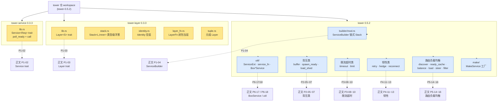
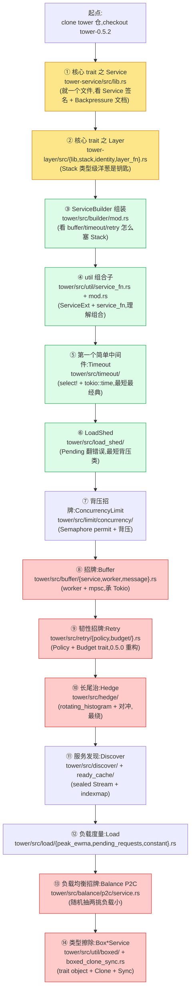

# 附录 A · Tower 源码全景路线图

> 这不是讲新东西,是把全书画过的源码点串成一张**可导航的地图**:三个 crate 分工 → 各模块它解决什么问题、关键文件、对应正文章节 → 推荐阅读顺序 → feature flag 对照表。
>
> 拿着这张图去 clone 一份 `tower` 仓(`tower-0.5.2`,commit `7dc533ef86b02f89f3dc5fe64644dd1a5dc3b37d`),从核心 trait 一路啃到中间件大集合,你会发现 Tower 的源码比想象中清晰得多——**它的复杂度不在任何一行代码里,而在"Service × Layer 这个抽象怎么层层套"这件事本身**。

---

## A.0 这张图怎么用

正文 19 章把每个机制讲透了,但读者合上书去读 `tower` 仓时往往卡在一个问题:**这么多模块,我该先读哪个?** 这就是附录 A 要回答的。

这张图解决三件事:

1. **鸟瞰**:三个 crate(`tower-service` / `tower-layer` / `tower`)各干什么,一个 `ServiceBuilder::buffer().timeout().retry()` 在源码里到底跨越了多少文件。
2. **导航**:每个中间件模块(buffer/timeout/limit/retry/balance/...)"它解决什么问题、关键文件是哪几个、对应正文哪一章",一格一格查得着。
3. **顺序**:给你一条由浅入深的源码阅读路径,从 `Service` trait 一个签名,一路读到 `Balance` 的 P2C 算法。

> **一个反复要提醒的事实**(全书强调过,这里再钉一次):老博客和老资料里那些 `tower-timeout`、`tower-retry`、`tower-buffer`、`tower-limit`、`tower-balance`、`tower-load`、`tower-discover`、`tower-reconnect`、`tower-hedge`、`tower-filter`、`tower-util`、`tower-make`、`tower-ready-cache`、`tower-spawn-ready`、`tower-steer`、`tower-load-shed` 等**独立 crate 名,自 0.4.0(2021-01)起已全部废弃**,真实路径是 `tower/src/timeout/`、`tower/src/balance/p2c/` 等(模块统一进 `tower` crate,放在 feature flag 后)。**用废弃名当 import 路径是初学者最常踩的坑**,这张图一律以 0.5.2 真实结构为准。

---

## A.1 三个 crate 的分工总览

Tower 仓是一个 workspace,顶层四个 crate:

| crate | 版本 | 角色 | 行数级 |
|-------|------|------|--------|
| `tower-service` | 0.3.3 | **核心 trait `Service`**(执行单元的"宪法") | 一个文件 `lib.rs` |
| `tower-layer` | 0.3.3 | **核心 trait `Layer` + `Stack`/`Identity`**(组合单元的"宪法") | 五个文件 |
| `tower` | 0.5.2 | **中间件大集合 + builder + util**(全部生态中间件) | 二十多个模块 |
| `tower-test` | — | 测试工具(`mock` 等),不是本书重点 | — |

为什么 trait 和中间件要分 crate?这是 Tower 最关键的设计取舍:**`Service`/`Layer` 两个核心 trait 刻意做成 0.3.x 永不 breaking change 的最小 crate**,这样 hyper/axum/tonic/reqwest/Pingora 这些下游才能放心 `pub use tower_service::Service`(避免循环依赖)。而所有中间件(buffer/timeout/retry/...)演进快,放进 `tower` crate 单独发版。**这导致一个反直觉现象:`tower-service`/`tower-layer` 版本号永远停在 0.3.x,而 `tower` 已经发到 0.5.x。** 这是设计,不是维护停滞。

下面这张树图,是整张图的"目录页"——三个 crate → 各模块 → 对应正文章节:



这张图是后续每个小节的索引:**A.2 走最左那条核心 trait 线(tower-service + tower-layer),A.3 走中间的 builder/util,A.4-A.5 走右半的中间件大集合**。

---

## A.2 核心 trait 路线:tower-service 与 tower-layer

这一节是全图的"地基"——两个 crate 加起来不到十个文件,却定义了整个 Tower 生态。

### A.2.1 tower-service/src/lib.rs —— Service trait 全部真身

`tower-service` 这个 crate **只有一个文件**:`src/lib.rs`。整个 crate 干的事就是定义这一个 trait:

```rust
// ../tower/tower-service/src/lib.rs (核心片段)
pub trait Service<Request> {
    type Response;
    type Error;
    type Future: Future<Output = Result<Self::Response, Self::Error>>;

    fn poll_ready(&mut self, cx: &mut Context<'_>) -> Poll<Result<(), Self::Error>>;

    #[must_use = "futures do nothing unless you `.await` or poll them"]
    fn call(&mut self, req: Request) -> Self::Future;
}
```

[Service trait 定义](../tower/tower-service/src/lib.rs#L311-L326)

就这五行(两个 `fn` 加三个关联类型),撑起了整个 Tower 生态。读这个文件时盯三块:

1. **`poll_ready(&mut self)` 的背压语义**(`lib.rs` 第 311 行起,trait 定义 + 第 225 行的 `# Backpressure` 文档段):服务满载返回 `Pending`,资源在 `call` 里消费。**这是 Tower 区别于 hyper 的核心**——hyper 把 `poll_ready` 删了(背压挪到 H1 单槽/H2 流控),Tower 保留。对应正文 → [P1-02 · Service trait](P1-02-Service-trait-一个请求一个Future.md)。
2. **`call(&mut self)` 也是 `&mut self`**(同文件 trait 定义):为什么不是 `&self`?因为 `call` 取走 `poll_ready` 预留的资源。对应正文 P1-02。
3. **`mem::replace` 惯用法**(第 276 行文档注释):文档专门警告"不要直接 clone 一个 ready 服务,要用 `mem::replace` 取走就绪的那个"——这是正文 P1-02 招牌技巧的出处,文件第 304 行有完整示例。

> **诚实修正一处**:本书总纲早期版本曾说 `tower-service` 是 `#![no_std]`。**实际核实 0.3.3 源码,文件首行是 `#![warn(missing_debug_implementations, ...)]`,并未开 `#![no_std]`**(标准库 `std::future::Future` 直接用)。这不是设计缺陷,只是 trait 本身不刻意做 no_std。读源码时以真实文件为准。

**唯一对外导出**:`pub trait Service`。没有别的。这个 crate 的价值在于"足够小、足够稳定、谁都能依赖而不引入循环"。

### A.2.2 tower-layer/src/ —— Layer + Stack + Identity + LayerFn + tuple

`tower-layer` 这个 crate **五个文件**,全部在 `src/`:

```
tower-layer/src/
├── lib.rs          // Layer<S> trait + 模块声明
├── stack.rs        // Stack<L, Inner> 类型级洋葱
├── identity.rs     // Identity(空层)
├── layer_fn.rs     // LayerFn(闭包当层)
└── tuple.rs        // 元组 Layer(()/ (L1,)/(L1,L2)/...)
```

[Layer trait 定义](../tower/tower-layer/src/lib.rs#L95-L101)

逐个看:

| 文件 | 它解决什么问题 | 关键类型 | 对应正文 |
|------|--------------|---------|---------|
| `lib.rs` | 把"装饰一个 Service"抽象成 `fn layer(&self, inner: S) -> Self::Service` | `Layer<S>` trait | [P1-03](P1-03-Layer-trait-洋葱装饰.md) |
| `stack.rs` | **类型级洋葱**:`Stack<OuterLayer, Inner>` 编译期嵌套,零运行时开销(对照 gRPC filter 运行期链表) | `Stack<L, Inner>` | P1-03 |
| `identity.rs` | 空层 `Identity`,`layer(inner)` 直接返回 `inner`(对应"什么中间件都不套") | `Identity` | P1-03 |
| `layer_fn.rs` | 把一个 `Fn(Service) -> Service` 闭包当 Layer | `LayerFn<F>` | P1-03 |
| `tuple.rs` | 让 `()`、`(L1,)`、`(L1, L2)` ... 这种元组也能当 Layer(逐层 `layer` 嵌套) | `impl Layer for (L1, L2)` | P1-03 |

读 `stack.rs` 是理解整个 Tower 组合单元的钥匙:`Stack<OuterLayer, Inner>` 自身也 `impl Layer`(因为它的 `Inner` 可以是另一个 `Stack`),这样 `Stack<A, Stack<B, Stack<C, Identity>>>` 就在**编译期**长成了一棵洋葱树,**运行期没有链表开销**。对照 gRPC C++ core 的 filter 链表(运行期 `Call`/`Interceptor` 串起来)和 Envoy 的 filter chain(C++ 运行期组装),Tower 这套是把洋葱做进了类型系统。详见正文 P1-03 与 P7-20 的双对照。

> **`tuple.rs` 不是常见入口,但它解释了一个现象**:为什么 `ServiceBuilder` 能优雅地把任意多层 Layer 套上去——`tuple.rs` 让"按顺序套多层"这件事有了类型表达。读 P1-04 ServiceBuilder 时如果卡在"类型怎么长出来的",回来看 `tuple.rs` 和 `stack.rs`。

---

## A.3 builder 与 util:tower 的"组装车间"

有了两个核心 trait,接下来是 `tower` crate 里负责"组装"的两块:`builder/` 和 `util/`。

### A.3.1 tower/src/builder/mod.rs —— ServiceBuilder 全部真身

`builder/` 目录**只有一个文件 `mod.rs`**,这就是 `ServiceBuilder` 的全部实现。

```
tower/src/builder/
└── mod.rs    // ServiceBuilder<L> 链式 API 全在这
```

[ServiceBuilder 部分 API](../tower/tower/src/builder/mod.rs#L132-L275)

`ServiceBuilder<L>` 的核心机制:**每调一个方法(buffer/timeout/concurrency_limit/...),返回类型从 `ServiceBuilder<L>` 变成 `ServiceBuilder<Stack<ThisLayer, L>>`**——类型级洋葱在编译期长一层,运行期零开销。读这个文件盯两件事:

1. **每个中间件方法都是一个 `pub fn ... -> ServiceBuilder<Stack<..., L>>`**(第 178 行 `buffer`、196 行 `concurrency_limit`、219 行 `load_shed`、230 行 `rate_limit`、249 行 `retry`、263 行 `timeout`、706 行 `boxed`、769 行 `boxed_clone`):它们都不真的 new 一个服务,只是往类型里塞一层 Layer。真正的组装发生在最后的 `.service(inner)` 调用。
2. **`.layer(T)` / `.option_layer(T)` / `.layer_fn(F)`**(第 132/155/167 行):把任意 `Layer` 塞进栈里,这是 `ServiceBuilder` 能装下所有中间件的"通用插槽"。

对应正文 → [P1-04 · ServiceBuilder 与 ServiceExt](P1-04-ServiceBuilder与ServiceExt-组合的艺术.md)。**读这个文件之前先读 `tower-layer/stack.rs`**,否则 `ServiceBuilder<Stack<T, L>>` 这个类型会让你发懵。

### A.3.2 tower/src/util/ —— ServiceExt + service_fn + Box*Service + 组合子

`util/` 是 `tower` crate 里文件最多的目录,装了两类东西:**ServiceExt 组合子**(给 Service 加 Iterator 风格的方法)和 **Box*Service 类型擦除家族**。

```
tower/src/util/
├── mod.rs              // ServiceExt trait + 子模块声明
├── service_fn.rs       // service_fn:把 Fn(Req)->Future 包成 Service
├── future_service.rs   // future_service:把 async fn 包成 Service
├── oneshot.rs          // oneshot:消费 self 发一个请求
├── ready.rs            // ready/ready_oneshot:poll_ready 到 Ready 的 Future
├── and_then.rs         // Service → Service 的 map 成功
├── then.rs             // Service → Service 的 map(含失败)
├── map_response.rs     // 映射 Response
├── map_err.rs          // 映射 Error
├── map_request.rs      // 映射 Request
├── map_result.rs       // 映射 Result
├── map_future.rs       // 映射 Future 本身
├── either.rs           // Either<A,B>:两个 Service 二选一
├── rng.rs              // 内部 RNG(给 balance/randomize 用)
├── boxed/              // ★ BoxService 类型擦除家族
│   ├── mod.rs          //   统一导出 + layer
│   ├── sync.rs         //   BoxService(Clone + Sync)
│   ├── unsync.rs       //   UnsyncBoxService(历史包袱,单线程)
│   ├── layer.rs        //   BoxServiceLayer
│   ├── layer_clone.rs  //   BoxCloneServiceLayer
│   └── layer_clone_sync.rs // BoxCloneSyncServiceLayer
├── boxed_clone.rs      // BoxCloneService(Clone + 可能非 Sync)
├── boxed_clone_sync.rs // ★ BoxCloneSyncService(Clone + Sync,0.5.2 新增)
├── call_all/           // call_all:Stream 喂 Service
│   ├── mod.rs
│   ├── common.rs
│   ├── ordered.rs      //   有序结果
│   └── unordered.rs    //   无序结果
└── optional/           // Option<Service> 当 Service
    ├── mod.rs
    ├── error.rs
    └── future.rs
```

**`ServiceExt` trait 在 `util/mod.rs` 第 71 行定义**(全书正文反复用的 `oneshot`/`map_response`/`and_then`/`then` 都是这个 trait 的 default 方法):

[ServiceExt trait 定义](../tower/tower/src/util/mod.rs#L71)

| 文件 / 子目录 | 它解决什么问题 | 关键类型 | 对应正文 |
|--------------|--------------|---------|---------|
| `mod.rs`(ServiceExt) | 给 Service 加 Iterator 风格组合子 | `ServiceExt<Request>` trait,`oneshot`/`ready`/`call_all`/`and_then`/`then`/`map_*` | [P6-18](P6-18-util组合子与service_fn-函数当Service.md) |
| `service_fn.rs` | 不写 struct impl Service,直接用闭包 | `service_fn(F)` | P6-18 |
| `future_service.rs` | 把 `async fn` 直接包成 Service | `future_service(F)` | P6-18 |
| `oneshot.rs` | 消费 self 发一个请求,返回 Future | `Oneshot<S, Req>` | P6-18 |
| `and_then`/`then`/`map_*` | Service → Service 装饰器 | `AndThen`/`Then`/`MapResponse`/`MapErr`/... | P6-18 |
| `either.rs` | 两种 Service 二选一(如新版旧版并存) | `Either<A, B>` | P6-18 |
| `optional/` | `Option<Service>` 当 Service(后端可能不存在) | `Optional<S>` | P6-18 |
| `call_all/` | Stream 喂 Service,产出结果 Stream | `CallAll<S, Sreq>` | P6-18 |
| `boxed/`(sync.rs) | ★ 把 Service 擦成 `Box<dyn Service>`(0.5.0 起 `Sync`) | `BoxService` | [P6-17](P6-17-BoxService家族-类型擦除.md) |
| `boxed/`(unsync.rs) | 单线程版 `BoxService`(历史包袱,叫 `UnsyncBoxService`) | `UnsyncBoxService` | P6-17 |
| `boxed_clone.rs` | 擦成 `Box<dyn CloneService>`(可 Clone) | `BoxCloneService` | P6-17 |
| `boxed_clone_sync.rs` | ★ 0.5.2 新增,Clone + Sync(给 axum 路由用) | `BoxCloneSyncService` | P6-17 |

读 `util/` 的顺序建议:**先 `service_fn.rs`(最短,理解 trait object 怎么装 Service)→ `mod.rs` 的 ServiceExt default 方法(组合子)→ 最后 `boxed/` 子目录(类型擦除,最绕)**。`boxed_clone_sync.rs` 是 0.5.2 新增的,解决 axum 多线程路由要 `Clone + Sync` 的需求——这是正文 P6-17 招牌章的核心。

> **一个常被问的问题**:`BoxService` 和 `UnsyncBoxService` 为什么并存?因为 0.5.0 之前 `BoxService` 不是 `Sync`(内部 trait object 没 `Sync` bound),多线程场景用不了,0.5.0 让 `BoxService` 变 `Sync`,但 `UnsyncBoxService` 作为历史包袱保留(老代码还在用)。`BoxCloneSyncService` 是 0.5.2 才把"Clone + Sync"两件事凑齐。详见正文 P6-17 的演进交代。

---

## A.4 中间件大集合:逐个模块路线(★地图主体)

这一节是全图主体。`tower/src/` 下每个中间件目录,逐个列出:**它解决什么问题(一句话)、关键文件、对应正文哪一章**。按正文篇序组织(背压类 → 限流超时类 → 韧性类 → 路由负载均衡类)。

### A.4.1 第 2 篇 背压类(buffer / spawn_ready / load_shed)

| 模块 | 它解决什么问题 | 关键文件 | 对应正文 |
|------|--------------|---------|---------|
| `tower/src/buffer/` | 把一个 `!Clone` 的服务(如持数据库连接的)变成 `Clone + Send`,让多 task 共享 | `service.rs`(`Buffer<S>` Service)、`worker.rs`(★worker task + mpsc,承 Tokio)、`message.rs`(通道消息)、`layer.rs`、`future.rs`、`error.rs`、`mod.rs` | [P2-05](P2-05-Buffer-把非Clone服务变成Clone+Send.md)(招牌) |
| `tower/src/spawn_ready/` | 不让每次请求都阻塞在 `poll_ready` 上:spawn 一个后台 task 反复 poll 到 Ready | `service.rs`(`SpawnReady<S>`)、`future.rs`、`layer.rs`、`mod.rs` | [P2-06](P2-06-SpawnReady-后台预热就绪.md) |
| `tower/src/load_shed/` | 内层满载(`poll_ready` 返 `Pending`)时,直接把 Pending 翻成 `Overloaded` 错误主动丢请求 | `mod.rs`(★`LoadShed<S>` 就在 mod.rs,没有 service.rs)、`future.rs`、`layer.rs`、`error.rs` | [P2-07](P2-07-LoadShed与背压的取舍.md) |

> **★ 真实结构提示**:`load_shed/` 目录下**没有 `service.rs`**,`LoadShed<S>` struct 和 `impl Service` 都直接写在 `mod.rs` 里(第 17 行 `pub struct LoadShed<S>`,第 34 行 `impl Service`)。这和 `buffer/`、`spawn_ready/`(都有独立 `service.rs`)不一样,是 Tower 源码风格不统一的体现——读源码时**以真实文件结构为准**,别假设每个中间件都有 `service.rs`。

**读背压类三件套的顺序**:`load_shed/`(最短,理解"Pending 翻错误")→ `spawn_ready/`(理解后台 task)→ `buffer/`(最绕,worker + mpsc + 0.5.0 off-by-one 修复)。buffer 是 P2-05 招牌章,源码量最大。

### A.4.2 第 3 篇 限流超时类(timeout / limit)

| 模块 | 它解决什么问题 | 关键文件 | 对应正文 |
|------|--------------|---------|---------|
| `tower/src/timeout/` | 给请求套一个截止时间,跑太久就 `sleep + select!` 切断(drop 内层 Future 取消) | `mod.rs`(`Timeout<S>`)、`future.rs`(`ResponseFuture`)、`layer.rs`(`TimeoutLayer`)、`error.rs`(`Elapsed`) | [P3-08](P3-08-Timeout-给Future套一个截止时间.md) |
| `tower/src/limit/concurrency/` | 限同时进行的请求数(Semaphore permit,`poll_ready` 里 acquire 背压) | `service.rs`(`ConcurrencyLimit<S>`)、`future.rs`、`layer.rs`(含 `GlobalConcurrencyLimitLayer`)、`mod.rs` | [P3-09](P3-09-ConcurrencyLimit-并发数上限.md) |
| `tower/src/limit/rate/` | 限每秒请求数(令牌桶 + `tokio::time::Interval` 补充令牌) | `service.rs`(`RateLimit<S>`)、`rate.rs`(★令牌桶 `Rate`)、`layer.rs`、`mod.rs` | [P3-10](P3-10-RateLimit-令牌桶控速率.md) |

> **`limit/` 目录结构**:`limit/mod.rs` 只做模块声明,真正两个子模块是 `limit/concurrency/`(并发上限)和 `limit/rate/`(速率上限)。两个都是 `__common` + `tokio/time` + `tokio/sync` feature 后面。`ConcurrencyLimit` 用 `tokio::sync::Semaphore`,`RateLimit` 用 `tokio::time` 的 timer——Tokio 讲透的(详见《Tokio》P-xx Semaphore / time wheel),一句带过指路。

**读限流超时三件套的顺序**:`timeout/`(最短最经典,理解 `select!` 取消语义)→ `limit/concurrency/`(理解 Semaphore permit 怎么和背压结合)→ `limit/rate/`(令牌桶算法)。`ConcurrencyLimit` 和 `RateLimit` 一对照就懂"并发 vs 速率"的差别了。

### A.4.3 第 4 篇 韧性类(retry / hedge / reconnect)

| 模块 | 它解决什么问题 | 关键文件 | 对应正文 |
|------|--------------|---------|---------|
| `tower/src/retry/` | 请求失败要不要重试:`Policy` trait 决定,`Budget` trait 限预算防重试风暴 | `policy.rs`(★`Policy` trait)、`budget/mod.rs`(★`Budget` trait,0.5.0 trait 化)+ `budget/tps_budget.rs`(TPS 桶实现)、`backoff.rs`(指数退避)、`future.rs`、`layer.rs`、`mod.rs` | [P4-11](P4-11-Retry-失败重试与Policy.md)(招牌) |
| `tower/src/hedge/` | 长尾(p99 慢)请求治:接近 p99 时再发一个 hedge 请求,谁先回用谁 | `mod.rs`(`Hedge<S, P>` + `Policy<Request>`)、`latency.rs`、`select.rs`(★`SelectPolicy`)、`delay.rs`(`DelayPolicy`)、`rotating_histogram.rs`(★滚动直方图估 p99,`hdrhistogram`) | [P4-12](P4-12-Hedge-对冲请求降尾延迟.md)(招牌) |
| `tower/src/reconnect/` | 后端连接断了自动重连:基于 `MakeService` 工厂,"造连接"和"用连接"分开 | `mod.rs`(`Reconnect<M, Target>`)、`future.rs`(`ResponseFuture`) | [P4-13](P4-13-Reconnect-断线重连.md) |

`reconnect/` 依赖 `make/`(工厂模式),所以 `reconnect/` 和下面 A.4.4 的 `make/` 一起读更清楚。

> **`retry/` 目录结构**:`retry/budget/` 是个子目录(不是单文件),里面有 `mod.rs`(定义 `Budget` trait)和 `tps_budget.rs`(`TpsBudget` 具体实现)。0.5.0 把 Budget 从一个 struct 重构成 trait(允许自定义桶),这是正文 P4-11 招牌章的演进点。`hedge/rotating_histogram.rs` 用了 `hdrhistogram` crate(外部依赖,不在 tower 仓,引用时诚实标注)。

**读韧性三件套的顺序**:`reconnect/`(最短,理解工厂模式)→ `retry/`(Policy + Budget 两层,招牌)→ `hedge/`(最绕,直方图 + 对冲选择)。hedge 是 P4-12 招牌章,涉及 `hdrhistogram`,源码量最大。

### A.4.4 make 工厂模式(make / reconnect 的支撑)

| 模块 | 它解决什么问题 | 关键文件 | 对应正文 |
|------|--------------|---------|---------|
| `tower/src/make/` | 把"造一个 Service"(按 target 连后端)和"用 Service"分开:`MakeService` 是一个 Service,它的 Response 又是一个 Service | `mod.rs`(`MakeService` trait + 导出)、`make_service.rs` + `make_service/shared.rs`(`Shared`,`Arc` 共享)、`make_connection.rs`(`MakeConnection`,Tokio io-std) | [P4-13](P4-13-Reconnect-断线重连.md)、[P5-14](P5-14-Discover与ready-cache-服务发现.md) |

`make/` 是 `reconnect/` 和 `balance/p2c/make.rs`(`MakeBalance`)的底层支撑。`MakeService` 这个 trait 的本质是"Service of Services"——给定一个 target(如后端地址),产出针对该 target 的内层 Service。**这是 Tower 处理"多后端"的统一抽象**,P4-13 和 P5-14 都用到。

### A.4.5 第 5 篇 路由负载均衡(discover / ready_cache / balance / load / steer / filter)

这一篇是 Tower 区别于普通中间件库的地方:它有完整的服务发现 + 负载均衡栈。

| 模块 | 它解决什么问题 | 关键文件 | 对应正文 |
|------|--------------|---------|---------|
| `tower/src/discover/` | 后端列表动态更新:`Discover` 是 sealed Stream alias,产出 `Change::Insert/Remove` | `mod.rs`(★`Discover` trait,sealed)+ `list.rs`(`ServiceList`,静态列表当 Discover) | [P5-14](P5-14-Discover与ready-cache-服务发现.md) |
| `tower/src/ready_cache/` | 缓存"已就绪"的服务,用 `indexmap` 维护(给 balance 用) | `mod.rs` + `cache.rs`(★`ReadyCache<K,S,Req>`)+ `error.rs` | P5-14 |
| `tower/src/balance/p2c/` | ★Power-of-2-Choices 负载均衡:随机抽两个后端挑负载小的 | `service.rs`(★`Balance<D, Req>`,P2C 主体)、`layer.rs`(`MakeBalanceLayer`)、`make.rs`(`MakeBalance`,工厂版)、`mod.rs`、`test.rs` | [P5-15](P5-15-Balance与P2C-负载均衡.md)(招牌) |
| `tower/src/balance/` | balance 的容器 + 错误类型 | `mod.rs`(导出 `p2c` 子模块)、`error.rs` | P5-15 |
| `tower/src/load/` | 负载度量(给 balance 的 P2C 挑选用):三种 Load 实现 | `mod.rs`(★`Load` trait)、`peak_ewma.rs`(PEWMA 衰减历史延迟)、`pending_requests.rs`(在途请求数)、`constant.rs`(常数,调试用)、`completion.rs`(完成回调追踪) | P5-15 |
| `tower/src/steer/` | 不按负载,按请求内容(如 URL path)把请求路由到一组服务之一 | `mod.rs`(`Steer<S, F, Req>` + `Picker` trait,**单文件模块**) | [P5-16](P5-16-Steer与Filter-按规则分发.md) |
| `tower/src/filter/` | 按 `Predicate`/`AsyncPredicate` 过滤不合法请求(同步异步两种) | `mod.rs`、`predicate.rs`(★`Predicate` + `AsyncPredicate`)、`future.rs`、`layer.rs`、`error.rs` | P5-16 |

> **★ 真实结构修正一处**:本书总纲早期版本曾把 `balance/p2c/layer.rs` 里的类型叫 `BalanceLayer`。**实际核实 0.5.2 源码,`balance/p2c/layer.rs` 里的类型叫 `MakeBalanceLayer<D, Req>`**(第 21 行),它包出的 Service 是 `MakeBalance`(在 `make.rs`)。Tower 没有"直接用 Layer 包一个 `Balance`"的便捷 Layer——因为 `Balance` 需要一个 `Discover`(后端流),不是单个 Service。要用 `Balance`,要么 `MakeBalanceLayer`(工厂版),要么手动构造 `Balance::new(discover, ...)`。这是读源码时容易踩的命名坑,以真实文件为准。

> **`steer/` 是单文件模块**:`steer/mod.rs` 一个文件搞定 `Steer` + `Picker` trait(全书唯一没有子文件的路由类中间件),读起来最轻松。

**读路由负载均衡的顺序(强烈建议)**:`discover/`(理解服务发现流)→ `ready_cache/`(缓存就绪)→ `load/`(三种负载度量)→ `balance/p2c/`(★P2C 招牌)→ `steer/`/`filter/`(按规则分发)。前四个有紧密依赖(balance 要 discover 提供后端 + ready_cache 缓存 + load 度量),**别跳**。

---

## A.5 推荐源码阅读顺序(由浅入深)

把上面所有模块拼起来,这是一条从零到深的源码阅读路径。**强烈建议照这个顺序读**,不要一上来就啃 `balance/p2c/service.rs`(会懵)。



这条路径的逻辑:

- **①②核心 trait(黄)**:两个 trait 是地基,不读懂 Service/Layer,后面全是天书。`tower-service/src/lib.rs` 一个文件读完,poll_ready 背压 + call `&mut self` 就明白了;`tower-layer/stack.rs` 看完,类型级洋葱就懂了。
- **③④组装机制(绿)**:ServiceBuilder 怎么把 Layer 套成 `Stack<T, L>`,util 怎么给 Service 加组合子。读完这两块,你就懂"一个 `ServiceBuilder::buffer().timeout().retry()` 在源码里跨了多少文件"。
- **⑤⑥简单中间件(绿)**:Timeout(最经典的 select! + tokio::time)+ LoadShed(最短的背压类),先读这两个建立"中间件长什么样"的直觉。
- **⑦⑧背压招牌(红)**:ConcurrencyLimit(Semaphore permit 背压)→ Buffer(worker + mpsc,招牌)。Buffer 是 P2-05 全书最绕之一,放这步读正好——前面铺垫够了。
- **⑨⑩韧性(红)**:Retry(Policy + Budget)+ Hedge(直方图对冲)。Hedge 最绕,放最后。
- **⑪⑫⑬负载均衡栈(红)**:Discover → Load → Balance P2C。这三个有严格依赖(balance 要 discover 提供后端 + load 度量),**别跳**。Balance P2C 是 P5-15 招牌。
- **⑭收尾(红)**:Box*Service 类型擦除。放最后,因为它要你先懂 Service/Layer/Clone/Sync 这些才有意义,0.5.2 的 `BoxCloneSyncService` 是收束。

> **时间预算参考**:①-④ 一个下午(核心 trait + 组装,量不大);⑤-⑧ 一两天(背压类是重头);⑨-⑬ 三四天(韧性 + 负载均衡,招牌章所在);⑭ 半天(类型擦除)。**全程对照本书正文章节**(图里每步标了对应章节),遇到不懂的机制回正文翻对应章。

---

## A.6 feature flag 与模块对应表

`tower` crate 用 feature flag 控制每个中间件是否编译进来(因为 0.4.0 合并子 crate 时,把这些中间件都放进了 `tower` 但默认不全部开启,按需编译减小体积)。

`tower/Cargo.toml` 的 `[features]` 段(Cargo.toml 第 22-62 行):

| feature flag | 开启的模块 | 额外依赖(feature 内开启) |
|-------------|-----------|----------------------|
| `full` | **全部**(下面所有) | 全部依赖 |
| `__common`(内部) | `futures-core` + `pin-project-lite` | 不直接用 |
| `balance` | `tower::balance` | `discover` + `load` + `ready-cache` + `make` + `slab` + `util` |
| `buffer` | `tower::buffer` | `tokio/sync` + `tokio/rt` + `tokio-util` + `tracing` |
| `discover` | `tower::discover` | `__common` |
| `filter` | `tower::filter` | `__common` + `futures-util` |
| `hedge` | `tower::hedge` | `util` + `filter` + `futures-util` + `hdrhistogram` + `tokio/time` + `tracing` |
| `limit` | `tower::limit`(concurrency + rate) | `__common` + `tokio/time` + `tokio/sync` + `tokio-util` + `tracing` |
| `load` | `tower::load` | `__common` + `tokio/time` + `tracing` |
| `load-shed` | `tower::load_shed` | `__common` |
| `make` | `tower::make` | `futures-util` + `pin-project-lite` + `tokio/io-std` |
| `ready-cache` | `tower::ready_cache` | `futures-core` + `futures-util` + `indexmap` + `tokio/sync` + `tracing` + `pin-project-lite` |
| `reconnect` | `tower::reconnect` | `make` + `tokio/io-std` + `tracing` |
| `retry` | `tower::retry` | `__common` + `tokio/time` + `util` |
| `spawn-ready` | `tower::spawn_ready` | `__common` + `futures-util` + `tokio/sync` + `tokio/rt` + `util` + `tracing` |
| `steer` | `tower::steer` | (无额外依赖) |
| `timeout` | `tower::timeout` | `pin-project-lite` + `tokio/time` |
| `util` | `tower::util` | `__common` + `futures-util` + `pin-project-lite` + `sync_wrapper` |
| `log` | 启用 `tracing/log` | (内部) |

**几点观察**:

1. **`balance` 依赖最重**:它要 `discover` + `load` + `ready-cache` + `make` + `slab` + `util`——因为负载均衡需要服务发现(后端流)+ 负载度量 + 就绪缓存 + 工厂模式全栈。这也解释了为什么 P5 是招牌篇。
2. **`hedge` 依赖 `filter`**:因为 hedge 需要 `Policy` 过滤"哪些请求值得 hedge"(避免无效 hedge)。这是正文 P4-12 讲"为什么 hedge 要配 filter"的源码依据。
3. **`retry` 依赖 `util`**:Retry 的实现用了 util 里的组合子。
4. **`steer` 零额外依赖**:最轻的中间件,纯 Rust 标准库 + Tower trait。
5. **Tokio 的 feature**:哪些中间件用 Tokio 一目了然——`buffer`(sync + rt)、`limit`(time + sync)、`load`/`timeout`/`hedge`/`retry`(time)、`spawn-ready`(sync + rt)、`ready-cache`(sync)、`make`/`reconnect`(io-std)。**Tokio 是 Tower 中间件的运行时底座**,但核心 trait(Service/Layer)不依赖 Tokio(承 `core::future`/`core::task` 标准库)。

> **写应用时的实践**:`tower = { version = "0.5", features = ["full"] }` 一把开全部(最省心,适合学习/原型);生产环境按需开(`features = ["timeout", "limit", "retry"]` 只开用到的,减小二进制体积)。Cargo 的 feature unification 会让依赖图合并,但 Tower 的 feature 设计干净,每个模块独立,不会互相干扰。

---

## A.7 全景速查:一句话锁定每个模块

最后给一张"我要找 X,它在哪个文件"的速查表(本书全部源码点的索引):

| 你要找的 | 源码位置 | 正文 |
|---------|---------|------|
| `Service` trait 定义 | `tower-service/src/lib.rs` 第 311 行 | P1-02 |
| `poll_ready` / `call` 签名 | 同上 第 340/355 行 | P1-02 |
| Backpressure 文档段 | 同上 第 225 行 `# Backpressure` | P1-02 |
| `mem::replace` 惯用法示例 | 同上 第 276/304 行 | P1-02 |
| `Layer` trait 定义 | `tower-layer/src/lib.rs` 第 95 行 | P1-03 |
| `Stack<L, Inner>` 类型级洋葱 | `tower-layer/src/stack.rs` | P1-03 |
| `Identity`(空层) | `tower-layer/src/identity.rs` | P1-03 |
| `LayerFn`(闭包当层) | `tower-layer/src/layer_fn.rs` | P1-03 |
| 元组 Layer | `tower-layer/src/tuple.rs` | P1-03 |
| `ServiceBuilder` 链式 API | `tower/src/builder/mod.rs` | P1-04 |
| `ServiceExt` trait | `tower/src/util/mod.rs` 第 71 行 | P6-18 |
| `service_fn` | `tower/src/util/service_fn.rs` | P6-18 |
| `oneshot` / `call_all` | `tower/src/util/{oneshot,call_all/}.rs` | P6-18 |
| `map_*` / `and_then` / `then` | `tower/src/util/{map_*,and_then,then}.rs` | P6-18 |
| `Either` | `tower/src/util/either.rs` | P6-18 |
| `BoxService`(Sync) | `tower/src/util/boxed/sync.rs` | P6-17 |
| `UnsyncBoxService` | `tower/src/util/boxed/unsync.rs` | P6-17 |
| `BoxCloneService` | `tower/src/util/boxed_clone.rs` | P6-17 |
| `BoxCloneSyncService`(0.5.2) | `tower/src/util/boxed_clone_sync.rs` | P6-17 |
| `Buffer`(worker + mpsc) | `tower/src/buffer/{service,worker,message}.rs` | P2-05 |
| `SpawnReady` | `tower/src/spawn_ready/service.rs` | P2-06 |
| `LoadShed` | `tower/src/load_shed/mod.rs` 第 17 行 | P2-07 |
| `Timeout` | `tower/src/timeout/mod.rs` | P3-08 |
| `ConcurrencyLimit` | `tower/src/limit/concurrency/service.rs` | P3-09 |
| `GlobalConcurrencyLimitLayer` | `tower/src/limit/concurrency/layer.rs` | P3-09 |
| `RateLimit`(令牌桶) | `tower/src/limit/rate/{service,rate}.rs` | P3-10 |
| `Policy`(重试策略) | `tower/src/retry/policy.rs` 第 46 行 | P4-11 |
| `Budget` trait(0.5.0) | `tower/src/retry/budget/mod.rs` 第 81 行 | P4-11 |
| `TpsBudget` | `tower/src/retry/budget/tps_budget.rs` | P4-11 |
| `backoff`(指数退避) | `tower/src/retry/backoff.rs` | P4-11 |
| `Hedge`(对冲) | `tower/src/hedge/mod.rs` 第 38 行 | P4-12 |
| `rotating_histogram`(p99 估计) | `tower/src/hedge/rotating_histogram.rs` | P4-12 |
| `Reconnect`(断线重连) | `tower/src/reconnect/mod.rs` 第 30 行 | P4-13 |
| `MakeService` 工厂 | `tower/src/make/make_service.rs` | P4-13/P5-14 |
| `Discover` trait(sealed) | `tower/src/discover/mod.rs` 第 54 行 | P5-14 |
| `Change::Insert/Remove` | `tower/src/discover/mod.rs` 第 101 行 | P5-14 |
| `ServiceList`(静态 Discover) | `tower/src/discover/list.rs` 第 18 行 | P5-14 |
| `ReadyCache`(indexmap 缓存) | `tower/src/ready_cache/cache.rs` 第 58 行 | P5-14 |
| `Load` trait(负载度量) | `tower/src/load/mod.rs` 第 80 行 | P5-15 |
| `PeakEwmaDiscover`(PEWMA) | `tower/src/load/peak_ewma.rs` | P5-15 |
| `PendingRequestsDiscover` | `tower/src/load/pending_requests.rs` | P5-15 |
| `Balance`(P2C 主体) | `tower/src/balance/p2c/service.rs` 第 29 行 | P5-15 |
| `MakeBalance`(工厂版) | `tower/src/balance/p2c/make.rs` 第 27 行 | P5-15 |
| `MakeBalanceLayer` | `tower/src/balance/p2c/layer.rs` 第 21 行 | P5-15 |
| `Steer`(按规则路由) | `tower/src/steer/mod.rs` 第 107 行 | P5-16 |
| `Picker`(Steer 路由策略) | `tower/src/steer/mod.rs` 第 76 行 | P5-16 |
| `Predicate` / `AsyncPredicate` | `tower/src/filter/predicate.rs` 第 5/25 行 | P5-16 |

---

## A.8 附:读源码前的环境准备

1. **clone 仓**:`git clone https://github.com/tower-rs/tower.git`,然后 `cd tower && git checkout tower-0.5.2`(或短 commit `7dc533e`)。本书全部行号钉死在这个 tag。
2. **推荐编辑器**:VS Code + rust-analyzer(能跳 trait 定义、看类型展开)。读 `ServiceBuilder<Stack<...>>` 这种嵌套类型时,rust-analyzer 的"inline type"功能是救命稻草。
3. **跑测试**:每个中间件目录都有 `#[cfg(test)] mod tests`,跑 `cargo test --all-features` 能验证你理解的机制对不对(尤其 buffer 的 off-by-one、retry 的 budget、balance 的 P2C 都有专门测试)。
4. **读 examples**:`tower/examples/` 里有完整可运行的中间件组合示例(如一个带 timeout + retry + balance 的 client),是源码和应用之间的桥梁。
5. **对照本书**:遇到不懂的机制,回本书对应章节翻(本附录每条都标了正文章节号)。本书 19 章正文把每个机制讲透了,这里是给你"哪个机制在哪个文件"的索引。

---

> 这张图到这里就完整了。它不是 Tower 的全部知识(那是正文 19 章的事),而是一张**地图**:三个 crate 分工、各模块它解决什么问题、对应正文哪章、推荐什么顺序读、feature flag 怎么对应。拿着这张图 clone 一份 `tower` 仓,从 `tower-service/src/lib.rs` 那五行 `Service` trait 开始,一路读到 `tower/src/balance/p2c/service.rs` 的 P2C 算法,你会发现——**Tower 的复杂度,从来不在任何一行代码里,而在"Service × Layer 这个抽象怎么层层套"这件事本身**。理解了这点,整个 Tower 仓对你就是透明的。
