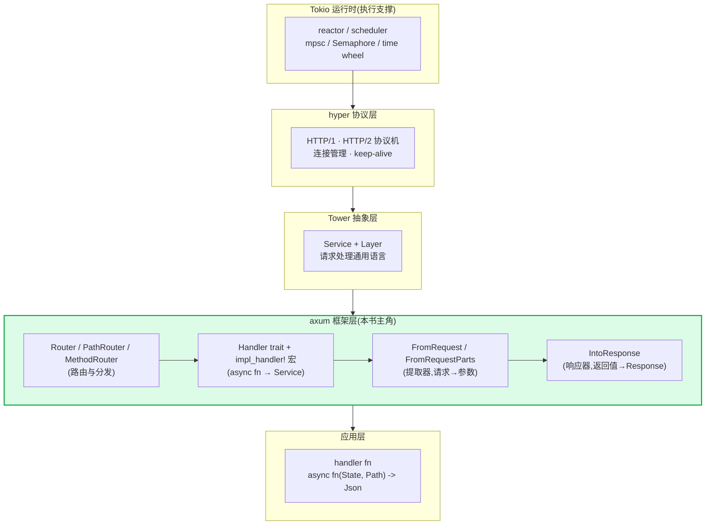
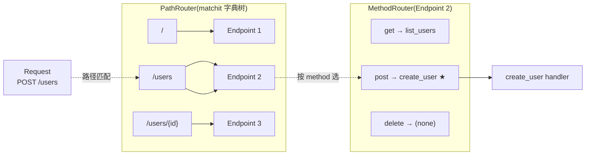
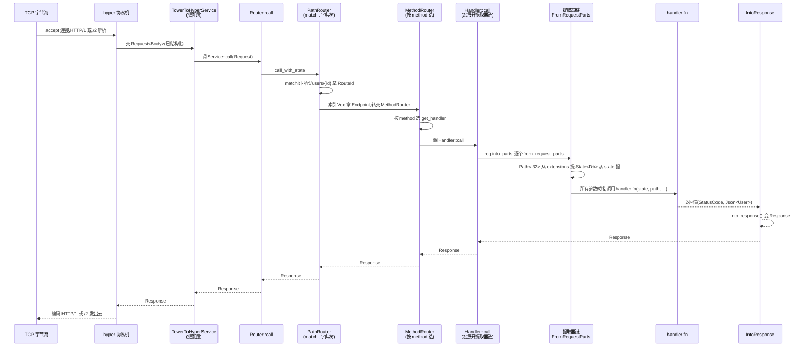

# 第 1 章 · 第一性原理:为什么 hyper 之上需要 axum

> **核心问题**:hyper 已经给了你一个完整的 HTTP 库——它能 accept 连接、跑 HTTP/1 与 HTTP/2 协议机、把字节流变成结构化的 `Request<Body>`、把 `Response` 编码回字节。可你坐下来要写一个真正的 Web 服务,手里有的却只是一个 `Service<Request, Response = ...>` trait。一个 URL `/users/{id}` 该走哪个函数?HTTP method 是 GET 还是 POST 各走各的 handler?请求体里那段 JSON 怎么变成你定义的 `CreateUser` 结构体?handler 返回的 `String` 怎么带上正确的 `Content-Type` header?——这些 hyper 一个都没管。axum 干的就是把"路由分发 + 提取器自动反序列化 + 响应器自动序列化"这些 Web 框架该做的机械化的事,用 Rust 的类型系统 + 宏做成零成本抽象:`Router` 管 URL + method 分发,`Handler` trait 用宏把任意 `async fn` 在编译期变成 `tower::Service`,`FromRequest` 把参数自动从 `Request` 提,`IntoResponse` 把返回值自动变成 `Response`。
>
> **读完本章你会明白**:
>
> 1. 为什么"hyper 给了 Service、但写 Web 还是要手写路由 + 反序列化 + 一堆 Service 套娃",以及 axum 用 `Router` + `Handler` + `FromRequest` + `IntoResponse` 四件套怎么把这套机械活一次性治掉;
> 2. `Router::new().route("/", get(handler))` 这一行背后到底发生了什么——`get` 把 handler 包成 `MethodRouter`,`route` 把它注册到 `PathRouter` 的 matchit 字典树,`serve` 把整个 `Router<()>` 套进 `TowerToHyperService` 交给 hyper(每一步 hyper/Tower 在做什么,axum 只在哪一层加料);
> 3. 为什么随便一个 `async fn(State<AppState>, Path<i32>) -> impl IntoResponse` 凭什么就能当 handler——`Handler<T, S>` trait 的 `T` 是个 coherence 占位 tuple,`impl_handler!` + `all_the_tuples!` 两个宏对 0~16 个参数全部 impl `Handler`,最后一个参数 `FromRequest`(可消费 body)、其余 `FromRequestParts`(只读 parts)的二元划分;
> 4. axum 在 Rust 异步栈到底站在哪一层(Tokio 运行时 → hyper 协议 → Tower 抽象 → **axum 框架** → handler fn),以及它和 actix-web / rocket / go net/http / tonic 是亲戚还是路人。
>
> 本章是全书的**定调样本章 / 风格锚**。你看完它,就拿到了全书的两条主轴——**路由与分发**(URL + method 怎么找到 handler fn)**vs 提取与响应**(handler 的参数怎么从 `Request` 来、返回值怎么变成 `Response`)——后面 20 章,全是在这条骨架上长肉。
>
> **写给谁读(读者画像)**:你用 axum 写过 Web,`Router::new().route("/", get(handler))` 起过服务,知道底层是 hyper + Tower,甚至翻过 `tokio-rs/axum` 源码,看过几篇 axum 源码分析。但你讲不清:一次 axum 请求从 hyper 把 `Request` 交上来,到 `Router` 经 matchit 路径匹配 → `MethodRouter` 按方法分发 → `Handler::call` 用 `impl_handler!` 宏展开的 tuple 提取器链逐个 `from_request_parts` → handler fn 真正被调用 → 返回值 `into_response` 写回,中间怎么和 hyper 的 `Service`、Tower 的 `Layer`、Tokio 的运行时无缝拼起来。一句话,你"用过 axum、翻过源码,但没懂 axum"。这本书就是写给你的。如果你连 axum 都没用过,建议先照官方文档写一个最小的 hello-world 再回来——本书假设你见过 `Router` 和 `get`。
>
> **前置知识**:假设你熟悉 Rust 基本语法(所有权/借用/trait/泛型/`async`/`await`/宏),听说过 `Future`/`Poll`/`Pin`。读过《Tokio》《hyper》《Tower》最佳(没读过也行,本章会一句带过指路)。不需要你写过 axum 源码,甚至不需要你写过自定义提取器——本章从"为什么需要 axum"讲起。
>
> **逃生阀(读不下去怎么办)**:本章是定调章,信息密度大,要同时建立全景、对比、承接关系。如果"路由与分发 vs 提取与响应"这条主线暂时绕晕你,记住一句话就够——**axum 在 hyper 的 Service 之上加了四件套:Router 管 URL+method 分发,Handler 用宏把 async fn 变 Service,FromRequest 把参数从 Request 提,IntoResponse 把返回值变 Response**。带着这句话跳到第二节看四件套,再回头读主线。如果 `Handler<T, S>` 的 `T` 参数暂时吃不消,先记住"它是为了绕开孤儿规则、让宏能给任意 arity 的 async fn 全部实现 Handler",细节留到 P3-09(那是全书最难也最值的一章)。本书处处承《hyper》《Tower》《Tokio》,读过那几本收获翻倍,但不是硬性前提。

---

## 一句话点破

> **axum 干的事,是把 hyper 的"一个连接一个 Service"升级成"路由分发到 handler、提取器自动反序列化请求、响应器自动序列化响应"的 Web 框架——但底层仍是 hyper + Tower 的 Service 链,框架的魔力在 `Handler`/`FromRequest`/`IntoResponse` 这些 trait 怎么用 Rust 的泛型 + 宏展开,把任意 `async fn` 在编译期变成一个满足 `tower::Service` 的对象。**

这是结论,不是理由。本章要倒过来拆:hyper 给了多少、缺了什么,axum 凭什么用这么几个 trait + 几个宏就把"写 Web 服务"这件事变得这么顺手,以及它和 hyper/Tower/Tokio 是怎么接起来的。

---

## 第一节:hyper 给了什么,缺了什么

### 提问

你已经读过《hyper》(没读也行,本节会一句带过指路)。hyper 是一个完整的 HTTP 库:它能 accept TCP 连接,跑 HTTP/1 的请求行 + header 解析(委托 `httparse`)+ body 分帧(手写 `ChunkedState` 13 态状态机)+ keep-alive 三态管理,也能跑 HTTP/2(委托 `h2` crate,per-stream 多路复用 + 流量控制),它定义了自己的 `service::Service` trait(`call(&self, Request) -> Future`,注意是 `&self` 不是 `&mut self`,而且**没有 `poll_ready`**)。听起来挺全的。可你坐下来要写一个真正的 Web 服务——一个"按 URL 路由到不同 handler、按 method 分发、请求体自动反序列化成结构体、返回值自动序列化"的服务——你手里有什么?

一个赤裸的事实:**hyper 把"一条 HTTP 连接"这层抽象给了你,但从"一条连接"到"一个好写的 Web 服务"之间,还有一大段空白。**这段空白,每个 Web 框架都自己填了一遍。axum 就是其中之一——而且填得格外巧。

### hyper 怎么做(以及为什么它不该再做了)

hyper 的边界很清楚:它只管"协议层"。你给它一个 `Service<Request<Body>, Response = Response<Body>>`,它负责:accept 连接 → 跑 HTTP/1 或 HTTP/2 协议机把字节流变成结构化的 `Request` → 调你的 `Service::call` → 把返回的 `Response` 编码回字节流发出去 → 管 keep-alive/连接池(连接池在 hyper-util,不是主仓)。这套机制在《hyper》里拆得很透——HTTP/1 状态机见《hyper》P2,HTTP/2 via h2 见《hyper》P3,连接管理见《hyper》P4-P5,这里一句带过指路。

```text
(简化示意,非源码原文)
// hyper 给你的 Service 长这样(注意 &self,没有 poll_ready)
// 详见 hyper/src/service/service.rs(在 hyper crate,本书不编行号)
pub trait HttpService<ReqBody>: Clone + Send + Sync + 'static {
    type ResBody;
    type Error;
    type Future: Future<Output = Result<Response<Self::ResBody>, Self::Error>>;
    fn call(&self, req: Request<ReqBody>) -> Self::Future;
}
```

注意 hyper 的 Service **删掉了 `poll_ready`**(那是 Tower 的)、**`call(&self)` 不是 `&mut self`**(为了让一个 Service 能被并发调用、Clone 共享)。这个取舍是 hyper 1.0 的招牌——它把背压挪到了协议层(HTTP/1 的 `in_flight` 单槽,一条连接同时只处理一个请求,满了就不 accept 新请求;HTTP/2 的 h2 per-stream 流量控制)。这个对照(★"hyper 删 `poll_ready` vs Tower 保留 `poll_ready`")贯穿《hyper》和《Tower》全书,本章只在用到时一句带过指路。

> **承接《hyper》**:hyper 的 `service::Service` 删了 `poll_ready`,签名是 `call(&self, Request) -> Future`,背压挪到协议层(HTTP/1 `in_flight` 单槽 / HTTP/2 h2 流控 / client `SendRequest::poll_ready`)。详见《hyper》P1-02(Service 入门)+ P2-P3(协议机)+ P4-P5(连接管理)。axum 收到的 `Request<Body>` 已经是 hyper 解析好的,body 是 `axum_core::body::Body`(包了 hyper 的 body)。本书不重复这些。

那 hyper 不管的"空白"在哪?四件:

1. **路由(URL + method 分发)**。hyper 的 `Service::call` 接到的是一个 `Request`,它不告诉你"这个 `/users/42` 应该交给 `get_user` 函数,`/users` 的 POST 应该交给 `create_user` 函数"。你只能自己写一个巨大的 `match req.uri().path() { ... }`。
2. **请求反序列化**。`Request` 给你的是 `req.body()`(一个 `Body`,本质是字节流的 `Stream`)+ `req.headers()`(一堆 `HeaderValue`)。你要自己 `hyper::body::to_bytes(req.into_body()).await`、自己判 `Content-Type`、自己 `serde_json::from_slice`。
3. **响应序列化**。你要返回的 `Response`,header 要自己塞(`Content-Type: application/json`)、body 要自己 `serde_json::to_vec`、状态码要自己设。
4. **handler 写法的人体工学**。hyper 的 Service 是一个 trait,你写 handler 要 `impl Service for MyHandler`、定义关联类型 `Response`/`Error`/`Future`、写 `call`——一堆样板。你想要的是 `async fn create_user(State(db): State<Db>, Json(payload): Json<CreateUser>) -> (StatusCode, Json<User>)` 这种"声明式"的写法。

这四件,hyper 都没做。它**不该做**——一个 HTTP 库的职责是"协议层",不应该规定你怎么路由、怎么反序列化、handler 长什么样。hyper 把这些让出来,正是为了让 axum/tonic/reqwest 这些框架在它之上自由发挥。这是 hyper 1.0 三分重构(协议原语留主仓 / 框架策略拆 hyper-util / 中间件生态在 Tower + axum)的核心思想,详见《hyper》的 1.0 重构章。

> **钉死这件事**:hyper 给的是"一个连接一个 Service",axum 给的是"一个 URL + 一个 method 一个 handler fn"。中间隔着的"路由分发 + 提取器 + 响应器 + Handler 编译期魔法"四件套,就是 axum 这一层。这一层做得好,写 Web 就顺手;做得差,你就回到手写 `match path` + 手写反序列化的石器时代。

### 不这样会怎样:裸写 hyper Service 会疯掉

假设没有 axum。你用裸 hyper 写一个最小的 RESTful 服务:GET `/users/{id}` 返回用户,POST `/users` 创建用户。你得这么写(简化示意,非真实代码):

```rust
// 朴素写法:裸 hyper,手写一切(简化示意,非源码原文)
async fn handler(req: Request<hyper::body::Incoming>) -> Result<Response<Body>, Infallible> {
    let path = req.uri().path();
    let method = req.method().clone();

    // 1. 手写路由:一个巨大的 match
    if path.starts_with("/users/") {
        let id_str = &path["/users/".len()..];
        let id: u32 = match id_str.parse() {
            Ok(id) => id,
            Err(_) => return Ok(Response::builder().status(400).body(Body::from("bad id")).unwrap()),
        };
        if method == Method::GET {
            // 2. 手写查询数据库 + 反序列化(这里假设 db 在某全局位置)
            let user = DB.lock().await.get_user(id).await;
            // 3. 手写序列化 + 设 header
            let body = serde_json::to_vec(&user).unwrap();
            return Ok(Response::builder()
                .status(200)
                .header("content-type", "application/json")
                .body(Body::from(body)).unwrap());
        }
    } else if path == "/users" && method == Method::POST {
        // 4. 手写 body 收集 + Content-Type 判 + 反序列化
        let bytes = match hyper::body::to_bytes(req.into_body()).await {
            Ok(b) => b,
            Err(_) => return Ok(Response::builder().status(400).body(Body::empty()).unwrap()),
        };
        if req.headers().get("content-type").map(|v| v.as_bytes()) != Some(b"application/json") {
            return Ok(Response::builder().status(415).body(Body::from("unsupported media type")).unwrap());
        }
        let payload: CreateUser = match serde_json::from_slice(&bytes) {
            Ok(p) => p,
            Err(_) => return Ok(Response::builder().status(400).body(Body::from("bad json")).unwrap()),
        };
        let user = DB.lock().await.create_user(payload).await;
        let body = serde_json::to_vec(&user).unwrap();
        return Ok(Response::builder().status(201).header("content-type", "application/json").body(Body::from(body)).unwrap());
    }
    Ok(Response::builder().status(404).body(Body::from("not found")).unwrap())
}

// 还要把这个 handler 包成 hyper 的 Service,塞进 serve_connection...
```

能用。但读一读这段代码,问题立刻显现:

- **样板爆炸**:每个路由都要手写 path 解析、method 分发、body 收集、Content-Type 校验、反序列化、序列化、status 设。十几个路由就是几百行样板。
- **路由脆弱**:`starts_with("/users/")` 这种前缀匹配漏百出——`/users/42/extra` 会被错误匹配、`{id}` 不能限制类型、`/users/{id}/posts` 这种嵌套要手写更复杂的匹配。性能也不行(线性扫字符串)。
- **handler 形状丑**:你写不出 `async fn get_user(Path(id): Path<u32>, State(db): State<Db>) -> Json<User>`。每个 handler 都要 `impl Service`,定义三个关联类型,写 `call`。
- **错误处理零散**:每一步都要手写 `match ... { Err => return 4xx }`。400/415/500 散在各处,无法统一。
- **不可组合**:你想给所有路由加一个日志中间件?要手动在每个 handler 里塞 `println!`。想加超时?要手动 `tokio::time::timeout` 包每个 future。

这不是危言耸听。这就是 2019-2020 年 Rust 异步 Web 生态的状态:hyper 0.13/0.14 给了协议层,各种雏形框架(`tower-web`/`warp` 早期)各搞各的路由和提取器。直到 axum(Tokio 官方团队出品,2021 年初发布)把"路由 + 提取器 + 响应器 + Handler 编译期魔法"这套做成统一、零成本、和 Tower 中间件无缝的抽象,局面才稳住。

**样板爆炸的真实代价**。把上面四条具体化:一个生产 Web 服务有 50 个路由,每个路由平均要 30 行样板(路由匹配 + body 收集 + Content-Type 判 + 反序列化 + 序列化 + status)。50 × 30 = 1500 行样板。这些样板是纯机械的,不包含任何业务逻辑,但每一行都可能出 bug:漏判 Content-Type、parse 失败没回 400、序列化 panic、status 写错。axum 把这 1500 行样板压缩成 50 行声明式 handler:

```rust
// axum 版:50 个路由 = 50 行 handler(对比裸 hyper 的 1500 行)
async fn get_user(Path(id): Path<u32>, State(db): State<Db>) -> Result<Json<User>, StatusCode> {
    db.get_user(id).await.map(Json).map_err(|_| StatusCode::NOT_FOUND)
}
async fn create_user(State(db): State<Db>, Json(payload): Json<CreateUser>) -> (StatusCode, Json<User>) {
    let user = db.create_user(payload).await;
    (StatusCode::CREATED, Json(user))
}

let app = Router::new()
    .route("/users/{id}", get(get_user))
    .route("/users", post(create_user))
    .with_state(db);
```

1500 行 → 50 行。这不是"少写几行代码"那么简单——这是把"路由匹配/body 收集/反序列化/序列化"这些容易出错的机械活,**全部交给编译器和宏**,让人类只写业务逻辑。

> **钉死这件事**:Rust 异步 Web 生态需要的,不是"又一个 HTTP 库"(hyper 已经够好),而是"一套让 hyper 的 Service 链变得好写的 Web 框架"——这套框架必须做到三件事:① 路由声明式(`.route("/users/{id}", get(handler))`),② handler 是任意 `async fn`(参数自动从 `Request` 提),③ 返回值自动变 `Response`。这就是 axum。

### 所以 axum 这么设计

axum 把上面四件空白填成了四个抽象:

| 空白 | axum 的抽象 | 一句话 |
|------|------------|--------|
| 路由(URL + method 分发) | `Router` / `PathRouter` / `MethodRouter` | `Router` 内部用 matchit 字典树匹配路径,`MethodRouter` 按方法持有 handler |
| 请求反序列化 | `FromRequest` / `FromRequestParts` | handler 参数实现这俩 trait,axum 自动从 `Request` 提 |
| 响应序列化 | `IntoResponse` | handler 返回值实现这 trait,axum 自动变 `Response` |
| handler 写法 | `Handler<T, S>` trait + `impl_handler!` 宏 | 宏把任意 `async fn` 在编译期变成 `tower::Service` |



图里 axum 夹在 Tower 和 handler fn 之间。正下方是 Tower(Service/Layer 抽象)、hyper(协议)、Tokio(运行时),正上方是用户写的 handler fn。**axum 是"抽象"和"应用"之间的那层 Web 框架胶水**——它不跑 future(那是 Tokio),不解析协议(那是 hyper),不定义 Service/Layer(那是 Tower),它只做"路由分发 + 提取器 + 响应器 + Handler 编译期魔法"。

> **承接《Tower》**:axum 的所有可路由对象(`Router`/`MethodRouter`/`Route`/`HandlerService`)都实现 `tower::Service<Request>`;axum 的中间件就是 Tower `Layer`(`Router::layer`/`route_layer`/`MethodRouter::layer`/`Handler::layer` 全部接 `tower_layer::Layer`)。Service/Layer/poll_ready 语义、《Tower》拆透了,本书一句带过指路。axum 这一层加的是"路由 + 提取器 + 响应器 + Handler 宏",不是"又一个 Service 抽象"。
>
> **承接《Tokio》**:axum 全异步,所有 handler 是 `async fn`,所有提取器返回 `Future`,`axum::serve` 跑在 Tokio 运行时上(每连接 spawn 一个 task)。task 调度/AsyncRead/timer/mpsc channel/budget——Tokio 讲透了,本书一句带过指路 [[tokio-source-facts]]。

### 比喻点睛(全书唯一一次)

到这儿可以用上全书唯一允许的一次比喻了:

- **hyper 是收发室**:每来一个连接(一个快递员),收发室把包裹收下,拆掉运输外包装(解析 HTTP 协议),把里面那个标准化的 `Request` 包裹交给下一步。包裹内容是字节流,收发室不关心里面装的是什么。
- **Tower 是流程规范**:规定"谁套谁、谁审批谁"——一个包裹可以先过"鉴权审批"环节,再过"日志记录"环节,最后才到收件人。这些环节一层套一层,叫 Layer。
- **axum 是前台调度员 + 翻译官**:看收件地址(URL)选部门,看投递方法(HTTP method)选工位;然后把包裹内容(`Request`)翻译成 handler 能懂的语言(参数:`Path<i32>`/`Json<CreateUser>`/`State<Db>`),handler 写好回复后,axum 再把回复翻译成标准化的 `Response` 包裹,交回 hyper 收发室发出去。

这是全书唯一一次用比喻做主线的地方,后面章节回归直球。比喻只是为了让你记住 axum 的四个角色——**调度(路由)、翻译(提取器)、回译(响应器)、编译期把 async fn 变 Service(Handler 宏)**——它们是 axum 的全部地基。

---

## 第二节:四件套全景——Router、Handler、FromRequest、IntoResponse

### 提问

第一节给出了四件套的名字,这一节把它们摊开看:每一个具体解决什么问题、hyper/Tower 怎么支撑、axum 怎么实现。本章是定调章,四件套都点到,不深入内部机制(那是后面 20 章的事)。

### Router:URL + method 怎么找到 handler

**它解决什么问题**:裸 hyper 你要手写 `match req.uri().path()`。axum 给你一个声明式 API:

```rust
let app = Router::new()
    .route("/", get(root))
    .route("/users/{id}", get(get_user).delete(delete_user))
    .route("/users", get(list_users).post(create_user))
    .with_state(db);
```

每调一次 `.route`,axum 内部做两件事:

1. **路径匹配**:把 `/users/{id}` 注册到 `PathRouter`,`PathRouter` 内部用 `matchit::Router<RouteId>`(一个基数树/radix tree,外部 crate)做常数级路径匹配,`{id}` 这种参数自动捕获。`RouteId(u32)` 索引一个 `HashMap<RouteId, Endpoint<S>>`,拿到 `Endpoint` 再交给 `MethodRouter`。
2. **method 分发**:`MethodRouter` 按 HTTP method(`get`/`post`/`put`/`delete`/...)各持有一个 `MethodEndpoint`,匹配到就调用对应 handler。



注意时序图里两个细节:(1)路径匹配和 method 分发是**两层独立结构**——先按 URL 选 `Endpoint`,再在 `Endpoint` 里按 method 选 handler;(2)`{id}` 这种 URL 参数被 matchit 捕获后,axum 把它塞进 `Request::extensions()`,后续 `Path<i32>` 提取器从那里读出来。这是"路由与分发"这一面的核心,招牌章 P2-05/P2-06 会把 matchit 字典树原理、`MethodFilter` 位运算、`merge`/`nest` 路径拼接全部拆透。

**hyper/Tower 怎么支撑**:`Router<()>` 自己就实现 `tower::Service<Request>`——这是关键。axum 不发明新的"路由器抽象",它就让 `Router` 是一个 Service,hyper 把 `Request` 交给 `Router::call`,`Router` 内部跑 matchit + method 分发,最终把请求转给一个 handler。整个 axum 应用就是一个巨大的 `Service<Request>`,hyper 一点都不用改。

```rust
// axum/src/routing/mod.rs#L569-L587(逐字摘录)
impl<B> Service<Request<B>> for Router<()>
where
    B: HttpBody<Data = bytes::Bytes> + Send + 'static,
    B::Error: Into<axum_core::BoxError>,
{
    type Response = Response;
    type Error = Infallible;
    type Future = RouteFuture<Infallible>;

    #[inline]
    fn poll_ready(&mut self, _: &mut Context<'_>) -> Poll<Result<(), Self::Error>> {
        Poll::Ready(Ok(()))   // ★ 无条件 Ready
    }

    #[inline]
    fn call(&mut self, req: Request<B>) -> Self::Future {
        let req = req.map(Body::new);
        self.call_with_state(req, ())
    }
}
```

注意三个细节:

1. `Router<()>` 的 `Error = Infallible`——axum 在框架层把所有错误转成了 `Response`(404/405/500 都是 `Response`),不会让一个 `Result::Err` 冒到 hyper 那层。这是 axum"错误处理模型简单可预测"的根,P5-18 详拆。
2. `poll_ready` 无条件 `Poll::Ready(Ok(()))`——axum 故意忽略 Tower 的背压。为什么?因为路由本身不需要预留资源(它只是查个字典树),真正需要背压的是下游的 handler/中间件,而 axum 让它们直接在 `call` 里跑(用 `tokio::spawn` 隔离每个连接的 task,而不是 Tower 的 `poll_ready` 通道)。这是 axum 区别于纯 Tower 应用的招牌取舍,P1-03 详拆。
3. `call` 里 `req.map(Body::new)` 把 hyper 的 body 包成 axum 的 `Body`,然后交给 `call_with_state`——这一步就开始路由匹配了。

> **承接《Tower》**:axum 的 `poll_ready` 无条件 `Ready`,忽略 Tower 中间件背压——这是 axum 刻意的取舍(背压靠 Tokio task 隔离承担,不靠 `poll_ready` 通道)。`poll_ready` 语义、`&mut self`、`mem::replace` 惯用法《Tower》拆透了,本书一句带过指路。axum 的 `Route` 内部是 `BoxCloneSyncService<Request, Response, E>`(类型擦除的 Tower Service),P1-03 详拆。

### Handler:任意 async fn 凭什么能当 Service

**它解决什么问题**:裸 hyper 你写 handler 要 `impl Service for MyHandler`,定义 `Response`/`Error`/`Future` 三个关联类型,写 `call`。axum 让你写 `async fn create_user(State(db): State<Db>, Json(payload): Json<CreateUser>) -> (StatusCode, Json<User>)` 就够了——它凭什么能当 handler?

这就是 `Handler<T, S>` trait 的事。看签名:

```rust
// axum/src/handler/mod.rs#L148-L154(逐字摘录)
pub trait Handler<T, S>: Clone + Send + Sync + Sized + 'static {
    /// The type of future calling this handler returns.
    type Future: Future<Output = Response> + Send + 'static;

    /// Call the handler with the given request.
    fn call(self, req: Request, state: S) -> Self::Future;
    // ... 省略 layer / with_state ...
}
```

注意三件事:

1. `Handler` 的 `call` 不接 `&mut self`,是 `self`(按值)——因为 handler 是 `Clone + Send + Sync + 'static`,每个请求拿一个 clone。
2. `type Future: Future<Output = Response>`——返回的 future 直接产出 `Response`(不是 `Result<Response, Error>`),呼应前面"`Error = Infallible`"的设计:错误已经在框架层变成 `Response` 了。
3. **类型参数 `T`**——这是 axum 最巧妙的一笔。`T` 不是 handler 的某个具体类型,它是一个**coherence 占位 tuple**。

`T` 为什么存在?看 axum 自己的注释(`axum/src/handler/mod.rs#L129-L144`):

> The type parameter `T` is a workaround for trait coherence rules, allowing us to write blanket implementations of `Handler` over many types of handler functions with different numbers of arguments, without the compiler forbidding us from doing so because one type `F` can in theory implement both `Fn(A) -> X` and `Fn(A, B) -> Y`.

翻译:Rust 的孤儿规则(coherence)规定,你不能对同一个类型 `F` 既 impl `Handler` for `F: Fn(A) -> X` 又 impl `Handler` for `F: Fn(A, B) -> Y`——因为理论上某个 `F` 可能同时满足两个 trait bound(尽管实际上闭包不会),编译器会拒绝。axum 的解法是给 `Handler` 加一个占位参数 `T`,让不同 arity 的 impl 落在不同的 `T` 上:

- 0 参数:`Handler<((),), S> for F where F: FnOnce() -> Fut`(L208)
- N 参数(`impl_handler!` 宏):`Handler<(M, T1, T2, ..., Tlast,), S> for F where F: FnOnce(T1, T2, ..., Tlast) -> Fut`(L227-L259)

`T` 是个 tuple,记录了"这个 handler 有几个参数、每个参数是什么 trait 约束"。这个 tuple 让每个 arity 的 impl 都落在一个**不同的具体类型**(`((),)` / `(M, T1, T2,)` / `(M, T1, T2, T3,)` / ...)上,孤儿规则就不冲突了。

这就是 axum 最容易被"读过源码没看懂"的地方:`Handler<T, S>` 的 `T` 不是业务参数,是编译器技巧。P3-09(★★双招牌章)会把 `T` 参数、`impl_handler!` 宏、`all_the_tuples!` 宏的递归展开全部拆透,本章只点出"为什么需要 `T`"。

**`impl_handler!` 宏干了什么**:对 N 个参数的 `async fn`,宏生成一个 `Handler` 实现,它干三件事:

```rust
// axum/src/handler/mod.rs#L221-L260(逐字摘录,简化展示)
macro_rules! impl_handler {
    ([$($ty:ident),*], $last:ident) => {
        impl<F, Fut, S, Res, M, $($ty,)* $last> Handler<(M, $($ty,)* $last,), S> for F
        where
            F: FnOnce($($ty,)* $last,) -> Fut + Clone + Send + Sync + 'static,
            Fut: Future<Output = Res> + Send,
            Res: IntoResponse,
            $( $ty: FromRequestParts<S> + Send, )*     // ★ 前 N-1 个参数:只读 parts
            $last: FromRequest<S, M> + Send,            // ★ 最后一个参数:可消费 body
        {
            type Future = Pin<Box<dyn Future<Output = Response> + Send>>;

            fn call(self, req: Request, state: S) -> Self::Future {
                let (mut parts, body) = req.into_parts();
                Box::pin(async move {
                    $( // 对前 N-1 个参数,逐个 from_request_parts
                        let $ty = match $ty::from_request_parts(&mut parts, &state).await {
                            Ok(value) => value,
                            Err(rejection) => return rejection.into_response(),
                        };
                    )*
                    let req = Request::from_parts(parts, body);
                    let $last = match $last::from_request(req, &state).await {  // 最后一个参数消费 body
                        Ok(value) => value,
                        Err(rejection) => return rejection.into_response(),
                    };
                    self($($ty,)* $last,).await.into_response()
                })
            }
        }
    };
}

all_the_tuples!(impl_handler);   // 对 1~16 个参数全部展开
```

`all_the_tuples!` 宏(`axum/src/macros.rs#L49-L68`)把 `impl_handler!` 对 1~16 个参数全部展开一次(`impl_handler!([], T1)` / `impl_handler!([T1], T2)` / ... / `impl_handler!([T1..T15], T16)`)。这一展开,axum 就对所有 0~16 个参数的 `async fn` 都实现了 `Handler`,每个实现内部:

1. 把 `Request` 拆成 `parts + body`;
2. 对前 N-1 个参数,逐个跑 `FromRequestParts::from_request_parts(&mut parts, &state)`(只读 `parts`,可多次跑);
3. 把剩余 `parts + body` 拼回 `Request`,对最后一个参数跑 `FromRequest::from_request(req, &state)`(可消费 body);
4. 调用真正的 `async fn`;
5. 把返回值 `into_response()` 变 `Response`。

**为什么最后一个参数特殊**:因为 `body` 是一个 `Stream`,**只能消费一次**。`FromRequestParts` 只读 `&mut Parts`(不碰 body),可以跑任意多次;`FromRequest` 可能消费 body(比如 `Json<T>` 要 `to_bytes` 把 body 收完再反序列化),只能跑一次。axum 把"可能消费 body 的提取器"放在最后一个参数,前 N-1 个用 `FromRequestParts`,这就保证了 body 不被重复消费。这是 `FromRequest` vs `FromRequestParts` 二元划分的根本理由,P3-10(★招牌章)详拆。

**hyper/Tower 怎么支撑**:`Handler` 不是 `tower::Service`,但 axum 提供 `Handler::with_state(state) -> HandlerService`(L202-L204)和 `HandlerWithoutStateExt::into_service() -> HandlerService` 把 handler 包成 `HandlerService`,`HandlerService` 实现 `tower::Service<Request>`。`get(handler)` / `post(handler)` 这些 method routing 函数内部就调 `into_service` 把 handler 变 Service,塞进 `MethodRouter`。所以从外面看,一个 `async fn` 经 `get`/`post` 就变成了 `MethodRouter`(进而变成 `Router`),最终整个 app 是一个 `Service<Request>` 交给 hyper。

> **钉死这件事**:`Handler<T, S>` 的 `T` 不是业务参数,是 coherence 占位 tuple,绕开孤儿规则让宏能给 0~16 参数的 async fn 全部 impl Handler。`impl_handler!` 宏对 N 参数生成"前 N-1 个 FromRequestParts + 最后一个 FromRequest"的提取器链。讲不清 `T` 参数和 `impl_handler!` 宏展开 = 没讲 axum。深度展开留 P3-09(全书最难也最值的一章)。

### FromRequest / FromRequestParts:参数怎么从 Request 自动提

**它解决什么问题**:handler 的参数怎么自动从 `Request` 来?你写 `async fn create_user(State(db): State<Db>, Json(payload): Json<CreateUser>)`,axum 怎么知道从哪把 `Db` 和 `CreateUser` 提出来?

答案是两个 trait(`axum-core/src/extract/mod.rs#L39-L89`):

```rust
// axum-core/src/extract/mod.rs#L53-L89(逐字摘录)
pub trait FromRequestParts<S>: Sized {
    type Rejection: IntoResponse;
    fn from_request_parts(
        parts: &mut Parts,
        state: &S,
    ) -> impl Future<Output = Result<Self, Self::Rejection>> + Send;
}

pub trait FromRequest<S, M = private::ViaRequest>: Sized {
    type Rejection: IntoResponse;
    fn from_request(
        req: Request,
        state: &S,
    ) -> impl Future<Output = Result<Self, Self::Rejection>> + Send;
}
```

注意三件事:

1. **`FromRequestParts` 只读 `&mut Parts`**,可以多次跑(parts 是 `http::request::Parts`,含 method/uri/headers/extensions,不含 body)。`Path`/`Query`/`State`/`ConnectInfo` 这些不需要 body 的提取器实现它。
2. **`FromRequest` 接整个 `Request`**,可消费 body,只能跑一次。`Json<T>`/`Form<T>`/`Bytes`/`String` 这些需要 body 的提取器实现它。
3. **`FromRequest` 的第二个参数 `M = ViaRequest`** 是个 marker(默认 `ViaRequest`),`ViaParts` 是另一个 marker。这是 axum 的桥接技巧——下面拆。

**`ViaParts` 桥接**(`axum-core/src/extract/mod.rs#L91-L105`):

```rust
// axum-core/src/extract/mod.rs#L91-L105(逐字摘录)
impl<S, T> FromRequest<S, private::ViaParts> for T
where
    S: Send + Sync,
    T: FromRequestParts<S>,
{
    type Rejection = <Self as FromRequestParts<S>>::Rejection;

    fn from_request(
        req: Request,
        state: &S,
    ) -> impl Future<Output = Result<Self, Self::Rejection>> {
        let (mut parts, _) = req.into_parts();
        async move { Self::from_request_parts(&mut parts, state).await }
    }
}
```

这个 blanket impl 说:**任何实现了 `FromRequestParts` 的类型,自动也实现 `FromRequest<S, ViaParts>`**(它把 `Request` 拆成 parts,丢掉 body,跑 `from_request_parts`)。这有什么用?

回想 `impl_handler!` 宏:最后一个参数要求 `FromRequest<S, M>`,其余要求 `FromRequestParts<S>`。可你写 `async fn handler(Path(id): Path<i32>)` 时,`Path<i32>` 只实现了 `FromRequestParts`(它不消费 body),却出现在"最后一个参数"位置——`impl_handler!` 的 `$last: FromRequest<S, M>` 约束要求它是 `FromRequest`。怎么办?

`ViaParts` 桥接出场。`Path<i32>` 通过这个 blanket impl 自动获得 `FromRequest<S, ViaParts>` 的实现,所以它能当 `$last`,编译器推断 `M = ViaParts`。这就是为什么"一个只读 parts 的提取器(如 `Path`)可以单独做 handler 的唯一参数",而不需要手写两份实现。

**`impl Future` 而非 `async-trait`**:注意 `from_request_parts` 和 `from_request` 的返回类型是 `impl Future<...> + Send`,不是 `Pin<Box<dyn Future<...>>>`。这是 Rust 1.75 起 RPITIT(Return Position Impl Trait In Trait)的写法,axum 0.x 时代用的是 `async-trait`(每次 `Box::pin` 一次),0.8 时代已经全面改成 RPITIT——**零开销**(`async-trait` 每次调用一次堆分配,RPITIT 单态化掉)。这是 axum 演进史的一笔,P6-20 详拆。

**hyper/Tower 怎么支撑**:`FromRequest`/`FromRequestParts` 是 axum 自己定义的(在 axum-core),和 hyper 的 Service trait 没关系——它们服务的是 `Handler::call` 内部的提取器链。`Parts` 来自 `http::Request::into_parts()`(`http` crate,hyper 也用它),`Body` 是 `axum_core::body::Body`(包了 hyper 的 body)。

> **钉死这件事**:`FromRequestParts`(只读 parts,可多次跑)vs `FromRequest`(消费 body,只能一次)的二元划分,是 axum 提取器的灵魂——它保证了 body 不被重复消费。`ViaParts` 桥接让"只读 parts 的提取器也能当最后一个参数",这是 axum 类型系统的另一处巧思。讲不清这俩 trait 的二元划分 = 没讲 axum。深度展开留 P3-10(★招牌章)。

### IntoResponse:返回值怎么自动变 Response

**它解决什么问题**:handler 返回 `String`/`&'static str`/`StatusCode`/`(StatusCode, Json<T>)`/`Result<T, E>`/`Json<T>`/`Response`——这些五花八门的返回值,怎么统一变成 hyper 能发的 `Response`?

答案是 `IntoResponse` trait(`axum-core/src/response/into_response.rs`):

```text
(简化示意,非源码原文;真实定义在 axum-core/src/response/into_response.rs)
pub trait IntoResponse {
    fn into_response(self) -> Response;
}
```

就一个方法:把 `self` 变 `Response`。axum 给一大堆类型实现了它:

- `&'static str` / `String`:`200 OK` + `Content-Type: text/plain; charset=utf-8` + body 是字符串字节。
- `Json<T: Serialize>`:`200 OK` + `Content-Type: application/json` + body 是 `serde_json::to_vec`。
- `StatusCode`:只有状态码,空 body。
- `(StatusCode, T)` / `(StatusCode, HeaderMap, T)` / `(Parts, T)`:tuple 组合,先设 status/headers/parts,再让 T 自己变 body。
- `Result<T, E>`:where `T: IntoResponse, E: IntoResponse`,`Ok` 走 T,`Err` 走 E。
- `Response` / `Response<B>`:identity,直接返回。

注意 `Handler::call` 的 `type Future: Future<Output = Response>`——handler 的返回值经 `into_response()` 变成 `Response` 后,才是 future 的产出。整个链路:`async fn(...)` 返回值 → `IntoResponse::into_response` → `Response` → `Handler::call` 的 future 产出 → `Router::call` 的 future 产出 → hyper 编码回字节流。

**tuple 组合响应是 axum 的招牌便利**。看一个常见写法:

```rust
async fn create_user(/* ... */) -> (StatusCode, Json<User>) {
    (StatusCode::CREATED, Json(user))
}
```

`(StatusCode, Json<User>)` 怎么变 `Response`?axum 给 tuple 实现了 `IntoResponse`:先让 `StatusCode` 写到 `Response` 的 status,再让 `Json<User>` 写 body 和 `Content-Type`。`(StatusCode, HeaderMap, Json<User>)` 同理——三层 tuple 链式拼装。这让"状态码 + headers + body"的组合不需要写一个 builder,直接 tuple 就行。这是 axum"声明式"的另一面,P3-12(★招牌章)详拆。

**hyper/Tower 怎么支撑**:`IntoResponse` 是 axum-core 定义的,产出 `axum_core::response::Response`(就是 `http::Response<axum_core::body::Body>`)。hyper 拿到这个 `Response` 直接编码发出去——`Response` 的 body 类型是 axum 的 `Body`(包了 hyper body),hyper 一点都不用改。

> **承接《gRPC》**:axum 的 `Json` 提取器/响应器对照 gRPC 的 protobuf 反序列化——都是"请求体自动反序列化",但 axum 用 serde(generic serdeDeserialize),gRPC 用 protobuf C++ codegen。axum 中间件链对照 gRPC filter stack——都是 Service 套娃,但 gRPC 是 C++ callback→Promise 大重构(老博客大片过时),axum 是 Tower Layer(承《Tower》)。这些对照本章一句带过,P7-21 收束章展开。

---

## 第三节:承接 hyper/Tower/Tokio——axum 长在哪一层

### 提问

第一节说 axum 是"hyper 之上的 Web 框架",第二节看到 `Router`/`Handler`/`FromRequest`/`IntoResponse` 都建立在 `tower::Service` 之上。这一节把"axum 长在哪一层"钉死,这是全书的地基。

### 钉死位置

一次 axum 请求从 TCP 字节流到 handler 返回 Response,穿过的层:



注意时序图里几个关键衔接:

1. **hyper → axum**:`TowerToHyperService`(hyper-util 提供)是个适配器——hyper 的 Service trait(`call(&self)`,无 `poll_ready`)和 Tower 的 Service trait(`call(&mut self)`,有 `poll_ready`)签名不同,`TowerToHyperService` 把 Tower Service 包成 hyper Service。axum 的 `serve` 函数内部就这么接(`axum/src/serve/mod.rs#L385` `TowerToHyperService::new(tower_service)`)。
2. **Router 内部两层**:`PathRouter`(matchit 字典树)→ `MethodRouter`(按 method)。这两层是 axum 路由的核心结构,P2-05/P2-06 招牌章详拆。
3. **Handler::call 内部**:`req.into_parts` → 逐个 `FromRequestParts::from_request_parts` → 最后一个 `FromRequest::from_request` → 调 handler fn → `into_response`。这是 `impl_handler!` 宏生成的代码,P3-09 详拆。
4. **axum → hyper**:`Response` 一路返回,`Body` 是 axum 的 `Body`(包了 hyper body),hyper 编码发出去。

axum 这一层加的是从 `Router::call` 到 `Handler::call` 的整条分发链路,以及 `FromRequest`/`IntoResponse` 的提取/响应魔法。hyper 那一层(accept + 协议机 + 编码)和 Tower 那一层(Service/Layer trait 定义)axum 都没碰——它复用,不重写。

### 为什么是这一层,而不是更上或更下

- **不能更下(挪到协议层)**:hyper 试过——它定义了自己的 `service::Service`,但删了 `poll_ready`(协议层自己有流控)。可一旦你想在 hyper 之上做"路由 + 提取器",你就需要 Tower 的 Service/Layer 抽象来组合中间件。hyper 的 Service 太绑 HTTP 了,做不到"声明式路由 + 任意 async fn 当 handler"。所以必须有一层在协议之上,做 Web 框架该做的事。
- **不能更上(挪到应用层)**:如果"路由 + 提取器 + 响应器"由每个应用自己写,那就是回到第一节那段裸 hyper 代码——每个项目 1500 行样板。axum 把这套抽象出来,所有 axum 应用共享。
- **正好卡在中间**:axum 这一层,建立在 Tower 的 Service/Layer 之上(所有 axum 对象都是 `Service<Request>`),建立在 hyper 的协议层之上(收到 hyper 解析好的 `Request`),提供"路由 + 提取器 + 响应器 + Handler 编译期魔法"的 Web 框架便利。它不重写协议(承 hyper)、不重写中间件抽象(承 Tower)、不重写运行时(承 Tokio),它只做 Web 框架该做的那一层。

> **钉死这件事**:axum 是 Rust 异步网络栈里"协议(hyper)+ 抽象(Tower)"和"应用(handler fn)"之间的那层 Web 框架胶水。它把 hyper 给的"一个连接一个 Service"升级成"路由分发到 handler、提取器自动反序列化、响应器自动序列化"的 Web 框架——底层仍是 hyper + Tower 的 Service 链。这一点是全书的地基。

---

## 第四节:对照——axum vs actix-web vs rocket vs go net/http

### 提问

"Web 框架"这事不是 axum 发明的。actix-web、rocket、go net/http、Ruby on Rails、Django 都干过。axum 和它们是亲戚还是路人?差别在哪?把这张对照钉死,你就理解 axum 凭什么用 Rust 类型系统把"Web 框架"做到这么顺。

### 四框架对照

| 框架 | 语言 | handler 写法 | 路由 | 中间件抽象 | 运行时 |
|------|------|-------------|------|-----------|--------|
| **axum** | Rust | 任意 `async fn`(参数是提取器),`Handler<T, S>` trait 宏展开 | matchit 字典树 + MethodRouter 两层 | Tower Layer(`Service`/`Layer`) | 全 Tokio |
| **actix-web** | Rust | handler 是 `async fn`,但底层 Actor 模型(`Handler` message) | 自实现路由(树) | 自实现中间件(`Transform`/`Service`) | 自实现运行时(actix-rt,基于 tokio 但加 Actor 调度) |
| **rocket** | Rust | handler 是 `async fn`,参数是 request guard(过程宏校验) | 自实现路由(树) | fairings + request guard | Tokio |
| **go net/http** | Go | handler 实现 `http.Handler` 接口(`ServeHTTP`) | `ServeMux`(1.22 前只前缀匹配,1.22+ 加 method + `{id}`) | `func(http.Handler) http.Handler` 闭包链 | Go runtime(goroutine) |

四种框架,四种做法。关键差别在"handler 怎么写"和"中间件怎么组合":

### actix-web:Actor 模型 + 自实现运行时

actix-web 是 axum 在 Rust 生态里最早的对手。它的 handler 写法和 axum 表面相似(`async fn(Path(id): Path<i32>, Json(payload): Json<CreateUser>) -> impl Responder`),但底层完全不同:

- **Actor 模型**:actix-web 的底层是 actix 框架(Actor + Message)。一个 handler 本质上是一个 Actor,接收一个 `HttpRequest` message,返回一个 `HttpResponse`。这带来额外的间接层——所有请求都要走 Actor 的 mailbox。
- **自实现运行时**:actix-rt 在 tokio 之上加了一层 Actor 调度。这意味着 actix-web 不能直接用 tokio 的所有原语(要用 actix 包装版),生态绑定比 axum 紧。
- **自实现中间件**:actix-web 的 `Transform`/`Service` 和 Tower 的 `Layer`/`Service` 名字像但签名不同。你在 actix 写的中间件搬到 axum 用不了,反之亦然。

axum 的取舍截然相反:**全 Tokio**(没有 actix-rt 那层)、**全 Tower**(中间件就是 Tower Layer,和 tonic/reqwest 共享生态)、**没有 Actor**(handler 是纯 `async fn`,经 `impl_handler!` 宏直接变 Service,没有 mailbox 间接层)。代价是 axum 没有 actix 那种"Actor 消息模型"的便利(比如 long-lived actor state),但对绝大多数 Web 服务,这种便利不是刚需。

> **对照《Tokio》**:axum 全 Tokio——`#[tokio::main]` + 每连接 spawn 一个 task + 所有 handler 是 `async fn`。actix-web 自实现 actix-rt(在 tokio 之上加 Actor 调度)。这是 axum 和 actix-web 的根本架构差异,P7-21 收束章展开。

### rocket:过程宏 request guard

rocket 是 Rust 生态里最早主打"声明式 Web"的框架(`#[get("/users/<id>")]` 这种宏)。它的 handler 写法:

```rust
// rocket 0.5 风格(简化示意)
#[get("/users/<id>")]
fn get_user(id: i32, cookies: &CookieJar) -> Template { /* ... */ }
```

- **过程宏路由**:`#[get("/users/<id>")]` 这个属性宏在编译期把 `fn get_user` 包成一个 `Route`,参数 `id: i32` 通过宏解析路径里的 `<id>` 自动绑定。这是 rocket 的招牌,体验很好。
- **request guard**:`i32`/`CookieJar` 这些参数是 request guard,实现 `FromRequest`(注意:rocket 也有一个叫 `FromRequest` 的 trait,但和 axum 的签名不同)。rocket 的 guard 是过程宏驱动的,错误信息更友好(宏知道参数名)。

axum 的取舍截然相反:**没有路由宏**(`Router::new().route("/users/{id}", get(handler))` 是普通方法调用,宏只在 `Handler` trait 层、用户看不见)、**提取器是 trait 不是过程宏**(`FromRequest`/`FromRequestParts` 是 trait,用户给自己的类型 impl 它,不用宏)。代价是 axum 的 handler 类型错信息比 rocket 难读(因为宏在 trait impl 层,不在函数签名层),所以 axum 提供 `#[axum::debug_handler]` 宏改善错误信息(P3-13 详拆)。好处是 axum 的路由是运行期数据(可以动态拼接、配置驱动),rocket 的路由是编译期宏(更难动态化)。

### go net/http:ServeMux + Handler interface

go 的标准库 `net/http` 是 go 生态的"Web 框架"。它的 handler 写法:

```go
// go 1.22+ 的 ServeMux(简化示意)
func get_user(w http.ResponseWriter, r *http.Request) {
    id := r.PathValue("id")  // 字符串,要自己转 int
    // 自己 json marshal,自己设 header,自己 Write
}

mux := http.NewServeMux()
mux.HandleFunc("GET /users/{id}", get_user)
```

- **Handler interface**:go 的 handler 实现 `http.Handler` 接口(`ServeHTTP(w ResponseWriter, r *Request)`),没有返回值——你要把 response 写到 `w`。这是 go 的典型风格(基于接口,运行期多态)。
- **ServeMux 路由**:1.22 前 go 的 `ServeMux` 只支持前缀匹配(性能差、表达力弱),1.22+ 才加了 method 和 `{id}` 参数支持(向 axum/matchit 看齐,但内部实现是不同的)。
- **中间件**:go 中间件是 `func(http.Handler) http.Handler` 闭包链,运行期组装。没有背压概念(靠 GC 和 channel 兜底)。

axum 的对照:`Handler` 是 trait 不是 interface(Rust 的 trait 是编译期单态化,go 的 interface 是运行期虚分派)、`Router` 用 matchit 字典树(go ServeMux 是自实现树)、中间件是 Tower Layer 编译期 `Stack`(go 是运行期闭包链)。详见第一节对比表 + P7-21。这个对照(★"编译期 `Stack` vs 运行期闭包链")承《Tower》P0-01,本书反复回扣。

### 反面对比:如果 axum 也用 trait object 而不是编译期宏

为了让你感受到 axum "编译期宏 + 类型系统"到底省了什么,做个反面对比。假设 axum 的 `Handler` trait 不用 `impl_handler!` 宏 + tuple 占位,而是要求用户手写 `impl Handler for MyHandler`:

```rust
// 假想的"无宏"axum(非 axum 实际做法)
struct GetUserHandler { db: Db }

impl Handler<()> for GetUserHandler {
    type Future = Pin<Box<dyn Future<Output = Response> + Send>>;
    fn call(self, req: Request, state: ()) -> Self::Future {
        Box::pin(async move {
            // 用户手写提取:Path 提取 + State 提取
            let (mut parts, body) = req.into_parts();
            let path = Path::<i32>::from_request_parts(&mut parts, &state).await;
            let path = match path { Ok(p) => p, Err(e) => return e.into_response() };
            // ... 调业务 + into_response ...
        })
    }
}

let app = Router::new().route("/users/{id}", get(GetUserHandler { db }));
```

代价立刻显现:

1. **每个 handler 都要写一个 struct + impl**:样板爆炸,回到裸 hyper 时代。
2. **提取器链手写**:用户要自己 `from_request_parts`、自己 match rejection、自己拼回 Request。
3. **类型推断失败**:`get(handler)` 不知道 `handler` 是什么类型,要显式标 `GetUserHandler`。
4. **失去 `async fn` 的人体工学**:你写不出 `async fn(Path(id): Path<i32>) -> Json<User>`,必须 `struct + impl`。

axum 不这么干。它宁可让 `Handler` 带 `T` 参数(看起来"多一个无用类型参数")、让 `impl_handler!` 宏对 0~16 参数全部展开(编译期生成 N 份 impl)、让 `all_the_tuples!` 宏递归(代码看起来绕),也要让用户写 `async fn` 就够了——**抽象的代价(宏复杂度 + 类型复杂度)交给编译器和宏,用户一行不花**。这是 Rust "零成本抽象"哲学在 Web 框架领域的典型样本——你写一个 `async fn`,编译器帮你生成整个 `Service` impl。

代价是 handler 类型错信息难读(因为 `Handler<(M, T1, T2,), S>` 这种签名出现在错误信息里),所以 axum 提供 `#[axum::debug_handler]` 宏(P3-13)把 handler 包成命名函数改错误信息。两个开关都给你——默认零成本,需要友好错误信息时加宏。

> **钉死这件事**:axum 的默认姿态是"编译期宏 + 类型系统零成本抽象",用户写 `async fn`,宏在编译期生成整个 Service impl。代价是 handler 类型错信息难读,`#[axum::debug_handler]` 是可选的"友好错误信息"开关。这个取舍贯穿全书——axum 宁可宏复杂,也要让用户写得顺。

---

## 第五节:axum 的最小可运行例子——从头跑到尾

### 提问

讲了这么多抽象,来看一个真正能跑的 axum 例子,从 `axum::serve` 到 handler 返回,把所有抽象串起来。这是本章的收束。

### 一个最小的 axum 服务

```rust
use axum::{routing::get, Router, extract::State, Json};
use serde::{Serialize, Deserialize};
use std::sync::Arc;

#[derive(Clone)]
struct AppState { /* db pool, config, ... */ }

#[derive(Deserialize)]
struct CreateUser { email: String }

#[derive(Serialize)]
struct User { id: u64, email: String }

async fn create_user(State(state): State<AppState>, Json(payload): Json<CreateUser>) -> (axum::http::StatusCode, Json<User>) {
    let user = User { id: 42, email: payload.email };
    (axum::http::StatusCode::CREATED, Json(user))
}

#[tokio::main]
async fn main() {
    let app = Router::new()
        .route("/users", axum::routing::post(create_user))
        .with_state(AppState { /* ... */ });

    let listener = tokio::net::TcpListener::bind("0.0.0.0:3000").await.unwrap();
    axum::serve(listener, app).await.unwrap();
}
```

这一段代码,串起所有抽象:

1. **`create_user`** 是一个普通 `async fn`,有 2 个参数(`State<AppState>` + `Json<CreateUser>`)。它经 `impl_handler!` 宏展开,自动实现 `Handler<(M, State<AppState>, Json<CreateUser>,), ()>`——`M` 是 marker(由 `Json` 的 `FromRequest` 实现决定),前 1 个参数 `State<AppState>` 是 `FromRequestParts`(只读 parts),最后一个 `Json<CreateUser>` 是 `FromRequest`(消费 body)。
2. **`post(create_user)`** 把 handler 经 `into_service` 包成 `HandlerService`(实现 `tower::Service<Request>`),再装进一个 `MethodRouter`(只接 POST)。
3. **`.route("/users", post(create_user))`** 把这个 `MethodRouter` 注册到 `Router` 的 `PathRouter`,`/users` 走 matchit 字典树匹配,关联一个 `RouteId`,`RouteId` 索引 `HashMap<RouteId, Endpoint<S>>` 拿到 `Endpoint`(包了 `MethodRouter`)。
4. **`.with_state(AppState { ... })`** 把 `Router<AppState>` 消耗成 `Router<()>`——`with_state` 是关键,只有 `Router<()>`(没有缺失状态)才能交给 `serve`。`Router<S>` 的 `S` 表示"还缺一个 `S` 类型的状态",`with_state` 把 `S` 填进去,变 `S = ()`。这是 axum 用泛型把"缺状态"编码进类型的招牌技巧,P1-04(★招牌章)详拆。
5. **`axum::serve(listener, app)`**(`axum/src/serve/mod.rs#L97-L109`)内部:进 `loop { listener.accept().await; handle_connection(...) }`(`axum/src/serve/mod.rs#L189-L192`),每个连接调 `handle_connection`(`axum/src/serve/mod.rs#L353`),里面用 hyper-util 的 `auto::Builder`(`axum/src/serve/mod.rs#L385-L396`)自动协商 HTTP/1 或 /2,把 axum 的 Service 经 `TowerToHyperService::new`(`axum/src/serve/mod.rs#L385`)包成 hyper Service,`builder.serve_connection_with_upgrades(io, hyper_service)` 跑协议机。
6. **一次 POST `/users` 进来**:hyper 解析成 `Request<Incoming>` → `TowerToHyperService` 调 `Router::call` → `Router::call` 调 `call_with_state` → `PathRouter` matchit 匹配 `/users` 拿 `RouteId` → 索引 `Endpoint` 拿 `MethodRouter` → `MethodRouter` 按 POST 选 `create_user` 的 `MethodEndpoint` → 调 `Handler::call`(由 `impl_handler!` 生成)→ `req.into_parts` → `State::from_request_parts`(从 state 拿) → `Json::from_request`(消费 body + serde_json + Content-Type 校验)→ 调 `create_user(state, json)` → 返回 `(StatusCode::CREATED, Json(user))` → `IntoResponse::into_response`(tuple 组合:status + json body)→ `Response` 一路返回 → hyper 编码发出去。

整个链路,hyper 负责协议层(accept + 解析 + 编码),Tower 提供 Service/Layer 抽象(所有对象都是 `Service<Request>`),Tokio 提供运行时(spawn + AsyncRead + timer),axum 加的是中间那一层——路由分发 + 提取器 + 响应器 + Handler 编译期魔法。这就是 axum 的全部。

> **承接《hyper》**:`axum::serve` 内部走 hyper-util 的 `server::conn::auto::Builder`(`axum/src/serve/mod.rs#L385`),自动协商 HTTP/1 + HTTP/2;`TowerToHyperService::new`(`axum/src/serve/mod.rs#L385`)把 Tower Service 适配成 hyper Service。accept 循环(`axum/src/serve/mod.rs#L189-L192`)每连接 spawn 一个 task(承 Tokio)。这些都承《hyper》P4-P5 + 《Tokio》,本章一句带过指路,P5-17 详拆 serve 内部。

---

## 技巧精解

这一节是本章最硬的部分。挑两个最该被钉死的技巧,配真实源码 + 反面对比,单独拆透。本章是定调章,技巧点出"为什么妙",深度展开留 P3-09/P3-10。

### 技巧一:Handler<T, S> 的 T 参数——为什么是占位 tuple

**它解决什么问题**:让 axum 能对 0~16 个参数的任意 `async fn` 全部实现 `Handler`,而不撞 Rust 的孤儿规则(coherence)。

**反面对比:为什么不能直接 impl Handler for F: FnOnce() -> Fut**:

假设 axum 这样写(没有 `T` 参数):

```rust
// 假想的"无 T"axum(非 axum 实际做法)
pub trait Handler<S>: Clone + Send + Sync + Sized + 'static {
    type Future: Future<Output = Response> + Send + 'static;
    fn call(self, req: Request, state: S) -> Self::Future;
}

impl<F, Fut, Res, S> Handler<S> for F
where F: FnOnce() -> Fut + Clone + Send + Sync + 'static,
     Fut: Future<Output = Res> + Send, Res: IntoResponse { /* ... */ }

// 现在想给 1 参数的 async fn 也 impl:
impl<F, Fut, Res, S, T1> Handler<S> for F           // ★ 编译器拒绝!
where F: FnOnce(T1) -> Fut + Clone + Send + Sync + 'static,
     T1: FromRequestParts<S>, Fut: Future<Output = Res> + Send, Res: IntoResponse { /* ... */ }
```

**错在哪**:Rust 的孤儿规则规定,对同一个类型 `F`,只能有一个 blanket impl。可理论上某个 `F` 可能同时满足 `FnOnce() -> Fut` 和 `FnOnce(T1) -> Fut`(尽管闭包实际不会),编译器拒绝——它不能保证两个 impl 不重叠。

**axum 的解法**:给 `Handler` 加一个占位参数 `T`,让不同 arity 的 impl 落在不同的 `T` 上:

```rust
// axum/src/handler/mod.rs#L148(逐字摘录)
pub trait Handler<T, S>: Clone + Send + Sync + Sized + 'static {
    type Future: Future<Output = Response> + Send + 'static;
    fn call(self, req: Request, state: S) -> Self::Future;
    // ...
}

// 0 参数:T = ((),)
impl<F, Fut, Res, S> Handler<((),), S> for F where F: FnOnce() -> Fut + ... { }

// N 参数(宏):T = (M, T1, T2, ..., Tlast,)
impl<F, Fut, S, Res, M, T1, T2, Tlast> Handler<(M, T1, T2, Tlast,), S> for F
where F: FnOnce(T1, T2, Tlast) -> Fut + ..., T1: FromRequestParts<S>, T2: FromRequestParts<S>, Tlast: FromRequest<S, M> { }
```

每个 arity 的 impl 落在一个**不同的具体 `T` 类型**(`((),)` / `(M, T1, T2, Tlast,)` / ...)上,孤儿规则不冲突——因为 `T` 不同,impl 就不重叠。`T` 本身不参与运行时,它是编译期的"占位 discriminator"。axum 文档自己说(`axum/src/handler/mod.rs#L129-L144`):"`T` is a placeholder taking on a representation of the parameters of the handler function, as well as other similar 'coherence rule workaround' discriminators"。

**为什么妙**:这是 Rust 类型系统能给出的最干净的解法。它不需要 `#[distributed_slice]`、不需要 nightly、不需要 trait object,就一个普通的类型参数 + 一个宏,把"任意 arity 的 async fn 都能当 handler"这件事做成了编译期零成本。代价就是错误信息难读(`Handler<(M, T1, T2,), S>` 出现在错误里,用户看不懂),所以 axum 又提供 `#[axum::debug_handler]` 宏把 handler 包成命名函数,错误信息里出现的是函数名而不是 tuple。这是"编译期零成本 vs 友好错误信息"的取舍,两个开关都给你。

**朴素地写会撞什么墙**:不用 `T` 参数,你就只能用 trait object(`Box<dyn Fn(...) -> ...>`),每次调用虚分派 + 堆分配。或者限制 handler 只能 0 个参数(显然不行)。axum 选了第三条路:加占位 `T` + 宏展开,把任意 arity 做成编译期单态化。

> **钉死这件事**:`Handler<T, S>` 的 `T` 是 coherence 占位 tuple,不是业务参数。它让宏能给 0~16 参数的 async fn 全部 impl Handler 而不撞孤儿规则。这是 axum 类型系统最巧妙的一笔,深度展开(impl_handler! 宏逐行拆、all_the_tuples! 递归、为什么最后一个参数特殊)留 P3-09(★★全书最难也最值的一章)。

### 技巧二:FromRequestParts vs FromRequest 的二元划分——为什么最后一个参数特殊

**它解决什么问题**:让 axum 的提取器既能"只读请求头/路径/query"(可多次跑,如 Path/Query/State),又能"消费 body"(只能跑一次,如 Json/Form),且 handler 写法统一(`async fn(state, path, json)` 三个参数并列)。

**为什么 body 只能消费一次**:`http::Request` 的 body 是一个 `Stream`(它内部是异步的、有状态的、只能往前拉一次)。你 `body.next().await` 拿了一个 chunk,这个 chunk 就没了——你不能把 body "倒带"重新拉。所以"消费 body 的提取器"(Json/Form/Bytes/String)只能跑一次。而"只读 parts 的提取器"(Path/Query/State/Headers)只看 `&mut Parts`(method/uri/headers/extensions),parts 是可重复读的,这些提取器可以跑任意多次。

**axum 的二元划分**:

```rust
// axum-core/src/extract/mod.rs#L53-L89(逐字摘录)
pub trait FromRequestParts<S>: Sized {
    type Rejection: IntoResponse;
    fn from_request_parts(parts: &mut Parts, state: &S)
        -> impl Future<Output = Result<Self, Self::Rejection>> + Send;
}

pub trait FromRequest<S, M = private::ViaRequest>: Sized {
    type Rejection: IntoResponse;
    fn from_request(req: Request, state: &S)
        -> impl Future<Output = Result<Self, Self::Rejection>> + Send;
}
```

`FromRequestParts` 拿 `&mut Parts`(只读 body 之外的部分),`FromRequest` 拿整个 `Request`(可消费 body)。

**`impl_handler!` 宏的约定**(`axum/src/handler/mod.rs#L227-L257`):前 N-1 个参数 `FromRequestParts`,最后一个参数 `FromRequest`。这样就保证了 body 不会被重复消费——因为只有最后一个参数有机会碰 body,前 N-1 个只读 parts。

**反面对比:如果所有参数都是 FromRequest 会怎样**:

假设 axum 让所有参数都是 `FromRequest`(可消费 body):

```rust
// 假想的"统一 FromRequest"axum(非 axum 实际做法)
async fn handler(State(state): State<...>, Json(payload): Json<...>) { }
// 两个参数都 FromRequest,谁先跑?State 跑完 body 还在吗?
```

**错在哪**:如果两个参数都消费 body,先跑的那个会把 body 吃掉,后跑的那个拿不到 body。即便只有一个真的消费 body(如 `Json`),`State` 也得是 `FromRequest`(因为它在 `Json` 前面),可 `State` 不需要 body——硬塞给它一个 `Request`(消费 body 的)既浪费又容易出错。

axum 的解法:`FromRequestParts`(只读 parts)+ `FromRequest`(消费 body)二元划分,宏保证 body 只被最后一个参数碰。`State`/`Path`/`Query` 实现 `FromRequestParts`,`Json`/`Form`/`Bytes` 实现 `FromRequest`。

**ViaParts 桥接**(`axum-core/src/extract/mod.rs#L91-L105`):那"只读 parts 的提取器作为唯一参数"怎么办?比如 `async fn handler(Path(id): Path<i32>)`——`Path<i32>` 只实现了 `FromRequestParts`,但它是最后一个参数,`impl_handler!` 宏要求最后一个参数 `FromRequest<S, M>`。`ViaParts` 桥接出场:

```rust
// axum-core/src/extract/mod.rs#L91-L105(逐字摘录)
impl<S, T> FromRequest<S, private::ViaParts> for T
where S: Send + Sync, T: FromRequestParts<S>,
{
    type Rejection = <Self as FromRequestParts<S>>::Rejection;
    fn from_request(req: Request, state: &S)
        -> impl Future<Output = Result<Self, Self::Rejection>> {
        let (mut parts, _) = req.into_parts();   // ★ 把 body 丢掉
        async move { Self::from_request_parts(&mut parts, state).await }
    }
}
```

这个 blanket impl 让任何 `FromRequestParts` 自动也实现 `FromRequest<S, ViaParts>`——它把 `Request` 拆 parts,丢掉 body,跑 `from_request_parts`。所以 `Path<i32>` 通过这个桥接变成 `FromRequest<S, ViaParts>`,能当最后一个参数,编译器推断 `M = ViaParts`。这是 axum 类型系统的另一处巧思——**让"只读 parts 的提取器"和"消费 body 的提取器"在 handler 签名里看起来一样,只是 marker 不同**。

**为什么妙**:这套设计让用户完全不用关心"body 谁来消费"——你写 `async fn(State, Path, Json)`,编译器和宏自动安排:`State` 和 `Path` 走 `FromRequestParts`(只读 parts),`Json` 走 `FromRequest`(消费 body),body 只被 `Json` 碰一次。如果你写 `async fn(Json, Json)` 两个 `Json`,编译器报错(第二个 `Json` 不是 `FromRequestParts`,不满足宏约束)。**body 不被重复消费这件事,编译期保证,运行时不可能出错**。这是 axum 类型系统最 sound 的一笔。

**朴素地写会撞什么墙**:不用二元划分,你要么让所有提取器都能消费 body(导致 body 可能被重复消费,运行时 panic),要么让所有提取器都只读 parts(写不出 `Json` 这种必须消费 body 的提取器)。axum 的二元划分 + 桥接,把"哪些提取器能消费 body"这件事编码进类型系统,编译期钉死。

> **钉死这件事**:`FromRequestParts`(只读 parts,可多次跑)vs `FromRequest`(消费 body,只能一次)的二元划分,是 axum 提取器的灵魂。`impl_handler!` 宏保证只有最后一个参数碰 body,前 N-1 个只读 parts。`ViaParts` 桥接让"只读 parts 的提取器也能当最后一个参数"。这套设计编译期保证 body 不被重复消费。深度展开(FromRequestParts/FromRequest 全部实现、ViaRequest/ViaParts marker、Result/Option 桥接、tuple 的 FromRequestParts 组合)留 P3-10(★招牌章)。

---

## 章末小结

回到全书的主轴:**路由与分发 vs 提取与响应**。

- **路由与分发这一面**(`Router`/`PathRouter`/`MethodRouter`):`Router::call` 接到 hyper 给的 `Request`,内部 `PathRouter` 用 matchit 字典树匹配 URL 拿 `RouteId`,`MethodRouter` 按 HTTP method 选 handler。这一面解决"URL + method 怎么找到 handler fn"。本章你看到了全景,细节(matchit 字典树原理、`MethodFilter` 位运算、`merge`/`nest` 路径拼接、fallback 三态)在 P2-05~P2-08 路由招牌四连章。
- **提取与响应这一面**(`Handler`/`FromRequest`/`FromRequestParts`/`IntoResponse`):`Handler::call`(由 `impl_handler!` 宏生成)把 `Request` 拆 parts + body,逐个跑 `FromRequestParts` 提取器链,最后一个参数跑 `FromRequest`(可能消费 body),调 handler fn,返回值 `into_response` 变 `Response`。这一面解决"handler 的参数怎么从 `Request` 来、返回值怎么变成 `Response`"。本章你看到了全景,细节(`Handler` trait 的 `T` 参数、`impl_handler!`/`all_the_tuples!` 宏展开、`FromRequest`/`FromRequestParts` 二元划分、`ViaParts` 桥接、`IntoResponse` tuple 组合)在 P3-09~P3-13 提取响应招牌五连章。

axum 在 Rust 异步栈的位置:**Tokio 运行时 → hyper 协议 → Tower 抽象 → axum 框架 → handler fn**。axum 是"抽象(Tower)"和"应用(handler fn)"之间那层 Web 框架胶水,建立在 hyper 的协议层之上(收到 hyper 解析好的 `Request`),建立在 Tower 的 Service/Layer 之上(所有对象都是 `Service<Request>`,中间件就是 Tower Layer),全异步跑在 Tokio 上(每连接 spawn 一个 task)。它不重写协议(承 hyper)、不重写中间件抽象(承 Tower)、不重写运行时(承 Tokio),它只做"路由分发 + 提取器 + 响应器 + Handler 编译期魔法"这一层 Web 框架该做的事。

### 五个为什么清单

1. **为什么 hyper 之上需要 axum?** hyper 给了"一个连接一个 Service",但写 Web 要手写路由 + 反序列化 + 一堆 Service 套娃——样板爆炸又易错。axum 用 `Router` + `Handler` + `FromRequest` + `IntoResponse` 四件套把这些机械活做成零成本抽象。
2. **为什么 `Router<()>` 自己就实现 `tower::Service`?** 因为 hyper 给的就是"给我一个 `Service<Request>`",axum 让整个 app 就是一个 Service,hyper 一点都不用改。`Router<()>` 的 `poll_ready` 无条件 Ready(忽略 Tower 背压,靠 Tokio task 隔离承担),`Error = Infallible`(框架层把错误全转 `Response`)。
3. **为什么随便一个 `async fn(State, Path, Json)` 凭什么能当 handler?** `Handler<T, S>` trait 的 `T` 是 coherence 占位 tuple,绕开孤儿规则;`impl_handler!` + `all_the_tuples!` 宏对 0~16 参数全部 impl Handler,内部把 `Request` 拆 parts + body,前 N-1 个参数 `FromRequestParts`、最后一个 `FromRequest`。
4. **为什么 `FromRequest` vs `FromRequestParts` 要二元划分?** 因为 body 是 Stream,只能消费一次。`FromRequestParts`(只读 parts,可多次跑)vs `FromRequest`(消费 body,只能一次),宏保证只有最后一个参数碰 body,编译期钉死 body 不被重复消费。`ViaParts` 桥接让"只读 parts 的提取器也能当最后一个参数"。
5. **为什么 axum 用编译期宏 + 类型系统,而不是运行期 trait object?** Rust 零成本抽象:你写 `async fn`,宏在编译期生成整个 `Service` impl,运行时零虚分派、零堆分配。代价是 handler 类型错信息难读,`#[axum::debug_handler]` 是可选的"友好错误信息"开关。这个取舍贯穿全书——axum 宁可宏复杂,也要让用户写得顺 + 跑得快。

### 想继续深入往哪钻

- **axum 全景时序 + `axum::serve` 内部怎么把 Router 跑起来**:→ 第 2 章(P1-02),把"一次 axum 请求穿过哪些层"逐层摊开。
- **`Router` / `Route` / `MethodRouter` 都是 Service 的细节、`Route` 的 `BoxCloneSyncService` 类型擦除、`poll_ready` 为什么无条件 Ready**:→ 第 3 章(P1-03),Service 适配的地基。
- **`Router<S>` 的 `S` 怎么用泛型把"缺状态"编码进类型、`with_state` 怎么消耗它、`State<T>` 提取器 + `FromRef`**:→ 第 4 章(P1-04),State 招牌章。
- **matchit 字典树路径匹配 + MethodRouter 按方法分发(路由招牌)**:→ 第 5~8 章(P2-05~P2-08),路由与分发这一面四连章。
- **`Handler` trait 的 `T` 参数 + `impl_handler!` 宏展开 + `FromRequest`/`FromRequestParts` 二元划分(提取招牌,全书精华中的精华)**:→ 第 9~10 章(P3-09 ★★ + P3-10 ★),提取与响应这一面的招牌双连章,本书最难也最值。
- **hyper 怎么把 Service trait 自建(删 `poll_ready`、`call(&self)`)、连接管理怎么承担背压**:→《hyper》P1-02 + P4-P5,招牌对照点。
- **Tower 的 `Service`/`Layer`/`poll_ready` 语义、`BoxCloneSyncService` 类型擦除怎么做**:→《Tower》(成网后),承 axum 怎么用 Tower。
- **actix-web(Actor)/rocket(request guard)/go net/http(ServeMux)/tonic(gRPC 同源 Service)对照**:→ 第 21 章(P7-21)收束章。

### 引出下一章

本章你拿到了 axum 的全景:四件套(Router/Handler/FromRequest/IntoResponse)、一个在 Rust 异步栈里卡位的核心角色(协议 hyper → 抽象 Tower → **框架 axum** → handler fn)、两条主轴(路由与分发 vs 提取与响应)。但有一个最关键的细节我们刻意留到了这里——一次 axum 请求从 `axum::serve` 接受连接到 handler 返回 Response,**到底一层一层穿了哪些结构?**`axum::serve` 内部那个 `loop { accept; handle_connection }` 长什么样?`TowerToHyperService` 怎么把 Tower Service 适配成 hyper Service?`IntoMakeService` 又是干什么的?这些问题,下一章 P1-02 会用真实源码 + 全景时序图彻底拆开。那是把本章的"全景"落到"每一层的源码"的第一步,也是后面所有章节的运行画面。

---

> **本章源码锚点(全部经本地 `../axum/` Grep/Read 核实,版本 axum 0.8.9 / axum-core 0.5.5 / axum-macros 0.5.1 / matchit 0.8.4,commit c59208c86fded335cd85e388030ad59347b0e5ae)**:
>
> - [axum crate 文档与 Hello World 例子](../axum/axum/src/lib.rs#L1-L120) —— crate 全貌,声明"axum doesn't have its own middleware system but instead uses tower::Service"。
> - [Handler trait 定义 + T 参数文档](../axum/axum/src/handler/mod.rs#L129-L154) —— `pub trait Handler<T, S>` + `call(self, req, state)`。
> - [0 参数 Handler impl](../axum/axum/src/handler/mod.rs#L208-L219) —— `Handler<((),), S> for F where F: FnOnce() -> Fut`。
> - [impl_handler! 宏 + all_the_tuples! 展开](../axum/axum/src/handler/mod.rs#L221-L262) —— 对 N 参数生成"前 N-1 个 FromRequestParts + 最后一个 FromRequest"提取器链。
> - [all_the_tuples! 宏定义](../axum/axum/src/macros.rs#L49-L68) —— 对 1~16 个参数递归展开。
> - [IntoResponseHandler impl(handler 是固定响应)](../axum/axum/src/handler/mod.rs#L271-L280) —— `impl<T: IntoResponse> Handler<IntoResponseHandler, S> for T`,让 `get("Hello, World!")` 这种写法成立。
> - [Handler::layer + Handler::with_state](../axum/axum/src/handler/mod.rs#L189-L204) —— 把 handler 包成 HandlerService。
> - [FromRequestParts / FromRequest 定义 + ViaParts 桥接](../axum/axum/axum-core/src/extract/mod.rs#L39-L105) —— 二元划分 + marker + blanket impl(只读 parts 的提取器也能当 FromRequest)。
> - [Result<T, Rejection> 桥接](../axum/axum/axum-core/src/extract/mod.rs#L107-L129) —— `Result`/`Option` 自动桥接成提取器。
> - [Router 定义 + RouterInner](../axum/axum/src/routing/mod.rs#L60-L85) —— `Router<S> { inner: Arc<RouterInner<S>> }`,`RouterInner { path_router, fallback_router, ... }`。
> - [RouteId(u32)](../axum/axum/src/routing/mod.rs#L57-L58) —— 路由 ID 索引。
> - [Router::route(只接 MethodRouter)](../axum/axum/src/routing/mod.rs#L176-L182) —— 0.8 变动,接 MethodRouter 用 route,接任意 Service 用 route_service。
> - [Router::route_service(接任意 Service)](../axum/axum/src/routing/mod.rs#L184-L204) —— `Service<Request, Error = Infallible>`。
> - [Router::nest 在 / panic](../axum/axum/src/routing/mod.rs#L208-L231) —— 0.8 变动,nest 在 `/` 不再支持,改用 merge。
> - [Router<()> impl Service + poll_ready 无条件 Ready + Error=Infallible](../axum/axum/src/routing/mod.rs#L569-L587) —— `Router` 自己就是 Service,Error 永远 Infallible。
> - [Router::call_with_state 内部分发](../axum/axum/src/routing/mod.rs#L417-L431) —— path_router → fallback_router。
> - [PathRouter 结构(routes HashMap + node: Arc&lt;Node&gt;)](../axum/axum/src/routing/path_router.rs#L16-L21) —— 路由存储。
> - [Node(matchit::Router + 双向 HashMap)](../axum/axum/src/routing/path_router.rs#L478-L481) —— `inner: matchit::Router<RouteId>` + `route_id_to_path` + `path_to_route_id`。
> - [MethodRouter 结构(每 method 一个 MethodEndpoint)](../axum/axum/src/routing/method_routing.rs#L547-L559) —— get/head/delete/options/patch/post/put/trace/connect 各持 MethodEndpoint。
> - [Route = BoxCloneSyncService 类型擦除](../axum/axum/src/routing/route.rs#L31-L72) —— `Route(BoxCloneSyncService<Request, Response, E>)`,承 Tower。
> - [serve 函数 + TowerToHyperService + auto::Builder](../axum/axum/src/serve/mod.rs#L97-L109) —— `serve(listener, make_service)` 入口。
> - [serve 内部 accept 循环](../axum/axum/src/serve/mod.rs#L179-L194) —— `loop { listener.accept().await; handle_connection(...) }`。
> - [handle_connection + TowerToHyperService::new + serve_connection_with_upgrades](../axum/axum/src/serve/mod.rs#L353-L396) —— 把 Tower Service 经适配交给 hyper。
> - [Json 提取器/响应器](../axum/axum/src/json.rs#L1-L90) —— 消费 body + Content-Type 校验 + serde_json(对照 gRPC protobuf)。
> - [IntoResponse trait + 例子](../axum/axum/axum-core/src/response/into_response.rs#L1-L60) —— 返回值统一变 Response。
>
> **承接**:hyper 的 `service::Service` 删了 `poll_ready`、`call(&self)`,背压挪到协议层(HTTP/1 `in_flight` 单槽 / HTTP/2 h2 流控 / client `SendRequest::poll_ready`),详见《hyper》P1-02 + P2-P3 + P4-P5 [[hyper-source-facts]] —— 本书一句带过指路,axum 收到的 `Request<Body>` 已经是 hyper 解析好的;Tower 的 Service/Layer/poll_ready 语义、《BoxCloneSyncService 类型擦除、《mem::replace 惯用法承《Tower》(成网后),axum 的 `poll_ready` 无条件 Ready 是刻意取舍(背压靠 Tokio task 隔离承担)—— 一句带过指路;Tokio 运行时(task 调度/AsyncRead/timer/mpsc/budget)axum 全异步跑在 Tokio 上,一句带过指路 [[tokio-source-facts]];横连 gRPC(filter stack 对照、Json 提取器对照 protobuf 反序列化)一句带过指路 [[grpc-series-project]]。
>
> **修正总纲两处笔误**(以源码 Cargo.toml 为准):① axum-core 实际版本是 **0.5.5**(总纲写 0.5.6 是笔误,见 `axum-core/Cargo.toml#L12`);② matchit 实际版本是 **=0.8.4**(总纲写 0.9.2 是笔误,见 `axum/Cargo.toml#L62` `matchit = "=0.8.4"`)。本书正文一律以源码真值为准。
