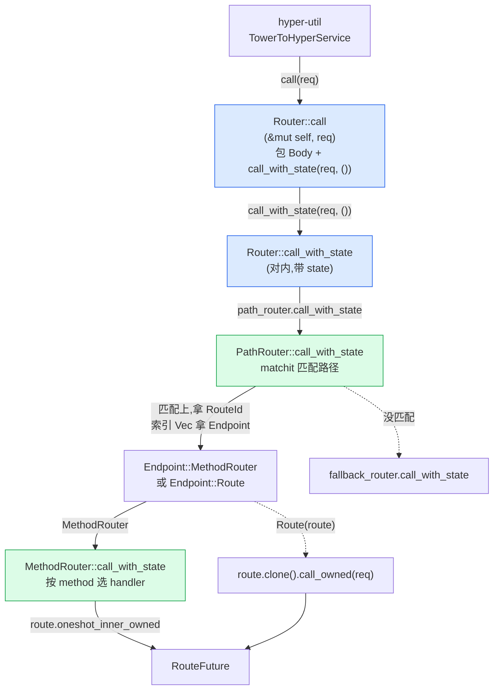

# 第 3 章 · Router 与 Route:都是 Service

> **核心问题**:上一章你看到请求一路穿过 `Router::call` → `PathRouter::call_with_state` → `MethodRouter::call_with_state` → `Handler::call`。但回到最开头那个点——`Router<()>` 凭什么自己就实现 `tower::Service<Request>`?hyper 的 `Service` 明明没有 `poll_ready`(那是 hyper 在协议层把背压挪走了),可 axum 的 `Router`/`Route`/`MethodRouter` 全都实现了**带 `poll_ready` 的** `tower_service::Service`,而且它们的 `poll_ready` 居然**无条件返回 `Poll::Ready(Ok(()))`**——把 Tower 的背压通道直接无视了。还有,你写 `Router::new().route("/", get(handler_a)).route("/users", post(handler_b))`,`handler_a` 和 `handler_b` 是两个**单态化后类型完全不同**的 `async fn`(参数个数、提取器类型都不同,每个 fn 对应一个独一无二的 `Handler` 实现类型),它们怎么被塞进同一个 `Router` 里?这背后那个统一的类型 `Route`,内部到底是什么?
>
> **读完本章你会明白**:
>
> 1. 为什么 `Router<()>` 自己就实现 `tower::Service<Request>`,而 `Router<MyState>` 不行(只有 state 为 `()` 时才满足 `Service` 约束),这背后是 axum 怎么把"缺状态"编码进类型系统的(P1-04 详拆);
> 2. `Router::call` 内部怎么把请求一层层交给 `PathRouter`/`MethodRouter`/`Route`,`call_with_state` 这个**额外带 state 参数**的内部方法干什么用,为什么 `tower::Service::call` 的固定签名(`&mut self, Request`)塞不进 state,axum 怎么绕过这个限制;
> 3. `Route` 内部到底是 `BoxCloneSyncService<Request, Response, E>`——这条被擦除的 trait object 是怎么把"千差万别的 handler 类型"塞进同一个 `Vec`/`HashMap` 的,以及它为什么同时还能 `Clone + Send + Sync`(承《Tower》P6-17 一句带过);
> 4. 为什么 axum 的 `poll_ready` 无条件 `Ready` 是**故意的取舍**(不是偷懒)——Web 框架的背压该由谁承担,以及为什么这个"忽略背压"在 axum 的场景下是 sound 的。
>
> **逃生阀(读不下去怎么办)**:本章有三个互相缠绕的点(Router impl Service 的签名、Route 的类型擦除、poll_ready 无条件 Ready),信息密度大。如果一时绕不开,记住三句话就够——**① 只有 `Router<()>` 能当 Service,因为状态已经在 `with_state` 里注入了;② Route 是一个擦掉具体 handler 类型的 trait object 装箱,让异构 handler 能塞进同一张路由表;③ axum 故意忽略 Tower 的 poll_ready 背压,因为背压由更外层的 hyper 连接数/Tokio task 数承担**。带着这三句话跳到对应小节细读。本章处处承《hyper》P1-02(Service trait 入门)和《Tower》P0-01(Service×Layer 双抽象),读过那两本收获翻倍,但不是硬性前提。

---

## 一句话点破

> **axum 把"路由分发到 handler"这件事做成了一个标准的 `tower::Service<Request>`——Router、PathRouter、MethodRouter、Route 全部 impl Service,这样 hyper-util 的连接服务就能用一个统一的 trait 调它们。但 Tower 的 Service 签名(`call(&mut self, Request)`)塞不下"每请求注入 state"这件事,于是 axum 在内部加了一个 `call_with_state(req, state)` 的私有方法绕开。而每条路由的具体 handler 类型千差万别(每个 `async fn` 单态化出独一无二的实现类型),要把它们塞进同一张路由表,axum 用 `Route(BoxCloneSyncService<...>)` 把所有 handler 擦除成同一个装箱类型——这是 Tower 给的类型擦除逃生阀(承《Tower》P6-17)。代价是 Route 的 `poll_ready` 被擦成一个永远 Ready 的壳子:axum 故意忽略 Tower 的 Service 层背压,因为 Web 框架的背压由更外层(hyper 连接数、Tokio task 数)承担,Service 层再传一遍是冗余——这跟 hyper 在协议层删 `poll_ready` 是同一思路。**

这是结论,不是理由。本章倒过来拆:为什么必须 impl Service(不 impl 行不行)、`call_with_state` 怎么绕过 Service 签名的限制、Route 内部那个装箱到底是什么、poll_ready 无条件 Ready 凭什么 sound。

---

## 第一节:从上一章的全景时序回到一个最基本的问题

### 提问

上一章(P1-02)你看到一次 axum 请求的全景时序:hyper accept 一个连接 → 在每个连接上跑 HTTP 协议机 → 把解析好的 `Request` 交给一个 `Service` → 这个 `Service` 正是 `Router<()>` → `Router::call` 把请求一路传到 `PathRouter` → `MethodRouter` → `Handler::call` → handler fn → `IntoResponse` → 回 hyper。

但有一个最基本的问题我们当时**刻意一带而过**:hyper 凭什么能把 `Request` 交给 `Router`?具体来说,hyper 的协议机跑完之后,手里拿的是一个 `tower::Service`(更准确说,hyper-util 用一个 `TowerToHyperService` 适配器把 tower Service 包成 hyper Service,见 `axum/src/serve/mod.rs#L385`)。这意味着,**`Router` 必须是一个 `tower::Service`**——否则 hyper-util 那个适配器 `new(tower_service)` 这一步编译都过不去。

那 `Router` 是怎么 impl `tower::Service` 的?

> **承接《hyper》[[hyper-source-facts]]**:hyper 1.x 把 `service::Service` trait 留在主仓(`hyper/src/service/service.rs#L32`),它和 `tower_service::Service` **不一样**——hyper 的 Service **没有 `poll_ready`,且 `call` 是 `&self` 不是 `&mut self`**(因为 hyper 1.x 把背压挪到协议层:HTTP/1 用 `in_flight` 单槽,HTTP/2 用 h2 流量控制,client 端用 `SendRequest::poll_ready`)。axum 实现的是 **`tower_service::Service`**(带 `poll_ready`、`&mut self`),中间靠 `hyper_util::service::TowerToHyperService` 适配——这个适配器把 tower Service 的 `poll_ready` 透传(顺便处理 `&mut self` 到 `&self` 的转换,内部用 `Mutex` 或 `Clone`)。这条链路是 hyper→Tower→axum 的衔接,一句带过指路《hyper》P1-02,本章专注 axum 自己的 Service 实现。

### 不这样会怎样:如果不 impl Service,axum 怎么接 hyper

假设 `Router` **不实现** `tower::Service`。那 axum 怎么把请求处理结果交回 hyper?

唯一的办法是手写一个"hyper Service 到 Router 调用"的胶水:

```rust
// 假想的胶水(非 axum 实际做法)
struct HyperToRouterBridge(Router<()>);

impl hyper::Service<Request> for HyperToRouterBridge {
    type Response = Response;
    type Error = Infallible;  // 框架层把所有错误转成 Response
    type Future = ???;  // ← 问题在这

    fn call(&self, req: Request) -> Self::Future {
        // 这里要调用 self.0 的处理逻辑,但 Router 不是 Service,
        // 只能调一个内部方法 self.0.handle(req)
        // 那这个 Future 类型怎么写?要包一个 RouteFuture
        Box::pin(async move { self.0.handle(req).await })
    }
}
```

这段胶水其实**就是 `TowerToHyperService` 在做的事**(只不过它在 tower→hyper 方向适配),只是把方向反过来。也就是说,无论你愿不愿意,**总要在某处把"Router 处理一个请求"实现成一个 Service trait**——因为 hyper 的接口是 Service,你不给它一个 Service,它没法调你。

axum 的选择是**直接让 `Router<()>` 实现 `tower::Service<Request>`**,然后让 hyper-util 的 `TowerToHyperService` 适配器自动把 tower Service 转成 hyper Service。这样,axum 不需要自己写 hyper 适配层(用 hyper-util 现成的),而且 axum 的 Service 还能直接被任何 Tower 工具链消费(`ServiceExt::oneshot`、`ServiceBuilder`、tower-http 中间件……)。

> **钉死这件事**:`Router` impl `tower::Service` 不是"为了好看",是**为了让 hyper-util 能调它,且让 axum 接入整个 Tower 中间件生态**。这是 axum 选择"长在 Tower 上"的根本——同一个 trait,既接 hyper,又接 tower-http/tower::ServiceBuilder。如果 axum 自己定义一个 `AxumHandler` trait,就既接不上 hyper-util,也接不上 Tower 中间件。这一点是 axum 设计的地基。

### 源码佐证:Router 的 impl Service 长什么样

来看 axum 0.8.9 的真实源码(`axum/src/routing/mod.rs#L569-L588`):

```rust
// axum/src/routing/mod.rs#L569-L588(逐字摘录)
impl<B> Service<Request<B>> for Router<()>
where
    B: HttpBody<Data = bytes::Bytes> + Send + 'static,
    B::Error: Into<axum_core::BoxError>,
{
    type Response = Response;
    type Error = Infallible;
    type Future = RouteFuture<Infallible>;

    #[inline]
    fn poll_ready(&mut self, _: &mut Context<'_>) -> Poll<Result<(), Self::Error>> {
        Poll::Ready(Ok(()))
    }

    #[inline]
    fn call(&mut self, req: Request<B>) -> Self::Future {
        let req = req.map(Body::new);
        self.call_with_state(req, ())
    }
}
```

短短几行,信息量极大。逐行拆:

**第 569 行 `impl<B> Service<Request<B>> for Router<()>`**——注意两个关键点:

1. **`Router<()>`**:只有 `Router<()>`(state 类型是 unit `()`)才 impl Service。`Router<MyState>` **不 impl Service**。为什么?因为 Tower 的 `Service::call` 签名是 `call(&mut self, req: Request) -> Future`,**没有地方塞 state**。如果 Router 还"缺一个 MyState 没注入",它就**没法在没有 state 的环境下处理请求**,自然不能当 Service。只有当 state 已经被 `with_state(state)` 注入(此时 state 类型参数变成 `()`),Router 才"齐活了",才能当 Service。这一点是 P1-04(State 章)的核心,这里先记住:**`with_state` 是把 state 从类型参数"搬"进路由表的具体 handler 里,搬完后 Router 的 state 类型参数变 `()`,这才能 impl Service**。

2. **`<B>` 泛型**:axum 对**任意 body 类型** `B`(只要 `B: HttpBody<Data = bytes::Bytes> + Send + 'static`)impl Service。这是为了让 hyper 的 `Request<Incoming>`(hyper 1.x 的 body 类型)能直接传给 Router——`call` 里第一句 `req.map(Body::new)` 就是把任意 body 转成 axum 的 `Body`(`axum_core::body::Body`,内部包 hyper body)。这一句是 axum 与 hyper body 的衔接点。

**第 575 行 `type Error = Infallible`**——Router 的 Service **Error 类型是 `Infallible`**!意思是"Router 永远不会返回 Err"。这听起来奇怪(Tower 的 Service 不是允许出错吗?),其实是 axum 的核心取舍:axum 在**框架层把所有错误都转成 `Response`**(比如 404/405/500 都是一个正常的 Response,不是 Service Error)。所以 Router 处理一个请求,要么返回一个 `Response`(可能是错误页面),要么 panic(panic 不是 Service Error)。`Error = Infallible` 是这个取舍的类型层体现——P5-18 错误处理章详拆。

**第 579-581 行 `poll_ready`**——无条件 `Poll::Ready(Ok(()))`。这是本章后半段的重头戏:为什么 axum 故意忽略 Tower 的背压。先记住这个事实。

**第 584-587 行 `call`**——

```rust
fn call(&mut self, req: Request<B>) -> Self::Future {
    let req = req.map(Body::new);        // ① 把任意 body 转成 axum Body
    self.call_with_state(req, ())         // ② 调内部方法,注入 () 作为 state
}
```

这里有一个**关键设计**:`call` 没有直接做路由匹配,而是调用了 `self.call_with_state(req, ())`。`call_with_state` 是 axum 内部的一个**带 state 参数**的方法(签名见 `axum/src/routing/mod.rs#L417`):

```rust
// axum/src/routing/mod.rs#L417-L432(逐字摘录)
pub(crate) fn call_with_state(&self, req: Request, state: S) -> RouteFuture<Infallible> {
    let (req, state) = match self.inner.path_router.call_with_state(req, state) {
        Ok(future) => return future,
        Err((req, state)) => (req, state),
    };

    let (req, state) = match self.inner.fallback_router.call_with_state(req, state) {
        Ok(future) => return future,
        Err((req, state)) => (req, state),
    };

    self.inner
        .catch_all_fallback
        .clone()
        .call_with_state(req, state)
}
```

为什么 axum 要在 `Service::call` 和真正的路由逻辑之间,**插一个 `call_with_state`**?这就要进入下一节的"为什么 Service 签名塞不下 state"。

> **钉死这件事**:`Router<()>` impl `tower::Service<Request>` 的实现极简——`poll_ready` 无条件 Ready,`call` 把 body 包成 `axum::Body` 后调 `call_with_state(req, ())`。所有的路由逻辑(matchit 匹配、MethodRouter 分发、fallback)都不在 `call` 里,而在 `call_with_state` 这个**内部方法**里。这个"Service::call 极薄,真活在 call_with_state"的模式,贯穿整个 axum 的 Service 实现(Router/MethodRouter/Route 都这么写)。

---

## 第二节:call_with_state——Tower Service 签名塞不下 state 怎么办

### 提问

Tower 的 `Service::call` 签名是固定的:`fn call(&mut self, req: Request) -> Self::Future`。它**没有 state 参数**。可 axum 的设计是"先建 `Router<S>`,缺一个 state 类型 S,等真要用了再 `with_state(state)` 注入"——这个"缺 state"的模型,跟 Service 的固定签名**对不上**。

具体来说:在 `Router<S>` 上调用 `with_state(state: S)` 之后,得到的 `Router<()>` 把 state 烤进了路由表里每条 handler(`MethodRouter::with_state` 把 `BoxedHandler` 物化成 `Route`,见 `method_routing.rs#L773` 和 `with_state` 的 `MethodEndpoint::with_state`),所以 `Router<()>` 的 `call` 不需要 state 参数——state 已经在 handler 里了。这就是为什么只有 `Router<()>` 能 impl Service。

但**在 `with_state` 之前**,`Router<S>` 是"缺一个 S",这时如果你想**在请求到达时动态注入 state**(而不是预先 `with_state` 烤进去),怎么办?这正是 `call_with_state` 的用途。

> **承接 P1-04**:为什么 axum 要有"缺 state"这个模型,而不是一开始就让你传 state?这是 axum 把"路由组装"和"状态注入"解耦的设计——你可以在子模块里组装 `Router<AppState>` 而不知道 AppState 具体是什么(只声明类型参数 S),最后在 main 里 `with_state(real_state)` 一次性注入。这个设计的全部细节在 P1-04(State 章)拆透。本章只关心:**call_with_state 是为这个"缺 state"模型服务的内部 API**,Service::call 是它的特化(state = `()`)。

### 不这样会怎样:硬塞 state 进 Service 签名会怎样

假设你想把 state 塞进 Service::call 的签名,改成:

```rust
// 假想的篡改(非 Tower 实际签名)
fn call(&mut self, req: Request, state: S) -> Self::Future;
```

这一改,Tower 的整个生态全部崩塌:

- **Service trait 的契约被破坏**:`Service<Request>` 的定义就是"给一个 Request,产出一个 Future"。你加了 state 参数,意味着调用方必须知道 S 是什么——可 Tower 不知道你 axum 的 state 类型,它怎么调?
- **hyper-util 的 `TowerToHyperService` 适配器调不动**:hyper 把请求交给 tower Service 时,只调 `service.call(req)`,它**没有 state 可以传**——hyper 不认识你的 AppState。你要让 hyper 传 state,就得改 hyper 的接口,这不可能(hyper 是独立的协议库)。
- **整个 Tower 中间件生态失配**:`tower::ServiceBuilder`、`tower-http::timeout`、`tower::limit::ConcurrencyLimit` 这些中间件,都是在 `Service<Request>` 上叠 Layer,它们调 `inner.call(req)` 时也是只传 req。你的"带 state 的 call"在中间件链里跑不动。

所以 **state 不能进 Service::call 的签名**。Tower 的 Service 就是"一进一出",state 必须在别的地方处理。

### 所以 axum 这么设计:两个 call,一个对外一个对内

axum 的解法是**两个 call**:

1. **对外的 `Service::call(&mut self, req) -> Future`**:只接受 req,**这是为了符合 Tower/hyper 的接口**。它的实现里调 `self.call_with_state(req, ())`——传一个 `()` 当 state(因为 `Router<()>` 已经把真 state 烤进 handler 了,不需要再传)。

2. **对内的 `call_with_state(&self, req, state: S) -> RouteFuture`**:这个方法**有 state 参数**,但它是 `pub(crate)` 的,**不是 Tower Service trait 的一部分**。它只在 axum 内部用——比如 nest 一个子 Router 时,子 Router 是 `Router<S>`(还缺 state),父 Router 调它时,要把请求和 state 一起传下去;又比如 `Fallback::call_with_state`(`mod.rs#L720`)处理 fallback 时也要传 state。

来看看 `call_with_state` 的真实实现(再贴一遍 `axum/src/routing/mod.rs#L417-L432`),这次看路由分发的三段:

```rust
pub(crate) fn call_with_state(&self, req: Request, state: S) -> RouteFuture<Infallible> {
    // ① 先让 path_router 试:用 matchit 匹配路径,匹配上就返回 future
    let (req, state) = match self.inner.path_router.call_with_state(req, state) {
        Ok(future) => return future,         // 匹配上,直接返回
        Err((req, state)) => (req, state),   // 没匹配上,继续往下
    };

    // ② path 没匹配,让 fallback_router 试(method_not_allowed / fallback handler)
    let (req, state) = match self.inner.fallback_router.call_with_state(req, state) {
        Ok(future) => return future,
        Err((req, state)) => (req, state),
    };

    // ③ 兜底的 catch_all_fallback(处理 CONNECT 空 path 这种特殊场景)
    self.inner
        .catch_all_fallback
        .clone()
        .call_with_state(req, state)
}
```

这三段是 axum 路由分发的核心逻辑(P2-08 fallback 章详拆):

- **第一段**:把请求交给 `path_router`(主要的路由表,存你 `.route` 注册的所有路径)。`path_router.call_with_state` 用 matchit 字典树匹配路径,匹配上就把请求交给对应的 `Endpoint`(MethodRouter 或 Route)。返回 `Ok(future)` 表示匹配上,`Err((req, state))` 表示路径没匹配上(把 req 和 state 退回来,给下一层用)。
- **第二段**:路径没匹配,交给 `fallback_router`。这是处理你 `.fallback(handler)` 注册的兜底 handler 的路由器(以及 method_not_allowed_fallback)。
- **第三段**:终极兜底 `catch_all_fallback`,处理 `CONNECT` 请求空 path 这种边缘场景。

注意 `path_router.call_with_state(req, state)` 这个调用——**`PathRouter` 也有一个 `call_with_state` 方法**(签名见 `path_router.rs#L371`),它也是对内的,**不是 Service trait 的一部分**。`PathRouter` 甚至**不 impl Service**(它是个内部结构,不需要直接被 hyper/Tower 调),它只暴露 `call_with_state` 给 `Router` 调。

这条"`Service::call` 极薄,真活在 `call_with_state`"的模式,贯穿 axum 的所有 Service 实现:

| 类型 | impl `tower::Service`? | 对外 `call` 干什么 | 对内 `call_with_state` 干什么 |
|------|------|------|------|
| `Router<()>` | ✅ | 包 body + 调 `call_with_state(req, ())` | 三段路由分发(path → fallback → catch_all) |
| `MethodRouter<(), E>` | ✅ | 包 body + 调 `call_with_state(req, ())` | 按 method 选 MethodEndpoint(GET/POST/…) |
| `Route<E>` | ✅ | 包 body + `oneshot_inner` | (无 call_with_state,直接 oneshot) |
| `PathRouter<S>` | ❌(内部结构) | — | matchit 匹配 + 交 Endpoint |

> **钉死这件事**:axum 的 Service trait 实现都是"壳"——`Service::call` 只做"body 转换 + 调 `call_with_state`"两件极简的事,**真正的路由逻辑全在 `call_with_state` 里**。为什么这么分?因为 Service::call 的签名是 Tower 钉死的(不能带 state),而路由逻辑需要 state(尤其是 `Router<S>` 还没注入 state 时)。axum 把"符合 Tower 接口"和"需要 state"这两件事,拆成两个方法解决。这是 axum 在 Tower 之上的第一层适配。

### 为什么 `call_with_state` 返回 `RouteFuture<Infallible>`,不是 `Self::Future`

注意 `call_with_state` 的返回类型是 `RouteFuture<Infallible>`(`mod.rs#L417`),而 `Router::Service::Future` 也是 `RouteFuture<Infallible>`(`mod.rs#L576`)。它们是同一个类型。这是因为 `Router<()>` 的 state 已经是 `()`,call_with_state 里传的 state 就是 `()`,产出的 future 自然就是 `RouteFuture<Infallible>`(Infallible 是 Error 类型,不是 state)。

但对于 `Router<S>`(state 还没注入)的 `call_with_state`,签名是 `fn call_with_state(&self, req: Request, state: S) -> RouteFuture<Infallible>`——这里 S 是泛型参数,state 类型是 S,但返回的 future 类型 `RouteFuture<Infallible>` **不依赖 S**。这是因为无论 state 是什么,最终产出的 future 都是"处理完请求后产出一个 Response 或 Infallible"——state 在 future 内部被消费(用来调起 handler),不暴露在 future 类型上。这一点很重要:`RouteFuture` 把"用 state 调 handler"这件事封装在 future 的 poll 里,state 不进 future 的类型签名。

来看一下请求穿过 `Router::call` → `call_with_state` → `PathRouter::call_with_state` 的流程:



注意图里两个"对内的 call_with_state"(`Router::call_with_state` 和 `PathRouter::call_with_state`)——它们**不在 Service trait 里**,是 axum 内部的私有/受保护方法。`Service::call`(对外,只接 req)→ `call_with_state`(对内,接 req + state)的桥接,是 axum 把"缺 state 的 Router"模型塞进 Tower Service 框架的核心机制。

---

## 第三节:RouterInner 套 PathRouter 套 Vec<Endpoint> 的类型嵌套

### 提问

上一节你看到 `call_with_state` 调 `self.inner.path_router.call_with_state`。这里的 `self.inner` 是什么?`path_router` 又是什么?axum 的 Router 内部到底怎么组织路由表?

这一节把 Router 内部的数据结构摊开,为后面 Route(类型擦除)和 MethodRouter(method 分发)做铺垫。

### Router 的内部:Arc<RouterInner>

来看 `Router` 的定义(`axum/src/routing/mod.rs#L68-L70`):

```rust
// axum/src/routing/mod.rs#L67-L85(逐字摘录)
#[must_use]
pub struct Router<S = ()> {
    inner: Arc<RouterInner<S>>,
}

impl<S> Clone for Router<S> {
    fn clone(&self) -> Self {
        Self {
            inner: Arc::clone(&self.inner),
        }
    }
}

struct RouterInner<S> {
    path_router: PathRouter<S, false>,
    fallback_router: PathRouter<S, true>,
    default_fallback: bool,
    catch_all_fallback: Fallback<S>,
}
```

几个关键点:

1. **`Router<S>` 是 `Arc<RouterInner<S>>` 的包装**。`Arc` 意味着 Router 是**廉价的 Clone**(只是 Arc 引用计数 +1)。这一点很重要——hyper 每个连接 spawn 一个 task,每个 task 需要一个 Router 的 clone(因为 Service::call 是 `&mut self`,每个连接要独占一个可变借用)。Arc 让"每个连接一份 Router"几乎零成本。

2. **`RouterInner` 有四个字段**:
   - `path_router: PathRouter<S, false>`——主路由表,存你 `.route` 注册的所有路径。第二个泛型参数 `false` 是 const generic,标记"这不是 fallback 路由器"。
   - `fallback_router: PathRouter<S, true>`——fallback 路由表,存你 `.fallback(handler)` 注册的兜底。`true` 标记"这是 fallback 路由器"(P2-08 详拆 fallback 路由器的特殊性)。
   - `default_fallback: bool`——标记 fallback 是不是默认的(404)。如果你没调过 `.fallback`,这个是 true;调过就是 false。merge 时用这个判断"两个 Router 都有自定义 fallback"的情况要 panic。
   - `catch_all_fallback: Fallback<S>`——终极兜底,处理 `CONNECT` 空 path 这种边缘场景(详见 `mod.rs#L680-L684` 的 `Fallback` enum)。

### PathRouter 内部:HashMap<RouteId, Endpoint> + Node

`PathRouter<S, IS_FALLBACK>` 的定义(`axum/src/routing/path_router.rs#L16-L21`):

```rust
// axum/src/routing/path_router.rs#L16-L21(逐字摘录)
pub(super) struct PathRouter<S, const IS_FALLBACK: bool> {
    routes: HashMap<RouteId, Endpoint<S>>,
    node: Arc<Node>,
    prev_route_id: RouteId,
    v7_checks: bool,
}
```

拆开看:

- **`routes: HashMap<RouteId, Endpoint<S>>`**——这是真正的路由表!key 是 `RouteId(u32)`(一个递增的整数 ID),value 是 `Endpoint<S>`(`MethodRouter<S>` 或 `Route`)。每个注册的路径对应一个 RouteId,RouteId 索引到对应的 Endpoint。
- **`node: Arc<Node>`**——`Node` 包 `matchit::Router<RouteId>` + 两个 HashMap 做双向映射(`path_router.rs#L478-L482`):
  
  ```rust
  // axum/src/routing/path_router.rs#L477-L482(逐字摘录)
  #[derive(Clone, Default)]
  struct Node {
      inner: matchit::Router<RouteId>,
      route_id_to_path: HashMap<RouteId, Arc<str>>,
      path_to_route_id: HashMap<Arc<str>, RouteId>,
  }
  ```
  
  `matchit::Router<RouteId>` 是基数树(外部 crate matchit),存"路径 → RouteId"的映射,用于**匹配**;`route_id_to_path` 和 `path_to_route_id` 两个 HashMap 是"RouteId ↔ path"的双向映射,用于**反查**(merge/nest 时需要根据 path 反查 RouteId,或根据 RouteId 反查 path)。P2-05(PathRouter 章)详拆这个双层结构。
- **`prev_route_id: RouteId`**——下一个分配的 RouteId(递增)。每注册一条路由,这个 ID +1。
- **`v7_checks: bool`**——是否启用 0.7 路径语法检查(`:foo`/`*foo` 警告)。0.8 默认 true,P6-20 详拆。

### Endpoint:MethodRouter 或 Route

`Endpoint<S>` 的定义(`axum/src/routing/mod.rs#L751-L755`):

```rust
// axum/src/routing/mod.rs#L751-L755(逐字摘录)
#[allow(clippy::large_enum_variant)]
enum Endpoint<S> {
    MethodRouter(MethodRouter<S>),
    Route(Route),
}
```

两种变体:

- **`MethodRouter(MethodRouter<S>)`**——你 `.route("/", get(handler))` 注册的路径走这个。一个路径对应一个 MethodRouter,MethodRouter 内部按 HTTP method 持有多个 handler(GET/POST/PUT…)。
- **`Route(Route)`**——你 `.route_service("/", service)` 注册的路径走这个。一个路径直接对应一个 Service(不区分 method)。

### 把整个嵌套画出来

用 ASCII 框图把 Router 的内部嵌套画清楚:

```
┌─────────────────────────────────────────────────────────────────┐
│  Router<S = ()>                                                  │
│    inner: Arc<RouterInner<S>>  ← 廉价 Clone(Arc 引用计数)        │
├─────────────────────────────────────────────────────────────────┤
│  RouterInner<S> {                                                │
│    path_router:        PathRouter<S, false>,   ← 主路由表         │
│    fallback_router:    PathRouter<S, true>,    ← fallback 表      │
│    default_fallback:   bool,                                     │
│    catch_all_fallback: Fallback<S>,            ← CONNECT 兜底     │
│  }                                                               │
└─────────────────────────────────────────────────────────────────┘
            │
            ▼ path_router 内部
┌─────────────────────────────────────────────────────────────────┐
│  PathRouter<S, IS_FALLBACK> {                                    │
│    routes: HashMap<RouteId(u32), Endpoint<S>>,  ← 真正的路由表    │
│    node:   Arc<Node>,                                            │
│    prev_route_id: RouteId,                                       │
│    v7_checks: bool,                                              │
│  }                                                               │
├─────────────────────────────────────────────────────────────────┤
│  Node {                                                          │
│    inner:             matchit::Router<RouteId>, ← 基数树匹配      │
│    route_id_to_path:  HashMap<RouteId, Arc<str>>,  ← 反查         │
│    path_to_route_id:  HashMap<Arc<str>, RouteId>,  ← 反查         │
│  }                                                               │
└─────────────────────────────────────────────────────────────────┘
            │
            ▼ routes 的 value
┌─────────────────────────────────────────────────────────────────┐
│  Endpoint<S> {                                                   │
│    MethodRouter(MethodRouter<S, E>),   ← .route("/", get(h))     │
│    Route(Route),                       ← .route_service("/", s)  │
│  }                                                               │
└─────────────────────────────────────────────────────────────────┘
            │
            ▼ MethodRouter 内部(P2-06 详拆)
┌─────────────────────────────────────────────────────────────────┐
│  MethodRouter<S, E> {                                            │
│    get/connect/delete/.../trace: MethodEndpoint<S, E>,  ×9       │
│    fallback: Fallback<S, E>,                                     │
│    allow_header: AllowHeader,                                    │
│  }                                                               │
│                                                                  │
│  MethodEndpoint<S, E> {                                          │
│    None,                              ← 该 method 没注册         │
│    Route(Route),                      ← .get_service(svc)        │
│    BoxedHandler(BoxedIntoRoute<S,E>), ← .get(handler)(未注入state)│
│  }                                                               │
└─────────────────────────────────────────────────────────────────┘
            │
            ▼ 最终所有 handler 都变成这个类型
┌─────────────────────────────────────────────────────────────────┐
│  Route<E = Infallible>(                                          │
│    BoxCloneSyncService<Request, Response, E>  ← 类型擦除!        │
│  )                                                               │
└─────────────────────────────────────────────────────────────────┘
```

注意图最底下:**所有 handler 最终都被擦除成 `Route`**,而 `Route` 内部是 `BoxCloneSyncService<Request, Response, E>`。这就是下一节的重头戏——为什么 axum 要做类型擦除。

> **钉死这件事**:Router 的内部是 `Arc<RouterInner>`,RouterInner 套两个 PathRouter(主表 + fallback 表),PathRouter 内部是 `HashMap<RouteId, Endpoint>` + `Node`(matchit 树 + 双向映射)。Endpoint 是 MethodRouter 或 Route。所有路径最终都指向 `Route`,而 Route 是一个被类型擦除的装箱 Service。这个嵌套是 axum 路由的完整数据结构,P2-05/P2-06/P2-08 会逐层拆透;本章只关心最底层那个 `Route`,以及它为什么必须是擦除类型。

---

## 第四节:Route——千差万别的 handler 怎么塞进同一张表

### 提问

你写这样的代码:

```rust
async fn list_users(State(db): State<Db>, Query(q): Query<PageQ>) -> impl IntoResponse {
    /* ... */
}

async fn create_user(State(db): State<Db>, Json(body): Json<NewUser>) -> impl IntoResponse {
    /* ... */
}

async fn health_check() -> &'static str {
    "ok"
}

let app = Router::new()
    .route("/users", get(list_users).post(create_user))
    .route("/health", get(health_check));
```

这三个 handler——`list_users`、`create_user`、`health_check`——是三个**完全不同类型**的 `async fn`。它们参数个数不同、参数类型不同、返回类型不同。在 Rust 里,**每个 `async fn` 都单态化成一个独一无二的实现类型**(具体来说,`async fn` 的返回值是一个编译器生成的匿名 Future 类型,每个 fn 的 Future 类型都不一样;进一步,axum 用 `impl_handler!` 宏对每个 fn 的参数 tuple 实现 `Handler<T, S>` trait,所以每个 fn 的 `Handler` 实现类型也不同——P3-09 详拆)。

那问题来了:axum 怎么把这三个**类型完全不同**的 handler,塞进同一个 `HashMap<RouteId, Endpoint>`?HashMap 要求所有 value 是同一个类型,可你的 handler 类型千差万别。

### 不这样会怎样:朴素地为每个 handler 单态化类型建枚举

一种朴素的做法是**为每条路由建一个枚举变体**:

```rust
// 假想的朴素做法(非 axum 实际做法)
enum MyEndpoints {
    ListUsers(ListUsersHandler),       // 单态化类型
    CreateUsers(CreateUsersHandler),   // 单态化类型
    HealthCheck(HealthCheckHandler),   // 单态化类型
}
```

这条路走不通,有几个致命问题:

1. **枚举的变体类型必须在编译期全部知道**:你每加一条路由,就要给枚举加一个变体。可路由是用户在运行期用 `.route(...)` 动态注册的,编译器不可能预先知道用户会注册哪些 handler。枚举这条路死了。
2. **就算枚举能动态扩,类型系统也不允许"任意类型"的枚举变体**:Rust 的 enum 是封闭的(变体在定义时钉死),不能在运行期加变体。
3. **就算用 `Box<dyn Any>` 装箱**:你要在调用时 `downcast` 回具体类型,而 downcast 需要知道具体类型——这又回到"调用方必须知道 handler 类型"的死结。而且 `dyn Any` 不能调用 `Handler::call`(Any 没有 call 方法)。

另一种朴素做法是**要求所有 handler 实现同一个 trait**(比如 `trait AxumHandler`),然后用 `Vec<Box<dyn AxumHandler>>` 装箱。这听起来可行,但有两个问题:

1. **`Handler` trait 有关联类型 `Future`**,而 Future 类型对每个 handler 不同。`dyn Handler` 要求 Future 类型擦除成 `Pin<Box<dyn Future>>`,这是性能损失(每次都要 Box::pin)。
2. **`Handler` trait 是泛型的**(`Handler<T, S>`,T 是参数 tuple),不同参数个数的 handler 是不同的 `Handler<T, S>` 实例,它们的 trait object 类型(`dyn Handler<((),), S>` vs `dyn Handler<(State, Path), S>`)也不一样,**还是塞不进同一个 `Vec`**。

### 所以 axum 这么设计:用 `BoxCloneSyncService` 把所有 handler 擦除成同一个装箱类型

axum 的解法是承 Tower 的类型擦除工具:**`BoxCloneSyncService<Request, Response, E>`**。这个类型来自 `tower::util`(承《Tower》P6-17 一句带过),它的本质是:

```rust
// tower/src/util/boxed_clone_sync.rs#L18-L24(tower 仓,逐字摘录)
pub struct BoxCloneSyncService<T, U, E>(
    Box<
        dyn CloneService<T, Response = U, Error = E, Future = BoxFuture<'static, Result<U, E>>>
            + Send
            + Sync,
    >,
);
```

`BoxCloneSyncService<T, U, E>` 是一个 trait object 的装箱:`Box<dyn CloneService<T, Response=U, Error=E, Future=BoxFuture<...>> + Send + Sync>`。它把**任意**满足 `Service<T, Response=U, Error=E> + Clone + Send + Sync + 'static` 且 Future 是 `Send + 'static` 的 service,**擦除成同一个类型**。

关键在三件事:

1. **类型擦除**:trait object 把"具体 service 的实现类型"擦掉,只保留"它能处理 Request 类型 T、产出 Response 类型 U、错误类型 E"。具体是 `Timeout<Foo>` 还是 `Retry<Bar>` 还是 `HandlerService<list_users, ...>`——擦除后都看不出来,统一的 `dyn CloneService<...>`。
2. **`Future = BoxFuture<'static, Result<U, E>>`**:把每个 service 不同的 Future 类型,**统一擦除成 `Pin<Box<dyn Future<Output = Result<U, E>> + Send + 'static>>`**。这一步是关键——`Handler<list_users>::Future` 和 `Handler<create_user>::Future` 是两个不同的匿名 Future 类型,但它们都被 `Box::pin` 装箱成同一个 `BoxFuture<'static, Result<Response, Infallible>>`。代价是每个请求多一次 `Box::pin`(堆分配),换来"所有 handler 同一类型"。
3. **`Clone + Send + Sync`**:`CloneService` 这个内部 trait 要求具体 service 是 `Clone + Send + Sync`,这样擦除后的 BoxCloneSyncService 也满足这三者(它在 `Clone` 时调 `clone_box`,见 `boxed_clone_sync.rs#L86-L94`——内部对原 service `.clone()` 再装箱)。

axum 的 `Route` 就是这个 BoxCloneSyncService 的薄包装(`axum/src/routing/route.rs#L31`):

```rust
// axum/src/routing/route.rs#L27-L41(逐字摘录)
/// How routes are stored inside a [`Router`](super::Router).
///
/// You normally shouldn't need to care about this type. It's used in
/// [`Router::layer`](super::Router::layer).
pub struct Route<E = Infallible>(BoxCloneSyncService<Request, Response, E>);

impl<E> Route<E> {
    pub(crate) fn new<T>(svc: T) -> Self
    where
        T: Service<Request, Error = E> + Clone + Send + Sync + 'static,
        T::Response: IntoResponse + 'static,
        T::Future: Send + 'static,
    {
        Self(BoxCloneSyncService::new(MapIntoResponse::new(svc)))
    }
    // ...
}
```

注意 `Route::new` 干了两件事:

1. **`MapIntoResponse::new(svc)`**:把任意"Response: IntoResponse"的 service,**包一层 `MapIntoResponse`**,让它统一产出 `axum::Response`。`MapIntoResponse` 的实现(`axum/src/util.rs#L48-L97`)很简单:它的 `poll_ready` 透传(`self.inner.poll_ready(cx)`),它的 `call` 调内层后用 `MapIntoResponseFuture` 把内层的 `Result<T, E>`(其中 T: IntoResponse)映射成 `Result<Response, E>`(调 `into_response`)。这一步把"每个 handler 不同的 Response 类型"统一成 `axum::Response`。
2. **`BoxCloneSyncService::new(...)`**:把 `MapIntoResponse<Svc>` 擦除成 BoxCloneSyncService<Request, Response, E>。

经过这两步,无论你的 handler 是 `async fn() -> &'static str` 还是 `async fn(State<Db>, Json<NewUser>) -> Result<Json<User>, AppError>`,**最终都变成同一个类型 `Route<Infallible>`**,可以塞进同一个 `HashMap<RouteId, Endpoint>`。

### 把 Route 的内部布局画出来

`Route` 是一个 newtype 包 `BoxCloneSyncService`,而 BoxCloneSyncService 是一个 trait object 装箱。trait object 在 Rust 里是 **fat pointer(胖指针)**——两个 word:一个指向数据,一个指向 vtable。

```
Route<E = Infallible>
  │
  └─ BoxCloneSyncService<Request, Response, E>
       │
       └─ Box<dyn CloneService<Request, Response=Response, Error=E,
                               Future=BoxFuture<'static, Result<Response, E>>>
               + Send + Sync>
            │
            ├─ data pointer  ──→  [MapIntoResponse<HandlerService<list_users, ...>>]
            │                      (具体 handler 类型的实例,堆分配)
            │
            └─ vtable pointer ──→ CloneService vtable for MapIntoResponse<...>
                                  { poll_ready, call, clone_box }
```

这个 fat pointer 是 trait object 的标准布局(承 Rust 类型系统基础,一句带过)。关键点:

- **data pointer** 指向具体的 handler 实例(被 `MapIntoResponse` 包过的 `HandlerService`)。这个实例的类型在编译期是已知的(`MapIntoResponse<HandlerService<H, T, S>>`),但通过 trait object 擦除后,外部只看到 `dyn CloneService<...>`。
- **vtable pointer** 指向这个具体类型的 vtable,里面有 `poll_ready`/`call`/`clone_box` 三个方法的实际地址。每次调 `route.call(req)` 时,通过 vtable 做一次动态分派(虚调用)。

代价:每次请求有一次虚调用(`call` 走 vtable)。换来的好处:**所有 handler 同一类型,能塞进 HashMap/Vec**。这是 axum 路由能存异构 handler 的根本。

### Route 不只存 handler,还包了一层 Oneshot

来看 `Route::oneshot_inner`(`route.rs#L49-L52`):

```rust
// axum/src/routing/route.rs#L49-L52(逐字摘录)
pub(crate) fn oneshot_inner(&mut self, req: Request) -> RouteFuture<E> {
    let method = req.method().clone();
    RouteFuture::new(method, self.0.clone().oneshot(req))
}
```

`self.0.clone().oneshot(req)` 这一串做了三件事:

1. **`self.0.clone()`**:Clone 出一个新的 BoxCloneSyncService(Clone 走 `clone_box`,内部对原 service `.clone()` 再装箱)。
2. **`.oneshot(req)`**:调 `tower::ServiceExt::oneshot`,它是 `ServiceExt` trait 提供的扩展方法,签名大概是 `fn oneshot(self, req) -> Oneshot<Self, Req>`——它返回一个 `Oneshot<S, Req>` future,这个 future 内部先 `poll_ready` 再 `call`(见 `tower/src/util/oneshot.rs#L81-L105`)。
3. **`RouteFuture::new(method, oneshot)`**:把这个 Oneshot future 包进 RouteFuture(同时记下 method,用于 HEAD/CONNECT 特殊处理)。

为什么要 clone 再 oneshot?因为 `Service::call` 是 `&mut self`(Tower 的硬规矩,因为 poll_ready 可能预留资源,call 消费这份预留,见《Tower》P1-02 详拆)。`Route` 的 `Service::call` 也是 `&mut self`(`route.rs#L103`),但 axum 的路由分发逻辑里,`PathRouter::call_with_state` 用的是 `&self`(`path_router.rs#L371`)——它**不可变借用** Route(从 HashMap 拿出来的 `&Endpoint`),没法调 `&mut self` 的 `call`。所以要么 clone 一份再 call(`route.clone().oneshot_inner_owned(req)`,见 `path_router.rs#L413`),要么用某种方式拿到 `&mut`。

axum 选的是 **clone-on-call**:每次调 Route 都先 clone 一份。这听起来浪费,但因为 BoxCloneSyncService 内部是 trait object 装箱,clone 只是 `clone_box`(对具体 handler 的 `.clone()` 再装箱),如果 handler 本身是 `Arc` 共享的(很多 handler 内部就一个 `Arc` 持有状态),clone 几乎零成本。这是 axum 在"不可变路由表 + Tower 的 `&mut self` 契约"之间的折中。

> **承《Tower》[[tower-source-facts]]**:Service 的 `&mut self` + poll_ready 预留资源契约,Tower P1-02 拆透了。axum 这里"clone-on-call"是绕开这个契约的常见手法——既然 Route 的 poll_ready 永远 Ready(下一节讲),那"预留资源"这件事对 Route 不成立,clone 一份再 call 是 sound 的。承 Tower P1-02 一句带过。

---

## 第五节:poll_ready 无条件 Ready——axum 故意忽略 Tower 的背压

### 提问

Tower 的 `Service::poll_ready` 是背压通道——服务满载时返回 `Pending`,告诉调用方"别再塞"。可 axum 的 `Router`/`Route`/`MethodRouter` 的 `poll_ready` **全部无条件 `Poll::Ready(Ok(()))`**:

```rust
// axum/src/routing/mod.rs#L578-L581(Router 的 poll_ready)
#[inline]
fn poll_ready(&mut self, _: &mut Context<'_>) -> Poll<Result<(), Self::Error>> {
    Poll::Ready(Ok(()))
}

// axum/src/routing/route.rs#L97-L100(Route 的 poll_ready)
#[inline]
fn poll_ready(&mut self, _cx: &mut Context<'_>) -> Poll<Result<(), Self::Error>> {
    Poll::Ready(Ok(()))
}

// axum/src/routing/method_routing.rs#L1297-L1300(MethodRouter 的 poll_ready)
#[inline]
fn poll_ready(&mut self, _cx: &mut Context<'_>) -> Poll<Result<(), Self::Error>> {
    Poll::Ready(Ok(()))
}
```

这看起来像"偷懒"——Tower 明明给了背压通道,axum 为什么不用?如果一个 Tower 中间件(比如 `tower::limit::ConcurrencyLimit`)套在 axum Router 外面,它满载时 poll_ready 返回 Pending,可 axum Router 自己永远 Ready,**背压信号怎么传?**

这一节拆透:**axum 故意忽略 Tower Service 层的背压,是 sound 的**——因为 Web 框架的背压,该由更外层承担。

### 不这样会怎样:如果 axum 老老实实传 poll_ready 会怎样

假设 axum 不忽略背压,把 poll_ready 老老实实传给内层 Service。会怎样?

先看 axum Router 内部是什么——`Router::call` 调 `call_with_state`,后者调 `PathRouter::call_with_state`,后者从 HashMap 拿 Endpoint,Endpoint 是 MethodRouter 或 Route,最终调 Route(`BoxCloneSyncService`)的 `oneshot`。

注意 **`PathRouter::call_with_state` 是 `&self`**(`path_router.rs#L371`)——它不可变借用路由表。可 Tower 的 `Service::poll_ready` 是 `&mut self`。**`&self` 的方法,根本没法调 `&mut self` 的 poll_ready**!

也就是说,axum 的路由分发逻辑里,**根本没有地方调内层 Service 的 poll_ready**。请求来了,直接从 HashMap 拿 Endpoint,直接 call。poll_ready 被完全跳过。

如果 axum 要"老老实实传 poll_ready",它得:

1. 把路由表从 `HashMap<RouteId, Endpoint>` 改成 `HashMap<RouteId, Mutex<Endpoint>>`(因为 poll_ready 是 `&mut self`,而 HashMap 是 `&self` 借用的)。
2. 每次 `call_with_state` 先 `endpoint.lock().poll_ready(cx)`,如果 Pending 就把请求挂起等待。
3. 这意味着**每个请求要持锁、要 await、要在 poll_ready Pending 时被重新调度**。

这套机制的代价:

- **锁开销**:每个请求要 lock 路由表里的 Endpoint。如果 Endpoint 是 MethodRouter(里面有 9 个 MethodEndpoint),lock 成本累加。
- **调度开销**:poll_ready Pending 时,请求要被挂起、等下次 wake。这在"请求处理"这个高频路径上是显著的调度成本。
- **背压传递复杂**:poll_ready Pending 的信号要传到 hyper,Tower→hyper-util→hyper 这条链路上每一层都要正确处理 Pending。可 hyper 1.x 的 Service trait **没有 poll_ready**(它在协议层做流控,承《hyper》P1-02)——hyper-util 的 `TowerToHyperService` 适配器要把 tower 的 poll_ready 转成 hyper 能理解的形式,这本身就很 tricky。

而且,这套机制**根本没用**——为什么?因为 Web 框架的背压,**根本不该由 Service 层的 poll_ready 承担**。

### Web 框架的背压由谁承担:hyper 连接数 + Tokio task 数

Web 服务的真实背压场景是这样的:客户端请求太多,服务端处理不过来,该怎么办?

1. **最外层:TCP 连接层**。客户端发起 TCP 连接,服务端 accept。如果服务端处理慢,accept 队列(SOMAXCONN)会满,新连接被内核拒绝或排队。这是第一层背压——TCP backlog。
2. **hyper 层:每连接一个 task + HTTP 协议流控**。hyper accept 一个连接后 spawn 一个 Tokio task 处理它。task 数受 Tokio 运行时的 worker 线程数限制(默认 = CPU 核数)。如果 task 都在忙,新连接的 task 要等(或被拒)。HTTP/2 还有 h2 的 per-stream 流量控制(承《hyper》P2-P3 一句带过)。
3. **业务层:中间件限流**。如果你想"每秒最多 100 个请求",你套一个 `tower::limit::rate::RateLimit` 中间件。这个中间件**在 axum Router 之外**(用 `Router::layer` 套),它的 poll_ready 会正确返回 Pending(因为它不是 axum 内部的 Service,是用户显式套的 Tower 中间件)。

注意这三层背压——TCP backlog、hyper task 数、用户套的限流中间件——**没有一层是靠 axum Router 自己的 poll_ready**。axum Router 的 poll_ready 即便永远 Ready,背压也由这三层承担。

更关键:**axum Router 内部的 poll_ready 即便想传,也没意义**。因为 Router 内部那些 Route(handler)都是**无状态**的(每个 handler 是一个 `async fn`,每次调用是独立的 future,不持有"会满"的资源)。一个 `async fn list_users(State<Db>, Query) -> ...` 没有"我现在能不能接活"的概念——它就是个函数,调就完了。它的"满"是底层的 Db 连接池满(Db 自己有 poll_ready,但那是 Db 客户端的事,不是 axum Router 的事)。

> **承《hyper》[[hyper-source-facts]]**:hyper 1.x 删了 Service trait 的 poll_ready,把背压挪到协议层(HTTP/1 的 in_flight 单槽、HTTP/2 的 h2 流量控制)。axum 的"Router poll_ready 无条件 Ready"是**同一思路的延续**——axum 在 hyper 之上,hyper 已经做了协议层流控,axum 的 Service 层再做一遍是冗余。这是 hyper→axum 这条栈的连贯取舍:背压在最合适的层做,不在每层都做。承《hyper》P1-02 一句带过。

### 为什么忽略背压在 axum 的场景是 sound

"忽略背压"听起来危险,但在 axum 的场景下是 sound 的。来拆为什么:

1. **axum 的 Service 内部没有"会满"的资源**。Router/PathRouter/MethodRouter 都是**纯分发**——它们不持有连接池、不持有 permit、不持有缓冲区。它们只持有"路由表"(HashMap + matchit 树),路由表是只读的(运行期不变),不存在"满"。所以它们的 poll_ready 永远 Ready 是**诚实的**——它们确实永远 ready。

2. **handler 本身的"满"由谁管**?你写的 `async fn list_users(State<Db>, ...)`——如果 Db 连接池满了,handler 在 `State<Db>.get().await` 时 await(等连接),这个 await 是 Db 客户端内部的 poll_ready(它是另一个 Service 或 semaphore)。**handler 自己 await,就是把背压传给 Tokio runtime**——Tokio 把这个 task 挂起,释放 worker 线程给别的 task。等 Db 连接可用,Tokio wake 这个 task 继续。这条链路完全绕过 axum Router 的 poll_ready。所以"handler 满了"的背压,由 Tokio runtime + Db 客户端承担,不需要 axum Router 介入。

3. **中间件限流由用户显式套**。如果你想限流,你 `Router::layer(tower::limit::ConcurrencyLimit::new(100))`——这个 ConcurrencyLimit 不是 axum 内部 Service,是用户套在 Router **外层**的 Tower 中间件。它的 poll_ready 会正确返回 Pending(它内部用 `tokio::sync::Semaphore`,permit 满了就 Pending)。**用户套的中间件,自己正确实现 poll_ready**——axum 不会去破坏它。axum 只是自己内部的 Router/Route poll_ready 无条件 Ready,**不影响**用户中间件的 poll_ready 正常工作。

4. **`Oneshot` future 仍然调 poll_ready**。注意一个细节:`Route::oneshot_inner` 用的是 `tower::ServiceExt::oneshot`,这个方法返回的 `Oneshot<S, Req>` future,**内部会先 poll_ready 再 call**(见 `tower/src/util/oneshot.rs#L91-L94`):

   ```rust
   // tower/src/util/oneshot.rs#L91-L94(tower 仓,逐字摘录)
   StateProj::NotReady { svc, req } => {
       let _ = ready!(svc.poll_ready(cx))?;
       let f = svc.call(req.take().expect("already called"));
       this.state.set(State::called(f));
   }
   ```
   
   也就是说,即便 `Route::poll_ready` 无条件 Ready,`Oneshot` future 还是会调一次 poll_ready——只是这次调用立即返回 Ready,不阻塞。如果 Route 内部的 BoxCloneSyncService 满了(虽然 axum 的 Route 内部一般不会满),Oneshot 会感知到 Pending。但 axum 的 Route 内部都是无状态分发,poll_ready 永远 Ready,所以 Oneshot 立即进入 call。这是 sound 的——内部真的不会满。

### 反面对比:hyper 删 poll_ready vs Tower 保留 vs axum 选择性忽略

把三个项目的 poll_ready 取舍放一起对照,这条栈的设计哲学就清晰了:

| 项目 | Service trait 有 poll_ready? | 背压由谁承担 | 为什么这么选 |
|------|------|------|------|
| **tower-service** | ✅ 有(`&mut self`) | 由实现 Service 的中间件各自承担 | 通用抽象层,不知道你跑什么协议,必须给一个通用背压通道 |
| **hyper Service** | ❌ 删了(`&self`,无 poll_ready) | 协议层(HTTP/1 in_flight / HTTP/2 h2 流控 / 连接池) | 协议层自己有流控,trait 再加一层冗余 |
| **axum Router/Route/MethodRouter** | ✅ 有(impl tower::Service),但无条件 Ready | 外层(hyper 协议流控 + Tokio task 数 + 用户套的限流中间件) | 路由分发本身无状态,不会"满";背压在更合适的层做 |

这条栈的设计是连贯的:**背压在最合适的层做,不重复做**。

- Tower 作为通用抽象,**必须**提供 poll_ready(否则像 Buffer/ConcurrencyLimit 这种背压中间件没法实现)。
- hyper 作为协议层,**有**协议自身的流控,删掉 poll_ready 是合理的(协议层更懂自己的流控)。
- axum 作为路由分发层,**无状态**,poll_ready 永远 Ready 是诚实的;它的"满"由外层 hyper 和 Tokio 承担。

> **钉死这件事**:axum 的 poll_ready 无条件 Ready,**不是偷懒,是诚实地反映"路由分发本身无状态、不会满"这个事实**。背压由更合适的层承担(hyper 协议流控、Tokio task 调度、用户套的限流中间件)。这个取舍跟 hyper 删 poll_ready 是同一思路的延续。如果你在 axum Router 外面套一个 ConcurrencyLimit 中间件,它的 poll_ready 会正确工作(axum 不破坏它);axum 只是自己内部的 Service poll_ready 无条件 Ready。

### 那么 BoxCloneSyncService 的 poll_ready 呢?

有一个细节要澄清:`Route` 内部的 BoxCloneSyncService,它的 poll_ready 是什么?来看 `BoxCloneSyncService` 自己的 Service 实现(`tower/src/util/boxed_clone_sync.rs#L50-L64`,tower 仓):

```rust
// tower/src/util/boxed_clone_sync.rs#L50-L64(tower 仓,逐字摘录)
impl<T, U, E> Service<T> for BoxCloneSyncService<T, U, E> {
    type Response = U;
    type Error = E;
    type Future = BoxFuture<'static, Result<U, E>>;

    #[inline]
    fn poll_ready(&mut self, cx: &mut Context<'_>) -> Poll<Result<(), E>> {
        self.0.poll_ready(cx)   // ← 透传给内部 trait object
    }

    #[inline]
    fn call(&mut self, request: T) -> Self::Future {
        self.0.call(request)
    }
}
```

`BoxCloneSyncService` 自己的 poll_ready **是透传**(`self.0.poll_ready(cx)`)——它会调内部 trait object 的 poll_ready,也就是真正 handler 的 poll_ready。

但这里有个微妙的地方:axum 的 Route 在调用时,走的是 `oneshot_inner`(`route.rs#L49`),它 `self.0.clone().oneshot(req)`——clone 一份再 oneshot。Oneshot 内部会调这个 clone 的 poll_ready。但 Route 自己的 `Service::poll_ready`(`route.rs#L97`)是**无条件 Ready**——这意味着如果有人直接调 `route.poll_ready()`(不走 oneshot),会立即 Ready,跳过内部 handler 的 poll_ready。

这没问题,因为:

- axum 的内部 handler(handler fn 经 HandlerService 包装)poll_ready 也永远 Ready(`handler/service.rs#L160-L165` 的 HandlerService::poll_ready 无条件 Ready,注释说"async fn 总是 ready,Layered 在 call 里 buffer 所以也总是 ready")。
- 即便 handler 内部包了会 Pending 的中间件(比如你 `handler.layer(ConcurrencyLimit)`),那个中间件的 poll_ready 是在 `call` 时通过 future 内部 await 体现的,不是通过 Router 的 poll_ready 体现。

所以,axum 整条链路上,**Service::poll_ready 都是 Ready**,真正的背压在 Tokio runtime 层(通过 future 的 await 挂起 task)。这是 axum 这条栈的统一风格。

---

## 第六节:对照 go net/http、actix-web、rocket——不同语言的路由类型怎么设计

### 提问

axum 用"泛型单态化 + BoxCloneSyncService 类型擦除"来处理"异构 handler 塞进同一张表"的问题。其他语言/框架怎么做?这个对照能让你看清 axum 的取舍。

### go net/http:interface 天然类型擦除

Go 的标准库 `net/http` 用 interface 做路由:

```go
// go net/http(运行期 interface + vtable)
type Handler interface {
    ServeHTTP(ResponseWriter, *Request)
}

mux := http.NewServeMux()
mux.HandleFunc("/users", func(w http.ResponseWriter, r *http.Request) {
    // handler 逻辑
})
```

Go 的 `Handler` 是一个 interface,**任何**实现了 `ServeHTTP(ResponseWriter, *Request)` 的类型都是 Handler。Go 的 interface 天然是 trait object(运行期 vtable),所以 `mux.HandleFunc` 接受任意 `func`——这些 `func` 在 Go 里被自动适配成 `HandlerFunc`(实现了 Handler interface 的类型),存进路由表时**天生就是同一个 interface 类型**。

对比 axum:

- **go**:interface 天然擦除,Handler 是 `interface { ServeHTTP(...) }`,所有 handler 同一类型。简单,但每次调用走 vtable(Go 的 interface 调用就是虚分派)。
- **axum**:Rust 没有运行期 interface(Go 那种),trait object 要显式 `Box<dyn Trait>`。axum 用泛型单态化让每个 handler 编译期是独一无二的类型(性能更好,内联更容易),但要把它们塞进路由表,就得用 BoxCloneSyncService 显式擦除——擦除后也是 vtable 虚分派。

**殊途同归**:两者最终都用 vtable 处理异构 handler,只是 Go 是天生 vtable,Rust 是先单态化再擦除。代价相近(虚分派),好处相近(异构 handler 统一类型)。Rust 多一层编译期类型安全(单态化期间类型检查更严格),Go 多一份运行期灵活性(handler 可以动态注册)。

> **对照 go net/http**:Go 的 ServeMux 路径匹配是简单的最长前缀匹配(Go 1.22 加了 method 和 wildcard,但仍不如 matchit 灵活)。axum 用 matchit 字典树(基数树),支持 `{id}`/`{*path}` 这种植入参数,P2-05 详拆。

### actix-web:actor 模型 + 自实现运行时

actix-web 是 Rust 另一个 Web 框架,它的路由模型跟 axum 完全不同:

```rust
// actix-web 风格(非 axum 实际 API)
async fn index(req: HttpRequest) -> impl Responder {
    "hello"
}

App::new().service(
    web::resource("/").route(web::get().to(index))
)
```

actix-web 内部用 **actor 模型**(actix crate),每个 handler 是一个消息处理器,通过消息传递处理请求。它的 handler trait 是 `Handler<T>`(actix 自己的,跟 axum 的 Handler 不是一回事),handler 之间通过 actor 的 mailbox 通信。actix-web **自带运行时**(基于 actix-rt,本质是 Tokio + actor 调度层)。

对比 axum:

- **actix-web**:actor 模型,handler 是 actor,请求是消息。多一层 actor 抽象,学习曲线陡。类型擦除通过 actix 自己的 `BoxedRouteService`(类似 BoxCloneSyncService)。
- **axum**:直接用 Tower Service,没有 actor 抽象。handler 是 `async fn`,通过 Handler trait 宏展开变成 Service。更轻,更接近底层。

两者都用类型擦除处理异构 handler,但 axum 的设计更薄(直接长在 Tower/hyper 上),actix-web 更重(自带 actor 运行时)。

### rocket:过程宏 request guard

rocket 是 Rust 第三个主流 Web 框架,它的设计哲学跟 axum 又不同:

```rust
// rocket 风格(非 axum 实际 API)
#[get("/users/<id>")]
fn user(id: i32) -> String {
    format!("User {}", id)
}
```

rocket 用**过程宏**(`#[get("/users/<id>")]`)注册路由,handler 的参数通过 **request guard**(实现 `FromRequest` trait 的类型)自动提取。这跟 axum 的 FromRequest 提取器概念相似,但 rocket 用宏把"路由路径 + 参数提取"绑在一起(`#[get("/users/<id>")]` 里 `<id>` 直接对应 `id: i32` 参数),axum 则把它们解耦(路径用 `.route("/users/{id}", ...)` 注册,参数用 `Path<i32>` 提取器)。

rocket 0.5 之前长期依赖 nightly(因为用了过程宏相关的 nightly feature),0.5 才稳定。axum 从一开始就稳定(用 `impl Future` 非 async-trait,这是 Rust 1.75+ 稳定的 RPITIT)。

### 对照表

| 框架 | 语言 | handler 类型模型 | 类型擦除方式 | 运行时 |
|------|------|------|------|------|
| **axum** | Rust | 泛型单态化(`Handler<T,S>`)+ 宏展开 | BoxCloneSyncService(trait object) | Tokio(直接用) |
| **actix-web** | Rust | actor 模型(消息处理器) | BoxedRouteService(类似) | actix-rt(Tokio + actor 层) |
| **rocket** | Rust | 过程宏 request guard | 内部擦除 | Tokio(0.5 起) |
| **go net/http** | Go | interface(`ServeHTTP`) | 天生 vtable(interface) | Go runtime |
| **Spring** | Java | 注解 + 反射 | 天生虚分派(JVM) | JVM |

axum 的独特之处:**泛型单态化让 handler 在编译期类型安全(每个 handler 的提取器类型、返回类型都在编译期检查),BoxCloneSyncService 让异构 handler 运行期统一**。这是 Rust 类型系统给的"两全其美"——编译期安全 + 运行期统一,代价是类型擦除处的虚分派(每次请求一次)。

> **钉死这件事**:axum 的"泛型单态化 + 类型擦除"是 Rust 类型系统下的最优解。go/Java 这种天生虚分派的语言不需要擦除(interface/虚方法天然统一类型),但失去编译期类型安全(handler 参数类型在编译期不严格检查)。actix-web/rocket 也用类型擦除,但底座不一样(axum 直接长在 Tower/hyper,最薄)。axum 的设计是 Tokio 官方团队出的,跟整个 Rust 异步栈最贴合。

---

## 技巧精解

这一节挑本章最硬核的两个技巧,配真实源码 + 反面对比,单独拆透。

### 技巧一:Route 的类型擦除——把千差万别的 handler 擦成同一个装箱类型

**它解决什么问题**:你写 N 个 handler(每个是独一无二的 `async fn` 单态化类型),要塞进同一个 `HashMap<RouteId, Endpoint>`。HashMap 要求 value 同类型,可你的 handler 类型千差万别。怎么办?

**反面对比:朴素地为每个 handler 建枚举变体会怎样**:

```rust
// 假想的朴素做法(撞墙)
enum Endpoints {
    ListUsers(<list_users as Handler>::Future),     // 单态化类型
    CreateUsers(<create_users as Handler>::Future),  // 单态化类型
    HealthCheck(<health_check as Handler>::Future),  // 单态化类型
    // ... 每加一条路由就要加一个变体,编译期必须知道全部
}
```

撞墙点:

1. **变体类型编译期封闭**。你每注册一条路由就要改 enum 定义,可路由是用户运行期 `.route(...)` 注册的,编译器不可能预知。
2. **Handler Future 类型是匿名匿名匿名**。`async fn` 的返回类型是编译器生成的匿名 Future,你甚至写不出它的名字(`<list_users as Handler<...>>::Future` 这种写法在某些场合能写,但放进 enum 变体极其难维护)。
3. **就算用 `Box<dyn Any>`**:downcast 需要调用方知道具体类型,又回到死结;且 `dyn Any` 不能调 `Handler::call`。

**axum 的解法:BoxCloneSyncService 擦除**。来看 `Route::new` 的真实实现(`axum/src/routing/route.rs#L33-L41`):

```rust
// axum/src/routing/route.rs#L33-L41(逐字摘录)
impl<E> Route<E> {
    pub(crate) fn new<T>(svc: T) -> Self
    where
        T: Service<Request, Error = E> + Clone + Send + Sync + 'static,
        T::Response: IntoResponse + 'static,
        T::Future: Send + 'static,
    {
        Self(BoxCloneSyncService::new(MapIntoResponse::new(svc)))
    }
    // ...
}
```

`Route::new` 接受任意 `T: Service<Request, Error=E> + Clone + Send + Sync + 'static`(且 `T::Response: IntoResponse`),内部:

1. **`MapIntoResponse::new(svc)`**:把 T 的 Response 类型(`T::Response`,可能是 `Json<User>`、`String`、`&'static str` 等任意 `IntoResponse`)统一映射成 `axum::Response`。这一步是必要的,因为 BoxCloneSyncService 的 Response 类型必须是统一的 `Response`,不能是各自的 IntoResponse 类型。`MapIntoResponse` 的实现(`util.rs#L59-L77`)是标准 Service 包装:`poll_ready` 透传,`call` 调内层,Future 用 `MapIntoResponseFuture` 把内层的 `Result<T, E>` 映射成 `Result<Response, E>`(调 `into_response`)。

2. **`BoxCloneSyncService::new(...)`**:把 `MapIntoResponse<T>` 擦除成 `BoxCloneSyncService<Request, Response, E>`。这步是关键——它把"具体是 `MapIntoResponse<HandlerService<list_users, ...>>` 还是 `MapIntoResponse<HandlerService<create_users, ...>>`"这种具体类型信息**全部擦掉**,只保留"它是个 Service<Request, Response=Response, Error=E>,且 Clone+Send+Sync"。

**为什么还能 Clone + Send + Sync**:

BoxCloneSyncService 的 Clone 走 `clone_box`(`tower/src/util/boxed_clone_sync.rs#L66-L70`,tower 仓):

```rust
// tower/src/util/boxed_clone_sync.rs#L66-L70(tower 仓,逐字摘录)
impl<T, U, E> Clone for BoxCloneSyncService<T, U, E> {
    fn clone(&self) -> Self {
        Self(self.0.clone_box())
    }
}
```

`clone_box` 是 `CloneService` 私有 trait 的方法(`boxed_clone_sync.rs#L72-L80`):

```rust
// tower/src/util/boxed_clone_sync.rs#L72-L80(tower 仓,逐字摘录)
trait CloneService<R>: Service<R> {
    fn clone_box(
        &self,
    ) -> Box<
        dyn CloneService<R, Response = self::Response, Error = self::Error, Future = self::Future>
            + Send
            + Sync,
    >;
}
```

它通过 blanket impl(`boxed_clone_sync.rs#L82-L95`)对任意 `T: Service<R> + Send + Sync + Clone + 'static` 实现:

```rust
// tower/src/util/boxed_clone_sync.rs#L82-L95(tower 仓,逐字摘录)
impl<R, T> CloneService<R> for T
where
    T: Service<R> + Send + Sync + Clone + 'static,
{
    fn clone_box(
        &self,
    ) -> Box<
        dyn CloneService<R, Response = T::Response, Error = T::Error, Future = T::Future>
            + Send
            + Sync,
    > {
        Box::new(self.clone())
    }
}
```

`clone_box` 内部就是 `Box::new(self.clone())`——对原 service `.clone()` 再装箱。所以 BoxCloneSyncService 的 Clone 能力,来源于**原 service 必须 Clone**(这是 `Route::new` 的 trait bound `T: ... + Clone + ...` 要求的)。Send + Sync 同理——trait object 的 `+ Send + Sync` 约束要求原 service 也是 Send + Sync。

**axum 的 handler 为什么都 Clone + Send + Sync**?因为 axum 的 handler 经过 HandlerService 包装后(`handler/service.rs#L148`),HandlerService 是 Clone(只要 H 和 S 都 Clone,`handler/service.rs#L134-L146`)。而 `async fn` 的 Future 在 `Send` bound 下(Handler trait 要求 `H: Send + 'static`)是 Send 的。axum 强制 state 是 `Clone + Send + Sync + 'static`(`mod.rs#L139-L141` 的 `impl<S> Router<S> where S: Clone + Send + Sync + 'static`)。所以所有 handler 经包装后都满足 `Clone + Send + Sync`,可以塞进 BoxCloneSyncService。

**为什么 sound**:类型擦除把"具体类型"擦掉,但保留了"它能干什么"(Service<Request> → Response)。所有调用通过 vtable 走到原 service 的 poll_ready/call,语义完全保留。Clone 走 clone_box(对原 service clone 再装箱),Send/Sync 通过 trait object 的 `+ Send + Sync` 标注保证。这是 Rust trait object 的标准类型擦除模式,承《Tower》P6-17 一句带过。

**朴素地写会撞什么墙**:如果不用类型擦除,你要么用封闭 enum(变体必须编译期已知,死路),要么用 `Box<dyn Any>`(downcast 死结,且 Any 没有 call 方法),要么强行让所有 handler 同一类型(不可能,因为参数 tuple 不同)。只有 trait object(Box<dyn Service>)这条路能通,而 BoxCloneSyncService 是 Tower 提供的"擦除 + 还能 Clone + Send + Sync"的标准工具。axum 直接复用,不重新发明。

### 技巧二:poll_ready 无条件 Ready——为什么忽略 Tower 背压是 sound 的

**它解决什么问题**:Tower 的 Service trait 给了 poll_ready 背压通道,axum 的 Router/Route/MethodRouter 全部忽略它(无条件 Ready)。为什么这个"忽略"是 sound 的,而不是 bug?

**反面对比:老老实实传 poll_ready 会怎样**:

假设 axum 不忽略背压,要正确实现 poll_ready 透传。会撞几堵墙:

**墙一:PathRouter 是 `&self` 的,没法调 `&mut self` 的 poll_ready**。

来看 `PathRouter::call_with_state` 的签名(`path_router.rs#L371`):

```rust
// axum/src/routing/path_router.rs#L370-L375(逐字摘录)
#[allow(clippy::result_large_err)]
pub(super) fn call_with_state(
    &self,                      // ← 不可变借用!
    #[cfg_attr(not(feature = "original-uri"), allow(unused_mut))] mut req: Request,
    state: S,
) -> Result<RouteFuture<Infallible>, (Request, S)> {
```

`&self`——不可变借用。但 Tower 的 `Service::poll_ready` 是 `&mut self`(因为 poll_ready 可能预留资源,要修改内部状态,承《Tower》P1-02)。**`&self` 的方法,根本没法调 `&mut self` 的 poll_ready**。

如果要传 poll_ready,PathRouter 得改成:

```rust
// 假想修改(撞墙)
pub(super) fn call_with_state(
    &mut self,   // ← 改成 &mut self
    req: Request,
    state: S,
) -> ... {
    // 现在可以从 HashMap 拿 &mut Endpoint,调它的 poll_ready
    let endpoint = self.routes.get_mut(&id).unwrap();
    ready!(endpoint.poll_ready(cx))?;  // ← 如果 Pending,怎么办?
    endpoint.call_with_state(req, state)
}
```

可 `&mut self` 的 call_with_state 意味着 Router::call_with_state 也要 `&mut self`——可 `Service::call` 是 `&mut self` 没问题,但 Router 是 `Arc<RouterInner>`,`Arc` 拿 `&mut` 要么 `Arc::make_mut`(克隆整个 RouterInner,昂贵),要么 `Arc<Mutex<RouterInner>>`(每个请求 lock,昂贵)。两条路都把"廉价 Clone + 高性能"毁了。

**墙二:poll_ready Pending 时,请求怎么办?**

假设 poll_ready 真的返回 Pending。PathRouter::call_with_state 是个**同步方法**(返回 `Result<RouteFuture, ...>`,不是 async)。它没法 await poll_ready。要处理 Pending,这个方法得变成 async,或者返回一个"先 poll_ready 再 call"的 future。

`tower::ServiceExt::oneshot` 就是这么做的——它返回 `Oneshot<S, Req>` future,内部先 poll_ready 再 call(`oneshot.rs#L91-L94`)。axum 的 `Route::oneshot_inner` 用的就是 oneshot(`route.rs#L49-L52`),所以 **Oneshot future 内部已经处理了 poll_ready**——即便 Route 自己的 Service::poll_ready 无条件 Ready,Oneshot 还是会调内部 BoxCloneSyncService 的 poll_ready(透传给真正 handler)。

**墙三:hyper 1.x 没 poll_ready,信号传不到**。

即便 axum Router 正确实现了 poll_ready Pending,这个信号要传给 hyper 才有用(让 hyper 别再 accept 新连接)。可 hyper 1.x 的 Service trait **没有 poll_ready**(承《hyper》P1-02)——hyper 靠协议层流控(HTTP/1 in_flight、HTTP/2 h2 窗口)。hyper-util 的 `TowerToHyperService` 适配器要把 tower 的 poll_ready 转成 hyper 能懂的形式,这本身就 tricky。

**所以 axum 选 poll_ready 无条件 Ready**:

```rust
// axum/src/routing/route.rs#L97-L100(逐字摘录)
impl<B, E> Service<Request<B>> for Route<E>
where
    B: HttpBody<Data = bytes::Bytes> + Send + 'static,
    B::Error: Into<axum_core::BoxError>,
{
    type Response = Response;
    type Error = E;
    type Future = RouteFuture<E>;

    #[inline]
    fn poll_ready(&mut self, _cx: &mut Context<'_>) -> Poll<Result<(), Self::Error>> {
        Poll::Ready(Ok(()))   // ← 无条件 Ready
    }

    #[inline]
    fn call(&mut self, req: Request<B>) -> Self::Future {
        self.oneshot_inner(req.map(Body::new)).not_top_level()
    }
}
```

**为什么 sound**:

1. **axum 内部分发逻辑无状态**。Router/PathRouter/MethodRouter 都是纯路由表查找(HashMap + matchit 树),不持有"会满"的资源(连接池、permit、缓冲区)。它们 poll_ready 永远 Ready 是**诚实的**——确实永远 ready。

2. **handler 的"满"由 Tokio runtime 承担**。你写的 `async fn list_users(State<Db>, ...)`,如果 Db 连接池满,handler 在 `State<Db>.get().await` 时 await——这个 await 把 task 挂起,释放 Tokio worker 线程。背压由 Tokio runtime + Db 客户端承担,**不经过 axum Router 的 poll_ready**。

3. **用户套的限流中间件自己正确实现 poll_ready**。`Router::layer(ConcurrencyLimit::new(100))` 套的 ConcurrencyLimit,**在 Router 外层**,它的 poll_ready 会正确返回 Pending(用 Semaphore)。axum 不破坏它——axum 只是自己内部的 Service poll_ready 无条件 Ready。

4. **Oneshot future 仍调内部 poll_ready**。`Route::oneshot_inner` 用 `ServiceExt::oneshot`,Oneshot 内部 `ready!(svc.poll_ready(cx))`——如果内部 handler 真的会 Pending(虽然 axum 内部 handler 一般不会),Oneshot 会感知到。所以即便 Route 的 Service::poll_ready 无条件 Ready,**真正 handler 的 poll_ready 通过 Oneshot 还是被调了**(只是结果总是 Ready)。

**朴素地传 poll_ready 会怎样**:每个请求要 lock 路由表(或 Arc::make_mut 克隆)、要 await poll_ready、要在 Pending 时挂起重调度。这套机制成本巨大,且**没意义**——因为内部分发无状态,根本不会 Pending。axum 选 poll_ready 无条件 Ready,是诚实且高效的取舍。

> **钉死这件事**:axum 的 poll_ready 无条件 Ready,**不是 bug,是 sound 的设计取舍**。它诚实地反映"路由分发无状态、不会满"这个事实;背压由更合适的层承担(hyper 协议流控、Tokio task 调度、用户套的限流中间件)。这跟 hyper 删 poll_ready 是同一思路的延续——背压在最合适的层做,不重复做。如果你在 axum 外面套 ConcurrencyLimit,它的 poll_ready 正确工作(axum 不破坏它);axum 只是自己内部 Service poll_ready 无条件 Ready。

---

## 章末小结

回到全书的二分法:**路由与分发 vs 提取与响应**。本章服务的**路由这一面**——具体说,是路由侧的**Service 适配地基**。

你看到了:

- **Router/PathRouter/MethodRouter/Route 全部 impl `tower::Service`**,这是 axum 长在 Tower/hyper 上的根本(让 hyper-util 能调它,让 Tower 中间件生态能用它)。
- **Service::call 极薄,真活在 `call_with_state`**——因为 Tower 的 `call(&mut self, req)` 签名塞不下 state,axum 在内部加了一个 `call_with_state(req, state)` 的私有方法绕开(对外 Service::call 是它的特化,state = `()`)。
- **`Route` 是 `BoxCloneSyncService<Request, Response, E>` 的类型擦除**——把千差万别的 handler 类型(每个 async fn 单态化出独一无二的实现类型)擦成同一个装箱类型,塞进 `HashMap<RouteId, Endpoint>`。这是 Tower 给的类型擦除逃生阀(承《Tower》P6-17),axum 直接复用。
- **poll_ready 无条件 Ready**——axum 故意忽略 Tower Service 层的背压,因为路由分发无状态不会满,背压由外层(hyper 协议流控 + Tokio task 数 + 用户套的限流中间件)承担。这跟 hyper 删 poll_ready 是同一思路的延续。

承《hyper》P1-02(Service trait 入门 + hyper 删 poll_ready 的协议层取舍)一句带过;承《Tower》P0-01(Service×Layer 双抽象)和 P6-17(BoxCloneSyncService 类型擦除内部)一句带过;承《Tokio》(运行时调度 + task 挂起承担 handler 的 await 背压)一句带过。

### 五个为什么清单

1. **为什么 `Router<()>` 自己就实现 `tower::Service`,而 `Router<S>` 不行?** 因为 Service::call 的固定签名 `call(&mut self, req)` 塞不下 state。只有当 state 已经被 `with_state` 烘进路由表里每条 handler(state 类型参数变 `()`),Router 才能"在没有外部 state 的情况下处理请求",才满足 Service 约束。P1-04 详拆 with_state。

2. **为什么 axum 要在 Service::call 之外加一个 `call_with_state`?** 因为 Tower 的 Service::call 签式塞不下 state(签名是 Tower 钉死的),但 axum 的"缺 state"模型需要 state。解法是拆成两个方法:对外的 Service::call 符合 Tower 接口(传 `()` 当 state),对内的 call_with_state 带 state 参数(给 Router 内部的 nest/fallback 等场景用)。

3. **为什么 Route 是 `BoxCloneSyncService`?** 因为 axum 要把千差万别的 handler 类型(每个 async fn 单态化出独一无二类型)塞进同一张 `HashMap<RouteId, Endpoint>`。BoxCloneSyncService 用 trait object 把具体类型擦除,只保留"Service<Request> → Response + Clone + Send + Sync"。这是 Tower 给的类型擦除工具,承《Tower》P6-17。

4. **为什么 axum 的 poll_ready 无条件 Ready?** 因为 axum 内部分发逻辑无状态(路由表查找),不会"满",poll_ready 永远 Ready 是诚实的。背压由更外层承担:hyper 协议流控(HTTP/1 in_flight / HTTP/2 h2 窗口)、Tokio task 数(满 task 时新连接等待)、用户套的限流中间件(ConcurrencyLimit 等正确实现 poll_ready)。这跟 hyper 删 poll_ready 是同一思路的延续。

5. **为什么忽略 Tower 背压在 axum 是 sound 的?** 因为 axum 内部分发不持有"会满"的资源;handler 的"满"(比如 Db 连接池)由 handler 内部 await 体现,通过 Tokio runtime 挂起 task,不经过 Router 的 poll_ready;用户套的限流中间件自己正确实现 poll_ready,axum 不破坏它。背压在最合适的层做,不重复做。

### 想继续深入往哪钻

- **`with_state` 怎么把 state 从类型参数搬到 handler 内部,为什么只有 `Router<()>` 能 serve**:→ 第 4 章(P1-04),State 章,详拆 State 泛型编码 + FromRef 子状态派生。
- **`PathRouter` 内部的 matchit 字典树 + RouteId 双向映射怎么工作**:→ 第 5 章(P2-05),PathRouter 招招牌章,一个 URL 怎么常数级找到 handler。
- **`MethodRouter` 按 HTTP method 分发 + 重复 `.route` 走 merge**:→ 第 6 章(P2-06),MethodRouter 章,同一路径 GET/POST 各走各的。
- **`Fallback` 三态(catch_all / method_not_allowed)怎么决定 404**:→ 第 8 章(P2-08),fallback 与 404 章。
- **`tower_service::Service` trait 的 `&mut self` + poll_ready 背压语义 + mem::replace 惯用法**:→《Tower》P1-02,招牌章,把 Service 背压彻底拆透。
- **`BoxCloneSyncService` 的类型擦除内部原理 + blanket impl**:→《Tower》P6-17,类型擦除招牌章。
- **hyper 1.x 为什么删了 Service 的 poll_ready,背压怎么挪到协议层**:→《hyper》P1-02,招牌对照点。

### 引出下一章

本章你拿到了路由侧的 Service 适配地基:Router/Route/MethodRouter 都 impl Service,call_with_state 绕过 Service 签式塞 state 的限制,Route 用 BoxCloneSyncService 擦除异构 handler,poll_ready 无条件 Ready 是 sound 的取舍。但有一个问题我们刻意留到了这里——`Router<S>` 的 S 这个**类型参数**到底是干什么的?为什么 `Router::new()` 默认是 `Router<()>`,而你要共享状态得写 `Router::<AppState>::new()` 或 `.with_state(AppState {...})`?这个"用泛型把'缺状态'编码进类型"的设计,是 axum 怎么用 Rust 类型系统保证"有状态才能跑"的编译期安全?下一章 P1-04 会用真实源码 + 反例彻底拆开 State 的泛型编码,以及 `State<T>` 提取器怎么从 state 派生子状态(`FromRef`)。那是 axum 把"状态管理"做进类型系统的精彩一章。

---

> **本章源码锚点(全部经本地 `../axum/` Grep/Read 核实,版本 axum 0.8.9 @ commit `c59208c86fded335cd85e388030ad59347b0e5ae`)**:
>
> - [Router 定义 + impl Service for Router<()>](../axum/axum/src/routing/mod.rs#L67-L85) —— `Router<S = ()>` 包 `Arc<RouterInner<S>>`,L569-L588 impl Service。
> - [Router::poll_ready 无条件 Ready](../axum/axum/src/routing/mod.rs#L578-L581) —— `Poll::Ready(Ok(()))`。
> - [Router::call → call_with_state(req, ())](../axum/axum/src/routing/mod.rs#L583-L587) —— body 转 Body + 调内部 call_with_state。
> - [Router::call_with_state(对内,带 state)](../axum/axum/src/routing/mod.rs#L417-L432) —— 三段路由分发(path → fallback → catch_all)。
> - [RouterInner 结构](../axum/axum/src/routing/mod.rs#L80-L85) —— path_router + fallback_router + default_fallback + catch_all_fallback。
> - [Endpoint enum(MethodRouter / Route)](../axum/axum/src/routing/mod.rs#L751-L755)。
> - [Route 定义 = BoxCloneSyncService 包装](../axum/axum/src/routing/route.rs#L27-L41) —— `Route<E>(BoxCloneSyncService<Request, Response, E>)`,`new` 用 MapIntoResponse 包一层。
> - [Route::poll_ready 无条件 Ready](../axum/axum/src/routing/route.rs#L97-L100)。
> - [Route::oneshot_inner(clone + oneshot)](../axum/axum/src/routing/route.rs#L49-L58) —— `self.0.clone().oneshot(req)`。
> - [RouteFuture 状态机(包 Oneshot future)](../axum/axum/src/routing/route.rs#L108-L176) —— 内部 `Oneshot<BoxCloneSyncService<...>, Request>`,处理 HEAD/CONNECT/Allow header。
> - [PathRouter 结构 + call_with_state](../axum/axum/src/routing/path_router.rs#L16-L21) —— `HashMap<RouteId, Endpoint>` + `Node`(matchit 树 + 双向映射),L370-L420 call_with_state 用 matchit 匹配。
> - [Node 结构(matchit::Router + 双向 HashMap)](../axum/axum/src/routing/path_router.rs#L477-L482)。
> - [MethodRouter 结构(9 个 MethodEndpoint)](../axum/axum/src/routing/method_routing.rs#L547-L559)。
> - [MethodRouter::poll_ready 无条件 Ready](../axum/axum/src/routing/method_routing.rs#L1297-L1300)。
> - [MethodRouter::call_with_state(按 method 选 handler)](../axum/axum/src/routing/method_routing.rs#L1120-L1175) —— 用宏 call! 逐个 method 匹配。
> - [MethodEndpoint enum(None / Route / BoxedHandler)](../axum/axum/src/routing/method_routing.rs#L1225-L1229)。
> - [HandlerService(把 Handler 变 Service)](../axum/axum/src/handler/service.rs#L22-L178) —— Handler 的 Service 适配器,L160-L165 poll_ready 无条件 Ready(注释解释为什么 async fn 总是 ready)。
> - [MapIntoResponse(把任意 IntoResponse 统一成 Response)](../axum/axum/src/util.rs#L48-L97)。
> - [IntoMakeService(把 Router 变 MakeService)](../axum/axum/src/routing/into_make_service.rs#L1-L44) —— poll_ready 无条件 Ready,L31-L33。
> - [Fallback enum(Default / Service / BoxedHandler)](../axum/axum/src/routing/mod.rs#L680-L729) —— 三态 + call_with_state。
> - [BoxedIntoRoute(handler 的另一层擦除,用于 fallback)](../axum/axum/src/boxed.rs#L12-L178) —— 把 `Handler<T, S>` 擦成 `Box<dyn ErasedIntoRoute<S, E>>`。
>
> **外部 crate(诚实标注,非 axum 源码)**:
> - [tower::BoxCloneSyncService 类型擦除](../tower/tower/src/util/boxed_clone_sync.rs#L18-L101) —— `Box<dyn CloneService<...> + Send + Sync>`,L82-L95 blanket impl 提供 clone_box。
> - [tower::Oneshot future(先 poll_ready 再 call)](../tower/tower/src/util/oneshot.rs#L81-L105) —— 内部 `ready!(svc.poll_ready(cx))` 再 call。
> - [tower_service::Service trait 定义](../tower/tower-service/src/lib.rs) —— Service trait(poll_ready + call),承《Tower》P0-01/P1-02。
> - [hyper::Service trait(无 poll_ready,&self)](../hyper/src/service/service.rs#L32-L57) —— hyper 1.x 删了 poll_ready,背压挪到协议层。
> - hyper-util 的 `TowerToHyperService`(在 hyper-util crate,非本地仓):tower Service → hyper Service 适配器,承《hyper》P1-02。
>
> **承接**:
> - **承《hyper》[[hyper-source-facts]]**:Service trait 模型承《hyper》P1-02(一句带过);hyper 1.x 删 poll_ready、背压挪协议层(HTTP/1 in_flight / HTTP/2 h2 窗口 / 连接池)的取舍承《hyper》P1-02(本章对照,一句带过);hyper-util 的 TowerToHyperService 适配器承《hyper》(一句带过)。
> - **承《Tower》[[tower-source-facts]]**:Service×Layer 双抽象承《Tower》P0-01(一句带过);Service 的 `&mut self` + poll_ready 背压语义 + mem::replace 惯用法承《Tower》P1-02(一句带过);**BoxCloneSyncService 的类型擦除内部原理(clone_box / CloneService trait / blanket impl)承《Tower》P6-17 一句带过,本章只讲 axum 怎么用它**;Oneshot future 内部先 poll_ready 再 call 承《Tower》(一句带过)。
> - **承《Tokio》[[tokio-source-facts]]**:运行时调度 + task 挂起承担 handler 的 await 背压,一句带过指路。
>
> **修正总纲/任务书几处不准**(以源码为准,本书正文已按修正后口径写):
> - 总纲/任务书称 axum-core 版本是 **0.5.6** —— 经核实 `axum-core/Cargo.toml#L12` 实际是 **0.5.5**(任务书已提示是笔误,本书确认)。
> - 总纲/任务书称 matchit 版本是 **0.9.2** —— 经核实 `axum/Cargo.toml#L62` 实际是 **matchit = "=0.8.4"**(任务书已提示是笔误,本书确认)。
> - 任务书提到 `Vec<Endpoint<Route>>` —— 实际 PathRouter 用的是 **`HashMap<RouteId, Endpoint<S>>`**(`path_router.rs#L17`),不是 Vec;Endpoint 类型参数是 S(状态类型)不是 Route(虽然 with_state 后 Endpoint 内部的 MethodRouter 变成已经注入 state 的形式)。本书按 HashMap 表述。
> - 任务书提到"`call_with_state` 怎么把请求转给 PathRouter" —— 实际 Router::call_with_state 调的是 `self.inner.path_router.call_with_state`(不是 PathRouter::call),且 PathRouter **不 impl Service**,只有对内的 call_with_state 方法。本书按此表述。
