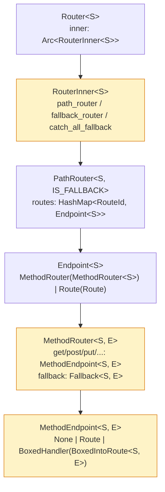
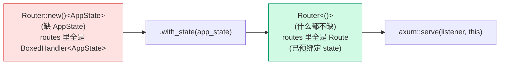

# 第 4 章 · State:用泛型把"缺状态"编码进类型

> **核心问题**:`Router<S>` 那个泛型参数 `S` 到底在编码什么?为什么 `Router::new()` 默认 `S = ()`、`with_state(state)` 之后才能交给 `axum::serve`?handler 的 `State<AppState>` 提取器又凭什么能从"看不见的地方"拿到你注入的状态?这一章拆 axum 最被人"会用却讲不清"的一套设计——用泛型把"还缺什么状态"编进 `Router` 的类型,把"状态怎么流到 handler"编进 `Handler::call` 的签名,把"每个提取器只声明它要的子状态"编进 `FromRef`。
>
> **读完本章你会明白**:
>
> 1. 为什么 `Router<S>` 的 `S` **不是 phantom**(不是 `PhantomData<S>` 那种纯标记),而是一个**真实贯穿路由树**的类型参数——`S` 沿 `RouterInner<S>` → `PathRouter<S>` → `Endpoint<S>` → `MethodRouter<S>` → `MethodEndpoint<S>` 一路向下,直到 `with_state` 把它"压平"成 `()`;
> 2. 为什么只有 `Router<()>` 实现 `tower::Service<Request>`,只有它能交给 `axum::serve`——以及"不这么设计会怎样"(运行时 panic 才发现忘注入 state,vs 编译期类型错直接拦住);
> 3. `State<T>` 提取器到底从哪里拿状态——**从 `Handler::call(req, state)` 那个 `state` 参数拿,不是从 request extensions 拿**(这点和 actix-web 的 `web::Data`、rocket 的 `State` 都不一样,核过源码,这是本章要修正的一个常见误解),以及为什么 `State<T>: FromRequestParts<S> where T: FromRef<S>` 的约束链让"子状态派生"成为可能;
> 4. `FromRef<T> for T where T: Clone` 的 blanket impl 凭什么让 `State<AppState>` 直接用整个 state、`State<DbPool>` 又能靠 `impl FromRef<AppState> for DbPool` 只取一片——每个 handler 只声明它要的子状态,互不耦合。
>
> 本章是全书"**提取与响应**"这一面的地基之一。State 提取器是提取器链里最特殊的一个(它压根不看 request,只看 state),但它和 `Router<S>` 的类型状态编码是一体两面——所以本章横跨"路由"和"提取"两面,但落点在提取侧。
>
> **写给谁读**:你写过 `Router::new().route("/", get(handler)).with_state(state);`,也写过 `async fn handler(State(state): State<AppState>)`,但你讲不清:为什么 `with_state` 之后 `Router` 的类型变了?为什么 handler 签名里写 `State<AppState>` 编译器就能"找到" state?`State` 和 `Extension` 都能共享状态,差在哪?这一章治这些"会用没懂"。
>
> **前置衔接**:上一章(P1-03)讲清了 `Router<()>` 自己就实现 `tower::Service<Request>`,`poll_ready` 无条件 Ready,`call` 内部调 `self.call_with_state(req, ())`。你当时一定有个疑问——`call_with_state` 的第二个参数 `()` 是什么?如果 handler 需要 `State<AppState>`,这个 `state` 怎么从 `Router::new()` 一路流到 handler 的参数里?这个问号,就是本章要拆的。
>
> **逃生阀**:如果 Rust 泛型 + 类型状态(type-state)这套让你犯晕,记住一句话就够——**`Router<S>` 是"还缺一份 S 才能干活"的 router,`with_state(s)` 把 S 喂进去,产出"什么都不缺"的 `Router<()>`,只有后者能上线**。带着这句话跳到第三节看 `with_state` 怎么把 S 压成 `()`,再回头读类型状态那段。

---

## 一句话点破

> **`Router<S>` 不是"`Router` 里装了个 S",而是"这份 router 还差一份 S 才能服务请求"。`with_state(state)` 把 state 喂进去、消耗掉 `self`,产出一个"什么都不差"的 `Router<()>`,编译器据此只给 `Router<()>` 实现 `Service<Request>`——所以你忘调 `with_state`,`axum::serve(listener, router)` 直接编译期报错,而不是上线后运行时 panic 才发现。State 是用类型把"未完成"编码出来,把 bug 挪到编译期。**

这是结论。本章倒过来拆三件事:① `Router<S>` 的 `S` 怎么"真实"地长在路由树里(不是 phantom);② `with_state` 怎么把 `S` 一路压成 `()`;③ `State<T>` 提取器怎么从 `Handler::call` 的 state 参数一路拿到值,以及 `FromRef` 怎么让"子状态派生"成立。

---

## 第一节:从上一章的 `call_with_state(_, ())` 说起

### 提问

上一章(P1-03)讲 `Router` 实现 `Service` 时,贴过这一段([`axum/src/routing/mod.rs#L569-L588`](../axum/axum/src/routing/mod.rs#L569-L588)):

```rust
impl<B> Service<Request<B>> for Router<()>
where
    B: HttpBody<Data = bytes::Bytes> + Send + 'static,
    B::Error: Into<axum_core::BoxError>,
{
    type Response = Response;
    type Error = Infallible;
    type Future = RouteFuture<Infallible>;

    #[inline]
    fn poll_ready(&mut self, _: &mut Context<'_>) -> Poll<Result<(), Self::Error>> {
        Poll::Ready(Ok(()))
    }

    #[inline]
    fn call(&mut self, req: Request<B>) -> Self::Future {
        let req = req.map(Body::new);
        self.call_with_state(req, ())
    }
}
```

注意最后一行:`self.call_with_state(req, ())`。这个 `()` 就是"state"。可如果 handler 写的是 `async fn handler(State(app): State<AppState>)`,它要的明明是 `AppState`,怎么这里传个 `()` 进去就够了?

这就是本章的入口。要回答它,得先看 `call_with_state` 的签名和 `Router<S>` 的定义。

### `Router<S>`:S 是"缺什么",不是"有什么"

[`axum/src/routing/mod.rs#L60-L70`](../axum/axum/src/routing/mod.rs#L60-L70) 把 `Router` 的定义钉得很直白:

```rust
/// The router type for composing handlers and services.
///
/// `Router<S>` means a router that is _missing_ a state of type `S` to be able
/// to handle requests. Thus, only `Router<()>` (i.e. without missing state) can
/// be passed to [`serve`]. See [`Router::with_state`] for more details.
#[must_use]
pub struct Router<S = ()> {
    inner: Arc<RouterInner<S>>,
}
```

文档注释自己写明了:`Router<S>` 表示"**这份 router 还缺(missing)一份类型为 S 的 state 才能处理请求**"。注意是 **missing**,不是 "holds"。`S = ()` 表示"什么都不缺"(`()` 是零大小单元类型,代表"没有 state"),所以 `Router<()>` 可以交给 `serve`。

`RouterInner<S>`([`axum/src/routing/mod.rs#L80-L85`](../axum/axum/src/routing/mod.rs#L80-L85))把 `S` 真实带在身上:

```rust
struct RouterInner<S> {
    path_router: PathRouter<S, false>,
    fallback_router: PathRouter<S, true>,
    default_fallback: bool,
    catch_all_fallback: Fallback<S>,
}
```

`S` 不是 `PhantomData<S>`(那种只起标记作用、不占内存的零大小幽灵数据)。它是**真实字段类型**——`path_router` 是 `PathRouter<S, false>`,`fallback_router` 是 `PathRouter<S, true>`,`catch_all_fallback` 是 `Fallback<S>`。`S` 沿着这三条线一路向下钻。

> **钉死这件事**:`Router<S>` 的 `S` 是**实字段**,不是 phantom。这是本章要修正的第一个常见误解——很多人凭"Rust 用 phantom 做类型状态"的印象,以为 `Router<S>` 里 `S` 只是编译期标记、运行时不存在。**错**。在 axum 里,`S` 是真的贯穿到每个 `MethodRouter`、每个 `MethodEndpoint`,直到 `with_state` 把它消费掉。下一节画清楚这条贯穿路径。

### `call_with_state`:state 是"显式第二参数"

[`axum/src/routing/mod.rs#L417-L432`](../axum/axum/src/routing/mod.rs#L417-L432):

```rust
pub(crate) fn call_with_state(&self, req: Request, state: S) -> RouteFuture<Infallible> {
    let (req, state) = match self.inner.path_router.call_with_state(req, state) {
        Ok(future) => return future,
        Err((req, state)) => (req, state),
    };

    let (req, state) = match self.inner.fallback_router.call_with_state(req, state) {
        Ok(future) => return future,
        Err((req, state)) => (req, state),
    };

    self.inner
        .catch_all_fallback
        .clone()
        .call_with_state(req, state)
}
```

注意两点:① `state: S` 是**按值传入**的第二个参数,不是藏在 request 里;② 当主路由 `path_router` 没匹配上(返回 `Err((req, state))`),`state` 被"退回来"传给 fallback 路由再试一次。这种"匹配失败就把 state 退回来"的写法,说明 state 是**和 request 平级的一等公民**,在 axum 内部是被显式传递的,不是塞在 request 的 extensions 里偷偷摸摸地拿。

回到最初的问号——`Router<()>` 的 `call` 里 `self.call_with_state(req, ())`,那个 `()` 是 state。对 `Router<()>` 来说,`S = ()`,所以传 `()` 就是"传了完整的 state(只是这个 state 是空的)"。那 handler 要的 `AppState` 是什么时候、怎么进去的?答案在 `with_state`——它在 `Router<()>` 出现**之前**就把 `AppState` 注入完了。

---

## 第二节:`Router<S>` 的 S 怎么"真实贯穿"路由树

### 提问

你说 `S` 是实字段,那它到底贯穿到哪一层?一层一层往下挖,把这条路径画出来。

### 从 Router 到 MethodEndpoint,S 一路向下



标黄的三层(`RouterInner` / `MethodRouter` / `MethodEndpoint`),`S` 都是真实字段类型。逐层核:

**第一层:`Router<S>` → `RouterInner<S>`**。`Router` 只是个 `Arc<RouterInner<S>>` 的包装([mod.rs:68-70](../axum/axum/src/routing/mod.rs#L68-L70)),`S` 全权委托给 `RouterInner`。

**第二层:`RouterInner<S>` → `PathRouter<S, false>` 和 `PathRouter<S, true>`**。`PathRouter` 的定义在 [`axum/src/routing/path_router.rs#L16-L21`](../axum/axum/src/routing/path_router.rs#L16-L21):

```rust
pub(super) struct PathRouter<S, const IS_FALLBACK: bool> {
    routes: HashMap<RouteId, Endpoint<S>>,
    node: Arc<Node>,
    prev_route_id: RouteId,
    v7_checks: bool,
}
```

`routes: HashMap<RouteId, Endpoint<S>>` —— 每条路由(`RouteId` 索引)都关联着一个 `Endpoint<S>`,而 `Endpoint<S>` 带 `S`。

**第三层:`Endpoint<S>` → `MethodRouter<S>`**。[`axum/src/routing/mod.rs#L751-L755`](../axum/axum/src/routing/mod.rs#L751-L755):

```rust
enum Endpoint<S> {
    MethodRouter(MethodRouter<S>),
    Route(Route),
}
```

`Endpoint::MethodRouter(MethodRouter<S>)` 这一支,把 `S` 又往下传一层。(`Endpoint::Route(Route)` 这一支 `S` 没用上——`Route` 是已经类型擦除的 Service,内部不持 S。这种"`Route` 分支不带 S"的设计后面会用到。)

**第四层:`MethodRouter<S, E>` → `MethodEndpoint<S, E>`**。`MethodRouter` 的字段结构在 [`axum/src/routing/method_routing.rs#L547-L559`](../axum/axum/src/routing/method_routing.rs#L547-L559):

```rust
pub struct MethodRouter<S = (), E = Infallible> {
    get: MethodEndpoint<S, E>,
    head: MethodEndpoint<S, E>,
    delete: MethodEndpoint<S, E>,
    options: MethodEndpoint<S, E>,
    patch: MethodEndpoint<S, E>,
    post: MethodEndpoint<S, E>,
    put: MethodEndpoint<S, E>,
    trace: MethodEndpoint<S, E>,
    connect: MethodEndpoint<S, E>,
    fallback: Fallback<S, E>,
    allow_header: AllowHeader,
}
```

注意 `MethodRouter` **不是用 HashMap 存 method→endpoint**,而是为每个 HTTP method(get/head/post/put/...)各开一个具名字段。这是出于性能(编译期固定字段,访问是直接偏移,不是哈希查找)。每个字段都是 `MethodEndpoint<S, E>`,S 一路向下。

**第五层:`MethodEndpoint<S, E>`** —— S 的"最后一站"。[`method_routing.rs#L1225-L1229`](../axum/axum/src/routing/method_routing.rs#L1225-L1229):

```rust
enum MethodEndpoint<S, E> {
    None,
    Route(Route<E>),
    BoxedHandler(BoxedIntoRoute<S, E>),
}
```

`MethodEndpoint::BoxedHandler(BoxedIntoRoute<S, E>)` 是关键——**handler 在还没注入 state 时,是以 `BoxedIntoRoute<S, E>` 的形式存在这里的**。`BoxedIntoRoute<S>` 内部包着一个 `Handler`(还带着 `S` 标记),等着 `state` 来才能"变成" `Route`(类型擦除的 Service)。

### S 不是 phantom 的硬证据

如果你还怀疑"S 是 phantom",看一个铁证:`MethodRouter<S>` 自己也实现了 `Handler<(), S>`([`method_routing.rs#L1309-L1319`](../axum/axum/src/routing/method_routing.rs#L1309-L1319)):

```rust
#[diagnostic::do_not_recommend]
impl<S> Handler<(), S> for MethodRouter<S>
where
    S: Clone + 'static,
{
    type Future = InfallibleRouteFuture;

    fn call(self, req: Request, state: S) -> Self::Future {
        InfallibleRouteFuture::new(self.call_with_state(req, state))
    }
}
```

一个 `MethodRouter<S>` 可以**当作一个 handler** 嵌进更外层的 `Router`!这是 axum 的 `Router::route` 能接 `MethodRouter` 又能 nest 的根。`Handler::call(self, req, state: S)` 这里 `state: S` 是按值消费的——如果 `S` 是 phantom,这一句根本写不出来(phantom 不能当函数参数)。这证明 `S` 是真实存在的、可传递的类型参数。

> **钉死这件事**:`Router<S>` 的 `S` 是实打实的类型参数,沿 `RouterInner → PathRouter → Endpoint → MethodRouter → MethodEndpoint → BoxedIntoRoute` 一路向下贯穿。它编码的不是"Router 持有一份 S 的值"(那是 `with_state` 之后的事),而是"路由树里**埋着对 S 的依赖**,等 state 来才能解锁"。这个"埋着依赖"的状态,就是 S 贯穿路由树的物理形态。

### 不这样会怎样:如果 S 是 phantom 会怎样

做个反面对比。假设 `Router<S>` 写成:

```rust
// 假想的 phantom 版本(非 axum 实际做法)
pub struct Router<S = ()> {
    inner: Arc<RouterInner>,   // 注意:RouterInner 不带 S
    _marker: PhantomData<S>,   // S 只是标记
}
```

代价立刻显现:

1. **handler 没地方挂"我需要什么 state"**。`MethodRouter` 如果不带 `S`,handler(它是 `Handler<T, S>`)的 `S` 就没地方放——你得给每个 handler 单独配一个 phantom,或者干脆把 state 类型擦掉。前者丑,后者丢类型安全。
2. **`with_state` 没法做"状态注入"**。phantom 不持有任何东西,你 `with_state(state)` 注入的 state 要塞哪?只能塞 request extensions(像 actix-web 那样)——可那样 handler 拿 state 就成了运行期 downcast,类型安全塌了。
3. **子状态派生(FromRef)做不了**。`State<DbPool> where DbPool: FromRef<AppState>` 这套,依赖"state 是一个具体的、有结构的值,可以从中投影出子状态"。phantom 没值,投影无从谈起。

axum 不这么干。它让 `S` 真实贯穿,代价是类型签名稍复杂(`Router<S>` 而不是 `Router`),换来的是:`with_state(state)` 能把一份真实的 state 值注入进路由树每个 handler,handler 的 `State<T>` 提取器能靠类型系统编译期拿到正确类型的 state,FromRef 能从大 state 投影出子 state。三件事,都建立在"S 是实字段"这个根上。

> **对照 actix-web 的 `web::Data`**:actix-web 的状态共享走 `web::Data<T>`——一个 `Arc<T>` 包装,塞进 request extensions,handler 用 `web::Data<AppState>` 提取器从 extensions 里 downcast 拿。这是"运行期类型擦除 + extensions 传递"的路子,没有 `Router<S>` 这种编译期类型状态。代价:① 你忘加 `App::app_data(...)` 编译期不报错,运行时 handler 拿不到 state 才 500(actix-web 是运行时 panic/500);② `Data<T>` 强制 `Arc` 包装(哪怕 state 是 `Copy` 的也得 Arc,浪费一次堆分配);③ 没有 FromRef 这种"从大 state 投影子 state"的机制,每个 handler 要么拿整个 `AppState`、要么手动 clone 子状态。axum 的 `Router<S>` + `State<T>` + `FromRef` 三件套,把这些都治了。

---

## 第三节:`with_state`——把 S 一路压成 ()

### 提问

`S` 贯穿路由树,那"注入 state"具体是怎么发生的?为什么 `with_state` 之后 `Router` 的类型从 `Router<S>` 变成 `Router<()>`(或其他)?

### `with_state` 的签名:消耗 self,产出新类型的 Router

[`axum/src/routing/mod.rs#L407-L415`](../axum/axum/src/routing/mod.rs#L407-L415):

```rust
pub fn with_state<S2>(self, state: S) -> Router<S2> {
    map_inner!(self, this => RouterInner {
        path_router: this.path_router.with_state(state.clone()),
        fallback_router: this.fallback_router.with_state(state.clone()),
        default_fallback: this.default_fallback,
        catch_all_fallback: this.catch_all_fallback.with_state(state),
    })
}
```

四件事一眼可见:

1. **`self` 按值消费**(`self`,不是 `&self`)。`with_state` 吃掉旧的 `Router<S>`,产出一个全新的 `Router<S2>`。旧的"还差 S"的 router 死了,新的 router 类型是 `S2`(由调用方决定,通常推导成 `()`)。
2. **`state: S` 按值传入**。注入的 state 就是 `S` 类型——和 router "缺"的那个类型对上了。这是类型安全的根:你不可能给 `Router<AppState>` 喂一个 `String`,编译器会拦。
3. **state 被 clone 三次**,分别喂给 `path_router`、`fallback_router`、`catch_all_fallback`(最后一次 move)。这要求 `S: Clone`(在 `impl<S> Router<S> where S: Clone + Send + Sync + 'static` 这个 impl 块里,见 [mod.rs:138-141](../axum/axum/src/routing/mod.rs#L138-L141))。
4. **返回类型 `Router<S2>`**。`S2` 是个新的泛型参数,由调用点推导。绝大多数场景你写 `.with_state(state)` 后不再链式调别的,`S2` 被推导成 `()`(因为 `Router<()>` 是"能 serve"的最终形态,后续不再有"缺 state"的需求)。

### state 怎么"压"进每条路由

`with_state` 不是只更新 `Router` 顶层——它把 state 一路压到每个 handler。看 `PathRouter::with_state`([`path_router.rs#L347-L368`](../axum/axum/src/routing/path_router.rs#L347-L368)):

```rust
pub(super) fn with_state<S2>(self, state: S) -> PathRouter<S2, IS_FALLBACK> {
    let routes = self
        .routes
        .into_iter()
        .map(|(id, endpoint)| {
            let endpoint: Endpoint<S2> = match endpoint {
                Endpoint::MethodRouter(method_router) => {
                    Endpoint::MethodRouter(method_router.with_state(state.clone()))
                }
                Endpoint::Route(route) => Endpoint::Route(route),
            };
            (id, endpoint)
        })
        .collect();

    PathRouter {
        routes,
        node: self.node,
        prev_route_id: self.prev_route_id,
        v7_checks: self.v7_checks,
    }
}
```

逐条路由遍历,对每个 `Endpoint`:

- **`Endpoint::MethodRouter(method_router)`**:调 `method_router.with_state(state.clone())`,把 state 喂进去。`MethodRouter` 内部再把 state 喂给它的每个 `MethodEndpoint`(见下)。
- **`Endpoint::Route(route)`**:**不动**。`Route` 是已经类型擦除的 Service(它内部是 `BoxCloneSyncService`,不持 S),`with_state` 对它没意义——这种 route 在 `with_state` 之前就已经是"完成态"了(比如 `Router::route_service` 注册的裸 Service,根本不需要 state)。

`MethodRouter::with_state`([`method_routing.rs#L773-L787`](../axum/axum/src/routing/method_routing.rs#L773-L787))把 state 喂给每个 method 分支:

```rust
pub fn with_state<S2>(self, state: S) -> MethodRouter<S2, E> {
    MethodRouter {
        get: self.get.with_state(&state),
        head: self.head.with_state(&state),
        delete: self.delete.with_state(&state),
        options: self.options.with_state(&state),
        patch: self.patch.with_state(&state),
        post: self.post.with_state(&state),
        put: self.put.with_state(&state),
        trace: self.trace.with_state(&state),
        connect: self.connect.with_state(&state),
        allow_header: self.allow_header,
        fallback: self.fallback.with_state(state),
    }
}
```

九个 method 字段各调 `with_state(&state)`(借用),fallback 用 `state`(move,最后一次)。最终落到 `MethodEndpoint::with_state`([`method_routing.rs#L1257-L1265`](../axum/axum/src/routing/method_routing.rs#L1257-L1265)):

```rust
fn with_state<S2>(self, state: &S) -> MethodEndpoint<S2, E> {
    match self {
        MethodEndpoint::None => MethodEndpoint::None,
        MethodEndpoint::Route(route) => MethodEndpoint::Route(route),
        MethodEndpoint::BoxedHandler(handler) => {
            MethodEndpoint::Route(handler.into_route(state.clone()))
        }
    }
}
```

**这是整个类型状态转换的核心动作**:

- `MethodEndpoint::None` → 还是 `None`(这个 method 没注册 handler,state 无关)。
- `MethodEndpoint::Route(route)` → 还是 `Route`(已经是擦除的 Service,不用动)。
- `MethodEndpoint::BoxedHandler(handler)` → **变成 `Route`**!

这一步 `handler.into_route(state.clone())` 是魔术时刻:`BoxedIntoRoute<S>` 内部持有一个 `Handler<T, S>`(还带着 S 标记,表示"缺 S 才能 call"),你给它一份 `state: S`,它调 `Handler::call(req, state)`——但这里 `into_route` 不是真的 call,而是**把 handler 和 state "预绑定"**,产出一个不再依赖 S 的 `Route`(类型擦除的 `BoxCloneSyncService`)。从此这个 endpoint 从"缺 S 的 BoxedHandler"变成"什么都不缺的 Route",`S2` 在返回类型里被换成新的(通常是 `()`)。

> **钉死这件事**:`with_state` 的本质,是把路由树里所有"缺 S 的 `BoxedHandler<S>`"批量"喂饱",变成"不缺任何东西的 `Route`"。喂完之后,整棵路由树里再也没有 `S` 的踪影——所有 `MethodEndpoint` 要么是 `None`、要么是 `Route`,没有 `BoxedHandler` 了。所以 `with_state` 之后 router 的类型参数可以安全地换成 `S2 = ()`(表示"什么都不缺")。这就是"压平"。

### 类型状态的流转:Router<AppState> → Router<()>

把整条流转画出来:



红框是"未完成态":`Router<AppState>`,路由树里每个 handler 还是 `BoxedHandler<AppState>`(缺一份 AppState 才能跑)。绿框是"完成态":`Router<()>`,路由树里每个 handler 已经预绑定了 state,变成不依赖 S 的 `Route`。`with_state` 是这两态之间的转换函数,**按值消费 self,产出新类型的 Router**。

只有绿框(`Router<()>`)能交给 `axum::serve`。为什么?因为 `serve` 要求传入的东西实现 `Service<Request>`(或者 `Service<IncomingStream>` 再产出 `Service`),而 `Router` 只在 `S = ()` 时才 impl `Service`(见 [mod.rs:569](../axum/axum/src/routing/mod.rs#L569))。`Router<AppState>` 不 impl `Service`,你拿它去 `serve`,编译器直接报"Router<AppState> doesn't implement Service"——编译期拦死。

> **承接《hyper》**:这里说的 `Service<Request>`,就是 hyper/Tower 那个 `tower_service::Service` trait(`call(&mut self, req) -> Future`,承《hyper》P1-02,一句带过)。axum 的 `Router<()>` 实现它,意味着 `Router` 可以无缝接到 hyper 的连接处理流程里——hyper accept 连接、跑 HTTP 协议机、解析出 `Request`,然后把 `Request` 交给 `Router::call`。这一层衔接在《hyper》里讲透了,本书 P1-02/P1-03 也复习过,本章不重复。

### 不这样会怎样:运行时检查 state

假设 axum 没有 `Router<S>` 这套类型状态,只有一个不带泛型的 `Router`。state 注入怎么做?要么:

1. **运行时检查**:`Router` 内部存 `Option<S>`,`with_state(state)` 把 `Some(state)` 塞进去。`serve` 时检查 `if self.state.is_none() { panic!("forgot with_state") }`。代价:忘调 `with_state` 不是编译错,是上线后第一个请求来才 panic(或者更糟,所有 handler 都拿不到 state 返回 500)。这正是 actix-web/rocket/go net/http 的通病——状态注入是运行期契约,靠人记得调。
2. **塞 request extensions**:`with_state(state)` 把 state `Arc` 包装后塞进一个全局 / 每个 request 的 extensions,handler 用 `Extension<AppState>` 提取器从 extensions downcast 拿。代价:① 强制 `Arc`(哪怕 state 是 `Copy` 的);② handler 拿 state 是运行期 downcast,类型错了运行时才知道;③ 没有"子状态派生"的编译期机制。这又是 actix-web `web::Data` 的路子。

axum 用类型状态,把"忘注入 state"这个 bug 从运行时挪到编译期。你写:

```rust
let app: Router<AppState> = Router::new().route("/", get(handler));
axum::serve(listener, app).await;  // ❌ 编译错!Router<AppState> 不 impl Service
```

编译器直接拒。你必须 `.with_state(state)` 把它变成 `Router<()>`(或显式标注 `let app: Router = ...`),才能编译通过。**bug 在你敲完代码的那一秒被发现,而不是上线后第一个用户触发**。这是 Rust 类型系统把"未完成状态"编码成类型的胜利——和 Tower 用 `Stack<Inner, Outer>` 把洋葱编进类型、hyper 用 `Infallible` 把"框架层不返回错误"编进类型,是同一种设计哲学。

### 一个常见的困惑:`Router::new()` 默认就是 `Router<()>`?

你看 `Router` 的定义 `pub struct Router<S = ()>`([mod.rs:68](../axum/axum/src/routing/mod.rs#L68))——`S` 默认是 `()`。所以 `Router::new()` 写出来,如果不加类型标注,`S` 被推导成 `()`(因为 `new` 的签名是 `pub fn new() -> Self`,`Self` 在没有外部标注时取默认参数 `()`)。

那为什么我写 `Router::new().route("/", get(handler))`,handler 是 `async fn handler(State(app): State<AppState>)`,编译器不报错?**因为 `get(handler)` 这一步,`MethodRouter<S>` 的 `S` 是从 handler 推导的**——`get` 的签名是 `pub fn get<H, T, S>(handler: H) -> MethodRouter<S, Infallible> where H: Handler<T, S>`([method_routing.rs:165-173](../axum/axum/src/routing/method_routing.rs#L165-L173))。`handler` 的类型让 `S` 被推导成 `AppState`,所以 `get(handler)` 是 `MethodRouter<AppState>`。然后 `Router::route(path, method_router)` 要求 `method_router: MethodRouter<S>`([mod.rs:178](../axum/axum/src/routing/mod.rs#L178)),`S` 又被约束成 `AppState`。最终 `Router::new()` 的 `S` 被推导成 `AppState`,而不是默认的 `()`。

所以实际写法是:

```rust
// 这里的 app 类型是 Router<AppState>(从 handler 推导出来)
let app = Router::new()
    .route("/", get(handler))   // handler: async fn(State<AppState>) -> ...
    .with_state(state);          // 消费 Router<AppState>,产出 Router<()>
axum::serve(listener, app).await; // Router<()> impl Service, ✅
```

`with_state(state)` 的 `state` 必须是 `AppState` 类型(因为 `Router::with_state<S2>(self, state: S)` 里 `self: Router<S>`,此时 `S = AppState`,所以 `state: AppState`)。类型对不上,编译错。这就是"state 注入的类型安全"——你不可能给一个缺 `AppState` 的 router 喂一份 `String`。

> **钉死这件事**:`Router<S>` 的 `S` 通常不是你显式写出来的,而是从 handler 签名**反向推导**出来的。`get(handler)` 的 `handler` 是 `Handler<T, S>`,`S` 从 handler 的参数(尤其 `State<X>` 参数)推导。整条 `Router::new().route(..., get(handler))` 链推导完,`S` 就是 handler 需要的那个 state 类型。然后 `.with_state(state)` 的 `state` 类型必须和这个 `S` 对上。这套"从 handler 反推 S"的机制,让你不用手写 `Router<AppState>` 这种冗长的类型标注,写起来像动态语言,类型安全却全在编译期。

---

## 第四节:`State<T>` 提取器——从 state 参数拿,不是从 extensions 拿

### 提问

state 被 `with_state` 注入、被 `call_with_state` 显式传递,那 handler 的 `State<T>` 提取器,到底从哪里把 state 取出来?

这一节核一个**最常见的误解**。很多人(包括一些 axum 教程的作者)以为 `State<T>` 是从 request 的 extensions 里拿 state(像 `Extension<T>` 那样)。**错**。核过源码,`State<T>` 压根不看 request,它只看 `FromRequestParts::from_request_parts(parts, state)` 的第二个参数 `state`。

### `State<T>` 的 FromRequestParts 实现

[`axum/src/extract/state.rs#L300-L317`](../axum/axum/src/extract/state.rs#L300-L317):

```rust
#[derive(Debug, Default, Clone, Copy)]
pub struct State<S>(pub S);

impl<OuterState, InnerState> FromRequestParts<OuterState> for State<InnerState>
where
    InnerState: FromRef<OuterState>,
    OuterState: Send + Sync,
{
    type Rejection = Infallible;

    async fn from_request_parts(
        _parts: &mut Parts,
        state: &OuterState,
    ) -> Result<Self, Self::Rejection> {
        let inner_state = InnerState::from_ref(state);
        Ok(Self(inner_state))
    }
}
```

逐句拆:

1. **`pub struct State<S>(pub S)`**:新类型包装(newtype),`pub S` 让你能在 handler 里 `State(app): State<AppState>` 模式匹配出 `app`。
2. **`impl<OuterState, InnerState> FromRequestParts<OuterState> for State<InnerState>`**:`OuterState` 是 router 的 state 类型(整份 state,如 `AppState`),`InnerState` 是这个提取器**要拿的那一片**(可能是整个 `AppState`,也可能是子状态 `DbPool`)。两者可以不同——这是 FromRef 子状态派生的关键。
3. **`where InnerState: FromRef<OuterState>`**:要拿 `InnerState`,得能从 `OuterState` 投影出 `InnerState`。这个 `FromRef` 就是子状态派生的 trait。
4. **`type Rejection = Infallible`**:`State` 提取器**永远不会失败**(只要 FromRef 能跑通,就能拿到值)。不像 `Path<T>` 可能 400(参数不匹配)、`Json<T>` 可能 415(Content-Type 错)。State 是注入的,注入了就一定有,所以 Infallible。
5. **`_parts: &mut Parts`**:参数名带下划线,表示**完全忽略 request parts**。`State` 提取器不读 request 任何东西——不看 path、不看 header、不看 body、不看 extensions。它只看 `state`。
6. **`state: &OuterState`**:这就是答案。`State<T>` 从 `from_request_parts` 的第二个参数 `state` 拿,而 `state` 是 `Handler::call(req, state)` 传进来的、`call_with_state(req, state)` 一路传下来的那份。**不是 extensions**。
7. **`InnerState::from_ref(state)`**:调 FromRef 的 `from_ref`,从 `&OuterState` 投影出 `InnerState`(通常是 clone)。这就是"拿 state"的实际动作。

> **钉死这件事(本章要修正的核心误解)**:`State<T>` 提取器**不从 request extensions 拿 state**,它从 `FromRequestParts::from_request_parts(parts, state)` 的 `state` 参数拿。这个 `state` 是 `Handler::call(self, req, state: S)` 的 `state`,由 `MethodRouter::call_with_state(req, state)` 一路传下来,源头是 `Router::call` 里的 `self.call_with_state(req, ())`(对 `Router<()>`)或 `with_state(state)` 注入的值(预绑定进 `Route`)。**State 提取器走的是"显式 state 通道",Extension 提取器走的是"request extensions 通道",两条完全不同的路径**。这点和 actix-web(`web::Data` 从 extensions)、rocket(`State` 从 request-local state)、go net/http(`context.WithValue` 全动态)都不同。

### state 是怎么从 Handler::call 流到提取器的

把这条流路画清楚,你就彻底明白了:

```mermaid
sequenceDiagram
    participant Hyper as hyper<br/>(协议层)
    participant Router as Router&lt;()&gt;<br/>impl Service
    participant PR as PathRouter<br/>.call_with_state
    participant MR as MethodRouter<br/>.call_with_state
    participant Route as Route<br/>(预绑定 state 的 Service)
    participant Handler as Handler::call<br/>(impl_handler! 展开)
    participant FRP as FromRequestParts<br/>提取器链
    participant StateExt as State&lt;T&gt;<br/>提取器
    participant H as handler fn

    Hyper->>Router: call(Request)
    Note over Router: Router&lt;()&gt;.call 调<br/>self.call_with_state(req, ())
    Router->>PR: call_with_state(req, ())
    PR->>PR: matchit 匹配路径<br/>拿到 RouteId → Endpoint
    PR->>MR: method_router.call_with_state(req, ())
    Note over MR: 按 method 选 endpoint<br/>BoxedHandler 已被 with_state<br/>预绑定成 Route
    MR->>Route: route.oneshot(req)<br/>(Route 内部持有预绑定的 state)
    Note over Route: Route 是类型擦除的 Service<br/>内部其实是 HandlerService<br/>带着 handler + state
    Route->>Handler: Handler::call(self, req, state)
    Note over Handler: impl_handler! 宏展开<br/>req.into_parts()<br/>逐个跑提取器链
    Handler->>FRP: from_request_parts(&mut parts, &state)
    FRP->>StateExt: State&lt;T&gt;::from_request_parts(parts, state)
    Note over StateExt: 忽略 parts<br/>调 T::from_ref(state)
    StateExt->>StateExt: 拿到 T (clone 出来)
    StateExt-->>FRP: Ok(State(t))
    FRP-->>Handler: State(t)
    Handler->>H: handler(state(t), ...).await
```

时序图里两个关键节点:

1. **`Route` 持有预绑定的 state**。`with_state` 时,`BoxedHandler::into_route(state)` 把 handler 和 state 预绑定,产出的 `Route` 内部其实是 `HandlerService { handler, state }`(见下节)。所以 `Route::oneshot(req)` 能调到 `Handler::call(self, req, state)`——state 是 Route 自己持有的,不是 request 带的。
2. **`Handler::call` 把 state 传给提取器链**。`impl_handler!` 宏展开后(详见 P3-09),`call` 的核心是:

   ```rust
   fn call(self, req: Request, state: S) -> Self::Future {
       let (mut parts, body) = req.into_parts();
       Box::pin(async move {
           // 逐个跑 FromRequestParts 提取器,state 作为第二参数透传
           let t1 = match T1::from_request_parts(&mut parts, &state).await { ... };
           let t2 = match T2::from_request_parts(&mut parts, &state).await { ... };
           // ... 最后一个 FromRequest(req, &state) 消费 body ...
           self(t1, t2, ...).await.into_response()
       })
   }
   ```

   ([`axum/src/handler/mod.rs#L238-L258`](../axum/axum/src/handler/mod.rs#L238-L258) 的 `impl_handler!` 宏体)。**`&state` 作为第二参数透传给每个 `from_request_parts`**——这就是 `State<T>` 提取器能拿到 state 的物理路径。

### State vs Extension:两条完全不同的路径

把 `State<T>` 和 `Extension<T>` 并排看,差别一眼到位:

| 维度 | `State<T>` | `Extension<T>` |
|------|-----------|----------------|
| **从哪拿** | `from_request_parts(parts, state)` 的 `state` 参数 | `parts.extensions.get::<T>()` |
| **路径** | 显式 state 通道(call_with_state 一路传) | request extensions 通道(`http::Extensions` HashMap) |
| **注入方式** | `Router::with_state(state)` 预绑定到 Route | `Router::layer(Extension(value))` 套一层 AddExtension middleware |
| **类型安全** | 编译期(`Router<S>` 类型状态 + FromRef) | 运行期 downcast(extensions 是 `HashMap<TypeId, Box<dyn Any>>`) |
| **失败行为** | `Infallible`(注入了就一定有) | 拿不到返回 500(`MissingExtension`) |
| **强制 Arc** | 否(state 直接 clone,可以是 `Copy`) | 否(但实践里常用 `Arc<T>`,因为 middleware 要 clone) |
| **子状态派生** | 有(`FromRef`) | 无(每个 Extension 是独立的) |
| **典型用途** | 全局应用状态(DbPool/Config) | 中间件塞的请求级数据(审计 ID、用户身份) |

`Extension<T>` 的提取器实现([`axum/src/extension.rs#L83-L98`](../axum/axum/src/extension.rs#L83-L98)):

```rust
impl<T, S> FromRequestParts<S> for Extension<T>
where
    T: Clone + Send + Sync + 'static,
    S: Send + Sync,
{
    type Rejection = ExtensionRejection;

    async fn from_request_parts(req: &mut Parts, _state: &S) -> Result<Self, Self::Rejection> {
        Ok(Self::from_extensions(&req.extensions).ok_or_else(|| {
            MissingExtension::from_err(format!(
                "Extension of type `{}` was not found. Perhaps you forgot to add it? See `axum::Extension`.",
                std::any::type_name::<T>()
            ))
        })?)
    }
}
```

**镜像对比**:`Extension<T>` 用 `req.extensions`,`_state: &S` 带下划线忽略;`State<T>` 用 `_parts`(`state.rs:311`),`state: &OuterState` 是核心。两者一个看 request、一个看 state,路径完全相反。

`Extension` 是怎么塞进 extensions 的?靠 `Extension<T>: Layer<S>` 实现([`extension.rs:140-152`](../axum/axum/src/extension.rs#L140-L152)),它把 `Extension<T>` 当一个 Tower Layer 用,产出的 `AddExtension<S, T>` middleware 在 `call` 时往 request 塞 extension([`extension.rs:169-187`](../axum/axum/src/extension.rs#L169-L187)):

```rust
impl<ResBody, S, T> Service<Request<ResBody>> for AddExtension<S, T>
where
    S: Service<Request<ResBody>>,
    T: Clone + Send + Sync + 'static,
{
    // ...
    fn call(&mut self, mut req: Request<ResBody>) -> Self::Future {
        req.extensions_mut().insert(self.value.clone());
        self.inner.call(req)
    }
}
```

`req.extensions_mut().insert(self.value.clone())` —— 每个请求经过这层 middleware,都被 clone 一份 `T` 塞进 extensions。handler 用 `Extension<T>` 提取器时,再从 extensions 里 downcast clone 出来。**一来一回,两次 clone,一次 HashMap 查找**。

`State<T>` 没这些开销:state 在 `with_state` 时预绑定一次,运行时只是把 `&state` 引用透传给提取器链,提取器调 `from_ref` 做一次 clone(如果 state 是 `Copy` 的,这次 clone 是零成本)。**没有 middleware 层、没有 extensions HashMap、没有 downcast**。

> **钉死这件事(选型建议)**:全局应用状态(DbPool/Config/客户端句柄)用 `State<T>`——编译期类型安全、零 middleware 开销、支持子状态派生。中间件塞的请求级数据(审计 ID、解析出的用户身份、trace span)用 `Extension<T>`——它是为"在请求处理中途往 request 里塞东西"设计的,和 Tower middleware 配合天然。两者不是替代关系,是分工。把全局状态塞 `Extension` 是误用(白白多一层 middleware + HashMap 查找 + 强制 Clone),把请求级数据塞 `State` 是错用(State 是"全局唯一、with_state 注入一次"的,没法在请求处理中途改)。

---

## 第五节:FromRef——从大 state 派生子状态

### 提问

实际项目里,你的 `AppState` 往往是个"大杂烩":数据库连接池、配置、HTTP 客户端、缓存……每个 handler 只用其中一两个。如果每个 handler 都得 `State<AppState>` 然后手动 `state.db.clone()`,既啰嗦又耦合(改 AppState 结构要改所有 handler)。axum 怎么解?

答案是 `FromRef`——让每个 handler 只声明它要的子状态,编译期从大 state 投影出来。

### FromRef trait 的定义

[`axum-core/src/extract/from_ref.rs#L14-L26`](../axum/axum-core/src/extract/from_ref.rs#L14-L26):

```rust
pub trait FromRef<T> {
    /// Converts to this type from a reference to the input type.
    fn from_ref(input: &T) -> Self;
}

impl<T> FromRef<T> for T
where
    T: Clone,
{
    fn from_ref(input: &T) -> Self {
        input.clone()
    }
}
```

就这么多。`FromRef<T>` 表示"我能从 `&T` 投影出 `Self`"。注意两点:

1. **`fn from_ref(input: &T) -> Self`**:输入是引用(`&T`),输出是 owned(`Self`)。这意味着投影通常伴随一次 clone(把子状态 clone 出来)。这是刻意的——提取器拿到的是 owned 值,handler 用着方便,不用持引用(避免生命周期纠缠)。
2. **blacket impl `impl<T> FromRef<T> for T where T: Clone`**:任何 `Clone` 的类型,都能从 `&Self` 投影出 `Self`(就是 clone 一下)。这个 blanket impl 是关键——它让 `State<T>` 在"整个 state 就是 T"的场景下**自动成立**,不用你手写 `impl FromRef<AppState> for AppState`。

回忆 `State<T>` 的约束:`State<InnerState> where InnerState: FromRef<OuterState>`(state.rs:303-305)。两种情况:

- **整个 state 就是 `InnerState`**(`OuterState == InnerState`):靠 blanket impl 自动满足。`State<AppState>` 配 `Router<AppState>`,直接能用。
- **`InnerState` 是 `OuterState` 的子状态**(`OuterState = AppState`,`InnerState = DbPool`):你要手写 `impl FromRef<AppState> for DbPool`,告诉 axum 怎么从 `&AppState` 投影出 `DbPool`(通常是 clone `AppState` 的某个字段)。

### 手写 FromRef:从 AppState 投影 DbPool

```rust
#[derive(Clone)]
struct AppState {
    db: DbPool,
    config: Config,
}

#[derive(Clone)]
struct DbPool { /* ... */ }

#[derive(Clone)]
struct Config { /* ... */ }

// 告诉 axum:从 &AppState 能投影出 DbPool
impl FromRef<AppState> for DbPool {
    fn from_ref(state: &AppState) -> Self {
        state.db.clone()
    }
}

// 同理
impl FromRef<AppState> for Config {
    fn from_ref(state: &AppState) -> Self {
        state.config.clone()
    }
}
```

有了这两个 impl,你就能写:

```rust
// 这个 handler 只用 DbPool,不关心 Config
async fn list_users(State(db): State<DbPool>) -> impl IntoResponse {
    let users = db.query(...).await;
    // ...
}

// 这个 handler 只用 Config
async fn get_config(State(config): State<Config>) -> Json<Config> {
    Json(config)
}

// 这个 handler 用整个 AppState
async fn health(State(state): State<AppState>) -> &'static str {
    // 也能访问 state.db / state.config
    "ok"
}

let app = Router::new()
    .route("/users", get(list_users))      // handler 要 DbPool
    .route("/config", get(get_config))     // handler 要 Config
    .route("/health", get(health))         // handler 要 AppState
    .with_state(AppState { db, config });  // 注入整个 AppState
```

`list_users` 的 handler 签名是 `State<DbPool>`,`get` 推导出 `MethodRouter<AppState>`(因为 `DbPool: FromRef<AppState>`,所以 `S = AppState`)。`health` 的签名是 `State<AppState>`,`S = AppState`(靠 blanket impl)。三个 handler 各取所需,但 `with_state` 只注入一份 `AppState`——`State<DbPool>` 提取器内部调 `DbPool::from_ref(&app_state)` 投影出 `DbPool`,`State<AppState>` 提取器调 `AppState::from_ref(&app_state)`(blacket impl,直接 clone)投影出整个 `AppState`。

> **钉死这件事**:`FromRef` 让"每个 handler 只声明它要的子状态"成立。整个 router 还是只有一个 state 类型(`Router<AppState>`),`with_state` 只注入一份 `AppState`。但每个 handler 的 `State<T>` 参数,T 可以是 `AppState`(拿全部)也可以是 `DbPool`(拿一片)——只要 `T: FromRef<AppState>`。这是"大 state 集中注入,小 state 分散提取"的解耦,handler 不需要知道 `AppState` 长什么样,只声明它要的子状态。改 `AppState` 结构,只影响 `impl FromRef` 那几行,不影响 handler 签名。

### `#[derive(FromRef)]`:自动生成投影 impl

手写 `impl FromRef<AppState> for DbPool` 很快就烦——`AppState` 有几个字段就要写几个 impl。axum 提供 `#[derive(FromRef)]` 宏自动生成。

[`axum-macros/src/from_ref.rs#L11-L27`](../axum/axum-macros/src/from_ref.rs#L11-L27) 是宏的入口:

```rust
pub(crate) fn expand(item: ItemStruct) -> syn::Result<TokenStream> {
    if !item.generics.params.is_empty() {
        return Err(syn::Error::new_spanned(
            item.generics,
            "`#[derive(FromRef)]` doesn't support generics",
        ));
    }

    let tokens = item
        .fields
        .iter()
        .enumerate()
        .map(|(idx, field)| expand_field(&item.ident, idx, field))
        .collect();

    Ok(tokens)
}
```

宏遍历结构体的每个字段,为每个字段生成一个 `impl FromRef<TheStruct> for FieldType`。`expand_field`([`from_ref.rs#L29-L64`](../axum/axum-macros/src/from_ref.rs#L29-L64)):

```rust
fn expand_field(state: &Ident, idx: usize, field: &Field) -> TokenStream {
    let FieldAttrs { skip } = match parse_attrs("from_ref", &field.attrs) { ... };

    if skip.is_some() {
        return TokenStream::default();
    }

    let field_ty = &field.ty;
    let span = field.ty.span();

    let body = if let Some(field_ident) = &field.ident {
        if matches!(field_ty, Type::Reference(_)) {
            quote_spanned! {span=> state.#field_ident }
        } else {
            quote_spanned! {span=> state.#field_ident.clone() }
        }
    } else {
        let idx = syn::Index { index: idx as _, span: field.span() };
        quote_spanned! {span=> state.#idx.clone() }
    };

    quote_spanned! {span=>
        #[allow(clippy::clone_on_copy, clippy::clone_on_ref_ptr)]
        impl ::axum::extract::FromRef<#state> for #field_ty {
            fn from_ref(state: &#state) -> Self {
                #body
            }
        }
    }
}
```

宏的展开逻辑:

- 命名字段(`db: DbPool`)生成 `impl FromRef<AppState> for DbPool { fn from_ref(state: &AppState) -> Self { state.db.clone() } }`。
- 元组字段(`DbPool`,无字段名)生成 `impl FromRef<AppState> for DbPool { fn from_ref(state: &AppState) -> Self { state.0.clone() } }`。
- 引用类型字段(`db: &DbPool`)生成 `state.db`(不 clone,直接返回引用——但 FromRef 返回 owned,这种用法少见)。
- `#[from_ref(skip)]` 标注的字段跳过(不生成 impl)。

所以你只需:

```rust
#[derive(Clone, FromRef)]
struct AppState {
    db: DbPool,
    config: Config,
}
```

宏自动生成 `impl FromRef<AppState> for DbPool` 和 `impl FromRef<AppState> for Config`。开箱即用。

注意一个限制:宏**不支持泛型结构体**([`from_ref.rs:12-17`](../axum/axum-macros/src/from_ref.rs#L12-L17) 直接报错)。如果你写 `#[derive(FromRef)] struct AppState<T> { ... }`,编译期报 "`#[derive(FromRef)]` doesn't support generics"。这是刻意的——泛型结构体的 FromRef 推导语义复杂(为哪些具体类型生成 impl?),axum 选择不支持,你要么去掉泛型,要么手写 impl。

### 为什么 sound:State 是 Clone 的、只读共享

讲到这里,你可能有个担忧:state 被 clone 这么多次(`with_state` 里 clone 三份、`from_ref` 里又 clone),会不会有问题?这是不是"假的共享"?

回答:**state 是 Clone 的、且设计成只读共享**。

1. **`S: Clone + Send + Sync + 'static`**(`Router<S>` 的 impl 块约束,mod.rs:138-141)。state 必须 Clone(能复制)、Send + Sync(能跨线程共享)。这是 state 能被多次 clone、被多个 worker task 共享的前提。
2. **clone 通常是廉价的**。实践里 `AppState` 几乎总是 `Arc<...>` 包装的——`Arc<DbPool>` 的 clone 只是引用计数加一(原子操作),不是真的复制连接池。所以 `with_state` clone 三份、`from_ref` clone 一份,加起来几次 `Arc::clone`,纳秒级开销。
3. **state 是只读的**。`from_ref` 返回 owned `Self`(通常是 `Arc<DbPool>` 的 clone),handler 拿到的是这个 Arc 的一个引用计数。多个并发请求各自拿到各自的 Arc clone,共享底层的 `DbPool`——`DbPool` 内部自己处理并发(连接池本身就是并发安全的)。**handler 不能 mutate 全局 state**(只能读),要 mutate 得用 `Arc<Mutex<_>>`/`Arc<RwLock<_>>` 显式加锁。这是刻意的——全局可变 state 是并发 bug 的温床,axum 通过"state 只读,要变加锁"把这件事逼到明处。

> **承接《Tokio》**:这里说的 `Arc<Mutex<_>>`、`Send + Sync`、原子引用计数,都是 Tokio/标准库的同步原语,承《Tokio》[[tokio-source-facts]](一句带过)。axum 不发明新的并发原语,它要求 state `Send + Sync + Clone`,剩下的并发安全交给 state 内部(`DbPool` 自己并发安全、`Arc<Mutex<T>>` 自己处理锁)。这是"框架不掺和业务并发"的边界。

---

## 第六节:Router<()> 才能交给 serve——把"未完成"挡在编译期

### 提问

为什么只有 `Router<()>` 实现 `Service`?`Router<AppState>` 不 impl Service,具体是怎么"挡住"的?

### 两个独立的 impl Service

看 axum 源码,`Router` 的 `Service` 实现分两块:

**第一块:`Router<()>` impl `Service<Request<B>>`**([`mod.rs:569-L588`](../axum/axum/src/routing/mod.rs#L569-L588),前面贴过):

```rust
impl<B> Service<Request<B>> for Router<()>
where
    B: HttpBody<Data = bytes::Bytes> + Send + 'static,
    B::Error: Into<axum_core::BoxError>,
{
    type Response = Response;
    type Error = Infallible;
    type Future = RouteFuture<Infallible>;
    // ...
    fn call(&mut self, req: Request<B>) -> Self::Future {
        let req = req.map(Body::new);
        self.call_with_state(req, ())
    }
}
```

注意 `for Router<()>`——只对 `S = ()` 实现。`call` 里 `self.call_with_state(req, ())`,传的 state 是 `()`。

**第二块:`Router<()>` impl `Service<IncomingStream>`(给 `axum::serve` 用)**([`mod.rs:544-L567`](../axum/axum/src/routing/mod.rs#L544-L567)):

```rust
#[cfg(all(feature = "tokio", any(feature = "http1", feature = "http2")))]
const _: () = {
    use crate::serve;

    impl<L> Service<serve::IncomingStream<'_, L>> for Router<()>
    where
        L: serve::Listener,
    {
        type Response = Self;
        type Error = Infallible;
        type Future = std::future::Ready<Result<Self::Response, Self::Error>>;

        fn poll_ready(&mut self, _cx: &mut Context<'_>) -> Poll<Result<(), Self::Error>> {
            Poll::Ready(Ok(()))
        }

        fn call(&mut self, _req: serve::IncomingStream<'_, L>) -> Self::Future {
            // call `Router::with_state` such that everything is turned into `Route` eagerly
            // rather than doing that per request
            std::future::ready(Ok(self.clone().with_state(())))
        }
    }
};
```

这也是 `for Router<()>`。`axum::serve(listener, router)` 要求 `router: Router<()>`(通过这个 `Service<IncomingStream>` impl),每来一个连接,`call` 返回一个 `Router<()>`(clone 一份,因为每个连接要独立的 `&mut self` Service),后续这个 `Router<()>` 再作为 `Service<Request>` 处理具体请求。

两个 impl 都只对 `Router<()>`。**`Router<AppState>` 既不 impl `Service<Request>`,也不 impl `Service<IncomingStream>`**。所以:

```rust
let app: Router<AppState> = Router::new().route("/", get(handler));
axum::serve(listener, app).await;
// ❌ 编译错:Router<AppState> 不 impl Service<IncomingStream>
// the trait `Service<IncomingStream<...>>` is not implemented for `Router<AppState>`
```

编译期拦死。你必须 `.with_state(state)` 把 `Router<AppState>` 变成 `Router<()>`:

```rust
let app: Router = Router::new()       // Router 隐式是 Router<()>(默认参数)
    .route("/", get(handler))
    .with_state(state);                // Router<AppState> → Router<()>
axum::serve(listener, app).await;     // ✅ Router<()> impl Service<IncomingStream>
```

### serve 内部还会再调一次 with_state(())

一个细节:`axum::serve` 内部(通过 `IntoMakeService`)会再调一次 `self.with_state(())`。看 `Router::into_make_service`([`mod.rs:528-L532`](../axum/axum/src/routing/mod.rs#L528-L532)):

```rust
pub fn into_make_service(self) -> IntoMakeService<Self> {
    // call `Router::with_state` such that everything is turned into `Route` eagerly
    // rather than doing that per request
    IntoMakeService::new(self.with_state(()))
}
```

注释说得很直白:调 `with_state(())` 是为了"**eagerly** 把所有 BoxedHandler 转成 Route,而不是每个请求来才转"。对 `Router<()>`,`with_state(())` 传的 state 是 `()`(因为 S 已经是 `()` 了),这次调用的目的不是"注入 state"(state 在你显式 `.with_state(state)` 时已经注入完),而是**把 `BoxedHandler<()>` 最终压成 `Route`**——这样运行时每个请求直接走 `Route::oneshot`,不用每请求都 `into_route` 一次。

> **钉死这件事**:`Router<()>` 能 serve,不是因为"()` 是合法的 state",而是因为 `Router<()>` 意味着"所有 handler 都已经被 with_state 预绑定、压成了不依赖 S 的 Route"。`S = ()` 是"完成态"的类型标记。`Router<AppState>` 不能 serve,不是因为"AppState 不合法",而是因为它意味着"还有 handler 是 BoxedHandler<AppState>,没被喂 state"——这种 router 跑请求会在 handler 调用时发现没 state 可拿,直接坏掉。类型系统把"未完成"编码成"不 impl Service",从根上挡住。

---

## 第七节:对照——actix-web / rocket / go net/http 怎么做 state

### 提问

"共享 state 给 handler"这件事,每个 Web 框架都要做。axum 用 `Router<S>` + `State<T>` + `FromRef`,别的框架怎么做?差别在哪?

把这张对照钉死,你才能理解 axum 这套设计的取舍。

### 四套对照

| 框架 | state 注入 | handler 提取 | 编译期类型安全 | 子状态派生 |
|------|-----------|-------------|--------------|-----------|
| **axum** | `Router::with_state(state)`(类型状态) | `State<T>` 提取器(从 state 参数) | ✅(`Router<S>` 类型状态 + FromRef) | ✅(`FromRef`) |
| **actix-web** | `App::app_data(Data::new(state))`(运行期) | `web::Data<T>` 提取器(从 extensions) | ❌(运行期 downcast) | ❌ |
| **rocket** | `Rocket::manage(state)`(运行期) | `State<T>` request guard(从 request-local) | ❌(运行期 downcast) | ❌ |
| **go net/http** | `context.WithValue(ctx, key, state)`(运行期) | `ctx.Value(key).(MyState)` 类型断言 | ❌(全动态) | ❌ |

四种框架,四种做法。关键差别:

**axum 是编译期类型状态**。`Router<S>` 的 `S` 把"缺什么 state"编进类型,`with_state` 是类型转换函数,`State<T>` 提取器从显式 state 通道拿。忘注入?编译错。类型错?编译错。FromRef 让子状态派生也是编译期的(`T: FromRef<S>` 约束)。

**actix-web 是运行期 extensions**。`App::app_data(Data::new(state))` 把 `Data<Arc<AppState>>` 塞进一个运行期的"app data"注册表(本质是 `HashMap<TypeId, Box<dyn Any>>`)。handler 的 `web::Data<AppState>` 提取器从 request extensions(每请求都 clone 一份 app data 进去)downcast 拿。忘 `app_data`?handler 拿不到,运行时返回 500(`MissingExtension` 风格的错误)。类型错?运行时 downcast 失败,500。

**rocket 是 request-local state**。`Rocket::manage(state)` 把 state 注册到 rocket 的"managed state"池。handler 的 `State<T>` request guard 从 request-local state(类似 thread-local 但 per-request)拿。同样是运行期类型擦除 + downcast。

**go net/http 是 context.WithValue**。`context.WithValue(ctx, key, state)` 把 state 塞进 context(一个 `map[any]any` 风格的链表)。handler 里 `ctx.Value(key).(MyState)` 做类型断言拿。完全动态,无类型安全,key 拼错、类型断言失败都是运行时错。

### 反面对比:运行期 downcast 的代价

看一段 actix-web 的典型写法,感受运行期 downcast 的代价:

```rust
use actix_web::{web, App, HttpServer, HttpResponse};

#[derive(Clone)]
struct AppState {
    db: DbPool,
}

async fn handler(state: web::Data<AppState>) -> HttpResponse {
    // state.db 可用,因为 app_data 注册了 AppState
    // 但如果忘了 app_data,这里运行时拿不到 state(500)
    let _db = &state.db;
    HttpResponse::Ok().finish()
}

#[actix_web::main]
async fn main() -> std::io::Result<()> {
    HttpServer::new(|| {
        App::new()
            .app_data(web::Data::new(AppState { db: make_db() }))  // 运行期注册
            .route("/", web::get().to(handler))
    })
    .bind("127.0.0.1:8080")?
    .run()
    .await
}
```

对照 axum:

```rust
use axum::{Router, routing::get, extract::State};

#[derive(Clone)]
struct AppState {
    db: DbPool,
}

async fn handler(State(state): State<AppState>) -> impl IntoResponse {
    let _db = &state.db;
    // state 一定有,因为 Router<AppState> 类型状态保证了
}

#[tokio::main]
async fn main() {
    let app = Router::new()
        .route("/", get(handler))
        .with_state(AppState { db: make_db() });  // 编译期注入
    // axum::serve(...)
}
```

两个肉眼可见的差别:

1. **忘注入的时机**:actix-web 忘 `app_data`,编译过,上线后第一个请求 500。axum 忘 `with_state`,`axum::serve(listener, app)` 编译错——bug 在敲完代码那一秒被发现。
2. **类型安全的强度**:actix-web 的 `web::Data<T>` 内部是 `Arc<T>`,从 extensions downcast,类型错了运行时才知道。axum 的 `State<T>` 从 `state: &S` 参数拿,`T: FromRef<S>` 是编译期约束,类型错了编译期报。

代价对等:axum 的 `Router<S>` 让类型签名稍复杂(`Router<AppState>` 而不是 `Router`),`with_state` 是显式的一步(不是注册到某个池)。换来的是编译期类型安全 + 零运行期 downcast 开销。这是 Rust 类型系统的胜利——把"未完成状态"和"子状态投影"都编进类型,运行时一分钱不花。

### go net/http:全动态的极端

go 的 `context.WithValue` 是"全动态"的极端:

```go
type AppState struct {
    DB *sql.DB
}

func handler(w http.ResponseWriter, r *http.Request) {
    // 从 context 拿 state,全动态,无类型安全
    state, ok := r.Context().Value("appState").(*AppState)
    if !ok {
        http.Error(w, "state missing", http.StatusInternalServerError)
        return
    }
    _ = state.DB
}

func main() {
    appState := &AppState{DB: makeDB()}
    handler := func(w http.ResponseWriter, r *http.Request) {
        // 把 state 塞进 context
        ctx := context.WithValue(r.Context(), "appState", appState)
        handler(w, r.WithContext(ctx))
    }
    http.HandleFunc("/", handler)
    http.ListenAndServe(":8080", nil)
}
```

key 拼错(`"appState"` vs `"app_state"`)、类型断言失败(`.(*AppState)` 写成 `.(*Config)`)、context 嵌套过深——全是运行时错。go 的哲学是"简单 + 动态",state 共享靠 context,类型安全靠人记得对。axum 是 Rust 哲学:"类型系统把能编进类型的都编进去,运行时只处理真正动态的东西"。两种风格各有适用场景(go 适合快速搭原型,Rust/axum 适合要长期维护的大型服务),但在"state 共享的类型安全"这一项上,axum 完胜。

---

## 技巧精解

这一节挑本章两个最硬核的技巧,配真实源码 + 反面对比,单独拆透。

### 技巧一:`Router<S>` 类型状态——用泛型把"缺状态"编进类型

**它解决什么问题**:怎么保证"router 没注入 state 就不能上线"这件事,在编译期就被发现,而不是运行时 panic?

**核心技巧**:`Router<S>` 的 `S` 是实字段(贯穿路由树),`with_state(state)` 是类型转换函数(`Router<S> → Router<S2>`),只有 `Router<()>` impl `Service`。这套"用泛型参数编码未完成状态"的手法,在 Rust 里叫 **type-state pattern**(类型状态模式)——把"对象处于哪个状态"编进类型,不同状态有不同的方法(这里是"不同状态有不同的 impl Service")。

**逐层拆**:

第一层,`S` 是实字段不是 phantom。证据是 `RouterInner<S>` 持 `PathRouter<S>`、`MethodRouter<S>` 持 `MethodEndpoint<S, E>`、`MethodEndpoint::BoxedHandler(BoxedIntoRoute<S, E>)`——S 真实贯穿。`MethodRouter<S>` 自己 impl `Handler<(), S>`([method_routing.rs:1309-1319](../axum/axum/src/routing/method_routing.rs#L1309-L1319))的 `fn call(self, req, state: S)` 更是铁证——`state: S` 是按值消费的参数,phantom 写不出这个签名。

第二层,`with_state` 是按值转换。看签名 `pub fn with_state<S2>(self, state: S) -> Router<S2>`(mod.rs:408):

- `self: Router<S>`(按值,消费旧 router)。
- `state: S`(按值,注入的 state,类型必须和 router 缺的对上)。
- `-> Router<S2>`(产出新类型,S2 通常推导成 `()`)。

这签名把"注入 state"变成一次类型转换:输入"缺 S 的 Router",输出"缺 S2 的 Router"。S2 由调用方决定,绝大多数场景你写 `.with_state(state)` 后不再链式调,`S2` 推导成 `()`。你也可以显式控制——比如 `.with_state(state)` 之后还想要个 `Router<AppState>`?理论可以(让 S2 = AppState),但没意义,因为新 router 的路由树里已经没有 `BoxedHandler` 了(都被压成 Route),`S2` 这个标记是空的。

第三层,只有 `Router<()>` impl Service。两个 impl(mod.rs:569 的 `Service<Request<B>>`,mod.rs:544 的 `Service<IncomingStream>`)都 `for Router<()>`。这是 type-state 的"收口"——`S = ()` 是完成态的标记,只有完成态能 serve。

**反面对比一:运行时检查 state**。假设 axum 没有 `Router<S>`,只有一个不带泛型的 `Router`,内部 `Option<S>`:

```rust
// 假想的运行期检查版本(非 axum 实际做法)
pub struct Router {
    inner: Arc<RouterInner>,
    state: Option<Box<dyn Any + Send + Sync>>,  // 运行期类型擦除
}

impl Router {
    pub fn with_state(mut self, state: impl Any + Send + Sync) -> Self {
        self.state = Some(Box::new(state));
        self
    }
}

impl Service<Request> for Router {
    fn call(&mut self, req: Request) -> Self::Future {
        let state = self.state.as_ref().expect("forgot with_state!");  // 运行时 panic
        // ... 还要 downcast ...
    }
}
```

代价:

1. 忘 `with_state` → 运行时 `expect` panic,生产事故。
2. state 类型擦除 → handler 拿 state 要 downcast,类型错运行时才知道。
3. `Box<dyn Any>` → 堆分配 + 虚分派,state 的类型信息全丢。

axum 的 type-state 把这三件全治了:忘 `with_state` 编译错、state 类型编译期保证、零运行期类型擦除开销。

**反面对比二:actix-web 的运行期 app_data**。actix-web 走"运行期注册表"路线:`App::app_data(Data::new(state))` 把 state 塞进运行期 HashMap,handler 用 `web::Data<T>` 从 extensions downcast 拿。忘 `app_data` 编译过、运行时 500。类型错运行时 downcast 失败。没有 FromRef 子状态派生——每个 handler 要么拿整个 state、要么手动 clone 子字段。这是"运行期灵活 vs 编译期安全"的取舍,actix-web 选了前者,axum 选了后者。

**为什么不这么写会出问题**:不用 type-state,你只能靠运行时检查(panic 或 500)或文档约定("别忘了调 with_state")。两者都是"靠人记得",大型项目里人记得住是例外,记不住是常态。type-state 把约定编进类型,编译器替你记得——这是 Rust 给 axum 的最大礼物之一。

> **钉死这件事**:`Router<S>` 是 type-state pattern 在 Web 框架里的经典应用。它把"router 是否完成了 state 注入"这件运行期事实,提升为编译期类型事实。`S != ()` 表示"未完成"(还缺 state),`S = ()` 表示"完成"(可以 serve)。只有完成态 impl Service,未完成态不 impl——编译器据此在 `axum::serve(listener, unfinished_router)` 那一行就把 bug 拦下。这是 axum 区别于 actix-web/rocket/go 的根本设计点之一,也是"Rust 类型系统怎么帮 Web 框架治 bug"的教科书案例。

### 技巧二:FromRef 子状态派生——让每个提取器只声明它要的子状态

**它解决什么问题**:大 state(AppState 有 db/config/client/...)集中注入,但每个 handler 只用一两个子状态。怎么让 handler 只声明它要的那片,而不是扛着整个 AppState?

**核心技巧**:`FromRef<T>` trait(`fn from_ref(&T) -> Self`)+ blanket impl(`impl<T> FromRef<T> for T where T: Clone`)+ `State<InnerState> where InnerState: FromRef<OuterState>` 的约束链。三者合力,让"整个 state"和"子状态投影"用同一套 `State<T>` 提取器语法,编译期决定怎么投影。

**逐层拆**:

第一层,`FromRef<T>` 的签名。[`from_ref.rs:14-17`](../axum/axum-core/src/extract/from_ref.rs#L14-L17):

```rust
pub trait FromRef<T> {
    fn from_ref(input: &T) -> Self;
}
```

"从 `&T` 投影出 `Self`"。输入引用(不消费原值),输出 owned(投影通常伴随 clone)。这个 trait 在 `axum-core`(不是 `axum`),注释 [`from_ref.rs:12-13`](../axum/axum-core/src/extract/from_ref.rs#L12-L13) 解释了为什么:

```rust
// NOTE: This trait is defined in axum-core, even though it is mainly used with `State` which is
// defined in axum. That allows crate authors to use it when implementing extractors.
```

——为了让**第三方库作者**写自己的提取器时能用 FromRef(不依赖整个 axum,只依赖 axum-core)。比如某个鉴权库写 `AuthService` 提取器,可以约束 `AuthService: FromRef<S>`,让用户的 `AppState` 提供 `AuthService` 子状态——库不绑死 axum 的 `State`,用户也不必把整个 axum 拉进依赖。

第二层,blacket impl。[`from_ref.rs:19-26`](../axum/axum-core/src/extract/from_ref.rs#L19-L26):

```rust
impl<T> FromRef<T> for T
where
    T: Clone,
{
    fn from_ref(input: &T) -> Self {
        input.clone()
    }
}
```

任何 Clone 的类型,从 `&Self` 投影出 `Self`(就是 clone)。这个 blanket impl 让 `State<T>` 在"整个 state 就是 T"的场景自动成立——`State<AppState>` 配 `Router<AppState>`,不用你写 `impl FromRef<AppState> for AppState`,blanket impl 替你写了。

第三层,`State<T>` 的约束链。回看 [`state.rs:303-316`](../axum/axum/src/extract/state.rs#L303-L316):

```rust
impl<OuterState, InnerState> FromRequestParts<OuterState> for State<InnerState>
where
    InnerState: FromRef<OuterState>,
    OuterState: Send + Sync,
{
    type Rejection = Infallible;

    async fn from_request_parts(
        _parts: &mut Parts,
        state: &OuterState,
    ) -> Result<Self, Self::Rejection> {
        let inner_state = InnerState::from_ref(state);
        Ok(Self(inner_state))
    }
}
```

`State<InnerState>` 实现了 `FromRequestParts<OuterState>`(注意是 OuterState,不是 InnerState!),条件是 `InnerState: FromRef<OuterState>`。这意味着:

- handler 写 `State<DbPool>`,`InnerState = DbPool`。
- router 是 `Router<AppState>`,`OuterState = AppState`。
- 约束变成 `DbPool: FromRef<AppState>`——你要么手写这个 impl,要么用 `#[derive(FromRef)]` 让宏生成。
- 满足约束后,提取器调 `DbPool::from_ref(&app_state)`,从大 state 投影出 DbPool。

**这套约束链让"每个 handler 只声明它要的子状态"成立**——handler 不关心 OuterState 是什么(可能是 AppState、可能是 MyCustomState),它只声明"我要 DbPool,你(state)自己想办法从某个 OuterState 投影出来"。这种"提取器声明需求,state 提供投影"的解耦,是 axum 子状态派生的精髓。

**反面对比一:每个提取器要整个 AppState**。假设没有 FromRef,每个 handler 都得 `State<AppState>` 然后手动 `state.db.clone()`:

```rust
// 假想的无 FromRef 版本(非 axum 实际做法)
async fn list_users(State(state): State<AppState>) -> impl IntoResponse {
    let db = state.db.clone();   // 手动 clone,啰嗦
    let users = db.query(...).await;
    // ...
}

async fn get_config(State(state): State<AppState>) -> Json<Config> {
    Json(state.config.clone())   // 手动 clone,而且暴露了 AppState 内部结构
}
```

两个问题:

1. **啰嗦**:每个 handler 都要 `state.xxx.clone()` 一次。
2. **耦合**:`get_config` 这个 handler 只用 config,但它的签名是 `State<AppState>`——它知道 AppState 里有 config 字段。改 AppState 结构(比如把 config 改名 settings),所有 handler 都要改。

有了 FromRef:

```rust
async fn list_users(State(db): State<DbPool>) -> impl IntoResponse {
    // db 直接就是 DbPool,不用 clone(FromRef 内部 clone 了)
    let users = db.query(...).await;
    // ...
}

async fn get_config(State(config): State<Config>) -> Json<Config> {
    Json(config)   // config 直接就是 Config
}
```

handler 签名只声明它要的子状态,不知道 AppState 长什么样。改 AppState 结构,只影响 `impl FromRef<AppState> for Config` 那一行(或 `#[derive(FromRef)]` 的展开结果),handler 不动。**解耦达成**。

**反面对比二:actix-web 没有子状态派生**。actix-web 的 `web::Data<T>` 必须是完整注册的 state——你注册 `web::Data(AppState { ... })`,handler 拿 `web::Data<AppState>`,然后手动 `state.db.clone()`。想拿子状态?要么再注册一个 `web::Data(DbPool)`(多个独立 Data,不派生)、要么 handler 手动 clone。没有 FromRef 这种"从大 state 投影子 state"的编译期机制。这是 axum 在 state 共享上的一个明确设计优势。

**为什么不这么写会出问题**:不用 FromRef,handler 要么扛整个 AppState(耦合)、要么每个子状态独立注册(啰嗦且分散)。FromRef 让"集中注入 + 分散提取"成立——`with_state` 只注入一份大 state,每个 handler 只拿它要的子状态,编译期保证投影合法。这是 axum 把 Rust 类型系统用在 Web 框架 state 共享上的另一个胜利。

**为什么 sound**:FromRef 的 sound 性依赖两件事:① state 是 `Clone` 的(`from_ref` 通常 clone,投影出的 owned 值是独立的);② state 设计成只读共享(多个并发请求各自 FromRef 投影、各自持有 clone,底层 Arc 共享)。这两点保证"投影出多个子状态 clone"不会引发数据竞争——clone 是独立的,底层共享的数据结构(DbPool 等)自己处理并发。如果 state 内部有 `Rc` / `RefCell`(非 Send + Sync),`Router<S>` 的 `S: Clone + Send + Sync + 'static` 约束会编译期拒绝——sound 性由类型系统兜底。

> **钉死这件事**:FromRef 是 axum state 共享的"解耦层"。它让"大 state 集中注入,小 state 分散提取"成立——`with_state` 注入一份 `AppState`,每个 handler 的 `State<T>` 只声明它要的子状态 T,FromRef 编译期保证"能从 AppState 投影出 T"。这套机制依赖三个 Rust 手段:trait(`FromRef<T>`)、blacket impl(`impl<T> FromRef<T> for T where T: Clone`)、约束链(`State<InnerState> where InnerState: FromRef<OuterState>`)。三者合力,让"子状态派生"既类型安全又零运行期开销(`from_ref` 是普通函数调用,单态化后内联成直接字段访问 + clone)。这是 axum 区别于 actix-web/rocket 的另一个根本设计点。

---

## 章末小结

回到全书的主轴:**路由与分发 vs 提取与响应**。

本章横跨两面,但落点在提取侧:

- **路由这一面**:`Router<S>` 的 `S` 是实字段,贯穿 `RouterInner → PathRouter → Endpoint → MethodRouter → MethodEndpoint`。`with_state(state)` 是类型转换函数,把"缺 S 的 Router<S>"压成"什么都不缺的 Router<()>"。只有 `Router<()>` impl `Service`,这是 type-state 把"未完成"挡在编译期的根。这部分服务"路由树怎么组织和激活"。
- **提取这一面**:`State<T>` 是最特殊的提取器——它不看 request(参数 `_parts`),只看 `from_request_parts(parts, state)` 的 `state` 参数。这个 `state` 由 `Handler::call(self, req, state)` 透传,源头是 `call_with_state(req, state)` 一路传下来。`State<T>` 的约束 `T: FromRef<S>` 让子状态派生成立——每个 handler 只声明它要的子状态,FromRef 编译期保证投影合法。

`Router<S>` 类型状态 + `State<T>` 提取器 + `FromRef` 子状态派生,三者构成 axum state 共享的完整设计。这套设计把"忘注入 state"、"state 类型错"、"子状态耦合"三个 bug 全部挪到编译期,运行时一分钱不花(没有 extensions HashMap、没有 downcast、没有 middleware 层)。

### 五个为什么清单

1. **为什么 `Router<S>` 的 `S` 是实字段不是 phantom?** 因为 `S` 要真实贯穿路由树(`RouterInner<S>` → `PathRouter<S>` → `MethodRouter<S>` → `MethodEndpoint<S>`),让 `with_state(state)` 能把 state 注入到每个 handler。phantom 不持值,做不到。证据是 `MethodRouter<S>` impl `Handler<(), S>` 的 `fn call(self, req, state: S)`——phantom 写不出按值消费的 state 参数。
2. **为什么只有 `Router<()>` 能交给 `axum::serve`?** 因为只有 `Router<()>` impl `Service<Request>` 和 `Service<IncomingStream>`(两个 impl 都 `for Router<()>`)。`S = ()` 是"所有 handler 已被 with_state 预绑定、压成不依赖 S 的 Route"的完成态标记。`Router<AppState>` 不 impl Service,你拿它去 serve 编译错——bug 编译期被发现,不是运行时 panic。
3. **为什么 `State<T>` 提取器从 state 参数拿,不从 extensions 拿?** 核过源码(state.rs:303-316),`State<T>::from_request_parts(_parts, state)` 完全忽略 `_parts`,只调 `T::from_ref(state)`。state 是 `Handler::call(self, req, state)` 的显式第二参数,由 `call_with_state` 一路传下来。这是"显式 state 通道",和 `Extension<T>` 的"extensions 通道"完全不同。前者编译期类型安全,后者运行期 downcast。
4. **为什么 `with_state` 要消耗 self?** 因为 `with_state` 是类型转换(`Router<S> → Router<S2>`),产出的新 router 类型不同。按值消费 self 让旧的"缺 S"router 死掉,新的 router 接管。这是 type-state 的标准写法——状态转换伴随所有权转移,旧状态不可再访问。
5. **为什么 FromRef 让子状态派生成立?** 因为 `State<InnerState> where InnerState: FromRef<OuterState>` 的约束链,让 handler 只声明它要的 InnerState(如 DbPool),编译期检查 DbPool 能从 OuterState(如 AppState)投影。`FromRef<T> for T where T: Clone` 的 blanket impl 让"整个 state 就是 T"自动满足,手写 impl 或 `#[derive(FromRef)]` 处理"子状态投影"。每个 handler 解耦,只声明它要的子状态。

### 想继续深入往哪钻

- **`Handler::call(self, req, state)` 怎么用 `impl_handler!` 宏展开成提取器链**:→ 第 9 章(P3-09),★★双招牌章,把 Handler trait 的 T 参数(coherence 占位 tuple)和宏展开彻底拆透。
- **`FromRequestParts` vs `FromRequest` 的二元划分**:→ 第 10 章(P3-10),★招牌章,讲清为什么 `State<T>` 是 `FromRequestParts`(只读 parts,可多次跑),而 `Json<T>` 是 `FromRequest`(消费 body,只能一次)。
- **`Extension<T>` vs `State<T>` 的完整对比 + 中间件怎么塞 Extension**:→ 第 14 章(P4-14)from_fn 招招牌 + 第 16 章(P4-16)中间件链,讲 Tower Layer 怎么和 Extension 配合。
- **`Route` 内部的 `BoxCloneSyncService` 类型擦除**:→ 第 3 章(P1-03)已讲,Route 是 Tower 类型擦除的 Service,承《Tower》P6-17 BoxCloneSyncService。
- **actix-web `web::Data` / rocket `State` / go `context.WithValue` 的完整对照**:→ 第 21 章(P7-21)全书收束,多框架对照。
- **`#[derive(FromRef)]` 宏的展开细节**:本章已拆基础([`axum-macros/src/from_ref.rs`](../axum/axum-macros/src/from_ref.rs)),过程宏的更多细节(属性解析、`skip` 标注)在 [`axum-macros/src/attr_parsing.rs`](../axum/axum-macros/src/attr_parsing.rs)。

### 引出下一章

本章你拿到了 axum state 共享的完整设计:`Router<S>` 类型状态 + `State<T>` 提取器 + `FromRef` 子状态派生。但 `Router<S>` 还有个我们刻意没深挖的细节——`Router::call` 内部调 `self.call_with_state(req, ())`,这个 `call_with_state` 怎么把请求按 URL 路由到正确的 handler?matchit 字典树是怎么匹配的?`RouteId` 怎么索引 `Vec<Endpoint>`?这些问题,从下一章(P2-05)开始的整个第 2 篇会拆透——那是"路由与分发"这一面的招牌。先把 state 这块(提取侧的地基)钉死,我们再回到路由侧,看 axum 怎么用一个字典树 + 一个 method 分发器,把海量 URL+method 组合路由到正确的 handler。

---

> **本章源码锚点(全部经本地 `../axum/` Grep/Read 核实,commit `axum-v0.8.9` / `c59208c`)**:
>
> - [Router&lt;S&gt; 定义 + 文档(missing state 语义)](../axum/axum/src/routing/mod.rs#L60-L70) —— `pub struct Router<S = ()> { inner: Arc<RouterInner<S>> }`。
> - [RouterInner&lt;S&gt; 字段](../axum/axum/src/routing/mod.rs#L80-L85) —— `path_router / fallback_router / catch_all_fallback` 都带 S。
> - [Router::with_state 签名与实现](../axum/axum/src/routing/mod.rs#L407-L415) —— `fn with_state<S2>(self, state: S) -> Router<S2>`。
> - [Router::call_with_state](../axum/axum/src/routing/mod.rs#L417-L432) —— state 是显式第二参数,匹配失败退回。
> - [Router&lt;()&gt; impl Service&lt;Request&gt;](../axum/axum/src/routing/mod.rs#L569-L588) —— 只有 `Router<()>` impl,`call` 调 `call_with_state(req, ())`。
> - [Router&lt;()&gt; impl Service&lt;IncomingStream&gt;(给 serve 用)](../axum/axum/src/routing/mod.rs#L544-L567) —— `call` 调 `self.clone().with_state(())`。
> - [Router::into_make_service 调 with_state(()))(eagerly 压 Route)](../axum/axum/src/routing/mod.rs#L528-L532)。
> - [PathRouter&lt;S, IS_FALLBACK&gt; 字段](../axum/axum/src/routing/path_router.rs#L16-L21) —— `routes: HashMap<RouteId, Endpoint<S>>`。
> - [PathRouter::with_state](../axum/axum/src/routing/path_router.rs#L347-L368) —— 遍历每个 endpoint 注入 state。
> - [PathRouter::call_with_state](../axum/axum/src/routing/path_router.rs#L371-L420) —— matchit 匹配后调 method_router.call_with_state。
> - [MethodRouter&lt;S, E&gt; 字段(九个 method 分支)](../axum/axum/src/routing/method_routing.rs#L547-L559) —— 不是 HashMap,是具名字段。
> - [MethodRouter::with_state](../axum/axum/src/routing/method_routing.rs#L773-L787) —— 九个分支各调 with_state。
> - [MethodRouter::call_with_state](../axum/axum/src/routing/method_routing.rs#L1120-L1176) —— 按 method 选 endpoint,把 state 传下去。
> - [MethodEndpoint::with_state(BoxedHandler → Route 的核心转换)](../axum/axum/src/routing/method_routing.rs#L1257-L1265) —— `handler.into_route(state.clone())`。
> - [MethodRouter&lt;S&gt; impl Handler&lt;(), S&gt;(S 是实字段的铁证)](../axum/axum/src/routing/method_routing.rs#L1309-L1319) —— `fn call(self, req, state: S)`。
> - [get/post/... 顶级函数(S 从 handler 反推)](../axum/axum/src/routing/method_routing.rs#L160-L173) —— `pub fn get<H, T, S>(handler: H) -> MethodRouter<S> where H: Handler<T, S>`。
> - [State&lt;T&gt; 提取器定义](../axum/axum/src/extract/state.rs#L300-L317) —— `pub struct State<S>(pub S)`,`impl FromRequestParts<OuterState> for State<InnerState> where InnerState: FromRef<OuterState>`,**从 state 参数拿,不从 extensions**。
> - [FromRef trait + blanket impl](../axum/axum-core/src/extract/from_ref.rs#L14-L26) —— `impl<T> FromRef<T> for T where T: Clone`。
> - [FromRef 定义在 axum-core 的原因(供第三方库用)](../axum/axum-core/src/extract/from_ref.rs#L12-L13)。
> - [Extension&lt;T&gt; 提取器(对照 State,从 extensions 拿)](../axum/axum/src/extension.rs#L83-L98) —— `from_request_parts(req, _state)` 用 `req.extensions`。
> - [AddExtension middleware 把 Extension 塞进 request](../axum/axum/src/extension.rs#L169-L187) —— `req.extensions_mut().insert(...)`。
> - [Handler trait 定义 + call(self, req, state: S) 签名](../axum/axum/src/handler/mod.rs#L148-L205) —— `fn call(self, req: Request, state: S) -> Self::Future`。
> - [impl_handler! 宏把 state 透传给提取器链](../axum/axum/src/handler/mod.rs#L221-L262) —— `$ty::from_request_parts(&mut parts, &state).await`。
> - [FromRequestParts trait 签名(state 是第二参数)](../axum/axum-core/src/extract/mod.rs#L53-L63) —— `fn from_request_parts(parts: &mut Parts, state: &S) -> impl Future`。
> - [HandlerWithoutStateExt(into_service = with_state(()))](../axum/axum/src/handler/mod.rs#L357-L398) —— 无 state 的 handler 转 Service。
> - [\[derive(FromRef)\] 宏入口](../axum/axum-macros/src/from_ref.rs#L11-L27) —— 不支持泛型结构体。
> - [expand_field 为每个字段生成 impl FromRef](../axum/axum-macros/src/from_ref.rs#L29-L64) —— 命名字段 `state.field.clone()`,支持 `#[from_ref(skip)]`。
>
> **承接**:Service trait 基于 `tower_service::Service`(承《hyper》P1-02 + 《Tower》P0-01,一句带过指路);`Arc<Mutex<_>>`/`Send + Sync`/原子引用计数承《Tokio》[[tokio-source-facts]](同步原语,一句带过);actix-web `web::Data` / rocket `State` / go `context.WithValue` 对照(承各框架公开文档)。本章核心是 axum 独有的 type-state 设计,承接少。
>
> **修正的源码印象**:
>
> 1. **`State<T>` 提取器从 state 参数拿,不从 extensions 拿**——这是最常见的误解。核过 `axum/src/extract/state.rs#L303-L316`,`from_request_parts(_parts, state)` 完全忽略 `_parts`,只调 `T::from_ref(state)`。和 `Extension<T>`(从 `req.extensions` 拿,extension.rs:91)是两条完全不同的路径。
> 2. **`Router<S>` 的 S 是实字段不是 phantom**——`RouterInner<S>` 持 `PathRouter<S>`,`MethodRouter<S>` 持 `MethodEndpoint<S, E>`,S 真实贯穿。铁证是 `MethodRouter<S>` impl `Handler<(), S>` 的 `fn call(self, req, state: S)`(method_routing.rs:1316)——phantom 写不出按值消费的 state 参数。
> 3. **`MethodRouter` 不是用 HashMap 存 method→endpoint**——是为每个 HTTP method 各开一个具名字段(get/head/post/put/delete/patch/options/trace/connect,method_routing.rs:548-557),出于性能(编译期固定字段,直接偏移访问)。
> 4. **`MethodEndpoint::BoxedHandler` 在 `with_state` 后变成 `Route`**——`with_state` 不是只改类型参数,它真的把每个 `BoxedHandler<S>` 通过 `into_route(state)` 压成不依赖 S 的 `Route`(method_routing.rs:1257-1265),从此路由树里没有 `BoxedHandler` 了。
> 5. **总纲一处版本笔误**:总纲称 `axum-core 0.5.6`,实际 `axum-v0.8.9` tag 下 `axum-core` 是 **0.5.5**(本书以源码 commit `c59208c` 为准,版本以实际 Cargo.toml 为准)。`matchit` 实际是 **0.8.4**(总纲 0.9.2 笔误),本章不深入 matchit 内部,留 P2-05 拆。
