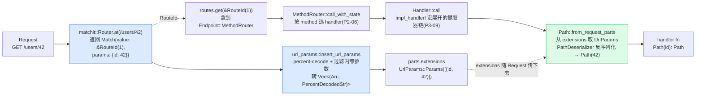

# 第 5 章 · PathRouter:matchit 字典树路径匹配

> **核心问题**:上一章你看到 `Router::call_with_state` 把请求一路交给 `self.inner.path_router.call_with_state(req, state)`,然后这个 `PathRouter` 凭一句 `self.node.at(parts.uri.path())` 就把 `/users/42` 这种 URL 匹配到了该走的 handler。可是 `PathRouter` 既不实现 `tower::Service`,又不像一个普通的路由表——它内部同时养着 `matchit::Router<RouteId>`(基数树)和**两个** `HashMap`(`route_id_to_path`、`path_to_route_id`),用 `RouteId(u32)` 这个递增整数当桥。这套"两层三件"(一棵基数树 + 两个 HashMap)的结构到底在干什么?`{id}` 和 `{*path}` 这种 URL 参数是怎么从 matchit 树里"自动"跑到 `Request::extensions()` 里、被后面的 `Path<i32>` 提取器取出来的?一个 URL 怎么在"几乎常数级"的时间里找到该走的 handler?
>
> **读完本章你会明白**:
>
> 1. 为什么 `PathRouter` 要同时维护"一棵 matchit 基数树"和"两个反向 HashMap"——matchit 只给你 `path → RouteId` 这一个方向,可 axum 在 `.route("/", get(_)).route("/", post(_))` 的 merge、`nest("/api", sub)` 的路径拼接、`MatchedPath` 提取器的反查场景里,全都**要从 RouteId 反查 path** 或**从 path 反查 RouteId**。所以 axum 自己维护 `RouteId ↔ path` 的双向映射,这是"借用外部 crate 只做匹配、自己补反向查询"的典型工程取舍;
> 2. 为什么 matchit 的树节点里只存一个 `RouteId(u32)` 而不是直接存 handler 引用——把"匹配"(matchit 树)和"存储"(`HashMap<RouteId, Endpoint>`)解耦,handler 实体(经类型擦除的 `Endpoint`)放 HashMap,树节点只挂一个 4 字节整数,匹配路径走的内存就近、缓存友好;handler 那边又能装任意类型(承 P1-03 的 `BoxCloneSyncService` 类型擦除);
> 3. `{id}` 命名参数和 `{*path}` 通配参数在 matchit 树里怎么走、在 `url_params::insert_url_params` 里怎么变成 `Vec<(Arc<str>, PercentDecodedStr)>` 塞进 `Request::extensions()`、`Path<i32>` 提取器又怎么从那里取出来跑 serde 反序列化——这条"URL 参数 → extensions → Path 提取器"的链路是路由与提取两面在"路径参数"这个点上的交汇;
> 4. 为什么 axum 的 matchit 基数树对照 go net/http 1.22+ 的 `ServeMux`、对照朴素 HashMap/线性扫描、对照 actix-web 的路由树、对照 Express.js 的 path-to-regexp,是"用一棵压缩前缀树把路径匹配从 O(路径段数) 压到几乎 O(路径长度)"的工程选择,以及这条栈上 matchit 作为外部 crate 的边界在哪。
>
> 本章是**路由招牌章**。前一章(P1-03)讲清了 Router/Route/MethodRouter **都是 Service**,把 `call_with_state` 这条对内通道钉死了;本章从那条通道里把 `PathRouter::call_with_state` 单拎出来,拆透"URL → RouteId → Endpoint"这一段。读完你和"路由与分发"这一面就只差 MethodRouter 按 method 分发那一层(P2-06)了。
>
> **逃生阀(读不下去怎么办)**:本章有三个互相缠绕的数据结构(PathRouter/Node/RouteId 三件套、双向 HashMap、matchit 基数树),信息密度大。如果一时绕不开,记住三句话就够——**① matchit 树只负责"URL → RouteId"这一步匹配,handler 实体在另一张 HashMap 里,RouteId 是两者之间的索引;② 两个反向 HashMap 是 axum 自己补的,因为 merge/nest/MatchedPath 这些场景要反查,matchit 不给;③ URL 参数在 matchit 匹配时就被捕获,经 percent-decode 后塞进 extensions,Path 提取器再从那里取**。带着这三句话跳到对应小节细读。matchit 基数树的内部原理(节点分裂、参数边)是外部 crate 的实现,本书诚实标注"在 matchit crate",只讲它的 API 语义 + 对照 go ServeMux,不替它编源码。
>
> **前置衔接**:上一章 P1-03 把 `Router::call` → `call_with_state` → `path_router.call_with_state` 这条通道讲清了,并且钉死了 PathRouter **不 impl Service**(它是个 `pub(super)` 内部结构,只暴露 `call_with_state` 给 Router 调),`Route` 内部是 `BoxCloneSyncService` 类型擦除(承《Tower》P6-17 一句带过)。本章从那句 `self.inner.path_router.call_with_state(req, state)` 接过来,拆 PathRouter 内部怎么用 matchit 把 URL 匹配到 RouteId、再索引到 Endpoint。本章假设你已经读过 P0-01(知道 axum 四件套)、P1-02(知道全景时序)、P1-03(知道 Router/Route/MethodRouter 都是 Service)。

---

## 一句话点破

> **PathRouter 是一棵 matchit 基数树加两个反向 HashMap 的三件套:matchit 树负责"URL → RouteId"这一步路径匹配,handler 实体放另一张 `HashMap<RouteId, Endpoint>` 里,RouteId 这个 4 字节整数当两者之间的索引;两个反向 HashMap(`route_id_to_path`、`path_to_route_id`)是 axum 自己补的,因为 merge/nest/MatchedPath 这些场景要反查,matchit 只给单向匹配不给反查。URL 参数在 matchit 匹配时就被捕获,经 percent-decode 后塞进 `Request::extensions()`,`Path<i32>` 提取器再从那里取出来跑 serde——这条链路是路由与提取两面在"路径参数"这个点上的交汇。**

这是结论,不是理由。本章倒过来拆:为什么不直接用一个 HashMap<URL, handler> 完事(朴素做法)、为什么 axum 借 matchit 做匹配还要补两个 HashMap、RouteId 这个整数索引凭什么能解耦"匹配"与"存储"、URL 参数怎么从 matchit 树一路跑到 Path 提取器。

---

## 第一节:从上一章的 call_with_state 接过来——PathRouter 到底是个什么

### 提问

上一章 P1-03 的 `Router::call_with_state` 长这样(`axum/src/routing/mod.rs#L417-L432`,本章再贴一次):

```rust
// axum/src/routing/mod.rs#L417-L432(逐字摘录)
pub(crate) fn call_with_state(&self, req: Request, state: S) -> RouteFuture<Infallible> {
    let (req, state) = match self.inner.path_router.call_with_state(req, state) {
        Ok(future) => return future,
        Err((req, state)) => (req, state),
    };

    let (req, state) = match self.inner.fallback_router.call_with_state(req, state) {
        Ok(future) => return future,
        Err((req, state)) => (req, state),
    };

    self.inner
        .catch_all_fallback
        .clone()
        .call_with_state(req, state)
}
```

注意第一段:`self.inner.path_router.call_with_state(req, state)`。这个 `path_router` 是 `RouterInner` 的第一个字段(`mod.rs#L81`),类型是 `PathRouter<S, false>`——一个 `pub(super)` 的内部结构,**不实现 `tower::Service`**(它没有 `poll_ready`/`call` 那两个 Service 方法)。它只暴露一个对内的 `call_with_state` 给 `Router` 调用,签名是 `fn call_with_state(&self, req: Request, state: S) -> Result<RouteFuture<Infallible>, (Request, S)>`(`path_router.rs#L370-L375`)。返回 `Ok(future)` 表示路径匹配上了(请求已经被相应的 Endpoint 接走,future 跑完会产出 `Response`),返回 `Err((req, state))` 表示路径没匹配上(把 req 和 state 原样退回来,交给 fallback_router 试)。

那这个 `PathRouter::call_with_state` 内部到底干了什么?它怎么用一句 `self.node.at(parts.uri.path())` 就把 `/users/42` 匹配到该走的 handler?

来看真实的 `PathRouter::call_with_state` 实现(`axum/src/routing/path_router.rs#L370-L420`):

```rust
// axum/src/routing/path_router.rs#L370-L420(逐字摘录,注释简化)
#[allow(clippy::result_large_err)]
pub(super) fn call_with_state(
    &self,
    #[cfg_attr(not(feature = "original-uri"), allow(unused_mut))] mut req: Request,
    state: S,
) -> Result<RouteFuture<Infallible>, (Request, S)> {
    #[cfg(feature = "original-uri")]
    {
        use crate::extract::OriginalUri;

        if req.extensions().get::<OriginalUri>().is_none() {
            let original_uri = OriginalUri(req.uri().clone());
            req.extensions_mut().insert(original_uri);
        }
    }

    let (mut parts, body) = req.into_parts();

    match self.node.at(parts.uri.path()) {
        Ok(match_) => {
            let id = *match_.value;

            if !IS_FALLBACK {
                #[cfg(feature = "matched-path")]
                crate::extract::matched_path::set_matched_path_for_request(
                    id,
                    &self.node.route_id_to_path,
                    &mut parts.extensions,
                );
            }

            url_params::insert_url_params(&mut parts.extensions, match_.params);

            let endpoint = self
                .routes
                .get(&id)
                .expect("no route for id. This is a bug in axum. Please file an issue");

            let req = Request::from_parts(parts, body);
            match endpoint {
                Endpoint::MethodRouter(method_router) => {
                    Ok(method_router.call_with_state(req, state))
                }
                Endpoint::Route(route) => Ok(route.clone().call_owned(req)),
            }
        }
        Err(MatchError::NotFound) => Err((Request::from_parts(parts, body), state)),
    }
}
```

短短 50 行,但这是路由匹配的全部核心。逐段拆:

**第一段(L376-L384,OriginalUri 注入)**:开 `original-uri` feature 时,如果 `extensions` 里还没有 `OriginalUri`,就插一个进去。`OriginalUri` 是 axum 的一个提取器(`extract/original_uri.rs`),它存的是"请求进 hyper 时最初的 URI"。为什么要插?因为后面 nest/strip_prefix 这些操作会**修改 `parts.uri`**(把前缀剥掉),但用户 handler 可能还想拿到原始 URI(比如做重定向、日志)。所以 axum 在路径匹配之前先把原始 URI 存一份。这一点 P2-07(nest 章)详拆,本章一句带过。

**第二段(L386,拆 Request)**:`let (mut parts, body) = req.into_parts();`——把 `Request` 拆成 `Parts`(含 method/uri/headers/extensions)和 body。为什么拆?因为 matchit 要的是 `&str`(URL path),而 `Parts` 里有 `uri` 能拿 path;同时后续要往 `parts.extensions` 里塞 URL 参数和 MatchedPath,这些操作都要 `&mut Parts`。body 这一刻不碰,等路径匹配完了再和 parts 拼回 `Request` 交给 Endpoint。

**第三段(L388-L401,核心匹配)**:

```rust
match self.node.at(parts.uri.path()) {
    Ok(match_) => {
        let id = *match_.value;   // ← 拿到 RouteId
        // ... 设 MatchedPath、塞 URL params ...
        url_params::insert_url_params(&mut parts.extensions, match_.params);
        let endpoint = self.routes.get(&id).expect(...);   // ← 用 RouteId 索引 HashMap
        // ... 把 endpoint 拿出来交给 MethodRouter 或 Route ...
    }
    Err(MatchError::NotFound) => Err((Request::from_parts(parts, body), state)),
}
```

这三步是**整章的灵魂**:

1. `self.node.at(path)` —— 用 matchit 基数树把 URL 匹配到一个 `Match<'_, '_>`,里面有个 `value: &RouteId`(指向匹配上的路由 ID),还有 `params: Params`(路径里 `{id}`/`{*path}` 捕获的参数)。
2. `url_params::insert_url_params(...)` —— 把 matchit 捕获的 params 转成 `Vec<(Arc<str>, PercentDecodedStr)>`,塞进 `parts.extensions`。这一步是"路由侧捕获的参数"流向"提取侧 `Path<T>`"的桥梁。
3. `self.routes.get(&id)` —— 用 RouteId 在另一张 `HashMap<RouteId, Endpoint<S>>` 里索引到真正的 handler 包装(`Endpoint`),它要么是 `MethodRouter`(走 `.route("/", get(_))` 注册的,内部再按 method 分发,详见 P2-06),要么是 `Route`(走 `.route_service("/", svc)` 注册的,直接是个 Service)。

> **钉死这件事**:`PathRouter::call_with_state` 的核心是**三步走**——① matchit 树匹配 URL 拿 RouteId + params;② params 塞 extensions;③ RouteId 索引 HashMap 拿 Endpoint。"匹配"和"存储"是**两个独立的数据结构**,中间用 RouteId 这个整数索引桥接。这个三件套(PathRouter + Node + RouteId)是本章的全部地基,后面所有小节都是在拆这个三件套为什么这么设计。

注意 `Err(MatchError::NotFound)` 这一支——matchit 没匹配上,axum 把 `parts + body` 拼回 `Request`,连同 state 一起 `Err((req, state))` 返回。这正对应 `Router::call_with_state` 里第一段的 `Err((req, state)) => (req, state)`,把请求传给下一层(fallback_router)继续试。这条 fallback 链路是 P2-08 的主题,本章只关心 `Ok(match_)` 这一支。

### 不这样会怎样:朴素 HashMap<String, handler> 会怎样

在拆 PathRouter 的三件套之前,先问一个最朴素的问题:为什么 axum 不直接用一个 `HashMap<String, Endpoint>` 当路由表?

来对照一下。假设 axum 的路由表是 `HashMap<String, Endpoint>`,你 `.route("/users/{id}", get(handler))` 注册了这条路径,现在请求 `GET /users/42` 进来:

```rust
// 朴素 HashMap 路由(假想,非 axum 实际做法)
let endpoint = routes.get("/users/42");   // ← 拿不到!HashMap 里存的是 "/users/{id}"
```

`HashMap<String, Endpoint>` 的 key 是 `/users/{id}`(注册时的模板),可请求的 URL 是 `/users/42`(具体值)。两者字符串不相等,HashMap 查不到。**朴素 HashMap 完全无法处理路径参数**——这是它的致命缺陷。

那朴素 HashMap 能干什么?只能做**精确匹配**:你 `.route("/users/list", get(handler))` 注册了字面量 `/users/list`,请求 `GET /users/list` 进来,HashMap 能查到。但这种"字面量精确匹配"的 Web 框架没人用——你写不出 `/users/{id}` 这种带参数的路由,等于没有路由参数这个能力。

**那线性扫描呢?** 假设你把所有路由模板存成一个 `Vec<(String, Endpoint)>`,请求来了一一遍历:

```rust
// 朴素线性扫描(假想,非 axum 实际做法)
for (pattern, endpoint) in &routes {
    if matches(pattern, "/users/42") {
        return endpoint;
    }
}
```

`matches(pattern, path)` 自己写——把 `/users/{id}` 这个模板和 `/users/42` 这个具体路径逐段比对,`{id}` 这种参数段匹配任意非空段。这条路**功能上可行**(很多早期 Web 框架就这么干),但有两个硬伤:

1. **复杂度 O(N)**:N 是路由数。一个生产服务有几百上千条路由,每个请求都要遍历一遍 Vec 找匹配,性能线性下降。如果你有 1000 条路由,最坏要扫 1000 次。
2. **冲突消解不明确**:如果两条模板都能匹配同一个 URL(比如 `/users/{id}` 和 `/users/me`),你要靠"先注册的优先"或"更具体的优先",这种消解规则要自己写,容易出错。

matchit 的基数树(radix tree)解决了这两个问题:它把所有路径模板压进一棵**压缩前缀树**,匹配一个 URL 只要从根往下走,复杂度**几乎只跟 URL 长度有关**(具体是 O(路径段数 × 每段比较成本)),跟路由总数 N 无关。1000 条路由的 matchit 树,匹配一个 URL 的代价和 10 条路由几乎一样。这就是 axum 选 matchit 的根本理由。

> **钉死这件事**:朴素 `HashMap<String, handler>` 处理不了路径参数(模板和具体值字符串不相等),朴素线性扫描复杂度 O(N)。matchit 基数树把所有路径模板压进一棵压缩前缀树,匹配复杂度几乎只跟 URL 长度有关、与路由总数无关——这是"海量路由下还能常数级匹配"的工程基础。axum 选 matchit(=0.8.4,见 `axum/Cargo.toml#L62`)就是冲这一点。

### 所以 axum 这么设计:PathRouter = Node + routes HashMap + 递增 RouteId

`PathRouter<S, IS_FALLBACK>` 的真实定义(`axum/src/routing/path_router.rs#L16-L21`):

```rust
// axum/src/routing/path_router.rs#L16-L21(逐字摘录)
pub(super) struct PathRouter<S, const IS_FALLBACK: bool> {
    routes: HashMap<RouteId, Endpoint<S>>,
    node: Arc<Node>,
    prev_route_id: RouteId,
    v7_checks: bool,
}
```

四个字段,逐个看:

1. **`routes: HashMap<RouteId, Endpoint<S>>`** —— 这是**真正的路由存储**。key 是 `RouteId(u32)`(一个递增整数),value 是 `Endpoint<S>`(`MethodRouter<S>` 或 `Route`)。每注册一条路径,axum 分配一个新的 RouteId,把路径模板塞进 matchit 树(关联这个 RouteId),把 handler 包装(`Endpoint`)塞进这张 HashMap(用同一个 RouteId 当 key)。匹配时,matchit 树给你 RouteId,你拿 RouteId 在这张 HashMap 里索引到 Endpoint。**匹配和存储是两张独立的表,RouteId 是它们之间的桥**。

2. **`node: Arc<Node>`** —— 这是**匹配引擎**。`Node` 是 axum 对 matchit 的薄包装(`path_router.rs#L477-L482`),内部三件:

   ```rust
   // axum/src/routing/path_router.rs#L477-L482(逐字摘录)
   #[derive(Clone, Default)]
   struct Node {
       inner: matchit::Router<RouteId>,
       route_id_to_path: HashMap<RouteId, Arc<str>>,
       path_to_route_id: HashMap<Arc<str>, RouteId>,
   }
   ```

   - `inner: matchit::Router<RouteId>` —— **基数树本体**(外部 crate matchit),存"路径模板 → RouteId"的映射,用于匹配。
   - `route_id_to_path: HashMap<RouteId, Arc<str>>` —— 反向映射 1,**RouteId → 路径模板**。
   - `path_to_route_id: HashMap<Arc<str>, RouteId>` —— 反向映射 2,**路径模板 → RouteId**。

   为什么 `Node` 里有三个东西?下面第二节专门拆。先记住:`Arc<Node>` 意味着 PathRouter 的 Clone 是廉价的(Arc 引用计数 +1),路由表只读、可多线程共享。

3. **`prev_route_id: RouteId`** —— 下一个要分配的 RouteId。`RouteId(u32)` 从 1 开始递增(初始 `RouteId(0)`,见 `path_router.rs#L450` 的 `default()`),每注册一条路由调 `next_route_id()`(`path_router.rs#L434-L442`)`+1`。这个 ID 是**全 Router 范围内递增**的(不是 per-path 的),所以两条不同路径的 RouteId 不会重复。

   ```rust
   // axum/src/routing/path_router.rs#L434-L442(逐字摘录)
   fn next_route_id(&mut self) -> RouteId {
       let next_id = self
           .prev_route_id
           .0
           .checked_add(1)
           .expect("Over `u32::MAX` routes created. If you need this, please file an issue.");
       self.prev_route_id = RouteId(next_id);
       self.prev_route_id
   }
   ```

   注意那个 `checked_add(1)` + `expect` —— RouteId 是 `u32`,理论上能撑 40 亿条路由,溢出了直接 panic。生产服务不会有这么多路由,但这个 panic 的存在说明 axum 把"RouteId 必须唯一且可递增"当成了硬约束。

4. **`v7_checks: bool`** —— 是否启用 0.7 路径语法检查(`:foo`/`*foo` 警告)。0.8 默认 `true`(`path_router.rs#L451`),用户可以 `Router::without_v07_checks()` 关掉(`path_router.rs#L79-L81`)。这是 0.7→0.8 演进的遗留, P6-20 详拆,本章只在第三节讲路径语法时带过。

注意那个 **`const IS_FALLBACK: bool`** —— 这是 const generic(编译期常量泛型),标记这个 PathRouter 是不是 fallback 路由器。`RouterInner` 里有两个 PathRouter:`path_router: PathRouter<S, false>`(主路由表)和 `fallback_router: PathRouter<S, true>`(fallback 路由表,`mod.rs#L81-L82`)。`IS_FALLBACK` 在编译期就钉死,fallback 路由器会做一些主路由器不做的事(比如注册 `/` 和 `/{*__private__axum_fallback}` 两条特殊路径,见 `path_router.rs#L33-L36` 的 `set_fallback`)。const generic 让"主路由器"和"fallback 路由器"在类型层就分开,共享同一份 PathRouter 代码但有编译期差异——这是 Rust 类型系统的标准用法,本章不深入(那 belongs to P2-08 fallback 章)。

> **钉死这件事**:`PathRouter<S, IS_FALLBACK>` 是个 `pub(super)` 内部结构,**不 impl `tower::Service`**。它内部是"匹配引擎(`Arc<Node>`,里面一棵 matchit 树 + 两个反向 HashMap)+ 存储表(`HashMap<RouteId, Endpoint>`)+ 递增 ID(`prev_route_id`)+ 0.7 检查开关(`v7_checks`)"。const generic `IS_FALLBACK` 区分主路由器和 fallback 路由器(编译期常量)。这套结构是 axum 路由的数据层地基,本章剩下的小节全在拆它。

### 把整个三件套画出来

用 ASCII 框图把 PathRouter 的内部布局画清楚(承接 P1-03 的嵌套图,这里只画 PathRouter 这一层):

```
PathRouter<S, IS_FALLBACK>
├── routes: HashMap<RouteId(u32), Endpoint<S>>   ← 存储表(handler 实体在这)
│       │
│       │ RouteId(1) ──→ Endpoint::MethodRouter(MethodRouter<S>)   (.route 注册的)
│       │ RouteId(2) ──→ Endpoint::Route(Route)                    (.route_service 注册的)
│       │ RouteId(3) ──→ ...
│       │
├── node: Arc<Node>   ← 匹配引擎(只读,Arc 共享)
│       │
│       ▼ Node 内部三件:
│       ┌─────────────────────────────────────────────────────────────┐
│       │ Node {                                                       │
│       │   inner: matchit::Router<RouteId>,   ← 基数树(path → RouteId)│
│       │   route_id_to_path: HashMap<RouteId, Arc<str>>, ← 反查 1     │
│       │   path_to_route_id: HashMap<Arc<str>, RouteId>, ← 反查 2     │
│       │ }                                                            │
│       └─────────────────────────────────────────────────────────────┘
│
├── prev_route_id: RouteId(u32)   ← 下一个要分配的 ID(递增)
└── v7_checks: bool               ← 0.7 路径语法检查开关
```

注意图里**两个关键解耦**:

- **匹配与存储解耦**:matchit 树(在 `node.inner`)只存 RouteId,handler 实体在 `routes` HashMap。匹配走 matchit,拿 RouteId;存储走 HashMap,用 RouteId 索引。
- **正向与反向解耦**:matchit 树给"path → RouteId"正向,两个反向 HashMap 给"RouteId ↔ path"双向反查。

这两个解耦是本章的技巧核心,第二节、第三节分别拆。

---

## 第二节:Node 的三层结构——为什么 matchit 树之外还要两个 HashMap

### 提问

第一节看到 `Node` 里装了**三件东西**:一棵 matchit 基数树 + 两个 HashMap。matchit 树已经能做"path → RouteId"的匹配了,axum 为什么还要自己补两个反向 HashMap?

这一节拆透:**两个反向 HashMap 是 axum 的工程补丁,因为 matchit 只给单向匹配不给反查,而 axum 的 merge/nest/MatchedPath 全要反查**。

### matchit 给的是什么,不给的是什么

matchit 是个外部 crate(`axum/Cargo.toml#L62` `matchit = "=0.8.4"`),它提供的核心 API 是 `matchit::Router<T>`(`T` 是用户要存的值类型,axum 选 `RouteId`):

- **`insert(&mut self, path: &str, val: T)`** —— 注册一条路径模板,关联一个值。这是**正向**写入:path → val。
- **`at(&self, path: &str) -> Result<Match<'_, '_, &T>, MatchError>`** —— 匹配一个具体 URL,返回 `Match { value: &T, params: Params }`。这是**正向**查询:具体 URL → 匹配上的 val + 捕获的参数。
- **`T` 可以是任意类型**:matchit 不关心里面存什么,它只负责把路径模板组织成基数树、把具体 URL 往下走匹配。

matchit **不给**什么?

- **不给"val → path"反查**:你存进去一个 `RouteId(3)`,想问"这个 RouteId 对应的路径模板是什么",matchit 没这个 API。树结构是单向的,从根到叶,你不能从叶往回找模板字符串。
- **不给"path 模板 → val"的精确查**(注意:不是 `at`!`at` 是用具体 URL 匹配,不是用模板字符串精确查):你存进去 `/users/{id}` 关联 `RouteId(3)`,现在你想问"`/users/{id}` 这个模板的 RouteId 是几",matchit 也没这个 API。`at("/users/{id}")` 会把 `{id}` 当成具体段去匹配(它会去匹配 `/users/{id}` 这个字面 URL,而不是查"/users/{id} 这个模板存了没"),结果不是你想要的"这个模板的 RouteId"。

> **诚实标注**:`matchit::Router` 的内部原理(基数树节点结构、参数边、通配边的实现)在 matchit crate 里(本书不 clone matchit 仓,不当 axum 源码编行号)。本章只讲 matchit 的 API 语义(insert/at/T 泛型)+ 对照 go ServeMux 的 path matching,涉及内部机制的诚实标注"在 matchit crate"。想深入 matchit 内部的读者,可以读 matchit 文档或源码。

### axum 在哪些地方需要反查

axum 在**四个场景**需要反查,这是 axum 自己补两个 HashMap 的根本理由:

**场景一:`.route("/", get(_)).route("/", post(_))` 的 merge**。

你写 `.route("/users", get(list)).route("/users", post(create))`——同一个路径 `/users` 注册了两次,axum 要把它们 merge 成一个 MethodRouter(GET + POST)。来看 `PathRouter::route` 的真实实现(`path_router.rs#L83-L114`):

```rust
// axum/src/routing/path_router.rs#L83-L114(逐字摘录,注释简化)
pub(super) fn route(
    &mut self,
    path: &str,
    method_router: MethodRouter<S>,
) -> Result<(), Cow<'static, str>> {
    validate_path(self.v7_checks, path)?;

    let endpoint = if let Some((route_id, Endpoint::MethodRouter(prev_method_router))) = self
        .node
        .path_to_route_id                       // ← 反查!path → RouteId
        .get(path)
        .and_then(|route_id| self.routes.get(route_id).map(|svc| (*route_id, svc)))
    {
        // 这条 path 已经注册过 MethodRouter 了,merge 两个 MethodRouter
        let service = Endpoint::MethodRouter(
            prev_method_router
                .clone()
                .merge_for_path(Some(path), method_router)?,
        );
        self.routes.insert(route_id, service);  // ← 用同一个 RouteId 覆盖
        return Ok(());
    } else {
        Endpoint::MethodRouter(method_router)    // ← 新路径,新建一个
    };

    let id = self.next_route_id();
    self.set_node(path, id)?;                    // ← 正向写入 matchit 树 + 两个 HashMap
    self.routes.insert(id, endpoint);
    Ok(())
}
```

注意 `self.node.path_to_route_id.get(path)`——这就是**反查**:axum 拿着 `/users` 这个路径模板字符串,要问"这条路径之前注册过没,RouteId 是几"。matchit 不给这个 API,所以 axum 自己维护 `path_to_route_id: HashMap<Arc<str>, RouteId>`。

如果反查到了(说明这条路径之前注册过 MethodRouter),axum 调 `prev_method_router.merge_for_path(Some(path), method_router)` 把两个 MethodRouter merge 成一个(P2-06 详拆 MethodRouter 的 merge),然后用**同一个 RouteId** 覆盖 `routes` HashMap 里的 entry——不分配新 RouteId,不重复注册到 matchit 树(因为树里已经有这条路径了)。

**反查没这么干会怎样**:假设 axum 不维护 `path_to_route_id`,每次 `.route("/users", ...)` 都直接调 `node.inner.insert("/users", new_route_id)`——matchit 会**报错**(同一条路径重复 insert,matchit 的 `insert` 返回 `InsertError::Conflict` 或类似)。即便 matchit 允许重复 insert,axum 也无法知道"这条路径之前注册过 MethodRouter,要 merge"——它只会无脑新建一个 RouteId,把旧的覆盖掉,结果你 `.route("/", get(_)).route("/", post(_))` 只有 POST 生效,GET 丢了。这就是"不维护反向映射"的直接后果。

**场景二:merge 两个 Router**。

你写 `Router::new().merge(router_a).merge(router_b)`,两个 Router 各自有一堆路由,merge 时要把 `router_b` 的所有路由搬到 `router_a` 里。来看 `PathRouter::merge` 的核心(`path_router.rs#L162-L204`):

```rust
// axum/src/routing/path_router.rs#L162-L204(逐字摘录,核心部分)
pub(super) fn merge(
    &mut self,
    other: PathRouter<S, IS_FALLBACK>,
) -> Result<(), Cow<'static, str>> {
    let PathRouter {
        routes,
        node,
        prev_route_id: _,
        v7_checks,
    } = other;

    self.v7_checks |= v7_checks;

    for (id, route) in routes {
        let path = node
            .route_id_to_path                          // ← 反查!RouteId → path
            .get(&id)
            .expect("no path for route id. This is a bug in axum. Please file an issue");

        if IS_FALLBACK && (&**path == "/" || &**path == FALLBACK_PARAM_PATH) {
            self.replace_endpoint(path, route);
        } else {
            match route {
                Endpoint::MethodRouter(method_router) => self.route(path, method_router)?,
                Endpoint::Route(route) => self.route_service(path, route)?,
            }
        }
    }

    Ok(())
}
```

注意 `node.route_id_to_path.get(&id)`——这是**反查**:axum 拿着一个 RouteId(来自 `other` 的 routes HashMap 的 key),要问"这个 RouteId 在 `other` 的 matchit 树里对应的路径模板是什么"。matchit 不给这个 API,所以 axum 自己维护 `route_id_to_path: HashMap<RouteId, Arc<str>>`。

为什么 merge 必须反查?因为 `other` 的 routes HashMap 的 key 是 RouteId,但 `self`(被 merge 进的 Router)要用**自己的 RouteId**(避免和 self 已有的 RouteId 冲突)。self 拿到 `other` 的 (RouteId, Endpoint) 对后,要先反查出 path,再用这个 path 在 self 的 matchit 树和 routes HashMap 里**重新注册一遍**(用 self 自己分配的新 RouteId)。整个过程:

```
other 的 (RouteId(5), Endpoint) 
  → 反查 other.route_id_to_path[5] = "/users"
  → self.route("/users", Endpoint) 在 self 里重新注册
  → self 分配新 RouteId(比如 12),塞进 self 的 matchit 树 + routes HashMap
```

这条链路**必须**经过"RouteId → path"的反查,因为 RouteId 在两个 Router 之间不通用(各自从 1 递增),只有 path 是跨 Router 通用的"全局标识"。

**场景三:nest 子 Router**。

你写 `Router::new().nest("/api", sub_router)`,要把 `sub_router` 的所有路由挂到 `/api` 前缀下。来看 `PathRouter::nest` 的核心(`path_router.rs#L206-L244`):

```rust
// axum/src/routing/path_router.rs#L206-L244(逐字摘录,核心部分)
pub(super) fn nest(
    &mut self,
    path_to_nest_at: &str,
    router: PathRouter<S, IS_FALLBACK>,
) -> Result<(), Cow<'static, str>> {
    let prefix = validate_nest_path(self.v7_checks, path_to_nest_at);

    let PathRouter {
        routes,
        node,
        prev_route_id: _,
        v7_checks: _,
    } = router;

    for (id, endpoint) in routes {
        let inner_path = node
            .route_id_to_path                          // ← 反查!RouteId → path
            .get(&id)
            .expect("no path for route id. This is a bug in axum. Please file an issue");

        let path = path_for_nested_route(prefix, inner_path);  // ← 拼接前缀

        let layer = (
            StripPrefix::layer(prefix),
            SetNestedPath::layer(path_to_nest_at),
        );
        match endpoint.layer(layer) {
            Endpoint::MethodRouter(method_router) => {
                self.route(&path, method_router)?;     // ← 用拼好的新 path 注册
            }
            Endpoint::Route(route) => {
                self.route_endpoint(&path, Endpoint::Route(route))?;
            }
        }
    }

    Ok(())
}
```

和 merge 几乎一样:`node.route_id_to_path.get(&id)` 反查出 inner_path(子 Router 里的原始路径),再用 `path_for_nested_route(prefix, inner_path)`(`path_router.rs#L535-L546`)把前缀和 inner_path 拼起来,得到新 path(比如 `/api/users`),然后在父 Router 里用新 path 注册。nest 比 merge 多一步"路径拼接",但反查的必要性是一样的。

> **承接 P2-07**:nest 里那两个 Layer(`StripPrefix::layer(prefix)` + `SetNestedPath::layer(path_to_nest_at)`)是 nest 的招牌技巧——`StripPrefix` 在请求来时把 URL 的前缀剥掉(让子 Router 看到的 URL 是相对路径),`SetNestedPath` 把 nest 路径塞进 extensions(让 MatchedPath 能拼出完整路径)。这两个 Layer 的细节留 P2-07 嵌套与合并章详拆,本章只关心"反查"这一步。

**场景四:MatchedPath 提取器的反查**。

你写 `async fn handler(MatchedPath(p): MatchedPath)`,axum 要在路由匹配后把"匹配上的路径模板"(注意是**模板** `/users/{id}`,不是具体值 `/users/42`)塞进 extensions,让 MatchedPath 提取器取出来(典型用途:tracing span 里记录匹配的路由模板,而不是具体 URL,避免 high-cardinality 问题)。

来看 `set_matched_path_for_request`(`axum/src/extract/matched_path.rs#L101-L124`):

```rust
// axum/src/extract/matched_path.rs#L101-L124(逐字摘录)
pub(crate) fn set_matched_path_for_request(
    id: RouteId,
    route_id_to_path: &HashMap<RouteId, Arc<str>>,
    extensions: &mut http::Extensions,
) {
    let matched_path = if let Some(matched_path) = route_id_to_path.get(&id) {
        matched_path                                       // ← 反查!RouteId → path 模板
    } else {
        #[cfg(debug_assertions)]
        panic!("should always have a matched path for a route id");
        #[cfg(not(debug_assertions))]
        return;
    };

    let matched_path = append_nested_matched_path(matched_path, extensions);

    if matched_path.ends_with(NEST_TAIL_PARAM_CAPTURE) {
        extensions.insert(MatchedNestedPath(matched_path));
        debug_assert!(extensions.remove::<MatchedPath>().is_none());
    } else {
        extensions.insert(MatchedPath(matched_path));
        extensions.remove::<MatchedNestedPath>();
    }
}
```

注意 `route_id_to_path.get(&id)`——又是**反查**:matchit 在 `at()` 匹配成功后给的是 `&RouteId`,axum 拿着这个 RouteId 反查出"这条路由的模板字符串"(比如 `/users/{id}`),塞进 extensions 当 MatchedPath。这一步**必须**用 `route_id_to_path` HashMap,因为 matchit 的 `Match` 只给你 `value: &RouteId`,不给你"这条路由的模板字符串"。

`call_with_state` 里调用这个函数的地方(`path_router.rs#L393-L399`):

```rust
// axum/src/routing/path_router.rs#L393-L399(逐字摘录)
if !IS_FALLBACK {
    #[cfg(feature = "matched-path")]
    crate::extract::matched_path::set_matched_path_for_request(
        id,
        &self.node.route_id_to_path,
        &mut parts.extensions,
    );
}
```

注意 `!IS_FALLBACK`——fallback 路由器**不设 MatchedPath**(因为没有"匹配的模板"这个概念,fallback 就是"没匹配上"的兜底)。这也是 const generic `IS_FALLBACK` 的一个用途:编译期区分主路由器和 fallback 路由器的行为。

> **钉死这件事**:axum 在四个场景需要反查——`.route` merge 同一路径、`merge` 两个 Router、`nest` 子 Router、`MatchedPath` 提取器。matchit 只给"path → RouteId"正向匹配,不给反查。所以 axum 自己维护两个反向 HashMap(`route_id_to_path` 和 `path_to_route_id`)。这是"借用外部 crate 只做一件事、自己补其他功能"的典型工程取舍——matchit 专注基数树匹配做到极致,反查这种"外围需求"axum 自己用两个 HashMap 补上。

### 为什么是两个 HashMap,不是一个

你可能会问:既然要反查,为什么不只维护一个 `HashMap<RouteId, Arc<str>>`(`route_id_to_path`)?要用 `path_to_route_id` 时,遍历 `route_id_to_path` 找 value 等于 path 的 entry 不就行了?

答案:**性能**。`route` 方法的 merge 检测(`path_router.rs#L90-L95`)是**每次 `.route()` 调用都要做的**,一个生产服务的启动代码可能有几百上千次 `.route()`,每次都要"反查 path → RouteId"。如果用单个 HashMap 反向遍历,复杂度是 O(N)(N 是路由数),1000 条路由每次 `.route()` 都要扫一遍,启动慢。`path_to_route_id` 把这个反查变成 O(1) 的 HashMap 查找。

反过来也一样:merge/nest/MatchedPath 这些场景要"RouteId → path",如果只有 `path_to_route_id`,反向遍历找 key 等于 RouteId 的 entry,O(N)。`route_id_to_path` 把这个反查也变成 O(1)。

**两个 HashMap 的代价**:多一份内存(每个路径模板存两份 String/Arc<str>),多一次写入(每次 `Node::insert` 要更新两个 HashMap)。但路径模板字符串通常很短(几十字节),路由数有限(几百到几千),这点内存开销可以忽略。换来的是"两个方向都是 O(1) 反查",这是工程上的明确取舍。

来看 `Node::insert` 怎么同时更新 matchit 树和两个 HashMap(`path_router.rs#L485-L499`):

```rust
// axum/src/routing/path_router.rs#L485-L499(逐字摘录)
impl Node {
    fn insert(
        &mut self,
        path: impl Into<String>,
        val: RouteId,
    ) -> Result<(), matchit::InsertError> {
        let path = path.into();

        self.inner.insert(&path, val)?;             // ← 正向写 matchit 树

        let shared_path: Arc<str> = path.into();
        self.route_id_to_path.insert(val, shared_path.clone());   // ← 反查 1
        self.path_to_route_id.insert(shared_path, val);           // ← 反查 2

        Ok(())
    }

    fn at<'n, 'p>(
        &'n self,
        path: &'p str,
    ) -> Result<matchit::Match<'n, 'p, &'n RouteId>, MatchError> {
        self.inner.at(path)
    }
}
```

注意三件事:

1. **三件同时写**:`self.inner.insert`(matchit 树)+ `route_id_to_path.insert` + `path_to_route_id.insert`。三个数据结构始终保持同步——这是 Node 的不变量(invariant)。
2. **`Arc<str>` 共享路径字符串**:`let shared_path: Arc<str> = path.into();`——把 `String` 转成 `Arc<str>`,然后两个 HashMap 用同一份 Arc(引用计数共享,不复制字符串字节)。这样 `route_id_to_path` 和 `path_to_route_id` 里的 path 字符串是**同一份内存**,只是引用计数 +2。这是 axum 在"反向映射要存两份 key/value"时的省内存手法。
3. **`at` 直接转发**:`Node::at` 直接调 `self.inner.at(path)`,没碰两个 HashMap。匹配这一步**只用 matchit 树**,反向 HashMap 不参与匹配——它们只在注册和反查时被碰。

> **钉死这件事**:`Node` 是"一棵 matchit 树 + 两个反向 HashMap"的三件套。三个数据结构在 `Node::insert` 里同时更新、始终保持同步。两个反向 HashMap 把"两个方向的反查都做到 O(1)"——单 HashMap 反向遍历是 O(N),生产服务路由数大了启动就慢。代价是多一份内存(用 `Arc<str>` 共享字符串字节已经把开销压到最低)。这是 axum 在"matchit 只给单向匹配"这个外部约束下,自己补的反查工程补丁。

### 对照:go net/http 1.22+ ServeMux 怎么做

把 axum 的"matchit 树 + 两个反向 HashMap"对照 go 标准库的 `net/http.ServeMux`,能看清这种设计的普遍性和 axum 的特殊性。

**go 1.22 之前的 ServeMux**:只支持前缀匹配和精确匹配,没有路径参数。`mux.HandleFunc("/users/", handler)` 注册一个前缀,`mux.HandleFunc("/users", handler)` 注册一个精确。内部是 `map[string]muxEntry`,**两张 map**(一张存精确、一张存前缀),匹配时查两张。这个设计简单但表达力弱——你写不出 `/users/{id}` 这种带参数的路由,只能自己 `r.URL.Path` 字符串切。

**go 1.22+ 的 ServeMux**(重大升级):引入了 `"GET /users/{id}"` 这种 method + pattern 写法,内部改用**自实现的基数树**。go 团队自己写了一棵路由树(在 `net/http` 标准仓里,Go 源码 `server.go` 附近),不依赖外部 crate。go 的 ServeMux 维护"pattern → muxEntry"的正向匹配,但**没有 axum 这种"两个方向反查"的工程补丁**——因为 go 的 ServeMux API 不需要 axum 那种"merge 两个 Router""nest 子 Router""MatchedPath 反查模板"的高级功能。go 的 ServeMux 是个相对简单的"注册 + 匹配",没有 Router 组合的需求。

axum 选 matchit(外部 crate) + 自己补反查 HashMap,是因为:

1. **matchit 比自实现基数树更成熟、更经过测试**:matchit 是独立 crate,专注基数树匹配,有完整的 fuzzing 测试和性能优化。axum 复用它,等于免费获得一份成熟的基数树实现。
2. **axum 的 Router 组合需求远超 go ServeMux**:axum 要支持 `.merge()`、`.nest()`、`.route_layer()`、`MatchedPath` 提取器,这些功能都需要"反查 path ↔ RouteId"。go ServeMux 没这些功能,所以不需要反查。
3. **解耦的代价是补丁**:axum 选择"matchit 只做匹配,反查自己补",代价是要维护三个数据结构同步。但这个代价很小(一次 `Node::insert` 更新三件,始终同步),换来的是 matchit 的成熟 + axum 的灵活。

| 维度 | axum PathRouter | go 1.22+ ServeMux |
|------|----------------|-------------------|
| 路径匹配数据结构 | matchit 基数树(外部 crate) | 自实现基数树(标准仓) |
| 反向查询(path ↔ id) | **两个 HashMap**(自维护) | 无(不需要) |
| 路径参数语法 | `{id}` / `{*path}` | `{id}` / `{path...}` |
| Router 组合(merge/nest) | 支持(需要反查) | 不支持 |
| MatchedPath 提取器 | 支持(需要反查 RouteId → 模板) | 无(1.22 加了 `r.Pattern`,但语义不同) |

> **对照 go net/http ServeMux**:go 1.22 的 ServeMux 升级到基数树 + 路径参数,是"向 axum/matchit 看齐"的一步(go 团队承认受启发于 httprouter 和 chi 等框架)。但 go ServeMux 是"注册 + 匹配"的简单模型,没有 axum 的 Router 组合(merge/nest)和 MatchedPath 提取器这些高级功能,所以不需要反查 HashMap。axum 选 matchit + 自维护反查,是因为它的 Router 模型更重、组合需求更强。这是两个框架在"路由抽象层厚度"上的根本差异。

---

## 第三节:RouteId——为什么用一个整数当匹配与存储的桥

### 提问

第一节看到 matchit 树节点里存的是 `RouteId`(一个 `u32` 整数),不是 handler 引用。axum 为什么不直接让 matchit 存 handler(`BoxCloneSyncService` 或 `MethodRouter`)?为什么非要绕一层"RouteId 索引 HashMap"?

这一节拆透:**RouteId 这个整数索引,解耦了"匹配"和"存储",让两边都能做到最优**。

### RouteId 的真实定义

来看 RouteId 的定义(`axum/src/routing/mod.rs#L57-L58`):

```rust
// axum/src/routing/mod.rs#L57-L58(逐字摘录)
#[derive(Clone, Copy, Debug, PartialEq, Eq, PartialOrd, Ord, Hash)]
pub(crate) struct RouteId(u32);
```

就这么简单——一个 `u32` 的 newtype。`pub(crate)` 意味着它是 axum crate 内部的,不暴露给用户。`Clone + Copy` 意味着它是按值复制的(4 字节,几乎零成本)。`Hash + Eq` 意味着它能当 HashMap 的 key。

`RouteId` 在 axum 里**只做一件事**:当 matchit 树和 `routes` HashMap 之间的桥。matchit 树节点里挂一个 `RouteId`,`routes` HashMap 用 `RouteId` 当 key,两边通过这个整数对应起来。

### 反面对比:matchit 直接存 handler 引用会怎样

假设 axum 让 matchit 直接存 handler,不绕 RouteId 这一层:

```rust
// 假想(非 axum 实际做法)
struct PathRouter<S> {
    node: matchit::Router<Endpoint<S>>,   // ← 直接存 Endpoint!
}
```

看起来更简单(一张表,不需要 routes HashMap),但有几个硬伤:

**硬伤一:matchit 树节点膨胀**。

matchit 的基数树每个节点要存一个 `T`(axum 选的值类型)。如果 `T = Endpoint<S>`,每个树节点要装一个完整的 `Endpoint`——`Endpoint` 是 `enum MethodRouter(MethodRouter<S>) | Route(Route)`,`MethodRouter` 内部有 9 个 `MethodEndpoint` 字段(每个 GET/POST/PUT/...,见 P2-06),`Route` 内部是 `BoxCloneSyncService`(一个 fat pointer)。一个 `MethodRouter<S>` 的 size 可能是几十到上百字节。

而 `RouteId(u32)` 只有 **4 字节**。matchit 树节点挂 4 字节 vs 挂几十上百字节,对树本身的内存占用、缓存局部性(cacheline 利用率)影响巨大。路由树是要被高频查询的(每个请求查一次),树节点越小,越能塞进 CPU cache,匹配越快。

**硬伤二:matchit 的 T 必须 `Clone + Send + Sync + 'static` 等约束**。

matchit 的 `Router<T>` 对 `T` 有 trait bound 要求(具体看 matchit 文档,大致是 `T: Clone`)。如果 `T = Endpoint<S>`,axum 要保证 `Endpoint<S>: Clone`——`Endpoint` 的 Clone 是 `MethodRouter<S>` 或 `Route` 的 Clone,这俩虽然都 Clone(承 P1-03),但 Clone 一个 MethodRouter 要 clone 它内部 9 个 MethodEndpoint(每个可能 clone 一个 BoxedHandler 或 Route),比 clone 一个 u32 贵得多。

而 `RouteId(u32): Copy`,clone 就是按值复制 4 字节,几乎零成本。

**硬伤三:失去反向查询的能力**。

这是最致命的。如果 matchit 直接存 Endpoint,你想做"RouteId → path"的反查(merge/nest/MatchedPath 用),你**没有 RouteId 这个中间层**——你只有" Endpoint → path"的反查需求,可 Endpoint 没有唯一的标识(两个 MethodRouter 可能内容相同但不是同一条路由),你没法建 `HashMap<Endpoint, Arc<str>>`(Endpoint 不一定 Eq/Hash,即便 Eq 也可能冲突)。

axum 选 RouteId 的关键理由就是:**RouteId 是一个唯一的、轻量的、Copy 的标识**,它能当 HashMap 的 key(Hash + Eq),能被 matchit 树节点廉价存储(4 字节),能在两个数据结构之间唯一对应一条路由。Endpoint 做不到这三点(大、贵、不一定能当 key)。

**硬伤四:类型擦除的 Endpoint 不能进 matchit 树的泛型 T?**

实际上 matchit 的 `T` 可以是任意类型(包括 Endpoint),没有类型约束上的硬障碍。但即便能,前面三个硬伤(节点膨胀、Clone 贵、失去反查)已经让"直接存 Endpoint"不划算。axum 选 RouteId 是综合权衡后的最优解。

### 所以 axum 这么设计:RouteId 当桥,匹配与存储分离

axum 的设计是**两层分离**:

- **匹配层(matchit 树)**:只关心"URL → RouteId",树节点只挂一个 4 字节整数。匹配走最快的基数树,树节点最紧凑,缓存友好。
- **存储层(routes HashMap)**:关心"RouteId → Endpoint",handler 实体(类型擦除的 `BoxCloneSyncService` 或 `MethodRouter`)放这。HashMap 查找 O(1),handler 实体的 size 不影响匹配树。
- **桥(RouteId)**:一个 `u32` 整数,唯一标识一条路由,在两个数据结构之间当 key。

这套设计的好处:

1. **匹配快**:matchit 树节点小(4 字节 + 树结构本身),匹配一个 URL 几乎只跟 URL 长度有关,跟路由总数无关。
2. **存储灵活**:handler 实体可以是任意类型(经 `BoxCloneSyncService` 擦除),size 不影响匹配性能。HashMap 的 O(1) 查找廉价。
3. **反查可行**:RouteId 是唯一标识,能当 HashMap 的 key,axum 可以维护反向映射。
4. **Copy 廉价**:RouteId 是 `Copy`,在 `call_with_state` 里 `let id = *match_.value;`(`path_router.rs#L390`)就是一句解引用,零成本。

来看 `call_with_state` 里"RouteId 索引 HashMap"那一步(`path_router.rs#L403-L407`):

```rust
// axum/src/routing/path_router.rs#L403-L407(逐字摘录)
let endpoint = self
    .routes
    .get(&id)
    .expect("no route for id. This is a bug in axum. Please file an issue");
```

`self.routes.get(&id)`——用 RouteId 在 HashMap 里 O(1) 查找,拿到 `&Endpoint<S>`。`expect` 的那句话"no route for id. This is a bug in axum"说明:RouteId 在 matchit 树和 routes HashMap 之间**必须始终保持同步**——matchit 树里有的 RouteId,routes HashMap 里必须有(由 `Node::insert` 和 `next_route_id` + `routes.insert` 共同保证)。这是个不变量,违反就是 axum 的 bug。

> **钉死这件事**:`RouteId(u32)` 是 axum 路由的"唯一身份证"——一个 4 字节、Copy、Hash + Eq 的整数。matchit 树节点里挂 RouteId(匹配层紧凑、缓存友好),handler 实体放 routes HashMap(存储层灵活、类型擦除),RouteId 当两者之间的桥。这个设计解耦了"匹配"和"存储",让两边都能做到最优:匹配走紧凑基数树,存储走 O(1) HashMap。反面对比"matchit 直接存 handler"会撞三堵墙:节点膨胀、Clone 贵、失去反查能力。RouteId 这一层数字索引,是 axum 路由数据结构的精髓。

### RouteId 的分配:递增 + checked_add

`RouteId` 是怎么分配的?来看 `next_route_id`(`path_router.rs#L434-L442`,前面贴过):

```rust
fn next_route_id(&mut self) -> RouteId {
    let next_id = self
        .prev_route_id
        .0
        .checked_add(1)
        .expect("Over `u32::MAX` routes created. If you need this, please file an issue.");
    self.prev_route_id = RouteId(next_id);
    self.prev_route_id
}
```

`prev_route_id` 从 `RouteId(0)` 开始(`path_router.rs#L450` 的 default),每次 `next_route_id` 调用 `+1`。注意 `checked_add(1)`(不是 `+ 1`)——溢出检查,u32 撑 40 亿条路由,溢出了 panic。生产服务不会有这么多路由(几百到几千顶天),但这个 panic 的存在说明 axum 把"RouteId 必须唯一不溢出"当成了硬约束。

注意一个细节:`RouteId` 是**全 PathRouter 范围内递增**的,不是 per-path 的。两条不同路径 `/users` 和 `/posts`,它们的 RouteId 分别是 1、2(假设是头两条注册的)。同一个 PathRouter 内,RouteId 唯一不重复。

但在 **merge/nest** 时,把 `other` Router 的路由搬到 `self` 时,`self` 会**重新分配 RouteId**(`path_router.rs#L197` 的 `self.route(path, method_router)?` 内部会调 `next_route_id`),不复用 `other` 的 RouteId。这是因为两个 Router 的 RouteId 空间是独立的(各自从 1 递增),直接复用会冲突。merge/nest 时只有 path 是跨 Router 通用的"全局标识",RouteId 必须在 self 里重新分配。

> **钉死这件事**:RouteId 在单个 PathRouter 内递增唯一(`checked_add(1)` 溢出 panic),但跨 Router 不通用——merge/nest 时要在 self 里重新分配。这一点是"Router 组合"在 RouteId 层的体现:path 是跨 Router 的全局标识,RouteId 是 per-Router 的本地标识。

---

## 第四节:matchit 基数树——路径匹配是怎么走的

### 提问

前三节讲了 PathRouter 的三件套结构,这一节拆"匹配"本身:matchit 的基数树到底是怎么把 `/users/42` 匹配到 `/users/{id}` 这条模板的?`{id}` 和 `{*path}` 在树里怎么走?

这一节我们要诚实:matchit 的**内部原理**(树节点结构、分裂算法、参数边的实现)在 matchit crate 里(外部 crate,本书不 clone 它的源码)。本章只讲 matchit 的**API 语义 + 路径参数语法 + 对照 go ServeMux**,不替 matchit 编源码。想深入 matchit 内部的读者,直接读 matchit 文档或源码。

### matchit 的 API:insert + at

axum 用到的 matchit API 只有三个(`Node::insert` / `Node::at` / `matchit::Router::insert`):

- **`Router<T>::insert(&mut self, path: &str, val: T) -> Result<(), InsertError>`** —— 注册一条路径模板,关联一个值。axum 的 `Node::insert`(`path_router.rs#L485-L499`)包了它。
- **`Router<T>::at(&self, path: &str) -> Result<Match<'_, '_, &T>, MatchError>`** —— 匹配一个具体 URL。axum 的 `Node::at`(`path_router.rs#L501-L506`)包了它。
- **`Match<'n, 'p, V>`** —— 匹配结果,含 `value: V`(axum 这里是 `&RouteId`)和 `params: Params`(捕获的路径参数)。

`T` 是泛型,axum 选 `RouteId`(`path_router.rs#L479` `inner: matchit::Router<RouteId>`)。

### 路径参数语法:`{foo}` 命名 vs `{*foo}` 通配

matchit 0.8 支持两种路径参数语法:

- **`{foo}`** —— **命名参数**(named capture),匹配单个路径段(不含 `/`)。比如 `/users/{id}` 匹配 `/users/42`(`id = "42"`)、`/users/abc`(`id = "abc"`),但不匹配 `/users/`(空段不匹配,见后面"captures_dont_match_empty_path"测试)、不匹配 `/users/42/posts`(`{id}` 只匹配一段)。
- **`{*foo}`** —— **通配参数**(catch-all/wildcard capture),匹配**任意多个段**(含 `/`)。比如 `/files/{*path}` 匹配 `/files/a/b/c`(`path = "a/b/c"`)、`/files/foo.txt`(`path = "foo.txt"`),甚至 `/files/`(`path = ""`)。

axum 0.8 用的是 matchit 0.8.4 的语法,**就是 `{foo}` / `{*foo}`**。如果你用过 axum 0.7,那时候用的是 `:foo` / `*foo`——0.8 改成大括号语法,`:` 和 `*` 前缀废弃(但可以通过 `Router::without_v07_checks()` 兼容旧语法,见 `path_router.rs#L79-L81`)。P6-20 演进章详拆这个语法变更,本章只讲 0.8 的 `{foo}` / `{*foo}`。

来看 axum 怎么校验路径语法(`path_router.rs#L39-L73`):

```rust
// axum/src/routing/path_router.rs#L39-L73(逐字摘录)
fn validate_path(v7_checks: bool, path: &str) -> Result<(), &'static str> {
    if path.is_empty() {
        return Err("Paths must start with a `/`. Use \"/\" for root routes");
    } else if !path.starts_with('/') {
        return Err("Paths must start with a `/`");
    }

    if v7_checks {
        validate_v07_paths(path)?;
    }

    Ok(())
}

fn validate_v07_paths(path: &str) -> Result<(), &'static str> {
    path.split('/')
        .find_map(|segment| {
            if segment.starts_with(':') {
                Some(Err(
                    "Path segments must not start with `:`. For capture groups, use \
                `{capture}`. If you meant to literally match a segment starting with \
                a colon, call `without_v07_checks` on the router.",
                ))
            } else if segment.starts_with('*') {
                Some(Err(
                    "Path segments must not start with `*`. For wildcard capture, use \
                `{*wildcard}`. If you meant to literally match a segment starting with \
                an asterisk, call `without_v07_checks` on the router.",
                ))
            } else {
                None
            }
        })
        .unwrap_or(Ok(()))
}
```

两个校验:

1. **`validate_path`**:路径必须非空、必须以 `/` 开头。这是基础校验。
2. **`validate_v07_paths`**(开 `v7_checks` 时):路径里不能有 `:` 或 `*` 开头的段。这是 0.8 的"防 0.7 语法误用"校验——如果你写了 `/users/:id`(0.7 语法),axum 0.8 会报错"Path segments must not start with `:`, use `{capture}`"。如果你确实要匹配字面量 `:`(比如 `/foo/:bar` 这种 URL),可以 `Router::without_v07_checks()` 关掉这个校验。

> **承接 P6-20**:0.7 → 0.8 的路径参数语法变更(`:foo`/`*foo` → `{foo}`/`{*foo}`)是 0.8 的招牌 breaking change,P6-20 演进章详拆为什么这么改(对齐更广泛的路径语法惯例、避免和某些字面量冲突)。本章只讲 0.8 的现行语法。

### 基数树匹配:从根到叶,沿着 URL 的段走

matchit 的基数树(radix tree,也叫压缩前缀树 / radix trie)是怎么匹配的?这里讲语义(不讲 matchit 内部源码):

基数树把所有注册的路径模板**按公共前缀压缩**成一棵树。比如你注册了 `/users`、`/users/{id}`、`/users/{id}/posts`、`/posts`,树大致长这样(简化示意,非 matchit 内部真实节点结构):

```
(根)
 └── /
      ├── posts                    ← /posts(精确)
      └── users
           ├── (此处节点代表 /users 本身)   ← /users(精确)
           └── /
                ├── {id}           ← 参数边:匹配单个段
                │    └── (此处节点代表 /users/{id})
                │         └── /
                │              └── posts    ← /users/{id}/posts
                └── ...
```

匹配 `/users/42` 时,从根往下走:

1. 走到 `/`,匹配上第一段。
2. 走到 `users`,匹配上第二段。
3. 走到 `/{id}`,这是个**参数边**——它匹配任意单个段,把 `42` 捕获为 `id = "42"`。
4. 走到节点 `/users/{id}`,匹配完成。返回 `Match { value: &RouteId(那条路由的 id), params: { id: "42" } }`。

匹配 `/users/42/posts` 时,继续往下走:

5. 走到 `/posts`,匹配上。返回 `Match { value: &RouteId(对应 /users/{id}/posts), params: { id: "42" } }`。

匹配 `/files/a/b/c`(假设注册了 `/files/{*path}`)时:

1. 走到 `/files`。
2. 走到 `/{*path}`,这是个**通配边**——它匹配任意多个段(含 `/`),把 `a/b/c` 捕获为 `path = "a/b/c"`。
3. 匹配完成。返回 `Match { value: &RouteId, params: { path: "a/b/c" } }`。

基数树的关键性质:**匹配一个 URL 的复杂度,只跟 URL 的长度(段数 × 每段字符数)有关,跟路由总数 N 无关**。这是它比"线性扫 Vec"快的原因——线性扫是 O(N),基数树是 O(URL 长度)。一个生产服务有 1000 条路由,基数树匹配一个 URL 的代价几乎和 10 条路由一样(只要 URL 不长)。

```
匹配复杂度对照(注册了 N 条路由,匹配一个长度为 L 的 URL):

朴素线性扫 Vec<(pattern, Endpoint)>:  O(N × L)   每条 pattern 都要比一次
朴素 HashMap<String, Endpoint>:        O(1) 但不支持参数(模板 ≠ 具体值)
matchit 基数树:                        O(L)       从根到叶走一遍,与 N 无关
```

> **诚实标注**:matchit 基数树的内部实现(节点 struct 定义、分裂算法、参数边和通配边的具体数据结构)在 matchit crate 里。matchit 基于 httprouter 的设计(httprouter 是 Go 生态里经典的基数树路由库),做了 Rust 化改造。本书不 clone matchit 源码,涉及内部的诚实标注"在 matchit crate"。想深入 matchit 内部的读者,读 matchit 文档或源码。

### 冲突消解:更具体的模板优先

基数树还有一个关键性质:**当多个模板都能匹配同一个 URL 时,树结构本身就消解了冲突**——更具体的模板在更深的节点,优先匹配。

比如你注册了 `/users/me`(精确)和 `/users/{id}`(参数),请求 `/users/me` 进来,matchit 会优先匹配 `/users/me`(更具体),不是 `/users/{id}`(参数)。因为基数树在 `users/` 节点下会有两个子节点:`me`(字面量)和 `{id}`(参数),匹配 `me` 时优先走字面量边,只有字面量边不匹配时才走参数边。

这个"具体优先"的消解规则是基数树路由库的标准行为(httprouter、chi、go 1.22 ServeMux 都这样)。axum 不用自己写消解逻辑,matchit 在树结构里就保证了。

### params:URL 参数的捕获

matchit 匹配成功后,返回的 `Match` 里有个 `params: Params`,它是"参数名 → 参数值"的映射。来看 `Params` 在 axum 里怎么用(`path_router.rs#L401`):

```rust
// axum/src/routing/path_router.rs#L401(逐字摘录)
url_params::insert_url_params(&mut parts.extensions, match_.params);
```

`match_.params` 是 `matchit::Params`,axum 把它转成自己的 `UrlParams` 塞进 extensions。下一节专门拆这一步。

---

## 第五节:URL 参数怎么塞进 extensions——路由与提取的交汇点

### 提问

第四节看到 matchit 匹配成功后,`Match.params` 里有捕获的参数(比如 `id = "42"`)。这些参数是怎么从 matchit 流到 `Path<i32>` 提取器的?中间经过了什么?

这一节拆透:**URL 参数从 matchit 捕获,经 `url_params::insert_url_params` 转成 `Vec<(Arc<str>, PercentDecodedStr)>` 塞进 `Request::extensions()`,`Path<T>` 提取器再从 extensions 取出来跑 serde 反序列化**。这是路由侧(捕获参数)和提取侧(用参数)在"路径参数"这个点上的交汇。

### UrlParams:axum 自己的参数容器

来看 `UrlParams` 的定义(`axum/src/routing/url_params.rs#L6-L10`):

```rust
// axum/src/routing/url_params.rs#L6-L10(逐字摘录)
#[derive(Clone)]
pub(crate) enum UrlParams {
    Params(Vec<(Arc<str>, PercentDecodedStr)>),
    InvalidUtf8InPathParam { key: Arc<str> },
}
```

`UrlParams` 是个 enum,两个变体:

- **`Params(Vec<(Arc<str>, PercentDecodedStr)>)`** —— 正常情况,参数名(`Arc<str>`,比如 `"id"`)到 percent-decoded 值(`PercentDecodedSt`,比如 `"42"`)的列表。用 Vec 不用 HashMap,因为参数有顺序(serde 反序列化 tuple 时按顺序),且数量通常很少(几个)。
- **`InvalidUtf8InPathParam { key }`** —— 某个参数的值 percent-decode 后不是合法 UTF-8,记下出问题的 key。这种情况下 `Path<T>` 提取器会返回 `InvalidUtf8InPathParam` rejection(400 Bad Request)。

`PercentDecodedStr` 是 axum 自己的类型(`axum/src/util.rs#L13` `pub(crate) struct PercentDecodedStr(Arc<str>);`),它存的是 percent-decode 之后的字符串(URL 里的 `%20` 解码成空格)。这一步 decode 是必要的——URL 里的特殊字符是 percent-encoded 的(`%20` 表示空格、`%2F` 表示 `/`),不 decode 直接用会出问题。

### insert_url_params:从 matchit Params 到 UrlParams

来看 `insert_url_params` 的真实实现(`axum/src/routing/url_params.rs#L12-L47`):

```rust
// axum/src/routing/url_params.rs#L12-L47(逐字摘录)
pub(super) fn insert_url_params(extensions: &mut Extensions, params: Params<'_, '_>) {
    let current_params = extensions.get_mut();

    if let Some(UrlParams::InvalidUtf8InPathParam { .. }) = current_params {
        // nothing to do here since an error was stored earlier
        return;
    }

    let params = params
        .iter()
        .filter(|(key, _)| !key.starts_with(super::NEST_TAIL_PARAM))    // ← 过滤掉 nest 内部参数
        .filter(|(key, _)| !key.starts_with(super::FALLBACK_PARAM))     // ← 过滤掉 fallback 内部参数
        .map(|(k, v)| {
            if let Some(decoded) = PercentDecodedStr::new(v) {
                Ok((Arc::from(k), decoded))
            } else {
                Err(Arc::from(k))                                       // ← percent-decode 失败(非 UTF-8)
            }
        })
        .collect::<Result<Vec<_>, _>>();

    match (current_params, params) {
        (Some(UrlParams::InvalidUtf8InPathParam { .. }), _) => {
            unreachable!("we check for this state earlier in this method")
        }
        (_, Err(invalid_key)) => {
            extensions.insert(UrlParams::InvalidUtf8InPathParam { key: invalid_key });
        }
        (Some(UrlParams::Params(current)), Ok(params)) => {
            current.extend(params);                                     // ← nest 场景:已有参数,追加
        }
        (None, Ok(params)) => {
            extensions.insert(UrlParams::Params(params));               // ← 正常:插入
        }
    }
}
```

逐段拆:

**第一段(L13-L18,检查已有状态)**:

```rust
let current_params = extensions.get_mut();

if let Some(UrlParams::InvalidUtf8InPathParam { .. }) = current_params {
    return;
}
```

先看 extensions 里有没有已存在的 `UrlParams`。如果有且是 `InvalidUtf8InPathParam`(说明前面已经有参数 percent-decode 失败了),直接 return——保留第一个错误,不覆盖。

**第二段(L20-L31,过滤 + decode)**:

```rust
let params = params
    .iter()
    .filter(|(key, _)| !key.starts_with(super::NEST_TAIL_PARAM))    // 过滤 nest 内部参数
    .filter(|(key, _)| !key.starts_with(super::FALLBACK_PARAM))     // 过滤 fallback 内部参数
    .map(|(k, v)| {
        if let Some(decoded) = PercentDecodedStr::new(v) {
            Ok((Arc::from(k), decoded))
        } else {
            Err(Arc::from(k))                                       // decode 失败
        }
    })
    .collect::<Result<Vec<_>, _>>();
```

两个 filter 干掉 axum 内部用的"私有参数"——`NEST_TAIL_PARAM`(`__private__axum_nest_tail_param`,见 `mod.rs#L107`)是 nest_service 注册的通配参数,`FALLBACK_PARAM`(`__private__axum_fallback`,见 `mod.rs#L110`)是 fallback 注册的通配参数。这两个是 axum 内部的实现细节,不应该暴露给用户的 `Path<T>` 提取器,所以过滤掉。

`PercentDecodedStr::new(v)` 尝试 percent-decode,失败(非 UTF-8)返回 `None`,这时用 `Err(Arc::from(k))` 记下出错的 key。

**第三段(L33-L46,合并到 extensions)**:

```rust
match (current_params, params) {
    (Some(UrlParams::InvalidUtf8InPathParam { .. }), _) => {
        unreachable!("we check for this state earlier in this method")
    }
    (_, Err(invalid_key)) => {
        extensions.insert(UrlParams::InvalidUtf8InPathParam { key: invalid_key });
    }
    (Some(UrlParams::Params(current)), Ok(params)) => {
        current.extend(params);                                     // nest 场景:追加
    }
    (None, Ok(params)) => {
        extensions.insert(UrlParams::Params(params));               // 正常:插入
    }
}
```

四种情况:

1. 已有 `InvalidUtf8InPathParam`:前面已经 return 了,这里 unreachable。
2. 本次 decode 失败:插入 `InvalidUtf8InPathParam`。
3. 已有 `Params` 且本次成功:**extend 追加**(这是 nest 场景——子 Router 匹配后,父 Router 的参数已经在了,子 Router 的参数要追加,不是覆盖)。
4. 无已有且本次成功:插入新的 `Params`(这是正常场景)。

注意第三种 `extend` 的设计——它支持 **nest 的参数叠加**。假设你 `Router::new().nest("/{a}", sub_router)`,sub_router 里 `.route("/{b}", handler)`,请求 `/foo/bar` 进来:

- 父 Router 匹配 `/{a}`,捕获 `a = "foo"`,塞进 extensions。
- 子 Router(strip_prefix 后 URL 变成 `/bar`)匹配 `/{b}`,捕获 `b = "bar"`,**追加**到 extensions。
- 最终 handler 的 `Path<(String, String)>` 提取器拿到 `("foo", "bar")`。

这个"追加"语义是 nest 能正确传递参数的关键。如果用"覆盖",父 Router 的参数 `a` 会被子 Router 的 `b` 覆盖,handler 拿不到 `a`。

> **钉死这件事**:`url_params::insert_url_params` 把 matchit 的 `Params` 转成 axum 的 `UrlParams`,塞进 `Request::extensions()`。三个关键设计:① 过滤掉 axum 内部参数(`NEST_TAIL_PARAM`/`FALLBACK_PARAM`),不暴露给用户;② percent-decode 失败时存 `InvalidUtf8InPathParam`,`Path<T>` 提取器会返回 400;③ nest 场景用 `extend` 追加参数(不是覆盖),让父 Router 的参数能传到子 Router 的 handler。这一步是"路由侧捕获的参数"流向"提取侧 `Path<T>`"的桥梁。

### Path 提取器:从 extensions 取参数跑 serde

参数塞进 extensions 后,handler 里的 `Path<T>` 提取器怎么取出来?来看 `Path<T>` 的 `FromRequestParts` 实现(`axum/src/extract/path/mod.rs#L157-L190`):

```rust
// axum/src/extract/path/mod.rs#L157-L190(逐字摘录,核心部分)
impl<T, S> FromRequestParts<S> for Path<T>
where
    T: DeserializeOwned + Send,
    S: Send + Sync,
{
    type Rejection = PathRejection;

    async fn from_request_parts(parts: &mut Parts, _state: &S) -> Result<Self, Self::Rejection> {
        // Extracted into separate fn so it's only compiled once for all T.
        fn get_params(parts: &Parts) -> Result<&[(Arc<str>, PercentDecodedStr)], PathRejection> {
            match parts.extensions.get::<UrlParams>() {
                Some(UrlParams::Params(params)) => Ok(params),
                Some(UrlParams::InvalidUtf8InPathParam { key }) => {
                    let err = PathDeserializationError {
                        kind: ErrorKind::InvalidUtf8InPathParam {
                            key: key.to_string(),
                        },
                    };
                    Err(FailedToDeserializePathParams(err).into())
                }
                None => Err(MissingPathParams.into()),
            }
        }

        fn failed_to_deserialize_path_params(err: PathDeserializationError) -> PathRejection {
            PathRejection::FailedToDeserializePathParams(FailedToDeserializePathParams(err))
        }

        match T::deserialize(de::PathDeserializer::new(get_params(parts)?)) {
            Ok(val) => Ok(Path(val)),
            Err(e) => Err(failed_to_deserialize_path_params(e)),
        }
    }
}
```

逐段拆:

**`get_params(parts)`**:从 `parts.extensions` 取 `UrlParams`。三种情况:

- `Params(params)` —— 正常,返回参数切片。
- `InvalidUtf8InPathParam { key }` —— 返回 `FailedToDeserializePathParams` rejection(400)。
- `None` —— 返回 `MissingPathParams` rejection(500,因为路由匹配上了但 extensions 里没参数,说明 axum 内部有 bug,或者这个 handler 被用在了非路由场景)。

**`T::deserialize(de::PathDeserializer::new(params))`**:这是核心——用一个**自定义的 serde Deserializer**(`PathDeserializer`,在 `extract/path/de.rs`)把参数反序列化成 `T`。`T: DeserializeOwned` 意味着 `T` 可以是任何 serde 支持的类型:`i32`、`String`、`Uuid`、`(String, i32)` tuple、`HashMap<String, String>`、自定义 struct 等。

`PathDeserializer` 是 axum 自己实现的 serde Deserializer(在 `extract/path/de.rs`),它把 `&[(Arc<str>, PercentDecodedStr)]` 这个参数列表"喂给"serde 的反序列化机制。比如你 `Path<(String, i32)>`,serde 会按位置取第一个参数当 String、第二个参数当 i32;你 `Path<Params>`(struct),serde 会按字段名匹配参数名。这一层是 serde 的标准机制,axum 只是提供了"参数列表 → serde Deserializer"的适配。

> **承接 P3-10/P3-11**:`FromRequestParts` 的二元划分(只读 parts vs 消费 body)、`PathDeserializer` 的 serde 实现细节,在 P3-10(FromRequestParts vs FromRequest 招牌章)和 P3-11(提取器实战)详拆。本章只关心"`Path<T>` 从 extensions 取 `UrlParams` 这一步",它是路由与提取的交汇点。

### 完整链路:URL → matchit → extensions → Path 提取器

把这条链路画出来(mermaid 流程图):



注意图里两个关键流:

1. **RouteId 流**:matchit 匹配 → RouteId → 索引 routes HashMap → Endpoint → MethodRouter → Handler。这是"找到该走的 handler"。
2. **URL 参数流**:matchit 捕获 params → percent-decode → 塞 extensions → 随 Request 一路传到 Handler::call → Path 提取器从 extensions 取。这是"路径参数从捕获到使用"。

两条流在 matchit 那一刻分叉(RouteId 走匹配/存储,参数走 extensions),在 Handler::call 那一刻汇合(handler 既要用 RouteId 索引到的 Endpoint 调用,又要用 extensions 里的参数反序列化)。这个"分叉-汇合"是 axum 路由与提取两面的精妙协同。

---

## 第六节:route 注册流程——`.route("/{id}", ...)` 怎么进 matchit 树

### 提问

前面几节讲了匹配时怎么用 PathRouter,这一节倒过来看注册时:`.route("/{id}", get(handler))` 这一行,内部怎么把路径和 handler 塞进 PathRouter 的三件套?

这一节拆注册流程,把第一节的"匹配"和"注册"对起来看,你才完整理解 PathRouter 的工作周期。

### Router::route → PathRouter::route

你调的 `Router::route` 实际上是个薄包装(`mod.rs#L176-L182` 附近),内部调 `PathRouter::route`。来看 `PathRouter::route` 的真实实现(`path_router.rs#L83-L114`,前面第二节贴过,这里聚焦注册流程):

```rust
// axum/src/routing/path_router.rs#L83-L114(逐字摘录)
pub(super) fn route(
    &mut self,
    path: &str,
    method_router: MethodRouter<S>,
) -> Result<(), Cow<'static, str>> {
    validate_path(self.v7_checks, path)?;

    let endpoint = if let Some((route_id, Endpoint::MethodRouter(prev_method_router))) = self
        .node
        .path_to_route_id
        .get(path)
        .and_then(|route_id| self.routes.get(route_id).map(|svc| (*route_id, svc)))
    {
        // 这条 path 已经注册过 MethodRouter,merge
        let service = Endpoint::MethodRouter(
            prev_method_router
                .clone()
                .merge_for_path(Some(path), method_router)?,
        );
        self.routes.insert(route_id, service);
        return Ok(());
    } else {
        Endpoint::MethodRouter(method_router)
    };

    let id = self.next_route_id();
    self.set_node(path, id)?;
    self.routes.insert(id, endpoint);

    Ok(())
}
```

注册流程的两种情况:

**情况一:path 已经注册过 MethodRouter(走 merge)**。

比如你 `.route("/users", get(list)).route("/users", post(create))`——第二次调 `.route("/users", post(create))` 时:

1. `validate_path` 校验 `/users` 合法(以 `/` 开头,无 `:`/`*`)。
2. `self.node.path_to_route_id.get("/users")` 反查到这个 path 已经有 RouteId(比如 RouteId(1))。
3. `self.routes.get(&RouteId(1))` 拿到已有的 `Endpoint::MethodRouter(prev)`(只有 GET 的 MethodRouter)。
4. `prev.merge_for_path(Some("/users"), method_router)` 把两个 MethodRouter merge 成一个(GET + POST)。
5. `self.routes.insert(RouteId(1), merged)` 用同一个 RouteId 覆盖。**不分配新 RouteId,不重新注册到 matchit 树**(树里已经有 `/users` 了)。

这种情况的关键:**用同一个 RouteId 覆盖,不重复注册 matchit 树**。merge_for_path 是 MethodRouter 的内部方法,P2-06 详拆。

**情况二:path 是新的(走全新注册)**。

比如你 `.route("/users/{id}", get(handler))` 第一次注册这个 path:

1. `validate_path` 校验 `/users/{id}` 合法。
2. `self.node.path_to_route_id.get("/users/{id}")` 反查不到(新 path)。
3. `endpoint = Endpoint::MethodRouter(method_router)` 包装。
4. `let id = self.next_route_id();` 分配新 RouteId(比如 RouteId(2))。
5. `self.set_node(path, id)?` 把 path 和 id 塞进 matchit 树 + 两个反向 HashMap(下一节拆 set_node)。
6. `self.routes.insert(id, endpoint)` 把 Endpoint 塞进 routes HashMap,用同一个 RouteId 当 key。

这种情况的关键:**分配新 RouteId,同时更新 matchit 树 + 两个反向 HashMap + routes HashMap**。四个数据结构(其实是三个,matchit 树 + 两个 HashMap 在 Node 里)始终保持同步。

### set_node:Node 的统一入口

`set_node` 是 `PathRouter` 的私有方法,它把 path 和 id 塞进 Node(`path_router.rs#L155-L160`):

```rust
// axum/src/routing/path_router.rs#L155-L160(逐字摘录)
fn set_node(&mut self, path: &str, id: RouteId) -> Result<(), String> {
    let node = Arc::make_mut(&mut self.node);

    node.insert(path, id)
        .map_err(|err| format!("Invalid route {path:?}: {err}"))
}
```

注意 `Arc::make_mut(&mut self.node)`——`self.node` 是 `Arc<Node>`,这里是"写时复制"(copy-on-write):如果 Arc 的引用计数 > 1(说明有别的 PathRouter 共享这个 Node),`make_mut` 会先 clone 一份 Node 出来再返回 `&mut`;如果引用计数 == 1,直接返回 `&mut`,不复制。

这个 `make_mut` 是 axum 在"Router 廉价 Clone(Arc 共享)+ 必要时可变"之间的平衡。Router 经常被 clone(每个连接一个 clone),clone 只是 Arc 引用计数 +1。但当你 `.route(...)` 修改路由表时,axum 用 `make_mut` 确保只修改自己这份 Node,不影响其他 clone。这是 Rust Arc 的标准用法,承 std 库一句带过。

`node.insert(path, id)` 就是前面第二节贴过的 `Node::insert`(`path_router.rs#L485-L499`):同时更新 matchit 树、route_id_to_path、path_to_route_id。`map_err` 把 matchit 的 `InsertError`(可能是路径冲突、非法语法)转成 axum 的错误信息。

### route_service:不经过 MethodRouter 直接注册 Service

除了 `.route(path, method_router)`,axum 还有 `.route_service(path, service)`(`mod.rs#L184-L204` 附近),后者接任意 `Service<Request>`(不区分 method)。来看 `PathRouter::route_service`(`path_router.rs#L128-L139`):

```rust
// axum/src/routing/path_router.rs#L128-L139(逐字摘录)
pub(super) fn route_service<T>(
    &mut self,
    path: &str,
    service: T,
) -> Result<(), Cow<'static, str>>
where
    T: Service<Request, Error = Infallible> + Clone + Send + Sync + 'static,
    T::Response: IntoResponse,
    T::Future: Send + 'static,
{
    self.route_endpoint(path, Endpoint::Route(Route::new(service)))
}
```

`route_service` 把 service 包成 `Route`(经 `BoxCloneSyncService` 类型擦除,承 P1-03),再包成 `Endpoint::Route`,调 `route_endpoint` 注册。`route_endpoint`(`path_router.rs#L141-L153`)和 `route` 几乎一样,只是不走 merge 检测(因为 route_service 是直接注册 Service,没有两个 Service merge 的概念——如果要替换,直接覆盖)。

`Endpoint::Route` 和 `Endpoint::MethodRouter` 的区别在 `call_with_state` 里体现(`path_router.rs#L409-L414`):

```rust
// axum/src/routing/path_router.rs#L409-L414(逐字摘录)
match endpoint {
    Endpoint::MethodRouter(method_router) => {
        Ok(method_router.call_with_state(req, state))   // ← 按 method 分发
    }
    Endpoint::Route(route) => Ok(route.clone().call_owned(req)),  // ← 直接调 Service
}
```

`Endpoint::MethodRouter` 走 MethodRouter 的 method 分发(P2-06),`Endpoint::Route` 直接调 Service 的 call。这就是为什么 `.route_service` 注册的路径不区分 method——它是个裸 Service,没有 MethodRouter 那层 method 分发。

> **承接 P2-06**:`.route(path, get(_).post(_))` 注册的走 `Endpoint::MethodRouter`,内部按 method 分发;`.route_service(path, svc)` 注册的走 `Endpoint::Route`,不区分 method。这个二元划分是 axum 0.8 的招牌——`route` 接 MethodRouter(声明式 method 路由),`route_service` 接任意 Service(底层灵活性)。P2-06 详拆 MethodRouter,P0-01/P6-20 讲过这个 0.8 变动。

### nest_service 的特殊注册:两条路径

`nest_service` 是 nest 的一个特化版本(把一个 Service nest 到前缀下,而不是一个 Router)。它的注册有个特殊之处——要注册**两条甚至三条路径**(`path_router.rs#L246-L283`):

```rust
// axum/src/routing/path_router.rs#L246-L283(逐字摘录,核心部分)
pub(super) fn nest_service<T>(
    &mut self,
    path_to_nest_at: &str,
    svc: T,
) -> Result<(), Cow<'static, str>>
where
    T: Service<Request, Error = Infallible> + Clone + Send + Sync + 'static,
    T::Response: IntoResponse,
    T::Future: Send + 'static,
{
    let path = validate_nest_path(self.v7_checks, path_to_nest_at);
    let prefix = path;

    let path = if path.ends_with('/') {
        format!("{path}{{*{NEST_TAIL_PARAM}}}")           // ← /api/ + {*__private__axum_nest_tail_param}
    } else {
        format!("{path}/{{*{NEST_TAIL_PARAM}}}")          // ← /api + /{*__private__axum_nest_tail_param}
    };

    let layer = (
        StripPrefix::layer(prefix),
        SetNestedPath::layer(path_to_nest_at),
    );
    let endpoint = Endpoint::Route(Route::new(layer.layer(svc)));

    self.route_endpoint(&path, endpoint.clone())?;

    // `/{*rest}` is not matched by `/` so we need to also register a router at the
    // prefix itself. Otherwise if you were to nest at `/foo` then `/foo` itself
    // wouldn't match, which it should
    self.route_endpoint(prefix, endpoint.clone())?;
    if !prefix.ends_with('/') {
        // same goes for `/foo/`, that should also match
        self.route_endpoint(&format!("{prefix}/"), endpoint)?;
    }

    Ok(())
}
```

注意 axum 注册了**三条路径**(假设 nest 在 `/api`):

1. `/api/{*__private__axum_nest_tail_param}` —— 通配,匹配 `/api/anything`。
2. `/api` —— 精确,匹配 `/api` 本身(因为通配 `{*rest}` 不匹配空,所以 `/api` 单独要注册)。
3. `/api/` —— 精确,匹配 `/api/`(同理,带尾斜杠的)。

为什么要三条?因为 matchit 的 `{*foo}` 通配**不匹配空路径段**(具体行为见 matchit 文档),所以 `/api` 和 `/api/` 这种"前缀本身"不会被通配匹配到,要单独注册。这是 matchit 通配语义的边缘情况,axum 用"多注册几条路径"来补——这是用外部 crate 时常遇到的"边缘语义不一致,用 wrapper 补"的典型。

`NEST_TAIL_PARAM` 这个内部参数名(`__private__axum_nest_tail_param`)就是前面 `insert_url_params` 过滤掉的那个——它不应该暴露给用户的 `Path<T>` 提取器(用户不知道有这个内部参数),所以 `insert_url_params` 用 `filter` 干掉它。

> **钉死这件事**:`nest_service` 注册三条路径(通配 + 前缀本身 + 带尾斜杠的前缀),因为 matchit 的 `{*foo}` 通配不匹配空,要用多条注册补齐。`NEST_TAIL_PARAM` 这个内部参数名在 `insert_url_params` 里被过滤,不暴露给用户。这是"用外部 crate 时,边缘语义不一致用 wrapper 补"的典型工程模式。P2-07 nest 章详拆 nest 的 StripPrefix + SetNestedPath 双 Layer。

---

## 技巧精解

这一节挑本章最硬核的两个技巧,配真实源码 + 行号 + 反面对比,单独拆透。

### 技巧一:Node 双向映射——为什么两个反向 HashMap 不可省

**它解决什么问题**:matchit 只给"path → RouteId"单向匹配,不给反查。但 axum 在 merge/nest/MatchedPath 四个场景需要"RouteId → path"或"path → RouteId"反查。怎么补?

**反面对比:只用 matchit 不维护反向映射会怎样**:

假设 axum 不维护两个反向 HashMap,只用 matchit 树。来看 merge 两个 Router 的场景(`path_router.rs#L162-L204`):

```rust
// 假想(非 axum 实际做法):只用 matchit,不维护反向映射
pub(super) fn merge(
    &mut self,
    other: PathRouter<S, IS_FALLBACK>,
) -> Result<(), Cow<'static, str>> {
    let PathRouter { routes, node, .. } = other;

    for (id, route) in routes {
        // 想把 (id, route) 搬到 self 里。但要知道 id 对应的 path!
        // 没有 route_id_to_path,怎么拿 path?
        let path = node.inner.???       // ← matchit 没给"RouteId → path"API!
        // 撞墙:matchit 树是单向的,从根到叶,你不能从 id 反查 path

        self.route(path, ...)?;
    }
    Ok(())
}
```

撞墙点:`node.inner` 是 `matchit::Router<RouteId>`,它只有 `at(path)` 这个查询 API(用具体 URL 匹配,不是用 RouteId 反查模板)。你想拿 RouteId 反查 path,matchit 不给。**你只能遍历 matchit 树的所有叶子节点找 value 等于 id 的那个**——但 matchit 也没暴露"遍历所有叶子"的 API。死路一条。

这就是为什么 axum **必须**自己维护 `route_id_to_path: HashMap<RouteId, Arc<str>>`——merge/nest 这两个场景拿 RouteId 反查 path 是刚需,matchit 不给,axum 自己补。

**`path_to_route_id` 同理**:`.route("/", get(_)).route("/", post(_))` 的 merge 检测(`path_router.rs#L90-L95`)要"path → RouteId"反查,matchit 的 `at(path)` 是用具体 URL 匹配(不是用模板字符串精确查),给不了"path 模板的 RouteId"。axum 必须 `path_to_route_id: HashMap<Arc<str>, RouteId>` 自己补。

**axum 的解法**:Node 里维护三个数据结构(`path_router.rs#L477-L482`):

```rust
struct Node {
    inner: matchit::Router<RouteId>,                    // matchit 树(正向匹配)
    route_id_to_path: HashMap<RouteId, Arc<str>>,       // 反查 1:RouteId → path
    path_to_route_id: HashMap<Arc<str>, RouteId>,       // 反查 2:path → RouteId
}
```

三个数据结构在 `Node::insert`(`path_router.rs#L485-L499`)里同时更新、始终保持同步。两个反查方向都是 O(1) HashMap 查找,而不是 O(N) 遍历。

**为什么是两个 HashMap 而不是一个**:前面第二节算过——单 HashMap 反向遍历是 O(N),生产服务路由数大了启动慢。两个 HashMap 把两个方向的反查都做成 O(1),代价是多一份内存(用 `Arc<str>` 共享字符串字节已经把开销压到最低:两个 HashMap 的 key/value 字符串指向同一份 Arc 内存,只多一个引用计数)。

**这个设计妙在哪**:

1. **职责分离**:matchit 专注基数树匹配(它的强项),反查这种外围功能 axum 自己用 HashMap 补。matchit 不用为 axum 的特殊需求改 API,axum 也不用等 matchit 加功能。
2. **O(1) 双向反查**:两个 HashMap 让"RouteId → path"和"path → RouteId"都是 O(1),merge/nest/MatchedPath 全部高效。
3. **内存开销可控**:`Arc<str>` 共享字符串,实际多存的只是 HashMap 的 entry 元数据(指针 + hash),对几百到几千条路由来说可以忽略。
4. **同步保证**:`Node::insert` 是唯一写入点,三个数据结构在那里同时更新。这种"单一写入点 + 始终同步"是不变量,违反就是 bug。

**朴素地写会撞什么墙**:不用反向 HashMap,你要么遍历 matchit 树(matchit 没暴露遍历 API,死路),要么遍历 routes HashMap 找 value 匹配(O(N),慢),要么让 matchit 加反查 API(改外部 crate,不现实)。axum 用两个自维护 HashMap 把这个问题彻底解决,这是"借用外部 crate 只做核心功能、自己补外围需求"的工程典范。

### 技巧二:RouteId 解耦匹配与存储——为什么用整数索引而不是直接存 handler

**它解决什么问题**:matchit 树节点里要存一个值(关联每条路径),axum 选 `RouteId(u32)` 而不是直接存 handler(`Endpoint`)。为什么?

**反面对比:matchit 直接存 handler 会怎样**:

假设 axum 让 matchit 直接存 Endpoint:

```rust
// 假想(非 axum 实际做法):matchit 直接存 Endpoint
struct PathRouter<S> {
    node: matchit::Router<Endpoint<S>>,   // ← 直接存 Endpoint!
}
```

撞墙点(前面第三节详述,这里总结):

1. **树节点膨胀**:`Endpoint` 是 `MethodRouter<S>` 或 `Route` 的 enum,一个 `MethodRouter<S>` 内部有 9 个 `MethodEndpoint` 字段,size 几十到上百字节。matchit 树每个节点挂这么大的值,树的内存占用激增,缓存局部性变差。而 `RouteId(u32)` 只有 4 字节,树节点最紧凑。
2. **Clone 贵**:matchit 的 `Router<T>` 要求 `T: Clone`(树结构可能需要 clone 节点)。`Endpoint::clone()` 要 clone 内部的 MethodRouter(9 个 MethodEndpoint)或 Route(BoxCloneSyncService 的 clone_box),比 clone 一个 u32 贵得多。
3. **失去反查能力**(最致命):如果 matchit 直接存 Endpoint,axum 想做"RouteId → path"反查,没有 RouteId 这个中间层。Endpoint 不是唯一的(两个 MethodRouter 可能内容相同),也不是天生 Hash/Eq 的(即便手动实现也可能冲突),没法当 `HashMap<Endpoint, Arc<str>>` 的 key。axum 的 merge/nest/MatchedPath 全瘫。

**axum 的解法**:RouteId 当桥。

```rust
// axum 实际做法(逐字摘录)
pub(super) struct PathRouter<S, const IS_FALLBACK: bool> {
    routes: HashMap<RouteId, Endpoint<S>>,    // ← 存储层:handler 在这
    node: Arc<Node>,                           // ← 匹配层:Node 里 matchit::Router<RouteId>
    prev_route_id: RouteId,                    // ← RouteId 递增分配
    v7_checks: bool,
}

// RouteId 是个 u32 newtype
#[derive(Clone, Copy, Debug, PartialEq, Eq, PartialOrd, Ord, Hash)]
pub(crate) struct RouteId(u32);
```

- **匹配层(matchit 树)**:节点挂 `RouteId`(4 字节),匹配走最快的基数树,树节点最紧凑,缓存友好。匹配一个 URL 拿到 `&RouteId`。
- **存储层(routes HashMap)**:用 RouteId 当 key,handler 实体(`Endpoint`,类型擦除的 BoxCloneSyncService 或 MethodRouter)当 value。HashMap 查找 O(1),handler 的 size 不影响匹配性能。
- **桥(RouteId)**:一个 4 字节、Copy、Hash + Eq 的整数,在两个数据结构之间唯一对应一条路由。

**这个设计妙在哪**:

1. **匹配性能最优**:matchit 树节点最紧凑(4 字节 + 树结构本身),匹配一个 URL 几乎只跟 URL 长度有关,跟路由总数 N 无关。1000 条路由和 10 条路由的匹配代价几乎一样。
2. **存储灵活**:handler 可以是任意类型(经 BoxCloneSyncService 擦除),size 不影响匹配。HashMap 的 O(1) 查找廉价。
3. **反查可行**:RouteId 是唯一标识,能当 HashMap 的 key,axum 能维护反向映射(见技巧一)。
4. **Copy 廉价**:RouteId 是 Copy,在 `call_with_state` 里 `let id = *match_.value;` 就是解引用 4 字节,零成本。

**朴素地存 handler 会撞什么墙**:直接让 matchit 存 Endpoint,树节点膨胀(每节点几十上百字节 vs 4 字节),Clone 贵(MethodRouter 的 clone vs u32 的 copy),失去反查能力(没有唯一标识)。这三堵墙让"直接存 handler"不划算。RouteId 这一层数字索引,把"匹配紧凑"和"存储灵活"两边都做到最优,是 axum 路由数据结构的精髓。

**对照其他框架**:

- **go net/http ServeMux**:go 1.22+ 的 ServeMux 自实现基数树,树节点直接存 `*muxEntry`(指向 handler)。go 没有 axum 这种"Router 组合(merge/nest)"和"MatchedPath 提取器反查"的需求,所以不需要 RouteId 中间层——直接存 handler 引用就行。axum 因为有组合和反查需求,必须加 RouteId。
- **actix-web**:actix 用自实现的路由树,树节点存 handler 引用。actix 的 Router 组合能力比 go 强(有 scope/resource),但它的反查需求不如 axum 强(没有 axum 这种 MatchedPath 提取器),所以也没用 RouteId 中间层。
- **Express.js(path-to-regexp)**:Express 用 path-to-regexp 把路径模板编译成正则,匹配时遍历正则列表。这是线性扫(O(N)),不是基数树。Express 没 RouteId 概念,直接存 handler 在路由数组里。

axum 的 RouteId 设计是**它的 Router 组合能力(merge/nest)和 MatchedPath 提取器反查需求**倒逼出来的——这些需求需要唯一标识 + 反查,RouteId 是最自然的解。

> **钉死这件事**:RouteId(u32) 是 axum 路由的精髓——它解耦了"匹配"(matchit 树紧凑,4 字节节点)和"存储"(HashMap 灵活,handler 任意类型),让两边都做到最优。反面对比"matchit 直接存 handler"撞三堵墙:节点膨胀、Clone 贵、失去反查能力。RouteId 这一层数字索引,是 axum 能支持 merge/nest/MatchedPath 这些高级功能的根本。对照 go ServeMux/actix-web/Express,axum 的 RouteId 设计是它的 Router 组合能力倒逼出来的工程最优解。

---

## 第七节:对照——axum matchit vs go ServeMux vs actix-web vs Express path-to-regexp

### 提问

"路径匹配"这事不是 axum 发明的。go net/http、actix-web、Express.js(path-to-regexp)、httprouter、chi 都干过。axum 和它们是亲戚还是路人?差别在哪?把这张对照钉死,你就理解 axum 凭什么用 matchit 基数树 + RouteId 双层把路由做到这么灵活。

### 四套路由对照

| 框架 | 语言 | 路径匹配数据结构 | 路径参数语法 | Router 组合(merge/nest) | 反查能力 |
|------|------|----------------|-------------|--------------------------|----------|
| **axum** | Rust | matchit 基数树(外部 crate)+ RouteId 双层 | `{id}` / `{*path}` | 支持(merge/nest/nest_service) | 有(RouteId ↔ path 双向 HashMap) |
| **go net/http 1.22+** | Go | 自实现基数树(标准仓) | `{id}` / `{path...}` | 不支持 | 无(ServeMux 是扁平的) |
| **actix-web** | Rust | 自实现基数树 | `{id}` / `{*tail}` | 部分(scope/resource,语义不同) | 弱 |
| **Express.js** | JS | path-to-regexp 编译正则 + 线性扫 | `:id` / `*path` | 支持(Express.Router()) | 无 |
| **httprouter**(Go) | Go | 基数树 | `:id` / `*path` | 不支持(扁平) | 无 |
| **chi**(Go) | Go | 基数树 | `{id}`(chi 用大括号) | 支持(SubRouter/Group) | 弱 |

四种关键差别:

**差别一:基数树 vs 正则线性扫**。

axum/go ServeMux/actix-web/httprouter/chi 都用基数树(O(URL 长度),与路由总数无关)。Express.js 用 path-to-regexp 把每个模板编译成正则,匹配时**线性扫所有正则**(O(N),N 是路由数)。Express 这种做法在小规模路由上够用,但路由多了性能线性下降——所以大型 Express 应用通常用 `express.Router()` 分组(每组路由数少了,线性扫快)。axum 的 matchit 基数树不需要分组,1000 条路由也能常数级匹配。

**差别二:外部 crate vs 自实现**。

axum 选 matchit(外部 crate),go ServeMux/actix-web 自实现。外部 crate 的好处是专注(matchit 只做基数树匹配,经过充分测试和优化),坏处是要适配(matchit 不给反查,axum 自己补两个 HashMap)。自实现的好处是定制(想加什么 API 自己加),坏处是要维护基数树实现(不简单,httprouter 的实现就经过多年打磨)。axum 选 matchit 是"复用成熟实现"的工程哲学。

**差别三:Router 组合能力**。

axum/Express/chi 支持 Router 组合(merge/nest/sub-router),go ServeMux/httprouter 不支持(扁平)。Router 组合是大型应用模块化的刚需——你能在子模块里组装自己的 Router,最后在 main 里 merge/nest 到一起。axum 的 merge/nest 是它的招牌能力,直接倒逼了 RouteId + 反向 HashMap 的设计(没有组合能力就不需要反查)。

**差别四:反查能力(MatchedPath 提取器)**。

axum 独有 MatchedPath 提取器(handler 能拿到"匹配上的路径模板"),用于 tracing span 等。这需要 RouteId → path 模板的反查。go ServeMux 1.22 加了 `r.Pattern`(类似 MatchedPath),但语义不同(它是匹配的 pattern 字符串,不是模板)。actix-web/Express/chi 没有等价物。axum 的 MatchedPath 是它的独特能力,直接来自 RouteId + 反向 HashMap 的设计。

### go net/http ServeMux 1.22+ 详解

go 1.22 的 ServeMux 升级是"向 axum/matchit 看齐"的一步(go 团队公开承认受 httprouter、chi 等框架启发)。来对照看看:

```go
// go 1.22+ ServeMux(简化示意)
mux := http.NewServeMux()
mux.HandleFunc("GET /users/{id}", getUser)
mux.HandleFunc("POST /users", createUser)

func getUser(w http.ResponseWriter, r *http.Request) {
    id := r.PathValue("id")   // ← 路径参数,类似 axum 的 Path<i32>
    // ...
}
```

go 1.22 ServeMux 的特点:

- **method + pattern**:写法是 `"GET /users/{id}"`,method 和 path 用空格分开。axum 是 `.route("/users/{id}", get(handler))`,method 在 handler 包装层(get/post 函数),不在路径字符串里。
- **`{id}` 命名参数**:和 axum 0.8 一样的语法(go 抄了业界惯例)。
- **`{path...}` 通配**:go 用 `...` 后缀表示通配,axum 用 `{*path}` 前缀。语义一样。
- **`r.PathValue("id")`**:取路径参数,返回 string。你要自己转 int(`strconv.Atoi(id)`),失败自己处理。axum 的 `Path<i32>` 用 serde 自动反序列化,失败自动返回 400——这是 axum 类型系统的优势。
- **`r.Pattern`**:1.22 加的,返回匹配的 pattern 字符串(类似 axum 的 MatchedPath,但语义不同——go 的 Pattern 含 method,axum 的 MatchedPath 只是路径模板)。

关键差异:**go ServeMux 是扁平的,不支持 Router 组合**。你不能 `mux.Merge(otherMux)` 或 `mux.Nest("/api", subMux)`——go 的 ServeMux 是一个扁平的 pattern 表,所有路由都在一个 mux 上注册。如果你要模块化,你只能手动管理多个 mux,然后在最外层 `handler = http.HandlerFunc(func(w, r) { /* 手动分发到子 mux */ })`,体验远不如 axum 的 `.merge()` / `.nest()`。

axum 的 Router 组合能力(merge/nest/nest_service)是它远超 go ServeMux 的地方——这直接来自 RouteId + 反向 HashMap 的设计(没有这些反查能力,merge/nest 实现不了)。

### Express.js path-to-regexp 详解

Express.js 是 Node.js 生态最经典的 Web 框架,它的路由用 path-to-regexp 把模板编译成正则:

```js
// Express.js(简化示意)
const express = require('express');
const app = express();

app.get('/users/:id', (req, res) => {
    const id = req.params.id;   // ← 路径参数
    // ...
});
```

path-to-regexp 把 `/users/:id` 编译成一个正则(类似 `/^\/users\/([^/]+)$/`),匹配时把捕获组当 `id`。Express 内部维护一个路由数组,每个请求来时**线性扫这个数组**,对每个路由的正则做 `.exec(path)` 测试。

这种做法的特点:

- **简单**:正则匹配是 JS 原生能力,path-to-regexp 把模板转正则,实现门槛低。
- **灵活**:正则表达力强,能写复杂匹配(虽然不推荐)。
- **慢**:线性扫,O(N)。1000 条路由每次请求扫 1000 次正则。Express 大型应用靠 `express.Router()` 分组缓解(每组路由数少)。
- **无类型安全**:`req.params.id` 是 string,你要自己转 int(`parseInt(id)`),失败自己处理。没有 axum 的 `Path<i32>` 这种编译期类型保证。

axum 的 matchit 基数树 vs Express 的正则线性扫,是"基数树 O(URL 长度) vs 线性扫 O(N)"的性能差异,加上"serde 类型安全 vs 手动 parseInt"的工程化差异。axum 在这两点上都更优,代价是 matchit 的基数树实现比正则复杂(但 matchit 是外部 crate,axum 免费复用)。

### 对照后的结论

axum 的路由设计在对照中显形:

1. **基数树(matchit)而非正则线性扫**:性能优势(O(URL 长度) vs O(N)),大型应用不需要分组也能常数级匹配。
2. **外部 crate(matchit)而非自实现**:复用成熟实现,axum 专注外围(反查、Router 组合)。
3. **RouteId + 反向 HashMap**:支持 Router 组合(merge/nest)和 MatchedPath 提取器,这是 go ServeMux/Express/httprouter 没有的能力。
4. **serde 类型安全的 Path 提取器**:`Path<i32>` 自动反序列化,失败自动 400,编译期类型检查。go 的 `r.PathValue` 返回 string 要手动转,Express 的 `req.params` 也是 string。

这四点合起来,就是 axum 路由的工程哲学:**复用成熟的基数树(matchit),用自己的工程能力(RouteId + 反向 HashMap + serde)补足外围功能,做到性能 + 灵活性 + 类型安全的三全**。

> **钉死这件事**:axum 的路由设计在对照中显形——基数树(matchit)比正则线性扫(Express)快,外部 crate 复用比自实现省力,RouteId + 反向 HashMap 支持 Router 组合和 MatchedPath(go ServeMux/Express 没有),serde 类型安全的 Path 提取器比 go 的 `r.PathValue` 和 Express 的 `req.params` 工程化更好。这是 axum 路由的招牌,也是它在 Rust Web 框架里脱颖而出的根本。

---

## 章末小结

回到全书的二分法:**路由与分发 vs 提取与响应**。本章服务的**路由这一面**——具体说,是路由侧的**路径匹配数据层**。

你看到了:

- **PathRouter 的三件套结构**:`routes: HashMap<RouteId, Endpoint>`(存储层)+ `node: Arc<Node>`(匹配层,含 matchit 树 + 两个反向 HashMap)+ `prev_route_id`(RouteId 递增分配)。const generic `IS_FALLBACK` 区分主路由器和 fallback 路由器。
- **Node 的三层结构**:matchit 基数树(正向匹配,path → RouteId)+ `route_id_to_path`(反查 1,RouteId → path)+ `path_to_route_id`(反查 2,path → RouteId)。三个数据结构在 `Node::insert` 同时更新、始终同步。两个反向 HashMap 是 axum 自己补的,因为 merge/nest/MatchedPath 四个场景需要反查,matchit 只给单向匹配。
- **RouteId 解耦匹配与存储**:matchit 树节点挂 4 字节 RouteId(紧凑、缓存友好),handler 实体放 routes HashMap(灵活、类型擦除),RouteId 当桥。这个设计让"匹配"和"存储"两边都做到最优。
- **matchit 基数树匹配**:路径模板压成压缩前缀树,匹配复杂度 O(URL 长度),与路由总数 N 无关。`{id}` 命名参数匹配单段,`{*path}` 通配匹配多段。冲突消解由树结构本身保证(更具体的模板优先)。
- **URL 参数链路**:matchit 捕获 params → `url_params::insert_url_params` percent-decode + 过滤内部参数 → 塞 `Request::extensions()` → `Path<T>` 提取器从 extensions 取 → `PathDeserializer` 跑 serde 反序列化 → handler 拿到类型安全的 `Path<i32>` 等。这是路由侧(捕获参数)和提取侧(用参数)在"路径参数"这个点上的交汇。
- **注册流程**:`.route(path, method_router)` 反查 `path_to_route_id`,已有则 merge MethodRouter(同 RouteId 覆盖),新路径则分配新 RouteId + 更新三件套。`nest_service` 注册三条路径(通配 + 前缀本身 + 带尾斜杠),因为 matchit 通配不匹配空。

承《hyper》P2-P3(协议机一句带过,axum 收到的 path 已是 hyper 解析好的)一句带过;承《Tower》P6-17(BoxCloneSyncService 类型擦除,Route 内部承 P1-03 一句带过)一句带过;承《Tokio》(运行时一句带过,本章不涉及)一句带过;matchit 作为外部 crate,诚实标注"内部原理在 matchit crate",引用其 API 语义 + 对照 go ServeMux。

### 五个为什么清单

1. **为什么 PathRouter 不实现 `tower::Service`?** 因为它是个 `pub(super)` 内部结构,只暴露对内的 `call_with_state` 给 Router 调。Service trait 的固定签名(`call(&mut self, req)`)塞不下 state,axum 用对内的 `call_with_state(req, state)` 绕开(承 P1-03)。PathRouter 只在 Router 内部用,不需要被 hyper/Tower 直接调,所以不 impl Service。

2. **为什么 Node 里有三个数据结构(matchit 树 + 两个反向 HashMap)?** matchit 树做正向匹配(path → RouteId),两个反向 HashMap 做反查(RouteId ↔ path)。matchit 只给单向匹配不给反查,但 axum 的 merge/nest/MatchedPath 四个场景需要反查,所以自己补。两个 HashMap(而不是一个)是为了两个方向的反查都 O(1),代价是多一份内存(用 `Arc<str>` 共享字符串字节已压到最低)。

3. **为什么 matchit 树节点存 RouteId 而不是直接存 handler?** 解耦匹配与存储。matchit 树节点挂 4 字节 RouteId(紧凑、缓存友好、Copy 廉价),handler 实体放 routes HashMap(灵活、类型擦除、size 不影响匹配)。反面对比"直接存 handler"撞三堵墙:节点膨胀、Clone 贵、失去反查能力(没有唯一标识当 HashMap key)。

4. **为什么 `{id}` 和 `{*path}` 是 0.8 的路径参数语法?** 0.8 改用大括号语法(`{id}`/`{*path}`),废弃 0.7 的冒号/星号语法(`:id`/`*id`)。原因:对齐更广泛的路径语法惯例、避免和字面量冲突。0.7 语法会触发 `validate_v07_paths` 报错(除非 `without_v07_checks`)。P6-20 详拆这个 0.8 变动。

5. **为什么 URL 参数要先塞 extensions,再让 Path 提取器取?** 因为路由匹配(在 PathRouter::call_with_state)和参数使用(在 Handler::call 的提取器链)是**两个分离的阶段**,中间通过 `Request::extensions()` 传递参数。这个设计让路由侧不关心参数怎么用(它只捕获),提取侧不关心参数怎么来(它只从 extensions 取)。两側解耦,extensions 当中介。这是路由与提取两面在"路径参数"上的精妙协同。

### 想继续深入往哪钻

- **MethodRouter 按 HTTP method 分发 + 重复 `.route` 走 merge_for_path**:→ 第 6 章(P2-06),MethodRouter 章,同一路径 GET/POST 各走各的。
- **nest 的 StripPrefix + SetNestedPath 双 Layer + merge 的 RouteId 重编号**:→ 第 7 章(P2-07),嵌套与合并章,路由组合的招牌技巧。
- **fallback 与 404:catch_all_fallback vs method_not_allowed_fallback + Fallback 三态**:→ 第 8 章(P2-08),未匹配的请求去哪。
- **`Path<T>` 提取器的 serde PathDeserializer 实现、`FromRequestParts` 的二元划分**:→ 第 10 章(P3-10)和第 11 章(P3-11),提取器招牌章,Path 提取器的反序列化细节。
- **matchit 基数树的内部原理(节点结构、分裂算法、参数边)**:→ matchit crate 文档和源码(本书不 clone),matchit 基于 httprouter 设计。
- **go net/http 1.22+ ServeMux 的基数树实现**:→ go 标准仓 `net/http` 源码(go 1.22 server.go 附近),对照 axum matchit 的设计差异。
- **hyper 怎么把 URL path 解析好交给 axum**:→《hyper》P2-P3,协议机一章,axum 收到的 path 已是 hyper 解析好的。

### 引出下一章

本章你拿到了路由侧的路径匹配数据层:PathRouter 的三件套结构、Node 的三层(matchit 树 + 两个反向 HashMap)、RouteId 解耦匹配与存储、URL 参数从 matchit 流到 Path 提取器的完整链路。但有一个问题我们刻意留到了这里——`call_with_state` 拿到 `Endpoint::MethodRouter` 后,调 `method_router.call_with_state(req, state)`,这个 MethodRouter **按 HTTP method 怎么分发**?你写 `.route("/", get(_)).route("/", post(_))`,同一个路径注册了 GET 和 POST 两个 handler,MethodRouter 内部怎么按 method 选 handler?GET 和 POST 的 handler 是怎么组织的?`.route("/", get(_)).route("/", post(_))` 这种写法为什么不会冲突(而是 merge)?这些问题,下一章 P2-06 会用真实源码 + MethodFilter 位运算 + merge_for_path 的细节彻底拆开。那是路由与分发这一面的另一半——按方法分发,和本章的按路径分发合起来,就是 axum 路由的完整画面。

---

> **本章源码锚点(全部经本地 `../axum/` Grep/Read 核实,版本 axum 0.8.9 @ commit `c59208c86fded335cd85e388030ad59347b0e5ae`,axum-core 0.5.5,axum-macros 0.5.1,matchit =0.8.4)**:
>
> - [PathRouter 结构 + IS_FALLBACK const generic](../axum/axum/src/routing/path_router.rs#L16-L21) —— `HashMap<RouteId, Endpoint>` + `Arc<Node>` + `prev_route_id` + `v7_checks`。
> - [PathRouter::call_with_state(核心匹配三步走)](../axum/axum/src/routing/path_router.rs#L371-L420) —— matchit.at → insert_url_params → routes.get(&id)。
> - [PathRouter::route(注册,含 merge 检测)](../axum/axum/src/routing/path_router.rs#L83-L114) —— 反查 path_to_route_id,有则 merge MethodRouter,无则新分配 RouteId。
> - [PathRouter::route_service(注册裸 Service)](../axum/axum/src/routing/path_router.rs#L128-L139) —— 包成 Endpoint::Route。
> - [PathRouter::route_endpoint(注册 Endpoint 通用入口)](../axum/axum/src/routing/path_router.rs#L141-L153)。
> - [PathRouter::set_node(写时复制 Node)](../axum/axum/src/routing/path_router.rs#L155-L160) —— `Arc::make_mut` + `node.insert`。
> - [PathRouter::merge(合并两个 Router,反查 route_id_to_path)](../axum/axum/src/routing/path_router.rs#L162-L204) —— 拿 other 的 RouteId 反查 path,在 self 重新注册。
> - [PathRouter::nest(嵌套子 Router,反查 + 拼前缀)](../axum/axum/src/routing/path_router.rs#L206-L244) —— 反查 inner_path,path_for_nested_route 拼接,套 StripPrefix + SetNestedPath 双 Layer。
> - [PathRouter::nest_service(注册三条路径)](../axum/axum/src/routing/path_router.rs#L246-L283) —— 通配 + 前缀本身 + 带尾斜杠,因为 matchit 通配不匹配空。
> - [PathRouter::next_route_id(RouteId 递增 + checked_add)](../axum/axum/src/routing/path_router.rs#L434-L442) —— u32 溢出 panic。
> - [Node 结构(matchit 树 + 两个反向 HashMap)](../axum/axum/src/routing/path_router.rs#L478-L482) —— 三件套(`#[derive]` 在 L477)。
> - [Node::insert(同时更新三件,Arc<str> 共享字符串)](../axum/axum/src/routing/path_router.rs#L485-L499)。
> - [Node::at(转发 matchit::Router::at)](../axum/axum/src/routing/path_router.rs#L501-L506)。
> - [validate_path + validate_v07_paths(0.7 语法检查)](../axum/axum/src/routing/path_router.rs#L39-L73) —— `:`/`*` 报错,`without_v07_checks` 关掉。
> - [path_for_nested_route(前缀拼接逻辑)](../axum/axum/src/routing/path_router.rs#L535-L546)。
> - [RouteId(u32) 定义](../axum/axum/src/routing/mod.rs#L57-L58) —— `#[derive]` 在 L57,`pub(crate) struct RouteId(u32)` 在 L58,`Clone + Copy + Hash + Eq`。
> - [RouterInner(path_router + fallback_router + default_fallback + catch_all_fallback)](../axum/axum/src/routing/mod.rs#L80-L85) —— 两个 PathRouter(主 + fallback)。
> - [NEST_TAIL_PARAM / FALLBACK_PARAM / FALLBACK_PARAM_PATH 常量](../axum/axum/src/routing/mod.rs#L107-L111) —— axum 内部私有参数名。
> - [Endpoint enum(MethodRouter / Route)](../axum/axum/src/routing/mod.rs#L751-L755) —— `#[allow]` 在 L751,`enum Endpoint` 在 L752,二元划分(.route vs .route_service)。
> - [Router::call_with_state(三段分发:path → fallback → catch_all)](../axum/axum/src/routing/mod.rs#L417-L432) —— 本章入口。
> - [url_params::UrlParams enum(Params / InvalidUtf8InPathParam)](../axum/axum/src/routing/url_params.rs#L6-L10) —— `#[derive]` 在 L6,`enum UrlParams` 在 L7。
> - [url_params::insert_url_params(过滤内部参数 + percent-decode + extend/insert)](../axum/axum/src/routing/url_params.rs#L12-L47) —— 路由侧捕获参数 → extensions。
> - [Path<T> FromRequestParts(从 extensions 取 + serde 反序列化)](../axum/axum/src/extract/path/mod.rs#L157-L190) —— 提取侧用参数。
> - [PathDeserializationError + ErrorKind(详细错误类型)](../axum/axum/src/extract/path/mod.rs#L217-L355) —— WrongNumberOfParameters / ParseError / InvalidUtf8InPathParam 等。
> - [MatchedPath 提取器 + set_matched_path_for_request(反查 RouteId → path 模板)](../axum/axum/src/extract/matched_path.rs#L101-L142) —— nest 场景的 append_nested_matched_path。
> - [PercentDecodedStr(percent-decoded 字符串包装)](../axum/axum/src/util.rs#L13) —— `Arc<str>` newtype。
> - [axum Cargo.toml:matchit = "=0.8.4"](../axum/axum/Cargo.toml#L62) —— 版本钉死。
>
> **外部 crate(诚实标注,非 axum 源码)**:
> - `matchit::Router<T>`(在 matchit crate,=0.8.4):基数树路径匹配,API 是 `insert(path, val)` + `at(path) -> Match`。内部节点结构、分裂算法、参数边实现均在 matchit crate(基于 httprouter 设计),本书引用其 API 语义 + 对照 go ServeMux,不替 matchit 编源码行号。
>
> **承接**:
> - **承《hyper》[[hyper-source-facts]]**:协议机(HTTP/1 状态机 / HTTP/2 via h2)一句带过指路《hyper》P2-P3,axum 收到的 URL path 已是 hyper 解析好的(`req.uri().path()` 直接可用)。
> - **承《Tower》[[tower-source-facts]]**:Service/Layer/poll_ready 语义承 P0-01/P1-02 一句带过;`BoxCloneSyncService` 类型擦除承 P6-17(本章 Route 内部是它,承 P1-03 一句带过,不重复)。
> - **承《Tokio》[[tokio-source-facts]]**:运行时一句带过,本章不涉及 Tokio 内部机制。
> - **承 P1-03**:Router/Route/MethodRouter 都是 Service、call_with_state 绕过 Service 签名限制、Route 是 BoxCloneSyncService 类型擦除、poll_ready 无条件 Ready —— 这些 P1-03 拆透了,本章一句带过指路。
> - **承 P2-06/P2-07/P2-08**:MethodRouter 按 method 分发、nest 的 StripPrefix + SetNestedPath、fallback 三态 —— 本章只点到,详细拆解在后面三章。
>
> **修正任务书一处不准**(以源码为准):任务书提到 "RouteId(u32) 索引 `HashMap<RouteId, Endpoint>`" 时用了 `u32`,实际源码 `RouteId(u32)` 字段是 **私有** 的(`pub(crate) struct RouteId(u32)`,见 `mod.rs#L58`),外部无法构造,只能在 axum 内部由 `next_route_id` 分配。本书按"axum 内部递增分配"表述。另外 axum-core 实际版本 **0.5.5**(`axum-core/Cargo.toml#L12`),matchit 实际版本 **=0.8.4**(`axum/Cargo.toml#L62`),任务书 / 总纲写的 0.5.6 / 0.9.2 是笔误,本书以源码为准。
