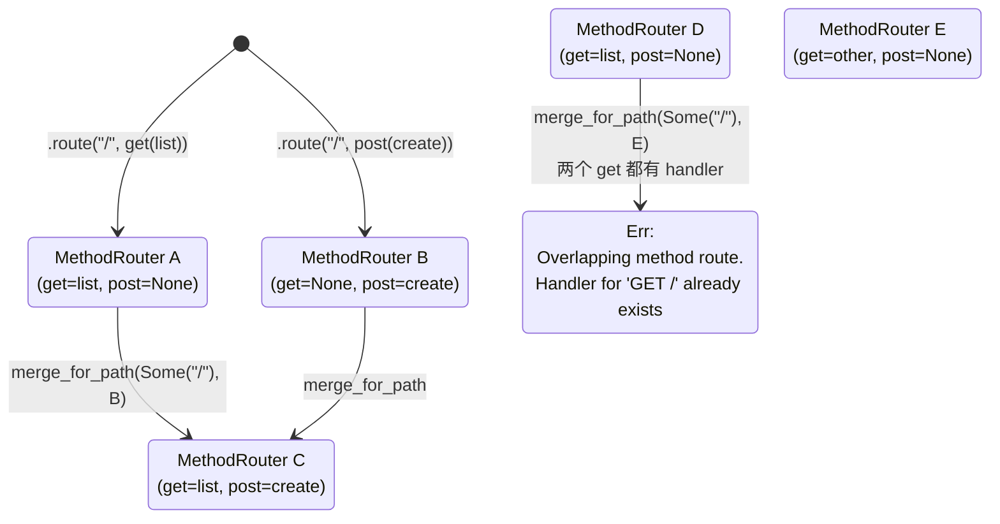
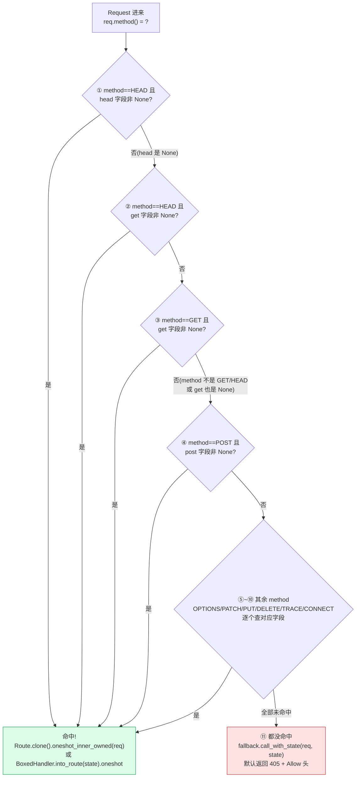

# 第 6 章 · MethodRouter:按 HTTP method 分发

> **核心问题**:同一个路径 `/users`,GET 该走 `list_users`、POST 该走 `create_user`、DELETE 该走 `delete_user`——axum 内部凭什么能把"同一个 path、不同 HTTP method"分发到三个毫不相干的 handler?你写 `.route("/users", get(list_users))`、再写 `.route("/users", post(create_user))`,第二次 `.route` 检测到路径 `/users` 已经注册过,它**没有 panic,也没有覆盖**,而是把两个 `MethodRouter` **合并**成一个——这套合并语义是怎么实现的、为什么要这么设计?还有,`MethodRouter` 内部到底怎么存这"按 method 分发"的映射——是 `HashMap<Method, Handler>` 吗(很多人的第一直觉)?最后,`fallback`(路径匹配但 method 不匹配时调)与 `method_not_allowed_fallback`(只对"已有路由的路径"的 method 不匹配生效)到底有什么区别,为什么 axum 要把它们分成两个 API?
>
> **读完本章你会明白**:
>
> 1. `MethodRouter` 内部**不是 `HashMap<Method, Handler>`,而是九个具名字段**(`get`/`head`/`delete`/`options`/`patch`/`post`/`put`/`trace`/`connect`,每个是 `MethodEndpoint<S, E>`),外加一个 `fallback` 和一个 `allow_header`——为什么用结构体具名字段而不是 HashMap,这个取舍换来什么(零分配、编译期固定 method 集合、`call_with_state` 里宏展开的线性匹配),又付出了什么代价;
> 2. `MethodFilter` 是个 **u16 位掩码(bitmask)**,九个标准 HTTP method 各占一位,`contains` 用按位 AND 判断、`or` 用按位 OR 组合——这个"把 method 集合压缩成一个 u16"的技巧,怎么让 `on(MethodFilter::GET.or(MethodFilter::POST), handler)` 这种"一个 handler 接多个 method"在一行位运算里完成判断;
> 3. **`.route("/", get(_)).route("/", post(_))` 的合并语义**:第二次 `route` 检测到 path 已注册(`path_to_route_id` 命中),走 `merge_for_path`,把两个 `MethodRouter` **逐字段配对合并**(GET 字段配 GET 字段、POST 字段配 POST 字段),同 method 都有 handler 时报 `Overlapping method route` 错——为什么这么设计(支持分多次 `.route` 同一路径不同 method,而不是覆盖或 panic),对照"覆盖"和"直接 panic"两种反面方案;
> 4. `fallback`(MethodRouter 自己的 method 不匹配兜底)与 `method_not_allowed_fallback`(Router 层 API,只作用于"有路由的路径")的区别,以及默认 fallback 就是返回 `405 Method Not Allowed`(并带 `Allow` 头)这件事是怎么写进源码的。
>
> **本章服务的二分法那一面**:**路由与分发**。上一章(P2-05)PathRouter 用 matchit 字典树把 URL 路径匹配到一个 `RouteId`,再用 `RouteId` 索引 `HashMap<RouteId, Endpoint>` 拿到一个 `Endpoint::MethodRouter`。这一章拆 MethodRouter 内部:拿到这个 MethodRouter 之后,它怎么按 `req.method()` 选出对应的 handler。这是"路由与分发"这一面在 method 维度的最后一块拼图。
>
> **逃生阀(读不下去怎么办)**:本章有三个互相缠绕的点(具名字段 vs HashMap 的取舍、merge 的合并语义、fallback 与 method_not_allowed_fallback 的区别)。如果一时绕不开,记住三句话就够——**① MethodRouter 用九个具名字段存"按 method 分发"的映射,不用 HashMap,因为 HTTP 标准方法集合是编译期固定的,具名字段零分配、线性匹配、不用 hash;② `.route("/", get(_)).route("/", post(_))` 第二次 route 走 merge,逐字段配对,同 method 都有 handler 才报错——这让"分多次注册同一路径不同 method"自然成立;③ `fallback` 是路径匹配但 method 不匹配时的兜底(默认返回 405),`method_not_allowed_fallback` 是 Router 层 API,专门改这个 405 兜底,且只作用于"已注册路径"**。带着这三句话跳到对应小节细读。本章处处承《hyper》(Service trait 一句带过)和《Tower》(Layer/poll_ready 一句带过),读过那两本收获翻倍,但不是硬性前提。

---

## 一句话点破

> **`MethodRouter` 是 axum 在"路径匹配之后"做的第二维分发:PathRouter 把 URL 匹配到一个 `RouteId`,索引拿到一个 `MethodRouter`;`MethodRouter` 再按 `req.method()` 选出对应的 handler。它内部不用 `HashMap<Method, Handler>`,而是九个具名 `MethodEndpoint` 字段(get/head/delete/options/patch/post/put/trace/connect),因为 HTTP 标准方法集合是编译期固定的九个——具名字段换来零分配、`call!` 宏展开的线性 if-else 匹配、HEAD 自动落到 GET 的优先级控制,代价是失去了"运行期动态加 method"的灵活性(但 Web 框架根本不需要这个灵活性)。`MethodFilter` 是个 u16 位掩码,九个 method 各占一位,`contains` 走按位 AND、`or` 走按位 OR,让"一个 handler 接多个 method"在一行位运算里判断完。`.route("/", get(_)).route("/", post(_))` 第二次 route 检测到 path 已注册,走 `merge_for_path`,把两个 MethodRouter 逐字段配对合并——同 method 都有 handler 才报 `Overlapping method route` 错,这让你可以分多次 `.route` 同一路径不同 method,而不必一次性写完。fallback 是 method 不匹配时的兜底(默认返回 `405 Method Not Allowed` + `Allow` 头),method_not_allowed_fallback 是 Router 层专门改这个 405 兜底的 API,且只作用于"已注册路径"。**

这是结论,不是理由。本章倒过来拆:MethodRouter 为什么不用 HashMap(第一节)、`MethodFilter` 位运算怎么用(第二节)、merge 合并语义怎么实现(第三节)、`call_with_state` 怎么按 method 选 handler(第四节)、fallback 与 method_not_allowed_fallback 的区别(第五节)。

---

## 第一节:从上一章的 RouteId 索引拿到 MethodRouter 说起

### 提问

上一章(P2-05)你看到 PathRouter 用 matchit 字典树匹配路径:`req.uri().path()` 进去,matchit 在基数树里走一遭,产出一个 `RouteId(u32)`。这个 `RouteId` 索引 `HashMap<RouteId, Endpoint>` 拿到一个 `Endpoint`。`Endpoint` 是个枚举(`mod.rs#L751-L755`):

```rust
// axum/src/routing/mod.rs#L751-L755(逐字摘录)
#[allow(clippy::large_enum_variant)]
enum Endpoint<S> {
    MethodRouter(MethodRouter<S>),
    Route(Route),
}
```

两种变体:

- `Endpoint::MethodRouter(MethodRouter<S>)`——你 `.route("/", get(handler))` 注册的路径走这个。一个路径对应一个 MethodRouter,MethodRouter 内部按 HTTP method 持有多个 handler。
- `Endpoint::Route(Route)`——你 `.route_service("/", service)` 注册的路径走这个(直接给一个 Service,不区分 method)。

绝大多数场景走第一种。`PathRouter::call_with_state`(`path_router.rs#L371`)拿到 `Endpoint::MethodRouter` 之后,调它的 `call_with_state(req, state)`——这就是进入 MethodRouter 的入口。

> **承接 P2-05**:PathRouter 的 matchit 匹配 + RouteId 索引这一层,P2-05 拆透了。本章只关心"拿到 MethodRouter 之后,它怎么按 method 分发"。PathRouter 怎么把请求和 state 传给 MethodRouter,一句带过指路 P2-05。

那 MethodRouter 内部到底怎么存"按 method 分发"的映射?很多人的第一直觉是 `HashMap<Method, Handler>`——method 当 key,handler 当 value,请求来了 `map.get(req.method())` 拿 handler。这个直觉错得有意思,因为它正好是 MethodRouter **没有**采用的设计。axum 选了一条更"Rust 化"的路。

### 不这样会怎样:HashMap<Method, Handler> 为什么不是首选

先认真想想"如果用 HashMap 会怎样"。假设 MethodRouter 这么定义(非 axum 实际做法):

```rust
// 假想的朴素做法(非 axum 实际做法)
pub struct MethodRouter<S> {
    routes: HashMap<Method, Route>,        // method → handler
    fallback: Route,                        // method 不匹配时的兜底
}
```

这个设计能用吗?能。它甚至更"通用"——你可以运行期 `routes.insert(Method::from_bytes(b"FOO").unwrap(), handler)` 注册一个非标准 method 的 handler,HashMap 不挑剔 key。可 axum 没这么选。来拆为什么。

**第一,HTTP 标准方法集合是编译期固定的九个**。HTTP/1.1(RFC 9110)定义了八个标准 method:GET、HEAD、POST、PUT、DELETE、CONNECT、OPTIONS、TRACE;HTTP/1.1 之后的 PATCH(RFC 5789)是第九个。这九个是 **Web 框架要支持的全部标准 method**。axum 的 `MethodFilter`(`method_filter.rs#L11-L45`)就只定义了这九个常量:

```rust
// axum/src/routing/method_filter.rs#L11-L45(逐字摘录,关键部分)
pub struct MethodFilter(u16);

impl MethodFilter {
    pub const CONNECT: Self = Self::from_bits(0b0_0000_0001);
    pub const DELETE:  Self = Self::from_bits(0b0_0000_0010);
    pub const GET:     Self = Self::from_bits(0b0_0000_0100);
    pub const HEAD:    Self = Self::from_bits(0b0_0000_1000);
    pub const OPTIONS: Self = Self::from_bits(0b0_0001_0000);
    pub const PATCH:   Self = Self::from_bits(0b0_0010_0000);
    pub const POST:    Self = Self::from_bits(0b0_0100_0000);
    pub const PUT:     Self = Self::from_bits(0b0_1000_0000);
    pub const TRACE:   Self = Self::from_bits(0b1_0000_0000);
    // ...
}
```

九个常量,九个位。既然 method 集合是编译期固定的九个,**为什么还要用 HashMap 这种运行期动态结构**?HashMap 的优势是"key 集合运行期可变",可 method 集合运行期不变——HashMap 的优势在这里用不上,劣势(堆分配、hash 开销、缓存不友好)却全占了。

**第二,HashMap 有 hash + 探测开销**。每次请求都要 `map.get(&req.method())`,这要算 `Method` 的 hash(对 `Method` 这个 short string,hash 不算贵但也不是零成本),然后在桶里探测比较。九个 method 用 HashMap,大材小用——九个固定分支,用 `match` 或一串 `if req.method() == Method::GET` 更直接,编译器甚至能优化成跳表或一串比较指令。

**第三,HEAD/GET 的优先级处理不优雅**。HTTP 语义里,如果你注册了 GET handler 但没注册 HEAD handler,HEAD 请求应该**落到 GET handler 上**(并去掉 body)——这是 RFC 9110 §9.3.2 的约定。用 HashMap,你要么在注册 GET 时手动往 HashMap 里塞一个 HEAD(语义混乱,用户明明只写了 `get(handler)`),要么在 `call` 时写 `map.get(HEAD).or_else(|| map.get(GET))`(运行期多一次查找)。用具名字段,这件事在 `call_with_state` 里写两行 `call!(req, HEAD, head); call!(req, HEAD, get);` 就解决了——HEAD 先查 head 字段、再查 get 字段,谁先命中谁处理。这个优先级控制,具名字段比 HashMap 自然得多(第四节详拆)。

**第四,`Allow` 头的生成更自然**。当 method 不匹配时,axum 返回 `405 Method Not Allowed` 并在响应头里带一个 `Allow: GET,POST` 告诉客户端"这个路径支持哪些 method"。用具名字段,哪些字段是 `Some` 就把对应的 method 名字拼进 `Allow`——这是 `on_endpoint` 在注册时增量维护 `allow_header` 字段干的活(`method_routing.rs#L822-L943`,`set_endpoint` 里调 `append_allow_header`)。用 HashMap,你得遍历整个 map 收集所有 key,运行期拼字符串,且顺序不稳定(HashMap 无序)。具名字段让你在**注册时**就知道"这个路径支持哪些 method",`Allow` 头的拼装是增量的、确定顺序的。

> **钉死这件事**:`MethodRouter` 不用 `HashMap<Method, Handler>`,是因为 HTTP 标准方法集合是编译期固定的九个,HashMap 的"运行期动态 key"优势用不上,而劣势(hash 开销、堆分配、HEAD/GET 优先级处理丑、Allow 头生成不自然)全占了。axum 用九个具名字段,换来零分配、线性匹配、HEAD/GET 优先级控制、增量 Allow 头生成。这是"用 Rust 类型系统精确刻画问题领域"的典型样本——问题领域(method 集合)是编译期固定的,数据结构就应该反映这个事实。

### 所以 axum 这么设计:九个具名 MethodEndpoint 字段

来看 `MethodRouter` 的真实定义(`axum/src/routing/method_routing.rs#L546-L559`):

```rust
// axum/src/routing/method_routing.rs#L546-L559(逐字摘录)
#[must_use]
pub struct MethodRouter<S = (), E = Infallible> {
    get: MethodEndpoint<S, E>,
    head: MethodEndpoint<S, E>,
    delete: MethodEndpoint<S, E>,
    options: MethodEndpoint<S, E>,
    patch: MethodEndpoint<S, E>,
    post: MethodEndpoint<S, E>,
    put: MethodEndpoint<S, E>,
    trace: MethodEndpoint<S, E>,
    connect: MethodEndpoint<S, E>,
    fallback: Fallback<S, E>,
    allow_header: AllowHeader,
}
```

九个具名 `MethodEndpoint<S, E>` 字段——`get`、`head`、`delete`、`options`、`patch`、`post`、`put`、`trace`、`connect`,正好对应九个标准 HTTP method。再加两个辅助字段:

- `fallback: Fallback<S, E>`——method 不匹配时的兜底(默认返回 `405 Method Not Allowed`,第五节详拆)。
- `allow_header: AllowHeader`——记录"这个路径支持哪些 method",用于生成 `Allow` 响应头。是个增量维护的字段,每次注册 handler 时往里 append method 名字(`on_endpoint` → `set_endpoint` → `append_allow_header`,见 `method_routing.rs#L1178-L1196`)。

`MethodEndpoint<S, E>` 本身是个枚举(`method_routing.rs#L1225-L1229`):

```rust
// axum/src/routing/method_routing.rs#L1225-L1229(逐字摘录)
enum MethodEndpoint<S, E> {
    None,
    Route(Route<E>),
    BoxedHandler(BoxedIntoRoute<S, E>),
}
```

三种状态:

- `None`——这个 method 没注册 handler(默认状态)。
- `Route(Route<E>)`——你用 `.get_service(svc)` / `.on_service(filter, svc)` 注册了一个 **Service**,axum 直接把它包成 `Route`(类型擦除的 `BoxCloneSyncService`,承 P1-03 一句带过)。
- `BoxedHandler(BoxedIntoRoute<S, E>)`——你用 `.get(handler)` / `.on(filter, handler)` 注册了一个 **handler fn**,但 state 还没注入,axum 把它擦除成 `BoxedIntoRoute<S, E>`(一个"等 state 注入时再变成 Route"的延迟对象)。等 `with_state(state)` 时,`BoxedHandler` 调 `handler.into_route(state)` 物化成 `Route`(`method_routing.rs#L1257-L1265` 的 `with_state`)。

> **钉死这件事**:`MethodEndpoint` 三态(`None`/`Route`/`BoxedHandler`)区分了"没注册"、"注册了 Service(state 已知)"、"注册了 handler fn(等 state 注入)"三种情况。`Route` 和 `BoxedHandler` 的区别,本质是"state 是否已经注入"——`Route` 是 state 已经烤进去的 Service,`BoxedHandler` 是"还缺 state,等 with_state 时再物化"。这一点承 P1-04(State 章)的"缺 state"模型,本章只关心 `call_with_state` 怎么处理这三态。

### 把 MethodRouter 的内部布局画出来

用 ASCII 框图画清楚九字段结构:

```
┌─────────────────────────────────────────────────────────────────┐
│  MethodRouter<S = (), E = Infallible>                            │
├─────────────────────────────────────────────────────────────────┤
│                                                                  │
│   get:      MethodEndpoint ──┐                                   │
│   head:     MethodEndpoint ──┤                                   │
│   delete:   MethodEndpoint ──┤   九个具名字段                    │
│   options:  MethodEndpoint ──┤   (编译期固定 method 集合)         │
│   patch:    MethodEndpoint ──┤   零 HashMap,零 hash              │
│   post:     MethodEndpoint ──┤                                   │
│   put:      MethodEndpoint ──┤                                   │
│   trace:    MethodEndpoint ──┤                                   │
│   connect:  MethodEndpoint ──┘                                   │
│                                                                  │
│   fallback:    Fallback<S, E>      ← method 不匹配时的兜底        │
│   allow_header: AllowHeader        ← 增量记录支持的 method         │
│                                                                  │
└─────────────────────────────────────────────────────────────────┘
            │
            ▼ 每个 MethodEndpoint 是三态枚举
┌─────────────────────────────────────────────────────────────────┐
│  enum MethodEndpoint<S, E> {                                     │
│    None,                              ← 该 method 没注册         │
│    Route(Route<E>),                   ← .get_service(svc)        │
│    BoxedHandler(BoxedIntoRoute<S,E>), ← .get(handler)(缺 state)  │
│  }                                                               │
└─────────────────────────────────────────────────────────────────┘
```

注意九个字段**没有用 `HashMap`、没有用 `Vec`、没有用任何运行期动态结构**——就是九个并排的字段。这意味着 `MethodRouter` 的大小在编译期就固定(九个 `MethodEndpoint` + 一个 `Fallback` + 一个 `AllowHeader`),clone 时就是一次性 memcpy,没有堆分配。

> **对照 actix-web / go net/http**:actix-web 的 `Resource` 内部用一个 `HashMap<Method, Box<dyn Handler>>` 存 method→handler,运行期动态——它选了 HashMap 这条路。Go 1.22 之前的 `ServeMux` **根本不支持 method 分发**,你要在 handler 里手写 `if r.Method == http.MethodGet { ... }`;Go 1.22+ 才支持 `"GET /path"` 这种 pattern,内部用了一个类似 `map[method]muxEntry` 的结构。axum 的具名字段设计,在这三者里是最"类型化"的——method 集合编码进类型系统,而不是留在运行期 map 里。代价是失去"运行期动态加 method"的灵活性,但 Web 框架根本不需要这个灵活性(标准 method 是固定的九个)。

---

## 第二节:MethodFilter——把 method 集合压进一个 u16

### 提问

九个具名字段解决了"按 method 分发"的存储问题。但还有一个相关的问题:axum 提供了 `.on(MethodFilter, handler)` / `.on_service(MethodFilter, svc)` 这种 API,让你注册一个 handler 同时接多个 method。比如:

```rust
use axum::{routing::{on, MethodFilter}, Router};

// 一个 handler 同时接 GET 和 HEAD
let app = Router::new().route("/", on(MethodFilter::GET.or(MethodFilter::HEAD), handler));
```

这里 `MethodFilter::GET.or(MethodFilter::HEAD)` 是什么?它怎么表示"GET 或 HEAD"?axum 内部怎么判断"一个请求的 method 是不是在这个 filter 里"?

这就是 `MethodFilter` 的职责——它把"一个 method 集合"压缩成一个 u16,让"判断 req.method() 在不在集合里"变成一行按位 AND。

### MethodFilter 的位掩码设计

来看 `MethodFilter` 的完整定义(`axum/src/routing/method_filter.rs#L7-L65`):

```rust
// axum/src/routing/method_filter.rs#L7-L65(逐字摘录,关键部分)
#[derive(Debug, Copy, Clone, PartialEq)]
pub struct MethodFilter(u16);

impl MethodFilter {
    pub const CONNECT: Self = Self::from_bits(0b0_0000_0001);
    pub const DELETE:  Self = Self::from_bits(0b0_0000_0010);
    pub const GET:     Self = Self::from_bits(0b0_0000_0100);
    pub const HEAD:    Self = Self::from_bits(0b0_0000_1000);
    pub const OPTIONS: Self = Self::from_bits(0b0_0001_0000);
    pub const PATCH:   Self = Self::from_bits(0b0_0010_0000);
    pub const POST:    Self = Self::from_bits(0b0_0100_0000);
    pub const PUT:     Self = Self::from_bits(0b0_1000_0000);
    pub const TRACE:   Self = Self::from_bits(0b1_0000_0000);

    const fn bits(&self) -> u16 { self.0 }

    const fn from_bits(bits: u16) -> Self { Self(bits) }

    pub(crate) const fn contains(&self, other: Self) -> bool {
        self.bits() & other.bits() == other.bits()
    }

    #[must_use]
    pub const fn or(self, other: Self) -> Self {
        Self(self.0 | other.0)
    }
}
```

九个常量,九个位,互不重叠。`MethodFilter` 就是一个 `u16` 的 newtype(用 `u16` 是为了留余量,九个 method 只用了低 9 位)。三个核心操作:

- **`from_bits(bits)`**:把 u16 包成 MethodFilter(构造)。
- **`contains(other)`**:判断 `self` 这个集合**是否包含** `other` 这个集合。按位 AND 后等于 `other`,说明 `other` 的所有位都在 `self` 里。这是"集合包含"的标准位运算实现。
- **`or(other)`**:两个集合求并集(按位 OR)。

举几个例子让位运算落地:

```
GET                                  = 0b0_0000_0100  (0x004)
HEAD                                 = 0b0_0000_1000  (0x008)
GET.or(HEAD)                         = 0b0_0000_1100  (0x00C)
POST                                 = 0b0_0100_0000  (0x040)
GET.or(HEAD).or(POST)                = 0b0_0100_1100  (0x04C)

(全九个 method)                      = 0b1_1111_1111  (0x1FF)

判断 GET.or(HEAD).contains(GET):
  0b0_0000_1100 & 0b0_0000_0100 == 0b0_0000_0100  ✓  (GET 位被包含)
判断 GET.or(HEAD).contains(POST):
  0b0_0000_1100 & 0b0_0100_0000 == 0b0_0000_0000  ✗  (POST 位为 0,不等)
```

一个 u16、一次按位 AND + 一次比较,就完成了"method 在不在集合里"的判断。零分配、零 hash、单条指令。

### MethodFilter 在 `on_endpoint` 里怎么用

`MethodFilter` 的真正用武之地在 `MethodRouter::on_endpoint`(`method_routing.rs#L822-L943`)。这是 `.on(filter, handler)` / `.on_service(filter, svc)` / 所有 `.get()`/`.post()`/... 链式方法的共同底层。来看它的核心逻辑(`set_endpoint` 内部函数,`method_routing.rs#L825-L850`):

```rust
// axum/src/routing/method_routing.rs#L825-L850(逐字摘录,关键部分)
#[track_caller]
fn set_endpoint<S, E>(
    method_name: &str,
    out: &mut MethodEndpoint<S, E>,
    endpoint: &MethodEndpoint<S, E>,
    endpoint_filter: MethodFilter,   // ← 你传进来的 filter(可能是 GET.or(HEAD))
    filter: MethodFilter,            // ← 当前字段的固定 filter(比如 MethodFilter::GET)
    allow_header: &mut AllowHeader,
    methods: &[&'static str],
) where
    MethodEndpoint<S, E>: Clone,
    S: Clone,
{
    if endpoint_filter.contains(filter) {  // ← 位运算判断!
        if out.is_some() {
            panic!(
                "Overlapping method route. Cannot add two method routes that both handle \
                 `{method_name}`",
            )
        }
        *out = endpoint.clone();
        for method in methods {
            append_allow_header(allow_header, method);
        }
    }
}
```

`on_endpoint` 对九个字段**每个都调一次 `set_endpoint`**,传入"当前字段的固定 filter"(比如 GET 字段传 `MethodFilter::GET`,`method_routing.rs#L852-L860`):

```rust
// axum/src/routing/method_routing.rs#L852-L860(逐字摘录,第一段)
set_endpoint(
    "GET",
    &mut self.get,
    &endpoint,
    filter,                  // ← 你传的 filter
    MethodFilter::GET,       // ← GET 字段的固定 filter
    &mut self.allow_header,
    &["GET", "HEAD"],        // ← 注册 GET 时,Allow 头要包含 GET 和 HEAD
);
```

注意三件事:

1. **`endpoint_filter.contains(filter)`**:你传的 filter(比如 `GET.or(HEAD)`)用 `contains` 判断"是否包含当前字段的固定 filter"。如果包含,说明这个 handler 要处理当前字段对应的 method——把它塞进当前字段。
2. **HEAD 跟 GET 绑定**:注册 GET handler 时,`methods` 参数是 `&["GET", "HEAD"]`——这意味着 Allow 头会同时包含 GET 和 HEAD(因为 HEAD 默认落到 GET,见第四节)。这是 RFC 9110 §9.3.2 语义的体现。
3. **重叠 panic**:如果当前字段已经有 handler(`out.is_some()`),再注册就 panic——"Overlapping method route"。这是 `get(handler).get(handler)` 会 panic 的原因(`method_routing.rs#L1563-L1568` 的测试 `handler_overlaps` 验证)。

用一个具体例子串起来。你写 `.on(MethodFilter::GET.or(MethodFilter::POST), handler)`:

```
你传的 filter = GET.or(POST) = 0b0_0100_0100

on_endpoint 对九个字段各调一次 set_endpoint:

  字段 get     固定 filter=GET    =0b0_0000_0100  contains? 0b0_0100_0100 & 0b0_0000_0100 == 0b0_0000_0100 ✓ → 塞 handler,Allow 加 "GET,HEAD"
  字段 head    固定 filter=HEAD   =0b0_0000_1000  contains? 0b0_0100_0100 & 0b0_0000_1000 == 0b0_0000_0000 ✗ → 跳过
  字段 post    固定 filter=POST   =0b0_0100_0000  contains? 0b0_0100_0100 & 0b0_0100_0000 == 0b0_0100_0000 ✓ → 塞 handler,Allow 加 "POST"
  字段 put     固定 filter=PUT    ...             contains? ✗ → 跳过
  ... (其余字段都跳过)

结果: get 字段和 post 字段都塞了同一个 handler,Allow 头 = "GET,HEAD,POST"
```

一次 `.on(GET.or(POST), handler)` 调用,内部对九个字段做九次按位 AND 判断,两个字段命中就塞 handler。整个判断是九条位运算指令,零分配。

> **钉死这件事**:`MethodFilter` 是个 u16 位掩码,九个标准 method 各占一位。`contains` 用按位 AND 判断集合包含,`or` 用按位 OR 求并集。`on_endpoint` 对九个字段各调一次 `set_endpoint`,每次做一次按位 AND 判断"你传的 filter 是否包含当前字段的 method"——包含就塞 handler。这让 `.on(GET.or(POST), handler)` 这种"一个 handler 接多个 method"在一行位运算里完成分发判断。代价是 `MethodFilter` 只能表示标准九个 method 的组合,不能表示自定义 method(`Method::from_bytes(b"FOO")` 走 `TryFrom<Method>` 会报 `NoMatchingMethodFilter`,`method_filter.rs#L88-L105`)——但 Web 框架根本不需要支持自定义 method。

### 反面对比:如果用 `Vec<Method>` 或 `HashSet<Method>`

假设 `MethodFilter` 不用位掩码,而是用 `Vec<Method>` 或 `HashSet<Method>`:

```rust
// 假想的朴素做法(非 axum 实际做法)
pub struct MethodFilter(Vec<Method>);  // 或 HashSet<Method>

impl MethodFilter {
    fn contains(&self, m: &Method) -> bool {
        self.0.iter().any(|x| x == m)   // 线性扫描,或 HashSet 的 hash
    }
    fn or(self, other: Self) -> Self {
        let mut v = self.0;
        v.extend(other.0);
        MethodFilter(v)                  // 堆分配 + 可能去重
    }
}
```

代价:

1. **堆分配**:`Vec<Method>` 或 `HashSet<Method>` 都要在堆上分配。每次 `.on(filter.or(other), handler)` 都可能触发堆分配。位掩码是 `u16`,栈上,零分配。
2. **`contains` 慢**:`Vec` 线性扫描(最坏九次比较),`HashSet` 要 hash(对 short string 不便宜)。位掩码一次按位 AND + 一次比较,单条指令。
3. **`or` 慢且分配**:`Vec` 要 extend + 去重,`HashSet` 要 union,都堆分配。位掩码一次按位 OR。
4. **`const` 不可用**:`Vec`/`HashSet` 不能在 `const` 上下文构造,所以 `MethodFilter::GET` 这种常量定义不出来。位掩码是 `const fn from_bits`,九个常量都是 `const`,可以在 `const` 上下文用。

位掩码的代价是**只能表示固定集合**(九个 method 占九位,第 10 个 method 没位可用)——但标准 HTTP method 就是这九个,这个限制不是问题。这是"用数据结构的精度匹配问题领域"的典型样本:问题领域(标准 method 集合)是固定九个,数据结构就用九位的 bitmask,刚好。

> **对照 go net/http**:Go 的 `http.Method` 是字符串常量(`http.MethodGet = "GET"`),没有位掩码抽象。Go 1.22 的 `"GET /path"` pattern 内部把 method 当字符串 key 存,匹配是字符串比较。axum 的位掩码比字符串比较快得多(一条 AND vs 一次 memcmp),代价是失去"任意 method 字符串"的灵活性。对 Web 框架来说,这个取舍是值的。

---

## 第三节:merge_for_path——`.route("/", get(_)).route("/", post(_))` 怎么合并

### 提问

现在你知道 MethodRouter 内部是九个具名字段。可还有一个关键问题:你写这样的代码——

```rust
let app = Router::new()
    .route("/", get(list_users))     // 第一次注册 path "/",get 字段塞 list_users
    .route("/", post(create_user));  // 第二次注册 path "/",post 字段塞 create_user
```

第二次 `.route("/", post(create_user))` 检测到 path "/" 已经注册过(第一次已经塞了一个 MethodRouter)。axum 这里**既不 panic,也不覆盖**,而是把两个 MethodRouter **合并**成一个:第一个的 get 字段(list_users)+ 第二个的 post 字段(create_user),合成一个 get=list_users、post=create_user 的 MethodRouter。

这套合并语义怎么实现?为什么要"合并"而不是"覆盖"或"报错"?

### 不这样会怎样:覆盖或报错

先认真想想"如果不合并,会怎样"。

**方案 A:第二次覆盖第一次**。`.route("/", get(a)).route("/", post(b))` 第二次直接把第一次的 MethodRouter 整个扔掉,只保留 post(b)。结果:GET "/" 没有 handler(用户明明写了 `get(a)`!)。这是**静默丢路由**,极其危险的 bug——用户写了 `get(a)`,运行期 GET "/" 却 404。axum 绝不能选这条。

**方案 B:第二次直接 panic**。"path 已注册过,不能重复"。这条能让用户意识到"你重复注册了",但代价是**逼用户一次性写完一个 path 的所有 method**:

```rust
// 方案 B 下,你必须这么写(不能拆成两次 .route)
let app = Router::new().route("/", get(list_users).post(create_user).delete(delete_user));
```

这看起来不算糟,但有个真实痛点:**跨模块组装路由**。你在 `users.rs` 里写了 `get(list_users).post(create_user)`,在 `admin.rs` 里想给同一个 path 加一个 `delete` handler。如果两个模块各自 build 一个 MethodRouter,最后要合并到同一个 path 下——方案 B 下你没法拆开写,必须把所有 method 集中在一处。这违背了"模块化组装路由"的工程需求。

axum 的实际场景就有这种需求:

```rust
// users.rs
pub fn router() -> Router<AppState> {
    Router::new().route("/users", get(list).post(create))
}

// admin.rs
pub fn router() -> Router<AppState> {
    Router::new().route("/users", delete(admin_delete))  // 同 path,不同 method
}

// main.rs
let app = Router::new()
    .merge(users::router())
    .merge(admin::router());  // 两个 router 的 "/users" 要合并
```

`Router::merge` 内部对每个 path 调 `MethodRouter::merge_for_path`,把两个 MethodRouter 合并。如果不支持合并,这种"分模块组装"根本做不了。

**方案 C(axum 的选择):逐字段配对合并,同 method 都有 handler 才报错**。`merge_for_path` 把两个 MethodRouter 的九个字段**逐个配对**:

- 两个的 get 字段都 None → 合并后 get 字段 None。
- 一个 get 字段有 handler、另一个 None → 合并后 get 字段是那个 handler。
- 两个 get 字段都有 handler → **报错**(Overlapping method route)。

这套语义既允许"分多次注册不同 method",又防止"同 method 重复注册"的静默覆盖。

> **钉死这件事**:`.route("/", get(_)).route("/", post(_))` 第二次走 `merge_for_path`,而不是覆盖或 panic。这套合并语义是为了支持"分多次、分模块注册同一路径的不同 method"——这是工程上常见的路由组装模式(跨模块、跨文件)。代价是合并逻辑本身要正确(逐字段配对),且同 method 重复注册要报错(防止静默覆盖)。

### 所以 axum 这么设计:`merge_for_path` 逐字段配对

来看 `merge_for_path` 的真实实现(`axum/src/routing/method_routing.rs#L1037-L1087`):

```rust
// axum/src/routing/method_routing.rs#L1037-L1087(逐字摘录)
pub(crate) fn merge_for_path(
    mut self,
    path: Option<&str>,
    other: MethodRouter<S, E>,
) -> Result<Self, Cow<'static, str>> {
    // written using inner functions to generate less IR
    fn merge_inner<S, E>(
        path: Option<&str>,
        name: &str,
        first: MethodEndpoint<S, E>,
        second: MethodEndpoint<S, E>,
    ) -> Result<MethodEndpoint<S, E>, Cow<'static, str>> {
        match (first, second) {
            (MethodEndpoint::None, MethodEndpoint::None) => Ok(MethodEndpoint::None),
            (pick, MethodEndpoint::None) | (MethodEndpoint::None, pick) => Ok(pick),
            _ => {
                // 两个都有 handler,报错
                if let Some(path) = path {
                    Err(format!(
                        "Overlapping method route. Handler for `{name} {path}` already exists"
                    )
                    .into())
                } else {
                    Err(format!(
                        "Overlapping method route. Cannot merge two method routes that both \
                         define `{name}`"
                    )
                    .into())
                }
            }
        }
    }

    self.get     = merge_inner(path, "GET",     self.get,     other.get)?;
    self.head    = merge_inner(path, "HEAD",    self.head,    other.head)?;
    self.delete  = merge_inner(path, "DELETE",  self.delete,  other.delete)?;
    self.options = merge_inner(path, "OPTIONS", self.options, other.options)?;
    self.patch   = merge_inner(path, "PATCH",   self.patch,   other.patch)?;
    self.post    = merge_inner(path, "POST",    self.post,    other.post)?;
    self.put     = merge_inner(path, "PUT",     self.put,     other.put)?;
    self.trace   = merge_inner(path, "TRACE",   self.trace,   other.trace)?;
    self.connect = merge_inner(path, "CONNECT", self.connect, other.connect)?;

    self.fallback = self
        .fallback
        .merge(other.fallback)
        .ok_or("Cannot merge two `MethodRouter`s that both have a fallback")?;

    self.allow_header = self.allow_header.merge(other.allow_header);

    Ok(self)
}
```

核心逻辑全在 `merge_inner`(`method_routing.rs#L1043-L1067`):

```rust
match (first, second) {
    (None, None)           => Ok(None),                  // 都空,合并后空
    (pick, None) | (None, pick) => Ok(pick),              // 一空一有,取有的那个
    _ => Err("Overlapping method route ...".into())       // 都有,报错
}
```

三种情况,清晰对应"逐字段配对"的语义。注意:

1. **逐字段独立合并**:九个字段各自调 `merge_inner`,互不影响。GET 字段的合并结果不影响 POST 字段。
2. **同 method 重复报错**:两个 MethodRouter 的同名字段都有 handler,`merge_inner` 走 `_ =>` 分支报错。错误信息区分两种:
   - 有 path 信息(`path: Some("/users")`):`Overlapping method route. Handler for 'GET /users' already exists`——精确告诉你哪个 path 的哪个 method 冲突了。这是 `.route` 注册时的报错。
   - 无 path 信息(`path: None`):`Overlapping method route. Cannot merge two method routes that both define 'GET'`——这是 `MethodRouter::merge`(`method_routing.rs#L1091-L1097`,直接合并两个 MethodRouter,不关联 path)的报错。
3. **fallback 也要合并**:两个 MethodRouter 都有自定义 fallback 时,`fallback.merge` 返回 `None`(`mod.rs#L690-L696` 的 `Fallback::merge`,两个非 Default 的 fallback 合并返回 None),报错 `Cannot merge two MethodRouters that both have a fallback`。这是因为 fallback 只能有一个,两个都要保留没法合并。
4. **allow_header 也要合并**:`AllowHeader::merge`(`method_routing.rs#L571-L585`)把两个的 Allow 头字节流拼起来(用逗号连接),保证合并后 Allow 头反映两个 MethodRouter 支持的所有 method。特殊情况:任一是 `Skip`(`any`/`any_service` 用),合并后是 Skip;都 None 合并后 None;都有 Bytes 合并成 `a,b`。

### merge_for_path 在哪里被调用

`merge_for_path` 有两个调用点:

1. **`PathRouter::route`**(`path_router.rs#L83-L114`):你调 `.route("/", get(handler))` 时,PathRouter 检测到 path "/" 已经注册过一个 MethodRouter,就把新的 MethodRouter 和旧的合并。来看核心代码(`path_router.rs#L90-L107`):

   ```rust
   // axum/src/routing/path_router.rs#L90-L107(逐字摘录,关键部分)
   let endpoint = if let Some((route_id, Endpoint::MethodRouter(prev_method_router))) = self
       .node
       .path_to_route_id
       .get(path)                                    // ← 检查 path 是否已注册
       .and_then(|route_id| self.routes.get(route_id).map(|svc| (*route_id, svc)))
   {
       // if we're adding a new `MethodRouter` to a route that already has one just
       // merge them. This makes `.route("/", get(_)).route("/", post(_))` work
       let service = Endpoint::MethodRouter(
           prev_method_router
               .clone()
               .merge_for_path(Some(path), method_router)?,  // ← 合并!
       );
       self.routes.insert(route_id, service);
       return Ok(());
   } else {
       Endpoint::MethodRouter(method_router)         // ← path 新的,直接插入
   };
   ```

   注意注释:"if we're adding a new MethodRouter to a route that already has one just merge them. This makes `.route("/", get(_)).route("/", post(_))` work"——**源码注释自己点破了这套合并语义的设计意图**。检测路径是 `path_to_route_id.get(path)`(P2-05 详拆的双向映射 HashMap),命中且旧 endpoint 是 MethodRouter,就走 merge。

2. **`MethodRouter::merge`**(`method_routing.rs#L1089-L1097`):这是公开 API,你手动调 `get(a).merge(post(b))`,内部调 `merge_for_path(None, other)`——`None` 表示不关联 path(错误信息用"Cannot merge two method routes"而非"Handler for 'GET /path' already exists")。`Router::merge`(`mod.rs`)在合并两个 Router 时,对每个 path 调 `PathRouter::route`,后者再调 `merge_for_path`——所以 `Router::merge` 的合并最终也是走 `merge_for_path`。

### 用状态图把 merge 的语义画清楚



状态图里两条路径:正常的逐字段配对合并(A+B→C),和同 method 冲突报错(D+E→Err)。这是 `merge_for_path` 的全部语义。

### 反面对比:如果"覆盖"或"直接 panic"

把三种方案放一起对照,axum 的取舍就清晰了:

| 方案 | `.route("/", get(a)).route("/", post(b))` | `.route("/", get(a)).route("/", get(b))` | 评价 |
|------|------------------------------------------|------------------------------------------|------|
| **覆盖(方案 A)** | 结果只有 post(b),GET 丢 handler | 结果只有 get(b),覆盖了 a | 静默丢路由,危险 |
| **直接 panic(方案 B)** | 第二次 .route 直接 panic | 第二次 .route 直接 panic | 逼用户一次性写完,不支持跨模块组装 |
| **逐字段合并(方案 C,axum)** | 合并成 get=a, post=b ✓ | 同 method 重复,报 Overlapping 错 | 既支持分次注册,又防静默覆盖 |

方案 C 是唯一既"用户友好"又"安全"的方案。它让你可以分多次、分模块注册同一路径的不同 method,同时防止"同 method 重复注册"的静默覆盖(改成显式报错)。这是 axum 在"灵活性"和"安全性"之间的精准平衡。

> **钉死这件事**:`merge_for_path` 的逐字段配对合并,是 axum 支持"分多次、分模块注册同一路径不同 method"的核心机制。它让 `.route("/", get(_)).route("/", post(_))` 自然成立(合并成 get+post),又让 `.route("/", get(a)).route("/", get(b))` 显式报错(防静默覆盖)。这套语义在源码注释里被明确写出("This makes `.route("/", get(_)).route("/", post(_))` work"),是设计意图的直接体现。

---

## 第四节:call_with_state——按 req.method() 选 handler 的线性匹配

### 提问

前面三节拆了 MethodRouter 的存储(`MethodFilter` 位掩码 + 九具名字段)和组装(`on_endpoint` 注册 + `merge_for_path` 合并)。现在来到最关键的一步:请求来了,`call_with_state` 怎么按 `req.method()` 选出对应的 handler?

这一步是 MethodRouter 作为 Service 的核心职责——它决定了"GET /users" 走 list_users、"POST /users" 走 create_user 的运行期行为。

### call_with_state 的真实实现

来看 `MethodRouter::call_with_state` 的完整实现(`axum/src/routing/method_routing.rs#L1120-L1175`):

```rust
// axum/src/routing/method_routing.rs#L1120-L1175(逐字摘录)
pub(crate) fn call_with_state(&self, req: Request, state: S) -> RouteFuture<E> {
    macro_rules! call {
        (
            $req:expr,
            $method_variant:ident,
            $svc:expr
        ) => {
            if *req.method() == Method::$method_variant {
                match $svc {
                    MethodEndpoint::None => {}                          // 没注册,继续往下试
                    MethodEndpoint::Route(route) => {
                        return route.clone().oneshot_inner_owned($req);  // 命中,返回
                    }
                    MethodEndpoint::BoxedHandler(handler) => {
                        let route = handler.clone().into_route(state);   // 注入 state 物化成 Route
                        return route.oneshot_inner_owned($req);          // 命中,返回
                    }
                }
            }
        };
    }

    // written with a pattern match like this to ensure we call all routes
    let Self {
        get,
        head,
        delete,
        options,
        patch,
        post,
        put,
        trace,
        connect,
        fallback,
        allow_header,
    } = self;

    call!(req, HEAD, head);       // ① HEAD 先查 head 字段
    call!(req, HEAD, get);        // ② HEAD 再查 get 字段(HEAD 落到 GET!)
    call!(req, GET, get);         // ③ GET 查 get 字段
    call!(req, POST, post);       // ④ POST 查 post 字段
    call!(req, OPTIONS, options); // ⑤ OPTIONS 查 options 字段
    call!(req, PATCH, patch);     // ⑥ PATCH 查 patch 字段
    call!(req, PUT, put);         // ⑦ PUT 查 put 字段
    call!(req, DELETE, delete);   // ⑧ DELETE 查 delete 字段
    call!(req, TRACE, trace);     // ⑨ TRACE 查 trace 字段
    call!(req, CONNECT, connect); // ⑩ CONNECT 查 connect 字段

    let future = fallback.clone().call_with_state(req, state);  // ⑪ 都没命中,走 fallback

    match allow_header {
        AllowHeader::None => future.allow_header(Bytes::new()),
        AllowHeader::Skip => future,
        AllowHeader::Bytes(allow_header) => future.allow_header(allow_header.clone().freeze()),
    }
}
```

逐段拆:

**`call!` 宏(L1121-L1140)**:这是核心匹配逻辑。它接受三个参数——请求、要匹配的 `Method` 变体(如 `HEAD`)、对应的字段(如 `head`)。宏展开成:

```rust
if *req.method() == Method::HEAD {
    match head {
        MethodEndpoint::None => {}                        // 这个字段没注册,啥也不做(继续下一个 call!)
        MethodEndpoint::Route(route) => {
            return route.clone().oneshot_inner_owned(req);  // 命中!clone Route,oneshot
        }
        MethodEndpoint::BoxedHandler(handler) => {
            let route = handler.clone().into_route(state);  // 注入 state 物化 Route
            return route.oneshot_inner_owned(req);           // 命中!oneshot
        }
    }
}
```

注意三个细节:

1. **`req.method() == Method::$method_variant`**:用 `==` 直接比较 `Method`(Method 实现了 `PartialEq`)。这是 O(1) 的比较(短字符串或 enum-like),不是 hash。
2. **`MethodEndpoint::None => {}`**:字段没注册 handler 时,**不 return,继续下一个 `call!`**。这是关键——它让"HEAD 请求先查 head 字段、head 是 None 时落到 get 字段"成为可能(见下文 HEAD/GET 优先级)。
3. **`Route` vs `BoxedHandler` 的处理差异**:`Route` 是 state 已注入的 Service,直接 clone + oneshot;`BoxedHandler` 是"缺 state 的 handler",要先 `into_route(state)` 物化成 Route(同时注入 state),再 oneshot。注意 `BoxedHandler` 路径在**每次请求时**都要 `into_route(state)`——这看起来浪费,但 `with_state` 之后 `BoxedHandler` 已经全部物化成 `Route`(`method_routing.rs#L1257-L1265`),所以生产环境(走 `Router<()>` 的 Service::call)里 `call_with_state` 拿到的 self 里所有字段都是 `Route` 或 `None`,`BoxedHandler` 分支只在 `with_state` 之前(比如 nest 子路由的中间状态)才会走到。

**十次 `call!` 调用(L1157-L1166)**:这是按**特定顺序**对九个字段做匹配。顺序非常讲究:

```
call!(req, HEAD, head);       ①  HEAD 先查 head 字段
call!(req, HEAD, get);        ②  HEAD 再查 get 字段(关键!HEAD 落到 GET)
call!(req, GET, get);         ③  GET 查 get 字段
call!(req, POST, post);       ④  POST
call!(req, OPTIONS, options); ⑤  OPTIONS
call!(req, PATCH, patch);     ⑥  PATCH
call!(req, PUT, put);         ⑦  PUT
call!(req, DELETE, delete);   ⑧  DELETE
call!(req, TRACE, trace);     ⑨  TRACE
call!(req, CONNECT, connect); ⑩  CONNECT
```

**为什么 HEAD 出现两次(① 和 ②),且 ① 在 ② 前?** 这是 RFC 9110 §9.3.2 语义的实现:HEAD 请求应该和 GET 一样的响应(只是不带 body)。如果你注册了 GET handler 但没注册 HEAD handler,HEAD 请求应该**落到 GET handler 上**(由 hyper/框架负责去掉 body)。

- `call!(req, HEAD, head)` ——如果 `head` 字段有 handler(用户显式写了 `.head(handler)`),HEAD 请求优先走它。
- `call!(req, HEAD, get)` ——如果 `head` 字段是 None(用户没写 `.head(...)`),但 `get` 字段有 handler(用户写了 `.get(...)`),HEAD 请求落到 GET handler 上。

这个优先级控制,用 HashMap 做不到这么自然(HashMap 你得 `map.get(HEAD).or_else(|| map.get(GET))`,运行期两次查找),用具名字段就是两次 `call!` 宏展开——清晰、零开销。注释 L1142 写"written with a pattern match like this to ensure we call all routes",强调这个顺序是精心设计的。

**为什么 GET 在 POST 之前(③ 在 ④ 前)?** 因为 GET 是最高频的 method,放前面能让 GET 请求尽快 return(不用走完十次比较)。这是微优化,但在高频路径上累积效果可观。

**fallback 兜底(L1168)**:如果十次 `call!` 都没命中(请求的 method 没有对应字段,或对应字段是 None 且不是 HEAD 落 GET 的情况),走到 fallback:

```rust
let future = fallback.clone().call_with_state(req, state);
```

`fallback` 是 `Fallback<S, E>`(`mod.rs#L680-L729`),三态:`Default`(默认 405)、`Service`(用户用 `fallback_service` 设的)、`BoxedHandler`(用户用 `fallback` 设的 handler)。`call_with_state` 的实现(`mod.rs#L720-L728`):

```rust
// axum/src/routing/mod.rs#L720-L728(逐字摘录)
fn call_with_state(self, req: Request, state: S) -> RouteFuture<E> {
    match self {
        Fallback::Default(route) | Fallback::Service(route) => route.oneshot_inner_owned(req),
        Fallback::BoxedHandler(handler) => {
            let route = handler.clone().into_route(state);
            route.oneshot_inner_owned(req)
        }
    }
}
```

默认 fallback 是 `MethodRouter::new()` 里塞的 `Route::new(service_fn(|_: Request| async { Ok(StatusCode::METHOD_NOT_ALLOWED) }))`(`method_routing.rs#L752-L755`)——返回 `405 Method Not Allowed`。所以**method 不匹配时的默认行为就是 405**。

**Allow 头拼装(L1170-L1174)**:fallback 之后,根据 `allow_header` 字段的值给 future 加 Allow 头:

```rust
match allow_header {
    AllowHeader::None => future.allow_header(Bytes::new()),         // 空 Allow
    AllowHeader::Skip => future,                                     // 不设 Allow(any/any_service 用)
    AllowHeader::Bytes(allow_header) => future.allow_header(allow_header.clone().freeze()),  // 拼好的 Allow
}
```

`RouteFuture::allow_header`(`route.rs#L132-L135`)把这个 Bytes 存进 future,最终在响应里设成 `Allow` 头。这就是为什么 method 不匹配时响应里有 `Allow: GET,POST`——它在注册 handler 时就被增量维护进 `allow_header` 字段了(`on_endpoint` → `set_endpoint` → `append_allow_header`)。

### 用流程图把 call_with_state 的匹配画清楚



注意流程图里两条 HEAD 路径:HEAD 先查 head 字段(用户显式注册的 HEAD handler),没命中再查 get 字段(HEAD 落到 GET)。这是 RFC 9110 语义的精确实现。

> **钉死这件事**:`call_with_state` 用 `call!` 宏对九个字段做**线性匹配**,顺序精心设计:HEAD 先查 head 再查 get(HEAD 落 GET)、GET 第三、其余按 POST/OPTIONS/PATCH/PUT/DELETE/TRACE/CONNECT 顺序。每个字段命中就走 handler,没命中(字段是 None)继续下一个。全没命中走 fallback(默认 405 + Allow 头)。这套线性匹配用 HashMap 做不到这么自然(HEAD/GET 优先级、增量 Allow 头),用具名字段 + 宏展开就是十次 `if req.method() == ...` 比较,清晰且零开销。

### 反面对比:HashMap 的 get + or_else

假设用 HashMap,`call_with_state` 大概长这样:

```rust
// 假想的 HashMap 版本(非 axum 实际做法)
fn call_with_state(&self, req: Request, state: S) -> RouteFuture {
    // HEAD 优先 head,然后落 GET
    let endpoint = match req.method() {
        Method::HEAD => self.map.get(&Method::HEAD).or_else(|| self.map.get(&Method::GET)),
        m => self.map.get(m),
    };
    match endpoint {
        Some(route) => route.clone().oneshot_inner_owned(req),
        None => {
            // fallback
            let future = self.fallback.clone().call_with_state(req, state);
            // Allow 头要从 map 的所有 key 拼装...运行期遍历
            let allow = self.map.keys().map(|m| m.as_str()).collect::<Vec<_>>().join(",");
            future.allow_header(allow.into())
        }
    }
}
```

这能用,但有几个明显劣化:

1. **HEAD/GET 优先级要手写 `or_else`**:HashMap 不天然支持"HEAD 找不到就找 GET",要手写。而具名字段是两次 `call!`,宏展开自然处理。
2. **Allow 头运行期拼装**:HashMap 的 keys 无序,你要 `collect + sort + join`,运行期分配字符串。具名字段在注册时增量维护 `allow_header`(`on_endpoint` 时 append),`call_with_state` 只是读出来用——零运行期拼装。
3. **hash + 探测开销**:`map.get(&Method::HEAD)` 要 hash HEAD 字符串 + 桶探测,虽然不贵但也不是零。具名字段是 `req.method() == Method::HEAD` 一次比较,编译器可能优化成单条指令。

这些劣化单独看都小,累积起来在"每请求都要走一遍"的高频路径上就显著。axum 选具名字段,是把这些小开销全消除的精准取舍。

---

## 第五节:fallback 与 method_not_allowed_fallback——两个容易混淆的兜底

### 提问

MethodRouter 的 `fallback` 字段(默认返回 405)你已经见过了。可 axum 的 Router 层还提供了两个公开 API:`Router::fallback(handler)` 和 `Router::method_not_allowed_fallback(handler)`。它俩都跟"未匹配"有关,容易混淆。它们到底有什么区别?为什么 axum 要分成两个 API?

这一节把这两个 API 的边界钉死。

### 两种"未匹配"场景

Web 框架面对的"未匹配"有两类,**发生的位置不同**:

1. **路径不匹配**(path 不在路由表里):比如请求 `GET /hello`,但路由表里只有 `/users`。这种情况请求根本没匹配到任何 MethodRouter——它在 PathRouter 的 matchit 树里就走不到头。
2. **方法不匹配**(path 匹配,但 method 没注册):比如请求 `DELETE /users`,路由表里 `/users` 只有 GET handler。这种情况请求**匹配到了 MethodRouter**(path 命中),但 MethodRouter 的 delete 字段是 None——它在 `call_with_state` 里十次 `call!` 都没命中,落到 fallback。

这两种场景的兜底,**默认行为不同**:

- **路径不匹配**:默认返回 `404 Not Found`(由 Router 层的 `catch_all_fallback` 处理,P2-08 详拆)。
- **方法不匹配**:默认返回 `405 Method Not Allowed` + `Allow` 头(由 MethodRouter 的 `fallback` 字段处理,见第四节)。

axum 用**两个不同的 API**让你分别定制这两个兜底:

- **`Router::fallback(handler)`**:定制**路径不匹配**的兜底(404 那个)。它注册到 `fallback_router`,对**任何未匹配到 path 的请求**生效(包括 method 不匹配但路径也不匹配的情况——因为路径不匹配优先)。
- **`Router::method_not_allowed_fallback(handler)`**:定制**方法不匹配**的兜底(405 那个)。它**只对"路径匹配但 method 不匹配"**生效——也就是说,请求必须先匹配到某个已注册的 path,只是 method 没注册,才走这个兜底。

### Router::method_not_allowed_fallback 的真实实现

来看 `Router::method_not_allowed_fallback`(`axum/src/routing/mod.rs#L373-L383`):

```rust
// axum/src/routing/mod.rs#L373-L383(逐字摘录)
#[doc = include_str!("../docs/routing/method_not_allowed_fallback.md")]
pub fn method_not_allowed_fallback<H, T>(self, handler: H) -> Self
where
    H: Handler<T, S>,
    T: 'static,
{
    tap_inner!(self, mut this => {
        this.path_router
            .method_not_allowed_fallback(handler.clone());
    })
}
```

它调 `PathRouter::method_not_allowed_fallback`(`path_router.rs#L116-L126`):

```rust
// axum/src/routing/path_router.rs#L116-L126(逐字摘录)
pub(super) fn method_not_allowed_fallback<H, T>(&mut self, handler: H)
where
    H: Handler<T, S>,
    T: 'static,
{
    for (_, endpoint) in self.routes.iter_mut() {
        if let Endpoint::MethodRouter(rt) = endpoint {
            *rt = rt.clone().default_fallback(handler.clone());
        }
    }
}
```

注意它干的事:**遍历所有已注册的 Endpoint,把每个 MethodRouter 的 fallback 字段替换成你传的 handler**(通过 `default_fallback`)。`default_fallback`(`method_routing.rs#L665-L675`)只在 fallback 还是 `Default`(默认 405)时才替换:

```rust
// axum/src/routing/method_routing.rs#L665-L675(逐字摘录)
pub(crate) fn default_fallback<H, T>(self, handler: H) -> Self
where
    H: Handler<T, S>,
    T: 'static,
    S: Send + Sync + 'static,
{
    match self.fallback {
        Fallback::Default(_) => self.fallback(handler),  // 默认 405 才替换
        _ => self,                                       // 用户已设过 fallback,保留
    }
}
```

所以 `method_not_allowed_fallback` 的语义是:**对所有已注册路径的 MethodRouter,把它们的默认 405 fallback 换成你传的 handler**。它**只作用于"已注册路径"**——因为它是遍历 `self.routes`(已注册的 Endpoint)逐个替换 fallback,没注册的 path 根本不在 `routes` 里,不受影响。

### Router::fallback 的真实实现

对比 `Router::fallback`(`axum/src/routing/mod.rs#L343-L356`):

```rust
// axum/src/routing/mod.rs#L343-L356(逐字摘录,关键部分)
#[track_caller]
#[doc = include_str!("../docs/routing/fallback.md")]
pub fn fallback<H, T>(self, handler: H) -> Self
where
    H: Handler<T, S>,
    T: 'static,
{
    self.fallback_endpoint(Endpoint::MethodRouter(
        MethodRouter::new().fallback(handler),  // ← 一个全新的 MethodRouter,fallback 是你传的 handler
    ))
}
```

注意 `Router::fallback` 内部建了一个**全新的 MethodRouter**,它的 fallback 是你传的 handler,然后把这个 MethodRouter 注册到 `fallback_router`(通过 `fallback_endpoint`)。这个 `fallback_router` 是一个**独立的 PathRouter**(`RouterInner.fallback_router`,`mod.rs#L82`),专门处理"主路由表没匹配上的请求"。

所以 `Router::fallback` 的语义是:**为所有路径不匹配的请求,提供一个新的 MethodRouter(它的 fallback 是你传的 handler)**。这个新的 MethodRouter 没有 get/post/... 字段(都是 None),只有 fallback——所以它对所有 method 都走 fallback(你传的 handler)。

### 两者的边界对照

用一个表格钉死两者的区别:

| 维度 | `Router::fallback(handler)` | `Router::method_not_allowed_fallback(handler)` |
|------|----------------------------|------------------------------------------------|
| **触发的"未匹配"类型** | 路径不匹配(path 不在路由表) | 方法不匹配(path 匹配但 method 没注册) |
| **默认行为(不调 API 时)** | 返回 404 Not Found | 返回 405 Method Not Allowed + Allow 头 |
| **作用范围** | 所有未匹配到 path 的请求(任何 method) | 只对"已注册路径"的 method 不匹配生效 |
| **内部实现** | 注册一个新 MethodRouter(只有 fallback)到 `fallback_router` | 遍历所有已注册 MethodRouter,替换它们的 fallback 字段 |
| **典型用途** | 自定义 404 页面 | 自定义 405 响应(比如返回 JSON 错误而非空 body) |

### 用一个具体例子串起来

来看 axum 文档给的例子(`axum/src/docs/routing/method_not_allowed_fallback.md`):

```rust
let router = Router::new()
    .route("/", get(hello_world))           // "/" 注册了 GET
    .fallback(default_fallback)             // 路径不匹配 → default_fallback
    .method_not_allowed_fallback(handle_405); // method 不匹配 → handle_405

// GET "/"        → hello_world      (path 匹配, method 匹配)
// POST "/"       → handle_405       (path 匹配 "/", 但 method POST 没注册 → method_not_allowed_fallback)
// GET "/hello"   → default_fallback (path "/hello" 不在路由表 → fallback)
// POST "/hello"  → default_fallback (path "/hello" 不在路由表, 先走 fallback, 根本到不了 method_not_allowed)
```

注意最后一条:`POST /hello`。path "/hello" 不在路由表,请求**先**在 PathRouter 的 matchit 树里就走不到头(没匹配到任何 MethodRouter),直接落到 `Router::call_with_state` 的第二段(`fallback_router.call_with_state`,`mod.rs#L423`)——走 `fallback`(default_fallback),**根本到不了 `method_not_allowed_fallback`**。因为 `method_not_allowed_fallback` 只在"已注册路径的 MethodRouter 内部"生效,而 "/hello" 压根没匹配到任何 MethodRouter。

这个边界是两个 API 最容易混淆的点。一句话钉死:**`fallback` 是"路径都没找到"的兜底,`method_not_allowed_fallback` 是"路径找到了但 method 没注册"的兜底——前者优先级更高(路径都没找到,谈不上 method)"**。

> **承 P2-08**:fallback 的三态(Default/Service/BoxedHandler)、`catch_all_fallback` 处理 CONNECT 空 path 的边缘场景、`Router::fallback` vs `Router::fallback_service` 的区别,这些在 P2-08(fallback 与 404 章)详拆。本章只关心 MethodRouter 自己的 fallback 字段(默认 405),以及它和 Router 层 `method_not_allowed_fallback` API 的关系。

### 为什么 MethodRouter 的 fallback 默认是 405

最后一个细节:为什么 `MethodRouter::new()` 的 fallback 默认返回 `405 Method Not Allowed`?来看 `MethodRouter::new`(`method_routing.rs#L752-L770`):

```rust
// axum/src/routing/method_routing.rs#L752-L770(逐字摘录,关键部分)
pub fn new() -> Self {
    let fallback = Route::new(service_fn(|_: Request| async {
        Ok(StatusCode::METHOD_NOT_ALLOWED)   // ← 默认返回 405!
    }));

    Self {
        get: MethodEndpoint::None,
        head: MethodEndpoint::None,
        // ... 其余字段都是 None
        allow_header: AllowHeader::None,
        fallback: Fallback::Default(fallback),  // ← Default 态,内容是返回 405 的 Route
    }
}
```

`MethodRouter::new()` 创建一个九字段全 None 的 MethodRouter,fallback 是 `Fallback::Default(返回 405 的 Route)`。这意味着:**任何"路径匹配但 method 没注册"的请求,默认返回 405**——这是 RFC 9110 §15.5.5 的正确行为(method 不允许就该返回 405,而不是 404)。

`Fallback::Default` 这个枚举变体的意义在于:它标记"这是默认 fallback,可以被 `method_not_allowed_fallback` 替换"。如果你用 `MethodRouter::fallback(handler)`(`method_routing.rs#L654-L662`)显式设了自定义 fallback,它变成 `Fallback::BoxedHandler`——这时 `default_fallback`(被 `method_not_allowed_fallback` 调用)就不会替换它(`match self.fallback { Fallback::Default(_) => self.fallback(handler), _ => self }`)。这是"用户显式设的优先于框架默认"的体现。

> **钉死这件事**:`Router::fallback`(路径不匹配,默认 404)和 `Router::method_not_allowed_fallback`(方法不匹配,默认 405)是两个不同维度的兜底。前者注册到独立的 `fallback_router`,对任何未匹配 path 的请求生效;后者遍历已注册 MethodRouter,替换它们的 fallback 字段,只对"已注册路径的 method 不匹配"生效。MethodRouter 自己的 fallback 字段默认返回 405(RFC 9110 §15.5.5 的正确行为),用 `Fallback::Default` 标记"可被替换"。这个边界钉死了,你才能在 P2-08 进一步拆 fallback 的完整三态。

---

## 第六节:对照 go net/http、actix-web、Express——不同框架的 method 分发怎么做

### 提问

axum 用"九个具名字段 + MethodFilter 位掩码 + merge 逐字段合并"做 method 分发。其他语言/框架怎么做?这个对照能让你看清 axum 的取舍。

### go net/http:1.22 前不支持,1.22+ 才有 method pattern

Go 标准库 `net/http` 的演进最能体现"method 分发是不是一等公民"的差异。

**Go 1.22 之前**:`http.ServeMux` **根本不支持 method 分发**。你只能注册 `mux.HandleFunc("/users", handler)`,handler 里手写 method 判断:

```go
// Go 1.22 之前的写法(handler 里手写 if r.Method == ...)
mux.HandleFunc("/users", func(w http.ResponseWriter, r *http.Request) {
    switch r.Method {
    case http.MethodGet:
        listUsers(w, r)
    case http.MethodPost:
        createUser(w, r)
    default:
        w.WriteHeader(http.StatusMethodNotAllowed)  // 手写 405
    }
})
```

这是"method 不是一等公民"——你要在 handler 里手写 switch,框架不管。405 也要手写,Allow 头也要自己拼。极其啰嗦,且容易漏(比如忘了写 default 分支,method 不匹配就静默 200)。

**Go 1.22+**:Go 1.22(2024)给 ServeMux 加了 method 和 wildcard 支持,pattern 变成 `"GET /users"`:

```go
// Go 1.22+ 的写法(method 进 pattern)
mux.HandleFunc("GET /users", listUsers)
mux.HandleFunc("POST /users", createUser)
```

Go 1.22 的 ServeMux 内部用一个 `map[method]muxEntry` 的结构存(method 当字符串 key),匹配时按 method 查 map。这跟 axum 的具名字段思路类似(把 method 编码进数据结构),但 Go 用字符串 map,axum 用位掩码 + 具名字段——后者更精确、更快。Go 1.22 也自动处理 405(包括 Allow 头生成),但它的 Allow 头是运行期从 map 收集的,而 axum 是注册时增量维护的。

### actix-web:Resource/Route 方法注册

actix-web 用 `Resource` 和 `Route` 的概念做 method 分发:

```rust
// actix-web 风格(非 axum 实际 API)
App::new().service(
    web::resource("/users")
        .route(web::get().to(list_users))
        .route(web::post().to(create_user))
        .route(web::delete().to(delete_user)),
)
```

actix-web 的 `Resource` 内部存一个 method→handler 的映射(用类似 HashMap 的结构),`Route` 是单个 method 的 handler 配置。它的设计和 axum 的 MethodRouter 概念相似(都把"同 path 不同 method"聚合成一个对象),但实现细节不同:

- **actix-web 用 HashMap**:method 当 key,handler 当 value,运行期动态。
- **axum 用九具名字段**:method 编码进字段名,编译期固定。

actix-web 的好处是支持任意 method(包括自定义 method),代价是 HashMap 开销。axum 的好处是零开销、增量 Allow 头,代价是只支持标准九 method。对 Web 框架来说,axum 的取舍更精准(标准 method 就是九个)。

### Express(Node.js):app.get/app.post 链式

Express 用 `app.get`/`app.post` 这种"一个 method 一个 API"的链式注册:

```javascript
// Express 风格
app.get("/users", listUsers);
app.post("/users", createUser);
app.delete("/users", deleteUser);
```

Express 内部把每个注册存进一个 `Layer` 数组,匹配时遍历数组找第一个匹配的(method + path 都匹配)。这是"线性扫描"的设计,没有按 method 分组——N 个路由要扫 N 次。axum 用 matchit 树 + MethodRouter 两层结构,O(log N) 匹配路径 + O(1) 分发 method,比 Express 的线性扫描快。

### 对照表

| 框架 | method 分发数据结构 | Allow 头生成 | HEAD 落 GET | 405 默认 |
|------|---------------------|--------------|-------------|----------|
| **axum** | 九具名字段 + MethodFilter 位掩码 | 注册时增量维护 | 自动(call! 宏两次) | 自动 |
| **actix-web** | HashMap 类似结构 | 运行期收集 | 手动或自动 | 自动 |
| **go 1.22+ ServeMux** | map[method] | 运行期收集 | 自动 | 自动 |
| **go 1.22 前** | 不支持(handler 手写 switch) | 手写 | 手写 | 手写 |
| **Express** | Layer 数组线性扫描 | 不自动 | 不自动 | 不自动 |

axum 在这一栏里是最"类型化"的——method 集合编码进类型系统(具名字段),Allow 头增量维护(注册时就算好),HEAD 落 GET 自动处理(宏展开两次 call!),405 默认行为开箱即用。这些细节单独看都小,累积起来就是"axum 比 Express/老 Go 好写"的体感来源。

> **钉死这件事**:axum 的 method 分发设计(九具名字段 + 位掩码 + merge 合并)在跨语言对照里是最"类型化"的——它把 HTTP 语义(method 集合固定、HEAD 落 GET、405 + Allow)全部编码进数据结构和注册逻辑,用户写 `.route("/", get(a).post(b))` 就自动得到正确的 method 分发、Allow 头、HEAD 落 GET、405 兜底。对照 Go 1.22 前(handler 手写 switch)、Express(线性扫描),axum 的工程化程度显著更高。这是"把领域知识编码进类型系统"带来的好写。

---

## 技巧精解

这一节挑本章最硬核的两个技巧,配真实源码 + 反面对比,单独拆透。

### 技巧一:九个具名字段 vs HashMap——数据结构的精度匹配问题领域

**它解决什么问题**:`MethodRouter` 要存"按 HTTP method 分发"的映射,九个标准 method 各对应一个 handler(或 None)。用什么数据结构?

**反面对比:HashMap<Method, Handler> 会怎样**:

假设 axum 用 HashMap(`HashMap<Method, MethodEndpoint>`):

```rust
// 假想的 HashMap 版本(非 axum 实际做法)
pub struct MethodRouter<S, E> {
    routes: HashMap<Method, MethodEndpoint<S, E>>,
    fallback: Fallback<S, E>,
    // 注意:HashMap 无序,Allow 头没法增量维护,得运行期拼
}
```

撞墙点逐个拆:

**墙一:HashMap 有 hash + 探测开销**。每次 `call_with_state` 都要 `map.get(&req.method())`——hash Method 字符串(虽然短,但不是零成本),桶里探测比较。九个 method 用 HashMap,杀鸡用牛刀。具名字段是九次 `req.method() == Method::GET` 比较,编译器优化后可能是一串立即数比较,甚至跳表。

**墙二:HEAD 落 GET 不自然**。HashMap 要手写 `map.get(HEAD).or_else(|| map.get(GET))`,运行期两次查找。具名字段是两次 `call!` 宏展开(`call!(req, HEAD, head); call!(req, HEAD, get);`),清晰且零开销,还能精确控制优先级(HEAD handler 优先于 GET handler)。

**墙三:Allow 头运行期拼装**。HashMap 的 keys 无序,要生成 `Allow: GET,POST` 得 `map.keys().collect() + sort + join`,运行期分配字符串。具名字段在 `on_endpoint` 注册时**增量维护** `allow_header` 字段(`set_endpoint` → `append_allow_header`),`call_with_state` 只是读出来用——零运行期拼装。而且增量维护的 Allow 顺序稳定(GET 注册时拼 "GET,HEAD",POST 注册时 append ",POST" → "GET,HEAD,POST"),HashMap 无序会让 Allow 头顺序不稳定(每次请求可能不同),违反 HTTP 语义的"确定性"。

**墙四:Clone 开销**。HashMap 的 Clone 要重新分配桶 + 逐个 clone entry,堆分配。具名字段的 Clone 是九个字段的逐个 clone(每个 MethodEndpoint 的 clone 是 enum clone,Route 是 Arc 引用计数,BoxedHandler 是 Arc),编译器能优化成一次 memcpy + 几次 Arc::clone。`MethodRouter::clone`(`method_routing.rs#L1198-L1214`)就是手写九个字段 clone,没有堆分配。

**墙五:`const` 不可用**。HashMap 不能在 const 上下文构造。`MethodFilter::GET` 这种常量(`method_filter.rs#L33`)是 `const`,位掩码 `const fn from_bits` 可用。具名字段的 `MethodRouter::new()` 也在普通 fn 里构造(虽然不是 const),但九个字段都是栈上的 enum,构造零堆分配。HashMap 的 `HashMap::new()` 虽然也不立即分配,但插入第一个元素时会分配桶。

**axum 的解法:九具名字段 + 位掩码**。来看 `MethodRouter` 的真实定义(再贴一遍 `method_routing.rs#L546-L559`):

```rust
pub struct MethodRouter<S = (), E = Infallible> {
    get: MethodEndpoint<S, E>,
    head: MethodEndpoint<S, E>,
    delete: MethodEndpoint<S, E>,
    options: MethodEndpoint<S, E>,
    patch: MethodEndpoint<S, E>,
    post: MethodEndpoint<S, E>,
    put: MethodEndpoint<S, E>,
    trace: MethodEndpoint<S, E>,
    connect: MethodEndpoint<S, E>,
    fallback: Fallback<S, E>,
    allow_header: AllowHeader,
}
```

九个具名字段 + fallback + allow_header。`MethodFilter` 是 u16 位掩码,九个 method 各占一位。

**为什么 sound**:

1. **HTTP 标准方法集合是编译期固定的九个**。GET/HEAD/POST/PUT/DELETE/CONNECT/OPTIONS/TRACE/PATCH——这九个是 RFC 9110 + RFC 5789 定义的全部标准 method。Web 框架要支持的就是这九个。把九个 method 编码进九个字段,是"数据结构精确刻画问题领域"的体现——问题领域是固定九元集合,数据结构就是九元 struct,不需要 HashMap 的"运行期动态 key"能力。

2. **`call!` 宏的线性匹配能精确控制优先级**。HEAD 先查 head、再查 get(HEAD 落 GET)——这个优先级用两次 `call!` 自然表达。HashMap 做不到这么自然。

3. **Allow 头增量维护保证顺序稳定**。`on_endpoint` 注册时调 `append_allow_header`,按注册顺序拼装 Allow 头字节流(`method_routing.rs#L1178-L1196`)。`call_with_state` 读出来直接用,顺序稳定、零运行期拼装。

4. **位掩码让 `on(filter, handler)` 高效**。`on_endpoint` 对九个字段各做一次按位 AND 判断(filter.contains(字段对应的 MethodFilter)),九条位运算指令完成"一个 handler 接多个 method"的分发判断。

**代价**:

- **失去运行期动态加 method 的能力**。九个字段固定,你想注册第十个 method(比如自定义 `FOO`),`MethodFilter` 没位给它。但 Web 框架根本不需要这个能力——标准 method 就是九个,自定义 method 极其罕见(且通常用 `any` 或 fallback 处理)。这是"用灵活性换性能和类型安全"的取舍,对 Web 框架是值的。

- **九个字段的代码重复**。`merge_for_path` 要写九行 `self.get = merge_inner(...)`、`on_endpoint` 要写九个 `set_endpoint` 调用、`Clone` 要手写九个字段 clone、`Debug` 要手写九个 field——这些重复是"具名字段"的代价。axum 用宏(`top_level_handler_fn!`、`chained_handler_fn!`)生成 get/post/... 这些链式方法,减少了部分重复。但 `merge_for_path` 和 `on_endpoint` 里的九字段列举是手写的(因为顺序和 method 名字都不同,宏化不划算)。

**朴素地写会撞什么墙**:用 HashMap,你会撞 hash 开销、HEAD/GET 优先级手写、Allow 头运行期拼装、Clone 堆分配、const 不可用五堵墙。具名字段全部绕开。这是"用 Rust 类型系统精确刻画问题领域"的典型样本——不是 HashMap 不好,是 HashMap 不适合"编译期固定的九元集合"。

### 技巧二:merge_for_path 的逐字段配对合并——为什么"合并"而不是"覆盖"或"报错"

**它解决什么问题**:`.route("/", get(a)).route("/", post(b))` 第二次 route 检测到 path 已注册,怎么处理?三种方案——覆盖(扔掉旧的)、报错(panic)、合并(逐字段配对)。axum 选合并。

**反面对比:覆盖会怎样**:

```rust
// 假想的覆盖方案(非 axum 实际做法)
pub(super) fn route(&mut self, path: &str, method_router: MethodRouter<S>) {
    // 直接覆盖,不管之前有没有
    let id = self.path_to_route_id.get(path).copied().unwrap_or_else(|| self.next_route_id());
    self.routes.insert(id, Endpoint::MethodRouter(method_router));
}
```

撞墙:`.route("/", get(a)).route("/", post(b))` 第二次把第一次的 MethodRouter(get=a)**整个扔掉**,换成 post=b。结果:`GET /` 没有 handler(用户明明写了 `get(a)`!)。这是**静默丢路由**——用户代码看起来对(两次 route 都写了 handler),运行期 GET 却 405。这种 bug 极难排查(用户会怀疑自己的 handler 写错了,不会想到框架静默丢了路由)。

**反面对比:报错会怎样**:

```rust
// 假想的报错方案(非 axum 实际做法)
pub(super) fn route(&mut self, path: &str, method_router: MethodRouter<S>) -> Result<(), String> {
    if self.path_to_route_id.contains_key(path) {
        return Err(format!("path {path} already registered"));
    }
    // ... 注册
}
```

撞墙:逼用户一次性写完一个 path 的所有 method。`.route("/", get(a).post(b).delete(c))` 是可以的,但跨模块组装就做不到:

```rust
// users.rs
pub fn router() -> Router<AppState> {
    Router::new().route("/users", get(list).post(create))
}

// admin.rs
pub fn router() -> Router<AppState> {
    Router::new().route("/users", delete(admin_delete))  // 报错方案下,这里 panic!
}

// main.rs
let app = Router::new().merge(users::router()).merge(admin::router());
```

报错方案下,`admin.rs` 的 `.route("/users", delete(...))` 因为 "/users" 已注册(users.rs 注册过)而 panic。这违背了"分模块组装路由"的工程需求。

**axum 的解法:逐字段配对合并**。来看 `merge_for_path`(再贴一遍核心 `merge_inner`,`method_routing.rs#L1043-L1067`):

```rust
fn merge_inner<S, E>(
    path: Option<&str>,
    name: &str,
    first: MethodEndpoint<S, E>,
    second: MethodEndpoint<S, E>,
) -> Result<MethodEndpoint<S, E>, Cow<'static, str>> {
    match (first, second) {
        (MethodEndpoint::None, MethodEndpoint::None) => Ok(MethodEndpoint::None),
        (pick, MethodEndpoint::None) | (MethodEndpoint::None, pick) => Ok(pick),
        _ => {
            // 两个都有 handler,报错
            if let Some(path) = path {
                Err(format!("Overlapping method route. Handler for `{name} {path}` already exists").into())
            } else {
                Err(format!("Overlapping method route. Cannot merge two method routes that both define `{name}`").into())
            }
        }
    }
}
```

三个分支:

1. **都 None → None**:两个 MethodRouter 都没注册这个 method,合并后也没。
2. **一 None 一有 → 取有的**:一个注册了、一个没注册,合并后取注册的那个。这是 `.route("/", get(a)).route("/", post(b))` 的正常路径——第一次的 get=a、第二次的 post=b,合并成 get=a, post=b。
3. **两个都有 → 报错**:两个都注册了同一个 method(比如两个都有 get handler),报 Overlapping 错。这是 `.route("/", get(a)).route("/", get(b))` 的报错路径——防止静默覆盖。

**为什么 sound**:

1. **逐字段独立合并,互不影响**。九个字段各自调 `merge_inner`,GET 字段的合并结果不影响 POST 字段。这保证了"不同 method 可以分次注册,同 method 重复才报错"的精确语义。

2. **fallback 的特殊处理**。fallback 字段也合并,但语义不同——两个都自定义 fallback 时报错(`mod.rs#L690-L696` 的 `Fallback::merge` 返回 None,`merge_for_path` L1079-L1082 报 "Cannot merge two MethodRouters that both have a fallback")。这是因为 fallback 只能有一个,两个都要保留无法合并。`Fallback::Default`(默认 405)可以被任意一方替换,`Fallback::Service`/`BoxedHandler`(用户显式设)优先于 Default。

3. **allow_header 的合并保留所有 method**。`AllowHeader::merge`(`method_routing.rs#L571-L585`)把两个的 Allow 字节流拼起来(逗号连接),保证合并后 Allow 头反映两个 MethodRouter 支持的所有 method。特殊情况:任一是 `Skip`(`any`/`any_service` 用,表示不设 Allow 头),合并后是 Skip;都 None 合并后 None;都有 Bytes 合并成 `a,b`。

4. **错误信息精确**。`merge_inner` 报错时,如果有 path 信息(`path: Some("/users")`),错误信息是 `Overlapping method route. Handler for 'GET /users' already exists`——精确告诉你哪个 path 的哪个 method 冲突。无 path 信息(`path: None`,`MethodRouter::merge` 直接合并两个 MethodRouter 不关联 path),错误信息是 `Overlapping method route. Cannot merge two method routes that both define 'GET'`。这两种错误信息让用户能快速定位冲突。

**朴素地写会撞什么墙**:覆盖会静默丢路由(极难排查的 bug);直接 panic 会逼用户一次性写完所有 method(不支持跨模块组装)。合并方案既支持分次注册,又防静默覆盖(同 method 重复报错),是"灵活性"和"安全性"的精准平衡。源码注释("This makes `.route("/", get(_)).route("/", post(_))` work")直接点明了设计意图。

---

## 章末小结

回到全书的二分法:**路由与分发 vs 提取与响应**。本章服务的**路由这一面**——具体说,是路由侧在 **method 维度**的分发。

你看到了:

- **MethodRouter 内部是九个具名 `MethodEndpoint` 字段**(get/head/delete/options/patch/post/put/trace/connect),不用 HashMap——因为 HTTP 标准方法集合是编译期固定的九个,具名字段换来零分配、线性匹配、HEAD/GET 优先级控制、增量 Allow 头生成,代价是失去运行期动态加 method 的灵活性(Web 框架不需要)。
- **`MethodFilter` 是 u16 位掩码**,九个 method 各占一位,`contains` 走按位 AND、`or` 走按位 OR——让 `.on(GET.or(POST), handler)` 这种"一个 handler 接多个 method"在一行位运算里完成判断。
- **`.route("/", get(_)).route("/", post(_))` 第二次走 `merge_for_path`**,逐字段配对合并,同 method 都有 handler 才报 Overlapping 错——支持分多次、分模块注册同一路径不同 method,而不是覆盖或 panic。
- **`call_with_state` 用 `call!` 宏对九字段线性匹配**,顺序精心设计(HEAD 先查 head 再查 get 实现 HEAD 落 GET、GET 第三高频优先),全没命中走 fallback(默认 405 + Allow 头)。
- **`fallback`(路径不匹配,默认 404)与 `method_not_allowed_fallback`(方法不匹配,默认 405)是两个 API**,前者注册到独立 `fallback_router` 对任何未匹配 path 生效,后者遍历已注册 MethodRouter 替换它们的 fallback 字段只对已注册路径生效。

承《hyper》P1-02(Service trait 一句带过,本章专注 MethodRouter 内部)和《Tower》P0-01/P1-02(Layer/poll_ready 一句带过);承《Tokio》(运行时一句带过)。本章不重复 hyper 的协议机(hyper 解析出 method 这件事指路《hyper》P2-P3)、不重复 Tower 的 Service 套娃(指路《Tower》)、不重复 P1-03 的 Route 类型擦除(指路 P1-03 技巧精解)。

### 五个为什么清单

1. **为什么 MethodRouter 用九个具名字段,不用 `HashMap<Method, Handler>`?** 因为 HTTP 标准方法集合是编译期固定的九个(GET/HEAD/POST/PUT/DELETE/CONNECT/OPTIONS/TRACE/PATCH),HashMap 的"运行期动态 key"优势用不上,而劣势(hash 开销、HEAD/GET 优先级手写、Allow 头运行期拼装、Clone 堆分配)全占了。具名字段换来零分配、线性匹配、增量 Allow 头、精确优先级控制。代价是失去运行期动态加 method 的能力,但 Web 框架不需要。

2. **为什么 `MethodFilter` 是 u16 位掩码?** 因为九个标准 method 正好用九位表示,`contains` 走按位 AND(一条指令)、`or` 走按位 OR(一条指令),让 `.on(GET.or(POST), handler)` 这种"一个 handler 接多个 method"在一行位运算里完成判断。零分配、零 hash、const 可用。对照 `Vec<Method>`(堆分配 + 线性扫描)或 `HashSet<Method>`(hash + 堆分配),位掩码最精准。

3. **为什么 `.route("/", get(_)).route("/", post(_))` 不报错也不覆盖?** 因为 axum 的 `PathRouter::route` 检测到 path 已注册(`path_to_route_id` 命中),走 `merge_for_path` 把两个 MethodRouter 逐字段配对合并——get 字段配 get、post 字段配 post,不同 method 各自保留,合并成 get=a, post=b。这让"分多次、分模块注册同一路径不同 method"自然成立,支持跨模块组装路由。同 method 重复(`get(a).route(get(b))`)才报 Overlapping 错,防静默覆盖。

4. **为什么 `call_with_state` 里 HEAD 要查两次(head 字段和 get 字段)?** 因为 RFC 9110 §9.3.2 规定,如果注册了 GET handler 但没注册 HEAD handler,HEAD 请求应该落到 GET handler 上(响应不带 body)。`call!(req, HEAD, head); call!(req, HEAD, get);` 两次宏展开实现这个优先级:HEAD 先查用户显式注册的 head handler,没有再落 get handler。用 HashMap 做不到这么自然(要 `map.get(HEAD).or_else(|| map.get(GET))`)。

5. **为什么 `Router::fallback` 和 `Router::method_not_allowed_fallback` 是两个 API?** 因为它们对应两种不同的"未匹配":`fallback` 是**路径不匹配**(path 不在路由表,默认 404),注册到独立 `fallback_router`,对任何未匹配 path 生效;`method_not_allowed_fallback` 是**方法不匹配**(path 匹配但 method 没注册,默认 405),遍历已注册 MethodRouter 替换它们的 fallback 字段,只对已注册路径生效。前者优先级更高(路径都没找到,谈不上 method)。MethodRouter 自己的 fallback 字段默认返回 405(RFC 9110 §15.5.5 正确行为),用 `Fallback::Default` 标记可被 `method_not_allowed_fallback` 替换。

### 想继续深入往哪钻

- **PathRouter 的 matchit 字典树 + RouteId 双向映射怎么工作**:→ 第 5 章(P2-05),PathRouter 招招牌章,一个 URL 怎么常数级找到 handler。本章的 MethodRouter 是 PathRouter 拿到 RouteId 索引后的下一步。
- **`fallback` 三态(Default/Service/BoxedHandler)的完整逻辑,catch_all_fallback 处理 CONNECT 空 path**:→ 第 8 章(P2-08),fallback 与 404 章。本章只覆盖了 MethodRouter 自己的 fallback 字段,P2-08 拆 Router 层的完整 fallback 体系。
- **`nest` 和 `merge` 怎么在 Router 层面组装路由,nest 时路径怎么拼接**:→ 第 7 章(P2-07),嵌套与合并章。本章的 `merge_for_path` 是 `Router::merge` 的底层,P2-07 拆 Router 层的 nest/merge。
- **`BoxedIntoRoute` 怎么把 handler fn 擦除成"等 state 注入时再物化成 Route"**:→ 第 9 章(P3-09),Handler trait 章。本章提到 `MethodEndpoint::BoxedHandler` 在 `with_state` 时物化成 Route,具体擦除机制(BoxedIntoRoute 内部的 `ErasedIntoRoute` trait)在 P3-09 详拆。
- **hyper 怎么解析出 `req.method()`**:→《hyper》P2-P3,HTTP/1 的 method 解析在请求行,HTTP/2 的 method 是 pseudo-header,一句带过指路。
- **Tower 的 `Service` trait 和 `&mut self` + poll_ready 语义**:→《Tower》P0-01/P1-02。MethodRouter impl Service 的 poll_ready 无条件 Ready,承 P1-03 拆透的"axum 忽略 Tower 背压"取舍。

### 引出下一章

本章你拿到了 method 维度的分发:MethodRouter 用九具名字段 + MethodFilter 位掩码存"按 method 分发"的映射,`call_with_state` 用 `call!` 宏线性匹配选 handler,merge_for_path 让分次注册同 path 不同 method 自然成立。但还有一个路由组装的关键问题我们刻意留到了这里——**子路由怎么挂到前缀下**?你写 `Router::new().nest("/api", api_router)`,axum 内部怎么把 `/api/users` 的请求"剥掉 `/api` 前缀"再交给 `api_router` 处理?为什么 0.8 之后 `nest` 在 `/` 不再支持(语义重叠改用 merge)?下一章 P2-07 会用真实源码拆 `nest` 的两个关键 Layer(`StripPrefix` 剥前缀 + `SetNestedPath` 设嵌套路径),以及 `Router::merge` 怎么在 Router 层面合并两个 Router(它内部最终也走本章的 `merge_for_path`)。那是路由组装的工程化一章。

---

> **本章源码锚点(全部经本地 `../axum/` Grep/Read 核实,版本 axum 0.8.9 @ commit `c59208c86fded335cd85e388030ad59347b0e5ae`)**:
>
> - [MethodRouter 结构定义(九具名 MethodEndpoint 字段 + fallback + allow_header)](../axum/axum/src/routing/method_routing.rs#L546-L559) —— get/head/delete/options/patch/post/put/trace/connect 九字段。
> - [MethodEndpoint enum(None / Route / BoxedHandler)](../axum/axum/src/routing/method_routing.rs#L1225-L1229) —— 三态。
> - [MethodEndpoint::with_state(BoxedHandler → Route)](../axum/axum/src/routing/method_routing.rs#L1257-L1265) —— state 注入时物化。
> - [MethodFilter 位掩码定义(九个常量 + contains + or)](../axum/axum/src/routing/method_filter.rs#L7-L65) —— u16,九位。
> - [MethodFilter::contains(按位 AND)](../axum/axum/src/routing/method_filter.rs#L56-L58) —— 集合包含判断。
> - [MethodFilter::or(按位 OR)](../axum/axum/src/routing/method_filter.rs#L60-L64) —— 集合并集。
> - [TryFrom<Method> for MethodFilter](../axum/axum/src/routing/method_filter.rs#L88-L105) —— Method 转 MethodFilter,非标准 method 报 NoMatchingMethodFilter。
> - [MethodRouter::new(默认 fallback 返回 405)](../axum/axum/src/routing/method_routing.rs#L752-L770) —— Fallback::Default(StatusCode::METHOD_NOT_ALLOWED)。
> - [top_level_handler_fn! / chained_handler_fn! 宏(get/post/... 链式方法生成)](../axum/axum/src/routing/method_routing.rs#L105-L333) —— 宏展开九个 method 的方法。
> - [on / on_service(底层注册,调 on_endpoint)](../axum/axum/src/routing/method_routing.rs#L631-L641) —— on(MethodFilter, handler)。
> - [on_endpoint + set_endpoint(按 filter 分发到九字段)](../axum/axum/src/routing/method_routing.rs#L822-L943) —— 九次 set_endpoint 调用,每次按位 AND 判断,重叠 panic。
> - [append_allow_header(增量维护 Allow 头)](../axum/axum/src/routing/method_routing.rs#L1178-L1196) —— 注册时 append method 名字。
> - [AllowHeader enum(None / Skip / Bytes) + merge](../axum/axum/src/routing/method_routing.rs#L561-L585) —— 三态,merge 逗号拼接。
> - [merge_for_path(逐字段配对合并)](../axum/axum/src/routing/method_routing.rs#L1037-L1087) —— merge_inner 三分支。
> - [merge_inner(None/None→None, 一有→取有, 都有→报错)](../axum/axum/src/routing/method_routing.rs#L1043-L1067) —— Overlapping 报错。
> - [MethodRouter::merge(公开 API,调 merge_for_path(None))](../axum/axum/src/routing/method_routing.rs#L1089-L1097)。
> - [call_with_state(call! 宏线性匹配九字段)](../axum/axum/src/routing/method_routing.rs#L1120-L1175) —— HEAD 先 head 再 get,全没命中走 fallback + Allow 头。
> - [MethodRouter::fallback(设自定义 fallback)](../axum/axum/src/routing/method_routing.rs#L654-L662) —— Fallback::BoxedHandler。
> - [MethodRouter::default_fallback(只替换 Default 态)](../axum/axum/src/routing/method_routing.rs#L665-L675) —— method_not_allowed_fallback 用它。
> - [MethodRouter::fallback_service(设 Service fallback)](../axum/axum/src/routing/method_routing.rs#L956-L964) —— Fallback::Service。
> - [impl Service for MethodRouter<()>(poll_ready 无条件 Ready)](../axum/axum/src/routing/method_routing.rs#L1288-L1307) —— 承 P1-03。
> - [impl Handler for MethodRouter(MethodRouter 自己能当 handler,用于 nest)](../axum/axum/src/routing/method_routing.rs#L1309-L1319) —— InfallibleRouteFuture。
> - [PathRouter::route(检测 path 已注册走 merge_for_path)](../axum/axum/src/routing/path_router.rs#L83-L114) —— `.route("/", get(_)).route("/", post(_))` 的合并入口,注释点明设计意图。
> - [PathRouter::method_not_allowed_fallback(遍历已注册 MethodRouter 替换 fallback)](../axum/axum/src/routing/path_router.rs#L116-L126)。
> - [Fallback enum(Default / Service / BoxedHandler)](../axum/axum/src/routing/mod.rs#L680-L729) —— 三态 + merge + call_with_state。
> - [Fallback::merge(两个非 Default 报错)](../axum/axum/src/routing/mod.rs#L690-L696) —— 返回 Option,None 表示两个都自定义。
> - [Router::fallback(路径不匹配兜底)](../axum/axum/src/routing/mod.rs#L343-L356) —— 注册到 fallback_router。
> - [Router::method_not_allowed_fallback(方法不匹配兜底)](../axum/axum/src/routing/mod.rs#L373-L383) —— 遍历已注册 MethodRouter。
> - [Endpoint enum(MethodRouter / Route)](../axum/axum/src/routing/mod.rs#L751-L755) —— 承 P1-03。
> - [Route::oneshot_inner_owned(clone + oneshot)](../axum/axum/src/routing/route.rs#L54-L58) —— call! 命中后调它。
> - [RouteFuture::allow_header(存 Allow 头)](../axum/axum/src/routing/route.rs#L132-L135)。
> - [method_not_allowed_fallback 文档(路径 vs 方法不匹配边界)](../axum/axum/src/docs/routing/method_not_allowed_fallback.md)。
> - [MethodRouter::fallback 文档(merge 时两个 fallback 报错)](../axum/axum/src/docs/method_routing/fallback.md)。
> - [handler_overlaps 测试(get(ok).get(ok) 应 panic)](../axum/axum/src/routing/method_routing.rs#L1562-L1568) —— 验证 Overlapping panic。
> - [merge 测试(get(ok).merge(post(ok)).merge(connect(ok)))](../axum/axum/src/routing/method_routing.rs#L1401-L1413) —— 验证 merge 合并。
> - [allow_header_when_merging 测试(合并后 Allow = "PUT,PATCH,GET,HEAD")](../axum/axum/src/routing/method_routing.rs#L1492-L1501) —— 验证 Allow 头合并。
> - [get_accepts_head 测试(GET handler 接受 HEAD)](../axum/axum/src/routing/method_routing.rs#L1385-L1391) —— 验证 HEAD 落 GET。
> - [head_takes_precedence_over_get 测试(HEAD handler 优先于 GET)](../axum/axum/src/routing/method_routing.rs#L1393-L1399) —— 验证 HEAD 优先级。
>
> **承接**:
> - **承《hyper》[[hyper-source-facts]]**:Service trait 模型承《hyper》P1-02(一句带过);hyper 解析出 `req.method()` 这件事(HTTP/1 请求行 / HTTP/2 pseudo-header)承《hyper》P2-P3(一句带过指路);hyper 1.x 删 poll_ready、背压挪协议层的取舍承《hyper》P1-02(承 P1-03 一句带过)。
> - **承《Tower》[[tower-source-facts]]**:Service×Layer 双抽象承《Tower》P0-01(一句带过);Service 的 `&mut self` + poll_ready 语义承《Tower》P1-02(一句带过);`BoxCloneSyncService` 的类型擦除内部原理承《Tower》P6-17(一句带过,本章的 `Route` 承 P1-03 详拆);Oneshot future 内部先 poll_ready 再 call 承《Tower》(一句带过)。
> - **承《Tokio》[[tokio-source-facts]]**:运行时调度 + task 挂起承担 handler 的 await 背压(一句带过指路)。
>
> **承接 axum 内部章节**:
> - PathRouter 的 matchit 字典树 + RouteId 索引承 P2-05(一句带过,本章从"拿到 MethodRouter"开始拆)。
> - Route 的类型擦除(BoxCloneSyncService)承 P1-03(一句带过,本章的 `Route` 是已擦除的装箱)。
> - State 的"缺 state"模型承 P1-04(一句带过,`BoxedHandler` 等 with_state 物化)。
> - `BoxedIntoRoute` 的擦除机制承 P3-09(Handler trait 章,本章只提它"等 state 注入时物化")。
> - fallback 的完整三态(catch_all_fallback、CONNECT 空 path)承 P2-08(本章只拆 MethodRouter 自己的 fallback 字段)。
>
> **修正任务书一处不准**:任务书提到"MethodRouter 按每个 HTTP method 持 `MethodEndpoint`,九个具名 method 字段(GET/POST/PUT/DELETE/PATCH/HEAD/OPTIONS/TRACE + fallback)"——经核实,**`MethodRouter` 确实是九个具名字段**(`method_routing.rs#L546-L559`:get/head/delete/options/patch/post/put/trace/connect),但 `fallback` **不是九个 method 字段之一**,它是独立字段(`fallback: Fallback<S, E>`)。任务书的表述容易让人误以为 fallback 是第十个 method 字段,实际它是 method 维度之外的兜底字段。本书按"九个 method 字段 + fallback 字段 + allow_header 字段"表述。另外,任务书提到"九个具名 method 字段(GET/POST/PUT/DELETE/PATCH/HEAD/OPTIONS/TRACE + fallback)"里把 GET 列在 POST 之后,实际源码字段顺序是 get/head/delete/options/patch/post/put/trace/connect(GET 在前,因为它在 `call_with_state` 里匹配优先级高),本书按源码顺序表述。
