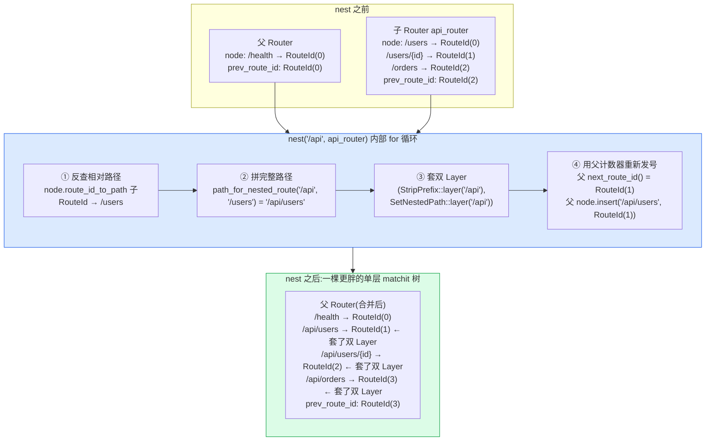
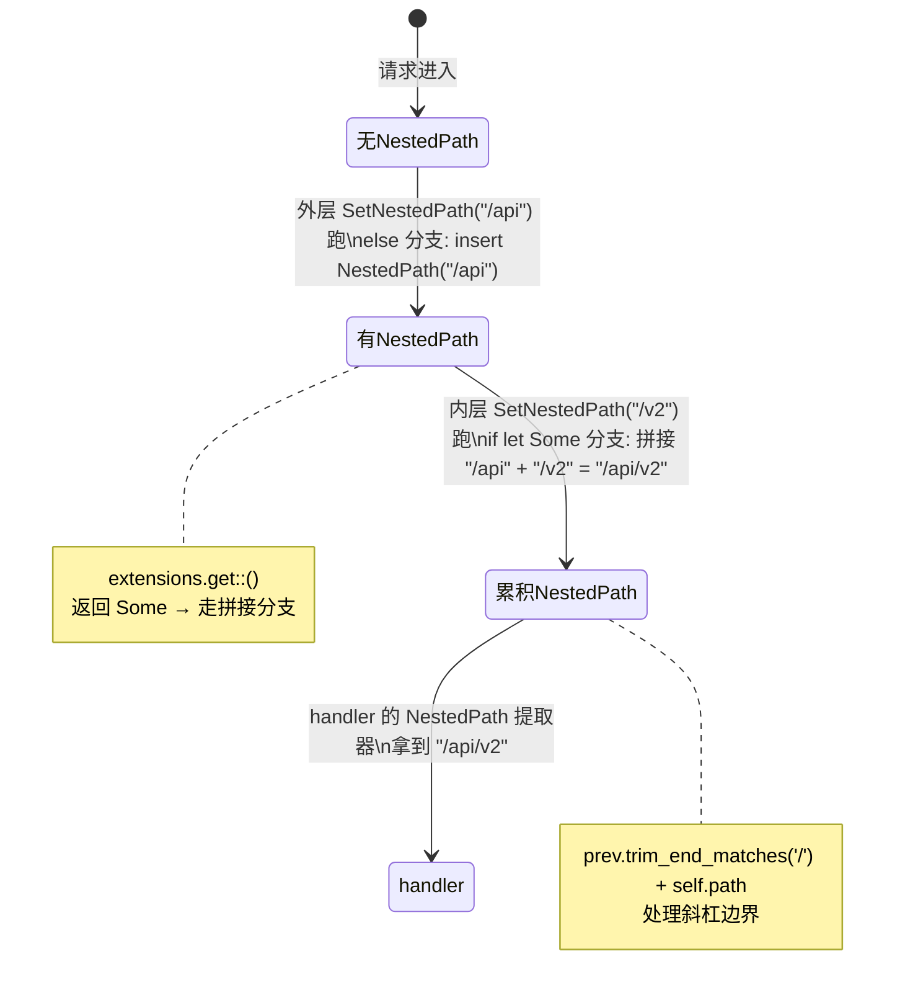
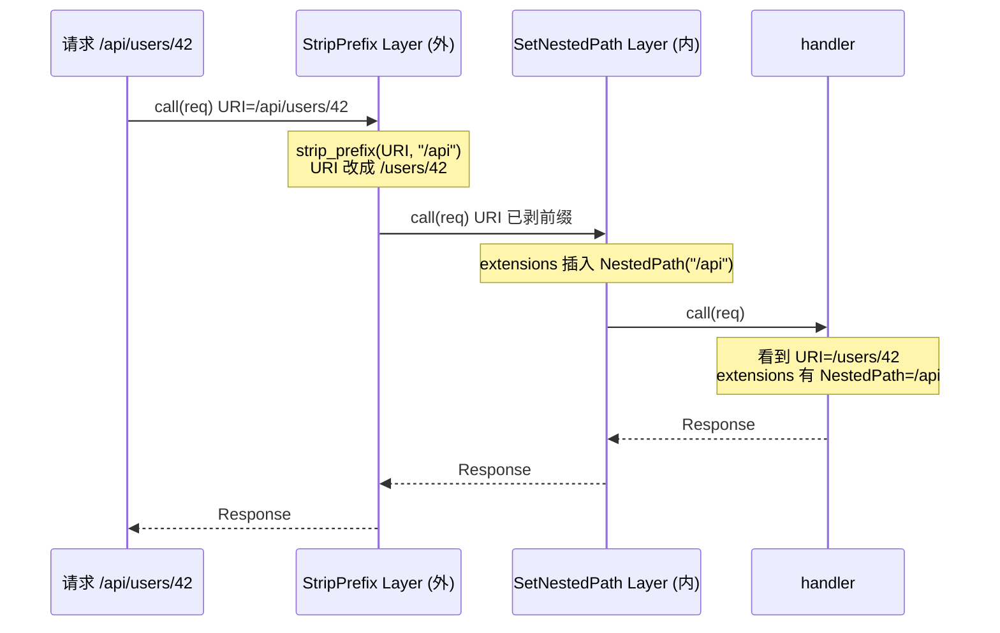

# 第 7 章 · 嵌套与合并:nest 与 merge

> **核心问题**:前两章你看到单层路由全貌——`PathRouter` 用 matchit 字典树匹配路径(`P2-05`),`MethodRouter` 按 HTTP method 分发到 handler(`P2-06`)。可真实服务不是一坨平铺的 `Router::new().route(...).route(...)`:`/api/users`、`/api/orders`、`/api/internal/debug` 该归一个"API 子模块",`/admin/...` 归另一个"后台子模块";团队 A 写的 `users_router` 和团队 B 写的 `orders_router` 要拼进同一个 `app`。axum 给了两套机制——`nest`(把子 Router 挂到一个前缀下)和 `merge`(把两个 Router 平铺合并)。可翻进源码你会撞上一堆反直觉的细节:`nest("/api", sub)` 居然不是给子 Router 单独建一棵 matchit 子树,而是把子 Router 的每条路由"摊平(flatten)"进父 Router 的 matchit 树;摊平的同时还偷偷给每条路由套了 `StripPrefix` + `SetNestedPath` 两个 Layer;`nest("/", sub)` 在 0.8 直接 panic,提示"用 merge";`a.merge(b)` 时两个 Router 的 `RouteId` 会**重新编号**(子 Router 的 ID 全被丢弃,父 Router 用自己的 `next_route_id` 重新发号)。这些设计的动机是什么?为什么 nest 不维护一棵"嵌套的 matchit 树"而是 flatten?为什么要在 `/` 禁掉 nest?merge 凭什么不冲突?这一章把 nest 和 merge 的实现彻底拆开。
>
> **读完本章你会明白**:
>
> 1. `nest("/api", sub)` 内部怎么把子 Router 的每条路由**摊平**进父 Router 的 matchit 树(子 Router 的 `routes: HashMap<RouteId, Endpoint>` 被遍历,每条用 `path_for_nested_route` 拼出完整路径 `/api/...`,再用父 Router 的 `next_route_id` 重新分配 RouteId 插进父树),以及为什么是"摊平"而不是"维护嵌套树";
> 2. nest 给每条被嵌套路由套的**两个 Layer**——`StripPrefix`(运行期把请求 URI 的前缀剥掉,让子 Router 的 handler 看到的还是相对路径 `/users`)和 `SetNestedPath`(运行期把嵌套前缀写进 request extensions 的 `NestedPath`,供 `NestedPath` 提取器和 `MatchedPath` 用)——这两个 Layer 是 Tower 风格的 `Layer<Route>`,承《Tower》一句带过,本章讲 axum 怎么用;
> 3. 为什么 `nest("/", sub)` 在 0.8 直接 panic("Nesting at the root is no longer supported. Use merge instead."),以及这个禁令背后的语义理由——根 nest 等价于 merge 但会徒增"无前缀的 StripPrefix Layer + SetNestedPath 写一个 `/`"的开销,且语义混淆(子 Router 的 fallback 该不该继承?`NestedPath` 该是 `/` 还是空?),axum 选了"语义分离:根用 merge、前缀用 nest";
> 4. `a.merge(b)` 怎么把两个 PathRouter 的 `routes`/`node` 合并(RouteId 重编号、`matchit::InsertError` 冲突时怎么报错),以及 fallback 合并的四态(`default_fallback` × `default_fallback` 的真值表)和"两个自定义 fallback 不能 merge"的硬规矩。
>
> **逃生阀(读不下去怎么办)**:本章有两个互相缠绕的设计——nest 的"摊平 + 双 Layer"和 merge 的"RouteId 重编号 + fallback 四态"。如果一时绕不开,记住三句话就够——**① nest 不建嵌套树,而是把子路由摊平进父树,运行期靠 StripPrefix(剥前缀)+ SetNestedPath(记前缀)两个 Layer 补回"子 Router 看到相对路径 + 提取器能拿到完整前缀"的语义;② nest 在 `/` panic 是因为根 nest 和 merge 语义重叠,axum 强制语义分离;③ merge 重编号 RouteId 是为了消除两个 Router 各自 `RouteId(0)` 起步的 ID 冲突**。带着这三句话跳到对应小节细读。本章处处承《Tower》P1-03(Layer 套娃)一句带过,承《hyper》一句带过(协议机),承 P2-05/P2-06(单层路由)的术语。

---

## 一句话点破

> **nest 和 merge 不是两套数据结构,而是同一个 PathRouter 上的两种"合并姿势":merge 是"平铺拼"(两个 Router 的路由 ID 重新编号后插进同一棵 matchit 树,路径不变),nest 是"带前缀拼"(子 Router 的每条路由路径前面拼上 `/api`,然后插进同一棵 matchit 树,运行期用 StripPrefix Layer 把请求的前缀剥掉、用 SetNestedPath Layer 把前缀记进 request extensions)。两者最终都落到同一棵 matchit 树——axum 不维护"嵌套的 matchit 树",因为 flatten 后的单棵树匹配更快(一次 `node.at(path)` 就够),且实现更简单(不用递归下钻子树)。nest 在 `/` 被 panic 禁掉,是因为根前缀为空,StripPrefix 无前缀可剥、SetNestedPath 只记一个 `/`,与 merge 语义完全重叠却徒增 Layer 开销和 fallback 继承的歧义,axum 强制"根用 merge、前缀用 nest"的语义分离。**

这是结论,不是理由。本章倒过来拆:nest 为什么是 flatten 而不是嵌套树、两个 Layer 各干什么、为什么 `/` 要禁、merge 怎么重编号不冲突。

---

## 第一节:从单层路由到"怎么把子模块挂进来"

### 提问

前两章你拿到了单层路由的完整图景:

- **P2-05(PathRouter)**:一个 URL 怎么常数级找到 handler——`PathRouter { routes: HashMap<RouteId, Endpoint>, node: Arc<Node> }`,其中 `Node` 包 `matchit::Router<RouteId>` + `route_id_to_path`/`path_to_route_id` 两个 HashMap 做双向映射(`path_router.rs#L16-L21`、`#L477-L482`)。请求来了,`PathRouter::call_with_state` 用 `self.node.at(parts.uri.path())` 在 matchit 树上匹配路径,拿到 `RouteId`,再从 `routes` 索引到 `Endpoint`(`path_router.rs#L388-L414`)。
- **P2-06(MethodRouter)**:同一路径 GET/POST/PUT 各走各的——`Endpoint::MethodRouter` 内部按 HTTP method 持 9 个 `MethodEndpoint`,`call_with_state` 用 `call!` 宏逐个 method 匹配(`method_routing.rs`)。

这套机制能写出一个"所有路由平铺在一个 Router 里"的服务:

```rust
let app = Router::new()
    .route("/api/users", get(list_users).post(create_user))
    .route("/api/users/{id}", get(get_user).put(update_user).delete(delete_user))
    .route("/api/orders", get(list_orders).post(create_order))
    .route("/admin/dashboard", get(dashboard))
    .route("/admin/users", get(admin_users))
    .route("/health", get(health));
```

可真实服务不会这么写。两个痛点:

1. **模块化**:`/api/users`、`/api/orders`、`/api/internal/debug` 是"API 子模块"的路由,`/admin/...` 是"后台子模块"的路由。你想把 API 子模块单独抽出来给一个团队写、单独一个文件、单独 `Router::new()` 起一个实例,然后在 main 里把它"挂到 `/api` 前缀下"。后台子模块同理挂到 `/admin`。这样每个团队的 Router 各自独立,main 里只做"拼装"。
2. **复用**:你写了一个"健康检查 + metrics 暴露"的 Router(团队内部基础设施),想在 5 个服务里都挂到 `/internal` 下。你不能复制粘贴路由定义(改一处要改五处),你要的是一个"子 Router 实例",在 5 个服务里各自 `.nest("/internal", internal_router.clone())`。

这两个痛点,平铺的单层路由解决不了。你需要的是**把一个完整的子 Router 挂到一个前缀下**——这就是 `nest`。

```rust
// API 子模块(团队 A 写)
let api_router = Router::new()
    .route("/users", get(list_users).post(create_user))
    .route("/users/{id}", get(get_user).put(update_user).delete(delete_user))
    .route("/orders", get(list_orders).post(create_order));

// 后台子模块(团队 B 写)
let admin_router = Router::new()
    .route("/dashboard", get(dashboard))
    .route("/users", get(admin_users));

// main 里拼装
let app = Router::new()
    .nest("/api", api_router)        // 挂到 /api 前缀下
    .nest("/admin", admin_router)    // 挂到 /admin 前缀下
    .route("/health", get(health));  // 平铺的路由
```

注意一个关键点:子模块里写的是 `/users`(相对路径),挂到 `/api` 后,完整的请求路径是 `/api/users`。**子模块的作者只关心相对路径,前缀由挂载点决定**。这种"相对路径 + 前缀拼接"的解耦,就是 nest 的核心价值。

但还有另一种合并姿势——**merge**。有时候你不需要前缀,只想把两个 Router 平铺拼起来:

```rust
let user_routes = Router::new().route("/users", get(list_users));
let order_routes = Router::new().route("/orders", get(list_orders));

// 两个 Router 都没有前缀,直接拼
let app = user_routes.merge(order_routes);
// 等价于 Router::new().route("/users", ...).route("/orders", ...)
```

merge 没有"前缀拼接",两个 Router 的路由路径**原封不动**地进同一棵树。它适合"按业务域拆分文件、最后拼一起"的场景(每个文件的 Router 路径已经是完整路径,不需要再加前缀)。

> **钉死这件事**:nest 和 merge 是同一个 PathRouter 上的两种"合并姿势"。**merge 是平铺拼(路径不变)**,**nest 是带前缀拼(子 Router 的每条路径前面拼上 nest 的前缀)**。两者最终都把路由插进**同一棵 matchit 树**(父 Router 的树),axum 不维护"嵌套的多棵 matchit 树"。这是后两节要拆的核心。

### 对照 go net/http、actix-web、Express——别的框架怎么做

"把子路由挂到前缀下"这件事,几乎所有 Web 框架都有,但实现差异很大:

- **go net/http(1.22 ServeMux)**:用 `{path...}` 通配符 + 手动 `http.StripPrefix`。Go 没有内置的"子 Router"概念,你只能注册一个 `{path...}` 通配符,然后在 handler 里手动 `http.StripPrefix(prefix, submux)`。也就是说,**StripPrefix 这个动作在 Go 里是用户的责任**——框架不自动剥前缀,你得自己包。axum 的 nest 把 StripPrefix **自动化**了(下节详拆),这是 axum 比 go ServeMux 好写的地方之一。
- **Express(Node.js)**:`app.use("/api", subrouter)`。Express 的 `router.use(prefix, subrouter)` 和 axum 的 nest 语义最接近——子 router 的路径相对,挂载点决定前缀,Express 内部也会自动剥前缀(让子 router 看到相对路径)。axum 的 nest 在语义上对标 Express 的 `use`,只是底层用 Rust 的 Tower Layer 实现。
- **actix-web**:`web::scope("/api").service(...)`,actix 用 `scope` 表达"前缀作用域",概念上类似 nest,但 actix 内部维护的是"作用域树"(递归下钻),axum 是 flatten(摊平进单棵树)——下节讲为什么 axum 选 flatten。

> **钉死这件事**:nest 的"子 Router 挂前缀"是 Web 框架的通用需求,Go/Express/actix 都有等价物。差别在实现:Go 要用户手动 StripPrefix,Express/actix 自动化,axum 用 Tower Layer 自动化且把"记前缀供提取器用"也一并做了(SetNestedPath,这是 Express/actix 没有的)。axum 的 nest 是"自动 StripPrefix + 自动 SetNestedPath"二合一,这是它的工程精度。

---

## 第二节:nest 内部——不是嵌套树,而是摊平 + 双 Layer

### 提问

`nest("/api", api_router)` 内部到底怎么把子 Router 挂进来?最直觉的实现是"维护一棵嵌套的 matchit 树"——父 Router 的 matchit 树有个节点 `/api`,它下面挂一棵子 matchit 树(api_router 自己的树)。请求 `/api/users` 来了,先匹配父树到 `/api`,再下钻子树匹配 `/users`。

可 axum 不是这么做的。axum 把子 Router **摊平(flatten)**进父 Router 的 matchit 树——子 Router 的每条路由(`/users`、`/users/{id}`、`/orders`)都被改成完整路径(`/api/users`、`/api/users/{id}`、`/api/orders`),然后插进父 Router 的同一棵 matchit 树。**没有嵌套树,只有一棵更胖的单层树**。

为什么?这一节把 flatten 的实现拆透,顺带把"双 Layer 补语义"的精妙讲清楚。

### 不这样会怎样:维护嵌套 matchit 树会怎样

假设 axum 维护嵌套树。数据结构大致是这样:

```rust
// 假想的嵌套树(非 axum 实际做法)
struct PathRouter<S> {
    node: matchit::Router<Either<RouteId, Box<PathRouter<S>>>>,
    //                              ^^^^^^^^^^^^^^^^^^^^^^^
    //                              叶子是 RouteId,内部节点挂子 Router
}
```

请求 `/api/users` 来了,匹配逻辑要变成:

1. 在父树匹配 `/api`,拿到一个"内部节点"(指向子 Router)。
2. 把请求路径"剥掉 `/api` 前缀",变成 `/users`。
3. 下钻子 Router 的树,匹配 `/users`,拿到 RouteId。
4. 调 RouteId 对应的 handler。

这套逻辑撞几堵墙:

**墙一:matchit 的匹配是"整条路径一次匹配",不支持"匹配到一半停下来下钻"。** matchit 的 `at(path)` 接收**完整路径**,返回一个 `Match { value: &RouteId, params }`。它没有"匹配前缀,返回中间节点 + 剩余路径"的 API。如果你想"匹配到 `/api` 停下来,剩下 `/users` 给子树",你得自己实现前缀匹配 + 剩余路径切分——这是 matchit 之外的事,等于重新发明轮子。

**墙二:嵌套树的匹配是递归的,每次请求可能要多次 `at` 调用。** 如果你的服务有 3 层嵌套(`/api/v2/users`),请求要匹配 3 次(父树 → `/api` 子树 → `/v2` 子树 → RouteId)。每次 `at` 都是字典树遍历,3 次遍历比 1 次慢。而 flatten 后的单棵树,无论多少层 nest,最终都是 1 次 `at` 完整路径——更快。

**墙三:嵌套树的数据结构更复杂。** `Either<RouteId, Box<PathRouter>>` 这种"叶子或子树"的枚举,让匹配逻辑要分叉处理(是叶子就直接调 handler,是子树就递归下钻)。代码复杂度上升,bug 面变大。而且 `Box<PathRouter>` 意味着子树是堆分配的独立结构,跟父树不在同一个连续内存里,cache locality 变差。

**墙四:nested fallback 的语义更难定义。** 嵌套树下,如果父树匹配到 `/api` 子树,子树匹配 `/users` 失败,这个"未匹配"该由谁兜底?子 Router 自己的 fallback?还是父 Router 的 fallback?还是两者都试?这是个语义地雷(0.6 时代的 axum 就在这个问题上反复改,见 CHANGELOG)。flatten 后,所有路由都在同一棵树,fallback 只有一套(父 Router 的 fallback_router + catch_all_fallback),语义清晰。

axum 选了 flatten——CHANGELOG 第 462 行(0.6.1)明说:"`nest` now flattens the routes which performs better"。这是 0.6.0 引入 nest 后的性能修复,从此 nest 就是 flatten 实现。

> **钉死这件事**:axum 的 nest **不维护嵌套 matchit 树**,而是把子 Router 的每条路由**摊平**进父 Router 的同一棵 matchit 树。这个选择换来:(1) 匹配更快(一次 `at` 完整路径,不递归);(2) 数据结构更简单(一棵树,不分叉);(3) fallback 语义更清晰(一套 fallback,不分父子)。代价是:摊平丢失了"子 Router 的前缀信息",这个信息要靠**运行期的两个 Layer**(StripPrefix + SetNestedPath)补回来——这正是下一节的重头戏。

### 所以 axum 这么设计:flatten 进同一棵 matchit 树

来看 `PathRouter::nest` 的真实实现(`axum/src/routing/path_router.rs#L206-L244`):

```rust
// axum/src/routing/path_router.rs#L206-L244(逐字摘录)
pub(super) fn nest(
    &mut self,
    path_to_nest_at: &str,
    router: PathRouter<S, IS_FALLBACK>,
) -> Result<(), Cow<'static, str>> {
    let prefix = validate_nest_path(self.v7_checks, path_to_nest_at);

    let PathRouter {
        routes,
        node,
        prev_route_id: _,   // ★ 子 Router 的 RouteId 计数器被丢弃!
        v7_checks: _,       // ★ 子 Router 的 v7_checks 也丢弃
    } = router;

    for (id, endpoint) in routes {
        // ① 反查子 Router 里这条路由对应的"相对路径"
        let inner_path = node
            .route_id_to_path
            .get(&id)
            .expect("no path for route id. This is a bug in axum. Please file an issue");

        // ② 拼接:prefix + inner_path = /api + /users = /api/users
        let path = path_for_nested_route(prefix, inner_path);

        // ③ 给这条 endpoint 套两个 Layer
        let layer = (
            StripPrefix::layer(prefix),
            SetNestedPath::layer(path_to_nest_at),
        );
        match endpoint.layer(layer) {
            Endpoint::MethodRouter(method_router) => {
                self.route(&path, method_router)?;   // ④ 插进父 Router 的树
            }
            Endpoint::Route(route) => {
                self.route_endpoint(&path, Endpoint::Route(route))?;
            }
        }
    }

    Ok(())
}
```

逐段拆:

**第 211 行 `validate_nest_path`**——校验 nest 路径:必须以 `/` 开头、长度 > 1、不能含 `{*...}` 通配符(`path_router.rs#L517-L533`)。注意 `assert!(path.len() > 1)`——这一句直接把 `path == "/"`(长度 1)挡死了,这是 nest 在 `/` 不能用的第一道闸。第二道闸在 `Router::nest`(`mod.rs#L210-L212`),直接 panic 提示用 merge,后文详拆。

**第 213-219 行解构子 Router**——拿到子 Router 的 `routes: HashMap<RouteId, Endpoint>`、`node: Arc<Node>`(里面有 `route_id_to_path` 反查表)。**`prev_route_id: _` 和 `v7_checks: _` 被显式丢弃**。这一句极其重要:子 Router 的 RouteId 计数器(它之前发了哪些 RouteId)被**完全无视**——这意味着后面插进父 Router 时,父 Router 会用自己的 `next_route_id()` **重新发号**。这是 nest(以及 merge)"RouteId 重编号"的精确证据,后文详拆。

**第 221-225 行反查相对路径**——遍历子 Router 的 `routes`,对每个 `(id, endpoint)`,用 `node.route_id_to_path.get(&id)` 反查出这条路由在子 Router 里注册时的**相对路径**(`inner_path`,比如 `/users`)。注意子 Router 的 RouteId(id)在这里**只用作反查 key**,不用作最终 ID——最终 ID 由父 Router 重新分配。

**第 227 行 `path_for_nested_route(prefix, inner_path)`**——拼接完整路径。来看它的实现(`path_router.rs#L535-L546`):

```rust
// axum/src/routing/path_router.rs#L535-L546(逐字摘录)
pub(crate) fn path_for_nested_route<'a>(prefix: &'a str, path: &'a str) -> Cow<'a, str> {
    debug_assert!(prefix.starts_with('/'));
    debug_assert!(path.starts_with('/'));

    if prefix.ends_with('/') {
        // prefix = /api/, path = /users → /api/users(去掉 path 开头的 /)
        format!("{prefix}{}", path.trim_start_matches('/')).into()
    } else if path == "/" {
        // prefix = /api, path = / → /api(子 Router 根路由,直接用 prefix)
        prefix.into()
    } else {
        // prefix = /api, path = /users → /api/users(直接拼接)
        format!("{prefix}{path}").into()
    }
}
```

三种情况,处理 nest 路径的"尾部斜杠"边界:

- `prefix` 以 `/` 结尾(`/api/`):`/api/` + `/users` 要变成 `/api/users`(避免双斜杠),所以把 `path` 开头的 `/` trim 掉再拼。
- `path` 就是 `/`(子 Router 的根路由):`/api` + `/` 直接用 prefix(`/api`),避免 `/api/`。
- 默认:直接 `prefix + path`(`/api` + `/users` = `/api/users`)。

这个函数是 nest 路径拼接的全部逻辑——简单,但要处理斜杠边界,所以单独抽出。**为什么 axum 自己写这个函数,不直接用 `format!("{prefix}{path}")`**?因为双斜杠(`/api//users`)会让 matchit 报错,且语义不对;而 nest 在根(`/`)+ 子 Router 根路由(`/`)又该映射成 prefix 而非 `prefix/`。这些边界 case 必须显式处理。承《SQLite》那种"路径拼接的边界 case 必须钉死"的工程精度。

**第 229-232 行组装 Layer**——这是 nest 最关键的一步。给当前这条 endpoint 套一个 **tuple Layer**:

```rust
let layer = (
    StripPrefix::layer(prefix),        // Layer 一:运行期剥前缀
    SetNestedPath::layer(path_to_nest_at),  // Layer 二:运行期记前缀
);
```

`tuple` 当 Layer 是 Tower 的特性——`(A, B)` 实现了 `Layer<S>`,等价于"先套 A 再套 B"(承《Tower》P1-03 的 tuple Layer,一句带过)。所以这两层会按顺序套在 endpoint 外面。**为什么要套这两层**?因为 flatten 进父树后,运行期请求的 URI 是完整路径(`/api/users`),但子 Router 的 handler 可能需要的是相对路径(`/users`)——比如子 Router 里有个 `Path` 提取器要从 `/users/{id}` 里提 `id`,它期望看到的是 `/users/123`,不是 `/api/users/123`。StripPrefix 负责把请求 URI 改回相对路径。同时,有些 handler 又需要知道"自己被 nest 在哪个前缀下"(比如生成重定向 URL、日志记录),SetNestedPath 负责把前缀记进 request extensions。两层各司其职,后两节详拆。

**第 233-240 行 `endpoint.layer(layer)`**——把这两层 Layer 套在 endpoint 上。来看 `Endpoint::layer`(`mod.rs#L761-L775`):

```rust
// axum/src/routing/mod.rs#L761-L775(逐字摘录)
fn layer<L>(self, layer: L) -> Endpoint<S>
where
    L: Layer<Route> + Clone + Send + Sync + 'static,
    L::Service: Service<Request> + Clone + Send + Sync + 'static,
    <L::Service as Service<Request>>::Response: IntoResponse + 'static,
    <L::Service as Service<Request>>::Error: Into<Infallible> + 'static,
    <L::Service as Service<Request>>::Future: Send + 'static,
{
    match self {
        Endpoint::MethodRouter(method_router) => {
            Endpoint::MethodRouter(method_router.layer(layer))
        }
        Endpoint::Route(route) => Endpoint::Route(route.layer(layer)),
    }
}
```

注意 Layer 的约束是 `Layer<Route>`——它套在 `Route` 这一层(也就是已经擦除成 BoxCloneSyncService 的 handler)。如果 endpoint 是 `MethodRouter`,就调 `MethodRouter::layer`(把 Layer 套到 MethodRouter 的每个 method 的 handler 上);如果是 `Route`,就调 `Route::layer`(直接套在这个 Route 上)。无论哪种,**Layer 都是套在"具体 handler 的 Route 外面"**,这样请求穿过 Layer 后才进 handler。

**第 234-239 行 `self.route(&path, method_router)?` / `self.route_endpoint(&path, ...)?`**——最后,把套好 Layer 的 endpoint,用拼接后的完整路径 `path`(比如 `/api/users`),插进**父 Router 自己的 matchit 树和 routes HashMap**。这一步调的是 `PathRouter::route`(`path_router.rs#L83-L114`)或 `route_endpoint`(`path_router.rs#L141-L153`),它们内部会调 `self.next_route_id()`——**用父 Router 的计数器重新分配 RouteId**。子 Router 原来的 RouteId(那个 `id`)在反查完相对路径后就再也没用过,直接被丢弃。

### 把 nest 的 flatten 过程画出来

用 ASCII 框图把 nest 的全过程画清楚:

```
nest 之前:
┌─────────────────────────────────────────┐
│  父 Router (self)                        │
│    node.inner (matchit 树):              │
│      /health → RouteId(0)                │
│    routes: {RouteId(0): health_endpoint}│
│    prev_route_id: RouteId(0)             │
└─────────────────────────────────────────┘

┌─────────────────────────────────────────┐
│  子 Router api_router                    │
│    node.inner (matchit 树):              │
│      /users      → RouteId(0)            │
│      /users/{id} → RouteId(1)            │
│      /orders     → RouteId(2)            │
│    routes: {                             │
│      RouteId(0): users_endpoint,         │
│      RouteId(1): user_id_endpoint,       │
│      RouteId(2): orders_endpoint,        │
│    }                                     │
│    prev_route_id: RouteId(2)             │
└─────────────────────────────────────────┘

执行 .nest("/api", api_router):

  遍历子 Router 的 routes,对每条:
  ┌───────────────────────────────────────────────────────────────┐
  │ ① 反查相对路径                                                  │
  │    node.route_id_to_path[RouteId(0)] = "/users"               │
  │                                                               │
  │ ② 拼完整路径                                                   │
  │    path_for_nested_route("/api", "/users") = "/api/users"     │
  │                                                               │
  │ ③ 套双 Layer                                                   │
  │    layer = (StripPrefix::layer("/api"),                       │
  │             SetNestedPath::layer("/api"))                      │
  │    endpoint.layer(layer) → 套好两层 Layer 的 endpoint          │
  │                                                               │
  │ ④ 插进父 Router(用父的 next_route_id 重新发号)                 │
  │    父 next_route_id() = RouteId(1)  ← 父自己的计数器!         │
  │    父 node.insert("/api/users", RouteId(1))                   │
  │    父 routes.insert(RouteId(1), 套了 Layer 的 users_endpoint) │
  └───────────────────────────────────────────────────────────────┘
  (对 /users/{id} → /api/users/{id} → RouteId(2) 重复)
  (对 /orders    → /api/orders     → RouteId(3) 重复)

nest 之后:
┌─────────────────────────────────────────────────────────────────┐
│  父 Router (合并后)                                              │
│    node.inner (matchit 树,单棵!):                               │
│      /health          → RouteId(0)                              │
│      /api/users       → RouteId(1)  ← 子 Router 的 RouteId(0)    │
│      /api/users/{id}  → RouteId(2)  ← 子 Router 的 RouteId(1)    │
│      /api/orders      → RouteId(3)  ← 子 Router 的 RouteId(2)    │
│    routes: {                                                    │
│      RouteId(0): health_endpoint,                               │
│      RouteId(1): Layer<StripPrefix, Layer<SetNestedPath,        │
│                    users_endpoint>>,                            │
│      RouteId(2): Layer<StripPrefix, Layer<SetNestedPath,        │
│                    user_id_endpoint>>,                          │
│      RouteId(3): Layer<StripPrefix, Layer<SetNestedPath,        │
│                    orders_endpoint>>,                           │
│    }                                                            │
│    prev_route_id: RouteId(3)  ← 父的计数器已推进到 3             │
└─────────────────────────────────────────────────────────────────┘
```

注意图里三个关键事实:

1. **只有一棵 matchit 树**。nest 后,父 Router 的 `node.inner` 里既有自己的 `/health`,也有从子 Router 摊平进来的 `/api/users`、`/api/users/{id}`、`/api/orders`。没有"子树"结构,全是平级。
2. **RouteId 重新编号**。子 Router 的 `RouteId(0)`/`(1)`/`(2)` 全被丢弃,父 Router 用自己的计数器从 `RouteId(1)` 开始(因为父自己的 `/health` 已经占了 `RouteId(0)`)重新编号。这一点和 merge 完全一致(后文详拆)。
3. **每条被嵌套路由都套了双 Layer**。`Layer<StripPrefix, Layer<SetNestedPath, endpoint>>`——请求进来先穿 StripPrefix(剥前缀),再穿 SetNestedPath(记前缀),最后到 handler。两层 Layer 的顺序和效果,是下两节的重头戏。

> **钉死这件事**:nest 的实现是 `for (id, endpoint) in 子.routes { 拼路径 → 套双 Layer → 用父的 next_route_id 插进父树 }`。子 Router 的 `prev_route_id` 和 `v7_checks` 被丢弃,RouteId 由父 Router 重新分配。最终结果是一棵更胖的单层 matchit 树,没有嵌套结构。匹配时仍然是一次 `node.at(完整路径)`,拿到 RouteId,索引 routes 拿到"套了双 Layer 的 endpoint"。这个设计换来了"匹配永远是一次,不分嵌套层级"的性能优势。

把 nest 的 flatten 全过程画成流程图:



图里三个关键:① 没有"子树"结构,所有路由平级在同一棵 matchit 树;② 子 Router 的 RouteId(0/1/2)全被丢弃,父用自己的计数器从 RouteId(1) 开始重新编号;③ 只有从子 Router 摊平进来的路由(`/api/...`)套了双 Layer,父原有的 `/health` 没有 Layer 包装。

### 一个细节:nest_service 怎么处理"任意 Service"

`Router::nest("/api", api_router)` 接的是 `Router<S>`,但 `Router::nest_service("/ws", service)` 接的是任意 `Service`(比如一个 WebSocket 升级 service、一个静态文件 service)。`nest_service` 的实现略有不同(`path_router.rs#L246-L283`):

```rust
// axum/src/routing/path_router.rs#L246-L283(逐字摘录)
pub(super) fn nest_service<T>(
    &mut self,
    path_to_nest_at: &str,
    svc: T,
) -> Result<(), Cow<'static, str>>
where
    T: Service<Request, Error = Infallible> + Clone + Send + Sync + 'static,
    T::Response: IntoResponse,
    T::Future: Send + 'static,
{
    let path = validate_nest_path(self.v7_checks, path_to_nest_at);
    let prefix = path;

    // ★ 关键:用 {*...} 通配符捕获"前缀下的任意子路径"
    let path = if path.ends_with('/') {
        format!("{path}{{*{NEST_TAIL_PARAM}}}")
    } else {
        format!("{path}/{{*{NEST_TAIL_PARAM}}}")
    };

    let layer = (
        StripPrefix::layer(prefix),
        SetNestedPath::layer(path_to_nest_at),
    );
    let endpoint = Endpoint::Route(Route::new(layer.layer(svc)));

    self.route_endpoint(&path, endpoint.clone())?;

    // /{*rest} 不能匹配 / 本身,所以要单独再注册一个"前缀根"
    self.route_endpoint(prefix, endpoint.clone())?;
    if !prefix.ends_with('/') {
        // /foo/ 也要能匹配
        self.route_endpoint(&format!("{prefix}/"), endpoint)?;
    }

    Ok(())
}
```

差别在于:`nest` 接的是 Router(它内部已经有具体的路由表,可以逐条 flatten),`nest_service` 接的是**任意 Service**(它没有"路由表",只有一个 service 实例,所有路径都走它)。所以 `nest_service` 不能"逐条 flatten",它要注册一个 **catch-all 通配符路由** `/api/{*__private__axum_nest_tail_param}` 来捕获 `/api` 下的所有子路径,把它们都交给这个 service。

注意三个工程细节:

1. **`{*{NEST_TAIL_PARAM}}`**——通配符参数名是 `__private__axum_nest_tail_param`(`mod.rs#L107`),带 `__private__` 前缀避免和用户定义的 `{*tail}` 冲突。这个参数会被 matchit 捕获,塞进 request extensions,但 `url_params::insert_url_params` 会**过滤掉它**(`url_params.rs#L22`,过滤 `key.starts_with(NEST_TAIL_PARAM)`),不让用户的 Path 提取器看到。这是 axum 内部用"私有参数名"避免污染用户命名空间的技巧。
2. **`/{*rest}` 不能匹配 `/` 本身**——matchit 的通配符 `{*x}` 至少要匹配一段非空路径,所以 `/api/{*rest}` 匹配 `/api/users` 但不匹配 `/api`。为了让 `/api` 本身也能走到 service,axum **额外注册了"前缀根"路由**(`self.route_endpoint(prefix, ...)`),即把 `/api` 也注册一遍。同理 `/api/`(尾部斜杠)也单独注册。这是 matchit 通配符语义的边界处理。
3. **三次 `route_endpoint` 用的是同一个 `endpoint.clone()`**——同一个套了双 Layer 的 Route 被注册到三条路径(`/api/{*tail}`、`/api`、`/api/`),它们共享同一个 service 实例(因为 Route 内部是 BoxCloneSyncService,clone 廉价)。这样无论请求是 `/api`、`/api/`、`/api/anything`,都走到同一个 service。

`nest_service` 的实现揭示了 axum 处理"任意 Service 嵌套"的工程精度:用私有通配符名避免污染、用多次注册覆盖边界路径、用 BoxCloneSyncService 让同一个 service 能被多路径共享。这些细节不显眼,但少了任何一个,nest_service 都会在某个边界 case 上出错。

> **钉死这件事**:`nest` 和 `nest_service` 都套了同样的双 Layer(StripPrefix + SetNestedPath),差别在路由注册方式:`nest` 逐条 flatten 子 Router 的路由表,`nest_service` 用 catch-all 通配符 `{*__private__axum_nest_tail_param}` 捕获前缀下所有子路径(并额外注册"前缀根"覆盖 `/api` 本身)。两者最终都把"套了双 Layer 的 endpoint"插进父 Router 的同一棵 matchit 树。

---

## 第三节:StripPrefix——把请求 URI 改回相对路径

### 提问

上一节你看到 nest 给每条被嵌套路由套了 `StripPrefix::layer(prefix)`。这一层干什么?为什么需要它?

回到 nest 的核心矛盾:**子 Router 的 handler 是按"相对路径"写的,但 flatten 后,请求进来时 URI 是完整路径**。比如:

```rust
let api = Router::new()
    .route("/users/{id}", get(|Path(id): Path<i32>| async move {
        // 这个 handler 期望从 /users/{id} 提 id
        // 它通过 Path 提取器,从请求 URI 的路径部分匹配 /users/{id}
        format!("User {}", id)
    }));

let app = Router::new().nest("/api", api);
```

请求 `/api/users/42` 来了。flatten 后,父 Router 的 matchit 树有 `/api/users/{id}` 这条路由,匹配成功,RouteId 索引到"套了双 Layer 的 users handler"。可问题是——`Path(id): Path<i32>` 提取器内部,它怎么提 `id`?

`Path` 提取器的实现(P3-11 详拆)大致是:从 request extensions 里拿出 matchit 匹配时塞进去的 URL 参数(`url_params::insert_url_params` 在 `PathRouter::call_with_state` 里把 match 的 params 塞进 extensions,见 `path_router.rs#L401`)。这些 params 是 matchit 在匹配 `/api/users/{id}` 时,从路径里提出的 `{id}` = `42`。所以**Path 提取器其实不依赖请求 URI 长什么样,它依赖的是 matchit 匹配时塞进 extensions 的 params**。

那 StripPrefix 还有什么用?它不是为了 Path 提取器(那个靠 matchit params),它是为了**别的需要看请求 URI 的东西**——比如 handler 里手动看 `req.uri().path()`,或者 `OriginalUri` 提取器,或者重定向生成 URL。

具体场景:子 Router 里有个 handler 做重定向:

```rust
let api = Router::new()
    .route("/old", get(|| async {
        // 想重定向到 /new(相对路径,不是 /api/new)
        Redirect::to("/new")
    }))
    .route("/new", get(|| async { "new page" }));

let app = Router::new().nest("/api", api);
```

请求 `/api/old` 来了,handler 想重定向到 `/new`(相对路径)。如果 handler 看到 `req.uri().path() == "/api/old"`,它要算出"剥掉 `/api` 后是 `/old`,重定向到 `/new`(同前缀下)"——这个计算要 handler 自己知道前缀是 `/api`。可如果 StripPrefix 把 URI 改回 `/old`,handler 看到 `req.uri().path() == "/old"`,它直接重定向到 `/new` 就行,不用关心前缀。

**StripPrefix 的价值:让子 Router 的 handler 看到的请求 URI 是"相对路径"(剥掉 nest 前缀),这样 handler 可以当成"我没被 nest"来写**。前缀的拼接/剥离责任,由 StripPrefix Layer 承担,不侵入业务 handler。这是 nest 实现"子模块解耦"的关键一环。

### StripPrefix Layer 的实现

来看 `StripPrefix` 的真实实现(`axum/src/routing/strip_prefix.rs#L10-L45`):

```rust
// axum/src/routing/strip_prefix.rs#L10-L45(逐字摘录)
#[derive(Clone)]
pub(super) struct StripPrefix<S> {
    inner: S,
    prefix: Arc<str>,
}

impl<S> StripPrefix<S> {
    pub(super) fn layer(prefix: &str) -> impl Layer<S, Service = Self> + Clone {
        let prefix = Arc::from(prefix);
        layer_fn(move |inner| Self {
            inner,
            prefix: Arc::clone(&prefix),
        })
    }
}

impl<S, B> Service<Request<B>> for StripPrefix<S>
where
    S: Service<Request<B>>,
{
    type Response = S::Response;
    type Error = S::Error;
    type Future = S::Future;

    #[inline]
    fn poll_ready(&mut self, cx: &mut Context<'_>) -> Poll<Result<(), Self::Error>> {
        self.inner.poll_ready(cx)
    }

    fn call(&mut self, mut req: Request<B>) -> Self::Future {
        if let Some(new_uri) = strip_prefix(req.uri(), &self.prefix) {
            *req.uri_mut() = new_uri;
        }
        self.inner.call(req)
    }
}
```

这是一个标准的 Tower 风格中间件 Service(承《Tower》P1-02 的 Service 包装模式,一句带过):

- **`inner: S`**——被包装的内层 service(就是子 Router 的那条 handler)。
- **`prefix: Arc<str>`**——要剥掉的前缀。`Arc<str>` 而非 `String`,因为前缀在 Layer 构造时固定,运行期只读,`Arc` 让多个 StripPrefix clone 共享同一份前缀字符串(零拷贝)。
- **`poll_ready`**——透传给 inner(承《Tower》poll_ready 背压语义,一句带过;axum 的 inner poll_ready 无条件 Ready,所以这层也 Ready)。
- **`call`**——核心逻辑只有两行:
  1. `strip_prefix(req.uri(), &self.prefix)`——算出剥掉前缀后的新 URI(如果前缀匹配)。
  2. `*req.uri_mut() = new_uri`——把请求的 URI 改成新值。
  3. `self.inner.call(req)`——把改完 URI 的请求交给 inner(handler)。

注意 `if let Some(new_uri)`——如果 `strip_prefix` 返回 `None`(前缀不匹配),**不改 URI,原样传给 inner**。这种情况什么时候发生?下一节讲 StripPrefix 的匹配逻辑时会说,它支持 `{param}` 前缀(nest 在 `/api/{version}` 这种带参数的前缀上),所以匹配不是简单的字符串前缀比较,有"不匹配"的可能。

### strip_prefix 的匹配逻辑:支持带参数的前缀

来看 `strip_prefix` 函数的实现(`strip_prefix.rs#L47-L122`),它不是简单的字符串前缀裁剪:

```rust
// axum/src/routing/strip_prefix.rs#L47-L122(简化示意,逻辑逐字对应)
fn strip_prefix(uri: &Uri, prefix: &str) -> Option<Uri> {
    let path_and_query = uri.path_and_query()?;

    // 逐段对比 prefix 和 path,算出"匹配了多少字符"
    let mut matching_prefix_length = Some(0);
    for item in zip_longest(segments(path_and_query.path()), segments(prefix)) {
        *matching_prefix_length.as_mut().unwrap() += 1;  // 每段先算上开头的 /

        match item {
            Item::Both(path_segment, prefix_segment) => {
                if is_capture(prefix_segment) || path_segment == prefix_segment {
                    // prefix 段是 {param}(匹配任意),或两段字面相等
                    *matching_prefix_length.as_mut().unwrap() += path_segment.len();
                } else if prefix_segment.is_empty() {
                    // prefix 以 / 结尾,匹配到此结束
                    break;
                } else {
                    matching_prefix_length = None;  // 不匹配
                    break;
                }
            }
            Item::First(_) => break,           // path 比 prefix 长,匹配成功
            Item::Second(_) => {                // prefix 比 path 长,不匹配
                matching_prefix_length = None;
                break;
            }
        }
    }

    // 在匹配长度处切开 path
    let after_prefix = uri.path().split_at(matching_prefix_length?).1;

    // 拼回合法的 path_and_query(确保以 / 开头,保留 query)
    let new_path_and_query = match (after_prefix.starts_with('/'), path_and_query.query()) {
        (true, None) => after_prefix.parse().unwrap(),
        (true, Some(query)) => format!("{after_prefix}?{query}").parse().unwrap(),
        (false, None) => format!("/{after_prefix}").parse().unwrap(),
        (false, Some(query)) => format!("/{after_prefix}?{query}").parse().unwrap(),
    };

    let mut parts = uri.clone().into_parts();
    parts.path_and_query = Some(new_path_and_query);
    Some(Uri::from_parts(parts).unwrap())
}

fn is_capture(segment: &str) -> bool {
    // 判断 prefix 段是不是 {param}(非转义、非通配符)
    segment.starts_with('{')
        && segment.ends_with('}')
        && !segment.starts_with("{{")
        && !segment.ends_with("}}")
        && !segment.starts_with("{*")
}
```

关键逻辑:

1. **`zip_longest(segments(path), segments(prefix))`**——把 path 和 prefix 都按 `/` 切段,然后"最长拉链"配对。`Item::Both(a, b)` 表示两者都有下一段,`Item::First(a)` 表示 path 比 prefix 长,`Item::Second(b)` 表示 prefix 比 path 长。
2. **逐段判断匹配**:
   - `is_capture(prefix_segment)`——prefix 段是 `{param}`(非 `{*x}` 通配符、非 `{{x}}` 转义),匹配任意 path 段。这支持 nest 在 `/api/{version}` 这种带参数前缀上(虽然少见,但合法)。
   - `path_segment == prefix_segment`——两段字面相等,匹配。
   - `prefix_segment.is_empty()`——prefix 以 `/` 结尾(切出来最后一段是空),匹配到此结束(尾部斜杠边界)。
   - 否则不匹配(`matching_prefix_length = None`)。
3. **`split_at(matching_prefix_length)`**——在匹配长度处切开 path,`after_prefix` 就是剥掉前缀后的剩余。
4. **拼回合法 URI**——`after_prefix` 可能不以 `/` 开头(比如 prefix=`/api`、path=`/api`,after_prefix 是空串),要补 `/`。同时保留 query string。

`is_capture` 这个判断很微妙:`{param}` 算 capture(匹配任意段),但 `{*x}`(通配符,匹配多段)和 `{{x}}`(字面转义)不算。为什么 `{*x}` 不算?因为 nest 的 prefix 被 `validate_nest_path` 校验过**不能含 `{*...}`**(`path_router.rs#L522-L526`,会 panic),所以 prefix 里不会有 `{*x}`,但 `is_capture` 还是显式排除它,防御性编程。`{{x}}` 是 matchit 的字面转义(表示字面的 `{x}`),不算参数,所以也排除。

这套匹配逻辑让 StripPrefix 能处理:

- 纯字面前缀:`/api` + path `/api/users` → 剥成 `/users`。
- 带参数前缀:`/api/{version}` + path `/api/v0/users` → 剥成 `/users`(version 段匹配任意)。
- 尾部斜杠:`/api/` + path `/api/users` → 剥成 `/users`(prefix 末尾空段触发 break)。
- 不匹配:`/api` + path `/admin/users` → 返回 None,StripPrefix 不改 URI(`strip_prefix.rs#L40` 的 `if let Some`)。

### 反面对比:如果不剥前缀会怎样

假设没有 StripPrefix,nest 后 handler 看到的 URI 还是完整路径 `/api/users/42`。会出什么问题?

**问题一:handler 里手写 URI 解析会错。** 比如子 Router 里:

```rust
.route("/users/{id}/profile", get(|req: Request| async move {
    // 想从 URI 里手动解析 id(不推荐,但有人这么写)
    let path = req.uri().path();  // /api/users/42/profile
    // handler 期望 /users/{id}/profile,要手动剥 /api
    let id = path.split('/').nth(2);  // 容易写错
}))
```

handler 作者要知道"我被 nest 在 /api 下",手动剥前缀。一旦换 nest 路径(`/api` → `/v2/api`),所有手动解析全坏。StripPrefix 让 handler 看到的永远是相对路径,前缀变化不影响 handler。

**问题二:重定向 URL 算错。** 上面举过的例子:handler 想重定向到同 Router 的另一个路由,如果看到的是完整路径,要手动剥前缀再加前缀;如果看到的是相对路径,直接 `Redirect::to("/new")` 就行。StripPrefix 把"前缀管理"从 handler 里剥离,handler 可以当成"我没被 nest"写。

**问题三:OriginalUri 提取器语义混乱。** `OriginalUri` 提取器(P3-11)给 handler "客户端原始发的 URI"。如果不剥前缀,handler 在 nest 和非 nest 下看到的 URI 不一样,行为不一致。StripPrefix 让"handler 看到的 URI"和"客户端发的原始 URI"分离——前者是相对(nest 后),后者是原始(axum 在 `PathRouter::call_with_state` 开头就把 `OriginalUri` 存进 extensions,见 `path_router.rs#L380-L383`,StripPrefix 只改 `req.uri()` 不改 `OriginalUri`)。两层语义清晰。

> **钉死这件事**:StripPrefix Layer 在请求穿过时,把请求 URI 的"nest 前缀"剥掉,改成相对路径,让子 Router 的 handler 可以当成"我没被 nest"来写。前缀的拼接/剥离责任由 Layer 承担,不侵入业务 handler。这层支持带参数前缀(`/api/{version}`)、尾部斜杠边界、不匹配时原样透传。它的存在是 nest 实现"子模块解耦"的关键——handler 不需要知道前缀,前缀变化不影响 handler 代码。

---

## 第四节:SetNestedPath——把前缀记进 request extensions

### 提问

StripPrefix 解决了"handler 看到的 URI 是相对路径"的问题。但反过来,有些 handler 又**需要知道**自己被 nest 在哪个前缀下。比如:

- **生成绝对 URL**:handler 要生成一个完整的重定向 URL(带 host),它需要知道"我在 `/api` 下",才能拼出 `https://example.com/api/users`。
- **日志/审计**:中间件记录请求时,想记"这个请求命中的是 `/api` 子模块",而不是只记相对路径。
- **面包屑导航**:渲染 HTML 页面时,要根据 nest 层级生成导航链接。

这些场景下,handler 需要"完整前缀"。可 StripPrefix 已经把前缀从 URI 里剥掉了,handler 怎么拿到前缀?

这就是 `SetNestedPath` Layer 的职责——它把 nest 前缀**记进 request extensions 的 `NestedPath`**,handler 用 `NestedPath` 提取器取出来。

### NestedPath 提取器 + SetNestedPath Layer 的配合

先看 `NestedPath` 提取器(`axum/src/extract/nested_path.rs#L39-L63`):

```rust
// axum/src/extract/nested_path.rs#L39-L63(逐字摘录)
#[derive(Debug, Clone)]
pub struct NestedPath(Arc<str>);

impl NestedPath {
    pub fn as_str(&self) -> &str {
        &self.0
    }
}

impl<S> FromRequestParts<S> for NestedPath
where
    S: Send + Sync,
{
    type Rejection = NestedPathRejection;

    async fn from_request_parts(parts: &mut Parts, _state: &S) -> Result<Self, Self::Rejection> {
        match parts.extensions.get::<Self>() {
            Some(nested_path) => Ok(nested_path.clone()),
            None => Err(NestedPathRejection),
        }
    }
}
```

极其简单:`NestedPath` 是 `Arc<str>` 的 newtype,`FromRequestParts` 实现就是"从 request extensions 里拿 `NestedPath`,拿不到就 rejection"。注意 rejection 不是 404——`NestedPathRejection` 是个专用 rejection 类型(意味着"这个 handler 在非 nest 上下文里被调了",通常是配置错误)。

那 extensions 里的 `NestedPath` 是谁塞进去的?就是 `SetNestedPath` Layer。来看它(`nested_path.rs#L65-L109`):

```rust
// axum/src/extract/nested_path.rs#L65-L109(逐字摘录)
#[derive(Clone)]
pub(crate) struct SetNestedPath<S> {
    inner: S,
    path: Arc<str>,   // nest 前缀(如 "/api")
}

impl<S> SetNestedPath<S> {
    pub(crate) fn layer(path: &str) -> impl Layer<S, Service = Self> + Clone {
        let path = Arc::from(path);
        layer_fn(move |inner| Self {
            inner,
            path: Arc::clone(&path),
        })
    }
}

impl<S, B> Service<Request<B>> for SetNestedPath<S>
where
    S: Service<Request<B>>,
{
    type Response = S::Response;
    type Error = S::Error;
    type Future = S::Future;

    #[inline]
    fn poll_ready(&mut self, cx: &mut Context<'_>) -> Poll<Result<(), Self::Error>> {
        self.inner.poll_ready(cx)
    }

    fn call(&mut self, mut req: Request<B>) -> Self::Future {
        if let Some(prev) = req.extensions_mut().get_mut::<NestedPath>() {
            // 已经有 NestedPath(说明是多层 nest 的内层),拼接
            let new_path = if prev.as_str() == "/" {
                Arc::clone(&self.path)
            } else {
                format!("{}{}", prev.as_str().trim_end_matches('/'), self.path).into()
            };
            prev.0 = new_path;
        } else {
            // 第一次设置 NestedPath
            req.extensions_mut()
                .insert(NestedPath(Arc::clone(&self.path)));
        };

        self.inner.call(req)
    }
}
```

逐段拆:

**`path: Arc<str>`**——和 StripPrefix 一样,前缀用 `Arc<str>` 共享,零拷贝。

**`poll_ready`**——透传(承 Tower,一句带过)。

**`call` 的核心逻辑**——这是 SetNestedPath 最精妙的地方,它处理**多层 nest 的前缀拼接**:

```rust
if let Some(prev) = req.extensions_mut().get_mut::<NestedPath>() {
    // 已经有 NestedPath → 多层 nest,拼接
    let new_path = if prev.as_str() == "/" {
        Arc::clone(&self.path)
    } else {
        format!("{}{}", prev.as_str().trim_end_matches('/'), self.path).into()
    };
    prev.0 = new_path;
} else {
    // 第一次设置
    req.extensions_mut().insert(NestedPath(Arc::clone(&self.path)));
}
```

为什么有"已经有 NestedPath"的情况?因为 **nest 可以多层**:

```rust
let app = Router::new()
    .nest("/api", Router::new().nest("/v2", sub));
```

请求 `/api/v2/users` 穿过时:

1. 外层 nest(`/api`)的 SetNestedPath 先跑——extensions 里没有 NestedPath,插入 `NestedPath("/api")`。
2. 内层 nest(`/v2`)的 SetNestedPath 后跑——extensions 里已有 `NestedPath("/api")`,走 `if let Some` 分支,拼成 `"/api" + "/v2" = "/api/v2"`,更新 extensions 里的 NestedPath 为 `/api/v2`。

最终 handler 里的 `NestedPath` 提取器拿到的是 `/api/v2`——**完整的多层前缀**。这个拼接逻辑的精妙在于:它不要求 nest 的顺序(外层先还是内层先),因为 Layer 是按"请求穿过顺序"执行的(外层 nest 的 Layer 在外,内层 nest 的 Layer 在内,请求先穿外层再穿内层),所以 extensions 里的 NestedPath 是逐步累积的。

用状态图把多层 nest 的前缀累积过程画清楚:



状态图里的关键转换是"无 → 有 → 累积"——第一次 SetNestedPath 走 `else`(insert),后续每次走 `if let Some`(拼接)。三层 nest(`/a` + `/b` + `/c`)就是"无 → /a → /a/b → /a/b/c",每次都用 `trim_end_matches('/')` + 当前层 path 拼接,保证不产生双斜杠。

**拼接逻辑的边界处理**:

- `prev.as_str() == "/"`——前一层 nest 在 `/`?不可能(0.8 禁了根 nest),但代码防御性处理:直接用当前 self.path 覆盖。
- 否则:`prev.trim_end_matches('/')` + self.path——剥掉前一层末尾的 `/`(如果有),再拼当前层。比如 prev=`/api/`、self.path=`/v2`,拼成 `/api/v2`(不是 `/api//v2`)。这和 `path_for_nested_route` 的拼接逻辑呼应——都是处理斜杠边界。

### 双 Layer 的执行顺序:StripPrefix 在外,SetNestedPath 在内

回顾 nest 组装 Layer 的代码(`path_router.rs#L229-L232`):

```rust
let layer = (
    StripPrefix::layer(prefix),
    SetNestedPath::layer(path_to_nest_at),
);
```

这是一个 tuple Layer。Tower 的 tuple `(A, B)` 实现 `Layer<S>`,语义是"先套 A 再套 B"(承《Tower》P1-03 的 tuple Layer,这里一句带过)。具体来说,`Stack<A, Stack<B, Identity>>`——A 在外,B 在内。所以请求穿过时,**先穿 StripPrefix(外),再穿 SetNestedPath(内),最后到 handler**:



这个顺序有讲究:**StripPrefix 先跑,改 URI;SetNestedPath 后跑,记前缀**。为什么不反过来?因为 SetNestedPath 不依赖 URI(它用自己持有的 `self.path`,不看请求),所以先后无所谓——但 StripPrefix 必须在 handler 之前跑(它要改 URI 给 handler 看),SetNestedPath 也必须在 handler 之前跑(它要插 extensions 给 handler 的提取器用)。两者都在 handler 前,顺序对它们各自的功能没影响,axum 选了 StripPrefix 在外、SetNestedPath 在内这个固定顺序。

> **承《Tower》[[tower-source-facts]]**:tuple Layer `(A, B)` 等价于 `Stack<A, Stack<B, Identity>>`,A 在外、B 在内,请求先穿 A 再穿 B。这个语义和 `ServiceBuilder::new().layer(A).layer(B)` 一致(先加的在外)。承《Tower》P1-03 的 Stack/tuple Layer 详拆,一句带过。axum 这里用的是 `tower_layer::layer_fn` 构造每个 Layer(返回 `impl Layer<S, Service = Self>`),tuple 组合是 Tower 给的便利。

### 反面对比:如果不记前缀会怎样

假设没有 SetNestedPath,只有 StripPrefix。会出什么问题?

**问题:handler 没法知道完整前缀。** StripPrefix 把前缀从 URI 剥了,handler 看到的 URI 是相对路径,丢失了"我在哪个前缀下"这个信息。如果 handler 要生成绝对 URL、记日志、做面包屑,它得自己想办法拿到前缀——可前缀在 flatten 后已经"散"了(父 Router 的 matchit 树里只有完整路径,没有显式存"这是 nest 的前缀")。

SetNestedPath 把前缀**显式存进 extensions**,补回了这个信息。handler 用 `NestedPath` 提取器一行拿到,不用自己算。这是 axum 的工程精度——它不只剥前缀(StripPrefix),还记前缀(SetNestedPath),让 handler 既能看到相对路径(URI),又能拿到完整前缀(NestedPath)。两层语义都覆盖。

**一个真实的 NestedPath 用例**:生成重定向 URL。

```rust
let api = Router::new()
    .route("/old", get(|nested: NestedPath| async move {
        // nested.as_str() == "/api"
        // 重定向到 /api/new(完整路径)
        Redirect::to(&format!("{}/new", nested.as_str()))
    }))
    .route("/new", get(|| async { "new" }));

let app = Router::new().nest("/api", api);
```

handler 用 `NestedPath` 拿到 `/api`,拼出重定向目标 `/api/new`。如果换 nest 路径(`/api` → `/v2/api`),handler 代码不用改——`NestedPath` 会自动变成 `/v2/api`(多层 nest 拼接)。这就是 SetNestedPath 的价值:**让 handler 对 nest 路径透明**。

> **钉死这件事**:SetNestedPath Layer 把 nest 前缀记进 request extensions 的 `NestedPath`,handler 用 `NestedPath` 提取器取出。多层 nest 时,前缀会**累积拼接**(外层 `/api` + 内层 `/v2` = `/api/v2`),靠 Layer 的"请求穿过顺序"逐步累积。这层补回了 StripPrefix 丢失的"完整前缀"信息,让 handler 既能看到相对路径(URI 被 StripPrefix 剥了),又能拿到完整前缀(NestedPath)。两层 Layer 各司其职,共同实现 nest 的"子模块解耦 + 前缀信息保留"。

---

## 第五节:为什么 nest 在 `/` 直接 panic

### 提问

来看一个反直觉的硬规矩:`Router::nest("/", sub)` 在 0.8 直接 panic:

```rust
let app = Router::new().nest("/", sub_router);
// thread 'main' panicked at:
// Nesting at the root is no longer supported. Use merge instead.
```

为什么?nest 在 `/` 不就是"前缀为空"的 nest 吗,语义上和 merge 有什么区别,要专门 panic?

这一节拆透这个 panic 背后的语义理由。

### 源码佐证:panic 的精确位置

来看 `Router::nest` 的开头(`axum/src/routing/mod.rs#L206-L213`):

```rust
// axum/src/routing/mod.rs#L206-L213(逐字摘录)
#[doc = include_str!("../docs/routing/nest.md")]
#[doc(alias = "scope")]  // actix-web 用 scope 这个词
#[track_caller]
pub fn nest(self, path: &str, router: Router<S>) -> Self {
    if path.is_empty() || path == "/" {
        panic!("Nesting at the root is no longer supported. Use merge instead.");
    }
    // ...
}
```

`nest_service` 同样 panic,但提示词不同(`mod.rs#L241-L243`):

```rust
if path.is_empty() || path == "/" {
    panic!("Nesting at the root is no longer supported. Use fallback_service instead.");
}
```

两个 panic 都在函数最开头,`path.is_empty() || path == "/"` 触发。`nest` 提示用 `merge`,`nest_service` 提示用 `fallback_service`(因为 nest_service 接的是任意 Service,根 nest 等价于"全局兜底 service",对应 fallback_service)。

注意还有第二道闸——`validate_nest_path`(`path_router.rs#L517-L521`):

```rust
fn validate_nest_path(v7_checks: bool, path: &str) -> &str {
    assert!(path.starts_with('/'));
    assert!(path.len() > 1);   // ← 长度必须 > 1,即不能是 "/"
    // ...
}
```

`assert!(path.len() > 1)` 也挡住了 `/`(长度 1)。所以即便绕过 `Router::nest` 的 panic(不可能,但理论上),`validate_nest_path` 也会 panic。这是双重保险——语义层的 panic(友好提示)在 `Router::nest`,实现层的 assert(硬约束)在 `validate_nest_path`。

### 不这样会怎样:不禁根 nest 会怎样

假设 0.8 没禁根 nest,允许 `Router::nest("/", sub)`。会发生什么?

**问题一:StripPrefix 无前缀可剥,是空操作。** 根 nest 的 prefix 是 `/`,`strip_prefix(uri, "/")` 在 path 就是 `/` 时返回 `Some("/")`(剥掉前缀后还是 `/`,见 `strip_prefix.rs#L189` 的测试 `empty`),在 path 是 `/users` 时返回 `Some("/users")`(剥掉 `/` 后还是 `/users`,见 `single_segment_root_prefix` 测试)。也就是说,**StripPrefix 在根 nest 下几乎是空操作**(URI 不变)。给每条路由套一个"什么都没做"的 StripPrefix Layer,徒增 Layer 包装和一次虚调用开销。

**问题二:SetNestedPath 记一个 `/`,语义可疑。** 根 nest 的 SetNestedPath 会往 extensions 插 `NestedPath("/")`。可 `/` 这个值对 handler 没意义——handler 用 `NestedPath` 通常是拼 URL(`/api` + `/users` = `/api/users`),`/` + `/users` = `//users`(双斜杠,错的)。所以根 nest 的 NestedPath 不仅没用,还会让拼接逻辑出错(要专门 trim)。axum 内部的 `SetNestedPath::call` 有个特殊分支 `if prev.as_str() == "/"`(直接覆盖),就是为了防御这种情况——但与其在运行期防御,不如在编译/构造期 panic 禁掉。

**问题三:fallback 继承语义混乱。** nest 有个微妙的语义:子 Router 的 fallback 行为。CHANGELOG 第 352-353 行(0.8.0)有个 breaking change:"Only inherit fallbacks for routers nested with `Router::nest`. Routers nested with `Router::nest_service` will no longer inherit fallbacks"。也就是说,`nest` 会让子 Router 的 fallback 在 nest 前缀下生效(子 Router 没匹配到的路径,走子 Router 自己的 fallback,而不是父 Router 的)。可根 nest 下,"子 Router 没匹配到的路径"和"父 Router 没匹配到的路径"是**同一个集合**(都是所有未匹配路径)——子 Router 的 fallback 和父 Router 的 fallback 该谁优先?这是个语义地雷。merge 用"两个自定义 fallback 不能 merge"的硬规矩避免了这个问题(后文详拆),但 nest 在根下没法用同样的规矩(因为 nest 默认继承子 Router 的 fallback)。所以根 nest 的 fallback 语义注定模糊,axum 选了禁掉。

**问题四:与 merge 语义完全重叠。** 根 nest 做的事(把 sub 的所有路由挂到根下,不加前缀)和 merge 完全一样。两个 API 做同一件事,是 API 设计的大忌——用户会困惑"我该用 nest 还是 merge?",且两者微妙的行为差异(fallback 继承、StripPrefix 空操作)会让"看似等价实则不同"的 bug 难以排查。axum 强制语义分离:**根用 merge,前缀用 nest**,两者职责清晰。

> **钉死这件事**:nest 在 `/` 被 panic 禁掉,是因为根 nest 和 merge 语义重叠却徒增开销和歧义——StripPrefix 在根下是空操作(白套一层 Layer)、SetNestedPath 记一个没意义的 `/`(还可能让 URL 拼接出错)、fallback 继承语义在根下模糊(子 fallback 和父 fallback 谁优先?)、且与 merge 完全重叠(API 设计大忌)。axum 强制"根用 merge、前缀用 nest"的语义分离,让两个 API 职责清晰。这个禁令是 0.7 → 0.8 演进的一部分(P6-20 详拆 0.8 变动),老代码用根 nest 的要改成 merge。

### 反面对比:0.7 时代根 nest 的混乱

CHANGELOG 显示,根 nest 的语义问题在 0.7 时代就存在,反复修 bug:

- 0.7.x:`Fixed panic if Router with something nested at / was used as a fallback`(CHANGELOG L439)——根 nest 当 fallback 用会 panic,这是个 bug,后来修了。
- 0.6.x:`Nested routers are now allowed to have fallbacks`(L573)、`The outer router's fallback will still apply if a nested router doesn't have one`(L588)——子 Router 的 fallback 语义反复调整。

这些 bug 都源于"nest 维护嵌套结构时的语义模糊"。0.8 通过两件事根治:(1) nest 改成 flatten(消除嵌套结构);(2) 禁掉根 nest(消除根下的语义重叠)。这两件事一起,让 nest 的语义彻底清晰——**nest 永远是"带非空前缀的子 Router 挂载",flatten 进父树,运行期双 Layer 补语义**。

> **钉死这件事**:0.7 时代 nest 的 bug 大多源于"嵌套结构 + 根 nest 语义模糊"。0.8 通过"flatten + 禁根 nest"根治。这是 axum 0.7 → 0.8 演进里一个重要的语义清理动作,和 route 只接 MethodRouter、路径参数 `{foo}` 取代 `:foo` 等变动一起,构成了 0.8 的"API 清晰化"主线(P6-20 详拆)。

---

## 第六节:merge——平铺拼两个 Router

### 提问

nest 是"带前缀拼",merge 是"平铺拼"。来看 merge 的实现,它和 nest 在 RouteId 处理上一脉相承,但路径拼接和 fallback 处理完全不同。

### PathRouter::merge 的实现

来看 `PathRouter::merge`(`path_router.rs#L162-L204`,第二节开头读过 merge 那段注释,这里聚焦实现):

```rust
// axum/src/routing/path_router.rs#L162-L204(逐字摘录)
pub(super) fn merge(
    &mut self,
    other: PathRouter<S, IS_FALLBACK>,
) -> Result<(), Cow<'static, str>> {
    let PathRouter {
        routes,
        node,
        prev_route_id: _,   // ★ 同 nest,子 Router 的 RouteId 计数器丢弃
        v7_checks,
    } = other;

    // v7_checks 取或(任一方严格则合并后严格)
    self.v7_checks |= v7_checks;

    for (id, route) in routes {
        // ① 反查路径(注意:merge 不拼接前缀,直接用原路径!)
        let path = node
            .route_id_to_path
            .get(&id)
            .expect("no path for route id. This is a bug in axum. Please file an issue");

        if IS_FALLBACK && (&**path == "/" || &**path == FALLBACK_PARAM_PATH) {
            // ② fallback 路由器的特殊处理(后文详拆)
            self.replace_endpoint(path, route);
        } else {
            // ③ 普通路由:用原路径插进父树
            match route {
                Endpoint::MethodRouter(method_router) => self.route(path, method_router)?,
                Endpoint::Route(route) => self.route_service(path, route)?,
            }
        }
    }

    Ok(())
}
```

和 nest 的实现对照,关键差异:

**差异一:不拼接前缀。** merge 直接用子 Router 的原路径 `path`(从 `node.route_id_to_path` 反查),不加任何前缀。`a.merge(b)` 后,b 的 `/users` 路由在合并后的树里还是 `/users`(不是 `/b/users` 或别的)。这是 merge 和 nest 的根本区别——merge 是"平铺拼",路径不变。

**差异二:不套 Layer。** merge 不给被合并的路由套任何 Layer(没有 StripPrefix、没有 SetNestedPath)。因为不需要——路径没变,handler 看到的 URI 就是原 URI,前缀信息也不需要记(没有前缀)。

**差异三:RouteId 同样重编号。** 和 nest 一样,`prev_route_id: _` 丢弃子 Router 的计数器。遍历子 Router 的 routes 时,`self.route(path, method_router)` 内部调 `self.next_route_id()`(用父 Router 的计数器重新发号)。所以 merge 的 RouteId 也是重新分配的。

**差异四:v7_checks 取或。** `self.v7_checks |= v7_checks`——如果任一方开启了 0.7 路径语法检查,合并后也开启。这是防御性的——避免"子 Router 关了检查,合并后绕过检查"。

**差异五:fallback 路由器的特殊处理。** `if IS_FALLBACK && (path == "/" || path == FALLBACK_PARAM_PATH)` 这一段是 fallback 路由器(第二个泛型参数 `IS_FALLBACK = true`)的专属逻辑。fallback 路由器内部会注册 `/` 和 `/{*__private__axum_nest_tail_param}`(FALLBACK_PARAM_PATH)两条特殊路由,合并时如果两条 fallback 路由器都有这两条,会冲突。这段逻辑用 `replace_endpoint`(直接替换,不重新插)处理这种情况——注释(`path_router.rs#L182-L193`)解释得很清楚:"合并两个 fallback 路由器时,`/` 和 `/*` 必须只保留一份,否则冲突;`Router::merge` 保证 `other` 总是有要保留的 fallback,所以 self 的可以被覆盖"。这个 fallback 四态逻辑在 `Router::merge` 层面处理(下一节),PathRouter::merge 这里只是机械执行"覆盖"。

### Router::merge 的 fallback 四态

来看 `Router::merge`(`mod.rs#L252-L300`),它比 PathRouter::merge 多一层 fallback 协调:

```rust
// axum/src/routing/mod.rs#L252-L300(逐字摘录)
pub fn merge<R>(self, other: R) -> Self
where
    R: Into<Router<S>>,
{
    const PANIC_MSG: &str = "Failed to merge fallbacks. This is a bug in axum. Please file an issue";

    let other: Router<S> = other.into();
    let RouterInner {
        path_router,
        fallback_router: mut other_fallback,
        default_fallback,
        catch_all_fallback,
    } = other.into_inner();

    map_inner!(self, mut this => {
        // ① 合并主路由表(平铺)
        panic_on_err!(this.path_router.merge(path_router));

        // ② 合并 fallback 路由器(四态)
        match (this.default_fallback, default_fallback) {
            // 两个都是默认 fallback:用 other 的(默认 404 都一样)
            (true, true) => {
                this.fallback_router.merge(other_fallback).expect(PANIC_MSG);
            }
            // this 是默认,other 有自定义:用 other 的
            (true, false) => {
                this.fallback_router.merge(other_fallback).expect(PANIC_MSG);
                this.default_fallback = false;
            }
            // this 有自定义,other 是默认:用 this 的(但要把 other 的默认 merge 进来)
            (false, true) => {
                let fallback_router = std::mem::take(&mut this.fallback_router);
                other_fallback.merge(fallback_router).expect(PANIC_MSG);
                this.fallback_router = other_fallback;
            }
            // 两个都有自定义 fallback:panic!
            (false, false) => {
                panic!("Cannot merge two `Router`s that both have a fallback")
            }
        };

        // ③ 合并 catch_all_fallback(同样的逻辑,merge 返回 Option)
        this.catch_all_fallback = this
            .catch_all_fallback
            .merge(catch_all_fallback)
            .unwrap_or_else(|| panic!("Cannot merge two `Router`s that both have a fallback"));

        this
    })
}
```

fallback 合并的四态(真值表):

| `this.default_fallback` | `other.default_fallback` | 行为 | 理由 |
|---|---|---|---|
| `true`(默认 404) | `true`(默认 404) | `this.fallback_router.merge(other)` | 两个都是默认,合并后还是默认(other 的默认 fallback 覆盖 this) |
| `true`(默认) | `false`(自定义) | `this.fallback_router.merge(other)`,`this.default_fallback = false` | other 有自定义,用它,this 变成自定义 |
| `false`(自定义) | `true`(默认) | `other_fallback.merge(this.fallback_router)`,结果赋给 this | this 有自定义,保留它,但要把 other 的默认 merge 进来 |
| `false`(自定义) | `false`(自定义) | **panic!** | 两个自定义 fallback 冲突,无法合并 |

核心规矩:**两个 Router 都有自定义 fallback 时,merge 直接 panic**。为什么?fallback 是"未匹配路径的最后兜底",两个 Router 各有自定义 fallback,合并后该用谁?这是个无法自动决定的语义冲突——axum 选了"拒绝合并,让用户显式决定"(panic,让用户改成 `app.merge(a).fallback(b.fallback)` 显式指定)。这是 axum 的常见设计——遇到语义模糊就 panic,逼用户显式澄清,而不是偷偷选一个让用户踩坑。

> **钉死这件事**:merge 的 fallback 合并遵循"至多一个自定义 fallback"的规矩——两个都是默认 404,合并没问题;一个默认一个自定义,合并后用自定义;两个都自定义,**panic**。这个硬规矩避免了"两个 fallback 该用谁"的语义模糊。PathRouter::merge 里那段 `if IS_FALLBACK && (path == "/" || ...)` 的特殊处理,就是配合这个规矩——它保证 fallback 路由器内部的 `/` 和 `/*` 特殊路由在合并时不冲突(覆盖而非插入)。

### merge 的 RouteId 重编号——为什么不冲突

回到一个关键问题:`a.merge(b)` 时,a 和 b 各有自己的 `RouteId` 计数器(都从 `RouteId(0)` 起步),它们的 RouteId 会不会冲突?

答案:不会,因为 merge 丢弃了 b 的计数器,用 a 的计数器重新编号。

来看 merge 遍历 b 的 routes 时(`path_router.rs#L196-L200`):

```rust
match route {
    Endpoint::MethodRouter(method_router) => self.route(path, method_router)?,
    Endpoint::Route(route) => self.route_service(path, route)?,
}
```

`self.route(path, method_router)`(`path_router.rs#L83-L114`)内部:

```rust
pub(super) fn route(
    &mut self,
    path: &str,
    method_router: MethodRouter<S>,
) -> Result<(), Cow<'static, str>> {
    // ...
    let endpoint = if let Some((route_id, ...)) = /* 已存在同 path 的 MethodRouter */ {
        // 合并(同路径多次 .route 走这里,P2-06 详拆)
        // ...
    } else {
        Endpoint::MethodRouter(method_router)
    };

    let id = self.next_route_id();   // ★ 用 self(父/a)的计数器!
    self.set_node(path, id)?;
    self.routes.insert(id, endpoint);
    Ok(())
}
```

`self.next_route_id()` 用的是 **a 的计数器**(`path_router.rs#L434-L442`):

```rust
fn next_route_id(&mut self) -> RouteId {
    let next_id = self
        .prev_route_id
        .0
        .checked_add(1)
        .expect("Over `u32::MAX` routes created. If you need this, please file an issue.");
    self.prev_route_id = RouteId(next_id);
    self.prev_route_id
}
```

`prev_route_id` 是 a 的字段,a 自己已经发过若干 ID(比如 a 有 3 条路由,prev_route_id = RouteId(3))。merge b 时,每条路由调 `next_route_id`,从 `RouteId(4)` 开始递增——和 b 原来的 `RouteId(0)`/`(1)`/... 完全无关。**b 的 RouteId 被丢弃,a 用自己的计数器重新发号**。

这就是 merge(以及 nest)"RouteId 重编号不冲突"的机制:**子 Router 的 RouteId 只用于反查路径(从 `node.route_id_to_path` 拿原 path),反查完就丢弃;插进父 Router 时,用父的 `next_route_id` 重新分配**。两套计数器互不干扰。

### merge 的"路径冲突"怎么报错

除了 RouteId,merge 还要处理"路径冲突"——a 和 b 都注册了 `/users`。这种情况怎么办?

来看 `PathRouter::route` 的逻辑(`path_router.rs#L83-L114`):

```rust
pub(super) fn route(
    &mut self,
    path: &str,
    method_router: MethodRouter<S>,
) -> Result<(), Cow<'static, str>> {
    validate_path(self.v7_checks, path)?;

    let endpoint = if let Some((route_id, Endpoint::MethodRouter(prev_method_router))) = self
        .node
        .path_to_route_id
        .get(path)                         // ★ 父树里已有同 path?
        .and_then(|route_id| self.routes.get(route_id).map(|svc| (*route_id, svc)))
    {
        // 已有同 path 的 MethodRouter → merge_for_path 合并(P2-06 详拆)
        let service = Endpoint::MethodRouter(
            prev_method_router
                .clone()
                .merge_for_path(Some(path), method_router)?,
        );
        self.routes.insert(route_id, service);
        return Ok(());
    } else {
        Endpoint::MethodRouter(method_router)
    };

    let id = self.next_route_id();
    self.set_node(path, id)?;              // ★ 这里可能报 InsertError
    self.routes.insert(id, endpoint);
    Ok(())
}
```

两种"路径已存在"的处理:

1. **同 path 已有 MethodRouter**:`a.route("/users", get(_))` + `b.route("/users", post(_))` → merge 时,父树已有 `/users` 的 MethodRouter(只有 GET),b 的 `/users` MethodRouter(只有 POST)进来,走 `merge_for_path` 合并成一个 GET+POST 的 MethodRouter。这是 P2-06 讲过的"同路径多次 .route 自动合并"机制,merge 复用它。**不冲突,合并**。
2. **同 path 已有 Route(service)或 matchit 插入冲突**:`set_node` → `node.insert` 调 matchit 的 `insert`,如果路径和已有路由冲突(比如 `/users` 和 `/users/{id}` 在某些情况下冲突,或两条完全相同的 Route),matchit 返回 `InsertError`,`set_node` 把它转成 `Cow<'static, str>` 错误字符串,`route` 返回 `Err`,merge 的 `panic_on_err!`(`mod.rs` 的宏)把它转成 panic。

所以 merge 的路径冲突分两类:MethodRouter 之间自动合并不报错;Route 或 matchit 层面的冲突 panic。这给了用户一个清晰的契约:**同名路径的 method 互补可以 merge(自动合并),但语义冲突(比如两条 Route 占同路径)会 panic**。

### 反面对比:如果不重编号会怎样

假设 merge 不重编号,直接把 b 的 routes(连同 b 的 RouteId)搬进 a。会怎样?

```rust
// 假想的不重编号 merge(撞墙)
fn merge_naive(&mut self, other: PathRouter<S, IS_FALLBACK>) {
    for (id, route) in other.routes {
        self.routes.insert(id, route);   // ★ 直接用 other 的 id!
    }
    // matchit 树怎么办?
}
```

撞墙:

1. **RouteId 冲突**:a 的 `RouteId(0)` 是 `/health`,b 的 `RouteId(0)` 是 `/users`。直接 `self.routes.insert(RouteId(0), b的/users_endpoint)`,会把 a 的 `/health` 覆盖掉!`HashMap<RouteId, Endpoint>` 的 key 冲突,后者覆盖前者。结果 a 的 `/health` 路由凭空消失。
2. **matchit 树的 value 冲突**:matchit 树是 `path → RouteId` 的映射。如果直接搬 b 的树,b 的 `/users → RouteId(0)` 和 a 的 `/health → RouteId(0)` 的 value 冲突(RouteId 都是 0)。matchit 不知道这两个 RouteId(0) 是不同的,匹配 `/users` 拿到 RouteId(0),去 routes 查,拿到的是……覆盖后的那个(可能是 a 的 health,可能是 b 的 users,取决于插入顺序)。路由完全错乱。

重编号彻底解决这个问题:b 的路由进来时,父 a 用自己的 `next_route_id` 给每条分配**全新的、唯一的 RouteId**(`RouteId(3)`、`RouteId(4)`、...),插入 matchit 树和 routes HashMap 时,key 都是唯一的,不冲突。b 原来的 RouteId 在反查完路径后就丢弃,不再使用。

> **钉死这件事**:merge(和 nest)的 RouteId 重编号机制——子 Router 的 `prev_route_id` 丢弃,遍历子 routes 时用父 Router 的 `next_route_id` 重新分配——是为了消除"两个 Router 各自从 RouteId(0) 起步"的 ID 冲突。重编号后,所有路由在合并后的树里有唯一 RouteId,matchit 树和 routes HashMap 都不冲突。这个机制是 merge/nest "为什么 sound(不冲突)"的根。

### 把 merge 的全过程画出来

```
merge 之前:
┌─────────────────────────────────────────┐
│  Router a                                │
│    path_router.node.inner:               │
│      /users → RouteId(0)                 │
│    routes: {RouteId(0): users_endpoint} │
│    prev_route_id: RouteId(0)             │
└─────────────────────────────────────────┘

┌─────────────────────────────────────────┐
│  Router b                                │
│    path_router.node.inner:               │
│      /orders → RouteId(0)  ← b 的计数器!│
│    routes: {RouteId(0): orders_endpoint}│
│    prev_route_id: RouteId(0)             │
└─────────────────────────────────────────┘

执行 a.merge(b):

  遍历 b 的 routes,对每条:
  ┌───────────────────────────────────────────────────────────────┐
  │ ① 反查路径(不拼前缀!)                                        │
  │    b.node.route_id_to_path[RouteId(0)] = "/orders"            │
  │                                                               │
  │ ② 不套 Layer(merge 不需要)                                   │
  │                                                               │
  │ ③ 用 a 的 next_route_id 重新发号                              │
  │    a.next_route_id() = RouteId(1)  ← a 的计数器推进!         │
  │    a.node.insert("/orders", RouteId(1))                      │
  │    a.routes.insert(RouteId(1), orders_endpoint)              │
  └───────────────────────────────────────────────────────────────┘

merge 之后:
┌─────────────────────────────────────────────────────────────────┐
│  Router a (合并后)                                              │
│    path_router.node.inner (单棵树):                            │
│      /users  → RouteId(0)  ← a 原有的                           │
│      /orders → RouteId(1)  ← b 的 RouteId(0) 重编号为 (1)       │
│    routes: {                                                    │
│      RouteId(0): users_endpoint,                                │
│      RouteId(1): orders_endpoint,  ← 没有 Layer 包装!          │
│    }                                                            │
│    prev_route_id: RouteId(1)                                    │
└─────────────────────────────────────────────────────────────────┘
```

对比 nest 的图,关键差异:merge 后的路由**没有 Layer 包装**(nest 有 StripPrefix + SetNestedPath),路径**不加前缀**(nest 拼接 `/api/...`),RouteId **同样重编号**(两者一致)。这两个图放一起,nest 和 merge 的异同一目了然。

---

## 第七节:nest 与 merge 的语义边界——什么场景该用哪个

### 提问

讲完实现,回到工程实践:什么场景该用 nest,什么场景该用 merge?两者的语义边界在哪?

这一节用几个真实场景把边界钉死。

### 场景一:模块化拆分,路径有自然前缀 → nest

你的服务有 `/api/users`、`/api/orders`、`/admin/...` 这种自然前缀分组。每个分组是一个子模块,由一个团队/文件维护。**用 nest**:

```rust
// users.rs
pub fn users_router() -> Router<AppState> {
    Router::new()
        .route("/", get(list_users).post(create_user))
        .route("/{id}", get(get_user).put(update_user).delete(delete_user))
}

// orders.rs
pub fn orders_router() -> Router<AppState> {
    Router::new()
        .route("/", get(list_orders).post(create_order))
        .route("/{id}", get(get_order))
}

// main.rs
let app = Router::new()
    .nest("/api/users", users_router())   // 注意:子 Router 用相对路径 "/"
    .nest("/api/orders", orders_router())
    .nest("/admin", admin_router())
    .route("/health", get(health))
    .with_state(state);
```

注意子 Router 里用的是相对路径(`/`、`/{id}`),不是完整路径。nest 在 `/api/users` 下,子 Router 的 `/` 就成了 `/api/users`,`/{id}` 成了 `/api/users/{id}`。**子模块作者只写相对路径,前缀由 main 的 nest 决定**——这是 nest 的核心价值。

如果子模块要复用到不同前缀(比如 `/api/users` 和 `/internal/users`),直接改 nest 路径,子 Router 代码不动。这就是 nest 的解耦威力。

### 场景二:同前缀的不同 method,或同模块拆文件 → merge

你的服务所有路由都在 `/api` 下,但代码按业务域拆成多个文件,每个文件返回一个 Router,最后 merge:

```rust
// users.rs —— 注意路径已经是完整路径 /api/users
pub fn users_router() -> Router<AppState> {
    Router::new()
        .route("/api/users", get(list_users).post(create_user))
        .route("/api/users/{id}", get(get_user))
}

// orders.rs
pub fn orders_router() -> Router<AppState> {
    Router::new()
        .route("/api/orders", get(list_orders))
}

// main.rs
let app = Router::new()
    .merge(users_router())
    .merge(orders_router())
    .with_state(state);
```

这里每个文件的 Router 路径**已经是完整路径**(`/api/users`),不需要再加前缀。merge 平铺拼起来,路径不变。**用 merge**。

如果你在这里用 nest(`/api`, users_router() 里写 `/users`),也能工作,但语义上是"子模块"——users_router 不能脱离 `/api` 前缀单独用(它的路径是相对的)。merge 的语义是"平级拼装",每个 Router 都是自包含的(路径完整)。这是两者的语义分水岭。

### 场景三:第三方/复用子 Router → nest 或 nest_service

你写了一个"健康检查 + metrics"的通用 Router,要在 5 个服务里复用:

```rust
// infra.rs (库代码,不知道会被挂到哪个前缀)
pub fn infra_router() -> Router<()> {
    Router::new()
        .route("/health", get(health))
        .route("/metrics", get(metrics))
}

// service_a/main.rs
let app = Router::new()
    .nest("/internal", infra_router())   // /internal/health, /internal/metrics
    .route("/api/...", ...);

// service_b/main.rs
let app = Router::new()
    .nest("/_infra", infra_router())     // /_infra/health, /_infra/metrics
    .route("/...", ...);
```

infra_router 用相对路径(`/health`、`/metrics`),两个服务用不同的 nest 前缀挂载。**用 nest**——子 Router 的相对路径 + nest 的前缀 = 完整路径,前缀由挂载方决定。

如果是任意 Service(不是 Router),用 nest_service:

```rust
let app = Router::new()
    .nest_service("/ws", websocket_service)   // 所有 /ws/** 都交给这个 service
    .nest_service("/static", ServeDir::new("public"));  // 静态文件
```

`ServeDir`(tower-http 提供)是一个 Service,nest_service 把它挂在 `/static` 下,所有 `/static/**` 都交给它处理。

### 场景四:不要混用——根用 merge,前缀用 nest

一个反面教材:用 `nest("/", sub)` 想达到 merge 的效果(0.7 时代有人这么写)。0.8 panic 了,要改成 merge。为什么 axum 不允许?

回到第五节的分析:根 nest 的 StripPrefix 是空操作、SetNestedPath 记无意义的 `/`、fallback 语义模糊、且与 merge 完全重叠。axum 强制"根用 merge、前缀用 nest",让两个 API 职责清晰。如果你的本意是"把 sub 的所有路由平铺到根下",用 merge;如果是"挂到某个前缀下",用 nest。两者不可混用。

### 对照表:nest vs merge vs nest_service

| 维度 | `nest(path, router)` | `nest_service(path, svc)` | `merge(router)` |
|------|------|------|------|
| 接受什么 | `Router<S>` | 任意 `Service<Request>` | `Router<S>`(`Into<Router>`) |
| 路径处理 | 子 Router 路径**拼接前缀** | 注册 catch-all `{*tail}` + 前缀根 | 路径**不变**(平铺) |
| RouteId | 重编号(父计数器) | 父计数器分配 | 重编号(父计数器) |
| 套 Layer | StripPrefix + SetNestedPath | StripPrefix + SetNestedPath | **不套** |
| 根 `/` 是否允许 | ❌ panic(用 merge) | ❌ panic(用 fallback_service) | ✅(本来就是根) |
| fallback 继承 | 子 Router 的 fallback 在前缀下生效 | 子 Service 无 fallback 概念 | 四态合并(两个自定义 panic) |
| 典型场景 | 模块化(子 Router 相对路径) | WebSocket/静态文件(任意 service) | 同级拼装(路径已完整) |

这张表是 nest/merge/nest_service 的语义速查。核心判断:**子模块用相对路径且要加前缀 → nest;路径已完整只是拼装 → merge;挂任意 Service → nest_service**。

> **钉死这件事**:nest 和 merge 不是"哪个更好",而是"不同场景的正确工具"。判断标准:子模块的路径是相对的(需要加前缀)用 nest;路径已经是完整的(平铺拼)用 merge;挂任意 Service(不是 Router)用 nest_service。根 `/` 永远用 merge(或 fallback_service),不要用 nest——这是 0.8 的硬规矩。

---

## 技巧精解

这一节挑本章最硬核的两个技巧,配真实源码 + 反面对比,单独拆透。

### 技巧一:nest 用 StripPrefix + SetNestedPath 两个 Layer 改造 request——为什么不直接改 matchit 树

**它解决什么问题**:nest 要把子 Router 的路由挂到前缀下,同时让子 Router 的 handler 看到的请求是"相对路径"(URI 剥前缀),又能拿到完整前缀(供 NestedPath 提取器)。axum 不维护嵌套 matchit 树(flatten 进单棵树),那这两个"运行期改造 request"的需求怎么实现?

**反面对比:直接改 matchit 树会怎样**:

假设 axum 维护嵌套 matchit 树(每个 nest 创建一棵子树),请求 `/api/users` 匹配到 `/api` 子树,然后下钻子树匹配 `/users`。这条路撞的墙(第二节详拆过):

1. **matchit 的 `at` 是整路径匹配**,不支持"匹配前缀 + 剩余路径下钻"。要自己实现前缀匹配 + 切分,等于重新发明 matchit。
2. **递归匹配慢**——多层 nest 要多次 `at`。
3. **数据结构复杂**——`Either<RouteId, Box<PathRouter>>` 分叉处理。
4. **fallback 语义模糊**——子树未匹配,谁兜底?

axum 选了 flatten:子 Router 的每条路由用 `path_for_nested_route` 拼成完整路径(`/api/users`),插进父 Router 的同一棵 matchit 树。匹配时一次 `at("/api/users")` 拿到 RouteId,不递归。但 flatten 丢失了"前缀信息"——handler 看到的 URI 是完整路径(`/api/users`),不是相对路径(`/users`),且 extensions 里没有前缀信息。

**axum 的解法:两个 Layer 补回丢失的语义**。来看 nest 组装 Layer 的代码(`path_router.rs#L229-L232`):

```rust
// axum/src/routing/path_router.rs#L229-L232(逐字摘录)
let layer = (
    StripPrefix::layer(prefix),
    SetNestedPath::layer(path_to_nest_at),
);
```

`tuple` 当 Layer(承《Tower》P1-03 一句带过),`StripPrefix` 在外、`SetNestedPath` 在内。请求穿过时:

1. **StripPrefix 先跑**——把请求 URI 的前缀剥掉(`/api/users` → `/users`),handler 看到的 URI 是相对路径。
2. **SetNestedPath 后跑**——把前缀 `/api` 记进 extensions 的 `NestedPath`,handler 用提取器取出。

**为什么是两个 Layer,不是一个**?因为它们改的是 request 的**不同部分**:StripPrefix 改 `req.uri()`(URI 的 path 部分),SetNestedPath 改 `req.extensions()`(extensions 里的 NestedPath)。两者独立,各管一头。如果合并成一个 Layer,逻辑耦合(一个 struct 同时持前缀字符串、同时改 URI 和 extensions),且失去 Tower Layer 的组合性(不能单独用 StripPrefix 不用 SetNestedPath,或反之)。

**两个 Layer 的精妙之处**:

- **StripPrefix 支持带参数前缀**(`is_capture` 判断 `{param}`,见第三节)。这让 nest 能在 `/api/{version}` 这种带参数前缀上(虽然少见),前缀匹配不是死板的字符串比较。
- **SetNestedPath 处理多层 nest 的累积拼接**(`if let Some(prev)` 分支,见第四节)。多层 nest 时,前缀逐层累积(`/api` + `/v2` = `/api/v2`),靠 Layer 的"请求穿过顺序"逐步拼接。
- **tuple Layer 的顺序保证**——Tower 的 `(A, B)` 保证 A 在外、B 在内,请求先穿 A 再穿 B。这让"StripPrefix 先改 URI,SetNestedPath 后插 extensions"的顺序固定,不依赖运行期决定。

**为什么不直接在 matchit 树里存前缀信息**:matchit 树是"path → RouteId"的纯映射,不存额外元数据。如果让 matchit 的 value 从 `RouteId` 变成 `(RouteId, prefix)`,要改 matchit crate(外部依赖,axum 不能改),且 matchit 的泛型 `Router<T>` 的 T 已经是 `RouteId`,改 T 会牵连所有用 matchit 的地方。axum 选了"matchit 树只存 RouteId,前缀信息靠 Layer 在运行期补"——保持 matchit 的简单,把复杂度放到 axum 自己的 Layer 里。这是"边界清晰"的工程取舍。

**朴素地写会撞什么墙**:如果不用 Layer,而想在 `PathRouter::call_with_state` 里手动改 URI 和 extensions,要在这一个函数里同时处理"正常路由匹配"(不需要剥前缀)、"nest 进来的路由匹配"(需要剥前缀 + 记前缀)、"多层 nest"(累积前缀)——逻辑会揉成一团,且 `call_with_state` 要知道每条路由"是不是 nest 进来的、前缀是什么",这信息要额外存在 routes 里。Layer 把这个复杂度封装起来,每条 nest 进来的路由自带"我需要剥什么前缀、记什么前缀"的 Layer,`call_with_state` 不用关心——它只管匹配 RouteId、调 endpoint 的 call,Layer 在 endpoint 内部自动处理。这是 Layer 解耦的威力(承《Tower》P0-01 的 Layer 组合单元思想)。

> **钉死这件事**:nest 用 StripPrefix + SetNestedPath 两个 Layer 改造 request,是因为 flatten 进单棵 matchit 树后丢失了前缀信息,要在运行期补回。两个 Layer 各管一头(URI 和 extensions),通过 tuple Layer 组合成固定顺序(StripPrefix 外、SetNestedPath 内),请求穿过时自动改造。这个设计保持了 matchit 的简单(value 只是 RouteId),把"前缀改造"的复杂度封装在 Layer 里,不污染核心匹配逻辑。这是 axum 用 Tower Layer 实现"运行期 request 改造"的典范,承《Tower》P0-01/P1-03 的 Layer 思想。

### 技巧二:merge 的 RouteId 重编号——为什么子 Router 的 ID 必须丢弃

**它解决什么问题**:`a.merge(b)` 时,a 和 b 各有自己的 `RouteId` 计数器(都从 `RouteId(0)` 起步)。直接搬 b 的 routes 进 a,RouteId 会冲突(b 的 RouteId(0) 覆盖 a 的 RouteId(0))。axum 怎么避免冲突?

**反面对比:不重编号会怎样**:

假设 merge 不重编号,直接搬(第六节详拆过):

```rust
// 假想的不重编号(撞墙)
fn merge_naive(&mut self, other: PathRouter<S>) {
    for (id, route) in other.routes {
        self.routes.insert(id, route);   // b 的 RouteId(0) 覆盖 a 的!
    }
}
```

撞墙:a 的 `RouteId(0)` 是 `/health`,b 的 `RouteId(0)` 是 `/orders`。直接 insert,b 的覆盖 a 的,a 的 `/health` 凭空消失。matchit 树更乱——a 的树 `/health → RouteId(0)`,b 的树 `/orders → RouteId(0)`,合并时 value 冲突(RouteId 都是 0),匹配 `/orders` 拿到 RouteId(0),查 routes 拿到的是覆盖后的那个(可能是 health,可能是 orders,取决于 HashMap 内部顺序)。路由完全错乱,且 bug 极难排查(行为依赖 HashMap 内部顺序,不固定)。

**axum 的解法:重编号**。来看 merge 遍历子 routes 的代码(`path_router.rs#L166-L171`):

```rust
// axum/src/routing/path_router.rs#L166-L171(逐字摘录)
let PathRouter {
    routes,
    node,
    prev_route_id: _,   // ★ 子 Router 的计数器显式丢弃
    v7_checks,
} = other;
```

`prev_route_id: _`——子 Router 的计数器被显式忽略。然后遍历 routes 时(`path_router.rs#L176-L200`),每条路由调 `self.route(path, method_router)` 或 `self.route_service(path, route)`,它们内部(`path_router.rs#L83-L114`、`#L141-L153`)调 `self.next_route_id()`——用**父 Router(self/a)的计数器**重新分配 RouteId:

```rust
// axum/src/routing/path_router.rs#L434-L442(逐字摘录)
fn next_route_id(&mut self) -> RouteId {
    let next_id = self
        .prev_route_id
        .0
        .checked_add(1)
        .expect("Over `u32::MAX` routes created. If you need this, please file an issue.");
    self.prev_route_id = RouteId(next_id);
    self.prev_route_id
}
```

`self.prev_route_id` 是父 a 的字段,从 a 已有的最大 RouteId +1 开始递增。b 的路由进来,每条拿到全新的、唯一的 RouteId(a 的计数器推进),和 b 原来的 RouteId 无关。

**子 Router 的 RouteId 只用于反查路径**:

```rust
// axum/src/routing/path_router.rs#L176-L180(逐字摘录)
for (id, route) in routes {
    let path = node
        .route_id_to_path
        .get(&id)   // ★ 用 b 的 id 反查 b 里的路径
        .expect("no path for route id. This is a bug in axum. Please file an issue");
```

b 的 `id`(比如 RouteId(0))在这里只用作 `b.node.route_id_to_path` 的反查 key,拿到 b 里这条路由的路径(`/orders`)。反查完,`id` 再也不用——插进 a 时用 a 的新 RouteId。**b 的 RouteId 是"临时反查 key",不是"最终 ID"**。

**为什么这个设计 sound**:

1. **RouteId 全局唯一**。合并后的树里,每条路由的 RouteId 都是 a 的计数器发的,从 a 的起点连续递增,不会和任何 b 的原 RouteId 冲突(b 的原 ID 已丢弃)。
2. **matchit 树的 value 唯一**。matchit 树存 `path → RouteId`,因为 RouteId 全局唯一,path 也唯一(merge 不改路径,nest 拼前缀),所以树里没有 value 冲突。
3. **routes HashMap 的 key 唯一**。`HashMap<RouteId, Endpoint>` 的 key 是重编号后的全局唯一 RouteId,不会覆盖。
4. **反查不受影响**。`route_id_to_path`/`path_to_route_id` 在合并后用 a 的计数器重建(每条路由插入时 `node.insert` 会更新这两个 HashMap,见 `path_router.rs#L485-L498`),双向映射一致。

**反面对比:用 UUID 当 RouteId 会怎样**:

假设 RouteId 不是 `u32` 计数器,而是 UUID(全局唯一,不需要重编号)。能避免冲突,但代价:

- `RouteId(Uuid)` 是 16 字节,比 `RouteId(u32)` 的 4 字节大 4 倍。HashMap 的 key 存储开销翻 4 倍。
- matchit 树的 value 从 4 字节变 16 字节,字典树节点更大,cache locality 变差。
- Uuid 生成有开销(哪怕 UUID v4 也要随机数)。

axum 选了 `RouteId(u32)`——4 字节,递增(生成零开销,就是 +1),够用(`u32::MAX` = 42 亿条路由,远超任何真实服务)。重编号的代价是"merge/nest 时遍历子 routes 重新分配",这是 O(n) 的一次性开销(构建期,不是请求期),完全可以接受。换 UUID 是"用持续开销(每条路由存 16 字节)换一次性开销(merge 重编号)",不划算。

> **钉死这件事**:merge(和 nest)的 RouteId 重编号机制——子 Router 的 `prev_route_id` 丢弃,子 Router 的 RouteId 只用作"反查原路径的临时 key",插进父 Router 时用父的 `next_route_id` 重新分配——是 axum 用最简单的 `RouteId(u32)` 递增计数器避免 ID 冲突的精妙设计。重编号是构建期 O(n) 开销(只在 merge/nest 时发生一次),换来请求期的零开销(RouteId 是 4 字节连续递增,HashMap/字典树都高效)。这个设计 sound 的根:子 Router 的 RouteId 反查完路径就丢弃,父 Router 用自己的计数器重新发号,全局唯一。承《SQLite》"用最简单的数据结构达到最高效"的工程哲学。

---

## 章末小结

回到全书的二分法:**路由与分发 vs 提取与响应**。本章服务的**路由这一面**——具体说,是路由侧的**多 Router 组合机制**(nest 和 merge)。

你看到了:

- **nest 不是嵌套树,而是 flatten**。`nest("/api", sub)` 把子 Router 的每条路由用 `path_for_nested_route` 拼接完整路径(`/api/...`),插进父 Router 的同一棵 matchit 树。子 Router 的 `prev_route_id` 丢弃,RouteId 由父 Router 重新分配。匹配时永远是一次 `node.at(完整路径)`,不递归——这是 axum 0.6.1 引入 flatten 后的性能优势。
- **nest 用 StripPrefix + SetNestedPath 两个 Layer 补回 flatten 丢失的前缀语义**。StripPrefix(外)把请求 URI 的前缀剥掉,让 handler 看到相对路径;SetNestedPath(内)把前缀记进 extensions 的 `NestedPath`,供提取器用。两层各管一头(URI 和 extensions),通过 Tower tuple Layer 组合成固定顺序。承《Tower》P1-03 的 Layer 套娃,一句带过。
- **nest 在 `/` 直接 panic**。根 nest 和 merge 语义重叠却徒增开销(StripPrefix 空操作、SetNestedPath 记无意义的 `/`)和歧义(fallback 继承模糊),axum 强制"根用 merge、前缀用 nest"的语义分离。这是 0.7 → 0.8 的语义清理。
- **merge 是平铺拼,RouteId 重编号,fallback 四态合并**。`a.merge(b)` 把 b 的路由用原路径插进 a 的树(不拼前缀、不套 Layer),RouteId 用 a 的计数器重新分配(子 Router 的 ID 丢弃)。fallback 合并遵循"至多一个自定义 fallback"——两个都自定义则 panic。
- **nest_service 处理任意 Service**。用 catch-all 通配符 `{*__private__axum_nest_tail_param}` 捕获前缀下所有子路径(私有参数名避免污染用户命名空间),额外注册"前缀根"覆盖 `/api` 本身(通配符不匹配空路径),同一 Service 实例注册多条路径(BoxCloneSyncService clone 廉价)。

承《hyper》(协议机、Service trait)一句带过;承《Tower》(Service×Layer 双抽象、tuple Layer、StripPrefix 是 Tower 风格 Layer、poll_ready 透传)一句带过——本章重点讲 axum 怎么**用** Tower Layer 实现 nest 的双 Layer,不重复 Tower 内部;承《Tokio》(运行时,本章几乎不涉及)一句带过。

### 五个为什么清单

1. **为什么 nest 用 flatten 而不是嵌套 matchit 树?** flatten 进单棵树后,匹配永远是一次 `node.at(完整路径)`,不递归(多层 nest 也不增加匹配次数);数据结构简单(一棵树,不分叉);fallback 语义清晰(一套,不分父子)。代价是丢失前缀信息,靠 StripPrefix + SetNestedPath 两个 Layer 在运行期补回。这个取舍换来"匹配永远 O(path 长度),不分嵌套层级"的性能。

2. **为什么 nest 要套 StripPrefix 和 SetNestedPath 两个 Layer?** StripPrefix 把请求 URI 的前缀剥掉,让子 Router 的 handler 看到相对路径(可以当成"我没被 nest"写);SetNestedPath 把前缀记进 extensions 的 NestedPath,让需要完整前缀的 handler(重定向、日志、URL 生成)能取到。两层各管 request 的不同部分(URI 和 extensions),通过 Tower tuple Layer 组合成固定顺序。不套这两层,flatten 后 handler 既看不到相对路径,也拿不到完整前缀,nest 的"子模块解耦"就失效了。

3. **为什么 nest 在 `/` 直接 panic,而不是自动转成 merge?** 根 nest 和 merge 语义完全重叠(都是把子 Router 平铺到根下),但 nest 会徒增 StripPrefix 空操作 Layer + SetNestedPath 记无意义 `/` 的开销,且 fallback 继承语义在根下模糊(子 Router 的 fallback 和父 Router 的 fallback 该谁优先?)。axum 强制"根用 merge、前缀用 nest"的语义分离,让两个 API 职责清晰,避免"看似等价实则不同"的 bug。panic 是最显眼的提示,逼用户选对 API。

4. **为什么 merge 要重编号 RouteId,而不是直接搬子 Router 的 ID?** 两个 Router 各自从 `RouteId(0)` 起步,直接搬会冲突(b 的 RouteId(0) 覆盖 a 的 RouteId(0))。重编号机制:子 Router 的 `prev_route_id` 丢弃,子 Router 的 RouteId 只用作"反查原路径的临时 key",插进父 Router 时用父的 `next_route_id` 重新分配。重编号后所有 RouteId 全局唯一,matchit 树和 routes HashMap 都不冲突。重编号是构建期 O(n) 开销(只在 merge/nest 时发生一次),请求期零开销。

5. **为什么两个自定义 fallback 不能 merge?** fallback 是"未匹配路径的最后兜底",两个 Router 各有自定义 fallback,合并后该用谁是个无法自动决定的语义冲突。axum 选了"拒绝合并,panic 逼用户显式澄清"(让用户改成 `app.merge(a).fallback(b.fallback)` 显式指定)。这是 axum 遇到语义模糊时的常见设计——不偷偷选一个让用户踩坑,而是 panic 让用户显式决定。fallback 四态(true/true、true/false、false/true、false/false)的真值表把这个规矩钉死。

### 想继续深入往哪钻

- **PathRouter 的 matchit 字典树 + RouteId 双向映射的细节**:→ 第 5 章(P2-05),PathRouter 招招牌章,一个 URL 怎么常数级找到 handler,Node 的 `route_id_to_path`/`path_to_route_id` 双向映射怎么支撑反查。
- **MethodRouter 的按 method 分发 + 同路径多次 `.route` 走 `merge_for_path`**:→ 第 6 章(P2-06),MethodRouter 章,nest/merge 里 `self.route(path, method_router)` 内部的 MethodRouter 合并机制就在那章拆透。
- **fallback 的三态(Default/Service/BoxedHandler)+ catch_all_fallback vs method_not_allowed_fallback**:→ 第 8 章(P2-08),fallback 与 404 章。本章提到的 fallback 四态合并、`/{*__private__axum_fallback}` 注册、`default_fallback` 标记,都在那章详拆。
- **0.7 → 0.8 的演进:为什么 route 只接 MethodRouter、路径参数 `:foo` → `{foo}`、nest 在 `/` 被禁**:→ 第 20 章(P6-20),axum 0.7→0.8 演进章。本章的"nest 在 `/` panic"是 0.8 语义清理的一部分,完整演进史在那章。
- **Tower 的 Layer/Stack/tuple Layer 语义**:→《Tower》P1-03,组合单元招牌章。本章的 `(StripPrefix, SetNestedPath)` tuple Layer、`layer_fn` 构造、Layer 套娃的 poll_ready 透传,底座是 Tower。
- **StripPrefix 在 Tower 里的等价物(`tower::util::StripPrefix`)**:→ Tower 的 util 模块。axum 的 `StripPrefix` 是自己实现的(因为要支持带参数的 nest 前缀,Tower 的版本只支持字面前缀),但语义承 Tower。

### 引出下一章

本章你拿到了路由侧的"多 Router 组合"机制:nest(flatten + 双 Layer)和 merge(平铺 + 重编号),以及根 nest 被 panic 禁掉的语义理由。到现在为止,你看到了"匹配上的请求怎么走 handler"。但有一个反过来问题我们一直没拆——**没匹配上的请求去哪?** 你写 `Router::new().route("/users", get(_))`,请求 `/orders` 来了,matchit 匹配失败(`MatchError::NotFound`),这时 axum 走 `Router::call_with_state` 的第二段——`fallback_router.call_with_state`(`mod.rs#L425-L428`)。fallback 到底是什么?`.fallback(handler)` 注册的 handler 怎么被调用?method_not_allowed(路径匹配但 method 不匹配,比如 `/users` 只注册了 GET,来了 POST)和路径不匹配(404)分别走哪个 fallback?`route_layer` 为什么只作用于有路由不作用于 fallback?下一章 P2-08 会用真实源码 + `Fallback` 三态 enum + `FALLBACK_PARAM_PATH` 的私有注册路径,把 fallback 与 404 彻底拆开。那是路由侧的收尾章,讲完它,路由与分发这一面就完整了。

---

> **本章源码锚点(全部经本地 `../axum/` Grep/Read 核实,版本 axum 0.8.9 @ commit `c59208c86fded335cd85e388030ad59347b0e5ae`)**:
>
> - [PathRouter::nest(flatten + 套双 Layer + 用父计数器插树)](../axum/axum/src/routing/path_router.rs#L206-L244) —— `path_for_nested_route` 拼路径,L229-L232 组装 (StripPrefix, SetNestedPath) tuple Layer。
> - [PathRouter::nest_service(任意 Service,catch-all 通配符 + 前缀根)](../axum/axum/src/routing/path_router.rs#L246-L283) —— `{*__private__axum_nest_tail_param}` 私有参数,三次 route_endpoint 覆盖边界路径。
> - [PathRouter::merge(平铺拼,RouteId 重编号,fallback 特殊处理)](../axum/axum/src/routing/path_router.rs#L162-L204) —— `prev_route_id: _` 丢弃子计数器,L182-L194 fallback `/` 和 `/*` 覆盖逻辑。
> - [path_for_nested_route(三种斜杠边界)](../axum/axum/src/routing/path_router.rs#L535-L546) —— prefix 结尾 `/` / path == `/` / 默认拼接。
> - [validate_nest_path(校验 + assert len > 1)](../axum/axum/src/routing/path_router.rs#L517-L533) —— 第二道闸,挡住 `/`。
> - [PathRouter::route(同路径 MethodRouter 自动合并 + next_route_id 重编号)](../axum/axum/src/routing/path_router.rs#L83-L114) —— `merge_for_path` 处理同路径,L109 `next_route_id` 用父计数器。
> - [PathRouter::next_route_id(u32 递增计数器)](../axum/axum/src/routing/path_router.rs#L434-L442) —— `checked_add(1)`,超过 u32::MAX panic。
> - [StripPrefix Layer(剥前缀,支持 {param})](../axum/axum/src/routing/strip_prefix.rs#L10-L45) —— `call` 里 `strip_prefix` 改 URI,L47-L122 匹配逻辑(含 is_capture)。
> - [NestedPath 提取器(从 extensions 取)](../axum/axum/src/extract/nested_path.rs#L39-L63) —— `Arc<str>` newtype,FromRequestParts 取 extensions。
> - [SetNestedPath Layer(记前缀,多层累积拼接)](../axum/axum/src/extract/nested_path.rs#L65-L109) —— L94-L105 处理多层 nest 的 `if let Some(prev)` 拼接。
> - [Router::nest(根 `/` panic 提示用 merge)](../axum/axum/src/routing/mod.rs#L206-L231) —— L210-L212 panic。
> - [Router::nest_service(根 `/` panic 提示用 fallback_service)](../axum/axum/src/routing/mod.rs#L233-L248) —— L241-L243 panic。
> - [Router::merge(fallback 四态合并)](../axum/axum/src/routing/mod.rs#L252-L300) —— L270-L291 真值表,两个自定义 fallback panic。
> - [Endpoint::layer(把 Layer 套到 MethodRouter 或 Route)](../axum/axum/src/routing/mod.rs#L761-L775)。
> - [RouteId 定义(u32 newtype)](../axum/axum/src/routing/mod.rs#L57-L58) —— `pub(crate) struct RouteId(u32)`。
> - [NEST_TAIL_PARAM 私有通配符名](../axum/axum/src/routing/mod.rs#L107) —— `__private__axum_nest_tail_param`。
> - [url_params 过滤私有参数](../axum/axum/src/routing/url_params.rs#L22) —— 不让 Path 提取器看到 NEST_TAIL_PARAM。
> - [CHANGELOG:nest flatten(0.6.1, L461-L464)](../axum/axum/CHANGELOG.md) —— "nest now flattens the routes which performs better"。
> - [CHANGELOG:nest 只接 Router(0.7,L712-L713)](../axum/axum/CHANGELOG.md) —— nest_service 分家。
> - [CHANGELOG:fallback 继承(0.8.0,L352-L353)](../axum/axum/CHANGELOG.md) —— nest 继承 fallback,nest_service 不继承。
>
> **外部 crate(诚实标注,非 axum 源码)**:
> - [tower_layer::layer_fn(构造 Layer 的便利函数)](../tower/tower-layer/src/lib.rs) —— StripPrefix/SetNestedPath 用它包成 `impl Layer<S>`,承《Tower》。
> - [tower::tuple Layer `(A, B)` 等价 Stack<A, Stack<B, Identity>>](../tower/tower-layer/src/stack.rs) —— 承《Tower》P1-03,一句带过。
>
> **承接**:
> - **承《Tower》[[tower-source-facts]]**:Service×Layer 双抽象、Layer 是组合单元(`Fn(Service) -> Service`)承《Tower》P0-01(一句带过);tuple Layer `(A, B)` = `Stack<A, Stack<B, Identity>>`(A 在外 B 在内)、`layer_fn` 构造、Layer 套娃的 poll_ready 透传承《Tower》P1-03(一句带过);StripPrefix 是 Tower 风格的"中间件 Service 包装"模式承《Tower》P1-02(一句带过)。本章讲 axum 怎么**用** Tower Layer 实现 nest 的双 Layer,不重复 Tower 内部机制。
> - **承《hyper》[[hyper-source-facts]]**:Service trait 模型承《hyper》P1-02(一句带过);本章几乎不涉及协议机。
> - **承《Tokio》[[tokio-source-facts]]**:本章几乎不涉及运行时机制(构建期操作为主)。
>
> **修正任务书一处不准**(以源码为准,本书正文已按修正后口径写):
> - 任务书提到"nest 用 StripPrefix + SetNestedPath 两个 Layer"——经核实准确,但顺序细节任务书没说清。源码(`path_router.rs#L229-L232`)显示是 tuple `(StripPrefix, SetNestedPath)`,StripPrefix 在外、SetNestedPath 在内(承 Tower tuple Layer 语义),请求先穿 StripPrefix(改 URI)再穿 SetNestedPath(记前缀)。本书按此表述。
> - 任务书提到"merge 的 RouteId 重编号"——经核实准确,但机制细节是:子 Router 的 `prev_route_id` 字段被**显式丢弃**(`prev_route_id: _`,见 `path_router.rs#L169` 和 `#L216`),子 Router 的 RouteId 只用作"从 `node.route_id_to_path` 反查原路径的临时 key",插进父 Router 时用父的 `next_route_id` 重新分配。本书按此表述。
