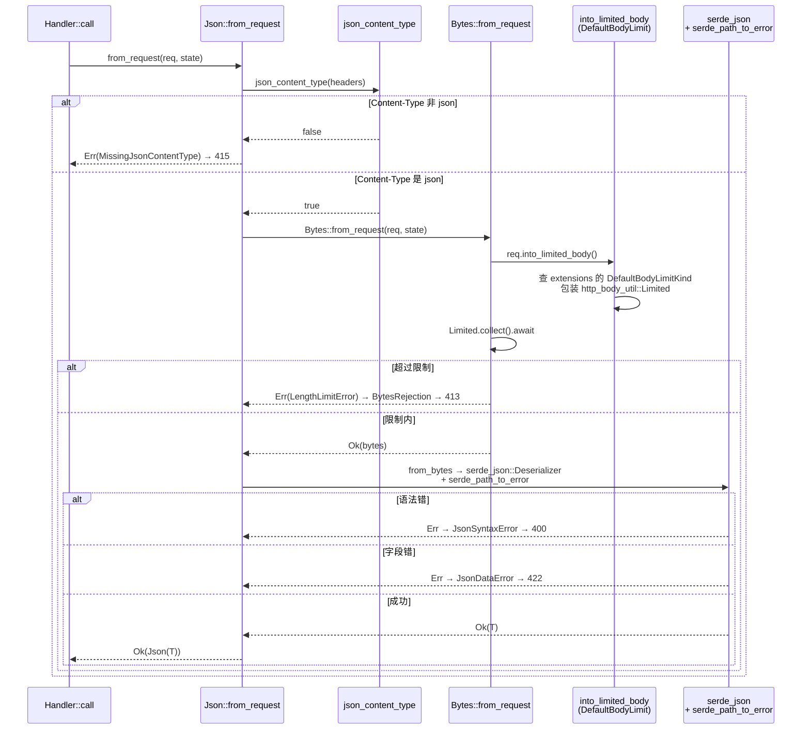

# 第 11 章 · 提取器实战:Path/Query/State/Json/Form

> **核心问题**:上一章把 `FromRequestParts`(只读 `&mut Parts`,可多次跑)和 `FromRequest`(消费 body,只能一次)这套二元划分讲透了,但那只是"形"——axum 内置的那几个最常用的提取器,`Path`/`Query`/`State`/`Json`/`Form`,具体每一个是怎么用这套机制把请求"翻译"成 handler 参数的?各自走哪条路径?失败时(`400`/`415`/`422`/`500`)的 Rejection 又是怎么变成 `Response` 的?这一章就把这五个内置提取器逐个拆到源码,顺带把 axum 一道隐藏的安全闸——`Json` 的**三重校验**(Content-Type、body 大小、serde 反序列化)——讲透。
>
> **读完本章你会明白**:
>
> 1. 五个内置提取器怎么按"是否消费 body"一分为二:`Path`/`Query`/`State` 走 `FromRequestParts`(只读 parts,可以多个并列、顺序无关),`Json`/`Form` 走 `FromRequest`(消费 body,必须是 handler 最后一个参数),这张归类表你能在脑子里画出来;
> 2. `Path<T>` 怎么从 `parts.extensions` 里把 matchit 匹配时塞进去的 `UrlParams` 取出来,再交给 axum 自己手写的 `PathDeserializer`(一个完整的 serde `Deserializer` 实现)反序列化成 `T`,以及为什么 URL 参数这套反序列化不能直接用 `serde_json`(URL 参数不是 JSON,而是扁平的 `key=value` 对);
> 3. `Json<T>` 的 `from_request` 里那**三道闸**到底各防什么——`Content-Type: application/json` 校验(防把 form 数据当 json 解析出错乱)、`Bytes::from_request` 内部的 `into_limited_body`(防恶意大 body 撑爆内存,默认 2 MB)、`serde_json::from_slice` 反序列化(防字段类型/语法错),以及这三道闸任何一道失败都产出对应的 Rejection(`MissingJsonContentType`/`BytesRejection`/`JsonSyntaxError`/`JsonDataError`),Rejection 又怎么 `into_response` 变成带正确状态码的 `Response`;
> 4. `Form` 为什么比 `Json` 多一层"GET/HEAD 走 query string、其他 method 走 body 且要求 `application/x-www-form-urlencoded`"的分叉,`State` 为什么是这五个里唯一的 `Rejection = Infallible`——以及这些差异背后都是"这个提取器要解决什么问题、要 sound 必须卡什么"。
>
> 本章是"**提取与响应**"这一面的实战章。上一章(P3-10)讲清了 `FromRequest`/`FromRequestParts` 二元划分的**理论**和 `ViaParts` 桥接的**机制**,本章是把这套理论套到五个最常用的内置提取器上看**实战**——同样的二元划分,在每个提取器里怎么落地成具体的"从哪取、怎么反序列化、失败怎么变成 Response"。理论在 P3-10,应用在本章,自定义在 P3-13。
>
> **写给谁读**:你写过 `async fn handler(Path(id): Path<i32>, State(db): State<Db>, Json(payload): Json<CreateUser>)`,跑过、能用,但你讲不清:`Path` 凭什么知道 `{id}` 的值是哪个?`Json` 凭什么要求最后一个参数?为什么 `Content-Type` 不对它返回 415 而 `Path` 解析失败返回 400?为什么把 `Json` 放在 `State` 前面编译器直接拒?这一章治这些"会用没懂"。
>
> **前置衔接**:上一章(P3-10)刚把 `FromRequestParts`/`FromRequest` 的二元划分和 `ViaParts` 桥接讲透。这一章接住那句话——"前 N-1 个参数 `FromRequestParts`,最后一个 `FromRequest`,body 只被最后一个碰一次"——把它落到五个具体提取器上看它们各自怎么实现 `from_request_parts` / `from_request`。`State` 那一支已经在 P1-04 讲透了(本章只做承接对照,不重复 `Router<S>` 类型状态和 `FromRef` 子状态派生);`Path` 参数的来源(matchit 匹配时怎么把 `{id}` 塞进 `parts.extensions`)已经在 P2-05 讲透了(本章只承接"它已经在 extensions 里了",重点拆 `Path` 自己怎么从 extensions 取出来 + serde 反序列化)。
>
> **逃生阀**:如果本章五个提取器逐个看下来信息密度太大,记住一张归类表就够——**`Path`/`Query`/`State` 只读 parts(可多次跑、顺序无关),`Json`/`Form` 消费 body(只能一次、必须最后)**。带着这张表跳到第三节看 `Json` 的三重校验(本章最硬的部分),再回头读其他四个。serde 是外部 crate,本章引用其用法 + 对照 protobuf(承《gRPC》),不深入 serde 内部。

---

## 一句话点破

> **五个内置提取器,按"碰不碰 body"一分为二:`Path`/`Query`/`State` 走 `FromRequestParts`,只读请求的 parts(method/uri/headers/extensions),可以并列多个、顺序无关;`Json`/`Form` 走 `FromRequest`,要消费 body,只能跑一次、必须是 handler 最后一个参数。`Json` 在消费 body 之前还卡三道闸——Content-Type 必须是 `application/json`、body 大小默认不超过 2 MB(`DefaultBodyLimit`)、serde_json 反序列化必须成功——三道闸各防一种攻击/错乱(误解析、OOM、字段错),任何一道失败都产出对应的 Rejection,Rejection 经 `IntoResponse` 变成带正确状态码(415/413/400/422)的 `Response`。**

这是结论。本章倒过来拆:先把五个提取器按二元划分归类,再逐个看它们 `from_request_parts`/`from_request` 的实现,最后专门拆 `Json` 的三重校验和 Rejection 怎么变成 Response。

---

## 第一节:五个提取器,按"碰不碰 body"一分为二

### 提问

axum 内置的提取器有一大把(`Path`/`Query`/`State`/`Json`/`Form`/`Bytes`/`String`/`Header`/`Extension`/`ConnectInfo`/`WebSocketUpgrade`/`Sse`/...),本章只挑最常用的五个(`Path`/`Query`/`State`/`Json`/`Form`)拆透。拆之前先做个归类:它们各自走 `FromRequestParts` 还是 `FromRequest`?为什么?

这个归类是上一章(P3-10)二元划分的实战投影。P3-10 讲的是理论:"只读 parts 的走 `FromRequestParts`,消费 body 的走 `FromRequest`"。本章把它落到具体提取器上。

### 归类表

```text
(简化示意,归类表)
┌──────────────────────────────────────────────────────────────────────┐
│                    FromRequestParts<S>                               │
│            (只读 &mut Parts, 可多次跑, 顺序无关)                      │
├──────────────────────────────────────────────────────────────────────┤
│  Path<T>       从 parts.extensions 取 matchit 注入的 UrlParams         │
│                 + serde 反序列化成 T                                  │
│  Query<T>      从 parts.uri 取 query string                          │
│                 + serde_urlencoded 反序列化成 T                       │
│  State<T>      完全忽略 parts(_parts)                                │
│                 只看 from_request_parts(parts, state) 的 state 参数   │
│                 ★ 承 P1-04, 本章只承接对照                            │
└──────────────────────────────────────────────────────────────────────┘

┌──────────────────────────────────────────────────────────────────────┐
│                    FromRequest<S>                                    │
│            (消费 body, 只能一次, 必须 handler 最后一个参数)            │
├──────────────────────────────────────────────────────────────────────┤
│  Json<T>       ★ 三重校验:                                            │
│                   1. Content-Type 必须 application/json              │
│                   2. Bytes::from_request 内部 into_limited_body       │
│                      (DefaultBodyLimit 默认 2 MB)                     │
│                   3. serde_json::from_slice 反序列化                  │
│  Form<T>       分叉:                                                  │
│                 - GET/HEAD: 走 query string (同 Query)                │
│                 - 其他 method: Content-Type 必须                      │
│                   application/x-www-form-urlencoded                   │
│                   + 消费 body + serde_urlencoded 反序列化             │
└──────────────────────────────────────────────────────────────────────┘
```

这张表是本章的全部地图。三个走 `FromRequestParts`(`Path`/`Query`/`State`),两个走 `FromRequest`(`Json`/`Form`)。这个划分不是 axum 拍脑袋定的,是由"提取器要不要碰 body"决定的——而 body 是 `Stream`,**只能消费一次**。这是 P3-10 钉死的事实,本章只是把它落到具体提取器上。

> **钉死这件事(承接 P3-10)**:`impl_handler!` 宏(`axum/src/handler/mod.rs#L221-L262`)对 handler 的 N 个参数这样展开:前 N-1 个要求 `FromRequestParts`(只读 parts,可多次跑),最后一个要求 `FromRequest`(可消费 body)。所以你写 `async fn h(Path, State, Json)`——`Path` 和 `State` 是前两个参数(只读 parts),`Json` 是最后一个(消费 body),编译通过;你写 `async fn h(Json, Path)`——`Json` 是第一个参数,但宏要求前 N-1 个参数 `FromRequestParts`,而 `Json` 只 impl 了 `FromRequest`(不消费 body 的桥接走 `ViaParts`,但 `Json` 不走那个桥接,因为它真的要消费 body),编译器直接拒。**"body 只被最后一个参数碰一次"这件事,编译期钉死,运行时不可能重复消费**。这是 axum 类型系统最 sound 的一笔,P3-10 详拆,本章不重复。

### 对照:不这样会怎样(手写提取的灾难)

假设 axum 没有 `FromRequestParts`/`FromRequest` 二元划分,所有提取器都接整个 `Request`(可消费 body)。你写:

```rust
// 假想的"统一 Request"版本(非 axum 实际做法)
async fn handler(State(state): State<...>, Json(payload): Json<...>) { }
// 两个参数都 from_request(req, state),谁先跑?
// State 跑完,req 还在吗?body 还能被 Json 消费吗?
```

`State` 不需要 body,但硬塞给它一个 `Request`(按值消费),它跑完之后这个 `Request` 就 move 了,后面的 `Json` 拿不到 body——除非 `State` 把 `Request` 再吐回来(签名变成 `fn from_request(req) -> (Self, Request)`,丑且每个提取器都要手动把 req 透传)。或者每个提取器都把 body 收完再丢给下一个(body 被收多次,要么 clone 一份 body 内存翻倍,要么只能让一个提取器碰 body)。

axum 的二元划分把这一切治了:`FromRequestParts` 只读 `&mut Parts`(不碰 body,parts 可重复读),`FromRequest` 才碰 body(只能一次)。宏保证前 N-1 个走 Parts、最后一个走 Request。**body 不被重复消费,编译期钉死**。这是上一章 P3-10 的招牌结论,本章在每个提取器里看它怎么落地。

> **承接《hyper》**:本章说的 "body",就是 hyper 解析 HTTP 协议后交给 axum 的那个 `Request<Body>` 的 body。它是 `http_body::Body`(一个异步 `Stream`,产 `Frame<Bytes>`),不是 `Vec<u8>`——所以 "消费 body" 才是 "只能一次"(Stream 不能倒带)。hyper 怎么把 HTTP/1 的 chunked body / HTTP/2 的 DATA frame 变成这个 `Body`,承《hyper》P2(HTTP/1)和 P3(HTTP/2),本书一句带过指路。axum 的 `Body` 是 `axum_core::body::Body`,内部包了 hyper 的 body,本章涉及 `Body::collect().to_bytes()` 这种"把流收成一块"的操作,承《hyper》body Stream 一段,不重复。

---

## 第二节:Path——从 extensions 取 matchit 注入的参数 + serde 反序列化

### 提问

`Path<T>` 是 axum 最有特色的提取器。你写 `.route("/users/{id}", get(handler))`,handler 里 `Path(id): Path<i32>` 就能拿到 `id`。`Path` 凭什么知道 URL 里 `{id}` 的值是什么?

这一节拆两个问题:① `Path` 从哪里取参数(承 P2-05:matchit 匹配时把 `{id}` 的值塞进了 `parts.extensions`);② 取出来后怎么反序列化成 `T`(axum 自己手写了一个完整的 serde `Deserializer`,因为 URL 参数不是 JSON)。

### 从哪取:parts.extensions 里的 UrlParams

matchit 匹配路径时,`{id}` 这种命名参数会被捕获。axum 在 `PathRouter::call_with_state` 里调 `url_params::insert_url_params` 把这些参数塞进 `parts.extensions`:

```rust
// axum/src/routing/path_router.rs#L388-L401(逐字摘录,关键部分)
match self.node.at(parts.uri.path()) {
    Ok(match_) => {
        let id = *match_.value;
        // ... set_matched_path ...
        url_params::insert_url_params(&mut parts.extensions, match_.params);
        let endpoint = self.routes.get(&id).expect("no route for id. This is a bug in axum. Please file an issue");
        // ...
    }
    Err(MatchError::NotFound) => Err((Request::from_parts(parts, body), state)),
}
```

`url_params::insert_url_params`(`axum/src/routing/url_params.rs#L12-L47`)把 matchit 的 `Params` 转成 `Vec<(Arc<str>, PercentDecodedStr)>` 塞进 extensions,键类型是 `UrlParams`:

```rust
// axum/src/routing/url_params.rs#L6-L10(逐字摘录)
#[derive(Clone)]
pub(crate) enum UrlParams {
    Params(Vec<(Arc<str>, PercentDecodedStr)>),
    InvalidUtf8InPathParam { key: Arc<str> },
}
```

注意 `UrlParams` 是 `pub(crate)`,外部看不到——它是 axum 内部的"路由参数运输容器",`Path` 提取器从 extensions 里按类型取它出来。这一段(matchit 匹配 → params 塞 extensions)在 P2-05 路由招牌章已经拆透了,本章不重复。我们只承接结论:**等 `Path::from_request_parts` 跑的时候,`parts.extensions` 里已经有一个 `UrlParams`,装着 matchit 捕获的所有 `{id}`/`{*path}` 参数(且已经 percent-decoded 过了)**。

### 怎么反序列化:Path<T>::from_request_parts

来看 `Path` 的核心实现(`axum/src/extract/path/mod.rs#L157-L190`):

```rust
// axum/src/extract/path/mod.rs#L157-L190(逐字摘录)
impl<T, S> FromRequestParts<S> for Path<T>
where
    T: DeserializeOwned + Send,
    S: Send + Sync,
{
    type Rejection = PathRejection;

    async fn from_request_parts(parts: &mut Parts, _state: &S) -> Result<Self, Self::Rejection> {
        // Extracted into separate fn so it's only compiled once for all T.
        fn get_params(parts: &Parts) -> Result<&[(Arc<str>, PercentDecodedStr)], PathRejection> {
            match parts.extensions.get::<UrlParams>() {
                Some(UrlParams::Params(params)) => Ok(params),
                Some(UrlParams::InvalidUtf8InPathParam { key }) => {
                    let err = PathDeserializationError {
                        kind: ErrorKind::InvalidUtf8InPathParam { key: key.to_string() },
                    };
                    Err(FailedToDeserializePathParams(err).into())
                }
                None => Err(MissingPathParams.into()),
            }
        }

        fn failed_to_deserialize_path_params(err: PathDeserializationError) -> PathRejection {
            PathRejection::FailedToDeserializePathParams(FailedToDeserializePathParams(err))
        }

        match T::deserialize(de::PathDeserializer::new(get_params(parts)?)) {
            Ok(val) => Ok(Path(val)),
            Err(e) => Err(failed_to_deserialize_path_params(e)),
        }
    }
}
```

逐句拆:

1. **`T: DeserializeOwned + Send`**:`Path<T>` 的 `T` 必须实现 `serde::Deserialize`(serde 是外部 crate,诚实标注)。`DeserializeOwned` 表示能从 owned 数据反序列化(不借用外部字节)。这是 axum 把 URL 参数反序列化的活**全权委托给 serde** 的根。
2. **`type Rejection = PathRejection`**:`PathRejection` 是个复合枚举(下面拆),含 `FailedToDeserializePathParams` 和 `MissingPathParams` 两种。
3. **`fn get_params(parts: &Parts)`**:从 `parts.extensions.get::<UrlParams>()` 取出 matchit 注入的参数。三种情况:
   - `UrlParams::Params(params)` → 正常拿到 `&[(Arc<str>, PercentDecodedStr)]`(参数键值对数组)。
   - `UrlParams::InvalidUtf8InPathParam { key }` → 参数 percent-decode 之后不是合法 UTF-8,返回 `FailedToDeserializePathParams`(内含 `ErrorKind::InvalidUtf8InPathParam`)。
   - `None` → extensions 里**没有** `UrlParams`。这种情况常见于"用 `Request<_>` 当提取器先消费了 parts"(把 extensions 拿走了)。`Path` 拿不到参数,返回 `MissingPathParams`(`500 INTERNAL_SERVER_ERROR`,因为这是"路由明明匹配了却没参数"的框架内部错,不是用户错)。
4. **`T::deserialize(de::PathDeserializer::new(get_params(parts)?))`**:这是核心。axum 自己手写了一个 `PathDeserializer`(`axum/src/extract/path/de.rs#L45-L56`),它实现了 serde 的 `Deserializer` trait,把 `&[(Arc<str>, PercentDecodedStr)]` 这个 URL 参数数组**伪装成一个 serde 可读的数据源**。然后调 `T::deserialize`,serde 按你 `T` 的形状(是 tuple、是 struct、是 map、是 Vec)驱动 `PathDeserializer` 的对应方法,把参数填进 `T`。

### 为什么不能直接用 serde_json 反序列化 URL 参数

你可能会问:URL 参数不就一堆 `key=value` 吗?为什么不能像 `Json` 那样直接 `serde_json::from_slice`?

因为 **URL 参数的数据模型和 JSON 完全不同**。JSON 是嵌套的树(对象/数组/标量,可以任意深嵌套),URL 参数是**扁平的 `key=value` 对数组**(没有嵌套结构,顶多靠 key 的命名约定模拟嵌套,如 `user[name]=foo`)。serde 的 `Deserialize` trait 是数据模型无关的——它定义了一组"读取原语"(`deserialize_struct`/`deserialize_seq`/`deserialize_map`/...),具体数据源(JSON/URL 参数/YAML/protobuf)各自实现一个 `Deserializer`,把这些原语映射到自己的数据模型。

axum 给 URL 参数手写了 `PathDeserializer`(`axum/src/extract/path/de.rs#L45` 起,500 多行),它知道怎么把 `&[("id", "42"), ("team", "7")]` 这样的扁平数组,按 serde 的 `deserialize_struct`/`deserialize_seq`/`deserialize_map` 协议喂给 `T`。比如:

- `Path<(String, String)>`(tuple):`PathDeserializer` 实现 `deserialize_seq`,按位置依次喂 `params[0]`、`params[1]`。
- `Path<Params>`(struct,`Params { user_id: Uuid, team_id: Uuid }`):`PathDeserializer` 实现 `deserialize_struct`,按字段名从 params 里找 `user_id`、`team_id`。
- `Path<HashMap<String, String>>`(map):实现 `deserialize_map`,把所有 `(key, value)` 喂给 HashMap。
- `Path<Vec<(String, String)>>`(vec of pairs):实现 `deserialize_seq`,把每个 `(key, value)` 当一个 tuple 喂。

这个 `PathDeserializer` 是 axum 源码里最"serde 硬核"的一段——它要正确实现 serde 的 `Deserializer` 协议(包括 `EnumAccess`/`MapAccess`/`SeqAccess` 等辅助 trait),还要处理 URL 参数特有的怪问题(参数个数和 `T` 字段数对不上、percent-decode 后的值转 i32/Uuid 失败、嵌套类型不支持)。失败时产出 `ErrorKind`(`axum/src/extract/path/mod.rs#L285-L355`),如 `WrongNumberOfParameters`/`ParseErrorAtKey`/`UnsupportedType`/`InvalidUtf8InPathParam`,每种 `ErrorKind` 有自己的状态码和错误信息。

> **承接《gRPC》**:这里 axum 用 serde 反序列化 URL 参数,对照 gRPC 用 protobuf 反序列化请求体——都是"把字节流变成结构体",但 serde 是泛型数据模型(JSON/URL/YAML 都能套),protobuf 是强 schema(codegen 生成代码)。serde 的灵活性换来了"一个 trait 适配多种数据源",protobuf 的强 schema 换来了更紧凑的编码和更快的解析。这是 RESTful vs RPC 的一个本质差异,本章一句带过,详见《gRPC》。

### Path 的 Rejection:状态码不是一刀切

`Path` 失败时返回 `PathRejection`,它是个**复合 Rejection**(`axum/src/extract/rejection.rs#L151-L160`):

```rust
// axum/src/extract/rejection.rs#L151-L160(逐字摘录)
composite_rejection! {
    /// Rejection used for [`Path`](super::Path).
    pub enum PathRejection {
        FailedToDeserializePathParams,
        MissingPathParams,
    }
}
```

`composite_rejection!` 宏(`axum-core/src/macros.rs#L154-L231`)展开成一个 enum,每个 variant 包一个具体的 rejection 类型,并 impl `IntoResponse`(转 Response 时调内层的 `into_response`)。所以 `PathRejection` 实际是"FailedToDeserializePathParams 或 MissingPathParams"二选一。

关键的细节:**这两个 variant 的状态码不一样**。

- `FailedToDeserializePathParams`(`axum/src/extract/path/mod.rs#L404-L463`)的 `status()` 方法(`L437-L450`)按 `ErrorKind` 分:
  - `Message`/`DeserializeError`/`InvalidUtf8InPathParam`/`ParseError`/`ParseErrorAtIndex`/`ParseErrorAtKey` → **`400 BAD_REQUEST`**(用户传了无法解析的 URL,是用户的错)。
  - `WrongNumberOfParameters`/`UnsupportedType` → **`500 INTERNAL_SERVER_ERROR`**(这是程序员错——handler 写了 `Path<(String, String)>` 但路由只有 1 个参数,或者想反序列化成不支持的类型如 `char` 数组,是代码 bug 不是用户错)。
- `MissingPathParams`(`axum/src/extract/rejection.rs#L50-L57`)→ **`500 INTERNAL_SERVER_ERROR`**(`define_rejection!` 标的 `#[status = INTERNAL_SERVER_ERROR]`)。如前所述,这种情况意味着"路由匹配了但 extensions 里没 `UrlParams`",通常是用户在 `Path` 之前用 `Request<_>` 提取器把 parts 消费掉了,属框架级错。

这个"按错误原因分状态码"的设计很 axum——它不是粗暴地"提取失败一律 400",而是把"用户错(400)"和"程序员错(500)"分开。前端拿到 400 知道是参数传错了,拿到 500 知道是后端代码 bug。这种状态码语义的精确性,是 axum 区别于"提取失败全 400"的朴素框架的一个细节。

> **钉死这件事**:`Path<T>` 提取器的链路是:**matchit 匹配时把 `{id}` 参数塞进 `parts.extensions`(承 P2-05)→ `Path::from_request_parts` 从 extensions 取出 `UrlParams` → axum 手写的 `PathDeserializer` 把参数数组伪装成 serde `Deserializer` → `T::deserialize` 按你 `T` 的形状(tuple/struct/map/vec)驱动 deserializer 填值 → 成功产出 `Path(T)`,失败产出 `PathRejection`(按 `ErrorKind` 分 400/500)**。这条路的核心是 axum 自己实现了 serde 的 `Deserializer` 协议——这是 axum 源码里 serde 硬核的一段,500 多行,把 URL 参数的扁平模型映射到 serde 的泛型数据模型。

---

## 第三节:Query——query string 解析 + serde_urlencoded

### 提问

`Query<T>` 提取 query string(`?page=2&per_page=30`)。它和 `Path` 有什么不一样?为什么它也是 `FromRequestParts`(不碰 body)?

`Query` 走 `FromRequestParts` 是因为 query string 是 URL 的一部分(`parts.uri`),不在 body 里。它和 `Path` 的区别在数据来源:`Path` 从 `parts.extensions` 取 matchit 注入的参数,`Query` 从 `parts.uri.query()` 取原始 query string 字符串。

### Query::from_request_parts 的实现

```rust
// axum/src/extract/query.rs#L53-L63(逐字摘录)
impl<T, S> FromRequestParts<S> for Query<T>
where
    T: DeserializeOwned,
    S: Send + Sync,
{
    type Rejection = QueryRejection;

    async fn from_request_parts(parts: &mut Parts, _state: &S) -> Result<Self, Self::Rejection> {
        Self::try_from_uri(&parts.uri)
    }
}
```

`from_request_parts` 只有一行,委托给 `try_from_uri`(`axum/src/extract/query.rs#L88-L95`):

```rust
// axum/src/extract/query.rs#L88-L95(逐字摘录)
pub fn try_from_uri(value: &Uri) -> Result<Self, QueryRejection> {
    let query = value.query().unwrap_or_default();
    let deserializer =
        serde_urlencoded::Deserializer::new(form_urlencoded::parse(query.as_bytes()));
    let params = serde_path_to_error::deserialize(deserializer)
        .map_err(FailedToDeserializeQueryString::from_err)?;
    Ok(Query(params))
}
```

逐句拆:

1. **`value.query().unwrap_or_default()`**:从 `Uri` 取 query string 部分(`?page=2&per_page=30` 里的 `page=2&per_page=30`)。**如果 URI 没有 query string(比如 `/path` 没带 `?...`),`query()` 返回 `None`,`unwrap_or_default()` 给个空字符串 `""`**。这是个关键细节——空 query string 不是错误,而是一个"空参数集",serde 反序列化时按 `T` 的形状处理(如果 `T` 的字段都是 `Option`,全 `None`;如果有必填字段,反序列化失败)。
2. **`serde_urlencoded::Deserializer::new(form_urlencoded::parse(...))`**:`form_urlencoded::parse` 把 `page=2&per_page=30` 解析成一组 `(key, value)` 对(这部分在 `form_urlencoded` 外部 crate),`serde_urlencoded::Deserializer` 把这组对伪装成 serde `Deserializer`(类似 axum 给 `Path` 手写的 `PathDeserializer`,但 `serde_urlencoded` crate 已经做好了,axum 直接用)。
3. **`serde_path_to_error::deserialize(deserializer)`**:`serde_path_to_error` 是另一个外部 crate,它包装 deserializer,在反序列化失败时给错误信息加上**字段路径**(比如 `Failed to deserialize query string: page: invalid digit found in string` 里的 `page:` 就是它加的)。没有它,错误信息只是 `invalid digit found in string`,你不知道是哪个字段错了。
4. **`FailedToDeserializeQueryString::from_err`**:把 `serde_path_to_error::Error<serde_urlencoded::Error>` 包成 `FailedToDeserializeQueryString` 这个 axum 的 rejection 类型(`axum/src/extract/rejection.rs#L84-L90`,`#[status = BAD_REQUEST]`)。

### Query 的 Rejection:一律 400

`QueryRejection`(`axum/src/extract/rejection.rs#L92-L100`)只有一个 variant——`FailedToDeserializeQueryString`:

```rust
// axum/src/extract/rejection.rs#L92-L100(逐字摘录)
composite_rejection! {
    /// Rejection used for [`Query`](super::Query).
    pub enum QueryRejection {
        FailedToDeserializeQueryString,
    }
}
```

只有一个 variant,状态码统一是 `400 BAD_REQUEST`(`FailedToDeserializeQueryString` 的 `#[status = BAD_REQUEST]`,`L68-L70`)。为什么 `Query` 不像 `Path` 那样分 400/500?因为 `Query` 的失败**只有一种原因**——query string 反序列化失败(字段类型不对、必填字段缺失、值解析失败)。这种失败**永远是用户的错**(用户传了无法解析的 query),所以一律 400。不像 `Path` 有"WrongNumberOfParameters"(程序员写了错的路由参数个数,是 500)。

注意 `Query<T>` 里的 `T` 是 `DeserializeOwned`(不是 `Deserialize`),意味着能从 owned 数据反序列化。`Option<T>` 这种"字段可空"的处理是 serde 自己的事——你写 `page: Option<u64>`,query 里没 `page`,`Option::deserialize` 会把"字段缺失"映射成 `None`,不报错。

### 空 query 的处理:为什么不是错误

回看 `try_from_uri` 第一句:`value.query().unwrap_or_default()`。如果 URI 是 `/path`(没 `?...`),`query()` 返回 `None`,`unwrap_or_default()` 给空 `&str`。然后 `form_urlencoded::parse("")` 返回空迭代器,`serde_urlencoded::Deserializer` 看到空参数集,反序列化按 `T` 的形状处理:

- `T = Pagination { size: Option<u64>, page: Option<u64> }` → 空参数集,两个字段都 `None` → `Pagination { size: None, page: None }` → 成功。这是 `Query` 的测试用例 `test_query`(`query.rs#L122-L155`)第一条覆盖的。
- `T = Pagination { size: u64, page: u64 }`(必填) → 空参数集,字段缺失 → `FailedToDeserializeQueryString` → 400。

所以"空 query 是不是错误"完全取决于 `T` 的形状——`Option` 字段宽容,必填字段严格。这种"宽容度由 `T` 决定"是 serde 的标准行为,axum 不掺和。

> **钉死这件事**:`Query<T>` 提取器的链路是:**`parts.uri.query()` 取 query string(空就是空字符串)→ `serde_urlencoded::Deserializer` 把 `key=value` 对伪装成 serde `Deserializer` → `serde_path_to_error` 包装加字段路径 → `T::deserialize` 反序列化 → 成功产出 `Query(T)`,失败产出 `QueryRejection`(一律 400)**。和 `Path` 对比:`Path` 从 `extensions` 取参数(承 matchit),`Query` 从 `uri` 取 query string;`Path` 用 axum 手写的 `PathDeserializer`,`Query` 用现成的 `serde_urlencoded`;`Path` 的 Rejection 分 400/500,`Query` 一律 400。

---

## 第四节:State——承 P1-04,本章只做承接对照

### 提问

`State<T>` 是这五个里最特殊的一个。它凭什么能拿到 state?它走 `FromRequestParts` 还是 `FromRequest`?它的 Rejection 为什么是 `Infallible`?

这三问在 P1-04(State 招招牌)已经讲透了——`State<T>` **不看 request,只看 state 参数**;走 `FromRequestParts`(因为不碰 body);Rejection 是 `Infallible`(因为只要 FromRef 能跑通就一定能拿到值)。本章只做承接对照,不重复 P1-04 的内容(类型状态 `Router<S>`、`with_state` 怎么把 S 压成 `()`、`FromRef` 子状态派生、`State` vs `Extension` 两条不同路径)。只把 `State` 在"五个提取器归类表"里的位置钉死。

### State 在归类表里的位置

`State<T>` 的 `FromRequestParts` 实现(`axum/src/extract/state.rs#L303-L316`,P1-04 已贴):

```rust
// axum/src/extract/state.rs#L303-L316(逐字摘录,详见 P1-04)
impl<OuterState, InnerState> FromRequestParts<OuterState> for State<InnerState>
where
    InnerState: FromRef<OuterState>,
    OuterState: Send + Sync,
{
    type Rejection = Infallible;

    async fn from_request_parts(
        _parts: &mut Parts,
        state: &OuterState,
    ) -> Result<Self, Self::Rejection> {
        let inner_state = InnerState::from_ref(state);
        Ok(Self(inner_state))
    }
}
```

三个对照点(本节只钉死这三点,深度在 P1-04):

1. **`_parts: &mut Parts` 带下划线**——`State` 完全忽略 request(parts/method/uri/headers/extensions 都不看)。这是五个提取器里唯一一个"完全不看 request"的。
2. **`state: &OuterState`**——`State` 从 `from_request_parts` 的第二个参数 `state` 拿值。这个 `state` 由 `Handler::call(self, req, state)` 透传(承 P3-09),源头是 `Router::call` 里 `with_state` 注入的 state。**不是从 extensions 拿**(这点和 `Extension<T>` 不同,详见 P1-04 第四节)。
3. **`type Rejection = Infallible`**——`State` 永远不失败。`Infallible` 是"不可能失败"的类型,`Result<Self, Infallible>` 的 `Err` 分支不可达。因为 `State` 依赖的 `InnerState: FromRef<OuterState>` 是编译期约束(P1-04 拆),编译期保证能投影出 `InnerState`,运行时不可能失败。所以 `State` 是这五个里唯一 Rejection = Infallible 的提取器。

把 `State` 放进归类表:**走 `FromRequestParts`(不碰 body)、不看 request(只看 state)、Rejection = Infallible(编译期保证成功)**。这三个属性让 `State` 在五个提取器里独树一帜——它是最"稳"的提取器(不会失败),也是最少"看 request"的提取器(完全不看)。

> **承接 P1-04**:`State<T>` 提取器的完整拆解(`Router<S>` 类型状态、`with_state` 怎么压成 `Router<()>`、`FromRef` 子状态派生、`State` vs `Extension` 两条不同路径)在 P1-04(State 招牌章)。本章只做归类对照,不重复。如果你还没读 P1-04,先读它再回来——`State` 的所有"为什么"都在那章。

---

## 第五节:Json——三重校验是本章最硬的部分

### 提问

`Json<T>` 是 axum 最常用的"消费 body"的提取器。它的 `from_request` 里卡了**三道闸**:Content-Type 校验、body 大小限制、serde 反序列化。这三道闸各防什么?为什么这三道缺一不可?

这一节是本章最硬的部分。我们先把 `Json::from_request` 的源码摊开,看这三道闸在哪,再逐道拆它防什么、不这样会怎样。

### Json::from_request 的源码

```rust
// axum/src/json.rs#L99-L114(逐字摘录)
impl<T, S> FromRequest<S> for Json<T>
where
    T: DeserializeOwned,
    S: Send + Sync,
{
    type Rejection = JsonRejection;

    async fn from_request(req: Request, state: &S) -> Result<Self, Self::Rejection> {
        if !json_content_type(req.headers()) {
            return Err(MissingJsonContentType.into());
        }

        let bytes = Bytes::from_request(req, state).await?;
        Self::from_bytes(&bytes)
    }
}
```

短短几行,但藏着三道闸:

1. **`json_content_type(req.headers())`**——校验 `Content-Type`。失败返回 `MissingJsonContentType`。
2. **`Bytes::from_request(req, state)`**——消费 body,且内部有大小限制(`DefaultBodyLimit` 默认 2 MB)。失败返回 `BytesRejection`。
3. **`Self::from_bytes(&bytes)`**——serde_json 反序列化。失败返回 `JsonSyntaxError`(语法错)或 `JsonDataError`(字段类型错)。

三道闸任何一道失败,`Json::from_request` 立即返回对应的 Rejection,**后面的闸不跑**。短路语义保证了:Content-Type 错就不读 body(省一次 body 收集),body 超限就不跑 serde(省一次反序列化)。下面逐道拆。

### 闸一:Content-Type 校验——防误解析

第一道闸是 `json_content_type`(`axum/src/json.rs#L138-L155`):

```rust
// axum/src/json.rs#L138-L155(逐字摘录)
fn json_content_type(headers: &HeaderMap) -> bool {
    let Some(content_type) = headers.get(header::CONTENT_TYPE) else {
        return false;
    };

    let Ok(content_type) = content_type.to_str() else {
        return false;
    };

    let Ok(mime) = content_type.parse::<mime::Mime>() else {
        return false;
    };

    let is_json_content_type = mime.type_() == "application"
        && (mime.subtype() == "json" || mime.suffix().is_some_and(|name| name == "json"));

    is_json_content_type
}
```

这个函数检查 `Content-Type` 是不是 JSON 类。注意它**不是简单地字符串相等 `== "application/json"`**,而是用 `mime::Mime` 解析后判断 `type_() == "application"` 且 `subtype() == "json"` 或 `suffix() == "json"`。这是因为 JSON 的 Content-Type 有好几种合法写法:

- `application/json`(标准)
- `application/json; charset=utf-8`(带 charset,测试 `json_content_types` 覆盖,`json.rs#L282-L302`)
- `application/cloudevents+json`(带 `+json` suffix,如 CloudEvents over JSON,测试覆盖)

朴素地 `== "application/json"` 会拒绝后两种合法写法,误伤正常请求。axum 用 `mime` crate 解析后判断 subtype/suffix,精确覆盖"凡是 JSON 类的 Content-Type"。

`from_request` 里 Content-Type 不对就立即返回 `MissingJsonContentType`(`axum/src/extract/rejection.rs#L32-L40`,`#[status = UNSUPPORTED_MEDIA_TYPE]`,即 **415**):

```rust
// axum/src/extract/rejection.rs#L32-L40(逐字摘录)
define_rejection! {
    #[status = UNSUPPORTED_MEDIA_TYPE]
    #[body = "Expected request with `content-type: application/json`"]
    pub struct MissingJsonContentType;
}
```

测试 `consume_body_to_json_requires_json_content_type`(`json.rs#L264-L279`)验证:POST 一个 body 是 `{"foo":"bar"}` 但 Content-Type 不是 application/json,返回 **415 Unsupported Media Type**。

#### 不这样会怎样:把 form 数据当 json 解析出错乱

为什么 Content-Type 校验这道闸不能省?假设 axum 不校验 Content-Type,直接拿 body 跑 `serde_json::from_slice`。后果:

- 用户用 HTML form(`<form method=post enctype="application/x-www-form-urlencoded">`)提交,浏览器发的 body 是 `email=foo&password=bar`,Content-Type 是 `application/x-www-form-urlencoded`。后端的 `Json<CreateUser>` 拿到这个 body,`serde_json::from_slice("email=foo&password=bar")` 直接失败(JSON 语法错,`=` 不是合法 token)。返回 `JsonSyntaxError`(**400 BAD_REQUEST**)。
- 但这个错误信息("Failed to parse the request body as JSON")对用户毫无意义——用户明明在提交 form,怎么报 JSON 错?

更危险的是:某个攻击者用 form 格式发一段刚好是合法 JSON 的 body(如 `email=foo&password=bar` 改写成 `{"email":"foo","password":"bar"}`),Content-Type 是 `application/x-www-form-urlencoded`,后端 `Json` 不校验 Content-Type 直接解析——解析成功,但用户的意图(form 提交)被误解成 JSON 提交。这种"语义错位"在生产环境是安全隐患。

axum 用 Content-Type 校验把这种错位堵死:**你说你是 JSON(Content-Type: application/json),我才用 JSON 解析;否则我直接 415 拒绝,不解析**。这道闸是"协议自描述"的体现——HTTP 协议规定 Content-Type 描述 body 的格式,框架据此分派,不能跨格式乱解析。

### 闸二:body 大小限制——防 OOM

第二道闸藏在 `Bytes::from_request` 里。看 `Bytes` 的 `FromRequest` 实现(`axum-core/src/extract/request_parts.rs#L99-L115`):

```rust
// axum-core/src/extract/request_parts.rs#L99-L115(逐字摘录)
impl<S> FromRequest<S> for Bytes
where
    S: Send + Sync,
{
    type Rejection = BytesRejection;

    async fn from_request(req: Request, _: &S) -> Result<Self, Self::Rejection> {
        let bytes = req
            .into_limited_body()                       // ★ 这里上限制
            .collect()
            .await
            .map_err(FailedToBufferBody::from_err)?
            .to_bytes();

        Ok(bytes)
    }
}
```

关键在 `req.into_limited_body()`。这是 `RequestExt` trait 的方法(`axum-core/src/ext_traits/request.rs#L330-L332`),实现(`L316-L328`):

```rust
// axum-core/src/ext_traits/request.rs#L316-L328(逐字摘录)
fn with_limited_body(self) -> Request {
    const DEFAULT_LIMIT: usize = 2_097_152; // 2 mb

    match self.extensions().get::<DefaultBodyLimitKind>().copied() {
        Some(DefaultBodyLimitKind::Disable) => self,
        Some(DefaultBodyLimitKind::Limit(limit)) => {
            self.map(|b| Body::new(http_body_util::Limited::new(b, limit)))
        }
        None => self.map(|b| Body::new(http_body_util::Limited::new(b, DEFAULT_LIMIT))),
    }
}

fn into_limited_body(self) -> Body {
    self.with_limited_body().into_body()
}
```

逐句拆:

1. **`DEFAULT_LIMIT: usize = 2_097_152`**——**2 MB**。这是 axum 的硬编码默认值。任何用 `Bytes::from_request`(以及建在它上面的 `String`/`Json`/`Form`)的提取器,默认拒绝 body 超过 2 MB。
2. **查 `extensions` 里的 `DefaultBodyLimitKind`**:三种情况——
   - `Disable` → body 不包装,无限制(用户显式 `DefaultBodyLimit::disable()`)。
   - `Limit(limit)` → body 包装成 `http_body_util::Limited::new(b, limit)`,超过 `limit` 字节就报错。
   - `None`(extensions 里没这个值)→ 用默认 2 MB 包装。
3. **`http_body_util::Limited`**:这是 `http-body-util` crate 提供的 body 包装器(外部 crate,承《hyper》body Stream),它包装一个 `Body`,在 poll frame 时累计字节数,超过限制就把 body 的 `Error` 通道返回 `LengthLimitError`。`Bytes::from_request` 里 `.collect().await.map_err(FailedToBufferBody::from_err)` 把这个 `LengthLimitError` 转成 `FailedToBufferBody::LengthLimitError`(`axum-core/src/extract/rejection.rs#L17-L38`),最终变成 **413 PAYLOAD_TOO_LARGE**(`LengthLimitError` 的 `#[status = PAYLOAD_TOO_LARGE]`,`L40-L48`)。

`DefaultBodyLimitKind` 是怎么进 extensions 的?通过 `DefaultBodyLimit` Layer(`axum-core/src/extract/default_body_limit.rs#L187-L196`):

```rust
// axum-core/src/extract/default_body_limit.rs#L187-L196(逐字摘录)
impl<S> Layer<S> for DefaultBodyLimit {
    type Service = DefaultBodyLimitService<S>;

    fn layer(&self, inner: S) -> Self::Service {
        DefaultBodyLimitService {
            inner,
            kind: self.kind,
        }
    }
}

// DefaultBodyLimitService::call(L224-L227):
fn call(&mut self, mut req: Request<B>) -> Self::Future {
    req.extensions_mut().insert(self.kind);   // ★ 把限制塞进 extensions
    self.inner.call(req)
}
```

你 `.layer(DefaultBodyLimit::max(1024))` 套一层 Tower Layer,这个 Layer 的 Service 在 `call` 时往 request extensions 塞一个 `DefaultBodyLimitKind::Limit(1024)`。后续 `Bytes::from_request` 里 `into_limited_body` 查 extensions 看到这个值,就用 1024 字节限制。

这就是 axum 文档反复强调的"**`DefaultBodyLimit` 是 local 的,只对显式调 `into_limited_body` 的提取器生效**"(`default_body_limit.rs#L18-L24` 注释)。它不是全局的(全局限制要用 `tower_http::limit::RequestBodyLimitLayer`),而是"提取器主动查 extensions 决定限不限制"——`Bytes`/`String`/`Json`/`Form` 都主动查,所以受 `DefaultBodyLimit` 管;而直接消费 body Stream 的提取器(如 `Body::from_request`,只 `req.into_body()` 不 `into_limited_body`)不受管。这个设计让用户能"按路由分别设不同限制"(每条路由套不同 `DefaultBodyLimit::max(...)` Layer)。

#### 不这样会怎样:恶意大 body 撑爆内存

为什么 body 大小限制这道闸不能省?假设 axum 默认不限制 body 大小。攻击者发一个 10 GB 的 body,后端 `Json::from_request` 调 `Bytes::from_request` → `.collect().await` 把整个 body 收进一个 `Bytes`(占 10 GB 内存)。一个连接就吃掉 10 GB,几个并发连接就把服务器内存撑爆——**OOM(Out Of Memory)**,服务挂掉。

这种攻击叫"body bomb",是 Web 服务最常见的 DoS 攻击之一。axum 用 2 MB 默认限制把这种攻击挡在框架层——超过 2 MB 的 body 直接 413 拒绝,不读进内存(实际是边读边累计,`Limited` 在累计超限的瞬间就停,后面的字节不读)。用户想接大 body(比如文件上传),要么显式 `.layer(DefaultBodyLimit::disable())` 关掉默认限制(然后自己用 `tower_http::limit` 设个合理的全局上限)、要么用流式 body 提取器(`Body::from_request` 直接拿 Stream,边读边处理)。

测试 `routing/tests/mod.rs#L695-L700` 之类的覆盖了这条:body 正好在限制内通过、超过限制返回 413。

> **承接《Tokio》/《hyper》**:这里说的"body 是 Stream"、`http_body_util::Limited` 包装、`.collect().await` 把 Stream 收成 `Bytes`,都承《hyper》body Stream 段和《Tokio》Future/Poll(一句带过指路)。axum 不发明新的 body 抽象,它用 hyper/http-body 的 `Body`,靠 `http-body-util` 的 `Limited` 包装做大小限制。本章不深入 body Stream 内部,只讲 axum 怎么用。

### 闸三:serde_json 反序列化——防字段类型/语法错

第三道闸是 `Self::from_bytes(&bytes)`(`axum/src/json.rs#L165-L203`):

```rust
// axum/src/json.rs#L172-L203(逐字摘录,关键部分)
pub fn from_bytes(bytes: &[u8]) -> Result<Self, JsonRejection> {
    fn make_rejection(err: serde_path_to_error::Error<serde_json::Error>) -> JsonRejection {
        match err.inner().classify() {
            serde_json::error::Category::Data => JsonDataError::from_err(err).into(),
            serde_json::error::Category::Syntax | serde_json::error::Category::Eof => {
                JsonSyntaxError::from_err(err).into()
            }
            serde_json::error::Category::Io => {
                if cfg!(debug_assertions) {
                    unreachable!()
                } else {
                    JsonSyntaxError::from_err(err).into()
                }
            }
        }
    }

    let mut deserializer = serde_json::Deserializer::from_slice(bytes);

    serde_path_to_error::deserialize(&mut deserializer)
        .map_err(make_rejection)
        .and_then(|value| {
            deserializer
                .end()
                .map(|()| Self(value))
                .map_err(|err| JsonSyntaxError::from_err(err).into())
        })
}
```

逐句拆:

1. **`serde_json::Deserializer::from_slice(bytes)`**:serde_json(外部 crate)从字节切片建一个 deserializer。
2. **`serde_path_to_error::deserialize(&mut deserializer)`**:同样用 `serde_path_to_error`(外部 crate)包装,失败时加字段路径(如 `b[0]: missing field y`)。
3. **`make_rejection`** 按 serde_json 的错误分类(`err.inner().classify()`)分:
   - `Category::Data` → `JsonDataError`(`#[status = UNPROCESSABLE_ENTITY]`,即 **422**)。这是"JSON 语法对,但字段类型错/缺字段"——如 `{"a": 1, "b": [{"x": 2}]}` 反序列化成 `Foo { a: i32, b: Vec<Bar { x, y }> }`,缺 `y`,422。测试 `invalid_json_data`(`json.rs#L358-L375`)覆盖。
   - `Category::Syntax | Category::Eof` → `JsonSyntaxError`(`#[status = BAD_REQUEST]`,即 **400**)。这是"JSON 语法错"——如 body 是 `{`(没闭合),400。测试 `invalid_json_syntax`(`json.rs#L304-L316`)覆盖。
   - `Category::Io` → debug 模式 `unreachable!()`(axum 不用 `serde_json::from_reader`,所以不会有 IO 错;release 模式归到 `JsonSyntaxError`)。
4. **`deserializer.end()`**:检查反序列化完之后还有没有多余字节。如 `{"foo":"bar"} baz`(JSON 后面带垃圾),`end()` 失败,变成 `JsonSyntaxError`(400)。测试 `extra_chars_after_valid_json_syntax`(`json.rs#L318-L340`)覆盖——body 文本就是 `Failed to parse the request body as JSON: trailing characters at line 1 column 18`。

这道闸的状态码分得很细——**422(字段类型错)vs 400(JSON 语法错)**。前端拿到 422 知道"JSON 解析了但字段不对"(可能是字段名拼错、类型不对),拿到 400 知道"JSON 本身就解析不了"(客户端代码生成错了)。这种细分让前端的错误处理能精确分情况,而不是一律 400 笼统报错。

#### 不这样会怎样:字段错乱/类型混淆

第三道闸不能省,因为即使 Content-Type 对、body 大小合规,JSON 内容本身可能:

- **语法错**(body 是 `{`):serde_json 反序列化直接失败,400。
- **字段类型错**(`{"age":"abc"}` 反序列化 `struct { age: u32 }`):serde_json 解析了但 `abc` 不是 u32,422。
- **多余字符**(`{} trailing`):`deserializer.end()` 失败,400。

不跑这道闸,后端拿不到结构化的 `T`,handler 没法跑。所以反序列化是必须的,只是 axum 把它细分成 422/400 两种状态码,让错误信息更有用。

### JsonRejection:四种 Rejection 的复合

`JsonRejection`(`axum/src/extract/rejection.rs#L126-L139`)是四个 variant 的复合:

```rust
// axum/src/extract/rejection.rs#L126-L139(逐字摘录)
#[cfg(feature = "json")]
composite_rejection! {
    /// Rejection used for [`Json`](super::Json).
    pub enum JsonRejection {
        JsonDataError,
        JsonSyntaxError,
        MissingJsonContentType,
        BytesRejection,
    }
}
```

四个 variant 对应三道闸 + body 收集失败:

| variant | 状态码 | 触发条件 | 哪道闸 |
|---------|-------|---------|--------|
| `MissingJsonContentType` | 415 | Content-Type 不是 application/json | 闸一 |
| `BytesRejection`(`FailedToBufferBody::LengthLimitError`) | 413 | body 超过 DefaultBodyLimit | 闸二 |
| `BytesRejection`(`FailedToBufferBody::UnknownBodyError`) | 400 | body 收集失败(网络错等) | 闸二 |
| `JsonSyntaxError` | 400 | JSON 语法错 / 多余字符 | 闸三 |
| `JsonDataError` | 422 | JSON 字段类型错 / 缺字段 | 闸三 |

注意 `BytesRejection` 本身也是个复合 Rejection(`axum-core/src/extract/rejection.rs#L65-L73`),含 `FailedToBufferBody`,而 `FailedToBufferBody` 又是 `LengthLimitError`(413)+ `UnknownBodyError`(400)的复合。所以 `Json::from_request` 的错误链是 `JsonRejection → BytesRejection → FailedToBufferBody → LengthLimitError/UnknownBodyError`,层层包装,每层都有正确的状态码。`composite_rejection!` 宏展开时为每个 variant 自动 impl `IntoResponse`(调内层的 `into_response`),所以 `JsonRejection::BytesRejection(FailedToBufferBody::LengthLimitError(...))` 调 `into_response` 最终走到 `LengthLimitError::into_response`,返回 413。

这就是 axum "Rejection 链"的设计——每个提取器有一个复合 Rejection,每个 Rejection 变体对应一种失败原因,每种失败原因有自己的状态码。用户拿到 `JsonRejection` 可以 match 出具体变体做精细化错误处理(比如日志区分 400/413/415/422),也可以直接 `.into_response()` 让 axum 自动选对状态码。

> **钉死这件事**:`Json<T>` 提取器的三重校验是本章最硬的部分。**闸一 Content-Type 校验(防误解析,415)→ 闸二 body 大小限制(`DefaultBodyLimit` 默认 2 MB,防 OOM,413/400)→ 闸三 serde_json 反序列化(防字段类型/语法错,422/400)**。三道闸缺一不可,各防一种攻击/错乱。短路语义保证前一道闸失败就不跑后一道闸(省 body 收集和反序列化)。Rejection 是个四 variant 复合,每个 variant 对应一种失败,状态码精确分 400/413/415/422。这套设计让 `Json` 既 sound(防 OOM/误解析)又对前端友好(状态码精确)。

### Json 的时序图:三道闸 + serde

把 `Json::from_request` 的三道闸画成时序,一目了然:



时序图把三道闸的顺序、短路语义、各道闸的 Rejection 状态码都画清楚了。这是一次 `Json` 提取的全过程,也是本章的"运行画面"。

---

## 第六节:Form——分叉的 Json(Query + body 的合体)

### 提问

`Form<T>` 提取 HTML form 数据。它和 `Json` 像(都是消费 body + serde 反序列化),但为什么多了"GET/HEAD 走 query string"的分叉?它要求什么 Content-Type?反序列化用什么(不是 serde_json了吧)?

### Form::from_request 的源码

```rust
// axum/src/form.rs#L73-L105(逐字摘录)
impl<T, S> FromRequest<S> for Form<T>
where
    T: DeserializeOwned,
    S: Send + Sync,
{
    type Rejection = FormRejection;

    async fn from_request(req: Request, _state: &S) -> Result<Self, Self::Rejection> {
        let is_get_or_head =
            req.method() == http::Method::GET || req.method() == http::Method::HEAD;

        match req.extract().await {
            Ok(RawForm(bytes)) => {
                let deserializer =
                    serde_urlencoded::Deserializer::new(form_urlencoded::parse(&bytes));
                let value = serde_path_to_error::deserialize(deserializer).map_err(
                    |err| -> FormRejection {
                        if is_get_or_head {
                            FailedToDeserializeForm::from_err(err).into()
                        } else {
                            FailedToDeserializeFormBody::from_err(err).into()
                        }
                    },
                )?;
                Ok(Form(value))
            }
            Err(RawFormRejection::BytesRejection(r)) => Err(FormRejection::BytesRejection(r)),
            Err(RawFormRejection::InvalidFormContentType(r)) => {
                Err(FormRejection::InvalidFormContentType(r))
            }
        }
    }
}
```

`Form` 委托给 `RawForm` 提取器(`axum/src/extract/raw_form.rs#L32-L53`),先拿到 form 的字节,再反序列化。`RawForm` 的 `from_request` 是分叉的核心:

```rust
// axum/src/extract/raw_form.rs#L32-L53(逐字摘录)
impl<S> FromRequest<S> for RawForm
where
    S: Send + Sync,
{
    type Rejection = RawFormRejection;

    async fn from_request(req: Request, state: &S) -> Result<Self, Self::Rejection> {
        if req.method() == Method::GET {
            if let Some(query) = req.uri().query() {
                return Ok(Self(Bytes::copy_from_slice(query.as_bytes())));
            }

            Ok(Self(Bytes::new()))
        } else {
            if !has_content_type(req.headers(), &mime::APPLICATION_WWW_FORM_URLENCODED) {
                return Err(InvalidFormContentType.into());
            }

            Ok(Self(Bytes::from_request(req, state).await?))
        }
    }
}
```

逐句拆 `RawForm` 的分叉:

1. **`GET`(或 `HEAD`)method**:走 query string 分支。`req.uri().query()` 拿 query string 字符串,`Bytes::copy_from_slice` 转成字节。空 query 就是空 `Bytes`。**不碰 body,不校验 Content-Type**(GET 请求通常没 body)。
2. **其他 method(POST/PUT/...)**:走 body 分支。**校验 Content-Type 必须是 `application/x-www-form-urlencoded`**(`has_content_type` 校验,`extract/mod.rs#L83-L97`),不对返回 `InvalidFormContentType`(**415**)。校验通过则 `Bytes::from_request(req, state)` 消费 body(同样受 `DefaultBodyLimit` 管,默认 2 MB),拿到 body 字节。

这个分叉对应 HTML form 的实际行为:**HTML `<form method="GET">` 把表单数据编码进 URL query string(`<form action="/search" method="get"><input name="q">` 提交后变 `/search?q=...`),`<form method="POST">` 把表单数据放在 body 且 Content-Type 自动是 `application/x-www-form-urlencoded`**。`Form` 提取器两种都支持,所以你写一个 handler 既能处理 GET 的 query form,又能处理 POST 的 body form。

回到 `Form::from_request`:`RawForm` 拿到字节(无论来自 query 还是 body)之后,统一用 `serde_urlencoded::Deserializer` 反序列化(和 `Query` 用的一样——query string 和 urlencoded body 的格式都是 `key=value&key=value`,只是来源不同)。失败时按 `is_get_or_head` 分状态码:

- GET/HEAD(query string 解析失败)→ `FailedToDeserializeForm`(**400 BAD_REQUEST**,rejection.rs#L68-L74)。语义同 `Query` 失败——query 解析错是用户的错。
- 其他 method(body 解析失败)→ `FailedToDeserializeFormBody`(**422 UNPROCESSABLE_ENTITY**,rejection.rs#L76-L82)。语义类似 `Json` 的 `JsonDataError`——body 反序列化到字段失败。

为什么 GET/HEAD 是 400 而 POST 是 422?细微的语义差:GET 的 query 解析失败往往是"query 格式错"(urlencode 错、参数缺失),更像 400(请求语法错);POST 的 body 解析失败往往是"body 字段类型不对"(数字字段传了非数字),更像 422(语义错)。测试 `deserialize_error_status_codes`(`form.rs#L241-L276`)覆盖两种,GET 失败 400、POST 失败 422。

### FormRejection:四个 variant

`FormRejection`(`axum/src/extract/rejection.rs#L102-L113`)四个 variant:

```rust
// axum/src/extract/rejection.rs#L102-L113(逐字摘录)
composite_rejection! {
    /// Rejection used for [`Form`](super::Form).
    pub enum FormRejection {
        InvalidFormContentType,
        FailedToDeserializeForm,
        FailedToDeserializeFormBody,
        BytesRejection,
    }
}
```

对应:`InvalidFormContentType`(415,POST 时 Content-Type 不对)、`FailedToDeserializeForm`(400,GET 时 query 解析失败)、`FailedToDeserializeFormBody`(422,POST 时 body 字段错)、`BytesRejection`(413/400,body 超限或收集失败,同 `Json`)。状态码细分和 `Json` 同样精确。

### Form vs Json:对照

| 维度 | `Json<T>` | `Form<T>` |
|------|-----------|-----------|
| 数据来源 | body | GET/HEAD: query string;其他: body |
| Content-Type 要求 | application/json | application/x-www-form-urlencoded(仅 body 分支) |
| 反序列化 | serde_json | serde_urlencoded |
| 大小限制 | DefaultBodyLimit 2 MB | 仅 body 分支受 DefaultBodyLimit 管 |
| Rejection 状态码 | 400/413/415/422 | 400/413/415/422 |
| 走 FromRequest 还是 Parts | FromRequest(消费 body) | FromRequest(消费 body,GET 分叉不碰 body 但 trait 还是 FromRequest) |

注意 `Form` 即使在 GET 分支不碰 body,trait 还是 `FromRequest`(不是 `FromRequestParts`)。为什么?因为 `Form` 的语义是"可能消费 body",trait 签名要兼容最严的情况(POST 消费 body)。如果 `Form` impl `FromRequestParts`,那用户写 `async fn h(Form, Json)` 就会编译过(Form 不消费 body,可以放非末尾),但实际 Form 在 POST 时要消费 body——和 Json 冲突。所以 `Form` 一律 impl `FromRequest`,宏保证它必须是 handler 最后一个参数(哪怕你只用 GET 分支)。这是 axum 类型系统"保守 sound"的一笔——宁可对 GET 分支过度限制,也不让 POST 分支出 body 重复消费 bug。

> **钉死这件事**:`Form<T>` 是 `Json<T>` 的"分叉版":**GET/HEAD 走 query string(不碰 body,不校验 Content-Type),其他 method 走 body(Content-Type 必须 `application/x-www-form-urlencoded`,受 `DefaultBodyLimit` 管)**。两条分支都用 `serde_urlencoded` 反序列化(因为 query string 和 urlencoded body 格式相同),失败状态码分 400(GET)/422(POST)。trait 一律 `FromRequest`(保守 sound,保证 POST 时 body 不重复消费)。

---

## 第七节:Rejection 怎么变成 Response

### 提问

前面五节反复出现"Rejection 经 `IntoResponse` 变 Response"、"状态码 400/413/415/422"。这一节把这个"Rejection → Response"的转换机制单独拆透——它是 axum 错误处理的地基之一。

### Rejection 是什么:实现 IntoResponse 的错误类型

`FromRequestParts::Rejection` 和 `FromRequest::Rejection` 的约束(`axum-core/src/extract/mod.rs#L53-L89`)是:

```rust
// axum-core/src/extract/mod.rs#L53-L89(摘录,关联类型约束)
pub trait FromRequestParts<S>: Sized {
    type Rejection: IntoResponse;   // ★ Rejection 必须实现 IntoResponse
    // ...
}

pub trait FromRequest<S, M = private::ViaRequest>: Sized {
    type Rejection: IntoResponse;   // ★ 同上
    // ...
}
```

**Rejection 就是"实现了 `IntoResponse` 的错误类型"**。任何提取器的 Rejection,都必须能 `into_response()` 变成 `Response`。这是 axum 把"提取失败"统一成"返回 Response"的根——失败不会让 `Result::Err` 冒到 hyper 那层(那里要求 `Error`),而是直接变成 `Response`(400/413/415/422 等)返回给客户端。

### define_rejection! 宏:单种 Rejection 的工厂

axum 用 `define_rejection!` 宏(`axum-core/src/macros.rs#L38-L148`)生成单个 Rejection 类型。它有两种形式:

**无参形式**(如 `MissingJsonContentType`、`MissingPathParams`):

```rust
// axum-core/src/macros.rs#L38-L88(摘录,展开效果)
define_rejection! {
    #[status = UNSUPPORTED_MEDIA_TYPE]
    #[body = "Expected request with `content-type: application/json`"]
    pub struct MissingJsonContentType;
}
// 宏展开成:
pub struct MissingJsonContentType;
impl MissingJsonContentType {
    pub fn body_text(&self) -> String { self.to_string() }
    pub fn status(&self) -> http::StatusCode { http::StatusCode::UNSUPPORTED_MEDIA_TYPE }
}
impl IntoResponse for MissingJsonContentType {
    fn into_response(self) -> Response {
        let status = self.status();
        (status, "Expected request with `content-type: application/json`").into_response()
    }
}
impl Display for MissingJsonContentType { /* 写 body */ }
impl std::error::Error for MissingJsonContentType {}
```

**带 Error 形式**(如 `JsonDataError`、`FailedToDeserializeQueryString`):

```rust
// axum-core/src/macros.rs#L90-L148(摘录,展开效果)
define_rejection! {
    #[status = UNPROCESSABLE_ENTITY]
    #[body = "Failed to deserialize the JSON body into the target type"]
    pub struct JsonDataError(Error);
}
// 宏展开成:
pub struct JsonDataError(pub(crate) Error);   // 包一个内部 Error
impl JsonDataError {
    pub(crate) fn from_err<E: Into<BoxError>>(err: E) -> Self { Self(Error::new(err)) }
    pub fn body_text(&self) -> String { self.to_string() }
    pub fn status(&self) -> http::StatusCode { http::StatusCode::UNPROCESSABLE_ENTITY }
}
impl IntoResponse for JsonDataError {
    fn into_response(self) -> Response {
        let status = self.status();
        let body_text = self.body_text();
        (status, body_text).into_response()
    }
}
impl Display for JsonDataError {
    fn fmt(&self, f) -> ... {
        f.write_str("Failed to deserialize the JSON body into the target type")?;
        f.write_str(": ")?;
        self.0.fmt(f)   // 拼内部 Error 的描述
    }
}
```

`define_rejection!` 把"状态码 + body + 可选内部 Error"这三要素编进一个 Rejection 类型,自动 impl `IntoResponse`(转 Response 时用 `(status, body).into_response()`)。注意 `(StatusCode, &str)` 和 `(StatusCode, String)` 都 impl `IntoResponse`(承 P3-12),所以 `(status, body).into_response()` 直接产出带正确状态码和 body 的 `Response`。

### composite_rejection! 宏:多种 Rejection 的复合

`composite_rejection!` 宏(`axum-core/src/macros.rs#L154-L231`)生成一个复合 Rejection enum(如 `JsonRejection`/`PathRejection`/`FormRejection`/`QueryRejection`/`BytesRejection`)。它把多个 `define_rejection!` 生成的类型包成一个 enum,每个 variant 一种失败原因:

```rust
// axum-core/src/macros.rs#L154-L231(摘录,展开效果)
composite_rejection! {
    pub enum JsonRejection {
        JsonDataError,
        JsonSyntaxError,
        MissingJsonContentType,
        BytesRejection,
    }
}
// 宏展开成:
pub enum JsonRejection {
    JsonDataError(JsonDataError),
    JsonSyntaxError(JsonSyntaxError),
    MissingJsonContentType(MissingJsonContentType),
    BytesRejection(BytesRejection),
}
impl IntoResponse for JsonRejection {
    fn into_response(self) -> Response {
        match self {
            Self::JsonDataError(inner) => inner.into_response(),    // 委托给内层
            Self::JsonSyntaxError(inner) => inner.into_response(),
            Self::MissingJsonContentType(inner) => inner.into_response(),
            Self::BytesRejection(inner) => inner.into_response(),
        }
    }
}
// 每个 variant 自动 From<内层> for 复合
impl From<JsonDataError> for JsonRejection { fn from(inner: JsonDataError) -> Self { Self::JsonDataError(inner) } }
// ... body_text()/status() 方法也按 variant 分发 ...
```

`composite_rejection!` 的核心是 `IntoResponse` 实现里的 `match`——**复合 Rejection 转 Response 时,委托给内层(具体那种 Rejection)的 `into_response`**。所以 `JsonRejection::JsonDataError(JsonDataError(...))` 调 `into_response` 最终走到 `JsonDataError::into_response`,返回 422 + body。复合 Rejection 是个"失败原因的或集",转 Response 时按实际原因选状态码。

### Rejection 链:层层委托到具体状态码

回头看 `Json::from_request` 的 Rejection 链:

```text
JsonRejection                          (复合, 4 variant)
├─ JsonDataError(422)                  (define_rejection, 字段错)
├─ JsonSyntaxError(400)                (define_rejection, 语法错)
├─ MissingJsonContentType(415)         (define_rejection, 无参, Content-Type 错)
└─ BytesRejection                      (复合, 又一层!)
   └─ FailedToBufferBody               (复合, 又一层!)
      ├─ LengthLimitError(413)         (define_rejection, 超限)
      └─ UnknownBodyError(400)         (define_rejection, 其他 body 错)
```

`JsonRejection` 嵌套 `BytesRejection`,`BytesRejection` 嵌套 `FailedToBufferBody`,`FailedToBufferBody` 嵌套 `LengthLimitError`/`UnknownBodyError`。三层嵌套,但每一层的 `IntoResponse` 都委托给内层,最终走到具体的 `define_rejection!` 类型,返回精确的状态码。用户拿到 `JsonRejection` 可以一层层 match 出来精细化处理,也可以直接 `.into_response()` 让宏自动选对状态码。

这就是 axum "Rejection 链"的完整设计——每个提取器有一个顶层复合 Rejection,失败原因层层包装,每层都有正确的状态码。这个设计让 axum 的错误处理:

1. **类型精确**:每种失败有自己的 Rejection 类型,编译期区分。
2. **状态码精确**:每种 Rejection 有正确的 HTTP 状态码(400/413/415/422/500),前端能精确处理。
3. **可组合**:复合 Rejection 嵌套复合 Rejection(如 `JsonRejection` 嵌 `BytesRejection`),不丢类型信息。
4. **统一接口**:所有 Rejection impl `IntoResponse`,框架层统一调 `into_response` 变 Response,错误不会冒到 hyper 那层。

`impl_handler!` 宏(`axum/src/handler/mod.rs#L221-L262`)里,提取器返回 `Err(rejection)` 时,代码是 `return rejection.into_response()`——直接调 Rejection 的 `into_response`,产出 Response,handler fn 不被调用。这就是 P0-01 提到的"axum 在框架层把所有错误转成 Response"的落地,本章不深入(深度在 P5-18 错误处理章)。

> **钉死这件事**:Rejection 是"实现了 `IntoResponse` 的错误类型"。`define_rejection!` 宏生成单个 Rejection(状态码 + body + 可选 Error,自动 impl IntoResponse),`composite_rejection!` 宏生成复合 Rejection enum(多个 variant,IntoResponse 委托给内层)。Rejection 可以层层嵌套(`JsonRejection` → `BytesRejection` → `FailedToBufferBody` → `LengthLimitError`),每层都有正确状态码,用户可精细化 match 也可直接 `.into_response()`。

---

## 技巧精解

这一节挑本章两个最硬核的技巧,配真实源码 + 反面对比,单独拆透。

### 技巧一:Json 提取器的三重校验——Content-Type + 大小限制 + serde 反序列化

**它解决什么问题**:让 `Json<T>` 提取器既 sound(防 OOM/防误解析/防字段错),又对前端友好(状态码精确分 400/413/415/422)。

**核心技巧**:`Json::from_request`(`axum/src/json.rs#L106-L114`)三行核心代码,卡三道闸:

```rust
// axum/src/json.rs#L106-L114(逐字摘录)
async fn from_request(req: Request, state: &S) -> Result<Self, Self::Rejection> {
    if !json_content_type(req.headers()) {                    // 闸一
        return Err(MissingJsonContentType.into());
    }

    let bytes = Bytes::from_request(req, state).await?;       // 闸二(藏在 Bytes 里)
    Self::from_bytes(&bytes)                                  // 闸三
}
```

**逐道拆**:

**闸一 Content-Type 校验**(`json.rs#L138-L155`):`json_content_type` 用 `mime::Mime` 解析后判断 `type_()=="application" && (subtype()=="json" || suffix()=="json")`。覆盖 `application/json`、`application/json; charset=utf-8`、`application/cloudevents+json` 三种合法写法。失败返回 `MissingJsonContentType`(415)。

**闸二 body 大小限制**(藏在 `Bytes::from_request`,`request_parts.rs#L99-L115`):`req.into_limited_body()`(`ext_traits/request.rs#L316-L328`)查 extensions 的 `DefaultBodyLimitKind`,有就按那个限制包装 `http_body_util::Limited`,没有就用默认 2 MB 包装。`.collect().await` 边读边累计,超限瞬间 `LengthLimitError`(413)。`DefaultBodyLimitKind` 是 `DefaultBodyLimit` Layer 塞进 extensions 的(`default_body_limit.rs#L224-L227`),所以 `.layer(DefaultBodyLimit::max(N))` 能改限制、`.layer(DefaultBodyLimit::disable())` 能关限制。

**闸三 serde_json 反序列化**(`json.rs#L172-L203`):`serde_json::Deserializer::from_slice` + `serde_path_to_error::deserialize`(加字段路径)。按 serde_json 错误分类分:`Category::Data` → `JsonDataError`(422,字段类型错),`Category::Syntax|Eof` → `JsonSyntaxError`(400,语法错)。反序列化后还调 `deserializer.end()` 检查多余字符(如 `{}垃圾`),失败也是 `JsonSyntaxError`(400)。

**反面对比一:不校验 Content-Type 会怎样**。假设 axum 不卡闸一,直接拿 body 跑 serde_json。用户用 HTML form(`enctype="application/x-www-form-urlencoded"`)提交,body 是 `email=foo&password=bar`。后端 `Json<CreateUser>` 拿到 body,`serde_json::from_slice("email=foo&password=bar")` 直接失败(JSON 语法错,`=` 非法 token),返回 400 + "Failed to parse the request body as JSON"。**但用户明明在提交 form,却收到 JSON 解析错,错误信息毫无意义**。更危险的是攻击者故意构造 form body 是合法 JSON 的格式,Content-Type 是 urlencoded——后端不校验 Content-Type 就解析,语义错位成安全隐患。axum 卡 Content-Type 把这种错位堵死:**你说你是 JSON 我才用 JSON 解析,否则 415 拒绝**。

**反面对比二:不限制 body 大小会怎样**。假设 axum 默认不卡闸二(无大小限制)。攻击者发一个 10 GB body,后端 `Bytes::from_request` 的 `.collect().await` 把整个 body 收进一个 `Bytes`(10 GB 内存)。一个连接吃 10 GB,几个并发连接 OOM 服务挂掉。这种"body bomb"是 Web 服务最常见的 DoS 之一。axum 默认 2 MB 把这种攻击挡在框架层——`Limited` 边读边累计,超 2 MB 瞬间返回 `LengthLimitError`(413),后面的字节不读。用户想接大 body,要么显式 `.layer(DefaultBodyLimit::disable())`(然后自己用 `tower_http::limit` 设全局上限),要么用流式 body 提取器(`Body::from_request` 不走 `into_limited_body`)。

**反面对比三:不分 400/422 笼统报错会怎样**。假设 axum 把 JSON 字段错和语法错都返回 400。前端拿到 400,不知道是"JSON 解析不了"(客户端代码生成错了,要查序列化)还是"字段类型不对"(字段名拼错、类型不对,要查 schema)。两种原因混在 400 里,排查成本高。axum 用 `JsonSyntaxError`(400,语法错)vs `JsonDataError`(422,字段错)分开,前端能精确分情况:422 大概率是客户端 schema 不对(字段名/类型),400 大概率是客户端序列化代码有 bug。

**为什么不这么写会出问题**:三道闸任何一道去掉,`Json` 都不 sound。去闸一,form 数据被当 JSON 解析出错乱;去闸二,恶意大 body 撑爆内存;去闸三,handler 拿不到结构化的 `T`,没法跑。axum 把这三道闸按"短路语义"串起来——前一道失败就不跑后一道(省 body 收集和反序列化),既 sound 又高效。

**为什么 sound**:三道闸覆盖了 `Json` 提取的所有失败模式——协议错(Content-Type 不对,415)、资源错(body 超限,413)、解析错(语法/字段,400/422)、网络错(body 收集失败,400)。任何一种失败都有对应的 Rejection,Rejection 都 impl `IntoResponse` 产出带正确状态码的 Response。**用户拿到的永远是结构化的 Response(400/413/415/422),不会是 panic、不会是 hang、不会是脏数据**。这是 axum 类型系统 + 错误处理设计合力保证的 sound。

> **钉死这件事**:`Json<T>` 的三重校验是本章最该被钉死的技巧。**Content-Type 校验(415,防误解析)→ DefaultBodyLimit(413,防 OOM)→ serde_json 反序列化(400/422,防字段错)**,三道闸短路串起来,各道闸的 Rejection 有精确状态码。讲不清这三道闸 = 没讲 `Json`。这套设计是 axum 把"安全 + 协议合规 + 错误友好"三件事用三个独立检查承担的典型——每道闸职责单一,失败信号精确,用户和前端都能据此精确处理。

### 技巧二:Path 参数从 matchit → extensions → 提取器的链路

**它解决什么问题**:让 URL 里的 `{id}` 参数,从"路由匹配时捕获"到"handler 的 `Path<i32>` 参数"这条链路,sound 地传递且类型安全。

**核心技巧**:**matchit 匹配时把参数塞进 `parts.extensions`(承 P2-05)→ `Path::from_request_parts` 从 extensions 取出 `UrlParams` → axum 手写的 `PathDeserializer` 把参数数组伪装成 serde `Deserializer` → `T::deserialize` 反序列化成 `T`**。三段链路,每段职责单一。

**逐段拆**:

**第一段:matchit 匹配塞 extensions**(`path_router.rs#L388-L401`)。`PathRouter::call_with_state` 调 `self.node.at(parts.uri.path())` 走 matchit 字典树匹配(承 P2-05),匹配成功后调 `url_params::insert_url_params(&mut parts.extensions, match_.params)`,把 matchit 的 `Params` 转成 `Vec<(Arc<str>, PercentDecodedStr)>` 塞进 extensions(键类型 `UrlParams`)。这一段在路由侧,P2-05 详拆。

**第二段:Path 从 extensions 取**(`path/mod.rs#L164-L189`)。`Path::from_request_parts` 调 `get_params(parts)`,`get_params` 从 `parts.extensions.get::<UrlParams>()` 取出参数。三种情况:`UrlParams::Params(params)` 正常拿;`UrlParams::InvalidUtf8InPathParam { key }` percent-decode 失败(`FailedToDeserializePathParams`);`None` 没 `UrlParams`(`MissingPathParams`,通常是 `Request<_>` 提取器先把 parts 消费了)。

**第三段:PathDeserializer 反序列化**(`path/de.rs#L45` 起)。axum 自己手写一个完整的 serde `Deserializer` 实现,把 `&[(Arc<str>, PercentDecodedStr)]` 这个扁平的 URL 参数数组,按 serde 协议(`deserialize_struct`/`deserialize_seq`/`deserialize_map` 等)喂给 `T`。`T::deserialize(de::PathDeserializer::new(params))` 驱动 deserializer 按 `T` 的形状(tuple/struct/map/vec)填值。

**反面对比一:不用 extensions 中转,直接传参数**。假设 axum 不用 extensions 中转,而是把 URL 参数塞进一个全局变量 / Thread-local / 额外的 handler 参数。问题:全局变量/Thread-local 在并发场景下要加锁或 per-task,开销大且易错;额外的 handler 参数破坏"handler 签名 = 业务参数"的简洁性。extensions 是 `http::Extensions`(`HashMap<TypeId, Box<dyn Any>>`),类型安全、per-request 隔离、零额外参数——是 HTTP 生态传递 per-request 数据的标准通道(承《hyper》)。

**反面对比二:不用 serde,手写参数解析**。假设 axum 不用 serde,手写 `match params.get("id") { Some(v) => v.parse::<i32>(), None => return 400 }`。问题:每种 `T`(i32/Uuid/tuple/struct/HashMap)都要手写一遍解析,组合爆炸;用户自定义类型(如 `MyId(Uuid)`)没法接入。axum 接入 serde,用户只要 `#[derive(Deserialize)]`,自动支持任意 serde 类型——**500 多行 `PathDeserializer` 换来"任意 serde 类型都能从 URL 参数反序列化"的表达力**。

**反面对比三:用 serde_json 而不是手写 PathDeserializer**。假设 axum 把 URL 参数先拼成 JSON 再用 serde_json。问题:URL 参数是扁平 `key=value` 数组(`id=42&team=7`),JSON 是嵌套树(`{"id":42,"team":7}`),两者数据模型不同。强行把 URL 参数拼成 JSON 再解析,既丑(JSON 不是 URL 参数的自然表示)又易错(嵌套类型如 `Vec<Bar>` 怎么从扁平参数拼 JSON?)。axum 手写 `PathDeserializer` 直接把 URL 参数数组当 serde 数据源,按 `T` 形状驱动——这才是 sound 的做法。

**为什么 sound**:三段链路每段都有类型安全保障。第一段(matchit → extensions):`UrlParams` 是 `pub(crate)` 类型,外部代码无法伪造(只能由 axum 路由层注入),保证 extensions 里的 `UrlParams` 一定是真路由匹配产出的。第二段(extensions → Path):`Path::from_request_parts` 用 `extensions.get::<UrlParams>()` 类型安全 downcast,失败返回 `MissingPathParams`(500)。第三段(PathDeserializer → T):serde 协议保证 `T::deserialize` 按 `T` 的形状读,字段类型不对就报 `ErrorKind::ParseErrorAtKey`。整条链路从 URL 字节到 `T`,每段都有类型检查,**用户拿到的 `T` 一定是 sound 的(类型对、值合法),失败一定有 Rejection(400/500)**。

> **钉死这件事**:`Path<T>` 提取器的三段链路是 axum 路由与提取两面在"URL 参数"这个点的交汇——**matchit 匹配塞 extensions(承 P2-05)→ Path 从 extensions 取 → PathDeserializer 反序列化**。三段职责单一,每段类型安全。核心技巧是 axum 手写了 500 多行 `PathDeserializer`(完整的 serde `Deserializer` 实现),把扁平的 URL 参数数组映射到 serde 的泛型数据模型,让任意 `#[derive(Deserialize)]` 类型都能从 URL 参数反序列化。讲不清这条链路 = 没讲 `Path`。

---

## 第八节:对照——axum vs actix-web vs go net/http 怎么做提取

### 提问

"从 Request 提取参数"这事每个 Web 框架都要做。axum 用 `FromRequestParts`/`FromRequest` 二元划分 + serde,别的框架怎么做?差别在哪?

把这张对照钉死,你才能理解 axum 这套设计的取舍。

### 四套对照

| 框架 | Path 参数 | Query 参数 | Body 反序列化 | Content-Type 校验 | 大小限制 |
|------|----------|-----------|--------------|-------------------|--------|
| **axum** | `Path<T>`(matchit → extensions → serde) | `Query<T>`(serde_urlencoded) | `Json<T>`/`Form<T>`(serde_json/serde_urlencoded) | Json 强校验(415) | DefaultBodyLimit 2 MB 默认 |
| **actix-web** | `Path<T>`(自实现路由 → serde) | `Query<T>`(serde_urlencoded) | `web::Json<T>`/`web::Form<T>`(serde) | Json 历史不强校验(可配) | 可配(默认有) |
| **rocket** | `Param`/`Query`(过程宏 request guard) | 同 | `Json<T>`(request guard,serde) | 强校验(fairings) | 可配 |
| **go net/http** | `r.PathValue("id")`(字符串,手动 parse) | `r.URL.Query().Get("page")`(字符串,手动 parse) | `json.Unmarshal(body, &T)`(全手动) | 全手动(check header) | 全手动 |

四种框架,四种做法。关键差别在"提取是声明式还是命令式"、"Content-Type/大小限制是框架强制还是用户手写":

**axum 是声明式 + 框架强制**。你写 `Path(id): Path<i32>`,axum 自动从 extensions 取 + serde 反序列化;你写 `Json(payload): Json<CreateUser>`,axum 自动校验 Content-Type + 限制大小 + 反序列化。失败自动变 Rejection → Response(400/413/415/422)。用户一行声明,框架全包。

**actix-web 是声明式 + 部分强制**。`Path<T>`/`Query<T>`/`web::Json<T>` 接口和 axum 像(都用 serde),但 `web::Json` 历史上不强校验 Content-Type(老版本直接解析 body,新版可配),大小限制也要用户显式配(`App::app_data(JsonConfig::default().limit(N))`)。axum 把这些做成默认 sound(Content-Type 强校验、2 MB 默认限制),actix-web 把这些留给用户配。

**rocket 是过程宏 + request guard**。rocket 的 `Json<T>` 是 request guard(类似 axum 的 `FromRequest`),但参数绑定走过程宏(`#[get("/users/<id>")]`),而不是 axum 的 `Router::route` + `Path<T>` 提取器。rocket 的 fairings 做一些全局校验(类似 Tower middleware)。

**go net/http 是全命令式**。`r.PathValue("id")` 拿到字符串,自己 `strconv.Atoi`;`r.URL.Query().Get("page")` 拿到字符串,自己 parse;body 自己 `io.ReadAll` + `json.Unmarshal`;Content-Type 自己 `r.Header.Get("Content-Type")` 检查;大小限制自己 `io.LimitReader`。**没有提取器抽象,全是手动**。一个 go handler 处理 JSON 请求,样板代码 10 行起步(parse path + parse query + check Content-Type + limit body + read body + json.Unmarshal + 错误处理),axum 同样的事一行 `async fn h(Path(id): Path<i32>, Json(p): Json<P>)` 搞定。

### 反面对比:go 的全命令式

看一段典型的 go handler,感受全命令式的代价:

```go
// go net/http: 全手动提取(简化示意)
func handler(w http.ResponseWriter, r *http.Request) {
    // 1. Path 参数
    idStr := r.PathValue("id")
    id, err := strconv.Atoi(idStr)
    if err != nil {
        http.Error(w, "bad id", http.StatusBadRequest)
        return
    }

    // 2. Query 参数
    pageStr := r.URL.Query().Get("page")
    page, err := strconv.Atoi(pageStr)
    if err != nil {
        http.Error(w, "bad page", http.StatusBadRequest)
        return
    }

    // 3. Content-Type 校验
    if r.Header.Get("Content-Type") != "application/json" {
        http.Error(w, "unsupported media type", http.StatusUnsupportedMediaType)
        return
    }

    // 4. 大小限制
    r.Body = http.MaxBytesReader(w, r.Body, 2<<20)  // 2 MB

    // 5. 读 body
    body, err := io.ReadAll(r.Body)
    if err != nil {
        http.Error(w, "body too large or read error", http.StatusRequestEntityTooLarge)
        return
    }

    // 6. JSON 反序列化
    var payload CreateUser
    if err := json.Unmarshal(body, &payload); err != nil {
        http.Error(w, "bad json", http.StatusBadRequest)
        return
    }

    // 终于到业务逻辑...
    _ = id
    _ = page
    _ = payload
}
```

6 步样板,每步都要手动 + 错误处理。50 个路由就是 300 行纯样板(没业务逻辑)。改个状态码要改 50 处。这是为什么 go 生态有一堆第三方 Web 框架(gin/echo/chi)做"提取器化",以及为什么 axum 这种声明式提取器在 Rust 生态如此受欢迎——**声明式把样板交给编译器和宏,人类只写业务**。

对照 axum 同样的事:

```rust
// axum: 声明式提取,一行搞定
async fn handler(
    Path(id): Path<i32>,
    Query(params): Query<Pagination>,    // params.page
    Json(payload): Json<CreateUser>,
) -> impl IntoResponse {
    // 直接到业务逻辑,id 是 i32,params 是 Pagination,payload 是 CreateUser
    // Content-Type 校验、大小限制、serde 反序列化、错误响应,axum 全包
}
```

一行 handler 签名,axum 自动做 go 那 6 步的全部工作(且 status code 自动精确分 400/413/415/422)。这就是"提取器抽象"的力量——把"从 Request 提取参数"这件机械化的事,用 trait + serde + 宏做成零成本抽象,人类只声明"我要什么",框架全包。

> **钉死这件事**:axum 的提取器(Path/Query/Json/Form)是"声明式 + 框架强制 sound"的设计。你写 `Path<T>: Path<i32>`,框架自动从 extensions 取 + serde 反序列化 + 失败 400/500;你写 `Json<T>`,框架自动三重校验(Content-Type/大小/serde)+ 失败 415/413/400/422。对照 actix-web(部分强制)、rocket(过程宏 guard)、go net/http(全手动),axum 把"提取参数"这件事做到了"声明即 sound"——用户一行签名,框架包圆所有 sound 检查和错误处理。这是 Rust 类型系统 + serde + trait 合力给 Web 框架的红利。

---

## 章末小结

回到全书的主轴:**路由与分发 vs 提取与响应**。

本章服务"**提取与响应**"这一面,且专门聚焦在"五个最常用的内置提取器怎么实现 `FromRequestParts`/`FromRequest`":

- **走 `FromRequestParts` 的三个**(只读 parts,可多次跑,顺序无关):
  - **`Path<T>`**:从 `parts.extensions` 取 matchit 注入的 `UrlParams`(承 P2-05),经 axum 手写的 `PathDeserializer`(完整 serde `Deserializer`)反序列化成 `T`。Rejection 按 `ErrorKind` 分 400(用户错)/500(程序员错)。
  - **`Query<T>`**:从 `parts.uri.query()` 取 query string(空 query 不是错),经 `serde_urlencoded` 反序列化。Rejection 一律 400。
  - **`State<T>`**:完全忽略 parts,从 `from_request_parts(parts, state)` 的 `state` 参数拿(承 P1-04)。Rejection = `Infallible`(编译期保证成功)。
- **走 `FromRequest` 的两个**(消费 body,只能一次,必须 handler 最后一个参数):
  - **`Json<T>`**:三重校验(Content-Type 必须 application/json,415;`Bytes::from_request` 内 `into_limited_body` 受 `DefaultBodyLimit` 默认 2 MB 管,413/400;`serde_json::from_slice` 反序列化,400/422)。Rejection 是四 variant 复合,状态码精确分。
  - **`Form<T>`**:分叉(GET/HEAD 走 query string 不碰 body,其他 method 走 body 且 Content-Type 必须 `application/x-www-form-urlencoded`)。两条分支都用 `serde_urlencoded` 反序列化。Rejection 状态码分 400(GET)/422(POST)/415/413/400。

Rejection 是"实现了 `IntoResponse` 的错误类型"。`define_rejection!` 宏生成单个 Rejection(状态码 + body + 可选 Error),`composite_rejection!` 宏生成复合 Rejection enum(多 variant,IntoResponse 委托内层)。Rejection 链可层层嵌套(`JsonRejection` → `BytesRejection` → `FailedToBufferBody` → `LengthLimitError`),每层状态码精确,用户可精细 match 也可直接 `.into_response()`。

### 五个为什么清单

1. **为什么 `Path`/`Query`/`State` 走 `FromRequestParts` 而 `Json`/`Form` 走 `FromRequest`?** 因为前三者只读 parts(method/uri/headers/extensions),parts 可重复读,可多次跑;后两者要消费 body,body 是 Stream 只能消费一次。二元划分(P3-10 招牌)让 `impl_handler!` 宏保证 body 只被最后一个参数碰,编译期钉死不重复消费。
2. **为什么 `Path<T>` 要 axum 手写 `PathDeserializer` 而不直接用 `serde_json`?** 因为 URL 参数是扁平 `key=value` 数组(`id=42&team=7`),JSON 是嵌套树,数据模型不同。axum 手写 500 多行 `PathDeserializer`(完整 serde `Deserializer` 实现),把 URL 参数数组映射到 serde 泛型数据模型,让任意 `#[derive(Deserialize)]` 类型(tuple/struct/map/vec)都能从 URL 参数反序列化。
3. **为什么 `Json<T>` 要卡三道闸(Content-Type + 大小限制 + serde)?** 三道闸各防一种攻击/错乱:Content-Type 校验防把 form 数据当 JSON 解析出错乱(415),`DefaultBodyLimit` 防 body bomb OOM(413,默认 2 MB),serde_json 反序列化防字段类型/语法错(400/422)。三道闸缺一不可,短路串起来既 sound 又高效。
4. **为什么 `Json` 的 Rejection 状态码要分 400/413/415/422 这么细?** 让前端能精确分情况:415 是 Content-Type 不对(客户端发错格式),413 是 body 太大(客户端要减小或后端调限制),400 是 JSON 语法错(客户端序列化代码 bug),422 是字段类型不对(客户端 schema 不对)。笼统报 400 会让前端排查困难。
5. **为什么 `State<T>` 是这五个里唯一 Rejection = Infallible 的?** 因为 `State` 依赖的 `InnerState: FromRef<OuterState>` 是编译期约束(承 P1-04),编译期保证能从 state 投影出 `InnerState`,运行时不可能失败。其他四个提取器都依赖运行时数据(请求内容),可能失败;`State` 只依赖注入的 state(编译期已保证存在),不会失败。

### 想继续深入往哪钻

- **`FromRequestParts` vs `FromRequest` 二元划分的理论 + `ViaParts` 桥接**:→ 第 10 章(P3-10),★招牌章,讲清"为什么 body 只能消费一次"的类型系统编码。
- **`Path` 参数的来源(matchit 字典树怎么匹配、`UrlParams` 怎么塞 extensions)**:→ 第 5 章(P2-05),路由招牌章,本章只承接"参数已经在 extensions 里了"。
- **`State<T>` 提取器 + `FromRef` 子状态派生**:→ 第 4 章(P1-04),State 招牌章,本章只做归类对照。
- **`Handler::call` 的 `impl_handler!` 宏怎么把 N 个提取器串成提取器链**:→ 第 9 章(P3-09),★★双招牌章。
- **自定义提取器(怎么写自己的 `FromRequestParts`)+ `#[axum::debug_handler]` 宏**:→ 第 13 章(P3-13),本章五个是内置的,自定义提取器是 P3-13。
- **`IntoResponse` 怎么把返回值变成 `Response`(Rejection 的 `IntoResponse` 是其中一例)**:→ 第 12 章(P3-12),响应招牌章。
- **`DefaultBodyLimit` Layer 怎么和 Tower ServiceBuilder 配合、`tower_http::limit::RequestBodyLimitLayer` 全局限制**:→ 第 16 章(P4-16)中间件链,以及附录 B 实践集成。
- **hyper body Stream、`http_body_util::Limited` 内部怎么累计字节报错**:→《hyper》body Stream 段,本章一句带过。

### 引出下一章

本章你拿到了五个内置提取器的完整实现:`Path`/`Query`/`State` 走 `FromRequestParts`,`Json`/`Form` 走 `FromRequest`,各自的 Rejection 链路、`Json` 的三重校验、`Path` 的 extensions → serde 链路。但 handler 不光有"参数怎么从 Request 来",还有"返回值怎么变成 Response"。`async fn handler(...) -> (StatusCode, Json<User>)` 这个返回值,axum 怎么把 `StatusCode` 写到 status、把 `Json<User>` 序列化成 body 并设 Content-Type?tuple 的链式拼装怎么工作?`IntoResponse` trait 长什么样?这些问题,下一章 P3-12(★招牌章)会拆透——那是"提取与响应"这一面的另一半:**响应器**。

---

> **本章源码锚点(全部经本地 `../axum/` Grep/Read 核实,版本 axum 0.8.9 / axum-core 0.5.5 / axum-macros 0.5.1 / matchit 0.8.4,commit `c59208c86fded335cd85e388030ad59347b0e5ae`)**:
>
> - [Path 提取器 FromRequestParts 实现](../axum/axum/src/extract/path/mod.rs#L157-L190) —— 从 extensions 取 UrlParams + PathDeserializer 反序列化。
> - [Path 的 ErrorKind 枚举(状态码分类基础)](../axum/axum/src/extract/path/mod.rs#L285-L355) —— WrongNumberOfParameters/ParseErrorAtKey/UnsupportedType 等。
> - [FailedToDeserializePathParams::status 按 ErrorKind 分 400/500](../axum/axum/src/extract/path/mod.rs#L437-L450)。
> - [PathDeserializer(axum 手写的 serde Deserializer)](../axum/axum/src/extract/path/de.rs#L45-L56) —— `pub(crate) struct PathDeserializer` + `impl Deserializer`。
> - [Query 提取器 FromRequestParts 实现](../axum/axum/src/extract/query.rs#L53-L63) —— 委托 try_from_uri。
> - [Query::try_from_uri(serde_urlencoded + serde_path_to_error)](../axum/axum/src/extract/query.rs#L88-L95) —— 空 query 用 unwrap_or_default。
> - [State 提取器 FromRequestParts 实现(承 P1-04)](../axum/axum/src/extract/state.rs#L303-L316) —— `_parts` 忽略 parts,从 state 参数拿,Rejection = Infallible。
> - [Json 提取器 FromRequest 实现(三重校验)](../axum/axum/src/json.rs#L99-L114) —— Content-Type + Bytes::from_request + from_bytes。
> - [json_content_type 用 mime::Mime 解析](../axum/axum/src/json.rs#L138-L155) —— 支持 application/json / application/json; charset=utf-8 / application/cloudevents+json。
> - [Json::from_bytes(serde_json + serde_path_to_error + 错误分类)](../axum/axum/src/json.rs#L172-L203) —— Category::Data → JsonDataError(422),Syntax|Eof → JsonSyntaxError(400)。
> - [Bytes::from_request(into_limited_body 受 DefaultBodyLimit 管)](../axum/axum/axum-core/src/extract/request_parts.rs#L99-L115) —— `.into_limited_body().collect().await`。
> - [RequestExt::with_limited_body / into_limited_body(DEFAULT_LIMIT = 2 MB)](../axum/axum/axum-core/src/ext_traits/request.rs#L316-L332) —— 查 extensions 的 DefaultBodyLimitKind 包装 http_body_util::Limited。
> - [DefaultBodyLimit Layer + DefaultBodyLimitService::call 塞 extensions](../axum/axum/axum-core/src/extract/default_body_limit.rs#L187-L228) —— `req.extensions_mut().insert(self.kind)`。
> - [Form 提取器 FromRequest 实现(分叉 + serde_urlencoded)](../axum/axum/src/form.rs#L73-L105) —— 委托 RawForm,is_get_or_head 分状态码。
> - [RawForm 提取器(GET/HEAD 走 query,其他走 body + Content-Type 校验)](../axum/axum/src/extract/raw_form.rs#L32-L53) —— `has_content_type` 校验 application/x-www-form-urlencoded。
> - [axum 内置 Rejection 定义(JsonDataError/JsonSyntaxError/MissingJsonContentType/...)](../axum/axum/src/extract/rejection.rs#L9-L200) —— define_rejection + composite_rejection。
> - [axum-core 内置 Rejection 定义(FailedToBufferBody/LengthLimitError/BytesRejection/...)](../axum/axum/axum-core/src/extract/rejection.rs#L1-L83)。
> - [define_rejection! 宏(无参/带 Error 两形式)](../axum/axum/axum-core/src/macros.rs#L38-L148) —— 自动 impl IntoResponse。
> - [composite_rejection! 宏(复合 Rejection enum)](../axum/axum/axum-core/src/macros.rs#L154-L231) —— IntoResponse 委托内层。
> - [FromRequestParts/FromRequest trait 定义(Rejection: IntoResponse 约束)](../axum/axum/axum-core/src/extract/mod.rs#L53-L89)。
> - [PathRouter::call_with_state(matchit 匹配 + insert_url_params,承 P2-05)](../axum/axum/src/routing/path_router.rs#L371-L420) —— `url_params::insert_url_params(&mut parts.extensions, match_.params)`。
> - [url_params::insert_url_params(UrlParams 塞 extensions,承 P2-05)](../axum/axum/src/routing/url_params.rs#L12-L47)。
>
> **承接**:① `State<T>` 提取器的完整拆解承 P1-04(`Router<S>` 类型状态、`with_state`、`FromRef` 子状态派生、State vs Extension 两条路径),本章只做归类对照,不重复;② `Path` 参数的来源(matchit 字典树怎么匹配、`UrlParams` 怎么进 extensions)承 P2-05 路由招牌章,本章只承接"参数已经在 extensions 里了",重点拆 `Path` 自己怎么取 + serde 反序列化;③ `FromRequestParts`/`FromRequest` 二元划分 + `ViaParts` 桥接承 P3-10 招牌章,本章是应用(看五个提取器怎么落地这套理论),不重复理论;④ hyper body Stream、`http_body_util::Limited`、`.collect().await` 把 Stream 收成 Bytes 承《hyper》body Stream 段(一句带过指路);⑤ serde/serde_json/serde_urlencoded/serde_path_to_error 是外部 crate,诚实标注,本章引用其用法 + 对照 protobuf(承《gRPC》),不深入 serde 内部;⑥ Tokio 运行时承《Tokio》[[tokio-source-facts]](一句带过)。
>
> **修正的源码印象**:
>
> 1. **`Json` 的 Content-Type 校验不是简单字符串相等 `== "application/json"`**——是用 `mime::Mime` 解析后判断 `type_()=="application" && (subtype()=="json" || suffix()=="json")`,覆盖 `application/json`、`application/json; charset=utf-8`、`application/cloudevents+json` 三种合法写法(`json.rs#L138-L155`)。朴素字符串相等会误伤后两种合法请求。
> 2. **`DefaultBodyLimit` 默认是 2 MB(`2_097_152` 字节),不是 1 MB 或 4 MB**——硬编码在 `RequestExt::with_limited_body` 的 `const DEFAULT_LIMIT: usize = 2_097_152`(`ext_traits/request.rs#L319`)。文档(`default_body_limit.rs#L7`)也明确"by default not accept bodies larger than 2MB"。
> 3. **`DefaultBodyLimit` 是 local 的不是 global 的**——它只对显式调 `into_limited_body` 的提取器(`Bytes`/`String`/`Json`/`Form`)生效,不对直接消费 body Stream 的提取器(`Body::from_request` 只 `req.into_body()`)生效(`default_body_limit.rs#L18-L24` 注释明说)。全局限制要用 `tower_http::limit::RequestBodyLimitLayer`。
> 4. **`Form` 在 GET 分支虽然不碰 body,trait 仍然是 `FromRequest` 不是 `FromRequestParts`**——这是保守 sound 的设计,保证 `Form` 在 POST 时不会和另一个 body 提取器冲突(必须 handler 最后一个参数)。哪怕用户只用 GET 分支,trait 签名也强制 `FromRequest`。
> 5. **`Json` 的 Rejection 状态码细分到 400/413/415/422 四种**——不是笼统的 400。`MissingJsonContentType`=415、`LengthLimitError`(via `BytesRejection`)=413、`JsonSyntaxError`=400、`JsonDataError`=422(`extract/rejection.rs#L9-L40` + `axum-core/src/extract/rejection.rs#L40-L48`)。这种细分让前端能精确分情况排查。
