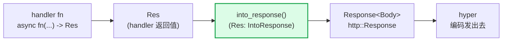

# 第 12 章 · IntoResponse:返回值怎么变成 Response

> **核心问题**:上一章你看到 handler fn 跑完会产出一个返回值——它可能是个 `String`、是个 `&'static str`、是个 `StatusCode`、是个 `Json<User>`、是个 `(StatusCode, Json<User>)`、是个 `(StatusCode, HeaderMap, Json<User>)`、甚至是个 `Result<Json<User>, MyError>`。这些五花八门的类型凭什么都能当 handler 的返回值?它们怎么被统一拼成 hyper 能编码发出去的那个 `Response<Body>`?一个 `(StatusCode, HeaderMap, Json<User>)` 三元组里,状态码往哪写、headers 往哪写、body 又往哪写,三者凭什么不打架?这一章拆 `IntoResponse` trait——它是 axum"提取与响应"这一面里负责"响应"的那半边,和负责"提取"的 `FromRequest`/`FromRequestParts` 是镜像关系:一个把 `Request` 拆成 handler 参数,一个把 handler 返回值拼回 `Response`。
>
> **读完本章你会明白**:
>
> 1. `IntoResponse` trait 长什么样(`fn into_response(self) -> Response`,就这一个方法),axum 给哪些类型实现了它(`String`/`&str`/`StatusCode`/`()`/`Bytes`/`Json<T>`/`Response`/`Result<T,E>` 等),每一种 impl 内部具体干了什么(设什么状态码、塞什么 header、body 装什么字节);
> 2. tuple 组合响应的链式拼装——`(StatusCode, T)` / `(HeaderMap, T)` / `[(K,V); N]` / `(Parts, T)` / `(StatusCode, HeaderMap, Json<T>)` 这些 tuple 为什么能直接当返回值,内部是怎么用宏 `impl_into_response!` + `all_the_tuples_no_last_special_case!` 对 1~16 个元素全部 impl `IntoResponse` 的,以及它们"先让 T 出 body,再让前面的元素按位写 parts"的递归拼装顺序为什么 sound(状态码/header/body 各写各的不冲突);
> 3. 为什么 axum 要把"修饰 parts"(header/extension)和"提供 body"分成两个 trait——`IntoResponseParts`(先写 parts,可失败)vs `IntoResponse`(出整个 Response),这套分工怎么让 `(HeaderMap, Json<T>)` 能正确地把 header 加到 Json 的 response 上而不覆盖,以及 `AppendHeaders` 这个类型凭什么能在不覆盖已有 header 的前提下追加(对照 go net/http 手写 `w.Header().Add` 无统一抽象);
> 4. axum 的 `Response` 到底是什么(就是 `http::Response<axum_core::body::Body>`,`Body` 内部包了 hyper body),它和 hyper 怎么衔接(`IntoResponse` 产出的 Response 一路返回到 hyper,hyper 编码发出去——这一步承《hyper》P2-P3,一句带过)。
>
> **逃生阀(读不下去怎么办)**:本章最难的是 tuple 组合响应的递归 impl 和 `IntoResponseParts` vs `IntoResponse` 的分工,信息密度大。如果一时绕不开,记住三句话就够——**① `IntoResponse` 就一个方法 `into_response(self) -> Response`,把任意返回值变成 `http::Response<Body>`;② tuple 的 IntoResponse impl 是"先让最后一个元素出 body,再让前面每个元素写自己的 parts(状态码/header/extension)",各写各的不冲突;③ `IntoResponseParts` 是"只写 parts 不出 body"的类型(HeaderMap/Extension),和出 body 的 IntoResponse 组合时它先写 parts**。带着这三句话跳到对应小节细读。本章承接《hyper》P2-P3(Response 结构)和《hyper》P1-02(Service trait),读过收获翻倍,但不是硬性前提。

---

## 一句话点破

> **`IntoResponse` 是 axum 给"handler 返回值 → hyper 的 Response"定的统一出口——一个 `fn into_response(self) -> Response` 的方法,axum 给十几种常见类型实现了它(字符串、状态码、Json、bytes、Result、tuple……)。最妙的是 tuple 的链式拼装:`(StatusCode, HeaderMap, Json<User>)` 能直接当返回值,是因为宏给所有 1~16 元素的 tuple 都 impl 了 `IntoResponse`,内部"先让最后一个元素出 body 和 Content-Type,再让前面每个元素按位写自己的状态码/headers/extension"——各写各的,不冲突。而为了区分"出 body 的类型"和"只写 header/extension 的类型",axum 把后者(HeaderMap/Extensions)单独抽成 `IntoResponseParts` trait,让 `(HeaderMap, Json<T>)` 能正确把 header 加到 Json 的 response 上(用 `extend` 追加而非 `replace` 覆盖)。**

这是结论,不是理由。本章倒过来拆:为什么需要这么个 trait(不这样会怎样)、trait 签名为什么这么简单、tuple 组合凭什么 sound、`IntoResponseParts` 这个二分到底解决了什么冲突。

---

## 第一节:从 handler 返回值到 hyper 的 Response,中间缺了什么

### 提问

先回放上一章(P3-11)的收尾:handler fn 跑完了,手里有一个返回值。这个返回值的类型五花八门:

```rust
async fn hello() -> &'static str { "Hello, World!" }

async fn get_user(/* ... */) -> Json<User> { Json(user) }

async fn create_user(/* ... */) -> (StatusCode, Json<User>) {
    (StatusCode::CREATED, Json(user))
}

async fn login(/* ... */) -> Result<Json<Token>, AuthError> {
    if valid { Ok(Json(token)) } else { Err(AuthError::Invalid) }
}

async fn redirect_to_new() -> Redirect { Redirect::permanent("/new") }

async fn healthz() -> StatusCode { StatusCode::OK }

async fn sse_handler() -> Sse<impl Stream<Item = Result<Event, Infallible>>> { /* ... */ }
```

六种不同的返回类型——`&'static str`、`Json<User>`、`(StatusCode, Json<User>)`、`Result<Json<Token>, AuthError>`、`Redirect`、`StatusCode`、`Sse<...>`——它们凭什么都能当 handler 的返回值?换句话说,axum 怎么把它们统一变成 hyper 能编码发出去的那个 `Response<Body>`?

这就是 `IntoResponse` 的事。

### hyper 的 Response 长什么样(承《hyper》)

先把"目标产物"看清楚。一个 HTTP response 由三部分组成:**状态码(status line)**、**headers**(响应头)、**body**(响应体)。这在 `http` crate(hyper 也用它,axum 直接复用)里被抽象成 `http::Response<B>`:

```text
(简化示意,非源码原文;真实定义在 http crate,本节不编行号)
pub struct Response<B> {
    head: Parts,        // 含 status + headers + extensions + ...
    body: B,            // body 类型由泛型 B 决定
}
```

`Parts` 里有 `status: StatusCode`、`headers: HeaderMap<HeaderValue>`、`extensions: Extensions`。axum 的 `Response` 就是它的别名:

```rust
// axum-core/src/response/mod.rs#L21(逐字摘录)
pub type Response<T = Body> = http::Response<T>;
```

注意两点:

1. **axum 的 `Response` 不是新类型,就是 `http::Response` 的别名**(默认 body 类型是 axum 自己的 `axum_core::body::Body`,内部包了 hyper body)。这意味着 `IntoResponse::into_response` 产出的 `Response`,hyper 拿到就能直接编码发出去——它根本不认识"axum Response",它认识的只是 `http::Response`,而 axum 的 Response 就是 `http::Response`。**这是 axum 和 hyper 无缝衔接的根**:axum 不发明自己的 Response 类型,直接复用 `http::Response`。
2. **`Body` 是 `axum_core::body::Body`**,它的定义是 `struct Body(BoxBody)`(`axum-core/src/body.rs#L39`),`BoxBody` 是 `http_body_util::combinators::UnsyncBoxBody<Bytes, Error>`——一个把任意 `http_body::Body<Data = Bytes>` 类型擦除后的装箱 body。`Body::new` 接受任意满足约束的 body 类型,内部 downcast 一下,downcast 不成就装箱。

> **承接《hyper》[[hyper-source-facts]]**:hyper 的 Response 结构(`http::Response<B>`,状态码 + headers + body)、《hyper》P2-P3 拆透了——HTTP/1 的状态行 + header 编码 + body 分帧、HTTP/2 的 pseudo-header + DATA 帧都在《hyper》里。**axum 的 Response 就是 `http::Response<axum_core::body::Body>`,hyper 拿到直接编码发出去,axum 一点都不用改协议层**。本章不重复这些,专注 axum 怎么把"五花八门的返回值"拼成 `http::Response`。

### 不这样会怎样:如果 handler 只能返回 `Response<Body>`

假设 axum 规定:handler 必须返回 `Response<Body>` 这一个类型。那你写 handler 就得这么写:

```rust
// 假想的"必须返回 Response"axum(非 axum 实际做法)
async fn hello() -> Response<Body> {
    let mut res = Response::new(Body::from("Hello, World!"));
    res.headers_mut().insert(
        http::header::CONTENT_TYPE,
        HeaderValue::from_static("text/plain; charset=utf-8"),
    );
    res
}

async fn get_user(/* ... */) -> Response<Body> {
    let body = serde_json::to_vec(&user).unwrap();
    let mut res = Response::new(Body::from(body));
    res.headers_mut().insert(
        http::header::CONTENT_TYPE,
        HeaderValue::from_static("application/json"),
    );
    res
}

async fn create_user(/* ... */) -> Response<Body> {
    let body = serde_json::to_vec(&user).unwrap();
    let mut res = Response::new(Body::from(body));
    *res.status_mut() = StatusCode::CREATED;
    res.headers_mut().insert(
        http::header::CONTENT_TYPE,
        HeaderValue::from_static("application/json"),
    );
    res
}
```

能用。但读一读这三段代码,问题立刻显现:

- **样板爆炸**:每个 handler 都要 `Response::new(Body::from(...))` + `headers_mut().insert(CONTENT_TYPE, ...)` + 可能的 `*status_mut() = ...`。10 个路由就是几百行样板,而且每一行都可能出 bug(漏设 Content-Type、状态码写错、序列化 panic)。
- **`Content-Type` 重复**:返回 JSON 的 handler 都要手写 `application/json`,返回纯文本的都要手写 `text/plain`,返回 bytes 的都要手写 `application/octet-stream`。这些是约定俗成的,人类手写既冗余又易错。
- **tuple 不可组合**:你写不出 `(StatusCode::CREATED, Json(user))` 这种声明式返回值。每个 handler 都要把"状态码 + header + body"一步步手拼。
- **错误处理零散**:`Result<Json<T>, E>` 不能直接返回,要自己 `match` 后手拼错误 Response。

这不是危言耸听——这正是裸写 hyper Service 的状态(上一章 P0-01 第一节那段裸 hyper 代码就是这样的)。axum 0.x 之前,Web 框架(`warp`、`tower-web`)的 handler 签名各异,有的要返回 `Response`,有的要返回 `impl Responder`,有的要返回具体 body 类型,迁移成本极高。axum 的解法是:定义一个统一的 trait,让所有"能变成 Response 的类型"都实现它,handler 返回 `impl IntoResponse`,axum 自动调 `into_response` 拼回 `Response`。

> **钉死这件事**:axum 给"handler 返回值 → Response"定了一个统一的出口——`IntoResponse` trait。它不强迫 handler 返回 `Response<Body>` 这一个类型,而是让用户写**最自然的返回类型**(`String`/`Json<T>`/tuple/Result),由 `IntoResponse` 的 impl 负责把它拼成 `Response`。**抽象的代价(impl 写一遍)交给框架,用户一行不花**。这是 axum"声明式 Web 框架"在响应这一侧的核心。

### 所以 axum 这么设计:`IntoResponse` trait

来看真实定义(`axum-core/src/response/into_response.rs#L112-L116`):

```rust
// axum-core/src/response/into_response.rs#L112-L116(逐字摘录)
pub trait IntoResponse {
    /// Create a response.
    #[must_use]
    fn into_response(self) -> Response;
}
```

就这么多。一个方法 `into_response(self) -> Response`。`Response` 是 `axum_core::response::Response`,即 `http::Response<axum_core::body::Body>`(默认 body 类型)。任何实现这个 trait 的类型,都能当 handler 的返回值。

回看上一章(P3-09)的 `Handler` trait:`type Future: Future<Output = Response> + Send + 'static`——handler 的 future 直接产出 `Response`,不是 `Result<Response, Error>`。那 handler fn 的返回值怎么变成这个 `Response`?答案在 `impl_handler!` 宏(`axum/src/handler/mod.rs`)生成的代码最后一行:

```rust
// axum/src/handler/mod.rs#L221-L260(简化展示,逐字见 P3-09)
macro_rules! impl_handler {
    ([$($ty:ident),*], $last:ident) => {
        impl<F, Fut, S, Res, M, $($ty,)* $last> Handler<(M, $($ty,)* $last,), S> for F
        where
            F: FnOnce($($ty,)* $last,) -> Fut + Clone + Send + Sync + 'static,
            Fut: Future<Output = Res> + Send,
            Res: IntoResponse,                       // ★ handler 返回值必须 IntoResponse
            /* ... */
        {
            type Future = Pin<Box<dyn Future<Output = Response> + Send>>;

            fn call(self, req: Request, state: S) -> Self::Future {
                /* ... 提取器链 ... */
                Box::pin(async move {
                    /* ... from_request_parts ... */
                    self($($ty,)* $last,).await.into_response()   // ★ 最后调 into_response
                })
            }
        }
    };
}
```

关键就是两处:`Res: IntoResponse`(约束 handler 返回值必须实现这个 trait)和 `self(...).await.into_response()`(把返回值变成 `Response`)。**`impl_handler!` 宏展开的所有提取器链跑完后,最后一行永远是 `.into_response()`**——这就是 handler 返回值变成 Response 的唯一入口。

所以,axum 的响应链路就清楚了:



`Res`(handler 返回值,可能是 `String`/`Json<T>`/tuple/Result)经 `into_response()` 变成 `Response<Body>`,一路返回到 hyper。hyper 不认识 `String`/`Json`,它只认识 `http::Response`,而 `into_response` 把"五花八门的返回值"统一变成了 `http::Response`——这就是 axum 在响应这一侧的全部魔法。

> **承接《Tower》**:handler fn 经 `impl_handler!` 宏变成 `Handler` trait 的实现,再经 `HandlerService` 包成 `tower::Service<Request>`(承 P1-03)。Service 的 `call` 返回的 Future 产出 `Response`(不是 `Result<Response, Error>`,因为 `Router` 的 Service Error 是 `Infallible`,P5-18 详拆)。Service/Layer/poll_ready 语义《Tower》拆透了,本章一句带过指路。

---

## 第二节:基础 impl——String、StatusCode、Json、Bytes

### 提问

trait 定义清楚了,接下来看 axum 给哪些类型实现了 `IntoResponse`,每一种 impl 内部具体干了什么。先从最基础的几个看起:`()`、`&'static str`、`String`、`StatusCode`、`Bytes`、`Json<T>`、`Result<T, E>`、`Response<B>`。

### `()`:空 body 的地基

最基础的 impl 是 `()`(空 tuple),它产出一个空 body 的 Response:

```rust
// axum-core/src/response/into_response.rs#L126-L130(逐字摘录)
impl IntoResponse for () {
    fn into_response(self) -> Response {
        Body::empty().into_response()
    }
}
```

`Body::empty()`(`axum-core/src/body.rs#L52-L54`)内部是 `Self::new(http_body_util::Empty::new())`,即一个永远产出 EOF 的 body。所以 `()` 的 Response 是:状态码 `200 OK`(默认)、空 headers、空 body。

注意这里 `Body::empty().into_response()` 调用了 `Body` 的 `IntoResponse` impl(`into_response.rs#L167-L171`):

```rust
// axum-core/src/response/into_response.rs#L167-L171(逐字摘录)
impl IntoResponse for Body {
    fn into_response(self) -> Response {
        Response::new(self)
    }
}
```

`Response::new(body)`(`http` crate 提供的)产出一个状态码 `200 OK`、空 headers、body 是 `self` 的 Response。所以 `()` 经 `Body::empty().into_response()` → `Response::new(Body::empty())` → 状态码 200、空 headers、空 body 的 Response。

**`()` 是很多其他 impl 的地基**。下面你会看到 `StatusCode` 的 impl 就是"先建一个 `().into_response()`,再覆盖状态码"。这种"先建地基再覆盖"的写法贯穿 axum 的 IntoResponse impl,它是 tuple 组合响应的基础。

### `StatusCode`:只有状态码,空 body

```rust
// axum-core/src/response/into_response.rs#L118-L124(逐字摘录)
impl IntoResponse for StatusCode {
    fn into_response(self) -> Response {
        let mut res = ().into_response();   // ★ 先建空 body 地基
        *res.status_mut() = self;            // ★ 覆盖状态码
        res
    }
}
```

妙就妙在"先建 `().into_response()`(200 + 空 body),再 `*res.status_mut() = self` 覆盖状态码"。这样 `StatusCode::NOT_FOUND.into_response()` 产出的是一个 `404 Not Found`、空 headers、空 body 的 Response。

为什么这么写?因为 `http::Response` 没有一个"只给状态码"的构造函数——`Response::new(body)` 默认状态码是 200,你必须先建一个 Response 再改状态码。axum 利用 `().into_response()` 把"建空 Response"这件事复用,只额外加一步覆盖状态码。这种"复用地基 + 局部覆盖"的模式,是 tuple 组合响应的雏形——后面 `(StatusCode, T)` 的 impl 就是同样的思路。

### `&'static str` / `String` / `Cow<'static, str>`:文本 + Content-Type

`&'static str` 和 `String` 都委托给 `Cow<'static, str>`:

```rust
// axum-core/src/response/into_response.rs#L173-L200(逐字摘录,关键部分)
impl IntoResponse for &'static str {
    fn into_response(self) -> Response {
        Cow::Borrowed(self).into_response()
    }
}

impl IntoResponse for String {
    fn into_response(self) -> Response {
        Cow::<'static, str>::Owned(self).into_response()
    }
}

impl IntoResponse for Cow<'static, str> {
    fn into_response(self) -> Response {
        let mut res = Body::from(self).into_response();  // 先建 body 地基
        res.headers_mut().insert(                         // 再塞 Content-Type
            header::CONTENT_TYPE,
            HeaderValue::from_static(mime::TEXT_PLAIN_UTF_8.as_ref()),
        );
        res
    }
}
```

`Cow::Borrowed(&str)` 和 `Cow::Owned(String)` 都走同一个 impl,先 `Body::from(self)`(把字符串字节装进 body),再 `headers_mut().insert(CONTENT_TYPE, "text/plain; charset=utf-8")`。所以 `&'static str` 和 `String` 的 Response 是:状态码 `200 OK`、`Content-Type: text/plain; charset=utf-8`、body 是字符串的 UTF-8 字节。

**为什么用 `insert` 而不是 `append`**:`insert` 会覆盖任何已有的同名 header(HeaderMap 里同名 key 只留一个),`append` 会保留多个同名 header(适合 `Set-Cookie` 这种多值的)。文本响应的 `Content-Type` 只能有一个值,所以用 `insert`。后面你会看到 `AppendHeaders` 类型专门处理"需要追加多个同名 header"的场景。

> **钉死这件事**:axum 的 `&'static str` / `String` impl 自动设 `Content-Type: text/plain; charset=utf-8`,这是"声明式"的体现——你写 `async fn hello() -> &'static str { "hi" }`,框架帮你设好 Content-Type,你不用管。朴素地写裸 hyper 要手写 `header("content-type", "text/plain; charset=utf-8")`,axum 把这一步自动化了。

### `Bytes`:二进制 + octet-stream

```rust
// axum-core/src/response/into_response.rs#L202-L211(逐字摘录)
impl IntoResponse for Bytes {
    fn into_response(self) -> Response {
        let mut res = Body::from(self).into_response();
        res.headers_mut().insert(
            header::CONTENT_TYPE,
            HeaderValue::from_static(mime::APPLICATION_OCTET_STREAM.as_ref()),
        );
        res
    }
}
```

和 `Cow<'static, str>` 同构,只是 Content-Type 换成 `application/octet-stream`(二进制流)。`Vec<u8>` / `Box<[u8]>` / `Cow<'static, [u8]>` 都委托到这条路径(`into_response.rs#L303-L323`)。

### `Json<T>`:serde 序列化 + application/json

`Json<T>` 是 axum 最常用的响应类型,它在 `axum/src/json.rs#L205-L239`:

```rust
// axum/src/json.rs#L205-L239(逐字摘录)
impl<T> IntoResponse for Json<T>
where
    T: Serialize,
{
    fn into_response(self) -> Response {
        // Extracted into separate fn so it's only compiled once for all T.
        fn make_response(buf: BytesMut, ser_result: serde_json::Result<()>) -> Response {
            match ser_result {
                Ok(()) => (
                    [(
                        header::CONTENT_TYPE,
                        HeaderValue::from_static(mime::APPLICATION_JSON.as_ref()),
                    )],
                    buf.freeze(),
                )
                    .into_response(),
                Err(err) => (
                    StatusCode::INTERNAL_SERVER_ERROR,
                    [(
                        header::CONTENT_TYPE,
                        HeaderValue::from_static(mime::TEXT_PLAIN_UTF_8.as_ref()),
                    )],
                    err.to_string(),
                )
                    .into_response(),
            }
        }

        // Use a small initial capacity of 128 bytes like serde_json::to_vec
        // https://docs.rs/serde_json/1.0.82/src/serde_json/ser.rs.html#L2189
        let mut buf = BytesMut::with_capacity(128).writer();
        let res = serde_json::to_writer(&mut buf, &self.0);
        make_response(buf.into_inner(), res)
    }
}
```

逐段拆:

1. **`BytesMut::with_capacity(128).writer()`**:用 `bytes::BytesMut` 当缓冲区(初始 128 字节,和 `serde_json::to_vec` 一致),`Writer` 是 `BufMut` 的适配器,实现 `std::io::Write`。
2. **`serde_json::to_writer(&mut buf, &self.0)`**:把 `Json<T>` 内部的 `T: Serialize` 序列化进 `buf`。**注意:serde/serde_json 是外部 crate**(axum 在 `Cargo.toml` 里依赖它们,本节引用 serde_json 的行为,不编 axum 源码行号之外的细节)。axum 这里用 `to_writer` 直接写到 `BytesMut`,省一次堆分配(对比 `to_vec` 会先 `Vec` 再 freeze 成 `Bytes`)。
3. **`make_response(buf.into_inner(), res)`**:把 buf 和序列化结果组成 Response。成功时返回 `([(CONTENT_TYPE, APPLICATION_JSON)], buf.freeze())`——**这里用了一个 tuple 组合响应**(后面详拆),`[(K,V); 1]` 数组塞 Content-Type,`Bytes` 当 body。失败时返回 `(StatusCode::INTERNAL_SERVER_ERROR, [(CONTENT_TYPE, TEXT_PLAIN_UTF_8)], err.to_string())`——状态码 500、Content-Type 纯文本、body 是错误信息。

**为什么 `make_response` 单独抽成一个函数**?注释说得很清楚:"Extracted into separate fn so it's only compiled once for all T"。`Json<User>` 和 `Json<Order>` 是不同类型,`into_response` 对每个 `T` 单态化一次,但 `make_response` 不依赖 `T`(它只接 `BytesMut` 和 `serde_json::Result<()>`),所以抽成单独函数后只编译一次,减少代码体积。这是 Rust"泛型单态化 vs 代码体积"的一个常见优化技巧——**把不依赖泛型参数的逻辑抽成非泛型函数**。

> **对照《gRPC》**:axum 的 `Json` 响应器对照 gRPC 的 protobuf 序列化——都是"业务对象 → 字节流"的序列化,但 axum 用 serde(外部 crate,generic `Serialize`),gRPC 用 protobuf C++ codegen。axum 的 `Json<T>: IntoResponse` 用 `serde_json::to_writer` 把 `T: Serialize` 序列化成 JSON 字节;gRPC 的 server 端用 protobuf 把 `T: Message` 序列化成 protobuf 字节。前者是人类可读的文本格式,后者是紧凑的二进制格式。这条对照一句带过,P7-21 收束章展开。

### `Result<T, E>`:Ok 走 T,Err 走 E

`Result` 是错误处理的招牌:

```rust
// axum-core/src/response/into_response.rs#L138-L149(逐字摘录)
impl<T, E> IntoResponse for Result<T, E>
where
    T: IntoResponse,
    E: IntoResponse,
{
    fn into_response(self) -> Response {
        match self {
            Ok(value) => value.into_response(),
            Err(err) => err.into_response(),
        }
    }
}
```

只要 `T` 和 `E` 都 `IntoResponse`,`Result<T, E>` 就 `IntoResponse`。成功走 `T::into_response`,失败走 `E::into_response`。这就是为什么你能写 `async fn handler() -> Result<Json<User>, MyError>`——只要 `MyError: IntoResponse`(你给它实现 `into_response`,通常返回 4xx/5xx 状态码 + 错误信息),axum 自动把 `Err(MyError)` 变成错误 Response。

**`Result` 是 axum 错误处理的核心抽象**。你在 handler 里用 `?` 操作符(`db.get_user(id).await.map_err(MyError::from)?`),所有错误自动经 `Result::into_response` 变成 Response。这比手写 `match` 优雅得多。axum 还提供了 `axum::response::Result<T, E = ErrorResponse>` 这个别名(`axum-core/src/response/mod.rs#L102`),它的 `E` 默认是 `ErrorResponse`(一个内部装 `Response` 的包装类型,任何 `IntoResponse` 都能 `From` 进去),让你写 `Result<Json<T>>` 不用指定 error 类型,P5-18 详拆。

### `Response<B>` 和 `http::response::Parts`:identity / 复用

```rust
// axum-core/src/response/into_response.rs#L151-L165(逐字摘录)
impl<B> IntoResponse for Response<B>
where
    B: http_body::Body<Data = Bytes> + Send + 'static,
    B::Error: Into<BoxError>,
{
    fn into_response(self) -> Response {
        self.map(Body::new)            // 把任意 body 类型转成 axum Body
    }
}

impl IntoResponse for http::response::Parts {
    fn into_response(self) -> Response {
        Response::from_parts(self, Body::empty())
    }
}
```

`Response<B>` 的 impl 是 identity——它把任意 body 类型 `B`(满足 `Body<Data = Bytes> + Send + 'static`)经 `self.map(Body::new)` 转成 `Response<axum_core::body::Body>`,即 axum 默认的 Response 类型。这就是为什么你可以在 handler 里直接返回一个 `Response<Body>`(比如手拼的 Response),axum 把它"归一化"成默认 body 类型。

`http::response::Parts` 的 impl 用 `Response::from_parts(parts, Body::empty())` 把 Parts 拼回 Response(parts 含 status + headers + extensions,body 用空)。

---

## 第三节:tuple 组合响应——链式拼装的递归 impl

### 提问

前几节看了几个基础 impl,它们各自产出"状态码 + header + body"的 Response。但生产里最常见的写法是 **tuple 组合**:

```rust
async fn create_user(/* ... */) -> (StatusCode, Json<User>) {
    (StatusCode::CREATED, Json(user))
}

async fn with_headers(/* ... */) -> (StatusCode, HeaderMap, Json<User>) {
    (StatusCode::CREATED, headers, Json(user))
}

async fn with_array_headers(/* ... */) -> ([(HeaderName, HeaderValue); 1], Json<User>) {
    ([(CONTENT_TYPE, "application/json")], Json(user))
}

async fn with_parts(/* ... */) -> (http::response::Parts, Json<User>) {
    (parts, Json(user))
}
```

`(StatusCode, Json<User>)` 这种 tuple 凭什么能当返回值?axum 内部怎么把它拼成 Response?三元组、四元组、五元组呢?这一节拆 tuple 组合响应的递归 impl。

### `(StatusCode, T)`:先让 T 出 body,再覆盖状态码

先看最简单的二元组 `(StatusCode, T)`(`into_response.rs#L326-L335`):

```rust
// axum-core/src/response/into_response.rs#L326-L335(逐字摘录)
impl<R> IntoResponse for (StatusCode, R)
where
    R: IntoResponse,
{
    fn into_response(self) -> Response {
        let mut res = self.1.into_response();    // ★ 先让 T 出 body 和 header
        *res.status_mut() = self.0;              // ★ 再覆盖状态码
        res
    }
}
```

短短三行,但顺序非常关键:**先让 `R`(即 `self.1`,tuple 的第二个元素)出 body 和 header,再覆盖状态码**。

为什么是这个顺序?因为 `Json<User>::into_response()` 默认状态码是 200,你 `(StatusCode::CREATED, Json(user))` 要的是 201 Created,所以必须先让 `Json` 出 body(顺带设 `Content-Type: application/json`),最后用 `*res.status_mut() = StatusCode::CREATED` 覆盖掉默认的 200。**如果反过来(先设状态码再调 T::into_response),T::into_response 会把状态码重新设成 200,覆盖掉你想要的 201**。

> **钉死这件事**:`(StatusCode, T)` 的 impl 是"先 T 出 body,后覆盖状态码"——这个顺序保证 T 的默认状态码(通常是 200)被你指定的状态码覆盖。tuple 组合响应的"先 body,后 parts"顺序,是 axum 类型系统的关键约定,后面的多元组都遵循这个约定。

### `HeaderMap`:直接 `*res.headers_mut() = self`(替换,非追加)

注意一个易踩的坑:`HeaderMap` 的 `IntoResponse` impl(`into_response.rs#L337-L343`)用的是 **替换**,不是追加:

```rust
// axum-core/src/response/into_response.rs#L337-L343(逐字摘录)
impl IntoResponse for HeaderMap {
    fn into_response(self) -> Response {
        let mut res = ().into_response();
        *res.headers_mut() = self;               // ★ 替换!不是 append
        res
    }
}
```

`*res.headers_mut() = self` 直接把 Response 的整个 HeaderMap 换成你的 HeaderMap。这意味着如果你这么写:

```rust
async fn handler() -> (HeaderMap, Json<User>) {
    let mut headers = HeaderMap::new();
    headers.insert(SERVER, "my-app".parse().unwrap());
    (headers, Json(user))
}
```

tuple 的 `HeaderMap` 写进 Response 的 headers 时,会**追加**(extend)到 Json 已经设的 `Content-Type` 之上——但这是 tuple impl 干的事(后面讲),不是 `HeaderMap` 自己的 `IntoResponse` impl 干的。`HeaderMap` 自己的 `IntoResponse` impl 是"清空 + 替换",它单独当返回值时会清空所有默认 headers。

这就是为什么 axum 把 `HeaderMap` 同时实现了 `IntoResponse` 和 `IntoResponseParts`——前者用于"HeaderMap 单独当返回值"(整体替换),后者用于"HeaderMap 作为 tuple 元素"(追加到已有 headers)。**两个 trait 的分工就是为了区分这两种语义**。下面专门拆。

### tuple 多元组的递归 impl:宏 `impl_into_response!`

二元组 `(StatusCode, T)` 看清楚了,但 `(StatusCode, HeaderMap, Json<T>)` 三元组、`(StatusCode, HeaderMap, Extension, Json<T>)` 四元组呢?axum 用宏 + 递归 impl 对 1~16 元素的 tuple 全部实现 `IntoResponse`。

来看宏(`into_response.rs#L396-L487`):

```rust
// axum-core/src/response/into_response.rs#L396-L487(逐字摘录,关键部分)
macro_rules! impl_into_response {
    ( $($ty:ident),* $(,)? ) => {
        // 形如 (T1, T2, ..., R) —— 无 StatusCode 的多元组
        #[allow(non_snake_case)]
        impl<R, $($ty,)*> IntoResponse for ($($ty),*, R)
        where
            $( $ty: IntoResponseParts, )*      // ★ 前 N 个元素:IntoResponseParts
            R: IntoResponse,                    // ★ 最后一个元素:IntoResponse
        {
            fn into_response(self) -> Response {
                let ($($ty),*, res) = self;

                let res = res.into_response();          // ① 先让最后一个元素 R 出 body
                let parts = ResponseParts { res };

                $(
                    let parts = match $ty.into_response_parts(parts) {   // ② 前面每个元素写 parts
                        Ok(parts) => parts,
                        Err(err) => {
                            return err.into_response();
                        }
                    };
                )*

                parts.res
            }
        }

        // 形如 (StatusCode, T1, T2, ..., R) —— 带 StatusCode 的多元组
        #[allow(non_snake_case)]
        impl<R, $($ty,)*> IntoResponse for (StatusCode, $($ty),*, R)
        where
            $( $ty: IntoResponseParts, )*
            R: IntoResponse,
        {
            fn into_response(self) -> Response {
                let (status, $($ty),*, res) = self;

                let res = res.into_response();          // ① 先让 R 出 body
                let parts = ResponseParts { res };

                $(
                    let parts = match $ty.into_response_parts(parts) {   // ② 前面每个元素写 parts
                        Ok(parts) => parts,
                        Err(err) => {
                            return err.into_response();
                        }
                    };
                )*

                (status, parts.res).into_response()    // ③ 最后用 (StatusCode, T) impl 覆盖状态码
            }
        }

        // 形如 (http::response::Parts, T1, T2, ..., R) 和 (Response<()>, T1, ..., R) 同理
        // ...(省略,见源码 L448-L484)...
    }
}

all_the_tuples_no_last_special_case!(impl_into_response);
```

逐段拆这个宏:

1. **`$($ty: IntoResponseParts,)* R: IntoResponse`** —— tuple 的前 N 个元素必须实现 `IntoResponseParts`(只写 parts 不出 body),最后一个元素 `R` 必须实现 `IntoResponse`(出整个 body)。这就是 tuple 组合的"分工":前面的元素修饰 parts,最后一个元素提供 body。
2. **`let res = res.into_response();`** —— **先**让最后一个元素 `R` 出 Response(含 body 和 R 自己设的 header,比如 `Json<User>` 设的 `Content-Type`)。
3. **`let parts = ResponseParts { res };`** —— 把这个 Response 包成 `ResponseParts`(一个 pub(crate) 的结构,只允许 axum 内部访问其内部 Response,`into_response_parts.rs#L102-L104`)。
4. **`$ty.into_response_parts(parts)`** —— **然后**让前面每个元素逐个写 parts(状态码/header/extension)。每个元素的 `into_response_parts` 接受当前 `ResponseParts`,修改它(比如塞 header),返回新的 `ResponseParts`。如果某个元素返回 `Err`,整个组合失败,提前返回错误 Response。
5. **`parts.res`** —— 最后解包 `ResponseParts`,拿出拼好的 Response。

**对于带 StatusCode 的 tuple**,宏在最后多一步:`(status, parts.res).into_response()`——用前面讲的 `(StatusCode, T)` impl 把状态码覆盖到拼好的 Response 上。

### tuple 拼装的全景图

用 ASCII 框图把一个 `(StatusCode, HeaderMap, Json<User>)` 三元组的拼装过程画出来:

```text
handler 返回:(StatusCode::CREATED, headers, Json(user))
                    │            │           │
                    │            │           └── 最后一个元素 R = Json<User>: IntoResponse
                    │            └────────────── 中间元素 T2 = HeaderMap: IntoResponseParts
                    └─────────────────────────── 第一个元素 T1 = StatusCode(单独 impl,不在宏内)

        ┌─────────────────────────────────────────────────────┐
        │ tuple 的 IntoResponse impl(宏生成,带 StatusCode 前缀) │
        │                                                       │
        │  ① R::into_response()                                  │
        │     Json(user).into_response()                         │
        │     → 状态码 200,Content-Type: application/json,        │
        │       body = serde_json 序列化的字节                    │
        │                                                       │
        │  ② 包装成 ResponseParts { res }                        │
        │                                                       │
        │  ③ 对每个 IntoResponseParts 元素调 into_response_parts  │
        │     (这里只有 HeaderMap: T2)                            │
        │     HeaderMap.into_response_parts(parts)               │
        │     → res.headers_mut().extend(self)                   │
        │     → 把 headers 的内容追加到 Content-Type 之上          │
        │       (不覆盖!用 extend,不用 replace)                  │
        │                                                       │
        │  ④ (status, parts.res).into_response()                 │
        │     → *res.status_mut() = StatusCode::CREATED          │
        │     → 覆盖默认的 200,变成 201 Created                   │
        │                                                       │
        │  最终 Response:                                        │
        │    状态码 = 201 Created                                  │
        │    headers = Content-Type: application/json              │
        │              + headers 的内容(Server, X-Foo 等)         │
        │    body = serde_json 序列化的 User 字节                  │
        └─────────────────────────────────────────────────────┘
```

整个过程四个步骤,各写各的:**body 由 `Json<User>` 出**,**Content-Type 由 `Json<User>` 设**,**其他 headers 由 `HeaderMap` 追加**,**状态码由 `StatusCode` 覆盖**。三者不打架,因为它们写的是 Response 的不同字段(body / 部分 headers / 状态码)。即使 `HeaderMap` 和 `Json` 都碰 headers,`HeaderMap` 用 `extend`(追加,不覆盖已有 key),所以 `Json` 设的 `Content-Type` 不会被 `HeaderMap` 顶掉——**除非 `HeaderMap` 里也有 `Content-Type`,那会触发 HeaderMap 的 `extend` 行为**(`HeaderMap::extend` 对同名 key 调 `append`,会变成多值)。

> **钉死这件事**:tuple 组合响应的递归 impl 把"状态码/header/body"三类信息的拼装做成了**编译期类型安全**的组合。每个元素写 Response 的不同字段(或同一字段的不同语义),互不冲突。这套设计让你写 `(StatusCode, HeaderMap, Json<User>)` 直接当返回值,不用手写 builder。这是 axum"声明式 Web 框架"在响应这一侧的招牌技巧——深度展开在本章技巧精解。

### `[(K, V); N]`:用数组当 headers

除了 `HeaderMap`,axum 还支持用数组 `[(K, V); N]` 表达 headers:

```rust
// axum-core/src/response/into_response.rs#L353-L363(逐字摘录)
impl<K, V, const N: usize> IntoResponse for [(K, V); N]
where
    K: TryInto<HeaderName>,
    K::Error: fmt::Display,
    V: TryInto<HeaderValue>,
    V::Error: fmt::Display,
{
    fn into_response(self) -> Response {
        (self, ()).into_response()      // ★ 委托给 tuple impl
    }
}
```

`[(K, V); N]` 自己的 `IntoResponse` impl 委托给 tuple impl:`(self, ()).into_response()`。注意 `()` 也实现 `IntoResponseParts`(`into_response_parts.rs#L266-L272`),它什么都不做,所以 `[(K, V); N]` 单独当返回值时,headers 数组写 parts,`()` 充当"占位的最后一个元素 R"出空 body。

`[(K, V); N]` 作为 `IntoResponseParts`(`into_response_parts.rs#L141-L159`)用 `insert`(覆盖同名 key):

```rust
// axum-core/src/response/into_response_parts.rs#L141-L159(逐字摘录)
impl<K, V, const N: usize> IntoResponseParts for [(K, V); N]
where
    K: TryInto<HeaderName>,
    K::Error: fmt::Display,
    V: TryInto<HeaderValue>,
    V::Error: fmt::Display,
{
    type Error = TryIntoHeaderError<K::Error, V::Error>;

    fn into_response_parts(self, mut res: ResponseParts) -> Result<ResponseParts, Self::Error> {
        for (key, value) in self {
            let key = key.try_into().map_err(TryIntoHeaderError::key)?;
            let value = value.try_into().map_err(TryIntoHeaderError::value)?;
            res.headers_mut().insert(key, value);    // ★ insert 覆盖
        }

        Ok(res)
    }
}
```

所以 `[(CONTENT_TYPE, "application/json")]` 会**覆盖**已有的 `Content-Type`(用 `insert`),而 `HeaderMap` 用 `extend`(追加,对同名 key 变多值)。这是 axum 两个写 header 类型的语义差异:

- `[(K, V); N]`:`insert`,覆盖同名 key。
- `HeaderMap`:`extend`,追加(对同名 key 变多值,适合 `Set-Cookie` 这种多值的)。
- `AppendHeaders([(K, V); N])`:`append`,追加(显式语义,下面讲)。

这三种语义覆盖了 HTTP header 的所有用法。

### `all_the_tuples_no_last_special_case!`:对 1~16 元素全部展开

最后看宏展开的工具(`axum-core/src/macros.rs#L256-L275`):

```rust
// axum-core/src/macros.rs#L256-L275(逐字摘录)
macro_rules! all_the_tuples_no_last_special_case {
    ($name:ident) => {
        $name!(T1);
        $name!(T1, T2);
        $name!(T1, T2, T3);
        $name!(T1, T2, T3, T4);
        // ... 一直到 ...
        $name!(T1, T2, T3, T4, T5, T6, T7, T8, T9, T10, T11, T12, T13, T14, T15, T16);
    };
}
```

`all_the_tuples_no_last_special_case!(impl_into_response)` 把 `impl_into_response!` 对 1~16 元素的 tuple 全部展开一次:`impl_into_response!(T1)` / `impl_into_response!(T1, T2)` / ... / `impl_into_response!(T1, ..., T16)`。这一展开,axum 就对所有 1~16 个元素的 tuple(及带 StatusCode/Parts/Response<()> 前缀的变体)实现了 `IntoResponse`。

**为什么叫 `no_last_special_case`**:对比 `all_the_tuples!`(`macros.rs#L235-L254`),后者对最后一个元素特殊处理(`$name!([], T1)` / `$name!([T1], T2)` / ...),用于 `impl_handler!`(handler 的最后一个参数 `FromRequest`,其余 `FromRequestParts`)。而 `impl_into_response!` 不需要特殊处理最后一个元素——它用 `R` 当最后一个,前面 `$($ty),*` 当前面的,模式是 `($($ty),*, R)`。所以这里用 `no_last_special_case` 版本,直接列出 `T1`, `T1 T2`, ..., `T1..T16` 共 16 种 arity。

> **承接 P3-09/P3-10**:这套"宏 + all_the_tuples"的递归展开套路,和 `impl_handler!`(P3-09,Handler trait 对 0~16 参数 async fn 全部 impl)、`FromRequestParts` tuple impl(P3-10)是同源的——axum 大量用这种宏对 1~16 元素的 tuple 全部 impl trait,把"任意 arity"做成编译期单态化。这是 axum 类型系统的招牌手法,本章的 tuple IntoResponse impl 是这套手法的响应侧应用。

---

## 第四节:IntoResponseParts——为什么 header/extension 要单独一个 trait

### 提问

第三节看到 tuple impl 要求"前 N 个元素 `IntoResponseParts`,最后一个元素 `IntoResponse`"。为什么要把"修饰 parts"和"提供 body"分成两个 trait?它们各自的职责是什么?如果合并成一个 trait 会怎样?

### 不这样会怎样:如果只有 IntoResponse,没有 IntoResponseParts

假设 axum 只有 `IntoResponse` 一个 trait,没有 `IntoResponseParts`。那 tuple 组合响应怎么实现?

```rust
// 假想的"只有 IntoResponse"axum(非 axum 实际做法)
impl<R, T1> IntoResponse for (T1, R)
where T1: IntoResponse, R: IntoResponse {
    fn into_response(self) -> Response {
        let mut res = self.1.into_response();  // 先让 R 出 body
        // 现在要让 T1 写 parts。可 T1 是 IntoResponse,
        // 它的 into_response 会出整个 Response(含 body)——body 冲突!
        ???
    }
}
```

问题立刻显现:`T1: IntoResponse` 意味着 `T1` 自己也有一个 `into_response`,它会产出自己的 Response(含 body)。可你要的是"T1 只写 header,不要 body"——`HeaderMap` 作为 tuple 元素,你想让它**追加** header 到 R 的 Response 上,不是让它**自己出一个空 body 的 Response**。

你也许会想:`HeaderMap` 单独的 `IntoResponse` impl 已经产出"空 body + headers 替换"的 Response,我能不能在 tuple 里"提取它的 headers 再塞到 R 的 Response 上"?能,但需要一个机制让 `HeaderMap` **只暴露 header 部分**,不暴露 body。这个机制就是 `IntoResponseParts`:

```rust
// axum-core/src/response/into_response_parts.rs#L73-L81(逐字摘录)
pub trait IntoResponseParts {
    /// The type returned in the event of an error.
    type Error: IntoResponse;

    /// Set parts of the response
    fn into_response_parts(self, res: ResponseParts) -> Result<ResponseParts, Self::Error>;
}
```

`IntoResponseParts` 接受一个**已经存在的 Response**(包在 `ResponseParts` 里),修改它的 parts(headers/extensions),返回修改后的 `ResponseParts`。**它不出 body,只改 parts**。这就是 `HeaderMap`/`Extensions`/`[(K,V);N]`/`AppendHeaders` 这些"修饰类型"该有的接口。

### 所以这样设计:两个 trait 分工

axum 把"出 body 的类型"和"只写 parts 的类型"分成两个 trait:

| trait | 职责 | 接受 | 返回 | 失败 | 代表类型 |
|-------|------|------|------|------|---------|
| `IntoResponse` | 出整个 Response(含 body) | `self` | `Response` | 不会(无 Result) | `String`/`Json<T>`/`Bytes`/`Result<T,E>`/`StatusCode`/tuple |
| `IntoResponseParts` | 只写 parts(headers/extensions) | `self` + 已有 `ResponseParts` | `Result<ResponseParts, Self::Error>` | 可能(header 解析失败) | `HeaderMap`/`Extensions`/`[(K,V);N]`/`AppendHeaders` |

**两个 trait 的关键差异**:

1. **`IntoResponse` 出整个 body**,它接 `self`、返回一个全新的 `Response`(body 由它决定)。
2. **`IntoResponseParts` 不出 body**,它接一个**已经存在的 Response**(包在 `ResponseParts` 里),只修改它的 parts(headers/extensions),返回修改后的 Response。
3. **`IntoResponseParts` 可失败**——它的 `into_response_parts` 返回 `Result<ResponseParts, Self::Error>`,允许 header 解析失败时短路返回错误 Response。`IntoResponse` 不会失败(无 Result)。

tuple 组合 impl 的逻辑就清楚了:**先让最后一个 `R: IntoResponse` 出 body(含 R 自己设的 Content-Type 等基础 header),再让前面的 `$ty: IntoResponseParts` 逐个写 parts(追加 header、加 extension)**。这个顺序保证 body 不被覆盖、header 被追加、状态码最后覆盖。

### `HeaderMap`:同时实现两个 trait

`HeaderMap` 同时实现了两个 trait,语义不同:

```rust
// axum-core/src/response/into_response.rs#L337-L343(逐字摘录)
// ① IntoResponse:HeaderMap 单独当返回值,整体替换 headers
impl IntoResponse for HeaderMap {
    fn into_response(self) -> Response {
        let mut res = ().into_response();
        *res.headers_mut() = self;           // ★ 替换(清空原有 + 装入 self)
        res
    }
}

// axum-core/src/response/into_response_parts.rs#L132-L139(逐字摘录)
// ② IntoResponseParts:HeaderMap 作为 tuple 元素,追加 headers
impl IntoResponseParts for HeaderMap {
    type Error = Infallible;

    fn into_response_parts(self, mut res: ResponseParts) -> Result<ResponseParts, Self::Error> {
        res.headers_mut().extend(self);       // ★ extend(追加,对同名 key 变多值)
        Ok(res)
    }
}
```

两个 impl 用不同的方法:**① `*res.headers_mut() = self`(替换)**,用于 HeaderMap 单独当返回值(整个 Response 的 headers 就是 HeaderMap 的内容);**② `res.headers_mut().extend(self)`(追加)**,用于 HeaderMap 作为 tuple 元素(把 HeaderMap 的内容追加到 R 已经设的 headers 之上)。

为什么语义不同?因为 HeaderMap 单独当返回值时,它是"提供整个响应的人",自然要把 headers 整个换掉(因为 Response 此前是空的);而 HeaderMap 作为 tuple 元素时,R(`Json<T>` 等)已经设了一些基础 header(如 `Content-Type`),HeaderMap 是"附加修饰",应该追加而不是覆盖。

这种"同一类型,两种语义"的设计,正是 `IntoResponse` 和 `IntoResponseParts` 分工的价值——它让你写 `(HeaderMap, Json<T>)` 时 HeaderMap 自动追加(不覆盖 Content-Type),而写 `HeaderMap` 单独当返回值时整体替换。**编译器根据上下文(tuple 还是单独)选择正确的 impl**,你不用关心。

### `Extensions`:同样两个 trait

`Extensions`(`http::Extensions`,存任意类型的请求/响应级数据)同样实现两个 trait:

```rust
// axum-core/src/response/into_response.rs#L345-L351(逐字摘录)
// ① IntoResponse:Extensions 单独当返回值
impl IntoResponse for Extensions {
    fn into_response(self) -> Response {
        let mut res = ().into_response();
        *res.extensions_mut() = self;
        res
    }
}

// axum-core/src/response/into_response_parts.rs#L257-L264(逐字摘录)
// ② IntoResponseParts:Extensions 作为 tuple 元素
impl IntoResponseParts for Extensions {
    type Error = Infallible;

    fn into_response_parts(self, mut res: ResponseParts) -> Result<ResponseParts, Self::Error> {
        res.extensions_mut().extend(self);
        Ok(res)
    }
}
```

同样的模式:单独返回值时替换,tuple 元素时 extend(合并)。

### `AppendHeaders`:显式追加语义

`[(K, V); N]` 作为 `IntoResponseParts` 用的是 `insert`(覆盖同名 key)。如果你想**追加**(保留多个同名 header,如多个 `Set-Cookie`),用 `AppendHeaders`:

```rust
// axum-core/src/response/append_headers.rs#L32-L68(逐字摘录,关键部分)
#[derive(Debug, Clone, Copy)]
#[must_use]
pub struct AppendHeaders<I>(pub I);

impl<I, K, V> IntoResponse for AppendHeaders<I>
where
    I: IntoIterator<Item = (K, V)>,
    K: TryInto<HeaderName>,
    K::Error: fmt::Display,
    V: TryInto<HeaderValue>,
    V::Error: fmt::Display,
{
    fn into_response(self) -> Response {
        (self, ()).into_response()
    }
}

impl<I, K, V> IntoResponseParts for AppendHeaders<I>
where
    I: IntoIterator<Item = (K, V)>,
    K: TryInto<HeaderName>,
    K::Error: fmt::Display,
    V: TryInto<HeaderValue>,
    V::Error: fmt::Display,
{
    type Error = TryIntoHeaderError<K::Error, V::Error>;

    fn into_response_parts(self, mut res: ResponseParts) -> Result<ResponseParts, Self::Error> {
        for (key, value) in self.0 {
            let key = key.try_into().map_err(TryIntoHeaderError::key)?;
            let value = value.try_into().map_err(TryIntoHeaderError::value)?;
            res.headers_mut().append(key, value);        // ★ append(保留多个同名)
        }

        Ok(res)
    }
}
```

`AppendHeaders` 用 `append`(保留多个同名 header),对比 `[(K, V); N]` 的 `insert`(覆盖同名)。这适合 `Set-Cookie` 这种一个响应里要发多个 cookie 的场景:

```rust
async fn handler() -> impl IntoResponse {
    (
        AppendHeaders([
            (SET_COOKIE, "foo=bar"),
            (SET_COOKIE, "baz=qux"),
        ]),
        "body",
    )
}
```

如果不加 `AppendHeaders`,直接 `[(SET_COOKIE, "foo=bar"), (SET_COOKIE, "baz=qux")]`,第二个会覆盖第一个(`insert` 语义)。`AppendHeaders` 显式表达"我要追加",这是 axum 给 HTTP header 多值场景的专门工具。

> **对照 go net/http**:go 标准库的 `http.ResponseWriter` 用 `w.Header().Add(key, value)` 追加、`w.Header().Set(key, value)` 覆盖——用户必须记得调用哪个方法,无类型系统区分。axum 用 `AppendHeaders` vs `[(K,V); N]` 把"追加 vs 覆盖"编码进类型,编译期决定。代价是要多写一个 `AppendHeaders(...)` 包装,好处是语义显式不会忘。

### `IntoResponseParts` 的失败路径:`TryIntoHeaderError`

`IntoResponseParts` 的 `into_response_parts` 返回 `Result<ResponseParts, Self::Error>`,允许失败。最常见的失败场景是 `[(K, V); N]` 里 `K` 或 `V` 转 `HeaderName`/`HeaderValue` 失败(比如 key 不是合法 header name):

```rust
// axum-core/src/response/into_response_parts.rs#L161-L202(逐字摘录,关键部分)
#[derive(Debug)]
pub struct TryIntoHeaderError<K, V> {
    kind: TryIntoHeaderErrorKind<K, V>,
}

impl<K, V> IntoResponse for TryIntoHeaderError<K, V>
where
    K: fmt::Display,
    V: fmt::Display,
{
    fn into_response(self) -> Response {
        match self.kind {
            TryIntoHeaderErrorKind::Key(inner) => {
                (StatusCode::INTERNAL_SERVER_ERROR, inner.to_string()).into_response()
            }
            TryIntoHeaderErrorKind::Value(inner) => {
                (StatusCode::INTERNAL_SERVER_ERROR, inner.to_string()).into_response()
            }
        }
    }
}
```

`TryIntoHeaderError` 自己也实现 `IntoResponse`,失败时返回 `500 Internal Server Error` + 错误信息。tuple impl 里 `match $ty.into_response_parts(parts) { ... Err(err) => return err.into_response() }` 就是这个错误路径——某个 `IntoResponseParts` 元素失败时,整个组合短路返回错误 Response,不再继续后面的元素。

这种"可失败的 parts 写入"让 axum 能优雅处理"用户传了非法 header 名"这种运行时错误,而不是 panic。tuple impl 把这个错误路径做成了类型安全的方式——`IntoResponseParts::Error: IntoResponse` 保证任何失败都能变成 Response 返回,不会让 `Result::Err` 冒到 hyper 那层。

---

## 第五节:具体响应器——Redirect 与 Sse

### 提问

前几节看了基础类型和 tuple 组合,这一节看两个具体的响应器:`Redirect`(重定向)和 `Sse`(服务端推送)。它们怎么用 `IntoResponse` 把自己的语义编码进 Response?

### Redirect:重定向就是 (StatusCode, [(LOCATION, ...)])

`Redirect` 在 `axum/src/response/redirect.rs#L22-L94`:

```rust
// axum/src/response/redirect.rs#L22-L94(逐字摘录,关键部分)
#[must_use = "needs to be returned from a handler or otherwise turned into a Response to be useful"]
#[derive(Debug, Clone)]
pub struct Redirect {
    status_code: StatusCode,
    location: String,
}

impl Redirect {
    pub fn to(uri: &str) -> Self {
        Self::with_status_code(StatusCode::SEE_OTHER, uri)            // 303 See Other
    }

    pub fn temporary(uri: &str) -> Self {
        Self::with_status_code(StatusCode::TEMPORARY_REDIRECT, uri)   // 307 Temporary Redirect
    }

    pub fn permanent(uri: &str) -> Self {
        Self::with_status_code(StatusCode::PERMANENT_REDIRECT, uri)   // 308 Permanent Redirect
    }

    fn with_status_code(status_code: StatusCode, uri: &str) -> Self {
        assert!(
            status_code.is_redirection(),
            "not a redirection status code"
        );

        Self {
            status_code,
            location: uri.to_owned(),
        }
    }
}

impl IntoResponse for Redirect {
    fn into_response(self) -> Response {
        match HeaderValue::try_from(self.location) {
            Ok(location) => (self.status_code, [(LOCATION, location)]).into_response(),
            Err(error) => (StatusCode::INTERNAL_SERVER_ERROR, error.to_string()).into_response(),
        }
    }
}
```

逐段拆:

1. **`Redirect { status_code, location }`**:一个重定向就是"状态码(3xx)+ Location URL"两件套。
2. **三个构造函数**:`to` 用 `303 See Other`(GET 重定向,form 提交后常用)、`temporary` 用 `307 Temporary Redirect`(保留 method/body)、`permanent` 用 `308 Permanent Redirect`(永久,保留 method/body)。
3. **`assert!(status_code.is_redirection())`**:`with_status_code` 内部 assert 状态码必须是 3xx,防止用户传非重定向状态码。这是 axum 在构造期就钉死"Redirect 只能用 3xx 状态码",避免运行时错误。
4. **`IntoResponse` impl**:`Redirect::into_response` 用 tuple 组合!`(self.status_code, [(LOCATION, location)]).into_response()`——这就是 `(StatusCode, T)` tuple impl + `[(K, V); N]` headers 数组。Location URL 转 `HeaderValue` 失败时返回 500。

**Redirect 的精妙之处**:它没有自己手拼 Response,而是**复用 tuple 组合响应**。`(self.status_code, [(LOCATION, location)])` 直接走 `(StatusCode, [(K,V); N])` 的 tuple impl——先让 `[(LOCATION, location)]` 出空 body(因为数组 impl 委托给 `(self, ())`,body 是 `()`),再覆盖状态码。`Redirect` 就是"3xx 状态码 + Location header"两件套的语义糖,内部完全复用 axum 已有的组合机制。

> **钉死这件事**:`Redirect::into_response` 不手拼 Response,而是 `(self.status_code, [(LOCATION, location)]).into_response()`——这是 axum 内部对 tuple 组合响应的自举复用。axum 自己的实现也依赖 tuple impl,这证明了 tuple 组合的通用性。P3-11 的 `Json::into_response` 同样复用 tuple(`([(CONTENT_TYPE, APPLICATION_JSON)], buf.freeze())`),整个 axum 响应层是建立在 tuple 组合之上的。

### Sse:流式响应,HeaderMap + 自定义 body

`Sse`(Server-Sent Events)是流式响应的招牌,这里点到(深度留 P5-19):

```rust
// axum/src/response/sse.rs#L89-L106(逐字摘录)
impl<S, E> IntoResponse for Sse<S>
where
    S: Stream<Item = Result<Event, E>> + Send + 'static,
    E: Into<BoxError>,
{
    fn into_response(self) -> Response {
        (
            [
                (http::header::CONTENT_TYPE, mime::TEXT_EVENT_STREAM.as_ref()),
                (http::header::CACHE_CONTROL, "no-cache"),
            ],
            Body::new(SseBody {
                event_stream: SyncWrapper::new(self.stream),
            }),
        )
            .into_response()
    }
}
```

`Sse::into_response` 也用 tuple 组合:`([(CONTENT_TYPE, "text/event-stream"), (CACHE_CONTROL, "no-cache")], Body::new(SseBody { ... }))`。headers 数组设两个 header(SSE 协议要求),body 是 `Body::new(SseBody)`——一个自定义的 `http_body::Body` 实现,内部包了一个 `Stream<Item = Result<Event, E>>`,每次 `poll_frame` 从 stream 拉一个 Event 编码成字节。**流式响应的关键是 body 是一个 Stream**,不是固定字节——`Body::new` 接受任意 `http_body::Body`(包括流式的),把它装进 axum 的 Body 装箱。

Sse 的深度(Event 的格式、KeepAlive、断连处理)留 P5-19,本章只点出它用 tuple 组合响应 + 自定义 body 的模式——这正是 `IntoResponse` 的强大之处:**任何能产出 `http_body::Body` 的类型,都能经 `Body::new` + tuple 组合变成 Response**。

---

## 第六节:对照——axum vs actix-web vs rocket vs go net/http

### 提问

"统一响应 trait + tuple 组合"这事不是 axum 独有。actix-web 的 `Responder`、rocket 的 `Responder`、go net/http 的手写都干过。axum 和它们是亲戚还是路人?差别在哪?

### 四框架对照

| 框架 | 响应 trait | tuple 组合 | 错误处理 | body 类型 |
|------|-----------|-----------|---------|----------|
| **axum** | `IntoResponse`(就 `into_response(self) -> Response` 一个方法) | tuple 全部 impl(`impl_into_response!` 宏 + 1~16 元素)| `Result<T, E>` 自动分支 + `IntoResponseParts` 可失败 | `axum_core::body::Body`(类型擦除装箱)|
| **actix-web** | `Responder`(含 `Future`,异步)| tuple 也 impl(`(T1, T2)` 等)| `Error` trait + `ResponseError` | `ResponseBody`(actor message)|
| **rocket** | `Responder`(含 `Future`,异步)| tuple 有限支持 | `Responder` for `Result<T, E>` | 自定义 body 流 |
| **go net/http** | 无 trait(handler 写到 `w http.ResponseWriter`)| 无组合(手写 `w.Header().Set` / `w.WriteHeader` / `w.Write`)| 手写 `w.WriteHeader(500)` + `w.Write(...)` | `w.Write` 直接写字节 |

四种框架,四种做法。关键差别:

### actix-web:Responder trait + Actor model

actix-web 的 `Responder` trait 和 axum 的 `IntoResponse` 表面相似:

```rust
// actix-web 的 Responder(简化示意,非源码原文)
pub trait Responder {
    type Body: MessageBody;
    fn respond_to(self, req: &HttpRequest) -> HttpResponse<Self::Body>;
    // ... 也有 tuple impl: impl<A, B> Responder for (A, B) where A: Head, B: Responder ...
}
```

差别:

1. **actix-web 的 `Responder` 接 `&HttpRequest`**(请求上下文),axum 的 `IntoResponse` 只接 `self`。actix-web 让响应能根据请求内容变化(比如根据 `Accept` header 协商),axum 的设计更简单——响应是纯函数,不依赖请求。
2. **actix-web 的 body 是 `MessageBody` trait**(actor message),axum 是 `http_body::Body`(`http-body` crate,hyper 也用)。actix-web 的 body 绑 actor 模型,axum 直接复用 `http-body`。
3. **tuple 组合**两者都支持,但 axum 用宏对 1~16 元素全部 impl,actix-web 是手写几个固定 arity。

axum 的取舍更简单:`IntoResponse` 就一个方法,不接请求,body 用 hyper 同款 `http-body`,tuple 用宏全展开。代价是响应不能直接访问请求(要访问就在 handler 里提取后传参),好处是 trait 极简、和 hyper 无缝衔接。

### rocket:Responder + 过程宏

rocket 的 `Responder` 也类似,但它强依赖过程宏:

```rust
// rocket 的 Responder(简化示意,非源码原文)
pub trait Responder<'r> {
    fn respond_to(self, req: &'r Request) -> response::Result<'r>;
}
```

- **生命周期参数 `'r`**:rocket 的 Responder 带生命周期,绑定请求引用。axum 的 `IntoResponse` 无生命周期,纯 `self` → `Response`。
- **过程宏驱动**:rocket 的 `#[get("/")]` 属性宏在编译期生成路由代码,Responder 的实现也和宏深度绑定。axum 的 `IntoResponse` 是普通 trait,不依赖宏(用户给自己的类型 impl 它,不用宏)。

### go net/http:无 trait,手写到 ResponseWriter

go 标准库的 handler 写到 `w http.ResponseWriter`,无统一 trait:

```go
// go 的 handler(简化示意)
func handler(w http.ResponseWriter, r *http.Request) {
    w.Header().Set("Content-Type", "application/json")
    w.WriteHeader(http.StatusCreated)
    w.Write([]byte(`{"id":42}`))
}
```

- **无 trait 抽象**:go 用 interface(`http.Handler` 的 `ServeHTTP(w, r)`),handler 直接写 `w`。没有"返回值自动变 Response"这件事——你手动写 `w.Header().Set` / `w.WriteHeader` / `w.Write`。
- **无 tuple 组合**:你想返回"状态码 + headers + body",得手动三行写。没有 `(StatusCode, HeaderMap, Json<T>)` 这种声明式组合。
- **错误处理手写**:`if err != nil { w.WriteHeader(500); w.Write([]byte(err.Error())); return }`——手动三行。

axum 的对照:`IntoResponse` trait + tuple 组合,让你写 `(StatusCode::CREATED, Json(user))` 就够了,框架帮你拼。代价是 Rust 类型系统复杂(宏展开 + trait impl),好处是声明式 + 编译期类型安全。

> **钉死这件事**:axum 的 `IntoResponse` 是这几个框架里最简单的——就一个方法 `into_response(self) -> Response`,不接请求、不带生命周期、不依赖宏。它通过 tuple 组合(`impl_into_response!` 宏 + `IntoResponseParts` 分工)把"状态码 + headers + body"的拼装做成声明式。对比 actix-web/rocket(Responder 接请求)、go(手写到 `w`),axum 选了"trait 极简 + 组合靠 tuple"这条路。

### 反面对比:如果 axum 也用"trait 接请求"会怎样

假设 axum 的 `IntoResponse` 接 `&Request`(像 actix-web):

```rust
// 假想的"接请求"axum(非 axum 实际做法)
pub trait IntoResponse {
    fn into_response(self, req: &Request) -> Response;
}
```

代价:

1. **handler 必须保留 request 引用**:handler 跑完后,Request 不能 drop,要传给 `into_response`。这破坏了"handler 产出值,值变成 Response"的清晰分离。
2. **tuple impl 复杂化**:tuple 组合响应里,每个元素都要拿到 `&Request`,签名变复杂。axum 现在的 `IntoResponseParts::into_response_parts(self, res: ResponseParts)` 不需要 request——它只改 Response 的 parts。
3. **内容协商要在 handler 里做**:你想根据 `Accept` header 协商,在 handler 里提取 `Accept` 后自己决定返回 `Json<T>` 还是 `Xml<T>`,不让 `IntoResponse` 关心请求。

axum 选了"`IntoResponse` 纯函数,不接请求"这条路——响应是"handler 产出值 → 变 Response"的单向流,不依赖请求。内容协商、根据请求动态生成,都在 handler 里做(handler 有提取器,能拿到任意请求信息)。这种"请求是请求,响应是响应"的清晰分离,是 axum 设计简洁的根。

---

## 技巧精解

这一节挑两个最该被钉死的技巧,配真实源码 + 反面对比,单独拆透。

### 技巧一:tuple 组合响应的递归 impl——为什么 sound

**它解决什么问题**:让 `(StatusCode, HeaderMap, Json<User>)` 这种多元组直接当返回值,内部"状态码/header/body"各写各的不冲突。

**为什么 sound**:tuple 组合的关键是**"先 body,后 parts,最后状态码"**的固定顺序,以及 `IntoResponseParts` 元素之间互不冲突(各自写不同的 header/extension)。

来看宏生成的代码(`axum-core/src/response/into_response.rs#L396-L446`),以 `(StatusCode, HeaderMap, Json<User>)` 三元组为例(宏展开后的伪代码):

```rust
// 宏展开后的伪代码(简化示意,非源码原文)
impl IntoResponse for (StatusCode, HeaderMap, Json<User>)
where
    HeaderMap: IntoResponseParts,
    Json<User>: IntoResponse,
{
    fn into_response(self) -> Response {
        let (status, header_map, json) = self;

        // ① 先让最后一个元素 Json<User> 出 body
        let res = json.into_response();
        // 此时 res: 状态码 200, Content-Type: application/json, body = JSON 字节

        // ② 包装成 ResponseParts
        let parts = ResponseParts { res };

        // ③ 让前面的 IntoResponseParts 元素逐个写 parts
        let parts = match HeaderMap::into_response_parts(header_map, parts) {
            Ok(parts) => parts,
            Err(err) => return err.into_response(),
        };
        // 此时 parts.res: 状态码 200, Content-Type: application/json,
        //                  + HeaderMap 的 headers(用 extend 追加,不覆盖 Content-Type)

        // ④ 用 (StatusCode, T) impl 覆盖状态码
        (status, parts.res).into_response()
        // 最终:状态码 = status, Content-Type: application/json,
        //       + HeaderMap 的 headers, body = JSON 字节
    }
}
```

**为什么各元素不冲突**:

1. **body 只被最后一个元素 R 写**:R 是 `IntoResponse`,它出 body。前面的 `$ty: IntoResponseParts` 只写 parts(headers/extensions),不碰 body。**body 不会被覆盖**。
2. **headers 由 R 和前面的 $ty 共同写,但用不同语义**:R 自己设基础 header(如 `Json` 设 `Content-Type`),前面的 `$ty`(`HeaderMap` / `[(K,V);N]` / `AppendHeaders`)追加或覆盖。具体:
   - `HeaderMap` 用 `extend`(追加,对同名 key 变多值)——不覆盖 R 设的 `Content-Type`(除非 HeaderMap 里也有 Content-Type,那变多值)。
   - `[(K,V); N]` 用 `insert`(覆盖同名 key)——如果数组里有 `Content-Type`,会覆盖 R 设的;否则追加。
   - `AppendHeaders` 用 `append`(追加,保留多值)。
3. **状态码最后覆盖**:tuple impl 的最后一步是 `(status, parts.res).into_response()`,用 `(StatusCode, T)` impl 覆盖状态码。**状态码的顺序保证 R 的默认状态码(200)被你指定的 status 覆盖**,不会被 R 重新设回去。

**反面对比:如果 tuple impl 让每个元素都出 body 会怎样**:

假设 tuple impl 这样写(每个元素都 `into_response` 出自己的 Response):

```rust
// 假想的"每个元素都出 body"tuple impl(非 axum 实际做法,会冲突)
impl<T1, R> IntoResponse for (T1, R)
where T1: IntoResponse, R: IntoResponse {
    fn into_response(self) -> Response {
        let res1 = self.0.into_response();   // T1 出 Response(含 body)
        let res2 = self.1.into_response();   // R 出 Response(含 body)
        // 现在怎么办?两个 body,留哪个?headers 怎么合并?
        ???
    }
}
```

立刻冲突:两个 `IntoResponse` 元素各出各的 body,留哪个?headers 怎么合并?这种"每个元素都出 body"的设计根本组合不起来——body 只能有一个。

axum 的解法:**强制最后一个元素出 body(`R: IntoResponse`),前面所有元素只写 parts(`$ty: IntoResponseParts`)**。这样 body 唯一(R 出),前面的元素只能改 headers/extensions,不能改 body。**body 唯一性由类型系统保证**:`IntoResponseParts` 的方法签名 `fn into_response_parts(self, res: ResponseParts) -> Result<ResponseParts, Self::Error>` 只接受/返回 `ResponseParts`(包着 Response),它没有"出 body"的能力——它只能改已有 Response 的 parts。这是 `IntoResponseParts` vs `IntoResponse` 二分的最根本理由。

**朴素地写会撞什么墙**:不用 tuple impl,你每个 handler 手拼 Response:

```rust
// 朴素写法:每个 handler 手拼 Response(非 axum 实际做法)
async fn create_user(/* ... */) -> Response<Body> {
    let user = /* ... */;
    let body = serde_json::to_vec(&user).unwrap();
    let mut res = Response::new(Body::from(body));
    *res.status_mut() = StatusCode::CREATED;
    res.headers_mut().insert(CONTENT_TYPE, "application/json".parse().unwrap());
    res.headers_mut().insert(SERVER, "my-app".parse().unwrap());
    res
}
```

每个 handler 都要 `Response::new` + `status_mut` + `headers_mut().insert` × N,5 行样板。10 个路由 50 行。axum 的 tuple impl 让你写 `(StatusCode::CREATED, [("server", "my-app")], Json(user))` 就够了——1 行,编译期类型安全,框架帮你拼。

**这个技巧为什么妙**:tuple 组合响应的递归 impl,把"状态码/header/body"的拼装做成了**编译期类型安全的组合**。宏对 1~16 元素全部展开,每个元素按位写 Response 的不同字段,各不冲突。用户写 `(StatusCode, HeaderMap, Json<T>)` 这种声明式返回值,编译器自动选择正确的 impl,运行时零开销(单态化)。这是 axum"声明式 Web 框架"在响应这一侧的招牌技巧,和 `impl_handler!` 宏(P3-09)对 handler 参数的声明式提取是镜像关系——一个把 Request 拆成参数,一个把返回值拼回 Response。

### 技巧二:IntoResponseParts vs IntoResponse 的分工——为什么是两个 trait

**它解决什么问题**:让 `HeaderMap`/`Extensions`/`[(K,V);N]`/`AppendHeaders` 这些"修饰 parts"的类型能和"提供 body"的类型(`Json<T>`/`String`/`Bytes`)组合,各司其职不冲突。

**反面对比:只有一个 IntoResponse trait 会怎样**:

假设 axum 只有 `IntoResponse`,没有 `IntoResponseParts`。那 `(HeaderMap, Json<T>)` 怎么组合?

```rust
// 假想的"只有 IntoResponse"axum(非 axum 实际做法)
impl<R> IntoResponse for (HeaderMap, R)
where R: IntoResponse {
    fn into_response(self) -> Response {
        let mut res = self.1.into_response();   // 先让 R 出 body
        // 现在要让 HeaderMap 把 headers 加进去
        // 可 HeaderMap 是 IntoResponse,它的 into_response 出"空 body + 替换 headers"的 Response
        // 你要的是"把 HeaderMap 的 headers 追加到 res 的 headers 上",不是替换
        // 怎么办?手写:
        for (key, value) in self.0.iter() {
            res.headers_mut().append(key.clone(), value.clone());
        }
        res
    }
}
```

这么写能用,但三个问题:

1. **每种"修饰类型"都要在 tuple impl 里特化**:`(HeaderMap, R)` 要手写一遍,`(Extensions, R)` 又要手写一遍,`([(K,V); N], R)` 又一遍......tuple impl 的组合爆炸(N 种修饰类型 × M 种 arity)。
2. **用户自定义的修饰类型没法参与 tuple 组合**:用户写一个 `struct SetHeader(&str, &str)`,想让 `(SetHeader, Json<T>)` 成立——可 `SetHeader` 没法只写 header 不出 body(因为它只 impl `IntoResponse`,出整个 Response 含 body)。
3. **语义混乱**:`HeaderMap` 的 `IntoResponse` impl 是"替换 headers",但作为 tuple 元素应该是"追加 headers"。一个 trait 两种语义,用户记不住。

axum 的解法:**把"修饰 parts"单独抽成 `IntoResponseParts` trait**。这样:

1. **tuple impl 通用化**:tuple 的 `($($ty),*, R)` impl 要求 `$ty: IntoResponseParts`,任何实现这个 trait 的类型都能当 tuple 的"修饰元素",不用特化。
2. **用户自定义修饰类型**:用户写 `struct SetHeader(&str, &str)`,impl `IntoResponseParts`(只改 header),就能参与 tuple 组合。axum 文档(`into_response_parts.rs#L8-L72`)给了完整例子。
3. **语义清晰**:`IntoResponseParts` 专门表达"我只改 parts,不出 body",和 `IntoResponse`("我出整个 Response")语义截然不同。同一类型(如 `HeaderMap`)可以同时实现两个 trait,用于不同场景(单独当返回值 vs tuple 元素)。

**为什么 `IntoResponseParts` 可失败**:

注意 `IntoResponseParts::into_response_parts` 返回 `Result<ResponseParts, Self::Error>`,而 `IntoResponse::into_response` 不返回 Result。为什么差异?

- **`IntoResponse` 不失败**:它出整个 Response,即使内部序列化失败(`Json<T>` 序列化失败),也产出一个 500 Response(`Json::into_response` 的 `make_response` 里 `Err(err) => (StatusCode::INTERNAL_SERVER_ERROR, ...)`),不会返回 `Result::Err`。这是 axum "错误不冒泡,全转 Response" 设计的体现(P5-18 详拆)。
- **`IntoResponseParts` 可失败**:`[(K, V); N]` 里 `K` 转 `HeaderName` 失败(用户传了非法 header 名),`into_response_parts` 返回 `Err(TryIntoHeaderError)`,tuple impl 短路返回错误 Response。这种"运行时解析失败"是 `IntoResponseParts` 独有的——它处理用户输入(header 名/值是字符串,可能非法),需要失败路径。

**朴素地写会撞什么墙**:不用 `IntoResponseParts` 分工,你要么:

1. **让 `HeaderMap` 等修饰类型也出 body**(空 body),tuple impl 里"合并两个 Response"——body 冲突、语义混乱。
2. **tuple impl 对每种修饰类型特化**——组合爆炸,用户自定义没法参与。
3. **用 trait object**(`Box<dyn IntoResponseParts>`),失去编译期单态化,虚分派。

axum 选了"`IntoResponseParts` 单独 trait + tuple impl 通用化"这条路——把"修饰 parts"和"提供 body"分开,各自 trait,tuple 组合靠 trait bound。这是 axum 类型系统在响应侧的另一处巧思,和 `FromRequestParts` vs `FromRequest`(P3-10)的二元划分是镜像关系——一个"只读 parts 可多次跑" vs "消费 body 只能一次",一个"只写 parts" vs "出整个 body"。

**这个技巧为什么妙**:`IntoResponseParts` vs `IntoResponse` 的分工,把"Response 的组成"拆成了两个正交维度——body(谁出)和 parts(谁改)。任何响应都能拆成"一个出 body 的 IntoResponse + 零到多个改 parts 的 IntoResponseParts",tuple 就是这种拆分的语法糖。这种"正交维度拆分 + trait 组合"是 Rust 类型系统的招牌手法,axum 在响应侧把它发挥到了极致。

---

## 章末小结

回到全书的主轴:**路由与分发 vs 提取与响应**。

- **提取与响应这一面**(`Handler`/`FromRequest`/`FromRequestParts`/`IntoResponse`):`IntoResponse` 是这一面里负责"响应"的半边。它把 handler fn 的五花八门返回值(`String`/`Json<T>`/tuple/`Result`/`Redirect`/`Sse`/...)统一变成 `http::Response<axum_core::body::Body>`,一路返回到 hyper。`FromRequest`/`FromRequestParts` 是它的镜像——一个把 Request 拆成参数,一个把返回值拼回 Response。两者共同构成"提取与响应"这一面的完整图景。

`IntoResponse` 的核心机制三层:

1. **trait 极简**:`fn into_response(self) -> Response`,就一个方法,不接请求、不带生命周期、不依赖宏。
2. **基础 impl 复用模式**:"先建 `().into_response()`(200 + 空 body)地基,再 `*status_mut()` / `headers_mut().insert()` 局部覆盖"——`StatusCode`/`HeaderMap`/`Extensions` 等都遵循这个模式。
3. **tuple 组合响应**:宏 `impl_into_response!` + `all_the_tuples_no_last_special_case!` 对 1~16 元素的 tuple 全部 impl,内部"先让最后一个元素 `R: IntoResponse` 出 body,再让前面的 `$ty: IntoResponseParts` 逐个写 parts,最后覆盖状态码"。`IntoResponseParts` 专门表达"只写 parts 不出 body"的类型(`HeaderMap`/`Extensions`/`[(K,V);N]`/`AppendHeaders`),和出 body 的 `IntoResponse` 分工。

axum 在 Rust 异步栈的位置:**Tokio 运行时 → hyper 协议 → Tower 抽象 → axum 框架 → handler fn**。`IntoResponse` 产出的 `Response<axum_core::body::Body>` 一路返回到 hyper,hyper 编码发出去(`Body` 内部包了 hyper body,hyper 直接消费)。axum 这一层不碰协议层(HTTP/1 状态行 + header 编码 + body 分帧承《hyper》P2-P3),不碰 Service 抽象(承《Tower》),只做"handler 返回值 → Response"的拼装。

### 五个为什么清单

1. **为什么 `String`/`&str`/`StatusCode`/`Json<T>`/tuple/Result 都能当 handler 返回值?** 它们都实现了 `IntoResponse` trait(`fn into_response(self) -> Response`)。`impl_handler!` 宏约束 handler 返回值 `Res: IntoResponse`,最后一行 `self(...).await.into_response()` 把返回值变成 Response。
2. **为什么 `(StatusCode, HeaderMap, Json<T>)` 三元组能直接当返回值?** axum 用宏 `impl_into_response!` + `all_the_tuples_no_last_special_case!` 对 1~16 元素的 tuple 全部 impl IntoResponse。内部"先让最后一个元素 `R: IntoResponse` 出 body,再让前面的 `$ty: IntoResponseParts` 逐个写 parts(headers/extensions),最后覆盖状态码"。各元素写 Response 的不同字段,不冲突。
3. **为什么 axum 要把 `HeaderMap`/`Extensions` 这些"修饰 parts"的类型单独抽成 `IntoResponseParts` trait?** 因为它们"只写 parts 不出 body",和"提供 body"的 `IntoResponse` 职责不同。tuple 组合 impl 要求前面的元素 `IntoResponseParts`(只改 parts),最后一个元素 `IntoResponse`(出 body)。这样 body 唯一(R 出),前面的元素只改 headers/extensions,不冲突。同一类型(HeaderMap)可同时实现两个 trait 用于不同场景(单独当返回值 vs tuple 元素)。
4. **为什么 `(StatusCode, T)` 是"先 T 出 body,后覆盖状态码",而不是反过来?** 因为 T 的 `into_response` 会设默认状态码(通常 200),如果先设状态码再调 T::into_response,T 会把状态码重新设成 200,覆盖掉你指定的。axum 的"先 body,后 parts"顺序保证 T 的默认状态码被你指定的状态码覆盖。
5. **为什么 axum 的 `IntoResponse` 不接 `&Request`(像 actix-web 的 `Responder`)?** 因为"响应是纯函数,不依赖请求"的设计更简单——handler 用提取器拿到任意请求信息后,自己决定返回什么,`IntoResponse` 只负责"把返回值变成 Response"。内容协商、根据请求动态生成,都在 handler 里做。这让 trait 极简(就一个方法),和 hyper 无缝衔接(`Response` 就是 `http::Response`)。

### 想继续深入往哪钻

- **`Handler` trait 的 `T` 参数、`impl_handler!` 宏展开、`FromRequestParts` vs `FromRequest` 二元划分**(提取侧的招牌):→ P3-09(★★)+ P3-10(★),提取与响应这一面的核心机制,本章是它们的镜像。
- **`Json<T>` 提取器(消费 body + Content-Type 校验 + serde_path_to_error 错误定位)、Form/Bytes/String 提取器**:→ P3-11,提取器实战。
- **自定义提取器 + `#[axum::debug_handler]` 宏改善 handler 类型错信息**:→ P3-13,handler 报类型错怎么办。
- **`axum::response::Result<T, E = ErrorResponse>` 错误处理别名、`HandleErrorLayer` 中间件兜底**:→ P5-18,错误处理招牌章。
- **`Sse` 流式响应(Event 格式、KeepAlive、断连)、`Body::from_stream` 流式 body**:→ P5-19,WebSocket/SSE/流式响应章。
- **hyper 怎么把 `http::Response<B>` 编码成 HTTP/1 状态行 + headers + body 分帧 / HTTP/2 pseudo-header + DATA 帧**:→《hyper》P2-P3,协议层招牌章,本章承它。
- **Tower 的 Service/Layer 怎么把 `IntoResponse` 产出的 Response 一路返回到 hyper**:→《Tower》(成网后),axum 怎么用 Tower。

### 引出下一章

本章你拿到了 axum 响应侧的全部机制:`IntoResponse` trait + tuple 组合 + `IntoResponseParts` 分工。现在"提取与响应"这一面你已经完整看到——`Handler` trait(P3-09)把任意 async fn 变 Service,`FromRequest`/`FromRequestParts`(P3-10)把参数从 Request 提,具体提取器(P3-11)实现各自逻辑,`IntoResponse`(本章)把返回值变 Response。但有一个实战问题我们刻意留到了这里——**你想写自己的提取器(比如从 header 提一个自定义的 `AuthToken`,或者从 query 提一个分页参数),怎么写?** handler 报类型错信息一长串 `Handler<(M, T1, T2,), S>` 看不懂,怎么办?这些问题,下一章 P3-13 会用 `FromRequestParts` 自定义实战 + `#[axum::debug_handler]` 宏彻底拆开。那是"提取与响应"这一面的收尾章,读完你就能写自己的提取器,且 handler 类型错不再怕。

---

> **本章源码锚点(全部经本地 `../axum/` Grep/Read 核实,版本 axum 0.8.9 / axum-core 0.5.5 / axum-macros 0.5.1,commit c59208c86fded335cd85e388030ad59347b0e5ae)**:
>
> - [IntoResponse trait 定义](../axum/axum-core/src/response/into_response.rs#L112-L116) —— `fn into_response(self) -> Response`,就一个方法。
> - [StatusCode impl(先 ().into_response() 再覆盖状态码)](../axum/axum-core/src/response/into_response.rs#L118-L124)。
> - [() impl(空 body 地基)](../axum/axum-core/src/response/into_response.rs#L126-L130)。
> - [Result<T, E> impl(Ok 走 T,Err 走 E)](../axum/axum-core/src/response/into_response.rs#L138-L149)。
> - [Response<B> impl(self.map(Body::new))](../axum/axum-core/src/response/into_response.rs#L151-L159)。
> - [http::response::Parts impl(Response::from_parts + 空 body)](../axum/axum-core/src/response/into_response.rs#L161-L165)。
> - [Body impl(Response::new(self),被 () 等复用)](../axum/axum-core/src/response/into_response.rs#L167-L171)。
> - [&'static str / String / Cow<'static, str> impl(设 text/plain; charset=utf-8)](../axum/axum-core/src/response/into_response.rs#L173-L200)。
> - [Bytes impl(设 application/octet-stream)](../axum/axum-core/src/response/into_response.rs#L202-L211)。
> - [BytesChainBody(Chain<T,U> 的 body 实现)](../axum/axum-core/src/response/into_response.rs#L219-L283)。
> - [(StatusCode, R) tuple impl(先 R 出 body,后覆盖状态码)](../axum/axum-core/src/response/into_response.rs#L326-L335)。
> - [HeaderMap impl IntoResponse(替换 headers)](../axum/axum-core/src/response/into_response.rs#L337-L343)。
> - [Extensions impl IntoResponse(替换 extensions)](../axum/axum-core/src/response/into_response.rs#L345-L351)。
> - [\[ (K, V); N \] impl IntoResponse(委托 (self, ()))](../axum/axum-core/src/response/into_response.rs#L353-L363)。
> - [(http::response::Parts, R) impl](../axum/axum-core/src/response/into_response.rs#L365-L373)。
> - [(Response<()>, R) impl](../axum/axum-core/src/response/into_response.rs#L375-L384)。
> - [(R,) 单元组 impl](../axum/axum-core/src/response/into_response.rs#L386-L394)。
> - [impl_into_response! 宏(tuple 组合响应的递归 impl)](../axum/axum-core/src/response/into_response.rs#L396-L487) —— ★tuple 链式拼装核心。
> - [IntoResponseParts trait 定义](../axum/axum-core/src/response/into_response_parts.rs#L73-L81) —— `fn into_response_parts(self, res: ResponseParts) -> Result<ResponseParts, Self::Error>`。
> - [ResponseParts 结构(pub(crate) res: Response)](../axum/axum-core/src/response/into_response_parts.rs#L102-L130)。
> - [HeaderMap impl IntoResponseParts(extend 追加)](../axum/axum-core/src/response/into_response_parts.rs#L132-L139)。
> - [\[ (K, V); N \] impl IntoResponseParts(insert 覆盖)](../axum/axum-core/src/response/into_response_parts.rs#L141-L159)。
> - [TryIntoHeaderError(header 转换失败的错误类型 + IntoResponse)](../axum/axum-core/src/response/into_response_parts.rs#L161-L226)。
> - [Extensions impl IntoResponseParts(extend 合并)](../axum/axum-core/src/response/into_response_parts.rs#L257-L264)。
> - [() impl IntoResponseParts(什么都不做)](../axum/axum-core/src/response/into_response_parts.rs#L266-L272)。
> - [impl_into_response_parts! 宏(tuple 的 IntoResponseParts 组合)](../axum/axum-core/src/response/into_response_parts.rs#L228-L255)。
> - [AppendHeaders(append 追加,对照 \[(K,V);N\] 的 insert 覆盖)](../axum/axum-core/src/response/append_headers.rs#L32-L68)。
> - [Response 类型别名 = http::Response<Body>](../axum/axum-core/src/response/mod.rs#L21)。
> - [axum::response::Result<T, E = ErrorResponse> 别名](../axum/axum-core/src/response/mod.rs#L102-L114)。
> - [Json<T> impl IntoResponse(serde_json::to_writer + tuple 组合 \[(CONTENT_TYPE, ...), buf.freeze()\])](../axum/axum/src/json.rs#L205-L239)。
> - [Redirect(复用 (StatusCode, \[(LOCATION, ...)\]) tuple)](../axum/axum/src/response/redirect.rs#L22-L94)。
> - [Sse impl IntoResponse(tuple + 流式 SseBody)](../axum/axum/src/response/sse.rs#L89-L106)。
> - [Body 类型(BoxBody 装箱)+ Body::new / Body::empty / Body::from_stream](../axum/axum-core/src/body.rs#L36-L68)。
> - [all_the_tuples_no_last_special_case! 宏(对 1~16 元素全部展开)](../axum/axum-core/src/macros.rs#L256-L275)。
> - [all_the_tuples! 宏(对照 P3-09 的 impl_handler! 用,最后一个特殊)](../axum/axum-core/src/macros.rs#L235-L254)。
> - [impl_handler! 宏里 handler 返回值约束 Res: IntoResponse + 最后一行 .into_response()](../axum/axum/src/handler/mod.rs#L221-L260) —— 承 P3-09。
>
> **承接**:hyper 的 `http::Response<B>` 结构(状态码 + headers + body)、HTTP/1 状态行 + header 编码 + body 分帧、HTTP/2 pseudo-header + DATA 帧承《hyper》P2-P3 [[hyper-source-facts]] —— 本书一句带过指路,axum 的 Response 就是 `http::Response<axum_core::body::Body>`,hyper 拿到直接编码发出去;Service trait(Handler 返回值经 IntoResponse 拼 Response,Router 作为 Service 把 Response 交回 hyper)承《hyper》P1-02 + 《Tower》(成网后) —— 一句带过指路;serde/serde_json(外部 crate,axum 在 Cargo.toml 依赖,Json 用 serde_json::to_writer 序列化)诚实标注,不编 axum 源码行号之外的 serde 内部细节;Tokio 一句带过(Sse 的 Stream 承 Tokio Stream,深度留 P5-19)。
>
> **修正一处常见误解**:很多博客说"`(StatusCode, T)` 的 impl 是先设状态码再调 T::into_response"——**这是错的**。源码 `into_response.rs#L326-L335` 是 `let mut res = self.1.into_response(); *res.status_mut() = self.0;`——**先调 T::into_response() 出 body 和 header,后覆盖状态码**。顺序反了会导致 T 的默认 200 覆盖掉你指定的状态码。tuple 多元组带 StatusCode 的 impl 同样是最后一步 `(status, parts.res).into_response()` 覆盖状态码。本书以源码为准。
