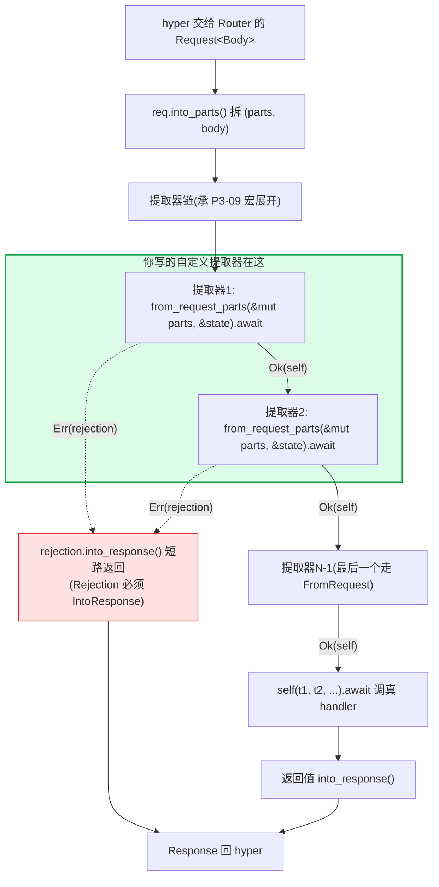

# 第 13 章 · 自定义提取器与 `#[axum::debug_handler]`

> **核心问题**:axum 内置的 `Path`/`Query`/`State`/`Json`/`Form` 一堆提取器讲完了(P3-11),你大概已经会用了。可当你坐下来要写一个"把 HTTP Basic 认证头解析成 `CurrentUser`"、"把 `X-Request-Id` 头提取成 `TraceId`"、"把多个 query 参数打包成一个 `SearchParams` 结构体"——这些内置提取器都不覆盖的场景,你得自己写。怎么写?写完之后呢,你的 handler 签名里某个参数类型拼错了(比如把 `Json<T>` 写成了 `Jason<T>`),或者哪个提取器忘了加 `Send`,编译器甩给你一坨长达几十行的 "`Handler` not implemented for ..." 泛型 impl 报错,根本看不懂错在哪。`#[axum::debug_handler]` 这个过程宏就是来治这个病的——它凭什么能改善类型错误信息?它到底生成了什么?为什么它只在 debug 编译时生效、release 时零开销?还有,你写 `#[derive(FromRef)]` 给一个 `AppState { db: DbPool, config: Config }`,derive 宏到底生成了什么 `impl FromRef`,凭什么 `State<DbPool>` 提取器就能从 `AppState` 里只取一片 `DbPool` 而不用 clone 整个 `AppState`?
>
> **读完本章你会明白**:
>
> 1. 写一个自定义 `FromRequestParts` 提取器的完整四步——选 trait(`FromRequestParts` 还是 `FromRequest`)、定 `Rejection`(必须 `IntoResponse`)、实现 `from_request_parts`/`from_request` 返回 `Result<Self, Rejection>` 的 Future、为什么 Future 必须 `Send`(承《Tokio》worker 跨线程 move Future);
> 2. `#[axum::debug_handler]` 过程宏到底干了什么——**它不生成 wrapper fn,而是为每个参数生成一对"检查函数"(`__axum_macros_check_{handler}_{idx}_from_request_check` + `..._call_check`),把"`T: FromRequestParts<S> + Send`"这类约束编码进检查函数的 `where` 子句,用 `quote_spanned!` 把诊断 span 锚到用户写的具体那一行参数**,这样编译器报错时定位到具体参数而非 `Handler` 的泛型 blanket impl;
> 3. 为什么 `debug_handler` 是**纯开发期工具**——源码 `axum-macros/src/lib.rs` 里用 `#[cfg(debug_assertions)]` / `#[cfg(not(debug_assertions))]` 钉死,release build 直接 `return input` 原样返回,运行期零开销(不生成检查函数、不影响代码);
> 4. `#[derive(FromRef)]` 怎么为 `AppState` 的每个字段生成 `impl FromRef<AppState> for FieldType { fn from_ref(state: &AppState) -> Self { state.field.clone() } }`,为什么这套设计让"每个提取器只声明它要的子状态"成立(不用每个 handler 都拿整个 `AppState`,承 P1-04);
> 5. axum 还有哪些改善类型错误的手段——`#[diagnostic::on_unimplemented]`(Rust 1.78+ 稳定 trait)给 `FromRequestParts`/`FromRequest` 加自定义"未实现"提示、`#[diagnostic::do_not_recommend]` 防止编译器误推荐 `OptionalFromRequest` blanket impl,以及为什么 `debug_handler` 在这些原生诊断之上仍然必要。
>
> 本章服务"**提取与响应**"这一面。它是第 3 篇(提取招牌)的收口章——P3-09 立 `Handler` trait 地基、P3-10 拆 `FromRequest`/`FromRequestParts` 二元划分、P3-11 拆内置提取器实现、P3-12 拆 `IntoResponse`,本章补最后两块:① 怎么写**自己的**提取器接入这条链;② handler 类型错时**怎么用 `debug_handler` 调试**。讲完本章,第 3 篇的"提取与响应"地基全部闭合,下一章起进入第 4 篇中间件。
>
> **写给谁读**:你写过 `async fn handler(State(app): State<AppState>, Json(payload): Json<Payload>)`,也想自己写个 `async fn handler(user: CurrentUser)` 让 `CurrentUser` 自动从 Authorization 头解析。但你不知道:这个 `CurrentUser` 该 impl 哪个 trait?rejection 怎么变成 401 响应?为什么有时候你写完提取器,handler 编译过不去,编译器甩一坨几十行的 `Handler<(M, CurrentUser,), S> not implemented` 给你看不懂?这一章治这些"想写不会写,报错看不懂"。
>
> **前置衔接**:从 P3-10(`FromRequest`/`FromRequestParts` 二元划分)、P3-11(内置提取器实现)、P3-12(`IntoResponse`)接过来。前两章告诉你 axum 内置提取器怎么 impl `FromRequestParts`/`FromRequest`,本章教你按同样的套路写自己的;P3-12 告诉你返回值怎么 `IntoResponse`,本章告诉你提取器失败时的 `Rejection` 也得 `IntoResponse`(同一套 trait)。承 P3-09(`Handler` trait + `impl_handler!` 宏,handler 参数类型错的报错根在那 16 个 blanket impl)、P1-04(`State` 提取器 + `FromRef`,本章补 `#[derive(FromRef)]` 宏)。
>
> **逃生阀(读不下去怎么办)**:本章密度不算大,但有两个点容易绕:① `debug_handler` 生成的"检查函数"机制(第四节),② `FromRef` derive 怎么从大 `AppState` 派生子状态(第五节)。如果一次读不下来,记住三句话就够——① **写自定义提取器 = 选 `FromRequestParts`(只读 parts)或 `FromRequest`(消费 body),impl 它的 `from_request_parts`/`from_request` 方法,Rejection 类型要 `IntoResponse`,Future 必须 `Send`**;② **`debug_handler` 是开发期诊断工具,在编译期给每个参数生成一个"约束检查函数",让编译器把类型错定位到具体参数行,release build 完全失效**;③ **`#[derive(FromRef)]` 为 struct 的每个字段生成一个 `impl FromRef<BigState> for FieldType`,让 `State<FieldType>` 提取器能从大 state 里只 clone 出那一片**。带着这三句跳到第三节看自定义提取器实例、第四节看 debug_handler、第五节看 FromRef derive,再回头读细节。

---

## 一句话点破

> **写自定义提取器,就是按"二元划分"(承 P3-10)选 `FromRequestParts`(只读 `&mut Parts`,可多次跑)或 `FromRequest`(按值拿 `Request`,可消费 body),impl 它的提取方法,定义一个 `IntoResponse` 的 `Rejection` 类型,返回一个 `Send` 的 Future。`#[axum::debug_handler]` 不是生成 wrapper fn,而是编译期用 `quote_spanned!` 给 handler 的每个参数生成一对"检查函数"——约束(`T: FromRequestParts<S> + Send`、`T: FromRequest<S, M> + Send`、返回值 `T: IntoResponse`)放在检查函数的 `where` 子句里,函数名带参数索引(`__axum_macros_check_handler_0_from_request_check`),编译器一旦发现约束不满足,报错的 span 精确锚到用户写的那一行参数,而不是甩给你 `Handler` trait 那个对 0~16 参数 blanket impl 的看不懂的泛型 impl(承 P3-09)。这套机制在 `#[cfg(debug_assertions)]` 下才生效,release build `return input` 原样返回,运行期零开销。`#[derive(FromRef)]` 给 struct 的每个非 skip 字段生成一份 `impl FromRef<BigState> for FieldType { fn from_ref(state: &BigState) -> Self { state.field.clone() } }`,让 `State<FieldType>` 提取器能从大 `AppState` 里只取一片——每个 handler 只声明它要的子状态,互不耦合(承 P1-04)。**

这是结论。本章倒过来拆四件事:① 自定义提取器的完整步骤(选 trait、写 Rejection、impl 方法、保证 Send);② handler 类型错为什么报错那么难懂(P3-09 的 blanket impl 是病根);③ `debug_handler` 怎么用"检查函数"机制治这个病(逐行拆 token 变换);④ `FromRef` derive 怎么派生子状态。

---

## 第一节:从"内置提取器不够用"说起

### 提问

P3-11 拆了内置提取器:`Path`(URL 参数)、`Query`(query string)、`State`(应用状态)、`Json`(body + Content-Type 校验)、`Form`(body + form 解析)。这五个覆盖了 80% 的常见场景。可剩下 20% 呢?

来看几个真实场景:

**场景 A:HTTP Basic 认证**。你想写一个 handler,自动从 `Authorization: Basic <base64>` 头里解析出用户名密码,验权后把 `CurrentUser` 注入 handler:

```rust
// 你想这么写
async fn me(user: CurrentUser) -> impl IntoResponse {
    Json(user)
}

// CurrentUser 自动从 Authorization 头解析
// 解析失败(没带头、base64 解不出、密码错)→ 401 响应
```

`Path`/`Query`/`State`/`Json`/`Form` 都帮不了你——`Authorization` 头不是 URL 参数、不是 query、不是 state、不是 body。你得自己写 `CurrentUser` 这个提取器。

**场景 B:trace ID**。你想给每个请求关联一个 trace ID(从 `X-Request-Id` 头读,没有就生成一个),handler 里能拿到这个 ID 写日志:

```rust
async fn handler(trace_id: TraceId) -> impl IntoResponse {
    tracing::info!(trace_id = %trace_id.0, "handling");
    // ...
}
```

`TraceId` 也不是内置提取器能搞定的。

**场景 C:打包多个 query 参数**。你的搜索接口接 10 个 query 参数(`q`/`page`/`per_page`/`sort`/`order`/`filter`/...),handler 写 10 个 `Query<...>` 显然不行(同一个 `Query` 提取器不能跑两次,因为 query string 只解析一次后塞 extensions),但你又想类型安全:

```rust
// 你想这么写
async fn search(SearchParams { q, page, sort, .. }: SearchParams) -> impl IntoResponse {
    // ...
}

#[derive(Deserialize)]
struct SearchParams {
    q: String,
    page: u32,
    per_page: u32,
    sort: String,
    // ...
}
```

`SearchParams` 必须是个自定义提取器——它能从 query string 反序列化出整个结构体。

这三个场景的共同点:**内置提取器覆盖不到,你得自己写一个类型,让它实现 `FromRequestParts` 或 `FromRequest`,然后就能放进 handler 参数列表**。本章就是来教你怎么写的。

> **承接 P3-09/P3-10**:P3-09 立了 `Handler` trait 地基——`impl_handler!` 宏对 0~16 参数 blanket impl `Handler`,前 N-1 个参数要 `FromRequestParts<S> + Send`,最后一个要 `FromRequest<S, M> + Send`。P3-10 拆了 `FromRequest`/`FromRequestParts` 的二元划分——只读 parts 的提取器走 `FromRequestParts`,可能消费 body 的走 `FromRequest`,中间 `ViaParts` blanket 桥接让只读 parts 的提取器也能站到最后一个参数位置。本章不重复这些,只补"怎么写自己的提取器接入这条链"。你写一个 `CurrentUser: FromRequestParts<S>`,宏就会把它当 `$ty`(前 N-1 个之一)或 `$last`(经 ViaParts 桥接,如果是唯一参数)处理,调它的 `from_request_parts`。

### 不这样会怎样:把解析逻辑塞进 handler body

如果你不写自定义提取器,把解析逻辑直接塞进 handler body,代码长这样(场景 A):

```rust
// 反面:解析逻辑塞 handler body,业务被埋
async fn me(State(app): State<AppState>, headers: HeaderMap) -> impl IntoResponse {
    // 1. 从 headers 取 Authorization
    let auth_header = match headers.get("authorization") {
        Some(h) => h,
        None => return (StatusCode::UNAUTHORIZED, "missing auth").into_response(),
    };
    // 2. 解析 Basic 前缀
    let auth_str = match auth_header.to_str() {
        Ok("Basic " ..= rest) => rest,  // 简化示意
        _ => return (StatusCode::UNAUTHORIZED, "invalid auth scheme").into_response(),
    };
    // 3. base64 解码
    let decoded = match base64::decode(auth_str) {
        Ok(d) => d,
        Err(_) => return (StatusCode::UNAUTHORIZED, "bad base64").into_response(),
    };
    // 4. 拆 username:password
    let creds: Vec<&str> = std::str::from_utf8(&decoded)
        .ok()
        .and_then(|s| Some(s.splitn(2, ':').collect()))
        .unwrap_or_default();
    if creds.len() != 2 {
        return (StatusCode::UNAUTHORIZED, "bad creds format").into_response();
    }
    // 5. 验权
    let user = match app.db.find_user(creds[0], creds[1]).await {
        Ok(u) => u,
        Err(_) => return (StatusCode::UNAUTHORIZED, "invalid creds").into_response(),
    };
    // ★ 终于到业务逻辑
    Json(user).into_response()
}
```

五个错误分支把真正的业务(`Json(user).into_response()`)埋在最后。每个需要认证的 handler 都得重复这一坨——复制粘贴 5 次,5 个地方修 bug。这是反面。

axum 的解法:把"解析 Authorization 头"这件事做成一个提取器 `CurrentUser`,handler 只声明它要 `CurrentUser`,解析逻辑封装在提取器的 `from_request_parts` 里,失败短路返回 Rejection(自动变 401 响应):

```rust
// 正面:解析逻辑封装在 CurrentUser 提取器里,handler 干净
async fn me(user: CurrentUser) -> impl IntoResponse {
    Json(user.0)  // 业务就一行
}

// CurrentUser 提取器把上面那一坨解析逻辑封装起来
struct CurrentUser(User);

impl<S> FromRequestParts<S> for CurrentUser
where
    S: Send + Sync,
    AppDb: FromRef<S>,  // 从 state 拿数据库连接
{
    type Rejection = StatusCode;  // 失败就返回 401

    async fn from_request_parts(parts: &mut Parts, state: &S) -> Result<Self, Self::Rejection> {
        // 那一坨解析逻辑全在这,失败 return Err(StatusCode::UNAUTHORIZED)
        // ...
        Ok(CurrentUser(user))
    }
}
```

这就是自定义提取器的价值——**把横切的请求解析/校验逻辑封装成可复用的提取器,handler 只声明依赖,不写样板**。和"中间件"的区别是:中间件是路由级的(对所有 handler 生效),提取器是参数级的(只对声明它的 handler 生效)。下一章(P4-14)拆 `from_fn` 中间件,会专门对比"用提取器还是用中间件"。

> **钉死这件事**:自定义提取器解决的是"内置提取器覆盖不到的请求解析场景"。它的价值是封装——把解析/校验逻辑从 handler body 抽出来,handler 只声明它要什么(`user: CurrentUser`),怎么提是提取器的事。失败时短路返回 Rejection(自动变响应),handler 根本不会被调用。这和 P4-14 的 `from_fn` 中间件是两种粒度:提取器是参数级的,中间件是路由级的。

---

## 第二节:自定义提取器四步走

### 提问

写自定义提取器到底分几步?每一步的硬规矩是什么?

四步:① 选 trait(`FromRequestParts` 还是 `FromRequest`);② 定义 `Rejection` 类型(必须 `IntoResponse`);③ 实现提取方法(返回 `Result<Self, Rejection>` 的 `Send` Future);④ (可选)从 state 拿依赖(用 `FromRef`)。逐个拆。

### 第一步:选 trait——你的提取器要不要消费 body

P3-10 讲透了二元划分:`FromRequestParts` 拿 `&mut Parts`(只读 parts 那块——method/uri/headers/extensions,可多次跑),`FromRequest` 按值拿 `Request`(可消费 body,只能一次)。你写自定义提取器,第一件事是问自己:**我的提取器要不要碰 body?**

| 你的提取器读什么 | 选哪个 trait |
|------|------|
| headers(`Authorization`、`X-Request-Id`、`Content-Type`) | `FromRequestParts` |
| method、uri、version | `FromRequestParts` |
| extensions(路由层塞的 URL 参数、中间件塞的 `CurrentUser`) | `FromRequestParts` |
| state(用 `FromRef`) | `FromRequestParts` |
| body(JSON、form、protobuf、原始字节) | `FromRequest` |
| 既读 headers 又消费 body | `FromRequest`(可以 `req.headers()` 先校验,再 `req.into_body()` 消费) |

绝大多数自定义提取器是 `FromRequestParts`——它们读头、读 state、读 extensions,不碰 body。`CurrentUser`(场景 A)、`TraceId`(场景 B)、`SearchParams`(场景 C,从 query string)都是 `FromRequestParts`。

只有当你要消费 body 时才选 `FromRequest`。比如你想写一个 `Protobuf<T>` 提取器(类似 `Json<T>` 但用 protobuf 反序列化),它要消费 body,选 `FromRequest`。

> **钉死这件事**:选 trait 的硬规矩——只读 parts(头/state/extensions/method/uri)选 `FromRequestParts`,要消费 body 选 `FromRequest`。这不是风格选择,是物理约束:body 是 Stream 只能消费一次,如果多个 `FromRequest` 提取器并列,第一个把 body 收完,第二个拿到空 body——`impl_handler!` 宏因此钉死"前 N-1 个 `FromRequestParts`,最后一个 `FromRequest`"(承 P3-09/P3-10)。你的提取器消费 body,就只能在最后一个参数位置;不消费 body,放哪都行。

### 第二步:定义 Rejection——失败时变什么响应

提取器的 `from_request_parts`/`from_request` 返回 `Result<Self, Self::Rejection>`,失败时返回 `Err(rejection)`。`Self::Rejection` 是一个关联类型,硬约束是 **`Rejection: IntoResponse`**(承 P3-12)。宏展开后,失败时调 `rejection.into_response()` 把 Rejection 转成 `Response`,短路返回,handler 根本不被调用:

```rust
// impl_handler! 宏展开的关键部分(承 P3-09,简化示意)
let $ty = match $ty::from_request_parts(&mut parts, &state).await {
    Ok(value) => value,
    Err(rejection) => return rejection.into_response(),  // ★ Rejection 变 Response 短路返回
};
```

所以你的 Rejection 类型必须能 `into_response`。三种常见选法:

**选法一:用现成的 `StatusCode`**。最简单。`StatusCode` 实现了 `IntoResponse`(承 P3-12),只返回状态码,不带 body。适合"失败就一个状态码"的简单场景:

```rust
impl<S> FromRequestParts<S> for CurrentUser
where
    S: Send + Sync,
{
    type Rejection = StatusCode;  // 失败就 401

    async fn from_request_parts(parts: &mut Parts, _state: &S) -> Result<Self, Self::Rejection> {
        // 解析失败的各种情况
        Err(StatusCode::UNAUTHORIZED)
    }
}
```

**选法二:用 `(StatusCode, String)` 或 `(StatusCode, Json<...>)`**。带错误信息。`(StatusCode, String)` 也实现了 `IntoResponse`(承 P3-12 的 tuple 组合响应),返回状态码 + 文本 body:

```rust
type Rejection = (StatusCode, String);
// 失败时
Err((StatusCode::UNAUTHORIZED, "missing Authorization header".to_string()))
```

**选法三:自定义 Rejection 类型,自己 `impl IntoResponse`**。最灵活。当你想统一错误响应格式(比如所有错误都是 JSON `{ "error": "..." }`),写个 `MyRejection` 结构体,impl `IntoResponse` 决定响应长什么样:

```rust
#[derive(Debug)]
enum AuthRejection {
    MissingHeader,
    InvalidScheme,
    InvalidBase64,
    InvalidCredentials,
}

impl IntoResponse for AuthRejection {
    fn into_response(self) -> Response {
        let (status, msg) = match self {
            AuthRejection::MissingHeader => (StatusCode::UNAUTHORIZED, "missing Authorization header"),
            AuthRejection::InvalidScheme => (StatusCode::UNAUTHORIZED, "expected Basic scheme"),
            AuthRejection::InvalidBase64 => (StatusCode::BAD_REQUEST, "invalid base64"),
            AuthRejection::InvalidCredentials => (StatusCode::UNAUTHORIZED, "invalid credentials"),
        };
        (status, Json(json!({ "error": msg }))).into_response()
    }
}

// 提取器
impl<S> FromRequestParts<S> for CurrentUser
where
    S: Send + Sync,
{
    type Rejection = AuthRejection;
    // ...
}
```

axum 内置提取器的 Rejection 也都是这么做的——`JsonRejection`/`PathRejection`/`QueryRejection` 是 enum(承 P3-11),各自 `impl IntoResponse` 映射到不同的 4xx 状态码 + 错误信息。`axum::extract::rejection` 模块把这些 rejection 类型集中导出。

> **钉死这件事**:Rejection 类型的硬约束是 `IntoResponse`。三种选法:① `StatusCode`(只状态码,简单场景);② `(StatusCode, String)` 或 `(StatusCode, Json<...>)`(带错误信息);③ 自定义 enum + 手写 `impl IntoResponse`(统一错误格式,最灵活)。失败时提取器返回 `Err(rejection)`,宏的 `rejection.into_response()` 把它变 Response 短路返回,handler 不被调用。这套机制和 P3-12 的 `IntoResponse` 是同一个 trait——提取器失败和 handler 返回值用同一套响应抽象。

### 第三步:实现提取方法——返回 Send 的 Future

trait 方法签名(P3-10 拆透):

```rust
// FromRequestParts
fn from_request_parts(
    parts: &mut Parts,
    state: &S,
) -> impl Future<Output = Result<Self, Self::Rejection>> + Send;

// FromRequest
fn from_request(
    req: Request,
    state: &S,
) -> impl Future<Output = Result<Self, Self::Rejection>> + Send;
```

两个硬规矩:① 返回 `impl Future<Output = Result<Self, Rejection>>`(RPITIT,承 P3-10 第六节,不是 `#[async_trait]`);② 这个 Future 必须 **`Send`**。

`Send` 这个约束要专门讲。trait 方法签名里的 `+ Send` 钉死了"实现者返回的 Future 必须跨线程 Send"。为什么?承《Tokio》运行时机制(一句带过指路 [[tokio-source-facts]]):Tokio 的多线程 scheduler 把 task 在 worker 线程间 move,一个 task 的 Future 如果不 Send,就只能在创建它的那个线程上 poll——这破坏了工作窃取调度,axum 不允许。

具体到提取器链:`impl_handler!` 宏展开后,所有提取器的 Future 被 `.await` 串成一个 async block,这个 block 整体被 `Box::pin` 成一个 `Pin<Box<dyn Future<Output = Response> + Send>>`(承 P3-09 的 `type Future = Pin<Box<dyn Future<Output = Response> + Send>>`)。`+ Send` 在 `Handler::Future` 上钉死,意味着 block 里 await 的每个子 Future 都得 Send——提取器的 Future 不 Send,整个 block 就不 Send,编译期报错。

这个报错正是 `debug_handler` 要解决的痛点之一(第四节拆)。现在先记住:**你的提取器 Future 必须 Send**,实操上意味着:① `Self` 里持有的字段要 Send(`CurrentUser(User)` 里 `User` 要 Send);② `from_request_parts` body 里 await 的其他 Future 要 Send(如果你 await 了数据库查询,那个查询 Future 要 Send,承《Tokio》)。

来看一个完整的 `CurrentUser` 提取器(场景 A 的最小实现,简化):

```rust
use axum::{
    extract::FromRequestParts,
    http::{request::Parts, StatusCode},
};
use base64::{engine::general_purpose, Engine};
use crate::{db::User, state::AppDb};

pub struct CurrentUser(pub User);

impl<S> FromRequestParts<S> for CurrentUser
where
    S: Send + Sync,
    AppDb: FromRef<S>,  // 从 state 拿数据库连接池
{
    type Rejection = StatusCode;

    async fn from_request_parts(parts: &mut Parts, state: &S) -> Result<Self, Self::Rejection> {
        // 1. 从 headers 取 Authorization
        let auth_header = parts
            .headers
            .get("authorization")
            .ok_or(StatusCode::UNAUTHORIZED)?
            .to_str()
            .map_err(|_| StatusCode::BAD_REQUEST)?;

        // 2. 解析 Basic 前缀
        let encoded = auth_header
            .strip_prefix("Basic ")
            .ok_or(StatusCode::UNAUTHORIZED)?;

        // 3. base64 解码
        let decoded = general_purpose::STANDARD
            .decode(encoded.as_bytes())
            .map_err(|_| StatusCode::BAD_REQUEST)?;

        // 4. 拆 username:password
        let creds = String::from_utf8(decoded)
            .map_err(|_| StatusCode::BAD_REQUEST)?;
        let (username, password) = creds
            .split_once(':')
            .ok_or(StatusCode::BAD_REQUEST)?;

        // 5. 验权(从 state 拿 db)
        let db = AppDb::from_ref(state);
        let user = db
            .find_user(username, password)
            .await
            .map_err(|_| StatusCode::UNAUTHORIZED)?;

        Ok(CurrentUser(user))
    }
}
```

这个提取器读 `parts.headers`(只读 parts,不碰 body),所以 impl `FromRequestParts`。`Rejection = StatusCode`(简单场景)。`from_request_parts` 是个 `async fn`,RPITIT 自动 desugar 成 `impl Future<...> + Send`(`+ Send` 隐含在 trait 签名里,你写 `async fn` 编译器会检查 Future 是否 Send,不 Send 编译错)。失败时各种 `?` 短路返回 `StatusCode`。

handler 用法:

```rust
async fn me(user: CurrentUser) -> impl IntoResponse {
    Json(user.0)
}
```

`CurrentUser` 现在就是个一等功能完整的提取器,和 `Path`/`Query`/`Json` 平起平坐——可以放任何参数位置(只读 parts,前 N-1 或最后一个经 ViaParts 桥接都行,承 P3-10),失败短路返回 401。

### 第四步:从 state 拿依赖——用 FromRef

注意上面 `CurrentUser` 的实现里有一行 `let db = AppDb::from_ref(state);`——这就是从 state 拿数据库连接的方式。`AppDb` 实现了 `FromRef<S>`(where `S` 是 handler 的 state 类型),`from_ref(state)` 从大 state 里 clone 出一片 `AppDb`。这是承 P1-04 的 `FromRef` 机制——本章第五节拆 `#[derive(FromRef)]` 怎么自动生成这套 impl。

为什么提取器要用 `FromRef` 拿 state 依赖,而不是直接 `State<S>` 提取器?两个理由:① `State<S>` 提取器要求 `S: FromRef<AppState>`(整个 state 类型),如果你的提取器只要 state 的一片(比如只要 `DbPool`),用 `State<DbPool>` 更精确;② 提取器的 state 依赖应该和 handler 的 state 类型解耦——提取器声明 "我需要 `AppDb: FromRef<S>`",handler 的 state 是 `AppState` 还是 `AppState2` 都行,只要 `AppDb` 能从那个 state 派生。

约束写法:`impl<S> FromRequestParts<S> for CurrentUser where AppDb: FromRef<S>`。这个 `where` 子句让"任何能派生出 `AppDb` 的 state 类型 S"都成立——你的提取器对 state 类型是开放的,不绑死某个具体 `AppState`。

> **钉死这件事**:自定义提取器四步——① 选 trait(`FromRequestParts` 只读 parts / `FromRequest` 消费 body);② 定义 `Rejection: IntoResponse`(三选:StatusCode、tuple、自定义 enum);③ impl 提取方法,返回 `impl Future<...> + Send`(用 `async fn`,编译器检查 Send);④ 用 `FromRef<S>` 拿 state 依赖,提取器对 state 类型开放不绑死。这四步合起来,就是把"解析/校验逻辑"封装成可复用的提取器,接入 `impl_handler!` 宏的提取器链。

---

## 第三节:三个实战实例

### 提问

四步讲完了,看三个完整实例把套路钉死。对应开头的三个场景:① `CurrentUser`(HTTP Basic 认证,从 headers + state);② `TraceId`(trace ID,从 headers 或生成);③ `SearchParams`(打包多个 query 参数,从 query string)。

### 自定义提取器的提取流程图

在讲三个实例之前,先用 mermaid 把"一次 handler 调用里,自定义提取器怎么被 `impl_handler!` 宏调用"的流程画出来。注意它落在提取器链的哪一步——前 N-1 个 `FromRequestParts` 之一,共享 `&mut parts`,接力跑:



流程图里高亮的 `CUSTOM` 子图就是你写的自定义提取器。它从 `&mut parts`(只读 parts,不碰 body)提取,失败 `Err(rejection)` 短路返回 Response(handler 不被调用),成功 `Ok(self)` 进入下一站。`Rejection: IntoResponse` 的硬约束就来自图里那条 `rejection.into_response()` 边——Rejection 不能转 Response,整条链编译不过。

### 实例一:CurrentUser(FromRequestParts,读 headers + state)

第二节已经贴过完整实现,这里只补几个细节:

1. **`FromRef<S>` 约束让提取器跨 state 类型复用**。你写了 `impl<S> FromRequestParts<S> for CurrentUser where AppDb: FromRef<S>`,这个提取器在任何能派生 `AppDb` 的 state 上都成立——你的 app 是 `AppState { db: DbPool, ... }` 也行,是 `AppState2 { db: DbPool, ... }` 也行,只要 `AppDb`(假设就是 `DbPool` 的别名)能 `FromRef` 派生。这是 axum 提取器库(比如 axum-login、tower-sessions)能写成"不绑死用户 state 类型"的根。

2. **`?` 操作符和 `Rejection` 的 `From` impl**。如果你的 Rejection 是个 enum,你可能想给每个具体错误类型(`base64::DecodeError`、`std::str::Utf8Error`)impl `From<...> for AuthRejection`,这样 `?` 能自动转。这是惯例写法。上面的最小实现用了 `.map_err(|_| StatusCode::UNAUTHORIZED)?` 显式映射,没走 `From`——两种都行,看你 Rejection 类型多复杂。

3. **`async fn` 和 Send 检查**。`from_request_parts` 是 `async fn`,body 里 await 了 `db.find_user(...)`——这个数据库查询的 Future 必须 Send(承《Tokio》,绝大多数 Tokio-based 的异步数据库驱动都 Send)。如果某个 await 的 Future 不 Send,编译器报错,Future 不满足 `+ Send` 约束。这个报错信息长什么样,第四节讲 debug_handler 时会展示。

### 实例二:TraceId(FromRequestParts,只读 headers)

`TraceId` 提取器从 `X-Request-Id` 头读 trace ID,没有就生成一个新的(用 UUID):

```rust
use axum::{extract::FromRequestParts, http::{request::Parts, StatusCode}};
use uuid::Uuid;

#[derive(Debug, Clone)]
pub struct TraceId(pub Uuid);

impl<S> FromRequestParts<S> for TraceId
where
    S: Send + Sync,
{
    type Rejection = std::convert::Infallible;  // ★ 这个提取器永远不会失败

    async fn from_request_parts(parts: &mut Parts, _state: &S) -> Result<Self, Self::Rejection> {
        let uuid = parts
            .headers
            .get("x-request-id")
            .and_then(|h| h.to_str().ok())
            .and_then(|s| Uuid::parse_str(s).ok())
            .unwrap_or_else(Uuid::new_v4);  // 没有或解析失败就生成
        Ok(TraceId(uuid))
    }
}
```

注意 `Rejection = Infallible`——这个提取器永远返回 `Ok`,所以 Rejection 类型用 `Infallible`("永远构造不出值的 enum",承 P3-10 讲过空 enum 的语义)。`Infallible` 实现了 `IntoResponse`(虽然这个 impl 永远不会被调用,因为没有 `Err(Infallible)` 能被构造出来),所以满足 trait 的 `Rejection: IntoResponse` 约束。

这个提取器读 headers 后还**往 extensions 里塞 trace ID**——这是常见的"提取器之间互通消息"模式(承 P3-10 第二节讲 `&mut Parts` 的理由)。塞进去之后,后续的中间件、handler、甚至日志层都能从 `parts.extensions` 读出来。完整版:

```rust
async fn from_request_parts(parts: &mut Parts, _state: &S) -> Result<Self, Self::Rejection> {
    let uuid = parts
        .headers
        .get("x-request-id")
        .and_then(|h| h.to_str().ok())
        .and_then(|s| Uuid::parse_str(s).ok())
        .unwrap_or_else(Uuid::new_v4);
    parts.extensions.insert(uuid);  // ★ 塞进 extensions,后续可读
    Ok(TraceId(uuid))
}
```

这就是 `&mut Parts`(不是 `&Parts`)的价值——提取器可以"往 extensions 写",后续提取器或中间件从同一个 extensions 读。

### 实例三:SearchParams(FromRequestParts,从 query string)

`SearchParams` 想从 query string 反序列化出整个结构体。注意一个坑:**你不能直接用 `Query<SearchParams>` 多次**,因为 `Query` 提取器内部解析 query string 一次,如果你有多个 `Query<T>` 参数,第一个跑完后 query string 已经被消费(其实没有——`Query` 是 `FromRequestParts`,只读 `parts.uri`,不消费 query string 本身。但你写两个 `Query<T>` 宏不允许,因为 `Query` 实现的是 `FromRequestParts`,但 axum 的 `Path` 提取器不能多个并列——这个限制由 `debug_handler` 宏的 `check_path_extractor` 检查,第四节会看到)。

正确做法是写一个 `SearchParams` 提取器,内部委托给 `Query`:

```rust
use axum::{extract::FromRequestParts, http::request::Parts};
use serde::Deserialize;

#[derive(Debug, Deserialize)]
pub struct SearchParams {
    pub q: String,
    pub page: Option<u32>,
    pub per_page: Option<u32>,
    pub sort: Option<String>,
}

impl<S> FromRequestParts<S> for SearchParams
where
    S: Send + Sync,
{
    type Rejection = <axum::extract::Query<Self> as FromRequestParts<S>>::Rejection;

    async fn from_request_parts(parts: &mut Parts, state: &S) -> Result<Self, Self::Rejection> {
        // 委托给 Query 提取器
        let axum::extract::Query(params) = axum::extract::Query::from_request_parts(parts, state).await?;
        Ok(params)
    }
}
```

这个写法的好处:`SearchParams` 复用了 `Query` 提取器的全部逻辑(query string 解析、serde_urlencoded 反序列化、错误处理),只是在它外面包了一层。Rejection 类型直接复用 `Query<Self>::Rejection`(`QueryRejection`)——用关联类型投影 `<Query<Self> as FromRequestParts<S>>::Rejection` 表达。

实际上,axum 提供了 `#[derive(FromRequestParts)]` 宏让它更简洁(本章后面简短提一下,完整文档在 axum-macros):

```rust
#[derive(FromRequestParts)]
struct SearchParams {
    #[from_request(via(Query))]
    q: String,
    // ...
}
// 等价于上面手写的 impl
```

但理解手写版本更重要——derive 宏只是把这套套路自动化,核心机制是 `FromRequestParts` trait。

### 把三个实例放在一张表

| 提取器 | trait | 读什么 | Rejection | Send 难点 |
|------|------|------|------|------|
| `CurrentUser` | `FromRequestParts` | headers + state(db) | `StatusCode` | await 数据库查询要 Send |
| `TraceId` | `FromRequestParts` | headers | `Infallible` | 无 await,纯同步 |
| `SearchParams` | `FromRequestParts` | query string(委托 `Query`) | `QueryRejection` | 委托给 `Query`,无新增 await |

三个都是 `FromRequestParts`(都不消费 body)。如果你要写一个消费 body 的提取器(比如 `Protobuf<T>`),套路一样,只是 trait 换成 `FromRequest`,签名 `req: Request`(按值)而不是 `parts: &mut Parts`。

> **钉死这件事**:三个实例覆盖了自定义提取器的三种典型形态——读 headers + state(`CurrentUser`)、读 headers 塞 extensions(`TraceId`)、委托给其他提取器(`SearchParams` 委托 `Query`)。三者都是 `FromRequestParts`(不碰 body)。Rejection 的三种选法(StatusCode、Infallible、复用其他提取器的 Rejection)也都展示了。写消费 body 的提取器,套路一样,trait 换 `FromRequest`,签名按值拿 `Request`。

---

## 第四节:handler 报类型错为什么那么难懂,debug_handler 怎么治

### 提问

你写完提取器,handler 编译过不去。比如你手滑把 `Json<T>` 写成了 `Jason<T>`,或者忘了给自定义提取器加 `Send`,或者最后一个参数写了 `String`(它消费 body 但没标 `FromRequest`)。编译器甩给你一坨几十行的报错,核心是 "the trait `Handler<..., S>` is not implemented for `[closure]>`",下面跟着一大堆泛型约束的 dump,你完全看不出错在哪个参数。为什么会这样?

这个病的根在 P3-09 拆过的 `impl_handler!` 宏 + `all_the_tuples!` 宏——它们对 0~16 个参数各 blanket impl 一份 `Handler`。当你的 handler 参数类型有任何不满足约束时,编译器找不到对应的 blanket impl,就报 "Handler not implemented"。

### 病根:`impl_handler!` 的 16 个 blanket impl

回顾 P3-09 贴过的宏展开(承 P3-09,简化):

```rust
// axum 对 1~16 参数各展开一份(简化示意,逐字版见 P3-09)
impl<F, Fut, S, Res, M, T1, T2> Handler<(M, T1, T2), S> for F
where
    F: FnOnce(T1, T2) -> Fut + Clone + Send + Sync + 'static,
    Fut: Future<Output = Res> + Send,
    S: Send + Sync + 'static,
    Res: IntoResponse,
    T1: FromRequestParts<S> + Send,         // 前面的参数
    T2: FromRequest<S, M> + Send,           // 最后一个参数
{
    // ...
}
```

每个参数个数一份。你的 handler `async fn handler(j: Jason<T>)` 有一个参数,编译器去找 `Handler<(M, Jason<T>), S> for F` 的 impl。它试了 1 参数那份 blanket,要求 `Jason<T>: FromRequest<S, M> + Send`。如果 `Jason<T>` 不存在或没 impl `FromRequest`,这个约束不满足——但编译器不会说"`Jason<T>: FromRequest` 不满足",它会说"`Handler<(M, Jason<T>), S> is not implemented for F`(你的闭包)`,因为整个 blanket impl 因为这一个约束不满足而 fail。

错误信息长这样(简化示意,真实编译器输出更长):

```text
error[E0277]: the trait `Handler<(M, Jason<Payload>,), ()>` is not implemented
              for `fn(Jason<Payload>) -> impl Future<Output = ...>`
   |
xx | async fn handler(j: Jason<Payload>) -> impl IntoResponse { /* ... */ }
   |                ^^^^^^^^^^^^^^^^^^^^ the trait `Handler<...>` is not implemented
   |
   = note: required by a bound in `get`
```

错误指向了 handler 整个函数签名,你完全看不出是 `Jason` 拼错了(应该是 `Json`)、还是缺 `Send`、还是返回值没 `IntoResponse`、还是 state 类型不对——四个可能的病因都被揉进同一个"`Handler` not implemented"里。这就是 axum 老用户都遇到过的痛点。

axum 团队当然知道这个问题。他们给了几个层次的解法,逐个看:

### 解法一:`#[diagnostic::on_unimplemented]`——Rust 1.78+ 原生诊断

最便宜的一层。axum 在 `FromRequestParts` 和 `FromRequest` trait 定义上加了 `#[diagnostic::on_unimplemented]` attribute([`axum-core/src/extract/mod.rs#L50-L52`](../axum/axum-core/src/extract/mod.rs#L50-L52) 和 [`#L76-L78`](../axum/axum-core/src/extract/mod.rs#L76-L78)):

```rust
#[diagnostic::on_unimplemented(
    note = "Function argument is not a valid axum extractor. \nSee `https://docs.rs/axum/0.8/axum/extract/index.html` for details"
)]
pub trait FromRequestParts<S>: Sized {
    // ...
}
```

`#[diagnostic::on_unimplemented]` 是 Rust 1.78(2024-04 稳定)引入的 attribute,它让 crate 作者自定义"当某个 trait 在某个类型上未实现时,编译器报什么 note"。当 `Jason<T>: FromRequest<S, M>` 不满足时,编译器会在错误里附带这条 note:"Function argument is not a valid axum extractor. See ... for details"。

这是改善,但还不够——它只告诉你"参数不是有效提取器",还是没说**哪个**参数。如果你的 handler 有 5 个参数,你还得自己挨个查。另外,`#[diagnostic::on_unimplemented]` 是 Rust 1.78+ 的特性,旧 rustc 用不上(但 axum 0.8.9 的 MSRV 是 1.75,所以这个 attribute 在旧 rustc 上会被静默忽略——`#[diagnostic::...]` 命名空间的设计就是"未知 diagnostic 不会报错只警告")。

类似地,`FromRequest` trait 也加了 `#[diagnostic::on_unimplemented]`(`axum-core/src/extract/mod.rs#L76-L78`),note 文案相同。还有 `#[diagnostic::do_not_recommend]`(在 `Option<T>` 的 blanket impl 上,`axum-core/src/extract/option.rs#L40`)——它告诉编译器"在类型不匹配时不要推荐这个 impl",防止用户写错 handler 签名时编译器建议"你 impl `OptionalFromRequest` 了吗"(那是反方向)。

这些原生诊断改善了一点,但根本问题——"看不出哪个参数错了"——没解决。`debug_handler` 来治本。

### 解法二:`#[axum::debug_handler]`——给每个参数生成"检查函数"

`#[axum::debug_handler]`(或 `#[debug_handler]`,通过 `use axum::debug_handler` 引入)是个 attribute macro,加在 handler fn 上面:

```rust
use axum::{routing::get, Router, debug_handler};

#[debug_handler]
async fn handler(j: Json<Payload>) -> impl IntoResponse {
    /* ... */
}
```

加完之后,handler 类型错时编译器报错精确锚到具体参数行:

```text
error[E0277]: the trait `FromRequestParts<()>` is not implemented for `Jason<Payload>`
   |
xx | async fn handler(j: Jason<Payload>) -> impl IntoResponse {
   |                  - ^^^^^^^^^^^^^^^^ required trait is not implemented
   |                  |
   |                  required by a bound in this
```

报错直接说"`Jason<Payload>` 没实现 `FromRequestParts<()>`",而且 span 精确到 `Jason<Payload>` 那个具体类型——你一眼就看出"哦,我把 `Json` 拼成了 `Jason`"。

`debug_handler` 是怎么做到的?它**不**生成一个 wrapper fn(很多人这么以为,这是常见的误解,本章要纠正),而是**给 handler 的每个参数生成一对"检查函数"**,把约束编码进检查函数的 `where` 子句,让编译器把约束失败的报错锚到具体参数。

来看源码。`debug_handler::expand` 在 [`axum-macros/src/debug_handler.rs#L11-L89`](../axum/axum-macros/src/debug_handler.rs#L11-L89),核心是几个 check 函数,逐个看。

**核心一:保留原 handler,加检查函数**。`expand` 最后的 `quote!`(`debug_handler.rs#L81-L88`):

```rust
quote! {
    #item_fn                         // ★ 原样保留你的 handler fn
    #check_extractor_count           // 检查参数个数 <= 16
    #check_path_extractor            // 检查没有多个 Path
    #check_output_impls_into_response  // 检查返回值 impl IntoResponse
    #check_inputs_and_future_send    // ★ 给每个参数生成检查函数(核心)
    #middleware_takes_next_as_last_arg
}
```

注意第一个 `#item_fn`——你的 handler fn 原样保留在输出里。`debug_handler` **不修改你的 fn**,只是在它后面追加一堆"检查函数"。这些检查函数是 `#[doc(hidden)]` 的,对用户不可见,但编译器会编译它们,从而触发约束检查。

**核心二:为每个参数生成检查函数**。看 `check_inputs_impls_from_request`(`debug_handler.rs#L223-L339`),这是"给每个参数生成检查函数"的主逻辑。对每个参数:

1. 判断它在 handler 里的位置——`First`/`Middle`(前 N-1 个,要求 `FromRequestParts`)、`Last`/`Only`(最后一个,要求 `FromRequest` 或经 ViaParts 桥接)。这复刻了 `impl_handler!` 宏的约定(承 P3-09)。
2. 取参数的类型 `ty` 和它的 span(源码位置)。
3. 用 `format_ident!` 生成两个唯一函数名:`__axum_macros_check_{handler}_{idx}_from_request_check` 和 `__axum_macros_check_{handler}_{idx}_from_request_call_check`(`debug_handler.rs#L276-L288`)。`{handler}` 是你的 handler 名,`{idx}` 是参数索引(0/1/2...)。
4. 用 `quote_spanned!` 生成检查函数,把约束放 `where` 子句(`debug_handler.rs#L320-L336`):

```rust
// (debug_handler.rs#L320-L336,逐字摘录关键部分)
quote_spanned! {span=>
    #[allow(warnings)]
    #[doc(hidden)]
    fn #check_fn #check_fn_generics()
    where
        #from_request_bound,           // ★ 约束放这里
    {}

    // we have to call the function to actually trigger a compile error
    // since the function is generic, just defining it is not enough
    #[allow(warnings)]
    #[doc(hidden)]
    fn #call_check_fn()
    {
        #call_check_fn_body             // ★ 调用 #check_fn(),触发约束检查
    }
}
```

`#from_request_bound` 根据参数位置不同(`debug_handler.rs#L306-L318`):

- 前面参数(`First`/`Middle`):`#ty: ::axum::extract::FromRequestParts<#state_ty> + Send`
- 最后一个参数消费 body(类型名匹配 `Json`/`Form`/`Bytes`/`Request` 等已知消费 body 的类型):`#ty: ::axum::extract::FromRequest<#state_ty> + Send`
- 最后一个参数其他(可能是只读 parts,经 ViaParts 桥接):`#ty: ::axum::extract::FromRequest<#state_ty, M> + Send`(带泛型 `M`,见 `check_fn_generics`,`debug_handler.rs#L300-L304`)

关键在 `quote_spanned! {span=> ... }`——这个宏把生成的检查函数的 span **锚到用户源码里那个参数的 span**。这样,当约束不满足时,编译器报错的指向是用户写的 `Jason<Payload>` 那个具体位置,而不是 `debug_handler` 宏生成的检查函数的某个虚拟位置。

**为什么还要 `#call_check_fn`?** 注释明说(`debug_handler.rs#L328-L329`):"we have to call the function to actually trigger a compile error, since the function is generic, just defining it is not enough"。因为最后一个参数的检查函数是泛型的(`check_fn<M>()` where `T: FromRequest<S, M> + Send`),泛型函数只定义不调用,Rust 不会检查它的 `where` 子句是否成立(惰性检查)。所以宏生成一个 `call_check_fn()` 来调用 `check_fn::<M>()`,触发约束检查,从而触发编译错误。

**一个具体例子**。假设你写:

```rust
#[debug_handler]
async fn handler(j: Jason<Payload>) -> impl IntoResponse { /* ... */ }
```

`debug_handler` 展开后(简化示意,真实展开更冗长):

```rust
// 你的原 handler 原样保留
async fn handler(j: Jason<Payload>) -> impl IntoResponse { /* ... */ }

// 给第 0 个参数(唯一参数,是 Only 位置)生成检查函数
#[allow(warnings)]
#[doc(hidden)]
fn __axum_macros_check_handler_0_from_request_check<M>()  // 最后一个参数用泛型 M
where
    Jason<Payload>: ::axum::extract::FromRequest<(), M> + Send,  // ★ 约束在这
{}

#[allow(warnings)]
#[doc(hidden)]
fn __axum_macros_check_handler_0_from_request_call_check() {
    __axum_macros_check_handler_0_from_request_check();  // ★ 调用触发检查
}

// (还有返回值检查、Send 检查等,类似套路)
```

编译器编译到 `__axum_macros_check_handler_0_from_request_call_check` 时,要调 `check::<M>()`,而 `Jason<Payload>` 不满足 `FromRequest<(), M>`(因为 `Jason` 是你拼错的,根本没这个类型),编译器报错。错误信息是"`Jason<Payload>: FromRequest<(), M>` is not implemented",span 锚到你写的 `Jason<Payload>` 那行——你立刻看出哪个参数错了。

**关键洞察**:`debug_handler` 不改变你的 handler 行为,它只是追加一堆"约束检查函数"作为编译期探针。这些函数的约束复刻了 `impl_handler!` 宏的约束,但每个参数各自独立检查,span 各自独立,所以报错精确。这是"用编译器自己的 trait 求解器生成精确诊断"的巧妙用法。

### 解法三:`debug_handler` 还检查什么

除了"每个参数 impl FromRequest/FromRequestParts + Send",`debug_handler` 还检查一堆 axum 常见误用:

1. **`check_extractor_count`**(`debug_handler.rs#L143-L162`):参数个数 > 16 报错。`impl_handler!` 宏只对 0~16 参数 blanket impl,超过 16 个编译器找不到 impl,debug_handler 提前给一个友好错误:"Handlers cannot take more than 16 arguments. Use `(a, b): (ExtractorA, ExtractorA)` to further nest extractors"。

2. **`check_path_extractor`**(`debug_handler.rs#L190-L211`):多个 `Path<_>` 参数并列报错。`Path` 提取器从 `parts.extensions` 读路由层塞的 URL 参数,两个 `Path` 并列会冲突。报错:"Multiple parameters must be extracted with a tuple `Path<(_, _)>` or a struct `Path<YourParams>`, not by applying multiple `Path<_>` extractors"。

3. **`check_input_order`**(`debug_handler.rs#L498-L575`):消费 body 的提取器(`Json`/`Form`/`Bytes`/`Request`/`Multipart` 等,见 `request_consuming_type_name` 函数 `debug_handler.rs#L585-L604`)不在最后一个位置,或有两个以上消费 body 的提取器,报错。这复刻了 P3-10 讲的"body 只能消费一次"约束。错误例子:"`Json<_>` consumes the request body and thus must be the last argument to the handler function"、"Can't have two extractors that consume the request body. `Json<_>` and `Form<_>` both do that"。

4. **`check_output_impls_into_response` / `check_output_tuples`**(`debug_handler.rs#L341-L395`、`L622-L709`):返回值 impl `IntoResponse`,以及返回 tuple 时 tuple 各元素的位置约束(`(StatusCode, T, HeaderMap)` 里 `T` 必须是最后一个 `IntoResponse`,`StatusCode`/`HeaderMap` 是 `IntoResponseParts`,承 P3-12)。

5. **`check_future_send`**(`debug_handler.rs#L711-L769`):handler 返回的 Future 必须 Send。这个检查特别值得讲——它生成一个临时函数调用你的 handler,拿到 Future,要求 `Future: Send`:

```rust
// (debug_handler.rs#L735-L743,逐字摘录关键部分)
let define_check = quote! {
    fn check<T>(_: T)
        where T: ::std::future::Future + Send
    {}
};
let do_check = quote! {
    check(future);
};
```

如果你的 handler body 里 await 了某个 `!Send` 的 Future(比如用了 `Rc`、调了 `tokio::task::spawn_blocking` 外的非 Send 异步代码),`check(future)` 会失败,报错指向 handler 整体,告诉你"future 不是 Send"。这是 `debug_handler` 最有价值的检查之一——`Send` 错误如果不在这里捕获,会在 `impl_handler!` 的 blanket impl 里以"`Handler` not implemented"的形式出现,极难定位。

### 解法四:debug_handler 的局限

`debug_handler` 不是万能。源码 `lib.rs#L543-L565` 文档列了一个限制:**`impl` 块里没 `self` 参数的方法,加 `debug_handler` 会失败**:

```rust
struct App {}

impl App {
    #[debug_handler]
    async fn handler(Path(_): Path<String>) {}
}
```

报错:"cannot find function `__axum_macros_check_handler_0_from_request_check` in this scope"。原因是检查函数是模块级的,而 `impl` 块里的方法在 `impl` 上下文,生成的检查函数找不到 `Self` 类型上下文。axum 文档建议把这种 handler 移出 `impl` 块。

另一个限制:**`debug_handler` 不支持泛型函数**(`debug_handler.rs#L27-L28` 的注释:"If the function is generic, we can't reliably check its inputs or whether the future it returns is `Send`. Skip those checks to avoid unhelpful additional compiler errors.")。如果你的 handler 是 `async fn handler<T>(...) `,加 `debug_handler` 会报错:"`#[axum_macros::debug_handler]` doesn't support generic functions"。

还有:`debug_handler` 是 attribute macro,只能加在 handler fn 上,不是 handler 的所有错都能抓(比如 `Router::route` 的路径和方法分发错误,它管不着)。

### 反面对比:actix-web / rocket / go net/http 有没有类似工具

`debug_handler` 这种"用过程宏生成约束检查函数改善类型错误"的思路,在其他 Web 框架里有类似物吗?

**actix-web**。actix 也有 `FromRequest` trait(单一 trait,parts 和 body 揉一起,承 P3-10 对照),自定义提取器也是 impl 它。但 actix **没有** `debug_handler` 类似的诊断工具。handler 报类型错时,actix 用户面对的是同样的"`Handler` not implemented"一坨泛型报错(actix 内部也是用宏对参数个数 blanket impl `Handler`)。axum 的 `debug_handler` 是同类 Rust Web 框架里独一份的诊断利器,这是 axum 在开发者体验(DX)上的一个明显优势。

**rocket**。rocket 用 "request guard" 概念(类似 axum 的提取器),通过 `FromRequest`(注意名字一样但不同 trait)trait 实现。rocket 0.5 起大量用过程宏(`#[launch]`、`#[get("/")]`),它的宏在编译期就把路由和 handler 参数类型检查一遍,某种意义上比 axum 更早地把类型检查前置了。但 rocket 的 request guard 类型错同样没有 `debug_handler` 这种"精确锚定到具体参数"的诊断。rocket 的设计哲学不同(过程宏驱动,handler 在 `#[get]` 里被解析),不直接对照。

**go net/http**。go 没有 trait、没有泛型(1.18 之前)、没有过程宏驱动的类型安全提取器。go 的 handler 签名固定是 `func(w http.ResponseWriter, r *http.Request)`,参数提取全靠手写 `r.URL.Query().Get("id")`、`json.NewDecoder(r.Body).Decode(&payload)`——**编译期没有任何类型保证**,拼错字段名运行时才报错。go 谈不上"handler 类型错难懂",因为它根本不做类型检查。axum 的提取器 + `debug_handler` 组合,在类型安全 + 诊断体验上远超 go。这是静态类型语言 Rust 的优势,axum 把它发挥到了极致。

### 钉死这件事

`debug_handler` 是个**纯编译期诊断工具**。它的核心机制——给每个参数生成一对检查函数,把约束放 `where` 子句,用 `quote_spanned!` 锚 span——是"用编译器自己的 trait 求解器生成精确诊断"的巧妙用法。它不修改你的 handler 行为,不生成 wrapper fn,不影响运行期。它只在你 `cargo build`(debug)时生效,`cargo build --release` 时直接 `return input` 原样返回(下一小节专门拆这个 cfg)。

> **钉死这件事**:`#[axum::debug_handler]` 治的是 "`Handler` not implemented" 这种泛型 blanket impl 报错难懂的病。机制是给每个参数生成一对检查函数,约束复刻 `impl_handler!` 宏的约束,span 用 `quote_spanned!` 锚到用户写的具体参数行,这样编译器报错时定位精确。它不是生成 wrapper fn(常见误解),不修改 handler 行为。除了 FromRequest/FromRequestParts 约束,它还检查参数个数(<=16)、多个 Path 并列、消费 body 提取器位置、返回值 IntoResponse、Future Send。同类 Rust Web 框架里独一份的诊断利器。

---

## 第五节:为什么 debug_handler 只在 debug build 生效——zero-cost 开发期工具

### 提问

源码 `axum-macros/src/lib.rs#L576-L584` 的 `debug_handler` 入口长这样:

```rust
#[proc_macro_attribute]
pub fn debug_handler(_attr: TokenStream, input: TokenStream) -> TokenStream {
    #[cfg(not(debug_assertions))]
    return input;                        // ★ release build: 原样返回,不生成检查函数

    #[cfg(debug_assertions)]
    return expand_attr_with(_attr, input, |attrs, item_fn| {
        debug_handler::expand(attrs, item_fn, FunctionKind::Handler)
    });
}
```

注意那两行 `#[cfg(not(debug_assertions))]` 和 `#[cfg(debug_assertions)]`。`debug_assertions` 是 Rust 内置的 cfg flag,**在 debug build(`cargo build`,默认 profile)下为 true,在 release build(`cargo build --release`)下为 false**。所以 `debug_handler` 在 release build 直接 `return input`,把你写的 handler fn 原样吐回去,不生成任何检查函数。

为什么这么设计?

### 不这样会怎样:release 编译生成一堆死代码

假设 `debug_handler` 在 release build 也生成检查函数。后果:

1. **死代码**。检查函数 `__axum_macros_check_handler_0_from_request_check` 等是 `#[doc(hidden)]` 的,用户看不见也不调用,但它们是真实的函数,会被编译到二进制里(除非链接器 LTO 死代码消除)。release build 里多出一堆无用的检查函数,二进制变大。
2. **编译时间**。过程宏展开需要时间(解析 fn 签名、生成 token、类型检查),release build 也跑这套,拖慢 release 编译。CI/CD 部署慢。
3. **零价值**。release build 时所有类型错都已经在 debug build 阶段解决了(release build 通常是在 debug build 通过后才做的),release 阶段再做约束检查毫无价值——你的代码已经编译通过了,不需要诊断。

所以 axum 选了"debug build 生成检查函数,release build 跳过"。这是教科书级的"开发期诊断工具,运行期零开销"设计——你在 debug 时享受精确报错,release 上线时不付任何代价。

### 这个设计的工程意义

`debug_handler` 是 axum 工程化思维的一个缩影。它体现的理念:**开发体验和运行性能是两件事,用 cfg 切开**。debug build 里塞满诊断、断言、慢路径;release build 里全部去掉,只留最快路径。Rust 的 `cfg(debug_assertions)` 是这套理念的载体,标准库的 `debug_assert!` 宏也用同一个 flag(`debug_assert!` 在 release 编译时完全消失)。

`#[cfg(debug_assertions)]` 的另一个常见用法:开发期打开详细日志、trace,release 关掉。axum 的 `debug_handler` 和这套模式一致。

`debug_middleware` 宏(`lib.rs#L631-L640`)用同样的 `#[cfg(not(debug_assertions))]` / `#[cfg(debug_assertions)]` 机制,只是它服务的是 `from_fn` 中间件(承 P4-14),不是 handler。两者共用 `debug_handler::expand` 的逻辑,只是 `FunctionKind` 不同(Handler vs Middleware,`debug_handler.rs#L91-L95`)。Middleware 模式下多了一个检查:`next_is_last_input`(`debug_handler.rs#L826-L861`)——确保 `Next` 是 middleware 函数的最后一个参数。

### 钉死这件事

`debug_handler` 是 zero-cost 的开发期工具——debug build 生成检查函数提供精确诊断,release build `return input` 原样返回零开销。这个设计靠 `#[cfg(not(debug_assertions))]` / `#[cfg(debug_assertions)]` 切开。你 debug 时加 `#[debug_handler]` 上线时不用删——它在 release 时自动失效。同类 Rust Web 框架里 actix-web 没有,rocket 部分功能类似(但更前置),go net/http 完全没有类型检查。

> **钉死这件事**:`#[debug_handler]` 在 `#[cfg(debug_assertions)]` 下生效——debug build 生成检查函数,release build `return input` 原样返回。所以你加 `#[debug_handler]` 不用担心影响生产性能。它是个纯开发期诊断工具,体现 axum "开发体验和运行性能用 cfg 切开"的工程思维。`#[debug_middleware]` 用同样机制,服务中间件(承 P4-14)。

---

## 第六节:FromRef derive——从大 state 派生子状态

### 提问

第二节写 `CurrentUser` 提取器时,有一行 `let db = AppDb::from_ref(state);`——从 state 拿数据库连接池。但 `state` 的类型是 `AppState { db: DbPool, config: Config, ... }`,`AppDb::from_ref(state)` 怎么从 `AppState` 拿出 `DbPool`?P1-04 拆过 `FromRef` trait 和它的 blanket impl(`impl<T> FromRef<T> for T where T: Clone`,让整个 state clone 出来),但你的 `AppState` 不是 `DbPool`,怎么派生?

答案:`#[derive(FromRef)]` 宏。这个 derive 宏给 `AppState` 的每个字段生成一份 `impl FromRef<AppState> for FieldType`。

### FromRef trait 回顾(承 P1-04)

先把 `FromRef` trait 再看一眼([`axum-core/src/extract/from_ref.rs#L14-L26`](../axum/axum-core/src/extract/from_ref.rs#L14-L26),逐字摘录):

```rust
pub trait FromRef<T> {
    /// Converts to this type from a reference to the input type.
    fn from_ref(input: &T) -> Self;
}

impl<T> FromRef<T> for T
where
    T: Clone,
{
    fn from_ref(input: &T) -> Self {
        input.clone()
    }
}
```

`FromRef<T>` 是"从 `&T` 派生出 `Self`"的 trait,一个方法 `from_ref(&T) -> Self`。blanket impl `impl<T> FromRef<T> for T where T: Clone` 让"任何 `Clone` 的类型,都能从自己的引用 clone 出自己"——也就是 `State<AppState>: FromRequestParts<AppState>`(因为 `AppState: FromRef<AppState>` 经 blanket 成立,承 P1-04 的 `State` 提取器实现)。

但你要的是"从 `AppState` 派生出 `DbPool`",这不在 blanket impl 覆盖范围(`DbPool` 不是 `AppState`)。所以你得手写 `impl FromRef<AppState> for DbPool`,或用 `#[derive(FromRef)]` 自动生成。

### 手写 FromRef(不用 derive)

不用 derive,手写:

```rust
#[derive(Clone)]
struct AppState {
    db: DbPool,
    config: Config,
    auth_token: AuthToken,
}

impl FromRef<AppState> for DbPool {
    fn from_ref(state: &AppState) -> Self {
        state.db.clone()
    }
}

impl FromRef<AppState> for Config {
    fn from_ref(state: &AppState) -> Self {
        state.config.clone()
    }
}

impl FromRef<AppState> for AuthToken {
    fn from_ref(state: &AppState) -> Self {
        state.auth_token.clone()
    }
}
```

三个字段,三份手写 impl。每份都是 `state.field.clone()`。这就是样板——`AppState` 有几个字段,就写几份几乎一样的 impl。

### `#[derive(FromRef)]` 自动生成

`#[derive(FromRef)]` 把这套样板自动化。看 derive 宏源码 [`axum-macros/src/from_ref.rs#L11-L64`](../axum/axum-macros/src/from_ref.rs#L11-L64),逐字摘录核心(`expand` + `expand_field`):

```rust
pub(crate) fn expand(item: ItemStruct) -> syn::Result<TokenStream> {
    if !item.generics.params.is_empty() {
        return Err(syn::Error::new_spanned(
            item.generics,
            "`#[derive(FromRef)]` doesn't support generics",
        ));
    }

    let tokens = item
        .fields
        .iter()
        .enumerate()
        .map(|(idx, field)| expand_field(&item.ident, idx, field))
        .collect();

    Ok(tokens)
}

fn expand_field(state: &Ident, idx: usize, field: &Field) -> TokenStream {
    let FieldAttrs { skip } = match parse_attrs("from_ref", &field.attrs) {
        Ok(attrs) => attrs,
        Err(err) => return err.into_compile_error(),
    };

    if skip.is_some() {
        return TokenStream::default();           // ★ #[from_ref(skip)] 跳过这个字段
    }

    let field_ty = &field.ty;
    let span = field.ty.span();

    let body = if let Some(field_ident) = &field.ident {
        if matches!(field_ty, Type::Reference(_)) {
            quote_spanned! {span=> state.#field_ident }       // 引用类型不 clone
        } else {
            quote_spanned! {span=> state.#field_ident.clone() }  // ★ state.field.clone()
        }
    } else {
        // 元组结构体,用索引
        let idx = syn::Index { index: idx as _, span: field.span() };
        quote_spanned! {span=> state.#idx.clone() }
    };

    quote_spanned! {span=>
        #[allow(clippy::clone_on_copy, clippy::clone_on_ref_ptr)]
        impl ::axum::extract::FromRef<#state> for #field_ty {
            fn from_ref(state: &#state) -> Self {
                #body
            }
        }
    }
}
```

逐行拆:

1. **不支持泛型**(`from_ref.rs#L12-L17`):`#[derive(FromRef)]` 加在带泛型参数的 struct 上会报错。原因是 `impl FromRef<GenericState<T>> for FieldType` 涉及泛型 impl,Rust 的孤儿规则对泛型 impl 有更严的限制,axum 选择不支持。

2. **遍历每个字段,调 `expand_field`**(`from_ref.rs#L19-L24`):每个字段生成一份 impl。

3. **`#[from_ref(skip)]`**(`from_ref.rs#L30-L37`):字段级 attribute,跳过这个字段不生成 impl。用于"这个字段不该当子状态派生"的场景(比如临时缓存、不该被提取器访问的敏感数据)。`FieldAttrs` 解析 `skip` 关键字(`from_ref.rs#L66-L100`)。

4. **`state.field.clone()`**(`from_ref.rs#L42-L54`):命名字段(`field_ident` 存在)走 `state.field.clone()`,元组结构体走 `state.0.clone()`(用 `syn::Index`)。注意一个细节:如果字段类型是引用(`Type::Reference`,比如 `&'static str`),走 `state.field` 不 clone(引用类型 clone 是 Copy,但 axum 这里直接传引用,避免误解)。

5. **生成的 impl**(`from_ref.rs#L56-L63`):

```rust
impl ::axum::extract::FromRef<#state> for #field_ty {
    fn from_ref(state: &#state) -> Self {
        #body  // state.field.clone() 或 state.field
    }
}
```

`#state` 是 struct 名(如 `AppState`),`#field_ty` 是字段类型(如 `DbPool`),`#body` 是 `state.db.clone()`。`#[allow(clippy::clone_on_copy, clippy::clone_on_ref_ptr)]` 是允许 clippy 警告(字段是 Copy 类型时 clone 触发 `clippy::clone_on_copy`,但 derive 不知道字段是不是 Copy,统一 allow)。

### 一个完整例子

```rust
use axum::{Router, routing::get, extract::{State, FromRef}};

#[derive(Clone)]
struct DbPool;       // 简化示意
#[derive(Clone)]
struct Config;
#[derive(Clone)]
struct AuthToken;

#[derive(FromRef, Clone)]
struct AppState {
    db: DbPool,
    config: Config,
    #[from_ref(skip)]            // ★ api_token 不派生 FromRef
    api_token: String,
}

// derive 宏生成(等价于手写):
// impl FromRef<AppState> for DbPool { fn from_ref(state: &AppState) -> Self { state.db.clone() } }
// impl FromRef<AppState> for Config { fn from_ref(state: &AppState) -> Self { state.config.clone() } }
// (api_token 被 skip,不生成)

// handler 只声明它要的子状态
async fn handler(State(db): State<DbPool>) -> impl IntoResponse {
    // db 是从 AppState 派生的,不是整个 AppState
    /* ... */
}

async fn other_handler(State(config): State<Config>) -> impl IntoResponse {
    /* ... */
}

let state = AppState {
    db: DbPool,
    config: Config,
    api_token: "secret".to_owned(),
};

let app = Router::new()
    .route("/", get(handler).post(other_handler))
    .with_state(state);
```

注意几个细节:

1. **`#[derive(FromRef, Clone)]`**:`AppState` 必须 `Clone`(因为 blanket impl `impl<T> FromRef<T> for T where T: Clone` 让 `State<AppState>` 成立,且大多数场景你需要 clone 整个 `AppState` 注入到每个 worker)。`FromRef` 和 `Clone` 通常一起 derive。
2. **handler 只声明子状态**:`State<DbPool>` 而不是 `State<AppState>`。每个 handler 只拿它需要的那片,不耦合整个 `AppState`。这是 `FromRef` 的核心价值(承 P1-04)。
3. **`#[from_ref(skip)]`**:`api_token` 是敏感数据,不该被任何 handler 通过 `State<String>` 提取(虽然字段类型是 `String`,derive 本来会生成 `impl FromRef<AppState> for String`,但被 skip 跳过)。这是一种访问控制。

### 为什么 `FromRef` 而不是直接 `State<AppState>`

你可能问:每个 handler 直接写 `State<AppState>`,从 state 拿 `db` 不就行了吗?为什么要派生子状态?

```rust
// 反面:每个 handler 拿整个 AppState
async fn handler(State(app): State<AppState>) -> impl IntoResponse {
    let db = app.db;       // 从大 state 拿 db
    let config = app.config;
    /* ... */
}
```

这个写法的问题:

1. **耦合**:handler 知道 `AppState` 的全部结构(它访问 `app.db`、`app.config`),`AppState` 加一个字段,所有 handler 都得改(虽然不访问新字段,但编译期类型对齐)。`State<DbPool>` 则只声明"我要 `DbPool`",`AppState` 怎么变不关 handler 的事。
2. **大 clone**:`State<AppState>` 把整个 `AppState` clone 一份给 handler。如果 `AppState` 里有大字段(比如 `Arc<BigCache>`),clone 是廉价的(Arc 引用计数),但如果有没有 `Arc` 包装的大数据(比如 `Vec<u8>` 几 MB),每次 clone 都大开销。`State<DbPool>` 只 clone `DbPool`(通常 `DbPool` 内部是 `Arc`,clone 廉价)。
3. **复用**:你的 handler 库(比如一个开源 axum 中间件)只想依赖 `DbPool`,不想绑死用户的 `AppState` 类型。用 `State<DbPool>` + `where DbPool: FromRef<S>`,这个 handler 在任何能派生 `DbPool` 的 state 上都成立。承第二节 `CurrentUser` 提取器的 `where AppDb: FromRef<S>` 约束,同理。
4. **测试**:测试 handler 时,你只想构造 `DbPool`(mock 一个),不想构造整个 `AppState`(可能 `Config`/`AuthToken` 都难 mock)。`State<DbPool>` 让测试更聚焦。

所以 `FromRef` + 子状态派生是 axum 的**推荐做法**——`#[derive(FromRef)]` 把它自动化,你不用手写三份样板。

### 反面对比:actix-web 的 `web::Data`

actix-web 用 `web::Data<T>` 共享 state(类似 axum 的 `State<T>`,但实现不同)。actium 的 `web::Data` 内部是 `Arc<T>`,你在 `App::app_data(Data::new(state))` 时注入 `Arc`,handler 用 `web::Data<T>` 提取(自动从 `Arc` 解引用)。

actium 没有 `FromRef` 这种"从大 state 派生子状态"的机制——你要么 `web::Data<AppState>` 拿整个 state(大 clone,虽然 Arc 廉价但仍是耦合),要么 `web::Data<DbPool>` + `web::Data<Config>` 分别注入多个 `Data`(每种子状态一个 `Data` 容器)。后一种做法和 axum 的 `FromRef` 派生效果类似,但要用户手动管理多个 `Data` 容器——axum 用 derive 自动生成,体验更好。

go net/http 的 state 共享更原始:闭包捕获(`func makeHandler(db *DbPool) http.HandlerFunc { return func(w, r) { /* 用 db */ } }`),完全手写,没有类型安全保证。这是静态类型 Rust 的优势,axum 把它做进了 derive 宏。

> **钉死这件事**:`#[derive(FromRef)]` 给 struct 的每个非 skip 字段生成 `impl FromRef<BigState> for FieldType { fn from_ref(state: &BigState) -> Self { state.field.clone() } }`。这让 `State<FieldType>` 提取器能从大 state 派生子状态,handler 只声明它要的那片,不用拿整个 state(解耦、避免大 clone、复用、易测试)。承 P1-04——`State<T>: FromRequestParts<S> where T: FromRef<S>`,本章补 `FromRef` 怎么用 derive 自动生成。actix-web 的 `web::Data` 多容器做法类似但更手动,go net/http 完全靠闭包捕获。

---

## 第七节:几条 sound 检查——自定义提取器为什么安全

### 提问

写自定义提取器,有几个 sound 问题要钉死:① 你的提取器返回的 `Self` 为什么一定 Send(承《Tokio》worker move Future)?② 提取器读 `&mut Parts`,几个提取器接力会不会数据竞争?③ 提取器失败短路返回 Rejection,body 还没被消费,会泄漏吗?

逐个回答。

### 提取器 Future 为什么 Send

trait 签名钉死 `+ Send`(`FromRequestParts::from_request_parts(...) -> impl Future<...> + Send`,`axum-core/src/extract/mod.rs#L62` 和 `#L88`)。你的提取器 impl 这个 trait,返回的 Future 必须 Send——这是编译期检查的,不 Send 编译不过。

具体到 `async fn from_request_parts(...)`,Rust 编译器把 `async fn` desugar 成 `impl Future`,自动检查这个 Future 是否 Send(取决于 body 里捕获的类型和 await 的 Future)。承《Tokio》运行时机制(一句带过 [[tokio-source-facts]]):Tokio 多线程 scheduler 在 worker 间 move task,task 的 Future 必须 Send,否则只能单线程 poll,破坏工作窃取。axum 的 `Handler::Future = Pin<Box<dyn Future<Output = Response> + Send>>`(承 P3-09),`+ Send` 在这里钉死,提取器链里任何一个子 Future 不 Send,整个 block 不 Send,编译错。

所以写自定义提取器时,确保:① `Self` 的字段都 Send(`CurrentUser(User)` 里 `User` 要 Send);② `from_request_parts` body 里 await 的 Future 都 Send(数据库查询、HTTP client 等通常 Send)。`debug_handler` 的 `check_future_send` 检查(d4)帮你抓这个错。

### `&mut Parts` 接力不会数据竞争

P3-10 第二节讲过 `&mut Parts` 的设计——多个提取器共享同一个 `&mut Parts`,接力跑。看起来"多个 `&mut`"违反 Rust 的别名规则(aliasing rule),其实不会:`impl_handler!` 宏里每个提取器是**顺序 await** 的,不是并发。看宏展开(承 P3-09):

```rust
// 宏展开(简化示意,逐字版见 P3-09)
let (mut parts, body) = req.into_parts();
Box::pin(async move {
    let t1 = T1::from_request_parts(&mut parts, &state).await?;  // ★ 顺序 await
    let t2 = T2::from_request_parts(&mut parts, &state).await?;  // 上一个完了才这个
    let t3 = T3::from_request_parts(&mut parts, &state).await?;
    // ...
})
```

`T1::from_request_parts(&mut parts, ...).await` 完全完成(返回 `T1` 或 Rejection)之后,`&mut parts` 才再次被借给 `T2`。每次只有一个 `&mut parts` 在用,不存在别名。Rust 借用检查通过,运行期无数据竞争。

你的自定义提取器 `from_request_parts(&mut parts, ...)` 拿到 `&mut Parts`,可以读 `parts.headers`、写 `parts.extensions`(像 `TraceId` 那样塞 trace UUID)。`&mut` 给的是"修改 extensions 的能力",不是"破坏 method/uri 的口子"——内置提取器一律读后不改 method/uri(承 P3-10)。

### 提取器失败 body 不会泄漏

提取器失败时(`Err(rejection)`),宏的 `rejection.into_response()` 短路返回。此时如果失败发生在 body 被消费之前(body 提取器失败前的某个 `FromRequestParts` 提取器,比如 `Path` 失败),body 还没被碰——它随着 `Box::pin(async move { ... })` 这个 Future 的 drop 而 drop。Rust 的所有权机制保证 body 被 drop,socket 那边的连接资源由 hyper 的连接管理回收(承《hyper》P4-P5)。

如果失败发生在 body 被消费之后(比如 `Json` 提取器在 Content-Type 校验通过、body 收完后,serde 反序列化失败),body 字节已经在内存里(`Bytes`),随 Rejection 返回 drop。这两种情况都不泄漏。

### 钉死这件事

自定义提取器的 sound 由三层保证:① trait 签名 `+ Send` 编译期检查 Future Send(承《Tokio》worker move Future);② `impl_handler!` 宏顺序 await 各提取器,`&mut Parts` 接力无别名;③ Rust 所有权机制保证 body 提取器失败时被正确 drop,资源由 hyper 回收。这三层让自定义提取器"安全"——你写提取器只要 impl trait 满足签名约束,运行期 sound 由框架保证。

> **钉死这件事**:自定义提取器的 sound 是编译期 + 运行期双保证。编译期:`+ Send` 检查 Future 跨线程 Send,`impl FromRequestParts<S>` 签名保证拿不到 body。运行期:`impl_handler!` 宏顺序 await(无别名),body 失败时 drop,资源由 hyper 回收。你写提取器只要满足签名约束,sound 由框架保证。

---

## 技巧精解

这一节挑两个最该被钉死的技巧,配真实源码 + 反面对比,单独拆透。

### 技巧一:`debug_handler` 用"检查函数对"机制改善类型错误

**它解决什么问题**:`impl_handler!` 宏对 0~16 参数各 blanket impl 一份 `Handler`,handler 任何参数类型错,编译器报"`Handler` not implemented"一坨泛型报错,看不出哪个参数。

**反面对比:不加 debug_handler 时报错多难懂**。

假设你写:

```rust
use axum::{routing::get, Router};

async fn handler(payload: Jason<Payload>) -> impl IntoResponse {
    /* ... */
}

#[tokio::main]
async fn main() {
    let app = Router::new().route("/", get(handler));
    // ...
}
```

`Jason` 是拼错的(应该是 `Json`)。`Jason<Payload>` 不存在或没 impl `FromRequest`,编译器报错(简化示意):

```text
error[E0277]: the trait `Handler<(M, Jason<Payload>,), ()>` is not implemented
              for `fn(Jason<Payload>) -> impl Future<...>`
   |
xx | async fn handler(payload: Jason<Payload>) -> impl IntoResponse { /* ... */ }
   |                   ^^^^^^^ the trait `Handler<...>` is not implemented
   |
   = note: this error originates because of a bound on `get`
```

错误指向整个函数签名,看不出 `Jason` 拼错了。你要自己一个参数一个参数查。

**加 `#[debug_handler]` 后报错变什么样**:

```rust
use axum::{routing::get, Router, debug_handler};

#[debug_handler]
async fn handler(payload: Jason<Payload>) -> impl IntoResponse {
    /* ... */
}
```

报错变成(简化示意):

```text
error[E0277]: the trait `FromRequest<(), M>` is not implemented for `Jason<Payload>`
   |
xx | async fn handler(payload: Jason<Payload>) -> impl IntoResponse {
   |                   ------- ^^^^^^^^^^^^^^^ required trait is not implemented
   |                   |
   |                   required by a bound introduced through this call
```

精确锚到 `Jason<Payload>` 那个类型,你立刻看出"哦,拼错了"。

**机制:为每个参数生成一对检查函数**。`debug_handler::expand` 的核心是 `check_inputs_impls_from_request`([`axum-macros/src/debug_handler.rs#L223-L339`](../axum/axum-macros/src/debug_handler.rs#L223-L339))。对每个参数:

1. 判断位置(`First`/`Middle` 是前 N-1,`Last`/`Only` 是最后一个),决定约束类型(`FromRequestParts` 还是 `FromRequest<S, M>`)。
2. 用 `format_ident!` 生成两个唯一函数名:

```rust
// (debug_handler.rs#L276-L288,逐字摘录关键部分)
let check_fn = format_ident!(
    "__axum_macros_check_{}_{}_from_request_check",
    item_fn.sig.ident,
    idx,
    span = span,
);

let call_check_fn = format_ident!(
    "__axum_macros_check_{}_{}_from_request_call_check",
    item_fn.sig.ident,
    idx,
    span = span,
);
```

`{handler}` 是你的 handler 名,`{idx}` 是参数索引(0/1/...)。所以 `handler` 的第 0 个参数生成 `__axum_macros_check_handler_0_from_request_check` 和 `__axum_macros_check_handler_0_from_request_call_check`。

3. 生成检查函数 + 调用函数:

```rust
// (debug_handler.rs#L320-L336,逐字摘录关键部分)
quote_spanned! {span=>
    #[allow(warnings)]
    #[doc(hidden)]
    fn #check_fn #check_fn_generics()
    where
        #from_request_bound,      // ★ 约束在这
    {}

    #[allow(warnings)]
    #[doc(hidden)]
    fn #call_check_fn()
    {
        #call_check_fn_body
    }
}
```

`#from_request_bound` 根据 `debug_handler.rs#L306-L318`:

```rust
let from_request_bound = if must_impl_from_request_parts {
    quote_spanned! {span=>
        #ty: ::axum::extract::FromRequestParts<#state_ty> + Send
    }
} else if consumes_request {
    quote_spanned! {span=>
        #ty: ::axum::extract::FromRequest<#state_ty> + Send
    }
} else {
    quote_spanned! {span=>
        #ty: ::axum::extract::FromRequest<#state_ty, M> + Send
    }
};
```

约束复刻 `impl_handler!` 宏的约束(承 P3-09):前 N-1 个参数 `FromRequestParts<S> + Send`,最后一个参数 `FromRequest<S, M> + Send`(或 `FromRequest<S>` 如果已知消费 body)。

4. `quote_spanned! {span=> ... }` 把检查函数的 span 锚到用户源码里那个参数的 span。这样编译器报错的指向是用户写的具体类型,不是宏生成的虚拟位置。

5. `#call_check_fn` 调用 `#check_fn` 触发约束检查。注释(`debug_handler.rs#L328-L329`)明说:"we have to call the function to actually trigger a compile error, since the function is generic, just defining it is not enough"。泛型检查函数(最后一个参数的检查函数带 `<M>`)只定义不调用,Rust 不检查 `where` 子句(惰性),所以生成一个非泛型的 `call_check_fn` 来调用它,强制检查。

**为什么这套机制 work**。编译器编译 `__axum_macros_check_handler_0_from_request_call_check()` 时,它要调 `check_fn()`。`check_fn` 的 `where` 子句要求 `Jason<Payload>: FromRequest<(), M> + Send`,编译器去求证这个约束。`Jason<Payload>` 不存在(或没 impl `FromRequest`),约束 fail,编译器报错。错误的 span 是 `quote_spanned!` 锚定的 `span`,即用户写的 `Jason<Payload>` 那个位置——所以错误精确指向那个类型。

**反面对比:如果生成 wrapper fn 会怎样**。一个常见的误解是"`debug_handler` 把 handler 包成一个命名的 wrapper fn"。如果是这样,wrapper fn 内部调用 handler 时,所有参数的约束会被一起检查,错误还是揉在一起,达不到"每个参数独立诊断"的效果。axum 的实际做法(检查函数对,每个参数独立)才能精确锚定——这是机制上的精妙之处。

**朴素地写会撞什么墙**:axum 不做 `debug_handler`,用户面对"`Handler` not implemented"一坨报错只能逐参数排查。axum 0.7 时代没有 `debug_handler`(或更原始),社区怨声载道,axum 团队才加了这套机制。这是 DX 工程化的一个亮点。

> **钉死这件事**:`#[debug_handler]` 的核心机制是"检查函数对"——为每个参数生成 `__axum_macros_check_{handler}_{idx}_from_request_check` + `..._call_check`,约束(`FromRequestParts<S> + Send` 或 `FromRequest<S, M> + Send`)放 `where` 子句,`quote_spanned!` 锚 span,`call_check` 触发惰性约束检查。这让编译器把"哪个参数类型错"精确锚定到具体行。不是 wrapper fn(常见误解),不影响运行期(release `return input`)。同类 Rust Web 框架独一份。

### 技巧二:`#[derive(FromRef)]` 怎么从大 state 派生子状态

**它解决什么问题**:`AppState` 有多个字段(`db`/`config`/`auth_token`),你想让 `State<DbPool>`、`State<Config>` 等提取器各自只拿一片,不拿整个 `AppState`。手写 `impl FromRef<AppState> for DbPool` 等多份样板。derive 宏自动化。

**反面对比:不用 derive,手写多份样板**。

`AppState` 三个字段,手写三份 impl:

```rust
impl FromRef<AppState> for DbPool {
    fn from_ref(state: &AppState) -> Self {
        state.db.clone()
    }
}

impl FromRef<AppState> for Config {
    fn from_ref(state: &AppState) -> Self {
        state.config.clone()
    }
}

impl FromRef<AppState> for AuthToken {
    fn from_ref(state: &AppState) -> Self {
        state.auth_token.clone()
    }
}
```

`AppState` 加一个字段,加一份 impl。10 个字段就 10 份。`AppState` 改名(`AppState2`),所有 impl 改名。这是样板地狱。

**机制:derive 宏遍历每个字段生成 impl**。`from_ref::expand`([`axum-macros/src/from_ref.rs#L11-L27`](../axum/axum-macros/src/from_ref.rs#L11-L27)):

```rust
pub(crate) fn expand(item: ItemStruct) -> syn::Result<TokenStream> {
    if !item.generics.params.is_empty() {
        return Err(syn::Error::new_spanned(
            item.generics,
            "`#[derive(FromRef)]` doesn't support generics",
        ));
    }

    let tokens = item
        .fields
        .iter()
        .enumerate()
        .map(|(idx, field)| expand_field(&item.ident, idx, field))
        .collect();

    Ok(tokens)
}
```

对每个字段调 `expand_field`([`from_ref.rs#L29-L64`](../axum/axum-macros/src/from_ref.rs#L29-L64)):

```rust
fn expand_field(state: &Ident, idx: usize, field: &Field) -> TokenStream {
    let FieldAttrs { skip } = match parse_attrs("from_ref", &field.attrs) {
        Ok(attrs) => attrs,
        Err(err) => return err.into_compile_error(),
    };

    if skip.is_some() {
        return TokenStream::default();            // ★ skip
    }

    let field_ty = &field.ty;
    let span = field.ty.span();

    let body = if let Some(field_ident) = &field.ident {
        if matches!(field_ty, Type::Reference(_)) {
            quote_spanned! {span=> state.#field_ident }
        } else {
            quote_spanned! {span=> state.#field_ident.clone() }   // ★ 命名字段
        }
    } else {
        let idx = syn::Index {
            index: idx as _,
            span: field.span(),
        };
        quote_spanned! {span=> state.#idx.clone() }                // ★ 元组结构体
    };

    quote_spanned! {span=>
        #[allow(clippy::clone_on_copy, clippy::clone_on_ref_ptr)]
        impl ::axum::extract::FromRef<#state> for #field_ty {
            fn from_ref(state: &#state) -> Self {
                #body
            }
        }
    }
}
```

逐行:

1. **不支持泛型**(`from_ref.rs#L12-L17`):`#[derive(FromRef)]` 加在带泛型的 struct 上报错。原因如前述。
2. **`#[from_ref(skip)]`**(`from_ref.rs#L30-L37`):字段级 attribute,跳过这个字段不生成 impl。
3. **命名字段 vs 元组结构体**(`from_ref.rs#L42-L54`):命名字段(`field_ident` 存在)走 `state.field.clone()`,元组结构体(无 `field_ident`)走 `state.{idx}.clone()`。
4. **引用类型不 clone**(`from_ref.rs#L43-L45`):如果字段类型是 `&T`(`Type::Reference`),走 `state.field` 不 clone——`&T` 是 Copy,clone 等价于 copy,这里直接传引用避免误解。
5. **生成的 impl**(`from_ref.rs#L56-L63`):

```rust
impl ::axum::extract::FromRef<#state> for #field_ty {
    fn from_ref(state: &#state) -> Self {
        #body
    }
}
```

`#state` 是 struct 名,`#field_ty` 是字段类型,`#body` 是 `state.field.clone()`。`#[allow(clippy::clone_on_copy, clippy::clone_on_ref_ptr)]` 允许 clippy 警告(字段是 Copy 时 `clone` 触发 `clippy::clone_on_copy`,derive 统一 allow)。

**展开后的效果**。你写:

```rust
#[derive(FromRef, Clone)]
struct AppState {
    db: DbPool,
    config: Config,
    #[from_ref(skip)]
    api_token: String,
}
```

derive 展开后(等价于):

```rust
impl ::axum::extract::FromRef<AppState> for DbPool {
    fn from_ref(state: &AppState) -> Self {
        state.db.clone()
    }
}

impl ::axum::extract::FromRef<AppState> for Config {
    fn from_ref(state: &AppState) -> Self {
        state.config.clone()
    }
}

// api_token 被 skip,不生成
```

**反面对比:不用 derive,每个 handler 拿整个 AppState 会怎样**。

```rust
// 反面:每个 handler 拿整个 AppState
async fn handler(State(app): State<AppState>) -> impl IntoResponse {
    let db = app.db;
    let config = app.config;
    /* 业务 */
}
```

三个问题:① **耦合**——handler 知道 `AppState` 全部结构,`AppState` 加字段所有 handler 受影响;② **大 clone**——`State<AppState>` clone 整个 state(虽然 Arc 字段廉价,但非 Arc 大字段贵);③ **复用难**——handler 库(开源中间件)想依赖 `DbPool`,不想绑死用户的 `AppState` 类型。

用 derive 派生子状态:`State<DbPool>` + `where DbPool: FromRef<S>`,handler 只声明子状态,解耦、廉价 clone、跨 state 类型复用。这是 axum 推荐做法。

**反面对比:actix-web 的 `web::Data` 多容器**。actix 没有 `FromRef` 派生——你要么 `web::Data<AppState>` 拿整个(耦合),要么 `web::Data<DbPool>` + `web::Data<Config>` 多个 `Data` 容器分别注入(手动管理)。axum 的 derive 把子状态派生自动化,体验更好。这是 axum 在 state 管理上的 DX 优势。

**朴素地写会撞什么墙**:不 derive 手写样板,`AppState` 字段一多就样板爆炸;不用 `FromRef` 每个 handler 拿整个 state,耦合 + 大 clone + 复用难。axum 的 derive 是"子状态派生"的零成本自动化。

> **钉死这件事**:`#[derive(FromRef)]` 给 struct 的每个非 skip 字段生成 `impl FromRef<BigState> for FieldType { fn from_ref(state: &BigState) -> Self { state.field.clone() } }`。命名字段走 `state.field.clone()`,元组结构体走 `state.{idx}.clone()`,引用类型不 clone。`#[from_ref(skip)]` 跳过字段。不支持泛型 struct。这让 `State<FieldType>` 提取器从大 state 派生子状态,handler 只声明子状态(解耦、廉价 clone、复用、易测试)。承 P1-04,本章补 derive 宏机制。

---

## 章末小结

回到全书主轴:**路由与分发 vs 提取与响应**。

本章服务"**提取与响应**"这一面,是第 3 篇(提取招牌)的收口章。具体说,本章拆了两块:① 怎么写自定义提取器接入 `impl_handler!` 宏的提取器链(选 `FromRequestParts`/`FromRequest` 二元 trait,承 P3-10;定义 `IntoResponse` 的 Rejection,承 P3-12;实现 `+ Send` Future,承《Tokio》);② handler 报类型错怎么用 `#[axum::debug_handler]` 调试(检查函数对机制 + zero-cost 开发期工具);③ `#[derive(FromRef)]` 怎么从大 state 派生子状态(承 P1-04)。

承 P3-09:`Handler` trait 的 `T` 占位 tuple + `impl_handler!` 宏是 handler 报错难懂的病根(16 个 blanket impl,任何参数错都揉成"`Handler` not implemented")。本章补 `debug_handler` 怎么治这个病——给每个参数生成检查函数对,span 锚定,精确诊断。

承 P3-10:`FromRequest`/`FromRequestParts` 二元划分是自定义提取器选 trait 的依据。本章不重复理论,只补"按二元划分写提取器的四步"。

承 P3-11:内置提取器的实现(`Path`/`Query`/`State`/`Json`/`Form`)是写自定义提取器的参照——同样的 trait、同样的套路,只是你提取的逻辑不同。

承 P3-12:`IntoResponse` 是 Rejection 类型的硬约束。提取器失败和 handler 返回值用同一套响应抽象。

承 P1-04:`State<T>: FromRequestParts<S> where T: FromRef<S>`。本章补 `#[derive(FromRef)]` 怎么自动生成 `impl FromRef<BigState> for FieldType`。

承《hyper》/《Tokio》/《Tower》:`http::Request` 是 hyper 解析好的(承《hyper》P2-P3,一句带过);Future/Poll/`Send` 承《Tokio》运行时机制(一句带过指路 [[tokio-source-facts]]);Service trait 承《Tower》(本章不重讲,提取器不直接 impl Service,宏生成的 Handler 才 impl Service)。

### 五个为什么清单

1. **为什么自定义提取器要选 `FromRequestParts` 或 `FromRequest`,不能一个 trait 通吃?** 因为 `http::Request` 物理上就是 `Parts`(可复用镜像)+ `Body`(只能消费一次的 Stream)的不对称(承 P3-10)。只读 parts 的提取器走 `FromRequestParts`(可多次跑、共享 `&mut Parts`),消费 body 的走 `FromRequest`(只能一次、最后一个参数位置)。一个 trait 通吃要么 body 重复消费(运行期错),要么所有提取器都不碰 body(写不出 `Json`)。二元划分是物理约束的体现。
2. **为什么提取器的 Rejection 必须 `IntoResponse`?** 因为 `impl_handler!` 宏的展开是 `Err(rejection) => return rejection.into_response()`——失败时把 Rejection 转 Response 短路返回(承 P3-09)。Rejection 不 `IntoResponse`,这个转换编译不过。三选:`StatusCode`、tuple、自定义 enum + `impl IntoResponse`(承 P3-12)。
3. **为什么 `#[axum::debug_handler]` 能改善类型错误?** 它给每个参数生成一对检查函数(`__axum_macros_check_{handler}_{idx}_from_request_check` + `call_check`),约束(`FromRequestParts<S> + Send` 或 `FromRequest<S, M> + Send`)放 `where` 子句,`quote_spanned!` 把 span 锚到用户写的具体参数行。约束不满足时,编译器报错精确指向那个参数类型,而不是 `impl_handler!` 的泛型 blanket impl。不是生成 wrapper fn(常见误解),不修改 handler 行为。
4. **为什么 `debug_handler` 只在 debug build 生效?** 源码 `lib.rs#L577-L578` 用 `#[cfg(not(debug_assertions))] return input`——release build 原样返回,不生成检查函数。debug build 才走 `#[cfg(debug_assertions)]` 生成检查函数。这是 zero-cost 开发期工具,体现"开发体验和运行性能用 cfg 切开"的工程思维。你加 `#[debug_handler]` 不影响生产性能。
5. **为什么 `#[derive(FromRef)]` 派生子状态,而不是每个 handler 拿整个 `AppState`?** 派生子状态的好处:① 解耦(handler 只声明子状态,`AppState` 加字段不影响);② 避免 clone 整个 state(只 clone 需要的那片);③ 复用(handler 库跨 state 类型复用);④ 易测试(只 mock 需要的子状态)。derive 宏给每个非 skip 字段生成 `impl FromRef<BigState> for FieldType { fn from_ref(state) -> Self { state.field.clone() } }`,自动化这套样板。

### 想继续深入往哪钻

- **`impl_handler!` 宏怎么对 0~16 参数 blanket impl `Handler`,为什么报错难懂**:→ 第 9 章(P3-09),★★双招牌章,`debug_handler` 治的病的根。
- **`FromRequest`/`FromRequestParts` 二元划分的物理根(`Parts + Body` 不对称)和 `ViaParts` blanket 桥接**:→ 第 10 章(P3-10),★招牌章,自定义提取器选 trait 的依据。
- **内置提取器 `Path`/`Query`/`State`/`Json`/`Form` 的具体实现**:→ 第 11 章(P3-11),写自定义提取器的最佳参照(尤其 `Json` 的 Content-Type 校验 + body 消费 + serde 反序列化三步套路)。
- **`IntoResponse` trait 和 tuple 组合响应**(Rejection 类型设计的基础):→ 第 12 章(P3-12)。
- **`State` 提取器 + `FromRef` 的设计动机**(子状态派生的地基):→ 第 4 章(P1-04),本章承它。
- **`#[diagnostic::on_unimplemented]` / `#[diagnostic::do_not_recommend]` 这些 Rust 1.78+ trait 诊断 attribute**:→ Rust 官方文档(diagnostic 命名空间 RFC)。axum 在 `FromRequestParts`/`FromRequest`/`Option<T>` 上用了,是 `debug_handler` 之外的另一层诊断。
- **actix-web 的 `FromRequest`(单一 trait,无 debug 诊断)、rocket 的 request guard(过程宏驱动)、go net/http(无类型安全提取器)**:→ 第 21 章(P7-21)收束章,全景对照。
- **`#[derive(FromRequest)]` / `#[derive(FromRequestParts)]` 宏**(本章只提了 FromRef derive,这两个是给 struct 自动 impl 提取器 trait):→ axum-macros 文档,套路和 `#[derive(FromRef)]` 类似,但更复杂(支持 `#[from_request(via(...))]` 字段级 attribute 委托其他提取器)。
- **syn / quote / proc-macro2 这些过程宏工具 crate**:→ 它们各自的官方文档。本章涉及 `format_ident!`(生成唯一标识符)、`quote_spanned!`(锚定 span)、`parse_attrs`(解析字段 attribute)等,这些是写过程宏的基础工具。

### 引出下一章

本章你拿到了 axum 提取器的最后两块拼图:① 写自定义提取器接入 `impl_handler!` 宏的提取器链(四步:选 trait、定义 Rejection、impl `+ Send` Future、用 FromRef 拿 state 依赖);② handler 报类型错用 `#[axum::debug_handler]` 调试(检查函数对机制 + zero-cost 开发期工具);③ `#[derive(FromRef)]` 从大 state 派生子状态(承 P1-04)。第 3 篇(提取与响应)到此收口——`Handler` trait 宏展开、`FromRequest`/`FromRequestParts` 二元划分、内置提取器实现、`IntoResponse`、自定义提取器 + 调试 + FromRef,全齐了。

下一章起进入第 4 篇(中间件)。第 14 章(P4-14,★招牌章)拆 `middleware::from_fn`——把闭包/async fn 变中间件,鉴权/日志/压缩这些横切怎么不侵入业务。你会看到 `from_fn` 和本章的自定义提取器是两种粒度:提取器是参数级的(只对声明它的 handler 生效),`from_fn` 中间件是路由级的(对所有 handler 生效)。`#[debug_middleware]` 用和 `#[debug_handler]` 一样的检查函数对机制(`debug_handler::expand` 共用,只是 `FunctionKind::Middleware`),服务中间件调试。第 4 篇会和本章紧密衔接。

---

> **本章源码锚点(全部经本地 `../axum/` Grep/Read 核实,版本 axum 0.8.9 / axum-core 0.5.5 / axum-macros 0.5.1,commit c59208c86fded335cd85e388030ad59347b0e5ae)**:
>
> - [`#[axum::debug_handler]` 过程宏主体 `expand` 函数](../axum/axum-macros/src/debug_handler.rs#L11-L89) —— `quote! { #item_fn #check_extractor_count #check_path_extractor #check_output_impls_into_response #check_inputs_and_future_send ... }`,原 handler 原样保留 + 追加检查函数。
> - [`check_inputs_impls_from_request`——给每个参数生成检查函数对](../axum/axum-macros/src/debug_handler.rs#L223-L339) —— 核心。`format_ident!` 生成 `__axum_macros_check_{handler}_{idx}_from_request_check` + `call_check`(@ L276-L288),`quote_spanned!` 锚 span(@ L320-L336),约束 `FromRequestParts<S> + Send` / `FromRequest<S, M> + Send` 按 `must_impl_from_request_parts` / `consumes_request` 选(@ L306-L318)。
> - [`check_input_order`——消费 body 提取器位置检查](../axum/axum-macros/src/debug_handler.rs#L498-L575) —— `Json`/`Form`/`Bytes`/`Request`/`Multipart` 等消费 body 的类型不在最后、或两个以上并列,报 `compile_error!`。
> - [`request_consuming_type_name`——已知消费 body 的提取器类型名](../axum/axum-macros/src/debug_handler.rs#L585-L604) —— Json/RawBody/RawForm/Multipart/Protobuf/JsonLines/Form/Request/Bytes/String/Parts。
> - [`check_future_send`——handler Future Send 检查](../axum/axum-macros/src/debug_handler.rs#L711-L769) —— 生成临时函数调 handler,`check<T>(_: T) where T: Future + Send`,捕获 `!Send` Future。
> - [`check_extractor_count`——参数个数 <= 16 检查](../axum/axum-macros/src/debug_handler.rs#L143-L162)。
> - [`check_path_extractor`——多个 Path 并列检查](../axum/axum-macros/src/debug_handler.rs#L190-L211)。
> - [`state_types_from_args`——从 State<T> 参数推断 state 类型](../axum/axum-macros/src/debug_handler.rs#L813-L824) —— debug_handler 自动推断 state 类型的逻辑。
> - [`debug_handler` 在 `#[cfg(not(debug_assertions))]` 下 `return input`](../axum/axum-macros/src/lib.rs#L576-L584) —— ★ zero-cost 开发期工具的根:release build 原样返回,debug build 才展开。
> - [`#[diagnostic::on_unimplemented]` 加在 FromRequestParts/FromRequest trait 上](../axum/axum-core/src/extract/mod.rs#L50-L52) —— Rust 1.78+ trait 诊断,改善"未实现"提示。
> - [`#[diagnostic::do_not_recommend]` 加在 Option<T> blanket impl 上](../axum/axum-core/src/extract/option.rs#L40) —— 防止编译器误推荐 OptionalFromRequest blanket。
> - [`#[derive(FromRef)]` derive 宏主体](../axum/axum-macros/src/from_ref.rs#L11-L64) —— `expand` 遍历字段调 `expand_field`(@ L29-L64),命名字段走 `state.field.clone()`,元组走 `state.{idx}.clone()`,引用类型不 clone。`#[from_ref(skip)]` 跳过字段(@ L30-L37)。不支持泛型(@ L12-L17)。
> - [`FromRef` trait + blanket impl for T: Clone](../axum/axum-core/src/extract/from_ref.rs#L14-L26) —— 承 P1-04。
> - [`FromRequestParts` / `FromRequest` trait 定义 + `+ Send` 约束](../axum/axum-core/src/extract/mod.rs#L53-L89) —— 承 P3-10,自定义提取器 impl 的目标 trait。
> - [`State<T>: FromRequestParts<S> where T: FromRef<S>`](../axum/axum/src/extract/state.rs#L303-L317) —— 承 P1-04,FromRef 派生的消费端。
>
> **承接**:`http::Request` 是 hyper 解析好的(承《hyper》P2-P3,本章一句带过);Future/Poll/`Send` 承《Tokio》运行时机制(一句带过指路 [[tokio-source-facts]]);Service trait 承《Tower》(提取器不直接 impl Service,`impl_handler!` 宏生成的 Handler 才 impl Service,承 P3-09);Handler trait + impl_handler! 宏承 P3-09(`debug_handler` 治的病的根),FromRequest/FromRequestParts 二元划分承 P3-10(自定义提取器选 trait 依据),内置提取器实现承 P3-11(写自定义提取器的参照),IntoResponse 承 P3-12(Rejection 类型的约束),State + FromRef 承 P1-04(本章补 derive 宏)。
>
> **修正一处常见误解(对照提示词)**:本章任务描述里"`#[axum::debug_handler]` 把 handler fn 包成一个命名的、参数类型带断言的 wrapper fn"——经核实源码 [`axum-macros/src/debug_handler.rs#L11-L89`](../axum/axum-macros/src/debug_handler.rs#L11-L89),`debug_handler` **不生成 wrapper fn**,而是原样保留 handler fn(`#item_fn`),追加为每个参数生成的一对"检查函数"(`check_fn` + `call_check_fn`),约束放 `where` 子句,`quote_spanned!` 锚 span。这是"用编译器 trait 求解器生成精确诊断"的巧妙机制,比生成 wrapper fn 更精确(每个参数独立诊断),且 release build 直接 `return input` 零开销。本书正文以源码真值为准。
