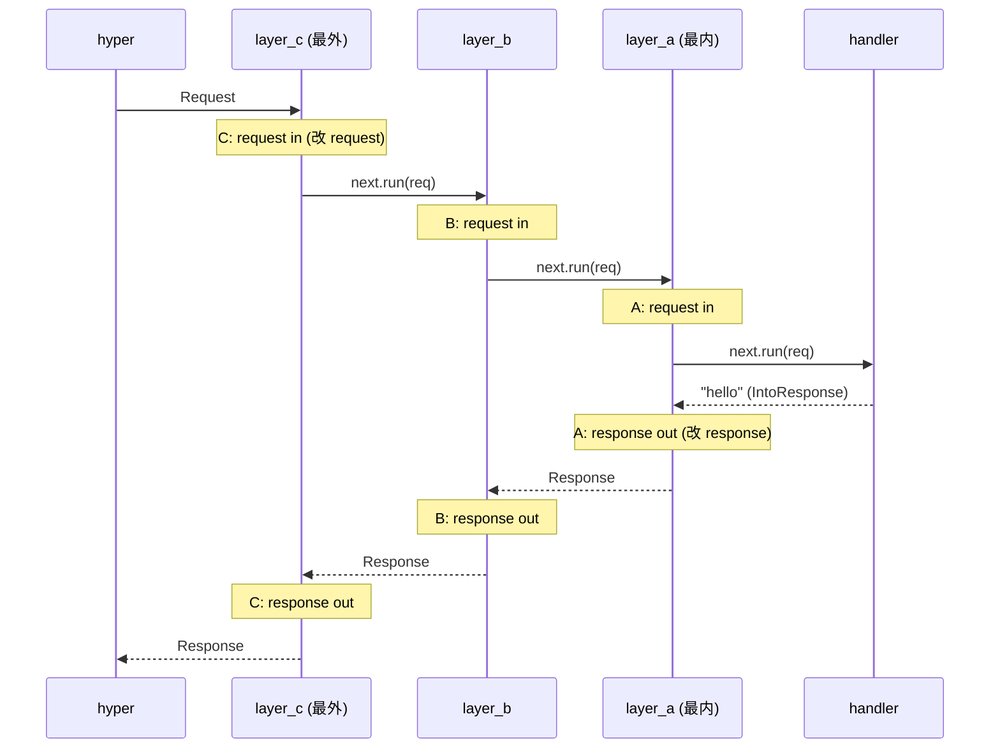

# 第 14 章 · from_fn:把闭包变中间件

> **核心问题**:鉴权、日志、压缩、限流、链路追踪、请求计时——这些是几乎每个 Web 服务都要做的"横切关注"(cross-cutting concern)。可你绝不希望把鉴权代码塞进每个 handler,也不希望把日志 `println!` 散落在五十个业务函数里。axum 让你用一个 `async fn(request, next) -> response` 闭包写中间件,然后 `middleware::from_fn(closure)` 把它变成一个 Tower `Layer`,套在 Router/handler 外面。这个 `from_fn` 内部到底干了什么?它怎么把一个对用户友好的 `async fn` 闭包,适配成 Tower 那个 `Layer: Fn(Service) -> Service` 的形状?闭包里那句 `next.run(request).await` 凭什么能既改 request 又改 response?`map_request`/`map_response` 又是 `from_fn` 的什么简化版?
>
> **读完本章你会明白**:
>
> 1. 为什么 axum 不发明自己的中间件系统,而是直接复用 Tower 的 `Layer`/`Service`(承《Tower》),然后在 `Layer` 之上加一层 `from_fn` 便利层——以及这层"便利"到底替用户省了什么(免写 `impl Layer + impl Service + 手写 Future` 三件套);
> 2. `from_fn` 怎么把一个 `async fn(提取器..., Request, Next) -> impl IntoResponse` 闭包,**编译期桥接**成一个 `FromFnLayer` → `FromFn`(实现 `tower::Service`)的结构,中间 `Next` 怎么包装内层 Service、`next.run(req).await` 为什么是"洋葱的分界线";
> 3. 三种写法的边界:`from_fn`(完全自由,既能改 request 也能改 response,还能短路)、`map_request`(只改 request 后透传)、`map_response`(先跑内层拿 response 再改)各干什么、什么时候用哪个,以及它们和 Tower 自带的 `MapRequest`/`MapResponse` combinator 的差别;
> 4. 中间件链的"洋葱模型"在 axum 里到底怎么落地——`Router::layer` vs `route_layer` vs `MethodRouter::layer` vs `Handler::layer` 四个挂载点(承 P2-08 的 route_layer 作用域)的执行顺序,以及"后加的 layer 先执行 request、最后执行 response"这条规则为什么这么定。
>
> 本章是第 4 篇(中间件)的**招牌章**,也是全书"中间件这条副线"的真正入口。前 13 章你看到的都是"一次请求怎么找到 handler、参数怎么提、返回值怎么变 Response"——那是"路由与提取响应"的主线。这一章开始,我们在 handler 外面套圈:请求进来先过圈、再进 handler;response 出来再过圈,最后才还给 hyper。这套"圈"就是中间件,而 `from_fn` 是 axum 给你写圈的最顺手的那把刀。
>
> **写给谁读**:你大概写过 `Router::new().route("/", get(handler)).layer(middleware::from_fn(auth_middleware))`,也知道 `auth_middleware` 长什么样(`async fn(req, next) -> Response { next.run(req).await }`),但你讲不清这个 `from_fn` 返回的 `FromFnLayer` 内部长什么样、它怎么实现 `tower::Layer`、`Next` 这个类型内部装的是什么、为什么 `next.run(req).await` 这一句能同时拿到 request 和 response。你也许还混淆过 `from_fn` 和 Tower 的 `MapRequest`/`util::MapRequestLayer`,或者搞不清 `map_request` 和 `from_fn` 到底差在哪。这本书写给你。
>
> **前置知识**:假设你读过 P1-03(Router 与 Route 都是 Service,知道 `Route` 是 `BoxCloneSyncService` 类型擦除)、P2-08(fallback 与 404,知道 `route_layer` 的作用域)、P3-09/P3-10(Handler trait 和提取器二元划分,知道 `FromRequest`/`FromRequestParts` 怎么在 `call` 里跑)。Tower 的 `Layer`/`Service` trait 本身《Tower》拆透了,本章只在用到时一句带过指路。
>
> **逃生阀**:如果 Tower 的 `Layer`/`Service` 你完全不熟,先记住一句话——**Tower 的 `Layer` 是个"工厂":给它一个内层 `Service`,它返回一个外层 `Service`;外层 `Service::call` 里可以决定调不调内层、什么时候调、调之前改什么、调之后改什么**。`from_fn` 干的就是把这个"工厂 + Service 套娃"包成一个对用户友好的 `async fn` 闭包签名。带着这句话跳到第二节看 `from_fn` 怎么拆,再回头读桥接细节。

---

## 一句话点破

> **`from_fn` 干的事,是把 Tower 那个"写中间件要 impl Layer + impl Service + 手写 Future"的三件套,压缩成一个 `async fn(request, next) -> response` 闭包——你只写一个 async fn,框架帮你把它包成 `FromFnLayer`(impl `tower::Layer`)→ `FromFn`(impl `tower::Service`)的套娃;闭包里那句 `next.run(request).await` 就是"洋葱的分界线",它之前你能改 request、之后你能改 response,因为 `await` 返回的是内层产出的 `Response`。**

这是结论,不是理由。本章倒过来拆:Tower 的 Layer 长什么样、为什么直接写它繁琐,`from_fn` 怎么把闭包桥接成 Layer,`Next.run` 凭什么是分界线,以及 `map_request`/`map_response` 是从 `from_fn` 里裁出来的什么简化版。

---

## 第一节:横切关注——为什么需要中间件这一层

### 提出问题

写一个真正的 Web 服务,你会发现有一堆活是"几乎所有 handler 都要做、但又不属于任何单个 handler 的业务":

- **鉴权**:`/admin/*` 下所有 handler 都要校验 token,`/api/*` 下所有 handler 都要校验 API key。你不希望在 50 个 admin handler 里复制粘贴 `let token = headers.get(AUTHORIZATION)...; if !valid(token) { return UNAUTHORIZED }`。
- **日志/追踪**:每个请求进来记一行 `INFO req received method=GET path=/users/42`,每个请求出去记一行 `INFO req done status=200 elapsed=12ms`。你希望在"所有 handler 外面"统一做,而不是每个 handler 自己 `println!`。
- **压缩**:response body 大于 1KB 就 gzip 压一下,根据 `Accept-Encoding` header 决定。你希望这个判断在"response 返回前"统一做,不希望每个 handler 自己 `gzip_encode`。
- **限流**:每个 IP 每秒最多 100 个请求。你希望在"请求进 handler 前"统一判,不希望每个 handler 自己 `rate_limiter.check(ip)`。
- **链路追踪**:给每个请求分配一个 `request_id`,塞进 `tracing` 的 span,所有日志都带这个 id。你希望在"请求最外层"统一做,让 handler 里 `tracing::info!` 自动带上 request_id。
- **请求计时**:每个请求记一下耗时,做监控。
- **CORS**:浏览器跨域请求要回 `Access-Control-Allow-Origin` 等 header,统一加。
- **请求体大小限制**:默认 2MB,超过 413。

这些活有个共同名字:**横切关注**(cross-cutting concern)——它们"横切"所有 handler,不属于任何单个业务。如果把它们塞进每个 handler,后果是:

1. **样板爆炸**:50 个 handler × 5 个横切关注 = 250 处复制粘贴。
2. **耦合**:handler 函数里混着鉴权、日志、压缩代码,业务逻辑被淹没。
3. **漏改**:某个新 handler 忘了加鉴权 → 安全漏洞;某个老 handler 忘了加压缩 → 性能问题。
4. **难维护**:鉴权逻辑改了,要改 50 处。

每个成熟的 Web 框架都给了一套"中间件"机制来治这个病。axum 的答案就是:**Tower Layer**。但 Tower 的 Layer 写起来繁琐,所以 axum 在 Layer 之上加了一层 `from_fn` 便利层——让你用一个 `async fn` 闭包写中间件,框架帮你套成 Layer。

### hyper/Tower 怎么做(以及为什么 Tower Layer 还不够顺手)

> **承接《Tower》**:Tower 的 `Layer`/`Service` trait、`ServiceBuilder` 叠中间件、`poll_ready` 语义、`BoxCloneSyncService` 类型擦除、洋葱模型——《Tower》全书拆透了,本章只在用到时一句带过指路。本章专注 axum 在 Layer 之上加的 `from_fn` 便利层。

Tower 给的"中间件抽象"是 `Layer` trait(在 `tower-layer` crate):

```text
(简化示意,非源码原文;真实定义在 tower-layer crate,本书不编行号)
pub trait Layer<S> {
    type Service;
    fn layer(&self, inner: S) -> Self::Service;
}
```

就一个方法:`layer(&self, inner: S) -> Self::Service`。读法是:**给我一个内层 Service `S`,我返回一个外层 Service**。这个外层 Service 内部持有 `inner`,在它自己的 `Service::call` 里可以决定:调不调 `inner`、什么时候调、调之前对 request 做什么、调之后对 response 做什么。

Tower 的 `Service` trait(在 `tower-service` crate):

```text
(简化示意,非源码原文;真实定义在 tower-service crate)
pub trait Service<Request> {
    type Response;
    type Error;
    type Future: Future<Output = Result<Self::Response, Self::Error>>;
    fn poll_ready(&mut self, cx: &mut Context<'_>) -> Poll<Result<(), Self::Error>>;
    fn call(&mut self, req: Request) -> Self::Future;
}
```

读法是:**`poll_ready` 问"你准备好接请求了吗",`call` 真正处理请求,返回一个 Future 产出 `Result<Response, Error>`**。这套语义(背压、`&mut self`、`mem::replace` 惯用法)《Tower》拆透了,本章一句带过。

那么,直接用 Tower 写一个"日志中间件",你要写多少?axum 的官方文档(`axum/src/docs/middleware.md`)给了一个"手写 Layer + Service + BoxFuture"的模板,我们摘出来看:

```rust
// 朴素写法:手写 Tower Layer + Service 写一个日志中间件(简化示意,非 axum 实际做法)
use axum::{response::Response, extract::Request};
use futures_util::future::BoxFuture;
use tower::{Service, Layer};
use std::task::{Context, Poll};

#[derive(Clone)]
struct LogLayer;

impl<S> Layer<S> for LogLayer {
    type Service = LogMiddleware<S>;
    fn layer(&self, inner: S) -> Self::Service {
        LogMiddleware { inner }
    }
}

#[derive(Clone)]
struct LogMiddleware<S> {
    inner: S,
}

impl<S> Service<Request> for LogMiddleware<S>
where
    S: Service<Request, Response = Response> + Send + 'static,
    S::Future: Send + 'static,
{
    type Response = S::Response;
    type Error = S::Error;
    type Future = BoxFuture<'static, Result<Self::Response, Self::Error>>;

    fn poll_ready(&mut self, cx: &mut Context<'_>) -> Poll<Result<(), Self::Error>> {
        self.inner.poll_ready(cx)
    }

    fn call(&mut self, request: Request) -> Self::Future {
        let future = self.inner.call(request);
        Box::pin(async move {
            let response: Response = future.await?;
            tracing::info!(status = response.status().as_u16(), "done");
            Ok(response)
        })
    }
}
```

数一下,这是 **2 个 struct(`LogLayer` + `LogMiddleware<S>`)+ 2 个 impl(`Layer` + `Service`)+ 1 个 `BoxFuture` 类型标注 + `poll_ready` 转发 + `call` 里手动 `Box::pin` 一个 async 块**。能跑,但读起来几个问题:

1. **样板多**:每个中间件都要写这一整套。鉴权、压缩、限流各写一遍,代码量是 `from_fn` 版本的 3~5 倍。
2. **类型签名绕**:`type Response = S::Response` / `type Error = S::Error` / `type Future = BoxFuture<'static, Result<...>>`,新手看一眼就晕。
3. **`BoxFuture` + 手动 `Box::pin`**:每次调用一次堆分配。Tower 的"最顺手"写法不是零成本的(零成本版要手写 `impl Future` 的状态机,更难)。
4. **错误处理位置奇怪**:中间件的 `Error` 通常是 `S::Error`,但 axum 的 `Router` 要求 `Error = Infallible`——你写完中间件还得套个 `HandleErrorLayer` 兜底,又一圈。
5. **`poll_ready` 的样板转发**:每个中间件都要写一遍 `self.inner.poll_ready(cx)`,因为 Tower 的背压约定要求中间件把 ready 状态透传给内层。axum 自己的 `poll_ready` 是无条件 Ready 的(承 P1-03),所以这层转发在 axum 里其实是空转。

> **承接《Tower》**:为什么 Tower 的 Layer 写起来繁琐?因为 Tower 的目标是"通用、零成本、可发布为独立 crate"——它要支持任意 `Service`(不止 axum 的 `Request`),要支持背压(所以有 `poll_ready`),要支持手写 `impl Future`(零成本版)。这套"通用 + 零成本"的设计代价是写法繁琐。《Tower》拆透了 Layer/Service/poll_ready/ServiceBuilder,本章不重复,只看 axum 怎么在这之上加便利层。

### 不这样会怎样:把鉴权塞进每个 handler

如果不用中间件,直接把鉴权塞进每个 handler,会长这样:

```rust
// 朴素写法:鉴权塞进每个 handler(非 axum 推荐做法)
async fn admin_list_users(
    headers: HeaderMap,
    State(auth): State<AuthService>,
) -> Result<Json<Vec<User>>, StatusCode> {
    // ★ 每个 admin handler 都要复制这段鉴权
    let token = headers.get(AUTHORIZATION)
        .and_then(|v| v.to_str().ok())
        .ok_or(StatusCode::UNAUTHORIZED)?;
    if !auth.verify(token).await {
        return Err(StatusCode::UNAUTHORIZED);
    }
    // 真正的业务
    Ok(Json(auth.list_users().await))
}

async fn admin_delete_user(
    Path(id): Path<u64>,
    headers: HeaderMap,
    State(auth): State<AuthService>,
) -> Result<StatusCode, StatusCode> {
    // ★ 又复制一遍鉴权
    let token = headers.get(AUTHORIZATION)
        .and_then(|v| v.to_str().ok())
        .ok_or(StatusCode::UNAUTHORIZED)?;
    if !auth.verify(token).await {
        return Err(StatusCode::UNAUTHORIZED);
    }
    // 真正的业务
    auth.delete_user(id).await.map_err(|_| StatusCode::INTERNAL_SERVER_ERROR)?;
    Ok(StatusCode::NO_CONTENT)
}

// ... 还有 48 个 admin handler,每个都复制鉴权 ...
```

代价立刻显现:

1. **50 个 handler × 8 行鉴权 = 400 行重复代码**。
2. **耦合**:handler 的签名被迫多了 `HeaderMap` 和 `State<AuthService>`,业务逻辑被淹没。
3. **漏改即漏洞**:某个新 admin handler 忘了复制鉴权 → 越权访问。
4. **改不动**:鉴权逻辑要从 header 换成 cookie?要改 50 处。

这是"横切关注塞进业务"的通病。axum 的解法是把鉴权抽成一个中间件:

```rust
// axum 推荐写法:鉴权抽成 from_fn 中间件
async fn auth_middleware(
    headers: HeaderMap,
    request: Request,
    next: Next,
) -> Result<Response, StatusCode> {
    let token = headers.get(AUTHORIZATION)
        .and_then(|v| v.to_str().ok())
        .ok_or(StatusCode::UNAUTHORIZED)?;
    if !verify(token) {
        return Err(StatusCode::UNAUTHORIZED);   // ★ 短路,不调 next
    }
    Ok(next.run(request).await)                   // ★ 通过,调内层
}

let app = Router::new()
    .route("/admin/users", get(admin_list_users).delete(admin_delete_user))
    .route_layer(middleware::from_fn(auth_middleware));   // ★ 一次挂载,所有 admin 路由生效
```

看差别:鉴权逻辑只写一遍,`route_layer` 挂一次,`/admin/users` 下所有 method 都自动走鉴权。50 个 admin handler 各自只写业务逻辑,签名干净(`async fn admin_list_users(State(db): State<Db>) -> Json<Vec<User>>`),鉴权和业务彻底解耦。漏改不可能——只要路由在 `/admin/*` 下,就必过鉴权。

这就是中间件的价值。问题是,Tower 的 Layer 写起来繁琐(前面那个 `LogLayer + LogMiddleware<S>` 的 2 struct + 2 impl + BoxFuture 套娃),axum 怎么让你写一个 `async fn` 闭包就够?答案就是 `from_fn`。

> **钉死这件事**:中间件解决的是"横切关注不侵入业务"。axum 不发明新的中间件系统,它复用 Tower 的 `Layer`/`Service`(承《Tower》),只在 Layer 之上加一层 `from_fn` 便利层——让你写一个 `async fn` 闭包,框架帮你套成 Layer + Service 套娃。讲不清 `from_fn` 怎么把闭包变 Layer = 没讲 axum 中间件。

---

## 第二节:from_fn 的签名——一个对用户友好的闭包

### 提出问题

第一节说 `from_fn` 让你写一个 `async fn` 闭包就够。那这个闭包的签名长什么样?axum 对它有什么要求?这一节把签名钉死,下一节拆 `from_fn` 怎么把这个签名桥接成 Layer。

### from_fn 闭包的五条要求

看 axum 自己的文档(`axum/src/middleware/from_fn.rs#L21-L30`):

```rust
// axum/src/middleware/from_fn.rs#L21-L30(逐字摘录)
/// Create a middleware from an async function.
///
/// `from_fn` requires the function given to
///
/// 1. Be an `async fn`.
/// 2. Take zero or more [`FromRequestParts`] extractors.
/// 3. Take exactly one [`FromRequest`] extractor as the second to last argument.
/// 4. Take [`Next`](Next) as the last argument.
/// 5. Return something that implements [`IntoResponse`].
```

五条要求,逐条拆:

1. **必须是 `async fn`**:因为中间件内部要 `await`(至少 `next.run(req).await`)。Rust 的 `async fn` 编译成 `impl Future`,axum 内部把这个 future 塞进 `BoxFuture`(下面拆)。
2. **可以有 0 个或多个 `FromRequestParts` 提取器**(前 N-2 个参数):这些提取器只读 `parts`(method/uri/headers/extensions),可多次跑。比如 `headers: HeaderMap`、`State<AppState>`、`Path<HashMap<String, String>>`。承 P3-10 的二元划分。
3. **倒数第二个参数必须是 `FromRequest` 提取器**:通常是 `request: Request`(axum 给 `Request` 实现了 `FromRequest`,承 P3-10)。这个参数可能消费 body。
4. **最后一个参数必须是 `Next`**:`Next` 是 axum 提供的类型,代表"中间件剩下的部分 + handler"。你调 `next.run(request).await` 就是把 request 交给内层。
5. **返回值必须 `impl IntoResponse`**:可以是 `Response`、`Result<Response, StatusCode>`、`(StatusCode, &'static str)` 等等(承 P3-12)。

举个完整例子,五条要求都满足:

```rust
// 一个 from_fn 中间件:鉴权 + 日志
async fn auth_and_log(
    headers: HeaderMap,        // ★ 要求 2:FromRequestParts(只读 parts)
    request: Request,          // ★ 要求 3:FromRequest(倒数第二,可能是 Request)
    next: Next,                // ★ 要求 4:Next(最后)
) -> Result<Response, StatusCode> {   // ★ 要求 5:impl IntoResponse
    // ★ 要求 1:async fn
    let started = std::time::Instant::now();

    // 鉴权:改 request 之前(还没调 next)
    let token = headers.get(AUTHORIZATION)
        .and_then(|v| v.to_str().ok())
        .ok_or(StatusCode::UNAUTHORIZED)?;
    if !verify(token) {
        return Err(StatusCode::UNAUTHORIZED);   // 短路,不调 next
    }

    // 调内层:next.run(req).await 是洋葱分界线
    let response = next.run(request).await;

    // 日志:改 response 之后(await 返回的是 Response)
    let elapsed = started.elapsed();
    tracing::info!(status = response.status().as_u16(), ?elapsed, "req done");

    Ok(response)
}
```

注意这个闭包里三段:**`next.run` 之前**(改 request / 短路)→ **`next.run(req).await`**(调内层)→ **`next.run` 之后**(改 response)。这三段对应"洋葱"的三层:外层中间件进 → 内层 handler → 外层中间件出。这是 `from_fn` 的全部魔力——一个 `async fn` 闭包,把"改 request / 调内层 / 改 response"三件事用顺序代码写出来,不需要回调、不需要状态机。

### 对照:Express middleware 的回调地狱

为了让你感受 `from_fn` 的顺手,对照 Node.js Express 的中间件:

```js
// Express 中间件(回调风格)
function authAndLog(req, res, next) {
    const started = Date.now();

    // 鉴权
    const token = req.headers.authorization;
    if (!token || !verify(token)) {
        res.status(401).send("unauthorized");
        return;            // ★ 短路:不调 next,但 res 已经发了
    }

    // 调内层
    next();                // ★ 这里不 await,直接返回!response 在回调里改

    // 日志:response 在哪改?Express 没直接给,要 hook res.end
    res.on("finish", () => {
        const elapsed = Date.now() - started;
        console.log(`req done status=${res.statusCode} elapsed=${elapsed}ms`);
    });
}
```

Express 的中间件是 `(req, res, next)` 三参 + 回调:`next()` 是个普通函数调用(不是 await),调完立刻返回——response 改不了(因为内层还没跑完),只能 hook `res.on("finish", ...)` 这种事件。多层中间件嵌套时,代码变成回调地狱:

```js
// 多层 Express 中间件:回调套回调
app.use((req, res, next) => {
    auth(req, (err) => {               // 第一层
        if (err) return res.status(401).send();
        log(req, res, () => {           // 第二层
            compress(req, res, () => {  // 第三层
                next();                  // 真正的 handler
            });
        });
    });
});
```

axum 的 `from_fn` 完全没有这个问题。因为是 `async fn` + `await`,`next.run(req).await` 这一句就是"等内层跑完",response 直接拿到。多层嵌套就是顺序代码:

```rust
// axum 多层中间件:顺序代码,无回调地狱
async fn outer(req: Request, next: Next) -> Response {
    // outer 进
    let resp = next.run(req).await;   // ★ await = 等内层(含 middle + handler)跑完
    // outer 出
    resp
}
// 内层是 middle,再内层是 handler,顺序清晰
```

这是 Rust 的 `async`/`await` 给中间件设计的礼物——**把"洋葱模型"用顺序代码写出来,而不是回调**。Express 的回调地狱、Go net/http 的 `func(h Handler) Handler` 闭包链(虽然 Go 也算顺序,但没有 `await`,response 改起来要包一层 `ResponseWriter`),都没有 axum 这么干净。

> **钉死这件事**:`from_fn` 的闭包签名 `async fn(FromRequestParts..., Request, Next) -> impl IntoResponse` 是 axum 对中间件作者最友好的接口。`Next` 是 axum 提供的类型,代表"剩下的中间件 + handler";`next.run(req).await` 是洋葱分界线——之前改 request、之后改 response、不调就短路。这套用顺序代码写洋葱的设计,得益于 Rust 的 async/await,远胜 Express 的回调地狱。

---

## 第三节:from_fn 怎么把闭包变 Layer——桥接的全貌

### 提出问题

第二节看到 `from_fn` 接的是一个 `async fn` 闭包,签名是 `(提取器..., Request, Next) -> impl IntoResponse`。可 Tower 的 `Layer` trait 长这样:`Layer<S> { fn layer(&self, inner: S) -> Self::Service }`,它的 `Service::call` 签名是 `fn call(&mut self, req: Request) -> Self::Future`,future 产出 `Result<Response, Error>`——**根本看不到 `Next` 这个参数**。

那 `from_fn` 怎么把"一个接 `Next` 参数的闭包"适配成"一个不接 `Next` 参数的 Service"?这是本章最硬的一节,我们逐层拆。

### 包装链全貌:FromFnLayer → FromFn → call

先把整条包装链画出来,你脑子里有个图,下面逐层填肉:

```text
                          你的 async fn 闭包
                          (request, next) -> response
                                  ▲
                                  │ 持有
              ┌───────────────────────────────────────┐
              │  FromFn<F, S, I, T>                   │
              │  ├─ f: F       (你的闭包)             │
              │  ├─ inner: I   (内层 Service)         │
              │  └─ state: S   (from_fn_with_state)   │
              │     impl Service<Request> for FromFn  │
              │     call(req):                        │
              │       1. inner clone + replace        │
              │       2. 跑提取器链(parts)            │
              │       3. inner 包成 Next              │
              │       4. 调 f(提取器..., request, next)│
              │       5. future 产出 Response          │
              └───────────────────────────────────────┘
                                  ▲
                                  │ layer(inner) 产出
              ┌───────────────────────────────────────┐
              │  FromFnLayer<F, S, T>                 │
              │  ├─ f: F       (你的闭包)             │
              │  ├─ state: S                           │
              │  └─ _extractor: PhantomData<fn() -> T>│
              │     impl Layer<I> for FromFnLayer     │
              │     layer(inner) -> FromFn {          │
              │       f, state, inner                 │
              │     }                                  │
              └───────────────────────────────────────┘
                                  ▲
                                  │ from_fn(f) / from_fn_with_state(s, f) 构造
              ┌───────────────────────────────────────┐
              │  pub fn from_fn<F, T>(f: F)           │
              │    -> FromFnLayer<F, (), T>           │
              └───────────────────────────────────────┘
```

读法:**用户调 `from_fn(my_middleware)` 得到一个 `FromFnLayer`;`Router::layer(from_fn(...))` 时,Router 内部调 `FromFnLayer::layer(inner_route)`,得到一个 `FromFn`(持有 `f` + `inner` + `state`);`FromFn` 实现 `tower::Service<Request>`,它的 `call(req)` 内部:把 `inner` 包成 `Next`,调用户的闭包 `f(提取器..., req, next)`**。

三层结构,每层职责分明:

- **`FromFnLayer`**:实现 `Layer`,是"工厂"。它持有用户的闭包 `f` 和可选的 `state`,不持有 `inner`(`inner` 是 `layer(inner)` 时才传进来的)。它的 `layer(inner)` 做的事就是把 `f` + `state` + `inner` 一起塞进 `FromFn`。
- **`FromFn`**:实现 `Service<Request>`,是真正的"中间件 Service"。它持有 `f` + `inner` + `state`。它的 `call(req)` 是核心——下面详拆。
- **`Next`**:不是独立的 Service 实例,它是 `FromFn::call` 内部临时构造的、塞给用户闭包的"内层代理"。用户调 `next.run(req).await` 就是调内层 Service。

### from_fn / from_fn_with_state:构造 FromFnLayer

从最外层看起。`from_fn` 和 `from_fn_with_state` 是两个构造函数(`axum/src/middleware/from_fn.rs#L114-L170`):

```rust
// axum/src/middleware/from_fn.rs#L114-L116(逐字摘录)
pub fn from_fn<F, T>(f: F) -> FromFnLayer<F, (), T> {
    from_fn_with_state((), f)
}

// axum/src/middleware/from_fn.rs#L164-L170(逐字摘录)
pub fn from_fn_with_state<F, S, T>(state: S, f: F) -> FromFnLayer<F, S, T> {
    FromFnLayer {
        f,
        state,
        _extractor: PhantomData,
    }
}
```

两个细节:

1. **`from_fn` 就是 `from_fn_with_state((), f)`**:状态默认 `()`。这就是为什么 `from_fn` 不支持 `State<T>` 提取(因为状态是 `()`,从 `()` 提 `State<T>` 提不出来)——文档明确说"For that, use `from_fn_with_state`"(`from_fn.rs#L31`)。要带状态,用 `from_fn_with_state(state, f)`,state 会在 `call` 里传给提取器的 `from_request_parts(&mut parts, &state)`。
2. **`T` 是个 PhantomData**:`FromFnLayer<F, S, T>` 的 `T` 不参与运行时(`_extractor: PhantomData<fn() -> T>`),它是给宏展开用的——下面拆 `impl_service!` 宏时你会看到,`T` 是那个"提取器 tuple",让不同 arity 的 impl 落在不同 `T` 上(承 P3-09 的 `Handler<T, S>` 占位技巧,这里是同一招的复用)。

`FromFnLayer` 的定义(`from_fn.rs#L178-L182`):

```rust
// axum/src/middleware/from_fn.rs#L178-L182(逐字摘录)
#[must_use]
pub struct FromFnLayer<F, S, T> {
    f: F,
    state: S,
    _extractor: PhantomData<fn() -> T>,
}
```

三个字段:`f`(用户闭包)、`state`(可选状态)、`_extractor`(PhantomData,编译期占位)。注意 `f` 和 `state` 都是按值持有,`FromFnLayer` 自己 `Clone`(要求 `F: Clone, S: Clone`,见 `from_fn.rs#L184-L196`)——因为 Router 可能在多处 layer 同一个 `FromFnLayer`(比如 `path_router.layer(layer.clone())` + `fallback_router.layer(layer.clone())`,承 P2-08),所以 Layer 必须 Clone。

### FromFnLayer 实现 Layer:产出 FromFn

`FromFnLayer` 实现 `tower::Layer`(`from_fn.rs#L198-L213`):

```rust
// axum/src/middleware/from_fn.rs#L198-L213(逐字摘录)
impl<S, I, F, T> Layer<I> for FromFnLayer<F, S, T>
where
    F: Clone,
    S: Clone,
{
    type Service = FromFn<F, S, I, T>;

    fn layer(&self, inner: I) -> Self::Service {
        FromFn {
            f: self.f.clone(),
            state: self.state.clone(),
            inner,
            _extractor: PhantomData,
        }
    }
}
```

读法:**`Layer<I> for FromFnLayer<F, S, T>` 说,"给我一个内层 Service `I`,我返回一个 `FromFn<F, S, I, T>`"**。`FromFn` 持有 `f`(用户闭包,clone 一份)、`state`(clone 一份)、`inner`(传进来的内层 Service)。

注意三件事:

1. **`I` 是泛型**:`FromFnLayer` 不假设内层是什么 Service。它可以是 `Route`(axum 的路由叶子,承 P1-03)、可以是另一个 `FromFn`(多层中间件嵌套)、可以是 `MethodRouter` 的某种适配——只要 `I: Service<Request>`,都能套。
2. **`f.clone()`**:每次 `layer(inner)` 都 clone 一份用户闭包。因为同一个 `FromFnLayer` 可能被用来包多个内层(比如 path_router 和 fallback_router 各包一份),闭包必须 Clone。这也是为什么 `from_fn` 的用户闭包约束里有 `F: Clone + Send + 'static`(下面 impl_service 宏里看到)。
3. **`type Service = FromFn<...>`**:`layer` 的产出类型是 `FromFn`,不是 `FromFnLayer` 自己——`FromFnLayer` 是 Layer(工厂),`FromFn` 是 Service(产品),两者职责分明。

`FromFn` 的定义(`from_fn.rs#L231-L236`):

```rust
// axum/src/middleware/from_fn.rs#L231-L236(逐字摘录)
pub struct FromFn<F, S, I, T> {
    f: F,
    inner: I,
    state: S,
    _extractor: PhantomData<fn() -> T>,
}
```

比 `FromFnLayer` 多了个 `inner: I`——内层 Service。这就是"洋葱"的物理体现:`FromFn` 持有 `inner`,它的 `call` 会决定调不调 `inner`、什么时候调。下面拆 `call`。

### FromFn 实现 Service:call 是核心

这是 `from_fn` 的心脏。先看 `FromFn` 实现 `Service<Request>` 的签名(`from_fn.rs#L254-L318`,这是个宏展开,我们看展开后的样子):

```rust
// axum/src/middleware/from_fn.rs#L254-L318(宏展开后的"0 个 FromRequestParts 提取器"版本,逐字摘录)
macro_rules! impl_service {
    (
        [$($ty:ident),*], $last:ident
    ) => {
        #[allow(non_snake_case, unused_mut)]
        impl<F, Fut, Out, S, I, $($ty,)* $last> Service<Request> for FromFn<F, S, I, ($($ty,)* $last,)>
        where
            F: FnMut($($ty,)* $last, Next) -> Fut + Clone + Send + 'static,
            $( $ty: FromRequestParts<S> + Send, )*
            $last: FromRequest<S> + Send,
            Fut: Future<Output = Out> + Send + 'static,
            Out: IntoResponse + 'static,
            I: Service<Request, Error = Infallible>
                + Clone
                + Send
                + Sync
                + 'static,
            I::Response: IntoResponse,
            I::Future: Send + 'static,
            S: Clone + Send + Sync + 'static,
        {
            type Response = Response;
            type Error = Infallible;
            type Future = ResponseFuture;

            fn poll_ready(&mut self, cx: &mut Context<'_>) -> Poll<Result<(), Self::Error>> {
                self.inner.poll_ready(cx)
            }

            fn call(&mut self, req: Request) -> Self::Future {
                // ... call 的内部,下面详拆 ...
            }
        }
    };
}

all_the_tuples!(impl_service);
```

先看 `where` 约束,它就是第二节那五条要求的类型化:

- `F: FnMut($($ty,)* $last, Next) -> Fut`:用户闭包的签名。`$ty` 是 0~N 个 `FromRequestParts` 提取器,`$last` 是 `FromRequest` 提取器(通常是 `Request`),`Next` 固定在最后。注意是 `FnMut`(不是 `FnOnce`),因为 `Service::call` 是 `&mut self`,中间件可能被调多次。
- `$ty: FromRequestParts<S> + Send`:前 N-1 个提取器只读 parts(承 P3-10)。
- `$last: FromRequest<S> + Send`:倒数第二个,可消费 body。
- `Fut: Future<Output = Out> + Send + 'static, Out: IntoResponse + 'static`:返回 future 产出 `IntoResponse`。
- `I: Service<Request, Error = Infallible> + Clone + Send + Sync + 'static`:内层 Service 必须 `Error = Infallible`(承 P5-18 的"Infallible 错误模型")、必须 Clone(因为 `call` 要 clone 一份塞进 future)、必须 `Send + Sync`(因为 future 跨线程跑)。
- `S: Clone + Send + Sync + 'static`:state 类似约束。

`type Response = Response; type Error = Infallible;`——`FromFn` 的 Service 永远 `Error = Infallible`,呼应 axum 框架层的"错误全转 Response"约定(承 P0-01 / P5-18)。`type Future = ResponseFuture;`——返回的 future 类型是 `ResponseFuture`,内部是个 `BoxFuture<'static, Response>`(`from_fn.rs#L367-L377`):

```rust
// axum/src/middleware/from_fn.rs#L367-L377(逐字摘录)
pub struct ResponseFuture {
    inner: BoxFuture<'static, Response>,
}

impl Future for ResponseFuture {
    type Output = Result<Response, Infallible>;

    fn poll(mut self: Pin<&mut Self>, cx: &mut Context<'_>) -> Poll<Self::Output> {
        self.inner.as_mut().poll(cx).map(Ok)
    }
}
```

注意 `ResponseFuture` 把 `BoxFuture<Output = Response>` 适配成 `Future<Output = Result<Response, Infallible>>`——多包了一层 `Ok`,因为 axum 的 Service 约定 `Error = Infallible`,future 产出必须是 `Result`。这个 `.map(Ok)` 是"把不可能出错的 future 包装成 Result future"的惯用法。

> **承接《Tower》**:`mem::replace(&mut self.inner, not_ready_inner.clone())` 这个惯用法——`Service::call` 是 `&mut self`,但 future 要 `'static` 要拿走 `inner`,所以用 `mem::replace` 把 `inner` "偷"出来塞进 future,原位置放一个 clone 继续服务后续请求。这是 Tower 的招牌 idiom,《Tower》拆透了,本章在 `from_fn::call` 里看到时一句带过指路。

现在看 `call` 的内部,这是 `from_fn` 的真正心脏(`from_fn.rs#L283-L315`):

```rust
// axum/src/middleware/from_fn.rs#L283-L315(逐字摘录)
fn call(&mut self, req: Request) -> Self::Future {
    let not_ready_inner = self.inner.clone();
    let ready_inner = std::mem::replace(&mut self.inner, not_ready_inner);

    let mut f = self.f.clone();
    let state = self.state.clone();
    let (mut parts, body) = req.into_parts();

    let future = Box::pin(async move {
        $(
            let $ty = match $ty::from_request_parts(&mut parts, &state).await {
                Ok(value) => value,
                Err(rejection) => return rejection.into_response(),
            };
        )*

        let req = Request::from_parts(parts, body);

        let $last = match $last::from_request(req, &state).await {
            Ok(value) => value,
            Err(rejection) => return rejection.into_response(),
        };

        let inner = BoxCloneSyncService::new(MapIntoResponse::new(ready_inner));
        let next = Next { inner };

        f($($ty,)* $last, next).await.into_response()
    });

    ResponseFuture {
        inner: future
    }
}
```

逐行拆:

**第 284-285 行:`mem::replace` 偷出 ready_inner**:

```rust
let not_ready_inner = self.inner.clone();
let ready_inner = std::mem::replace(&mut self.inner, not_ready_inner);
```

这两行是 Tower 的招牌 idiom(承《Tower》)。读法:`self.inner` 是内层 Service,它实现 `Clone`。我们要在 future 里用 `inner`(调它),但 future 要 `'static`,不能借 `&mut self.inner`。所以:**先 clone 一份 `not_ready_inner`,用 `mem::replace` 把 `self.inner` 的原值"偷"到 `ready_inner`,原位置放 `not_ready_inner`**。这样 `ready_inner` 是 owned 的、可以塞进 future;`self.inner`(现在是 clone)继续服务后续请求。这个 idiom 解决了"`&mut self call` + `'static future`"的矛盾。

**第 287-289 行:clone 闭包 + state + 拆 parts**:

```rust
let mut f = self.f.clone();
let state = self.state.clone();
let (mut parts, body) = req.into_parts();
```

`f` 是用户闭包,clone 一份塞进 future(因为 future `'static`)。`state` 同理。`req.into_parts()` 把 `Request` 拆成 `parts`(method/uri/headers/extensions)和 `body`——这一步是为了接下来跑 `FromRequestParts` 提取器(它们只读 `&mut parts`)。

**第 291-310 行:跑提取器链 + 构造 Next + 调闭包**:

```rust
let future = Box::pin(async move {
    // 1. 跑前 N-1 个 FromRequestParts 提取器(只读 parts)
    $(
        let $ty = match $ty::from_request_parts(&mut parts, &state).await {
            Ok(value) => value,
            Err(rejection) => return rejection.into_response(),   // ★ 提取失败 → 短路返回 Response
        };
    )*

    // 2. parts + body 拼回 Request,跑最后一个 FromRequest 提取器(可消费 body)
    let req = Request::from_parts(parts, body);
    let $last = match $last::from_request(req, &state).await {
        Ok(value) => value,
        Err(rejection) => return rejection.into_response(),
    };

    // 3. 把 ready_inner 包成 Next(类型擦除 + MapIntoResponse)
    let inner = BoxCloneSyncService::new(MapIntoResponse::new(ready_inner));
    let next = Next { inner };

    // 4. 调用户闭包,返回值 into_response
    f($($ty,)* $last, next).await.into_response()
});
```

四步,对照第二节那个 `auth_and_log` 例子:

1. **跑前 N-1 个 `FromRequestParts` 提取器**:对每个 `$ty`(用户的提取器参数,如 `headers: HeaderMap`),调 `from_request_parts(&mut parts, &state)`。失败直接 `return rejection.into_response()`——短路,返回一个错误 Response。这一步承 P3-10 的提取器二元划分。
2. **拼回 Request,跑最后一个 `FromRequest` 提取器**:`parts + body` 拼回 `Request`,调 `$last::from_request(req, &state)`。对 `from_fn` 来说,`$last` 通常是 `Request` 自己(它 `FromRequest` 的实现是 identity,直接返回 req),但用户也可以写别的 `FromRequest` 提取器。失败同样短路。
3. **构造 Next**:这一步是 `from_fn` 的桥接精髓——下面单独拆。
4. **调闭包 + into_response**:`f($ty..., $last, next)` 调用户闭包,`.await` 拿 `Out`(用户返回的 `IntoResponse`),`.into_response()` 变 `Response`。整个 future 产出 `Response`(经 `ResponseFuture` 包装成 `Result<Response, Infallible>`)。

**第 306 行:Next 的构造——桥接的核心**:

```rust
let inner = BoxCloneSyncService::new(MapIntoResponse::new(ready_inner));
let next = Next { inner };
```

这两行是 `from_fn` 把"闭包接 `Next` 参数"适配成"Service 不接 Next 参数"的真正技巧。逐层拆:

- **`ready_inner` 是 `I`**(内层 Service,比如 `Route` 或另一个 `FromFn`),它实现 `Service<Request>`,但它的 `Response` 是个 `IntoResponse` 的具体类型(可能是 `Response`,也可能是别的),不是统一的 `axum::response::Response`。
- **`MapIntoResponse::new(ready_inner)`**:把 `ready_inner` 包一层,让它的 `Response` 变成统一的 `Response`。看 `MapIntoResponse`(`axum/src/util.rs#L48-L97`):

```rust
// axum/src/util.rs#L48-L97(逐字摘录)
#[derive(Clone)]
pub(crate) struct MapIntoResponse<S> {
    inner: S,
}

impl<B, S> Service<http::Request<B>> for MapIntoResponse<S>
where
    S: Service<http::Request<B>>,
    S::Response: IntoResponse,
{
    type Response = Response;
    type Error = S::Error;
    type Future = MapIntoResponseFuture<S::Future>;

    fn poll_ready(&mut self, cx: &mut Context<'_>) -> Poll<Result<(), Self::Error>> {
        self.inner.poll_ready(cx)
    }

    fn call(&mut self, req: http::Request<B>) -> Self::Future {
        MapIntoResponseFuture {
            inner: self.inner.call(req),
        }
    }
}

// ...
impl<F, T, E> Future for MapIntoResponseFuture<F>
where
    F: Future<Output = Result<T, E>>,
    T: IntoResponse,
{
    type Output = Result<Response, E>;

    fn poll(self: Pin<&mut Self>, cx: &mut Context<'_>) -> Poll<Self::Output> {
        let res = ready!(self.project().inner.poll(cx)?);
        Poll::Ready(Ok(res.into_response()))   // ★ 把 IntoResponse 变 Response
    }
}
```

`MapIntoResponse` 是个适配器 Service:它包住 `ready_inner`,把内层产出的 `IntoResponse` 在 future 的 `poll` 里 `.into_response()` 变成统一的 `Response`。这样不管内层是 `Route`(产出 `Response`)还是某个自定义 Service(产出 `(StatusCode, String)` 之类),都被统一成产出 `Response`。

- **`BoxCloneSyncService::new(...)`**:再做一层类型擦除。`MapIntoResponse<ready_inner>` 的具体类型很复杂(嵌套泛型),`BoxCloneSyncService<Request, Response, Infallible>` 把它擦除成一个 `Box<dyn CloneService + Sync + Send>`(承 P1-03 的类型擦除,承《Tower》的 `BoxCloneSyncService`)。这样 `Next` 内部的 `inner` 字段类型是固定的(`BoxCloneSyncService<Request, Response, Infallible>`),不依赖 `ready_inner` 的具体类型——`Next` 才能是个具体类型(不是泛型),用户闭包签名里写 `next: Next` 不用标类型参数。

> **承接《Tower》**:`BoxCloneSyncService` 是 Tower 提供的类型擦除 Service(把 `Service<T> + Clone + Send + Sync + 'static` 擦成 `Box<dyn ...>`),承 P1-03 的"Route 内部是 BoxCloneSyncService"。它的内部原理(`private::CloneAsService` + `private::SyncWrapper`)《Tower》拆透了,本章一句带过指路。axum 这里用它是为了把 `Next.inner` 的类型固定下来。

- **`Next { inner }`**:最后构造 `Next`。`Next` 的定义(`from_fn.rs#L336-L350`):

```rust
// axum/src/middleware/from_fn.rs#L336-L350(逐字摘录)
/// The remainder of a middleware stack, including the handler.
#[derive(Debug, Clone)]
pub struct Next {
    inner: BoxCloneSyncService<Request, Response, Infallible>,
}

impl Next {
    /// Execute the remaining middleware stack.
    pub async fn run(mut self, req: Request) -> Response {
        match self.inner.call(req).await {
            Ok(res) => res,
            Err(err) => match err {},   // ★ Infallible,不可能 Err
        }
    }
}
```

`Next` 就一个字段 `inner: BoxCloneSyncService<Request, Response, Infallible>`——它是"剩下的中间件栈 + handler"的类型擦除代理。`Next::run(mut self, req)` 调 `self.inner.call(req).await`,产出 `Response`(`Err(err) => match err {}` 是处理 `Infallible` 的标准写法——`match` 一个不可能存在的值,编译器知道这个分支不可达)。

注意 `Next::run` 是 `mut self`(按值),不是 `&mut self`——因为 `BoxCloneSyncService::call` 是 `&mut self`,而 `Next` 是个一次性对象(每个中间件闭包拿一个 `Next`,调一次 `run` 就完)。`run` 内部 `mut self` 让 `self.inner.call(req)` 能调(`call` 要 `&mut`)。

### 桥接的全貌:为什么这套设计 sound

把上面三层串起来,`from_fn` 的桥接全貌是:

```text
用户视角:
  from_fn(my_middleware)
    → FromFnLayer { f: my_middleware, state: () }
  Router::layer(from_fn(my_middleware))
    → FromFnLayer::layer(inner_route)
    → FromFn { f: my_middleware, inner: inner_route, state: () }
  hyper 调 FromFn::call(req):
    → 提取器链跑完(短路或继续)
    → ready_inner 包成 Next(经 MapIntoResponse + BoxCloneSyncService)
    → 调 my_middleware(提取器..., req, next)
    → 用户闭包里 next.run(req).await 调内层(inner.call)
    → 内层产出 IntoResponse → MapIntoResponse 变 Response
    → 用户闭包拿到 Response,改完返回
    → into_response() 变最终 Response

Service trait 视角:
  FromFn: Service<Request, Response = Response, Error = Infallible>
  Next:   不是独立 Service,是 FromFn::call 内部的临时对象
          Next.inner: BoxCloneSyncService<Request, Response, Infallible>
          Next::run(self, req) -> impl Future<Output = Response>
```

这套设计 sound(不破坏 Service 语义)的几个关键点:

1. **`FromFn` 的 `Error = Infallible`**:中间件不会把错误冒到 hyper 那层,所有错误(提取器 rejection、用户闭包返回的 `Err`)都在 `into_response()` 这一步变成 Response。这呼应 axum 框架层的"Infallible 错误模型"(承 P0-01 / P5-18)。
2. **`Next.inner` 是 `Infallible` 错误**:内层 Service(`ready_inner`)的 `Error` 必须是 `Infallible`(看 `where I: Service<Request, Error = Infallible>`),所以 `next.run(req)` 不可能 `Err`——`match err {}` 处理的就是这个不可达分支。这保证了"中间件调内层"不会产生未处理错误。
3. **`mem::replace` 让 future `'static`**:`call(&mut self)` 偷出 `inner`,future 拿到 owned 的 `ready_inner`,不借 `&mut self`——这符合 Tower 的"call 返回的 Future 不能借 self"约定(承《Tower》)。
4. **`poll_ready` 转发给内层**:`FromFn::poll_ready` 直接 `self.inner.poll_ready(cx)`,把 ready 状态透传给内层 Service。这是 Tower 中间件的标准约定(承《Tower》)——虽然 axum 的 `poll_ready` 实际上无条件 Ready(承 P1-03),这层转发在 axum 里基本是空转,但语义上保持一致。

> **钉死这件事**:`from_fn` 的桥接 = `FromFnLayer`(impl Layer)+ `FromFn`(impl Service)+ `Next`(内层代理)。`FromFn::call` 内部:跑提取器链 → 把 `ready_inner` 经 `MapIntoResponse`(统一 Response 类型)+ `BoxCloneSyncService`(类型擦除)包成 `Next` → 调用户闭包。用户闭包里 `next.run(req).await` 就是调内层 Service。这套设计 sound,因为错误全 Infallible、future `'static`、poll_ready 转发,完全符合 Tower Service 语义。

---

## 第四节:Next.run 的洋葱语义——为什么它是分界线

### 提出问题

第三节看到 `Next` 是"剩下的中间件栈 + handler"的代理,`next.run(req).await` 调内层。但为什么第二节说"`next.run(req).await` 是洋葱的分界线"?这一节把这条语义钉死。

### 洋葱模型在 axum 里的落地

"洋葱模型"(onion model)是中间件的经典心智模型:请求从外向内穿,响应从内向外穿,每层中间件像洋葱的一层皮。axum 官方文档(`axum/src/docs/middleware.md#L86-L105`)用 ASCII 画了这个洋葱:

```text
        requests
           |
           v
+----- layer_three -----+
| +---- layer_two ----+ |
| | +-- layer_one --+ | |
| | |               | | |
| | |    handler    | | |
| | |               | | |
| | +-- layer_one --+ | |
| +---- layer_two ----+ |
+----- layer_three -----+
           |
           v
        responses
```

读法:`layer_three` 先接 request,做完事传给 `layer_two`,`layer_two` 传给 `layer_one`,`layer_one` 传给 handler;handler 产出 response,反向穿回 `layer_one` → `layer_two` → `layer_three`,最后出 app。

在 axum 里,这个"洋葱"是怎么落地的?答案是:**每个 `from_fn` 中间件就是洋葱的一层皮,`next.run(req).await` 是"穿到下一层"的动作**。看一个三层中间件的例子:

```rust
async fn layer_a(req: Request, next: Next) -> Response {
    println!("A: request in");
    let resp = next.run(req).await;     // ★ 穿到 layer_b(及更内层)
    println!("A: response out");
    resp
}

async fn layer_b(req: Request, next: Next) -> Response {
    println!("B: request in");
    let resp = next.run(req).await;     // ★ 穿到 layer_c(及更内层)
    println!("B: response out");
    resp
}

async fn layer_c(req: Request, next: Next) -> Response {
    println!("C: request in");
    let resp = next.run(req).await;     // ★ 穿到 handler
    println!("C: response out");
    resp
}

async fn handler(_: Request) -> &'static str { "hello" }

let app = Router::new()
    .route("/", get(handler))
    .layer(from_fn(layer_a))
    .layer(from_fn(layer_b))
    .layer(from_fn(layer_c));
```

等等,这个顺序打印什么?如果你猜"A in, B in, C in, handler, C out, B out, A out",那你要小心——axum 的 `layer` 顺序有个反直觉规则,我们下面专门拆。先假设顺序就是 a→b→c(用 `ServiceBuilder` 写就是这样),打印是:

```text
C: request in    ← layer_c 最外层,先接 request
B: request in    ← 穿到 layer_b
A: request in    ← 穿到 layer_a
A: response out  ← layer_a 调 handler 拿 response,改完返回
B: response out  ← response 穿回 layer_b
C: response out  ← response 穿回 layer_c
```

(注意:`layer_a` 是最内层,直接套 handler;`layer_c` 是最外层,先接 request。这个"加 layer 的顺序 vs 执行顺序"的反直觉规则,下一节专门拆。)

用 mermaid 时序图画这个洋葱:



时序图里那条"先向下穿(request in)、再向上穿(response out)"的轨迹,就是洋葱。每一层的 `next.run(req).await` 是"向下穿"的动作,`await` 返回的 `Response` 是"向上穿"的载体。

### next.run(req).await 为什么是分界线

看 `layer_a` 的代码:

```rust
async fn layer_a(req: Request, next: Next) -> Response {
    println!("A: request in");          // ★ ① next.run 之前:能改 request
    let resp = next.run(req).await;     // ★ ② 分界线:调内层
    println!("A: response out");        // ★ ③ next.run 之后:能改 response
    resp
}
```

三段:

- **① `next.run` 之前**:这一段在"调内层之前"执行。你能访问 `req`(Request 的所有权在你手里),可以改它(改 headers、改 uri、塞 extensions)。这一段是"洋葱的 request 阶段"——你拿到的 request 是外层传下来的(还没进内层)。
- **② `next.run(req).await`**:这一句把 `req` 的所有权交给内层(`next.run` 是 `mut self`,按值拿 `req`),`await` 等内层跑完。内层可能是下一层中间件(它内部又调 `next.run`),也可能是 handler(叶子)。`await` 返回的是内层产出的 `Response`——这个 Response 已经是"内层处理完"的结果。
- **③ `next.run` 之后**:这一段在"调内层之后"执行。你能访问 `resp`(Response 的所有权在你手里,因为 `next.run` 返回 owned Response),可以改它(改 status、改 headers、压缩 body)。这一段是"洋葱的 response 阶段"——你拿到的 response 是内层产出的。

所以 `next.run(req).await` 这一句,在时间线上把中间件劈成两半:**前半段操作 request(还能影响内层)、后半段操作 response(内层已经跑完)**。这就是"分界线"的含义。

这套语义的威力在于:**一个 `async fn` 闭包,用顺序代码同时表达了"改 request"和"改 response"两件事**。对比 Express 的回调风格(改 response 要 hook `res.on("finish")`)、对比 Go net/http 的 `func(h Handler) Handler`(改 response 要包一层 `ResponseWriter`),axum 的写法干净得多。这是 Rust async/await 给中间件设计的礼物。

### 三种典型用法:短路、日志、压缩

`next.run` 的分界线语义,催生了 `from_fn` 中间件的三种典型用法:

**用法一:短路(鉴权、限流)**——`next.run` 之前判断,不满足就不调 `next`。

```rust
async fn auth(headers: HeaderMap, req: Request, next: Next) -> Result<Response, StatusCode> {
    let token = headers.get(AUTHORIZATION).and_then(|v| v.to_str().ok());
    match token {
        Some(t) if verify(t) => Ok(next.run(req).await),    // 通过,调内层
        _ => Err(StatusCode::UNAUTHORIZED),                  // ★ 短路,不调 next
    }
}
```

短路中间件只在"request 阶段"做事,不进"response 阶段"。鉴权失败直接 `return Err(...)`,内层(handler 和更内的中间件)根本不会被调。这是 `from_fn` 最常见的用法——`Err` 经 `into_response()` 变成 401 Response 返回。

**用法二:日志、链路追踪、请求计时**——`next.run` 前后都做事。

```rust
async fn log_and_time(req: Request, next: Next) -> Response {
    let started = std::time::Instant::now();
    let method = req.method().clone();
    let path = req.uri().path().to_owned();

    let resp = next.run(req).await;     // 调内层

    let elapsed = started.elapsed();
    tracing::info!(%method, %path, status = resp.status().as_u16(), ?elapsed, "req");
    resp
}
```

日志中间件在 request 阶段记"开始时间 + method + path",在 response 阶段记"耗时 + status"。这种"前后都做事"的中间件,正是 `next.run` 分界线的最佳应用——一个闭包同时表达两段。

**用法三:压缩、CORS、response header 注入**——`next.run` 之后改 response。

```rust
async fn add_version_header(req: Request, next: Next) -> Response {
    let mut resp = next.run(req).await;    // 先调内层拿 response
    resp.headers_mut().insert("x-app-version", "1.2.3".parse().unwrap());
    resp
}
```

这种中间件只在"response 阶段"做事,不碰 request。压缩(根据 `Accept-Encoding` gzip body)、CORS(加 `Access-Control-Allow-Origin`)都是这类。

> **钉死这件事**:`next.run(req).await` 是洋葱的分界线——之前改 request、之后改 response、不调就短路。这套语义让 `from_fn` 闭包用顺序代码同时表达"request 阶段"和"response 阶段",远胜 Express 回调地狱。短路(鉴权)、前后都做(日志)、只改 response(压缩)三种典型用法,都建立在这条分界线上。

---

## 第五节:map_request 与 map_response——from_fn 的简化版

### 提出问题

`from_fn` 完全自由(能改 request、能短路、能改 response),但有些中间件不需要这么多自由——它只想改 request(比如统一加个 header),或者只想改 response(比如压缩)。axum 给这两种简化场景提供了 `map_request` 和 `map_response`,它们是 `from_fn` 裁出来的"只做一侧"的版本。这一节拆它们。

### map_request:只改 request,然后透传

`map_request` 的签名(`map_request.rs#L19-L48` 文档,`#L117-L119` 实现):

```rust
// axum/src/middleware/map_request.rs#L117-L119(逐字摘录)
pub fn map_request<F, T>(f: F) -> MapRequestLayer<F, (), T> {
    map_request_with_state((), f)
}
```

闭包签名:`async fn(FromRequestParts..., Request<B>) -> Request<B>` 或 `Result<Request<B>, E> where E: IntoResponse`(`map_request.rs#L50-L58`)。注意:**没有 `Next` 参数**——因为 `map_request` 不让你控制"调不调内层",它总是调内层(除非你返回 `Err` 短路)。

看 `MapRequest` 的 `Service::call`(`map_request.rs#L277-L316`):

```rust
// axum/src/middleware/map_request.rs#L277-L316(宏展开后,逐字摘录)
fn call(&mut self, req: Request<B>) -> Self::Future {
    let req = req.map(Body::new);

    let not_ready_inner = self.inner.clone();
    let mut ready_inner = std::mem::replace(&mut self.inner, not_ready_inner);

    let mut f = self.f.clone();
    let state = self.state.clone();
    let (mut parts, body) = req.into_parts();

    let future = Box::pin(async move {
        // 1. 跑提取器链(和 from_fn 一样)
        $(
            let $ty = match $ty::from_request_parts(&mut parts, &state).await {
                Ok(value) => value,
                Err(rejection) => return rejection.into_response(),
            };
        )*

        let req = Request::from_parts(parts, body);

        let $last = match $last::from_request(req, &state).await {
            Ok(value) => value,
            Err(rejection) => return rejection.into_response(),
        };

        // 2. ★ 调用户闭包变换 request,不像 from_fn 那样把 Next 给用户
        match f($($ty,)* $last).await.into_map_request_result() {
            Ok(req) => {
                // 3. ★ 拿到变换后的 req,直接调内层(ready_inner.call)
                ready_inner.call(req).await.into_response()
            }
            Err(res) => {
                // 4. ★ 用户返回 Err 就短路(返回 res 这个 Response)
                res
            }
        }
    });

    ResponseFuture {
        inner: future
    }
}
```

对比 `from_fn` 的 `call`,关键差别在第 2-4 步:

- **`from_fn`**:把 `ready_inner` 包成 `Next` 给用户,用户在闭包里决定调不调、什么时候调、调之前之后做什么。
- **`map_request`**:**不构造 `Next`,直接调用户闭包变换 request,然后无条件调 `ready_inner.call(req)`**(除非用户返回 `Err` 短路)。用户闭包的签名是 `(提取器..., Request) -> Request`(或 `Result<Request, E>`),没有 `Next`,所以用户不能"在调内层之后改 response"——`map_request` 只管 request 这一侧。

`map_request` 的两种合法返回类型(`map_request.rs#L355-L386`):

```rust
// axum/src/middleware/map_request.rs#L355-L386(逐字摘录)
mod private {
    use crate::{http::Request, response::IntoResponse};
    pub trait Sealed<B> {}
    impl<B, E> Sealed<B> for Result<Request<B>, E> where E: IntoResponse {}
    impl<B> Sealed<B> for Request<B> {}
}

pub trait IntoMapRequestResult<B>: private::Sealed<B> {
    fn into_map_request_result(self) -> Result<Request<B>, Response>;
}

impl<B, E> IntoMapRequestResult<B> for Result<Request<B>, E>
where E: IntoResponse,
{
    fn into_map_request_result(self) -> Result<Request<B>, Response> {
        self.map_err(IntoResponse::into_response)
    }
}

impl<B> IntoMapRequestResult<B> for Request<B> {
    fn into_map_request_result(self) -> Result<Request<B>, Response> {
        Ok(self)
    }
}
```

这是个 sealed trait(`private::Sealed`),只对 `Request<B>` 和 `Result<Request<B>, E> where E: IntoResponse` 实现。它的作用是让 `map_request` 的用户闭包能返回这两种之一:返回 `Request<B>` 表示"变换成功,继续";返回 `Err(E)` 表示"短路,返回 E 变的 Response"。sealed trait 保证用户不能自己 impl 别的返回类型,API 边界明确。

**典型用法**:`map_request` 用于"只改 request 然后透传"的场景。比如统一加 header、记录请求 path 参数、注入 request_id 到 extensions:

```rust
// 加 x-request-id header
async fn add_request_id<B>(mut req: Request<B>) -> Request<B> {
    let id = uuid::Uuid::new_v4().to_string();
    req.headers_mut().insert("x-request-id", id.parse().unwrap());
    req
}

let app = Router::new()
    .route("/", get(handler))
    .layer(map_request(add_request_id));
```

注意闭包签名是 `async fn(Request<B>) -> Request<B>`——没有 `Next`,没有 state,就是"拿 request 改完还回去"。框架帮你调内层。

### map_response:先跑内层,再改 response

`map_response` 是 `map_request` 的镜像。签名(`map_response.rs#L99-L101` 实现):

```rust
// axum/src/middleware/map_response.rs#L99-L101(逐字摘录)
pub fn map_response<F, T>(f: F) -> MapResponseLayer<F, (), T> {
    map_response_with_state((), f)
}
```

闭包签名:`async fn(FromRequestParts..., Response<B>) -> impl IntoResponse`(`map_response.rs#L30-L40`)。注意:**第一个参数是 `Response<B>`,不是 `Request`**——因为 `map_response` 是"先跑内层拿 response,再改 response"。

看 `MapResponse` 的 `Service::call`(`map_response.rs#L258-L288`):

```rust
// axum/src/middleware/map_response.rs#L258-L288(宏展开后,逐字摘录)
fn call(&mut self, req: Request<B>) -> Self::Future {
    let not_ready_inner = self.inner.clone();
    let mut ready_inner = std::mem::replace(&mut self.inner, not_ready_inner);

    let mut f = self.f.clone();
    let _state = self.state.clone();
    let (mut parts, body) = req.into_parts();

    let future = Box::pin(async move {
        // 1. 跑 FromRequestParts 提取器链(注意:只跑 FromRequestParts,不跑 FromRequest)
        $(
            let $ty = match $ty::from_request_parts(&mut parts, &_state).await {
                Ok(value) => value,
                Err(rejection) => return rejection.into_response(),
            };
        )*

        let req = Request::from_parts(parts, body);

        // 2. ★ 直接调内层(不经过用户闭包),拿 response
        match ready_inner.call(req).await {
            Ok(res) => {
                // 3. ★ 拿到 response 后,调用户闭包变换 response
                f($($ty,)* res).await.into_response()
            }
            Err(err) => match err {}   // Infallible,不可达
        }
    });

    ResponseFuture {
        inner: future
    }
}
```

对比 `map_request`,关键差别:

- **`map_response` 先调内层**(`ready_inner.call(req).await`),拿 `Response`,再调用户闭包变换它。
- **`map_response` 的提取器只跑 `FromRequestParts`**(不跑 `FromRequest`)——因为用户闭包的第一个参数是 `Response`,不是 `Request`,内层调完 request 就没了(被 `ready_inner.call` 消费)。看宏的 `where` 约束(`map_response.rs#L237`):只有 `$ty: FromRequestParts<S>`,没有 `$last: FromRequest`(对比 `from_fn`/`map_request` 都有 `$last: FromRequest`)。所以 `map_response` 的用户不能写 `FromRequest` 提取器(如 `Json<T>`)——文档示例也明确标了"`FromRequest` is not allowed"(`map_response.rs#L125-L126`)。这是和 `from_fn`/`map_request` 的重要差别。

**典型用法**:`map_response` 用于"只改 response"的场景。比如统一加 response header、压缩、CORS:

```rust
// 加 x-app-version header 到所有 response
async fn add_version<B>(mut res: Response<B>) -> Response<B> {
    res.headers_mut().insert("x-app-version", "1.2.3".parse().unwrap());
    res
}

let app = Router::new()
    .route("/", get(handler))
    .layer(map_response(add_version));
```

### 三者对照:from_fn vs map_request vs map_response

把三个放一起对照,边界就清楚了:

| 维度 | `from_fn` | `map_request` | `map_response` |
|------|-----------|---------------|-----------------|
| 闭包签名 | `(FromRequestParts..., FromRequest, Next) -> impl IntoResponse` | `(FromRequestParts..., FromRequest) -> Request<B> \| Result<Request<B>, E>` | `(FromRequestParts..., Response<B>) -> impl IntoResponse` |
| 能改 request | 是(next.run 之前) | 是(这就是它唯一能做的) | 否(request 直接交给内层了) |
| 能短路 | 是(返回 Err / 不调 next) | 是(返回 `Err(E)`) | 否(内层已经跑完了) |
| 能改 response | 是(next.run 之后) | 否(它不接 response) | 是(这就是它唯一能做的) |
| 提取器 | FromRequestParts + FromRequest | FromRequestParts + FromRequest | 只 FromRequestParts(无 FromRequest) |
| 控制粒度 | 完全自由 | 只在 request 阶段 | 只在 response 阶段 |
| 典型场景 | 鉴权、日志、计时(前后都做) | 加 request header、注入 request_id | 加 response header、压缩、CORS |

选型建议:

- **需要"前后都做"或"短路"** → `from_fn`(最自由)。
- **只想改 request** → `map_request`(更简洁,不用写 `Next`)。
- **只想改 response** → `map_response`(更简洁,不用调 `next.run`)。

`map_request`/`map_response` 的价值不是"能做 `from_fn` 做不到的事"(它们做不到),而是**用更窄的 API 表达更窄的意图**——读代码的人看到 `map_request` 就知道"这中间件只碰 request",看到 `map_response` 就知道"只碰 response",不用读完整个闭包才知道。这是 API 设计的"最小权限"原则。

> **承接《Tower》**:`map_request`/`map_response` 这两个名字容易让人想到 Tower 的 `tower::util::MapRequest`/`MapResponse`(和 `ServiceBuilder::map_request`/`map_response`)。差别在哪?axum 的 `map_request`/`map_response` **能跑 axum 的提取器**(FromRequestParts/FromRequest),Tower 的不能(它只接 `Request`,不跑提取器)。axum 自己的文档明确说(`map_request.rs#L20-L22`):"This differs from `tower::util::MapRequest` in that it allows you to easily run axum-specific extractors"。所以 axum 的版本是 Tower 版本的"axum 增强版"。承《Tower》的 MapRequest/MapResponse combinator 一句带过。

---

## 第六节:中间件挂哪——四种 layer 方法的作用域

### 提出问题

写完中间件,你要把它"挂"到 Router 的某个位置。axum 给了四个挂载点:`Router::layer`、`Router::route_layer`、`MethodRouter::layer`、`Handler::layer`。它们挂的位置不同,影响的范围不同。这一节把这四个挂载点钉死,承接 P2-08 的 `route_layer` 作用域。

### 四种 layer 方法的对照

> **承接 P2-08**:`route_layer` 的作用域(只影响已注册的路由,不影响后加的)在 P2-08 拆透了,本章只在用到时一句带过指路。这里把四种 layer 方法一起对照,是为了让你看到全貌。

| 方法 | 挂在哪 | 影响范围 | 典型用法 |
|------|--------|----------|----------|
| `Router::layer` | 整个 Router(含 fallback) | 所有路由 + fallback | 全局中间件(日志、CORS) |
| `Router::route_layer` | 整个 Router(不含 fallback) | 所有路由,**不含 fallback** | 鉴权(不想让 404 走鉴权) |
| `MethodRouter::layer` | 单个路径的所有 method | `/users` 下 GET/POST/... 都走 | 单路径的中间件 |
| `Handler::layer` | 单个 handler | 只这一个 handler | 单 handler 的中间件 |

`Router::layer` vs `Router::route_layer` 的关键差别,看源码(`axum/src/routing/mod.rs#L302-L335`):

```rust
// axum/src/routing/mod.rs#L302-L317(逐字摘录)
pub fn layer<L>(self, layer: L) -> Router<S>
where
    L: Layer<Route> + Clone + Send + Sync + 'static,
    L::Service: Service<Request> + Clone + Send + Sync + 'static,
    // ... 约束 ...
{
    map_inner!(self, this => RouterInner {
        path_router: this.path_router.layer(layer.clone()),         // ★ path_router 套
        fallback_router: this.fallback_router.layer(layer.clone()), // ★ fallback 也套
        default_fallback: this.default_fallback,
        catch_all_fallback: this.catch_all_fallback.map(|route| route.layer(layer)), // ★ catch_all 也套
    })
}

// axum/src/routing/mod.rs#L319-L335(逐字摘录)
#[track_caller]
pub fn route_layer<L>(self, layer: L) -> Self
where
    L: Layer<Route> + Clone + Send + Sync + 'static,
    // ... 约束 ...
{
    map_inner!(self, this => RouterInner {
        path_router: this.path_router.route_layer(layer),   // ★ 只 path_router 套
        fallback_router: this.fallback_router,              // ★ fallback 不套
        default_fallback: this.default_fallback,
        catch_all_fallback: this.catch_all_fallback,        // ★ catch_all 不套
    })
}
```

差别一眼看出:

- **`Router::layer`**:`path_router`、`fallback_router`、`catch_all_fallback` **全都套** layer。这意味着 fallback(404 处理)也走中间件。
- **`Router::route_layer`**:只有 `path_router` 套 layer,`fallback` 系列不套。这意味着 404 请求不走这个中间件。

这个差别的实战意义:**鉴权中间件用 `route_layer`,不用 `layer`**。为什么?因为鉴权失败要返回 401,但 404(路径不匹配)不该走鉴权——一个不存在的路径,你没必要先鉴权再 404,直接 404 就行。如果用 `layer`,fallback 也套鉴权,那未鉴权的请求打到不存在的路径会先吃 401(因为 fallback 走鉴权失败),而不是 404——这不合理。`route_layer` 让 fallback 不走鉴权,未鉴权的请求打不存在路径直接 404,打存在路径但鉴权失败才 401。

`MethodRouter::layer` 和 `Handler::layer` 用法类似,只是作用域更小——前者套单个路径的所有 method,后者套单个 handler。它们的语义和 `Router::layer` 一样(layer 包住内层),只是挂载点不同。

### 执行顺序:后加的 layer 先执行 request

这是 axum 中间件最容易踩的坑。看一个例子:

```rust
let app = Router::new()
    .route("/", get(handler))
    .layer(from_fn(layer_one))    // ★ 先加
    .layer(from_fn(layer_two))    // ★ 后加
    .layer(from_fn(layer_three)); // ★ 最后加
```

执行顺序是什么?如果你猜"layer_one 先接 request",那就反了。实际是 **`layer_three` 先接 request,`layer_one` 最后接 request(最靠近 handler)**。axum 官方文档(`middleware.md#L62-L83`)明确说:"When you add middleware with `Router::layer` (or similar) all previously added routes will be wrapped in the middleware. Generally speaking, this results in middleware being executed from bottom to top."

读法:**每次 `.layer(x)` 都是把"之前所有的路由(含之前加的 layer)"包进 x**。所以:

- `.layer(layer_one)`:handler 外面套 layer_one → `(layer_one(handler))`
- `.layer(layer_two)`:`(layer_one(handler))` 外面套 layer_two → `(layer_two(layer_one(handler)))`
- `.layer(layer_three)`:外面套 layer_three → `(layer_three(layer_two(layer_one(handler))))`

request 进来,最外层是 layer_three,先执行;一层层穿到 handler;response 反向穿回。

```text
        requests
           |
           v        ★ 后加的 layer_three 最先接 request
+----- layer_three -----+
| +---- layer_two ----+ |
| | +-- layer_one --+ | |
| | |               | | |
| | |    handler    | | |  ★ layer_one 最靠近 handler
| | |               | | |
| | +-- layer_one --+ | |
| +---- layer_two ----+ |
+----- layer_three -----+
           |
           v
        responses       ★ layer_three 最后出 response
```

这个"后加先执行"的规则反直觉,所以 axum 推荐**用 `ServiceBuilder` 反过来写**(top-to-bottom,符合人类阅读顺序):

```rust
// axum/src/docs/middleware.md#L123-L152(逐字摘录)
let app = Router::new()
    .route("/", get(handler))
    .layer(
        ServiceBuilder::new()
            .layer(layer_one)      // ★ 写在最前,执行也最前(request 阶段)
            .layer(layer_two)
            .layer(layer_three),
    );
```

`ServiceBuilder` 把多个 layer 组合成一个,**执行顺序是 top-to-bottom**(layer_one 先接 request)。这是因为 `ServiceBuilder` 内部用 `Stack` 层层嵌套,但嵌套方向和 `.layer()` 链相反——`ServiceBuilder` 的第一个 `.layer()` 是最外层。这个语义比 `Router::layer` 链直观,所以官方推荐多中间件用 `ServiceBuilder`。

> **钉死这件事**:axum 的 `.layer()` 链是"后加先执行"(每次 `.layer` 包住之前所有),反直觉;`ServiceBuilder` 是"top-to-bottom"(写在前执行在前),直观。多中间件推荐用 `ServiceBuilder`。`Router::layer` vs `Router::route_layer` 的差别:fallback 走不走——鉴权用 `route_layer`(404 不鉴权)。承 P2-08 的 route_layer 作用域、P4-16 的 ServiceBuilder 链。

---

## 第七节:对照——axum vs actix-web vs Express vs Go

### 提出问题

`from_fn` 不是凭空设计的,它对照着其他框架的中间件机制。这一节把 axum 和 actix-web / Express / Go net/http 的中间件对照钉死,你能更清楚 `from_fn` 凭什么这么干净。

### 四框架中间件对照

| 框架 | 中间件签名 | 调用内层方式 | 改 response | 典型痛点 |
|------|-----------|-------------|-------------|----------|
| **axum** | `async fn(提取器, Request, Next) -> impl IntoResponse` | `next.run(req).await` | await 返回 Response,直接改 | 几乎没有(RPITIT + async/await 全解决) |
| **actix-web** | `Fn(ServiceRequest, Next) -> Future<ServiceResponse>` | `next.call(req).await` | await 返回 ServiceResponse,改完再 OK | ServiceRequest/ServiceResponse 双类型,wrap_fn 签名绕 |
| **Express** | `(req, res, next) => void` | `next()`(不 await) | hook `res.on("finish")` | 回调地狱、改 response 要事件 hook |
| **Go net/http** | `func(h Handler) Handler` | `h.ServeHTTP(w, r)` | 包一层 `ResponseWriter` | 没有 async,改 response 要 wrapper struct |

### actix-web:wrap_fn 与 ServiceRequest/ServiceResponse

actix-web 的中间件机制和 axum 表面像(都有 `next`,都 `await`),但底层有 `ServiceRequest`/`ServiceResponse` 两个独立类型,不像 axum 的 `Request`/`Response` 那么统一。actix 的 `wrap_fn` 风格(简化示意):

```rust
// actix-web wrap_fn(简化示意,非 actix 实际签名)
use actix_web::{dev::Service, web, App, HttpServer};

App::new()
    .wrap_fn(|req, srv| {
        let fut = srv.call(req);    // srv 是 Next 的角色
        Box::pin(async move {
            let res = fut.await?;   // ServiceResponse,不是 axum 的 Response
            // 改 res...
            Ok(res)
        })
    })
```

差别:

1. **`ServiceRequest` / `ServiceResponse` 双类型**:actix 把请求和响应分成两个独立类型,中间件签名要处理类型转换。axum 只有 `Request` 和 `Response`(对应 http crate 的标准类型),更统一。
2. **`wrap_fn` 是 method on `App`**:actix 的中间件主要挂在 `App` 级别,粒度比 axum 的四种 layer 方法粗。
3. **actix 的中间件生态独立**:actix 的 `Transform`/`Service` 和 Tower 的 `Layer`/`Service` 不兼容。你写一个 actix 中间件搬到 axum 用不了。axum 的中间件就是 Tower Layer,可以和 tonic/reqwest 共享。

axum 的优势是**全 Tower**:中间件就是 `tower::Layer`,生态共享。actix 的优势是 actor 模型带来的 long-lived state(但绝大多数 Web 服务不需要)。

### Express:回调地狱

前面第二节已经对照过 Express,这里补完整。Express 的中间件是 `(req, res, next) => void`,三参 + 回调:

```js
// Express(回调风格)
app.use((req, res, next) => {
    console.log("req in");
    next();                    // 调内层,但不 await
    // ★ response 在哪改?要 hook res.on("finish")
    res.on("finish", () => console.log("res out"));
});
```

痛点:

1. **`next()` 不 await**:调完立刻返回,response 改不了(内层还没跑完)。
2. **改 response 要事件 hook**:`res.on("finish", ...)` 是事件回调,多层嵌套时变成回调地狱。
3. **错误处理用 `next(err)`**:错误通过 `next(err)` 传给错误处理中间件,不是 Result 返回值,容易漏。

axum 的 `async fn + await` 彻底治了这病——`next.run(req).await` 一句搞定"调内层 + 等完 + 拿 response"。

### Go net/http:func(Handler) Handler

Go 的中间件是 `func(http.Handler) http.Handler`,闭包包 Handler:

```go
// Go net/http(闭包风格)
func logging(next http.Handler) http.Handler {
    return http.HandlerFunc(func(w http.ResponseWriter, r *http.Request) {
        start := time.Now()
        next.ServeHTTP(w, r)        // 调内层
        // ★ 改 response?w 已经被内层写了,改不了 status
        log.Printf("req done elapsed=%v", time.Since(start))
    })
}

mux.Handle("/", logging(getUser))
```

痛点:

1. **没有 async**:`next.ServeHTTP(w, r)` 是同步调用,内层跑完才返回。Go 的并发靠 goroutine,但单个中间件是同步的。
2. **改 response 要 wrapper struct**:`w http.ResponseWriter` 被内层写过(status 已发),要改 status/header 得包一层 `statusRecorder` struct 记录状态。代码量大。
3. **没有类型安全的提取器**:Go 的 path 参数是 `r.PathValue("id")` 返回 string,要自己转 int。axum 的 `Path<i32>` 编译期类型安全(承 P3-10)。

axum 相比 Go 的优势是 **async/await + 类型安全提取器**——改 response 直接 `let mut resp = next.run(req).await;` 拿到 owned Response 改,不用 wrapper struct;提取器编译期类型检查。

> **钉死这件事**:axum 的 `from_fn` 凭 Rust 的 async/await 把中间件写成顺序代码(改 request → await → 改 response),远胜 Express 回调地狱和 Go 的 ResponseWriter wrapper。对照 actix-web,axum 全 Tower(生态共享)、`Request`/`Response` 统一(无双类型)。这是 Rust 异步给 Web 中间件设计的礼物。

---

## 技巧精解

这一节挑两个最该被钉死的技巧,配真实源码 + 反面对比,单独拆透。

### 技巧一:from_fn 闭包 → Layer → Service 套娃的桥接

**它解决什么问题**:让用户写一个 `async fn(提取器..., Request, Next) -> impl IntoResponse` 闭包,框架自动把它包成 `tower::Layer` + `tower::Service` 的套娃,且不破坏 Service 语义。

**反面对比:为什么不能直接把闭包当 Layer**:

假设 axum 让用户直接写一个实现 `Layer` 的闭包(没有 `from_fn`):

```rust
// 假想的"无 from_fn"axum(非 axum 实际做法)
let auth_layer = |inner: Route| -> SomeService {
    SomeService { inner, /* 用户的状态 */ }
};

Router::new().route("/", get(handler)).layer(auth_layer);
```

错在哪:

1. **闭包不能 impl Layer**:Rust 的孤儿规则不允许对外部 trait(`tower_layer::Layer`)给闭包实现(除非 axum 自己 newtype 一层)。
2. **返回类型 `SomeService` 不明确**:用户要自己定义一个 Service struct,写 `impl Service`,这就回到了"手写 Layer + Service + Future"的三件套。
3. **`Next` 没地方塞**:用户闭包想接 `Next`,但 `Layer::layer(inner)` 只给 `inner`,没有"包装成 Next"这一步——用户要自己包。

所以 axum 必须有个 `from_fn` 桥接:它把用户的"接 `Next` 的闭包"适配成"不接 `Next` 的 Layer"。

**axum 的桥接(逐层拆)**:

第一层——`from_fn` 构造 `FromFnLayer`(承第三节):

```rust
// axum/src/middleware/from_fn.rs#L114-L116 + L164-L170(逐字摘录)
pub fn from_fn<F, T>(f: F) -> FromFnLayer<F, (), T> {
    from_fn_with_state((), f)
}

pub fn from_fn_with_state<F, S, T>(state: S, f: F) -> FromFnLayer<F, S, T> {
    FromFnLayer { f, state, _extractor: PhantomData }
}
```

`from_fn` 返回 `FromFnLayer<F, S, T>`,这是个 owned 的 Layer 工厂。`F` 是用户闭包类型,`S` 是 state,`T` 是提取器 tuple(PhantomData,给宏用)。

第二层——`FromFnLayer` impl `Layer`,产出 `FromFn`(承第三节):

```rust
// axum/src/middleware/from_fn.rs#L198-L213(逐字摘录)
impl<S, I, F, T> Layer<I> for FromFnLayer<F, S, T>
where F: Clone, S: Clone,
{
    type Service = FromFn<F, S, I, T>;

    fn layer(&self, inner: I) -> Self::Service {
        FromFn { f: self.f.clone(), state: self.state.clone(), inner, _extractor: PhantomData }
    }
}
```

`layer(inner)` 把 `f` + `state` + `inner` 塞进 `FromFn`。注意 `inner: I` 是泛型——`FromFnLayer` 不假设内层是什么,任何 `Service<Request>` 都能套。

第三层——`FromFn` impl `Service`,这是桥接的核心(承第三节):

```rust
// axum/src/middleware/from_fn.rs#L283-L315(逐字摘录,宏展开后)
fn call(&mut self, req: Request) -> Self::Future {
    let not_ready_inner = self.inner.clone();
    let ready_inner = std::mem::replace(&mut self.inner, not_ready_inner);   // ★ 偷出 inner

    let mut f = self.f.clone();
    let state = self.state.clone();
    let (mut parts, body) = req.into_parts();

    let future = Box::pin(async move {
        // 跑提取器链...
        // 拼回 req...
        let inner = BoxCloneSyncService::new(MapIntoResponse::new(ready_inner));   // ★ inner 包成 Next
        let next = Next { inner };
        f($($ty,)* $last, next).await.into_response()                              // ★ 调用户闭包
    });

    ResponseFuture { inner: future }
}
```

桥接的核心在两步:

1. **`mem::replace` 偷出 `ready_inner`**:让 future 拿到 owned 的内层 Service(`'static`),不借 `&mut self`。这是 Tower 的招牌 idiom(承《Tower》)。
2. **`ready_inner` 经 `MapIntoResponse` + `BoxCloneSyncService` 包成 `Next`**:`MapIntoResponse` 把内层的 `IntoResponse` 响应统一成 `Response`,`BoxCloneSyncService` 把具体类型擦除成 `BoxCloneSyncService<Request, Response, Infallible>`——这样 `Next.inner` 类型固定,`Next` 才能是具体类型(不是泛型),用户闭包签名 `next: Next` 不用标类型参数。

这两步合起来,把"一个接 `Next` 的闭包"适配成"一个产出 `FromFn`(实现 Service)的 Layer"。用户只写 `async fn(req, next) -> Response`,框架帮你套成 Layer + Service + Next 的完整洋葱皮。

**为什么 sound(不破坏 Service 语义)**:

1. **`Error = Infallible`**:`FromFn` 的 `type Error = Infallible`,`Next.inner` 也是 `Infallible`,所有错误经 `into_response()` 变 Response。中间件不会把错误冒到 hyper(承 P5-18)。
2. **future `'static`**:`mem::replace` 让 future 拿 owned 的 `ready_inner`,不借 `&mut self`,符合 Tower "call 返回的 Future 不能借 self" 约定。
3. **`poll_ready` 转发**:`FromFn::poll_ready` 调 `self.inner.poll_ready(cx)`,透传 ready 状态给内层(承《Tower》的背压约定,虽然 axum 整体忽略背压,但中间件层保持语义一致)。
4. **`Next::run` 按值**:`Next::run(mut self, req)` 是 `mut self`(不是 `&mut self`),因为 `Next` 是一次性对象(每个中间件闭包拿一个,调一次 `run` 就完)。这避免了"Next 被 clone 多次调 run"导致的内层被重复调用。

**朴素地写会撞什么墙**:不用 `from_fn`,你要手写 `Layer + Service + Future` 三件套(第一节那个 `LogLayer + LogMiddleware<S>` 例子),代码量是 `from_fn` 版本的 3~5 倍,且 `BoxFuture` 每次堆分配。`from_fn` 让你写一个 `async fn` 闭包就够,框架帮你套——代价是 `from_fn` 内部也用 `BoxFuture`(`ResponseFuture.inner: BoxFuture<'static, Response>`),所以不是零成本,但比手写三件套顺手得多。如果追求零成本,axum 文档建议直接 impl `tower::Service` + 手写 `impl Future`(`middleware.md#L270-L287`),那是另一条路。

> **钉死这件事**:`from_fn` 的桥接 = `FromFnLayer`(impl Layer,工厂)+ `FromFn`(impl Service,产品)+ `Next`(内层代理)。核心两步:`mem::replace` 偷出 owned inner(让 future `'static`),`MapIntoResponse` + `BoxCloneSyncService` 把 inner 包成类型固定的 `Next`(让用户闭包签名简洁)。这套桥接 sound,完全符合 Tower Service 语义。

### 技巧二:Next.run 的洋葱语义——为什么 await 返回的是 Response

**它解决什么问题**:让用户在一个 `async fn` 闭包里,用顺序代码同时表达"改 request"和"改 response"两件事,而不是回调或状态机。

**反面对比:如果不用 Next,直接调内层会怎样**:

假设 axum 不提供 `Next`,让用户在闭包里直接持有内层 Service:

```rust
// 假想的"无 Next"axum(非 axum 实际做法)
async fn auth<I: Service<Request>>(req: Request, inner: I) -> Response {
    // 鉴权...
    let resp = inner.call(req).await;   // ★ 直接调内层
    // 改 response...
    resp
}
```

错在哪:

1. **`I: Service<Request>` 是泛型**:用户闭包签名要带泛型参数 `I`,但 Rust 的闭包不支持泛型(闭包是匿名类型,不能泛型化)。这就堵死了"用户写泛型闭包"的路。
2. **`inner.call` 是 `&mut self`**:用户拿到 `inner: I`(owned),要调 `inner.call(req)` 需要 `&mut inner`,但 `inner` 是按值传进来的——用户得自己 `let mut inner = inner;`,样板。
3. **类型擦除没了**:`I` 是泛型,不同中间件嵌套时类型爆炸(`I = Route`、`I = FromFn<...>`、`I = Stack<...>`)。用户闭包签名要写一长串泛型约束,不可读。
4. **错误类型不统一**:`I::Error` 是泛型,用户闭包要处理 `Result<Response, I::Error>`,而 `I::Error` 通常是 `Infallible` 但用户得自己标。

axum 的解法是引入 `Next` 类型,把内层 Service **类型擦除 + 统一签名**:

```rust
// axum/src/middleware/from_fn.rs#L336-L350(逐字摘录)
pub struct Next {
    inner: BoxCloneSyncService<Request, Response, Infallible>,
}

impl Next {
    pub async fn run(mut self, req: Request) -> Response {
        match self.inner.call(req).await {
            Ok(res) => res,
            Err(err) => match err {},   // Infallible,不可达
        }
    }
}
```

`Next` 把"任意内层 Service `I`"擦除成"`BoxCloneSyncService<Request, Response, Infallible>`"——一个具体类型。用户闭包签名 `next: Next` 不带泛型,简洁。`Next::run(mut self, req) -> impl Future<Output = Response>` 把"`&mut self call` + `Result<Response, Infallible>` future"两件事压成"按值 run + 产出 Response",用户调 `next.run(req).await` 直接拿 `Response`,不处理 `Result`(因为 `Infallible`)。

**为什么 `next.run(req).await` 返回的是 Response(能改)**:

看 `Next::run` 的签名:`pub async fn run(mut self, req: Request) -> Response`。它是 `async fn`,返回 `Response`(不是 `Result`)。`await` 这个 future 拿到的就是 `Response` 的 owned 值——你可以改它(`let mut resp = next.run(req).await; resp.headers_mut().insert(...);`)。

为什么能这样?因为:

1. **`Next.inner` 是 `Infallible` 错误**:`BoxCloneSyncService<Request, Response, Infallible>`,所以 `self.inner.call(req).await` 产出 `Result<Response, Infallible>`,`Err(err) => match err {}` 处理不可达分支,返回 `Response`。错误在 `Next::run` 内部被"消化"掉了,用户不用处理。
2. **`run` 是 `mut self`(按值)**:`Next` 是一次性对象,调一次 `run` 就消费掉。这让 `self.inner.call(req)`(`call` 要 `&mut self`)能调——`mut self` 让 `self.inner` 可变。同时按值消费避免了"Next 被 clone 多次重复调内层"。

这套设计让用户在闭包里写 `let resp = next.run(req).await;` 就拿到 owned `Response`,改完返回——顺序代码,无回调,无 Result 处理。这是 axum 中间件最顺手的地方。

**多层嵌套时 Next 怎么链**:

`Next.inner` 是内层 Service 经 `MapIntoResponse` + `BoxCloneSyncService` 擦除的。如果内层本身也是个 `FromFn`(多层中间件),那 `Next.inner` 实际是 `BoxCloneSyncService<...>` 包了一个 `FromFn<...>` 包了一个 `MapIntoResponse<...>` 包了一个更内层——层层嵌套,但类型擦除后用户看不到,只看到 `Next`。

调 `next.run(req).await` 时,执行流是:

1. `Next.inner.call(req)` → 调 `MapIntoResponse::call`(它的 `inner` 是更内层的 `FromFn`)
2. `MapIntoResponse::call` 调 `self.inner.call(req)` → 调更内层 `FromFn::call`
3. 更内层 `FromFn::call` 跑自己的提取器链、构造自己的 `Next`、调自己的用户闭包
4. ... 一层层穿到 handler
5. handler 返回 → `IntoResponse` → `Response` 一层层穿回
6. 最外层 `Next.inner.call(req).await` 拿到 `Response`,经 `MapIntoResponse` 的 future poll 时 `.into_response()`(identity,因为已经是 Response 了)

这条链就是"洋葱"的物理实现——每层 `FromFn` 是一层皮,`Next` 是穿到下一层的通道。

> **钉死这件事**:`Next` 是把内层 Service 类型擦除(`BoxCloneSyncService`)、错误统一(`Infallible`)、签名简化(`run(mut self, req) -> Response`,不是 `Result`)的代理。`next.run(req).await` 返回 owned `Response`,用户能直接改——这是 axum 中间件"用顺序代码写洋葱"的根。多层中间件嵌套时,`Next.inner` 是层层 `FromFn` + `MapIntoResponse` 的嵌套(类型擦除后用户看不到),`next.run` 一路穿到 handler。

---

## 章末小结

回到全书的主轴:**路由与分发 vs 提取与响应**。中间件是这条主轴之外的"第三条线"——它套在路由外面(或里面),对 request/response 做横切变换。但中间件本身不是新机制,它就是 Tower `Layer`(承《Tower》),axum 只是在 Layer 之上加了 `from_fn` 便利层。

- **路由与分发这一面**:`Router::layer` / `route_layer` / `MethodRouter::layer` / `Handler::layer` 四个挂载点(承 P2-08、第四节),决定中间件套在路由树的哪一层。中间件不影响路由匹配(路由匹配在 `PathRouter`/`MethodRouter` 里,中间件在它们外面或里面),但它能改 request(影响路由后的处理)或改 response(影响最终输出)。
- **提取与响应这一面**:`from_fn` 闭包的提取器(前 N-1 个 `FromRequestParts` + 倒数第二 `FromRequest`)就是 handler 的提取器同一套(承 P3-10)。中间件能跑提取器,意味着它能复用 axum 的提取生态(`State`/`HeaderMap`/`Path` 等),不需要重新学一套。返回值 `impl IntoResponse`(承 P3-12)也是同一套。

axum 中间件的核心抽象是 Tower `Layer`/`Service`(承《Tower》),`from_fn`/`map_request`/`map_response` 是 axum 在 Layer 之上的便利层——它们把"手写 Layer + Service + Future 三件套"压缩成"一个 async fn 闭包",代价是内部用 `BoxFuture`(不是零成本,但比手写三件套顺手)。如果追求零成本,axum 文档建议直接 impl `tower::Service` + 手写 `impl Future`(`middleware.md#L270-L287`),那是另一条路。

### 五个为什么清单

1. **为什么 axum 不发明自己的中间件系统,而是复用 Tower Layer?** 因为 Tower 已经把"Layer = Fn(Service) -> Service + 洋葱模型 + ServiceBuilder 组合"做成通用抽象,axum 复用它就能和 tonic/reqwest/tower-http 共享中间件生态。axum 只在 Layer 之上加 `from_fn` 便利层,让用户写一个 async fn 闭包就够,不用手写三件套。
2. **为什么 `from_fn` 闭包签名是 `(提取器..., Request, Next) -> impl IntoResponse`,而不是 `(Request, Next) -> Response`?** 因为让中间件能跑 axum 的提取器(`State`/`HeaderMap`/`Path`),复用 handler 的提取生态。提取器约定承 P3-10:前 N-1 个 `FromRequestParts`(只读 parts),倒数第二 `FromRequest`(可消费 body),最后 `Next`。这让中间件能像 handler 一样声明式地拿参数,不用手动从 `Request` 提。
3. **为什么 `next.run(req).await` 是洋葱分界线?** 因为 `next.run(req)` 把 request 按值交给内层(`mut self, req`),`await` 等内层跑完返回 owned `Response`。所以 await 之前能改 request(await 还没调,req 在你手里),await 之后能改 response(await 返回了 owned resp)。这套语义让一个 async fn 闭包用顺序代码同时表达"改 request"和"改 response",远胜 Express 回调地狱。
4. **为什么 `Next` 是具体类型(不是泛型),内部用 `BoxCloneSyncService`?** 因为内层 Service 的具体类型很复杂(嵌套泛型),如果 `Next<I>` 带泛型,用户闭包签名要标类型参数,不可读。`BoxCloneSyncService<Request, Response, Infallible>` 把内层类型擦除成具体类型,`Next` 就成了具体类型,用户写 `next: Next` 不用标泛型。代价是一次类型擦除的虚分派(承 P1-03、《Tower》)。
5. **为什么 `Router::layer` 后加的先执行,`ServiceBuilder` 反过来?** 因为 `.layer(x)` 语义是"把之前所有的路由包进 x",所以链式 `.layer(a).layer(b).layer(c)` 是 `c(b(a(handler)))`,c 最外。`ServiceBuilder` 内部用 `Stack` 反向组合,第一个 `.layer()` 是最外层,符合人类阅读顺序。多中间件推荐 `ServiceBuilder`,顺序直观(承 P4-16)。

### 想继续深入往哪钻

- **`from_extractor`:用提取器做请求校验当中间件** → 下一章 P4-15。`from_fn` 是"写一个闭包",`from_extractor` 是"复用一个提取器"——它把 `FromRequest` 提取器包成 Layer,提取失败就短路。和 `from_fn` 的区别是"`from_extractor` 不接 `Next`,只做校验"。
- **`ServiceBuilder` 怎么叠多个中间件、四种 layer 方法的完整对照** → P4-16。本章点了四种 layer 方法的差别,下一章拆 `ServiceBuilder` 怎么把多个 Layer 组合成一个,以及 `HandleErrorLayer` 怎么兜底非 Infallible 错误。
- **Tower 的 `Layer`/`Service`/`poll_ready` 语义、`BoxCloneSyncService` 类型擦除、`mem::replace` 惯用法** →《Tower》(成网后)。本章的 `from_fn` 桥接建立在这些 Tower 基础上,《Tower》拆透了。
- **hyper 怎么把 axum 的 Service 跑起来(协议层)** →《hyper》P4-P5 + 本书 P5-17。axum 中间件产出 `Response` 后,hyper 编码发出去——承 hyper 协议层。
- **actix-web(`wrap_fn`)/Express(回调)/Go(`func(Handler) Handler`)的中间件对照** → P7-21 收束章。本章点了对照,收束章展开。
- **`Route` 的 `BoxCloneSyncService` 类型擦除** → P1-03。`Next.inner` 用的就是 `BoxCloneSyncService`,P1-03 拆了它怎么在 `Route` 里用。

### 引出下一章

本章你拿到了 axum 中间件的核心:`from_fn` 怎么把一个 `async fn` 闭包桥接成 Tower Layer + Service 套娃,`Next.run` 的洋葱分界线语义,以及 `map_request`/`map_response` 两个简化版。但有个问题我们刻意留到这里——如果你已经写好了一个 axum 提取器(比如 `RequireAuth`),想把它当中间件用(在所有路由前校验),你要怎么办?是用 `from_fn` 包一层(在闭包里手动跑提取器),还是有更直接的 API?这就是下一章 P4-15 的 `from_extractor`——它把 `FromRequest` 提取器直接包成 Layer,提取失败就短路,不用写闭包。`from_extractor` 是 `from_fn` 的"提取器特化版",和 `from_fn` 形成"写闭包 vs 复用提取器"两种中间件写法的选择。下一章拆它。

---

> **本章源码锚点(全部经本地 `../axum/` Grep/Read 核实,版本 axum 0.8.9 / axum-core 0.5.5 / axum-macros 0.5.1 / matchit 0.8.4,commit c59208c86fded335cd85e388030ad59347b0e5ae)**:
>
> - [from_fn / from_fn_with_state 构造 FromFnLayer](../axum/axum/src/middleware/from_fn.rs#L114-L170) —— `from_fn` 就是 `from_fn_with_state((), f)`,要带状态用 `from_fn_with_state`。
> - [FromFnLayer 结构 + Clone + Debug](../axum/axum/src/middleware/from_fn.rs#L178-L226) —— `f: F, state: S, _extractor: PhantomData<fn() -> T>`,Layer 工厂。
> - [FromFnLayer impl Layer 产出 FromFn](../axum/axum/src/middleware/from_fn.rs#L198-L213) —— `type Service = FromFn<F, S, I, T>`,`layer(inner)` 把 f + state + inner 塞进 FromFn。
> - [FromFn 结构](../axum/axum/src/middleware/from_fn.rs#L231-L236) —— `f: F, inner: I, state: S`,比 FromFnLayer 多个 inner。
> - [impl_service! 宏 + all_the_tuples! 展开 FromFn impl Service](../axum/axum/src/middleware/from_fn.rs#L254-L320) —— 核心桥接,`call` 内部跑提取器链 + 构造 Next + 调闭包。
> - [FromFn::call 内部(构造 Next + 调闭包)](../axum/axum/src/middleware/from_fn.rs#L283-L315) —— `mem::replace` 偷 inner、`MapIntoResponse` + `BoxCloneSyncService` 包 Next、调 `f(...)`。
> - [Next 结构 + run + impl Service](../axum/axum/src/middleware/from_fn.rs#L336-L364) —— `Next { inner: BoxCloneSyncService<Request, Response, Infallible> }`,`run(mut self, req) -> Response`。
> - [ResponseFuture(FromFn 的 Future)](../axum/axum/src/middleware/from_fn.rs#L366-L383) —— `BoxFuture<'static, Response>` 包成 `Future<Output = Result<Response, Infallible>>`。
> - [map_request / map_request_with_state](../axum/axum/src/middleware/map_request.rs#L117-L165) —— 只改 request 后透传的简化版。
> - [MapRequest::call(不构造 Next,直接调 inner)](../axum/axum/src/middleware/map_request.rs#L277-L316) —— 调用户闭包变换 request,然后 `ready_inner.call(req)`。
> - [IntoMapRequestResult sealed trait(Request<B> 或 Result<Request<B>, E>)](../axum/axum/src/middleware/map_request.rs#L355-L386) —— map_request 闭包的合法返回类型。
> - [map_response / map_response_with_state](../axum/axum/src/middleware/map_response.rs#L99-L147) —— 先跑内层拿 response 再改的简化版。
> - [MapResponse::call(先调 inner 拿 res,再调闭包)](../axum/axum/src/middleware/map_response.rs#L258-L288) —— 注意只跑 FromRequestParts(不跑 FromRequest)。
> - [MapResponse 手动展开 0~16 提取器](../axum/axum/src/middleware/map_response.rs#L292-L308) —— 不用 `all_the_tuples!`,手写 16 个 impl_service! 调用。
> - [MapIntoResponse(把 IntoResponse 统一成 Response)](../axum/axum/src/util.rs#L48-L97) —— Next.inner 包装的内层,把任意 IntoResponse 响应统一成 Response。
> - [all_the_tuples! 宏定义](../axum/axum/src/macros.rs#L49-L68) —— 对 1~16 个参数递归展开 impl_service。
> - [middleware 模块导出](../axum/axum/src/middleware/mod.rs#L1-L33) —— from_fn/from_fn_with_state/FromFn/FromFnLayer/Next + map_request/map_response + from_extractor + AddExtension + future 类型导出。
> - [middleware.md 官方文档(洋葱模型 + 写中间件四种方式 + 顺序规则)](../axum/axum/src/docs/middleware.md) —— `from_fn`/`from_extractor`/Tower combinator/手写 Service 四种写中间件方式的对照。
> - [Router::layer vs Router::route_layer(fallback 走不走)](../axum/axum/src/routing/mod.rs#L302-L335) —— layer 全套(含 fallback),route_layer 只 path_router。
> - [Route 内部用 BoxCloneSyncService + MapIntoResponse](../axum/axum/src/routing/route.rs#L31-L72) —— Route 的类型擦除,Next.inner 用同一个 BoxCloneSyncService。
>
> **承接**:① Tower 的 `Layer`/`Service`/`poll_ready` 语义、`BoxCloneSyncService` 类型擦除、`mem::replace` 惯用法、`ServiceBuilder` 组合 Layer、洋葱模型——《Tower》全书拆透了,本章一句带过指路,本章专注 axum 在 Layer 之上加的 `from_fn` 便利层;② hyper 的 `service::Service`(`call(&self)`,无 `poll_ready`)、协议机、连接管理——axum 中间件产出 `Response` 后 hyper 编码发出去,承《hyper》P1-02 + P4-P5,一句带过指路;③ Tokio 运行时(中间件是 `async fn`,跑在 Tokio 上)一句带过指路 [[tokio-source-facts]];④ P2-08 的 `route_layer` 作用域(本章第六节四种 layer 方法对照时一句带过指路);⑤ P3-09/P3-10 的提取器二元划分(`from_fn` 闭包的提取器链承同一套,本章第二节/第三节用到时一句带过);⑥ P3-12 的 `IntoResponse`(`from_fn` 返回值 `impl IntoResponse` 承同一套)。
