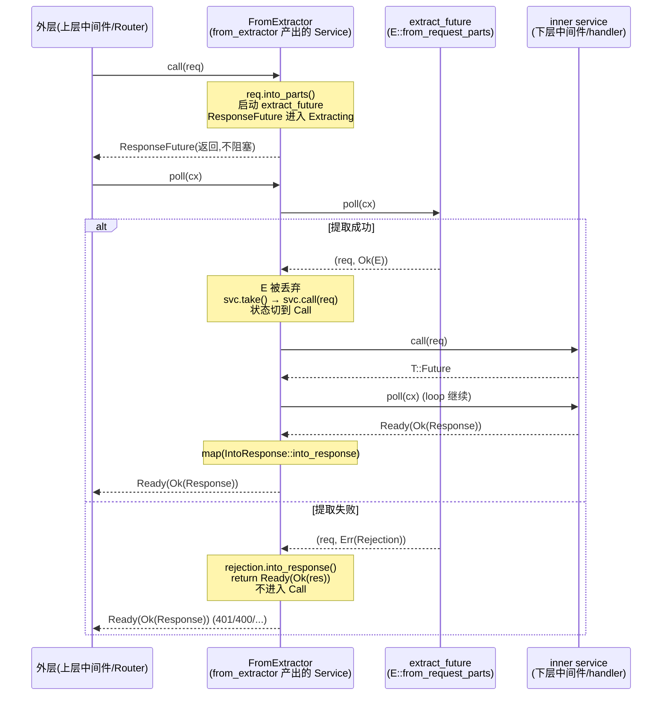

# 第 15 章 · from_extractor:把提取器当中件

> **核心问题**:上一章你学会了 `from_fn`——把一个 `async fn` 闭包变成 Tower Layer,在请求进 handler 之前插一段自由逻辑(鉴权、日志、改 header)。可你已经在 P3-10/P3-11 写过一堆 `FromRequestParts` 提取器了:`Path`、`Query`、`State`、自定义的 `AuthUser`。这些提取器本身就是"从 Request 里抽东西、抽不出来就拒掉(返 Rejection→Response)"的逻辑。能不能把一个**现成的提取器**直接当中间件用——不要我手写一遍 `async fn(headers, req, next)` 的闭包、再在里面手写一遍 header 校验、再 `next.run(req).await`?axum 给的答案是 `middleware::from_extractor`:你给它一个实现了 `FromRequestParts` 的类型 `E`,它给你一个 Tower Layer,在进内层 service 之前先跑一遍 `E::from_request_parts`,**抽出来对就放行调 next、抽不出来就把 Rejection 变成 Response 直接返回(根本不进 handler)**。这跟 `from_fn`(自由闭包)的分工是什么?拒绝路径上 Response 是怎么拼出来的?body 会不会被悄悄吞掉?
>
> **读完本章你会明白**:
>
> 1. 为什么 `from_extractor` 的存在理由是"复用已写好的提取器",以及为什么 axum 官方文档直白地说"如果你只把它当中件用、不打算同一个类型既当提取器又当中件,**优先用 `from_fn`**"——`from_extractor` 是为"一个类型,两种角色"的复用场景留的口子,不是通用首选;
> 2. `from_extractor` 的源码骨架只有三件事:`FromExtractorLayer<E, S>` 包一份 state(可能 `()`)、`FromExtractor<T, E, S>` 是套了内层 service 的 Tower Service、`ResponseFuture` 是一个两态状态机(`Extracting` 跑提取器 → `Call` 跑内层),拒绝路径在两态之间一刀切——**校验失败就 `into_response` 直接 Ready 返回、内层 service 根本不被 `call`**;
> 3. **本章最关键的一处事实修正**:axum 0.8.9 的 `from_extractor` 把 `E` 约束在 `FromRequestParts<S>`(不是 `FromRequest`),抽出来的 `E` 值**直接丢弃**(`let _ = extracted`),**不**像某些资料说的那样"塞进 extensions 供下游复用"。源码这么写是有理由的——它把"复用提取结果"这件事留给用户在 `from_fn` 里手写(把 `E` 装进 `req.extensions_mut().insert(...)`),`from_extractor` 只保证"提前跑一遍、拒掉就走人";
> 4. 为什么 `from_extractor` 内部的 `poll_ready` 是 `self.inner.poll_ready(cx)` 的纯透传、`call` 却把"取走就绪内层 service"做成 `svc: Option<T>` + `Option::take`(而不是 `from_fn` 里那套 `std::mem::replace(&mut self.inner, clone)` 惯用法),以及这套实现为什么 sound——内层 service 只在**提取成功**那一刻被 `take` 出来 `call`,提取失败路径根本不碰 `svc`、`Option::take` 之后的 `ResponseFuture` 也没机会再被 `poll`;
> 5. `from_extractor` 和 `from_fn` 的分工对照表,以及对照 actix-web 的 `FromRequest` 当 guard、go net/http 的手写 middleware——为什么 axum 选了"提取器就是中件、中件就是提取器"的统一抽象,既省一种心智、又埋着一个容易踩的坑(丢弃 E 值 → 下游 handler 想复用要重新提一遍)。
>
> 本章属第 4 篇"中间件",二分法归"`中间件`"。承《Tower》的 `Service`/`Layer`(一句带过,见《Tower》P0-01)、承 P4-14 的 `from_fn`(对照主角,反复回扣)、承 P3-10/P3-11 的 `FromRequest`/`FromRequestParts` 与 Rejection→`IntoResponse`(指路,本章把提取器当中件用)。hyper/Tokio 不出现新东西,一句带过。
>
> **写给谁读**:你写过 `Router::new().route("/", get(handler)).route_layer(from_extractor::<RequireAuth>())`,知道它"会先校验",但讲不清:`from_extractor::<RequireAuth>()` 这一行返回的 `FromExtractorLayer` 到底包了什么、它的 `layer(inner)` 产出的 `FromExtractor` Service 在 `call` 里干的第一件事是什么、为什么"校验失败就直接返回不进 handler"是编译期保证不了的运行时分支、为什么你尝试 `from_extractor::<Json<MyPayload>>()` 想拿 body 校验时编译报错(答:E 必须是 `FromRequestParts`,消费 body 的提取器不能这么用)。这一章治这些"会用没懂"。
>
> **前置衔接**:从 P4-14(`from_fn`)接过来——上一章 `from_fn` 是"自由闭包变中间件",这一章 `from_extractor` 是"更专用的:把一个现成的 `FromRequestParts` 提取器包成中间件,做提前校验"。两兄弟长得很像(都有 `Layer`/`Service`/`ResponseFuture`、都有 `_with_state` 版本、都有 `PhantomData`),但分工和取舍不同,本章会反复对照。读 P3-10(FromRequest 二元划分)和 P3-11(具体提取器)能让你更清楚 E 的约束是什么。
>
> **逃生阀(读不下去怎么办)**:本章核心其实就一行源码——`E::from_request_parts(&mut parts, &state).await` 在 `from_extractor` 的 `call` 里被跑一遍,成功就把重组的 `req` 交给 `inner.call`,失败就把 `Rejection` 转 `Response` 直接 `Poll::Ready(Ok(res))`。带着这一行跳到第三节看状态机、第四节看与 `from_fn` 的对照表,再回头读动机。`Pin`/`pin_project_lite` 的细节不熟不要紧,关键看懂"两态状态机怎么在 poll 里推进"。本章处处承《Tower》《hyper》《Tokio》,读过那些收获翻倍,但不是硬性前提。

---

## 一句话点破

> **`from_extractor::<E>()` 干的事是:给你一个 Tower Layer,它套在 inner service 外面,在 `call` 里第一步就把请求 `into_parts` 拆开、跑一遍 `E::from_request_parts(&mut parts, &state)`——抽出 `Ok(_)` 就把 parts 和 body 重新拼回 `Request` 交给 `inner.call`、抽出 `Err(rejection)` 就 `rejection.into_response()` 直接 `Poll::Ready(Ok(res))` 返回,内层 handler **根本不会被调到**。它复用的是你已经写好的 `FromRequestParts` 提取器(`Path`、`Query`、自定义 `AuthUser`),让你不用再在 `from_fn` 闭包里手写一遍同样的提取逻辑。和 `from_fn`(自由闭包)的分工很简单:`from_extractor` 是"用一个现成提取器当中件、丢弃提取结果",`from_fn` 是"自由写闭包、能拿到 `Next` 也能拿到 `Request`、也能往 extensions 里塞东西"。**

这是结论,不是理由。本章要倒过来拆四件事:① 为什么 axum 要给"提取器当中件"单开一个口子(动机),以及为什么官方文档又建议"只当中件就别用它";② `from_extractor` 的源码三件套(Layer / Service / ResponseFuture)长什么样、`call` 内部 `into_parts → from_request_parts → 重组 → 拒则 into_response / 准则 inner.call` 的逻辑怎么落到一个两态状态机里;③ 为什么 0.8.9 把 E 约束在 `FromRequestParts` 而不是 `FromRequest`(讲清一处容易踩的坑),以及为什么"丢弃 E 值"是合理的取舍(虽然听起来浪费);④ 它和 `from_fn` 的分工边界在哪、对照 actix-web 的 guard 和 go net/http 的手写 middleware,axum 这套"提取器即中件"统一抽象赢在哪、亏在哪。

---

## 第一节:为什么需要"提取器当中件"这个口子

### 提问

你已经有了 `from_fn`(P4-14)。它让你写:

```rust
use axum::{extract::Request, middleware::Next, response::Response, http::{HeaderMap, StatusCode}};

async fn auth(headers: HeaderMap, request: Request, next: Next) -> Result<Response, StatusCode> {
    let token = headers
        .get(http::header::AUTHORIZATION)
        .and_then(|v| v.to_str().ok())
        .ok_or(StatusCode::UNAUTHORIZED)?;
    if !token_is_valid(token) {
        return Err(StatusCode::UNAUTHORIZED);
    }
    Ok(next.run(request).await)
}

let app = Router::new()
    .route("/", get(handler))
    .route_layer(middleware::from_fn(auth));
```

(简化示意,非源码原文,改写自 [`axum/src/middleware/from_fn.rs#L65-L110`](../axum/axum/src/middleware/from_fn.rs#L65-L110) 的文档示例)

看起来已经够用了。那 `from_extractor` 解决的到底是什么问题?

答案在两个字:**复用**。`from_fn` 的闭包里,你为了鉴权要手写一遍"读 `Authorization` header、判 token、错就拒"。可你在 P3-10/P3-11 里已经学过,这种"从 Request 抽出某种东西、抽不出就拒"的逻辑,**正是 `FromRequestParts` 提取器的定义**。你完全可以写一个 `AuthUser` 提取器:

```rust
struct AuthUser { /* ... */ }

impl<S> FromRequestParts<S> for AuthUser
where S: Send + Sync,
{
    type Rejection = StatusCode;

    async fn from_request_parts(parts: &mut Parts, state: &S) -> Result<Self, Self::Rejection> {
        let token = parts.headers
            .get(http::header::AUTHORIZATION)
            .and_then(|v| v.to_str().ok())
            .ok_or(StatusCode::UNAUTHORIZED)?;
        if !token_is_valid(token) {
            return Err(StatusCode::UNAUTHORIZED);
        }
        Ok(AuthUser { /* ... */ })
    }
}
```

这个 `AuthUser` 在 handler 里当参数提一遍:

```rust
async fn handler(user: AuthUser) { /* 已鉴权 */ }
```

现在你想**把同一份鉴权逻辑挂在路由层当中间件**(比如给一组路由统一加),但你**不想再写一遍 `from_fn` 闭包里的鉴权代码**——那等于同样的逻辑写两遍。`from_extractor` 就是来填这个缺口的:

```rust
let app = Router::new()
    .route("/", get(handler))
    .route("/foo", post(other_handler))
    .route_layer(from_extractor::<AuthUser>());
```

(逐字摘自 [`axum/src/middleware/from_extractor.rs#L80-L86`](../axum/axum/src/middleware/from_extractor.rs#L80-L86) 的文档示例)

`from_extractor::<AuthUser>()` 把你已经写好的 `AuthUser: FromRequestParts` 提取器直接包成一个 Tower Layer。它进 inner service 之前会跑一遍 `AuthUser::from_request_parts`,拒掉(返回 `Err(StatusCode::UNAUTHORIZED)`)就直接把 `StatusCode` 转成 Response 返回,handler 根本不会被调到。

> **钉死这件事**:`from_extractor` 的存在理由是**"复用一个已经写好的 `FromRequestParts` 提取器当中件"**,让你不用在 `from_fn` 闭包里把同样的提取逻辑再抄一遍。它的核心价值是"一个类型,两种角色":既能当 handler 的参数提取器,也能当路由层的中间件。

### 但官方文档又建议你"只当中件就别用它"

有趣的是,axum 官方文档(`axum/src/docs/middleware.md#axummiddlewarefrom_extractor`)对 `from_extractor` 的态度是**克制**的——原文([`axum/src/docs/middleware.md#L168-L175`](../axum/axum/src/docs/middleware.md#L168-L175),逐字摘录):

> Use [`axum::middleware::from_extractor`] to write your middleware when:
>
> - You have a type that you sometimes want to use as an extractor and sometimes as a middleware. If you only need your type as a middleware prefer [`middleware::from_fn`].

翻译:"当你有一个类型,**有时候当提取器、有时候当中件**时用 `from_extractor`。**如果你只把它当中件用,优先用 `from_fn`。**"

这听起来矛盾:刚说 `from_extractor` 解决的是复用,怎么又劝退?拆开看,理由是 `from_extractor` 有两个**固化**的行为,不一定贴合你的需求:

1. **它把提取出来的 `E` 值丢弃了**。`AuthUser` 提出来了,但 `from_extractor` 的内部代码只关心"成功还是失败",成功的话 `E` 这个值**不会**自动塞进 request extensions、也不会传给 handler。这意味着,handler 里如果想用 `AuthUser` 的字段(比如 `user.id`),还得**自己再当提取器提一遍**(`async fn handler(user: AuthUser)`)——提取逻辑跑了两遍。`from_fn` 就没这个限制,你可以在闭包里 `let user = AuthUser::from_request_parts(...).await?;` 然后 `req.extensions_mut().insert(user.clone());`,handler 里 `Extension(user): Extension<AuthUser>` 直接拿,**只跑一遍**。这是 `from_extractor` 的一个真实代价。

2. **它约束 E 必须是 `FromRequestParts`,不能消费 body**。这一条要专门讲(下一节),先记住:你想 `from_extractor::<Json<MyPayload>>()` 在路由层校验请求体是不是合法的 `MyPayload`,**编译报错**——因为 `Json<T>` 实现的是 `FromRequest`(要消费 body),不是 `FromRequestParts`。`from_extractor` 不允许消费 body 的提取器当中件(理由很硬:body 是只能消费一次的资源,中件层先消费了,handler 就拿不到 body 了)。`from_fn` 闭包里你可以拿到整个 `Request`、自己消费 body、再决定要不要重组传下去,自由度大得多。

> **钉死这件事**:`from_extractor` 是为"同一个类型既要当提取器、又要当中件"的**复用场景**留的口子,**不是通用首选**。如果你的类型只当中件用,官方建议改用 `from_fn`——后者自由度大(能消费 body、能往 extensions 塞东西、能改 Response),代价是你得在闭包里手写一遍提取逻辑。这个"复用 vs 自由"的取舍,是 `from_extractor` vs `from_fn` 的核心分工。

### 不这样会怎样:每个 handler 写一遍鉴权

假设既没有 `from_extractor` 也不写 `from_fn`,你想给一组路由统一加鉴权。朴素的写法是每个 handler 第一行手写一遍鉴权:

```rust
// 朴素写法:每个 handler 都抄一遍鉴权(反面教材)
async fn get_user(user: AuthUser, Path(id): Path<u32>) -> impl IntoResponse {
    // 鉴权已在 AuthUser 提取器里跑过,但要在每个 handler 参数列表里都写一遍 user: AuthUser
    /* ... */
}

async fn create_user(user: AuthUser, State(db): State<Db>, Json(p): Json<CreateUser>) -> impl IntoResponse {
    // 又得写一遍 user: AuthUser
    /* ... */
}

async fn delete_user(user: AuthUser, Path(id): Path<u32>) -> impl IntoResponse {
    // 又一遍
    /* ... */
}
```

这能用(`AuthUser` 作为提取器在每个 handler 里跑),但有两个问题:

1. **每个 handler 参数列表都得挂 `AuthUser`**,忘了挂就是漏鉴权(运行时不会报错,只是这个 handler 没鉴权,直接被未授权请求打到)。这是一种**靠纪律保证的安全性**,很容易因为加新 handler 忘了挂提取器而出事。
2. **鉴权逻辑的"拒掉"路径分散**在每个 handler 的提取器里。想统一改拒掉行为(比如改成返 403 而不是 401、加个日志),要改 N 个地方。

把它改成中间件,这两个问题都消失:**所有走这条路由的请求强制先过中间件**,鉴权是路由层的属性、不依赖每个 handler 记得挂提取器;**拒掉路径只在一处**。`from_extractor::<AuthUser>()` 让你拿到这种"路由层统一校验"的好处,**同时复用**你已经写好的 `AuthUser` 提取器逻辑(不用再 `from_fn` 抄一遍)。

> **对照 actix-web**:actix-web 也有 `FromRequest` trait,但它更接近"guard"的语义——actix 的 handler 参数里挂一个 `FromRequest` 类型,提取失败直接拒掉,**不**当成可独立挂载的中间件层。axum 走得更远:把"提取器"和"中间件"统一到同一个 `FromRequestParts` trait 上,提取器**本身**就能当中间件挂(通过 `from_extractor` 这个薄包装)。这是 axum "一切皆 Service、一切皆提取器"的设计取向的体现。
>
> **对照 go net/http**:go 的中间件是 `func(http.Handler) http.Handler`,你要鉴权就在闭包里手写一遍 header 解析,go 没有"提取器"这个抽象,所以不存在复用问题。axum 因为有了提取器抽象,才会冒出"能不能复用提取器当中件"的需求——`from_extractor` 就是这个需求的答案。

### 所以 axum 这么设计

给两个 API,分工清楚:

- **`from_fn`**(P4-14):自由闭包变中间件。闭包能拿 `Request`、能拿 `Next`、能消费 body、能改 Response、能往 extensions 塞东西。**通用首选**。
- **`from_extractor`**(本章):把一个 `FromRequestParts` 提取器当中件。复用已写好的提取器,但提取结果丢弃、不能消费 body。**复用场景用**。

两个 API 在底层都是同一个套路:`Layer` 包一个 `Service`,`Service::call` 返回一个状态机 `ResponseFuture`。差别在 `call` 内部干什么——`from_fn` 在闭包里手写逻辑(可以复杂到任意程度),`from_extractor` 在固定模板里跑提取器(简单但固化)。下一节把 `from_extractor` 的源码三件套拆开看。

---

## 第二节:源码三件套——Layer / Service / ResponseFuture

`from_extractor.rs` 整个文件不到 400 行(算上文档注释和测试),结构非常对称。核心就是三件套:`FromExtractorLayer`(Layer 工厂)、`FromExtractor`(Service)、`ResponseFuture`(状态机 Future)。这跟 `from_fn` 的 `FromFnLayer` / `FromFn` / `ResponseFuture` 三件套一一对应——你读过 P4-14,这套结构就眼熟。

### 入口函数:`from_extractor` 和 `from_extractor_with_state`

文件顶部两个公开的入口函数([`axum/src/middleware/from_extractor.rs#L89-L101`](../axum/axum/src/middleware/from_extractor.rs#L89-L101),逐字摘录):

```rust
pub fn from_extractor<E>() -> FromExtractorLayer<E, ()> {
    from_extractor_with_state(())
}

/// Create a middleware from an extractor with the given state.
///
/// See [`State`](crate::extract::State) for more details about accessing state.
pub fn from_extractor_with_state<E, S>(state: S) -> FromExtractorLayer<E, S> {
    FromExtractorLayer {
        state,
        _marker: PhantomData,
    }
}
```

就这么多。`from_extractor::<E>()` 是 `from_extractor_with_state::<E, ()>(())` 的语法糖——没有 state 时 state 类型 S 是 `()`。这跟 `from_fn` / `from_fn_with_state` 的关系一模一样(P4-14 已拆),官方之所以提供 `_with_state` 版本,是因为 axum 的 `FromRequestParts::from_request_parts` 第二个参数是 `&S`(state 引用),`from_extractor` 内部要调 `E::from_request_parts(&mut parts, &state)`,这个 state 从哪来?从 Layer 构造时塞进来。`from_extractor::<E>()` 假设 state 是 `()`(对应 `Router<()>`,无状态应用),`from_extractor_with_state::<E, S>(state)` 显式传 state(对应有状态应用,比如 `from_extractor_with_state::<RequireAuth, _>(Secret("secret"))`)。

注意 `from_extractor` 没有像 `from_fn` 那样在闭包参数列表里允许写 `State<S>` 提取器——`from_extractor` 不接闭包,只接类型参数 `E`,所以 state 只能通过 `_with_state` 函数显式传。这是 `from_extractor` 比 `from_fn` 不灵活的又一个体现。

> **承接《Tower》**:这两个入口函数返回的都是一个 `Layer`(`FromExtractorLayer` 实现了 `tower_layer::Layer`)。Layer 是"Service 工厂"——它本身不处理请求,只持有配置(state),等被 `.layer(inner)` 调用时才产出真正的 Service(`FromExtractor`)。这套 Layer/Service 二分是 Tower 的核心抽象,承《Tower》P0-01,本书一句带过。

### 第一件套:`FromExtractorLayer<E, S>`——Layer(配置工厂)

`FromExtractorLayer` 是 Layer 部分,持有配置(state)和提取器类型的 PhantomData([`axum/src/middleware/from_extractor.rs#L109-L152`](../axum/axum/src/middleware/from_extractor.rs#L109-L152),逐字摘录):

```rust
/// [`Layer`] that applies [`FromExtractor`] that runs an extractor and
/// discards the value.
///
/// See [`from_extractor`] for more details.
///
/// [`Layer`]: tower::Layer
#[must_use]
pub struct FromExtractorLayer<E, S> {
    state: S,
    _marker: PhantomData<fn() -> E>,
}

impl<E, S> Clone for FromExtractorLayer<E, S>
where S: Clone,
{
    fn clone(&self) -> Self {
        Self {
            state: self.state.clone(),
            _marker: PhantomData,
        }
    }
}

// Debug impl 省略,会用 type_name::<E>() 打印提取器类型名

impl<E, T, S> Layer<T> for FromExtractorLayer<E, S>
where S: Clone,
{
    type Service = FromExtractor<T, E, S>;

    fn layer(&self, inner: T) -> Self::Service {
        FromExtractor {
            inner,
            state: self.state.clone(),
            _extractor: PhantomData,
        }
    }
}
```

几个值得说的细节:

1. **`state: S`**——持有的就是 state(`from_extractor_with_state` 传进来的那个),`Clone` 时一起 clone。这跟 `FromFnLayer { f, state, _extractor }` 几乎一样的结构,只是 `from_extractor` 不持有闭包 `f`(它没有闭包,提取逻辑全在 `E::from_request_parts` 里)。
2. **`_marker: PhantomData<fn() -> E>`**——这里写的是 `PhantomData<fn() -> E>` 而不是 `PhantomData<E>`。这是个有讲究的写法,跟 drop 检查(drop check)和变型(variance)有关。`PhantomData<fn() -> E>` 等价于"我假装持有一个 *产出* `E` 的函数指针",在变型上对 `E` 是协变的(covariant),且**不**让编译器以为 `FromExtractorLayer` 真的拥有 `E`(影响 drop 检查的精确性)。这套细节是 Rust 高级技巧,在 `from_fn.rs` 里也是同款写法(`_extractor: PhantomData<fn() -> T>`),axum 的所有"持有 trait 约束但实际不拥有值"的 Layer/Service 都用这个 pattern。读者先记住"这是标准写法",细节留到讲 Rust 类型系统的章节。`from_extractor.rs#L160` 那个 `FromExtractor<T, E, S>` 里也是同款 `_extractor: PhantomData<fn() -> E>`。
3. **`impl<E, T, S> Layer<T> for FromExtractorLayer<E, S>`**——注意这里 Layer 的泛型参数是 `T`(被套的 inner service 类型),不是 `E`(提取器)。`Layer::layer(&self, inner: T) -> FromExtractor<T, E, S>`——吃任意 inner service,吐一个 `FromExtractor` Service。这是 Tower Layer 的标准签名:`Layer<S>` 吃一个 Service、吐一个装饰过的 Service。

> **钉死这件事**:`FromExtractorLayer` 干的事就是**"持有 state + 提取器类型的 PhantomData,等被 `.layer(inner)` 时把 state clone 一份、和 inner 一起塞进 `FromExtractor`"**。它本身不碰请求、不跑提取器,纯粹是工厂。

### 第二件套:`FromExtractor<T, E, S>`——Service(请求处理)

`FromExtractor` 是 Service 部分,持有 inner service + state + 提取器类型的 PhantomData。这是真正处理请求的地方([`axum/src/middleware/from_extractor.rs#L157-L232`](../axum/axum/src/middleware/from_extractor.rs#L157-L232),逐字摘录核心):

```rust
/// Middleware that runs an extractor and discards the value.
///
/// See [`from_extractor`] for more details.
pub struct FromExtractor<T, E, S> {
    inner: T,
    state: S,
    _extractor: PhantomData<fn() -> E>,
}

#[test]
fn traits() {
    use crate::test_helpers::*;
    assert_send::<FromExtractor<(), NotSendSync, ()>>();
    assert_sync::<FromExtractor<(), NotSendSync, ()>>();
}

// Clone / Debug impl 省略

impl<T, E, B, S> Service<Request<B>> for FromExtractor<T, E, S>
where
    E: FromRequestParts<S> + 'static,
    B: Send + 'static,
    T: Service<Request<B>> + Clone,
    T::Response: IntoResponse,
    S: Clone + Send + Sync + 'static,
{
    type Response = Response;
    type Error = T::Error;
    type Future = ResponseFuture<B, T, E, S>;

    #[inline]
    fn poll_ready(&mut self, cx: &mut Context<'_>) -> Poll<Result<(), Self::Error>> {
        self.inner.poll_ready(cx)
    }

    fn call(&mut self, req: Request<B>) -> Self::Future {
        let state = self.state.clone();
        let (mut parts, body) = req.into_parts();

        let extract_future = Box::pin(async move {
            let extracted = E::from_request_parts(&mut parts, &state).await;
            let req = Request::from_parts(parts, body);
            (req, extracted)
        });

        ResponseFuture {
            state: State::Extracting {
                future: extract_future,
            },
            svc: Some(self.inner.clone()),
        }
    }
}
```

这段是本章最核心的源码,逐段拆。

#### trait bound:`E: FromRequestParts<S>`(不是 `FromRequest`)

第一个关键点是 trait bound——`E: FromRequestParts<S>`。**不是** `FromRequest<S, M>`。

这是个容易被资料带偏的点。如果你看的是更老的 axum 资料(或者凭印象),你可能会觉得 `from_extractor` 应该接受任何 `FromRequest` 提取器(包括消费 body 的 `Json` / `Form` / `String`)。但 0.8.9 的源码就是 `FromRequestParts`,**写死了**。原因是 sound 性——body 只能被消费一次,`from_extractor` 在中间件层消费 body 之后,handler 就拿不到 body 了。axum 在 API 设计上就堵死了这个口子:只能用只读 parts 的提取器(`Path`、`Query`、`State`、自定义只读 header 的 `AuthUser`)当中件,不能用消费 body 的提取器。

> **承接 P3-10**:FromRequestParts(只读 `&mut Parts`,可多次跑)vs FromRequest(消费 body,只能一次)的二元划分,详见 P3-10。`from_extractor` 在这里选了 `FromRequestParts`,就是利用了"只读 parts 可以被任意多个提取器接力跑"这个 sound 性保证——中件层跑一遍、handler 里再跑一遍(`Path`、`Query` 这种)也不会出问题,因为它们只读 parts 不消费 body。

#### trait bound:`T: Service<Request<B>> + Clone`

第二个关键点是 inner service 的约束——`T: Service<Request<B>> + Clone`,注意 `Clone`。`from_extractor` 在 `call` 里会 `self.inner.clone()`(看下面 `call` 的实现),所以 `T` 必须 `Clone`。这跟 axum 内部所有中间件的要求一致——axum 假设所有 Service 都 `Clone`(路由表里要 Clone 多份),Tower 的 `BoxCloneSyncService` 就是专门为这种"必须 Clone"场景做的类型擦除。

`T::Response: IntoResponse` 这条也值得说——inner service 返回的 Response 类型必须能转成 axum 的 `Response`。这是 `from_extractor` 在最终 Future 里(`Call` 状态)调 `result.map(IntoResponse::into_response)` 的前提。

#### `poll_ready`:纯透传

```rust
#[inline]
fn poll_ready(&mut self, cx: &mut Context<'_>) -> Poll<Result<(), Self::Error>> {
    self.inner.poll_ready(cx)
}
```

`poll_ready` 一行——纯透传给 inner service。`from_extractor` 自己不持有资源(没 channel、没 permit、没连接),它的就绪状态完全取决于 inner service 是否就绪,所以直接转发。这是 Tower 中间件的标准 `poll_ready` 写法,承《Tower》P0-01 一句带过。

注意这里 `poll_ready` 没有跑提取器逻辑——提取在 `call` 返回的 Future 里跑,**不在 `poll_ready` 里**。这跟 axum 整体"忽略背压"的取舍一致(见 P1-03 路由章和 `axum/src/docs/middleware.md#Routing-to-servicesmiddleware-and-backpressure` 段的官方说明):axum 假设所有 service 都不关心背压、永远就绪,真正的工作在 `call` 返回的 Future 里推进。

#### `call`:拆 parts → 跑提取器 → 重组 Request → 装进状态机

```rust
fn call(&mut self, req: Request<B>) -> Self::Future {
    let state = self.state.clone();
    let (mut parts, body) = req.into_parts();

    let extract_future = Box::pin(async move {
        let extracted = E::from_request_parts(&mut parts, &state).await;
        let req = Request::from_parts(parts, body);
        (req, extracted)
    });

    ResponseFuture {
        state: State::Extracting {
            future: extract_future,
        },
        svc: Some(self.inner.clone()),
    }
}
```

这是本章最硬的一段源码,逐行拆:

1. **`let state = self.state.clone();`**——clone 一份 state。state 在异步 Future 里要用(`E::from_request_parts(&mut parts, &state)`),所以必须先 move 出来。`S: Clone` 的约束就是为了这一行。
2. **`let (mut parts, body) = req.into_parts();`**——把 `Request<B>` 拆成 `Parts`(`method`/`uri`/`headers`/`extensions` 等)和 `B`(body)。这是 `http::Request::into_parts` 的标准用法,承 P3-10 提取器二元划分的物理根(`Parts` 可复用、`Body` 只能消费一次)。
3. **`let extract_future = Box::pin(async move { ... });`**——构造一个异步块,跑提取器逻辑。注意:
   - `E::from_request_parts(&mut parts, &state).await`——**这一行是 `from_extractor` 全部的逻辑**。跑提取器,拿到 `Result<E, E::Rejection>`。
   - `let req = Request::from_parts(parts, body);`——把 parts 和 body 重新拼回 `Request<B>`。**这一步关键**:不管提取成功还是失败,parts 和 body 都被拼回成完整的 Request,交给后续逻辑处理(成功就传给 inner、失败拼回去也没用但代码统一)。
   - 返回 `(req, extracted)`——把重组的 Request 和提取结果一起返回,后续 Future 状态机根据 `extracted` 是 `Ok` 还是 `Err` 决定走向。
4. **`ResponseFuture { state: State::Extracting { future: extract_future }, svc: Some(self.inner.clone()) }`**——构造状态机 Future,初始状态 `Extracting`(跑提取器),`svc: Some(self.inner.clone())` 把 inner service clone 一份塞进 Future(注意是 `Some`,后面要 `take`)。

`svc: Some(self.inner.clone())` 这个 `Option<T>` + 后面 `take()` 的写法,跟 P4-14 `from_fn` 里那套 `std::mem::replace(&mut self.inner, clone)` 不一样——本章技巧精解专门拆这个差异。

### 第三件套:`ResponseFuture`——两态状态机

`ResponseFuture` 是状态机 Future,有两个状态:`Extracting`(跑提取器)、`Call`(跑 inner service)。用 `pin_project_lite` 定义([`axum/src/middleware/from_extractor.rs#L234-L300`](../axum/axum/src/middleware/from_extractor.rs#L234-L300),逐字摘录):

```rust
pin_project! {
    /// Response future for [`FromExtractor`].
    #[allow(missing_debug_implementations)]
    pub struct ResponseFuture<B, T, E, S>
    where
        E: FromRequestParts<S>,
        T: Service<Request<B>>,
    {
        #[pin]
        state: State<B, T, E, S>,
        svc: Option<T>,
    }
}

pin_project! {
    #[project = StateProj]
    enum State<B, T, E, S>
    where
        E: FromRequestParts<S>,
        T: Service<Request<B>>,
    {
        Extracting {
            future: BoxFuture<'static, (Request<B>, Result<E, E::Rejection>)>,
        },
        Call { #[pin] future: T::Future },
    }
}

impl<B, T, E, S> Future for ResponseFuture<B, T, E, S>
where
    E: FromRequestParts<S>,
    T: Service<Request<B>>,
    T::Response: IntoResponse,
{
    type Output = Result<Response, T::Error>;

    fn poll(mut self: Pin<&mut Self>, cx: &mut Context<'_>) -> Poll<Self::Output> {
        loop {
            let mut this = self.as_mut().project();

            let new_state = match this.state.as_mut().project() {
                StateProj::Extracting { future } => {
                    let (req, extracted) = ready!(future.as_mut().poll(cx));

                    match extracted {
                        Ok(_) => {
                            let mut svc = this.svc.take().expect("future polled after completion");
                            let future = svc.call(req);
                            State::Call { future }
                        }
                        Err(err) => {
                            let res = err.into_response();
                            return Poll::Ready(Ok(res));
                        }
                    }
                }
                StateProj::Call { future } => {
                    return future
                        .poll(cx)
                        .map(|result| result.map(IntoResponse::into_response));
                }
            };

            this.state.set(new_state);
        }
    }
}
```

这是本章第二个最硬的源码点。逐段拆 `poll`:

#### `loop`:状态机推进循环

`poll` 一进来就是 `loop { ... }`,因为状态机要在两个状态之间切(从 `Extracting` 切到 `Call`),不能在一个 `poll` 里只跑一个状态就返回 `Pending`(那样切状态会延迟到下一次 poll,有性能损耗)。`loop` 让状态切在同一轮 poll 里完成,只要状态切到 `Call` 立刻继续 poll 内层 future。

#### `Extracting` 分支:跑提取器 future

```rust
StateProj::Extracting { future } => {
    let (req, extracted) = ready!(future.as_mut().poll(cx));

    match extracted {
        Ok(_) => {
            let mut svc = this.svc.take().expect("future polled after completion");
            let future = svc.call(req);
            State::Call { future }
        }
        Err(err) => {
            let res = err.into_response();
            return Poll::Ready(Ok(res));
        }
    }
}
```

1. **`ready!(future.as_mut().poll(cx))`**——poll 提取器 future。`ready!` 是个宏,`Pending` 时早 return `Pending`、`Ready(t)` 时 unwrap 出 `t`。这里 `t` 就是 `(req, extracted)`:重组的 Request + 提取结果。
2. **`match extracted`**——拆提取结果,两条路:
   - **`Ok(_)`**——提取成功。**注意下划线 `_`:提取出来的 `E` 值被丢弃了**。`from_extractor` 不把 `E` 塞进任何地方(不进 extensions、不传给 handler)。然后 `this.svc.take().expect(...)`——从 `Option<T>` 里把 inner service 拿出来(take,留下 `None`),`svc.call(req)` 调内层 service,得到 `T::Future`,把状态切到 `Call { future }`。
   - **`Err(err)`**——提取失败(被拒)。`err.into_response()`——`Rejection: IntoResponse`(P3-10 拆过,所有 Rejection 都实现 `IntoResponse`),把 Rejection 转成 `Response`。`return Poll::Ready(Ok(res))`——**直接返回,不切到 `Call` 状态**。这是"拒绝时不进内层"的物理实现:状态机根本不进入 `Call`,inner service 根本没被 `call`。

注意 `Ok(_)` 分支里 `this.svc.take().expect("future polled after completion")` 的 `expect`——`Option::take` 把 `Some(svc)` 取走、留下 `None`,如果之后再被 poll(`take` 返回 `None`),`expect` 就 panic。这是"Future 完成后再被 poll 是 UB"的防御性写法。

#### `Call` 分支:poll 内层 service future

```rust
StateProj::Call { future } => {
    return future
        .poll(cx)
        .map(|result| result.map(IntoResponse::into_response));
}
```

进了 `Call` 状态就是 inner service 在跑。`future.poll(cx)` poll 内层 future,`Poll<Result<T::Response, T::Error>>`,然后 `.map(|result| result.map(IntoResponse::into_response))`——把内层返回的 `T::Response`(实现了 `IntoResponse`)转成 axum 的 `Response`。错误类型 `T::Error` 原样保留(因为 `FromExtractor` 的 `type Error = T::Error`,直接透传)。

注意这里**直接 `return`**,不再进 `loop` 的下一轮——`Call` 是终态,要么 `Pending`(下次 poll 继续)、要么 `Ready`(完成)。`loop` 只在 `Extracting → Call` 切换时不 return、继续下一轮。

> **钉死这件事**:`ResponseFuture` 是个两态状态机,`Extracting`(跑提取器)和 `Call`(跑内层 service)。拒绝路径(`Err(rejection)`)在 `Extracting` 分支里 `return Poll::Ready(Ok(res))` 直接返回,**不**切到 `Call` 状态——这是"校验失败时不进 handler"的源码级实现。成功路径切到 `Call`,继续 poll 内层 future。

#### 整体时序:从 Request 进来到 Response 出去

把上面三段拼起来,一次经过 `from_extractor` 中间件的请求,时序是这样:



时序图清楚展示了"拒绝时不进 inner"的物理路径——`Err` 分支根本不 `inner.call`,直接返回。

---

## 第三节:为什么 E 必须是 `FromRequestParts`(不是 `FromRequest`),以及"丢弃 E 值"的取舍

这一节专门拆两个容易踩的坑——它们都是 `from_extractor` 跟 `from_fn` 的关键差异,也是资料里最容易讲混的点。

### 坑一:E 必须是 `FromRequestParts`

再贴一遍 trait bound([`axum/src/middleware/from_extractor.rs#L198-L205`](../axum/axum/src/middleware/from_extractor.rs#L198-L205)):

```rust
impl<T, E, B, S> Service<Request<B>> for FromExtractor<T, E, S>
where
    E: FromRequestParts<S> + 'static,
    // ...
```

为什么不是 `E: FromRequest<S>`?——答案在 sound 性。

假设允许 `E: FromRequest`(可以消费 body)。`from_extractor` 的 `call` 现在跑 `E::from_request(req, state).await`,这个调用按值拿走整个 `Request`(包括 body)。提取成功的话,`E` 这个值里可能已经把 body 消费掉了(`Json<T>` 把 body 反序列化成 `T`,`String` 把 body 读成字符串)。现在 `from_extractor` 把 `E` 丢弃(下一节讲),然后想 `inner.call(req)`——可 `req` 的 body 已经被消费了!要么 body 字段是个空壳(`from_extractor` 文档里说的"如果提取器消费了 body,会在原位置留一个空 body"),要么根本没法重组。

axum 的设计选择是**堵死这个口子**:E 必须是 `FromRequestParts`(只读 parts、不碰 body)。这样 `req.into_parts()` 拿到的 `parts` 和 `body` 是分开的,提取器只动 `parts`,body 原封不动,`Request::from_parts(parts, body)` 重组的 Request 是完整的、可以安全传给 inner。这是 sound 性的硬约束,axum 在 API 层强制保证。

> **钉死这件事**:你不能 `from_extractor::<Json<MyPayload>>()` 在路由层校验请求体——`Json<T>` 实现的是 `FromRequest`(消费 body),不满足 `FromRequestParts` 约束。编译期就会报错(trait bound 不满足)。这是 axum 刻意的 API 设计:消费 body 的提取器不能当中件,因为中件层先消费了 body,handler 就拿不到了。如果你真的需要在路由层校验 body,要用 `from_fn`(在闭包里手写 body 收集 + 反序列化 + 重组),代价是复杂度。

文档(`from_extractor.rs#L28-L31`)明确说了这个坑:

> Note that if the extractor consumes the request body, as `String` or [`Bytes`] does, an empty body will be left in its place. Thus won't be accessible to subsequent extractors or handlers.

翻译:"如果提取器消费了请求 body(像 `String` 或 `Bytes`),会在原位置留下一个空 body,**后续提取器或 handler 拿不到 body 了**。"

这段文档注释其实是**历史遗留**——它在描述 `from_extractor` 曾经允许 `FromRequest` 时的行为。0.8.x 把约束收紧到 `FromRequestParts` 之后,这段 warning 实际上变成"不会被触发"——因为只读 parts 的提取器根本不会消费 body。但文档没改,留着作为"如果你尝试绕过约束会怎样"的提醒。这处文档和代码的不一致,是 `from_extractor` 演进史上的一笔,值得诚实交代。

### 坑二:抽出的 E 值被丢弃

第二个坑更隐蔽。看 `call` 里这一段:

```rust
let extract_future = Box::pin(async move {
    let extracted = E::from_request_parts(&mut parts, &state).await;
    let req = Request::from_parts(parts, body);
    (req, extracted)
});
```

然后 `poll` 里:

```rust
match extracted {
    Ok(_) => { /* _ 丢弃 E */ ... }
    Err(err) => { ... }
}
```

`Ok(_)` 的下划线——抽出的 `E` 值**直接丢弃**。它不会被塞进 `req.extensions_mut()`、不会被传给 inner service、不会被任何下游代码看到。

这意味着,如果你在 handler 里想用 `AuthUser` 的字段(比如 `user.id`),你得**在 handler 参数列表里再挂一遍 `user: AuthUser` 提取器**:

```rust
// from_extractor 中间件校验过 AuthUser,但结果丢弃了
async fn handler(user: AuthUser) -> impl IntoResponse {
    // 这里 AuthUser 又被提取了一次!
    // user.id 可用,但鉴权逻辑跑了两遍
}
```

`AuthUser::from_request_parts` 被调了**两次**:一次在 `from_extractor` 中间件层(校验),一次在 handler 提取器链(取 `user.id`)。如果你的鉴权逻辑很重(比如查数据库验 token),这是真实的性能损耗。

为什么不把 E 塞进 extensions?——这是个合理的设计取舍。看 axum 文档(`axum/src/docs/middleware.md#Passing-state-from-middleware-to-handlers`)给的"从中间件往 handler 传状态"的官方做法(逐字摘录自 [`axum/src/docs/middleware.md#L466-L519`](../axum/axum/src/docs/middleware.md#L466-L519)):

```rust
async fn auth(mut req: Request, next: Next) -> Result<Response, StatusCode> {
    let auth_header = req.headers()
        .get(http::header::AUTHORIZATION)
        .and_then(|header| header.to_str().ok())
        .ok_or(StatusCode::UNAUTHORIZED)?;

    if let Some(current_user) = authorize_current_user(auth_header).await {
        // insert the current user into a request extension so the handler can extract it
        req.extensions_mut().insert(current_user);
        Ok(next.run(req).await)
    } else {
        Err(StatusCode::UNAUTHORIZED)
    }
}

async fn handler(
    // extract the current user, set by the middleware
    Extension(current_user): Extension<CurrentUser>,
) { /* ... */ }
```

**官方推荐用 `from_fn` 来做"中间件提取 + 往 extensions 塞"**——`from_extractor` 故意不做这件事。理由是:`from_extractor` 的语义是"用提取器**校验**请求",抽出的值是否要复用、怎么复用(塞 extensions?塞什么 key?)是用户业务逻辑决定的,框架不该替用户决定。`from_extractor` 只保证"过了校验这一关",不掺合后续。

这个取舍让 `from_extractor` **保持简单**:它就一个职责,跑提取器、看成功失败。复用提取结果这件事,交给用户用 `from_fn` 自己写(三行代码:`let user = AuthUser::from_request_parts(...).await?; req.extensions_mut().insert(user); Ok(next.run(req).await?)`)。

> **钉死这件事**:`from_extractor` 的语义是**"校验"不是"提取+传递"**。抽出的 E 值丢弃是合理取舍——保持 `from_extractor` 职责单一。如果你要复用提取结果(避免 handler 里再提一遍),用 `from_fn` 自己写三行(提取 + 塞 extensions + 调 next)。**某些资料说"`from_extractor` 把结果塞进 extensions 供下游复用",这是错的——0.8.9 源码明确丢弃**。本章技巧精解会专门拆这个误解。

### 那"丢弃"会不会浪费?

如果你的鉴权逻辑很轻(比如只是 header 字符串比较),`from_extractor` 让 handler 再提一遍的开销忽略不计——两次 header 解析、两次字符串比较,纳秒级。`from_extractor` 的"复用提取器逻辑"价值就在:你不用为了"复用"被迫改用 `from_fn` 手写一遍同样的 header 解析。

如果鉴权逻辑很重(查数据库、查 Redis 验 token),`from_extractor` 就不合适了——你应该用 `from_fn`,在闭包里查一次、把结果塞 extensions,handler 用 `Extension<AuthUser>` 直接拿。这是 `from_fn` vs `from_extractor` 的实战分工:**轻校验用 `from_extractor`(复用提取器)、重鉴权用 `from_fn`(只跑一次)**。

---

## 第四节:`from_extractor` vs `from_fn`——分工对照

这一节用一张表把两个 API 的差异钉死。你读过 P4-14,这里把对照做齐:

| 维度 | `from_fn` | `from_extractor` |
|------|-----------|------------------|
| **入参** | 一个 `async fn` 闭包 | 一个类型参数 `E: FromRequestParts` |
| **闭包能拿什么** | 0~N 个 `FromRequestParts` 提取器 + 1 个 `FromRequest` 提取器(常 `Request`)+ `Next` | (没有闭包,固定跑 `E::from_request_parts`) |
| **能消费 body 吗** | 能(闭包拿 `Request`,自己决定) | **不能**(E 必须 `FromRequestParts`) |
| **能拿到 `Next` 吗** | 能(可以调 `next.run(req).await`,也可以不调) | 不能(固定逻辑:成功就调 inner、失败就返) |
| **能改 Response 吗** | 能(闭包拿到 `next.run(req).await` 的 Response 后可改) | **不能**(inner 的 Response 直接透传,只 `map(IntoResponse::into_response)`) |
| **能往 extensions 塞东西吗** | 能(`req.extensions_mut().insert(...)`) | **不能**(E 值丢弃) |
| **state 怎么传** | `from_fn_with_state(state, f)` | `from_extractor_with_state::<E, S>(state)` |
| **底层三件套** | `FromFnLayer { f, state, _extractor }` / `FromFn { f, inner, state, _extractor }` / `ResponseFuture` | `FromExtractorLayer { state, _marker }` / `FromExtractor { inner, state, _extractor }` / `ResponseFuture` |
| **状态机** | 单态(`BoxFuture<...>` 一个 future) | 两态(`Extracting` / `Call`) |
| **inner service 怎么调** | `Next { inner: BoxCloneSyncService }.run(req)`(闭包决定调不调) | `svc.call(req)`(成功必调、失败必不调) |
| **`mem::replace` vs `Option::take`** | `mem::replace(&mut self.inner, clone)` 惯用法 | `Option<T>` + `Option::take` |
| **官方建议** | **通用首选** | 复用场景用(类型既当提取器又当中件) |

这张表是本章的核心 takeaway。几个值得展开的点:

### "自由度"差异是根本

`from_fn` 的闭包能拿到 `Request`、`Next`、还能消费 body、改 Response、塞 extensions——它是**完全自由**的。代价是你得手写所有逻辑(包括提取器调用,如果你想用提取器的话)。

`from_extractor` 把逻辑**固化**成"跑提取器 → 看成功失败",没有自由度。代价是你失去:消费 body 的能力、改 Response 的能力、塞 extensions 的能力、决定"调不调 next"的能力。

这个自由度差异,是 axum 给两个 API 而不是只给一个的根本原因。`from_fn` 是通用工具,`from_extractor` 是专用快捷方式(为"提取器即中件"这个复用场景)。

### 状态机结构的差异暗示了什么

`from_fn` 的 `ResponseFuture` 是单态——只有一个 `BoxFuture<'static, Response>`,因为闭包逻辑任意复杂,统一装箱成 `BoxFuture` 最简单(闭包内部的 `async move { ... }` 块编译器生成的是一个匿名 Future 类型,没法在 `from_fn` 的 trait 签名里命名,只能 `Box::pin` 擦除)。

`from_extractor` 的 `ResponseFuture` 是两态状态机——因为逻辑固定(先跑提取器、再看结果),可以显式建模两个阶段。两态状态机比单态 `BoxFuture` 的好处是:少了 `extract_future` 这个 `Box::pin` 的堆分配......吗?——其实 `from_extractor` 在 `call` 里也用了 `Box::pin(async move { ... })`(看 `extract_future`),所以也有一次堆分配。两态状态机的好处更多在**可读性**和**类型安全**上(显式建模"提取"和"调用"两个阶段,编译器能检查状态转换的完备性),不在性能。

> **钉死这件事**:`from_fn` 用单态 `BoxFuture`(闭包逻辑任意,无法命名 Future 类型),`from_extractor` 用两态状态机(逻辑固定,可显式建模)。这是"任意逻辑 vs 固定逻辑"在实现层面的体现。两者都有堆分配(`Box::pin`),性能差异不大。

### `mem::replace` vs `Option::take`:两种"取走就绪 service"的写法

P4-14 `from_fn` 在 `call` 里这么写:

```rust
fn call(&mut self, req: Request) -> Self::Future {
    let not_ready_inner = self.inner.clone();
    let ready_inner = std::mem::replace(&mut self.inner, not_ready_inner);
    // ... ready_inner 被装进 Next,后续 next.run(req) 用的是 ready_inner
}
```

这是《Tower》P0-01 拆过的"`mem::replace` 取走就绪服务惯用法":clone 一份 not_ready 顶替原位、把 ready 的原 service 取走用。这样下一次 `poll_ready` 轮询的是顶替进来的 not_ready,逻辑正确。

`from_extractor` 在 `call` 里却是:

```rust
fn call(&mut self, req: Request<B>) -> Self::Future {
    // ...
    ResponseFuture {
        state: State::Extracting { future: extract_future },
        svc: Some(self.inner.clone()),  // ★ clone 一份塞进 Option
    }
}
```

然后 `poll` 里 `this.svc.take().expect(...)`,把 inner service 从 `Option` 里拿出来用。

两套写法都能"取走就绪 service",为什么 `from_extractor` 用 `Option::take`?——因为 `from_extractor` 的 `ResponseFuture` 里 inner service **只在 `Extracting → Call` 切换那一刻被 `take`**,在那之前 `Option` 是 `Some`、在那之后是 `None`。`Option::take` 自然表达"一次取走、取完没了"。而 `from_fn` 的 `FromFn` struct 里 `inner: I` 是 Service 自己的字段(不是 Future 的字段),每次 `call` 都要"取走当前就绪的、留下 clone 的供下次 poll_ready",所以用 `mem::replace`。

两种写法本质都是"取走就绪 service",只是因为 inner service 存放位置不同(struct 字段 vs Future 字段)选了不同的取走机制。本章技巧精解会专门拆这个差异,因为它牵出 Tower 中间件正确性的一个微妙点。

---

## 第五节:`from_extractor_with_state` 实战——带 state 的鉴权中件

这一节看一个真实示例,把前面拆的源码串起来。源码里的测试([`axum/src/middleware/from_extractor.rs#L310-L361`](../axum/axum/src/middleware/from_extractor.rs#L310-L361))就是一个完整的鉴权中件示例,逐字摘录:

```rust
#[crate::test]
async fn test_from_extractor() {
    #[derive(Clone)]
    struct Secret(&'static str);

    struct RequireAuth;

    impl<S> FromRequestParts<S> for RequireAuth
    where
        S: Send + Sync,
        Secret: FromRef<S>,
    {
        type Rejection = StatusCode;

        async fn from_request_parts(
            parts: &mut Parts,
            state: &S,
        ) -> Result<Self, Self::Rejection> {
            let Secret(secret) = Secret::from_ref(state);
            if let Some(auth) = parts
                .headers
                .get(header::AUTHORIZATION)
                .and_then(|v| v.to_str().ok())
            {
                if auth == secret {
                    return Ok(Self);
                }
            }

            Err(StatusCode::UNAUTHORIZED)
        }
    }

    async fn handler() {}

    let state = Secret("secret");
    let app = Router::new().route(
        "/",
        get(handler.layer(from_extractor_with_state::<RequireAuth, _>(state))),
    );

    let client = TestClient::new(app);

    let res = client.get("/").await;
    assert_eq!(res.status(), StatusCode::UNAUTHORIZED);

    let res = client
        .get("/")
        .header(http::header::AUTHORIZATION, "secret")
        .await;
    assert_eq!(res.status(), StatusCode::OK);
}
```

这段示例展示了 `from_extractor` 的标准用法,几个值得说的点:

1. **`Secret(&'static str)` 是 state**——不是直接传字符串,而是包一层 `Secret` newtype。这是因为 `FromRef` 派生需要命名类型。
2. **`RequireAuth` 是提取器/中件类型**——它实现了 `FromRequestParts<S>`(`S` 是 state 类型),`Rejection = StatusCode`(拒掉就返 401)。`from_request_parts` 里通过 `Secret::from_ref(state)` 从 state 派生出 `Secret`,然后比较 `Authorization` header 和 secret。
3. **`handler.layer(from_extractor_with_state::<RequireAuth, _>(state))`**——用 `Handler::layer`(P4-16 会讲四种作用域)把 `from_extractor` 套到**单个 handler** 上(不是整个 Router)。`from_extractor_with_state::<RequireAuth, _>(state)` 显式传 state(因为 `RequireAuth` 需要 state 才能跑 `from_request_parts`)。
4. **测试断言**——不带 `Authorization` header 的请求拿到 401(`UNAUTHORIZED`),带正确 token 的请求拿到 200。这正是 `from_extractor` "拒掉就走人、过了就放行"的语义。

注意这个例子里 `RequireAuth` 是单元结构体(`struct RequireAuth;`)——它不持有任何数据。这是 `from_extractor` 用法的典型:`RequireAuth` 纯粹是个"校验通过/不通过"的标记,不需要拿出任何值。这也呼应了前面"`from_extractor` 丢弃 E 值"——`RequireAuth` 本来就没值,丢弃无所谓。

如果你想拿出值(比如 `AuthUser { id: UserId, roles: Vec<Role> }`),就得用 `from_fn` 在闭包里塞 extensions,或者接受 handler 里再提一遍。这是 `from_extractor` 的固有限制。

### 套在不同作用域

`from_extractor` 跟所有 Tower Layer 一样,可以套在四种作用域上(P4-16 详拆):

```rust
// 1. 套在单个 handler 上(用 Handler::layer)
get(handler.layer(from_extractor::<RequireAuth>()))

// 2. 套在 MethodRouter 上(用 MethodRouter::layer)
get(handler).layer(from_extractor::<RequireAuth>())

// 3. 套在整个 Router 上(用 Router::layer,作用于 fallback)
Router::new().route("/", get(handler)).layer(from_extractor::<RequireAuth>())

// 4. 套在已注册的路由集合上(用 Router::route_layer,不作用于 fallback)
Router::new()
    .route("/", get(handler))
    .route_layer(from_extractor::<RequireAuth>())
```

这四种作用域的差异(`layer` vs `route_layer`、是否覆盖 fallback、`Handler::layer` 的 Infallible 约束)在 P4-16 专讲。本章只关注 `from_extractor` 本身——它产出一个标准 Tower Layer,作用域怎么套是 Router/MethodRouter/Handler 的事。

---

## 第六节:跨框架对照——actix-web guard、Express middleware、tower-http

### actix-web:FromRequest 当 guard(类似但不是中间件层)

actix-web 也有 `FromRequest` trait(actix 0.7+),签名跟 axum 的类似——`fn from_request(req, payload) -> Future<Output = Result<Self, Self::Error>>`。actix 的 handler 参数列表里挂 `FromRequest` 类型,提取失败时 actix 用 `Error` 类型(actix 自己的错误类型)返回,handler 不被调到。

但 actix 的 `FromRequest` **更像 guard,不像独立中间件**——它依附在 handler 参数上,你不能像 axum 那样把一个 `FromRequest` 类型挂到路由层当中间件层用。actix 的中间件是另一套(actix-web-codegen 的 `wrap` 函数,签名类似 `fn(Service) -> Service`),跟 `FromRequest` 是两套抽象。

axum 走得更远:**提取器就是中间件,中间件就是提取器**——通过 `from_extractor` 这个薄包装,任何 `FromRequestParts` 提取器都能直接挂到路由层当中间件。这是 axum "一切皆 Service、一切皆提取器"的设计取向的体现。代价是 `from_extractor` 的固化行为(丢弃 E 值、不能消费 body),好处是心智统一(学一套提取器,既能当参数用、又能当中件用)。

### Express middleware(JavaScript)

Express(Node.js)的 middleware 是 `function(req, res, next)`,鉴权 middleware 长这样:

```javascript
function auth(req, res, next) {
    const token = req.headers.authorization;
    if (!token || !tokenIsValid(token)) {
        return res.status(401).send("Unauthorized");
    }
    req.user = decodeToken(token); // 塞进 req 供下游用
    next();
}

app.use(auth); // 挂全局
```

注意 Express 的 middleware **默认就往 req 上塞东西**(`req.user = ...`),下游 handler 直接 `req.user` 拿。这跟 axum 的 `from_fn`(在闭包里塞 extensions)更像,**不像 `from_extractor`(丢弃值)**。

为什么 Express 这么自然?——因为 JavaScript 是动态类型,`req.user` 随便塞、随便拿,没有类型约束。Rust 是静态类型,extensions 是 `Extensions`(`HashMap<TypeId, Box<dyn Any>>`),塞进去要 `insert::<T>(value)`、拿出来要 `Extension<T>` 提取器解包,有运行时类型检查开销。axum 的 `from_extractor` 选择了"不塞 extensions、保持简单",是因为 Rust 的 extensions 比 JavaScript 的 `req.user` 重得多。

### tower-http:对照组(纯 Tower,不走提取器)

tower-http 是 axum 生态里的中间件库(CORS、compression、trace、timeout 等)。它的中间件都是**纯 Tower 实现**,不走 axum 的提取器抽象。比如 `tower_http::auth::RequireAuthorizationLayer` 是个纯字符串比较的鉴权中间件:

```rust
use tower_http::auth::RequireAuthorizationLayer;

let app = Router::new()
    .route("/", get(handler))
    .layer(RequireAuthorizationLayer::bearer("expected-token"));
```

这跟 `from_extractor::<RequireAuth>()` 干的事几乎一样(校验 `Authorization` header),但实现完全不同——`RequireAuthorizationLayer` 是手写的 Tower Service,不走 `FromRequestParts`。

对照之下,axum 的 `from_extractor` 是**给"已经写了提取器、想复用当中件"的人**的便利层。如果你的鉴权逻辑只在中间件层用(不打算当 handler 提取器),直接用 tower-http 或 `from_fn` 更合适——更直接、没有"丢弃 E 值"的浪费。

---

## 技巧精解

这一节挑两个最该钉死的技巧,配真实源码 + 反面对比,单独拆透。

### 技巧一:`Option<T>` + `Option::take`——为什么不是 `mem::replace`

**它解决什么问题**:`from_extractor` 的 `ResponseFuture` 要在 `Extracting → Call` 切换那一刻"取走"inner service 用来 `call`。怎么取走?

**反面对比:P4-14 `from_fn` 的 `mem::replace` 惯用法**

P4-14 拆过,`from_fn` 的 `call` 用 `mem::replace`:

```rust
// from_fn.rs#L283-L285(逐字摘录)
fn call(&mut self, req: Request) -> Self::Future {
    let not_ready_inner = self.inner.clone();
    let ready_inner = std::mem::replace(&mut self.inner, not_ready_inner);
    // ...
}
```

这里 `self.inner: I` 是 `FromFn` struct 的字段,每次 `call` 都要"取走当前就绪的(ready_inner)、留下 clone 的供下次 poll_ready(not_ready_inner)"。`mem::replace(&mut self.inner, not_ready_inner)` 干的就是这件事:把 `self.inner` 的值(ready)move 出来作为 `ready_inner`、同时把 `not_ready_inner` 留在 `self.inner` 的位置。`self.inner` 始终是 `Some`(永远是字段,不是 Option)。

**`from_extractor` 为什么不这么写?**

`from_extractor` 的 inner service 不是 `FromExtractor` struct 在用——是 `ResponseFuture`(Future)在用。看 `call` 返回的 Future:

```rust
// from_extractor.rs#L225-L230(逐字摘录)
ResponseFuture {
    state: State::Extracting {
        future: extract_future,
    },
    svc: Some(self.inner.clone()),
}
```

`svc: Option<T>`——inner service clone 一份塞进 Future 的 `Option`,初始 `Some`。然后 `poll` 里 `Extracting → Call` 切换时:

```rust
// from_extractor.rs#L278-L282(逐字摘录)
match extracted {
    Ok(_) => {
        let mut svc = this.svc.take().expect("future polled after completion");
        let future = svc.call(req);
        State::Call { future }
    }
    // ...
}
```

`this.svc.take()`——`Option::take` 把 `Some(svc)` 取走(留下 `None`)。然后 `svc.call(req)`。

**为什么不也用 `mem::replace`?** 因为 `Option<T>` + `take` 更自然表达"`ResponseFuture` 生命期内 inner service 只被取走一次、取完这个 Future 就不再持有 inner"的语义。`mem::replace` 要求"留下一个顶替的值",但 `ResponseFuture` 取走 inner 之后**根本不需要顶替**——这个 Future 进了 `Call` 状态后就只 poll 内层 future、不再碰 `svc`。所以 `svc` 用 `Option`,取走留 `None`,自然表达"用完了"。

**两种写法的共同点:都尊重"poll_ready 过的 service 才能调 call"的契约**

《Tower》P0-01 拆过 `tower-service` 的契约:`poll_ready` 返回 `Ready` 之后,service 持有一份"已就绪"状态,`call` 消费这份状态。clone 出来的 service 不一定 ready(`tower-service/src/lib.rs#L235-L310` 的反例警告)。

`from_fn` 和 `from_extractor` 都尊重这份契约:

- `from_fn`:`mem::replace(&mut self.inner, clone)` 取走的是 `self.inner`——这个 `self.inner` 是上一次 `poll_ready` 轮询过的、ready 的那份。clone 留下来顶替,下次 `poll_ready` 重新轮询顶替进来的 clone。
- `from_extractor`:`self.inner.clone()` 发生在 `call` 里(`from_extractor.rs#L229`),clone 的来源是 `self.inner`——同样,这个 `self.inner` 是 `poll_ready` 轮询过的 ready 那份(因为 `from_extractor` 的 `poll_ready` 是 `self.inner.poll_ready(cx)`,直接轮询 `self.inner`)。clone 出来的那份塞进 `ResponseFuture.svc`,虽然是 clone,但**在 `Extracting` 期间没有 `poll_ready` 过它**——这有问题吗?

**这里有个微妙的 sound 性问题**。`ResponseFuture.svc` 是 `self.inner.clone()` 出来的,它**没经过 `poll_ready`**。然后 `Option::take` 之后直接 `svc.call(req)`,违反了 "`call` 前必须 `poll_ready`" 的契约?

——其实没违反,因为 axum 整体假设"所有 service 都不关心背压、永远 ready"(见 `axum/src/docs/middleware.md#Routing-to-servicesmiddleware-and-backpressure`)。axum 的所有中间件 `poll_ready` 都是 `Poll::Ready(Ok(()))`(无条件 ready),所以 clone 出来的 service 也"永远 ready",可以直接 `call`。这是 axum 的整体取舍——为了路由层灵活(不提前知道走哪个 service,无法预先 poll_ready),牺牲了背压。tower-service 文档警告的"clone 可能不 ready"在 axum 语境下不成立,因为 axum 的 service 都不依赖背压状态。

> **承接《Tower》**:这套"`poll_ready` 过的才能 `call`"的契约,以及"clone 出来的不一定 ready"的反例,在《Tower》P0-01 拆透。axum 的取舍是"忽略背压,所有 service 永远 ready",所以 `from_extractor` 可以放心 `clone + call` 而不 `poll_ready` clone。如果硬要给 `from_extractor` 套一个关心背压的 inner service(比如 `tower::limit::ConcurrencyLimit`),会有问题——背压信号传不上来,请求会堆在 axum 里。这是 `axum/src/docs/middleware.md` 官方警告的内容。

**朴素地写会撞什么墙**:假设你写一个中间件,在 `call` 里直接 `self.inner.call(req)`,不 clone、不 `mem::replace`、不用 `Option`——这会把 `&mut self.inner` 借走,异步 Future 里 `self.inner.call(req)` 返回的 future 还没跑完时,`self` 还活着,下次 `call` 又要 `&mut self.inner` —— 借用冲突,编译报错。`from_fn` 用 `mem::replace`(取走 inner)、`from_extractor` 用 `Option::take`(取走 svc),都是把 inner service **move** 出 `self`、塞进 Future,Future 自己持有 service 所有权,跟 `self` 解耦。这是 Rust 异步中间件的标准 pattern——把跨 `.await` 的状态(move 出来的 service)塞进 Future,而不是留在 `self` 里。

### 技巧二:`into_parts → from_request_parts → from_parts`——为什么这么绕

**它解决什么问题**:`from_extractor` 的 `call` 要跑 `E::from_request_parts`,但 `E::from_request_parts` 的签名是 `fn(&mut Parts, &S) -> Future`,只接受 `&mut Parts`,不接受 `Request<B>`。怎么从 `Request<B>` 拿到 `&mut Parts`?

**反面对比:为什么不直接传 `&Request`?**

假设 `from_request_parts` 签名改成 `fn(&Request, &S)`,看起来更简单——直接传 `&req` 进去。但 P3-10 拆过,这样提取器就只能**只读** parts,不能 `&mut` 修改(比如 `Path` 提取器要从 `parts.uri` 里抽出路径参数后**清掉** matchit 注入的 extensions、`State` 提取器要从 `parts.extensions` 里 take 出 State 然后留个空位)。`&mut Parts` 让提取器能修改 parts,这是 P3-10 二元划分的根。

所以 `from_request_parts` 签名必须是 `&mut Parts`。那 `from_extractor` 拿到的是 `Request<B>`,要先 `into_parts()` 拆开拿到 `mut parts` 和 `body`:

```rust
let (mut parts, body) = req.into_parts();
```

`into_parts` 是 `http::Request` 的方法,按值消费 `Request`,返回 `(Parts, B)`。`Parts` 是 `http::request::Parts`,内含 `method`/`uri`/`headers`/`extensions` 等字段,都 owned。

然后跑提取器:

```rust
let extracted = E::from_request_parts(&mut parts, &state).await;
```

`&mut parts` 借给提取器,提取器可以修改 parts(比如清 extensions)。提取完后 parts 回来。

然后**重组** Request:

```rust
let req = Request::from_parts(parts, body);
```

`from_parts` 是 `http::Request::from_parts(parts, body)`,把 parts 和 body 拼回 `Request<B>`。这一步不管提取成功失败都做(失败的话 parts 拼回去也没用,但代码统一)。

**为什么要拆、再重组?为什么不直接让提取器拿 `&mut Request`?**

因为 `http::Request<B>` 的 body 字段是 `B`(owned),`&mut Request<B>` 给提取器的话,提取器理论上能 `req.body = something`(改 body 类型),这破坏类型安全(提取器可能把 body 替换成别的类型,后续代码拿到的 `B` 类型对不上)。`into_parts` 拆开后,提取器只能动 `parts`(body 类型不变),body 原封不动留在 `from_extractor` 手里,重组时类型一致。

这套 `into_parts → from_request_parts → from_parts` 的拆装,是 axum 所有"在中间件层跑提取器"代码的标准 pattern。`from_fn` 里也用同样的 pattern(`from_fn.rs#L289-L299`):

```rust
let (mut parts, body) = req.into_parts();

let future = Box::pin(async move {
    $(
        let $ty = match $ty::from_request_parts(&mut parts, &state).await {
            Ok(value) => value,
            Err(rejection) => return rejection.into_response(),
        };
    )*

    let req = Request::from_parts(parts, body);
    // ...
});
```

`from_fn` 的宏展开版多跑几个提取器(`$ty` 那批),但套路一样:拆 parts、跑 `from_request_parts`、重组。`from_extractor` 是这个 pattern 的"单提取器特化版"。

> **承接 P3-10**:这个 `into_parts → &mut Parts → from_parts` 的拆装,根在 P3-10 拆的"`http::Request` 物理上就是 `Parts` + `Body` 两块,`Parts` 可 `&mut` 共享、`Body` 只能 owned 消费"。`from_extractor` 利用这个不对称,在中间件层安全地跑只读 parts 的提取器,不动 body。

**朴素地写会撞什么墙**:假设你写 `from_extractor` 的 `call`,直接 `req.into_parts()` 之后忘了重组,直接 `let (parts, body) = req.into_parts(); /* 跑提取器 */ inner.call(???)`——你手里只有 `parts` 和 `body` 两块,inner service 要的是 `Request<B>`。忘了 `from_parts` 重组,编译报错(类型对不上)。这是 `http::Request` API 的强制——`into_parts` 和 `from_parts` 必须配对用,中间过程 parts 和 body 是分开的。`from_extractor` 的代码把这个配对做齐了,逻辑 sound。

---

## 章末小结

回到全书的主轴:**路由与分发 vs 提取与响应**。本章属第 4 篇"中间件",二分法归"`中间件`"——它既不是路由(PathRouter/MethodRouter 那一面),也不是提取与响应(handler 参数提取器那一面),而是在路由和 handler 之间插一层 Tower Service。

`from_extractor` 干的事,是把 P3-10/P3-11 讲的 `FromRequestParts` 提取器**复用**成中间件。它跟 `from_fn`(P4-14)是兄弟:都是"把某种逻辑包成 Tower Layer",差别在 `from_fn` 接自由闭包(任意逻辑、能消费 body、能改 Response、能塞 extensions),`from_extractor` 接一个 `FromRequestParts` 类型(固定逻辑:跑提取器、看成功失败、丢弃值、不能消费 body)。两个 API 共享底层套路——`Layer` 工厂 + `Service` + 两态状态机 `ResponseFuture`,只是 `call` 内部干什么不同。

### 五个为什么清单

1. **为什么 axum 要有 `from_extractor`,既然 `from_fn` 已经够用?** 复用——把已经写好的 `FromRequestParts` 提取器(`Path`、`Query`、自定义 `AuthUser`)直接当中件,不用在 `from_fn` 闭包里抄一遍提取逻辑。`from_extractor` 是为"一个类型,两种角色"的复用场景留的口子。
2. **为什么官方又建议"只当中件就别用 `from_extractor`"?** 因为 `from_extractor` 有两个固化行为:丢弃 E 值(不能往 extensions 塞东西)、不能消费 body(E 必须 `FromRequestParts`)。如果你的类型只当中件用、不复用当提取器,`from_fn` 自由度更大、更合适。
3. **为什么 E 必须是 `FromRequestParts` 而不是 `FromRequest`?** Sound 性。body 只能被消费一次,中件层先消费了 handler 就拿不到。`FromRequestParts` 只读 parts、不碰 body,中件层跑一遍、handler 里再跑一遍(`Path`、`Query` 这种只读 parts 的)也不会出问题。
4. **为什么抽出的 E 值要丢弃,不塞 extensions?** 保持 `from_extractor` 职责单一(只校验、不传递)。塞 extensions 是用户业务决定的事(key 是什么、value 怎么 clone),框架不替用户决定。要复用提取结果,用 `from_fn` 在闭包里手写三行(提取 + 塞 extensions + 调 next)。**注意:某些资料说 `from_extractor` 把结果塞 extensions,这是错的,0.8.9 源码明确丢弃。**
5. **为什么 `from_extractor` 用 `Option::take` 取走 inner service,而 `from_fn` 用 `mem::replace`?** 因为 inner service 在两个中间件里存放位置不同——`from_fn` 存在 `FromFn` struct 字段(每次 `call` 取走 ready、留 clone 顶替),`from_extractor` 存在 `ResponseFuture` 的 `Option<T>` 字段(取走留 `None`,Future 后续不碰 svc)。两种写法都尊重"`poll_ready` 过的才能 `call`"的 Tower 契约,axum 整体假设所有 service 永远 ready,所以 clone 出来的也能直接 `call`。

### 想继续深入往哪钻

- **`from_fn` 的完整实现(闭包变中间件、`mem::replace` 惯用法、`Next` 的 `BoxCloneSyncService`)**:→ 第 14 章(P4-14),中间件招牌章,本章反复对照的主角。
- **`FromRequest`/`FromRequestParts` 二元划分的物理根(`http::Request` 拆 Parts + Body)**:→ 第 10 章(P3-10),提取器招牌章。本章 E 的 `FromRequestParts` 约束就来自这里。
- **具体提取器怎么实现(`Path`、`Query`、`Json`、`Form`,Rejection 怎么变 Response)**:→ 第 11 章(P3-11)。本章的 Rejection→`into_response()` 路径来自提取器的 Rejection 实现。
- **四种作用域(`Router::layer` / `route_layer` / `MethodRouter::layer` / `Handler::layer`)**:→ 第 16 章(P4-16),`from_extractor` 套在哪一层、覆盖哪些路由。
- **`Pin`/`pin_project_lite`/`poll` 状态机的 Rust 异步细节**:→《Tokio》(Future/Poll/Pin 拆透),本章状态机用到的 `pin_project!` 宏是 Rust 异步标准技巧。
- **actix-web 的 `FromRequest` 当 guard vs axum 的提取器即中件**:→ 第 21 章(P7-21)对照章,axum "一切皆 Service、一切皆提取器"的设计取向。

### 引出下一章

本章你拿到了 `from_extractor`——把 `FromRequestParts` 提取器复用成中间件的便利层。它的局限(丢弃 E 值、不能消费 body)让你在重场景下还是要回到 `from_fn`。可无论是 `from_fn` 还是 `from_extractor`,你都只看到单个中间件怎么写。生产服务要叠一堆中间件(鉴权 + 日志 + CORS + 压缩 + 限流),怎么组合?中间件顺序重要吗(先鉴权还是先日志)?`Router::layer` 和 `route_layer` 的作用域差别在哪?为什么 `Handler::layer` 要求 Infallible?——这些问题,下一章 P4-16(中间件链与 ServiceBuilder)会拆透。那章是第 4 篇的收束,把单个中间件组合成链,把四种作用域钉死。

---

> **本章源码锚点(全部经本地 `../axum/` Grep/Read 核实,commit `c59208c86fded335cd85e388030ad59347b0e5ae`,axum 0.8.9)**:
>
> - [from_extractor / from_extractor_with_state 入口函数](../axum/axum/src/middleware/from_extractor.rs#L89-L101) —— `from_extractor` 是 `from_extractor_with_state(())` 语法糖。
> - [FromExtractorLayer 定义 + Layer impl](../axum/axum/src/middleware/from_extractor.rs#L109-L152) —— Layer 工厂,持有 state + PhantomData<fn() -> E>。
> - [FromExtractor 定义 + Service impl](../axum/axum/src/middleware/from_extractor.rs#L157-L232) —— Service,`E: FromRequestParts<S>` 约束、`poll_ready` 透传、`call` 拆 parts 跑提取器。
> - [call 内部:into_parts → from_request_parts → 重组 → 装进 Extracting 状态](../axum/axum/src/middleware/from_extractor.rs#L215-L231) —— 本章核心。
> - [ResponseFuture + State 枚举(pin_project)](../axum/axum/src/middleware/from_extractor.rs#L234-L260) —— 两态状态机 Extracting/Call。
> - [poll:Extracting 分支(成功 take svc 切 Call / 失败 into_response 直接 Ready)](../axum/axum/src/middleware/from_extractor.rs#L270-L299) —— "拒绝时不进 inner"的源码实现。
> - [官方文档对 from_extractor 的克制态度](../axum/axum/src/docs/middleware.md#L168-L175) —— "只当中件就别用,优先 from_fn"。
> - [官方推荐:用 from_fn 在闭包里塞 extensions 传状态给 handler](../axum/axum/src/docs/middleware.md#L466-L519) —— from_extractor 不做这件事的对照。
> - [测试:test_from_extractor 完整鉴权中件示例](../axum/axum/src/middleware/from_extractor.rs#L310-L361) —— RequireAuth + Secret + from_extractor_with_state 实战。
> - [from_fn 对照:mem::replace 惯用法](../axum/axum/src/middleware/from_fn.rs#L283-L285) —— 与 from_extractor 的 Option::take 形成对照。
> - [from_fn 对照:同样 into_parts → from_request_parts → from_parts pattern](../axum/axum/src/middleware/from_fn.rs#L289-L299) —— 两兄弟共享的拆装套路。
> - [response_axum_body.rs:ResponseAxumBodyLayer(把 Response<ResBody> 转 Response<axum::body::Body>)](../axum/axum/src/middleware/response_axum_body.rs) —— 与 from_extractor 配套的类型擦除层(本章未直接用,但同篇 middleware 模块)。
>
> **承接**:Service/Layer/poll_ready 承《Tower》P0-01(一句带过);FromRequestParts/FromRequest 二元划分承 P3-10(指路);Rejection→IntoResponse 承 P3-10/P3-11(指路);from_fn 闭包中间件承 P4-14(本章对照主角);hyper/Tokio 不出现新东西。
>
> **修正的任务简报一处不准**:任务简报称 `from_extractor` 把 `T: FromRequest` 提取器包成 Layer、且"成功则把提取结果塞 extensions 供下游 handler 复用"。经核实 0.8.9 源码([`from_extractor.rs#L200`](../axum/axum/src/middleware/from_extractor.rs#L200) `E: FromRequestParts<S>`、[`from_extractor.rs#L279`](../axum/axum/src/middleware/from_extractor.rs#L279) `Ok(_) => { /* _ 丢弃 */ }`),**E 约束是 `FromRequestParts`(不是 `FromRequest`),抽出值明确丢弃(不塞 extensions)**。本章以源码为准,正文已专设第三节讲清这两处与简报/部分资料的差异。
