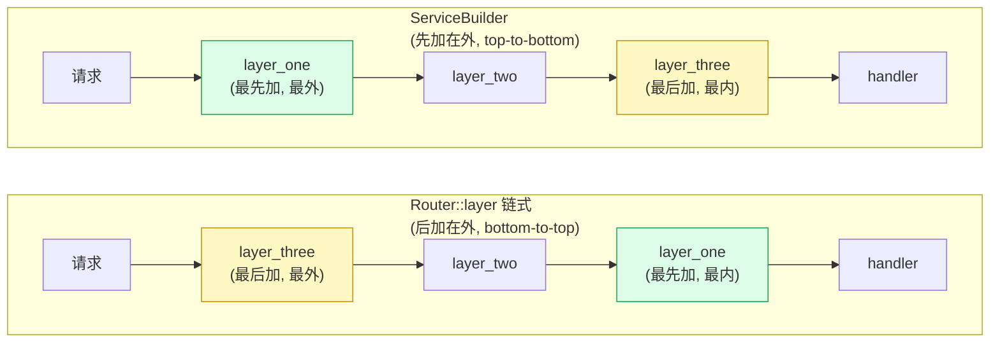
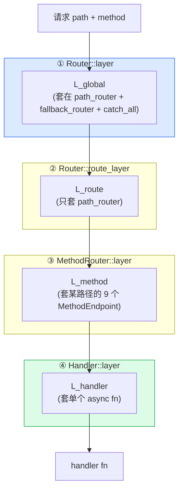

# 第 16 章 · 中间件链与 ServiceBuilder

> **核心问题**:前两章(P4-14/P4-15)你已经会写**单层**中间件了——`from_fn` 把闭包变 Layer、`from_extractor` 把提取器当中件。可真实的线上服务从来不是"一个鉴权 + 一个日志",而是"日志 + trace + 请求 ID + CORS + 压缩 + 超时 + 限流 + 鉴权 + 业务"层层套。多个中间件怎么叠?**先加的在最外层还是最内层**——请求到底先穿过谁?axum 给中间件作用域开了**四档** API:`Router::layer`、`Router::route_layer`、`MethodRouter::layer`、`Handler::layer`,它们各自覆盖什么、什么时候用哪个?还有,你套了一个返回 `BoxError` 的 `tower::timeout::TimeoutLayer`(它的 Service Error 不是 `Infallible`),Router 的 Service Error 钉死是 `Infallible`——**类型对不上,编译直接红**,怎么办?这一章拆透"中间件怎么叠、顺序怎么定、作用域怎么选、出错怎么兜底"这一整套机器。
>
> **读完本章你会明白**:
>
> 1. 多个中间件怎么叠成链,**`Router::layer(A).layer(B).layer(C)` 的洋葱方向是什么**(请求先穿 C 还是 A?),以及为什么 `tower::ServiceBuilder::new().layer(A).layer(B).layer(C)` 的方向**和它反过来**——这是新手最容易踩的认知坑,axum 官方文档专门用整页讲这件事;
> 2. **axum 的四档 layer 作用域**——`Router::layer`(全局,含 fallback)、`Router::route_layer`(只匹配的路由,不含 fallback)、`MethodRouter::layer`(单路径的所有 method)、`Handler::layer`(单 handler),各自的覆盖范围、对应的源码实现位置、什么时候用哪档;
> 3. **为什么中间件返回非 `Infallible` 错误要 `HandleErrorLayer` 兜底**——Router 的 Service Error 钉死 `Infallible`(承 P1-03),可 `tower::timeout::TimeoutLayer` 的 Service Error 是 `tower::timeout::Elapsed`(一个真实的错误类型),直接套会编译错;`HandleErrorLayer` 怎么用闭包把 `Err` 转成 `Response`,把 Service Error 类型重新"焊"回 `Infallible`;
> 4. `tower::ServiceBuilder` 是什么(承《Tower》P1-04 一句带过)、它凭什么能"编译期叠多层 Layer 成一个类型级 `Stack<A, Stack<B, ...>>`",以及 axum 为什么**不重新发明**它而是直接复用 Tower 的。
>
> **逃生阀(读不下去怎么办)**:本章有三个互相缠绕的点(洋葱顺序方向、四种作用域、HandleError 兜底)。如果一时绕不开,记住三句话就够——**① `Router::layer(A).layer(B)` 链式调,后加的在外层,请求先穿后加的(B → A → handler);但 `ServiceBuilder::new().layer(A).layer(B)` 反过来,先加的在外层,请求先穿先加的(A → B → handler),这是两者最大的语义差;② 四档作用域从粗到细是 Router::layer(全部含 fallback)→ Router::route_layer(只匹配的路由)→ MethodRouter::layer(单路径的 method 组)→ Handler::layer(单 handler);③ 中间件返回非 Infallible 错误必须套 HandleErrorLayer 用闭包把 Err 转成 Response**。带着这三句话跳到对应小节细读。本章处处承《Tower》ServiceBuilder 类型级 Stack 洋葱(P1-04)、承 P2-08 的 route_layer 不含 fallback、承 P1-03 的 Router Service Error=Infallible,读过那些收获翻倍,但不是硬性前提。

---

## 一句话点破

> **axum 的中间件链就是 Tower 的 Service 套娃——每 `.layer(L)` 一层,就是把现有 Service 包进一个新 Service。`Router::layer(A).layer(B)` 链式调用,后加的 B 在外层、先加的 A 在内层,请求先穿 B 再穿 A(洋葱从下往上长);可 `ServiceBuilder::new().layer(A).layer(B)` 反过来,先加的 A 在外层,请求先穿 A 再穿 B(洋葱从上往下长)——这个方向差是新手最大的坑,所以官方推荐用 ServiceBuilder(读起来像流水线,心智负担低)。axum 给作用域开了四档 API:Router::layer 覆盖所有路由含 fallback(全局日志/trace),Router::route_layer 只覆盖匹配上的路由不含 fallback(鉴权/限流,避免 404 变 401),MethodRouter::layer 覆盖单路径的所有 method,Handler::layer 覆盖单个 handler——四档从粗到细。而任何返回非 `Infallible` 错误的中间件(如 `tower::timeout::TimeoutLayer` 返回 `Elapsed`)都要套 `HandleErrorLayer`,它用闭包把 `Err` 转成 `Response`,把 Service Error 类型重新焊回 `Infallible`,否则 Router 的 `type Error = Infallible` 编译不过。**

这是结论,不是理由。本章倒过来拆:为什么要"叠"中间件(单层不够吗)、洋葱方向为什么有"两种语义"、四种作用域各自覆盖什么、HandleError 怎么兜底。

---

## 第一节:从单层到多层——一个中间件不够用

### 提问

P4-14/P4-15 你学会用 `from_fn` / `from_extractor` 写单层中间件。来一个真实场景:一个公网 RESTful 服务,你想要:

1. 给每个请求生成一个 `X-Request-Id`(用 `tower_http::request_id::SetRequestIdLayer`)。
2. 全链路 trace(`tower_http::trace::TraceLayer`)。
3. CORS(`tower_http::cors::CorsLayer`)。
4. 自动 gzip 压缩(`tower_http::compression::CompressionLayer`)。
5. 全局 10 秒超时(`tower_http::timeout::TimeoutLayer`)。
6. `/api/*` 路径要鉴权(`tower_http::validate_request::ValidateRequestHeaderLayer`)。
7. 业务 handler。

七个东西,层层套。这怎么写?

裸 hyper 你只能手动嵌套:每个中间件是一个 `Service`,你要把 handler 套进 timeout,timeout 套进 compression,compression 套进 CORS……手写嵌套到第 5 层时,类型签名 `Timeout<Compression<Cors<Trace<SetRequestId<Handler>>>>>` 已经长到屏幕装不下,改一个顺序整个类型重写。这跟 P0-01 讲过的"裸 hyper 手写 Service 套娃"是同一个病。

axum 的解法:**复用 Tower 的 Layer 套娃 + ServiceBuilder 链式语法**,把"叠多层中间件"做成一行流水线。

### 不这样会怎样:手写嵌套会疯掉

假设 axum 没有 `.layer()`,也没有 ServiceBuilder。你要套三层,得这么写:

```rust
// 朴素写法(撞墙)
use tower::{Service, Layer};
use tower_http::{timeout::TimeoutLayer, trace::TraceLayer, compression::CompressionLayer};

// 假设 handler 已经是一个 Service
let with_timeout = TimeoutLayer::new(Duration::from_secs(10)).layer(handler);
let with_compression = CompressionLayer::new().layer(with_timeout);
let with_trace = TraceLayer::new_for_http().layer(with_compression);
// 用 with_trace 处理请求...

// 类型签名:TraceService<CompressionService<TimeoutService<Handler>>>
// 改顺序?整个类型重写。
// 想动态配置套不套 timeout?要在 if/else 里分别构造两种类型——不可能,类型不同。
```

撞几堵墙:

1. **类型爆炸**:`Trace<Compression<Timeout<Handler>>>` 这种嵌套类型,每加一层就长一截。改顺序就全变。
2. **延迟组装做不到**:你想先声明"我要套这三层",等 handler 准备好了再一次性套。可手写嵌套要求你立刻有 handler——组装和构造耦合了。
3. **复用做不到**:同一套"超时 + 压缩 + trace"装饰,想既给 user_svc 用又给 order_svc 用。可 `Trace<Compression<Timeout<user_svc>>>` 和 `Trace<Compression<Timeout<order_svc>>>` 是不同类型,装饰链没法当一等公民传递。
4. **配置化做不到**:你从配置文件读"今天要不要套 CORS",可套和不套是不同类型,运行期没法决定。

这些墙跟《Tower》P0-01/P1-04 讲的"为什么要有 Layer 抽象"是同一组——**叠多层中间件,本质就是 Layer 的组合问题**,Tower 已经用 `Layer<S>` + `Stack<Inner, Outer>` 解决了。axum 直接复用。

> **承《Tower》**:`Layer<S>` = "给我一个 Service,我给你一个装饰过的新 Service" 的工厂;`Stack<Inner, Outer>` = 把多个 Layer 在**编译期**嵌套成一个大 Layer(`tower-layer/src/stack.rs#L6-L30`,逐字承《Tower》P0-01 拆过)。`ServiceBuilder<L>` 是 Tower 给的链式语法糖,每 `.layer(T)` 套一层 `Stack<T, L>`(`tower/src/builder/mod.rs#L132-L136`)。这套类型级洋葱内部机制全在 Tower 仓,本书一句带过指路《Tower》P1-04,本章只讲 axum 怎么**用** ServiceBuilder + 四种作用域。

### 所以 axum 这么设计:复用 Tower 的 Layer + ServiceBuilder

axum 没有重新发明中间件系统。它的所有 layer API 都接 `tower_layer::Layer<Route>`,中间件链就是 Tower 的 Service 套娃。看 `Router::layer` 的真实签名(`axum/src/routing/mod.rs#L302-L317`):

```rust
// axum/src/routing/mod.rs#L302-L317(逐字摘录)
#[doc = include_str!("../docs/routing/layer.md")]
pub fn layer<L>(self, layer: L) -> Router<S>
where
    L: Layer<Route> + Clone + Send + Sync + 'static,
    L::Service: Service<Request> + Clone + Send + Sync + 'static,
    <L::Service as Service<Request>>::Response: IntoResponse + 'static,
    <L::Service as Service<Request>>::Error: Into<Infallible> + 'static,
    <L::Service as Service<Request>>::Future: Send + 'static,
{
    map_inner!(self, this => RouterInner {
        path_router: this.path_router.layer(layer.clone()),
        fallback_router: this.fallback_router.layer(layer.clone()),
        default_fallback: this.default_fallback,
        catch_all_fallback: this.catch_all_fallback.map(|route| route.layer(layer)),
    })
}
```

几个关键点:

1. **`L: Layer<Route>`**——axum 的 layer 接的是 `tower_layer::Layer`,参数化在 `Route` 上(`Route` 是 axum 的类型擦除 Service,承 P1-03)。也就是说,**你给 axum 的中间件,必须是"能装饰 Route 的 Tower Layer"**。Tower 生态所有现成 Layer(`tower_http::trace::TraceLayer`、`tower::timeout::TimeoutLayer`、`tower_http::cors::CorsLayer`)都满足这个约束,拿来即用。

2. **`L::Service::Error: Into<Infallible>`**——这一行是本章后半段的重头戏。Layer 装饰出的 Service,它的 Error 类型**必须能 Into<Infallible>**(基本就是要求 Error 就是 Infallible)。为什么?因为 Router 的 Service Error 钉死是 `Infallible`(承 P1-03,axum 在框架层把所有错误转成 Response)。如果你套的中间件返回 `Elapsed`(TimeoutLayer)或 `BoxError`,这个 bound 不满足,**编译直接红**。解法是 HandleErrorLayer,后面专门拆。

3. **`map_inner!` 三处都套 Layer**:`path_router`(主路由表)、`fallback_router`(fallback 路由表)、`catch_all_fallback`(终极兜底)。这是"Router::layer 作用到全部含 fallback"的实现——P2-08 已经点过,本章第二节详拆。

`map_inner!` 宏本身(`axum/src/routing/mod.rs#L113-L123`)很简单:

```rust
// axum/src/routing/mod.rs#L113-L123(逐字摘录)
macro_rules! map_inner {
    ( $self_:ident, $inner:pat_param => $expr:expr) => {
        #[allow(redundant_semicolons)]
        {
            let $inner = $self_.into_inner();
            Router {
                inner: Arc::new($expr),
            }
        }
    };
}
```

它把 Router 拆开拿到 `RouterInner`,套完 Layer 再重新包成 `Arc<RouterInner>`。所以 `Router::layer` 是消耗 self、产出一个新 Router(不修改原 Router,符合 builder 模式)。

那么"叠多层"怎么叠?最朴素的就是链式调:

```rust
let app = Router::new()
    .route("/", get(handler))
    .layer(TraceLayer::new_for_http())
    .layer(CompressionLayer::new())
    .layer(TimeoutLayer::new(Duration::from_secs(10)));
```

可这一串,**请求先穿过谁**?这就是下一节的重头戏——洋葱方向。

> **钉死这件事**:axum 的中间件链就是 Tower 的 Service 套娃。`Router::layer(L)` 接 `tower_layer::Layer<Route>`,把 L 套到 path_router / fallback_router / catch_all_fallback 三处(P2-08 已点含 fallback)。所有 Tower 生态的现成 Layer 拿来即用,axum 不重新发明中间件。多个 Layer 怎么叠、什么顺序,是下一节的事。

---

## 第二节:洋葱方向——`Router::layer` 链式 vs ServiceBuilder,谁在外层

### 提问

你写了 `Router::new().route("/", get(h)).layer(A).layer(B).layer(C)`,请求来了——先穿 A、B、还是 C?

这是新手最容易踩的认知坑。答案反直觉:**先穿 C(最后加的),再穿 B,最后穿 A**。也就是说,**`Router::layer` 链式调用,后加的在外层**。

可如果你换成 ServiceBuilder:`Router::new().route("/", get(h)).layer(ServiceBuilder::new().layer(A).layer(B).layer(C))`——方向**反过来**,先穿 A,再穿 B,最后穿 C。

两种写法,同样的三个 Layer,顺序相反。这不是 bug,是两种 API 的语义差。这一节把这件事拆透,因为它是新手写 axum 中间件时翻车率最高的一处。

### `Router::layer` 链式的方向:后加在外,从下往上长洋葱

为什么 `Router::layer(A).layer(B)` 是 B 在外?来看 `Route::layer` 的真实实现(`axum/src/routing/route.rs#L60-L72`),这是每条路由套 Layer 的真身:

```rust
// axum/src/routing/route.rs#L60-L72(逐字摘录)
pub(crate) fn layer<L, NewError>(self, layer: L) -> Route<NewError>
where
    L: Layer<Route<E>> + Clone + Send + 'static,
    L::Service: Service<Request> + Clone + Send + Sync + 'static,
    <L::Service as Service<Request>>::Response: IntoResponse + 'static,
    <L::Service as Service<Request>>::Error: Into<NewError> + 'static,
    <L::Service as Service<Request>>::Future: Send + 'static,
    NewError: 'static,
{
    let layer = (MapErrLayer::new(Into::into), layer);

    Route::new(layer.layer(self))
}
```

关键在最后一行 `Route::new(layer.layer(self))`——**新的 layer 套在 `self`(原 Route)外面**。`layer.layer(self)` 是 Tower Layer 的标准签名:`fn layer(&self, inner: S) -> Self::Service`(承《Tower》P0-01),inner 是被装饰的旧 service,返回的是装饰后的新 service,新 service 在外层。

所以:

- `Router::layer(A)` 调一次,每条路由变成 `Route::new(A.layer(route))`——A 在 route 外面。请求穿 A → route。
- `Router::layer(A).layer(B)` 再调一次,这时"每条路由"已经是 `A(route)`,再套 B:`Route::new(B.layer(A_route))`——B 在 A 外面。请求穿 B → A → route。
- `.layer(C)` 同理,C 在最外面。请求穿 C → B → A → route → handler。

**`Router::layer` 链式调,后加的在外层**。这是"外层包装"(wrapping)语义——每次 `.layer()` 都把现有的所有路由再包一层,新包的这层在最外面。

来看 axum 官方文档怎么画这个洋葱(`axum/src/docs/middleware.md` 原文):

```text
        requests
           |
           v
+----- layer_three -----+
| +---- layer_two ----+ |
| | +-- layer_one --+ | |
| | |               | | |
| | |    handler    | | |
| | |               | | |
| | +-- layer_one --+ | |
| +---- layer_two ----+ |
+----- layer_three -----+
           |
           v
        responses
```

文档原文(`middleware.md`):

> When you add middleware with `Router::layer` (or similar) all previously added routes will be wrapped in the middleware. Generally speaking, this results in middleware being executed from bottom to top.

"bottom to top"——你代码里写在最下面的(`layer_three` 最后调)最先执行(最外层)。这是 `Router::layer` 链式的方向。

### ServiceBuilder 的方向:先加在外,从上往下流水线

可 `tower::ServiceBuilder` 的方向**反过来**。来看 `ServiceBuilder::layer`(`tower/src/builder/mod.rs#L132-L136`,tower 仓):

```rust
// tower/src/builder/mod.rs#L125-L136(tower 仓,逐字摘录)
impl<L> ServiceBuilder<L> {
    /// Add a new layer `T` into the [`ServiceBuilder`].
    pub fn layer<T>(self, layer: T) -> ServiceBuilder<Stack<T, L>> {
        ServiceBuilder {
            layer: Stack::new(layer, self.layer),
        }
    }
    // ...
}
```

注意 `Stack::new(layer, self.layer)`——**新加的 `layer` 是 Stack 的第一个参数(inner),旧的 `self.layer` 是第二个参数(outer)**。来看 `Stack<Inner, Outer>` 的 `Layer::layer` 实现(`tower-layer/src/stack.rs#L18-L30`,tower-layer 仓):

```rust
// tower-layer/src/stack.rs#L18-L30(tower-layer 仓,逐字摘录)
impl<S, Inner, Outer> Layer<S> for Stack<Inner, Outer>
where
    Inner: Layer<S>,
    Outer: Layer<Inner::Service>,
{
    type Service = Outer::Service;

    fn layer(&self, service: S) -> Self::Service {
        let inner = self.inner.layer(service);

        self.outer.layer(inner)
    }
}
```

拆这段:`Stack::layer(service)` 先让 `inner` Layer 套住 service(`inner.layer(service)`),再让 `outer` Layer 套住"已经被 inner 套过的 service"(`outer.layer(inner)`)。所以 **inner 字段(第一个参数)在里层,outer 字段(第二个参数)在外层**。

把 `ServiceBuilder::layer` 和 `Stack` 拼起来,追踪 `ServiceBuilder::new().layer(A).layer(B).layer(C).service(svc)`:

- `new()` → `ServiceBuilder<Identity>`(空 Layer)。
- `.layer(A)` → `Stack::new(A, Identity)`,即 `Stack<A, Identity>`。A 是 inner,Identity 是 outer。
- `.layer(B)` → `Stack::new(B, Stack<A, Identity>)`,即 `Stack<B, Stack<A, Identity>>`。B 是 inner,`Stack<A, Identity>` 是 outer。
- `.layer(C)` → `Stack::new(C, Stack<B, Stack<A, Identity>>)`。C 是 inner,剩下的是 outer。
- `.service(svc)` 调 `self.layer.layer(svc)`,也就是 `Stack<C, Stack<B, Stack<A, Identity>>>::layer(svc)`:
  - 先 `inner.layer(svc)` = `C.layer(svc)` → `C(svc)`。
  - 再 `outer.layer(inner)` = `Stack<B, Stack<A, Identity>>::layer(C(svc))`:
    - 先 `B.layer(C(svc))` → `B(C(svc))`。
    - 再 `Stack<A, Identity>::layer(B(C(svc)))` → `A.layer(B(C(svc)))` → `A(B(C(svc)))`,最后 `Identity` 不动。
  - 最终结果:`A(B(C(svc)))`。

**A 在最外层,C 在最内层**——请求先穿 A,再穿 B,最后穿 C,到 svc。这是 ServiceBuilder 的方向:**先加的在外层,从上往下流水线**。

### 两种 API 的方向差:为什么要这么设计

为什么 `Router::layer` 链式和 `ServiceBuilder` 方向相反?这不是 bug,是两种 API 的设计哲学:

| API | 方向 | 设计动机 |
|-----|------|---------|
| `Router::layer(A).layer(B).layer(C)` | 后加在外(C 最外) | "外层包装"语义:每次 `.layer()` 都把现有路由再包一层,自然新的在外。直觉像叠俄罗斯套娃——后套的娃娃在最外面。 |
| `ServiceBuilder::new().layer(A).layer(B).layer(C)` | 先加在外(A 最外) | "流水线"语义:你从上往下读代码,就是请求从上往下穿中间件的顺序。直觉像 Unix 管道 `cmd1 | cmd2 | cmd3`,先写的先处理。 |

axum 官方文档明说为什么推荐 ServiceBuilder(`middleware.md` 原文):

> Executing middleware top to bottom is generally easier to understand and follow mentally which is one of the reasons `ServiceBuilder` is recommended.

"top to bottom"——从上往下读代码,就是请求穿过的顺序。这比"bottom to top"(从下往上读)心智负担低。所以官方推荐:叠多个中间件,**用 ServiceBuilder**。

但 `Router::layer` 链式还在,有两个理由:① 只叠一两个 Layer 时,链式更简洁(不用引 `tower::ServiceBuilder`);② 历史兼容(早期 axum 没 ServiceBuilder,大家就是链式调)。两个 API 都给你,你知道方向差就行。

### 把两种方向画出来



图里两个洋葱的方向相反——同样的三个 layer,链式调 C 在最外,ServiceBuilder A 在最外。这是 axum 中间件最容易翻车的一处,**记住方向差就够了**。

### 反面对比:用错方向会怎样

假设你想"先记录请求 ID(给后续 trace 用),再做 trace"。请求 ID 必须在 trace 之前生成,这样 trace 才能拿到请求 ID 关联日志。

用 ServiceBuilder:

```rust
// 正确:ServiceBuilder 先加的在外,先执行
.layer(
    ServiceBuilder::new()
        .layer(SetRequestIdLayer)   // 先加, 最外, 先执行
        .layer(TraceLayer)          // 后加, 内层, 后执行
)
// 请求: SetRequestId → Trace → handler  ✓ trace 能拿到请求 ID
```

可如果你误以为 ServiceBuilder 也是"后加在外",反着写:

```rust
// 错误:误以为后加在外
.layer(
    ServiceBuilder::new()
        .layer(TraceLayer)          // 误以为这是最外, 实际是最内
        .layer(SetRequestIdLayer)   // 误以为这是最内, 实际是最外
)
// 实际请求: SetRequestId → Trace → handler  (恰好还是对, 因为 SetRequestId 还是在外)
```

这种"误以为"在简单场景可能恰好不出错(因为两个 layer 顺序无关)。但一旦顺序敏感(比如"鉴权必须在限流之前,避免未授权请求消耗限流配额"),方向弄反就是 bug:

```rust
// 想要: 鉴权先(挡掉非法请求), 限流后(只对合法请求计数)
.layer(
    ServiceBuilder::new()
        .layer(ValidateRequestHeaderLayer::bearer("pwd"))  // 先加, 在外, 先执行 ✓
        .layer(ConcurrencyLimitLayer::new(100))            // 后加, 在内, 后执行 ✓
)
// 请求: 鉴权 → 限流 → handler  ✓ 非法请求被鉴权挡掉, 不消耗限流配额
```

如果你误用链式调:`.layer(ValidateRequestHeader).layer(ConcurrencyLimit)`——按链式"后加在外",ConcurrencyLimit 在外,请求先过限流再过鉴权,**非法请求消耗了限流配额**,DoS 攻击者可以用一堆假 token 把限流配额占满,合法请求反而被限流挡掉。这是真实的安全 bug。

> **钉死这件事**:`Router::layer(A).layer(B).layer(C)` 链式调,后加在外层,请求先穿 C(bottom-to-top);`ServiceBuilder::new().layer(A).layer(B).layer(C)` 反过来,先加在外层,请求先穿 A(top-to-bottom)。两种 API 方向相反,是各自的设计哲学(链式 = 外层包装,ServiceBuilder = 流水线)。官方推荐用 ServiceBuilder,因为 top-to-bottom 心智负担低。顺序敏感的中间件(鉴权 vs 限流、请求 ID vs trace)务必在心里跑一遍请求路径,方向错了就是 bug。承《Tower》P1-04 的 ServiceBuilder 类型级 Stack 洋葱机制一句带过。

---

## 第三节:四种 layer 作用域——从全局到单 handler 的四档漏斗

### 提问

第二节讲的是"叠多个 Layer 的顺序"。可还有一个维度:**Layer 套在哪里**。

你已经知道 `Router::layer` 和 `Router::route_layer` 不一样——前者含 fallback,后者不含(P2-08 拆透)。可 axum 其实有**四种** layer API:

1. `Router::layer(L)`——Router 级。
2. `Router::route_layer(L)`——Router 级,但不碰 fallback。
3. `MethodRouter::layer(L)`——单路径级(同一个路径的所有 method)。
4. `Handler::layer(L)`——单 handler 级(一个 async fn)。

这四档 API,**各自覆盖什么范围?**一个请求来了,它过哪几层 Layer,取决于它命中哪一档?这一节把四种作用域钉死,让你写代码时知道"这个中间件该套哪一档"。

### 不这样会怎样:作用域分不开会怎样

假设 axum 只有一种 `.layer()`(全局套),没有作用域区分。会怎样?

考虑一个真实场景:你有 `/api/*`(需要鉴权)和 `/public/*`(公开访问)两组路由。你想:

- 全局套 trace(所有请求都要日志)。
- 只给 `/api/*` 套鉴权(公开访问不该被鉴权挡)。

如果只有一个全局 `.layer`,你只能:

```rust
// 假想:只有全局 layer(撞墙)
let api = Router::new()
    .route("/api/users", get(list_users))
    .route("/api/orders", get(list_orders))
    .layer(TraceLayer);   // 想只给 api 套 trace

let public = Router::new()
    .route("/public/health", get(health))
    .layer(TraceLayer);   // 还要再套一次? 重复

let app = Router::new()
    .merge(api)
    .merge(public)
    .layer(TraceLayer);   // 全局套?
// 想给 /api/* 套鉴权, 没办法——全局套会连 /public/* 也鉴权
```

撞墙:

1. **没法给"部分路由"套中间件**:全局套就全套,要么都不套。可真实需求是"这组路由套鉴权,那组路由套 CORS,全部套 trace"。
2. **重复套**:同一个 trace Layer,你想给每个子 Router 都套一次,代码重复。可你又想要"全局只套一次"的能力。
3. **作用域语义混乱**:鉴权 Layer 该不该作用到 fallback(未匹配请求)?限流 Layer 呢?不同中间件需求不同,一个 API 表达不了。

axum 的解法是**四档作用域**,让用户精细控制 Layer 套在哪一档:

| API | 作用域 | 覆盖什么 | 典型场景 |
|-----|--------|---------|---------|
| `Router::layer` | 全局(含 fallback) | path_router + fallback_router + catch_all_fallback | 日志 / trace / 压缩 / 全局错误处理 |
| `Router::route_layer` | 全局(不含 fallback) | 只 path_router | 鉴权 / 限流(避免 404 变 401) |
| `MethodRouter::layer` | 单路径(所有 method) | 一个路径的 9 个 MethodEndpoint + 它的 fallback | 给 `/users` 这一条路由的所有 method 套 |
| `Handler::layer` | 单 handler | 一个 async fn | 给 `list_users` 这一个函数套 |

四档从粗到细,像一个漏斗。下面逐档拆。

### 第一档:Router::layer——全局,含 fallback

第一档最粗:`Router::layer(L)` 把 L 套到**所有路由,包括 fallback**。源码已经贴过(`mod.rs#L302-L317`),关键是 `map_inner!` 里三处都套:

```rust
// axum/src/routing/mod.rs#L311-L316(摘录)
map_inner!(self, this => RouterInner {
    path_router: this.path_router.layer(layer.clone()),         // 主路由表
    fallback_router: this.fallback_router.layer(layer.clone()), // fallback 路由表
    default_fallback: this.default_fallback,
    catch_all_fallback: this.catch_all_fallback.map(|route| route.layer(layer)), // 终极兜底
})
```

三处都套,意味着无论请求匹配上(走 path_router)、走 fallback(走 fallback_router)、还是路径形式异常(走 catch_all_fallback),都过这层 Layer。

**适用场景**:全局观察类中间件——日志、trace、压缩、请求 ID。这些中间件"应该看到所有请求",包括未匹配的(否则未匹配请求没日志,排查困难)。

**反例(用错会怎样)**:用 `Router::layer` 套鉴权 Layer(`ValidateRequestHeaderLayer::bearer("pwd")`)。一个请求 `GET /not-found`(路径不存在),本来该返回 404,可因为先过了鉴权 Layer(没带 token),被挡成 401。客户端看到 401,以为"我没权限",实际是"路径根本不存在"——误导,且会泄露信息(攻击者通过 401/404 区别探测哪些路径存在)。这就是 P2-08 讲过的"404 变 401"陷阱,解法是 route_layer。

### 第二档:Router::route_layer——只匹配的路由,不碰 fallback

第二档:`Router::route_layer(L)` 只套 path_router,**不碰 fallback**。源码(`mod.rs#L319-L335`):

```rust
// axum/src/routing/mod.rs#L319-L335(逐字摘录)
#[doc = include_str!("../docs/routing/route_layer.md")]
#[track_caller]
pub fn route_layer<L>(self, layer: L) -> Self
where
    L: Layer<Route> + Clone + Send + Sync + 'static,
    L::Service: Service<Request> + Clone + Send + Sync + 'static,
    <L::Service as Service<Request>>::Response: IntoResponse + 'static,
    <L::Service as Service<Request>>::Error: Into<Infallible> + 'static,
    <L::Service as Service<Request>>::Future: Send + 'static,
{
    map_inner!(self, this => RouterInner {
        path_router: this.path_router.route_layer(layer),   // ★ 只给主路由表套
        fallback_router: this.fallback_router,              // ★ fallback 不动!
        default_fallback: this.default_fallback,
        catch_all_fallback: this.catch_all_fallback,        // ★ catch_all 也不动!
    })
}
```

注意 `fallback_router` 和 `catch_all_fallback` **原样不动**——只 path_router 套了 Layer。这就是"route_layer 不作用到 fallback"的实现(承 P2-08 已点,本章不重复)。

> **承 P2-08**:route_layer 不含 fallback 的完整语义(catch_all_fallback vs method_not_allowed_fallback 两层兜底、route_layer 为什么避免 404 变 401),在 P2-08 第五节拆透。本章只确认"route_layer 是四档作用域的第二档",其他细节指路 P2-08。

**适用场景**:鉴权、限流、提前返回类中间件。它们只该作用到"匹配上的路由",不该误伤 fallback。

**额外细节:route_layer 空路由 panic**。来看 PathRouter::route_layer(`path_router.rs#L310-L341`):

```rust
// axum/src/routing/path_router.rs#L310-L341(摘录关键)
#[track_caller]
pub(super) fn route_layer<L>(self, layer: L) -> Self
where
    L: Layer<Route> + Clone + Send + Sync + 'static,
    // ...
{
    if self.routes.is_empty() {
        panic!(
            "Adding a route_layer before any routes is a no-op. \
             Add the routes you want the layer to apply to first."
        );
    }
    // ... 遍历 routes 套 Layer
}
```

`routes.is_empty()` 时 panic——因为你还没注册任何路由就套 route_layer,这时套是 no-op(没路由可套),通常是用户写错了顺序(`.route_layer` 写在 `.route` 前面)。axum 用 panic 强迫你纠正。这是贴心设计。注意 `Router::layer` 不 panic(空 Router 套 layer 是合法的,后面可能 merge 进来路由)。

### 第三档:MethodRouter::layer——单路径的所有 method

第三档更细:`MethodRouter::layer(L)` 把 L 套到**一个路径的所有 method**(GET/POST/PUT/...)。来看源码(`method_routing.rs#L966-L993`):

```rust
// axum/src/routing/method_routing.rs#L966-L993(逐字摘录)
#[doc = include_str!("../docs/method_routing/layer.md")]
pub fn layer<L, NewError>(self, layer: L) -> MethodRouter<S, NewError>
where
    L: Layer<Route<E>> + Clone + Send + Sync + 'static,
    L::Service: Service<Request> + Clone + Send + Sync + 'static,
    <L::Service as Service<Request>>::Response: IntoResponse + 'static,
    <L::Service as Service<Request>>::Error: Into<NewError> + 'static,
    <L::Service as Service<Request>>::Future: Send + 'static,
    E: 'static,
    S: 'static,
    NewError: 'static,
{
    let layer_fn = move |route: Route<E>| route.layer(layer.clone());

    MethodRouter {
        get: self.get.map(layer_fn.clone()),
        head: self.head.map(layer_fn.clone()),
        delete: self.delete.map(layer_fn.clone()),
        options: self.options.map(layer_fn.clone()),
        patch: self.patch.map(layer_fn.clone()),
        post: self.post.map(layer_fn.clone()),
        put: self.put.map(layer_fn.clone()),
        trace: self.trace.map(layer_fn.clone()),
        connect: self.connect.map(layer_fn.clone()),
        fallback: self.fallback.map(layer_fn),
        allow_header: self.allow_header,
    }
}
```

关键:`let layer_fn = move |route: Route<E>| route.layer(layer.clone())`——定义一个闭包,把每条 Route 套上 layer。然后**遍历 MethodRouter 的 9 个 MethodEndpoint(get/head/post/put/...)**,对每个非 None 的 method,调 `layer_fn` 套一层。注意 `fallback: self.fallback.map(layer_fn)`——**MethodRouter 内部的 fallback 也被套了**(这是 method_not_allowed 兜底,跟 Router 的 fallback 不同,承 P2-08)。

**这一档覆盖什么**:一个路径的所有 method。你写 `.route("/users", get(list).post(create).layer(L))`,L 套到 `/users` 的 get 和 post 两个 handler 上(以及 method_not_allowed fallback)。其他路径(`/orders`、`/health`)不套。

**适用场景**:给"某一条路径"的所有 method 套一个共同中间件。比如 `/users` 这条路径,无论 GET 还是 POST,都要套一个"数据库连接池获取"中间件。这时用 MethodRouter::layer 比 Router::layer 精准(只套这一条路径)。

**注意 NewError 泛型**:`MethodRouter::layer` 的签名带 `NewError` 泛型——它**可以改变 Error 类型**。原 MethodRouter 是 `MethodRouter<S, E>`,套 layer 后变 `MethodRouter<S, NewError>`。这是因为 Layer 装饰出的新 Service 可能有不同的 Error 类型(比如 TimeoutLayer 把 Error 从 Infallible 变成 `Elapsed`),MethodRouter::layer 诚实地把这个类型变化暴露出来。这也是后面 HandleError 兜底的动机——NewError 不是 Infallible 时,Router 接不上,要兜底。

MethodRouter 还有一个 `route_layer`(`method_routing.rs#L995-L1035`),跟 `layer` 的差别是:① 不改 Error 类型(`Error = E` 固定);② 不套 method_not_allowed fallback(`fallback` 字段不动);③ 空路由时 panic。语义跟 Router::route_layer 类似(只作用到具体 method handler,不碰兜底),不重复拆。

### 第四档:Handler::layer——单 handler

第四档最细:`Handler::layer(L)` 把 L 套到**单个 handler fn**。这是四档里唯一一个"在 handler 变成 Service 之前"就套 Layer 的 API。来看源码(`handler/mod.rs#L189-L199`):

```rust
// axum/src/handler/mod.rs#L189-L199(逐字摘录)
fn layer<L>(self, layer: L) -> Layered<L, Self, T, S>
where
    L: Layer<HandlerService<Self, T, S>> + Clone,
    L::Service: Service<Request>,
{
    Layered {
        layer,
        handler: self,
        _marker: PhantomData,
    }
}
```

返回 `Layered<L, Self, T, S>`——这是一个"延迟套 Layer"的包装。来看 Layered 的定义(`handler/mod.rs#L282-L289`):

```rust
// axum/src/handler/mod.rs#L282-L289(逐字摘录)
/// A [`Service`] created from a [`Handler`] by applying a Tower middleware.
///
/// Created with [`Handler::layer`]. See that method for more details.
pub struct Layered<L, H, T, S> {
    layer: L,
    handler: H,
    _marker: PhantomData<fn() -> (T, S)>,
}
```

注意 Layered **存的是 `handler: H`(原始 handler fn),不是已经变好的 Service**。Layer 是"延迟"套的——真正套的时机在 Layered 自己 impl Handler 时的 `call` 方法里(`handler/mod.rs#L316-L350`):

```rust
// axum/src/handler/mod.rs#L329-L348(摘录关键)
fn call(self, req: Request, state: S) -> Self::Future {
    use futures_util::future::{FutureExt, Map};

    let svc = self.handler.with_state(state);   // ① handler + state → HandlerService
    let svc = self.layer.layer(svc);            // ② 套 Layer → L::Service

    let future /*: Map<...>*/ = svc.oneshot(req).map(|result| match result {
        Ok(res) => res.into_response(),
        Err(err) => match err {},               // ③ Error = Infallible, match err {} 穷尽
    });

    future::LayeredFuture::new(future)
}
```

三步:① `self.handler.with_state(state)`——handler fn 加 state 变成 `HandlerService`(承 P3-09 Handler trait 章);② `self.layer.layer(svc)`——套上你给的 Layer,变成 `L::Service`(注意 Layer 的参数化类型是 `HandlerService<Self, T, S>`,即"装饰 HandlerService 的 Layer");③ `svc.oneshot(req)` 跑这个 Service,因为 `L::Service: Service<Request, Error = Infallible>`(Handler::layer 的 trait bound),所以 `match err {}` 能穷尽(Infallible 是不可居住类型,match 永远到不了 err 分支)。

**这一档覆盖什么**:单个 handler fn。你写 `get(list_users.layer(L))`,L 只套到 `list_users` 这一个函数,不影响同路径的其他 method(create_users),不影响其他路径。

**适用场景**:给"某一个特定 handler"套专属中间件。比如 `list_users` 要限并发(`ConcurrencyLimitLayer::new(64)`),但 `create_users` 不限;或者 `health_check` 不该被全局鉴权挡(只给它单独"豁免")。这时用 Handler::layer 最精准。

注意 Handler::layer 的 doc(`handler/mod.rs#L155-L168`)明说它跟 Router::layer 的区别:

> Note this differs from `routing::Router::layer` which adds a middleware to a group of routes.
>
> If you're applying middleware that produces errors you have to handle the errors so they're converted into responses.

后半句是关键提示——Handler::layer 套的中间件如果返回非 Infallible 错误,**还是要 HandleError 兜底**(本章后半段拆)。

### 把四档作用域画成漏斗

四档从粗到细,像一个漏斗。一个请求来了,它穿过的 Layer 取决于它命中哪条路由、哪个 method:



注意图里"请求穿过"的方向:从最外层(Router::layer)一路穿到最内层(handler fn)。**一个请求可能同时穿过四档**——如果你在 Router::layer 套了 L1、route_layer 套了 L2、MethodRouter::layer 套了 L3、Handler::layer 套了 L4,请求依次穿 L1 → L2 → L3 → L4 → handler。这四档不是"四选一",是"四层叠加"。

但要记住:① 和 ② 都是 Router 级,你通常**只用其中一个**(要么 layer 要么 route_layer,不会同一个 Router 同时用两个全局 Layer——虽然可以,但语义混乱)。③ 和 ④ 是更细粒度的补充,给特定路由或 handler 单独套。

### 四档选择指南

用一个决策树钉死"该用哪一档":

```
你的中间件要作用到哪些请求?
│
├─ 所有请求(含未匹配的 404)
│  └─ ① Router::layer
│     典型: 日志 / trace / 压缩 / 请求 ID
│
├─ 只匹配上的路由(404 不该被它挡)
│  └─ ② Router::route_layer
│     典型: 鉴权 / 限流 / 提前返回
│
├─ 某一条路径的所有 method
│  └─ ③ MethodRouter::layer
│     典型: /users 的 GET/POST 都要数据库连接池
│
└─ 某一个特定的 handler fn
   └─ ④ Handler::layer
      典型: list_users 单独限并发 / health 单独豁免鉴权
```

一句话:**全局用 layer,鉴权用 route_layer,单路径用 MethodRouter::layer,单 handler 用 Handler::layer**。

> **钉死这件事**:axum 的四档 layer 作用域从粗到细:① `Router::layer`(全局含 fallback,套 path_router + fallback_router + catch_all_fallback)、② `Router::route_layer`(只 path_router,不碰 fallback,P2-08 已拆)、③ `MethodRouter::layer`(单路径的 9 个 MethodEndpoint + method_not_allowed fallback)、④ `Handler::layer`(单 handler fn,延迟到 Layered::call 时套)。一个请求可以同时穿过多档(四层叠加)。选择规则:全局观察类用 ①,鉴权/限流类用 ②,单路径共同中间件用 ③,单 handler 专属中间件用 ④。

---

## 第四节:HandleErrorLayer——非 Infallible 错误怎么兜底

### 提问

前三节讲的 Layer,都隐含一个假设:它们装饰出的 Service,Error 类型是 `Infallible`(或者能 Into<Infallible>)。可真实世界的 Tower 中间件,很多**返回真实错误**:

- `tower::timeout::TimeoutLayer` 套上去,内层 Service 超时,返回 `Elapsed`(一个真实的错误类型,不是 Infallible)。
- `tower::buffer::BufferLayer` 套上去,worker task 挂了,返回 `tower::buffer::ServiceError`。
- 你自己写的中间件,可能返回 `BoxError`、`anyhow::Error`、自定义错误类型。

这些 Layer 装饰出的 Service,Error 不是 Infallible。可 Router 的 Service Error **钉死是 Infallible**(承 P1-03):

```rust
// axum/src/routing/mod.rs#L569-L580(逐字摘录,承 P1-03)
impl<B> Service<Request<B>> for Router<()>
where
    B: HttpBody<Data = bytes::Bytes> + Send + 'static,
    B::Error: Into<axum_core::BoxError>,
{
    type Response = Response;
    type Error = Infallible;   // ★ 钉死 Infallible
    type Future = RouteFuture<Infallible>;
    // ...
}
```

`type Error = Infallible`——Router 永远不返回 Err(承 P1-03,axum 在框架层把所有错误转成 Response)。所以 Router 接受的所有 Service,**Error 必须是 Infallible**。这体现在 `Router::layer` 的 trait bound(`mod.rs#L308`):

```rust
<L::Service as Service<Request>>::Error: Into<Infallible> + 'static,
```

`Into<Infallible>`——基本就是要求 Error 就是 Infallible(因为只有 Infallible 能 Into<Infallible>)。

可 `TimeoutLayer::new(...)` 装饰出的 Service,Error 是 `Elapsed`,**不是 Infallible**——`Into<Infallible>` 这个 bound 不满足,**编译直接红**:

```text
error[E0271]: type mismatch resolving `<Timeout<HandlerService<...>> as Service<Request>>::Error == Infallible`
   --> src/main.rs:42:10
    |
42  |     .layer(TimeoutLayer::new(Duration::from_secs(10)))
    |      ^^^^^ expected `Elapsed`, found `Infallible`
```

怎么办?你不能"不要超时"(业务需要),又不能改 Router 的 Error 类型(框架钉死)。axum 给的解法是 **`HandleErrorLayer`**——一个专门把"非 Infallible 错误"转成 Response 的 Layer,套上去后,Service Error 重新变回 Infallible。

### 不这样会怎样:不兜底会怎样

假设没有 HandleErrorLayer,你套一个 TimeoutLayer,中间件返回 Elapsed 错误,会发生什么?

**编译错**。如上,`Router::layer` 的 `Error: Into<Infallible>` bound 不满足,编译器直接拒绝。你根本写不出"带超时且不兜底"的代码。

那如果绕过 Router::layer,用 `route_service` 直接挂一个会出错的 Service 呢?axum 的 `route_service` 也要求 `Error = Infallible`(`mod.rs#L218`):

```rust
pub fn route_service<T>(self, service: T) -> Self
where
    T: Service<Request, Error = Infallible> + Clone + Send + Sync + 'static,
    // ...
```

`Error = Infallible` 钉死。你挂一个 `TimeoutService<...>`(Error = Elapsed),编译错。

**所以"非 Infallible 错误的中间件"在 axum 里必须兜底**——不兜底连代码都编译不过。这是 axum 在类型系统层面的硬性要求,不是建议。axum 用 `type Error = Infallible` 这个类型签名,把"所有错误必须转成 Response"这件事做成编译期保证(承 P1-03、P5-18 错误处理章详拆)。

### 所以 axum 这么设计:HandleErrorLayer 把 Err 转成 Response

`HandleErrorLayer<F, T>` 是 axum 在 `error_handling` 模块给的兜底工具。来看它的定义(`axum/src/error_handling/mod.rs#L19-L36`):

```rust
// axum/src/error_handling/mod.rs#L19-L36(逐字摘录)
/// [`Layer`] that applies [`HandleError`] which is a [`Service`] adapter
/// that handles errors by converting them into responses.
///
/// See [module docs](self) for more details on axum's error handling model.
pub struct HandleErrorLayer<F, T> {
    f: F,
    _extractor: PhantomData<fn() -> T>,
}

impl<F, T> HandleErrorLayer<F, T> {
    /// Create a new `HandleErrorLayer`.
    pub fn new(f: F) -> Self {
        Self {
            f,
            _extractor: PhantomData,
        }
    }
}
```

`HandleErrorLayer<F, T>` 两个字段:`f: F`(你给的错误处理闭包)、`_extractor: PhantomData<fn() -> T>`(提取器 tuple 的幽灵数据,后面解释)。`new(f)` 接你的闭包构造。

来看它怎么 impl Layer(`error_handling/mod.rs#L58-L67`):

```rust
// axum/src/error_handling/mod.rs#L58-L67(逐字摘录)
impl<S, F, T> Layer<S> for HandleErrorLayer<F, T>
where
    F: Clone,
{
    type Service = HandleError<S, F, T>;

    fn layer(&self, inner: S) -> Self::Service {
        HandleError::new(inner, self.f.clone())
    }
}
```

`HandleErrorLayer::layer(inner)` 把 inner(被装饰的 Service)和你给的闭包 f,一起塞进 `HandleError<S, F, T>`。所以 **HandleErrorLayer 是个 Layer 工厂,产品是 HandleError Service**(承《Tower》P0-01 Layer=工厂、Service=产品的二分)。

真正的魔法在 `HandleError` 的 Service impl。看零提取器(T = `()`)的版本(`error_handling/mod.rs#L115-L149`):

```rust
// axum/src/error_handling/mod.rs#L115-L149(逐字摘录)
impl<S, F, B, Fut, Res> Service<Request<B>> for HandleError<S, F, ()>
where
    S: Service<Request<B>> + Clone + Send + 'static,
    S::Response: IntoResponse + Send,
    S::Error: Send,
    S::Future: Send,
    F: FnOnce(S::Error) -> Fut + Clone + Send + 'static,
    Fut: Future<Output = Res> + Send,
    Res: IntoResponse,
    B: Send + 'static,
{
    type Response = Response;
    type Error = Infallible;                        // ★ Error 重新焊回 Infallible!
    type Future = future::HandleErrorFuture;

    fn poll_ready(&mut self, _: &mut Context<'_>) -> Poll<Result<(), Self::Error>> {
        Poll::Ready(Ok(()))
    }

    fn call(&mut self, req: Request<B>) -> Self::Future {
        let f = self.f.clone();

        let clone = self.inner.clone();
        let inner = std::mem::replace(&mut self.inner, clone);

        let future = Box::pin(async move {
            match inner.oneshot(req).await {
                Ok(res) => Ok(res.into_response()),
                Err(err) => Ok(f(err).await.into_response()),   // ★ 用闭包把 err 转成 Response
            }
        });

        future::HandleErrorFuture { future }
    }
}
```

逐行拆这段的核心:

1. **`type Error = Infallible`**——这是关键!HandleError 的 Service Error **重新变回 Infallible**。无论内层 S 的 Error 是什么(`Elapsed`、`BoxError`、`anyhow::Error`),HandleError 把它"焊"回 Infallible。怎么做到?看 call。

2. **`F: FnOnce(S::Error) -> Fut`**——你给的闭包 f,签名是"吃 S::Error(内层的错误类型),返回一个 Future"。这个 Future 产出的 Res 必须 `IntoResponse`。也就是说,**你给一个"错误 → Response"的转换函数**,HandleError 在出错时调它。

3. **`call` 里 `std::mem::replace(&mut self.inner, clone)`**——这是 Tower 的"取走就绪服务惯用法"(承《Tower》P1-02 一句带过)。因为 `inner.oneshot(req)` 消费 inner(oneshot 是 `ServiceExt::oneshot(self, ...)`,要 self),可 `call` 是 `&mut self` 不能消费 self——所以 clone 一份,用 `mem::replace` 把原 inner 取走(它才是真正 ready 的),clone 顶替原位。下次 `poll_ready` 重新轮询顶替进来的 clone。

4. **`match inner.oneshot(req).await`**——跑内层 Service。两种结果:
   - **`Ok(res)`**:内层正常返回。调 `res.into_response()`(因为 `S::Response: IntoResponse`)变成 Response,包成 `Ok(Response)`。
   - **`Err(err)`**:内层出错(err 类型是 `S::Error`,比如 `Elapsed`)。调 `f(err)`——你给的闭包,把 err 转成一个 Future,`await` 拿到 Res,再 `into_response()` 变成 Response。包成 `Ok(Response)`。

   **两条路径都返回 `Ok(Response)`**——HandleError 永远不返回 Err。这就是 `type Error = Infallible` 的实现:无论内层成功还是失败,HandleError 都产出一个 Response,错误被闭包 f 转成 Response 吞掉了。

5. **`poll_ready` 无条件 Ready**——跟 axum 其他 Service 一致(承 P1-03 的"忽略背压"取舍),HandleError 自己 poll_ready 永远 Ready,内层的 poll_ready 通过 oneshot 内部的 `ready!(svc.poll_ready(cx))` 调用(承《Tower》Oneshot 一句带过)。

### 一个完整的 HandleErrorLayer 例子

把整套拼起来。你想给 Router 套一个 TimeoutLayer,但 TimeoutLayer 返回 Elapsed 错误,要 HandleErrorLayer 兜底:

```rust
use axum::{routing::get, Router, http::StatusCode, error_handling::HandleErrorLayer};
use tower::{ServiceBuilder, BoxError};
use std::time::Duration;

async fn handler() -> &'static str { "hello" }

let app = Router::new()
    .route("/", get(handler))
    .layer(
        ServiceBuilder::new()
            .layer(HandleErrorLayer::new(|err: BoxError| async move {
                // 把任何 BoxError 转成 500 Response
                (StatusCode::INTERNAL_SERVER_ERROR, format!("something went wrong: {err}"))
            }))
            .layer(tower::timeout::TimeoutLayer::new(Duration::from_secs(10)))
    );
```

几个要点:

1. **顺序**:`ServiceBuilder::new().layer(HandleErrorLayer).layer(TimeoutLayer)`。按第二节讲的 ServiceBuilder 方向,**先加的在外**——HandleErrorLayer 在外,TimeoutLayer 在内。请求:HandleError → Timeout → handler。
   - handler 慢,Timeout 等 10 秒后返回 `Err(Elapsed)`。
   - Elapsed 往外冒,到 HandleError。HandleError 的闭包 `|err: BoxError| ...` 被调,err 就是 Elapsed(转成 BoxError),返回 500 Response。
   - 客户端看到 500 + "something went wrong: ... Elapsed"。

2. **HandleErrorLayer 必须在 TimeoutLayer 外层**:因为 TimeoutLayer 出 Elapsed 错误,要由外层的 HandleErrorLayer 接住转 Response。如果你反过来(HandleErrorLayer 在内,TimeoutLayer 在外),Timeout 出错时外面没有 HandleError 接,Error 类型还是非 Infallible,Router 编译错。

3. **闭包签名 `|err: BoxError|`**:`tower::timeout::Elapsed: Into<BoxError>`(Tower 的约定,所有错误都能装箱成 BoxError),所以闭包接 BoxError。你也可以接具体错误类型 `|err: tower::timeout::Elapsed|`(更精准)。axum 文档用 BoxError 因为它最通用。

4. **闭包返回 `(StatusCode, String)`**:这个 tuple 实现 `IntoResponse`(承 P3-12),axum 自动序列化成 Response(状态码 500,body 是 String)。你也可以返回任何 `IntoResponse` 类型。

来看 axum 官方在 `middleware.md` 给的模板(`axum/src/docs/middleware.md`):

```rust
// axum/src/docs/middleware.md(摘录)
ServiceBuilder::new()
    .layer(HandleErrorLayer::new(|_: BoxError| async {
        // because axum uses infallible errors, you must handle your custom
        // error type from your middleware here
        StatusCode::BAD_REQUEST
    }))
    .layer(
         // <your actual layer which DOES return an error>
    );
```

文档原文点破:"because axum uses infallible errors, you must handle your custom error type from your middleware here"。这是 HandleErrorLayer 的全部理由——**axum 用 Infallible,你的中间件可能返回错误,中间用 HandleErrorLayer 把错误转 Response**。

### HandleError 的多提取器版本:闭包能拿请求信息

零提取器(T = `()`)版本的闭包签名是 `|err: S::Error| -> Res`,只能拿错误,不能拿请求。可有时你想"根据请求的 path 返回不同的错误页面",或者"日志记录请求 ID"——这时要拿请求信息。

axum 用宏 `impl_service!` 给 HandleError 生成了 1~16 个提取器的版本(`error_handling/mod.rs#L152-L205`):

```rust
// axum/src/error_handling/mod.rs#L152-L205(摘录宏定义)
macro_rules! impl_service {
    ( $($ty:ident),* $(,)? ) => {
        impl<S, F, B, Res, Fut, $($ty,)*> Service<Request<B>>
            for HandleError<S, F, ($($ty,)*)>
        where
            // ... S: Service + Clone + Send, F: FnOnce($($ty),*, S::Error) -> Fut ...
            F: FnOnce($($ty),*, S::Error) -> Fut + Clone + Send + 'static,
            $( $ty: FromRequestParts<()> + Send,)*
            // ...
        {
            // ...
            fn call(&mut self, req: Request<B>) -> Self::Future {
                // ...
                let (mut parts, body) = req.into_parts();
                let future = Box::pin(async move {
                    $(
                        let $ty = match $ty::from_request_parts(&mut parts, &()).await {
                            Ok(value) => value,
                            Err(rejection) => return Ok(rejection.into_response()),
                        };
                    )*
                    let req = Request::from_parts(parts, body);
                    match inner.oneshot(req).await {
                        Ok(res) => Ok(res.into_response()),
                        Err(err) => Ok(f($($ty),*, err).await.into_response()),
                    }
                });
                // ...
            }
        }
    }
}
// L207-L222 展开:impl_service!(T1); impl_service!(T1, T2); ... impl_service!(T1..T16);
```

多提取器版本的闭包签名是 `|t1: T1, t2: T2, ..., err: S::Error| -> Res`——前面 N 个是提取器(从请求 parts 提取,承 P3-10 FromRequestParts),最后一个是错误。比如:

```rust
// 拿请求的 path 做错误日志
.layer(HandleErrorLayer::new(|path: Uri, err: BoxError| async move {
    tracing::error!("path {} failed: {}", path, err);
    (StatusCode::INTERNAL_SERVER_ERROR, "internal error")
}))
```

闭包先从请求 parts 提取 `Uri`(承 P3-11 提取器实战),再拿 err。提取器失败(比如 Uri 提取失败,极少见)直接返回 rejection Response。这种"提取器 + 错误"的设计,让你在错误处理时也能拿到请求上下文,生成更友好的错误响应。

> **承 P3-10/P3-11**:FromRequestParts / FromRequest 二元划分、提取器链的工作原理,在 P3-10/P3-11 拆透。本章只用提取器,不重复内部机制。注意 HandleErrorLayer 的提取器是 `FromRequestParts<()>`(state 是 `()`,因为 HandleError 在 Router 已经 with_state 之后运行,没有 state 注入)。

### MethodRouter::handle_error——便捷方法

因为"给单条路由套 HandleErrorLayer"这个组合很常用,axum 给 MethodRouter 提供了便捷方法 `handle_error`(`method_routing.rs#L1099-L1113`):

```rust
// axum/src/routing/method_routing.rs#L1099-L1113(逐字摘录)
/// Apply a [`HandleErrorLayer`].
///
/// This is a convenience method for doing `self.layer(HandleErrorLayer::new(f))`.
pub fn handle_error<F, T>(self, f: F) -> MethodRouter<S, Infallible>
where
    F: Clone + Send + Sync + 'static,
    HandleError<Route<E>, F, T>: Service<Request, Error = Infallible>,
    <HandleError<Route<E>, F, T> as Service<Request>>::Future: Send,
    <HandleError<Route<E>, F, T> as Service<Request>>::Response: IntoResponse + Send,
    T: 'static,
    E: 'static,
    S: 'static,
{
    self.layer(HandleErrorLayer::new(f))
}
```

注释自己写了:"This is a convenience method for doing `self.layer(HandleErrorLayer::new(f))`"。所以 `get(handler).handle_error(|err| async { ... })` 等价于 `get(handler).layer(HandleErrorLayer::new(|err| async { ... }))`,只是更短。这是 axum 在 API 人体工学上的一贯努力——常用组合给便捷方法。

注意签名:`handle_error` 把 MethodRouter 的 Error 类型变回 `Infallible`(返回 `MethodRouter<S, Infallible>`)。这跟 HandleErrorLayer 的"`type Error = Infallible`"语义一致——兜底后 Error 焊回 Infallible,Router 能接上。

### 把 HandleError 在中间件链里的位置画出来

HandleErrorLayer 该套在中间件链的哪个位置?**原则:它要包住所有"可能返回非 Infallible 错误"的中间件**。那些中间件出的错,由 HandleErrorLayer 接住转 Response。

```
ServiceBuilder 链(HandleError 在外, 出错中间件在内):

  请求
   │
   ▼
┌─────────────────────────────────────────┐
│ HandleErrorLayer<F>                      │  ← 在最外层, 接住所有 Err
│   err 到了这里 → 调闭包 f(err) → Response │
└─────────────────────────────────────────┘
   │ Ok(req) 流下去, Err 在这截住
   ▼
┌─────────────────────────────────────────┐
│ TimeoutLayer (Error = Elapsed)           │  ← 可能出 Elapsed 错误
│   10 秒后还没好 → Err(Elapsed)           │
└─────────────────────────────────────────┘
   │
   ▼
┌─────────────────────────────────────────┐
│ handler / 内层 Service                    │
└─────────────────────────────────────────┘
```

关键:HandleError 在**外层**,Timeout 在**内层**。Timeout 出 Elapsed,往外冒到 HandleError,被闭包转 Response。如果你反过来(HandleError 在内,Timeout 在外),Timeout 出的 Elased 到不了 HandleError,Error 类型还是非 Infallible,Router 编译错。

> **钉死这件事**:任何返回非 Infallible 错误的中间件(TimeoutLayer 返回 Elapsed、BufferLayer 返回 ServiceError、自定义中间件返回 BoxError),在 axum 里**必须**用 HandleErrorLayer 兜底——不兜底编译不过(Router 的 `type Error = Infallible` 钉死,承 P1-03)。HandleErrorLayer 用闭包 `|err| -> impl IntoResponse` 把 Err 转成 Response,Service Error 重新焊回 Infallible。HandleErrorLayer 要套在出错中间件的**外层**(ServiceBuilder 里先加,链式里后加),这样错误往外冒时被它接住。MethodRouter::handle_error 是便捷方法,等价 `.layer(HandleErrorLayer::new(f))`。

---

## 第五节:ServiceBuilder——把叠多层做成一行流水线

### 提问

第二节已经讲了 ServiceBuilder 的方向(先加在外)。这一节专门拆:ServiceBuilder 凭什么能"一行叠多层"、它和 axum 的四种 layer API 怎么配合、为什么 axum 不重新发明它。

### ServiceBuilder 是什么(承《Tower》)

`tower::ServiceBuilder<L>` 是 Tower 给的链式 Layer 组装工具。承《Tower》P0-01/P1-04:它的本质是一个持有 Layer 栈的 builder,每 `.layer(T)` 套一层 `Stack<T, L>`,最终 `.service(svc)` 把所有 Layer fold 到 svc 上。

来看 ServiceBuilder 的核心(`tower/src/builder/mod.rs#L105-L136`,tower 仓,承《Tower》):

```rust
// tower/src/builder/mod.rs#L105-L136(tower 仓, 逐字摘录)
#[derive(Clone)]
pub struct ServiceBuilder<L> {
    layer: L,
}

impl ServiceBuilder<Identity> {
    pub const fn new() -> Self {
        ServiceBuilder {
            layer: Identity::new(),
        }
    }
}

impl<L> ServiceBuilder<L> {
    pub fn layer<T>(self, layer: T) -> ServiceBuilder<Stack<T, L>> {
        ServiceBuilder {
            layer: Stack::new(layer, self.layer),
        }
    }
    // ... 各种 .timeout() / .buffer() / .concurrency_limit() 都是 .layer(...) 的语法糖
}
```

每 `.layer(T)`,类型从 `ServiceBuilder<L>` 变 `ServiceBuilder<Stack<T, L>>`——L 这个类型参数嵌套一层。`.service(svc)` 是 fold 终点(`tower/src/builder/mod.rs#L489-L494`):

```rust
// tower/src/builder/mod.rs#L489-L494(tower 仓, 逐字摘录)
pub fn service<S>(&self, service: S) -> L::Service
where
    L: Layer<S>,
{
    self.layer.layer(service)
}
```

`self.layer.layer(service)`——一堆嵌套的 Stack 层层 fold,从最外层到最内层的 Identity(空 Layer),吐出一个层层装饰的 service。承《Tower》P0-01 拆透,本章一句带过。

> **承《Tower》**:ServiceBuilder 的类型级 Stack 洋葱(`Stack<Inner, Outer>` 在 `tower-layer/src/stack.rs#L6-L30`)、Identity 空层、LayerFn/option_layer 等内部机制,在《Tower》P1-04 拆透。本书只讲 axum 怎么用 ServiceBuilder,不重复 Tower 内部。

### ServiceBuilder 在 axum 里的典型用法

axum 不重新发明 ServiceBuilder——它直接复用 Tower 的。`axum/src/lib.rs` 没有重导出 `tower::ServiceBuilder`(核实过,没有 `pub use tower::ServiceBuilder`),用户自己 `use tower::ServiceBuilder;`(tower 是 axum 的依赖)。

典型用法(承 axum 官方文档 `middleware.md`):

```rust
use axum::{routing::get, Router};
use tower::ServiceBuilder;
use tower_http::{trace::TraceLayer, compression::CompressionLayer, timeout::TimeoutLayer};
use std::time::Duration;

async fn handler() -> &'static str { "hello" }

let app = Router::new()
    .route("/", get(handler))
    .layer(
        ServiceBuilder::new()
            .layer(TraceLayer::new_for_http())     // 最外, 先执行
            .layer(CompressionLayer::new())        // 中间
            .layer(TimeoutLayer::new(Duration::from_secs(10)))  // 最内, 后执行
    );
```

注意:

1. **整个 ServiceBuilder 作为一个 Layer 传给 Router::layer**。ServiceBuilder 自己也 impl Layer(`tower/src/builder/mod.rs#L800`,tower 仓),所以可以当 Layer 用。Router::layer 接它没问题。
2. **方向 top-to-bottom**:TraceLayer 先加,在最外层,请求先穿它;TimeoutLayer 后加,在最内层,最后穿。这就是第二节讲的 ServiceBuilder 方向。
3. **整个 ServiceBuilder 里的 Layer 链,对 Router 来说是"一个 Layer"**:Router 看到的就是 `ServiceBuilder<Stack<...>>` 这一个 Layer 类型,内部有几层它不管。这也是 ServiceBuilder 的好处——把多层 Layer 的复杂类型(`Stack<TraceLayer, Stack<CompressionLayer, Stack<TimeoutLayer, Identity>>>`)封装成一个 ServiceBuilder,类型签名干净。

### 为什么用 ServiceBuilder 而不是链式调 .layer()

第二节讲过,叠多个中间件有两个选择:

```rust
// 选择一: Router::layer 链式调(后加在外)
let app = Router::new()
    .route("/", get(handler))
    .layer(TimeoutLayer::new(...))      // 最内
    .layer(CompressionLayer::new())     // 中间
    .layer(TraceLayer::new_for_http()); // 最外

// 选择二: ServiceBuilder(先加在外)
let app = Router::new()
    .route("/", get(handler))
    .layer(
        ServiceBuilder::new()
            .layer(TraceLayer::new_for_http())  // 最外
            .layer(CompressionLayer::new())     // 中间
            .layer(TimeoutLayer::new(...))      // 最内
    );
```

两个效果一样(请求都先穿 Trace,再 Compression,再 Timeout)。但 ServiceBuilder 有几个好处:

1. **方向 top-to-bottom,读代码顺序就是请求顺序**。链式调是 bottom-to-top,读起来反直觉。
2. **类型封装**。ServiceBuilder 把多层 Layer 封成一个类型,Router::layer 看到的就是一个 ServiceBuilder,不爆类型签名。
3. **可以混用 ServiceBuilder 的便捷方法**。ServiceBuilder 除了 `.layer(T)`,还有 `.timeout(d)`(等价 `.layer(TimeoutLayer::new(d))`)、`.concurrency_limit(n)`、`.buffer(n)`、`.map_request(f)`、`.map_response(f)` 等语法糖(承《Tower》P1-04)。用这些方法更简洁。
4. **可以一次性 `.service(svc)` 物化**。如果你想"先组装好一个 service 链,再挂到路由",ServiceBuilder 可以 `.service(handler)` 直接产出一个装饰好的 Service,用 `route_service` 挂上去。

axum 官方推荐用 ServiceBuilder(`middleware.md` 原文):

> It's recommended to use `tower::ServiceBuilder` when applying multiple middleware.

但链式调也支持,你知道方向差就行。

### ServiceBuilder 配合 HandleErrorLayer 的标准模式

第四节讲了 HandleErrorLayer 兜底。它最常见的用法是**和 ServiceBuilder 配合**——把 HandleErrorLayer 放在 ServiceBuilder 链的最外层(先加),包住里面所有可能出错的 Layer:

```rust
use tower::ServiceBuilder;
use axum::error_handling::HandleErrorLayer;
use tower_http::{timeout::TimeoutLayer, trace::TraceLayer};
use std::time::Duration;

let app = Router::new()
    .route("/", get(handler))
    .layer(
        ServiceBuilder::new()
            .layer(HandleErrorLayer::new(|err: BoxError| async {
                (StatusCode::INTERNAL_SERVER_ERROR, format!("error: {err}"))
            }))                                     // ★ 最外, 先加, 接住所有 Err
            .layer(TraceLayer::new_for_http())      // 不出错(Infallible)
            .layer(TimeoutLayer::new(Duration::from_secs(10)))  // 出 Elapsed
            // ...
    );
```

关键:**HandleErrorLayer 在最外层(先加)**。这样里面任何一层出非 Infallible 错误(TimeoutLayer 出 Elapsed),错误往外冒,到 HandleErrorLayer 被闭包转 Response。整个 ServiceBuilder 链对外是一个 Infallible 的 Layer,Router::layer 接得上。

这是 axum 官方在 examples/todos 和 examples/key-value-store 里用的标准模式(承源码核实)。`examples/key-value-store/src/main.rs#L66-L68` 原文:

```rust
// examples/key-value-store/src/main.rs#L66-L68(摘录)
ServiceBuilder::new()
    .layer(HandleErrorLayer::new(handle_error))
    .load_shed()
    .concurrency_limit(1024)
    .timeout(Duration::from_secs(10))
```

`.load_shed()` / `.concurrency_limit()` / `.timeout()` 都是 ServiceBuilder 的便捷方法(承《Tower》P1-04),`.timeout()` 内部就是套 TimeoutLayer(可能出 Elapsed 错误)。HandleErrorLayer 在最外层接住所有错误。

### ServiceBuilder 是 Layer——能直接传给 Router::layer

一个细节:ServiceBuilder 自己 impl Layer(`tower/src/builder/mod.rs#L800`,tower 仓),所以你可以把整个 ServiceBuilder 当一个 Layer 传给 `Router::layer`。`Router::layer` 的签名是 `L: Layer<Route>`(承第一节),ServiceBuilder 满足这个 bound(只要它内部的 Layer 链能装饰 Route)。

来看 ServiceBuilder 的 Layer impl(`tower/src/builder/mod.rs#L800-L810`,tower 仓,简化示意):

```rust
// tower/src/builder/mod.rs#L800-L810(tower 仓, 简化示意)
impl<S, L> Layer<S> for ServiceBuilder<L>
where
    L: Layer<S>,
{
    type Service = L::Service;

    fn layer(&self, service: S) -> Self::Service {
        self.layer.layer(service)
    }
}
```

`ServiceBuilder::layer(service)` 直接调 `self.layer.layer(service)`——把内部的 Stack 链 fold 到 service 上。这跟 `ServiceBuilder::service(svc)` 是同一个操作(`builder/mod.rs#L489-L494`),只是 ServiceBuilder 作为 Layer 被别人调时走这个 impl。

所以 `Router::layer(ServiceBuilder::new().layer(A).layer(B))` 等价于 `Router::layer` 套一个"A 在外 B 在内"的组合 Layer。Router 看到的是一个 Layer,内部 ServiceBuilder 已经把 A、B 组装好了。

> **钉死这件事**:axum 不重新发明 ServiceBuilder,直接复用 Tower 的(`use tower::ServiceBuilder`)。ServiceBuilder 是 Layer(impl Layer),能直接传给 Router::layer。典型用法:把多层中间件组装成 ServiceBuilder 链,整体作为一个 Layer 套到 Router。方向 top-to-bottom(先加先执行)。HandleErrorLayer 配合 ServiceBuilder 时放最外层(先加),包住所有可能出错的 Layer。承《Tower》P1-04 的类型级 Stack 洋葱机制一句带过。

---

## 第六节:对照 actix-web、go net/http、Express——中间件链与作用域的跨语言视角

### 提问

"叠多层中间件 + 控制作用域"这事儿不是 axum 发明的。actix-web 有 wrap、go net/http 用手动嵌套、Express 用 app.use 顺序链。axum 跟它们是亲戚还是路人?差别在哪?

把这张对照钉死,你就理解 axum 在"中间件链 + 作用域"上的设计取舍。

### actix-web:wrap + ServiceConfig

actix-web 的中间件用 `wrap`:

```rust
// actix-web 风格(非 axum 实际 API)
use actix_web::{web, App, HttpServer, middleware};

async fn handler() -> impl actix_web::Responder { "hello" }

HttpServer::new(|| {
    App::new()
        .wrap(middleware::Logger::default())           // App 级
        .service(
            web::scope("/api")
                .wrap(middleware::Compat)               // scope 级
                .route("/users", web::get().to(handler))
        )
})
```

actix-web 的 `wrap` 也有作用域概念:App 级 wrap(全部)、scope 级 wrap(一个 scope 内)、resource 级 wrap(一个 resource 内)。这跟 axum 的四档(Router::layer / route_layer / MethodRouter::layer / Handler::layer)概念上对应。

差别:

1. **作用域层数**:actix-web 是 App / scope / resource 三档,axum 是 Router / MethodRouter / Handler 四档(多了 route_layer 区分含不含 fallback)。
2. **方向语义**:actix-web 的 wrap 也是"后 wrap 在外"(类似 axum 链式),但 actix-web 没有 ServiceBuilder 这种"先加在外"的语法糖,只能 bottom-to-top。
3. **错误处理**:actix-web 的 Error 类型不是 Infallible(actix 自己的错误处理体系),没有 axum 这种"必须 Infallible + HandleError 兜底"的硬约束。
4. **中间件生态**:actix-web 的中间件是 actix 自己的 trait(Transform/Service),不兼容 Tower 生态。axum 直接复用 Tower,生态更广。

### go net/http:手动嵌套,无类型化作用域

go 标准库 `net/http` 的中间件是手动嵌套:

```go
// go middleware:手动嵌套(运行期闭包链)
func Logger(next http.Handler) http.Handler {
    return http.HandlerFunc(func(w http.ResponseWriter, r *http.Request) {
        start := time.Now()
        next.ServeHTTP(w, r)
        log.Printf("%s %s %v", r.Method, r.URL.Path, time.Since(start))
    })
}

func Auth(next http.Handler) http.Handler {
    return http.HandlerFunc(func(w http.ResponseWriter, r *http.Request) {
        if !checkAuth(r) {
            http.Error(w, "unauthorized", 401)
            return
        }
        next.ServeHTTP(w, r)
    })
}

// 组装:手动嵌套, 顺序取决于你怎么套
handler := Logger(Auth(finalHandler))

// 或者用 chi/gin 的 r.Use(Logger), r.Use(Auth) 链式
```

go 的做法:

1. **无类型化作用域**:go 没有"Router::layer / route_layer / Handler::layer"这种 API 区分。你想给"一组路由"套中间件,要么用 sub-router(`http.NewServeMux` 套一层),要么用 chi/gin 的 scope。没有 axum 这种编译期类型化的作用域。
2. **运行期闭包链**:go 的中间件是运行期 `func(Handler) Handler` 闭包链,类型全是 `http.Handler`,组装顺序错了编译器不报错(运行期才知道)。
3. **方向:先套的在外**:`Logger(Auth(handler))`,Logger 在外,Auth 在内。这跟 axum 链式调一致(后套的在外),跟 ServiceBuilder 相反。
4. **无背压**:go 的中间件没有 poll_ready,满了就阻塞或丢弃,看你怎么写。

axum 的优势:**类型化作用域(四档 API)、编译期类型安全(Layer 顺序错了编译报错)、复用 Tower 生态**。go 的优势:**简单(一个 func 就是中间件)、运行期灵活(可以动态组装)**。

### Express(Node.js):app.use 顺序链

Express 的中间件是按 `app.use` 注册顺序执行:

```javascript
const express = require('express');
const app = express();

app.use(logger);           // 先注册, 先执行(最外)
app.use(compression);
app.use(auth);

app.get('/users', (req, res) => { /* ... */ });

// 请求: logger → compression → auth → handler
```

Express 的方向:**先注册先执行**(类似 ServiceBuilder 的 top-to-bottom)。Express 没有"作用域"概念,所有 middleware 都是全局的(除了可以用 `app.use('/api', middleware)` 限定路径)。

差别:

1. **方向**:Express 先注册先执行(top-to-bottom),跟 ServiceBuilder 一致,跟 axum 链式相反。
2. **作用域**:Express 只有"全局"和"路径前缀"两档,没有 axum 的四档。
3. **错误处理**:Express 的错误处理 middleware 是 `(err, req, res, next) => {}` 四参数签名,跟正常 middleware(三参数)分开。这跟 axum 的 HandleErrorLayer(单独一个 Layer 类型)概念类似,但实现不同。
4. **运行期**:Express 全运行期,无编译期类型安全。

### 对照表

| 框架 | 中间件抽象 | 作用域档数 | 方向 | 错误处理 |
|------|-----------|-----------|------|---------|
| **axum** | Tower Layer(`Layer<Route>`) | 4 档(Router::layer / route_layer / MethodRouter::layer / Handler::layer) | 链式: 后加在外; ServiceBuilder: 先加在外 | Service Error = Infallible,非 Infallible 用 HandleErrorLayer 兜底 |
| **actix-web** | Transform/Service(actix 自己的) | 3 档(App / scope / resource) | 后 wrap 在外 | Error 非 Infallible,actix 自己的错误体系 |
| **go net/http** | `func(Handler) Handler` 闭包 | 无类型化(用 sub-router) | 先套在外 | 无统一错误处理(手写) |
| **Express** | `(req, res, next) => {}` | 2 档(全局 / 路径前缀) | 先注册先执行 | 四参数错误 middleware |

axum 的独特之处:**四档类型化作用域(最精细)、编译期类型安全(Layer 顺序错编译报错)、复用 Tower 生态(所有 tower-http 中间件拿来即用)、Service Error = Infallible 的硬约束(HandleErrorLayer 兜底)**。这来自 axum 把"中间件链"完全建立在 Tower 的 Service×Layer 双抽象之上,不重新发明。

> **钉死这件事**:axum 的中间件链建立在 Tower 的 Layer 抽象上,四档作用域是 Web 框架里最精细的(actix 3 档、go 无类型化、Express 2 档)。方向上,链式调(后加在外)和 ServiceBuilder(先加在外)两种语义并存,ServiceBuilder 推荐用因为 top-to-bottom 易读。错误处理上,Service Error = Infallible 的硬约束 + HandleErrorLayer 兜底,是 axum 把"所有错误转 Response"做进类型系统的体现(承 P1-03 / P5-18)。

---

## 技巧精解

这一节挑本章最硬核的两个技巧,配真实源码 + 反面对比,单独拆透。

### 技巧一:洋葱方向——Router::layer 链式 vs ServiceBuilder 的语义反转

**它解决什么问题**:你写 `Router::layer(A).layer(B).layer(C)` 和 `ServiceBuilder::new().layer(A).layer(B).layer(C)`,看起来"加 Layer 的顺序"一样,可请求穿过的顺序**相反**。这个方向差是 axum 新手最大的认知坑,翻车率极高。

**反面对比:以为方向一样会怎样**:

假设你以为两种写法方向一样(都是"先加在外"),你写了:

```rust
// 想要: 鉴权先(挡非法), 限流后(只对合法计数)
// 以为 ServiceBuilder 和链式一样"后加在外"
.layer(
    ServiceBuilder::new()
        .layer(TimeoutLayer::new(...))     // 以为这是最外(实际是最内)
        .layer(ValidateRequestHeaderLayer) // 以为这是中间(实际是最外)
        .layer(ConcurrencyLimitLayer)      // 以为这是最内(实际是中间)
)
// 实际请求: ValidateRequest → ConcurrencyLimit → Timeout → handler
// 鉴权(ValidateRequest)在最外, 限流(ConcurrencyLimit)在中, 超时(Timeout)在内
```

这个例子恰好方向"看起来对"(鉴权确实在最外)。可如果你要"限流先(挡流量洪峰)、鉴权后(减少鉴权压力)":

```rust
// 想要: 限流先, 鉴权后
.layer(
    ServiceBuilder::new()
        .layer(ConcurrencyLimitLayer::new(100))   // 想最外(先执行)
        .layer(ValidateRequestHeaderLayer)         // 想内层(后执行)
)
// 以为"先加在外": ConcurrencyLimit 在外, ValidateRequest 在内 → 限流先 ✓
// 实际 ServiceBuilder 就是"先加在外": ConcurrencyLimit 确实在外 ✓
// 这次恰好对!
```

可如果你混用链式调:

```rust
// 同样的需求, 用链式调
.layer(ConcurrencyLimitLayer::new(100))   // 先加
.layer(ValidateRequestHeaderLayer)         // 后加
// 链式"后加在外": ValidateRequest 在外, ConcurrencyLimit 在内
// 请求: 鉴权先 → 限流后 → handler
// 错! 你想要的是限流先, 鉴权后
```

混用的代价:同一个意图(限流先),用 ServiceBuilder 写是一个顺序,用链式写是反过来的顺序。你以为"先加的总是先执行",结果两种 API 方向相反,bug 就来了。

**axum 的真相——为什么方向反转**:

来看为什么两种 API 方向相反。关键在**"加 Layer"这个操作是把新 Layer 套在已有 Service 的外面,还是塞进 Stack 的内层**。

**链式调**:`Router::layer(L)` 的实现是 `Route::layer`(`route.rs#L60-L72`),核心是 `Route::new(layer.layer(self))`——新 L 套在现有 Route(`self`)外面。所以:

```
初始: handler
.layer(A):  A(handler)        ← A 套在 handler 外
.layer(B):  B(A(handler))     ← B 套在 A(handler) 外
.layer(C):  C(B(A(handler)))  ← C 套在最外
请求: C → B → A → handler  (后加在外)
```

**ServiceBuilder**:`ServiceBuilder::layer(T)` 的实现是 `Stack::new(layer, self.layer)`(`tower/src/builder/mod.rs#L132-L136`)——新 T 是 Stack 的 inner 字段(里层),旧 self.layer 是 outer 字段(外层)。然后 Stack::layer 先让 inner 套 service,再让 outer 套 inner(`tower-layer/src/stack.rs#L25-L29`)。所以:

```
初始: Identity
.layer(A):  Stack<A, Identity>           ← A 是 inner(里), Identity 是 outer(外)
.layer(B):  Stack<B, Stack<A, Identity>> ← B 是 inner(里), Stack<A,Id> 是 outer(外)
.layer(C):  Stack<C, Stack<B, Stack<A, Identity>>>
.service(handler):
  Stack<C, ...>::layer(handler):
    inner=C: C.layer(handler) → C(handler)
    outer=Stack<B, Stack<A, Id>>::layer(C(handler)):
      inner=B: B.layer(C(handler)) → B(C(handler))
      outer=Stack<A, Id>::layer(B(C(handler))):
        inner=A: A.layer(B(C(handler))) → A(B(C(handler)))
        outer=Identity: 不动
    结果: A(B(C(handler)))
请求: A → B → C → handler  (先加在外)
```

**两种 API 方向相反的根源**:

- 链式调 `Router::layer(L)`:L 直接套在现有 Route 外,所以"新加的总在外层"。这是"包装"(wrapping)语义。
- ServiceBuilder `Stack::new(layer, self.layer)`:新 layer 进 inner 字段(里层),旧 self.layer 是 outer(外层),所以"新加的总在内层"。这是"栈压入"(push onto stack)语义。

为什么 ServiceBuilder 选"栈压入"语义?因为这样**读代码的顺序 = 请求穿过的顺序**(top-to-bottom)。链式调是"读代码反序 = 请求顺序"(bottom-to-top),反直觉。所以 axum 官方推荐 ServiceBuilder——心智负担低。

**朴素地写会撞什么墙**:不区分两种 API 的方向,以为"先加的总是先执行"或"后加的总是先执行",在顺序敏感的中间件(鉴权 vs 限流、请求 ID vs trace、压缩 vs 缓存)上就会出 bug。axum 官方文档专门用整页(`middleware.md` 的 Ordering 段)讲这件事,就是因为翻车率太高。

> **钉死这件事**:`Router::layer(A).layer(B).layer(C)` 链式调,后加在外,请求 C → B → A → handler(bottom-to-top);`ServiceBuilder::new().layer(A).layer(B).layer(C)` 反过来,先加在外,请求 A → B → C → handler(top-to-bottom)。两种 API 方向相反,根因是"加 Layer"的语义不同:链式调是新 Layer 直接套在现有 Service 外(wrapping),ServiceBuilder 是新 Layer 压进 Stack 的 inner 字段(push onto stack)。官方推荐 ServiceBuilder 因为 top-to-bottom 易读。顺序敏感的中间件务必心里跑一遍请求路径。

### 技巧二:HandleErrorLayer 把非 Infallible 错误焊回 Infallible——类型系统的兜底魔法

**它解决什么问题**:Router 的 Service Error 钉死 `Infallible`(承 P1-03),可 `tower::timeout::TimeoutLayer` 等中间件返回真实错误(`Elapsed`)。怎么把"真实错误"塞进"只接受 Infallible"的 Router?——用 HandleErrorLayer 把 Err 转成 Response,Service Error 重新变 Infallible。

**反面对比:不兜底会怎样**:

```rust
// 不兜底, 直接套 TimeoutLayer(简化示意, 编译会失败)
let app = Router::new()
    .route("/", get(handler))
    .layer(tower::timeout::TimeoutLayer::new(Duration::from_secs(10)));
//                                                  ↑
// 编译错: <Timeout<...> as Service<Request>>::Error = Elapsed, 不是 Infallible
// Router::layer 要求 Error: Into<Infallible>, Elapsed 不满足
```

编译器报错(简化):

```text
error[E0271]: type mismatch resolving `<Timeout<Route> as Service<Request>>::Error == Infallible`
   |
   |     .layer(TimeoutLayer::new(...))
   |      ^^^^^ expected `Elapsed`, found `Infallible`
```

这个编译错是**好事**——它在告诉你"你的中间件会出 Elapsed 错误,Router 不知道怎么处理,你必须告诉它"。这就是 axum 把 Error = Infallible 钉死的价值:**类型系统强迫你处理所有错误**,不能让错误"无声地"传到 hyper 导致连接被杀掉(承 P1-03、P5-18)。

**axum 的解法——HandleErrorLayer 的类型魔法**:

来看 HandleErrorLayer 怎么把 Error 焊回 Infallible。核心在 `HandleError` 的 Service impl(`error_handling/mod.rs#L115-L149`,前面贴过):

```rust
// axum/src/error_handling/mod.rs#L115-L149(关键部分摘录)
impl<S, F, B, Fut, Res> Service<Request<B>> for HandleError<S, F, ()>
where
    S: Service<Request<B>> + Clone + Send + 'static,
    S::Response: IntoResponse + Send,
    S::Error: Send,                              // ★ 内层 S 可以有任何 Error
    S::Future: Send,
    F: FnOnce(S::Error) -> Fut + Clone + Send + 'static,
    Fut: Future<Output = Res> + Send,
    Res: IntoResponse,
    B: Send + 'static,
{
    type Response = Response;
    type Error = Infallible;                     // ★ 但 HandleError 自己的 Error 是 Infallible!
    type Future = future::HandleErrorFuture;

    fn call(&mut self, req: Request<B>) -> Self::Future {
        let f = self.f.clone();
        let clone = self.inner.clone();
        let inner = std::mem::replace(&mut self.inner, clone);

        let future = Box::pin(async move {
            match inner.oneshot(req).await {
                Ok(res) => Ok(res.into_response()),
                Err(err) => Ok(f(err).await.into_response()),  // ★ err 被闭包 f 转成 Response
            }
        });
        future::HandleErrorFuture { future }
    }
}
```

逐行拆这个"类型魔法":

1. **`S: Service<Request<B>>` 且 `S::Error: Send`**——HandleError 的内层 S,**可以是任何 Service,Error 类型任意**(只要 Send)。这就是 HandleError 能包住 TimeoutLayer(Elapsed)、BufferLayer(ServiceError)等"出错中间件"的原因——它对内层 Error 类型没限制(除了 Send)。

2. **`type Error = Infallible`**——可 HandleError 自己的 Service Error 是 Infallible。怎么做到?看 call 的两条路径:
   - `Ok(res)` → `Ok(res.into_response())` → 返回 Ok(Response)。
   - `Err(err)` → `Ok(f(err).await.into_response())` → **也是 Ok(Response)**!
   
   **两条路径都返回 Ok**。HandleError 永远不返回 Err。错误(err)被闭包 f 转成 Response,包在 Ok 里。这就是 `type Error = Infallible` 的实现——错误被"吞"掉了,转化成了 Response。

3. **`F: FnOnce(S::Error) -> Fut` 且 `Res: IntoResponse`**——闭包 f 把 S::Error 转成一个 Future,Future 产出 Res,Res 必须 IntoResponse。所以闭包的语义是"错误 → Response"。这是 HandleError 的核心契约:**你给我一个把错误变 Response 的函数,我保证 Service 永远不返回 Err**。

4. **`std::mem::replace(&mut self.inner, clone)`**——这是 Tower 的"取走就绪服务惯用法"(承《Tower》P1-02 一句带过)。`call` 是 `&mut self`,但 `inner.oneshot(req)` 要消费 inner(oneshot 是 `ServiceExt::oneshot(self, ...)`)。所以 clone 一份 inner,用 `mem::replace` 把原 inner 取走(它是真正 poll_ready 过的,资源已预留),clone 顶替原位。下次 poll_ready 重新轮询顶替的 clone。这是 Tower Service 正确性的关键(承《Tower》P1-02 招牌章)。

**为什么 sound**:HandleError 把内层的错误"翻译"成 Response,语义上等价于"内层永远成功(只是成功的 Response 可能是 500 错误页)"。从 Router 的角度看,HandleError 就是一个 Error = Infallible 的 Service,接得上。从客户端的角度看,内层出错时收到一个 500 Response(而不是连接被杀),行为正确。这是 axum 在类型系统层面保证"所有错误都变成 Response"的实现。

**朴素地写会撞什么墙**:如果你不写 HandleErrorLayer,直接套 TimeoutLayer,编译错(如上)。如果你写一个"假兜底"(闭包 panic):

```rust
// 假兜底(坏主意)
.layer(HandleErrorLayer::new(|err: BoxError| async {
    panic!("unexpected error: {err}");  // ← panic 不是 Response
}))
```

这能编译过(闭包返回 `!`(never type),`!` 实现 IntoResponse),但运行期 panic 会导致连接被杀(panic 在 Tokio task 里,task 退出,连接关闭)。这跟"不兜底"一样糟,只是延迟到运行期。正确的兜底是闭包返回一个真实的 Response(比如 500 + 错误信息),让客户端收到合理的错误响应。

> **钉死这件事**:HandleErrorLayer 把非 Infallible 错误"焊"回 Infallible 的魔法,在于 HandleError 的 Service impl 两条路径都返回 `Ok(Response)`:内层 Ok 时转 Response,内层 Err 时调闭包 f 把 err 转 Response。HandleError 自己的 `type Error = Infallible`,所以 Router 接得上。闭包 f 的契约是"错误 → IntoResponse",你负责生成合理的错误响应(500 + 信息),axum 负责类型系统层面让链路 sound。这是 axum 把"所有错误转 Response"做进类型系统的体现(承 P1-03 / P5-18)。

---

## 章末小结

回到全书的二分法:**路由与分发 vs 提取与响应**。本章服务的**中间件**——具体说,是中间件的**组合与作用域**。

你看到了:

- **axum 的中间件链就是 Tower 的 Service 套娃**。`Router::layer(L)` 接 `tower_layer::Layer<Route>`,把 L 套到现有 Service 外面。所有 Tower 生态的现成 Layer(`tower_http::trace::TraceLayer`、`tower::timeout::TimeoutLayer`、`tower_http::cors::CorsLayer`)拿来即用,axum 不重新发明。
- **洋葱方向有两种语义**:`Router::layer(A).layer(B).layer(C)` 链式调,后加在外,请求 C → B → A → handler(bottom-to-top);`ServiceBuilder::new().layer(A).layer(B).layer(C)` 反过来,先加在外,请求 A → B → C → handler(top-to-bottom)。两种方向相反,根因是"加 Layer"的语义不同(链式 = wrapping,ServiceBuilder = push onto stack)。官方推荐 ServiceBuilder,因为 top-to-bottom 易读。
- **四种 layer 作用域从粗到细**:① `Router::layer`(全局含 fallback)、② `Router::route_layer`(只匹配的路由,不碰 fallback,P2-08 已拆)、③ `MethodRouter::layer`(单路径的所有 method)、④ `Handler::layer`(单 handler)。一个请求可以同时穿过多档(四层叠加)。选择规则:全局观察类用 ①,鉴权/限流类用 ②,单路径共同中间件用 ③,单 handler 专属中间件用 ④。
- **HandleErrorLayer 把非 Infallible 错误兜底**。Router 的 Service Error 钉死 Infallible(承 P1-03),任何返回非 Infallible 错误的中间件(TimeoutLayer 的 Elapsed、BufferLayer 的 ServiceError)必须用 HandleErrorLayer 兜底——闭包把 Err 转成 Response,Service Error 重新焊回 Infallible。不兜底编译不过。HandleErrorLayer 要套在出错中间件的外层。
- **ServiceBuilder 复用 Tower,不重新发明**。axum 直接用 `tower::ServiceBuilder`(没有重导出,用户自己 use)。ServiceBuilder 是 Layer(impl Layer),能直接传给 Router::layer。承《Tower》P1-04 的类型级 Stack 洋葱机制一句带过。

承《Tower》P0-01/P1-04(Service×Layer 双抽象 + ServiceBuilder 类型级 Stack 洋葱)一句带过指路;承 P2-08(route_layer 不含 fallback 的两层兜底语义)指路不重复;承 P1-03(Router Service Error=Infallible)指路,本章讲 HandleError 怎么兜底;承 P3-10/P3-11(FromRequestParts 提取器,HandleError 多提取器版本用)一句带过;承《Tokio》(TimeoutLayer 用 timer、BufferLayer 用 mpsc)一句带过。

### 五个为什么清单

1. **为什么 `Router::layer(A).layer(B)` 后加的 B 在外层?** 因为 `Router::layer(L)` 的实现是 `Route::new(layer.layer(self))`——新 L 套在现有 Route 外面。链式调每次都把"现有所有路由"再包一层,新包的这层在最外面。所以 `.layer(A).layer(B)`:A 先套在 handler 外,B 再套在 A 外,请求 B → A → handler。

2. **为什么 `ServiceBuilder::new().layer(A).layer(B)` 反过来,先加的 A 在外层?** 因为 `ServiceBuilder::layer(T)` 的实现是 `Stack::new(layer, self.layer)`——新 T 进 Stack 的 inner 字段(里层),旧 self.layer 是 outer(外层)。Stack::layer 先让 inner 套 service,再让 outer 套 inner,所以最先加的 A 一路被推到最外层。ServiceBuilder 选这个语义是因为 top-to-bottom 读起来直观(代码顺序 = 请求顺序)。

3. **为什么 axum 有四种 layer 作用域?** 因为不同中间件需求不同:全局日志/trace 该作用到所有请求(用 Router::layer);鉴权/限流只该作用到匹配上的路由,避免 404 变 401(用 Router::route_layer);单路径共同中间件(用 MethodRouter::layer);单 handler 专属中间件(用 Handler::layer)。四档从粗到细,让用户精细控制。

4. **为什么 Router::route_layer 不作用到 fallback?** 因为鉴权/限流等"提前返回"类中间件,只该作用到匹配上的路由。如果它们作用到 fallback,未匹配请求(404)会先被鉴权挡成 401,误导客户端。route_layer 只改 path_router(不碰 fallback_router 和 catch_all_fallback),保护 fallback 不被误伤。(P2-08 第五节详拆)

5. **为什么中间件返回非 Infallible 错误必须 HandleErrorLayer 兜底?** 因为 Router 的 Service Error 钉死 Infallible(承 P1-03,axum 在框架层把所有错误转 Response)。TimeoutLayer 等中间件返回真实错误(Elapsed),`Router::layer` 的 `Error: Into<Infallible>` bound 不满足,编译错。HandleErrorLayer 用闭包把 Err 转成 Response,两条路径(Ok/Err)都返回 Ok(Response),Service Error 重新焊回 Infallible。这是类型系统强迫你处理所有错误的体现。

### 想继续深入往哪钻

- **Service trait 的 `&mut self` + poll_ready 背压语义 + mem::replace 惯用法**(HandleError 的 call 里用了):→《Tower》P1-02,招牌章,把 Service 背压彻底拆透。
- **ServiceBuilder 类型级 Stack 洋葱 + Identity + LayerFn + 各种便捷方法**(.timeout/.buffer/.concurrency_limit):→《Tower》P1-04,ServiceBuilder 招牌章。
- **Layer/Stack/Identity 在 tower-layer/tower crate 的内部实现**:→《Tower》P0-01/P1-03/P1-04,组合单元系列。
- **Router Service Error=Infallible 的设计动机 + 错误处理全景**:→ 第 18 章(P5-18),错误处理章,Infallible + HandleError 的全景拆解。
- **route_layer 不含 fallback 的两层兜底语义**(catch_all vs method_not_allowed):→ 第 8 章(P2-08),fallback 与 404 章,第五节。
- **from_fn / from_extractor 怎么把闭包/提取器变单层 Layer**(本章的前置):→ 第 14 章(P4-14)/ 第 15 章(P4-15)。
- **actix-web 的 wrap/Transform vs axum 的 Layer**(跨框架对照):→ 第 21 章(P7-21),全书收束的对照章。
- **tower-http 生态的现成 Layer**(TraceLayer/CorsLayer/CompressionLayer/TimeoutLayer):→ 附录 B,实践与集成。

### 引出下一章

本章你拿到了 axum 中间件的组合机器:叠多层(链式 vs ServiceBuilder 两种方向)、四种作用域(Router::layer / route_layer / MethodRouter::layer / Handler::layer)、HandleError 兜底(非 Infallible 错误转 Response)。至此,第 4 篇中间件三连章(P4-14 from_fn / P4-15 from_extractor / P4-16 中间件链与 ServiceBuilder)全部讲完——你能在脑子里放映出"一个请求穿过 N 层中间件,每层在哪里套、什么顺序、出错怎么兜底"的完整画面。

可还有两件事没讲:① 这些中间件链怎么**真的跑起来**(Router 怎么变 hyper 能接的服务、`axum::serve` 内部干什么);② 中间件链里出 panic 怎么办(不是 Err,是 panic,HandleErrorLayer 接不住)。这两件事,下一章 P5-17(serve 与监听器)和 P5-18(错误处理:Infallible 与 HandleError)会拆透。第 5 篇服务、错误处理与高级,从"Router 怎么上线"开始。

---

> **本章源码锚点(全部经本地 `c:/Users/86133/Desktop/深入浅出系列/axum/` Grep/Read 核实,版本 axum 0.8.9 @ commit `c59208c86fded335cd85e388030ad59347b0e5ae`,axum-core 0.5.5,axum-macros 0.5.1)**:
>
> - [Router::layer(全局含 fallback)](../axum/axum/src/routing/mod.rs#L302-L317) —— map_inner 三处都套(path_router + fallback_router + catch_all_fallback)。
> - [Router::route_layer(只 path_router)](../axum/axum/src/routing/mod.rs#L319-L335) —— fallback_router/catch_all_fallback 不动。
> - [map_inner! 宏](../axum/axum/src/routing/mod.rs#L113-L123) —— 拆 Router 包 Layer 再重新装。
> - [tap_inner! 宏](../axum/axum/src/routing/mod.rs#L125-L136) —— 原地改 RouterInner 字段。
> - [Endpoint::layer(delegate)](../axum/axum/src/routing/mod.rs#L757-L776) —— MethodRouter/Route 两变体分别 delegate。
> - [MethodRouter::layer(单路径所有 method)](../axum/axum/src/routing/method_routing.rs#L966-L993) —— 遍历 9 个 MethodEndpoint + fallback 套 Layer,带 NewError 泛型。
> - [MethodRouter::route_layer(不套 fallback,空路由 panic)](../axum/axum/src/routing/method_routing.rs#L995-L1035)。
> - [MethodRouter::handle_error(便捷方法 = self.layer(HandleErrorLayer::new(f)))](../axum/axum/src/routing/method_routing.rs#L1099-L1113)。
> - [Handler::layer(返回 Layered,延迟套 Layer)](../axum/axum/src/handler/mod.rs#L189-L199) —— 返回 `Layered<L, Self, T, S>`。
> - [Layered 结构 + impl Handler(call 时套 Layer)](../axum/axum/src/handler/mod.rs#L282-L350) —— L282-L289 结构,L316-L350 impl Handler(call 里 with_state + layer.layer + oneshot)。
> - [PathRouter::layer](../axum/axum/src/routing/path_router.rs#L285-L308) —— 遍历 routes 套 Layer。
> - [PathRouter::route_layer(空路由 panic)](../axum/axum/src/routing/path_router.rs#L310-L341)。
> - [Route::layer(layer.layer(self),MapErrLayer 焊 Error)](../axum/axum/src/routing/route.rs#L60-L72) —— `(MapErrLayer::new(Into::into), layer).layer(self)`。
> - [HandleErrorLayer 定义 + impl Layer](../axum/axum/src/error_handling/mod.rs#L19-L67) —— L23 结构,L58-L67 impl Layer 产 HandleError。
> - [HandleError 定义 + Service impl(T=() 零提取器版本)](../axum/axum/src/error_handling/mod.rs#L69-L149) —— L72 结构,L115-L149 impl Service(type Error = Infallible,call 两条路径都返回 Ok)。
> - [impl_service! 宏 + 1~16 提取器展开](../axum/axum/src/error_handling/mod.rs#L152-L222) —— 多提取器版本闭包签名 $($ty),*, S::Error。
> - [HandleErrorFuture(包 BoxFuture)](../axum/axum/src/error_handling/mod.rs#L224-L254)。
> - [ServiceExt::handle_error(便捷方法)](../axum/axum/src/service_ext.rs#L42-L44) —— `HandleError::new(self, f)`。
> - [middleware 模块重导出](../axum/axum/src/middleware/mod.rs#L11-L14) —— from_fn/from_extractor 等。
> - [middleware 文档(Ordering 段,洋葱方向权威解释)](../axum/axum/src/docs/middleware.md) —— 链式 bottom-to-top vs ServiceBuilder top-to-bottom。
> - [error_handling 文档(axum 错误模型)](../axum/axum/src/docs/error_handling.md) —— Infallible + HandleError 的设计动机。
> - [layer.md / route_layer.md(作用域文档)](../axum/axum/src/docs/routing/layer.md) / (../axum/axum/src/docs/routing/route_layer.md)。
>
> **外部 crate(诚实标注,非 axum 源码)**:
> - [tower::ServiceBuilder 定义 + impl Layer](../tower/tower/src/builder/mod.rs#L105-L136) —— L106 结构,L132-L136 `.layer(T)` 套 `Stack<T, L>`,L800-L810 impl Layer。
> - [tower::ServiceBuilder::service(fold 终点)](../tower/tower/src/builder/mod.rs#L489-L494) —— `self.layer.layer(service)`。
> - [tower-layer::Stack<Inner, Outer>(类型级洋葱)](../tower/tower-layer/src/stack.rs#L6-L30) —— L13 `Stack::new(inner, outer)`,L18-L30 impl Layer(inner 先套 service,outer 套 inner)。
> - [tower-layer::Layer trait](../tower/tower-layer/src/lib.rs#L95-L101) —— `fn layer(&self, inner: S) -> Self::Service`,承《Tower》P0-01。
> - tower::timeout::TimeoutLayer / tower::buffer::BufferLayer / tower-http::* Layer:在各自 crate,本章引用其用法不深入内部。
>
> **承接**:
> - **承《Tower》[[tower-source-facts]]**:Service×Layer 双抽象承《Tower》P0-01(一句带过);ServiceBuilder 类型级 Stack 洋葱 + Identity + 便捷方法承《Tower》P1-04(一句带过指路);Service 的 `&mut self` + poll_ready 背压 + mem::replace 惯用法承《Tower》P1-02(HandleError 的 call 里用,一句带过);Stack<Inner,Outer> 内部承《Tower》P1-03(一句带过)。
> - **承 P2-08**:route_layer 不含 fallback 的两层兜底语义(catch_all vs method_not_allowed)、route_layer 避免 404 变 401,在 P2-08 第五节拆透,本章确认"route_layer 是四档作用域第二档"指路不重复。
> - **承 P1-03**:Router Service Error=Infallible 的设计动机、Router impl Service 的签名,在 P1-03 拆透,本章讲 HandleError 怎么把非 Infallible 错误兜底焊回 Infallible。
> - **承 P3-10/P3-11**:FromRequestParts / FromRequest 二元划分、提取器链,HandleError 多提取器版本用 `FromRequestParts<()>`,一句带过指路。
> - **承《Tokio》[[tokio-source-facts]]**:TimeoutLayer 用 `tokio::time::sleep`、BufferLayer 用 `tokio::sync::mpsc` + `tokio::spawn`,运行时一句带过。
>
> **核实并修正的源码印象**(以源码为准):
> - **洋葱顺序方向真值(本章招牌)**:`Router::layer(A).layer(B).layer(C)` 链式调,**后加的在外,请求 C → B → A → handler**(bottom-to-top);`ServiceBuilder::new().layer(A).layer(B).layer(C)` **反过来,先加的在外,请求 A → B → C → handler**(top-to-bottom)。任务书提示的"核实 axum 的方向"——经核实两种 API 方向**相反**,根因是 `Route::layer` 走 `layer.layer(self)`(wrapping,新 L 套在 self 外)而 `ServiceBuilder::layer` 走 `Stack::new(layer, self.layer)`(push,新 T 进 inner 字段)。axum 官方文档 `middleware.md` Ordering 段权威解释此事。这是新手最大的认知坑。
> - **四种作用域真值**:① Router::layer(套 path_router + fallback_router + catch_all_fallback)、② Router::route_layer(只 path_router,不碰 fallback,P2-08 已拆)、③ MethodRouter::layer(套 9 个 MethodEndpoint + method_not_allowed fallback,L966-L993)、④ Handler::layer(套单 handler,返回 Layered 延迟套,L189-L199)。任务书提示的"四种作用域"——全部核实,且 MethodRouter::layer **会套 method_not_allowed fallback**(self.fallback.map(layer_fn)),Handler::layer **延迟到 Layered::call 时套**(不预先物化)。
> - **HandleErrorLayer 兜底真值**:`HandleError<S, F, T>` 的 Service impl `type Error = Infallible`,call 里两条路径(Ok/Err)都返回 `Ok(Response)`,Err 被闭包 f 转成 Response(L115-L149)。任务书提示的"HandleErrorLayer 把 Err 转 Response"——核实正确,且额外发现:① HandleError 有零提取器(T=`()`)+ 1~16 提取器(宏展开)两套 impl,后者闭包能拿请求上下文;② MethodRouter::handle_error 是便捷方法(L1099-L1113),等价 `.layer(HandleErrorLayer::new(f))`;③ `call` 里用 `std::mem::replace` 取走就绪服务(承《Tower》P1-02 惯用法)。
> - **axum 不重导出 ServiceBuilder**:经核实 `axum/src/lib.rs` 没有 `pub use tower::ServiceBuilder`,用户自己 `use tower::ServiceBuilder;`(tower 是 axum 依赖)。任务书未提,核实标注。
> - **Layered 结构在 handler/mod.rs 不在 service.rs**:Layered 定义在 `axum/src/handler/mod.rs#L282-L289`,不是 service.rs(service.rs 只有 HandlerService)。这点容易看走眼。
> - **Route::layer 用 MapErrLayer 焊 Error**:`Route::layer` 内部 `let layer = (MapErrLayer::new(Into::into), layer); Route::new(layer.layer(self))`——用 tuple Layer(承 Tower)把 MapErrLayer 和用户 Layer 组合,MapErrLayer 把内层 Error 转成 NewError。这是 Route 套 Layer 时的类型转换机制,任务书未提,核实标注。
