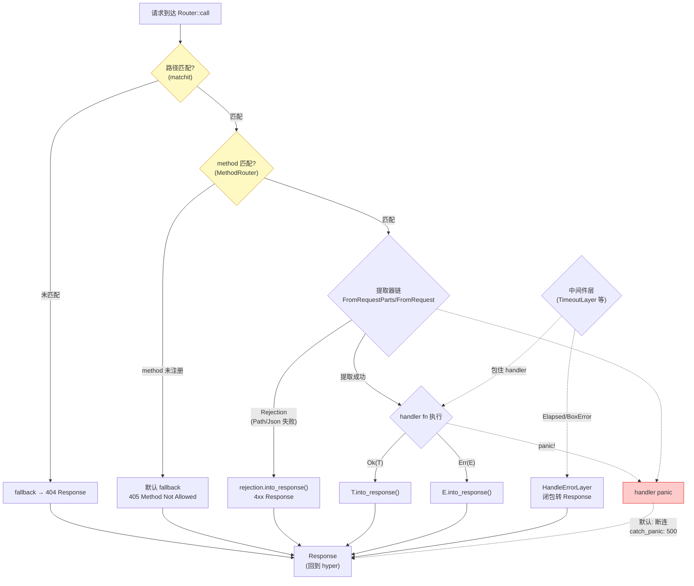

# 第 18 章 · 错误处理:Infallible 与 HandleError

> **核心问题**:上一章你跟着一次 axum 请求从 `axum::serve` 一路走到 handler fn 再回到 hyper。但有一件事我们一路刻意绕开:错误。axum 把每条路由的返回值都叫 `Response`,handler 里 `Result<T, E>` 的 `E` 去哪了?提取器 `Path` 反序列化失败、`Json` 解析失败、handler `Err(e)` 出去——这些"错误"最后怎么变成客户端看到的 4xx/5xx 页面?还有一件更反直觉的事:`Router` 作为 `tower::Service`,它的 `type Error = Infallible`(承 P1-03)——一个"永远不可能发生"的错误类型。可 Tower 的 Service 明明是允许返回 `Err` 的(承《Tower》P0-01),hyper 的连接层也在等 `Result<Response, Error>`——axum 凭什么把 Error 写死成"不可能"?而一旦你套了一个真会返回错误的中间件(比如 `tower::timeout::TimeoutLayer` 返回 `Elapsed`),`Router::layer` 的 trait bound `Error: Into<Infallible>` 立刻编译红(承 P4-16)。最后还有一个没人爱讲但生产必踩的坑:handler 里 `panic!()` 会怎样?axum 默认不 recover——连接直接断,客户端拿到的是连接重置,不是 500。这一章把"一次请求的所有错误归宿 + 为什么 Router Error 是 Infallible + 中间件错误怎么兜底 + panic 怎么处理"这一整套机器拆透。
>
> **读完本章你会明白**:
>
> 1. 为什么 axum 把 `Router`/`Route`/`MethodRouter` 的 Service Error **钉死成 `Infallible`**——这是"在框架层把所有错误归一化成 Response"的设计取舍,让上层 hyper-util 不用处理业务错,连接层只管 HTTP 协议错;对照 hyper/Tower 的 Service 允许返回 Error,这个取舍意味着什么;
> 2. handler 里写的 `async fn() -> Result<Json<User>, AppError>`,那个 `AppError` 不是 Service Error——它是 `IntoResponse` 的实现者,handler 返回 `Err(app_error)` 等价于返回一个错误页 Response,跟 Service `Err` 完全是两条路(承 P3-12 的 IntoResponse);
> 3. 提取器失败(`Path`/`Json`/`Query` 反序列化失败)产生的 **Rejection** 怎么变成 4xx Response——`Rejection: IntoResponse`,axum 在框架层调 `rejection.into_response()`,handler 根本没被调到(承 P3-11);
> 4. 为什么"返回非 Infallible 错误的中间件"(TimeoutLayer 的 Elapsed、自定义中间件的 BoxError)在 axum 里**必须**用 `HandleErrorLayer` 兜底——本章只承接指路 P4-16,不重复 HandleError 内部机制,这里只讲"为什么需要兜底"和"兜底在中间件链里的位置";
> 5. handler 里 `panic!()` 默认会发生什么——panic 沿 Tokio task 冒泡,**没有 Response** 回到客户端,连接被断(客户端看到连接重置);生产环境用 `tower-http::catch_panic::CatchPanicLayer`(外部 crate)把 panic 转成 500 Response——这是外部 crate 诚实标注。
>
> **逃生阀(读不下去怎么办)**:本章有四条互相缠绕的线(Router Error=Infallible、handler E→IntoResponse、Rejection→IntoResponse、HandleError 兜底、panic 处理),信息密度大。如果一时绕不开,记住五句话就够——**① Router 的 Service Error 永远是 Infallible,意味着 Router 处理一个请求要么返回 Response、要么 panic,不会返回 Service Err;② handler 里写的 `Err(e)` 不是 Service Err,它是 handler 返回值的一部分,经 `IntoResponse` 变成 Response;③ 提取器失败走 Rejection,Rejection 也 impl IntoResponse,在调 handler 之前就 return 了 4xx Response;④ 中间件返回非 Infallible 错误必须用 HandleErrorLayer 兜底(深度在 P4-16,本章只讲为什么需要);⑤ handler panic 默认断连,生产用 tower-http catch_panic 转 500**。带着这五句话跳到对应小节细读。本章处处承《hyper》P1-02(Service trait)、承《Tower》P0-01/P1-02(Service Error + poll_ready 背压)、承 P1-03(Router Error=Infallible 的 Service 适配地基)、承 P3-11/P3-12(Rejection/IntoResponse)、承 P4-16(HandleErrorLayer 深度)、承《Tokio》(task panic 冒泡),读过那些收获翻倍,但不是硬性前提。

---

## 一句话点破

> **axum 把 Web 框架的所有"业务错误"——提取器 Rejection、handler 的 `Err`、404/405、中间件的 Elapsed/BoxError——在框架层全部归一化成 `Response`,然后让 `Router` 的 Service `type Error = Infallible`。这是个"语义搬家"的设计:错误没消失,只是从 Service trait 的 `Err` 通道,搬到了 `Response` 的状态码 + body 通道。这样上层 hyper-util 不用懂业务错(它只管 HTTP 协议错,如解析失败、连接半关闭),连接层和服务层职责干净分离。代价是:任何真会返回 Service Err 的中间件(TimeoutLayer 等),都不能直接挂到 Router 上,必须用 HandleErrorLayer 在外层把 Err 拦下来转 Response(深度 P4-16)。而 handler 里 `panic!()` 不走这套机器——它沿着 Tokio task 冒泡,默认把连接直接断掉,要兜底得靠外部 crate `tower-http` 的 CatchPanicLayer。**

这是结论,不是理由。本章倒过来拆:一次请求有哪些"出错口子"、为什么 axum 选 Infallible 而不是"允许 Service Err"、handler 的 `Err` 怎么变 Response、提取器 Rejection 怎么变 Response、HandleErrorLayer 为什么必须存在、panic 默认怎么收场。

---

## 第一节:从一次请求的五个出错口子开始

### 提问

回忆一次 axum 请求的全景(承 P1-02):hyper accept 连接 → HTTP 协议机解析 → 把 `Request` 交给 `Router::call` → `PathRouter` 用 matchit 匹配路径 → `MethodRouter` 按 method 选 handler → `Handler::call` 跑提取器链 → handler fn 执行 → 返回值 `into_response` → 回 hyper 写回连接。

这条链路上,有哪些地方会"出错"?把所有出错口子枚举出来,这一章的地图就清晰了。axum 0.8.9 的官方文档(`axum/src/docs/error_handling.md`)开宗明义说:

> axum is based on `tower::Service` which bundles errors through its associated `Error` type. If you have a `Service` that produces an error and that error makes it all the way up to hyper, the connection will be terminated _without_ sending a response. This is generally not desirable so axum makes sure you always produce a response by relying on the type system.

翻译:Service trait 的 `Err` 一旦冒到 hyper,连接会被**直接断掉,不回任何 Response**。这通常是灾难(客户端看到连接重置,不知道发生了什么)。所以 axum 用类型系统**强制保证总是能产出一个 Response**。这套强制机制的核心就是 `Infallible`。

先来看一次请求的五个出错口子,以及 axum 在每一口子上的处理策略:



五个出错口子逐个看:

1. **路径不匹配(404)**:matchit 字典树没匹配上,走 fallback;fallback 默认返回 404(承 P2-08)。
2. **method 不匹配(405)**:路径匹配上了,但 HTTP method(GET/POST/…)没注册。`MethodRouter` 的默认 fallback 是个 `service_fn` 返回 `StatusCode::METHOD_NOT_ALLOWED`(`method_routing.rs#L750-L754`)。
3. **提取器 Rejection**:`Path`/`Query`/`Json`/`Form` 这些提取器在 `from_request_parts` / `from_request` 时失败(反序列化错、Content-Type 不对、body 超大)。失败返回 `Rejection`,axum 在调 handler 之前就 `rejection.into_response()` 返回 4xx Response(承 P3-10/P3-11)。
4. **handler 的 `Err`**:handler 是 `async fn(...) -> Result<T, E>`,业务逻辑返回了 `Err(e)`。`e` 经 `IntoResponse` 变成 Response(承 P3-12)。
5. **中间件的 Service Err**:套在 handler 外面的 Tower 中间件(TimeoutLayer 返回 Elapsed、ConcurrencyLimit 返回 error、自定义中间件返回 BoxError),这些是 Service trait 意义上的真 `Err`,不是 Response。要 `HandleErrorLayer` 兜底(承 P4-16)。

还有第六个:handler 里 `panic!()`,这是另一条故事线,后面单独拆。

> **钉死这件事**:axum 的错误处理有**五个出错口子**(404/405/Rejection/handler Err/中间件 Err)和**一个特殊路径**(panic)。前四个口子,axum 都在框架层把错误转成 Response;第五个口子要 `HandleErrorLayer` 兜底;panic 默认断连,要 catch_panic 兜底。这一整套机器的目的只有一个:**让 Router 的 Service Error 是 Infallible,Service 永远产 Response**。

### 不这样会怎样:如果让 Service Err 冒到 hyper

来看官方文档那句话的下半段——"the connection will be terminated _without_ sending a response"。具体是什么意思?

回到 axum 的 serve 代码(承 P5-17 详拆),`serve/mod.rs#L385-L402`:

```rust
// axum/src/serve/mod.rs#L385-L402(摘录关键)
let hyper_service = TowerToHyperService::new(tower_service);
// ...
tokio::spawn(async move {
    // ...
    let mut conn = pin!(builder.serve_connection_with_upgrades(io, hyper_service));
    // ...
    loop {
        tokio::select! {
            result = conn.as_mut() => {
                if let Err(_err) = result {
                    trace!("failed to serve connection: {_err:#}");
                }
                break;
            }
            // ...
        }
    }
});
```

`serve_connection_with_upgrades(io, hyper_service)` 跑 HTTP 协议机,它内部调 `hyper_service.call(req)`。如果 `hyper_service` 返回 `Err`,hyper 协议机怎么处理?它把 `Err` 当成"应用层出错",**直接关闭连接**——已经写到 socket 的 Response 头/体可能不完整,客户端拿到的是 EOF/连接重置。`serve/mod.rs` 里只是 `trace!` 一行日志,然后 `break`(结束这个连接的 task)。

这就是官方文档说的"terminated without sending a response"。对客户端来说,看到的就是"连接突然断了",HTTP 协议无法表达"这是你的请求格式问题还是服务端 bug"。**这通常是生产服务最坏的用户体验**——客户端重试?它根本不知道该不该重试。

所以 axum 的设计目标是:**绝不让 Service `Err` 冒到这一层**。怎么做?用类型系统——`Router` 的 Service `type Error = Infallible`,意味着编译期保证 Router **不可能返回 Err**,只能返回 `Ok(Response)`。这样 `serve_connection` 那条链路收到的永远是 `Ok`,不会有"应用层出错"的分支。

> **钉死这件事**:让 Service `Err` 冒到 hyper = 连接被无 Response 断掉 = 客户端看到连接重置。axum 用 `Router::Service::Error = Infallible` 这个类型签名,**在编译期堵死这条路径**——Router 不可能返回 Err,hyper 自然不会走到"应用层出错断连"分支。这是 axum 错误处理整套设计的根本动机。

---

## 第二节:为什么 Router 的 Service Error 钉死是 Infallible

### 提问

上一节讲了"为什么不让 Service Err 冒到 hyper"。但还有一个更尖锐的问题:Tower 的 Service trait 明明是允许返回 Err 的(承《Tower》P0-01 的 `type Error` 关联类型),hyper/Tower 的 Service 可以让 `Error` 是任意类型(协议错、业务错、自定义错)。**为什么 axum 偏偏把 Router 的 Error 写死成 `Infallible`?为什么不是 `BoxError`?为什么不是 `axum::Error`?**

这一节拆透这个设计取舍。

### 不这样会怎样:如果 Router 的 Error 是 BoxError

假设 axum 把 Router 的 Service Error 设计成 `BoxError`(也就是 `Box<dyn std::error::Error + Send + Sync>`),允许 handler/中间件把任意错误冒到 Router。会怎样?

先看编译侧——`Router::layer` 的 trait bound(承 P4-16 引用过)现在长这样(`mod.rs#L302-L317`):

```rust
// axum/src/routing/mod.rs#L302-L317(逐字摘录)
pub fn layer<L>(self, layer: L) -> Router<S>
where
    L: Layer<Route> + Clone + Send + Sync + 'static,
    L::Service: Service<Request> + Clone + Send + Sync + 'static,
    <L::Service as Service<Request>>::Response: IntoResponse + 'static,
    <L::Service as Service<Request>>::Error: Into<Infallible> + 'static,
    <L::Service as Service<Request>>::Future: Send + 'static,
{
    // ...
}
```

关键那行 `<L::Service as Service<Request>>::Error: Into<Infallible>`。如果 Router 的 Error 改成 BoxError,这行会变成 `Error: Into<BoxError>`——基本所有错误类型都能转 BoxError(`Into<BoxError>` 是 Tower 生态的通用 bound),所以**任何**中间件都能直接挂上去,不用 HandleErrorLayer。

听起来更方便,对吧?但代价立刻显现:

**代价一:业务错和协议错混在一条 Err 通道里**。hyper 协议层有自己的错误类型(连接断、解析失败、半关闭),axum Router 如果也产 BoxError(业务错),两者在 `serve_connection` 那条链路相遇——hyper 协议层会怎么区分"这是业务错我要断连"还是"这是业务错但客户端应该看到 500"?

对照实际:hyper-util 的 `TowerToHyperService`(`serve/mod.rs#L385`)把 tower Service 包成 hyper Service。它内部的转换大致是:`tower_service.call(req).await` 返回 `Result<Response, E>`,如果是 `Ok(resp)` 就交给 hyper 协议层写回;如果是 `Err(e)` 就... 取决于 `e` 是什么类型。如果 E 是 Infallible,`Err` 分支根本走不到(`match err {}` 穷尽,后面会看到 axum 内部到处用这个 trick);如果 E 是 BoxError,hyper-util 要决定"这个 BoxError 该不该断连"——可 hyper-util 不懂业务,它怎么判断?

把 `serve/mod.rs#L380-L386` 那段抓过来看(`unwrap_or_else(|err| match err {})` 是关键):

```rust
// axum/src/serve/mod.rs#L376-L386(摘录关键)
let tower_service = make_service
    .call(IncomingStream { io: &io, remote_addr })
    .await
    .unwrap_or_else(|err| match err {})   // ← Infallible 穷尽 match
    .map_request(|req: Request<Incoming>| req.map(Body::new));

let hyper_service = TowerToHyperService::new(tower_service);
```

`unwrap_or_else(|err| match err {})`——`err` 是 Infallible,`match err {}` 是穷尽 match(Infallible 没有变体,match 不到任何分支,但编译器知道它是 never type,可以推导成任意类型)。如果 err 是 BoxError,这里就得写成 `unwrap_or_else(|err| /* 返回一个默认 service */)`——可"BoxError 时返回什么默认 service"?没有合理答案,只能 panic 或者用空 service。整个 `make_service.call(...).await` 这一步,从"不可能失败"退化成"可能失败要处理",代码立刻复杂。

**代价二:连接层被迫懂业务错**。回到 `serve_connection` 的 `Err(_err)` 分支——现在它要区分"这是协议错(连接断了,正常断)"还是"这是业务错(应该 500,不该静默断连)"。hyper 协议机不认识 BoxError 里装的是什么(可能是 `Elapsed`、可能是 `anyhow::Error`、可能是自定义 AppError),它只能**统一断连**。这就是官方文档说的"terminated without sending a response"——业务错和协议错混在 Err 通道,客户端拿到的是连接重置,不是 500。

**代价三:handler 写法被迫变复杂**。现在的 axum,你写 `async fn handler() -> Result<Json<User>, AppError>` 很自然——AppError impl IntoResponse 就行。如果 Router 的 Error 是 BoxError,handler 的 `Err(AppError)` 要么被自动转成 Service Err(那 handler 的 E 就要 impl `Into<BoxError>` 而不是 IntoResponse,可 IntoResponse 是"我变成 Response",`Into<BoxError>` 是"我变成错误冒到连接层",语义完全相反),要么框架再帮你把 AppError 在某处转成 Response(那就是现在 axum 的设计,所以 Error 还是 Infallible)。两难。

> **不这样会怎样**:把 Router Error 设计成 BoxError 看似"更灵活"(任何中间件都能挂),但代价是业务错和协议错混在一条通道,hyper-util/hyper 要懂业务错才能决定"断连还是 500",连接层被迫处理它不该懂的东西,客户端拿到的是连接重置而不是 500 Response。

### 所以 axum 这么设计:Infallible——业务错在框架层全部转 Response

axum 的取舍是反过来的:**让 Service Error 永远是 Infallible,所有业务错(提取器 Rejection、handler Err、中间件 Err)都在框架层转成 Response**。这样:

- **协议层只管协议错**:hyper 协议机收到的 `Result<Response, Infallible>` 里 Err 永远不会出现(`match err {}` 穷尽),它专注处理 HTTP 协议自身的错(连接半关闭、解析失败、H2 流控错)——这些是 hyper 的事,跟业务无关。
- **业务错全部走 Response 通道**:Rejection 是 Response(4xx),handler Err 是 Response(可能是 4xx 也可能是 5xx,取决于你的 AppError 怎么 impl IntoResponse),404/405 是 Response——它们都是 `Ok(Response)`,经同一套 HTTP 写回机制(状态码 + headers + body)回到客户端。
- **连接层和服务层职责分离**:hyper-util `TowerToHyperService` 只管"把 tower Service 的 Response 喂给 hyper 协议机",不需要懂业务错;axum Router 只管"产 Response",不管协议错(协议错由 hyper 在更下层处理)。

来看 Router 的 impl Service 真身(承 P1-03 引用过,这里只看 Error 部分,`mod.rs#L569-L588`):

```rust
// axum/src/routing/mod.rs#L569-L588(逐字摘录)
impl<B> Service<Request<B>> for Router<()>
where
    B: HttpBody<Data = bytes::Bytes> + Send + 'static,
    B::Error: Into<axum_core::BoxError>,
{
    type Response = Response;
    type Error = Infallible;                  // ★ 钉死
    type Future = RouteFuture<Infallible>;

    #[inline]
    fn poll_ready(&mut self, _: &mut Context<'_>) -> Poll<Result<(), Self::Error>> {
        Poll::Ready(Ok(()))
    }

    #[inline]
    fn call(&mut self, req: Request<B>) -> Self::Future {
        let req = req.map(Body::new);
        self.call_with_state(req, ())         // → RouteFuture<Infallible>
    }
}
```

`type Error = Infallible`,`type Future = RouteFuture<Infallible>`——Router 处理一个请求,future 产出的不是 `Result<Response, SomeError>`,而是 `Result<Response, Infallible>`。`Infallible` 是标准库类型(`std::convert::Infallible`),它是个**不可居住类型**(uninhabited type)——没有值能构造它,所以 `Result<T, Infallible>` 的 `Err` 分支永远到不了,等价于 `T`。这就是为什么 axum 内部到处能写 `match err {}`(穷尽 Infallible,编译器推导成任意类型)。

这个设计在类型层面"声明":Router 处理请求,要么产 Response、要么不返回(panic,这是另一条线),但**不可能产 Service Err**。这是编译期保证,不是运行期约定——你写不出"Router 返回 Err"的代码,编译器直接拒绝。

> **钉死这件事**:`Router::Service::Error = Infallible` 是 axum 的核心设计取舍——把所有业务错在框架层归一化成 Response,Service Err 通道恒空。这不是"偷懒"或"凑合",是**职责分离的类型层表达**:协议错归 hyper 协议层,业务错归 axum 框架层(转 Response),连接层(hyper-util)只做转发不处理业务。`Infallible` 作为不可居住类型,让编译器替你保证"Router 不可能返回 Err"。

### 反面对比:hyper/Tower 的 Service 允许返回 Error,为什么 axum 不学

把三个项目的 Service Error 设计放一起对照,axum 的取舍就清晰了:

| 项目 | Service Error 类型 | 谁来处理 Err | 设计理由 |
|------|------|------|------|
| **tower-service** | 任意关联类型(由实现者决定) | 调用方(上游 Service / 用户代码) | 通用抽象层,不能假设错误怎么处理,留给具体实现 |
| **hyper Service**(server 端) | 任意(用户给) | hyper 协议层(默认断连) | hyper 是协议库,把"应用怎么处理错误"留给上层框架 |
| **axum Router** | 钉死 `Infallible` | (永远不会 Err) | 框架层把业务错全部转 Response,让协议层不用懂业务 |

逐行拆:

- **tower-service 是通用抽象**,它的 `type Error` 是关联类型,实现者自己决定是什么。Buffer 可能返回 `ServiceError`,ConcurrencyLimit 可能返回 `Overflow`,Retry 可能返回 inner 的 Error。Tower 不规定"错误该怎么处理",因为 Tower 不知道你跑什么协议、什么业务(承《Tower》P0-01 的"通用语法"定位)。所以 Service Error 必须是开放的关联类型。

- **hyper 是协议库**,它的 server Service 也允许任意 Error(`hyper/src/service/service.rs#L32`),但 hyper 自己**不帮你转 Response**——Service 返回 Err,hyper 协议层就断连(因为 hyper 不知道这个 Err 该映射成 404 还是 500 还是别的)。这个取舍是合理的:hyper 是协议库,不是 Web 框架,把"业务错怎么变 Response"的事让给上层(axum)。承《hyper》P1-02 一句带过。

- **axum 是 Web 框架**,它的职责恰好就是"把业务错变成 Response"。所以 axum 选 Infallible——既区分了自己和 hyper 的职责(协议错归 hyper,业务错归 axum 转 Response),又让连接层简化(hyper-util 不用处理业务错,因为 axum 保证不产 Service Err)。

这条栈的设计是连贯的:**Tower 留口子(任意 Error)→ hyper 不管(协议库)→ axum 全转 Response(Infallible)**。每一层做最适合自己的事,不重复劳动。如果你在 axum 之外用裸 hyper 写 server,你就得自己决定"业务错怎么变 Response"——这正是 axum 帮你省下的事。

> **钉死这件事**:axum 选 Infallible 不是"放弃灵活性",是**承担起 Web 框架该承担的职责**——把业务错变成 Response。hyper 不管(它是协议库),Tower 留口子(它是通用抽象),axum 把这层补上,让你写 handler 时不用操心"我的 Err 怎么回客户端"。`type Error = Infallible` 是这个承诺的类型层签字。承《hyper》P1-02、承《Tower》P0-01 一句带过。

### 顺着这条线看:MethodRouter/Route 的 Error 也是 Infallible(默认场景)

Router 不是 axum 唯一的 Service。`Route`/`MethodRouter` 也 impl Service。它们的 Error 类型是什么?

来看 `Route`(`route.rs#L88-L101`):

```rust
// axum/src/routing/route.rs#L86-L101(逐字摘录)
impl<B, E> Service<Request<B>> for Route<E>
where
    B: HttpBody<Data = bytes::Bytes> + Send + 'static,
    B::Error: Into<axum_core::BoxError>,
{
    type Response = Response;
    type Error = E;                          // ★ 泛型 E(默认场景 = Infallible)
    type Future = RouteFuture<E>;

    #[inline]
    fn poll_ready(&mut self, _cx: &mut Context<'_>) -> Poll<Result<(), Self::Error>> {
        Poll::Ready(Ok(()))
    }

    #[inline]
    fn call(&mut self, req: Request<B>) -> Self::Future {
        self.oneshot_inner(req.map(Body::new)).not_top_level()
    }
}
```

注意 `Route<E>`——它的 Error 类型是泛型 `E`!不是写死 Infallible。可为什么我说"默认场景"是 Infallible?因为 `Route::new` 的调用方(`mod.rs` 内部)把 E 实例化成 Infallible——`Route<Infallible>` 是 axum 路由表里 `Endpoint` 持有的标准类型。

`MethodRouter` 类似(`method_routing.rs#L1288-L1296`):

```rust
// axum/src/routing/method_routing.rs#L1288-L1296(逐字摘录)
impl<B, E> Service<Request<B>> for MethodRouter<(), E>
where
    B: HttpBody<Data = bytes::Bytes> + Send + 'static,
    B::Error: Into<axum_core::BoxError>,
{
    type Response = Response;
    type Error = E;                          // ★ 泛型 E(默认场景 = Infallible)
    // ...
}
```

为什么 Route/MethodRouter 用泛型 E,而 Router 用 Infallible?这给了 axum 一个"中间状态"——在你套中间件的过程中,MethodRouter 的 E 可能暂时是 `Elapsed`(TimeoutLayer 套上去)、`BoxError`(自定义中间件),这时它**还没法挂到 Router 上**(Router 要 Infallible)。你需要 `HandleErrorLayer` 把 E 焊回 Infallible,才能挂上去。这正是 P4-16 拆透的"HandleErrorLayer 兜底"机制——本章只承接指路,不重复内部。

所以 axum 的 Service Error 类型链,从内到外是:`Route<Infallible>`(handler 经 MapIntoResponse 包装,Response 已经统一)→ `MethodRouter<S, E>`(套中间件时 E 可能变)→ `Router<()>`(`type Error = Infallible` 钉死,所以你要把 MethodRouter 的 E 兜回 Infallible 才能挂上)。**Router 是 Infallible 的硬约束,MethodRouter/Route 的 E 是"过渡态"**,允许你套中间件时临时改 Error 类型,但最终要焊回 Infallible。

> **钉死这件事**:`Route<E>` 和 `MethodRouter<S, E>` 的 Error 是泛型 `E`,不是写死 Infallible——这给了"套中间件时 Error 暂时变成 Elapsed/BoxError"的能力(承 P4-16)。但 `Router<()>` 的 Error 写死 Infallible,所以最终你必须把 E 焊回 Infallible(HandleErrorLayer 做这事),才能挂到 Router。这条"Route/MethodRouter 用泛型 E 过渡 + Router 钉死 Infallible"的类型链,是 axum 错误处理的核心结构。

---

## 第三节:handler 的 `Err` 怎么变成 Response

### 提问

上一节讲了"Router 的 Service Error = Infallible,所有业务错都走 Response 通道"。但有一件具体的事还没拆透:你写 handler 时,经常返回 `Result<T, E>`:

```rust
async fn get_user(Path(id): Path<i64>) -> Result<Json<User>, AppError> {
    let user = db.find_user(id).await?;   // ? 传播 AppError
    Ok(Json(user))
}
```

这里的 `AppError` 是 Service Err 吗?如果 Router 的 Error 是 Infallible,那 `Err(AppError)` 怎么没让 Router 返回 Service Err?它怎么变成 Response 的?

这一节拆透 handler 的 `Result<T, E>` 怎么融入 Infallible 模型。核心结论先抛:**handler 的 `Err` 不是 Service Err,它是 handler 返回值的一部分,经 `IntoResponse` 变成 Response**。

### 不这样会怎样:如果 handler 的 Err 是 Service Err

假设 axum 设计成"handler 的 `Err(E)` 直接当 Service Err"。会怎样?

先看 handler 怎么变成 Service。axum 用 `impl_handler!` 宏(承 P3-09 详拆),把任意 `async fn` 包成 `Handler<T, S>` trait 的实现。Handler trait 的 call 方法返回一个 Future,Future 的输出是 `Response`(不是 `Result<Response, E>`)——也就是说,handler 已经在 trait 层面被规定"产 Response,不产 Err"。

来看 HandlerService(`handler/service.rs#L22-L178`,承 P3-09 详拆),它的 Service impl 长这样(简化示意):

```rust
// axum/src/handler/service.rs(简化示意,非源码逐字)
impl<H, T, S, B> Service<Request<B>> for HandlerService<H, T, S>
where
    H: Handler<T, S>,
{
    type Response = Response;       // ★ Response,不是 Result<Response, E>
    type Error = Infallible;
    type Future = /* ... */;

    fn call(&mut self, req: Request<B>) -> Self::Future {
        // 内部调 self.handler.call(req, state),拿到一个 Future<Output = Response>
        // 把它包装成 Self::Future
    }
}
```

关键:**HandlerService 的 Response 类型是 `Response`(不是 handler 的 `Result<T, E>` 里的 `T`)**,Error 是 Infallible。这意味着 handler 的返回值(无论是 `T` 还是 `Result<T, E>`)在 HandlerService 这一层都已经被"压扁"成 `Response`——`T` 经 IntoResponse 变 Response,`Result<T, E>` 也经 IntoResponse 变 Response(`Ok(t) → t.into_response()`,`Err(e) → e.into_response()`)。

具体怎么变的?承 P3-12 的 IntoResponse——`Result<T, E>` 自己 impl 了 IntoResponse(`axum-core/src/response/into_response.rs#L138-L148`):

```rust
// axum-core/src/response/into_response.rs#L138-L148(逐字摘录)
impl<T, E> IntoResponse for Result<T, E>
where
    T: IntoResponse,
    E: IntoResponse,
{
    fn into_response(self) -> Response {
        match self {
            Ok(value) => value.into_response(),
            Err(err) => err.into_response(),     // ★ E 也 impl IntoResponse
        }
    }
}
```

`Result<T, E>` impl IntoResponse 的条件是**两个变体都 impl IntoResponse**。Ok 走 T 的 IntoResponse,Err 走 E 的 IntoResponse。所以你的 `AppError` 必须 impl IntoResponse,handler 才能返回 `Result<_, AppError>`——否则编译错("AppError doesn't implement IntoResponse")。

**handler 的 `Err(AppError)` 经这套机器变成 Response**——具体是什么 Response,取决于你的 AppError 怎么 impl IntoResponse。常见做法:

```rust
// 你的 AppError
enum AppError {
    NotFound,
    Unauthorized,
    Internal(anyhow::Error),
}

impl IntoResponse for AppError {
    fn into_response(self) -> Response {
        match self {
            AppError::NotFound => (StatusCode::NOT_FOUND, "not found").into_response(),
            AppError::Unauthorized => (StatusCode::UNAUTHORIZED, "login required").into_response(),
            AppError::Internal(e) => {
                tracing::error!("internal error: {e}");
                (StatusCode::INTERNAL_SERVER_ERROR, "internal error").into_response()
            }
        }
    }
}
```

这样 `Err(AppError::NotFound)` 经 `into_response()` 变成 `(StatusCode::NOT_FOUND, "not found").into_response()`——一个 404 Response。整个流程:

```
handler 返回 Err(AppError::NotFound)
  → (因为 Result<T,E>: IntoResponse) 调 AppError::NotFound.into_response()
  → 返回 404 Response
  → 这个 Response 是 handler 返回值,经 HandlerService 变成 Service::Response(Response)
  → Route<Infallible> 拿到 Ok(Response)
  → Router 拿到 Ok(Response)
  → 一路 Ok 冒到 hyper,写回客户端
```

注意全程没有 Service Err——`Err(AppError)` 在 handler 返回值这一层就被 IntoResponse "吃掉"变成 Response 了,从来没机会变成 Service Err。这就是为什么 Router 的 Error 可以是 Infallible——handler 的所有可能"出错"的返回值,都被 IntoResponse 转成了 Response。

### handler 的 Result 怎么融入 Infallible 链路

把 handler 的 `Result<T, E>` 在整条 axum Service 链里的位置画出来:

```
┌────────────────────────────────────────────────────────────────┐
│  handler fn: async fn() -> Result<T, E>                         │
│    返回 Err(e) 或 Ok(t)                                          │
└────────────────────────────────────────────────────────────────┘
                              │
                              ▼  Handler::call 把返回值变 Response
┌────────────────────────────────────────────────────────────────┐
│  HandlerService::call                                           │
│    内部 handler.call(req, state) → Future<Output = Response>    │
│    注意: Future 输出已经是 Response, 不是 Result!               │
│    (因为 handler 的返回值经 IntoResponse 压扁了)                 │
└────────────────────────────────────────────────────────────────┘
                              │
                              ▼  Service<Request> for HandlerService
┌────────────────────────────────────────────────────────────────┐
│  type Response = Response                                       │
│  type Error = Infallible                                        │ ← ★ 钉死
│  Future<Output = Result<Response, Infallible>>                  │
└────────────────────────────────────────────────────────────────┘
                              │
                              ▼  MapIntoResponse(承 P1-03)统一 Response 类型
┌────────────────────────────────────────────────────────────────┐
│  Route<Infallible> = BoxCloneSyncService<Request, Response, Infallible> │
└────────────────────────────────────────────────────────────────┘
                              │
                              ▼  MethodRouter/Router 一路向上
┌────────────────────────────────────────────────────────────────┐
│  Router::Service::Error = Infallible, Future<RouteFuture<Infallible>> │
└────────────────────────────────────────────────────────────────┘
```

关键在第二层:Handler trait 把 handler fn 的 `Result<T, E>` 返回值,**在 Handler::call 内部就调 IntoResponse 压扁成 Response**(承 P3-09 的 `impl_handler!` 宏展开)。所以从 HandlerService 这一层往上,看到的都是 `Response`,不是 `Result`。handler 的 `Err` 在很底层就被消化掉了,Service Err 通道(Infallible)用不到。

这套机器的精妙之处:**`Result<T, E>` 是 Rust 的错误处理一等公民,`?` 操作符优雅;axum 让你照常用 `Result` 写 handler,但通过 IntoResponse 的桥接,把 `Result` 的语义从"Service 错误传播"偷换成"返回一个错误页 Response"**。你写 `?` 看起来像在传播错误,实际上每次 `?` 都在"生成一个 Response 然后 return"——但语法上跟普通 Rust 错误处理一模一样,这就是 axum 的工程美学。

> **钉死这件事**:handler 的 `Result<T, E>` 里的 `E` 不是 Service Err,它是 handler 返回值的一部分,经 `IntoResponse` 变 Response。`Result<T, E>: IntoResponse`(`into_response.rs#L138-L148`)是这套机器的桥:Ok 走 T 的 IntoResponse,Err 走 E 的 IntoResponse。所以 handler 返回 `Err(AppError)` 等价于返回一个错误页 Response,**全程没产生 Service Err**。承 P3-12 的 IntoResponse 详拆,本章只确认这条桥怎么把 handler Err 接入 Infallible。

### 一个常见的混淆:handler 的 E 不是 Service Error

新手最容易混淆的两件事:

1. **"handler 的 `E` 必须是 Infallible 吗?"** 不需要。`E` 可以是任意 impl IntoResponse 的类型——`StatusCode`、`String`、`(StatusCode, String)`、自定义 AppError、`anyhow::Error`(写个 IntoResponse impl)。`E` 跟 Service Error 是两条独立通道。你看到 `async fn handler() -> Result<String, StatusCode>` 时,`StatusCode` 是 handler 的错误类型(impl IntoResponse),不是 Service Error。

2. **"如果我想让 handler 不出错,该怎么写?"** 直接返回非 Result 类型:`async fn handler() -> &'static str` 或 `async fn handler() -> impl IntoResponse`。这种 handler 永远产 Response,没 Err 分支。但 Service Error 仍然是 Infallible——因为 HandlerService 把 Response 类型统一了。

来对照官方文档的例子(`error_handling.md#L17-L32`):

```rust
// 摘自 axum/src/docs/error_handling.md
async fn handler() -> Result<String, StatusCode> {
    // ...
}

// 文档原文:
// "While it looks like it might fail with a `StatusCode` this actually isn't
//  an 'error'. If this handler returns `Err(some_status_code)` that will still
//  be converted into a `Response` and sent back to the client. This is done
//  through `StatusCode`'s `IntoResponse` implementation.
//
//  It doesn't matter whether you return `Err(StatusCode::NOT_FOUND)` or
//  `Err(StatusCode::INTERNAL_SERVER_ERROR)`. These are not considered errors
//  in axum."
```

官方文档自己把话说得很直白:"These are not considered errors in axum"——handler 的 `Err(StatusCode)` 不是 axum 意义上的"错误",它就是个 Response 的另一种写法。这种语义偷换,是 axum 错误处理设计的核心诡计:**用 Rust 的 Result 语法,但语义上 Result 的两个分支都是 Response**。

> **钉死这件事**:handler 的 `E` 跟 Service Error 是两条独立通道。`E: IntoResponse` 即可,不要求 `E = Infallible`。`Err(e)` 在 axum 里不是"传播错误",是"返回一个由 e.into_response() 生成的 Response"。这套语义偷换让你能照常写 `?` 操作符优雅处理错误,但底层语义跟普通 Rust 完全不同。

---

## 第四节:提取器 Rejection——还没到 handler 就 return 了

### 提问

上一节讲的是 handler 内部产生的 `Err`。可还有一个出错口子比 handler 更早:**提取器失败**。

你写:

```rust
async fn get_user(Path(id): Path<i64>) -> Result<Json<User>, AppError> {
    let user = db.find_user(id).await?;
    Ok(Json(user))
}
```

如果客户端发的 URL 是 `/users/abc`(id 不是数字),`Path<i64>` 提取器在反序列化时失败——这时 handler 根本没被调到。axum 怎么处理这个失败?它怎么变成客户端看到的 400 Response?

这就是 **Rejection**——提取器失败的产物。这一节拆 Rejection 怎么融入 Infallible 模型。核心结论:**Rejection 也 impl IntoResponse,在调 handler 之前就 return 了 4xx Response**。

### 提取器失败的产物:Rejection

承 P3-10 详拆:每个提取器实现 `FromRequestParts` 或 `FromRequest`,签名是:

```rust
// axum-core/src/extract/mod.rs(承 P3-10 详拆,简化示意)
trait FromRequestParts<S>: Sized {
    type Rejection: IntoResponse;
    fn from_request_parts(parts, state) -> impl Future<Output = Result<Self, Self::Rejection>>;
}
```

注意 `type Rejection: IntoResponse`——每个提取器有自己的 Rejection 类型,且这个类型必须 impl IntoResponse。这就是 axum 把"提取失败"接入 Response 通道的桥——跟 handler 的 `E: IntoResponse` 是同一招。

来看具体的 Rejection 类型怎么定义(`axum-core/src/extract/rejection.rs#L40-L70`,define_rejection 宏展开):

```rust
// axum-core/src/macros.rs(简化示意,define_rejection 宏)
macro_rules! __define_rejection {
    (
        #[status = $status:ident]
        #[body = $body:literal]
        pub struct $name:ident;
    ) => {
        pub struct $name;

        impl IntoResponse for $name {
            fn into_response(self) -> Response {
                let status = StatusCode::$status;
                (status, $body).into_response()       // ★ 变成 (status, body) Response
            }
        }
        // 还 impl Display + std::error::Error, 方便日志
    };
}
```

每个 Rejection 类型,经 `define_rejection!` 宏,自动 impl IntoResponse——`into_response()` 返回 `(StatusCode, body).into_response()`。比如 `Json` 提取器失败时返回 `JsonRejection`(可能是 `MissingJsonContentType`、`BytesRejection`、`JsonSyntaxError` 等组合,承 P3-11),每个都映射到一个 4xx 状态码 + 描述性 body。

具体的 Rejection 例子(承 P3-11 详拆):

- `Path<i64>` 反序列化失败 → `PathRejection::FailedToDeserializePathParameter` → 400 Bad Request,"Invalid URL parameter"。
- `Json<T>` 没 Content-Type: application/json → `JsonRejection::MissingJsonContentType` → 415 Unsupported Media Type。
- `Json<T>` body 超过 2MB(默认限制)→ `JsonRejection::BytesRejection` → 413 Payload Too Large。
- `Query<T>` query string 反序列化失败 → `QueryRejection::FailedToDeserializeQueryString` → 400 Bad Request。

这些 Rejection 都是 4xx Response,不是 Service Err。

### Rejection 在哪里被转 Response

关键问题:Rejection 在哪一步被 `into_response()`?是 handler 调用前还是调用后?

承 P3-09 详拆:`Handler::call` 内部把请求拆成 parts + body,逐个跑提取器链(用 `impl_handler!` + `all_the_tuples!` 宏展开)。简化示意:

```rust
// 简化示意, 非源码原文(承 P3-09 的 impl_handler! 宏展开)
fn call(self, req: Request, state: S) -> Self::Future {
    Box::pin(async move {
        let (mut parts, body) = req.into_parts();

        // 逐个跑 FromRequestParts
        let extractor1 = match T1::from_request_parts(&mut parts, &state).await {
            Ok(value) => value,
            Err(rejection) => return rejection.into_response(),  // ★ 这里 return!
        };
        let extractor2 = match T2::from_request_parts(&mut parts, &state).await {
            Ok(value) => value,
            Err(rejection) => return rejection.into_response(),  // ★ 这里 return!
        };
        // ...
        // 最后一个 FromRequest (可能消费 body)
        let last = match Tn::from_request(from_parts(parts, body), &state).await {
            Ok(value) => value,
            Err(rejection) => return rejection.into_response(),  // ★ 这里 return!
        };

        // 所有提取器都成功, 调真正的 handler fn
        let response = self.handler(extractor1, extractor2, ..., last).await;
        response.into_response()
    })
}
```

注意每个 `match` 的 `Err` 分支:**`return rejection.into_response()`**——直接返回,handler fn 根本没被调到。这是"提取器失败 = 提前 return 4xx Response"的实现。整条提取器链任何一步失败,都直接短路返回 Response,不进 handler。

这也是为什么"提取器失败不会污染 handler 的 Result":handler 的 `Err(AppError)` 是 handler 内部的事;提取器失败在 handler 之前就 return 了,handler 都没运行,谈不上 Err。两条错误路径(提取器 Rejection + handler Err)是**互斥**的——要么提取器成功进 handler(handler 可能 Err 也可能 Ok),要么提取器失败提前 return Rejection Response(handler 没运行)。

把提取器 Rejection 在 Service 链里的位置画出来:

```
┌────────────────────────────────────────────────────────────────┐
│  Request 到 Handler::call                                       │
└────────────────────────────────────────────────────────────────┘
                              │
                              ▼  拆 parts + body
┌────────────────────────────────────────────────────────────────┐
│  FromRequestParts::from_request_parts (Path/Query/State/...)    │
│    Ok(value) → 继续下一个提取器                                  │
│    Err(rejection) → return rejection.into_response()  ← ★ 4xx  │
└────────────────────────────────────────────────────────────────┘
                              │ (全部提取成功)
                              ▼
┌────────────────────────────────────────────────────────────────┐
│  FromRequest::from_request (Json/Form, 最后一个, 消费 body)     │
│    Ok(value) → 继续                                             │
│    Err(rejection) → return rejection.into_response()  ← ★ 4xx  │
└────────────────────────────────────────────────────────────────┘
                              │ (body 提取成功)
                              ▼
┌────────────────────────────────────────────────────────────────┐
│  handler fn(extractor1, extractor2, ..., last)                  │
│    Ok(T) → T.into_response()                                    │
│    Err(E) → E.into_response()         ← 第三节讲的               │
└────────────────────────────────────────────────────────────────┘
                              │
                              ▼  全部都是 Response
                       Response 回 hyper
```

无论走哪条路径(Rejection / handler Ok / handler Err),最终都是 Response。Service Err 通道(Infallible)用不到——这就是 axum 错误处理的设计闭环。

> **钉死这件事**:提取器 Rejection 是 axum 的第二处错误归一化点。每个 `FromRequestParts`/`FromRequest` 都有 `type Rejection: IntoResponse`,失败时返回 Rejection,axum 在 `Handler::call` 里 `rejection.into_response()` 直接 return,**handler fn 都没被调到**。Rejection 经 `define_rejection!` 宏自动 impl IntoResponse,映射到 4xx 状态码 + 描述性 body。承 P3-10/P3-11 的提取器实战详拆,本章只确认 Rejection 怎么接入 Infallible。

---

## 第五节:404 和 405——路由层的"没匹配上"

### 提问

前两节讲的是 handler 相关的错误(handler Err、提取器 Rejection)。还有一类错误比提取器更早:**路由匹配失败**。

你写 `Router::new().route("/users", get(list_users))`,客户端发 `GET /orders`(路径不存在)——matchit 匹配失败,走 fallback。如果 fallback 也是默认的(没自定义),返回 404。再来:客户端发 `POST /users`(路径匹配,但 method 没注册,只注册了 GET)——`MethodRouter` method 不匹配,返回 405。

这两个"路由层错误"怎么变成 Response?它们是 Service Err 吗?

### 404:默认 fallback 返回空 body 404

承 P2-08 详拆 fallback:路径没匹配上,Router 走 fallback_router 或 catch_all_fallback。默认 fallback(你没调过 `.fallback(...)`)是个内置的 service,返回 404 Response。具体在 `not_found.rs`:

```rust
// axum/src/routing/not_found.rs(简化示意, 非源码逐字)
pub(crate) fn not_found() -> Route<Infallible> {
    Route::new(service_fn(|_: Request| async {
        Ok(StatusCode::NOT_FOUND)        // ← 404
    }))
}
```

默认 fallback 是个 `service_fn`,返回 `Ok(StatusCode::NOT_FOUND)`——这是个 Response(StatusCode impl IntoResponse,承 P3-12)。注意它返回的是 `Ok(...)`,Service Err 是 Infallible——404 是 Response 不是 Err。

如果你调了 `.fallback(my_handler)`,就用 my_handler 产 Response 替代默认 404。但无论默认还是自定义,fallback 都产 Response,不产 Service Err。

### 405:MethodRouter 的默认 fallback 返回 METHOD_NOT_ALLOWED

405 更具体。来看 `MethodRouter::new` 的默认 fallback(`method_routing.rs#L750-L769`):

```rust
// axum/src/routing/method_routing.rs#L750-L769(逐字摘录)
/// Create a default `MethodRouter` that will respond with `405 Method Not Allowed` to all
/// requests.
pub fn new() -> Self {
    let fallback = Route::new(service_fn(|_: Request| async {
        Ok(StatusCode::METHOD_NOT_ALLOWED)   // ← 405
    }));

    Self {
        get: MethodEndpoint::None,
        head: MethodEndpoint::None,
        // ... 其余 7 个 MethodEndpoint 也都是 None
        fallback: Fallback::Default(fallback),
        allow_header: AllowHeader::None,
    }
}
```

`MethodRouter::new`(0 参数版本)创建一个所有 method 都是 None 的 MethodRouter,它的 `fallback` 字段是个 `Route`,内部 `service_fn` 返回 `Ok(StatusCode::METHOD_NOT_ALLOWED)`。当一个请求的 path 匹配上了但 method 没注册(GET 没注册、POST 没注册...),`MethodRouter::call_with_state` 走到 fallback 分支(`method_routing.rs#L1175-L1185`),返回这个 405 Response。

注意 405 也是 `Ok(StatusCode::METHOD_NOT_ALLOWED)`——Service Err 是 Infallible,405 是 Response。

> **钉死这件事**:404 和 405 都是路由层的"没匹配上"——但它们不是 Service Err,是 Response。默认 fallback 返回 `Ok(StatusCode::NOT_FOUND)` / `Ok(StatusCode::METHOD_NOT_ALLOWED)`,Service Err 通道(Infallible)恒空。承 P2-08 详拆 fallback 三态(catch_all / method_not_allowed / 自定义),本章只确认这两个状态码也走 Response 通道。

---

## 第六节:中间件错误为什么必须 HandleErrorLayer 兜底

### 提问

前面四节讲的错误(404/405/Rejection/handler Err)都是 axum 内部的——框架自己产、自己转 Response。可你套中间件时,中间件可能产**真正的 Service Err**:

- `tower::timeout::TimeoutLayer::new(Duration::from_secs(10))` 套上去,handler 超时,中间件返回 `Err(tower::timeout::Elapsed)`。
- `tower::buffer::BufferLayer::new(100)` 套上去,worker task 挂了,返回 `Err(tower::buffer::ServiceError)`。
- 你自己写的中间件,可能返回 `Err(BoxError)` / `Err(anyhow::Error)` / 自定义错误。

这些是 Service trait 意义上的真 `Err`(不是 Response),它们怎么融入 axum 的 Infallible 模型?

答案:**必须用 HandleErrorLayer 兜底**。这一节只讲"为什么需要兜底"和"兜底的位置",深度(闭包签名、多提取器、`impl_service!` 宏)承 P4-16 已经拆透,本章不重复。

### 不兜底会怎样:编译直接红

承 P4-16 已经讲过——Router 的 `type Error = Infallible`(第二节拆的钉死约束),所以 `Router::layer` 的 trait bound 要求 `<L::Service as Service<Request>>::Error: Into<Infallible>`(`mod.rs#L308`)。`Into<Infallible>` 基本就是要求 Error 就是 Infallible(因为只有 Infallible 能 Into<Infallible>)。

可 `TimeoutLayer` 装饰出的 Service,Error 是 `tower::timeout::Elapsed`,**不是 Infallible**——`Into<Infallible>` bound 不满足,编译直接红:

```text
error[E0271]: type mismatch resolving `<Timeout<...> as Service<Request>>::Error == Infallible`
   --> src/main.rs:42:10
    |
42  |     .layer(TimeoutLayer::new(Duration::from_secs(10)))
    |      ^^^^^ expected `Elapsed`, found `Infallible`
```

你写不出"带 TimeoutLayer 但不兜底"的 axum 代码。这是 axum 在类型系统层面的硬约束,不是建议。

### HandleErrorLayer:把 Err 转成 Response,Service Error 焊回 Infallible

axum 给的解法是 `HandleErrorLayer<F, T>`(`axum/src/error_handling/mod.rs#L19-L36`)。它的核心机制(P4-16 详拆,这里只引用结论):

```rust
// axum/src/error_handling/mod.rs#L115-L128(逐字摘录, 0-提取器版本)
impl<S, F, B, Fut, Res> Service<Request<B>> for HandleError<S, F, ()>
where
    S: Service<Request<B>> + Clone + Send + 'static,
    S::Response: IntoResponse + Send,
    S::Error: Send,
    // ...
{
    type Response = Response;
    type Error = Infallible;                  // ★ 重新焊回 Infallible!
    type Future = future::HandleErrorFuture;

    fn poll_ready(&mut self, _: &mut Context<'_>) -> Poll<Result<(), Self::Error>> {
        Poll::Ready(Ok(()))
    }

    fn call(&mut self, req: Request<B>) -> Self::Future {
        // ... 内层 .oneshot(req).await,Ok 转 Response,Err 调闭包 f(err) 转 Response
    }
}
```

`type Error = Infallible`——HandleError 装饰出的 Service,Error 类型重新变回 Infallible!无论内层 S 的 Error 是 `Elapsed`、`BoxError`、`anyhow::Error`,HandleError 把它"焊"回 Infallible。具体怎么做到的(P4-16 详拆):闭包 `f: FnOnce(S::Error) -> Fut`,你给一个"错误 → Response"的转换函数,HandleError 在出错时调它,把 Err 转成 Response。

**这是 axum 错误处理的第三处归一化点**:Rejection 在框架层转 Response(第四节),handler Err 在框架层经 IntoResponse 转 Response(第三节),中间件 Err 在 HandleErrorLayer 经你的闭包转 Response(这一节)。三处归一化,殊途同归——都是把 Err 变成 Response,让 Service Err 通道恒空(Infallible)。

### HandleErrorLayer 在中间件链里的位置

P4-16 已经拆透"HandleErrorLayer 必须在出错中间件的外层"。这里只用一张图承接,不重复内部:

```
ServiceBuilder 链(HandleErrorLayer 在外, 出错中间件在内):

  请求
   │
   ▼
┌─────────────────────────────────────────┐
│ HandleErrorLayer<F>                      │  ← 最外层, 接住所有 Err
│   内层 Err 到这里 → 调闭包 f(err) → Response │
└─────────────────────────────────────────┘
   │ Ok(req) 流下去, Err 在这截住
   ▼
┌─────────────────────────────────────────┐
│ TimeoutLayer (Error = Elapsed)           │  ← 可能出 Elapsed
└─────────────────────────────────────────┘
   │
   ▼
┌─────────────────────────────────────────┐
│ handler (经 MapIntoResponse 已 Infallible) │
└─────────────────────────────────────────┘
```

关键:HandleErrorLayer 套在**出错中间件的外层**(ServiceBuilder 里先加),这样错误往外冒时被它接住。承 P4-16 详拆了闭包签名、多提取器版本(`impl_service!` 宏展开 1~16 个提取器)、`MethodRouter::handle_error` 便捷方法等深度内容,本章只承接指路,不重复。

> **钉死这件事**:中间件的真 Service Err(TimeoutLayer 的 Elapsed 等)不能直接挂到 Router(Router 要 Infallible),必须用 HandleErrorLayer 兜底。HandleErrorLayer 在出错中间件外层,用你的闭包把 Err 转成 Response,Service Error 重新焊回 Infallible。**深度全部承 P4-16**(闭包签名、多提取器、`impl_service!` 宏、`MethodRouter::handle_error` 便捷方法),本章只确认这条错误归一化点存在,以及它在中间件链里的位置。

---

## 第七节:panic 怎么办——默认断连,catch_panic 兜底

### 提问

前六节讲的错误(404/405/Rejection/handler Err/中间件 Err)都是**可恢复的**——它们走 Response 通道,客户端拿到 4xx/5xx 页面。可还有一种错误是**不可恢复**的:

```rust
async fn handler() -> &'static str {
    let x: i64 = "abc".parse().unwrap();   // ← panic!
    "ok"
}
```

handler 里 `unwrap()` 失败(或 `panic!()`、或数组越界、或除以零),会 panic。panic 不是 Result,不走 IntoResponse,不走 HandleErrorLayer——它走的是另一条完全不同的路径。这一节拆 panic 怎么收场。

核心结论先抛(这一节是本章最反直觉的部分):**axum 默认不 recover panic,handler panic 沿 Tokio task 冒泡,连接直接断,客户端看到连接重置**。生产环境必须用 `tower-http` 的 `CatchPanicLayer`(外部 crate)兜底。

### panic 不走 Service Err 通道

先澄清一件容易混淆的事:panic 跟 Service Err 是两回事。Service Err 是 `Service::call` 返回的 `Result<Response, E>` 的 Err 分支——它是个"正常的错误返回值",框架能 match 到。panic 是 Rust 运行期的"不可恢复错误",它会**沿调用栈展开(unwind)或终止(abort)**,跟正常的返回值完全不同。

axum 的 `type Error = Infallible` 只堵住了 Service Err——它保证 Service 不会返回 Err,但不保证 Service 不会 panic。一个 Service 可以 `poll_ready` 返回 Ready、`call` 内部 panic——这种情况下 Service 没返回 Err(它根本没返回,panic 中断了执行),`type Error = Infallible` 的约束没被违反,但请求处理已经崩了。

panic 的传播路径是:**handler 内部 panic → 沿 `Handler::call` 的 Future 传播 → 沿 Service 链传播 → 沿 Tokio task 传播 → Tokio task 默认 unwind 把 panic 传播到 spawn 它的地方**。

### 承接《Tokio》:Tokio task 默认怎么处理 panic

承《Tokio》[[tokio-source-facts]] 一句带过:Tokio 的 `tokio::spawn` 创建的 task,如果 panic,默认行为是 **unwind**(展开栈),把 panic 打印到 stderr,然后 task 结束(不影响其他 task)。这个行为可以通过 `panic = "abort"` cargo 设置改成 abort(整个进程退出),但默认是 unwind。

axum 的 serve 在每个连接上 `tokio::spawn` 一个 task(`serve/mod.rs#L392`):

```rust
// axum/src/serve/mod.rs#L392(摘录)
tokio::spawn(async move {
    // ... 跑 serve_connection
});
```

这个 task 内部跑 `serve_connection` → 调 `Router::call` → 调 `Handler::call` → 调 handler fn。如果 handler fn panic,panic 沿 Future 传播到 task 这一层,task 默认 unwind——**这个连接的 task 死了,连接的 socket 被 drop,TCP 连接断开**。

客户端看到的是:**连接突然断开**——HTTP 协议角度,Response 头/体可能根本没写出去(或者写了部分),客户端拿到的是 EOF/连接重置。**没有 500 Response,没有错误信息,只有连接断了**。

这就是官方文档那句话("the connection will be terminated _without_ sending a response")的另一种触发方式——不只是 Service Err,panic 也会导致断连。

### 不这样会怎样:为什么 axum 默认不 recover panic

为什么不默认 recover?三个理由:

1. **panic 的语义是"不可恢复"**。Rust 的 panic 设计语义是"程序进入了无法继续的不变式违反状态"(数组越界、unwrap None、显式 panic!)。recover 它意味着"假装没事继续跑",可能让程序在不一致的状态下继续运行,产生更隐蔽的 bug(数据损坏、安全漏洞)。axum 不替你做这个决定——你 panic 了,说明出了严重问题,断连是诚实的反应。

2. **Go/Python 默认 recover,但 Rust 社区倾向不 recover**。Go 的 `net/http` 默认在 each-request 里 recover panic,记日志,返回 500。Python 的 Flask/Django 也类似。这是动态语言的常见做法——panic(或 exception)没那么严重,recover 后继续服务。但 Rust 社区倾向更严格:panic 是程序员错误(invariant violation),应该修复而不是 recover。axum 跟随 Rust 主流文化,不默认 recover。

3. **recover 有性能成本**。`catch_unwind`(Rust 标准库的 panic 捕获)要为每个请求设置 unwind boundary,有少量开销。axum 不强加这个开销给所有用户——你需要 recover 就自己套 CatchPanicLayer,不需要就享受零开销。

### 反面对比:Go net/http 默认 recover

把 Go 和 axum 对照,这条设计差异最显形:

```go
// go net/http 的默认行为(net/http/server.go)
func (srv *Server) Serve(l net.Listener) error {
    // ...
    // 每个连接一个 goroutine
    go c.serve(ctx)
}

func (c *conn) serve(ctx context.Context) {
    defer func() {
        if err := recover(); err != nil && err != ErrAbortHandler {
            // ★ 默认 recover!
            // 打日志, 返回 500 给客户端
        }
    }()
    // ... 处理请求
}
```

Go 的 `net/http` 在每个连接的 goroutine 里 `defer recover()`——handler panic 了,被 recover 捕获,Go 帮你打日志、返回 500 Response,连接不断。这是 Go 的默认姿态——panic 是 runtime error,可恢复,服务继续跑。

axum 不这么做。它把"要不要 recover panic"的决定权交给你——默认不 recover(panic 断连),你想 recover 就显式套 `tower-http::catch_panic::CatchPanicLayer`(下一节拆)。这个设计差异反映了两门语言对 panic 的态度:Go 把 panic 当 runtime error,Rust 把 panic 当 invariant violation。

> **对照 go net/http**:Go 的 `net/http` 默认 recover panic,返回 500。axum 默认不 recover,断连。这个对照是"动态语言 recover 文化 vs Rust 严格 panic 文化"在 Web 框架层面的体现。

### 怎么 recover:CatchPanicLayer(外部 crate)

生产环境通常不想 panic 把连接断掉——一个 handler 的 bug 导致客户端看到连接重置,体验差,而且难以监控(断连不像 500 那样好统计)。所以生产服务通常套 `tower-http::catch_panic::CatchPanicLayer`。

**诚实标注**:`tower-http` 是**外部 crate**(不是 axum 本仓,也不是 tokio-rs/axum 生态的核心 crate)。axum 源码里**没有任何 panic recovery 代码**(我用 grep 扫过 `axum/src/` 和 `axum-core/src/`,没有 `catch_unwind`、没有 `catch_panic`、没有 `recover`)。`CatchPanicLayer` 在 `tower-http` crate 的 `catch-panic` feature 后面,使用时要 `tower-http = { version = "...", features = ["catch-panic"] }`。

`CatchPanicLayer` 的典型用法(简化示意,基于 tower-http 文档,非 axum 源码):

```rust
// 依赖: tower-http = { version = "0.6", features = ["catch-panic"] }
use tower_http::catch_panic::CatchPanicLayer;
use axum::{routing::get, Router};

let app = Router::new()
    .route("/", get(handler_that_might_panic))
    .layer(CatchPanicLayer::new());   // ← 套在最外层, 捕获所有 handler panic
```

`CatchPanicLayer` 内部用 `std::panic::catch_unwind` 把内层 Service 的 `call` 包起来——panic 被捕获后,转成一个 500 Response(默认 body 是 "Internal Server Error",可配置)。它的 Service Error 也是 Infallible(panic 转成 Response 后,Service 仍然不产 Err)。这跟 HandleErrorLayer 的设计思路一致——把"异常"转成 Response,Service Err 通道恒空。

注意:因为 `CatchPanicLayer` 内部用 `catch_unwind`,它要求内层 Service 是 `UnwindSafe`(Rust 的 panic 安全约束)。大多数 Service 自动满足,但如果你用了 `Rc`/`RefCell` 这类非 UnwindSafe 的内部状态,可能要 `AssertUnwindSafe` 包装。承 tower-http 文档,不展开。

### panic 处理的三层建议

把 panic 处理建议钉死:

1. **生产环境必套 CatchPanicLayer**。除非你的服务允许"panic 就断连",否则生产环境一定要在 Router 最外层套 CatchPanicLayer。这样 handler bug 不会让连接断,而是返回 500,便于监控告警。

2. **panic 不该是常态**。即便套了 CatchPanicLayer,频繁 panic 说明代码有 bug(unwrap 滥用、invariant 没保证)。该修代码就修代码,CatchPanicLayer 是兜底不是常态。

3. **关键状态别依赖"不 panic"**。如果你的 handler 在 panic 前已经修改了共享状态(比如 `Mutex<Db>` 里写了半截数据),catch_unwind 后这个状态可能不一致。这种情况要么用 RAII 保证状态一致(drop 时回滚),要么用 `transaction`(数据库层回滚),别指望 catch_unwind 帮你恢复状态——它只能恢复控制流,不能恢复数据一致性。

> **钉死这件事**:handler panic 默认沿 Tokio task 冒泡,连接断,客户端看到连接重置(没有 Response)。生产环境用 `tower-http::catch_panic::CatchPanicLayer`(外部 crate,axum 本仓无 panic recovery 代码)兜底,把 panic 转成 500 Response。承《Tokio》task panic 行为一句带过。对照 Go net/http 默认 recover,axum 选了"严格 panic 文化"——把 recover 决定权交给用户,不默认 recover。

---

## 第八节:对照 hyper、actix-web、go net/http——错误处理的三种哲学

### 提问

"Web 框架怎么处理错误"这事儿不是 axum 发明的。hyper(Service 允许任意 Error)、actix-web(actor + ResponseError trait)、go net/http(默认 recover panic)都有自己的一套。axum 跟它们是亲戚还是路人?差别在哪?

把这张对照钉死,你就理解 axum 的"Infallible + IntoResponse + HandleErrorLayer + catch_panic"这套机器在 Web 框架设计里的位置。

### hyper:Service 允许任意 Error,协议层不管

hyper 是 axum 的下层(承《hyper》P1-02)。它的 server Service trait(`hyper/src/service/service.rs#L32`)允许任意 Error 类型:

```rust
// hyper 的 Service(承《hyper》P1-02,简化示意)
pub trait Service<Request> {
    type Response;
    type Error;       // ★ 任意类型
    type Future: Future<Output = Result<Self::Response, Self::Error>>;
    fn call(&self, req: Request) -> Self::Future;
}
```

`type Error` 是关联类型,实现者自己决定。如果你裸用 hyper 写 server,你的 Service 可以返回任意 Error——但 hyper 协议层**不帮你转 Response**,Service 返回 Err 时直接断连(承第一节讲的)。这个设计是合理的——hyper 是协议库,把"业务错怎么变 Response"让给上层(axum)。

对照 axum:axum 把 Error 钉死 Infallible,在框架层转 Response。hyper 把 Error 留给实现者,自己只管协议。**axum 补上了 hyper 留下的"业务错 → Response"这层**。

### actix-web:actor + ResponseError trait

actix-web 的错误处理是另一套:`actix_web::Error` 类型 + `ResponseError` trait。

```rust
// actix-web 风格(非 axum 实际 API)
use actix_web::{HttpResponse, ResponseError};

#[derive(Debug)]
struct AppError;

impl ResponseError for AppError {
    fn error_response(&self) -> HttpResponse {
        HttpResponse::InternalServerError().body("internal error")
    }
}

async fn handler() -> Result<String, AppError> {
    Err(AppError)
}
```

actix-web 要求你的错误类型 impl `ResponseError` trait(它有个 `error_response` 方法返回 HttpResponse)。handler 返回 `Result<T, E>` 时,E 必须 impl ResponseError——这跟 axum 的 `E: IntoResponse` 概念上对应,只是 trait 名字不同(actix 叫 ResponseError,axum 叫 IntoResponse)。

差别:

1. **Service Error 类型**:actix-web 内部用 `actix_web::Error`(一个具体的错误类型,封装了 `Box<dyn ResponseError>`)贯穿整个框架,Service trait 的 Error 是这个具体类型。axum 把 Service Error 钉死 Infallible,业务错走 Response 通道,不进 Service Err。**actix 让业务错进 Service Err(再 error_response 转 HttpResponse),axum 让业务错直接走 Response 通道**。
2. **提取器失败**:actix-web 的提取器(`FromRequest` trait)失败时返回 `Error`(actix 的 Error),也是走 Service Err 通道。axum 的提取器失败返回 Rejection(impl IntoResponse),走 Response 通道。**两种设计的根本差异**。
3. **panic 处理**:actix-web 用 actor 模型,handler panic 会把 actor mailbox 弄崩,具体行为看 actix runtime。axum 默认断连(承第七节)。

actix-web 和 axum 都是"业务错转 Response"的思路,但 actix 把错误封装在 Service Err 通道(`actix_web::Error`),axum 直接用 Response 通道(Infallible)。axum 的设计更"扁平"——一条 Response 通道走到底,不分 Service Err 和 ResponseError。

### go net/http:interface + 默认 recover panic

go net/http 的错误处理前面讲过(panic 默认 recover)。完整的对照:

```go
// go net/http
type Handler interface {
    ServeHTTP(ResponseWriter, *Request)
}

func handler(w http.ResponseWriter, r *http.Request) {
    // handler 没 return value, 直接写 Response
    w.WriteHeader(500)
    w.Write([]byte("error"))
}
```

go 的 Handler **没有 return value**——它直接通过 `ResponseWriter` 写 Response。所以"错误处理"在 go 里就是"写一个错误 Response"(`w.WriteHeader(500) + w.Write(...)`)。没有 Result 类型,没有 IntoResponse trait,就是函数调用。

差别:

1. **错误表达方式**:go 用 `ResponseWriter` 命令式写 Response(包括错误 Response)。axum 用 `Result<T, E: IntoResponse>` 声明式返回,框架帮你调 into_response。前者灵活但啰嗦,后者优雅但有学习曲线。
2. **panic**:go 默认 recover(承第七节),axum 默认不 recover。
3. **提取器**:go 没有"提取器"概念,handler 自己从 `r.URL.Query()`、`r.Body` 解析参数,自己处理失败(写 400)。axum 有 FromRequest 提取器,失败自动 Rejection 转 4xx。

### 对照表

| 框架 | Service Error 类型 | 业务错怎么变 Response | panic 处理 |
|------|------|------|------|
| **hyper** | 任意(留给实现者) | 不帮,Service Err 断连 | 协议层不 recover |
| **axum** | 钉死 `Infallible` | 全部走 Response 通道(Rejection/handler E/HandleError 闭包) | 默认断连,tower-http catch_panic 兜底 |
| **actix-web** | `actix_web::Error`(封装 ResponseError) | ResponseError trait,走 Service Err 再转 HttpResponse | actor mailbox 处理 |
| **go net/http** | (无 Service trait,Handler 无 return) | 命令式 `w.WriteHeader(500)` | 默认 recover 返回 500 |

axum 的独特之处:**用 `Infallible` 把 Service Err 通道恒空,让所有业务错走 Response 通道**。这套设计的好处是:协议层(hyper)和服务层(axum)职责干净分离;坏处是:套会返回真 Service Err 的中间件(TimeoutLayer 等)必须用 HandleErrorLayer 兜底,多一层心智负担。

> **钉死这件事**:axum 的"Infallible + IntoResponse"在 Web 框架设计里是独特的——actix-web 用 ResponseError trait 进 Service Err 通道,go 用 ResponseWriter 命令式写,hyper 把决定权完全留给上层。axum 选 Infallible 是为了"业务错和协议错职责分离"——业务错走 Response(框架层管),协议错走 hyper 协议层(连接层管),互不干扰。代价是 HandleErrorLayer 这层心智负担。

---

## 技巧精解

这一节挑本章最硬核的两个技巧,配真实源码 + 反面对比,单独拆透。

### 技巧一:`Infallible` + `match err {}`——用类型系统堵死 Err 通道

**它解决什么问题**:axum 要保证"Router 处理请求永远产 Response,不产 Service Err"。怎么把这个保证做成编译期硬约束(而不是运行期约定)?

**反面对比:运行期约定会怎样**:

假设 axum 用运行期约定,要求 Router 实现这样:`fn call(&mut self, req) -> Result<Response, BoxError>`,内部"约定"不返回 Err。会怎样?

1. **运行期不保证**。某个新来的开发者套了个会出错的中间件,没兜底,Router 在某条路径返回了 `Err(box_error)`——运行期就出 bug 了(连接断)。运行期约定靠人遵守,人不可靠。
2. **类型系统不帮你**。`Result<Response, BoxError>` 的 Err 分支在类型上存在,编译器没法帮你检查"这里没返回 Err"。每个调用方都得自己处理 Err 分支(`match err` 要写 `_ => ...`),代码冗余。
3. **上层 API 复杂化**。`axum::serve` 那条链路要处理 Router 的 Err 分支,虽然"约定不出现",但代码得写 `match router.call(req).await { Ok(resp) => ..., Err(e) => /* 怎么办? */ }`。每个调用方都背负这个不必要的分支。

**axum 的解法:`type Error = Infallible` + `match err {}` 穷尽**。来看 `Router::Service` 的 Error 类型(第二节贴过):

```rust
// axum/src/routing/mod.rs#L569-L580(逐字摘录)
impl<B> Service<Request<B>> for Router<()>
where
    B: HttpBody<Data = bytes::Bytes> + Send + 'static,
    B::Error: Into<axum_core::BoxError>,
{
    type Response = Response;
    type Error = Infallible;                  // ★ Infallible
    type Future = RouteFuture<Infallible>;
    // ...
}
```

`type Error = Infallible`——编译期保证 Router 不返回 Err。为什么?因为 `Infallible` 是**不可居住类型**(`std::convert::Infallible`,本质是 `enum Infallible {}`,没有变体)。要返回 `Err(Infallible)`,你得先构造一个 `Infallible` 类型的值——可这个类型没有值,你构造不出来。所以编译器知道:Router 的 Service 永远不会返回 Err 分支。

这套类型层保证的妙处在调用方:`axum::serve` 里到处能写 `match err {}`(穷尽 match)。来看 `serve/mod.rs#L380-L384`(第一节贴过):

```rust
// axum/src/serve/mod.rs#L380-L384(逐字摘录)
let tower_service = make_service
    .call(IncomingStream { io: &io, remote_addr })
    .await
    .unwrap_or_else(|err| match err {})      // ★ match err {} 穷尽
    .map_request(|req: Request<Incoming>| req.map(Body::new));
```

`unwrap_or_else(|err| match err {})`——`make_service.call(...).await` 返回 `Result<S, Infallible>`(因为 `IntoMakeService::Error = Infallible`,`into_make_service.rs#L27`),`err` 是 Infallible。`match err {}` 是穷尽 match——Infallible 没有变体,match 不到任何分支,但 Rust 编译器知道 Infallible 是 never type(`!`),可以推导成任意类型(这里推导成 `S`,匹配 `unwrap_or_else` 的签名)。所以这一行等于"unwrap,但 Err 分支编译期不可达"。

**为什么不这么写会出问题**:如果 Error 是 BoxError,这一行得写成:

```rust
// 假想: Error = BoxError(撞墙)
let tower_service = make_service
    .call(IncomingStream { ... })
    .await
    .unwrap_or_else(|err| {
        // 怎么办? 没有合理的 "默认 service" 可以返回
        panic!("make_service failed: {err}")    // 只能 panic
    });
```

BoxError 分支要返回一个 service——可没有合理答案,只能 panic。运行期 panic 是 bug,而 Infallible 的 `match err {}` 编译期就消除了这个分支。

**这个技巧贯穿 axum 全栈**。除了 `serve/mod.rs`,`mod.rs` 的 `Endpoint` 处理、`MethodRouter::call_with_state` 内部、`Layered::call`(承 P4-16 引用过)都用了 `match err {}` 穷尽 Infallible 的 trick。这是 axum 把"业务错全部转 Response"的设计落地为编译期保证的核心 Rust 手段。

```rust
// 承 P4-16 引用过: Layered::call 内部(handler/mod.rs#L329-L348)
let future = svc.oneshot(req).map(|result| match result {
    Ok(res) => res.into_response(),
    Err(err) => match err {},               // ★ Error = Infallible, match err {} 穷尽
});
```

`Err(err) => match err {}`——`err` 是 Infallible(Layered 的 Service Error 是 Infallible),穷尽 match,编译器知道这分支不可达,推导成 `Response`(匹配 map 闭包的返回类型)。

> **钉死这件事**:`type Error = Infallible` + `match err {}` 是 axum 把"业务错全转 Response"做成**编译期硬约束**的核心 Rust 手段。Infallible 是不可居住类型,要返回 Err 得先构造 Infallible 值——构造不出来,所以 Err 分支编译期不可达。调用方用 `match err {}` 穷尽 match,优雅地消除 Err 分支,不用写运行期的 fallback。这个 trick 贯穿 axum 全栈(serve/mod.rs, mod.rs, Layered::call 等),是理解 axum 错误处理的钥匙。

### 技巧二:Result<T, E: IntoResponse> 把 Service Err 偷换成 Response

**它解决什么问题**:Rust 的 `Result<T, E>` + `?` 操作符是优雅的错误处理语法。axum 想让你在 handler 里照常写 `Result<T, E>` + `?`,但**语义上 Result 的两个分支都要变成 Response**(因为 Router Error 是 Infallible)。怎么把 Rust 的"Result = 错误传播"语义,偷换成"Result = 两种 Response"语义?

**反面对比:如果 handler 的 E 真的是 Service Err**:

假设 axum 设计成"handler 的 E 直接当 Service Err"。handler 的签名变成:

```rust
// 假想: handler 的 E 是 Service Err(撞墙)
async fn handler() -> Result<String, MyError>
where
    MyError: Into<BoxError>,   // ← 要能转 BoxError, 因为 Service Err 通道
{
    let x = do_something().await?;   // ? 传播 MyError 到 Service Err
    Ok(x)
}
```

撞墙:

1. **Service Err 通道污染**。每个 handler 的 Err 都进 Service Err,Router 的 Error 类型得是 BoxError 或别的——回到第二节的"如果 Router Error 是 BoxError 会怎样"反例,代价全来了(协议层要懂业务错,连接层断连,等等)。
2. **? 的语义错位**。Rust 的 `?` 是"错误传播"——把 Err 往上抛。可 Web 框架里,你想的"错误"其实是"返回一个错误 Response 给客户端",不是"让整个服务挂掉"。语义错位让代码可读性差。
3. **提取器 Rejection 没法统一**。提取器失败的 Rejection 跟 handler 的 E 是两个东西,要么强行统一(Rejection 也要 Into<BoxError>,可 Rejection 的语义是"4xx Response"不是"Service Err"),要么分两套(混乱)。

**axum 的解法:`Result<T, E: IntoResponse>` 自己 impl IntoResponse**。来看真身(`axum-core/src/response/into_response.rs#L138-L148`,第三节贴过):

```rust
// axum-core/src/response/into_response.rs#L138-L148(逐字摘录)
impl<T, E> IntoResponse for Result<T, E>
where
    T: IntoResponse,
    E: IntoResponse,                          // ★ E 也 IntoResponse
{
    fn into_response(self) -> Response {
        match self {
            Ok(value) => value.into_response(),
            Err(err) => err.into_response(),   // ★ E 也调 into_response
        }
    }
}
```

`Result<T, E>: IntoResponse`(条件:T 和 E 都 IntoResponse)。Ok 走 T 的 IntoResponse,Err 走 E 的 IntoResponse——**两个分支都产 Response,没 Service Err**。

这套机器的妙处:

1. **? 操作符照常用**。你在 handler 里写 `db.find_user(id).await?`——如果 `find_user` 返回 `Result<User, AppError>`,`?` 传播 AppError 到 handler 的返回值 `Result<_, AppError>`。语法上跟普通 Rust 一模一样。
2. **语义偷换**。但底层语义是:`?` 把 `Err(AppError)` 传到 handler 返回值,handler 返回 `Err(AppError)`,经 `Result<T, E>: IntoResponse` 的 `into_response`,`Err(app_error)` 调 `app_error.into_response()` 变成 Response(比如 404 或 500)。**`?` 不再是"传播错误让服务挂",而是"生成一个错误 Response 然后 return"**。
3. **提取器 Rejection 用同一套桥**。Rejection 也 impl IntoResponse(`define_rejection!` 宏),所以 Rejection 和 handler E 走同一套 IntoResponse 通道——殊途同归,都变 Response。

来看一个完整例子,把这套机器的语义偷换显形:

```rust
// handler 用 Result + ?
async fn get_user(Path(id): Path<i64>) -> Result<Json<User>, AppError> {
    let user = db.find_user(id).await?;        // ← ? 在这里
    Ok(Json(user))
}

// 语义上, 上面这段等价于:
async fn get_user(Path(id): Path<i64>) -> Response {
    let user = match db.find_user(id).await {
        Ok(u) => u,
        Err(e) => return e.into_response(),    // ← ? 实际做的事
    };
    Json(user).into_response()
}
```

`?` 在 axum handler 里实际做的事,就是"如果 Err,调 into_response 然后 return"。这跟普通 Rust 的"如果 Err,传播 Err 给调用方"语义不同——但语法上一模一样。这就是 axum 的工程美学:**用 Rust 的一等公民语法(Result + ?),但在底层重新定义语义**(错误变成 Response 而不是传播)。

**为什么不这么写会撞墙**:如果 axum 不做这套 IntoResponse 桥,要么强制 handler 不返回 Result(那 `?` 不能用,handler 写起来啰嗦),要么把 E 当 Service Err(回到上面的反例,Service Err 通道污染)。axum 用 `Result<T, E: IntoResponse>` 的 IntoResponse impl,既保留了 Result 的优雅语法,又把语义偷换成"两种 Response",是 Rust 类型系统能给出的最干净解法。

> **钉死这件事**:`Result<T, E: IntoResponse>` 自己 impl IntoResponse(`into_response.rs#L138-L148`),Ok 和 Err 两个分支都调 into_response 变 Response。这是 axum 把 Rust 的"Result = 错误传播"语义偷换成"Result = 两种 Response"的核心 Rust 手段。`?` 操作符照常用,但底层语义是"生成错误 Response 然后 return",不是"传播 Err 让服务挂"。承 P3-12 的 IntoResponse 详拆,本章只确认这条桥怎么把 handler Err 接入 Infallible。

---

## 章末小结

回到全书的二分法:**路由与分发 vs 提取与响应**。本章服务的**总览**这一面——具体说,是错误处理这条横切线,它跨越路由(404/405)、提取(Rejection)、响应(handler Err)、中间件(HandleError 兜底)、运行时(panic)五个层面。

你看到了:

- **Router 的 Service Error 钉死 Infallible**——这是"业务错全部转 Response,Service Err 通道恒空"的设计取舍。让协议层(hyper)只管协议错,业务层(axum)管业务错转 Response,职责干净分离。承 P1-03 的 Service 适配地基。
- **handler 的 `Err` 经 IntoResponse 转 Response**——`Result<T, E: IntoResponse>` 自己 impl IntoResponse,Ok/Err 两分支都调 into_response。handler 的 E 不是 Service Err,是 Response 的另一种写法。承 P3-12 的 IntoResponse。
- **提取器 Rejection 在调 handler 前就 return Response**——`FromRequestParts`/`FromRequest` 的 `type Rejection: IntoResponse`,失败时 `rejection.into_response()` 直接 return,handler 都没运行。承 P3-10/P3-11。
- **中间件真 Service Err 必须 HandleErrorLayer 兜底**——TimeoutLayer 的 Elapsed 不能直接挂 Router(Router 要 Infallible),HandleErrorLayer 在外层用闭包把 Err 转 Response,Error 焊回 Infallible。深度全承 P4-16。
- **panic 默认断连,tower-http catch_panic 兜底**——axum 本仓无 panic recovery 代码,handler panic 沿 Tokio task 冒泡,连接断;生产用 `tower-http::catch_panic::CatchPanicLayer`(外部 crate)转 500。承《Tokio》task panic 行为。
- **`match err {}` 穷尽 Infallible 的 trick 贯穿全栈**——`type Error = Infallible` 让编译器保证 Service 不返回 Err,调用方用 `match err {}` 穷尽 match 消除 Err 分支。这是 axum 把"业务错全转 Response"做成编译期硬约束的核心 Rust 手段。

承《hyper》P1-02(Service trait + hyper 删 poll_ready)一句带过;承《Tower》P0-01(Service Error 关联类型 + Layer 抽象)一句带过;承《Tokio》(task panic 默认 unwind 断连)一句带过;承 P1-03(Router Error=Infallible 的 Service 适配地基)、P3-10/P3-11(Rejection)、P3-12(IntoResponse)、P4-16(HandleErrorLayer 深度)各自承接指路。

### 五个为什么清单

1. **为什么 Router 的 Service Error 是 Infallible,不是 BoxError?** 因为 axum 在框架层把所有业务错(Rejection、handler Err、中间件 Err 经 HandleError)都转成 Response,Service Err 通道恒空。Infallible 作为不可居住类型,让编译器保证 Service 永远产 Response,不产 Err——上层 hyper-util 不用处理业务错,连接层只管 HTTP 协议错。承 P1-03。

2. **为什么 handler 的 `Err(AppError)` 不是 Service Err?** 因为 handler 的 `Result<T, E>` 经 `Result<T, E>: IntoResponse`(`into_response.rs#L138-L148`),Ok 和 Err 两分支都调 into_response 变 Response。handler 的 E 是 IntoResponse 的实现者,不是 Service Err。`?` 操作符照常用,但语义被偷换成"生成错误 Response 然后 return"。承 P3-12。

3. **为什么提取器 Rejection 在调 handler 前就 return?** 因为 `Handler::call` 内部逐个跑 FromRequestParts/FromRequest,任何一步失败 `return rejection.into_response()` 直接返回 Response,handler fn 没被调到。Rejection 也 impl IntoResponse(`define_rejection!` 宏),映射到 4xx 状态码 + body。承 P3-10/P3-11。

4. **为什么中间件(TimeoutLayer)返回 Elapsed 必须用 HandleErrorLayer 兜底?** 因为 Router 的 `type Error = Infallible` 钉死,`Router::layer` 的 trait bound `Error: Into<Infallible>` 要求 Layer 装饰出的 Service Error 必须是 Infallible。TimeoutLayer 的 Error 是 Elapsed,不满足 bound,编译直接红。HandleErrorLayer 在外层用闭包把 Elapsed 转成 Response,Service Error 重新焊回 Infallible。深度承 P4-16。

5. **为什么 axum 默认不 recover handler panic?** 因为 panic 在 Rust 语义里是"不可恢复的 invariant 违反",recover 它意味着"假装没事继续跑",可能让程序在不一致状态下运行。axum 跟随 Rust 主流文化,把 recover 决定权交给用户——默认不 recover(panic 沿 Tokio task 冒泡,连接断),你想 recover 就显式套 `tower-http::catch_panic::CatchPanicLayer`(外部 crate)。对照 Go net/http 默认 recover,这是 Rust 严格 panic 文化在 Web 框架层面的体现。承《Tokio》task panic 行为。

### 想继续深入往哪钻

- **Router/Route/MethodRouter 的 Service impl 全貌(包括 `type Error = Infallible` 和 poll_ready 无条件 Ready)**:→ 第 3 章(P1-03),Router 与 Route 都是 Service,Service 适配地基。
- **IntoResponse trait + tuple 组合响应(包括 `Result<T, E>: IntoResponse`)**:→ 第 12 章(P3-12),IntoResponse 招牌章。
- **FromRequestParts/FromRequest 二元划分 + Rejection 类型 + define_rejection 宏**:→ 第 10 章(P3-10)+ 第 11 章(P3-11),提取器实战。
- **HandleErrorLayer 深度(闭包签名、多提取器、`impl_service!` 宏、`MethodRouter::handle_error` 便捷方法、ServiceBuilder 配合)**:→ 第 16 章(P4-16),中间件链与 ServiceBuilder,本章只承接指路。
- **tower-http 的 CatchPanicLayer / CORS / Compression / Timeout / Trace**:→ 附录 B(实践与集成),tower-http 是外部 crate 生态,本书引用其用法。
- **hyper 协议层怎么处理 Service Err(默认断连)、为什么 hyper 删了 poll_ready**:→《hyper》P1-02,招牌对照点。
- **Tokio task panic 默认 unwind、`tokio::spawn` 的 panic 行为**:→《Tokio》[[tokio-source-facts]],运行时机制。

### 引出下一章

本章你拿到了 axum 错误处理的完整机器:Router Error=Infallible 把业务错全转 Response、handler E 经 IntoResponse 接入、Rejection 在 handler 前就 return、HandleError 兜底中间件 Err、panic 默认断连要 catch_panic 兜底。但 axum 还有一类特殊的"请求处理"我们一直没碰——**长连接和服务端推送**:WebSocket(双向流,handler 跑很久,要 hyper 协议升级)、SSE(服务端推送,Stream of Event)、流式 body(`Body::from_stream`,大文件边读边发)。这些场景下,"一次请求一个 Response"的模型不够用了——handler 不是产一个 Response,而是产一个流。下一章 P5-19 会拆 WebSocket/SSE/流式 body 怎么在 axum 的 Service 模型上实现,以及它们跟 hyper 的协议升级(`Upgrade`,承《hyper》P2-07)怎么衔接。那是 axum 处理"非一问一答"场景的精彩一章。

---

> **本章源码锚点(全部经本地 `../axum/` Grep/Read 核实,版本 axum 0.8.9 @ commit `c59208c86fded335cd85e388030ad59347b0e5ae`)**:
>
> - [Router impl Service for Router<()> type Error = Infallible](../axum/axum/src/routing/mod.rs#L569-L588) —— Router 处理请求永远产 Response 不产 Err 的类型层签字。
> - [Router::layer trait bound Error: Into&lt;Infallible&gt;](../axum/axum/src/routing/mod.rs#L302-L317) —— 任何非 Infallible 中间件编译红的根源。
> - [Route impl Service type Error = E(默认 Infallible)](../axum/axum/src/routing/route.rs#L86-L101) —— Route 的 Error 是泛型 E(套中间件时可能变)。
> - [MethodRouter impl Service type Error = E](../axum/axum/src/routing/method_routing.rs#L1288-L1296) —— MethodRouter 同理。
> - [MethodRouter::new 默认 fallback 返回 405](../axum/axum/src/routing/method_routing.rs#L750-L768) —— `Ok(StatusCode::METHOD_NOT_ALLOWED)` 是 Response 不是 Err。
> - [MethodRouter::handle_error 便捷方法](../axum/axum/src/routing/method_routing.rs#L1099-L1113) —— `.layer(HandleErrorLayer::new(f))` 的语法糖。
> - [HandleErrorLayer/HandleError 定义 + 0 提取器 Service impl type Error = Infallible](../axum/axum/src/error_handling/mod.rs#L19-L149) —— 把任意 Err 转 Response,焊回 Infallible(深度承 P4-16)。
> - [impl_service! 宏展开 1~16 提取器版本](../axum/axum/src/error_handling/mod.rs#L151-L222) —— HandleError 闭包可拿请求信息(承 P4-16)。
> - [error_handling.md 模块文档: axum's error handling model](../axum/axum/src/docs/error_handling.md) —— 官方对 Infallible 模型的解释("not considered errors in axum")。
> - [Result&lt;T, E&gt; impl IntoResponse](../axum/axum-core/src/response/into_response.rs#L138-L148) —— Ok/Err 两分支都调 into_response,handler Err 接入 Infallible 的桥。
> - [define_rejection 宏 + Rejection impl IntoResponse](../axum/axum-core/src/macros.rs#L38-L88) —— 每个 Rejection 自动 impl IntoResponse 映射 4xx。
> - [具体 Rejection 类型(FailedToBufferBody/LengthLimitError 等)](../axum/axum-core/src/extract/rejection.rs#L1-L70) —— 提取器失败的产物。
> - [IntoMakeService::Error = Infallible](../axum/axum/src/routing/into_make_service.rs#L22-L40) —— serve 链路里 make_service 也 Infallible。
> - [serve 函数 + TowerToHyperService + match err {} 穷尽 Infallible](../axum/axum/src/serve/mod.rs#L376-L402) —— `unwrap_or_else(|err| match err {})` 是 Infallible 编译期保证的体现。
> - [HandlerService poll_ready 无条件 Ready](../axum/axum/src/handler/service.rs#L160-L165) —— 注释解释为什么 async fn 总是 ready(承 P1-03)。
> - [Layered::call 内部 match err {} 穷尽 Infallible](../axum/axum/src/handler/mod.rs#L329-L348) —— Handler::layer 套 Layer 后的 Err 处理(承 P4-16)。
>
> **外部 crate(诚实标注,非 axum 源码)**:
> - **`tower-http::catch_panic::CatchPanicLayer`** —— panic 兜底转 500,在 tower-http crate 的 `catch-panic` feature 后面(不在 axum 本仓)。axum 源码里没有 panic recovery 代码(grep `catch_unwind`/`catch_panic`/`recover` 在 `axum/src/` + `axum-core/src/` 全空)。
> - **`tower::timeout::TimeoutLayer`** —— 返回 `tower::timeout::Elapsed`,在 tower crate。
> - **`tower::ServiceExt::oneshot`** —— 先 poll_ready 再 call,承《Tower》P0-01。
> - **`hyper_util::service::TowerToHyperService`** —— tower Service → hyper Service 适配器,承《hyper》P1-02。
>
> **承接**:
> - **承《hyper》[[hyper-source-facts]]**:Service trait 模型承《hyper》P1-02(一句带过);hyper 协议层不帮转 Response、Service Err 默认断连的取舍承《hyper》P1-02(本章对照反例);hyper-util 的 TowerToHyperService 适配器承《hyper》(一句带过)。
> - **承《Tower》[[tower-source-facts]]**:Service Error 关联类型(任意类型)承《Tower》P0-01(一句带过);Layer×Service 双抽象承《Tower》P0-01(一句带过);ServiceExt::oneshot 承《Tower》(一句带过)。
> - **承《Tokio》[[tokio-source-facts]]**:task 默认 unwind、panic 沿 task 冒泡断连的行为承《Tokio》(一句带过)。
> - **承 P1-03**:Router/Route/MethodRouter impl Service 的 `type Error = Infallible`、poll_ready 无条件 Ready、`call_with_state` 对内方法,全在 P1-03 拆透。本章只引用 Error=Infallible 这一点。
> - **承 P3-10/P3-11**:FromRequestParts/FromRequest 二元划分、Rejection 类型、define_rejection 宏、各提取器实战(Path/Query/Json/Form 的 Rejection),全在 P3-10/P3-11 拆透。本章只确认 Rejection impl IntoResponse 这条桥。
> - **承 P3-12**:IntoResponse trait、tuple 组合响应、`Result<T, E>: IntoResponse` 的桥,全在 P3-12 拆透。本章只引用这条桥怎么接入 handler Err。
> - **承 P4-16**:HandleErrorLayer 的完整深度(闭包签名 FnOnce(S::Error)->Fut、多提取器版本 `impl_service!` 宏、`mem::replace` 取走就绪服务惯用法、`MethodRouter::handle_error` 便捷方法、ServiceBuilder 配合时放最外层),全在 P4-16 拆透。本章只承接"为什么需要兜底"+ 在中间件链里的位置,不重复内部机制。
>
> **修正总纲/任务书一处表述**(以源码为准):任务书提到"`Route`/`MethodRouter` 的 Error 是 Infallible" —— 实际 `Route<E>` 和 `MethodRouter<S, E>` 的 Error 是泛型 `E`(套中间件时可能变 Elapsed/BoxError),只有"默认场景下挂到 Router 的实例"是 `Route<Infallible>`/`MethodRouter<S, Infallible>`。`Router<()>` 的 Error 才是真正写死 Infallible。本书正文按"Route/MethodRouter 用泛型 E 过渡,Router 钉死 Infallible"表述(第二节末尾详述)。
