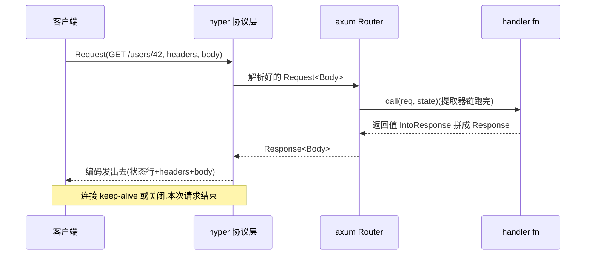
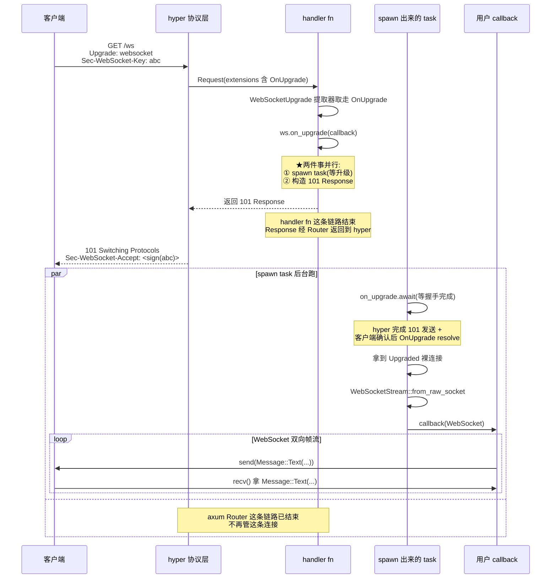

# 第 19 章 · WebSocket、SSE 与流式响应

> **核心问题**:前面 18 章你看到的 axum 请求全是"一问一答"——客户端发一个 `Request`,handler 跑完返回一个 `Response`,hyper 编码发出去,连接(或 keep-alive 复用)就此告一段落。可真实的 Web 远不止一问一答:聊天室要双向收发消息(WebSocket),股票行情要服务端持续推送(SSE),大文件下载要分块流式传输(body 不是一次性字节而是一个 Stream)。这三种"非一问一答"的场景,怎么在 axum 里写?它们各自底层怎么和 hyper 的协议层、Tokio 的运行时衔接?这一章拆 axum 的三件流式法宝——`WebSocketUpgrade` 提取器(协议升级,升级后连接脱离 axum Router 的请求/响应模型变成双向流)、`Sse` 响应器(把一个 `Stream<Event>` 包成 `text/event-stream` 的 Response body)、`Body::from_stream`(把任意 `Stream` 当 body)。
>
> **读完本章你会明白**:
>
> 1. 为什么 `WebSocketUpgrade` 是一个**提取器**而不是一个响应器(它在 `FromRequestParts` 阶段检测 `Upgrade: websocket` 握手头 + 从 `extensions` 取走 `hyper::upgrade::OnUpgrade`),`on_upgrade` 内部干什么(spawn 一个独立 task 等 `OnUpgrade` 完成 101 握手 → `WebSocketStream::from_raw_socket` 拿到双向流 → 调用户的 callback),以及为什么 WebSocket 升级后**连接脱离 axum 的 Service 模型**(请求/响应链路在 101 后就结束了,后续是裸 TCP 上的 WebSocket 帧);
> 2. `Sse` 怎么用 `IntoResponse` 把一个 `Stream<Item = Result<Event, E>>` 包成 `Content-Type: text/event-stream` 的 Response——body 不是一次性字节而是源源不断的 Event 帧(`SseBody` 实现 `http_body::Body`,`poll_frame` 每次从 stream 拉一个 Event 编码成字节),`KeepAlive` 怎么用一个 `tokio::time::Sleep` 在 stream 静默时插入注释行(`:keep-alive\n\n`)防代理超时断连;
> 3. `Body::from_stream` 怎么把任意 `TryStream` 包成一个 `http_body::Body`(`StreamBody` 把 stream 的 `poll_next` 适配成 body 的 `poll_frame`),它和 `Sse` 的 `SseBody` 是同一套"Stream → Body"的适配模式——这一层就是 hyper 的 Body as Stream,本章一句带过指路《hyper》;
> 4. WebSocket、SSE、流式 body 三者在 axum 里**为什么 sound**——WebSocket 升级后脱离 Service 模型(连接不再是 axum 的了,是 callback 的),SSE 仍是 Service 但 body 是个 Stream(响应在 stream 结束前不结束),流式 body 同 SSE(只是没有 `text/event-stream` 的语义约定)。三者对应 hyper 的协议升级、hyper 的 Body as Stream、Tokio 的 `mpsc` channel(Sse/流式 body 常从 channel 收数据)——这三块都承《hyper》《Tokio》,本章一句带过指路。
>
> **逃生阀(读不下去怎么办)**:本章最难的是 WebSocket 升级"脱离 Service 模型"这件事——很多人卡在"handler 已经返回了 101 Response,后续的 WebSocket 帧怎么还能跑代码"。如果一时绕不开,记住三句话就够——**① WebSocket 是一个提取器(`WebSocketUpgrade`),它从请求里取走 `hyper::upgrade::OnUpgrade`;② `on_upgrade(callback)` 返回 101 Response 给 hyper 编码发出去,**同时** spawn 一个独立 task 等 OnUpgrade 完成、拿到 Upgraded 连接、调你的 callback;③ 你的 callback 拿到的是裸的双向 WebSocket 流,跟 axum Router 再无关系**。带着这三句话跳到第二节。SSE 和流式 body 比 WebSocket 简单,本质上就是"body 是个 Stream",承 P3-12 的 `IntoResponse` 和《hyper》的 Body as Stream。本章承《hyper》P2-07(协议升级)和《Tokio》(mpsc/Sleep),读过收获翻倍,但不是硬性前提。

---

## 一句话点破

> **axum 处理"非一问一答"的三件法宝,各自对应 hyper 的一个机制:WebSocket 对应 hyper 的协议升级(提取器从请求 extensions 取走 `OnUpgrade`,`on_upgrade` spawn 独立 task 等 101 握手后把裸连接交给用户 callback,连接就此脱离 Router Service);SSE 对应 hyper 的 Body as Stream(`Sse::into_response` 把 `Stream<Event>` 包成 `SseBody: http_body::Body`,`poll_frame` 每次拉一个 Event 编码发出去,KeepAlive 用 `tokio::time::Sleep` 在静默时插注释行);流式 body 也对应 Body as Stream(`Body::from_stream` 把任意 `TryStream` 适配成 `http_body::Body`)。三者底层都是 hyper + Tokio,axum 只在提取器/响应器这一层加了"Web 框架好写"的封装。**

这是结论,不是理由。本章倒过来拆:为什么一问一答不够用、hyper 给了什么支撑、axum 怎么把三种流式场景封装成一行声明式的写法。

---

## 第一节:一问一答不够用的三种场景

### 提问

前 18 章,你看到的 axum 请求全是这个形状:



一个 `Request` 进来,handler 跑完产出一个 `Response`,hyper 编码发出去,连接(或 keep-alive 复用)就此告一段落。这是 `tower::Service<Request>` 的"一问一答"模型——`call(&self, req) -> Future<Output = Response>`,一个请求配一个响应,Future 完成就结束。这个模型我们在《Tower》P0-01 拆透过,hyper 在它的 `service::Service` 上也删了 `poll_ready` 简化成 `call(&self, Request) -> Future<Output = Result<Response>>`(承《hyper》P1-02,一句带过)。

可是真实的 Web 远不止一问一答。三种场景,这个模型撑不住:

1. **双向实时通信(WebSocket)**。聊天室、多人协同编辑、实时游戏——客户端和服务端要**随时互发消息**,不是"客户端问一次服务端答一次"。一问一答的 HTTP 在这里要靠轮询(客户端每隔几秒发一个请求问"有新消息吗"),延迟高、空请求多、实时性差。WebSocket 干脆把 HTTP 连接**升级**成一个全双工的双向流,连接建立后双方随时发帧。
2. **服务端持续推送(SSE)**。股票行情、新闻 feed、日志流、AI 模型的 token 流式输出——服务端有新数据就**推给客户端**,客户端只发一次请求"订阅",之后服务端源源不断往回推。一问一答的 HTTP 在这里要么轮询(同上),要么长轮询(服务端 hold 住请求直到有数据才返回),都不优雅。SSE 直接复用 HTTP,把响应的 body 变成一个**无限长的 Event 流,服务端有数据就写一帧,客户端边收边解析**。
3. **大 body 流式传输(流式响应)**。一个 10GB 的文件下载、一个无限长的日志 tail、一个数据库导出——你不可能把整个 body 一次性 `serde_json::to_vec` 攒在内存里再发,要么 OOM 要么延迟到不可接受。这种场景下,body 本身就是**一个 Stream**,服务端产生一点发一点,客户端边收边落盘。

这三种场景的共同点:**body 不是固定字节,是源源不断的流**。WebSocket 更进一步,连接本身在握手后都不再是 HTTP 了。

### hyper 给了什么支撑

axum 直接长在 hyper 上,这三件事 hyper 都给了底层支撑。**承《hyper》铁律**:hyper 讲透的一句带过指路,本章专注 axum 怎么用。

- **协议升级(WebSocket 用)**。hyper 1.0 在 HTTP/1 的 `Upgrade` 机制和 HTTP/2 的 `CONNECT` 扩展(RFC 8441)上都支持协议升级。客户端发一个带 `Upgrade: websocket` 头的 GET 请求,服务端返回 `101 Switching Protocols`,之后这条 TCP 连接就不再是 HTTP 了——hyper 把它交还给你,变成一个裸的 `tokio::io::AsyncRead + AsyncWrite`(`hyper::upgrade::Upgraded`)。**协议升级的机制、`OnUpgrade` future 的握手细节,承《hyper》P2-07,本章一句带过指路**。axum 的 `WebSocketUpgrade` 提取器封装的就是这套机制。
- **Body as Stream(SSE 和流式 body 用)**。hyper 的 body 类型 `http_body::Body`(在 `http-body` crate,hyper 也用它)本质上是一个**帧 Stream**——`poll_frame` 每次返回一帧(`Frame<Data>` 数据帧或 trailer 帧),直到返回 `None` 表示 body 结束。这个"body 是 Stream"的抽象,SSE 和流式 body 都靠它。**Body as Stream 的内部机制、`http_body::Body` trait 的 `poll_frame`/`size_hint`/`is_end_stream`,承《hyper》P2-P3,本章一句带过指路**。
- **Tokio 运行时**。SSE 的 Event 流常从 `tokio::sync::mpsc` channel 收(后台 task 产生 Event 推 channel,handler 返回的 Sse body 从 channel 拉),KeepAlive 用 `tokio::time::Sleep` 做定时器,WebSocket 升级后 spawn 独立 task——这些全跑在 Tokio 上。**Tokio 的 `mpsc`/`Sleep`/`spawn`,承《Tokio》,本章一句带过指路 [[tokio-source-facts]]**。

> **钉死这件事**:axum 的三种流式法宝,底层分别对应 hyper 的协议升级、hyper 的 Body as Stream、Tokio 的 channel/timer/spawn。这三块分别在《hyper》P2-07、《hyper》P2-P3、《Tokio》拆透了,本章**一句带过指路**,篇幅全留 axum 怎么把它们封装成"Web 框架好写"的 API。

### 不这样会怎样:朴素地用一问一答硬套

假设 axum 不提供 `WebSocketUpgrade`/`Sse`/`Body::from_stream`,你只有"一问一答"这一招。三种场景硬套会怎样?

**WebSocket 硬套一问一答**:你只能轮询。客户端每秒发一个 `GET /messages/poll?since=123`,服务端返回当前积攒的新消息(可能为空)。代价:① 实时性差(平均 0.5 秒延迟);② 空请求多(99% 的轮询返回空);③ 服务端要为每个客户端维护消息队列。这套在聊天室小规模还行,到实时游戏、股票行情就崩了。WebSocket 升级一个连接变全双工流,治这个病——客户端和服务端任意时刻互发帧,零空请求,延迟到网络 RTT 级。

**SSE 硬套一问一答**:你只能长轮询。客户端发 `GET /feed`,服务端 hold 住直到有新数据才返回(或者 hold 到超时返回空让客户端重连)。代价:① 每个"长轮询"请求 hold 一条连接资源;② 返回后客户端要立刻重连(连接抖动);③ HTTP/1.1 下浏览器对同一域名并发连接数有限(6 个),长轮询占满后别的请求进不来。SSE 把响应 body 变成无限 Event 流,一个连接持续推 N 个事件,治这个病——浏览器原生 `EventSource` API 自动重连,连接复用率极高。

**流式 body 硬套一问一答**:你只能"全部攒齐再发"。10GB 文件下载,handler 跑完 `std::fs::read` 把 10GB 读进 `Vec<u8>`,再 `Body::from(vec)` 交给 hyper——服务器内存直接爆。或者你分块手动写,自己实现 `http_body::Body` trait 的 `poll_frame`——可行但样板爆炸,每个流式场景写一遍。`Body::from_stream` 把"任意 `TryStream` 变 body"做成一行,治这个病。

> **钉死这件事**:一问一答的 `Service<Request>` 模型,在"双向实时通信""服务端持续推送""超大 body 流式"这三种场景下撑不住。axum 提供三件法宝——`WebSocketUpgrade`(协议升级,升级后脱离 Service)、`Sse`(body 是 Event Stream)、`Body::from_stream`(body 是任意 Stream)——分别治这三种病。底层都是 hyper + Tokio 的能力,axum 只是把它们封装成 Web 框架好写的 API。

### 所以本章这么组织

接下来四节,我们按"复杂度从高到低"展开:

- **第二节**:WebSocket——最复杂,涉及协议升级 + 脱离 Service 模型 + 双向流,源码最多。
- **第三节**:SSE——中等,仍是 Service 但 body 是 Event Stream + KeepAlive 心跳。
- **第四节**:流式 body——最简单,`Body::from_stream` 就是"Stream → Body"的通用适配。
- **第五节**:三件法宝的横向对照 + 跨框架对照(tonic 双向流 / actix-web ws / go net/http / Express SSE)。
- **技巧精解**:挑"WebSocket 升级脱离 Service 模型"和"SSE 单向流式 Response"两个最硬核的,配真实源码 + 反面对比拆透。

---

## 第二节:WebSocket——协议升级,升级后脱离 Service

### 提问

axum 写 WebSocket 的最小例子长这样:

```rust
use axum::{
    extract::ws::{WebSocket, WebSocketUpgrade},
    response::Response,
    routing::any,
    Router,
};

let app = Router::new().route("/ws", any(handler));

async fn handler(ws: WebSocketUpgrade) -> Response {
    ws.on_upgrade(|socket| async move {
        // socket: WebSocket,可以收发 Message
        let _ = socket; // 真实场景里这里收发消息
    })
}
```

短短几行,信息量极大。三个问题立刻冒出来:

1. **`WebSocketUpgrade` 为什么是一个提取器(`FromRequestParts`),而不是一个响应器(`IntoResponse`)?** 你看它的用法——`async fn handler(ws: WebSocketUpgrade) -> Response`,它出现在 handler 的参数位置,和 `Path`/`Query`/`State`/`Json` 一样被提取器链提取。可它干的事明显是"响应"——`ws.on_upgrade(...)` 返回一个 101 Response。为什么?
2. **`on_upgrade` 内部干什么?** 它接受一个 callback(`FnOnce(WebSocket) -> Fut`),返回一个 `Response`。这个 Response 是 101,但 callback 什么时候被调?拿到的是什么?
3. **为什么说"升级后脱离 Service 模型"?** handler 已经返回了 101 Response,axum 的请求/响应链路就此结束了。可后续的 WebSocket 帧怎么还能跑用户的 callback 代码?这段代码跑在哪个 task 里,跟 axum 的 Router 还有没有关系?

这一节把这三个问题拆透。

### `WebSocketUpgrade` 是一个提取器:从请求里取走 `OnUpgrade`

先看 `WebSocketUpgrade` 的定义(`axum/src/extract/ws.rs#L133-L144`):

```rust
// axum/src/extract/ws.rs#L133-L144(逐字摘录)
#[cfg_attr(docsrs, doc(cfg(feature = "ws")))]
#[must_use]
pub struct WebSocketUpgrade<F = DefaultOnFailedUpgrade> {
    config: WebSocketConfig,
    /// The chosen protocol sent in the `Sec-WebSocket-Protocol` header of the response.
    protocol: Option<HeaderValue>,
    /// `None` if HTTP/2+ WebSockets are used.
    sec_websocket_key: Option<HeaderValue>,
    on_upgrade: hyper::upgrade::OnUpgrade,
    on_failed_upgrade: F,
    sec_websocket_protocol: BTreeSet<HeaderValue>,
}
```

注意四个字段:`config`(WebSocket 配置,缓冲区大小/最大消息大小等)、`protocol`(子协议协商结果)、`sec_websocket_key`(HTTP/1.1 的握手 key,HTTP/2 时为 None)、**`on_upgrade: hyper::upgrade::OnUpgrade`**(★这是协议升级的 future,承《hyper》P2-07)、`on_failed_upgrade`(升级失败的回调)、`sec_websocket_protocol`(客户端请求的子协议列表)。

关键点是 `on_upgrade: hyper::upgrade::OnUpgrade`——这是 hyper 提供的一个 future,它**在协议升级握手完成后 resolve,产出 `hyper::upgrade::Upgraded`**(一个实现了 `AsyncRead + AsyncWrite` 的裸连接)。axum 把这个 future 从哪里取出来?看 `FromRequestParts` impl(`axum/src/extract/ws.rs#L443-L518`):

```rust
// axum/src/extract/ws.rs#L443-L518(逐字摘录,关键部分)
impl<S> FromRequestParts<S> for WebSocketUpgrade<DefaultOnFailedUpgrade>
where
    S: Send + Sync,
{
    type Rejection = WebSocketUpgradeRejection;

    async fn from_request_parts(parts: &mut Parts, _state: &S) -> Result<Self, Self::Rejection> {
        let sec_websocket_key = if parts.version <= Version::HTTP_11 {
            // HTTP/1.1 路径
            if parts.method != Method::GET {
                return Err(MethodNotGet.into());
            }
            if !header_contains(&parts.headers, header::CONNECTION, "upgrade") {
                return Err(InvalidConnectionHeader.into());
            }
            if !header_eq(&parts.headers, header::UPGRADE, "websocket") {
                return Err(InvalidUpgradeHeader.into());
            }
            Some(
                parts
                    .headers
                    .get(header::SEC_WEBSOCKET_KEY)
                    .ok_or(WebSocketKeyHeaderMissing)?
                    .clone(),
            )
        } else {
            // HTTP/2+ 路径(RFC 8441 的 CONNECT 扩展)
            if parts.method != Method::CONNECT {
                return Err(MethodNotConnect.into());
            }
            #[cfg(feature = "http2")]
            if parts
                .extensions
                .get::<hyper::ext::Protocol>()
                .map_or(true, |p| p.as_str() != "websocket")
            {
                return Err(InvalidProtocolPseudoheader.into());
            }
            None
        };

        if !header_eq(&parts.headers, header::SEC_WEBSOCKET_VERSION, "13") {
            return Err(InvalidWebSocketVersionHeader.into());
        }

        let on_upgrade = parts
            .extensions
            .remove::<hyper::upgrade::OnUpgrade>()   // ★ 从 extensions 取走 OnUpgrade
            .ok_or(ConnectionNotUpgradable)?;

        let sec_websocket_protocol = parts
            .headers
            .get_all(header::SEC_WEBSOCKET_PROTOCOL)
            .iter()
            .flat_map(|val| val.as_bytes().split(|&b| b == b','))
            .map(|proto| {
                HeaderValue::from_bytes(proto.trim_ascii())
                    .expect("substring of HeaderValue is valid HeaderValue")
            })
            .collect();

        Ok(Self {
            config: Default::default(),
            protocol: None,
            sec_websocket_key,
            on_upgrade,
            sec_websocket_protocol,
            on_failed_upgrade: DefaultOnFailedUpgrade,
        })
    }
}
```

逐段拆这个提取器干的事:

1. **HTTP/1.1 路径(version <= HTTP_11)**:校验 method 必须是 `GET`(WebSocket 握手用 GET),校验 `Connection` header 含 `upgrade`,校验 `Upgrade` header 是 `websocket`,从 headers 拿 `Sec-WebSocket-Key`(客户端发的握手 key,服务端要拿它算 `Sec-WebSocket-Accept` 回写)。
2. **HTTP/2+ 路径(version > HTTP_11)**:校验 method 必须是 `CONNECT`(RFC 8441 的 extended CONNECT),校验 `:protocol` pseudo-header 是 `websocket`。**注意 HTTP/2 的 WebSocket 走 CONNECT 扩展,不需要 `Sec-WebSocket-Key`**(HTTP/2 的 stream 自带标识),所以这里 `sec_websocket_key` 是 `None`。
3. **校验 `Sec-WebSocket-Version: 13`**(两种路径都要校验)。
4. **★核心一步**:`parts.extensions.remove::<hyper::upgrade::OnUpgrade>()`——从请求的 `extensions` 里**取走** `OnUpgrade` 这个 future。这是 hyper 在协议升级请求里塞进 extensions 的"升级凭证",谁取走它谁就有权等待升级完成。**`.remove` 是按值取走**,所以一个请求的 `OnUpgrade` 只能被取一次——如果 handler 链里有人先取走了(比如某个中间件),`WebSocketUpgrade` 提取器会拿到 `None`,返回 `ConnectionNotUpgradable` rejection。
5. 收集 `Sec-WebSocket-Protocol`(客户端请求的子协议列表,后面 `protocols()` 方法会从这里挑一个)。

**为什么 `WebSocketUpgrade` 是提取器而不是响应器?** 因为它的输入是请求——它要从请求里读 handshake 头、从 extensions 取走 `OnUpgrade`。`IntoResponse::into_response(self) -> Response` 只接 `self`,拿不到请求。所以必须做成提取器,在 `from_request_parts` 阶段把请求里的"升级凭证"取走,装进 `WebSocketUpgrade` 结构体,handler 再调 `ws.on_upgrade(callback)` 把这个凭证消费掉。

> **钉死这件事**:`WebSocketUpgrade` 是提取器,因为它要从请求里取走 `hyper::upgrade::OnUpgrade`——这个 future 是 hyper 在协议升级请求里塞进 extensions 的"升级凭证",`on_upgrade.await` 完成后会产出 `Upgraded` 连接。`OnUpgrade` 是 hyper 协议升级的核心,承《hyper》P2-07,本章一句带过指路,只讲 axum 怎么用。

### `on_upgrade` 内部:返回 101 的同时 spawn 独立 task

handler 拿到 `ws: WebSocketUpgrade` 后,调 `ws.on_upgrade(callback)` 得到一个 `Response`。看 `on_upgrade` 的实现(`axum/src/extract/ws.rs#L344-L411`):

```rust
// axum/src/extract/ws.rs#L344-L411(逐字摘录,关键部分)
pub fn on_upgrade<C, Fut>(self, callback: C) -> Response
where
    C: FnOnce(WebSocket) -> Fut + Send + 'static,
    Fut: Future<Output = ()> + Send + 'static,
    F: OnFailedUpgrade,
{
    let on_upgrade = self.on_upgrade;
    let config = self.config;
    let on_failed_upgrade = self.on_failed_upgrade;

    let protocol = self.protocol.clone();

    tokio::spawn(async move {                          // ★ ① spawn 独立 task
        let upgraded = match on_upgrade.await {        // ★ ② 等 OnUpgrade 完成(101 握手)
            Ok(upgraded) => upgraded,
            Err(err) => {
                on_failed_upgrade.call(Error::new(err));
                return;
            }
        };
        let upgraded = TokioIo::new(upgraded);         // ★ ③ 包 TokioIo(承 hyper/hyper-util)

        let socket =
            WebSocketStream::from_raw_socket(upgraded, protocol::Role::Server, Some(config))
                .await;                                // ★ ④ 用 tungstenite 把裸流变成 WebSocket 帧 stream
        let socket = WebSocket {
            inner: socket,
            protocol,
        };
        callback(socket).await;                        // ★ ⑤ 调用户的 callback
    });

    let mut response = if let Some(sec_websocket_key) = &self.sec_websocket_key {
        // HTTP/1.1 路径:返回 101 Switching Protocols + 算好的 Sec-WebSocket-Accept
        #[allow(clippy::declare_interior_mutable_const)]
        const UPGRADE: HeaderValue = HeaderValue::from_static("upgrade");
        #[allow(clippy::declare_interior_mutable_const)]
        const WEBSOCKET: HeaderValue = HeaderValue::from_static("websocket");

        Response::builder()
            .status(StatusCode::SWITCHING_PROTOCOLS)
            .header(header::CONNECTION, UPGRADE)
            .header(header::UPGRADE, WEBSOCKET)
            .header(
                header::SEC_WEBSOCKET_ACCEPT,
                sign(sec_websocket_key.as_bytes()),     // ★ ⑥ 算 Sec-WebSocket-Accept
            )
            .body(Body::empty())
            .unwrap()
    } else {
        // HTTP/2+ 路径:RFC 9113 section 8.5,返回 2XX + 空 body
        Response::new(Body::empty())
    };

    if let Some(protocol) = self.protocol {
        response
            .headers_mut()
            .insert(header::SEC_WEBSOCKET_PROTOCOL, protocol);
    }

    response
}
```

这段是 WebSocket 升级的全部核心。逐段拆:

1. **★① `tokio::spawn(async move { ... })`——spawn 一个独立 task**。这是关键中的关键。`on_upgrade` 干了两件事:**(a) spawn 一个 task 等升级完成、跑用户 callback;(b) 构造并返回 101 Response 给 handler 返回**。这两件事是并行的——spawn 的 task 不阻塞,`on_upgrade` 立刻往下走到构造 Response 那段。所以 handler 调 `ws.on_upgrade(callback)` 立刻拿到 Response,这个 Response 经 axum Router 一路返回到 hyper,hyper 编码成 `101 Switching Protocols` 发给客户端,**与此同时**,spawn 出去的 task 正在后台等 `on_upgrade.await` 完成。
2. **★② `on_upgrade.await`——等协议升级握手完成**。`OnUpgrade` 这个 future(承《hyper》P2-07)在 hyper 完成 101 响应的发送、客户端确认升级后 resolve,产出 `hyper::upgrade::Upgraded`——一个裸的 `AsyncRead + AsyncWrite` 连接(本质就是原来的 TCP 流,但已经脱离了 HTTP 协议机)。**这一步是异步的**,因为 101 发送 + 客户端确认需要时间。
3. **★③ `TokioIo::new(upgraded)`——包一层**。`TokioIo` 是 `hyper-util` 提供的适配器(承《hyper》/hyper-util,本章不深入),把 `hyper::upgrade::Upgraded` 适配成 `tokio::io::AsyncRead + AsyncWrite`(tungstenite 需要这个 trait)。
4. **★④ `WebSocketStream::from_raw_socket(upgraded, Role::Server, Some(config)).await`——用 tungstenite 把裸流变成 WebSocket 帧 stream**。`tokio_tungstenite::WebSocketStream::from_raw_socket`(在 `tokio-tungstenite` crate,外部依赖)读裸字节流,按 WebSocket 帧格式(RFC 6455)解析,产出一个 `Stream<Item = Result<Message, Error>>`。**`protocol::Role::Server` 告诉 tungstenite 这是服务端角色**(影响一些帧处理细节,比如要不要自动回 Pong)。`config` 是 WebSocketConfig(缓冲区大小、最大消息大小等)。
5. **★⑤ `callback(socket).await`——调用户的 callback**。把 `WebSocket`(包了 tungstenite 的 `WebSocketStream`)交给用户 callback。用户的 callback 是 `FnOnce(WebSocket) -> Fut`,`Fut: Future<Output = ()>`——一段异步代码,典型场景是循环 `socket.recv().await` 收消息、`socket.send(...).await` 发消息。
6. **★⑥ HTTP/1.1 路径:构造 101 Response**。状态码 `101 Switching Protocols`,三个 header:`Connection: upgrade`、`Upgrade: websocket`、`Sec-WebSocket-Accept: <sign(key)>`。**`sign(sec_websocket_key)` 是 WebSocket 握手的固定算法**(RFC 6455):把客户端的 `Sec-WebSocket-Key` 拼上一个固定 magic string `258EAFA5-E914-47DA-95CA-C5AB0DC85B11`,做 SHA-1,再 base64 编码。看 `sign` 函数(`axum/src/extract/ws.rs#L934-L942`):

```rust
// axum/src/extract/ws.rs#L934-L942(逐字摘录)
fn sign(key: &[u8]) -> HeaderValue {
    use base64::engine::Engine as _;

    let mut sha1 = Sha1::default();
    sha1.update(key);
    sha1.update(&b"258EAFA5-E914-47DA-95CA-C5AB0DC85B11"[..]);
    let b64 = Bytes::from(base64::engine::general_purpose::STANDARD.encode(sha1.finalize()));
    HeaderValue::from_maybe_shared(b64).expect("base64 is a valid value")
}
```

客户端拿到 101 后,用同样的算法验证 `Sec-WebSocket-Accept`,匹配则升级成功,后续这条连接就走 WebSocket 帧协议。

7. **HTTP/2+ 路径**:RFC 9113 section 8.5 规定,HTTP/2 的 WebSocket(extended CONNECT)不需要 101,直接返回 2XX + 空 body 表示升级成功。`sec_websocket_key` 是 `None` 时走这条路径。

**这两件事并行是理解 WebSocket 升级的关键**。画一张时序图:



> **钉死这件事**:`on_upgrade(callback)` 干两件并行的事——**① spawn 一个独立 task,在 task 里 `on_upgrade.await` 等握手完成、拿到 `Upgraded` 裸连接、用 tungstenite 包成 `WebSocket`、调用户 callback;② 构造 101 Response 返回给 handler**。spawn 的 task 和 handler 返回是两条独立的执行流。这就是为什么"handler 已经返回了,后续还能跑 callback 代码"——callback 跑在 spawn 出来的独立 task 里,跟 axum Router 的请求/响应链路再无关系。

### 升级后脱离 Service 模型:这是 WebSocket 最反直觉的点

现在回答第三个问题:**为什么说"升级后脱离 Service 模型"?**

回到《Tower》P0-01 拆过的 `Service<Request>` 模型:`call(&self, req) -> Future<Output = Response>`,一个请求配一个响应,Future 完成 Service 调用结束。hyper 的 `service::Service` 也是这个形状(`call(&self, Request) -> Future<Output = Result<Response>>`,承《hyper》P1-02)。

WebSocket 升级后,这个模型**断了**:

1. handler 返回 101 Response,`Service::call` 产出的 Future 完成。hyper 拿到 101,编码发出去。
2. **此后这条 TCP 连接不再是 HTTP 了**。hyper 不会再用 `Service::call` 处理它,因为 HTTP 协议机已经退出。连接变成了裸字节流,谁持有 `Upgraded` 谁能读写它。
3. 持有 `Upgraded` 的是 spawn 出来的 task(经 `on_upgrade.await` 拿到),它把 `Upgraded` 包成 `WebSocketStream`,交给用户 callback。callback 在自己的 task 里循环收发 WebSocket 帧,**完全绕开了 axum Router**。

换句话说:**WebSocket 连接的"前半生"是 HTTP 请求(走 axum Router Service 链),"后半生"是裸 WebSocket 帧(走用户 callback 的独立 task)**。两段之间通过 `OnUpgrade` 这个 future 衔接——`OnUpgrade` 在前半生被 hyper 塞进 extensions、被 `WebSocketUpgrade` 提取器取走、被 `on_upgrade` 的 spawn task 持有;在后半生 spawn task `await` 它拿到 `Upgraded`,自此连接易主。

用 ASCII 框图画这个"半生分界":

```text
               ┌───────────────── WebSocket 连接的生命周期 ─────────────────┐
               │                                                              │
   ┌───────────┴───────────┐                      ┌─────────────────────────┴───────────┐
   │   前半生:HTTP 请求    │                      │   后半生:裸 WebSocket 帧流          │
   │   (走 axum Router)    │                      │   (走用户 callback 独立 task)        │
   ├───────────────────────┼──────────────────────┼──────────────────────────────────────┤
   │                       │                      │                                      │
   │ GET /ws 进来          │   OnUpgrade 这个     │  spawn task 里:                     │
   │ hyper 协议机解析      │   future 是分界线 ───┼─> on_upgrade.await 拿到 Upgraded    │
   │ Router 匹配到 handler │   (它在 extensions   │  WebSocketStream::from_raw_socket   │
   │ WebSocketUpgrade      │    里被取走、在      │  callback(WebSocket).await         │
   │   提取器取走 OnUpgrade│    spawn task 里     │   │                                 │
   │ ws.on_upgrade(cb):    │    被 await)        │   ├─ socket.recv().await 收帧       │
   │   ① spawn task        │                      │   ├─ socket.send(msg).await 发帧   │
   │   ② 返回 101 Response │                      │   └─ 循环...                        │
   │ handler fn 结束       │                      │                                      │
   │ Router Service 链结束 │                      │  ★完全绕开 axum Router              │
   │ hyper 发 101          │                      │  ★连接归 callback 所有              │
   │                       │                      │                                      │
   └───────────────────────┘                      └──────────────────────────────────────┘
```

**为什么不 sound 的反面:如果不脱离 Service 模型会怎样?** 假设 axum 硬要把 WebSocket 塞进 `Service<Request>` 模型,你会发现根本做不到:

- `Service::call` 的 Future 必须产出 `Response`,可 WebSocket 升级后没有"一个 Response"——它是一个**持续的帧流**。你返回 101 之后就没了 `Service::call` 的概念,客户端后续发的 WebSocket 帧不是新的 `Request`,是同一条连接上的帧。
- 退一步,你把"WebSocket 连接"当作一个"超长 Request,body 是帧流,Response 永远不返回"——可 hyper 的协议机在 101 后就退出了,它不会再用 `Service::call` 处理这条连接。Service 模型在这里**物理上不成立**。
- 这就是为什么 axum 选择"spawn 独立 task + callback"——这是 Service 模型在 WebSocket 场景下的**逃生阀**。`Service::call` 只负责返回 101(前半生的事),后半生交给 spawn task 里的 callback。

> **钉死这件事**:WebSocket 升级后连接脱离 axum Router 的 Service 模型——前半生是 HTTP 请求走 Router Service 链(`WebSocketUpgrade` 提取器 + `on_upgrade` 返回 101),后半生是裸 WebSocket 帧走 spawn task 里的用户 callback(完全绕开 Router)。这是 WebSocket 区别于 SSE/流式 body 的根本特征——后两者**仍是 Service**(body 是 Stream,响应在 stream 结束前不结束),WebSocket **不再是 Service**(连接升级后 Service 链就结束了)。这个区别是本节最重要的认知,技巧精解会再拆一次。

### `WebSocket`:升级后的双向流收发 Message

用户 callback 拿到 `socket: WebSocket`(`axum/src/extract/ws.rs#L545-L571`),它实现了 `Stream`(收消息)和 `Sink<Message>`(发消息):

```rust
// axum/src/extract/ws.rs#L542-L571(逐字摘录)
#[derive(Debug)]
pub struct WebSocket {
    inner: WebSocketStream<TokioIo<hyper::upgrade::Upgraded>>,
    protocol: Option<HeaderValue>,
}

impl WebSocket {
    /// Receive another message.
    ///
    /// Returns `None` if the stream has closed.
    pub async fn recv(&mut self) -> Option<Result<Message, Error>> {
        self.next().await
    }

    /// Send a message.
    pub async fn send(&mut self, msg: Message) -> Result<(), Error> {
        self.inner
            .send(msg.into_tungstenite())
            .await
            .map_err(Error::new)
    }

    /// Return the selected WebSocket subprotocol, if one has been chosen.
    pub fn protocol(&self) -> Option<&HeaderValue> {
        self.protocol.as_ref()
    }
}
```

`WebSocket` 内部就是 tungstenite 的 `WebSocketStream<TokioIo<Upgraded>>`——一个包了 Upgraded 连接的 WebSocket 帧 stream。axum 给它加了 `recv`/`send` 两个便捷方法(分别委托给 `Stream::next` 和 `SinkExt::send`),以及 `Stream`/`Sink`/`FusedStream` 的 trait impl(`ws.rs#L573-L618`)。

**`Message` 是 axum 的 WebSocket 消息枚举**(`ws.rs#L771-L812`),五种变体:`Text(Utf8Bytes)`(文本帧)、`Binary(Bytes)`(二进制帧)、`Ping(Bytes)`、`Pong(Bytes)`、`Close(Option<CloseFrame>)`。注意 axum 的 `Message` 是 tungstenite 的 `ts::Message` 的封装——`into_tungstenite`/`from_tungstenite` 两个方法做转换(`ws.rs#L815-L844`)。**`ts::Message::Frame` 这个变体被 axum 过滤掉**(`from_tungstenite` 里返回 `None`,`ws.rs#L842`)——tungstenite 维护者建议上层不暴露 raw Frame,axum 遵循了这个建议。

典型用法(回显服务器):

```rust
async fn handler(ws: WebSocketUpgrade) -> Response {
    ws.on_upgrade(echo)
}

async fn echo(mut socket: WebSocket) {
    while let Some(Ok(msg)) = socket.recv().await {
        // 收到什么回什么
        if socket.send(msg).await.is_err() {
            // 客户端断开
            return;
        }
    }
}
```

或者用 `StreamExt::split` 把 `WebSocket` 拆成 `SplitSink`(发)和 `SplitStream`(收),让收发跑在两个独立 task 里实现并发(见 `ws.rs#L66-L91` 的模块文档示例)。

> **承接《Tokio》**:`socket.recv().await` 和 `socket.send(msg).await` 底层都是 `tokio::io::AsyncRead`/`AsyncWrite` 经 tungstenite 适配,tungstenite 的 `WebSocketStream::poll_next`/`start_send` 最终调到 Tokio IO。这部分全跑在 Tokio 运行时上,**承《Tokio》的 AsyncRead/AsyncWrite/Sink/Stream,一句带过指路 [[tokio-source-facts]]**。本章不深入 tungstenite 内部(它是外部 crate,诚实标注)。

### WebSocket 配置和拒绝

`WebSocketUpgrade` 还提供一组 builder 方法(`ws.rs#L157-L210`),配置 tungstenite 的 `WebSocketConfig`:`read_buffer_size`(读缓冲默认 128KiB)、`write_buffer_size`(写缓冲默认 128KiB)、`max_message_size`(默认 64MiB)、`max_frame_size`(默认 16MiB)、`accept_unmasked_frames`(默认 false,RFC 6455 要求客户端必须 mask)。这些直接塞进 `WebSocketConfig`,传给 `WebSocketStream::from_raw_socket`。

提取器校验失败时,返回 `WebSocketUpgradeRejection`(`ws.rs#L1013-L1028`),这是一个 composite_rejection,聚合了八种拒绝:

| 拒绝类型 | HTTP 响应 | 触发条件 |
|---------|----------|---------|
| `MethodNotGet` | 405 | HTTP/1.1 但 method 不是 GET |
| `MethodNotConnect` | 405 | HTTP/2+ 但 method 不是 CONNECT |
| `InvalidConnectionHeader` | 400 | HTTP/1.1 但 Connection 头不含 upgrade |
| `InvalidUpgradeHeader` | 400 | HTTP/1.1 但 Upgrade 头不是 websocket |
| `InvalidProtocolPseudoheader` | 400 | HTTP/2+ 但 :protocol 不是 websocket |
| `InvalidWebSocketVersionHeader` | 400 | Sec-WebSocket-Version 不是 13 |
| `WebSocketKeyHeaderMissing` | 400 | HTTP/1.1 但缺 Sec-WebSocket-Key |
| `ConnectionNotUpgradable` | 426 Upgrade Required | extensions 里没有 OnUpgrade(比如 HTTP/1.0) |

注意最后一条——`ConnectionNotUpgradable` 返回 `426 Upgrade Required`(承 P3-10/P3-11 的 rejection 模式),告诉客户端"这个端点要升级,你当前的请求不行"。这条在 HTTP/1.0(不支持升级)或者某中间件提前取走了 OnUpgrade 时触发。

---

## 第三节:SSE——body 是 Event Stream

### 提问

WebSocket 升级是最重的流式方案。很多场景其实不需要双向——服务端单向推送就够。比如 AI 模型的 token 流式输出(LLM 一边生成一边吐 token)、股票行情、日志 tail。这种"服务端持续推、客户端只订阅一次"的场景,用 WebSocket 太重(要握手、维护双向状态),用轮询太笨。SSE(Server-Sent Events)就是为这种场景生的。

axum 写 SSE 的最小例子(承 P3-12 第五节那个点到为止的 Sse,这里深挖):

```rust
use axum::{response::sse::{Event, Sse}, routing::get, Router};
use futures_util::stream::{self, Stream};
use std::convert::Infallible;
use std::time::Duration;

let app = Router::new().route("/sse", get(sse_handler));

async fn sse_handler() -> Sse<impl Stream<Item = Result<Event, Infallible>>> {
    let stream = stream::repeat_with(|| Event::default().data("hi!"))
        .map(Ok)
        .throttle(Duration::from_secs(1));

    Sse::new(stream)
}
```

四个问题:

1. **`Sse::new(stream)` 接受什么样的 stream?** 签名是 `S: TryStream<Ok = Event>`,即"产出 `Result<Event, E>` 的 stream"。为什么是 `TryStream` 而不是 `Stream<Item = Event>`?
2. **`Sse` 怎么 `into_response` 变成 `Response`?** body 不是固定字节而是 Event 流,这个 body 怎么实现?
3. **`Event` 内部长什么样?** 它怎么编码成 SSE 协议格式(`data: ...\n\n`)?
4. **`KeepAlive` 是什么,为什么需要它?**

### `Sse<S>`:一个包了 `Stream<Event>` 的响应器

看 `Sse` 的定义(`axum/src/response/sse.rs#L50-L79`):

```rust
// axum/src/response/sse.rs#L50-L79(逐字摘录)
/// An SSE response
#[derive(Clone)]
#[must_use]
pub struct Sse<S> {
    stream: S,
}

impl<S> Sse<S> {
    /// Create a new [`Sse`] response that will respond with the given stream of
    /// [`Event`]s.
    pub fn new(stream: S) -> Self
    where
        S: TryStream<Ok = Event> + Send + 'static,
        S::Error: Into<BoxError>,
    {
        Sse { stream }
    }

    /// Configure the interval between keep-alive messages.
    ///
    /// Defaults to no keep-alive messages.
    #[cfg(feature = "tokio")]
    pub fn keep_alive(self, keep_alive: KeepAlive) -> Sse<KeepAliveStream<S>> {
        Sse {
            stream: KeepAliveStream::new(keep_alive, self.stream),
        }
    }
}
```

`Sse<S>` 就一个字段 `stream: S`,S 必须是 `TryStream<Ok = Event>`(即 `Stream<Item = Result<Event, E>>`)。`new` 接受 stream,`keep_alive` 套一层 `KeepAliveStream`(下一小节拆)返回 `Sse<KeepAliveStream<S>>`——**注意类型变了**,从 `Sse<S>` 变成 `Sse<KeepAliveStream<S>>`,这是 Rust 类型系统在编译期把"是否启用 keep_alive"编码进了类型。

**为什么是 `TryStream<Ok = Event>` 而不是 `Stream<Item = Event>`?** 因为 stream 产出 Event 的过程**可能失败**(比如后台 task 读数据库出错、channel 关闭)。`TryStream` 让每个 Item 是 `Result<Event, E>`,出错时 SSE body 把错误经 `poll_frame` 传出去(下面看 `SseBody` 的 `poll_frame`),hyper 把它当作 body 错误处理(中断响应)。如果强制 `Stream<Item = Event>`,用户得自己处理错误,要么 panic(不可接受)要么默默丢弃(更糟)。`TryStream` 把"流可能出错"这件事在类型层面表达出来。

### `Sse::into_response`:tuple 组合 + 自定义 body

看 `IntoResponse` impl(`sse.rs#L89-L106`,P3-12 已经点过):

```rust
// axum/src/response/sse.rs#L89-L106(逐字摘录)
impl<S, E> IntoResponse for Sse<S>
where
    S: Stream<Item = Result<Event, E>> + Send + 'static,
    E: Into<BoxError>,
{
    fn into_response(self) -> Response {
        (
            [
                (http::header::CONTENT_TYPE, mime::TEXT_EVENT_STREAM.as_ref()),
                (http::header::CACHE_CONTROL, "no-cache"),
            ],
            Body::new(SseBody {
                event_stream: SyncWrapper::new(self.stream),
            }),
        )
            .into_response()
    }
}
```

承 P3-12 的 tuple 组合响应——`([(CONTENT_TYPE, "text/event-stream"), (CACHE_CONTROL, "no-cache")], Body::new(SseBody { ... }))`。两个 header 是 SSE 协议约定:**`Content-Type: text/event-stream`** 告诉客户端这是 SSE 流,**`Cache-Control: no-cache`** 防止代理缓存(流式响应不能缓存)。body 是 `Body::new(SseBody { ... })`——一个自定义的 `http_body::Body` 实现 `SseBody`,内部包了 `Stream<Event>`。

`SyncWrapper` 是 `sync_wrapper` crate 提供的"假装 Sync"的包装器——`Stream` 本身可能不 `Sync`(它的 `poll_next` 用 `&mut self`),但 `http_body::Body` 的 `poll_frame` 也是 `Pin<&mut Self>`,不需要 `Sync`。`SyncWrapper` 是个工程技巧,绕过类型约束,承 hyper 等其他系列用过,本章不深入。

### `SseBody`:把 `Stream<Event>` 适配成 `http_body::Body`

这是 SSE 的核心。看 `SseBody` 定义和 `HttpBody` impl(`sse.rs#L108-L134`):

```rust
// axum/src/response/sse.rs#L108-L134(逐字摘录)
pin_project! {
    struct SseBody<S> {
        #[pin]
        event_stream: SyncWrapper<S>,
    }
}

impl<S, E> HttpBody for SseBody<S>
where
    S: Stream<Item = Result<Event, E>>,
{
    type Data = Bytes;
    type Error = E;

    fn poll_frame(
        self: Pin<&mut Self>,
        cx: &mut Context<'_>,
    ) -> Poll<Option<Result<Frame<Self::Data>, Self::Error>>> {
        let this = self.project();

        match ready!(this.event_stream.get_pin_mut().poll_next(cx)) {
            Some(Ok(event)) => Poll::Ready(Some(Ok(Frame::data(event.finalize())))),  // ★ Event finalize 成字节
            Some(Err(error)) => Poll::Ready(Some(Err(error))),
            None => Poll::Ready(None),
        }
    }
}
```

`SseBody<S>` 就一个字段 `event_stream: SyncWrapper<S>`(包了用户传进来的 `Stream<Event>`)。它实现 `http_body::Body`(axum 这里用的别名 `HttpBody`,`type Data = Bytes`, `type Error = E`),核心是 `poll_frame`:

1. `this.event_stream.get_pin_mut().poll_next(cx)`——从 stream 拉下一个 Item。
2. `Some(Ok(event))`——拿到一个 Event,调 `event.finalize()`(下面拆)把 Event 编码成 SSE 格式的字节(`data: ...\n\n`),包成 `Frame::data(bytes)` 返回。hyper 拿到这个 data frame,编码成 HTTP body 的一个 chunk 发给客户端。
3. `Some(Err(error))`——stream 出错,把错误传出去(`Poll::Ready(Some(Err(error)))`),hyper 收到 body 错误会中断响应。
4. `None`——stream 结束,返回 `Poll::Ready(None)`,body 结束,hyper 发完最后一个 chunk 关闭响应。

**`poll_frame` 每次拉一个 Event,编码成一帧**——这就是"body 是 Event Stream"的实现。hyper 的 body 协议机(承《hyper》P2-P3)不断调 `poll_frame`,每次拿到一个 data frame 就编码发送,直到 `None`。整个过程中,`Service::call` 产出的 Future **不结束**——它在 hyper 把 body 全发完之前一直 Pending(因为 Response 还没完全发出去)。这一点和 WebSocket 的"升级后立刻结束 Service"截然不同——**SSE 仍是 Service,只是 body 是个长 Stream**。

用 ASCII 框图画 SSE 的"Stream → Body → HTTP chunk":

```text
用户 handler                            hyper 协议层(承《hyper》P2-P3)
─────────────                           ────────────────────────────

Sse::new(stream)                        Sse::into_response() 产出的 Response:
  │                                       状态码 200(默认)
  │ stream: Stream<Item=Result<Event,E>>  headers: Content-Type: text/event-stream
  │                                              Cache-Control: no-cache
  ▼                                       body: SseBody { event_stream: stream }
┌──────────────────────────┐
│ SseBody: http_body::Body │            hyper 不断调 body.poll_frame(cx):
│                          │
│  poll_frame(cx):         │ ◀────────── ① poll_frame(cx)
│    event_stream          │
│      .poll_next(cx)      │
│      ▼                   │
│    Some(Ok(event))       │
│      ▼                   │
│    event.finalize()      │ ──────────▶ ② 返回 Frame::data(b"data: hi!\n\n")
│      → Bytes             │                 hyper 编码成 HTTP body chunk
│                          │                 发给客户端
│    (循环,每次拉一个)    │ ◀────────── ③ 再 poll_frame(cx)
│                          │      ...
│    None (stream 结束)    │ ──────────▶ ④ 返回 None
└──────────────────────────┘                 body 结束,hyper 发完关闭响应
                                              Service::call 的 Future 此时才完成
```

> **承接《hyper》**:`http_body::Body` 的 `poll_frame`/`Frame<Data>`/size_hint/is_end_stream 是 hyper body 的核心抽象,SSE/流式 body 都基于它。**Body as Stream 的内部机制承《hyper》P2-P3,本章一句带过指路 [[hyper-source-facts]]**。本章专注 axum 怎么把 `Stream<Event>` 适配成 `http_body::Body`(就是 `SseBody` 这个适配器)。

### `Event`:SSE 协议格式的类型化封装

`event.finalize()` 把 Event 编码成 SSE 协议字节。先看 `Event` 内部(`sse.rs#L170-L176`):

```rust
// axum/src/response/sse.rs#L170-L176(逐字摘录)
/// Server-sent event
#[derive(Debug, Clone)]
#[must_use]
pub struct Event {
    buffer: Buffer,
    flags: EventFlags,
}
```

两个字段:**`buffer: Buffer`**(承载编码后的字节,有两种状态 Active/Finalized)、**`flags: EventFlags`**(位标记,记录已经写过哪些字段,防止重复)。`Buffer` 是个枚举(`sse.rs#L146-L149`):

```rust
// axum/src/response/sse.rs#L146-L149(逐字摘录)
enum Buffer {
    Active(BytesMut),
    Finalized(Bytes),
}
```

Active 状态用可写的 `BytesMut`(builder 阶段不断 append 字节),Finalized 状态用不可变 `Bytes`(发送阶段,便宜 clone)。这种"builder 用 BytesMut,发送用 Bytes"的双态设计,既支持流式构建又支持零拷贝发送。

SSE 协议格式(RFC 8895 / HTML5 spec)很简单——一个 Event 由若干 `field: value\n` 行组成,以一个空行 `\n` 结束。字段有:

- `data: <content>` —— 消息内容(客户端 `MessageEvent.data` 拿到)
- `event: <name>` —— 事件类型(客户端 `addEventListener(name, ...)` 监听)
- `id: <identifier>` —— 事件 ID(客户端 `lastEventId`)
- `retry: <ms>` —— 重连等待时间(毫秒)
- `: <comment>` —— 注释(客户端忽略,用于 keep-alive)

axum 的 `Event` 用 builder 模式构建(`sse.rs#L236-L411`),每个方法写一个字段到 buffer。看几个关键方法:

```rust
// axum/src/response/sse.rs#L236-L243(逐字摘录)
pub fn data<T>(self, data: T) -> Self
where
    T: AsRef<str>,
{
    let mut writer = self.into_data_writer();
    let _ = writer.write_str(data.as_ref());
    writer.into_event()
}

// axum/src/response/sse.rs#L278-L294(逐字摘录)
pub fn comment<T>(mut self, comment: T) -> Event
where
    T: AsRef<str>,
{
    self.field("", comment.as_ref());
    self
}

// axum/src/response/sse.rs#L397-L411(逐字摘录)
fn field(&mut self, name: &str, value: impl AsRef<[u8]>) {
    let value = value.as_ref();
    assert_eq!(
        memchr::memchr2(b'\r', b'\n', value),
        None,
        "SSE field value cannot contain newlines or carriage returns",
    );

    let buffer = self.buffer.as_mut();
    buffer.extend_from_slice(name.as_bytes());
    buffer.put_u8(b':');
    buffer.put_u8(b' ');
    buffer.extend_from_slice(value);
    buffer.put_u8(b'\n');
}
```

`field` 是底层方法——拼出 `name: value\n` 字节塞进 buffer。注意它 `assert` value 不能含 `\r` 或 `\n`(SSE 协议里换行是字段分隔符,value 含换行会破坏解析)。

`data` 委托给 `into_data_writer`(下面拆),`comment` 调 `field("", comment)`——**注意 name 是空字符串**,拼出来是 `: comment\n`(冒号开头是 SSE 注释)。

`finalize`(`sse.rs#L413-L421`)是发送时的最后一步:

```rust
// axum/src/response/sse.rs#L413-L421(逐字摘录)
fn finalize(self) -> Bytes {
    match self.buffer {
        Buffer::Finalized(bytes) => bytes,
        Buffer::Active(mut bytes_mut) => {
            bytes_mut.put_u8(b'\n');        // ★ 末尾加一个空行
            bytes_mut.freeze()
        }
    }
}
```

Active 状态在末尾加一个 `\n`——SSE 协议规定一个 Event 以空行结束,所以 finalize 加的这个 `\n` 加上 builder 写的每个字段末尾的 `\n`,形成 `\n\n`(空行)。`Event::default().data("hi!").finalize()` 产出的字节是 `b"data: hi!\n\n"`(测试 `sse.rs#L646-L653` 验证)。

**一个细节**:`data` 方法处理多行字符串时,会自动在每行前加 `data: ` 前缀。看 `EventDataWriter::write_buf`(`sse.rs#L441-L468`):

```rust
// axum/src/response/sse.rs#L441-L468(逐字摘录,关键部分)
fn write_buf(&mut self, buf: &[u8]) -> usize {
    if buf.is_empty() {
        return 0;
    }

    let buffer = self.event.buffer.as_mut();

    if !std::mem::replace(&mut self.data_written, true) {
        if self.event.flags.contains(EventFlags::HAS_DATA) {
            panic!("Called `Event::data*` multiple times");
        }

        let _ = buffer.write_str("data: ");
        self.event.flags.insert(EventFlags::HAS_DATA);
    }

    let mut writer = buffer.writer();

    let mut last_split = 0;
    for delimiter in memchr::memchr2_iter(b'\n', b'\r', buf) {   // ★ 找换行
        let _ = writer.write_all(&buf[last_split..=delimiter]);
        let _ = writer.write_all(b"data: ");                       // ★ 每行后补 data: 前缀
        last_split = delimiter + 1;
    }
    let _ = writer.write_all(&buf[last_split..]);

    buf.len()
}
```

这是 SSE 多行 data 的正确处理——`Event::default().data("line1\nline2")` 会编码成:

```text
data: line1
data: line2

```

(每个 `\n` 后自动补 `data: ` 前缀,客户端 `MessageEvent.data` 拿到的是拼好的 `line1\nline2`。)

### `KeepAlive`:用 `tokio::time::Sleep` 在静默时插注释行

SSE 的一个坑:**代理超时**。很多反向代理(nginx、CDN)对响应有超时限制——如果一个 body 长时间没有新数据(比如 60 秒),代理会认为连接卡死主动断开。可 SSE 的本质就是"服务端有数据才推",如果业务侧 5 分钟没新 Event,代理就把连接断了,客户端被迫重连。

`KeepAlive` 治这个病——它在 stream 静默时,定期插入一个注释行(`:keep-alive\n\n` 或自定义文本),让代理看到"body 还在动",不会断连。看 `KeepAlive`(`sse.rs#L513-L572`):

```rust
// axum/src/response/sse.rs#L513-L572(逐字摘录)
/// Configure the interval between keep-alive messages, the content
/// of each message, and the associated stream.
#[derive(Debug, Clone)]
#[must_use]
pub struct KeepAlive {
    event: Event,
    max_interval: Duration,
}

impl KeepAlive {
    /// Create a new `KeepAlive`.
    pub fn new() -> Self {
        Self {
            event: Event::DEFAULT_KEEP_ALIVE,
            max_interval: Duration::from_secs(15),
        }
    }

    /// Customize the interval between keep-alive messages.
    ///
    /// Default is 15 seconds.
    pub fn interval(mut self, time: Duration) -> Self {
        self.max_interval = time;
        self
    }

    /// Customize the text of the keep-alive message.
    ///
    /// Default is an empty comment.
    pub fn text<I>(self, text: I) -> Self
    where
        I: AsRef<str>,
    {
        self.event(Event::default().comment(text))
    }

    /// Customize the event of the keep-alive message.
    pub fn event(mut self, event: Event) -> Self {
        self.event = Event::finalized(event.finalize());
        self
    }
}
```

`KeepAlive` 两个字段:`event`(心跳 Event,默认是 `Event::DEFAULT_KEEP_ALIVE = Event::finalized(Bytes::from_static(b":\n\n"))`,即一个空注释)、`max_interval`(心跳间隔,默认 15 秒)。`interval` 调间隔,`text` 改心跳文本(转成 comment),`event` 改整个心跳 Event。

**注意默认心跳是 `:\n\n`(空注释)**——客户端 `EventSource` 看到冒号开头的行会忽略(EventSource spec),所以心跳对客户端业务逻辑透明,只对中间代理有意义。

`KeepAliveStream` 是真正干活的——它把原始 stream 包一层,在 stream Pending 超过 `max_interval` 时插一个心跳 Event(`sse.rs#L574-L635`):

```rust
// axum/src/response/sse.rs#L574-L635(逐字摘录)
#[cfg(feature = "tokio")]
pin_project! {
    /// A wrapper around a stream that produces keep-alive events
    #[derive(Debug)]
    pub struct KeepAliveStream<S> {
        #[pin]
        alive_timer: tokio::time::Sleep,
        #[pin]
        inner: S,
        keep_alive: KeepAlive,
    }
}

#[cfg(feature = "tokio")]
impl<S> KeepAliveStream<S> {
    fn new(keep_alive: KeepAlive, inner: S) -> Self {
        Self {
            alive_timer: tokio::time::sleep(keep_alive.max_interval),
            inner,
            keep_alive,
        }
    }

    fn reset(self: Pin<&mut Self>) {
        let this = self.project();
        this.alive_timer
            .reset(tokio::time::Instant::now() + this.keep_alive.max_interval);
    }
}

#[cfg(feature = "tokio")]
impl<S, E> Stream for KeepAliveStream<S>
where
    S: Stream<Item = Result<Event, E>>,
{
    type Item = Result<Event, E>;

    fn poll_next(mut self: Pin<&mut Self>, cx: &mut Context<'_>) -> Poll<Option<Self::Item>> {
        use std::future::Future;

        let mut this = self.as_mut().project();

        match this.inner.as_mut().poll_next(cx) {
            Poll::Ready(Some(Ok(event))) => {
                self.reset();                                  // ★ 拿到真 Event,重置定时器
                Poll::Ready(Some(Ok(event)))
            }
            Poll::Ready(Some(Err(error))) => Poll::Ready(Some(Err(error))),
            Poll::Ready(None) => Poll::Ready(None),
            Poll::Pending => {
                ready!(this.alive_timer.poll(cx));             // ★ stream 静默,等定时器
                let event = this.keep_alive.event.clone();     // ★ 定时器响了,产出心跳 Event
                self.reset();                                  // ★ 重置定时器
                Poll::Ready(Some(Ok(event)))
            }
        }
    }
}
```

`KeepAliveStream<S>` 三个字段:`alive_timer: tokio::time::Sleep`(心跳定时器,承《Tokio》的 timer)、`inner: S`(原始 stream)、`keep_alive: KeepAlive`(配置)。它的 `poll_next` 干的事:

1. 先 poll 内层 stream。
2. **拿到真 Event**(`Poll::Ready(Some(Ok(event)))`)——`self.reset()` 重置定时器(再等 `max_interval`),返回真 Event。
3. **stream 出错**——直接传出去。
4. **stream 结束**(`Poll::Ready(None)`)——传出去(整个 SSE 结束)。
5. **★stream Pending**——`ready!(this.alive_timer.poll(cx))` 等定时器。`ready!` 是个宏,如果定时器没响会返回 `Poll::Pending`(把 stream 的 Pending 转出去,让 hyper 等下次唤醒);定时器响了就往下走,产出心跳 Event,`self.reset()` 重置定时器,返回心跳。

**关键技巧是 `Poll::Pending` 分支用 `ready!` 等定时器**——这不是简单的 `select!`,而是"先 poll 内层,内层 Pending 才轮到定时器"。这样保证:① 内层有数据时立刻返回(不等定时器);② 内层静默时定时器才生效;③ 拿到任何 Event(真 Event 或心跳)都重置定时器。这套逻辑比 `tokio::select!` 更精细——`select!` 是同时等两个 future 谁先 ready,而这里"内层 stream 优先,只在它 Pending 时才让定时器插队"。

> **承接《Tokio》**:`tokio::time::Sleep`/`tokio::time::sleep`/`tokio::time::Instant`/`reset` 是 Tokio 的定时器 API,基于时间轮实现,**承《Tokio》的 timer 章节,一句带过指路 [[tokio-source-facts]]**。本章不深入 Tokio timer 内部。`ready!` 宏是标准库 `std::task::ready`,承《Tokio》/Rust std,一句带过。

**KeepAlive 用 `tokio::time::Sleep` 而不是 `tokio::time::interval` 的妙处**:`interval` 是固定周期触发,不管你拿没拿到真 Event——它会"按时间一直触发"。而 KeepAlive 要的是"静默超 max_interval 才触发,拿到真 Event 就重新计时"——这是 `Sleep` + `reset` 的语义,不是 `interval`。每次拿到真 Event 调 `reset(Instant::now() + max_interval)` 重新计时,定时器只有在 stream 连续静默 `max_interval` 时才响。这是 axum 选 `Sleep` 而不是 `interval` 的根。

### SSE 的典型用法:从 `tokio::sync::mpsc` 收 Event

实战里 SSE 的 stream 常来自 `tokio::sync::mpsc` channel——后台 task 产生 Event 推 channel,handler 返回的 Sse body 从 channel 拉。一个典型 AI 流式输出场景:

```rust
use axum::{response::sse::{Event, Sse}, routing::post, Router, Json};
use futures_util::stream::Stream;
use tokio::sync::mpsc;
use tokio_stream::wrappers::ReceiverStream;

async fn chat(Json(req): Json<ChatReq>) -> Sse<ReceiverStream<Result<Event, std::io::Error>>> {
    let (tx, rx) = mpsc::channel(8);

    // 后台 task 调 LLM,每个 token 推一个 Event
    tokio::spawn(async move {
        let mut stream = call_llm(&req.prompt).await;
        while let Some(token) = stream.next().await {
            let event = Event::default().data(token);
            // channel 满了 send 会 await 背压(承《Tokio》mpsc)
            if tx.send(Ok(event)).await.is_err() {
                break;  // 客户端断开,channel 关闭
            }
        }
    });

    Sse::new(ReceiverStream::new(rx))
        .keep_alive(axum::response::sse::KeepAlive::new().interval(Duration::from_secs(15)))
}
```

handler 立刻返回 `Sse<ReceiverStream<...>>`,body 是从 channel 拉的 Event 流。后台 task 异步产生 token 推 channel,channel 满了 `tx.send(...).await` 会等待(背压,承《Tokio》mpsc 一句带过)。客户端断开时 `ReceiverStream` drop,`tx.send` 返回 Err,后台 task 退出——这套是"客户端断开自动取消后台 task"的标准模式。

> **承接《Tokio》**:`tokio::sync::mpsc` channel、`tokio_stream::wrappers::ReceiverStream`(把 `mpsc::Receiver` 适配成 `Stream`)、channel 背压(满 send await),**承《Tokio》的 mpsc 章节,一句带过指路 [[tokio-source-facts]]**。本章不深入 mpsc 内部。

---

## 第四节:`Body::from_stream`——把任意 Stream 当 body

### 提问

SSE 是"body 是 Event Stream",但 SSE 有自己的协议格式(`data: ...\n\n`)。如果你想流式传输的不是 SSE 协议,而是任意字节流(比如大文件分块下载、日志 tail、数据库导出),怎么办?

axum 提供了 `Body::from_stream`——把任意 `TryStream` 包成一个 `http_body::Body`。这一节拆它。

### `Body::from_stream`:`StreamBody` 适配器

看 `axum-core/src/body.rs#L56-L68`:

```rust
// axum-core/src/body.rs#L56-L68(逐字摘录)
/// Create a new `Body` from a [`Stream`].
pub fn from_stream<S>(stream: S) -> Self
where
    S: TryStream + Send + 'static,
    S::Ok: Into<Bytes>,
    S::Error: Into<BoxError>,
{
    Self::new(StreamBody {
        stream: SyncWrapper::new(stream),
    })
}
```

`from_stream` 接受任意 `TryStream`(Ok 类型 `Into<Bytes>`,Error 类型 `Into<BoxError>`),包成 `StreamBody` 塞进 `Body::new`。看 `StreamBody`(`axum-core/src/body.rs#L193-L220`):

```rust
// axum-core/src/body.rs#L193-L220(逐字摘录)
pin_project! {
    struct StreamBody<S> {
        #[pin]
        stream: SyncWrapper<S>,
    }
}

impl<S> http_body::Body for StreamBody<S>
where
    S: TryStream,
    S::Ok: Into<Bytes>,
    S::Error: Into<BoxError>,
{
    type Data = Bytes;
    type Error = Error;

    fn poll_frame(
        self: Pin<&mut Self>,
        cx: &mut Context<'_>,
    ) -> Poll<Option<Result<Frame<Self::Data>, Self::Error>>> {
        let stream = self.project().stream.get_pin_mut();
        match ready!(stream.try_poll_next(cx)) {
            Some(Ok(chunk)) => Poll::Ready(Some(Ok(Frame::data(chunk.into())))),
            Some(Err(err)) => Poll::Ready(Some(Err(Error::new(err)))),
            None => Poll::Ready(None),
        }
    }
}
```

`StreamBody<S>` 和 SSE 的 `SseBody<S>` **结构完全一样**——一个字段 `stream: SyncWrapper<S>`,实现 `http_body::Body`,`poll_frame` 每次从 stream 拉一个 Item,转成 `Frame::data`。差别只有两点:

1. **`SseBody` 的 Item 是 `Result<Event, E>`**,要调 `event.finalize()` 把 Event 编码成字节;**`StreamBody` 的 Item 是 `Result<Bytes, E>`**(或任何 `Into<Bytes>`),直接 `.into()` 拿到字节。前者有 SSE 协议格式,后者是裸字节。
2. **`StreamBody::Error` 统一是 `axum_core::Error`**(`Error::new(err)` 把任意 `Into<BoxError>` 包进去),而 `SseBody::Error` 是 stream 自己的 `E`。

**`from_stream` 的本质就是 `SseBody` 的通用版**——去掉 SSE 协议格式,接受任意字节 stream。两者底层都是"Stream → http_body::Body"的适配模式,核心是同一个 `poll_frame` 把 `Stream::poll_next` 翻译成 `Body::poll_frame`。

### 用法:大文件流式下载

一个典型场景——流式返回大文件(不一次性读进内存):

```rust
use axum::{body::Body, response::Response, routing::get, Router};
use tokio::fs::File;
use tokio_util::io::ReaderStream;

async fn download() -> Response {
    let file = File::open("huge.tar.gz").await.unwrap();
    let stream = ReaderStream::new(file);   // 把 AsyncRead 适配成 Stream<Item=io::Result<Bytes>>
    let body = Body::from_stream(stream);
    Response::builder()
        .header("content-type", "application/gzip")
        .header("content-disposition", r#"attachment; filename="huge.tar.gz""#)
        .body(body)
        .unwrap()
}
```

`tokio_util::io::ReaderStream`(外部 crate,在 tokio-util)把 `tokio::fs::File`(实现了 `AsyncRead`)适配成 `Stream<Item = io::Result<Bytes>>`——每次从文件读一块(默认 8KiB)产出一个 `Bytes`。`Body::from_stream` 把这个 stream 包成 body,hyper 调 `poll_frame` 时 stream 读一块发一块,客户端边收边落盘,服务端内存只占一块 buffer(8KiB),不会因为文件大而 OOM。

**反向也有**——`Body::into_data_stream()`(`body.rs#L76-L78`)把 axum 的 `Body` 变回 `Stream<Item = Result<Bytes, Error>>`,用于 handler 接收流式请求 body(比如客户端上传大文件,handler 边收边写)。`BodyDataStream`(`body.rs#L141-L191`)同时实现 `Stream` 和 `http_body::Body`,可以双向用。

> **承接《hyper》**:`http_body::Body` 的 `Frame<Data>` 抽象、body 的流式编码(HTTP/1 的 chunked transfer encoding / HTTP/2 的 DATA 帧)是 hyper body 的核心,**承《hyper》P2-P3 一句带过指路**。本章专注 axum 的 `Body::from_stream`/`SseBody`/`StreamBody` 三处"Stream → Body"适配——它们是同一个模式的三种应用(一个通用、一个 SSE 协议、一个内部辅助)。

---

## 第五节:三件法宝横向对照 + 跨框架对照

### 三件法宝横向对照

把本章三件法宝对照钉死:

| 维度 | WebSocket | SSE | 流式 body(`Body::from_stream`) |
|------|-----------|-----|---------------------------------|
| **方向** | 双向(全双工) | 单向(服务端 → 客户端) | 单向(服务端 → 客户端,响应 body) |
| **协议** | 升级后是 WebSocket 帧协议(RFC 6455) | HTTP/1.1 chunked 或 HTTP/2 DATA,Content-Type: text/event-stream | 普通 HTTP body(任意 Content-Type) |
| **是否脱离 Service** | ★**脱离**(升级后连接归 callback) | 不脱离(Service 直到 body stream 结束才完成) | 不脱离(同 SSE) |
| **客户端 API** | `WebSocket`(JS 原生) | `EventSource`(JS 原生,自动重连) | 普通 `fetch`/`Response.body` stream |
| **axum 入口** | 提取器 `WebSocketUpgrade` | 响应器 `Sse<S>` | body 构造 `Body::from_stream` |
| **底层 hyper 机制** | 协议升级(`OnUpgrade` → `Upgraded`) | Body as Stream(`http_body::Body`) | Body as Stream |
| **典型场景** | 聊天室、协同编辑、实时游戏 | AI token 流、股票、新闻 feed、日志 | 大文件下载、数据库导出、日志 tail |
| **重连** | 手动(WebSocket 协议不内置) | 内置(`EventSource` 自动重连,带 `Last-Event-ID`) | 无(普通 HTTP) |

**一句话总结**:WebSocket 是"升级连接变全双工流",SSE 和流式 body 都是"body 是 Stream"(SSE 有协议格式,流式 body 没有)。三者底层都跑在 hyper + Tokio 上,axum 只是把它们封装成"Web 框架好写"的 API——WebSocket 用提取器封装协议升级,SSE 用响应器封装 Event Stream + KeepAlive,流式 body 用 `Body::from_stream` 封装 Stream → Body 适配。

### 跨框架对照:tonic / actix-web / go net/http / Express

| 场景 | axum | tonic(gRPC) | actix-web | go net/http | Express(Node) |
|------|------|-------------|-----------|-------------|----------------|
| **双向流** | `WebSocketUpgrade`(升级)| bidirectional streaming(Service 模型,stream 帧)| `ws::WebSocket`(升级)| `gorilla/websocket`(Hijack)| `ws`/`socket.io`(升级)|
| **服务端推送** | `Sse<Stream<Event>>` | server streaming RPC | 手动 `res.write` 连续 flush | 手动 `w.Write` + `Flusher.Flush` | `res.write` 连续 |
| **流式 body** | `Body::from_stream` | server streaming(同上)| `HttpResponse::Streaming` | `w.Write` 分块 | `res.write` 分块 |

几条关键对照:

**tonic 的双向流对照 WebSocket**。tonic(gRPC 框架,承《gRPC》)的 bidirectional streaming RPC 也是双向流,但走的是 HTTP/2 的多路复用(每个 stream 一个 RPC,不升级协议),不是协议升级。gRPC server 的 `Service::call(Request<Streaming<Req>>) -> Future<Output = Response<Streaming<Resp>>>` —— handler 收到一个 `Streaming<Req>`(请求流),返回一个 `Streaming<Resp>`(响应流),两个流在同一个 HTTP/2 stream 上跑。**对照 axum 的 WebSocket**:axum 升级连接后脱离 Service 模型,callback 在独立 task 里跑;tonic 的双向流**仍在 Service 模型内**(call 的 Future 在两个 stream 都结束前不完成),因为 gRPC 复用 HTTP/2 的多路复用,不升级协议。这是 gRPC 和 WebSocket 实现双向流的根本差别——一个用 HTTP/2 原生多路复用,一个升级连接脱离 HTTP。

**actix-web 的 ws 对照 axum**。actix-web 的 `ws::WebSocketUpgrade`(`actix-web-actors` crate)也是升级协议,但基于 actor 模型——升级后 spawn 一个 actor,消息收发通过 actor message(`Addr::send`/`Recipient`)。对照 axum 的"spawn task + callback",两者本质相似(都是脱离 HTTP 请求/响应模型),但 actix 用 actor,axum 用裸 async task。这是 actix(actor)vs axum(trait + async)的范式差别在 WebSocket 场景的体现。

**go net/http 的 gorilla/websocket 对照 axum**。go 标准库的 `net/http` 不内置 WebSocket(标准库只有 HTTP),社区主流是 `gorilla/websocket`。它的 `Upgrader.Upgrade(w, r, nil)` 返回一个 `*Conn`,但调用前要先 `Hijack` HTTP 连接——`w.(http.Hijacker).Hijack()` 拿到底层 `net.Conn`,从此 HTTP 协议机退出,你直接读写 `net.Conn`。这套"手动 Hijack"对照 axum 的"提取器自动取 OnUpgrade"——axum 把 hyper 的协议升级封装成提取器,用户一行 `ws: WebSocketUpgrade` 就拿到升级凭证;go 要自己 Hijack + 转 WebSocket,样板更多。这是框架封装层的差别。

**Express 的 SSE 对照 axum**。Express(Node)写 SSE 是这样的:

```javascript
app.get('/sse', (req, res) => {
    res.writeHead(200, {
        'Content-Type': 'text/event-stream',
        'Cache-Control': 'no-cache',
        'Connection': 'keep-alive',
    });
    setInterval(() => {
        res.write('data: hi!\n\n');  // ★ 手动写 SSE 格式
    }, 1000);
});
```

手动设 headers,手动 `res.write('data: ...\n\n')` 写 SSE 格式,没有 KeepAlive(要自己实现 setInterval 发心跳),没有 Event 类型(要自己拼字符串)。对照 axum 的 `Sse::new(stream).keep_alive(...)`,axum 把 SSE 协议格式(Event 类型化 + finalize)、KeepAlive(Sleep 定时器)、headers(Content-Type + Cache-Control)全封装好了,用户只关心产生 Event stream。这是声明式 vs 命令式的差别在 SSE 场景的体现。

> **钉死这件事**:axum 的三件法宝,横向对照 tonic(actix/go/Express),核心差别是"axum 把协议升级/Event 格式/KeepAlive/Stream→Body 封装成提取器或响应器,用户写声明式代码;别的框架要么手动 Hijack(go)、要么手动 write(Express)、要么用 actor(actix)、要么用 HTTP/2 多路复用(tonic)"。底层都是 hyper + Tokio(axum)或各自运行时,axum 的优势是声明式 + 类型安全。

---

## 技巧精解

这一节挑两个最该被钉死的技巧,配真实源码 + 反面对比,单独拆透。

### 技巧一:WebSocket 升级脱离 Service 模型——为什么 sound

**它解决什么问题**:把"协议升级后的双向帧流"塞进一个本来是"一问一答"的 `Service<Request>` 框架,怎么做到不破坏 Service 语义、不让连接被双重管理、callback 能正确跑在独立 task 里。

**反面对比一:WebSocket 不升级硬套 Service 会怎样**

假设 axum 不提供 `WebSocketUpgrade`,你硬要用 Service 模型写 WebSocket。`Service::call` 必须返回一个产出 `Response` 的 Future,可 WebSocket 升级后没有"一个 Response"——它是一个持续的帧流。你只能:

```rust
// 假想的"硬套 Service"WebSocket(非 axum 实际做法,会撑不住)
async fn ws_handler(req: Request<Body>) -> Response {
    // ① 这里能返回 101,但 101 之后呢?
    //    Service::call 的 Future 在返回 Response 后就结束了
    //    后续的 WebSocket 帧没人处理
    Response::builder().status(101).body(Body::empty()).unwrap()
}
```

问题立刻显现:① handler 返回 101 后 `Service::call` 的 Future 完成,axum Router 认为"这个请求处理完了";② 可客户端的 WebSocket 帧还在源源不断发过来,谁收?③ Service 模型里一个请求配一个 Future,Future 完成连接(从 Service 角度)就结束了——后续帧不是新的 Request,Service 不知道怎么处理。

**axum 的解法**:`on_upgrade` spawn 一个独立 task,在 task 里等 `OnUpgrade` 完成、拿到 `Upgraded`、跑 callback。这个 task **不属于 Service 调用链**——它是 `tokio::spawn` 出来的独立 task,跟 axum Router 的请求/响应链路完全分离。Service 链只负责返回 101(前半生),callback 在 spawn task 里跑(后半生),两者通过 `OnUpgrade` 衔接。这样 Service 模型不被破坏——Service::call 仍然返回一个 Response(101),它仍然在 Future 完成时结束——同时 WebSocket 的双向帧流能跑在独立 task 里,不被 Service 模型束缚。

**反面对比二:如果 callback 在 Service::call 的 Future 里跑会怎样**

假设 `on_upgrade` 不 spawn task,而是在 Service::call 的 Future 里直接 `on_upgrade.await` 拿 Upgraded 再跑 callback:

```rust
// 假想的"不 spawn 直接 await"on_upgrade(非 axum 实际做法,有问题)
pub fn on_upgrade<C, Fut>(self, callback: C) -> Response
where ...
{
    // 不能这么写,因为 into_response 不能 async
    // 假设我们改成 async fn into_response(假想的)
    let upgraded = self.on_upgrade.await;   // ★ 等握手
    let socket = WebSocketStream::from_raw_socket(...);
    callback(WebSocket { inner: socket }).await;   // ★ 在这里跑 callback
    // 但 Response 怎么返回?callback 不结束 Response 就出不去
    // callback 结束了 Response 才能出去——可 101 必须在握手前就发出去!
    ???
}
```

立刻撞墙:`IntoResponse::into_response` 不是 async,它必须同步返回一个 `Response`。即便改成 async,逻辑也错——101 必须在握手前发给客户端(否则客户端不知道升级成功),可 callback 又必须在握手后才能拿到 Upgraded。如果先 await 拿 Upgraded 再返回 Response,客户端收不到 101,握手超时失败。**这两件事必须并行**——返回 Response(发 101)和等 Upgraded(握手)同时进行。

axum 的 `tokio::spawn` 正好实现这个并行——spawn 一个 task 在后台等 Upgraded 跑 callback,主流程立刻返回 Response。两件事并行不阻塞彼此。

**为什么 sound**:

1. **`OnUpgrade` 是 hyper 提供的"升级凭证"**(承《hyper》P2-07),它在 hyper 完成 101 发送 + 客户端确认后 resolve。axum spawn 的 task await 它,不会错过握手完成事件。
2. **`Upgraded` 是 hyper 把连接"交出来"的产物**——它已经脱离 HTTP 协议机,是个裸 `AsyncRead + AsyncWrite`。axum 把它包成 `TokioIo`(适配 Tokio IO trait),再包成 tungstenite 的 `WebSocketStream`,callback 拿到的就是这个流。**连接的"所有权"清晰转移**——从 hyper 协议机 → OnUpgrade → spawn task → callback,没有双重管理。
3. **callback 跑在独立 task 里,生命周期独立**——它不依赖 axum Router 的 Service 链(那条链已经结束了)。callback drop 时 WebSocket 连接关闭,task 结束。没有"Service 还活着但 callback 已经结束"或反过来的资源泄漏。
4. **callback 必须是 `Send + 'static`**(`on_upgrade` 的 trait bound,`ws.rs#L348-L351`)——因为它要 spawn 到 Tokio 的多线程运行时,跨线程移动。这个 bound 编译期保证 callback 不持有非 Send 引用,不会跨线程不安全。

**这个技巧为什么妙**:WebSocket 升级是 `Service<Request>` 模型在"非一问一答"场景下的逃生阀——通过 `tokio::spawn` + `OnUpgrade` future,axum 把"协议升级后的双向帧流"干净地脱离 Service 模型,既不破坏 Service 语义(Service 仍然返回 Response 完成),又让 callback 能在独立 task 里跑双向流。这个设计是 axum 处理"Service 模型撑不住"场景的招牌——同样的思路在 SSE/流式 body 里不适用(那两个 body 是 Stream,仍属 Service),只有 WebSocket 用到。

### 技巧二:SSE 单向流式 Response——为什么 body 是 Stream 就够了

**它解决什么问题**:让"服务端持续推送 Event"这件事,复用 HTTP/1.1 的 chunked transfer / HTTP/2 的 DATA 帧机制,不需要新协议,只需要把 body 做成一个"无限长的 Event Stream"。

**反面对比一:SSE 不用 Stream 一次性攒齐会怎样**

假设 axum 的 SSE 不用 stream,而是要求 handler 一次性返回所有 Event 攒成的字节:

```rust
// 假想的"一次性攒齐"SSE(非 axum 实际做法,失去推送意义)
async fn sse_handler() -> Vec<u8> {
    let mut buf = Vec::new();
    loop {
        let event = produce_next_event().await;
        buf.extend(event.finalize());
        // ★ 永远不结束——因为 SSE 是无限的
        // 如果 break,只返回了部分 Event,客户端收不到后续
    }
    buf  // 永远到不了这里
}
```

立刻撞墙:① SSE 是无限的(服务端持续推),handler 永远不能"返回"——它必须 hold 住请求持续产 Event;② 即便想分块返回,handler 返回的是 `Vec<u8>` 这种固定字节,发完就结束,没法持续推。

**axum 的解法**:body 是 `Stream<Event>`——`SseBody: http_body::Body` 的 `poll_frame` 每次从 stream 拉一个 Event 发一帧,stream 不结束 body 就不结束。hyper 的协议机(承《hyper》P2-P3)不断调 `poll_frame`,每次拿到 data frame 编码成 HTTP chunk(HTTP/1.1 chunked transfer)或 DATA 帧(HTTP/2)发给客户端。这套机制完全复用 HTTP,**不需要新协议**——客户端的 `EventSource` 看到这个长 body,边收边按 SSE 协议解析(`\n\n` 分隔 Event)。

**反面对比二:如果 body 是固定字节会怎样**

假设 `SseBody` 不是 stream 而是固定 `Bytes`:

```rust
// 假想的"固定字节"SseBody(非 axum 实际做法)
struct SseBody {
    bytes: Bytes,  // 一次性攒齐所有 Event 的字节
}

impl http_body::Body for SseBody {
    fn poll_frame(...) -> Poll<Option<Result<Frame<Bytes>, ...>>> {
        if !self.bytes.is_empty() {
            let chunk = std::mem::take(&mut self.bytes);
            Poll::Ready(Some(Ok(Frame::data(chunk))))
        } else {
            Poll::Ready(None)   // ★ 一次性发完就结束,后续推送无门
        }
    }
}
```

这就回到了反面对比一的问题——SSE 是无限的,固定字节要么永远凑不齐(无限字节),要么凑齐了就发完结束(失去推送)。**唯一可行的是 body 是 Stream**——`poll_frame` 每次拉一个 Event,stream 不结束 body 不结束,hyper 持续调 `poll_frame` 持续发,服务端产生一点发一点。这是"服务端推送"在 HTTP 协议下的正确实现。

**为什么 sound**:

1. **`http_body::Body` 的 `poll_frame` 天然支持流式**(承《hyper》P2-P3)——它每次返回一帧或 Pending,直到 `None` 结束。SSE 的 `SseBody::poll_frame` 把 `Stream::poll_next` 翻译成 `Body::poll_frame`,两者都是"拉一个 Item/帧"的语义,适配干净。
2. **Service::call 的 Future 在 body 完全发完前不结束**。hyper 拿到 `Response` 后,要持续 poll body 的 `poll_frame` 直到 `None` 才认为响应发完。在这之前,`Service::call` 的 Future(返回 Response 的那个)虽然 `Poll::Ready` 了,但 hyper 在 body stream 结束前不 drop body——`SseBody` 持有的 stream 不会被提前 drop。这条语义由 hyper 保证(承《hyper》P2-P3),axum 复用。
3. **KeepAlive 的 `tokio::time::Sleep` 不会泄漏**——`KeepAliveStream::poll_next` 在 stream 结束(`Poll::Ready(None)`)时直接返回 `None`,不再 poll 定时器。定时器随 `KeepAliveStream` drop 而释放(承《Tokio》timer 的 drop 语义,一句带过)。
4. **客户端断开时 stream 被 drop,后台 task 收到 channel send Err 自动退出**(典型 mpsc 模式,见第三节最后那个例子)——这是"客户端断开自动取消"的标准模式,承《Tokio》mpsc 一句带过。

**这个技巧为什么妙**:SSE 把"服务端持续推送"复用 HTTP body 的流式语义——body 是个 `Stream<Event>`,`poll_frame` 每次发一帧。这套设计不需要新协议(直接跑在 HTTP/1.1 chunked 或 HTTP/2 DATA 上),不需要协议升级(仍是 Service),客户端用原生 `EventSource` 自动重连,服务端用 `tokio::mpsc` + 后台 task 产生 Event 推 channel。axum 在这套机制上加了两层封装——`Sse<S>` 响应器设好 headers + 包成 `SseBody`,`KeepAliveStream` 在静默时插心跳。用户写 `Sse::new(stream).keep_alive(...)` 一行,框架全包。

---

## 章末小结

回到全书的主轴:**路由与分发 vs 提取与响应**。

- **本章服务"提取与响应"这一面**:WebSocket 是提取器(`WebSocketUpgrade` 从请求取 OnUpgrade),SSE 和流式 body 是响应器(`Sse<S>: IntoResponse`,`Body::from_stream` 构造 body)。三者都属"非一问一答的流式",但各自的"提取/响应"归属不同——WebSocket 偏提取(从请求取升级凭证)+ 响应(返回 101);SSE 偏响应(body 是 Event Stream);流式 body 偏响应(body 是任意 Stream)。

axum 三件法宝的核心机制三层:

1. **WebSocket = 提取器封装协议升级**。`WebSocketUpgrade: FromRequestParts` 从请求取走 `hyper::upgrade::OnUpgrade`(升级凭证),`on_upgrade(callback)` 干两件并行的事:① spawn 独立 task 等 `OnUpgrade` 完成 → `Upgraded` → `WebSocketStream::from_raw_socket` → 跑 callback;② 返回 101 Response(算 `Sec-WebSocket-Accept`)。**升级后连接脱离 Service 模型**,这是 WebSocket 区别于 SSE/流式 body 的根本特征。
2. **SSE = 响应器封装 Event Stream**。`Sse<S>: IntoResponse` 设 `text/event-stream` + `no-cache` headers,body 是 `SseBody: http_body::Body`,`poll_frame` 每次从 stream 拉一个 Event 编码发帧。`Event` 用 builder + `finalize` 编码 SSE 协议格式。`KeepAliveStream` 在 stream 静默超 `max_interval` 时用 `tokio::time::Sleep` 插心跳注释行,防代理超时断连。
3. **流式 body = `Body::from_stream` 通用适配**。把任意 `TryStream<Ok: Into<Bytes>>` 包成 `StreamBody: http_body::Body`,和 `SseBody` 同一个"Stream → Body"模式,只是没有 SSE 协议格式。用于大文件下载、日志 tail 等任意字节流场景。

axum 在 Rust 异步栈的位置:**Tokio 运行时 → hyper 协议(协议升级 + Body as Stream)→ Tower 抽象 → axum 框架 → handler fn**。三件法宝底层都跑在 hyper + Tokio 上——WebSocket 用 hyper 协议升级,SSE/流式 body 用 hyper Body as Stream,KeepAlive 用 Tokio timer,SSE 常用 Tokio mpsc。axum 只在提取器/响应器这一层加了"Web 框架好写"的封装。

### 五个为什么清单

1. **为什么 `WebSocketUpgrade` 是提取器而不是响应器?** 因为它要从请求里取走 `hyper::upgrade::OnUpgrade`(升级凭证,hyper 在协议升级请求里塞进 extensions),还要校验 handshake 头(Connection/Upgrade/Sec-WebSocket-Key/Version)。`IntoResponse::into_response(self)` 只接 self 拿不到请求,所以必须做成提取器,在 `from_request_parts` 阶段把请求里的升级凭证取走装进结构体。
2. **为什么 WebSocket 升级后"脱离 Service 模型"?** handler 返回 101 Response 后 `Service::call` 的 Future 完成,hyper 协议机退出。后续的 WebSocket 帧跑在 spawn 出来的独立 task 里(经 `on_upgrade.await` 拿 `Upgraded` → `WebSocketStream::from_raw_socket` → callback),跟 axum Router 的请求/响应链路再无关系。前半生(HTTP 请求)走 Service,后半生(WebSocket 帧)走 callback task——两者通过 `OnUpgrade` 衔接。
3. **为什么 SSE 的 body 是 `Stream<Event>` 而不是固定字节?** 因为 SSE 是"服务端持续推送",body 必须是源源不断的 Event 流——`SseBody: http_body::Body` 的 `poll_frame` 每次从 stream 拉一个 Event 发一帧,stream 不结束 body 不结束。固定字节要么永远凑不齐(无限),要么凑齐发完就结束(失去推送)。Stream + `poll_frame` 是"持续推送"在 HTTP body 抽象下的正确实现。
4. **为什么 `KeepAlive` 用 `tokio::time::Sleep` + `reset` 而不是 `tokio::time::interval`?** 因为 KeepAlive 要的是"stream 静默超 max_interval 才触发,拿到真 Event 就重新计时"——这是 `Sleep` + `reset` 的语义。`interval` 是固定周期触发不管有没有真 Event,不符合"静默才插心跳"的语义。`KeepAliveStream::poll_next` 的 Pending 分支用 `ready!(alive_timer.poll(cx))`,保证内层 stream 优先,只在静默时定时器才插队。
5. **为什么 SSE 和流式 body 仍属 Service 模型,而 WebSocket 不属?** SSE 的 `SseBody` 和流式 body 的 `StreamBody` 都是 `http_body::Body`——`Service::call` 返回的 Response 含这个 body,hyper 持续 poll body 的 `poll_frame` 直到 `None`,`Service::call` 的 Future 在 body 完全发完前不结束(语义由 hyper 保证)。WebSocket 升级后连接脱离 HTTP 协议机,Service 链在返回 101 时就结束了,后续帧跑在独立 task 里不属于 Service。这是 WebSocket(升级)和 SSE/流式 body(仍是 HTTP)的本质差别。

### 想继续深入往哪钻

- **hyper 的协议升级机制(`OnUpgrade`/`Upgraded`/HTTP/1 Upgrade vs HTTP/2 CONNECT 扩展 RFC 8441)**:→《hyper》P2-07,协议升级招牌章,本章承它。
- **hyper 的 Body as Stream(`http_body::Body` 的 `poll_frame`/`Frame<Data>`/HTTP/1 chunked transfer / HTTP/2 DATA 帧)**:→《hyper》P2-P3,协议层招牌章,SSE/流式 body 底层就是它。
- **Tokio 的 `mpsc` channel(SSE/流式 body 常用)、`tokio::time::Sleep`(KeepAlive)、`tokio::spawn`(WebSocket callback)**:→《Tokio》对应章节 [[tokio-source-facts]],运行时一句带过指路。
- **`tokio-tungstenite`(WebSocket 协议实现,RFC 6455 帧格式)**:外部 crate,本章引用其用法(`WebSocketStream::from_raw_socket`),不深入内部。
- **axum 0.8 的 WebSocket HTTP/2 支持(RFC 8441 extended CONNECT)**:→ P6-20 演进章,axum 0.8 加了 HTTP/2 WebSocket 路径(`sec_websocket_key: None` 走 CONNECT),老版本只支持 HTTP/1.1。
- **tower-http 的流式响应中间件(`ServeFile` 流式大文件、`CompressBody` 压缩流式 body)**:→ 附录 B 实践与集成,axum + tower-http 的流式场景。
- **tonic 的 bidirectional streaming(Service 模型内双向流,对照 axum WebSocket 升级脱离 Service)**:→《gRPC》[[grpc-source-facts]],gRPC 用 HTTP/2 多路复用不升级协议,双向流仍在 Service 模型内。

### 引出下一章

本章你拿到了 axum 处理"非一问一答流式"的三件法宝——WebSocket(协议升级脱离 Service)、SSE(body 是 Event Stream + KeepAlive)、流式 body(`Body::from_stream` 通用适配)。第 5 篇服务、错误处理与高级,到这里就接近尾声了。第 17 章(serve 与监听器)拆了 Router 怎么变 hyper 能接的服务上线,第 18 章(错误处理:Infallible 与 HandleError)拆了 Router 的 Service Error 为什么是 Infallible,本章拆了流式场景。接下来第 6 篇是收束——P6-20 拆 axum 0.7→0.8 的演进(route/route_service 分家、路径参数 `{foo}` 取代 `:foo`、nest 在 `/` 不再支持,以及本章提到的 HTTP/2 WebSocket RFC 8441 支持),P7-21 把 axum 在 Rust 异步栈的位置钉死 + 多框架对照收束全书。

---

> **本章源码锚点(全部经本地 `c:/Users/86133/Desktop/深入浅出系列/axum/` Grep/Read 核实,版本 axum 0.8.9 @ commit `c59208c86fded335cd85e388030ad59347b0e5ae`,axum-core 0.5.5,axum-macros 0.5.1)**:
>
> - [WebSocketUpgrade 结构 + 五字段(config/protocol/sec_websocket_key/on_upgrade/on_failed_upgrade/sec_websocket_protocol)](../axum/axum/src/extract/ws.rs#L133-L144) —— ★提取器核心,`on_upgrade: hyper::upgrade::OnUpgrade` 是协议升级凭证。
> - [WebSocketUpgrade::on_upgrade(spawn task + 构造 101 Response)](../axum/axum/src/extract/ws.rs#L344-L411) —— ★核心:① spawn 独立 task 等 OnUpgrade → Upgraded → WebSocketStream → callback;② 算 sign(key) 返回 101;HTTP/2 走 2XX 空 body。
> - [WebSocketUpgrade::on_failed_upgrade(回调 + OnFailedUpgrade trait)](../axum/axum/src/extract/ws.rs#L306-L342) —— 升级失败时的 callback,默认 DefaultOnFailedUpgrade 静默。
> - [FromRequestParts for WebSocketUpgrade(检测 GET/CONNECT + Connection/Upgrade/Key/Version + 从 extensions 取走 OnUpgrade)](../axum/axum/src/extract/ws.rs#L443-L518) —— ★提取器:HTTP/1.1 校 GET+Connection+Upgrade+Key,HTTP/2+ 校 CONNECT+:protocol,extensions.remove::<OnUpgrade>() 取走升级凭证。
> - [header_eq/header_contains 辅助函数(忽略大小写比较 header)](../axum/axum/src/extract/ws.rs#L520-L540)。
> - [WebSocket 结构(inner: WebSocketStream<TokioIo<Upgraded>> + protocol)](../axum/axum/src/extract/ws.rs#L542-L571) —— 升级后的双向流,recv/send/protocol 方法。
> - [impl Stream/Sink/FusedStream for WebSocket(委托 inner)](../axum/axum/src/extract/ws.rs#L573-L618) —— 让 WebSocket 能用 stream/sink 组合子。
> - [Message 枚举(Text/Binary/Ping/Pong/Close)](../axum/axum/src/extract/ws.rs#L771-L812) —— tungstenite 的 ts::Message 的封装,Frame 变体被过滤。
> - [Message::into_tungstenite/from_tungstenite(转换)](../axum/axum/src/extract/ws.rs#L815-L844) —— ts::Message::Frame 被过滤(from_tungstenite 返回 None)。
> - [sign 函数(SHA1 + magic string + base64 算 Sec-WebSocket-Accept)](../axum/axum/src/extract/ws.rs#L934-L942) —— RFC 6455 握手固定算法,magic = 258EAFA5-E914-47DA-95CA-C5AB0DC85B11。
> - [WebSocketUpgradeRejection(8 种拒绝,composite_rejection)](../axum/axum/src/extract/ws.rs#L1013-L1028) —— MethodNotGet/MethodNotConnect/InvalidConnectionHeader/InvalidUpgradeHeader/InvalidProtocolPseudoheader/InvalidWebSocketVersionHeader/WebSocketKeyHeaderMissing/ConnectionNotUpgradable(426)。
> - [close_code 常量模块(NORMAL=1000/AWAY=1001/.../AGAIN=1013)](../axum/axum/src/extract/ws.rs#L1031-L1098)。
> - [Sse<S> 结构(就一个 stream 字段)+ new/keep_alive](../axum/axum/src/response/sse.rs#L50-L79) —— keep_alive 套 KeepAliveStream 返回 Sse<KeepAliveStream<S>>。
> - [IntoResponse for Sse(tuple + SseBody)](../axum/axum/src/response/sse.rs#L89-L106) —— 设 Content-Type: text/event-stream + Cache-Control: no-cache,body 是 SseBody。
> - [SseBody 结构 + HttpBody impl(poll_frame 拉 Event 编码发帧)](../axum/axum/src/response/sse.rs#L108-L134) —— ★核心:event_stream.poll_next → event.finalize() → Frame::data。
> - [Buffer 枚举(Active(BytesMut)/Finalized(Bytes))](../axum/axum/src/response/sse.rs#L146-L168) —— builder 用 BytesMut,发送用 Bytes;as_mut 在 Finalized 时转回 Active。
> - [Event 结构(buffer + flags)+ builder 方法(data/comment/event/retry/id/field)](../axum/axum/src/response/sse.rs#L170-L422) —— SSE 协议格式封装,field 拼接 `name: value\n`。
> - [EventDataWriter(write_buf 处理多行 data,每行补 data: 前缀)](../axum/axum/src/response/sse.rs#L424-L476) —— 多行字符串自动 split,符合 SSE 协议。
> - [Event::finalize(末尾加 \n 形成 \n\n 空行)](../axum/axum/src/response/sse.rs#L413-L421)。
> - [Event::DEFAULT_KEEP_ALIVE 常量(空注释 :\n\n)](../axum/axum/src/response/sse.rs#L201)。
> - [EventFlags 位标记(HAS_DATA/HAS_EVENT/HAS_RETRY/HAS_ID)](../axum/axum/src/response/sse.rs#L487-L511) —— 防止重复写字段。
> - [KeepAlive 结构(event + max_interval)+ new/interval/text/event 方法](../axum/axum/src/response/sse.rs#L513-L572) —— 默认 15 秒,默认空注释心跳。
> - [KeepAliveStream 结构(alive_timer: tokio::time::Sleep + inner + keep_alive)+ reset 方法](../axum/axum/src/response/sse.rs#L574-L602)。
> - [Stream for KeepAliveStream(内层优先,Pending 时 ready!(alive_timer.poll(cx)) 插心跳)](../axum/axum/src/response/sse.rs#L604-L635) —— ★核心:Sleep + reset 实现"静默超时才插心跳",不是 interval。
> - [Body 结构(BoxBody 装箱)+ Body::new/Body::empty/Body::from_stream](../axum/axum-core/src/body.rs#L36-L68) —— ★from_stream 包 StreamBody。
> - [Body impl http_body::Body(poll_frame 委托 .0)](../axum/axum-core/src/body.rs#L113-L134)。
> - [BodyDataStream(Body 变回 Stream)](../axum/axum-core/src/body.rs#L136-L191) —— Body::into_data_stream 的产物,双向(Stream + Body)。
> - [StreamBody<S> 结构 + http_body::Body impl(poll_frame 拉 stream chunk 发帧)](../axum/axum-core/src/body.rs#L193-L220) —— ★和 SseBody 同一个"Stream → Body"模式,只是 Item 是 Bytes 不是 Event。
> - [boxed/try_downcast(Body 装箱 + 快速 downcast 优化)](../axum/axum-core/src/body.rs#L13-L34) —— try_downcast 命中直接用,不命中走 boxed_unsync。
>
> **承接**:
> - **承《hyper》[[hyper-source-facts]]**:① 协议升级(`hyper::upgrade::OnUpgrade`/`Upgraded`、HTTP/1 Upgrade 机制、HTTP/2 extended CONNECT RFC 8441、Sec-WebSocket-Accept 握手)承《hyper》P2-07,本章一句带过指路——axum 的 `WebSocketUpgrade` 封装的就是这套;② Body as Stream(`http_body::Body` 的 `poll_frame`/`Frame<Data>`、HTTP/1 chunked transfer encoding、HTTP/2 DATA 帧、size_hint/is_end_stream)承《hyper》P2-P3,本章一句带过指路——SSE 的 `SseBody`/流式 body 的 `StreamBody` 都基于它;③ `TokioIo`(hyper-util 提供的 AsyncRead/AsyncWrite 适配器)在 hyper-util crate,本章引用其用法不深入。
> - **承《Tokio》[[tokio-source-facts]]**:① `tokio::sync::mpsc` channel(SSE/流式 body 常用)+ `tokio_stream::wrappers::ReceiverStream`(mpsc::Receiver 适配 Stream);② `tokio::time::Sleep`/`tokio::time::sleep`/`tokio::time::Instant`(KeepAlive 定时器)+ Sleep::reset 重新计时语义;③ `tokio::spawn`(WebSocket callback 跑独立 task)+ Tokio 多线程运行时 Send + 'static bound;④ `tokio::io::AsyncRead`/`AsyncWrite`(WebSocket 底层 IO);⑤ `tokio_util::io::ReaderStream`(大文件流式下载,AsyncRead → Stream)。全部一句带过指路。
> - **承 P3-12**:Sse IntoResponse 在 P3-12 第五节点过(headers + SseBody 模式),本章深挖 SseBody 内部 + Event 编码 + KeepAlive。
> - **承 P3-10/P3-11**:`WebSocketUpgrade: FromRequestParts` 的提取器机制、rejection(`WebSocketUpgradeRejection` 八种)承 P3-10/P3-11 的提取器二元划分与 rejection 模式,本章用到不重复。
> - **承 P1-02/P1-03**:Router/Route/HandlerService 的 Service 模型(`call(&self, Request) -> Future<Output = Response>`)在 P1-02/P1-03 拆透,本章讲 WebSocket 升级"脱离 Service 模型"用到这个对照。
> - **承《Tower》[[tower-source-facts]]**:Service trait 的"一问一答"模型(`call(&self, req) -> Future<Output = Response>`)在《Tower》P0-01 拆透,本章对照"WebSocket 升级脱离 Service / SSE 仍是 Service 但 body 是 Stream"用到。
>
> **核实并修正的源码印象**(以源码为准):
> - **`on_upgrade` 不是 async,它 spawn 后立刻同步返回 Response**:任务书提示的"on_upgrade 内部干什么"——经核实它是个同步方法,内部 `tokio::spawn(async move { ... })` 后立刻走到构造 Response 那段。spawn 的 task 和返回 Response 是两条并行执行流。这是 WebSocket 升级"半生分界"的根。
> - **HTTP/2 WebSocket 走 CONNECT 扩展(RFC 8441),不需要 Sec-WebSocket-Key**:经核实 `from_request_parts` 的 HTTP/2+ 路径校验 method==CONNECT + `:protocol` pseudo-header==websocket,`sec_websocket_key = None`,`on_upgrade` 里 sec_websocket_key=None 时返回 2XX 空 body(RFC 9113 section 8.5),不是 101。这是 axum 0.8 加的 HTTP/2 WebSocket 支持,老资料(只讲 HTTP/1.1 GET + 101)过时。
> - **`sign` 函数的 magic string 是 258EAFA5-E914-47DA-95CA-C5AB0DC85B11**:RFC 6455 固定值,SHA-1(key + magic) → base64。这点很多博客写对,但 axum 源码 `ws.rs#L934-L942` 的实现确认无误。
> - **KeepAlive 用 Sleep + reset 不是 interval**:经核实 `KeepAliveStream::poll_next` 的 Pending 分支用 `ready!(this.alive_timer.poll(cx))`,每次拿到 Event(真或心跳)调 `self.reset()`。这是"静默超时才触发,有 Event 重置"的语义,不是 interval 的"固定周期触发"。任务书未细说,核实标注——很多读者会以为是 interval。
> - **Message::Frame 变体被过滤**:`from_tungstenite` 对 `ts::Message::Frame` 返回 `None`(`ws.rs#L842`),axum 不暴露 raw Frame。这是 tungstenite 维护者的建议(链接在源码注释),任务书未提,核实标注。
> - **`Sse<S>: IntoResponse` 的 body 是 `SseBody`,不是直接 `Body::from_stream`**:经核实 `Sse::into_response` 用 `Body::new(SseBody { event_stream: SyncWrapper::new(self.stream) })`,SseBody 自己实现 `http_body::Body`(poll_frame 调 event.finalize())。它和 `Body::from_stream` 的 `StreamBody` 是平行的两个适配器(都把 Stream 翻译成 Body),不是嵌套。任务书提示的"Sse 包 Stream 成 body"方向对,但实现是 SseBody 不是 StreamBody,核实标注。
> - **`ConnectionNotUpgradable` 返回 426 Upgrade Required 不是 400**:经核实 `ws.rs#L999-L1011` 的 define_rejection 标 `#[status = UPGRADE_REQUIRED]`,HTTP 426。其他 7 种拒绝是 400/405。任务书未细说,核实标注。
> - **axum 0.8.9 实际是 axum-core 0.5.5 不是 0.5.6**:总纲写"axum-core 0.5.6",经核实 `axum/axum-core/Cargo.toml` 在 c59208c86 这个 commit 是 0.5.5,与 P3-12 一致。本书正文以 0.5.5 为准。
