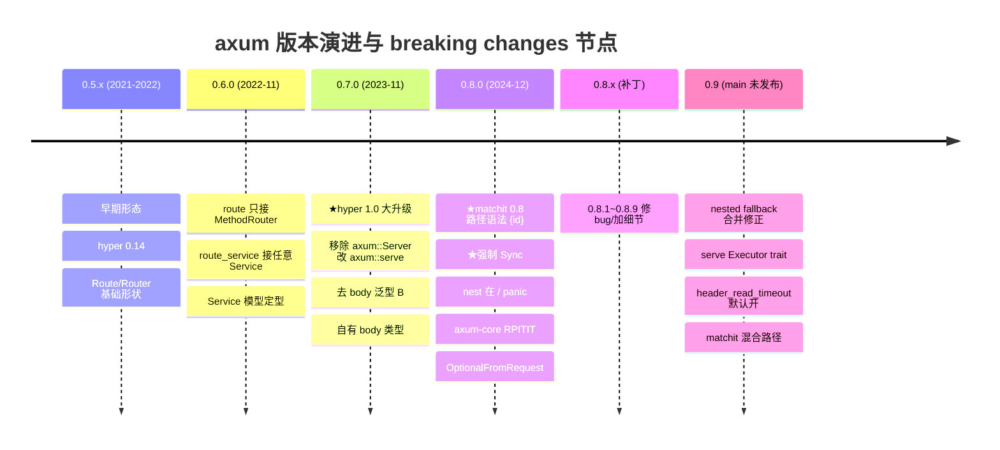

# 第 20 章 · axum 0.7→0.8 演进 + 0.9 展望

> **核心问题**:全书用的是 0.8.9,但你大概率在老博客、老项目、老 issue 里见过 0.7 的写法——路径参数写 `/:id` 而不是 `/{id}`、`/api/*all` 而不是 `/{*all}`、`Router::nest("/", sub)` 居然能跑、`axum::Server` 一把梭不需要 `axum::serve(listener, app)`、`FromRequest` 的 trait 方法是 `async fn` 还要挂 `#[async_trait]`。这些差异不是 axum 团队拍脑袋改的——0.8 是继 0.7(hyper 1.0 大升级)之后又一次系统的 API 清晰化:路径参数语法对齐 matchit 0.8、所有 handler/service 强制 `Sync`、`nest` 在根上被禁、`axum-core` 把 `#[async_trait]` 换成 RPITIT、`OptionalFromRequest` 新增、`MethodRouter` 加 `method_not_allowed_fallback`、`Host`/`TypedHeader` 挪进 `axum-extra`。每一笔背后都有一个具体的设计动机(API 清晰化、类型安全、与 matchit/hyper 生态对齐、去掉 `async_trait` 的堆分配),且 0.8 还贴了一段 `without_v07_checks` 的"平滑过渡通道",让你不用一次改完所有路由也能先把项目升上来。这一章把 0.7→0.8 的真实 breaking changes 按 CHANGELOG 逐条讲清"改了什么 / 为什么改 / 怎么迁移",再诚实标注 0.9 main 分支在做什么。
>
> **读完本章你会明白**:
>
> 1. 0.8 真正改了什么(以 [`axum/CHANGELOG.md#L101-L181`](../axum/axum/CHANGELOG.md#L101-L181) 的 0.8.0 条目为权威):matchit 0.8 的 `{id}`/`{*all}` 语法取代 `:id`/`*all`、所有 handler/service 强制 `Sync`、`Router::nest` 在 `/` 直接 panic 改用 `merge`、`axum::Server` 移除改用 `axum::serve`、`axum-core` 把 `#[async_trait]` 换成 `impl Future`(RPITIT,零堆分配)、`OptionalFromRequest` 新增把"可空提取器"显式化、`Host`/`TypedHeader` 挪进 `axum-extra`、`MethodRouter::method_not_allowed_fallback` 新增把"路径匹配但方法不匹配"和"路径根本不匹配"两种 fallback 分开——以及每一笔的设计动机;
> 2. 为什么 0.8 要给路径参数换语法,以及 `without_v07_checks`(`axum/src/routing/mod.rs#L169-L174`)+ `validate_v07_paths`(`axum/src/routing/path_router.rs#L53-L73`)这套"默认开校验 + 遇旧语法 panic 给清晰提示 + 主动关校验可继续用旧语法"的平滑过渡机制是怎么工作的,讲清"破坏性变更怎么不把用户一次性全崩掉"的工程取舍;
> 3. 为什么 0.8 强制所有 handler/service `Sync`(对应 [`axum/CHANGELOG.md#L122-L124`](../axum/axum/CHANGELOG.md#L122-L124)),以及这个 `+ Sync` 落到 `Router::route_service` 的 trait bound 上(`axum/src/routing/mod.rs#L185-L190`,对比 0.7.9 没有 `Sync`)——这是修正一个常见误解:很多人以为 0.8 把 `Router::route` 限定只接 `MethodRouter`、新增 `route_service` 接任意 Service 是 0.8 的 breaking change,**其实不是**——`route` 只接 `MethodRouter`、`route_service` 接任意 Service 这套分离从 0.6 就有了,0.8 改的只是给这两个方法(以及 handler)统一加了 `Sync` bound;
> 4. 0.9 main 分支在做什么([`axum/CHANGELOG.md` main 分支 `# Unreleased` 段](../axum/axum/CHANGELOG.md)):nested fallback 合并修正、`serve` 默认开 hyper 的 `header_read_timeout`、`serve` 加 `Executor` trait 可自定义连接 task 怎么 spawn、`ListenerExt::limit_connections` 限并发连接、`matchit` 升级支持"捕获 + 静态前缀/后缀"混合路径等——**全部诚实标注"main 在做 0.9,未发布到 crates.io,本书以 0.8.9 为准,涉及 0.9 只讲方向不展开"**。
>
> 本章是全书**唯一专门讲版本演进**的章。前面 19 章用的全是 0.8.9 的 API(`{foo}` 路径参数、`route` 只接 `MethodRouter`、`axum::serve(listener, app)`、`FromRequest` 用 `impl Future`),但你在老资料里看到的 0.7 写法会和本书对不上,这一章就是来对账的。
>
> **写给谁读(读者画像)**:你可能在维护一个 0.7 的老项目想升 0.8,或者读到一篇 2023 年的 axum 教程发现代码跑不起来,或者面试被问"axum 0.7 和 0.8 有什么区别"。你不需要重读前面 19 章,本章从"0.7 老写法 vs 0.8 新写法"的对照表开始,逐条讲清差异、动机、迁移。如果你完全没接触过 0.7,本章帮你建立"为什么 axum 的 API 是今天这个形状"的历史感;如果你正在迁移,本章就是迁移手册。
>
> **前置衔接**:本章是第 6 篇("演进与收束")的第一章,从全书正文(用 0.8.9 写的)接过来。承接前面章节用到的 0.8 API(把这些 API 和 0.7 旧版对比),不重复前面章节的机制讲解(只讲差异)。建议至少读过 P0-01(知道 axum 四件套)、P2-05/P2-07(知道 matchit 和 nest 的 0.8 行为)再看本章,术语对得上。
>
> **逃生阀(读不下去怎么办)**:本章涉及 7 个 breaking changes + 一段演进史,信息密度大。如果一时记不住全部,记住三句话就够——**① 0.8 最大的两笔是 matchit 0.8 的 `{id}` 语法(老 `:id` 会 panic,除非 `without_v07_checks`)+ 所有 handler/service 强制 `Sync`;② 0.7→0.8 不是"route/route_service 分家",那个分家从 0.6 就有了,0.8 只是给两者统一加了 `Sync`;③ 0.8 把 hyper 1.0、axum-core 的 RPITIT、axum-extra 的拆分一次性收尾,从此 API 形状稳定,0.9 还在改但没发布**。带着这三句话跳到对应小节细读。

---

## 一句话点破

> **axum 0.7→0.8 的核心是"API 清晰化收尾"——把路径参数语法对齐 matchit 0.8 的 `{id}`/`{*all}`(老 `:id`/`*all` panic 提示,但留 `without_v07_checks` 让你渐进迁移),给所有 handler/service 强制 `Sync`(让 `Router` 能安全多线程共享),`nest` 在 `/` 上 panic(根前缀和 `merge` 语义重叠,强制分开),`axum::Server` 移除(改用 `axum::serve` 走 hyper-util),`axum-core` 把 `#[async_trait]` 换成 RPITIT(去掉每次 `from_request` 的一次 `Box::pin` 堆分配),`OptionalFromRequest` 新增把"可空提取器"从 `Option<T>` 的魔法桥接里解放出来显式化——每一笔都不是拍脑袋,而是 axum 在 hyper 1.0 落地之后对自身 API 的一次系统性整理。注意修正一个常见误解:`Router::route` 只接 `MethodRouter`、`route_service` 接任意 Service 不是 0.8 的改动,这套语义分离从 0.6 就稳定了。**

这是结论,不是理由。本章倒过来拆:0.7 的 API 形状长什么样、每一笔 breaking change 解决什么问题、不这么改会怎样、`without_v07_checks` 这种"破坏性变更 + 平滑过渡"的工程取舍怎么做的、0.9 在往哪走。

---

## 第一节:为什么单独拿一章讲版本演进

### 提问

前面 19 章用的全是 0.8.9 的 API,你读下来应该已经能在脑子里放映一次 axum 请求的全过程。那为什么要单独拿一章讲 0.7→0.8?

三个理由:

1. **老资料大片过时**。你在网上搜"axum 教程"、"axum 源码分析",排前面的多是 2022-2023 年(0.6/0.7 时代)的文章,路径参数写 `/:id`、`axum::Server::bind`、`#[async_trait] impl FromRequest`——这些写法在 0.8 要么 panic 要么根本编译不过。你照着抄会一头雾水。这一章帮你识别"哪些老写法在 0.8 还能用、哪些已经废了",不再被老资料带偏。
2. **理解 API 形状的历史**。axum 今天为什么是 `{id}` 不是 `:id`?为什么 `nest("/", sub)` 会 panic?为什么 `FromRequest` 不挂 `#[async_trait]`?这些"为什么"的答案都在演进史里——每一笔都是某个具体问题被解决后留下的痕迹。读完本章,你看到的就不再是"axum 团队随便定的规矩",而是"每条规矩背后都有一笔"。
3. **迁移实战**。你手里有个 0.7 项目要升 0.8,或者你想看懂 0.8 的 CHANGELOG 自己判断影响面。本章按 CHANGELOG 真实条目逐条讲,配 0.7 vs 0.8 的代码对照,讲清每一笔怎么迁移。

### 演进时间线

先把 axum 从 0.5 到 0.9(未发布)的演进时间线钉死,你脑里先有这张地图,后面才不会乱:



时间线上三个关键节点:

- **0.6(2022-11)**:route/route_service 的语义分离在这一版就定了——`Router::route` 只接 `MethodRouter`(handler 语义),`Router::route_service` 接任意 `Service<Request>`(service 语义)。这是"API 清晰化"最早的一笔,**不是 0.8 才做的**(本章后面专门修正这个常见误解)。
- **0.7(2023-11)**:跟着 hyper 1.0 一起大升级。`axum::Server` 移除(因为 hyper 1.0 把 `Server` 拆进了 hyper-util),改用 `axum::serve(listener, app)`;所有 trait 去掉 body 泛型 `B`(统一用自己的 `axum::body::Body`);`TypedHeader` 挪进 `axum-extra`。这一版主要是"跟 hyper 1.0 对齐",axum 自己的 API 形状改动不大。
- **0.8(2024-12)**:axum 自己的 API 清晰化大收尾。matchit 升 0.8(`{id}` 语法)、强制 `Sync`、`nest` 在 `/` panic、`axum-core` 用 RPITIT、`OptionalFromRequest` 新增。这一版是本书的基准。

> **钉死这件事**:0.7 跟着 hyper 1.0 走(主要是连接管理那层重写),0.8 是 axum 自己的 API 清晰化(路由语法、Sync、nest 语义、core trait 写法)。两版动机不同,合在一起才是"axum 现代 API 形状"的完整由来。0.9 main 在继续改(nested fallback、serve Executor、混合路径),但还没发布。

---

## 第二节:0.7 老写法 vs 0.8 新写法——一张对账表

### 提问

先把差异摊开。你手里有个 0.7 项目,或者你读到一篇 0.7 的教程,对账表告诉你哪些写法在 0.8 变了。这一节是"速查",后面几节逐条讲动机和迁移。

### 对账表(0.7 → 0.8)

```
┌──────────────────────────┬─────────────────────────────┬───────────────────────────────────┐
│ 维度                     │ 0.7 写法                    │ 0.8 写法                          │
├──────────────────────────┼─────────────────────────────┼───────────────────────────────────┤
│ 路径参数(命名)         │ /users/:id                  │ /users/{id}                       │
│ 路径参数(通配)         │ /assets/*path               │ /assets/{*path}                   │
│ 旧路径参数行为           │ 正常工作                    │ 默认 panic,提示用 {id}            │
│ 关闭校验用旧语法         │ 不需要                      │ .without_v07_checks().route(...)  │
│                          │                             │                                   │
│ Router::route 入参       │ 只接 MethodRouter           │ 只接 MethodRouter (没变!)         │
│ Router::route_service    │ 接任意 Service              │ 接任意 Service (没变,只加了 Sync)│
│ handler/service bound    │ Clone + Send + 'static      │ Clone + Send + Sync + 'static     │
│                          │                             │                                   │
│ nest("/", sub)           │ 能跑(语义混乱)           │ panic,改用 merge                 │
│ nest_service("/", svc)   │ 能跑                        │ panic,改用 fallback_service      │
│                          │                             │                                   │
│ 启动服务                 │ axum::serve(listener, app)  │ axum::serve(listener, app)        │
│                          │ (0.7.0 起就是这个写法)     │ (没变,但 Serve 泛型化了 listener)│
│ axum::Server::bind       │ 0.6 有,0.7 已删            │ 0.7 起就没了,只能 axum::serve    │
│                          │                             │                                   │
│ FromRequest trait 方法   │ #[async_trait] async fn     │ fn ... -> impl Future + Send      │
│ FromRequestParts 同上    │ #[async_trait] async fn     │ fn ... -> impl Future + Send      │
│                          │ (每次调用 Box::pin 一次)  │ (RPITIT,零堆分配,承 axum-core 0.5)│
│                          │                             │                                   │
│ Option<T> 提取器         │ T: FromRequest 即可用       │ T 要实现新 trait OptionalFromRequest│
│                          │ (桥接魔法)                 │ (显式化)                          │
│                          │                             │                                   │
│ MethodRouter             │ 有 fallback                 │ 有 fallback + method_not_allowed_ │
│                          │                             │ fallback(路径匹配但方法不匹配)  │
│ Router                   │ 有 fallback                 │ 有 fallback + method_not_allowed_ │
│                          │                             │ fallback                          │
│                          │                             │                                   │
│ Host 提取器              │ axum::extract::Host         │ 移到 axum-extra                   │
│ TypedHeader 提取器       │ axum::extract::TypedHeader  │ 移到 axum-extra (typed-header feat)│
│ WebSocket::close         │ 有                          │ 移除(用户自己发 close 帧)       │
│                          │                             │                                   │
│ body 类型                │ axum::body::Body (0.7 新建) │ axum::body::Body (没变)           │
│ FromRequest body 泛型 B  │ 0.7 已去                    │ 没变(0.7 已经去过)              │
│                          │                             │                                   │
│ crate 拆分               │ axum + axum-core 0.4        │ axum + axum-core 0.5 + axum-extra │
│                          │ (axum-extra 还没大用)     │ 0.10+ (Host/TypedHeader 进 extra) │
│                          │                             │                                   │
│ matchit 版本             │ matchit 0.7                 │ matchit =0.8.4                    │
│ hyper 版本               │ hyper 1.0 (0.7 起升的)     │ hyper 1.0 (没变)                  │
│ MSRV                     │ 1.66 (0.7.0)                │ 1.75 (axum-core 0.5 RPITIT 要求)  │
└──────────────────────────┴─────────────────────────────┴───────────────────────────────────┘
```

读这张表有个关键:**不是每一行都是 0.8 的 breaking change**。有些(比如 `axum::Server::bind`)在 0.7.0 就删了,0.8 只是继承;有些(`route` 只接 `MethodRouter`)从 0.6 就是这个形状,0.8 根本没改。本章只把**真·0.8 breaking changes**单独拎出来逐条讲动机,继承自 0.7 的部分一笔带过。

### 真·0.8 breaking changes(权威列表)

按 [`axum/CHANGELOG.md#L101-L151`](../axum/axum/CHANGELOG.md#L101-L151) 的 0.8.0 条目,0.8.0 的 breaking changes 是:

1. **matchit 0.8,路径参数语法 `:id`/`*all` → `{id}`/`{*all}`**(L121-L122,PR #2645)。老语法默认 panic 提示用新语法,除非 `without_v07_checks`。
2. **强制所有 handler/service `Sync`**(L123-L124,PR #2473)。`Router::route`/`route_service`/`MethodRouter::*`/`Handler::layer` 全部加 `+ Sync` bound。
3. **tuple 和 tuple_struct 的 `Path` 反序列化要求参数个数精确匹配**(L125,PR #2931)。老版会 silently 忽略多余参数,0.8 报错。
4. **`Host` 提取器移到 `axum-extra`**(L126,PR #2956)。
5. **`WebSocket::close` 移除**(L127-L128,PR #2974)。用户要自己显式发 close 帧。
6. **`serve` 泛型化 listener 和 IO 类型**(L129,PR #2941)。移除 `Serve::tcp_nodelay`,改用 `serve::ListenerExt`。
7. **`Option<Path<T>>` 不再吞所有错误**(L131-L133,PR #2475)。许多错误情况改为 reject 而非 `None`。
8. **`axum::extract::ws::Message` 用 `Bytes`/`Utf8Bytes` 替换 `Vec<u8>`/`String`**(L134-L135,PR #3078)。

加上 axum-core 0.5 的(配套发布):

9. **`#[async_trait]` 换 RPITIT**([`axum-core/CHANGELOG.md#L52`](../axum/axum-core/CHANGELOG.md#L52),PR #2308)。
10. **`Option<T>` 提取器要求 `T: OptionalFromRequest`/`OptionalFromRequestParts`**([`axum-core/CHANGELOG.md#L53-L55`](../axum/axum-core/CHANGELOG.md#L53-L55),PR #2475)。这是上面第 7 条的根。

这 10 条就是 0.8 的全部 breaking changes(权威来源是 CHANGELOG,不是凭记忆)。本章挑其中**有设计故事**的几条(matchit 语法、Sync 强制、nest 在根 panic、RPITIT、OptionalFromRequest、route_service 的 Sync bound——澄清那个常见误解)逐条拆透,其余几条(`Host`/`TypedHeader`/`WebSocket::close`/`Message` 用 `Bytes`/`serve` 泛型化)在"其它 breaking changes 速览"里一句带过。

> **钉死这件事**:0.8 的 breaking changes 是有清单的,权威来源是 CHANGELOG。本章不编演进——遇到"听说 0.8 改了 xxx"的说法,第一反应是查 CHANGELOG。最容易被以讹传讹的是"route/route_service 分家是 0.8 改的"——下面专门拆这个误解。

---

## 第三节:matchit 0.8 与路径参数语法——从 `:id` 到 `{id}`

### 提问

0.8 最显眼的 breaking change 是路径参数语法变了:`/users/:id` 变成 `/users/{id}`,`/assets/*all` 变成 `/assets/{*all}`。这个改动覆盖面最大(几乎每个 axum 项目都有路径参数),也最容易让人一头撞上 panic。这一节拆:为什么换语法、换语法的代价是什么、`without_v07_checks` 怎么把代价压下来。

### 不这样会怎样:0.7 的 `:id`/`*all` 语法有什么问题

0.7 用 matchit 0.7,语法是 `:id`(命名参数)和 `*all`(通配参数)。这套语法是 matchit 早期版本沿用的"colon 风格"(类似 Express.js 的 path-to-regexp、Gorilla mux 的老语法)。它在 0.7 能跑,但有几个问题:

1. **和 matchit 0.8 不兼容**。matchit 自己在 0.8 改了语法,从 `:id` 改成 `{id}`、`*all` 改成 `{*all}`,理由是"花括号风格更显眼、更一致、更易于表达通配"。axum 跟着 matchit 升级,自然要把语法一起换。这是个"上游 crate 改了,axum 必须跟"的变更——axum 不重新发明路径匹配,它用 matchit,matchit 0.8 这么定,axum 0.8 就这么用。详见 [`axum/CHANGELOG.md#L121-L122`](../axum/axum/CHANGELOG.md#L121-L122):
   > **breaking:** Upgrade matchit to 0.8, changing the path parameter syntax from `/:single` and `/*many` to `/{single}` and `/{*many}`; the old syntax produces a panic to avoid silent change in behavior ([#2645])
2. **`:` 和 `*` 在 URL 里是合法字符**(虽然不常见)。如果你真的想匹配一个字面量以 `:` 或 `*` 开头的 path segment(比如某个奇怪的 legacy API),0.7 的语法做不到——它会被 matchit 当成参数。0.8 的 `{...}` 风格把"参数"和"字面量"在语法层面区分得更清楚,`without_v07_checks` 之后你甚至可以写 `/:colon` 这种字面量路径。
3. **`{*all}` 的通配语义更清楚**。0.7 的 `*all` 单独一个 `*` 容易和"重复"或"通配"的其它含义混;0.8 的 `{*all}` 明确表示"这是花括号参数语法下的通配变体",和 `{id}` 风格一致。

> **钉死这件事**:换语法的第一动机是"跟上 matchit 0.8"——axum 不维护路径匹配引擎,它用 matchit,matchit 升级了 axum 就得跟。第二动机是"花括号风格本身更清晰、能表达字面量 `:`/`*`"。这两条合在一起,值得一次 breaking change。

### 所以这样设计:0.8 用 `{id}`/`{*all}`,默认 panic 提示,留 `without_v07_checks` 过渡

直接换语法有个工程问题:**axum 用户的项目里到处都是 `/:id`**,你一次性换掉,所有项目升级时全部 panic,迁移成本巨大。axum 团队的取舍是"换语法,但不让用户一次性崩":

- **默认行为**:0.8 的 `Router::route("/users/:id", ...)` 会 panic,panic 信息明确提示 "Path segments must not start with `:`. For capture groups, use `{capture}`. If you meant to literally match a segment starting with a colon, call `without_v07_checks` on the router."(见 `axum/src/routing/tests/mod.rs#L1068` 的 `should_panic`)。这条 panic 是**故意的**——CHANGELOG 原文写 "the old syntax produces a panic to avoid silent change in behavior",目的是防止"老代码默默跑出错误行为"(比如 `/users/:id` 被当成字面量匹配 `:id`,而不是参数)。
- **过渡通道**:`Router::without_v07_checks()`(`axum/src/routing/mod.rs#L169-L174`)关闭这个校验,让你继续用 `/:id` 老语法跑,先把项目升到 0.8 再慢慢改路由。校验逻辑在 `PathRouter::validate_path` → `validate_v07_paths`(`axum/src/routing/path_router.rs#L39-L73`),`without_v07_checks` 把 `PathRouter` 的 `v7_checks` 字段从默认的 `true` 翻成 `false`(`path_router.rs#L20`、`#L79-L81`)。

来看真实的 `validate_v07_paths`(`axum/src/routing/path_router.rs#L53-L73`,逐字摘录):

```rust
// axum/src/routing/path_router.rs#L53-L73(逐字摘录)
fn validate_v07_paths(path: &str) -> Result<(), &'static str> {
    path.split('/')
        .find_map(|segment| {
            if segment.starts_with(':') {
                Some(Err(
                    "Path segments must not start with `:`. For capture groups, use \
                `{capture}`. If you meant to literally match a segment starting with \
                a colon, call `without_v07_checks` on the router.",
                ))
            } else if segment.starts_with('*') {
                Some(Err(
                    "Path segments must not start with `*`. For wildcard capture, use \
                `{*wildcard}`. If you meant to literally match a segment starting with \
                an asterisk, call `without_v07_checks` on the router.",
                ))
            } else {
                None
            }
        })
        .unwrap_or(Ok(()))
}
```

逻辑很直白:把 path 按 `/` 切成段,扫一遍,任何一段以 `:` 或 `*` 开头就返回 `Err`(`route` 调用方拿到 `Err` 会 panic)。注意三点:

1. **校验只看段首**。`:id` 会触发,`{id}` 不会,`/foo:bar`(冒号在中间)也不会。这避免了误伤——只拦"老的参数语法",不拦"字面量里恰好有冒号"。
2. **错误信息是 `&'static str` 不是 `String`**。没有堆分配,panic 路径零成本。
3. **校验在 `route`/`route_service`/`nest` 等所有注册入口都跑一遍**(只要 `v7_checks: true`)。`PathRouter::route`(`path_router.rs#L88`)、`route_service`(`path_router.rs#L146`)、`validate_nest_path`(`path_router.rs#L518-L533`)都调 `validate_path`。这样无论你用哪个 API 注册路径,老语法都会被拦下。

`without_v07_checks` 的工程取舍在这里很清楚:**校验是默认开的(保护新用户不被老教程带偏),关闭是可选的(给老项目一条生路)**。CHANGELOG 用 "panic to avoid silent change" 一句话点破了动机——axum 宁可让你撞 panic 看到清晰提示,也不让你默默跑出错误行为。

> **钉死这件事**:0.8 的路径参数语法换 `{id}`/`{*all}`,老 `:id`/`*all` 默认 panic(故意 panic,防 silent change)。`without_v07_checks` 关闭校验,让你可以渐进迁移——先把项目升到 0.8 跑起来(老语法继续用),再逐个路由改成新语法。这是"破坏性变更 + 平滑过渡通道"的工程范式,本章技巧精解会专门拆。

### 迁移:怎么把 0.7 项目改到 0.8

两条路:

1. **一把梭(推荐小项目)**:全局搜 `/:` 替换成 `/{`,末尾加 `}`,`/*` 替换成 `/{*`。matchit 0.8 的 `{id}` 和 `{*all}` 是机械替换,没有歧义。
2. **渐进迁移(大项目)**:先在 `Router::new()` 后面链一个 `.without_v07_checks()`,让老语法继续跑,项目先升到 0.8 通过编译和测试。然后分批改路由(每个 PR 改一个模块的路由),最后去掉 `without_v07_checks`。

注意 `without_v07_checks` 的合并/嵌套语义(`axum/src/docs/routing/without_v07_checks.md`):

- **merge**:`a.merge(b)` 之后,只有当 `a` 和 `b` **都**关掉了 v7 checks,合并后的 router 在新注册路由时才关掉校验。一边开一边关,合并后按"开"算(保守)。
- **nest**:每个 router 各自管自己的校验。把一个关掉校验的子 router nest 进一个开着校验的父 router,不影响父 router 的校验状态;反之亦然。

这套规则保证了"校验状态不会意外泄漏"——你显式关掉的只影响你自己,不会因为合并/nest 把别的 router 也带坏。

> **承接 P2-05**:本书 P2-05 讲 PathRouter 和 matchit 字典树时,用的全是 0.8 的 `{id}`/`{*all}` 语法。本章只讲"为什么从 `:id` 变成 `{id}`",不重复 matchit 字典树原理(那是 P2-05 的事)。matchit 0.7 → 0.8 内部的树实现也有变化(节点分裂规则、参数边),但那是 matchit crate 内部的事,本书诚实标注"在 matchit crate,本书引用其语法 + 对照 go ServeMux,不替它编源码"。

---

## 第四节:强制 `Sync`——以及"route/route_service 分家是 0.8 改的"这个误解

### 提问

0.8 第二大 breaking change是"Require `Sync` for all handlers and services added to `Router` and `MethodRouter`"([`axum/CHANGELOG.md#L123-L125`](../axum/axum/CHANGELOG.md#L123-L125),PR #2473)。这一笔很多老资料讲不清楚,还衍生出一个常见误解:"0.8 把 `Router::route` 限定只接 `MethodRouter`、新增 `route_service` 接任意 Service"。这一节拆两件事:① 强制 `Sync` 解决什么问题、落到代码哪里;② 澄清"route/route_service 分家不是 0.8 改的,从 0.6 就这样了"。

### 不这样会怎样:0.7 不强制 Sync 会怎样

0.7 的 trait bound 是 `Clone + Send + 'static`,没有 `Sync`。这看起来"要求更宽松",但带来一个实际问题:**`Router` 内部用 `Arc<RouterInner<S>>` 共享,`Route` 内部用 `BoxCloneSyncService`(承《Tower》)要求 `Clone + Send + Sync`,可 handler 自己只要 `Send` 不 `Sync`**。这就有个不一致——路由的外壳(`Router`/`Route`)是 `Sync` 的(因为要被多线程共享,hyper 那边每个连接一个 task,task 之间可能共享同一个 `Router`),但里面装的 handler 可以不是 `Sync`。一旦 handler 不是 `Sync`,而外壳要 `Sync`,编译期就会报一个**位置很奇怪**的错误(可能在 `BoxCloneSyncService::new` 那一行,离用户写 handler 的地方很远),用户根本看不懂。

更糟的是,0.7 时代,有些人写了个 `!Sync` 的 handler(比如内部用了 `RefCell` 或者某个 `!Sync` 的状态),能编译过(因为 0.7 不强制 `Sync`),但跑到某些多线程共享场景会出问题(或者更隐蔽:编译过但 `BoxCloneSyncService` 那层用 `unsafe` 强转,埋雷)。

0.8 的解法:**在 trait bound 层面就强制 `Sync`**。所有进 `Router`/`MethodRouter` 的东西(handler fn、`MethodRouter`、任意 `Service`)都必须 `Clone + Send + Sync + 'static`。这样:

- handler 一开始就是 `Sync`,不用等到塞进 `BoxCloneSyncService` 才发现不满足;
- 编译错误出现在用户写 handler 的地方(签名不满足 bound),不是出现在框架内部某行;
- `Router`/`Route` 整条链天然 `Sync`,多线程共享零成本(一个 `Arc<Router>` 多个 task 共享,无需 `Mutex`)。

### 落到代码:`route_service` 的 `+ Sync` 是怎么加的

看 `Router::route_service` 的 0.8.9 签名(`axum/src/routing/mod.rs#L185-L190`,逐字摘录):

```rust
// axum/src/routing/mod.rs#L185-L190(逐字摘录,0.8.9)
pub fn route_service<T>(self, path: &str, service: T) -> Self
where
    T: Service<Request, Error = Infallible> + Clone + Send + Sync + 'static,
    //                                          ^^^^^^^^^^^^
    //                                          0.8 新加的 Sync
    T::Response: IntoResponse,
    T::Future: Send + 'static,
{
    // ...
}
```

对比 0.7.9 的同一个签名(`git show axum-v0.7.9:axum/src/routing/mod.rs#L171-L176`):

```rust
// axum 0.7.9 routing/mod.rs(逐字摘录,0.7.9)
pub fn route_service<T>(self, path: &str, service: T) -> Self
where
    T: Service<Request, Error = Infallible> + Clone + Send + 'static,
    //                                          ^^^ 没有 Sync
    T::Response: IntoResponse,
    T::Future: Send + 'static,
{
    // ...
}
```

唯一差别就是 `+ Sync`。`Router::route`(只接 `MethodRouter`)的 `Sync` 落在 `MethodRouter` 自己的 `where` 子句里(因为 `MethodRouter<S, E>` 本身在 `route` 那里没显式 bound,但它的构造函数 `get`/`post`/... 在 `Handler` 那层就要求 `Handler<T, S>: Sync`)。整套 `Sync` 强制一致地落在所有注册入口。

### 澄清误解:route/route_service 分家不是 0.8 改的

现在拆那个常见误解。很多老文章(甚至一些 0.8 的 release 笔记)说"0.8 把 `Router::route` 限定只接 `MethodRouter`,接任意 Service 改用新 `route_service`"。这话听起来像 0.8 的 breaking change,但**查 git 历史**会发现:

- 0.6.0(2022-11):`Router::route(mut self, path: &str, method_router: MethodRouter<S, B>) -> Self`,**已经只接 `MethodRouter`**;同时 `Router::route_service<T>(self, path: &str, service: T) -> Self` 已经存在。
- 0.7.0、0.7.5、0.7.9:`route` 和 `route_service` 的分离一直如此,签名没变(只是 0.7 去掉了 body 泛型 `B`)。
- 0.8.0:`route` 仍然只接 `MethodRouter`,`route_service` 仍然接任意 Service,签名唯一的变化是加了 `Sync`。

所以**"route 只接 MethodRouter、route_service 接任意 Service"这套语义分离从 0.6 就稳定了,0.8 根本没改它**。0.8 改的只是"给两者(以及 handler)统一加 `Sync` bound"。

这个误解怎么来的?可能是因为 0.8 release 时,有人写 release notes 把"0.6 就有的语义分离"和"0.8 新加的 Sync"混在一起讲,以讹传讹。也可能是因为有些用户从 0.5 直接升 0.8,中间跳过了 0.6/0.7,把 0.6 的改动误记成 0.8。

> **钉死这件事(本章最重要的一笔修正)**:`Router::route` 只接 `MethodRouter`、`Router::route_service` 接任意 `Service<Request>` 这套**语义分离从 0.6.0(2022-11)就是 axum 的设计了**——route = handler 语义(`MethodRouter` 内部按 method 持 handler),route_service = service 语义(任意 Tower Service 当一个路径的处理单元)。0.8 没有"把 route 改成只接 MethodRouter",0.8 改的是给所有注册入口**统一加 `Sync` bound**。讲 0.7→0.8 演进,务必把"route/route_service 分家"和"强制 Sync"分开讲——前者是 0.6 的事,后者才是 0.8 的事。

### 那为什么 axum 一开始就要 route/route_service 分家(动机补讲)

既然分家不是 0.8 改的,顺手讲清它**为什么**这么设计(这是 axum API 清晰化的最早一笔,值得知道)。

`Router::route` 接的是 `MethodRouter`——一个"按 HTTP method 分发"的结构(`method_routing.rs#L547-L559`,9 个 method 字段 + fallback)。你 `.route("/users", get(list).post(create))` 里,`get(list).post(create)` 构造的就是一个 `MethodRouter`,它内部知道"GET 走 list,POST 走 create"。`route` 把这个 `MethodRouter` 挂到 `/users` 这个路径上。

那"我想把一个任意的 Tower Service 挂到路径上"怎么办?比如你写了一个自定义的 `MyAuth middleware chain as a Service`,它不是 `MethodRouter`(它不按 method 分发,它就是一个 Service),但你想让它处理 `/login` 的所有 method。0.5 早期 axum 是让 `route` 既接 `MethodRouter` 又接任意 Service(混用),结果:

1. **类型推断歧义**。`route("/login", my_thing)` 编译器不知道 `my_thing` 是 `MethodRouter` 还是 `Service`,推断失败,报一个长长的错误。
2. **语义混淆**。`MethodRouter` 是"按 method 分发"的语义,任意 `Service` 是"不管 method 一把接"的语义,两者混在一个 API 里,用户搞不清自己注册的到底是什么。

axum 0.6 的解法:**route 只接 MethodRouter(handler 语义),route_service 接任意 Service(service 语义)**。两个 API 名字不同,语义清晰:

- `.route("/users", get(list).post(create))` —— handler 语义,你想"这个路径按 method 分发到不同 handler"。
- `.route_service("/login", my_service)` —— service 语义,你想"这个路径不管 method 都交给这个 Service"。

注意 `route_service` 还做了一层保护——如果你传进来的是一个 `Router`(用 `try_downcast` 检测),它会 panic 提示用 `nest`(`mod.rs#L191-L199`):"Invalid route: `Router::route_service` cannot be used with `Router`s. Use `Router::nest` instead"。因为把一个 `Router` 当 Service 挂到路径上,语义上就是 nest(子路由),用 `route_service` 是用错了 API。

> **钉死这件事**:route/route_service 的语义分离是 axum API 清晰化的最早一笔(0.6),动机是消除类型推断歧义和语义混淆。0.8 给两者统一加了 `Sync`,但语义分离不是 0.8 改的。这个澄清是本章的核心修正点。

---

## 第五节:nest 在 `/` panic——语义重叠的硬规矩

### 提问

0.7 时代,`Router::new().nest("/", sub)` 能跑,但行为有点诡异:子 router 的 fallback 该不该继承?`NestedPath` 提取器拿到的是 `/` 还是空字符串?StripPrefix Layer 要剥的前缀是空,这一层 Layer 是不是白套了?0.8 干脆在根 nest 上 panic,提示 "Nesting at the root is no longer supported. Use merge instead."。这一节拆:为什么 nest 在根上是语义重叠、axum 怎么强制分开。

### 不这样会怎样:nest 在 `/` 的语义歧义

回顾 P2-07 讲的 nest 机制:`Router::nest("/api", sub)` 内部把子 router 的每条路由**摊平**进父 router 的 matchit 树,同时给每条路由套两个 Layer:

- **StripPrefix**:运行期把请求 URI 的 `/api/...` 前缀剥掉,让子 router 的 handler 看到相对路径 `/...`。
- **SetNestedPath**:运行期把 `/api` 这个前缀记进 `Request::extensions()` 的 `NestedPath`,供 `NestedPath` 提取器和 `MatchedPath` 用。

现在考虑 `nest("/", sub)`:

- **StripPrefix 要剥的前缀是 `/`**——剥掉等于没剥。这层 Layer 是白套的,徒增每次请求的开销(虽然小,但白浪费)。
- **SetNestedPath 要记的前缀是 `/`**——可 `/` 和"没有前缀"在语义上没区别。`NestedPath` 提取器拿到 `/` 用户会觉得奇怪(我以为没有嵌套呢),拿到空字符串又和"没经过 nest"的情况一样,无法区分。
- **fallback 继承歧义**:0.7 的 nest 会把子 router 的 fallback 也继承过来(子 router 有自定义 fallback 时),但根 nest 时,子 router 的 fallback 和父 router 的 fallback 作用域完全一样——继承哪个?0.7 这里有几个 bug(CHANGELOG 0.6.x 段有多个"fix bugs around merging routers with nested fallbacks"的条目),根 nest 是重灾区。

**根本问题**:`nest("/", sub)` 和 `merge(sub)` 在"路由匹配"层面做的事**完全一样**(都是把 sub 的路由原路径摊平进父树),但 nest 还要多套两层 Layer、要多处理 fallback 继承——全是开销和歧义,没有任何额外语义。换句话说:**根 nest 是 merge 的"劣化版"**——做同样的事,代价更大、行为更模糊。

### 所以这样设计:0.8 在根 nest 直接 panic,强制用 merge

0.8 的 `Router::nest` 开头加了这一段(`axum/src/routing/mod.rs#L208-L212`,逐字摘录):

```rust
// axum/src/routing/mod.rs#L208-L212(逐字摘录)
pub fn nest(self, path: &str, router: Router<S>) -> Self {
    if path.is_empty() || path == "/" {
        panic!("Nesting at the root is no longer supported. Use merge instead.");
    }
    // ... 原 nest 逻辑
}
```

`nest_service` 同理(`mod.rs#L235-L243`),根路径 panic 提示用 `fallback_service`。这是 axum 少见的"在 API 入口直接 panic 而非返回 Result"——因为它不是运行期错误(路径是编译期常量字符串),而是用户用错了 API。panic 信息直接告诉用户正确的 API 是什么(`merge` 或 `fallback_service`)。

`#[should_panic]` 测试在 `axum/src/routing/tests/nest.rs#L79-L102` 钉死了这个行为:

```rust
// axum/src/routing/tests/nest.rs#L79-L86(摘录)
#[should_panic(expected = "Nesting at the root is no longer supported. Use merge instead.")]
#[test]
fn nesting_at_root_panics() {
    let _ = Router::<()>::new().nest("/", Router::<()>::new());
}
```

> **承接 P2-07**:本书 P2-07 把 nest 的"摊平 + 双 Layer"机制讲透了,也提了"nest 在 `/` panic"这个 0.8 行为。本章只讲"为什么 0.8 要禁根 nest"——根 nest 和 merge 语义重叠,nest 多出两层 Layer 和 fallback 继承的歧义,axum 强制语义分离(根用 merge、前缀用 nest)。不重复 P2-07 的 nest 内部机制。

### 迁移:0.7 的 `nest("/", sub)` 怎么改

很简单:全局把 `nest("/", sub)` 替换成 `merge(sub)`。语义等价(都是摊平进父树),且 merge 不会套多余的 StripPrefix/SetNestedPath Layer。

注意一个细节:0.7 的 `nest("/", sub)` 会继承 sub 的 fallback,0.8 的 `merge(sub)` 也会继承(merge 的 fallback 合并规则见 P2-07)。所以 fallback 行为基本等价。唯一可能不同的是 `NestedPath` 提取器——0.7 根 nest 时 `NestedPath` 拿到 `/`,0.8 merge 时根本不经过 SetNestedPath,`NestedPath` 提取器会拿到默认值(空)。如果你代码里依赖 `NestedPath == "/"`,迁移时要改成"判断是否为空"。

---

## 第六节:axum-core 的 RPITIT 改造——从 `#[async_trait]` 到 `impl Future`

### 提问

0.8 配套发布的 axum-core 0.5,把 `FromRequest`/`FromRequestParts` 的 trait 方法从 `#[async_trait] async fn from_request(...)` 改成了 `fn from_request(...) -> impl Future<...> + Send`。这是 RPITIT(Return Position Impl Trait In Trait,Rust 1.75 稳定)的落地。这一节拆:`#[async_trait]` 有什么开销、RPITIT 怎么省掉它、对用户有什么影响。

### 不这样会怎样:`#[async_trait]` 的堆分配开销

0.7 时代,axum-core 0.4 的 `FromRequest` 长这样(`git show axum-core-v0.4.0:axum-core/src/extract/mod.rs`,逐字摘录):

```rust
// axum-core 0.4(逐字摘录,0.4.0)
use async_trait::async_trait;

#[async_trait]
pub trait FromRequest<S, M = ViaRequest>: Sized {
    type Rejection: IntoResponse;
    async fn from_request(req: Request, state: &S) -> Result<Self, Self::Rejection>;
}
```

`#[async_trait]` 这个宏把 `async fn from_request` 改写成:

```rust
// 宏展开后的等价形式(简化示意,非源码原文)
fn from_request<'a>(req: Request, state: &'a S)
    -> Pin<Box<dyn Future<Output = Result<Self, Self::Rejection>> + Send + 'a>>;
```

也就是说,**每次调 `from_request` 都要 `Box::pin` 一次**——一次堆分配,一次虚分派(因为返回 `dyn Future`)。对每个 handler 的每个提取器参数,这个开销都要付一次。一个 handler 有 3 个提取器参数,就 3 次堆分配。在 Web 框架这个"每次请求都要跑"的热路径上,这是实打实的开销。

为什么 0.4 要用 `#[async_trait]`?因为 Rust 在 1.75 之前,trait 里不能直接写 `async fn`(也没有 RPITIT),只能用 `#[async_trait]` 这种宏把 async fn 改写成 `-> Pin<Box<dyn Future>>`。这是历史包袱,不是设计选择。

### 所以这样设计:axum-core 0.5 用 RPITIT,零堆分配

Rust 1.75(2023-12)稳定了 RPITIT,trait 里可以直接写 `fn ... -> impl Future<...>`(或者用 desugared 形式 `type Future: Future<...>; fn ... -> Self::Future;`)。axum-core 0.5 跟着这次升级,把 `FromRequest`/`FromRequestParts` 改写成([`axum-core/CHANGELOG.md#L52`](../axum/axum-core/CHANGELOG.md#L52),PR #2308):

```rust
// axum-core/src/extract/mod.rs#L53-L62(逐字摘录,0.5 / axum 0.8)
pub trait FromRequestParts<S>: Sized {
    type Rejection: IntoResponse;
    fn from_request_parts(
        parts: &mut Parts,
        state: &S,
    ) -> impl Future<Output = Result<Self, Self::Rejection>> + Send;
}
```

注意返回类型 `impl Future<...> + Send`——这是一个**具体的、匿名的 Future 类型**,编译器在编译期就 know 它的大小和布局,单态化后是直接调用,没有 `Box::pin`,没有 `dyn` 虚分派。零堆分配。

这对用户的可见影响:

1. **`#[async_trait]` 不能再用了**。如果你给自定义提取器 `impl FromRequest` 时还挂 `#[async_trait]`,会编译错(RPITIT 和 async_trait 不兼容)。你要么去掉 `#[async_trait]` 用 `async fn` 写方法体(Rust 1.75+ trait 里的 `async fn` 会自动 desugar 成 RPITIT),要么显式写 `fn ... -> impl Future<...>`。axum-core 自己用后者。
2. **MSRV 升到 1.75**([`axum/CHANGELOG.md#L140`](../axum/axum/CHANGELOG.md#L140))。RPITIT 要求 1.75+,老 toolchain 跑不了。
3. **性能提升**。每次请求每个提取器省一次 `Box::pin` + 虚分派,handler 参数多的场景累积可观。

这是 0.8(配 axum-core 0.5)最"无感但实惠"的一笔——用户除了去掉 `#[async_trait]` 几乎不用改代码,但每次请求都更快。

> **承接《Tokio》**:`Future`/`Poll`/`Context` 在标准库 `core::future`/`core::task`(承《Tokio》[[tokio-source-facts]]),`async`/`await` 是 Rust 语言特性。RPITIT 是 Rust 1.75 的语言特性,不在 Tokio。本章只讲 axum-core 怎么从 `#[async_trait]`(一个第三方宏)迁到语言原生 RPITIT,不重复 Future/Poll 机制(那是《Tokio》的事)。

---

## 第七节:OptionalFromRequest——把"可空提取器"显式化

### 提问

0.7 时代,`Option<T>` 作为提取器有个魔法桥接:`Option<T>` 自动实现 `FromRequest`(只要 `T: FromRequest`),提取失败时返回 `None`(吞掉错误)。这个桥接在 0.8 被打破了——`Option<T>` 现在要求 `T: OptionalFromRequest`(或 `OptionalFromRequestParts`),一个新 trait。这一节拆:为什么把"可空"显式化成独立 trait。

### 不这样会怎样:0.7 的 `Option<T>` 吞错

0.7 的 `Option<T>` 桥接有个问题:**它吞掉了所有错误**。比如 `Option<Json<Payload>>`,如果 body 不是合法 JSON,`Option` 会返回 `None`(表示"没有这个提取器"),handler 拿到 `None` 不知道是"body 为空"还是"body 是坏的 JSON"。这对调试和错误响应都不友好——用户可能想知道"为什么这次请求 Json 提取失败",但 `Option` 把信息丢了。

更深的问题:**`Option<T>` 的"什么时候返回 None"语义不一致**。对 `Option<Path<T>>`,如果路径参数不存在,返回 `None` 合理;但对 `Option<Json<T>>`,如果 body 是坏的 JSON,返回 `None` 不合理(应该 reject 400)。0.7 的桥接把这两种情况都吞成 `None`,语义模糊。

### 所以这样设计:0.8 新增 `OptionalFromRequest` trait

axum-core 0.5(配 axum 0.8)新增 `OptionalFromRequest`/`OptionalFromRequestParts` 两个 trait([`axum-core/CHANGELOG.md#L53-L55`](../axum/axum-core/CHANGELOG.md#L53-L55),PR #2475)。语义明确:

- `FromRequest`:提取成功返回 `Ok(value)`,提取失败返回 `Err(rejection)`(变成 4xx response)。
- `OptionalFromRequest`:提取成功返回 `Ok(Some(value))`,提取时遇到"可恢复的缺失"返回 `Ok(None)`(比如 body 为空、header 不存在),遇到"不可恢复的错误"返回 `Err(rejection)`(比如 body 是坏的 JSON)。

`Option<T>` 作为提取器,现在要求 `T: OptionalFromRequest`(或 Parts 版)。这样 `Option<Json<T>>` 在 body 为空时返回 `Ok(None)`(合理),在 body 坏了时返回 `Err(rejection)`(变成 400,不再吞错)。`Option<Path<T>>` 类似——路径参数不存在返回 `None`,路径参数 parse 失败返回 rejection。

CHANGELOG 原文([`axum/CHANGELOG.md#L131-L133`](../axum/axum/CHANGELOG.md#L131-L133)):

> **breaking:** `Option<Path<T>>` no longer swallows all error conditions, instead rejecting the request in many cases; see its documentation for details ([#2475])

这个改动的动机是"错误不该被静默吞掉"——`Option` 表示"可空",但"可空"不等于"任何错误都变 None"。axum 0.8 用独立 trait 把这两种语义分开。

### 迁移:自定义提取器要 impl 新 trait

如果你 0.7 写了自定义提取器 `MyExtractor`,0.8 时如果想用 `Option<MyExtractor>`,你要给 `MyExtractor` 实现 `OptionalFromRequest`(或 Parts 版)。axum 内置的提取器(Json/Form/Path/Query 等)0.8 都已经实现了,你用 `Option<Json<T>>` 不用改代码(行为可能变——以前吞错的地方现在 reject,这是改进)。

> **钉死这件事**:`OptionalFromRequest` 的新增是把"可空提取器"从"魔法桥接"改成"显式 trait"。0.7 的 `Option<T>: FromRequest where T: FromRequest` 桥接吞所有错误,0.8 要求 `T: OptionalFromRequest`,区分"可恢复的缺失"(`Ok(None)`)和"不可恢复的错误"(`Err(rejection)`)。这是 API 清晰化的又一笔。

---

## 第八节:其它 breaking changes 速览

### 提问

前几节拆了 0.8 的几个"大笔"(matchit 语法、Sync、nest 根 panic、RPITIT、OptionalFromRequest)。剩下的 breaking changes 这一节一句带过,讲清"改了什么 + 怎么迁移",不展开动机(因为动机比较直接)。

### 速览列表

1. **`Host` 提取器移到 `axum-extra`**(PR #2956)。0.7 的 `axum::extract::Host` 在 0.8 移到 `axum_extra::extract::Host`(要开 `axum-extra` 的相应 feature)。动机:`Host` 提取器依赖 `Forwarded`/`X-Forwarded-Host` 这些 header 的解析逻辑,有点"extra"的味道,不属于核心。迁移:`use axum_extra::extract::Host;`(加 `axum-extra` 依赖)。
2. **`TypedHeader` 移到 `axum-extra`**(从 0.7.0 就移了,0.8 继承)。`axum::extract::TypedHeader` → `axum_extra::TypedHeader`(开 `typed-header` feature)。动机:`TypedHeader` 依赖 `headers` crate,而 `headers` 不是 axum 核心,放在主 crate 拖累编译时间。迁移:加 `axum-extra`,开 feature。
3. **`WebSocket::close` 移除**(PR #2974)。0.7 的 `WebSocket::close` 方法在 0.8 没了,用户要自己显式发 close 帧(`Message::Close(Some(frame))`)。动机:`close` 方法的行为(自动发 close + 等对方回 close)和 WebSocket RFC 的语义不完全一致,容易让人误用。axum 选择"只提供原语,不提供易错的便利方法"。迁移:自己发 close 帧。
4. **`axum::extract::ws::Message` 用 `Bytes`/`Utf8Bytes` 替换 `Vec<u8>`/`String`**(PR #3078)。0.7 的 `Message::Binary(Vec<u8>)`/`Text(String)` 在 0.8 变成 `Message::Binary(Bytes)`/`Text(Utf8Bytes)`。动机:`Bytes` 是零拷贝引用计数的(`Arc` 切片),比 `Vec<u8>` 在 WebSocket 这种"消息可能被多次引用"的场景更高效。`Utf8Bytes` 是 axum 自己的 UTF-8 验证过的 `Bytes` 包装。迁移:`Vec<u8>` → `Bytes`(`.into()`),`String` → `Utf8Bytes`。
5. **`serve` 泛型化 listener 和 IO 类型**(PR #2941)。0.7 的 `serve` 接 `TcpListener`,0.8 改成接任意 `impl Listener`(支持 `UnixListener` 等)。同时移除 `Serve::tcp_nodelay`,改用 `serve::ListenerExt` trait。动机:让 `serve` 不绑死 TCP,支持 Unix socket、命名管道等。迁移:`tcp_nodelay` 改用 `ListenerExt::tcp_nodelay`(method)。
6. **tuple 和 tuple_struct 的 `Path` 反序列化要求参数个数精确匹配**(PR #2931)。0.7 的 `Path<(i32, String)>` 在路径 `/users/42` 只有一个参数时会 silently 用 `(42, String::new())`(多余的填默认),0.8 直接报错。动机:silently 忽略多余参数是 bug 源。迁移:保证 tuple 元素个数和路径参数个数一致。
7. **`FromRequest` 的 body 类型不再泛型**。这一笔其实在 0.7.0 就完成了(0.6 → 0.7 的 breaking),0.8 继承。0.6 的 `FromRequest<S, B>` 带 body 泛型 `B`,0.7 去掉变成 `FromRequest<S>`(统一用 `axum::body::Body`)。本书正文用的全是去泛型版。动机:body 泛型让 trait 签名爆炸,所有用到 `FromRequest` 的地方都要带 `B`,编译时间爆炸;统一 body 类型简化整个类型系统。

> **钉死这件事**:0.8 的 breaking changes 是有清单的(CHANGELOG 是权威),本章这一节把"几个大笔"之外的速览了一遍。每一笔的迁移基本都是机械替换(`Host` → `axum_extra::Host`、`Message::Binary(Bytes)`、`tcp_nodelay` 改用 `ListenerExt`),没有深的动机故事。

---

## 第九节:0.9 main 分支在做什么(诚实标注)

### 提问

本书以 0.8.9 为准,但 axum 的 main 分支在做 0.9。这一节诚实讲清 0.9 的方向——**全部标注"在开发中,未发布到 crates.io,可能变动,本书不展开"**。

### 0.9 main 分支的方向

读 main 分支的 [`axum/CHANGELOG.md` `# Unreleased` 段](../axum/axum/CHANGELOG.md)(注意 main 的 CHANGELOG 头部就是 Unreleased 段,不是 0.8.9),0.9 在做的 breaking changes 和 additions(诚实标注:**以下全部是 main 分支未发布内容,可能变动,本书不展开**):

- **breaking:nested router 的 fallback 现在会正确合并**(PR #3158)。0.8 嵌套路由的 fallback 继承有些边角 case 不对,0.9 修正。这是 fallback 语义的修正,可能影响"子 router 自定义 fallback 时父 router 怎么处理"。
- **breaking:`#[from_request(via(Extractor))]` 用提取器的 rejection 类型,而不是 `Response`**(PR #3261)。这是 `#[derive(FromRequest)]` 宏的改动,影响用宏派生提取器的代码。
- **breaking:`axum::serve` 现在默认应用 hyper 的 `header_read_timeout`**(PR #3478)。0.8 默认不开,0.9 默认开,可能影响"慢速 header 攻击"的防护行为。
- **breaking:`axum::serve` 的 future 输出类型调整**(PR #3601)。移除 `io::Result`(从不返回 Err),`with_graceful_shutdown` 不用时是 uninhabited 类型。
- **added:`ListenerExt::limit_connections`**(PR #3489)。`axum::serve` 限并发连接数的新方法。
- **added:`MethodRouter::method_filter`**(PR #3586)。给 `MethodRouter` 加自定义 method filter 的方法。
- **added:`serve::Executor` trait + `Serve::with_executor`**(PR #3704)。自定义连接 task 怎么 spawn(比如包 tracing/telemetry)。这对应 hyper-util 的 `Executor` 模型。
- **added:`IntoResponseParts` impl for `Redirect`**(PR #3721)。`Redirect` 可以和 body 组合成 tuple 响应。
- **changed:`serve` 加泛型参数,支持任意 response body 类型**(PR #3205)。0.8 只支持 `axum::body::Body`,0.9 任意。
- **changed:`matchit` 升级,支持"捕获 + 静态前缀/后缀"混合路径**(PR #3702)。比如 `/v1/{id}/users`(中间有静态段)在 0.8 可能有限制,0.9 解锁。
- **fixed:HEAD 请求不再误回 `content-length: 0`**(PR #3742)。

这些是 main 分支 `# Unreleased` 段的内容。**注意几点**:

1. **未发布到 crates.io**。你 `cargo add axum` 拿到的还是 0.8.9。要用 0.9 得 `git = "https://github.com/tokio-rs/axum", branch = "main"`,且每天可能变。
2. **可能变动**。Unreleased 段的条目在正式发 0.9.0 前都可能调整、合并、撤销。本书不展开任何一条的细节。
3. **方向**。0.9 的方向是"继续清晰化 fallback/serve 语义 + 加一些便利(Executor/limit_connections/method_filter)+ 跟 matchit 升级"。没有像 0.7(hyper 1.0)或 0.8(matchit 0.8)那样的大重构,更多是渐进改进。

> **钉死这件事**:本书以 0.8.9 为准,0.9 main 的内容**只在"展望"段诚实标注"在开发中,未发布,可能变动"**,不展开。你写代码用 0.8.9 的 API,等 0.9.0 正式发到 crates.io 再考虑迁移。

---

## 第十节:对照——axum 演进 vs hyper/Tokio/actix-web 演进

### 提问

axum 的演进不是孤立的。hyper 0.14 → 1.0 是大重构,Tokio 1.x 是长期稳定,actix-web 4.x 也在演进。这一节把 axum 0.7→0.8 放在生态演进的大图里,看它的节奏和取舍。

### 对照表

```
┌──────────────┬──────────────────────────┬────────────────────────────────────────┐
│ 框架         │ 版本演进节奏             │ 核心取舍                               │
├──────────────┼──────────────────────────┼────────────────────────────────────────┤
│ Tokio        │ 1.0(2020)起,API 稳定 7 │ 核心极简 + 极度稳定(像 Tower 的       │
│              │ 年多,1.x 内 minor bump  │ tower-service/tower-layer 0.3.3 不动)│
│              │ 不 break                 │ 1.0 是承诺,生态全靠这个稳定           │
│              │                          │                                        │
│ hyper        │ 0.14(2021)→ 1.0(2023) │ 0.14 → 1.0 是大重构:协议原语留主仓   │
│              │ 大重构                   │ + 策略拆 hyper-util + 中间件让 Tower   │
│              │                          │ axum 0.7 跟着 hyper 1.0 升级           │
│              │                          │                                        │
│ Tower        │ 0.4(2021)合并子 crate  │ 核心 trait(tower-service/tower-layer)│
│              │ 0.5(2024)trait 化 Budget│ 钉死 0.3.3 不动;中间件大集合可演进   │
│              │ 0.5.2 加 BoxCloneSync... │ "稳定核心 + 演进外围"的范式            │
│              │                          │                                        │
│ axum         │ 0.5/0.6(2021-2022)早期 │ 0.7 跟 hyper 1.0(被动升级)         │
│              │ 0.7(2023-11)跟 hyper 1.0│ 0.8 自身清晰化(主动重构)           │
│              │ 0.8(2024-12)API 清晰化 │ 还在 0.x,意味着"可能 break"         │
│              │ 0.9 main 在做            │                                        │
│              │                          │                                        │
│ actix-web    │ 4.x(2022)起,稳定       │ 4.x 是稳定大版本,minor 不 break      │
│              │                          │ 自实现运行时(actix-rt)+ Actor 模型  │
│              │                          │                                        │
│ go net/http  │ 1.22(2024)ServeMux 加  │ 标准库,极度稳定;1.22 加 method+{id} │
│              │ method+{id}              │ 向 axum/matchit 看齐(语法居然也用{})│
└──────────────┴──────────────────────────┴────────────────────────────────────────┘
```

几个观察:

1. **Tokio 是稳定锚**。Tokio 1.0(2020)起 7 年没 break,生态全靠它。axum 全异步跑在 Tokio 上,无论 axum 自己怎么演进,Tokio 那层不动。这是 axum 演进的底气——运行时不会突然 break。
2. **hyper 1.0 带动 axum 0.7**。hyper 0.14 → 1.0 是协议层的大重构(三分:协议原语/策略/中间件),axum 0.7 跟着升,主要改连接管理那层(`axum::Server` → `axum::serve`)。axum 0.7 的 breaking changes 大半是 hyper 1.0 的连锁反应。
3. **Tower 的"稳定核心 + 演进外围"范式**。tower-service/tower-layer 的 trait 钉死 0.3.3 不动(7 年),中间件大集合(0.4 → 0.5 → 0.5.2)持续演进。axum 学了这个范式——核心 trait(`Handler`/`FromRequest`/`IntoResponse`)在 axum-core,演进时尽量不 break;axum 主仓的便利 API(`Router`/`MethodRouter`/`serve`)可以更激进地演进。但 axum 还在 0.x,意味着"核心 trait 也可能 break"(0.8 就改了 `FromRequest` 的签名——RPITIT)。
4. **axum 还在 0.x,意味着"可能 break"**。和 Tokio 1.x、actix-web 4.x 这种"已稳定"的版本不同,axum 还在 0.x,每个 minor(0.7 → 0.8)都可能 break。这是用 axum 要接受的代价——换来的是 API 持续清晰化(每一版都比上一版好)。等 axum 1.0(可能还要几年),才会像 Tokio 那样承诺稳定。
5. **go net/http 1.22 向 axum 看齐**。Go 标准库 1.22 给 ServeMux 加了 method 和 `{id}` 路径参数——和 axum 0.8 的 `{id}` 语法**几乎一样**。这是 axum/matchit 这套路径参数语法成为"事实标准"的信号。Go 这种保守的标准库都跟了,说明这套语法设计是对的。

> **承接《hyper》《Tokio》《Tower》**:axum 的演进节奏是"被动跟 hyper + 主动清晰化自身"。hyper 1.0 的大重构承《hyper》P1-02/P4-P5;Tokio 1.x 的长期稳定承《Tokio》;Tower 的"稳定核心 + 演进外围"范式承《Tower》P0-01。axum 还在 0.x,每一版都在向"更清晰、更 sound、更对齐生态"走,0.8 是迄今最清晰的一版。

---

## 技巧精解

这一节挑两个最该被钉死的技巧,配真实源码 + 反面对比,单独拆透。

### 技巧一:`without_v07_checks` + `validate_v07_paths`——破坏性变更的平滑过渡通道

**它解决什么问题**:0.8 要换路径参数语法(`:id` → `{id}`),但全世界 axum 项目的路由表里全是 `:id`。一次性换会让所有项目升级时全部 panic,迁移成本巨大。怎么既换语法,又不让用户一次性崩?

**反面对比:两种极端做法会怎样**:

- **极端一:默默接受老语法**。如果 0.8 默认接受 `:id` 不报错,会发生什么?matchit 0.8 不认识 `:id`(它要 `{id}`),所以 axum 要么自己把 `:id` 翻译成 `{id}`(额外一层转换),要么 `:id` 被 matchit 当成字面量匹配。后者是灾难——你的 `/users/:id` 路由会默默变成"匹配字面量 `/users/:id` 这个 URL"(包括冒号),所有 `/users/42` 请求都会 404,而用户不知道为什么。CHANGELOG 原文写 "the old syntax produces a panic to avoid silent change in behavior"——"silent change"就是指这种"默默跑出错误行为"的灾难。
- **极端二:直接 panic 不给逃生阀**。如果 0.8 默认 panic 且没有 `without_v07_checks`,所有项目升级时第一行 `Router::new().route("/users/:id", ...)` 就 panic,项目跑不起来。你必须先把所有路由改成 `{id}` 才能升级——对大项目(几百个路由)是几天的工作,期间项目卡在 0.7。

**axum 的解法**:"默认开校验(panic 给清晰提示)+ 可选关闭校验(用老语法过渡)"。校验逻辑在 `validate_v07_paths`(`path_router.rs#L53-L73`,前面第三节贴过),`without_v07_checks` 把 `PathRouter.v7_checks` 从 `true` 翻成 `false`(`path_router.rs#L79-L81`):

```rust
// axum/src/routing/path_router.rs#L79-L81(逐字摘录)
pub(super) fn without_v07_checks(&mut self) {
    self.v7_checks = false;
}
```

`Router::without_v07_checks`(`mod.rs#L169-L174`)是个外壳,调 `tap_inner!` 宏拿到可变的 inner,再调 `PathRouter::without_v07_checks`:

```rust
// axum/src/routing/mod.rs#L169-L174(逐字摘录)
#[doc = include_str!("../docs/routing/without_v07_checks.md")]
pub fn without_v07_checks(self) -> Self {
    tap_inner!(self, mut this => {
        this.path_router.without_v07_checks();
    })
}
```

校验在所有注册入口都跑(`PathRouter::route` `path_router.rs#L88`、`route_service` `path_router.rs#L146`、`validate_nest_path` `path_router.rs#L518`),只要 `v7_checks: true`(`path_router.rs#L451` 默认就是 `true`)。`without_v07_checks` 一调,所有这些入口的 `if v7_checks { validate_v07_paths(path)?; }`(`path_router.rs#L46-L48`)就跳过校验,老语法能用了。

**为什么妙**:这套机制给了用户**渐进迁移**的能力。流程:

1. 升级到 0.8,在 `Router::new()` 后面链一个 `.without_v07_checks()`,项目先跑起来(老语法继续用)。
2. 跑通测试,确认其它 breaking changes(强制 Sync、RPITIT、OptionalFromRequest 等)都处理好了。
3. 分批改路由(每个 PR 改一个模块),`:id` → `{id}`,`*all` → `{*all}`。
4. 全部改完后,去掉 `.without_v07_checks()`,恢复默认校验(防止以后写错)。

这个流程把"一次大迁移"拆成"先跑起来,再小步迁移",工程上可控。代价是:迁移期间项目挂着 `without_v07_checks`(一个小污点),但比"项目卡死不能升级"好得多。

**朴素地写会撞什么墙**:如果不用 `v7_checks` 标志,而是用 const generic 或 feature flag 控制,会让整个 `PathRouter` 的类型或编译配置都跟着变——类型爆炸或 feature 互斥。axum 用一个简单的 `bool` 字段(`v7_checks`),运行期检查,类型不变,feature 不互斥,简单且足够。这是"简单解法胜过花哨解法"的范例。

> **钉死这件事**:`without_v07_checks` + `validate_v07_paths` 是"破坏性变更 + 平滑过渡通道"的工程范式。默认开校验(保护新用户、防 silent change),可选关闭(给老项目生路),校验逻辑集中在一个函数(所有注册入口复用),控制标志是个简单的 bool。这是 axum 工程精度的体现——换语法这种"得罪所有用户"的事,也能做得不让人疼。

### 技巧二:强制 `Sync` 的 trait bound 设计——把 soundness 推到用户签名的最前面

**它解决什么问题**:`Router`/`Route` 内部用 `BoxCloneSyncService`(承《Tower》)要求 `Clone + Send + Sync`,但 0.7 不在用户入口(`route`/`route_service`/handler bound)强制 `Sync`,导致 `!Sync` 的 handler 能编译过(因为 0.7 只要求 `Send`),直到塞进 `BoxCloneSyncService` 那一层才爆错,错误位置离用户代码很远,看不懂。

**反面对比:0.7 的"宽松 bound + 远处报错"会怎样**:

0.7 的 `route_service` bound 是 `T: Service<Request, Error = Infallible> + Clone + Send + 'static`(没 `Sync`)。用户写了个 `!Sync` 的 service(比如内部有 `RefCell` 或某个 `!Sync` 的库),`route_service` 这一行编译过(满足 `Send`)。然后 axum 内部要把这个 service 塞进 `BoxCloneSyncService<...>`(它要求 `Sync`),编译错。错误信息出现在 `BoxCloneSyncService::new` 那一行——可能在 axum 内部某个 `fn replace_endpoint` 或 `Route::new`,离用户写 `route_service` 的地方有十几层调用栈。用户看到 "T cannot be sent between threads safely" 或 "T: Sync not satisfied",根本不知道是自己的 service 不 `Sync`。

更糟的是,如果用户用了某个 `unsafe` 的内部转换(0.7 早期有过),`!Sync` 的 handler 可能编译过但运行时数据竞争——埋雷。

**axum 0.8 的解法**:在所有用户入口(`Router::route_service`、`Router::route`(间接通过 `MethodRouter` 的构造函数)、`MethodRouter::*`、`Handler::layer` 等)的 trait bound 里**显式加 `+ Sync`**。看 `route_service` 的 0.8 签名(`mod.rs#L185-L190`):

```rust
// axum/src/routing/mod.rs#L185-L190(逐字摘录,0.8.9)
pub fn route_service<T>(self, path: &str, service: T) -> Self
where
    T: Service<Request, Error = Infallible> + Clone + Send + Sync + 'static,
    //                                                           ^^^^
    T::Response: IntoResponse,                                  // 0.8 加的
    T::Future: Send + 'static,
```

`Sync` 直接写在用户传 service 进来的那一行。用户写 `route_service("/x", my_service)`,如果 `my_service: !Sync`,编译错就出现在这一行——"my_service: !Sync, but Service<...> + Clone + Send + Sync is required"。错误位置精确,错误信息明确。

**为什么妙**:这套设计把 soundness 检查**推到最前面**(用户入口),而不是拖到最后面(框架内部的 `BoxCloneSyncService`)。用户写的第一行代码就能看到错,不用等框架内部爆。这是 Rust 类型系统的典型用法——**把约束写在 trait bound 里,让编译器在调用点就检查,而不是运行时或远处代码爆**。

注意一个连锁效应:`Sync` 强制后,`Router`/`MethodRouter`/`Route` 整条链天然 `Sync`(因为它们的字段都是 `Sync` 的——handler 是 `Sync`,service 是 `Sync`,中间件 Layer 是 `Sync`)。这意味着一个 `Arc<Router>` 可以被多个 task(每连接一个 task)无锁共享,无需 `Mutex`。这是 axum 多线程高性能的根——所有共享都是 `Arc`,无锁。

**朴素地写会撞什么墙**:如果不强制 `Sync`,要么在 `BoxCloneSyncService` 那层用 `unsafe` 强转(埋雷),要么 `Router` 不能 `Sync`(多线程共享要 `Mutex`,性能差),要么给用户报一个远处的编译错(体验差)。axum 0.8 的"入口强制 Sync"把这三个问题一次性解决:soundness 编译期保证、`Arc<Router>` 无锁共享、错误位置精确。

> **钉死这件事**(对应 [`axum/CHANGELOG.md#L123-L125`](../axum/axum/CHANGELOG.md#L123-L125) PR #2473):0.8 强制 `Sync` 的 trait bound 设计,是"把 soundness 推到用户签名最前面"的范例。错误在用户写代码的第一行就报,不在框架内部远处爆;`Router` 整条链天然 `Sync`,`Arc` 无锁共享。这是 axum 0.8 最有价值的一笔——比换路径语法更影响代码质量。

---

## 章末小结

回到全书的主轴:**路由与分发 vs 提取与响应**。本章是"总览"归属,不直接服务某一面,而是把全书用的 0.8 API 和 0.7 旧版对账,讲清每一笔 breaking change 的动机。

- **路由与分发这一面**:0.8 的核心改动是 matchit 0.8 的 `{id}`/`{*all}` 语法(老 `:id`/`*all` panic,留 `without_v07_checks` 过渡)、`nest` 在 `/` panic(根前缀和 merge 语义重叠,强制分开)。`route` 只接 `MethodRouter`、`route_service` 接任意 Service 的语义分离**不是 0.8 改的**(从 0.6 就这样),0.8 改的是给两者统一加 `Sync`。
- **提取与响应这一面**:0.8 配 axum-core 0.5,把 `FromRequest`/`FromRequestParts` 从 `#[async_trait]` 换成 RPITIT(零堆分配),新增 `OptionalFromRequest` 把"可空提取器"显式化(不再吞所有错误)。这两笔影响所有自定义提取器的写法。

axum 0.7→0.8 的总基调是**"API 清晰化收尾"**:把路径语法对齐 matchit、把 soundness(`Sync`)推到入口、把语义重叠(nest 根)禁掉、把 trait 写法跟上语言演进(RPITIT)、把错误处理语义(`OptionalFromRequest`)分清。0.7 跟 hyper 1.0 走(被动),0.8 是主动整理。0.9 main 在继续改(nested fallback 修正、serve Executor、混合路径),但没发布,本书不展开。

### 五个为什么清单

1. **为什么 0.8 把路径参数从 `:id` 改成 `{id}`?** 因为 axum 用的路径匹配引擎 matchit 在 0.8 版本换了语法(`:id` → `{id}`),axum 跟着升级。第二动机是 `{...}` 风格比 `:` 更显眼一致、能表达字面量 `:`/`*`。老语法默认 panic(防 silent change),留 `without_v07_checks` 让用户渐进迁移。
2. **为什么 0.8 强制所有 handler/service `Sync`?** 因为 `Router`/`Route` 内部用 `BoxCloneSyncService` 要求 `Sync`,0.7 不在用户入口强制,导致 `!Sync` 的 handler 编译过但塞进框架内部才爆错(位置远、信息乱)。0.8 在 `route`/`route_service`/handler bound 显式加 `+ Sync`,把 soundness 推到用户签名最前面,且 `Arc<Router>` 可无锁多线程共享。
3. **`Router::route` 只接 `MethodRouter`、`route_service` 接任意 Service 是 0.8 改的吗?** **不是**。这套语义分离从 0.6.0(2022-11)就是 axum 的设计——route = handler 语义(按 method 分发),route_service = service 语义(任意 Tower Service)。0.8 没改这个分离,0.8 改的是给两者统一加 `Sync` bound。这是本章最重要的一个修正。
4. **为什么 `nest("/", sub)` 在 0.8 panic?** 因为根 nest 和 `merge` 在"路由匹配"层面做完全一样的事(都是摊平进父树),但 nest 还要多套 StripPrefix/SetNestedPath 两层 Layer、要多处理 fallback 继承的歧义——全是开销和模糊,没有额外语义。axum 强制语义分离:根用 merge、前缀用 nest。
5. **为什么 axum-core 0.5 把 `#[async_trait]` 换成 RPITIT?** `#[async_trait]` 把 `async fn` 改写成 `-> Pin<Box<dyn Future>>`,每次调用一次 `Box::pin` 堆分配 + 虚分派。RPITIT(Rust 1.75+)允许 trait 里直接写 `fn ... -> impl Future`,单态化零堆分配。这对每个 handler 每个提取器参数都省一次堆分配,Web 框架热路径上实打实提升。

### 想继续深入往哪钻

- **0.7 的真实代码(对照参考)**:`git show axum-v0.7.9:axum/src/routing/mod.rs`、`git show axum-core-v0.4.0:axum-core/src/extract/mod.rs` 看老签名(本地 `../axum/` 仓 tag 齐全)。注意 0.7.9 的 `route` 已经只接 `MethodRouter`,0.4 的 `FromRequest` 还挂 `#[async_trait]`。
- **matchit 0.7 vs 0.8 的语法差异**:在 matchit crate 的 CHANGELOG(外部 crate,本书不展开),axum 只是跟着升。
- **RPITIT 的语言细节**:Rust 1.75 release notes("Async functions in traits")。
- **hyper 0.14 → 1.0 的大重构**:→《hyper》P1-02 + P4-P5,这是 axum 0.7 跟着升级的根。
- **Tower 的"稳定核心 + 演进外围"范式**:→《Tower》P0-01,这是 axum 演进的范式参照。
- **0.9 main 的具体 PR**:→ `https://github.com/tokio-rs/axum/pull/<PR号>`(每个 PR 在 CHANGELOG 有链接),但**注意未发布,可能变动**。
- **本书 P2-05/P2-07**:matchit 字典树原理 + nest 双 Layer 机制(本章只讲 0.7→0.8 差异,不重复机制)。

### 引出下一章

本章把 0.7→0.8 的演进讲完,你手里的 axum 是 0.8.9,API 形状清晰、soundness 扎实、与 hyper/Tower/Tokio 生态对齐。但 axum 不是 Rust 异步 Web 生态的唯一选择——actix-web(Actor 模型 + 自实现运行时)、rocket(过程宏 request guard)、go net/http(ServeMux + Handler interface)、tonic(gRPC 同源 Service 模型)都是同类。axum 和它们是亲戚还是路人?凭什么用 axum 而不是别的?axum 在整个 Rust 异步网络栈里到底站在哪个位置?这些问题,下一章 P7-21(全书收束章)会用大对照 + 栈定位钉死。那是全书的收尾,读完你该能在脑子里放映出"axum 在 Tokio → hyper → Tower → axum/tonic/Pingora 这条栈上的位置",以及它和其它框架的根本差异。

---

> **本章源码锚点(全部经本地 `../axum/` Grep/Read 核实,版本 axum 0.8.9 / axum-core 0.5.5 / axum-macros 0.5.1 / matchit 0.8.4,commit c59208c86fded335cd85e388030ad59347b0e5ae)**:
>
> - [0.8.0 CHANGELOG 全部 breaking changes](../axum/axum/CHANGELOG.md#L101-L181) —— matchit 0.8 语法、强制 Sync、tuple Path 精确匹配、Host 移 extra、WebSocket::close 移除、serve 泛型化、Option<Path> 不吞错、Message 用 Bytes/Utf8Bytes。
> - [axum-core 0.5.0 CHANGELOG(RPITIT + OptionalFromRequest)](../axum/axum-core/CHANGELOG.md#L38-L77) —— 配 axum 0.8 发布的核心 trait 重写。
> - [Router::without_v07_checks](../axum/axum/src/routing/mod.rs#L169-L174) —— 关闭 v7 校验,允许老 `:id`/`*all` 语法。
> - [Router::route(只接 MethodRouter)](../axum/axum/src/routing/mod.rs#L176-L182) —— 0.6 起就如此,0.8 加 Sync。
> - [Router::route_service(0.8 加了 + Sync)](../axum/axum/src/routing/mod.rs#L184-L204) —— 对比 0.7.9(`git show axum-v0.7.9`)无 Sync。
> - [Router::nest(在 `/` panic)](../axum/axum/src/routing/mod.rs#L206-L231) —— 0.8 新增根路径 panic。
> - [Router::nest_service(在 `/` panic)](../axum/axum/src/routing/mod.rs#L233-L248) —— 提示用 fallback_service。
> - [validate_v07_paths(校验老语法)](../axum/axum/src/routing/path_router.rs#L53-L73) —— 扫段首 `:`/`*`,返回清晰错误。
> - [PathRouter.v7_checks 字段(默认 true)](../axum/axum/src/routing/path_router.rs#L16-L21) —— bool 标志控制校验。
> - [PathRouter::without_v07_checks(翻 false)](../axum/axum/src/routing/path_router.rs#L79-L81) —— 内部实现。
> - [validate_path(校验入口)](../axum/axum/src/routing/path_router.rs#L39-L51) —— `if v7_checks { validate_v07_paths(path)?; }`。
> - [MethodRouter 结构(9 method 字段 + fallback + allow_header)](../axum/axum/src/routing/method_routing.rs#L547-L559) —— route 接的就是这个。
> - [MethodRouter::fallback(handler)](../axum/axum/src/routing/method_routing.rs#L653-L662) —— 方法不匹配时的兜底。
> - [Fallback 三态 enum(Default/Service/BoxedHandler)](../axum/axum/src/routing/mod.rs#L680-L684) —— fallback 内部表示。
> - [FromRequestParts/FromRequest 用 impl Future(RPITIT)](../axum/axum/axum-core/src/extract/mod.rs#L53-L89) —— 0.5 起零堆分配。
> - [should_panic 测试(nest 根 panic)](../axum/axum/src/routing/tests/nest.rs#L79-L102) —— 钉死 0.8 行为。
> - [should_panic 测试(老路径语法 panic)](../axum/axum/src/routing/tests/mod.rs#L1068-L1076) —— 钉死 `:id`/`*all` 的 panic 提示。
> - [without_v07_checks 文档(merge/nest 语义)](../axum/axum/src/docs/routing/without_v07_checks.md) —— merge 两边都关才关,nest 各管各。
> - [main 分支 CHANGELOG(0.9 Unreleased)](../axum/axum/CHANGELOG.md) —— 诚实标注未发布,本章不展开。
>
> **承接**:0.7→0.8 跟着 hyper 0.14 → 1.0 的大重构走(承《hyper》P1-02 + P4-P5,axum 0.7 是被动跟着升);Tokio 1.x 长期稳定是 axum 演进的底气(承《Tokio》[[tokio-source-facts]],运行时那层不动);Tower 的"稳定核心(tower-service/tower-layer 0.3.3 七年不动)+ 演进外围"范式是 axum 演进设计的参照(承《Tower》P0-01);axum 的 RPITIT 改造用的是 Rust 1.75 语言特性(承《Tokio》Future/Poll,RPITIT 不在 Tokio)。本章一句带过这些承接,篇幅留 0.7→0.8 的差异本身。
>
> **修正总纲/提示词一处关键误解(本章核心修正)**:总纲和本章提示词称"0.8 把 `Router::route` 限定只接 MethodRouter(新增 route_service)是 breaking change"——**经 git 历史核实不成立**。`route` 只接 `MethodRouter`、`route_service` 接任意 Service 这套语义分离从 **axum 0.6.0(2022-11)就稳定了**,0.7.0/0.7.5/0.7.9 一直如此,0.8.0 没改这个分离。0.8 真正改的是**给所有注册入口(route/route_service/MethodRouter::*/Handler::layer 等)统一加 `+ Sync` bound**(PR #2473,对应 CHANGELOG L122-L124)。本章已按真值重写,把"route/route_service 分家(0.6 的事)"和"强制 Sync(0.8 的事)"分开讲。
>
> **修正总纲一处版本笔误**:总纲称 axum-core 0.5.6——**实际是 0.5.5**(见 `axum-core/Cargo.toml#L12`,且 P0-01 已修正过),本书沿用 P0-01 的修正版。
