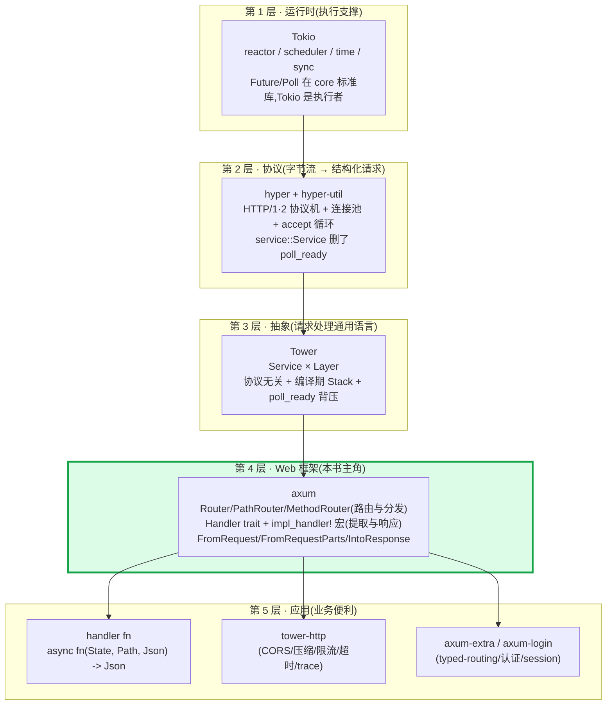
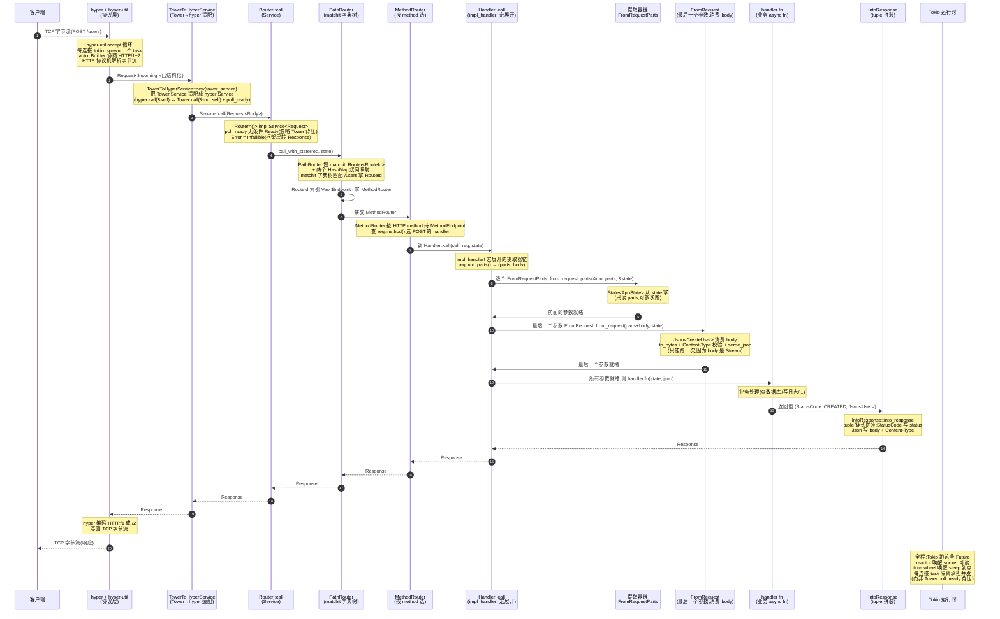
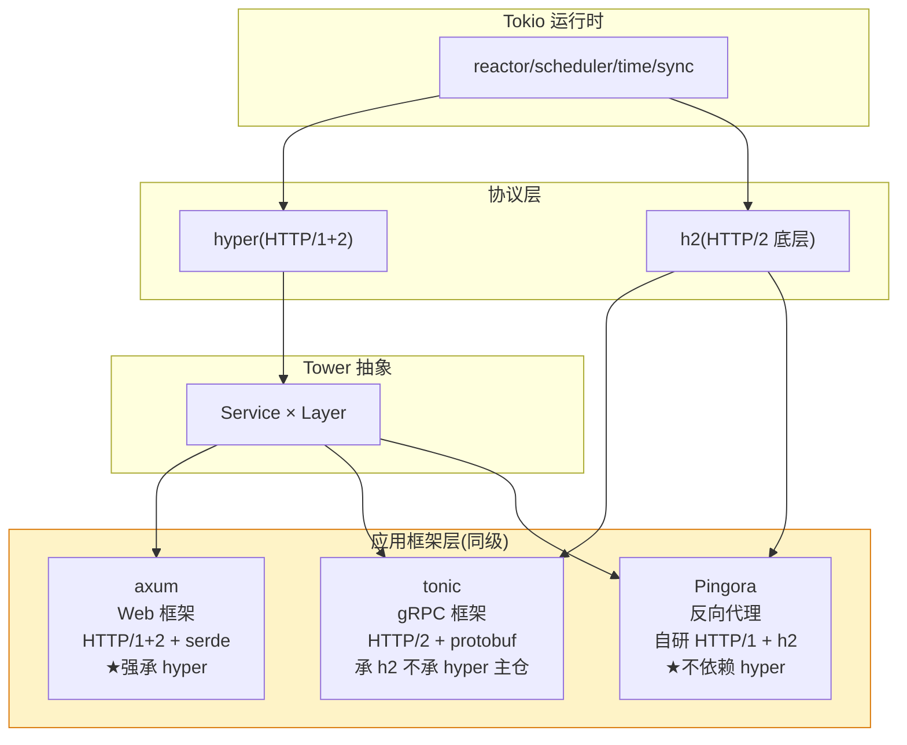
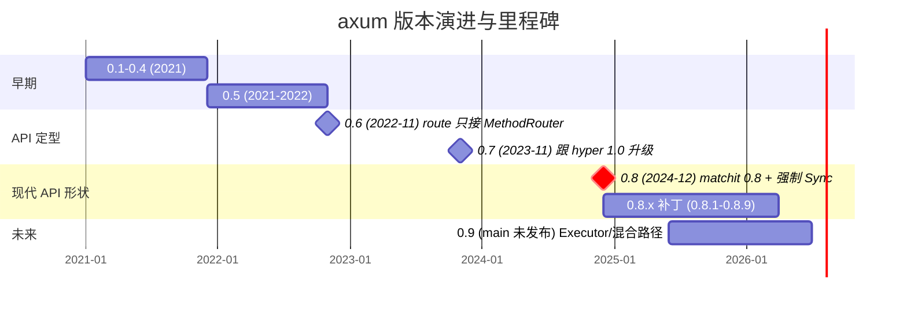

# 第 21 章 · 全书收束:axum 在 Rust 异步栈的位置

> **核心问题**:你已经读完前面 20 章。你知道 `axum::serve` 内部走 hyper-util 的 `auto::Builder` accept 连接、每连接 spawn 一个 task;你知道 `Router<()>` 自己就实现 `tower::Service`,`poll_ready` 无条件 `Ready`,`Error = Infallible`;你知道 `PathRouter` 包 `matchit::Router<RouteId>` + 两个 `HashMap` 做路径双向映射、`MethodRouter` 按 HTTP method 持有 `MethodEndpoint`;你知道 `Handler<T, S>` 的 `T` 是 coherence 占位 tuple,`impl_handler!` + `all_the_tuples!` 宏对 0~16 参数全部 impl Handler;你知道 `FromRequestParts`(只读 parts 可多次跑)vs `FromRequest`(消费 body 只能一次)的二元划分,以及 `ViaParts` marker 的桥接;你知道 `IntoResponse` 的 tuple 链式拼装;你知道 `Route` 是 `BoxCloneSyncService` 类型擦除;你知道 `middleware::from_fn` 把闭包变 Tower Layer;你知道 0.8 把 `:foo` 改成 `{foo}`、给 handler 强制加 `Sync`、`nest` 在 `/` panic、`axum-core` 把 `#[async_trait]` 换成 RPITIT。这 20 章像一块块拼图,每块都讲清了自己。可是把所有拼图拼起来,**axum 在整个 Rust 异步栈里到底站在哪一格?它和 Tokio、hyper、Tower 是怎么咬合的?它和 tonic、Pingora 是同级还是上下级?横向对照 actix-web、rocket、go net/http,axum 凭什么这么设计、差异的根在哪?读完一本书,你该能把这一切画成一张图、说成一席话。**

> **读完本章你会明白**:
>
> 1. **axum 在 Rust 异步栈的精确位置**——Tokio 运行时 → hyper HTTP 协议 → Tower 请求处理抽象(Service × Layer)→ **axum Web 框架**(路由 + 提取 + 响应 + Handler 宏)→ handler fn(业务)。axum 卡在"抽象"和"应用"之间,是这套栈里"把 hyper 的一个连接一个 Service 升级成路由分发到 handler"的唯一一层。它**强承 hyper**(协议机/连接管理/Service 全是 hyper 的,一句带过指路)、**强承 Tower**(所有对象是 `Service<Request>`,中间件就是 Layer,一句带过指路)、**承 Tokio**(全异步跑在 Tokio,一句带过指路)。这一层为什么必须存在、为什么不能上移到 handler、为什么不能下移到 Tower,本章给最终答案。
> 2. **"路由与分发 vs 提取与响应"这条二分主线怎么一路展开成 20 章**——路由这一面(P0-01 全景 → P1-03 Router 是 Service → P2-05 PathRouter matchit → P2-06 MethodRouter → P2-07 nest/merge → P2-08 fallback)解决"URL + method 怎么找到 handler fn";提取这一面(P1-04 State → P3-09 Handler trait 宏 → P3-10 FromRequest 二元划分 → P3-11 提取器实战 → P3-12 IntoResponse → P3-13 debug_handler)解决"handler 参数怎么从 Request 来、返回值怎么变 Response"。中间件(P4-14~16)和 serve(P5-17~19)串起两面。本章把这条线一次性收束,让你读完能在脑子里放电影——一次 axum 请求从 `axum::serve` 到 handler 返回 Response 的全链路。
> 3. **axum 的招牌技巧总地图**——`Handler<T, S>` 用占位 tuple 绕开孤儿规则 + `impl_handler!` 宏对 0~16 参数全展开(编译期零成本把任意 async fn 变 Service)、`FromRequestParts` vs `FromRequest` 二元划分编译期保证 body 不被重复消费、`Route = BoxCloneSyncService` 类型擦除、`PathRouter` 双层 matchit + `RouteId` 索引、`poll_ready` 无条件 Ready(忽略 Tower 背压,靠 Tokio task 隔离承担)、`axum::serve` 走 hyper-util 的 `TowerToHyperService` 适配。本章把这些技巧收成一张总表,每条配反面对比。
> 4. **多框架终极对照(★招牌)**——axum 全 Tokio + 全 Tower + 没有 Actor;对照 actix-web(actor 模型 + 自实现 actix-rt 运行时)、rocket(过程宏 request guard + fairings)、go net/http(`http.Handler` interface + `ServeMux` 1.22+ 才支持 method/参数)、tonic(gRPC 框架,Service 模型同源但 HTTP/2 + protobuf vs axum HTTP/1+2 + serde)、Pingora(反向代理,同级不依赖 hyper,自研 HTTP/1)。每个对照点出"为什么 axum 这么设计"的差异根。这是评估任何 Web 框架的通用框架。
> 5. **axum 生态展望**——axum 自己只做"路由 + 提取 + 响应 + Handler 宏"四件套,横切关注点(CORS/压缩/限流/超时/trace/认证/panic 处理)全交给生态:`tower-http`(CORS/压缩/限流/超时/trace/set header/catch panic)、`axum-extra`(typed-routing/CookieJar/protobuf/Either/JsonLines/额外的提取器和响应器)、`axum-login`(认证)、`tower-sessions`(session)、`axum-test`(测试)、与 `tracing`/`serde`/`sqlx` 的集成。axum 把生态做小、把 Tower 生态做大,这是它和 actix-web(自带一堆功能)的根本路线差异。

本章是全书的收束。它不引入新的源码细节(那些前 20 章讲透了),而是把全书 20 章串成一张图、一套对照、一张技巧地图、一个生态版图。读完它,你该能在脑子里放映出:**一次请求从 TCP 字节流进来,经过 hyper 解析成 `Request`,经 `TowerToHyperService` 适配交给 `Router::call`,走 `PathRouter` matchit 匹配拿 `RouteId`,索引 `Vec<Endpoint>` 拿 `MethodRouter`,按 method 选 handler,调 `Handler::call`(由 `impl_handler!` 宏展开的 tuple 提取器链把 Request 拆 parts+body 逐个 `FromRequestParts`),最后一个参数走 `FromRequest`(消费 body),调 handler fn,返回值 `into_response` 拼 `Response`,一路返回 hyper 编码发出去**——以及这条链上每一层在干什么、用了 axum 的什么、对照别的框架怎么做。

> **前置知识**:本章是收束章,假设你读过前 20 章至少 P0-01 / P1-02 / P1-03 / P2-05 / P3-09 / P3-10 / P4-14 / P6-20。如果你只读本章,建议至少先读 P0-01(定调)和 P3-09(Handler trait 宏,全书最难也最值),否则本章的"收束"对你没有抓手。本章直球为主,不引入新比喻(全书唯一允许的"前台调度员 + 翻译官"比喻在 P0-01 已经点睛完毕,本章只在描述栈位置时偶尔用"层"做空间隐喻)。

---

## 一句话点破

> **axum 在 Rust 异步栈的位置,是"Tower 抽象"和"应用 handler fn"之间唯一的那层 Web 框架胶水。它把 hyper 给的"一个连接一个 Service"升级成"路由分发到 handler、提取器自动反序列化请求、响应器自动序列化响应"——底层仍是 hyper + Tower 的 Service 链。它的全部魔力在四个 trait + 两个宏:`Handler<T, S>` 用占位 tuple 绕开孤儿规则 + `impl_handler!`/`all_the_tuples!` 宏对 0~16 参数全部 impl Handler(编译期把任意 async fn 变 Service),`FromRequestParts` vs `FromRequest` 二元划分编译期保证 body 不被重复消费,`IntoResponse` 让任意返回值统一变 Response,`Router` 用 matchit 字典树 + MethodRouter 做两层路由匹配。它强承 hyper(协议机/连接管理)、强承 Tower(Service/Layer/中间件)、承 Tokio(运行时);同级对照 tonic(gRPC,Service 同源但协议/序列化不同)和 Pingora(反向代理,不依赖 hyper);横向对照 actix-web(actor + 自实现运行时)、rocket(过程宏 request guard)、go net/http(ServeMux + Handler interface)——axum 的差异根是"全 Tokio + 全 Tower + 编译期宏零成本抽象"。这 20 章所有技巧,都是在"把 Web 框架好写这件事做到编译期零开销、body 不被重复消费、类型擦除可拼路由表"这三个目标上做文章。**

这是结论,不是理由。本章倒过来拆:先把 axum 钉在栈的位置上(全图),再回顾"路由与分发 vs 提取与响应"这条主线怎么一路展开成 20 章(放电影),然后做同级 + 横向的多框架终极对照,再串 axum 的招牌技巧地图,最后展望生态。

---

## 第一节:axum 在 Rust 异步栈的位置(全书总图)

这是全书的"封面图",所有章节都长在这张图上。

### 1.1 五层栈:Tokio → hyper → Tower → axum → handler fn

P0-01 第三节已经把"axum 在栈的哪一层"点睛过,本章作为收束,把它钉死成最终形态。



五层各司其职。逐层交代它们和 axum 的咬合关系——**axum 强承 hyper、强承 Tower、承 Tokio,本章作为收束做总交代**(承接铁律:hyper/Tower/Tokio 讲透的一句带过指路,篇幅全留 axum 独有)。

**第 1 层 · 运行时(Tokio)**。跑 `Future`,提供 `mpsc`/`oneshot`/`Semaphore`/`time::sleep`/`spawn`/`AsyncRead`/`AsyncWrite`/时间轮这些异步原语。`Future`/`Poll`/`Waker`/`Context` 本身在标准库 `core::future`/`core::task`,Tokio 只是执行者。axum 全异步:所有 handler 是 `async fn`,所有提取器返回 `impl Future`,`axum::serve` 的 `loop { accept; tokio::spawn(handle_connection) }`(`axum/src/serve/mod.rs#L389`)每个连接 spawn 一个 task。`tracing` 的 span 跨 await,Sse 用 mpsc channel(`axum/src/response/sse.rs`),超时中间件用 `tokio::time::sleep`(承 Tower 的 `Timeout`),budget 让出——这些都承 Tokio,本书一句带过指路 [[tokio-source-facts]]。

> **承接《Tokio》[[tokio-source-facts]]**:运行时(task 调度/AsyncRead/timer/mpsc channel/budget/时间轮)Tokio 讲透了,本书一句带过。axum 只用 Tokio,不发明自己的运行时——这是 axum 区别于 actix-web 的根本架构差异之一(后者自实现 actix-rt,第三节对照展开)。

**第 2 层 · 协议(hyper + hyper-util)**。把 TCP 字节流变成结构化的 `Request<Body>`/`Response<Body>`。hyper 是 HTTP/1·2 的协议机(解析委托 `httparse`、HTTP/2 委托 `h2`),hyper-util 提供 `server::conn::auto::Builder` 自动协商 HTTP/1+2 + accept 循环 + 连接管理(连接池在 hyper-util)。这一层背压由协议自身的机制承担(HTTP/1 的 `in_flight` 单槽、HTTP/2 的 h2 流控窗口),所以 hyper 的 `service::Service` trait **删了 `poll_ready`**(`call(&self, req) -> Future`,承《Tower》招牌对照点)。

axum 与 hyper 的衔接点是 **`TowerToHyperService`**(`hyper-util` 提供,`axum/src/serve/mod.rs#L385` `TowerToHyperService::new(tower_service)` 把 axum 的 Tower Service 适配成 hyper Service)和 **`auto::Builder` + `serve_connection_with_upgrades`**(`axum/src/serve/mod.rs#L391-L396`,`Builder::new(TokioExecutor::new())` 跑协议机)。axum 收到的 `Request<Body>` 已经是 hyper 解析好的,body 是 `axum_core::body::Body`(包了 hyper 的 body,`axum/src/serve/mod.rs#L383` `req.map(Body::new)` 把 `Request<Incoming>` 转成 `Request<Body>`)。

> **承接《hyper》[[hyper-source-facts]]**:协议机(HTTP/1 状态机/HTTP/2 via h2)、连接管理(accept/keep-alive/连接池)、`service::Service` trait(删 `poll_ready`、`call(&self)`)、Body as Stream、buffered IO、bytes 零拷贝、协议升级(websocket)——这些《hyper》已拆透,本书一句带过 + 指路(协议机指 P2-P3、Service 指 P1-02、连接管理指 P4-P5、`TowerToHyperService` 适配指 P4)。axum 收到的 `Request<Body>` 已经是 hyper 解析好的。axum 这一层**不重写协议**,只复用 hyper。

**第 3 层 · 抽象(Tower)**。定义"一个请求怎么被处理、怎么被装饰"的通用语言。`Service<Request>`(`poll_ready + call -> Future`)是执行单元,`Layer<S>`(`Fn(Service) -> Service`)是组合单元,`Stack<Inner, Outer>` 把多个 Layer 在编译期嵌成洋葱树。两个 trait 钉死在 0.3.3 长期不动,整个 Rust 异步网络生态(axum/tonic/reqwest/Pingora)挂在上面。

axum 和 Tower 的咬合点是:**axum 的所有可路由对象都实现 `tower::Service<Request>`**。`Router<()>`(`axum/src/routing/mod.rs#L569` `impl<B> Service<Request<B>> for Router<()>`,`Error = Infallible`)、`MethodRouter`、`Route`(`axum/src/routing/route.rs#L31` `pub struct Route<E = Infallible>(BoxCloneSyncService<Request, Response, E>)`,类型擦除的 Tower Service)、`HandlerService`(`axum/src/handler/service.rs`)全部 impl `tower::Service`。**axum 的中间件就是 Tower Layer**(`Router::layer`/`route_layer`/`MethodRouter::layer`/`Handler::layer` 全部接 `tower_layer::Layer`,`middleware::from_fn` 只是把闭包包成 Layer)。

> **承接《Tower》**:Service/Layer/poll_ready 语义、`ServiceBuilder` 叠中间件、`BoxCloneSyncService` 类型擦除的内部原理、`Stack` 类型级洋葱、`mem::replace` 惯用法、`SyncWrapper`——《Tower》拆透了(成网后),本书一句带过 + 指路。axum 的招牌取舍是:**`Router`/`Route`/`MethodRouter`/`HandlerService` 的 `poll_ready` 无条件 `Poll::Ready(Ok(()))`**(承《Tower》"poll_ready 是背压"那一章,对照"axum 刻意忽略 Tower 背压,靠 Tokio task 隔离承担")——`axum/src/routing/mod.rs#L577-L579` 的 `poll_ready` 直接 `Poll::Ready(Ok(()))`。axum 这一层**不重写中间件抽象**,只复用 Tower 的 Service/Layer。

**第 4 层 · Web 框架(axum,本书主角)**。这是全书的核心。axum 在 Tower 之上加了"路由分发 + 提取器 + 响应器 + Handler 编译期魔法"这一层 Web 框架该做的事:

- **路由与分发**:`Router`/`PathRouter`/`MethodRouter`/`Route`/`Fallback`/`MethodFilter`。`PathRouter` 用 `matchit::Router<RouteId>` 字典树匹配路径(`axum/src/routing/path_router.rs` 的 `Node` 包 matchit + 两个 `HashMap` 做 `RouteId ↔ path` 双向映射),`MethodRouter` 按 HTTP method 持有 `MethodEndpoint`,`RouteId(u32)` 索引 `Vec<Endpoint>`。两层结构:先按 URL 选 `Endpoint`,再在 `Endpoint` 里按 method 选 handler。
- **提取与响应**:`Handler<T, S>` trait + `impl_handler!`/`all_the_tuples!` 宏(编译期把任意 `async fn` 变 Service),`FromRequestParts`(只读 parts 可多次跑)vs `FromRequest`(消费 body 只能一次)的二元划分 + `ViaParts` marker 桥接,`IntoResponse` + `IntoResponseParts`(tuple 链式拼装响应)。
- **Handler 编译期魔法**:`Handler<T, S>` 的 `T` 是 coherence 占位 tuple,绕开孤儿规则,让宏能为 0~16 个参数的 async fn 各写一份 impl Handler;每份 impl 内部把 req 拆 parts+body,前 N-1 个参数 `FromRequestParts`,最后一个 `FromRequest`。

axum 这一层**不跑 future(那是 Tokio)、不解析协议(那是 hyper)、不定义 Service/Layer(那是 Tower)**,它只做"路由 + 提取 + 响应 + Handler 编译期变 Service"这四件 Web 框架该做的事。

**第 5 层 · 应用(handler fn + 生态)**。最上层是用户写的 `async fn handler(State<AppState>, Path<i32>, Json<CreateUser>) -> (StatusCode, Json<User>)`——它就是个普通 `async fn`,经 `impl_handler!` 宏在编译期自动获得 `Handler<(M, State<AppState>, Json<CreateUser>,), AppState>` 的实现,经 `post(handler)` → `HandlerService` → `MethodRouter` → `Router` 变成一个 `tower::Service<Request>`。横切关注点(CORS/压缩/限流/超时/trace/认证/panic 处理)交给生态:`tower-http` 是 axum 与 Tower 共享的中间件库,`axum-extra` 提供 axum 特有的额外提取器/响应器,`axum-login`/`tower-sessions` 做认证/session——第五节展开。

### 1.2 为什么是这一层,不能更上也不能更下

axum 卡在 Tower 抽象和应用 handler fn 之间,这个位置是结构性的必然,不是 axum 自己挑的。本书在 P0-01 第三节点睛,本章作为收束钉死。

**不能更下(挪到 Tower 抽象层)**。Tower 是协议无关的请求处理通用语言(承《Tower》P0-01),它的 `Service<Request>` 不知道你跑的是 HTTP 还是 gRPC 还是数据库。如果你把"路由 + 提取器"做进 Tower,那 Tower 就要假设请求是 HTTP(`Request` 有 `uri().path()`、有 `method()`、有 `headers()`),就不再是协议无关——`Service<Request>` 在 Tower 里 `Request` 是泛型,不绑 HTTP。所以"路由 + 提取器"必须在 Tower 之上、专门给 HTTP/Web 这一层做。axum 正是这么定位:`Router<()>` impl `tower::Service<Request>`,但它要求 `Request` 是 HTTP(`axum/src/routing/mod.rs#L569` 的 `impl<B> Service<Request<B>> for Router<()> where B: HttpBody + Send + 'static`),不假装协议无关。

**不能更上(挪到应用层)**。如果"路由 + 提取器 + 响应器 + Handler 宏"由每个应用自己写,那就是回到 P0-01 第一节那段裸 hyper 代码——每个项目手写 `match req.uri().path()` + 手写 body 收集 + 手写 Content-Type 校验 + 手写反序列化,50 个路由 1500 行样板。axum 把这套抽象出来,所有 axum 应用共享。而且 axum 的 handler 宏是编译期的(任意 `async fn` 自动变 Service),你写 `async fn(State, Path, Json) -> Json<User>` 就够了,样板由宏吃掉。

**正好卡在中间**。axum 这一层,建立在 Tower 的 Service/Layer 之上(所有对象都是 `Service<Request>`),建立在 hyper 的协议层之上(收到 hyper 解析好的 `Request`),全异步跑在 Tokio 上(每连接 spawn 一个 task),提供"路由 + 提取 + 响应 + Handler 编译期魔法"的 Web 框架便利。它不重写协议(承 hyper)、不重写中间件抽象(承 Tower)、不重写运行时(承 Tokio),它只做 Web 框架该做的那一层。**这是 Rust 异步网络栈里"抽象(Tower)"和"应用(handler fn)"之间唯一的那层 Web 框架胶水**。

> **钉死这件事**:axum 在 Rust 异步网络栈的位置——Tokio(运行时)→ hyper(协议)→ Tower(抽象)→ **axum(Web 框架)** → handler fn(业务)。axum 卡在 Tower 和 handler fn 之间,是这套栈里"把 hyper 的一个连接一个 Service 升级成路由分发到 handler"的唯一一层。这一点是全书的地基,P0-01 第一节埋下,本章作为收束钉死。这是 Rust 异步网络栈五层里"Web 框架"那一格,和 tonic(gRPC 框架)、Pingora(反向代理框架)在概念上同级(都是 Tower 之上的应用框架),第三节对照展开。

### 1.3 一个请求穿过整条栈的时序(全书运行画面)

把"一个 axum 请求从 TCP 进来,穿过 hyper 协议层、`TowerToHyperService` 适配、`Router` 路由分发、`PathRouter` matchit 匹配、`MethodRouter` method 分发、`Handler::call` 提取器链、handler fn 执行、`IntoResponse` 拼装,响应原路返回"的完整时序画出来——这是全书 20 章所有源码细节的"运行画面"。读完本书你该能在脑子里放映这张图(P0-01 第五节给过雏形,P1-02 全景章展开过,本章作为收束钉死最终形态):



这张图把全书所有关键机制都画进去了。逐段对应到本书哪一章:

- **段 1-3(hyper + hyper-util)**:P5-17(serve 与监听器)拆透 accept 循环 + `auto::Builder` + `TokioExecutor`,`TowerToHyperService` 适配。承《hyper》P4-P5。
- **段 4(Router impl Service)**:P1-03(Router 与 Route 都是 Service)拆透。`Router<()>` 的 `Error = Infallible` 在 P5-18(错误处理)拆透,`poll_ready` 无条件 Ready 的取舍在 P1-03 招牌对照。
- **段 5-6(PathRouter matchit)**:P2-05(PathRouter matchit 字典树)招牌章拆透,`Node` 双向映射、`RouteId(u32)` 索引 `Vec<Endpoint>`。
- **段 7(MethodRouter method 分发)**:P2-06(MethodRouter 按 HTTP method 分发)拆透,`MethodFilter` 位运算、`merge_for_path`。
- **段 8-10(Handler::call 提取器链)**:P3-09(Handler trait 把 async fn 变 Service)★★招牌章拆透,`impl_handler!` 宏 + `all_the_tuples!` 递归展开。
- **段 11-12(FromRequestParts / FromRequest)**:P3-10(FromRequest 与 FromRequestParts 二元划分)★招牌章拆透,`ViaParts` marker 桥接。
- **段 13(handler fn 执行)**:P3-09 / P3-11(提取器实战)拆透。
- **段 14(IntoResponse tuple 拼装)**:P3-12(IntoResponse 返回值怎么变成 Response)拆透,tuple 组合响应。
- **段 15-18(响应原路返回)**:所有 trait 的 future 串起来,`Response` 一路返回到 hyper 编码发出去。
- **全程 Tokio**:`axum/src/serve/mod.rs#L389` 的 `tokio::spawn` 每连接一个 task,reactor 唤醒 I/O,timer 唤醒 sleep。承《Tokio》。

> **钉死这件事**:这张时序图是全书的"封面"。你读完一本书,脑子里应该能随时放映出它。每个具体机制(Router impl Service / PathRouter matchit / MethodRouter method 分发 / Handler 宏展开 / FromRequestParts 提取器链 / IntoResponse tuple)都是这张图里某一段的具体实例化。迷路时回到它问:这个机制在请求穿过时的哪一段?它在路由这一面(段 5-7)还是提取这一面(段 8-14)?

### 1.4 axum 这一层"加了什么"和"没加什么"

收束章值得把"axum 加了什么 / 没加什么"列成一张清单,让"axum 这一层到底干嘛"钉死:

| 层 | 加了什么(axum) | 没加什么(指路) |
|----|----------------|----------------|
| 运行时 | 没有 | Tokio 全承担(承《Tokio》) |
| 协议 | 没有 | hyper 全承担(承《hyper》P2-P5) |
| 抽象(Service/Layer) | 没有(直接用 Tower) | Tower 全承担(承《Tower》) |
| **Web 框架** | **Router/PathRouter/MethodRouter(路由)** **Handler trait + 宏(提取)** **FromRequest/FromRequestParts/IntoResponse(提取+响应)** **middleware::from_fn(便利层)** | — |
| 应用 | `async fn handler` 是用户的 | tower-http/axum-extra 等生态 |

读这张表的关键是:**axum 没有发明任何"协议""运行时""Service/Layer"层面的东西,它只在 Tower 的 Service/Layer 之上加了一层 Web 框架胶水**。这就是为什么 axum 仓只有 ~12000 行源码(整个 `axum/src` + `axum-core/src` + `axum-macros/src`),却能扛起 Rust Web 生态——它**站在巨人肩上**,不重写巨人。

> **钉死这件事**:axum 仓的源码体量(~12000 行)远小于 hyper(~35000 行)、tower(~25000 行)、tokio(~150000 行)。这不是"axum 小",是 axum 把协议/运行时/抽象全复用,只在最上面那一层做 Web 框架该做的事。这是 Rust 异步生态"分层复用 + 各司其职"的胜利——axum 能这么小,因为 hyper/Tower/Tokio 都做对了。

---

## 第二节:主线回扣——"路由与分发 vs 提取与响应"怎么展开成 20 章

回到全书立下的二分主线:**路由与分发**(URL + method 怎么找到 handler fn)**vs 提取与响应**(handler 参数怎么从 Request 来、返回值怎么变 Response)。这 20 章每一章,都是在这条骨架上长肉。本节把这条线一次性收束。

### 2.1 全书 20 章的二分法归属一览

把全书 20 章按"路由与分发 vs 提取与响应"归属,做成一张总览表。这是全书鸟瞰:

| 章 | 标题 | 归属 | 它在二分主线上干什么 |
|----|------|------|---------------------|
| P0-01 | 第一性原理 | 总览 | 立二分主线,定调 axum 在栈的位置 |
| P1-02 | axum 全景:一次请求穿过哪些层 | 总览 | 全景时序图,串起路由+提取两面 |
| P1-03 | Router 与 Route:都是 Service | **路由** | Router<()> impl Service、Route 类型擦除、poll_ready 无条件 Ready |
| P1-04 | State:用泛型编码缺状态 | **提取** | Router<S> 的 S 是缺失状态,with_state 消耗它;State<T> 提取器 + FromRef |
| P2-05 | PathRouter:matchit 字典树 | **路由(招牌)** | PathRouter+Node 双层、RouteId 索引、matchit 基数树原理 |
| P2-06 | MethodRouter:按 HTTP method 分发 | 路由 | method 持 MethodEndpoint、MethodFilter 位运算、merge_for_path |
| P2-07 | 嵌套与合并:nest 与 merge | 路由 | nest 的 StripPrefix+SetNestedPath 双 Layer、merge 重编号 |
| P2-08 | fallback 与 404 | 路由 | catch_all vs method_not_allowed、Fallback 三态 |
| P3-09 | Handler trait:把 async fn 变 Service | **提取(★★招牌)** | Handler<T,S> 的 T 占位、impl_handler! + all_the_tuples! 宏展开 |
| P3-10 | FromRequest 与 FromRequestParts | **提取(★招牌)** | 二元划分、ViaParts marker 桥接、impl Future 非 async-trait |
| P3-11 | 提取器实战:Path/Query/State/Json/Form | 提取 | 各内置提取器具体实现、rejection 变 Response |
| P3-12 | IntoResponse | **响应** | IntoResponse + tuple 链式拼装 + IntoResponseParts |
| P3-13 | 自定义提取器 + #[axum::debug_handler] | 提取 | 自定义 FromRequestParts、debug_handler 宏改错误信息 |
| P4-14 | from_fn:把闭包变中间件 | **中间件(招牌)** | middleware::from_fn 把 async fn 闭包变 Layer |
| P4-15 | from_extractor:把提取器当中件 | 中间件 | from_extractor 把 FromRequest 包成 Layer 提前校验 |
| P4-16 | 中间件链与 ServiceBuilder | 中间件 | Tower ServiceBuilder + layer/route_layer/MethodRouter::layer/Handler::layer 四种作用域 |
| P5-17 | serve 与监听器 | 总览 | serve 函数 + Listener trait + hyper-util auto 协商 + graceful shutdown |
| P5-18 | 错误处理:Infallible 与 HandleError | 总览 | Router 的 Error 永远 Infallible + HandleErrorLayer 兜底 |
| P5-19 | WebSocket、SSE 与流式响应 | 响应 | ws 提取器(hyper 协议升级)+ Sse(Stream of Event)+ 流式 body |
| P6-20 | axum 0.7→0.8 演进 + 0.9 展望 | 总览 | 0.8 关键变动(route 语义、{foo} 语法、强制 Sync、RPITIT) |

注意几个规律:

- **路由招牌章**(P2-05~P2-08)集中解决"URL + method 怎么找到 handler":matchit 字典树 + MethodRouter method 分发两层。这是 axum 路由的招牌,四连章把匹配原理、合并、嵌套、fallback 全部拆透。
- **提取招牌章**(P3-09~P3-13)集中解决"handler 参数怎么从 Request 来、返回值怎么变 Response":Handler trait 宏 + FromRequest 二元划分 + IntoResponse + 自定义提取器。P3-09 是全书精华中的精华(Handler<T, S> 的 T 参数 + impl_handler! 宏展开)。
- **中间件**(P4-14~P4-16)桥接路由和提取两面:它套在 Service 外面,既影响请求路径(可以提前拦截/校验)又影响响应路径(可以改 Response)。
- **总览章**(P0-01/P1-02/P5-17/P5-18/P6-20/本章)串起全局,不深入单一机制。

### 2.2 路由与分发这一面:URL + method 怎么找到 handler

把"路由与分发"这条线收束成一句话:

> **`Router<()>` impl `tower::Service<Request>`,它的 `call` 调 `call_with_state`,内部 `PathRouter` 用 `matchit::Router<RouteId>` 字典树匹配 URL 拿 `RouteId`,`RouteId(u32)` 索引 `Vec<Endpoint>` 拿 `MethodRouter`,`MethodRouter` 按 `req.method()` 选 `MethodEndpoint`,转交给 handler。`PathRouter` 用 `Node { inner: matchit::Router<RouteId>, route_id_to_path, path_to_route_id }` 做 RouteId ↔ path 双向映射;`MethodRouter` 按 HTTP method(get/post/put/...)各持一个 `Option<MethodEndpoint>`;`merge` 把两个 Router 拼、`nest` 给被嵌套路由套 StripPrefix + SetNestedPath 两个 Layer 重新拼路径;`fallback` 处理路径不匹配(catch_all)和方法不匹配(method_not_allowed)两种情况。**

具体到每一章:

**P1-03(Router 与 Route 都是 Service)**。`Router<()>` 自己就 impl `tower::Service<Request>`(`axum/src/routing/mod.rs#L569`),`poll_ready` 无条件 `Poll::Ready(Ok(()))`,`Error = Infallible`,`call` 调 `call_with_state`。`Route` 是 `BoxCloneSyncService<Request, Response, E>`(`axum/src/routing/route.rs#L31`)类型擦除的 Tower Service——这是 axum 把"每个 handler 不同类型"擦成统一类型塞进路由表的根。

**P2-05(PathRouter matchit 字典树,★招牌)**。`PathRouter` 包 `Arc<Node>`,`Node` 是 `matchit::Router<RouteId>` + 两个 `HashMap`(`route_id_to_path` / `path_to_route_id`)做双向映射。`matchit` 是外部 crate(基数树/radix tree,`axum/Cargo.toml` `matchit = "=0.8.4"`),`RouteId(u32)` 索引 `Vec<Endpoint>`,URL 参数 `{id}` 被 matchit 捕获后塞进 `Request::extensions()`,`Path<i32>` 提取器从那里读。

**P2-06(MethodRouter 按 method 分发)**。`MethodRouter` 按 HTTP method 持有 `Option<MethodEndpoint>`(`axum/src/routing/method_routing.rs#L547`),`MethodFilter` 用位运算表示"哪些 method 这个 handler 接受",`.route("/", get(_)).route("/", post(_))` 第二次 route 检测到重复 path 走 `merge_for_path` 而非插入。

**P2-07(nest 与 merge)**。`nest("/api", sub_router)` 给被嵌套路由套两个 Tower Layer:`StripPrefix`(剥掉 `/api` 前缀)+ `SetNestedPath`(把 `/api` 写进 extensions 供 `matched_path`/`nested_path` 提取器用)。0.8 起 `nest("/", sub)` 直接 panic(语义重叠,改用 `merge`)。`merge` 把两个 Router 的路由 ID 重编号后拼接。

**P2-08(fallback 与 404)**。`Fallback` 三态:`Default`(404)/`Service`(用户传的 Service)/`BoxedHandler`(用户传的 handler)。`catch_all_fallback`(路径不匹配)vs `method_not_allowed_fallback`(0.8 新增,路径匹配但方法不匹配)分开。`.route_layer` 只作用于有路由的部分不作用于 fallback。

> **钉死这件事**:**路由与分发这一面**是 `Router` impl Service + `PathRouter` matchit 字典树 + `MethodRouter` method 分发三层。讲不清 matchit 双层匹配(`RouteId` 索引 `Vec<Endpoint>`、Node 双向映射)、`MethodRouter` 按方法分发、`merge`/`nest` 路径拼接 = 没讲 axum 路由。深度见 P2-05~P2-08 路由招牌四连章。

### 2.3 提取与响应这一面:handler 参数怎么从 Request 来、返回值怎么变 Response

把"提取与响应"这条线收束成一句话:

> **`Handler<T, S>` trait 的 `T` 是 coherence 占位 tuple,`impl_handler!` + `all_the_tuples!` 两个宏对 0~16 个参数的 async fn 各展开一份 impl Handler,每份 impl 的 `call` 把 req 拆 parts+body,前 N-1 个参数跑 `FromRequestParts::from_request_parts(&mut parts, &state)`(只读 parts,可多次跑),最后一个参数跑 `FromRequest::from_request(req, &state)`(消费 body,只能一次),全部成功才调真 async fn,返回值 `into_response` 变 Response。`FromRequestParts` vs `FromRequest` 的二元划分编译期保证 body 不被重复消费(`Path`/`Query`/`State` 实现 `FromRequestParts`,`Json`/`Form`/`Bytes` 实现 `FromRequest`),`ViaParts` marker 桥接让"只读 parts 的提取器也能当最后一个参数"。`IntoResponse` + tuple 链式拼装让任意返回值统一变 Response。**

具体到每一章:

**P3-09(Handler trait 把 async fn 变 Service,★★招牌)**。全书精华中的精华。`Handler<T, S>` 的 `T` 是占位 tuple(`((),)` / `(M, T1, T2, Tlast,)` / ...),让不同 arity 的 impl 落在不同 `T` 类型上,绕开孤儿规则。`impl_handler!` 宏(`axum/src/handler/mod.rs#L221-L260`)对 N 参数生成 impl,`all_the_tuples!` 宏(`axum/src/macros.rs#L49-L68`)递归展开 1~16 参数。每份 impl 的 `call` 内部跑提取器链。`HandlerService` 把 Handler 包成 `tower::Service`,`Handler::layer` 把 Tower Layer 套到单个 handler(`Layered` 结构体)。

**P3-10(FromRequest 与 FromRequestParts,★招牌)**。`FromRequestParts<S>` 只读 `&mut Parts`(可多次跑),`FromRequest<S, M = ViaRequest>` 消费整个 `Request`(只能一次)。`ViaParts` marker 桥接(`axum-core/src/extract/mod.rs#L91-L105`):`impl FromRequest<S, ViaParts> for T where T: FromRequestParts` 让任何 `FromRequestParts` 自动实现 `FromRequest`。`Result<T, Rejection>` / `Option<T>` 桥接。`from_request` 用 `impl Future`(RPITIT,0.8 起,非 `#[async_trait]`,零堆分配)。

**P3-11(提取器实战)**。`Path<T>`(serde 反序列化 URL 参数)、`Query<T>`(query string 反序列化)、`State<T>`(从 state 拿)、`Json<T>`(消费 body + serde_json + Content-Type 校验 + 限制大小)、`Form<T>`。rejection 怎么变 Response。

**P3-12(IntoResponse)**。`IntoResponse` trait + `into_response`。tuple 组合响应:`(StatusCode, T)` / `(StatusCode, HeaderMap, T)` / `(Parts, T)`。`IntoResponseParts`(先写 parts 再写 body)。具体实现(String 设 text/plain,Json 设 application/json + serde 序列化)。

**P3-13(自定义提取器 + debug_handler)**。自定义 `FromRequestParts` 的步骤。`#[axum::debug_handler]` 宏(`axum-macros/src/debug_handler.rs`)把 handler 包成命名函数改类型错信息。`FromRef` 从 state 派生子状态。

> **钉死这件事**:**提取与响应这一面**是 Handler trait 宏展开 + FromRequest 二元划分 + IntoResponse tuple 拼装。讲不清 `Handler<T, S>` 的 T 参数、`impl_handler!`/`all_the_tuples!` 宏展开、FromRequestParts vs FromRequest 二元划分、ViaParts 桥接 = 没讲 axum。深度见 P3-09~P3-13 提取响应招牌五连章,其中 P3-09 是全书精华中的精华、最难也最值的一章。

### 2.4 中间件 + serve + 演进:串起两面

二分主线之外,还有三条横线串起两面:

**中间件(P4-14~P4-16)**:axum 中间件就是 Tower Layer,套在 Service 外面,既影响请求路径(可以提前拦截/校验)又影响响应路径(可以改 Response)。`middleware::from_fn`(`axum/src/middleware/from_fn.rs`)把 `async fn` 闭包变 Layer,`from_extractor` 把 FromRequest 包成 Layer 提前校验,`ServiceBuilder` 叠中间件。四种作用域:`Router::layer`(全局含 fallback)/ `route_layer`(只匹配的路由不含 fallback)/ `MethodRouter::layer` / `Handler::layer`。

**serve + 高级(P5-17~P5-19)**:`axum::serve` 内部走 hyper-util 的 `auto::Builder`(`axum/src/serve/mod.rs#L385-L396`),`TowerToHyperService::new`(`axum/src/serve/mod.rs#L385`)把 Tower Service 适配成 hyper Service,`serve_connection_with_upgrades` 跑协议机。`Listener` trait 抽象监听器(TcpListener/UnixListener)。graceful shutdown 用 `tokio::select!` 监听 signal。错误处理:`Router` 的 `Error = Infallible`(框架层把所有错误转 Response),`HandleErrorLayer` 兜底中间件的错误,tower-http 的 `catch_panic` 防 panic 杀连接。WebSocket 提取器(hyper 协议升级)、Sse(Stream of Event)、流式 body。

**演进(P6-20)**:0.7 跟着 hyper 1.0 走(主要是连接管理那层重写,`axum::Server` 移除改 `axum::serve`),0.8 是 axum 自己的 API 清晰化(matchit 0.8 的 `{id}` 语法、强制 `Sync`、`nest` 在 `/` panic、`axum-core` 用 RPITIT、`OptionalFromRequest` 新增)。0.9 main 在改但未发布。**注意修正一个常见误解**:`Router::route` 只接 MethodRouter、`route_service` 接任意 Service 这套语义分离从 0.6 就稳定了,0.8 改的只是给这两个方法统一加了 `Sync` bound——不是 0.8 才做的分家(P6-20 专门讲清)。

### 2.5 二分主线收束成一句话

把全书二分主线收束成一句话(全书的"骨"):

> **axum 把"URL + method 怎么找到 handler"这一面(路由与分发:`Router` impl Service + `PathRouter` matchit 字典树 + `MethodRouter` method 分发)和"handler 参数怎么从 Request 来、返回值怎么变 Response"这一面(提取与响应:`Handler<T, S>` trait + `impl_handler!` 宏 + `FromRequestParts`/`FromRequest` 二元划分 + `IntoResponse`)做成了两层编译期零成本抽象。两层之间通过 `tower::Service<Request>` 这套通用语言衔接——`Router` 是 Service,`MethodRouter` 是 Service,`HandlerService` 是 Service,handler fn 经宏变 Service。axum 这 20 章所有源码技巧(Handler 的 T 占位 tuple、宏展开、二元划分、ViaParts 桥接、matchit 双层匹配、RouteId 索引、Route 类型擦除),都是在"Web 框架好写 + 编译期零开销 + body 不被重复消费 + 类型擦除可拼路由表"这四个目标上做文章。**

任何一处看不懂某个 axum 机制,回到这句话问:它在路由这一面(改 Router/PathRouter/MethodRouter 的匹配行为),还是在提取这一面(改 Handler/FromRequest/IntoResponse 的提取/响应行为)?它在解决"匹配/提取/响应/类型擦除"哪个问题?答案就在这条主线上。

---

## 第三节:多框架终极对照(★招牌)

这一节是全书"跨框架对照"的集大成。P0-01 第四节做过雏形,本章作为收束,把它彻底钉死成一张大表。这是评估任何 Web 框架的通用框架。

### 3.1 同一种思想,多种语言落地

"声明式 Web 框架"不是 axum 发明的。handler 写成 `async fn`、参数自动提取、中间件组合、路由匹配——这些是 Web 框架的通用模式。不同语言、不同框架各自发明了落地:

- **axum(Rust)**:handler 是任意 `async fn`(参数是提取器),经 `impl_handler!` 宏编译期变 Service;中间件是 Tower Layer 编译期 `Stack`;全 Tokio。
- **actix-web(Rust)**:handler 写法和 axum 表面相似(`async fn` + 提取器),但底层是 Actor 模型 + 自实现 actix-rt 运行时。
- **rocket(Rust)**:handler 是 `async fn`,但路由是过程宏注解(`#[get("/users/<id>")]`),参数是 request guard(过程宏驱动)。
- **go net/http(Go)**:handler 实现 `http.Handler` 接口(`ServeHTTP(w, r)`),路由用 `ServeMux`(1.22+ 才支持 method + `{id}`),中间件是闭包链。
- **tonic(Rust)**:gRPC 框架,Service 模型同源(都是 Tower),但协议是 HTTP/2 + protobuf(vs axum HTTP/1+2 + serde)。
- **Pingora(Rust)**:反向代理框架,不依赖 hyper(自研 HTTP/1,只 dev-dep hyper),同级对照(都建在 Tokio + h2 之上)。

六种框架,六种做法。**关键差别在"handler 写法""路由匹配""中间件抽象""运行时""协议/序列化"五个维度**。下面分三组对照:① Rust 生态内对照(axum vs actix-web vs rocket);② 跨语言对照(axum vs go net/http);③ 同级对照(axum vs tonic vs Pingora)。

### 3.2 终极对照表

把六种框架的所有维度收束成一张大表(全书最核心的对照表):

| 维度 | **axum** | **actix-web** | **rocket** | **go net/http** | **tonic** | **Pingora** |
|------|----------|--------------|-----------|----------------|----------|-------------|
| **语言** | Rust | Rust | Rust | Go | Rust | Rust |
| **定位** | Web 框架(HTTP/1+2 + serde) | Web 框架(Actor + serde) | Web 框架(过程宏 + serde) | Web 框架(标准库) | gRPC 框架(HTTP/2 + protobuf) | 反向代理(无业务 handler) |
| **handler 写法** | 任意 `async fn`(参数是提取器) | `async fn`(参数是提取器,底层 Actor) | `async fn` + `#[get("/path")]` 过程宏 | `func(w, r)`(写 ResponseWriter) | `async fn`(参数是 protobuf Request) | `ProxyHttp` trait(filter 钩子) |
| **handler 变 Service 的机制** | `impl_handler!` 宏编译期变 Service | Actor 收 `HttpRequest` message 返 `HttpResponse` | 过程宏编译期生成 Route | 运行期多态(`http.Handler` interface) | tonic 编译期生成 trait impl | trait impl(用户 impl ProxyHttp) |
| **路由** | matchit 字典树 + MethodRouter 两层 | 自实现树 | 自实现树 + 过程宏注册 | `ServeMux`(1.22+ 才支持 method/`{id}`) | gRPC 不用 path(method 名即路由) | 用户在 filter 里自己写 path 匹配 |
| **提取器机制** | trait(`FromRequest`/`FromRequestParts`)+ 宏 | trait(类似 axum) | request guard(过程宏 + trait) | 手工 `r.PathValue("id")` + 手工 json decode | tonic 自动 protobuf decode | 无提取器概念(filter 拿 `Request`) |
| **中间件抽象** | Tower Layer(编译期 `Stack`) | 自实现 `Transform`/`Service`(签名不同) | fairings + request guard | `func(Handler) Handler` 闭包链(运行期) | Tower Layer(同 axum) | filter 钩子链(~30 个) |
| **运行时** | **全 Tokio** | 自实现 actix-rt(在 tokio 上加 Actor 调度) | Tokio | Go runtime(goroutine) | Tokio | Tokio |
| **协议** | hyper(HTTP/1 + HTTP/2 via h2) | 自实现 HTTP/1.1(早期)+ hyper(后期) | hyper | Go 标准库 net/http | h2(只用 HTTP/2) | 自研 HTTP/1(httparse)+ h2(HTTP/2) |
| **序列化** | serde + serde_json | serde + serde_json | serde + serde_json | encoding/json | protobuf(prost codegen) | 不序列化(透传字节) |
| **依赖 hyper** | ★强承 hyper(协议机/Service/连接管理) | 部分依赖(后期) | 强承 hyper | 不依赖(Go 标准库) | 承 h2(不承 hyper 主仓) | ★不依赖(只 dev-dep,同级) |
| **背压/流控** | Tower poll_ready(axum 刻意忽略,无条件 Ready) | Actor mailbox 限流 | 无显式背压 | 无(靠 GC/channel 兜底) | HTTP/2 流控(h2 窗口) | 连接池容量 |
| **错误模型** | `Error = Infallible`(框架层转 Response) | Actor 错误传播 | fairings 拦截 | handler 返回 error | tonic Status | filter 返回 BoxError |
| **代表性场景** | RESTful API / Web 服务 | RESTful API / Web 服务(早期 Rust Web) | RESTful API(声明式路由偏好) | Go Web 服务(标准库) | gRPC 微服务 | CDN / 反向代理 / 服务网格 |

这张表是全书跨框架对照的最终结论。逐维拆四个最关键的:

**handler 写法 + 变 Service 的机制**。这是 axum 区别于所有同类设计的根本。axum 的 `async fn` 经 `impl_handler!` 宏在**编译期**变 `Service`,运行时零虚分派(单态化)。actix-web 的 handler 底层是 Actor,请求要经 mailbox(message passing 多一层间接)。rocket 的 handler 由过程宏(`#[get("/users/<id>")]`)在编译期生成 Route,体验好但路由是编译期固定(运行期不能动态拼接)。go 的 handler 是 `func(w http.ResponseWriter, r *http.Request)`,没有返回值(把 response 写到 `w`),是运行期 interface 多态(虚分派)。tonic 的 handler 是 `async fn` 接 protobuf `Request` 返 protobuf `Response`,tonic 在编译期生成 trait impl。axum 的取舍最"零成本"——你写 `async fn`,编译器帮你生成整个 `Service` impl,运行时零开销,代价是 handler 类型错信息难读(`#[axum::debug_handler]` 宏改善)。

**路由匹配**。axum 用 `matchit` 字典树(基数树,常数级匹配,外部 crate),两层结构(先 matchit 匹配 path 拿 RouteId,再 MethodRouter 按 method 分发)。actix-web 自实现路由树。rocket 自实现路由树 + 过程宏注册。go 的 `ServeMux` 在 1.22 前只支持前缀匹配(性能差、表达力弱),1.22+ 才加 method 和 `{id}` 参数支持——**这是 go 向 axum/matchit 看齐的一笔**,但内部实现不同。tonic 不用 path 路由——gRPC 的路由是 method 名(`/package.Service/Method`),由 protobuf codegen 决定。Pingora 不路由——它是反向代理,把请求原样转发给后端(用户在 filter 里自己写 path 匹配)。

**中间件抽象**。axum 全 Tower Layer(承《Tower》编译期 `Stack`,零开销,代价类型爆炸用 `BoxCloneSyncService` 擦除)。actix-web 自实现 `Transform`/`Service`(名字像 Tower 但签名不同,生态不互通——你在 actix 写的中间件搬到 axum 用不了)。rocket 用 fairings(生命周期钩子)+ request guard。go 是 `func(http.Handler) http.Handler` 闭包链,运行期组装,无背压概念。tonic 全 Tower Layer(和 axum 共享生态——同一个 `TimeoutLayer` 两个框架都能用)。Pingora 用 filter 钩子链(~30 个 filter,承《Pingora》)。**Tower Layer 是 Rust 异步生态的通用中间件语言,axum/tonic 共享,actix-web/rocket/Pingora 各搞各的**——这是 axum 路线"全 Tower"的胜利。

**运行时**。axum **全 Tokio**(`#[tokio::main]` + 每连接 spawn 一个 task + 所有 handler 是 `async fn`)。actix-web 自实现 actix-rt(在 tokio 之上加 Actor 调度,意味着 actix-web 不能直接用 tokio 的所有原语,要用 actix 包装版,生态绑定比 axum 紧)。rocket 用 Tokio。go 用 Go runtime(goroutine,不是 async/await 模型)。tonic 全 Tokio(和 axum 同)。Pingora 全 Tokio。**全 Tokio 是 axum/tonic/Pingora 共同选择**——这意味着它们和 Tokio 生态(tower-http/reqwest/tracing/sqlx/...)无缝互操作,actix-web 因为 actix-rt 那层而相对封闭。

> **钉死这件事**:axum 的差异根是"全 Tokio + 全 Tower + 编译期宏零成本抽象"。全 Tokio 让它和 Tokio 生态(tower-http/reqwest/tracing/sqlx)无缝互操作(对照 actix-web 的 actix-rt 封闭);全 Tower 让它的中间件和 tonic 共享生态(对照 actix-web 的 Transform 不互通);编译期宏(`impl_handler!`)让任意 `async fn` 编译期变 Service,运行时零虚分派(对照 go 的运行期 interface 多态、actix 的 Actor mailbox 间接层)。代价是 handler 类型错信息难读(`#[axum::debug_handler]` 宏治)。这个取舍贯穿全书——axum 宁可宏复杂,也要让用户写得顺 + 跑得快 + 生态通。

### 3.3 Rust 生态内对照:axum vs actix-web vs rocket

三个都是 Rust Web 框架,axum 凭什么成了主流?逐个拆。

**actix-web:Actor 模型 + 自实现运行时**。actix-web 是 axum 在 Rust 生态里最早的对手(早于 axum ~2 年)。它的 handler 写法和 axum 表面相似(`async fn(Path(id): Path<i32>, Json(payload): Json<CreateUser>) -> impl Responder`),但底层完全不同:

- **Actor 模型**:actix-web 的底层是 actix 框架(Actor + Message)。一个 handler 本质上是一个 Actor,接收一个 `HttpRequest` message,返回一个 `HttpResponse`。所有请求都要走 Actor 的 mailbox(message passing 多一层间接)。
- **自实现运行时**:actix-rt 在 tokio 之上加了一层 Actor 调度。这意味着 actix-web 不能直接用 tokio 的所有原语(要用 actix 包装版),生态绑定比 axum 紧——你在 tokio 直接用的某些库,在 actix-web 里要用 actix 兼容版。
- **自实现中间件**:actix-web 的 `Transform`/`Service` 和 Tower 的 `Layer`/`Service` 名字像但签名不同。你在 actix 写的中间件搬到 axum 用不了,反之亦然。**这是 actix-web 最大的劣势**——它没有共享 Tower 生态。
- **历史包袱**:actix-web 早期自实现 HTTP/1.1 协议(不用 hyper),后期才切到 hyper。这导致它有两条路径的代码(老资料混着讲)。

axum 的取舍截然相反:**全 Tokio**(没有 actix-rt 那层)、**全 Tower**(中间件就是 Tower Layer,和 tonic/reqwest 共享生态)、**没有 Actor**(handler 是纯 `async fn`,经 `impl_handler!` 宏直接变 Service,没有 mailbox 间接层)、**强承 hyper**(协议机全用 hyper)。代价是 axum 没有 actix 那种"Actor 消息模型"的便利(比如 long-lived actor state、消息持久化),但对绝大多数 Web 服务,这种便利不是刚需。这就是为什么 2022 年后 axum 逐渐超过 actix-web 成为 Rust Web 主流——**全 Tokio + 全 Tower 让 axum 的生态半径远大于 actix-web**。

**rocket:过程宏 request guard**。rocket 是 Rust 生态里最早主打"声明式 Web"的框架(`#[get("/users/<id>")]` 这种宏,2017 年就有了,但 0.5 才稳定到 async)。它的 handler 写法:

```rust
// rocket 0.5 风格(简化示意,非本书版本)
#[get("/users/<id>")]
fn get_user(id: i32, cookies: &CookieJar) -> Template { /* ... */ }
```

- **过程宏路由**:`#[get("/users/<id>")]` 这个属性宏在编译期把 `fn get_user` 包成一个 `Route`,参数 `id: i32` 通过宏解析路径里的 `<id>` 自动绑定。这是 rocket 的招牌,体验很好。
- **request guard**:`i32`/`CookieJar` 这些参数是 request guard,实现 `FromRequest`(注意:rocket 也有一个叫 `FromRequest` 的 trait,但和 axum 的签名不同)。rocket 的 guard 是过程宏驱动的,错误信息更友好(宏知道参数名,不是 tuple)。
- **fairings**:rocket 的中间件叫 fairings,是生命周期钩子(launch/attach/request/response),不是 Tower Layer。
- **演进慢**:rocket 从 0.4 到 0.5 等了 ~4 年(主要是 async 迁移),这期间 axum 抢走了大量用户。

axum 的取舍截然相反:**没有路由宏**(`Router::new().route("/users/{id}", get(handler))` 是普通方法调用,宏只在 `Handler` trait 层、用户看不见)、**提取器是 trait 不是过程宏**(`FromRequest`/`FromRequestParts` 是 trait,用户给自己的类型 impl 它,不用宏)、**中间件是 Tower Layer**(承 Tower 编译期 Stack,不是 fairings 生命周期钩子)。代价是 axum 的 handler 类型错信息比 rocket 难读(因为宏在 trait impl 层,不在函数签名层),所以 axum 提供 `#[axum::debug_handler]` 宏改善(P3-13)。好处是:① axum 的路由是运行期数据(可以动态拼接、配置驱动、从数据库加载),rocket 的路由是编译期宏(更难动态化);② axum 的中间件全 Tower 共享,rocket 的 fairings 只 rocket 内用。

> **对照《Tokio》**:axum 全 Tokio——`#[tokio::main]` + 每连接 spawn 一个 task + 所有 handler 是 `async fn`。actix-web 自实现 actix-rt(在 tokio 之上加 Actor 调度),生态相对封闭。rocket 用 Tokio 但起步晚(0.5 才 async)。这是 axum 和 actix-web 的根本架构差异,也是 axum 后来居上的根。

### 3.4 跨语言对照:axum vs go net/http

go 的标准库 `net/http` 是 go 生态的"Web 框架"。它的 handler 写法:

```go
// go 1.22+ 的 ServeMux(简化示意)
func get_user(w http.ResponseWriter, r *http.Request) {
    id := r.PathValue("id")  // 字符串,要自己转 int
    // 自己 json marshal,自己设 header,自己 Write
}

mux := http.NewServeMux()
mux.HandleFunc("GET /users/{id}", get_user)
```

逐维对照 axum:

- **handler interface vs trait**:go 的 handler 实现 `http.Handler` 接口(`ServeHTTP(w ResponseWriter, r *Request)`),没有返回值——你要把 response 写到 `w`。这是 go 的典型风格(基于 interface,运行期多态,虚分派)。Rust 的 trait 是编译期单态化(`impl Handler for F` 由宏生成,运行时零虚分派)。axum 的 `Handler::call` 返回 `impl Future<Output = Response>`——返回值驱动响应,不是写 `ResponseWriter`。
- **ServeMux vs matchit**:1.22 前 go 的 `ServeMux` 只支持前缀匹配(性能差、表达力弱,生产都用 chi/gin/echo 等第三方路由器),1.22+ 才加了 method 和 `{id}` 参数支持——**这是 go 向 axum/matchit 看齐的一笔**,但内部实现不同(go ServeMux 是自实现树,matchit 是基数树)。axum 的 `matchit` 字典树 + MethodRouter 两层结构是更细粒度的设计。
- **提取器**:go 没有"提取器"概念,你要自己 `r.PathValue("id")`(字符串,自己 parse 成 int)、自己 `json.NewDecoder(r.Body).Decode(&payload)`、自己设 Content-Type header。axum 的 `Path<i32>`/`Json<CreateUser>` 提取器是编译期类型安全——参数类型不对编译期报错,go 是运行期 panic。
- **中间件**:go 中间件是 `func(http.Handler) http.Handler` 闭包链,运行期组装,无背压概念(靠 GC 和 channel 兜底)。axum 中间件是 Tower Layer 编译期 `Stack`,零开销(承《Tower》对照点)。
- **错误模型**:go 的 handler 没有 error 返回值——错误要写到 `w` 自己处理,或者 panic(由 recover middleware 兜底)。axum 的 `Error = Infallible`(框架层把所有错误转 Response),handler 可以返回 `Result<T, E>` 让 `E: IntoResponse` 自动处理。
- **类型安全**:Rust 编译期保证(handler 参数类型、提取器顺序、body 不被重复消费);go 运行期发现(类型断言失败 panic、json decode 失败返 error、body 重复消费)。

这个对照(★"编译期 `Stack` + trait 单态化 vs 运行期闭包链 + interface 虚分派")承《Tower》P0-01,本书反复回扣。go 的 `func(Handler) Handler` 闭包链是运行期洋葱,Tower 的 `Stack<Inner, Outer>` 是编译期洋葱——前者灵活(可热配置),后者零开销(承《Tower》第三节对照表)。

### 3.5 同级对照:axum vs tonic vs Pingora

axum、tonic、Pingora 在概念上同级——都是 Tower 之上的应用框架(都在 Tokio + hyper/h2 之上)。但定位、协议、依赖关系截然不同:



**axum(Web 框架)**。强承 hyper(协议机/Service/连接管理全用 hyper),全 Tower,全 Tokio。协议是 HTTP/1+2(都支持),序列化是 serde/serde_json(用户自由选 JSON/Form/protobuf/...)。handler 是任意 `async fn` 经宏变 Service。**本书主角**。

**tonic(gRPC 框架)**。Service 模型同源(都是 Tower),但协议和序列化不同。tonic 只用 HTTP/2(gRPC 协议要求,承 h2 crate,不承 hyper 主仓——因为 gRPC server 不需要 hyper 的 HTTP/1 + 连接池,直接用 h2)。序列化是 protobuf(prost codegen,不是 serde)。handler 是 `async fn(Request<Body>) -> Result<Response<Body>, Status>`,tonic 在编译期生成 trait impl(类似 axum 的宏但更简单,因为 gRPC handler 签名固定)。中间件是 Tower Layer(和 axum 共享生态——同一个 `TimeoutLayer`/`ConcurrencyLimit` 两个框架都能用)。**tonic 是 axum 在 Tower 生态里最近的亲戚**(都是 Tower + Tokio,只是协议/序列化/定位不同)。

**Pingora(反向代理)**。反向代理框架,**不依赖 hyper**(只 dev-dep,同级对照),自研 HTTP/1(用 `httparse` 解析,和 hyper 同源但独立实现),HTTP/2 用 h2。承 Tower 的 Service 抽象。它的 handler 不是"用户的 async fn",而是 `ProxyHttp` trait——用户 impl 一堆 filter 钩子(`request_filter`/`upstream_peer`/`response_filter`/...,~30 个),请求穿过这些钩子链(对照 Envoy filter chain)。Pingora 的定位是 CDN/反向代理(Cloudflare 自用,2024 开源),不做业务 handler——它把请求原样转发给后端,filter 钩子用来做鉴权/负载均衡/缓存/重写。

**为什么 axum 强承 hyper 而 Pingora 不依赖**?这背后是定位差异:axum 是"Web 框架",它的请求都是给业务 handler 处理的(请求进、handler 跑、响应出),用 hyper(成熟的 HTTP/1+2 协议机 + 连接池)省去重写协议的成本,axum 集中精力做"路由 + 提取 + 响应"。Pingora 是"反向代理",它的请求要原样转发给后端(还要做连接池复用、负载均衡、缓存、HTTP/1↔HTTP/2 转换),对协议层的控制粒度要求更高(比如要把 HTTP/1 客户端请求转成 HTTP/2 后端请求,或者反之),所以它选择自研 HTTP/1 来获得最大控制力——同级对照 hyper,不依赖(承《Pingora》总纲)。这是"用现成库 vs 自研"的取舍,看场景选:Web 框架用 hyper 省成本,反向代理自研换控制力。

> **横连《gRPC》[[grpc-source-facts]]**:tonic 和 gRPC(C++ core)是同一协议的不同实现——gRPC C++ 是 filter stack 运行期链表(callback→Promise 大重构),tonic 是 Tower Layer 编译期 Stack。axum 的 `Json` 提取器对照 gRPC 的 protobuf 反序列化(都是"请求体自动反序列化",但 axum 用 serde,gRPC/tonic 用 protobuf codegen)。axum 中间件链对照 gRPC filter stack(都是 Service 套娃)。本书一句带过指路。
>
> **横连《Pingora》[[pingora-source-facts]]**:Pingora 和 axum 同级(都建在 Tokio + h2 之上),但 Pingora 不依赖 hyper(自研 HTTP/1),是反向代理定位,filter 钩子链对照 axum 的 Tower Layer。本书一句带过指路。

### 3.6 这个对照对全书的意义

这个多框架对照,是理解 axum "为什么长这样"的钥匙。axum 的所有设计选择——`impl_handler!` 宏编译期变 Service(对照 actix 的 Actor)、Tower Layer 中间件(对照 actix Transform / rocket fairings / go 闭包链)、matchit 字典树路由(对照 go ServeMux 1.22+ 才支持 method/参数)、`Error = Infallible`(对照 go 的运行期错误传播)、全 Tokio(对照 actix-rt)——都是在"全 Tokio + 全 Tower + 编译期宏零成本抽象"这个大方向下的具体选择。如果不理解 axum 选了这条路(对照其他框架),你就会觉得这些选择"莫名其妙为什么要这么绕";一旦理解了,每个选择都顺理成章。

本书 P0-01 第四节给过这张对照表的雏形,本章作为收束钉死最终形态。你以后看任何"Web 框架"(不管什么语言),都可以用这张表去对照它——它的 handler 是编译期变 Service 还是运行期多态?它的中间件是编译期 Stack 还是运行期链表?它的路由是什么数据结构?它的运行时是什么?这是评估任何 Web 框架的通用框架。

---

## 第四节:axum 招牌技巧地图(全书技巧总览)

收束章的技巧地图,把全书"最硬核的几个技巧"收成一张总表,配反面对比。这是全书技巧的总览,方便你回头查。

### 4.1 全书技巧地图

| 技巧 | 章节 | 它解决什么 | 反面对比(不这么写会怎样) |
|------|------|----------|------------------------|
| **`Handler<T, S>` 的 T 占位 tuple** | P3-09 | 让宏能给 0~16 参数的 async fn 全部 impl Handler,绕开孤儿规则 | 无 T 参数,coherence 拒绝(对同一 F 多次 impl);只能用 trait object(运行期虚分派 + 堆分配) |
| **`impl_handler!` + `all_the_tuples!` 宏展开** | P3-09 | 16 行手写展开 17 份 impl,每份"前 N-1 个 FromRequestParts + 最后一个 FromRequest" | 手写 17 份样板(改提取器顺序全得改);或 trait object 运行期虚分派 |
| **`FromRequestParts` vs `FromRequest` 二元划分** | P3-10 | 编译期保证 body 不被重复消费(只有最后一个参数碰 body) | 所有参数都 FromRequest,两个 Json 会争 body,运行期 panic;或所有只读 parts,写不出 Json/Form |
| **`ViaParts` marker 桥接** | P3-10 | 让"只读 parts 的提取器"自动当 FromRequest(能做最后一个参数) | Path<i32> 单独做 handler 唯一参数时编译不过;用户手写两份 impl |
| **`impl Future` 而非 `#[async_trait]`** | P3-10/P6-20 | RPITIT 零堆分配(0.8 起承 axum-core 0.5) | `#[async_trait]` 每次调用 Box::pin 一次,运行期堆分配 |
| **`Router<()>` impl `tower::Service`** | P1-03 | axum 整个 app 就是一个 Service,hyper 一点都不用改 | 重写"路由器抽象",hyper 要为 axum 改;或用户手写适配层 |
| **`Route = BoxCloneSyncService` 类型擦除** | P1-03 | 把"每个 handler 不同类型"擦成统一类型塞进路由表(承 Tower) | 不擦类型,路由表是 `Vec<Box<dyn Service>>`(虚分派);或不擦,每个路由编译期单态化(类型爆炸) |
| **`poll_ready` 无条件 `Ready`** | P1-03 | axum 刻意忽略 Tower 背压,靠 Tokio task 隔离承担并发 | 走 Tower poll_ready 通道,handler 满载时 Pending 传染,请求堆积复杂 |
| **`Router<S>` 的 S 泛型编码缺状态** | P1-04 | `Router<S>` 的 S 是"缺失"状态,`with_state` 消耗它变 `Router<()>`(才能 serve) | 运行期 Option<State>,忘调 with_state 运行期 panic;或全用 trait object,类型安全丢失 |
| **`FromRef` 子状态派生** | P1-04 | 从 `AppState` 派生 `Db`/`Config`(impl FromRef<AppState>) | 每个子状态单独 clone 进 Router;或全 Arc,粒度粗 |
| **`PathRouter` + `Node` 双层 matchit** | P2-05 | `Node { matchit::Router<RouteId>, route_id_to_path, path_to_route_id }`,常数级路径匹配 + 双向映射 | 线性扫 `Vec<(pattern, handler)>`(O(N));或纯 matchit 无 RouteId(参数捕获无法塞 extensions) |
| **`RouteId(u32)` 索引 `Vec<Endpoint>`** | P2-05 | 路径匹配拿 RouteId,索引 Vec 拿 Endpoint(分离 matchit 与 MethodRouter) | matchit 直接存 MethodRouter(matchit 是外部 crate,泛型耦合);或 HashMap(性能略差) |
| **`MethodRouter` 按 method 持 MethodEndpoint** | P2-06 | 同一路径 GET/POST/PUT 各走各的 handler,9 个 HTTP method 各持一个槽 | 一个 handler 内 match method(样板);或 MethodFilter 位运算 + 单 handler(失去签名清晰) |
| **`MethodFilter` 位运算** | P2-06 | `get`/`post`/`any`/`on` 用位掩码表示"接受哪些 method" | Vec<Method>(堆分配);或 match 链(O(N)) |
| **`merge_for_path`(重复 path 合并)** | P2-06 | `.route("/", get(_)).route("/", post(_))` 第二次检测重复走 merge | 报错"路由已存在"(用户体验差);或覆盖(静默 bug) |
| **`nest` 的 StripPrefix + SetNestedPath 双 Layer** | P2-07 | nest 给被嵌套路由套两个 Tower Layer(剥前缀 + 设 nested path) | 用户手写 strip prefix(易错);或 nest 不剥前缀(子路由要写全路径,失去模块化) |
| **`fallback` 三态(Default/Service/BoxedHandler)** | P2-08 | 路径不匹配(catch_all)和方法不匹配(method_not_allowed)分开处理 | 一个 fallback 包打天下(无法区分 404 vs 405);或全局 404(失去精细控制) |
| **`route_layer` 只作用于匹配路由** | P2-08/P4-16 | `.route_layer` 不作用于 fallback(只 wrap 有路由的 handler) | 全用 `Router::layer`(fallback 也被 wrap,行为意外);或手写条件判断(样板) |
| **`middleware::from_fn` 把闭包变 Layer** | P4-14 | `async fn` 闭包经 from_fn 变 Tower Layer,免写 struct + impl Layer | 手写 struct + impl Layer + impl Service(样板爆炸);或全局函数调用(失去组合性) |
| **`from_extractor` 把提取器当中件** | P4-15 | FromRequest 包成 Layer,提前校验(如鉴权提取器做中间件) | 每个 handler 重复写鉴权提取器;或手写中间件重复提取逻辑 |
| **`Serve::with_graceful_shutdown`** | P5-17 | `tokio::select!` 监听 signal,优雅关闭连接 | kill -9 强制断连(请求丢失);或自己拼 select!(样板) |
| **`Listener` trait 抽象监听器** | P5-17 | TcpListener/UnixListener/自定义 IO 统一(`serve` 不绑死 Tcp) | 硬编码 TcpListener(Unix socket 要 fork 改);或自己重写 serve |
| **`Router` Error = Infallible** | P5-18 | 框架层把所有错误转 Response(404/405/500 都是 Response),不冒到 hyper | 错误冒到 hyper(hyper 不知道怎么处理 axum 的错误);或 Result<Response, Error> 复杂化 |
| **`HandleErrorLayer` 兜底中间件错误** | P5-18 | 中间件返回非 Infallible 错误时,HandleError 把它转 Response | 编译期冲突(Router 要 Infallible,中间件返 Error);或 panic(连接被杀) |
| **WebSocket 提取器(hyper 升级)** | P5-19 | `WebSocket` 提取器触发 hyper 协议升级,返回一个 Stream | 用户手写升级逻辑(承《hyper》P2-07,极复杂) |
| **Sse(Stream of Event)** | P5-19 | 服务端推送,`Sse` 包装 `Stream<Item = Result<Event, _>>` | 手写 chunked transfer + event 编码(样板);或用 WebSocket(过度) |
| **0.8 `without_v07_checks` 平滑过渡** | P6-20 | 0.8 默认 panic 旧 `:foo` 语法,主动关校验可继续用 | 一次性 panic 崩所有老项目(迁移成本巨大);或默默接受(语义不清) |

这张表是全书技巧的总览。每个技巧都配了反面对比——"不这么写会撞什么墙"。这是理解每个技巧"为什么妙"的钥匙。读完本书,你该能用这张表去解释 axum 的任何一个设计选择。

### 4.2 收束章的综合技巧:零成本抽象把任意 async fn 编译期变 Service

收束章单独挑一个**贯穿全书的综合技巧**做总收束——它不是某个具体机制,而是 axum 整套设计的核心哲学:

**综合技巧:用 Rust 类型系统 + 宏,把"任意 async fn 编译期变成 tower::Service"这件事做到零成本**。

这是 axum 整个"声明式 handler"人体工学的技术底座。展开看:

**问题是什么**。Rust 异步网络栈的通用语言是 `tower::Service<Request>`(`call(&mut self, req) -> Future<Output = Result<Response, Error>>` + `poll_ready`)。用户想写的 handler 是 `async fn(State, Path<i32>, Json<CreateUser>) -> (StatusCode, Json<User>)`——它不是 Service,它是个普通 async fn,参数列表和 `Request` 八竿子打不着。**怎么把"用户写的 async fn"变成"满足 Service trait 的对象"**,是 axum 要解决的核心问题。

**朴素方案撞的墙**:

1. **要求用户手写 impl Service**(actix-web 早期、trait-based handler 框架):样板爆炸,每个 handler 要 struct + impl Service + 关联类型 + call,1500 行样板。
2. **用 trait object**(`Box<dyn Fn(...) -> ...>`):运行期虚分派 + 堆分配,失去零成本抽象。
3. **限制 handler 签名**(只接 `Request` 返 `Response`):失去声明式提取器的人体工学。

**axum 的解法(三件套)**:

```rust
// 三件套:① T 占位 tuple 绕孤儿规则 + ② impl_handler! 宏展开 + ③ all_the_tuples! 递归

// ① Handler trait 带 T 占位参数
pub trait Handler<T, S>: Clone + Send + Sync + Sized + 'static {
    type Future: Future<Output = Response> + Send + 'static;
    fn call(self, req: Request, state: S) -> Self::Future;
}

// ② impl_handler! 宏对 N 参数生成 impl
macro_rules! impl_handler {
    ([$($ty:ident),*], $last:ident) => {
        impl<F, Fut, S, Res, M, $($ty,)* $last> Handler<(M, $($ty,)* $last,), S> for F
        where
            F: FnOnce($($ty,)* $last,) -> Fut + Clone + Send + Sync + 'static,
            Fut: Future<Output = Res> + Send,
            Res: IntoResponse,
            $( $ty: FromRequestParts<S> + Send, )*     // 前 N-1 个只读 parts
            $last: FromRequest<S, M> + Send,            // 最后一个消费 body
        { /* call 内部跑提取器链 */ }
    };
}

// ③ all_the_tuples! 对 1~16 参数递归展开
all_the_tuples!(impl_handler);
```

**为什么妙**:这套机制是**纯编译期**的——零运行时开销。用户写一个 `async fn`,编译器(经宏)帮她生成整个 `Service` impl,每个 handler 单态化成一个独一无二的实现类型,运行时零虚分派、零堆分配。代价(宏复杂度 + 类型复杂度 + 错误信息难读)全交给编译器和宏,用户一行不花。这是 Rust "零成本抽象"哲学在 Web 框架领域的典型样本。

**反面对比**:

- **actix-web**:用 Actor 模型(`Handler` message passing),运行期 mailbox 间接层,不是编译期单态化。
- **rocket**:用过程宏(`#[get("/users/<id>")]`),体验好但路由编译期固定,运行期不能动态拼接。
- **go net/http**:`http.Handler` interface,运行期虚分派;`ServeMux.HandleFunc` 注册 `func(w, r)`,没有"async fn 变 Service"这步。
- **朴素 trait-based**:手写 struct + impl Service,样板爆炸。

axum 选了第三条路:占位 `T` + 宏展开 + 编译期单态化,把"任意 arity 的 async fn 都能当 handler"这件事做成了编译期零成本。代价是 handler 类型错信息难读(`Handler<(M, T1, T2,), S>` 出现在错误里,用户看不懂),所以 axum 又提供 `#[axum::debug_handler]` 宏把 handler 包成命名函数,错误信息里出现的是函数名而不是 tuple。这是"编译期零成本 vs 友好错误信息"的取舍,两个开关都给你。

> **钉死这件事**:axum 整套设计的核心哲学是"用 Rust 类型系统 + 宏,把任意 async fn 编译期变 Service,零成本抽象"。这套机制(T 占位 tuple + impl_handler! 宏 + all_the_tuples! 递归)是 axum 最值得讲也最容易看不懂的地方。讲不清这套 = 没讲 axum。深度展开见 P3-09(★★全书精华中的精华、最难也最值的一章)。这个取舍(编译期零成本 vs 友好错误信息)贯穿全书——axum 宁可宏复杂,也要让用户写得顺 + 跑得快。

---

## 第五节:axum 生态展望

axum 自己只做"路由 + 提取 + 响应 + Handler 宏"四件套,横切关注点(CORS/压缩/限流/超时/trace/认证/panic 处理)全交给生态。这一节把 axum 的生态版图画出来,讲清"axum 把生态做小、把 Tower 生态做大"的路线选择。

### 5.1 生态全景图

```text
                        ┌─────────────────────────────────────────┐
                        │            axum(本书主角)              │
                        │  Router/PathRouter/MethodRouter(路由)   │
                        │  Handler trait + 宏(提取)              │
                        │  FromRequest/FromRequestParts(提取)     │
                        │  IntoResponse(响应)                     │
                        │  middleware::from_fn(便利层)            │
                        │  serve(hyper-util 适配)                 │
                        └─────────────────────────────────────────┘
                          │            │            │            │
            ┌─────────────▼──┐  ┌──────▼──────┐ ┌───▼────┐ ┌────▼─────────┐
            │  tower-http    │  │ axum-extra  │ │ tonic  │ │ tracing/serde│
            │  (与 tonic/    │  │ (axum 专有  │ │(同级,  │ │ /sqlx/reqwest│
            │  reqwest 共享  │  │ 额外提取器/ │ │ gRPC)  │ │ (Tokio 生态) │
            │  中间件)       │  │ 响应器)     │ │        │ │              │
            └────────────────┘  └─────────────┘ └────────┘ └──────────────┘
            CORS/压缩/限流/     typed-routing   gRPC +    日志/序列化/
            超时/trace/         CookieJar        protobuf  数据库/HTTP 客户端
            set header/         protobuf
            catch panic         Either
                                JsonLines
```

四个生态层次:

**第 1 层:axum 自己(本书主角)**。只做路由 + 提取 + 响应 + Handler 宏 + `middleware::from_fn` 便利层 + `serve` 适配。**不自带** CORS/压缩/限流/超时/trace/认证/session——这些全交给生态。这是 axum 的路线选择:**把生态做小,把 Tower 生态做大**。

**第 2 层:tower-http(与 tonic/reqwest 共享)**。这是 axum 与 Tower 生态其他框架(tonic/reqwest)共享的中间件库。包含:

- **CORS**(`tower_http::cors::CorsLayer`):跨域资源共享,设置 CORS header。
- **压缩**(`tower_http::compression::CompressionLayer`):gzip/br/deflate 压缩响应 body。
- **限流**(`tower_http::limit::ConcurrencyLimitLayer`/`RateLimitLayer`):并发限制 + 速率限制(承《Tower》P3-09/P3-10)。
- **超时**(`tower_http::timeout::TimeoutLayer`):请求超时(承《Tower》P3-08 的 Timeout)。
- **trace**(`tower_http::trace::TraceLayer`):请求/响应日志,与 `tracing` 集成。
- **set header**(`tower_http::set_header::SetResponseHeaderLayer`):设置响应 header。
- **catch panic**(`tower_http::catch_panic::CatchPanicLayer`):防止 handler panic 杀掉整个连接。
- **normalize path**(`tower_http::normalize_path::NormalizePathLayer`):规范化路径(如 trailing slash)。

**为什么这些放 tower-http 而不是 axum?** 因为它们都是**协议无关的 Tower Layer**(基于 `Service<Request<Body>>` / `Layer<Service>`),不仅 axum 能用,tonic(gRPC)、reqwest(HTTP client)、任何 Tower 之上的应用都能用。axum 的 `lib.rs` 第 13 行原文(本地 Grep 核实):**"`axum` doesn't have its own middleware system but instead uses `tower::Service`"**——这是 axum 的官方立场。

**第 3 层:axum-extra(axum 专有的额外类型)**。这是 axum 特有、不适合放 tower-http(因为 axum 特有)也不适合放 axum 主仓(因为可选)的类型。包含:

- **typed-routing**(`axum_extra::routing::TypedPath` + `#[derive(TypedPath)]`):类型安全的路由,把 path 模板和 handler 绑定,编译期保证路由和提取器一致(承 `axum-macros/src/typed_path.rs`)。
- **CookieJar**(`axum_extra::extract::CookieJar`):Cookie 提取器/响应器(管理 Set-Cookie)。
- **protobuf**(`axum_extra::protobuf`):protobuf 提取器/响应器(给 HTTP + protobuf 用,不是 gRPC)。
- **Either**(`axum_extra::either::Either<A, B>`):让一个 handler 返回多种响应类型(`Either<A, B>` 都 impl IntoResponse)。
- **JsonLines**(`axum_extra::json_lines::JsonLines`):NDJSON(每行一个 JSON)响应器,流式。
- **额外的提取器/响应器**:`Cached`/`WithRejection`(给提取器加缓存/自定义 rejection)。

**第 4 层:Tokio 生态(tracing/serde/sqlx/reqwest/...)与认证**。axum 与 Tokio 生态深度集成:

- **tracing**:日志/追踪。axum 的 `Serve` 可以接 `tracing` 的 span,`tower-http` 的 `TraceLayer` 用 `tracing` 记录请求。
- **serde/serde_json**:序列化。`Json<T>` 提取器/响应器用 serde。
- **sqlx/tokio-postgres/sea-orm**:数据库。`State<Pool>` 提取器从 state 拿连接池。
- **reqwest**:HTTP 客户端(给 handler 调外部 API)。
- **axum-login**(`axum_login::AuthSession`):认证,基于 `tower-sessions` 的 session + 用户身份。
- **tower-sessions**(`tower_sessions::Session`):session 管理(基于 Tower Layer)。
- **axum-test**:测试工具,提供 `TestClient` 模拟 HTTP 请求测 handler。

### 5.2 axum 把生态做小、把 Tower 生态做大

对比一下 actix-web 的做法:actix-web **自带** session/CORS/压缩/日志/认证等一系列功能(在 actix-web 主仓或 actix-* 子 crate 里)。这意味着 actix-web 是一个"大而全"的框架,用户几乎不用装别的。

axum 的路线截然相反:**axum 自己做小,中间件全交给 tower-http(与 tonic 共享),认证/session 全交给 axum-login/tower-sessions(独立 crate)**。这是 axum 的路线选择,有几个好处:

1. **生态共享**:你在 axum 写的 `CorsLayer` 和 tonic(gRPC)写的 `CorsLayer` 是同一个(都来自 tower-http),学习成本迁移成本为零。你在 actix-web 写的 CORS 搬到 tonic 用不了(actix-web 自带的)。
2. **关注点分离**:axum 集中精力做"路由 + 提取 + 响应 + Handler 宏",不背中间件的负担。tower-http 集中精力做"协议无关的中间件",不绑 Web 框架。
3. **可组合**:你想用 tower-http 的 CORS + axum-extra 的 CookieJar + axum-login 的认证,各层独立演进,互不干扰。actix-web 的"自带"路线让组合性变差。
4. **生态半径大**:因为 axum 全 Tower,任何 Tower 中间件(tower-http/tower/自己写的)都能给 axum 用。Tower 生态是 Rust 异步网络栈最大的中间件生态(承《Tower》),axum 直接继承。

代价是:用户装 axum 时要自己装 tower-http/axum-extra 等(在 `Cargo.toml` 多列几个依赖),不像 actix-web 一把梭。但这个代价很小,而且 Rust 生态的依赖管理很成熟(cargo add 一行)。

> **钉死这件事**:axum 把自己做小(只做路由 + 提取 + 响应 + Handler 宏),把 Tower 生态做大(中间件全 tower-http,与 tonic 共享)。这是 axum 路线"全 Tower"的具体落地,也是 axum 后来居上 actix-web 的根(生态半径大、可组合、关注点分离)。`axum/src/lib.rs#L13` 原文:"`axum` doesn't have its own middleware system but instead uses `tower::Service`"——这是 axum 官方立场,本书反复回扣。

### 5.3 axum 的演进与未来

P6-20 拆过 0.7→0.8 的演进(本书基准是 0.8.9)。本节作为收束,把 axum 整体演进脉络串一下:



**关键里程碑**:

- **0.6(2022-11)**:`Router::route` 只接 MethodRouter,`route_service` 接任意 Service 的语义分离在这一版就定了(不是 0.8 才做,P6-20 修正这个常见误解)。
- **0.7(2023-11)**:跟着 hyper 1.0 一起大升级。`axum::Server` 移除(改用 `axum::serve`),所有 trait 去掉 body 泛型 `B`(统一用自己的 body 类型),`TypedHeader` 挪进 axum-extra。
- **0.8(2024-12,本书基准)**:axum 自己的 API 清晰化大收尾。matchit 升 0.8(`{id}` 语法)、强制 handler/service 加 `Sync`、`nest` 在 `/` panic、`axum-core` 用 RPITIT(去 `#[async_trait]`,零堆分配)、`OptionalFromRequest` 新增。这一版是本书的基准。
- **0.9(main 分支未发布)**:nested fallback 合并修正、`serve` 默认开 hyper 的 `header_read_timeout`、`serve` 加 `Executor` trait 可自定义连接 task 怎么 spawn、`ListenerExt::limit_connections` 限并发连接、`matchit` 升级支持"捕获 + 静态前缀/后缀"混合路径。**全部诚实标注"main 在做 0.9,未发布到 crates.io,本书以 0.8.9 为准"**(P6-20 详拆)。

**未来展望**(诚实标注:这是方向,不是承诺):

- **与 hyper 持续咬合**:hyper 在演进(HTTP/3 支持、h2 升级),axum 会跟着 hyper-util 一起更新。axum 自己不重写协议,所以协议层演进对 axum 冲击小(承 hyper)。
- **与 Tower 持续咬合**:Tower 的演进(Budget trait 化、BoxCloneSyncService 家族、未来可能 trait 化更多策略)会让 axum 的中间件生态自动获益(承 Tower)。
- **async traits 完全成熟后的影响**:0.8 已经用 RPITIT 替掉 `#[async_trait]`(零堆分配),如果 Rust async traits 继续成熟(`async fn` in traits 完全稳定),axum 可能进一步简化部分 trait。
- **matchit 的演进**:matchit 在 0.9 main 升级支持混合路径(捕获 + 静态前缀/后缀),这会让 axum 路由表达力更强。

### 5.4 axum 演进对读者的启示

最后,这条演进线对读者有几个启示:

**启示一:读老资料要警惕**。2022-2023 的 axum 博客出现的 0.6/0.7 写法(`:foo` 路径参数、`axum::Server::bind`、`#[async_trait] impl FromRequest`、nest 在 `/`)在 0.8 要么 panic 要么编译不过。以 0.8.9 源码为准,本书所有引用经本地 Grep/Read 核实。

**启示二:axum 的"为什么这么设计"都在演进史里**。为什么路径参数是 `{id}` 不是 `:id`?因为 0.8 matchit 升级(0.7 老语法 panic 提示 + `without_v07_checks` 平滑过渡)。为什么 handler 要 `Sync`?因为 0.8 让 `Router` 能安全多线程共享。为什么 `FromRequest` 不挂 `#[async_trait]`?因为 0.8 axum-core 用 RPITIT(零堆分配)。这些"为什么"在演进史里,不在 API 文档里。

**启示三:axum 把生态做小是刻意的**。axum 不自带 CORS/压缩/限流,不是"功能不全",是"把生态做小、把 Tower 生态做大"的路线选择。这让 axum 与 tonic/reqwest 共享中间件生态,学习成本迁移成本为零。

> **钉死这件事**:axum 的演进有两个分水岭——0.7(2023-11)跟着 hyper 1.0 走(主要是连接管理那层重写),0.8(2024-12)是 axum 自己的 API 清晰化(matchit 0.8 语法、强制 Sync、RPITIT、OptionalFromRequest)。0.9 main 在改但未发布。本书以 0.8.9 为基准。axum 把生态做小(只做四件套),把 Tower 生态做大(中间件全 tower-http 与 tonic 共享),这是"全 Tower"路线的具体落地。

---

## 第六节:全书一句话主旨重申 + 读者现在该能在脑子里放映什么

### 6.1 全书一句话主旨

把全书 21 章收束成一句话:

> **axum 做的事,本质是把 hyper 的"一个连接一个 Service"升级成"路由分发到 handler、提取器自动反序列化请求、响应器自动序列化响应"的 Web 框架——但底层仍是 hyper + Tower 的 Service 链。框架的魔力在四个 trait + 两个宏:`Handler<T, S>` 用占位 tuple 绕开孤儿规则 + `impl_handler!`/`all_the_tuples!` 宏对 0~16 参数全部 impl Handler(编译期把任意 async fn 变 Service),`FromRequestParts`(只读 parts 可多次跑)vs `FromRequest`(消费 body 只能一次)的二元划分编译期保证 body 不被重复消费,`IntoResponse` 让任意返回值统一变 Response,`Router` 用 matchit 字典树 + MethodRouter 做两层路由匹配。它卡在 Rust 异步栈 Tokio(运行时)→ hyper(协议)→ Tower(抽象)→ axum(Web 框架)→ handler fn(业务)的第四层,强承 hyper(协议机/Service/连接管理)、强承 Tower(Service/Layer/中间件)、承 Tokio(运行时),同级对照 tonic(gRPC,Service 同源)、Pingora(反向代理,不依赖 hyper),横向对照 actix-web(actor + 自实现运行时)、rocket(过程宏 request guard)、go net/http(ServeMux + Handler interface)——axum 的差异根是"全 Tokio + 全 Tower + 编译期宏零成本抽象"。这 20 章所有源码技巧,都是在"Web 框架好写 + 编译期零开销 + body 不被重复消费 + 类型擦除可拼路由表"这四个目标上做文章。**

这是全书的主旨。读完一本书,如果你能用这句话向别人讲清 axum 是什么,你就读懂了。

### 6.2 读者现在该能在脑子里放映什么

读完本书,你该能在脑子里放映这两张"运行画面":

**画面一:一次 axum 请求穿过整条栈全过程**。本章 1.3 节那张时序图。一个请求从 TCP 字节流进来,经过 hyper + hyper-util accept 连接(每连接 `tokio::spawn` 一个 task,`auto::Builder` 协商 HTTP/1+2,协议机解析字节流成 `Request<Incoming>`),经 `TowerToHyperService` 适配把 Tower Service 包成 hyper Service,交给 `Router<()>` 的 `call`(它 `poll_ready` 无条件 Ready,`Error = Infallible`),`Router` 调 `call_with_state`,内部 `PathRouter` 用 matchit 字典树匹配 URL 拿 `RouteId`(RouteId 索引 `Vec<Endpoint>`,Node 双向映射),拿 `MethodRouter`,`MethodRouter` 按 `req.method()` 选 `MethodEndpoint`,转交 `Handler::call`(由 `impl_handler!` 宏展开)。`Handler::call` 把 req 拆 parts+body,逐个跑 `FromRequestParts::from_request_parts`(`State` 从 state 拿,`Path` 从 extensions 拿,`Query` 从 query string 解析,只读 parts 可多次跑),最后一个参数跑 `FromRequest::from_request`(`Json` 消费 body + Content-Type 校验 + serde_json,只能一次),全部成功才调真 `async fn`,返回值 `into_response`(`(StatusCode, Json<User>)` 经 tuple 链式拼装:StatusCode 写 status,Json 写 body + Content-Type)变 `Response`,一路返回到 hyper 编码发出去。整个过程 Tokio 在最底层跑这些 Future,reactor 唤醒 I/O,timer 唤醒 sleep,每连接 task 隔离承担并发。

**画面二:axum 在 Rust 异步栈的位置**。本章 1.1 节那张五层图。Tokio(运行时)→ hyper(协议)→ Tower(抽象)→ **axum(Web 框架)** → handler fn(业务)。axum 卡在 Tower 和 handler fn 之间,是"把 hyper 的一个连接一个 Service 升级成路由分发到 handler"的唯一一层。它强承 hyper(协议机/连接管理全用 hyper)、强承 Tower(所有对象是 Service<Request>,中间件就是 Tower Layer)、承 Tokio(全异步跑在 Tokio)。同级有 tonic(gRPC,Service 同源但协议/序列化不同)和 Pingora(反向代理,不依赖 hyper)。

这两张画面,一张是"运行时画面"(请求怎么穿过栈),一张是"结构画面"(栈怎么分层 + axum 在哪格)。读完本书,这两张画面应该随时能在脑子里调出来。任何一处看不懂某个 axum 机制,回到这两张画面问:它在栈的哪一层?它在请求穿过时哪一段?它在路由这一面还是提取这一面?

### 6.3 推荐进一步阅读

本书不是终点,axum 也不是孤立存在。读完后,推荐你顺着这几条线继续深入:

- **《Tokio 设计与实现》[[tokio-source-facts]]**:axum 全异步跑在 Tokio 上,每连接 spawn 一个 task,Sse 用 mpsc channel,超时中间件用 `tokio::time::sleep`,budget 让出。读《Tokio》理解 axum 底下的运行时支撑。
- **《hyper 设计与实现》[[hyper-source-facts]]**:hyper 是协议层,它的 `service::Service` 删了 `poll_ready`、`call(&self)`,背压挪到协议层(HTTP/1 `in_flight` / HTTP/2 h2 流控)。读《hyper》P1-02(Service)+ P2-P3(协议机)+ P4-P5(连接管理)理解 axum 的协议层支撑。这是 axum 强承的那一层。
- **《Tower 设计与实现》**:Tower 是抽象层,Service/Layer/poll_ready/Stack/BoxCloneSyncService 全是 Tower 的。读《Tower》理解 axum 的中间件抽象支撑。axum 的 `poll_ready` 无条件 Ready 是刻意的取舍(忽略 Tower 背压,靠 Tokio task 隔离承担),这个对照贯穿两本书。
- **《gRPC 设计与实现》[[grpc-source-facts]]**:tonic 是 gRPC 框架,和 axum 同级(都是 Tower + Tokio),但协议是 HTTP/2 + protobuf(vs axum HTTP/1+2 + serde)。读《gRPC》理解 Tower 之上的另一种应用框架,对照 axum 的 Web 框架定位。
- **《Envoy 设计与实现》[[envoy-source-facts]]**:Envoy 的 filter chain(HCM)是 C++ 运行期配置驱动,对照 Tower Layer 编译期 Stack + axum 的中间件。读《Envoy》理解服务网格的中间件模型,对照 axum 的"编译期洋葱"。
- **《Pingora 设计与实现》[[pingora-source-facts]]**:Pingora 是反向代理,和 axum 同级但定位不同(Pingora 不做业务 handler,做转发),不依赖 hyper(自研 HTTP/1)。读《Pingora》理解反向代理的 filter 钩子链,对照 axum 的 Tower Layer。
- **《Rust 异步网络栈总览》**:Tokio → hyper → Tower → axum/tonic/Pingora 五层垂直栈的总览,把 axum 放在整个 Rust 异步生态的大图里。
- **axum 源码**:`tokio-rs/axum` 主仓(axum/axum-core/axum-macros/axum-extra),版本 0.8.9。读完本书你有了 axum 的全景,可以直接读源码细节。
- **附录 A · axum 源码全景路线图**:从 `axum::serve`(hyper-util accept)→ `Router::call`(Service)→ `PathRouter::call_with_state`(matchit 匹配)→ `MethodRouter::call_with_state`(method 分发)→ `Handler::call`(impl_handler! 宏展开)→ `FromRequestParts` 提取器链 → handler fn → `IntoResponse::into_response` → 回 hyper 的全栈地图 + 阅读顺序。
- **附录 B · axum 实践与集成**:用 axum 写 RESTful 服务、写中间件(from_fn/from_extractor)、与 Tower/tower-http 集成(CORS/压缩/限流/超时/trace)、与 hyper 直接集成(自定义协议/低层控制)、测试(`TestClient`)、对照 actix-web/rocket 迁移、线上问题排查清单(handler 类型错/状态不匹配/中间件顺序/body 重复消费)。

---

## 技巧精解

收束章的技巧精解已在第四节(招牌技巧地图)展开,这里不再重复,只补两个"贯穿全书的综合设计原则"作为收束。

### 综合技巧一:把"路由"和"提取"分成两个独立可组合的阶段

这是全书二分主线的本质。axum 把"URL + method 怎么找到 handler"(路由)和"handler 参数怎么从 Request 来、返回值怎么变 Response"(提取/响应)拆成两个独立阶段。两个阶段各自可组合、各自可演化、各自有招牌技巧:

- **路由这一面**:`Router`(impl Service)→ `PathRouter`(matchit 字典树 + RouteId 索引)→ `MethodRouter`(按 method 分发)。三层独立,可 `merge`/`nest`/`fallback` 组合。
- **提取这一面**:`Handler::call`(宏展开)→ `FromRequestParts` 提取器链(逐个跑)→ `FromRequest`(最后一个消费 body)→ handler fn → `IntoResponse`(tuple 拼装)。

这个拆分让 axum 的每个机制都"单一职责":Router 只管路由不管提取,Handler 只管提取不管路由。对照 actix-web(Actor 模型把路由和提取混在一起)、go net/http(`ServeMux` 路由和 `r.PathValue` 提取紧耦合),axum 的二分让每个机制都清晰可演化的同时,通过 `tower::Service<Request>` 这套通用语言衔接两面。

### 综合技巧二:把"声明式 handler 写法"做进 Rust 类型系统 + 宏,编译期零开销

这是第四节展开过的核心哲学。axum 让用户写 `async fn`,编译器(经 `impl_handler!` 宏)帮她生成整个 `Service` impl,运行时零虚分派、零堆分配。代价(宏复杂度 + 类型复杂度 + 错误信息难读)全交给编译器和宏,用户一行不花。`#[axum::debug_handler]` 是可选的"友好错误信息"开关。

这两个综合技巧,是 axum 设计哲学的两块基石。第一个让 axum 的路由和提取清晰可演化,第二个让 axum 的声明式 handler 写法零开销。两者合起来,就是"把 Web 框架好写这件事做到编译期零开销、body 不被重复消费、类型擦除可拼路由表"——全书的总目标。

---

## 章末小结

### 回扣全书主线

这一章是全书的收束,它不引入新东西,而是把全书 20 章串成一张图、一套对照、一张技巧地图、一个生态版图。回扣全书主线——**路由与分发 vs 提取与响应**——把整本书收束成一句:

> **axum 把"URL + method 怎么找到 handler"(路由与分发)和"handler 参数怎么从 Request 来、返回值怎么变 Response"(提取与响应)做成了两层编译期零成本抽象,通过 `tower::Service<Request>` 这套通用语言衔接。路由这一面是 `Router` impl Service + `PathRouter` matchit 字典树 + `MethodRouter` method 分发三层;提取这一面是 `Handler<T, S>` trait + `impl_handler!`/`all_the_tuples!` 宏展开(编译期把任意 async fn 变 Service)+ `FromRequestParts`/`FromRequest` 二元划分(编译期保证 body 不被重复消费)+ `IntoResponse` tuple 拼装。axum 卡在 Rust 异步栈 Tokio(运行时)→ hyper(协议)→ Tower(抽象)→ axum(Web 框架)→ handler fn(业务)的第四层,强承 hyper、强承 Tower、承 Tokio,差异根是"全 Tokio + 全 Tower + 编译期宏零成本抽象"。这 20 章所有技巧,都是在"Web 框架好写 + 编译期零开销 + body 不被重复消费 + 类型擦除可拼路由表"这四个目标上做文章。**

读完一本书,你该能在脑子里放映两张画面:一次 axum 请求穿过整条栈的完整时序(`axum::serve` accept → `TowerToHyperService` 适配 → `Router::call` → `PathRouter` matchit 匹配 → `MethodRouter` method 分发 → `Handler::call` 提取器链 → handler fn → `IntoResponse` 拼装 → 回 hyper),以及 axum 在 Rust 异步栈的精确位置(五层栈里卡在 Tower 和 handler fn 之间的第四层)。这两张画面,是全书 20 章所有源码细节的"运行画面"和"结构画面"。

### 五个"为什么"清单(全书五问)

1. **为什么 Rust 异步生态需要 axum?** 因为 hyper 给了"一个连接一个 Service",但写 Web 要手写路由(match path)+ 手写反序列化(body 收集 + Content-Type 校验 + serde)+ 手写序列化 + 一堆 Service 套娃——样板爆炸又易错(50 个路由 1500 行样板)。axum 用 `Router` + `Handler` + `FromRequest` + `IntoResponse` 四件套把这些机械活做成编译期零成本抽象。
2. **为什么 axum 卡在 Tower 抽象和 handler fn 之间这一层?** 不能更下(挪到 Tower 抽象层,Tower 要假设请求是 HTTP,失去协议无关;Tower 的 `Service<Request>` 是泛型 `Request`,不绑 HTTP)。不能更上(挪到应用层,每个项目手写样板)。正好卡中间——建立在 Tower Service/Layer 之上(所有对象是 `Service<Request>`),建立在 hyper 协议之上(收到 hyper 解析好的 `Request`),全异步跑在 Tokio,提供"路由 + 提取 + 响应 + Handler 编译期魔法"的 Web 框架便利。这是 Rust 异步网络栈里"抽象"和"应用"之间唯一的那层 Web 框架胶水。
3. **为什么 axum 的差异根是"全 Tokio + 全 Tower + 编译期宏零成本抽象"?** 全 Tokio 让它和 Tokio 生态(tower-http/reqwest/tracing/sqlx)无缝互操作(对照 actix-web 的 actix-rt 封闭);全 Tower 让它的中间件和 tonic 共享生态(对照 actix-web 的 Transform 不互通、rocket 的 fairings、go 的闭包链);编译期宏(`impl_handler!`)让任意 async fn 编译期变 Service,运行时零虚分派(对照 actix 的 Actor mailbox 间接层、go 的运行期 interface 多态、rocket 的过程宏编译期固定路由)。这个取舍贯穿全书——axum 宁可宏复杂,也要让用户写得顺 + 跑得快 + 生态通。
4. **为什么 `Handler<T, S>` 的 `T` 是占位 tuple?** 因为 Rust 的孤儿规则(coherence)规定,你不能对同一个类型 `F` 既 impl `Handler for F: Fn(A) -> X` 又 impl `Handler for F: Fn(A, B) -> Y`(理论上某个 `F` 可能同时满足两个 bound,编译器拒绝)。axum 的解法是给 `Handler` 加一个占位参数 `T`,让不同 arity 的 impl 落在不同的 `T` 类型(`((),)` / `(M, T1, Tlast,)` / ...)上,孤儿规则不冲突。`T` 是编译期的"占位 discriminator",不参与运行时。这让宏能给 0~16 个参数的 async fn 全部 impl Handler,编译期零成本(对照 trait object 运行期虚分派)。深度展开见 P3-09(全书精华中的精华)。
5. **为什么 axum 把生态做小、把 Tower 生态做大?** 因为"中间件"是协议无关的(CORS/压缩/限流/超时/trace 都不绑 HTTP 框架),放 `tower-http`(与 tonic/reqwest 共享)比放 axum 主仓更合理——这让 axum 写的 `CorsLayer` 和 tonic 写的 `CorsLayer` 是同一个,学习/迁移成本为零。`axum/src/lib.rs#L13` 原文:"`axum` doesn't have its own middleware system but instead uses `tower::Service`"。这是"全 Tower"路线的具体落地,也是 axum 后来居上 actix-web(actix-web 自带一堆功能,生态封闭)的根。

### 想继续深入往哪钻

本书是 axum 这条线的终点,但它是 Rust 异步网络栈这条大线的中段。读完后,顺着这几条线继续:

- **承《Tokio》[[tokio-source-facts]]**:axum 全异步跑在 Tokio,每连接 spawn 一个 task,Sse 用 mpsc,超时用 timer。读《Tokio》理解运行时支撑。
- **承《hyper》[[hyper-source-facts]]**:axum 强承 hyper 的协议机/Service/连接管理。读《hyper》P1-02/P2-P3/P4-P5 理解协议层支撑。`TowerToHyperService` 适配、`auto::Builder` 协商 HTTP/1+2、`serve_connection_with_upgrades`,承《hyper》P4-P5。
- **承《Tower》**:axum 的 Service/Layer/poll_ready/Stack/BoxCloneSyncService 全承 Tower。读《Tower》理解中间件抽象支撑。axum 的 `poll_ready` 无条件 Ready 是刻意取舍(对照 Tower 保留 poll_ready),这个对照贯穿两本书。
- **横连《gRPC》[[grpc-source-facts]]**:tonic 是 gRPC 框架,和 axum 同级(都是 Tower + Tokio),协议是 HTTP/2 + protobuf(vs axum HTTP/1+2 + serde)。读《gRPC》理解同级对照。
- **横连《Envoy》[[envoy-source-facts]]**:Envoy filter chain 是运行期配置驱动,对照 Tower Layer 编译期 Stack + axum 的中间件。读《Envoy》理解服务网格中间件模型。
- **横连《Pingora》[[pingora-source-facts]]**:Pingora 是反向代理,不依赖 hyper(自研 HTTP/1),同级对照。读《Pingora》理解反向代理定位。
- **axum 源码 + 生态**:axum 主仓(axum/axum-core/axum-macros/axum-extra)+ tower-http + axum-login + tower-sessions。读完本书有了全景,可以直接读源码细节和生态集成。
- **附录 A**:axum 源码全景路线图,从 `axum::serve` 到 handler fn 的全栈地图 + 阅读顺序。
- **附录 B**:axum 实践与集成,RESTful 服务、中间件、Tower/tower-http 集成、hyper 直接集成、测试、actix/rocket 迁移、排查清单。
- **《Rust 异步网络栈总览》**:Tokio → hyper → Tower → axum/tonic/Pingora 五层垂直栈的总览,把 axum 放在整个生态的大图里。

### 一句话收束全书

> **axum 是 Rust 异步生态给"Web 框架"定的那层胶水。它把 hyper 的"一个连接一个 Service"升级成"路由分发到 handler、提取器自动反序列化、响应器自动序列化"——底层仍是 hyper + Tower 的 Service 链。框架的魔力在四个 trait + 两个宏:Handler<T, S> 用占位 tuple 绕孤儿规则 + impl_handler!/all_the_tuples! 宏把任意 async fn 编译期变 Service,FromRequestParts vs FromRequest 二元划分编译期保证 body 不被重复消费,IntoResponse 让任意返回值统一变 Response,Router 用 matchit 字典树 + MethodRouter 做两层路由匹配。它强承 hyper、强承 Tower、承 Tokio,差异根是"全 Tokio + 全 Tower + 编译期宏零成本抽象"。读完这本书,你该能在脑子里放映出一次 axum 请求穿过整条栈的全过程——以及每一步 hyper/Tower/Tokio 怎么被用、对照 actix/rocket/go/tonic/Pingora 怎么做。**

---

> **本章源码锚点(全部经本地 `../axum/` Grep/Read 核实,收束章以回扣前文为主,源码引用点到)**:
>
> - [axum lib.rs 文档:不自带中间件,用 tower::Service](../axum/axum/src/lib.rs#L13) —— "axum doesn't have its own middleware system but instead uses tower::Service",全 Tower 路线。
> - [Handler trait 定义 + T 参数文档](../axum/axum/src/handler/mod.rs#L148-L154) —— 全书精华,T 占位 tuple,绕孤儿规则。
> - [impl_handler! + all_the_tuples! 宏展开](../axum/axum/src/handler/mod.rs#L221-L260) —— 16 行手写展开 17 份 impl,P3-09 招牌。
> - [FromRequestParts/FromRequest + ViaParts 桥接](../axum/axum/axum-core/src/extract/mod.rs#L39-L105) —— 二元划分编译期保证 body 不被重复消费,P3-10 招牌。
> - [Router<()> impl Service + poll_ready 无条件 Ready + Error=Infallible](../axum/axum/src/routing/mod.rs#L569-L587) —— Router 是 Service,P1-03 详拆。
> - [Route = BoxCloneSyncService 类型擦除](../axum/axum/src/routing/route.rs#L31) —— 类型擦除的 Tower Service,承《Tower》。
> - [PathRouter + Node 双层 matchit + 双向 HashMap](../axum/axum/src/routing/path_router.rs#L478-L481) —— 路由招牌,P2-05 详拆。
> - [MethodRouter 按 method 持 MethodEndpoint](../axum/axum/src/routing/method_routing.rs#L547-L559) —— method 分发,P2-06 详拆。
> - [serve 函数 + TowerToHyperService + auto::Builder](../axum/axum/src/serve/mod.rs#L385-L396) —— `axum::serve` 内部适配 + hyper-util 协商 HTTP/1+2,P5-17 详拆。
> - [serve 内部 accept 循环 + tokio::spawn](../axum/axum/src/serve/mod.rs#L389) —— 每连接 spawn 一个 task,承《Tokio》。
> - [CHANGELOG 0.8.0(matchit 0.8 语法 + 强制 Sync + RPITIT)](../axum/axum/CHANGELOG.md#L101-L181) —— 0.8 API 清晰化收尾,P6-20 详拆。
>
> **承接**:本章作为收束,不引入新承接,所有承接点(P0-01/P1-02/P1-03/P1-04/P2-05~08/P3-09~13/P4-14~16/P5-17~19/P6-20)都在前 20 章拆透。涉及 Tokio/hyper/Tower/gRPC/Envoy/Pingora 的对照,一句带过指路 [[tokio-source-facts]]/[[hyper-source-facts]]/[[grpc-source-facts]]/[[envoy-source-facts]]/[[pingora-source-facts]]。
>
> **版本钉死**:全书以 `axum @ axum-v0.8.9 (c59208c86fded335cd85e388030ad59347b0e5ae)` + `axum-core 0.5.5` + `axum-macros 0.5.1` + `matchit =0.8.4` 为准(P0-01 修正总纲两处笔误:axum-core 实际 0.5.5 非 0.5.6,matchit 实际 0.8.4 非 0.9.2,本书正文一律以源码真值为准)。本章所有源码引用经本地 Grep 核实行号。涉及 tonic/Pingora/Envoy/gRPC 的同级/横向对照,引用各书已建立的源码事实,本章一句带过指路。
