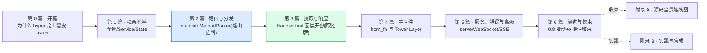

# 《axum 设计与实现深入浅出:hyper 之上的 Web 框架凭什么这么好写》—— 目录与导读

> 一本写给"用 axum 写过 Web 服务、知道底层是 hyper+Tower、翻过 tokio-rs/axum 源码,却一知半解"的人的小书。
>
> **一句话主旨**:把 hyper 的"一个 Service 处理一个请求"升级成"路由分发到 handler、提取器自动反序列化请求、响应器自动序列化响应"的 Web 框架——但底层仍是 hyper+Tower 的 Service 链,框架的魔力在 Handler/FromRequest/IntoResponse 这些 trait 怎么用 Rust 泛型 + 宏展开,把任意 `async fn` 在编译期变成 `tower::Service`。
>
> **二分法**(迷路时回到它):**路由与分发**(Router/PathRouter 的 matchit 路径匹配 + MethodRouter 的按方法分发) vs **提取与响应**(Handler trait 的编译期魔法 + FromRequest/FromRequestParts 提取器链 + IntoResponse 响应器)。
>
> **承接**:★强承接《hyper》(协议机/连接管理/Service trait 本身/Body Stream 一句带过指路)+ ★强承接《Tower》(中间件 = Tower Layer,Service/Layer/poll_ready 一句带过)+ 承接《Tokio》(全异步,运行时机制一句带过指路)+ 横连《gRPC》(HTTP/2 + filter chain 对照)。
>
> **主比喻**:直球为主、比喻点睛。开篇用"前台调度员+翻译官"做一次性点位睛——hyper 是收发室,Tower 是流程规范,axum 看地址 URL 选部门、看方法 method 选工位、把 Request 翻译成 handler 参数、把 handler 回复翻译成 Response。

每章一行:**一句话钩子** —— 技巧标签 —— 二分法归属(`路由` / `提取` / `响应` / `中间件` / `总览`)。

---

## 全书结构总览

旅程:从"一个 `async fn` 凭什么能当 handler",一路走到"axum 怎么把 hyper 的 Service 链包装成这么好写的 Web 框架"。读完你能在脑子里放映出:hyper 把 `Request` 交给 `Router::call` → `PathRouter` 用 matchit 字典树匹配路径 → `MethodRouter` 按 method 选 handler → `Handler::call`(宏展开的 tuple 提取器链)逐个 `FromRequestParts` 提取 → handler fn 执行 → `IntoResponse::into_response` 拼回 `Response` 交回 hyper——以及每一步 hyper/Tower/Tokio 怎么被用起来、对照 actix/rocket/go 怎么做。

---

## 第 0 篇 · 开篇:为什么 hyper 之上需要 axum

- [P0-01 · 第一性原理:为什么 hyper 之上需要 axum](P0-01-第一性原理-为什么hyper之上需要axum.md) —— hyper 给了 Service 但没路由/没反序列化;axum 用类型系统+宏把路由分发+提取器+响应器做成零成本抽象,任意 async fn 即 Service。 —— 框架×类型系统 + 承接 —— `总览`

## 第 1 篇 · 框架地基:全景、Service、State

> axum 的 Router/Route/MethodRouter 都是 Service,State 用泛型把"缺状态"编码进类型。**建议顺序读**。

- [P1-02 · axum 全景:一次请求穿过哪些层](P1-02-axum全景-一次请求穿过哪些层.md) —— 从 axum::serve 到 handler 返回 Response 的全景时序,IntoMakeService 的角色。 —— 全景时序 + serve 内部 hyper-util —— `总览`
- [P1-03 · Router 与 Route:都是 Service](P1-03-Router与Route-都是Service.md) —— 为什么 Router<()> 自己就实现 Service,Route 是 BoxCloneSyncService 类型擦除,poll_ready 无条件 Ready。 —— Service 适配 + 类型擦除 —— `路由`
- [P1-04 · State:用泛型把"缺状态"编码进类型](P1-04-State-用泛型把缺状态编码进类型.md) —— Router&lt;S&gt; 的 S 是"缺失"状态,with_state 消耗它;State&lt;T&gt; 提取器 + FromRef 子状态派生。 —— ★State 泛型编码 + FromRef —— `提取`

## 第 2 篇 · 路由与分发:URL+method 怎么找到 handler(路由招牌)

> axum 路由分两层:PathRouter 用 matchit 字典树匹配路径,MethodRouter 按方法分发。**建议顺序读**。

- [P2-05 · PathRouter:matchit 字典树路径匹配](P2-05-PathRouter-matchit字典树路径匹配.md) —— 一个 URL 怎么常数级找到 handler:PathRouter+Node 双向映射(RouteId 索引 Vec&lt;Endpoint&gt;),matchit 基数树原理。 —— ★双层匹配 + RouteId 索引 —— `路由(招牌)`
- [P2-06 · MethodRouter:按 HTTP method 分发](P2-06-MethodRouter-按HTTP-method分发.md) —— 同一路径 GET/POST/PUT 各走各的:MethodRouter 按方法持 MethodEndpoint + MethodFilter 位运算 + 重复 route 走 merge。 —— method 分发 + merge_for_path —— `路由`
- [P2-07 · 嵌套与合并:nest 与 merge](P2-07-嵌套与合并-nest与merge.md) —— 子路由挂前缀下:nest 套 StripPrefix+SetNestedPath,为什么 nest 在 `/` 不再支持。 —— ★nest 双 Layer + merge 重编号 —— `路由`
- [P2-08 · fallback 与 404:未匹配的请求去哪](P2-08-fallback与404-未匹配的请求去哪.md) —— 路径不匹配 vs 方法不匹配:catch_all_fallback vs method_not_allowed_fallback,Fallback 三态。 —— fallback 三态 + route_layer 作用域 —— `路由`

## 第 3 篇 · 提取与响应:Handler trait 的编译期魔法(提取招牌)

> Handler trait 怎么用宏把任意 async fn 变 Service,是 axum 最值得讲也最容易看不懂的地方。**强烈建议顺序读**。

- [P3-09 · Handler trait:把 async fn 变 Service](P3-09-Handler-trait-把async-fn变Service.md) —— 随便一个 async fn(State, Path) -> String 凭什么当 handler:Handler&lt;T, S&gt; 的 T 是 coherence 占位,impl_handler!+all_the_tuples! 宏对 0~16 参数全部 impl。 —— ★★★Handler T 参数 + 宏展开 tuple —— `提取(招牌)`
- [P3-10 · FromRequest 与 FromRequestParts:提取器的二元划分](P3-10-FromRequest与FromRequestParts-提取器的二元划分.md) —— Path/Query 只读 parts,Json/Form 消费 body:二元划分 + ViaParts marker 桥接 + impl Future 非 async-trait。 —— ★FromRequest/Parts 二元 + ViaParts 桥接 —— `提取(招牌)`
- [P3-11 · 提取器实战:Path/Query/State/Json/Form](P3-11-提取器实战-Path-Query-State-Json-Form.md) —— 内置提取器具体怎么实现:Path serde URL 参数,Query,State,Json 消费 body+Content-Type 校验+大小限制。 —— 提取器实现 + rejection —— `提取`
- [P3-12 · IntoResponse:返回值怎么变成 Response](P3-12-IntoResponse-返回值怎么变成Response.md) —— String/StatusCode/(StatusCode, Json)/Result 都能当返回值:IntoResponse + tuple 链式拼装 + IntoResponseParts。 —— ★IntoResponse + tuple 组合 —— `响应`
- [P3-13 · 自定义提取器与 #[axum::debug_handler]](P3-13-自定义提取器与-debug-handler.md) —— 怎么写自己的 FromRequestParts,handler 报类型错怎么办:debug_handler 宏改错误信息 + FromRef 派生子状态。 —— 自定义提取器 + debug_handler 宏 —— `提取`

## 第 4 篇 · 中间件:from_fn 与 Tower Layer

> axum 中间件就是 Tower Layer,但 axum 提供了便利层。

- [P4-14 · from_fn:把闭包变中间件](P4-14-from-fn-把闭包变中间件.md) —— 鉴权/日志/压缩怎么不侵入业务:middleware::from_fn 把 async fn 闭包变 Layer,from_fn_with_state/map_request/map_response。 —— ★from_fn + Service 套娃 —— `中间件(招牌)`
- [P4-15 · from_extractor:把提取器当中件](P4-15-from-extractor-把提取器当中件.md) —— 用提取器做请求校验当中间件:from_extractor 把 FromRequest 包成 Layer 提前校验,与 from_fn 区别。 —— from_extractor + 提前校验 —— `中间件`
- [P4-16 · 中间件链与 ServiceBuilder](P4-16-中间件链与ServiceBuilder.md) —— 多个中间件怎么叠、顺序重要吗:Tower ServiceBuilder + Router::layer/route_layer/MethodRouter::layer/Handler::layer 四种作用域 + HandleErrorLayer。 —— ServiceBuilder + 四种作用域 —— `中间件`

## 第 5 篇 · 服务、错误处理与高级

- [P5-17 · serve 与监听器:从 Router 到上线](P5-17-serve与监听器-从Router到上线.md) —— axum::serve 内部怎么跑 Router:serve 函数 + Listener trait 抽象(Tcp/Unix)+ hyper-util auto 协商 + graceful shutdown。 —— serve + Listener + graceful —— `总览`
- [P5-18 · 错误处理:Infallible 与 HandleError](P5-18-错误处理-Infallible与HandleError.md) —— 为什么 Router 的 Service Error 是 Infallible,中间件出错怎么办:框架层转 Response + HandleErrorLayer 兜底 + panic 处理。 —— ★Infallible + HandleErrorLayer —— `总览`
- [P5-19 · WebSocket、SSE 与流式响应](P5-19-WebSocket-SSE与流式响应.md) —— 长连接/服务端推送怎么写:WebSocket 提取器(hyper 升级)+ Sse 响应器(Stream of Event)+ 流式 body。 —— ws 升级 + Sse + 流式 body —— `响应`

## 第 6 篇 · 演进、对照与收束

- [P6-20 · axum 0.7→0.8 演进 + 0.9 展望](P6-20-axum-0.7到0.8演进-0.9展望.md) —— 为什么 0.8 把 route 限定只接 MethodRouter、路径参数 `:foo` 改 `{foo}`、nest 在 `/` 不再支持:API 清晰化语义分离。 —— ★0.8 变动 + without_v07_checks —— `总览`
- [P7-21 · 全书收束:axum 在 Rust 异步栈的位置](P7-21-全书收束-axum在Rust异步栈的位置.md) —— axum 在栈的位置 + 对照 actix-web(actor)/rocket(request guard)/go net/http(ServeMux)/tonic(gRPC 同源 Service) + 生态展望。 —— 栈定位 + 多对照 —— `总览`

## 附录

- [附录 A · axum 源码全景路线图](附录A-源码全景路线图.md) —— serve(hyper-util)→Router::call→PathRouter(matchit)→MethodRouter→Handler(宏展开)→FromRequestParts 提取器链→handler fn→IntoResponse 全栈地图 + 阅读顺序。
- [附录 B · axum 实践与集成](附录B-实践与集成.md) —— 写 RESTful 服务、写中间件、与 Tower/tower-http 集成、与 hyper 直接集成、测试、actix/rocket 迁移、排查清单。

---

## 推荐阅读路线

**主线(推荐)**:P0-01 → 第 1 篇全(P1-02~04)→ 第 2 篇全(P2-05~08,路由招牌)→ 第 3 篇全(P3-09~13,提取招牌)→ 第 4 篇 → 第 5 篇 → 第 6 篇 → 附录 A。这是"一次 axum 请求从路由到提取到响应跑完二分法两面"的完整旅程。

按目标速查:

| 你的目标 | 读这几章 |
|------|------|
| 只想懂 axum 整体 | P0-01 → P1-02 → P7-21 |
| 只想懂路由匹配(招牌) | P2-05~08 |
| 只想懂 Handler trait 怎么变 Service(招牌) | P3-09(配 P3-10) |
| 只想懂提取器怎么写 | P3-10~13 |
| 只想懂中间件 | P4-14~16 |
| 读过 hyper 想看框架层怎么用 | P1-02~04 → P3-09 → P7-21 |
| 读过 Tokio 想看运行时怎么被用 | P1-02(全景)→ P5-17(serve)→ P5-19(流式) |
| 从 actix/rocket 迁移 | P0-01 → P3-09 → P7-21 |
| 想读 axum 源码 | 附录 A + 跟本书章节逐个啃 |

> 一个提醒:第 1、2、3 篇有紧密顺序(框架地基→路由→提取响应),**别跳**;本书处处承 hyper、承 Tower、对照 actix/rocket/go,读过那些收获翻倍。第 3 篇是精华中的精华(P3-09 Handler trait 宏展开是全书最难也最值的一章)。

---

## 配套文件

- [全书规划-总纲](全书规划-总纲.md) —— 主线、二分法、承接 hyper/Tower/Tokio、比喻、分篇分章、源码策略。
- [_章节写作提示词](_章节写作提示词.md) —— 写作执行手册(铁律、四段式、技巧精解、承接铁律)。
- 源码(已 clone):`../axum/`(tokio-rs/axum,`axum-v0.8.9` tag @ commit `c59208c86fded335cd85e388030ad59347b0e5ae`,版本 0.8.9,axum-core 0.5.6)。引用经 Grep/Read 核实行号,钉死在该 commit。**注意 checkout tag 不是 main**(main 在做 0.9 有 breaking changes)。
- 承接:[[hyper-series-project]]/[[hyper-source-facts]](协议机/Service)、Tower(Service/Layer)、[[tokio-source-facts]](运行时)、[[grpc-series-project]](HTTP/2+filter chain 对照)。

---

> 这本书讲的不是"axum 的 API 怎么用",而是"它凭什么把 hyper 的 Service 链包装成这么好写的 Web 框架、源码里那些 Handler trait、impl_handler! 宏、FromRequest/FromRequestParts、Router 的 matchit 双层匹配、IntoResponse 到底在干什么"。读完,你该能在脑子里放映出一次 axum 请求的全过程——以及每一步 hyper/Tower/Tokio 怎么被用、对照 actix/rocket/go 怎么做。
