# 附录 A · axum 源码全景路线图

> 这不是讲新东西,是把全书画过的源码点串成一张**可导航的地图**:三个 crate(`axum` / `axum-core` / `axum-macros`)各管什么 → 一次请求从 `axum::serve` 到 handler 到 `IntoResponse` 回 hyper 的全栈调用链(每一节点标文件:行号)→ 推荐的源码阅读顺序 → 关键函数/结构体的索引表 → feature flag 对照。
>
> 拿着这张图 clone 一份 `axum` 仓(`axum-v0.8.9`,commit `c59208c86fded335cd85e388030ad59347b0e5ae`,axum 0.8.9 / axum-core 0.5.5 / axum-macros 0.5.1 / matchit 0.8.4),从 `serve/mod.rs` 那个 accept 循环开始,一路读到 `axum-core/src/extract/mod.rs` 那两个 trait,你会发现——**axum 的复杂度,不在任何一行代码里,而在"怎么用泛型 + 宏 + trait 约束,把任意 `async fn` 在编译期变成 `tower::Service`"这件事本身**。
>
> 本附录是正文章节的索引,不重复正文已拆透的机制(matchit 字典树原理、Handler trait 的 T 参数、FromRequest/FromRequestParts 二元划分、IntoResponse tuple 组合),只给"这个机制在哪个文件、对应正文哪一章、按什么顺序读"。每条都标了真实行号,全部经本地 `../axum/` Grep/Read 核实,钉死在 commit `c59208c8`。

---

## A.0 这张图怎么用

正文 21 章把每个机制讲透了,但读者合上书去读 `axum` 仓时往往卡在一个问题:**这么多文件,我该先读哪个?一次请求的每一步到底落在哪个文件的哪一行?** 这就是附录 A 要回答的。

这张图解决四件事:

1. **全栈鸟瞰**:一张 ASCII 大图,把"一次 axum 请求从 `axum::serve` 到 handler 到 `IntoResponse` 回 hyper"的完整链路铺开,每一节点标"文件:行号 + 一句话职责"。这是本附录的核心交付物。
2. **crate 分工**:`axum`(框架层:路由/handler/提取器/响应/中间件/serve)、`axum-core`(核心 trait:FromRequest/FromRequestParts/IntoResponse/FromRef/Body,供 tonic 等其他框架复用)、`axum-macros`(过程宏:debug_handler/debug_middleware/FromRequest 派生/FromRef 派生/TypedPath)三个 crate 各管什么,目录结构 + 关键文件清单。
3. **阅读顺序**:给读源码的人一条由浅入深的路径——先读哪几个文件建立全景(`serve/mod.rs` → `routing/mod.rs` → `handler/mod.rs` → `axum-core/extract/mod.rs`),再按二分法(路由侧 vs 提取响应侧)深入,每步对应本书哪一章。
4. **索引速查**:全书涉及的关键函数/结构体 → 文件:行号 → 本书对应章节,做成一张可查的索引表。你想找"Handler trait 定义在哪",一查即得。

> **一个反复要提醒的事实**(全书强调过,这里再钉一次):axum 在 0.8 做了 breaking changes——`Router::route` 只接 `MethodRouter`(不再接任意 Service,后者改用 `route_service`),路径参数用 `{foo}`/`{*foo}`(0.7 的 `:foo`/`*foo` 会 panic,除非 `without_v07_checks`),nest 在 `/` 不再支持。**老博客和老资料里那些 0.7 的 API,本附录一律以 0.8.9 真实结构为准**。读源码时务必 checkout `axum-v0.8.9` tag(main 分支在做 0.9,有更多 breaking changes,不是 crates.io 版本)。

---

## A.1 一次请求的全栈调用地图(★核心交付物)

这是本附录最该被钉死的一张图。把"一次 axum 请求"从入口 `axum::serve` accept 连接,到出口 hyper 把 `Response` 写回 IO,每一节点标文件:行号 + 一句话职责。

### A.1.1 ASCII 全栈大图

```
                              ┌─────────────────────────────────────────┐
                              │  Tokio 运行时(承《Tokio》,一句带过)    │
                              │  tokio::spawn 每个 task 跑一条连接        │
                              └────────────────┬────────────────────────┘
                                               │
对端 TCP 字节流 ──►  TcpListener::accept  ◄─────┘
                      │ axum/src/serve/listener.rs:26 (impl Listener for TcpListener)
                      │   accept 错误重试 1 秒 (handle_accept_error, listener.rs:140)
                      ▼
            axum::serve(listener, make_service)
              │ axum/src/serve/mod.rs:97  pub fn serve<L, M, S>(...)
              │   约束 M: Service<IncomingStream, Response = S>  ← MakeService 工厂
              │        S: Service<Request> + Clone + Send + 'static
              ▼
            Serve::run (accept 主循环)
              │ axum/src/serve/mod.rs:179 (基础) / :267 (with_graceful_shutdown)
              │   loop { (io, addr) = listener.accept(); handle_connection(...) }
              ▼
┏━━━━━━━━━━━━━━━━━━ handle_connection ━━━━━━━━━━━━━━━━━━━━━━━━━━━━━━━━━┓
┃ axum/src/serve/mod.rs:353                                              ┃
┃                                                                        ┃
┃  ① TokioIo::new(io)            适配 tokio AsyncRead → hyper IO         ┃
┃  ② make_service.ready().await  Tower ServiceExt::ready (承《Tower》)   ┃
┃  ③ make_service.call(IncomingStream { io, remote_addr })               ┃
┃       │ IncomingStream 定义: serve/mod.rs:424                          ┃
┃       ▼                                                                 ┃
┃  ┌─ IntoMakeService::call ─────────────────────────────────────┐       ┃
┃  │ axum/src/routing/into_make_service.rs:35                     │       ┃
┃  │   fn call(_target) -> ready(Ok(self.svc.clone()))            │       ┃
┃  │   (或 Router<()> 直接 impl Service<IncomingStream>:          │       ┃
┃  │    routing/mod.rs:549, call = self.clone().with_state(()))   │       ┃
┃  │   或 IntoMakeServiceWithConnectInfo::call                    │       ┃
┃  │    connect_info.rs:46, 套 Extension(ConnectInfo))            │       ┃
┃  └──────────────────────────────────────────────────────────────┘       ┃
┃       │ 返回一个克隆的 Service<Request> (= Router<()>)                   ┃
┃       ▼                                                                 ┃
┃  ④ .map_request(|req: Request<Incoming>| req.map(Body::new))            ┃
┃       body 从 hyper::body::Incoming 换成 axum_core::body::Body          ┃
┃  ⑤ TowerToHyperService::new(tower_service)                              ┃
┃       把 tower_service::Service (&mut self + poll_ready)                ┃
┃       适配成 hyper::service::Service (无 poll_ready + &self)            ┃
┃  ⑥ tokio::spawn(async move { ... })   ← 每连接一个 task                  ┃
┃       builder = hyper-util auto::Builder (HTTP/1+2 自动协商)             ┃
┃       builder.serve_connection_with_upgrades(io, hyper_service)          ┃
┃       loop { select! { conn | shutdown_signal } }                        ┃
┃  ⑦ drop(close_rx)   ← graceful shutdown 收尾                            ┃
┗━━━━━━━━━━━━━━━━━━━━━━━━━━━━━━━━━━━━━━━━━━━━━━━━━━━━━━━━━━━━━━━━━━━━━━┛
                                               │
                                  hyper-util 协议机解析字节流 → Request
                                  (承《hyper》P2-P3,一句带过)
                                               │
                                               ▼
┏━━━━━━━━━━━━ 下半场:Request 穿过 Router ━━━━━━━━━━━━━━━━━━━━━━━━━━━━━━━┓
┃                                                                        ┃
┃  hyper_service.call(&self, Request)  → TowerToHyperService 内部        ┃
┃       clone tower_service + poll_ready(Ready) + call(req)               ┃
┃                                                                        ┃
┃  ┌─ Router<()>::call (Service<Request<B>>) ──────────────────────┐     ┃
┃  │ axum/src/routing/mod.rs:569                                     │     ┃
┃  │   poll_ready 无条件 Ready (mod.rs:576)                          │     ┃
┃  │   call: req.map(Body::new); self.call_with_state(req, ())       │     ┃
┃  └──────────────────────────────────────────────────────────────────┘     ┃
┃       │                                                                 ┃
┃       ▼                                                                 ┃
┃  ┌─ Router::call_with_state ─────────────────────────────────────┐     ┃
┃  │ axum/src/routing/mod.rs:417                                     │     ┃
┃  │   链式尝试:                                                     │     ┃
┃  │   ① path_router.call_with_state(req, state)  Ok → return        │     ┃
┃  │   ② fallback_router.call_with_state(req, state) Ok → return     │     ┃
┃  │   ③ catch_all_fallback.call_with_state(req, state)              │     ┃
┃  │   (RouterInner 三件套: mod.rs:80 path_router/fallback_router/   │     ┃
┃  │    catch_all_fallback)                                          │     ┃
┃  └──────────────────────────────────────────────────────────────────┘     ┃
┃       │                                                                 ┃
┃       ▼                                                                 ┃
┃  ┌─ PathRouter::call_with_state (主路由, matchit 字典树匹配) ────┐     ┃
┃  │ axum/src/routing/path_router.rs:371                             │     ┃
┃  │   ① 注入 OriginalUri 到 extensions (feature original-uri)       │     ┃
┃  │   ② req.into_parts() → (parts, body)  ← 提取器二元划分的根     │     ┃
┃  │   ③ self.node.at(parts.uri.path())                              │     ┃
┃  │       Node{inner: matchit::Router<RouteId>,                     │     ┃
┃  │              route_id_to_path, path_to_route_id} (rs:478)        │     ┃
┃  │       Ok(Match{ value: &RouteId, params })                      │     ┃
┃  │   ④ set_matched_path(extensions, id→path)  feature matched-path │     ┃
┃  │   ⑤ url_params::insert_url_params(extensions, params)           │     ┃
┃  │   ⑥ endpoint = routes.get(&id)  (HashMap<RouteId, Endpoint>)    │     ┃
┃  │   ⑦ match endpoint:                                             │     ┃
┃  │      MethodRouter → method_router.call_with_state(req, state)   │     ┃
┃  │      Route        → route.clone().call_owned(req)               │     ┃
┃  │   ⑧ Err(MatchError::NotFound) → 还回 (req, state) 给 fallback  │     ┃
┃  └──────────────────────────────────────────────────────────────────┘     ┃
┃       │ Endpoint::MethodRouter 分支                                     ┃
┃       ▼                                                                 ┃
┃  ┌─ MethodRouter::call_with_state (按 HTTP method 选 handler) ────┐     ┃
┃  │ axum/src/routing/method_routing.rs:1120                          │     ┃
┃  │   call! 宏按 method 顺序检查 (HEAD 先 head 再试 get):          │     ┃
┃  │     HEAD/GET/POST/OPTIONS/PATCH/PUT/DELETE/TRACE/CONNECT         │     ┃
┃  │   每个 MethodEndpoint (method_routing.rs:1225) 三态:            │     ┃
┃  │     None / Route(route) / BoxedHandler(BoxedIntoRoute)          │     ┃
┃  │   Route        → route.clone().oneshot_inner_owned(req)          │     ┃
┃  │   BoxedHandler → handler.into_route(state).oneshot_inner_owned   │     ┃
┃  │   全不匹配 → fallback.call_with_state + 拼 Allow 头 (405)       │     ┃
┃  └──────────────────────────────────────────────────────────────────┘     ┃
┃       │                                                                 ┃
┃       ▼                                                                 ┃
┃  ┌─ Route::oneshot_inner_owned (类型擦除 Service 执行) ───────────┐     ┃
┃  │ axum/src/routing/route.rs:55                                     │     ┃
┃  │   Route = BoxCloneSyncService<Request, Response, E> (rs:31)     │     ┃
┃  │   oneshot = poll_ready + call (Tower ServiceExt, 承《Tower》)   │     ┃
┃  │   返回 RouteFuture (route.rs:110, inner Oneshot + method +      │     ┃
┃  │    allow_header + top_level)                                     │     ┃
┃  └──────────────────────────────────────────────────────────────────┘     ┃
┃       │ BoxedHandler 的 into_route 产出的 Service 真身是 HandlerService  ┃
┃       ▼                                                                 ┃
┃  ┌─ HandlerService::call (handler 的 Service 包装) ──────────────┐      ┃
┃  │ axum/src/handler/service.rs:167                                  │     ┃
┃  │   req.map(Body::new); handler.clone();                          │     ┃
┃  │   future = Handler::call(handler, req, state)                   │     ┃
┃  │   (HandlerService 定义: handler/service.rs:22)                  │     ┃
┃  └──────────────────────────────────────────────────────────────────┘     ┃
┃       │                                                                 ┃
┃       ▼                                                                 ┃
┃  ┌─ Handler::call (★ impl_handler! 宏展开的 tuple 提取器链) ────┐      ┃
┃  │ axum/src/handler/mod.rs:221 (宏模板) + macros.rs:49             │     ┃
┃  │   (all_the_tuples 展开 0~16 参数)                                │     ┃
┃  │   签名 impl Handler<(M, T1..Tn,), S> for F                       │     ┃
┃  │     where F: FnOnce(T1..Tn) -> Fut, Res: IntoResponse,          │     ┃
┃  │           T1..T_{n-1}: FromRequestParts<S>,                      │     ┃
┃  │           Tn: FromRequest<S, M>                                  │     ┃
┃  │   fn call(self, req, state) -> BoxFuture<Response>:              │     ┃
┃  │     (mut parts, body) = req.into_parts()                         │     ┃
┃  │     for 前 n-1 个:                                                │     ┃
┃  │       Ti::from_request_parts(&mut parts, &state).await           │     ┃
┃  │         Ok(v) → 累积, Err(rej) → return rej.into_response()     │     ┃
┃  │     req = Request::from_parts(parts, body)                       │     ┃
┃  │     Tn::from_request(req, &state).await  ← 消费 body, 只跑一次  │     ┃
┃  │     self(T1..Tn).await  ← 调真正的 async fn handler              │     ┃
┃  │     返回值.into_response()                                        │     ┃
┃  └──────────────────────────────────────────────────────────────────┘     ┃
┃       │  提取器逐个跑 FromRequestParts / 最后一个跑 FromRequest          ┃
┃       │  (trait 定义在 axum-core/src/extract/mod.rs)                     ┃
┃       │                                                                 ┃
┃       │   ┌─ FromRequestParts (只读 parts, 可多次) ─────────────┐       ┃
┃       │   │ axum-core/src/extract/mod.rs:53                       │       ┃
┃       │   │   fn from_request_parts(&mut parts, &state)           │       ┃
┃       │   │     -> impl Future<Output = Result<Self, Rejection>>  │       ┃
┃       │   │ 实现: Path / Query / State / Header / Extension /    │       ┃
┃       │   │       ConnectInfo / MatchedPath / OriginalUri 等      │       ┃
┃       │   │       (在 axum/src/extract/)                          │       ┃
┃       │   └──────────────────────────────────────────────────────┘       ┃
┃       │   ┌─ FromRequest (消费 body, 只一次) ───────────────────┐       ┃
┃       │   │ axum-core/src/extract/mod.rs:79 (默认 M = ViaRequest)│       ┃
┃       │   │   fn from_request(req, &state)                        │       ┃
┃       │   │     -> impl Future<Output = Result<Self, Rejection>>  │       ┃
┃       │   │ ★ ViaParts 桥接 (mod.rs:91):                          │       ┃
┃       │   │   impl FromRequest<S, ViaParts> for T                 │       ┃
┃       │   │     where T: FromRequestParts<S>                      │       ┃
┃       │   │   (只读 parts 的提取器也能当 FromRequest 用)         │       ┃
┃       │   │ 实现: Json / Form / String / Bytes / Request 等       │       ┃
┃       │   │       (在 axum/src/json.rs, form.rs, axum-core/body)  │       ┃
┃       │   └──────────────────────────────────────────────────────┘       ┃
┃       ▼                                                                 ┃
┃  ┌─ handler fn (你的 async fn) ─────────────────────────────────┐      ┃
┃  │ 真正的业务逻辑被执行, 拿到 T1..Tn 这些提取出来的参数           │     ┃
┃  └──────────────────────────────────────────────────────────────────┘     ┃
┃       │ 返回值 Res: IntoResponse                                        ┃
┃       ▼                                                                 ┃
┃  ┌─ IntoResponse::into_response ─────────────────────────────────┐     ┃
┃  │ axum-core/src/response/into_response.rs:112                     │     ┃
┃  │   pub trait IntoResponse { fn into_response(self) -> Response } │     ┃
┃  │ 实现: String/&str/()/StatusCode/Result<T,E>/tuple/Json/...      │     ┃
┃  │ tuple 组合: (StatusCode, T)/(HeaderMap, T)/(Parts, T)/...       │     ┃
┃  │   链 IntoResponseParts (into_response_parts.rs:73) 先写 parts   │     ┃
┃  │ Response = http::Response<axum_core::body::Body>                │     ┃
┃  └──────────────────────────────────────────────────────────────────┘     ┃
┃       │ Response                                                       ┃
┃       ▼                                                                 ┃
┃   RouteFuture → MethodRouter → PathRouter → Router::call               ┃
┃       │ (匹配失败则走 fallback 链, 同样产 Response)                    ┃
┃       ▼                                                                 ┃
┃   TowerToHyperService → hyper-util serve_connection                     ┃
┃                                                                        ┃
┗━━━━━━━━━━━━━━━━━━━━━━━━━━━━━━━━━━━━━━━━━━━━━━━━━━━━━━━━━━━━━━━━━━━━━━┛
                                               │
                                  hyper-util 协议机编码 Response → 字节流
                                               │
                                               ▼
                                        写回 TokioIo (TcpStream)
                                               │
                                               ▼
                                          对端收到响应
```

### A.1.2 调用链的 12 个关键节点(逐个钉死)

把上面那张大图的每一节点,按"调用顺序"逐个摘出来,标"文件:行号 + 一句话职责 + 对应正文"。这是你读源码时"跟着走"的导航。

| 序号 | 节点 | 文件:行号 | 一句话职责 | 正文 |
|------|------|-----------|-----------|------|
| ① | `serve` 函数 | `axum/src/serve/mod.rs:97` | `pub fn serve<L, M, S>(listener, make_service) -> Serve`,约束 `M: Service<IncomingStream, Response = S>` 是 MakeService 适配的根 | [P1-02](P1-02-axum全景-一次请求穿过哪些层.md) / [P5-17](P5-17-serve与监听器-从Router到上线.md) |
| ② | `Serve::run`(accept 主循环) | `axum/src/serve/mod.rs:179`(基础)/ `:267`(graceful) | `loop { (io, addr) = listener.accept(); handle_connection(...) }`,串行 accept + 每 conn spawn task | P1-02 / P5-17 |
| ③ | `handle_connection` | `axum/src/serve/mod.rs:353` | accept 到的字节流变 task:make_service.call → TowerToHyperService → tokio::spawn → serve_connection | P1-02 |
| ④ | `IntoMakeService::call` | `axum/src/routing/into_make_service.rs:35` | `fn call(_target) -> ready(Ok(self.svc.clone()))`,纯克隆工厂(适配层) | P1-02 |
| ④′ | `Router<()>` 直接 impl `Service<IncomingStream>` | `axum/src/routing/mod.rs:549` | `call = self.clone().with_state(())`,便利写法的根(直接 `axum::serve(l, router)`) | P1-02 |
| ⑤ | `Router<()>::call`(`Service<Request<B>>`) | `axum/src/routing/mod.rs:569` | `poll_ready` 无条件 Ready,`call: req.map(Body::new); call_with_state(req, ())` | [P1-03](P1-03-Router与Route-都是Service.md) |
| ⑥ | `Router::call_with_state` | `axum/src/routing/mod.rs:417` | 链式尝试 path_router → fallback_router → catch_all_fallback | P1-03 / [P2-08](P2-08-fallback与404-未匹配的请求去哪.md) |
| ⑦ | `PathRouter::call_with_state` | `axum/src/routing/path_router.rs:371` | matchit 字典树匹配路径拿 RouteId → set_matched_path + insert_url_params → 索引 Endpoint | [P2-05](P2-05-PathRouter-matchit字典树路径匹配.md)(招牌) |
| ⑧ | `MethodRouter::call_with_state` | `axum/src/routing/method_routing.rs:1120` | `call!` 宏按 method 顺序选 MethodEndpoint,全不匹配走 fallback 拼 Allow 头(405) | [P2-06](P2-06-MethodRouter-按HTTP-method分发.md) |
| ⑨ | `Route::oneshot_inner_owned` | `axum/src/routing/route.rs:55` | `Route = BoxCloneSyncService`(类型擦除 Service)的 oneshot,产 `RouteFuture` | P1-03 |
| ⑩ | `HandlerService::call` | `axum/src/handler/service.rs:167` | `handler.clone(); Handler::call(handler, req, state)`,handler 的 Service 包装 | [P3-09](P3-09-Handler-trait-把async-fn变Service.md)(招牌) |
| ⑪ | `Handler::call`(宏展开) | `axum/src/handler/mod.rs:221`(`impl_handler!` 模板)+ `axum/src/macros.rs:49`(`all_the_tuples` 展开 0~16) | `req.into_parts → 前 n-1 个 FromRequestParts 顺序 await → 最后一个 FromRequest 消费 body → handler fn → IntoResponse` | P3-09(★★招牌)/ [P3-10](P3-10-FromRequest与FromRequestParts-提取器的二元划分.md)(招牌) |
| ⑫ | `IntoResponse::into_response` | `axum-core/src/response/into_response.rs:112` | `pub trait IntoResponse { fn into_response(self) -> Response }`,handler 返回值拼 Response | [P3-12](P3-12-IntoResponse-返回值怎么变成Response.md) |

> **钉死这条链**:这 12 个节点串起来,就是"一次 axum 请求从 `axum::serve` 到 handler 到 `IntoResponse` 回 hyper"的全部调用链。读源码时,把这 12 个文件按顺序打开,逐个看那个标了行号的函数,你就能在脑子里放映出整条链。每个节点的深入细节(为什么 matchit 用字典树、Handler trait 的 T 参数、FromRequestParts vs FromRequest)正文对应章已拆透,本附录只给坐标。

### A.1.3 用 mermaid 把这条链再画一遍(时序视角)

ASCII 大图铺开了"在哪一行",mermaid 时序图给你"谁调谁、传什么"的动态视角。两者配合着看。

```mermaid
sequenceDiagram
    autonum
    participant OS as TcpListener<br/>(serve/listener.rs)
    participant MS as make_service<br/>(IntoMakeService / Router)
    participant SP as tokio::spawn task
    participant HU as hyper-util<br/>serve_connection
    participant R as Router<()>::call<br/>(routing/mod.rs:569)
    participant PR as PathRouter::<br/>call_with_state (rs:371)
    participant MT as matchit::Router<br/>(Node at)
    participant MR as MethodRouter::<br/>call_with_state (rs:1120)
    participant HS as HandlerService::call<br/>(handler/service.rs:167)
    participant H as Handler::call<br/>(宏展开 mod.rs:221)
    participant HF as handler fn
    participant IR as IntoResponse::<br/>into_response (core:112)

    OS->>MS: accept() → (io, addr)<br/>make_service.ready().await
    MS->>MS: call(IncomingStream{io, addr})<br/>self.svc.clone() (或 with_state(()))
    MS-->>SP: tower_service: Service<Request>
    Note over SP: TowerToHyperService::new<br/>map_request: Incoming→Body
    SP->>HU: spawn { serve_connection_with_upgrades }
    Note over HU: HTTP/1+2 协议机解析字节流<br/>(承《hyper》P2-P3)
    HU->>R: hyper_service.call(&self, Request)
    R->>R: req.map(Body::new)
    R->>PR: call_with_state(req, state=())
    PR->>PR: 注入 OriginalUri<br/>req.into_parts() → (parts, body)
    PR->>MT: node.at(parts.uri.path())
    alt 路径匹配
        MT-->>PR: Match{ value: &RouteId, params }
        Note over PR: set_matched_path(extensions)<br/>insert_url_params(extensions, params)<br/>routes.get(&id) → Endpoint
        PR->>MR: method_router.call_with_state(req, state)
        Note over MR: call! 宏按 method 选<br/>HEAD→HEAD→GET→POST→...
        MR->>HS: BoxedHandler.into_route(state)<br/>.oneshot_inner_owned(req)
        HS->>H: Handler::call(handler, req, state)
        H->>H: req.into_parts() → (parts, body)
        loop 前 n-1 个提取器
            H->>H: Ti::from_request_parts(&mut parts, &state)
            Note over H: Err(rej) → return rej.into_response()
        end
        H->>H: Tn::from_request(Request::from_parts(parts,body), &state)
        H->>HF: self(T1..Tn).await
        HF-->>H: 返回值 Res
        H->>IR: Res::into_response()
        IR-->>H: Response
        H-->>HS: Response
        HS-->>MR: Response (via RouteFuture)
        MR-->>PR: Response
    else 路径不匹配
        MT-->>PR: Err(MatchError::NotFound)
        Note over PR: 还回 (req, state)<br/>fallback_router.call_with_state
    end
    PR-->>R: RouteFuture<Infallible>
    R-->>HU: Future<Response>
    Note over HU: 协议机编码 Response 写回 IO
```

---

## A.2 三个 crate 的职责划分

axum 仓是一个 workspace,顶层主要有三个会编译进你二进制的 crate(还有 `axum-extra` 提供额外类型,以及测试/文档辅助 crate)。这三个 crate 的分工是理解 axum 源码组织的第一把钥匙。

### A.2.1 三个 crate 分工总览

| crate | 版本 | 角色 | 行数级 |
|-------|------|------|--------|
| `axum` | 0.8.9 | **框架层**(路由/handler/提取器/响应/中间件/serve):把 hyper+Tower 包装成 Web 框架 | 二十多个模块 |
| `axum-core` | 0.5.5 | **核心 trait**(FromRequest/FromRequestParts/IntoResponse/IntoResponseParts/FromRef + Body/Rejection):供 axum 之外的框架(如 tonic)复用 | 十来个文件 |
| `axum-macros` | 0.5.1 | **过程宏**(`#[debug_handler]` / `#[debug_middleware]` / `derive(FromRequest/FromRequestParts/FromRef/TypedPath)`):编译期辅助 | 七八个文件 |

为什么要把核心 trait 单独拎成 `axum-core`?这是 axum 最关键的设计取舍之一:**`FromRequest`/`FromRequestParts`/`IntoResponse` 这些 trait 刻意做成独立的 0.5.x crate**,这样 tonic(gRPC 框架,也用 axum 的提取器思想)、reqwest-middleware 等下游能直接 `pub use axum_core::extract::FromRequestParts`(避免把整套 Web 框架拉进来)。`axum` crate 依赖 `axum-core`,反过来不成立。**这导致一个现象:核心 trait 的演进更保守,API 表面更稳定;`axum` 框架层演进更快,0.7→0.8 有 breaking changes,而 `axum-core` 0.4→0.5 相对温和。** 这是设计,不是维护割裂。

下面这张树图,是三个 crate 的"目录页"——各 crate → 关键模块 → 对应正文章节:

```mermaid
flowchart TD
    ROOT["axum 仓 workspace<br/>(axum-v0.8.9)"]

    subgraph AXUM["axum 0.8.9 (框架层)"]
        A1["serve/<br/>serve + Listener"]
        A2["routing/<br/>Router/PathRouter/MethodRouter/Route"]
        A3["handler/<br/>Handler trait + HandlerService"]
        A4["extract/<br/>Path/Query/State/Json/ws/connect_info"]
        A5["response/<br/>Redirect/Sse"]
        A6["middleware/<br/>from_fn/from_extractor/map_*"]
        A7["json.rs / form.rs<br/>body 提取器/响应器"]
    end

    subgraph CORE["axum-core 0.5.5 (核心 trait)"]
        C1["extract/<br/>FromRequest/FromRequestParts/FromRef/tuple"]
        C2["response/<br/>IntoResponse/IntoResponseParts/append_headers"]
        C3["body.rs<br/>Body (包 hyper body)"]
        C4["error.rs + ext_traits/"]
    end

    subgraph MACROS["axum-macros 0.5.1 (过程宏)"]
        M1["debug_handler.rs<br/>改 handler 类型错信息"]
        M2["from_ref.rs<br/>derive(FromRef)"]
        M3["from_request/<br/>derive(FromRequest/FromRequestParts)"]
        M4["typed_path.rs<br/>derive(TypedPath)"]
    end

    ROOT --> AXUM
    ROOT --> CORE
    ROOT --> MACROS
    AXUM -.依赖.-> CORE
    AXUM -.pub use macros.-> MACROS

    A1 -.P1-02/P5-17.-> P1["P1-02 / P5-17<br/>serve 全景"]
    A2 -.P1-03/P2-05~08.-> P2["P1-03 / P2-05~08<br/>路由招牌"]
    A3 -.P3-09.-> P3["P3-09<br/>Handler trait"]
    A4 -.P3-11/P5-19.-> P4["P3-11 / P5-19<br/>提取器实战"]
    A5 -.P3-12/P5-19.-> P5["P3-12 / P5-19<br/>响应/流式"]
    A6 -.P4-14~16.-> P6["P4-14~16<br/>中间件"]
    C1 -.P3-10.-> P7["P3-10<br/>提取器二元划分"]
    C2 -.P3-12.-> P8["P3-12<br/>IntoResponse"]
    M1 -.P3-13.-> P9["P3-13<br/>debug_handler"]

    classDef framework fill:#dbeafe,stroke:#2563eb
    classDef core fill:#fde68a,stroke:#d97706
    classDef macros fill:#dcfce7,stroke:#16a34a
    class A1,A2,A3,A4,A5,A6,A7 framework
    class C1,C2,C3,C4 core
    class M1,M2,M3,M4 macros
```



### A.2.2 axum/src/ —— 框架层目录结构

`axum` 是主 crate,装了路由/handler/提取器/响应/中间件/serve 这全套 Web 框架功能。目录结构如下(只列与本书相关的关键文件):

```
axum/src/
├── lib.rs                    // 顶层导出:pub use Router/Json/serve/ServiceExt/debug_handler 等
├── serve/
│   ├── mod.rs                // ★ serve 函数(L97)、Serve(L114)、run(L179/267)、handle_connection(L353)、IncomingStream(L424)
│   └── listener.rs           // ★ Listener trait(L9)、TcpListener impl(L26)、ListenerExt(L66)、handle_accept_error(L140)
├── routing/                  // ★ 路由与分发这一面的全部源码
│   ├── mod.rs                // ★ Router<S>(L68)、RouterInner(L80)、RouteId(L58)、Endpoint(L753)、
│   │                         //   call_with_state(L417)、Router<()> impl Service<IncomingStream>(L549)、impl Service<Request>(L569)、
│   │                         //   with_state、layer/route_layer、fallback、RouterAsService(L593)/RouterIntoService(L632)
│   ├── path_router.rs        // ★ PathRouter(L16)、Node(L478, matchit+两个 HashMap)、call_with_state(L371)、nest/merge/route_service
│   ├── method_routing.rs     // ★ MethodRouter(L547)、call_with_state(L1120)、MethodEndpoint(L1225)、merge_for_path(L1037)、get/post/.../fallback 工厂
│   ├── route.rs              // ★ Route(L31, BoxCloneSyncService)、oneshot_inner_owned(L55)、RouteFuture(L110)
│   ├── future.rs             // RouteFuture 相关 future
│   ├── into_make_service.rs  // ★ IntoMakeService(L12, 纯克隆工厂)、call(L35)
│   ├── method_filter.rs      // MethodFilter 位运算
│   ├── strip_prefix.rs       // nest 的 StripPrefix Layer
│   ├── url_params.rs         // insert_url_params(往 extensions 塞 URL 参数)
│   ├── not_found.rs          // 默认 404 响应
│   └── tests/                // 路由集成测试
├── handler/                  // ★ 提取与响应这一面:Handler trait + HandlerService
│   ├── mod.rs                // ★ Handler<T,S> trait(L148)、impl_handler! 宏(L221)、all_the_tuples!(L262)、
│   │                         //   Layered(L285)、0 参数 impl(L207)、IntoResponse 当 handler(L270)、HandlerWithoutStateExt(L357)
│   ├── service.rs            // ★ HandlerService(L22)、call(L167)、into_make_service(L63)、impl Service<IncomingStream>(L185)
│   └── future.rs             // IntoServiceFuture
├── extract/                  // 具体提取器实现(trait 在 axum-core)
│   ├── mod.rs                // 模块声明 + 部分重导出
│   ├── path/                 // ★ Path 提取器(serde 反序列化 URL 参数,mod + de)
│   ├── query.rs              // Query 提取器(query string 反序列化)
│   ├── raw_query.rs          // RawQuery
│   ├── state.rs              // ★ State<T> 提取器(从 state 拿)
│   ├── form.rs               // Form 提取器(消费 body)
│   ├── raw_form.rs           // RawForm
│   ├── rejection.rs          // 提取器 rejection 类型聚合
│   ├── default_body_limit    // DefaultBodyLimit
│   ├── matched_path.rs       // MatchedPath 提取器 + set_matched_path_for_request
│   ├── nested_path.rs        // NestedPath
│   ├── original_uri.rs       // OriginalUri
│   ├── connect_info.rs       // ★ IntoMakeServiceWithConnectInfo(L28)、Connected(L80)、ConnectInfo(L151)
│   ├── multipart.rs          // Multipart(消费 body,承 hyper::body::Body)
│   ├── ws.rs                 // ★ WebSocket 提取器(hyper 协议升级,P5-19)
│   └── ...
├── response/                 // 具体响应器实现(trait 在 axum-core)
│   ├── mod.rs
│   ├── redirect.rs           // Redirect 响应器
│   └── sse.rs                // ★ Sse 响应器(Server-Sent Events, Stream,P5-19)
├── middleware/               // 中间件便利层(底层是 Tower Layer)
│   ├── mod.rs                // 模块声明
│   ├── from_fn.rs            // ★ from_fn(L114)/from_fn_with_state(L164),把 async fn 闭包变 Layer
│   ├── from_extractor.rs     // from_extractor,把 FromRequest 包成 Layer
│   ├── map_request.rs        // map_request
│   ├── map_response.rs       // map_response
│   └── response_axum_body.rs // 响应 body 转换
├── body/                     // body 相关工具
├── boxed.rs                  // ★ BoxedIntoRoute(给 MethodRouter 用,handler 类型擦除成 Route)
├── error_handling/           // HandleErrorLayer/HandleError(中间件错误兜底转 Response)
├── extension.rs              // Extension 提取器/Layer(往 extensions 塞值)
├── form.rs                   // Form 提取器(重导出到 extract/,实际定义在这)
├── json.rs                   // ★ Json<T> 提取器 + IntoResponse(serde_json,Content-Type 校验,大小限制)
├── service_ext.rs            // ServiceExt(给 Router 加便利方法)
├── util.rs                   // 内部工具
├── macros.rs                 // ★ all_the_tuples!(L49) 等 internal 宏
└── docs/ + test_helpers/     // 文档模块 + 测试辅助
```

读 `axum/src/` 的核心建议:**盯住三个子目录**——`routing/`(路由与分发这一面)、`handler/` + `axum-core/src/extract/`(提取与响应这一面)、`serve/`(入口)。其他目录(`extract/` 具体实现、`response/` 具体实现、`middleware/` 便利层)都是围绕这三块长出来的。

### A.2.3 axum-core/src/ —— 核心 trait 目录结构

`axum-core` 只装核心 trait 和最小依赖类型,刻意保持精简:

```
axum-core/src/
├── lib.rs                    // 顶层导出:Error、pub mod body/extract/response、RequestExt/RequestPartsExt
├── extract/
│   ├── mod.rs                // ★ FromRequestParts(L53)、FromRequest(L79)、ViaParts/ViaRequest marker(L31)、
│   │                         //   ViaParts 桥接(L91)、Result<T,E> 桥接(L107/L119)、Request 类型别名(L29)
│   ├── request_parts.rs      // 从 parts 提取的辅助实现
│   ├── tuple.rs              // ★ tuple 的 FromRequestParts 组合(给多参数提取器用)
│   ├── from_ref.rs           // ★ FromRef trait(子状态派生,给 State 派生用)
│   ├── option.rs             // OptionalFromRequest / OptionalFromRequestParts(Option<T> 提取不报错)
│   ├── rejection.rs          // Rejection 基础类型
│   └── default_body_limit.rs // DefaultBodyLimit
├── response/
│   ├── mod.rs                // Response 类型别名 + 模块声明
│   ├── into_response.rs      // ★ IntoResponse trait(L112)+ 一堆 impl(String/&str/()/StatusCode/Result/tuple/...)
│   ├── into_response_parts.rs // ★ IntoResponseParts trait(L73)(先写 parts 再写 body)
│   └── append_headers.rs     // append_headers 工具
├── body.rs                   // ★ Body 类型(包 hyper body,axum_core::body::Body)
├── error.rs                  // Error / BoxError
├── ext_traits/
│   ├── request.rs            // RequestExt(给 http::Request 加 axum 便利方法)
│   └── request_parts.rs      // RequestPartsExt
└── macros.rs                 // 内部宏
```

读 `axum-core/src/` 的核心建议:**先读 `extract/mod.rs` 那两个 trait 定义**(L53/L79),这是全书最该被钉死的 5 行代码——`FromRequestParts`(只读 `&mut Parts`,可多次跑)和 `FromRequest`(消费 body,只能一次)的二元划分,以及 L91 那个 `impl FromRequest<S, ViaParts> for T where T: FromRequestParts` 的桥接,是理解整个提取器体系的钥匙。其次是 `response/into_response.rs` 的 `IntoResponse` trait(L112)和 `tuple.rs` 的组合实现。

### A.2.4 axum-macros/src/ —— 过程宏目录结构

`axum-macros` 装编译期过程宏,体量最小:

```
axum-macros/src/
├── lib.rs                    // ★ 宏入口:debug_handler(L576)/debug_middleware(L632)/
│                              //   derive FromRequest(L376)/FromRequestParts(L424)/FromRef(L713)/TypedPath(L663)
├── debug_handler.rs          // ★ #[axum::debug_handler] 实现(把 handler 包成命名函数改类型错信息)
├── from_ref.rs               // derive(FromRef) 实现
├── from_request/             // derive(FromRequest/FromRequestParts) 实现
├── typed_path.rs             // derive(TypedPath) 实现(类型化路由路径)
├── attr_parsing.rs           // 属性解析辅助
├── with_position.rs          // 辅助工具
└── axum_test.rs              // #[__private_axum_test] 测试宏
```

读 `axum-macros/src/` 的核心建议:**只在写自定义提取器、handler 报诡异的类型错时回来看**。日常用 axum 不需要懂过程宏实现。`debug_handler` 是最常用的(给 handler 加上后,类型不匹配的错误信息会从 `Handler<..., ...>` 那一坨泛型约束变成"第 N 个参数不是有效提取器")。对应正文 [P3-13](P3-13-自定义提取器与-debug-handler.md)。

> **诚实标注**:`axum` 还有 `axum-extra` crate(0.12.x),装额外类型(`CookieJar` / `TypedHeader` / `Protobuf` / `JsonLines` / `Either` 等),不在本附录的"主线调用链"上,用到时查 [axum-extra 文档](https://docs.rs/axum-extra) 即可。本附录主线只覆盖 `axum` / `axum-core` / `axum-macros` 三个 crate。

---

## A.3 推荐源码阅读顺序

这是本附录的第二个核心交付。给"想读 axum 源码"的人一条由浅入深的路径——**不要一上来就啃 `handler/mod.rs` 的 `impl_handler!` 宏**(会懵)。先建立全景,再按二分法深入。

### A.3.1 阅读顺序总览(由浅入深)

```mermaid
flowchart TD
    START["起点:<br/>clone axum 仓, checkout axum-v0.8.9<br/>(c59208c8)"]

    subgraph STAGE1["① 建立全景(半天)"]
        S1["serve/mod.rs<br/>看 serve 函数 + handle_connection<br/>= accept 循环长什么样"]
        S2["routing/mod.rs<br/>看 Router struct + call_with_state + 两个 Service impl<br/>= Router 怎么当 Service"]
        S3["handler/mod.rs<br/>看 Handler trait 定义 + impl_handler! 宏模板<br/>(先不展开, 看签名即可)"]
        S4["axum-core/extract/mod.rs<br/>看 FromRequestParts + FromRequest 两个 trait<br/>= 提取器二元划分的根"]
    end

    subgraph STAGE2["② 路由与分发这一面(1-2 天)"]
        R1["path_router.rs<br/>PathRouter + Node + call_with_state<br/>(matchit 字典树 + RouteId 索引)"]
        R2["method_routing.rs<br/>MethodRouter + call! 宏 + MethodEndpoint<br/>(按 method 分发)"]
        R3["route.rs<br/>Route = BoxCloneSyncService + RouteFuture<br/>(类型擦除)"]
        R4["into_make_service.rs + connect_info.rs<br/>(MakeService 适配层)"]
        R5["strip_prefix.rs + url_params.rs + nest 逻辑<br/>(进阶: nest/merge)"]
    end

    subgraph STAGE3["③ 提取与响应这一面(2-3 天)"]
        E1["handler/mod.rs 深入<br/>impl_handler! 宏 + all_the_tuples!<br/>(macros.rs:49) 看 tuple 展开"]
        E2["axum-core/extract/tuple.rs<br/>(tuple 的 FromRequestParts 组合)"]
        E3["axum/src/extract/path/ + query.rs + state.rs<br/>(具体 FromRequestParts 实现)"]
        E4["axum/src/json.rs + form.rs<br/>(具体 FromRequest 实现, 消费 body)"]
        E5["axum-core/response/into_response.rs<br/>IntoResponse trait + 一堆 impl"]
        E6["into_response_parts.rs + tuple 组合<br/>(进阶: (StatusCode, T) 链式拼装)"]
    end

    subgraph STAGE4["④ 中间件与高级(按需)"]
        M1["middleware/from_fn.rs<br/>(from_fn 把闭包变 Layer)"]
        M2["middleware/from_extractor.rs + map_*.rs"]
        M3["error_handling/ (HandleErrorLayer)"]
        M4["response/sse.rs + extract/ws.rs<br/>(流式响应/WebSocket)"]
        M5["axum-macros/debug_handler.rs<br/>(过程宏, P3-13)"]
    end

    START --> S1 --> S2 --> S3 --> S4
    S4 --> R1 --> R2 --> R3 --> R4 --> R5
    R5 --> E1 --> E2 --> E3 --> E4 --> E5 --> E6
    E6 --> M1 --> M2 --> M3 --> M4 --> M5

    classDef stage1 fill:#dcfce7,stroke:#16a34a
    classDef stage2 fill:#dbeafe,stroke:#2563eb
    classDef stage3 fill:#fde68a,stroke:#d97706
    classDef stage4 fill:#fce7f3,stroke:#db2777
    class S1,S2,S3,S4 stage1
    class R1,R2,R3,R4,R5 stage2
    class E1,E2,E3,E4,E5,E6 stage3
    class M1,M2,M3,M4,M5 stage4
```



### A.3.2 ① 建立全景(强烈建议先走这一步,半天)

读源码最忌一上来扎进细节。axum 的全景链很长(12 个节点),先建立"这条链长什么样"的鸟瞰,再往下钻才不会迷路。这一步读 4 个文件:

**第一步:`axum/src/serve/mod.rs` —— accept 循环长什么样**

只看三个东西:[serve 函数签名(L97)](../axum/axum/src/serve/mod.rs#L97)(那个 `M: Service<IncomingStream, Response = S>` 约束是 MakeService 适配的根)、[Serve::run(L179)](../axum/axum/src/serve/mod.rs#L179)(那个 `loop { accept; handle_connection }` 是 accept 循环)、[handle_connection(L353)](../axum/axum/src/serve/mod.rs#L353)(make_service.call → TowerToHyperService → tokio::spawn → serve_connection 这六步)。读完这三个,你就知道"一个连接是怎么被 accept、被 spawn 成 task、被 hyper-util 跑协议机的"。对应正文 [P1-02 第一节](P1-02-axum全景-一次请求穿过哪些层.md) + [P5-17](P5-17-serve与监听器-从Router到上线.md)。

**第二步:`axum/src/routing/mod.rs` —— Router 怎么当 Service**

只看五个东西:[Router<S> struct(L68)](../axum/axum/src/routing/mod.rs#L68)、[RouterInner(L80)](../axum/axum/src/routing/mod.rs#L80)(path_router + fallback_router + catch_all_fallback 三件套)、[call_with_state(L417)](../axum/axum/src/routing/mod.rs#L417)(链式尝试)、[Router<()> impl Service<IncomingStream>(L549)](../axum/axum/src/routing/mod.rs#L549)(便利写法的根)、[impl Service<Request>(L569)](../axum/axum/src/routing/mod.rs#L569)(poll_ready 无条件 Ready,call 调 call_with_state)。读完这五个,你就知道"`Router<()>` 既是个 MakeService(给 serve 用),又是个 Service<Request>(处理请求)"。对应正文 [P1-02 第三节](P1-02-axum全景-一次请求穿过哪些层.md) + [P1-03](P1-03-Router与Route-都是Service.md)。

**第三步:`axum/src/handler/mod.rs` —— Handler trait 长什么样(先不展开宏)**

只看两个东西:[Handler<T, S> trait 定义(L148)](../axum/axum/src/handler/mod.rs#L148)(那个 `T` 类型参数是 coherence 占位,P3-09 招牌章详拆)、[impl_handler! 宏模板(L221)](../axum/axum/src/handler/mod.rs#L221)(**先只看签名 `impl Handler<(M, $($ty,)* $last,), S> for F` 和 where 约束,看不懂展开细节没关系,只要知道"前 n-1 个 FromRequestParts + 最后一个 FromRequest"这个划分**就行)。读完这两个,你就知道"任意 async fn 是怎么通过一个 trait 被当成 Service 的"。对应正文 [P3-09](P3-09-Handler-trait-把async-fn变Service.md)(★★全书精华)。

**第四步:`axum-core/src/extract/mod.rs` —— 两个 trait 的二元划分**

只看四个东西:[FromRequestParts(L53)](../axum/axum-core/src/extract/mod.rs#L53)(`fn from_request_parts(&mut parts, &state)`,只读 parts,可多次跑)、[FromRequest(L79)](../axum/axum-core/src/extract/mod.rs#L79)(`fn from_request(req, &state)`,消费 body,只能一次)、[ViaParts/ViaRequest marker(L31)](../axum/axum-core/src/extract/mod.rs#L31)、[ViaParts 桥接(L91)](../axum/axum-core/src/extract/mod.rs#L91)(`impl FromRequest<S, ViaParts> for T where T: FromRequestParts`)。读完这四个,你就知道"为什么 Path/Query 只读 parts、Json/Form 消费 body,以及只读 parts 的也能当 FromRequest 用"。这是全书最该被钉死的 5 行代码。对应正文 [P3-10](P3-10-FromRequest与FromRequestParts-提取器的二元划分.md)(招牌)。

> **钉死第一步**:这 4 个文件读下来,你脑子里就该有 A.1 那张全栈大图的雏形了。**accept 循环(serve)→ Router 当 Service(routing)→ Handler trait 把 async fn 变 Service(handler)→ 提取器二元划分(extract)**——四个点,串起全景。剩下所有源码细节,都是在这条链的某个节点上往深挖。如果你时间紧,只读这 4 个文件,你就已经比 90% 的 axum 用户懂 axum 了。

### A.3.3 ② 路由与分发这一面(1-2 天)

全景建立后,按二分法的"路由与分发"这一面深入。这一面管"URL + method 怎么路由到 handler fn",对应正文第 2 篇(P2-05~08 路由招牌)。读 5 个文件:

**`routing/path_router.rs` —— matchit 字典树路径匹配(招牌)**

读 [PathRouter struct(L16)](../axum/axum/src/routing/path_router.rs#L16)、[Node(L478)](../axum/axum/src/routing/path_router.rs#L478)(`matchit::Router<RouteId>` + `route_id_to_path` + `path_to_route_id` 双向映射)、[call_with_state(L371)](../axum/axum/src/routing/path_router.rs#L371)(matchit `at` → RouteId → 索引 Endpoint → set_matched_path + insert_url_params)。这是 axum 路由的核心,理解"matchit 负责路径匹配返回 RouteId,axum 自己用 HashMap 查 Endpoint"的双层结构。对应正文 [P2-05 招牌章](P2-05-PathRouter-matchit字典树路径匹配.md)。

> **承接外部 crate**:matchit(0.8.4)是外部 crate,字典树原理不在 axum 仓内。本书引用其用法 + 对照 go net/http 的 ServeMux(go 1.22 加模式匹配),不深入 matchit 内部。要查 matchit 字典树原理,看 matchit 仓。

**`routing/method_routing.rs` —— 按 HTTP method 分发**

读 [MethodRouter struct(L547)](../axum/axum/src/routing/method_routing.rs#L547)(按 method 持 9 个 `MethodEndpoint` + fallback + allow_header)、[call_with_state(L1120)](../axum/axum/src/routing/method_routing.rs#L1120)(`call!` 宏按 method 顺序检查)、[MethodEndpoint(L1225)](../axum/axum/src/routing/method_routing.rs#L1225)(None/Route/BoxedHandler 三态)、[merge_for_path(L1037)](../axum/axum/src/routing/method_routing.rs#L1037)(重复 route 走 merge)。注意 HEAD 先试 head 再试 get 的细节。对应正文 [P2-06](P2-06-MethodRouter-按HTTP-method分发.md)。

**`routing/route.rs` —— 类型擦除 Service**

读 [Route(L31)](../axum/axum/src/routing/route.rs#L31)(`Route = BoxCloneSyncService<Request, Response, E>`,承《Tower》类型擦除)、[oneshot_inner_owned(L55)](../axum/axum/src/routing/route.rs#L55)、[RouteFuture(L110)](../axum/axum/src/routing/route.rs#L110)(inner Oneshot + method + allow_header + top_level)。理解"为什么路由表里不同类型的 handler 要被擦除成同一类型"。

> **承接《Tower》**:`BoxCloneSyncService` 的类型擦除原理(`Box<dyn CloneService + Sync>` + 虚分派)在《Tower》P6-17 拆透,本附录一句带过指路。axum 用它是因为路由表存不同 handler 类型。

**`routing/into_make_service.rs` + `extract/connect_info.rs` —— MakeService 适配层**

读 [IntoMakeService(L12)](../axum/axum/src/routing/into_make_service.rs#L12)(纯克隆工厂)、[call(L35)](../axum/axum/src/routing/into_make_service.rs#L35)、[IntoMakeServiceWithConnectInfo(L28)](../axum/axum/src/extract/connect_info.rs#L28)、[Connected trait(L80)](../axum/axum/src/extract/connect_info.rs#L80)、[ConnectInfo(L151)](../axum/axum/src/extract/connect_info.rs#L151)。理解"MakeService 适配层为什么不可省"(对应正文 P1-02 技巧精解)。

**进阶:`routing/strip_prefix.rs` + nest 逻辑**

nest(子路由挂前缀)套两个 Layer(StripPrefix + SetNestedPath),merge(两个 Router 拼合)重编号 RouteId。对应正文 [P2-07](P2-07-嵌套与合并-nest与merge.md)。读这部分前先把 path_router.rs 的 RouteId 索引机制吃透。

### A.3.4 ③ 提取与响应这一面(2-3 天,精华)

这一面管"handler fn 的参数怎么从 Request 来、返回值怎么变成 Response",对应正文第 3 篇(P3-09~13 提取招牌),是全书精华中的精华。读 6 个文件(顺序重要):

**`handler/mod.rs` 深入 + `macros.rs` —— impl_handler! 宏展开(招牌)**

第二步只看了签名,现在展开。[impl_handler! 宏模板(L221-L260)](../axum/axum/src/handler/mod.rs#L221)逐行读:`req.into_parts()` → 前 `$ty` 个 `$ty::from_request_parts(&mut parts, &state).await`(顺序,Err 短路 return)→ `Request::from_parts(parts, body)` → `$last::from_request(req, &state).await`(消费 body)→ `self($ty..., $last).await.into_response()`。然后看 [all_the_tuples!(macros.rs:49)](../axum/axum/src/macros.rs#L49) 怎么对 `()` / `(T1,)` / ... / `(T1..T16,)` 16 个 tuple 各生成一份 impl。这是全书最值得讲也最容易看不懂的地方,对应正文 [P3-09 ★★招牌章](P3-09-Handler-trait-把async-fn变Service.md)。**这一步如果绕晕你,先记住一句话——`impl_handler!` 把"调一个 async fn"翻译成"拆 Request → 逐个跑提取器 → 调 fn → 拼响应",tuple 类型参数 T 只是让 Rust 对不同参数个数都能 impl 这个 trait**。

**`axum-core/src/extract/tuple.rs` —— tuple 的 FromRequestParts 组合**

`tuple.rs` 实现 `impl FromRequestParts<S> for (T1, T2, ..., T16)`——让多个只读 parts 的提取器组合成一个 tuple 提取器(内部顺序 await)。这是为什么你的 handler 参数 `(Path, Query, State)` 能被当成一个 tuple 提取的根。

**`axum/src/extract/path/` + `query.rs` + `state.rs` —— 具体 FromRequestParts 实现**

读 Path(serde 反序列化 URL 参数,从 extensions 拿 url_params)、Query(query string 反序列化)、State(从 state 拿,`State<T>` 提取器)。这些是只读 parts 的典型。对应正文 [P3-11](P3-11-提取器实战-Path-Query-State-Json-Form.md)。

**`axum/src/json.rs` + `form.rs` —— 具体 FromRequest 实现(消费 body)**

读 Json(消费 body + serde_json + Content-Type 校验 + 大小限制)、Form。这些是消费 body 的典型。注意 Json 的 `from_request` 先检查 Content-Type,再检查大小限制,最后才反序列化——失败直接短路返回 rejection。对应正文 P3-11。

**`axum-core/src/response/into_response.rs` —— IntoResponse trait(招牌)**

读 [IntoResponse trait(L112)](../axum/axum-core/src/response/into_response.rs#L112) 和它的一大堆 impl(String 设 text/plain、`()` 设 200 空 body、StatusCode 设状态码、Result<T, E> 递归调 T 或 E 的 into_response、Json 设 application/json + serde 序列化)。对应正文 [P3-12](P3-12-IntoResponse-返回值怎么变成Response.md)。

**进阶:`into_response_parts.rs` + tuple 组合响应**

读 [IntoResponseParts trait(L73)](../axum/axum-core/src/response/into_response_parts.rs#L73)(先写 parts 再写 body)和 tuple 组合响应(`(StatusCode, T)` / `(HeaderMap, T)` / `(Parts, T)` 的链式拼装)。这是为什么 `(StatusCode::CREATED, Json(data))` 能当返回值。对应正文 P3-12。

### A.3.5 ④ 中间件与高级(按需)

读完前三个阶段,axum 主线就通了。中间件和高级特性按需读:

- **`middleware/from_fn.rs`(L114)**:把 async fn 闭包变 Layer,对应正文 [P4-14 招牌章](P4-14-from-fn-把闭包变中间件.md)。
- **`middleware/from_extractor.rs`**:把 FromRequest 包成 Layer 做请求校验,对应正文 [P4-15](P4-15-from-extractor-把提取器当中件.md)。
- **`middleware/map_request.rs` + `map_response.rs`**:对应正文 P4-16。
- **`error_handling/`**:HandleErrorLayer(中间件若返回非 Infallible 错误要兜底转 Response),对应正文 [P5-18](P5-18-错误处理-Infallible与HandleError.md)。
- **`response/sse.rs` + `extract/ws.rs`**:Sse 响应器(Stream of Event)+ WebSocket 提取器(hyper 协议升级),对应正文 [P5-19](P5-19-WebSocket-SSE与流式响应.md)。
- **`axum-macros/debug_handler.rs`**:`#[axum::debug_handler]` 过程宏,对应正文 [P3-13](P3-13-自定义提取器与-debug-handler.md)。只在写自定义提取器、handler 报类型错时回来看。

### A.3.6 时间预算参考

| 阶段 | 时长 | 产出 |
|------|------|------|
| ① 建立全景 | 半天 | 脑子里有 A.1 那张大图,知道 4 个核心文件 |
| ② 路由与分发 | 1-2 天 | 吃透 matchit 双层、MethodRouter、Route 类型擦除 |
| ③ 提取与响应 | 2-3 天 | 吃透 Handler 宏展开、FromRequest 二元、IntoResponse 组合 |
| ④ 中间件与高级 | 1-2 天(按需) | 按业务需要选读 |
| **合计** | **4-7 天** | **axum 主线全部通透** |

> **全程对照本书正文章节**(每步都标了对应章),遇到不懂的机制回正文翻。本书 21 章正文把每个机制讲透了,本附录给你"哪个机制在哪个文件、按什么顺序读"的导航。

---

## A.4 关键源码索引表(★速查)

全书涉及的关键函数/结构体 → 文件:行号 → 本书对应章节。这是你读源码时"我想找 X,它在哪"的速查表。

### A.4.1 serve 与入口

| 你要找的 | 源码位置 | 正文 |
|---------|---------|------|
| `serve` 函数(入口) | `axum/src/serve/mod.rs:97` | P1-02 / P5-17 |
| `Serve` struct | `axum/src/serve/mod.rs:114` | P5-17 |
| `Serve::run`(基础 accept 循环) | `axum/src/serve/mod.rs:179` | P1-02 |
| `Serve::run`(graceful shutdown) | `axum/src/serve/mod.rs:267` | P5-17 |
| `handle_connection` | `axum/src/serve/mod.rs:353` | P1-02 |
| `IncomingStream` | `axum/src/serve/mod.rs:424` | P1-02 |
| `Listener` trait | `axum/src/serve/listener.rs:9` | P5-17 |
| `impl Listener for TcpListener` | `axum/src/serve/listener.rs:26` | P5-17 |
| `ListenerExt`(`tap_io`) | `axum/src/serve/listener.rs:66` | P5-17 |
| `handle_accept_error`(accept 错误重试) | `axum/src/serve/listener.rs:140` | P5-17 |

### A.4.2 Router 与路由

| 你要找的 | 源码位置 | 正文 |
|---------|---------|------|
| `Router<S>` struct | `axum/src/routing/mod.rs:68` | P1-03 |
| `RouterInner` | `axum/src/routing/mod.rs:80` | P1-03 / P2-08 |
| `RouteId(u32)` | `axum/src/routing/mod.rs:58` | P2-05 |
| `Endpoint` 枚举(MethodRouter \| Route) | `axum/src/routing/mod.rs:753` | P2-05 |
| `Router::call_with_state` | `axum/src/routing/mod.rs:417` | P1-03 / P2-08 |
| `Router<()>` impl `Service<IncomingStream>` | `axum/src/routing/mod.rs:549` | P1-02 |
| `Router<()>` impl `Service<Request<B>>` | `axum/src/routing/mod.rs:569` | P1-03 |
| `RouterAsService`(借用版 Service) | `axum/src/routing/mod.rs:593` | P1-03 |
| `RouterIntoService`(own 版 Service) | `axum/src/routing/mod.rs:632` | P1-03 |
| `PathRouter` struct | `axum/src/routing/path_router.rs:16` | P2-05 |
| `Node`(matchit + 双 HashMap) | `axum/src/routing/path_router.rs:478` | P2-05 |
| `PathRouter::call_with_state` | `axum/src/routing/path_router.rs:371` | P2-05 |
| `MethodRouter` struct | `axum/src/routing/method_routing.rs:547` | P2-06 |
| `MethodRouter::call_with_state` | `axum/src/routing/method_routing.rs:1120` | P2-06 |
| `MethodEndpoint` 枚举 | `axum/src/routing/method_routing.rs:1225` | P2-06 |
| `merge_for_path` | `axum/src/routing/method_routing.rs:1037` | P2-06 |
| `Route`(= `BoxCloneSyncService`) | `axum/src/routing/route.rs:31` | P1-03 |
| `Route::oneshot_inner_owned` | `axum/src/routing/route.rs:55` | P1-03 |
| `RouteFuture` | `axum/src/routing/route.rs:110` | P1-03 |
| `IntoMakeService` | `axum/src/routing/into_make_service.rs:12` | P1-02 |
| `IntoMakeService::call` | `axum/src/routing/into_make_service.rs:35` | P1-02 |
| `url_params::insert_url_params` | `axum/src/routing/url_params.rs` | P2-05 |
| `strip_prefix.rs`(nest 的 StripPrefix) | `axum/src/routing/strip_prefix.rs` | P2-07 |

### A.4.3 Handler 与提取(★精华)

| 你要找的 | 源码位置 | 正文 |
|---------|---------|------|
| `Handler<T, S>` trait | `axum/src/handler/mod.rs:148` | P3-09 |
| `impl_handler!` 宏模板 | `axum/src/handler/mod.rs:221` | P3-09 |
| `all_the_tuples!(impl_handler)` 调用 | `axum/src/handler/mod.rs:262` | P3-09 |
| `all_the_tuples!` 宏定义 | `axum/src/macros.rs:49` | P3-09 |
| 0 参数 Handler impl | `axum/src/handler/mod.rs:207` | P3-09 |
| `IntoResponse` 当 Handler impl | `axum/src/handler/mod.rs:270` | P3-09 |
| `Layered`(Handler::layer 套 Tower Layer) | `axum/src/handler/mod.rs:285` | P3-09 |
| `HandlerWithoutStateExt` | `axum/src/handler/mod.rs:357` | P3-09 |
| `HandlerService` struct | `axum/src/handler/service.rs:22` | P3-09 |
| `HandlerService::call` | `axum/src/handler/service.rs:167` | P3-09 |
| `HandlerService::into_make_service` | `axum/src/handler/service.rs:63` | P3-09 |
| `HandlerService` impl `Service<IncomingStream>` | `axum/src/handler/service.rs:185` | P3-09 |
| `BoxedIntoRoute`(handler 类型擦除成 Route) | `axum/src/boxed.rs` | P3-09 |
| `FromRequestParts` trait | `axum-core/src/extract/mod.rs:53` | P3-10 |
| `FromRequest` trait | `axum-core/src/extract/mod.rs:79` | P3-10 |
| `ViaParts` / `ViaRequest` marker | `axum-core/src/extract/mod.rs:31` | P3-10 |
| `ViaParts` 桥接 impl | `axum-core/src/extract/mod.rs:91` | P3-10 |
| `Result<T, Rejection>` 桥接(FromRequestParts) | `axum-core/src/extract/mod.rs:107` | P3-10 |
| `Result<T, Rejection>` 桥接(FromRequest) | `axum-core/src/extract/mod.rs:119` | P3-10 |
| `Request` 类型别名 | `axum-core/src/extract/mod.rs:29` | P3-10 |
| tuple 的 `FromRequestParts` 组合 | `axum-core/src/extract/tuple.rs` | P3-10 |
| `FromRef` trait | `axum-core/src/extract/from_ref.rs` | P1-04 / P3-13 |
| `OptionalFromRequest` / `OptionalFromRequestParts` | `axum-core/src/extract/option.rs` | P3-11 |
| Path 提取器 | `axum/src/extract/path/` | P3-11 |
| Query 提取器 | `axum/src/extract/query.rs` | P3-11 |
| State 提取器 | `axum/src/extract/state.rs` | P1-04 / P3-11 |
| Json 提取器 + IntoResponse | `axum/src/json.rs` | P3-11 / P3-12 |
| Form 提取器 | `axum/src/form.rs`(重导出到 `extract/`) | P3-11 |
| WebSocket 提取器 | `axum/src/extract/ws.rs` | P5-19 |
| `IntoMakeServiceWithConnectInfo` | `axum/src/extract/connect_info.rs:28` | P5-17 |
| `Connected` trait | `axum/src/extract/connect_info.rs:80` | P5-17 |
| `ConnectInfo<T>` | `axum/src/extract/connect_info.rs:151` | P5-17 |

### A.4.4 响应

| 你要找的 | 源码位置 | 正文 |
|---------|---------|------|
| `IntoResponse` trait | `axum-core/src/response/into_response.rs:112` | P3-12 |
| `IntoResponseParts` trait | `axum-core/src/response/into_response_parts.rs:73` | P3-12 |
| `append_headers` | `axum-core/src/response/append_headers.rs` | P3-12 |
| `Response` 类型别名 | `axum-core/src/response/mod.rs` | P3-12 |
| `Body`(包 hyper body) | `axum-core/src/body.rs` | P3-12 / P5-19 |
| Redirect 响应器 | `axum/src/response/redirect.rs` | P3-12 |
| Sse 响应器 | `axum/src/response/sse.rs` | P5-19 |

### A.4.5 中间件与错误处理

| 你要找的 | 源码位置 | 正文 |
|---------|---------|------|
| `from_fn`(把闭包变 Layer) | `axum/src/middleware/from_fn.rs:114` | P4-14 |
| `from_fn_with_state` | `axum/src/middleware/from_fn.rs:164` | P4-14 |
| `from_extractor` | `axum/src/middleware/from_extractor.rs` | P4-15 |
| `map_request` | `axum/src/middleware/map_request.rs` | P4-16 |
| `map_response` | `axum/src/middleware/map_response.rs` | P4-16 |
| `HandleErrorLayer` / `HandleError` | `axum/src/error_handling/` | P5-18 |
| `MethodFilter`(位运算) | `axum/src/routing/method_filter.rs` | P2-06 |

### A.4.6 过程宏(axum-macros)

| 你要找的 | 源码位置 | 正文 |
|---------|---------|------|
| `#[debug_handler]` 入口 | `axum-macros/src/lib.rs:576` | P3-13 |
| `#[debug_middleware]` 入口 | `axum-macros/src/lib.rs:632` | — |
| `debug_handler` 实现 | `axum-macros/src/debug_handler.rs` | P3-13 |
| `derive(FromRequest)` | `axum-macros/src/lib.rs:376` | P3-13 |
| `derive(FromRequestParts)` | `axum-macros/src/lib.rs:424` | P3-13 |
| `derive(FromRef)` | `axum-macros/src/lib.rs:713` | P1-04 / P3-13 |
| `derive(TypedPath)` | `axum-macros/src/lib.rs:663` | — |

---

## A.5 承接 hyper / Tower / Tokio(读源码时的指路)

axum 长在 hyper + Tower 上,全异步跑在 Tokio。**读 axum 源码时,你会反复遇到这三个底层的东西,它们不在 axum 仓内**——本节告诉你"遇到 X 时,它实际在哪个底层 crate,看哪本书的哪一章"。

| 你在 axum 源码里看到的 | 它实际在哪 | 指路 |
|----------------------|----------|------|
| `tower_service::Service` trait(`poll_ready` + `call(&mut self)`) | `tower-service` crate(0.3.3) | 《Tower》P1-02 + 《hyper》P1-02(对照:hyper 删了 poll_ready) |
| `tower_layer::Layer` trait + `Stack` 类型级洋葱 | `tower-layer` crate | 《Tower》P1-03 |
| `tower::ServiceExt`(`ready` / `oneshot` / `map_request`) | `tower` crate util | 《Tower》P1-04 / P6-18 |
| `tower::ServiceBuilder`(叠中间件) | `tower` crate builder | 《Tower》P1-04 |
| `BoxCloneSyncService`(类型擦除 Service) | `tower` crate util(0.5.2 新增 Clone+Sync) | 《Tower》P6-17 |
| `hyper::service::Service`(无 poll_ready, `call(&self)`) | `hyper` crate | 《hyper》P1-02(招牌对照 Tower) |
| `TowerToHyperService`(Tower→hyper Service 适配) | `hyper-util` crate | 《hyper》P1-02 / P4 |
| hyper-util `auto::Builder` / `serve_connection_with_upgrades` | `hyper-util` crate | 《hyper》P2-P3(协议机)+ P4-P5(连接管理) |
| `hyper::body::Incoming` body 类型 | `hyper` crate | 《hyper》Body as Stream |
| `TokioIo`(tokio AsyncRead → hyper IO 适配) | `hyper-util` crate | 《Tokio》AsyncRead + 《hyper》rt::Read |
| `tokio::spawn`(每连接一 task) | `tokio` crate | 《Tokio》task 调度 |
| `tokio::net::TcpListener` / `TcpStream` | `tokio` crate | 《Tokio》AsyncRead/AsyncWrite |
| `tokio::sync::watch`(graceful shutdown 信号) | `tokio` crate | 《Tokio》同步原语 |
| `tokio::sync::mpsc`(Sse 用) | `tokio` crate | 《Tokio》同步原语 |
| `tokio::time::sleep`(超时中间件 / accept 错误重试) | `tokio` crate | 《Tokio》timer |
| `matchit::Router`(字典树路径匹配) | `matchit` crate(0.8.4) | 外部 crate,本书引用其用法 + 对照 go ServeMux |
| `serde` / `serde_json`(Path/Query/Json 反序列化) | 外部 crate | 不在本书范围 |

> **承接铁律**(全书反复强调):hyper/Tower/Tokio 讲透的(协议机/连接池/keep-alive/Service trait 本身/Layer/运行时机制),**读 axum 源码时一句带过 + 指路,不在本附录重复**。axum 源码里用到这些底层东西,你只要知道"这一行调的是 hyper/Tower/Tokio 的什么"就够,深入看那行底层实现去对应的书。

### A.5.1 一句话锚定 axum 与三者的关系

```
                    你的 async fn handler
                          │
                    Handler trait 宏展开  ← axum 独有(本书精华)
                          │
                    Router/PathRouter/MethodRouter  ← axum 独有(路由与分发)
                          │
                    Service / Layer  ← Tower(组合单元)
                          │
                    hyper 协议机 + 连接管理  ← hyper(协议侧)
                          │
                    AsyncRead/AsyncWrite + task + timer  ← Tokio(运行时)
                          │
                    操作系统 TCP/Unix socket
```

读 axum 源码时,记住这条纵向栈:**axum 独有的是最上面两层(Handler trait 宏展开 + Router 路由分发),下面三层(Service/Layer、hyper 协议机、Tokio 运行时)都是承接**。你的精力应该花在最上面两层(axum 独有),下面三层遇到时指路对应的书。

---

## A.6 feature flag 对照表

`axum` crate 用 feature flag 控制编译进来的功能(因为不是所有项目都需要 WebSocket、HTTP/2、tokio 集成等)。

`axum/Cargo.toml` 的 `[features]` 段主要 feature:

| feature flag | 开启的模块 / 能力 | 额外依赖(feature 内开启) | 对应正文 |
|-------------|------------------|-----------------------|---------|
| `tokio` | `serve/`(axum::serve 用 tokio TcpListener) | `tokio/net` + `tokio/rt` 等 | P1-02 / P5-17 |
| `http1` | hyper-util 的 HTTP/1 协议机 | `hyper-util/http1` | P5-17(承《hyper》P2) |
| `http2` | hyper-util 的 HTTP/2 协议机 + WebSocket over HTTP/2 | `hyper-util/http2` | P5-17(承《hyper》P3) |
| `form` | `Form` 提取器(`serde_urlencoded`) | `serde_urlencoded` | P3-11 |
| `json` | `Json` 提取器/响应器(`serde_json`) | `serde_json` | P3-11 / P3-12 |
| `query` | `Query` 提取器(`serde_urlencoded`) | `serde_urlencoded` | P3-11 |
| `multipart` | `Multipart` 提取器(文件上传) | `axum-core/multipart` | P3-11 |
| `ws` | `WebSocket` 提取器(hyper 协议升级) | `axum-core/ws` + `sha1` + `hex` | P5-19 |
| `original-uri` | `OriginalUri` 提取器 | — | P1-02(serve 注入) |
| `matched-path` | `MatchedPath` 提取器 | — | P2-05 |
| `macros` | 重导出 `axum-macros`(`debug_handler` 等) | `axum-macros` | P3-13 |
| `tracing` | 默认开,中间件 trace 日志 | `tracing` | — |
| `default` | `tokio` + `http1` + `json` + `form` + `query` + `matched-path` + `original-uri` + `tracing` + `macros` 等(常用组合) | — | — |

**几点观察**:

1. **协议 feature 是互斥可选的**:`http1` 和 `http2` 可以只开一个(纯 HTTP/1 服务省二进制体积),也可以都开(`hyper-util` 的 `auto::Builder` 自动协商)。axum 的 `default` 默认开 `http1`(不开 `http2`),要 HTTP/2 显式 `features = ["http2"]`。
2. **`tokio` feature 控制 serve**:不开 `tokio` 就没有 `axum::serve`(纯库使用场景,比如把 Router 嵌到别的 server 里)。开 `tokio` 才有 `Listener` trait 的 `TcpListener`/`UnixListener` impl。
3. **`ws` 依赖 `sha1` + `hex`**:WebSocket 协议升级要算 Sec-WebSocket-Accept(SHA-1 + base64),axum 用 `sha1` + `hex` 这两个轻量 crate。这是 P5-19 的源码依据。
4. **`macros` 重导出 `axum-macros`**:开 `macros` 就能用 `#[axum::debug_handler]`(实际是 `axum_macros::debug_handler` 的重导出),不开则要单独依赖 `axum-macros`。`default` 默认开 `macros`。
5. **`tracing` 默认开**:axum 内部用 `tracing` 记日志,默认开启。要完全关掉用 `default-features = false`。

> **写应用时的实践**:`axum = { version = "0.8", features = ["full"] }`(或 `["ws", "http2"]` 按需补)一把开全部,适合学习/原型;生产环境按需开(只开用到的,减小二进制体积)。axum 的 feature 设计干净,每个 feature 对应一组独立的提取器/能力,不会互相干扰。

### A.6.1 axum-core 和 axum-macros 的 feature

`axum-core` 也有几个 feature:

| feature | 开启的能力 |
|---------|----------|
| `multipart` | `axum-core` 的 `Multipart` 相关 trait(配合 `axum/multipart`) |
| `ws` | `axum-core` 的 WebSocket 相关类型(配合 `axum/ws`) |
| `tracing` | tracing 日志 |

`axum-macros` 是过程宏 crate,**没有 feature flag**(编译期 always-on,但只在用宏时才展开)。

---

## A.7 全栈地图速查:一句话锁定每个节点

最后给一张"我要找 X 的全栈位置,它在哪条链上"的速查表(本附录 A.1 大图的文字版):

| 你想理解的环节 | 全栈位置 | 一句话 | 正文 |
|--------------|---------|--------|------|
| TCP 连接怎么被接受 | `serve/listener.rs:26` + `serve/mod.rs:179` | TcpListener accept,错误重试 1 秒,串行 accept + spawn task | P1-02 / P5-17 |
| 一个连接怎么变成 task | `serve/mod.rs:353` (handle_connection) | make_service.call → TowerToHyperService → tokio::spawn → serve_connection | P1-02 |
| MakeService 适配层 | `routing/into_make_service.rs:35` 或 `routing/mod.rs:549` | 纯克隆工厂(或直接 Router<()> impl IncomingStream) | P1-02 |
| Request 怎么进 Router | `routing/mod.rs:569` | poll_ready Ready,call 调 call_with_state | P1-03 |
| 路径怎么匹配到 RouteId | `routing/path_router.rs:371` + Node(L478) | matchit 字典树 at → RouteId,双 HashMap 辅助 | P2-05 |
| URL 参数怎么传到 handler | `routing/url_params.rs` + path_router.rs:401 | insert_url_params 塞 extensions,Path 提取器从 extensions 拿 | P2-05 / P3-11 |
| method 怎么选 handler | `routing/method_routing.rs:1120` | call! 宏按 method 顺序,HEAD 先 head 再 get | P2-06 |
| handler 怎么变 Service | `handler/mod.rs:148` + `:221` | Handler<T,S> trait + impl_handler! 宏对 tuple 展开 | P3-09 |
| 提取器怎么逐个跑 | `handler/mod.rs:234-249`(宏模板内) | 前 n-1 个 FromRequestParts 顺序 await,最后一个 FromRequest 消费 body | P3-09 / P3-10 |
| 提取器二元划分在哪定义 | `axum-core/extract/mod.rs:53` + `:79` | FromRequestParts 只读 parts,FromRequest 消费 body,ViaParts 桥接 | P3-10 |
| 返回值怎么变成 Response | `axum-core/response/into_response.rs:112` | IntoResponse trait + 一堆 impl(String/Json/tuple/...) | P3-12 |
| Response 怎么回 hyper | RouteFuture → MethodRouter → PathRouter → Router → TowerToHyperService | Response 一路返回,hyper-util 协议机编码写回 IO | P1-02 |
| 中间件怎么套 | `middleware/from_fn.rs:114`(from_fn) | 闭包变 Layer,套在 Service 外(承 Tower Layer) | P4-14 |

---

## A.8 附:读源码前的环境准备

1. **clone 仓**:`git clone https://github.com/tokio-rs/axum.git`,然后 `cd axum && git checkout axum-v0.8.9`(短 commit `c59208c8`)。本书全部行号钉死在这个 tag。**注意 checkout tag 不是 main 分支**(main 在做 0.9 有 breaking changes,不是 crates.io 版本)。
2. **推荐编辑器**:VS Code + rust-analyzer(能跳 trait 定义、看类型展开、看宏展开)。读 `Handler<(M, T1, T2,), S>` 这种带 tuple 类型参数的 impl 时,rust-analyzer 的"macro expansion"和"inline type"功能是救命稻草。
3. **跑测试**:`routing/tests/`、`handler/` 模块内、`axum-core` 各模块都有 `#[cfg(test)] mod tests`,跑 `cargo test` 能验证你理解的机制对不对(尤其 Path 提取的反序列化、Handler 的多参数、fallback 的优先级都有专门测试)。
4. **读 examples**:`axum/examples/` 里有 60+ 完整可运行示例(hello-world / sse / websockets / jwt / cors / graceful-shutdown / serve-with-hyper 等),是源码和应用之间的桥梁。附录 B(实践与集成)会引用这些 example。
5. **对照本书**:遇到不懂的机制,回本书对应章节翻(本附录每条都标了正文章节号)。本书 21 章正文把每个机制讲透了,这里给你"哪个机制在哪个文件、按什么顺序读"的索引。
6. **版本一致性检查**:读源码时如果发现行号对不上,大概率是 checkout 错了分支。`git log --oneline -1` 应该显示 `c59208c8 revert axum-core changelog changes` 或该 commit 附近的提交。`axum/Cargo.toml` 的 `version = "0.8.9"`、`axum-core/Cargo.toml` 的 `version = "0.5.5"`、`axum-macros/Cargo.toml` 的 `version = "0.5.1"`、`axum/Cargo.toml` 的 `matchit = "=0.8.4"`——这四个数对得上,版本就对了。

> **一个常见坑**:总纲早期版本曾把 axum-core 写成 "0.5.6"、matchit 写成 "0.9.2",**实际核实 0.8.9 源码,axum-core 是 0.5.5、matchit 是 0.8.4**。读源码时以 `Cargo.toml` 真实版本为准,不要凭记忆。

---

> 这张图到这里就完整了。它不是 axum 的全部知识(那是正文 21 章的事),而是一张**地图**:三个 crate 分工、一次请求从 serve 到 IntoResponse 的全栈调用链(12 个节点逐个标了行号)、推荐什么顺序读、承接 hyper/Tower/Tokio 在哪、feature flag 怎么对应。拿着这张图 clone 一份 `axum` 仓,从 `serve/mod.rs:97` 那个 `serve` 函数开始,沿着 `handle_connection → make_service.call → Router::call → PathRouter::call_with_state → MethodRouter::call_with_state → Handler::call → FromRequestParts 提取器链 → handler fn → IntoResponse` 这条链一路读下去,你会发现——**axum 的复杂度,从来不在任何一行代码里,而在"怎么用泛型 + 宏 + trait 约束,把任意 `async fn` 在编译期变成 `tower::Service`,再把不同类型的 handler 擦除成同一类型塞进路由表"这件事本身**。理解了这点,整个 axum 仓对你就是透明的。
>
> **一句话总结这条链**:hyper 负责把字节流变成 `Request`、把 `Response` 变成字节流,Tower 负责让所有东西都是 `Service` + 可组合的 `Layer`,Tokio 负责异步跑起来——**axum 在这三者之上,只做一件事:把"按 URL+method 找 handler、把 Request 拆成 handler 参数、把返回值拼成 Response"这三件 Web 框架的事,用 Rust 类型系统做成零成本抽象**。`axum::serve` 是入口,`Router::call` 是分发,`Handler::call`(宏展开)是魔法,`IntoResponse::into_response` 是出口。这条链上的每一节点,本附录都给你标了文件:行号,正文都给你拆透了机制。
