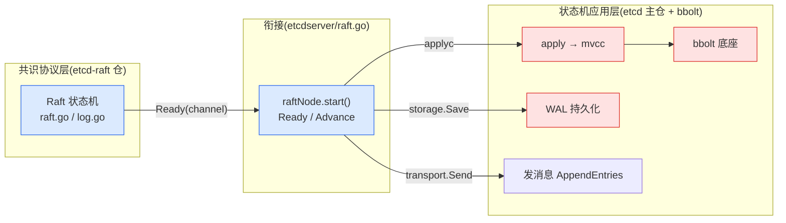

# 第一章 · 第一性原理:为什么需要共识

> 篇:P0 开篇
> 主线呼应:这一章是全书的**总览与定调**。一条数据存在一台机器上,宕机就没了;存到多台,它们又可能不一致、甚至脑裂。共识问题的本质,就是让一群可能各自故障、消息可能乱序丢失的机器,对"接下来执行哪些操作、按什么顺序"达成一致。Raft 给出了可理解的解,etcd 把它包成一个 KV 存储。读懂这一章,你就拿到了全书剩余 21 章的钥匙:Raft(协议层)和 mvcc/bbolt(应用层),都是为了这条"达成一致再落地"的路走得通而存在。

## 核心问题

**一条数据,怎么既不丢(多副本),又不乱(副本间一致),还能在部分机器故障时继续工作?——这就是共识问题。Raft 怎么解,etcd 怎么用。**

读完本章你会明白:

1. 单机的两个硬伤(可用性、可靠性),以及多副本为什么是必然选择。
2. 多副本带来的一致性难题,和**脑裂(split-brain)** 为什么致命。
3. **多数派(quorum)** 凭什么解决脑裂——"任意两个多数派必有交集"这条数学,是共识算法的地基。
4. CAP 与线性一致性:etcd 选了哪一角(CP + 强一致),代价是什么。
5. Raft 一句话(选主 + 复制日志 + 多数派 commit),以及 etcd 的"协议层 vs 应用层"二分法。

---

## 1.1 一句话点破

> **共识问题的本质,是让一群可能各自故障、消息可能乱序丢失的机器,对"接下来执行哪些操作、按什么顺序"达成一致。Raft 用"选一个 leader + 复制日志 + 多数派确认"把它做到可理解。etcd 把 Raft 包成一个 KV 存储——达成一致的事,叫协议层(raft);一致之后落地成可查可订阅的状态,叫应用层(mvcc/bbolt/watch)。**

这是结论,不是理由。本章倒过来拆:先看单机为什么不够,再看多副本为什么更难,然后看脑裂为什么致命、多数派凭什么救场,最后看 etcd 怎么把这一切搭起来。

---

## 1.2 单机为什么不够

假设你的服务用一个单机进程存配置(像一个本地的 map)。它有两个绕不开的硬伤:

- **可用性**:这台机器一旦宕机(硬件故障、断电、内核 panic),整个服务就瘫了。你没法对外提供读写——因为唯一的那份数据在死掉的机器里。
- **可靠性**:数据只有一份。磁盘坏了、文件系统损坏,数据**永久丢失**。对一个配置中心、选主协调服务(Kubernetes 把 etcd 当成"唯一事实来源")来说,这是不可接受的。

> **不这样会怎样**:单机存配置,一次宕机 = 一次全站事故,一次磁盘坏 = 数据归零。生产系统不能接受。

唯一的出路是**多副本**:把同一份数据存到多台机器上。一台挂了,还有别的;一份坏了,还能从别的恢复。但多副本立刻带来了一个更难的新问题。

---

## 1.3 多副本的新麻烦:一致性

现在数据存了 3 份(节点 A、B、C)。用户写 `Put("name", "alice")`,这条写先到了 A。问题是:

- **B、C 还是旧的**("name" 还是上次的值,或者根本没有)。这时用户读 B,读到的是旧值。**读到谁才算数?**
- 三个副本各自有自己的值,**谁是"最新"**?如果网络让它们收到的写顺序不同,A 先收到 `Put("name","alice")` 再收到 `Put("name","bob")`,而 C 收到的顺序反了,那 A 认为最终是 bob、C 认为最终是 alice。**谁对?**

这就是**一致性问题**:多个副本之间,怎么保证它们最终看到一样的、且是"正确"的数据。朴素的多副本(各写各的、读任意一个)解决不了,因为**网络会延迟、会重排、会丢消息,机器会故障**。

> **所以这样设计**:需要一套机制,让所有副本**对操作达成一致**(哪些操作、什么顺序),而不是各自为政。这套机制就叫**共识算法(consensus algorithm)**。Raft 是其中最"可理解"的一个。

---

## 1.4 脑裂:最致命的故障

在所有故障里,有一种最致命:**网络分区(network partition)**。

假设 A、B、C 三个节点,网络出问题,A 自己一组,B 和 C 一组,两组**互相看不见**(消息全部丢失或超时)。这时,如果系统没有任何保护:

- A 这一组里只有一个节点,它可能想"我是不是该接管?好,我来当主"。于是 A 接受客户端写。
- B、C 这一组有两个节点,它们也可能想"我们占多数,我们来当主"。于是 B、C 也接受客户端写。
- 结果:**两个"主"同时存在,各自接受了不同的写**。等网络恢复,两边的数据**冲突**,谁也说不清哪个对。

这就叫**脑裂(split-brain)**——一个集群裂成两个各自为政的"脑",各自处理请求。数据一旦分裂冲突,基本无法收拾。

> **不这样会怎样**:朴素的"主从复制"(随便选一个当主、主挂了别人顶上)在网络分区时会脑裂。脑裂是分布式系统最严重的故障,它直接破坏数据正确性。**任何共识算法的第一要务,都是保证同一时刻只有一个合法的"主",绝不脑裂。**

那怎么保证?靠**多数派**。

---

## 1.5 多数派:为什么 N/2+1 就够

共识算法的关键机制,是**多数派(quorum)**:一个决策(选主、commit 一条日志)必须得到**过半数**节点的同意,才算生效。

为什么是"过半数"?这背后有一条简单而深刻的数学:**任意两个多数派,必然有交集**。

假设集群有 5 个节点。一个多数派至少 3 个。那么任意挑两个多数派(各自至少 3 个),它们的交集至少有 `3 + 3 - 5 = 1` 个节点(鸽巢原理)。也就是说,**不存在两个不相交的多数派**。

这条性质救了命:

- 如果一个决策需要"多数派同意",那么**任何两个已通过的决策,都经过了某个共同节点的同意**。
- 这个共同节点不会"同时同意两个互相矛盾的决策"(它一次只投一种票)。
- 所以,**不可能有两个互相矛盾的决策同时合法通过**——脑裂被堵死了。

> **钉死这件事**:**"任意两个多数派必有交集"是共识算法的地基。** 有了它,"过半数同意"就成了一个安全的判定:只要一个操作被多数派确认,它就一定是唯一合法的,不会被另一个矛盾的操作推翻。脑裂从数学上不可能发生。

> **不这样会怎样**:如果不用多数派,而用别的判定——
> - 用"全部同意":一个慢节点(或分区里的节点)会卡住整个集群,可用性极差。
> - 用"一个同意"(比如就信当前的某个主,不确认):一旦分区,两边各自当主,立刻脑裂。
> - 用"少数派同意"(比如 1/3):可能同时有两个不相交的少数派各自通过,冲突。
>
> 只有"过半数",在数学上唯一保证"两个通过的决策必有交集",既防脑裂,又容忍少数节点故障(只要多数活着就能工作)。

这就是为什么 Raft(以及 Paxos、ZAB)都建立在 quorum 之上。本书第 6 章讲日志复制时,你会看到 leader 怎么数多数派来 commit;第 21 章讲成员变更时,你会看到"为什么单步增删一个节点是安全的"(两个旧新多数派必有交集)。

---

## 1.6 CAP 与线性一致性:etcd 选了哪一角

有了多数派,还要做一个取舍。分布式系统有个著名的 CAP 定理:在网络分区(不可避免的现实)发生时,你只能在**一致性(C)** 和**可用性(A)** 之间二选一:

- **CP**(一致性 + 分区容忍):分区时,宁可拒绝服务,也不让数据不一致。
- **AP**(可用性 + 分区容忍):分区时,宁可各自处理(可能不一致),也要保证可用。

> **etcd 选的是 CP**。作为配置中心、选主协调、Kubernetes 的唯一事实来源,**数据正确比可用更重要**——宁可分区时少数派那一边暂时不可写,也不能让数据分裂冲突。代价是:分区中的少数派节点会拒绝写(因为它凑不到多数派),这部分请求会失败。

CAP 之外,还有一个对使用者更直观的概念:**线性一致性(linearizability)**。它要求:读操作看到的结果,就像所有操作都作用在**一个单一副本**上,且每个操作都在"发起之后、完成之前"的某个瞬间原子地生效。通俗说:**读一定读到最新已写入的值**(不会读到旧值)。etcd 默认提供线性一致读——但这件事不便宜(第 9 章会讲,线性一致读要 leader 确认自己还是 leader,不能朴素地直接读)。

> **钉死这件事**:etcd 是个 **CP + 线性一致** 的系统。它用"宁可不可用也不不一致"换正确性,用"读也要确认最新"换强一致。这是它的定位,也是它和 AP 系统(如某些最终一致的 KV)的根本区别。

---

## 1.7 Raft 一句话:选主 + 复制日志 + 多数派 commit

讲清了多数派和 CAP,Raft 的核心就一句话:

> **Raft = 选一个 leader + 把所有操作记成一条有序的日志 + 每条日志要被多数派确认才算提交(commit)。**

一条 `Put` 的旅程:

1. 客户端把 `Put` 发给 **leader**(如果发给了 follower,follower 转发给 leader)。
2. leader 把这条操作**追加到自己的日志**(raft log)。
3. leader 把这条日志**复制给所有 follower**(AppendEntries 消息)。
4. 当**多数派**的 follower 都收到了这条日志,leader 就 **commit** 它(标记为已提交)。
5. commit 之后,leader 把这条操作 **apply**(应用)到状态机(etcd 里就是 mvcc 存储),然后**返回客户端成功**。
6. leader 把"这条已 commit"的信息再同步给 follower,大家最终都 apply。

这里有几个精妙之处,是后续章节的主菜:

- **为什么是 leader 主导**:避免了多主冲突,所有写都经 leader 排序,日志自然有序。
- **为什么"多数派收到"就能 commit**:结合 1.5 节的数学,多数派确认 = 这条日志安全了,不会被推翻。
- **为什么 commit 之后才 apply、才返回**:保证客户端看到"成功"的操作,一定已经被多数派确认、不会丢——这就是线性一致的来源。

> Raft 的伟大之处在于**可理解性**。在 Raft 之前,共识算法的事实标准是 Paxos——强大但极难理解。Raft 的论文标题就是 *"In Search of an Understandable Consensus Algorithm"*,它用 **term(任期)**、**leader**、**日志匹配(log matching)** 这几个直观的概念,把共识拆成三个相对独立的部分(选主、日志复制、安全性),让人能真正读懂、实现、调试。这也是为什么 etcd、TiKV、CockroachDB 都选了 Raft。本书第 1 篇会逐一拆透这三个部分。

---

## 1.8 etcd 全貌 + 全书二分法

Raft 解决了"达成一致"。但达成一致之后,这些操作要落地成一个真正能用的 KV 存储——这才是 etcd。etcd = Raft(共识)+ mvcc(多版本存储)+ watch/lease(特性)+ bbolt(底座)。

etcd 的所有机制,可以归到两条线上,这正是全书的**二分法**:

> **共识协议层(Raft:让多数派对日志顺序达成一致、leader 主导复制) vs 状态机应用层(mvcc/bbolt/watch:把共识结果落地成可查、可订阅的多版本状态)。**

- **协议层**:Raft 状态机、leader 选举、日志复制、安全性。源码在 `etcd-raft` 仓(`raft.go`/`log.go`/`node.go`/`tracker/`)。这一层只管"达成一致",**完全不碰磁盘、不碰网络、不知道 KV 是什么**。
- **应用层**:etcdserver 的 apply、mvcc 多版本存储、backend + bbolt、WAL 持久化、lease。源码在 etcd 主仓(底座 bbolt 在独立仓)。

这两层是怎么衔接的?看一段真实源码——`etcdserver/raft.go` 里 [`raftNode.start()`](../etcd/server/etcdserver/raft.go#L174) 的主循环(本地 clone @ `61d518f`)。这个循环就是一个 `select`,从 Raft 状态机拿到一批就绪输出(`Ready`),然后做三件事(下为简化示意,保留核心步骤,对应 [raft.go:174-331](../etcd/server/etcdserver/raft.go#L174-L331)):

```go
func (r *raftNode) start(rh *raftReadyHandler) {
    // ...
    go func() {
        for {
            select {
            case <-r.ticker.C:
                r.tick()                        // ① 驱动 Raft 的逻辑时钟(选举 tick / 心跳 tick)
            case rd := <-r.Ready():             // ② 从 Raft 状态机拿一批就绪输出 Ready
                // ... 处理 SoftState(leader 变更)...
                ap := toApply{
                    entries:  rd.CommittedEntries,   // 已 commit、待 apply 的日志
                    snapshot: rd.Snapshot,
                    notifyc:  notifyc,
                }
                select {
                case r.applyc <- ap:            // ③a 经 applyc 送给应用层 → mvcc  (raft.go:232)
                case <-r.stopped:
                    return
                }
                // ... ③b leader 先把消息(AppendEntries 等)发给 follower
                r.transport.Send(r.processMessages(rd.Messages))
                // ... ③c 持久化:把 HardState 和新日志写进 WAL(磁盘)
                r.storage.Save(rd.HardState, rd.Entries)  // ③c 持久化到 WAL(磁盘)  (raft.go:256)
                // ... 处理 snapshot ...
                r.raftStorage.Append(rd.Entries) // 存进 MemoryStorage
                r.Advance()                       // ④ 告诉状态机:这批 Ready 处理完了,推进
            case <-r.stopped:
                return
            }
        }
    }()
}
```

这一段代码,浓缩了全书的主线:

- `r.tick()`(①):上层用定时器驱动 Raft 的逻辑时钟——选举超时、心跳都靠它(第 3 章)。
- `rd := <-r.Ready()`(②):**协议层** Raft 状态机把"需要持久化的日志、需要发给 follower 的消息、可以 apply 的已 commit 日志"打包成一个 `Ready`,经 channel 交出来。这是"协议层不碰 IO、只产出指令"的精髓(第 6 章详讲)。
- `r.applyc <- ap`(③a):把已 commit 的日志,经 `applyc` 通道送给**应用层**(etcdserver apply → mvcc)。这就是"达成一致 → 落地成 KV"的那一步。
- `r.transport.Send(...)`(③b):把 AppendEntries 等消息发给 follower,完成日志复制(第 4 章)。
- `r.storage.Save(...)`(③c):把日志持久化进 **WAL**(磁盘),保证崩溃不丢已 commit 的数据(第 17 章)。
- `r.Advance()`(④):告诉状态机这批处理完了,可以产下一批——这就是 `Ready`/`Advance` 的推拉模型(第 6 章)。

> **钉死这件事**:`raftNode.start()` 这一个 `select` 循环,就是全书二分法的**衔接点**。Raft 状态机(协议层)吐出 `Ready`,etcdserver(应用层)消费它:持久化、发消息、apply 到存储。一个 channel(`applyc`)把两层干净地切开。后面 21 章,本质上都在围绕这个循环的某一步展开。



---

## 1.9 技巧精解:多数派的数学——为什么是 N/2+1

这一章是定调章,我们把全书最根本的一条数学立清楚:**为什么共识算法的判定阈值是"过半数"(N/2+1),而不是别的**。理解了它,你就理解了 Raft 所有的 quorum 设计(commit 要多数派、选举要多数派投票、成员变更要保持多数派交集)从哪来。

**命题**:在一个 N 个节点的集群里,任意两个"过半数子集"(各自 ≥ ⌊N/2⌋+1 个)必有至少一个公共节点。

**证明**(鸽巢):设两个多数派 A、B,|A| ≥ ⌊N/2⌋+1,|B| ≥ ⌊N/2⌋+1。若 A、B 不相交,则 |A∪B| = |A|+|B| ≥ 2(⌊N/2⌋+1)。对任意 N,2(⌊N/2⌋+1) > N(N 为偶数时 = N+2,N 为奇数时 = N+1),矛盾。故 A、B 必有交集。∎

这条性质带来三个直接后果,是 Raft safety 的根基:

1. **不会脑裂**:两个互相矛盾的"多数派决策"必然经过某个共同节点,该节点不会同时投两种票,故矛盾决策不可能同时合法通过(1.5 节)。
2. **commit 不可推翻**:一条日志被多数派确认 commit 后,任何后续的多数派(比如选新 leader 时的投票多数派)必然包含至少一个见过这条日志的节点——这保证了"已 commit 的日志永不丢失"(leader 完整性,第 5 章详讲)。
3. **容错**:N 个节点能容忍 ⌊(N-1)/2⌋ 个故障。3 节点容忍 1 个故障,5 节点容忍 2 个——这就是为什么生产环境常用 3 或 5 节点(奇数:多一个节点不增加容错,只增加成本)。

> **反面对比**:如果阈值不是过半数——
> - 阈值 = 全部(N):任意一个节点故障就卡死,毫无容错。
> - 阈值 = 固定少数(如 1):可能有两个不相交的少数派各自通过,矛盾决策并存,脑裂。
> - 阈值 = ⌊N/2⌋(刚好一半,N 偶数时):两个恰好各占一半的子集不相交,仍可能矛盾。**所以必须严格大于一半**。
>
> 只有"严格过半数",在数学上唯一满足"任意两个通过集必有交集",从而同时实现"防脑裂"和"容错"。这不是拍脑袋的数字,是集合论的必然。

> **钉死这件事**:Raft 里凡是涉及"确认"的地方——commit 一条日志要多数派复制、选 leader 要多数派投票、成员变更要保持旧新配置都有多数派交集——背后都是这一条数学。第 4 章(commit)、第 5 章(安全性)、第 21 章(成员变更)会反复用到它。

---

## 章末小结

这一章是全书的**总览与定调**,我们没有钻进任何协议细节,但立起了贯穿全书的四样东西:

1. **共识问题的本质**:让一群可能故障、消息可能乱序丢失的机器,对操作顺序达成一致。
2. **多数派这条数学**:"任意两个多数派必有交集"——共识算法的地基,防脑裂 + 容错的根源。
3. **etcd 的定位**:CP + 线性一致,宁可分区时不可用也不不一致,读也要确认最新。
4. **全书二分法**:**协议层**(Raft:达成一致)vs **应用层**(mvcc/bbolt/watch:落地成可查可订阅的状态),衔接点是 `raftNode.start()` 那个 `Ready`/`Advance` 循环。

### 五个"为什么"清单

1. **单机为什么不够?** 可用性(宕机即瘫痪)+ 可靠性(数据一份,坏了就丢)。生产必须多副本。
2. **多副本为什么更难?** 副本间要一致:网络延迟/重排/丢消息、机器故障,朴素多副本各写各的会读到不一致。
3. **脑裂为什么致命?** 网络分区时两个"主"各自接受写,恢复后数据冲突,无法收拾。
4. **多数派凭什么救场?** "任意两个多数派必有交集"——矛盾决策不可能同时合法通过,脑裂从数学上不可能。N/2+1 是唯一兼顾防脑裂和容错的阈值。
5. **etcd 的协议层和应用层怎么衔接?** Raft 状态机吐出 `Ready`(待持久化日志、待发消息、待 apply 日志),etcdserver 在 `raftNode.start()` 循环里消费它:存 WAL、发消息、apply 到 mvcc。一个 `applyc` channel 把两层切开。

### 想继续深入往哪钻

- 本章点到的 `Ready`/`Advance` 推拉模型是 etcd-raft 的精髓,详见第 6 章 P1-06。
- 多数派的数学会在第 4 章(commit)、第 5 章(安全性)、第 21 章(成员变更)反复用到。
- 想立刻看一眼真实的衔接代码,读 `../etcd/server/etcdserver/raft.go` 的 `raftNode.start()`——那一个 `select` 循环就是本章 1.8 的完整背景。
- 想看 Raft 算法本身的形式化证明,etcd-raft 仓里有 `tla/`(TLA+ 规约),第 22 章会讲它怎么佐证 Raft 正确。

### 引出下一章

我们立起了共识问题和二分法。但要真正理解 etcd,得先钻进**协议层**——Raft 本身。Raft 用了哪几个关键概念,把"达成一致"做到可理解?它最基本的状态和"逻辑时钟"是什么?下一章,我们从 Raft 的三个角色和一个 `term` 讲起,正式进入第 1 篇:Raft 地基。
