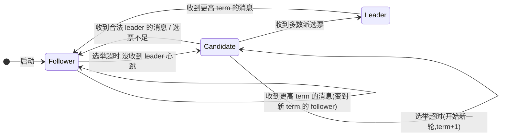

# 第二章 · Raft 状态机与 term

> 篇:P1 Raft 地基
> 主线呼应:上一章(P0-01)立起了"选主 + 复制日志 + 多数派 commit"这一句话,和全书的二分法——**协议层**(Raft:达成一致)vs **应用层**(mvcc/bbolt/watch:落地成可查可订阅的状态)。从这一章开始,我们正式钻进协议层。Raft 是 etcd 的灵魂,而灵魂的骨架就两样东西:**三个角色**(Follower / Candidate / Leader)和一个 **term(任期)**。理解了角色怎么切换、term 凭什么单调、为什么"一个 term 一个节点最多投一票",你就拿到了第 1 篇后面四章(选举、复制、安全、驱动)的钥匙——它们全建立在本章这两样东西之上。

## 核心问题

**Raft 把每个节点分成哪三个角色,它们怎么互相转换?term 作为"逻辑时钟"凭什么单调递增?为什么"一个 term 里一个节点最多投一票"——这条规则堵住了哪个 safety 漏洞(同一任期选出多个 leader)?**

读完本章你会明白:

1. Raft 的三个角色(Follower / Candidate / Leader)在 `etcd-raft` 里是怎么表示的,角色切换(`becomeFollower`/`becomeCandidate`/`becomeLeader`)在源码里到底改了哪几个字段。
2. **term 不是物理时间,是逻辑时钟**:为什么 Raft 不信机器时钟,而要自己维护一个单调递增的整数。
3. 为什么"**一个 term 一个节点最多投一票**"是 Raft 最根本的不变式——它和"多数派必有交集"(P0-01)联手,凭什么把"同一任期选出多个 leader"这条脑裂路径彻底堵死。
4. `etcd-raft` 用 **`step` / `tick` 两个函数指针实现角色多态**,而不是一坨 `switch r.state`——这是 Go 工程上的精妙一笔。

> **如果一读觉得太难**:先只记住三件事——① 每个节点任一时刻只可能是 Follower、Candidate、Leader 之一;② term 是个只增不减的整数,就像"届期",一届一个主;③ 一个 term 里,一个节点最多只能把票投给一个候选人,这条是 Raft 防"同任期多主"的地基。剩下的源码细节,等读完第 3 章(选举)再回来重看。

---

## 2.1 一句话点破

> **Raft 用"三个角色 + 一个单调递增的 term"搭起一台状态机:term 是逻辑时钟(不信物理钟),每个 term 至多一个 leader(靠"一个 term 一票 + 多数派必有交集"联保证),节点在自己维护的角色里决定怎么响应消息、怎么驱动时钟。源码里角色不是 `if state == Leader` 的大 switch,而是把"怎么处理消息"(`step`)和"每个 tick 干什么"(`tick`)做成两个函数指针,角色一变,这两个指针就换——这是 Go 里实现协议状态机的经典套路。**

这是结论,不是理由。本章倒过来拆:先看三个角色在源码里是什么、怎么切换;再看 term 凭什么单调;然后钻进那条最根本的不变式("一个 term 一票"),讲清它怎么堵住同任期多主;最后讲 `step`/`tick` 函数指针这套多态机制为什么比大 switch 好。

---

## 2.2 三个角色:状态机的三张面孔

一个 Raft 集群里,每个节点(node)在任一时刻,都恰好处于三种角色之一:

| 角色 | 职责 | 谁来当 |
|------|------|--------|
| **Follower** | 被动接受 leader 的日志复制和心跳,自己不主动发起写 | 集群里的多数,平时都是 follower |
| **Candidate** | follower 在选举超时后变成的"候选人",主动向大家拉票,争当 leader | 选举进行中的临时角色 |
| **Leader** | 唯一的"主",所有写都经它进 raft log,由它主导复制给 follower | 一个 term 里至多一个 |

这三个角色在 `etcd-raft` 里是怎么表示的?直接看源码。角色的枚举定义在 [`raft.go`](../etcd-raft/raft.go) 顶部,是一个 `StateType` 类型:

```go
// raft.go:49-56
const (
    StateFollower StateType = iota
    StateCandidate
    StateLeader
    StatePreCandidate
    numStates
)

// raft.go:111-123
type StateType uint64

var stmap = [...]string{
    "StateFollower",
    "StateCandidate",
    "StateLeader",
    "StatePreCandidate",
}

func (st StateType) String() string {
    return stmap[st]
}
```

注意第四个 `StatePreCandidate`:它是 PreVote 机制(第 3 章讲)用的"预候选人"——先试探性地拉一轮票,确认自己有希望赢,再正式竞选。这一章我们先不展开它,把它当成"选举前的一个临时中间态"即可。Raft 论文里只有三角色,`etcd-raft` 加了 PreCandidate 做优化。

`StateType` 只是个枚举,真正承载状态的,是 `raft` 结构体里的 `state` 字段([raft.go:343-437](../etcd-raft/raft.go#L343-L437))。我们截出和本章最相关的几个字段:

```go
// raft.go:343-437(节选,只保留本章关心的字段)
type raft struct {
    id uint64

    Term  uint64   // 当前任期(逻辑时钟)
    Vote  uint64   // 当前任期里,这一票投给了谁(None 表示还没投)

    // ...
    trk   tracker.ProgressTracker   // 追踪每个 follower 的复制进度
    state StateType                 // 当前角色

    lead  uint64                    // 当前 leader 是谁(None 表示还不知道)

    // ...
    step func()                     // ← 注意:这里其实是 step stepFunc,函数指针
    tick func()                     // 每个 tick 干什么(选举 or 心跳)

    logger Logger
}
```

> **钉死这件事**:`raft` 结构体里和"角色 + term"直接相关的就四个字段:`r.state`(我现在是哪个角色)、`r.Term`(我在第几届)、`r.Vote`(这一届我把票投给了谁)、`r.lead`(这一届的 leader 是谁)。本章后面所有的源码,本质上都在围绕这四个字段打转。注意大小写:结构体里是 `Term`/`Vote`(大写,可被 `HardState` 序列化导出),但持久化到磁盘的 protobuf 字段叫 `currentTerm`/`votedFor`(见 2.5 节)——同一个东西,协议层和应用持久化层各有一套命名,容易看花眼。

---

## 2.3 角色怎么切换:`becomeXxx` 三件套

三个角色不是静态的,它们会在不同事件下互相转换。转换的规则(Raft 论文图 4)是:



这张图里的每一条边,在源码里都对应一个 `becomeXxx` 函数。三个核心的转换函数定义在 [raft.go:891-971](../etcd-raft/raft.go#L891-L971):

```go
// raft.go:891-900
func (r *raft) becomeFollower(term uint64, lead uint64) {
    r.step = stepFollower
    r.reset(term)
    r.tick = r.tickElection
    r.lead = lead
    r.state = StateFollower
    r.logger.Infof("%x became follower at term %d", r.id, r.Term)
    traceBecomeFollower(r)
}

// raft.go:902-915
func (r *raft) becomeCandidate() {
    if r.state == StateLeader {
        panic("invalid transition [leader -> candidate]")
    }
    r.step = stepCandidate
    r.reset(r.Term + 1)      // ← 关键:候选人 term+1
    r.tick = r.tickElection
    r.Vote = r.id            // ← 关键:候选人先投自己一票
    r.state = StateCandidate
    r.logger.Infof("%x became candidate at term %d", r.id, r.Term)
    traceBecomeCandidate(r)
}

// raft.go:933-970(节选)
func (r *raft) becomeLeader() {
    if r.state == StateFollower {
        panic("invalid transition [follower -> leader]")
    }
    r.step = stepLeader
    r.reset(r.Term)          // ← 注意:当 leader 不涨 term(term 在 becomeCandidate 时已涨过)
    r.tick = r.tickHeartbeat
    r.lead = r.id
    r.state = StateLeader
    // ...
    r.pendingConfIndex = r.raftLog.lastIndex()
    // leader 上任先追加一条 no-op(entry 为空)——这点第 4 章 commit 会用到
    emptyEnt := &pb.Entry{Data: nil}
    if !r.appendEntry(emptyEnt) {
        r.logger.Panic("empty entry was dropped")
    }
    // ...
}
```

这三个函数有一个高度一致的骨架,五件事:

1. **换 `step` 函数**:`r.step = stepFollower / stepCandidate / stepLeader`——决定"这个角色怎么处理收到的消息"。
2. **调 `r.reset(term)`**:重置一堆和选举相关的临时状态(elapsed 计数器、投票记录、progress tracker),并在 term 变了的时候清空 `r.Vote`(下面 2.5 详讲)。
3. **换 `tick` 函数**:`r.tick = r.tickElection`(follower/candidate,数选举超时)或 `r.tickHeartbeat`(leader,数心跳)。
4. **设 `r.lead`**:follower 设成传进来的 leader id;candidate 设成 None(还不知道谁是 leader);leader 设成自己。
5. **设 `r.state`**:更新枚举,留一行日志,留一行 `traceBecomeXxx(r)`(状态转换追踪,见 2.7 节)。

> **不这样会怎样**:注意 `becomeCandidate` 里那行 `r.Vote = r.id`——候选人**先投自己一票**。这看似细枝末节,其实是 Raft "一个 term 一票" 不变式的第一颗螺丝:候选人自己也算一个 voter,它把这一届自己仅有的一票,在涨 term 的瞬间就投给了自己,这样它就再也不能在同一 term 里投别人了。如果不投自己、等别人来问再决定,那么候选人这一届的"投票记录"就一直是空的,理论上它可以在同一 term 里先给 A 投一票、再给 B 投一票——这正是 Raft 要堵的漏洞。第 3 章讲选举时你会再见到这颗螺丝。

> **钉死这件事**:`becomeLeader` 里有两个细节,是后面章节的伏笔——① **当 leader 不涨 term**:term 是在 `becomeCandidate` 时涨的(从 `r.Term+1` 开始竞选),`becomeLeader` 只是把"我已经赢了"这件事记下来,term 不动。② **leader 上任先追加一条 no-op 空 entry**:这条空 entry 的 term 等于当前 term,是为了让"当前 term 至少有一条 entry 被 commit"——这是 P1-04 要讲的 Figure 8 陷阱的解药。先记住这两点,后面会回扣。

`becomeFollower` 是被调用最多的一个——任何"收到更高 term 的消息""选举失败""收到合法 leader 的 AppendEntries"都会变回 follower。它是 Raft 的"安全降落伞":无论你现在是什么角色、处于多混乱的状态,只要外界传来一个更高 term,你就乖乖变成那个 term 下的 follower,把旧账翻篇。这个机制 2.6 节会专门讲。

---

## 2.4 term:为什么不用物理时间

讲完了角色,来讲 term。这是 Raft 最核心、也最反直觉的一个概念。

先说它是什么:**term(任期)是一个单调递增的整数,从 1 开始,每发生一次选举(候选人开始竞选),term 就 +1。** term 就像"届期"——

> **打个比方**:term 像"议会届期"。每选一次主,就进入新一届(term+1)。一届里至多一个主(leader),一届里每个议员(follower)只能投一次票。届期只会往前走,不会倒退。谁的届期号大,谁就更新;届期号小的,看到届期号大的消息,就要"认怂"——把自己降到对方那一届的 follower。

为什么 Raft 要自己维护一个 `term` 整数,而不直接用机器的物理时间(墙上时钟)?这背后是一个分布式系统的老问题:**机器时钟不可信**。

> **不这样会怎样**:如果用物理时间当"谁更新"的判据,会撞上三堵墙——
>
> 1. **时钟漂移(clock drift)**:每台机器的晶振频率都有微小差异,NTP 同步也只能把误差缩小到毫秒级,没法保证"全局一致"。一个节点的物理时间可能比另一个快几秒。
> 2. **时钟跳变**:运维操作、NTP 一次大步校正、VM 迁移、暂停恢复,都可能让机器时钟突然向前跳或向后跳一大截。用这种时间当"事实判据",会让一个节点误以为自己"更新"或"更旧"。
> 3. **没有全局真值**:分布式系统里不存在一个所有节点都信的"绝对现在"。Google 的 TrueTime(Spanner 用)靠原子钟 + 误差区间硬凑出一个"可能的时间区间",代价极其昂贵。Raft 不想背这个包袱。
>
> 所以 Raft 干脆**不信物理时间**:它自己维护一个整数 `term`,只在两个地方涨——① 候选人开始竞选时 term+1;② 任何节点收到更高 term 的消息时,把自己的 term 提到对方的 term(并变 follower)。term 是**逻辑时钟(logical clock)**,它的"先后"靠协议本身维护,不靠墙上时钟。

term 在源码里就是 `r.Term uint64` 字段([raft.go:346](../etcd-raft/raft.go#L346))。它的"单调"和"对齐"靠两条规则维持,都写在 [`Step`](../etcd-raft/raft.go#L1089) 函数开头那个大 `switch`(处理"消息的 term 和我的 term 谁大")里:

```go
// raft.go:1089-1187(节选,Step 开头的 term 处理)
func (r *raft) Step(m *pb.Message) error {
    if m == nil {
        return errors.New("nil message")
    }
    traceReceiveMessage(r, m)

    // 处理消息 term——可能让自己降级成 follower
    switch {
    case m.GetTerm() == 0:
        // 本地消息(MsgHup/MsgBeat),不带 term
    case m.GetTerm() > r.Term:
        // 收到更高 term 的消息
        // ...
        switch {
        case m.GetType() == pb.MsgPreVote:
            // PreVote 不涨 term(第 3 章讲)
        case m.GetType() == pb.MsgPreVoteResp && !m.GetReject():
            // PreVote 同意也不涨 term
        default:
            r.logger.Infof("%x [term: %d] received a %s message with higher term ...",
                r.id, r.Term, m.GetType(), m.GetFrom(), m.GetTerm())
            // 关键:看到更高 term,自己乖乖变 follower(term 提到对方)
            if m.GetType() == pb.MsgApp || m.GetType() == pb.MsgHeartbeat || m.GetType() == pb.MsgSnap {
                r.becomeFollower(m.GetTerm(), m.GetFrom())
            } else {
                r.becomeFollower(m.GetTerm(), None)
            }
        }

    case m.GetTerm() < r.Term:
        // 收到更低 term 的消息——直接忽略,或回一个 reject
        // ...(见 raft.go:1133-1186)
        return nil
    }

    // term 处理完,再分发给具体角色处理(见 2.7 的 step 函数指针)
    switch m.GetType() {
    case pb.MsgHup:
        // ...
    case pb.MsgVote, pb.MsgPreVote:
        // 投票处理(2.6 节详讲)
        // ...
    default:
        err := r.step(r, m)   // ← 分发给 stepFollower/stepCandidate/stepLeader
        if err != nil {
            return err
        }
    }
    return nil
}
```

这就是 term 的全部逻辑:**收到更高 term → 降级成 follower 并对齐 term;收到更低 term → 忽略**。这两条规则让整个集群的 term 像水位一样,只会涨,不会因为某个落后节点而退回去。

> **钉死这件事**:term 单调递增,是 Raft 所有 safety 论证的基石。后面 P1-04 讲 commit(Figure 8 陷阱"只能 commit 当前 term 的 entry")、P1-05 讲安全性(选举限制"candidate 的 log 至少要和投票者一样新")、P1-06 讲驱动(Node 怎么把 term 变化经 Ready 交给上层持久化),全都建立在"term 是单调的逻辑时钟"这个前提上。term 一旦乱了(比如某个节点能把 term 倒回去),Raft 的所有保证都会失效。

---

## 2.5 `reset(term)`:term 一变,投票记录清零

你可能注意到了 `becomeXxx` 里都调了一个 `r.reset(term)`,这是理解"一个 term 一票"的关键。看它的源码:

```go
// raft.go:781-810
func (r *raft) reset(term uint64) {
    if r.Term != term {
        r.Term = term
        r.Vote = None      // ← 关键:term 变了,投票记录清零
    }
    r.lead = None

    r.electionElapsed = 0
    r.heartbeatElapsed = 0
    r.resetRandomizedElectionTimeout()

    r.abortLeaderTransfer()

    r.trk.ResetVotes()    // 投票计数清零
    r.trk.Visit(func(id uint64, pr *tracker.Progress) {
        *pr = tracker.Progress{
            Match:     0,
            Next:      r.raftLog.lastIndex() + 1,
            Inflights: tracker.NewInflights(r.trk.MaxInflight, r.trk.MaxInflightBytes),
            IsLearner: pr.IsLearner,
        }
        if id == r.id {
            pr.Match = r.raftLog.lastIndex()
        }
    })

    r.pendingConfIndex = 0
    r.uncommittedSize = 0
    r.readOnly = newReadOnly(r.readOnly.option)
}
```

最关键的两行在最顶上:

```go
if r.Term != term {
    r.Term = term
    r.Vote = None      // 进入新 term,我这一届还没投过票
}
```

**只有 term 真的变了,才清 `r.Vote`。** 如果 term 没变(比如 `becomeFollower(r.Term, lead)` 这种"同 term 内换 leader"的情况),`r.Vote` 保留——因为你这一届可能已经投过票了,不能因为状态机内部的一次 reset 就"忘记"自己投过谁,那样会破坏"一个 term 一票"。

> **钉死这件事**:`reset` 里 `if r.Term != term { r.Vote = None }` 这条**条件赋值**,是 Raft "一个 term 一票"不变式在源码里的精确实现。它不是无条件清零,而是"term 一变才清零"。这一行少了 `if` 会怎样?——同 term 内重新变成 follower/candidate 时会忘记自己投过票,理论上可以在同一 term 里再投一次,直接打破不变式。这一行多了赋值(比如无条件 `r.Vote = None`)会怎样?——同 problem。所以这个 `if` 是必要的、精确的。

`reset` 还顺手做了几件事:清零选举/心跳计时器(`electionElapsed`/`heartbeatElapsed`)、重新随机化选举超时(`resetRandomizedElectionTimeout`,第 3 章讲为什么随机)、清空投票计数(`trk.ResetVotes`)、把所有 follower 的复制进度(`Progress`)重置。这些都是"翻篇"——进入新角色/新 term,旧账全部作废。

---

## 2.6 技巧精解之一:term 单调 + 一个 term 一票,凭什么堵住同任期多主

现在进入本章最硬核的一节。Raft 有一条根本不变式:

> **不变式(One Vote Per Term)**:在任意一个 term `t` 里,任意一个节点 `i` 最多把票投给一个 candidate。形式化地,`votedFor[i]` 在 term `t` 期间要么是 `Nil`(没投),要么是某个固定的 candidate id(投了谁就锁死)。

这条不变式不是写出来好看的,它是 Raft 防"同任期多主"的**地基**。我们分两步讲透:先讲它怎么和"多数派必有交集"(P0-01)联手堵住漏洞,再看源码里每一步是怎么把这条不变式钉死的。

### 不这样会怎样:没有这条不变式,会脑裂

假设我们 5 个节点的集群,在 term=5 这届里要选 leader。设想一个反事实的场景:**如果"一个 term 一票"不成立**,即一个节点在 term=5 里可以投多次票。

1. 节点 A 发起竞选(term=5),向 B、C 拉票。B 投给 A。
2. 此时 A 有 {A, B} 两票,还差一票。
3. 节点 C 也发起竞选(term=5),向 D、E 拉票。
4. **因为"一个 term 一票"不成立**,B 这时又改投 C(同一个 term=5 里第二次投票)。于是 C 拿到 {C, B} 两票。
5. D 又投 A,A 拿到 {A, B, D} 三票,达到多数派,A 当选 term=5 的 leader。
6. E 又投 C,C 拿到 {C, B, E} 三票,也达到多数派,C 也当选 term=5 的 leader。

**结果:term=5 里同时有两个合法 leader(A 和 C),各自都拿到了多数派票。** 这就是"同任期多主",是脑裂的一种。集群会接受两份互相冲突的写,数据彻底乱掉。

这个反例的关键在于:第 4 步 B 改票,让两个多数派 `{A,B,D}` 和 `{C,B,E}` 通过 B 这个**交集节点**时,B 对两边都点了头。P0-01 讲过"任意两个多数派必有交集",这个交集节点本该是"两边只能通过它达成一致"的桥梁——但如果它能同时投两票,桥梁就失效了,数学保证被绕过。

### 所以这样设计:把"一票"这件事钉死

Raft 的解法就是这条不变式:**一个节点在一个 term 里,只能投一次票**。这样,如果两个多数派 `{A,B,D}` 和 `{C,B,E}` 都通过,它们的交集 B 只可能投给其中一边(A 或 C),不可能两边都投。于是**两个多数派不可能同时合法地支持两个不同的 candidate**——同任期多主从数学上不可能。

> **打个比方**:这就像议会投票时,每个议员在一个议题上只能投一次票,按电子表决器按一下就锁死,不能改。这样,"一个议题过半数通过"才有意义——不可能两个矛盾的议题都过半数,因为过半数的两个阵营必有共同议员,而共同议员只能站一边。

这条不变式不是 Raft 论文拍脑袋想出来的,它在 `etcd-raft/tla/etcdraft.tla` 里有形式化的表达。看 TLA+ 规约里 `HandleRequestVoteRequest` 这一段([tla/etcdraft.tla:502-518](../etcd-raft/tla/etcdraft.tla#L502-L518)):

```tla
HandleRequestVoteRequest(i, j, m) ==
    LET logOk == \/ m.mlastLogTerm > LastTerm(log[i])
                 \/ /\ m.mlastLogTerm = LastTerm(log[i])
                    /\ m.mlastLogIndex >= Len(log[i])
        grant == /\ m.mterm = currentTerm[i]                \* 同 term
                 /\ logOk                                    \* candidate 的 log 够新
                 /\ votedFor[i] \in {Nil, j}                 \* ★ 核心不变式
    IN /\ m.mterm <= currentTerm[i]
       /\ \/ grant  /\ votedFor' = [votedFor EXCEPT ![i] = j]   \* 投了,锁死成 j
          \/ ~grant /\ UNCHANGED votedFor                       \* 不投,记录不动
       /\ Reply([mtype        |-> RequestVoteResponse, ...], m)
```

注意 `grant` 条件里第三条 `votedFor[i] \in {Nil, j}`:节点 `i` 同意给 `j` 投票,**当且仅当**它这一届要么还没投(`Nil`),要么之前已经投的就是 `j`(重复投票请求,幂等)。这条 `votedFor[i] \in {Nil, j}` 就是"一个 term 一票"的形式化表达。

TLA+ 还在 `BecomeFollowerOfTerm`([tla/etcdraft.tla:482-488](../etcd-raft/tla/etcdraft.tla#L482-L488))里规定了 term 变化时清票:

```tla
BecomeFollowerOfTerm(i, t) ==
    /\ currentTerm'    = [currentTerm EXCEPT ![i] = t]
    /\ state'          = [state       EXCEPT ![i] = Follower]
    /\ IF currentTerm[i] # t THEN
            votedFor' = [votedFor    EXCEPT ![i] = Nil]   \* ★ term 变,清票
       ELSE
            UNCHANGED <<votedFor>>
```

这跟 Go 源码里 `reset` 的 `if r.Term != term { r.Vote = None }` 是一模一样的语义。形式化规约和实现严格对齐——这是 etcd-raft 的工程严谨之处(第 22 章会专门讲 TLA+ 怎么佐证 Raft 正确)。

### 源码里:每一处给票都查 `r.Vote`

现在回到 Go 源码。投票的逻辑在 [`Step`](../etcd-raft/raft.go#L1212-L1262) 处理 `MsgVote`/`MsgPreVote` 的分支里。一个 follower 收到 candidate 的拉票请求,它怎么决定投不投?

```go
// raft.go:1212-1262(节选,投票判定)
case pb.MsgVote, pb.MsgPreVote:
    // 我能投票的条件:
    canVote := r.Vote == m.GetFrom() ||                          // (a) 这一届我已经投的就是你(幂等)
        (r.Vote == None && r.lead == None) ||                    // (b) 这一届还没投,而且不知道有 leader
        (m.GetType() == pb.MsgPreVote && m.GetTerm() > r.Term)   // (c) PreVote 特例(第 3 章讲)
    // ...并且 candidate 的 log 至少和我一样新(选举限制,P1-05 讲)
    lastID := r.raftLog.lastEntryID()
    candLastID := entryID{term: m.GetLogTerm(), index: m.GetIndex()}
    if canVote && r.raftLog.isUpToDate(candLastID) {
        r.logger.Infof("%x [logterm: %d, ...] cast %s for %x ...", ...)
        r.send(&pb.Message{To: m.From, Term: m.Term, Type: voteRespMsgType(m.GetType()).Enum()})
        if m.GetType() == pb.MsgVote {
            // 只有真正的 MsgVote(不是 PreVote)才记录投票
            r.electionElapsed = 0
            r.Vote = m.GetFrom()                                  // ★ 投了,锁死
        }
    } else {
        r.logger.Infof("%x [...] rejected %s from %x ...", ...)
        r.send(&pb.Message{To: m.From, Term: new(r.Term),
            Type: voteRespMsgType(m.GetType()).Enum(), Reject: new(true)})
    }
```

注意那个 `canVote` 的三个 `||` 条件——它精确地实现了 TLA+ 里的 `votedFor[i] \in {Nil, j}`:

- (a) `r.Vote == m.GetFrom()`:这一届我已经投的就是你(candidate `j`),重复请求幂等通过。
- (b) `r.Vote == None && r.lead == None`:这一届还没投过(`Nil`),而且也不知道当前 term 有 leader——可以投。
- (c) 是 PreVote 特例,先忽略。

如果 `canVote` 为真,并且 candidate 的 log 够新(`isUpToDate`,P1-05 讲),就**发投同意票,并把 `r.Vote` 锁死成这个 candidate**(`r.Vote = m.GetFrom()`)。一旦锁死,这一届里 `canVote` 只可能对同一个 candidate 为真(条件 (a)),对任何别的 candidate 都为假(条件 (b) 不满足了)——这一票再也投不出去了。

> **钉死这件事**:Raft "一个 term 一票" 在 etcd-raft 源码里的完整闭环是三步——
>
> 1. **进入新 term 时清票**:`reset(term)` 里 `if r.Term != term { r.Vote = None }`,翻篇(raft.go:781-785)。
> 2. **投票时锁死**:`Step` 里 `r.Vote = m.GetFrom()`,投了就锁(raft.go:1256)。
> 3. **判定时查锁**:`Step` 里 `canVote := r.Vote == m.GetFrom() || (r.Vote == None && r.lead == None)`,只有没投或投的就是你才同意(raft.go:1214-1216)。
>
> 这三步加上 P0-01 的"任意两个多数派必有交集",把"同任期多主"这条路彻底焊死。第 3 章讲选举超时、第 5 章讲选举限制,都会反复回扣这条不变式。

> **反面对比**:如果朴素地实现投票——比如用 `map[term]candidateID` 记录每个 term 的投票、或者干脆不记 `r.Vote`、每次收到拉票请求都重新判断——会怎样?最直接的坑是:网络重传导致同一个 candidate 的拉票请求到达多次,如果不幂等(不查 `r.Vote == m.From`),可能错误地"拒绝"一个本该同意的重复请求,或者更糟,在没有锁的情况下被 race condition 钻空子(虽然 raft 状态机是单线程驱动的,但逻辑上的"先查后写"如果没有原子保证,设计上是脆的)。Raft 用一个 `r.Vote` 字段把"查"和"写"合二为一:查就是读这个字段,写就是赋值,赋值即锁死,锁死即查否——简洁且 sound。

---

## 2.7 技巧精解之二:`step`/`tick` 函数指针——Go 里的协议状态机多态

讲完了 term 这条不变式,再来讲一个纯工程上的精妙设计。Raft 有三个角色,每个角色对"同一条消息"和"每个 tick"的反应完全不同。比如收到一条 `MsgProp`(客户端提议):

- Leader 收到 → 追加进自己的 log,广播给 follower。
- Candidate 收到 → 直接丢掉(我没有 leader 转发,而且我也不知道谁是 leader)。
- Follower 收到 → 转发给当前已知的 leader。

最朴素的写法是什么?一个大 `switch`:

```go
// ❌ 朴素写法(反例,etcd-raft 不是这么写的)
func (r *raft) Step(m *pb.Message) error {
    switch m.Type {
    case pb.MsgProp:
        switch r.state {
        case StateLeader:
            // 追加 log,广播
        case StateCandidate:
            // 丢掉
        case StateFollower:
            // 转发给 leader
        }
    case pb.MsgApp:
        switch r.state {
        case StateLeader:
            // ...
        case StateCandidate:
            // ...
        case StateFollower:
            // ...
        }
    // ... 每种消息类型 × 每个角色 = 一大坨 case
    }
}
```

这种写法的坏处一眼就能看出来:**消息类型 × 角色状态 = 笛卡尔积爆炸**。Raft 有 20 多种消息类型(见 `raftpb.MessageType` 枚举),3 个角色,就是 60+ 个 case 分支全堆在一个函数里。维护起来是地狱:加一个新消息类型,要在三个角色的分支里都加一段;改一个角色的行为,要在二十多个消息类型里找到所有相关分支。

`etcd-raft` 的做法是:**把"怎么处理消息"做成一个函数指针 `r.step`,角色一变,这个指针就指向不同的函数**。这就是 2.3 节 `becomeXxx` 里那行 `r.step = stepFollower / stepCandidate / stepLeader`。

来看这三个 step 函数长什么样:

```go
// raft.go:1273(类型定义)
type stepFunc func(r *raft, m *pb.Message) error

// raft.go:1275 起(Leader 怎么处理消息,节选)
func stepLeader(r *raft, m *pb.Message) error {
    switch m.GetType() {
    case pb.MsgBeat:
        r.bcastHeartbeat()
        return nil
    case pb.MsgCheckQuorum:
        if !r.trk.QuorumActive() {
            r.becomeFollower(r.Term, None)   // leader 发现自己联系不上多数派,降级
        }
        // ...
        return nil
    case pb.MsgProp:
        // leader 收到 propose,追加 log + 广播(第 4 章详讲)
        // ...
    // ... 其他 leader 关心的消息
    }
    return nil
}

// raft.go:1673 起(Candidate/PreCandidate 共用,节选)
func stepCandidate(r *raft, m *pb.Message) error {
    // ...
    switch m.GetType() {
    case pb.MsgProp:
        return ErrProposalDropped              // candidate 没法处理 propose,丢掉
    case pb.MsgApp:
        r.becomeFollower(m.GetTerm(), m.From)  // 收到合法 leader 的消息,降级 follower
        r.handleAppendEntries(m)
    // ...
    case myVoteRespType:                        // 收到投票响应
        gr, rj, res := r.poll(m.GetFrom(), m.GetType(), !m.GetReject())
        switch res {
        case quorum.VoteWon:
            if r.state == StatePreCandidate {
                r.campaign(campaignElection)   // PreVote 赢了,进入正式竞选
            } else {
                r.becomeLeader()               // 正式投票赢了,当 leader
                r.bcastAppend()
            }
        case quorum.VoteLost:
            r.becomeFollower(r.Term, None)     // 输了,降回 follower
        }
    }
    return nil
}

// raft.go:1718 起(Follower 怎么处理消息,节选)
func stepFollower(r *raft, m *pb.Message) error {
    switch m.GetType() {
    case pb.MsgProp:
        if r.lead == None {
            return ErrProposalDropped
        }
        m.To = new(r.lead)
        r.send(m)                              // 转发给 leader
    case pb.MsgApp:
        r.electionElapsed = 0
        r.lead = m.GetFrom()
        r.handleAppendEntries(m)
    // ...
    }
    return nil
}
```

每个 step 函数只关心"我这种角色"该怎么响应各种消息——`stepLeader` 里全是 leader 才会遇到的逻辑(广播心跳、检查 quorum、追加 log),`stepFollower` 里全是 follower 的逻辑(转发 propose、处理 AppendEntries),互不干扰。`Step` 这个总入口只需要做一次分派:

```go
// raft.go:1264-1269(Step 末尾的分派)
default:
    err := r.step(r, m)   // ← 一个函数调用,自动走到当前角色对应的 step 函数
    if err != nil {
        return err
    }
```

`tick` 是完全对称的另一个函数指针:它决定"每个 tick 我该干什么"。follower 和 candidate 每个 tick 数选举超时(`tickElection`),leader 每个 tick 数心跳超时(`tickHeartbeat`)。看源码:

```go
// raft.go:849-859(follower/candidate 的 tick:数选举超时)
func (r *raft) tickElection() {
    r.electionElapsed++
    if r.promotable() && r.pastElectionTimeout() {
        r.electionElapsed = 0
        if err := r.Step(&pb.Message{From: new(r.id), Type: pb.MsgHup.Enum()}); err != nil {
            r.logger.Debugf("error occurred during election: %v", err)
        }
    }
}

// raft.go:861-889(leader 的 tick:数心跳 + checkQuorum)
func (r *raft) tickHeartbeat() {
    r.heartbeatElapsed++
    r.electionElapsed++
    if r.electionElapsed >= r.electionTimeout {
        r.electionElapsed = 0
        if r.checkQuorum {
            if err := r.Step(&pb.Message{From: new(r.id), Type: pb.MsgCheckQuorum.Enum()}); err != nil {
                r.logger.Debugf("error occurred during checking sending heartbeat: %v", err)
            }
        }
        // ...
    }
    if r.state != StateLeader {
        return
    }
    if r.heartbeatElapsed >= r.heartbeatTimeout {
        r.heartbeatElapsed = 0
        if err := r.Step(&pb.Message{From: new(r.id), Type: pb.MsgBeat.Enum()}); err != nil {
            r.logger.Debugf("error occurred during checking sending heartbeat: %v", err)
        }
    }
}
```

上层驱动 Raft 时(P1-06 详讲),每个时钟周期调一次 `r.Tick()`,内部就是调 `r.tick()`——它自动走到当前角色对应的 tick 函数。角色一变(比如从 follower 变成 leader),`becomeLeader` 里那行 `r.tick = r.tickHeartbeat` 就把指针换了,下次 `Tick()` 就开始数心跳。完全不需要 `if r.state == Leader` 这种判断。

> **反面对比**:如果用大 `switch r.state` 朴素实现,会有三个直接的坏处——
>
> 1. **可维护性差**:每种消息的处理逻辑被角色的 case 切成三段,散落在巨大的 switch 里;改一个角色的行为要在 N 个消息类型的分支里找。
> 2. **加新角色成本高**:Raft 加了 PreCandidate 这第四个状态(第 3 章讲),用函数指针只要加一个 `becomePreCandidate` 把 `step` 指针指过去(实际是复用 `stepCandidate`,见 raft.go:925),几乎零侵入;用 switch 则要在每个消息类型的分支里加一个 `case StatePreCandidate`。
> 3. **可测试性差**:函数指针让每个角色的 step 函数可以独立测试(`stepCandidate` 单独测、`stepLeader` 单独测);switch 写法把所有逻辑焊在一个 Step 函数里,测试只能整体跑。
>
> `step`/`tick` 函数指针的本质,是**用 Go 的一等公民函数实现多态(polymorphism)**——类似面向对象里的"策略模式(Strategy Pattern)",但比 interface 更轻量(不需要定义 interface、不需要 struct 嵌入、不需要方法集)。Raft 这种"状态机 + 角色专属处理函数"的模式,在 Go 协议实现里非常常见,`net/http` 的 Handler、`database/sql` 的 Driver 都是类似思路。

> **钉死这件事**:`etcd-raft` 的协议状态机,本质就是两个字段驱动的——`r.step`(怎么处理消息)和 `r.tick`(每个时钟周期干什么)。角色切换 = 换这两个函数指针。这是整个 `raft.go` 2162 行能保持可读性的核心架构决策。理解了这一点,你再去读 raft.go 就不会迷路:任何一段处理逻辑,先问"这是 stepLeader/stepCandidate/stepFollower 里的吗?",就知道它在哪个角色的语境下;任何一段计时逻辑,先问"这是 tickElection 还是 tickHeartbeat?",就知道它是 follower 还是 leader 的。

---

## 2.8 状态转换的追踪与持久化:HardState

最后补两个工程细节,它们让上面这套状态机"可观察、可恢复"。

### state_trace.go:状态转换的观察点

你可能注意到 `becomeXxx` 里都有一行 `traceBecomeXxx(r)`。这是 etcd-raft 的状态转换追踪机制,定义在 [`state_trace.go`](../etcd-raft/state_trace.go)(带 `//go:build with_tla` 构建标签,默认不启用)。它把每次状态转换记录成一个 `TracingEvent`,包含 term、vote、commit、role、conf 等快照:

```go
// state_trace.go:95-99(追踪的状态快照)
type TracingState struct {
    Term   uint64 `json:"term"`
    Vote   string `json:"vote"`
    Commit uint64 `json:"commit"`
}
```

这个机制配合 `etcd-raft/tla/` 的 TLA+ 规约,可以把真实运行的状态转换序列喂给 TLA+ 模型检查器反查(第 22 章详讲)。平时不开,但出疑难 bug 时是利器——它让你能看到"节点 X 在 term=5 时从 follower 变 candidate,投了自己一票,然后……"这种完整轨迹。

### HardState:term/vote/commit 必须持久化

Raft 的 `currentTerm`、`votedFor`、`commitIndex` 这三样东西,**必须持久化到磁盘**——否则节点崩溃重启后,可能把同一 term 的票再投一次(因为忘了投过),直接打破 2.6 节那条不变式。这条持久化要求是 Raft safety 的硬约束,P1-05 会专门讲。

etcd-raft 把这三样打包成 `pb.HardState`:

```go
// raftpb/raft.pb.go:693-700
type HardState struct {
    Term   *uint64 `protobuf:"varint,1,opt,name=term" json:"term,omitempty"`
    Vote   *uint64 `protobuf:"varint,2,opt,name=vote" json:"vote,omitempty"`
    Commit *uint64 `protobuf:"varint,3,opt,name=commit" json:"commit,omitempty"`
    // ...
}
```

`raft` 结构体导出它就是这么生成的(注意字段命名:结构体里 `Term`/`Vote`,持久化 protobuf 里也叫 `term`/`vote`,但语义上对应 Raft 论文的 `currentTerm`/`votedFor`):

```go
// raft.go:504-510
func (r *raft) hardState() *pb.HardState {
    return &pb.HardState{
        Term:   new(r.Term),             // ← Go 1.26 的 new(v) 内置泛型,返回 &v
        Vote:   new(r.Vote),
        Commit: new(r.raftLog.committed),
    }
}
```

> **钉死这件事(源码事实)**:这里那个 `new(r.Term)` 不是 Go 老的内置 `new(T)`(那要传类型),而是 **Go 1.26 引入的泛型内置 `new(v T) *T`**,等价于 `ptr := v; return &ptr`,即"取一个值的指针"。`go.mod` 里写的是 `go 1.26`。读源码时如果以为这是老的 `new(类型)`,会一头雾水(`new(r.Term)` 里 `r.Term` 是个 uint64 值,不是类型)。这是 etcd-raft @39eb80a 一个容易被忽略的"新 Go 语法"事实——本书把 `new(value)` 这套写法标注清楚,免得读者踩坑。持久化时上层(etcdserver)从 `Ready()` 拿到这个 `HardState`,写进 WAL(P5-17 讲);重启时从 WAL 读回,调 `loadState`([raft.go:2037-2044](../etcd-raft/raft.go#L2037-L2044))把 `r.Term`/`r.Vote`/`r.raftLog.committed` 三个字段恢复回去。崩溃前后,这三样东西完全一致——这是"一个 term 一票"在崩溃恢复场景下依然 sound 的前提。

---

## 章末小结

这一章是第 1 篇(Raft 地基)的第一章,我们把 Raft 状态机的骨架立起来了:**三个角色** + **一个 term** + **"一个 term 一票"这条根本不变式**。Raft 后面所有的机制(选举、复制、安全),都长在这副骨架上。

回到全书二分法:这一章讲的全是**协议层**——`etcd-raft/raft.go` 是纯状态机,它**不碰磁盘、不碰网络、不知道 KV 是什么**,只维护 `r.state`/`r.Term`/`r.Vote`/`r.lead` 这四个字段和一套 `step`/`tick` 函数指针。持久化是应用层(etcdserver + WAL)的事,网络是 etcd 的 raft transport 的事,本章一概不碰——这就是协议层"纯"的地方。

### 五个"为什么"清单

1. **Raft 为什么把节点分成三个角色?** 一个集群要有序,就得有人在前面带(follower 跟随)、有人竞争上岗(candidate 竞选)、有人统一指挥(leader 主导)。三角色把"谁说了算"这件事具象化,避免了多主冲突。
2. **term 为什么不用物理时间?** 机器时钟会漂移、会跳变、没有全局真值,用它当"谁更新"的判据不可信。term 是协议自己维护的**逻辑时钟**,单调递增,只靠协议规则保证,不依赖任何物理时间。
3. **为什么"一个 term 一个节点最多投一票"?** 这条不变式和 P0-01 的"任意两个多数派必有交集"联手:两个多数派的交集节点只能投一边的票,于是同任期里不可能有两个 candidate 都拿到合法多数派——**同任期多主(脑裂)从数学上不可能**。这是 Raft safety 的地基。
4. **`reset(term)` 里为什么是 `if r.Term != term { r.Vote = None }` 而不是无条件清票?** 只有 term 真的变了才清投票记录;同 term 内的状态切换(比如 follower 换 leader)不能清,否则节点会"忘记"自己这届投过谁,理论上能在同 term 里再投,打破"一票"不变式。
5. **为什么用 `step`/`tick` 函数指针而不是大 `switch r.state`?** 消息类型 × 角色的笛卡尔积会让 switch 爆炸;函数指针让每个角色的处理逻辑独立成函数,加角色/改角色零侵入,可独立测试——这是 Go 实现协议状态机的经典多态套路(策略模式)。

### 想继续深入往哪钻

- **源码**:重读 [`etcd-raft/raft.go`](../etcd-raft/raft.go) 的 `becomeFollower`/`becomeCandidate`/`becomeLeader`(891-971 行)、`reset`(781-810 行)、`Step` 开头的 term 处理(1089-1187 行)、`MsgVote` 的投票判定(1212-1262 行)。把 `r.state`/`r.Term`/`r.Vote`/`r.lead` 这四个字段的每一次变化都跟一遍,你就懂了状态机。
- **TLA+ 形式化**:读 [`etcd-raft/tla/etcdraft.tla`](../etcd-raft/tla/etcdraft.tla) 的 `HandleRequestVoteRequest`(502-518 行)和 `BecomeFollowerOfTerm`(482-488 行),看 Go 源码的 `canVote`/`reset` 怎么和 TLA+ 的 `votedFor[i] \in {Nil, j}` 一一对应。第 22 章会专门讲 TLA+ 模型检查。
- **Raft 论文**:读 §5.1(Raft 状态机)、§5.2.1(election safety:一个 term 至多一个 leader)、§5.4.1(up-to-date 限制)和 Figure 2(状态机伪代码)。论文是 Raft 一切的源头。
- **延伸**:对比 Paxos 的 "proposal number"(也是逻辑时钟,但更复杂)、Zookeeper ZAB 的 "epoch"(和 term 几乎一模一样的概念),理解"逻辑时钟"是共识算法的通用模式。

### 引出下一章

我们立起了角色和 term,但还差最关键的一步:**follower 怎么变成 candidate?candidate 怎么把票拉到多数派?拉到了怎么变成 leader?拉不到怎么办?** 这就是 leader 选举。而且真实集群里还有两个工程难题——网络分区里的孤立节点会不会用高 term 打断正常集群(PreVote 解决)?多个 candidate 同时拉票会不会反复平票(随机化选举超时解决)?下一章 P1-03,我们钻进 leader 选举的细节,把这套拉票机制拆透。
