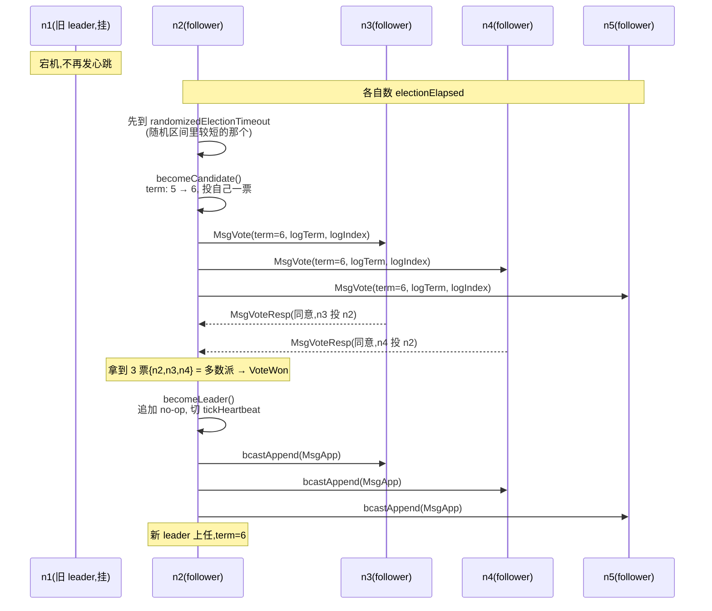
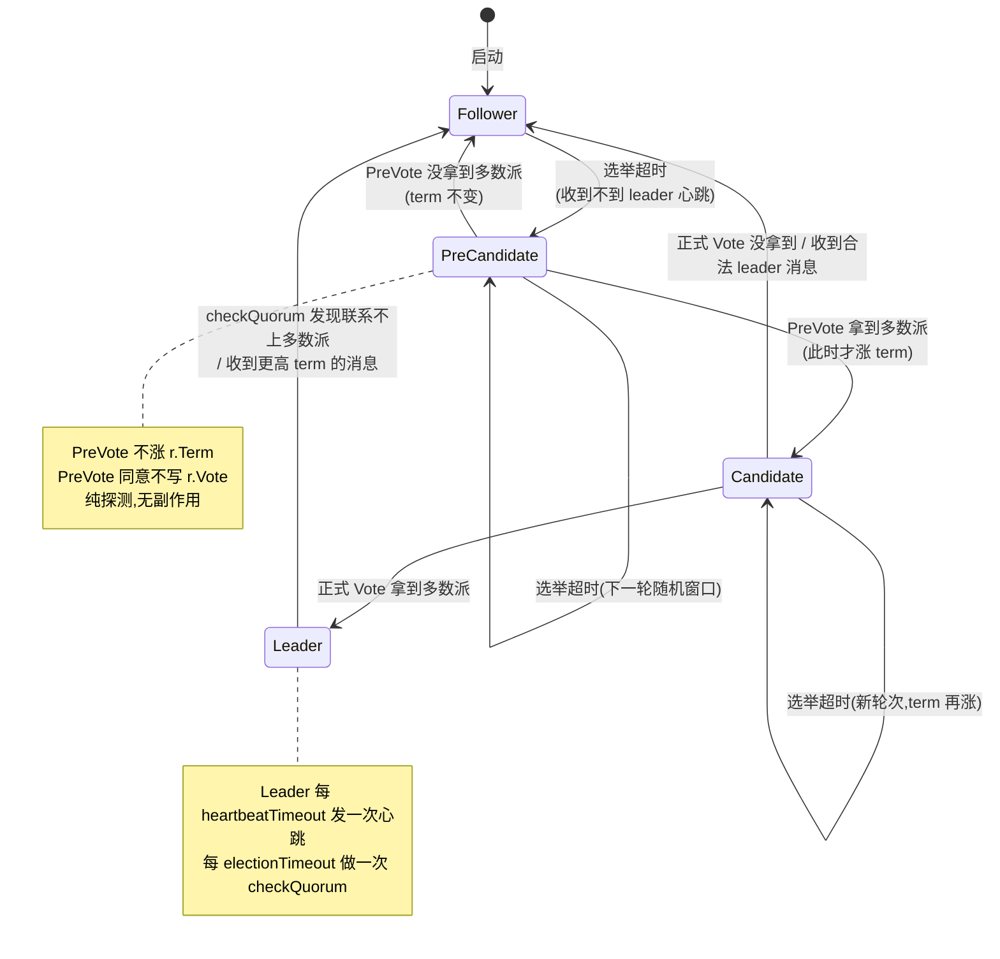

# 第三章 · Leader 选举

> 篇:P1 Raft 地基
> 主线呼应:上一章(P1-02)立起了三个角色(Follower/Candidate/Leader)、一个单调递增的 term,以及那条"一个 term 一个节点最多投一票"的根本不变式。但我们刻意留了两个空白——follower **什么时候**变成 candidate?candidate **怎么**把票拉到多数派?拉到了怎么变 leader?拉不到怎么办?这一章就把这两个空白填上,讲透一次完整的 leader 选举。同时,这一章还要回答两个真实的工程难题,它们不在 Raft 原始论文里、而是 etcd-raft 在生产中踩坑后补上的:**为什么选举超时要随机化**(防多个 follower 同时拉票分裂)?**PreVote(预投票)** 凭什么能防止网络分区里的孤岛节点用高 term 打断正常集群?再加一个 **checkQuorum**:leader 怎么主动确认自己还能联系多数派,避免一个已经被分区孤立的"幽灵 leader"继续接受写。这三件事都是协议层的命脉——读完后,你该能在脑子里放映出一次完整的选举全过程。

## 核心问题

**leader 挂了,集群怎么选出新 leader?为什么选举超时要随机化?PreVote 凭什么防分区里的孤岛节点用高 term 打断正常集群?checkQuorum 解决什么?**

读完本章你会明白:

1. 一次完整的选举流程:follower 怎么感知 leader 挂了(选举超时)→ 怎么变成 candidate → 怎么向其他节点拉票(`MsgVote`)→ 拉到多数派怎么当选 → 拉不到怎么降回 follower;leader 又怎么靠心跳(`MsgHeartbeat`)维持权威。
2. **为什么选举超时是随机化的**:固定超时会撞上"活锁"——多个 follower 同时超时、同时拉票、票数分裂反复选不出 leader;`etcd-raft` 用 `[electiontimeout, 2·electiontimeout − 1]` 的随机区间打散它们。
3. **PreVote 预投票**:etcd-raft 相对原版 Raft 论文最重要的工程增强之一。一个被分区的孤岛节点会反复自增 term 试探,恢复网络后,若无 PreVote,它会用"巨大 term"强制正常集群重新选举、打断在岗 leader;PreVote 用"不增 term 的预投票"先确认"自己能不能拿到多数派",拿到才真正涨 term 参选。
4. **checkQuorum**:leader 每个 electionTimeout 主动确认一次自己还能联系多数派,联系不上就自己降级——堵住"已被分区的幽灵 leader"继续接受写,和 PreVote 联手把分区扰动降到最低。

> **如果一读觉得太难**:先只记住三件事——① leader 靠定期心跳维持权威,follower 收不到心跳就超时变 candidate 发起选举;② 选举超时**随机化**,防止几个 follower 同时拉票导致票数分裂;③ **PreVote** 先发一轮不涨 term 的预投票探路,拿到多数派才真正参选,这样分区里的孤岛节点恢复后不会用高 term 打断在岗 leader。源码细节,等读完第 4 章(日志复制)再回来看 checkQuorum 那一节会更扎实。

---

## 3.1 一句话点破

> **Raft 的选举是一台"心跳驱动的状态机":leader 定期发心跳维权,follower 数心跳超时,超时就涨 term 变 candidate 拉票,拉到多数派就当 leader,拉不到就等下一轮随机超时再试。etcd-raft 在这套骨架上加了三件工程增强——随机化选举超时防活锁、PreVote 防分区扰动、checkQuorum 防幽灵 leader。三件事都不是 Raft 论文最初版的核心,而是生产里踩出来的补丁,但它们让 Raft 在真实网络里够稳。**

这是结论,不是理由。本章倒过来拆:先讲选举的"骨架"——心跳、超时、拉票、当选;再讲随机化超时为什么必须;然后钻进 PreVote 这条最容易被读者忽略、却最能体现 etcd-raft 工程功底的设计;最后讲 checkQuorum 和 PreVote 怎么联手。

---

## 3.2 选举骨架:心跳维权,超时拉票

先把 Raft 选举的最简骨架立起来,只看"正常情况下 leader 在岗、某天 leader 挂了、集群怎么选出新 leader"。这一节不碰随机化、不碰 PreVote,把主干走通。

### leader 靠心跳维持权威

Raft 把所有写都交给 leader(第 4 章详讲)。但 leader 不是"选一次就永远是 leader"——它必须**持续地向所有 follower 证明"我还活着"**,否则 follower 不知道 leader 是不是挂了。这个证明靠**心跳(heartbeat)**:leader 每隔一段固定时间(`heartbeatTimeout`),给每个 follower 发一条空的 `MsgHeartbeat` 消息。

> **打个比方**:leader 像值班长,每隔一会儿喊一声"我还在",大家就安心跟着;要是谁久久听不到这声喊,就猜"值班长可能挂了",自己准备接班。这个比喻点到为止,后面直球讲。

leader 每个 tick 数心跳计时器,到点了就广播心跳。这在源码里就是 `tickHeartbeat` —— 它是 leader 专属的 tick 函数(P1-02 的 2.7 节讲过,角色切换 = 换 `tick` 函数指针,`becomeLeader` 里那行 `r.tick = r.tickHeartbeat`):

```go
// etcd-raft/raft.go:861-889(leader 的 tick:数心跳 + checkQuorum)
func (r *raft) tickHeartbeat() {
    r.heartbeatElapsed++
    r.electionElapsed++

    if r.electionElapsed >= r.electionTimeout {
        r.electionElapsed = 0
        if r.checkQuorum {
            // 每过一个 electionTimeout,leader 主动确认一次多数派还在线
            if err := r.Step(&pb.Message{From: new(r.id), Type: pb.MsgCheckQuorum.Enum()}); err != nil {
                r.logger.Debugf("error occurred during checking sending heartbeat: %v", err)
            }
        }
        // ... leader transfer 相关,本章不展开
    }

    if r.state != StateLeader {
        return
    }

    if r.heartbeatElapsed >= r.heartbeatTimeout {
        r.heartbeatElapsed = 0
        // 到点了,发一条本地 MsgBeat,触发广播心跳
        if err := r.Step(&pb.Message{From: new(r.id), Type: pb.MsgBeat.Enum()}); err != nil {
            r.logger.Debugf("error occurred during checking sending heartbeat: %v", err)
        }
    }
}
```

注意一个微妙之处:**leader 也在数 `electionElapsed`**(`r.electionElapsed++`),而且每过一个 `electionTimeout` 就发一次 `MsgCheckQuorum`(如果开了 checkQuorum)。这是给 leader 自己用的"租约自检"——3.5 节详讲。

`MsgBeat` 是 leader 给自己发的本地消息(不走网络),`stepLeader` 收到它就调 `bcastHeartbeat` 广播给所有 follower:

```go
// etcd-raft/raft.go:1278-1280(stepLeader 处理 MsgBeat)
case pb.MsgBeat:
    r.bcastHeartbeat()
    return nil
```

`bcastHeartbeat`([raft.go:724-735](../etcd-raft/raft.go#L724-L735))遍历所有 follower,给每个发一条 `MsgHeartbeat`。follower 收到心跳(`stepFollower` 里 `case pb.MsgHeartbeat`),做三件事:**重置自己的选举计时器**(`r.electionElapsed = 0`,相当于"我刚听到值班长喊了一声,重新数")、**记下 leader 是谁**、**回一个 `MsgHeartbeatResp`**。这条心跳响应会被 leader 用来推进 commit(第 4 章讲),也会在 checkQuorum 里被用来标记"这个 follower 最近还活着"(3.5 节)。

```go
// etcd-raft/raft.go:1734-1737(follower 收到心跳)
case pb.MsgHeartbeat:
    r.electionElapsed = 0        // ← 重置选举计时器
    r.lead = m.GetFrom()         // ← 记下 leader
    r.handleHeartbeat(m)          // commitTo + 回 MsgHeartbeatResp
```

> **钉死这件事**:leader 的权威不是"选出来的合法性"(合法性靠多数派投票,下面讲),而是"持续的心跳"。follower 只要在选举超时窗口内收到过 leader 的任何合法消息(心跳、AppendEntries),就把选举计时器清零,继续当 follower;一旦超时窗口内没收到,就认定 leader 挂了,自己发起选举。这是 Raft 把"故障检测"和"故障恢复"焊在一起的关键设计——检测 leader 挂掉的方法,就是"尝试选个新的"。

### follower 怎么发起选举:选举超时 + MsgHup

follower 和 candidate 用的是 `tickElection`(P1-02 已见过),每个 tick 把选举计时器加一,超了随机阈值就给自己发一条本地 `MsgHup`,触发竞选:

```go
// etcd-raft/raft.go:849-859(follower/candidate 的 tick:数选举超时)
func (r *raft) tickElection() {
    r.electionElapsed++

    if r.promotable() && r.pastElectionTimeout() {
        r.electionElapsed = 0
        // 给自己发 MsgHup,触发竞选
        if err := r.Step(&pb.Message{From: new(r.id), Type: pb.MsgHup.Enum()}); err != nil {
            r.logger.Debugf("error occurred during election: %v", err)
        }
    }
}
```

`pastElectionTimeout`([raft.go:2049-2051](../etcd-raft/raft.go#L2049-L2051))就是 `r.electionElapsed >= r.randomizedElectionTimeout`——注意是**随机的**阈值 `randomizedElectionTimeout`,不是固定的 `electionTimeout`。这个随机化是 3.3 节的重点,先放一边。

`promotable`([raft.go:1946-1949](../etcd-raft/raft.go#L1946-L1949))用来过滤掉两类节点:**learner**(不是 voter,不能参选)和**还在加载 snapshot 的节点**。这俩都跳过竞选。

`MsgHup` 是本地消息(`isLocalMsg` 标记为 true,见 [util.go:31-41](../etcd-raft/util.go#L31-L41)),`Step` 的总入口收到它就调 `hup`(注意有个前置过滤:已经当 leader 的不再竞选,有未 apply 的配置变更的也不能竞选,否则成员变更会乱):

```go
// etcd-raft/raft.go:1189-1195(Step 分派 MsgHup)
case pb.MsgHup:
    if r.preVote {
        r.hup(campaignPreElection)   // 开了 PreVote,先走预投票
    } else {
        r.hup(campaignElection)      // 没开 PreVote,直接正式竞选
    }
```

注意这里 `r.preVote` 的分叉:**开了 PreVote 的集群,竞选走两阶段**(预投票 → 正式投票),3.4 节详讲;没开的走一阶段,这一节先把一阶段讲清。`hup` 做完过滤检查后调 `campaign`:

```go
// etcd-raft/raft.go:1025-1073(简化示意,只保留一阶段关键路径)
func (r *raft) campaign(t CampaignType) {
    // ...省略 PreVote 分支...
    r.becomeCandidate()              // ① 涨 term + 状态机切到 candidate + 投自己一票
    voteMsg := pb.MsgVote
    term := r.Term
    // ② 向每个 voter 发 MsgVote(带上自己最后一条日志的 term/index)
    for _, id := range ids {
        if id == r.id {
            // 自己那一票:给自己回一个 MsgVoteResp,稍后经 msgsAfterAppend 回送
            r.send(&pb.Message{To: new(id), Term: new(term), Type: pb.MsgVoteResp.Enum()})
            continue
        }
        last := r.raftLog.lastEntryID()
        r.send(&pb.Message{To: new(id), Term: new(term), Type: pb.MsgVote.Enum(),
            Index: new(last.index), LogTerm: new(last.term)})
    }
}
```

candidate 在 `becomeCandidate` 里涨 term、投自己一票(P1-02 已详讲),然后向所有 voter 发 `MsgVote` 拉票,带上自己**最后一条日志的 term 和 index**——这是给"选举限制"用的(P1-05 详讲:follower 投票前会判 candidate 的日志是不是至少和自己一样新,`isUpToDate`),本章只点一句"投票时还会比日志新旧",不展开。

> **钉死这件事**:`MsgVote` 里带的 `LogTerm`/`Index` 是 candidate 自己日志**最后一条** entry 的 term/index([`lastEntryID`](../etcd-raft/log.go#L378))。follower 收到 `MsgVote` 用这个和自己比:你的日志不能比我的旧,我才投。这条"选举限制"是 Raft safety 的另一块基石,但它属于第 5 章(安全性);本章只关注"选举流程",假设日志都够新。

### follower 怎么投票:幂等 + 一票(P1-02 已讲)

follower 收到 `MsgVote`,`Step` 的 `case pb.MsgVote, pb.MsgPreVote` 里做判定(P1-02 的 2.6 节详讲过):能投的条件是 `canVote`(投的就是你 / 这一届没投且没 leader / PreVote 特例),且 candidate 的日志够新(`isUpToDate`)。满足就回 `MsgVoteResp` 同意、并把 `r.Vote` 锁死;否则回 `MsgVoteResp` 拒绝。

```go
// etcd-raft/raft.go:1212-1262(节选,投票判定,P1-02 详讲过)
case pb.MsgVote, pb.MsgPreVote:
    canVote := r.Vote == m.GetFrom() ||
        (r.Vote == None && r.lead == None) ||
        (m.GetType() == pb.MsgPreVote && m.GetTerm() > r.Term)
    candLastID := entryID{term: m.GetLogTerm(), index: m.GetIndex()}
    if canVote && r.raftLog.isUpToDate(candLastID) {
        r.send(&pb.Message{To: m.From, Term: m.Term, Type: voteRespMsgType(m.GetType()).Enum()})
        if m.GetType() == pb.MsgVote {
            r.electionElapsed = 0
            r.Vote = m.GetFrom()    // ★ 只有真正的 MsgVote 才记录投票,PreVote 不记
        }
    } else {
        r.send(&pb.Message{To: m.From, Term: new(r.Term),
            Type: voteRespMsgType(m.GetType()).Enum(), Reject: new(true)})
    }
```

这里有一条本章要强调的关键——**只有真正的 `MsgVote` 才会写 `r.Vote` 和清 `electionElapsed`;`MsgPreVote` 不会**。这就是 PreVote 为什么"不消耗那一票"的源头,3.4 节会回到这里。

### candidate 收到票:多数派就当 leader

candidate 发完 `MsgVote`,等响应。响应回到 `stepCandidate`(candidate 和 PreCandidate 共用,靠 `myVoteRespType` 区分是哪种):

```go
// etcd-raft/raft.go:1671-1716(节选,candidate 处理投票响应)
func stepCandidate(r *raft, m *pb.Message) error {
    var myVoteRespType pb.MessageType
    if r.state == StatePreCandidate {
        myVoteRespType = pb.MsgPreVoteResp
    } else {
        myVoteRespType = pb.MsgVoteResp
    }
    switch m.GetType() {
    // ...
    case myVoteRespType:
        gr, rj, res := r.poll(m.GetFrom(), m.GetType(), !m.GetReject())  // 数票
        r.logger.Infof("%x has received %d %s votes and %d vote rejections", r.id, gr, m.GetType(), rj)
        switch res {
        case quorum.VoteWon:
            if r.state == StatePreCandidate {
                r.campaign(campaignElection)   // ★ PreVote 赢了,转正式竞选
            } else {
                r.becomeLeader()                // ★ 正式投票赢了,当 leader
                r.bcastAppend()
            }
        case quorum.VoteLost:
            r.becomeFollower(r.Term, None)     // 输了,降回 follower,等下轮
        }
    }
    return nil
}
```

`poll` 调 `ProgressTracker.RecordVote`(每个 voter 只记一次,幂等)+ `TallyVotes` 数出 `granted/rejected/result`。`result` 是个三态枚举(`quorum/quorum.go:51-57`):`VotePending`(还不够多数,也还没拒够,继续等)、`VoteWon`(同意票够了多数,赢)、`VoteLost`(拒绝票多到怎么也凑不齐多数,输)。这套三态判定和 P0-01 的"多数派数学"对齐——只要同意票达到 ⌊N/2⌋+1,就一定赢;拒绝票达到 N−⌊(N+1)/2⌋+1,就一定输。

赢了(`VoteWon`)就 `becomeLeader()`(P1-02 讲过:设 `r.lead = r.id`、切到 `stepLeader`/`tickHeartbeat`、追加一条 no-op 空 entry),然后 `bcastAppend` 把自己的日志(包括那条 no-op)立刻广播给所有 follower,让它们尽快追上。输了(`VoteLost`)就老老实实 `becomeFollower(r.Term, None)` 回去,等下一轮超时再试。

> **不这样会怎样**:为什么输了要立刻降回 follower?如果 candidate 憋着不降、继续等,它会一直停留在 candidate 状态,`tickElection` 继续数超时——超时了再涨 term 再拉一次票,循环往复,直到赢。这在功能上不算错,但会让 term 飙得很快,而且"输了"这个信号本该让它知道"现在不是我该上的时候"。`becomeFollower` 把状态翻篇,下一次选举它会从一个干净的 follower 身份重新参与(可能这次别人赢了,它就老老实实当 follower)。

### 一次完整选举的时序

把上面四步串起来,正常情况下的选举长这样(5 节点集群,leader 是 n1,n1 宕机):



注意 n3、n4、n5 三个 follower 各自也在数选举超时,但它们的随机阈值都比 n2 长,所以 n2 先超时、先发起竞选,n3/n4 收到 `MsgVote` 后把票投给 n2,自己的选举计时器会被这次"看到合法竞选活动"间接打断(投票时 `r.electionElapsed = 0`,见 [raft.go:1255](../etcd-raft/raft.go#L1255))。这就是"随机化 + 先到先得"如何避免大家一起拉票——下一节细讲。

---

## 3.3 随机化选举超时:凭什么防活锁

上一节刻意略过了 `pastElectionTimeout` 里的"随机"二字。现在专门讲它,这是 Raft 选举能跑起来的命脉之一。

### 不这样会怎样:固定超时 → 活锁

设想一个反事实:**如果所有 follower 的选举超时都是同一个固定值 `electionTimeout`**(不随机)。一个 5 节点集群,leader 宕机的瞬间,5 个 follower 的选举计时器都从 0 开始数(或大致同步),它们会**几乎同时**数到 `electionTimeout`,**几乎同时**变成 candidate,**几乎同时**涨 term,**几乎同时**向其他节点发 `MsgVote`。

然后呢?每个 candidate 都先投自己一票(`r.Vote = r.id`)。剩下 4 个节点里,谁也不偏袒谁,每个 candidate 大概率拿到 **2 票**(自己 + 一部分其他节点),没有任何一个能凑到多数派(5 节点要 3 票)。结果是:**所有 candidate 都赢不了,都 `VoteLost` 降回 follower**。

下一轮呢?它们的计时器又同时开始数,又同时到点,又同时拉票,又同时票数分裂……这就是**活锁(livelock)**:集群永远选不出 leader,完全无法提供服务。

> **不这样会怎样**:固定选举超时会让"同时发起竞选 → 票数分裂 → 全输 → 再同时发起"无限循环。集群可能数小时选不出 leader,等同不可用。这不是假想,是 Raft 论文 §5.2.1 明确指出的设计动机:"without randomized election timeouts, multiple servers could time out at the same time and split the vote."

### 所以这样设计:每个 follower 一个独立的随机窗口

Raft 的解法是给每个 follower 分配一个**独立的、随机的**选举超时。所有 follower 的随机超时都落在同一个区间 `[electionTimeout, 2·electionTimeout − 1]` 里,但具体哪个 tick 触发,各自独立。这样,几乎可以保证**只有一个 follower 会最先超时**,它先变成 candidate、先发 `MsgVote`,其他 follower 收到拉票请求时投票(投票时清零自己的选举计时器),于是"先到先得"——第一个发起的 candidate 大概率拿到多数派。

etcd-raft 里这个随机窗口是 `randomizedElectionTimeout` 字段([raft.go:418-421](../etcd-raft/raft.go#L418-L421)),在 `reset` 里被重新随机化(也就是每次状态切换、进入新 term,都会重新摇一个):

```go
// etcd-raft/raft.go:2049-2055
func (r *raft) pastElectionTimeout() bool {
    return r.electionElapsed >= r.randomizedElectionTimeout
}

func (r *raft) resetRandomizedElectionTimeout() {
    r.randomizedElectionTimeout = r.electionTimeout + globalRand.Intn(r.electionTimeout)
}
```

一行代码讲清:`randomizedElectionTimeout = electionTimeout + rand(0 .. electionTimeout-1)`,值域恰好是 `[electionTimeout, 2·electionTimeout − 1]`。比如 `electionTimeout = 10`,每个 follower 的实际超时是 10 到 19 之间一个随机整数。

> **钉死这件事**:为什么是 `[electionTimeout, 2·electionTimeout − 1]` 这个区间,不是 `[0, something]`?下界必须是 `electionTimeout` 而不是 0——因为 `electionTimeout` 是 Raft 对"网络往返 + 处理时间"的保守估计,leader 心跳到达 follower 需要时间,如果选举超时下界太短,follower 会在"心跳其实还在路上"时误判 leader 挂了,频繁触发不必要的选举。Raft 论文 §5.2.2 和 etcd-raft 的 [`Config` 注释](../etcd-raft/raft.go#L130-L135)都明确建议 `ElectionTick ≈ 10 · HeartbeatTick`,这样心跳有充裕时间到达,选举只在真正长时间收不到心跳时才触发。

随机数源是 `globalRand`,一个**加了锁**的 `lockedRand`(注意它底层用的是 `crypto/rand` 的 `rand.Int(rand.Reader, ...)`,不是 `math/rand`):

```go
// etcd-raft/raft.go:90-104
type lockedRand struct {
    mu sync.Mutex
}

func (r *lockedRand) Intn(n int) int {
    r.mu.Lock()
    v, _ := rand.Int(rand.Reader, big.NewInt(int64(n)))
    r.mu.Unlock()
    return int(v.Int64())
}

var globalRand = &lockedRand{}
```

> **钉死这件事(技巧)**:为什么 `globalRand` 要加锁?虽然 raft 状态机本身是单线程驱动的(P1-06 讲 Node 怎么把外部事件串行化进 `Step`),但 etcd-raft 这个库设计成可以被**多个独立的 raft 实例**(多个 raft group)在同一个进程里并发使用——这正是 Multi-Raft 系统(TiKV、CockroachDB)的用法。多个 raft 实例可能在不同 goroutine 里同时调 `resetRandomizedElectionTimeout`,共享一个 `globalRand`,所以必须加锁。这就是注释里说的 "synchronization among multiple raft groups"。另外用 `crypto/rand` 而非 `math/rand`,是为了避免 `math/rand` 在并发下重复 seed 导致不同节点拿到相同随机序列(那等于没随机化)——这条在分布式选举里是致命的,会重新陷入"同时超时"的活锁。

### 反面对比:固定超时 vs 随机超时

把两种情况放一起对比,随机化的价值就显形了:

| | 固定选举超时 | 随机选举超时 |
|---|---|---|
| 多个 follower 同时超时 | 几乎必然(时钟大致同步) | 概率极低(各自独立随机) |
| 同时变 candidate | 几乎必然 | 概率极低 |
| 票数分裂 | 频繁发生(每个 candidate 拿自己 + 部分票) | 几乎不发生(先超时的拿多数) |
| 活锁风险 | 高,集群可能长期选不出 leader | 极低,几轮内必出一个 leader |
| 单次选举耗时 | 不可预测(可能很久) | 大概率在 `[electionTimeout, 2·electionTimeout]` 内完成 |

> **钉死这件事**:随机化选举超时不是 Raft 论文 §5 的核心算法,**但它是 Raft 能在真实集群里活下来的命脉**。没有它,Raft 的选举会在时钟大致同步的真实机器上陷入活锁。etcd-raft 用 `crypto/rand` + 加锁 + `[electionTimeout, 2·electionTimeout−1]` 区间,把这件事做到了工程级稳妥。

---

## 3.4 PreVote:分区孤岛凭什么不打扰在岗 leader

这是本章最硬核的一节,也是 etcd-raft 相对原版 Raft 论文最重要的工程增强之一。很多读者读过 Raft 论文,却没注意到 etcd-raft 多出来的这一层——它解决了"网络分区里的孤岛节点恢复后,用巨大 term 打断正常集群"这个生产里真实存在的问题。

### 不这样会怎样:孤岛节点用高 term 扰民

设想一个 3 节点集群 `{n1, n2, n3}`,n1 是 leader,term=5,集群正常工作。现在网络分区,n3 被孤立(收不到 n1 的心跳,也发不出消息给 n1/n2)。

n3 收不到 n1 心跳,选举超时,变成 candidate,term 涨到 6,发起 `MsgVote`——但因为被分区,没人回它,n3 拿不到多数派。下一轮超时,n3 又涨 term 到 7,又拉票,又没人回。再下一轮 term=8……只要分区不恢复,n3 就一直在这里循环,把 term 一路飙到 9、10、100……

现在分区恢复了,n3 重新能和 n1/n2 通信。n3 的 term 已经是 100,远高于 n1 的 term=5。n3 一发起竞选(term=100 的 `MsgVote`),n1/n2 看到更高 term,会乖乖对齐 term(变 follower),整个集群被迫重新选举——**一个完全正常的在岗 leader(n1)被一个"自己其实根本选不上"的孤岛节点(n3,因为它没拿到多数派也照样不能当 leader)给打断了**。

更糟的是,这种打断会反复发生:只要 n3 又被分区一次、term 又飙高、又恢复,集群就被打断一次。生产网络里分区是常态(机器重启、网线抖动、机柜间链路抖动),这会让 etcd 集群频繁重新选举,可用性严重下降。

> **不这样会怎样**:没有 PreVote 时,一个**根本没机会当选**的孤岛节点,仅仅因为它在网络分区期间反复自增 term,就能在恢复网络后用"巨大 term"打断一个完全正常的 leader。这是 Raft 论文版的 Raft 在生产部署里一个公认的可用性痛点。问题的根源是:**"涨 term"这个动作太重了**——它会让所有看到更高 term 的节点降级,但"看到更高 term"本来是为了"承认有更新的合法 leader",可这个孤岛节点**根本不是合法 leader**(它连多数派都拿不到)。

### 所以这样设计:先预投票探路,不涨 term

etcd-raft 的解法是**在正式竞选前加一轮"预投票(PreVote)"**。预投票的关键设计有两条:

1. **预投票不涨 term**:candidate 进入 PreCandidate 状态、发 `MsgPreVote` 时,**不增加自己的 `r.Term`**,而是带着"如果我正式竞选,我的 term 会是 `r.Term+1`"这个**预期 term** 去问大家:"你们愿不愿意投我一票?"(候选 term 是未来时态)
2. **预投票不消耗那一票**:follower 收到 `MsgPreVote` 同意,只回一个 `MsgPreVoteResp`,**不修改自己的 `r.Vote`**(P1-02 讲的"一票"不变式只对正式 `MsgVote` 生效)。

这两条让 PreVote 变成一个**廉价的、无副作用的探测**:它在确认"自己有希望拿到多数派"之前,不改变任何持久化的状态(term、vote 都不动)。如果 PreVote 拿到多数派(说明集群里确实多数节点愿意投我),才真正涨 term 进入正式竞选(`MsgVote`);如果 PreVote 拿不到多数派(说明集群里有合法 leader 在岗、大家不愿意投我),就**原地待命**,term 不变,不扰民。

先看 `becomePreCandidate`,这是"不涨 term"那条规则在源码里的精确实现:

```go
// etcd-raft/raft.go:917-931
func (r *raft) becomePreCandidate() {
    if r.state == StateLeader {
        panic("invalid transition [leader -> pre-candidate]")
    }
    // Becoming a pre-candidate changes our step functions and state,
    // but doesn't change anything else. In particular it does not increase
    // r.Term or change r.Vote.
    r.step = stepCandidate          // 复用 stepCandidate(靠 myVoteRespType 区分)
    r.trk.ResetVotes()              // 清投票计数,准备数 PreVote 响应
    r.tick = r.tickElection
    r.lead = None
    r.state = StatePreCandidate
    r.logger.Infof("%x became pre-candidate at term %d", r.id, r.Term)  // ← 注意:term 没变!
}
```

注意那行注释——它**明文写着**"does not increase r.Term or change r.Vote"。对比 `becomeCandidate` 里的 `r.reset(r.Term + 1)` + `r.Vote = r.id`,PreCandidate **没调 `reset`,没涨 term,没投自己一票**。它只换了 step 函数指针、清了投票计数、设了状态。

再看 `campaign` 里的两阶段分叉:

```go
// etcd-raft/raft.go:1031-1042(campaign 的两阶段分叉)
var term uint64
var voteMsg pb.MessageType
if t == campaignPreElection {
    r.becomePreCandidate()
    voteMsg = pb.MsgPreVote
    // PreVote RPCs are sent for the next term before we've incremented r.Term.
    term = r.Term + 1                       // ★ 关键:带上"未来 term",但本地 r.Term 不变
} else {
    r.becomeCandidate()
    voteMsg = pb.MsgVote
    term = r.Term                            // 正式竞选:term 已在 becomeCandidate 里涨过
}
```

`MsgPreVote` 里带的 `term` 是 `r.Term + 1`(预期未来 term),但本地 `r.Term` 还是原值。candidate 把这个"未来 term"广播给所有 voter。

### follower 收到 MsgPreVote:能投但不动 Vote

follower 收到 `MsgPreVote`,走的是和 `MsgVote` 同一个 `case`(P1-02 的 2.6 节):

```go
// etcd-raft/raft.go:1212-1262(节选,见 P1-02 的完整分析)
case pb.MsgVote, pb.MsgPreVote:
    canVote := r.Vote == m.GetFrom() ||
        (r.Vote == None && r.lead == None) ||
        (m.GetType() == pb.MsgPreVote && m.GetTerm() > r.Term)   // ★ PreVote 特例:允许给"更高 future term"投票
    // ...
    if canVote && r.raftLog.isUpToDate(candLastID) {
        r.send(&pb.Message{To: m.From, Term: m.Term, Type: voteRespMsgType(m.GetType()).Enum()})
        if m.GetType() == pb.MsgVote {
            // ★ 只有 MsgVote 才动 Vote 和清 electionElapsed
            r.electionElapsed = 0
            r.Vote = m.GetFrom()
        }
        // MsgPreVote 的同意:不写 r.Vote,不清 electionElapsed
    } else {
        r.send(&pb.Message{To: m.From, Term: new(r.Term),
            Type: voteRespMsgType(m.GetType()).Enum(), Reject: new(true)})
    }
```

这里有个 PreVote 特例的细节:`canVote` 的第三个条件 `m.GetType() == pb.MsgPreVote && m.GetTerm() > r.Term`。为什么 PreVote 要这条?因为 `MsgPreVote` 带的 term 是 candidate 的"未来 term"(`r.Term+1`),可能比 follower 的当前 term 高。如果用前两条判定, follower 既没投过(`r.Vote == None` 可能成立),但要确保 `canVote` 对"future term 的 PreVote"放行——这条专门为 PreVote 加。

注意 follower 回复 `MsgPreVoteResp` 时,带的 term 是 `m.Term`(消息里的 term,也就是那个 future term),不是 `r.Term`:

```go
r.send(&pb.Message{To: m.From, Term: m.Term, Type: voteRespMsgType(m.GetType()).Enum()})
```

这点很关键——candidate 看到的响应 term 必须和它发的 PreVote term 一致,否则会被 `Step` 里 "term 不匹配" 的过滤逻辑误杀。源码注释写得很清楚([raft.go:1243-1252](../etcd-raft/raft.go#L1243-L1252)):"When responding to Msg{Pre,}Vote messages we include the term from the message, not the local term."

### Step 里:PreVote 不让接收方降级

前面讲的是 follower 怎么投 PreVote。现在讲一个更关键的点:**收到更高 term 的 `MsgPreVote`,接收方不会像收到更高 term 的其他消息那样"乖乖降级对齐 term"**。这是 PreVote 防扰民的另一面。

看 `Step` 开头处理"消息 term 比我高"的 switch:

```go
// etcd-raft/raft.go:1100-1131(节选)
case m.GetTerm() > r.Term:
    if m.GetType() == pb.MsgVote || m.GetType() == pb.MsgPreVote {
        // 检查"租约":如果在 lease 窗口内刚收到过合法 leader 的消息,
        // 拒绝响应更高 term 的拉票(包括 PreVote)——这是 checkQuorum + PreVote 的联手
        force := bytes.Equal(m.GetContext(), []byte(campaignTransfer))
        inLease := r.checkQuorum && r.lead != None && r.electionElapsed < r.electionTimeout
        if !force && inLease {
            // lease 没过期,直接忽略这条拉票(不分发,不降级)
            return nil
        }
    }
    switch {
    case m.GetType() == pb.MsgPreVote:
        // ★ 关键:PreVote 永远不会让我改变 term(注释原话:Never change our term in response to a PreVote)
    case m.GetType() == pb.MsgPreVoteResp && !m.GetReject():
        // PreVote 被同意,也不涨 term
    default:
        // 其余更高 term 的消息(AppendEntries、Heartbeat、普通 Vote 等):
        // 乖乖降级对齐 term(见 P1-02 的 term 单调性)
        if m.GetType() == pb.MsgApp || m.GetType() == pb.MsgHeartbeat || m.GetType() == pb.MsgSnap {
            r.becomeFollower(m.GetTerm(), m.GetFrom())
        } else {
            r.becomeFollower(m.GetTerm(), None)
        }
    }
```

注意第一个 `case m.GetType() == pb.MsgPreVote:` 的**函数体是空的**——它存在就是为了**"吃掉"这个 case,不让它走到 default 那个降级分支**。注释 "Never change our term in response to a PreVote" 把意图说得一清二楚。

> **钉死这件事**:PreVote 防扰民的核心机制是两条**"不动 term"** 的规则——① 发起方 `becomePreCandidate` 不涨自己的 `r.Term`;② 接收方收到更高 term 的 `MsgPreVote` 不对齐 term(default 分支被特例吃掉)。这两条联手,把"涨 term 的副作用"从 PreVote 里彻底剥离——预投票变成一次纯粹的"投票意愿探测",无论结果如何,集群的 term 水位都不会因此抬升。

### 两道关:预投票多数派 → 正式投票多数派

现在把整个 PreVote 流程串起来。candidate 走两道关:

**第一道关——PreVote**:`becomePreCandidate`(不涨 term)→ 发 `MsgPreVote`(带 future term)→ 收 `MsgPreVoteResp` → `poll` 数票。

- `VoteWon`(预投票拿到多数派):说明集群里多数节点愿意投我,有戏——**进入正式竞选**:`stepCandidate` 里 `case myVoteRespType` 检测到 `r.state == StatePreCandidate`,调 `r.campaign(campaignElection)`,这才会真正 `becomeCandidate`(涨 term + 投自己)并发 `MsgVote`。
- `VoteLost`(预投票被拒到凑不齐多数派):说明集群里有合法 leader 在岗,大家不愿意投我——**降回 follower**(`becomeFollower(r.Term, None)`,注意 term 没变,仍是原值)。

```go
// etcd-raft/raft.go:1696-1711(stepCandidate 的核心分叉)
case myVoteRespType:
    gr, rj, res := r.poll(m.GetFrom(), m.GetType(), !m.GetReject())
    switch res {
    case quorum.VoteWon:
        if r.state == StatePreCandidate {
            r.campaign(campaignElection)   // ★ PreVote 赢,转正式竞选(才涨 term)
        } else {
            r.becomeLeader()                // 正式投票赢,当 leader
            r.bcastAppend()
        }
    case quorum.VoteLost:
        r.becomeFollower(r.Term, None)     // 输了,降回 follower(PreVote 输了 term 不变)
    }
```

**第二道关——正式 Vote**:`becomeCandidate`(涨 term + 投自己)→ 发 `MsgVote` → 收 `MsgVoteResp` → `poll` 数票。

- `VoteWon`:`becomeLeader()`,当 leader。
- `VoteLost`:降回 follower。

> **钉死这件事**:PreVote 把一次竞选从"一道关"变成"两道关"——先预投票确认"有希望",再正式投票拿到合法 leader 身份。两道关都过,才真正涨 term、才真正当 leader。这个设计的关键不在于"多一道关",而在于**第一道关(PreVote)无 term 副作用**——预投票失败不会让集群 term 抬升,所以"试探性竞选"变得廉价、安全。

### PreVote 怎么解掉"孤岛节点扰民"

回到开头的场景:n3 被分区、反复超时、term 飙高(假设飙到 100)。现在恢复网络。

**没开 PreVote 时**:n3 直接发 term=100 的 `MsgVote`,n1/n2 看到更高 term,降级对齐,集群被迫重新选举——正常 leader 被打断。这是 3.4 开头讲的问题。

**开了 PreVote 时**:n3 走 PreVote 路径,`becomePreCandidate` **不涨 term**(它本地 term 还是 5,n3 在 PreVote 里带的 future term 是 6),发 term=6 的 `MsgPreVote`。关键来了——**n1、n2 此刻仍然能收到在岗 leader n1 的心跳,他们的"租约"还没过期**(`electionElapsed < electionTimeout`,因为他们每隔 heartbeatTimeout 就收到 n1 心跳,选举计时器一直被清零)。于是 n1/n2 在 `Step` 开头的 `inLease` 检查里**直接忽略** n3 的 `MsgPreVote`(那段 `if !force && inLease { return nil }`),既不投票也不降级。

n3 的 PreVote 拿不到多数派(只有自己一票),`VoteLost`,降回 follower,term **保持不变(还是 5)**。整个集群的 term 水位没有任何抬升,n1 继续稳稳当 leader——孤岛节点扰民的问题被彻底解掉。

etcd-raft 的测试 [`TestDisruptiveFollowerPreVote`](../etcd-raft/raft_test.go#L1896-L1946) 精确地验证了这个场景:把 n3 隔离、让它反复超时(没有 PreVote 时它会涨 term),然后 `nt.recover()` 恢复网络,给 n3 发 `MsgHup` 触发竞选。断言 `n1.state == StateLeader`(n1 仍是 leader)、`n1.Term == 2`(term 没被 n3 抬升)、`n3.state == StatePreCandidate`(n3 卡在预投票阶段,没拿到多数派)。对比同文件的 [`TestDisruptiveFollower`](../etcd-raft/raft_test.go#L1818-L1894)(**没开** PreVote 的对照组):同样的场景,n3 的 term 飙到 3、n1 被 n3 的 `MsgAppResp`(更高 term)打断降到 follower——两个测试合起来,完整地对比了"有/无 PreVote"的差别。

### PreVote 不是免费的:多一轮往返

PreVote 这么好,为什么不让它默认开?它有一个代价:**每次竞选多一轮网络往返**。正常竞选从"超时 → 发 Vote → 收响应 → 当 leader"是一轮;开了 PreVote 变成"超时 → 发 PreVote → 收响应 → 发 Vote → 收响应 → 当 leader"两轮,leader 切换的延迟翻倍。

但对 etcd 这种"可用性 > 切换速度"的系统,多一轮往返换来"网络抖动不打扰在岗 leader",是绝对值得的——一次 leader 切换本身就要重新复制日志、客户端要重路由,代价远大于多一轮 PreVote 的几百毫秒。所以 etcd 默认开启 PreVote(在 etcdserver 的 raft 配置里 `preVote = true`)。

> **反面对比**:如果朴素地"为了快"不开 PreVote——每一次网络抖动、每一次某个节点的瞬时孤立,都可能引发一次"巨大 term 打断在岗 leader"的事件。生产环境里这种抖动一天能发生好几次,etcd 集群会频繁重新选举,客户端感知到的是周期性的"短暂不可用"。PreVote 用一轮额外往返,把这种扰动降到接近零。这是 etcd-raft 团队在生产里踩出来的补丁,后来也回写进了 Raft 论文的 extended 版本(§6)和 PhD 论文(Ongaro)。

> **钉死这件事**:PreVote 是 etcd-raft 相对原版 Raft 论文最重要的工程增强之一。它的本质是**把"涨 term"和"探测多数派意愿"解耦**——探测廉价(不动 term),涨 term 才昂贵(动了 term 就要让别人降级)。Raft 论文版把这两件事焊在一起(一拉票就涨 term),etcd-raft 拆成两阶段,从此"网络抖动扰民"成了历史。和 3.5 节的 checkQuorum 联手,etcd-raft 的选举抗扰动能力远超论文版。

---

## 3.5 checkQuorum:leader 主动确认多数派还活着

PreVote 解决了"follower 侧的孤岛扰民",但还有个对称的问题:**leader 侧的幽灵 leader**。

### 不这样会怎样:幽灵 leader 继续接受写

设想 3 节点集群 `{n1, n2, n3}`,n1 是 leader。网络分区,n1 自己一组,n2/n3 一组。n1 还以为自己是 leader,继续接受客户端的写——但它现在凑不到多数派(自己只有 1 票,复制不出去),写永远 commit 不掉,客户端一直等到超时。

更糟的情况:如果 n1 用的是 **lease-based read**(第 9 章讲,leader 凭租约直接返回读结果、不等多数派),它会在已经被分区、根本不再是合法 leader 的情况下,**继续返回陈旧甚至错误的数据**——这就是 lease read 的"租约过期风险"。

n2/n3 那一组会选出一个新 leader(它们占多数派),于是出现"两个 leader 并存"的窗口:旧 leader n1(已被分区,但自己不知道)和合法新 leader(在 n2/n3 那组)。虽然旧 leader 的写不可能 commit(凑不到多数派),但它接受写、对客户端报错、对 lease read 返回陈旧数据,都会造成可用性问题。

> **不这样会怎样**:没有 checkQuorum 时,被分区的旧 leader 不会主动发现自己已经被孤立,继续以 leader 身份接受请求(写凑不到多数派卡住、lease read 返回陈旧数据),直到它自己选举超时——但 leader 不数选举超时(它数心跳!),所以它可能很久才发现自己不是 leader 了。这段窗口里,客户端会被误导。

### 所以这样设计:leader 每个 electionTimeout 自检一次

checkQuorum 让 leader **主动**定期确认"我还能联系到多数派"。具体做法是 leader 在 `tickHeartbeat` 里每过一个 `electionTimeout`,给自己发一条本地 `MsgCheckQuorum`([raft.go:866-872](../etcd-raft/raft.go#L866-L872)),`stepLeader` 收到它就调 `QuorumActive()`:

```go
// etcd-raft/raft.go:1281-1293(stepLeader 处理 MsgCheckQuorum)
case pb.MsgCheckQuorum:
    if !r.trk.QuorumActive() {
        // 联系不上多数派,leader 自己降级成 follower
        r.logger.Warningf("%x stepped down to follower since quorum is not active", r.id)
        r.becomeFollower(r.Term, None)
    }
    // 把所有 follower 标记为"最近不活跃",等下次心跳响应来翻盘
    r.trk.Visit(func(id uint64, pr *tracker.Progress) {
        if id != r.id {
            pr.RecentActive = false
        }
    })
    return nil
```

`QuorumActive()`([tracker/tracker.go:208-218](../etcd-raft/tracker/tracker.go#L208-L218))怎么判断?它看每个 voter 的 `RecentActive` 标志——这个标志在 leader 收到该 follower 的心跳响应(`MsgHeartbeatResp`)或 AppendEntries 响应时被置为 true(详见第 4 章的 ProgressTracker)。每次 checkQuorum 先检查,再把所有 follower 的 `RecentActive` 清零,**下一个 electionTimeout 内有响应的会被重新置 true,没响应的保持 false**。

```go
// etcd-raft/tracker/tracker.go:208-218
func (p *ProgressTracker) QuorumActive() bool {
    votes := map[uint64]bool{}
    p.Visit(func(id uint64, pr *tracker.Progress) {
        if pr.IsLearner {
            return
        }
        votes[id] = pr.RecentActive
    })
    return p.Voters.VoteResult(votes) == quorum.VoteWon
}
```

这其实就是一次"小的多数派投票":把"最近还能联系上"当成 yes 票,数多数派。够多数派就继续当 leader,不够就自己降级。

> **钉死这件事**:checkQuorum 解决的是**leader 侧的故障检测**——和 follower 侧的选举超时(follower 收不到心跳就认为 leader 挂了)对称。两者联手,让 Raft 集群能在双向网络分区时**两边都正确降级**:被孤立的旧 leader 主动降级(checkQuorum 发现凑不齐多数派),多数派那边选出新 leader。这避免了"幽灵 leader"窗口。

### checkQuorum 和 PreVote 必须一起用

这两个机制是**配对设计**的,源码里很多地方都假设 `checkQuorum` 和 `preVote` 同时开。最明显的就是 `Step` 里那段 `inLease` 检查(P1-03 3.4 节引用过):

```go
// etcd-raft/raft.go:1102-1112(节选)
force := bytes.Equal(m.GetContext(), []byte(campaignTransfer))
inLease := r.checkQuorum && r.lead != None && r.electionElapsed < r.electionTimeout
if !force && inLease {
    // lease 没过期,忽略更高 term 的拉票
    return nil
}
```

`inLease` 条件里有 `r.checkQuorum`——只有开了 checkQuorum,follower 才会信任"electionElapsed < electionTimeout 时我的 leader 一定还活着",才会拒绝响应 PreVote。这是 checkQuorum 给 PreVote 提供的"租约"基础:checkQuorum 保证 leader 会在 electionTimeout 内自检、降级,所以 follower 在 electionTimeout 内收到的 leader 心跳一定来自合法 leader(不是幽灵 leader),它可以放心拒绝 PreVote。

> **钉死这件事**:checkQuorum 是 PreVote 能正确工作的前提——没有 checkQuorum,被孤立的旧 leader 会一直以为自己是 leader,继续发心跳,follower 无法靠"我刚收到心跳"判定 leader 是否合法,PreVote 的 `inLease` 检查就不可信。所以 etcd 默认 `checkQuorum = true` 且 `preVote = true`,两个一起开。这也是 [`Config`](../etcd-raft/raft.go#L125-L200) 里这两个字段总是一起出现的原因。

---

## 3.6 选举的全景状态图

把前面几节的状态转换画成一张完整的状态图(开 PreVote + checkQuorum 的情况,即 etcd 默认配置):



这张图比 P1-02 那张(三角色)多了 PreCandidate 这第四个状态,以及 leader 通过 checkQuorum 主动降级的那条边。这是 etcd-raft 在 Raft 论文基础上的工程扩展。

---

## 技巧精解:随机化选举超时 + PreVote 两道关

这一章最硬核的两个技巧,配源码和反面对比,单独拆透。

### 技巧一:随机化选举超时防活锁

**问题**:多个 follower 时钟大致同步,固定选举超时会让它们同时超时、同时拉票、票数分裂,反复选不出 leader(活锁)。

**手段**:`resetRandomizedElectionTimeout` 给每个 follower 在 `[electionTimeout, 2·electionTimeout − 1]` 区间内独立摇一个随机阈值。

```go
// etcd-raft/raft.go:2053-2055
func (r *raft) resetRandomizedElectionTimeout() {
    r.randomizedElectionTimeout = r.electionTimeout + globalRand.Intn(r.electionTimeout)
}
```

这个随机值在 `reset` 里(也就是每次状态切换、进入新 term)被重新摇一次([raft.go:790](../etcd-raft/raft.go#L790)),保证每一轮选举的窗口都不同。

**为什么妙**:三个细节让这个看似简单的设计在工程上极稳——

1. **下界是 `electionTimeout`,不是 0**:保证心跳有充裕时间到达,follower 不会在"心跳还在路上"时误判 leader 挂了。Raft 论文 §5.4.2 论证了 broadcastTime ≪ electionTimeout ≪ MTBF 这个比例关系。
2. **用 `crypto/rand` 而非 `math/rand`**:`math/rand` 默认 seed 是 1,且在并发下不安全;如果两个节点用相同 seed 摇出相同序列,等于没随机化。`crypto/rand` 用系统熵,保证每个节点拿到的序列独立不可预测。这看起来是细节,实则是分布式选举能不能真"打散"的命脉。
3. **`lockedRand` 加锁支持 Multi-Raft**:这个库被设计成支持一个进程里跑多个 raft 实例(TiKV/CockroachDB 用法),多个 raft 实例可能并发调 `resetRandomizedElectionTimeout`,共享的 `globalRand` 必须加锁。

**反面对比**:固定超时 → 活锁;`math/rand` 无锁 → 多 raft group 并发下可能重复序列,等于没随机化;下界 = 0 → 心跳延迟就误触发选举,集群动荡。三件朴素的事,每件都有具体的坑,etcd-raft 都堵上了。

### 技巧二:PreVote 两道关,把"涨 term"和"探测意愿"解耦

**问题**:Raft 论文版的竞选把"涨 term"和"拉票"焊在一起——candidate 一发起竞选就涨 term,这会让所有看到更高 term 的节点降级。但一个被分区的孤岛节点根本没机会当选(它凑不到多数派),它仅仅因为反复超时自增 term,就能在恢复网络后用"巨大 term"打断在岗 leader。

**手段**:PreVote 把竞选拆成两阶段——

- **第一阶段(PreVote)**:`becomePreCandidate` 不涨 `r.Term`,不写 `r.Vote`,发 `MsgPreVote` 带"未来 term"(`r.Term+1`)。follower 同意只回 `MsgPreVoteResp`,不动自己的 `r.Vote` 和 `electionElapsed`。接收方收到更高 term 的 `MsgPreVote` 不对齐 term(`Step` 里 default 分支被特例吃掉)。
- **第二阶段(正式 Vote)**:只有 PreVote 拿到多数派,才 `campaign(campaignElection)` 真正 `becomeCandidate`(此时才涨 term + 投自己 + 发 `MsgVote`)。

两道关的衔接在 `stepCandidate`:

```go
// etcd-raft/raft.go:1696-1711
case myVoteRespType:
    gr, rj, res := r.poll(m.GetFrom(), m.GetType(), !m.GetReject())
    switch res {
    case quorum.VoteWon:
        if r.state == StatePreCandidate {
            r.campaign(campaignElection)   // 第一关赢,转第二关(才涨 term)
        } else {
            r.becomeLeader()                // 第二关赢,当 leader
            r.bcastAppend()
        }
    case quorum.VoteLost:
        r.becomeFollower(r.Term, None)     // 任一关输,降回 follower
    }
```

**为什么妙**:妙在**把"昂贵动作"和"廉价探测"分离**。"涨 term"是昂贵的——它会让所有看到更高 term 的节点降级,有扰民副作用;"探测多数派意愿"本身是廉价的——它不该有任何副作用。Raft 论文版把两者焊在一起,导致"探测"也变昂贵;etcd-raft 拆开,让"探测"可以随意做(失败了集群 term 不变,无副作用),只有"探测成功"才付出"涨 term"的代价。

这个"分离昂贵动作和廉价探测"的思路是工程上极通用的模式,类似的两阶段思想在很多地方出现——数据库的 2PC(prepare 阶段先探测,commit 阶段才落地)、乐观锁(先 CAS 试探,CAS 成功才落地)、租约协议(pre-claim 再 claim)。Raft 的 PreVote 是它在共识协议里的体现。

**反面对比**:不开 PreVote 的场景,3.4 节开头讲过——孤岛节点恢复后用巨大 term 打断在岗 leader,生产里频繁触发。etcd-raft 的 [`TestDisruptiveFollower`](../etcd-raft/raft_test.go#L1818-L1894)(无 PreVote)vs [`TestDisruptiveFollowerPreVote`](../etcd-raft/raft_test.go#L1896-L1946)(有 PreVote)两个对照测试,把"有/无 PreVote"的差别用代码钉死——同一个网络分区场景,前者让正常 leader 被打断、term 飙升,后者让集群纹丝不动。这是 etcd-raft 团队用测试把这条设计意图固化下来的工程严谨之处。

---

## 章末小结

这一章把 leader 选举讲透了:从最简骨架(心跳维权、超时拉票、多数派当选),到随机化选举超时(防活锁),再到 PreVote(防分区孤岛扰民)和 checkQuorum(防幽灵 leader)。Raft 论文版只有第一层骨架,后三层都是 etcd-raft 在生产里踩坑后补上的工程增强,它们让 Raft 在真实网络里够稳。

回到全书二分法:这一章讲的全是**协议层**——`etcd-raft/raft.go` 里的状态机逻辑,完全不碰磁盘、不碰网络。PreVote 和 checkQuorum 是协议层的状态扩展,它们的副作用(发什么消息、改什么字段)都在协议状态机内部,具体怎么把消息送上网、怎么持久化 term,是应用层(P1-06 讲 Node、P5-17 讲 WAL)的事。

### 五个"为什么"清单

1. **为什么 leader 要定期发心跳?** 因为 follower 需要一种方式判断"leader 还活着"。心跳是 leader 持续证明自己还在岗的方式,follower 在选举超时窗口内收到心跳就清零计时器,收不到就认定 leader 挂了发起竞选。故障检测和故障恢复在 Raft 里是焊在一起的。
2. **为什么选举超时要随机化?** 固定超时会让时钟大致同步的多个 follower 同时超时、同时拉票、票数分裂,反复选不出 leader(活锁)。随机化让"谁先超时"近似独立,先超时的 candidate 大概率拿到多数派。区间 `[electionTimeout, 2·electionTimeout − 1]` 保证下界不短到误判、上界不长到拖延。
3. **为什么 PreVote 不涨 term?** 涨 term 有副作用——它会让所有看到更高 term 的节点降级。孤岛节点根本选不上(凑不到多数派),不该让它的"试探"抬升集群 term。把"涨 term"推迟到"拿到 PreVote 多数派"之后,就剥离了探测的副作用,让网络分区里的孤岛恢复后不打扰在岗 leader。
4. **为什么 PreVote 要和 checkQuorum 一起用?** checkQuorum 保证 leader 会在 electionTimeout 内自检降级,所以 follower 在 electionTimeout 内收到的 leader 心跳一定来自合法 leader(不是幽灵 leader),它可以放心拒绝响应 PreVote 的 `inLease` 检查才有意义。两者配对,双向网络分区时两边都正确降级。
5. **为什么 candidate 输了要立刻降回 follower?** 输了说明"现在不是我该上的时候"。降回 follower 把状态翻篇,下一次选举从干净身份重新参与。不降的话会一直停留在 candidate 状态、term 飙快、且可能错过给合法新 leader 投票的窗口。

### 想继续深入往哪钻

- **源码**:重读 [`etcd-raft/raft.go`](../etcd-raft/raft.go) 的 `tickElection`(849-859)/`tickHeartbeat`(861-889)、`becomePreCandidate`(917-931)/`becomeCandidate`(902-915)、`campaign`(1025-1073)、`Step` 里 PreVote 的特例分支(1100-1186)、`stepCandidate`(1671-1716)。把 PreVote 的"不涨 term"这条规则在源码里的三处体现(becomePreCandidate 不 reset、Step 里 case 吃掉降级、投票判定里 PreVote 不写 Vote)都跟一遍,你就懂了 PreVote。
- **测试**:[`raft_test.go`](../etcd-raft/raft_test.go) 的 `TestDisruptiveFollower`(1818)和 `TestDisruptiveFollowerPreVote`(1896)是一对对照测试,精确展示"有/无 PreVote"的差别。还有 `TestPreVoteWithSplitVote`(3479)、`TestPreVoteWithCheckQuorum`(3532)、`TestPreVoteMigrationWithFreeStuckPreCandidate`(3672),覆盖了 PreVote 的各种边界情况。
- **Raft 论文**:§5.2(leader election)、§5.4.2(election timeout 的比例约束 broadcastTime ≪ electionTimeout ≪ MTBF)、§6(Figure 15 讨论 PreVote,这是 extended 版本补的)。原版 §5 不包含 PreVote,PreVote 是 Ongaro 的 PhD 论文(§9.4)和后续论文补的,etcd-raft 是最早一批把它工程化的实现。
- **延伸**:对比 Zookeeper ZAB 的 "fast leader election"(也是随机化超时,但协议细节不同)、Paxos 的 "proposal number"(没有 PreVote 概念,但 prepare 阶段类似"探测")。Multi-Raft 系统(TiKV/CockroachDB)在每个 raft group 独立跑选举,`globalRand` 加锁就是为了支持它们。

### 引出下一章

选举讲完了,集群里现在有了合法 leader。但 leader 只是"被授权",它还**没干任何实事**——没复制任何日志、没 commit 任何 entry。Raft 真正的"活"从 leader 开始复制日志那一刻才开始。下一章 P1-04,我们钻进**日志复制与 commit**:leader 怎么用 `AppendEntries` 把一条日志复制到多数派、怎么靠 log matching property(prevLogIndex/term 匹配才追加)保证日志一致、怎么推进 commitIndex——以及那个 Raft 最著名的陷阱"Figure 8":为什么**只能 commit 当前 term 的 entry**,commit 旧 term 的 entry 会丢已提交数据。
