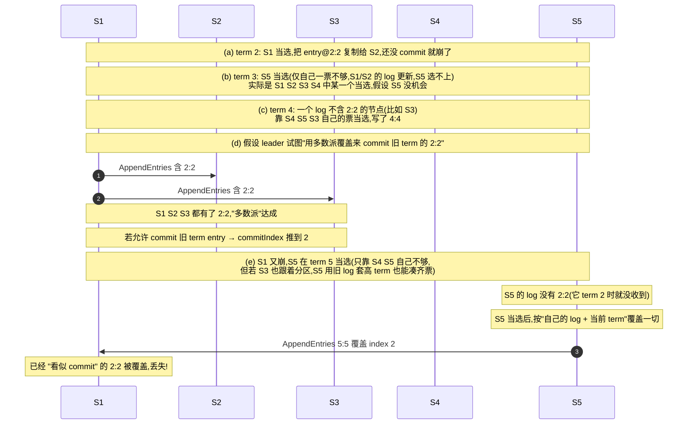
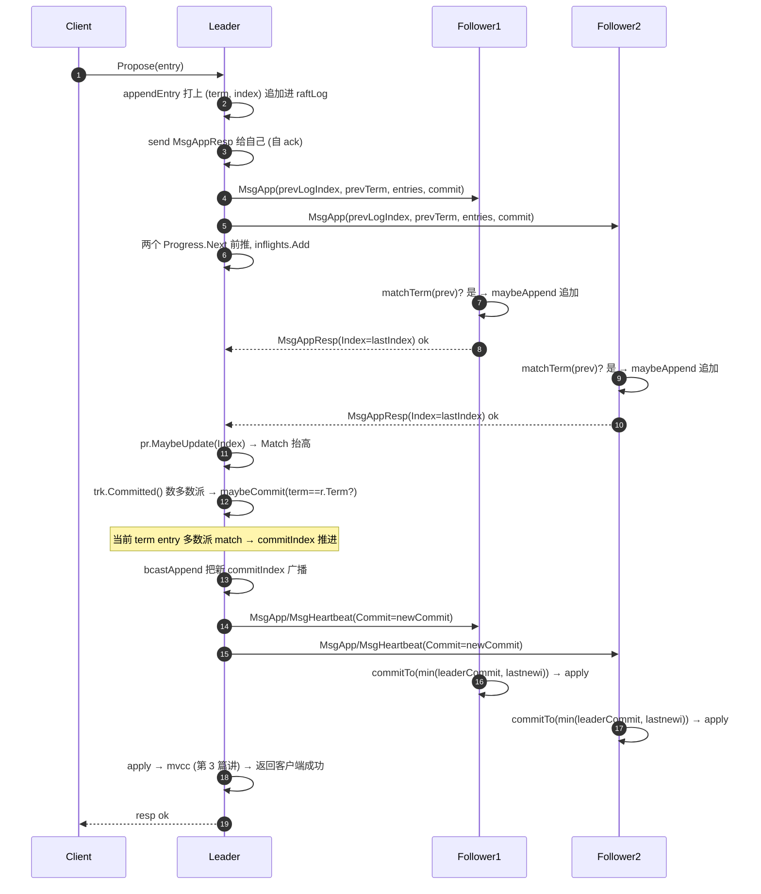

# 第四章 · 日志复制与 commit

> 篇:P1 Raft 地基
> 主线呼应:上一章选出 leader 之后,集群有了唯一的写入口。但 leader 自己记下的日志,只活在一个节点的内存里——只要多数派还没确认,这条日志就随时可能被推翻。所以 leader 的下一件事,就是把日志复制给 follower,**等多数派确认了,才允许 commit**。这一章讲的就是这条复制之旅:leader 怎么发 `AppendEntries`、follower 怎么用 prevLogIndex/term 做日志匹配、`commitIndex` 凭什么往前推、为什么 Raft 偏偏**只允许 commit 当前 term 的 entry**(Figure 8 陷阱),以及 leader 用什么数据结构追踪每个 follower 的复制进度。本章全部落在**协议层**——`etcd-raft` 仓,不碰磁盘,不碰网络。

## 核心问题

**leader 怎么把一条日志复制给 follower?凭什么保证各节点日志一致(log matching)?`commitIndex` 怎么推进?为什么只能 commit 当前 term 的 entry?leader 怎么追踪每个 follower 的复制进度,又不被慢 follower 拖垮?**

读完本章你会明白:

1. **AppendEntries 的两段式结构**(prevLogIndex/prevTerm + entries),和它凭什么保证"log matching property":两段日志在某个 index 上 term 相同,则此前所有 entry 都相同。
2. **commitIndex 推进的真正条件**:**多数派的 follower 都 match 到某个 index** 还不够,leader 还要再确认"这个 index 的 entry 必须是**当前 term** 写的"——这是 Figure 8 给出的硬约束。
3. **Figure 8 陷阱**:为什么 leader 试图 commit 旧 term 的 entry 会导致已"看似提交"的数据丢失,配 5 节点反例时序。
4. **ProgressTracker + inflights 环形缓冲**:leader 给每个 follower 维护一个 `Progress`(Match/Next/State),再用一个环形缓冲 `inflights` 控制"已发但未确认"的流水线窗口,防对慢 follower 发飞了把内存/带宽打爆。

> **如果一读觉得太难**:先只记住三件事——① follower 只在 prevLogIndex/term 匹配时才追加日志,这是日志一致的根;② commit 只认当前 term 的 entry,这是 Raft 最微妙的安全点(Figure 8);③ leader 给每个 follower 维护 Match 和一个 inflights 环,环满就停发。

---

## 4.1 一句话点破

> **leader 把 entry 追加进自己的日志,再用 `AppendEntries(prevLogIndex, prevTerm, entries, commit)` 发给 follower;follower 拿 prevLogIndex/term 去和自己的日志比对,匹配才追加,不匹配就拒绝——这条"两段式握手"就是 log matching 的全部。leader 数多数派的 Match 推进 commitIndex,但只认当前 term 的 entry(Figure 8);每个 follower 的 Match/Next 由 ProgressTracker 追踪,inflights 环形缓冲限制在途消息数,慢 follower 不会拖垮 leader。**

这是结论,不是理由。本章倒过来拆:先看 leader 怎么把日志发出去、follower 怎么用 prevLogIndex 做"日志一致性握手";再看 commit 怎么推进,以及那个反直觉的 Figure 8 约束;最后看 ProgressTracker 和 inflights 怎么让 leader 在一堆快慢不一的 follower 中间从容分发。

---

## 4.2 复制的起点:leader 先把 entry 写进自己的日志

在讲"怎么复制"之前,先看清"复制什么"。一条客户端写请求(后面章节会讲它怎么从 gRPC 一路变成 raft entry)到了 leader,leader 调 [`appendEntry`](../etcd-raft/raft.go#L812-L847) 把它追加进自己的 `raftLog`:

```go
// etcd-raft/raft.go:812 (简化示意,保留核心步骤)
func (r *raft) appendEntry(es ...*pb.Entry) (accepted bool) {
    li := r.raftLog.lastIndex()
    cloned := make([]*pb.Entry, len(es))
    for i := range es {
        cloned[i] = proto.Clone(es[i]).(*pb.Entry)
        cloned[i].Term = new(r.Term)              // ① 打上当前 term
        cloned[i].Index = new(li + 1 + uint64(i)) // ② 分配连续 index
    }
    if !r.increaseUncommittedSize(cloned) {       // ③ 超过 uncommitted 上限就丢弃
        return false
    }
    li = r.raftLog.append(cloned...)              // ④ 追加进自己的日志
    // ⑤ leader 不给自己发 MsgApp,而是用一个发往自己的 MsgAppResp 自 ack
    r.send(&pb.Message{To: new(r.id), Type: pb.MsgAppResp.Enum(), Index: new(li)})
    return true
}
```

注意三个细节,它们后面都会回来:

- **entry 打上 term + index**:`(term, index)` 是每条 entry 的全局唯一身份证。后面 log matching 就靠它。
- **uncommitted 上限**:`increaseUncommittedSize` 把还没 commit 的 entry 总字节记账,超过 `maxUncommittedSize` 直接丢弃 propose。这是 leader 侧的另一道背压(除了 inflights),防止 apply 慢时 entry 堆积成山。
- **leader 自 ack**:`r.send` 一条 `To: r.id` 的 `MsgAppResp`,这是 leader 在告诉自己"我自己的副本已经 match 到 li 了"。后面数多数派时,leader 自己那一票是天然在的。

> **不这样会怎样**:如果 leader 不自 ack,数多数派时就漏掉自己,5 节点得等 3 个 follower 全确认才算多数派——明明 leader 自己就有这一条日志。自 ack 把"leader 的副本"自然地计入多数派,3 节点只要 1 个 follower 确认 + leader 自己就够。

`appendEntry` 之后,这条 entry 进了 leader 的 `raftLog.unstable`(没持久化的部分,第 5 章细讲)。接下来才是"复制"——把它发给 follower。

---

## 4.3 AppendEntries:两段式握手与 log matching

### 4.3.1 leader 发什么:maybeSendAppend

leader 给某个 follower 发 append,走 [`maybeSendAppend`](../etcd-raft/raft.go#L618-L662)。这个函数读 follower 的 `Progress.Next`(下一条该发的 index),据此拼出 prevLogIndex/prevTerm 和要发的 entries:

```go
// etcd-raft/raft.go:618 (简化示意)
func (r *raft) maybeSendAppend(to uint64, sendIfEmpty bool) bool {
    pr := r.trk.Progress[to]
    if pr.IsPaused() {                  // ① follower 被暂停(窗口满/probe 中)就不发
        return false
    }
    prevIndex := pr.Next - 1            // ② 上一条已发的 index
    prevTerm, err := r.raftLog.term(prevIndex)
    if err != nil {
        return r.maybeSendSnapshot(to, pr)   // ③ prevIndex 已被压缩,发 snapshot
    }
    var ents []*pb.Entry
    if pr.State != tracker.StateReplicate || !pr.Inflights.Full() {
        ents, err = r.raftLog.entries(pr.Next, r.maxMsgSize)   // ④ 从 Next 开始切一批
    }
    // ...
    r.send(&pb.Message{
        To: new(to), Type: pb.MsgApp.Enum(),
        Index:   new(prevIndex),   // ← prevLogIndex
        LogTerm: new(prevTerm),    // ← prevLogTerm
        Entries: ents,             // ← 要复制的新 entry
        Commit:  new(r.raftLog.committed),  // ← leader 当前 commitIndex
    })
    pr.SentEntries(len(ents), uint64(payloadsSize(ents)))   // ⑤ 更新 Next + inflights
    return true
}
```

一条 `MsgApp` 的载荷,就是 Raft 论文里 `AppendEntries` 的全部字段:`(term, prevLogIndex, prevLogTerm, entries[], leaderCommit)`。注意 `Index`/`LogTerm` 这两个字段名是协议层消息的字段名,语义上就是 Raft 论文里的 prevLogIndex/prevLogTerm。

> **钉死这件事**:prevLogIndex/prevTerm 不是"上一条 leader 发的 entry",而是"**leader 认为 follower 应该已经有的最后一条 entry**"——也就是 `pr.Next - 1`。leader 用 Next 这个游标来表达"我觉得你已经收到这了"。follower 是否真的有,要看下一步的比对。

### 4.3.2 follower 怎么收:maybeAppend 与日志匹配

follower 收到 `MsgApp`,走 [`handleAppendEntries`](../etcd-raft/raft.go#L1791-L1833),核心调 [`raftLog.maybeAppend`](../etcd-raft/log.go#L109-L131):

```go
// etcd-raft/log.go:109 (简化示意)
func (l *raftLog) maybeAppend(a logSlice, committed uint64) (lastnewi uint64, ok bool) {
    if !l.matchTerm(a.prev) {     // ① 关键:prev(index,term) 必须匹配,否则整条拒绝
        return 0, false
    }
    lastnewi = a.prev.index + uint64(len(a.entries))
    ci := l.findConflict(a.entries)   // ② 找新 entry 里第一条与本地 term 不一致的
    switch {
    case ci == 0:                     // 全部一致,什么都不做
    case ci <= l.committed:
        l.logger.Panicf("entry %d conflict with committed entry [committed(%d)]", ci, l.committed)
    default:
        l.append(a.entries[ci-offset:]...)   // ③ 从冲突点开始,用 leader 的覆盖本地
    }
    l.commitTo(min(committed, lastnewi))     // ④ 推进本地 commit(不超过已追加的)
    return lastnewi, true
}
```

第 ① 步 `l.matchTerm(a.prev)` 是 log matching 的命门。它问的问题是:"**我(follower)的日志里,prevIndex 这个位置上的 term,和 leader 说的 prevTerm 一样吗?**"

- 如果一样,follower 认为"我和 leader 在 prevIndex 之前的日志完全一致",追加后面的 entry。
- 如果不一样,follower **拒绝整条** `MsgApp`,回 `MsgAppResp{Reject: true, RejectHint: ...}`,告诉 leader:"我这个位置 term 是 X,你再往前探。"

> **不这样会怎样**:如果 follower 不做 prevTerm 检查,只在 prevIndex ≤ lastIndex 时就盲追加——会出大乱子。考虑这个场景:follower 因为某种原因(老 leader 崩溃前曾短暂写过),日志里 index=5 的 term 是 2,但 leader 的日志里 index=5 的 term 是 3(两条不同的 entry)。如果 follower 不检查 term 直接追加 index=6,那它 index=5 那条"过时"的 entry 还在,与 leader 的日志分叉——这就破坏了日志一致性。`matchTerm` 这一道检查,正是 Raft "Log Matching Property" 的实现:**只要 prevIndex/term 对得上,prevIndex 及之前的 entry 必然完全一致**。

为什么"prevIndex/term 对得上,之前就全一致"?这是 Raft 用归纳法证明的核心不变式(论文 5.3 节):

1. **空日志**(prevIndex=0)天然成立——没有更早的 entry。
2. **归纳步**:如果两段日志在 prevIndex 上 term 相同,而每条 entry 的 `(term, index)` 又唯一标识了它的来源(同一 term 内 leader 唯一、index 单调),那么它在 prevIndex-1 上的 term 也必然相同(否则上一条 AppendEntries 就不可能让 prevIndex 的 term 对上)。一路递推回去,整条 prevIndex 之前的日志都一致。

这条性质让 follower 可以放心地"匹配就追加,不匹配就拒绝",不用逐条比对整条日志。这就是 `maybeAppend` 的全部精妙。

> **打个比方**:像撕一长条胶带粘到墙上。你不重新校准整面墙,只看新胶带的"上一段接头"和墙上的"当前接头"对不对得上——对得上,后面整段都对得上(因为之前每次粘都是这么校准的);对不上,就回退一格重新对。Raft 的 prevLogIndex/term 就是这个"接头"。

### 4.3.3 匹配失败怎么办:线性回退 + findConflictByTerm 优化

follower 拒绝后,leader 要把 Next 往回挪,重新探。朴素的实现是 Next 一次减一,逐个 index 重发——follower 日志越长、网络越慢,回退越久。etcd-raft 做了优化:拒绝消息里带 `RejectHint`(follower 当前 lastIndex 或更精细的猜测)和 `LogTerm`(那个位置的 term),leader 用 [`findConflictByTerm`](../etcd-raft/log.go#L182-L194) 跳过那些"必然失败"的 index:

```go
// etcd-raft/log.go:182 (简化示意)
// 已知 follower 在 index 处 term 是 term,在 leader 自己的日志里往前找,
// 找到第一个 term <= term 的位置——这才是有可能匹配的点。
func (l *raftLog) findConflictByTerm(index, term uint64) (uint64, uint64) {
    for ; index > 0; index-- {
        ourTerm, err := l.term(index)
        if err != nil {
            return index, 0           // 被压缩/不可用,就先停在这
        } else if ourTerm <= term {
            return index, ourTerm     // 这个位置 leader 的 term ≤ follower 的,有机会匹配
        }
    }
    return 0, 0
}
```

这个优化让 leader 至多按"term 的个数"回退,而不是按 entry 个数——日志哪怕有几万条,只要涉及的 term 不多,几轮就能对齐。完整的解释在 [`stepLeader` 处理 MsgAppResp 的注释里](../etcd-raft/raft.go#L1413-L1510),配了详细的 index/term 表格示例,值得读一遍。

对齐之后,follower 进入"正常复制"模式(`StateReplicate`),leader 乐观地把 Next 一路往前推,流水线式地批量发 append——这就引出了后面的 `inflights` 窗口。

---

## 4.4 commit:多数派 match,但只认当前 term

日志复制到 follower 还不算"安全"——只有 leader 确认**多数派都 match 到了某个 index**,这条 entry 才算 **commit**(已提交),才能 apply 到状态机、才能返回客户端成功。但 Raft 在这里埋了一个极微妙的安全约束,叫 **Figure 8 陷阱**。

### 4.4.1 推进 commitIndex 的两步

leader 每次收到 follower 的 `MsgAppResp{Index: n}`(表示 follower 已 match 到 n),都会:

1. [`pr.MaybeUpdate(m.GetIndex())`](../etcd-raft/tracker/progress.go#L205-L213):更新这个 follower 的 Match。
2. [`r.maybeCommit()`](../etcd-raft/raft.go#L775-L779):重新数多数派,推进 commitIndex。

`maybeCommit` 看起来只有一行,但它是 Figure 8 的命脉:

```go
// etcd-raft/raft.go:775
func (r *raft) maybeCommit() bool {
    defer traceCommit(r)
    return r.raftLog.maybeCommit(entryID{term: r.Term, index: r.trk.Committed()})
}
```

注意它传给 `raftLog.maybeCommit` 的不是"光杆 index",而是 `entryID{term: r.Term, index: ...}`——**term 必须是当前 leader 的 term**。再看 `raftLog.maybeCommit`:

```go
// etcd-raft/log.go:455
func (l *raftLog) maybeCommit(at entryID) bool {
    // NB: term should never be 0 on a commit because the leader campaigned at
    // least at term 1. But if it is 0 for some reason, we don't consider this a
    // term match.
    if at.term != 0 && at.index > l.committed && l.matchTerm(at) {
        l.commitTo(at.index)
        return true
    }
    return false
}
```

`l.matchTerm(at)` 这一句是 Figure 8 的最终落地:**它要求"多数派 match 到的那个 index 上的 entry,term 真的等于 r.Term"**。如果多数派 match 到了某个旧 term 的 index(比如 leader 刚当选,旧 term 的 entry 还堆在日志里,多数派也都有),`matchTerm` 会失败,commitIndex 不动。

而 `r.trk.Committed()` 才是"数多数派"那一步——它返回所有 voter 的 Match 里,**排序后第 `n/2+1` 大的那个**(即多数派都 match 到了的位置):

```go
// etcd-raft/quorum/majority.go:120 (简化示意)
func (c MajorityConfig) CommittedIndex(l AckedIndexer) Index {
    n := len(c)
    // 把每个 voter 的 Match 收进切片,排序
    srt := collect(c, l)
    slices.Sort(srt)
    // 从右往左数 n/2+1 个,那个值就是多数派都 match 到的 index
    pos := n - (n/2 + 1)
    return Index(srt[pos])
}
```

这段代码就是第 1 章 1.5 节那条数学的直接实现:**任意两个多数派必有交集 → 过半 match 即安全**。`pos = n - (n/2 + 1)` 就是排序后"中位数下标",5 个 voter 排序后取第 3 大(`pos = 5 - 3 = 2`,0-indexed),正是过半。

> **钉死这件事**:commit 的判定有两层——
> - **第一层(数多数派)**:`trk.Committed()` 算出多数派都 match 到了哪个 index,这是 quorum 的数学;
> - **第二层(term 匹配)**:`maybeCommit` 要求这个 index 的 entry 必须 term == 当前 term,这是 Figure 8 的安全约束。
>
> 两层都过,commitIndex 才推进。多数派 match 不是充分条件——少了 Figure 8 这一层,会丢已提交数据。

一旦 commit 推进,leader 调 `bcastAppend()` 把新的 commitIndex 随下一轮 `MsgApp`(或 heartbeat)广播给所有 follower,follower 在 [`handleHeartbeat`](../etcd-raft/raft.go#L1835-L1838) 或 `maybeAppend` 里 `commitTo(min(leaderCommit, lastnewi))` 推进自己的 commitIndex,然后 apply。这条"commit 广播"链路,把多数派达成一致的 commitIndex 同步到每个节点。

### 4.4.2 commit 推进后:已提交的 entry 之前的也顺带提交

注意 `maybeCommit` 一旦推进,`commitTo(at.index)` 会把 commitIndex 直接拉到 `at.index`。这意味着:**当前 term 的这条 entry 一旦 commit,它前面那些旧 term 的 entry(如果还没 commit)也顺带 commit 了**。

为什么这是安全的?因为 leader 的日志是一条有序的链,当前 term 的 entry 能 match 到多数派,意味着它之前的所有 entry 也都已经在多数派手里(否则 prevLogIndex 对不上,根本追加不进来)。所以"commit 当前 term 的 entry"自动蕴含"commit 它之前的全部"。这条性质叫 **Leader Completeness**(leader 完整性),第 5 章会证明为什么它成立——本章先把它当结论用。

---

## 4.5 技巧精解之一:Figure 8——为什么只能 commit 当前 term 的 entry

这是 Raft 最微妙的一处安全约束,初读 Raft 论文的人最容易在这里翻车。我们花一整节把它讲透。

### 4.5.1 反面对比:如果允许 commit 旧 term 的 entry 会怎样

设想一个 5 节点集群 {S1, S2, S3, S4, S5},按 Raft 论文 Figure 8 的经典反例推演(下面把每一步的日志画出来,格式为 `index: term`,只看未压缩的部分):



把这个时序抽象出来,问题的根在于:

> **一个旧 term 的 entry 即便被多数派复制,也可能被一个"日志更老但靠凑票当选"的新 leader 用自己 term 的新 entry 覆盖。**

为什么?因为 Raft 的选举限制(P1-05 详讲)是"candidate 的 log 至少要和投票者一样新"——但**"新"是按 (lastTerm, lastIndex) 字典序比的**,一个日志里 index=2 term=2 的节点,和一个日志里 index=2 term=4 的节点,谁也说不清谁"更新"。具体到 Figure 8 (c)/(d):

- (d) 里 S1 把 2:2 复制给 S2、S3,凑齐 S1+S2+S3 三个(多数派),**如果允许 commit 旧 term**,commitIndex 推到 index 2,客户端可能已经收到"成功"。
- (e) 里 S1 又崩了,S5 之前从没收到 2:2(term 2 时它不在多数派里)。S5 联合 S3、S4(假设网络分区造成它们看不到 S2),用更高的 term 5 参选。S3、S4 此时本地有 2:2,但它们的 lastIndex 和 lastTerm 跟 S5 差不多,S5 可以拿到票当选。
- S5 当选后写了一条 5:5 在 index 2,按 Raft 的日志覆盖规则(leader 主导),**2:2 被 5:5 覆盖**。原本"看似已 commit"的 2:2 消失。

如果客户端在 (d) 那一刻收到了"成功"(因为 leader 误以为 commit 了),那这就是**已提交数据丢失**——线性一致性被破坏。

### 4.5.2 Raft 的解法:只 commit 当前 term 的 entry

Raft 的规则(论文 5.4.2):**leader 永远不靠数副本(commit by count)来 commit 旧 term 的 entry,只 commit 当前 term 的 entry(顺带把之前未 commit 的一起 commit)**。

这条规则怎么堵住上面的漏洞?回到 (e):如果 (d) 里 S1 **不**把 2:2 commit(因为它是 term 2 的 entry,不是 S1 当前的 term),那 commitIndex 还停在更早的位置,客户端压根没收到"成功"。等 S5 在 term 5 当选,写 5:5,5:5 复制到多数派后被 commit——这时 2:2 要么被覆盖(无所谓,它没被 commit 过),要么因为"在 5:5 之前"被顺带 commit。无论哪种,**没有"已 commit 的数据被覆盖"**。

> **钉死这件事**:**"只 commit 当前 term 的 entry"不是性能优化,是 safety 要求**。它堵住的漏洞是:旧 term 的 entry 即便多数派持有,也可能被一个"日志更老但靠凑票当选"的新 leader 覆盖。新 leader 当选后,先用当前 term 写一条 entry(noop,见下节),这条 entry 一旦被多数派 commit,它之前的(无论什么 term)就都安全了——因为现在它们躺在"当前 term 的 entry 之后",而当前 term 的 entry 已经被多数派确认,不会被任何新 leader 推翻(选举限制保证新 leader 必有这条,P1-05 讲)。

### 4.5.3 新 leader 上任先写一条 noop:为了触发 commit

正因为"只 commit 当前 term",新当选的 leader 立刻面临一个问题:**我之前那些旧 term 的 entry,即便多数派都有,也 commit 不了**。怎么办?Raft 的做法是:leader 上任第一件事,写一条**空的 noop entry**(`appendEntry(emptyEnt)`),它天然带当前 term。

看 [`becomeLeader`](../etcd-raft/raft.go#L933-L971):

```go
// etcd-raft/raft.go:961 (简化示意)
emptyEnt := &pb.Entry{Data: nil}
if !r.appendEntry(emptyEnt) {
    r.logger.Panic("empty entry was dropped")
}
```

这条 noop 没有业务含义,但它的作用是**当"当前 term 的 entry"用**——一旦它被多数派复制并 commit(就是上面 `maybeCommit` 的 term == r.Term 那一层),leader 的 commitIndex 才第一次在本 term 内推进,顺带把之前的旧 term entry 全部 commit。

> **不这样会怎样**:如果新 leader 不写 noop,而是傻等下一条真正的客户端写——那在客户端没新写进来之前,之前那些"多数派已有但未 commit"的旧 term entry 就一直悬着,无法 apply,无法对客户端返回。这条 noop 把"commit 当前 term 的 entry"这件事和"是否有客户端写"解耦,让 leader 一上任就能把累积的旧 commit 兑现。

### 4.5.4 etcd-raft 的实现验证

etcd-raft 有专门的测试钉死这条性质——[`TestLeaderOnlyCommitsLogFromCurrentTerm`](../etcd-raft/raft_paper_test.go#L749-L780)(对应 Raft 论文 5.4.2 节 Figure 8):

```go
// etcd-raft/raft_paper_test.go:752 (简化示意)
ents := []*pb.Entry{
    {Term: new(uint64(1)), Index: new(uint64(1))},
    {Term: new(uint64(2)), Index: new(uint64(2))},
}
tests := []struct{ index, wcommit uint64 }{
    {1, 0},  // 即便 follower match 到 index 1(term 1 的旧 entry),commit 不动
    {2, 0},  // match 到 index 2(term 2),commit 仍不动
    {3, 3},  // 只有 match 到 index 3(当前 term 3 的新 entry),commit 才推到 3
}
// ... 在 term 3 当选 leader,propose 一条 entry,模拟 follower 不同 index 的 MsgAppResp ...
```

这个测试就是 Figure 8 的可执行版本:leader 在 term 3,follower 即便确认到旧 term 的 index 1/2,commitIndex 纹丝不动;只有确认到当前 term 的 index 3,commitIndex 才推进到 3。这正面印证了 `maybeCommit` 里 `matchTerm(at)` 那一行的含义。

> **反面对比**:如果你 fork etcd-raft,把 `maybeCommit` 改成 `if at.index > l.committed { l.commitTo(at.index); return true }`(去掉 term 检查),这个测试会立刻挂——commit 在 {1, 0} 和 {2, 0} 两个用例里会被错误推进。这就是 Figure 8 约束的可验证形态。

---

## 4.6 追踪每个 follower:Progress 与三态机

讲完了 commit 的安全约束,回到工程问题:**leader 怎么记住每个 follower 复制到哪了?怎么在一堆快慢不一的 follower 之间分发?**

### 4.6.1 Progress:一个 follower 一份档案

leader 给每个 follower(以及自己)维护一个 [`Progress`](../etcd-raft/tracker/progress.go#L30-L117),核心字段:

```go
// etcd-raft/tracker/progress.go:30 (简化示意)
type Progress struct {
    Match  uint64   // 已确认 match 到的 index(follower 已有的最后一条)
    Next   uint64   // 下一条要发的 index(leader 乐观估计)
    State  StateType // StateProbe / StateReplicate / StateSnapshot
    Inflights *Inflights   // 在途消息环形缓冲(下一节详讲)
    RecentActive bool
    MsgAppFlowPaused bool
    // ...
}
```

- **Match**:follower 已经 `MsgAppResp` 确认 match 到的 index。这是"确凿无疑"的进度——leader 知道 follower 一定有 [1..Match] 这些 entry。
- **Next**:leader 下一次要发的 index。它和 Match 的差,就是"在途还没确认"的部分。在 `StateReplicate` 状态下,leader 发完一批就把 Next 乐观前推(不等确认),实现流水线复制。

> **钉死这件事**:Match 和 Next 是两个不同的概念。Match 是"已确认",Next 是"将要发"。`Next - Match` 就是当前在途的 entry 数。leader 推进 Match 靠 follower 的 MsgAppResp,推进 Next 靠自己的乐观估计。

### 4.6.2 三态机:Probe / Replicate / Snapshot

`Progress.State` 是一个小状态机,描述 leader 对这个 follower 应该用什么策略:

| State | 含义 | 何时进入 | 发送策略 |
|---|---|---|---|
| `StateProbe` | 不确定 follower 进度,逐条探 | 初始 / 拒绝后 / 长时间无响应 | 每个 heartbeat 周期至多发一条 MsgApp,等回应再发下一条 |
| `StateReplicate` | 已对齐,正常流水线复制 | probe 成功(`MaybeUpdate` 后) | 乐观批量发,Next 一路前推,inflights 满才暂停 |
| `StateSnapshot` | follower 落后太多,只能发 snapshot | prevIndex 已被压缩 | 完全停止发 MsgApp,等 snapshot 应用完 |

[`MaybeUpdate`](../etcd-raft/tracker/progress.go#L205-L213) 收到 MsgAppResp 后把 Match 抬到 n,如果之前是 Probe 就 [`BecomeReplicate`](../etcd-raft/tracker/progress.go#L146-L149) 进入流水线模式;[`MaybeDecrTo`](../etcd-raft/tracker/progress.go#L226-L254) 收到拒绝后把 Next 回退,如果是 Replicate 就 [`BecomeProbe`](../etcd-raft/tracker/progress.go#L130-L143) 重新探测。整套状态转换的逻辑散在 `stepLeader` 里(P1-02 讲过 raft 是状态机,这里 Progress 也是一个小状态机)。

> **不这样会怎样**:如果 leader 对所有 follower 一视同仁地乐观批量发——遇到一个网络差、日志严重落后的 follower,leader 会无脑重发一大堆它根本接不下的 MsgApp,触发无穷的拒绝-回退-再拒绝。三态机让 leader 在"不确定时保守探测,确定后乐观流水线,严重落后时直接上 snapshot"三种策略间切换,既不浪费,也不卡死。

`IsPaused`([progress.go:262](../etcd-raft/tracker/progress.go#L262-L273))汇总了"这个 follower 当前能不能发 MsgApp":Probe 暂停、Snapshot 永远暂停、Replicate 且 inflights 满也暂停。`maybeSendAppend` 第一步就检查它。

---

## 4.7 技巧精解之二:inflights 环形缓冲控流水线窗口

进入 `StateReplicate` 之后,leader 可以乐观流水线地发——但"乐观"不等于"无限发"。如果不管 follower 多慢、网络多堵,leader 一直往前推 Next 发 MsgApp,会出现两个问题:

1. **内存爆炸**:每个在途 MsgApp 的 entries 都在 leader 内存里(还没被 MsgAppResp 释放),慢 follower 拖累下,leader 内存可能堆到几十 GB。
2. **网络拥塞**:带宽被一个慢 follower 占满,影响其他 follower 的复制。

> **不这样会怎样**:朴素实现是"leader 发完就忘,只记 Next"——结果就是上面两个爆炸。需要一个"窗口"来限制"已发但未确认"的消息量。

Raft 的解法是给每个 follower 一个**在途消息窗口**(in-flight window):窗口满就停发,收到 ack 才释放。etcd-raft 用一个**环形缓冲**实现这个窗口,叫 [`Inflights`](../etcd-raft/tracker/inflights.go#L28-L40)。

### 4.7.1 inflights 的环形布局

```go
// etcd-raft/tracker/inflights.go:28 (简化示意)
type Inflights struct {
    start    int          // 环形缓冲的起点(最老那条在途消息的下标)
    count    int          // 当前在途消息数
    bytes    uint64       // 当前在途消息总字节
    size     int          // 窗口上限(消息条数)
    maxBytes uint64       // 窗口上限(字节,0 表示不限)
    buffer   []inflight   // 环形数组,每项记录一条 MsgApp 的 (lastIndex, bytes)
}
```

环形缓冲的内存布局(`size=8`,已有 5 条在途,start=2):

```
                    size = 8
        ┌────┬────┬────┬────┬────┬────┬────┬────┐
buffer  │ 旧 │ 旧 │ M0 │ M1 │ M2 │ M3 │ M4 │ 空 │   (下标 0..7)
        └────┴────┴────┴──┬─┴────┴────┴────┴──┬─┘
                         │                   │
                       start=2             下一个写入位置
                       (最老在途)         = (start + count) % size = 7

count = 5  (M0..M4 共 5 条在途)
bytes = M0.bytes + ... + M4.bytes

窗口满的条件:count == size  或  bytes >= maxBytes
```

- **start**:最老那条在途消息在 `buffer` 里的位置。
- **count**:当前在途的消息数。
- **下一个写入位置**:`(start + count) % size`,绕回开头复用——这就是"环形"。
- **窗口满**:`Full()` 返回 `count == size || (maxBytes != 0 && bytes >= maxBytes)`([inflights.go:131](../etcd-raft/tracker/inflights.go#L131-L133))。

### 4.7.2 Add:发一条 MsgApp,记一笔

leader 发出 MsgApp 后,调 [`Progress.SentEntries`](../etcd-raft/tracker/progress.go#L165-L185),它在 `StateReplicate` 分支里 [`Inflights.Add(pr.Next-1, bytes)`](../etcd-raft/tracker/inflights.go#L65-L80):

```go
// etcd-raft/tracker/inflights.go:65 (简化示意)
func (in *Inflights) Add(index, bytes uint64) {
    if in.Full() {
        panic("cannot add into a Full inflights")
    }
    next := in.start + in.count    // 环形写入位置
    if next >= in.size {
        next -= in.size            // 绕回开头
    }
    if next >= len(in.buffer) {
        in.grow()                  // 懒扩容(翻倍,上限 size)
    }
    in.buffer[next] = inflight{index: index, bytes: bytes}
    in.count++
    in.bytes += bytes
}
```

注意两点:

- **懒扩容**:`grow()`([inflights.go:85](../etcd-raft/tracker/inflights.go#L85-L95))把 `buffer` 从 0 开始翻倍,上限是 `size`。注释解释:"我们按需扩容,而不是预分配到 size,是为了支持单进程几千个 raft group 的场景"(每个 group 都有 inflights,预分配会浪费)。
- **`SentEntries` 之后立刻检查 `pr.Inflights.Full()`**,如果满了就把 `MsgAppFlowPaused` 置 true([progress.go:174](../etcd-raft/tracker/progress.go#L165-L185))——下次 `maybeSendAppend` 的 `IsPaused()` 检查会拦住,不再发新 MsgApp。

### 4.7.3 FreeLE:收到 ack,释放窗口

follower 回 `MsgAppResp{Index: n}`,leader 调 [`Inflights.FreeLE(n)`](../etcd-raft/tracker/inflights.go#L98-L128) 把所有 lastIndex ≤ n 的在途消息清掉:

```go
// etcd-raft/tracker/inflights.go:98 (简化示意)
func (in *Inflights) FreeLE(to uint64) {
    if in.count == 0 || to < in.buffer[in.start].index {
        return                    // 释放目标比最老的在途还老,忽略(乱序 ack)
    }
    idx := in.start
    var i int
    var bytes uint64
    for i = 0; i < in.count; i++ {
        if to < in.buffer[idx].index {   // 找到第一条比 to 大的,停
            break
        }
        bytes += in.buffer[idx].bytes
        idx++
        if idx >= in.size {              // 绕回开头
            idx -= in.size
        }
    }
    in.count -= i
    in.bytes -= bytes
    in.start = idx                       // 新的起点
    if in.count == 0 {
        in.start = 0                     // 空了就重置 start,避免不必要的扩容
    }
}
```

释放后 `count` 减小,`Full()` 可能变回 false,下次 `maybeSendAppend` 就能继续发。

这一对 `Add` / `FreeLE`,把"在途窗口"维护成 O(1) 的环形操作——不分配新内存(扩容只在首次),不用链表(链表每条节点都要 alloc,GC 压力大)。这正是环形缓冲相对于朴素实现(链表 / 切片)的妙处。

> **反面对比**:如果用链表实现窗口——
> - 每条 MsgApp 发出,链表 append 一个节点(alloc);
> - 每次 ack,链表头摘除若干节点(free);
> - 几千个 raft group 各自一个链表,GC 压力会非常可观。
>
> 环形缓冲预分配一个数组(且懒扩容),`Add`/`FreeLE` 只动下标和计数,零 alloc(稳态),对 GC 友好。这是 etcd-raft 在"高 group 数"(TiKV 上万 region,每 region 一个 raft group)这种场景下的关键优化。

### 4.7.4 两道背压:inflights + uncommittedSize

注意 Raft 在 leader 侧其实有**两道**背压,本章都涉及:

1. **inflights(每 follower)**:限制对**单个 follower** 的在途 MsgApp 数(`MaxInflight`)/ 字节(`MaxInflightBytes`),防慢 follower 拖累。
2. **uncommittedSize(全局)**:`appendEntry` 里的 `increaseUncommittedSize`([raft.go:2098](../etcd-raft/raft.go#L2098-L2112)),限制**整个 leader** 的未 commit entry 总字节,防 apply 慢时 entry 在 leader 内存里堆积。

两道背压各管一端:inflights 防"发出去收不回",uncommittedSize 防"攒进来落不下"。配合起来,leader 的内存使用是可控的——即便某个 follower 卡死、即便 apply 慢,leader 都不会内存爆炸。

### 4.7.5 满了之后的恢复:heartbeat 触发空 MsgApp

有个细节值得点一下:如果 inflights 满了,leader 停止给这个 follower 发 MsgApp。但万一**填满 inflights 的那批 MsgApp 全丢了**(网络抖动),follower 永远不会回 ack,inflights 永远满,这个 follower 就被永久卡住了。

etcd-raft 的解法在 `stepLeader` 处理 [`MsgHeartbeatResp`](../etcd-raft/raft.go#L1579-L1597):收到 follower 的心跳回应,把 `MsgAppFlowPaused` 置 false,然后**即使 inflights 满,也允许发一条空 MsgApp**(没有 entries,只带 commit)。这条空 MsgApp 必然会被 ack 或 reject(两者都能 `FreeLE` 释放窗口),让 inflights 转起来。注释里专门说了这一点([raft.go:1583-1586](../etcd-raft/raft.go#L1579-L1597))。

> **钉死这件事**:inflights 满不是"死锁",而是"暂停"。heartbeat 周期性地发空 MsgApp,保证即便在途 MsgApp 全丢,窗口也能恢复。这是一个容易被忽略的活性(liveness)保证——没有它,卡死的 follower 就永远追不上。

---

## 4.8 把流程串起来:一条 entry 的复制之旅

现在把本章所有部件串起来,看一条 entry 从 leader 追加到 commit 的完整流程:



这张时序图涵盖了本章全部要点:appendEntry 自 ack → bcastAppend 带 prevLogIndex/term → follower matchTerm → MsgAppResp → MaybeUpdate → trk.Committed 数多数派 → maybeCommit 检查 term(Figure 8)→ commitIndex 推进 → bcastAppend 广播新 commit → follower commitTo + apply。每一步都对应前面讲过的源码。

---

## 章末小结

这一章讲透了 Raft 复制日志的核心:leader 怎么把一条 entry 复制给 follower、凭什么保证日志一致、commitIndex 凭什么推进、Figure 8 这个最微妙的安全点是怎么落地的,以及 leader 用 ProgressTracker + inflights 怎么在一堆快慢不一的 follower 中间从容分发。本章全部落在**协议层**(`etcd-raft` 仓),不碰磁盘、不碰网络、不知道 KV 是什么——这是 etcd-raft 作为"纯协议库"的边界。

### 五个"为什么"清单

1. **为什么 follower 要用 prevLogIndex/prevTerm 做日志匹配,而不是直接按 index 追加?**
   按 index 盲追加会让 follower 残留的"过时 entry"和 leader 的日志分叉,破坏日志一致性。`(term, index)` 唯一标识一条 entry 的来源,prevTerm 匹配就保证此前所有 entry 都一致(归纳法),这是 log matching property 的根。

2. **为什么 commit 只认当前 term 的 entry(Figure 8)?**
   旧 term 的 entry 即便多数派持有,也可能被一个"日志更老但凑票当选"的新 leader 用当前 term 的新 entry 覆盖。如果允许 commit 旧 term entry,客户端收到的"已提交"会被覆盖——线性一致性破坏。只 commit 当前 term 的 entry,新 leader 必有这条 entry(选举限制,P1-05),所以它不会被推翻。

3. **为什么新 leader 上任先写一条 noop?**
   为了制造一条"当前 term 的 entry",让它被多数派复制并 commit,从而把之前那些旧 term 的、悬而未 commit 的 entry 顺带 commit 掉。noop 把"兑现旧 commit"和"客户端有没有新写"解耦。

4. **为什么 leader 要给每个 follower 维护 Match 和 Next 两个值?**
   Match 是"已确认"(follower 一定有),Next 是"将要发"(leader 乐观估计)。`Next - Match` 就是当前在途的 entry 数。两值分离让 leader 既能流水线乐观发,又能在拒绝时安全回退 Next。

5. **为什么用 inflights 环形缓冲限制在途窗口?**
   防对慢 follower 发飞了把 leader 内存/网络打爆。环形缓冲的 `Add`/`FreeLE` 都是 O(1) 且零 alloc(稳态),对比链表省 GC,在单进程上万 raft group(TiKV 场景)下是关键优化。窗口满只是"暂停",heartbeat 周期发空 MsgApp 保证活性。

### 想继续深入往哪钻

- **log matching 的形式化**:etcd-raft 仓的 `tla/` 目录有 Raft 的 TLA+ 规约,`LogMatching` 是其中一个不变式,第 22 章会讲它怎么用数学证明这条性质。
- **findConflictByTerm 的优化**:`raft.go:1413-1510` 的注释是 etcd-raft 里最详细的协议注释之一,配了完整的 index/term 表格例子,讲清了 leader/follower 双侧的探查优化,值得逐行读。
- **inflights 的边界**:`inflights_test.go` 有各种窗口满、乱序 ack、绕环的测试;`progress.go` 的 `SentEntries`/`MaybeUpdate`/`MaybeDecrTo` 是 inflights 与 Progress 状态机的交汇点。
- **与 Multi-Raft 的对照**:TiKV/CockroachDB 在单进程跑上万个 raft group,每个 group 一份 inflights——这正是 inflights 必须省内存的原因。附录 B 会延伸讲。

### 引出下一章

我们讲完了 leader 怎么复制日志、怎么 commit,但留了一个关键的悬念:**凭什么"已 commit 的 entry 不会被新 leader 覆盖"?** 本章 Figure 8 那条"只 commit 当前 term"依赖了一个前提——"新 leader 必有当前 term 这条 entry"。这个前提从哪来?它来自 **选举限制**(candidate 的 log 必须至少和投票者一样新)和**leader 完整性**定理。同时,本章反复提到的"持久化"——commit 之前 entry 必须先落盘,否则崩溃丢已提交数据——也是 Raft safety 的一部分。下一章 P1-05 我们正式拆安全性与持久化,把"为什么已 commit 的永不丢"这条因果链补全。
