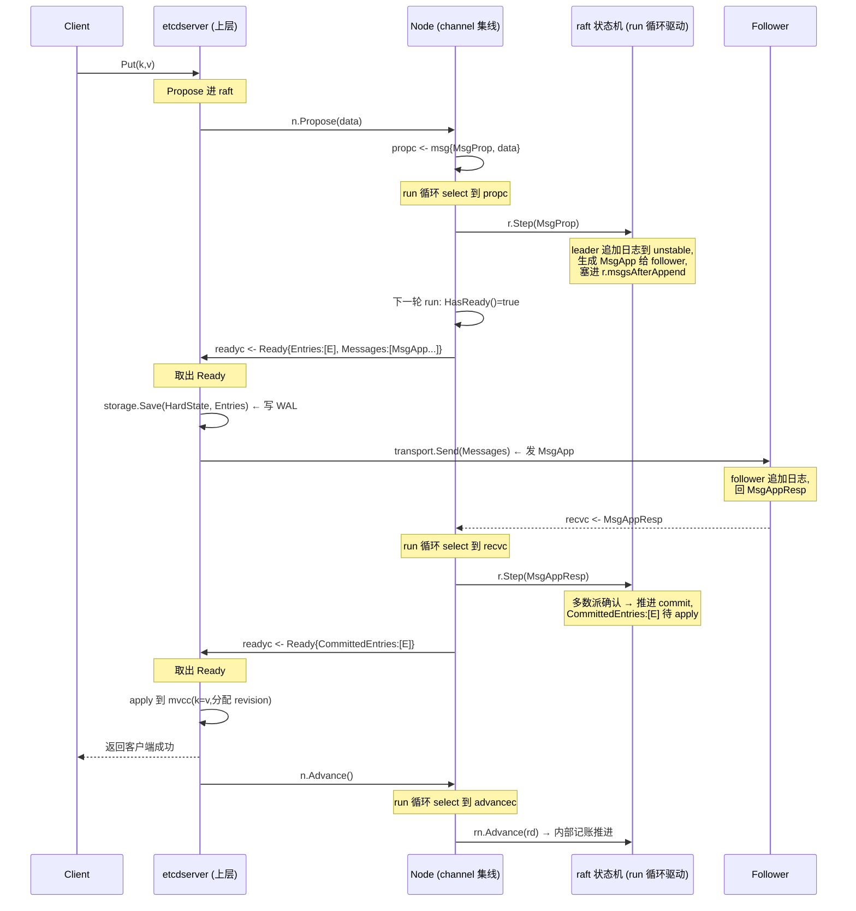

# 第六章 · etcd raft 的驱动模型:Node 与 Ready

> 篇:P1 Raft 地基(第 1 篇收尾章)
> 主线呼应:前五章把 Raft 协议本身讲透了——term、选举、复制、commit、安全性。但通读 `etcd-raft/raft.go` 你会发现一件怪事:这个状态机**不碰磁盘、不碰网络、不知道 KV 是什么**,它只会在内存里转状态,产出"我想发几条消息、我想追加几条日志"的意愿。那谁来把这些意愿落地?谁来驱动它往前走?这一章就拆这个**协议状态机与上层应用之间的干净切口**——`Node`、`RawNode`、`Ready`、`Advance`,以及那一组 channel。读懂这一章,你就读懂了 `etcd-raft` 为什么能被 etcd、TiKV、CockroachDB 共享:它是一个被精心封装的、可嵌入任何应用的纯协议库。

## 核心问题

**`etcd-raft` 怎么把"纯协议状态机(`raft.go` 的 `Step`/`Tick`/`Advance`)"和"上层应用(磁盘 WAL、网络 transport、状态机 apply)"干净地切开?`Node`/`RawNode` 各是什么、用 channel 做什么?`Ready`/`Advance` 推拉模型凭什么妙——凭什么一个不碰 IO 的纯状态机能被嵌进任何应用?**

读完本章你会明白:

1. `raft.go` 是个**纯状态机**:输入消息(`Step`)或逻辑时钟节拍(`Tick`),它在内存里转状态,产出"想发的消息、想存的日志"放在 `r.msgs` 切片里,**自己一行 IO 代码都没有**。
2. `Ready` 是协议层吐给应用层的**指令包**:待持久化日志、待发消息、待 apply 的 entry、`SoftState`/`HardState`、`Snapshot`,外加一个 `MustSync` 标志——一个结构体说清"上层你该干哪几件事"。
3. `Ready`/`Advance` 是**推拉模型**:状态机产一批 `Ready`,应用层消费完调 `Advance` 推进,才能产下一批。这一推一拉把协议和 IO 彻底解耦。
4. `Node`(channel 异步,自带 goroutine `run` 循环)vs `RawNode`(同步,无 channel,上层自己驱动循环)两种用法的取舍:etcd server 用 `Node`,测试和某些嵌入方用 `RawNode`。

> **如果一读觉得太难**:先只记住三件事——① `raft.go` 是个不碰 IO 的纯状态机,它把"想做什么"放进 `r.msgs` 等上层来取;② `Ready` 就是这个"想做什么"的打包,里面分成"要存的、要发的、能 apply 的"三类;③ 上层取走处理完,调 `Advance` 告诉状态机"这批我处理完了,下一批可以来了"。剩下都是把这三件事讲细。

---

## 6.1 一句话点破

> **`etcd-raft` 的设计精髓,是把 Raft 协议做成一个不碰任何 IO 的纯状态机:它只产"指令包"`Ready`(要存什么日志、要发什么消息、能 apply 什么 entry),上层消费完调 `Advance` 推进。协议和网络/磁盘彻底解耦,所以同一份 `raft.go` 能被 etcd 用 channel 版的 `Node` 嵌进去,也能被 TiKV/CockroachDB 用同步版的 `RawNode` 嵌进去,甚至能不拉起任何网络磁盘就单测。**

这是结论,不是理由。本章倒过来拆:先看 `raft.go` 凭什么"纯",再看它吐出的 `Ready` 里打包了什么,然后看 `Node` 怎么用 channel 把这个纯状态机驱动起来,最后看 `Node`/`RawNode` 两种用法的取舍。

---

## 6.2 先看 `raft.go`:一个不碰 IO 的状态机

要理解 `Node` 和 `Ready`,得先看清它们要包装的那个东西——`etcd-raft/raft.go` 里的 `raft` 结构体。这是 Raft 协议的纯状态机实现。

打开 [`raft.go:343`](../etcd-raft/raft.go#L343) 看 `raft` 结构体的字段(摘核心,简化示意):

```go
type raft struct {
    id    uint64
    Term  uint64   // 当前任期(必须持久化)
    Vote  uint64   // 本任期投给了谁(必须持久化)
    lead  uint64   // 当前的 leader id

    state StateType   // Follower / Candidate / Leader

    raftLog *raftLog  // 日志(unstable + stable 两段)

    trk tracker.ProgressTracker   // 追踪每个 follower 的复制进度

    // 协议产出的、待上层处理的两种消息队列
    msgs            []*pb.Message   // 立刻可发的消息(AppendEntries/Heartbeat/Vote 等)
    msgsAfterAppend []*pb.Message   // 要等日志持久化之后才能发的消息(主要是 MsgAppResp)

    electionElapsed  int   // 距离上次选举超时累计的 tick
    heartbeatElapsed int   // 距离上次心跳累计的 tick

    tick func()   // 逻辑时钟步进(leader 用 tickHeartbeat,其余用 tickElection)
    step stepFunc // 消息处理函数(按角色分:stepLeader/stepCandidate/stepFollower)

    // ... 其他字段
}
```

你看这个结构体,**没有一个文件句柄、一个 socket、一个 goroutine**。它就是个纯内存数据结构。它的对外接口只有两个核心动作(还有 `Advance` 推进,后面讲):

- **`Step(m *pb.Message)`**([raft.go:1089](../etcd-raft/raft.go#L1089)):喂给它一条消息(来自网络的 AppendEntries、投票请求,或本地的 MsgProp 提案),它在内存里转一通状态机——可能变成 follower、可能追加日志、可能更新 commit——然后把"想发出去的回应消息"塞进 `r.msgs` 切片。
- **`Tick()`**:喂给它一个逻辑时钟节拍([raft.go:850](../etcd-raft/raft.go#L850) 的 `tickElection` / [raft.go:862](../etcd-raft/raft.go#L862) 的 `tickHeartbeat`)。leader 每 tick 一次会数心跳超时,超时就往 `r.msgs` 里塞 heartbeat 消息;非 leader 每 tick 一次会数选举超时,超时就给自己发一条 `MsgHup` 触发选举。

注意这两件事的共性:**状态机自己不会把消息发出去**。它只把想发的消息累积在 `r.msgs` 这个切片里,等谁来取。

> **不这样会怎样**:设想另一种设计——`Step`/`Tick` 里直接 `net.Send(...)` 把消息发出去。看起来"直观",但后果灾难性:
>
> - **测试要拉起整套网络**:想测"leader 收到多数派确认后 commit"这条逻辑,得真起 3 个节点、真走网络——测试又慢又脆。
> - **IO 阻塞会卡死协议状态机**:网络抖一下 `Send` 阻塞 100ms,整个状态机被拖住,期间处理不了别的消息、走不了 tick,选举/复制全部停摆。
> - **协议库不可复用**:状态机和 etcd 的 transport 焊死了,TiKV 想用?对不起,得把网络层全换掉。
>
> 所以 `etcd-raft` 选择了最干净的设计:**状态机只产"我想发什么、想存什么"的意愿,放进切片;谁来取、怎么取,是上层的事**。

> **所以这样设计**:`raft.go` 是个**纯状态机**:给它输入(`Step` 喂消息、`Tick` 喂节拍),它在内存里转状态,把输出累积在 `r.msgs`、`r.msgsAfterAppend`、`raftLog.unstable` 里,**一行 IO 代码都没有**。这一个决定,是整个 `etcd-raft` 可复用、可测试的根基。

这一段是全书二分法的**协议层根基**。`raft.go` 是"达成一致"的纯粹逻辑,它不关心一致之后的状态长什么样、存在哪、怎么查。

---

## 6.3 那谁来驱动它?——`Node` 的 channel 架构

`raft.go` 是个被动的状态机,等别人喂输入、等别人取输出。这个"别人"就是 `Node`。

`Node` 是 `etcd-raft` 暴露给上层的主接口([node.go:132](../etcd-raft/node.go#L132))。它的实现是 `node` 结构体(小写,内部),核心是一组 channel([node.go:297](../etcd-raft/node.go#L297)):

```go
type node struct {
    propc      chan msgWithResult   // 上层把 propose 喂进来
    recvc      chan *pb.Message     // 上层把网络收到的 raft 消息喂进来
    confc      chan *pb.ConfChangeV2
    confstatec chan *pb.ConfState
    readyc     chan Ready           // 状态机产出的 Ready,从这里吐给上层
    advancec   chan struct{}        // 上层处理完 Ready,从这里通知"可以推进了"
    tickc      chan struct{}        // 上层定时驱动逻辑时钟
    done       chan struct{}
    stop       chan struct{}
    status     chan chan Status

    rn *RawNode   // 内部包了一个 RawNode(它再包 raft 状态机)
}
```

把这组 channel 画出来,你就看清了 `Node` 的架构(图 6-1):

```
              上层应用 (etcdserver)
                ┌──────────────────────────────────┐
                │  raftNode.start() 的 select 循环 │
                │                                  │
                │  case <-ticker.C: n.Tick()       │ ──┐
                │  case rd := <-n.Ready(): 处理 rd │   │
                │  ... Advance()                   │   │
                └──────────────────────────────────┘   │
                       ↑   ↓                           │
       喂输入           │   │  取输出                   │ 驱动时钟
       (Step/Propose)   │   │  (Ready)                 │
                       │   │                           │
                ┌──────┴───┴───────────────────────────┴┐
                │           node 结构体 (channel 集线)   │
                │                                       │
   propc ──►  (上层 Propose/Step ──► r.Step)            │
   recvc ──►  (上层 ReportTransport ──► r.Step)         │
   tickc ──►  (上层 Tick ──► r.Tick)                    │
   readyc ◄── (r 产出 ──► 打包成 Ready 吐出)            │
   advancec ─►(上层处理完 ──► r.Advance 推进)           │
                │                                       │
                │      ▼ 内部 goroutine n.run()         │
                │   ┌─────────────────────────────┐     │
                │   │ select {                    │     │
                │   │  case pm := <-propc: r.Step │     │
                │   │  case m := <-recvc: r.Step  │     │
                │   │  case <-tickc:    rn.Tick() │     │
                │   │  case readyc<-rd: accept    │     │
                │   │  case <-advancec: rn.Advance│     │
                │   │ }                            │     │
                │   └─────────────────────────────┘     │
                └───────────────────────────────────────┘
                                │
                                ▼
                    ┌─────────────────────────┐
                    │  RawNode → raft 状态机  │  ← 纯内存,不碰 IO
                    │  (raft.go 的 Step/Tick) │
                    └─────────────────────────┘
```

这张图里藏着 `Node` 的全部秘密。看几条关键路径:

**1. 上层怎么驱动状态机?**

上层调 `n.Tick()`,`Tick` 往 `tickc` 这个 channel 塞一个空结构体([node.go:458](../etcd-raft/node.go#L458))。`run` 循环收到 `case <-n.tickc` 后,调 `n.rn.Tick()`([node.go:433](../etcd-raft/node.go#L433)),后者调 `r.tick()` 推进逻辑时钟(leader 数心跳超时、follower 数选举超时)。注意 `tickc` 是个带 128 缓冲的 channel([node.go:323](../etcd-raft/node.go#L323))——上层定时器偶尔比 `run` 循环快,tick 可以攒着不丢,最多攒 128 个。

上层调 `n.Step(m)`(`Propose`、`Campaign`、网络收到的消息都走这条),消息塞进 `propc` 或 `recvc`,被 `run` 循环取出后调 `r.Step(m)` 喂给状态机。

**2. 状态机的输出怎么吐给上层?**

这就是 `Ready`。`run` 循环每一轮开头检查 `n.rn.HasReady()`([node.go:354](../etcd-raft/node.go#L354))——如果有东西要吐(状态变了、日志要存了、有消息要发了),就调 `n.rn.readyWithoutAccept()` 打包成一个 `Ready` 结构体,然后等 `case readyc <- rd` 把它送出去([node.go:435](../etcd-raft/node.go#L435))。上层 `n.Ready()` 返回的就是 `n.readyc` 这个 channel([node.go:553](../etcd-raft/node.go#L553))——上层在 `for rd := <-n.Ready()` 里阻塞等它。

**3. 推进机制——`Advance`**

`run` 把一个 `Ready` 吐出去后,**会卡在 `case readyc <- rd` 等人来取**(channel 是无缓冲的)。上层取走后,`run` 立刻调 `n.rn.acceptReady(rd)`([node.go:436](../etcd-raft/node.go#L436))做一些内部账本更新(记下"这批已经被接受了"),然后**重新进 for 循环**,再次检查 `HasReady()`——通常此时上层还没处理完,新的 `Ready` 暂时还凑不出来(要等 `Advance`)。

等上层处理完这批 `Ready`(存盘、发消息、apply 都做完了),调 `n.Advance()`,往 `advancec` 塞一个信号([node.go:555](../etcd-raft/node.go#L555))。`run` 循环收到 `case <-advancec`,调 `n.rn.Advance(rd)`([node.go:444](../etcd-raft/node.go#L444))——这一步是关键:它告诉状态机"你之前吐出去的那批我已经落地了,你可以把内部记账往前推了"(比如把 unstable 日志标记为已 stable、可以产下一批了)。

这就是为什么叫**推拉模型**:状态机推一批 `Ready` 出来,上层拉走处理完,再推一个 `Advance` 进去,状态机才能拉到下一个可以产的状态。一推一拉,节奏严格同步,保证了"状态机产出的每一条指令都被上层确认落地了,才会产下一批"。

> **钉死这件事**:`Node` 不是状态机本身,它是个**channel 集线器 + 一个内部 goroutine `run`**。上层和状态机之间所有交互,都通过这组 channel 发生:`tickc`/`propc`/`recvc` 是上层往状态机喂输入,`readyc` 是状态机往上层吐输出,`advancec` 是上层确认"我处理完了"。channel 是无缓冲的(除 `tickc`),强制两边严格握手——这正是"推拉模型"的物理实现。

> **不这样会怎样**:如果不用 channel,而是 `Node` 直接同步调上层回调("我产了个 Ready,你回调 `OnReady(rd)` 处理一下")——看起来更直接,但有两个问题:① 状态机会被上层的 IO 速度绑住:回调里要同步写 WAL(几十毫秒),状态机 goroutine 被卡住,期间连 `Tick` 都走不了;② 上层很难把"处理 Ready"这件事和自己的别的异步工作流编排起来。用 channel,上层可以自由决定什么时候、在哪个 goroutine、用什么并发模型来处理 `Ready`,状态机只负责产,不负责催。

---

## 6.4 `Ready` 里打包了什么——协议层的"指令包"

`Node` 把协议层的输出打包成 `Ready` 结构体。这是整个解耦设计的核心数据结构,看 [`node.go:52`](../etcd-raft/node.go#L52)(摘核心字段,注释保留原文要点):

```go
type Ready struct {
    // 易失状态:当前 leader 是谁、自己是什么角色。变了才非 nil,不需持久化。
    *SoftState

    // 持久化状态:term/vote/commit。变了才非 nil。
    // 必须在发 Messages 之前落盘。
    *pb.HardState

    // 线性一致读用的读状态(配合 ReadIndex,见第 9 章)。
    ReadStates []ReadState

    // 待持久化到 WAL 的日志条目。必须在发 Messages 之前落盘。
    Entries []*pb.Entry

    // 待持久化的 snapshot。
    Snapshot *pb.Snapshot

    // 已 commit、待 apply 到状态机(etcd 里是 mvcc)的日志条目。
    // 它们之前已经被追加到 stable storage(就是上面的 Entries 之前批次)。
    CommittedEntries []*pb.Entry

    // 待发出的消息(AppendEntries/Vote/Heartbeat 等)。
    // 必须在 Entries 落盘之后才能发。
    Messages []*pb.Message

    // HardState 和 Entries 是否必须同步落盘(还是可以异步写)。
    MustSync bool
}
```

把这七个字段画成一张表(图 6-2),你就看清协议层在指挥上层做哪几件事:

```
┌─────────────────────────────────────────────────────────────────────┐
│                       Ready —— 协议层的"指令包"                     │
├─────────────────┬──────────────────┬────────────────────────────────┤
│  字段           │  类别            │  上层该做什么                  │
├─────────────────┼──────────────────┼────────────────────────────────┤
│  SoftState      │  易失状态        │  (可选)记一下当前 leader/角色 │
│  *SoftState     │  (Lead, State)   │  用于上层日志/决策,不落盘     │
├─────────────────┼──────────────────┼────────────────────────────────┤
│  HardState      │  持久化状态      │  ★ 写进 WAL:                  │
│  *pb.HardState  │  (Term, Vote,    │  必须在发 Messages 之前落盘    │
│                 │   Commit)        │  否则崩溃后 term/vote 丢了    │
│                 │                  │  → 可能脑裂(第 5 章讲过)     │
├─────────────────┼──────────────────┼────────────────────────────────┤
│  Entries        │  待持久化日志    │  ★ 写进 WAL:                  │
│  []*pb.Entry    │                  │  必须在发 Messages 之前落盘    │
│                 │                  │  保证已 commit 日志不丢       │
├─────────────────┼──────────────────┼────────────────────────────────┤
│  Snapshot       │  待持久化快照    │  ★ 写进 snapshot 文件         │
│  *pb.Snapshot   │                  │  用于日志截断(第 18 章)     │
├─────────────────┼──────────────────┼────────────────────────────────┤
│  CommittedEntries│  待 apply 日志  │  ★ apply 到状态机(mvcc):     │
│  []*pb.Entry    │  (已 commit)     │  这是"一致之后落地成 KV"     │
│                 │                  │  这一步!apply 完推给 watcher │
├─────────────────┼──────────────────┼────────────────────────────────┤
│  Messages       │  待发出消息      │  ★ 通过 transport 发给 peer:  │
│  []*pb.Message  │                  │  AppendEntries/Vote/Heartbeat │
│                 │                  │  必须在 Entries 落盘之后发    │
├─────────────────┼──────────────────┼────────────────────────────────┤
│  MustSync       │  落盘标志        │  true: HardState+Entries 必须 │
│  bool           │                  │  同步 fsync;false:可异步     │
└─────────────────┴──────────────────┴────────────────────────────────┘

  ★ = 关键 IO 动作。一个 Ready 告诉上层"该干这几件事"。
  顺序约束:Entries/HardState 落盘 → 才能 Send(Messages)。
```

这里有几个关键细节,每一条都和前面章节的安全性紧密相关:

**1. `SoftState` vs `HardState` 的分野**

看 `SoftState` 的定义([node.go:40](../etcd-raft/node.go#L40))和 `hardState()` 的实现([raft.go:504](../etcd-raft/raft.go#L504)):

```go
type SoftState struct {
    Lead      uint64   // 当前 leader id(易失,崩溃后靠重新选举恢复)
    RaftState StateType // Follower / Candidate / Leader
}

func (r *raft) hardState() *pb.HardState {
    return &pb.HardState{
        Term:   new(r.Term),
        Vote:   new(r.Vote),               // 本 term 投给了谁
        Commit: new(r.raftLog.committed),
    }
}
```

为什么分两种?回到第 5 章:**`Term`、`Vote`、`log` 是必须持久化的**(否则崩溃后忘了自己投过谁,可能同一 term 投两次,选出两个 leader,脑裂)。而 `Lead`、`RaftState` 是易失的——崩溃后重启,不知道谁是 leader 没关系,等选举超时重新选一个就行。所以 `HardState` 要落盘,`SoftState` 不用。

`readyWithoutAccept()` 里对这两个字段做了**变化检测**([rawnode.go:147](../etcd-raft/rawnode.go#L147)):

```go
if softSt := r.softState(); !softSt.equal(rn.prevSoftSt) {
    escapingSoftSt := softSt
    rd.SoftState = &escapingSoftSt   // 只有变了才放进 Ready
}
if hardSt := r.hardState(); !isHardStateEqual(hardSt, rn.prevHardSt) {
    rd.HardState = hardSt            // 只有变了才放进 Ready
}
```

只有状态真的变了(比如 leader 换了、term 涨了),才把这个字段放进 `Ready`——避免每次都让上层写一遍没变化的 WAL 记录。`prevSoftSt`/`prevHardSt` 是 `RawNode` 里记的"上次吐出去时的状态",用来对比。

**2. `Entries`(待存)vs `CommittedEntries`(待 apply)的分野**

这是最容易混淆的一对。看起来都是日志条目,但用途完全不同:

- `Entries`:**还没持久化的**新日志条目。leader 刚 propose 进来的、或者 follower 刚从 AppendEntries 收到的,放在 `raftLog.unstable` 段([log.go:198](../etcd-raft/log.go#L198) 的 `nextUnstableEnts` 取出来)。上层的动作是**写进 WAL**。
- `CommittedEntries`:**已经 commit、可以 apply 的**日志条目。从 `raftLog` 的 `committed` 之前但 `applied` 之后那一段取出([log.go:220](../etcd-raft/log.go#L220) 的 `nextCommittedEnts`)。上层的动作是**apply 到状态机**(etcd 里就是 mvcc,把 `Put` 真正写成 KV)。

一条日志的生命周期是:先作为 `Entries` 被吐出(写 WAL)→ 后续某个 `Ready` 里它可能作为 `CommittedEntries` 被吐出(apply)。注意 [node.go:89](../etcd-raft/node.go#L89) 的注释明确说 `CommittedEntries` 之前已经追加到 stable storage 了——所以 apply 不用再等落盘。

**3. `Messages` 的顺序约束——为什么"落盘之后才能发"**

看 `Messages` 字段的注释([node.go:98-110](../etcd-raft/node.go#L98-L110)):这些消息**必须在 `Entries` 落盘之后才能发**。

> **不这样会怎样**:设想 leader 把 entry E 追加到日志,立刻发 `MsgApp`(AppendEntries)给 follower,follower 复制成功回 `MsgAppResp`,leader commit——但 leader 还没把 E 写进 WAL 就崩了。重启后 leader 的日志里没有 E,但它已经告诉过 follower"E 已 commit"。这就破坏了第 5 章讲的"leader 完整性"——已 commit 的 entry 永不丢失。
>
> 所以 `etcd-raft` 把这个顺序焊死在 `Ready` 的契约里:`Messages` 里的消息(`MsgApp`、`MsgAppResp` 这类依赖日志持久化的)只在 `Entries` 落盘后才允许发。具体实现上,这些消息走 `r.msgsAfterAppend` 队列([raft.go:379](../etcd-raft/raft.go#L379)),`readyWithoutAccept` 在非 async 模式下把它们加进 `rd.Messages`([rawnode.go:179](../etcd-raft/rawnode.go#L179))——上层拿到后,先 `Save(Entries)` 再 `Send(Messages)`,顺序就对了。

这就是为什么第 1 章 P0-01 的 1.8 节那个 `raftNode.start()` 循环里,`r.storage.Save(rd.HardState, rd.Entries)` 在前、`r.transport.Send(rd.Messages)` 在后([etcd/server/etcdserver/raft.go:256](../etcd/server/etcdserver/raft.go#L256) 和 [:242](../etcd/server/etcdserver/raft.go#L242))——这不是随手写的顺序,是 `Ready` 契约强制的。

**4. `MustSync`:什么时候必须 fsync**

[`rawnode.go:191`](../etcd-raft/rawnode.go#L191) 的 `MustSync` 函数说清楚了:

```go
func MustSync(st, prevst *pb.HardState, entsnum int) bool {
    return entsnum != 0 || st.GetVote() != prevst.GetVote() || st.GetTerm() != prevst.GetTerm()
}
```

有新日志、或者 `Vote` 变了(刚投了票)、或者 `Term` 变了(进了新任期)——这三件事任何一件发生,都必须同步 fsync,否则崩溃会丢安全性。比如刚投了票却没 fsync,重启后忘了,同一 term 可能再投一次,选出两个 leader。反之,只是 `Commit` index 往前推了一点(没有新 entry、没改 term/vote),可以异步写——丢了重启后重新算就行,不影响 safety。这是个精致的性能优化:在保证 safety 的前提下,尽量减少 fsync 次数。

> **钉死这件事**:`Ready` 不是"状态机的全部状态",而是"自上次 `Advance` 以来,状态机想让上层知道的那些变化"。它按"上层该做的 IO 动作"分类打包:要存的(`HardState`/`Entries`/`Snapshot`)、要发的(`Messages`)、要 apply 的(`CommittedEntries`),外加变化检测和顺序约束。一个结构体,把协议层和应用层的契约写得清清楚楚——**这就是"库 + 应用解耦"在数据结构层面的体现**。

---

## 6.5 一条 `Put` 在 `Node` 里走一遍——把概念串起来

光看字段还不够,把一条 `Put` 放进 `Node`,看它怎么在 channel 和 `Ready` 之间流转。这能把前面所有概念串起来。

假设集群已选出 leader,客户端发一条 `Put("k","v")` 给 leader(etcd server):



这张时序图覆盖了前面所有概念:`Propose` 走 `propc` 喂状态机、状态机产 `Ready`(先 `Entries` 待存、后 `CommittedEntries` 待 apply)、上层按顺序"存 WAL → 发消息 → apply → Advance"、`MsgAppResp` 走 `recvc` 回状态机推进 commit。一条 `Put` 就在这张 channel 网里跑完它的共识之旅。

注意一个细节:同一条日志 `E`,先在一个 `Ready` 里作为 `Entries`(待存)出现,被上层写进 WAL;后续在另一个 `Ready` 里作为 `CommittedEntries`(待 apply)出现,被上层 apply 到 mvcc。这印证了 6.4 节讲的"`Entries` 和 `CommittedEntries` 是日志生命周期的两个阶段"。

---

## 6.6 `Node` vs `RawNode`:异步 channel 版 vs 同步版

讲完 `Node`,再看 `RawNode` 就清楚了——它是 `Node` 的"去掉 channel、去掉 goroutine"的同步版。

`Node` 内部其实就包了一个 `RawNode`([node.go:309](../etcd-raft/node.go#L309) 的 `rn *RawNode` 字段)。`RawNode` 又包了 `raft` 状态机([rawnode.go:35](../etcd-raft/rawnode.go#L35) 的 `raft *raft` 字段)。三层嵌套:

```
  Node (channel 异步版,etcd server 用)
   └── 内含 RawNode (同步版,测试/特殊嵌入用)
        └── 内含 raft (纯状态机,协议逻辑)
```

`RawNode` 的 API 和 `Node` 几乎一一对应,但都是**同步函数调用,没有 channel**:

| 操作 | `Node`(异步 channel) | `RawNode`(同步) |
|------|----------------------|-----------------|
| 推进逻辑时钟 | `n.Tick()` → `tickc` → run → `rn.Tick()` | `rn.Tick()` 直接调 `r.tick()` |
| 喂消息 | `n.Step(m)` → `recvc`/`propc` → run → `r.Step(m)` | `rn.Step(m)` 直接调 `r.Step(m)` |
| 提案 | `n.Propose(data)` → `propc` → ... | `rn.Propose(data)` 直接调 `r.Step(MsgProp)` |
| 取输出 | `rd := <-n.Ready()`(阻塞等 channel) | `rd := rn.Ready()`(直接返回,无就返回空) |
| 推进 | `n.Advance()` → `advancec` → run → `rn.Advance(rd)` | `rn.Advance(rd)` 直接调 |

关键区别在**谁来驱动循环**:

- `Node`:`StartNode` 时启动一个内部 goroutine 跑 `run`([node.go:273](../etcd-raft/node.go#L273) 的 `go n.run()`)。上层只要在另一个 goroutine 里 `for rd := <-n.Ready()` 阻塞等就行,不用自己写驱动循环。状态机的推进、消息的喂入,都被 `run` 集中处理。代价是多了一组 channel、多了一个 goroutine,且 channel 同步有时序开销。
- `RawNode`:**没有任何 goroutine、没有任何 channel**。上层必须**自己写驱动循环**:自己起一个 goroutine 或事件循环,自己调 `rn.Tick()`(自己定时)、自己调 `rn.Step(m)`(自己从网络读消息)、自己调 `rn.HasReady()` + `rn.Ready()` 取输出、自己调 `rn.Advance(rd)` 推进。控制权完全在上层。

看 `RawNode.Ready()` 和 `Node` 里那套 channel 的对比([rawnode.go:131](../etcd-raft/rawnode.go#L131)):

```go
func (rn *RawNode) Ready() Ready {
    rd := rn.readyWithoutAccept()
    rn.acceptReady(rd)
    return rd
}
```

三行:打包、接受、返回。没有 channel,没有阻塞。上层想什么时候取就什么时候取,想多频繁就多频繁。`acceptReady` 直接在调用线程里跑(更新 `prevSoftSt`/`prevHardSt`、清 `r.msgs`、`acceptUnstable` 标记日志为 in-progress),没有跨 goroutine 通信开销。

> **所以这样设计**:`Node` 和 `RawNode` 两种用法,是给不同嵌入方准备的:
>
> - **etcd server 用 `Node`**:etcd 的 `raftNode.start()` 那个 select 循环(P0-01 的 1.8 节)就是消费 `n.Ready()` 的地方。用 `Node` 省事——不用自己写状态机驱动循环,channel 模型和 Go 的 select 天然契合。代价是 channel 开销,但 etcd 单集群 raft 流量不大,完全可接受。
> - **测试、特殊嵌入用 `RawNode**:`etcd-raft` 自己的单元测试([`etcd-raft/testdata/`](../etcd-raft/testdata/) 的 datadriven 测试)大量用 `RawNode`——不需要起 goroutine、不需要 channel,单线程顺序驱动,可重复、可断言。CockroachDB 的 Multi-Raft 场景(一个进程里有成千上万个 raft 组)也倾向用同步 API 自己调度——成千上万个 goroutine 和 channel 是负担,不如自己写个统一的事件循环驱动所有 `RawNode`。

> **不这样会怎样**:如果 `etcd-raft` 只提供 `Node`(channel 版),会怎样?
>
> - **测试不友好**:每个测试用例得起一个 goroutine 跑 `run`、起一个 goroutine 消费 `Ready`,时序难控制,断言难写(你不知道某个 `Step` 之后要等几个 tick、几个 `Ready` 才能看到效果)。`RawNode` 同步版让测试变成"调一步、查一步"的直线逻辑。
> - **Multi-Raft 场景开销爆炸**:TiKV/CockroachDB 一个节点上几万个 raft 区,每个都 `go n.run()` 起一个 goroutine + 一组 channel,goroutine 调度和 channel 同步开销会成为瓶颈。它们更想要"我自己有个统一调度器,挨个 `rn.Tick()`/`rn.Step()`/`rn.Ready()`"。
>
> 反过来,如果只提供 `RawNode`(同步版),etcd server 这种单 raft 组场景就得多写一堆驱动代码。所以 `etcd-raft` 两个都提供,各取所需。

这其实是 Go 库设计的一个常见模式:**底层提供同步原语(`RawNode`),上层包一层异步 channel 版(`Node`)给最常见的用法**。读者如果看过 `database/sql`(`DB` 内部也是连接池 + channel + goroutine,但底层 `driver.Conn` 是同步的),会觉得这个分层很熟悉。

---

## 6.7 `run` 循环:channel 驱动状态机的心脏

回到 `Node`,它的 `run` 循环([node.go:343](../etcd-raft/node.go#L343))是整个 channel 架构的心脏。值得把核心逻辑看清楚:

```go
func (n *node) run() {
    var propc chan msgWithResult
    var readyc chan Ready
    var advancec chan struct{}
    var rd Ready

    r := n.rn.raft
    lead := None

    for {
        // ① 如果可以产 Ready,就打包一个,把 readyc 通道"武装"起来
        if advancec == nil && n.rn.HasReady() {
            rd = n.rn.readyWithoutAccept()
            readyc = n.readyc
        }

        // ② leader 变化时,控制 propc 是否接收 propose(无 leader 时拒 propose)
        if lead != r.lead {
            if r.hasLeader() {
                // ... 日志 ...
                propc = n.propc
            } else {
                // ... 日志 ...
                propc = nil   // 把 propc 置 nil,select 会跳过这个 case
            }
            lead = r.lead
        }

        select {
        case pm := <-propc:           // 上层 propose
            m := pm.m
            m.From = new(r.id)
            err := r.Step(m)
            // ... 返回 err 给上层 ...
        case m := <-n.recvc:           // 网络收到的 raft 消息
            // ... 过滤 ...
            r.Step(m)
        case cc := <-n.confc:          // 成员变更
            cs := r.applyConfChange(cc)
            // ...
        case <-n.tickc:                // 逻辑时钟节拍
            n.rn.Tick()
        case readyc <- rd:             // 把 Ready 吐给上层
            n.rn.acceptReady(rd)
            if !n.rn.asyncStorageWrites {
                advancec = n.advancec   // 武装 advancec,等上层推进
            } else {
                rd = Ready{}
            }
            readyc = nil                // 把 readyc 置 nil,下一轮不再发同一个 rd
        case <-advancec:               // 上层处理完了,推进
            n.rn.Advance(rd)
            rd = Ready{}
            advancec = nil              // 把 advancec 置 nil,下一轮才能产新 Ready
        case c := <-n.status:
            c <- getStatus(r)
        case <-n.stop:
            close(n.done)
            return
        }
    }
}
```

这段代码里有一个 Go channel 编程的经典技巧——**用 nil channel 在 select 里动态启停某个 case**。在 Go 里,`select` 对 `nil` channel 的 case 永远不会选中(发送或接收都会阻塞)。所以:

- 没产 `Ready` 时,`readyc = nil`,`case readyc <- rd` 永远不会被选中,避免发空 `Ready` 或发重复的 `rd`。
- 上层还没 `Advance` 时,`advancec = n.advancec`(非 nil),`case <-advancec` 能被选中等推进;一旦推进,`advancec = nil`,这个 case 暂时关闭,直到下次产新 `Ready` 才重新武装。
- 没有 leader 时,`propc = nil`,上层 `n.Propose()` 会被阻塞(因为 `propc` 是无缓冲的,没人收)——这正是"无 leader 时拒绝 propose"的语义,靠 channel 的 nil 启停优雅实现。

这个技巧让 `run` 循环成了一个**状态驱动的 select**:不同状态下,哪些 channel 活跃、哪些休眠,全靠这几个 nil/非 nil 切换。整个状态机的推进节奏就被这个 select 严格管住了。

> **钉死这件事**:`run` 循环用"nil channel 在 select 里不会被选中"这条 Go 语义,把"什么时候能产 Ready、什么时候能收 propose、什么时候等 Advance"这三件事的状态机,编码进了 channel 本身的 nil/非 nil。没有显式的状态变量,没有锁,channel 就是同步原语。这是 Go channel 编程的一个教科书级范例——**用 channel 的启停表达状态机的状态转移**。

---

## 6.8 技巧精解:`Ready`/`Advance` 推拉模型——库与应用的解耦之美

这一章最硬核的技巧,是 `Ready`/`Advance` 这个推拉模型本身。它不只是一个 API 设计,而是"如何把一个分布式协议做成可复用库"的工程范式。我们单独拆透。

### 技巧一:推拉模型把协议和 IO 彻底解耦

回到核心矛盾:Raft 协议状态机要推进(转状态、产消息、追加日志),但它**绝对不能自己碰 IO**——一碰 IO,可测试性、可复用性、性能全毁了(6.2 节讲过反面)。可状态机又必须把它的决策(要发什么消息、要存什么日志)告诉外界。怎么传?

朴素方案有两个,都不行:

- **方案 A(回调)**:状态机产出一批结果,直接回调上层注册的 `OnReady(rd)`。问题:状态机 goroutine 被上层 IO 速度绑架(回调是同步的),IO 慢了状态机就卡住,连 `Tick` 都走不了;上层也很难把"处理 Ready"编进自己的异步工作流。
- **方案 B(共享队列 + 锁)**:状态机往一个共享队列 push 结果,上层从队列 pop。问题:要加锁保护队列,锁竞争是性能隐患;而且"上层 pop 完一批"和"状态机可以产下一批"之间没有天然的同步点,容易出 race。

`etcd-raft` 的解法是**推拉模型 + 无缓冲 channel**:

1. **状态机产一批 `Ready`,通过无缓冲 channel `readyc` "推"给上层**。无缓冲意味着发送方(`run` goroutine)会阻塞,直到接收方(上层)来取——这一刻两边严格握手,`run` 此刻知道"上层已经拿到这批了"。
2. **上层处理完(存盘、发消息、apply),通过无缓冲 channel `advancec` "推"一个信号回去**。`run` 收到这个信号,调 `rn.Advance(rd)` 把内部记账往前推(标记日志已 stable、可以产下一批),然后下一轮 for 循环才能 `HasReady()` 返回 true。
3. **两次握手之间,状态机不会产新的 `Ready`**(`HasReady` 在 advance 之前对"新的 unstable 日志"之类返回 false,因为上一批还没确认)。

这本质上是**一个同步协议**:状态机和上层轮流走,你走一步我走一步,谁都不会跑在对方前面。但它用 Go 的 channel 实现得极其优雅——无缓冲 channel 天然就是同步原语,不需要显式的锁或条件变量。

这个设计带来的好处是巨大的:

- **协议库零 IO 依赖**:`raft.go` 不 import 任何网络/磁盘库,它只产 `Ready`。这意味着你可以把它嵌进**任何**应用——只要你愿意实现"存 WAL、发消息、apply"这三件事。etcd 用自己的 WAL + HTTP/gRPC transport + mvcc;TiKV 用自己的 RocksDB + gRPC + Rust 状态机;CockroachDB 用自己的存储栈。同一份 `raft.go`,三种完全不同的应用层。
- **可单测到变态**:`etcd-raft` 的测试不需要真网络、真磁盘。用 `RawNode` 同步驱动,`rn.Step(...)` 喂消息、`rn.Ready()` 查输出、断言 `rd.Entries`/`rd.Messages` 的内容,直线逻辑,可重复,可断言到字节级。看 [`etcd-raft/testdata/`](../etcd-raft/testdata/) 的 datadriven 测试,一条测试用例就是一个"输入消息序列 → 期望输出 Ready 序列"的对照表。这种测试密度,如果协议和网络焊死,根本不可能。
- **背压(backpressure)自然形成**:如果上层处理慢(WAL 写得慢),`advancec` 迟迟不来,状态机就迟迟不产新 `Ready`——自然不会把上层淹没。不需要显式的流控。

> **反面对比**:如果协议和网络 IO 焊死(像早期一些 raft 实现),会怎样?
>
> - 测试要起真集群,跑一次测试几秒钟,CI 不可用。
> - 协议状态机被 IO 阻塞拖慢:网络抖动 100ms,状态机卡 100ms,选举/复制全停。
> - 换个应用层(比如从 etcd 的 transport 换成 TiKV 的)要改协议代码,不可复用。
>
> `etcd-raft` 凭这一个推拉模型,成了 raft 协议的事实标准库——Kubernetes(etcd 本身)、TiKV、CockroachDB、Consul(它自己的 raft 库也是同源设计)、etcd-compatible 的各种分布式系统,都在用或参考它。**这是"库 + 应用解耦"在分布式协议领域的典范**。

### 技巧二:`Node` vs `RawNode` 的分层——同步原语 + 异步包装

第二个技巧是 `Node`/`RawNode` 的分层(6.6 节展开过)。这里强调它的工程美学:

```
  应用层 (etcdserver / TiKV / 测试)
      │
      ├── 用 Node:channel + goroutine,省心,适合单 raft 组
      │       │
      │       └── 内部 run 循环驱动
      │
      └── 用 RawNode:同步,无 channel,自己驱动,适合 Multi-Raft / 测试
              │
              └── 直接调 rn.Tick/rn.Step/rn.Ready/rn.Advance
                  │
                  ▼
              raft 状态机 (纯内存逻辑)
```

这个分层的精妙之处:**底层 `RawNode` 是完备的**——它有 `raft.go` 全部能力的同步入口。`Node` 不是"更强"的版本,只是"更省心"的包装。这意味着:

- 任何能用 `Node` 做的事,都能用 `RawNode` 做(反过来不行,`RawNode` 给的控制更细)。
- `Node` 内部就是包了个 `RawNode`([node.go:309](../etcd-raft/node.go#L309)),所有 channel 操作最终都落到 `RawNode` 的方法上。
- 如果 `Node` 的 channel 模型不适合你的场景(比如你要在一个事件循环里驱动成千上万个 raft 组),直接用 `RawNode`,不损失任何功能。

这是 Go 库设计的常见优雅模式:**同步原语是真相之源(source of truth),异步包装是语法糖**。读者联想 `database/sql/driver`(同步的 `Conn`/`Stmt`)和 `database/sql`(异步的连接池 `DB`),或 `net`(同步的 `net.Conn`)和各种 async 网络框架,都是这个模式。`etcd-raft` 把它用在了分布式协议上,格外漂亮。

> **钉死这件事**:`etcd-raft` 的可复用性,根源在这一套设计:① `raft.go` 纯状态机,零 IO;② `Ready`/`Advance` 推拉模型,用无缓冲 channel 在协议和 IO 之间画一条干净的线;③ `Node`/`RawNode` 分层,同步原语完备,异步包装可选。这三件事叠起来,让一份 raft 代码能嵌进 etcd、TiKV、CockroachDB——这是工业级分布式协议库的设计范式。

---

## 章末小结

这一章是第 1 篇(Raft 地基)的收尾。前五章讲透了 Raft 协议本身(term、选举、复制、commit、安全性),但那些都是"协议状态机内部"的事。这一章把镜头拉到**状态机和外部的边界**:协议状态机怎么被封装、被上层驱动、被干净地嵌进任何应用。

我们把这一章的服务定位讲清楚:**它属于二分法的协议层,但 specifically 是协议层的"封装/解耦边界"**。它不讲新协议,它讲的是同一份协议代码怎么被设计成可复用库。这是承上启下的一章——往上,它把第 1 篇的协议逻辑封装好;往下,它把接力棒交给第 2 篇的应用层。

回到全书主线(协议层 vs 应用层):这一章立的,是协议层和应用层之间那条**最干净的切口**。`raft.go`(协议层)产 `Ready`,`etcdserver`(应用层)消费 `Ready`,中间只有一组 channel。一个 `Put` 跨越这条切口的瞬间,就是从"达成一致"变成"落地成 KV"的瞬间。

### 五个"为什么"清单

1. **为什么 `raft.go` 不碰 IO?** 碰了就不可测试(要拉起真网络)、不可复用(IO 焊死)、被 IO 阻塞拖慢(网络抖卡住状态机)。纯状态机是可复用、可测试、可嵌入的根基。
2. **为什么用 `Ready`/`Advance` 推拉模型,而不是回调或共享队列?** 回调会把状态机绑死在上层 IO 速度上;共享队列要加锁、没有天然同步点。无缓冲 channel 的推拉模型,既是同步原语(严格握手),又零锁,还自然形成背压。
3. **`Ready` 里为什么要把输出分成 `Entries`(待存)、`Messages`(待发)、`CommittedEntries`(待 apply)?** 因为这三类对应上层三种不同的 IO 动作(写 WAL、发网络、apply 状态机),且有严格的顺序约束(Entries 落盘后才能发 Messages)。按动作分类打包,让上层的处理逻辑直线、清晰。
4. **为什么 `SoftState` 不落盘、`HardState` 要落盘?** `SoftState`(leader 是谁、自己什么角色)是易失的,崩溃后重新选举就恢复了;`HardState`(term/vote/commit)必须持久化,否则崩溃后忘了投过谁,可能同 term 投两次,脑裂(第 5 章讲过)。
5. **为什么同时提供 `Node` 和 `RawNode`?** `Node`(channel 异步)省心,适合 etcd 这种单 raft 组场景;`RawNode`(同步)给上层完全控制,适合 Multi-Raft(TiKV/CockroachDB 几万个 raft 组)和单测。底层 `RawNode` 完备,`Node` 只是包装——这是"同步原语 + 异步包装"的库设计范式。

### 想继续深入往哪钻

- **源码**: [`etcd-raft/node.go`](../etcd-raft/node.go) 的 `node.run` 循环(343 行起)是 channel 驱动的核心,值得逐行读;[`rawnode.go`](../etcd-raft/rawnode.go) 的 `readyWithoutAccept`/`acceptReady`/`Advance` 三件套(139-489 行)看 `Ready` 的打包和推进。
- **测试**: [`etcd-raft/testdata/`](../etcd-raft/testdata/) 的 datadriven 测试是用 `RawNode` 同步驱动的范例,看几条用例就能体会"不需要真网络磁盘也能测透 raft"。
- **延伸**: CockroachDB 的 [`storage/raftTransport`](https://github.com/cockroachdb/cockroach) 和 TiKV 的 [`raftstore`](https://github.com/tikv/tikv) 是 Multi-Raft 用同步 API 驱动成千上万个 raft 组的工业实现,对照 etcd 单 raft 组用 `Node` 的用法,能看清两种用法的取舍。
- **范式对照**: Go 标准库 `database/sql`(`DB` 异步连接池)+ `database/sql/driver`(`Conn` 同步原语)是同样的分层范式,读了会有共鸣。

### 引出下一章

第 1 篇到这里收尾——Raft 协议本身(term、选举、复制、安全)和它的驱动封装(`Node`/`Ready`)都讲透了。但 `Node` 只是协议层的出口,谁在消费它?谁在往 `propc` 里 propose?谁在从 `readyc` 取 `Ready` 然后存 WAL、发消息、apply 到 mvcc?

回到第 1 章 P0-01 的 1.8 节,那个 [`raftNode.start()`](../etcd/server/etcdserver/raft.go#L174) 的 select 循环——它正是上层(etcdserver)消费 `Node.Ready()` 的地方。那一个循环浓缩了"协议层吐 Ready → 应用层消费"的全过程。下一章,我们正式进入第 2 篇,钻进 etcdserver:一条 `Put` 怎么从 gRPC 进来、怎么 propose 进 raft、怎么从 apply 通道出来落进 mvcc。协议层和应用层的接力棒,就要在 P2-07 交接。
