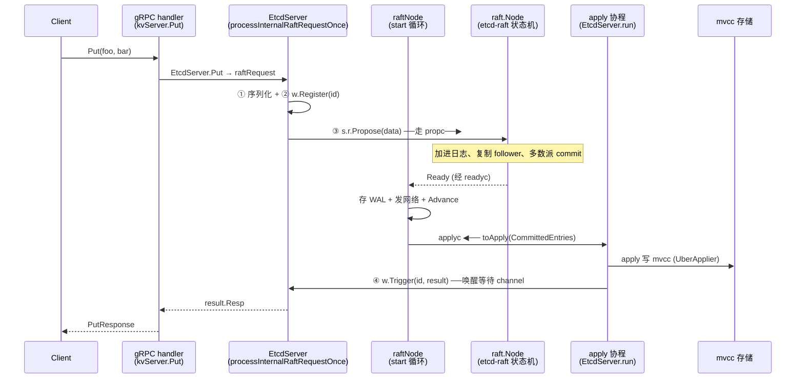
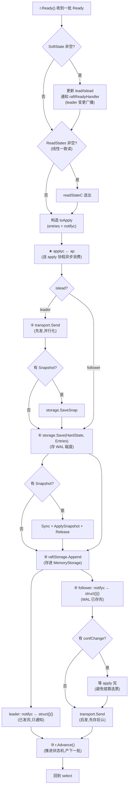

# 第七章 · etcdserver 架构与 gRPC 入口

> 篇:P2 写读路径·etcdserver
> 主线呼应:第 1 篇五章把 Raft 协议层拆透了——`etcd-raft` 是个纯状态机,靠 `Node` 的 channel(`propc`/`recvc`/`readyc`)把"待持久化的日志、待发的消息、待 apply 的 entry"打包成 `Ready`,经 `readyc` 吐给上层,上层处理完调 `Advance` 推进。但 `etcd-raft` 自己不碰磁盘、不碰网络、不知道 KV 是什么。那么,谁来消费这个 `Ready`?谁来把客户端的一条 `Put` 塞进 `propc`?谁来把已 commit 的 entry 送去存储?这一章讲的 `EtcdServer`,就是粘合协议层和应用层的那个"总管"。全书二分法在这里有一个看得见摸得着的衔接点——`raftNode.start()` 那一个 `select` 循环。

## 核心问题

**一条 `Put` 怎么从 gRPC 进到 etcdserver?`EtcdServer` 这个总管由哪些部件组成,它凭什么能把协议层(`etcd-raft` 的 Node)和应用层(mvcc apply)粘起来而不打架?它的两条主通道——把 propose 发进 Raft 的那条、把已 commit entry 收回来 apply 的那条——为什么必须是 channel,为什么必须分开?**

读完本章你会明白:

1. `EtcdServer` 这个结构体里都装了什么(`r raftNode`、`kv`、`lessor`、`be`、`uberApply`、`applyWait`),它们各管哪一摊,为什么这样切。
2. 一条 `Put` 从 gRPC 端口进来,经过哪几跳才走到 `s.r.Propose`(把请求塞进 Raft)。
3. `EtcdServer` 和 `etcd-raft` 之间凭什么解耦:**propose 走 `propc`、apply 走 `applyc`**,两条 channel 把"达成共识"和"落地成 KV"干净切开,谁也不阻塞谁。
4. `raftNode.start()` 那一个 `select` 循环到底按什么顺序做"持久化 WAL、发消息给 follower、把 entry 送 apply",为什么是这个顺序——以及 leader 和 follower 在这个顺序里**反过来**的精妙之处。

> **如果一读觉得太难**:先只记住三件事——① `EtcdServer` 是个总管,它内嵌一个 `raftNode`,`raftNode` 又内嵌 `raft.Node`,三层套娃。② 写请求经 gRPC → `EtcdServer.Put` → `s.r.Propose`(走 `propc` 进 Raft)→ 共识成功 → `Ready` 出来 → `applyc` 送回 → apply 到 mvcc → 唤醒等着的客户端。③ `raftNode.start()` 那个循环是全书的锚点,P0-01 见过简化版,本章拆透。后面遇到任何 etcd 流程,回到这个循环定位。

---

## 7.1 一句话点破

> **`EtcdServer` 是个总管:对外它挂着 gRPC,对内它驱动一个 `raftNode`(协议层)和一个 mvcc 存储(应用层)。它把客户端的写请求序列化后塞进 Raft 的 `propc`,把 Raft 吐出的已 commit entry 从 `applyc` 接出来送给 mvcc。两条 channel,一进一出,把"达成共识"和"落地成状态机"彻底切开——Raft 协议的推进永远不会被 apply 的慢拖住,apply 也永远不必等协议的网络往返。**

这是结论,不是理由。本章倒过来拆:先看 `EtcdServer` 这个总管长什么样,再看一条 `Put` 怎么从 gRPC 进到它手里,然后看它怎么用两条 channel 把协议层和应用层粘起来,最后钻进 `raftNode.start()` 那个 `select` 循环,把 P0-01 给过的简化版拆透。

---

## 7.2 EtcdServer:一个总管的解剖

### 它要解决什么问题

Raft 协议层(`etcd-raft` 仓)是个**纯状态机**:你喂它 `Tick`/`Step`,它吐 `Ready`。它不碰磁盘、不碰网络、不知道你要存的是 KV 还是别的什么。应用层(mvcc/bbolt/watch/lease)又是一大坨:它知道怎么存多版本、怎么推 watcher、怎么给 key 续命,但它不知道"多个副本怎么达成一致"。

这两层各自完整,但它们必须有人**粘起来**:

- 客户端的写请求来了,要有人把它**翻译成 Raft 能消化的 propose**,塞进协议层。
- 协议层吐出"这批 entry 已经被多数派确认、可以 apply 了",要有人**接住它,送去 mvcc 落地**。
- 协议层吐出"我要发 AppendEntries 给 follower",要有人**真的走网络发出去**。
- 协议层吐出"把这条日志存下来",要有人**真的写进 WAL 落盘**。
- leader 变了,要有人**通知 lease/compactor/读路径**调整行为。

这个"有人",就是 `EtcdServer`。

> **不这样会怎样**:如果没有人做这个粘合,要么协议层和应用层焊死(把网络 IO、磁盘 IO、KV 存储全塞进 `raft.go`,变成一个无法复用的怪物——`etcd-raft` 也就不可能被 Kubernetes/TiKV/CockroachDB 共享),要么每个应用自己写一遍粘合逻辑(重复造轮子,且容易写错协议细节)。`EtcdServer` 把这层粘合集中到一个结构体里,是工程上的必然。

### 所以这样设计:`EtcdServer` 结构体

看真实源码,`EtcdServer` 定义在 [`server.go:208`](../etcd/server/etcdserver/server.go#L208)。我把它按职责分组,画一张布局图(下面是结构体字段的"按职责归类的布局图",不是源码原文,字段顺序有调整以便理解,真实顺序见源码):

```
EtcdServer (server/etcdserver/server.go:208)  ── 一个总管,挂四摊事
│
├─ [协议层衔接] ──────────────────────────────────────────
│   r            raftNode      ← 内嵌!协议层的壳(server.go:217)
│                                  raftNode 又内嵌 raft.Node(raft.go:112)
│                                  三层套娃:EtcdServer → raftNode → raft.Node
│   appliedIndex  atomic.Uint64 ← 已 apply 到哪个 index
│   committedIndex atomic.Uint64 ← Raft 已 commit 到哪个 index
│   term          atomic.Uint64 ← 当前 term
│   lead          atomic.Uint64 ← 当前 leader id
│
├─ [应用层:存储 + 特性] ─────────────────────────────────
│   kv            mvcc.WatchableKV  ← 多版本 KV 存储(server.go:250)
│   lessor        lease.Lessor      ← 给 key 续命(251)
│   be            backend.Backend   ← bbolt 句柄(253)
│   authStore     auth.AuthStore    ← 鉴权(255)
│   alarmStore    *v3alarm.AlarmStore ← 告警(256)
│   uberApply     apply.UberApplier ← 把 entry 应用到上述存储的执行器(246)
│
├─ [客户端等待表] ─────────────────────────────────────────
│   w             wait.Wait        ← 注册"等这条 propose 的 apply 结果"(225)
│   applyWait     wait.WaitTime    ← 按 index 等待 apply 进度(248)
│
└─ [生命周期 + 元数据] ───────────────────────────────────
    Cfg           config.ServerConfig
    cluster       *membership.RaftCluster  ← 成员信息
    readych/stop/stopping/done  chan struct{}  ← 生命周期信号
    leaderChanged *notify.Notifier  ← leader 变更广播(给读路径用)
```

这张图回答了"`EtcdServer` 由哪些部分组成"。四个职责块:

1. **协议层衔接**:`r raftNode` 是协议层的壳,所有跟 Raft 打交道的事都经它。
2. **应用层存储**:`kv`/`lessor`/`be`/`authStore`/`alarmStore` 是落地的状态机,`uberApply` 是把 entry 应用进去的执行器。
3. **客户端等待表**:`w` 和 `applyWait`——客户端发完 propose 要等 apply 完才能返回(线性一致),靠这两个结构挂起等待。
4. **生命周期**:启动、停止、leader 变更广播。

> **钉死这件事**:`EtcdServer` 是个**三层套娃**的最外层——`EtcdServer` 内嵌 `raftNode`(`r` 字段),`raftNode` 又内嵌 `raft.Node`(`raftNodeConfig.Node` 字段,[raft.go:112](../etcd/server/etcdserver/raft.go#L112))。所以你看到 `s.r.Propose(...)`、`s.r.Tick()`、`s.r.Ready()`、`s.r.Advance()`,这些方法**实际调的是最内层 `etcd-raft` 的 `node`**——靠 Go 的嵌入字段(inner-struct embedding)一路转发。分清三层:`EtcdServer`(总管) / `raftNode`(协议层的壳,管 channel、ticker、transport) / `raft.Node`(`etcd-raft` 的纯状态机驱动)。同名陷阱:`etcd-raft/raft.go`(协议状态机)≠ `etcd/server/etcdserver/raft.go`(本章的 `raftNode` 封装)。

### 两个等待结构的妙处

`EtcdServer` 里有两个 `wait`,读者很容易看漏,但它们是理解"客户端为什么能等到 apply 才返回"的钥匙:

- **`s.w wait.Wait`**(server.go:225):一张"按 request ID 注册的 channel 表"。客户端 propose 前,用请求 ID 在这里注册一个 channel。apply 协程 apply 到这条 entry 时,用同一个 ID `Trigger` 这个 channel,把结果送回去。这是**点对点**的等待。
- **`s.applyWait wait.WaitTime`**(server.go:248):一张"按 raft index 等待的 channel 表"。有人想等"apply 进度追上 index N",就在这里挂个 channel。apply 协程每 apply 一批,`Trigger(appliedi)` 唤醒所有等待这个 index 之前的人。这是**按进度**的等待(线性一致读会用到)。

> **不这样会怎样**:如果 propose 之后客户端**不等 apply 就返回**,那客户端可能在 entry 还没真正写进状态机时就收到"成功"——这时另一个客户端读,会读不到这条写(违反线性一致)。如果不用 channel 表而是用一把全局锁,所有请求排队等同一把锁,吞吐会被串行化拖垮。`wait.Wait` 这套"按 ID 注册 channel、按 ID 唤醒"的做法,让每个请求独立挂起、独立唤醒,互不阻塞。这套机制 P2-08 会详拆,本章先点到这里。

---

## 7.3 gRPC 入口:一条 Put 怎么进到 EtcdServer

### 它要解决什么问题

etcd 对外暴露的是 gRPC 接口(`etcdserverpb.KV` 服务,方法 `Put`/`Range`/`DeleteRange`/`Txn` 等)。客户端用 `etcdctl put foo bar` 时,背后是 gRPC 调用。这个 gRPC 调用怎么走到 `EtcdServer.Put`?中间有没有别的层?

### 所以这样设计:gRPC handler → EtcdServer 方法

etcd 启动时,在 [`v3rpc/grpc.go:80`](../etcd/server/etcdserver/api/v3rpc/grpc.go#L80) 把一组 gRPC 服务注册到 gRPC server:

```go
// server/etcdserver/api/v3rpc/grpc.go:78-89 (简化示意,保留注册顺序)
grpcServer := grpc.NewServer(append(opts, gopts...)...)

pb.RegisterKVServer(grpcServer, NewQuotaKVServer(s))
pb.RegisterWatchServer(grpcServer, NewWatchServer(s))
pb.RegisterLeaseServer(grpcServer, NewQuotaLeaseServer(s))
pb.RegisterClusterServer(grpcServer, NewClusterServer(s))
pb.RegisterAuthServer(grpcServer, NewAuthServer(s))
// ...
pb.RegisterMaintenanceServer(grpcServer, NewMaintenanceServer(s, healthNotifier))
```

注意 KV 服务注册的是 `NewQuotaKVServer(s)`,不是直接把 `EtcdServer` 交给 gRPC。这中间有一层**配额包装**(quota)——它会在真正处理 Put 前检查"后端存储是不是快满了",满了就拒绝。这是装饰器模式:外层 quota → 内层真正干活的 `kvServer`。

真正的 Put handler 在 [`v3rpc/key.go:90`](../etcd/server/etcdserver/api/v3rpc/key.go#L90):

```go
// server/etcdserver/api/v3rpc/key.go:90 (简化示意)
func (s *kvServer) Put(ctx context.Context, r *pb.PutRequest) (*pb.PutResponse, error) {
    if err := checkPutRequest(r); err != nil {
        return nil, err
    }
    resp, err := s.kv.Put(ctx, r)   // s.kv 就是 EtcdServer(实现 pb.KVServer 接口)
    if err != nil {
        return nil, togRPCError(err)
    }
    s.hdr.fill(resp.Header)
    return resp, nil
}
```

`s.kv` 是什么?它是个接口,实现就是 `*EtcdServer`。`EtcdServer.Put` 在 [`v3_server.go:295`](../etcd/server/etcdserver/v3_server.go#L295):

```go
// server/etcdserver/v3_server.go:295 (简化示意)
func (s *EtcdServer) Put(ctx context.Context, r *pb.PutRequest) (*pb.PutResponse, error) {
    // ... 起一个 trace span ...
    resp, err := s.raftRequest(ctx, &pb.InternalRaftRequest{Put: r})
    if err != nil {
        return nil, err
    }
    return resp.(*pb.PutResponse), nil
}
```

注意这里有个关键的翻译:`PutRequest` 被包进了一个 `InternalRaftRequest`。为什么?因为 Raft 日志里存的不是"Put 请求",而是一个统一的 `InternalRaftRequest`(Put/DeleteRange/Txn/LeaseGrant/...都装在它里面,用 oneof 区分)。这样 Raft 日志的 entry 格式是统一的,apply 时按 oneof 字段分发。`raftRequest` 的实现:

```go
// server/etcdserver/v3_server.go:1012 (简化示意)
func (s *EtcdServer) raftRequest(ctx context.Context, r *pb.InternalRaftRequest) (proto.Message, error) {
    result, err := s.processInternalRaftRequestOnce(ctx, r)
    // ...
    return result.Resp, nil
}
```

真正的核心是 `processInternalRaftRequestOnce`([v3_server.go:1058](../etcd/server/etcdserver/v3_server.go#L1058)),它干三件事:

```go
// server/etcdserver/v3_server.go:1058-1132 (简化示意,保留核心三步)
func (s *EtcdServer) processInternalRaftRequestOnce(ctx context.Context, r *pb.InternalRaftRequest) (*apply2.Result, error) {
    // ... 鉴权、限额检查 ...

    data, err = proto.Marshal(r)        // ① 序列化成字节,准备塞进 Raft 日志

    id := r.Header.ID
    ch := s.w.Register(id)              // ② 用请求 ID 注册一个等待 channel

    cctx, cancel := context.WithTimeout(ctx, s.Cfg.ReqTimeout())
    defer cancel()

    err = s.r.Propose(cctx, data)       // ③ 把 data 塞进 Raft(propc)!
    if err != nil {
        s.w.Trigger(id, nil)            // 失败,清掉等待
        return nil, err
    }

    select {
    case x := <-ch:                     // ④ 挂起,等 apply 协程 Trigger 这个 channel
        return x.(*apply2.Result), nil
    case <-cctx.Done():                 // 超时
        s.w.Trigger(id, nil)
        return nil, s.parseProposeCtxErr(cctx.Err(), start)
    case <-s.done:                      // 服务器关停
        return nil, errors.ErrStopped
    }
}
```

这四步,就是一条 Put 从"进到 EtcdServer"到"塞进 Raft 并等结果"的全部:

1. **序列化**(`proto.Marshal`):把 `InternalRaftRequest` 变成字节流,因为 Raft 日志里存的是字节。
2. **注册等待**(`s.w.Register(id)`):在 `s.w` 这张表里,用请求 ID 挂一个 channel。apply 协程一会儿 apply 到这条 entry 时,会用同样的 ID 找到这个 channel 并把结果送进来。
3. **Propose**(`s.r.Propose(cctx, data)`):把字节流塞进 Raft。这一步**不阻塞**——它只是把数据丢进 `propc` channel,真正的"加进日志、复制给 follower、等多数派"是 Raft 状态机异步干的。
4. **等 apply**(`select case x := <-ch`):挂起,直到 apply 协程 Trigger 这个 channel,或者超时、服务器关停。

> **钉死这件事**:从 gRPC 到 EtcdServer 的链路是:**`gRPC handler(kvServer.Put)` → `EtcdServer.Put` → `raftRequest` → `processInternalRaftRequestOnce`(序列化 → 注册等待 → `s.r.Propose` → 等 apply)**。其中 `s.r.Propose` 是协议层入口,它把请求塞进 `propc` channel。`<-ch` 是应用层出口,等 apply 唤醒。一条 Put 在 `EtcdServer` 这一层的旅程,就是"从 propose 进,从 apply 出"。

---

## 7.4 两条主通道:propc 与 applyc

### 它要解决什么问题

`processInternalRaftRequestOnce` 里的第 ③ 步 `s.r.Propose` 和第 ④ 步 `<-ch`,看似是一个请求的两半,其实它们走的是**两条完全不同的 channel**:

- `s.r.Propose` → 走 `propc`,把请求**送进** Raft 状态机。
- apply 协程 → 走 `applyc`,把已 commit 的 entry **送回**给 EtcdServer 去 apply。

这两条 channel,就是 `EtcdServer` 和 `etcd-raft` 之间的两条主通道。P0-01 的 1.8 节给过一张二分法图,这里把它细化到 channel 级别。

### 不这样会怎样:同步调用会反噬 Raft

假设我们不用 channel,改成"同步调用":客户端调 `Propose` 时,Raft 同步把日志加进去、同步复制给 follower、同步等多数派、同步 apply 到 mvcc、再同步返回。这条路径上,apply(写 bbolt,慢)和 raft 协议推进(发心跳、处理 AppendEntries 响应、推进选举计时)就**串成了一条**。

问题来了:

- apply 写 bbolt 是毫秒级(甚至更慢,尤其磁盘抖动时)。
- Raft 的心跳是 100ms 级,选举超时是秒级。
- 如果 apply 慢了,**整个 raft 协议循环就被卡住**——心跳发不出去,follower 以为 leader 挂了,开始选举。leader 以为 follower 挂了,重复选举。集群活锁。

更糟的是:apply 慢会反压 raft,raft 慢会丢心跳,丢心跳会触发选举,选举会打断正在进行的复制——一个慢磁盘就能把整个集群搞崩。

### 所以这样设计:两条 channel,一进一出

`etcd-raft` 的 `Node` 用 channel 把协议状态机和上层 IO 解耦(P1-06 详讲)。`EtcdServer`(通过 `raftNode`)消费这些 channel:

- **propc**(进 Raft):客户端的 propose 经 `s.r.Propose` 塞进来,Raft 主循环 `case pm := <-propc`([etcd-raft/node.go:386](../etcd-raft/node.go#L386))取出,加进日志。这一步对调用方是**异步**的——`Propose` 只保证"塞进 channel",不保证"已被多数派确认"。
- **readyc**(Raft 出):Raft 把"待持久化日志、待发消息、待 apply entry"打包成 `Ready`,经 `readyc`([etcd-raft/node.go:302](../etcd-raft/node.go#L302))吐给上层。
- **applyc**(到应用层):`raftNode.start` 收到 `Ready` 后,把其中的 `CommittedEntries` 包成 `toApply`,经 `applyc`([raft.go:93](../etcd/server/etcdserver/raft.go#L93))送给 `EtcdServer.run` 的主循环去 apply。

注意 `applyc` 是 `EtcdServer` 自己加的 channel(`etcd-raft` 没有 `applyc`——它只有 `readyc`)。为什么还要再套一层 channel?因为 `Ready` 里同时有"要存 WAL 的""要发网络的""要 apply 的",这些事有不同的快慢特征:

- 存 WAL:磁盘 IO,慢。
- 发网络:网络 IO,慢,但可以并行(leader 和 follower 并行写盘)。
- apply 到 mvcc:写 bbolt,最慢。

如果这三件事串行做,任意一件慢都会拖慢 `Advance`(不调 `Advance`,Raft 不吐下一批 `Ready`)。所以 `raftNode.start` **先把 apply 部分(`CommittedEntries`)丢进 `applyc` 让另一个协程异步消费,自己继续做存 WAL/发网络/调 Advance**。apply 的慢,被 channel 隔离在另一条协程里,不污染 raft 主循环。

> **钉死这件事**:`propc`(进 Raft)和 `applyc`(出 Raft 到应用层)是两条方向相反的 channel。它们的存在,让"达成共识"(协议层)和"落地成 KV"(应用层)成了**两个独立、异步、可并行**的活动:Raft 协议循环只管尽快吐 `Ready`、推进 commit。apply 循环只管尽快消费 `CommittedEntries`、写 mvcc。两者唯一的同步点是 `applyc` 这个 channel——生产者(raft 协程)吐得快,消费者(apply 协程)跟得上就跟,跟不上就在 channel 这里自然背压(但背压的是 raft 协程产 `Ready` 的速度,不是 raft 协议本身的推进)。

### 用 mermaid 看这两条 channel



这张图里,**`propc` 和 `applyc` 把协议层和应用层切成了两个独立的循环**——Raft 协议循环(驱动 `Node.tick`/`Node.Step`/产 `Ready`)和 apply 循环(消费 `applyc`/写 mvcc/Trigger 等待)。它们唯一的耦合点是 channel,这正是全书二分法在源码里的具象。

---

## 7.5 raftNode.start():那个 select 循环的全貌

P0-01 的 1.8 节给过这个循环的简化版,当时为了立二分法,把步骤压缩成"存 WAL、发消息、apply"。本章把它拆透——因为这是全书反复回扣的锚点,后面 P2-08(写路径)、P5-17(WAL)、P5-18(snapshot)都会回到这个循环的某一步。

### 它要解决什么问题

`etcd-raft` 吐出一个 `Ready`,里面有:

- `SoftState`:软状态(leader、raft state),非持久化,变了要通知上层。
- `HardState`:硬状态(term/vote/commit),要持久化。
- `Entries`:新日志条目,要持久化到 WAL + 存进 MemoryStorage。
- `Snapshot`:快照(如果有),要单独存 + 截断旧日志。
- `CommittedEntries`:已 commit、可以 apply 的 entry。
- `Messages`:要发给 follower 的消息(AppendEntries/Heartbeat/Snapshot 等)。
- `ReadStates`:线性一致读的状态(ReadIndex 用,P2-09)。

这些字段性质不同:有的要存盘(WAL)、有的要发网络、有的要 apply、有的只是状态通知。`raftNode.start` 要按什么顺序处理它们?为什么是这个顺序?

### 真实源码:顺序与分支

看真实的 `raftNode.start`([raft.go:174](../etcd/server/etcdserver/raft.go#L174)),主循环结构是:

```go
// server/etcdserver/raft.go:174-342 (高度简化,保留 case 分支和关键步骤的真实顺序)
func (r *raftNode) start(rh *raftReadyHandler) {
    go func() {
        defer r.onStop()
        islead := false
        for {
            select {
            case <-r.ticker.C:
                r.tick()                          // (A) 逻辑时钟 tick

            case rd := <-r.Ready():               // (B) 收到一批 Ready
                // ① 处理 SoftState(leader 变更)
                if rd.SoftState != nil {
                    // ... 更新 lead、判断 islead、通知 raftReadyHandler ...
                    rh.updateLead(rd.SoftState.Lead)
                    rh.updateLeadership(newLeader)
                }
                // ② 处理 ReadStates(线性一致读,经 readStateC 送出)
                if len(rd.ReadStates) != 0 {
                    select {
                    case r.readStateC <- rd.ReadStates[len(rd.ReadStates)-1]:
                    case <-time.After(internalTimeout):
                    case <-r.stopped:
                        return
                    }
                }
                // ③ 构造 toApply,经 applyc 送出(给 apply 协程异步消费)
                notifyc := make(chan struct{}, 1)
                raftAdvancedC := make(chan struct{}, 1)
                ap := toApply{
                    entries:       rd.CommittedEntries,
                    snapshot:      proto.Clone(rd.Snapshot).(*raftpb.Snapshot),
                    notifyc:       notifyc,
                    raftAdvancedC: raftAdvancedC,
                }
                updateCommittedIndex(&ap, rh)
                select {
                case r.applyc <- ap:               // ★ applyc 送出
                case <-r.stopped:
                    return
                }

                // ④ leader:先发消息给 follower
                if islead {
                    r.transport.Send(r.processMessages(rd.Messages))
                }

                // ⑤ 存 snapshot(如果有,必须先于 WAL 的其它 entry)
                if !raft.IsEmptySnap(raftSnap) {
                    r.storage.SaveSnap(raftSnap)
                }
                // ⑥ 存 HardState + Entries 到 WAL(磁盘!)
                r.storage.Save(rd.HardState, rd.Entries)

                // ⑦ snapshot 收尾:Sync + ApplySnapshot + Release
                if !raft.IsEmptySnap(raftSnap) {
                    r.storage.Sync()
                    notifyc <- struct{}{}
                    r.raftStorage.ApplySnapshot(raftSnap)
                    r.storage.Release(raftSnap)
                }

                // ⑧ 存进 MemoryStorage(内存)
                r.raftStorage.Append(rd.Entries)

                // ⑨ follower:先 notifyc 通知 apply 协程(WAL 已存完),
                //    再处理消息,再发网络
                if !islead {
                    msgs := r.processMessages(rd.Messages)
                    notifyc <- struct{}{}
                    // ... 若有 confChange,等 apply 完再发(避免错算选票)...
                    r.transport.Send(msgs)
                } else {
                    notifyc <- struct{}{}           // leader 已在 ④ 发完,这里只通知
                }

                // ⑩ Advance:告诉状态机这批处理完了
                r.Advance()

                if confChanged {
                    raftAdvancedC <- struct{}{}
                }

            case <-r.stopped:
                return
            }
        }
    }()
}
```

这个循环每个 `case rd := <-r.Ready()` 分支里,按①~⑩顺序做事。核心是④⑥⑨这三步——它们决定了"持久化、发消息、apply"的真实顺序。

### 关键顺序:leader 先发后存,follower 先存后发

仔细对比 leader 和 follower 路径:

| 步骤 | leader 路径 | follower 路径 |
|------|------------|---------------|
| ④ 发消息 | **先** `transport.Send`(raft.go:242) | (跳过) |
| ⑥ 存 WAL | 后 `storage.Save`(raft.go:256) | **先** `storage.Save`(同 256) |
| ⑨ 发消息 | (已在 ④ 发完) | **后** `transport.Send`(raft.go:324) |

**leader 是"先发后存",follower 是"先存后发"。** 这不是写反了,是精心设计的。

> **为什么 leader 先发后存?** 这是 Raft 论文 10.2.1 节的并行化技巧。源码注释直接写了([raft.go:237-239](../etcd/server/etcdserver/raft.go#L237-L239)):
>
> ```go
> // the leader can write to its disk in parallel with replicating to the followers and then
> // writing to their disks.
> // For more details, check raft thesis 10.2.1
> ```
>
> 翻译:leader 可以**一边写自己的磁盘,一边让 follower 写它们的磁盘**。leader 先把 AppendEntries 发出去(follower 收到后开始写自己的 WAL),然后 leader 才写自己的 WAL——两边的磁盘写并行进行,总延迟 ≈ max(leader 写盘, follower 写盘),而不是两者之和。如果 leader 先写完自己的盘再发,follower 要等 leader 写完才开始写,总延迟 = leader 写盘 + follower 写盘,慢了近一倍。

> **为什么 follower 先存后发?** follower 要发的是对 leader 的**响应**(比如 `MsgAppResp` 告诉 leader "我收到第 N 条日志了")。这个响应只有在 follower 自己把日志**持久化**之后才能发——否则响应发出去了、follower 却崩溃了,这条日志实际上没落盘,leader 却以为 follower 有了,commit 了,结果丢数据。所以 follower 必须**先存 WAL,再发响应**。`notifyc` 在这里起作用:follower 路径里 `notifyc <- struct{}{}`([raft.go:302](../etcd/server/etcdserver/raft.go#L302))是在 `storage.Save` 之后才发的,apply 协程靠 `<-apply.notifyc`([server.go:983](../etcd/server/etcdserver/server.go#L983))确认"WAL 已存完,我可以安全 ForceSnapshot 了"。

> **不这样会怎样**:
> - 如果 leader 也"先存后发":失去并行化,每次复制的延迟翻倍,吞吐掉一半。
> - 如果 follower 也"先发后存":follower 可能发出"我收到了"的响应却没真的落盘,leader 据此 commit 后 follower 崩溃,已 commit 的日志在 follower 这里丢了——破坏 Raft 的安全性(leader 完整性)。
> - 所以 leader/follower 的顺序**故意不同**:leader 追求吞吐(并行),follower 追求安全(先存后认)。

### 第二个关键点:applyc 在最前面就送出去

回看顺序,**第③步 `applyc <- ap` 发生在第④步(发消息)、第⑥步(存 WAL)之前**。这意味着:**apply 协程拿到 `CommittedEntries` 开始干活时,WAL 可能还没存完**。这安全吗?

安全。因为:

- `CommittedEntries` 是**已经被多数派确认、已 commit** 的 entry。它们的持久性由 Raft 的 commit 机制保证(已经在多数派节点的 WAL 里了),不依赖本节点这一刻是否存完。
- apply 协程写完 mvcc 后,要 ForceSnapshot 之前会**等 `<-apply.notifyc`**(server.go:983),这个 notifyc 是 raft 协程在 WAL 存完后才发的。所以"apply 比 WAL 快"不会导致"snapshot 截掉了还没存进 WAL 的日志"。

> **钉死这件事**:`raftNode.start` 把 `applyc` 送出**排在前面**(raft.go:232),让 apply 协程尽早开始干活(apply 写 bbolt 最慢,早点排上队)。自己继续做存 WAL/发网络/Advance。apply 协程和 raft 协程靠 `notifyc` 这个带缓冲 channel 做**二次同步**:apply 协程 apply 完想 ForceSnapshot 时等 notifyc,确保 raft 协程的 WAL 已落盘。两个协程,两条 channel(`applyc` 传数据,`notifyc` 传"WAL 存完"信号),并行又不失安全。

### 用 mermaid 画这个循环



这张图把 `raftNode.start` 的完整逻辑画出来了。三个要点:

1. **`applyc` 最早送出**(BUILD → APPLYC),apply 协程尽早干活。
2. **leader 先 Send 后 Save**(LSEND → SAVE),follower 先 Save 后 Send(SAVE → ... → FSEND)。
3. **Advance 最后**(ADV),告诉状态机"这批处理完了,可以产下一批 Ready"——这是 `Ready`/`Advance` 推拉模型的下半截(P1-06 讲了上半截)。

### 7.5.1 processMessages:发消息前的三道清洗

注意上面流程图里,leader 和 follower 在 `transport.Send` 之前都调了一个 `r.processMessages(rd.Messages)`([raft.go:357](../etcd/server/etcdserver/raft.go#L357))。这不是简单的"转发"——它在发送前对消息列表做三道清洗,每一道都对应一个真实工程问题。看真实源码(简化保留三个关键分支):

```go
// server/etcdserver/raft.go:357-402 (简化示意,保留三个清洗分支)
func (r *raftNode) processMessages(ms []*raftpb.Message) []*raftpb.Message {
    sentAppResp := false
    var messages []*raftpb.Message
    for i := len(ms) - 1; i >= 0; i-- {     // ★ 倒序遍历
        m := ms[i]
        // ① 过滤已移除成员:别给被踢出集群的节点发消息
        if r.isIDRemoved(m.GetTo()) {
            continue
        }
        // ② 合并重复的 MsgAppResp:同一批里只保留最新一个
        if m.GetType() == raftpb.MsgAppResp {
            if sentAppResp {
                continue
            }
            sentAppResp = true
        }
        // ③ MsgSnap 重定向:快照消息不走常规网络通道,丢给主循环合并
        if m.GetType() == raftpb.MsgSnap {
            select {
            case r.msgSnapC <- m:
            default:
                // 快照通道满了就丢弃(follower 会重试)
            }
            continue
        }
        // ④ 心跳超时检测:leader 发不出心跳时记告警
        if m.GetType() == raftpb.MsgHeartbeat {
            ok, exceed := r.td.Observe(m.GetTo())
            if !ok {
                r.lg.Warn("leader failed to send out heartbeat on time; ...")
                heartbeatSendFailures.Inc()
            }
        }
        messages = append(messages, m)
    }
    return messages
}
```

四道清洗,每道对应一个真实问题:

- **① 过滤已移除成员**:成员被 remove 后,raft 状态机可能还残留它的进度信息,继续给它发消息既浪费带宽又可能触发对端错误。`isIDRemoved` 查成员表,跳过。
- **② 合并 MsgAppResp**(倒序遍历是关键):`MsgAppResp` 是 follower 告诉 leader "我收到第 N 条日志了"。同一批 `Ready` 里可能有多条 `MsgAppResp`(对应之前的多次 AppendEntries),但**只有最新的那条 index 有意义**——旧的被新的覆盖。倒序遍历,遇到第一个 `MsgAppResp` 就 `sentAppResp = true`,后面(更旧的)全跳过。这是个巧妙的"去重"——**不靠 map,靠倒序 + 标志位**,因为 raft 保证同批消息按 index 单调。
- **③ MsgSnap 重定向**:快照消息体积巨大(整个状态机),不能走常规的 rafthttp pipeline(会堵死)。它被重定向到 `msgSnapC` channel,由 `EtcdServer.run` 主循环([server.go:988](../etcd/server/etcdserver/server.go#L988))取出,合并 KV 快照后再走专门的快照通道发送。`select + default` 保证通道满时直接丢弃——follower 收不到快照会重试,丢一两次没关系。
- **④ 心跳超时检测**:leader 每次发心跳都过一下 `contention.TimeoutDetector`。如果发心跳的耗时超过 2 倍心跳间隔(说明磁盘或 goroutine 调度卡了),记告警。这是 etcd 对"leader 因慢磁盘无法及时发心跳"的自检——正是 7.4 节讲的"apply 慢反噬 raft"的预警机制。

> **钉死这件事**:`processMessages` 这个小函数,浓缩了 etcd 在"协议层产出 → 真实网络发送"这层胶水里的四个工程考量:**成员变更正确性**(①)、**协议消息去重**(②)、**大消息旁路**(③)、**协议健康自检**(④)。Raft 论文不会讲这些——论文只说"leader 发 AppendEntries 给 follower",但真要把它落到一个能跑的生产系统,这层胶水缺一不可。这也是为什么 `etcd-raft`(纯协议)和 `etcdserver`(工程胶水)必须分开——协议层保持纯净可复用,工程层处理所有脏活累活。

---

## 7.6 EtcdServer.run:消费 applyc 的那一侧

`raftNode.start` 把 `toApply` 送进 `applyc`,谁在另一头接?是 `EtcdServer.run` 的主循环([server.go:755](../etcd/server/etcdserver/server.go#L755))。启动流程是:`EtcdServer.Start()`([server.go:529](../etcd/server/etcdserver/server.go#L529)) → `s.start()`(546,初始化各种字段) → `go s.run()`(594)。`run` 里干两件事:

1. 构造一个 `raftReadyHandler`(回调集合,让 `raftNode.start` 能反过来通知 EtcdServer"leader 变了""committedIndex 变了"),然后 `s.r.start(rh)`(804)启动 raft 协程。
2. 自己进入一个 select 主循环:

```go
// server/etcdserver/server.go:841-855 (简化示意)
for {
    select {
    case ap := <-s.r.apply():          // ★ 消费 applyc(s.r.apply() 返回 r.applyc)
        f := schedule.NewJob("server_applyAll", func(context.Context) { s.applyAll(&ep, &ap) })
        sched.Schedule(f)              // 丢进 FIFO 调度器异步执行
    case leases := <-expiredLeaseC:    // 过期 lease 回收
        s.revokeExpiredLeases(leases)
    case err := <-s.errorc:            // 致命错误,退出
        return
    case <-s.stop:                     // 停机
        return
    }
}
```

注意 `case ap := <-s.r.apply()` 拿到 `toApply` 后,**不是同步 apply,而是丢进 `sched`(FIFOScheduler)异步执行**。为什么?因为 apply 慢(写 bbolt),如果 `run` 协程同步 apply,它就没法及时消费下一个 `applyc`——而 `raftNode.start` 那边送 `applyc` 是阻塞的(`case r.applyc <- ap`),`run` 不消费,raft 协程就卡在送 applyc 这里。用调度器异步执行,`run` 协程立刻回到 select 等下一个事件,raft 协程也能尽快继续。

> **钉死这件事**:`applyc` 的生产者是 `raftNode.start`(raft 协程),消费者是 `EtcdServer.run`(主协程,但实际 apply 工作丢给 `sched` 调度的 worker)。两个协程靠这个 channel 解耦。`applyAll` 内部会调 `applyEntries` → `s.apply` → 按 entry 类型(`EntryNormal`/`EntryConfChange`)分发到 `UberApplier`,最终写 mvcc。apply 完调 `s.applyWait.Trigger(appliedi)` 唤醒所有等这个 index 的客户端和读请求。这条 apply 链路 P2-08 会逐步拆,本章只点"applyc 送去 mvcc"。

---

## 7.7 技巧精解:两条 channel 凭什么把协议层和应用层切开

这一章的硬核技巧,是这两条 channel(`propc` 进、`applyc` 出)的设计。它不是"用 channel 传数据"这么简单,而是**一个精心设计的解耦边界**。我们单独拆透。

### 技巧一:propose 与 apply 的异步解耦

先看朴素方案会撞什么墙。假设我们这样实现 Put:

```go
// 朴素方案(错误示范,非源码)
func (s *EtcdServer) Put(ctx, r) {
    data := marshal(r)
    s.raft.AppendLog(data)         // 同步加进日志
    s.raft.ReplicateAndCommit()    // 同步复制 + 等多数派
    s.mvcc.Apply(data)             // 同步 apply
    return                         // 全部同步,才返回客户端
}
```

这条路的问题:`AppendLog`、`ReplicateAndCommit`、`Apply` 串成一条,**任意一步慢都拖垮整条**。尤其 `Apply`(写 bbolt)——磁盘抖动一下,这一条 Put 就卡几十毫秒,期间 raft 协程也在同一条路上,**心跳发不出去,follower 超时发起选举,集群震荡**。

`etcd` 的做法是**把这条路切成三段,用 channel 衔接**:

```
[客户端协程] --propc--> [raft 协程] --readyc--> [raftNode 协程] --applyc--> [apply 协程]
                          │                        │
                          ▼                        ▼
                    (推进协议)               (存 WAL/发网络)
                                                   │
                                                   ▼
                                            raftNode 协程调 Advance
                                            (让 raft 产下一批)
```

- 客户端协程把 propose 丢进 `propc` 就挂起(`s.w.Register` + `<-ch`),不阻塞。
- raft 协程只管协议推进(选举、心跳、复制决策),它产出 `Ready` 经 `readyc` 吐出,**不知道 apply 慢不慢**。
- raftNode 协程消费 `Ready`,做"存 WAL + 发网络"——这两件事完成后**立刻调 `Advance`**,让 raft 产下一批。它**不等 apply**。
- apply 部分被丢进 `applyc`,由 apply 协程异步消费。apply 慢,只在 apply 协程这边堆积,不回传给 raft 协程。

关键在于:**raft 协程的推进速度,只取决于"存 WAL + 发网络"的速度,不取决于"apply 写 bbolt"的速度**。存 WAL 是顺序写(快),发网络是异步 IO(可并行),所以 raft 协程能保持高频率 tick/Ready,心跳不会断。

> **反面对比**:朴素方案的"同步调用",一次磁盘抖动就能让集群活锁。etcd 的"channel 解耦",apply 慢只会让 mvcc 的 revision 追得慢一点(客户端等 apply 的延迟变长),但 raft 协议照常推进、心跳照常发、选举不会误触发。**这是为什么 etcd 在慢磁盘上还能勉强工作——它的协议层没有被 apply 绑架。**

### 技巧二:applyc 与 notifyc 的二次同步

`applyc` 把 apply 工作丢出去,但有个新问题:**apply 协程 apply 完想 ForceSnapshot,这时如果 raft 协程的 WAL 还没存完,会怎样?**

回顾 raftNode.start 的顺序:`applyc <- ap`(第③步)发生在 `storage.Save`(第⑥步)**之前**。所以 apply 协程拿到 `CommittedEntries` 开始 apply 时,这些 entry 可能还没存进本节点的 WAL。如果 apply 协程这时 ForceSnapshot(把 raft log 截断到 appliedIndex),而 WAL 里 actually 还没存到 appliedIndex——snapshot 截掉了 WAL 里还没有的日志,崩溃恢复时会 panic(`tocommit is out of range`,源码注释 [raft.go:267-268](../etcd/server/etcdserver/raft.go#L267-L268) 就提到了这个真实 issue #10219)。

`etcd` 的解法是 `notifyc`:

```go
// raftNode.start 里(raft.go:219, 302, 327 —— 三处发 notifyc)
notifyc := make(chan struct{}, 1)   // 带 1 缓冲
// ... applyc 送出 ...
// ... storage.Save ...
// follower 路径(raft.go:302):存完 WAL 后
notifyc <- struct{}{}
// leader 路径(raft.go:327):发完消息后(leader 的 WAL 在后台并存)
notifyc <- struct{}{}
```

```go
// EtcdServer.applyAll 里(server.go:983)
s.applyWait.Trigger(ep.appliedi)
<-apply.notifyc   // ★ apply 协程在这里等 raft 协程的"WAL 存完"信号
s.snapshotIfNeededAndCompactRaftLog(ep)
```

`notifyc` 是个带 1 缓冲的 channel。它的语义是:**raft 协程发 `notifyc <- struct{}{}` 表示"这批 entry 的持久化(对本节点而言)已经完成"**。apply 协程在 ForceSnapshot 之前 `<-apply.notifyc` 等这个信号。这样两个协程的时序被钉死:apply 协程永远 ForceSnapshot 在 raft 协程存完 WAL 之后。

> **为什么是带缓冲 1?** 因为 raft 协程发 notifyc 时不能阻塞(它在 raft 主循环里,阻塞就卡死协议)。如果 apply 协程还没来得及收,raft 协程发出去就继续干别的——缓冲 1 保证 raft 协程发完就走,不等待。apply 协程慢一点收也没关系,信号已经在 channel 里了。
>
> **反面对比**:如果不用 `notifyc`,要么 apply 协程盲目 ForceSnapshot(可能截掉未存盘的日志,崩溃恢复 panic),要么 raft 协程同步等 apply 完才 Advance(又把 apply 的慢绑回了 raft 协程,失去解耦的意义)。`notifyc` 这条看似不起眼的 channel,是"解耦"和"安全"之间的精准平衡——它只在不破坏安全性的最小同步点(ForceSnapshot 前一刻)上做同步,其余时候两个协程各跑各的。

### 这两条 channel 的共同设计哲学

把 `propc`/`applyc`/`notifyc`(以及 `readyc`/`readStateC`/`msgSnapC`)放一起看,它们遵循同一个哲学:**把快慢不同的工作分到不同协程,用 channel 衔接,只在必须同步的最小点上同步**。

- raft 协程(快):tick + 协议状态机 + 产 Ready。
- raftNode 协程(中):存 WAL + 发网络 + Advance。
- apply 协程(慢):apply 写 bbolt + Trigger 等待。

三者靠 channel 串起来,每个 channel 都是有意设计的:

| channel | 方向 | 语义 | 缓冲 |
|---------|------|------|------|
| `propc` | 客户端 → raft | propose 一条写请求 | 有界(node.go:298) |
| `readyc` | raft → raftNode | 一批 Ready(待存/待发/待 apply) | 有界(node.go:302) |
| `applyc` | raftNode → apply | 待 apply 的 CommittedEntries | **无缓冲**(raft.go:146) |
| `notifyc` | raftNode → apply(每批一个) | "WAL 已存完,可以 snapshot" | **缓冲 1**(raft.go:219) |
| `readStateC` | raftNode → 读协程 | 线性一致读的 ReadState | 缓冲 1(raft.go:144) |

> **钉死这件事**:`applyc` 是**无缓冲** channel(`make(chan toApply)`,[raft.go:146](../etcd/server/etcdserver/raft.go#L146))——raft 协程送 toApply 时,必须有 apply 侧在收,否则阻塞。这逼着 `EtcdServer.run` 协程及时消费。但 raft 协程不会一直阻塞:它阻塞在 `case r.applyc <- ap` 时,`select` 里还有 `case <-r.stopped` 兜底(raft.go:233-235),停机时能退出。这是 Go channel 编程的典型 sound 写法——**阻塞型 channel 配 select + 退出信号,既保证背压又不死锁**。

### 技巧三:wait.List 的 64 分片锁——客户端等待表凭什么不被打爆

前面两个技巧都在讲协议层 ↔ 应用层的 channel。但 `EtcdServer` 还有一个容易被忽视的并发结构:`s.w wait.Wait` 这张"客户端等待表"(server.go:225)。在高负载下,成百上千个 propose 同时在飞,每个都在 `s.w` 上注册一个 channel 等 apply 唤醒——这张表本身就是个高竞争点。看它的真实实现([pkg/wait/wait.go](../etcd/pkg/wait/wait.go)):

```go
// pkg/wait/wait.go:24-50 (简化示意,保留分片结构)
const (
    defaultListElementLength = 64   // ★ 64 个分片
)

type listElement struct {
    l sync.RWMutex
    m map[uint64]chan any
}

type list struct {
    e []listElement   // 64 个分片,每个一把锁 + 一个 map
}

func New() Wait {
    res := list{e: make([]listElement, defaultListElementLength)}
    for i := 0; i < len(res.e); i++ {
        res.e[i].m = make(map[uint64]chan any)
    }
    return &res
}

func (w *list) Register(id uint64) <-chan any {
    idx := id % defaultListElementLength    // ★ id 取模分片
    newCh := make(chan any, 1)              // ★ 带 1 缓冲
    w.e[idx].l.Lock()
    defer w.e[idx].l.Unlock()
    if _, ok := w.e[idx].m[id]; !ok {
        w.e[idx].m[id] = newCh
    } else {
        log.Panicf("dup id %x", id)        // ★ 重复 id 直接 panic
    }
    return newCh
}

func (w *list) Trigger(id uint64, x any) {
    idx := id % defaultListElementLength
    w.e[idx].l.Lock()
    ch := w.e[idx].m[id]
    delete(w.e[idx].m, id)                  // ★ 先删 map 再 close,防重复 Trigger
    w.e[idx].l.Unlock()
    if ch != nil {
        ch <- x
        close(ch)
    }
}
```

三个并发技巧叠在一起:

1. **64 分片降低锁竞争**:如果用一把全局锁保护整个 map,高并发下所有 Register/Trigger 都串行等这把锁,吞吐被锁竞争拖垮。分成 64 个分片,id 取模分散到不同分片,锁竞争概率降到 1/64。注释直接写了([wait.go:25-27](../etcd/pkg/wait/wait.go#L25-L27)):"To avoid lock contention we use an array of list struct"。这是 Go 高并发 map 的经典手法(对比 `sync.Map`——但 `sync.Map` 适合读多写少,这里读写都频繁,分片锁更合适)。
2. **Register 用带 1 缓冲的 channel**:`make(chan any, 1)`。为什么?因为 `Trigger` 是 apply 协程调用的,它 `ch <- x` 后立刻 `close(ch)`——如果 channel 无缓冲,`Trigger` 在 `<-ch` 没人收时会阻塞,apply 协程就卡住了。缓冲 1 保证 `Trigger` 的 `ch <- x` 永远不阻塞(投递后立刻走人),等待方稍后从缓冲里取。这跟 `notifyc` 缓冲 1 是同一个道理:**生产者在关键路径上不能等消费者**。
3. **重复 id 直接 panic**:`Register` 发现 id 已存在,不返回错误,而是 `log.Panicf`。为什么这么激进?因为 id 重复意味着"两个 propose 用了同一个 request ID"——这会导致 apply 协程 Trigger 时不知道该唤醒哪个,数据错乱。id 由 `reqIDGen` 生成(含 node id + 时间戳,全局唯一),正常不可能重复。重复 = bug,宁可崩溃也不要静默错乱。这是"快速失败"原则——**数据一致性 bug 宁可 panic 也不要悄悄吞掉**。
4. **Trigger 先删 map 再 close channel**:在锁内 `delete(m, id)` 拿到 ch,解锁后才 `ch <- x` 再 `close(ch)`。这保证:第二次用同 id 调 Trigger 时,map 里已没有,ch 是 nil,直接跳过——不会 double close channel(panic),也不会重复投递。

> **反面对比**:如果用一把全局锁 + 无缓冲 channel——锁竞争把 propose 吞吐压到单线程级别。Trigger 阻塞在无缓冲 channel 上,apply 协程被一个慢客户端拖住,整个 apply 流水线停滞。etcd 这套"64 分片锁 + 缓冲 1 channel + 重复 id panic + 先删后 close",把等待表做成了一个**高并发安全、生产者不阻塞、bug 不静默**的精巧结构。它不在协议层,也不在存储层,就在衔接层——`EtcdServer` 这一层,处处是这种"把协议的纯粹和应用的复杂隔开"的工程技巧。

---

## 章末小结

这一章是全书二分法的**衔接点**章。我们没有钻进任何一条路径的细节(写路径细节在 P2-08,读路径在 P2-09,mvcc 内部在 P3),只立起了一件事:**`EtcdServer` 凭什么能把协议层和应用层粘起来而不打架**。

答案浓缩成三条:

1. **三层套娃的结构**:`EtcdServer` 内嵌 `raftNode`,`raftNode` 内嵌 `raft.Node`。最外层是总管,中间层是协议壳(管 channel/ticker/transport),最内层是 `etcd-raft` 的纯状态机。
2. **两条主通道**:`propc`(进 Raft,客户端的写请求经此塞进协议层)和 `applyc`(出 Raft,已 commit 的 entry 经此送给应用层 apply)。它们让"达成共识"和"落地成 KV"成为两个独立的异步活动。
3. **一个 select 循环**:`raftNode.start` 收到 `Ready` 后,按"applyc 送出 → (leader 先发后存 / follower 先存后发) → Advance"的顺序处理。这个顺序是 Raft 论文 10.2.1 的并行化(`notifyc` 二次同步)精心设计的,既追求吞吐又不破坏安全。

回到二分法:**这一章服务"衔接"那一面**。协议层(P1 章节讲的 `etcd-raft`)和应用层(P3/P4 章节讲的 mvcc/bbolt)各自完整,但它们必须有人粘合——`EtcdServer` 就是这个粘合层,而 `raftNode.start()` 那个 `select` 循环,就是粘合的接缝。后面所有章节,本质都在围绕这个循环的某一步展开:

- P2-08(写路径全流程):追踪一条 Put 在这个循环里"propose → commit → apply → 唤醒"的完整旅程。
- P5-17(WAL):钻进 `storage.Save` 这一步,看 WAL 的 record 编码和预分配。
- P5-18(snapshot):钻进 `storage.SaveSnap`/`Release` 这一步,看 snapshot 怎么截断日志。
- P2-09(线性一致读):追踪 `readStateC` 这条旁路,看读怎么不经 propose 也拿到线性一致。

### 五个"为什么"清单

1. **为什么 `EtcdServer` 要内嵌 `raftNode` 而不是直接持有 `raft.Node`?** 因为 `raft.Node` 只是个纯状态机驱动(产 `Ready`、接 `Step`),它不碰 channel 调度、不碰 ticker、不碰 transport。`raftNode` 这一层壳,负责把 `Node` 的输出(`Ready`)接到真实的 IO(ticker/transport/storage)上。`EtcdServer` 内嵌 `raftNode`,等于内嵌了一整套"协议层 + 它的 IO 适配"。

2. **为什么 propose 和 apply 必须用两条 channel,不能同步串起来?** 因为 apply 写 bbolt 慢(毫秒级),而 raft 协议推进要快(心跳 100ms 级)。同步串起来,apply 的慢会反压 raft,raft 卡住就发不出心跳,follower 超时选举,集群活锁。两条 channel 让两者独立运行,raft 协议的推进只取决于"存 WAL + 发网络"的速度。

3. **为什么 `raftNode.start` 里 leader 先发消息后存 WAL,follower 却反过来?** leader 先发后存,是为了让 leader 写自己的盘和 follower 写它们的盘并行(raft 论文 10.2.1),总延迟 ≈ max 而非 sum。follower 先存后发,是因为 follower 发的是"我收到了"的响应——必须先落盘才能认,否则响应发出去了却没真存,崩溃后已 commit 日志丢失,破坏 leader 完整性。

4. **为什么 `applyc` 要排在 `storage.Save` 之前送出?** 让 apply 协程尽早开始干活(apply 写 bbolt 最慢,早排队早完成)。apply 比存 WAL 快不会出问题,因为 apply 完想 ForceSnapshot 时会等 `notifyc`——raft 协程存完 WAL 才发 notifyc,保证 snapshot 永远不会截掉未落盘的日志。

5. **为什么 `applyc` 是无缓冲 channel,而 `notifyc` 是缓冲 1?** `applyc` 无缓冲,逼 apply 侧及时消费,否则 raft 协程背压(这是有意的,防止 apply 堆积太多)。但 raft 协程在 select 里有 `stopped` 兜底,不会死锁。`notifyc` 缓冲 1,让 raft 协程发完就走不阻塞(它在主循环里不能等),apply 侧晚点收也无所谓,信号已在 channel 里。两种缓冲策略各服务一个目的:**`applyc` 要背压,所以无缓冲。`notifyc` 只通知一次,所以缓冲 1**。

### 想继续深入往哪钻

- `raftNode.start` 的完整源码:[`../etcd/server/etcdserver/raft.go:174-342`](../etcd/server/etcdserver/raft.go#L174-L342)。配合 P0-01 的 1.8 节简化版对照读,能看出"简化版省了什么"——主要是 leader/follower 顺序差异、snapshot 处理、`notifyc` 二次同步、`confChange` 等待。
- `EtcdServer.run` 的主循环:[`../etcd/server/etcdserver/server.go:755-856`](../etcd/server/etcdserver/server.go#L755-L856)。看 `raftReadyHandler` 怎么把 raft 协程的"leader 变更""committedIndex 变更"回调进 EtcdServer。
- `processInternalRaftRequestOnce`:[`../etcd/server/etcdserver/v3_server.go:1058`](../etcd/server/etcdserver/v3_server.go#L1058)。这是"propose 走 propc、等 apply 唤醒"的完整入口,P2-08 会逐步拆。
- raft 论文 10.2.1("Performance"):leader/follower 磁盘写并行化的原始出处,etcd 源码注释直接引用了它。
- 想看 `notifyc` 防的那个真实 bug:[etcd issue #10219](https://github.com/etcd-io/etcd/issues/10219)——"tocommit is out of range",就是 snapshot 截掉了未落盘日志导致的 panic。

### 引出下一章

我们立起了 `EtcdServer` 的架构、两条主通道、`raftNode.start` 循环的全貌。但一条 Put 在这个架构里到底**一步一步**怎么走?`s.r.Propose` 之后,数据怎么加进日志、怎么被多数派确认、怎么从 `applyc` 出来、怎么被 `UberApplier` 写进 mvcc、最后怎么唤醒等在 `s.w` 里的客户端?下一章 P2-08,我们跟着一条 Put 走完整写路径,把本章这套架构跑通。
