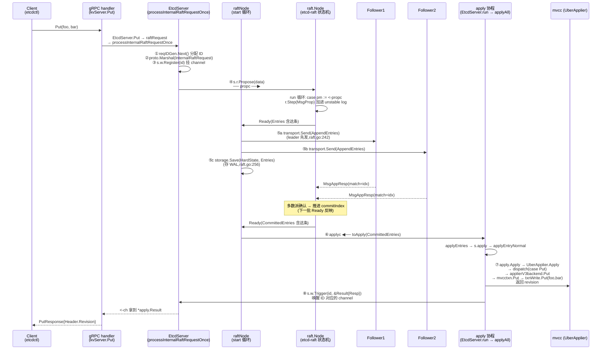

# 第八章 · 写路径全流程

> 篇:P2 写读路径·etcdserver
> 主线呼应:第 7 章我们立起了 `EtcdServer` 这个总管的架构——三层套娃、两条主通道(`propc` 进 Raft、`applyc` 出 Raft 到应用层)、一个 `select` 循环(`raftNode.start`)。但那条 Put 在这套架构里**一步一步**怎么走,我们一直停在入口。这一章就是把第 7 章那些通道、循环、字段串成**一条线**:从客户端发出 `Put`,到 leader propose,到多数派复制 commit,到 `applyc` 取出,到 `UberApplier` 写进 mvcc,最后**精确唤醒**那个发起它的客户端。这一章是全书二分法"衔接"那一面的具象——协议层吐出的 entry 怎么落地成应用层的 KV,以及应用层 apply 完怎么反过来叫醒卡在协议层入口上的客户端。

## 核心问题

**一条 `Put` 从客户端到返回成功,完整经过哪些步骤?为什么客户端要等到 `apply`(而非 `commit`)才返回——这保证了什么?`propose` 是异步走的、`apply` 是另一条协程干的,那个发起写请求的客户端协程,凭什么被 apply 完成精确唤醒而不是被别的请求的 apply 结果糊一脸?**

读完本章你会明白:

1. 一条 `Put` 的端到端旅程:gRPC handler → `EtcdServer.Put` → 序列化 `InternalRaftRequest` → `processInternalRaftRequestOnce`(`s.w.Register(id)` + `s.r.Propose`) → 进 `propc` → `r.Step` 加进 raft log → 多数派复制 commit → `Ready` 出来 → `applyc` → `applyAll` → `UberApplier.Put` → `txnWrite.Put` 写 mvcc → `s.w.Trigger(id, ar)` → 唤醒等在 `<-ch` 的客户端协程。
2. 为什么客户端要**等 apply 才返回**(线性一致):"看到成功"= 该写已 apply 到本机状态机 = 已 commit 到多数派。反面对比"commit 就返回"会破坏什么。
3. `wait` 机制凭什么把"发起 propose"和"apply 完成"精确配对——靠全局唯一的 request ID 在 wait 表里注册 channel、按同一 ID 唤醒。
4. `s.r.Propose` 到底阻塞到哪一步——它不是"丢进 channel 立刻返回",而是等 leader 的 `r.Step` 把 entry 加进 unstable log 才返回(P2-07 把它简化成"不阻塞",本章精确化)。

> **如果一读觉得太难**:先只记住三件事——① 一条 Put 的旅程就是"propose 进(propc)→ 共识 → apply 出(applyc)→ 按 ID 唤醒"四个动作,中间所有细节都是为了让这四个动作跑通。② 客户端等 apply 才返回,是因为"线性一致"要求"看到成功的写,后续读一定能读到";commit 但没 apply,可能读不到。③ propose 时分配的 request ID 是把"发起"和"完成"配对的唯一钥匙——apply 完用同一个 ID 去 wait 表里找那个 channel 唤醒。

---

## 8.1 一句话点破

> **一条 Put 的写路径,是一条"从入口 propc 进、从出口 applyc 出、用 wait 表把两端系起来"的旅程。客户端协程发起 propose 时,用一个全局唯一的 request ID 在 wait 表里挂一个 channel;propose 经过 raft 多数派复制 commit 后,apply 协程从 applyc 取出 entry、反序列化、按 oneof 分发到 UberApplier 写进 mvcc,写完后用同一个 request ID 去 wait 表里找到那个 channel,把结果投进去——客户端协程从 `<-ch` 醒来,返回给 gRPC handler。客户端"看到成功",意味着这条写已经 apply 到本机状态机——也就是已经被多数派 commit,这是线性一致的来源。**

这是结论,不是理由。本章倒过来拆:先把旅程的八跳列出来画一张时序图,然后逐跳钻进去——序列化、注册等待、Propose 进 propc、leader 的 r.Step、多数派复制 commit、applyc、UberApplier 写 mvcc、Trigger 唤醒。最后单独拆透两个硬核技巧:**为什么等 apply 而非 commit**、**wait 凭什么精确配对**。

---

## 8.2 旅程总览:一条 Put 的八跳

第 7 章立起了 `EtcdServer` 的架构。本章把一条 `Put` 放进这套架构跑一遍。先看完整的端到端时序:



这八跳,就是本章要逐个拆透的旅程。其中 ④(propose 进 propc)、⑥(applyc 取出)、⑦(UberApplier 写 mvcc)、⑧(Trigger 唤醒)是本章重头。①~③ 在 `processInternalRaftRequestOnce` 里,⑤ 在 `raftNode.start` 里(第 7 章拆过顺序,本章只点跟写路径相关的部分)。

> **钉死这件事**:这条路径横跨**四个协程**——客户端 gRPC handler 协程(①~④、⑧ 的等待方)、`etcd-raft` 的 `node.run` 协程(`r.Step` 加日志、产 Ready)、`raftNode.start` 协程(⑤ 发网络 + 存 WAL)、`EtcdServer.run` 的 apply 协程(⑥~⑧)。它们靠三个 channel(`propc`、`readyc`、`applyc`)和一个 wait 表串起来,彼此异步。客户端协程在 ④ 之后立刻挂在 `<-ch` 上睡觉,直到 ⑧ 被唤醒——它不知道中间走了多少协程、跨了多少网络往返,只关心"我那个 ID 的 channel 啥时候响"。

---

## 8.3 入口三连:序列化、注册等待、Propose

### 它要解决什么问题

客户端的 `Put(foo, bar)` 经 gRPC(第 7 章 7.3 节拆过 `kvServer.Put → EtcdServer.Put`)进到 `EtcdServer.Put` 后,被翻译成一个 `InternalRaftRequest`(用 oneof 字段区分 Put/DeleteRange/Txn/...),然后调 [`raftRequest`](../etcd/server/etcdserver/v3_server.go#L1012):

```go
// server/etcdserver/v3_server.go:1012 (简化示意)
func (s *EtcdServer) raftRequest(ctx context.Context, r *pb.InternalRaftRequest) (proto.Message, error) {
    result, err := s.processInternalRaftRequestOnce(ctx, r)
    if err != nil {
        return nil, err
    }
    if result.Err != nil {
        return nil, result.Err
    }
    // ... trace 处理 ...
    return result.Resp, nil
}
```

真正干活的是 [`processInternalRaftRequestOnce`](../etcd/server/etcdserver/v3_server.go#L1058)。本章假设请求已到 leader(非 leader 节点收到写请求会转发给 leader,那是另一条路径,本章不展开),直接看它的核心。它在 propose 之前,要做三件准备:分配 ID、序列化、注册等待。

### 真实源码

```go
// server/etcdserver/v3_server.go:1058-1132 (简化示意,保留核心步骤与真实行号)
func (s *EtcdServer) processInternalRaftRequestOnce(ctx context.Context, r *pb.InternalRaftRequest) (*apply2.Result, error) {
    ai := s.getAppliedIndex()
    ci := s.getCommittedIndex()
    if exceedsRequestLimit(ai, ci, r, ...) {
        return nil, errors.ErrTooManyRequests     // 限流:在飞请求太多
    }

    r.Header = &pb.RequestHeader{
        ID: s.reqIDGen.Next(),                      // ★ ① 分配全局唯一 request ID
    }

    // ... 鉴权(AuthInfoFromCtx,填 Username/AuthRevision 到 Header)...

    data, err = proto.Marshal(r)                    // ★ ② 序列化成字节
    if err != nil {
        return nil, err
    }
    if len(data) > int(s.Cfg.MaxRequestBytes) {
        return nil, errors.ErrRequestTooLarge       // 请求太大,拒绝(防 OOM)
    }

    id := r.ID
    if id == 0 {
        id = r.Header.ID                            // ★ 取 ID(wait 的钥匙)
    }
    ch := s.w.Register(id)                          // ★ ③ 在 wait 表挂一个 channel

    cctx, cancel := context.WithTimeout(ctx, s.Cfg.ReqTimeout())
    defer cancel()

    err = s.r.Propose(cctx, data)                   // ★ ④ 塞进 propc(下面 8.4 拆)
    if err != nil {
        proposalsFailed.Inc()
        s.w.Trigger(id, nil)                        // 失败也要清 wait 表,否则内存泄漏
        return nil, err
    }
    proposalsPending.Inc()
    defer proposalsPending.Dec()

    select {
    case x := <-ch:                                 // ★ ⑧ 挂起,等 apply 协程 Trigger
        return x.(*apply2.Result), nil
    case <-cctx.Done():                             // 超时
        proposalsFailed.Inc()
        s.w.Trigger(id, nil)
        return nil, s.parseProposeCtxErr(cctx.Err(), start)
    case <-s.done:                                  // 服务器关停
        return nil, errors.ErrStopped
    }
}
```

### ① 分配 ID:为什么必须是全局唯一

`request ID` 是这条写路径的**身份证**。propose 时用它注册 wait,apply 完用它唤醒。如果两个并发 Put 用了同一个 ID,会撞上——`s.w.Register(id)` 在 wait 表里发现 id 已存在,直接 [`log.Panicf("dup id %x", id)`](../etcd/pkg/wait/wait.go#L71)(wait 表的实现第 7 章 7.7 节拆过)。

ID 由 [`s.reqIDGen`](../etcd/server/etcdserver/server.go#L266) 生成,这个 generator 的真实结构([`pkg/idutil/id.go:49`](../etcd/pkg/idutil/id.go#L49)):

```
request ID 的位布局(共 8 字节):
┌────────────────┬──────────────────────────────┬──────────┐
│  prefix (2B)   │      timestamp (5B)          │ cnt (1B) │
│   = memberID   │   = 启动时刻的毫秒时间戳       │ = 计数器 │
└────────────────┴──────────────────────────────┴──────────┘
```

[`Next()`](../etcd/pkg/idutil/id.go#L67) 用 `atomic.AddUint64(&g.suffix, 1)` 原子递增低 6 字节(时间戳+计数器),再或上 prefix。三段保证唯一:

- **prefix 是 memberID(2 字节)**:不同节点生成的 ID 高 2 字节不同,集群内不会撞。
- **timestamp 是启动时刻的毫秒(5 字节)**:同一节点重启后,时间戳跳进新的一段(只要重启间隔 > 1ms 且 < 35 年),前后两次生命周期的 ID 不会撞。
- **cnt 是计数器(1 字节)**:同一节点同一毫秒内的并发请求,靠计数器区分。1 字节看似只够 256 req/ms = 256k req/s,但源码注释([id.go:45-48](../etcd/pkg/idutil/id.go#L45-L48))说计数器会**故意溢出到 timestamp 字段**,把事件窗口撑到 2^48,只要 etcd 吞吐 < 256k req/s(单集群远达不到),就不会撞。

> **不这样会怎样**:如果用自增整数(全局 counter)做 ID,简单但有两个坑——一是重启后从 0 开始,会和上次生命周期的 ID 撞;二是没有节点维度,多节点生成时要么共享 counter(单点瓶颈),要么各管各(撞)。etcd 这套"memberID + 时间戳 + 计数器",让每个节点都能**独立、无锁(只本节点一个原子操作)、全局唯一**地生成 ID,这是 wait 表能精确配对的根基。

### ② 序列化:为什么 Raft 日志存的是字节

`proto.Marshal(r)` 把 `InternalRaftRequest` 序列化成字节流。Raft 日志里存的 entry,`Data` 字段是 `[]byte`——Raft 协议层**不关心**字节里装的是 Put 还是 Txn 还是 ConfChange,它只管"把这些字节按顺序复制到多数派、commit、apply"。这是第 1 章 1.8 节二分法的体现:**协议层只搬字节,应用层才解释字节**。

序列化后还有个 `MaxRequestBytes` 检查(单条请求不能太大,默认 1.5MB),防止单条写撑爆 raft log 和 WAL。

### ③ 注册等待:挂一个 channel 等结果

`s.w.Register(id)` 在 wait 表里挂一个带 1 缓冲的 channel,返回给调用方。调用方拿到的就是这个 `<-chan any`,在 ④ 之后用它 `<-ch` 挂起。wait 表的实现第 7 章 7.7 节拆过(64 分片锁、缓冲 1、重复 id panic、先删后 close),这里只点它在写路径里的角色:**它是把"发起 propose"和"apply 完成"配对的胶水**。

> **钉死这件事**:`processInternalRaftRequestOnce` 的入口三连(① 分配 ID → ② 序列化 → ③ Register)做完后,客户端协程才进 ④ `s.r.Propose`。这三步是"准备工作"——把这条写请求打上身份证、翻译成 raft 能消化的字节、在 wait 表里挂号。后面所有跨协程的奔波,都靠这个 ID 在 wait 表里找到回家的路。

---

## 8.4 Propose:进 propc,但不止"丢进 channel"

### P2-07 留的印象,这里精确化

第 7 章 7.3 节讲 `processInternalRaftRequestOnce` 时,把 `s.r.Propose` 描述成"**这一步不阻塞——它只是把数据丢进 propc channel**"。这个描述抓住了主要矛盾(propose 不等多数派复制),但**漏了一个细节**:`s.r.Propose` 并不是 fire-and-forget,它会等 `etcd-raft` 的 `r.Step` 把这条 propose 处理完才返回。我们把这层精确化。

`s.r` 是 `raftNode`(内嵌 `raftNodeConfig`,后者内嵌 `raft.Node`,见第 7 章 7.2 节三层套娃)。所以 `s.r.Propose` 实际调的是 `etcd-raft` 的 [`node.Propose`](../etcd-raft/node.go#L471):

```go
// etcd-raft/node.go:471 (源码原文)
func (n *node) Propose(ctx context.Context, data []byte) error {
    return n.stepWait(ctx, &pb.Message{Type: pb.MsgProp.Enum(), Entries: []*pb.Entry{{Data: data}}})
}
```

它把请求包装成 `MsgProp` 消息,调 `stepWait`。`stepWait` 调 [`stepWithWaitOption(ctx, m, wait=true)`](../etcd-raft/node.go#L514):

```go
// etcd-raft/node.go:514-551 (简化示意,保留关键分支)
func (n *node) stepWithWaitOption(ctx context.Context, m *pb.Message, wait bool) error {
    if m.GetType() != pb.MsgProp {
        // 非 propose 走 recvc,不等
        select {
        case n.recvc <- m:
            return nil
        case <-ctx.Done():
            return ctx.Err()
        case <-n.done:
            return ErrStopped
        }
    }
    ch := n.propc
    pm := msgWithResult{m: m}
    if wait {
        pm.result = make(chan error, 1)        // ★ 建一个 result channel
    }
    select {
    case ch <- pm:                             // ★ 投进 propc
        if !wait {
            return nil
        }
    case <-ctx.Done():
        return ctx.Err()
    case <-n.done:
        return ErrStopped
    }
    select {
    case err := <-pm.result:                   // ★ 等 run 循环回送 err
        if err != nil {
            return err
        }
    case <-ctx.Done():
        return ctx.Err()
    case <-n.done:
        return ErrStopped
    }
    return nil
}
```

注意 `Propose` 走的是 `wait=true` 分支:它建一个 `pm.result` channel,投进 propc 后,**等 `pm.result` 回送才返回**。谁回送?是 `etcd-raft` 的 `node.run` 协程:

```go
// etcd-raft/node.go:386-393 (源码原文,case 分支)
case pm := <-propc:
    m := pm.m
    m.From = new(r.id)
    err := r.Step(m)                    // ★ 把 MsgProp 喂给 raft 状态机
    if pm.result != nil {
        pm.result <- err                // ★ 回送 err(可能是 nil 或 ErrProposalDropped)
        close(pm.result)
    }
```

所以 `s.r.Propose` 的真实语义是:**投递 MsgProp 到 propc → 等 node.run 取出 → 调 r.Step(MsgProp) → r.Step 返回后回送 err → Propose 拿到 err 返回**。

`r.Step(MsgProp)` 在 leader 上做什么?它走 `stepLeader`,把这条 propose 的 entry 追加到自己的 unstable log(还没持久化,但已在 raft 状态机里了)。在 follower 上(如果客户端发错了节点),`stepFollower` 会把 MsgProp 转发给 leader,不本地处理。

> **钉死这件事(精确化 P2-07 的印象)**:`s.r.Propose` **不阻塞到"多数派复制完成"**,但它**阻塞到"leader 的 r.Step 接受这条 propose 并加进 unstable log"**。这一步是同步的——客户端协程在 propc 这里跟 node.run 协程做了一次握手。握手完成后,propose 的 entry 已经在 leader 的 unstable log 里,接下来会被打包进 `Ready` 复制给 follower。`Propose` 返回 nil 只代表"leader 收下了",**不代表已 commit、不代表已 apply**——这两件事是后面异步发生的,客户端要靠 `<-ch` 等。

### 不这样会怎样

如果 `Propose` 是 fire-and-forget(不等 r.Step 返回),有两个麻烦:

1. **错误无法回报**:leader 因为某种原因拒绝 propose(比如 `r.Step` 在 follower 上收到 MsgProp 会转发给 leader,转发失败时返回 `ErrProposalDropped`;或节点正在 stepping down),客户端拿不到 err,以为 propose 成功,傻等 `<-ch` 直到超时。等 r.Step 返回 err,客户端能立刻知道"这条 propose 没被 raft 接受",直接走失败路径。
2. **背压丢失**:如果客户端无限往 propc 灌 propose 而 node.run 消费不动,propc 会无限堆积。`stepWithWaitOption` 在投递 `case ch <- pm` 上也会 block,天然形成背压——客户端协程在 propc 满时被 block,不会再调 `processInternalRaftRequestOnce` 起新请求。

> **所以这样设计**:Propose 用 `wait=true`,既让客户端拿到 r.Step 的结果(知道 propose 有没有被 raft 接受),又通过 channel 投递形成背压。这是 etcd-raft"库 + 应用"解耦的典型——`r.Step` 是纯状态机操作(快,纳秒级),`Propose` 等它不会拖慢协议,反而保证了"propose 进 raft log"这件事对调用方是确定的。

---

## 8.5 leader 复制、多数派 commit:Ready 这一批

### 它要解决什么问题

`s.r.Propose` 返回后,entry 已经在 leader 的 unstable log。但 raft 是**批量驱动**的(P1-06 拆过 `Ready`/`Advance`):leader 不会立刻发 AppendEntries,而是等下次 `node.run` 检测到 `HasReady()` 时,把这批新 entry 连同其他变化(待发消息、HardState 变更)打包成 `Ready`,经 `readyc` 吐给 `raftNode.start`。

`raftNode.start` 收到这批 `Ready` 后的完整顺序,第 7 章 7.5 节拆透了。这里只挑跟写路径相关的三步(对应 [raft.go:232/242/256](../etcd/server/etcdserver/raft.go#L232)):

```go
// server/etcdserver/raft.go:228-260 (高度简化,只保留写路径相关三步)
// 在 case rd := <-r.Ready(): 分支内
updateCommittedIndex(&ap, rh)

select {
case r.applyc <- ap:                // (A) 先把 apply 部分丢出去
case <-r.stopped:
    return
}

// raft thesis 10.2.1: leader 先发后存,让 leader 写盘和 follower 写盘并行
if islead {
    r.transport.Send(r.processMessages(rd.Messages))   // (B) leader 先发 AppendEntries
}
// ... 存 snapshot ...
if err := r.storage.Save(rd.HardState, rd.Entries); err != nil {  // (C) 存 WAL
    r.lg.Fatal(...)
}
// ... follower 路径是先 Save 后 Send(第 7 章拆过为什么反过来)...
r.raftStorage.Append(rd.Entries)     // 存进 MemoryStorage
r.Advance()                          // 推进,产下一批
```

### 写路径关心的两件事

对一条 Put 来说,这批 `Ready` 出来后,有两件事关乎它的命运:

**(B) 发 AppendEntries 给 follower**:`rd.Messages` 里包含 leader 对每个 follower 的 AppendEntries(带着这条新 entry)。`transport.Send` 异步走 HTTP/rafthttp 把它们发出去。follower 收到后,`stepFollower` 调 `r.handleAppendEntries` 把 entry 加进自己的 unstable log,持久化,然后回 `MsgAppResp(match=newIndex)` 告诉 leader"我收到第 newIndex 条了"。

**(A) applyc 送出 CommittedEntries**:这批 `Ready` 里如果有已经 commit 的 entry(`rd.CommittedEntries`),会被打包成 `toApply` 经 `applyc` 送出去。但**注意**:一条新 propose 的 entry,在它**当前这批** `Ready` 里通常还**没 commit**——commit 要等多数派 follower 的 `MsgAppResp` 回来,这往往要下一批甚至下几批 `Ready` 才会反映(leader 在 `stepLeader` 收到 `MsgAppResp` 后推进 `commitIndex`,下次 `Ready` 的 `CommittedEntries` 才含这条)。所以一条 Put 从 propose 到 apply,通常跨**多批** `Ready`。

> **钉死这件事**:从 propose 到 apply,跨多个协程(node.run / raftNode.start / apply 协程)、多批 Ready、多次网络往返。客户端协程在这一切发生时,一直**安静地挂在 `<-ch` 上**——它不参与、不感知,只等那个 ID 的 channel 响。这就是异步解耦的威力:发起方和完成方互不阻塞,中间跨多少跳都不影响这条路径的正确性,因为 wait 表用 ID 把两端系死了。

---

## 8.6 apply 协程:从 applyc 取出,反序列化,分发

### 它要解决什么问题

`applyc` 的消费方是 `EtcdServer.run` 主循环([server.go:841-855](../etcd/server/etcdserver/server.go#L841),第 7 章 7.6 节拆过)。`run` 从 `<-s.r.apply()` 拿到 `toApply` 后,丢进 `sched`(FIFO 调度器)异步执行 `applyAll`。`applyAll` 干三件事([server.go:972](../etcd/server/etcdserver/server.go#L972)):

```go
// server/etcdserver/server.go:972-993 (简化示意)
func (s *EtcdServer) applyAll(ep *etcdProgress, apply *toApply) {
    s.applySnapshot(ep, apply)              // (1) 有 snapshot 先 apply snapshot
    s.applyEntries(ep, apply)               // (2) apply entry(写路径核心)
    backend.VerifyBackendConsistency(...)   // (3) 校验 backend 一致性

    proposalsApplied.Set(float64(ep.appliedi))
    s.applyWait.Trigger(ep.appliedi)        // ★ 唤醒按 index 等待的读请求(第 9 章用)

    <-apply.notifyc                         // ★ 等 raft 协程存完 WAL(第 7 章 7.7 拆过)

    s.snapshotIfNeededAndCompactRaftLog(ep) // 需要就 snapshot
    // ... 处理 msgSnapC ...
}
```

写路径核心是 (2) `applyEntries`,它调 `s.apply`(注意是方法名,不是字段)按 entry 类型分发:

```go
// server/etcdserver/server.go:1881-1930 (简化示意,保留两种 entry 类型)
func (s *EtcdServer) apply(es []*raftpb.Entry, ep *etcdProgress, raftAdvancedC <-chan struct{}) (appliedt, appliedi uint64, shouldStop bool) {
    for i := range es {
        e := es[i]
        // ... consistentIndex 处理 ...
        switch e.GetType() {
        case raftpb.EntryNormal:
            s.applyEntryNormal(e, shouldApplyV3)     // ★ Put/Txn/delete 走这里
            s.setAppliedIndex(e.GetIndex())
            s.setTerm(e.GetTerm())
        case raftpb.EntryConfChange:
            // ... 成员变更,会 s.w.Trigger(cc.GetId(), ...) ...
        }
        appliedi, appliedt = e.GetIndex(), e.GetTerm()
    }
    return
}
```

EntryNormal 调 [`applyEntryNormal`](../etcd/server/etcdserver/server.go#L1934)。这里有个细节:leader 上任时 raft 会发一个**空 entry**(`len(e.Data) == 0`),用来把自己的 term 写进日志,保证后续 commit 安全(对应 P1-04 的 Figure 8 陷阱)。`applyEntryNormal` 先跳过空 entry:

```go
// server/etcdserver/server.go:1934-1992 (简化示意)
func (s *EtcdServer) applyEntryNormal(e *raftpb.Entry, shouldApplyV3 membership.ShouldApplyV3) {
    // ... consistentIndex 维护 ...
    if len(e.Data) == 0 {
        // leader 上任的 noop entry,跳过(但会 Promote lessor 等)
        return
    }

    ar, id := apply.Apply(s.lg, e, s.uberApply, s.w, shouldApplyV3)   // ★ 核心:反序列化 + 分发

    // ...
    if !errorspkg.Is(ar.Err, errors.ErrNoSpace) || ... {
        s.w.Trigger(id, ar)                                            // ★ ⑧ 用 id 唤醒等着的客户端
        return
    }
    // ... 配额满的特殊处理:发 NOSPACE 告警再 Trigger ...
}
```

### 核心:apply.Apply 反序列化 + 取 ID + 分发

[`apply.Apply`](../etcd/server/etcdserver/apply/apply.go#L27) 干三件事:

```go
// server/etcdserver/apply/apply.go:27-49 (源码原文,简化)
func Apply(lg *zap.Logger, e *raftpb.Entry, uberApply UberApplier, w wait.Wait, shouldApplyV3 membership.ShouldApplyV3) (ar *Result, id uint64) {
    var raftReq pb.InternalRaftRequest
    pbutil.MustUnmarshalMessage(&raftReq, e.Data)   // ★ 反序列化字节流回 InternalRaftRequest
    lg.Debug("Apply", zap.Stringer("raftReq", &raftReq))

    id = raftReq.ID                                  // ★ 取 ID(与 propose 端对称!)
    if id == 0 {
        if raftReq.Header == nil {
            lg.Panic("Apply, could not find a header")
        }
        id = raftReq.Header.ID                       // 同样:id==0 则用 Header.ID
    }

    needResult := w.IsRegistered(id)                 // ★ wait 表里有人等吗?
    wrapper := &InternalRaftRequestWrapper{
        InternalRaftRequest: &raftReq,
        SkipRangeExecution:  !needResult && raftReq.Txn != nil,
    }
    if needResult || !noSideEffect(&raftReq) {
        return uberApply.Apply(wrapper, shouldApplyV3), id   // ★ 有等方或有副作用,执行
    }
    return nil, id                                   // 无等方且无副作用(纯 Range),跳过
}
```

这里有两个精妙处:

1. **ID 取法和 propose 端完全对称**:`id = raftReq.ID; if id == 0 { id = raftReq.Header.ID }`——和 `processInternalRaftRequestOnce` 里 `id := r.ID; if id == 0 { id = r.Header.ID }`([v3_server.go:1102-1105](../etcd/server/etcdserver/v3_server.go#L1102-L1105))一模一样。这是有意为之:propose 端打进去的 ID,apply 端用同一套规则取出来,**保证两端拿到同一个 ID**。这是 wait 表能配对的根基。
2. **`w.IsRegistered(id)` 优化**:如果 wait 表里没人等这个 ID(比如这是 follower 在 apply,客户端在 leader 那边等——follower 没人等结果),且这个请求"无副作用"(纯 Range/AuthUserGet 等只读请求),直接跳过不 apply。Put 不在此列(Put 有副作用),所以 Put 一定会走到 `uberApply.Apply`。

### UberApplier:装饰器链 + dispatch

[`uberApply.Apply`](../etcd/server/etcdserver/apply/uber_applier.go#L82) 是一条装饰器链:

```go
// server/etcdserver/apply/uber_applier.go:82-89 (源码原文)
func (a *uberApplier) Apply(r *InternalRaftRequestWrapper, shouldApplyV3 membership.ShouldApplyV3) *Result {
    // We first execute chain of Apply() calls down the hierarchy:
    // (i.e. CorruptApplier -> CappedApplier -> Auth -> Quota -> Backend),
    // then dispatch() unpacks the request to a specific method (like Put),
    // that gets executed down the hierarchy again:
    // i.e. CorruptApplier.Put(CappedApplier.Put(...(BackendApplier.Put(...)))).
    return a.applyV3.Apply(r, shouldApplyV3, a.dispatch)
}
```

注释把链讲清了:`applyV3` 这条链按当前 alarm 状态动态构造([`newApplierV3`](../etcd/server/etcdserver/apply/uber_applier.go#L61))——

```
applyV3 (按 alarm 动态套):
┌─ 若 CORRUPT alarm:  CorruptApplier
│  └─ 若 NOSPACE alarm: CappedApplier
│     └─ AuthApplierV3
│        └─ QuotaApplierV3
│           └─ applierV3backend   ← 真正干活的
```

每一层加一道检查/装饰:

- **CorruptApplier**:数据损坏告警状态下,apply 时故意返回 corrupt 错误(防止损坏数据被当成正常数据用)。
- **CappedApplier**:磁盘满(NOSPACE)告警状态下,只允许"删除"类操作,拒绝写入(防止磁盘越撑越满)。
- **AuthApplierV3**:鉴权——检查这个 Put 的发起者有没有权限写这个 key。
- **QuotaApplierV3**:配额——检查 backend 大小是否超配额,超了拒绝写。
- **applierV3backend**:真正调 mvcc 写。

每层的 `Apply` 都调 `applyFunc(r, shouldApplyV3)`(最终是 `dispatch`),`dispatch` 按 oneof 字段分发:

```go
// server/etcdserver/apply/uber_applier.go:130-136 (源码原文,case 分支)
switch {
case r.Range != nil:
    op = "Range"
    ar.Resp, ar.Trace, ar.Err = a.applyV3.Range(r.Range)
case r.Put != nil:
    op = "Put"
    ar.Resp, ar.Trace, ar.Err = a.applyV3.Put(r.Put)     // ★ Put 走这里
// ... DeleteRange / Txn / Compaction / LeaseGrant / ...
}
```

`a.applyV3.Put` 沿装饰器链往下传,最终到 [`applierV3backend.Put`](../etcd/server/etcdserver/apply/backend.go#L50):

```go
// server/etcdserver/apply/backend.go:50-52 (源码原文)
func (a *applierV3backend) Put(p *pb.PutRequest) (resp *pb.PutResponse, trace *traceutil.Trace, err error) {
    return mvcctxn.Put(context.TODO(), a.options.Logger, a.options.Lessor, a.options.KV, p)
}
```

[`mvcctxn.Put`](../etcd/server/etcdserver/txn/put.go#L30) 开一个 mvcc 写事务,真正落盘:

```go
// server/etcdserver/txn/put.go:30-46 (简化示意)
func Put(ctx, lg, lessor, kv, p) (*pb.PutResponse, *traceutil.Trace, error) {
    // ... trace / checkLease ...
    txnWrite := kv.Write(trace)              // ★ 开 mvcc 写事务
    defer txnWrite.End()
    prevKV, err := checkAndGetPrevKV(...)   // 若 PrevKv/IgnoreValue/IgnoreLease,先读旧值
    // ...
    return put(ctx, txnWrite, p, prevKV), trace, nil
}

// put() 内部:
func put(ctx, txnWrite, p, prevKV) *pb.PutResponse {
    // ... 处理 IgnoreValue / IgnoreLease / PrevKv ...
    resp.Header.Revision = txnWrite.Put(p.Key, val, leaseID)   // ★ 写 mvcc,返回新 revision
    return resp
}
```

`txnWrite.Put(key, val, leaseID)` 是 mvcc 的写入口:它在内存的 treeIndex 里给这个 key 加一个新 revision(main=sub=0 或 main=N,sub=0),在 backend(bbolt)里把 revision→value 存进 bucket,如果带 lease 还会把 key 挂到 lease 名下。**mvcc 内部怎么存 revision→value,是第 3 篇(P3-10/11)的主菜,本章只点"它返回新 revision"**。

返回的 `PutResponse` 里 `Header.Revision` 是这条写产生的新 revision——客户端拿到的就是这个,表示"你的写在全局第 N 个 revision 生效了"。

> **钉死一件事**:apply 协程从 `applyc` 取出 entry,到 `txnWrite.Put` 写进 mvcc,这条链路完全是**顺序、同步**的(在 apply 协程这一条协程内):反序列化 → 取 ID → IsRegistered → UberApplier.Apply → 装饰器链 → dispatch(case Put)→ applierV3backend.Put → mvcctxn.Put → kv.Write → txnWrite.Put → 返回 revision。中间没有 channel、没有跨协程。这个顺序性保证了:**同一条 entry 的"写 mvcc"和"Trigger wait"是前后脚发生的——写完立刻 Trigger,客户端立刻能读到这条写**。这是线性一致的关键(下一节拆)。

---

## 8.7 Trigger 唤醒:apply 完怎么精确叫醒客户端

### 它要解决什么问题

`txnWrite.Put` 返回后,`dispatch` 把结果装进 `ar`(一个 `*apply.Result`,含 `Resp`/`Trace`/`Err`),返回给 `apply.Apply`,再返回给 `applyEntryNormal`。接下来是最关键的一步——[`s.w.Trigger(id, ar)`](../etcd/server/etcdserver/server.go#L1971):

```go
// server/etcdserver/server.go:1970-1972 (源码原文)
if !errorspkg.Is(ar.Err, errors.ErrNoSpace) || len(s.alarmStore.Get(pb.AlarmType_NOSPACE)) > 0 {
    s.w.Trigger(id, ar)
    return
}
```

`s.w.Trigger(id, ar)` 做什么?回顾 wait 表的实现([`pkg/wait/wait.go:76`](../etcd/pkg/wait/wait.go#L76)):

```go
// pkg/wait/wait.go:76-86 (源码原文)
func (w *list) Trigger(id uint64, x any) {
    idx := id % defaultListElementLength
    w.e[idx].l.Lock()
    ch := w.e[idx].m[id]
    delete(w.e[idx].m, id)          // ★ 先从 map 删,防重复 Trigger
    w.e[idx].l.Unlock()
    if ch != nil {
        ch <- x                     // ★ 投递结果(缓冲 1,不阻塞)
        close(ch)                   // ★ 关闭 channel
    }
}
```

这一刻,挂起在 [`case x := <-ch`](../etcd/server/etcdserver/v3_server.go#L1123) 上的客户端协程被唤醒,拿到 `x.(*apply2.Result)`,经 `raftRequest` 返回给 `EtcdServer.Put`,再返回给 gRPC handler,最终回到客户端。

`Trigger` 用的 `id`,和 `processInternalRaftRequestOnce` 里 `Register` 用的 `id`,是**同一个**——都来自 `r.ID`/`r.Header.ID`。这是整个写路径配对的钥匙:

```
propose 端:                              apply 端:
processInternalRaftRequestOnce           applyEntryNormal → apply.Apply
─────────────────────────                ─────────────────────────
id := r.ID                               id = raftReq.ID
if id == 0 { id = r.Header.ID }          if id == 0 { id = raftReq.Header.ID }
ch := s.w.Register(id)                   (从字节反序列化拿到的同一个 ID)
                                         ar, id := apply.Apply(...)
s.r.Propose(data)  // data 含这个 ID    s.w.Trigger(id, ar)
select {
case x := <-ch:   // ←—— 被 Trigger 投递的 ar 唤醒
}
```

两端的 `id` 取法**对称、字面一致**——这是有意为之的工程纪律。如果两端取法不一样(比如一端用 `r.ID`、另一端用 `r.Header.ID`),当其中一个为 0 时会取错,Trigger 找不到对应 channel,客户端永远等不到响应。

> **不这样会怎样**:如果 apply 完不用 wait 表按 ID 唤醒,而用别的机制——
> - **全局广播**:apply 完 close 一个全局 channel,所有等着的客户端全醒,各自检查"是不是我的那条 apply 完了"。这要求每个客户端自己拿着 entry index 去 match,且广播会惊群(几百个客户端同时醒来抢锁检查)。etcd 用 ID 精确唤醒,只有真正完成的那条的客户端醒。
> - **共享 channel**:所有客户端等同一个 channel,apply 完往里投,某个客户端抢到,其他客户端错过。这完全不可行——结果会错配。
> - **同步回调**:apply 完调一个 callback,但 callback 怎么找到那个特定的客户端协程?还是要靠某种 ID→回调的映射。wait 表就是这个映射。
>
> etcd 这套"ID→channel 表"是解耦异步发起与异步完成的标准 Go 范式——`context`、`future/promise`、`sync.Map` 都做不到这种"按业务 ID 精确唤醒"。它把"发起方"和"完成方"从必须互相认识解放出来,只共享一个 ID。

### 配额满的特殊路径

注意 `applyEntryNormal` 里 `Trigger` 之前有个判断:`if !errorspkg.Is(ar.Err, errors.ErrNoSpace) || ...`。如果 apply 返回 `ErrNoSpace`(磁盘配额满),且当前**没有** NOSPACE alarm(说明这是第一个触发配额的请求),它会先异步发一个 `AlarmRequest(ACTIVATE, NOSPACE)`(再走一次 raft),**然后再** `s.w.Trigger(id, ar)`。为什么?因为要保证"客户端看到配额错误时,集群已经置了 NOSPACE 告警",后续请求会走 CappedApplier 被拒绝,而不是继续往满磁盘上写。这是个"先广播告警再回错误"的次序保证,我们点一下不展开。

---

## 8.8 技巧精解:为什么"等 apply 才返回"是线性一致的命脉

这一章的硬核技巧,是把第 1 章 1.6 节立的"线性一致"概念,落到写路径的具体返回时机上。我们单独拆透——这是 etcd 设计中最容易被低估、却最关键的一处选择。

### 朴素方案的诱惑

先想:为什么客户端不能在 `commit` 时就返回,非要等 `apply`?

`commit` 的语义是"这条 entry 已经被多数派持久化,不会丢"。从 safety 角度,commit 后这条写**安全了**——即使 leader 立刻崩溃,新 leader 也一定有这条 entry(leader 完整性,P1-05)。那为什么还要多等一步 apply?

朴素方案长这样:

```go
// 朴素方案(错误,非源码)
func (s *EtcdServer) Put(...) {
    id := s.reqIDGen.Next()
    ch := registerOnCommit(id)       // 在"commit"时唤醒
    s.r.Propose(data)
    result := <-ch                    // 等 commit
    return result
}
```

这条路看似更快(省了 apply 的延迟),但它**破坏线性一致**。我们构造一个反例。

### 反例:commit 就返回,读不到自己的写

线性一致要求([第 1 章 1.6 节](P0-01-第一性原理-为什么需要共识.md)):"读操作看到的结果,就像所有操作都作用在一个单一副本上"。一个直接推论:**客户端 A 写完收到"成功"后,客户端 B 立刻读,必须能读到 A 的写**(这是线性一致的"读你写"一致性,比一般线性一致更强但等价)。

现在假设集群三节点 L(leader)、F1、F2,客户端 A 发 `Put(foo, bar)`:

1. leader L 把 `Put(foo,bar)` propose 进 raft log,index=10。
2. L 发 AppendEntries 给 F1、F2,两者都回 `MsgAppResp(match=10)`。
3. L 收到多数派(F1+自己)确认,推进 `commitIndex=10`。朴素方案这时**立刻唤醒客户端 A**,A 收到"成功"。
4. **但 L 还没 apply 这条 entry**——apply 协程还在处理上一批,mvcc 里 `foo` 还是旧值(或不存在)。
5. 客户端 A 紧接着发 `Get(foo)`,走线性一致读(第 9 章)——线性一致读在 leader 上读 mvcc 的"当前值"。
6. **mvcc 里 `foo` 还是旧的!** A 读到旧值或 not found。

这违反线性一致——A 明明刚收到"Put 成功",却读不到自己的写。问题出在"commit"和"apply"之间的窗口:commit 是协议层概念(多数派日志里有),apply 是应用层概念(状态机里生效)。读走的是应用层(读 mvcc),所以读看到的是 apply 进度,不是 commit 进度。

> **钉死这件事**:线性一致的"读你写",要求"客户端看到写成功"和"客户端能读到这条写"必须**原子**——中间不能有窗口。etcd 的做法是:**把"返回成功"推迟到 apply 完成之后**。客户端 `<-ch` 拿到结果的那一刻,mvcc 里已经有这条写(apply 协程刚 `txnWrite.Put` 完,立刻 `s.w.Trigger`)。所以客户端接下来的任何读,一定能读到这条写——因为读看到的 mvcc 已经包含它。

### etcd 的做法:等 apply,且只等 apply

回看 [`processInternalRaftRequestOnce`](../etcd/server/etcdserver/v3_server.go#L1122-L1132) 的 select:

```go
select {
case x := <-ch:                     // ★ 等 apply 协程 Trigger(apply 完)
    return x.(*apply2.Result), nil
case <-cctx.Done():                 // 超时(apply 太慢)
    s.w.Trigger(id, nil)
    return nil, ...
case <-s.done:                      // 服务器关停
    return nil, errors.ErrStopped
}
```

`<-ch` 等的是 `s.w.Trigger(id, ar)`,而 Trigger 发生在 `applyEntryNormal` 里 `s.w.Trigger(id, ar)`([server.go:1971](../etcd/server/etcdserver/server.go#L1971))——也就是 apply 协程写完 mvcc 之后。所以客户端醒来的时刻 = apply 完成的时刻 = mvcc 里有这条写的时刻。这三件事**原子**(在"apply 协程在写完 mvcc 和 Trigger 之间不会被打断"的意义上)。

> **为什么说"等 apply"是最小必要等待?**
> - 等更短(commit):上面证明了破坏线性一致。
> - 等更长(等 follower 也 apply 完):没必要。线性一致只要保证"读 leader 的 mvcc 看到最新",follower 的 apply 进度不影响 leader 的读(读路径会确认 leader 身份,第 9 章)。
> - 等 apply:**恰好**。apply 完成是"mvcc 里有这条写"的最早时刻,等它就够了。

### 反面对比:commit 就返回的真实危害

把上面的反例推广:

- **读你写破坏**:客户端写完读不到自己的写(上面构造的反例)。
- **跨客户端顺序破坏**:A 写完通知 B,B 读不到 A 的写(因为 B 的读在 leader,leader 没 apply)。
- **watch 顺序混乱**:watch 是从 mvcc 推的(P3-12),apply 没发生,mvcc 没事件,watch 收不到——但客户端以为写成功了,等 watch 通知却等不到。

这三条都是线性一致的核心承诺。一旦 commit 就返回,这些承诺全崩。所以"等 apply 才返回"不是性能取舍,是**正确性强制**——它把协议层的 commit(对客户端不可见)翻译成应用层的 apply(对客户端可见),让"成功"这个词对客户端有意义。

> **钉死这件事(本章最硬的一条)**:**etcd 客户端看到"Put 成功"= 这条写已经 apply 到 leader 的 mvcc = 已经被多数派 commit(P1-04/05)。** 这三个等号是线性一致的来源。任何一个等号不成立(commit 未 apply、apply 未 commit——后者在 etcd 里不可能,因为 apply 一定在 commit 之后),线性一致就破坏。"等 apply 才返回"是把这个等号链钉死在客户端可见边界上的那一锤。

---

## 8.9 技巧精解补丁:wait 凭什么把发起与完成精确配对

第二个硬核技巧,是 wait 表本身。它在第 7 章 7.7 节拆过并发结构(64 分片锁、缓冲 1、重复 panic),这里聚焦它在写路径里"精确配对"的角色,以及它解决的一个本质难题:**异步发起与异步完成的解耦**。

### 本质难题:发起方和完成方可能根本不认识

一条 Put 的发起方是客户端 gRPC handler 协程(`processInternalRaftRequestOnce`),完成方是 apply 协程(`applyEntryNormal`)。它们:

- **不在同一协程**:发起方在 ④ `Propose` 后挂起,完成方在 ⑥ apply 时被唤醒——两个协程靠 `propc`/`readyc`/`applyc` 三个 channel 串起来,中间隔着 raft 状态机、网络复制、多数派确认。
- **不直接通信**:发起方不知道谁会 apply 它的 entry,完成方也不知道这条 entry 是谁发起的。
- **时序不确定**:发起后多久完成?取决于网络延迟、磁盘速度、raft 协程调度——可能 1ms,可能 100ms,可能超时。

要让完成方"精确找到"发起方并交付结果,需要一个**双方都认识的钥匙**——这就是 request ID。

### wait 表的角色:ID→channel 的映射

wait 表本质是一张 `map[uint64]chan any`(分 64 片降低锁竞争)。它提供的三个操作,正好覆盖写路径的三个时刻:

| 时刻 | 操作 | 调用方 | 干什么 |
|------|------|--------|--------|
| propose 前 | `Register(id)` | 客户端协程 | 用 id 在表里挂一个 channel,返回给调用方等 |
| apply 完 | `Trigger(id, x)` | apply 协程 | 用 id 找到 channel,投递结果,close |
| apply 时(优化) | `IsRegistered(id)` | apply 协程 | 检查有没有人等,没人等且无副作用就跳过 |

三个操作的 `id` 都来自同一条 entry 的 `r.ID`/`r.Header.ID`——发起方打进去,完成方取出来,中间靠 raft 日志的字节流传递(协议层搬字节,不解释)。

```
ID 的生命周期(贯穿四个协程):
                                          
 [客户端协程] ─Register(id)→ [wait 表]     
     │                           
     │ Propose(data 含 ID)            
     ▼                           
 [node.run] r.Step → 加进 unstable log(字节流里含 ID)
     │                           
     │ Ready(Entries)                  
     ▼                           
 [raftNode.start] 存 WAL + 发网络(字节流里含 ID)
     │                           
     │ applyc(toApply.entries)         
     ▼                           
 [apply 协程] 反序列化 → raftReq.ID → Trigger(id, ar) ─→ [wait 表]
                                                                │
                                       ←── 投递到 channel ────────┘
 [客户端协程] ←ch 拿到 ar,返回
```

ID 像一根**隐形的线**,穿过四个协程、三个 channel、若干网络往返,把发起和完成系在一起。raft 协议层完全不知道这根线的存在(它只搬字节),wait 表完全不知道 raft 协议(它只做 ID→channel 映射)。两层各司其职,ID 是它们之间唯一的契约。

### 反面对比:没有 wait 表会怎样

假设我们不要 wait 表,改用别的方案:

**方案 A:同步阻塞 apply**。`processInternalRaftRequestOnce` 不挂起,而是同步等 raft 复制完、同步 apply、同步返回。这条路第 7 章 7.4 节已经否过——apply 慢会反噬 raft 协议(发不出心跳、集群活锁)。wait 表的存在,正是为了让发起方**挂起**(让出协程),完成方**异步**完成,两者解耦。

**方案 B:每条 propose 一个独立的 channel,挂在 entry 上**。entry 是 raft 协议层的数据结构(`raftpb.Entry`),往它上面挂业务 channel,等于把协议层和应用层焊死——`etcd-raft` 就不可能被 Kubernetes/TiKV 共享了。wait 表把这张映射放在应用层(EtcdServer),协议层保持纯净。

**方案 C:全局 channel + 自己 match**。所有客户端等一个 channel,apply 完广播,客户端被惊群唤醒后自己检查。几百个客户端同时醒来,抢锁、检查、绝大多数落空回去睡——CPU 浪费、延迟抖动。wait 表按 ID 精确唤醒,只有真正完成的那条唤醒。

> **钉死这件事**:wait 表不是"为了实现等待"的辅助结构,它是**让异步发起与异步完成解耦的核心抽象**。没有它,要么焊死协议层和应用层(方案 B),要么牺牲性能(方案 A/C)。它用一张 ID→channel 的表,把"发起方"和"完成方"从必须互相认识、必须同步等待中解放出来——这是 etcd 能把 raft 协议层做成纯库、把 apply 做成独立协程的前提。第 9 章的线性一致读,会用到 `applyWait`(按 index 等的另一张表),同样是这个抽象的变体。

---

## 章末小结

这一章是第 7 章架构的**具象跑通**。我们把一条 Put 放进 `EtcdServer` 这套架构,跟着它走完整写路径——从客户端 gRPC handler,到 `processInternalRaftRequestOnce` 的入口三连(分配 ID、序列化、Register),到 `s.r.Propose` 进 propc(精确化:等 leader 的 `r.Step` 接受才返回,不等多数派),到 raft 协议层复制 commit,到 apply 协程从 `applyc` 取出、反序列化、UberApplier 装饰器链 dispatch 到 `applierV3backend.Put` 写 mvcc,最后 `s.w.Trigger(id, ar)` 精确唤醒挂起在 `<-ch` 的客户端协程。

这一路上最关键的两条命脉:

1. **等 apply 才返回,是线性一致的命脉**。客户端"看到成功"= mvcc 里有这条写 = 已被多数派 commit。三个等号钉死了线性一致。commit 就返回会破坏"读你写",etcd 选择了正确性而非那一拍延迟。
2. **wait 表用 request ID 把发起与完成精确配对**。ID 像一根隐形线,穿过四个协程、三个 channel、若干网络往返。没有 wait 表,要么焊死协议层和应用层,要么牺牲性能。它是异步解耦的核心抽象。

回到二分法:**这一章服务"衔接"那一面**。协议层(P1 拆的 `etcd-raft`)产出的 entry 字节流,在这一章落地成应用层(P3/P4 拆的 mvcc/bbolt)的 KV;应用层 apply 完的结果,又通过 wait 表回到发起方。`propc`(进)和 `applyc`(出)两条 channel,加上 wait 表这张 ID 映射,构成了协议层和应用层的完整衔接闭环。`EtcdServer` 这一层,本质就是这套衔接的工程实现。

### 五个"为什么"清单

1. **为什么客户端要等 apply 而非 commit 才返回?** commit 是协议层概念(多数派日志里有),apply 是应用层概念(mvcc 里生效)。读走应用层,所以"客户端看到成功"必须对齐 apply 进度——否则客户端写完立刻读,读不到自己的写,违反线性一致。apply 完成的时刻 = mvcc 里有这条写的最早时刻,等它是最小必要等待。

2. **为什么 propose 时要分配全局唯一的 request ID?** 这个 ID 是写路径的身份证:propose 端用它 Register wait,apply 端用它 Trigger 唤醒。两端用同一套规则取 ID(`r.ID` 优先,0 则 `r.Header.ID`),保证配对。ID 由 memberID+时间戳+计数器生成,集群内全局唯一,无锁(本节点原子递增)。

3. **为什么 `s.r.Propose` 不是 fire-and-forget?** 它用 `stepWait`(wait=true),投递 MsgProp 到 propc 后,等 `node.run` 调 `r.Step` 处理完回送 err 才返回。这一步同步,是为了让客户端拿到"leader 是否接受这条 propose"的反馈(拒绝时立刻知道),并通过 channel 投递形成背压。但它不等多数派复制——那一步是后面异步的。

4. **为什么 apply 路径要用 UberApplier 装饰器链?** Put 在真正写 mvcc 之前,要过好几道检查:数据是否损坏(Corrupt)、磁盘是否满(Capped)、有没有权限(Auth)、是否超配额(Quota)。每道检查是独立的装饰器,按当前集群状态(alarm)动态组装。这样既能灵活应对各种异常状态(磁盘满只允许删、数据损坏拒绝写),又保持了"真正干活"的 `applierV3backend` 纯净(只调 mvcc)。

5. **为什么 wait 表能解耦发起方和完成方?** 发起方(Register)和完成方(Trigger)不直接通信,只共享 request ID。wait 表是 ID→channel 的映射,放在应用层(EtcdServer),不污染协议层(raft 只搬字节)。发起方挂起让出协程,完成方异步唤醒,中间跨多少协程、多少网络往返都不影响正确性。这张表用 64 分片锁降低高并发下的锁竞争,用缓冲 1 channel 保证 Trigger(apply 协程)不阻塞。

### 想继续深入往哪钻

- 一条 Put 的端到端时序总图:本章 8.2 节那张 mermaid。配合 [`processInternalRaftRequestOnce`](../etcd/server/etcdserver/v3_server.go#L1058)、[`applyEntryNormal`](../etcd/server/etcdserver/server.go#L1934)、[`apply.Apply`](../etcd/server/etcdserver/apply/apply.go#L27) 三个函数对照读,能看出"客户端协程、apply 协程、raft 协程"三方怎么靠 wait 表和 channel 协同。
- wait 表的并发结构:第 7 章 7.7 节拆过 64 分片锁、缓冲 1、重复 id panic、先删后 close。配合 [`pkg/wait/wait.go`](../etcd/pkg/wait/wait.go) 源码,看高并发下这张表凭什么不被打爆。
- ID 生成器的唯一性证明:[`pkg/idutil/id.go`](../etcd/pkg/idutil/id.go) 的注释(id.go:31-48)详细解释了 memberID + 时间戳 + 计数器溢出策略,以及"为什么 256k req/s 内不会撞"。
- 装饰器链的动态组装:[`uber_applier.go:70 restoreAlarms`](../etcd/server/etcdserver/apply/uber_applier.go#L70) 看 CORRUPT/NOSPACE alarm 怎么改变 applyV3 链。配合 P6-20(lease)和 alarm 相关代码,理解 etcd 在异常状态下的降级策略。
- 线性一致的形式化定义:第 1 章 1.6 节点过"像作用在单一副本上",第 9 章 P2-09 会拆"读怎么保证也线性一致"——写要等 apply,读呢?读要确认 leader 身份(ReadIndex)或靠 leader 租约(lease read),不能朴素地读 mvcc。

### 引出下一章

写路径讲完了:发起 → propose → 共识 → apply → 唤醒,客户端等 apply 才返回,保证了线性一致。但读呢?一条 `Get(foo)` 要不要也走 raft?如果直接读本机 mvcc,会不会读到旧 leader 的旧数据(leader 换人瞬间,本机还以为自己是 leader)?线性一致读比线性一致写更难——写有 raft 的多数派确认兜底,读不能每条都走 raft(太慢)。下一章 P2-09,我们看 etcd 怎么用 ReadIndex(读前问 leader 当前 commitIndex)和 lease-based read(靠 leader 租约省一轮确认)在"线性一致"和"吞吐"之间取舍。
