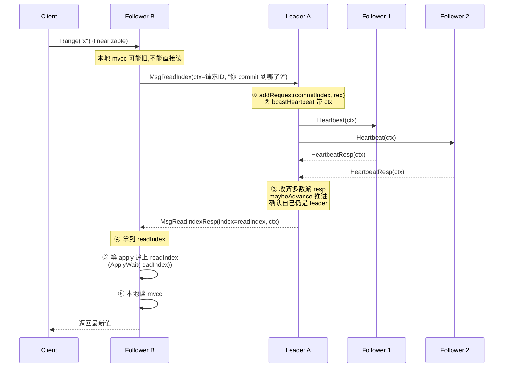
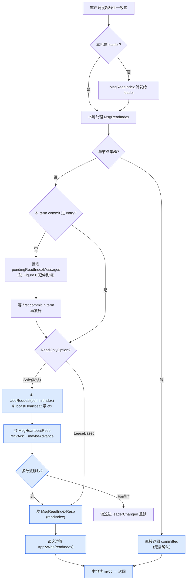

# 第九章 · 线性一致读与吞吐优化

> 篇:P2 写读路径·etcdserver
> 主线呼应:第 8 章把写路径拆透了——一条 `Put` 从 `processInternalRaftRequestOnce` 出发,序列化、`s.w.Register(id)`、`s.r.Propose(data)` 走 `propc`,经 Raft 复制、commit、apply 到 mvcc,最后 apply 协程 `s.w.Trigger(id, result)` 唤醒客户端,返回成功。**写要等 apply 才返回,所以写是天然线性一致的**——客户端看到"成功"那一刻,数据已经落进状态机,任何后续读到的一定包含它。但读呢?读不走 Raft 日志(读不 propose),那它凭什么也能线性一致?这一章讲的,就是读路径怎么在不进 Raft 日志的前提下,依然保证"读到的一定是最新已提交的值",以及 etcd 怎么把读写综合起来的吞吐拉起来。全书二分法在这一章有个精妙的体现:**写靠进 Raft 日志换线性一致,读靠"问 leader 当前 commit 到哪、leader 先确认自己还是 leader"换线性一致——两条路,同一个目的**。

## 核心问题

**写进了 Raft 日志,所以写线性一致;读不进 Raft 日志(否则每条读都成一轮共识,集群扛不住),那读凭什么也线性一致——不会读到旧 leader 的旧数据、不会读到已失权 leader 的数据?etcd 的 `ReadIndex` 凭什么对?`lease-based read` 快在哪、风险在哪?以及 pipeline propose、batch apply 怎么把读写综合的吞吐拉起来?**

读完本章你会明白:

1. 朴素读(直接读本机 mvcc)为什么**两种错**都犯:follower 读到旧值、自以为还是 leader 的失权节点读到旧数据。
2. **`ReadIndex`** 的两轮确认:leader 收到读请求先广播 heartbeat 收齐多数派 resp 确认自己仍是 leader,同时记下当前 `commitIndex` 作 read index,follower(或本地)等 apply 追上 read index 再读——凭什么这样读到的值一定包含所有"读发起前已 commit"的写。
3. **`lease-based read`** 用 leader 租约(`CheckQuorum` 保证 leader 近期联系过多数派)省掉那轮 heartbeat,快在哪、什么情况下会脑裂、为什么 etcd 默认不开。
4. **吞吐优化**:pipeline propose(`MaxInflightMsgs` 窗口)+ batch apply(一批 `CommittedEntries` 一次写 mvcc)怎么把共识+落地的综合吞吐拉起来,以及它们和读路径怎么共用同一套 channel 基础设施。

> **如果一读觉得太难**:先只记住三件事——① 写进 Raft 日志所以天然线性一致,读不进日志所以得额外做手脚;② etcd 默认用 `ReadIndex`:读前让 leader 发一轮 heartbeat 确认自己还是 leader,记下当前 commitIndex,等 apply 追上再本地读;③ `lease read` 把那轮 heartbeat 省了靠租约,更快但有时钟/调度风险,etcd 默认不开。pipeline 和 batch 是吞吐手段,不是正确性手段。

---

## 9.1 一句话点破

> **读不进 Raft 日志,所以读要单独换线性一致。换法是:让读先问 leader"你当前 commit 到哪个 index 了",leader 在回答前先用一轮 heartbeat 确认自己还是 leader(否则一个已失权的旧 leader 会给出过期的 index),拿到 read index 后,读这边等本地 apply 追上这个 index 再读 mvcc。这样读到的值,一定包含了所有"读发起前已 commit"的写——这就是 `ReadIndex`。`lease read` 把"确认自己还是 leader"那轮 heartbeat 换成"我租约期内默认我还是 leader",省一轮网络,快但有风险。**

这是结论,不是理由。本章倒过来拆:先看朴素读为什么错(两种错),再看 `ReadIndex` 凭什么对(两轮确认 + 等 apply),然后看 `lease read` 的取舍,最后看吞吐优化。

---

## 9.2 朴素读为什么错:两种错

### 先回顾:写为什么天然线性一致

第 8 章讲透了一件事:**写要走 Raft 日志,客户端要等 apply 才收到"成功"**。这意味着:

- 一条 `Put` 被多数派确认 commit → apply 到 mvcc → 唤醒客户端 → 客户端拿到"成功"。
- 在客户端拿到"成功"之前,这条写**可能**还没在多数派上 apply(但已 commit),但在 leader 上一定已 apply(`s.w.Trigger` 在 apply 之后)。
- 任何后续的写,都得排在这条写后面(Raft 日志全局有序)。

所以**写是线性一致的**:客户端看到"写成功"那一刻,这条写在 leader 的状态机里已经生效,且全局有序。后面任何读,只要也走"确认最新"的路径,就一定能读到它。

### 读不进 Raft 日志,会犯哪两种错

那读呢?最朴素的做法:**读请求直接读本机的 mvcc**。谁收到读就读谁。这会犯两种致命的错。

**错一:follower 读到旧值。**

假设 5 节点集群,leader 是 A。客户端写 `Put("x","v2")`,A 把它复制给 B、C、D、E,多数派(B、C)确认后 commit。A apply 后返回客户端"成功"。但此时 **B、C 可能还没 apply**(apply 是异步的,commit 和 apply 之间有窗口),D、E 可能连日志都还没收到(慢网络)。

这时客户端发 `Range("x")`,请求被负载均衡到了 **D**。D 本地 mvcc 里 `x` 还是旧值 `v1`(甚至没有)。D 直接读,返回 `v1`。

客户端前一秒刚写到 `v2`,后一秒读到 `v1`——**违反线性一致**。

> **不这样会怎样**:朴素地"谁收到读就读谁",follower 的 apply 永远滞后于 leader,读到的可能是任意旧的版本。线性一致要求"读到最新已提交的值",这条直接被破坏。

**错二:已失权的旧 leader 读到旧数据(更隐蔽、更致命)。**

这个比错一严重得多。假设 A 是 term 5 的 leader。网络分区:A 自己一组,B、C、D、E 五个里另外四个互通。B、C、D、E 凑够多数派,选出新 leader B(term 6),继续接受写。A 收不到多数派响应,**自认为还是 leader**(它不知道 term 已经涨到 6)。

这时客户端的读请求到了 A(可能客户端缓存还没更新 leader 地址)。A 本地 mvcc 里是 term 5 时的旧值——因为它在分区里,没收到 term 6 的任何写。A 直接读,返回旧值。

更糟的是,A 还会**接受写**(它自以为是 leader,会 propose),只是这些写永远凑不到多数派、永远 commit 不了(但客户端不知道,会超时)。而读,它直接返回本地旧值,客户端还以为读到的是最新。

这就是**脑裂期的脏读**:一个已经失权但自己不知道的旧 leader,用过期数据响应读。

> **钉死这件事**:朴素读的两种错——follower 读到旧值(apply 滞后)、失权旧 leader 读到旧数据(分区里自以为是 leader)。第二种尤其致命,因为它**看起来正常**(有个"leader"在响应),但读到的数据可能落后整个 term。线性一致读的核心,就是**堵住这两种错**。

---

## 9.3 ReadIndex:两轮确认换线性一致

### 它要解决什么问题

朴素读的两种错,根源是两个:**不知道当前真正的 leader 是谁、不知道当前真正的 commitIndex 是多少**。`ReadIndex` 同时解决这两个:让真正的 leader 报出它当前的 commitIndex,且 leader 在报之前先证明自己还是 leader。

### 不这样会怎样:把朴素读的两种错各打一遍补丁

如果只解决"follower 读到旧值":让读都转发给 leader,leader 报当前 commitIndex,读这边等 apply 追上再读。但**错二还在**——如果转发到的"leader"是失权的旧 leader 呢?它报的 commitIndex 是过期的(它不知道新 leader 已经 commit 了更新的写)。

所以必须再加一层:**leader 在报 commitIndex 之前,先确认自己还是 leader**。怎么确认?发一轮 heartbeat,收齐多数派的 resp——这跟选举的 quorum 是一回事(任意两个多数派必有交集,P0-01 讲过这条数学)。如果还能收齐多数派 heartbeat resp,说明自己至今仍是合法 leader(否则说明集群多数派已经不认我了,我应该下台)。

这就是 `ReadIndex` 的两轮:**(1) leader 确认自己还是 leader(发 heartbeat 收齐多数派 resp);(2) leader 记当前 commitIndex 作 read index,返回;读这边等 apply 追上 read index 再读**。

### 所以这样设计:ReadIndex 的完整流程

把流程画清楚。假设客户端把读发给了 follower B,真正的 leader 是 A:



六个步骤,每一步都在堵一个漏洞:

- **步骤①②**:leader 收到 `MsgReadIndex`,先记下"有一个读请求,它发起时的 commitIndex 是 X"(在 `readOnly` 结构里 `addRequest`),然后广播 heartbeat。这轮 heartbeat 的 `Context` 字段带着一个"我当前挂了多少个未确认读"的位置编号([`heartbeatCtx`](../etcd-raft/read_only.go#L93-L101))。
- **步骤③**:follower 收到 heartbeat 回 `MsgHeartbeatResp`(带同样的 ctx)。leader 每收一个 resp 就 `recvAck`([raft.go:1604](../etcd-raft/raft.go#L1604)),然后用 `maybeAdvance(r.trk.Voters)`([raft.go:1605](../etcd-raft/raft.go#L1605))判断"有多少个读被多数派确认了"。`maybeAdvance` 用 `quorum.JointConfig.CommittedIndex`([read_only.go:79-89](../etcd-raft/read_only.go#L79-L89))算——这跟 commit 一条日志用同一套 quorum 数学。确认后,leader 把 read index 通过 `MsgReadIndexResp` 发回。
- **步骤④⑤**:读这边拿到 read index。如果本机 apply 已经追上 read index,直接读;否则等 `ApplyWait(readIndex)`——这是按 index 等待 apply 进度的 channel 表(P2-07 的 `s.applyWait`)。
- **步骤⑥**:apply 追上了,本机 mvcc 一定包含到 read index 为止的所有写,本地读返回。

> **钉死这件事**:`ReadIndex` 的两轮,**第一轮是 leader 的自我确认(heartbeat + 多数派 resp),第二轮是 leader 报 commitIndex 给读这边**。两轮合起来,堵死了朴素读的两种错:第一轮堵"失权旧 leader"(它收不齐多数派 resp,要么下台、要么读这边超时重试);第二轮堵"follower 读到旧值"(读这边等 apply 追上 read index,read index 是真正 leader 当前的 commitIndex)。

### 凭什么对:线性一致的数学直觉

为什么这样读到的一定是"最新已提交的值"?把时序理一遍:

1. 读发起的那一刻(逻辑时间 t_read),leader 报出的 read index = X,意味着 **t_read 之前所有 commit 的写,index 都 ≤ X**(commitIndex 单调)。
2. 第一轮 heartbeat 收齐多数派 resp,说明 **t_read 那一刻,真正的 leader 就是这个 A**(否则 A 收不齐多数派)。
3. 读这边等 apply 追上 X 再读。apply 追上 X,意味着 **mvcc 里已经包含了 index ≤ X 的所有写**。
4. 所以读到的值,包含了 t_read 之前所有已 commit 的写——这正是线性一致的语义("读看到的结果,像所有操作作用在单一副本上,每个操作在发起之后、完成之前的某瞬间原子生效")。

> **不这样会怎样**:如果跳过第一轮(不确认 leader 身份),失权旧 leader 会报出过期 read index,读到旧值(错二)。如果跳过第二轮(不等 apply 追上 read index),就算 read index 是对的,本机 apply 可能还差一截,读到旧值(错一)。两轮一个都不能少。

---

## 9.4 源码:ReadIndex 在三仓里的真实走向

这一节把 `ReadIndex` 的源码串起来——它跨了 etcd 主仓(读循环、Range 入口)和 etcd-raft 仓(协议层处理)。**同名陷阱**:`etcd/server/etcdserver/raft.go` 是 etcd 对 raft 的封装(`raftNode`),`etcd-raft/raft.go` 是协议状态机本身。两仓都有 `raft.go`,分清。

### 入口:Range 的 linearizable 分支

`Range` 在 [`v3_server.go:106`](../etcd/server/etcdserver/v3_server.go#L106)。注意 `RangeRequest` 有个 `Serializable` 字段——客户端可以显式选"线性一致读"还是"串行读(直接读本机,可能旧)":

```go
// server/etcdserver/v3_server.go:138-153 (简化示意)
if !r.Serializable {
    err = s.read.LinearizableReadNotify(ctx)   // ★ 线性一致读:走 ReadIndex
    trace.Step("agreement among raft nodes before linearized reading")
    if err != nil {
        return nil, err
    }
}
// ... 鉴权 ...
get := func() { resp, _, err = txn.Range(ctx, s.Logger(), s.KV(), r, true) }  // 本地读 mvcc
if serr := s.doSerialize(ctx, chk, get); serr != nil { ... }
```

`!r.Serializable`(默认情况)时,先 `LinearizableReadNotify`——这就是"确认最新"的入口。**确认完之后,才本地 `txn.Range` 读 mvcc**。注意:**读本身不进 Raft 日志,进 Raft 日志的只是 ReadIndex 那个 `MsgReadIndex` 消息(它不是 entry,不复制、不 commit)**。这是读和写的根本区别。

### 读循环:LinearizableReadLoop

`LinearizableReadNotify` 不直接发 `MsgReadIndex`,而是"通知"那条专门的读循环。看 [`read/read.go:74`](../etcd/server/etcdserver/read/read.go#L74):

```go
// server/etcdserver/read/read.go:74-94 (简化示意)
func (r *Read) LinearizableReadNotify(ctx context.Context) error {
    r.mux.RLock()
    nc := r.notifier
    r.mux.RUnlock()

    select {
    case r.waitC <- struct{}{}:   // ★ 通知读循环"有读请求来了"
    default:                       // 已经有读在确认中,不用重复通知
    }

    select {
    case <-nc.c:                   // ★ 等读循环确认完"当前是线性一致的"
        return nc.err
    case <-ctx.Done():
        return ctx.Err()
    case <-r.server.Done():
        return errors.ErrStopped
    }
}
```

这个设计很巧:**多个并发的 Range 请求,共用一次 ReadIndex 确认**。`r.waitC` 是个缓冲 1 的 channel——一百个读同时来,只有第一个能塞进 `waitC`,其余的 `default` 跳过(因为已经有一次确认在路上了)。然后所有读都在自己的 `nc.c` 上等。读循环一次确认完,`nr.notify(nil)` 唤醒所有等着的读。**这是把 ReadIndex 的开销摊到多个读上的关键技巧**——不然每个读都单独跑一轮 heartbeat,集群扛不住。

读循环本体 [`LinearizableReadLoop`](../etcd/server/etcdserver/read/read.go#L96):

```go
// server/etcdserver/read/read.go:96-146 (简化示意,保留核心六步)
func (r *Read) LinearizableReadLoop() {
    for {
        leaderChangedNotifier := r.server.LeaderChanged()
        select {
        case <-leaderChangedNotifier:   // leader 变了,丢弃这次,重来
            continue
        case <-r.waitC:                  // ① 有读请求来了
        case <-r.server.Stopping():
            return
        }

        nextnr := newNotifier()
        r.mux.Lock()
        nr := r.notifier                 // ② 取出当前这批读的 notifier
        r.notifier = nextnr              //    换上新的给下一批
        r.mux.Unlock()

        confirmedIndex, err := r.requestCurrentIndex(leaderChangedNotifier)  // ③ 发 ReadIndex 拿 read index
        if err != nil {
            nr.notify(err)               // 失败,通知这批读重试
            continue
        }

        appliedIndex := r.server.AppliedIndex()
        if appliedIndex < confirmedIndex {   // ④ 本机 apply 还没追上 read index
            select {
            case <-r.server.ApplyWait(confirmedIndex):  // ⑤ 等 apply 追上
            case <-r.server.Stopping():
                return
            }
        }
        nr.notify(nil)                    // ⑥ 唤醒这批读:可以本地读了
    }
}
```

这六步,正是前面流程图里步骤 ④⑤⑥ 在 etcd 这一侧的落地。其中第③步 `requestCurrentIndex` 是真正发 `MsgReadIndex` 的地方,看它怎么发、怎么收响应([read.go:148-230](../etcd/server/etcdserver/read/read.go#L148-L230),简化):

```go
// server/etcdserver/read/read.go:148 (简化示意)
func (r *Read) requestCurrentIndex(leaderChangedNotifier <-chan struct{}) (uint64, error) {
    requestID := r.server.NextRequestID()
    err := r.sendReadIndex(requestID)   // ★ 调 raft.ReadIndex,内部发 MsgReadIndex
    // ...
    for {
        select {
        case rs := <-r.raft.ReadState():      // ★ 等 ReadState(含 read index)
            // 校验 rs.RequestCtx == requestID,防串
            return rs.Index, nil
        case <-leaderChangedNotifier:          // leader 变了,重来
            return 0, errors.ErrLeaderChanged
        case <-firstCommitInTermNotifier:      // 新 term 第一条 commit,重发
            // (旧 leader 刚当选可能还没 commit 本 term entry,ReadIndex 会被挂起,
            //  等到 first commit in term 再重发——防 ReadIndex 永远阻塞)
            err := r.sendReadIndex(...)
            continue
        case <-retryTimer.C:                   // 超时重试
            err := r.sendReadIndex(...)
            continue
        }
    }
}
```

这里有几个细节值得点出:

- **`requestID` 作 ctx**:`MsgReadIndex` 的 `Entries[0].Data` 带上 requestID(8 字节大端),响应回来时校验。防止"一次旧的 ReadIndex 响应被当成这次的"——这是并发读确认时的身份校验。
- **`leaderChangedNotifier`**:`EtcdServer` 有个 `leaderChanged *notify.Notifier`([server.go:236](../etcd/server/etcdserver/server.go#L236)),leader 一变就广播。读循环收到这个信号立刻丢弃当前确认(因为确认基于的 leader 已经不是 leader 了),重新来。这是堵"失权旧 leader"的客户端侧补丁——即使协议层那轮 heartbeat 没发现问题,leader 变了也要重来。
- **`firstCommitInTermNotifier`**:这是 etcd-raft 的一个细节——新当选的 leader **在 commit 本 term 第一条 entry 之前,不能响应 ReadIndex**([raft.go:1363-1368](../etcd-raft/raft.go#L1363-L1368),`committedEntryInCurrentTerm` 检查,防 Figure 8 的 commit 陷阱延伸到读)。所以新 leader 刚上任时,ReadIndex 会被挂起在 `pendingReadIndexMessages` 里([raft.go:1366](../etcd-raft/raft.go#L1366)),等本 term 第一条 commit 才放行。读循环这边等 `firstCommitInTermNotify`,一收到就重发 ReadIndex。

### 协议层:leader 怎么处理 MsgReadIndex

`r.raft.ReadIndex(ctx, rctx)` 在 [`etcd-raft/node.go:614`](../etcd-raft/node.go#L614) 就是 `step(ctx, MsgReadIndex{Entries:[{Data:rctx}]})`。它被送进 Raft 状态机。

**如果本机是 follower**([raft.go:1764-1770](../etcd-raft/raft.go#L1764-L1770),`stepFollower`):

```go
// etcd-raft/raft.go:1764 (简化示意)
case pb.MsgReadIndex:
    if r.lead == None {
        return nil  // 没 leader,丢
    }
    m.To = new(r.lead)
    r.send(m)       // ★ 转发给真正的 leader
```

follower 自己不处理,把 `MsgReadIndex` 转发给 leader。这对应流程图里"B 把读转发给 A"。

**如果本机是 leader**([raft.go:1354-1372](../etcd-raft/raft.go#L1354-L1372),`stepLeader`):

```go
// etcd-raft/raft.go:1354-1372 (简化示意)
case pb.MsgReadIndex:
    // 单节点集群特判(只有一个 voter,不用确认)
    if r.trk.IsSingleton() {
        if resp := r.responseToReadIndexReq(m, r.raftLog.committed); resp.GetTo() != None {
            r.send(resp)
        }
        return nil
    }
    // ★ 关键:本 term 还没 commit 过任何 entry,挂起(防 Figure 8 延伸到读)
    if !r.committedEntryInCurrentTerm() {
        r.pendingReadIndexMessages = append(r.pendingReadIndexMessages, m)
        return nil
    }
    sendMsgReadIndexResponse(r, m)   // ★ 真正处理
```

`sendMsgReadIndexResponse` 是核心([raft.go:2146-2162](../etcd-raft/raft.go#L2146-L2162)):

```go
// etcd-raft/raft.go:2146-2162 (简化示意)
func sendMsgReadIndexResponse(r *raft, m *pb.Message) {
    switch r.readOnly.option {
    case ReadOnlySafe:                                 // ★ 默认走这条
        r.readOnly.addRequest(r.raftLog.committed, m)  // ① 记下"这个读,commitIndex=X"
        r.readOnly.recvAck(r.id, r.readOnly.heartbeatCtx())  // ② leader 自己先 ack 一票
        r.bcastHeartbeat()                             // ③ 广播 heartbeat(带 ctx)
    case ReadOnlyLeaseBased:
        // lease read:不等 heartbeat,直接返回(下一节详讲)
        if resp := r.responseToReadIndexReq(m, r.raftLog.committed); resp.GetTo() != None {
            r.send(resp)
        }
    }
}
```

注意 ①②:`addRequest` 把"这个读请求 + 当时的 commitIndex"挂进 `readOnly.unconfirmedReads`([read_only.go:60-62](../etcd-raft/read_only.go#L60-L62));leader 自己也算一票,所以 `recvAck(r.id, ...)` 先给自己记一票。然后 `bcastHeartbeat`——这一轮 heartbeat 就是"确认我还是 leader"的第一轮。

**leader 收齐 heartbeat resp**([raft.go:1579-1610](../etcd-raft/raft.go#L1579-L1610)):

```go
// etcd-raft/raft.go:1600-1610 (简化示意)
case pb.MsgHeartbeatResp:
    // ... 处理复制进度 ...
    if r.readOnly.option != ReadOnlySafe || len(m.GetContext()) == 0 {
        return nil
    }
    r.readOnly.recvAck(m.GetFrom(), m.GetContext())      // ★ 记下这个 follower 的 ack
    rss := r.readOnly.maybeAdvance(r.trk.Voters)         // ★ 看看有没有读被多数派确认了
    for _, rs := range rss {
        if resp := r.responseToReadIndexReq(rs.req, rs.index); resp.GetTo() != None {
            r.send(resp)                                  // ★ 把 MsgReadIndexResp 发回给请求方
        }
    }
```

`maybeAdvance` 用 `quorum.JointConfig.CommittedIndex(ro)`([read_only.go:79-89](../etcd-raft/read_only.go#L79-L89))算"有多少个读被多数派确认"。这跟 commit 一条日志用同一套 quorum 数学——只不过这里确认的是"读请求的位置编号",而不是"日志 index"。

> **钉死这件事(源码事实,已修正印象)**:新版 etcd-raft(@`39eb80a`)的 `readOnly` 结构**不是**老的 `ctx → acks map` 版本,而是用 `unconfirmedReads []*readIndexRequest` + `confirmedReads uint64` 计数,heartbeat 的 `Context` 是"当前未确认读的位置编号"的小端编码([`heartbeatCtx`](../etcd-raft/read_only.go#L93-L101))。`maybeAdvance` 靠 `quorum.JointConfig.CommittedIndex` 算出"被多数派确认到第几个",一次推进多个读。这是一次**批量化优化**:多个读挂一批 heartbeat 上,一次 quorum 确认放行一批——比"每个读单独一轮 heartbeat"高效得多。同时,新版 etcd 把读循环从 `server.go` 的 `linearizableReadLoop` 重构到了独立的 [`read/read.go`](../etcd/server/etcdserver/read/read.go),由 [`server.go:537`](../etcd/server/etcdserver/server.go#L537) 的 `s.GoAttach(s.read.LinearizableReadLoop)` 启动。读者若看老资料(2023 前)讲 `linearizableReadLoop` 在 server.go,那是对老版本的描述。

### responseToReadIndexReq:本地读 vs 转发读

最后一个细节:leader 处理完 ReadIndex,要把 read index 告诉请求方。但请求方可能是 follower(转发来的),也可能是 leader 自己(本地读)。[`responseToReadIndexReq`](../etcd-raft/raft.go#L2072-L2088) 区分这两种:

```go
// etcd-raft/raft.go:2072-2088 (简化示意)
func (r *raft) responseToReadIndexReq(req *pb.Message, readIndex uint64) *pb.Message {
    if req.GetFrom() == None || req.GetFrom() == r.id {
        // ★ 请求来自 leader 本地:不发包,直接塞进 readStates(经 Ready.ReadStates 出去)
        r.readStates = append(r.readStates, ReadState{
            Index:      readIndex,
            RequestCtx: req.GetEntries()[0].GetData(),
        })
        return &pb.Message{}   // 空消息,不发
    }
    // ★ 请求来自 follower:发 MsgReadIndexResp 回去
    return &pb.Message{
        Type:    pb.MsgReadIndexResp.Enum(),
        To:      req.From,
        Index:   new(readIndex),
        Entries: req.GetEntries(),
    }
}
```

本地读时,`readStates` 会经 `Ready.ReadStates` 吐给上层,`raftNode.start` 把它送进 `readStateC`([raft.go:211](../etcd/server/etcdserver/raft.go#L211)),读循环从 `r.raft.ReadState()` 收。follower 读时,follower 收到 `MsgReadIndexResp` 后也塞进自己的 `readStates`([raft.go:1776](../etcd-raft/raft.go#L1776))——同样路径出去。**两种情况最后都汇到 `readStateC`,读循环一视同仁**。

---

## 9.5 lease-based read:省一轮 heartbeat 的取舍

`ReadIndex` 安全,但慢——每次(每批)读要一轮 heartbeat 往返(leader 广播 → follower resp → leader 收齐)。heartbeat 间隔通常 100ms 级,这一轮至少几十毫秒。能不能省掉?

### 它要解决什么问题

`lease-based read`(租约读)的核心想法:**如果 leader 有一个"租约",租约期内它可以默认自己还是 leader,不用每次读都发 heartbeat 确认**。租约怎么来?靠 `CheckQuorum`:leader 定期(每个 heartbeat 间隔)主动确认自己还能联系到多数派,联系不到就下台。只要"上次成功 checkQuorum 到现在"的时间 < 一个租约期,leader 就可以认为"我租约期内,不会有人能选出新 leader"(因为新 leader 要多数派投票,而多数派里至少有一个节点近期还跟我通过气,它不会给新 leader 投票——一个 term 一票)。

### 所以这样设计:ReadOnlyLeaseBased

回看 `sendMsgReadIndexResponse` 的 `ReadOnlyLeaseBased` 分支([raft.go:2157-2161](../etcd-raft/raft.go#L2157-L2161)):

```go
case ReadOnlyLeaseBased:
    if resp := r.responseToReadIndexReq(m, r.raftLog.committed); resp.GetTo() != None {
        r.send(resp)   // ★ 直接返回 read index,不发 heartbeat!
    }
```

**省掉了 `addRequest` + `bcastHeartbeat` 那一轮**。leader 直接把当前 commitIndex 当 read index 返回。快——一轮网络都没有(本地读)或一轮单向网络(follower 转发)。

凭什么对?靠两条:

1. **`CheckQuorum`**:leader 每个 tick 主动确认还能联系多数派,联系不到就下台。这保证了"如果我还是 leader,我近期一定联系过多数派"。
2. **时钟假设**:leader 的"租约期"是基于本地时钟的(从上次成功 checkQuorum 开始算,过一个 election timeout)。这假设 leader 的时钟不会大跳跃、leader 不会被长时间挂起(STW GC、调度抖动)。

### 风险:租约过期却自以为没过期

`lease read` 的风险就在第 2 条。假设 leader 因为长时间 STW(比如 Go GC stop-the-world 10 秒)被挂起,期间:

- leader 本地时钟没走(挂起了),它醒来后以为"我才过了一小会儿,租约还在"。
- 但真实时间里,10 秒过去了,follower 早就超时发起选举,选出了新 leader(term 涨了),新 leader 接受了写。
- 旧 leader 醒来,用本地过期 mvcc 响应 lease read——**脑裂期脏读**。

这就是 lease read 的致命弱点:**它依赖时钟和调度的"合理"行为**。在时钟飘移、长时间 GC、内核调度抖动下,租约算法可能失效。

> **不这样会怎样**:如果时钟/调度不靠谱——
> - 长时间 STW:leader 醒来租约算错,脑裂期脏读。
> - 时钟跳跃(比如 NTP 跳变):租约期突然变长或变短,安全性破坏。
> - CPU 被抢走:leader 没法及时 checkQuorum,租约早过期了它还在用。
>
> 这就是为什么 Raft 论文和 etcd 都强调:**lease read 是性能优化,但它的安全性依赖于时钟假设,不如 ReadIndex 严格**。在时钟/调度可控的环境(比如 Kubernetes 的稳定节点),lease read 是安全的;在不可控环境,ReadIndex 更稳。

### etcd 的选择:默认 ReadOnlySafe

看 etcd 的 raft 配置([`bootstrap.go:540-552`](../etcd/server/etcdserver/bootstrap.go#L540-L552)):

```go
// server/etcdserver/bootstrap.go:540-552 (简化示意)
func raftConfig(cfg config.ServerConfig, id uint64, s *raft.MemoryStorage) *raft.Config {
    return &raft.Config{
        ID:              id,
        ElectionTick:    cfg.ElectionTicks,
        HeartbeatTick:   1,
        Storage:         s,
        MaxSizePerMsg:   maxSizePerMsg,
        MaxInflightMsgs: maxInflightMsgs,
        CheckQuorum:     true,      // ★ 强制开 checkQuorum(lease read 的前提)
        PreVote:         cfg.PreVote,
        // ReadOnlyOption 未设,零值 = ReadOnlySafe
    }
}
```

**etcd 默认 `ReadOnlyOption = ReadOnlySafe`(零值)**,即默认走 ReadIndex。`CheckQuorum` 强制开(这本身是 lease read 的前提,也是防"孤岛 leader"的护栏——即使不开 lease read,checkQuorum 也能让长时间联系不到多数派的 leader 主动下台,避免它继续接受注定 commit 不了的写)。

> **钉死这件事**:etcd **默认用 ReadIndex,不开 lease read**。这是 etcd 团队的安全取舍——宁可读慢一点(一轮 heartbeat),也不要冒时钟/调度导致的脑裂风险。lease read 在 etcd-raft 协议仓里**实现了**(ReadOnlyLeaseased 分支),但 etcd 主仓不默认启用。这也是为什么看 etcd 生产实践,绝大多数读延迟在几十毫秒级——那一轮 heartbeat 是省不掉的代价。CockroachDB 这类对延迟敏感的系统,会自实现更严格的 lease 机制(基于 HLC 时钟 + leader epoch)来安全地用 lease read,etcd 没走到那一步。

---

## 9.6 吞吐优化:pipeline propose 与 batch apply

讲完了读,这一节看吞吐。etcd 的吞吐优化不是某一个银弹,而是几条线的叠加:**pipeline propose** 让写不必等前一条 commit 才发下一条、**batch apply** 让一批 entry 一次写 mvcc、**读摊批**让多个读共用一次 ReadIndex 确认。前两个是写路径的优化,第三个是读路径的优化(9.4 节已讲)。

### pipeline propose:MaxInflightMsgs 窗口

朴素复制:leader 发一条 AppendEntries 给 follower,等 follower ack,再发下一条。这是 stop-and-wait,每条写的延迟 = 一个 RTT。慢。

Raft 的优化:**流水线复制**——leader 不等 follower ack,连发多条 AppendEntries(只要 follower 的"窗口"没满)。follower 的复制进度靠 `ProgressTracker` 追踪,窗口靠 `inflights` 环形缓冲控。看 [`inflights.go`](../etcd-raft/tracker/inflights.go#L28-L40):

```
Inflights 环形缓冲(tracker/inflights.go:28)
┌──────────────────────────────────────────────────────────┐
│  start ──▶ [inflight][inflight][inflight][   ][   ][   ]  │
│            └─ 已发未 ack    │             └─ 空位(可继续发)│
│            count = 3                                       │
│            size  = 6 (窗口上限)                            │
└──────────────────────────────────────────────────────────┘
  leader 发一条 → Add(index) → count++
  follower ack 到 index N → FreeLE(N) → 从 start 起所有 ≤N 的出窗,count--
  Full()(count==size 或 bytes 满)→ 停止发,等 ack 释放窗口
```

`Inflights` 是个环形缓冲:`start` 指向最早一条未确认的,`count` 是当前在飞的数量,`size` 是窗口上限。`Add` 加一条(发新 AppendEntries 时调),`FreeLE` 释放所有 ≤ 某 index 的(follower ack 时调)。`Full()` 判断窗口满没满——满了 leader 就不再发(`maybeSendAppend` 会 pause 这个 follower)。

etcd 的窗口大小:[`maxInflightMsgs = 4096 / 8 = 512`](../etcd/server/etcdserver/raft.go#L41)([`raft.go:38-41`](../etcd/server/etcdserver/raft.go#L38-L41))。意味着 leader 可以同时有 512 条 AppendEntries 在路上,不必等 ack。这把复制的吞吐从"每 RTT 一条"提升到"每 RTT 512 条 × 网络带宽"。

> **不这样会怎样**:如果 `MaxInflightMsgs = 1`(stop-and-wait)——每条写要等一个 RTT(跨机房可能几十毫秒),吞吐被 RTT 卡死。512 的窗口让复制流水线化,吞吐提升数百倍。但窗口也不能无限大:太大,leader 内存占用高(缓冲所有在飞 entry),且 follower 崩溃时要重传的量也大。512 是 etcd 团队在内存占用和吞吐之间的折中。

### batch apply:一批 entry 一次写 mvcc

apply 侧也有优化。`raftNode.start` 收到 `Ready`,把 `CommittedEntries`(一批已 commit 的 entry)整体丢进 `applyc`(P2-07 讲透了这个 channel)。apply 协程拿到这批,**不是一条一条写 mvcc,而是攒成一批一次写**。看 [`applyEntries`](../etcd/server/etcdserver/server.go#L1174):

```go
// server/etcdserver/server.go:1174-1198 (简化示意)
func (s *EtcdServer) applyEntries(ep *etcdProgress, apply *toApply) {
    if len(apply.entries) == 0 {
        return
    }
    // ... 边界检查 ...
    var ents []*raftpb.Entry
    if ep.appliedi+1-firsti < uint64(len(apply.entries)) {
        ents = apply.entries[ep.appliedi+1-firsti:]
    }
    // ...
    s.apply(ents, ep, apply.raftAdvancedC)   // ★ 把整批 ents 一次 apply
}
```

`s.apply(ents, ...)`([server.go:1881](../etcd/server/etcdserver/server.go#L1881))把这一批 entry 一起处理:每条 entry 反序列化成 `InternalRaftRequest`,按 oneof 分发(Put/DeleteRange/Txn/...),最终写进 mvcc。mvcc 的写是 `TxnWrite`——一个事务批量写多个 key(P3-11 详讲)。一个 raft batch → 一个 mvcc 事务 → 一次 bbolt commit。**这是把 raft 的批量传导到存储层**。

为什么这能提升吞吐?因为 bbolt 的 commit 是昂贵的(COW + fsync,毫秒级)。如果每条 entry 单独 commit,bbolt 的开销会被放大 N 倍。攒批 commit,把 N 次 fsync 摊成 1 次。

> **反面对比**:朴素实现"apply 一条 entry 调一次 mvcc 写、commit 一次 bbolt"——100 条 entry 要 100 次 fsync,每次 5ms 就是 500ms。攒批后,100 条 entry 一个事务、一次 fsync,5ms 搞定。**这是 etcd 在写密集场景下吞吐能上千 TPS 的关键**(没有攒批,bbolt 的 fsync 会把吞吐压到几十 TPS)。

### apply 完触发读:applyWait 的桥梁

batch apply 还顺带解决了读路径的等待问题。回想 9.4 节,读循环拿到 read index 后要等 `ApplyWait(readIndex)`。`ApplyWait` 就是 `s.applyWait.Wait(index)`([server.go:633](../etcd/server/etcdserver/server.go#L633))——在 `s.applyWait` 这张按 index 的 channel 表上挂一个 channel。apply 协程每 apply 完一批,`s.applyWait.Trigger(ep.appliedi)`([server.go:978](../etcd/server/etcdserver/server.go#L978))唤醒所有等 ≤ appliedi 的读。

> **钉死这件事**:`applyWait` 是写路径(apply)和读路径(等 read index)的交汇点。apply 批量推进,读请求按需等待,两者通过这个 channel 表解耦。这是为什么 P2-07 把 `applyWait` 单独列出来——它不只是写路径客户端等待用,更是读路径线性一致等待的基础设施。

---

## 9.7 技巧精解:ReadIndex 的正确性 + lease read 的取舍

这一章有两个硬核技巧,单独拆透。

### 技巧一:ReadIndex 凭什么对——朴素读两种错的精确堵漏

这是这一章最核心的技巧。朴素读犯两种错:`(A) follower 读到旧值`、`(B) 失权旧 leader 读到旧数据`。ReadIndex 用两轮分别堵:

| 漏洞 | 朴素读会怎样 | ReadIndex 怎么堵 | 凭什么堵住 |
|------|-------------|-----------------|-----------|
| (A) follower apply 滞后 | 直接读 mvcc,读到旧值 | 等 apply 追上 read index 再读 | read index 是真正 leader 的当前 commitIndex,apply 追上它,本机一定包含到这为止的所有写 |
| (B) 失权旧 leader | 它报的 read index 过期,读到旧值 | leader 报 read index 前先发 heartbeat 收齐多数派 resp | 多数派 resp 说明"我至今仍是合法 leader"——失权旧 leader 收不齐(resp 来自真正多数派),要么下台、要么读这边 leaderChanged 重来 |

两轮**互为补丁,缺一不可**:

- 只有第二轮(等 apply 追上 read index)没有第一轮(确认 leader):read index 可能来自失权旧 leader,过期——错 (B) 没堵住。
- 只有第一轮没有第二轮:就算 leader 是真的,本机 apply 可能还差一截,读到旧值——错 (A) 没堵住。

**还有一个常被忽视的第三层防护**:`committedEntryInCurrentTerm` 检查([raft.go:1365](../etcd-raft/raft.go#L1365))。新当选的 leader 在 commit 本 term 第一条 entry 之前,所有 ReadIndex 请求都被挂起在 `pendingReadIndexMessages` 里。为什么?因为 Figure 8 陷阱(commit 旧 term entry 不安全,P1-04 讲过)同样延伸到读:新 leader 如果直接报当前 commitIndex,这个 commitIndex 可能是基于旧 term 的 entry 算的,可能被推翻。必须先 commit 一条本 term 的 entry,"锁住"当前 commitIndex 的安全性,才能安全地用它做 read index。这是 Raft safety 在读路径上的延伸——**读的 safety,建立在写的 safety(Figure 8)之上**。



这张图把 ReadIndex 的所有分支画全了。三条关键路径:

1. **默认路径(Safe)**:heartbeat → quorum 确认 → 返回 readIndex → 等 apply → 读。
2. **挂起路径**:新 leader 本 term 没 commit 过 → 挂起 → 等 first commit in term 放行。
3. **lease 路径**:省 heartbeat,直接返回 readIndex(有风险)。

> **反面对比**:如果去掉任何一个防护——
> - 去掉"确认 leader"(用 lease read 但时钟不靠谱):错 (B) 回来,脑裂期脏读。
> - 去掉"等 apply 追上 read index":错 (A) 回来,follower 读到旧值。
> - 去掉"committedEntryInCurrentTerm"检查:Figure 8 陷阱延伸到读,新 leader 可能基于不安全的 commitIndex 响应读。
>
> 三层防护,层层叠加,才把"读不进 Raft 日志"这个先天劣势补齐到线性一致。这就是为什么 ReadIndex 看着简单(就两轮),实现里却有那么多边界条件——每个边界条件都在堵一个具体的漏洞。

### 技巧二:lease read 的取舍——快一格,险一分

lease read 的取舍,本质是**用时钟假设换网络往返**。

**省了什么**:Safe 模式下,每批读要一轮 heartbeat(leader 广播 → follower resp → leader 收齐)。这一轮是一个 RTT,跨机房几十毫秒。Lease 模式省掉它,读延迟降到"本地读 mvcc"(微秒级)或"一轮单向转发"(follower → leader → follower,一个 RTT 但不必等 quorum)。

**凭什么对**:靠 `CheckQuorum` + 时钟假设。`CheckQuorum` 让 leader 每个 tick 主动确认联系得到多数派,联系不到就下台。由此推出:如果 leader 还活着且租约期内,那它近期联系过多数派,而多数派里至少有一个节点在"一个 term 一票"规则下不会给新 leader 投票——所以不可能有新 leader 选出来,旧 leader 的租约有效。

**风险在哪**:这条推理依赖"leader 的时钟大致准、leader 不会被长时间挂起"。但真实世界里:

- **Go GC STW**:Go 的 stop-the-world(尤其老版本或大堆)可能几百毫秒到几秒。期间 leader 挂起,醒来以为租约还在,其实早过期。
- **内核调度抖动**:在 CPU 紧张的节点上,leader 协程可能被调度器抢走几百毫秒。
- **时钟跳跃**:NTP 校时、VM 迁移可能导致时钟跳变,租约算法算错。

任何一个发生,lease read 都可能脑裂期脏读。

> **钉死这件事**:lease read 不是"不安全",而是"安全性依赖于额外假设(时钟/调度合理)"。在假设成立的环境(比如裸机、稳定节点、低 GC 压力),它安全且快。在假设可能不成立的环境(VM、容器、大堆 GC),它有脑裂风险。etcd 的选择是**默认不开**——宁可慢一点(ReadIndex),也不冒这个险。这是工程上的稳健取舍。TiKV、CockroachDB 这些对延迟极敏感的系统,会用更复杂的 lease 机制(多副本 lease、基于 HLC 的 epoch lease)来安全地用 lease read;etcd 作为配置中心,对延迟不极致敏感,ReadIndex 够用。
>
> **反面对比**:如果 etcd 默认开 lease read——在稳定的裸机集群上读延迟能从几十毫秒降到亚毫秒,但在 GC 抖动或调度紧张时,偶尔会脑裂期脏读。对 Kubernetes 的配置中心场景,这种偶发脏读是灾难性的(调度器可能基于旧数据做决策)。所以 etcd 团队选了稳。

---

## 章末小结

这一章把读路径拆透了。写要进 Raft 日志,所以写天然线性一致;读不进 Raft 日志(否则每条读都成一轮共识,集群扛不住),所以读要**单独换**线性一致。换法是 ReadIndex:leader 先确认自己还是 leader(一轮 heartbeat + 多数派 resp),再报当前 commitIndex 作 read index,读这边等 apply 追上 read index 再本地读。lease read 把那轮 heartbeat 省了靠租约,快但有风险,etcd 默认不开。

答案浓缩成三条:

1. **朴素读两种错**:(A) follower 读到旧值(apply 滞后)、(B) 失权旧 leader 读到旧数据(分区里自以为是 leader)。ReadIndex 用两轮分别堵。
2. **ReadIndex 的正确性**:第一轮确认 leader 身份(quorum heartbeat),第二轮等 apply 追上 read index。加上 `committedEntryInCurrentTerm`(防 Figure 8 延伸到读)、`leaderChanged`(客户端侧补丁)、读摊批(多个读共用一次确认),把"读不进日志"的劣势补齐到线性一致。
3. **吞吐优化**:pipeline propose(`MaxInflightMsgs=512` 窗口,复制流水线化)、batch apply(一批 entry 一次 mvcc 事务、一次 fsync)、读摊批(多个读共用一轮 ReadIndex)。三者叠加,把共识+落地的综合吞吐拉起来。

回到二分法:**这一章服务"衔接"那一面**——读路径横跨协议层(`MsgReadIndex`/heartbeat quorum 确认在 etcd-raft 仓)和应用层(等 apply、本地读 mvcc 在 etcd 主仓),`read/read.go` 的读循环和 `raftNode` 的 `readStateC` 是衔接点。它和写路径(P2-08)对称:**写靠进 Raft 日志换线性一致,读靠"问 leader + 等 apply"换线性一致**。两条路,同一个目的——线性一致。

### 五个"为什么"清单

1. **为什么读不能像写那样进 Raft 日志?** 每条读都成一轮共识(propose → 复制 → commit → apply),集群扛不住——共识的代价是毫秒级延迟和有限的 TPS。读远多于写(典型 10:1),全进日志集群直接打爆。读要不进日志也线性一致,只能"问 leader + 等 apply"——开销是一轮 heartbeat,远小于一轮共识。

2. **为什么 ReadIndex 要两轮,一轮不行?** 一轮(只确认 leader,或只等 apply)堵不住朴素读的两种错。第一轮(heartbeat quorum)堵"失权旧 leader"(它收不齐多数派 resp),第二轮(等 apply 追上 read index)堵"follower 读到旧值"。两轮互为补丁,缺一不可。再加上 `committedEntryInCurrentTerm` 防 Figure 8 延伸,共三层防护。

3. **为什么 leader 在本 term commit 第一条 entry 之前要挂起 ReadIndex?** Figure 8 陷阱(P1-04 讲过)同样延伸到读:新 leader 直接报当前 commitIndex,这个 index 可能基于旧 term entry,可能被推翻。必须先 commit 一条本 term entry 锁住安全性。这是 Raft safety 在读路径上的体现——**读的 safety 建立在写的 safety 之上**。

4. **为什么 lease read 快但有风险,etcd 默认不开?** lease read 省掉那轮 heartbeat(leader 靠租约默认自己还是 leader),快。但它的安全性依赖"leader 时钟准、不被长时间挂起"——GC STW、调度抖动、时钟跳跃都可能让租约算法失效,脑裂期脏读。etcd 默认 ReadOnlySafe(默认走 ReadIndex),宁可慢一点也不冒这个险。`CheckQuorum` 强制开,既是 lease read 的前提,也是防孤岛 leader 的护栏。

5. **为什么 pipeline propose 和 batch apply 能大幅提升吞吐?** pipeline 让复制流水线化(`MaxInflightMsgs=512` 窗口,不必等 ack 连发 512 条),把复制延迟从"每条一个 RTT"降到"每 512 条一个 RTT"。batch apply 把一批 raft entry 攒成一个 mvcc 事务、一次 bbolt fsync,把存储开销摊薄。两者叠加,etcd 写吞吐能上千 TPS——没有它们,bbolt 的 fsync 会把吞吐压到几十 TPS。

### 想继续深入往哪钻

- 读循环完整源码:[`server/etcdserver/read/read.go`](../etcd/server/etcdserver/read/read.go)(整个文件就一百多行,是这一章的核心)。配合 [`server.go:537`](../etcd/server/etcdserver/server.go#L537) 的启动、[`v3_server.go:138`](../etcd/server/etcdserver/v3_server.go#L138) 的 `Range` 入口对照读。
- 协议层 ReadIndex:[`etcd-raft/read_only.go`](../etcd-raft/read_only.go)(整个文件,新版结构 `readOnly`/`unconfirmedReads`/`maybeAdvance`/`heartbeatCtx`)+ [`etcd-raft/raft.go`](../etcd-raft/raft.go) 的 `MsgReadIndex`(:1354)、`MsgHeartbeatResp`(:1579)、`sendMsgReadIndexResponse`(:2146)、`responseToReadIndexReq`(:2072)、`committedEntryInCurrentTerm`(:2066)。
- pipeline 窗口:[`etcd-raft/tracker/inflights.go`](../etcd-raft/tracker/inflights.go)(环形缓冲)+ [`etcd/server/etcdserver/raft.go:38-41`](../etcd/server/etcdserver/raft.go#L38-L41)(`maxInflightMsgs=512`)。
- 想看 Figure 8 延伸到读的原始论述:Raft 论文 Section 6("Correctness")和 11("Latency-critical read"),以及 etcd-raft 的 `pendingReadIndexMessages` 设计(就是为此而生)。
- 想看其他系统怎么做 lease read:TiKV 的"multi-raft + per-region leader lease + HLC"、CockroachDB 的 epoch lease。它们比 etcd 单层 lease 更复杂,但能在多 region 环境安全地用 lease read。

### 引出下一章

第 2 篇(写读路径)到此结束。我们已经讲透:一条 `Put` 怎么从 gRPC 进来、怎么 propose 进 Raft、怎么被多数派复制 commit、怎么 apply 到 mvcc(P2-07/08),以及读怎么在不进日志的前提下也线性一致、读写综合怎么拉吞吐(P2-09)。但 apply 把 entry 落到的那个"mvcc",到底是个什么结构?为什么 etcd 不存"当前值",而存"全部历史"?全局单调递增的 revision、treeIndex 的 keyIndex 版本链、watch 凭什么基于 revision?下一章 P3-10,我们钻进存储层,从 revision 与 treeIndex 讲起,正式进入第 3 篇:存储 mvcc,多版本的世界。
